# 动画性能优化

动画性能优化是现代 Web 开发的核心技能。本文档深入讲解浏览器渲染原理、合成层机制、性能瓶颈分析、优化策略以及最佳实践，帮助开发者创建流畅、高效的动画效果。

## 背景与动机

### 为什么需要动画性能优化？

在现代 Web 应用中，动画已经成为用户体验的重要组成部分。然而，低性能的动画会导致一系列严重问题：

- **用户体验下降**：卡顿的动画让用户感到烦躁，直接影响用户留存率
- **设备耗电增加**：CPU/GPU 高负载运行消耗更多电量，对移动设备尤为致命
- **移动端性能问题**：低端设备上表现尤为明显，可能导致应用完全不可用
- **SEO 排名下降**：Core Web Vitals 指标（如 CLS、INP）直接影响搜索排名
- **可访问性障碍**：不当的动画可能影响前庭功能障碍用户的正常使用

### 性能目标

| 指标 | 目标值 | 说明 |
|------|--------|------|
| **FPS** | ≥ 60 | 每帧 ≤ 16.67ms，保证流畅动画 |
| **INP** | < 200ms | 交互到下一次绘制的延迟，影响交互响应 |
| **CLS** | < 0.1 | 累积布局偏移，避免视觉跳动 |
| **GPU 内存** | 合理控制 | 避免过度消耗设备资源 |
| **TBT** | < 200ms | 总阻塞时间，影响页面可交互性 |

### 渲染管线全局视图

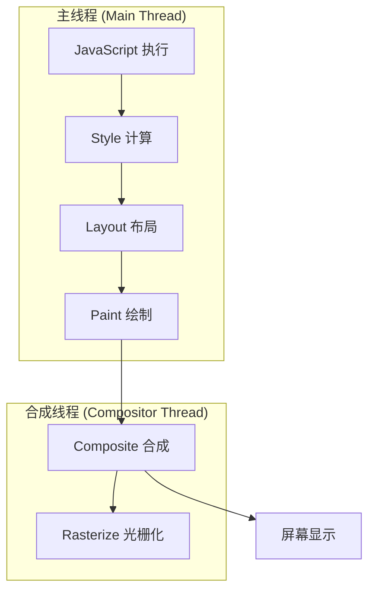

> **关键洞察**：理解渲染管线是性能优化的基础。我们的目标是尽可能跳过 Layout 和 Paint 阶段，让动画只在 Composite 阶段完成。

---

## 核心概念：渲染管线

### 浏览器渲染流程

浏览器将 HTML、CSS 转换为屏幕像素的过程称为**渲染管线**（Rendering Pipeline），包含五个主要阶段：

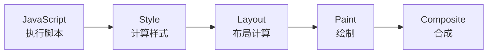

### 渲染阶段详解

| 阶段 | 说明 | 触发条件 | 性能影响 | 耗时占比 |
|------|------|----------|----------|----------|
| **JavaScript** | 执行 JS 代码，可能改变 DOM 或样式 | 脚本执行、事件处理 | 中 | ~10% |
| **Style** | 计算元素的最终样式值（Style Calculation） | DOM/样式变化 | 低 | ~5% |
| **Layout** | 计算元素的位置和尺寸（也叫 Reflow） | 几何属性变化 | **高** | ~30% |
| **Paint** | 将元素绘制到位图（Rasterize） | 视觉属性变化 | 中-高 | ~25% |
| **Composite** | 将图层合并到屏幕 | 图层变化 | 低 | ~5% |

### 三种渲染路径

当 CSS 属性变化时，浏览器会选择不同的渲染路径。理解这三条路径是性能优化的核心：

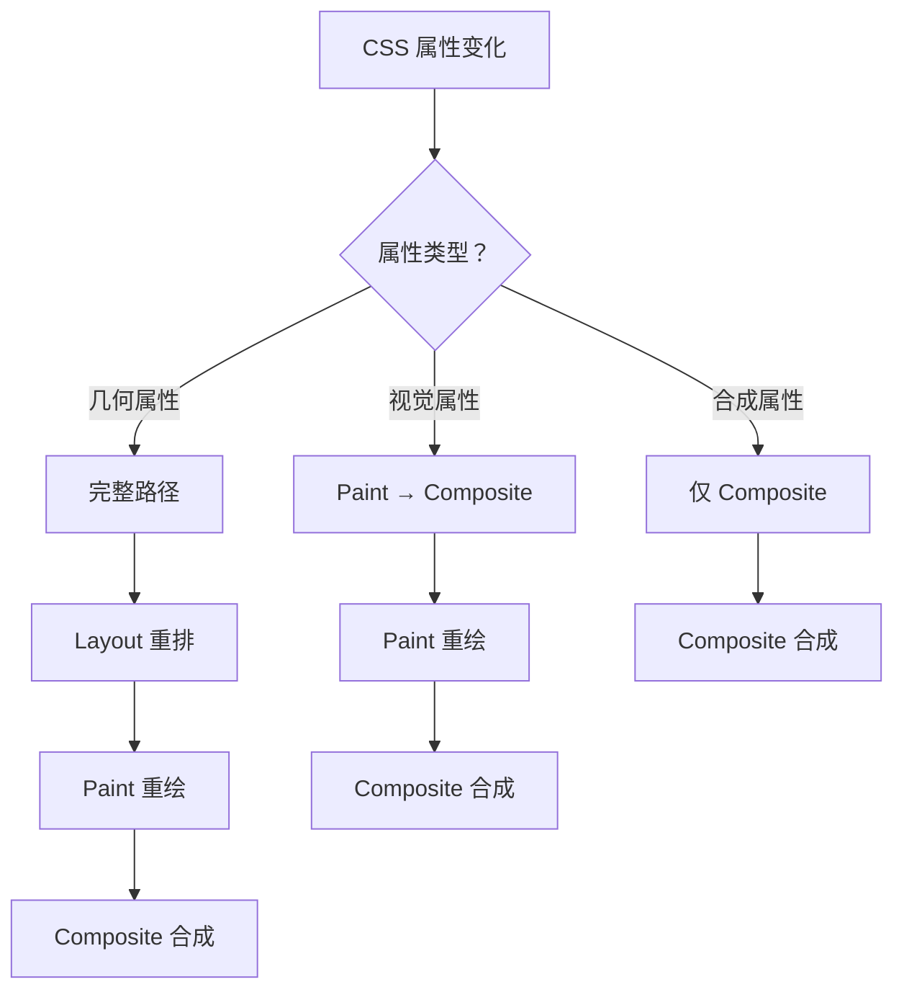

| 路径 | 涉及阶段 | 性能 | 典型属性 |
|------|---------|------|---------|
| **完整路径** | Layout → Paint → Composite | 最差 | `width`, `height`, `top`, `left`, `margin` |
| **跳过 Layout** | Paint → Composite | 中等 | `color`, `background`, `box-shadow` |
| **仅 Composite** | Composite | 最优 | `transform`, `opacity`, `filter` |

### 关键概念：重排与重绘

#### 重排（Reflow/Layout）

重排是浏览器重新计算元素几何属性的过程，是**性能开销最大**的操作。当元素的尺寸、位置发生变化时，浏览器需要重新计算整个渲染树中受影响的部分。

**触发重排的属性**：

| 属性类别 | 具体属性 |
|---------|---------|
| 尺寸 | `width`, `height`, `min-width`, `max-height`, `padding`, `margin`, `border-width` |
| 位置 | `top`, `left`, `right`, `bottom`, `position`, `float`, `clear` |
| 布局 | `display`, `flex`, `grid`, `columns`, `table-layout` |
| 字体 | `font-size`, `font-family`, `font-weight`, `line-height` |
| 其他 | `overflow`, `overflow-y`, `text-align`, `vertical-align` |

**重排示例**：

```css
/* ❌ 触发重排：改变元素尺寸 */
.element {
  width: 200px;        /* 触发 Layout */
  height: 100px;       /* 触发 Layout */
  padding: 20px;       /* 触发 Layout */
}

/* ❌ 触发重排：改变元素位置 */
.element {
  top: 50px;           /* 触发 Layout */
  left: 100px;         /* 触发 Layout */
  margin: 10px;        /* 触发 Layout */
}
```

#### 重绘（Repaint）

重绘是浏览器重新绘制元素视觉外观的过程，比重排开销小但仍需优化。重绘发生在元素外观变化但不影响布局时。

**触发重绘的属性**：

| 属性类别 | 具体属性 |
|---------|---------|
| 颜色 | `color`, `background-color`, `border-color` |
| 背景 | `background-image`, `background-position`, `background-size` |
| 边框 | `border-style`, `border-radius`, `box-shadow` |
| 文本 | `text-decoration`, `text-shadow`, `line-height` |
| 可见性 | `visibility`, `outline` |

#### 合成（Composite）

合成是浏览器将多个图层合并到屏幕的过程，**性能开销最小**。合成操作完全在 GPU 上完成，不需要 CPU 参与。

**只触发合成的属性**：

| 属性 | 说明 |
|------|------|
| `transform` | 变换（移动、缩放、旋转、倾斜） |
| `opacity` | 透明度 |
| `filter` | 滤镜（部分，如 `blur`、`brightness`） |

### 属性性能对比表

| 属性 | Layout | Paint | Composite | 性能评级 | 推荐用于动画 |
|------|:------:|:-----:|:---------:|:--------:|:----------:|
| `width/height` | ✓ | ✓ | | ⚠️ 差 | ❌ |
| `margin/padding` | ✓ | ✓ | | ⚠️ 差 | ❌ |
| `top/left` | ✓ | ✓ | | ⚠️ 差 | ❌ |
| `border-width` | ✓ | ✓ | | ⚠️ 差 | ❌ |
| `color` | | ✓ | | ⚡ 中 | ⚠️ 谨慎 |
| `background` | | ✓ | | ⚡ 中 | ⚠️ 谨慎 |
| `box-shadow` | | ✓ | | ⚡ 中 | ⚠️ 谨慎 |
| `opacity` | | | ✓ | ✅ 优 | ✅ |
| `transform` | | | ✓ | ✅ 优 | ✅ |
| `filter` | | | ✓ | ✅ 优 | ✅ |

---

## 深入原理：合成层机制

### 什么是合成层（Compositing Layer）？

合成层是浏览器渲染引擎中的一个核心概念。浏览器会将页面拆分成多个独立的图层（Layer），每个图层可以独立进行合成操作，而不影响其他图层。这种机制是实现高性能动画的基础。

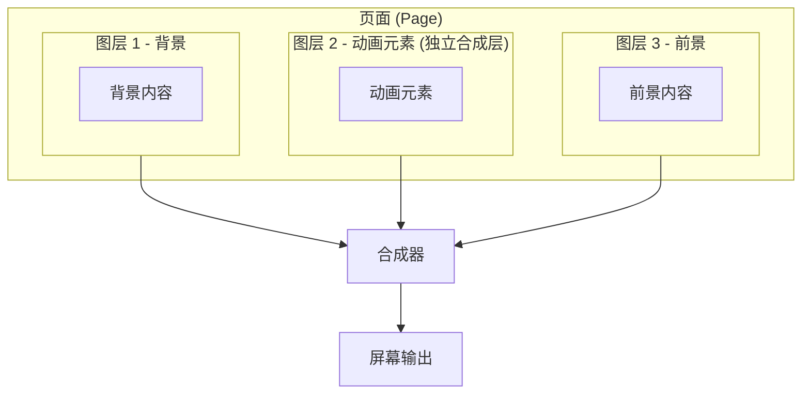

### 合成层的创建条件

浏览器会在以下情况自动创建独立的合成层：

| 条件 | 说明 | 示例 |
|------|------|------|
| **3D 变换** | 使用 `transform: translateZ()` 或 `translate3d()` | `transform: translateZ(0)` |
| **`will-change`** | 明确声明将要变化的属性 | `will-change: transform` |
| **视频元素** | `<video>` 元素自动提升 | `<video src="...">` |
| **`<canvas>`** | Canvas 元素自动提升 | `<canvas></canvas>` |
| **CSS 滤镜** | 应用 `filter` 属性 | `filter: blur(5px)` |
| **`position: fixed`** | 固定定位元素 | `position: fixed` |
| **`backface-visibility`** | 设置 3D 背面可见性 | `backface-visibility: hidden` |
| **滚动优化** | 某些浏览器对滚动容器优化 | `overflow: auto/scroll` |
| **`contain` 属性** | 包含特定值时 | `contain: paint` |

### 合成层工作原理

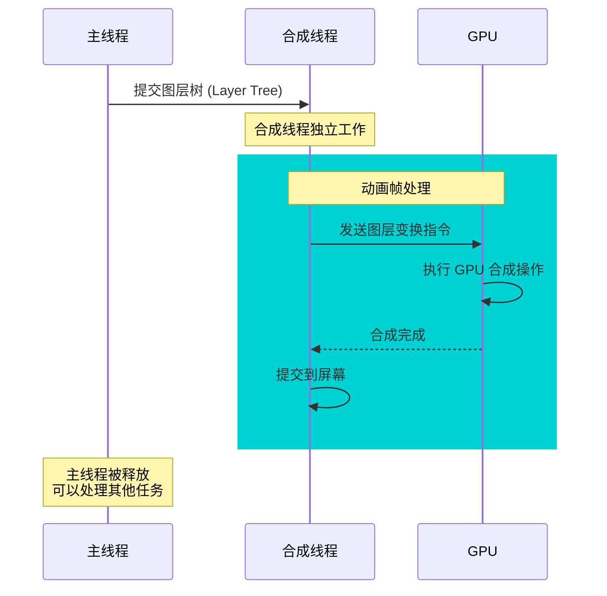

**关键优势**：
1. **独立更新**：合成层的变化不需要重绘其他图层
2. **GPU 加速**：合成操作在 GPU 上执行，效率更高
3. **主线程释放**：合成线程独立于主线程，动画运行时主线程可以处理其他任务
4. **避免重排**：合成层内的变换不触发布局计算

### 合成层的代价

合成层并非免费午餐，每个合成层都有内存和管理的开销：

| 代价类型 | 说明 | 影响 |
|---------|------|------|
| **内存占用** | 每个图层需要在内存中存储位图数据 | 图层尺寸 × 4 字节（RGBA） |
| **纹理上传** | 图层需要上传到 GPU 纹理内存 | 首次创建时有一次性开销 |
| **管理开销** | 浏览器需要维护图层树 | 过多图层增加管理复杂度 |
| **文字模糊** | 某些情况下文字可能变模糊 | 需要合理设置图层尺寸 |

**内存计算公式**：

```
图层内存 ≈ 宽度 × 高度 × 4 字节（RGBA）× 设备像素比²

示例：
- 1000px × 1000px 图层在 2x 屏幕上
- 内存 = 2000 × 2000 × 4 = 16MB
```

### 合成层优化策略

```css
/* ✅ 正确：仅为动画元素创建合成层 */
.animated-card {
  will-change: transform;  /* 动画前创建 */
  animation: slideIn 0.5s ease-out;
}

.animated-card.animation-done {
  will-change: auto;  /* 动画后释放 */
}

/* ✅ 正确：使用 contain 限制影响范围 */
.card-container {
  contain: layout paint;  /* 内部变化不影响外部 */
}

/* ❌ 错误：全局创建合成层 */
* {
  transform: translateZ(0);  /* 创建过多图层，浪费内存 */
}

/* ❌ 错误：永久保留 will-change */
.sidebar {
  will-change: transform;  /* 永远不释放，浪费内存 */
}
```

### 使用 Chrome DevTools 查看合成层

1. 打开 DevTools → More tools → **Layers**
2. 查看页面中所有合成图层的分布
3. 关注：
   - 图层数量是否过多
   - 单个图层的尺寸是否合理
   - 是否有不必要的合成层

---

## 主线程 vs 合成线程

### 浏览器线程模型

现代浏览器使用多线程架构来处理页面渲染。理解主线程和合成线程的区别，是优化动画性能的关键。

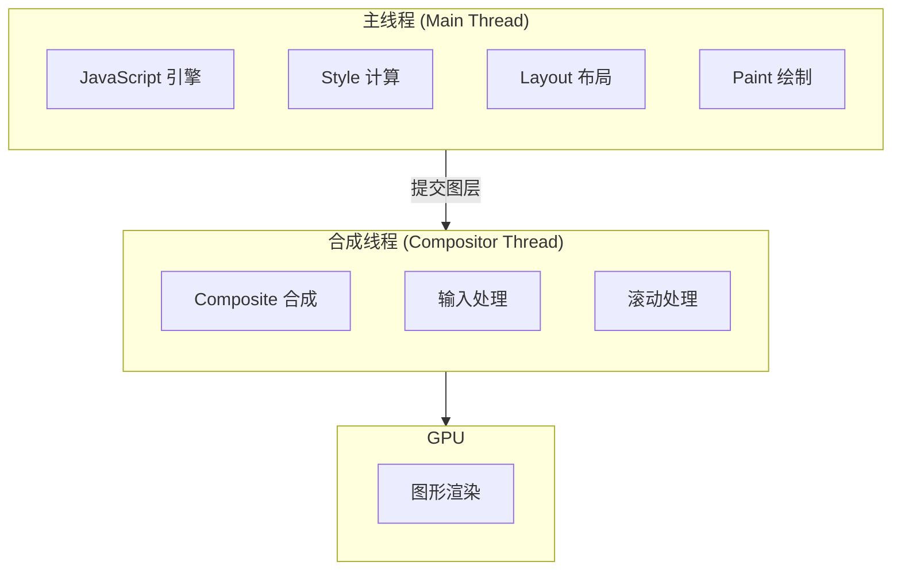

### 主线程的工作

主线程是浏览器中最繁忙的线程，负责处理大量任务：

| 任务 | 说明 | 对动画的影响 |
|------|------|------------|
| **JavaScript 执行** | 运行 JS 代码、事件处理 | 长任务会阻塞动画帧 |
| **Style 计算** | 计算元素样式 | DOM 变化时触发 |
| **Layout 布局** | 计算元素几何信息 | 几何属性变化时触发 |
| **Paint 绘制** | 生成绘制指令 | 视觉属性变化时触发 |
| **事件处理** | 处理用户交互事件 | 事件处理函数可能阻塞 |
| **垃圾回收** | 内存清理 | 可能导致短暂卡顿 |

### 合成线程的工作

合成线程独立于主线程，专门处理与显示相关的任务：

| 任务 | 说明 | 优势 |
|------|------|------|
| **图层合成** | 将多个图层合并到屏幕 | 不占用主线程资源 |
| **滚动处理** | 处理页面滚动 | 即使主线程繁忙也能流畅滚动 |
| **输入处理** | 处理触摸、鼠标等输入 | 提供即时反馈 |
| **CSS 动画** | 执行 `transform`、`opacity` 动画 | 在合成线程上运行 |

### 关键区别：动画在哪里运行？

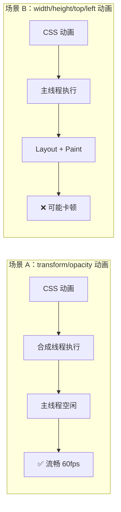

**核心原则**：
- `transform` 和 `opacity` 动画在**合成线程**上运行，即使主线程繁忙也能保持流畅
- `width`、`height`、`top`、`left` 等属性动画在**主线程**上运行，主线程繁忙时动画会卡顿
- JavaScript 长任务会阻塞主线程，导致主线程动画卡顿，但不影响合成线程动画

### 实际影响演示

```css
/* ✅ 场景 A：合成线程动画 - 即使主线程繁忙也流畅 */
.smooth-animation {
  animation: slide 2s ease-in-out infinite alternate;
  /* transform 动画在合成线程运行 */
}

@keyframes slide {
  from { transform: translateX(0); }
  to { transform: translateX(200px); }
}

/* ❌ 场景 B：主线程动画 - 主线程繁忙时会卡顿 */
.janky-animation {
  animation: move 2s ease-in-out infinite alternate;
  /* left 动画在主线程运行 */
}

@keyframes move {
  from { left: 0; }
  to { left: 200px; }
}
```

```javascript
// 模拟主线程繁忙
function heavyComputation() {
  const start = performance.now();
  while (performance.now() - start < 100) {
    // 阻塞主线程 100ms
    Math.random();
  }
}

// 每 200ms 执行一次重计算
setInterval(heavyComputation, 200);

// 此时 .smooth-animation 仍然流畅（合成线程）
// 但 .janky-animation 会明显卡顿（主线程被阻塞）
```

### 如何确保动画在合成线程运行？

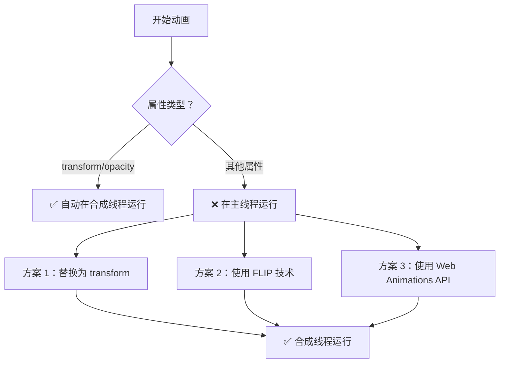

```css
/* FLIP 技术示例：用 transform 替代布局属性动画 */
.card {
  /* 初始位置 */
  transform: translateX(0) scale(1);
  transition: transform 0.3s ease-out;
}

.card.expanded {
  /* 用 transform 模拟 width/height 变化 */
  transform: scale(1.5);
}

/* 使用 contain 创建独立的合成上下文 */
.animation-container {
  contain: layout style paint;
  /* 内部动画不会影响外部布局 */
}
```

---

## will-change 使用策略

### will-change 的作用机制

`will-change` 属性是浏览器优化动画性能的重要工具。它提前通知浏览器某个元素即将发生变化，让浏览器有足够的时间进行优化准备。

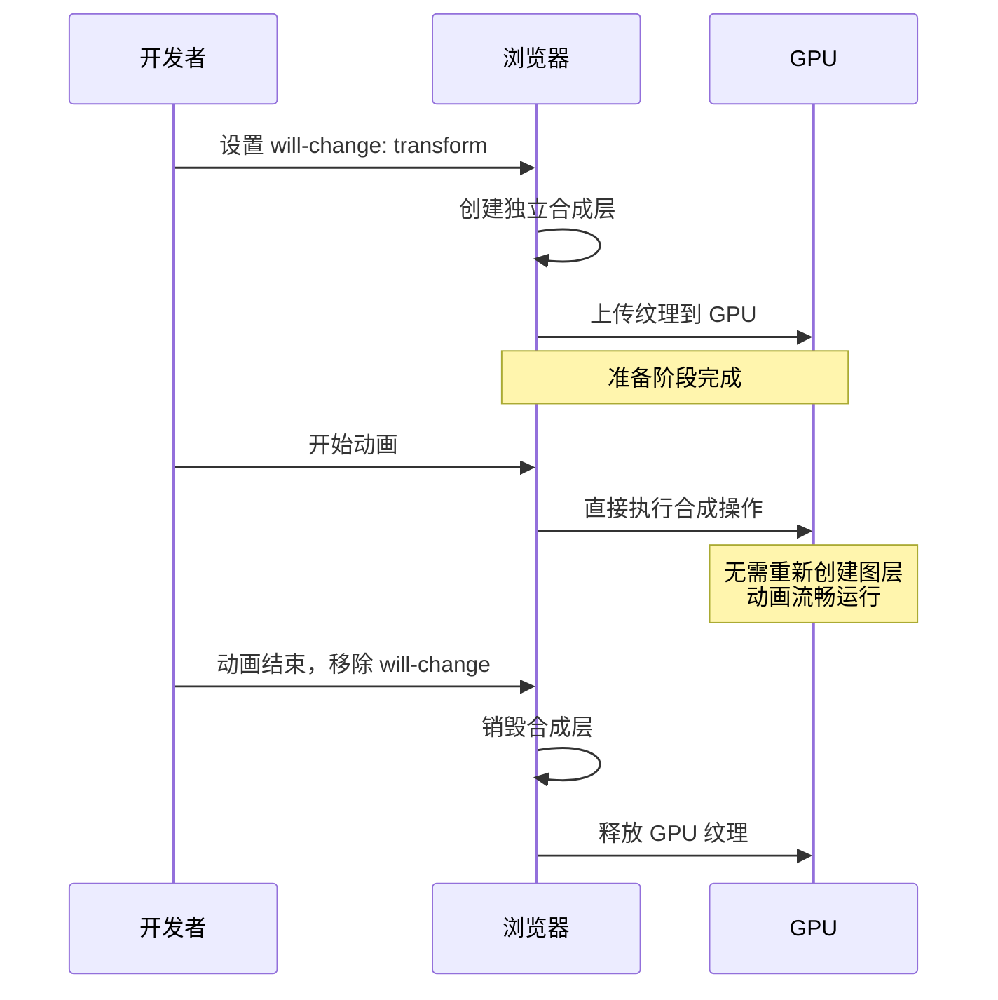

### will-change 的正确用法

```css
/* ✅ 策略 1：在交互前设置，交互后移除 */
.card {
  transition: transform 0.3s ease;
}

.card:hover {
  will-change: transform;  /* 悬停时提示 */
  transform: translateY(-5px);
}

.card:not(:hover) {
  will-change: auto;  /* 非悬停时释放 */
}

/* ✅ 策略 2：动画元素在动画期间使用 */
@keyframes slideIn {
  from { transform: translateX(-100%); opacity: 0; }
  to { transform: translateX(0); opacity: 1; }
}

.slide-in {
  will-change: transform, opacity;
  animation: slideIn 0.5s ease-out;
}

/* 动画结束后通过 JS 移除 will-change */
```

```javascript
// ✅ 策略 3：JavaScript 精确控制
class AnimationOptimizer {
  constructor(element) {
    this.element = element;
  }
  
  prepare() {
    // 动画开始前：提前一帧设置 will-change
    requestAnimationFrame(() => {
      this.element.style.willChange = 'transform, opacity';
    });
  }
  
  cleanup() {
    // 动画结束后：延迟移除 will-change
    requestAnimationFrame(() => {
      this.element.style.willChange = 'auto';
    });
  }
  
  animate(keyframes, options) {
    this.prepare();
    const animation = this.element.animate(keyframes, options);
    animation.onfinish = () => this.cleanup();
    animation.oncancel = () => this.cleanup();
    return animation;
  }
}

// 使用示例
const card = document.querySelector('.card');
const optimizer = new AnimationOptimizer(card);

card.addEventListener('click', () => {
  optimizer.animate([
    { transform: 'scale(1)', opacity: 1 },
    { transform: 'scale(1.1)', opacity: 0.8 },
    { transform: 'scale(1)', opacity: 1 }
  ], { duration: 300, easing: 'ease-in-out' });
});
```

### will-change 的常见错误

```css
/* ❌ 错误 1：全局设置 will-change */
* {
  will-change: transform;  /* 为所有元素创建合成层，内存爆炸 */
}

/* ❌ 错误 2：永久保留 will-change */
.sidebar {
  will-change: transform;  /* 永远不释放，持续占用内存 */
}

/* ❌ 错误 3：设置过多属性 */
.element {
  will-change: transform, opacity, top, left, width, height;
  /* 提示过多属性变化，浏览器无法有效优化 */
}

/* ❌ 错误 4：在不需要动画的元素上使用 */
.static-text {
  will-change: transform;  /* 永远不会动画的元素 */
}
```

### will-change 使用规则总结

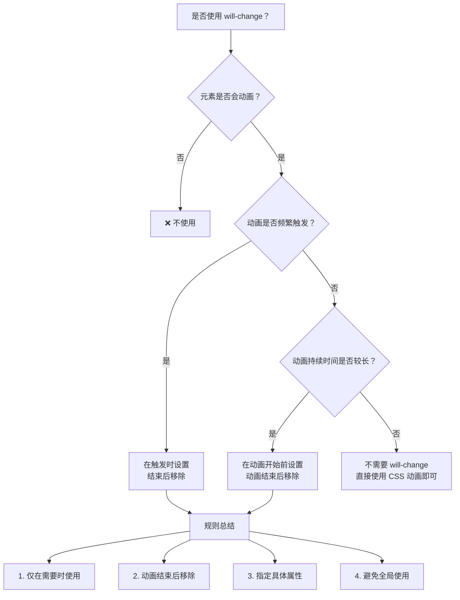

---

## 高性能动画属性

### transform 变换

`transform` 是动画优化的**首选属性**，只触发合成阶段，在 GPU 上执行。

**支持的变换函数**：

| 函数 | 语法 | 说明 | 性能 |
|------|------|------|------|
| `translate` | `translate(tx, ty)` | 2D 平移 | ✅ 仅合成 |
| `translateX/Y` | `translateX(100px)` | 单轴平移 | ✅ 仅合成 |
| `translate3d` | `translate3d(x, y, z)` | 3D 平移 | ✅ 仅合成 |
| `scale` | `scale(sx, sy)` | 缩放 | ✅ 仅合成 |
| `scaleX/Y` | `scaleX(1.5)` | 单轴缩放 | ✅ 仅合成 |
| `rotate` | `rotate(45deg)` | 旋转 | ✅ 仅合成 |
| `rotateX/Y/Z` | `rotateX(45deg)` | 3D 旋转 | ✅ 仅合成 |
| `skew` | `skew(ax, ay)` | 倾斜 | ✅ 仅合成 |

**使用示例**：

```css
/* 移动元素 - 替代 top/left */
.movable {
  position: absolute;
  /* ❌ 避免 */
  /* left: 100px; */
  /* top: 50px; */
  
  /* ✅ 推荐 */
  transform: translate(100px, 50px);
}

/* 缩放元素 - 替代 width/height */
.scalable {
  width: 100px;
  height: 100px;
  
  /* ❌ 避免 */
  /* width: 150px; */
  /* height: 150px; */
  
  /* ✅ 推荐 */
  transform: scale(1.5);
  transform-origin: center center;
}

/* 旋转动画 */
@keyframes rotate {
  from { transform: rotate(0deg); }
  to { transform: rotate(360deg); }
}

.spinner {
  animation: rotate 1s linear infinite;
}

/* 组合变换 - 注意顺序（从右向左执行） */
.combined {
  /* 先缩放，再旋转，最后平移 */
  transform: translate(100px) rotate(45deg) scale(2);
}
```

### opacity 透明度

`opacity` 同样只触发合成阶段，适合淡入淡出效果。

```css
/* 淡入淡出动画 */
@keyframes fadeIn {
  from { opacity: 0; }
  to { opacity: 1; }
}

.fade-element {
  animation: fadeIn 0.5s ease-out;
}

/* 结合 transform 创建复合动画 */
@keyframes slideIn {
  from {
    opacity: 0;
    transform: translateY(20px);
  }
  to {
    opacity: 1;
    transform: translateY(0);
  }
}

.slide-in {
  animation: slideIn 0.5s ease-out;
}
```

### 属性替换策略

| 传统属性 | 推荐替代 | 转换方法 | 性能提升 |
|----------|----------|----------|----------|
| `left/top` | `transform: translate()` | `left: 100px` → `transform: translateX(100px)` | 跳过 Layout + Paint |
| `width/height` | `transform: scale()` | `width: 200px` → `transform: scaleX(2)` | 跳过 Layout + Paint |
| `margin` | `transform: translate()` | `margin-left: 20px` → `transform: translateX(20px)` | 跳过 Layout + Paint |
| `visibility` | `opacity` | `visibility: hidden` → `opacity: 0` | 跳过 Paint |
| `display: none` | `opacity: 0` + `pointer-events: none` | 保留布局但隐藏 | 避免重排 |

### FLIP 技术

FLIP（First, Last, Invert, Play）是一种用 `transform` 替代布局属性动画的技术：

```javascript
// FLIP 动画示例
function flipAnimation(element, newStyles) {
  // 1. First - 记录初始位置
  const first = element.getBoundingClientRect();
  
  // 2. 应用新样式
  Object.assign(element.style, newStyles);
  
  // 3. Last - 记录最终位置
  const last = element.getBoundingClientRect();
  
  // 4. Invert - 计算差异并用 transform 反转
  const deltaX = first.left - last.left;
  const deltaY = first.top - last.top;
  const deltaW = first.width / last.width;
  const deltaH = first.height / last.height;
  
  // 先设置到初始位置（用 transform）
  element.style.transform = `translate(${deltaX}px, ${deltaY}px) scale(${deltaW}, ${deltaH})`;
  element.style.transformOrigin = 'top left';
  
  // 5. Play - 动画到最终位置
  requestAnimationFrame(() => {
    element.style.transition = 'transform 0.3s ease-out';
    element.style.transform = '';
    
    element.addEventListener('transitionend', () => {
      element.style.transition = '';
      element.style.transformOrigin = '';
    }, { once: true });
  });
}
```

---

## 硬件加速

### GPU 加速原理

GPU 加速利用显卡进行图形渲染，将 CPU 从繁重的图形计算中解放出来。

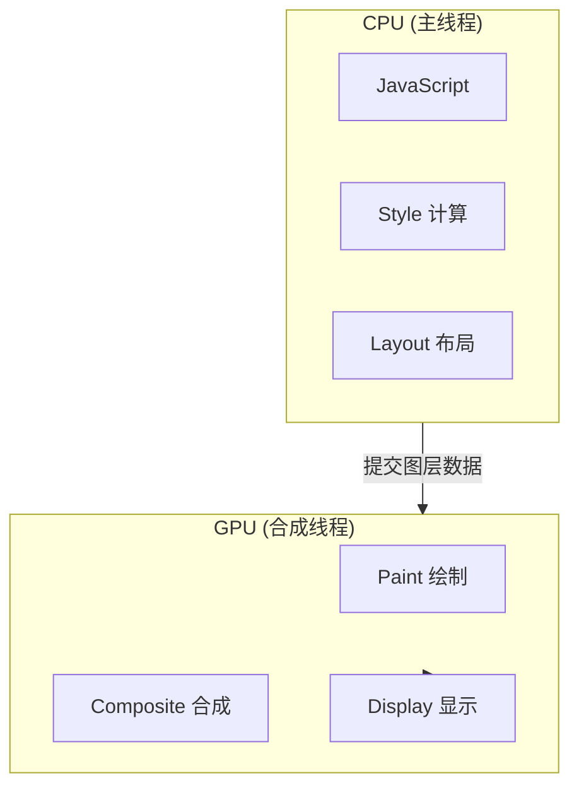

### 触发 GPU 加速的方法

```css
/* 方法一：3D 变换（最常用） */
.gpu-accelerated {
  transform: translateZ(0);
  /* 或 */
  transform: translate3d(0, 0, 0);
}

/* 方法二：will-change 属性（推荐） */
.will-change-element {
  will-change: transform;
}

/* 方法三：特定 CSS 属性（自动触发） */
.layer-element {
  /* 以下属性会自动创建新图层 */
  transform: translateZ(0);
  filter: blur(0);
  position: fixed;
  backface-visibility: hidden;
}
```

### 硬件加速注意事项

```css
/* ❌ 错误：过度使用 will-change */
* {
  will-change: transform;  /* 消耗大量内存 */
}

/* ❌ 错误：全局应用 GPU 加速 */
* {
  transform: translateZ(0);  /* 创建过多图层 */
}

/* ✅ 正确：仅在需要时使用 */
.animate-on-hover:hover {
  will-change: transform;
}

/* ✅ 正确：动画元素 */
@keyframes slide {
  from { transform: translateX(-100%); }
  to { transform: translateX(0); }
}

.slider {
  will-change: transform;
  animation: slide 0.5s ease-out;
}
```

**内存管理**：

```css
/* GPU 图层会占用内存 */
.layer {
  /* 每个图层约占用：宽度 × 高度 × 4 字节 × 设备像素比² */
  /* 1000px × 1000px 图层在 2x 屏幕 ≈ 16MB 内存 */
  transform: translateZ(0);
}

/* 限制图层数量 */
.container {
  contain: strict;  /* 限制渲染范围 */
}

/* 移除不需要的图层 */
.inactive {
  will-change: auto;
  transform: none;
}
```

---

## 渲染隔离与懒加载

### contain 属性

`contain` 属性告诉浏览器元素的内容如何影响页面布局，允许浏览器优化渲染。

**语法**：`contain: none | strict | content | [ size || layout || paint || style ]`

**包含类型**：

| 值 | 说明 | 效果 | 使用场景 |
|------|------|------|---------|
| `size` | 尺寸隔离 | 元素尺寸不影响外部 | 已知尺寸的组件 |
| `layout` | 布局隔离 | 内部布局不影响外部 | 独立布局的组件 |
| `paint` | 绘制隔离 | 内容不溢出边界 | 有溢出内容的组件 |
| `style` | 样式隔离 | 计数器等不影响外部 | 包含计数器的组件 |
| `strict` | 完全隔离 | 等同于 `size layout paint` | 完全独立的组件 |
| `content` | 内容隔离 | 等同于 `layout paint` | 内容区域 |

**使用示例**：

```css
/* 完全隔离 */
.isolated {
  contain: strict;  /* 等同于 contain: size layout paint */
}

/* 内容隔离 */
.content-card {
  contain: content;  /* 等同于 contain: layout paint */
}

/* 布局隔离 */
.widget {
  contain: layout;
}

/* 绘制隔离 - 内容不会溢出 */
.overflow-hidden {
  contain: paint;
  overflow: hidden;
}

/* 实际应用：复杂组件 */
.data-grid {
  contain: strict;
  width: 100%;
  height: 500px;
  overflow: auto;
}

/* 实际应用：文章卡片 */
.article-card {
  contain: layout paint;
  /* 内部变化不会影响其他卡片的重排 */
}
```

### content-visibility 属性

`content-visibility` 控制元素是否渲染其内容，是实现懒加载的强大工具。

**语法**：`content-visibility: visible | hidden | auto`

**值说明**：

| 值 | 说明 | 使用场景 |
|------|------|---------|
| `visible` | 正常渲染（默认） | 默认状态 |
| `hidden` | 跳过渲染，内容不可访问 | 折叠面板、标签页 |
| `auto` | 屏幕外时跳过渲染 | 长列表、无限滚动 |

**使用示例**：

```css
/* 长列表优化 */
.list-item {
  /* 屏幕外元素不渲染 */
  content-visibility: auto;
  /* 必须指定高度，避免布局偏移 */
  contain-intrinsic-size: 0 200px;
}

/* 手动隐藏 */
.hidden-content {
  content-visibility: hidden;
  /* 占位但内容不渲染 */
}

/* 折叠面板 */
.collapsible-panel {
  content-visibility: hidden;
  contain-intrinsic-size: 0 50px;  /* 折叠时高度 */
}

.collapsible-panel.expanded {
  content-visibility: visible;
}

/* 分页内容 */
.page {
  content-visibility: auto;
  contain-intrinsic-size: 100vh;
}

.page.active {
  content-visibility: visible;
}
```

**性能对比**（以下为示意量级，实际数值因设备、内容复杂度与浏览器而异）：

| 场景 | 未优化渲染时间 | 优化后渲染时间 | 提升 |
|------|-------------|-------------|------|
| 1000 项列表 | ~800ms | ~80ms | 10x |
| 长文章页面 | ~400ms | ~60ms | 6.7x |
| 复杂仪表盘 | ~1200ms | ~200ms | 6x |

### contain 与 content-visibility 配合使用

```css
/* 最佳实践：组合使用 */
.card {
  contain: layout paint;
  content-visibility: auto;
  contain-intrinsic-size: 0 200px;
}

/* 动画容器使用 contain 隔离 */
.animation-container {
  contain: layout;
  position: relative;
}

.animation-container .animated-element {
  position: absolute;
  animation: slide 1s ease;
}

@keyframes slide {
  from { transform: translateX(-100%); }
  to { transform: translateX(0); }
}
```

---

## JavaScript 动画优化

### requestAnimationFrame

`requestAnimationFrame` 是执行 JavaScript 动画的正确方式，与显示器刷新率同步（通常 60Hz）。

```javascript
// 基础用法
function animate(timestamp) {
  // 更新动画状态
  element.style.transform = `translateX(${progress}px)`;
  
  // 请求下一帧
  requestAnimationFrame(animate);
}

requestAnimationFrame(animate);

// 时间控制动画
let startTime = null;
const duration = 1000;  // 1秒

function animate(timestamp) {
  if (!startTime) startTime = timestamp;
  const elapsed = timestamp - startTime;
  const progress = Math.min(elapsed / duration, 1);
  
  // 使用缓动函数
  const easedProgress = easeOutCubic(progress);
  element.style.transform = `translateX(${easedProgress * 500}px)`;
  
  if (progress < 1) {
    requestAnimationFrame(animate);
  }
}

requestAnimationFrame(animate);

// 常用缓动函数
function easeOutCubic(t) {
  return 1 - Math.pow(1 - t, 3);
}

function easeInOutQuad(t) {
  return t < 0.5 ? 2 * t * t : 1 - Math.pow(-2 * t + 2, 2) / 2;
}

function easeOutElastic(t) {
  const c4 = (2 * Math.PI) / 3;
  return t === 0 ? 0 : t === 1 ? 1 :
    Math.pow(2, -10 * t) * Math.sin((t * 10 - 0.75) * c4) + 1;
}
```

### 避免强制同步布局

强制同步布局（Layout Thrashing）是在一帧内多次交替读取和修改布局属性导致的性能问题。

```javascript
// ❌ 错误：强制同步布局（读写交替）
for (let i = 0; i < elements.length; i++) {
  const height = elements[i].offsetHeight;  // 读 - 触发重排
  elements[i].style.height = height * 2 + 'px';  // 写 - 使布局失效
  // 下一次循环的读取又触发重排...
}

// ✅ 正确：批量读取，批量写入
// 先读取所有值
const heights = elements.map(el => el.offsetHeight);

// 再写入所有值
elements.forEach((el, i) => {
  el.style.height = heights[i] * 2 + 'px';
});

// ✅ 更好：使用 FastDOM 模式
class FastDOM {
  constructor() {
    this.reads = [];
    this.writes = [];
    this.scheduled = false;
  }
  
  measure(fn) {
    this.reads.push(fn);
    this.scheduleFlush();
  }
  
  mutate(fn) {
    this.writes.push(fn);
    this.scheduleFlush();
  }
  
  scheduleFlush() {
    if (!this.scheduled) {
      this.scheduled = true;
      requestAnimationFrame(() => this.flush());
    }
  }
  
  flush() {
    // 先执行所有读取
    const reads = this.reads;
    this.reads = [];
    reads.forEach(fn => fn());
    
    // 再执行所有写入
    const writes = this.writes;
    this.writes = [];
    writes.forEach(fn => fn());
    
    this.scheduled = false;
    
    // 如果还有任务，继续调度
    if (this.reads.length || this.writes.length) {
      this.scheduleFlush();
    }
  }
}

const fastdom = new FastDOM();

// 使用
fastdom.measure(() => {
  return element.offsetHeight;
});
fastdom.mutate(() => {
  element.style.height = '200px';
});
```

### Web Animations API

使用原生 Web Animations API 可以获得更好的性能，动画在合成线程运行。

```javascript
// 基础动画
const animation = element.animate([
  { transform: 'translateX(0)', opacity: 1 },
  { transform: 'translateX(100px)', opacity: 0.5 }
], {
  duration: 1000,
  easing: 'ease-out',
  fill: 'forwards'
});

// 控制动画
animation.pause();
animation.play();
animation.reverse();
animation.finish();
animation.cancel();

// 动画事件
animation.onfinish = () => {
  console.log('动画完成');
};

animation.oncancel = () => {
  console.log('动画取消');
};

// 关键帧动画
element.animate([
  { offset: 0, transform: 'scale(1)' },
  { offset: 0.25, transform: 'scale(1.1)' },
  { offset: 0.5, transform: 'scale(0.9)' },
  { offset: 0.75, transform: 'scale(1.05)' },
  { offset: 1, transform: 'scale(1)' }
], {
  duration: 600,
  easing: 'ease-in-out'
});

// 链式动画
const animation1 = element.animate(
  [{ transform: 'translateY(0)' }, { transform: 'translateY(-50px)' }],
  { duration: 300, fill: 'forwards' }
);

animation1.finished.then(() => {
  return element.animate(
    [{ transform: 'translateY(-50px)' }, { transform: 'translateY(0)' }],
    { duration: 300, fill: 'forwards' }
  );
});
```

### 性能监控

```javascript
// FPS 监控
class FPSMonitor {
  constructor() {
    this.fps = 0;
    this.frames = 0;
    this.lastTime = performance.now();
  }
  
  tick() {
    this.frames++;
    const now = performance.now();
    
    if (now >= this.lastTime + 1000) {
      this.fps = this.frames;
      this.frames = 0;
      this.lastTime = now;
      console.log(`FPS: ${this.fps}`);
    }
    
    requestAnimationFrame(() => this.tick());
  }
  
  start() {
    requestAnimationFrame(() => this.tick());
  }
}

// 长任务检测
const observer = new PerformanceObserver((list) => {
  for (const entry of list.getEntries()) {
    console.log('长任务:', entry.duration + 'ms');
  }
});

observer.observe({ entryTypes: ['longtask'] });

// 帧时间检测
function measureFrameTime() {
  const start = performance.now();
  
  requestAnimationFrame(() => {
    const frameTime = performance.now() - start;
    if (frameTime > 16.67) {  // 超过 60fps
      console.warn(`帧时间过长: ${frameTime.toFixed(2)}ms`);
    }
    measureFrameTime();
  });
}

measureFrameTime();
```

---

## 性能检测工具

### Chrome DevTools

#### Performance 面板

1. **录制性能**：点击录制按钮，执行操作后停止
2. **分析帧率**：查看 FPS 图表，绿色表示良好
3. **火焰图**：定位性能瓶颈
4. **Main 线程**：查看 JavaScript 执行时间

#### Rendering 面板

打开方式：DevTools → More tools → Rendering

| 功能 | 说明 |
|------|------|
| FPS meter | 实时帧率显示 |
| Paint flashing | 高亮重绘区域（绿色） |
| Layer borders | 显示图层边框 |
| Layout shift regions | 显示布局偏移区域 |

#### Layers 面板

打开方式：DevTools → More tools → Layers

- 查看所有合成图层
- 分析图层内存占用
- 检查是否创建了过多图层

### 代码检测

```javascript
// 检测重排
const element = document.querySelector('.test');
console.time('layout');
const height = element.offsetHeight;  // 触发重排
console.timeEnd('layout');

// Performance API
performance.mark('animation-start');

// 执行动画代码...

performance.mark('animation-end');
performance.measure('animation', 'animation-start', 'animation-end');

const measure = performance.getEntriesByName('animation')[0];
console.log(`动画耗时: ${measure.duration}ms`);

// 检测内存
if (performance.memory) {
  console.log(`
    已用堆大小: ${(performance.memory.usedJSHeapSize / 1048576).toFixed(2)}MB
    总堆大小: ${(performance.memory.totalJSHeapSize / 1048576).toFixed(2)}MB
    堆限制: ${(performance.memory.jsHeapSizeLimit / 1048576).toFixed(2)}MB
  `);
}
```

### CSS 性能检测

```css
/* 使用 @supports 检测属性支持 */
@supports (will-change: transform) {
  .optimized {
    will-change: transform;
  }
}

@supports (content-visibility: auto) {
  .lazy-content {
    content-visibility: auto;
    contain-intrinsic-size: 200px;
  }
}

/* 媒体查询检测性能模式 */
@media (prefers-reduced-data: reduce) {
  /* 减少数据使用 */
  .image-background {
    background-image: none;
  }
}
```

---

## 常见问题与解决方案

### 问题 1：动画卡顿

**症状**：动画不流畅，帧率低于 60fps

**原因分析**：
- 触发了重排或重绘
- JavaScript 执行时间过长
- GPU 内存不足

**解决方案**：

```css
/* 方案一：使用高性能属性 */
.element {
  transform: translateX(100px);  /* 替代 left */
  opacity: 0.5;                  /* 替代 visibility */
}

/* 方案二：启用 GPU 加速 */
.element {
  transform: translateZ(0);
  will-change: transform;
}

/* 方案三：减少动画复杂度 */
@keyframes simple-animation {
  from { transform: translateX(0); }
  to { transform: translateX(100px); }
}
```

### 问题 2：动画闪烁

**症状**：动画过程中出现闪烁或闪烁

**原因分析**：
- 图层创建/销毁
- Z-index 变化
- 合成层问题

**解决方案**：

```css
/* 强制创建独立图层 */
.element {
  backface-visibility: hidden;
  perspective: 1000px;
  transform: translateZ(0);
}

/* 固定 3D 上下文 */
.container {
  transform-style: preserve-3d;
}

/* 避免闪烁 */
.element {
  -webkit-font-smoothing: antialiased;
  -webkit-backface-visibility: hidden;
}
```

### 问题 3：移动端性能差

**症状**：移动设备上动画卡顿严重

**解决方案**：

```css
/* 减少移动端动画复杂度 */
@media (max-width: 768px) {
  .complex-animation {
    animation: none;
    transition: none;
  }
  
  /* 简化动画 */
  .simplified {
    animation-duration: 0.1s;
    animation-iteration-count: 1;
  }
}

/* 使用触摸优化 */
.touch-element {
  touch-action: manipulation;
  -webkit-tap-highlight-color: transparent;
}

/* 减少重绘区域 */
.mobile-optimized {
  contain: strict;
  content-visibility: auto;
  contain-intrinsic-size: 300px;
}
```

### 问题 4：页面滚动卡顿

**症状**：滚动时页面不流畅

**解决方案**：

```css
/* 优化滚动容器 */
.scroll-container {
  overflow-y: auto;
  contain: strict;
}

/* 固定元素优化 */
.fixed-header {
  position: fixed;
  top: 0;
  will-change: transform;
}

/* 懒加载内容 */
.lazy-section {
  content-visibility: auto;
  contain-intrinsic-size: 500px;
}
```

```javascript
// 滚动事件节流
let ticking = false;

window.addEventListener('scroll', () => {
  if (!ticking) {
    requestAnimationFrame(() => {
      // 处理滚动逻辑
      ticking = false;
    });
    ticking = true;
  }
});

// Intersection Observer 替代滚动检测
const observer = new IntersectionObserver((entries) => {
  entries.forEach(entry => {
    if (entry.isIntersecting) {
      entry.target.classList.add('visible');
    }
  });
}, {
  rootMargin: '50px'
});

document.querySelectorAll('.lazy-element').forEach(el => {
  observer.observe(el);
});
```

### 问题 5：动画启动延迟

**症状**：动画开始时有明显延迟

**解决方案**：

```css
/* 预热 GPU */
.preload {
  transform: translateZ(0);
}

/* 预设 will-change */
.animated-element {
  will-change: transform, opacity;
}

/* 减少首帧计算 */
@keyframes optimized-animation {
  0% {
    transform: translateX(0);
  }
  100% {
    transform: translateX(100px);
  }
}
```

---

## 最佳实践

### 1. 动画属性选择优先级

```
transform, opacity > filter > color, background > width, height, margin
     (仅合成)        (部分合成)      (重绘)              (重排)
```

### 2. 优化检查清单

- [ ] 使用 `transform` 替代 `top/left`
- [ ] 使用 `opacity` 替代 `visibility`
- [ ] 仅在需要时使用 `will-change`
- [ ] 动画结束后移除 `will-change`
- [ ] 避免在动画中修改布局属性
- [ ] 使用 `contain` 隔离复杂组件
- [ ] 使用 `content-visibility` 懒加载
- [ ] 尊重 `prefers-reduced-motion`
- [ ] 使用 `requestAnimationFrame` 执行 JS 动画
- [ ] 批量读取和写入 DOM 属性
- [ ] 使用 Web Animations API 替代 JS 动画
- [ ] 控制合成层数量，避免内存浪费

### 3. 性能目标

| 指标 | 目标值 |
|------|--------|
| FPS | ≥ 60 (每帧 ≤ 16.67ms) |
| 交互到下次绘制 (INP) | < 200ms |
| 累积布局偏移 (CLS) | < 0.1 |
| GPU 内存 | 控制在合理范围 |

### 4. 可访问性考虑

```css
/* 尊重用户偏好 */
@media (prefers-reduced-motion: reduce) {
  *,
  *::before,
  *::after {
    animation-duration: 0.01ms !important;
    animation-iteration-count: 1 !important;
    transition-duration: 0.01ms !important;
    scroll-behavior: auto !important;
  }
}

/* 渐进增强 */
.animated-element {
  animation: fadeIn 0.5s ease-out;
}

@media (prefers-reduced-motion: reduce) {
  .animated-element {
    animation: none;
    opacity: 1;
  }
}
```

```javascript
// JavaScript 检测用户偏好
const prefersReducedMotion = window.matchMedia(
  '(prefers-reduced-motion: reduce)'
);

if (prefersReducedMotion.matches) {
  document.documentElement.classList.add('reduce-motion');
}

prefersReducedMotion.addEventListener('change', (e) => {
  document.documentElement.classList.toggle('reduce-motion', e.matches);
});
```

### 5. 浏览器兼容性

| 属性 | Chrome | Firefox | Safari | Edge |
|------|--------|---------|--------|------|
| `transform` | 36+ | 16+ | 9+ | 12+ |
| `will-change` | 36+ | 36+ | 9.1+ | 79+ |
| `contain` | 52+ | 69+ | 15.4+ | 79+ |
| `content-visibility` | 85+ | 125+ | 18+ | 85+ |
| `backface-visibility` | 36+ | 16+ | 9+ | 12+ |

### 6. 代码模板

```css
/* 优化的动画元素模板 */
.animated-element {
  /* 基础样式 */
  position: relative;
  
  /* 性能优化 */
  will-change: transform, opacity;
  transform: translateZ(0);
  
  /* 过渡效果 */
  transition: transform 0.3s cubic-bezier(0.4, 0, 0.2, 1),
              opacity 0.3s cubic-bezier(0.4, 0, 0.2, 1);
}

.animated-element:hover {
  transform: translateY(-5px);
  opacity: 0.9;
}

/* 动画结束后清理 */
.animated-element.animation-complete {
  will-change: auto;
}

/* 可访问性 */
@media (prefers-reduced-motion: reduce) {
  .animated-element {
    transition: none;
    transform: none;
  }
}
```

---

## 参考资源

- [Google Web Fundamentals - Rendering Performance](https://developers.google.com/web/fundamentals/performance/rendering)
- [MDN - CSS transform](https://developer.mozilla.org/zh-CN/docs/Web/CSS/transform)
- [MDN - will-change](https://developer.mozilla.org/zh-CN/docs/Web/CSS/will-change)
- [CSS Contain Module](https://www.w3.org/TR/css-contain-2/)
- [Web Animations API](https://developer.mozilla.org/zh-CN/docs/Web/API/Web_Animations_API)
- [CSS Triggers - 属性性能查询](https://csstriggers.com/)
- [High Performance Animations](https://www.html5rocks.com/en/tutorials/speed/high-performance-animations/)
- [Layer Borders - Chrome DevTools](https://developer.chrome.com/docs/devtools/rendering/layers/)
