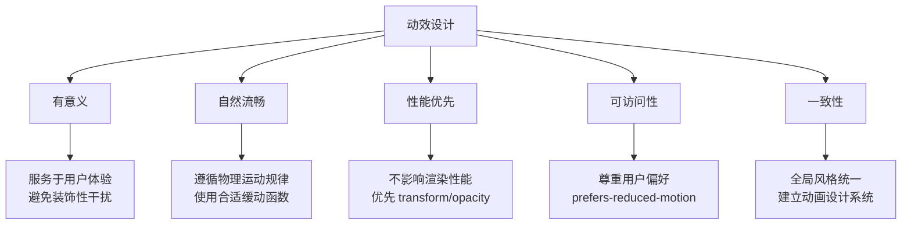
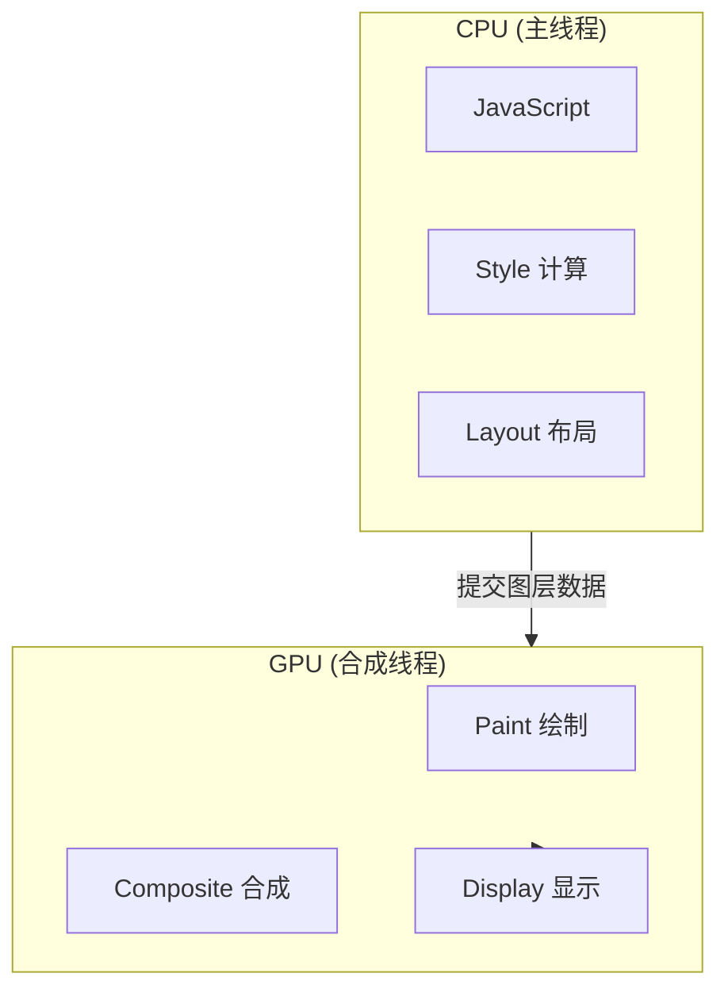

# 常见动效实现

汇集 Web 开发中常用的 CSS 动画效果实现方案，涵盖页面过渡、加载动画、交互动效、文字效果等多个场景。每个动效都包含完整的 HTML 和 CSS 代码，并附带详细的参数说明和使用场景。

## 背景与动机

### 为什么需要动效？

动画在 Web 开发中扮演着至关重要的角色，它不仅是视觉装饰，更是用户体验的核心组成部分：

- **提供视觉反馈**：让用户了解操作结果和系统状态
- **引导注意力**：通过运动引导用户关注重要信息
- **建立空间关系**：帮助用户理解页面元素之间的层级和导航关系
- **改善感知性能**：加载动画减少用户等待焦虑，提升感知速度
- **增强品牌感**：统一的动画风格建立品牌识别度

### 动效设计的核心原则



### 动画时长与缓动函数速查

| 场景 | 推荐时长 | 缓动函数 | CSS 值 |
|------|---------|---------|--------|
| 微交互（按钮点击） | 100-200ms | ease | `ease` |
| 过渡效果（悬浮、展开） | 200-300ms | ease-out | `cubic-bezier(0.16, 1, 0.3, 1)` |
| 入场动画（淡入、滑入） | 300-500ms | ease-out | `cubic-bezier(0.0, 0.0, 0.2, 1)` |
| 退场动画（淡出、滑出） | 200-300ms | ease-in | `cubic-bezier(0.4, 0.0, 1, 1)` |
| 弹跳/弹性效果 | 400-600ms | spring | `cubic-bezier(0.34, 1.56, 0.64, 1)` |
| 加载动画（循环） | 800-1500ms | linear | `linear` |

---

## 动画分类与设计原则

```
CSS 动画应用场景
├── 页面过渡
│   ├── 淡入淡出
│   ├── 滑动效果
│   └── 缩放进入
├── 加载状态
│   ├── 旋转加载
│   ├── 进度条
│   └── 骨架屏
├── 用户交互
│   ├── 悬浮效果
│   ├── 点击反馈
│   └── 拖拽动画
└── 视觉增强
    ├── 文字动画
    ├── 背景动效
    └── 粒子效果
```

### 动画设计原则

| 原则 | 说明 | 实践建议 |
|------|------|----------|
| **有意义** | 动画应服务于用户体验 | 避免装饰性动画干扰用户 |
| **自然流畅** | 遵循物理运动规律 | 使用合适的缓动函数 |
| **性能优先** | 不影响页面渲染性能 | 优先使用 transform 和 opacity |
| **可访问性** | 尊重用户偏好设置 | 使用 prefers-reduced-motion |
| **一致性** | 保持全局动画风格统一 | 建立动画设计系统 |

---

## 页面过渡动画

页面过渡动画用于页面元素的入场和出场效果，提升视觉层次感和用户体验。

### 淡入效果

适用于模态框、提示信息、页面切换等场景。

```html
<div class="fade-element">淡入元素</div>
```

```css
/* 基础淡入 */
@keyframes fadeIn {
  from { 
    opacity: 0; 
  }
  to { 
    opacity: 1; 
  }
}

.fade-element {
  animation: fadeIn 0.5s ease-out forwards;
}
```

**参数说明：**

| 参数 | 值 | 说明 |
|------|------|------|
| `duration` | 0.5s | 动画持续时长，建议 0.3s-0.8s |
| `timing-function` | ease-out | 开始快结束慢，符合自然运动规律 |
| `fill-mode` | forwards | 动画结束后保持最终状态 |

**变体效果：**

```css
/* 从上方淡入 */
@keyframes fadeInDown {
  from {
    opacity: 0;
    transform: translateY(-20px);
  }
  to {
    opacity: 1;
    transform: translateY(0);
  }
}

/* 从下方淡入 */
@keyframes fadeInUp {
  from {
    opacity: 0;
    transform: translateY(20px);
  }
  to {
    opacity: 1;
    transform: translateY(0);
  }
}

/* 使用示例 */
.modal {
  animation: fadeInDown 0.4s ease-out;
}

.toast {
  animation: fadeInUp 0.3s ease-out;
}
```

### 滑入效果

适用于侧边栏、抽屉菜单、通知面板等场景。

```html
<div class="slide-panel">滑入面板</div>
```

```css
/* 从左侧滑入 */
@keyframes slideInLeft {
  from {
    opacity: 0;
    transform: translateX(-100%);
  }
  to {
    opacity: 1;
    transform: translateX(0);
  }
}

/* 从右侧滑入 */
@keyframes slideInRight {
  from {
    opacity: 0;
    transform: translateX(100%);
  }
  to {
    opacity: 1;
    transform: translateX(0);
  }
}

/* 从顶部滑入 */
@keyframes slideInTop {
  from {
    opacity: 0;
    transform: translateY(-100%);
  }
  to {
    opacity: 1;
    transform: translateY(0);
  }
}

/* 从底部滑入 */
@keyframes slideInBottom {
  from {
    opacity: 0;
    transform: translateY(100%);
  }
  to {
    opacity: 1;
    transform: translateY(0);
  }
}

.slide-panel {
  animation: slideInLeft 0.3s ease-out;
}

.drawer {
  animation: slideInRight 0.3s ease-out;
}

.notification {
  animation: slideInTop 0.3s ease-out;
}
```

**性能提示：** 使用 `translateX/Y` 而非 `left/top` 属性，避免触发重排。

### 缩放进入

适用于弹窗、卡片展开、图片预览等场景。

```html
<div class="zoom-modal">
  <div class="modal-content">缩放弹窗内容</div>
</div>
```

```css
/* 从中心放大 */
@keyframes zoomIn {
  from {
    opacity: 0;
    transform: scale(0.5);
  }
  to {
    opacity: 1;
    transform: scale(1);
  }
}

/* 从小到大弹跳 */
@keyframes bounceIn {
  0% {
    opacity: 0;
    transform: scale(0.3);
  }
  50% {
    transform: scale(1.05);
  }
  70% {
    transform: scale(0.9);
  }
  100% {
    opacity: 1;
    transform: scale(1);
  }
}

.modal-content {
  animation: zoomIn 0.3s ease-out;
}

/* 带弹跳效果的卡片 */
.card-popup {
  animation: bounceIn 0.5s ease-out;
}
```

**应用场景对照表：**

| 动画类型 | 适用场景 | 推荐时长 | 缓动函数 |
|---------|---------|---------|---------|
| fadeIn | 通用入场、提示框 | 0.3-0.5s | ease-out |
| fadeInDown | 下拉菜单、模态框 | 0.3-0.4s | ease-out |
| fadeInUp | Toast 提示、底部面板 | 0.3s | ease-out |
| slideInLeft | 侧边导航 | 0.3s | ease-out |
| slideInRight | 抽屉菜单 | 0.3s | ease-out |
| zoomIn | 弹窗、图片预览 | 0.2-0.3s | ease-out |
| bounceIn | 重要通知、引导 | 0.5s | ease-out |

---

## 加载动画

加载动画用于指示数据加载状态，提供视觉反馈，减少用户等待焦虑。

### 旋转加载器

最常见的加载指示器，适用于按钮加载、数据请求等场景。

```html
<div class="spinner"></div>
```

```css
/* 基础旋转加载 */
@keyframes spin {
  to { 
    transform: rotate(360deg); 
  }
}

.spinner {
  width: 40px;
  height: 40px;
  border: 3px solid #f3f3f3;
  border-top-color: #007bff;
  border-radius: 50%;
  animation: spin 1s linear infinite;
}
```

**样式变体：**

```css
/* 双色旋转器 */
.spinner-dual {
  width: 40px;
  height: 40px;
  border: 3px solid transparent;
  border-top-color: #007bff;
  border-bottom-color: #007bff;
  border-radius: 50%;
  animation: spin 1s linear infinite;
}

/* 渐变旋转器 */
.spinner-gradient {
  width: 40px;
  height: 40px;
  border-radius: 50%;
  background: conic-gradient(transparent, #007bff);
  mask: radial-gradient(farthest-side, transparent calc(100% - 3px), #fff calc(100% - 3px));
  -webkit-mask: radial-gradient(farthest-side, transparent calc(100% - 3px), #fff calc(100% - 3px));
  animation: spin 1s linear infinite;
}

/* 按钮内加载 */
.btn-loading {
  position: relative;
  color: transparent !important;
}

.btn-loading::after {
  content: '';
  position: absolute;
  width: 16px;
  height: 16px;
  border: 2px solid rgba(255, 255, 255, 0.3);
  border-top-color: #fff;
  border-radius: 50%;
  animation: spin 0.8s linear infinite;
}
```

### 脉冲加载

适用于需要强调加载状态或作为装饰性加载指示。

```html
<div class="pulse-loader">
  <span></span>
  <span></span>
  <span></span>
</div>
```

```css
/* 脉冲圆点 */
@keyframes pulse {
  0%, 100% { 
    transform: scale(0);
    opacity: 1; 
  }
  50% { 
    transform: scale(1);
    opacity: 0; 
  }
}

.pulse-loader {
  display: flex;
  gap: 8px;
  align-items: center;
}

.pulse-loader span {
  width: 12px;
  height: 12px;
  background: #007bff;
  border-radius: 50%;
  animation: pulse 1.5s ease-in-out infinite;
}

.pulse-loader span:nth-child(2) {
  animation-delay: 0.2s;
}

.pulse-loader span:nth-child(3) {
  animation-delay: 0.4s;
}
```

**扩散脉冲：**

```css
/* 单点扩散脉冲 */
@keyframes ripplePulse {
  0% {
    transform: scale(0);
    opacity: 1;
  }
  100% {
    transform: scale(2);
    opacity: 0;
  }
}

.ripple-loader {
  position: relative;
  width: 40px;
  height: 40px;
}

.ripple-loader::before,
.ripple-loader::after {
  content: '';
  position: absolute;
  inset: 0;
  border-radius: 50%;
  background: #007bff;
  animation: ripplePulse 1.5s ease-out infinite;
}

.ripple-loader::after {
  animation-delay: 0.5s;
}
```

### 点状加载

适用于轻量级的加载指示，常见于移动端和卡片加载。

```html
<div class="dots-loader">
  <span></span>
  <span></span>
  <span></span>
</div>
```

```css
/* 弹跳点 */
@keyframes dotBounce {
  0%, 80%, 100% { 
    transform: scale(0);
  }
  40% { 
    transform: scale(1);
  }
}

.dots-loader {
  display: flex;
  gap: 8px;
}

.dots-loader span {
  width: 12px;
  height: 12px;
  background: #007bff;
  border-radius: 50%;
  animation: dotBounce 1.4s ease-in-out infinite;
}

.dots-loader span:nth-child(1) { animation-delay: 0s; }
.dots-loader span:nth-child(2) { animation-delay: 0.16s; }
.dots-loader span:nth-child(3) { animation-delay: 0.32s; }
```

**波浪点：**

```css
/* 波浪跳动 */
@keyframes dotWave {
  0%, 100% { 
    transform: translateY(0);
  }
  50% { 
    transform: translateY(-10px);
  }
}

.wave-loader {
  display: flex;
  gap: 4px;
  align-items: center;
  height: 20px;
}

.wave-loader span {
  width: 8px;
  height: 8px;
  background: #007bff;
  border-radius: 50%;
  animation: dotWave 1s ease-in-out infinite;
}

.wave-loader span:nth-child(1) { animation-delay: 0s; }
.wave-loader span:nth-child(2) { animation-delay: 0.1s; }
.wave-loader span:nth-child(3) { animation-delay: 0.2s; }
.wave-loader span:nth-child(4) { animation-delay: 0.3s; }
```

### 进度条加载

适用于文件上传、页面加载等需要显示进度的场景。

```html
<div class="progress-container">
  <div class="progress-bar" style="--progress: 75%"></div>
</div>
```

```css
/* 确定进度条 */
.progress-container {
  width: 100%;
  height: 4px;
  background: #e9ecef;
  border-radius: 2px;
  overflow: hidden;
}

.progress-bar {
  height: 100%;
  width: var(--progress);
  background: linear-gradient(90deg, #007bff, #00d4ff);
  border-radius: 2px;
  transition: width 0.3s ease;
}

/* 不确定进度条 */
@keyframes indeterminate {
  0% {
    transform: translateX(-100%);
  }
  100% {
    transform: translateX(100%);
  }
}

.progress-indeterminate {
  width: 100%;
  height: 4px;
  background: #e9ecef;
  border-radius: 2px;
  overflow: hidden;
}

.progress-indeterminate::after {
  content: '';
  display: block;
  width: 50%;
  height: 100%;
  background: linear-gradient(90deg, transparent, #007bff, transparent);
  animation: indeterminate 1.5s ease infinite;
}

/* 条纹进度条 */
.progress-striped {
  background-image: linear-gradient(
    45deg,
    rgba(255, 255, 255, 0.15) 25%,
    transparent 25%,
    transparent 50%,
    rgba(255, 255, 255, 0.15) 50%,
    rgba(255, 255, 255, 0.15) 75%,
    transparent 75%,
    transparent
  );
  background-size: 1rem 1rem;
}

.progress-animated {
  animation: progress-stripe 1s linear infinite;
}

@keyframes progress-stripe {
  from {
    background-position: 1rem 0;
  }
  to {
    background-position: 0 0;
  }
}
```

**加载动画选择指南：**

| 加载类型 | 适用场景 | 视觉强度 | 推荐时长 |
|---------|---------|---------|---------|
| 旋转器 | 通用加载、按钮状态 | 中 | 0.8-1.2s |
| 脉冲 | 状态指示、装饰性 | 低 | 1.2-2s |
| 点状 | 轻量加载、聊天状态 | 低 | 1-1.5s |
| 波浪 | 数据同步、实时处理 | 低 | 0.8-1.2s |
| 进度条 | 文件操作、明确进度 | 高 | 依进度而定 |

---

## 交互动效

交互动效用于响应用户操作，提供即时的视觉反馈，提升交互体验。

### 按钮点击效果

```html
<button class="btn btn-press">点击按钮</button>
<button class="btn btn-ripple">波纹按钮</button>
```

```css
/* 按下缩小效果 */
.btn-press {
  transition: transform 0.1s ease, box-shadow 0.1s ease;
}

.btn-press:active {
  transform: scale(0.95);
  box-shadow: 0 2px 4px rgba(0, 0, 0, 0.2);
}

/* 波纹效果 */
.btn-ripple {
  position: relative;
  overflow: hidden;
}

.btn-ripple::after {
  content: '';
  position: absolute;
  width: 100%;
  height: 100%;
  top: 0;
  left: 0;
  background: radial-gradient(circle, rgba(255, 255, 255, 0.3) 0%, transparent 70%);
  transform: scale(0);
  opacity: 0;
}

.btn-ripple:active::after {
  animation: ripple 0.6s ease-out;
}

@keyframes ripple {
  to {
    transform: scale(4);
    opacity: 0;
  }
}
```

### 卡片悬浮效果

```html
<div class="card card-hover">
  <h3>卡片标题</h3>
  <p>卡片内容描述</p>
</div>
```

```css
/* 基础悬浮 */
.card-hover {
  transition: transform 0.3s ease, box-shadow 0.3s ease;
}

.card-hover:hover {
  transform: translateY(-8px);
  box-shadow: 0 12px 24px rgba(0, 0, 0, 0.15);
}

/* 3D 倾斜效果 */
.card-3d {
  transition: transform 0.3s ease;
  transform-style: preserve-3d;
}

.card-3d:hover {
  transform: perspective(1000px) rotateX(5deg) rotateY(-5deg);
}

/* 边框流光效果 */
.card-glow {
  position: relative;
  overflow: hidden;
}

.card-glow::before {
  content: '';
  position: absolute;
  top: -50%;
  left: -50%;
  width: 200%;
  height: 200%;
  background: linear-gradient(
    45deg,
    transparent,
    transparent 40%,
    rgba(0, 123, 255, 0.3) 50%,
    transparent 60%,
    transparent
  );
  transform: rotate(45deg);
  transition: opacity 0.3s;
  opacity: 0;
}

.card-glow:hover::before {
  animation: borderGlow 1.5s linear infinite;
  opacity: 1;
}

@keyframes borderGlow {
  from {
    transform: rotate(45deg) translateY(-100%);
  }
  to {
    transform: rotate(45deg) translateY(100%);
  }
}
```

### 图标动画

```html
<div class="icon-container">
  <span class="icon icon-refresh">⟳</span>
  <span class="icon icon-heart">♥</span>
  <span class="icon icon-bell">🔔</span>
</div>
```

```css
/* 刷新图标旋转 */
.icon-refresh {
  transition: transform 0.3s ease;
  display: inline-block;
}

.icon-refresh:hover {
  animation: rotate360 0.5s ease;
}

@keyframes rotate360 {
  from { transform: rotate(0deg); }
  to { transform: rotate(360deg); }
}

/* 心形放大 */
.icon-heart {
  transition: transform 0.2s ease, color 0.2s ease;
  cursor: pointer;
}

.icon-heart:hover {
  transform: scale(1.3);
  color: #ff4757;
}

.icon-heart:active {
  transform: scale(1.1);
}

/* 铃铛摇晃 */
.icon-bell {
  transition: transform 0.3s ease;
  transform-origin: top center;
}

.icon-bell:hover {
  animation: shake 0.5s ease;
}

@keyframes shake {
  0%, 100% { transform: rotate(0); }
  20% { transform: rotate(15deg); }
  40% { transform: rotate(-15deg); }
  60% { transform: rotate(10deg); }
  80% { transform: rotate(-10deg); }
}
```

**交互动效参数对照：**

| 交互类型 | transform 变换 | 推荐时长 | 缓动函数 |
|---------|---------------|---------|---------|
| 点击反馈 | scale(0.95) | 0.1s | ease |
| 悬浮抬起 | translateY(-8px) | 0.3s | ease-out |
| 图标旋转 | rotate(360deg) | 0.5s | ease |
| 图标放大 | scale(1.2) | 0.2s | ease-out |
| 摇晃效果 | rotate(±15deg) | 0.5s | ease |

---

## 文字效果

文字动画用于增强标题、提示文字、数据展示等元素的视觉吸引力。

### 打字机效果

```html
<div class="typewriter">这是打字机效果演示文本</div>
```

```css
@keyframes typing {
  from { width: 0; }
  to { width: 100%; }
}

@keyframes blink {
  50% { border-color: transparent; }
}

.typewriter {
  overflow: hidden;
  border-right: 2px solid #333;
  white-space: nowrap;
  font-family: monospace;
  animation: 
    typing 3s steps(20) forwards,
    blink 0.5s step-end infinite;
}
```

**逐字符显示（需 JS 配合）：**

```html
<span class="typed-text" data-text="Hello World!"></span>
```

```css
.typed-text::after {
  content: '|';
  animation: blink 0.7s step-end infinite;
}
```

```javascript
// 简单实现
const element = document.querySelector('.typed-text');
const text = element.dataset.text;
let index = 0;

function type() {
  if (index < text.length) {
    element.textContent += text.charAt(index);
    index++;
    setTimeout(type, 100);
  }
}

type();
```

### 文字渐变动画

```html
<h1 class="gradient-text">渐变流动文字</h1>
```

```css
.gradient-text {
  background: linear-gradient(
    90deg,
    #007bff,
    #28a745,
    #ffc107,
    #dc3545,
    #007bff
  );
  background-size: 200% auto;
  -webkit-background-clip: text;
  background-clip: text;
  -webkit-text-fill-color: transparent;
  animation: gradientFlow 3s linear infinite;
}

@keyframes gradientFlow {
  from { background-position: 0% center; }
  to { background-position: 200% center; }
}
```

### 文字抖动效果

```html
<span class="shake-text">抖动文字</span>
```

```css
@keyframes textShake {
  0%, 100% { transform: translateX(0); }
  10%, 30%, 50%, 70%, 90% { transform: translateX(-2px); }
  20%, 40%, 60%, 80% { transform: translateX(2px); }
}

.shake-text:hover {
  animation: textShake 0.5s ease;
}

/* 错误提示抖动 */
@keyframes errorShake {
  0%, 100% { transform: translateX(0); }
  10%, 30%, 50%, 70%, 90% { transform: translateX(-5px); }
  20%, 40%, 60%, 80% { transform: translateX(5px); }
}

.input-error {
  animation: errorShake 0.4s ease;
  border-color: #dc3545;
}
```

### 数字跳动效果

```html
<div class="counter" data-target="1000">0</div>
```

```css
.counter {
  font-size: 48px;
  font-weight: bold;
  font-variant-numeric: tabular-nums;
  transition: transform 0.1s ease;
}

.counter.bump {
  transform: scale(1.05);
}
```

```javascript
// 数字递增动画
function animateCounter(element, target, duration = 2000) {
  const start = 0;
  const startTime = performance.now();
  
  function update(currentTime) {
    const elapsed = currentTime - startTime;
    const progress = Math.min(elapsed / duration, 1);
    
    // easeOutQuart 缓动函数
    const eased = 1 - Math.pow(1 - progress, 4);
    const current = Math.floor(start + (target - start) * eased);
    
    element.textContent = current;
    
    if (progress < 1) {
      requestAnimationFrame(update);
    }
  }
  
  requestAnimationFrame(update);
}

// 使用示例
const counter = document.querySelector('.counter');
animateCounter(counter, 1000);
```

---

## 图形动画

图形动画用于创建视觉吸引力和信息传达效果。

### 进度环

```html
<div class="progress-ring">
  <svg viewBox="0 0 100 100">
    <circle class="progress-ring-bg" cx="50" cy="50" r="45"/>
    <circle class="progress-ring-value" cx="50" cy="50" r="45"/>
  </svg>
  <span class="progress-text">75%</span>
</div>
```

```css
.progress-ring {
  position: relative;
  width: 100px;
  height: 100px;
}

.progress-ring svg {
  transform: rotate(-90deg);
}

.progress-ring-bg {
  fill: none;
  stroke: #e9ecef;
  stroke-width: 8;
}

.progress-ring-value {
  fill: none;
  stroke: #007bff;
  stroke-width: 8;
  stroke-linecap: round;
  stroke-dasharray: 283; /* 2 * π * 45 */
  stroke-dashoffset: 70.75; /* 283 * (1 - 0.75) */
  transition: stroke-dashoffset 0.5s ease;
}

.progress-text {
  position: absolute;
  top: 50%;
  left: 50%;
  transform: translate(-50%, -50%);
  font-size: 18px;
  font-weight: bold;
}
```

### 波纹扩散

```html
<div class="ripple-container">
  <div class="ripple-effect"></div>
</div>
```

```css
@keyframes rippleExpand {
  0% {
    transform: scale(0);
    opacity: 1;
  }
  100% {
    transform: scale(4);
    opacity: 0;
  }
}

.ripple-effect {
  position: relative;
  width: 50px;
  height: 50px;
}

.ripple-effect::before,
.ripple-effect::after {
  content: '';
  position: absolute;
  inset: 0;
  border: 2px solid #007bff;
  border-radius: 50%;
  animation: rippleExpand 2s ease-out infinite;
}

.ripple-effect::after {
  animation-delay: 1s;
}
```

### 呼吸效果

```html
<div class="breathe-circle"></div>
```

```css
@keyframes breathe {
  0%, 100% { 
    transform: scale(1);
    opacity: 1;
  }
  50% { 
    transform: scale(1.1);
    opacity: 0.7;
  }
}

.breathe-circle {
  width: 100px;
  height: 100px;
  background: radial-gradient(circle, #007bff, #0056b3);
  border-radius: 50%;
  animation: breathe 3s ease-in-out infinite;
}
```

### 粒子动画

```html
<div class="particles">
  <span></span>
  <span></span>
  <span></span>
  <span></span>
  <span></span>
</div>
```

```css
@keyframes float {
  0%, 100% {
    transform: translateY(0) rotate(0deg);
    opacity: 1;
  }
  50% {
    transform: translateY(-20px) rotate(180deg);
    opacity: 0.5;
  }
}

.particles span {
  position: absolute;
  width: 8px;
  height: 8px;
  background: #007bff;
  border-radius: 50%;
  animation: float 3s ease-in-out infinite;
}

.particles span:nth-child(1) { left: 10%; animation-delay: 0s; }
.particles span:nth-child(2) { left: 30%; animation-delay: 0.5s; }
.particles span:nth-child(3) { left: 50%; animation-delay: 1s; }
.particles span:nth-child(4) { left: 70%; animation-delay: 1.5s; }
.particles span:nth-child(5) { left: 90%; animation-delay: 2s; }
```

---

## 骨架屏加载

骨架屏用于内容加载时的占位显示，提升感知性能。

```html
<div class="skeleton-card">
  <div class="skeleton skeleton-avatar"></div>
  <div class="skeleton-content">
    <div class="skeleton skeleton-title"></div>
    <div class="skeleton skeleton-text"></div>
    <div class="skeleton skeleton-text short"></div>
  </div>
</div>
```

```css
@keyframes shimmer {
  0% { background-position: -200% 0; }
  100% { background-position: 200% 0; }
}

.skeleton {
  background: linear-gradient(
    90deg,
    #f0f0f0 25%,
    #e8e8e8 37%,
    #f0f0f0 63%
  );
  background-size: 200% 100%;
  animation: shimmer 1.5s ease-in-out infinite;
}

.skeleton-avatar {
  width: 48px;
  height: 48px;
  border-radius: 50%;
}

.skeleton-title {
  height: 20px;
  width: 60%;
  border-radius: 4px;
  margin-bottom: 12px;
}

.skeleton-text {
  height: 14px;
  border-radius: 4px;
  margin-bottom: 8px;
}

.skeleton-text.short {
  width: 40%;
}

.skeleton-card {
  display: flex;
  gap: 16px;
  padding: 16px;
  background: #fff;
  border-radius: 8px;
}

.skeleton-content {
  flex: 1;
}
```

**不同场景的骨架屏：**

```css
/* 列表项骨架 */
.skeleton-list-item {
  display: flex;
  gap: 12px;
  padding: 12px 0;
  border-bottom: 1px solid #eee;
}

/* 卡片骨架 */
.skeleton-card-lg .skeleton-image {
  height: 120px;
  border-radius: 8px 8px 0 0;
}

/* 文章骨架 */
.skeleton-article .skeleton-paragraph {
  height: 14px;
  margin-bottom: 10px;
}

.skeleton-article .skeleton-paragraph:nth-child(odd) {
  width: 100%;
}

.skeleton-article .skeleton-paragraph:nth-child(even) {
  width: 75%;
}
```

---

## 高级动效

### 页面切换动画

```html
<div class="page page-enter">页面内容</div>
```

```css
/* 页面入场 */
.page-enter {
  animation: pageEnter 0.5s ease-out;
}

@keyframes pageEnter {
  from {
    opacity: 0;
    transform: translateX(30px);
  }
  to {
    opacity: 1;
    transform: translateX(0);
  }
}

/* 页面退场 */
.page-leave {
  animation: pageLeave 0.3s ease-in forwards;
}

@keyframes pageLeave {
  from {
    opacity: 1;
    transform: translateX(0);
  }
  to {
    opacity: 0;
    transform: translateX(-30px);
  }
}
```

### 视差滚动

```css
.parallax-container {
  height: 100vh;
  overflow-x: hidden;
  overflow-y: auto;
  perspective: 1px;
}

.parallax-layer {
  position: absolute;
  top: 0;
  left: 0;
  right: 0;
  bottom: 0;
}

.parallax-back {
  transform: translateZ(-1px) scale(2);
}

.parallax-front {
  transform: translateZ(0);
}
```

```html
<div class="parallax-container">
  <div class="parallax-layer parallax-back">
    
  </div>
  <div class="parallax-layer parallax-front">
    <h1>前景内容</h1>
  </div>
</div>
```

### 滚动触发动画

```html
<div class="scroll-reveal">滚动时显示</div>
```

```css
.scroll-reveal {
  opacity: 0;
  transform: translateY(30px);
  transition: opacity 0.6s ease, transform 0.6s ease;
}

.scroll-reveal.visible {
  opacity: 1;
  transform: translateY(0);
}
```

```javascript
// Intersection Observer 实现
const observer = new IntersectionObserver((entries) => {
  entries.forEach(entry => {
    if (entry.isIntersecting) {
      entry.target.classList.add('visible');
    }
  });
}, { threshold: 0.1 });

document.querySelectorAll('.scroll-reveal').forEach(el => {
  observer.observe(el);
});
```

### 3D 卡片翻转

```html
<div class="flip-card">
  <div class="flip-card-inner">
    <div class="flip-card-front">正面</div>
    <div class="flip-card-back">背面</div>
  </div>
</div>
```

```css
.flip-card {
  width: 200px;
  height: 200px;
  perspective: 1000px;
}

.flip-card-inner {
  position: relative;
  width: 100%;
  height: 100%;
  transition: transform 0.6s;
  transform-style: preserve-3d;
}

.flip-card:hover .flip-card-inner {
  transform: rotateY(180deg);
}

.flip-card-front,
.flip-card-back {
  position: absolute;
  width: 100%;
  height: 100%;
  backface-visibility: hidden;
  display: flex;
  align-items: center;
  justify-content: center;
  font-size: 20px;
  font-weight: bold;
  border-radius: 8px;
}

.flip-card-front {
  background: #007bff;
  color: white;
}

.flip-card-back {
  background: #28a745;
  color: white;
  transform: rotateY(180deg);
}
```

---

## GPU 加速策略

GPU 加速是确保动画流畅运行的关键技术。通过将动画任务转移到 GPU，可以释放 CPU 资源，实现更流畅的 60fps 动画。

### GPU 加速原理



### 触发 GPU 加速的方法

```css
/* 方法一：3D 变换（最常用） */
.gpu-accelerated {
  transform: translateZ(0);
  /* 或 */
  transform: translate3d(0, 0, 0);
}

/* 方法二：will-change 属性（推荐） */
.will-change-element {
  will-change: transform, opacity;
}

/* 方法三：特定 CSS 属性（自动触发） */
.auto-gpu {
  /* 以下属性会自动创建新图层 */
  position: fixed;
  backface-visibility: hidden;
  filter: blur(0);
}
```

### GPU 加速的最佳实践

```css
/* ✅ 正确：仅为动画元素启用 GPU 加速 */
.card-hover {
  transition: transform 0.3s ease;
}

.card-hover:hover {
  transform: translateY(-5px);
  will-change: transform;  /* 仅在需要时启用 */
}

/* ✅ 正确：使用 contain 限制影响范围 */
.animation-container {
  contain: layout paint;
}

/* ❌ 错误：全局启用 GPU 加速 */
* {
  transform: translateZ(0);  /* 创建过多图层，浪费内存 */
}

/* ❌ 错误：永久保留 will-change */
.sidebar {
  will-change: transform;  /* 永远不释放，持续占用内存 */
}
```

### GPU 加速的代价

GPU 加速并非免费午餐，每个合成层都有内存开销：

| 代价类型 | 说明 | 影响 |
|---------|------|------|
| **内存占用** | 每个图层需要在内存中存储位图数据 | 图层尺寸 × 4 字节（RGBA）× 设备像素比² |
| **纹理上传** | 图层需要上传到 GPU 纹理内存 | 首次创建时有一次性开销 |
| **管理开销** | 浏览器需要维护图层树 | 过多图层增加管理复杂度 |
| **文字模糊** | 某些情况下文字可能变模糊 | 需要合理设置图层尺寸 |

**内存计算公式**：

```
图层内存 ≈ 宽度 × 高度 × 4 字节（RGBA）× 设备像素比²

示例：
- 1000px × 1000px 图层在 2x 屏幕上
- 内存 = 2000 × 2000 × 4 = 16MB
```

### GPU 加速检查清单

- [ ] 仅在需要动画的元素上启用 GPU 加速
- [ ] 动画结束后移除 `will-change`
- [ ] 避免为所有元素创建合成层
- [ ] 使用 `contain` 限制渲染范围
- [ ] 控制图层数量，避免内存浪费
- [ ] 测试移动端内存占用

---

## 性能优化建议

### 使用高性能属性

```css
/* ✅ 推荐：使用 transform 和 opacity */
.good-animation {
  transition: transform 0.3s, opacity 0.3s;
}

.good-animation:hover {
  transform: scale(1.1);
  opacity: 0.8;
}

/* ❌ 避免：触发重排的属性 */
.bad-animation {
  transition: width 0.3s, height 0.3s, top 0.3s, left 0.3s;
}
```

### 硬件加速

```css
/* 启用 GPU 加速 */
.gpu-accelerated {
  transform: translateZ(0);
  /* 或 */
  will-change: transform, opacity;
}

/* 注意：will-change 需谨慎使用 */
.sporadic-animation {
  /* 仅在动画即将发生时设置 */
}

.sporadic-animation:hover {
  will-change: transform;
}
```

### 动画性能检测表

| 属性 | 性能 | 原因 |
|------|------|------|
| `transform` | ⭐⭐⭐⭐⭐ | 仅合成层处理 |
| `opacity` | ⭐⭐⭐⭐⭐ | 仅合成层处理 |
| `filter` | ⭐⭐⭐⭐ | 部分需重绘 |
| `box-shadow` | ⭐⭐⭐ | 需重绘 |
| `background-color` | ⭐⭐⭐ | 需重绘 |
| `width/height` | ⭐⭐ | 触发重排 |
| `top/left` | ⭐⭐ | 触发重排 |
| `margin/padding` | ⭐ | 触发重排 |

### 性能优化实战技巧

```css
/* 技巧 1：使用 FLIP 技术替代布局动画 */
.card {
  transform: translateX(0) scale(1);
  transition: transform 0.3s ease-out;
}

.card.expanded {
  transform: scale(1.5);  /* 用 transform 模拟 width/height 变化 */
}

/* 技巧 2：批量读取和写入 DOM */
/* ❌ 错误：读写交替 */
for (let i = 0; i < elements.length; i++) {
  const height = elements[i].offsetHeight;  // 读
  elements[i].style.height = height * 2 + 'px';  // 写
}

/* ✅ 正确：批量读取，批量写入 */
const heights = elements.map(el => el.offsetHeight);
elements.forEach((el, i) => {
  el.style.height = heights[i] * 2 + 'px';
});

/* 技巧 3：使用 requestAnimationFrame */
function animate() {
  element.style.transform = `translateX(${progress}px)`;
  requestAnimationFrame(animate);
}

requestAnimationFrame(animate);

/* 技巧 4：使用 Web Animations API */
element.animate([
  { transform: 'translateX(0)', opacity: 1 },
  { transform: 'translateX(100px)', opacity: 0.5 }
], {
  duration: 1000,
  easing: 'ease-out',
  fill: 'forwards'
});
```

---

## 响应式动效

根据不同设备和用户偏好调整动画效果。

### 媒体查询适配

```css
/* 移动端：简化动画 */
@media (max-width: 768px) {
  .animation {
    animation-duration: 0.2s; /* 缩短时长 */
  }
  
  .complex-animation {
    animation: none; /* 禁用复杂动画 */
  }
}

/* 暗色模式适配 */
@media (prefers-color-scheme: dark) {
  .skeleton {
    background: linear-gradient(
      90deg,
      #2a2a2a 25%,
      #3a3a3a 37%,
      #2a2a2a 63%
    );
  }
}
```

### 尊重用户偏好

```css
/* 尊重减少动画偏好 */
@media (prefers-reduced-motion: reduce) {
  *,
  *::before,
  *::after {
    animation-duration: 0.01ms !important;
    animation-iteration-count: 1 !important;
    transition-duration: 0.01ms !important;
  }
  
  .scroll-reveal {
    opacity: 1;
    transform: none;
  }
}
```

---

## 浏览器兼容性

### 前缀处理

现代浏览器均已支持无前缀的 `animation` 与 `@keyframes`，直接使用标准写法即可：

```css
.animation-element {
  animation: myAnimation 1s ease;
}

@keyframes myAnimation {
  /* ... */
}
```

仅当确需兼容极老版本的 WebKit 内核浏览器时才补充前缀，建议交给 Autoprefixer 自动处理，不要手写维护。

### 兼容性检测

使用 Autoprefixer 或 PostCSS 自动处理前缀：

```json
// package.json
{
  "browserslist": [
    "> 1%",
    "last 2 versions",
    "not dead"
  ]
}
```

### 特性检测与回退

```css
/* @supports 检测 */
@supports (animation: name 1s) {
  .modern-browser {
    animation: fadeIn 0.5s;
  }
}

@supports not (animation: name 1s) {
  .legacy-browser {
    opacity: 1; /* 直接显示，无动画 */
  }
}
```

---

## 常见问题

### Q1: 动画结束后样式重置？

**问题：** 动画执行完毕后元素恢复初始状态。

**解决方案：** 使用 `animation-fill-mode: forwards`。

```css
.element {
  animation: fadeIn 0.5s ease forwards;
}
```

### Q2: 动画卡顿不流畅？

**原因：**
1. 触发了重排（Layout）
2. 动画元素过大
3. 同时执行过多动画

**解决方案：**

```css
/* 1. 使用 transform 替代布局属性 */
.smooth-animation {
  /* ❌ 避免 */
  transition: left 0.3s, top 0.3s;
  
  /* ✅ 推荐 */
  transition: transform 0.3s;
}

/* 2. 启用硬件加速 */
.gpu-animation {
  transform: translateZ(0);
  will-change: transform;
}

/* 3. 使用 transform: translate3d() 强制 GPU */
.force-gpu {
  transform: translate3d(0, 0, 0);
}
```

### Q3: 移动端动画性能差？

**解决方案：**

```css
/* 1. 简化移动端动画 */
@media (max-width: 768px) {
  .animation {
    animation-duration: 0.2s;
  }
}

/* 2. 避免使用 box-shadow */
@media (max-width: 768px) {
  .card {
    box-shadow: none;
    border: 1px solid #ddd;
  }
}

/* 3. 减少动画复杂度 */
@media (max-width: 768px) {
  .complex-animation {
    animation: simpleFade 0.3s;
  }
}
```

### Q4: 如何实现动画的暂停和继续？

```css
.paused-animation {
  animation-play-state: paused;
}

.running-animation {
  animation-play-state: running;
}
```

```javascript
// JavaScript 控制
element.style.animationPlayState = 'paused';
element.style.animationPlayState = 'running';
```

### Q5: 如何实现动画序列？

```css
/* 方法1：animation-delay */
.sequential-item:nth-child(1) { animation-delay: 0s; }
.sequential-item:nth-child(2) { animation-delay: 0.1s; }
.sequential-item:nth-child(3) { animation-delay: 0.2s; }

/* 方法2：关键帧时间分配 */
@keyframes sequence {
  0%, 33% { /* 第一阶段 */ }
  33.01%, 66% { /* 第二阶段 */ }
  66.01%, 100% { /* 第三阶段 */ }
}
```

---

## 最佳实践

### 1. 建立动画设计系统

```css
/* 动画变量 */
:root {
  /* 时长 */
  --duration-fast: 0.15s;
  --duration-normal: 0.3s;
  --duration-slow: 0.5s;
  
  /* 缓动函数 */
  --ease-out: cubic-bezier(0.16, 1, 0.3, 1);
  --ease-in-out: cubic-bezier(0.65, 0, 0.35, 1);
  --spring: cubic-bezier(0.34, 1.56, 0.64, 1);
  
  /* 动画预设 */
  --transition-base: var(--duration-normal) var(--ease-out);
  --transition-transform: transform var(--transition-base);
  --transition-opacity: opacity var(--transition-base);
}

/* 使用变量 */
.button {
  transition: var(--transition-transform), var(--transition-opacity);
}
```

### 2. 可访问性优先

```css
/* 始终提供减少动画的选项 */
@media (prefers-reduced-motion: reduce) {
  * {
    animation-duration: 0.01ms !important;
    animation-iteration-count: 1 !important;
    transition-duration: 0.01ms !important;
  }
}

/* 提供手动控制 */
.disable-animations * {
  animation: none !important;
  transition: none !important;
}
```

### 3. 性能监控

```javascript
// 监控动画性能
const observer = new PerformanceObserver((list) => {
  for (const entry of list.getEntries()) {
    if (entry.entryType === 'longtask') {
      console.warn('长任务检测:', entry.duration + 'ms');
    }
  }
});

observer.observe({ entryTypes: ['longtask'] });
```

### 4. 动画开发清单

- [ ] 使用高性能属性（transform、opacity）
- [ ] 设置合理的动画时长（0.2s-0.5s）
- [ ] 选择自然的缓动函数（ease-out）
- [ ] 处理 prefers-reduced-motion
- [ ] 测试移动端性能
- [ ] 检查浏览器兼容性
- [ ] 提供无动画降级方案
- [ ] 测试动画流畅度（60fps）

### 5. 动画调试技巧

```css
/* 开启动画调试 */
.debug-animation {
  animation-duration: 5s !important; /* 慢速观察 */
  animation-delay: 1s !important; /* 延迟启动 */
  animation-iteration-count: 1 !important; /* 单次播放 */
}

/* 可视化动画边界 */
.debug-animation::after {
  content: '';
  position: absolute;
  inset: -2px;
  border: 2px dashed red;
  pointer-events: none;
}
```

---

## 总结

CSS 动画是提升用户体验的重要手段，合理运用可以：

1. **提供视觉反馈**：让用户了解操作结果
2. **引导注意力**：突出重要信息
3. **增强品牌感**：统一的动画风格建立品牌识别
4. **改善感知性能**：加载动画减少等待焦虑

记住：动画应该服务于功能和用户体验，而非单纯追求炫酷效果。始终保持性能优先、可访问性优先的原则。
