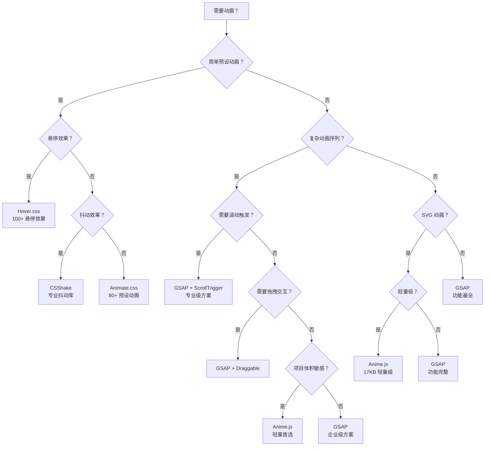

# 动画库介绍

提高开发效率的常用 CSS 动画库，涵盖纯 CSS 动画库与 JavaScript 动画库的使用方法、特性对比和最佳实践。

## 背景与动机

### 为什么使用动画库？

在 Web 开发中，动画是提升用户体验的重要手段。然而，从零开始编写动画代码存在以下问题：

- **开发效率低**：每个动画效果都需要手动编写关键帧和样式
- **一致性难以保证**：不同开发者实现的动画效果风格不统一
- **性能优化困难**：缺乏对 GPU 加速、合成层等底层原理的深入了解
- **跨浏览器兼容**：需要处理各种浏览器前缀和兼容性问题
- **动画编排复杂**：复杂动画序列的时间轴管理困难

动画库通过封装常用动画效果、提供统一的 API 和最佳实践，帮助开发者快速实现高质量的动画效果。

### 动画库选择决策树



---

## 动画库分类与原理

| 类型 | 代表库 | 特点 | 适用场景 |
|------|--------|------|----------|
| 纯 CSS 库 | Animate.css、Hover.css | 零依赖、开箱即用、性能好 | 简单预设动画、悬停效果 |
| JS 动画库 | GSAP、Anime.js | 功能强大、可编程控制 | 复杂动画序列、交互式动画 |

### 动画原理

```
CSS 动画库原理：
┌─────────────────────────────────────────────┐
│  预定义 @keyframes + CSS 类名触发            │
│  ├── 定义动画关键帧                          │
│  ├── 通过类名应用 animation 属性             │
│  └── 浏览器原生渲染，性能最优                │
└─────────────────────────────────────────────┘

JS 动画库原理：
┌─────────────────────────────────────────────┐
│  JavaScript 控制 + requestAnimationFrame    │
│  ├── 动态计算每一帧的样式值                  │
│  ├── 支持时间轴、缓动函数、回调              │
│  └── 可实现复杂动画逻辑                      │
└─────────────────────────────────────────────┘
```

## CSS 动画库

### Animate.css

#### 简介

Animate.css 是最流行的 CSS 动画库，提供大量预设动画效果，开箱即用，无需编写关键帧代码。

**特点：**

- 80+ 预设动画效果
- 零 JavaScript 依赖
- 支持自定义时长和延迟
- 体积小（约 90KB，压缩后 15KB）
- 兼容性好，支持 IE10+

#### 安装方式

```bash
# npm 安装
npm install animate.css

# yarn 安装
yarn add animate.css

# pnpm 安装
pnpm add animate.css
```

```html
<!-- CDN 引入（开发环境） -->
<link rel="stylesheet" href="https://cdnjs.cloudflare.com/ajax/libs/animate.css/4.1.1/animate.css">

<!-- CDN 引入（生产环境） -->
<link rel="stylesheet" href="https://cdnjs.cloudflare.com/ajax/libs/animate.css/4.1.1/animate.min.css">
```

#### 基本使用

```html
<!-- 基础用法：必须包含 animate__animated 基础类 -->
<div class="animate__animated animate__fadeIn">淡入效果</div>
<div class="animate__animated animate__bounceIn">弹入效果</div>
<div class="animate__animated animate__slideInLeft">左侧滑入</div>
```

#### 配置参数

| 参数 | CSS 变量 | 默认值 | 说明 |
|------|----------|--------|------|
| 动画时长 | `--animate-duration` | 1s | 动画播放总时长 |
| 动画延迟 | `--animate-delay` | 0s | 动画开始前的延迟 |
| 动画次数 | `animation-iteration-count` | 1 | 动画播放次数 |
| 动画方向 | `animation-direction` | normal | 动画播放方向 |

```css
/* 全局配置 */
:root {
  --animate-duration: 0.5s;
  --animate-delay: 0.5s;
}

/* 单个元素配置 */
.custom-animation {
  --animate-duration: 2s;
  --animate-delay: 1s;
  animation-iteration-count: infinite;
}

/* 无限循环 */
.infinite-bounce {
  animation-iteration-count: infinite;
}
```

#### 动画类别

```html
<!-- ===== 淡入淡出类 ===== -->
<div class="animate__animated animate__fadeIn">普通淡入</div>
<div class="animate__animated animate__fadeInUp">向上淡入</div>
<div class="animate__animated animate__fadeInDown">向下淡入</div>
<div class="animate__animated animate__fadeInLeft">向左淡入</div>
<div class="animate__animated animate__fadeInRight">向右淡入</div>
<div class="animate__animated animate__fadeOut">淡出效果</div>

<!-- ===== 弹跳类 ===== -->
<div class="animate__animated animate__bounce">弹跳</div>
<div class="animate__animated animate__bounceIn">弹入</div>
<div class="animate__animated animate__bounceOut">弹出</div>
<div class="animate__animated animate__bounceInUp">向上弹入</div>

<!-- ===== 缩放类 ===== -->
<div class="animate__animated animate__zoomIn">放大进入</div>
<div class="animate__animated animate__zoomOut">缩小退出</div>
<div class="animate__animated animate__zoomInDown">向下放大进入</div>

<!-- ===== 滑入类 ===== -->
<div class="animate__animated animate__slideInLeft">从左滑入</div>
<div class="animate__animated animate__slideInRight">从右滑入</div>
<div class="animate__animated animate__slideInUp">从下滑入</div>
<div class="animate__animated animate__slideInDown">从上滑入</div>

<!-- ===== 翻转类 ===== -->
<div class="animate__animated animate__flip">翻转</div>
<div class="animate__animated animate__flipInX">X轴翻入</div>
<div class="animate__animated animate__flipInY">Y轴翻入</div>

<!-- ===== 特殊效果类 ===== -->
<div class="animate__animated animate__hinge">铰链脱落</div>
<div class="animate__animated animate__jackInTheBox">弹出盒子</div>
<div class="animate__animated animate__rollIn">滚入</div>
<div class="animate__animated animate__lightSpeedIn">光速进入</div>
```

#### JavaScript 控制

```javascript
// 动态添加动画类
const element = document.querySelector('.my-element');
element.classList.add('animate__animated', 'animate__fadeIn');

// 监听动画结束
element.addEventListener('animationend', () => {
  console.log('动画结束');
  // 移除动画类以便重新播放
  element.classList.remove('animate__animated', 'animate__fadeIn');
});

// 动画序列
function playAnimationSequence(element, animations) {
  let index = 0;
  
  function playNext() {
    if (index >= animations.length) return;
    
    element.classList.remove(`animate__${animations[index - 1]}`);
    element.classList.add('animate__animated', `animate__${animations[index]}`);
    index++;
  }
  
  element.addEventListener('animationend', playNext);
  playNext();
}

// 使用示例
playAnimationSequence(element, ['fadeIn', 'bounce', 'fadeOut']);
```

---

### Hover.css

#### 简介

Hover.css 专注于悬停效果的 CSS 动画库，提供丰富的交互式悬停动画。

**特点：**

- 100+ 悬停效果
- 支持 2D/3D 变换
- 包含过渡、阴影、边框等多种效果
- 可自定义颜色和速度
- 体积约 130KB

#### 安装方式

```bash
# npm 安装
npm install hover.css

# yarn 安装
yarn add hover.css
```

```html
<!-- CDN 引入 -->
<link rel="stylesheet" href="https://cdnjs.cloudflare.com/ajax/libs/hover.css/2.3.1/css/hover-min.css">
```

#### 基本使用

```html
<!-- 基础用法：添加 hvr- 前缀的类名 -->
<button class="hvr-grow">放大效果</button>
<button class="hvr-float">上浮效果</button>
```

#### 效果分类

```html
<!-- ===== 2D 变换效果 ===== -->
<div class="hvr-grow">放大</div>
<div class="hvr-shrink">缩小</div>
<div class="hvr-rotate">旋转</div>
<div class="hvr-grow-rotate">放大旋转</div>
<div class="hvr-float">上浮</div>
<div class="hvr-sink">下沉</div>
<div class="hvr-skew">倾斜</div>

<!-- ===== 过渡效果 ===== -->
<div class="hvr-fade">淡入淡出</div>
<div class="hvr-back-pulse">背景脉冲</div>
<div class="hvr-sweep-to-right">扫过到右侧</div>
<div class="hvr-sweep-to-left">扫过到左侧</div>

<!-- ===== 边框效果 ===== -->
<div class="hvr-border-fade">边框淡入</div>
<div class="hvr-trim">边框修剪</div>
<div class="hvr-ripple-out">涟漪扩散</div>
<div class="hvr-ripple-in">涟漪收拢</div>
<div class="hvr-outline-out">轮廓扩散</div>
<div class="hvr-outline-in">轮廓收拢</div>

<!-- ===== 阴影效果 ===== -->
<div class="hvr-shadow">阴影</div>
<div class="hvr-float-shadow">悬浮阴影</div>
<div class="hvr-shadow-radial">径向阴影</div>
<div class="hvr-box-shadow-outset">外阴影</div>
<div class="hvr-box-shadow-inset">内阴影</div>

<!-- ===== 气泡效果 ===== -->
<div class="hvr-bubble-top">顶部气泡</div>
<div class="hvr-bubble-bottom">底部气泡</div>
<div class="hvr-bubble-left">左侧气泡</div>
<div class="hvr-bubble-right">右侧气泡</div>

<!-- ===== 图标效果 ===== -->
<a href="#" class="hvr-icon-back">
  <i class="fa fa-arrow-left hvr-icon"></i> 返回
</a>
<a href="#" class="hvr-icon-forward">
  前进 <i class="fa fa-arrow-right hvr-icon"></i>
</a>
<a href="#" class="hvr-icon-down">
  下载 <i class="fa fa-download hvr-icon"></i>
</a>
<a href="#" class="hvr-icon-up">
  <i class="fa fa-upload hvr-icon"></i> 上传
</a>

<!-- ===== 剪裁过渡 ===== -->
<div class="hvr-shutter-in-horizontal">水平百叶窗进入</div>
<div class="hvr-shutter-out-horizontal">水平百叶窗退出</div>
<div class="hvr-shutter-in-vertical">垂直百叶窗进入</div>
<div class="hvr-shutter-out-vertical">垂直百叶窗退出</div>
```

#### 自定义配置

```css
/* 自定义颜色 */
.hvr-fade {
  background-color: #2098D1;
}

.hvr-fade:hover {
  background-color: #2980b9;
}

/* 自定义过渡时间 */
.hvr-grow {
  transition-duration: 0.5s;
}

/* 组合使用 */
.custom-hover {
  display: inline-block;
  padding: 1em 2em;
  background: #3498db;
  color: white;
  border-radius: 4px;
  transition: all 0.3s ease;
}

.custom-hover:hover {
  background: #2980b9;
  transform: translateY(-3px);
  box-shadow: 0 10px 20px rgba(0, 0, 0, 0.2);
}
```

---

### Motion.css

#### 简介

Motion.css 是一个轻量级的现代 CSS 动画库，专注于简洁优雅的动画效果。

**特点：**

- 极小的文件体积（约 5KB）
- 现代化的动画效果
- 响应式设计友好
- 易于自定义
- 支持按需加载

#### 安装方式

```bash
# npm 安装
npm install motion.css

# 直接下载
# https://github.com/mburakerman/motion.css
```

```html
<!-- 本地引入 -->
<link rel="stylesheet" href="path/to/motion.css">
```

#### 基本使用

```html
<!-- 淡入淡出 -->
<div class="motion-fade-in">淡入</div>
<div class="motion-fade-out">淡出</div>

<!-- 滑动效果 -->
<div class="motion-slide-up">上滑</div>
<div class="motion-slide-down">下滑</div>
<div class="motion-slide-left">左滑</div>
<div class="motion-slide-right">右滑</div>

<!-- 缩放效果 -->
<div class="motion-zoom-in">放大</div>
<div class="motion-zoom-out">缩小</div>

<!-- 弹跳效果 -->
<div class="motion-bounce">弹跳</div>

<!-- 翻转效果 -->
<div class="motion-flip">翻转</div>

<!-- 旋转效果 -->
<div class="motion-rotate">旋转</div>
```

#### 自定义动画

```css
/* 自定义动画变体 */
.motion-fade-in-custom {
  animation: fadeInCustom 0.6s ease-out forwards;
}

@keyframes fadeInCustom {
  from {
    opacity: 0;
    transform: translateY(20px);
  }
  to {
    opacity: 1;
    transform: translateY(0);
  }
}

/* 延迟加载 */
.motion-delay-1 { animation-delay: 0.1s; }
.motion-delay-2 { animation-delay: 0.2s; }
.motion-delay-3 { animation-delay: 0.3s; }
.motion-delay-4 { animation-delay: 0.4s; }
.motion-delay-5 { animation-delay: 0.5s; }
```

#### 滚动触发

```javascript
// 使用 Intersection Observer 实现滚动触发
const observer = new IntersectionObserver((entries) => {
  entries.forEach(entry => {
    if (entry.isIntersecting) {
      entry.target.classList.add('motion-fade-in');
      observer.unobserve(entry.target);
    }
  });
}, {
  threshold: 0.1
});

// 观察所有需要动画的元素
document.querySelectorAll('.animate-on-scroll').forEach(el => {
  observer.observe(el);
});
```

---

### CSShake

#### 简介

CSShake 是专门用于抖动效果的 CSS 动画库，适用于错误提示、注意力引导等场景。

**特点：**

- 多种抖动效果类型
- 可调节抖动强度
- 纯 CSS 实现，无依赖
- 体积小（约 15KB）
- 支持悬停触发

#### 安装方式

```bash
# npm 安装
npm install csshake

# yarn 安装
yarn add csshake
```

```html
<!-- CDN 引入 -->
<link rel="stylesheet" href="https://cdnjs.cloudflare.com/ajax/libs/csshake/1.5.3/csshake.min.css">

<!-- 仅引入需要的模块 -->
<link rel="stylesheet" href="https://cdnjs.cloudflare.com/ajax/libs/csshake/1.5.3/csshake-slow.min.css">
<link rel="stylesheet" href="https://cdnjs.cloudflare.com/ajax/libs/csshake/1.5.3/csshake-hard.min.css">
```

#### 基本使用

```html
<!-- 基础抖动 -->
<div class="shake">抖动</div>
<div class="shake-slow">慢速抖动</div>
<div class="shake-little">小幅抖动</div>
<div class="shake-hard">剧烈抖动</div>
<div class="shake-horizontal">水平抖动</div>
<div class="shake-vertical">垂直抖动</div>
<div class="shake-rotate">旋转抖动</div>
<div class="shake-opacity">透明度抖动</div>
<div class="shake-crazy">疯狂抖动</div>

<!-- 持续抖动（非悬停触发） -->
<div class="shake shake-constant">持续抖动</div>
<div class="shake shake-constant shake-constant--hover">悬停暂停</div>
```

#### 自定义配置

```css
/* 自定义抖动参数 */
.shake-custom {
  --shake-distance: 10px;      /* 抖动距离 */
  --shake-duration: 0.5s;      /* 抖动时长 */
  --shake-intensity: 50%;      /* 抖动强度 */
  --shake-angle: 15deg;        /* 抖动角度 */
}

/* 表单验证错误示例 */
.input-error {
  border: 2px solid #e74c3c;
  animation: shake 0.5s ease-in-out;
}

@keyframes shake {
  0%, 100% { transform: translateX(0); }
  10%, 30%, 50%, 70%, 90% { transform: translateX(-5px); }
  20%, 40%, 60%, 80% { transform: translateX(5px); }
}
```

#### 实际应用示例

```html
<!-- 表单验证错误提示 -->
<div class="form-group">
  <input type="email" id="email" class="shake-little" placeholder="请输入邮箱">
  <span class="error-message shake">邮箱格式错误</span>
</div>

<!-- 吸引注意力 -->
<button class="shake-crazy">重要按钮</button>

<!-- 游戏效果 -->
<div class="game-element shake-hard">被击中</div>
```

---

## JavaScript 动画库

### Anime.js

#### 简介

Anime.js 是一个轻量级、功能强大的 JavaScript 动画库，支持 CSS 属性、SVG、DOM 属性和 JavaScript 对象的动画。

**特点：**

- 轻量级（约 17KB）
- 支持 CSS、SVG、DOM 动画
- 内置缓动函数和时间轴
- 支持 Promise 和回调
- 支持响应式动画
- 良好的文档和社区支持

#### 安装方式

```bash
# npm 安装
npm install animejs

# yarn 安装
yarn add animejs

# CDN 引入
# <script src="https://cdnjs.cloudflare.com/ajax/libs/animejs/3.2.1/anime.min.js"></script>
```

```javascript
// ES6 模块导入（v3.x API，本章示例基于 v3）
import anime from 'animejs';

// CommonJS 导入
const anime = require('animejs');
```

> **版本提示**：Anime.js v4（2025 年发布）改用 ESM 命名导出，核心 API 变更为 `import { animate, createTimeline, stagger } from 'animejs'`，不再提供 `anime()` 默认导出。v3 与 v4 的 API 不兼容，安装时请固定版本号。

#### API 详解

##### 基础动画

```javascript
// 基础动画
anime({
  targets: '.element',        // 目标元素（支持选择器、DOM、数组）
  translateX: 250,            // X轴位移
  translateY: 100,            // Y轴位移
  rotate: '1turn',            // 旋转（1圈）
  scale: 1.5,                 // 缩放
  opacity: [0, 1],            // 透明度（从0到1）
  duration: 800,              // 持续时间（毫秒）
  easing: 'easeInOutQuad',    // 缓动函数
  delay: 200,                 // 延迟时间
  loop: true,                 // 循环播放
  direction: 'alternate',     // 播放方向（normal/alternate/reverse）
  autoplay: true              // 自动播放
});
```

##### 目标选择器

```javascript
// CSS 选择器
anime({ targets: '.box', ... });
anime({ targets: '#id', ... });
anime({ targets: 'div.box', ... });

// DOM 元素
const el = document.querySelector('.box');
anime({ targets: el, ... });

// DOM 元素数组
const els = document.querySelectorAll('.box');
anime({ targets: els, ... });

// JavaScript 对象
const obj = { prop: 0 };
anime({ targets: obj, prop: 100, ... });

// 数组
anime({ targets: ['.box1', '.box2', '#box3'], ... });
```

##### 属性动画

```javascript
// CSS 属性
anime({
  targets: '.box',
  width: '100px',          // 宽度
  height: '+=50px',        // 增量
  borderRadius: ['0%', '50%'],  // 从到
  backgroundColor: '#FF6B6B',    // 背景色
  boxShadow: '0 0 20px rgba(0,0,0,0.3)'
});

// Transform 属性
anime({
  targets: '.box',
  translateX: 250,
  translateY: 100,
  translateZ: 0,
  rotate: 45,
  rotateX: 90,
  rotateY: 45,
  scale: 1.5,
  scaleX: 2,
  scaleY: 0.5,
  skewX: 30,
  skewY: 20,
  perspective: '1000px'
});

// DOM 属性
anime({
  targets: 'input',
  value: [0, 100],    // 输入框值
  round: 1            // 四舍五入
});

// SVG 属性
anime({
  targets: 'path',
  d: 'M10 10 L100 10 L100 100 L10 100 Z',  // 路径
  strokeDashoffset: [anime.setDashoffset, 0]  // 描边动画
});
```

##### 缓动函数

```javascript
// 内置缓动函数
anime({
  targets: '.box',
  translateX: 250,
  easing: 'linear'              // 线性
  // easing: 'easeInQuad'        // 缓入二次
  // easing: 'easeOutQuad'       // 缓出二次
  // easing: 'easeInOutQuad'     // 缓入缓出二次
  // easing: 'easeInCubic'       // 缓入三次
  // easing: 'easeOutCubic'      // 缓出三次
  // easing: 'easeInOutCubic'    // 缓入缓出三次
  // easing: 'easeInElastic'     // 弹性缓入
  // easing: 'easeOutElastic'    // 弹性缓出
  // easing: 'easeInOutElastic'  // 弹性缓入缓出
  // easing: 'easeInBack'        // 回弹缓入
  // easing: 'easeOutBack'       // 回弹缓出
  // easing: 'easeInOutBack'     // 回弹缓入缓出
  // easing: 'easeInBounce'      // 弹跳缓入
  // easing: 'easeOutBounce'     // 弹跳缓出
  // easing: 'steps(5)'          // 步进动画
});

// 自定义贝塞尔曲线
anime({
  targets: '.box',
  translateX: 250,
  easing: 'cubicBezier(0.5, 0, 0.5, 1)'
});

// 弹簧动画
anime({
  targets: '.box',
  translateX: 250,
  easing: 'spring(1, 80, 10, 0)'
  // 参数: mass(质量), stiffness(刚度), damping(阻尼), velocity(速度)
});
```

##### 时间轴动画

```javascript
// 创建时间轴
const timeline = anime.timeline({
  duration: 500,
  easing: 'easeOutExpo',
  direction: 'alternate',
  loop: true
});

// 添加动画序列
timeline
  .add({
    targets: '.box1',
    translateX: 250
  })
  .add({
    targets: '.box2',
    translateX: 250
  }, '-=300')  // 提前300ms开始
  .add({
    targets: '.box3',
    translateX: 250
  }, 500);      // 绝对时间点500ms

// 时间轴偏移
timeline
  .add({ targets: '.a', ... }, 0)      // 从0开始
  .add({ targets: '.b', ... }, 200)    // 从200ms开始
  .add({ targets: '.c', ... }, '-=100'); // 相对上一动画提前100ms
```

##### 回调函数

```javascript
anime({
  targets: '.box',
  translateX: 250,
  duration: 1000,
  
  // 动画开始
  begin: function(anim) {
    console.log('动画开始', anim);
  },
  
  // 动画完成
  complete: function(anim) {
    console.log('动画完成');
  },
  
  // 每一帧更新
  update: function(anim) {
    console.log('进度:', anim.progress);
  },
  
  // 每次循环开始
  loopBegin: function(anim) {
    console.log('循环开始');
  },
  
  // 每次循环结束
  loopComplete: function(anim) {
    console.log('循环结束');
  },
  
  // 方向改变时（alternate模式）
  directionChange: function(anim) {
    console.log('方向改变');
  }
});
```

##### 动画控制

```javascript
// 创建动画实例
const animation = anime({
  targets: '.box',
  translateX: 250,
  autoplay: false  // 不自动播放
});

// 播放控制
animation.play();          // 播放
animation.pause();         // 暂停
animation.restart();       // 重新开始
animation.reverse();       // 反向播放
animation.seek(500);       // 跳转到500ms
animation.seek(0.5);       // 跳转到50%进度

// 获取动画信息
console.log(animation.duration);   // 总时长
console.log(animation.progress);   // 当前进度(0-1)
console.log(animation.currentTime);// 当前时间
console.log(animation.began);      // 是否已开始
console.log(animation.completed);  // 是否已完成
console.log(animation.paused);     // 是否暂停
```

##### SVG 动画

```javascript
// 路径描边动画
anime({
  targets: 'path',
  strokeDashoffset: [anime.setDashoffset, 0],
  easing: 'easeInOutSine',
  duration: 1500,
  delay: function(el, i) { return i * 250 },
  direction: 'alternate',
  loop: true
});

// 路径变形动画
anime({
  targets: 'path',
  d: [
    { value: 'M10 10 L100 10 L100 100 L10 100 Z' },
    { value: 'M50 10 L100 50 L50 100 L10 50 Z' }
  ],
  fill: '#FF6B6B',
  easing: 'easeOutQuad',
  duration: 2000,
  loop: true
});

// 线条绘制动画
anime({
  targets: '.lines path',
  strokeDashoffset: [anime.setDashoffset, 0],
  easing: 'easeInOutQuad',
  duration: 1500,
  delay: function(el, i) { return i * 200 }
});
```

##### 数值和颜色动画

```javascript
// 数值动画
anime({
  targets: '.counter',
  innerHTML: [0, 1000],
  round: 1,  // 四舍五入到整数
  easing: 'easeInOutExpo'
});

// 颜色动画
anime({
  targets: '.box',
  backgroundColor: [
    { value: '#FF6B6B' },
    { value: '#4ECDC4' },
    { value: '#45B7D1' }
  ],
  easing: 'linear',
  duration: 3000,
  loop: true
});
```

---

### GSAP

#### 简介

GSAP (GreenSock Animation Platform) 是专业级 JavaScript 动画平台，被大量网站和应用采用。

**特点：**

- 功能强大，性能优异
- 完善的浏览器兼容性
- 丰富的插件生态
- 优秀的文档和社区
- 支持 SVG、Canvas、WebGL
- 2024 年 Webflow 收购 GreenSock 后，全部功能（含原 Club 付费插件如 SplitText、MorphSVG）均已免费

#### 安装方式

```bash
# npm 安装
npm install gsap

# yarn 安装
yarn add gsap

# CDN 引入
# <script src="https://cdnjs.cloudflare.com/ajax/libs/gsap/3.12.2/gsap.min.js"></script>
```

```javascript
// ES6 模块导入
import gsap from 'gsap';
import { ScrollTrigger } from 'gsap/ScrollTrigger';
import { Draggable } from 'gsap/Draggable';
import { MotionPathPlugin } from 'gsap/MotionPathPlugin';

// 注意：TweenMax/TimelineMax 是 GSAP 2 时代的旧 API，GSAP 3 中已废弃，统一使用 gsap.timeline() 等新 API
// 注册插件
gsap.registerPlugin(ScrollTrigger, Draggable, MotionPathPlugin);
```

#### 核心 API

##### gsap.to()

```javascript
// 从当前状态动画到目标状态
gsap.to('.box', {
  x: 100,              // translateX(100px)
  y: 50,               // translateY(50px)
  rotation: 360,       // rotate(360deg)
  scale: 1.5,          // scale(1.5)
  opacity: 0.5,        // 透明度
  duration: 1,         // 持续时间（秒）
  ease: 'power2.out',  // 缓动函数
  delay: 0.5,          // 延迟时间
  repeat: 2,           // 重复次数（-1为无限循环）
  yoyo: true,          // 往返播放
  stagger: 0.2         // 交错延迟
});
```

##### gsap.from()

```javascript
// 从指定状态动画到当前状态
gsap.from('.box', {
  x: -100,
  opacity: 0,
  duration: 1
});
```

##### gsap.fromTo()

```javascript
// 从指定状态A动画到指定状态B
gsap.fromTo('.box', 
  { x: -100, opacity: 0 },  // 起始状态
  { x: 100, opacity: 1, duration: 1 }  // 结束状态
);
```

##### gsap.set()

```javascript
// 立即设置样式（无动画）
gsap.set('.box', { x: 100, opacity: 0.5 });
```

#### 属性详解

| 属性 | 类型 | 默认值 | 说明 |
|------|------|--------|------|
| duration | Number | 0.5 | 动画持续时间（秒） |
| ease | String | 'power1.out' | 缓动函数 |
| delay | Number | 0 | 动画延迟（秒） |
| repeat | Number | 0 | 重复次数（-1无限） |
| yoyo | Boolean | false | 是否往返播放 |
| stagger | Number/Object | 0 | 交错动画延迟 |
| onStart | Function | - | 动画开始回调 |
| onUpdate | Function | - | 动画更新回调 |
| onComplete | Function | - | 动画完成回调 |
| paused | Boolean | false | 是否暂停 |

#### 缓动函数

```javascript
// 内置缓动函数
// power1/2/3/4, back, elastic, bounce, expo, circ, sine, quad, cubic, quart, quint

gsap.to('.box', {
  x: 100,
  ease: 'none'           // 无缓动
  // ease: 'power1.out'    // 缓出
  // ease: 'power2.inOut'  // 缓入缓出
  // ease: 'back.out(1.7)' // 回弹效果
  // ease: 'elastic.out(1, 0.3)' // 弹性效果
  // ease: 'bounce.out'    // 弹跳效果
  // ease: 'steps(5)'      // 步进动画
});

// 自定义缓动
gsap.to('.box', {
  x: 100,
  ease: 'custom',
  modifiers: {
    x: x => Math.round(x)  // 取整
  }
});
```

#### 时间轴

```javascript
// 创建时间轴
const tl = gsap.timeline({
  repeat: -1,           // 无限循环
  yoyo: true,           // 往返
  defaults: {           // 默认属性
    duration: 1,
    ease: 'power2.out'
  }
});

// 添加动画
tl.to('.box1', { x: 100 })
  .to('.box2', { y: 50 }, '-=0.5')   // 提前0.5秒
  .to('.box3', { rotation: 360 }, '<') // 与上一个同时开始
  .to('.box4', { opacity: 0 }, '>');   // 在上一个完成后开始

// 位置参数
tl.to('.box', { x: 100 }, 0)           // 绝对时间点0秒
tl.to('.box', { x: 100 }, '+=1')       // 相对当前位置后1秒
tl.to('.box', { x: 100 }, '-=0.5')     // 相对当前位置前0.5秒
tl.to('.box', { x: 100 }, '<')         // 与上一个动画同时开始
tl.to('.box', { x: 100 }, '<0.5')      // 上一个动画开始后0.5秒
tl.to('.box', { x: 100 }, '>')         // 上一个动画结束后开始
tl.to('.box', { x: 100 }, '>0.5')      // 上一个动画结束后0.5秒
```

#### 交错动画

```javascript
// 简单交错
gsap.to('.box', {
  x: 100,
  stagger: 0.2  // 每个元素延迟0.2秒
});

// 交错对象
gsap.to('.box', {
  x: 100,
  stagger: {
    each: 0.1,           // 每个元素间隔
    from: 'center',      // 从中心开始（start/center/end/random/指定索引）
    grid: [3, 3],        // 网格布局
    axis: 'x',           // 方向（x/y）
    ease: 'power2.inOut' // 交错缓动
  }
});

// 随机交错
gsap.to('.box', {
  x: 100,
  stagger: {
    each: 0.5,
    from: 'random'
  }
});
```

#### 动画控制

```javascript
// 创建动画实例
const tween = gsap.to('.box', {
  x: 100,
  paused: true
});

// 播放控制
tween.play();           // 播放
tween.pause();          // 暂停
tween.restart();        // 重新开始
tween.reverse();        // 反向播放
tween.resume();         // 恢复播放
tween.seek(2);          // 跳转到2秒
tween.progress(0.5);    // 跳转到50%
tween.timeScale(2);     // 播放速度2倍

// 获取状态
console.log(tween.duration());     // 总时长
console.log(tween.time());         // 当前时间
console.log(tween.progress());     // 当前进度
console.log(tween.isActive());     // 是否正在播放
console.log(tween.paused());       // 是否暂停

// 杀死动画
tween.kill();           // 停止并清除
gsap.killTweensOf('.box'); // 杀死指定元素的所有动画
```

#### 插件功能

##### ScrollTrigger

```javascript
gsap.registerPlugin(ScrollTrigger);

// 基础滚动触发
gsap.to('.box', {
  scrollTrigger: {
    trigger: '.box',      // 触发元素
    start: 'top center',  // 开始位置
    end: 'bottom top',    // 结束位置
    markers: true,        // 显示标记（调试用）
    toggleActions: 'play none none reverse'
    // toggleActions: onEnter onLeave onEnterBack onLeaveBack
    // 可选值: play/pause/resume/reverse/restart/complete/none
  },
  x: 400,
  rotation: 360,
  duration: 2
});

// 滚动进度动画
gsap.to('.box', {
  scrollTrigger: {
    trigger: '.container',
    start: 'top top',
    end: 'bottom bottom',
    scrub: true,          // 跟随滚动
    pin: true             // 固定元素
  },
  x: 400
});

// 批量触发
ScrollTrigger.batch('.box', {
  onEnter: batch => gsap.to(batch, {opacity: 1, y: 0, stagger: 0.1}),
  start: 'top 80%'
});
```

##### Draggable

```javascript
gsap.registerPlugin(Draggable);

// 基础拖拽
Draggable.create('.box', {
  type: 'x,y',           // 拖拽方向
  bounds: '.container',  // 边界
  inertia: true,         // 惯性
  edgeResistance: 0.65,  // 边缘阻力
  throwResistance: 1000, // 抛出阻力
  snap: {                // 吸附
    x: [0, 100, 200],
    y: [0, 50, 100]
  },
  onDragStart: function() {
    console.log('开始拖拽');
  },
  onDrag: function() {
    console.log(this.x, this.y);
  },
  onDragEnd: function() {
    console.log('结束拖拽');
  }
});
```

##### MotionPathPlugin

```javascript
gsap.registerPlugin(MotionPathPlugin);

// 沿路径运动
gsap.to('.box', {
  motionPath: {
    path: '#path',       // SVG路径
    align: '#path',      // 对齐路径
    alignOrigin: [0.5, 0.5], // 对齐中心点
    autoRotate: true,    // 自动旋转
    start: 0,            // 起始位置(0-1)
    end: 1               // 结束位置(0-1)
  },
  duration: 3,
  ease: 'none',
  repeat: -1
});

// 自定义路径
gsap.to('.box', {
  motionPath: {
    path: [
      {x: 0, y: 0},
      {x: 100, y: 50},
      {x: 200, y: 0},
      {x: 300, y: 50}
    ]
  },
  duration: 2
});
```

#### 实用技巧

```javascript
// 循环动画
gsap.to('.box', {
  x: 100,
  repeat: -1,        // 无限循环
  yoyo: true,        // 往返
  ease: 'none'       // 无缓动，更流畅
});

// 相对值
gsap.to('.box', {
  x: '+=100',        // 相对当前位置+100
  y: '-=50',         // 相对当前位置-50
  rotation: '+=180'  // 相对当前角度+180
});

// 函数值
gsap.to('.box', {
  x: function(i) {
    return i * 100;  // 每个元素不同的值
  },
  duration: 1
});

// 对象动画
const obj = { value: 0 };
gsap.to(obj, {
  value: 100,
  duration: 1,
  onUpdate: function() {
    console.log(obj.value);
  }
});
```

---

## 选型指南

### 功能对比表

| 特性 | Animate.css | Hover.css | CSShake | Anime.js | GSAP |
|------|-------------|-----------|---------|----------|------|
| 类型 | CSS | CSS | CSS | JS | JS |
| 体积 | 15KB | 25KB | 15KB | 17KB | 50KB+ |
| 学习曲线 | 简单 | 简单 | 简单 | 中等 | 中等 |
| 自定义能力 | 低 | 低 | 低 | 高 | 非常高 |
| 动画控制 | 无 | 无 | 无 | 完整 | 完整 |
| 时间轴 | 无 | 无 | 无 | 支持 | 支持 |
| SVG支持 | 无 | 无 | 无 | 完整 | 完整 |
| 滚动动画 | 无 | 无 | 无 | 插件 | 插件 |
| 物理动画 | 无 | 无 | 无 | 支持 | 支持 |
| 性能 | 优 | 优 | 优 | 优 | 优 |
| 浏览器兼容 | IE10+ | IE10+ | IE10+ | IE10+ | IE9+ |
| 商业授权 | MIT | MIT | MIT | MIT | 免费（GSAP 许可证，2024 年起含全部插件） |

### 场景选择

```
选择决策树：

需求：简单预设动画？
├── 是 → Animate.css
└── 否 → 需求：悬停效果？
           ├── 是 → Hover.css
           └── 否 → 需求：抖动效果？
                     ├── 是 → CSShake
                     └── 否 → 需求：复杂动画序列？
                               ├── 是 → GSAP（专业级）/ Anime.js（轻量级）
                               └── 否 → 需求：滚动动画？
                                         ├── 是 → GSAP + ScrollTrigger
                                         └── 否 → 需求：SVG动画？
                                                   ├── 是 → GSAP / Anime.js
                                                   └── 否 → 需求：拖拽交互？
                                                             ├── 是 → GSAP + Draggable
                                                             └── 否 → 根据偏好选择
```

### 性能对比

```
动画库性能特点对比（示意性总结，非实测基准数据，1000 个元素同时动画的场景）：

CSS 动画库：
┌──────────────────────────────────────┐
│ 帧率：稳定 60fps                      │
│ CPU占用：低                           │
│ 内存占用：低                          │
│ GPU加速：支持                         │
└──────────────────────────────────────┘

JS 动画库：
┌──────────────────────────────────────┐
│ 帧率：接近 60fps（复杂动画可能降低）   │
│ CPU占用：中等                         │
│ 内存占用：中等                        │
│ GPU加速：部分支持                     │
└──────────────────────────────────────┘

建议：
- 简单动画优先使用 CSS 方案
- 复杂动画使用 JS 库，但注意性能优化
- 大量元素动画考虑分批处理
```

---

## 框架集成

### React 集成

#### Animate.css

```jsx
import 'animate.css';
import { useState, useEffect } from 'react';

function AnimatedComponent() {
  const [isVisible, setIsVisible] = useState(false);

  useEffect(() => {
    setIsVisible(true);
  }, []);

  return (
    <div className={`animate__animated ${isVisible ? 'animate__fadeIn' : ''}`}>
      淡入内容
    </div>
  );
}

// 使用 react-animation 库（注意：该库不提供 useAnimate 钩子，
// 而是通过 animations/easings 导出预置动画，或使用 AnimateOnChange 等组件）
import { animations } from 'react-animation';

function App() {
  const style = { animation: animations.fadeIn };

  return <div style={style}>动画元素</div>;
}
```

#### GSAP

```jsx
import { useRef, useEffect } from 'react';
import gsap from 'gsap';
import { ScrollTrigger } from 'gsap/ScrollTrigger';

gsap.registerPlugin(ScrollTrigger);

function GSAPComponent() {
  const boxRef = useRef(null);

  useEffect(() => {
    gsap.fromTo(boxRef.current, 
      { opacity: 0, y: 50 },
      { 
        opacity: 1, 
        y: 0, 
        duration: 1,
        scrollTrigger: {
          trigger: boxRef.current,
          start: 'top 80%'
        }
      }
    );
  }, []);

  return <div ref={boxRef}>GSAP 动画</div>;
}

// 使用 @gsap/react
import { useGSAP } from '@gsap/react';

function App() {
  const containerRef = useRef();

  useGSAP(() => {
    gsap.to('.box', { x: 100, duration: 1 });
  }, { scope: containerRef });

  return (
    <div ref={containerRef}>
      <div className="box">动画元素</div>
    </div>
  );
}
```

#### Anime.js

```jsx
import { useRef, useEffect } from 'react';
import anime from 'animejs';

function AnimeComponent() {
  const boxRef = useRef(null);

  useEffect(() => {
    anime({
      targets: boxRef.current,
      translateX: 250,
      duration: 800,
      easing: 'easeInOutQuad'
    });
  }, []);

  return <div ref={boxRef}>Anime 动画</div>;
}
```

### Vue 集成

#### Animate.css

```vue
<template>
  <transition
    enter-active-class="animate__animated animate__fadeIn"
    leave-active-class="animate__animated animate__fadeOut"
  >
    <div v-if="show">动画内容</div>
  </transition>
</template>

<script>
import 'animate.css';

export default {
  data() {
    return {
      show: false
    };
  },
  mounted() {
    this.show = true;
  }
};
</script>
```

#### GSAP

```vue
<template>
  <div ref="box" class="box">GSAP 动画</div>
</template>

<script>
import gsap from 'gsap';
import { ScrollTrigger } from 'gsap/ScrollTrigger';

gsap.registerPlugin(ScrollTrigger);

export default {
  mounted() {
    gsap.fromTo(this.$refs.box,
      { opacity: 0, y: 50 },
      {
        opacity: 1,
        y: 0,
        duration: 1,
        scrollTrigger: {
          trigger: this.$refs.box,
          start: 'top 80%'
        }
      }
    );
  }
};
</script>
```

#### Vue Transition

```vue
<template>
  <!-- 使用 Vue 内置过渡系统 -->
  <transition
    @before-enter="beforeEnter"
    @enter="enter"
    @leave="leave"
  >
    <div v-if="show" class="box">自定义过渡</div>
  </transition>
</template>

<script>
import gsap from 'gsap';

export default {
  data() {
    return { show: true };
  },
  methods: {
    beforeEnter(el) {
      el.style.opacity = 0;
      el.style.transform = 'translateY(50px)';
    },
    enter(el, done) {
      gsap.to(el, {
        opacity: 1,
        y: 0,
        duration: 1,
        onComplete: done
      });
    },
    leave(el, done) {
      gsap.to(el, {
        opacity: 0,
        y: -50,
        duration: 1,
        onComplete: done
      });
    }
  }
};
</script>
```

---

## 性能优化

### 动画性能基础

```css
/* 使用性能优化的属性 */
.optimized-animation {
  /* 推荐使用（GPU加速） */
  transform: translateX(100px);
  opacity: 0.5;
  
  /* 避免使用（触发重排） */
  /* left: 100px; */
  /* top: 50px; */
  /* width: 200px; */
  /* height: 100px; */
  /* margin: 10px; */
}

/* 启用硬件加速 */
.gpu-accelerated {
  transform: translateZ(0);
  /* 或 */
  will-change: transform, opacity;
}

/* 注意：will-change 不要滥用 */
/* 只在需要时添加，动画结束后移除 */
```

### 性能检测

```javascript
// 使用 Performance API 检测动画性能
function measureAnimationPerformance(callback) {
  const startTime = performance.now();
  let frameCount = 0;
  
  function measure() {
    frameCount++;
    const currentTime = performance.now();
    
    if (currentTime - startTime < 1000) {
      requestAnimationFrame(measure);
    } else {
      const fps = Math.round(frameCount * 1000 / (currentTime - startTime));
      console.log(`FPS: ${fps}`);
      callback(fps);
    }
  }
  
  requestAnimationFrame(measure);
}

// 检测是否掉帧
function detectFrameDrop(threshold = 50) {
  let lastTime = performance.now();
  
  function check() {
    const currentTime = performance.now();
    const deltaTime = currentTime - lastTime;
    
    if (deltaTime > 1000 / threshold) {
      console.warn(`掉帧检测：帧间隔 ${deltaTime.toFixed(2)}ms`);
    }
    
    lastTime = currentTime;
    requestAnimationFrame(check);
  }
  
  requestAnimationFrame(check);
}
```

### 优化策略

```javascript
// 1. 使用 requestAnimationFrame
function animate() {
  // 动画逻辑
  requestAnimationFrame(animate);
}
requestAnimationFrame(animate);

// 2. 批量更新
gsap.to('.boxes', {
  x: 100,
  stagger: 0.1  // 交错动画，避免同时更新
});

// 3. 分层渲染
.layered-animation {
  /* 创建独立的合成层 */
  will-change: transform;
  backface-visibility: hidden;
}

// 4. 使用 Web Workers 处理复杂计算
const worker = new Worker('animation-worker.js');
worker.postMessage({ type: 'calculate', data: animationData });
worker.onmessage = (e) => {
  // 应用计算结果到动画
};

// 5. 减少重绘区域
.contained-animation {
  contain: layout style paint;
}
```

### 内存管理

```javascript
// 动画实例管理
class AnimationManager {
  constructor() {
    this.animations = new Map();
  }
  
  add(id, animation) {
    // 清理旧动画
    if (this.animations.has(id)) {
      this.animations.get(id).kill();
    }
    this.animations.set(id, animation);
  }
  
  remove(id) {
    if (this.animations.has(id)) {
      this.animations.get(id).kill();
      this.animations.delete(id);
    }
  }
  
  clear() {
    this.animations.forEach(anim => anim.kill());
    this.animations.clear();
  }
}

// 使用示例
const animManager = new AnimationManager();

// 添加动画
animManager.add('hero', gsap.to('.hero', { x: 100 }));

// 组件卸载时清理
// animManager.clear();
```

---

## 常见问题

### Q1: Animate.css 动画如何重复播放？

```html
<!-- 方式一：添加 infinite 类 -->
<div class="animate__animated animate__fadeIn animate__infinite">无限循环</div>

<!-- 方式二：使用 CSS -->
<style>
.repeat-animation {
  animation-iteration-count: 3;  /* 播放3次 */
  /* animation-iteration-count: infinite;  /* 无限循环 */
}
</style>

<!-- 方式三：JavaScript 控制 -->
<script>
const element = document.querySelector('.box');
element.addEventListener('animationend', () => {
  // 重新触发动画
  element.classList.remove('animate__fadeIn');
  void element.offsetWidth;  // 触发重排
  element.classList.add('animate__fadeIn');
});
</script>
```

### Q2: 如何实现滚动触发动画？

```javascript
// 方式一：使用 Intersection Observer（推荐）
const observer = new IntersectionObserver((entries) => {
  entries.forEach(entry => {
    if (entry.isIntersecting) {
      entry.target.classList.add('animate__animated', 'animate__fadeIn');
      observer.unobserve(entry.target);
    }
  });
}, { threshold: 0.1 });

document.querySelectorAll('.scroll-animate').forEach(el => {
  observer.observe(el);
});

// 方式二：使用 GSAP ScrollTrigger
gsap.to('.box', {
  scrollTrigger: {
    trigger: '.box',
    start: 'top 80%'
  },
  x: 100,
  opacity: 1
});

// 方式三：监听滚动事件（性能较差，不推荐）
window.addEventListener('scroll', () => {
  const element = document.querySelector('.box');
  const rect = element.getBoundingClientRect();
  if (rect.top < window.innerHeight * 0.8) {
    element.classList.add('animate__fadeIn');
  }
});
```

### Q3: 动画导致页面卡顿怎么办？

```javascript
// 1. 检查是否使用了性能差的属性
// 避免使用：width, height, left, top, margin, padding
// 推荐使用：transform, opacity

// 2. 启用硬件加速
.animated-element {
  will-change: transform, opacity;
  transform: translateZ(0);
}

// 3. 减少同时动画的元素数量
// 使用 stagger 或分批处理
gsap.to('.box', {
  x: 100,
  stagger: {
    each: 0.05,
    from: 'start'
  }
});

// 4. 使用 CSS contain 属性
.animated-container {
  contain: layout style paint;
}

// 5. 降低动画复杂度
// 减少阴影、模糊等高开销效果
```

### Q4: 如何处理动画结束后的状态？

```javascript
// Animate.css
element.addEventListener('animationend', () => {
  element.style.visibility = 'hidden';
  element.classList.remove('animate__animated', 'animate__fadeOut');
});

// GSAP
gsap.to('.box', {
  opacity: 0,
  onComplete: function() {
    gsap.set(this.targets(), { visibility: 'hidden' });
  }
});

// Anime.js
anime({
  targets: '.box',
  opacity: 0,
  complete: function(anim) {
    anim.animatables.forEach(el => {
      el.target.style.visibility = 'hidden';
    });
  }
});
```

### Q5: 如何实现动画的暂停和恢复？

```javascript
// GSAP
const tween = gsap.to('.box', { x: 100 });
tween.pause();   // 暂停
tween.resume();  // 恢复
tween.play();    // 播放

// Anime.js
const anim = anime({ targets: '.box', x: 100, autoplay: false });
anim.pause();    // 暂停
anim.play();     // 播放

// CSS 动画
.animated-element {
  animation-play-state: paused;  /* 暂停 */
  animation-play-state: running; /* 播放 */
}

// JavaScript 控制
element.style.animationPlayState = 'paused';
```

### Q6: 如何实现路径动画？

```javascript
// GSAP MotionPathPlugin
gsap.to('.box', {
  motionPath: {
    path: '#svg-path',
    align: '#svg-path',
    autoRotate: true
  },
  duration: 2
});

// Anime.js SVG 动画（v3：使用 anime.path 工具函数沿 SVG 路径运动）
const path = anime.path('#svg-path');
anime({
  targets: '.box',
  translateX: path('x'),
  translateY: path('y'),
  duration: 2000,
  easing: 'linear'
});

// 纯 CSS（使用 offset-path）
.path-animation {
  offset-path: path('M 0 0 Q 100 50 200 0');
  animation: move 2s linear infinite;
}

@keyframes move {
  100% { offset-distance: 100%; }
}
```

### Q7: 如何处理用户的动画偏好设置？

```css
/* 尊重用户偏好：减少动画 */
@media (prefers-reduced-motion: reduce) {
  *,
  *::before,
  *::after {
    animation-duration: 0.01ms !important;
    animation-iteration-count: 1 !important;
    transition-duration: 0.01ms !important;
  }
}
```

```javascript
// JavaScript 检测
const prefersReducedMotion = window.matchMedia('(prefers-reduced-motion: reduce)');

if (prefersReducedMotion.matches) {
  // 禁用或简化动画
  console.log('用户偏好：减少动画');
}

// 监听变化
prefersReducedMotion.addEventListener('change', (e) => {
  if (e.matches) {
    // 用户启用了减少动画
  } else {
    // 用户关闭了减少动画
  }
});
```

---

## 最佳实践

### 1. 选择合适的动画库

- **简单预设动画**：Animate.css、Hover.css
- **复杂动画序列**：GSAP、Anime.js
- **SVG 动画**：GSAP、Anime.js
- **滚动驱动动画**：GSAP + ScrollTrigger
- **拖拽交互**：GSAP + Draggable

### 2. 性能优先

```css
/* 使用高性能属性 */
.performant-animation {
  transform: translateX(0);
  opacity: 1;
  will-change: transform, opacity;
}

/* 避免使用低性能属性 */
.avoid-these {
  /* width: 100px; */
  /* height: 100px; */
  /* left: 0; */
  /* top: 0; */
}
```

### 3. 响应式动画

```css
/* 根据屏幕大小调整动画 */
@media (max-width: 768px) {
  .animated-element {
    animation-duration: 0.5s;  /* 移动端更快 */
  }
}
```

### 4. 可访问性考虑

```css
/* 尊重用户偏好 */
@media (prefers-reduced-motion: reduce) {
  .animated-element {
    animation: none;
  }
}

/* 提供替代方案 */
.animation-fallback {
  /* 无动画状态 */
}
```

### 5. 按需加载

```javascript
// 动态加载动画库
async function loadAnimationLibrary() {
  if (document.querySelector('.needs-animation')) {
    const gsap = await import('gsap');
    // 使用 gsap
  }
}
```

### 6. 动画编排

```javascript
// 使用时间轴组织复杂动画
const tl = gsap.timeline();

tl.addLabel('intro')
  .to('.logo', { opacity: 1, duration: 0.5 })
  .to('.title', { y: 0, opacity: 1 }, '-=0.3')
  .addLabel('content')
  .to('.content', { opacity: 1 }, '+=0.5')
  .addLabel('outro');

// 可以跳转到特定标签
// tl.play('content');
```

### 7. 测试和调试

```javascript
// GSAP 调试工具
gsap.to('.box', {
  x: 100,
  onStart: () => console.log('开始'),
  onUpdate: () => console.log('更新'),
  onComplete: () => console.log('完成')
});

// 使用 GSDevTools（2024 年起已免费）
// gsap.registerPlugin(GSDevTools);
// GSDevTools.create();
```

### 8. 文档和维护

```javascript
/**
 * 动画配置对象
 * @typedef {Object} AnimationConfig
 * @property {string} target - 目标元素选择器
 * @property {Object} vars - GSAP 动画参数
 */
const animationConfigs = {
  heroEntrance: {
    target: '.hero',
    vars: { opacity: 1, y: 0, duration: 1 }
  },
  staggerFade: {
    target: '.list-item',
    vars: { opacity: 1, stagger: 0.1 }
  }
};
```

---

## 参考资源

- [Animate.css 官方文档](https://animate.style/)
- [Hover.css 官方文档](https://ianlunn.github.io/Hover/)
- [Anime.js 官方文档](https://animejs.com/)
- [GSAP 官方文档](https://greensock.com/docs/)
- [MDN Web Animations API](https://developer.mozilla.org/en-US/docs/Web/API/Web_Animations_API)
- [CSS Animation Performance](https://web.dev/animations/)
