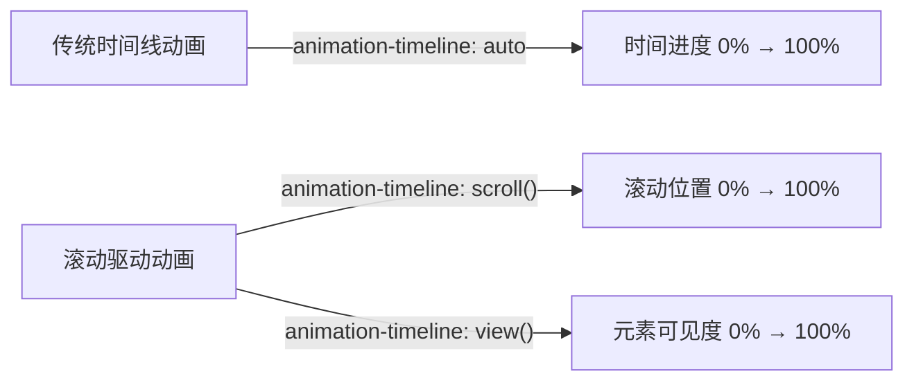
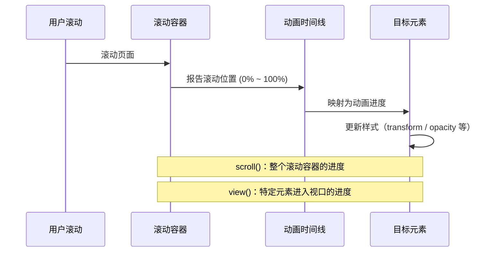
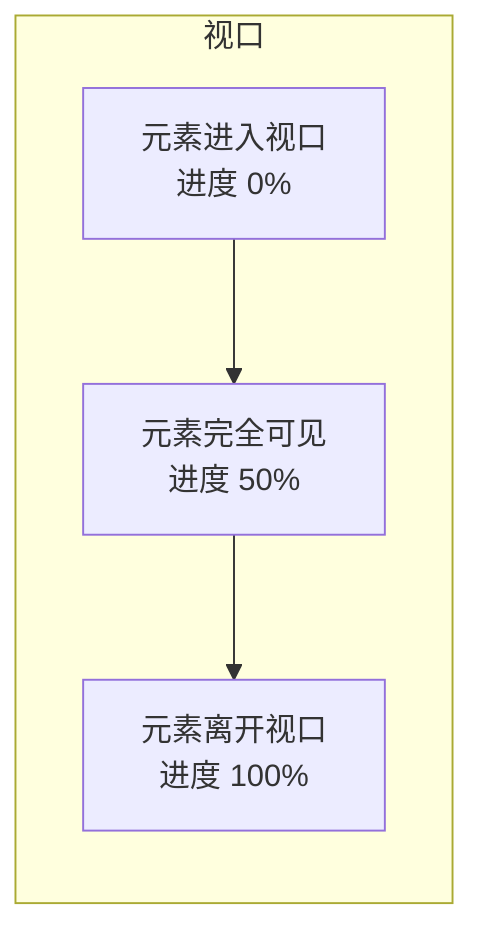
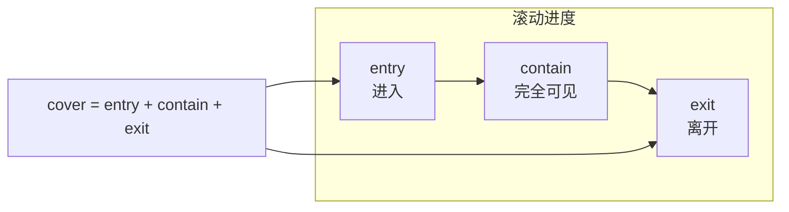
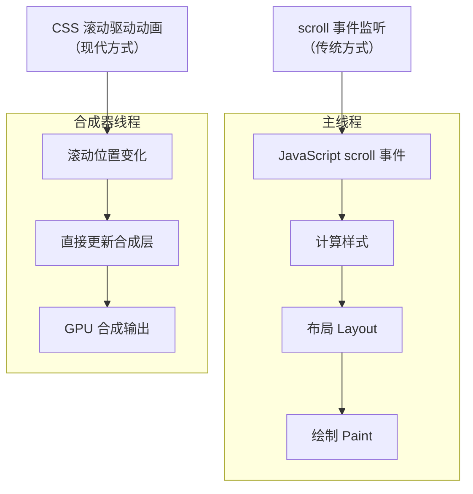

# 滚动驱动动画

CSS 滚动驱动动画（Scroll-Driven Animations）将动画进度与滚动位置绑定，使元素根据用户的滚动行为动态变化，无需 JavaScript 监听滚动事件即可实现视差滚动、滚动揭示、进度指示器等交互效果。

## 概述

### 从时间驱动到滚动驱动

传统 CSS 动画基于时间线（time-driven），动画进度由时间推移决定。滚动驱动动画则将进度与滚动位置关联，用户通过滚动控制动画播放，形成更直观的交互体验。





### 核心优势

| 优势 | 说明 |
|------|------|
| 零 JavaScript | 纯 CSS 实现，无需监听 scroll 事件 |
| 合成器友好 | 滚动驱动动画可在合成器线程运行，不阻塞主线程 |
| 声明式 | 通过 CSS 属性声明绑定关系，代码简洁 |
| 流畅体验 | 与滚动操作同步，无延迟或卡顿 |

## scroll() 时间线

`scroll()` 时间线将动画进度与滚动容器的滚动位置关联。当滚动条从顶部滚动到底部时，动画进度从 0% 推进到 100%。

### 基本语法

```css
animation-timeline: scroll();
animation-timeline: scroll(scroller axis);
```

**参数说明：**

| 参数 | 可选值 | 说明 |
|------|--------|------|
| scroller | `nearest`（默认）、`root`、`self` | 滚动容器来源 |
| axis | `block`（默认）、`inline`、`y`、`x` | 滚动轴方向 |

### root 滚动容器

使用视口（viewport）作为滚动容器，页面整体滚动驱动动画。

```html
<!DOCTYPE html>
<html lang="zh-CN">
<head>
  <style>
    body {
      margin: 0;
      min-height: 300vh; /* 确保页面可滚动 */
    }

    .progress-bar {
      position: fixed;
      top: 0;
      left: 0;
      width: 100%;
      height: 4px;
      background: linear-gradient(90deg, #6366f1, #ec4899);
      transform-origin: left;
      transform: scaleX(0);

      animation: progress-advance linear;
      animation-timeline: scroll(root);
    }

    @keyframes progress-advance {
      to { transform: scaleX(1); }
    }
  </style>
</head>
<body>
  <div class="progress-bar"></div>
  <!-- 页面内容 -->
</body>
</html>
```

### 命名滚动容器

通过 `scroll-timeline-name` 为特定容器创建命名滚动时间线，实现局部滚动驱动。

```html
<!DOCTYPE html>
<html lang="zh-CN">
<head>
  <style>
    .scroll-container {
      scroll-timeline-name: --my-scroll;
      scroll-timeline-axis: block;

      overflow-y: auto;
      height: 400px;
      border: 2px solid #e5e7eb;
      border-radius: 12px;
    }

    .scroll-content {
      height: 1200px;
      padding: 20px;
    }

    .animated-box {
      width: 100px;
      height: 100px;
      background: linear-gradient(135deg, #6366f1, #8b5cf6);
      border-radius: 16px;

      animation: rotate-box linear;
      animation-timeline: --my-scroll;
    }

    @keyframes rotate-box {
      to { transform: rotate(360deg); }
    }
  </style>
</head>
<body>
  <div class="scroll-container">
    <div class="scroll-content">
      <div class="animated-box"></div>
    </div>
  </div>
</body>
</html>
```

### scroll(direction) 水平滚动

```css
/* 水平滚动驱动动画 */
.horizontal-scroll-container {
  scroll-timeline-name: --horizontal-tl;
  scroll-timeline-axis: inline;

  overflow-x: auto;
  display: flex;
  gap: 16px;
}

.horizontal-element {
  animation: slide-in linear;
  animation-timeline: --horizontal-tl;
}

@keyframes slide-in {
  from { opacity: 0; transform: translateY(40px); }
  to   { opacity: 1; transform: translateY(0); }
}
```

### scroller 参数对比

| 值 | 行为 |
|----|------|
| `nearest` | 最近的祖先滚动容器（默认） |
| `root` | 视口作为滚动容器 |
| `self` | 元素自身的滚动容器（需设置 `overflow`） |

## view() 时间线

`view()` 时间线基于元素在滚动容器中的可见性进度驱动动画。当元素进入视口时动画开始，离开视口时动画结束。

### 基本语法

```css
animation-timeline: view();
animation-timeline: view(axis inset);
```

**参数说明：**

| 参数 | 可选值 | 说明 |
|------|--------|------|
| axis | `block`（默认）、`inline`、`y`、`x` | 观察轴方向 |
| inset | `auto`（默认）、`<length>`、`<percentage>` | 调整可见范围的偏移量 |

### 元素可见性进度



### 基本用法

```html
<!DOCTYPE html>
<html lang="zh-CN">
<head>
  <style>
    .card {
      opacity: 0;
      transform: translateY(60px);

      animation: reveal-card linear both;
      animation-timeline: view();
      animation-range: entry 0% entry 100%;
    }

    @keyframes reveal-card {
      to {
        opacity: 1;
        transform: translateY(0);
      }
    }

    /* 页面布局 */
    .page {
      max-width: 800px;
      margin: 0 auto;
      padding: 20px;
    }

    .card {
      background: white;
      border-radius: 16px;
      padding: 32px;
      margin-bottom: 40px;
      box-shadow: 0 4px 24px rgba(0, 0, 0, 0.08);
    }

    .spacer {
      height: 100vh;
    }
  </style>
</head>
<body class="page">
  <div class="spacer"></div>
  <div class="card">
    <h2>第一张卡片</h2>
    <p>当此卡片滚入视口时，淡入并上移。</p>
  </div>
  <div class="card">
    <h2>第二张卡片</h2>
    <p>同样的动画效果，独立触发。</p>
  </div>
  <div class="card">
    <h2>第三张卡片</h2>
    <p>每张卡片在进入视口时独立播放动画。</p>
  </div>
  <div class="spacer"></div>
</body>
</html>
```

### view() 与 inset

`inset` 参数用于调整元素被视为"可见"的视口范围，可以收缩或扩展触发区域。

```css
/* 元素在视口内 100px 之后才开始计为"可见" */
.card-early {
  animation-timeline: view(block 0px);
}

/* 元素在距离视口边缘 20% 处开始计为"可见" */
.card-inset {
  animation-timeline: view(block 20%);
}

/* 不同方向使用不同偏移 */
.card-asymmetric {
  animation-timeline: view(block 10% 5%);
}
```

```html
<!DOCTYPE html>
<html lang="zh-CN">
<head>
  <style>
    body { margin: 0; }

    .gallery {
      display: flex;
      flex-direction: column;
      gap: 40px;
      padding: 100vh 20px;
    }

    .gallery-item {
      opacity: 0;
      transform: scale(0.9) translateY(40px);

      animation: fade-scale linear both;
      animation-timeline: view();
      animation-range: entry 0% entry 80%;
    }

    @keyframes fade-scale {
      to {
        opacity: 1;
        transform: scale(1) translateY(0);
      }
    }

    .gallery-item img {
      width: 100%;
      border-radius: 16px;
      display: block;
    }
  </style>
</head>
<body>
  <div class="gallery">
    <div class="gallery-item">
      
    </div>
    <div class="gallery-item">
      
    </div>
    <div class="gallery-item">
      
    </div>
  </div>
</body>
</html>
```

## animation-timeline 属性

`animation-timeline` 属性用于指定动画所使用的时间线类型。

### 语法

```css
animation-timeline: auto;           /* 默认，基于时间 */
animation-timeline: scroll();       /* 基于滚动位置 */
animation-timeline: view();         /* 基于元素可见性 */
animation-timeline: --custom-name;  /* 命名时间线 */
```

### 命名时间线

通过 `scroll-timeline-name` 或 `view-timeline-name` 定义命名时间线，在子元素上引用。

```html
<!DOCTYPE html>
<html lang="zh-CN">
<head>
  <style>
    /* 方式一：scroll-timeline-name */
    .scroller {
      scroll-timeline-name: --card-scroll;
      overflow-y: auto;
      height: 500px;
    }

    .scroller .item {
      animation: slide-in linear both;
      animation-timeline: --card-scroll;
    }

    /* 方式二：view-timeline-name */
    .observer {
      view-timeline-name: --item-view;
    }

    .observer .indicator {
      animation: highlight linear both;
      animation-timeline: --item-view;
    }

    @keyframes slide-in {
      from { transform: translateX(-100%); }
      to   { transform: translateX(0); }
    }

    @keyframes highlight {
      from { opacity: 0.3; }
      to   { opacity: 1; }
    }
  </style>
</head>
<body>
  <div class="scroller">
    <div class="item">项目 1</div>
    <div class="item">项目 2</div>
    <div class="item">项目 3</div>
  </div>
</body>
</html>
```

### 时间线关联属性一览

| 属性 | 作用 | 示例 |
|------|------|------|
| `scroll-timeline-name` | 定义命名滚动时间线 | `--my-scroll` |
| `scroll-timeline-axis` | 指定滚动轴 | `block` / `inline` / `x` / `y` |
| `view-timeline-name` | 定义命名视图时间线 | `--my-view` |
| `view-timeline-axis` | 指定视图观察轴 | `block` / `inline` / `x` / `y` |
| `timeline-scope` | 控制时间线可见范围 | `--my-scroll` / `all` |

## animation-range

`animation-range` 属性定义动画在滚动进度中的起止范围，精确控制动画在什么滚动阶段开始和结束。

### 语法

```css
animation-range: <start> <end>;

/* 完整语法 */
animation-range-start: <value>;
animation-range-end: <value>;
```

### 预定义范围值

| 值 | 含义 |
|----|------|
| `cover` | 元素进入视口到完全离开视口（0% ~ 100%） |
| `entry` | 元素正在进入视口的过程 |
| `exit` | 元素正在离开视口的过程 |
| `entry-crossing` | 元素的起始边缘穿过视口起始边缘 |
| `exit-crossing` | 元素的结束边缘穿过视口结束边缘 |
| `contain` | 元素完全在视口内的阶段 |



### 范围组合示例

```css
/* 元素进入视口时播放动画 */
.reveal-on-entry {
  animation: fade-in linear both;
  animation-timeline: view();
  animation-range: entry 0% entry 100%;
}

/* 元素完全在视口内时播放动画 */
.animate-while-visible {
  animation: pulse linear both;
  animation-timeline: view();
  animation-range: contain 0% contain 100%;
}

/* 元素离开视口时播放动画 */
.fade-on-exit {
  animation: fade-out linear both;
  animation-timeline: view();
  animation-range: exit 0% exit 100%;
}

/* 完整覆盖：从进入到离开 */
.full-range {
  animation: full-animation linear both;
  animation-timeline: view();
  animation-range: cover 0% cover 100%;
}

/* 精确范围控制 */
.precise-range {
  animation: precise-anim linear both;
  animation-timeline: view();
  animation-range: entry 20% exit 80%;
}
```

### 范围值百分比

百分比相对于对应阶段的距离，可以混合使用：

```css
/* 进入阶段的 0% 到包含阶段的 50% */
.mixed-range {
  animation-range: entry 0% contain 50%;
}

/* 简写形式 */
.shorthand {
  animation-range: entry 0% exit 100%;
}
```

## 视差滚动

视差滚动（Parallax Scrolling）通过让不同层以不同速度移动，创造深度和沉浸感。使用滚动驱动动画可以轻松实现纯 CSS 视差效果。

### 基本视差

```html
<!DOCTYPE html>
<html lang="zh-CN">
<head>
  <style>
    body {
      margin: 0;
      min-height: 400vh;
    }

    .parallax-container {
      position: fixed;
      inset: 0;
      overflow: hidden;
    }

    /* 背景层：移动速度最慢 */
    .parallax-bg {
      position: absolute;
      inset: -20%;
      background: url('https://picsum.photos/seed/parallax-bg/1920/1080') center/cover;

      animation: parallax-slow linear;
      animation-timeline: scroll(root);
    }

    /* 中间层：中等速度 */
    .parallax-mid {
      position: absolute;
      inset: -10%;
      background: url('https://picsum.photos/seed/parallax-mid/1920/1080') center/cover;

      animation: parallax-medium linear;
      animation-timeline: scroll(root);
    }

    /* 前景层：正常速度 */
    .parallax-fg {
      position: relative;
      min-height: 400vh;
      padding: 20vh 5vw;
      color: white;
      text-shadow: 0 2px 10px rgba(0,0,0,0.5);
    }

    @keyframes parallax-slow {
      from { transform: translateY(0); }
      to   { transform: translateY(-15%); }
    }

    @keyframes parallax-medium {
      from { transform: translateY(0); }
      to   { transform: translateY(-30%); }
    }
  </style>
</head>
<body>
  <div class="parallax-container">
    <div class="parallax-bg"></div>
    <div class="parallax-mid"></div>
  </div>
  <div class="parallax-fg">
    <h1>视差滚动效果</h1>
    <p>向下滚动查看不同层的视差移动</p>
  </div>
</body>
</html>
```

### 多层视差卡片

```html
<!DOCTYPE html>
<html lang="zh-CN">
<head>
  <style>
    body { margin: 0; }

    .hero {
      height: 100vh;
      overflow: hidden;
      position: relative;
      display: flex;
      align-items: center;
      justify-content: center;
    }

    .hero-layer {
      position: absolute;
      inset: 0;
      background-size: cover;
      background-position: center;
    }

    .hero-layer-1 {
      background-image: url('https://picsum.photos/seed/layer1/1920/1080');
      animation: layer1-move linear;
      animation-timeline: view();
      animation-range: cover 0% cover 100%;
    }

    .hero-layer-2 {
      background-image: url('https://picsum.photos/seed/layer2/1920/1080');
      animation: layer2-move linear;
      animation-timeline: view();
      animation-range: cover 0% cover 100%;
    }

    .hero-title {
      position: relative;
      z-index: 10;
      font-size: 4rem;
      color: white;
      text-shadow: 0 4px 20px rgba(0,0,0,0.5);
      animation: title-float linear;
      animation-timeline: view();
      animation-range: cover 0% cover 100%;
    }

    @keyframes layer1-move {
      from { transform: scale(1.1) translateY(0); }
      to   { transform: scale(1.2) translateY(-50px); }
    }

    @keyframes layer2-move {
      from { transform: scale(1.05) translateY(0); }
      to   { transform: scale(1.15) translateY(-30px); }
    }

    @keyframes title-float {
      from { transform: translateY(0); opacity: 1; }
      to   { transform: translateY(-80px); opacity: 0; }
    }

    .content {
      padding: 100px 20px;
      max-width: 800px;
      margin: 0 auto;
    }
  </style>
</head>
<body>
  <section class="hero">
    <div class="hero-layer hero-layer-1"></div>
    <div class="hero-layer hero-layer-2"></div>
    <h1 class="hero-title">沉浸式视差</h1>
  </section>
  <section class="content">
    <h2>更多内容</h2>
    <p>向下滚动体验视差效果。</p>
  </section>
</body>
</html>
```

## 滚动揭示

滚动揭示（Scroll Reveal）是最常见的滚动驱动动画应用，元素在滚入视口时以动画方式出现。

### 基础揭示效果

```html
<!DOCTYPE html>
<html lang="zh-CN">
<head>
  <style>
    body { margin: 0; font-family: system-ui, sans-serif; }

    .section {
      min-height: 100vh;
      display: flex;
      align-items: center;
      justify-content: center;
      padding: 40px 20px;
    }

    /* 从下方淡入 */
    .reveal-up {
      opacity: 0;
      transform: translateY(80px);

      animation: reveal-up linear both;
      animation-timeline: view();
      animation-range: entry 0% entry 80%;
    }

    @keyframes reveal-up {
      to {
        opacity: 1;
        transform: translateY(0);
      }
    }

    /* 从左侧滑入 */
    .reveal-left {
      opacity: 0;
      transform: translateX(-80px);

      animation: reveal-left linear both;
      animation-timeline: view();
      animation-range: entry 0% entry 80%;
    }

    @keyframes reveal-left {
      to {
        opacity: 1;
        transform: translateX(0);
      }
    }

    /* 缩放淡入 */
    .reveal-scale {
      opacity: 0;
      transform: scale(0.85);

      animation: reveal-scale linear both;
      animation-timeline: view();
      animation-range: entry 0% entry 80%;
    }

    @keyframes reveal-scale {
      to {
        opacity: 1;
        transform: scale(1);
      }
    }

    /* 旋转淡入 */
    .reveal-rotate {
      opacity: 0;
      transform: rotate(-8deg) translateY(60px);

      animation: reveal-rotate linear both;
      animation-timeline: view();
      animation-range: entry 0% entry 80%;
    }

    @keyframes reveal-rotate {
      to {
        opacity: 1;
        transform: rotate(0deg) translateY(0);
      }
    }

    /* 内容样式 */
    .card {
      background: white;
      border-radius: 16px;
      padding: 40px;
      max-width: 600px;
      box-shadow: 0 8px 32px rgba(0, 0, 0, 0.08);
    }

    .grid {
      display: grid;
      grid-template-columns: repeat(auto-fit, minmax(250px, 1fr));
      gap: 24px;
      max-width: 900px;
      width: 100%;
    }

    .grid .card {
      max-width: none;
    }
  </style>
</head>
<body>
  <div class="section">
    <div class="card reveal-up">
      <h2>从下方淡入</h2>
      <p>当此卡片滚入视口时，从下方淡入显示。</p>
    </div>
  </div>

  <div class="section">
    <div class="card reveal-left">
      <h2>从左侧滑入</h2>
      <p>当此卡片滚入视口时，从左侧滑入显示。</p>
    </div>
  </div>

  <div class="section">
    <div class="grid">
      <div class="card reveal-scale">
        <h3>缩放淡入</h3>
        <p>从缩小状态放大到正常尺寸。</p>
      </div>
      <div class="card reveal-rotate">
        <h3>旋转淡入</h3>
        <p>从旋转状态回归正常角度。</p>
      </div>
    </div>
  </div>
</body>
</html>
```

### 交错揭示

```html
<!DOCTYPE html>
<html lang="zh-CN">
<head>
  <style>
    body { margin: 0; font-family: system-ui, sans-serif; }

    .stagger-list {
      padding: 40vh 20px;
      max-width: 700px;
      margin: 0 auto;
    }

    .stagger-item {
      opacity: 0;
      transform: translateY(50px);
      margin-bottom: 24px;
      padding: 24px;
      background: white;
      border-radius: 12px;
      box-shadow: 0 2px 12px rgba(0, 0, 0, 0.06);

      animation: stagger-in linear both;
      animation-timeline: view();
      animation-range: entry 10% entry 70%;
    }

    /* 滚动驱动动画与时间无关，animation-delay 不生效。
       通过错开各元素的 animation-range 起点实现交错效果 */
    .stagger-item:nth-child(1) { animation-range: entry 10% entry 70%; }
    .stagger-item:nth-child(2) { animation-range: entry 15% entry 75%; }
    .stagger-item:nth-child(3) { animation-range: entry 20% entry 80%; }
    .stagger-item:nth-child(4) { animation-range: entry 25% entry 85%; }
    .stagger-item:nth-child(5) { animation-range: entry 30% entry 90%; }

    @keyframes stagger-in {
      to {
        opacity: 1;
        transform: translateY(0);
      }
    }
  </style>
</head>
<body>
  <div class="stagger-list">
    <div class="stagger-item">第一步：了解滚动驱动动画</div>
    <div class="stagger-item">第二步：使用 scroll() 时间线</div>
    <div class="stagger-item">第三步：使用 view() 时间线</div>
    <div class="stagger-item">第四步：配置 animation-range</div>
    <div class="stagger-item">第五步：优化性能与兼容性</div>
  </div>
</body>
</html>
```

## 进度指示器

滚动驱动动画天然适合实现各类进度指示器，包括阅读进度条和滚动位置指示。

### 顶部阅读进度条

```html
<!DOCTYPE html>
<html lang="zh-CN">
<head>
  <style>
    /* 进度条 */
    .reading-progress {
      position: fixed;
      top: 0;
      left: 0;
      width: 100%;
      height: 3px;
      background: linear-gradient(90deg, #6366f1, #8b5cf6, #ec4899);
      transform-origin: left;
      transform: scaleX(0);
      z-index: 1000;

      animation: progress linear;
      animation-timeline: scroll(root);
    }

    @keyframes progress {
      to { transform: scaleX(1); }
    }

    /* 环形进度指示器 */
    .circular-progress {
      position: fixed;
      bottom: 30px;
      right: 30px;
      width: 56px;
      height: 56px;
      z-index: 1000;
    }

    .circular-progress svg {
      width: 100%;
      height: 100%;
      transform: rotate(-90deg);
    }

    .circular-progress circle {
      fill: none;
      stroke-width: 3;
    }

    .circular-progress .bg {
      stroke: #e5e7eb;
    }

    .circular-progress .fg {
      stroke: #6366f1;
      stroke-dasharray: 150.8;
      stroke-dashoffset: 150.8;
      stroke-linecap: round;

      animation: circle-progress linear;
      animation-timeline: scroll(root);
    }

    @keyframes circle-progress {
      to { stroke-dashoffset: 0; }
    }

    /* 页面内容 */
    article {
      max-width: 680px;
      margin: 0 auto;
      padding: 60px 20px;
      line-height: 1.8;
    }
  </style>
</head>
<body>
  <div class="reading-progress"></div>

  <div class="circular-progress">
    <svg viewBox="0 0 56 56">
      <circle class="bg" cx="28" cy="28" r="24"></circle>
      <circle class="fg" cx="28" cy="28" r="24"></circle>
    </svg>
  </div>

  <article>
    <h1>滚动驱动动画详解</h1>
    <p>CSS 滚动驱动动画将动画进度与滚动位置绑定，使元素根据用户的滚动行为动态变化...</p>
    <!-- 更多内容确保可滚动 -->
  </article>
</body>
</html>
```

### 章节导航指示器

```html
<!DOCTYPE html>
<html lang="zh-CN">
<head>
  <style>
    body {
      margin: 0;
      font-family: system-ui, sans-serif;
      /* 命名时间线只对其后代可见，nav 在 main 之外，
         需用 timeline-scope 把各章节的 view 时间线提升到公共祖先 body 上 */
      timeline-scope: --section-1, --section-2, --section-3, --section-4;
    }

    /* 侧边导航 */
    .side-nav {
      position: fixed;
      left: 30px;
      top: 50%;
      transform: translateY(-50%);
      display: flex;
      flex-direction: column;
      gap: 20px;
      z-index: 100;
    }

    .nav-item {
      display: flex;
      align-items: center;
      gap: 12px;
      text-decoration: none;
      color: #9ca3af;
      font-size: 0.85rem;
      transition: color 0.3s;
    }

    .nav-dot {
      width: 12px;
      height: 12px;
      border-radius: 50%;
      border: 2px solid #d1d5db;
      background: transparent;
      position: relative;
      flex-shrink: 0;
    }

    /* 每个章节使用 view() 时间线 */
    .section {
      min-height: 100vh;
      display: flex;
      align-items: center;
      padding: 0 80px 0 100px;
    }

    .section:nth-child(1) {
      view-timeline-name: --section-1;
    }
    .section:nth-child(2) {
      view-timeline-name: --section-2;
    }
    .section:nth-child(3) {
      view-timeline-name: --section-3;
    }
    .section:nth-child(4) {
      view-timeline-name: --section-4;
    }

    /* 导航点根据对应章节的可见性变化 */
    .nav-item:nth-child(1) .nav-dot {
      animation: dot-fill linear both;
      animation-timeline: --section-1;
      animation-range: contain 0% contain 100%;
    }
    .nav-item:nth-child(2) .nav-dot {
      animation: dot-fill linear both;
      animation-timeline: --section-2;
      animation-range: contain 0% contain 100%;
    }
    .nav-item:nth-child(3) .nav-dot {
      animation: dot-fill linear both;
      animation-timeline: --section-3;
      animation-range: contain 0% contain 100%;
    }
    .nav-item:nth-child(4) .nav-dot {
      animation: dot-fill linear both;
      animation-timeline: --section-4;
      animation-range: contain 0% contain 100%;
    }

    @keyframes dot-fill {
      to {
        background: #6366f1;
        border-color: #6366f1;
        transform: scale(1.3);
      }
    }
  </style>
</head>
<body>
  <nav class="side-nav">
    <a class="nav-item" href="#s1"><span class="nav-dot"></span>概述</a>
    <a class="nav-item" href="#s2"><span class="nav-dot"></span>原理</a>
    <a class="nav-item" href="#s3"><span class="nav-dot"></span>实践</a>
    <a class="nav-item" href="#s4"><span class="nav-dot"></span>总结</a>
  </nav>

  <main>
    <section class="section" id="s1"><h2>概述</h2></section>
    <section class="section" id="s2"><h2>原理</h2></section>
    <section class="section" id="s3"><h2>实践</h2></section>
    <section class="section" id="s4"><h2>总结</h2></section>
  </main>
</body>
</html>
```

## 性能

### 主线程 vs 合成器线程



### 性能最佳实践

| 实践 | 说明 |
|------|------|
| 使用合成属性 | 优先使用 `transform` 和 `opacity`，避免触发布局和绘制 |
| 避免大量同时动画 | 控制同时参与滚动驱动动画的元素数量 |
| 合理使用 `will-change` | 对频繁动画的元素设置 `will-change: transform` |
| 控制 animation-range | 精确设置范围，避免不必要的动画计算 |
| 避免在滚动动画中读写布局属性 | 不使用 `width`、`height`、`top`、`left` 等触发重排的属性 |

### 传统 JavaScript 方式 vs CSS 滚动驱动动画

```javascript
// 传统方式：监听 scroll 事件（主线程，可能卡顿）
window.addEventListener('scroll', () => {
  const progress = window.scrollY / (document.body.scrollHeight - window.innerHeight);
  element.style.transform = `scaleX(${progress})`;
});

// CSS 滚动驱动动画：合成器线程，流畅无卡顿
// 无需 JavaScript，纯 CSS 声明即可
```

```css
/* CSS 滚动驱动动画 - 合成器线程执行 */
.progress-bar {
  transform: scaleX(0);
  animation: progress linear;
  animation-timeline: scroll(root);

  /* 提示浏览器优化 */
  will-change: transform;
}

@keyframes progress {
  to { transform: scaleX(1); }
}
```

### 性能对比

| 指标 | JavaScript scroll 事件 | CSS 滚动驱动动画 |
|------|----------------------|------------------|
| 执行线程 | 主线程 | 合成器线程 |
| 帧率稳定性 | 受主线程负载影响 | 稳定 60fps |
| 布局触发 | 可能触发 | 不触发 |
| 代码复杂度 | 较高 | 低 |
| 兼容性 | 广泛 | 较新（需渐进增强） |

## 浏览器兼容性

### 支持情况

| 特性 | Chrome | Firefox | Safari | Edge |
|------|--------|---------|--------|------|
| `animation-timeline: scroll()` | 115+ | 预览版* | 26+ | 115+ |
| `animation-timeline: view()` | 115+ | 预览版* | 26+ | 115+ |
| `animation-range` | 115+ | 预览版* | 26+ | 115+ |
| `scroll-timeline-name` | 115+ | 预览版* | 26+ | 115+ |
| `view-timeline-name` | 115+ | 预览版* | 26+ | 115+ |

> \* 截至 2026-09：Safari 自 26.0 起支持；Firefox 尚未进入正式版（仅 Nightly 预览可用）。最新进度以 [MDN 兼容性表](https://developer.mozilla.org/zh-CN/docs/Web/CSS/animation-timeline) 为准（caniuse 暂未收录该特性）。

### 渐进增强策略

```css
/* 基础样式：所有浏览器可见 */
.reveal-element {
  opacity: 1;
  transform: none;
}

/* 支持滚动驱动动画的浏览器增强 */
@supports (animation-timeline: view()) {
  .reveal-element {
    opacity: 0;
    transform: translateY(60px);

    animation: reveal linear both;
    animation-timeline: view();
    animation-range: entry 0% entry 80%;
  }

  @keyframes reveal {
    to {
      opacity: 1;
      transform: translateY(0);
    }
  }
}
```

### Polyfill 方案

对于不支持滚动驱动动画的浏览器，可使用以下方案：

```html
<!-- Scroll-Timeline Polyfill -->
<script src="https://flackr.github.io/scroll-timeline/dist/scroll-timeline.js"></script>
```

```javascript
// 检测支持情况
if (!CSS.supports('animation-timeline', 'scroll()')) {
  // 加载 polyfill 或降级处理
  const script = document.createElement('script');
  script.src = 'https://flackr.github.io/scroll-timeline/dist/scroll-timeline.js';
  document.head.appendChild(script);
}
```

## 常见问题

### 1. 滚动驱动动画卡顿怎么办？

**原因分析：**
- 同时动画的元素过多
- 使用了触发重排的属性（width、height、top、left）
- 未启用 GPU 加速

**解决方案：**

```css
/* ✅ 推荐：使用 transform 和 opacity */
.scroll-animated {
  animation: reveal linear both;
  animation-timeline: view();
  will-change: transform, opacity;
}

@keyframes reveal {
  from {
    opacity: 0;
    transform: translateY(60px);
  }
  to {
    opacity: 1;
    transform: translateY(0);
  }
}

/* ❌ 避免：触发重排 */
.bad-scroll-animation {
  animation: bad-reveal linear both;
  animation-timeline: view();
}

@keyframes bad-reveal {
  from {
    height: 0;
    margin-top: 50px;
  }
  to {
    height: 100px;
    margin-top: 0;
  }
}
```

### 2. 如何控制同时动画的元素数量？

使用 `animation-range` 精确控制动画触发范围，避免所有元素同时动画：

```css
/* ✅ 推荐：元素进入视口 20%-80% 时动画 */
.card {
  animation: fadeIn linear both;
  animation-timeline: view();
  animation-range: entry 20% entry 80%;
}

/* ❌ 避免：整个 cover 范围都动画 */
.bad-card {
  animation: fadeIn linear both;
  animation-timeline: view();
  animation-range: cover 0% cover 100%;
}
```

### 3. 如何在不支持的浏览器中降级？

使用 `@supports` 进行特性检测：

```css
/* 基础样式：所有浏览器可见 */
.reveal-element {
  opacity: 1;
  transform: none;
  transition: opacity 0.6s, transform 0.6s;
}

/* 支持滚动驱动动画的浏览器增强 */
@supports (animation-timeline: view()) {
  .reveal-element {
    opacity: 0;
    transform: translateY(60px);
    animation: reveal linear both;
    animation-timeline: view();
    animation-range: entry 0% entry 80%;
    transition: none;
  }

  @keyframes reveal {
    to {
      opacity: 1;
      transform: translateY(0);
    }
  }
}
```

### 4. 如何实现交错揭示效果？

滚动驱动动画由滚动位置驱动，与时间无关，`animation-delay` 对其无效。应通过错开各元素的 `animation-range` 起点实现交错：

```css
.stagger-item {
  animation: fadeIn linear both;
  animation-timeline: view();
  animation-range: entry 0% entry 80%;
}

.stagger-item:nth-child(1) { animation-range: entry 0% entry 80%; }
.stagger-item:nth-child(2) { animation-range: entry 10% entry 90%; }
.stagger-item:nth-child(3) { animation-range: entry 20% entry 100%; }
.stagger-item:nth-child(4) { animation-range: entry 30% entry 110%; }
```

### 5. scroll() 和 view() 有什么区别？

| 特性 | scroll() | view() |
|------|----------|--------|
| 进度来源 | 滚动容器的滚动位置 | 元素在视口中的可见性 |
| 适用场景 | 进度条、视差滚动 | 滚动揭示、元素入场动画 |
| 触发时机 | 整个页面滚动 | 元素进入/离开视口 |
| 进度范围 | 0%（顶部）到 100%（底部） | 0%（进入视口）到 100%（离开视口） |

## 最佳实践

### 1. 性能优化

```css
/* ✅ 使用合成属性 */
.optimized {
  animation: transform-opacity linear both;
  animation-timeline: view();
  will-change: transform, opacity;
}

@keyframes transform-opacity {
  from {
    opacity: 0;
    transform: translateY(60px) scale(0.9);
  }
  to {
    opacity: 1;
    transform: translateY(0) scale(1);
  }
}

/* ❌ 避免触发布局和绘制 */
.non-optimized {
  animation: layout-paint linear both;
  animation-timeline: view();
}

@keyframes layout-paint {
  from {
    width: 0;
    height: 0;
    background-color: gray;
  }
  to {
    width: 100px;
    height: 100px;
    background-color: blue;
  }
}
```

### 2. 合理使用 will-change

```css
/* 对频繁动画的元素设置 */
.frequently-animated {
  will-change: transform, opacity;
  animation: reveal linear both;
  animation-timeline: view();
}

/* 动画结束后移除 */
.reveal-complete {
  will-change: auto;
}
```

### 3. 控制动画范围

```css
/* ✅ 精确控制：只在元素进入视口时动画 */
.precise {
  animation-range: entry 0% entry 100%;
}

/* ✅ 元素完全可见时动画 */
.while-visible {
  animation-range: contain 0% contain 100%;
}

/* ❌ 避免：整个 cover 范围 */
.too-broad {
  animation-range: cover 0% cover 100%;
}
```

### 4. 提供可访问性支持

```css
/* 尊重用户偏好 */
@media (prefers-reduced-motion: reduce) {
  .scroll-animated {
    animation: none !important;
    opacity: 1 !important;
    transform: none !important;
  }
}
```

### 5. 使用 Polyfill

对于不支持的浏览器，使用官方 Polyfill：

```html
<!-- 在 </body> 前引入 -->
<script src="https://flackr.github.io/scroll-timeline/dist/scroll-timeline.js"></script>
```

```javascript
// 检测并加载 Polyfill
if (!CSS.supports('animation-timeline', 'view()')) {
  const script = document.createElement('script');
  script.src = 'https://flackr.github.io/scroll-timeline/dist/scroll-timeline.js';
  document.head.appendChild(script);
}
```

## 高级技巧与实战案例

### 结合 JavaScript 增强交互

虽然滚动驱动动画可以纯 CSS 实现，但结合 JavaScript 可以实现更复杂的交互逻辑：

```javascript
// 动态切换动画时间线
function switchTimeline(element, timelineName) {
  element.style.animationTimeline = `var(${timelineName})`;
}

// 监听滚动位置触发自定义逻辑
const observer = new IntersectionObserver((entries) => {
  entries.forEach(entry => {
    if (entry.isIntersecting) {
      // 元素进入视口时触发额外逻辑
      entry.target.classList.add('is-visible');
      
      // 可以触发其他动画或数据加载
      loadAdditionalContent(entry.target);
    }
  });
}, {
  threshold: [0, 0.25, 0.5, 0.75, 1.0]
});

document.querySelectorAll('.scroll-element').forEach(el => {
  observer.observe(el);
});

// 结合 GSAP ScrollTrigger 实现更复杂的滚动动画
gsap.registerPlugin(ScrollTrigger);

gsap.to('.parallax-layer', {
  y: -100,
  scrollTrigger: {
    trigger: '.hero-section',
    start: 'top top',
    end: 'bottom top',
    scrub: true,
    markers: true
  }
});
```

### 多层视差深度效果

创建更真实的视差效果，模拟 3D 深度：

```html
<!DOCTYPE html>
<html lang="zh-CN">
<head>
  <style>
    body {
      margin: 0;
      min-height: 300vh;
      perspective: 1000px;
      overflow-x: hidden;
    }

    .parallax-scene {
      position: fixed;
      inset: 0;
      transform-style: preserve-3d;
    }

    /* 远景层 - 移动最慢 */
    .layer-far {
      position: absolute;
      inset: -50%;
      background: linear-gradient(135deg, #667eea 0%, #764ba2 100%);
      transform: translateZ(-300px) scale(1.3);
      animation: parallax-far linear;
      animation-timeline: scroll(root);
    }

    /* 中景层 */
    .layer-mid {
      position: absolute;
      inset: -30%;
      background: url('https://picsum.photos/seed/mid/1920/1080') center/cover;
      transform: translateZ(-150px) scale(1.15);
      animation: parallax-mid linear;
      animation-timeline: scroll(root);
    }

    /* 近景层 - 移动最快 */
    .layer-near {
      position: absolute;
      inset: -10%;
      background: url('https://picsum.photos/seed/near/1920/1080') center/cover;
      transform: translateZ(-50px) scale(1.05);
      animation: parallax-near linear;
      animation-timeline: scroll(root);
    }

    /* 前景内容 */
    .content-layer {
      position: relative;
      z-index: 10;
      padding: 100px 20px;
      max-width: 800px;
      margin: 0 auto;
    }

    @keyframes parallax-far {
      from { transform: translateZ(-300px) scale(1.3) translateY(0); }
      to { transform: translateZ(-300px) scale(1.3) translateY(-10%); }
    }

    @keyframes parallax-mid {
      from { transform: translateZ(-150px) scale(1.15) translateY(0); }
      to { transform: translateZ(-150px) scale(1.15) translateY(-25%); }
    }

    @keyframes parallax-near {
      from { transform: translateZ(-50px) scale(1.05) translateY(0); }
      to { transform: translateZ(-50px) scale(1.05) translateY(-45%); }
    }

    /* 卡片进入动画 */
    .reveal-card {
      opacity: 0;
      transform: translateY(80px) rotateX(15deg);
      animation: card-reveal linear both;
      animation-timeline: view();
      animation-range: entry 0% entry 60%;
    }

    @keyframes card-reveal {
      to {
        opacity: 1;
        transform: translateY(0) rotateX(0);
      }
    }
  </style>
</head>
<body>
  <div class="parallax-scene">
    <div class="layer-far"></div>
    <div class="layer-mid"></div>
    <div class="layer-near"></div>
  </div>
  
  <div class="content-layer">
    <div class="reveal-card" style="background: white; padding: 40px; border-radius: 16px; margin-bottom: 60px;">
      <h2>沉浸式视差体验</h2>
      <p>多层视差创造真实的深度感</p>
    </div>
    <!-- 更多内容 -->
  </div>
</body>
</html>
```

### 滚动驱动的故事叙述

使用滚动驱动动画创建交互式故事叙述体验：

```html
<!DOCTYPE html>
<html lang="zh-CN">
<head>
  <style>
    body {
      margin: 0;
      font-family: 'Georgia', serif;
      background: #0a0a0a;
      color: white;
    }

    .story-chapter {
      min-height: 100vh;
      display: flex;
      align-items: center;
      justify-content: center;
      padding: 60px 20px;
      position: relative;
      overflow: hidden;
    }

    /* 章节标题动画 */
    .chapter-title {
      font-size: clamp(2rem, 8vw, 6rem);
      font-weight: bold;
      opacity: 0;
      transform: translateY(100px) scale(0.8);
      animation: title-reveal linear both;
      animation-timeline: view();
      animation-range: entry 20% entry 80%;
    }

    @keyframes title-reveal {
      to {
        opacity: 1;
        transform: translateY(0) scale(1);
      }
    }

    /* 章节内容动画 */
    .chapter-content {
      max-width: 600px;
      font-size: 1.2rem;
      line-height: 1.8;
      opacity: 0;
      transform: translateX(-50px);
      animation: content-slide linear both;
      animation-timeline: view();
      animation-range: entry 30% entry 90%;
    }

    @keyframes content-slide {
      to {
        opacity: 1;
        transform: translateX(0);
      }
    }

    /* 背景图像视差 */
    .chapter-bg {
      position: absolute;
      inset: 0;
      background-size: cover;
      background-position: center;
      opacity: 0.3;
      animation: bg-parallax linear;
      animation-timeline: view();
      animation-range: cover 0% cover 100%;
    }

    @keyframes bg-parallax {
      from { transform: scale(1.2) translateY(-10%); }
      to { transform: scale(1) translateY(10%); }
    }

    /* 进度指示器 */
    .story-progress {
      position: fixed;
      top: 0;
      left: 0;
      width: 100%;
      height: 4px;
      background: linear-gradient(90deg, #ff6b6b, #feca57, #48dbfb);
      transform-origin: left;
      transform: scaleX(0);
      z-index: 1000;
      animation: progress-fill linear;
      animation-timeline: scroll(root);
    }

    @keyframes progress-fill {
      to { transform: scaleX(1); }
    }

    /* 章节特定样式 */
    .chapter-1 .chapter-bg {
      background-image: url('https://picsum.photos/seed/chapter1/1920/1080');
    }

    .chapter-2 .chapter-bg {
      background-image: url('https://picsum.photos/seed/chapter2/1920/1080');
    }

    .chapter-3 .chapter-bg {
      background-image: url('https://picsum.photos/seed/chapter3/1920/1080');
    }
  </style>
</head>
<body>
  <div class="story-progress"></div>

  <section class="story-chapter chapter-1">
    <div class="chapter-bg"></div>
    <div class="chapter-title">第一章：开始</div>
    <div class="chapter-content">
      <p>故事从这里开始，随着滚动，情节逐渐展开...</p>
    </div>
  </section>

  <section class="story-chapter chapter-2">
    <div class="chapter-bg"></div>
    <div class="chapter-title">第二章：发展</div>
    <div class="chapter-content">
      <p>情节逐渐深入，角色开始展现...</p>
    </div>
  </section>

  <section class="story-chapter chapter-3">
    <div class="chapter-bg"></div>
    <div class="chapter-title">第三章：高潮</div>
    <div class="chapter-content">
      <p>故事达到高潮，冲突达到顶点...</p>
    </div>
  </section>
</body>
</html>
```

### 与 GSAP ScrollTrigger 对比

| 特性 | CSS 滚动驱动动画 | GSAP ScrollTrigger |
|------|-----------------|-------------------|
| **实现方式** | 纯 CSS 声明 | JavaScript 库 |
| **性能** | 合成器线程，最优 | 主线程，良好 |
| **浏览器支持** | Chrome 115+ | 所有现代浏览器 |
| **学习曲线** | 中等 | 较低 |
| **功能丰富度** | 基础滚动动画 | 完整动画生态 |
| **代码量** | 少 | 多 |
| **调试工具** | DevTools | 专用调试面板 |
| **适用场景** | 简单滚动效果 | 复杂动画序列 |

```javascript
// GSAP ScrollTrigger 示例 - 更复杂的控制
gsap.registerPlugin(ScrollTrigger);

//  pin 元素并在固定位置播放动画
gsap.to('.pinned-element', {
  scale: 1.5,
  rotation: 360,
  scrollTrigger: {
    trigger: '.trigger-section',
    start: 'top top',
    end: '+=500',
    pin: true,
    scrub: 1,
    markers: true
  }
});

// 批量动画
ScrollTrigger.batch('.card', {
  onEnter: (elements) => {
    gsap.to(elements, {
      opacity: 1,
      y: 0,
      stagger: 0.1,
      duration: 0.8
    });
  },
  start: 'top 80%'
});
```

## 性能优化深入

### 合成层优化策略

```css
/* ✅ 最佳实践：为滚动动画元素创建独立合成层 */
.scroll-animated-element {
  /* 提示浏览器创建合成层 */
  will-change: transform, opacity;
  
  /* 使用 contain 限制渲染范围 */
  contain: layout style paint;
  
  /* 确保动画在合成器线程运行 */
  animation: reveal linear both;
  animation-timeline: view();
}

@keyframes reveal {
  from {
    opacity: 0;
    transform: translateY(60px) translateZ(0);
  }
  to {
    opacity: 1;
    transform: translateY(0) translateZ(0);
  }
}

/* 动画完成后释放合成层 */
.scroll-animated-element.revealed {
  will-change: auto;
}
```

### 避免性能陷阱

```css
/* ❌ 错误 1：同时动画过多元素 */
.bad-practice .many-elements {
  animation: reveal linear both;
  animation-timeline: view();
  /* 100 个元素同时动画会导致性能问题 */
}

/* ✅ 正确 1：使用 animation-range 错开动画 */
.good-practice .many-elements {
  animation: reveal linear both;
  animation-timeline: view();
  animation-range: entry 10% entry 70%;
  /* 精确控制范围，减少同时动画的元素 */
}

/* ❌ 错误 2：使用触发重排的属性 */
@keyframes bad-animation {
  from {
    width: 0;
    height: 0;
    margin-top: 50px;
  }
  to {
    width: 100px;
    height: 100px;
    margin-top: 0;
  }
}

/* ✅ 正确 2：只使用 transform 和 opacity */
@keyframes good-animation {
  from {
    opacity: 0;
    transform: translateY(50px) scale(0.8);
  }
  to {
    opacity: 1;
    transform: translateY(0) scale(1);
  }
}

/* ❌ 错误 3：未使用 contain 隔离 */
.non-isolated {
  /* 内部动画会影响外部布局计算 */
}

/* ✅ 正确 3：使用 contain 隔离渲染范围 */
.isolated {
  contain: layout style paint;
  /* 内部动画不会影响外部 */
}
```

### 性能监控与调试

```javascript
// 监控滚动动画性能
class ScrollAnimationMonitor {
  constructor() {
    this.frameCount = 0;
    this.lastTime = performance.now();
    this.fps = 60;
  }

  start() {
    const measure = () => {
      this.frameCount++;
      const now = performance.now();
      const delta = now - this.lastTime;

      if (delta >= 1000) {
        this.fps = Math.round((this.frameCount * 1000) / delta);
        this.frameCount = 0;
        this.lastTime = now;

        // 输出 FPS
        console.log(`Scroll Animation FPS: ${this.fps}`);

        // 如果 FPS 过低，发出警告
        if (this.fps < 50) {
          console.warn('⚠️ 滚动动画性能下降，考虑优化');
        }
      }

      requestAnimationFrame(measure);
    };

    requestAnimationFrame(measure);
  }
}

// 使用
const monitor = new ScrollAnimationMonitor();
monitor.start();

// 使用 Performance API 检测长任务
const observer = new PerformanceObserver((list) => {
  for (const entry of list.getEntries()) {
    if (entry.duration > 50) {
      console.warn(`⚠️ 检测到长任务: ${entry.duration.toFixed(2)}ms`);
    }
  }
});

observer.observe({ entryTypes: ['longtask'] });
```

## 浏览器兼容性深入

### 渐进增强完整方案

```css
/* 第 1 层：基础样式 - 所有浏览器 */
.reveal-element {
  opacity: 1;
  transform: none;
  transition: opacity 0.6s ease, transform 0.6s ease;
}

/* 第 2 层：JavaScript 降级方案 */
.no-scroll-animation .reveal-element {
  opacity: 0;
  transform: translateY(40px);
}

.no-scroll-animation .reveal-element.is-visible {
  opacity: 1;
  transform: translateY(0);
}

/* 第 3 层：CSS 滚动驱动动画增强 */
@supports (animation-timeline: view()) {
  .reveal-element {
    opacity: 0;
    transform: translateY(60px);
    transition: none;
    animation: reveal linear both;
    animation-timeline: view();
    animation-range: entry 0% entry 80%;
  }

  @keyframes reveal {
    to {
      opacity: 1;
      transform: translateY(0);
    }
  }
}
```

```javascript
// JavaScript 降级方案
if (!CSS.supports('animation-timeline', 'view()')) {
  document.documentElement.classList.add('no-scroll-animation');

  // 使用 Intersection Observer 作为降级
  const observer = new IntersectionObserver((entries) => {
    entries.forEach(entry => {
      if (entry.isIntersecting) {
        entry.target.classList.add('is-visible');
        observer.unobserve(entry.target);
      }
    });
  }, {
    threshold: 0.2
  });

  document.querySelectorAll('.reveal-element').forEach(el => {
    observer.observe(el);
  });
}
```

### Polyfill 使用指南

```html
<!-- 方式 1：使用官方 Polyfill -->
<script src="https://flackr.github.io/scroll-timeline/dist/scroll-timeline.js"></script>

<!-- 方式 2：条件加载 Polyfill -->
<script>
  if (!CSS.supports('animation-timeline', 'scroll()')) {
    const script = document.createElement('script');
    script.src = 'https://flackr.github.io/scroll-timeline/dist/scroll-timeline.js';
    script.async = true;
    document.head.appendChild(script);
  }
</script>

<!-- 方式 3：使用 npm 包 -->
<!-- npm install scroll-timeline -->
```

```javascript
// 使用 npm 包
import 'scroll-timeline';

// 现在可以使用滚动驱动动画 API
// 注意：不同版本的 polyfill 构造参数命名有差异（source/axis 与 scrollSource/orientation），以所用版本的 README 为准
const timeline = new ScrollTimeline({
  scrollSource: document.querySelector('.scroller'),
  orientation: 'block'
});

const animation = new Animation(
  new KeyframeEffect(element, [
    { transform: 'translateY(0)' },
    { transform: 'translateY(100px)' }
  ], { duration: 1000 }),
  timeline
);

animation.play();
```

## 总结

CSS 滚动驱动动画是一项革命性的技术，它将动画控制从 JavaScript 转移到 CSS，实现了：

1. **更好的性能**：动画在合成器线程运行，不阻塞主线程
2. **更简洁的代码**：纯 CSS 声明，无需 JavaScript 监听事件
3. **更流畅的体验**：与滚动操作完美同步，无延迟
4. **更好的可维护性**：动画逻辑与样式在一起，易于理解和修改

### 核心要点回顾

- `scroll()` 时间线：基于滚动容器进度
- `view()` 时间线：基于元素可见性进度
- `animation-range`：精确控制动画触发范围
- 性能优化：使用 `transform` 和 `opacity`，合理使用 `will-change`
- 渐进增强：为不支持的浏览器提供降级方案

### 未来展望

随着浏览器支持的不断完善，滚动驱动动画将成为 Web 动画的标准实践。建议：

1. 在项目中积极采用滚动驱动动画
2. 始终提供渐进增强方案
3. 关注浏览器兼容性更新
4. 结合 GSAP 等库实现更复杂的交互

---

## 参考资源

- [MDN - CSS scroll-driven animations](https://developer.mozilla.org/en-US/docs/Web/CSS/CSS_scroll-driven_animations)
- [Chrome Developers - Scroll-driven animations](https://developer.chrome.com/docs/css-ui/scroll-driven-animations)
- [W3C CSS Scroll-driven Animations Level 1](https://www.w3.org/TR/scroll-animations-1/)
- [Scroll Timeline Polyfill](https://github.com/flackr/scroll-timeline)
- [CSS scroll-driven animations - Bram.us](https://bram.us/2023/10/17/css-scroll-driven-animations-the-state-of-affairs/)
- [GSAP ScrollTrigger](https://greensock.com/scrolltrigger/)
