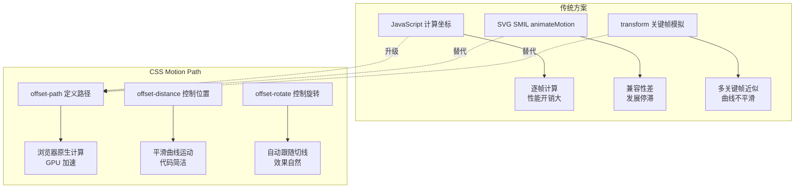
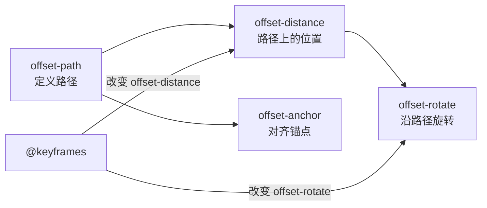

# 路径动画

CSS 路径动画（Offset Path Animation）通过 `offset-path` 系列属性将元素定位到指定路径上，并沿路径移动，实现飞行物体、路线动画、SVG 路径跟随等效果，无需 JavaScript 计算坐标。

## 背景与动机

### 为什么需要路径动画

在 Web 开发中，让元素沿特定轨迹运动是一个常见需求：飞机沿航线飞行、地图上的路线绘制、加载指示器旋转、元素沿曲线入场等。在 `offset-path` 出现之前，实现这类效果通常需要：

1. **JavaScript 手动计算**：通过 `requestAnimationFrame` 逐帧计算元素在路径上的坐标，使用贝塞尔曲线公式或参数方程
2. **SVG SMIL 动画**：使用 `<animateMotion>` 元素，但 SMIL 动画在 IE 及旧版 Edge（EdgeHTML）中从未得到支持；Chrome 曾于 2015 年宣布废弃 SMIL、后于 2016 年撤回该决定，如今新开发中已多被 CSS 动画与 Web Animations API 取代
3. **transform 模拟**：通过多个 `@keyframes` 关键帧近似模拟路径运动，但无法实现平滑的曲线运动

CSS Motion Path（CSS 运动路径）规范的出现，将路径动画能力原生带入了 CSS，使得开发者可以像定义 SVG 路径一样定义元素的运动轨迹，由浏览器引擎高效处理路径计算和渲染。

### 与传统方案的对比



| 方案 | 代码复杂度 | 性能 | 曲线精度 | 浏览器支持 |
|------|-----------|------|---------|-----------|
| JavaScript | 高 | 取决于实现 | 高 | 全支持 |
| SVG SMIL | 低 | 好 | 高 | IE/旧版 Edge 不支持 |
| transform 模拟 | 中 | 好 | 低（多关键帧才高） | 全支持 |
| CSS Motion Path | 低 | 优秀（GPU 加速） | 高 | 主流浏览器 |

## 概述

### 核心概念

`offset-path` 属性族定义了一条路径，元素沿此路径排列和移动。动画通过改变 `offset-distance`（路径上的位置百分比）实现元素沿路径运动，同时可控制旋转角度和对齐方式。



### 属性体系

| 属性 | 作用 | 默认值 |
|------|------|--------|
| `offset-path` | 定义运动路径 | `none` |
| `offset-distance` | 路径上的位置（0%~100%） | `0` |
| `offset-rotate` | 元素沿路径的旋转方式 | `auto` |
| `offset-anchor` | 元素与路径对齐的锚点 | `auto` |
| `offset` | 以上属性的简写 | — |
| `offset-position` | 路径的起始位置 | `auto` |

## offset-path 语法

`offset-path` 支持多种路径定义方式，包括 SVG 路径、基本形状和外部引用。

### path() — SVG 路径

使用 SVG 路径语法定义任意曲线，是最灵活的方式。

```html
<!DOCTYPE html>
<html lang="zh-CN">
<head>
  <style>
    body {
      margin: 0;
      display: flex;
      justify-content: center;
      align-items: center;
      min-height: 100vh;
      background: #0f172a;
    }

    .path-container {
      position: relative;
      width: 600px;
      height: 400px;
    }

    /* 显示路径轨迹 */
    .path-track {
      position: absolute;
      inset: 0;
    }

    .path-track svg {
      width: 100%;
      height: 100%;
    }

    .path-track path {
      fill: none;
      stroke: rgba(99, 102, 241, 0.3);
      stroke-width: 2;
      stroke-dasharray: 8 4;
    }

    /* 沿路径运动的元素 */
    .mover {
      position: absolute;
      width: 24px;
      height: 24px;
      background: #6366f1;
      border-radius: 50%;
      box-shadow: 0 0 20px rgba(99, 102, 241, 0.6);

      offset-path: path('M 50,200 C 150,50 350,350 550,200');
      offset-distance: 0%;
      offset-rotate: auto;

      animation: move-along 4s ease-in-out infinite alternate;
    }

    @keyframes move-along {
      to { offset-distance: 100%; }
    }
  </style>
</head>
<body>
  <div class="path-container">
    <div class="path-track">
      <svg viewBox="0 0 600 400">
        <path d="M 50,200 C 150,50 350,350 550,200" />
      </svg>
    </div>
    <div class="mover"></div>
  </div>
</body>
</html>
```

### circle() — 圆形路径

```html
<!DOCTYPE html>
<html lang="zh-CN">
<head>
  <style>
    body {
      margin: 0;
      display: flex;
      justify-content: center;
      align-items: center;
      min-height: 100vh;
      background: #0f172a;
    }

    .orbit-container {
      position: relative;
      width: 400px;
      height: 400px;
    }

    /* 轨道圆环 */
    .orbit-ring {
      position: absolute;
      inset: 0;
      border: 2px dashed rgba(99, 102, 241, 0.3);
      border-radius: 50%;
    }

    /* 中心点 */
    .center {
      position: absolute;
      top: 50%;
      left: 50%;
      width: 40px;
      height: 40px;
      background: #f59e0b;
      border-radius: 50%;
      transform: translate(-50%, -50%);
      box-shadow: 0 0 30px rgba(245, 158, 11, 0.5);
    }

    /* 沿圆形轨道运动的元素 */
    .satellite {
      position: absolute;
      width: 20px;
      height: 20px;
      background: #6366f1;
      border-radius: 50%;
      box-shadow: 0 0 15px rgba(99, 102, 241, 0.6);

      offset-path: circle(200px at 200px 200px);
      offset-distance: 0%;
      offset-rotate: 0deg;

      animation: orbit 6s linear infinite;
    }

    @keyframes orbit {
      to { offset-distance: 100%; }
    }
  </style>
</head>
<body>
  <div class="orbit-container">
    <div class="orbit-ring"></div>
    <div class="center"></div>
    <div class="satellite"></div>
  </div>
</body>
</html>
```

### ellipse() — 椭圆路径

```css
.mover-ellipse {
  offset-path: ellipse(300px 150px at 300px 200px);
  offset-distance: 0%;
  offset-rotate: auto;

  animation: ellipse-move 5s linear infinite;
}

@keyframes ellipse-move {
  to { offset-distance: 100%; }
}
```

### polygon() — 多边形路径

```html
<!DOCTYPE html>
<html lang="zh-CN">
<head>
  <style>
    body {
      margin: 0;
      display: flex;
      justify-content: center;
      align-items: center;
      min-height: 100vh;
      background: #0f172a;
    }

    .hex-container {
      position: relative;
      width: 400px;
      height: 400px;
    }

    /* 六边形轨迹 */
    .hex-track {
      position: absolute;
      inset: 0;
    }

    .hex-track svg {
      width: 100%;
      height: 100%;
    }

    .hex-track polygon {
      fill: none;
      stroke: rgba(139, 92, 246, 0.3);
      stroke-width: 2;
    }

    /* 沿六边形路径运动 */
    .hex-mover {
      position: absolute;
      width: 16px;
      height: 16px;
      background: #8b5cf6;
      border-radius: 50%;
      box-shadow: 0 0 12px rgba(139, 92, 246, 0.6);

      offset-path: polygon(200px 20px, 380px 110px, 380px 290px, 200px 380px, 20px 290px, 20px 110px);
      offset-distance: 0%;
      offset-rotate: auto;

      animation: hex-move 8s linear infinite;
    }

    @keyframes hex-move {
      to { offset-distance: 100%; }
    }
  </style>
</head>
<body>
  <div class="hex-container">
    <div class="hex-track">
      <svg viewBox="0 0 400 400">
        <polygon points="200,20 380,110 380,290 200,380 20,290 20,110" />
      </svg>
    </div>
    <div class="hex-mover"></div>
  </div>
</body>
</html>
```

### url() — 引用 SVG 路径

引用页面中内联 SVG 的 `<path>` 元素，实现路径与动画元素分离。

```html
<!DOCTYPE html>
<html lang="zh-CN">
<head>
  <style>
    body {
      margin: 0;
      display: flex;
      justify-content: center;
      align-items: center;
      min-height: 100vh;
      background: #0f172a;
    }

    /* 隐藏 SVG 定义 */
    .svg-defs {
      position: absolute;
      width: 0;
      height: 0;
      overflow: hidden;
    }

    .url-mover {
      position: absolute;
      width: 20px;
      height: 20px;
      background: #ec4899;
      border-radius: 50%;
      box-shadow: 0 0 15px rgba(236, 72, 153, 0.6);

      offset-path: url(#wave-path);
      offset-distance: 0%;
      offset-rotate: auto;

      animation: url-move 4s ease-in-out infinite alternate;
    }

    @keyframes url-move {
      to { offset-distance: 100%; }
    }
  </style>
</head>
<body>
  <!-- SVG 路径定义 -->
  <svg class="svg-defs">
    <defs>
      <path id="wave-path" d="M 20,100 C 60,20 140,180 180,100 S 300,20 340,100 S 460,180 500,100" />
    </defs>
  </svg>

  <!-- 可视化路径 -->
  <svg width="520" height="200" style="opacity: 0.3;">
    <path d="M 20,100 C 60,20 140,180 180,100 S 300,20 340,100 S 460,180 500,100"
          fill="none" stroke="#ec4899" stroke-width="2" stroke-dasharray="6 3" />
  </svg>

  <div class="url-mover"></div>
</body>
</html>
```

### 路径类型对比

| 路径类型 | 语法 | 特点 | 适用场景 |
|----------|------|------|----------|
| `path()` | `path('M...')` | 任意曲线，最灵活 | 复杂曲线路径 |
| `circle()` | `circle(r at cx cy)` | 圆形轨道 | 环形运动、轨道动画 |
| `ellipse()` | `ellipse(rx ry at cx cy)` | 椭圆轨道 | 椭圆运动 |
| `polygon()` | `polygon(x1 y1, x2 y2, ...)` | 多边形路径 | 规则形状路径 |
| `url()` | `url(#id)` | 引用 SVG 路径 | 复用 SVG 路径定义 |

## offset-distance

`offset-distance` 指定元素在路径上的位置，取值范围从 `0%`（起点）到 `100%`（终点）。

### 语法

```css
offset-distance: <length-percentage>;

/* 示例 */
offset-distance: 0%;     /* 路径起点 */
offset-distance: 50%;    /* 路径中点 */
offset-distance: 100%;   /* 路径终点 */
offset-distance: 120px;  /* 绝对距离 */
```


#### offset 交互演示（MDN）

offset-path/offset-distance 等路径动画属性的简写。

```html
<!DOCTYPE html>
<html lang="zh-CN">
  <head>
    <meta charset="UTF-8" />
    <meta name="viewport" content="width=device-width, initial-scale=1.0" />
    <title>offset 属性演示 - MDN 示例</title>
    <meta name="description" content="offset 属性演示" />
    <style>
      * {
        margin: 0;
        padding: 0;
        box-sizing: border-box;
      }
      body {
        font-family: -apple-system, BlinkMacSystemFont, "Segoe UI", Roboto, "Helvetica Neue", Arial, sans-serif;
        min-height: 100vh;
        padding: 0;
      }
      .demo-layout {
        display: flex;
        height: 100vh;
        gap: 0;
      }
      .snippet-panel {
        width: 320px;
        flex-shrink: 0;
        padding: 16px;
        display: flex;
        flex-direction: column;
        gap: 8px;
        overflow-y: auto;
        border-right: 1px solid #ddd;
        background: #fafafa;
      }
      .snippet-btn {
        padding: 10px 14px;
        border: 1px solid #ccc;
        border-radius: 6px;
        background: #fff;
        font-family: "JetBrains Mono", "Fira Code", monospace;
        font-size: 13px;
        color: #333;
        cursor: pointer;
        text-align: left;
        transition: all 0.2s;
        line-height: 1.4;
      }
      .snippet-btn:hover {
        border-color: #8083ff;
        background: #f0f0ff;
      }
      .snippet-btn.active {
        border-color: #8083ff;
        background: #e8e8ff;
        color: #571bc1;
        font-weight: 600;
      }
      .preview-panel {
        flex: 1;
        padding: 16px;
        display: flex;
        align-items: center;
        justify-content: center;
        background: #fff;
        overflow: auto;
      }
      .preview-panel > section,
      .preview-panel > div:not(.snippet-panel):not(.demo-layout) {
        flex: 1;
        width: 100%;
        min-height: 0;
        height: 100%;
        display: flex;
        align-items: center;
        justify-content: center;
      }
      #example-element {
        width: 24px;
        height: 24px;
        background: #2bc4a2;
        clip-path: polygon(0% 0%, 70% 0%, 100% 50%, 70% 100%, 0% 100%, 30% 50%);
        animation: distance 3000ms infinite normal ease-in-out;
        animation-play-state: paused;
      }

      #example-element.running {
        animation-play-state: running;
      }

      .wrapper {
        height: 220px;
        width: 200px;
        background:
          url('data:image/svg+xml;
  utf8,<svg xmlns="http: //www.w3.org/2000/svg" viewBox="0 0 150 140" width="200" height="140"><path d="M 0 60 L 100 60 L 50 10 L 0 60" fill="none" stroke="lightgrey" stroke-width="2" stroke-dasharray="4.5"/></svg>')
            no-repeat,
          url('data:image/svg+xml;
  utf8,<svg xmlns="http: //www.w3.org/2000/svg" viewBox="0 -140 150 230" width="200" height="230"><path d="M 0 70 L 56 70 L 98 0 L 42 0 L 0 70" fill="none" stroke="lightgrey" stroke-width="2" stroke-dasharray="4.5"/></svg>');
      }

      @keyframes distance {
        to {
          offset-distance: 100%;
        }
      }

      #playback {
        position: absolute;
        top: 0;
        left: 0;
        font-size: 1em;
      }
    </style>
  </head>
  <body>
    <div class="demo-layout">
      <div class="snippet-panel">
        <button class="snippet-btn active" data-index="0">
          offset: path(&quot;M 20 60 L 120 60 L 70 10 L 20 60&quot;) 0% auto 90deg;
        </button>
        <button class="snippet-btn" data-index="1">
          offset: path(&quot;M 20 210 L 74 210 L 118 140 L 62 140 L 20 210&quot;) 20% auto;
        </button>
      </div>
      <div class="preview-panel">
        <section class="default-example" id="default-example">
          <div class="wrapper">
            <div id="example-element"></div>
          </div>
          <button id="playback" type="button">Play</button>
        </section>
      </div>
    </div>
    <script>
      const snippets = [
        `#example-element {
  offset: path("M 20 60 L 120 60 L 70 10 L 20 60") 0% auto 90deg;
}`,
        `#example-element {
  offset: path(
    "M 20 210 L 74 210 L 118 140 \\n L 62 140 L 20 210"
  )
  20% auto;
}`,
      ];

      let styleEl = document.createElement("style");
      document.head.appendChild(styleEl);

      function applySnippet(index) {
        styleEl.textContent = snippets[index];
        document.querySelectorAll(".snippet-btn").forEach((btn, i) => {
          btn.classList.toggle("active", i === index);
        });
      }

      document.querySelectorAll(".snippet-btn").forEach((btn) => {
        btn.addEventListener("click", () => applySnippet(parseInt(btn.dataset.index)));
      });

      applySnippet(0);
    </script>
  </body>
</html>


```

### 动画示例

```html
<!DOCTYPE html>
<html lang="zh-CN">
<head>
  <style>
    body {
      margin: 0;
      display: flex;
      justify-content: center;
      align-items: center;
      min-height: 100vh;
      background: #0f172a;
      overflow: hidden;
    }

    .scene {
      position: relative;
      width: 800px;
      height: 300px;
    }

    /* 路径轨迹 */
    .track {
      position: absolute;
      inset: 0;
    }

    .track svg {
      width: 100%;
      height: 100%;
    }

    .track path {
      fill: none;
      stroke: rgba(99, 102, 241, 0.2);
      stroke-width: 2;
    }

    /* 多个元素以不同速度沿路径运动 */
    .runner {
      position: absolute;
      border-radius: 50%;
      offset-path: path('M 0,150 C 200,0 600,300 800,150');
      offset-rotate: auto;
    }

    .runner-1 {
      width: 20px;
      height: 20px;
      background: #6366f1;
      box-shadow: 0 0 15px rgba(99, 102, 241, 0.6);
      animation: run-1 3s ease-in-out infinite alternate;
    }

    .runner-2 {
      width: 14px;
      height: 14px;
      background: #ec4899;
      box-shadow: 0 0 12px rgba(236, 72, 153, 0.6);
      animation: run-2 4s ease-in-out infinite alternate;
    }

    .runner-3 {
      width: 10px;
      height: 10px;
      background: #10b981;
      box-shadow: 0 0 10px rgba(16, 185, 129, 0.6);
      animation: run-3 5s ease-in-out infinite alternate;
    }

    @keyframes run-1 {
      from { offset-distance: 0%; }
      to   { offset-distance: 100%; }
    }

    @keyframes run-2 {
      from { offset-distance: 20%; }
      to   { offset-distance: 80%; }
    }

    @keyframes run-3 {
      from { offset-distance: 10%; }
      to   { offset-distance: 90%; }
    }
  </style>
</head>
<body>
  <div class="scene">
    <div class="track">
      <svg viewBox="0 0 800 300">
        <path d="M 0,150 C 200,0 600,300 800,150" />
      </svg>
    </div>
    <div class="runner runner-1"></div>
    <div class="runner runner-2"></div>
    <div class="runner runner-3"></div>
  </div>
</body>
</html>
```

### 滚动驱动路径动画

结合滚动驱动动画，让元素随滚动沿路径移动。

```css
.scroll-path-mover {
  offset-path: path('M 50,300 C 150,50 450,50 550,300');
  offset-rotate: auto;

  animation: scroll-path linear;
  animation-timeline: scroll(root);
}

@keyframes scroll-path {
  from { offset-distance: 0%; }
  to   { offset-distance: 100%; }
}
```

## offset-rotate

`offset-rotate` 控制元素沿路径运动时的旋转行为，决定元素是否跟随路径切线方向自动旋转。

### 语法

```css
offset-rotate: auto;          /* 自动跟随路径切线方向 */
offset-rotate: reverse;       /* 自动旋转 + 180° 反转 */
offset-rotate: 0deg;          /* 不旋转，保持原始方向 */
offset-rotate: 90deg;         /* 固定旋转 90° */
offset-rotate: auto 45deg;    /* 自动旋转 + 额外 45° 偏移 */
```

### 旋转模式对比

```html
<!DOCTYPE html>
<html lang="zh-CN">
<head>
  <style>
    body {
      margin: 0;
      padding: 40px;
      background: #0f172a;
      font-family: system-ui, sans-serif;
      color: white;
    }

    .demo-grid {
      display: grid;
      grid-template-columns: repeat(3, 1fr);
      gap: 30px;
      max-width: 1200px;
      margin: 0 auto;
    }

    .demo-item {
      text-align: center;
    }

    .demo-item h3 {
      font-size: 0.9rem;
      margin-bottom: 12px;
      color: #94a3b8;
    }

    .demo-item code {
      font-size: 0.8rem;
      color: #6366f1;
    }

    .path-area {
      position: relative;
      width: 100%;
      height: 200px;
      border: 1px solid rgba(99, 102, 241, 0.2);
      border-radius: 12px;
      overflow: hidden;
    }

    .arrow {
      position: absolute;
      width: 30px;
      height: 30px;
      offset-path: path('M 30,100 C 100,20 200,180 350,100');

      animation: move-arrow 3s linear infinite;
    }

    .arrow::before {
      content: '';
      display: block;
      width: 0;
      height: 0;
      border-left: 15px solid #6366f1;
      border-top: 8px solid transparent;
      border-bottom: 8px solid transparent;
    }

    /* 不同旋转模式 */
    .rotate-auto .arrow {
      offset-rotate: auto;
    }

    .rotate-reverse .arrow {
      offset-rotate: reverse;
    }

    .rotate-fixed .arrow {
      offset-rotate: 0deg;
    }

    @keyframes move-arrow {
      from { offset-distance: 0%; }
      to   { offset-distance: 100%; }
    }
  </style>
</head>
<body>
  <div class="demo-grid">
    <div class="demo-item rotate-auto">
      <h3>auto — 跟随路径</h3>
      <code>offset-rotate: auto</code>
      <div class="path-area">
        <div class="arrow"></div>
      </div>
    </div>
    <div class="demo-item rotate-reverse">
      <h3>reverse — 反向跟随</h3>
      <code>offset-rotate: reverse</code>
      <div class="path-area">
        <div class="arrow"></div>
      </div>
    </div>
    <div class="demo-item rotate-fixed">
      <h3>0deg — 固定方向</h3>
      <code>offset-rotate: 0deg</code>
      <div class="path-area">
        <div class="arrow"></div>
      </div>
    </div>
  </div>
</body>
</html>
```

### auto + 偏移角度

```css
/* 箭头跟随路径方向，但额外旋转 -90° 使其垂直于路径 */
.perpendicular-mover {
  offset-path: path('M 50,200 C 200,50 400,350 750,200');
  offset-rotate: auto -90deg;
  offset-distance: 0%;

  animation: perp-move 4s linear infinite;
}

@keyframes perp-move {
  to { offset-distance: 100%; }
}
```

### 旋转值对比表

| 值 | 行为 | 典型用途 |
|----|------|----------|
| `auto` | 元素跟随路径切线方向旋转 | 飞行物体、车辆沿路径行驶 |
| `reverse` | 跟随切线方向 + 180° 反转 | 反向运动物体 |
| `0deg` | 不旋转，保持原始朝向 | 沿路径移动但保持方向的元素 |
| `<angle>` | 固定旋转角度 | 特定角度需求 |
| `auto <angle>` | 跟随切线 + 额外偏移 | 垂直于路径、倾斜效果 |

## offset-anchor

`offset-anchor` 定义元素上与路径对齐的锚点，默认为元素的中心点。

### 语法

```css
offset-anchor: auto;          /* 使用 transform-origin */
offset-anchor: center;        /* 元素中心 */
offset-anchor: top left;      /* 左上角 */
offset-anchor: 50% 100%;      /* 底部中心 */
offset-anchor: 20px 30px;     /* 绝对偏移 */
```

### 锚点位置示例

```html
<!DOCTYPE html>
<html lang="zh-CN">
<head>
  <style>
    body {
      margin: 0;
      display: flex;
      justify-content: center;
      align-items: center;
      min-height: 100vh;
      background: #0f172a;
      gap: 60px;
    }

    .anchor-demo {
      position: relative;
      width: 300px;
      height: 300px;
    }

    .anchor-demo svg {
      position: absolute;
      inset: 0;
      width: 100%;
      height: 100%;
    }

    .anchor-demo svg path {
      fill: none;
      stroke: rgba(99, 102, 241, 0.3);
      stroke-width: 2;
    }

    .anchor-demo h4 {
      position: absolute;
      bottom: -30px;
      width: 100%;
      text-align: center;
      color: #94a3b8;
      font-size: 0.85rem;
      font-family: system-ui, sans-serif;
    }

    .box {
      position: absolute;
      width: 40px;
      height: 40px;
      background: rgba(99, 102, 241, 0.8);
      border: 2px solid #6366f1;
      border-radius: 4px;

      offset-path: path('M 30,150 C 80,30 220,270 270,150');
      offset-rotate: auto;

      animation: anchor-move 4s linear infinite alternate;
    }

    /* 中心锚点 */
    .anchor-center .box {
      offset-anchor: center;
    }

    /* 左上角锚点 */
    .anchor-topleft .box {
      offset-anchor: top left;
      background: rgba(236, 72, 153, 0.8);
      border-color: #ec4899;
    }

    @keyframes anchor-move {
      from { offset-distance: 0%; }
      to   { offset-distance: 100%; }
    }
  </style>
</head>
<body>
  <div class="anchor-demo anchor-center">
    <svg viewBox="0 0 300 300">
      <path d="M 30,150 C 80,30 220,270 270,150" />
    </svg>
    <div class="box"></div>
    <h4>offset-anchor: center</h4>
  </div>

  <div class="anchor-demo anchor-topleft">
    <svg viewBox="0 0 300 300">
      <path d="M 30,150 C 80,30 220,270 270,150" />
    </svg>
    <div class="box"></div>
    <h4>offset-anchor: top left</h4>
  </div>
</body>
</html>
```

## offset 简写

`offset` 是 `offset-path`、`offset-distance`、`offset-rotate` 和 `offset-anchor` 的简写属性。

### 语法

```css
/* 完整简写 */
offset: path('M 0,0 L 100,100') 50% auto center;

/* 等价于 */
offset-path: path('M 0,0 L 100,100');
offset-distance: 50%;
offset-rotate: auto;
offset-anchor: center;
```

### 常见简写形式

```css
/* 仅路径 */
offset: path('M 50,100 C 100,0 200,200 250,100');

/* 路径 + 距离 */
offset: path('M 50,100 C 100,0 200,200 250,100') 25%;

/* 路径 + 距离 + 旋转 */
offset: path('M 50,100 C 100,0 200,200 250,100') 50% auto;

/* 路径 + 距离 + 旋转 + 锚点 */
offset: path('M 50,100 C 100,0 200,200 250,100') 75% auto top left;

/* 圆形路径简写 */
offset: circle(150px at 200px 200px) 0% auto;

/* 椭圆路径简写 */
offset: ellipse(200px 100px at 200px 150px) 50% 0deg;
```

### 简写注意事项

| 注意点 | 说明 |
|--------|------|
| 顺序 | `[offset-position] offset-path offset-distance offset-rotate [offset-anchor]` |
| 省略值 | 省略的属性重置为默认值 |
| `offset-position` | 在简写中位于最前，用于指定路径起始位置 |
| 兼容性 | 简写在部分浏览器中支持可能不完整，建议分开写 |

## 实战用例

### 飞行物体

模拟飞机沿曲线路径飞行，自动跟随路径方向旋转。

```html
<!DOCTYPE html>
<html lang="zh-CN">
<head>
  <style>
    body {
      margin: 0;
      min-height: 100vh;
      background: linear-gradient(180deg, #0c1445 0%, #1a237e 40%, #283593 100%);
      overflow: hidden;
    }

    /* 星空背景 */
    .stars {
      position: fixed;
      inset: 0;
      background-image:
        radial-gradient(2px 2px at 20px 30px, #fff, transparent),
        radial-gradient(2px 2px at 40px 70px, #fff, transparent),
        radial-gradient(1px 1px at 90px 40px, #fff, transparent),
        radial-gradient(1px 1px at 130px 80px, #fff, transparent),
        radial-gradient(2px 2px at 160px 30px, #fff, transparent);
      background-size: 200px 100px;
      opacity: 0.6;
    }

    /* 飞机 */
    .airplane {
      position: absolute;
      width: 40px;
      height: 40px;
      font-size: 2rem;
      line-height: 40px;

      offset-path: path('M -50,500 C 200,100 600,100 850,400 S 1200,600 1400,200');
      offset-distance: 0%;
      offset-rotate: auto;

      animation: fly 8s linear infinite;
    }

    /* 尾迹 */
    .airplane::after {
      content: '';
      position: absolute;
      top: 50%;
      right: 100%;
      width: 60px;
      height: 2px;
      background: linear-gradient(to left, rgba(255,255,255,0.6), transparent);
      transform: translateY(-50%);
    }

    @keyframes fly {
      to { offset-distance: 100%; }
    }

    /* 第二架飞机 - 反向 */
    .airplane-2 {
      position: absolute;
      width: 30px;
      height: 30px;
      font-size: 1.5rem;
      line-height: 30px;

      offset-path: path('M 1400,100 C 1000,400 400,300 -50,500');
      offset-distance: 0%;
      offset-rotate: auto;

      animation: fly-2 10s linear infinite;
    }

    @keyframes fly-2 {
      to { offset-distance: 100%; }
    }
  </style>
</head>
<body>
  <div class="stars"></div>
  <div class="airplane">&#9992;</div>
  <div class="airplane-2">&#9992;</div>
</body>
</html>
```

### 路线动画

模拟地图上的路线绘制和标记点移动。

```html
<!DOCTYPE html>
<html lang="zh-CN">
<head>
  <style>
    body {
      margin: 0;
      display: flex;
      justify-content: center;
      align-items: center;
      min-height: 100vh;
      background: #1e293b;
      font-family: system-ui, sans-serif;
    }

    .map-container {
      position: relative;
      width: 800px;
      height: 500px;
      background: #334155;
      border-radius: 16px;
      overflow: hidden;
    }

    /* 地图网格 */
    .map-grid {
      position: absolute;
      inset: 0;
      background-image:
        linear-gradient(rgba(255,255,255,0.03) 1px, transparent 1px),
        linear-gradient(90deg, rgba(255,255,255,0.03) 1px, transparent 1px);
      background-size: 50px 50px;
    }

    /* 路线轨迹 SVG */
    .route-svg {
      position: absolute;
      inset: 0;
      width: 100%;
      height: 100%;
    }

    .route-bg {
      fill: none;
      stroke: rgba(99, 102, 241, 0.2);
      stroke-width: 4;
    }

    .route-progress {
      fill: none;
      stroke: #6366f1;
      stroke-width: 4;
      stroke-linecap: round;
      stroke-dasharray: 1200;
      stroke-dashoffset: 1200;

      animation: draw-route 5s linear infinite;
    }

    @keyframes draw-route {
      to { stroke-dashoffset: 0; }
    }

    /* 移动标记 */
    .route-marker {
      position: absolute;
      width: 16px;
      height: 16px;
      background: #6366f1;
      border: 3px solid white;
      border-radius: 50%;
      box-shadow: 0 0 10px rgba(99, 102, 241, 0.5);

      offset-path: path('M 100,400 C 200,300 250,150 400,200 S 550,350 700,100');
      offset-distance: 0%;
      offset-rotate: 0deg;

      animation: marker-move 5s linear infinite;
    }

    @keyframes marker-move {
      to { offset-distance: 100%; }
    }

    /* 起终点标记 */
    .waypoint {
      position: absolute;
      width: 12px;
      height: 12px;
      background: #10b981;
      border: 2px solid white;
      border-radius: 50%;
    }

    .waypoint-start { top: 394px; left: 94px; }
    .waypoint-end   { top: 94px;  left: 694px; }

    .waypoint-label {
      position: absolute;
      color: white;
      font-size: 0.75rem;
      white-space: nowrap;
    }

    .label-start { top: 410px; left: 80px; }
    .label-end   { top: 78px;  left: 680px; }
  </style>
</head>
<body>
  <div class="map-container">
    <div class="map-grid"></div>

    <svg class="route-svg" viewBox="0 0 800 500">
      <path class="route-bg" d="M 100,400 C 200,300 250,150 400,200 S 550,350 700,100" />
      <path class="route-progress" d="M 100,400 C 200,300 250,150 400,200 S 550,350 700,100" />
    </svg>

    <div class="route-marker"></div>
    <div class="waypoint waypoint-start"></div>
    <div class="waypoint waypoint-end"></div>
    <div class="waypoint-label label-start">起点</div>
    <div class="waypoint-label label-end">终点</div>
  </div>
</body>
</html>
```

### SVG 路径跟随

元素沿复杂 SVG 路径运动，适合波浪、螺旋等效果。

```html
<!DOCTYPE html>
<html lang="zh-CN">
<head>
  <style>
    body {
      margin: 0;
      display: flex;
      justify-content: center;
      align-items: center;
      min-height: 100vh;
      background: #0f172a;
    }

    .wave-container {
      position: relative;
      width: 100%;
      height: 300px;
    }

    /* 波浪路径 */
    .wave-path {
      position: absolute;
      inset: 0;
    }

    .wave-path svg {
      width: 100%;
      height: 100%;
    }

    .wave-path path {
      fill: none;
      stroke: rgba(99, 102, 241, 0.15);
      stroke-width: 2;
    }

    /* 沿波浪运动的多个粒子 */
    .wave-particle {
      position: absolute;
      border-radius: 50%;
      offset-rotate: 0deg;
    }

    .wave-particle:nth-child(1) {
      width: 12px;
      height: 12px;
      background: #6366f1;
      box-shadow: 0 0 10px rgba(99, 102, 241, 0.5);
      offset-path: path('M 0,150 Q 200,50 400,150 T 800,150 T 1200,150');
      animation: wave-1 4s linear infinite;
    }

    .wave-particle:nth-child(2) {
      width: 8px;
      height: 8px;
      background: #8b5cf6;
      box-shadow: 0 0 8px rgba(139, 92, 246, 0.5);
      offset-path: path('M 0,150 Q 200,50 400,150 T 800,150 T 1200,150');
      animation: wave-2 4s linear infinite;
    }

    .wave-particle:nth-child(3) {
      width: 6px;
      height: 6px;
      background: #ec4899;
      box-shadow: 0 0 6px rgba(236, 72, 153, 0.5);
      offset-path: path('M 0,150 Q 200,50 400,150 T 800,150 T 1200,150');
      animation: wave-3 4s linear infinite;
    }

    @keyframes wave-1 {
      from { offset-distance: 0%; }
      to   { offset-distance: 100%; }
    }

    @keyframes wave-2 {
      from { offset-distance: 10%; }
      to   { offset-distance: 90%; }
    }

    @keyframes wave-3 {
      from { offset-distance: 20%; }
      to   { offset-distance: 80%; }
    }
  </style>
</head>
<body>
  <div class="wave-container">
    <div class="wave-path">
      <svg viewBox="0 0 1200 300" preserveAspectRatio="none">
        <path d="M 0,150 Q 200,50 400,150 T 800,150 T 1200,150" />
      </svg>
    </div>
    <div class="wave-particle"></div>
    <div class="wave-particle"></div>
    <div class="wave-particle"></div>
  </div>
</body>
</html>
```

### 圆形菜单

利用圆形路径实现环形菜单布局。

```html
<!DOCTYPE html>
<html lang="zh-CN">
<head>
  <style>
    body {
      margin: 0;
      display: flex;
      justify-content: center;
      align-items: center;
      min-height: 100vh;
      background: #0f172a;
      font-family: system-ui, sans-serif;
    }

    .circular-menu {
      position: relative;
      width: 300px;
      height: 300px;
    }

    /* 中心按钮 */
    .menu-center {
      position: absolute;
      top: 50%;
      left: 50%;
      width: 60px;
      height: 60px;
      background: #6366f1;
      border: none;
      border-radius: 50%;
      color: white;
      font-size: 1.5rem;
      cursor: pointer;
      transform: translate(-50%, -50%);
      z-index: 10;
      box-shadow: 0 4px 20px rgba(99, 102, 241, 0.4);
      transition: transform 0.3s, background 0.3s;
    }

    .menu-center:hover {
      transform: translate(-50%, -50%) scale(1.1);
      background: #8b5cf6;
    }

    /* 菜单项沿圆形路径分布 */
    .menu-item {
      position: absolute;
      width: 48px;
      height: 48px;
      background: #1e293b;
      border: 2px solid #6366f1;
      border-radius: 50%;
      color: white;
      font-size: 1.2rem;
      display: flex;
      align-items: center;
      justify-content: center;
      cursor: pointer;
      transition: background 0.3s, transform 0.3s;

      offset-path: circle(120px at 150px 150px);
      offset-rotate: 0deg;
    }

    .menu-item:hover {
      background: #6366f1;
      transform: scale(1.15);
    }

    /* 6 个菜单项均匀分布在圆上 */
    .menu-item:nth-child(1) { offset-distance: 0%; }
    .menu-item:nth-child(2) { offset-distance: 16.67%; }
    .menu-item:nth-child(3) { offset-distance: 33.33%; }
    .menu-item:nth-child(4) { offset-distance: 50%; }
    .menu-item:nth-child(5) { offset-distance: 66.67%; }
    .menu-item:nth-child(6) { offset-distance: 83.33%; }

    /* 展开动画 */
    .circular-menu.collapsed .menu-item {
      offset-path: circle(0px at 150px 150px);
      opacity: 0;
      transition: offset-path 0.5s ease, opacity 0.3s;
    }

    .circular-menu.expanded .menu-item {
      offset-path: circle(120px at 150px 150px);
      opacity: 1;
      transition: offset-path 0.5s ease, opacity 0.3s 0.2s;
    }
  </style>
</head>
<body>
  <div class="circular-menu expanded" id="menu">
    <button class="menu-center" onclick="toggleMenu()">+</button>
    <div class="menu-item">1</div>
    <div class="menu-item">2</div>
    <div class="menu-item">3</div>
    <div class="menu-item">4</div>
    <div class="menu-item">5</div>
    <div class="menu-item">6</div>
  </div>

  <script>
    function toggleMenu() {
      const menu = document.getElementById('menu');
      menu.classList.toggle('expanded');
      menu.classList.toggle('collapsed');
    }
  </script>
</body>
</html>
```

## 浏览器兼容性

### 支持情况

| 特性 | Chrome | Firefox | Safari | Edge |
|------|--------|---------|--------|------|
| `offset-path: path()` | 55+ | 72+ | 15.4+ | 79+ |
| `offset-path: circle()` | 116+ | 122+ | 部分支持* | 116+ |
| `offset-path: ellipse()` | 116+ | 122+ | 部分支持* | 116+ |
| `offset-path: polygon()` | 116+ | 122+ | 部分支持* | 116+ |
| `offset-path: url()` | 116+ | 部分支持* | 部分支持* | 116+ |
| `offset-distance` | 55+ | 72+ | 15.4+ | 79+ |
| `offset-rotate` | 55+ | 72+ | 15.4+ | 79+ |
| `offset-anchor` | 116+ | 72+ | 16+ | 116+ |
| `offset` 简写 | 55+ | 72+ | 15.4+ | 79+ |

> \* 基本形状与 url() 值类型的支持进度各浏览器存在差异，具体以 [caniuse](https://caniuse.com/mdn-css_properties_offset-path) 与 MDN 兼容性表为准。

### 渐进增强

```css
/* 基础：使用 transform 模拟路径动画 */
.fallback-mover {
  animation: fallback-move 4s linear infinite;
}

@keyframes fallback-move {
  0%   { transform: translate(0, 0); }
  50%  { transform: translate(200px, -100px); }
  100% { transform: translate(400px, 0); }
}

/* 支持 offset-path 的浏览器增强 */
@supports (offset-path: path('M 0,0')) {
  .fallback-mover {
    offset-path: path('M 0,200 C 100,0 300,0 400,200');
    offset-rotate: auto;
    animation: path-move 4s linear infinite;
  }

  @keyframes path-move {
    from { offset-distance: 0%; }
    to   { offset-distance: 100%; }
  }
}
```

## 性能优化策略

路径动画虽然强大，但如果使用不当可能导致性能问题。以下是关键的性能优化策略。

### 合成层提升

将路径动画元素提升到独立的合成层，避免触发主线程重绘。

```css
/* 优化路径动画性能 */
.path-mover {
  offset-path: path('M 0,200 C 100,0 300,0 400,200');
  offset-rotate: auto;
  animation: move 4s linear infinite;

  /* 性能优化 */
  will-change: transform, offset-distance;
  transform: translateZ(0); /* 强制 GPU 加速 */
  contain: layout style paint; /* 限制重绘范围 */
}

@keyframes move {
  from { offset-distance: 0%; }
  to   { offset-distance: 100%; }
}
```

### 避免布局抖动

路径动画只应改变 `offset-distance` 和 `offset-rotate`，避免同时改变尺寸或布局属性。

```css
/* ❌ 错误：同时改变尺寸和路径位置 */
.bad-animation {
  offset-path: path('M 0,0 L 400,0');
  animation: bad 3s ease-in-out infinite alternate;
}

@keyframes bad {
  0% {
    offset-distance: 0%;
    width: 20px; /* 触发布局重排 */
    height: 20px;
  }
  100% {
    offset-distance: 100%;
    width: 40px;
    height: 40px;
  }
}

/* ✅ 正确：只改变路径位置和变换 */
.good-animation {
  offset-path: path('M 0,0 L 400,0');
  animation: good 3s ease-in-out infinite alternate;
}

@keyframes good {
  0% {
    offset-distance: 0%;
    transform: scale(1) translateZ(0); /* 只改变变换 */
  }
  100% {
    offset-distance: 100%;
    transform: scale(2) translateZ(0);
  }
}
```

### 减少路径复杂度

复杂的路径（特别是包含大量控制点的贝塞尔曲线）会增加浏览器的计算负担。

```css
/* ❌ 过于复杂的路径 */
.complex-path {
  offset-path: path('M 0,0 C 10,20 30,40 50,60 C 70,80 90,100 110,120 C 130,140 150,160 170,180 C 190,200 210,220 230,240 C 250,260 270,280 290,300');
}

/* ✅ 简化的路径 */
.simple-path {
  offset-path: path('M 0,0 Q 150,150 300,300'); /* 使用二次贝塞尔曲线 */
}
```

### 性能监控

使用 Chrome DevTools 的 Performance 面板监控路径动画的性能：

1. **Recording 录制**：录制动画运行时的性能数据
2. **Frames 帧率**：检查是否稳定在 60fps
3. **Main thread 主线程**：查看是否有长时间的任务阻塞
4. **GPU 活动**：在 Rendering 标签中启用 "Layer borders" 和 "Paint flashing"

```javascript
// 性能监控代码
const monitorPerformance = () => {
  let lastTime = performance.now();
  let frameCount = 0;

  const measure = () => {
    frameCount++;
    const currentTime = performance.now();

    if (currentTime >= lastTime + 1000) {
      console.log(`FPS: ${frameCount}`);
      frameCount = 0;
      lastTime = currentTime;
    }

    requestAnimationFrame(measure);
  };

  requestAnimationFrame(measure);
};

monitorPerformance();
```

## 高级技巧

### 多元素路径同步

让多个元素沿同一路径以不同速度运动，创建粒子流效果。

```html
<!DOCTYPE html>
<html lang="zh-CN">
<head>
  <style>
    body {
      margin: 0;
      display: flex;
      justify-content: center;
      align-items: center;
      min-height: 100vh;
      background: #0f172a;
    }

    .particle-flow {
      position: relative;
      width: 800px;
      height: 400px;
    }

    /* 路径轨迹 */
    .flow-track {
      position: absolute;
      inset: 0;
    }

    .flow-track svg {
      width: 100%;
      height: 100%;
    }

    .flow-track path {
      fill: none;
      stroke: rgba(99, 102, 241, 0.15);
      stroke-width: 2;
      stroke-dasharray: 8 4;
    }

    /* 粒子样式 */
    .particle {
      position: absolute;
      border-radius: 50%;
      offset-path: path('M 50,200 C 200,50 600,350 750,200');
      offset-rotate: 0deg;
    }

    /* 生成 20 个粒子，每个有不同的延迟和速度 */
    .particle:nth-child(1) {
      width: 8px; height: 8px;
      background: #6366f1;
      box-shadow: 0 0 10px rgba(99, 102, 241, 0.6);
      animation: flow 3s linear infinite;
      animation-delay: 0s;
    }

    .particle:nth-child(2) {
      width: 6px; height: 6px;
      background: #8b5cf6;
      box-shadow: 0 0 8px rgba(139, 92, 246, 0.6);
      animation: flow 3.5s linear infinite;
      animation-delay: -0.5s;
    }

    .particle:nth-child(3) {
      width: 10px; height: 10px;
      background: #ec4899;
      box-shadow: 0 0 12px rgba(236, 72, 153, 0.6);
      animation: flow 4s linear infinite;
      animation-delay: -1s;
    }

    .particle:nth-child(4) {
      width: 5px; height: 5px;
      background: #10b981;
      box-shadow: 0 0 8px rgba(16, 185, 129, 0.6);
      animation: flow 3.2s linear infinite;
      animation-delay: -1.5s;
    }

    .particle:nth-child(5) {
      width: 7px; height: 7px;
      background: #f59e0b;
      box-shadow: 0 0 10px rgba(245, 158, 11, 0.6);
      animation: flow 3.8s linear infinite;
      animation-delay: -2s;
    }

    @keyframes flow {
      from { offset-distance: 0%; }
      to   { offset-distance: 100%; }
    }
  </style>
</head>
<body>
  <div class="particle-flow">
    <div class="flow-track">
      <svg viewBox="0 0 800 400">
        <path d="M 50,200 C 200,50 600,350 750,200" />
      </svg>
    </div>
    <div class="particle"></div>
    <div class="particle"></div>
    <div class="particle"></div>
    <div class="particle"></div>
    <div class="particle"></div>
  </div>
</body>
</html>
```

### 路径变形动画

通过动态改变 `offset-path` 实现路径形状的变形。

```html
<!DOCTYPE html>
<html lang="zh-CN">
<head>
  <style>
    body {
      margin: 0;
      display: flex;
      justify-content: center;
      align-items: center;
      min-height: 100vh;
      background: #0f172a;
    }

    .morph-container {
      position: relative;
      width: 500px;
      height: 500px;
    }

    .morph-track {
      position: absolute;
      inset: 0;
    }

    .morph-track svg {
      width: 100%;
      height: 100%;
    }

    .morph-track path {
      fill: none;
      stroke: rgba(99, 102, 241, 0.2);
      stroke-width: 2;
    }

    .morph-mover {
      position: absolute;
      width: 30px;
      height: 30px;
      background: #6366f1;
      border-radius: 50%;
      box-shadow: 0 0 20px rgba(99, 102, 241, 0.6);
      offset-rotate: auto;
      animation: morph-path 8s ease-in-out infinite alternate;
    }

    @keyframes morph-path {
      0% {
        offset-path: path('M 50,250 C 150,50 350,50 450,250');
      }
      25% {
        offset-path: path('M 50,250 C 150,150 350,150 450,250');
      }
      50% {
        offset-path: path('M 50,250 C 150,250 350,250 450,250');
      }
      75% {
        offset-path: path('M 50,250 C 150,350 350,350 450,250');
      }
      100% {
        offset-path: path('M 50,250 C 150,450 350,450 450,250');
      }
    }
  </style>
</head>
<body>
  <div class="morph-container">
    <div class="morph-track">
      <svg viewBox="0 0 500 500">
        <path d="M 50,250 C 150,50 350,50 450,250" />
      </svg>
    </div>
    <div class="morph-mover"></div>
  </div>
</body>
</html>
```

### 响应式路径动画

使用 CSS 变量和媒体查询实现响应式路径动画。

```css
:root {
  --path-width: 600;
  --path-height: 400;
}

@media (max-width: 768px) {
  :root {
    --path-width: 300;
    --path-height: 200;
  }
}

.responsive-mover {
  offset-path: path('M 50,200 C 150,50 350,350 550,200');
  offset-rotate: auto;
  animation: responsive-move 4s linear infinite;
}

@media (max-width: 768px) {
  .responsive-mover {
    offset-path: path('M 25,100 C 75,25 175,175 275,100');
  }
}

@keyframes responsive-move {
  from { offset-distance: 0%; }
  to   { offset-distance: 100%; }
}
```

## 常见问题与解决方案

### 问题 1：元素不跟随路径旋转

**现象**：设置了 `offset-rotate: auto`，但元素没有跟随路径方向旋转。

**原因**：元素的初始方向可能不是朝向路径前进方向。

**解决方案**：

```css
/* 如果元素初始朝右，使用 auto */
.arrow-right {
  offset-rotate: auto;
}

/* 如果元素初始朝上，需要额外旋转 -90° */
.arrow-up {
  offset-rotate: auto -90deg;
}

/* 如果元素初始朝下，需要额外旋转 90° */
.arrow-down {
  offset-rotate: auto 90deg;
}
```

### 问题 2：路径动画卡顿

**现象**：路径动画运行时帧率不稳定，出现卡顿。

**原因**：元素没有提升到独立的合成层，或者路径过于复杂。

**解决方案**：

```css
.performance-fix {
  offset-path: path('M 0,0 C 100,100 200,100 300,0');
  animation: move 4s linear infinite;

  /* 强制 GPU 加速 */
  will-change: transform, offset-distance;
  transform: translateZ(0);

  /* 限制重绘范围 */
  contain: layout style paint;
}
```

### 问题 3：Safari 中 offset-anchor 不生效

**现象**：在 Chrome 中正常，但 Safari 中 `offset-anchor` 不起作用。

**原因**：Safari 对 `offset-anchor` 的支持不完整。

**解决方案**：使用 `transform-origin` 作为替代。

```css
.safari-compatible {
  offset-path: path('M 0,0 L 400,0');
  offset-rotate: auto;
  animation: move 4s linear infinite;

  /* Safari 兼容 */
  transform-origin: center center; /* 替代 offset-anchor */
}

@supports (offset-anchor: center) {
  .safari-compatible {
    offset-anchor: center;
  }
}
```

### 问题 4：路径动画与滚动驱动结合不工作

**现象**：使用 `animation-timeline: scroll()` 时，路径动画不随滚动触发。

**原因**：`animation-timeline` 和 `offset-path` 的组合在某些浏览器中支持不完整。

**解决方案**：使用 JavaScript 作为降级方案。

```css
/* 现代浏览器：纯 CSS */
@supports (animation-timeline: scroll()) {
  .scroll-path-element {
    offset-path: path('M 0,0 C 100,100 200,100 300,0');
    animation: scroll-move linear;
    animation-timeline: scroll(root);
  }

  @keyframes scroll-move {
    from { offset-distance: 0%; }
    to   { offset-distance: 100%; }
  }
}
```

```javascript
// JavaScript 降级方案
if (!CSS.supports('animation-timeline', 'scroll()')) {
  const element = document.querySelector('.scroll-path-element');
  const pathLength = 300; // 路径总长度

  window.addEventListener('scroll', () => {
    const scrollPercent = window.scrollY / (document.documentElement.scrollHeight - window.innerHeight);
    const distance = scrollPercent * pathLength;
    element.style.offsetDistance = `${distance}px`;
  });
}
```

## 最佳实践

### 1. 优先使用简单路径

对于简单的直线或圆弧运动，使用 `circle()` 或 `ellipse()` 比 `path()` 更高效。

```css
/* ✅ 推荐：圆形轨道 */
.orbit {
  offset-path: circle(150px at 200px 200px);
}

/* ❌ 不推荐：用 path() 近似圆形 */
.orbit-complex {
  offset-path: path('M 200,50 A 150,150 0 1,1 199.99,50');
}
```

### 2. 使用 CSS 变量管理路径

将路径定义提取为 CSS 变量，便于复用和维护。

```css
:root {
  --flight-path: path('M 0,300 C 200,100 600,100 800,300');
}

.airplane-1 {
  offset-path: var(--flight-path);
  animation: fly 8s linear infinite;
}

.airplane-2 {
  offset-path: var(--flight-path);
  animation: fly 10s linear infinite;
  animation-delay: -2s;
}

@keyframes fly {
  from { offset-distance: 0%; }
  to   { offset-distance: 100%; }
}
```

### 3. 结合 will-change 谨慎使用

`will-change` 可以提升性能，但过度使用会消耗内存。

```css
/* ✅ 在动画开始前设置 */
.mover:hover {
  will-change: transform, offset-distance;
}

.mover {
  offset-path: path('M 0,0 L 400,0');
  animation: move 4s linear infinite;
}

/* 动画结束后移除 will-change */
.mover:not(:hover) {
  will-change: auto;
}
```

### 4. 使用 contain 限制重绘

对于路径动画元素，使用 `contain` 属性限制其重绘影响范围。

```css
.contained-mover {
  offset-path: path('M 0,0 L 400,0');
  animation: move 4s linear infinite;

  contain: layout style paint;
  transform: translateZ(0);
}
```

### 5. 测试多种浏览器

路径动画的浏览器支持仍在完善中，务必在多个浏览器中测试。

```javascript
// 特性检测
if ('offsetPath' in document.createElement('div')) {
  // 支持 offset-path，使用 CSS 路径动画
  document.body.classList.add('supports-offset-path');
} else {
  // 不支持，使用 JavaScript 降级方案
  document.body.classList.add('no-offset-path');
}
```

## 参考资源

- [MDN - offset-path](https://developer.mozilla.org/en-US/docs/Web/CSS/offset-path)
- [MDN - offset-distance](https://developer.mozilla.org/en-US/docs/Web/CSS/offset-distance)
- [MDN - offset-rotate](https://developer.mozilla.org/en-US/docs/Web/CSS/offset-rotate)
- [CSS Motion Path Level 1 Specification](https://www.w3.org/TR/motion-1/)
- [Chrome Developers - Motion Path](https://developer.chrome.com/articles/motion-path/)
- [CSS Tricks - offset-path](https://css-tricks.com/almanac/properties/o/offset-path/)

