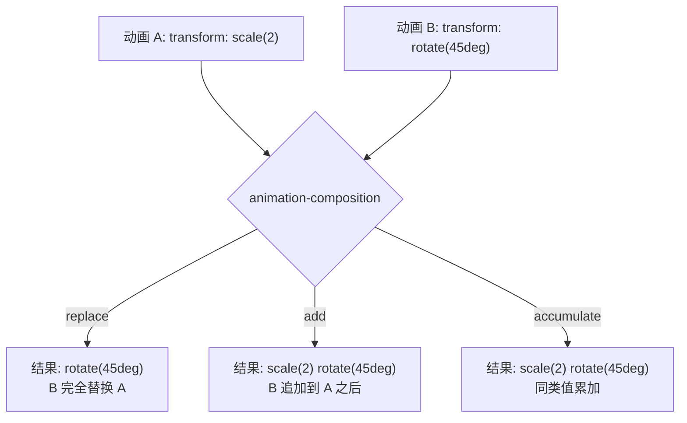
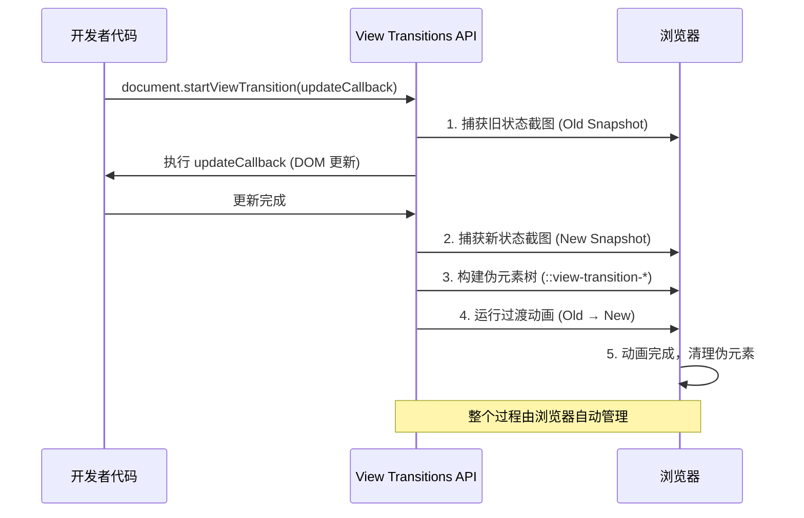
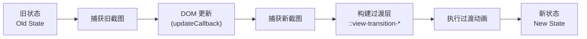
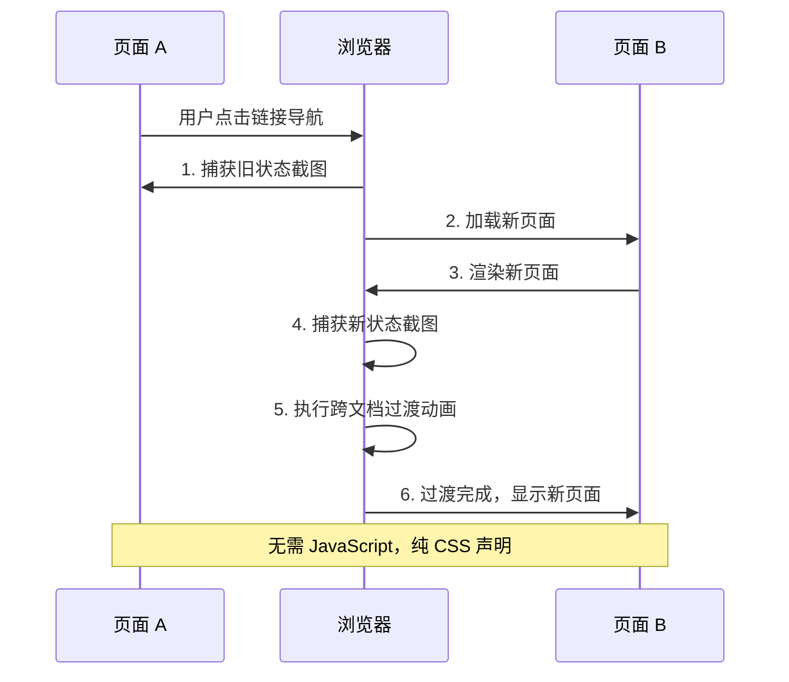

# 动画组合与视图过渡

CSS 动画组合（animation-composition）控制多个动画对同一属性的作用方式，View Transitions API 则为页面和元素之间的过渡提供了原生浏览器支持，两者共同构建现代 CSS 动画的高级能力。

## animation-composition

### 为什么需要组合

当多个动画同时作用于同一属性时，浏览器需要决定如何合并这些效果。`animation-composition` 属性定义了这种合并策略。



### 语法

```css
animation-composition: replace;     /* 默认值，替换 */
animation-composition: add;         /* 追加 */
animation-composition: accumulate;  /* 累加 */
```

## replace vs add vs accumulate

### replace — 替换

`replace` 是默认行为，后应用的动画值完全替换先前的值。

```html
<!DOCTYPE html>
<html lang="zh-CN">
<head>
  <style>
    body {
      margin: 0;
      display: flex;
      justify-content: center;
      align-items: center;
      min-height: 100vh;
      background: #0f172a;
      gap: 80px;
      font-family: system-ui, sans-serif;
      color: white;
    }

    .demo {
      text-align: center;
    }

    .demo h3 {
      font-size: 0.9rem;
      color: #94a3b8;
      margin-bottom: 16px;
    }

    .demo code {
      font-size: 0.8rem;
      color: #6366f1;
    }

    .box {
      width: 80px;
      height: 80px;
      background: #6366f1;
      border-radius: 12px;
      margin: 20px auto;

      /* 基础动画：缩放 */
      animation: scale-anim 2s ease-in-out infinite alternate,
                 rotate-anim 2s ease-in-out infinite alternate;
    }

    /* replace 模式（默认） */
    .box-replace {
      animation-composition: replace;
    }

    /* add 模式 */
    .box-add {
      animation-composition: add;
      background: #10b981;
    }

    /* accumulate 模式 */
    .box-accumulate {
      animation-composition: accumulate;
      background: #f59e0b;
    }

    @keyframes scale-anim {
      from { transform: scale(1); }
      to   { transform: scale(1.5); }
    }

    @keyframes rotate-anim {
      from { transform: rotate(0deg); }
      to   { transform: rotate(180deg); }
    }
  </style>
</head>
<body>
  <div class="demo">
    <h3>replace（默认）</h3>
    <code>animation-composition: replace</code>
    <div class="box box-replace"></div>
    <p>rotate 完全替换 scale</p>
  </div>

  <div class="demo">
    <h3>add</h3>
    <code>animation-composition: add</code>
    <div class="box box-add"></div>
    <p>scale + rotate 同时生效</p>
  </div>

  <div class="demo">
    <h3>accumulate</h3>
    <code>animation-composition: accumulate</code>
    <div class="box box-accumulate"></div>
    <p>同类值累加</p>
  </div>
</body>
</html>
```

### 行为差异详解

| 模式 | 行为 | 示例 |
|------|------|------|
| `replace` | 后值替换前值 | `scale(2)` + `rotate(45deg)` = `rotate(45deg)` |
| `add` | 后值追加到前值之后 | `scale(2)` + `rotate(45deg)` = `scale(2) rotate(45deg)` |
| `accumulate` | 同类值累加 | `scale(2)` + `scale(1.5)` = `scale(3)`；不同类则同 add |

### add 模式实战

```html
<!DOCTYPE html>
<html lang="zh-CN">
<head>
  <style>
    body {
      margin: 0;
      display: flex;
      justify-content: center;
      align-items: center;
      min-height: 100vh;
      background: #0f172a;
    }

    .composed-element {
      width: 100px;
      height: 100px;
      background: linear-gradient(135deg, #6366f1, #ec4899);
      border-radius: 16px;

      /* 三个动画同时作用，使用 add 组合 */
      animation:
        float-y 3s ease-in-out infinite alternate,
        float-x 4s ease-in-out infinite alternate,
        spin 6s linear infinite;
      animation-composition: add;
    }

    @keyframes float-y {
      from { transform: translateY(0); }
      to   { transform: translateY(-40px); }
    }

    @keyframes float-x {
      from { transform: translateX(0); }
      to   { transform: translateX(60px); }
    }

    @keyframes spin {
      from { transform: rotate(0deg); }
      to   { transform: rotate(360deg); }
    }
  </style>
</head>
<body>
  <div class="composed-element"></div>
</body>
</html>
```

### accumulate 模式实战

```html
<!DOCTYPE html>
<html lang="zh-CN">
<head>
  <style>
    body {
      margin: 0;
      display: flex;
      justify-content: center;
      align-items: center;
      min-height: 100vh;
      background: #0f172a;
      gap: 60px;
    }

    .demo-box {
      width: 80px;
      height: 80px;
      border-radius: 12px;
      text-align: center;
      line-height: 80px;
      color: white;
      font-family: system-ui, sans-serif;
      font-size: 0.75rem;
    }

    /* add 模式：scale(1.5) + scale(1.2) = scale(1.5) scale(1.2) */
    .add-box {
      background: #10b981;
      animation: scale-a 2s ease-in-out infinite alternate,
                 scale-b 2s ease-in-out infinite alternate;
      animation-composition: add;
    }

    /* accumulate 模式：scale(1.5) + scale(1.2) = scale(1.8) */
    .acc-box {
      background: #f59e0b;
      animation: scale-a 2s ease-in-out infinite alternate,
                 scale-b 2s ease-in-out infinite alternate;
      animation-composition: accumulate;
    }

    @keyframes scale-a {
      from { transform: scale(1); }
      to   { transform: scale(1.5); }
    }

    @keyframes scale-b {
      from { transform: scale(1); }
      to   { transform: scale(1.2); }
    }
  </style>
</head>
<body>
  <div class="demo-box add-box">add</div>
  <div class="demo-box acc-box">accumulate</div>
</body>
</html>
```

### 组合模式选择指南

| 场景 | 推荐模式 | 原因 |
|------|----------|------|
| 多个 transform 动画叠加 | `add` | 保留每个动画的独立变换 |
| 同类值需要累加 | `accumulate` | 如多个 scale 值相乘 |
| 只保留最后一个动画效果 | `replace` | 默认行为，避免意外叠加 |
| 悬停效果 + 基础动画 | `add` | 悬停变换追加到基础动画之上 |

## View Transitions API 概述

View Transitions API 提供了一种在 DOM 状态之间创建动画过渡的原生方式，无需手动管理动画帧或克隆元素。它适用于单页应用（SPA）的状态切换和多页应用（MPA）的页面导航。



### 核心流程



### 基本概念

| 概念 | 说明 |
|------|------|
| 旧状态截图 | DOM 更新前的视觉状态 |
| 新状态截图 | DOM 更新后的视觉状态 |
| 过渡根 | `::view-transition` 伪元素，包含所有过渡层 |
| 过渡组 | `::view-transition-group(name)`，匹配 `view-transition-name` 的元素 |
| 过渡图像对 | `::view-transition-image-pair(name)`，包含新旧截图 |
| 旧图像 | `::view-transition-old(name)`，旧状态的截图 |
| 新图像 | `::view-transition-new(name)`，新状态的截图 |

## view-transition-name

`view-transition-name` 为元素分配一个唯一标识符，使该元素在视图过渡中被独立追踪和动画化。

### 语法

```css
view-transition-name: none;        /* 不参与过渡（默认） */
view-transition-name: <custom-ident>;  /* 自定义标识符 */
```

### 基本用法

```html
<!DOCTYPE html>
<html lang="zh-CN">
<head>
  <style>
    /* 为标题分配过渡名称 */
    .page-title {
      view-transition-name: page-title;
    }

    /* 为图片分配过渡名称 */
    .hero-image {
      view-transition-name: hero-image;
    }

    /* 为每个列表项分配唯一名称 */
    .list-item:nth-child(1) { view-transition-name: item-1; }
    .list-item:nth-child(2) { view-transition-name: item-2; }
    .list-item:nth-child(3) { view-transition-name: item-3; }

    /* 排除不需要过渡的元素 */
    .no-transition {
      view-transition-name: none;
    }
  </style>
</head>
<body>
  <h1 class="page-title">页面标题</h1>
  
  <ul>
    <li class="list-item">项目 1</li>
    <li class="list-item">项目 2</li>
    <li class="list-item">项目 3</li>
  </ul>
</body>
</html>
```

### 注意事项

| 规则 | 说明 |
|------|------|
| 唯一性 | 同一时刻每个 `view-transition-name` 值只能出现一次 |
| 不匹配 | 如果旧/新状态中只有一方有该名称，执行淡入/淡出 |
| 默认行为 | 未设置名称的元素归入根过渡组，执行整体淡入淡出 |
| 动态设置 | 可通过 JavaScript 动态设置名称，实现条件过渡 |

## ::view-transition-* 伪元素

View Transitions API 创建一组伪元素树，开发者可通过 CSS 自定义过渡动画。

### 伪元素树结构

```
::view-transition
├── ::view-transition-group(root)
│   ├── ::view-transition-image-pair(root)
│   │   ├── ::view-transition-old(root)
│   │   └── ::view-transition-new(root)
├── ::view-transition-group(page-title)
│   ├── ::view-transition-image-pair(page-title)
│   │   ├── ::view-transition-old(page-title)
│   │   └── ::view-transition-new(page-title)
└── ::view-transition-group(hero-image)
    ├── ::view-transition-image-pair(hero-image)
    │   ├── ::view-transition-old(hero-image)
    │   └── ::view-transition-new(hero-image)
```

### 自定义过渡动画

```css
/* 根过渡：整体淡入淡出 */
::view-transition-old(root) {
  animation: 0.3s ease-out both fade-out;
}

::view-transition-new(root) {
  animation: 0.3s ease-in both fade-in;
}

/* 标题过渡：滑动效果 */
::view-transition-old(page-title) {
  animation: 0.4s ease-out both slide-out-left;
}

::view-transition-new(page-title) {
  animation: 0.4s ease-in both slide-in-right;
}

@keyframes fade-out {
  to { opacity: 0; }
}

@keyframes fade-in {
  from { opacity: 0; }
}

@keyframes slide-out-left {
  to { transform: translateX(-100%); opacity: 0; }
}

@keyframes slide-in-right {
  from { transform: translateX(100%); opacity: 0; }
}

/* 图片过渡：缩放效果 */
::view-transition-group(hero-image) {
  animation-duration: 0.5s;
  animation-timing-function: ease-in-out;
}

::view-transition-old(hero-image) {
  animation: 0.5s ease-in-out both scale-down;
}

::view-transition-new(hero-image) {
  animation: 0.5s ease-in-out both scale-up;
}

@keyframes scale-down {
  to { transform: scale(0.8); opacity: 0; }
}

@keyframes scale-up {
  from { transform: scale(1.2); opacity: 0; }
}
```

### 伪元素功能一览

| 伪元素 | 作用 | 可自定义属性 |
|--------|------|-------------|
| `::view-transition` | 过渡容器 | `position`、`z-index` |
| `::view-transition-group(name)` | 过渡组，管理位置/尺寸变化 | `animation-*`、`transform`、`width`、`height` |
| `::view-transition-image-pair(name)` | 图像对容器 | `isolation: isolate` |
| `::view-transition-old(name)` | 旧状态截图 | `animation-*`、`opacity`、`transform` |
| `::view-transition-new(name)` | 新状态截图 | `animation-*`、`opacity`、`transform` |

## document.startViewTransition()

`document.startViewTransition()` 是 View Transitions API 的 JavaScript 入口，用于在单页应用中触发视图过渡。

### 基本语法

```javascript
const transition = document.startViewTransition(updateCallback);
```

**参数：**

| 参数 | 类型 | 说明 |
|------|------|------|
| `updateCallback` | Function | 更新 DOM 的回调函数，返回 Promise 时等待其 resolve |

**返回值：** `ViewTransition` 对象

### ViewTransition 对象

| 属性/方法 | 说明 |
|-----------|------|
| `finished` | Promise，过渡完成后 resolve |
| `ready` | Promise，过渡动画准备就绪时 resolve |
| `updateCallbackDone` | Promise，updateCallback 完成时 resolve |
| `skipTransition()` | 跳过过渡动画 |

### 基础示例：页面切换

```html
<!DOCTYPE html>
<html lang="zh-CN">
<head>
  <style>
    body {
      margin: 0;
      font-family: system-ui, sans-serif;
      background: #0f172a;
      color: white;
    }

    .app {
      max-width: 600px;
      margin: 0 auto;
      padding: 40px 20px;
    }

    /* 导航 */
    .nav {
      display: flex;
      gap: 12px;
      margin-bottom: 30px;
    }

    .nav button {
      padding: 10px 20px;
      background: #1e293b;
      border: 1px solid #334155;
      border-radius: 8px;
      color: white;
      cursor: pointer;
      transition: background 0.2s;
    }

    .nav button.active {
      background: #6366f1;
      border-color: #6366f1;
    }

    .nav button:hover {
      background: #334155;
    }

    /* 页面内容 */
    .page {
      display: none;
    }

    .page.active {
      display: block;
    }

    .page-title {
      view-transition-name: page-title;
      font-size: 2rem;
      margin-bottom: 16px;
    }

    .page-content {
      view-transition-name: page-content;
      line-height: 1.8;
      color: #94a3b8;
    }

    /* 自定义过渡动画 */
    ::view-transition-old(page-title) {
      animation: 0.3s ease-out both fade-slide-out;
    }

    ::view-transition-new(page-title) {
      animation: 0.3s ease-in 0.1s both fade-slide-in;
    }

    ::view-transition-old(page-content) {
      animation: 0.25s ease-out both fade-out;
    }

    ::view-transition-new(page-content) {
      animation: 0.25s ease-in 0.15s both fade-in;
    }

    @keyframes fade-slide-out {
      to { opacity: 0; transform: translateY(-20px); }
    }

    @keyframes fade-slide-in {
      from { opacity: 0; transform: translateY(20px); }
    }

    @keyframes fade-out {
      to { opacity: 0; }
    }

    @keyframes fade-in {
      from { opacity: 0; }
    }
  </style>
</head>
<body>
  <div class="app">
    <nav class="nav">
      <button class="active" onclick="switchPage('home')">首页</button>
      <button onclick="switchPage('about')">关于</button>
      <button onclick="switchPage('contact')">联系</button>
    </nav>

    <div class="page active" id="page-home">
      <h1 class="page-title">欢迎回来</h1>
      <div class="page-content">
        <p>这是首页内容。点击导航按钮切换页面，观察视图过渡效果。</p>
      </div>
    </div>

    <div class="page" id="page-about">
      <h1 class="page-title">关于我们</h1>
      <div class="page-content">
        <p>这是关于页面。View Transitions API 让页面切换更加流畅。</p>
      </div>
    </div>

    <div class="page" id="page-contact">
      <h1 class="page-title">联系方式</h1>
      <div class="page-content">
        <p>这是联系页面。无需复杂的动画库即可实现原生过渡。</p>
      </div>
    </div>
  </div>

  <script>
    function switchPage(pageName) {
      // 检测浏览器是否支持 View Transitions API
      if (!document.startViewTransition) {
        // 降级处理：直接切换
        document.querySelectorAll('.page').forEach(p => p.classList.remove('active'));
        document.getElementById(`page-${pageName}`).classList.add('active');
        document.querySelectorAll('.nav button').forEach(b => b.classList.remove('active'));
        event.target.classList.add('active');
        return;
      }

      // 使用 View Transitions API
      const transition = document.startViewTransition(() => {
        document.querySelectorAll('.page').forEach(p => p.classList.remove('active'));
        document.getElementById(`page-${pageName}`).classList.add('active');
        document.querySelectorAll('.nav button').forEach(b => b.classList.remove('active'));
        event.target.classList.add('active');
      });
    }
  </script>
</body>
</html>
```

### 异步更新

```javascript
// 等待数据加载完成后再执行过渡
async function switchWithData(id) {
  const transition = document.startViewTransition(async () => {
    // 异步加载数据
    const data = await fetchData(id);
    // 更新 DOM
    updateContent(data);
  });

  // 过渡完成后执行清理
  await transition.finished;
  cleanup();
}
```

### skipTransition

```javascript
// 减少运动偏好时跳过过渡
const transition = document.startViewTransition(() => {
  updateDOM();
});

if (prefersReducedMotion) {
  transition.skipTransition();
}
```

## 跨文档视图过渡

跨文档视图过渡（Cross-Document View Transitions）允许在多页应用（MPA）的不同页面导航之间创建过渡动画，无需 JavaScript 调用 `startViewTransition()`。

### 启用方式

```css
/* 在参与过渡的页面中添加 */
@view-transition {
  navigation: auto;
}
```

### 工作原理



### 自定义跨文档过渡

```css
/* 启用跨文档视图过渡（需同源，且当前页与目标页都要声明） */
@view-transition {
  navigation: auto;
}

/* 自定义过渡动画 */
::view-transition-old(root) {
  animation: 0.4s ease-out both slide-out;
}

::view-transition-new(root) {
  animation: 0.4s ease-in both slide-in;
}

@keyframes slide-out {
  to { transform: translateX(-30%); opacity: 0; }
}

@keyframes slide-in {
  from { transform: translateX(30%); opacity: 0; }
}
```

### 限制与注意

| 事项 | 说明 |
|------|------|
| 同源限制 | 仅限同源页面之间的导航 |
| 浏览器支持 | Chrome/Edge 126+、Safari 18.2+ 支持；Firefox 尚未支持 |
| 性能考虑 | 大型页面过渡可能影响性能 |
| 降级方案 | 不支持时自动跳过，无视觉影响 |

## 实战模式

### 列表重排序

列表项重排时，使用 View Transitions API 创建平滑的位置移动动画。

```html
<!DOCTYPE html>
<html lang="zh-CN">
<head>
  <style>
    body {
      margin: 0;
      font-family: system-ui, sans-serif;
      background: #0f172a;
      color: white;
      padding: 40px;
    }

    .sortable-list {
      max-width: 500px;
      margin: 0 auto;
    }

    .list-item {
      display: flex;
      align-items: center;
      justify-content: space-between;
      padding: 16px 20px;
      background: #1e293b;
      border-radius: 12px;
      margin-bottom: 8px;
      cursor: grab;
      user-select: none;
    }

    .list-item:active {
      cursor: grabbing;
    }

    .list-item-name {
      font-size: 1rem;
    }

    .list-item-actions {
      display: flex;
      gap: 8px;
    }

    .list-item-actions button {
      padding: 4px 12px;
      background: #334155;
      border: none;
      border-radius: 6px;
      color: #94a3b8;
      cursor: pointer;
      font-size: 0.8rem;
    }

    .list-item-actions button:hover {
      background: #6366f1;
      color: white;
    }

    /* 为每个列表项分配唯一的过渡名称 */
    .list-item:nth-child(1) { view-transition-name: list-item-1; }
    .list-item:nth-child(2) { view-transition-name: list-item-2; }
    .list-item:nth-child(3) { view-transition-name: list-item-3; }
    .list-item:nth-child(4) { view-transition-name: list-item-4; }
    .list-item:nth-child(5) { view-transition-name: list-item-5; }

    /* 自定义过渡：平滑移动 */
    ::view-transition-group(list-item-1),
    ::view-transition-group(list-item-2),
    ::view-transition-group(list-item-3),
    ::view-transition-group(list-item-4),
    ::view-transition-group(list-item-5) {
      animation-duration: 0.4s;
      animation-timing-function: cubic-bezier(0.4, 0, 0.2, 1);
    }

    /* 禁用默认的淡入淡出，只保留位置移动 */
    ::view-transition-old(list-item-1),
    ::view-transition-old(list-item-2),
    ::view-transition-old(list-item-3),
    ::view-transition-old(list-item-4),
    ::view-transition-old(list-item-5) {
      animation: none;
    }

    ::view-transition-new(list-item-1),
    ::view-transition-new(list-item-2),
    ::view-transition-new(list-item-3),
    ::view-transition-new(list-item-4),
    ::view-transition-new(list-item-5) {
      animation: none;
    }
  </style>
</head>
<body>
  <div class="sortable-list" id="list">
    <div class="list-item">
      <span class="list-item-name">项目 Alpha</span>
      <div class="list-item-actions">
        <button onclick="moveUp(this)">上移</button>
        <button onclick="moveDown(this)">下移</button>
      </div>
    </div>
    <div class="list-item">
      <span class="list-item-name">项目 Beta</span>
      <div class="list-item-actions">
        <button onclick="moveUp(this)">上移</button>
        <button onclick="moveDown(this)">下移</button>
      </div>
    </div>
    <div class="list-item">
      <span class="list-item-name">项目 Gamma</span>
      <div class="list-item-actions">
        <button onclick="moveUp(this)">上移</button>
        <button onclick="moveDown(this)">下移</button>
      </div>
    </div>
    <div class="list-item">
      <span class="list-item-name">项目 Delta</span>
      <div class="list-item-actions">
        <button onclick="moveUp(this)">上移</button>
        <button onclick="moveDown(this)">下移</button>
      </div>
    </div>
    <div class="list-item">
      <span class="list-item-name">项目 Epsilon</span>
      <div class="list-item-actions">
        <button onclick="moveUp(this)">上移</button>
        <button onclick="moveDown(this)">下移</button>
      </div>
    </div>
  </div>

  <script>
    function moveUp(btn) {
      const item = btn.closest('.list-item');
      const prev = item.previousElementSibling;
      if (!prev) return;

      if (document.startViewTransition) {
        document.startViewTransition(() => {
          item.parentNode.insertBefore(item, prev);
        });
      } else {
        item.parentNode.insertBefore(item, prev);
      }
    }

    function moveDown(btn) {
      const item = btn.closest('.list-item');
      const next = item.nextElementSibling;
      if (!next) return;

      if (document.startViewTransition) {
        document.startViewTransition(() => {
          item.parentNode.insertBefore(next, item);
        });
      } else {
        item.parentNode.insertBefore(next, item);
      }
    }
  </script>
</body>
</html>
```

### 页面导航过渡

```html
<!DOCTYPE html>
<html lang="zh-CN">
<head>
  <style>
    body {
      margin: 0;
      font-family: system-ui, sans-serif;
      background: #0f172a;
      color: white;
    }

    .router {
      max-width: 800px;
      margin: 0 auto;
      padding: 40px 20px;
    }

    .router-nav {
      display: flex;
      gap: 16px;
      margin-bottom: 40px;
      padding-bottom: 20px;
      border-bottom: 1px solid #1e293b;
    }

    .router-nav a {
      color: #94a3b8;
      text-decoration: none;
      padding: 8px 16px;
      border-radius: 8px;
      transition: color 0.2s, background 0.2s;
    }

    .router-nav a:hover {
      color: white;
      background: #1e293b;
    }

    .router-nav a.active {
      color: white;
      background: #6366f1;
    }

    /* 页面区域 */
    .router-page {
      view-transition-name: router-page;
    }

    /* 页面过渡动画 */
    ::view-transition-old(router-page) {
      animation: 0.3s ease-in both page-exit;
    }

    ::view-transition-new(router-page) {
      animation: 0.3s ease-out 0.1s both page-enter;
    }

    @keyframes page-exit {
      to {
        opacity: 0;
        transform: scale(0.95) translateY(10px);
      }
    }

    @keyframes page-enter {
      from {
        opacity: 0;
        transform: scale(1.05) translateY(-10px);
      }
    }

    /* 页面内容样式 */
    .page-hero {
      text-align: center;
      padding: 60px 0;
    }

    .page-hero h1 {
      font-size: 2.5rem;
      margin-bottom: 16px;
    }

    .page-hero p {
      color: #94a3b8;
      font-size: 1.1rem;
      max-width: 500px;
      margin: 0 auto;
    }
  </style>
</head>
<body>
  <div class="router">
    <nav class="router-nav">
      <a href="#" class="active" onclick="navigate('home', event)">首页</a>
      <a href="#" onclick="navigate('features', event)">功能</a>
      <a href="#" onclick="navigate('pricing', event)">定价</a>
    </nav>

    <div class="router-page" id="page-content">
      <div class="page-hero">
        <h1>欢迎</h1>
        <p>使用 View Transitions API 实现流畅的页面导航过渡。</p>
      </div>
    </div>
  </div>

  <script>
    const pages = {
      home: '<div class="page-hero"><h1>欢迎</h1><p>使用 View Transitions API 实现流畅的页面导航过渡。</p></div>',
      features: '<div class="page-hero"><h1>功能特性</h1><p>原生浏览器支持、零依赖、声明式过渡动画。</p></div>',
      pricing: '<div class="page-hero"><h1>定价方案</h1><p>免费使用，无需任何动画库或第三方依赖。</p></div>'
    };

    function navigate(page, e) {
      e.preventDefault();

      // 更新导航状态
      document.querySelectorAll('.router-nav a').forEach(a => a.classList.remove('active'));
      e.target.classList.add('active');

      const updateDOM = () => {
        document.getElementById('page-content').innerHTML = pages[page];
      };

      if (document.startViewTransition) {
        document.startViewTransition(updateDOM);
      } else {
        updateDOM();
      }
    }
  </script>
</body>
</html>
```

### 图片画廊过渡

点击缩略图时，图片从缩略图位置平滑过渡到全屏展示。

```html
<!DOCTYPE html>
<html lang="zh-CN">
<head>
  <style>
    body {
      margin: 0;
      font-family: system-ui, sans-serif;
      background: #0f172a;
      color: white;
      padding: 40px;
    }

    .gallery {
      display: grid;
      grid-template-columns: repeat(3, 1fr);
      gap: 16px;
      max-width: 800px;
      margin: 0 auto;
    }

    .gallery-thumb {
      aspect-ratio: 4/3;
      border-radius: 12px;
      overflow: hidden;
      cursor: pointer;
      transition: transform 0.2s;
    }

    .gallery-thumb:hover {
      transform: scale(1.03);
    }

    .gallery-thumb img {
      width: 100%;
      height: 100%;
      object-fit: cover;
      display: block;
    }

    /* 为每张缩略图分配过渡名称 */
    .gallery-thumb:nth-child(1) img { view-transition-name: gallery-img-1; }
    .gallery-thumb:nth-child(2) img { view-transition-name: gallery-img-2; }
    .gallery-thumb:nth-child(3) img { view-transition-name: gallery-img-3; }
    .gallery-thumb:nth-child(4) img { view-transition-name: gallery-img-4; }
    .gallery-thumb:nth-child(5) img { view-transition-name: gallery-img-5; }
    .gallery-thumb:nth-child(6) img { view-transition-name: gallery-img-6; }

    /* 全屏查看器 */
    .viewer {
      display: none;
      position: fixed;
      inset: 0;
      background: rgba(0, 0, 0, 0.9);
      z-index: 100;
      align-items: center;
      justify-content: center;
    }

    .viewer.active {
      display: flex;
    }

    .viewer img {
      max-width: 90vw;
      max-height: 90vh;
      border-radius: 12px;
      object-fit: contain;
      view-transition-name: gallery-img-1;
    }

    .viewer-close {
      position: absolute;
      top: 20px;
      right: 20px;
      width: 40px;
      height: 40px;
      background: rgba(255, 255, 255, 0.1);
      border: none;
      border-radius: 50%;
      color: white;
      font-size: 1.2rem;
      cursor: pointer;
    }

    /* 过渡动画 */
    ::view-transition-group(gallery-img-1),
    ::view-transition-group(gallery-img-2),
    ::view-transition-group(gallery-img-3),
    ::view-transition-group(gallery-img-4),
    ::view-transition-group(gallery-img-5),
    ::view-transition-group(gallery-img-6) {
      animation-duration: 0.5s;
      animation-timing-function: cubic-bezier(0.2, 0, 0, 1);
    }
  </style>
</head>
<body>
  <div class="gallery">
    <div class="gallery-thumb" onclick="openViewer(1)">
      
    </div>
    <div class="gallery-thumb" onclick="openViewer(2)">
      
    </div>
    <div class="gallery-thumb" onclick="openViewer(3)">
      
    </div>
    <div class="gallery-thumb" onclick="openViewer(4)">
      
    </div>
    <div class="gallery-thumb" onclick="openViewer(5)">
      
    </div>
    <div class="gallery-thumb" onclick="openViewer(6)">
      
    </div>
  </div>

  <div class="viewer" id="viewer">
    <button class="viewer-close" onclick="closeViewer()">&times;</button>
    
  </div>

  <script>
    const seeds = ['gal1', 'gal2', 'gal3', 'gal4', 'gal5', 'gal6'];

    function openViewer(index) {
      const viewer = document.getElementById('viewer');
      const img = document.getElementById('viewer-img');

      // 动态设置过渡名称匹配
      img.style.viewTransitionName = `gallery-img-${index}`;
      img.src = `https://picsum.photos/seed/${seeds[index - 1]}/1200/900`;

      const show = () => {
        viewer.classList.add('active');
      };

      if (document.startViewTransition) {
        document.startViewTransition(show);
      } else {
        show();
      }
    }

    function closeViewer() {
      const viewer = document.getElementById('viewer');
      const img = document.getElementById('viewer-img');

      const hide = () => {
        viewer.classList.remove('active');
      };

      if (document.startViewTransition) {
        document.startViewTransition(hide);
      } else {
        hide();
      }
    }
  </script>
</body>
</html>
```

### 主题切换 — 圆形揭示

点击按钮时，从按钮位置以圆形扩展的方式切换暗色/亮色主题。

```html
<!DOCTYPE html>
<html lang="zh-CN">
<head>
  <style>
    :root {
      --bg: #0f172a;
      --surface: #1e293b;
      --text: #f1f5f9;
      --text-muted: #94a3b8;
      --accent: #6366f1;
      --border: #334155;
    }

    :root.light {
      --bg: #f8fafc;
      --surface: #ffffff;
      --text: #0f172a;
      --text-muted: #64748b;
      --accent: #6366f1;
      --border: #e2e8f0;
    }

    * {
      transition: background-color 0s, color 0s, border-color 0s;
    }

    body {
      margin: 0;
      font-family: system-ui, sans-serif;
      background: var(--bg);
      color: var(--text);
      min-height: 100vh;
    }

    .header {
      display: flex;
      justify-content: space-between;
      align-items: center;
      padding: 20px 40px;
      border-bottom: 1px solid var(--border);
    }

    .header h1 {
      font-size: 1.5rem;
    }

    .theme-toggle {
      position: relative;
      width: 48px;
      height: 48px;
      background: var(--surface);
      border: 2px solid var(--border);
      border-radius: 50%;
      color: var(--text);
      font-size: 1.3rem;
      cursor: pointer;
      display: flex;
      align-items: center;
      justify-content: center;
      view-transition-name: theme-toggle;
    }

    .content {
      max-width: 700px;
      margin: 60px auto;
      padding: 0 20px;
    }

    .content h2 {
      font-size: 2rem;
      margin-bottom: 16px;
    }

    .content p {
      color: var(--text-muted);
      line-height: 1.8;
      margin-bottom: 24px;
    }

    .card-grid {
      display: grid;
      grid-template-columns: repeat(2, 1fr);
      gap: 16px;
      margin-top: 30px;
    }

    .card {
      background: var(--surface);
      border: 1px solid var(--border);
      border-radius: 12px;
      padding: 24px;
    }

    .card h3 {
      margin: 0 0 8px;
    }

    .card p {
      margin: 0;
      font-size: 0.9rem;
    }

    /* 圆形揭示过渡 */
    ::view-transition-old(root) {
      animation: none;
    }

    ::view-transition-new(root) {
      animation: circle-reveal 0.5s ease-in-out;
    }

    /* 反向过渡 */
    :root.light::view-transition-old(root) {
      animation: none;
    }

    :root.light::view-transition-new(root) {
      animation: circle-reveal 0.5s ease-in-out;
    }

    @keyframes circle-reveal {
      from {
        clip-path: circle(0% at var(--reveal-x, 50%) var(--reveal-y, 50%));
      }
      to {
        clip-path: circle(100% at var(--reveal-x, 50%) var(--reveal-y, 50%));
      }
    }
  </style>
</head>
<body>
  <header class="header">
    <h1>主题切换</h1>
    <button class="theme-toggle" id="themeBtn" onclick="toggleTheme(event)">&#9790;</button>
  </header>

  <div class="content">
    <h2>圆形揭示过渡</h2>
    <p>点击右上角的按钮切换主题，观察从按钮位置展开的圆形揭示效果。这是 View Transitions API 与 CSS clip-path 结合的典型应用。</p>

    <div class="card-grid">
      <div class="card">
        <h3>View Transitions</h3>
        <p>原生浏览器 API，无需第三方库。</p>
      </div>
      <div class="card">
        <h3>clip-path</h3>
        <p>结合 clip-path 实现自定义揭示形状。</p>
      </div>
      <div class="card">
        <h3>自定义属性</h3>
        <p>通过 CSS 变量传递点击位置。</p>
      </div>
      <div class="card">
        <h3>渐进增强</h3>
        <p>不支持时自动降级为普通切换。</p>
      </div>
    </div>
  </div>

  <script>
    function toggleTheme(e) {
      const x = e.clientX;
      const y = e.clientY;

      // 将点击位置传递给 CSS 变量
      document.documentElement.style.setProperty('--reveal-x', `${x}px`);
      document.documentElement.style.setProperty('--reveal-y', `${y}px`);

      const switchTheme = () => {
        const isLight = document.documentElement.classList.toggle('light');
        document.getElementById('themeBtn').innerHTML = isLight ? '&#9788;' : '&#9790;';
      };

      if (document.startViewTransition) {
        document.startViewTransition(switchTheme);
      } else {
        switchTheme();
      }
    }
  </script>
</body>
</html>
```

## 浏览器兼容性

### animation-composition

| 特性 | Chrome | Firefox | Safari | Edge |
|------|--------|---------|--------|------|
| `animation-composition` | 112+ | 112+ | 16+ | 112+ |

### View Transitions API

| 特性 | Chrome | Firefox | Safari | Edge |
|------|--------|---------|--------|------|
| `document.startViewTransition()` | 111+ | 139+ | 18+ | 111+ |
| `view-transition-name` | 111+ | 139+ | 18+ | 111+ |
| `::view-transition-*` 伪元素 | 111+ | 139+ | 18+ | 111+ |
| 跨文档视图过渡 | 126+ | 不支持 | 18.2+ | 126+ |

### 渐进增强策略

```css
/* animation-composition 渐进增强 */
.multi-animation {
  /* 基础：使用单一动画避免冲突 */
  animation: combined-transform 2s ease-in-out infinite alternate;
}

@supports (animation-composition: add) {
  .multi-animation {
    animation:
      float-y 3s ease-in-out infinite alternate,
      float-x 4s ease-in-out infinite alternate;
    animation-composition: add;
  }
}

/* View Transitions 渐进增强 */
.theme-switch {
  /* 基础：直接切换 */
  transition: background-color 0.3s, color 0.3s;
}
```

```javascript
// View Transitions 渐进增强
function updateView(callback) {
  if (document.startViewTransition) {
    document.startViewTransition(callback);
  } else {
    callback();
  }
}

// 减少运动偏好
const prefersReducedMotion = window.matchMedia(
  '(prefers-reduced-motion: reduce)'
).matches;

function safeViewTransition(callback) {
  if (prefersReducedMotion || !document.startViewTransition) {
    callback();
    return;
  }
  document.startViewTransition(callback);
}
```

## 高级技巧与最佳实践

### 动画时序控制

使用 `animation-delay` 和 `animation-direction` 精确控制多个动画的时序。

```css
/* 交错动画效果 */
.stagger-animation {
  animation: 
    fadeIn 0.5s ease-out forwards,
    slideUp 0.5s ease-out forwards,
    scaleIn 0.3s ease-out forwards;
  animation-composition: add;
}

.stagger-animation:nth-child(1) { animation-delay: 0s, 0.1s, 0.2s; }
.stagger-animation:nth-child(2) { animation-delay: 0.1s, 0.2s, 0.3s; }
.stagger-animation:nth-child(3) { animation-delay: 0.2s, 0.3s, 0.4s; }

@keyframes fadeIn {
  from { opacity: 0; }
  to { opacity: 1; }
}

@keyframes slideUp {
  from { transform: translateY(20px); }
  to { transform: translateY(0); }
}

@keyframes scaleIn {
  from { transform: scale(0.9); }
  to { transform: scale(1); }
}
```

### View Transitions 与路由集成

在单页应用中，将 View Transitions 与路由系统深度集成。

```javascript
// Vue Router 集成示例
router.beforeEach((to, from, next) => {
  if (document.startViewTransition) {
    document.startViewTransition(() => {
      next();
    });
  } else {
    next();
  }
});

// React Router 集成示例
function ViewTransitionWrapper({ children }) {
  const location = useLocation();
  
  useEffect(() => {
    if (document.startViewTransition) {
      document.startViewTransition(() => {
        // React 会在 effect 中更新 DOM
      });
    }
  }, [location]);
  
  return children;
}
```

### 动态 view-transition-name

使用 JavaScript 动态生成唯一的过渡名称，处理列表动态增删。

```javascript
class ViewTransitionManager {
  constructor() {
    this.counter = 0;
    this.elements = new Map();
  }
  
  register(element) {
    const id = `vt-${++this.counter}`;
    element.style.viewTransitionName = id;
    this.elements.set(element, id);
    return id;
  }
  
  unregister(element) {
    const id = this.elements.get(element);
    if (id) {
      element.style.viewTransitionName = '';
      this.elements.delete(element);
    }
  }
  
  async transition(callback) {
    if (!document.startViewTransition) {
      callback();
      return;
    }
    
    const transition = document.startViewTransition(callback);
    await transition.finished;
  }
}

// 使用示例
const vtManager = new ViewTransitionManager();

function addItem() {
  const item = document.createElement('div');
  item.className = 'list-item';
  item.textContent = 'New Item';
  
  vtManager.register(item);
  
  vtManager.transition(() => {
    document.querySelector('.list').appendChild(item);
  });
}

function removeItem(element) {
  vtManager.transition(() => {
    element.remove();
    vtManager.unregister(element);
  });
}
```

### 性能优化策略

#### 1. 限制过渡元素数量

过多的 `view-transition-name` 会降低性能，只为关键元素设置过渡名称。

```css
/* ❌ 不推荐：为所有元素设置过渡名称 */
.list-item {
  view-transition-name: list-item; /* 错误：所有元素同名 */
}

/* ✅ 推荐：只为可见的关键元素设置 */
.list-item.visible {
  view-transition-name: list-item-visible;
}

/* ✅ 推荐：使用动态名称 */
.list-item:nth-child(1) { view-transition-name: item-1; }
.list-item:nth-child(2) { view-transition-name: item-2; }
.list-item:nth-child(3) { view-transition-name: item-3; }
```

#### 2. 使用 contain 限制重绘范围

```css
.transition-container {
  contain: layout style paint;
  view-transition-name: container;
}

.transition-content {
  view-transition-name: content;
}
```

#### 3. 避免在过渡中触发布局重排

```css
/* ❌ 错误：过渡中改变尺寸 */
::view-transition-group(element) {
  animation: resize 0.3s ease;
}

@keyframes resize {
  from { width: 100px; }
  to { width: 200px; }
}

/* ✅ 正确：使用 transform 缩放 */
::view-transition-group(element) {
  animation: scale 0.3s ease;
}

@keyframes scale {
  from { transform: scale(1); }
  to { transform: scale(2); }
}
```

#### 4. 使用 will-change 提升性能

```css
.view-transition-element {
  view-transition-name: element;
  will-change: transform, opacity;
}

/* 过渡完成后移除 will-change */
::view-transition-old(element),
::view-transition-new(element) {
  animation: fade 0.3s ease forwards;
}

@keyframes fade {
  to { 
    opacity: 0;
    will-change: auto;
  }
}
```

### 常见问题与解决方案

#### 问题 1：View Transition 不生效

**现象**：调用 `document.startViewTransition()` 后没有动画效果。

**原因**：
1. 浏览器不支持 View Transitions API
2. 没有为元素设置 `view-transition-name`
3. DOM 更新是同步的，浏览器无法捕获新旧状态

**解决方案**：

```javascript
// 检查浏览器支持
if (!document.startViewTransition) {
  console.warn('View Transitions API not supported');
  // 降级处理
  updateDOM();
  return;
}

// 确保 DOM 更新在回调中执行
document.startViewTransition(() => {
  // 同步更新 DOM
  element.textContent = 'New content';
  
  // 或者返回 Promise 异步更新
  return fetchNewData().then(data => {
    updateContent(data);
  });
});
```

#### 问题 2：多个动画冲突

**现象**：多个动画同时作用于 `transform` 属性，效果不符合预期。

**原因**：默认使用 `replace` 模式，后一个动画会覆盖前一个。

**解决方案**：

```css
/* 使用 add 模式叠加动画 */
.multi-transform {
  animation: 
    rotate 2s linear infinite,
    scale 1s ease-in-out infinite alternate;
  animation-composition: add;
}

@keyframes rotate {
  to { transform: rotate(360deg); }
}

@keyframes scale {
  to { transform: scale(1.5); }
}
```

#### 问题 3：跨文档过渡失败

**现象**：多页应用中的跨文档视图过渡不工作。

**原因**：
1. 页面不在同一源（origin）
2. 没有在页面中声明 `@view-transition`
3. 浏览器不支持跨文档过渡

**解决方案**：

```css
/* 在每个页面中添加 */
@view-transition {
  navigation: auto;
}

/* 确保页面同源 */
/* 例如：https://example.com/page1 和 https://example.com/page2 */
```

#### 问题 4：减少动画偏好未处理

**现象**：用户设置了"减少动画"系统偏好，但过渡动画仍然播放。

**原因**：没有检查 `prefers-reduced-motion` 媒体查询。

**解决方案**：

```css
/* CSS 中处理 */
@media (prefers-reduced-motion: reduce) {
  ::view-transition-group(*),
  ::view-transition-old(*),
  ::view-transition-new(*) {
    animation: none !important;
  }
}
```

```javascript
// JavaScript 中处理
const prefersReducedMotion = window.matchMedia(
  '(prefers-reduced-motion: reduce)'
);

function safeTransition(callback) {
  if (prefersReducedMotion.matches) {
    callback(); // 直接执行，不播放动画
    return;
  }
  
  if (document.startViewTransition) {
    document.startViewTransition(callback);
  } else {
    callback();
  }
}
```

### 调试技巧

#### 1. 查看过渡伪元素

在 Chrome DevTools 中启用"Show view transition pseudo-elements"：

1. 打开 DevTools → Settings → Preferences
2. 启用"Show view transition pseudo-elements"
3. 触发 View Transition
4. 在 Elements 面板中查看 `::view-transition` 伪元素树

#### 2. 减慢动画速度

```css
/* 临时减慢所有过渡动画以便调试 */
@media (prefers-reduced-motion: no-preference) {
  ::view-transition-group(*),
  ::view-transition-old(*),
  ::view-transition-new(*) {
    animation-duration: 2s !important;
  }
}
```

#### 3. 高亮过渡元素

```css
/* 为所有过渡组添加边框以便可视化 */
::view-transition-group(*) {
  outline: 2px solid red !important;
}
```

### 浏览器兼容性处理

#### 特性检测

```javascript
// 检测 View Transitions API 支持
const supportsViewTransitions = 'startViewTransition' in document;

// 检测 animation-composition 支持
const supportsAnimationComposition = CSS.supports('animation-composition', 'add');

// 注意：跨文档过渡依赖 @view-transition at 规则，无法通过 CSS.supports 直接检测；
// 好在其设计为渐进增强——不支持的浏览器会自动跳过过渡，无副作用

if (supportsViewTransitions) {
  // 使用 View Transitions API
  document.startViewTransition(() => {
    updateDOM();
  });
} else {
  // 降级处理
  updateDOM();
}
```

#### Polyfill 方案

目前还没有完整的 View Transitions API polyfill，但可以使用以下库提供部分功能：

```javascript
// 使用 @remix-run/view-transitions-polyfill
import { polyfillViewTransitions } from '@remix-run/view-transitions-polyfill';

polyfillViewTransitions();

// 现在可以使用 document.startViewTransition
document.startViewTransition(() => {
  updateDOM();
});
```

## 参考资源

- [MDN - animation-composition](https://developer.mozilla.org/en-US/docs/Web/CSS/animation-composition)
- [MDN - View Transitions API](https://developer.mozilla.org/en-US/docs/Web/API/View_Transitions_API)
- [Chrome Developers - View Transitions](https://developer.chrome.com/docs/web-platform/view-transitions/)
- [W3C CSS View Transitions Module Level 1](https://www.w3.org/TR/css-view-transitions-1/)
- [W3C CSS Animations Level 2 - animation-composition](https://www.w3.org/TR/css-animations-2/#animation-composition)
- [View Transitions for Multi-Page Apps](https://developer.chrome.com/docs/web-platform/view-transitions/cross-document)
