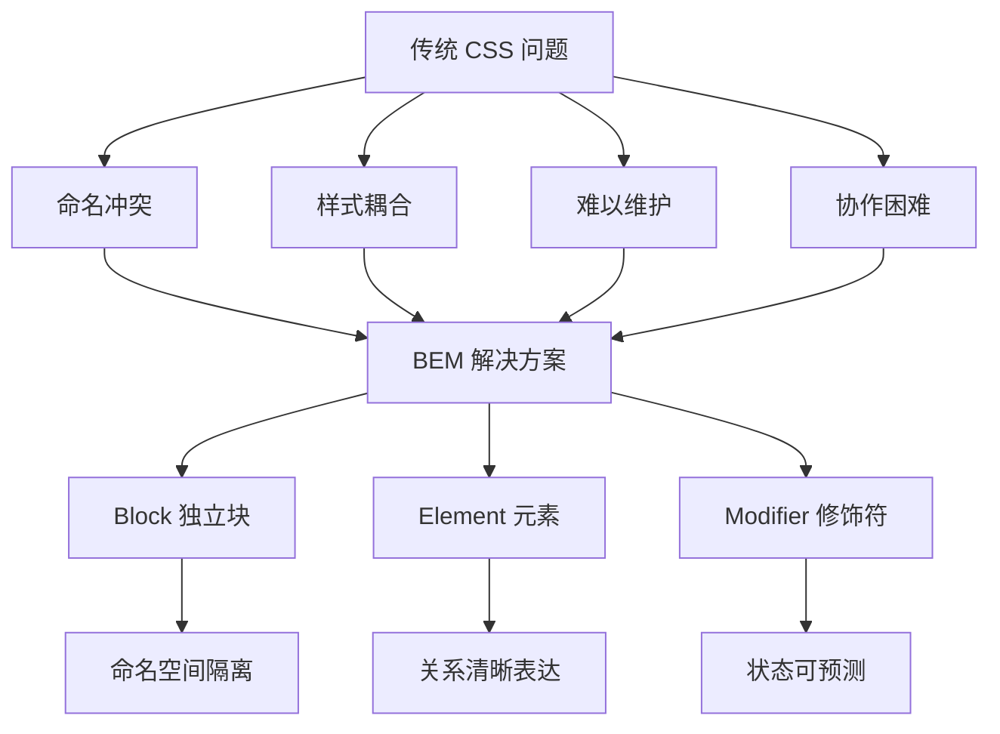

# BEM 命名规范

BEM（Block Element Modifier）是一种 CSS 命名规范，由 Yandex 公司提出，旨在创建可复用、可维护的组件化代码。

## 背景与动机

### 为什么需要 BEM？

在大型前端项目中，CSS 面临以下核心挑战：

1. **命名冲突**：多个开发者使用相同的类名导致样式互相覆盖
2. **样式耦合**：类名无法表达元素间的关系，修改一处影响全局
3. **可维护性差**：随着项目增长，CSS 变得难以理解和修改
4. **团队协作困难**：缺乏统一的命名规范，代码风格不一致

BEM 通过严格的命名约定解决了这些问题，让类名本身就成为文档。

### BEM 解决的问题



### 核心价值

| 价值 | 说明 |
|------|------|
| **模块化** | 块是独立的可复用单元 |
| **可读性** | 类名清晰表达元素关系 |
| **避免冲突** | 独特命名减少样式冲突 |
| **可维护** | 修改不影响其他组件 |
| **可预测** | 通过类名即可推断样式作用域 |

## 核心概念

BEM 的命名格式为：`Block__Element--Modifier`

```
Block__Element--Modifier
  │         │         │
  │         │         └── 双连字符连接修饰符
  │         │
  │         └── 双下划线连接元素
  │
  └── 块名（独立组件）
```

### Block（块）

**定义**：独立的、可复用的功能单元，不依赖其他组件。

**特点**：
- 可嵌套使用
- 可重复使用
- 可放置在页面任意位置
- 不依赖外部环境

```css
/* 块名：使用有意义的名称 */
.card { }
.menu { }
.button { }
.search-form { }
.user-profile { }
```

```html
<!-- 块可以独立使用 -->
<div class="card">...</div>

<!-- 块可以嵌套 -->
<div class="card">
  <div class="menu">...</div>
</div>
```

### Element（元素）

**定义**：块的组成部分，不能独立存在，语义上属于块。

**特点**：
- 使用双下划线 `__` 连接
- 只能属于一个块
- 嵌套层级不宜过深（建议最多 2-3 层）

```css
/* 块__元素 */
.card__header { }
.card__body { }
.card__footer { }
.card__title { }
.card__image { }

.menu__item { }
.menu__link { }
.menu__icon { }

.button__icon { }
.button__text { }
```

```html
<!-- 元素必须在块内部 -->
<div class="card">
  <div class="card__header">
    <h3 class="card__title">标题</h3>
  </div>
  <div class="card__body">
    <p class="card__text">内容</p>
  </div>
  <div class="card__footer">
    <button class="card__button">操作</button>
  </div>
</div>
```

### Modifier（修饰符）

**定义**：定义块或元素的外观、状态或行为变化。

**特点**：
- 使用双连字符 `--` 连接
- 不能单独使用，需配合基础类
- 可分为布尔型和键值型

```css
/* 布尔型修饰符 */
.button--primary { }
.button--large { }
.button--disabled { }
.card--featured { }
.card--compact { }

/* 键值型修饰符 */
.button--size-large { }
.card--theme-dark { }
.menu--direction-horizontal { }

/* 元素修饰符 */
.menu__item--active { }
.card__header--compact { }
.nav__link--current { }
```

```html
<!-- 修饰符需要配合基础类使用 -->
<button class="button button--primary button--large">
  主要按钮
</button>

<div class="card card--featured">
  <div class="card__header card__header--compact">
    特权卡片
  </div>
</div>
```

## 深入原理

### BEM 命名变体

BEM 在发展过程中衍生出多种变体，适应不同的项目需求：

#### 1. 经典 BEM（Yandex 风格）

最原始的 BEM 命名方式，由 Yandex 团队制定：

```css
/* 块名使用小写+连字符 */
.search-form { }

/* 元素使用双下划线 */
.search-form__input { }
.search-form__button { }

/* 修饰符使用双连字符 */
.search-form--dark { }
.search-form__input--error { }
```

#### 2. MindBEMding（Harry Roberts 推广）

由 CSS 顾问 Harry Roberts 在《MindBEMding》（2013）一文中推广的写法。需要说明的是，他倡导的分隔符与 Yandex 标准完全一致——元素用双下划线 `__`、修饰符用双连字符 `--`，理由是"双字符可保证块名本身可以使用连字符分词"。这正是当今最通行的 BEM 写法：

```css
/* 元素使用双下划线，修饰符使用双连字符 */
.site-search { }
.site-search__field { }
.site-search--full { }
.site-search__field--invalid { }
```

#### 3. 驼峰命名 BEM

适用于 JavaScript 项目，与 JS 命名风格保持一致：

```css
/* 驼峰命名 */
.searchForm { }
.searchForm__input { }
.searchForm__submitButton { }
.searchForm--darkTheme { }
```

### BEM 与 CSS 特异性

BEM 通过扁平化的类选择器避免了深层嵌套带来的特异性问题：

```css
/* ✗ 传统嵌套 - 特异性过高 */
.page .content .card .header .title {
  font-size: 24px;
}

/* ✓ BEM 方式 - 特异性可控 */
.card__title {
  font-size: 24px;
}
```

**特异性对比**：

| 选择器 | 特异性 | 说明 |
|--------|--------|------|
| `.page .content .card .header .title` | 0,5,0 | 5 个类选择器 |
| `.card__title` | 0,1,0 | 1 个类选择器 |

### BEM 的哲学

BEM 不仅仅是一种命名规范，更是一种思维方式：

1. **一切皆块**：页面由独立的块组成
2. **块可组合**：块可以嵌套、混合使用
3. **修饰符表达变化**：通过修饰符而非新类表达变体
4. **避免上下文依赖**：块不应依赖外部环境

## 代码示例

### 完整组件示例

#### 按钮组件

```html
<!-- 基础按钮 -->
<button class="button">
  <span class="button__text">默认按钮</span>
</button>

<!-- 主要按钮 -->
<button class="button button--primary">
  <span class="button__icon">+</span>
  <span class="button__text">主要按钮</span>
</button>

<!-- 大尺寸次要按钮 -->
<button class="button button--secondary button--large">
  <span class="button__icon">★</span>
  <span class="button__text">大按钮</span>
</button>

<!-- 禁用状态 -->
<button class="button button--primary button--disabled">
  <span class="button__text">禁用按钮</span>
</button>

<!-- 加载状态 -->
<button class="button button--primary button--loading">
  <span class="button__spinner"></span>
  <span class="button__text">加载中...</span>
</button>
```

```css
/* 按钮基础样式 */
.button {
  display: inline-flex;
  align-items: center;
  justify-content: center;
  padding: 10px 20px;
  border: 1px solid transparent;
  border-radius: 4px;
  font-size: 14px;
  font-weight: 500;
  line-height: 1.5;
  cursor: pointer;
  transition: all 0.2s ease;
}

/* 修饰符：主题 */
.button--primary {
  background-color: #007bff;
  color: white;
}

.button--primary:hover {
  background-color: #0056b3;
}

.button--secondary {
  background-color: #6c757d;
  color: white;
}

.button--outline {
  background-color: transparent;
  border-color: #007bff;
  color: #007bff;
}

/* 修饰符：尺寸 */
.button--small {
  padding: 6px 12px;
  font-size: 12px;
}

.button--large {
  padding: 12px 24px;
  font-size: 16px;
}

/* 修饰符：状态 */
.button--disabled {
  opacity: 0.5;
  cursor: not-allowed;
}

.button--loading {
  position: relative;
  pointer-events: none;
}

/* 元素 */
.button__icon {
  margin-right: 8px;
}

.button__spinner {
  display: inline-block;
  width: 14px;
  height: 14px;
  margin-right: 8px;
  border: 2px solid currentColor;
  border-right-color: transparent;
  border-radius: 50%;
  animation: spin 0.75s linear infinite;
}

@keyframes spin {
  to { transform: rotate(360deg); }
}
```

#### 卡片组件

```html
<article class="card card--featured">
  <header class="card__header">
    
    <div class="card__meta">
      <span class="card__author">作者名称</span>
      <time class="card__date">2024-01-15</time>
    </div>
  </header>
  
  <div class="card__body">
    <h3 class="card__title">文章标题</h3>
    <p class="card__excerpt">文章摘要内容...</p>
  </div>
  
  <footer class="card__footer">
    <div class="card__tags">
      <span class="card__tag">CSS</span>
      <span class="card__tag">前端</span>
    </div>
    <button class="card__action">阅读更多</button>
  </footer>
</article>
```

```css
/* 卡片基础样式 */
.card {
  background: #fff;
  border: 1px solid #e0e0e0;
  border-radius: 8px;
  overflow: hidden;
  transition: box-shadow 0.3s ease;
}

.card:hover {
  box-shadow: 0 4px 12px rgba(0, 0, 0, 0.1);
}

/* 卡片修饰符 */
.card--featured {
  border-color: #007bff;
  box-shadow: 0 0 0 2px rgba(0, 123, 255, 0.25);
}

.card--compact {
  padding: 12px;
}

/* 卡片元素 */
.card__header {
  display: flex;
  align-items: center;
  padding: 16px;
  border-bottom: 1px solid #f0f0f0;
}

.card__avatar {
  width: 48px;
  height: 48px;
  border-radius: 50%;
  margin-right: 12px;
}

.card__meta {
  flex: 1;
}

.card__author {
  display: block;
  font-weight: 600;
  color: #333;
}

.card__date {
  font-size: 12px;
  color: #999;
}

.card__body {
  padding: 16px;
}

.card__title {
  margin: 0 0 8px;
  font-size: 18px;
  color: #333;
}

.card__excerpt {
  margin: 0;
  color: #666;
  line-height: 1.6;
}

.card__footer {
  display: flex;
  justify-content: space-between;
  align-items: center;
  padding: 12px 16px;
  background: #f8f9fa;
}

.card__tags {
  display: flex;
  gap: 8px;
}

.card__tag {
  padding: 4px 8px;
  background: #e7f1ff;
  color: #007bff;
  border-radius: 4px;
  font-size: 12px;
}

.card__action {
  padding: 6px 16px;
  background: #007bff;
  color: white;
  border: none;
  border-radius: 4px;
  cursor: pointer;
}
```

### 与现代框架结合

#### Vue 3 中的 BEM

```vue
<template>
  <button 
    :class="buttonClasses"
    :disabled="disabled || loading"
    @click="handleClick"
  >
    <span v-if="loading" class="button__spinner"></span>
    <span v-if="$slots.icon" class="button__icon">
      <slot name="icon"></slot>
    </span>
    <span class="button__text">
      <slot></slot>
    </span>
  </button>
</template>

<script setup>
import { computed } from 'vue'

const props = defineProps({
  variant: {
    type: String,
    default: 'default',
    validator: (val) => ['default', 'primary', 'secondary', 'outline'].includes(val)
  },
  size: {
    type: String,
    default: 'medium',
    validator: (val) => ['small', 'medium', 'large'].includes(val)
  },
  disabled: Boolean,
  loading: Boolean
})

const emit = defineEmits(['click'])

const buttonClasses = computed(() => {
  return [
    'button',
    `button--${props.variant}`,
    {
      'button--small': props.size === 'small',
      'button--large': props.size === 'large',
      'button--disabled': props.disabled,
      'button--loading': props.loading
    }
  ]
})

const handleClick = (event) => {
  if (!props.disabled && !props.loading) {
    emit('click', event)
  }
}
</script>

<style scoped>
.button {
  display: inline-flex;
  align-items: center;
  justify-content: center;
  padding: 10px 20px;
  border: 1px solid transparent;
  border-radius: 4px;
  font-size: 14px;
  font-weight: 500;
  cursor: pointer;
  transition: all 0.2s ease;
}

.button--primary {
  background-color: #007bff;
  color: white;
}

.button--primary:hover:not(.button--disabled) {
  background-color: #0056b3;
}

.button--secondary {
  background-color: #6c757d;
  color: white;
}

.button--outline {
  background-color: transparent;
  border-color: #007bff;
  color: #007bff;
}

.button--small {
  padding: 6px 12px;
  font-size: 12px;
}

.button--large {
  padding: 12px 24px;
  font-size: 16px;
}

.button--disabled {
  opacity: 0.5;
  cursor: not-allowed;
}

.button--loading {
  pointer-events: none;
}

.button__icon {
  margin-right: 8px;
}

.button__spinner {
  display: inline-block;
  width: 14px;
  height: 14px;
  margin-right: 8px;
  border: 2px solid currentColor;
  border-right-color: transparent;
  border-radius: 50%;
  animation: spin 0.75s linear infinite;
}

@keyframes spin {
  to { transform: rotate(360deg); }
}
</style>
```

**使用示例**：

```vue
<template>
  <Button variant="primary" @click="handleSubmit">
    <template #icon>+</template>
    提交
  </Button>
  
  <Button variant="outline" size="large" loading>
    加载中...
  </Button>
  
  <Button variant="secondary" disabled>
    禁用按钮
  </Button>
</template>
```

#### React 中的 BEM

```jsx
import React from 'react'
import './Button.css'

/**
 * BEM 按钮组件
 * @param {Object} props - 组件属性
 * @param {string} props.variant - 按钮变体：default|primary|secondary|outline
 * @param {string} props.size - 按钮尺寸：small|medium|large
 * @param {boolean} props.disabled - 是否禁用
 * @param {boolean} props.loading - 是否加载中
 * @param {Function} props.onClick - 点击事件处理函数
 * @param {React.ReactNode} props.children - 按钮文本
 * @param {React.ReactNode} props.icon - 按钮图标
 */
export function Button({
  variant = 'default',
  size = 'medium',
  disabled = false,
  loading = false,
  onClick,
  children,
  icon,
  ...rest
}) {
  // 构建 BEM 类名
  const buttonClasses = [
    'button',
    `button--${variant}`,
    size !== 'medium' && `button--${size}`,
    disabled && 'button--disabled',
    loading && 'button--loading'
  ].filter(Boolean).join(' ')

  const handleClick = (e) => {
    if (!disabled && !loading && onClick) {
      onClick(e)
    }
  }

  return (
    <button 
      className={buttonClasses}
      disabled={disabled || loading}
      onClick={handleClick}
      {...rest}
    >
      {loading && <span className="button__spinner" />}
      {icon && <span className="button__icon">{icon}</span>}
      <span className="button__text">{children}</span>
    </button>
  )
}

// 使用示例
export function ButtonDemo() {
  return (
    <div className="button-demo">
      <Button variant="primary" onClick={() => console.log('clicked')}>
        主要按钮
      </Button>
      
      <Button variant="outline" size="large">
        大按钮
      </Button>
      
      <Button variant="secondary" loading>
        加载中
      </Button>
      
      <Button disabled>
        禁用按钮
      </Button>
    </div>
  )
}
```

**CSS 文件**（Button.css）：

```css
.button {
  display: inline-flex;
  align-items: center;
  justify-content: center;
  padding: 10px 20px;
  border: 1px solid transparent;
  border-radius: 4px;
  font-size: 14px;
  font-weight: 500;
  cursor: pointer;
  transition: all 0.2s ease;
}

.button--primary {
  background-color: #007bff;
  color: white;
}

.button--primary:hover:not(.button--disabled) {
  background-color: #0056b3;
}

.button--secondary {
  background-color: #6c757d;
  color: white;
}

.button--outline {
  background-color: transparent;
  border-color: #007bff;
  color: #007bff;
}

.button--small {
  padding: 6px 12px;
  font-size: 12px;
}

.button--large {
  padding: 12px 24px;
  font-size: 16px;
}

.button--disabled {
  opacity: 0.5;
  cursor: not-allowed;
}

.button--loading {
  pointer-events: none;
}

.button__icon {
  margin-right: 8px;
}

.button__spinner {
  display: inline-block;
  width: 14px;
  height: 14px;
  margin-right: 8px;
  border: 2px solid currentColor;
  border-right-color: transparent;
  border-radius: 50%;
  animation: spin 0.75s linear infinite;
}

@keyframes spin {
  to { transform: rotate(360deg); }
}
```

### 与预处理器结合

#### Sass/SCSS

```scss
// 使用嵌套语法
.card {
  border: 1px solid #e0e0e0;
  border-radius: 8px;
  
  // 元素
  &__header {
    padding: 16px;
    border-bottom: 1px solid #f0f0f0;
  }
  
  &__title {
    margin: 0;
    font-size: 18px;
  }
  
  &__body {
    padding: 16px;
  }
  
  // 修饰符
  &--featured {
    border-color: #007bff;
    box-shadow: 0 0 0 2px rgba(0, 123, 255, 0.25);
  }
  
  &--compact {
    .card__header,
    .card__body {
      padding: 12px;
    }
  }
}

// 使用 @at-root 避免嵌套
.block {
  @at-root #{&}__element {
    // 等同于 .block__element
  }
  
  @at-root #{&}--modifier {
    // 等同于 .block--modifier
  }
}

// 使用 Mixin 生成 BEM 类
@mixin b($block) {
  $B: $block !global;
  .#{$B} {
    @content;
  }
}

@mixin e($element) {
  @at-root .#{$B}__#{$element} {
    @content;
  }
}

@mixin m($modifier) {
  @at-root .#{$B}--#{$modifier} {
    @content;
  }
}

// 使用方式
@include b(card) {
  border: 1px solid #e0e0e0;
  
  @include e(header) {
    padding: 16px;
  }
  
  @include m(featured) {
    border-color: #007bff;
  }
}
```

## 最佳实践

### 命名原则

| 原则 | 说明 | 示例 |
|------|------|------|
| 语义化 | 类名描述用途而非样式 | `.card__title` ✓ `.big-text` ✗ |
| 一致性 | 团队统一命名风格 | 始终使用 `__` 和 `--` |
| 简洁性 | 避免过度命名 | `.nav__link` ✓ `.nav__list__item__link` ✗ |

### 结构原则

| 原则 | 说明 |
|------|------|
| 块独立 | 块不应依赖外部环境 |
| 元素从属 | 元素只在块内有意义 |
| 修饰符可选 | 修饰符不能单独使用 |
| 避免嵌套 | 元素层级不超过 2-3 层 |

### 嵌套块

当块内部需要另一个独立块时，应该使用嵌套块而非深层元素：

```html
<!-- ✓ 推荐：嵌套块 -->
<div class="card">
  <div class="card__header">
      <!-- avatar 是独立的块 -->
    <div class="user-badge user-badge--pro">PRO</div>
  </div>
  <div class="card__body">
    <div class="rating">...</div>  <!-- rating 是独立的块 -->
  </div>
</div>

<!-- ✗ 不推荐：深层元素 -->
<div class="card">
  <div class="card__header__avatar">...</div>
  <div class="card__body__rating">...</div>
</div>
```

### 混合模式

将块类和元素类同时放在一个元素上，实现样式组合：

```html
<div class="card">
  <!-- header 既是 card 的元素，也是独立的块 -->
  <header class="card__header header">
    <div class="header__title">标题</div>
  </header>
  
  <!-- 使用 mix 实现样式覆盖 -->
  <div class="card__icon icon icon--large">
    <!-- icon--large 控制尺寸，card__icon 控制定位 -->
  </div>
</div>
```

```css
/* icon 块的样式 */
.icon {
  display: inline-block;
}

.icon--large {
  width: 48px;
  height: 48px;
}

/* card__icon 控制在 card 内的定位 */
.card__icon {
  position: absolute;
  top: 20px;
  right: 20px;
}
```

### 与 CSS 变量结合

```css
.card {
  --card-padding: 16px;
  --card-border-radius: 8px;
  --card-bg: #fff;
  
  padding: var(--card-padding);
  background: var(--card-bg);
  border-radius: var(--card-border-radius);
}

.card--compact {
  --card-padding: 12px;
  --card-border-radius: 4px;
}

/* 主题覆盖 */
.theme--dark .card {
  --card-bg: #2d2d2d;
}
```

### 文件组织

```
styles/
├── base/
│   ├── _reset.css
│   ├── _variables.css
│   └── _typography.css
├── blocks/
│   ├── button/
│   │   ├── button.css
│   │   ├── button--primary.css
│   │   └── button--large.css
│   ├── card/
│   │   ├── card.css
│   │   └── card--featured.css
│   └── nav/
│       └── nav.css
├── utils/
│   └── _mixins.css
└── main.css
```

### 检查清单

- [ ] 块名使用小写字母和连字符
- [ ] 元素使用双下划线连接
- [ ] 修饰符使用双连字符连接
- [ ] 避免深层嵌套（最多 3 层）
- [ ] 类名语义化，描述功能而非样式
- [ ] 修饰符配合基础类使用
- [ ] 独立组件使用嵌套块
- [ ] 状态样式使用独立类或属性选择器

## 常见问题

### 1. 类名过长怎么办？

**问题**：
```css
.search-form__submit-button--primary { }
```

**解决方案**：

```css
/* 方案1：简化块名 */
.search__submit--primary { }

/* 方案2：拆分组件 */
.search__submit {
  /* 搜索表单中的定位 */
}
.submit--primary {
  /* 按钮主题样式 */
}
```

### 2. 如何处理多层级嵌套？

**问题**：
```html
<div class="block">
  <div class="block__elem1">
    <div class="block__elem2">
      <div class="block__elem3">
        <!-- 层级太深 -->
      </div>
    </div>
  </div>
</div>
```

**解决方案**：

```html
<!-- 方案1：扁平化元素命名 -->
<div class="block">
  <div class="block__section">
    <div class="block__content">
      <div class="block__item">
        <!-- 最多 2-3 层 -->
      </div>
    </div>
  </div>
</div>

<!-- 方案2：拆分为新块 -->
<div class="block">
  <div class="block__section">
    <div class="section">  <!-- 新的块 -->
      <div class="section__content">...</div>
    </div>
  </div>
</div>
```

### 3. 如何处理状态样式？

**问题**：如何处理 hover、focus、active 等状态？

**解决方案**：

```css
/* 方案1：使用 CSS 伪类 */
.button:hover { }
.button:focus { }
.button:active { }
.button--primary:hover { }

/* 方案2：使用 JavaScript 添加状态类 */
.button.is-active { }
.button.is-disabled { }

/* 方案3：使用 data 属性 */
.button[data-state="active"] { }
.button[data-state="loading"] { }
```

```html
<!-- 推荐：结合 BEM 和状态类 -->
<button class="button button--primary is-loading">
  加载中
</button>
```

### 4. 如何处理第三方组件样式？

**解决方案**：

```css
/* 方案1：添加命名空间前缀 */
.my-button { }
.my-button--primary { }

/* 方案2：使用 CSS Modules（推荐） */
/* 自动生成唯一类名 */
.button_x7d2f { }

/* 方案3：使用更具体的选择器 */
.app .button { }
```

### 5. 团队如何统一规范？

**解决方案**：

```json
{
  "rules": {
    "selector-class-pattern": [
      "^[a-z][a-z0-9]*(-[a-z0-9]+)*(__[a-z][a-z0-9]*(-[a-z0-9]+)*)?(--[a-z][a-z0-9]*(-[a-z0-9]+)*)?$",
      {
        "resolveNestedSelectors": true
      }
    ]
  }
}
```

## 参考资源

- [BEM 官方文档](https://getbem.com/)
- [BEM 101 by CSS-Tricks](https://css-tricks.com/bem-101/)
- [MindBEMding（Harry Roberts）](https://csswizardry.com/2013/01/mindbemding-getting-your-head-round-bem-syntax/)
- [BEM 命名规范（Yandex 官方）](https://en.bem.info/methodology/naming/)
- [Vue 单文件组件文档](https://vuejs.org/guide/scaling-up/sfc.html)
- [React 文档](https://react.dev/learn)
