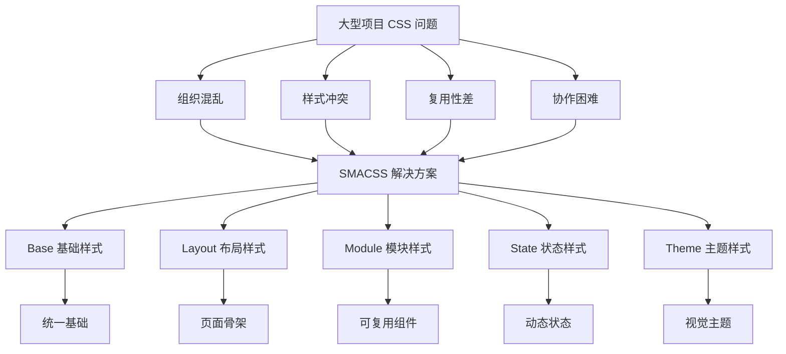

# SMACSS - 可扩展模块化 CSS 架构

SMACSS（Scalable and Modular Architecture for CSS）是一种可扩展的 CSS 架构方法，由 Jonathan Snook 提出，通过分类和组织规则来管理大型项目的 CSS 代码。

## 背景与动机

### 为什么需要 SMACSS？

随着 Web 应用规模的增长，CSS 面临以下挑战：

1. **代码组织混乱**：缺乏清晰的分类标准，样式文件难以维护
2. **样式冲突频繁**：不同模块的样式相互干扰，导致意外副作用
3. **复用性差**：样式与特定页面或组件强耦合，难以在其他地方复用
4. **团队协作困难**：缺乏统一的架构规范，代码风格不一致

SMACSS 通过将 CSS 规则分为五个清晰的类别，提供了一套可遵循的组织原则。

### SMACSS 解决的问题



### 核心价值

| 价值 | 说明 |
|------|------|
| **结构清晰** | 五种分类提供明确的组织框架 |
| **可预测** | 通过前缀即可识别样式类型 |
| **可维护** | 分类明确，修改影响范围可控 |
| **可扩展** | 支持项目规模增长而不混乱 |
| **团队协作** | 统一的规范降低沟通成本 |

## 核心概念

SMACSS 的核心理念是将 CSS 规则分为五个类别，每个类别有明确的职责和命名约定。

### 五种规则分类

```
┌─────────────────────────────────────────────────────────────┐
│                    SMACSS 五层分类                           │
├─────────────────────────────────────────────────────────────┤
│                                                             │
│  ┌─────────────────────────────────────────────────────┐   │
│  │  1. Base（基础）- 元素默认样式                        │   │
│  └─────────────────────────────────────────────────────┘   │
│                          ▼                                  │
│  ┌─────────────────────────────────────────────────────┐   │
│  │  2. Layout（布局）- 页面主要结构                      │   │
│  └─────────────────────────────────────────────────────┘   │
│                          ▼                                  │
│  ┌─────────────────────────────────────────────────────┐   │
│  │  3. Module（模块）- 可复用组件                        │   │
│  └─────────────────────────────────────────────────────┘   │
│                          ▼                                  │
│  ┌─────────────────────────────────────────────────────┐   │
│  │  4. State（状态）- 模块/布局的状态变化                │   │
│  └─────────────────────────────────────────────────────┘   │
│                          ▼                                  │
│  ┌─────────────────────────────────────────────────────┐   │
│  │  5. Theme（主题）- 视觉主题样式                        │   │
│  └─────────────────────────────────────────────────────┘   │
│                                                             │
└─────────────────────────────────────────────────────────────┘
```

## 深入原理

### 1. Base（基础样式）

**定义**：元素默认样式，应用于整个网站的基础样式。

**特点**：
- 使用元素选择器
- 不使用类名或 ID
- 主要包括重置样式和默认样式

```css
/* base/_reset.css */
*,
*::before,
*::after {
  box-sizing: border-box;
}

html {
  font-size: 16px;
  line-height: 1.5;
}

body {
  margin: 0;
  font-family: -apple-system, BlinkMacSystemFont, 'Segoe UI', Roboto, sans-serif;
  color: #333;
  background-color: #fff;
}

/* 列表重置 */
ul, ol {
  margin: 0;
  padding: 0;
  list-style: none;
}

/* 链接默认样式 */
a {
  color: #007bff;
  text-decoration: none;
}

a:hover {
  text-decoration: underline;
}

/* 图片响应式 */
img {
  max-width: 100%;
  height: auto;
  display: block;
}

/* 表单元素 */
input,
button,
textarea,
select {
  font: inherit;
}

button {
  cursor: pointer;
}
```

```css
/* base/_typography.css */
h1, h2, h3, h4, h5, h6 {
  margin: 0;
  font-weight: 600;
  line-height: 1.2;
}

h1 { font-size: 2.5rem; }
h2 { font-size: 2rem; }
h3 { font-size: 1.75rem; }
h4 { font-size: 1.5rem; }
h5 { font-size: 1.25rem; }
h6 { font-size: 1rem; }

p {
  margin: 0 0 1rem;
}

code, pre {
  font-family: 'SF Mono', Monaco, 'Courier New', monospace;
}

pre {
  margin: 0 0 1rem;
  padding: 1rem;
  overflow-x: auto;
  background: #f5f5f5;
  border-radius: 4px;
}
```

### 2. Layout（布局样式）

**定义**：页面主要结构区域，定义页面骨架。

**特点**：
- 使用 `.l-` 前缀
- 分为主要布局和次要布局
- 定义页面整体结构

```css
/* layout/_header.css */
.l-header {
  position: fixed;
  top: 0;
  left: 0;
  right: 0;
  height: 60px;
  background: #fff;
  border-bottom: 1px solid #e0e0e0;
  z-index: 100;
}

.l-header__inner {
  max-width: 1200px;
  margin: 0 auto;
  padding: 0 20px;
  height: 100%;
  display: flex;
  align-items: center;
  justify-content: space-between;
}

.l-header--sticky {
  box-shadow: 0 2px 8px rgba(0, 0, 0, 0.1);
}
```

```css
/* layout/_footer.css */
.l-footer {
  background: #f8f9fa;
  border-top: 1px solid #e0e0e0;
  padding: 40px 20px;
}

.l-footer__content {
  max-width: 1200px;
  margin: 0 auto;
  display: grid;
  grid-template-columns: repeat(4, 1fr);
  gap: 40px;
}

.l-footer__copyright {
  margin-top: 40px;
  padding-top: 20px;
  border-top: 1px solid #e0e0e0;
  text-align: center;
  color: #666;
}
```

```css
/* layout/_sidebar.css */
.l-sidebar {
  width: 280px;
  min-height: 100vh;
  background: #fff;
  border-right: 1px solid #e0e0e0;
}

.l-sidebar--collapsed {
  width: 60px;
}

.l-sidebar__section {
  padding: 20px;
  border-bottom: 1px solid #f0f0f0;
}
```

```css
/* layout/_content.css */
.l-content {
  max-width: 1200px;
  margin: 0 auto;
  padding: 20px;
}

.l-main {
  margin-left: 280px;  /* 配合 sidebar */
  padding: 80px 20px 20px;  /* 配合 header */
}

.l-main--no-sidebar {
  margin-left: 0;
}
```

```css
/* layout/_grid.css */
.l-grid {
  display: grid;
  gap: 20px;
}

.l-grid--2col {
  grid-template-columns: repeat(2, 1fr);
}

.l-grid--3col {
  grid-template-columns: repeat(3, 1fr);
}

.l-grid--4col {
  grid-template-columns: repeat(4, 1fr);
}

.l-grid--sidebar {
  grid-template-columns: 250px 1fr;
}

.l-grid__item {
  /* 网格项目 */
}

.l-grid__item--span2 {
  grid-column: span 2;
}
```

### 3. Module（模块样式）

**定义**：可复用的组件，是 CSS 的核心部分。

**特点**：
- 不使用前缀
- 可以嵌套使用
- 保持模块独立性

```css
/* modules/_card.css */
.card {
  background: #fff;
  border: 1px solid #e0e0e0;
  border-radius: 8px;
  overflow: hidden;
  transition: box-shadow 0.2s ease, transform 0.2s ease;
}

.card:hover {
  box-shadow: 0 4px 12px rgba(0, 0, 0, 0.1);
}

.card-header {
  padding: 16px;
  border-bottom: 1px solid #f0f0f0;
}

.card-body {
  padding: 16px;
}

.card-footer {
  padding: 12px 16px;
  background: #f8f9fa;
  border-top: 1px solid #f0f0f0;
}

.card-title {
  margin: 0;
  font-size: 18px;
  font-weight: 600;
  color: #333;
}

.card-text {
  margin: 0;
  color: #666;
  line-height: 1.6;
}

.card-img {
  width: 100%;
  height: auto;
}

/* 模块变体 */
.card-featured {
  border-color: #007bff;
  box-shadow: 0 0 0 2px rgba(0, 123, 255, 0.25);
}

.card-compact {
  /* 紧凑变体 */
}

.card-compact .card-header,
.card-compact .card-body {
  padding: 12px;
}
```

```css
/* modules/_button.css */
.btn {
  display: inline-flex;
  align-items: center;
  justify-content: center;
  padding: 10px 20px;
  border: 1px solid transparent;
  border-radius: 4px;
  font-size: 14px;
  font-weight: 500;
  line-height: 1.5;
  text-align: center;
  cursor: pointer;
  transition: all 0.2s ease;
}

.btn:hover {
  text-decoration: none;
}

/* 主题变体 */
.btn-primary {
  background: #007bff;
  color: #fff;
}

.btn-primary:hover {
  background: #0056b3;
}

.btn-secondary {
  background: #6c757d;
  color: #fff;
}

.btn-success {
  background: #28a745;
  color: #fff;
}

.btn-danger {
  background: #dc3545;
  color: #fff;
}

.btn-outline {
  background: transparent;
  border-color: #007bff;
  color: #007bff;
}

.btn-outline:hover {
  background: #007bff;
  color: #fff;
}

/* 尺寸变体 */
.btn-sm {
  padding: 6px 12px;
  font-size: 12px;
}

.btn-lg {
  padding: 12px 24px;
  font-size: 16px;
}

/* 按钮组 */
.btn-group {
  display: inline-flex;
}

.btn-group .btn {
  border-radius: 0;
}

.btn-group .btn:first-child {
  border-radius: 4px 0 0 4px;
}

.btn-group .btn:last-child {
  border-radius: 0 4px 4px 0;
}
```

```css
/* modules/_form.css */
.form-group {
  margin-bottom: 16px;
}

.form-label {
  display: block;
  margin-bottom: 6px;
  font-weight: 500;
  color: #333;
}

.form-input {
  display: block;
  width: 100%;
  padding: 10px 12px;
  border: 1px solid #ddd;
  border-radius: 4px;
  font-size: 14px;
  transition: border-color 0.2s ease, box-shadow 0.2s ease;
}

.form-input:focus {
  outline: none;
  border-color: #007bff;
  box-shadow: 0 0 0 3px rgba(0, 123, 255, 0.1);
}

.form-input--error {
  border-color: #dc3545;
}

.form-input--error:focus {
  box-shadow: 0 0 0 3px rgba(220, 53, 69, 0.1);
}

.form-textarea {
  min-height: 100px;
  resize: vertical;
}

.form-select {
  appearance: none;
  background-image: url("data:image/svg+xml,...");
  background-repeat: no-repeat;
  background-position: right 12px center;
  padding-right: 40px;
}

.form-hint {
  margin-top: 4px;
  font-size: 12px;
  color: #666;
}

.form-error {
  margin-top: 4px;
  font-size: 12px;
  color: #dc3545;
}
```

```css
/* modules/_nav.css */
.nav {
  display: flex;
  align-items: center;
}

.nav-list {
  display: flex;
  list-style: none;
  margin: 0;
  padding: 0;
}

.nav-item {
  margin-left: 20px;
}

.nav-item:first-child {
  margin-left: 0;
}

.nav-link {
  display: block;
  padding: 8px 12px;
  color: #333;
  text-decoration: none;
  transition: color 0.2s ease;
}

.nav-link:hover {
  color: #007bff;
}

/* 垂直导航 */
.nav--vertical .nav-list {
  flex-direction: column;
}

.nav--vertical .nav-item {
  margin-left: 0;
  margin-top: 4px;
}

/* 标签页导航 */
.nav--tabs .nav-link {
  border-bottom: 2px solid transparent;
}

.nav--tabs .nav-link:hover {
  border-bottom-color: #e0e0e0;
}

.nav--tabs .is-active .nav-link {
  color: #007bff;
  border-bottom-color: #007bff;
}
```

### 4. State（状态样式）

**定义**：模块或布局的状态变化。

**特点**：
- 使用 `.is-` 前缀
- 可以覆盖模块样式
- 通常由 JavaScript 控制

```css
/* state/_state.css */

/* 显示/隐藏状态 */
.is-hidden {
  display: none !important;
}

.is-visible {
  display: block !important;
}

.is-collapsed {
  height: 0;
  overflow: hidden;
}

.is-expanded {
  height: auto;
  overflow: visible;
}

/* 交互状态 */
.is-active {
  /* 激活状态 */
}

.is-selected {
  /* 选中状态 */
  background: #e7f1ff;
}

.is-current {
  /* 当前项 */
  font-weight: 600;
}

/* 加载状态 */
.is-loading {
  position: relative;
  pointer-events: none;
}

.is-loading::after {
  content: '';
  position: absolute;
  top: 50%;
  left: 50%;
  width: 20px;
  height: 20px;
  margin: -10px 0 0 -10px;
  border: 2px solid #e0e0e0;
  border-top-color: #007bff;
  border-radius: 50%;
  animation: spin 0.8s linear infinite;
}

@keyframes spin {
  to { transform: rotate(360deg); }
}

/* 禁用状态 */
.is-disabled {
  opacity: 0.5;
  cursor: not-allowed !important;
  pointer-events: none;
}

/* 错误状态 */
.is-error {
  border-color: #dc3545;
}

.is-success {
  border-color: #28a745;
}

/* 动画状态 */
.is-animating {
  animation-duration: 0.3s;
  animation-fill-mode: both;
}

.is-entering {
  animation-name: fadeIn;
}

.is-leaving {
  animation-name: fadeOut;
}

@keyframes fadeIn {
  from { opacity: 0; }
  to { opacity: 1; }
}

@keyframes fadeOut {
  from { opacity: 1; }
  to { opacity: 0; }
}

/* 焦点状态 */
.is-focused {
  outline: 2px solid #007bff;
  outline-offset: 2px;
}

/* 悬停状态（JavaScript 控制） */
.is-hovered {
  background: #f8f9fa;
}
```

### 5. Theme（主题样式）

**定义**：视觉主题样式，用于切换网站外观。

**特点**：
- 使用 `.theme-` 前缀
- 通常定义在根元素或容器上
- 可以覆盖其他类别的样式

```css
/* themes/_dark.css */
.theme-dark {
  --bg-primary: #1a1a1a;
  --bg-secondary: #2d2d2d;
  --text-primary: #fff;
  --text-secondary: #b0b0b0;
  --border-color: #404040;
  
  background: var(--bg-primary);
  color: var(--text-primary);
}

/* 基础元素覆盖 */
.theme-dark body {
  background: var(--bg-primary);
  color: var(--text-primary);
}

/* 布局覆盖 */
.theme-dark .l-header {
  background: var(--bg-secondary);
  border-bottom-color: var(--border-color);
}

.theme-dark .l-footer {
  background: var(--bg-secondary);
  border-top-color: var(--border-color);
}

/* 模块覆盖 */
.theme-dark .card {
  background: var(--bg-secondary);
  border-color: var(--border-color);
}

.theme-dark .card-title {
  color: var(--text-primary);
}

.theme-dark .card-text {
  color: var(--text-secondary);
}

.theme-dark .btn-outline {
  border-color: var(--text-primary);
  color: var(--text-primary);
}
```

```css
/* themes/_light.css */
.theme-light {
  --bg-primary: #fff;
  --bg-secondary: #f8f9fa;
  --text-primary: #333;
  --text-secondary: #666;
  --border-color: #e0e0e0;
  
  background: var(--bg-primary);
  color: var(--text-primary);
}
```

```css
/* themes/_brand.css */
/* 品牌主题 */
.theme-brand-a {
  --color-primary: #007bff;
  --color-secondary: #6c757d;
}

.theme-brand-b {
  --color-primary: #28a745;
  --color-secondary: #ffc107;
}

.theme-brand-c {
  --color-primary: #6f42c1;
  --color-secondary: #e83e8c;
}
```

## 代码示例

### 完整项目示例

#### 项目结构

```
src/
├── index.html
├── styles/
│   └── (如上所述的目录结构)
└── scripts/
    └── main.js
```

#### 页面模板

```html
<!DOCTYPE html>
<html lang="zh-CN">
<head>
  <meta charset="UTF-8">
  <meta name="viewport" content="width=device-width, initial-scale=1.0">
  <title>SMACSS 示例</title>
  <link rel="stylesheet" href="styles/main.css">
</head>
<body class="theme-light">
  <!-- Layout: Header -->
  <header class="l-header l-header--sticky">
    <div class="l-header__inner">
      <a href="/" class="logo">Logo</a>
      <nav class="nav nav--horizontal">
        <ul class="nav-list">
          <li class="nav-item is-active">
            <a class="nav-link" href="/">首页</a>
          </li>
          <li class="nav-item">
            <a class="nav-link" href="/products">产品</a>
          </li>
          <li class="nav-item">
            <a class="nav-link" href="/about">关于</a>
          </li>
        </ul>
      </nav>
    </div>
  </header>

  <!-- Layout: Sidebar + Main -->
  <div class="l-grid l-grid--sidebar">
    <!-- Layout: Sidebar -->
    <aside class="l-sidebar">
      <div class="l-sidebar__section">
        <h3 class="sidebar-title">分类</h3>
        <nav class="nav nav--vertical">
          <ul class="nav-list">
            <li class="nav-item is-active">
              <a class="nav-link" href="#">全部</a>
            </li>
            <li class="nav-item">
              <a class="nav-link" href="#">分类一</a>
            </li>
            <li class="nav-item">
              <a class="nav-link" href="#">分类二</a>
            </li>
          </ul>
        </nav>
      </div>
    </aside>

    <!-- Layout: Main Content -->
    <main class="l-main">
      <div class="l-content">
        <!-- Module: Card Grid -->
        <div class="l-grid l-grid--3col">
          <!-- Module: Card -->
          <article class="card card-featured">
            
            <div class="card-body">
              <h3 class="card-title">精选文章</h3>
              <p class="card-text">文章摘要内容...</p>
            </div>
            <div class="card-footer">
              <button class="btn btn-primary btn-sm">阅读更多</button>
            </div>
          </article>
          
          <!-- More cards... -->
        </div>
      </div>
    </main>
  </div>

  <!-- Layout: Footer -->
  <footer class="l-footer">
    <div class="l-footer__content">
      <div class="footer-section">
        <h4>关于我们</h4>
        <p>公司介绍内容...</p>
      </div>
      <!-- More sections... -->
    </div>
    <div class="l-footer__copyright">
      &copy; 2024 Company Name. All rights reserved.
    </div>
  </footer>

  <script src="scripts/main.js"></script>
</body>
</html>
```

### 与现代框架结合

#### 与 React 结合

```jsx
// components/Card.jsx
import React from 'react';
import './Card.css';

function Card({ title, text, featured, children }) {
  const cardClass = `card ${featured ? 'card-featured' : ''}`;
  
  return (
    <article className={cardClass}>
      <div className="card-body">
        {title && <h3 className="card-title">{title}</h3>}
        {text && <p className="card-text">{text}</p>}
        {children}
      </div>
    </article>
  );
}

// 使用
<Card title="标题" text="内容" featured>子内容</Card>
```

```jsx
// components/Button.jsx
import React from 'react';
import './Button.css';

function Button({ 
  variant = 'primary', 
  size = 'md', 
  loading, 
  disabled, 
  children, 
  ...props 
}) {
  const classes = [
    'btn',
    `btn-${variant}`,
    size !== 'md' && `btn-${size}`,
    loading && 'is-loading',
    disabled && 'is-disabled'
  ].filter(Boolean).join(' ');
  
  return (
    <button className={classes} disabled={disabled || loading} {...props}>
      {children}
    </button>
  );
}
```

#### 与 Vue 结合

```vue
<!-- components/Card.vue -->
<template>
  <article :class="cardClass">
    <div class="card-body">
      <h3 v-if="title" class="card-title">{{ title }}</h3>
      <p v-if="text" class="card-text">{{ text }}</p>
      <slot></slot>
    </div>
  </article>
</template>

<script>
export default {
  props: {
    title: String,
    text: String,
    featured: Boolean
  },
  computed: {
    cardClass() {
      return ['card', { 'card-featured': this.featured }];
    }
  }
}
</script>

<style src="./Card.css"></style>
```

```vue
<!-- components/Modal.vue -->
<template>
  <transition name="fade">
    <div v-if="visible" class="modal-overlay" @click.self="close">
      <div class="modal" :class="modalClass">
        <div class="modal-header">
          <h3 class="modal-title">{{ title }}</h3>
          <button class="modal-close" @click="close">&times;</button>
        </div>
        <div class="modal-body">
          <slot></slot>
        </div>
        <div class="modal-footer">
          <slot name="footer">
            <button class="btn btn-secondary" @click="close">取消</button>
            <button class="btn btn-primary" @click="confirm">确认</button>
          </slot>
        </div>
      </div>
    </div>
  </transition>
</template>

<script>
export default {
  props: {
    title: String,
    visible: Boolean,
    size: {
      type: String,
      default: 'md'
    }
  },
  computed: {
    modalClass() {
      return [`modal-${this.size}`];
    }
  },
  methods: {
    close() {
      this.$emit('update:visible', false);
    },
    confirm() {
      this.$emit('confirm');
      this.close();
    }
  }
}
</script>
```

## 最佳实践

### 命名规范

| 类型 | 前缀 | 示例 | 说明 |
|------|------|------|------|
| Layout | `l-` | `.l-header` | 页面布局结构 |
| State | `is-` | `.is-active` | 状态类 |
| Theme | `theme-` | `.theme-dark` | 主题类 |
| Module | 无 | `.card` | 组件模块 |
| Base | 无 | `body` | 元素选择器 |

### 选择器深度原则

SMACSS 建议限制选择器深度，保持规则简洁：

```css
/* ✓ 推荐：单层选择器 */
.card { }

/* ✓ 推荐：两层选择器 */
.card-title { }

/* ✓ 可接受：三层选择器（谨慎使用） */
.card .card-title { }

/* ✗ 避免：四层及以上 */
.card .card-body .card-title { }
.page .content .card .card-title { }
```

### 选择器权重建议

| 深度 | 权重 | 使用建议 |
|------|------|----------|
| 1 层 | 低 | 推荐，基础样式 |
| 2 层 | 中 | 推荐，模块元素 |
| 3 层 | 较高 | 谨慎使用 |
| 4 层+ | 高 | 避免 |

### 文件组织

```
styles/
├── base/
│   ├── _reset.css        # 重置样式
│   ├── _typography.css   # 排版样式
│   └── _base.css         # 其他基础样式
├── layout/
│   ├── _header.css       # 页头布局
│   ├── _footer.css       # 页脚布局
│   ├── _sidebar.css      # 侧边栏布局
│   ├── _content.css      # 内容区域布局
│   └── _grid.css         # 网格系统
├── modules/
│   ├── _button.css       # 按钮组件
│   ├── _card.css         # 卡片组件
│   ├── _form.css         # 表单组件
│   ├── _nav.css          # 导航组件
│   ├── _modal.css        # 模态框组件
│   └── _table.css        # 表格组件
├── state/
│   ├── _state.css        # 状态类
│   └── _animations.css   # 动画状态
├── themes/
│   ├── _dark.css         # 暗色主题
│   ├── _light.css        # 亮色主题
│   └── _variables.css    # 主题变量
├── utils/
│   ├── _variables.css    # 全局变量
│   ├── _mixins.css       # 混入
│   └── _functions.css    # 函数
└── main.css              # 主入口文件
```

### 主入口文件

```css
/* main.css */

/* 1. 变量和工具 */
@import 'utils/variables.css';
@import 'utils/mixins.css';

/* 2. 基础样式 */
@import 'base/reset.css';
@import 'base/typography.css';
@import 'base/base.css';

/* 3. 布局样式 */
@import 'layout/grid.css';
@import 'layout/header.css';
@import 'layout/footer.css';
@import 'layout/sidebar.css';
@import 'layout/content.css';

/* 4. 模块样式 */
@import 'modules/button.css';
@import 'modules/card.css';
@import 'modules/form.css';
@import 'modules/nav.css';
@import 'modules/modal.css';

/* 5. 状态样式 */
@import 'state/state.css';
@import 'state/animations.css';

/* 6. 主题样式 */
@import 'themes/dark.css';
@import 'themes/light.css';
```

### 检查清单

- [ ] Base 样式使用元素选择器
- [ ] Layout 使用 `.l-` 前缀
- [ ] Module 命名语义化
- [ ] State 使用 `.is-` 前缀
- [ ] Theme 使用 `.theme-` 前缀
- [ ] 选择器深度不超过 3 层
- [ ] 按类型组织文件结构
- [ ] 模块可以独立使用

## 常见问题

### 1. Module 和 Layout 如何区分？

**判断标准**：

| Layout | Module |
|--------|--------|
| 页面级别的结构 | 可复用的组件 |
| 很少重复出现 | 可以多次使用 |
| 定义页面骨架 | 定义组件样式 |

```css
/* Layout：页面结构，每个页面一个 */
.l-header { }
.l-sidebar { }
.l-main { }
.l-footer { }

/* Module：可复用组件，可多次使用 */
.card { }
.btn { }
.nav { }
```

### 2. State 类应该放在哪里？

```css
/* 方案1：统一放在 state/ 目录 */
/* state/_state.css */
.is-active { }
.is-loading { }

/* 方案2：放在对应模块文件中 */
/* modules/_card.css */
.card { }
.card.is-featured { }  /* 特定于 card 的状态 */

/* 推荐：通用状态放 state/，特定状态放模块文件 */
```

### 3. 如何处理响应式？

```css
/* 使用媒体查询 */
.l-grid--3col {
  grid-template-columns: repeat(3, 1fr);
}

@media (max-width: 768px) {
  .l-grid--3col {
    grid-template-columns: 1fr;
  }
}

/* 或创建响应式变体 */
.l-grid--3col\@tablet {
  /* 平板尺寸的3列 */
}
```

### 4. 与 BEM 如何结合？

```css
/* SMACSS 分类 + BEM 命名 */

/* Layout */
.l-header { }
.l-header__inner { }
.l-header--sticky { }

/* Module */
.card { }
.card__header { }
.card__title { }
.card--featured { }

/* State */
.is-active { }
.is-loading { }
```

### 5. SMACSS 与现代 CSS-in-JS 的对比

| 特性 | SMACSS | CSS-in-JS (Styled Components) |
|------|--------|-------------------------------|
| 样式位置 | 独立 CSS 文件 | JavaScript 文件内 |
| 作用域 | 全局（需手动管理） | 组件级（自动隔离） |
| 动态样式 | 类名切换 |  props 驱动 |
| 学习曲线 | 中等 | 较高 |
| 性能 | 优秀（浏览器原生） | 需运行时处理 |
| 工具支持 | 广泛 | 需要特定工具链 |
| 团队协作 | 需要规范 | 组件化友好 |

**SMACSS 适用场景**：
- 传统多页面应用
- 对性能要求极高的项目
- 团队熟悉 CSS 而非 JS
- 需要与现有 CSS 生态集成

**CSS-in-JS 适用场景**：
- React/Vue 单文件组件
- 高度动态的 UI
- 组件库开发
- 需要样式与逻辑紧密耦合

## 参考资源

- [SMACSS 官方文档](https://smacss.com/)
- [Smashing Magazine - A New Front-End Methodology: BEM](https://www.smashingmagazine.com/2012/04/a-new-front-end-methodology-bem/)
- [CSS Architecture（Philip Walton）](https://philipwalton.com/articles/css-architecture/)
- [React 文档](https://react.dev/learn)
- [Vue 单文件组件文档](https://vuejs.org/guide/scaling-up/sfc.html)
