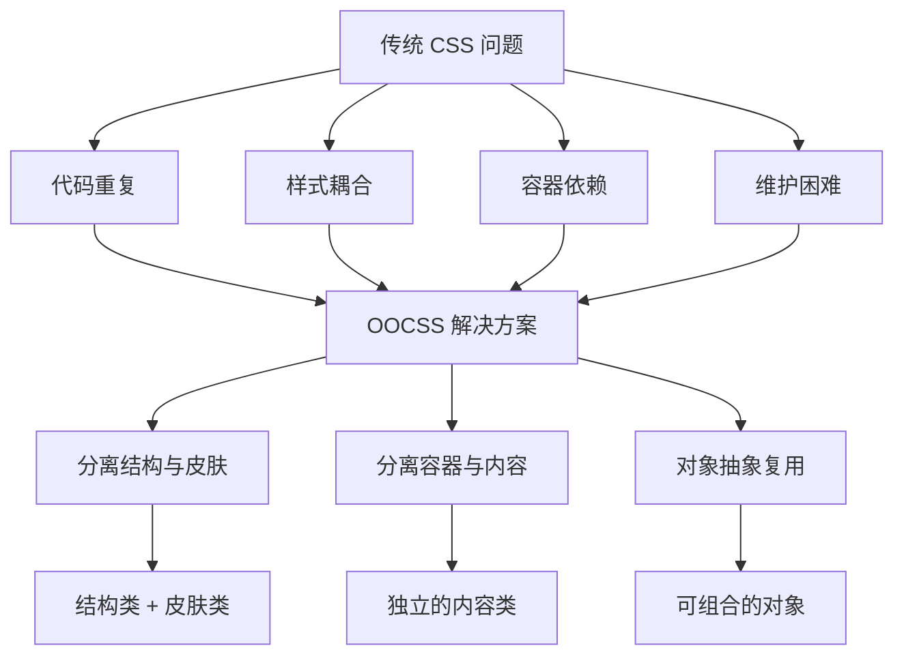

# OOCSS - 面向对象 CSS 方法论

OOCSS（Object Oriented CSS）是一种面向对象的 CSS 方法论，由 Nicole Sullivan 提出，通过抽象和复用来编写可维护的 CSS 代码。

## 背景与动机

### 为什么需要 OOCSS？

在传统 CSS 开发中，常见的问题包括：

1. **代码重复**：相似的样式在不同组件中重复出现
2. **样式耦合**：结构和外观混合在一起，难以单独修改
3. **容器依赖**：内容样式依赖于特定容器，无法复用
4. **维护困难**：修改一处样式可能影响多个地方

OOCSS 通过将面向对象的编程思想引入 CSS，提供了系统化的解决方案。

### OOCSS 解决的问题



### 核心价值

| 价值 | 说明 |
|------|------|
| **高复用** | 通过抽象创建可复用组件 |
| **低耦合** | 结构与皮肤分离，减少依赖 |
| **易维护** | 修改一处，影响范围可控 |
| **高灵活** | 通过组合实现多样化 |
| **可扩展** | 新组件可基于现有对象构建 |

## 核心概念

OOCSS 的核心理念可以用一个公式表达：

```
┌─────────────────────────────────────────────────────────────┐
│                    OOCSS 核心理念                            │
├─────────────────────────────────────────────────────────────┤
│                                                             │
│  对象 = HTML 结构 + CSS 样式                                 │
│                                                             │
│  ┌─────────────────────────────────────────────────────┐   │
│  │  结构类 (Structure)                                  │   │
│  │  - 布局、尺寸、定位                                   │   │
│  └─────────────────────────────────────────────────────┘   │
│                         +                                   │
│  ┌─────────────────────────────────────────────────────┐   │
│  │  皮肤类 (Skin)                                       │   │
│  │  - 颜色、边框、阴影                                   │   │
│  └─────────────────────────────────────────────────────┘   │
│                         =                                   │
│  ┌─────────────────────────────────────────────────────┐   │
│  │  可复用的 CSS 对象                                    │   │
│  └─────────────────────────────────────────────────────┘   │
│                                                             │
└─────────────────────────────────────────────────────────────┘
```

## 深入原理

### 两大核心原则

#### 原则一：分离结构和皮肤

**概念**：将结构性样式（布局、尺寸）和外观性样式（颜色、装饰）分离。

##### 问题示例

```css
/* ✗ 不推荐：结构和皮肤混合 */
.btn-primary {
  /* 结构 */
  display: inline-block;
  padding: 10px 20px;
  border-radius: 4px;
  
  /* 皮肤 */
  background: #007bff;
  color: white;
  border: 1px solid #007bff;
}

.btn-secondary {
  /* 重复的结构代码 */
  display: inline-block;
  padding: 10px 20px;
  border-radius: 4px;
  
  /* 不同的皮肤 */
  background: #6c757d;
  color: white;
  border: 1px solid #6c757d;
}

.btn-success {
  /* 再次重复结构代码 */
  display: inline-block;
  padding: 10px 20px;
  border-radius: 4px;
  
  background: #28a745;
  color: white;
  border: 1px solid #28a745;
}
```

##### 解决方案

```css
/* ✓ 推荐：分离结构和皮肤 */

/* 结构类：定义基础结构 */
.btn {
  display: inline-block;
  padding: 10px 20px;
  border-radius: 4px;
  font-size: 14px;
  text-align: center;
  cursor: pointer;
  transition: all 0.2s ease;
}

/* 皮肤类：定义外观 */
.btn-primary {
  background: #007bff;
  color: white;
  border: 1px solid #007bff;
}

.btn-secondary {
  background: #6c757d;
  color: white;
  border: 1px solid #6c757d;
}

.btn-success {
  background: #28a745;
  color: white;
  border: 1px solid #28a745;
}

.btn-danger {
  background: #dc3545;
  color: white;
  border: 1px solid #dc3545;
}

.btn-outline {
  background: transparent;
  border: 1px solid currentColor;
}
```

```html
<!-- 组合使用 -->
<button class="btn btn-primary">主要按钮</button>
<button class="btn btn-secondary">次要按钮</button>
<button class="btn btn-success">成功按钮</button>
<button class="btn btn-outline btn-primary">轮廓按钮</button>
```

#### 原则二：分离容器和内容

**概念**：将容器样式和内容样式分离，使内容可以在不同容器中复用。

##### 问题示例

```css
/* ✗ 不推荐：内容依赖容器 */
.header h2 {
  font-size: 24px;
  color: #333;
}

.sidebar h2 {
  font-size: 18px;
  color: #666;
}

.footer h2 {
  font-size: 16px;
  color: #999;
}

/* 问题：h2 的样式被容器限定，无法复用 */
```

##### 解决方案

```css
/* ✓ 推荐：独立的内容类 */

/* 标题类：不依赖容器 */
.heading-xl {
  font-size: 32px;
  line-height: 1.2;
  font-weight: 700;
}

.heading-lg {
  font-size: 24px;
  line-height: 1.3;
  font-weight: 600;
}

.heading-md {
  font-size: 18px;
  line-height: 1.4;
  font-weight: 600;
}

.heading-sm {
  font-size: 16px;
  line-height: 1.5;
  font-weight: 500;
}

/* 容器类：只定义容器属性 */
.header {
  background: #f8f9fa;
  padding: 20px;
}

.sidebar {
  background: #fff;
  padding: 16px;
  border-right: 1px solid #e0e0e0;
}
```

```html
<!-- 内容可以在任何容器中使用 -->
<header class="header">
  <h2 class="heading-lg">页面标题</h2>
</header>

<aside class="sidebar">
  <h2 class="heading-md">侧边栏标题</h2>
</aside>

<footer class="footer">
  <h2 class="heading-sm">页脚标题</h2>
</footer>
```

### 两大原则深入解析

OOCSS 的两大原则并非孤立的规则，而是面向对象思想在 CSS 中的具体映射。理解其背后的设计哲学，才能在实际项目中灵活运用而非机械套用。

#### 分离结构与外观（Structure vs Skin）的本质

"分离结构与外观"的核心思想源于面向对象编程中的**继承与多态**：结构类相当于基类（Base Class），定义了组件的骨架行为；皮肤类相当于派生类（Derived Class），在不改变骨架的前提下提供差异化外观。

**结构类**关注的是"组件如何工作"——布局方式、尺寸模型、定位策略、交互行为。这些属性通常不会因为主题切换或品牌变更而改变。例如一个按钮无论在亮色主题还是暗色主题下，它始终是 `inline-block`、拥有 `padding` 和 `border-radius`，这些就是结构。

**皮肤类**关注的是"组件看起来如何"——颜色、边框样式、阴影、背景。这些属性是高度可变的：同一套结构可以搭配无数种皮肤，而皮肤也可以跨结构复用（一个蓝色的皮肤类可以同时应用于按钮、标签和徽章）。

```css
/* 结构类 — 定义"如何工作"，与视觉主题无关 */
.btn {
  display: inline-flex;
  align-items: center;
  justify-content: center;
  padding: 0.5rem 1rem;
  border-radius: var(--radius-md);
  font-weight: 500;
  cursor: pointer;
  transition: all 0.15s ease;
  border: 1px solid transparent;
  text-decoration: none;
}

/* 皮肤类 — 定义"看起来如何"，可跨组件复用 */
.skin-primary {
  background: var(--color-primary);
  color: #fff;
  border-color: var(--color-primary);
}

.skin-secondary {
  background: var(--color-text-secondary);
  color: #fff;
  border-color: var(--color-text-secondary);
}

.skin-outline {
  background: transparent;
  color: var(--color-primary);
  border-color: var(--color-primary);
}

.skin-ghost {
  background: transparent;
  color: var(--color-primary);
  border-color: transparent;
}

/* 皮肤类不仅限于按钮 — 标签、徽章同样可以复用 */
.tag.skin-primary { /* 蓝色标签 */ }
.badge.skin-primary { /* 蓝色徽章 */ }
```

这种分离带来的核心收益是**组合爆炸的正向利用**：3 个结构类 × 4 个皮肤类 = 12 种视觉变体，而代码量仅为 7 个类的定义。如果不做分离，就需要 12 个独立的类，每个类都重复编写结构属性。

#### 分离容器与内容（Container vs Content）的本质

"分离容器与内容"的核心思想源于面向对象编程中的**解耦与封装**：内容对象应该像独立的"黑盒"，它不关心自己被放置在哪个容器中，容器也不应该假设自己内部一定包含某种特定内容。

传统 CSS 中最常见的反模式是**基于位置的后代选择器**：`.sidebar h2`、`.footer h2`、`.header h2`。这种写法将内容的样式绑定到了特定的容器上，导致：

1. **不可移植**：同一个 `h2` 放到不同容器中外观不同，违背了组件的一致性
2. **不可预测**：新增一个容器类型就需要新增一组后代选择器，样式规则随容器数量线性增长
3. **不可测试**：组件脱离了原始容器就无法正确显示

OOCSS 的解决方案是将内容抽象为独立的类，通过组合而非继承来实现上下文适配：

```css
/* ✗ 反模式：内容依赖容器 */
.hero .title { font-size: 3rem; }
.section .title { font-size: 2rem; }
.sidebar .title { font-size: 1.25rem; }
/* 新增容器就要新增规则，维护成本线性增长 */

/* ✓ OOCSS：内容独立，通过组合适配上下文 */
.title-3xl { font-size: 3rem; line-height: 1.1; }
.title-2xl { font-size: 2rem; line-height: 1.2; }
.title-xl  { font-size: 1.5rem; line-height: 1.3; }
.title-lg  { font-size: 1.25rem; line-height: 1.4; }

/* 容器只定义容器自身的属性 */
.hero { padding: 4rem 2rem; text-align: center; }
.section { padding: 3rem 2rem; }
.sidebar { padding: 1.5rem; }
```

```html
<!-- 内容类可以在任意容器中使用，行为一致且可预测 -->
<section class="hero">
  <h1 class="title-3xl">英雄区标题</h1>
</section>

<section class="section">
  <h2 class="title-2xl">区块标题</h2>
</section>

<aside class="sidebar">
  <h3 class="title-lg">侧边栏标题</h3>
</aside>

<!-- 同一内容在不同上下文中灵活使用 -->
<div class="card">
  <h3 class="title-xl">卡片标题</h3>
</div>
```

**何时可以打破这个原则？** 当内容确实只在特定容器中存在且永远不会被复用时（例如某个页面独有的装饰性元素），可以适当使用后代选择器。但这种情况应当是例外而非规则。

### OOCSS 与 Utility-First 的关系

OOCSS 是 Utility-First CSS 的先驱，现代原子化 CSS 框架（如 Tailwind CSS、UnoCSS）都深受 OOCSS 思想的影响。

#### 演进路径

```
OOCSS 工具类 ──▶ 原子化 CSS ──▶ Tailwind CSS / UnoCSS
```

#### 对比分析

| 特性 | OOCSS 手写 | Tailwind CSS |
|------|------------|--------------|
| 开发速度 | 较慢 | 快速 |
| 类名一致性 | 需要规范 | 内置规范 |
| 功能完整度 | 按需编写 | 开箱即用 |
| 文件大小 | 较小 | 可优化（按需生成，未使用的类不会进入产物） |
| 学习成本 | 低 | 中等 |
| 灵活性 | 高 | 中等 |
| 维护成本 | 中等 | 低 |

#### 代码对比

```html
<!-- OOCSS 手写工具类 -->
<div class="flex items-center p-4 bg-white text-center">
  内容
</div>

<!-- Tailwind CSS -->
<div class="flex items-center p-4 bg-white text-center">
  内容
</div>

<!-- Tailwind 提供了更完整的工具类系统 -->
<div class="flex items-center justify-between p-4 bg-white rounded-lg shadow-md hover:bg-gray-50 transition-colors duration-200">
  内容
</div>
```

### OOCSS 与 BEM 的对比

```html
<!-- BEM：严格的命名规范 -->
<div class="card card--featured">
  <div class="card__header">
    <h3 class="card__title">标题</h3>
  </div>
  <div class="card__body">
    <p class="card__text">内容</p>
  </div>
</div>

<!-- OOCSS：灵活的类组合 -->
<div class="card skin skin--shadow p-4">
  <div class="flex items-center mb-3">
    <h3 class="text-lg font-semibold">标题</h3>
  </div>
  <p class="text-secondary">内容</p>
</div>
```

| 特点 | BEM | OOCSS |
|------|-----|-------|
| 命名风格 | Block__Element--Modifier | 结构类 + 皮肤类 |
| 灵活性 | 中等 | 高 |
| HTML 可读性 | 高（类名语义清晰） | 低（类名组合多） |
| 样式复用 | 通过块和修饰符 | 通过工具类组合 |
| 团队协作 | 易于统一 | 需要更多规范 |

### OOCSS 与 SMACSS 的对比

```css
/* SMACSS：分类组织 */
/* layout/_header.css */
.l-header { }

/* modules/_card.css */
.card { }
.card-title { }

/* OOCSS：关注对象抽象 */
/* 结构类 */
.card { }
.card-content { }

/* 皮肤类 */
.skin { }
.skin--dark { }
```

| 特点 | SMACSS | OOCSS |
|------|--------|-------|
| 关注点 | 文件组织 | 对象抽象 |
| 核心原则 | 五种分类 | 两大原则 |
| 文件结构 | 分类目录 | 按对象组织 |
| 学习曲线 | 中 | 低 |

### 方法论对比深度分析

OOCSS、BEM 和 SMACSS 三种方法论各有侧重，理解它们的本质差异才能做出正确的技术选型。

#### 核心差异

| 维度 | OOCSS | BEM | SMACSS |
|------|-------|-----|--------|
| **核心关注点** | 对象抽象与复用 | 命名规范与组件边界 | 文件分类与组织 |
| **解决的问题** | 代码重复、样式耦合 | 命名冲突、特异性混乱 | 文件结构混乱 |
| **抽象粒度** | 类级别（结构类 + 皮肤类） | 组件级别（Block） | 架构级别（分类） |
| **学习成本** | 低（两大原则） | 低（命名约定） | 中（五种分类） |
| **强制程度** | 弱（原则指导） | 强（命名规范） | 中（分类建议） |
| **HTML 影响** | 大（类名组合多） | 中（类名较长但语义清晰） | 小（前缀约定） |

#### 适用场景分析

**OOCSS 最适合**：
- 拥有大量视觉变体的组件系统（如多种主题、多种尺寸的按钮/卡片）
- 需要快速搭建原型的项目（工具类组合开发速度快）
- 设计系统 / 组件库（皮肤类天然支持主题化）

**BEM 最适合**：
- 大型团队协作项目（严格的命名规范降低沟通成本）
- 需要清晰组件边界的项目（Block 概念天然映射组件）
- 长期维护的企业级应用（命名可预测，新人上手快）

**SMACSS 最适合**：
- 中大型项目需要清晰的文件组织（分类目录结构明确）
- 需要区分布局与组件的页面（Layout 与 Module 分离）
- 与 OOCSS/BEM 结合使用时提供架构骨架

#### 优缺点对比

**OOCSS 优点**：
- 极高的样式复用率，通过组合而非继承实现变体
- 皮肤类天然支持主题切换和多品牌场景
- 工具类思想为原子化 CSS 奠定基础
- CSS 文件体积更小（去重后）

**OOCSS 缺点**：
- HTML 中类名过多，可读性下降（"类名肥胖症"）
- 缺乏严格的命名规范，团队协作时容易产生风格不一致
- 过度抽象可能导致"万能类"，反而增加理解成本
- 调试困难——一个元素的样式来自多个类，难以定位来源

**BEM 优点**：
- 严格的命名规范确保团队一致性
- 类名语义清晰，HTML 可读性高
- 扁平选择器，特异性可控
- 与组件化框架（React/Vue）天然契合

**BEM 缺点**：
- 类名冗长（`.block__element--modifier`）
- 修饰符无法跨 Block 复用
- 嵌套组件的命名层级难以处理
- 不直接解决文件组织问题

**SMACSS 优点**：
- 提供清晰的文件分类体系
- Layout 与 Module 分离适合页面级架构
- 状态类前缀（`is-`/`has-`）被广泛采纳
- 与其他方法论兼容性好

**SMACSS 缺点**：
- 分类边界有时模糊（Module 与 Layout 的界限）
- 不提供具体的命名规范
- Theme 分类在现代 CSS 变量方案下意义减弱
- 文档较少，社区生态不如 BEM

### OOCSS 在现代框架中的体现

OOCSS 的核心思想——通过小而可组合的类来构建 UI——在现代前端生态中得到了广泛继承和演进。

#### Tailwind CSS 与 OOCSS 的关系

Tailwind CSS 是 OOCSS 思想的**极致化延伸**。OOCSS 将样式拆分为结构类和皮肤类，Tailwind 则将拆分推向原子级别——每个类只做一件事。

```
OOCSS 的演进脉络：

OOCSS 结构类 + 皮肤类
    ↓ 进一步拆分
原子化 CSS（每个属性一个类）
    ↓ 系统化 + 工程化
Tailwind CSS（设计约束 + 原子类 + JIT 编译）
    ↓ 泛化 + 可扩展
UnoCSS（按需生成 + 自定义规则）
```

**Tailwind 继承了 OOCSS 的哪些思想？**

1. **组合优于继承**：Tailwind 的 `flex items-center p-4 bg-blue-500` 与 OOCSS 的 `btn btn-primary` 本质相同——都是通过类组合构建 UI
2. **结构与外观分离**：Tailwind 的 `flex p-4 rounded`（结构）与 `bg-blue-500 text-white`（外观）天然分离
3. **容器与内容分离**：Tailwind 不使用后代选择器，每个元素的样式都由自身的类决定

**Tailwind 超越了 OOCSS 的哪些方面？**

1. **设计约束系统**：Tailwind 内置了间距、颜色、字体等设计令牌，OOCSS 需要手动建立
2. **JIT 编译**：按需生成类，不存在未使用的 CSS，OOCSS 手写工具类容易产生冗余
3. **响应式前缀**：`md:flex lg:grid` 等响应式变体，OOCSS 需要手写媒体查询
4. **状态变体**：`hover:bg-blue-600 focus:ring-2` 等状态修饰，OOCSS 需要手写伪类规则

```html
<!-- OOCSS 手写方式 — 需要为每个变体编写 CSS -->
<button class="btn btn-primary">按钮</button>
<!-- 需要额外编写 .btn:hover, .btn:focus, .btn:disabled 等规则 -->

<!-- Tailwind 方式 — 状态变体内建 -->
<button class="inline-flex items-center px-4 py-2 rounded-md bg-blue-500 text-white
               hover:bg-blue-600 focus:outline-none focus:ring-2 focus:ring-blue-500
               disabled:opacity-50 disabled:cursor-not-allowed">
  按钮
</button>
```

#### CSS-in-JS 与 OOCSS

CSS-in-JS 方案（如 styled-components、Emotion）从另一个维度继承了 OOCSS 的思想：

```javascript
// styled-components — 组件即样式对象，与 OOCSS 的"对象"概念一致
const Button = styled.button`
  /* 结构 — 对应 OOCSS 的结构类 */
  display: inline-flex;
  align-items: center;
  padding: 0.5rem 1rem;
  border-radius: 6px;
  cursor: pointer;

  /* 皮肤 — 通过 props 动态切换，对应 OOCSS 的皮肤类 */
  background: ${props => props.variant === 'primary' ? '#2563eb' : '#64748b'};
  color: #fff;
`;

// 使用 — 类似 OOCSS 的组合方式
<Button variant="primary">主要按钮</Button>
<Button variant="secondary">次要按钮</Button>
```

CSS-in-JS 将 OOCSS 的结构与皮肤分离提升到了编程语言层面——结构是固定的模板，皮肤通过 JavaScript 变量动态注入，天然避免了类名冲突和特异性问题。

#### CSS Modules 与 OOCSS

CSS Modules 在构建时为每个类名生成唯一哈希，从根本上解决了 OOCSS 的类名冲突问题，同时保留了 OOCSS 的组合能力：

```css
/* Button.module.css — 构建时自动作用域隔离 */
.btn { /* 结构 */ }
.primary { /* 皮肤 */ }
```

```javascript
// 组件中组合使用 — 与 OOCSS 的组合思想一致
import styles from './Button.module.css';

function Button({ variant, children }) {
  return (
    <button className={`${styles.btn} ${styles[variant]}`}>
      {children}
    </button>
  );
}
```

### 方法论结合

```css
/* SMACSS 分类 + OOCSS 原则 + BEM 命名 */

/* Layout (SMACSS) */
.l-header { }
.l-header__inner { }

/* Module (SMACSS) + OOCSS 结构/皮肤分离 + BEM 命名 */
.card {  /* 结构 (OOCSS) */
  display: flex;
  flex-direction: column;
}

.card__header {  /* Element (BEM) */
  padding: 16px;
}

.card--featured {  /* Modifier (BEM) + 皮肤 (OOCSS) */
  border-color: #007bff;
  box-shadow: 0 0 0 2px rgba(0, 123, 255, 0.25);
}

/* State (SMACSS) */
.is-active { }
.is-loading { }
```

## 代码示例

### 经典设计模式

#### 媒体对象

媒体对象是 OOCSS 最经典的设计模式，用于图文混排布局。

```
┌─────────────────────────────────────────────┐
│  ┌──────┐                                   │
│  │      │  标题                             │
│  │ 图像 │                                   │
│  │      │  描述文本...                      │
│  └──────┘                                   │
└─────────────────────────────────────────────┘
```

```html
<div class="media">
  
  <div class="media-body">
    <h4 class="media-heading">标题</h4>
    <p class="media-text">内容描述...</p>
  </div>
</div>

<!-- 变体：图像在右侧 -->
<div class="media media--reverse">
  
  <div class="media-body">
    <h4 class="media-heading">标题</h4>
    <p class="media-text">内容描述...</p>
  </div>
</div>

<!-- 变体：堆叠布局 -->
<div class="media media--stacked">
  
  <div class="media-body">
    <h4 class="media-heading">标题</h4>
    <p class="media-text">内容描述...</p>
  </div>
</div>
```

```css
/* 媒体对象基础结构 */
.media {
  display: flex;
  align-items: flex-start;
}

.media-figure {
  flex-shrink: 0;
  margin-right: 16px;
}

.media-body {
  flex: 1;
}

/* 变体：图像在右侧 */
.media--reverse .media-figure {
  margin-right: 0;
  margin-left: 16px;
  order: 1;
}

/* 变体：垂直堆叠 */
.media--stacked {
  flex-direction: column;
}

.media--stacked .media-figure {
  margin-right: 0;
  margin-bottom: 12px;
}

/* 媒体对象皮肤 */
.media--card {
  background: #fff;
  border: 1px solid #e0e0e0;
  border-radius: 8px;
  padding: 16px;
}

.media-figure--round {
  border-radius: 50%;
}

.media-figure--small {
  width: 48px;
  height: 48px;
}

.media-figure--large {
  width: 80px;
  height: 80px;
}
```

#### 列表对象

```html
<!-- 基础列表 -->
<ul class="list">
  <li class="list-item">项目 1</li>
  <li class="list-item">项目 2</li>
  <li class="list-item">项目 3</li>
</ul>

<!-- 带图标的列表 -->
<ul class="list list--icons">
  <li class="list-item">
    <span class="list-icon">✓</span>
    <span class="list-text">特性一</span>
  </li>
  <li class="list-item">
    <span class="list-icon">✓</span>
    <span class="list-text">特性二</span>
  </li>
</ul>

<!-- 卡片列表 -->
<ul class="list list--cards">
  <li class="list-item list-item--card">...</li>
</ul>
```

```css
/* 列表结构 */
.list {
  list-style: none;
  margin: 0;
  padding: 0;
}

.list-item {
  padding: 12px 0;
  border-bottom: 1px solid #f0f0f0;
}

.list-item:last-child {
  border-bottom: none;
}

/* 列表变体 */
.list--striped .list-item:nth-child(even) {
  background: #f8f9fa;
}

.list--hover .list-item:hover {
  background: #f0f0f0;
}

/* 图标列表 */
.list--icons .list-item {
  display: flex;
  align-items: center;
}

.list-icon {
  margin-right: 12px;
  color: #007bff;
}

.list-text {
  flex: 1;
}
```

#### 卡片对象

```html
<div class="card skin skin--shadow">
  <div class="card-figure">
    
  </div>
  <div class="card-content">
    <h3 class="card-title">标题</h3>
    <p class="card-text">内容描述...</p>
  </div>
  <div class="card-footer">
    <button class="btn btn-primary">操作</button>
  </div>
</div>
```

```css
/* 卡片结构 */
.card {
  display: flex;
  flex-direction: column;
}

.card-figure {
  overflow: hidden;
}

.card-figure img {
  width: 100%;
  display: block;
}

.card-content {
  padding: 16px;
  flex: 1;
}

.card-title {
  margin: 0 0 8px;
  font-size: 18px;
}

.card-text {
  margin: 0;
  color: #666;
}

.card-footer {
  padding: 12px 16px;
  background: #f8f9fa;
}

/* 卡片布局变体 */
.card--horizontal {
  flex-direction: row;
}

.card--horizontal .card-figure {
  width: 200px;
  flex-shrink: 0;
}

/* 皮肤类 */
.skin {
  background: #fff;
  border: 1px solid #e0e0e0;
  border-radius: 8px;
}

.skin--shadow {
  box-shadow: 0 2px 8px rgba(0, 0, 0, 0.1);
}

.skin--rounded {
  border-radius: 16px;
}
```

### 工具类系统

OOCSS 提倡使用工具类（Utility Classes）实现快速样式组合。

#### 布局工具类

```css
/* Flex 布局 */
.flex { display: flex; }
.inline-flex { display: inline-flex; }
.flex-col { flex-direction: column; }
.flex-wrap { flex-wrap: wrap; }

/* 对齐 */
.items-start { align-items: flex-start; }
.items-center { align-items: center; }
.items-end { align-items: flex-end; }
.items-stretch { align-items: stretch; }

.justify-start { justify-content: flex-start; }
.justify-center { justify-content: center; }
.justify-end { justify-content: flex-end; }
.justify-between { justify-content: space-between; }
.justify-around { justify-content: space-around; }

/* Flex 项目 */
.flex-1 { flex: 1; }
.flex-auto { flex: auto; }
.flex-none { flex: none; }
.flex-grow { flex-grow: 1; }
.flex-shrink-0 { flex-shrink: 0; }

/* Grid 布局 */
.grid { display: grid; }
.grid-cols-2 { grid-template-columns: repeat(2, 1fr); }
.grid-cols-3 { grid-template-columns: repeat(3, 1fr); }
.grid-cols-4 { grid-template-columns: repeat(4, 1fr); }
.gap-1 { gap: 0.25rem; }
.gap-2 { gap: 0.5rem; }
.gap-4 { gap: 1rem; }
.gap-6 { gap: 1.5rem; }
```

#### 间距工具类

```css
/* Margin */
.m-0 { margin: 0; }
.m-1 { margin: 0.25rem; }
.m-2 { margin: 0.5rem; }
.m-4 { margin: 1rem; }
.m-6 { margin: 1.5rem; }
.m-8 { margin: 2rem; }

.mt-0 { margin-top: 0; }
.mt-1 { margin-top: 0.25rem; }
.mt-2 { margin-top: 0.5rem; }
.mt-4 { margin-top: 1rem; }

.mr-0 { margin-right: 0; }
.mr-1 { margin-right: 0.25rem; }
.mr-2 { margin-right: 0.5rem; }
.mr-4 { margin-right: 1rem; }

.mb-0 { margin-bottom: 0; }
.mb-1 { margin-bottom: 0.25rem; }
.mb-2 { margin-bottom: 0.5rem; }
.mb-4 { margin-bottom: 1rem; }

.ml-0 { margin-left: 0; }
.ml-1 { margin-left: 0.25rem; }
.ml-2 { margin-left: 0.5rem; }
.ml-4 { margin-left: 1rem; }

.mx-auto { margin-left: auto; margin-right: auto; }

/* Padding */
.p-0 { padding: 0; }
.p-1 { padding: 0.25rem; }
.p-2 { padding: 0.5rem; }
.p-4 { padding: 1rem; }
.p-6 { padding: 1.5rem; }
.p-8 { padding: 2rem; }

.pt-0 { padding-top: 0; }
.pt-1 { padding-top: 0.25rem; }
.pt-2 { padding-top: 0.5rem; }
.pt-4 { padding-top: 1rem; }

.pr-0 { padding-right: 0; }
.pr-1 { padding-right: 0.25rem; }
.pr-2 { padding-right: 0.5rem; }
.pr-4 { padding-right: 1rem; }

.pb-0 { padding-bottom: 0; }
.pb-1 { padding-bottom: 0.25rem; }
.pb-2 { padding-bottom: 0.5rem; }
.pb-4 { padding-bottom: 1rem; }

.pl-0 { padding-left: 0; }
.pl-1 { padding-left: 0.25rem; }
.pl-2 { padding-left: 0.5rem; }
.pl-4 { padding-left: 1rem; }
```

#### 文字工具类

```css
/* 文字对齐 */
.text-left { text-align: left; }
.text-center { text-align: center; }
.text-right { text-align: right; }
.text-justify { text-align: justify; }

/* 文字大小 */
.text-xs { font-size: 0.75rem; }
.text-sm { font-size: 0.875rem; }
.text-base { font-size: 1rem; }
.text-lg { font-size: 1.125rem; }
.text-xl { font-size: 1.25rem; }
.text-2xl { font-size: 1.5rem; }

/* 文字粗细 */
.font-light { font-weight: 300; }
.font-normal { font-weight: 400; }
.font-medium { font-weight: 500; }
.font-semibold { font-weight: 600; }
.font-bold { font-weight: 700; }

/* 文字颜色 */
.text-primary { color: #007bff; }
.text-secondary { color: #6c757d; }
.text-success { color: #28a745; }
.text-danger { color: #dc3545; }
.text-warning { color: #ffc107; }
.text-muted { color: #6c757d; }

/* 文字装饰 */
.underline { text-decoration: underline; }
.line-through { text-decoration: line-through; }
.no-underline { text-decoration: none; }

/* 文字换行 */
.truncate {
  overflow: hidden;
  text-overflow: ellipsis;
  white-space: nowrap;
}
.whitespace-normal { white-space: normal; }
.whitespace-nowrap { white-space: nowrap; }
```

#### 显示工具类

```css
/* Display */
.block { display: block; }
.inline-block { display: inline-block; }
.inline { display: inline; }
.hidden { display: none; }

/* Visibility */
.visible { visibility: visible; }
.invisible { visibility: hidden; }

/* Overflow */
.overflow-auto { overflow: auto; }
.overflow-hidden { overflow: hidden; }
.overflow-scroll { overflow: scroll; }

/* Position */
.relative { position: relative; }
.absolute { position: absolute; }
.fixed { position: fixed; }
.sticky { position: sticky; }

/* Width/Height */
.w-full { width: 100%; }
.w-screen { width: 100vw; }
.w-auto { width: auto; }
.h-full { height: 100%; }
.h-screen { height: 100vh; }
.h-auto { height: auto; }
```

#### 组合使用示例

```html
<!-- 使用工具类快速构建组件 -->
<article class="card skin skin--shadow p-4 mb-4">
  <header class="flex items-center justify-between mb-3">
    <h3 class="text-lg font-semibold">标题</h3>
    <span class="text-sm text-muted">2024-01-15</span>
  </header>
  <p class="text-base text-secondary mb-4">
    内容描述文本...
  </p>
  <footer class="flex justify-end">
    <button class="btn btn-primary btn-sm">操作</button>
  </footer>
</article>

<!-- 响应式布局 -->
<div class="grid grid-cols-1 md:grid-cols-2 lg:grid-cols-3 gap-4">
  <div class="card p-4">...</div>
  <div class="card p-4">...</div>
  <div class="card p-4">...</div>
</div>
```

### 在项目中使用 OOCSS

```css
/* 适合使用 OOCSS 的场景 */

/* 1. 组件基础类 */
.btn { /* 按钮结构 */ }
.btn-primary { /* 按钮皮肤 */ }

/* 2. 布局模式 */
.media { /* 媒体对象 */ }
.card { /* 卡片结构 */ }

/* 3. 常用工具类 */
.flex-center { display: flex; align-items: center; justify-content: center; }
.text-truncate { overflow: hidden; text-overflow: ellipsis; white-space: nowrap; }

/* 4. 皮肤类 */
.skin { /* 基础皮肤 */ }
.skin--dark { /* 暗色皮肤 */ }
.skin--rounded { /* 圆角皮肤 */ }
```

## 最佳实践

### 设计原则

| 原则 | 说明 | 示例 |
|------|------|------|
| 结构皮肤分离 | 布局与外观独立 | `.btn` + `.btn-primary` |
| 容器内容分离 | 内容不依赖容器 | `.heading-lg` |
| 对象抽象 | 识别可复用模式 | `.media` |
| 工具类优先 | 小而单一的类 | `.text-center` |

### 适用场景

| 场景 | 推荐程度 | 说明 |
|------|----------|------|
| 小型项目 | ⭐⭐⭐⭐⭐ | 快速开发 |
| 组件库 | ⭐⭐⭐⭐ | 高度复用 |
| 大型项目 | ⭐⭐⭐ | 需要结合其他方法 |
| 团队协作 | ⭐⭐⭐ | 需要规范 |

### 检查清单

- [ ] 结构类和皮肤类分离
- [ ] 内容类不依赖容器
- [ ] 工具类单一职责
- [ ] 类名语义化
- [ ] 避免过度抽象
- [ ] 保持命名一致性

## 常见问题

### 1. 类名太多怎么办？

**问题**：HTML 中类名组合过多，影响可读性。

```html
<!-- 类名过多 -->
<div class="flex items-center justify-between p-4 bg-white rounded-lg shadow-md mb-4">
  内容
</div>
```

**解决方案**：

```css
/* 方案1：创建复合类 */
.card-header {
  display: flex;
  align-items: center;
  justify-content: space-between;
  padding: 1rem;
  background: white;
  border-radius: 0.5rem;
  box-shadow: 0 2px 8px rgba(0, 0, 0, 0.1);
  margin-bottom: 1rem;
}
```

```html
<!-- 简化后 -->
<div class="card-header">内容</div>
```

```css
/* 方案2：使用 @apply（Tailwind 语法） */
.card-header {
  @apply flex items-center justify-between p-4 bg-white rounded-lg shadow-md mb-4;
}
```

### 2. 如何避免样式冲突？

```css
/* 使用命名空间前缀 */
.my-component { }
.my-btn { }
.my-btn--primary { }

/* 或使用 CSS Modules */
/* 自动生成唯一类名 */
.component_x7d2f { }
```

### 3. 如何处理响应式？

```css
/* 响应式工具类 */
.flex { display: flex; }

@media (min-width: 768px) {
  .md\:flex { display: flex; }
  .md\:flex-row { flex-direction: row; }
  .md\:grid-cols-2 { grid-template-columns: repeat(2, 1fr); }
}

@media (min-width: 1024px) {
  .lg\:grid-cols-3 { grid-template-columns: repeat(3, 1fr); }
}
```

```html
<div class="grid grid-cols-1 md:grid-cols-2 lg:grid-cols-3">
  <!-- 移动端 1 列，平板 2 列，桌面 3 列 -->
</div>
```

### 4. 如何处理状态？

```css
/* 使用状态前缀 */
.is-active { }
.is-disabled { }
.is-loading { }

/* 或使用 CSS 变量 */
.btn {
  --btn-opacity: 1;
  opacity: var(--btn-opacity);
}

.btn.is-disabled {
  --btn-opacity: 0.5;
  pointer-events: none;
}
```

### 5. OOCSS 与 Tailwind CSS 如何选择？

| 场景 | 推荐方案 | 原因 |
|------|----------|------|
| 快速原型开发 | Tailwind CSS | 开箱即用，开发速度快 |
| 高度定制化项目 | OOCSS | 更灵活，可精确控制 |
| 团队协作 | Tailwind CSS | 内置规范，降低沟通成本 |
| 性能敏感项目 | OOCSS | 文件体积更小 |
| 学习阶段 | OOCSS | 理解 CSS 本质，打好基础 |

## 参考资源

- [OOCSS Wiki](https://github.com/stubbornella/oocss/wiki)
- [Nicole Sullivan 的 OOCSS 介绍](http://www.stubbornella.org/content/2010/06/25/the-media-object-saves-hundreds-of-lines-of-code/)
- [Tailwind CSS](https://tailwindcss.com/)
- [UnoCSS](https://unocss.dev/)
- [ACSS (Atomic CSS)](https://acss.io/)
- [OOCSS 与 BEM 结合](01-BEM命名.md)
- [OOCSS 与 SMACSS 结合](02-SMACSS.md)
