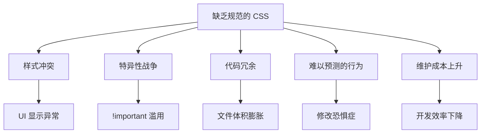
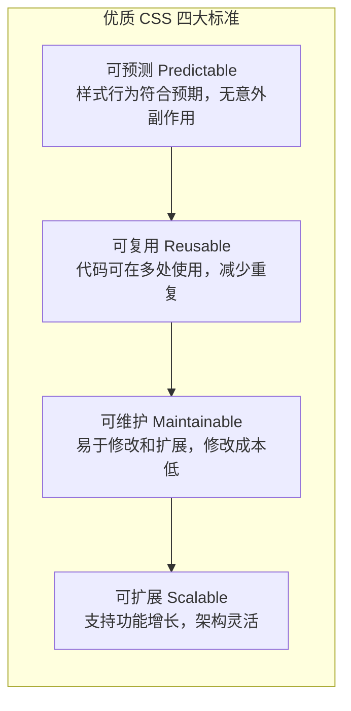
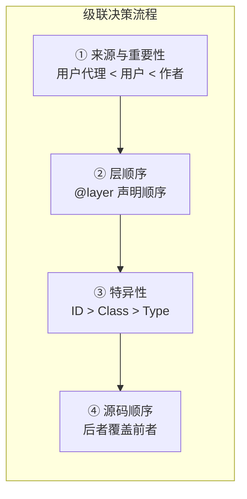
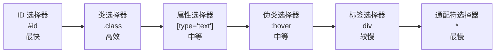
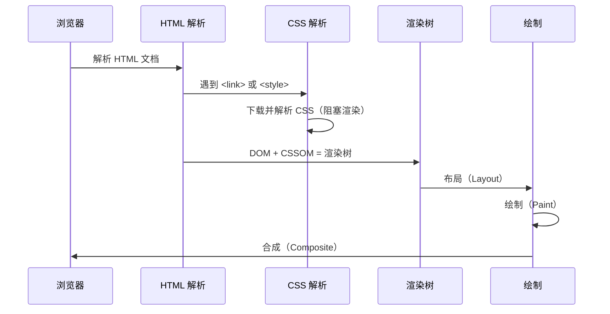
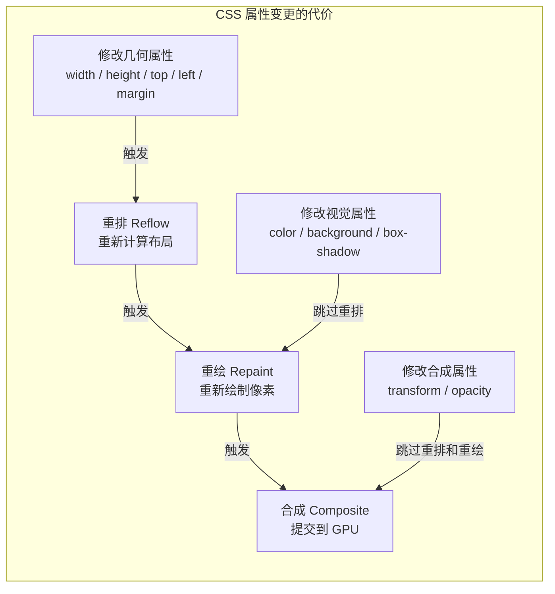
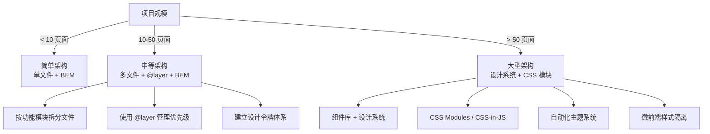
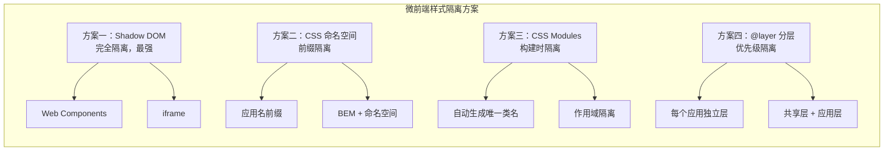

# CSS 最佳实践

编写高质量、可维护 CSS 的最佳实践指南，涵盖代码组织、命名规范、性能优化、可访问性、大型项目架构和微前端样式隔离等方面。

## 背景与动机

### 为什么需要 CSS 最佳实践

CSS 是一门入门容易但精通困难的编程语言。随着项目规模的增长，CSS 代码的维护成本会急剧上升。缺乏规范的 CSS 代码会导致以下问题：



**真实场景**：

1. **样式冲突**：新添加的按钮样式意外影响了页面上所有其他按钮
2. **特异性战争**：为了覆盖第三方库样式，选择器越来越长，`.page .content .wrapper .card .btn` 成为常态
3. **删除恐惧**：不敢删除任何 CSS 代码，因为不确定是否有其他地方依赖
4. **性能劣化**：CSS 文件越来越大，首屏渲染越来越慢
5. **团队协作困难**：每个开发者有自己的命名习惯和代码风格，代码一致性差

### 优质 CSS 的标准



| 维度 | 说明 | 衡量指标 |
|------|------|----------|
| 可预测 | 样式行为符合预期，不会产生意外副作用 | 新增样式后无回归 bug |
| 可复用 | 代码可在多处使用，减少重复代码 | 代码复用率 > 60% |
| 可维护 | 易于修改和扩展，修改成本低 | 定位和修改样式的时间 < 5 分钟 |
| 可扩展 | 支持功能增长，架构灵活 | 新增组件不影响现有样式 |

> 上表的量化指标为经验参考值，用于传达改进方向，并非硬性标准。

## 核心概念

### CSS 级联与优先级

CSS 的核心是级联（Cascade）机制。理解级联是编写可预测 CSS 的基础。



**特异性权重表**：

| 选择器类型 | 特异性值 | 示例 |
|-----------|---------|------|
| 内联样式 | 1,0,0,0 | `style="color: red"` |
| ID 选择器 | 0,1,0,0 | `#header` |
| 类/属性/伪类 | 0,0,1,0 | `.btn`, `[type="text"]`, `:hover` |
| 标签/伪元素 | 0,0,0,1 | `div`, `::before` |
| 通配符 | 0,0,0,0 | `*` |

### BEM 命名方法论

BEM（Block Element Modifier）是 CSS 命名最广泛采用的方法论之一：

```css
/* Block：独立的、可复用的组件 */
.card { }
.nav { }
.form { }

/* Element：Block 的子元素，用 __ 连接 */
.card__header { }
.card__body { }
.card__footer { }
.nav__item { }
.form__input { }

/* Modifier：Block 或 Element 的变体，用 -- 连接 */
.card--featured { }
.card--compact { }
.nav__item--active { }
.form__input--error { }
```

### SMACSS 分类法

SMACSS 将 CSS 规则分为五类：

| 类别 | 说明 | 命名前缀 | 示例 |
|------|------|---------|------|
| Base | 基础样式、重置 | 无 | `body`, `h1`, `a` |
| Layout | 页面布局 | `l-` | `.l-header`, `.l-sidebar` |
| Module | 可复用模块 | 无 | `.card`, `.nav` |
| State | 状态样式 | `is-` / `has-` | `.is-active`, `.has-error` |
| Theme | 主题样式 | `theme-` | `.theme-dark` |

### OOCSS 原则

OOCSS（面向对象 CSS）的两大核心原则：

1. **分离结构与皮肤**：将视觉样式（皮肤）与结构样式分离，使其可以独立变化
2. **分离容器与内容**：元素的外观不应依赖于其所在位置

### CSS 变量（Custom Properties）

CSS 变量是现代 CSS 架构的基石，使得主题切换、动态样式成为可能：

```css
:root {
  --color-primary: #2563eb;
  --spacing-md: 1rem;
  --radius-md: 8px;
}

.button {
  background: var(--color-primary);
  padding: var(--spacing-md);
  border-radius: var(--radius-md);
}
```

## 深入原理

### 代码组织架构

#### 文件目录结构

大型项目的 CSS 文件应按功能模块组织：

```
styles/
├── base/                    # 基础样式
│   ├── _reset.css          # CSS 重置
│   ├── _variables.css      # CSS 变量定义
│   ├── _typography.css     # 排版样式
│   └── _base.css           # 全局基础样式
├── components/              # 组件样式
│   ├── _button.css         # 按钮组件
│   ├── _card.css           # 卡片组件
│   ├── _form.css           # 表单组件
│   ├── _modal.css          # 模态框组件
│   └── _nav.css            # 导航组件
├── layout/                  # 布局样式
│   ├── _grid.css           # 网格系统
│   ├── _header.css         # 页头布局
│   ├── _footer.css         # 页脚布局
│   └── _sidebar.css        # 侧边栏布局
├── pages/                   # 页面特定样式
│   ├── _home.css           # 首页样式
│   └── _about.css          # 关于页面样式
├── themes/                  # 主题样式
│   ├── _dark.css           # 暗色主题
│   └── _light.css          # 亮色主题
├── utils/                   # 工具类
│   ├── _animations.css     # 动画
│   ├── _utilities.css      # 工具类
│   └── _mixins.css         # 混入
└── main.css                 # 主入口文件
```

#### 导入顺序原则

CSS 文件的导入顺序直接影响优先级。推荐的导入顺序：

```css
/* main.css — 按优先级从低到高导入 */

/* 1. 设置和变量（最低优先级） */
@import 'base/variables.css';

/* 2. 工具和混入 */
@import 'utils/mixins.css';
@import 'utils/functions.css';

/* 3. 重置和基础样式 */
@import 'base/reset.css';
@import 'base/typography.css';
@import 'base/base.css';

/* 4. 布局 */
@import 'layout/grid.css';
@import 'layout/header.css';
@import 'layout/footer.css';

/* 5. 组件 */
@import 'components/button.css';
@import 'components/card.css';
@import 'components/form.css';

/* 6. 页面特定样式 */
@import 'pages/home.css';

/* 7. 主题 */
@import 'themes/dark.css';

/* 8. 工具类（最高优先级） */
@import 'utils/utilities.css';
```

#### ITCSS 层级架构

ITCSS（Inverted Triangle CSS）是 Harry Roberts 提出的 CSS 架构方法论，它用倒三角模型来组织样式文件，从通用到具体、从低特异性到高特异性：

```
┌─────────────────────────────────────────────────────────────┐
│                    ITCSS 倒三角模型                          │
├─────────────────────────────────────────────────────────────┤
│                                                             │
│  ┌─────────────────────────────────────────────────────┐   │
│  │  Settings（设置层）                                   │   │
│  │  CSS 变量、设计令牌 — 无实际输出                      │   │
│  └─────────────────────────────────────────────────────┘   │
│                         ↓                                   │
│    ┌─────────────────────────────────────────────────┐     │
│    │  Tools（工具层）                                   │     │
│    │  Mixins、函数 — 无实际输出                         │     │
│    └─────────────────────────────────────────────────┘     │
│                           ↓                                 │
│      ┌─────────────────────────────────────────────┐       │
│      │  Generic（通用层）                              │       │
│      │  Reset、Normalize — 最低特异性                  │       │
│      └─────────────────────────────────────────────┘       │
│                             ↓                               │
│        ┌─────────────────────────────────────────┐         │
│        │  Elements（元素层）                         │         │
│        │  HTML 标签基础样式 — h1, a, body            │         │
│        └─────────────────────────────────────────┘         │
│                               ↓                             │
│          ┌─────────────────────────────────────┐           │
│          │  Objects（对象层）                      │           │
│          │  OOCSS 模式 — .media, .layout          │           │
│          └─────────────────────────────────────┘           │
│                                 ↓                           │
│            ┌─────────────────────────────────┐             │
│            │  Components（组件层）               │             │
│            │  具体 UI 组件 — .card, .nav         │             │
│            └─────────────────────────────────┘             │
│                                   ↓                         │
│              ┌─────────────────────────────┐               │
│              │  Utilities（工具类层）          │               │
│              │  最高特异性、覆盖一切            │               │
│              └─────────────────────────────┘               │
│                                                             │
└─────────────────────────────────────────────────────────────┘
  通用 ────────────────────────────────────────────── 具体
  低特异性 ────────────────────────────────────────── 高特异性
```

**ITCSS 与 @layer 的映射**：

```css
/* ITCSS 七层映射到级联层 — 完美对应 */
@layer
  settings,     /* 设置 — 仅变量，无输出 */
  tools,        /* 工具 — 仅 Mixins，无输出 */
  generic,      /* 通用 — Reset/Normalize */
  elements,     /* 元素 — 标签基础样式 */
  objects,      /* 对象 — OOCSS 模式 */
  components,   /* 组件 — 具体 UI 组件 */
  utilities;    /* 工具类 — 最高优先级 */

/* 实际项目中 settings 和 tools 通常不需要层（无 CSS 输出） */
@layer generic, elements, objects, components, utilities;
```

**ITCSS 文件结构**：

```
styles/
├── settings/                  # 1. 设置层 — 设计令牌
│   ├── _colors.css           # 颜色变量
│   ├── _spacing.css          # 间距变量
│   ├── _typography.css       # 字体变量
│   └── _breakpoints.css      # 断点变量
├── tools/                     # 2. 工具层 — Mixins/函数
│   ├── _mixins.css           # 通用 Mixins
│   └── _functions.css        # CSS 函数
├── generic/                   # 3. 通用层 — 重置
│   ├── _reset.css            # CSS 重置
│   └── _normalize.css        # Normalize.css
├── elements/                  # 4. 元素层 — 标签样式
│   ├── _headings.css         # 标题
│   ├── _links.css            # 链接
│   ├── _lists.css            # 列表
│   ├── _images.css           # 图片
│   └── _forms.css            # 表单元素
├── objects/                   # 5. 对象层 — OOCSS 模式
│   ├── _layout.css           # 布局对象
│   ├── _media.css            # 媒体对象
│   ├── _list-bare.css        # 裸列表
│   └── _wrapper.css          # 容器对象
├── components/                # 6. 组件层 — 具体 UI
│   ├── _button.css           # 按钮
│   ├── _card.css             # 卡片
│   ├── _nav.css              # 导航
│   ├── _form.css             # 表单
│   └── _modal.css            # 模态框
├── utilities/                 # 7. 工具类层
│   ├── _spacing.css          # 间距
│   ├── _text.css             # 文本
│   ├── _display.css          # 显示
│   └── _visibility.css       # 可见性
└── main.css                   # 入口文件
```

**ITCSS 的核心价值**：
- **特异性递增**：从通用到具体，特异性自然递增，避免覆盖冲突
- **作用域递减**：从全局到局部，影响范围越来越小
- **与 @layer 天然契合**：ITCSS 的层级顺序与 `@layer` 的声明顺序完全一致
- **方法论无关**：ITCSS 不规定命名方式，可与 BEM、OOCSS 自由组合

#### 使用 @layer 组织

现代项目推荐使用 `@layer` 来管理优先级：

```css
/* 声明层顺序 */
@layer reset, base, layout, components, utilities;

/* 导入到对应层 */
@import 'base/reset.css' layer(reset);
@import 'base/typography.css' layer(base);
@import 'layout/grid.css' layer(layout);
@import 'components/button.css' layer(components);
@import 'components/card.css' layer(components);
@import 'utils/utilities.css' layer(utilities);
```

### 命名规范深入

#### 基本原则

| 原则 | 说明 | 正确示例 | 错误示例 |
|------|------|---------|---------|
| 语义化 | 描述功能而非样式 | `.btn-primary` | `.red-button` |
| 一致性 | 统一命名风格 | 全部使用小写 + 连字符 | 混用驼峰和下划线 |
| 简洁性 | 避免过长命名 | `.nav-link` | `.navigation-hyperlink` |
| 可读性 | 易于理解 | `.user-avatar` | `.usrAvt` |
| 避免缩写 | 除非是通用缩写 | `.description` | `.desc`（除非团队约定） |

#### 命名空间

使用命名空间前缀可以快速识别类的用途：

```css
/* 布局命名空间 */
.l-header { }
.l-sidebar { }
.l-grid { }
.l-main { }

/* 组件命名空间 */
.c-button { }
.c-card { }
.c-modal { }
.c-nav { }

/* 工具类命名空间 */
.u-text-center { }
.u-hidden { }
.u-mb-4 { }
.u-sr-only { }

/* 状态前缀 */
.is-active { }
.is-loading { }
.is-disabled { }
.has-error { }
.has-dropdown { }

/* JavaScript 钩子命名空间 */
.js-toggle { }
.js-modal-trigger { }
.js-submit { }

/* 第三方覆盖命名空间 */
.tw-button { }   /* Tailwind 覆盖 */
.bs-modal { }    /* Bootstrap 覆盖 */
```

#### 命名规范深入实践

**状态类（is- / has-）规范**

状态类是 SMACSS 提出的概念，已成为业界广泛采纳的实践。状态类应遵循以下原则：

1. **状态类只控制状态相关的样式**，不定义组件的基础外观
2. **状态类应与组件类组合使用**，而非单独使用
3. **状态类由 JavaScript 动态添加/移除**，不应出现在初始 HTML 中

```css
/* ✓ 正确：状态类与组件类组合 */
.nav-link { color: #64748b; }
.nav-link.is-active { color: #2563eb; font-weight: 600; }

.form-input { border: 1px solid #e2e8f0; }
.form-input.is-error { border-color: #dc2626; }
.form-input.is-disabled { opacity: 0.5; pointer-events: none; }

/* is- 表示瞬时状态 — 由用户交互或程序控制 */
.is-active { }      /* 激活态 */
.is-loading { }     /* 加载中 */
.is-disabled { }    /* 禁用态 */
.is-hidden { }      /* 隐藏态 */
.is-expanded { }    /* 展开态 */
.is-collapsed { }   /* 折叠态 */
.is-open { }        /* 打开态（菜单/弹窗） */
.is-selected { }    /* 选中态 */

/* has- 表示拥有某种特征 — 由内容或上下文决定 */
.has-error { }      /* 包含错误 */
.has-warning { }    /* 包含警告 */
.has-icon { }       /* 包含图标 */
.has-dropdown { }   /* 包含下拉菜单 */
.has-children { }   /* 包含子项 */
```

**JavaScript 钩子类（js-）规范**

`js-` 前缀类是专门为 JavaScript 选择元素而保留的，**绝不用于样式定义**。这种分离确保了样式和行为的解耦：

```css
/* ✓ js- 类只用于 JavaScript 选择器，不定义任何样式 */
.js-toggle { }           /* 切换按钮 */
.js-modal-trigger { }    /* 模态框触发器 */
.js-submit { }           /* 提交按钮 */
.js-dropdown { }         /* 下拉菜单容器 */
.js-carousel { }         /* 轮播容器 */
.js-tooltip { }          /* 工具提示 */
.js-copy-btn { }         /* 复制按钮 */
.js-validate { }         /* 需要验证的表单 */
```

```javascript
// JavaScript 中通过 js- 前缀选择元素
document.querySelector('.js-modal-trigger').addEventListener('click', openModal);

// ✓ 正确：js- 类与样式类分离
// <button class="btn btn-primary js-submit">提交</button>
// btn btn-primary → 样式
// js-submit → 行为

// ✗ 错误：用样式类选择元素
// document.querySelector('.btn-primary')  // 样式变更会导致 JS 失效
```

**统一前缀规范**

在大型项目中，使用统一前缀可以快速识别类的用途和所属模块，避免命名冲突：

```css
/* 按角色分类的前缀体系 */
.c-    /* Component 组件 */    .c-card { } .c-nav { }
.l-    /* Layout 布局 */       .l-header { } .l-grid { }
.u-    /* Utility 工具类 */    .u-mb-4 { } .u-text-center { }
.is-   /* State 状态 */        .is-active { } .is-loading { }
.has-  /* Feature 特征 */      .has-error { } .has-icon { }
.js-   /* Behavior 行为 */     .js-toggle { } .js-submit { }
.qa-   /* Testing 测试 */      .qa-login-btn { }  /* 仅供测试选择器 */

/* 按模块分类的前缀体系 — 适合组件库 */
.btn-    /* 按钮模块 */     .btn-primary { } .btn-icon { }
.card-   /* 卡片模块 */     .card-title { } .card-body { }
.form-   /* 表单模块 */     .form-input { } .form-label { }
.nav-    /* 导航模块 */     .nav-item { } .nav-link { }
```

#### 避免的命名方式

```css
/* ✗ 基于样式的命名 */
.red { color: red; }          /* 如果颜色改为蓝色呢？ */
.big-text { font-size: 24px; } /* 如果大小调整呢？ */
.left { float: left; }        /* 如果布局方式改变呢？ */

/* ✗ 无意义的命名 */
.c1 { }  /* 无法理解用途 */
.wrapper-2 { }  /* 数字后缀无意义 */
.div1 { }  /* 标签名作为类名 */

/* ✗ 过长的命名 */
.navigation-hyperlink { }  /* .nav-link 即可 */
.main-content-area { }     /* .content 即可 */
```

### 选择器最佳实践

#### 选择器效率

从浏览器渲染引擎的角度，选择器的匹配效率从高到低排列：



> **注意**：现代浏览器的选择器引擎已经高度优化，选择器效率对性能的影响微乎其微。更重要的是选择器的**可维护性**和**可预测性**。

#### 避免过度嵌套

```css
/* ✗ 避免：深层嵌套（特异性过高，难以覆盖） */
.page .content .article .header .title {
  font-size: 24px;
}
/* 特异性：0,5,0 — 极难覆盖 */

/* ✓ 推荐：扁平选择器 */
.article-title {
  font-size: 24px;
}
/* 特异性：0,1,0 — 易于覆盖 */

/* ✓ BEM 风格嵌套（使用预处理器时） */
.card {
  padding: 1rem;

  &__header { padding: 16px; }
  &__body { padding: 16px; }
  &--featured { border-color: blue; }
}
/* 编译后：.card { } .card__header { } .card__body { } .card--featured { } */
```

#### 特异性控制策略

特异性（Specificity）是 CSS 级联算法的核心机制。不受控制的特异性增长是 CSS 维护性恶化的根本原因。以下是系统化的特异性控制策略：

**策略一：保持选择器扁平**

```css
/* ✗ 特异性螺旋上升：每一层覆盖都需要更高的特异性 */
.card { padding: 1rem; }                        /* 0,1,0 */
.card.featured { padding: 2rem; }               /* 0,2,0 */
.page .card.featured { padding: 3rem; }         /* 0,3,0 */
#main .page .card.featured { padding: 4rem; }   /* 1,3,0 — 已失控 */

/* ✓ 使用 CSS 变量或 BEM 修饰符保持扁平 */
.card { padding: var(--card-padding, 1rem); }   /* 0,1,0 */
.card--featured { --card-padding: 2rem; }       /* 0,1,0 */
.card--large { --card-padding: 3rem; }          /* 0,1,0 */
```

**策略二：选择器长度限制**

团队应约定选择器的最大嵌套深度。推荐规则：

| 规则 | 说明 |
|------|------|
| 最多 3 层嵌套 | `.nav .nav-item .nav-link` 已是上限 |
| 最多 2 个类组合 | `.card.card--featured` 可以，`.a.b.c` 应避免 |
| 禁止标签限定类 | `div.card` → `.card` |
| 禁止 ID 选择器 | `#header` → `.header` |

```json
/* stylelint 配置 — 强制执行选择器限制 */
{
  "selector-max-compound-selectors": 3,
  "selector-max-specificity": "0,3,0",
  "selector-max-id": 0,
  "selector-no-qualifying-type": true
}
```

**策略三：使用 @layer 从架构层面控制优先级**

`@layer` 是控制特异性的终极方案——它让优先级完全脱离特异性计算：

```css
/* 不同层之间，优先级由层声明顺序决定，与选择器特异性无关 */
@layer reset, base, components, utilities;

@layer components {
  /* 即使是低特异性选择器，components 层也优先于 base 层 */
  .card { padding: 1rem; }
}

@layer base {
  /* 即使是高特异性选择器，base 层也无法覆盖 components 层 */
  body .page .content .card { padding: 2rem; } /* 无效！层优先级更低 */
}
```

**策略四：特异性归零技巧**

当必须覆盖一个高特异性选择器时，可以使用重复类名的方式提升特异性而不引入新的语义：

```css
/* 需要覆盖 .card.featured 的样式 */
.card.featured { border-color: blue; }  /* 0,2,0 */

/* 方式1：重复类名 — 特异性 0,3,0，但无额外语义 */
.card.featured.featured { border-color: red; }

/* 方式2：使用 :where() 归零 — 更优雅 */
:where(.card).featured { border-color: blue; }  /* 0,1,0 — :where() 内特异性为 0 */

/* 方式3：使用 :is() 保持最高特异性 */
:is(.card, .panel).featured { border-color: blue; }  /* 0,2,0 */
```

#### 避免 ID 选择器

```css
/* ✗ 避免：ID 选择器（优先级过高，无法复用） */
#header { }
#main-nav { }
#sidebar { }

/* ✓ 推荐：类选择器 */
.header { }
.main-nav { }
.sidebar { }
```

**为什么避免 ID 选择器？**

1. **优先级过高**：ID 的特异性 (0,1,0,0) 远高于类 (0,0,1,0)，覆盖 ID 样式非常困难
2. **不可复用**：HTML 中 ID 必须唯一，同一个样式不能用于多个元素
3. **不利于一致性**：ID 样式与特定元素绑定，无法创建可复用的组件

#### 避免标签限定

```css
/* ✗ 避免：标签 + 类组合（增加特异性但无额外价值） */
div.container { }
ul.nav { }
a.link { }
table.data-table { }

/* ✓ 推荐：仅使用类 */
.container { }
.nav { }
.link { }
.data-table { }
```

#### 避免 !important

```css
/* ✗ 避免：滥用 !important */
.card {
  background: white !important;
  padding: 16px !important;
  margin: 8px !important;
}

/* ✓ 推荐：通过合理的架构避免 !important */
/* 方案1：使用 @layer 管理优先级 */
@layer reset, base, components, utilities;

/* 方案2：提高选择器特异性（在合理范围内） */
.card.card--featured { }  /* 双类选择器 */

/* 方案3：使用 CSS 变量 */
.card {
  --card-bg: #fff;
  background: var(--card-bg);
}
.theme-dark .card {
  --card-bg: #1a1a1a;  /* 覆盖变量，无需 !important */
}

/* !important 的合理使用场景 */
/* 1. 工具类 */
.hidden { display: none !important; }
.sr-only { /* 视觉隐藏 */ position: absolute !important; }

/* 2. 覆盖第三方样式 */
.my-app .bootstrap-btn {
  border-radius: 6px !important;  /* 覆盖 Bootstrap 默认样式 */
}
```

### CSS 变量管理

#### 变量命名体系

建立系统化的 CSS 变量体系是大型项目的基础：

```css
:root {
  /* ========== 颜色系统 ========== */
  /* 品牌色 */
  --color-primary: #2563eb;
  --color-primary-hover: #1d4ed8;
  --color-primary-active: #1e40af;
  --color-primary-light: #dbeafe;

  --color-secondary: #7c3aed;
  --color-secondary-hover: #6d28d9;

  /* 语义色 */
  --color-success: #16a34a;
  --color-danger: #dc2626;
  --color-warning: #d97706;
  --color-info: #0284c7;

  /* 中性色 */
  --color-text: #1e293b;
  --color-text-secondary: #64748b;
  --color-text-muted: #94a3b8;
  --color-text-disabled: #cbd5e1;

  --color-bg: #ffffff;
  --color-bg-secondary: #f8fafc;
  --color-bg-tertiary: #f1f5f9;

  --color-border: #e2e8f0;
  --color-border-light: #f1f5f9;

  /* ========== 间距系统 ========== */
  --spacing-unit: 0.25rem;  /* 4px 基础单位 */
  --spacing-1: calc(var(--spacing-unit) * 1);   /* 4px */
  --spacing-2: calc(var(--spacing-unit) * 2);   /* 8px */
  --spacing-3: calc(var(--spacing-unit) * 3);   /* 12px */
  --spacing-4: calc(var(--spacing-unit) * 4);   /* 16px */
  --spacing-6: calc(var(--spacing-unit) * 6);   /* 24px */
  --spacing-8: calc(var(--spacing-unit) * 8);   /* 32px */
  --spacing-12: calc(var(--spacing-unit) * 12); /* 48px */
  --spacing-16: calc(var(--spacing-unit) * 16); /* 64px */

  /* ========== 字体系统 ========== */
  --font-family-base: -apple-system, BlinkMacSystemFont, 'Segoe UI', Roboto, sans-serif;
  --font-family-mono: 'SF Mono', Monaco, 'Cascadia Code', monospace;
  --font-family-heading: var(--font-family-base);

  --font-size-xs: 0.75rem;    /* 12px */
  --font-size-sm: 0.875rem;   /* 14px */
  --font-size-base: 1rem;     /* 16px */
  --font-size-lg: 1.125rem;   /* 18px */
  --font-size-xl: 1.25rem;    /* 20px */
  --font-size-2xl: 1.5rem;    /* 24px */
  --font-size-3xl: 1.875rem;  /* 30px */

  --font-weight-normal: 400;
  --font-weight-medium: 500;
  --font-weight-semibold: 600;
  --font-weight-bold: 700;

  --line-height-tight: 1.25;
  --line-height-normal: 1.5;
  --line-height-relaxed: 1.75;

  /* ========== 圆角 ========== */
  --radius-none: 0;
  --radius-sm: 4px;
  --radius-md: 8px;
  --radius-lg: 12px;
  --radius-xl: 16px;
  --radius-full: 9999px;

  /* ========== 阴影 ========== */
  --shadow-xs: 0 1px 2px rgba(0, 0, 0, 0.05);
  --shadow-sm: 0 1px 3px rgba(0, 0, 0, 0.1), 0 1px 2px rgba(0, 0, 0, 0.06);
  --shadow-md: 0 4px 6px rgba(0, 0, 0, 0.1), 0 2px 4px rgba(0, 0, 0, 0.06);
  --shadow-lg: 0 10px 15px rgba(0, 0, 0, 0.1), 0 4px 6px rgba(0, 0, 0, 0.05);
  --shadow-xl: 0 20px 25px rgba(0, 0, 0, 0.1), 0 10px 10px rgba(0, 0, 0, 0.04);

  /* ========== 过渡 ========== */
  --transition-fast: 150ms ease;
  --transition-normal: 300ms ease;
  --transition-slow: 500ms ease;
  --transition-bounce: 500ms cubic-bezier(0.68, -0.55, 0.265, 1.55);

  /* ========== 层级 ========== */
  --z-dropdown: 100;
  --z-sticky: 200;
  --z-fixed: 300;
  --z-modal-backdrop: 400;
  --z-modal: 500;
  --z-popover: 600;
  --z-tooltip: 700;
}
```

#### 组件级变量

为每个组件定义独立的 CSS 变量，方便主题化和覆盖：

```css
/* 组件级变量定义 */
.card {
  /* 组件内部变量 */
  --card-padding: var(--spacing-4);
  --card-border-radius: var(--radius-md);
  --card-bg: var(--color-bg);
  --card-border-color: var(--color-border);
  --card-shadow: var(--shadow-sm);

  /* 使用组件变量 */
  padding: var(--card-padding);
  border-radius: var(--card-border-radius);
  background: var(--card-bg);
  border: 1px solid var(--card-border-color);
  box-shadow: var(--card-shadow);
}

/* 通过覆盖组件变量实现变体 — 无需修改组件代码 */
.card--compact {
  --card-padding: var(--spacing-2);
}

.card--elevated {
  --card-shadow: var(--shadow-lg);
  --card-border-color: transparent;
}

/* 主题覆盖 */
[data-theme="dark"] .card {
  --card-bg: #1e293b;
  --card-border-color: #334155;
}
```

### 性能优化原理

#### 关键渲染路径



**优化策略**：

```html
<!-- ✓ 推荐：内联关键 CSS + 异步加载非关键 CSS -->
<head>
  <!-- 关键 CSS 内联 — 避免阻塞渲染 -->
  <style>
    /* 仅包含首屏必需的样式 */
    .header { height: 60px; display: flex; align-items: center; }
    .hero { min-height: 400px; }
    .hero__title { font-size: 2rem; }
  </style>

  <!-- 非关键 CSS 异步加载 -->
  <link rel="preload" href="styles.css" as="style"
        onload="this.rel='stylesheet'">
  <noscript><link rel="stylesheet" href="styles.css"></noscript>
</head>
```

#### 重排与重绘



```css
/* ✗ 避免：触发重排的属性动画 */
.element {
  transition: left 0.3s, width 0.3s;
}
.element:hover {
  left: 10px;    /* 触发重排 */
  width: 200px;  /* 触发重排 */
}

/* ✓ 推荐：使用 transform 替代 */
.element {
  transition: transform 0.3s;
}
.element:hover {
  transform: translateX(10px) scaleX(1.2); /* 仅触发合成 */
}

/* ✓ 使用 will-change 提示浏览器（谨慎使用） */
.animated-element {
  will-change: transform, opacity;
}
/* 注意：动画结束后移除 will-change */
.animated-element.done {
  will-change: auto;
}
```

#### contain 属性 — 隔离渲染边界

`contain` 属性告诉浏览器某个元素的渲染独立于页面其他部分，浏览器可以据此进行渲染优化——跳过不影响当前元素的布局和绘制计算。

```css
/* contain 的四个主要值 */
.isolated-component {
  /* layout：元素内部的布局变化不影响外部 */
  contain: layout;
}

.offscreen-list {
  /* paint：元素超出边界的部分不会被绘制（类似 overflow: hidden 的优化版） */
  contain: paint;
}

.static-widget {
  /* size：元素的尺寸不依赖于子元素 */
  contain: size;
}

.widget {
  /* inline-size：限制行内方向尺寸独立（适合响应式布局） */
  contain: inline-size;
}

/* 实际应用场景 */
.article-card {
  /* 卡片内部布局变化不影响外部列表 */
  contain: layout paint;
}

.sidebar-widget {
  /* 侧边栏组件独立渲染 */
  contain: layout paint size;
}

.virtual-list-item {
  /* 虚拟列表项 — 避免单个项变化触发整列表重排 */
  contain: layout paint;
}
```

**`content-visibility` — 更激进的渲染优化**：

```css
/* below-the-fold：屏幕外的内容跳过渲染 */
.section-below-fold {
  content-visibility: auto;
  /* 浏览器自动判断是否在视口内，跳过不可见内容的渲染 */
  contain-intrinsic-size: 0 500px;
  /* 提供预估尺寸，避免滚动条跳动 */
}

/* 强制隐藏 — 比 display: none 更轻量 */
.offscreen-panel {
  content-visibility: hidden;
  /* 内容不被渲染但保留在 DOM 中，切换回 visible 时速度更快 */
}
```

**`contain` 使用建议**：

| 场景 | 推荐 | 说明 |
|------|------|------|
| 列表项 / 卡片 | `contain: layout paint` | 防止内部变化影响外部 |
| 固定尺寸组件 | `contain: layout paint size` | 最强隔离，但需确保尺寸不依赖子元素 |
| 长页面下方内容 | `content-visibility: auto` | 跳过屏幕外渲染，首屏速度提升显著 |
| 懒加载区域 | `content-visibility: hidden` | 隐藏但保留 DOM，恢复渲染快于 `display: none` |

#### 昂贵的 CSS 属性

某些 CSS 属性会触发离屏渲染或 GPU 密集型操作，应谨慎使用：

```css
/* 昂贵的属性 — 谨慎使用 */
.expensive {
  /* 复杂阴影 — 需要逐像素计算 */
  box-shadow: 0 0 50px 20px rgba(0, 0, 0, 0.5);

  /* 滤镜 — GPU 密集型 */
  filter: blur(10px);

  /* 背景模糊 — 需要采样周围像素 */
  backdrop-filter: blur(10px);

  /* 混合模式 — 需要计算像素混合 */
  mix-blend-mode: multiply;

  /* 复杂渐变 — 多色标渐变 */
  background: repeating-linear-gradient(
    45deg,
    red, red 10px,
    blue 10px, blue 20px,
    green 20px, green 30px
  );
}

/* 优化方案 */
.optimized {
  /* 使用更小的阴影范围 */
  box-shadow: 0 2px 10px rgba(0, 0, 0, 0.1);

  /* 使用 opacity 替代 filter */
  opacity: 0.9;

  /* 限制 backdrop-filter 的使用范围 */
  /* 只在必要的小区域使用 */
}
```

### 大型项目 CSS 架构

#### 架构决策流程



#### 大型项目架构案例

以下是一个企业级 SaaS 产品的 CSS 架构实例：

```
design-system/
├── tokens/                     # 设计令牌
│   ├── colors.css              # 颜色令牌
│   ├── spacing.css             # 间距令牌
│   ├── typography.css          # 字体令牌
│   ├── shadows.css             # 阴影令牌
│   └── animations.css          # 动画令牌
├── base/                       # 基础层
│   ├── reset.css               # 重置样式
│   └── typography.css          # 排版基础
├── components/                 # 组件库
│   ├── button/
│   │   ├── button.css          # 按钮样式
│   │   └── button-group.css    # 按钮组
│   ├── form/
│   │   ├── input.css           # 输入框
│   │   ├── select.css          # 下拉框
│   │   ├── checkbox.css        # 复选框
│   │   └── radio.css           # 单选框
│   ├── data-display/
│   │   ├── table.css           # 表格
│   │   ├── card.css            # 卡片
│   │   └── badge.css           # 徽标
│   ├── feedback/
│   │   ├── alert.css           # 提示
│   │   ├── toast.css           # 消息
│   │   └── modal.css           # 模态框
│   └── navigation/
│       ├── nav.css             # 导航
│       ├── breadcrumb.css      # 面包屑
│       └── pagination.css      # 分页
├── layouts/                    # 布局系统
│   ├── shell.css               # 应用外壳
│   ├── sidebar.css             # 侧边栏
│   └── grid.css                # 网格系统
├── themes/                     # 主题
│   ├── light.css               # 亮色主题
│   └── dark.css                # 暗色主题
├── utilities/                  # 工具类
│   ├── spacing.css             # 间距工具
│   ├── typography.css          # 文本工具
│   └── display.css             # 显示工具
└── index.css                   # 入口文件
```

入口文件组织：

```css
/* index.css — 设计系统入口 */

/* 1. 声明层顺序 */
@layer tokens, reset, base, layout, components, themes, utilities;

/* 2. 设计令牌（最低优先级 — 仅变量定义） */
@import 'tokens/colors.css' layer(tokens);
@import 'tokens/spacing.css' layer(tokens);
@import 'tokens/typography.css' layer(tokens);
@import 'tokens/shadows.css' layer(tokens);

/* 3. 重置 */
@import 'base/reset.css' layer(reset);

/* 4. 基础排版 */
@import 'base/typography.css' layer(base);

/* 5. 布局 */
@import 'layouts/shell.css' layer(layout);
@import 'layouts/sidebar.css' layer(layout);
@import 'layouts/grid.css' layer(layout);

/* 6. 组件 */
@import 'components/button/button.css' layer(components);
@import 'components/button/button-group.css' layer(components);
@import 'components/form/input.css' layer(components);
@import 'components/form/select.css' layer(components);
@import 'components/data-display/table.css' layer(components);
@import 'components/data-display/card.css' layer(components);
@import 'components/feedback/modal.css' layer(components);
@import 'components/navigation/nav.css' layer(components);

/* 7. 主题 */
@import 'themes/light.css' layer(themes);
@import 'themes/dark.css' layer(themes);

/* 8. 工具类（最高优先级） */
@import 'utilities/spacing.css' layer(utilities);
@import 'utilities/typography.css' layer(utilities);
@import 'utilities/display.css' layer(utilities);
```

#### 微前端样式隔离

微前端架构中，多个独立部署的子应用共享同一个页面，样式隔离是关键挑战。



**方案一：Shadow DOM 完全隔离**

```javascript
// Web Component — 样式完全隔离
class MicroApp extends HTMLElement {
  constructor() {
    super();
    const shadow = this.attachShadow({ mode: 'open' });

    // 样式只在 Shadow DOM 内生效，不影响外部
    shadow.innerHTML = `
      <style>
        .app-container {
          font-family: system-ui, sans-serif;
          padding: 16px;
        }
        .btn {
          padding: 8px 16px;
          border-radius: 6px;
          background: #2563eb;
          color: white;
          border: none;
          cursor: pointer;
        }
        /* 这些样式不会影响外部页面的 .btn */
      </style>
      <div class="app-container">
        <h1>子应用 A</h1>
        <button class="btn">点击</button>
      </div>
    `;
  }
}

customElements.define('micro-app-a', MicroApp);
```

**方案二：CSS 命名空间前缀**

```css
/* 每个子应用使用独立命名空间 */

/* 子应用 A — 所有类名以 app-a- 为前缀 */
.app-a-container {
  padding: 16px;
}
.app-a-btn {
  padding: 8px 16px;
  background: #2563eb;
  color: white;
}
.app-a-card {
  border: 1px solid #e2e8f0;
  border-radius: 8px;
}

/* 子应用 B — 所有类名以 app-b- 为前缀 */
.app-b-container {
  padding: 20px;
}
.app-b-btn {
  padding: 10px 20px;
  background: #16a34a;
  color: white;
}
.app-b-card {
  border: 2px solid #bbf7d0;
  border-radius: 12px;
}
```

```html
<!-- 主应用 HTML -->
<div id="app-a-root" class="app-a-container">
  <!-- 子应用 A 的内容 -->
  <button class="app-a-btn">子应用 A 按钮</button>
</div>

<div id="app-b-root" class="app-b-container">
  <!-- 子应用 B 的内容 -->
  <button class="app-b-btn">子应用 B 按钮</button>
</div>
```

**方案三：CSS Modules（构建时隔离）**

```css
/* Button.module.css — 构建工具自动生成唯一类名 */
.button {
  padding: 8px 16px;
  border-radius: 6px;
  background: #2563eb;
  color: white;
}

.primary {
  background: #2563eb;
}

.secondary {
  background: #64748b;
}
```

```javascript
// 构建后自动生成唯一类名
// .button → .Button_button_x7d2f
// .primary → .Button_primary_a3b1c
import styles from './Button.module.css';

function Button({ variant = 'primary', children }) {
  return (
    <button className={`${styles.button} ${styles[variant]}`}>
      {children}
    </button>
  );
}
```

**方案四：@layer 分层隔离**

```css
/* 微前端场景下使用 @layer 隔离各子应用样式 */
@layer shared, app-a, app-b, app-overrides;

/* 共享设计系统 — 所有子应用使用 */
@import 'design-system/index.css' layer(shared);

/* 子应用 A 的样式 */
@layer app-a {
  .container { padding: 16px; }
  .btn { background: #2563eb; }
}

/* 子应用 B 的样式 */
@layer app-b {
  .container { padding: 20px; }
  .btn { background: #16a34a; }
}

/* 跨应用覆盖（如主应用需要覆盖子应用样式） */
@layer app-overrides {
  /* 主应用的覆盖样式 */
}
```

**方案五：qiankun/micro-app 等微前端框架的样式隔离**

```javascript
// qiankun 微前端配置
const apps = [
  {
    name: 'app-a',
    entry: '//localhost:8001',
    container: '#app-a-container',
    activeRule: '/app-a',
    // 开启样式隔离
    sandbox: {
      strictStyleIsolation: true,  // 使用 Shadow DOM 严格隔离
      // 或
      experimentalStyleIsolation: true  // 使用 CSS 选择器前缀隔离
    }
  },
  {
    name: 'app-b',
    entry: '//localhost:8002',
    container: '#app-b-container',
    activeRule: '/app-b',
    sandbox: {
      experimentalStyleIsolation: true
    }
  }
];
```

## 代码示例

### 完整组件示例

以下展示一个完整的、符合最佳实践的组件 CSS 编写方式：

```css
/* ============================================
   Card 组件
   遵循 BEM 命名 + CSS 变量 + @layer

   用法:
   <article class="card card--featured">
     
     <div class="card__body">
       <h3 class="card__title">标题</h3>
       <p class="card__text">内容</p>
     </div>
     <div class="card__footer">
       <button class="card__action">操作</button>
     </div>
   </article>
   ============================================ */

@layer components;

@layer components {
  .card {
    /* 组件变量 */
    --card-padding: var(--spacing-4);
    --card-radius: var(--radius-md);
    --card-bg: var(--color-bg);
    --card-border: 1px solid var(--color-border);
    --card-shadow: var(--shadow-sm);
    --card-transition: box-shadow var(--transition-normal);

    /* 结构样式 */
    display: flex;
    flex-direction: column;
    padding: var(--card-padding);
    background: var(--card-bg);
    border: var(--card-border);
    border-radius: var(--card-radius);
    box-shadow: var(--card-shadow);
    overflow: hidden;
    transition: var(--card-transition);
  }

  /* 交互状态 */
  .card:hover {
    box-shadow: var(--shadow-md);
  }

  /* Element: 图片 */
  .card__image {
    width: 100%;
    height: 200px;
    object-fit: cover;
    border-radius: var(--card-radius) var(--card-radius) 0 0;
    margin: calc(var(--card-padding) * -1);
    margin-bottom: var(--card-padding);
    width: calc(100% + var(--card-padding) * 2);
  }

  /* Element: 内容区 */
  .card__body {
    flex: 1;
  }

  /* Element: 标题 */
  .card__title {
    font-size: var(--font-size-lg);
    font-weight: var(--font-weight-semibold);
    color: var(--color-text);
    line-height: var(--line-height-tight);
    margin-bottom: var(--spacing-2);
  }

  /* Element: 文本 */
  .card__text {
    color: var(--color-text-secondary);
    font-size: var(--font-size-sm);
    line-height: var(--line-height-normal);
  }

  /* Element: 底部 */
  .card__footer {
    display: flex;
    align-items: center;
    justify-content: flex-end;
    gap: var(--spacing-2);
    margin-top: var(--spacing-4);
    padding-top: var(--spacing-4);
    border-top: 1px solid var(--color-border-light);
  }

  /* Element: 操作按钮 */
  .card__action {
    padding: var(--spacing-2) var(--spacing-4);
    border-radius: var(--radius-sm);
    background: var(--color-primary);
    color: white;
    border: none;
    font-size: var(--font-size-sm);
    font-weight: var(--font-weight-medium);
    cursor: pointer;
    transition: background var(--transition-fast);
  }

  .card__action:hover {
    background: var(--color-primary-hover);
  }

  .card__action:focus-visible {
    outline: 2px solid var(--color-primary);
    outline-offset: 2px;
  }

  /* Modifier: 精选卡片 */
  .card--featured {
    --card-border: 2px solid var(--color-primary);
    --card-shadow: 0 4px 12px rgba(37, 99, 235, 0.15);
  }

  /* Modifier: 紧凑卡片 */
  .card--compact {
    --card-padding: var(--spacing-2);
  }

  .card--compact .card__title {
    font-size: var(--font-size-base);
  }

  /* Modifier: 水平布局 */
  .card--horizontal {
    flex-direction: row;
  }

  .card--horizontal .card__image {
    width: 200px;
    height: auto;
    min-height: 100%;
    border-radius: var(--card-radius) 0 0 var(--card-radius);
    margin: 0;
  }
}
```

### 响应式设计完整示例

```css
/* 移动优先的响应式设计 */

/* 基础样式 — 移动端 */
.grid {
  display: grid;
  grid-template-columns: 1fr;
  gap: var(--spacing-4);
  padding: var(--spacing-4);
}

/* 平板 — 768px 及以上 */
@media (min-width: 768px) {
  .grid {
    grid-template-columns: repeat(2, 1fr);
    gap: var(--spacing-6);
    padding: var(--spacing-6);
  }
}

/* 桌面 — 1024px 及以上 */
@media (min-width: 1024px) {
  .grid {
    grid-template-columns: repeat(3, 1fr);
    gap: var(--spacing-8);
    padding: var(--spacing-8);
  }
}

/* 大屏 — 1280px 及以上 */
@media (min-width: 1280px) {
  .grid {
    max-width: 1200px;
    margin: 0 auto;
  }
}

/* 容器查询 — 组件级响应式 */
.card-container {
  container-type: inline-size;
  container-name: card-wrapper;
}

@container card-wrapper (min-width: 400px) {
  .card {
    flex-direction: row;
  }

  .card__image {
    width: 40%;
    height: auto;
  }
}

@container card-wrapper (min-width: 600px) {
  .card__title {
    font-size: var(--font-size-2xl);
  }
}
```

### 主题切换完整示例

```css
/* 主题系统 — 基于 CSS 变量 */

/* 亮色主题（默认） */
:root,
[data-theme="light"] {
  --color-primary: #2563eb;
  --color-primary-hover: #1d4ed8;
  --color-text: #1e293b;
  --color-text-secondary: #64748b;
  --color-bg: #ffffff;
  --color-bg-secondary: #f8fafc;
  --color-border: #e2e8f0;
  --shadow-color: 0 0% 0%;
  --shadow-sm: 0 1px 3px hsl(var(--shadow-color) / 0.1);
  --shadow-md: 0 4px 6px hsl(var(--shadow-color) / 0.1);
}

/* 暗色主题 */
[data-theme="dark"] {
  --color-primary: #60a5fa;
  --color-primary-hover: #93c5fd;
  --color-text: #e2e8f0;
  --color-text-secondary: #94a3b8;
  --color-bg: #0f172a;
  --color-bg-secondary: #1e293b;
  --color-border: #334155;
  --shadow-color: 0 0% 0%;
  --shadow-sm: 0 1px 3px hsl(var(--shadow-color) / 0.3);
  --shadow-md: 0 4px 6px hsl(var(--shadow-color) / 0.3);
}

/* 高对比度主题 */
[data-theme="high-contrast"] {
  --color-primary: #0000ff;
  --color-primary-hover: #0000cc;
  --color-text: #000000;
  --color-text-secondary: #333333;
  --color-bg: #ffffff;
  --color-bg-secondary: #f0f0f0;
  --color-border: #000000;
}

/* 系统偏好检测 */
@media (prefers-color-scheme: dark) {
  :root:not([data-theme="light"]) {
    --color-primary: #60a5fa;
    --color-text: #e2e8f0;
    --color-bg: #0f172a;
    --color-bg-secondary: #1e293b;
    --color-border: #334155;
  }
}

/* 基础样式使用变量 */
body {
  background: var(--color-bg);
  color: var(--color-text);
  transition: background-color var(--transition-normal),
              color var(--transition-normal);
}
```

```javascript
// 主题切换 JavaScript
class ThemeManager {
  constructor() {
    this.theme = this.getStoredTheme() || this.getSystemTheme();
    this.applyTheme(this.theme);
  }

  getStoredTheme() {
    return localStorage.getItem('theme');
  }

  getSystemTheme() {
    return window.matchMedia('(prefers-color-scheme: dark)').matches
      ? 'dark' : 'light';
  }

  applyTheme(theme) {
    document.documentElement.setAttribute('data-theme', theme);
    localStorage.setItem('theme', theme);
    this.theme = theme;
  }

  toggle() {
    const next = this.theme === 'dark' ? 'light' : 'dark';
    this.applyTheme(next);
  }
}

const themeManager = new ThemeManager();
```

## 最佳实践

### 注释规范

良好的注释是 CSS 可维护性的重要保障：

```css
/* ==========================================================================
   区块标题 — 用于分隔主要代码段落
   ========================================================================== */

/**
 * 组件描述 — 用于复杂组件的文档说明
 *
 * 用法示例:
 * <div class="card card--featured">
 *   <div class="card__header">...</div>
 *   <div class="card__body">...</div>
 * </div>
 *
 * 修饰符:
 * .card--featured  — 精选卡片，蓝色边框和阴影
 * .card--compact   — 紧凑卡片，减少内边距
 * .card--horizontal — 水平布局
 */

/* Sub-section 子段落标题
   ========================================================================== */

/* 变量定义 — 组件内部变量 */
.card {
  --card-padding: 16px;
}

/* 基础样式 */
.card {
  position: relative;
  padding: var(--card-padding);
}

/* 修饰符 */
.card--featured {
  border-color: var(--color-primary);
}

/* 响应式变体 */
@media (min-width: 768px) {
  .card {
    padding: 24px;
  }
}

/* TODO: 添加卡片进入动画 */
/* FIXME: 修复移动端卡片图片溢出问题 */
/* HACK: 临时解决 Safari flexbox gap 兼容问题 */
/* NOTE: 此变量与 design-system tokens 保持同步 */
```

### 魔数消除与 CSS 变量替代硬编码

**魔数（Magic Number）** 是指代码中直接出现的、缺乏解释的数值常量。魔数是 CSS 可维护性的天敌——当需求变更时，开发者无法确定某个数值的含义和影响范围。

#### 常见魔数类型

```css
/* ✗ 魔数示例 — 这些数值的含义和来源不明 */
.card {
  margin-top: 37px;       /* 为什么是 37？与什么对齐？ */
  padding: 13px 19px;     /* 为什么不是 12px 或 16px？ */
  width: 847px;           /* 为什么是这个宽度？ */
  z-index: 9999;          /* 为什么这么高？ */
  line-height: 1.42857;   /* 精确到小数点后5位？ */
}
```

#### 消除策略

**策略一：使用 CSS 变量替代硬编码值**

```css
/* ✗ 硬编码 — 修改需要搜索整个代码库 */
.card { padding: 16px; margin-bottom: 24px; }
.modal { padding: 16px; }
.btn { padding: 8px 16px; }

/* ✓ CSS 变量 — 集中管理，一处修改全局生效 */
:root {
  --spacing-2: 0.5rem;   /* 8px */
  --spacing-4: 1rem;     /* 16px */
  --spacing-6: 1.5rem;   /* 24px */
}

.card { padding: var(--spacing-4); margin-bottom: var(--spacing-6); }
.modal { padding: var(--spacing-4); }
.btn { padding: var(--spacing-2) var(--spacing-4); }
```

**策略二：使用语义化变量名**

```css
/* ✗ 变量名描述值而非用途 */
:root {
  --blue-500: #3b82f6;
  --gray-100: #f3f4f6;
  --spacing-4: 1rem;
}

/* ✓ 变量名描述用途而非值 */
:root {
  --color-primary: #3b82f6;
  --color-bg-secondary: #f3f4f6;
  --card-padding: 1rem;
}

/* 这样当品牌色从蓝色变为紫色时，只需修改一处 */
/* .card-padding 的语义也不会因为值从 1rem 变为 0.75rem 而失效 */
```

**策略三：使用 calc() 表达关系**

```css
/* ✗ 硬编码关系 — 行高与字号的关系不明确 */
.title {
  font-size: 2rem;
  line-height: 2.4rem;  /* 2rem × 1.2，但这个关系没有表达出来 */
}

/* ✓ 用 calc() 表达明确的关系 */
.title {
  font-size: var(--font-size-2xl);
  line-height: calc(var(--font-size-2xl) * 1.2);
}

/* 更好的方式：使用无单位行高 */
.title {
  font-size: var(--font-size-2xl);
  line-height: 1.2;  /* 无单位行高 = 自身 font-size 的倍数 */
}
```

**策略四：使用设计令牌系统**

```css
/* 完整的设计令牌体系 — 消除所有魔数 */
:root {
  /* 间距 — 基于基础单位的倍数系统 */
  --spacing-unit: 0.25rem;
  --spacing-1: calc(var(--spacing-unit) * 1);  /* 4px */
  --spacing-2: calc(var(--spacing-unit) * 2);  /* 8px */
  --spacing-3: calc(var(--spacing-unit) * 3);  /* 12px */
  --spacing-4: calc(var(--spacing-unit) * 4);  /* 16px */
  --spacing-6: calc(var(--spacing-unit) * 6);  /* 24px */
  --spacing-8: calc(var(--spacing-unit) * 8);  /* 32px */

  /* z-index — 分层体系替代魔法数字 */
  --z-base: 0;
  --z-dropdown: 100;
  --z-sticky: 200;
  --z-modal: 500;
  --z-tooltip: 700;

  /* 过渡时间 — 语义化命名 */
  --duration-fast: 150ms;
  --duration-normal: 300ms;
  --duration-slow: 500ms;
}

/* 使用设计令牌 — 无魔数，含义清晰 */
.dropdown { z-index: var(--z-dropdown); }
.tooltip { z-index: var(--z-tooltip); }
.card { transition: box-shadow var(--duration-normal) ease; }
```

**策略五：必须使用魔数时添加注释**

当某些数值确实无法用变量表达时（如特定的视觉微调值），必须添加注释说明其含义和来源：

```css
/* ✓ 有注释的数值 — 可追溯、可理解 */
.avatar {
  /* 头像在导航栏中垂直居中偏移 — 导航栏高度 60px，头像 32px */
  /* (60 - 32) / 2 = 14px */
  margin-top: 14px;
}

.badge {
  /* 徽章相对于图标右上角的偏移 — 与图标尺寸 24px 配合 */
  top: -4px;
  right: -8px;
}
```

### 响应式设计最佳实践

```css
/* ✓ 推荐：移动优先策略 */
/* 基础样式为移动端，逐步增强到更大屏幕 */

/* 基础 — 移动端 */
.nav {
  flex-direction: column;
  gap: 8px;
}

/* 平板及以上 */
@media (min-width: 768px) {
  .nav {
    flex-direction: row;
    gap: 16px;
  }
}

/* ✗ 避免：桌面优先（需要额外的覆盖代码） */
.nav {
  flex-direction: row;
  gap: 16px;
}

@media (max-width: 767px) {
  .nav {
    flex-direction: column;
    gap: 8px;
  }
}
```

**断点设计建议**：

```css
:root {
  /* 推荐断点 — 基于常见设备尺寸 */
  --bp-sm: 576px;    /* 大手机/小平板竖屏 */
  --bp-md: 768px;    /* 平板横屏 */
  --bp-lg: 1024px;   /* 小桌面/平板横屏 */
  --bp-xl: 1280px;   /* 标准桌面 */
  --bp-2xl: 1536px;  /* 大桌面 */
}

/* 使用自定义媒体查询（需预处理器或 PostCSS 插件支持） */
/* 或直接在 CSS 中使用具体值 */
```

**使用相对单位**：

```css
/* ✓ 推荐：使用相对单位 */
.text {
  font-size: 1rem;       /* 相对于根元素 */
  padding: 1.5em;        /* 相对于自身 font-size */
  width: 80%;            /* 相对于父元素 */
  max-width: 60ch;       /* 相对于字符宽度 — 最佳阅读体验 */
}

/* 流式排版 */
.fluid-text {
  font-size: clamp(1rem, 0.5rem + 2vw, 2rem);
}

.fluid-spacing {
  padding: clamp(1rem, 2vw, 3rem);
}
```

### 可访问性最佳实践

#### 颜色对比度

```css
/* WCAG 2.1 AA 标准 */
/* 普通文本：对比度 >= 4.5:1 */
/* 大文本（>= 24px，或 >= 18.66px 的粗体文本，即 WCAG 定义的 18pt/14pt bold）：对比度 >= 3:1 */

/* ✓ 符合标准 */
.text-good {
  color: #333;           /* 对比度 12.63:1 ✓ */
  background: #fff;
}

.text-good-2 {
  color: #595959;        /* 对比度 7:1 ✓ */
  background: #fff;
}

/* ✗ 不符合标准 */
.text-bad {
  color: #999;           /* 对比度 2.85:1 ✗ */
  background: #fff;
}

.text-bad-2 {
  color: #ccc;           /* 对比度 1.6:1 ✗ */
  background: #fff;
}
```

#### 焦点样式

```css
/* ✓ 推荐：使用 :focus-visible 只在键盘导航时显示焦点 */
.button:focus-visible {
  outline: 2px solid var(--color-primary);
  outline-offset: 2px;
}

/* 鼠标点击时不显示焦点 */
.button:focus:not(:focus-visible) {
  outline: none;
}

/* 自定义焦点样式 */
.link:focus-visible {
  outline: none;
  box-shadow: 0 0 0 3px rgba(37, 99, 235, 0.5);
  border-radius: 2px;
}
```

#### 跳过链接

```css
/* 跳过导航链接 — 键盘用户可跳过重复导航 */
.skip-link {
  position: absolute;
  top: -100%;
  left: 16px;
  z-index: 100;
  padding: 12px 24px;
  background: var(--color-primary);
  color: white;
  font-weight: var(--font-weight-semibold);
  border-radius: var(--radius-md);
  text-decoration: none;
  transition: top var(--transition-fast);
}

.skip-link:focus {
  top: 16px;
}
```

```html
<body>
  <a href="#main-content" class="skip-link">跳到主要内容</a>
  <header><!-- 导航 --></header>
  <main id="main-content"><!-- 内容 --></main>
</body>
```

#### 尊重用户偏好

```css
/* 减少动画偏好 */
@media (prefers-reduced-motion: reduce) {
  *,
  *::before,
  *::after {
    animation-duration: 0.01ms !important;
    animation-iteration-count: 1 !important;
    transition-duration: 0.01ms !important;
    scroll-behavior: auto !important;
  }
}

/* 高对比度偏好 */
@media (prefers-contrast: high) {
  .button {
    border: 2px solid currentColor;
  }
}

/* 暗色模式偏好 */
@media (prefers-color-scheme: dark) {
  :root {
    --color-bg: #0f172a;
    --color-text: #e2e8f0;
  }
}
```

#### 视觉隐藏

```css
/* 仅对屏幕阅读器可见 — 用于辅助文本 */
.sr-only,
.visually-hidden {
  position: absolute;
  width: 1px;
  height: 1px;
  padding: 0;
  margin: -1px;
  overflow: hidden;
  clip: rect(0, 0, 0, 0);
  white-space: nowrap;
  border: 0;
}

/* 获得焦点时恢复显示 */
.sr-only:focus {
  position: static;
  width: auto;
  height: auto;
  margin: 0;
  overflow: visible;
  clip: auto;
  white-space: normal;
}
```

```html
<!-- 使用示例 -->
<button>
  <svg><!-- 图标 --></svg>
  <span class="sr-only">关闭对话框</span>
</button>


<!-- 装饰性图片使用空 alt -->
```

### 调试技巧

#### 通用调试样式

```css
/* 可视化所有元素的边界 */
* {
  outline: 1px solid red !important;
}

/* 可视化所有 flexbox 容器 */
[class] {
  /* 给所有有类名的元素添加半透明背景 */
}

/* 调试布局问题 — 给所有元素添加随机颜色边框 */
body * {
  outline: 1px solid hsl(random() * 360, 80%, 60%) !important;
}

/* 更实用的调试方法 */
.debug-layout * {
  outline: 1px solid rgba(255, 0, 0, 0.2) !important;
}

/* 调试 z-index 问题 */
.debug-z [style*="z-index"] {
  outline: 3px dashed lime !important;
}

/* 调试溢出问题 */
.debug-overflow * {
  overflow: visible !important;
  background: rgba(255, 0, 0, 0.05) !important;
}
```

#### 常见问题排查

```css
/* 问题1：元素不显示 */
/* 排查清单 */
.checklist-hidden {
  display: block;           /* 1. 检查 display */
  visibility: visible;      /* 2. 检查 visibility */
  opacity: 1;               /* 3. 检查 opacity */
  height: auto;             /* 4. 检查 height/width */
  overflow: visible;        /* 5. 检查 overflow */
  z-index: auto;            /* 6. 检查 z-index */
  position: static;         /* 7. 检查 position */
  clip: auto;               /* 8. 检查 clip */
}

/* 问题2：外边距合并 */
.margin-collapse-parent {
  /* 方案1：创建 BFC */
  overflow: hidden;
  /* 方案2：使用 flow-root */
  display: flow-root;
  /* 方案3：使用 padding 替代 margin */
  padding-top: 16px;
  /* 方案4：使用 flexbox/grid */
  display: flex;
  flex-direction: column;
  gap: 16px;
}

/* 问题3：浮动导致高度塌陷 */
.clearfix-parent {
  display: flow-root;  /* 最简洁的清除浮动方式 */
}

/* 问题4：图片下方空白 */
img {
  vertical-align: bottom;  /* 方案1 */
  /* 或 */
  display: block;          /* 方案2 */
}

/* 问题5：flexbox gap 兼容（Safari < 14.1） */
.flex-gap-fallback {
  display: flex;
  /* 现代方式 */
  gap: 16px;
}
/* 不需要 fallback — Safari 14.1+ 已支持 gap */
```

#### CSS 代码质量检查

```json
{
  "extends": "stylelint-config-standard",
  "rules": {
    "selector-class-pattern": "^[a-z][a-z0-9]*(-[a-z0-9]+)*(__[a-z0-9]+)*(--[a-z0-9]+)*$",
    "no-duplicate-selectors": true,
    "declaration-block-no-duplicate-properties": true,
    "selector-max-specificity": "0,3,0",
    "selector-max-id": 0,
    "declaration-no-important": [true, {
      "severity": "warning"
    }],
    "max-nesting-depth": 3,
    "color-named": "never",
    "length-zero-no-unit": true,
    "shorthand-property-no-redundant-values": true
  }
}
```

```bash
# 运行 stylelint 检查
npx stylelint "**/*.css"

# 自动修复
npx stylelint "**/*.css" --fix
```

### CSS 检查清单

#### 代码质量

- [ ] 命名语义化，描述功能而非样式
- [ ] 选择器简洁，避免过度嵌套（最多 3 层）
- [ ] 避免使用 ID 选择器
- [ ] 谨慎使用 !important，仅在工具类和覆盖第三方样式时使用
- [ ] 统一缩进和格式风格（使用 Prettier）
- [ ] 添加必要的注释（组件说明、TODO、FIXME）
- [ ] 配置 stylelint 并定期检查

#### 性能

- [ ] 压缩 CSS 文件（cssnano）
- [ ] 移除未使用的样式（PurgeCSS）
- [ ] 内联关键 CSS（Critical CSS）
- [ ] 异步加载非关键 CSS
- [ ] 避免昂贵的 CSS 属性（大范围 box-shadow、filter）
- [ ] 动画使用 transform 和 opacity
- [ ] 合理使用 will-change

#### 可维护性

- [ ] 使用 CSS 变量管理设计令牌
- [ ] 按功能组织文件结构
- [ ] 使用 CSS 架构方法论（BEM / SMACSS / OOCSS）
- [ ] 使用 @layer 管理优先级
- [ ] 避免重复代码
- [ ] 组件变量支持主题覆盖

#### 响应式

- [ ] 采用移动优先策略
- [ ] 使用相对单位（rem、%、vw/vh、clamp）
- [ ] 测试不同设备和浏览器
- [ ] 图片响应式处理（srcset、picture）
- [ ] 考虑容器查询用于组件级响应式

#### 可访问性

- [ ] 颜色对比度符合 WCAG AA 标准（>= 4.5:1）
- [ ] 提供明显的焦点样式（:focus-visible）
- [ ] 尊重 prefers-reduced-motion
- [ ] 不依赖颜色传达信息
- [ ] 添加跳过链接
- [ ] 使用 .sr-only 提供辅助文本

#### 浏览器兼容

- [ ] 使用 Autoprefixer 添加前缀
- [ ] 测试主流浏览器（Chrome、Firefox、Safari、Edge）
- [ ] 提供渐进增强方案
- [ ] 使用 @supports 进行特性检测

## 常见问题

### 1. 如何处理样式覆盖问题？

**问题**：样式被其他规则覆盖，无法生效。

**解决方案**：

```css
/* 方案1：使用 @layer 管理优先级（推荐） */
@layer reset, base, components, overrides;

@layer components {
  .card { padding: 1rem; }
}

@layer overrides {
  .card { padding: 2rem; }  /* 覆盖 components 层 */
}

/* 方案2：提高选择器特异性（在合理范围内） */
.card.card--featured { }  /* 双类选择器，特异性 0,2,0 */

/* 方案3：使用 CSS 变量覆盖 */
.card {
  --card-bg: #fff;
  background: var(--card-bg);
}
.theme-dark .card {
  --card-bg: #333;
}

/* ✗ 避免：滥用 !important */
.card {
  background: #fff !important;  /* 不推荐 */
}
```

### 2. 如何组织大型项目的 CSS？

**解决方案**：

1. 使用 CSS 架构方法论（BEM、SMACSS、OOCSS）
2. 使用 @layer 管理优先级层次
3. 按功能模块组织文件（components、layouts、pages）
4. 建立设计令牌体系（颜色、间距、字体变量）
5. 建立组件库和设计系统
6. 使用 stylelint 确保代码一致性
7. 使用 PostCSS 处理跨浏览器兼容

### 3. 如何处理第三方库样式冲突？

**解决方案**：

```css
/* 方案1：使用 @layer 隔离第三方样式（推荐） */
@layer third-party, components;

@import 'bootstrap.css' layer(third-party);

@layer components {
  .btn { /* 自定义按钮样式，直接覆盖 */ }
}

/* 方案2：命名空间前缀 */
.my-app .button { }

/* 方案3：Shadow DOM 完全隔离 */
class MyComponent extends HTMLElement {
  constructor() {
    super();
    this.attachShadow({ mode: 'open' });
    this.shadowRoot.innerHTML = `
      <style>.button { /* 隔离样式 */ }</style>
      <button class="button">按钮</button>
    `;
  }
}

/* 方案4：CSS Modules 构建时隔离 */
/* Button.module.css → .Button_button_x7d2f */
```

### 4. 如何优化 CSS 文件大小？

**解决方案**：

```bash
# 1. 压缩 CSS
npx cssnano styles.css styles.min.css

# 2. 移除未使用的 CSS
npx purgecss --css styles.css --content "*.html" --output styles.min.css

# 3. 使用 Brotli/Gzip 压缩
# 服务器配置 Content-Encoding: br / gzip
```

```html
<!-- 4. 按需加载 CSS -->
<link rel="stylesheet" href="critical.css">
<link rel="preload" href="non-critical.css" as="style"
      onload="this.rel='stylesheet'">
```

### 5. 如何实现暗色模式？

**解决方案**：

```css
/* 使用 CSS 变量 + data 属性 */
:root {
  --color-bg: #fff;
  --color-text: #333;
}

/* 系统偏好 */
@media (prefers-color-scheme: dark) {
  :root:not([data-theme="light"]) {
    --color-bg: #1a1a1a;
    --color-text: #fff;
  }
}

/* 手动切换 */
[data-theme="dark"] {
  --color-bg: #1a1a1a;
  --color-text: #fff;
}

body {
  background: var(--color-bg);
  color: var(--color-text);
}
```

### 6. CSS 嵌套应该如何使用？

**解决方案**：

```css
/* 原生 CSS 嵌套（现代浏览器支持） */
.card {
  padding: 1rem;
  border-radius: 8px;

  /* 子元素 */
  & .card__title {
    font-size: 1.5rem;
  }

  /* 伪类 */
  &:hover {
    box-shadow: 0 4px 8px rgba(0, 0, 0, 0.1);
  }

  /* BEM 修饰符 */
  &--featured {
    border-color: var(--color-primary);
  }

  /* 媒体查询嵌套 */
  @media (min-width: 768px) {
    padding: 1.5rem;
  }
}
```

**嵌套原则**：
- 嵌套层级不超过 3-4 层
- 伪类和伪元素使用 `&` 引用
- @规则可嵌套在规则内
- BEM 修饰符使用 `&--modifier`
- 避免为了嵌套而嵌套

### 7. 如何处理 CSS 中的 z-index 混乱？

**解决方案**：

```css
/* 建立 z-index 层级体系 */
:root {
  --z-base: 0;
  --z-dropdown: 100;
  --z-sticky: 200;
  --z-fixed: 300;
  --z-modal-backdrop: 400;
  --z-modal: 500;
  --z-popover: 600;
  --z-tooltip: 700;
  --z-max: 9999;
}

/* 使用变量而非魔法数字 */
.dropdown { z-index: var(--z-dropdown); }
.sticky-header { z-index: var(--z-sticky); }
.modal-backdrop { z-index: var(--z-modal-backdrop); }
.modal { z-index: var(--z-modal); }
.tooltip { z-index: var(--z-tooltip); }

/* ✗ 避免 */
.overlay { z-index: 99999; }  /* 魔法数字 */
.overlay2 { z-index: 999999; } /* 不断加码 */
```

### 8. 如何让 CSS 支持国际化（RTL）？

**解决方案**：

```css
/* 使用逻辑属性替代物理属性 */

/* ✗ 物理属性 */
.element {
  margin-left: 16px;
  padding-right: 8px;
  border-left: 2px solid blue;
  text-align: left;
}

/* ✓ 逻辑属性 */
.element {
  margin-inline-start: 16px;   /* LTR=left, RTL=right */
  padding-inline-end: 8px;
  border-inline-start: 2px solid blue;
  text-align: start;
}

/* 其他逻辑属性 */
.element {
  inset-inline-start: 0;      /* left / right */
  inset-block-start: 0;       /* top */
  margin-block: 8px 16px;     /* margin-top / margin-bottom */
  padding-inline: 12px;       /* padding-left / padding-right */
  border-block-end: 1px solid; /* border-bottom */
}
```

## 参考资源

### 官方文档与指南

- [CSS Guidelines](https://cssguidelin.es/) — Harry Roberts 的 CSS 编写指南
- [Sass Guidelines](https://sass-guidelin.es/) — Sass 最佳实践
- [MDN CSS 文档](https://developer.mozilla.org/zh-CN/docs/Web/CSS) — Mozilla CSS 参考
- [Web.dev CSS 学习](https://web.dev/learn/css/) — Google Web.dev CSS 教程

### 架构方法论

- [BEM 官方文档](https://en.bem.info/methodology/) — BEM 方法论
- [SMACSS](https://smacss.com/) — SMACSS 书籍在线阅读
- [OOCSS](https://github.com/stubbornella/oocss/wiki) — OOCSS Wiki

### 性能优化

- [CSS Triggers](https://csstriggers.com/) — 查看 CSS 属性触发的渲染操作
- [CSS Stats](https://cssstats.com/) — CSS 文件统计分析
- [Specificity Calculator](https://specificity.keegan.st/) — 选择器特异性计算

### 工具

| 工具 | 用途 | 链接 |
|------|------|------|
| Sass | CSS 预处理器 | [sass-lang.com](https://sass-lang.com) |
| PostCSS | CSS 后处理器 | [postcss.org](https://postcss.org) |
| stylelint | CSS 代码检查 | [stylelint.io](https://stylelint.io) |
| Prettier | 代码格式化 | [prettier.io](https://prettier.io) |
| cssnano | CSS 压缩 | [cssnano.co](https://cssnano.co) |
| PurgeCSS | 移除未使用的 CSS | [purgecss.com](https://purgecss.com) |
| Critical | 提取关键 CSS | [github.com/addyosmani/critical](https://github.com/addyosmani/critical) |
| Autoprefixer | 添加浏览器前缀 | [github.com/postcss/autoprefixer](https://github.com/postcss/autoprefixer) |

### 可访问性

- [WCAG 2.1 指南](https://www.w3.org/TR/WCAG21/) — Web 内容可访问性指南
- [WebAIM Contrast Checker](https://webaim.org/resources/contrastchecker/) — 颜色对比度检查
- [A11Y Project](https://www.a11yproject.com/) — 可访问性资源
