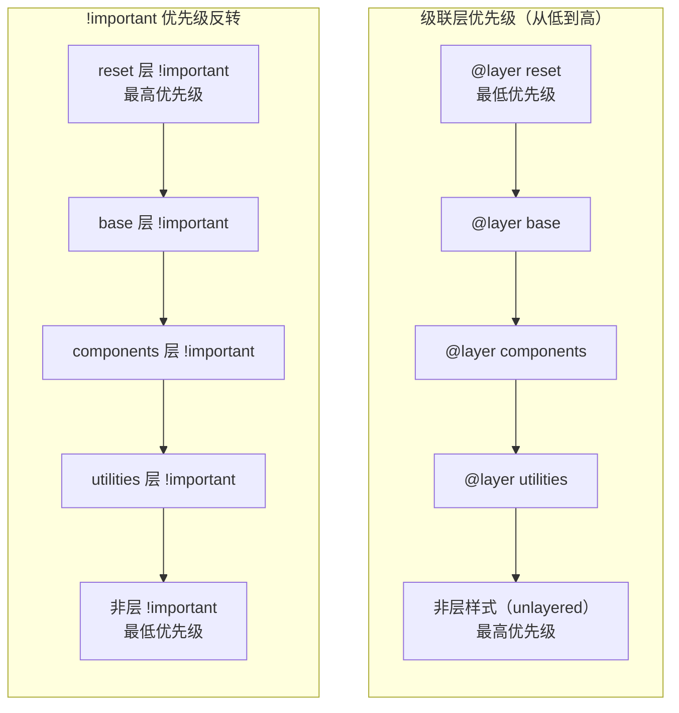
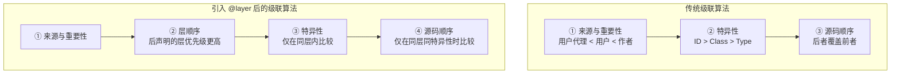
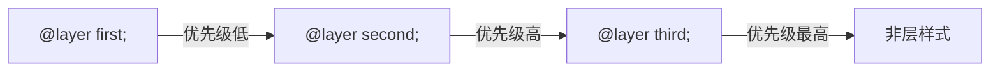
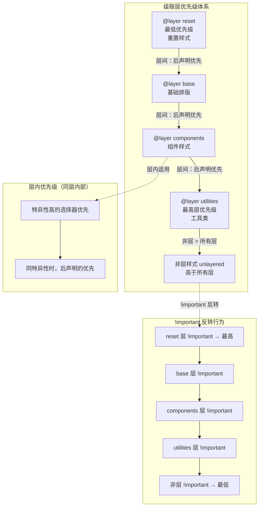
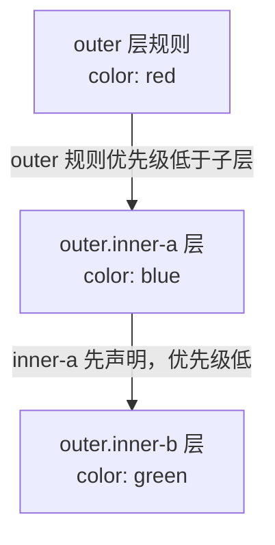
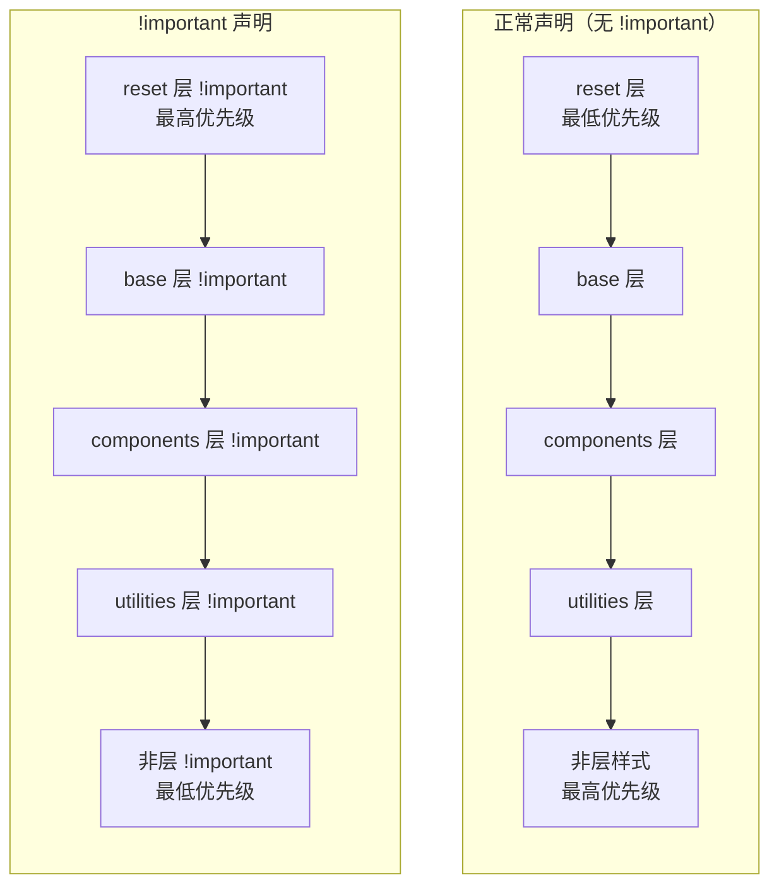
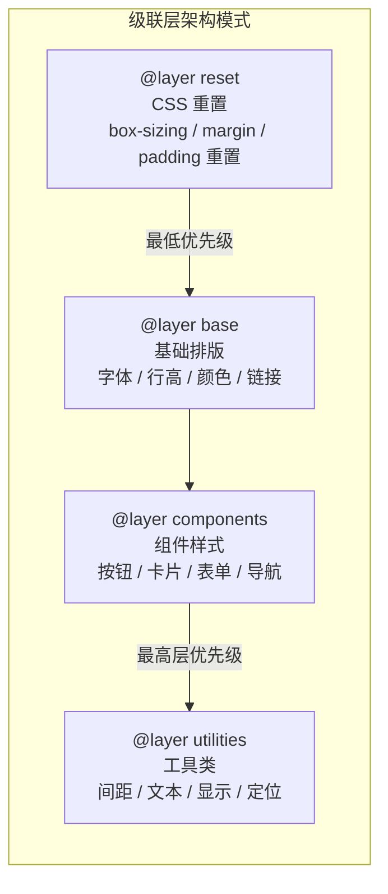
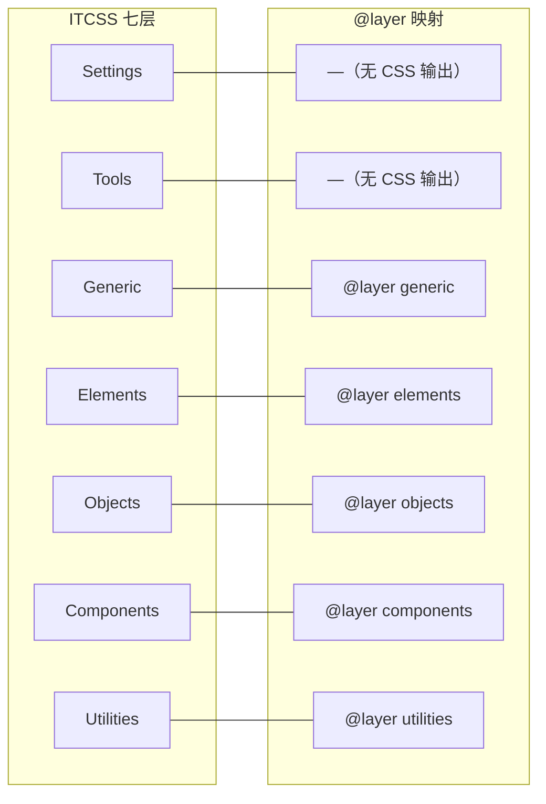

# 级联层

级联层（Cascade Layers）是 CSS Cascading and Inheritance Level 5 引入的重要特性，它让开发者能够显式控制样式规则的优先级层次，从根本上解决了第三方 CSS 优先级冲突、样式覆盖混乱等长期困扰前端开发的难题。

## 概述

### 为什么需要级联层

在传统 CSS 中，样式优先级完全由选择器特异性和源码顺序决定。这在引入第三方样式时会产生严重问题：

- **第三方样式不可控**：引入的 UI 库、组件库样式可能与自定义样式冲突，且无法修改其源码
- **特异性竞赛**：为了覆盖第三方样式，被迫不断提高选择器特异性或使用 `!important`，导致"特异性战争"
- **顺序脆弱**：样式表的加载顺序直接影响覆盖关系，构建工具的打包顺序变化可能导致样式意外失效
- **缺乏结构**：没有机制表达"重置 < 基础 < 组件 < 工具"这种语义化的优先级层次

级联层通过声明式的层次结构解决了这些问题——不再依赖特异性或源码顺序，而是通过层的声明顺序来确定优先级。

### 级联层优先级流程



### 级联层如何改变级联算法



**关键变化**：级联层在特异性和源码顺序**之前**参与级联计算。这意味着低优先级层中的高特异性选择器，永远无法覆盖高优先级层中的低特异性选择器。

## @layer 语法

### @layer 规则完整语法

`@layer` 规则支持三种声明方式：**块声明**、**通配声明**（仅声明层名不分配规则）和**条件声明**（在条件规则内声明层）。此外还有匿名层。

#### 方式一：块声明（Block Declaration）

块声明在声明层名的同时分配 CSS 规则。这是最直观的使用方式：

```css
/* 块声明 — 声明层名并直接写入规则 */
@layer reset {
  *, *::before, *::after {
    box-sizing: border-box;
    margin: 0;
    padding: 0;
  }
}

@layer base {
  body {
    font-family: system-ui, sans-serif;
    line-height: 1.5;
    color: #1e293b;
  }

  h1, h2, h3 {
    line-height: 1.2;
  }
}

@layer components {
  .card {
    padding: 1rem;
    border-radius: 8px;
    background: #fff;
  }

  .btn {
    padding: 0.5rem 1rem;
    border-radius: 6px;
    cursor: pointer;
  }
}

@layer utilities {
  .mt-4 { margin-top: 1rem; }
  .text-center { text-align: center; }
  .hidden { display: none; }
}
```

块声明可以多次使用同一层名，规则会合并到该层中：

```css
/* 第一次块声明 */
@layer components {
  .card { padding: 1rem; }
}

/* 第二次块声明 — 规则合并到 components 层 */
@layer components {
  .btn { padding: 0.5rem 1rem; }
}

/* 结果：components 层包含 .card 和 .btn 两条规则 */
```

#### 方式二：通配声明（Wildcard Declaration）

通配声明仅声明层名和优先级顺序，不分配任何规则。这是**推荐的做法**——在文件顶部集中声明所有层的顺序，确保优先级关系清晰可控：

```css
/* 通配声明 — 仅声明层名，确定优先级顺序 */
@layer reset, base, components, utilities;

/* 后续通过块声明或 @import 分配规则 */
@layer base {
  body { font-family: system-ui, sans-serif; }
}

@import url('reset.css') layer(reset);
```

**通配声明的核心价值**：

1. **集中管理优先级**：所有层的顺序在一行代码中一目了然
2. **避免隐式排序**：不依赖规则在源码中的出现位置
3. **支持跨文件协作**：多个文件可以安全地向已声明的层追加规则

```css
/* ✗ 不推荐：隐式排序 — 层顺序取决于首次出现位置 */
@layer base {
  body { font-size: 16px; }
}
/* 此时 base 是第一个层 */

@layer reset {
  *, *::before, *::after { box-sizing: border-box; }
}
/* reset 成为第二个层 — 但 reset 应该优先级最低！ */

/* ✓ 推荐：通配声明显式排序 */
@layer reset, base, components, utilities;
/* 优先级顺序已确定，后续分配规则的书写位置不影响优先级 */

@layer components { .card { padding: 1rem; } }
@layer reset { *, *::before, *::after { box-sizing: border-box; } }
/* reset 仍然是最低优先级，尽管代码写在后面 */
```

#### 方式三：条件声明（Conditional Declaration）

`@layer` 可以嵌套在条件规则（如 `@media`）内声明，实现基于条件的层定义：

```css
/* 条件声明 — 根据媒体查询调整层结构 */
/* 宽屏设备使用更细粒度的分层 */
@media (min-width: 1024px) {
  @layer layout, sidebar, main-content;
}

/* 窄屏设备使用简化分层 */
@media (max-width: 1023px) {
  @layer base, components;
}
```

> **注意**：`@layer` 目前**无法**通过 `@supports` 直接检测——`@supports` 只支持 `(property: value)`、`selector()` 等条件，`at-rule(@layer)` 是 CSS Conditional Rules Level 5 的提案，尚无浏览器实现。不过 `@layer` 的兼容性处理天然简单：不支持 `@layer` 的浏览器会忽略层内规则，只需在层外保留基础回退样式即可（见后文"渐进增强策略"）。如需在 JS 中检测，可使用 `typeof CSSLayerStatementRule !== 'undefined'`。

#### 匿名层

匿名层没有名称，无法被引用或追加规则。匿名层的优先级取决于其在源码中的出现位置：

```css
/* 匿名层 — 无法被引用，不推荐使用 */
@layer {
  .some-rule {
    color: red;
  }
}

/* 匿名层的主要用途：通过 @import 导入不需要引用的第三方样式 */
@import url('some-library.css') layer;
/* 导入为匿名层 — 样式被隔离但无法从外部覆盖 */
```

**匿名层的局限性**：
- 无法通过层名引用或追加规则
- 无法在通配声明中控制其优先级位置
- 无法被其他层显式覆盖

因此，**除非确定不需要引用该层，否则应始终使用命名层**。

### 分配规则到已声明的层

先声明层顺序，后续将规则分配到对应层：

```css
/* 第一步：在文件顶部声明所有层 — 确定优先级 */
@layer reset, base, components, utilities;

/* 第二步：在任意位置分配规则到已声明的层 */
@layer base {
  a {
    color: #2563eb;
    text-decoration: none;
  }

  a:hover {
    text-decoration: underline;
  }
}

/* 第三步：可以在不同文件中继续向同一层添加规则 */
@layer components {
  .card {
    padding: 1rem;
  }
}

/* 向已有的 components 层追加规则 — 不会创建新层 */
@layer components {
  .btn {
    padding: 0.5rem 1rem;
  }
}
```

### 层顺序的重要性

**层的优先级由其首次声明的顺序决定**，而非规则分配的顺序：

```css
/* 这一行决定了优先级：reset 最低，utilities 最高 */
@layer reset, base, components, utilities;

/* 即使 components 的规则写在 reset 之前，components 仍优先于 reset */
@layer components {
  .heading { color: blue; } /* 优先级较高 */
}

@layer reset {
  .heading { color: red; } /* 优先级较低，被覆盖 */
}
```

## 层排序

### 声明顺序决定优先级

级联层的优先级遵循一个简单规则：**后声明的层优先级更高**。



```css
@layer first, second, third;

@layer first {
  .item { color: red; }    /* 最低优先级 */
}

@layer second {
  .item { color: orange; } /* 中等优先级 */
}

@layer third {
  .item { color: blue; }   /* 层中最高优先级 */
}

/* 非层样式 */
.item {
  color: green;             /* 比所有层都高 */
}
```

最终 `.item` 的颜色为 `green`（非层样式优先级最高）。

### 显式排序

推荐在样式表最顶部集中声明所有层名，建立清晰的优先级顺序：

```css
/* 文件顶部 — 层顺序声明 */
@layer
  reset,        /* 1. 最低 — 重置样式 */
  theme,        /* 2. 主题变量 */
  base,         /* 3. 基础排版 */
  layout,       /* 4. 布局结构 */
  components,   /* 5. 组件样式 */
  overrides,    /* 6. 覆盖样式 */
  utilities;    /* 7. 最高 — 工具类 */
```

### 隐式排序

如果未预先声明层名，层按首次出现顺序排列：

```css
/* 未预先声明 — 层按首次出现排序 */
@layer base {
  body { font-size: 16px; }
}

@layer components {
  .card { padding: 1rem; }
}

@layer utilities {
  .mt-4 { margin-top: 1rem; }
}

/* 此时优先级：base < components < utilities */
```

**不推荐隐式排序**——依赖源码中层的首次出现位置来确定优先级，容易出错且难以维护。始终在文件顶部显式声明层顺序。

### 层内优先级规则

级联层的优先级分为两个维度：**层间优先级**和**层内优先级**。理解这两个维度的交互是正确使用级联层的关键。

#### 层间优先级：后声明的层优先

不同层之间的优先级由层的声明顺序决定——**后声明的层优先级更高**。这一规则与选择器特异性和源码顺序无关：

```css
@layer low, medium, high;

@layer low {
  /* 即使使用高特异性选择器，low 层仍然优先级最低 */
  #main .content .article .title {
    color: red;  /* 被覆盖 — 层优先级低于 medium 和 high */
  }
}

@layer medium {
  /* 中等特异性，但层优先级高于 low */
  .title {
    color: orange;  /* 被覆盖 — 层优先级低于 high */
  }
}

@layer high {
  /* 最低特异性，但层优先级最高 */
  .title {
    color: green;  /* 生效 — high 层优先级最高 */
  }
}
```

#### 层内优先级：正常特异性规则

**同一层内部**，优先级规则与传统 CSS 完全一致——由选择器特异性和源码顺序决定：

```css
@layer components;

@layer components {
  /* 同层内 — 特异性高的胜出 */
  .card { padding: 1rem; }           /* 0,1,0 */
  .card.featured { padding: 2rem; }  /* 0,2,0 — 胜出 */
}

@layer components {
  /* 同层内同特异性 — 后声明的胜出 */
  .card { background: #fff; }        /* 先声明 */
  .card { background: #f8fafc; }     /* 后声明 — 胜出 */
}
```

#### 层间 vs 层内优先级交互

```css
@layer base, components;

@layer base {
  /* base 层 — 优先级低 */
  .title { color: blue; }            /* 0,1,0 */
}

@layer components {
  /* components 层 — 优先级高 */
  .title { color: green; }           /* 0,1,0 — 生效，因为 components 层优先级更高 */
}

/* 即使 base 层使用更高特异性也无法覆盖 components 层 */
@layer base {
  body .page .content .title {       /* 0,3,0 — 特异性更高 */
    color: red;                       /* 仍然被覆盖 — 层优先级优先于特异性 */
  }
}
```

**核心原则**：层间优先级 > 层内特异性 > 层内源码顺序。这意味着：
1. 低优先级层中的任何规则，都无法覆盖高优先级层中的规则
2. 只有在同一层内，选择器特异性和源码顺序才发挥作用
3. 非层样式优先级高于所有层样式

#### @layer 优先级层级图



### 非层样式的位置

非层样式（unlayered styles）的优先级**始终高于所有层样式**，无论它们出现在代码的什么位置：

```css
@layer base, components;

/* 非层样式写在层声明之前 — 仍然优先 */
.element {
  color: green; /* 比层内样式优先级高 */
}

@layer base {
  .element { color: red; } /* 被非层样式覆盖 */
}

@layer components {
  .element { color: blue; } /* 被非层样式覆盖 */
}
```

## 嵌套层

层可以嵌套在另一个层内部，形成父子关系。子层的优先级规则与顶层相同——后声明的子层优先级更高。

### 基本语法

```css
@layer outer {
  /* outer 层的规则 */
  .item { color: red; }

  /* 嵌套层 — 属于 outer 的子层 */
  @layer inner-a {
    .item { color: blue; }
  }

  @layer inner-b {
    .item { color: green; }
  }
}
```

### 嵌套层的优先级



子层中的规则优先级**高于父层的非子层规则**，子层之间按声明顺序确定优先级。

### 嵌套层的外部引用

可以通过 `.` 语法从外部引用嵌套层：

```css
/* 声明嵌套层顺序 */
@layer framework {
  @layer reset, base, components;
}

/* 从外部向嵌套层分配规则 */
@layer framework.base {
  body {
    font-family: system-ui, sans-serif;
    line-height: 1.5;
  }
}

@layer framework.components {
  .btn {
    padding: 0.5rem 1rem;
    border-radius: 6px;
  }
}
```

### 第三方库嵌套层示例

```css
/* 将第三方库样式放入独立层，并控制其内部层次 */
@layer bootstrap {
  @layer reset, base, components;
}

@layer custom {
  @layer base, components, utilities;
}

/* 优先级：bootstrap < custom */
/* bootstrap 内部：reset < base < components */
/* custom 内部：base < components < utilities */

/* 向 bootstrap 的子层分配规则 */
@layer bootstrap.components {
  /* 覆盖 Bootstrap 组件样式 */
  .btn-primary {
    background-color: #2563eb;
  }
}

/* 自定义组件样式 — 优先级高于 bootstrap */
@layer custom.components {
  .btn-primary {
    background-color: #1d4ed8;
  }
}
```

## 重复层名

同名层不会创建新层，而是将规则**合并**到已存在的层中。这是级联层的一个重要特性。

### 合并而非替换

```css
@layer base, components, utilities;

/* 第一次向 components 层分配规则 */
@layer components {
  .card {
    padding: 1rem;
    border-radius: 8px;
  }
}

/* 第二次向 components 层分配规则 — 合并，不替换 */
@layer components {
  .btn {
    padding: 0.5rem 1rem;
    border-radius: 6px;
  }
}

/* 结果：components 层同时包含 .card 和 .btn 规则 */
```

### 合并时同选择器的处理

当合并的规则具有相同选择器时，按源码顺序覆盖：

```css
@layer components;

@layer components {
  .card {
    background: white;  /* 先声明 */
    padding: 1rem;
  }
}

/* 在另一个文件或位置追加规则 */
@layer components {
  .card {
    background: #f8fafc; /* 后声明，覆盖先前的 background */
    /* padding 仍为 1rem — 未被覆盖 */
  }
}
```

### 多文件场景

合并机制在多文件架构中尤为重要：

```css
/* main.css */
@layer reset, base, components, utilities;
@import 'reset.css' layer(reset);
@import 'base.css' layer(base);
@import 'components.css' layer(components);
@import 'utilities.css' layer(utilities);
```

```css
/* components/card.css — 自动合并到 components 层 */
@layer components {
  .card {
    padding: 1rem;
    border-radius: 8px;
    background: #fff;
  }
}
```

```css
/* components/button.css — 同样合并到 components 层 */
@layer components {
  .btn {
    padding: 0.5rem 1rem;
    border-radius: 6px;
    font-weight: 500;
  }
}
```

## !important 在层中的反转

`!important` 在级联层中会产生**优先级反转**——这是级联层最反直觉但也最强大的特性。

### 反转规则



**核心原则**：低优先级层的 `!important` 反转后变为最高优先级。这是因为 `!important` 的设计意图是"保证不被覆盖"，而低优先级层最需要这种保护——它们无法通过正常级联胜出。

### 完整示例

```css
@layer reset, base, components, utilities;

@layer reset {
  * {
    box-sizing: border-box !important; /* 反转后优先级最高 — 确保 box-sizing 全局统一 */
  }
}

@layer base {
  body {
    line-height: 1.5;
  }

  /* base 层的 !important 反转后优先级低于 reset */
  body {
    line-height: 1.6 !important;
  }
}

@layer components {
  .card {
    padding: 1rem;
    line-height: 1.5; /* 正常声明，优先级高于 base 的正常声明 */
  }
}

@layer utilities {
  .p-0 {
    padding: 0 !important; /* 反转后优先级较低 — reset 的 !important 仍优先 */
  }
}

/* 非层样式 */
.card {
  padding: 2rem; /* 正常声明，优先级最高 */
}
```

### !important 优先级详解

```css
@layer low, high;

/* 场景一：正常声明 — high 层胜出 */
@layer low {
  .item { color: red; }
}

@layer high {
  .item { color: blue; } /* 胜出 — high 层优先级更高 */
}

/* 场景二：双方都用 !important — low 层胜出（反转） */
@layer low {
  .item { color: red !important; } /* 胜出 — 低层 !important 优先级最高 */
}

@layer high {
  .item { color: blue !important; } /* 被覆盖 */
}

/* 场景三：只有一方用 !important */
@layer low {
  .item { color: red !important; } /* 胜出 — !important 始终优先 */
}

@layer high {
  .item { color: blue; } /* 被覆盖 */
}
```

### 实际应用：利用 !important 反转保护基础样式

```css
@layer reset, base, components, utilities;

@layer reset {
  /* 重置层使用 !important — 反转后优先级最高 */
  /* 确保这些全局重置绝不被覆盖 */
  *, *::before, *::after {
    box-sizing: border-box !important;
  }

  body {
    margin: 0 !important;
  }

  img {
    max-width: 100% !important;
    height: auto !important;
  }
}

@layer base {
  /* 基础样式 — 不需要 !important */
  body {
    font-family: system-ui, sans-serif;
    line-height: 1.5;
  }
}

@layer components {
  /* 组件样式 — 不需要 !important */
  .card {
    padding: 1rem;
    border-radius: 8px;
  }
}

@layer utilities {
  /* 工具类 — 不需要 !important，因为 utilities 层已经是最高正常优先级 */
  .hidden { display: none; }
  .mt-4 { margin-top: 1rem; }
}
```

**设计原则**：`@layer` 的引入使得 `!important` 的使用大幅减少。只在重置层中合理使用 `!important` 来保护全局基础样式，组件和工具类不再需要 `!important`。

## 架构模式

### reset / base / components / utilities 四层架构

这是最常见且推荐的级联层架构模式：



```css
/* 声明层顺序 */
@layer reset, base, components, utilities;

/* ===== reset 层 ===== */
@layer reset {
  *, *::before, *::after {
    box-sizing: border-box;
    margin: 0;
    padding: 0;
  }

  html {
    -webkit-text-size-adjust: 100%;
    -moz-tab-size: 4;
    tab-size: 4;
  }

  body {
    min-height: 100vh;
  }

  img, video, svg {
    display: block;
    max-width: 100%;
  }
}

/* ===== base 层 ===== */
@layer base {
  :root {
    --color-primary: #2563eb;
    --color-text: #1e293b;
    --color-bg: #ffffff;
    --font-base: system-ui, -apple-system, sans-serif;
    --spacing-unit: 0.25rem;
  }

  body {
    font-family: var(--font-base);
    line-height: 1.5;
    color: var(--color-text);
    background: var(--color-bg);
  }

  h1, h2, h3, h4, h5, h6 {
    line-height: 1.2;
    font-weight: 700;
  }

  a {
    color: var(--color-primary);
    text-decoration: none;
  }

  a:hover {
    text-decoration: underline;
  }
}

/* ===== components 层 ===== */
@layer components {
  .btn {
    display: inline-flex;
    align-items: center;
    justify-content: center;
    padding: 0.5rem 1rem;
    border-radius: 6px;
    font-weight: 500;
    cursor: pointer;
    border: none;
    transition: background-color 0.2s, color 0.2s;
  }

  .btn--primary {
    background: var(--color-primary);
    color: #fff;
  }

  .btn--primary:hover {
    background: #1d4ed8;
  }

  .card {
    padding: 1rem;
    border-radius: 8px;
    background: #fff;
    border: 1px solid #e2e8f0;
    box-shadow: 0 1px 3px rgba(0, 0, 0, 0.1);
  }

  .card__title {
    font-size: 1.25rem;
    font-weight: 600;
    margin-bottom: 0.5rem;
  }

  .card__body {
    color: #64748b;
  }
}

/* ===== utilities 层 ===== */
@layer utilities {
  /* 间距工具 */
  .m-0 { margin: 0; }
  .mt-1 { margin-top: calc(var(--spacing-unit) * 1); }
  .mt-2 { margin-top: calc(var(--spacing-unit) * 2); }
  .mt-4 { margin-top: calc(var(--spacing-unit) * 4); }
  .mb-4 { margin-bottom: calc(var(--spacing-unit) * 4); }

  .p-0 { padding: 0; }
  .p-2 { padding: calc(var(--spacing-unit) * 2); }
  .p-4 { padding: calc(var(--spacing-unit) * 4); }

  /* 文本工具 */
  .text-center { text-align: center; }
  .text-left { text-align: left; }
  .text-right { text-align: right; }
  .font-bold { font-weight: 700; }
  .text-sm { font-size: 0.875rem; }
  .text-lg { font-size: 1.125rem; }

  /* 显示工具 */
  .hidden { display: none; }
  .block { display: block; }
  .flex { display: flex; }
  .grid { display: grid; }

  /* 响应式工具 */
  @media (min-width: 768px) {
    .md\:hidden { display: none; }
    .md\:flex { display: flex; }
    .md\:grid { display: grid; }
  }
}
```

### 第三方库隔离模式

将第三方库样式放入独立层，确保自定义样式始终优先：

```css
/* 第三方库样式放入低优先级层 */
@layer
  third-party,    /* 最低 — 第三方库 */
  reset,          /* 重置 */
  base,           /* 基础 */
  components,     /* 组件 */
  utilities;      /* 最高 — 工具类 */

/* 导入第三方样式到指定层 */
@import url('bootstrap.min.css') layer(third-party);

/* 或使用 link 标签 */
/* <link rel="stylesheet" href="bootstrap.min.css" layer="third-party"> */

/* 自定义组件覆盖第三方 — 无需提高特异性 */
@layer components {
  .btn-primary {
    background: var(--color-primary); /* 直接覆盖，不需要 !important */
  }
}
```

### 主题层模式

将主题变量独立为一层，方便切换和覆盖：

```css
@layer reset, themes, base, components, utilities;

@layer themes {
  :root {
    --color-primary: #2563eb;
    --color-secondary: #7c3aed;
    --color-success: #16a34a;
    --color-danger: #dc2626;
    --color-warning: #d97706;
    --color-text: #1e293b;
    --color-bg: #ffffff;
    --color-surface: #f8fafc;
    --radius-sm: 4px;
    --radius-md: 8px;
    --radius-lg: 12px;
  }

  [data-theme="dark"] {
    --color-primary: #60a5fa;
    --color-secondary: #a78bfa;
    --color-text: #e2e8f0;
    --color-bg: #0f172a;
    --color-surface: #1e293b;
  }

  [data-theme="high-contrast"] {
    --color-primary: #0000ff;
    --color-text: #000000;
    --color-bg: #ffffff;
    --color-surface: #ffffff;
  }
}
```

### 页面级覆盖模式

将页面特定样式放在非层中，确保其优先级高于所有层：

```css
/* 层声明 */
@layer reset, base, components, utilities;

/* ...各层规则... */

/* 页面特定样式 — 非层，优先级最高 */
.home-page .hero {
  min-height: 80vh;
  display: flex;
  align-items: center;
}

.about-page .team-grid {
  display: grid;
  grid-template-columns: repeat(auto-fill, minmax(250px, 1fr));
  gap: 2rem;
}
```

### 与 ITCSS 的映射关系

ITCSS（Inverted Triangle CSS）的倒三角层级与 `@layer` 的声明顺序天然对应——ITCSS 从通用到具体的层级递进，恰好就是 `@layer` 从低优先级到高优先级的声明顺序。



**ITCSS 到 @layer 的完整映射**：

| ITCSS 层级 | 说明 | @layer 映射 | 是否需要层 |
|-----------|------|------------|-----------|
| Settings | CSS 变量、设计令牌 | 无（无 CSS 输出） | 否 |
| Tools | Mixins、函数 | 无（无 CSS 输出） | 否 |
| Generic | Reset、Normalize | `@layer generic` | 是 |
| Elements | HTML 标签基础样式 | `@layer elements` | 是 |
| Objects | OOCSS 模式 | `@layer objects` | 是 |
| Components | 具体 UI 组件 | `@layer components` | 是 |
| Utilities | 工具类 | `@layer utilities` | 是 |

```css
/* ITCSS + @layer 完整实现 */

/* Settings — 设计令牌（无 CSS 输出，不需要层） */
:root {
  --color-primary: #2563eb;
  --color-text: #1e293b;
  --spacing-unit: 0.25rem;
  --radius-md: 8px;
}

/* 声明层顺序 — 与 ITCSS 从通用到具体的顺序一致 */
@layer generic, elements, objects, components, utilities;

/* Generic 层 — 重置 */
@layer generic {
  *, *::before, *::after {
    box-sizing: border-box;
    margin: 0;
    padding: 0;
  }

  html {
    -webkit-text-size-adjust: 100%;
  }

  body {
    min-height: 100vh;
  }

  img, svg {
    display: block;
    max-width: 100%;
  }
}

/* Elements 层 — 标签基础样式 */
@layer elements {
  body {
    font-family: system-ui, sans-serif;
    line-height: 1.5;
    color: var(--color-text);
  }

  h1, h2, h3, h4 {
    line-height: 1.2;
    font-weight: 700;
  }

  a {
    color: var(--color-primary);
    text-decoration: none;
  }

  a:hover {
    text-decoration: underline;
  }
}

/* Objects 层 — OOCSS 模式 */
@layer objects {
  /* 布局对象 */
  .o-layout {
    display: flex;
    flex-wrap: wrap;
    gap: var(--spacing-unit);
  }

  .o-layout--column {
    flex-direction: column;
  }

  /* 媒体对象 */
  .o-media {
    display: flex;
    align-items: flex-start;
  }

  .o-media__figure {
    flex-shrink: 0;
    margin-right: 1rem;
  }

  .o-media__body {
    flex: 1;
  }

  /* 容器对象 */
  .o-wrapper {
    max-width: 1200px;
    margin: 0 auto;
    padding: 0 1rem;
  }
}

/* Components 层 — 具体 UI 组件 */
@layer components {
  .c-card {
    padding: 1rem;
    border-radius: var(--radius-md);
    background: #fff;
    border: 1px solid #e2e8f0;
  }

  .c-card__title {
    font-size: 1.25rem;
    font-weight: 600;
    margin-bottom: 0.5rem;
  }

  .c-btn {
    display: inline-flex;
    align-items: center;
    padding: 0.5rem 1rem;
    border-radius: 6px;
    cursor: pointer;
    border: none;
    font-weight: 500;
  }

  .c-btn--primary {
    background: var(--color-primary);
    color: #fff;
  }
}

/* Utilities 层 — 工具类 */
@layer utilities {
  .u-mt-4 { margin-top: 1rem; }
  .u-mb-4 { margin-bottom: 1rem; }
  .u-text-center { text-align: center; }
  .u-hidden { display: none; }
  .u-sr-only {
    position: absolute;
    width: 1px;
    height: 1px;
    overflow: hidden;
    clip: rect(0, 0, 0, 0);
  }
}
```

**ITCSS + @layer 的优势**：
- **双重保障**：ITCSS 的文件组织保证源码顺序正确，`@layer` 的显式声明保证优先级正确
- **解耦**：文件导入顺序不再影响优先级，构建工具可以自由优化打包
- **可扩展**：新增层级只需在层声明中插入，不影响现有结构

## 实战案例

### 案例一：第三方样式覆盖

**场景**：项目使用了 Bootstrap 作为基础 UI 库，但需要大量自定义样式。传统方式需要不断提高特异性或使用 `!important`，导致样式代码难以维护。

```css
/* 传统方式 — 特异性战争 */
/* Bootstrap 的按钮样式 */
.btn-primary {
  background-color: #0d6efd;  /* Bootstrap 默认蓝色 */
}

/* 覆盖 Bootstrap — 被迫提高特异性 */
.page .content .btn-primary {
  background-color: #2563eb;  /* 自定义蓝色 */
}

/* 或者使用 !important — 雪上加霜 */
.btn-primary {
  background-color: #2563eb !important;
}
```

```css
/* @layer 方式 — 优雅解决 */
@layer bootstrap, custom-base, custom-components, custom-utilities;

/* 将 Bootstrap 导入到最低优先级层 */
@import url('bootstrap.min.css') layer(bootstrap);

/* 自定义基础层 — 直接覆盖 Bootstrap，无需提高特异性 */
@layer custom-base {
  :root {
    --bs-primary: #2563eb;  /* 覆盖 Bootstrap 变量 */
  }
}

/* 自定义组件层 — 优先级高于 Bootstrap */
@layer custom-components {
  .btn-primary {
    background-color: #2563eb;  /* 直接覆盖，不需要 !important */
    border-color: #2563eb;
  }

  .btn-primary:hover {
    background-color: #1d4ed8;
  }

  /* 自定义组件 */
  .product-card {
    padding: 1.5rem;
    border-radius: 12px;
    box-shadow: 0 4px 6px rgba(0, 0, 0, 0.07);
  }
}
```

### 案例二：主题系统

**场景**：SaaS 产品需要支持多品牌主题（白标），每个品牌有不同的颜色、圆角和间距。

```css
/* 主题系统 — 使用 @layer + CSS 变量 */
@layer themes, base, components;

/* 主题层 — 最低优先级，但通过 CSS 变量影响所有层 */
@layer themes {
  /* 默认主题 */
  :root {
    --brand-primary: #2563eb;
    --brand-secondary: #7c3aed;
    --brand-radius: 8px;
    --brand-spacing: 1rem;
    --brand-font: 'Inter', system-ui, sans-serif;
  }

  /* 品牌A — 蓝色系 */
  [data-brand="alpha"] {
    --brand-primary: #0ea5e9;
    --brand-secondary: #06b6d4;
    --brand-radius: 6px;
  }

  /* 品牌B — 绿色系 */
  [data-brand="beta"] {
    --brand-primary: #16a34a;
    --brand-secondary: #059669;
    --brand-radius: 12px;
    --brand-spacing: 1.25rem;
  }

  /* 品牌C — 橙色系 */
  [data-brand="gamma"] {
    --brand-primary: #ea580c;
    --brand-secondary: #d97706;
    --brand-radius: 4px;
    --brand-font: 'Roboto', system-ui, sans-serif;
  }

  /* 暗色模式 — 与品牌主题叠加 */
  [data-theme="dark"] {
    --brand-primary: var(--brand-primary-light, #60a5fa);
    --brand-bg: #0f172a;
    --brand-surface: #1e293b;
    --brand-text: #e2e8f0;
  }
}

@layer base {
  body {
    font-family: var(--brand-font);
    background: var(--brand-bg, #fff);
    color: var(--brand-text, #1e293b);
  }
}

@layer components {
  .btn-primary {
    background: var(--brand-primary);
    border-radius: var(--brand-radius);
    padding: var(--brand-spacing);
  }

  .card {
    border-radius: var(--brand-radius);
    padding: var(--brand-spacing);
    background: var(--brand-surface, #fff);
  }
}
```

```html
<!-- 切换品牌 — 只需修改 data 属性 -->
<div data-brand="alpha">
  <!-- Alpha 品牌的蓝色主题 -->
  <button class="btn-primary">操作</button>
</div>

<div data-brand="beta">
  <!-- Beta 品牌的绿色主题 -->
  <button class="btn-primary">操作</button>
</div>

<!-- 品牌与暗色模式叠加 -->
<div data-brand="gamma" data-theme="dark">
  <!-- Gamma 品牌的橙色暗色主题 -->
</div>
```

### 案例三：组件库样式隔离

**场景**：开发一个通用组件库，需要确保组件库的样式不会被宿主应用的样式意外覆盖，同时组件库也不应影响宿主应用。

```css
/* 组件库样式 — ui-lib.css */

/* 组件库内部使用嵌套层管理优先级 */
@layer ui-lib {
  @layer reset, base, components;
}

/* 组件库的重置 — 仅影响组件库内部 */
@layer ui-lib.reset {
  :host {
    display: block;
    box-sizing: border-box;
  }

  :host *, :host *::before, :host *::after {
    box-sizing: border-box;
  }
}

/* 组件库的基础样式 */
@layer ui-lib.base {
  :host {
    font-family: system-ui, sans-serif;
    line-height: 1.5;
    color: #1e293b;
  }
}

/* 组件库的组件样式 */
@layer ui-lib.components {
  .ui-btn {
    display: inline-flex;
    align-items: center;
    padding: 0.5rem 1rem;
    border-radius: 6px;
    cursor: pointer;
    border: 1px solid transparent;
    font-weight: 500;
  }

  .ui-btn--primary {
    background: #2563eb;
    color: #fff;
  }

  .ui-card {
    padding: 1rem;
    border-radius: 8px;
    border: 1px solid #e2e8f0;
    background: #fff;
  }
}
```

```css
/* 宿主应用 — app.css */

/* 宿主应用声明层顺序 — 组件库层优先级低于自定义层 */
@layer ui-lib, app-base, app-components, app-utilities;

/* 导入组件库到 ui-lib 层 */
@import url('ui-lib.css') layer(ui-lib);

/* 宿主应用的自定义样式 — 优先级高于组件库 */
@layer app-components {
  /* 覆盖组件库样式 — 无需提高特异性 */
  .ui-btn--primary {
    background: var(--color-primary);  /* 使用宿主应用的品牌色 */
  }

  .ui-card {
    border-radius: var(--radius-lg);  /* 使用宿主应用的圆角 */
    box-shadow: var(--shadow-md);     /* 添加宿主应用的阴影 */
  }
}
```

## 与 BEM / SMACSS 整合

级联层并不替代现有的 CSS 架构方法论，而是与其互补——层解决优先级问题，方法论解决命名和组织问题。

### @layer + BEM

```css
@layer reset, base, components, utilities;

@layer components {
  /* BEM 命名 + 级联层优先级保护 */
  .card {
    padding: 1rem;
    border-radius: 8px;
    background: #fff;
    border: 1px solid #e2e8f0;
    overflow: hidden;
  }

  .card__image {
    width: 100%;
    height: 200px;
    object-fit: cover;
  }

  .card__body {
    padding: 1rem;
  }

  .card__title {
    font-size: 1.25rem;
    font-weight: 600;
    color: #1e293b;
  }

  .card__text {
    color: #64748b;
    margin-top: 0.5rem;
  }

  /* BEM 修饰符 — 无需担心特异性 */
  .card--featured {
    border-color: #2563eb;
    box-shadow: 0 4px 12px rgba(37, 99, 235, 0.2);
  }

  .card--compact {
    padding: 0.5rem;
  }

  .card--compact .card__body {
    padding: 0.5rem;
  }
}

/* 不再需要 .card.card--featured 双类选择器提高特异性 */
/* 因为层已经提供了优先级保护 */
```

### @layer + SMACSS

SMACSS 将样式分为 Base、Layout、Module、State、Theme 五类，天然适合映射到级联层：

```css
/* SMACSS 类别映射到级联层 */
@layer
  reset,      /* Base（重置） */
  base,       /* Base（基础排版） */
  layout,     /* Layout */
  modules,    /* Module */
  states,     /* State */
  themes,     /* Theme */
  utilities;  /* 工具类 */

@layer reset {
  *, *::before, *::after {
    box-sizing: border-box;
    margin: 0;
    padding: 0;
  }
}

@layer base {
  body {
    font-family: system-ui, sans-serif;
    line-height: 1.5;
  }
}

@layer layout {
  .l-header {
    position: sticky;
    top: 0;
    z-index: 100;
    background: #fff;
    border-bottom: 1px solid #e2e8f0;
  }

  .l-main {
    max-width: 1200px;
    margin: 0 auto;
    padding: 2rem;
  }

  .l-sidebar {
    width: 300px;
    flex-shrink: 0;
  }
}

@layer modules {
  .nav {
    display: flex;
    align-items: center;
    gap: 1rem;
  }

  .nav-item {
    padding: 0.5rem 1rem;
    color: #64748b;
    text-decoration: none;
  }
}

@layer states {
  .is-active {
    color: #2563eb;
    font-weight: 600;
  }

  .is-hidden {
    display: none;
  }

  .is-loading {
    opacity: 0.6;
    pointer-events: none;
  }
}

@layer themes {
  [data-theme="dark"] {
    --color-bg: #0f172a;
    --color-text: #e2e8f0;
  }
}
```

### @layer 解决 BEM/SMACSS 无法解决的优先级问题

```css
/* 问题：第三方组件库样式覆盖 BEM 组件 */
/* 传统方式 — 被迫提高特异性或使用 !important */
.card-wrapper .card {
  /* 需要更高特异性才能覆盖 Bootstrap */
  padding: 2rem;
}

/* @layer 方式 — 简洁直接 */
@layer bootstrap, components;

/* Bootstrap 自动在低优先级层 */
@import url('bootstrap.css') layer(bootstrap);

/* 自定义组件在高优先级层 — 无需提高特异性 */
@layer components {
  .card {
    padding: 2rem; /* 直接覆盖，不需要额外选择器 */
  }
}
```

## @layer 与 @import

`@import` 规则可以将整个样式表导入到指定层中，这是组织多文件项目的重要手段。

### 导入到指定层

```css
/* 将样式表导入到指定层 */
@import url('reset.css') layer(reset);
@import url('base.css') layer(base);
@import url('components.css') layer(components);
@import url('utilities.css') layer(utilities);
```

### 先声明顺序，再导入

```css
/* 推荐做法：先声明层顺序，再导入 */
@layer reset, base, components, utilities;

@import url('normalize.css') layer(reset);
@import url('typography.css') layer(base);
@import url('buttons.css') layer(components);
@import url('cards.css') layer(components);
@import url('forms.css') layer(components);
@import url('spacing.css') layer(utilities);
@import url('visibility.css') layer(utilities);
```

### HTML link 标签与层

现代浏览器支持在 `<link>` 标签上指定层：

```html
<!-- 将样式表导入到指定层 -->
<link rel="stylesheet" href="reset.css" layer="reset">
<link rel="stylesheet" href="base.css" layer="base">
<link rel="stylesheet" href="components.css" layer="components">
<link rel="stylesheet" href="utilities.css" layer="utilities">

<!-- 导入为匿名层 -->
<link rel="stylesheet" href="third-party.css" layer>
```

### @import 注意事项

```css
/* 注意：@import 必须在所有其他规则之前（@layer 声明除外） */

/* 正确顺序 */
@layer reset, base, components;  /* 层声明 */
@import url('reset.css') layer(reset);    /* 导入 */

/* 错误 — @import 前有其他规则 */
body { font-size: 16px; }
@import url('base.css') layer(base);  /* 无效！@import 必须在最前面 */
```

### 实际项目结构

```
styles/
├── main.css                # 入口文件 — 声明层顺序并导入
├── reset/
│   └── normalize.css       # 重置样式
├── base/
│   ├── typography.css      # 排版
│   └── links.css           # 链接样式
├── components/
│   ├── buttons.css         # 按钮
│   ├── cards.css           # 卡片
│   └── forms.css           # 表单
└── utilities/
    ├── spacing.css         # 间距
    └── visibility.css      # 显示/隐藏
```

```css
/* main.css */
@layer reset, base, components, utilities;

@import url('reset/normalize.css') layer(reset);
@import url('base/typography.css') layer(base);
@import url('base/links.css') layer(base);
@import url('components/buttons.css') layer(components);
@import url('components/cards.css') layer(components);
@import url('components/forms.css') layer(components);
@import url('utilities/spacing.css') layer(utilities);
@import url('utilities/visibility.css') layer(utilities);
```

## 浏览器兼容性

| 特性 | Chrome | Firefox | Safari | Edge | 状态 |
|------|--------|---------|--------|------|------|
| `@layer` 基本语法 | 99+ | 97+ | 15.4+ | 99+ | 稳定 |
| 层声明与规则分配 | 99+ | 97+ | 15.4+ | 99+ | 稳定 |
| 嵌套层 | 99+ | 97+ | 15.4+ | 99+ | 稳定 |
| `@import ... layer()` | 99+ | 97+ | 15.4+ | 99+ | 稳定 |
| `<link layer>` | 121+ | -- | -- | 121+ | 实验性 |
| `!important` 优先级反转 | 99+ | 97+ | 15.4+ | 99+ | 稳定 |
| `selector()` in `@supports` | 120+ | 114+ | 17.5+ | 120+ | 稳定 |

> **渐进增强策略**：对于不支持 `@layer` 的浏览器，样式表仍会正常解析——`@layer` 块内的规则会被忽略，非层样式照常生效。因此先写好非层回退样式，再用层内规则覆盖增强即可，无需任何条件检测：

```css
/* 基础回退 — 所有浏览器可见 */
.card {
  padding: 1rem;
  border-radius: 8px;
  background: #fff;
}

/* 级联层增强 — 支持 @layer 的浏览器按层内优先级应用；
   不支持的浏览器忽略整个 @layer 块，仅保留上面的基础样式 */
@layer components {
  .card {
    padding: 1rem;
    border-radius: 8px;
    background: #fff;
  }
}
```

## 参考资源

- [CSS Cascading and Inheritance Level 5 — W3C 规范](https://drafts.csswg.org/css-cascade-5/)
- [Cascade Layers — MDN](https://developer.mozilla.org/zh-CN/docs/Web/CSS/@layer)
- [A Complete Guide to CSS Cascade Layers — CSS Tricks](https://css-tricks.com/css-cascade-layers/)
- [Cascade Layers — Chrome Developers](https://developer.chrome.com/docs/css-ui/cascade-layers)
- [The Future of CSS: Cascade Layers — Bram.us](https://www.bram.us/2021/09/15/the-future-of-css-cascade-layers-css-at-layer/)
- [Cascade Layers Explainer — W3C](https://github.com/w3c/csswg-drafts/blob/main/css-cascade-5/explainer.md)
