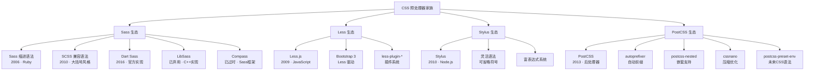
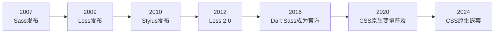
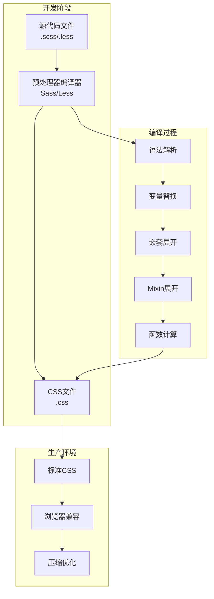
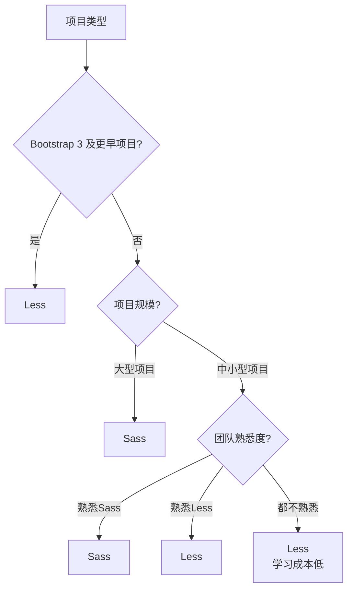
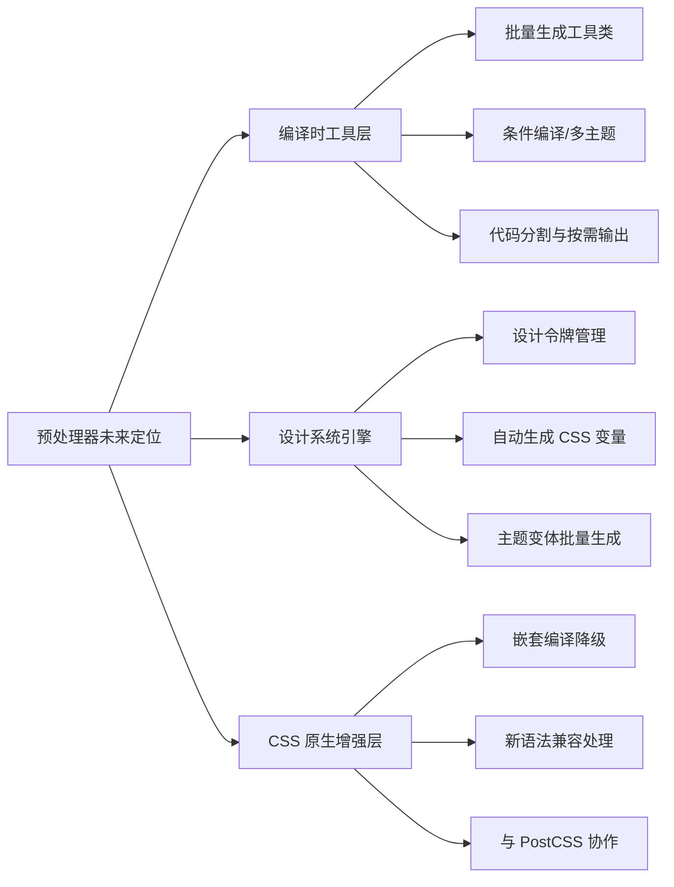

# 预处理器概述

CSS 预处理器是一种扩展 CSS 语言的工具，通过引入变量、嵌套、Mixin、函数等编程特性，让 CSS 更易维护和扩展。

## 背景与动机

### 为什么需要预处理器

CSS 作为样式语言，在大型项目中面临诸多挑战：

1. **缺乏编程能力**：原生 CSS 无法定义变量、函数、条件判断
2. **代码复用困难**：相同样式需要重复编写
3. **维护成本高**：修改一处样式需要全局搜索替换
4. **组织混乱**：缺乏模块化机制，文件结构混乱

预处理器通过引入编程语言特性，解决了这些问题。

### CSS 预处理器解决的核心痛点

原生 CSS 作为一门声明式样式语言，在设计之初并未考虑大型项目的工程化需求。以下逐一分析预处理器解决的六大核心痛点：

#### 痛点一：缺乏变量——值的硬编码与重复

原生 CSS 中，同一个颜色值、间距值可能散落在数十个选择器中。当设计系统调整主色调时，开发者需要全局搜索替换，极易遗漏或误改：

```css
/* 原生 CSS：硬编码，修改困难 */
.header { background: #007bff; }
.button { background: #007bff; }
.link { color: #007bff; }
.badge { border-color: #007bff; }
/* 修改主色调需要逐个替换，且无法保证一致性 */
```

预处理器通过变量机制实现"一处定义、处处引用"：

```scss
// 预处理器：变量统一管理
$primary-color: #007bff;

.header { background: $primary-color; }
.button { background: $primary-color; }
.link { color: $primary-color; }
.badge { border-color: $primary-color; }
// 修改变量值即可全局生效
```

#### 痛点二：缺乏嵌套——选择器的冗余书写

BEM 等命名规范虽然解决了选择器冲突问题，但导致选择器名称冗长，且父子关系不直观：

```css
/* 原生 CSS：选择器冗余 */
.nav { }
.nav__item { }
.nav__item--active { }
.nav__link { }
.nav__link:hover { }
```

预处理器通过嵌套语法让 DOM 结构与样式结构对应：

```scss
// 预处理器：嵌套表达层级关系
.nav {
  &__item {
    &--active { }
  }
  &__link {
    &:hover { }
  }
}
```

#### 痛点三：缺乏混入（Mixin）——样式逻辑的复制粘贴

当多个组件需要相同的一组样式（如清除浮动、文本截断、Flex 居中），原生 CSS 只能复制粘贴，修改时需逐个同步：

```css
/* 原生 CSS：重复代码 */
.card { overflow: hidden; text-overflow: ellipsis; white-space: nowrap; }
.title { overflow: hidden; text-overflow: ellipsis; white-space: nowrap; }
/* 修改截断逻辑需要逐个更新 */
```

预处理器通过 Mixin 实现样式逻辑的封装与复用：

```scss
// 预处理器：Mixin 封装复用
@mixin truncate {
  overflow: hidden;
  text-overflow: ellipsis;
  white-space: nowrap;
}
.card { @include truncate; }
.title { @include truncate; }
// 修改只需改 Mixin 定义
```

#### 痛点四：缺乏函数——无法动态计算值

原生 CSS 的 `calc()` 虽然支持基本运算，但无法进行颜色处理、单位转换、条件判断等复杂计算：

```css
/* 原生 CSS：只能做简单计算 */
.element {
  width: calc(100% - 20px);
  /* 无法实现：颜色变暗、px 转 rem、条件返回值 */
}
```

预处理器提供丰富的内置函数和自定义函数能力：

```scss
// 预处理器：函数动态计算
.element {
  background: darken($primary-color, 10%);  // 颜色变暗
  font-size: rem(24px);                      // 单位转换
  color: if(lightness($primary-color) > 50%, #333, #fff); // 条件判断
}
```

#### 痛点五：缺乏模块化——文件组织混乱

原生 CSS 的 `@import` 会产生额外的 HTTP 请求，且存在变量冲突风险，无法实现真正的模块隔离：

```css
/* 原生 CSS @import 的问题 */
@import 'variables.css';  /* 额外 HTTP 请求 */
@import 'reset.css';      /* 渲染阻塞 */
/* 所有选择器共享全局命名空间，容易冲突 */
```

预处理器的模块系统提供命名空间隔离和按需加载：

```scss
// 预处理器：模块化隔离
@use 'variables' as vars;    // 命名空间隔离
@use 'mixins' as *;          // 成员引入全局命名空间，使用时无需前缀
.element { color: vars.$primary; }
```

#### 痛点六：缺乏控制流——无法批量生成样式

工具类（utility classes）如 `.mt-1`、`.mt-2`...`.mt-12` 在原生 CSS 中需要手动逐个编写，维护成本极高：

```css
/* 原生 CSS：手动编写每个类 */
.mt-1 { margin-top: 4px; }
.mt-2 { margin-top: 8px; }
.mt-3 { margin-top: 12px; }
/* ... 重复 12 次 */
```

预处理器通过循环指令批量生成：

```scss
// 预处理器：循环批量生成
@for $i from 1 through 12 {
  .mt-#{$i} { margin-top: $i * 4px; }
}
```

### 主流预处理器家族树



**家族演进关系**：

- **Sass → Less**：Less 受 Sass 启发创建，但选择了更接近 CSS 的语法风格
- **Sass → Stylus**：Stylus 在 Sass 基础上追求更极致的语法简洁性
- **预处理器 → PostCSS**：PostCSS 吸取了预处理器的教训，采用插件化架构而非一体化设计
- **Sass 实现演进**：主流实现从 Ruby Sass 迁移到 Dart Sass（官方推荐）；LibSass（C++，node-sass 底层）已弃用，node-sass 项目也随之被 sass（Dart Sass）取代

### 预处理器发展历史



**关键时间节点**：

- **2006年**：Sass 由 Hampton Catlin 创建，Ruby 实现（2007 年正式发布）
- **2009年**：Less 由 Alexis Sellier 创建，受 Sass 启发
- **2010年**：Stylus 由 TJ Holowaychuk 创建
- **2016年**：Dart Sass 成为 Sass 官方推荐实现
- **2020年至今**：CSS 原生特性逐步追赶预处理器

### 预处理器演进阶段

| 阶段 | 时间 | 特点 | 代表 |
|------|------|------|------|
| **萌芽期** | 2007-2010 | 基础变量、嵌套 | Sass, Less |
| **成熟期** | 2010-2016 | 功能完善、生态建立 | Sass 3, Less 2 |
| **转型期** | 2016-2020 | Dart Sass、模块化 | Dart Sass |
| **融合期** | 2020-至今 | 与原生CSS融合 | Sass + CSS变量 |

## 核心概念

### 什么是预处理器

预处理器扩展了 CSS 的功能，添加了变量、嵌套、Mixin、函数等特性，使样式代码更加模块化、可维护。

### 工作原理



### 预处理器 vs 原生 CSS

| 特性 | 原生 CSS | 预处理器 | 说明 |
|------|----------|----------|------|
| **变量** | CSS 自定义属性 (`--var`) | 编译时变量 | 预处理器变量编译后消失 |
| **嵌套** | 原生嵌套（新特性） | 支持选择器和属性嵌套 | 预处理器更早支持 |
| **Mixin** | 不支持 | 支持带参数的样式复用 | 预处理器独有优势 |
| **函数** | `calc()` 等有限支持 | 丰富的内置函数 | 预处理器函数更强大 |
| **条件语句** | 不支持 | 支持 @if/@else | 预处理器编程能力 |
| **循环** | 不支持 | 支持 @for/@each/@while | 预处理器批量生成 |
| **模块化** | `@import` 有性能问题 | 高效的模块系统 | 预处理器模块化更好 |

### CSS 变量 vs Sass 变量深度对比

两者虽然都叫"变量"，但本质截然不同，适用场景也各不相同：

```scss
// Sass 变量：编译时静态替换
$primary: #007bff;
.button { background: $primary; }
// 编译后 → .button { background: #007bff; }
// 变量在编译后完全消失，无法在运行时修改
```

```css
/* CSS 变量：运行时动态计算 */
:root { --primary: #007bff; }
.button { background: var(--primary); }
/* 变量在运行时保留，可通过 JS 或媒体查询动态修改 */
```

| 维度 | Sass 变量 | CSS 变量 |
|------|-----------|----------|
| **生命周期** | 编译时存在，编译后消失 | 运行时存在，始终保留 |
| **动态修改** | ❌ 不支持 | ✅ JS 可修改 `setProperty()` |
| **作用域** | 文件/块级（词法作用域） | DOM 层级（继承自父元素） |
| **媒体查询** | 可用于条件判断 | 可在媒体查询中重定义 |
| **主题切换** | 需编译多套 CSS | 一套 CSS + 动态切换 |
| **条件逻辑** | ✅ 配合 @if 使用 | ❌ 无法配合条件语句 |
| **函数计算** | ✅ darken/lighten 等 | ❌ 仅 calc() |
| **浏览器兼容** | 编译后兼容所有浏览器 | IE11 不支持 |

**最佳实践：两者结合使用**

```scss
// Sass 变量定义设计令牌（编译时确定的基础值）
$colors: (
  primary: #007bff,
  secondary: #6c757d,
  success: #28a745
);

// 通过 Sass 循环生成 CSS 变量（运行时可动态修改）
:root {
  @each $name, $color in $colors {
    --color-#{$name}: #{$color};
  }
}

// 组件中使用 CSS 变量实现运行时主题切换
.button {
  background: var(--color-primary);
}
[data-theme="dark"] {
  --color-primary: #4da3ff;
}
```

### CSS 原生嵌套 vs Sass 嵌套对比

CSS 原生嵌套已在 2024 年获得主流浏览器支持，但与 Sass 嵌套仍有差异：

```css
/* CSS 原生嵌套（2024 浏览器支持） */
.card {
  padding: 16px;

  & .title {           /* 子选择器 */
    font-size: 1.5rem;
  }

  &:hover {            /* 伪类 */
    box-shadow: 0 4px 8px rgba(0,0,0,0.1);
  }

  @media (width >= 768px) {  /* 媒体查询嵌套 */
    padding: 24px;
  }
}
```

```scss
// Sass 嵌套（编译时展开，兼容所有浏览器）
.card {
  padding: 16px;

  .title {             // 子选择器（无需 & 前缀）
    font-size: 1.5rem;
  }

  &:hover {            // 伪类
    box-shadow: 0 4px 8px rgba(0,0,0,0.1);
  }

  &-header {           // 后缀拼接（CSS 原生不支持）
    border-bottom: 1px solid #eee;
  }

  @media (min-width: 768px) {
    padding: 24px;
  }
}
```

| 维度 | CSS 原生嵌套 | Sass 嵌套 |
|------|-------------|-----------|
| **浏览器兼容** | 2024 年主流支持 | 编译后兼容所有浏览器 |
| **后缀拼接** | ❌ 不支持 `&-suffix` | ✅ 支持 `&-header` 等 |
| **属性嵌套** | ❌ 不支持 | ✅ `font: { size: ... }` |
| **@at-root** | ❌ 不支持 | ✅ 可跳出嵌套层级 |
| **Mixin 嵌套** | ❌ 不支持 | ✅ 配合 @content |
| **IE 兼容** | ❌ | ✅ 编译后兼容 |
| **运行时性能** | 浏览器原生解析 | 无额外开销（已编译） |

## 深入原理

### 编译流程

预处理器的工作流程分为三个阶段：

1. **词法分析**：将源代码分解为 Token
2. **语法分析**：构建抽象语法树（AST）
3. **代码生成**：将 AST 转换为标准 CSS

### 变量实现机制

```scss
// 预处理器变量：编译时替换
$primary-color: #007bff;
.button { background: $primary-color; }

// 编译后
.button { background: #007bff; }
```

```css
/* CSS 变量：运行时计算 */
:root { --primary-color: #007bff; }
.button { background: var(--primary-color); }
```

**关键区别**：
- 预处理器变量在编译时固定，无法动态修改
- CSS 变量在运行时计算，支持动态修改

### 嵌套展开算法

预处理器通过维护选择器栈来实现嵌套展开：

```scss
// 源代码
.nav {
  ul { list-style: none; }
  a { color: red; }
}

// 展开过程
.nav { }
  .nav ul { list-style: none; }
  .nav a { color: red; }
```

## 主要预处理器

### Sass/SCSS

最流行的 CSS 预处理器，功能强大，社区活跃。

**特点**：
- 两种语法：SCSS（兼容 CSS）和 Sass（缩进语法）
- 丰富的内置函数（颜色、数学、列表等）
- 强大的模块系统（@use/@forward）
- Dart Sass 为官方推荐实现

```scss
// SCSS 语法（推荐）
$primary-color: #007bff;

.button {
  background: $primary-color;
  
  &:hover {
    background: darken($primary-color, 10%);
  }
}

// 编译后
.button {
  background: #007bff;
}
.button:hover {
  background: #0062cc;
}
```

### Less

简洁易用的预处理器，学习曲线平缓。

**特点**：
- 语法接近 CSS，易于上手
- 支持浏览器端编译
- Bootstrap 3 及之前版本使用
- 轻量级，编译速度快

```less
// Less 语法
@primary-color: #007bff;

.button {
  background: @primary-color;
  
  &:hover {
    background: darken(@primary-color, 10%);
  }
}
```

### Stylus

灵活的预处理器，语法简洁。

**特点**：
- 语法极其灵活（可省略大括号、分号等）
- 强大的表达式系统
- 适合追求极简的开发者
- 社区相对较小

```stylus
// Stylus 语法（最简洁）
primary-color = #007bff

.button
  background primary-color
  
  &:hover
    background darken(primary-color, 10%)
```

## 核心特性

### 1. 变量

存储可复用的值，便于维护和修改。

```scss
// Sass 变量
$color: #007bff;
$font-size: 16px;
$spacing: 20px;

.element {
  color: $color;
  font-size: $font-size;
  margin: $spacing;
}
```

**变量命名规范**：

```scss
// 推荐的变量命名方式
// 语义化命名
$color-primary: #007bff;
$color-secondary: #6c757d;
$color-success: #28a745;

// 功能性命名
$font-size-base: 16px;
$font-size-sm: 14px;
$font-size-lg: 18px;

// 间距系统
$spacing-unit: 8px;
$spacing-sm: $spacing-unit;      // 8px
$spacing-md: $spacing-unit * 2;  // 16px
$spacing-lg: $spacing-unit * 3;  // 24px
```

### 2. 嵌套

层级化的选择器结构，提高代码可读性。

```scss
// 嵌套语法
.nav {
  ul {
    list-style: none;
    margin: 0;
    padding: 0;
  }
  
  li {
    display: inline-block;
  }
  
  a {
    text-decoration: none;
    color: #333;
    
    &:hover {
      color: #007bff;
    }
  }
}

// 编译后
.nav ul {
  list-style: none;
  margin: 0;
  padding: 0;
}
.nav li {
  display: inline-block;
}
.nav a {
  text-decoration: none;
  color: #333;
}
.nav a:hover {
  color: #007bff;
}
```

**嵌套深度建议**：避免超过 3 层嵌套，以保持 CSS 选择器性能。

```scss
// ✅ 推荐：控制在3层以内
.card {
  &-header { }
  &-body { }
  &-footer { }
}

// ❌ 不推荐：嵌套过深
.page {
  .container {
    .row {
      .col {
        .card {
          .header {
            // 选择器过于具体，性能下降
          }
        }
      }
    }
  }
}
```

### 3. Mixin

可复用的样式片段，支持参数传递。

```scss
// 基础 Mixin
@mixin flex-center {
  display: flex;
  justify-content: center;
  align-items: center;
}

// 带参数的 Mixin
@mixin button($color, $size: 14px) {
  background: $color;
  font-size: $size;
  padding: $size / 2 $size;
  border: none;
  cursor: pointer;
  
  &:hover {
    background: darken($color, 10%);
  }
}

// 使用
.container {
  @include flex-center;
}

.btn-primary {
  @include button(#007bff, 16px);
}
```

### 4. 函数

动态计算和转换值。

```scss
// 内置函数
$color: #007bff;

.element {
  color: lighten($color, 10%);   // 变亮
  background: darken($color, 10%); // 变暗
}

// 自定义函数
$base-font-size: 16px;

@function rem($px) {
  @return calc($px / $base-font-size) * 1rem;
}

.text {
  font-size: rem(24px); // 1.5rem
}

// 颜色变体函数
@function tint($color, $percentage) {
  @return mix(white, $color, $percentage);
}

@function shade($color, $percentage) {
  @return mix(black, $color, $percentage);
}
```

⚠️ **注意**：`lighten()`/`darken()` 等旧版全局颜色函数已被 Dart Sass 标记弃用（编译时输出弃用警告），新代码推荐使用 `sass:color` 模块替代，如 `color.adjust($color, $lightness: 10%)` 或 `color.scale($color, $lightness: 20%)`。

### 5. 模块化

文件导入和拆分，支持大型项目架构。

```scss
// 文件结构
styles/
├── abstracts/           # 抽象层（不直接生成CSS）
│   ├── _variables.scss  # 变量定义
│   ├── _mixins.scss     # Mixin 定义
│   └── _functions.scss  # 函数定义
├── base/                # 基础样式
│   ├── _reset.scss      # 重置样式
│   └── _typography.scss # 排版样式
├── components/          # 组件样式
│   ├── _button.scss
│   └── _card.scss
├── layout/              # 布局样式
│   ├── _header.scss
│   └── _footer.scss
└── main.scss            # 主入口文件

// main.scss
@use 'abstracts/variables';
@use 'abstracts/mixins';
@use 'base/reset';
@use 'base/typography';
@use 'components/button';
@use 'components/card';
@use 'layout/header';
@use 'layout/footer';
```

## 代码示例

### 预处理器优势展示

#### 1. 代码复用

```scss
// 使用 mixin 复用样式
@mixin card($radius: 8px, $shadow: true) {
  border: 1px solid #ddd;
  border-radius: $radius;
  padding: 20px;
  background: white;
  
  @if $shadow {
    box-shadow: 0 2px 4px rgba(0, 0, 0, 0.1);
  }
}

.card {
  @include card();
}

.sidebar-card {
  @include card(4px, false);
  background: #f8f9fa;
}
```

#### 2. 更好的组织

```scss
// 7-1 架构模式（推荐）
styles/
├── abstracts/        # 变量、Mixin、函数
├── base/             # 重置、排版等基础
├── components/       # 组件（按钮、卡片等）
├── layout/           # 布局（头部、侧边栏等）
├── pages/            # 页面特定样式
├── themes/           # 主题样式
├── vendors/          # 第三方库
└── main.scss         # 主入口
```

#### 3. 可维护性

```scss
// 修改变量即可全局更新
$primary-color: #28a745;

.button {
  background: $primary-color;
}

.link {
  color: $primary-color;
}

.border {
  border-color: $primary-color;
}
```

#### 4. 计算能力

```scss
// 响应式计算
$columns: 12;
$gutter: 20px;

@for $i from 1 through $columns {
  .col-#{$i} {
    width: calc((100% - #{$gutter * ($columns - 1)}) / #{$columns} * #{$i} + #{$gutter * ($i - 1)});
  }
}
```

## 最佳实践

### 编译方式选择

#### 命令行编译

```bash
# Sass 编译
sass input.scss output.css                    # 单次编译
sass --watch input.scss:output.css            # 监听文件变化
sass --watch src/:dist/                       # 监听目录
sass --style=compressed input.scss output.css # 压缩输出
sass --style=expanded input.scss output.css   # 展开输出

# Less 编译
lessc input.less output.css                   # 单次编译
lessc --compress input.less output.css        # 压缩输出
```

#### 构建工具集成

##### Webpack 配置

```javascript
// webpack.config.js
module.exports = {
  module: {
    rules: [
      {
        test: /\.scss$/,
        use: [
          'style-loader',   // 将 CSS 注入 DOM
          'css-loader',     // 解析 CSS 中的 @import 和 url()
          'sass-loader'     // 编译 Sass
        ]
      }
    ]
  }
};
```

##### Vite 配置

```javascript
// vite.config.js
import { defineConfig } from 'vite';

export default defineConfig({
  css: {
    preprocessorOptions: {
      scss: {
        // Sass 已弃用 @import，统一注入改用 @use（as * 使成员全局可用）
        additionalData: `@use "@/styles/variables.scss" as *;`
      }
    }
  }
});
```

##### PostCSS 配置

```javascript
// postcss.config.js
module.exports = {
  plugins: [
    require('postcss-nested'),      // 嵌套支持
    require('postcss-simple-vars'), // 变量支持
    require('autoprefixer'),        // 自动添加前缀
    require('cssnano')              // 压缩
  ]
};
```

### 项目配置示例

#### package.json 配置

```json
{
  "scripts": {
    "sass": "sass src/scss:dist/css",
    "sass:watch": "sass --watch src/scss:dist/css",
    "sass:prod": "sass --style=compressed src/scss:dist/css",
    "less": "lessc src/less/main.less dist/css/main.css",
    "less:prod": "lessc --clean-css src/less/main.less dist/css/main.css"
  },
  "devDependencies": {
    "sass": "^1.69.0",
    "less": "^4.2.0"
  }
}
```

#### VS Code 配置

```json
// .vscode/settings.json
{
  "liveSassCompile.settings.formats": [
    {
      "format": "expanded",
      "extensionName": ".css",
      "savePath": "/dist/css"
    }
  ],
  "liveSassCompile.settings.generateMap": false,
  "liveSassCompile.settings.autoprefix": [
    "> 1%",
    "last 2 versions"
  ]
}
```

### 开发规范

#### 1. 模块化组织

```
✅ 推荐：按功能拆分文件
styles/
├── abstracts/    # 不直接输出CSS
├── base/         # 基础样式
├── components/   # 组件
└── main.scss

❌ 不推荐：单文件包含所有样式
styles/
└── all.scss      # 难以维护
```

#### 2. 命名规范

```scss
// 变量命名：语义化 + 层级
$color-primary: #007bff;
$color-primary-light: lighten($color-primary, 10%);
$color-primary-dark: darken($color-primary, 10%);

// Mixin 命名：动词或形容词
@mixin flex-center { }
@mixin truncate-text { }

// 文件命名：下划线前缀表示部分文件
// _variables.scss（不会被单独编译）
```

#### 3. 合理使用嵌套

```scss
// ✅ 推荐：简洁明了
.card {
  &-header { }
  &-body { }
  &-footer { }
}

// ❌ 不推荐：嵌套过深
.a {
  .b {
    .c {
      .d {
        .e {
          // 选择器过于具体
        }
      }
    }
  }
}
```

#### 4. 变量管理

```scss
// ✅ 推荐：集中管理，层级清晰
// _variables.scss
$color-primary: #007bff;
$color-secondary: #6c757d;
$font-size-base: 16px;
$spacing-unit: 8px;

// ❌ 不推荐：分散定义，难以维护
// component-a.scss
$color: #007bff;

// component-b.scss
$color: #0056b3; // 重复定义，容易混淆
```

#### 5. Mixin 复用

```scss
// ✅ 推荐：提取公共样式为 Mixin
@mixin truncate($width: 100%) {
  width: $width;
  overflow: hidden;
  text-overflow: ellipsis;
  white-space: nowrap;
}

// ❌ 不推荐：重复编写相同样式
.text-1 {
  width: 100%;
  overflow: hidden;
  text-overflow: ellipsis;
  white-space: nowrap;
}
```

## 常见问题

### Q1: 预处理器和 PostCSS 有什么区别？

**预处理器**：在编译阶段工作，将特殊语法转换为 CSS。
**PostCSS**：在 CSS 生成后工作，对 CSS 进行后处理（添加前缀、压缩等）。

两者可以配合使用：预处理器编译 → PostCSS 后处理。

### Q2: @import 和 @use 有什么区别？

```scss
// @import（旧语法，已弃用）
@import 'variables';  // 所有变量变为全局，可能冲突

// @use（新语法，推荐）
@use 'variables' as vars;  // 命名空间隔离，避免冲突
.element {
  color: vars.$primary-color;
}
```

### Q3: 什么时候使用 Mixin，什么时候使用 @extend？

| 场景 | 推荐 | 原因 |
|------|------|------|
| 需要参数 | Mixin | @extend 不支持参数 |
| 样式关系紧密 | @extend | 减少重复代码 |
| 不确定时 | Mixin | 更安全，避免副作用 |

### Q4: 如何选择预处理器？



### Q5: 预处理器会增加页面加载时间吗？

不会。预处理器在开发阶段编译，浏览器接收的是标准 CSS 文件，对运行时性能无影响。

### Q6: CSS 原生变量可以替代预处理器变量吗？

部分场景可以，但预处理器变量仍有优势：

| 特性 | CSS 变量 | 预处理器变量 |
|------|----------|--------------|
| 动态更新 | ✅ 支持 | ❌ 编译时固定 |
| 作用域 | DOM 层级 | 文件/块级 |
| 条件语句 | ❌ 不支持 | ✅ 支持 |
| 函数计算 | ✅ calc() | ✅ 丰富函数 |
| 媒体查询 | ✅ 可用 | ✅ 更灵活 |

建议：两者配合使用，预处理器变量用于主题色彩，CSS 变量用于动态切换。

## 预处理器的未来定位

### 原生 CSS 赶超后的价值重估

随着 CSS 原生变量、原生嵌套、`@layer`、`@container`、`:has()` 等特性陆续获得浏览器支持，预处理器曾经的核心卖点正在被逐一覆盖。这引发了一个关键问题：**预处理器还有存在的必要吗？**

#### 原生 CSS 已覆盖的能力

| 原生 CSS 特性 | 对应预处理器功能 | 浏览器支持状态 |
|--------------|----------------|--------------|
| CSS 自定义属性 `--var` | Sass/Less 变量 | ✅ 广泛支持 |
| CSS 原生嵌套 | Sass/Less 嵌套 | ✅ 2024 主流支持 |
| `calc()` / `min()` / `max()` / `clamp()` | Sass 数学函数 | ✅ 广泛支持 |
| `color-mix()` | Sass `mix()` | ✅ 主流支持（2023 起基线） |
| `@layer` 层叠层 | 无直接对应 | ✅ 主流支持 |
| `@container` 容器查询 | 无直接对应 | ✅ 主流支持 |
| `:has()` 选择器 | 无直接对应 | ✅ 主流支持 |
| `@scope` 作用域 | 无直接对应 | ✅ 主流支持（2024 起基线） |

#### 预处理器仍不可替代的核心价值

尽管原生 CSS 在追赶，但预处理器在以下领域仍具有不可替代的优势：

**1. Mixin 系统——样式复用的终极方案**

CSS 原生至今没有 Mixin 的等价物。Mixin 的核心价值在于**带参数的样式复用**，这是函数/变量/嵌套都无法替代的：

```scss
// Mixin：带参数的样式复用，CSS 原生无等价物
@mixin respond-to($breakpoint) {
  @if $breakpoint == sm {
    @media (min-width: 576px) { @content; }
  } @else if $breakpoint == md {
    @media (min-width: 768px) { @content; }
  }
}

.container {
  @include respond-to(md) {
    display: grid;
    grid-template-columns: repeat(3, 1fr);
  }
}
```

**2. 控制流——批量生成与条件逻辑**

`@for`、`@each`、`@while`、`@if` 等控制指令在生成工具类、响应式断点、主题变体时效率极高，CSS 原生没有对应方案：

```scss
// 批量生成间距工具类
$spacing-values: (0, 1, 2, 3, 4, 5, 6, 8, 10, 12, 16, 20, 24);
@each $value in $spacing-values {
  .p-#{$value} { padding: $value * 4px; }
  .m-#{$value} { margin: $value * 4px; }
}
```

**3. 模块系统——命名空间隔离与依赖管理**

Sass 的 `@use/@forward` 提供了真正的模块化能力，包括命名空间隔离、私有成员、循环依赖检测。CSS 原生的模块化方案仍在探索中。

**4. 构建时优化——零运行时开销**

预处理器在编译时完成所有计算，输出的 CSS 不包含任何预处理语法，运行时零开销。而 CSS 变量、`calc()` 等在运行时计算，在高频更新场景下可能影响性能。

**5. 向后兼容——编译后兼容所有浏览器**

Sass 嵌套编译后生成扁平选择器，兼容 IE 等旧浏览器。CSS 原生嵌套则无法在不支持的浏览器中使用。

#### 预处理器的未来演进方向



**预处理器不会消亡，但角色会转变**：从"CSS 的超集语言"转向"编译时工具层与设计系统引擎"，与 CSS 原生特性互补而非竞争。未来的最佳实践是**预处理器 + CSS 原生变量 + PostCSS** 三者协同：

- **预处理器**：负责编译时计算、批量生成、模块管理
- **CSS 原生变量**：负责运行时动态切换（主题、响应式）
- **PostCSS**：负责自动前缀、压缩、未来语法降级

## 参考资源

### 官方文档
- [Sass 官方文档](https://sass-lang.com/documentation)
- [Less 官方文档](https://lesscss.org/)
- [Stylus 官方文档](https://stylus-lang.com/)

### 学习资源
- [Sass Guidelines](https://sass-guidelin.es/)
- [CSS-Tricks Sass 教程](https://css-tricks.com/sass-style-guide/)
- [Less 中文网](https://lesscss.cn/)

### 工具推荐
- **Koala**：跨平台 GUI 编译工具
- **Prepros**：功能全面的预处理器编译器
- **Live Sass Compiler**：VS Code 插件

### 相关技术
- **PostCSS**：CSS 后处理器
- **CSS Modules**：CSS 模块化方案
- **CSS-in-JS**：JavaScript 中编写 CSS
