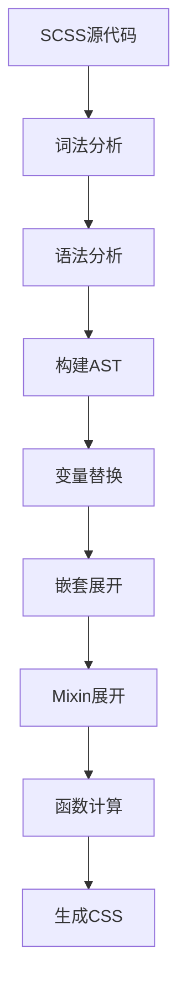
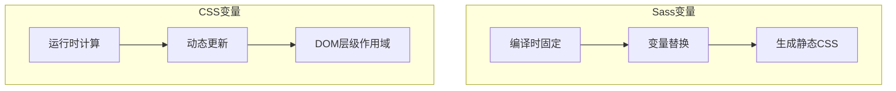

# Sass 基础

Sass（Syntactically Awesome Style Sheets）是最流行的 CSS 预处理器，提供变量、嵌套、Mixin、函数等强大特性，显著提升 CSS 开发效率。

## 背景与动机

### 为什么选择 Sass

在大型 CSS 项目中，开发者面临以下挑战：

1. **缺乏变量支持**：相同颜色、尺寸需要重复书写
2. **无法复用样式**：相同样式逻辑需要复制粘贴
3. **组织结构混乱**：缺乏模块化机制
4. **维护困难**：修改一处需要全局搜索替换

Sass 通过引入编程语言特性，完美解决了这些问题。

### Sass 发展历史

```mermaid
graph LR
    A[2006<br/>Sass创建] --> B[2007<br/>Ruby Sass发布]
    B --> C[2010<br/>SCSS语法引入]
    C --> D[2016<br/>Dart Sass成为官方]
    D --> E[2020<br/>@use/@forward模块系统]
    E --> F[2024<br/>Sass 1.69+]
```

**关键里程碑**：
- **2006年**：Hampton Catlin 创建 Sass
- **2007年**：Ruby Sass 正式发布
- **2010年**：SCSS 语法引入，完全兼容 CSS
- **2016年**：Dart Sass 成为官方推荐实现
- **2020年**：引入 @use/@forward 模块系统
- **2024年**：持续更新，功能更加完善

## 核心概念

### Sass vs SCSS 语法

Sass 支持两种语法格式：

| 语法 | 文件扩展名 | 特点 | 推荐度 |
|------|-----------|------|--------|
| **SCSS** | `.scss` | 完全兼容 CSS 语法，使用大括号和分号 | ⭐⭐⭐⭐⭐ |
| **Sass** | `.sass` | 缩进语法，更简洁，不兼容 CSS | ⭐⭐⭐ |

```scss
// SCSS 语法（推荐）
.button {
  background: #007bff;
  
  &:hover {
    background: #0056b3;
  }
}
```

```sass
// Sass 语法（缩进式）
.button
  background: #007bff
  
  &:hover
    background: #0056b3
```

**本文档统一使用 SCSS 语法**，因为它是主流选择，且与 CSS 完全兼容。

### Dart Sass 实现

Dart Sass 是 Sass 的主要实现，取代了旧版 Ruby Sass 和 node-sass。

```bash
# 检查版本
sass --version

# Dart Sass 版本号格式：1.x.x
```

**为什么选择 Dart Sass**：
- 官方推荐，持续更新
- 跨平台支持（Windows、macOS、Linux）
- 编译速度快
- 支持最新的 Sass 特性

## 安装与配置

### 全局安装

```bash
# 使用 npm
npm install -g sass

# 使用 yarn
yarn global add sass

# 使用 Homebrew (macOS)
brew install sass/sass/sass
```

### 项目本地安装

```bash
# 安装为开发依赖
npm install sass --save-dev

# package.json scripts
{
  "scripts": {
    "sass": "sass src/scss:dist/css",
    "sass:watch": "sass --watch src/scss:dist/css",
    "sass:build": "sass --style=compressed src/scss:dist/css"
  }
}
```

### 编译命令详解

```bash
# 基本编译
sass input.scss output.css

# 监听文件变化
sass --watch input.scss:output.css

# 监听目录
sass --watch src/scss/:dist/css/

# 输出样式
sass --style=expanded input.scss output.css    # 展开（默认）
sass --style=compressed input.scss output.css  # 压缩

# 生成 Source Map
sass --source-map input.scss output.css        # 生成
sass --no-source-map input.scss output.css     # 不生成

# 完整开发命令
sass --watch --style=expanded --source-map src/scss/:dist/css/
```

### 输出样式对比

```scss
// 原始 SCSS
.button {
  background: #007bff;
  color: white;
  
  &:hover {
    background: #0056b3;
  }
}
```

```css
/* expanded 输出 */
.button {
  background: #007bff;
  color: white;
}
.button:hover {
  background: #0056b3;
}

/* compressed 输出 */
.button{background:#007bff;color:white}.button:hover{background:#0056b3}
```

## 深入原理

### Sass 编译流程



### 变量作用域机制

Sass 变量遵循词法作用域规则：

```scss
// 全局作用域
$global-color: red;

.container {
  // 局部作用域
  $local-color: blue;
  color: $local-color;  // blue
}

.element {
  color: $global-color; // red
  // color: $local-color; // ❌ 错误：局部变量无法在外部访问
}
```

**作用域优先级**：
1. 局部变量优先于全局变量
2. 使用 `!global` 可以强制创建全局变量
3. 变量在定义后才能使用

## 变量系统

### 定义变量

使用 `$` 符号定义变量：

```scss
// 基本变量
$primary-color: #007bff;
$font-size: 16px;
$border-radius: 8px;
$font-family: 'Helvetica Neue', Arial, sans-serif;

// 使用变量
.element {
  color: $primary-color;
  font-size: $font-size;
  border-radius: $border-radius;
  font-family: $font-family;
}
```

### 变量作用域

```scss
// 全局变量：在文件顶层定义
$global-color: red;

.container {
  // 局部变量：在代码块内定义
  $local-color: blue;
  color: $local-color;  // blue
}

.element {
  color: $global-color; // red
  // color: $local-color; // ❌ 错误：未定义
}
```

### !global 标志

将局部变量转为全局变量：

```scss
.container {
  $color: blue !global;
}

.element {
  color: $color; // blue（可以访问）
}
```

⚠️ **注意**：过度使用 `!global` 会导致变量难以追踪，建议谨慎使用。

### !default 标志

设置变量默认值，常用于可覆盖的配置：

```scss
// _variables.scss
$primary-color: #007bff !default;
$font-size: 16px !default;

// main.scss
// 先定义用户值，再导入
$primary-color: #28a745;
@import 'variables';

.element {
  color: $primary-color; // #28a745（用户值覆盖默认值）
}
```

### 变量插值

使用 `#{}` 在选择器或属性名中使用变量：

```scss
$name: button;
$property: margin;

.#{$name} {
  #{$property}: 10px;
  background-#{$property}: 20px;
}

// 编译后
.button {
  margin: 10px;
  background-margin: 20px;
}
```

## Sass 变量 vs CSS 原生变量

### 核心区别



### 详细对比表

| 特性 | Sass 变量 | CSS 原生变量 |
|------|-----------|--------------|
| **语法** | `$var: value` | `--var: value` |
| **使用** | `$var` | `var(--var)` |
| **作用域** | 词法作用域（文件/块级） | DOM 层级（继承） |
| **动态性** | 编译时固定 | 运行时可修改 |
| **条件语句** | 支持 `@if` | 不支持 |
| **媒体查询** | 可用于条件判断 | 可在媒体查询中使用 |
| **JavaScript** | 无法访问 | 可通过 JS 修改 |
| **浏览器支持** | 编译后兼容 | IE11 不支持 |
| **性能** | 编译时计算 | 运行时计算 |

### 使用场景对比

```scss
// Sass 变量：适合编译时确定的值
$primary-color: #007bff;
$spacing-unit: 8px;
$font-size-base: 16px;

// 用于计算
$spacing-lg: $spacing-unit * 3;  // 24px

// 用于条件判断
$theme: dark;
@if $theme == dark {
  .element { background: #1a1a1a; }
}
```

```css
/* CSS 变量：适合运行时动态变化的值 */
:root {
  --primary-color: #007bff;
  --theme-bg: #fff;
}

/* 支持动态修改 */
[data-theme="dark"] {
  --theme-bg: #1a1a1a;
}

/* 可在媒体查询中使用 */
@media (min-width: 768px) {
  :root {
    --font-size-base: 18px;
  }
}

/* 可通过 JavaScript 修改 */
<script>
  document.documentElement.style.setProperty('--primary-color', '#28a745');
</script>
```

### 最佳实践：结合使用

```scss
// Sass 变量用于设计系统基础
$colors: (
  primary: #007bff,
  secondary: #6c757d,
  success: #28a745
);

// 生成 CSS 变量用于运行时
:root {
  @each $name, $color in $colors {
    --color-#{$name}: #{$color};
  }
}

// 组件中使用 CSS 变量
.button {
  background: var(--color-primary);
  
  // 主题切换
  [data-theme="dark"] & {
    --color-primary: #4da3ff;
  }
}
```

## 嵌套语法

### 选择器嵌套

```scss
.nav {
  ul {
    list-style: none;
    margin: 0;
    padding: 0;
  }
  
  li {
    display: inline-block;
    margin-right: 10px;
  }
  
  a {
    text-decoration: none;
    color: #333;
  }
}

// 编译后
.nav ul { list-style: none; margin: 0; padding: 0; }
.nav li { display: inline-block; margin-right: 10px; }
.nav a { text-decoration: none; color: #333; }
```

### 父选择器 &

`&` 代表父选择器，用于引用当前层级：

```scss
.button {
  background: #007bff;
  color: white;
  
  // 伪类
  &:hover {
    background: #0056b3;
  }
  
  &:active {
    background: #004494;
  }
  
  // 修饰符（BEM 风格）
  &--primary {
    background: #28a745;
  }
  
  &--secondary {
    background: #6c757d;
  }
  
  // 嵌套元素
  &__icon {
    margin-right: 8px;
  }
}

// 编译后
.button { background: #007bff; color: white; }
.button:hover { background: #0056b3; }
.button:active { background: #004494; }
.button--primary { background: #28a745; }
.button--secondary { background: #6c757d; }
.button__icon { margin-right: 8px; }
```

### 父选择器后缀

```scss
.button {
  &-primary { }
  &-secondary { }
  &-large { }
}

// 编译后
.button-primary { }
.button-secondary { }
.button-large { }
```

### 属性嵌套

具有相同命名空间的属性可以嵌套：

```scss
.element {
  font: {
    family: Arial, sans-serif;
    size: 16px;
    weight: bold;
  }
  
  border: {
    width: 1px;
    style: solid;
    color: #ddd;
  }
  
  margin: {
    top: 10px;
    right: 20px;
    bottom: 10px;
    left: 20px;
  }
}

// 编译后
.element {
  font-family: Arial, sans-serif;
  font-size: 16px;
  font-weight: bold;
  border-width: 1px;
  border-style: solid;
  border-color: #ddd;
  margin-top: 10px;
  margin-right: 20px;
  margin-bottom: 10px;
  margin-left: 20px;
}
```

### 嵌套深度控制

建议将嵌套深度控制在 3 层以内：

```scss
// ✅ 推荐：3层以内
.card {
  &-header { }
  &-body { }
  &-footer { }
}

// ❌ 不推荐：嵌套过深
.page {
  .container {
    .row {
      .col {
        .card {
          .header {
            .title {
              // 选择器过于具体
            }
          }
        }
      }
    }
  }
}
```

## 导入与模块

### @import（旧语法）

⚠️ `@import` 已被 Sass 官方标记为弃用，建议使用 `@use` 替代。

```scss
// _variables.scss
$primary-color: #007bff;

// _mixins.scss
@mixin flex-center {
  display: flex;
  justify-content: center;
  align-items: center;
}

// main.scss
@import 'variables';
@import 'mixins';

.element {
  color: $primary-color;
  @include flex-center;
}
```

**@import 的问题**：
- 所有变量变为全局，容易冲突
- 多次导入会重复编译
- 无法控制命名空间

### @use（新语法，推荐）

`@use` 提供命名空间隔离，避免变量冲突：

```scss
// _variables.scss
$primary-color: #007bff;
$secondary-color: #6c757d;

// _mixins.scss
@mixin flex-center {
  display: flex;
  justify-content: center;
  align-items: center;
}

// main.scss
@use 'variables' as vars;
@use 'mixins' as *;  // 使用 * 导入到全局命名空间

.element {
  color: vars.$primary-color;  // 使用命名空间访问
  @include flex-center;        // 全局可用
}
```

### @use 详解

```scss
// 基本用法
@use 'variables';          // 默认命名空间：variables
variables.$primary-color;  // 访问变量

// 自定义命名空间
@use 'variables' as v;
v.$primary-color;

// 导入到全局命名空间
@use 'mixins' as *;
@include flex-center;  // 无需命名空间

// 私有成员（以 - 或 _ 开头）
// _utils.scss
$-private-var: hidden;  // 私有变量，外部无法访问
@mixin public-mixin { } // 公开 Mixin
```

### @forward 转发

创建统一的模块入口：

```scss
// abstracts/_index.scss
@forward 'variables';
@forward 'mixins';
@forward 'functions';

// main.scss
@use 'abstracts' as abs;

.element {
  color: abs.$primary-color;
  @include abs.flex-center;
}
```

### 模块配置

使用 `with` 配置模块变量：

```scss
// _theme.scss
$primary-color: #007bff !default;
$border-radius: 8px !default;

// main.scss
@use 'theme' with (
  $primary-color: #28a745,
  $border-radius: 4px
);

.element {
  color: theme.$primary-color;  // #28a745
}
```

## 数据类型

### 数字（Number）

```scss
$width: 100px;
$opacity: 0.5;
$z-index: 100;
$ratio: 16 / 9;  // 无单位数字（新代码建议用 math.div(16, 9)，见「常见陷阱2」）

// 数学运算
.element {
  width: $width + 20;      // 120px
  width: $width * 2;       // 200px
  width: $width / 2;       // 50px
  width: round(10.4px);    // 10px
  width: ceil(10.4px);     // 11px
  width: floor(10.6px);    // 10px
}
```

### 字符串（String）

```scss
$name: 'Arial';
$path: "images/icon.png";
$keyword: sans-serif;  // 无引号字符串

// 字符串函数
.element {
  font-family: quote($name);      // "Arial"（添加引号）
  content: unquote('hello');      // hello（移除引号）
  font-family: to-upper-case($name);  // ARIAL
}
```

### 颜色（Color）

```scss
$color: red;
$hex: #007bff;
$rgb: rgb(0, 123, 255);
$hsl: hsl(211, 100%, 50%);

// 颜色函数
.element {
  color: lighten($hex, 10%);      // 变亮
  color: darken($hex, 10%);       // 变暗
  color: saturate($hex, 20%);     // 增加饱和度
  color: desaturate($hex, 20%);   // 降低饱和度
  color: fade-in($hex, 50%);      // 增加不透明度
  color: fade-out($hex, 50%);     // 增加透明度
  color: mix($hex, white, 50%);   // 混合颜色
}
```

### 列表（List）

```scss
$colors: red, green, blue;
$padding: 10px 20px 10px 20px;
$sizes: (
  "small",
  "medium",
  "large"
);

// 列表函数
.element {
  margin: nth($padding, 1);       // 10px（第1项）
  margin: nth($padding, 2);       // 20px（第2项）
  padding: append($colors, yellow); // red, green, blue, yellow
  padding: join($colors, $sizes);   // 合并两个列表
}
```

### Map（映射）

```scss
$colors: (
  primary: #007bff,
  secondary: #6c757d,
  success: #28a745,
  warning: #ffc107,
  danger: #dc3545
);

$breakpoints: (
  sm: 576px,
  md: 768px,
  lg: 992px,
  xl: 1200px
);

// Map 函数
.element {
  color: map-get($colors, primary);     // #007bff
  color: map-get($colors, 'success');   // #28a745
  
  // 检查键是否存在
  $exists: map-has-key($colors, info);  // false
  
  // 获取所有键/值
  $keys: map-keys($colors);     // primary, secondary, ...
  $values: map-values($colors); // #007bff, #6c757d, ...
  
  // 合并 Map
  $merged: map-merge($colors, (info: #17a2b8));
}
```

### 布尔值（Boolean）

```scss
$true: true;
$false: false;

// 用于条件判断
@if $true {
  .element { display: block; }
}
```

### 空值（Null）

```scss
$null: null;

// null 值不会输出到 CSS
.element {
  color: null;  // 该属性不会出现
}
```

## 运算系统

### 算术运算

```scss
$width: 100px;

.element {
  width: $width + 20px;   // 120px（加法）
  width: $width - 20px;   // 80px（减法）
  width: $width * 2;      // 200px（乘法）
  width: $width / 2;      // 50px（除法）
  width: $width % 30;     // 10px（取模）
}
```

⚠️ 注意：上例中的 `/` 除法已被 Dart Sass 弃用（会输出弃用警告），请改用 `math.div($width, 2)`，详见「常见陷阱2」。

### 关系运算

```scss
$width: 100px;

.element {
  @if $width > 50px { }
  @if $width >= 100px { }
  @if $width < 200px { }
  @if $width <= 100px { }
}
```

### 相等运算

```scss
$theme: dark;

@if $theme == dark { }
@if $theme != light { }
```

### 颜色运算

早期版本支持的颜色算术写法（如 `$color + 10`）已在 Dart Sass 中移除，直接使用会导致编译错误。调整颜色通道请使用 `sass:color` 模块：

```scss
@use 'sass:color';

$color: #007bff;

.element {
  color: color.adjust($color, $red: 10, $green: 10, $blue: 10);   // #0a85ff（每通道+10，255 封顶）
  color: color.adjust($color, $red: -10, $green: -10, $blue: -10); // #0071f5（每通道-10，0 封底）
  color: color.adjust($color, $lightness: 10%);   // 变亮10%
  color: color.adjust($color, $lightness: -10%);  // 变暗10%
}
```

## Mixin 混入

Mixin 是 Sass 最核心的特性之一，它允许你定义可复用的样式片段，并支持参数传递和内容块注入。与简单的变量不同，Mixin 可以封装一整组样式规则，是构建样式库和设计系统的基石。

### @mixin 定义与 @include 调用

```scss
// 定义无参 Mixin
@mixin flex-center {
  display: flex;
  justify-content: center;
  align-items: center;
}

// 使用 @include 调用
.container {
  @include flex-center;
  height: 100vh;
}

// 编译后
.container {
  display: flex;
  justify-content: center;
  align-items: center;
  height: 100vh;
}
```

### 带参数的 Mixin

```scss
// 必需参数
@mixin button($color) {
  background: $color;
  padding: 10px 20px;
  border: none;
  cursor: pointer;
  color: white;
}

// 默认参数
@mixin card($padding: 20px, $radius: 8px, $shadow: true) {
  padding: $padding;
  border-radius: $radius;
  background: white;

  @if $shadow {
    box-shadow: 0 2px 8px rgba(0, 0, 0, 0.1);
  }
}

// 关键字参数（顺序无关）
.featured-card {
  @include card($shadow: false, $padding: 30px);
}

// 可变参数（接收任意数量参数）
@mixin box-shadow($shadows...) {
  box-shadow: $shadows;
}

.element {
  @include box-shadow(
    0 1px 2px rgba(0, 0, 0, 0.1),
    0 4px 8px rgba(0, 0, 0, 0.1)
  );
}
```

### @content 内容块

`@content` 允许向 Mixin 传递一段样式块，在响应式断点等场景中极为常用：

```scss
// 响应式断点 Mixin
$breakpoints: (
  sm: 576px,
  md: 768px,
  lg: 992px,
  xl: 1200px
);

@mixin respond-to($breakpoint) {
  $value: map-get($breakpoints, $breakpoint);
  @media (min-width: $value) {
    @content;
  }
}

// 使用
.container {
  padding: 15px;

  @include respond-to(md) {
    padding: 30px;
  }

  @include respond-to(lg) {
    padding: 40px;
    max-width: 1200px;
  }
}

// 编译后
.container { padding: 15px; }
@media (min-width: 768px) { .container { padding: 30px; } }
@media (min-width: 992px) { .container { padding: 40px; max-width: 1200px; } }
```

### 常用 Mixin 示例

```scss
// 文本单行截断
@mixin truncate {
  overflow: hidden;
  text-overflow: ellipsis;
  white-space: nowrap;
}

// 文本多行截断
@mixin line-clamp($lines: 2) {
  display: -webkit-box;
  -webkit-line-clamp: $lines;
  -webkit-box-orient: vertical;
  overflow: hidden;
}

// 绝对定位居中
@mixin absolute-center {
  position: absolute;
  top: 50%;
  left: 50%;
  transform: translate(-50%, -50%);
}

// 清除浮动
@mixin clearfix {
  &::after {
    content: '';
    display: table;
    clear: both;
  }
}

// 隐藏但保持可访问性
@mixin visually-hidden {
  position: absolute;
  width: 1px;
  height: 1px;
  padding: 0;
  margin: -1px;
  overflow: hidden;
  clip: rect(0, 0, 0, 0);
  white-space: nowrap;
  border: 0;
}
```

## @extend 继承

`@extend` 让一个选择器继承另一个选择器的所有样式，编译时会将选择器合并而非复制样式，从而减小 CSS 体积。

### 基本用法

```scss
// 基类
.button {
  padding: 10px 20px;
  border: none;
  cursor: pointer;
  font-size: 14px;
  border-radius: 4px;
}

// 继承基类
.button-primary {
  @extend .button;
  background: #007bff;
  color: white;
}

.button-secondary {
  @extend .button;
  background: #6c757d;
  color: white;
}

// 编译后（选择器合并，减少代码量）
.button, .button-primary, .button-secondary {
  padding: 10px 20px;
  border: none;
  cursor: pointer;
  font-size: 14px;
  border-radius: 4px;
}
.button-primary { background: #007bff; color: white; }
.button-secondary { background: #6c757d; color: white; }
```

### 占位符选择器 %

使用 `%` 定义的样式块不会单独编译输出，只有被继承时才会生成 CSS，避免产生无用的基类选择器：

```scss
// 占位符选择器（不会编译输出到 CSS）
%button-base {
  padding: 10px 20px;
  border: none;
  cursor: pointer;
}

%flex-center {
  display: flex;
  justify-content: center;
  align-items: center;
}

// 使用占位符
.button-primary {
  @extend %button-base;
  background: #007bff;
}

.modal {
  @extend %flex-center;
  position: fixed;
}

// 编译后（没有 %button-base 和 %flex-center 选择器）
.button-primary { padding: 10px 20px; border: none; cursor: pointer; background: #007bff; }
.modal { display: flex; justify-content: center; align-items: center; position: fixed; }
```

### @extend vs Mixin 选择指南

| 场景 | 推荐 | 原因 |
|------|------|------|
| 需要参数化 | Mixin | @extend 不支持参数 |
| 样式完全相同 | @extend（占位符） | 选择器合并，CSS 更小 |
| 在媒体查询内 | Mixin | @extend 不能跨 @media 边界 |
| 不确定时 | Mixin | 更安全，避免副作用 |

```scss
// ❌ @extend 不能跨 @media 边界
@media (min-width: 768px) {
  .element {
    @extend .button;  // 编译错误
  }
}

// ✅ 使用 Mixin 替代
@media (min-width: 768px) {
  .element {
    @include button-base;  // 正常工作
  }
}
```

## 控制指令

Sass 提供了完整的控制流指令，赋予样式编写编程语言级别的逻辑能力。

### @if 条件语句

```scss
// 基本条件判断
@mixin theme($theme) {
  @if $theme == dark {
    background: #1a1a1a;
    color: #fff;
  } @else if $theme == light {
    background: #fff;
    color: #333;
  } @else {
    background: #f5f5f5;
    color: #666;
  }
}

.dark-theme { @include theme(dark); }
.light-theme { @include theme(light); }

// 单行条件函数
$bg: #007bff;
.element {
  color: if(lightness($bg) > 50%, #333, #fff);  // #fff
}
```

### @for 循环

`@for` 用于按数字范围批量生成样式，有两种形式：

- `through`：包含结束值
- `to`：不包含结束值

```scss
// through：1 到 12（包含 12）
@for $i from 1 through 12 {
  .col-#{$i} {
    width: calc(100% / 12 * #{$i});
  }
}

// to：1 到 11（不包含 12）
@for $i from 1 to 12 {
  .col-#{$i} {
    width: calc(100% / 12 * #{$i});
  }
}

// 实际应用：间距工具类
@for $i from 0 through 10 {
  .mt-#{$i} { margin-top: $i * 8px; }
  .mb-#{$i} { margin-bottom: $i * 8px; }
  .p-#{$i}  { padding: $i * 8px; }
}
```

### @each 循环

`@each` 用于遍历列表或 Map，是生成主题色、按钮变体等场景的利器：

```scss
// 遍历列表
$colors: primary success warning danger info;

@each $color in $colors {
  .text-#{$color} {
    color: var(--color-#{$color});
  }
}

// 遍历 Map（最常用）
$theme-colors: (
  primary: #007bff,
  secondary: #6c757d,
  success: #28a745,
  warning: #ffc107,
  danger: #dc3545
);

@each $name, $color in $theme-colors {
  .btn-#{$name} {
    background: $color;
    color: white;
    &:hover { background: darken($color, 10%); }
  }
  .text-#{$name} { color: $color; }
  .bg-#{$name} { background: $color; }
}

// 遍历嵌套列表
$sizes: (sm, 14px, 8px) (md, 16px, 12px) (lg, 18px, 16px);

@each $name, $font-size, $padding in $sizes {
  .btn-#{$name} {
    font-size: $font-size;
    padding: $padding $padding * 2;
  }
}
```

### @while 循环

`@while` 在条件为真时持续执行，适合需要复杂终止条件的场景：

```scss
// 生成字体大小类
$font-size: 12;
@while $font-size <= 32 {
  .text-#{$font-size} {
    font-size: $font-size * 1px;
  }
  $font-size: $font-size + 2;
}

// 生成间距类（步长为 4）
$i: 4;
@while $i <= 64 {
  .m-#{$i} { margin: $i * 1px; }
  .p-#{$i} { padding: $i * 1px; }
  $i: $i + 4;
}
```

## 内置函数分类

Sass 提供了丰富的内置函数，按功能可分为以下几大类：

⚠️ **注意**：以下全局内置函数在 Dart Sass 模块体系中已标记弃用（编译时输出 `global-builtin` 弃用警告），推荐逐步迁移到对应的模块函数，如 `map-get($m, k)` → `map.get($m, k)`（需 `@use 'sass:map'`）、`math.div`（需 `@use 'sass:math'`）。

### 字符串函数

```scss
$name: 'Arial';

quote($name);           // "Arial"（添加引号）
unquote('hello');       // hello（移除引号）
to-upper-case($name);   // ARIAL（转大写）
to-lower-case($name);   // arial（转小写）
str-length($name);      // 5（字符串长度）
str-index($name, 'i');  // 3（查找子串位置，从1开始）
str-insert($name, 'X', 2); // AXrial（在位置2插入）
str-slice($name, 1, 3); // Ari（截取子串）
```

### 数学函数

```scss
@use 'sass:math';

// 取整
round(10.4px);    // 10px（四舍五入）
ceil(10.4px);     // 11px（向上取整）
floor(10.6px);    // 10px（向下取整）
abs(-10px);       // 10px（绝对值）

// 极值与比较
max(10px, 20px, 30px);  // 30px
min(10px, 20px, 30px);  // 10px

// 其他
percentage(0.5);  // 50%
random();         // 0-1 随机数
random(100);      // 1-100 随机整数

// 推荐使用 math 模块
math.div(100px, 2);  // 50px（替代已弃用的 / 除法）
```

### 颜色函数

```scss
$color: #007bff;

// 亮度调整
lighten($color, 10%);    // 变亮
darken($color, 10%);     // 变暗

// 饱和度调整
saturate($color, 20%);   // 增加饱和度
desaturate($color, 20%); // 降低饱和度

// 透明度调整
fade-in($color, 30%);    // 增加不透明度
fade-out($color, 30%);   // 增加透明度
rgba($color, 0.5);       // 设置透明度

// 颜色混合与变换
mix(#fff, $color, 50%);  // 混合白色
adjust-hue($color, 30deg); // 色相旋转
complement($color);      // 补色
invert($color);          // 反转颜色

// 颜色分量提取
red($color);             // 红色分量：0
green($color);           // 绿色分量：123
blue($color);            // 蓝色分量：255
hue($color);             // 色相
saturation($color);      // 饱和度
lightness($color);       // 亮度
alpha($color);           // 透明度
```

⚠️ **注意**：`lighten()`、`darken()`、`saturate()`、`desaturate()`、`fade-in()`、`fade-out()`、`adjust-hue()` 等旧版颜色函数已被 Dart Sass 弃用（`color-functions` 弃用警告），推荐改用 `sass:color` 模块，例如：

```scss
@use 'sass:color';

color.adjust($color, $lightness: 10%);   // 替代 lighten($color, 10%)
color.adjust($color, $lightness: -10%);  // 替代 darken($color, 10%)
color.scale($color, $lightness: 20%);    // 按比例调整亮度
color.change($color, $alpha: 0.5);       // 设置透明度
```

### 列表函数

```scss
$list: 10px, 20px, 30px;

length($list);        // 3（列表长度）
nth($list, 1);        // 10px（第1项）
nth($list, -1);       // 30px（最后1项）
index($list, 20px);   // 2（查找索引，从1开始）
append($list, 40px);  // 10px, 20px, 30px, 40px
join($list, 40px 50px); // 合并两个列表
is-bracketed([a, b]); // true（是否有方括号）
```

### Map 函数

```scss
$map: (primary: #007bff, secondary: #6c757d);

map-get($map, primary);      // #007bff（获取值）
map-has-key($map, info);     // false（检查键）
map-keys($map);              // primary, secondary
map-values($map);            // #007bff, #6c757d
map-merge($map, (info: #17a2b8)); // 合并 Map
map-remove($map, secondary); // 移除键
```

### 类型检查函数

```scss
type-of(10px);      // number
type-of('hello');   // string
type-of(#fff);      // color
type-of(true);      // bool
type-of(null);      // null
type-of(1px 2px);   // list
type-of((a: 1));    // map

// 单位检查
unit(10px);         // px
unitless(10);       // true（无单位）
comparable(10px, 2em); // false（单位不兼容）
```

## 注释规范

```scss
// 单行注释
// 编译后不会出现在 CSS 文件中

/* 多行注释 */
/* 编译后会保留在 CSS 文件中 */

/*! 强制注释 */
/*! 即使在压缩模式下也会保留 */
/*! 通常用于版权信息 */
```

## 常见陷阱与解决方案

### 陷阱1：变量未定义

```scss
// ❌ 错误
.element {
  color: $primary-color; // Error: Undefined variable
}

// ✅ 解决方案
$primary-color: #007bff;
.element {
  color: $primary-color;
}
```

### 陷阱2：除法运算警告

```scss
// ⚠️ 警告（Sass 新版本）
$width: 100px / 2; // Using / for division is deprecated

// ✅ 解决方案
$width: math.div(100px, 2);   // 使用 math.div()
$width: calc(100px / 2);      // 或保留为 CSS calc() 表达式（不在编译期求值）
```

> 注意：旧版本中「用括号包裹」的写法（如 `(100px / 2)`）已无法规避弃用警告，请统一改用 `math.div()`。

### 陷阱3：@import 弃用警告

```scss
// ⚠️ 警告
@import 'variables'; // @import is deprecated

// ✅ 解决方案
@use 'variables' as *;
```

### 陷阱4：嵌套选择器过深

```scss
// ❌ 问题
.a .b .c .d .e .f { } // 选择器权重过高

// ✅ 解决方案
.a__b__c { } // 使用 BEM 命名，扁平化选择器
```

### 陷阱5：单位不兼容

```scss
// ❌ 错误
$width: 100px + 2em; // Incompatible units: px and em

// ✅ 解决方案
$width: 100px + 20px;
// 或使用 calc()
width: calc(100px + 2em);
```

### 陷阱6：模块命名空间冲突

```scss
// ❌ 问题
@use 'colors';
@use 'theme/colors'; // 都使用 colors 命名空间

// ✅ 解决方案
@use 'colors' as c1;
@use 'theme/colors' as c2;
```

### 陷阱7：变量作用域混淆

```scss
// ❌ 问题
.container {
  $color: blue;
}
.element {
  color: $color; // ❌ 无法访问局部变量
}

// ✅ 解决方案
$color: blue; // 定义为全局变量
.container {
  // 使用全局变量
}
.element {
  color: $color;
}
```

### 陷阱8：map-get 查不到键时静默返回 null

```scss
$map: (
  primary: #007bff
);

// ❌ 问题：键名写错（如拼写错误）时 map-get 不报错，而是返回 null
// color: map-get($map, primay); // null → 该声明不会输出，样式静默失效

// ✅ 解决方案：先用 map.has-key() 检查，键不存在时给出兜底或报错
@if map-has-key($map, primary) {
  .element {
    color: map-get($map, primary); // #007bff
  }
} @else {
  @error "Map 中不存在键 primary";
}
```

> 说明：Sass 中带引号与不带引号的字符串键是相等的（`'primary'` 与 `primary` 可以互相查到），真正容易踩坑的是键名拼写错误导致的静默 null。

## 项目结构

### 推荐目录结构

```
styles/
├── abstracts/           # 抽象层（不直接生成CSS）
│   ├── _variables.scss  # 变量定义
│   ├── _mixins.scss     # Mixin 定义
│   ├── _functions.scss  # 函数定义
│   └── _index.scss      # 统一导出
├── base/                # 基础样式
│   ├── _reset.scss      # 重置样式
│   ├── _typography.scss # 排版样式
│   └── _base.scss       # 基础元素
├── components/          # 组件样式
│   ├── _button.scss
│   ├── _card.scss
│   ├── _form.scss
│   └── _index.scss
├── layout/              # 布局样式
│   ├── _header.scss
│   ├── _footer.scss
│   ├── _sidebar.scss
│   └── _index.scss
├── pages/               # 页面特定样式
│   ├── _home.scss
│   ├── _about.scss
│   └── _index.scss
├── themes/              # 主题样式
│   ├── _light.scss
│   └── _dark.scss
└── main.scss            # 主入口文件
```

### 主入口文件

```scss
// main.scss

// 1. 抽象层（变量、函数、Mixin）
@use 'abstracts' as *;

// 2. 基础样式
@use 'base/reset';
@use 'base/typography';
@use 'base/base';

// 3. 布局组件
@use 'layout';

// 4. 组件
@use 'components';

// 5. 页面特定样式
@use 'pages';

// 6. 主题
@use 'themes/light';
@use 'themes/dark';
```

## 最佳实践

### 1. 变量管理

```scss
// ✅ 推荐：语义化命名，集中管理
// _variables.scss
$color-primary: #007bff;
$color-primary-light: lighten($color-primary, 10%);
$color-primary-dark: darken($color-primary, 10%);

$font-size-base: 16px;
$font-size-sm: 14px;
$font-size-lg: 18px;

$spacing-unit: 8px;
$spacing-sm: $spacing-unit;
$spacing-md: $spacing-unit * 2;
$spacing-lg: $spacing-unit * 3;
```

### 2. 文件命名

```
✅ 使用下划线前缀表示部分文件
_variables.scss  → 不会被单独编译
_mixins.scss     → 不会被单独编译
main.scss        → 入口文件，会被编译
```

### 3. 嵌套控制

```scss
// ✅ 推荐：BEM + 简单嵌套
.card {
  &__header { }
  &__body { }
  &__footer { }
  
  &--featured { }
}

// ❌ 不推荐：深层嵌套
.card {
  .header {
    .title {
      .text {
        // 过于具体
      }
    }
  }
}
```

### 4. 模块化组织

```scss
// ✅ 推荐：按功能拆分，统一入口
// abstracts/_index.scss
@forward 'variables';
@forward 'mixins';
@forward 'functions';

// main.scss
@use 'abstracts' as *;
```

### 5. 注释规范

```scss
// ============================================================================
// 组件名称：Button
// 描述：按钮组件样式
// ============================================================================

// 按钮基础样式
.button {
  // ... 样式
}

// 按钮变体
.button--primary { }
.button--secondary { }

// TODO: 添加 loading 状态样式
// FIXME: 修复 hover 状态颜色问题
```

## 常见问题

### Q1: Sass 和 SCSS 有什么区别？

Sass 和 SCSS 是同一种预处理器的两种语法格式：
- **SCSS**（`.scss`）：使用大括号和分号，完全兼容 CSS
- **Sass**（`.sass`）：使用缩进语法，更简洁但不兼容 CSS

推荐使用 SCSS，因为它是主流选择。

### Q2: 为什么 @import 被弃用？

`@import` 存在以下问题：
- 所有变量变为全局，容易冲突
- 多次导入会重复编译
- 无法控制命名空间

`@use` 解决了这些问题，提供了更好的模块化支持。

### Q3: 如何选择变量命名风格？

推荐语义化命名：
- `$color-primary` 而非 `$blue`
- `$font-size-base` 而非 `$fs`
- `$spacing-unit` 而非 `$space`

### Q4: 如何处理 Sass 编译错误？

1. 使用 `--watch` 模式实时查看错误
2. 配置 Source Map 定位问题
3. 使用 IDE 插件实时检查语法
4. 在 CI/CD 中添加 Sass 编译检查

### Q5: Sass 变量和 CSS 变量如何选择？

- **Sass 变量**：编译时确定的值（颜色、间距、字体等）
- **CSS 变量**：运行时可能变化的值（主题色、动态配置等）

建议结合使用，发挥各自优势。

## 参考资源

### 官方文档
- [Sass 官方文档](https://sass-lang.com/documentation)
- [Dart Sass 发布说明](https://github.com/sass/dart-sass/releases)

### 学习资源
- [Sass Guidelines](https://sass-guidelin.es/)
- [Sass Meister](https://www.sassmeister.com/) - 在线 Sass 编译器

### 工具推荐
- **Live Sass Compiler**：VS Code 插件
- **Sass Meister**：在线编译和分享
- **Stylelint**：CSS/Sass 代码检查
