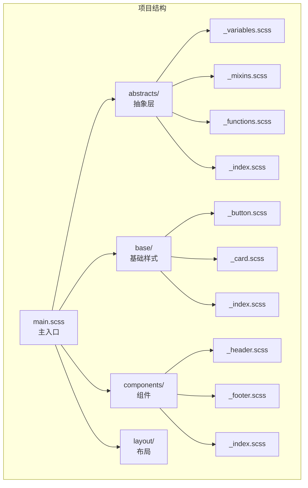
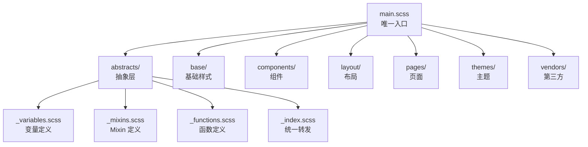

# Sass 进阶

本章节深入讲解 Sass 的高级特性，包括 Mixin 高级用法、控制指令、自定义函数、模块系统等，帮助你编写更优雅、更强大的样式代码。

## 背景与动机

### 为什么需要进阶特性

在掌握 Sass 基础语法后，开发者面临新的挑战：

1. **复杂样式逻辑**：需要条件判断、循环等编程能力
2. **代码复用优化**：需要更灵活的 Mixin 和函数
3. **大型项目架构**：需要完善的模块系统和组织方式
4. **性能优化**：需要减少编译时间和输出文件大小

Sass 进阶特性提供了强大的工具来解决这些问题。

### 进阶特性概览

```mermaid
graph TB
    A[Sass进阶特性] --> B[Mixin高级用法]
    A --> C[控制指令]
    A --> D[自定义函数]
    A --> E[模块系统]
    A --> F[性能优化]
    
    B --> B1[参数技巧]
    B --> B2[@content传递]
    B --> B3[实用Mixin库]
    
    C --> C1[@if条件]
    C --> C2[@for循环]
    C --> C3[@each遍历]
    C --> C4[@while循环]
    
    D --> D1[内置函数]
    D --> D2[自定义函数]
    D --> D3[函数组合]
    
    E --> E1[@use详解]
    E --> E2[@forward转发]
    E --> E3[模块架构]
    
    F --> F1[编译优化]
    F --> F2[输出优化]
    F --> F3[选择器优化]
    
```

## 核心概念

### Mixin 混入

Mixin 是 Sass 最强大的特性之一，用于定义可复用的样式片段。

#### 基本用法

```scss
// 定义 Mixin
@mixin flex-center {
  display: flex;
  justify-content: center;
  align-items: center;
}

// 使用 Mixin
.container {
  @include flex-center;
  height: 100vh;
}

// 编译后
.container {
  display: flex;
  justify-content: center;
  align-items: center;
  height: 100vh;
}
```

#### 带参数的 Mixin

```scss
// 必需参数
@mixin button($color) {
  background: $color;
  padding: 10px 20px;
  border: none;
  cursor: pointer;
}

.button-primary {
  @include button(#007bff);
}

// 默认参数
@mixin button($color, $size: 14px, $radius: 4px) {
  background: $color;
  font-size: $size;
  padding: $size / 2 $size;
  border-radius: $radius;
  border: none;
  cursor: pointer;
  
  &:hover {
    background: darken($color, 10%);
  }
}

.btn-primary {
  @include button(#007bff);  // 使用默认值
}

.btn-lg {
  @include button(#28a745, 18px, 8px);  // 覆盖默认值
}
```

#### 关键字参数

```scss
@mixin card($padding: 20px, $radius: 8px, $shadow: true) {
  padding: $padding;
  border-radius: $radius;
  background: white;
  
  @if $shadow {
    box-shadow: 0 2px 8px rgba(0, 0, 0, 0.1);
  }
}

// 使用关键字参数，顺序无关
.card-featured {
  @include card($shadow: false, $padding: 30px);
}
```

#### 可变参数

使用 `...` 接收任意数量的参数：

```scss
// 接收多个阴影
@mixin box-shadow($shadows...) {
  box-shadow: $shadows;
}

.element {
  @include box-shadow(
    0 1px 2px rgba(0, 0, 0, 0.1),
    0 4px 8px rgba(0, 0, 0, 0.1),
    0 8px 16px rgba(0, 0, 0, 0.1)
  );
}

// 接收多个背景
@mixin backgrounds($backgrounds...) {
  background: $backgrounds;
}

.hero {
  @include backgrounds(
    linear-gradient(rgba(0,0,0,0.5), transparent),
    url('hero.jpg')
  );
}
```

#### 传递内容块 @content

使用 `@content` 向 Mixin 传递样式块：

```scss
// 响应式断点
@mixin respond-to($breakpoint) {
  @if $breakpoint == sm {
    @media (min-width: 576px) { @content; }
  } @else if $breakpoint == md {
    @media (min-width: 768px) { @content; }
  } @else if $breakpoint == lg {
    @media (min-width: 992px) { @content; }
  } @else if $breakpoint == xl {
    @media (min-width: 1200px) { @content; }
  }
}

.container {
  padding: 15px;
  
  @include respond-to(md) {
    padding: 30px;
  }
  
  @include respond-to(lg) {
    padding: 40px;
  }
}

// 更通用的媒体查询
@mixin media($query) {
  @media #{$query} {
    @content;
  }
}

.element {
  @include media("(min-width: 768px)") {
    display: flex;
  }
}
```

#### 实用 Mixin 示例

```scss
// 文本截断
@mixin truncate($lines: 1) {
  @if $lines == 1 {
    overflow: hidden;
    text-overflow: ellipsis;
    white-space: nowrap;
  } @else {
    display: -webkit-box;
    -webkit-line-clamp: $lines;
    -webkit-box-orient: vertical;
    overflow: hidden;
  }
}

// 绝对定位居中
@mixin absolute-center {
  position: absolute;
  top: 50%;
  left: 50%;
  transform: translate(-50%, -50%);
}

// Flex 布局快捷方式
@mixin flex($direction: row, $justify: flex-start, $align: stretch) {
  display: flex;
  flex-direction: $direction;
  justify-content: $justify;
  align-items: $align;
}

// 清除浮动
@mixin clearfix {
  &::after {
    content: '';
    display: table;
    clear: both;
  }
}

// 按钮重置
@mixin button-reset {
  background: none;
  border: none;
  padding: 0;
  margin: 0;
  cursor: pointer;
  font: inherit;
  color: inherit;
  
  &:focus {
    outline: none;
  }
}

// 隐藏但保持可访问
@mixin visually-hidden {
  position: absolute;
  width: 1px;
  height: 1px;
  padding: 0;
  margin: -1px;
  overflow: hidden;
  clip: rect(0, 0, 0, 0);
  white-space: nowrap;
  border: 0;
}

// 平滑滚动
@mixin smooth-scroll {
  scroll-behavior: smooth;
  -webkit-overflow-scrolling: touch;
}
```

### @extend 继承

#### 基本用法

```scss
// 基类
.button {
  padding: 10px 20px;
  border: none;
  cursor: pointer;
  font-size: 14px;
  border-radius: 4px;
}

// 继承基类
.button-primary {
  @extend .button;
  background: #007bff;
  color: white;
}

.button-secondary {
  @extend .button;
  background: #6c757d;
  color: white;
}

// 编译后（选择器合并）
.button, .button-primary, .button-secondary {
  padding: 10px 20px;
  border: none;
  cursor: pointer;
  font-size: 14px;
  border-radius: 4px;
}
.button-primary {
  background: #007bff;
  color: white;
}
.button-secondary {
  background: #6c757d;
  color: white;
}
```

#### 占位符选择器 %

使用 `%` 定义的样式块不会单独编译，只有被继承时才会输出：

```scss
// 占位符选择器（不会编译输出）
%button-base {
  padding: 10px 20px;
  border: none;
  cursor: pointer;
}

%flex-center {
  display: flex;
  justify-content: center;
  align-items: center;
}

// 使用占位符
.button-primary {
  @extend %button-base;
  background: #007bff;
}

.modal {
  @extend %flex-center;
  position: fixed;
}
```

#### @extend vs Mixin

| 特性 | @extend | Mixin |
|------|---------|-------|
| 选择器合并 | ✅ 合并选择器 | ❌ 复制样式 |
| 参数支持 | ❌ 不支持 | ✅ 支持参数 |
| 生成的 CSS | 更小 | 可能重复 |
| 使用场景 | 样式关系紧密 | 需要参数/灵活性 |

```scss
// 使用 @extend：相同样式，减少代码量
%card {
  border-radius: 8px;
  padding: 20px;
  background: white;
}

.card-a { @extend %card; }
.card-b { @extend %card; }

// 使用 Mixin：需要参数或灵活变化
@mixin card($padding: 20px, $shadow: true) {
  border-radius: 8px;
  padding: $padding;
  background: white;
  @if $shadow { box-shadow: 0 2px 4px rgba(0,0,0,0.1); }
}
```

## 深入原理

### 控制指令

#### @if 条件语句

```scss
@mixin theme($theme) {
  @if $theme == dark {
    background: #1a1a1a;
    color: #fff;
  } @else if $theme == light {
    background: #fff;
    color: #333;
  } @else {
    background: #f5f5f5;
    color: #666;
  }
}

.dark-theme {
  @include theme(dark);
}

// 条件判断函数
@function get-color($type) {
  @if $type == primary {
    @return #007bff;
  } @else if $type == success {
    @return #28a745;
  } @else if $type == danger {
    @return #dc3545;
  } @else {
    @return #333;
  }
}
```

#### @for 循环

```scss
// through：包含结束值
@for $i from 1 through 12 {
  .col-#{$i} {
    width: calc(100% / 12 * #{$i});
  }
}
// 生成 .col-1 到 .col-12

// to：不包含结束值
@for $i from 1 to 12 {
  .col-#{$i} {
    width: calc(100% / 12 * #{$i});
  }
}
// 生成 .col-1 到 .col-11

// 实际应用：间距工具类
@for $i from 0 through 10 {
  .mt-#{$i} { margin-top: $i * 8px; }
  .mb-#{$i} { margin-bottom: $i * 8px; }
  .ml-#{$i} { margin-left: $i * 8px; }
  .mr-#{$i} { margin-right: $i * 8px; }
  .p-#{$i} { padding: $i * 8px; }
}
```

#### @each 循环

```scss
// 遍历列表
$colors: primary, success, warning, danger;

@each $color in $colors {
  .text-#{$color} {
    color: var(--#{$color});
  }
}

// 遍历 Map
$theme-colors: (
  primary: #007bff,
  secondary: #6c757d,
  success: #28a745,
  warning: #ffc107,
  danger: #dc3545,
  info: #17a2b8
);

@each $name, $color in $theme-colors {
  .btn-#{$name} {
    background: $color;
    color: white;
    
    &:hover {
      background: darken($color, 10%);
    }
  }
  
  .text-#{$name} {
    color: $color;
  }
  
  .bg-#{$name} {
    background: $color;
  }
}

// 遍历嵌套列表
$sizes: (
  (sm, 14px, 8px),
  (md, 16px, 12px),
  (lg, 18px, 16px)
);

@each $name, $font-size, $padding in $sizes {
  .btn-#{$name} {
    font-size: $font-size;
    padding: $padding $padding * 2;
  }
}
```

#### @while 循环

```scss
// 生成间距类
$i: 1;
@while $i <= 10 {
  .mt-#{$i} { margin-top: $i * 4px; }
  .pt-#{$i} { padding-top: $i * 4px; }
  $i: $i + 1;
}

// 生成字体大小
$font-size: 12;
@while $font-size <= 32 {
  .text-#{$font-size} {
    font-size: $font-size * 1px;
  }
  $font-size: $font-size + 2;
}
```

### 函数系统

#### 内置函数

##### 颜色函数

```scss
$color: #007bff;

// 调整亮度
lighten($color, 10%);    // 变亮 10%
darken($color, 10%);     // 变暗 10%

// 调整饱和度
saturate($color, 20%);   // 增加饱和度
desaturate($color, 20%); // 降低饱和度

// 调整透明度
fade-in($color, 30%);    // 增加不透明度
fade-out($color, 30%);   // 增加透明度
rgba($color, 0.5);       // 设置透明度

// 颜色混合
mix(#fff, $color, 50%);  // 混合白色
mix(#000, $color, 50%);  // 混合黑色

// 调整色相
adjust-hue($color, 30deg); // 色相旋转 30 度

// 补色
complement($color);      // 获取补色
invert($color);          // 反转颜色

// 颜色分量
red($color);             // 获取红色分量
green($color);           // 获取绿色分量
blue($color);            // 获取蓝色分量
hue($color);             // 获取色相
saturation($color);      // 获取饱和度
lightness($color);       // 获取亮度
```

⚠️ **注意**：`lighten()`、`darken()`、`saturate()`、`fade-in()`、`adjust-hue()` 等旧版颜色函数已被 Dart Sass 弃用，推荐改用 `sass:color` 模块（`color.adjust()` / `color.scale()` / `color.change()`），详见《Sass 基础》中的说明。

##### 数学函数

```scss
@use 'sass:math';

// 基本运算
$number: 10.4px;

round($number);      // 四舍五入：10px
ceil($number);       // 向上取整：11px
floor($number);      // 向下取整：10px
abs(-10px);          // 绝对值：10px

// 比较函数
max(10px, 20px, 30px);  // 最大值：30px
min(10px, 20px, 30px);  // 最小值：10px

// 百分比
percentage(0.5);     // 50%

// 随机数
random();            // 0-1 随机数
random(100);         // 1-100 随机整数

// 除法（推荐使用）
math.div(100px, 2);  // 50px
```

##### 列表函数

```scss
$list: 10px, 20px, 30px;

// 访问
nth($list, 1);       // 第1项：10px
nth($list, -1);      // 最后1项：30px

// 长度
length($list);       // 3

// 追加
append($list, 40px); // 10px, 20px, 30px, 40px

// 合并
join($list, 40px 50px); // 10px, 20px, 30px, 40px, 50px

// 查找
index($list, 20px);  // 索引：2（从1开始）

// 判断
is-bracketed([a, b]); // true（是否有方括号）
```

##### Map 函数

```scss
$map: (
  primary: #007bff,
  secondary: #6c757d,
  success: #28a745
);

// 获取值
map-get($map, primary);    // #007bff

// 获取所有键/值
map-keys($map);            // primary, secondary, success
map-values($map);          // #007bff, #6c757d, #28a745

// 检查键
map-has-key($map, info);   // false

// 合并
map-merge($map, (info: #17a2b8));

// 嵌套获取
$nested: (
  colors: (
    primary: #007bff
  )
);
// map-deep-get 不是 Sass 内置函数，而是社区流行的自定义工具函数，
// 可基于 map.get 递归实现；简单场景也可以用链式取值：
map.get(map.get($nested, colors), primary); // #007bff
```

#### 自定义函数

```scss
// px 转 rem
@function rem($px, $base: 16px) {
  @return math.div($px, $base) * 1rem;
}

.text {
  font-size: rem(24px);  // 1.5rem
  margin: rem(16px);     // 1rem
}

// px 转 em
@function em($px, $base: 16px) {
  @return math.div($px, $base) * 1em;
}

// 颜色变体
@function tint($color, $percentage) {
  @return mix(white, $color, $percentage);
}

@function shade($color, $percentage) {
  @return mix(black, $color, $percentage);
}

.button {
  background: #007bff;
  border-color: shade(#007bff, 20%);
  &:hover {
    background: tint(#007bff, 10%);
  }
}

// 获取 Map 值（带默认值）
@function get($map, $key, $default: null) {
  @if map-has-key($map, $key) {
    @return map-get($map, $key);
  }
  @return $default;
}

$colors: (primary: #007bff);
.element {
  color: get($colors, primary);      // #007bff
  color: get($colors, warning, red); // red（默认值）
}

// 计算对比色
@function contrast-color($color) {
  @if lightness($color) > 50% {
    @return #000;
  } @else {
    @return #fff;
  }
}

.button {
  background: #007bff;
  color: contrast-color(#007bff);  // #fff
}
```

## 模块系统

### @use 详细用法

```scss
// _variables.scss
$primary-color: #007bff;
$secondary-color: #6c757d;

// _mixins.scss
@mixin flex-center {
  display: flex;
  justify-content: center;
  align-items: center;
}

// _functions.scss
@function rem($px) {
  @return math.div($px, 16px) * 1rem;
}

// main.scss
// 方式1：默认命名空间
@use 'variables';
.element {
  color: variables.$primary-color;
}

// 方式2：自定义命名空间
@use 'variables' as v;
.element {
  color: v.$primary-color;
}

// 方式3：全局命名空间（谨慎使用）
@use 'mixins' as *;
.container {
  @include flex-center;  // 无需命名空间
}

// 方式4：配置模块变量
@use 'variables' with (
  $primary-color: #28a745
);
```

### @forward 转发

```scss
// abstracts/_variables.scss
$primary-color: #007bff;

// abstracts/_mixins.scss
@mixin flex-center { }

// abstracts/_functions.scss
@function rem($px) { }

// abstracts/_index.scss（统一入口）
@forward 'variables';
@forward 'mixins';
@forward 'functions';

// main.scss
@use 'abstracts' as abs;

.element {
  color: abs.$primary-color;
  @include abs.flex-center;
  font-size: abs.rem(16px);
}
```

### 私有成员

```scss
// _utils.scss
$-private-variable: hidden;  // 私有变量（以 - 或 _ 开头）
@function -private-function() { }  // 私有函数

$public-variable: visible;   // 公开变量
@function public-function() { }  // 公开函数

// 外部使用
@use 'utils';
.element {
  // color: utils.$-private-variable;  // ❌ 错误：无法访问
  color: utils.$public-variable;       // ✅ 正确
}
```

### 模块架构最佳实践



**架构原则**：

1. **单一职责**：每个文件只负责一类样式
2. **统一入口**：使用 `_index.scss` 创建模块入口
3. **依赖清晰**：使用 `@use` 明确依赖关系
4. **命名空间**：避免全局污染

```scss
// abstracts/_index.scss
@forward 'variables';
@forward 'mixins';
@forward 'functions';

// components/_index.scss
@forward 'button';
@forward 'card';
@forward 'form';

// main.scss
@use 'abstracts' as *;
@use 'base';
@use 'components';
@use 'layout';
```

## 实战案例

### 响应式网格系统

```scss
// _grid.scss
$columns: 12;
$gutter: 30px;
$breakpoints: (
  sm: 576px,
  md: 768px,
  lg: 992px,
  xl: 1200px
);

// 生成列类
@mixin make-col($size) {
  flex: 0 0 calc(100% / #{$columns} * #{$size});
  max-width: calc(100% / #{$columns} * #{$size});
}

// 基础列
@for $i from 1 through $columns {
  .col-#{$i} {
    @include make-col($i);
  }
}

// 响应式列
@each $bp, $value in $breakpoints {
  @media (min-width: $value) {
    @for $i from 1 through $columns {
      .col-#{$bp}-#{$i} {
        @include make-col($i);
      }
    }
  }
}
```

### 主题切换系统

```scss
// _themes.scss
$themes: (
  light: (
    background: #fff,
    text: #333,
    primary: #007bff,
    border: #ddd
  ),
  dark: (
    background: #1a1a1a,
    text: #fff,
    primary: #4da3ff,
    border: #444
  )
);

@mixin theme($theme-name) {
  $theme: map-get($themes, $theme-name);
  
  background: map-get($theme, background);
  color: map-get($theme, text);
  border-color: map-get($theme, border);
  
  a {
    color: map-get($theme, primary);
  }
}

.light-theme {
  @include theme(light);
}

.dark-theme {
  @include theme(dark);
}

// CSS 变量方式
:root {
  @each $name, $theme in $themes {
    @each $key, $value in $theme {
      --#{$name}-#{$key}: #{$value};
    }
  }
}
```

### 按钮组件库

```scss
// _buttons.scss
$button-config: (
  sm: (
    padding: 6px 12px,
    font-size: 12px,
    radius: 4px
  ),
  md: (
    padding: 10px 20px,
    font-size: 14px,
    radius: 6px
  ),
  lg: (
    padding: 14px 28px,
    font-size: 16px,
    radius: 8px
  )
);

$button-colors: (
  primary: #007bff,
  secondary: #6c757d,
  success: #28a745,
  danger: #dc3545,
  warning: #ffc107
);

@mixin button-base($size) {
  $config: map-get($button-config, $size);
  
  display: inline-flex;
  align-items: center;
  justify-content: center;
  padding: map-get($config, padding);
  font-size: map-get($config, font-size);
  border-radius: map-get($config, radius);
  border: none;
  cursor: pointer;
  transition: all 0.2s;
  
  &:hover {
    transform: translateY(-1px);
  }
  
  &:active {
    transform: translateY(0);
  }
}

@each $size, $config in $button-config {
  @each $name, $color in $button-colors {
    .btn-#{$size}-#{$name} {
      @include button-base($size);
      background: $color;
      color: if(lightness($color) > 50%, #333, #fff);
      
      &:hover {
        background: darken($color, 10%);
      }
    }
  }
}
```

### 实际项目架构案例

**电商项目结构示例**：

```scss
// styles/
// ├── abstracts/
// │   ├── _variables.scss      // 设计系统变量
// │   ├── _mixins.scss         // 通用 Mixin
// │   ├── _functions.scss      // 工具函数
// │   └── _index.scss
// ├── base/
// │   ├── _reset.scss          // 样式重置
// │   ├── _typography.scss     // 排版系统
// │   └── _base.scss           // 基础元素
// ├── components/
// │   ├── _button.scss         // 按钮组件
// │   ├── _card.scss           // 卡片组件
// │   ├── _form.scss           // 表单组件
// │   ├── _modal.scss          // 弹窗组件
// │   └── _index.scss
// ├── layout/
// │   ├── _header.scss         // 头部布局
// │   ├── _footer.scss         // 底部布局
// │   ├── _sidebar.scss        // 侧边栏
// │   └── _index.scss
// ├── pages/
// │   ├── _home.scss           // 首页
// │   ├── _product.scss        // 商品页
// │   ├── _cart.scss           // 购物车
// │   └── _index.scss
// ├── themes/
// │   ├── _light.scss          // 浅色主题
// │   └── _dark.scss           // 深色主题
// └── main.scss                // 主入口

// main.scss
@use 'abstracts' as *;
@use 'base';
@use 'layout';
@use 'components';
@use 'pages';
@use 'themes/light';
@use 'themes/dark';
```

## Sass 架构模式

### 7-1 模式

7-1 模式是 Sass 社区最广泛采用的架构模式：**7 个目录 + 1 个主文件**。它的核心理念是按职责分层，每层只关注一类样式，通过统一的入口文件组合输出。



**目录职责说明**：

| 目录 | 职责 | 是否输出 CSS | 示例文件 |
|------|------|-------------|----------|
| `abstracts/` | 变量、Mixin、函数等抽象定义 | ❌ 不输出 | `_variables.scss` |
| `base/` | 重置样式、排版、基础元素 | ✅ 输出 | `_reset.scss` |
| `components/` | 独立 UI 组件 | ✅ 输出 | `_button.scss` |
| `layout/` | 页面布局结构 | ✅ 输出 | `_header.scss` |
| `pages/` | 页面特定样式 | ✅ 输出 | `_home.scss` |
| `themes/` | 主题变体 | ✅ 输出 | `_dark.scss` |
| `vendors/` | 第三方库覆盖 | ✅ 输出 | `_bootstrap.scss` |

**完整目录结构**：

```
styles/
├── abstracts/              # 抽象层（不直接生成 CSS）
│   ├── _variables.scss     # 全局变量：颜色、字体、间距
│   ├── _mixins.scss        # 通用 Mixin：flex-center、truncate 等
│   ├── _functions.scss     # 工具函数：rem()、tint() 等
│   └── _index.scss         # 统一转发入口
├── base/                   # 基础样式
│   ├── _reset.scss         # CSS 重置/Normalize
│   ├── _typography.scss    # 排版系统：字体、行高、标题
│   ├── _base.scss          # 基础 HTML 元素样式
│   └── _index.scss
├── components/             # 组件（每个组件一个文件）
│   ├── _button.scss        # 按钮
│   ├── _card.scss          # 卡片
│   ├── _form.scss          # 表单
│   ├── _modal.scss         # 弹窗
│   ├── _nav.scss           # 导航
│   ├── _table.scss         # 表格
│   └── _index.scss
├── layout/                 # 布局
│   ├── _header.scss        # 页头
│   ├── _footer.scss        # 页脚
│   ├── _sidebar.scss       # 侧边栏
│   ├── _grid.scss          # 网格系统
│   └── _index.scss
├── pages/                  # 页面特定样式
│   ├── _home.scss          # 首页
│   ├── _about.scss         # 关于页
│   ├── _contact.scss       # 联系页
│   └── _index.scss
├── themes/                 # 主题
│   ├── _light.scss         # 浅色主题
│   ├── _dark.scss          # 深色主题
│   └── _index.scss
├── vendors/                # 第三方库样式覆盖
│   ├── _bootstrap.scss     # Bootstrap 覆盖
│   └── _index.scss
└── main.scss               # 主入口文件（唯一编译入口）
```

**主入口文件**：

```scss
// main.scss — 项目唯一的编译入口

// 1. 抽象层（变量、Mixin、函数，不输出 CSS）
@use 'abstracts' as *;

// 2. 基础样式（重置、排版）
@use 'base';

// 3. 布局结构
@use 'layout';

// 4. 组件
@use 'components';

// 5. 页面特定样式
@use 'pages';

// 6. 主题
@use 'themes';

// 7. 第三方库覆盖
@use 'vendors';
```

### Partial 文件与命名规范

Sass 中以 `_` 下划线开头的文件称为 **Partial 文件**，它们不会被单独编译为 CSS 文件，只能通过 `@use` 或 `@forward` 引入：

```
_variables.scss   → Partial 文件，不会生成 variables.css
main.scss         → 非 Partial 文件，会生成 main.css
```

**命名规范**：

```scss
// 文件命名：小写 + 连字符
_variables.scss     // ✅ 推荐
_variables-base.scss // ✅ 多词用连字符
_Variables.scss     // ❌ 不推荐大写

// 变量命名：语义化 + 层级前缀
$color-primary: #007bff;      // ✅ 类别-名称
$font-size-base: 16px;        // ✅ 类别-名称
$spacing-unit: 8px;           // ✅ 语义化
$blue: #007bff;               // ❌ 不要用颜色值命名
$s: 8px;                      // ❌ 不要缩写

// Mixin 命名：动词或形容词
@mixin flex-center { }        // ✅ 形容词
@mixin truncate-text { }      // ✅ 动词
@mixin card { }               // ❌ 名词（与类选择器混淆）

// 函数命名：动词或名词
@function rem($px) { }        // ✅ 单位转换
@function get-color($name) { } // ✅ 动词+名词
@function color($name) { }    // ⚠️ 可能与变量混淆
```

## @use 模块系统最佳实践

### 模块导入的三种策略

```scss
// 策略1：默认命名空间（最安全，推荐用于大型项目）
@use 'variables';             // 命名空间：variables
@use 'mixins';                // 命名空间：mixins
.element {
  color: variables.$primary;  // 明确来源
  @include mixins.flex-center;
}

// 策略2：自定义短命名空间（推荐用于频繁使用的模块）
@use 'variables' as v;        // 自定义命名空间：v
@use 'mixins' as m;           // 自定义命名空间：m
.element {
  color: v.$primary;
  @include m.flex-center;
}

// 策略3：全局命名空间（仅用于高频使用的抽象层）
@use 'abstracts' as *;        // 无命名空间，直接使用
.element {
  color: $primary;
  @include flex-center;
}
```

**选择原则**：项目越大，越应使用命名空间。小型项目可用 `as *`，大型项目推荐 `as v` 等短命名空间。

### @forward 转发与 @use 的组合模式

`@forward` 用于创建模块的统一入口，将多个子模块的成员"透传"给外部使用。这是构建抽象层的关键模式：

```scss
// abstracts/_variables.scss
$primary: #007bff;
$secondary: #6c757d;
$success: #28a745;

// abstracts/_mixins.scss
@mixin flex-center {
  display: flex;
  justify-content: center;
  align-items: center;
}

@mixin truncate {
  overflow: hidden;
  text-overflow: ellipsis;
  white-space: nowrap;
}

// abstracts/_functions.scss
@use 'sass:math';
@function rem($px, $base: 16px) {
  @return math.div($px, $base) * 1rem;
}

// abstracts/_index.scss — 统一转发入口
@forward 'variables';
@forward 'mixins';
@forward 'functions';

// main.scss — 只需导入一个模块
@use 'abstracts' as *;

.element {
  color: $primary;           // 来自 variables
  @include flex-center;      // 来自 mixins
  font-size: rem(24px);      // 来自 functions
}
```

### @forward 的高级用法

```scss
// 1. 选择性转发：只暴露部分成员
@forward 'variables' hide $internal-color;  // 隐藏内部变量
@forward 'mixins' hide internal-mixin;      // 隐藏内部 Mixin

// 2. 转发时重命名
@forward 'variables' as var-*;  // 添加前缀避免冲突
// 外部使用：var-primary, var-secondary

// 3. @forward + @use 配置组合
// _theme.scss
$primary: #007bff !default;
$radius: 8px !default;

// abstracts/_index.scss
@forward 'theme';

// main.scss
@use 'abstracts' with (
  $primary: #28a745,  // 覆盖默认值
  $radius: 4px
);

// 4. 分层转发：基础层 + 项目层
// foundation/_index.scss
@forward 'colors';
@forward 'spacing';
@forward 'typography';

// project/_index.scss
@forward 'variables';
@forward 'components';

// main.scss
@use 'foundation' as f;
@use 'project' as p;
.element {
  color: f.$primary;
  padding: p.$spacing-md;
}
```

### 私有成员与封装

```scss
// _utils.scss
$-internal-cache: ();        // 以 - 开头，私有变量
@function -compute($val) {   // 以 - 开头，私有函数
  // 内部计算逻辑
  @return $val * 2;
}
@function public-api($val) { // 公开函数
  @return -compute($val);    // 内部调用私有函数
}

// 外部使用
@use 'utils';
.result {
  width: utils.public-api(10px);  // ✅ 20px
  // width: utils.$-internal-cache; // ❌ 编译错误：无法访问私有成员
}
```

## 调试技巧

### @debug 调试输出

`@debug` 在编译时输出信息到控制台，不影响编译结果，是最常用的调试手段：

```scss
$color: #007bff;

@debug "当前颜色值：#{$color}";              // 输出：当前颜色值：#007bff
@debug "亮度值：#{lightness($color)}";        // 输出：亮度值：50%
@debug "变量类型：#{type-of($color)}";        // 输出：变量类型：color

// 调试 Map 遍历
$breakpoints: (sm: 576px, md: 768px, lg: 992px);
@each $name, $value in $breakpoints {
  @debug "断点 #{$name}: #{$value}";          // 逐个输出断点信息
}

// 调试 Mixin 参数
@mixin responsive($bp) {
  @debug "响应式 Mixin 收到断点：#{$bp}";
  @media (min-width: $bp) { @content; }
}
```

### @warn 警告提示

`@warn` 输出警告信息，编译不会中断，适合标记弃用 API 或非预期用法：

```scss
// 标记弃用的 Mixin
@mixin old-flex-center {
  @warn "old-flex-center 已弃用，请使用 flex-center 替代";
  display: flex;
  justify-content: center;
  align-items: center;
}

// 参数校验警告
@mixin font-size($size) {
  @if not unitless($size) {
    @warn "font-size Mixin 期望无单位数字，收到：#{$size}";
  }
  font-size: $size * 1rem;
}
```

### @error 错误中断

`@error` 输出错误信息并**终止编译**，适合强制参数校验和关键约束：

```scss
// 强制参数校验
@function get-color($name) {
  $colors: (primary: #007bff, danger: #dc3545);

  @if not map-has-key($colors, $name) {
    @error "未找到颜色：#{$name}。可用颜色：#{map-keys($colors)}";
    // 编译终止，输出：Error: 未找到颜色：warning。可用颜色：primary, danger
  }

  @return map-get($colors, $name);
}

// 断点校验
@mixin respond-to($breakpoint) {
  $valid-breakpoints: (sm, md, lg, xl);

  @if not index($valid-breakpoints, $breakpoint) {
    @error "无效断点：#{$breakpoint}。有效值：#{$valid-breakpoints}";
  }

  // 正常逻辑...
}
```

### 调试最佳实践

```scss
// 1. 开发阶段使用 @debug，发布前移除
@debug "组件编译开始：button";

// 2. 弃用 API 使用 @warn，给用户迁移时间
@warn "此 Mixin 将在 v3.0 移除，请迁移至新 API";

// 3. 关键校验使用 @error，防止错误用法
@error "配置项 theme 为必填参数";

// 4. 利用 Source Map 定位问题
// 编译时添加 --source-map 参数
// sass --watch --source-map src/scss/:dist/css/

// 5. 在构建工具中配置 Sass 调试输出
// Vite 开发服务器会自动显示 @debug/@warn 输出
```

## 构建工具集成

### Vite 集成

Vite 对 Sass 提供了开箱即用的支持，只需安装 `sass` 依赖即可：

```bash
# 安装 Sass
npm install sass --save-dev
```

```javascript
// vite.config.js
import { defineConfig } from 'vite';

export default defineConfig({
  css: {
    preprocessorOptions: {
      scss: {
        // 全局注入变量和 Mixin（每个文件自动可用）
        additionalData: `
          @use "@/styles/abstracts" as *;
        `,
        // 使用现代编译器 API（推荐）
        api: 'modern-compiler',
      }
    }
  }
});
```

**Vite + Sass 的关键配置项**：

```javascript
// vite.config.js — 完整配置
import { defineConfig } from 'vite';
import path from 'path';

export default defineConfig({
  resolve: {
    alias: {
      '@': path.resolve(__dirname, 'src'),
    },
  },
  css: {
    preprocessorOptions: {
      scss: {
        // 全局注入：每个 SCSS 文件编译前自动添加此代码
        additionalData: `@use "@/styles/abstracts" as *;`,

        // 使用现代编译器 API（Sass 1.71+）
        api: 'modern-compiler',

        // 静默依赖警告
        silenceDeprecations: ['import'],
      }
    },
    // 开发环境开启 Source Map
    devSourcemap: true,
  },
});
```

**注意事项**：

- `additionalData` 会在每个 SCSS 文件前注入代码，**不要在此处放入会输出 CSS 的代码**
- 使用 `@use` 而非 `@import`，避免重复注入
- `api: 'modern-compiler'` 可显著提升编译速度（Sass 1.71+）

### Webpack 集成

```bash
# 安装依赖
npm install sass sass-loader --save-dev
```

```javascript
// webpack.config.js
module.exports = {
  module: {
    rules: [
      {
        test: /\.scss$/,
        use: [
          'style-loader',           // 将 CSS 注入 DOM
          {
            loader: 'css-loader',   // 解析 CSS @import 和 url()
            options: { sourceMap: true }
          },
          {
            loader: 'postcss-loader', // PostCSS 后处理
            options: {
              postcssOptions: {
                plugins: ['autoprefixer']
              }
            }
          },
          {
            loader: 'sass-loader',   // 编译 Sass
            options: {
              sourceMap: true,
              // 全局注入变量
              additionalData: `@use "@/styles/abstracts" as *;`,
              // 指定 Sass 实现
              implementation: require('sass'),
              // 使用现代 API
              api: 'modern-compiler',
            }
          }
        ]
      }
    ]
  },
  resolve: {
    alias: {
      '@': path.resolve(__dirname, 'src'),
    }
  }
};
```

### Next.js 集成

```javascript
// next.config.js
/** @type {import('next').NextConfig} */
const nextConfig = {
  sassOptions: {
    // 全局注入
    additionalData: `@use "@/styles/abstracts" as *;`,
    // 使用现代 API
    api: 'modern-compiler',
  },
};

module.exports = nextConfig;
```

### 构建工具对比

| 特性 | Vite | Webpack | Next.js |
|------|------|---------|---------|
| Sass 支持 | 开箱即用 | 需 sass-loader | 内置支持 |
| 全局注入 | `additionalData` | `additionalData` | `additionalData` |
| Source Map | 自动配置 | 需手动配置 | 自动配置 |
| HMR 热更新 | ✅ 极快 | ✅ 较慢 | ✅ |
| 现代 API | `api: 'modern-compiler'` | `api: 'modern-compiler'` | `api: 'modern-compiler'` |
| 编译缓存 | ✅ 内置 | 需配置 cache | ✅ 内置 |

## 性能优化

### 编译优化

```scss
// ❌ 避免：重复计算
.element {
  width: (100% - 20px) / 3;
}
.other {
  width: (100% - 20px) / 3;
}

// ✅ 优化：使用变量
$column-width: (100% - 20px) / 3;
.element { width: $column-width; }
.other { width: $column-width; }
```

### 输出优化

```scss
// ❌ 避免过度嵌套（选择器权重高，文件大）
.a {
  .b {
    .c {
      .d {
        // 过深
      }
    }
  }
}

// ✅ 使用 BEM 扁平化
.a__b__c { }
```

### 选择器优化

```scss
// ❌ 生成长选择器
@for $i from 1 through 100 {
  .item-#{$i} { }
}

// ✅ 使用属性选择器
[class^="item-"] { }

// 或使用 CSS 变量 + calc()，避免生成大量类
:root { --columns: 12; }
.col { width: calc(100% / var(--columns)); }
```

### 编译性能优化策略

```scss
// 1. 使用 @use 替代 @import
// @use 只加载一次，@import 会重复加载

// 2. 合理使用 !default
// 避免不必要的变量覆盖

// 3. 避免深层嵌套
// 嵌套越深，编译时间越长

// 4. 使用 @forward 创建统一入口
// 减少重复的模块导入
```

## 最佳实践

### 1. Mixin vs @extend 选择

| 场景 | 推荐 |
|------|------|
| 需要参数 | Mixin |
| 样式完全相同 | @extend（占位符） |
| 媒体查询内 | Mixin |
| 不确定时 | Mixin |

### 2. 模块化原则

```scss
// ✅ 好的模块划分
abstracts/
  _variables.scss  // 只有变量定义
  _mixins.scss     // 只有 Mixin
  _functions.scss  // 只有函数

// ❌ 避免
abstracts/
  _utils.scss      // 变量、Mixin、函数混杂
```

### 3. 命名约定

```scss
// 变量：语义化
$color-primary: #007bff;
$font-size-base: 16px;

// Mixin：动词或形容词
@mixin truncate-text { }
@mixin absolute-center { }

// 函数：名词或动词
@function calculate-rem($px) { }

// 占位符：语义化
%button-base { }
%flex-center { }
```

### 4. 注释规范

```scss
// ============================================================================
// 组件：按钮
// 描述：按钮组件基础样式
// 依赖：_variables.scss, _mixins.scss
// ============================================================================

/**
 * 按钮基础 Mixin
 * @param {Color} $color - 背景颜色
 * @param {Number} $size - 字体大小
 */
@mixin button($color, $size: 14px) {
  // ... 样式
}

// TODO: 添加 loading 状态
// FIXME: 修复 hover 状态在 IE 中的问题
```

### 5. 调试技巧

```scss
// 使用 @debug 输出调试信息
$color: #007bff;
@debug "Color is: #{$color}";
@debug "Lightness: #{lightness($color)}";

// 使用 @warn 输出警告
@mixin deprecated-mixin {
  @warn "This mixin is deprecated. Use new-mixin instead.";
}

// 使用 @error 输出错误（编译终止）
@function require-color($color) {
  @if $color == null {
    @error "Color parameter is required";
  }
  @return $color;
}
```

## 常见问题

### Q1: @import 和 @use 可以混用吗？

不建议混用。`@import` 已被弃用，应全面迁移到 `@use`。

```scss
// ❌ 不推荐混用
@import 'variables';
@use 'mixins';

// ✅ 统一使用 @use
@use 'variables';
@use 'mixins';
```

### Q2: 如何处理循环依赖？

使用 `@forward` 创建统一入口，避免模块间的直接依赖。

```scss
// ❌ 循环依赖
// a.scss 依赖 b.scss
// b.scss 依赖 a.scss

// ✅ 解决方案：创建统一入口
// _index.scss
@forward 'variables';
@forward 'mixins' with ($primary-color: map-get(variables.$colors, primary));
```

### Q3: @extend 在媒体查询中不起作用？

`@extend` 不能跨越 `@media` 边界。使用 Mixin 替代。

```scss
// ❌ 不生效
@media (min-width: 768px) {
  .element {
    @extend .button;  // 无法跨越媒体查询
  }
}

// ✅ 使用 Mixin
@media (min-width: 768px) {
  .element {
    @include button-base;  // 正常工作
  }
}
```

### Q4: 如何调试 Sass？

```scss
// 使用 @debug 输出调试信息
$color: #007bff;
@debug "Color is: #{$color}";
@debug "Lightness: #{lightness($color)}";

// 使用 @warn 输出警告
@mixin deprecated-mixin {
  @warn "This mixin is deprecated. Use new-mixin instead.";
}

// 使用 @error 输出错误（编译终止）
@function require-color($color) {
  @if $color == null {
    @error "Color parameter is required";
  }
  @return $color;
}
```

### Q5: 如何在函数中使用 @content？

`@content` 只能在 Mixin 中使用，函数中不支持。

```scss
// ❌ 错误：函数中不能使用 @content
@function wrap-content() {
  @content;  // 错误
}

// ✅ 正确：在 Mixin 中使用
@mixin wrap-content() {
  @content;
}
```

### Q6: 如何优化大型项目的编译速度？

1. **使用 `@use` 替代 `@import`**：避免重复编译
2. **减少嵌套深度**：嵌套越深，编译越慢
3. **使用变量缓存计算结果**：避免重复计算
4. **合理拆分文件**：小文件编译更快
5. **使用构建工具缓存**：如 Webpack 的 cache 选项

### Q7: 如何处理 Sass 版本兼容性？

```scss
// 使用 @forward 和 @use 的新语法
// 避免使用已弃用的 @import

// 检查 Sass 版本
// sass --version

// 在 package.json 中锁定版本
{
  "devDependencies": {
    "sass": "^1.69.0"
  }
}
```

## 参考资源

### 官方文档
- [Sass 官方文档](https://sass-lang.com/documentation)
- [Sass 模块系统](https://sass-lang.com/documentation/at-rules/use)

### 学习资源
- [Sass Guidelines](https://sass-guidelin.es/)
- [Advanced Sass Tutorial](https://css-tricks.com/sass-mixin-madness/)

### 工具推荐
- **SassDoc**：Sass 文档生成工具
- **Stylelint**：CSS/Sass 代码检查
- **Sass Meister**：在线 Sass 编译器
