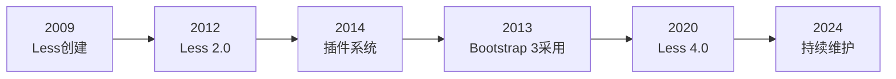
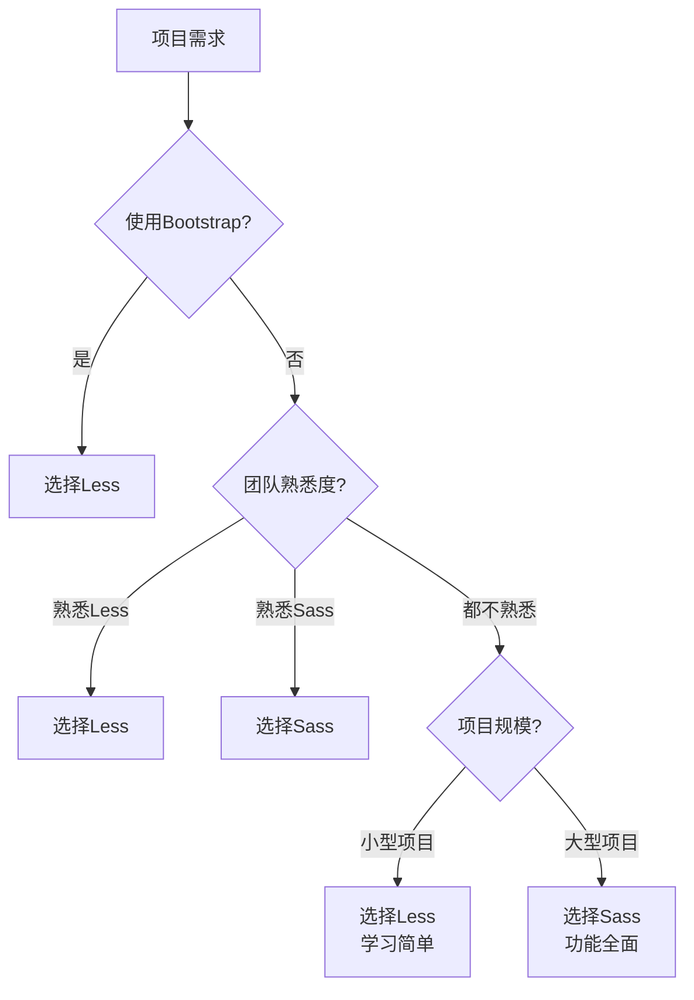
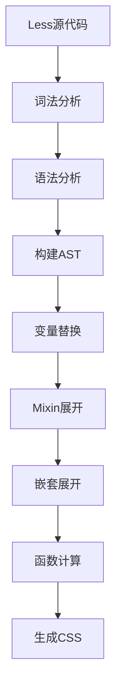

# Less 基础

Less（Leaner Style Sheets）是一种简洁易用的 CSS 预处理器，语法接近原生 CSS，学习曲线平缓，曾长期作为 Bootstrap（3.x 及更早版本）的默认样式预处理器。

## 背景与动机

### 为什么选择 Less

在 CSS 预处理器领域，Less 以其简洁性和易用性著称：

1. **学习成本低**：语法接近原生 CSS，上手快
2. **渐进增强**：可以逐步引入高级特性
3. **Bootstrap 支持**：Bootstrap 3 及更早版本使用 Less（4 起改用 Sass）
4. **浏览器端编译**：支持在浏览器中直接编译

### Less 发展历史



**关键里程碑**：
- **2009年**：Alexis Sellier 创建 Less
- **2012年**：Less 2.0 发布，性能大幅提升
- **2014年**：引入插件系统，扩展性增强
- **2013年**：Bootstrap 3 采用 Less，推动普及
- **2020年**：Less 4.0 发布，支持更多现代特性

### Less vs Sass 选择场景



## 核心概念

### Less 特点

| 特性 | 说明 |
|------|------|
| **语法接近 CSS** | 学习成本低，易于上手 |
| **变量使用 @ 符号** | 与 CSS `@media`、`@keyframes` 风格一致 |
| **支持浏览器端编译** | 可在浏览器中直接使用 |
| **功能相对简单** | 适合中小型项目 |
| **Bootstrap 支持** | Bootstrap 3 及更早版本使用 Less（4 起改用 Sass） |

### Less vs Sass 语法对比表

| 特性 | Less | Sass/SCSS |
|------|------|-----------|
| **变量符号** | `@var` | `$var` |
| **变量作用域** | 延迟加载（可在定义前使用） | 先定义后使用 |
| **Mixin 定义** | `.mixin() { }` | `@mixin mixin { }` |
| **Mixin 调用** | `.mixin();` | `@include mixin;` |
| **条件语句** | 守卫 `when` | `@if/@else` |
| **循环** | 递归 Mixin | `@for/@each/@while` |
| **模块系统** | `@import` | `@use/@forward` |
| **继承** | `:extend()` | `@extend` |
| **函数** | 有限内置函数 | 丰富内置函数 |
| **浏览器端编译** | ✅ 支持 | ❌ 不支持 |
| **学习曲线** | 简单 | 中等 |
| **社区规模** | 较大 | 最大 |

### 语法示例对比

```less
// Less 变量
@primary-color: #007bff;

// Sass 变量
$primary-color: #007bff;
```

```less
// Less Mixin
.button() {
  padding: 10px 20px;
  border: none;
}

.btn {
  .button();
}
```

```scss
// Sass Mixin
@mixin button {
  padding: 10px 20px;
  border: none;
}

.btn {
  @include button;
}
```

## 安装与配置

### 全局安装

```bash
# 使用 npm
npm install -g less

# 使用 yarn
yarn global add less

# 验证安装
lessc --version
```

### 项目本地安装

```bash
# 安装为开发依赖
npm install less --save-dev

# 安装压缩插件
npm install less-plugin-clean-css --save-dev
```

### 编译命令

```bash
# 基本编译
lessc input.less output.css

# 压缩输出
lessc input.less output.css --clean-css

# 生成 Source Map
lessc input.less output.css --source-map

# 监听文件变化（需要安装 less-watch-compiler）
npm install -g less-watch-compiler
less-watch-compiler styles less css
```

### package.json 配置

```json
{
  "scripts": {
    "less": "lessc src/less/main.less dist/css/main.css",
    "less:watch": "less-watch-compiler src/less dist/css",
    "less:prod": "lessc src/less/main.less dist/css/main.css --clean-css"
  },
  "devDependencies": {
    "less": "^4.2.0",
    "less-plugin-clean-css": "^1.5.1",
    "less-watch-compiler": "^1.16.3"
  }
}
```

## 深入原理

### Less 编译流程



### 变量延迟加载机制

Less 变量具有"延迟加载"特性，可以在定义前使用：

```less
// Less 变量延迟加载
.element {
  color: @var;  // 使用变量
}
@var: red;      // 后定义变量

// 编译后
.element {
  color: red;
}
```

⚠️ **注意**：这与 Sass 不同，Sass 要求变量先定义后使用。

### 变量作用域规则

Less 变量作用域遵循以下规则：

1. **局部优先**：块级作用域内的变量优先
2. **延迟加载**：变量可以在定义前使用
3. **最后定义**：同一作用域内多次定义，最后一次生效

```less
@color: blue;  // 全局定义

.element {
  @color: red;  // 局部定义
  color: @color;  // red
}

.other {
  color: @color;  // blue（使用全局变量）
}
```

## 变量系统

### 定义变量

使用 `@` 符号定义变量：

```less
// 基本变量
@primary-color: #007bff;
@font-size: 16px;
@border-radius: 8px;
@font-family: 'Helvetica Neue', Arial, sans-serif;

// 使用变量
.element {
  color: @primary-color;
  font-size: @font-size;
  border-radius: @border-radius;
  font-family: @font-family;
}
```

### 变量插值

使用 `@{变量名}` 在选择器、属性名或路径中使用变量：

```less
// 选择器插值
@name: button;
.@{name} {
  padding: 10px;
}
.@{name}-primary {
  background: #007bff;
}

// 属性名插值
@property: color;
.element {
  @{property}: #333;
  background-@{property}: #fff;
}

// 路径插值
@images: "../images";
.logo {
  background: url("@{images}/logo.png");
}

// 编译后
.button { padding: 10px; }
.button-primary { background: #007bff; }
.element {
  color: #333;
  background-color: #fff;
}
.logo {
  background: url("../images/logo.png");
}
```

### 变量运算

```less
@width: 100px;
@base-size: 16px;

.element {
  width: @width + 20;      // 120px
  height: @width * 2;      // 200px
  padding: (@width / 10);  // 10px
  font-size: @base-size * 1.5;  // 24px
}
```

⚠️ **注意**：Less 4 起默认数学模式为 `parens-division`——除法 `/` 只有写在括号内才会计算，否则按原样输出（如 `100px / 10`）。加、减、乘不受影响。

## 嵌套语法

### 选择器嵌套

```less
.nav {
  ul {
    list-style: none;
    margin: 0;
    padding: 0;
  }
  
  li {
    display: inline-block;
  }
  
  a {
    text-decoration: none;
    color: #333;
  }
}

// 编译后
.nav ul { list-style: none; margin: 0; padding: 0; }
.nav li { display: inline-block; }
.nav a { text-decoration: none; color: #333; }
```

### 父选择器 &

```less
.button {
  background: #007bff;
  color: white;
  
  // 伪类
  &:hover {
    background: #0056b3;
  }
  
  &:active {
    background: #004494;
  }
  
  // 修饰符
  &--primary {
    background: #28a745;
  }
  
  &--secondary {
    background: #6c757d;
  }
  
  // 嵌套元素
  &__icon {
    margin-right: 8px;
  }
}

// 编译后
.button { background: #007bff; color: white; }
.button:hover { background: #0056b3; }
.button:active { background: #004494; }
.button--primary { background: #28a745; }
.button--secondary { background: #6c757d; }
.button__icon { margin-right: 8px; }
```

### 合并嵌套 &

```less
// 多个 & 选择器
.button {
  &,
  &:hover,
  &:focus,
  &:active {
    outline: none;
  }
}

// 编译后
.button,
.button:hover,
.button:focus,
.button:active {
  outline: none;
}
```

## Mixin 系统

### 基本用法

Less 的 Mixin 语法更简洁，直接使用类选择器定义。

```less
// 定义 Mixin（使用括号表示不输出）
.flex-center() {
  display: flex;
  justify-content: center;
  align-items: center;
}

// 使用 Mixin
.container {
  .flex-center();
  height: 100vh;
}

// 不带括号的 Mixin 会被输出
.clearfix {
  &::after {
    content: '';
    display: table;
    clear: both;
  }
}

.card {
  .clearfix;  // 会输出 .clearfix 的样式
}

// 编译后
.container {
  display: flex;
  justify-content: center;
  align-items: center;
  height: 100vh;
}
.clearfix::after { content: ''; display: table; clear: both; }
.card::after { content: ''; display: table; clear: both; }
```

### 带参数的 Mixin

```less
// 必需参数
.button(@color) {
  background: @color;
  padding: 10px 20px;
  border: none;
}

.btn-primary {
  .button(#007bff);
}

// 默认参数
.button(@color; @size: 14px; @radius: 4px) {
  background: @color;
  font-size: @size;
  padding: (@size / 2) @size;
  border-radius: @radius;
  border: none;
}

.btn-lg {
  .button(#007bff; 18px; 8px);
}

.btn-default {
  .button(#6c757d;);  // 使用分号跳过参数
}
```

### @arguments 变量

`@arguments` 包含所有传入的参数：

```less
.box-shadow(@x: 0; @y: 0; @blur: 5px; @color: rgba(0, 0, 0, 0.1)) {
  box-shadow: @arguments;
}

.element {
  .box-shadow(0; 2px; 10px; rgba(0, 0, 0, 0.2));
}
// 编译后：box-shadow: 0 2px 10px rgba(0, 0, 0, 0.2);
```

### 剩余参数

```less
.box-shadow(@shadows...) {
  box-shadow: @shadows;
}

.element {
  .box-shadow(
    0 1px 2px rgba(0, 0, 0, 0.1),
    0 4px 8px rgba(0, 0, 0, 0.1)
  );
}
```

### Mixin 重载

Less 支持同名 Mixin 的重载：

```less
.button(@color) {
  background: @color;
}

.button(@color; @size) {
  background: @color;
  font-size: @size;
}

.btn-a {
  .button(#007bff);       // 调用第一个
}

.btn-b {
  .button(#007bff; 16px); // 调用第二个
}
```

### Mixin 守卫

使用 `when` 关键字添加条件：

```less
// 基本守卫
.button(@type) when (@type = primary) {
  background: #007bff;
  color: white;
}

.button(@type) when (@type = secondary) {
  background: #6c757d;
  color: white;
}

.button(@type) when (@type = danger) {
  background: #dc3545;
  color: white;
}

.btn-primary {
  .button(primary);
}

// 守卫条件
.text(@color) when (lightness(@color) >= 50%) {
  color: #333;  // 浅色背景用深色文字
}

.text(@color) when (lightness(@color) < 50%) {
  color: #fff;  // 深色背景用浅色文字
}

.element {
  background: #007bff;
  .text(#007bff);  // 输出 color: #fff
}
```

### 守卫运算符

```less
// and 运算符
.mixin(@a) when (isnumber(@a)) and (@a > 0) {
  width: @a;
}

// not 运算符
.mixin(@a) when not (@a = 0) {
  display: block;
}

// , 运算符（或）
.mixin(@a) when (@a = 1), (@a = 2) {
  flex: @a;
}
```

### 类型检查函数

```less
.mixin(@a) when (isnumber(@a)) { }    // 数字
.mixin(@a) when (isstring(@a)) { }    // 字符串
.mixin(@a) when (iscolor(@a)) { }     // 颜色
.mixin(@a) when (iskeyword(@a)) { }   // 关键字
.mixin(@a) when (isurl(@a)) { }       // URL
.mixin(@a) when (ispixel(@a)) { }     // 像素值
.mixin(@a) when (ispercentage(@a)) { } // 百分比
.mixin(@a) when (isem(@a)) { }        // em 值
.mixin(@a) when (isunit(@a, rem)) { } // 指定单位
```

### 模式匹配深入

Less 的模式匹配不仅限于守卫条件，还可以通过参数个数和类型进行匹配，实现类似函数重载的效果：

```less
// 按参数值匹配（最常用）
.button(@type) when (@type = primary) {
  background: #007bff;
  color: white;
}
.button(@type) when (@type = secondary) {
  background: #6c757d;
  color: white;
}
.button(@type) when (@type = danger) {
  background: #dc3545;
  color: white;
}

.btn-primary { .button(primary); }
.btn-secondary { .button(secondary); }
.btn-danger { .button(danger); }

// 按参数个数匹配
.size(@width) {
  width: @width;
}
.size(@width; @height) {
  width: @width;
  height: @height;
}

.element-a { .size(100px); }         // 调用单参版本
.element-b { .size(100px; 200px); }  // 调用双参版本

// 按参数类型匹配
.padding(@value) when (isnumber(@value)) {
  padding: @value;
}
.padding(@value) when (isstring(@value)) {
  padding: ~"@{value}";  // 转义字符串值
}

.numeric-pad { .padding(16px); }    // 调用数字版本
.string-pad { .padding("1rem"); }   // 调用字符串版本
```

### 守卫表达式高级用法

守卫表达式是 Less 实现条件逻辑的核心机制，支持多种运算符和组合方式：

```less
// 1. 比较运算符
.mixin(@a) when (@a > 10) { }       // 大于
.mixin(@a) when (@a >= 10) { }      // 大于等于
.mixin(@a) when (@a < 10) { }       // 小于
.mixin(@a) when (@a =< 10) { }      // 小于等于（=< 是传统写法，新版 Less 同样支持 <=）
.mixin(@a) when (@a = 10) { }       // 等于

// 不等于：Less 守卫没有 <> 运算符（会直接语法错误），用 not 组合
.mixin(@a) when not (@a = 10) { }

// 2. 逻辑运算符
// and：所有条件必须满足
.responsive(@bp) when (@bp >= 768px) and (@bp < 1024px) {
  // 平板断点
}

// ,（逗号）：任一条件满足即可（相当于 or）
.highlight(@color) when (iscolor(@color)), (iskeyword(@color)) {
  color: @color;
}

// not：取反
.hidden(@value) when not (@value = visible) {
  display: none;
}

// 3. 实际应用：响应式排版
.font-size(@bp) when (@bp = sm) {
  font-size: 14px;
  line-height: 1.4;
}
.font-size(@bp) when (@bp = md) {
  font-size: 16px;
  line-height: 1.5;
}
.font-size(@bp) when (@bp = lg) {
  font-size: 18px;
  line-height: 1.6;
}

// 4. 实际应用：颜色对比度自动选择
.text-color(@bg) when (lightness(@bg) >= 50%) {
  color: #333;  // 浅色背景用深色文字
}
.text-color(@bg) when (lightness(@bg) < 50%) {
  color: #fff;  // 深色背景用浅色文字
}

.card {
  background: #007bff;
  .text-color(#007bff);  // 输出 color: #fff
}

.alert {
  background: #ffc107;
  .text-color(#ffc107);  // 输出 color: #333
}

// 5. 实际应用：方向感知的间距
.spacing(@direction; @value) when (@direction = top) {
  margin-top: @value;
}
.spacing(@direction; @value) when (@direction = right) {
  margin-right: @value;
}
.spacing(@direction; @value) when (@direction = bottom) {
  margin-bottom: @value;
}
.spacing(@direction; @value) when (@direction = left) {
  margin-left: @value;
}
.spacing(@direction; @value) when (@direction = all) {
  margin: @value;
}

.element {
  .spacing(top; 20px);
  .spacing(all; 10px);
}
```

### 守卫 vs Sass @if 对比

```less
// Less：守卫表达式（基于 Mixin 重载）
.theme(@type) when (@type = dark) {
  background: #1a1a1a;
  color: #fff;
}
.theme(@type) when (@type = light) {
  background: #fff;
  color: #333;
}
.element { .theme(dark); }
```

```scss
// Sass：@if 条件语句（更直观）
@mixin theme($type) {
  @if $type == dark {
    background: #1a1a1a;
    color: #fff;
  } @else if $type == light {
    background: #fff;
    color: #333;
  }
}
.element { @include theme(dark); }
```

| 维度 | Less 守卫 | Sass @if |
|------|----------|----------|
| 语法形式 | 多个 Mixin 定义 + when 条件 | 单个 Mixin 内 @if/@else |
| 可读性 | 分散在多个定义中 | 集中在一个代码块 |
| 灵活性 | 条件只能基于参数 | 可基于任何变量 |
| 调试 | 较难追踪匹配了哪个分支 | 直观，类似编程语言 |

## 导入系统

### 基本导入

```less
// variables.less
@primary-color: #007bff;

// mixins.less
.flex-center() {
  display: flex;
  justify-content: center;
  align-items: center;
}

// main.less
@import 'variables';
@import 'mixins';

.element {
  color: @primary-color;
  .flex-center();
}
```

### 导入选项

```less
// 引入但不输出 CSS（用于纯变量/Mixin 文件）
@import (reference) 'variables';
@import (reference) 'mixins';

// 内联导入（不做处理）
@import (inline) 'legacy.css';

// 只导入一次
@import (once) 'variables';

// 多次导入
@import (multiple) 'component';
@import (multiple) 'component';

// 条件导入
@import (optional) 'maybe-exists.less';
```

## 函数系统

### 内置函数

#### 颜色函数

```less
@color: #007bff;

// 亮度调整
lighten(@color, 10%);     // 变亮
darken(@color, 10%);      // 变暗

// 饱和度
saturate(@color, 20%);    // 增加饱和度
desaturate(@color, 20%);  // 降低饱和度

// 透明度
fade(@color, 50%);        // 设置透明度
fadein(@color, 20%);      // 减少透明度
fadeout(@color, 20%);     // 增加透明度

// 混合
mix(@color, #fff, 50%);   // 混合白色
tint(@color, 50%);        // 与白色混合
shade(@color, 50%);       // 与黑色混合

// 旋转
spin(@color, 30);         // 色相旋转

// 颜色分量
hue(@color);              // 色相
saturation(@color);       // 饱和度
lightness(@color);        // 亮度
red(@color);              // 红色分量
green(@color);            // 绿色分量
blue(@color);             // 蓝色分量
alpha(@color);            // 透明度

// 颜色转换
rgb(0, 123, 255);
rgba(0, 123, 255, 0.5);
hsl(211, 100%, 50%);
hsla(211, 100%, 50%, 0.5);
```

#### 数学函数

```less
// 取整
ceil(10.4);       // 11
floor(10.6);      // 10
round(10.4);      // 10

// 百分比
percentage(0.5);  // 50%

// 极值
max(10, 20, 30);  // 30
min(10, 20, 30);  // 10

// 绝对值
abs(-10);         // 10

// 三角函数
sin(1);           // 正弦
cos(1);           // 余弦
tan(1);           // 正切

// 幂运算
pow(2, 3);        // 8
sqrt(16);         // 4
mod(10, 3);       // 1（取模）
```

#### 列表函数

```less
@list: 10px, 20px, 30px;

// 访问
extract(@list, 1);  // 10px（从1开始）

// 长度
length(@list);      // 3

// 追加
append(@list, 40px);  // 10px, 20px, 30px, 40px

// 合并
@list2: 40px, 50px;
merge(@list, @list2);  // 10px, 20px, 30px, 40px, 50px

// 替换
replace(@list, 20px, 25px);
```

#### 类型函数

```less
isnumber(10px);      // true
isstring('hello');   // true
iscolor(#fff);       // true
iskeyword(red);      // true
isurl(url(...));     // true
ispixel(10px);       // true
ispercentage(50%);   // true
isem(1em);           // true
isunit(1rem, rem);   // true
isruleset({ ... });  // true
```

## 运算系统

### 算术运算

```less
@width: 100px;

.element {
  width: @width + 20;    // 120px
  width: @width - 20px;  // 80px
  width: @width * 2;     // 200px
  width: (@width / 2);   // 50px（除法必须加括号，见「变量运算」的说明）
  
  // 使用 calc 保持单位
  width: calc(100% - 20px);
}
```

### 颜色运算

```less
@color: #007bff;

.element {
  color: @color + #111;        // 每通道加 17
  background: @color - #111;   // 每通道减 17
}
```

### 单位转换

```less
// Less 会自动转换单位
.element {
  width: 5cm + 10mm;    // 6cm
  width: 2px * 3;       // 6px
}
```

## 循环系统

### 基本循环

Less 使用递归 Mixin 实现循环：

```less
// 生成间距类
.generate-spacing(@n, @i: 1) when (@i =< @n) {
  .mt-@{i} { margin-top: @i * 4px; }
  .mb-@{i} { margin-bottom: @i * 4px; }
  .ml-@{i} { margin-left: @i * 4px; }
  .mr-@{i} { margin-right: @i * 4px; }
  .generate-spacing(@n, (@i + 1));
}

.generate-spacing(10);
```

### 遍历列表

```less
@colors: primary #007bff, success #28a745, warning #ffc107, danger #dc3545;

.generate-colors(@list, @i: 1) when (@i =< length(@list)) {
  @item: extract(@list, @i);
  @name: extract(@item, 1);
  @color: extract(@item, 2);
  
  .btn-@{name} {
    background: @color;
  }
  
  .generate-colors(@list, (@i + 1));
}

.generate-colors(@colors);
```

### 列循环

```less
.generate-columns(@n) {
  .col(@i) when (@i > 0) {
    .col(@i - 1);
    .col-@{i} {
      width: (100% / @n) * @i;
    }
  }
  .col(@n);
}

.generate-columns(12);
```

## 循环系统深入

### 递归 Mixin 实现循环的原理

Less 没有原生的 `@for` 或 `@each` 循环指令，而是通过**递归 Mixin + 守卫条件**实现循环效果。其核心模式为：

```less
// 循环模板
.loop(@n, @i: 1) when (@i =< @n) {
  // 循环体：使用 @i 生成样式
  .item-@{i} { /* 样式 */ }

  // 递归调用：@i 递增
  .loop(@n, (@i + 1));
}

.loop(5);  // 启动循环
```

**执行流程**：

1. 调用 `.loop(5)`，`@i` 默认为 1
2. 守卫 `1 =< 5` 为真，执行循环体
3. 递归调用 `.loop(5, 2)`
4. 守卫 `2 =< 5` 为真，继续执行
5. ...直到 `6 =< 5` 为假，递归终止

### 生成间距工具类

```less
// 生成完整的间距工具类系统
@spacing-base: 4px;

.generate-spacing(@n, @i: 0) when (@i =< @n) {
  @size: @i * @spacing-base;

  // margin 工具类
  .m-@{i}  { margin: @size; }
  .mt-@{i} { margin-top: @size; }
  .mr-@{i} { margin-right: @size; }
  .mb-@{i} { margin-bottom: @size; }
  .ml-@{i} { margin-left: @size; }
  .mx-@{i} { margin-left: @size; margin-right: @size; }
  .my-@{i} { margin-top: @size; margin-bottom: @size; }

  // padding 工具类
  .p-@{i}  { padding: @size; }
  .pt-@{i} { padding-top: @size; }
  .pr-@{i} { padding-right: @size; }
  .pb-@{i} { padding-bottom: @size; }
  .pl-@{i} { padding-left: @size; }
  .px-@{i} { padding-left: @size; padding-right: @size; }
  .py-@{i} { padding-top: @size; padding-bottom: @size; }

  .generate-spacing(@n, (@i + 1));
}

.generate-spacing(16);
// 生成 .m-0 到 .m-16, .mt-0 到 .mt-16, ... 共 100+ 个工具类
```

### 生成响应式网格

```less
@columns: 12;
@breakpoints: sm 576px, md 768px, lg 992px, xl 1200px;

// 基础列
.generate-columns(@n, @i: 1) when (@i =< @n) {
  .col-@{i} {
    flex: 0 0 percentage((@i / @n));
    max-width: percentage((@i / @n));
  }
  .generate-columns(@n, (@i + 1));
}
.generate-columns(@columns);

// 响应式列
.generate-responsive-cols(@breakpoints; @columns; @bp-index: 1) when (@bp-index =< length(@breakpoints)) {
  @bp-item: extract(@breakpoints, @bp-index);
  @bp-name: extract(@bp-item, 1);
  @bp-value: extract(@bp-item, 2);

  @media (min-width: @bp-value) {
    .generate-cols-for-bp(@columns; @bp-name; @i: 1) when (@i =< @columns) {
      .col-@{bp-name}-@{i} {
        flex: 0 0 percentage((@i / @columns));
        max-width: percentage((@i / @columns));
      }
      .generate-cols-for-bp(@columns; @bp-name; (@i + 1));
    }
    .generate-cols-for-bp(@columns; @bp-name);
  }

  .generate-responsive-cols(@breakpoints; @columns; (@bp-index + 1));
}
.generate-responsive-cols(@breakpoints; @columns);
```

### 使用 each() 函数遍历（Less 3.0+）

Less 3.0 引入了 `each()` 函数，提供了更优雅的遍历方式：

```less
// 遍历 Map 生成按钮
@button-colors: {
  primary: #007bff;
  secondary: #6c757d;
  success: #28a745;
  warning: #ffc107;
  danger: #dc3545;
};

each(@button-colors, {
  .btn-@{key} {
    background: @value;
    color: if(lightness(@value) > 50%, #333, #fff);
    border: none;
    padding: 8px 16px;
    border-radius: 4px;
    cursor: pointer;

    &:hover {
      background: darken(@value, 10%);
    }
  }
});

// 遍历列表生成字体大小
@font-sizes: 12, 14, 16, 18, 20, 24, 28, 32, 36, 48;

each(@font-sizes, {
  .text-@{value} {
    font-size: @value * 1px;
  }
});
```

### 递归 vs each() 对比

| 维度 | 递归 Mixin | each() 函数 |
|------|-----------|-------------|
| 兼容性 | 所有 Less 版本 | Less 3.0+ |
| 可读性 | 较差（需要理解递归） | 好（类似编程语言循环） |
| 灵活性 | 高（可实现复杂逻辑） | 中（主要遍历列表/Map） |
| 数字循环 | ✅ 支持 | ❌ 不支持（需递归） |
| 遍历集合 | ⚠️ 需手动索引 | ✅ 原生支持 |
| 推荐场景 | 数字范围循环 | 遍历已知集合 |

## 与 Sass 的语法差异对照表

以下对照表覆盖了 Less 与 Sass 在日常开发中最常遇到的语法差异，可作为快速参考：

### 基础语法对照

| 功能 | Less | Sass/SCSS |
|------|------|-----------|
| 变量定义 | `@color: #007bff;` | `$color: #007bff;` |
| 变量使用 | `color: @color;` | `color: $color;` |
| 变量插值 | `.@{name} { }` | `.#{$name} { }` |
| 变量作用域 | 延迟求值（可先使用后定义） | 词法作用域（先定义后使用） |
| 默认值 | 无原生支持 | `$var: value !default;` |
| 全局变量 | 最后定义生效 | `!global` 标志 |

### Mixin 对照

| 功能 | Less | Sass/SCSS |
|------|------|-----------|
| 定义 | `.mixin() { }` | `@mixin mixin { }` |
| 调用 | `.mixin();` | `@include mixin;` |
| 参数 | `.mixin(@color; @size)` | `@mixin mixin($color, $size)` |
| 默认参数 | `.mixin(@size: 14px)` | `@mixin mixin($size: 14px)` |
| 剩余参数 | `@rest...` | `$args...` |
| 内容块 | ❌ 不支持 | `@content` |
| 重载 | ✅ 按参数匹配 | ❌ 不支持 |

### 条件与循环对照

| 功能 | Less | Sass/SCSS |
|------|------|-----------|
| 条件语句 | 守卫 `when` | `@if/@else if/@else` |
| for 循环 | 递归 Mixin | `@for $i from 1 through n` |
| each 循环 | `each()` 函数 / 递归 | `@each $item in $list` |
| while 循环 | 递归 Mixin | `@while` |

### 模块与导入对照

| 功能 | Less | Sass/SCSS |
|------|------|-----------|
| 导入 | `@import 'file';` | `@use 'file';` |
| 命名空间 | ❌ 不支持 | ✅ `@use 'file' as ns;` |
| 转发 | ❌ 不支持 | `@forward 'file';` |
| 引用导入 | `@import (reference)` | `@use` 默认不输出 |
| 私有成员 | ❌ 不支持 | ✅ `-` 或 `_` 前缀 |
| 配置覆盖 | 无原生支持 | `@use 'file' with (...);` |

### 继承对照

| 功能 | Less | Sass/SCSS |
|------|------|-----------|
| 继承语法 | `:extend(.class)` | `@extend .class` |
| 占位符 | ❌ 不支持 | `%placeholder { }` |
| 跨媒体查询 | ❌ 仅同一媒体查询内有效 | ❌ 不支持 |

### 函数对照

| 功能 | Less | Sass/SCSS |
|------|------|-----------|
| 自定义函数 | ❌ 不支持（用 Mixin 模拟） | `@function name() { @return; }` |
| 颜色函数 | `darken()` `lighten()` | `darken()` `lighten()` |
| 数学函数 | `ceil()` `floor()` `round()` | `math.ceil()` `math.floor()` `math.round()` |
| 类型检查 | `isnumber()` `iscolor()` | `type-of()` |

### 注释对照

| 功能 | Less | Sass/SCSS |
|------|------|-----------|
| 静默注释 | `// 注释` | `// 注释` |
| 输出注释 | `/* 注释 */` | `/* 注释 */` |
| 强制注释 | ❌ 不支持 | `/*! 注释 */` |

## 合并属性

### 使用 + 或 +_ 合并属性值

```less
// 使用 + 合并（逗号分隔）
.mixin() {
  box-shadow+: 0 1px 2px rgba(0, 0, 0, 0.1);
}

.element {
  .mixin();
  box-shadow+: 0 4px 8px rgba(0, 0, 0, 0.1);
  // 结果：box-shadow: 0 1px 2px rgba(0,0,0,0.1), 0 4px 8px rgba(0,0,0,0.1);
}

// 使用 +_ 合并（空格分隔）
.mixin() {
  transform+_: rotate(45deg);
}

.element {
  .mixin();
  transform+_: scale(1.5);
  // 结果：transform: rotate(45deg) scale(1.5);
}
```

## Maps 系统

### Less 支持 Map 数据类型

```less
@colors: {
  primary: #007bff;
  secondary: #6c757d;
  success: #28a745;
  warning: #ffc107;
  danger: #dc3545;
}

// 访问 Map 值
.element {
  color: @colors[primary];  // #007bff
}

// 遍历 Map
each(@colors, {
  .btn-@{key} {
    background: @value;
  }
});

// 编译后
.btn-primary { background: #007bff; }
.btn-secondary { background: #6c757d; }
.btn-success { background: #28a745; }
.btn-warning { background: #ffc107; }
.btn-danger { background: #dc3545; }
```

## 浏览器端编译

### 基本使用

Less 可以在浏览器中直接编译：

```html
<link rel="stylesheet/less" href="styles.less">
<script src="https://cdn.jsdelivr.net/npm/less"></script>

<script>
  less.watch();  // 监听文件变化
</script>
```

### 浏览器端编译注意事项

⚠️ **重要提醒**：浏览器端编译仅用于开发环境，生产环境请预编译。

#### 性能问题

1. **编译时间**：浏览器端编译会增加页面加载时间
2. **缓存问题**：Less 文件无法被浏览器有效缓存
3. **用户体验**：页面可能出现样式闪烁

#### 安全限制

1. **CORS 限制**：跨域 Less 文件需要配置 CORS
2. **文件路径**：相对路径可能因页面路径不同而失效
3. **浏览器兼容性**：不支持 IE11 以下版本

#### 配置选项

```html
<script>
  less = {
    env: 'development',  // 或 'production'
    async: false,        // 异步加载
    fileAsync: false,    // 异步文件加载
    poll: 1000,          // 轮询间隔（毫秒）
    functions: {},       // 自定义函数
    dumpLineNumbers: 'comments',  // 输出行号
    relativeUrls: false  // 相对URL
  };
</script>
<script src="https://cdn.jsdelivr.net/npm/less"></script>
```

#### 最佳实践

```html
<!-- 开发环境 -->
<link rel="stylesheet/less" href="styles.less">
<script src="https://cdn.jsdelivr.net/npm/less"></script>

<!-- 生产环境 -->
<link rel="stylesheet" href="styles.css">
```

## 实战案例

### 响应式断点 Mixin

```less
// 响应式 Mixin（Less 的 Map 不支持用变量作键查询，这里用模式匹配实现）
.respond-to(@breakpoint, @rules) when (@breakpoint = sm) {
  @media (min-width: 576px) { @rules(); }
}
.respond-to(@breakpoint, @rules) when (@breakpoint = md) {
  @media (min-width: 768px) { @rules(); }
}
.respond-to(@breakpoint, @rules) when (@breakpoint = lg) {
  @media (min-width: 992px) { @rules(); }
}
.respond-to(@breakpoint, @rules) when (@breakpoint = xl) {
  @media (min-width: 1200px) { @rules(); }
}

// 使用
.container {
  padding: 15px;
  
  .respond-to(md, {
    padding: 30px;
  });
  
  .respond-to(lg, {
    padding: 40px;
  });
}
```

### 按钮组件

```less
// 按钮配置
@button-sizes: {
  sm: 12px 8px;
  md: 14px 12px;
  lg: 16px 16px;
}

// 基础按钮 Mixin
.button-base(@font-size, @padding) {
  display: inline-flex;
  align-items: center;
  justify-content: center;
  font-size: @font-size;
  padding: @padding @padding * 2;
  border: none;
  cursor: pointer;
  transition: all 0.2s;
}

// 生成按钮：外层用 each 遍历尺寸，内层用递归遍历颜色列表
// （Less 嵌套 each 会因 @key/@value 被内层覆盖而取值错误，故颜色用列表 + 递归）
@button-colors: primary #007bff, secondary #6c757d, success #28a745, danger #dc3545;

each(@button-sizes, {
  @size-name: @key;
  @size-value: @value;

  .render-color(@i) when (@i =< length(@button-colors)) {
    @pair: extract(@button-colors, @i);
    @color-name: extract(@pair, 1);
    @color-value: extract(@pair, 2);

    .btn-@{size-name}-@{color-name} {
      .button-base(extract(@size-value, 1), extract(@size-value, 2));
      background: @color-value;
      color: if(lightness(@color-value) > 50%, #333, #fff);

      &:hover {
        background: darken(@color-value, 10%);
      }
    }

    .render-color((@i + 1));
  }
  .render-color(1);
});
```

### 网格系统

```less
// 网格配置
@columns: 12;
@gutter: 30px;

// 生成列
.generate-columns(@n, @i: 1) when (@i =< @n) {
  .col-@{i} {
    flex: 0 0 percentage((@i / @n));
    max-width: percentage((@i / @n));
  }
  .generate-columns(@n, (@i + 1));
}

.generate-columns(@columns);
```

## 最佳实践

### 1. 变量命名

```less
// ✅ 推荐：语义化命名
@color-primary: #007bff;
@font-size-base: 16px;
@spacing-unit: 8px;

// ❌ 不推荐：无意义命名
@color1: #007bff;
@size: 16px;
```

### 2. 文件组织

```less
// variables.less - 变量定义
@primary-color: #007bff;

// mixins.less - Mixin 定义
.flex-center() { }

// main.less - 主文件
@import (reference) 'variables';
@import (reference) 'mixins';
```

### 3. 合理嵌套

```less
// ✅ 推荐：3 层以内
.card {
  &-header { }
  &-body { }
  &-footer { }
}

// ❌ 不推荐：嵌套过深
.page {
  .container {
    .row {
      .col {
        // 过于具体
      }
    }
  }
}
```

### 4. 使用 reference 导入

```less
// ✅ 推荐：不输出 CSS
@import (reference) 'mixins';
@import (reference) 'variables';

// ❌ 问题：会输出未使用的 CSS
@import 'mixins';
```

### 5. 避免浏览器端编译

```less
// ✅ 推荐：构建时编译
npm run less:prod

// ❌ 不推荐：浏览器端编译
<link rel="stylesheet/less" href="styles.less">
```

## 常见问题

### Q1: Less 变量为什么要用 @ 符号？

与 CSS 原生语法保持一致，如 `@media`、`@keyframes`、`@import` 等。这降低了学习成本，但也导致变量名可能与 CSS 关键字冲突。

### Q2: Less 如何实现类似 Sass @extend 的功能？

```less
// Less 使用 :extend()
.button {
  padding: 10px;
}

.button-primary:extend(.button) {
  background: #007bff;
}

// 或使用 Mixin
.button() {
  padding: 10px;
}

.button-primary {
  .button();
  background: #007bff;
}
```

### Q3: 为什么推荐使用分号分隔 Mixin 参数？

```less
// ✅ 推荐：使用分号
.mixin(@color; @size) { }

// ❌ 问题：逗号可能被误解
.mixin(#007bff, 16px);  // 可能被当作一个列表参数

// ✅ 明确用法
.mixin(#007bff; 16px);
```

### Q4: 如何选择 Less 和 Sass？

```
项目类型           推荐选择
─────────────────────────────
Bootstrap 3 旧项目   →    Less（历史兼容）
快速原型          →    Less（简单）
大型项目          →    Sass（功能全）
团队协作          →    Sass（社区大）
浏览器端编译      →    Less（支持）
```

### Q5: Less 能在媒体查询中使用 Mixin 吗？

可以，与 Sass 不同：

```less
// Less 在媒体查询中可以正常使用 Mixin
.responsive() {
  padding: 20px;
}

@media (min-width: 768px) {
  .element {
    .responsive();  // ✅ 正常工作
  }
}
```

### Q6: Less 如何处理模块化？

Less 主要依赖 `@import`，没有像 Sass 那样的 `@use/@forward` 系统：

```less
// Less 使用 @import
@import 'variables';
@import 'mixins';

// 使用 reference 避免输出
@import (reference) 'variables';
```

### Q7: Less 的性能如何？

Less 编译速度通常比 Sass 快，但功能相对简单：

```
编译速度对比（相对值，仅为示意，非实测数据，实际取决于文件规模与环境）：
Less     ████                    1x（基准）
Sass     ██████                  1.5x
Stylus   ████████                2x
```

## 参考资源

### 官方文档
- [Less 官方文档](https://lesscss.org/)
- [Less 中文网](https://lesscss.cn/)

### 学习资源
- [Less 教程](https://lesscss.org/usage/)
- [Bootstrap Less 源码](https://github.com/twbs/bootstrap/tree/v3.4.1/less)

### 工具推荐
- **Less.js**：官方 JavaScript 编译器
- **WinLess**：Windows GUI 编译器
- **Crunch**：跨平台 GUI 工具

### 相关技术
- **Bootstrap 3**：使用 Less 的知名框架
- **PostCSS**：CSS 后处理器
- **Sass**：功能更全面的预处理器
