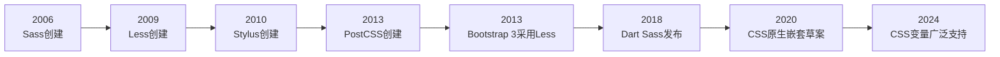
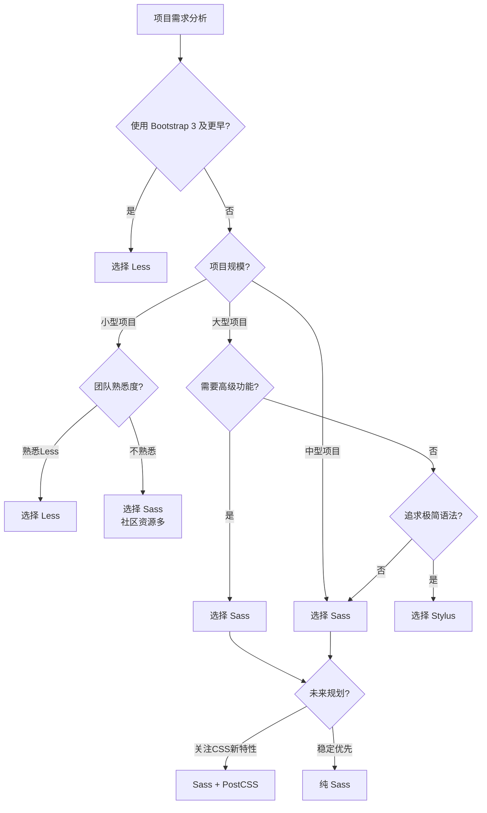
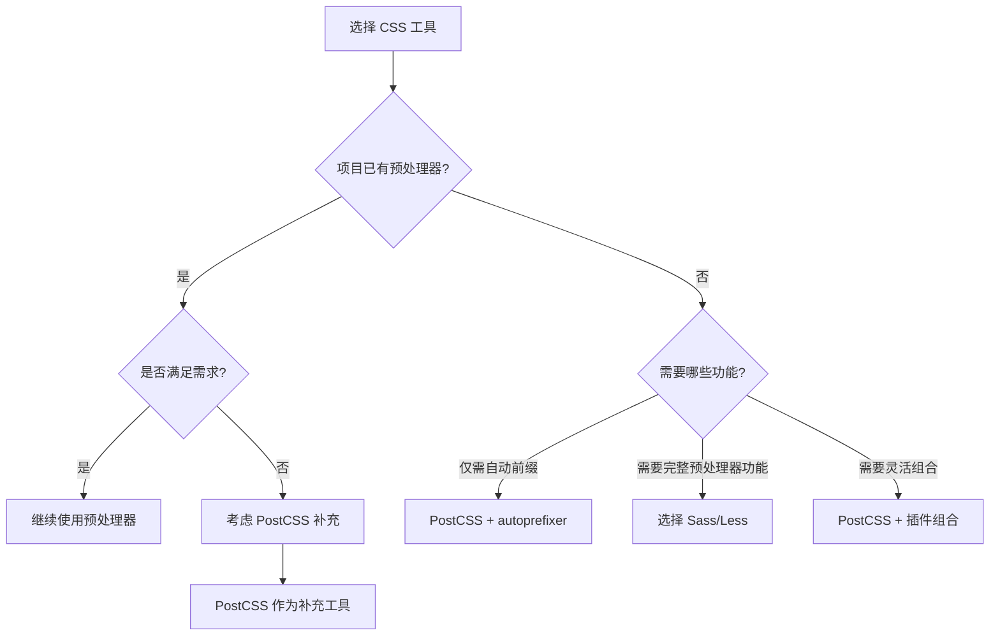
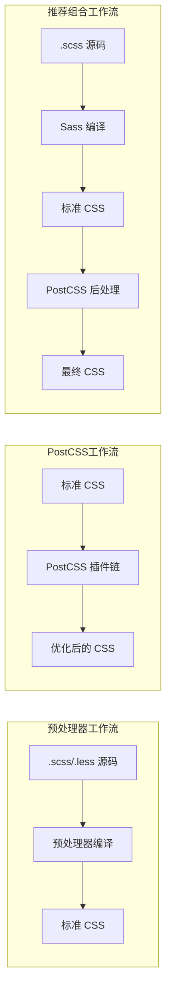
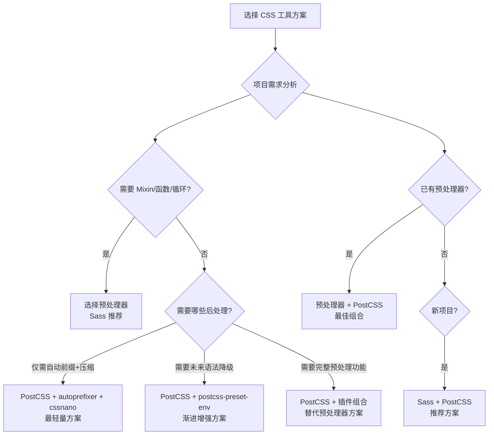
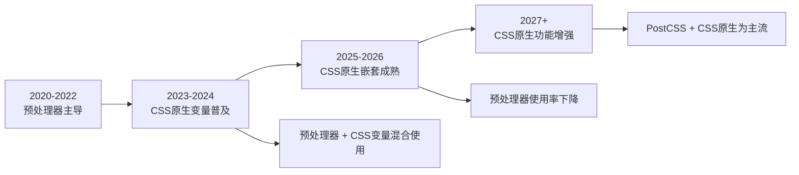

# 预处理器对比

本文档全面对比主流 CSS 预处理器（Sass、Less、Stylus）以及 PostCSS 的功能特性、性能表现、适用场景，帮助开发者根据项目需求做出正确选择。

## 背景与动机

### 为什么需要对比预处理器

在 CSS 预处理器领域，存在多种技术方案，每种都有其独特的优势和适用场景。开发者在技术选型时面临以下挑战：

1. **功能差异**：不同预处理器提供的功能集不同
2. **性能差异**：编译速度和输出文件大小存在差异
3. **生态差异**：社区规模、工具链支持、学习资源各不相同
4. **迁移成本**：从一种预处理器迁移到另一种需要投入成本
5. **未来趋势**：CSS 原生特性正在逐步支持预处理器功能

### 预处理器发展历史



**关键里程碑**：
- **2006年**：Hampton Catlin 创建 Sass，Ruby 实现
- **2009年**：Alexis Sellier 创建 Less，基于 JavaScript
- **2010年**：TJ Holowaychuk 创建 Stylus，Node.js 实现
- **2013年**：Andrey Sitnik 创建 PostCSS，CSS 后处理器
- **2013年**：Bootstrap 3 采用 Less，推动 Less 普及
- **2018年**：Dart Sass 成为 Sass 官方推荐实现
- **2020年**：CSS 原生嵌套语法进入草案阶段
- **2024年**：CSS 原生变量已广泛支持

### 选型决策流程



## 核心概念

### 三大预处理器简介

| 预处理器 | 首次发布 | 实现语言 | 主要特点 | 推荐度 |
|----------|----------|----------|----------|--------|
| **Sass** | 2006 | Dart（原 Ruby） | 功能最全面，社区最大，生态最成熟 | ⭐⭐⭐⭐⭐ |
| **Less** | 2009 | JavaScript | 语法接近 CSS，学习简单，Bootstrap 支持 | ⭐⭐⭐⭐ |
| **Stylus** | 2010 | JavaScript | 语法灵活，可省略括号分号，表达力强 | ⭐⭐⭐ |

### PostCSS 简介

PostCSS 不是预处理器，而是一个 **CSS 后处理器** 框架。它通过插件系统对编译后的 CSS 进行转换：

| 特性 | 说明 |
|------|------|
| **定位** | CSS 后处理器框架 |
| **工作方式** | 解析 CSS → 构建 AST → 插件转换 → 输出 CSS |
| **核心理念** | 通过插件组合实现所需功能 |
| **灵活性** | 最高，可自由选择所需功能 |
| **典型用途** | 自动添加浏览器前缀、嵌套语法、变量、代码压缩 |

### 市场份额趋势

```
预处理器使用率（相对流行度示意，非精确数据，具体数值以 State of CSS 历年调查为准）

Sass     ████████████████████████  最流行
Less     ████████                  次之
PostCSS  ██████                    广泛使用（多作为后处理层）
Stylus   ██                        相对小众
```

## 深入原理

### 编译架构对比

```mermaid
flowchart TB
    subgraph Sass编译
        A1[SCSS/Sass源码] --> B1[Dart Sass编译器]
        B1 --> C1[AST构建]
        C1 --> D1[变量替换/Mixin展开/嵌套展开]
        D1 --> E1[CSS输出]
    end
    
    subgraph Less编译
        A2[Less源码] --> B2[Less.js编译器]
        B2 --> C2[AST构建]
        C2 --> D2[变量替换/Mixin展开/嵌套展开]
        D2 --> E2[CSS输出]
    end
    
    subgraph PostCSS处理
        A3[CSS源码] --> B3[PostCSS解析器]
        B3 --> C3[CSS AST]
        C3 --> D3[插件链处理]
        D3 --> E3[CSS输出]
    end
    
    subgraph Stylus编译
        A4[Stylus源码] --> B4[Stylus编译器]
        B4 --> C4[AST构建]
        C4 --> D4[变量替换/Mixin展开/嵌套展开]
        D4 --> E4[CSS输出]
    end
```



### 变量系统原理对比

| 特性 | Sass | Less | Stylus | CSS 原生变量 |
|------|------|------|--------|-------------|
| **变量符号** | `$var` | `@var` | `var`（无符号） | `--var` |
| **作用域** | 块级作用域 | 延迟加载 | 块级作用域 | 继承自 DOM 树 |
| **计算时机** | 编译时 | 编译时 | 编译时 | 运行时 |
| **动态修改** | ❌ | ❌ | ❌ | ✅ JavaScript |
| **响应式** | ❌ | ❌ | ❌ | ✅ 媒体查询 |
| **继承性** | ❌ | ❌ | ❌ | ✅ DOM 继承 |
| **浏览器支持** | 编译后 | 编译后 | 编译后 | 现代浏览器（IE 不支持） |

### Mixin 实现原理对比

| 特性 | Sass | Less | Stylus |
|------|------|------|--------|
| **定义语法** | `@mixin name { }` | `.name() { }` | `name()` |
| **调用语法** | `@include name` | `.name()` | `name()` |
| **参数传递** | `$param` | `@param` | `param` |
| **默认参数** | ✅ | ✅ | ✅ |
| **剩余参数** | `$args...` | `@args...` | `args...` |
| **条件逻辑** | `@if/@else` | `when` 守卫 | `if/else` |
| **内容块** | `@content` | 不支持 | `{block}` |

### 模块系统原理对比

| 特性 | Sass | Less | Stylus |
|------|------|------|--------|
| **现代模块** | `@use/@forward` | `@import` | `@require/@import` |
| **命名空间** | ✅ 自动 | ❌ | ❌ |
| **私有成员** | ✅ `-` 前缀 | ❌ | ❌ |
| **循环依赖检测** | ✅ | ❌ | ❌ |
| **一次性导入** | ✅ 默认 | ⚠️ `@import (once)` | ✅ `@require` |

## 代码示例

### 变量定义对比

```scss
// Sass（SCSS 语法）
$primary-color: #007bff;
$font-size-base: 16px;
$border-radius: 8px;
$spacing-unit: 8px;

.element {
  color: $primary-color;
  font-size: $font-size-base;
  border-radius: $border-radius;
  padding: $spacing-unit * 2;
}
```

```less
// Less
@primary-color: #007bff;
@font-size-base: 16px;
@border-radius: 8px;
@spacing-unit: 8px;

.element {
  color: @primary-color;
  font-size: @font-size-base;
  border-radius: @border-radius;
  padding: @spacing-unit * 2;
}
```

```stylus
// Stylus
primary-color = #007bff
font-size-base = 16px
border-radius = 8px
spacing-unit = 8px

.element
  color primary-color
  font-size font-size-base
  border-radius border-radius
  padding spacing-unit * 2
```

### 嵌套语法对比

三者嵌套语法基本相同，但细节有差异：

```scss
// Sass（SCSS）
.nav {
  ul {
    list-style: none;
    margin: 0;
    padding: 0;
  }
  
  li {
    display: inline-block;
  }
  
  a {
    color: #333;
    text-decoration: none;
    
    &:hover {
      color: #007bff;
    }
    
    &.active {
      font-weight: bold;
    }
  }
  
  // Sass 支持 @at-root
  @at-root .nav-external {
    color: red;
  }
}
```

```less
// Less
.nav {
  ul {
    list-style: none;
    margin: 0;
    padding: 0;
  }
  
  li {
    display: inline-block;
  }
  
  a {
    color: #333;
    text-decoration: none;
    
    &:hover {
      color: #007bff;
    }
    
    &.active {
      font-weight: bold;
    }
  }
}
```

```stylus
// Stylus（可省略括号和分号）
.nav
  ul
    list-style none
    margin 0
    padding 0
  
  li
    display inline-block
  
  a
    color #333
    text-decoration none
    
    &:hover
      color #007bff
    
    &.active
      font-weight bold
```

### Mixin 定义与调用对比

```scss
// Sass
@mixin flex-center($direction: row) {
  display: flex;
  flex-direction: $direction;
  justify-content: center;
  align-items: center;
}

@mixin responsive($breakpoint) {
  @if $breakpoint == mobile {
    @media (max-width: 767px) { @content; }
  } @else if $breakpoint == tablet {
    @media (max-width: 1023px) { @content; }
  } @else {
    @media (min-width: 1024px) { @content; }
  }
}

.container {
  @include flex-center;
  
  @include responsive(mobile) {
    padding: 10px;
  }
  
  @include responsive(desktop) {
    padding: 30px;
  }
}
```

```less
// Less
.flex-center(@direction: row) {
  display: flex;
  flex-direction: @direction;
  justify-content: center;
  align-items: center;
}

// Less 使用守卫实现条件
.responsive(@breakpoint) when (@breakpoint = mobile) {
  @media (max-width: 767px) {
    .responsive-content();
  }
}

.responsive(@breakpoint) when (@breakpoint = desktop) {
  @media (min-width: 1024px) {
    .responsive-content();
  }
}

.container {
  .flex-center();
  
  // Less 不支持 @content，需要通过 Mixin 模拟
  .responsive-content() {
    padding: 10px;
  }
  .responsive(mobile);
}
```

```stylus
// Stylus
flex-center(direction = row)
  display flex
  flex-direction direction
  justify-content center
  align-items center

container()
  flex-center()
  
  +media('max-width: 767px')
    padding 10px
  
  +media('min-width: 1024px')
    padding 30px

.container
  container()
```

### 函数定义对比

```scss
// Sass
@use 'sass:math';

@function rem($px, $base: 16px) {
  @return math.div($px, $base) * 1rem;
}

@function color-contrast($bg-color) {
  @if lightness($bg-color) > 50% {
    @return #333;
  } @else {
    @return #fff;
  }
}

.element {
  font-size: rem(24px);
  color: color-contrast(#007bff);
}
```

```less
// Less（Mixin 内定义的变量在调用方作用域可见，可借此模拟"返回值"）
.rem(@px, @base: 16) {
  @rem-value: unit((@px / @base), rem);
}

// Less 没有真正的函数返回值，通常通过 Mixin 直接设置属性
.font-rem(@px, @base: 16) {
  font-size: unit((@px / @base), rem);
}

.element {
  .rem(24px);
  font-size: @rem-value;  // 1.5rem（来自 .rem 定义的变量）
  color: if(lightness(#007bff) > 50%, #333, #fff);
}
```

```stylus
// Stylus
rem(px, base = 16)
  return unit(px / base, 'rem')

color-contrast(bg-color)
  if lightness(bg-color) > 50%
    return #333
  else
    return #fff

.element
  font-size rem(24px)
  color color-contrast(#007bff)
```

### 条件语句对比

```scss
// Sass
@mixin theme($theme) {
  @if $theme == dark {
    background: #1a1a1a;
    color: #ffffff;
  } @else if $theme == light {
    background: #ffffff;
    color: #333333;
  } @else {
    background: #f0f0f0;
    color: #666666;
  }
}

.element {
  @include theme(dark);
}
```

```less
// Less（使用守卫）
.theme(@theme) when (@theme = dark) {
  background: #1a1a1a;
  color: #ffffff;
}

.theme(@theme) when (@theme = light) {
  background: #ffffff;
  color: #333333;
}

.theme(@theme) when not (@theme = dark) and not (@theme = light) {
  background: #f0f0f0;
  color: #666666;
}

.element {
  .theme(dark);
}
```

```stylus
// Stylus
theme(theme)
  if theme == dark
    background #1a1a1a
    color #ffffff
  else if theme == light
    background #ffffff
    color #333333
  else
    background #f0f0f0
    color #666666

.element
  theme(dark)
```

### 循环对比

```scss
// Sass
// @for 循环
@for $i from 1 through 12 {
  .col-#{$i} {
    width: percentage(math.div($i, 12));
  }
}

// @each 循环
$colors: (
  primary: #007bff,
  success: #28a745,
  warning: #ffc107,
  danger: #dc3545
);

@each $name, $color in $colors {
  .btn-#{$name} {
    background: $color;
  }
}

// @while 循环
$n: 6;
@while $n > 0 {
  .heading-#{$n} {
    font-size: 1rem + $n * 0.2rem;
  }
  $n: $n - 1;
}
```

```less
// Less（递归 Mixin 实现循环）
// 生成列
.generate-cols(@n, @i: 1) when (@i =< @n) {
  .col-@{i} {
    width: percentage((@i / @n));
  }
  .generate-cols(@n, (@i + 1));
}
.generate-cols(12);

// 遍历颜色（使用 each 函数，Less 3.0+）
@colors: {
  primary: #007bff;
  success: #28a745;
  warning: #ffc107;
  danger: #dc3545;
};

each(@colors, {
  .btn-@{key} {
    background: @value;
  }
});
```

```stylus
// Stylus（原生 for/in 循环）
// for 循环
for i in 1..12
  .col-{i}
    width (i / 12) * 100%

// 遍历对象
colors = {
  primary: #007bff,
  success: #28a745,
  warning: #ffc107,
  danger: #dc3545
}

for name, color in colors
  .btn-{name}
    background color
```

## 功能对比表

### 核心功能

| 特性 | Sass | Less | Stylus |
|------|:----:|:----:|:------:|
| 变量 | ✅ | ✅ | ✅ |
| 嵌套 | ✅ | ✅ | ✅ |
| Mixin | ✅ | ✅ | ✅ |
| 函数 | ✅ 丰富 | ⚠️ 有限 | ✅ |
| 条件语句 | ✅ `@if/@else` | ⚠️ 守卫 `when` | ✅ `if/else` |
| 循环 | ✅ `@for/@each/@while` | ⚠️ 递归/`each()` | ✅ `for/in` |
| 继承 | ✅ `@extend` | ⚠️ `:extend()` | ✅ `@extend` |
| 模块系统 | ✅ `@use/@forward` | ⚠️ `@import` | ✅ `@require` |
| Maps | ✅ 丰富 | ✅ 基础 | ✅ |
| 插值 | ✅ `#{}` | ✅ `@{}` | ✅ `{}` |
| 内容块 | ✅ `@content` | ❌ | ✅ `{block}` |
| 类型检查 | ✅ 丰富 | ✅ 中等 | ✅ 基础 |

### 内置函数对比

| 函数类型 | Sass | Less | Stylus |
|----------|:----:|:----:|:------:|
| 颜色函数 | 丰富（30+） | 中等（20+） | 丰富（25+） |
| 数学函数 | 丰富（15+） | 中等（10+） | 丰富（15+） |
| 字符串函数 | 丰富（10+） | 中等（5+） | 丰富（10+） |
| 列表函数 | 丰富（8+） | 中等（4+） | 丰富（6+） |
| Map 函数 | 丰富（8+） | 基础（2+） | 中等（4+） |
| 类型检查 | 丰富（8+） | 中等（8+） | 基础（4+） |

### 开发体验对比

| 特性 | Sass | Less | Stylus |
|------|:----:|:----:|:------:|
| 学习曲线 | 中等 | 简单 | 中等 |
| 语法严格度 | 严格（SCSS） | 接近 CSS | 灵活（可省略符号） |
| 错误提示 | 友好 | 一般 | 一般 |
| 调试支持 | 好（`@debug`） | 一般 | 一般 |
| IDE 支持 | 最好 | 好 | 一般 |
| 社区规模 | 最大 | 较大 | 较小 |
| 文档质量 | 优秀 | 良好 | 良好 |
| npm 周下载量（约数，以 npm 实时统计为准） | 2000万+ | 800万+ | 100万+ |

## 性能对比

### 编译速度

```
编译 1000 行 SCSS/Less/Styl 文件（相对时间示意，非实测，基准 = 1x）

Less      ████                      1x（基准）
Sass      ██████                    1.5x（Dart Sass）
Stylus    ████████                  2x

注：实际性能因文件复杂度和硬件而异
```

**性能说明**：
- **Less** 编译速度最快，因为功能相对简单
- **Dart Sass**（Sass 官方实现）比 LibSass 慢但功能更全
- **Stylus** 编译速度最慢，因为语法灵活性增加了处理复杂度
- 对于大型项目（10000+ 行），差异更加明显

### 编译方式对比

| 编译方式 | Sass | Less | Stylus |
|----------|:----:|:----:|:------:|
| 命令行 | ✅ `sass` | ✅ `lessc` | ✅ `stylus` |
| Node.js | ✅ `sass` | ✅ `less` | ✅ `stylus` |
| Webpack | ✅ `sass-loader` | ✅ `less-loader` | ✅ `stylus-loader` |
| Vite | ✅ 内置 | ✅ 插件 | ✅ 插件 |
| Rollup | ✅ 插件 | ✅ 插件 | ✅ 插件 |
| 浏览器端 | ❌ | ✅ | ⚠️ 有限 |
| GUI 工具 | ✅ | ✅ | ✅ |
| Source Map | ✅ | ✅ | ✅ |

### 输出文件大小

相同源代码编译后的 CSS 文件大小基本一致，差异主要来自：

1. **注释保留**：是否保留版权注释
2. **压缩程度**：压缩模式差异
3. **Source Map**：是否生成映射文件

```bash
# 压缩输出对比
sass --style=compressed input.scss output.css    # 最小输出
lessc --clean-css input.less output.css          # 相近输出
stylus --compress input.styl -o output.css       # 相近输出
```

## PostCSS 与预处理器对比

### PostCSS 详细对比

PostCSS 是 CSS 后处理器，与预处理器有本质区别：

| 特性 | 预处理器（Sass/Less/Stylus） | PostCSS |
|------|------------------------------|---------|
| **工作方式** | 将特殊语法编译为 CSS | 将 CSS 转换为 CSS |
| **输入** | 预处理器语法（.scss/.less/.styl） | 标准 CSS |
| **输出** | 标准 CSS | 标准 CSS |
| **功能** | 一体化（变量、嵌套、Mixin 等） | 插件组合（按需选择） |
| **学习成本** | 集中学习一种语法 | 分散学习多个插件 |
| **配置复杂度** | 低（开箱即用） | 高（需要配置插件） |
| **灵活性** | 中等（功能固定） | 最高（自由选择插件） |
| **社区支持** | 好 | 好 |
| **与构建工具集成** | 需要专用 loader | 统一 PostCSS 接口 |
| **未来趋势** | 成熟稳定 | 推荐方向 |

### PostCSS 常用插件

```javascript
// postcss.config.js
module.exports = {
  plugins: [
    // 嵌套语法支持
    require('postcss-nested')({
      bubble: ['screen'],
      unwrap: ['font-face', 'keyframes']
    }),
    
    // 变量支持
    require('postcss-simple-vars')({
      variables: {
        primaryColor: '#007bff',
        fontSize: '16px'
      }
    }),
    
    // Mixin 支持
    require('postcss-mixins')({
      mixins: {
        'flex-center': {
          display: 'flex',
          'justify-content': 'center',
          'align-items': 'center'
        }
      }
    }),
    
    // 循环支持
    require('postcss-for'),
    
    // 遍历支持
    require('postcss-each'),
    
    // 自动添加浏览器前缀
    require('autoprefixer')({
      overrideBrowserslist: ['> 1%', 'last 2 versions']
    }),
    
    // CSS 压缩
    require('cssnano')({
      preset: 'default'
    }),
    
    // 像素转 rem
    require('postcss-pxtorem')({
      rootValue: 16,
      propList: ['*']
    })
  ]
};
```

### PostCSS 使用示例

```css
/* 使用 PostCSS 插件的 CSS 文件 */
$primary-color: #007bff;
$font-size: 16px;

@define-mixin flex-center {
  display: flex;
  justify-content: center;
  align-items: center;
}

.container {
  @mixin flex-center;
  color: $primary-color;
  font-size: $font-size;
  
  & .child {
    color: color-mix(in srgb, $primary-color, black 10%);  /* 变深 10%，输出标准 CSS */
  }
  
  @for $i from 1 to 12 {
    .col-$i {
      width: calc(100% / 12 * $i);
    }
  }
}
```

### PostCSS vs 预处理器选择决策



### PostCSS 与预处理器结合使用

```javascript
// 推荐方案：预处理器 + PostCSS 结合
// vite.config.js
export default {
  css: {
    preprocessorOptions: {
      scss: {
        additionalData: `@use "@/styles/variables" as *;`
      }
    },
    postcss: {
      plugins: [
        require('autoprefixer'),  // 自动前缀
        require('cssnano')({      // 压缩优化
          preset: 'default'
        })
      ]
    }
  }
};
```

## 多维度综合对比

### Sass vs Less vs Stylus 全面对比表

#### 语法维度

| 维度 | Sass/SCSS | Less | Stylus |
|------|-----------|------|--------|
| **语法风格** | SCSS 兼容 CSS，Sass 缩进式 | 接近 CSS | 极简，可省略一切符号 |
| **变量符号** | `$var` | `@var` | `var`（无符号）或 `$var` |
| **嵌套语法** | 与 CSS 原生嵌套接近 | 与 Sass 相同 | 缩进式，无需大括号 |
| **注释** | `//` 静默，`/* */` 输出，`/*! */` 强制 | `//` 静默，`/* */` 输出 | `//` 静默，`/* */` 输出 |
| **分号** | 必需（SCSS）/ 不需要（Sass） | 必需 | 可选 |
| **大括号** | 必需（SCSS）/ 不需要（Sass） | 必需 | 可选 |

#### 功能维度

| 维度 | Sass/SCSS | Less | Stylus |
|------|-----------|------|--------|
| **变量** | ✅ 7 种数据类型 | ✅ 延迟求值 | ✅ 动态类型 |
| **嵌套** | ✅ 选择器 + 属性嵌套 | ✅ 选择器嵌套 | ✅ 选择器 + 属性嵌套 |
| **Mixin** | ✅ `@mixin` + `@include` | ✅ `.mixin()` 调用 | ✅ 函数式调用 |
| **函数** | ✅ `@function` + `@return` | ❌ 无自定义函数 | ✅ 原生函数定义 |
| **条件** | ✅ `@if/@else` | ⚠️ 守卫 `when` | ✅ `if/else` |
| **循环** | ✅ `@for/@each/@while` | ⚠️ 递归 / `each()` | ✅ `for/in` |
| **继承** | ✅ `@extend` + `%占位符` | ⚠️ `:extend()` | ✅ `@extend` |
| **模块** | ✅ `@use/@forward` | ⚠️ `@import` | ✅ `@require/@import` |
| **内容块** | ✅ `@content` | ❌ | ✅ `{block}` |
| **Map** | ✅ 丰富操作函数 | ✅ 基础 Map 支持 | ✅ 对象字面量 |
| **类型检查** | ✅ `type-of()` | ✅ `isnumber()` 等 | ✅ `typeof()` |
| **@at-root** | ✅ | ❌ | ❌ |

#### 生态维度

| 维度 | Sass/SCSS | Less | Stylus |
|------|-----------|------|--------|
| **npm 周下载量** | ~2000 万 | ~800 万 | ~100 万 |
| **GitHub Stars** | ~14k | ~17k | ~11k |
| **框架支持** | Bootstrap 5+, Foundation, Bulma | Bootstrap 3 及更早 | 原生支持较少 |
| **IDE 插件** | 最好（VS Code/WebStorm 原生支持） | 好 | 一般 |
| **社区资源** | 最丰富（教程、库、工具） | 较丰富 | 较少 |
| **设计系统** | 最多（MUI, Vuetify 等） | 较多 | 较少 |

#### 性能维度

| 维度 | Sass/SCSS | Less | Stylus |
|------|-----------|------|--------|
| **编译速度** | 中等（Dart Sass） | 最快 | 较慢 |
| **大型项目** | 好（模块系统避免重复编译） | 一般（全局变量） | 一般 |
| **增量编译** | ✅ Vite/Webpack 支持 | ✅ 支持 | ⚠️ 有限 |
| **Source Map** | ✅ | ✅ | ✅ |
| **浏览器端编译** | ❌ | ✅ | ⚠️ 有限 |

#### 学习曲线维度

| 维度 | Sass/SCSS | Less | Stylus |
|------|-----------|------|--------|
| **上手难度** | 中等 | 简单 | 中等 |
| **CSS 基础迁移** | SCSS 几乎零成本 | 几乎零成本 | 需适应缩进语法 |
| **高级特性学习** | 较陡（模块系统、函数） | 平缓（功能较少） | 中等 |
| **错误提示** | 友好 | 一般 | 一般 |
| **调试支持** | 好（`@debug/@warn/@error`） | 一般 | 一般 |

### 选型决策流程

```mermaid
flowchart TD
    A[项目启动：CSS 预处理器选型] --> B{已有技术栈约束?}
    B -->|Bootstrap 5+| C[Sass/SCSS]
    B -->|Bootstrap 3 及更早| D[Less]
    B -->|无约束| E{项目规模?}

    E -->|小型/原型| F{团队经验?}
    F -->|熟悉 Less| G[Less<br/>学习成本最低]
    F -->|熟悉 Sass| H[Sass<br/>功能全面]
    F -->|都不熟悉| I[Less<br/>语法最接近 CSS]

    E -->|中型项目| J{需要高级功能?}
    J -->|是| K[Sass<br/>Mixin/函数/模块]
    J -->|否| L{团队偏好?}
    L -->|简洁语法| M[Less]
    L -->|极简语法| N[Stylus]

    E -->|大型项目| O{架构需求?}
    O -->|模块化/设计系统| P[Sass<br/>@use/@forward 模块系统]
    O -->|追求极致灵活| Q[Stylus<br/>最灵活语法]

    A --> R{是否关注未来?}
    R -->|是| S[Sass + PostCSS + CSS 原生变量<br/>推荐组合方案]
    R -->|稳定优先| T[Sass<br/>社区最大、生态最成熟]

```

## PostCSS 的定位

### PostCSS 不是预处理器

PostCSS 常被误认为是预处理器，但它本质上是一个 **CSS 后处理器框架**。理解它与预处理器的区别，对于技术选型至关重要：



| 维度 | 预处理器（Sass/Less/Stylus） | PostCSS |
|------|------------------------------|---------|
| **定位** | CSS 超集语言 | CSS 转换工具框架 |
| **输入** | 自定义语法（.scss/.less/.styl） | 标准 CSS |
| **输出** | 标准 CSS | 标准 CSS |
| **核心机制** | 一体化功能集 | 插件组合 |
| **学习方式** | 学习一套语法 | 学习多个插件 |
| **灵活性** | 中等（功能固定） | 最高（按需选插件） |
| **与 CSS 的关系** | 超集（扩展 CSS） | 子集（处理 CSS） |

### PostCSS 的核心价值

PostCSS 的价值不在于替代预处理器，而在于**补充预处理器无法覆盖的后处理需求**：

1. **自动添加浏览器前缀**（autoprefixer）：根据 Can I Use 数据自动补全
2. **CSS 压缩优化**（cssnano）：删除空白、合并规则、优化选择器
3. **未来 CSS 语法降级**（postcss-preset-env）：使用 CSS 新特性，自动降级
4. **像素转 rem**（postcss-pxtorem）：移动端适配自动转换
5. **CSS 语法检查**（stylelint）：代码规范检查

### 何时选择 PostCSS 替代预处理器



### 原生 CSS 赶超后的预处理器价值分析

随着 CSS 原生特性不断丰富，预处理器的部分核心功能正在被替代。以下从"已被替代"、"正在被替代"和"仍不可替代"三个层面分析：

#### 已被原生 CSS 替代的功能

| 功能 | 原生 CSS 方案 | 替代程度 |
|------|-------------|----------|
| 变量 | CSS 自定义属性 `--var` | ✅ 完全替代（且更强大：运行时动态） |
| 简单计算 | `calc()` / `min()` / `max()` / `clamp()` | ✅ 大部分替代 |
| 嵌套 | CSS 原生嵌套 `&` | ✅ 主流浏览器已支持 |
| 媒体查询嵌套 | `@media` 可写在规则内 | ✅ 已支持 |

#### 正在被原生 CSS 替代的功能

| 功能 | 原生 CSS 方案 | 替代程度 |
|------|-------------|----------|
| 颜色混合 | `color-mix(in srgb, ...)` | ✅ 已广泛支持（2023 起基线） |
| 层叠控制 | `@layer` | ⚠️ 已支持但用途不同 |
| 容器查询 | `@container` | ⚠️ 已支持，部分替代响应式 Mixin |
| 作用域样式 | `@scope` | ✅ 已支持（2024 起基线） |

#### 仍不可替代的预处理器功能

| 功能 | 为什么不可替代 | 预计替代时间 |
|------|--------------|-------------|
| **Mixin（带参数样式复用）** | CSS 无等价物，无法封装+参数化样式逻辑 | 无明确提案 |
| **@for/@each 循环** | CSS 无循环能力，无法批量生成样式 | 无明确提案 |
| **@if 条件编译** | CSS 无编译时条件，无法按配置输出不同 CSS | 无明确提案 |
| **@use/@forward 模块** | CSS 无命名空间隔离机制 | 无明确提案 |
| **自定义函数** | CSS 无自定义函数能力 | 无明确提案 |
| **@extend 继承** | CSS 无选择器合并机制 | 无明确提案 |

**结论**：CSS 原生特性替代的是预处理器的"语法糖"功能（变量、嵌套），而预处理器的"编程能力"（Mixin、循环、条件、函数、模块）在可预见的未来仍不可替代。

### 迁移策略：从预处理器到原生 CSS

对于希望逐步减少预处理器依赖的项目，推荐以下渐进式迁移策略：


#### 阶段1：混合使用（立即可做）

在现有预处理器项目中，逐步引入 CSS 原生变量，实现运行时主题切换：

```scss
// 保留 Sass 变量用于编译时计算
$colors: (primary: #007bff, secondary: #6c757d);

// 生成 CSS 变量用于运行时动态
:root {
  @each $name, $color in $colors {
    --color-#{$name}: #{$color};
  }
}

// 组件中优先使用 CSS 变量
.button {
  background: var(--color-primary);  // 运行时可切换
  padding: $spacing-md;              // 编译时确定
}
```

#### 阶段2：原生替代（浏览器支持后）

将编译时变量逐步替换为 CSS 原生变量，将嵌套替换为 CSS 原生嵌套：

```css
/* 替换前：Sass 变量 + 嵌套 */
/* $primary: #007bff; */
/* .card { .title { color: $primary; } } */

/* 替换后：CSS 原生变量 + 嵌套 */
:root { --primary: #007bff; }
.card {
  & .title { color: var(--primary); }
}
```

#### 阶段3：精简预处理器

只保留预处理器不可替代的功能（Mixin、循环、函数、模块）：

```scss
// 保留：Mixin（CSS 无等价物）
@mixin respond-to($bp) {
  @media (min-width: $bp) { @content; }
}

// 保留：循环（CSS 无等价物）
@each $name, $color in $theme-colors {
  .btn-#{$name} { background: $color; }
}

// 替换：变量 → CSS 变量
// 替换：嵌套 → CSS 原生嵌套
// 替换：简单计算 → calc()/clamp()
```

#### 阶段4：最小依赖

最终保留 Sass 仅用于 Mixin/循环/函数，其余全部使用 CSS 原生特性，PostCSS 负责后处理：

```javascript
// vite.config.js — 最小预处理器依赖配置
export default {
  css: {
    preprocessorOptions: {
      scss: {
        // 仅保留 Mixin/函数/循环定义
        additionalData: `@use "@/styles/mixins" as *;`,
      }
    },
    postcss: {
      plugins: [
        require('autoprefixer'),
        require('cssnano')({ preset: 'default' }),
      ]
    }
  }
};
```

#### 迁移注意事项

| 注意事项 | 说明 |
|----------|------|
| **浏览器兼容** | CSS 原生嵌套、`@layer` 等需要现代浏览器，旧浏览器不支持 |
| **渐进迁移** | 不要一次性替换，逐个组件/模块迁移 |
| **保留回退** | 对关键功能保留预处理器版本作为回退 |
| **测试覆盖** | 每次迁移后进行视觉回归测试 |
| **团队共识** | 确保团队理解迁移策略和优先级 |

## CSS 原生特性进展

### 现代 CSS 已支持的特性

```css
/* 1. CSS 原生变量（已广泛支持） */
:root {
  --primary-color: #007bff;
  --font-size: 16px;
  --spacing-unit: 8px;
}

.element {
  color: var(--primary-color);
  font-size: var(--font-size);
  padding: calc(var(--spacing-unit) * 2);
}

/* JavaScript 动态修改 */
/* document.documentElement.style.setProperty('--primary-color', '#ff0000'); */

/* 2. CSS 原生嵌套（2024年主流浏览器支持） */
.element {
  color: red;
  
  & .child {
    color: blue;
  }
  
  &:hover {
    color: green;
  }
  
  & + & {
    margin-top: 10px;
  }
}

/* 3. CSS @layer（层叠层） */
@layer base, components, utilities;

@layer base {
  .element {
    color: red;
  }
}

@layer components {
  .element {
    color: blue;  /* 优先级高于 base */
  }
}

/* 4. CSS @container（容器查询） */
.card-container {
  container-type: inline-size;
  container-name: card;
}

@container card (min-width: 400px) {
  .card {
    display: flex;
  }
}

/* 5. CSS @scope（作用域样式） */
@scope (.card) to (.card__content) {
  :scope {
    padding: 20px;
  }
  
  .title {
    font-size: 1.5rem;
  }
}

/* 6. CSS :has() 选择器 */
.card:has(.featured) {
  border: 2px solid gold;
}

/* 7. CSS 原生 calc() */
.element {
  width: calc(100% - 2rem);
  height: calc(100vh - 64px);
  font-size: calc(1rem + 0.5vw);
}
```

### 原生支持对比表

| 特性 | CSS 原生 | Sass | Less | Stylus |
|------|----------|------|------|--------|
| 变量 | ✅ CSS 变量（运行时） | ✅ 编译时 | ✅ 编译时 | ✅ 编译时 |
| 嵌套 | ✅ 2024 主流支持 | ✅ | ✅ | ✅ |
| Mixin | ❌ | ✅ | ✅ | ✅ |
| 函数 | ⚠️ `calc()` 等 | ✅ 丰富 | ⚠️ 有限 | ✅ |
| 循环 | ❌ | ✅ | ⚠️ 递归 | ✅ |
| 条件 | ❌ | ✅ | ⚠️ 守卫 | ✅ |
| 模块化 | ⚠️ `@import` | ✅ `@use` | ✅ `@import` | ✅ `@require` |
| 层叠控制 | ✅ `@layer` | ❌ | ❌ | ❌ |
| 容器查询 | ✅ `@container` | ❌ | ❌ | ❌ |
| 作用域 | ✅ `@scope` | ❌ | ❌ | ❌ |

### 预处理器 + CSS 原生变量结合

```scss
// 推荐方案：预处理器变量用于编译时计算，CSS 变量用于运行时动态

// 1. 预处理器定义设计令牌
$colors: (
  primary: #007bff,
  secondary: #6c757d,
  success: #28a745,
  warning: #ffc107,
  danger: #dc3545
);

// 2. 生成 CSS 变量
:root {
  @each $name, $color in $colors {
    --color-#{$name}: #{$color};
  }
  
  // 间距系统
  --spacing-xs: 4px;
  --spacing-sm: 8px;
  --spacing-md: 16px;
  --spacing-lg: 24px;
  --spacing-xl: 32px;
}

// 3. 组件中使用 CSS 变量实现动态主题
.button {
  background: var(--color-primary);
  color: white;
  padding: var(--spacing-sm) var(--spacing-md);
  border: none;
  border-radius: 4px;
  cursor: pointer;
  transition: background 0.2s;
  
  &:hover {
    background: color-mix(in srgb, var(--color-primary) 85%, black);
  }
  
  &--success {
    background: var(--color-success);
  }
  
  &--danger {
    background: var(--color-danger);
  }
}

// 4. 暗色主题
[data-theme="dark"] {
  --color-primary: #4da3ff;
  --color-secondary: #adb5bd;
  --color-success: #5cb85c;
  --color-warning: #f0ad4e;
  --color-danger: #d9534f;
}
```

## 迁移指南

### Less → Sass 迁移

#### 1. 变量转换

```less
// Less
@primary-color: #007bff;
@font-size: 16px;
@border-radius: 8px;
```

```scss
// Sass
$primary-color: #007bff;
$font-size: 16px;
$border-radius: 8px;
```

#### 2. Mixin 转换

```less
// Less
.button(@color; @size: 14px) {
  background: @color;
  font-size: @size;
  padding: (@size / 2) @size;
  border: none;
}

.btn {
  .button(#007bff);
}

.btn-lg {
  .button(#007bff; 18px);
}
```

```scss
// Sass
@mixin button($color, $size: 14px) {
  background: $color;
  font-size: $size;
  padding: math.div($size, 2) $size;
  border: none;
}

.btn {
  @include button(#007bff);
}

.btn-lg {
  @include button(#007bff, 18px);
}
```

#### 3. 条件语句转换

```less
// Less（守卫）
.button(@type) when (@type = primary) {
  background: #007bff;
  color: white;
}

.button(@type) when (@type = secondary) {
  background: #6c757d;
  color: white;
}

.button(@type) when (@type = danger) {
  background: #dc3545;
  color: white;
}
```

```scss
// Sass
@mixin button($type) {
  @if $type == primary {
    background: #007bff;
    color: white;
  } @else if $type == secondary {
    background: #6c757d;
    color: white;
  } @else if $type == danger {
    background: #dc3545;
    color: white;
  }
}
```

#### 4. 循环转换

```less
// Less（递归）
.generate-cols(@n, @i: 1) when (@i =< @n) {
  .col-@{i} { width: percentage((@i / @n)); }
  .generate-cols(@n, (@i + 1));
}
.generate-cols(12);
```

```scss
// Sass
@use 'sass:math';

@for $i from 1 through 12 {
  .col-#{$i} {
    width: percentage(math.div($i, 12));
  }
}
```

#### 5. 导入转换

```less
// Less
@import 'variables';
@import (reference) 'mixins';
@import (once) 'base';
```

```scss
// Sass
@use 'variables' as *;
@use 'mixins';  // 自动命名空间
@use 'base';    // 默认只导入一次
```

### Sass → Less 迁移

#### 1. 变量转换

```scss
// Sass
$primary-color: #007bff;
$font-size: 16px;
```

```less
// Less
@primary-color: #007bff;
@font-size: 16px;
```

#### 2. Mixin 转换

```scss
// Sass
@mixin flex-center {
  display: flex;
  justify-content: center;
  align-items: center;
}

.container {
  @include flex-center;
}
```

```less
// Less
.flex-center() {
  display: flex;
  justify-content: center;
  align-items: center;
}

.container {
  .flex-center();
}
```

#### 3. 函数转换

```scss
// Sass
@use 'sass:math';

@function rem($px) {
  @return math.div($px, 16px) * 1rem;
}

.element {
  font-size: rem(24px);
}
```

```less
// Less（通过 Mixin 模拟）
.rem(@px) {
  font-size: unit((@px / 16), rem);
}

.element {
  .rem(24px);
}
```

### 迁移工具推荐

| 工具 | 用途 | 地址 |
|------|------|------|
| **less2sass** | Less → SCSS 转换 | `npm install -g less2sass` |
| **sass-convert** | Sass ↔ SCSS 转换 | Sass 内置工具 |
| **postcss-scss** | SCSS 语法 PostCSS 处理 | `npm install postcss-scss` |
| **手动脚本** | 批量替换变量符号 | 见下方脚本 |

#### 批量迁移脚本

```bash
#!/bin/bash
# Less → Sass 批量迁移脚本

# 1. 备份原文件
mkdir -p backup
find . -name "*.less" -exec cp {} backup/ \;

# 2. 重命名文件
find . -name "*.less" -exec rename 's/\.less$/.scss/' {} \;

# 3. 替换变量符号 @ → $
# 先替换变量定义（@name: → $name:）
find . -name "*.scss" -exec sed -i '' 's/@\([a-zA-Z][a-zA-Z0-9-]*\):/$\1:/g' {} \;
# ⚠️ 变量使用处的替换切勿用全局正则：`s/@xxx/$xxx/g` 会把 @media、@import、@include
# 等 @ 规则一并误改。请用编辑器正则排除 @ 规则后逐处替换，替换后务必人工核对。
# find . -name "*.scss" -exec sed -i '' 's/@\([a-zA-Z][a-zA-Z0-9-]*\)/$\1/g' {} \;

# 4. 替换 Mixin 调用（需要手动检查）
# .mixin() → @include mixin
# .mixin(@arg) → @include mixin($arg)

# 5. 替换 @import → @use
find . -name "*.scss" -exec sed -i '' "s/@import '\(.*\)';/@use '\1' as *;/g" {} \;

echo "迁移完成，请手动检查以下项目："
echo "1. 变量使用处（@xxx → \$xxx，注意排除 @ 规则）"
echo "2. Mixin 定义和调用"
echo "3. 守卫条件语句"
echo "4. 循环语法"
echo "5. 函数定义"
```

### 版本兼容性

#### Sass 版本兼容性

| 版本 | 发布时间 | 重要变更 | Node.js 要求 |
|------|----------|----------|-------------|
| **Sass 1.80+** | 2024 | `@import` 弃用警告激活 | >= 14.0.0 |
| **Sass 1.79+** | 2024 | 新色彩空间；`lighten()/darken()` 等弃用 | >= 14.0.0 |
| **Sass 1.58+** | 2023 | `@use` 完全支持 | >= 14.0.0 |
| **Sass 1.45+** | 2021 | 新模块系统稳定 | >= 12.0.0 |
| **Sass 1.33+** | 2020 | `math.div()` 引入 | >= 12.0.0 |
| **Sass 1.23+** | 2020 | `@use/@forward` 引入 | >= 8.0.0 |
| **Sass 1.0** | 2018 | Dart Sass 正式发布 | >= 8.0.0 |

#### Less 版本兼容性

| 版本 | 发布时间 | 重要变更 | Node.js 要求 |
|------|----------|----------|-------------|
| **Less 4.2+** | 2021 | 性能优化 | >= 14.0.0 |
| **Less 4.0** | 2020 | 新解析器 | >= 10.0.0 |
| **Less 3.0** | 2017 | `each()`、Maps | >= 6.0.0 |
| **Less 2.0** | 2012 | 插件系统 | >= 4.0.0 |

#### PostCSS 版本兼容性

| 版本 | 发布时间 | 重要变更 | Node.js 要求 |
|------|----------|----------|-------------|
| **PostCSS 8.4+** | 2021 | 性能优化 | >= 14.0.0 |
| **PostCSS 8.0** | 2020 | 新 Source Map API | >= 10.0.0 |
| **PostCSS 7.0** | 2018 | 插件 API 变更 | >= 6.0.0 |

#### 构建工具兼容性

```json
{
  "compatibility": {
    "webpack5": {
      "sass-loader": ">=12.0.0",
      "less-loader": ">=10.0.0",
      "stylus-loader": ">=6.0.0",
      "postcss-loader": ">=6.0.0"
    },
    "vite4": {
      "sass": "内置支持",
      "less": "内置支持",
      "stylus": "内置支持",
      "postcss": "内置支持"
    },
    "rollup3": {
      "rollup-plugin-sass": ">=2.0.0",
      "rollup-plugin-less": ">=1.2.0",
      "rollup-plugin-postcss": ">=4.0.0"
    }
  }
}
```

## 最佳实践

### 1. 统一团队选择

```
团队配置建议

├── 技术选型
│   ├── 统一使用一种预处理器（推荐 Sass）
│   ├── 统一命名规范（BEM 推荐）
│   └── 统一文件结构
│
├── 开发规范
│   ├── 变量命名：语义化（$color-primary 而非 $c1）
│   ├── Mixin 命名：动词/形容词（flex-center 而非 mc）
│   └── 嵌套深度：≤3 层
│
└── 工具配置
    ├── 编辑器插件统一
    ├── 编译配置统一
    └── 代码格式化统一
```

### 2. 与现代工具链集成

```javascript
// Vite 配置
// vite.config.js
import { defineConfig } from 'vite';

export default defineConfig({
  css: {
    preprocessorOptions: {
      scss: {
        // 全局注入变量和 Mixin
        additionalData: `
          @use "@/styles/variables" as *;
          @use "@/styles/mixins" as *;
        `,
        // 使用现代 Sass API
        api: 'modern-compiler',
        // Source Map
        sourceMap: true
      },
      less: {
        additionalData: `
          @import "@/styles/variables.less";
          @import "@/styles/mixins.less";
        `,
        javascriptEnabled: true
      }
    },
    postcss: {
      plugins: [
        require('autoprefixer')(),
        require('cssnano')({ preset: 'default' })
      ]
    }
  }
});
```

```javascript
// Webpack 配置
// webpack.config.js
module.exports = {
  module: {
    rules: [
      {
        test: /\.scss$/,
        use: [
          'style-loader',
          {
            loader: 'css-loader',
            options: { sourceMap: true }
          },
          {
            loader: 'postcss-loader',
            options: {
              postcssOptions: {
                plugins: ['autoprefixer', 'cssnano']
              }
            }
          },
          {
            loader: 'sass-loader',
            options: {
              additionalData: `
                @use "@/styles/variables" as *;
                @use "@/styles/mixins" as *;
              `,
              sourceMap: true
            }
          }
        ]
      }
    ]
  }
};
```

### 3. 关注 CSS 新特性

预处理器与原生 CSS 结合使用：

```scss
// 预处理器变量用于编译时计算
$sizes: (
  xs: 4px,
  sm: 8px,
  md: 16px,
  lg: 24px,
  xl: 32px
);

// CSS 变量用于运行时动态
:root {
  @each $name, $size in $sizes {
    --spacing-#{$name}: #{$size};
  }
}

// 组件中使用 CSS 变量实现响应式设计
.card {
  padding: var(--spacing-md);
  
  @container (min-width: 768px) {
    padding: var(--spacing-xl);
  }
}

// 使用 CSS :has() 选择器
.card:has(.card__image) {
  display: grid;
  grid-template-columns: 200px 1fr;
}
```

### 4. 性能优化

```scss
// ✅ 推荐：使用 @use 避免重复导入
@use 'variables' as *;
@use 'mixins' as *;

// ❌ 避免：使用 @import 导致重复编译
@import 'variables';
@import 'mixins';

// ✅ 推荐：使用 @for 代替嵌套 Mixin 递归
@for $i from 1 through 12 {
  .col-#{$i} { width: percentage(math.div($i, 12)); }
}

// ❌ 避免：深层嵌套增加选择器复杂度
.page .container .row .col .element { }

// ✅ 推荐：使用 @extend 减少重复代码
%button-base {
  padding: 8px 16px;
  border: none;
  cursor: pointer;
}

.btn-primary {
  @extend %button-base;
  background: #007bff;
}

.btn-secondary {
  @extend %button-base;
  background: #6c757d;
}
```

## 常见问题

### Q1: 预处理器会影响页面性能吗？

不会。预处理器在构建阶段编译为标准 CSS，浏览器接收的是普通 CSS 文件，对运行时性能无影响。但需要注意：

1. **编译产物大小**：过度使用 `@extend` 可能导致 CSS 膨胀
2. **选择器复杂度**：嵌套过深导致选择器过于具体
3. **重复代码**：Mixin 使用不当导致代码重复

### Q2: 如何选择编译方式？

| 场景 | 推荐方式 |
|------|----------|
| 小型项目 | 命令行编译 |
| 中型项目 | npm scripts + watch |
| 大型项目 | Webpack/Vite 集成 |
| 快速原型 | GUI 工具 |
| 团队协作 | 构建工具集成 + CI/CD |

### Q3: 是否应该迁移到 PostCSS？

取决于项目需求：

```
推荐迁移到 PostCSS 的场景：
├── 希望更灵活的插件组合
├── 只需要部分预处理器功能
├── 想要更接近 CSS 原生语法
├── 项目使用现代构建工具
└── 新项目从零开始

继续使用预处理的场景：
├── 团队已熟悉预处理器
├── 需要完整的功能支持
├── 项目依赖大量 Mixin/函数
├── 迁移成本过高
└── 使用 Bootstrap 等依赖预处理器的框架
```

### Q4: CSS 原生嵌套会取代预处理器吗？

短期内不会。预处理器仍具有优势：

- Mixin 和函数系统
- 模块化导入（`@use/@forward`）
- 循环和条件语句
- 成熟的生态系统和工具链

建议：关注 CSS 新特性，同时保持预处理器使用。逐步将 CSS 变量与预处理器变量结合使用。

### Q5: 如何处理预处理器版本兼容性？

```bash
# 1. 锁定版本
{
  "devDependencies": {
    "sass": "1.69.5",
    "less": "4.2.0"
  }
}

# 2. 使用 .nvmrc 统一 Node.js 版本
echo "18.17.0" > .nvmrc

# 3. 使用 Docker 统一环境
# Dockerfile
FROM node:18
RUN npm install -g sass@1.69.5

# 4. CI/CD 中固定版本
# .github/workflows/build.yml
- uses: actions/setup-node@v4
  with:
    node-version: '18'
- run: npm ci  # 使用 lock 文件
```

### Q6: Sass 和 Less 可以混合使用吗？

技术上可以，但不推荐：

```javascript
// webpack.config.js（不推荐）
module.exports = {
  module: {
    rules: [
      { test: /\.scss$/, use: ['sass-loader'] },
      { test: /\.less$/, use: ['less-loader'] }
    ]
  }
};

// 问题：
// 1. 增加构建复杂度
// 2. 无法共享变量和 Mixin
// 3. 团队协作混乱
// 建议：统一使用一种预处理器
```

### Q7: 从 Sass 迁移到 CSS 原生特性的路线图？

```
阶段 1（立即可做）：
├── 使用 CSS 原生变量替代 Sass 变量（用于主题色等动态值）
├── 使用 CSS calc() 替代 Sass 数学运算
└── 使用 CSS 原生嵌套（浏览器支持后）

阶段 2（浏览器广泛支持后）：
├── 使用 CSS @layer 替代 BEM 命名
├── 使用 CSS @container 替代部分响应式 Mixin
└── 使用 CSS :has() 替代部分 JavaScript 逻辑

阶段 3（长期规划）：
├── 评估是否可以完全移除预处理器
├── 保留 PostCSS 用于自动前缀和压缩
└── 使用 CSS 原生模块系统（如未来支持）
```

## 总结

### 快速决策表

| 需求 | 推荐 | 原因 |
|------|------|------|
| 功能最全面 | Sass | `@use/@forward`、丰富函数、`@content` |
| 学习最简单 | Less | 语法接近 CSS，无额外概念 |
| 语法最灵活 | Stylus | 可省略括号、分号、冒号 |
| 社区最活跃 | Sass | 75% 市场份额，最多资源 |
| Bootstrap 兼容 | Less | Bootstrap 3 及更早使用 Less（4 起改用 Sass） |
| 浏览器端编译 | Less | 唯一原生支持浏览器端编译 |
| 灵活插件组合 | PostCSS | 按需选择，自由组合 |
| 面向未来 | Sass + PostCSS + CSS 原生 | 结合三者优势 |

### 最终建议

1. **新项目**：推荐 Sass（功能全面、社区成熟、未来支持好）
2. **简单项目**：Less 足够，学习成本低
3. **追求极简**：Stylus 语法灵活
4. **面向未来**：Sass + PostCSS + CSS 原生变量结合使用
5. **Bootstrap 3 旧项目**：Less（保持兼容性）
6. **团队协作**：统一选择一种，制定规范

### 技术演进趋势



## 参考资源

### 官方文档
- [Sass 官方文档](https://sass-lang.com/documentation)
- [Less 官方文档](https://lesscss.org/)
- [Stylus 官方文档](https://stylus-lang.com/)
- [PostCSS 官方文档](https://postcss.org/)

### 对比资源
- [State of CSS 2024](https://stateofcss.com/)
- [CSS Tricks - Sass vs Less](https://css-tricks.com/sass-vs-less/)
- [MDN - CSS 原生特性](https://developer.mozilla.org/zh-CN/docs/Web/CSS)

### 迁移工具
- [less2sass](https://github.com/andrew/less2sass) - Less → SCSS 转换
- [sass-convert](https://sass-lang.com/documentation/cli/dart-sass#sass-convert) - Sass 内置转换工具
- [PostCSS](https://postcss.org/) - CSS 后处理器框架

### 相关技术
- [CSS 原生变量](https://developer.mozilla.org/zh-CN/docs/Web/CSS/Using_CSS_custom_properties)
- [CSS 嵌套](https://developer.mozilla.org/zh-CN/docs/Web/CSS/CSS_nesting)
- [CSS @layer](https://developer.mozilla.org/zh-CN/docs/Web/CSS/@layer)
- [CSS @container](https://developer.mozilla.org/zh-CN/docs/Web/CSS/@container)
