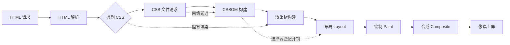
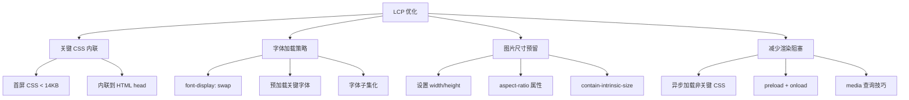
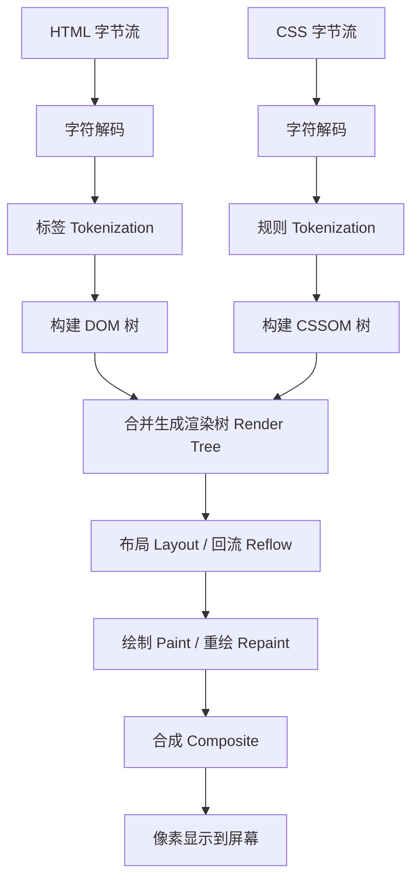
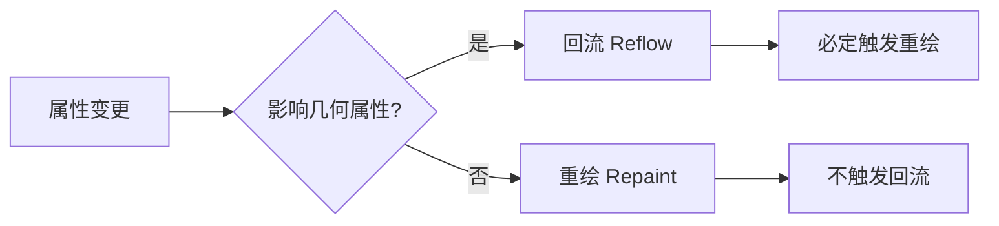
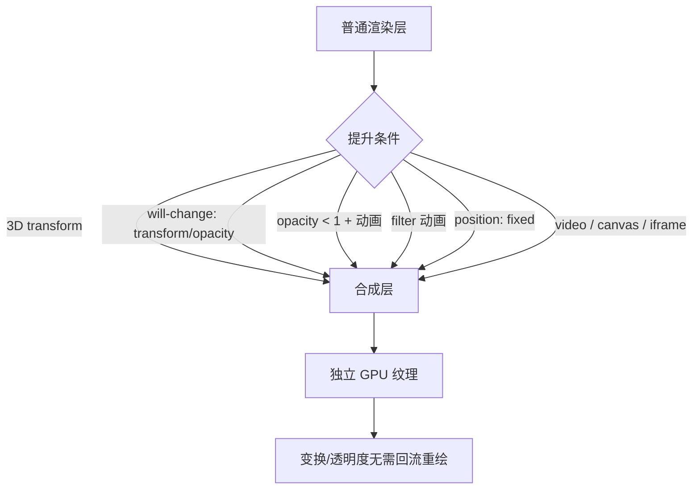

# CSS 性能优化

CSS 是 Web 渲染的核心技术，直接影响页面的加载速度、渲染效率和用户交互体验。一个看似简单的样式调整，可能在不经意间触发昂贵的回流（Reflow）操作，导致页面卡顿；一段未压缩的 CSS 代码，可能在弱网环境下让首屏渲染延迟数秒。掌握 CSS 性能优化，是每一个前端开发者的必修课。

## 背景与动机

### 为什么 CSS 性能优化如此重要？

根据 Google 的研究，页面加载时间越长，移动端用户流失越明显（早期研究曾给出“每增加 1 秒转化率下降约 20%”的量级估计，具体数字因站点与场景差异很大）。2020 年，Google 将 Core Web Vitals 正式纳入搜索排名因素，CSS 性能优化不再只是技术问题，而是直接影响业务指标和 SEO 排名的关键因素。

CSS 对性能的影响贯穿整个页面生命周期：



**CSS 阻塞渲染的根本原因**：

1. CSS 是**渲染阻塞资源**（Render-Blocking Resource），浏览器必须等待 CSSOM 构建完成才能渲染页面
2. 浏览器需要**完整的 CSSOM** 才能构建渲染树（Render Tree）
3. 选择器匹配需要遍历 DOM 树，复杂选择器带来额外的计算开销
4. 不合理的 CSS 属性修改会触发昂贵的回流（Reflow）操作

### 性能优化的收益

| 优化方向 | 预期收益 | 影响指标 |
|----------|----------|----------|
| 内联关键 CSS | FCP 提升 30-50% | FCP, LCP |
| 移除未使用 CSS | 文件体积减少 60-90% | LCP, TTI |
| CSS 压缩 + Gzip | 传输体积减少 80%+ | LCP, FCP |
| 动画使用 transform | 帧率稳定 60 FPS | TBT, SI |
| content-visibility | 首屏渲染提升 10x+ | LCP, TTI, SI |
| 字体优化 | CLS 降低至 0 | CLS, FCP |

> **说明**：上表为典型场景下的经验量级（部分来自公开案例），实际收益因页面结构、网络环境与内容复杂度而异，请以自身站点的实测数据为准。

---

## 核心概念：Core Web Vitals 深入

### 三大核心指标

Google 定义的 Core Web Vitals 是衡量用户体验的核心指标，2024 年 FID（First Input Delay）已被 INP（Interaction to Next Paint）取代。

| 指标 | 全称 | 含义 | 良好阈值 | CSS 优化方向 |
|------|------|------|----------|--------------|
| **LCP** | Largest Contentful Paint | 最大内容绘制时间 | ≤ 2.5s | 优化字体加载、图片尺寸预留、关键 CSS 内联 |
| **INP** | Interaction to Next Paint | 交互到下一绘制延迟 | ≤ 200ms | 减少主线程阻塞、优化动画性能 |
| **CLS** | Cumulative Layout Shift | 累积布局偏移 | ≤ 0.1 | 预留图片/字体空间、避免动态注入内容 |

> **注意**：FID（First Input Delay）已于 2024 年 3 月被 INP 正式取代。INP 衡量的是页面在整个生命周期中对所有用户交互的响应性，而不仅仅是首次交互。

### 其他重要性能指标

| 指标 | 全称 | 含义 | CSS 相关优化 |
|------|------|------|--------------|
| **FCP** | First Contentful Paint | 首次内容绘制 | 内联关键 CSS、减少渲染阻塞 |
| **TTI** | Time to Interactive | 可交互时间 | 异步加载非关键 CSS |
| **TBT** | Total Blocking Time | 总阻塞时间 | 优化动画、减少主线程任务 |
| **SI** | Speed Index | 速度指数 | 优化首屏渲染进度 |

### LCP 深入分析

LCP 是 CSS 优化中最关键的指标。LCP 元素通常是页面中最大的可见元素，常见的 LCP 元素包括：

- `` 元素（英雄图、Logo）
- `<video>` 元素的 poster 帧
- 带有 `background-image` 的块级元素
- 包含文本或内联元素的大块容器

**CSS 对 LCP 的影响路径**：



### CLS 深入分析

CLS 衡量页面视觉稳定性。CSS 是导致 CLS 问题的主要原因之一：

**常见 CLS 触发场景**：

1. **字体闪烁（FOIT/FOUT）**：Web 字体加载完成后，文本尺寸变化导致布局偏移
2. **图片无尺寸预留**：图片加载后撑开容器，推动下方内容
3. **动态注入内容**：广告、弹窗、Cookie 提示等动态插入 DOM
4. **非粘性定位元素**：`position: absolute` 或 `fixed` 元素脱离文档流后重新定位

**CLS 优化 CSS 方案**：

```css
/* 1. 字体加载优化：使用 size-adjust 调整后备字体尺寸 */
@font-face {
  font-family: 'CustomFont';
  src: url('custom-font.woff2') format('woff2');
  font-display: swap;
  size-adjust: 95%; /* 调整后备字体大小，减少偏移 */
  ascent-override: 90%;
  descent-override: 20%;
  line-gap-override: 0%;
}

/* 2. 图片尺寸预留 */
img {
  /* 必须设置宽高，或使用 aspect-ratio */
  width: 100%;
  height: auto;
  aspect-ratio: 16 / 9;
}

/* 3. 预留广告/动态内容空间 */
.ad-container {
  min-height: 250px; /* 预估广告高度 */
  contain: layout;   /* 隔离内部布局变化 */
}

/* 4. 使用 content-visibility 避免离屏内容影响 CLS */
.below-fold {
  content-visibility: auto;
  contain-intrinsic-size: auto 500px;
}
```

### INP 与 CSS 的关系

INP 衡量用户对页面交互的响应速度。CSS 通过以下方式影响 INP：

1. **长任务阻塞主线程**：复杂的 CSS 选择器匹配、大规模回流重绘占用主线程
2. **动画卡顿**：使用触发回流的属性做动画（如 `width`、`height`），每帧都需要重新计算布局
3. **事件处理中的样式计算**：在 `scroll`、`resize` 等高频事件中读取布局属性，触发强制同步布局

---

## 深入原理：浏览器渲染管线

### 渲染引擎概览

**渲染引擎**（Rendering Engine）又名**浏览器内核**，负责将网页资源（HTML、CSS、JS）解析并渲染为可视化页面。不同内核对同一网页的解析结果可能不同，这就是**浏览器差异性**的根源。

| 浏览器 | 前期内核 | 后期内核 | 备注 |
|--------|----------|----------|------|
| Chrome | Webkit | Blink | Blink 由 Google + Opera 合作自研，基于 Webkit 分支 |
| Safari | Webkit | Webkit | Webkit 由 Apple 自研 |
| Firefox | Gecko | Gecko | Gecko 源自 Netscape 的 Mozilla 项目 |
| Opera | Presto | Blink | Presto 已废弃，性能极致但兼容性差 |
| Edge | Trident | Blink | 微软从 Chromium 迁移到 Blink |
| IE | Trident | — | 已停止维护 |

### 渲染流水线详解

浏览器从接收 HTML 到最终呈现像素，经历以下完整流水线：



**各阶段详解**：

| 阶段 | 输入 | 输出 | 说明 |
|------|------|------|------|
| 构建 DOM | HTML 字节流 | DOM Tree | 逐字节读取→字符→标签→节点→树 |
| 构建 CSSOM | CSS 字节流 | CSSOM Tree | 与 DOM 构建过程一致，可并行 |
| 渲染树 | DOM + CSSOM | Render Tree | 只包含可见节点（排除 `display:none`） |
| 布局 | Render Tree | Layout Tree | 计算每个节点的几何属性（位置、尺寸） |
| 绘制 | Layout Tree | Paint Records | 生成绘制指令序列（填充颜色、绘制边框等） |
| 合成 | Paint Records | 像素 | 将多个图层合成最终画面 |

> **关键点**：DOM 树和 CSSOM 树的构建是并行的，但 `<script>` 标签会阻塞 DOM 构建（因为 JS 可能操作 DOM，浏览器无法预测未来 DOM 内容）。

### 回流（Reflow）与重绘（Repaint）

#### 核心定义

- **回流**（Reflow / Reposition）：节点的**几何属性**（位置、尺寸）发生改变，需要重新计算布局。回流必定引发重绘。
- **重绘**（Repaint）：节点的**外观属性**（颜色、背景、阴影等）发生改变，但不影响几何属性。重绘不一定引发回流。



#### 属性触发级别分类

| 触发级别 | 属性示例 | 性能影响 | 优化建议 |
|----------|----------|----------|----------|
| **仅合成**（Composite） | `transform`、`opacity` | 最低 | 动画首选 |
| **重绘**（Paint） | `color`、`background`、`box-shadow`、`outline`、`visibility` | 中等 | 避免频繁修改 |
| **回流**（Layout） | `width`、`height`、`margin`、`padding`、`display`、`position`、`font-size` | 最高 | 批量修改、读写分离 |

> 查询任意 CSS 属性的触发级别：[CSS Triggers](https://csstriggers.com/)

#### 几何属性与外观属性完整分类

**几何属性**（触发回流）：
- 布局：`display`、`float`、`position`、`flex`、`grid`、`columns`、`table`
- 尺寸：`width`、`height`、`margin`、`padding`、`border-width`、`min-width`、`max-height`
- 文字度量：`font-size`、`line-height`（改变文本度量会引起文本重新布局）

**外观属性**（触发重绘）：
- 界面：`background`、`box-shadow`、`outline`、`mask`、`filter`、`clip-path`（`opacity` 单独修改时仅触发合成，见上表；`clip` 已废弃，改用 `clip-path`）
- 文字：`color`、`text-decoration`、`text-shadow`

### 强制同步布局（Forced Synchronous Layout）

在 JavaScript 中，**先写后读**同一元素的布局属性会触发强制同步布局——浏览器被迫在当前帧中立即执行回流以返回最新值。

```javascript
// ❌ 强制同步布局：每次循环都触发回流
const elements = document.querySelectorAll('.item');
for (const el of elements) {
  const width = el.offsetWidth;     // 读取 → 强制回流
  el.style.width = width * 2 + 'px'; // 写入 → 标记脏
}

// ✅ 优化：读写分离，批量读取后再批量写入
const widths = [];
for (const el of elements) {
  widths.push(el.offsetWidth); // 批量读取
}
for (let i = 0; i < elements.length; i++) {
  elements[i].style.width = widths[i] * 2 + 'px'; // 批量写入，只触发一次回流
}
```

### 渲染层与合成层

浏览器将页面分为多个**渲染层**（Render Layer），某些条件下会提升为**合成层**（Compositing Layer），合成层拥有独立的 GPU 纹理，变换和透明度操作无需触发主线程回流重绘。



**合成层的优势**：
- `transform` 和 `opacity` 动画完全在合成线程执行，不阻塞主线程
- 合成层的变换不影响其他层，避免大范围回流

**合成层的风险**：
- 每个合成层占用额外内存（GPU 纹理）
- 过多合成层导致内存溢出（移动端尤其明显）

---

## 代码示例：文件与资源优化

### 压缩 CSS

#### 使用 cssnano（推荐）

```bash
# 安装
npm install cssnano --save-dev
```

```javascript
// postcss.config.js
module.exports = {
  plugins: [
    require('cssnano')({
      preset: ['default', {
        discardComments: { removeAll: true },
        normalizeWhitespace: true,
        mergeLonghand: true,       // 合并简写属性
        colormin: true,            // 颜色压缩
        convertValues: true        // 值转换（如 px → em）
      }]
    })
  ]
};
```

#### 使用 clean-css

```bash
npm install clean-css --save-dev
```

```javascript
const CleanCSS = require('clean-css');

const source = `
.button {
  background-color: #007bff;
  border-radius: 4px;
  padding: 10px 20px;
  font-size: 14px;
  color: #ffffff;
}
`;

const output = new CleanCSS({
  level: 2,           // 最高压缩级别
  rebase: false       // 不重写相对路径
}).minify(source);

console.log(output.styles);
// .button{background-color:#007bff;border-radius:4px;padding:10px 20px;font-size:14px;color:#fff}
console.log(output.stats);
// { originalSize: 152, minifiedSize: 82, efficiency: 0.46 }
```

#### 压缩效果对比

```css
/* 原始代码：约 150 字节 */
.button {
  background-color: #007bff;
  border-radius: 4px;
  padding: 10px 20px;
  font-size: 14px;
  color: #ffffff;
}

/* 压缩后：约 70 字节，节省 53% */
.button{background-color:#007bff;border-radius:4px;padding:10px 20px;font-size:14px;color:#fff}
```

### 合并文件

```html
<!-- ❌ 合并前：多个请求 -->
<link rel="stylesheet" href="reset.css">
<link rel="stylesheet" href="base.css">
<link rel="stylesheet" href="components.css">
<link rel="stylesheet" href="utilities.css">
<!-- 4 个 HTTP 请求 -->

<!-- ✅ 合并后：单个请求 -->
<link rel="stylesheet" href="main.css">
<!-- 1 个 HTTP 请求 -->
```

**合并策略**：

| 场景 | 策略 | 说明 |
|------|------|------|
| 小型项目 | 全部合并 | 减少请求数 |
| 中型项目 | 按页面合并 | 平衡请求与缓存 |
| 大型项目 | 按功能模块合并 | 首屏 + 异步加载 |

> **HTTP/2 时代的合并策略变化**：HTTP/2 支持多路复用，多个小文件不再像 HTTP/1.1 那样有显著的队头阻塞问题。在 HTTP/2 环境下，适度拆分文件（利用缓存）可能比全部合并更优。

### 移除未使用的 CSS

#### 使用 PurgeCSS

```javascript
// webpack 配置
const PurgeCSSPlugin = require('purgecss-webpack-plugin');
const glob = require('glob');
const PATHS = { src: path.join(__dirname, 'src') };

module.exports = {
  plugins: [
    new PurgeCSSPlugin({
      paths: glob.sync(`${PATHS.src}/**/*`, { nodir: true }),
      safelist: {
        standard: [/-(leave|enter|appear)$/],  // 保留动画类名
        deep: [/modal$/],                       // 保留 modal 相关类
        greedy: [/^is-/]                        // 保留所有 is- 开头的类
      },
      defaultExtractor: content =>
        content.match(/[\w-/:]+(?<!:)/g) || []  // 支持 Tailwind 类名
    })
  ]
};
```

#### 使用 UnCSS

```bash
npm install uncss --save-dev

# 分析 HTML 文件，移除未使用的 CSS
uncss input.html > output.css

# 指定多个文件
uncss page1.html page2.html page3.html > output.css
```

### Gzip / Brotli 压缩

```11-Nginx基础概述
# Nginx 配置 - Gzip
gzip on;
gzip_types text/css text/plain application/javascript;
gzip_min_length 1000;
gzip_comp_level 6;
gzip_vary on;

# Nginx 配置 - Brotli（更优压缩率）
brotli on;
brotli_types text/css text/plain application/javascript;
brotli_comp_level 4;
```

**压缩效果对比**：

| 原始大小 | Gzip 后 | Brotli 后 | Gzip 压缩率 | Brotli 压缩率 |
|----------|---------|-----------|-------------|---------------|
| 100 KB | 15 KB | 12 KB | 85% | 88% |
| 50 KB | 8 KB | 6 KB | 84% | 88% |
| 10 KB | 2 KB | 1.5 KB | 80% | 85% |

### 关键 CSS 内联

```html
<head>
  <!-- ✅ 内联首屏关键 CSS（< 14KB） -->
  <style>
    /* 首屏渲染所需的最小 CSS */
    *, *::before, *::after { box-sizing: border-box; margin: 0; padding: 0; }
    body { font-family: system-ui, sans-serif; line-height: 1.5; color: #333; }
    .header { height: 60px; background: #fff; border-bottom: 1px solid #eee; }
    .hero { min-height: 400px; padding: 40px; display: flex; align-items: center; }
    .main { max-width: 1200px; margin: 0 auto; padding: 20px; }
  </style>

  <!-- ✅ 异步加载完整 CSS -->
  <link rel="preload" href="main.css" as="style" onload="this.rel='stylesheet'">
  <noscript><link rel="stylesheet" href="main.css"></noscript>
</head>
```

### 异步加载 CSS 的三种方式

```html
<!-- 方法一：preload + onload（推荐） -->
<link rel="preload" href="styles.css" as="style" onload="this.rel='stylesheet'">

<!-- 方法二：media 技巧 -->
<link rel="stylesheet" href="print.css" media="print" onload="this.media='all'">

<!-- 方法三：JavaScript 动态加载 -->
<script>
  function loadCSS(href) {
    const link = document.createElement('link');
    link.rel = 'stylesheet';
    link.href = href;
    document.head.appendChild(link);
  }
  // 条件加载：只在需要时加载
  if (document.querySelector('.carousel')) {
    loadCSS('carousel.css');
  }
</script>
```

### preload 预加载关键资源

```html
<!-- 预加载关键 CSS -->
<link rel="preload" href="critical.css" as="style">

<!-- 预加载字体（必须加 crossorigin） -->
<link rel="preload" href="font.woff2" as="font" type="font/woff2" crossorigin>

<!-- 预加载关键图片 -->
<link rel="preload" href="hero.jpg" as="image">
```

---

## 代码示例：选择器与渲染优化

### 选择器匹配原理

浏览器从右向左匹配选择器：

```css
/* ❌ 匹配过程：效率低 */
.container .content .article .title {
  /* 1. 先找所有 .title 元素
   * 2. 过滤父元素是 .article 的
   * 3. 过滤父元素是 .content 的
   * 4. 过滤父元素是 .container 的
   */
}

/* ✅ 推荐：直接使用类名，效率高 */
.article-title { }
```

### 选择器性能对比

| 选择器类型 | 性能 | 示例 |
|------------|------|------|
| ID 选择器 | 最快 | `#header` |
| 类选择器 | 快 | `.nav-item` |
| 属性选择器 | 中等 | `[type="text"]` |
| 伪类选择器 | 中等 | `:nth-child(2)` |
| 标签选择器 | 较慢 | `div` |
| 通用选择器 | 最慢 | `*` |

### 选择器优化策略

```css
/* ❌ 避免：遍历所有元素 */
* { box-sizing: border-box; }

/* ✅ 推荐：明确指定 */
html { box-sizing: border-box; }
*, *:before, *:after { box-sizing: inherit; }
```

```css
/* ❌ 避免：4 层嵌套，匹配开销大 */
.container .content .article .title { font-size: 18px; }

/* ✅ 推荐：使用 BEM 命名 */
.article__title { font-size: 18px; }
```

```css
/* ❌ 避免：需要先匹配所有 div */
div.nav { }

/* ✅ 推荐：直接匹配类 */
.nav { }
```

```css
/* ❌ 避免：需要遍历所有元素 */
[class^="col-"] { }

/* ✅ 推荐：使用明确的类名组合 */
.col-1, .col-2, .col-3, .col-4 { }
```

```css
/* ❌ 不推荐：极深的选择器 */
body div.wrapper div.content div.main article.post p.intro span.highlight { }

/* ✅ 推荐：扁平化的类名 */
.post-intro-highlight { }
```

### 减少回流的编码实践

| 策略 | 说明 | 示例 |
|------|------|------|
| **批量 DOM 操作** | 使用 DocumentFragment 或 class 切换 | `el.classList.add('active')` |
| **读写分离** | 先批量读取布局属性，再批量写入 | 见强制同步布局示例 |
| **离线 DOM** | 使用 `display:none` 隐藏容器，操作完成后再显示 | 减少中间状态的回流 |
| **避免 Table 布局** | Table 局部改动可能触发整表回流 | 用 `ul/li` + CSS Grid 替代 |
| **transform 代替 top/left** | `transform` 仅触发合成 | `transform: translate3d(x, y, 0)` |
| **visibility 代替 display** | `visibility:hidden` 仅重绘，不回流 | 保留空间，避免布局抖动 |

```javascript
// ❌ 避免：多次修改触发多次重排
element.style.width = '100px';
element.style.height = '200px';
element.style.margin = '10px';

// ✅ 推荐：使用 class 批量修改
element.classList.add('active');
```

```css
/* ❌ 避免：触发回流 */
.element {
  position: absolute;
  left: 100px;
  top: 50px;
}

/* ✅ 推荐：只触发合成 */
.element {
  transform: translate(100px, 50px);
}
```

### 硬件加速

```css
/* 开启硬件加速的三种方式 */
.accelerated {
  /* 方法一：3D transform 提升为合成层 */
  transform: translateZ(0);

  /* 方法二：will-change 提示浏览器 */
  will-change: transform;

  /* 方法三：backface-visibility 隐藏背面 */
  backface-visibility: hidden;
}
```

```css
/* ⚠️ 谨慎使用 will-change */
.element {
  /* 不要在默认状态设置 will-change */
}

.element:hover {
  will-change: transform; /* 仅在需要时开启 */
}

.element:not(:hover) {
  will-change: auto; /* 动画结束后移除 */
}
```

### contain 属性

CSS Containment 可以限制浏览器渲染计算的范围：

```css
/* 布局隔离：内部布局变化不影响外部 */
.widget {
  contain: layout;
}

/* 绘制隔离：内部绘制不会溢出 */
.canvas {
  contain: paint;
}

/* 样式隔离：计数器等作用域不影响外部 */
.list-item {
  contain: style;
}

/* 综合隔离（= size + layout + style + paint，含 size 包含，元素需显式尺寸） */
.component {
  contain: strict;
}

/* 内容隔离（= layout + style + paint，不含 size，无需显式尺寸） */
.isolated-widget {
  contain: content;
}
```

### content-visibility 实战

```css
/* 长列表懒渲染：离屏内容延迟渲染 */
.list-item {
  content-visibility: auto;
  contain-intrinsic-size: auto 100px; /* 预估每个项目高度 */
}

/* 折叠面板 */
.accordion-body {
  content-visibility: hidden;
  contain-intrinsic-size: auto 0;
}
.accordion-body.open {
  content-visibility: visible;
}

/* 标签页内容 */
.tab-panel {
  content-visibility: hidden;
  contain-intrinsic-size: auto 400px;
}
.tab-panel.active {
  content-visibility: visible;
}
```

> **性能提升**：在元素数量巨大的长列表场景中，`content-visibility: auto` 跳过离屏元素的布局与绘制，官方演示曾观察到数倍至十倍量级的首屏渲染提升（具体取决于内容复杂度）。

> **无障碍与查找警告**：`content-visibility: hidden` 的内容**不会暴露给无障碍树**，也无法通过页内查找（find-in-page）定位。用于折叠面板、标签页时，请确保有替代的可达性方案（本例在展开时切换回 `visible`）。相比 `display: none`，它保留了已计算的布局与渲染状态，再次显示时开销更小。

### requestAnimationFrame 与 CSS 动画

常见设备刷新频率为 **60Hz**（每 16.6ms 一帧，高刷屏为 120Hz 及以上），`requestAnimationFrame` 的回调在每一帧的回流重绘之前执行，确保动画与浏览器刷新同步。

```javascript
// ✅ 使用 rAF 代替 setInterval 实现流畅动画
let position = 0;
const target = 500;
const velocity = 5;

function animate() {
  element.style.transform = `translateX(${position}px)`;
  position += velocity;
  if (position < target) {
    requestAnimationFrame(animate);
  }
}
requestAnimationFrame(animate);
```

**CSS 动画的优势**：声明式 `animation` / `transition` 由浏览器自动优化，可在合成线程执行，比 JS + rAF 更高效。

---

## 代码示例：字体与动画优化

### font-display 属性

```css
@font-face {
  font-family: 'MyFont';
  src: url('font.woff2') format('woff2');
  font-display: swap; /* 立即显示后备字体，字体加载完成后替换 */
}
```

**font-display 选项详解**：

| 值 | 阻塞期 | 替换期 | 行为 | 适用场景 |
|----|--------|--------|------|----------|
| `swap` | 0s | 无限 | 立即显示后备字体，加载完替换 | 正文内容 |
| `block` | 3s | 无限 | 等待字体加载（最多 3s 空白） | 品牌字体 |
| `fallback` | 100ms | 约 3s | 100ms 阻塞，随后约 3s 内替换，之后固定用后备字体 | 平衡方案 |
| `optional` | 0s | 0s | 根据网络状况决定是否使用 | 移动端优先 |

### 字体预加载

```html
<head>
  <link rel="preload"
        href="font.woff2"
        as="font"
        type="font/woff2"
        crossorigin>
</head>
```

### 字体子集化

```css
@font-face {
  font-family: 'MyFont';
  src: url('font.woff2') format('woff2');
  unicode-range: U+000-5FF; /* 只加载拉丁字符和部分符号 */
}
```

```bash
# 使用 pyftsubset 进行字体子集化
pyftsubset font.ttf \
  --output-file=font-subset.woff2 \
  --flavor=woff2 \
  --layout-features='*' \
  --unicodes="U+0000-007F"
```

### 字体加载策略

```javascript
// 使用 CSS Font Loading API
document.fonts.ready.then(() => {
  document.documentElement.classList.add('fonts-loaded');
});

// 监听特定字体加载
document.fonts.load('16px MyFont').then(() => {
  console.log('Font loaded');
}).catch((err) => {
  console.warn('Font load failed, using fallback', err);
});
```

```css
/* 配合 CSS 类实现字体切换 */
body {
  font-family: system-ui, -apple-system, sans-serif; /* 后备字体 */
}

.fonts-loaded body {
  font-family: 'MyFont', system-ui, -apple-system, sans-serif;
}
```

### 高性能动画属性

| 属性 | 触发行为 | 性能等级 |
|------|----------|----------|
| `transform` | 仅合成 | ⭐⭐⭐⭐⭐ |
| `opacity` | 仅合成 | ⭐⭐⭐⭐⭐ |
| `filter` | 绘制 + 合成 | ⭐⭐⭐ |
| `color` | 重绘 | ⭐⭐⭐ |
| `width/height` | 重排 | ⭐ |

```css
/* ❌ 低性能：触发回流 */
@keyframes bad-slide {
  from { left: 0; width: 100px; }
  to   { left: 100px; width: 200px; }
}

/* ✅ 高性能：仅合成 */
@keyframes good-slide {
  from { transform: translateX(0) scaleX(1); }
  to   { transform: translateX(100px) scaleX(2); }
}
```

### 使用 Intersection Observer 延迟动画

```css
/* 避免：大量元素同时动画 */
.list-item {
  animation: fadeIn 0.5s;
}

/* 推荐：使用 Intersection Observer 延迟动画 */
.list-item {
  opacity: 0;
  transform: translateY(20px);
  transition: opacity 0.5s ease, transform 0.5s ease;
}

.list-item.visible {
  opacity: 1;
  transform: translateY(0);
}
```

```javascript
// 配合 Intersection Observer
const observer = new IntersectionObserver((entries) => {
  entries.forEach(entry => {
    if (entry.isIntersecting) {
      entry.target.classList.add('visible');
      observer.unobserve(entry.target); // 只触发一次
    }
  });
}, { threshold: 0.1 });

document.querySelectorAll('.list-item').forEach(item => {
  observer.observe(item);
});
```

---

## 最佳实践

### 性能监控工具对比

| 工具 | 类型 | 核心功能 | 适用阶段 | 价格 |
|------|------|----------|----------|------|
| **Chrome DevTools** | 浏览器内置 | Performance 面板、Coverage、Rendering 面板 | 开发阶段 | 免费 |
| **Lighthouse** | CLI / DevTools | 综合性能评分、SEO、可访问性 | CI/CD + 开发 | 免费 |
| **WebPageTest** | 在线服务 | 真实设备测试、瀑布图、视频分析 | 上线前测试 | 免费/付费 |
| **PageSpeed Insights** | 在线服务 | Core Web Vitals 评估（CrUX 数据） | 上线后监控 | 免费 |
| **SpeedCurve** | SaaS | RUM 监控、性能预算、竞品对比 | 持续监控 | 付费 |
| **Calibre** | SaaS | 性能基准测试、历史趋势 | 持续监控 | 付费 |

#### Chrome DevTools 使用指南

```
1. Performance 面板
   - 打开 DevTools (F12) → Performance → 点击录制
   - 执行需要分析的操作 → 停止录制
   - 关注：FPS（帧率）、CPU 占用、Main 线程任务

2. Coverage 面板
   - DevTools → More tools → Coverage
   - 查看未使用的 CSS 代码比例（红色标记）

3. Rendering 面板
   - DevTools → More tools → Rendering
   - Paint flashing：显示重绘区域（绿色闪烁）
   - Layout Shift Regions：显示布局偏移（蓝色闪烁）
   - FPS Meter：实时帧率显示
```

#### Lighthouse 使用指南

```bash
# 命令行运行
npm install -g lighthouse
lighthouse https://example.com --view

# 输出 HTML 报告
lighthouse https://example.com --output html --output-path ./report.html

# 指定设备类型
lighthouse https://example.com --preset=desktop

# CI 模式（输出 JSON）
lighthouse https://example.com --output=json --output-path=./report.json
```

**Lighthouse CSS 相关检查项**：
- Eliminate render-blocking resources（消除渲染阻塞资源）
- Properly size web fonts（合理设置字体大小）
- Avoid enormous network payloads（避免大量网络传输）
- Minimize CSS（压缩 CSS）
- Remove unused CSS（移除未使用的 CSS）

#### WebPageTest 使用指南

访问 [https://www.webpagetest.org/](https://www.webpagetest.org/)

**测试配置建议**：

| 配置项 | 推荐值 |
|--------|--------|
| 测试位置 | 选择用户主要地区 |
| 浏览器 | Chrome、Firefox |
| 连接速度 | 3G/4G + Cable |
| 测试次数 | 3-5 次取中位数 |
| 视频捕获 | 开启（分析渲染时间线） |

### 真实案例分析

> **说明**：以下案例为教学示例，数据为典型优化项目量级的示意值，非特定真实站点的实测数据。

#### 案例一：电商平台首屏优化

**背景**：某电商平台首屏 LCP 为 4.2s，目标 ≤ 2.5s。

**优化措施**：

```css
/* 1. 内联关键 CSS（约 12KB） */
/* 在 HTML <head> 中内联首屏必需样式 */

/* 2. 英雄图尺寸预留，消除 CLS */
.hero-image {
  width: 100%;
  aspect-ratio: 16 / 9;
  background-color: #f0f0f0; /* 占位背景色 */
}

/* 3. 字体优化 */
@font-face {
  font-family: 'BrandFont';
  src: url('brand-font.woff2') format('woff2');
  font-display: swap;
  /* 使用 size-adjust 减少布局偏移 */
  size-adjust: 98%;
}

/* 4. 商品列表使用 content-visibility */
.product-card {
  content-visibility: auto;
  contain-intrinsic-size: auto 320px;
}
```

**结果**：

| 指标 | 优化前 | 优化后 | 提升 |
|------|--------|--------|------|
| LCP | 4.2s | 1.8s | 57% ↓ |
| FCP | 2.1s | 0.8s | 62% ↓ |
| CLS | 0.35 | 0.02 | 94% ↓ |
| CSS 体积 | 180KB | 42KB (gzip) | 77% ↓ |

#### 案例二：SaaS 应用动画性能优化

**背景**：某 SaaS 应用仪表盘在低端设备上滚动卡顿，帧率仅 24 FPS。

**优化措施**：

```css
/* 1. 将所有位移动画从 top/left 改为 transform */
.dashboard-card {
  /* ❌ 之前 */
  /* top: 0; left: 0; */
  /* ✅ 之后 */
  transform: translate3d(0, 0, 0);
  will-change: transform;
}

/* 2. 使用 CSS Containment 隔离组件 */
.chart-widget {
  contain: layout style paint;
  height: 300px; /* 显式尺寸，让包含计算更稳定 */
}

/* 3. 减少 box-shadow 使用 */
.card {
  /* ❌ 昂贵的阴影 */
  /* box-shadow: 0 10px 40px rgba(0,0,0,0.2); */
  /* ✅ 使用 border 替代 */
  border: 1px solid #e0e0e0;
}
```

**结果**：帧率从 24 FPS 提升到稳定 60 FPS，滚动延迟降低 70%。

### 构建配置

```javascript
// webpack.config.js
const MiniCssExtractPlugin = require('mini-css-extract-plugin');
const CssMinimizerPlugin = require('css-minimizer-webpack-plugin');

module.exports = {
  module: {
    rules: [
      {
        test: /\.css$/,
        use: [
          MiniCssExtractPlugin.loader,
          'css-loader',
          {
            loader: 'postcss-loader',
            options: {
              postcssOptions: {
                plugins: [
                  require('autoprefixer'),
                  require('cssnano')
                ]
              }
            }
          }
        ]
      }
    ]
  },
  optimization: {
    minimizer: [new CssMinimizerPlugin()]
  }
};
```

### 性能预算

| 指标 | 目标值 | 说明 |
|------|--------|------|
| 总 CSS 大小 | < 50 KB (gzip) | 包含所有 CSS 文件 |
| 首屏关键 CSS | < 14 KB | 内联到 HTML 中 |
| 选择器最大深度 | ≤ 3 层 | 避免深层嵌套 |
| 动画帧率 | ≥ 60 FPS | 所有动画流畅 |
| CLS | ≤ 0.1 | 视觉稳定性 |
| LCP | ≤ 2.5s | 最大内容绘制时间 |

### 现代性能优化技术

#### @layer 优化样式加载

```css
@layer reset, base, components, utilities;

@layer reset {
  *, *::before, *::after {
    box-sizing: border-box;
    margin: 0;
    padding: 0;
  }
}

@layer base {
  body { font-family: system-ui, sans-serif; line-height: 1.5; }
}

@layer components {
  .button { padding: 10px 20px; border-radius: 4px; }
}
```

#### 容器查询单位优化

```css
.card-container {
  container-type: inline-size;
}

.card-title {
  font-size: clamp(1rem, 3cqi, 1.5rem);
  padding: 1cqi 2cqi;
}
```

#### :has() 减少不必要的 DOM 操作

```css
/* 传统方式：需要 JavaScript 添加类名 */
.card.is-featured { border: 2px solid gold; }

/* :has() 方式：纯 CSS 实现 */
.card:has(.badge-featured) { border: 2px solid gold; }

/* 表单验证反馈 */
.form-group:has(input:invalid) .error-msg { display: block; }
.form-group:has(input:valid) .success-icon { display: inline; }
```

### 检查清单

- [ ] CSS 文件已压缩（cssnano / clean-css）
- [ ] 移除未使用的样式（PurgeCSS / UnCSS）
- [ ] 关键 CSS 已内联（< 14KB）
- [ ] 非关键 CSS 异步加载（preload / media 技巧）
- [ ] 字体使用 `font-display: swap`
- [ ] 字体文件已预加载（preload）
- [ ] 图片/视频设置了 `aspect-ratio` 或 `width/height`
- [ ] 动画使用高性能属性（transform / opacity）
- [ ] 选择器深度不超过 3 层
- [ ] 无昂贵的 CSS 表达式（复杂 box-shadow / filter）
- [ ] 长列表使用 `content-visibility: auto`
- [ ] 组件使用 CSS Containment 隔离渲染
- [ ] 使用 `@layer` 管理样式优先级
- [ ] 服务器配置了 Gzip / Brotli 压缩
- [ ] 使用 Lighthouse 定期检测性能指标

---

## 常见问题

### Q1：CSS 文件越多，性能越差吗？

**不完全是**。在 HTTP/1.1 时代，每个 CSS 文件都需要一个独立的 HTTP 请求，文件越多性能越差。但在 HTTP/2/3 环境下，多路复用消除了队头阻塞问题，适度拆分文件反而有利于缓存利用。关键原则是：**首屏关键 CSS 内联，非关键 CSS 按需异步加载**。

### Q2：will-change 应该一直使用吗？

**不应该**。`will-change` 会提前为元素创建合成层，占用额外 GPU 内存。过度使用会导致内存溢出（尤其在移动端）。正确做法是：在动画开始前设置 `will-change`，动画结束后立即移除。

```css
/* ✅ 正确用法 */
.element:hover {
  will-change: transform;
}
.element:not(:hover) {
  will-change: auto;
}
```

### Q3：为什么 `transform` 动画比 `top/left` 动画流畅？

`transform` 的变化只触发**合成**（Composite）阶段，由 GPU 在合成线程处理，不阻塞主线程。而 `top/left` 的变化会触发**回流**（Layout）→ **重绘**（Paint）→ **合成**，每一步都在主线程执行，容易卡顿。

### Q4：content-visibility 有什么浏览器兼容性问题？

`content-visibility` 在 Chrome 85+、Edge 85+、Safari 18+ 支持，Firefox 125+ 支持。对于不支持的浏览器，该属性会被忽略，内容正常渲染，不会造成破坏性影响。可以作为渐进增强使用。

### Q5：如何确定关键 CSS 的内容？

关键 CSS 是首屏渲染所需的最小 CSS 集合，包括：
1. Reset / Normalize 样式
2. 布局容器样式（header、main、footer）
3. 首屏组件样式（导航、英雄区、首屏内容）
4. 字体和颜色基础样式

可以使用 [Critical](https://github.com/addyosmani/critical) 或 [Penthouse](https://github.com/pocketjoso/penthouse) 工具自动提取。

### Q6：如何监控线上页面的 CSS 性能？

推荐使用 Real User Monitoring（RUM）方案：
1. **Web Vitals API**：使用 `web-vitals` 库采集 CLS、LCP、INP 等指标
2. **Performance Observer**：监听 `layout-shift`、`largest-contentful-paint` 等条目
3. **第三方服务**：SpeedCurve、Calibre、New Relic 等提供持续监控

```javascript
import { onLCP, onCLS, onINP } from 'web-vitals';

onLCP(metric => {
  // 上报 LCP 数据
  analytics.send('LCP', metric.value);
});

onCLS(metric => {
  analytics.send('CLS', metric.value);
});
```

---

## 参考资源

### 官方文档

- [Web Vitals](https://web.dev/vitals/) - Google 核心性能指标
- [CSS Triggers](https://csstriggers.com/) - CSS 属性触发行为查询
- [Critical CSS](https://web.dev/extract-critical-css/) - 关键 CSS 提取指南
- [Rendering Performance](https://web.dev/rendering-performance/) - 渲染性能优化

### 工具

- [Lighthouse](https://developer.chrome.com/docs/lighthouse/) - 综合性能审计工具
- [WebPageTest](https://www.webpagetest.org/) - 在线性能测试
- [PageSpeed Insights](https://pagespeed.web.dev/) - Google 页面速度分析
- [cssnano](https://cssnano.co/) - CSS 压缩工具
- [PurgeCSS](https://purgecss.com/) - 未使用 CSS 移除
- [Critical](https://github.com/addyosmani/critical) - 关键 CSS 提取工具

### 延伸阅读

- [High Performance Browser Networking](https://hpbn.co/) - 高性能网络传输
- [CSS Containment](https://developer.mozilla.org/en-US/docs/Web/CSS/CSS_containment) - CSS 包含模型
- [content-visibility](https://web.dev/content-visibility/) - 延迟渲染优化
- [Font Display](https://developer.mozilla.org/en-US/docs/Web/CSS/@font-face/font-display) - 字体加载策略
