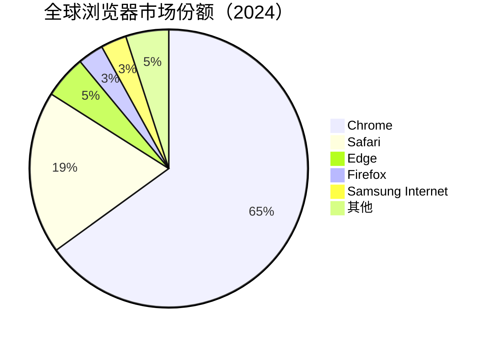
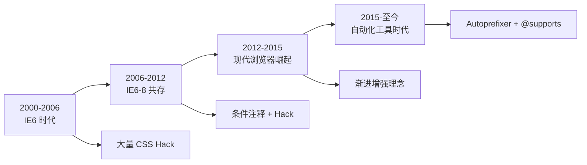
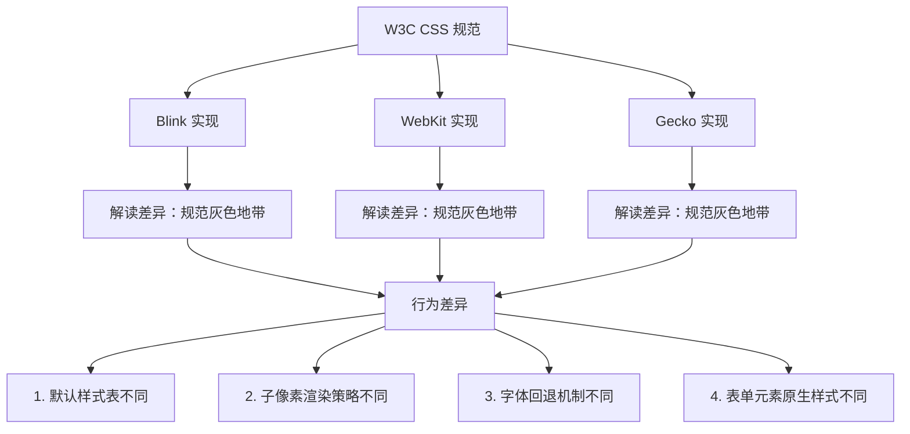
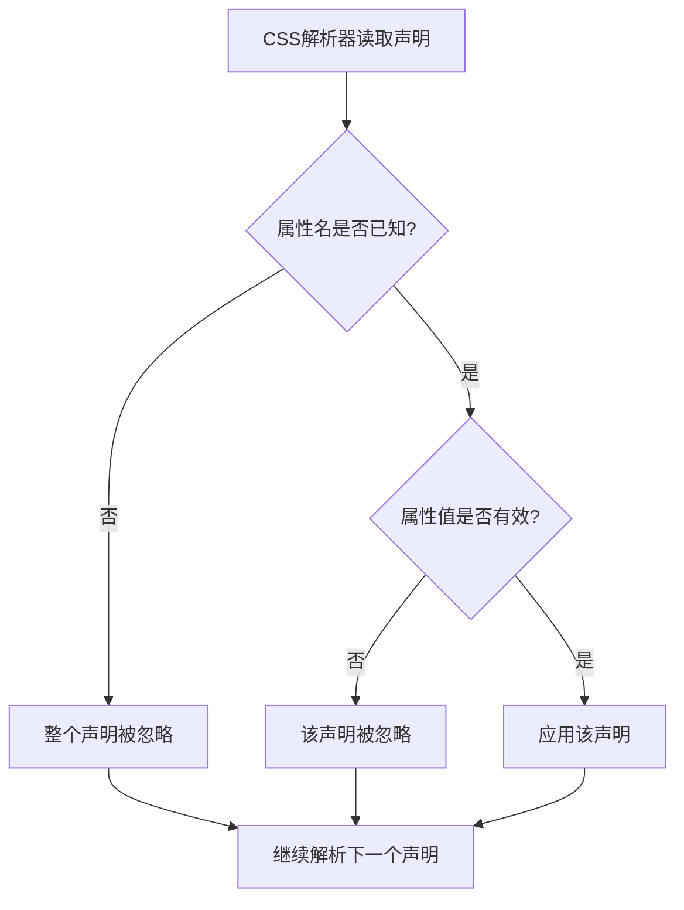
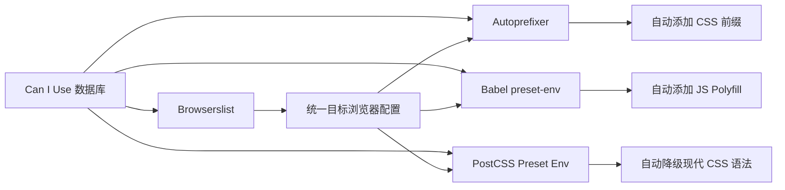

# 浏览器兼容性

浏览器兼容性是前端开发中永恒的话题。尽管现代浏览器的标准支持度已经大幅提升，但不同内核（Blink、WebKit、Gecko）对 CSS 特性的实现仍存在差异。掌握系统化的兼容性处理策略，能够让你在追求现代 CSS 特性的同时，确保应用在目标用户群体中稳定运行。

## 背景与动机

### 为什么浏览器兼容性仍然重要？

尽管 IE 已经退出历史舞台，但浏览器碎片化问题依然存在：

1. **内核差异**：Blink（Chrome/Edge）、WebKit（Safari）、Gecko（Firefox）对 CSS 特性的支持进度不同
2. **版本碎片**：用户可能使用不同版本的浏览器，尤其是移动端 Safari 与 iOS 系统版本绑定
3. **移动端特殊性**：iOS Safari、Android WebView、Samsung Internet 等都有各自的兼容性问题
4. **企业环境**：部分企业用户仍在使用旧版浏览器或受限环境

根据 StatCounter 2024 年的数据，全球浏览器市场份额如下：



### 兼容性问题的代价

| 问题类型 | 影响 | 示例 |
|----------|------|------|
| 布局错乱 | 用户无法正常浏览内容 | Flexbox 在 IE 11 的 flex-basis 计算错误 |
| 功能失效 | 交互功能无法使用 | CSS Grid 在旧浏览器中完全不支持 |
| 视觉差异 | 品牌一致性受损 | 圆角、阴影在不同浏览器渲染不一致 |
| 性能问题 | 页面卡顿或崩溃 | 某些 CSS 动画在特定内核上性能极差 |

### 兼容性处理的演进



---

## 兼容性问题的根源

理解兼容性问题的深层根源，有助于从源头上制定更有效的应对策略。浏览器兼容性问题并非偶然，而是由 Web 平台的特殊性所决定的。

### 规范差异：标准制定的滞后性

CSS 规范的制定遵循 W3C 的标准化流程，从草案（Editor's Draft）到候选推荐（Candidate Recommendation）再到正式推荐（Recommendation），通常需要数年时间。在此期间，浏览器厂商可能基于不同版本的规范草案实现特性，导致最终行为差异。

```
W3C 标准化流程与浏览器实现的时间差：

ED（编辑草案） → WD（工作草案） → CR（候选推荐） → PR（提议推荐） → REC（推荐标准）
     ↑                ↑                  ↑
  Chrome 率先实现   各浏览器分头实现    行为趋于一致
  （可能偏离最终规范）  （实现细节差异大）   （但遗留差异仍存在）
```

**典型案例**：

| 特性 | 规范变更 | 导致的兼容问题 |
|------|---------|--------------|
| Flexbox | 2009/2012/2018 三版规范 | IE 10 使用 2012 旧语法（`-ms-flexbox`），与现代 `flex` 不兼容 |
| Grid | 最初使用 `grid-template` 语法 | 旧版 Safari 的 Grid 实现缺少部分属性 |
| `box-sizing` | 最初未定义 `border-box` 行为 | IE 怪异模式与标准模式行为完全不同 |
| CSS 变量 | 规范早期 `var-` 前缀 | 最终改为 `--` 前缀，早期实现被废弃 |

### 实现差异：渲染引擎的独立演进

三大渲染引擎（Blink、WebKit、Gecko）由不同团队独立开发，即使遵循同一规范，实现细节仍可能存在差异：



**子像素渲染差异示例**：

```css
/* 不同浏览器对 1px 的处理 */
.element {
  width: 33.333%; /* 三列布局 */
}
/* Chrome：可能四舍五入为 33.33%
   Firefox：可能截断为 33.33%
   Safari：可能向上取整为 33.34%
   → 三列总宽度可能超过 100%，导致最后一列换行 */
```

### 前缀机制：实验性特性的双刃剑

浏览器前缀最初是为了让开发者提前试用实验性特性，但在实践中演变成了兼容性问题的根源之一：


**前缀僵局的教训**直接催生了现代 CSS 特性的"无前缀"发布策略——新特性在 `about:flags` 中默认禁用，只有通过浏览器标志启用后才能使用，直到规范足够稳定才默认开启。这也是 Autoprefixer 这样的工具存在的根本原因：自动化管理前缀的生命周期，避免手动维护的混乱。

### 平台绑定：移动端的特殊困境

移动端浏览器的兼容性问题更为复杂，因为浏览器版本往往与操作系统版本绑定：

| 平台 | 浏览器更新机制 | 兼容性影响 |
|------|--------------|-----------|
| iOS Safari | 随 iOS 系统更新 | 用户不升级系统就无法获得新 CSS 特性 |
| Android Chrome | 独立更新（Google Play） | 大部分用户可获取最新版本 |
| Android WebView | 随系统或 Chrome 更新 | 老旧 Android 设备可能长期停留在旧版 |
| 微信 WebView | 随微信版本更新 | 需要关注微信内置浏览器内核版本 |

这意味着 iOS Safari 的兼容性问题尤为顽固——即使用户愿意更新浏览器，也必须升级整个 iOS 系统。

---

## 核心概念：浏览器内核与市场份额

### 浏览器内核详解

**渲染引擎**（Rendering Engine）又名**浏览器内核**，负责将网页资源（HTML、CSS、JS）解析并渲染为可视化页面。不同内核对同一网页的解析结果可能不同，这就是**浏览器差异性**的根源。

| 浏览器 | 前期内核 | 后期内核 | 备注 |
|--------|----------|----------|------|
| Chrome | Webkit | Blink | Blink 由 Google + Opera 合作自研，基于 Webkit 分支 |
| Safari | Webkit | Webkit | Webkit 由 Apple 自研，iOS 强制使用 |
| Firefox | Gecko | Gecko | Gecko 源自 Netscape 的 Mozilla 项目 |
| Opera | Presto | Blink | Presto 已废弃，性能极致但兼容性差 |
| Edge | Trident | Blink | 微软从 Chromium 迁移到 Blink |
| IE | Trident | — | 已停止维护 |

### 内核特性支持差异

```
浏览器内核对 CSS 特性的支持进度：

WebKit (Safari, iOS)
├── 前缀：-webkit-
├── 特点：新特性支持较保守，但稳定性好
├── 注意：iOS 所有浏览器强制使用 WebKit
└── 典型问题：backdrop-filter 支持早，但 Grid 支持晚

Blink (Chrome, Edge, Opera)
├── 前缀：-webkit-（历史遗留）
├── 特点：新特性支持最快，实验性功能多
├── 注意：大部分新 CSS 特性的先行者
└── 典型问题：某些实验性特性可能变化

Gecko (Firefox)
├── 前缀：-moz-
├── 特点：标准支持好，CSS 变量最早支持
├── 注意：对 Web 标准贡献最大
└── 典型问题：某些 WebKit 特有属性不支持
```

### 确定兼容范围：Browserslist

Browserslist 是统一管理目标浏览器配置的工具，被 Autoprefixer、PostCSS、Babel 等工具广泛支持。

```javascript
// .browserslistrc 配置示例

// 大众项目（覆盖全球 90%+ 用户）
> 1%
last 2 versions
not dead

// 企业内部项目（可能需要支持旧浏览器）
> 0.5%
last 3 versions
not dead
IE 11

// 移动端项目
iOS >= 12
Android >= 5
Chrome >= 60
Safari >= 12

// 现代项目（放弃 IE）
> 0.5%
last 2 versions
not IE 11
not dead
```

```json
// package.json 中的 browserslist 配置
{
  "browserslist": {
    "production": [
      "> 1%",
      "last 2 versions",
      "not dead",
      "not IE 11"
    ],
    "development": [
      "last 1 chrome version",
      "last 1 firefox version",
      "last 1 safari version"
    ]
  }
}
```

**Browserslist 查询命令**：

```bash
# 查询目标浏览器列表
npx browserslist

# 查询覆盖率
npx browserslist --coverage

# 输出示例：
# chrome 120
# chrome 119
# edge 120
# firefox 121
# safari 17.2
# safari 17.1
# samsung 23
#
# Coverage: 92.5%
```

---

## 深入原理：兼容性处理机制

### CSS解析器对未知属性的忽略规则

根据 **CSS Cascading and Inheritance Level 3** 规范，浏览器CSS解析器在遇到未知属性时遵循严格的忽略规则：

**解析器处理流程**：



**关键规范要点**：

1. **属性级忽略**：当浏览器遇到完全未知的属性（如 `-webkit-unknown-prop`），整个声明被忽略，但不会影响同一规则块中其他有效声明的解析

2. **值级忽略**：属性已知但值无效时（如 `display: invalid-value`），该声明被忽略。例如：
   ```css
   .element {
     display: flex;           /* 后备值（先声明） */
     display: grid;           /* 支持 Grid 的浏览器使用此值 */
     unknown-property: value; /* 整个声明被忽略 */
   }
   ```

3. **前缀属性处理**：带前缀的属性（如 `-webkit-transform`）在不支持该前缀的浏览器中被视为未知属性。这就是为什么标准属性必须放在最后：
   ```css
   .element {
     -webkit-transform: rotate(45deg); /* Safari/Chrome */
     -moz-transform: rotate(45deg);    /* Firefox */
     transform: rotate(45deg);         /* 标准（必须最后） */
   }
   ```

4. **!important 的优先级**：即使属性被忽略，`!important` 标记也不会改变解析行为。无效声明无论是否标记 `!important` 都会被忽略

### @supports条件求值的内部算法

`@supports` 的求值算法定义在 **CSS Conditional Rules Module Level 3** 规范中，浏览器按以下步骤评估条件：

**求值算法步骤**：

```
1. 解析 @supports 条件表达式
   ↓
2. 对每个 (property: value) 对：
   a. 创建临时CSS声明
   b. 将声明应用到临时元素
   c. 检查浏览器是否接受该声明
   d. 返回 true/false
   ↓
3. 应用逻辑运算符（and/or/not）
   ↓
4. 根据最终结果决定是否应用规则块内的样式
```

**实际求值示例**：

```css
@supports (display: grid) and (gap: 10px) {
  /* 求值过程：
     1. 检测 display: grid → true/false
     2. 检测 gap: 10px → true/false
     3. true AND true → 应用样式
     4. 任一 false → 忽略整个块
  */
  .container {
    display: grid;
    gap: 10px;
  }
}
```

**浏览器实现差异**：

| 浏览器 | 实现方式 | 性能 | 注意事项 |
|--------|----------|------|----------|
| Chrome/Edge (Blink) | 在CSSOM构建时求值 | 快 | 支持 `selector()` 函数 |
| Firefox (Gecko) | 在样式计算前求值 | 快 | 完整支持规范 |
| Safari (WebKit) | 在规则匹配时求值 | 中等 | 对 `selector()` 支持较晚 |

### 浏览器内核差异的详细对比

不同浏览器内核对CSS的解析和渲染存在显著差异，理解这些差异有助于精准定位兼容性问题：

#### Blink (Chrome/Edge/Opera)

**解析器特点**：
- 基于 WebKit 分支，2013年独立发展
- 对实验性CSS特性支持最积极
- 前缀：`-webkit-`（历史遗留）

**典型差异**：
```css
/* Blink 特有的解析行为 */
.element {
  /* 支持 -webkit-line-clamp 多行截断 */
  display: -webkit-box;
  -webkit-line-clamp: 3;
  -webkit-box-orient: vertical;
  
  /* 支持 backdrop-filter 较早 */
  backdrop-filter: blur(10px);
  
  /* Container Queries 支持最早（105+） */
  container-type: inline-size;
}
```

**已知问题**：
- 某些 CSS 变量的计算时机与规范略有偏差
- `:has()` 选择器在复杂场景下性能问题

#### WebKit (Safari/iOS)

**解析器特点**：
- Apple 维护，iOS 强制所有浏览器使用 WebKit
- 新特性支持相对保守，但稳定性好
- 前缀：`-webkit-`

**典型差异**：
```css
/* WebKit 特有的解析行为 */
.element {
  /* iOS Safari 特有的 -webkit-overflow-scrolling */
  -webkit-overflow-scrolling: touch;
  
  /* backdrop-filter 支持早（Safari 9+） */
  -webkit-backdrop-filter: blur(10px);
  backdrop-filter: blur(10px);
  
  /* Grid 支持较晚（Safari 10.1+） */
  display: grid;
  
  /* CSS Nesting 支持较晚（Safari 16.5+） */
  & .nested { color: red; }
}
```

**已知问题**：
- 100vh 在 iOS Safari 中包含地址栏高度
- `position: sticky` 在滚动容器中的行为差异
- CSS Grid 的 `auto-fit` 在某些版本有 bug

#### Gecko (Firefox)

**解析器特点**：
- 源自 Netscape 的 Mozilla 项目
- 对 Web 标准贡献最大，CSS 变量最早支持
- 前缀：`-moz-`

**典型差异**：
```css
/* Gecko 特有的解析行为 */
.element {
  /* CSS 变量支持最早（Firefox 31+） */
  --custom-prop: value;
  
  /* -moz-appearance 独有行为 */
  -moz-appearance: none;
  
  /* backdrop-filter 支持较晚（Firefox 103+） */
  backdrop-filter: blur(10px);
  
  /* :has() 支持最晚（Firefox 121+） */
  &:has(.child) { color: blue; }
}
```

**已知问题**：
- 某些表单元素的默认样式差异较大
- `scrollbar-width` 和 `scrollbar-color` 是 Firefox 独有属性（现已标准化）

#### 内核差异对比表

| 特性 | Blink | WebKit | Gecko | 兼容性影响 |
|------|-------|--------|-------|------------|
| CSS Grid | 57+ | 10.1+ | 52+ | Safari 支持晚 |
| CSS 变量 | 49+ | 9.1+ | 31+ | Safari 支持晚 |
| backdrop-filter | 76+ | 9+ | 103+ | Firefox 支持晚 |
| Container Queries | 105+ | 16+ | 110+ | Firefox 支持晚 |
| CSS Nesting | 120+ | 16.5+ | 117+ | 全部较新 |
| :has() | 105+ | 15.4+ | 121+ | Firefox 支持晚 |
| @layer | 99+ | 15.4+ | 97+ | 全部支持 |

### 现代浏览器兼容性新特性

现代CSS引入了多项革命性特性，但各浏览器支持进度不一，需要针对性处理：

#### CSS Nesting（CSS嵌套）

**规范**：CSS Nesting Module Level 1

**浏览器支持**：
- Chrome 120+（2023年12月）
- Safari 16.5+（2023年5月）
- Firefox 117+（2023年8月）

**兼容处理**：
```css
/* 现代语法：CSS Nesting */
.card {
  background: white;
  
  & .title {
    font-size: 20px;
    color: #333;
  }
  
  &:hover {
    box-shadow: 0 4px 12px rgba(0,0,0,0.1);
  }
}

/* 降级方案：使用 PostCSS Nesting */
.card {
  background: white;
}
.card .title {
  font-size: 20px;
  color: #333;
}
.card:hover {
  box-shadow: 0 4px 12px rgba(0,0,0,0.1);
}
```

#### Container Queries（容器查询）

**规范**：CSS Containment Module Level 3

**浏览器支持**：
- Chrome 105+（2022年8月）
- Safari 16+（2022年9月）
- Firefox 110+（2023年2月）

**兼容处理**：
```css
/* 容器查询 */
.card-container {
  container-type: inline-size;
  container-name: card;
}

@container card (min-width: 400px) {
  .card {
    display: grid;
    grid-template-columns: 200px 1fr;
  }
}

/* 降级方案：使用媒体查询 */
@supports not (container-type: inline-size) {
  @media (min-width: 400px) {
    .card {
      display: grid;
      grid-template-columns: 200px 1fr;
    }
  }
}
```

#### CSS :has() 选择器

**规范**：Selectors Level 4

**浏览器支持**：
- Chrome 105+（2022年8月）
- Safari 15.4+（2022年3月）
- Firefox 121+（2023年12月）

**兼容处理**：
```css
/* :has() 选择器 */
.card:has(.badge) {
  border: 2px solid gold;
}

/* 降级方案：JavaScript */
<script>
  document.querySelectorAll('.card').forEach(card => {
    if (card.querySelector('.badge')) {
      card.classList.add('has-badge');
    }
  });
</script>

<style>
  .card.has-badge {
    border: 2px solid gold;
  }
</style>
```

#### @layer（层叠层）

**规范**：CSS Cascading and Inheritance Level 5

**浏览器支持**：
- Chrome 99+（2022年3月）
- Safari 15.4+（2022年3月）
- Firefox 97+（2022年2月）

**兼容处理**：
```css
/* @layer 层叠层 */
@layer base, components, utilities;

@layer base {
  button { background: blue; }
}

@layer components {
  .btn-primary { background: green; }
}

/* 降级方案：不使用 @layer，依赖源顺序 */
button { background: blue; }
.btn-primary { background: green; }
```

#### 现代特性兼容性决策树

```mermaid
flowchart TD
    A[使用现代CSS特性] --> B{特性是否支持?}
    B -->|全部支持| C[直接使用]
    B -->|部分支持| D{@supports 检测}
    B -->|不支持| E[Polyfill/降级]
    
    D --> F[提供降级方案]
    D --> G[提供增强方案]
    
    E --> H[JavaScript Polyfill]
    E --> I[PostCSS 转换]
    
```

### 兼容性处理策略优先级

```mermaid
flowchart TD
    A[遇到兼容性问题] --> B{Autoprefixer 能解决?}
    B -->|是| C[配置 Browserslist<br/>自动添加前缀]
    B -->|否| D{@supports 特性检测?}
    D -->|是| E[编写特性检测代码<br/>提供降级方案]
    D -->|否| F{后备属性值?}
    F -->|是| G[提供后备样式]
    F -->|否| H{Polyfill 能解决?}
    H -->|是| I[引入 Polyfill]
    H -->|否| J[最后考虑 CSS Hack]

```

### 浏览器前缀机制

浏览器前缀是早期处理兼容性的主要方式，各浏览器厂商通过前缀来标识实验性特性：

| 前缀 | 浏览器 | 示例 |
|------|--------|------|
| `-webkit-` | Safari, Chrome, iOS, 旧 Edge | `-webkit-transform` |
| `-moz-` | Firefox | `-moz-appearance` |
| `-ms-` | IE, 旧 Edge | `-ms-flexbox` |
| `-o-` | 旧 Opera (Presto) | `-o-transition` |

```css
/* 手动添加前缀（不推荐） */
.element {
  -webkit-transform: translateX(100px); /* Safari, Chrome */
  -moz-transform: translateX(100px);    /* Firefox */
  -ms-transform: translateX(100px);     /* IE 9 */
  -o-transform: translateX(100px);      /* 旧 Opera */
  transform: translateX(100px);         /* 标准（必须放在最后） */
}
```

> **重要提示**：手动添加前缀容易出错且难以维护，应该使用 Autoprefixer 自动处理。

### @supports 特性检测实战

`@supports` 是 CSS 原生的特性检测机制，可以根据浏览器是否支持某个属性来决定应用哪套样式。它是现代渐进增强策略的核心工具。

#### 基础语法

```css
/* 检测支持 */
@supports (display: grid) {
  .container {
    display: grid;
    grid-template-columns: repeat(3, 1fr);
  }
}

/* 检测不支持 */
@supports not (display: grid) {
  .container {
    display: flex;
    flex-wrap: wrap;
  }
}

/* 组合检测：同时支持 */
@supports (display: grid) and (gap: 10px) {
  .grid {
    display: grid;
    gap: 10px;
  }
}

/* 组合检测：任一支持 */
@supports (backdrop-filter: blur(10px)) or (-webkit-backdrop-filter: blur(10px)) {
  .modal {
    backdrop-filter: blur(10px);
    -webkit-backdrop-filter: blur(10px);
  }
}
```

#### 渐进增强实战模式

`@supports` 最强大的用法是"先写基础样式，再逐步增强"，确保任何浏览器都能获得可用体验：

```css
/* 模式一：基础 → 增强 */
.card {
  /* 基础样式：所有浏览器都能渲染 */
  display: block;
  background: white;
  border: 1px solid #e0e0e0;
  padding: 16px;
}

@supports (display: grid) {
  .card {
    /* 增强样式：支持 Grid 的浏览器获得更好布局 */
    display: grid;
    grid-template-areas:
      "image title"
      "image desc";
    gap: 16px;
  }
}

@supports (backdrop-filter: blur(10px)) {
  .card {
    /* 视觉增强：支持毛玻璃的浏览器获得更好效果 */
    backdrop-filter: blur(10px);
    background: rgba(255, 255, 255, 0.8);
    border: none;
  }
}
```

```css
/* 模式二：检测选择器支持（Safari 14+） */
@supports selector(:has(*)) {
  /* 只有支持 :has() 的浏览器才应用 */
  .card-container:has(.card:hover) {
    transform: scale(1.02);
  }
}

/* 模式三：检测 font-format 支持 */
@supports font-format(woff2) {
  @font-face {
    font-family: 'MyFont';
    src: url('myfont.woff2') format('woff2');
  }
}
```

#### @supports 检测能力边界

`@supports` 并非万能，了解其检测边界可以避免误用：

| 能检测 | 不能检测 |
|--------|---------|
| 属性名是否支持（`display: grid`） | 属性值的具体计算结果 |
| 选择器是否支持（`selector(:has(*))`） | 浏览器对某属性的 Bug |
| at-rule 是否支持 | JavaScript API 是否可用 |
| 前缀属性是否支持 | 性能表现差异 |

```css
/* ❌ 无法检测 Bug：Safari 支持 gap 但在 Flexbox 中有 Bug */
@supports (gap: 10px) {
  .flex-container {
    gap: 10px; /* Safari 14 之前在 Flex 中 gap 不生效 */
  }
}

/* ✅ 正确做法：结合版本信息或使用更安全的方案 */
.flex-container {
  margin: -5px; /* 间距的后备方案 */
}

@supports (gap: 10px) and (display: flex) {
  .flex-container {
    margin: 0;
    gap: 10px;
  }
}
```

#### CSS.supports() JavaScript API

```javascript
// CSS.supports API
if (CSS.supports('display', 'grid')) {
  console.log('支持 Grid');
}

// 检测 CSS 变量
if (CSS.supports('--css', 'variables')) {
  console.log('支持 CSS 变量');
}

// 多属性组合检测
if (CSS.supports('display: grid') && CSS.supports('gap: 10px')) {
  console.log('支持 Grid Gap');
}

// 封装检测函数
const featureDetection = {
  grid: CSS.supports('display', 'grid'),
  gap: CSS.supports('gap', '10px'),
  variables: CSS.supports('--test', '0'),
  aspectRatio: CSS.supports('aspect-ratio', '1'),
  container: CSS.supports('container-type', 'inline-size'),
  has: CSS.supports('selector(:has(*))'),

  // 添加 CSS 类到 html 元素
  applyClasses() {
    Object.entries(this).forEach(([key, value]) => {
      if (typeof value === 'boolean') {
        document.documentElement.classList.toggle(key, value);
        document.documentElement.classList.toggle(`no-${key}`, !value);
      }
    });
  }
};

featureDetection.applyClasses();
```

#### @supports 与 JavaScript 检测的配合策略

```css
/* CSS 中使用 @supports 提供样式降级 */
.hero {
  height: 100vh; /* 后备值 */
}

@supports (height: 100dvh) {
  .hero {
    height: 100dvh; /* 现代浏览器使用动态视口高度 */
  }
}
```

```javascript
// JavaScript 中使用 CSS.supports 做逻辑判断
if (!CSS.supports('height', '100dvh')) {
  // 不支持 dvh 时，用 JS 动态计算视口高度
  function setVH() {
    const vh = window.innerHeight * 0.01;
    document.documentElement.style.setProperty('--vh', `${vh}px`);
  }
  setVH();
  window.addEventListener('resize', setVH);
}
```

---

## 代码示例：自动化兼容性处理

### Autoprefixer 配置

Autoprefixer 是最流行的 CSS 前缀自动添加工具，基于 Browserslist 配置和 Can I Use 数据自动处理。

#### PostCSS + Autoprefixer

```bash
npm install postcss autoprefixer --save-dev
```

```javascript
// postcss.config.js
module.exports = {
  plugins: [
    require('autoprefixer')({
      // 覆盖 browserslist 配置（可选）
      overrideBrowserslist: [
        '> 1%',
        'last 2 versions',
        'not dead'
      ],
      // 是否为 Grid 添加 IE 前缀
      grid: true
    })
  ]
};
```

#### Webpack 配置

```javascript
// webpack.config.js
const MiniCssExtractPlugin = require('mini-css-extract-plugin');

module.exports = {
  module: {
    rules: [
      {
        test: /\.css$/,
        use: [
          MiniCssExtractPlugin.loader,
          'css-loader',
          'postcss-loader'  // 会自动读取 postcss.config.js
        ]
      }
    ]
  },
  plugins: [
    new MiniCssExtractPlugin({
      filename: '[name].[contenthash].css'
    })
  ]
};
```

#### Vite 配置

```javascript
// vite.config.js
import { defineConfig } from 'vite';

export default defineConfig({
  css: {
    postcss: {
      plugins: [
        require('autoprefixer')({
          grid: true
        })
      ]
    }
  }
});
```

#### Autoprefixer 处理效果

```css
/* 输入 */
.element {
  display: flex;
  user-select: none;
  backdrop-filter: blur(10px);
}

/* 输出（根据 Browserslist 配置） */
.element {
  display: -webkit-box;
  display: -ms-flexbox;
  display: flex;
  -webkit-user-select: none;
  -moz-user-select: none;
  -ms-user-select: none;
  user-select: none;
  -webkit-backdrop-filter: blur(10px);
  backdrop-filter: blur(10px);
}
```

### PostCSS Preset Env

PostCSS Preset Env 可以将现代 CSS 语法转换为向后兼容的版本。

```bash
npm install postcss-preset-env --save-dev
```

```javascript
// postcss.config.js
module.exports = {
  plugins: [
    require('postcss-preset-env')({
      stage: 2,  // 使用阶段 2+ 的特性
      features: {
        'nesting-rules': true,           // CSS 嵌套
        'custom-properties': true,       // CSS 变量降级
        'custom-media-queries': true,    // 自定义媒体查询
        'logical-properties-and-values': true  // 逻辑属性
      }
    })
  ]
};
```

```css
/* 输入：使用现代语法 */
:root {
  --primary: #007bff;
}

@custom-media --mobile (max-width: 480px);

.element {
  color: var(--primary);
  
  &:hover {
    color: dark(var(--primary));
  }
  
  @media (--mobile) {
    font-size: 14px;
  }
}

/* 输出：降级后的代码 */
:root {
  --primary: #007bff;
}

.element {
  color: #007bff;  /* CSS 变量降级 */
  color: var(--primary);
}

.element:hover {
  color: #0056b3;
}

@media (max-width: 480px) {
  .element {
    font-size: 14px;
  }
}
```

### Can I Use 深度使用指南

[Can I Use](https://caniuse.com/) 是查询 CSS/HTML/JS 特性浏览器支持度的权威工具，其数据直接被 Autoprefixer、Babel 等工具引用，是兼容性工作的数据基础。

#### 基本使用流程

1. 访问 [caniuse.com](https://caniuse.com/)
2. 在搜索框输入特性名称（如 `css-grid`、`flexbox`、`css-variables`）
3. 查看各浏览器版本支持情况
4. 参考使用统计和资源链接

#### 搜索技巧

Can I Use 支持多种搜索方式，掌握这些技巧可以大幅提升查询效率：

| 搜索方式 | 示例 | 说明 |
|---------|------|------|
| 特性名 | `css-grid` | 直接搜索标准特性名 |
| CSS 属性名 | `gap` | 搜索具体 CSS 属性 |
| 缩写 | `grid` | 模糊匹配相关特性 |
| 分类浏览 | 点击首页分类标签 | 按类别浏览所有特性 |

**常用特性搜索关键词**：

```
布局类：flexbox, css-grid, multicolumn, container-queries
视觉类：backdrop-filter, clip-path, mask-image, mix-blend-mode
交互类：scroll-snap, touch-action, overscroll-behavior
变量类：css-variables, css-nesting, css-has
函数类：clamp, min-max, calc, env
```

#### 数据解读方法

Can I Use 的结果页面包含丰富的信息，需要正确解读：

```
┌─────────────────────────────────────────────────────────────┐
│ CSS Grid Layout                                             │
├─────────────────────────────────────────────────────────────┤
│ 支持度色块含义：                                              │
│ 🟢 深绿：完全支持（所有功能可用）                                │
│ 🟡 浅绿：部分支持（有已知问题或缺少部分功能）                      │
│ 🔴 红色：不支持                                               │
│ ⚪ 灰色：未知/未测试                                           │
├─────────────────────────────────────────────────────────────┤
│ 关键指标：                                                   │
│ • 全球支持率：97.5%（基于 StatCounter 数据）                    │
│ • 当前版本支持：显示最新版本号                                  │
│ • 已知问题：点击版本号查看详细 Bug 列表                         │
│ • 资源链接：规范文档、MDN 文档、测试套件                        │
└─────────────────────────────────────────────────────────────┘
```

#### 按地区筛选

Can I Use 支持按地区查看支持率，这对面向特定市场的项目尤为重要：

```bash
# 在搜索结果页面，点击地区下拉菜单
# 可选择：中国、美国、全球等不同区域
# 中国市场的浏览器分布与全球差异较大：
#   - QQ 浏览器、UC 浏览器占比更高
#   - iOS Safari 占比相对更高（iPhone 用户多）
#   - 360 浏览器等双核浏览器需特殊关注
```

#### 与构建工具联动

Can I Use 的数据不仅用于手动查询，更是现代构建工具链的数据源：



#### Can I Use CLI 工具

```bash
# 安装
npm install -g caniuse-cmd

# 查询特性支持
caniuse css-grid

# 输出表格格式
caniuse flexbox --short

# 在脚本中集成
caniuse css-variables --percentages  # 输出百分比数据
```

#### API 集成

Can I Use 提供了 JSON 数据，可以在 CI/CD 流程中自动检测兼容性：

```javascript
// 使用 caniuse-api npm 包
import { support, isSupported, getSupport } from 'caniuse-api';

// 检测特性是否被目标浏览器支持
isSupported('css-grid', 'ie 11'); // false
isSupported('css-grid', 'chrome 100'); // true

// 获取特性的详细支持信息
const gridSupport = getSupport('css-grid');
// { chrome: { y: 57 }, firefox: { y: 52 }, safari: { y: 10.1 }, ... }

// 在 CI 中自动检查
const requiredFeatures = ['css-grid', 'css-variables', 'flexbox-gap'];
const targetBrowsers = '> 1%, last 2 versions, not dead';

requiredFeatures.forEach(feature => {
  if (!isSupported(feature, targetBrowsers)) {
    console.warn(`⚠️ ${feature} 在目标浏览器中未完全支持`);
  }
});
```

---

## 代码示例：特性检测与降级

### CSS 特性兼容性表

#### 布局特性

| 特性 | Chrome | Firefox | Safari | Edge | IE |
|------|--------|---------|--------|------|-----|
| Flexbox | 29+ | 22+ | 9+ | 12+ | 11* |
| Grid | 57+ | 52+ | 10.1+ | 16+ | ❌ |
| Gap (Flex) | 84+ | 63+ | 14.1+ | 84+ | ❌ |
| Aspect-ratio | 88+ | 89+ | 15+ | 88+ | ❌ |
| Container Queries | 105+ | 110+ | 16+ | 105+ | ❌ |

> *IE 11 支持旧版 Flexbox 语法（2012 规范）

#### 新特性兼容性

| 特性 | Chrome | Firefox | Safari | Edge |
|------|--------|---------|--------|------|
| CSS 变量 | 49+ | 31+ | 9.1+ | 15+ |
| `:is()` | 88+ | 78+ | 14+ | 88+ |
| `:where()` | 88+ | 78+ | 14+ | 88+ |
| `clamp()` | 79+ | 75+ | 13.1+ | 79+ |
| `:has()` | 105+ | 121+ | 15.4+ | 105+ |
| `@layer` | 99+ | 97+ | 15.4+ | 99+ |

#### 视觉特性

| 特性 | Chrome | Firefox | Safari | Edge |
|------|--------|---------|--------|------|
| `backdrop-filter` | 76+ | 103+ | 9+ | 79+ |
| `mask-image` | 8+ | 53+ | 4+ | 79+ |
| `clip-path` | 55+ | 54+ | 9.1+ | 79+ |
| `mix-blend-mode` | 41+ | 32+ | 8+ | 79+ |
| `scroll-snap` | 69+ | 68+ | 11+ | 79+ |

### Flexbox 兼容方案

```css
/* 完整兼容方案 */
.container {
  /* 旧版语法 (IE 10) */
  display: -ms-flexbox;
  -ms-flex-direction: row;
  -ms-flex-wrap: wrap;
  -ms-flex-pack: justify;
  -ms-flex-align: center;
  
  /* 标准语法 */
  display: flex;
  flex-direction: row;
  flex-wrap: wrap;
  justify-content: space-between;
  align-items: center;
}

.item {
  /* IE 10 */
  -ms-flex: 1 0 auto;
  /* 标准 */
  flex: 1 0 auto;
}
```

### Grid 降级方案

```css
/* 后备方案：Flexbox */
.grid-container {
  display: flex;
  flex-wrap: wrap;
  margin: -10px;
}

.grid-item {
  width: calc(33.333% - 20px);
  margin: 10px;
}

/* 现代浏览器使用 Grid */
@supports (display: grid) {
  .grid-container {
    display: grid;
    grid-template-columns: repeat(3, 1fr);
    gap: 20px;
    margin: 0;  /* 重置 flex 的 margin */
  }
  
  .grid-item {
    width: auto;
    margin: 0;
  }
}
```

### CSS 变量降级

```css
:root {
  --primary-color: #007bff;
  --spacing: 16px;
}

.button {
  /* 后备值（必须写在前面） */
  background-color: #007bff;
  padding: 16px 32px;
  
  /* CSS 变量 */
  background-color: var(--primary-color);
  padding: var(--spacing) calc(var(--spacing) * 2);
}
```

### calc() 兼容性

```css
.element {
  /* 后备值 */
  width: 95%;
  /* calc() */
  width: calc(100% - 20px);
  
  /* ⚠️ 嵌套 calc() 兼容性较差 */
  /* width: calc(100% - calc(50px + 1rem)); */
  
  /* ✅ 推荐：展开嵌套 */
  width: calc(100% - 50px - 1rem);
}
```

### 视口单位兼容性

```css
/* vh 在移动端的问题：iOS Safari 地址栏会占用高度 */
.hero {
  height: 100vh;
  /* iOS Safari 地址栏问题修复 */
  height: calc(var(--vh, 1vh) * 100);
}
```

```javascript
// JavaScript 修复视口高度问题
function setVH() {
  const vh = window.innerHeight * 0.01;
  document.documentElement.style.setProperty('--vh', `${vh}px`);
}

// 初始化
setVH();

// 监听 resize 和 orientationchange
window.addEventListener('resize', setVH);
window.addEventListener('orientationchange', setVH);

// 现代替代方案：使用 dvh (dynamic viewport height)
// CSS: height: 100dvh; (Chrome 108+, Safari 15.4+, Firefox 101+)
```

---

## 代码示例：移动端特殊处理

### 高清屏适配：1px 边框问题

在高清屏（Retina 屏幕）上，1px 的 CSS 边框会显示为 2px 或 3px 的物理像素。

```css
/* 问题：在 2x 屏上显示为 2px */
.border-normal {
  border-bottom: 1px solid #ddd;
}

/* 解决方案一：伪元素 + transform */
.hairline {
  position: relative;
}

.hairline::after {
  content: '';
  position: absolute;
  left: 0;
  bottom: 0;
  width: 100%;
  height: 1px;
  background: #ddd;
  transform: scaleY(0.5);  /* 2x 屏缩放 0.5 */
  transform-origin: 0 0;
}

/* 3x 屏 */
@media (-webkit-min-device-pixel-ratio: 3), (min-resolution: 288dpi) {
  .hairline::after {
    transform: scaleY(0.33);
  }
}

/* 解决方案二：box-shadow */
.hairline-shadow {
  box-shadow: 0 -1px 0 0 #ddd;  /* 上边框 */
}

/* 解决方案三：border-image */
.hairline-image {
  border-bottom: 1px solid;
  border-image: linear-gradient(to right, #ddd, #ddd) 0 0 1 0;
}

/* 四边 1px 边框 */
.hairline-all::after {
  content: '';
  position: absolute;
  top: 0;
  left: 0;
  width: 200%;
  height: 200%;
  border: 1px solid #ddd;
  transform: scale(0.5);
  transform-origin: 0 0;
  pointer-events: none;
  box-sizing: border-box;
}
```

### iOS 安全区域适配

iPhone X 及之后的机型有刘海和底部 Home Indicator，需要适配安全区域。

```css
/* iOS 底部安全区域 */
.footer {
  /* iOS 11.0-11.2 */
  padding-bottom: constant(safe-area-inset-bottom);
  /* iOS 11.2+ */
  padding-bottom: env(safe-area-inset-bottom);
}

/* 顶部刘海适配 */
.header {
  padding-top: constant(safe-area-inset-top);
  padding-top: env(safe-area-inset-top);
}

/* 左右安全区域（横屏时） */
.container {
  padding-left: env(safe-area-inset-left);
  padding-right: env(safe-area-inset-right);
}

/* 必须在 viewport meta 标签中启用 */
/* <meta name="viewport" content="width=device-width, initial-scale=1, viewport-fit=cover"> */
```

### 触摸设备优化

```css
/* 触摸设备检测 */
@media (hover: none) and (pointer: coarse) {
  /* 增大点击区域 */
  .button {
    padding: 12px 24px;
    min-height: 44px;  /* Apple 推荐的最小点击区域 */
    min-width: 44px;
  }
  
  /* 移除 hover 效果 */
  .button:hover {
    background: inherit;
  }
}

/* 精确指针设备（鼠标） */
@media (hover: hover) and (pointer: fine) {
  .button {
    padding: 8px 16px;
  }
  
  .button:hover {
    background: #f0f0f0;
  }
}

/* 禁用触摸调用 */
.no-touch-callout {
  -webkit-touch-callout: none;  /* iOS Safari 长按菜单 */
  -webkit-user-select: none;
  user-select: none;
}
```

### 媒体查询兼容性

```css
/* 设备像素比检测 */
@media (-webkit-min-device-pixel-ratio: 2), 
       (min-resolution: 192dpi) {
  .logo {
    background-image: url('logo@2x.png');
    background-size: 100px 50px;  /* 必须设置背景尺寸 */
  }
}

/* iOS 特定检测 */
@supports (-webkit-touch-callout: none) {
  /* iOS only */
  .ios-specific {
    -webkit-tap-highlight-color: transparent;  /* 移除点击高亮 */
  }
}

/* Safari 特定检测 */
@media not all and (min-resolution: .001dpcm) {
  @supports (-webkit-appearance: none) {
    .safari-specific {
      /* Safari only 样式 */
    }
  }
}

/* 暗色模式检测 */
@media (prefers-color-scheme: dark) {
  body {
    background: #1a1a1a;
    color: #ffffff;
  }
}

/* 减少动画偏好 */
@media (prefers-reduced-motion: reduce) {
  * {
    animation-duration: 0.01ms !important;
    transition-duration: 0.01ms !important;
  }
}
```

### 移动端常见兼容问题

```css
/* 1. 输入框聚焦时页面缩放（iOS） */
/* 解决：设置 font-size >= 16px */
input, select, textarea {
  font-size: 16px;
}

/* 2. 滚动穿透问题 */
.modal-open {
  overflow: hidden;
  position: fixed;
  width: 100%;
}

/* 3. 橡皮筋效果禁用 */
.no-bounce {
  overflow: hidden;
  height: 100vh;
}

/* 4. 长按链接弹出菜单禁用 */
.no-callout a {
  -webkit-touch-callout: none;
}

/* 5. 表单元素外观统一 */
input, button, select, textarea {
  -webkit-appearance: none;
  -moz-appearance: none;
  appearance: none;
  border-radius: 0;
}

/* 6. 点击延迟（300ms 问题） */
/* 解决：使用 touch-action 或 viewport 设置 */
.fast-click {
  touch-action: manipulation;
}
```

---

## 最佳实践

### Polyfill 策略

Polyfill 是在旧浏览器中模拟现代 CSS/JS 特性的代码片段。合理使用 Polyfill 可以在不牺牲功能的前提下扩大兼容范围，但需注意性能开销和策略选择。

#### Polyfill 选型原则

```mermaid
flowchart TD
    A[需要 Polyfill] --> B{是否为 CSS 特性?}
    B -->|是| C{能否用后备值替代?}
    B -->|否 - JS API| D[core-js 按需注入]

    C -->|能| E[使用 CSS 后备值<br/>零运行时开销]
    C -->|不能| F{能否用 JS 模拟?}
    F -->|能| G[CSS Polyfill<br/>如 css-vars-ponyfill]
    F -->|不能| H[降级方案<br/>@supports + 替代布局]

    D --> I{按需引入 or 全量引入?}
    I -->|按需| J[babel/plugin + useBuiltIns: usage]
    I -->|全量| K[自托管 polyfill 服务]

```

#### core-js：JavaScript API Polyfill

core-js 是最全面的 JavaScript Polyfill 方案，虽然主要针对 JS API，但与 CSS 兼容性密切相关——许多 CSS 特性检测（如 `CSS.supports()`）和动态样式操作依赖现代 JS API。

```bash
npm install core-js
```

```javascript
// 方式一：按需引入（推荐，最小化包体积）
import 'core-js/modules/es.object.assign.js';       // Object.assign
import 'core-js/modules/es.array.from.js';           // Array.from
import 'core-js/modules/es.promise.js';              // Promise

// 方式二：通过 Babel 自动按需引入
// babel.config.js
module.exports = {
  presets: [
    ['@babel/preset-env', {
      useBuiltIns: 'usage',    // 按需引入，只 Polyfill 代码中用到的 API
      corejs: 3                // 使用 core-js@3
    }]
  ]
};

// 方式三：全量引入（不推荐，包体积大）
import 'core-js/stable';
```

**与 CSS 兼容性的关联**：

```javascript
// CSS.supports() 在旧浏览器中不可用
// core-js 不直接 Polyfill CSS.supports，但可以 Polyfill 依赖的 JS API

// 示例：动态样式计算依赖的 JS API
import 'core-js/modules/es.object.entries.js';  // Object.entries（遍历样式对象）
import 'core-js/modules/es.array.from.js';       // Array.from（类数组转换）

// 自定义 CSS.supports Polyfill
if (!window.CSS || !CSS.supports) {
  window.CSS = window.CSS || {};
  CSS.supports = function(property, value) {
    var element = document.createElement('div');
    if (arguments.length === 2) {
      element.style[property] = value;
      return element.style[property] !== '';
    } else {
      // 解析单参数形式：CSS.supports('display: grid')
      var parts = property.split(':');
      if (parts.length === 2) {
        element.style[parts[0].trim()] = parts[1].trim();
        return element.style[parts[0].trim()] !== '';
      }
    }
    return false;
  };
}
```

#### CSS 专用 Polyfill

| Polyfill | 目标特性 | 体积 | 使用方式 | 适用场景 |
|---------|---------|------|---------|---------|
| **css-vars-ponyfill** | CSS 自定义属性 | ~6KB | 运行时 JS | 需支持 IE 11 的 CSS 变量 |
| **flexibility** | Flexbox | ~8KB | 运行时 JS | IE 8-9 的 Flexbox 布局 |
| **css-paint-polyfill** | CSS Paint API | ~12KB | 运行时 JS | 实验性 CSS Houdini 特性 |
| **scroll-snap-polyfill** | Scroll Snap | ~4KB | 运行时 JS | 旧版浏览器的滚动吸附 |
| **focus-visible** | :focus-visible | ~2KB | 运行时 JS | 键盘焦点样式区分 |

#### 动态 Polyfill 服务：polyfill.io

polyfill.io 曾提供按 User-Agent 动态返回所需 Polyfill 的服务。但 2024 年其域名易主后发生过供应链攻击（见下方安全提示），现已不建议直接引用：

```html
<!-- 动态 Polyfill 服务（需注意供应链安全风险） -->
<script src="https://polyfill.io/v3/polyfill.min.js?features=css.supports,Object.entries,Array.from"></script>

<!-- 更安全的替代方案：自建 Polyfill 服务 -->
<!-- 使用 polyfill-library 自建 -->
<script src="/polyfill.min.js?features=css.supports"></script>
```

> ⚠️ **安全提示**：2024 年 polyfill.io 域名被收购后曾发生供应链攻击事件。建议使用自建服务或替代方案如 `cdn.jsdelivr.net/npm/core-js-bundle`。

#### CSS 变量 Polyfill

```html
<!-- 使用 css-vars-ponyfill 支持 IE 11 -->
<script src="https://cdn.jsdelivr.net/npm/css-vars-ponyfill@2"></script>
<script>
  cssVars({
    onlyLegacy: true,      // 只在旧浏览器启用
    preserveVars: true,    // 保留 CSS 变量声明
    silent: true,          // 静默模式
    watch: true            // 监听 DOM 变化
  });
</script>
```

#### Flexbox Polyfill

```html
<!-- flexibility.js 支持 IE 8-9 -->
<!--[if lte IE 9]>
<script src="https://cdnjs.cloudflare.com/ajax/libs/flexibility/2.0.1/flexibility.js"></script>
<script>
  flexibility(document.documentElement);
</script>
<![endif]-->
```

#### 响应式图片 Polyfill

```html
<!-- picturefill.js -->
<script src="https://cdnjs.cloudflare.com/ajax/libs/picturefill/3.0.3/picturefill.min.js"></script>

<picture>
  <source srcset="large.jpg" media="(min-width: 800px)">
  <source srcset="medium.jpg" media="(min-width: 400px)">
  
</picture>
```

#### HTML5 元素支持

```html
<!-- html5shiv.js 让 IE 8 及以下识别 HTML5 元素 -->
<!--[if lt IE 9]>
<script src="https://cdnjs.cloudflare.com/ajax/libs/html5shiv/3.7.3/html5shiv.min.js"></script>
<![endif]-->
```

#### 媒体查询支持

```html
<!-- respond.js 让 IE 6-8 支持媒体查询 -->
<!--[if lt IE 9]>
<script src="https://cdnjs.cloudflare.com/ajax/libs/respond.js/1.4.2/respond.min.js"></script>
<![endif]-->
```

### IE 兼容性处理

虽然 IE 已经退出历史舞台，但部分企业项目仍需要支持。

#### 条件注释（IE 专属）

```html
<!-- IE 所有版本 -->
<!--[if IE]>
  <link rel="stylesheet" href="ie.css">
<![endif]-->

<!-- IE 9 及以下 -->
<!--[if lte IE 9]>
  <script src="html5shiv.js"></script>
  <script src="respond.js"></script>
<![endif]-->

<!-- 非 IE 浏览器 -->
<!--[if !IE]><!-->
  <link rel="stylesheet" href="modern.css">
<!--<![endif]-->
```

#### IE 常见问题修复

```css
/* 1. 盒模型问题 */
*, *:before, *:after {
  box-sizing: border-box;
}

/* 2. 最小高度问题 */
.element {
  min-height: 100px;
  height: auto !important;
  height: 100px; /* IE 6 解析为 min-height */
}

/* 3. 透明度问题 */
.transparent {
  opacity: 0.5;
  filter: alpha(opacity=50); /* IE 8 及以下 */
}

/* 4. PNG 透明问题 */
.png-fix {
  background: transparent;
  filter: progid:DXImageTransform.Microsoft.AlphaImageLoader(
    src='image.png',
    sizingMethod='scale'
  );
}

/* 5. 双倍边距问题 */
.double-margin {
  float: left;
  margin-left: 10px;
  _display: inline; /* IE 6 修复 */
}

/* 6. 清除浮动 */
.clearfix {
  *zoom: 1; /* IE 6-7 */
}
.clearfix:after {
  content: '';
  display: table;
  clear: both;
}
```

### 兼容性测试清单

```markdown
## 桌面浏览器测试清单

### Chrome / Edge (Blink)
- [ ] 最新两个版本
- [ ] CSS Grid 布局正常
- [ ] Flexbox 布局正常
- [ ] CSS 变量正常
- [ ] 动画流畅

### Firefox (Gecko)
- [ ] 最新两个版本
- [ ] CSS Grid 布局正常
- [ ] Flexbox 布局正常
- [ ] CSS 变量正常
- [ ] 表单元素样式一致

### Safari (WebKit)
- [ ] 最新版本
- [ ] CSS Grid 布局正常
- [ ] Flexbox 布局正常
- [ ] backdrop-filter 正常
- [ ] 滚动行为正常

## 移动端测试清单

### iOS Safari
- [ ] iOS 12+
- [ ] 刘海屏安全区域适配
- [ ] 输入框聚焦不缩放
- [ ] 滚动流畅
- [ ] 1px 边框正常

### Android Chrome
- [ ] Android 5.0+
- [ ] 各种屏幕尺寸适配
- [ ] 虚拟键盘弹出时布局正常
- [ ] 触摸交互正常

### 微信内置浏览器
- [ ] iOS 微信
- [ ] Android 微信
- [ ] 小程序 WebView

## 兼容性验证工具

- [ ] BrowserStack（真实设备测试）
- [ ] Sauce Labs（跨浏览器测试）
- [ ] LambdaTest（自动化测试）
- [ ] Chrome DevTools 设备模拟
```

### 开发流程规范

```
1. 确定兼容范围
   ↓ 配置 Browserslist
2. 配置自动化工具
   ↓ Autoprefixer + PostCSS
3. 编写基础样式
   ↓ 使用标准 CSS 语法
4. 关键特性检测
   ↓ @supports 提供降级方案
5. 移动端适配
   ↓ 安全区域、触摸优化
6. 多浏览器测试
   ↓ BrowserStack / 真机测试
7. 持续监控
   ↓ Sentry / 用户反馈
```

### 检查清单

- [ ] 确定 Browserslist 配置
- [ ] 配置 Autoprefixer
- [ ] 关键特性提供后备方案
- [ ] 使用 @supports 检测
- [ ] 移动端特殊处理（安全区域、1px 边框、触摸优化）
- [ ] 主流浏览器测试（Chrome、Firefox、Safari、Edge）
- [ ] 移动端真机测试（iOS Safari、Android Chrome）
- [ ] 文档记录兼容性决策

---

## 常见问题

### Q1：还需要支持 IE 吗？

**大多数项目不需要**。根据 2024 年的数据，IE 的全球市场份额已低于 0.5%。但如果你的项目面向企业用户或政府机构，可能需要支持 IE 11。建议通过数据分析确定目标用户群体的浏览器分布。

### Q2：Autoprefixer 会添加所有前缀吗？

**不会**。Autoprefixer 只添加 Browserslist 配置中目标浏览器需要的前缀。如果某个特性已经不需要前缀（如 `transform`），Autoprefixer 不会添加。可以通过 `grid: true` 选项启用 Grid 前缀（默认关闭）。

### Q3：@supports 的浏览器支持如何？

`@supports` 在 Chrome 28+、Firefox 22+、Safari 9+、Edge 12+ 支持。对于不支持的浏览器，`@supports` 块内的样式会被忽略，但后备样式会正常应用。这是一种安全的渐进增强方式。

### Q4：如何处理 iOS Safari 的 100vh 问题？

iOS Safari 的地址栏会占用视口高度，导致 `100vh` 超出可见区域。解决方案：

1. **使用 dvh**（dynamic viewport height）：`height: 100dvh;`（现代浏览器）
2. **使用 CSS 变量 + JS**：动态计算实际视口高度
3. **使用 fill-available**：`height: -webkit-fill-available;`（Safari 专属）

### Q5：如何检测触摸设备？

使用媒体查询检测：

```css
@media (hover: none) and (pointer: coarse) {
  /* 触摸设备样式 */
}
```

或使用 JavaScript：

```javascript
const isTouchDevice = 'ontouchstart' in window || navigator.maxTouchPoints > 0;
```

### Q6：Can I Use 的数据准确吗？

**非常准确**。Can I Use 的数据来源于浏览器厂商的官方文档、规范草案和实际测试。它是前端兼容性查询的权威参考，被 Autoprefixer 等工具直接使用。

---

## 参考资源

### 官方文档

- [MDN Web Docs - CSS 兼容性](https://developer.mozilla.org/zh-CN/docs/Web/CSS/CSS_Property_and_Reference_Index)
- [Browserslist 文档](https://github.com/browserslist/browserslist)
- [Autoprefixer 文档](https://github.com/postcss/autoprefixer)

### 工具

- [Can I Use](https://caniuse.com/) - 特性兼容性查询
- [BrowserStack](https://www.browserstack.com/) - 跨浏览器测试平台
- [PostCSS Preset Env](https://preset-env.cssdb.org/) - 现代 CSS 降级工具

### 延伸阅读

- [CSS 兼容性处理最佳实践](https://web.dev/css-compatibility/)
- [移动端适配指南](https://web.dev/mobile-responsive/)
- [渐进增强与优雅降级](04-渐进增强与优雅降级.md)
