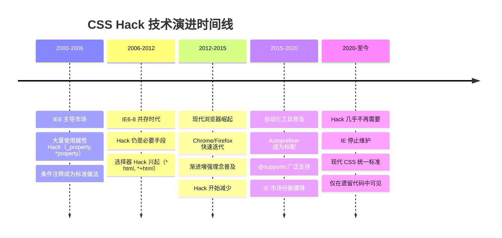
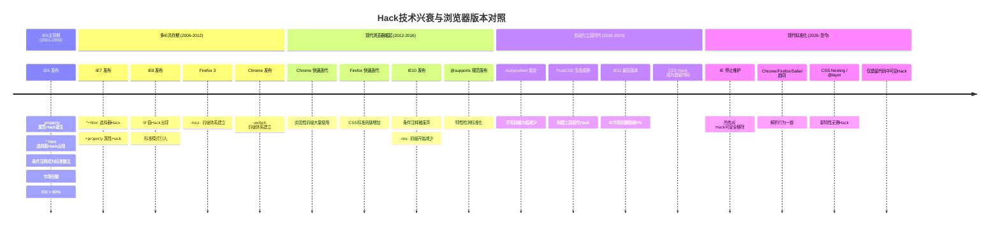
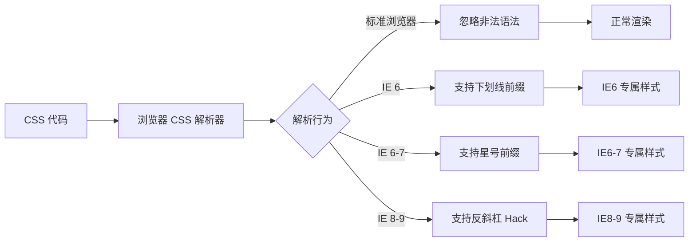
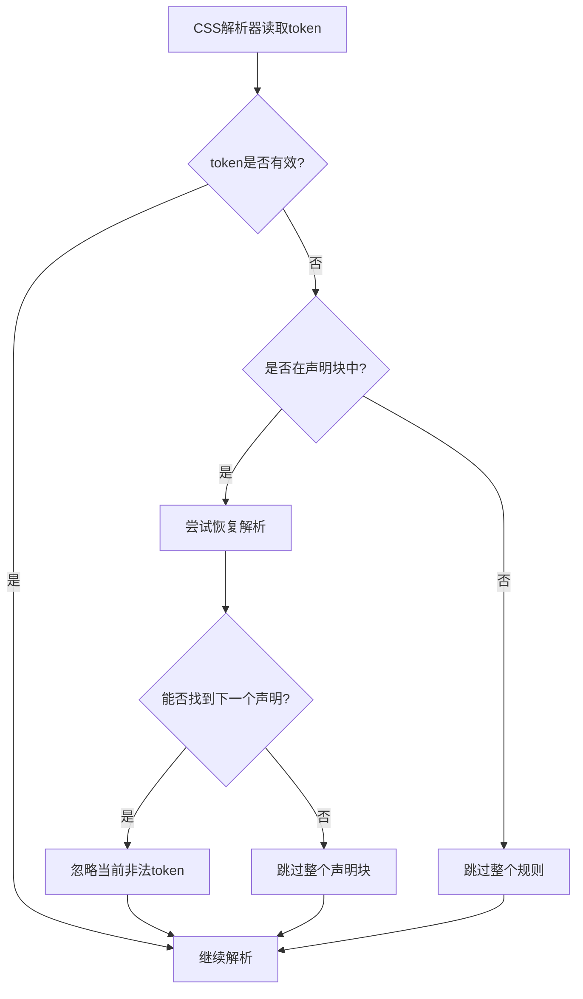
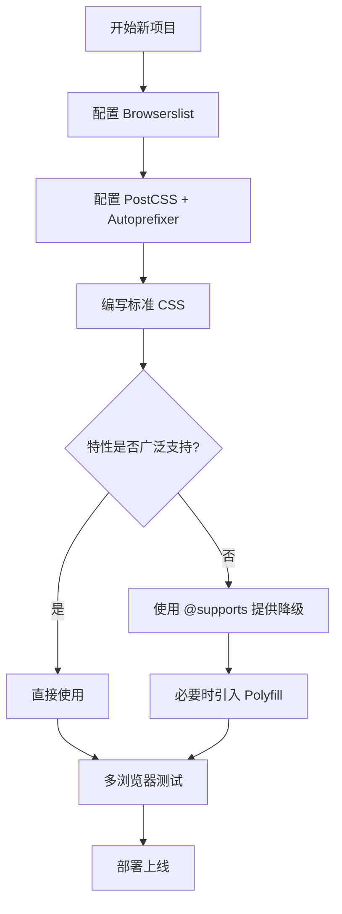
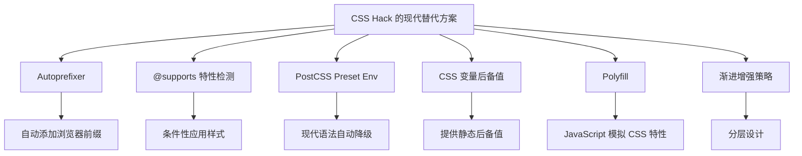
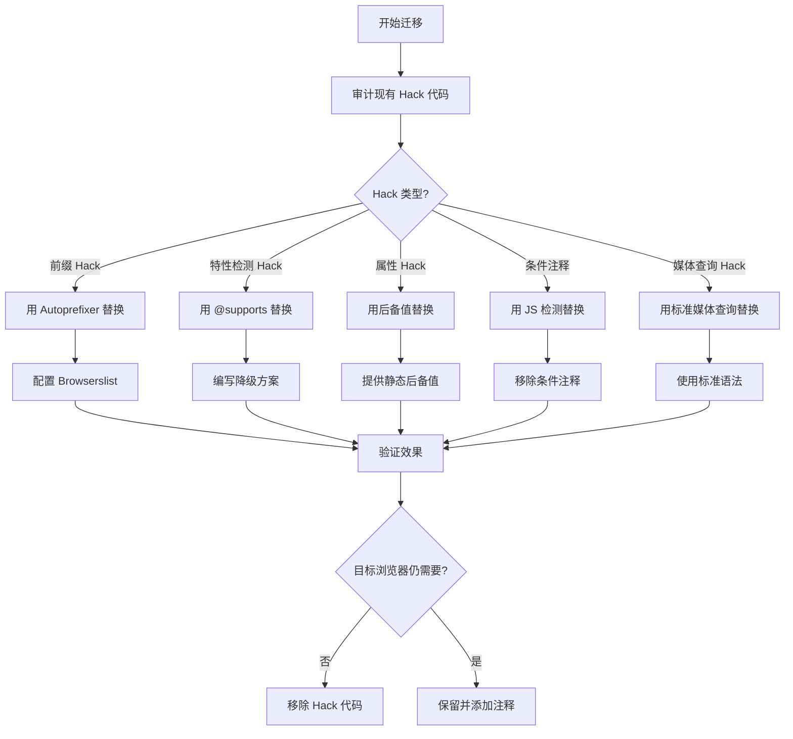

# CSS Hack

CSS Hack 是前端发展史中一个不可回避的话题。在浏览器标准支持参差不齐的年代，CSS Hack 是开发者确保页面在各浏览器中一致呈现的必要手段。然而，随着 Autoprefixer、@supports 等现代工具的出现，CSS Hack 已经逐渐退出历史舞台。理解 CSS Hack 的历史背景和技术原理，有助于我们更好地把握现代兼容性处理方案的设计思路。

## 背景与动机

### 为什么需要了解 CSS Hack？

虽然现代项目几乎不再需要手写 CSS Hack，但了解它仍然重要：

1. **遗留代码维护**：许多老项目中仍残留大量 CSS Hack，需要理解其含义才能安全移除
2. **技术演进认知**：从 CSS Hack 到 Autoprefixer 的演进，体现了前端工程化的发展
3. **面试与知识体系**：CSS Hack 是前端知识体系的一部分，面试中偶尔涉及
4. **特殊场景**：极少数情况下（如嵌入式 WebView），可能仍需 Hack 技术

### CSS Hack 的历史时间线



### Hack技术的历史演进：浏览器版本与Hack兴衰



**各时期Hack使用频率统计**：

```
Hack使用频率变化趋势（估计值）：

2001-2006  ████████████████████████████████████████ 95% (几乎所有网站)
2006-2012  ████████████████████████████████████░░░░ 85% (大部分网站)
2012-2016  ████████████████████░░░░░░░░░░░░░░░░░░░░ 45% (逐步减少)
2016-2020  ████████░░░░░░░░░░░░░░░░░░░░░░░░░░░░░░░░ 15% (遗留代码)
2020-至今  ██░░░░░░░░░░░░░░░░░░░░░░░░░░░░░░░░░░░░░░ 3%  (几乎消失)
```

### ⚠️ 重要提示

> **CSS Hack 应作为最后手段**。在现代开发中，应优先使用：
> - **Autoprefixer** 自动添加前缀
> - **@supports** 特性检测
> - **PostCSS** 等构建工具
> - **渐进增强**设计策略

---

## 核心概念：CSS Hack 的定义与原理

### 什么是 CSS Hack？

CSS Hack 是利用浏览器解析 CSS 的差异，针对特定浏览器应用特定样式的技术。其核心原理是：不同浏览器的 CSS 解析器对某些非标准语法有不同的容错行为。



### Hack 的分类

| 分类 | 原理 | 示例 | 目标 |
|------|------|------|------|
| **属性级 Hack** | 利用浏览器对属性前缀/后缀的解析差异 | `_color: red;` (IE6) | 针对特定 IE 版本 |
| **选择器 Hack** | 利用浏览器对选择器语法的解析差异 | `* html .box {}` (IE6) | 针对特定 IE 版本 |
| **媒体查询 Hack** | 利用浏览器对媒体查询条件的解析差异 | `@media all and (-ms-high-contrast: none)` | 针对 IE 10-11 |
| **条件注释** | IE 专属的 HTML 注释语法 | `<!--[if IE 8]>...<![endif]-->` | 精确指定 IE 版本 |

### Hack 的风险

| 风险类型 | 说明 | 影响 |
|----------|------|------|
| 代码可读性 | Hack 语法晦涩难懂 | 新开发者难以理解维护 |
| 升级风险 | 浏览器更新可能改变解析行为 | 线上故障 |
| 代码膨胀 | 大量 Hack 增加文件体积 | 性能下降 |
| 团队协作 | 不熟悉 Hack 的开发者困惑 | 效率降低 |
| 安全隐患 | 某些 Hack 可能被利用进行 CSS 注入 | 安全风险 |

---

## 深入原理：IE 条件注释的历史背景

### 浏览器CSS解析器如何处理非法语法

根据 **CSS Syntax Module Level 3** 规范，浏览器CSS解析器在处理非法语法时遵循严格的错误恢复机制。理解这一机制是理解CSS Hack工作原理的基础。

**解析器错误恢复流程**：



**CSS规范定义的非法语法处理规则**：

1. **未知属性**：当解析器遇到未知属性名（如 `_background`、`*color`），整个声明被忽略，但继续解析后续声明
   ```css
   .element {
     _background: blue;    /* IE6专属，其他浏览器忽略 */
     color: red;           /* 正常解析 */
   }
   ```

2. **无效值**：属性名有效但值无效时，该声明被忽略
   ```css
   .element {
     display: invalid-value; /* 整行被忽略 */
     display: flex;          /* 后备值生效 */
   }
   ```

3. **选择器错误**：选择器语法错误时，整个规则集被忽略
   ```css
   .valid-selector { color: red; }    /* 正常应用 */
   * html .element { color: blue; }   /* IE6专属，其他浏览器忽略整个规则 */
   .another-valid { color: green; }   /* 正常应用 */
   ```

4. **反斜杠Hack的原理**：IE浏览器将 `\9`、`\0` 等视为合法的值后缀，而标准浏览器将其视为非法字符
   ```css
   .element {
     background: blue\9;   /* IE6-10：\9被忽略，应用blue */
                           /* 标准浏览器：\9是非法字符，整行忽略 */
   }
   ```

**各Hack在现代浏览器中的实际解析行为（2024测试数据）**：

| Hack语法 | Chrome 120+ | Firefox 121+ | Safari 17+ | 规范行为 |
|----------|-------------|--------------|------------|----------|
| `_property` | 忽略 | 忽略 | 忽略 | 未知属性，整行忽略 |
| `*property` | 忽略 | 忽略 | 忽略 | 无效选择器前缀 |
| `+property` | 忽略 | 忽略 | 忽略 | 未知属性 |
| `property\9` | 忽略 | 忽略 | 忽略 | 非法值后缀 |
| `property\0` | 忽略 | 忽略 | 忽略 | 非法值后缀 |
| `* html` | 忽略 | 忽略 | 忽略 | 无效选择器 |
| `*+html` | 忽略 | 忽略 | 忽略 | 无效选择器 |
| `@-moz-document` | 忽略 | 支持 | 忽略 | Firefox专属at-rule |

**测试结论**：所有传统CSS Hack在现代浏览器（2024版本）中均被正确忽略，不会产生意外的样式应用。这证明现代浏览器的CSS解析器严格遵循W3C规范。

### CSS规范对前缀语法的废弃声明

W3C在多个规范文档中明确声明了对浏览器前缀语法的废弃立场：

**CSS Vendor Prefixes 的官方立场**：

根据 **CSS Cascading and Inheritance Level 3** 和 **CSS Syntax Module Level 3**：

1. **前缀是实验性特性**：带前缀的属性（如 `-webkit-`、`-moz-`）表示浏览器的实验性实现，不应在生产环境中依赖

2. **标准属性优先**：当标准属性可用时，必须使用标准属性而非前缀版本
   ```css
   /* ❌ 不推荐：仅使用前缀版本 */
   .element {
     -webkit-transform: rotate(45deg);
   }
   
   /* ✅ 推荐：标准属性 + 必要的前缀 */
   .element {
     -webkit-transform: rotate(45deg); /* Safari 8- */
     transform: rotate(45deg);         /* 标准 */
   }
   ```

3. **Autoprefixer的设计理念**：基于Browserslist配置，只添加目标浏览器实际需要的前缀，避免冗余

4. **前缀的逐步移除**：当特性成为W3C推荐标准且浏览器移除前缀支持后，Autoprefixer会自动移除不必要的前缀

**W3C对CSS Hack的态度**：

CSS规范从未定义任何Hack语法。所有Hack都是利用浏览器对非法语法的容错行为差异。W3C鼓励：
- 使用 `@supports` 进行特性检测
- 使用标准CSS语法
- 避免依赖浏览器特定的解析bug

### CSS解析器的错误恢复机制

CSS解析器的错误恢复机制定义在 **CSS Syntax Module Level 3 Section 2.4**，这是理解CSS Hack为何能工作的底层原理。

**错误恢复的核心原则**：

1. **尽力恢复**：解析器遇到错误时，会尝试恢复到下一个有效的语法点，而不是完全停止解析

2. **最小影响**：错误只影响当前声明或规则，不会破坏整个样式表的解析

3. **一致性保证**：所有符合规范的浏览器对同一非法语法的处理方式必须一致

**解析器的错误恢复策略**：

```
遇到非法token时的处理：

1. 在声明块中：
   - 跳过当前声明直到下一个分号或右大括号
   - 继续解析下一个声明
   
2. 在选择器中：
   - 跳过整个规则集直到右大括号
   - 继续解析下一个规则
   
3. 在at-rule中：
   - 根据at-rule类型决定恢复策略
   - @media：跳过整个块
   - @supports：跳过整个块
```

**实际案例分析**：

```css
/* 案例1：属性Hack的错误恢复 */
.element {
  _background: blue;    /* IE6解析，其他浏览器跳过此行 */
  color: red;           /* 所有浏览器正常解析 */
  *margin: 10px;        /* IE6-7解析，其他浏览器跳过 */
  padding: 20px;        /* 所有浏览器正常解析 */
}

/* 案例2：选择器Hack的错误恢复 */
.valid { color: red; }           /* 正常应用 */
* html .ie6-only { color: blue; } /* IE6解析，其他浏览器跳过整个规则 */
.another-valid { color: green; } /* 正常应用 */

/* 案例3：值Hack的错误恢复 */
.box {
  width: 100px\9;     /* IE6-10解析，其他浏览器跳过 */
  height: 200px;      /* 所有浏览器正常解析 */
}
```

**现代浏览器的解析一致性**：

现代浏览器（Chrome 120+、Firefox 121+、Safari 17+）对非法语法的处理完全一致，都严格遵循CSS Syntax Module Level 3规范。这意味着：

- 所有传统CSS Hack在现代浏览器中行为相同
- 不再需要针对不同现代浏览器编写不同的Hack
- 使用Autoprefixer和@supports可以完全替代手写Hack

### IE 条件注释的历史背景

条件注释（Conditional Comments）是微软在 IE 5 中引入的一种特殊 HTML 注释语法，允许根据 IE 版本有条件地包含 HTML 内容。这是**微软独有的特性**，其他浏览器完全忽略。

### 历史背景

IE 条件注释诞生于"浏览器大战"时代（2000 年代初）。当时 IE 占据绝对市场主导地位（IE 6 市占率超过 90%），微软为了让开发者能够针对 IE 的特殊行为提供兼容方案，在 IE 5 中引入了条件注释。

**条件注释的黄金时代（2000-2012）**：

```html
<!-- 这是当时几乎所有网站的标配 -->
<!DOCTYPE html>
<html>
<head>
  <!-- 标准样式表 -->
  <link rel="stylesheet" href="main.css">
  
  <!-- IE 8 及以下专用样式 -->
  <!--[if lte IE 8]>
  <link rel="stylesheet" href="ie8-fix.css">
  <![endif]-->
  
  <!-- IE 6 专用样式 -->
  <!--[if IE 6]>
  <link rel="stylesheet" href="ie6-fix.css">
  <script src="DD_belatedPNG.js"></script>
  <![endif]-->
  
  <!-- HTML5 Shiv（让 IE 6-8 识别 HTML5 元素） -->
  <!--[if lt IE 9]>
  <script src="html5shiv.js"></script>
  <![endif]-->
</head>
</html>
```

### 条件注释语法详解

```html
<!-- IE 所有版本 -->
<!--[if IE]>
  <p>你正在使用 IE</p>
<![endif]-->

<!-- IE 特定版本 -->
<!--[if IE 6]>
  <p>你正在使用 IE 6</p>
<![endif]-->

<!--[if IE 7]>
  <p>你正在使用 IE 7</p>
<![endif]-->

<!--[if IE 8]>
  <p>你正在使用 IE 8</p>
<![endif]-->

<!--[if IE 9]>
  <p>你正在使用 IE 9</p>
<![endif]-->
```

### 条件注释运算符

| 运算符 | 含义 | 示例 | 说明 |
|--------|------|------|------|
| 无 | 等于 | `[if IE 8]` | 仅 IE 8 |
| `lt` | 小于 (less than) | `[if lt IE 9]` | IE 8 及以下 |
| `lte` | 小于等于 | `[if lte IE 9]` | IE 9 及以下 |
| `gt` | 大于 (greater than) | `[if gt IE 6]` | IE 7 及以上 |
| `gte` | 大于等于 | `[if gte IE 7]` | IE 7 及以上 |
| `!` | 非 | `[if !IE]` | 非 IE 浏览器 |
| `&` | 与 | `[if (gte IE 7)&(lt IE 9)]` | IE 7-8 |
| `\|` | 或 | `[if (IE 6)\|(IE 7)]` | IE 6 或 IE 7 |

### 条件注释的终结

**IE 10 起不再支持条件注释**。微软在 IE 10 中将文档模式切换到标准模式，条件注释被作为普通 HTML 注释忽略。这意味着条件注释只对 IE 5-9 有效。

```html
<!-- 在 IE 10+ 中，这些都被视为普通注释，不会执行 -->
<!--[if IE 10]>
  <p>这不会显示，因为 IE 10 不支持条件注释</p>
<![endif]-->
```

### 现代替代方案

```html
<!-- 现代做法：使用 @supports 和 JavaScript 检测 -->
<!-- 不再需要条件注释 -->

<!-- 如果确实需要为旧 IE 提供后备 -->
<script>
  // 检测 IE 版本
  var isIE = /*@cc_on!@*/false || !!document.documentMode;
  if (isIE) {
    document.documentElement.className += ' ie';
  }
</script>
```

---

## 为什么现代开发应避免 CSS Hack

CSS Hack 在前端发展史上扮演过重要角色，但在 2024 年的技术环境下，它已成为应该主动避免的做法。以下从多个维度深入分析原因。

### 1. 维护成本远超收益

CSS Hack 的本质是利用浏览器解析 Bug，而这些 Bug 可能在浏览器更新后被修复，导致 Hack 失效甚至产生反效果：

```css
/* 曾经有效的 Hack，在浏览器更新后可能变成 Bug */
.element {
  background: blue\9;  /* IE 6-10 识别 */
  /* 如果未来某浏览器"修复"了对 \9 的解析，
     这行样式将意外生效，覆盖标准样式 */
}
```

**维护成本量化**：

| 维度 | CSS Hack | 现代方案 |
|------|---------|---------|
| 新人理解成本 | 高（需了解各浏览器解析差异） | 低（标准 CSS 语法） |
| 浏览器更新风险 | 高（Hack 可能失效或反转） | 低（标准行为稳定） |
| 代码审查难度 | 高（难以判断 Hack 是否仍需要） | 低（标准模式易验证） |
| 自动化测试覆盖 | 难（需多浏览器手动验证） | 易（@supports 可程序化检测） |

### 2. 违反关注点分离

CSS Hack 将浏览器兼容逻辑硬编码在样式声明中，导致样式与兼容策略耦合：

```css
/* ❌ Hack：样式与兼容逻辑混合 */
.element {
  _background: blue;     /* IE 6 兼容逻辑 */
  *background: green;    /* IE 6-7 兼容逻辑 */
  background: red\9;     /* IE 6-10 兼容逻辑 */
  background: red;       /* 真正想要的样式 */
}

/* ✅ 现代方案：样式与兼容策略分离 */
/* 样式文件：只写标准 CSS */
.element {
  background: red;
}

/* 构建配置：统一处理兼容性 */
/* postcss.config.js + browserslist 自动添加前缀 */
```

### 3. 阻碍渐进增强架构

CSS Hack 的思维模式是"为每个浏览器写不同的样式"，而现代最佳实践是"为所有浏览器提供基础体验，再逐步增强"：

```mermaid
flowchart LR
    subgraph Hack思维
        A1[IE6 样式] --- B1[IE7 样式] --- C1[IE8 样式] --- D1[现代浏览器样式]
    end

    subgraph 渐进增强思维
        A2[基础样式<br/>所有浏览器] --> B2[增强样式<br/>@supports] --> C2[高级特性<br/>现代浏览器]
    end


```

### 4. 现代替代方案已完全成熟

2024 年，Autoprefixer + @supports + Browserslist 的组合已经能够覆盖绝大多数兼容性需求，无需手写任何 Hack：

| 兼容性需求 | CSS Hack 做法 | 现代替代方案 |
|-----------|-------------|------------|
| 浏览器前缀 | 手动写 `-webkit-`、`-moz-` 等 | Autoprefixer 自动处理 |
| 特性检测 | 选择器 Hack（`* html`、`:root`） | `@supports` 条件检测 |
| IE 特定样式 | 条件注释 + 属性 Hack | Browserslist `not IE 11` + 降级方案 |
| 语法降级 | 手动写兼容语法 | PostCSS Preset Env 自动转换 |
| 动态兼容 | JavaScript 浏览器嗅探 | `CSS.supports()` 特性检测 |

### 5. 安全与性能隐患

CSS Hack 可能引入意想不到的安全和性能问题：

```css
/* 安全隐患：某些 Hack 可能被利用进行 CSS 注入攻击 */
.element {
  /* 属性 Hack 中的特殊字符可能绕过 CSP 检测 */
  background: expression(alert('xss')); /* IE 专属的 CSS 表达式，存在 XSS 风险 */
}

/* 性能隐患：无效声明增加解析时间 */
.element {
  _background: blue;    /* 现代浏览器仍需解析并忽略 */
  *background: green;   /* 每条 Hack 都增加解析负担 */
  +background: yellow;  /* 大量 Hack 累积影响性能 */
  background: red\9;    /* 尤其在移动端，每毫秒都珍贵 */
  background: red;      /* 实际需要的样式 */
}
```

### 6. 团队协作的障碍

CSS Hack 的语法晦涩，新团队成员往往无法理解其含义和目的，导致：

- **不敢删除**：不知道某条 Hack 是否仍然需要，只能保留
- **不敢修改**：修改可能破坏特定浏览器的兼容性
- **持续累积**：随着时间推移，Hack 只增不减，代码越来越臃肿

```css
/* 遗留代码中常见的场景 */
.element {
  _display: inline;        /* 谁知道这是干什么的？ */
  *zoom: 1;                /* 什么时候加的？还需要吗？ */
  _height: 1%;             /* 有什么副作用？ */
  *display: inline-block;  /* 没人敢删 */
  display: inline-block;   /* 实际需要的样式 */
}
```

### 替代 Hack 的现代工作流



**核心原则**：永远不要手写针对特定浏览器的 Hack，让工具自动处理兼容性。如果确实遇到工具无法覆盖的兼容性问题，优先使用 `@supports` 或 JavaScript 特性检测，并添加详细注释说明原因和预期移除时间。

---

## 代码示例：属性级与选择器 Hack

### 属性级 Hack

#### IE 属性 Hack 完整列表

```css
.element {
  background: red;        /* 所有浏览器 */
  _background: blue;      /* IE 6：下划线前缀 */
  *background: green;     /* IE 6-7：星号前缀 */
  +background: yellow;    /* IE 7：加号前缀 */
  #background: cyan;      /* IE 6：井号前缀 */
  background: purple\9;   /* IE 6-10：反斜杠 + 9 */
  background: orange\0;   /* IE 8-10：反斜杠 + 0 */
  background: pink\9\0;   /* IE 9-10：组合语法 */
  background: brown\0/9;  /* IE 8-9：另一种组合 */
}
```

#### 属性 Hack 语法解析

| Hack 语法 | 目标浏览器 | 原理 | 安全性 |
|-----------|------------|------|--------|
| `_property` | IE 6 | IE 6 支持下划线前缀属性 | 低 |
| `*property` | IE 6-7 | IE 6-7 支持星号前缀属性 | 低 |
| `+property` | IE 7 | IE 7 支持加号前缀属性 | 低 |
| `#property` | IE 6 | IE 6 支持井号前缀属性 | 低 |
| `property\9` | IE 6-10 | 反斜杠 + 9 被 IE 忽略为合法后缀 | 低 |
| `property\0` | IE 8-10 | 反斜杠 + 0 被 IE 忽略为合法后缀 | 低 |
| `property\9\0` | IE 9-10 | 组合语法 | 低 |

> ⚠️ **安全警告**：属性 Hack 在现代浏览器中可能被忽略或产生意外行为。CSS 规范并未定义这些语法，浏览器更新可能改变解析行为。

### 选择器 Hack

#### IE 选择器 Hack

```css
/* IE 6 及以下：* html 前缀 */
* html .element {
  color: red;
  /* IE 6 将 html 视为有高度的元素 */
}

/* IE 7：*+html 前缀 */
*+html .element {
  color: blue;
  /* 仅 IE 7 识别 */
}

/* IE 6-7：逗号 Hack */
.element, {
  color: green;
  /* 尾部逗号被 IE 6-7 忽略，其他浏览器视为无效选择器 */
}

/* IE 8-9：反斜杠 Hack */
.element\0 {
  color: yellow;
  /* IE 8-9 忽略反斜杠 */
}

/* IE 9+：:root 伪类 */
:root .element {
  color: purple;
  /* IE 9 开始支持 :root */
}

/* IE 10+：媒体查询 Hack */
@media all and (-ms-high-contrast: none), (-ms-high-contrast: active) {
  .element {
    color: orange;
  }
}
```

#### 选择器 Hack 汇总表

| Hack | 目标浏览器 | 示例 | 原理 |
|------|------------|------|------|
| `* html` | IE 6 | `* html .box { }` | IE 6 将 html 视为有高度的容器 |
| `*+html` | IE 7 | `*+html .box { }` | IE 7 独有的兄弟选择器解析 |
| `selector,` | IE 6-7 | `.box, { }` | 尾部逗号被 IE 6-7 容错 |
| `selector\0` | IE 8-9 | `.box\0 { }` | 反斜杠被 IE 8-9 忽略 |
| `:root selector` | IE 9+ | `:root .box { }` | IE 9 开始支持 :root |

### 现代浏览器 Hack

```css
/* 非 IE 浏览器：子选择器 */
html>body .element {
  color: red;
  /* IE 6 不支持子选择器 */
}

/* Safari/Chrome (WebKit/Blink) */
@media screen and (-webkit-min-device-pixel-ratio: 0) {
  .element {
    -webkit-appearance: none;
  }
}

/* Firefox */
@-moz-document url-prefix() {
  .element {
    color: blue;
  }
}

/* Edge 12-18 (旧 Edge) */
@supports (-ms-accelerator: true) {
  .element {
    color: green;
  }
}

/* Safari 特定 (组合 Hack) */
@media not all and (min-resolution: .001dpcm) {
  @supports (-webkit-appearance: none) {
    .element {
      color: purple;
    }
  }
}
```

---

## 代码示例：媒体查询 Hack

### IE 媒体查询 Hack

```css
/* IE 10-11：使用 -ms-high-contrast */
@media all and (-ms-high-contrast: none), (-ms-high-contrast: active) {
  .element {
    /* IE 10-11 专属样式 */
    display: flex; /* 示例 */
  }
}

/* 仅 IE 10 */
@media all and (-ms-high-contrast: none) {
  .element {
    /* IE 10 only */
  }
}

/* 仅 IE 11（配合 *::-ms-backdrop 伪元素） */
@media all and (-ms-high-contrast: none) {
  *::-ms-backdrop, .element {
    /* IE 11 only */
  }
}
```

### 移动端媒体查询 Hack

```css
/* iOS Safari 检测 */
@supports (-webkit-touch-callout: none) {
  .element {
    /* iOS 专属样式 */
    -webkit-tap-highlight-color: transparent;
  }
}

/* 高清屏设备 */
@media (-webkit-min-device-pixel-ratio: 2), 
       (min-resolution: 192dpi) {
  .element {
    background-image: url('image@2x.png');
    background-size: 100px 50px;
  }
}

/* 触摸设备 */
@media (hover: none) and (pointer: coarse) {
  .button {
    min-height: 44px; /* 增大触摸目标 */
    padding: 12px 24px;
  }
}

/* 精确指针设备（鼠标） */
@media (hover: hover) and (pointer: fine) {
  .button:hover {
    background: #f0f0f0;
  }
}
```

---

## 代码示例：常见 Hack 案例

### IE 6 双倍边距 Bug

**问题**：浮动元素的同向边距在 IE 6 中会加倍显示。

```css
/* 问题：IE 6 中 margin-left 显示为 20px */
.element {
  float: left;
  margin-left: 10px;
}

/* 修复：添加 _display: inline */
.element {
  float: left;
  margin-left: 10px;
  _display: inline; /* IE 6 Hack：触发 hasLayout，修复双倍边距 */
}
```

### IE 最小高度问题

**问题**：IE 6 不支持 `min-height`，会将 `height` 当作 `min-height` 使用。

```css
.element {
  min-height: 100px;
  height: auto !important;  /* 标准浏览器：使用 auto */
  height: 100px;            /* IE 6：解析为 min-height */
}

/* 更优雅的写法 */
.element {
  min-height: 100px;
  _height: 100px; /* IE 6 only */
}
```

### IE 透明度问题

**问题**：IE 8 及以下不支持 `opacity` 属性。

```css
.element {
  opacity: 0.5;
  filter: alpha(opacity=50);  /* IE 6-8 */
  -ms-filter: "progid:DXImageTransform.Microsoft.Alpha(Opacity=50)"; /* IE 8 */
}
```

### IE PNG 透明问题

**问题**：IE 6 不支持 PNG 24 位透明度。

```css
.png-element {
  background: url(transparent.png);
  _background: none;
  _filter: progid:DXImageTransform.Microsoft.AlphaImageLoader(
    src='transparent.png',
    sizingMethod='scale'
  );
}
```

### 移动端 1px 边框问题

**问题**：高清屏（Retina）上 1px CSS 边框显示为 2px 或 3px 物理像素。

```css
/* 基础边框 */
.hairline {
  border-bottom: 1px solid #ddd;
}

/* 高清屏适配 */
@media (-webkit-min-device-pixel-ratio: 2), (min-resolution: 192dpi) {
  .hairline {
    border-bottom: none;
    position: relative;
  }
  
  .hairline::after {
    content: '';
    position: absolute;
    bottom: 0;
    left: 0;
    width: 100%;
    height: 1px;
    background: #ddd;
    transform: scaleY(0.5);
    transform-origin: 0 0;
  }
}

/* 3倍屏 */
@media (-webkit-min-device-pixel-ratio: 3), (min-resolution: 288dpi) {
  .hairline::after {
    transform: scaleY(0.33);
  }
}
```

### Flexbox IE 兼容

**问题**：IE 10 实现了旧版 Flexbox 规范（2012 语法），与现代语法不同。

```css
.container {
  /* IE 10 旧版语法 */
  display: -ms-flexbox;
  -ms-flex-direction: row;
  -ms-flex-pack: center;
  -ms-flex-align: center;
  
  /* 标准语法 */
  display: flex;
  flex-direction: row;
  justify-content: center;
  align-items: center;
}

.item {
  -ms-flex: 1 0 auto;  /* IE 10 */
  flex: 1 0 auto;      /* 标准 */
}
```

---

## 最佳实践：现代替代方案对比

### 现代替代方案总览



### 方案详细对比

| 方案 | 替代的 Hack 类型 | 优势 | 劣势 | 适用场景 |
|------|-----------------|------|------|----------|
| **Autoprefixer** | 属性前缀 Hack | 自动化、准确、零维护 | 只处理前缀 | 所有需要前缀的属性 |
| **@supports** | 选择器/媒体查询 Hack | CSS 原生、声明式 | 不支持 IE 8- | 新特性降级 |
| **PostCSS Preset Env** | 语法级 Hack | 使用未来语法 | 构建依赖 | 现代 CSS 语法降级 |
| **CSS 变量后备** | 属性 Hack | 简单、无工具依赖 | 只适用于变量 | CSS 变量降级 |
| **Polyfill** | 功能 Hack | 完整功能模拟 | 性能开销 | IE 支持 Grid/Flexbox |
| **渐进增强** | 所有 Hack | 架构级方案 | 设计成本 | 整体策略 |

### Autoprefixer：替代前缀 Hack

```css
/* 源代码：只写标准语法 */
.element {
  display: flex;
  user-select: none;
  backdrop-filter: blur(10px);
}

/* Autoprefixer 自动输出（根据 Browserslist 配置） */
.element {
  display: -webkit-box;
  display: -ms-flexbox;
  display: flex;
  -webkit-user-select: none;
  -moz-user-select: none;
  -ms-user-select: none;
  user-select: none;
  -webkit-backdrop-filter: blur(10px);
  backdrop-filter: blur(10px);
}
```

```javascript
// postcss.config.js
module.exports = {
  plugins: [
    require('autoprefixer')({
      overrideBrowserslist: ['> 1%', 'last 2 versions', 'not dead'],
      grid: true  // 启用 Grid 前缀
    })
  ]
};
```

### @supports：替代选择器/媒体查询 Hack

```css
/* 替代 Hack 的现代方案：渐进增强 */
.element {
  display: block; /* 后备方案 */
}

@supports (display: grid) {
  .element {
    display: grid;
    grid-template-columns: repeat(3, 1fr);
  }
}

@supports (gap: 10px) {
  .grid {
    gap: 10px;
  }
}

@supports (backdrop-filter: blur(10px)) {
  .modal {
    backdrop-filter: blur(10px);
  }
}

@supports not (backdrop-filter: blur(10px)) {
  .modal {
    background: rgba(255, 255, 255, 0.95); /* 降级方案 */
  }
}
```

### PostCSS Preset Env：替代语法 Hack

```javascript
// postcss.config.js
module.exports = {
  plugins: [
    require('postcss-preset-env')({
      stage: 2,
      features: {
        'nesting-rules': true,
        'custom-media-queries': true,
        'custom-properties': true
      }
    })
  ]
};
```

```css
/* 源代码：使用现代语法 */
.element {
  color: var(--primary);
  
  &:hover {
    color: var(--primary-dark);
  }
}

/* 输出：自动降级 */
.element {
  color: #007bff;       /* 后备值 */
  color: var(--primary); /* CSS 变量 */
}

.element:hover {
  color: #0056b3;
}
```

### CSS 变量降级

```css
:root {
  --primary: #007bff;
}

.button {
  /* 后备值（必须写在前面） */
  background-color: #007bff;
  /* CSS 变量 */
  background-color: var(--primary);
}
```

### Polyfill 方案

```html
<!-- CSS 变量 Polyfill（IE 11） -->
<script src="https://cdn.jsdelivr.net/npm/css-vars-ponyfill@2"></script>
<script>
  cssVars({ onlyLegacy: true });
</script>

<!-- Flexbox Polyfill（IE 8-9） -->
<script src="flexibility.js"></script>
<script>flexibility(document.documentElement);</script>
```

---

## 最佳实践：迁移指南

### 从 CSS Hack 迁移到现代方案



### 迁移步骤详解

#### 第一步：审计现有 Hack 代码

```bash
# 搜索常见 Hack 模式
# 搜索属性 Hack
grep -rn "_\|\\*\\|\\\\9\\|\\\\0" --include="*.css" src/

# 搜索条件注释
grep -rn "<!--\[if" --include="*.html" src/

# 搜索媒体查询 Hack
grep -rn "\-ms-high-contrast\|url-prefix" --include="*.css" src/
```

#### 第二步：判断是否仍需支持目标浏览器

```markdown
## 浏览器支持评估

### 评估维度
1. 用户数据分析：通过 Google Analytics 查看用户浏览器分布
2. 业务需求：是否有企业客户仍在使用旧浏览器
3. 行业标准：目标用户群体的技术更新速度

### 决策矩阵
| 浏览器 | 用户占比 | 是否支持 | 处理方式 |
|--------|----------|----------|----------|
| IE 11 | 0.3% | 否 | 移除所有 IE Hack |
| IE 10 | 0.1% | 否 | 移除所有 IE Hack |
| Chrome 80+ | 85% | 是 | 标准方案 |
| Safari 14+ | 15% | 是 | 标准方案 |
```

#### 第三步：用 Autoprefixer 替换前缀 Hack

```css
/* ❌ 迁移前：手动前缀 */
.element {
  -webkit-transform: translateX(100px);
  -moz-transform: translateX(100px);
  -ms-transform: translateX(100px);
  -o-transform: translateX(100px);
  transform: translateX(100px);
}

/* ✅ 迁移后：标准语法 + Autoprefixer */
.element {
  transform: translateX(100px);
}
```

#### 第四步：用 @supports 替换特性检测 Hack

```css
/* ❌ 迁移前：Hack 检测 */
.element {
  display: block;
}
*::-ms-backdrop, .element {
  display: flex; /* IE 11 Hack */
}

/* ✅ 迁移后：@supports 检测 */
.element {
  display: block;
}
@supports (display: flex) {
  .element {
    display: flex;
  }
}
```

#### 第五步：用后备值替换属性 Hack

```css
/* ❌ 迁移前：属性 Hack */
.element {
  _background: #007bff; /* IE 6 属性 Hack */
  *background: green;   /* IE 6-7 属性 Hack */
  background: #007bff;  /* 标准样式 */
}

/* ✅ 迁移后：显式后备值（后备在前，现代值在后） */
.element {
  background: #007bff;        /* 后备值 */
  background: var(--primary); /* CSS 变量 */
}
```

#### 第六步：移除不再需要的 Hack

```css
/* ❌ 迁移前：大量遗留 Hack */
.ie-fix {
  _display: inline;
  *zoom: 1;
  display: inline-block;
}

/* ✅ 迁移后：清理后的代码 */
.ie-fix {
  display: inline-block;
}
```

#### 第七步：更新文档

```markdown
## 兼容性策略更新记录

### 2024-01-15
- 移除所有 IE 6-8 的 CSS Hack
- 配置 Autoprefixer 替代手动前缀
- 使用 @supports 替代选择器 Hack
- Browserslist: > 1%, last 2 versions, not dead, not IE 11
```

### 迁移检查清单

- [ ] 审计所有 CSS 文件中的 Hack 代码
- [ ] 分析用户浏览器分布数据
- [ ] 确定目标浏览器范围（Browserslist）
- [ ] 配置 Autoprefixer
- [ ] 用 Autoprefixer 替换所有前缀 Hack
- [ ] 用 @supports 替换特性检测 Hack
- [ ] 用后备值替换属性 Hack
- [ ] 移除 IE 条件注释
- [ ] 验证所有页面在目标浏览器中正常显示
- [ ] 更新文档记录兼容性决策
- [ ] 添加 CSS lint 规则防止新增 Hack

---

## 常见问题

### Q1：现代项目中还需要 CSS Hack 吗？

**几乎不需要**。2024 年的主流浏览器（Chrome、Firefox、Safari、Edge）对 CSS 标准的支持已经非常一致。通过 Autoprefixer + @supports + Browserslist 的组合，可以覆盖绝大多数兼容性需求。只有在极少数特殊场景（如特定 WebView 的 bug 修复）中，才可能需要 Hack。

### Q2：如何安全地移除遗留代码中的 CSS Hack？

1. **先分析**：确认目标浏览器是否仍需要这些 Hack
2. **逐步移除**：每次移除一类 Hack，然后在目标浏览器中测试
3. **使用工具**：配置 Autoprefixer 自动处理前缀
4. **添加回归测试**：使用 BrowserStack 等工具自动化测试

### Q3：Autoprefixer 会移除已有的前缀吗？

**会**。如果 Browserslist 配置中的浏览器不再需要某个前缀，Autoprefixer 会自动移除。例如，如果配置 `not IE 11`，Autoprefixer 会移除 `-ms-` 前缀。

### Q4：@supports 不支持的浏览器怎么办？

对于不支持 `@supports` 的浏览器（如 IE 8-），后备样式会正常应用。`@supports` 块内的样式会被忽略，但不会影响页面功能。这是一种安全的渐进增强方式。

### Q5：CSS Hack 会影响性能吗？

**轻微影响**。额外的 Hack 代码会增加 CSS 文件体积，浏览器解析无效语法时也需要时间。但影响通常很小，主要问题在于维护性和可读性。

### Q6：如何防止团队成员新增 CSS Hack？

1. 配置 CSS lint 规则（如 stylelint）检测 Hack 语法
2. 使用 Autoprefixer 自动处理前缀
3. 建立代码审查流程
4. 编写团队规范文档

```javascript
// stylelint 配置示例
{
  "rules": {
    "property-no-unknown": [true, {
      "ignoreProperties": ["/^-/"]  // 允许已知前缀
    }],
    "selector-no-vendor-prefix": true,
    "value-no-vendor-prefix": true
  }
}
```

---

## 参考资源

### 历史资料

- [Browserhacks](http://browserhacks.com/) - CSS Hack 参考大全
- [IE Blog - Conditional Comments](https://docs.microsoft.com/en-us/previous-versions/windows/internet-explorer/ie-developer/) - 微软官方文档
- [CSS Tricks - CSS Hack Collection](https://css-tricks.com/) - CSS Hack 合集

### 现代工具

- [Autoprefixer](https://github.com/postcss/autoprefixer) - 自动前缀工具
- [PostCSS Preset Env](https://preset-env.cssdb.org/) - 现代 CSS 降级
- [Can I Use](https://caniuse.com/) - 特性兼容性查询
- [Browserslist](https://github.com/browserslist/browserslist) - 目标浏览器配置

### 延伸阅读

- [浏览器兼容性](02-浏览器兼容性.md) - 跨浏览器处理策略
- [渐进增强与优雅降级](04-渐进增强与优雅降级.md) - 兼容性设计策略
- [CSS 架构方法论](../11-CSS架构方法论) - 架构层面的兼容性
