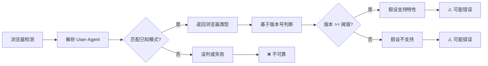
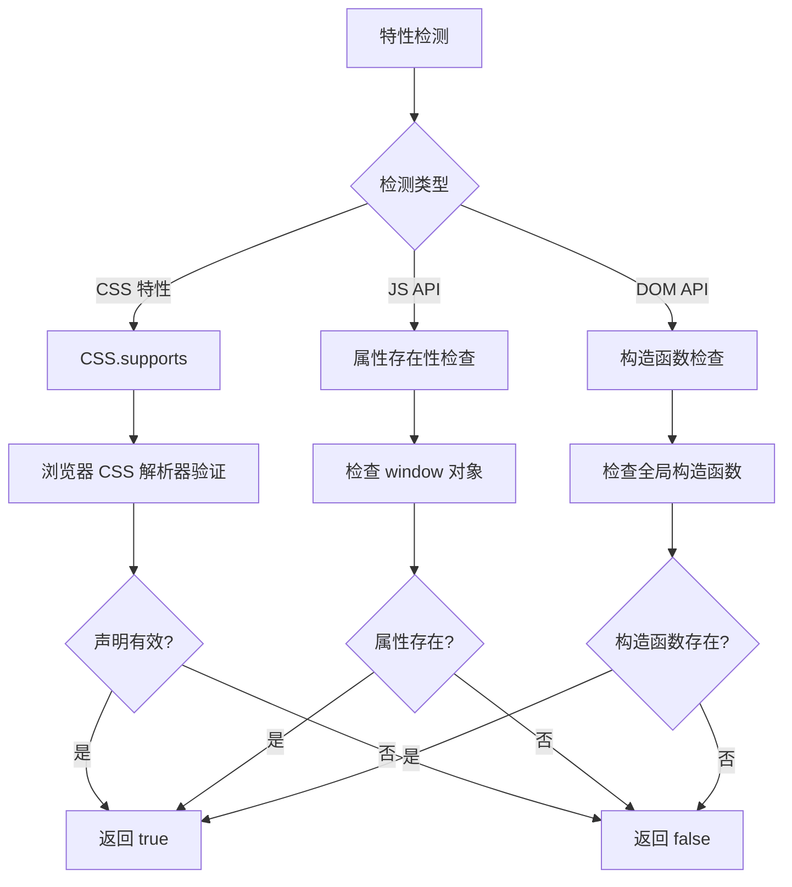
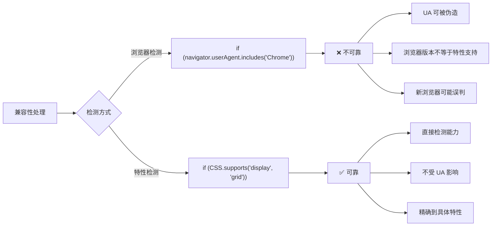
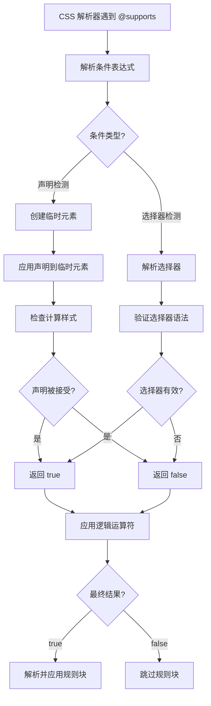
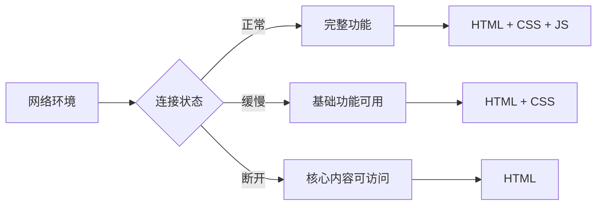
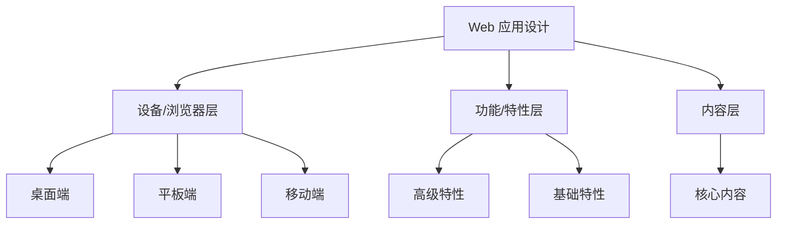
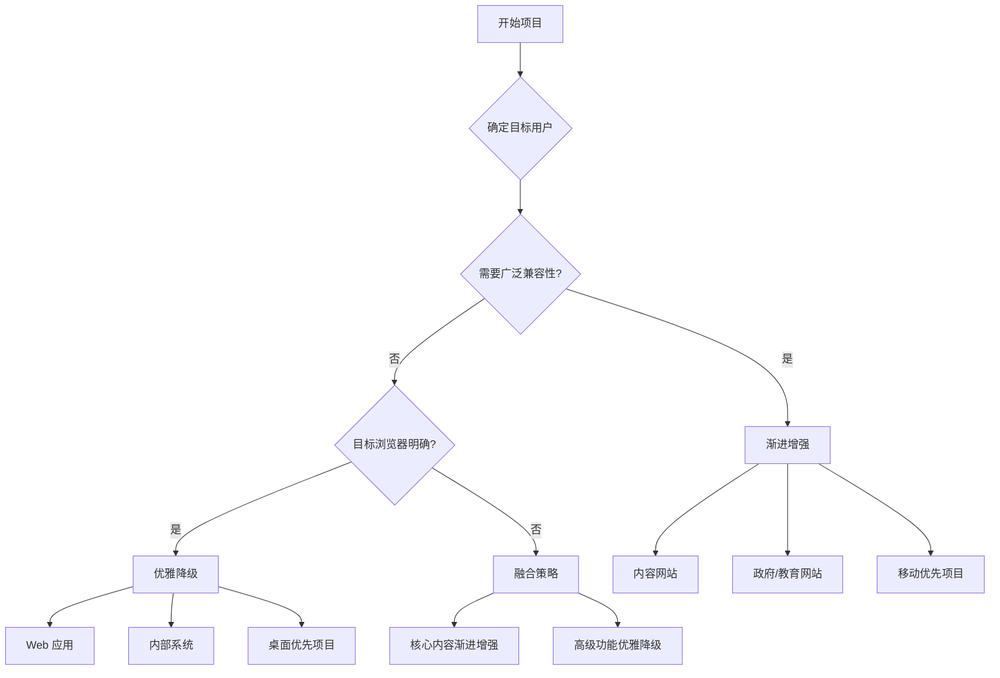

# 渐进增强与优雅降级

渐进增强（Progressive Enhancement）与优雅降级（Graceful Degradation）是两种核心的 Web 兼容性设计策略。它们不是具体的技术实现，而是一种**设计哲学**——决定了你如何组织代码、如何处理浏览器差异、如何确保所有用户都能获得可接受的体验。理解这两种策略的本质差异和适用场景，是构建高质量 Web 应用的基础。

## 背景与动机

### 为什么需要兼容性设计策略？

Web 的独特之处在于：**你无法控制用户的浏览环境**。同一个页面可能运行在：

- 最新的 Chrome 120 上，支持所有现代 CSS 特性
- 三年前的 Safari 14 上，缺少部分新特性支持
- 企业环境的 IE 11 上，大量 CSS 特性不可用
- 低端 Android 设备上，性能和功能都受限
- 屏幕阅读器或辅助技术上，需要语义化支持

面对如此碎片化的环境，我们需要一套系统化的策略来确保：**所有用户都能访问核心内容，同时现代浏览器用户能享受更优质的体验**。

### 两种策略的诞生背景


### 实际场景举例

想象你要设计一个产品卡片列表页面：

- **渐进增强思路**：先用 HTML 构建语义化的产品列表 → 添加基础 CSS 布局（float/block） → 增强为 Flexbox → 最终使用 CSS Grid
- **优雅降级思路**：先用 CSS Grid 构建完美布局 → 检测不支持 Grid 的浏览器 → 提供 Flexbox 后备方案 → 最终降级为 block 布局

---

## 核心概念：两种策略的本质

### 渐进增强（Progressive Enhancement）

渐进增强是一种**从基础开始、逐步增强**的 Web 开发策略。先确保核心内容和功能在所有环境中可用，然后为支持更高级特性的浏览器添加增强体验。

```
渐进增强的层级模型
┌─────────────────────────────────────────────────────┐
│                    高级功能                          │
│  ┌───────────────────────────────────────────────┐  │
│  │                  增强功能                      │  │
│  │  ┌─────────────────────────────────────────┐  │  │
│  │  │              基础功能                    │  │  │
│  │  │  ┌───────────────────────────────────┐  │  │  │
│  │  │  │          核心内容                  │  │  │  │
│  │  │  └───────────────────────────────────┘  │  │  │
│  │  └─────────────────────────────────────────┘  │  │
│  └───────────────────────────────────────────────┘  │
└─────────────────────────────────────────────────────┘
方向：从内到外，逐步增强
```

### 优雅降级（Graceful Degradation）

优雅降级是一种**从完整开始、向下兼容**的设计策略。先构建完整功能和最佳体验，然后确保在不支持的环境中仍能提供可接受的基本体验。

```
优雅降级的层级模型
┌─────────────────────────────────────────────────────┐
│  ┌───────────────────────────────────────────────┐  │
│  │              完整功能                          │  │
│  │  ┌─────────────────────────────────────────┐  │  │
│  │  │            降级功能                      │  │  │
│  │  │  ┌───────────────────────────────────┐  │  │  │
│  │  │  │          基本可用                  │  │  │  │
│  │  │  └───────────────────────────────────┘  │  │  │
│  │  └─────────────────────────────────────────┘  │  │
│  └───────────────────────────────────────────────┘  │
└─────────────────────────────────────────────────────┘
方向：从外到内，层层降级
```

### 核心原则对比

| 原则 | 渐进增强 | 优雅降级 |
|------|----------|----------|
| **起点** | 核心内容 | 完整功能 |
| **方向** | 向上增强 | 向下兼容 |
| **关注点** | 可访问性 | 用户体验 |
| **基础** | 所有设备可用 | 现代浏览器优化 |
| **测试重点** | 基础功能是否可用 | 降级体验是否可接受 |
| **开发成本** | 较高（需分层设计） | 较低（补充降级） |
| **维护难度** | 较低（结构清晰） | 较高（需维护降级） |

### 融合策略

现代实践中，两种策略往往**融合使用**：核心内容采用渐进增强确保可访问性，高级功能采用优雅降级提供最佳体验。

```mermaid
flowchart TD
    A[项目开始] --> B[确定核心内容/功能]
    B --> C[渐进增强：构建基础层]
    C --> D[确保所有环境可用]
    D --> E[优雅降级：构建增强层]
    E --> F[为不支持的环境提供后备]
    F --> G[特性检测：@supports]
    G --> H[多环境测试]
    H --> I[持续优化]

```

---

## 深入原理：特性检测机制

### 特性检测 vs 浏览器检测的底层原理

在讨论兼容性处理时，我们经常会遇到两种检测方式：**特性检测（Feature Detection）**和**浏览器检测（Browser Detection）**。虽然两者都能用于判断浏览器能力，但其底层原理和可靠性截然不同。

#### 浏览器检测的底层原理

浏览器检测通过解析 `User-Agent` 字符串来判断浏览器类型和版本：

```javascript
// 浏览器检测示例
const userAgent = navigator.userAgent;
const isChrome = userAgent.includes('Chrome');
const isFirefox = userAgent.includes('Firefox');
const isSafari = userAgent.includes('Safari') && !userAgent.includes('Chrome');
const isIE = userAgent.includes('MSIE') || userAgent.includes('Trident');

// 基于版本号判断
const chromeVersion = parseInt(userAgent.match(/Chrome\/(\d+)/)[1]);
if (chromeVersion >= 90) {
  // 假设 Chrome 90+ 支持某特性
}
```

**底层问题**：

1. **UA 字符串可被伪造**：用户可以通过浏览器设置或扩展修改 UA 字符串
2. **版本号不等于特性支持**：同一版本的不同构建可能支持不同特性
3. **新浏览器误判**：新发布的浏览器可能不在检测逻辑中
4. **维护成本高**：需要持续更新检测逻辑以支持新浏览器



#### 特性检测的底层原理

特性检测直接测试浏览器是否支持特定功能：

```javascript
// CSS 特性检测
if (CSS.supports('display', 'grid')) {
  // 浏览器支持 Grid
}

// JavaScript API 检测
if ('fetch' in window) {
  // 浏览器支持 Fetch API
}

// DOM API 检测
if ('IntersectionObserver' in window) {
  // 浏览器支持 Intersection Observer
}
```

**底层原理**：

1. **CSS.supports() 的实现**：
   - 浏览器在内部创建一个临时的 CSS 声明
   - 尝试将属性值应用到该声明
   - 如果浏览器接受该值，返回 `true`；否则返回 `false`
   - 这个过程在浏览器的 CSS 解析器层面完成，非常可靠

2. **JavaScript API 检测**：
   - 检查全局对象（如 `window`）是否存在特定属性
   - 这些属性由浏览器引擎直接暴露
   - 如果存在，说明浏览器实现了该 API

3. **DOM API 检测**：
   - 检查特定构造函数或方法是否存在
   - 这些 API 由浏览器渲染引擎提供
   - 存在即表示可用



#### 为什么特性检测更可靠？

| 维度 | 浏览器检测 | 特性检测 |
|------|-----------|---------|
| **检测对象** | 浏览器身份 | 实际能力 |
| **可靠性** | 低（UA 可伪造） | 高（直接测试） |
| **准确性** | 版本不等于能力 | 精确到具体特性 |
| **维护成本** | 高（需持续更新） | 低（无需维护） |
| **新浏览器支持** | 需手动添加 | 自动支持 |
| **性能影响** | 字符串解析 | 快速属性查询 |

**实际案例对比**：

```javascript
// ❌ 浏览器检测：不可靠
if (navigator.userAgent.includes('Chrome/90')) {
  // 假设 Chrome 90 支持 Grid
  // 问题：某些 Chrome 90 构建可能不支持
  // 问题：Chrome 91 发布后需要更新代码
}

// ✅ 特性检测：可靠
if (CSS.supports('display', 'grid')) {
  // 无论什么浏览器，只要支持 Grid 就执行
  // 无需关心版本号
  // 新浏览器自动支持
}
```

#### 特性检测的性能考量

特性检测的性能开销极小：

1. **CSS.supports()**：
   - 时间复杂度：O(1)
   - 在浏览器内部缓存结果
   - 多次调用不会重复计算

2. **属性存在性检查**：
   - 时间复杂度：O(1)
   - 直接访问对象属性
   - 比字符串解析快得多

3. **最佳实践**：
   ```javascript
   // ✅ 推荐：缓存检测结果
   const supportsGrid = CSS.supports('display', 'grid');
   const supportsFetch = 'fetch' in window;
   
   if (supportsGrid) {
     // 使用 Grid
   }
   
   // ❌ 避免：重复检测
   if (CSS.supports('display', 'grid')) {
     // 代码块 1
   }
   if (CSS.supports('display', 'grid')) {
     // 代码块 2
   }
   ```

#### 混合检测策略

在某些场景下，可以结合两种检测方式：

```javascript
// 1. 首先进行特性检测
if (CSS.supports('display', 'grid')) {
  // 使用 Grid
} else {
  // 降级方案
}

// 2. 必要时结合浏览器检测（仅用于特殊场景）
const isIOS = /iPad|iPhone|iPod/.test(navigator.userAgent);
if (isIOS && !CSS.supports('backdrop-filter', 'blur(10px)')) {
  // iOS 特有的降级处理
}
```

> **核心原则**：永远优先使用特性检测。浏览器检测仅用于处理无法通过特性检测识别的特殊情况（如 iOS 特有的 bug）。

### 特性检测 vs 浏览器检测



> **核心原则**：永远检测特性，而非浏览器。浏览器检测（User Agent Sniffing）是不可靠的，因为 UA 字符串可以被伪造，且浏览器版本与特性支持并非一一对应。

### CSS @supports 规则

```css
/* 基本语法 */
@supports (property: value) {
  /* 支持时的样式 */
}

/* 否定检测 */
@supports not (property: value) {
  /* 不支持时的样式 */
}

/* 组合检测：同时支持 */
@supports (property1: value1) and (property2: value2) {
  /* 同时支持两个特性 */
}

/* 组合检测：任一支持 */
@supports (property1: value1) or (property2: value2) {
  /* 支持任一特性即可 */
}
```

#### 实用检测示例

```css
/* 检测 CSS 变量 */
@supports (--css: variables) {
  :root {
    --primary: #007bff;
  }
}

/* 检测 Flexbox */
@supports (display: flex) {
  .container {
    display: flex;
  }
}

/* 检测 Grid Gap */
@supports (gap: 10px) {
  .grid {
    display: grid;
    gap: 10px;
  }
}

/* 检测 aspect-ratio */
@supports (aspect-ratio: 16/9) {
  .video-container {
    aspect-ratio: 16/9;
  }
}

/* 检测 :has() 选择器 */
@supports selector(:has(*)) {
  .card:has(.badge) {
    border: 2px solid gold;
  }
}

/* 检测容器查询 */
@supports (container-type: inline-size) {
  .card-container {
    container-type: inline-size;
  }
}
```

### JavaScript 特性检测

#### CSS.supports API

```javascript
// 基本用法
if (CSS.supports('display', 'grid')) {
  console.log('支持 Grid');
}

// 完整声明语法
if (CSS.supports('display: grid')) {
  console.log('支持 Grid');
}

// 组合条件
if (CSS.supports('display: grid') && CSS.supports('gap: 10px')) {
  console.log('支持 Grid Gap');
}
```

#### 封装检测函数

```javascript
const featureDetection = {
  // 检测 CSS 属性
  cssProperty(prop, value) {
    if (CSS.supports) {
      return CSS.supports(prop, value);
    }
    return false;
  },
  
  // 检测 JavaScript API
  jsAPI(api) {
    return api in window;
  },
  
  // 检测触摸支持
  touch() {
    return 'ontouchstart' in window || navigator.maxTouchPoints > 0;
  },
  
  // 检测本地存储
  localStorage() {
    try {
      return 'localStorage' in window && window.localStorage !== null;
    } catch (e) {
      return false;
    }
  },
  
  // 批量检测并添加 CSS 类
  applyClasses() {
    const features = {
      flexbox: this.cssProperty('display', 'flex'),
      grid: this.cssProperty('display', 'grid'),
      gap: this.cssProperty('gap', '10px'),
      variables: this.cssProperty('--test', '0'),
      aspectRatio: this.cssProperty('aspect-ratio', '1'),
      container: this.cssProperty('container-type', 'inline-size'),
      touch: this.touch()
    };
    
    Object.entries(features).forEach(([feature, supported]) => {
      document.documentElement.classList.toggle(feature, supported);
      document.documentElement.classList.toggle(`no-${feature}`, !supported);
    });
    
    return features;
  }
};

// 使用
const features = featureDetection.applyClasses();
// html 元素会添加类名：grid no-gap variables touch ...
```

### Modernizr 库

[Modernizr](https://modernizr.com/) 是最全面的特性检测库，可以检测数百种特性。

```html
<!-- 引入 Modernizr（建议自定义构建，只包含需要的检测） -->
<script src="https://cdnjs.cloudflare.com/ajax/libs/modernizr/3.12.0/modernizr.min.js"></script>
```

```javascript
// Modernizr 提供的检测
if (Modernizr.flexbox) {
  // 支持 Flexbox
}

if (Modernizr.cssgrid) {
  // 支持 Grid
}

if (Modernizr.webp) {
  // 支持 WebP 图片格式
}

if (Modernizr.serviceworker) {
  // 支持 Service Worker
}
```

```css
/* Modernizr 自动在 html 元素上添加 CSS 类 */
.cssgrid .container {
  display: grid;
}

.no-cssgrid .container {
  display: flex;
}

.webp .hero {
  background-image: url('hero.webp');
}

.no-webp .hero {
  background-image: url('hero.jpg');
}
```

### Feature.js

[Feature.js](https://featurejs.com/) 是一个轻量级的特性检测库（仅 1KB gzipped）。

```javascript
// 检测常用特性
feature.js.cssGrid();        // CSS Grid
feature.js.flexbox();        // Flexbox
feature.js.webp();           // WebP
feature.js.fetch();          // Fetch API
feature.js.serviceWorker();  // Service Worker
```

### W3C CSS Conditional Rules Module 规范

`@supports` 规则定义在 **CSS Conditional Rules Module Level 3**（W3C Candidate Recommendation 2022）中。该规范定义了 CSS 中条件规则的标准语法和求值算法。

#### 规范定义的求值算法

根据 W3C 规范，`@supports` 的条件求值遵循以下严格步骤：

```
1. 解析阶段（Parsing Phase）
   ↓
   a. 解析 @supports 后的条件表达式
   b. 验证语法正确性
   c. 构建条件表达式树
   
2. 求值阶段（Evaluation Phase）
   ↓
   a. 对每个 (property: value) 声明：
      i.   创建临时 CSS 声明对象
      ii.  将声明应用到文档中的临时元素
      iii. 检查浏览器是否接受该声明
      iv.  返回布尔值（true/false）
      
   b. 对 selector() 函数：
      i.   解析选择器语法
      ii.  验证选择器是否被浏览器支持
      iii. 返回布尔值
      
   c. 应用逻辑运算符：
      - NOT: 对操作数取反
      - AND: 所有操作数为 true 时返回 true
      - OR:  任一操作数为 true 时返回 true
      
3. 应用阶段（Application Phase）
   ↓
   根据最终布尔值决定是否应用规则块内的样式
```

#### 规范的关键定义

**1. 声明检测的语义**

规范明确指出：浏览器通过尝试将声明应用到临时元素来检测支持。如果声明被接受（即属性已知且值有效），返回 `true`；否则返回 `false`。

```css
/* 规范定义的检测过程 */
@supports (display: grid) {
  /* 
    浏览器内部执行：
    1. 创建临时元素
    2. 尝试应用 display: grid
    3. 检查计算样式是否包含 display: grid
    4. 如果成功，应用此块内的样式
  */
}
```

**2. 支持选择器检测**

CSS Conditional Rules Level 4 引入了 `selector()` 函数，允许检测选择器支持：

```css
/* 检测 :has() 选择器 */
@supports selector(:has(*)) {
  .parent:has(.child) {
    background: blue;
  }
}

/* 检测 :is() 选择器 */
@supports selector(:is(.a, .b)) {
  :is(.a, .b) {
    color: red;
  }
}
```

**3. 条件表达式的组合**

规范定义了严格的运算符优先级和结合性：

```css
/* 运算符优先级：NOT > AND > OR */
/* 可以使用括号改变优先级 */

@supports (display: grid) and (gap: 10px) {
  /* AND: 两个特性都支持 */
}

@supports (backdrop-filter: blur(10px)) or (-webkit-backdrop-filter: blur(10px)) {
  /* OR: 支持任一即可 */
}

@supports not (display: grid) {
  /* NOT: 不支持 Grid */
}

@supports ((display: grid) and (gap: 10px)) or (display: flex) {
  /* 括号改变优先级 */
}
```

#### 浏览器如何处理 @supports 块的条件求值

不同浏览器内核对 `@supports` 的实现存在细微差异，但都遵循 W3C 规范的核心算法：



**浏览器实现差异**：

| 浏览器 | 求值时机 | 性能优化 | 特殊处理 |
|--------|----------|----------|----------|
| Chrome/Edge (Blink) | CSSOM 构建时 | 缓存检测结果 | 支持 `selector()` |
| Firefox (Gecko) | 样式计算前 | 延迟求值 | 完整支持规范 |
| Safari (WebKit) | 规则匹配时 | 按需求值 | `selector()` 支持较晚 |

**性能影响**：

`@supports` 的求值在 CSS 解析阶段完成，不会阻塞渲染。但复杂的条件表达式会增加解析时间。最佳实践：

```css
/* ✅ 推荐：简单的条件检测 */
@supports (display: grid) {
  .container { display: grid; }
}

/* ⚠️ 避免：过于复杂的嵌套条件 */
@supports ((display: grid) and (gap: 10px)) or 
           ((display: flex) and (flex-wrap: wrap) and (align-items: center)) {
  /* 复杂条件会增加解析时间 */
}
```

### 为什么渐进增强更符合 Web 架构

从 Web 标准化和架构设计的角度来看，渐进增强不仅仅是一种兼容性策略，更是符合 Web 本质的设计哲学。

#### 1. 符合 Web 的分层架构

Web 的核心架构基于三层分离：

```
┌─────────────────────────────────────────┐
│         行为层 (JavaScript)             │  ← 可选增强
├─────────────────────────────────────────┤
│         表现层 (CSS)                    │  ← 可选增强
├─────────────────────────────────────────┤
│         结构层 (HTML)                   │  ← 核心基础
└─────────────────────────────────────────┘
```

渐进增强遵循这一分层架构：
- **结构层**：HTML 提供语义化的内容结构，确保在任何环境下都可访问
- **表现层**：CSS 增强视觉呈现，从基础样式到高级效果
- **行为层**：JavaScript 增强交互体验，从基本功能到高级特性

这种分层确保了每一层都可以独立工作，即使上层不可用，下层仍能提供基本功能。

#### 2. 符合 W3C 标准的设计理念

W3C 在多个规范文档中强调渐进增强的核心理念：

**HTML Living Standard**：
> "HTML 应该能够在任何用户代理中正确解析，即使是不支持某些特性的旧浏览器。"

**CSS Cascading and Inheritance**：
> "CSS 的设计原则之一是优雅降级：不支持的属性或值会被忽略，而不会影响其他样式的应用。"

**Web Content Accessibility Guidelines (WCAG)**：
> "内容应该在不支持脚本或样式的环境中仍然可访问。"

这些标准都指向同一个方向：**核心内容必须独立于增强技术**。

#### 3. 符合搜索引擎优化（SEO）原则

搜索引擎爬虫本质上是"基础浏览器"：
- 主要解析 HTML 结构
- 对 CSS 的支持有限
- 对 JavaScript 的执行能力受限

渐进增强确保核心内容在爬虫眼中是完整且结构化的：

```html
<!-- ✅ 渐进增强：爬虫可以看到完整内容 -->
<article>
  <h1>文章标题</h1>
  <p>文章内容...</p>
  
</article>

<!-- ❌ 优雅降级：爬虫可能看不到内容 -->
<div id="content"></div>
<script>
  document.getElementById('content').innerHTML = `
    <article>
      <h1>文章标题</h1>
      <p>文章内容...</p>
    </article>
  `;
</script>
```

#### 4. 符合可访问性（Accessibility）要求

辅助技术（如屏幕阅读器）依赖语义化的 HTML 结构：

```html
<!-- ✅ 渐进增强：屏幕阅读器可以正确解读 -->
<nav aria-label="主导航">
  <ul>
    <li><a href="/">首页</a></li>
    <li><a href="/about">关于</a></li>
  </ul>
</nav>

<!-- ❌ 优雅降级：依赖 JavaScript 的导航可能无法被识别 -->
<div class="nav" id="navigation"></div>
<script>
  // 动态生成的导航可能无法被辅助技术正确识别
</script>
```

#### 5. 符合网络韧性（Resilience）原则

Web 的本质是去中心化和容错的。渐进增强构建了更具韧性的应用：



渐进增强确保应用在任何环境下都能提供相应级别的服务，而不是全有或全无。

#### 6. 符合长期维护的最佳实践

渐进增强的代码结构更清晰、更易维护：

```javascript
// ✅ 渐进增强：清晰的层次结构
function initApp() {
  // 基础功能：无需 JavaScript 也能工作
  // HTML 表单提供基本的提交功能
  
  // 增强 1：客户端验证
  if ('checkValidity' in form) {
    addClientValidation();
  }
  
  // 增强 2：AJAX 提交
  if ('fetch' in window) {
    addAjaxSubmission();
  }
  
  // 增强 3：实时保存
  if ('localStorage' in window) {
    addAutoSave();
  }
}

// ❌ 优雅降级：复杂的条件分支
function initApp() {
  if (isModernBrowser) {
    // 完整功能
  } else if (isOldBrowser) {
    // 降级功能
  } else {
    // 基础功能
  }
}
```

### 新特性的渐进增强实践

现代 CSS 引入了多项革命性特性，每项都需要针对性的渐进增强策略。

#### content-visibility 的渐进增强

`content-visibility` 是一个性能优化特性，允许浏览器跳过屏幕外内容的渲染。

**浏览器支持**：
- Chrome 85+ / Edge 85+（2020年8月）
- Firefox 125+（2024年4月）
- Safari 18+（2024年9月）

不支持的浏览器会忽略该属性、内容正常渲染，因此适合作为渐进增强使用。

**渐进增强实现**：

```css
/* 基础：所有浏览器 */
.section {
  margin-bottom: 20px;
  padding: 20px;
}

/* 增强：支持 content-visibility 的浏览器 */
@supports (content-visibility: auto) {
  .section {
    content-visibility: auto;
    contain-intrinsic-size: 0 500px; /* 预估内容高度 */
  }
}

/* 高级：结合 contain 属性 */
@supports (content-visibility: auto) and (contain: layout style) {
  .section {
    content-visibility: auto;
    contain-intrinsic-size: 0 500px;
    contain: layout style paint; /* 额外的性能优化 */
  }
}
```

**JavaScript 检测**：

```javascript
// 检测 content-visibility 支持
if (CSS.supports('content-visibility', 'auto')) {
  document.querySelectorAll('.section').forEach(section => {
    section.style.contentVisibility = 'auto';
    section.style.containIntrinsicSize = '0 500px';
  });
}
```

#### Container Queries 的渐进增强

容器查询允许组件根据其容器的大小而非视口大小来调整样式。

**浏览器支持**：
- Chrome 105+（2022年8月）
- Safari 16+（2022年9月）
- Firefox 110+（2023年2月）

**渐进增强实现**：

```css
/* 基础：使用媒体查询 */
.card {
  display: block;
  padding: 10px;
}

@media (min-width: 400px) {
  .card {
    display: flex;
    gap: 20px;
  }
}

/* 增强：使用容器查询 */
@supports (container-type: inline-size) {
  .card-container {
    container-type: inline-size;
    container-name: card;
  }
  
  @container card (min-width: 400px) {
    .card {
      display: flex;
      gap: 20px;
    }
  }
  
  @container card (min-width: 600px) {
    .card {
      flex-direction: column;
    }
  }
}
```

**降级策略**：

```css
/* 不支持容器查询时的降级 */
@supports not (container-type: inline-size) {
  /* 使用媒体查询作为后备 */
  @media (min-width: 400px) {
    .card {
      display: flex;
      gap: 20px;
    }
  }
  
  /* 添加提示注释 */
  .card-container::before {
    content: '容器查询不支持，使用媒体查询降级';
    display: none; /* 仅用于开发调试 */
  }
}
```

#### CSS :has() 选择器的渐进增强

`:has()` 是一个强大的关系选择器，允许根据子元素的状态选择父元素。

**浏览器支持**：
- Chrome 105+（2022年8月）
- Safari 15.4+（2022年3月）
- Firefox 121+（2023年12月）

**渐进增强实现**：

```css
/* 基础：使用 JavaScript 添加类名 */
.card {
  border: 1px solid #ddd;
  border-radius: 8px;
}

.card.has-image {
  border-color: #007bff;
}

/* 增强：使用 :has() 选择器 */
@supports selector(:has(*)) {
  .card:has(img) {
    border-color: #007bff;
  }
  
  .card:has(.badge) {
    box-shadow: 0 2px 8px rgba(0, 0, 0, 0.1);
  }
  
  .form-group:has(:invalid) {
    border-color: red;
  }
}
```

**JavaScript 后备方案**：

```javascript
// 不支持 :has() 时的 JavaScript 后备
if (!CSS.supports('selector(:has(*))')) {
  // 检测包含图片的卡片
  document.querySelectorAll('.card').forEach(card => {
    if (card.querySelector('img')) {
      card.classList.add('has-image');
    }
    if (card.querySelector('.badge')) {
      card.classList.add('has-badge');
    }
  });
  
  // 检测包含无效输入的表单组
  document.querySelectorAll('.form-group').forEach(group => {
    if (group.querySelector(':invalid')) {
      group.classList.add('has-invalid');
    }
  });
}
```

#### CSS Nesting 的渐进增强

CSS 嵌套允许在规则块内嵌套其他规则，提高代码的可读性和维护性。

**浏览器支持**：
- Chrome 120+（2023年12月）
- Safari 16.5+（2023年5月）
- Firefox 117+（2023年8月）

**渐进增强实现**：

```css
/* 基础：传统写法（所有浏览器） */
.card {
  background: white;
  border-radius: 8px;
}

.card .title {
  font-size: 20px;
  font-weight: bold;
}

.card:hover {
  box-shadow: 0 4px 12px rgba(0, 0, 0, 0.1);
}

/* 增强：CSS 嵌套（现代浏览器） */
@supports (selector(&)) {
  .card {
    background: white;
    border-radius: 8px;
    
    & .title {
      font-size: 20px;
      font-weight: bold;
    }
    
    &:hover {
      box-shadow: 0 4px 12px rgba(0, 0, 0, 0.1);
    }
  }
}
```

**构建工具降级**：

```javascript
// postcss.config.js
module.exports = {
  plugins: [
    require('postcss-nesting')({
      // 自动将嵌套语法转换为传统语法
    })
  ]
};
```

#### @layer 的渐进增强

`@layer` 允许开发者控制 CSS 的层叠顺序，解决优先级冲突问题。

**浏览器支持**：
- Chrome 99+（2022年3月）
- Safari 15.4+（2022年3月）
- Firefox 97+（2022年2月）

**渐进增强实现**：

```css
/* 基础：依赖源顺序（所有浏览器） */
/* 低优先级样式 */
button {
  background: blue;
  color: white;
}

/* 高优先级样式 */
.btn-primary {
  background: green;
}

/* 增强：使用 @layer（现代浏览器）。
   注意：@layer 目前无法通过 @supports 检测（CSS 条件规则尚无 at-rule 检测语法，
   需要时可用 `typeof CSSLayerBlockRule !== 'undefined'` 在 JS 中检测）。
   好在 @layer 本身可优雅降级：不支持的浏览器会整体忽略 @layer 规则块，
   因此只要像上面那样在层外保留后备样式，直接写 @layer 就是安全的渐进增强。 */
@layer base, components, utilities;

@layer base {
  button {
    background: blue;
    color: white;
  }
}

@layer components {
  .btn-primary {
    background: green;
  }
}

@layer utilities {
  .btn-large {
    padding: 20px 40px;
  }
}
```

#### 新特性渐进增强决策树

```mermaid
flowchart TD
    A[使用新CSS特性] --> B{检查浏览器支持}
    B -->|全部支持| C[直接使用]
    B -->|部分支持| D{是否有降级方案?}
    B -->|不支持| E[使用Polyfill或替代方案]
    
    D -->|是| F[提供降级样式]
    D -->|否| G[使用JavaScript后备]
    
    F --> H[@supports 检测]
    G --> H
    
    H --> I[测试各浏览器表现]
    I --> J{降级体验可接受?}
    J -->|是| K[发布]
    J -->|否| L[调整降级方案]
    
```

---

## 代码示例：渐进增强实现

### 开发流程

```
渐进增强开发流程：

1. 核心内容层 (HTML)
   ↓ 确保结构化、语义化
2. 表现层 (CSS)
   ↓ 基础样式 → 增强样式
3. 行为层 (JavaScript)
   ↓ 基本交互 → 高级交互
```

### 基础样式优先

```css
/* 步骤 1：基础样式（所有浏览器） */
.button {
  /* 核心功能：可点击的按钮 */
  display: inline-block;
  padding: 10px 20px;
  background-color: #007bff;
  color: white;
  text-decoration: none;
  border: none;
  cursor: pointer;
  font-size: 16px;
  line-height: 1.5;
}

/* 步骤 2：增强样式（现代浏览器） */
@supports (backdrop-filter: blur(10px)) {
  .button {
    backdrop-filter: blur(10px);
    background-color: rgba(0, 123, 255, 0.8);
  }
}

/* 步骤 3：高级效果（最新浏览器） */
@supports (clip-path: polygon(0 0, 100% 0, 100% 100%, 0 100%)) {
  .button--special {
    clip-path: polygon(10% 0, 100% 0, 90% 100%, 0 100%);
  }
}
```

### 布局渐进增强

```css
/* 基础：块级布局（所有浏览器） */
.container {
  overflow: hidden; /* 清除浮动 */
}

.item {
  float: left;
  width: 33.333%;
  margin-bottom: 20px;
  padding: 0 10px;
}

/* 增强：Flexbox（支持 Flexbox 的浏览器） */
@supports (display: flex) {
  .container {
    display: flex;
    flex-wrap: wrap;
    overflow: visible; /* 重置 */
  }
  
  .item {
    float: none; /* 重置 */
    flex: 0 0 33.333%;
    margin-bottom: 20px;
  }
}

/* 最高级：Grid（支持 Grid 的浏览器） */
@supports (display: grid) {
  .container {
    display: grid;
    grid-template-columns: repeat(3, 1fr);
    gap: 20px;
  }
  
  .item {
    flex: none; /* 重置 */
    width: auto;
    margin-bottom: 0;
    padding: 0;
  }
}
```

### 动画渐进增强

```css
/* 基础：无动画，直接显示（所有浏览器） */
.element {
  opacity: 1;
  visibility: visible;
}

/* 增强：过渡动画 */
@supports (transition: opacity 0.3s) {
  .element {
    opacity: 0;
    transition: opacity 0.3s ease;
  }
  
  .element.visible {
    opacity: 1;
  }
}

/* 最高级：关键帧动画 + transform */
@supports (animation: fadeIn 0.5s) {
  @keyframes fadeIn {
    from {
      opacity: 0;
      transform: translateY(20px);
    }
    to {
      opacity: 1;
      transform: translateY(0);
    }
  }
  
  .element {
    animation: fadeIn 0.5s ease forwards;
  }
}

/* 尊重用户偏好：减少动画 */
@media (prefers-reduced-motion: reduce) {
  .element {
    animation: none !important;
    transition: none !important;
    opacity: 1 !important;
  }
}
```

### JavaScript 渐进增强

```javascript
// 渐进增强的表单处理
function initForm() {
  const form = document.querySelector('form');
  if (!form) return;
  
  // 基础：表单默认提交（无需额外代码，浏览器原生支持）
  
  // 增强：客户端验证
  if ('checkValidity' in form) {
    form.addEventListener('submit', (e) => {
      if (!form.checkValidity()) {
        e.preventDefault();
        showValidationErrors(form);
      }
    });
  }
  
  // 更高级：AJAX 提交
  if (window.fetch && window.FormData) {
    form.addEventListener('submit', async (e) => {
      e.preventDefault();
      
      const formData = new FormData(form);
      try {
        const response = await fetch(form.action, {
          method: 'POST',
          body: formData
        });
        
        if (response.ok) {
          showSuccessMessage();
        } else {
          // 降级到默认提交
          form.submit();
        }
      } catch (error) {
        // 网络错误，降级到默认提交
        form.submit();
      }
    });
  }
}
```

---

## 代码示例：优雅降级实现

### 开发流程

```
优雅降级开发流程：

1. 设计完整功能
   ↓ 使用最新特性
2. 识别兼容性问题
   ↓ 分析不支持场景
3. 提供后备方案
   ↓ 确保基本可用
4. 测试降级效果
   ↓ 验证各环境表现
```

### 渐变降级

```css
/* 完整功能：复杂渐变 */
.hero {
  background: linear-gradient(
    135deg,
    rgba(102, 126, 234, 0.8) 0%,
    rgba(118, 75, 162, 0.8) 100%
  );
  background-size: cover;
}

/* 后备方案：纯色（不支持渐变的浏览器） */
@supports not (background: linear-gradient(white, black)) {
  .hero {
    background: #667eea;
  }
}
```

### 模糊效果降级

```css
/* 完整功能：毛玻璃效果 */
.modal {
  background: rgba(255, 255, 255, 0.7);
  backdrop-filter: blur(10px);
  -webkit-backdrop-filter: blur(10px);
}

/* 后备方案：半透明背景（不支持 backdrop-filter） */
@supports not (backdrop-filter: blur(10px)) {
  .modal {
    background: rgba(255, 255, 255, 0.95);
    /* 增加不透明度以补偿模糊效果的缺失 */
  }
}
```

### Grid 降级

```css
/* 完整功能：CSS Grid */
.grid {
  display: grid;
  grid-template-columns: repeat(auto-fit, minmax(250px, 1fr));
  gap: 20px;
}

/* 后备：Flexbox（不支持 Grid） */
@supports not (display: grid) {
  .grid {
    display: flex;
    flex-wrap: wrap;
    margin: -10px;
  }
  
  .grid-item {
    flex: 0 0 calc(33.333% - 20px);
    margin: 10px;
  }
}

/* 最终后备：块级布局（不支持 Flexbox） */
@supports not (display: flex) {
  .grid {
    display: block;
    margin: 0;
  }
  
  .grid-item {
    display: block;
    width: 100%;
    margin: 0 0 20px 0;
  }
}
```

### JavaScript 优雅降级

```javascript
// 优雅降级的网络请求
async function fetchUserData() {
  // 完整功能：使用 fetch API
  if (window.fetch) {
    try {
      const response = await fetch('/api/user');
      if (!response.ok) throw new Error(`HTTP ${response.status}`);
      return await response.json();
    } catch (error) {
      console.error('Fetch failed:', error);
      // 降级到 XMLHttpRequest
    }
  }
  
  // 后备方案：XMLHttpRequest
  return new Promise((resolve, reject) => {
    const xhr = new XMLHttpRequest();
    xhr.open('GET', '/api/user');
    xhr.onload = () => {
      if (xhr.status === 200) {
        resolve(JSON.parse(xhr.responseText));
      } else {
        reject(new Error(xhr.statusText));
      }
    };
    xhr.onerror = () => reject(new Error('Network error'));
    xhr.send();
  });
}
```

---

## 代码示例：与响应式设计结合

### 三层设计模型



### 移动优先 + 渐进增强

```css
/* 步骤 1：移动端基础样式（所有设备） */
.container {
  padding: 15px;
  font-size: 14px;
}

.card {
  display: block;
  margin-bottom: 15px;
  padding: 15px;
  border: 1px solid #eee;
}

/* 步骤 2：平板适配 */
@media (min-width: 768px) {
  .container {
    padding: 30px;
  }
  
  .card {
    display: flex;
  }
  
  .card-image {
    flex: 0 0 200px;
  }
  
  .card-content {
    flex: 1;
    padding-left: 20px;
  }
}

/* 步骤 3：桌面增强 */
@media (min-width: 1024px) {
  .container {
    max-width: 1200px;
    margin: 0 auto;
  }
  
  /* Grid 增强 */
  @supports (display: grid) {
    .card-grid {
      display: grid;
      grid-template-columns: repeat(3, 1fr);
      gap: 20px;
    }
    
    .card {
      display: block;
      margin-bottom: 0;
    }
  }
}
```

### 功能分层实现

```css
/* 结合响应式和渐进增强 */

/* 基础：所有设备 */
.nav {
  display: block;
}

.nav-item {
  display: block;
  padding: 10px;
  border-bottom: 1px solid #eee;
}

/* 响应式：大屏幕 */
@media (min-width: 768px) {
  .nav {
    display: flex;
    justify-content: space-between;
  }
  
  .nav-item {
    display: inline-block;
    border-bottom: none;
  }
}

/* 特性增强：支持 Grid */
@supports (display: grid) {
  @media (min-width: 768px) {
    .nav {
      display: grid;
      grid-auto-flow: column;
      grid-auto-columns: max-content;
      justify-content: space-between;
    }
  }
}

/* 触摸设备适配 */
@media (hover: none) and (pointer: coarse) {
  .nav-item {
    padding: 15px; /* 增大点击区域 */
    min-height: 44px;
  }
}

/* 减少动画偏好 */
@media (prefers-reduced-motion: reduce) {
  .nav-item {
    transition: none !important;
  }
}
```

### 图片加载策略

```html
<!-- 渐进增强的图片加载 -->
<picture>
  <!-- 高级格式（AVIF） -->
  <source srcset="image.avif" type="image/avif">
  <!-- 次优格式（WebP） -->
  <source srcset="image.webp" type="image/webp">
  <!-- 后备格式（JPEG） -->
  
</picture>

<script>
// 懒加载后备方案（不支持 loading="lazy" 的浏览器）
if (!('loading' in HTMLImageElement.prototype)) {
  // 使用 Intersection Observer 实现懒加载
  const lazyImages = document.querySelectorAll('img[loading="lazy"]');
  const observer = new IntersectionObserver((entries) => {
    entries.forEach(entry => {
      if (entry.isIntersecting) {
        const img = entry.target;
        img.src = img.dataset.src || img.src;
        observer.unobserve(img);
      }
    });
  }, { rootMargin: '50px' });
  
  lazyImages.forEach(img => observer.observe(img));
}
</script>
```

---

## 最佳实践：策略选择与工具推荐

### 策略选择决策树



### 适用场景推荐

| 场景 | 推荐策略 | 原因 |
|------|----------|------|
| 内容网站（新闻、博客） | 渐进增强 | 内容可访问性优先 |
| 政府/教育网站 | 渐进增强 | 广泛兼容性需求 |
| Web 应用（SaaS） | 优雅降级 | 功能完整性优先 |
| 内部系统 | 优雅降级 | 目标浏览器明确 |
| 移动优先项目 | 渐进增强 | 契合移动优先理念 |
| 桌面优先项目 | 优雅降级 | 桌面体验优先 |
| 电商平台 | 融合策略 | 兼顾可访问性与体验 |
| 企业官网 | 融合策略 | 品牌形象与兼容性并重 |

### 工具推荐

#### 特性检测工具

| 工具 | 类型 | 大小 | 用途 |
|------|------|------|------|
| [Modernizr](https://modernizr.com/) | JS 库 | ~10KB | 全面的特性检测 |
| [Feature.js](https://featurejs.com/) | JS 库 | ~1KB | 轻量特性检测 |
| [Can I Use](https://caniuse.com/) | 在线工具 | — | 查询特性支持度 |
| [CSS Triggers](https://csstriggers.com/) | 在线工具 | — | 渲染性能参考 |
| CSS @supports | CSS 原生 | 0 | 条件性样式应用 |

#### 构建工具

```javascript
// PostCSS 配置（推荐的兼容性处理工具链）
module.exports = {
  plugins: [
    // 自动添加浏览器前缀
    require('autoprefixer'),
    
    // 使用现代 CSS 语法，自动降级
    require('postcss-preset-env')({
      stage: 3,
      features: {
        'nesting-rules': true,
        'custom-properties': true,
        'custom-media-queries': true
      }
    }),
    
    // CSS 压缩
    require('cssnano')
  ]
};
```

#### 检测脚本模板

```javascript
// 简易特性检测脚本（可放在 <head> 中）
(function() {
  'use strict';
  
  const features = {
    // CSS 特性
    flexbox: CSS.supports('display', 'flex'),
    grid: CSS.supports('display', 'grid'),
    gap: CSS.supports('gap', '10px'),
    variables: CSS.supports('--test', '0'),
    aspectRatio: CSS.supports('aspect-ratio', '1'),
    container: CSS.supports('container-type', 'inline-size'),
    has: CSS.supports('selector(:has(*))'),
    
    // JS API
    fetch: 'fetch' in window,
    intersectionObserver: 'IntersectionObserver' in window,
    serviceWorker: 'serviceWorker' in navigator
  };
  
  // 添加 CSS 类到 html 元素
  Object.entries(features).forEach(([feature, supported]) => {
    document.documentElement.classList.toggle(feature, supported);
    document.documentElement.classList.toggle(`no-${feature}`, !supported);
  });
  
  // 暴露到全局
  window.CSSFeatures = features;
})();
```

---

## 最佳实践：实际项目案例

### 案例一：新闻网站（渐进增强）

**背景**：某新闻网站需要支持从 IE 11 到最新 Chrome 的所有浏览器，内容可访问性是首要目标。

```css
/* 第 1 层：核心内容（所有浏览器） */
body {
  font-family: Georgia, serif;
  line-height: 1.6;
  color: #333;
  max-width: 800px;
  margin: 0 auto;
  padding: 20px;
}

.article {
  margin-bottom: 40px;
}

.article-title {
  font-size: 24px;
  margin-bottom: 10px;
}

.article-image {
  width: 100%;
  height: auto;
}

/* 第 2 层：布局增强 */
@supports (display: flex) {
  .article-header {
    display: flex;
    align-items: baseline;
    justify-content: space-between;
  }
}

/* 第 3 层：视觉增强 */
@supports (display: grid) {
  .article-grid {
    display: grid;
    grid-template-columns: 2fr 1fr;
    gap: 30px;
  }
}

/* 第 4 层：高级效果 */
@supports (backdrop-filter: blur(10px)) {
  .sticky-nav {
    position: sticky;
    top: 0;
    background: rgba(255, 255, 255, 0.8);
    backdrop-filter: blur(10px);
    -webkit-backdrop-filter: blur(10px);
  }
}
```

**效果**：IE 11 用户可以看到完整的文章内容，只是布局为简单的块级排列；Chrome 用户享受 Grid 布局和毛玻璃导航效果。

### 案例二：SaaS 仪表盘（优雅降级）

**背景**：某 SaaS 仪表盘应用面向企业用户，目标浏览器为 Chrome 90+、Firefox 90+、Safari 15+。

```css
/* 完整功能：现代布局 */
.dashboard {
  display: grid;
  grid-template-columns: 250px 1fr;
  grid-template-rows: 60px 1fr;
  height: 100vh;
  gap: 0;
}

.sidebar {
  grid-row: 1 / -1;
  background: #1a1a2e;
}

.header {
  display: flex;
  align-items: center;
  justify-content: space-between;
  padding: 0 20px;
  border-bottom: 1px solid #eee;
}

.main-content {
  display: grid;
  grid-template-columns: repeat(auto-fit, minmax(300px, 1fr));
  gap: 20px;
  padding: 20px;
  overflow: auto;
}

/* 降级方案：不支持 Grid */
@supports not (display: grid) {
  .dashboard {
    display: flex;
    flex-wrap: wrap;
  }
  
  .sidebar {
    width: 250px;
    min-height: 100vh;
  }
  
  .header {
    flex: 1;
    min-width: calc(100% - 250px);
  }
  
  .main-content {
    display: flex;
    flex-wrap: wrap;
    flex: 1;
    padding: 20px;
  }
  
  .widget {
    flex: 1 1 300px;
    margin: 10px;
  }
}

/* 高级增强：容器查询 */
@supports (container-type: inline-size) {
  .widget {
    container-type: inline-size;
  }
  
  @container (min-width: 400px) {
    .widget-content {
      display: grid;
      grid-template-columns: 1fr 1fr;
    }
  }
}
```

### 案例三：电商平台（融合策略）

```css
/* 融合策略：核心渐进增强 + 高级优雅降级 */

/* 基础：所有设备 */
.product-list {
  list-style: none;
  padding: 0;
}

.product-card {
  display: block;
  margin-bottom: 20px;
  border: 1px solid #eee;
  border-radius: 8px;
  overflow: hidden;
}

/* 响应式增强 */
@media (min-width: 768px) {
  .product-card {
    display: flex;
  }
  
  .product-image {
    flex: 0 0 200px;
  }
}

/* Grid 增强（渐进增强） */
@supports (display: grid) {
  @media (min-width: 1024px) {
    .product-list {
      display: grid;
      grid-template-columns: repeat(auto-fill, minmax(280px, 1fr));
      gap: 20px;
    }
    
    .product-card {
      display: block;
      margin-bottom: 0;
    }
  }
}

/* 视觉增强（优雅降级） */
.product-card {
  /* 后备：简单边框 */
  border: 1px solid #eee;
}

@supports (box-shadow: 0 2px 8px rgba(0,0,0,0.1)) {
  .product-card {
    border: none;
    box-shadow: 0 2px 8px rgba(0, 0, 0, 0.1);
    transition: box-shadow 0.3s ease, transform 0.3s ease;
  }
  
  .product-card:hover {
    box-shadow: 0 4px 16px rgba(0, 0, 0, 0.15);
    transform: translateY(-2px);
  }
}
```

---

## 常见问题

### Q1：渐进增强和优雅降级可以一起使用吗？

**当然可以，而且推荐这样做**。实际项目中，两种策略往往是融合的：核心内容采用渐进增强确保可访问性，高级功能采用优雅降级提供最佳体验。例如，一个电商网站可以用渐进增强确保所有用户都能看到商品信息，同时用优雅降级为现代浏览器提供精美的动画效果。

### Q2：应该先学渐进增强还是优雅降级？

**建议先学渐进增强**。渐进增强的思维方式更符合 Web 的本质——内容和可访问性优先。掌握渐进增强后，优雅降级自然容易理解，因为它只是思考方向相反。

### Q3：渐进增强会影响开发效率吗？

**初期可能稍慢，但长期来看更高效**。渐进增强要求你分层思考，这种结构化的方式使代码更清晰、更易维护。当需要调整兼容性策略时，分层结构让你可以快速定位和修改特定层级的代码。

### Q4：@supports 不支持的浏览器怎么办？

对于不支持 `@supports` 的浏览器（如 IE 8-），后备样式会正常应用。`@supports` 块内的样式会被忽略，但不会影响页面功能。这正是渐进增强的核心理念：基础层确保可用，增强层提供更好体验。

### Q5：如何测试不同浏览器下的降级效果？

1. **BrowserStack**：真实设备远程测试
2. **Chrome DevTools**：设备模拟和响应式测试
3. **Sauce Labs**：自动化跨浏览器测试
4. **LambdaTest**：跨浏览器截图对比
5. **本地虚拟机**：安装不同版本的浏览器

### Q6：渐进增强对 SEO 有影响吗？

**正面影响**。搜索引擎爬虫本质上是一个"基础浏览器"，渐进增强确保核心内容在没有任何 JavaScript 或高级 CSS 的情况下也能被爬虫正确解析。这有利于 SEO 排名。

---

## 参考资源

### 官方文档

- [MDN - @supports](https://developer.mozilla.org/en-US/docs/Web/CSS/@supports) - CSS 特性检测
- [MDN - Progressive Enhancement](https://developer.mozilla.org/en-US/docs/Glossary/Progressive_Enhancement) - 渐进增强概念
- [CSS Spec - @supports](https://www.w3.org/TR/css3-conditional/#at-supports) - W3C 规范

### 工具

- [Modernizr](https://modernizr.com/) - 全面的特性检测库
- [Feature.js](https://featurejs.com/) - 轻量特性检测库
- [Can I Use](https://caniuse.com/) - 特性兼容性查询
- [CSS Triggers](https://csstriggers.com/) - CSS 属性触发行为查询

### 延伸阅读

- [Progressive Enhancement vs Graceful Degradation](https://www.smashingmagazine.com/2009/04/progressive-enhancement-graceful-degradation/) - Smashing Magazine 经典文章
- [Browser Compatibility](02-浏览器兼容性.md) - 浏览器兼容性处理
- [CSS Hack](03-CSS%20Hack.md) - CSS Hack 技术与现代替代方案
- [响应式设计](../07-响应式设计) - 响应式设计完整指南
