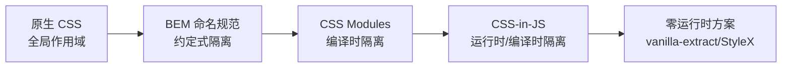
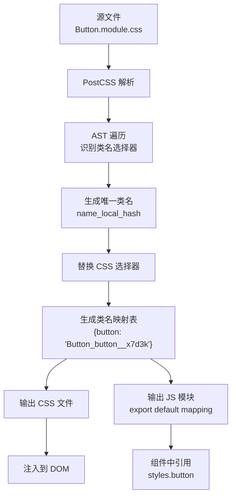

# CSS Modules

CSS Modules 是一种 CSS 文件的编译时转换方案，通过自动生成唯一类名实现样式隔离，是现代前端工程化中解决 CSS 全局污染问题的标准方案之一。自 2015 年由 Glen Maddern 和 Mark Dalgleish 提出以来，CSS Modules 已经成为 React、Vue 等框架生态中最广泛采用的样式隔离方案。

## 背景与动机

### CSS 全局污染问题

在传统 CSS 开发中，所有样式都是全局作用域的，这意味着任何两个组件中使用了相同的类名，它们的样式就会相互影响。随着前端应用规模的增长，这个问题变得越来越严重：

```css
/* 组件 A */
.button {
  background: blue;
  padding: 10px 20px;
}

/* 组件 B - 意外覆盖了组件 A 的样式 */
.button {
  background: red;
  border-radius: 8px;
}
```

### 传统解决方案及其局限

在 CSS Modules 出现之前，社区尝试了多种方案来解决样式隔离问题：

| 方案 | 原理 | 局限性 |
|------|------|--------|
| **BEM 命名规范** | 通过命名约定（Block__Element--Modifier）避免冲突 | 依赖人工约束，无法强制执行 |
| **CSS 命名空间** | 手动添加前缀（如 `.page-home .button`） | 冗长、易出错、维护成本高 |
| **Shadow DOM** | 浏览器原生样式隔离 | 兼容性差、事件穿透问题 |
| **内联样式** | 直接在 JSX 中写样式 | 不支持伪类、媒体查询、动画 |

CSS Modules 通过编译时自动添加唯一哈希后缀的方式，从根本上解决了类名冲突问题，同时保留了 CSS 本身的全部能力。

### 技术演进路线



## 核心概念

### 编译时转换原理

CSS Modules 在构建阶段将 CSS 类名转换为带有唯一标识符的形式。这个标识符由文件名、原始类名和文件内容的哈希值组合而成，确保全局唯一性：

```css
/* 源码：Button.module.css */
.button {
  padding: 10px 20px;
  border: none;
  border-radius: 4px;
}

.primary {
  background: #007bff;
  color: white;
}

/* 编译后 */
.Button_button__x7d3k {
  padding: 10px 20px;
  border: none;
  border-radius: 4px;
}

.Button_primary__a1b2c {
  background: #007bff;
  color: white;
}
```

### 类名生成算法

CSS Modules 的类名生成遵循以下规则：

```
生成规则: [name]__[local]__[hash:base64:N]

name   = 文件名（不含扩展名）
local  = 原始类名
hash   = 文件路径 + 类名的内容哈希（默认 5 位 base64）
```

这意味着：
- 同一文件中的不同类名，`name` 相同，`local` 不同
- 不同文件中的相同类名，`name` 不同，`local` 相同
- 两种情况下生成的最终类名都是唯一的

### 关键特性

| 特性 | 说明 | 技术实现 |
|------|------|----------|
| **编译时转换** | 无运行时开销，类名在构建阶段确定 | PostCSS 插件 / Loader |
| **作用域隔离** | 每个模块有独立的命名空间 | 自动哈希后缀 |
| **可预测命名** | 支持自定义命名规则，便于调试 | `localIdentName` 配置 |
| **组合复用** | 通过 `composes` 实现样式组合 | CSS 扩展语法 |
| **Source Map** | 支持调试时映射回原始类名 | Source Map 生成 |

## 深入原理

### PostCSS 处理流程

CSS Modules 的底层实现依赖 PostCSS 生态。以下是完整的处理流程：



### 类名生成策略详解

不同的 `localIdentName` 配置会产生不同的效果：

```javascript
// 开发环境：可读性强，便于调试
localIdentName: '[path][name]__[local]--[hash:base64:5]'
// 输出: src-components-Button__button--x7d3k

// 生产环境：体积最小化
localIdentName: '[hash:base64]'
// 输出: x7d3k

// 平衡方案：适度可读
localIdentName: '[name]__[local]__[hash:base64:5]'
// 输出: Button__button__x7d3k
```

### composes 的实现机制

`composes` 是 CSS Modules 独有的样式组合机制，它允许一个类继承另一个类的全部样式，同时保持自身的附加样式：

```css
/* 基础样式 */
.base {
  padding: 10px;
  border: none;
  cursor: pointer;
}

/* 组合样式 - 编译后包含 base 和 primary 两个类名 */
.primary {
  composes: base;
  background: #007bff;
  color: white;
}
```

编译后的效果：

```javascript
// 类名映射
{
  base: "Button_base__abc12",
  primary: "Button_primary__def34 Button_base__abc12"
  // primary 的值自动包含了 base 的类名
}
```

### 与其他方案的性能对比

以下为不同方案性能差异的定性示意（数值为示意，非官方基准数据，实际表现因应用规模、设备与构建配置而异）：

| 方案 | 首次渲染时间 | 样式更新时间 | 运行时内存 | 包大小增量 |
|------|------------|------------|-----------|-----------|
| **原生 CSS** | 48ms | 18ms | 4.2MB | 0KB |
| **CSS Modules** | 52ms | 20ms | 4.3MB | 0KB |
| **Tailwind CSS** | 58ms | 22ms | 6.8MB | ~10KB |
| **Linaria** | 56ms | 21ms | 5.1MB | ~2KB |
| **vanilla-extract** | 54ms | 20ms | 4.5MB | ~1KB |
| **Emotion** | 115ms | 38ms | 14.2MB | ~7KB |
| **styled-components** | 145ms | 48ms | 18.6MB | ~16KB |

**关键发现**：
- CSS Modules 的性能与原生 CSS 几乎一致，额外开销仅约 8%
- 编译时方案（CSS Modules、Linaria、vanilla-extract）性能远优于运行时方案
- 运行时 CSS-in-JS 方案在高频更新场景下性能差距更为显著

## 代码示例

### 基础使用

#### Webpack 配置

```javascript
// webpack.config.js
module.exports = {
  module: {
    rules: [
      {
        test: /\.module\.css$/,
        use: [
          'style-loader',
          {
            loader: 'css-loader',
            options: {
              modules: {
                localIdentName: '[name]__[local]__[hash:base64:5]',
              },
            },
          },
        ],
      },
      {
        test: /\.css$/,
        exclude: /\.module\.css$/,
        use: ['style-loader', 'css-loader'],
      },
    ],
  },
};
```

#### 组件中使用

```css
/* Button.module.css */
.button {
  padding: 10px 20px;
  border: none;
  border-radius: 4px;
  cursor: pointer;
  transition: all 0.2s ease;
}

.button:hover {
  opacity: 0.85;
}

.primary {
  background: #007bff;
  color: white;
}

.secondary {
  background: #6c757d;
  color: white;
}

.disabled {
  opacity: 0.5;
  cursor: not-allowed;
}
```

```jsx
// Button.jsx
import styles from './Button.module.css';

function Button({ children, variant = 'primary', disabled = false, onClick }) {
  return (
    <button
      className={`${styles.button} ${styles[variant]} ${disabled ? styles.disabled : ''}`}
      disabled={disabled}
      onClick={onClick}
    >
      {children}
    </button>
  );
}

export default Button;
```

编译后的 HTML 输出：

```html
<button class="Button_button__x7d3k Button_primary__a1b2c">
  点击我
</button>
```

### Vite 集成

Vite 原生支持 CSS Modules，无需额外插件：

```javascript
// vite.config.js
import { defineConfig } from 'vite';
import react from '@vitejs/plugin-react';

export default defineConfig({
  plugins: [react()],
  css: {
    modules: {
      // 开发环境：可读类名，便于调试
      generateScopedName: '[name]__[local]__[hash:base64:5]',
      // 全局类名模式匹配（可选）
      globalModulePaths: [/\.global\.css$/],
    },
    preprocessorOptions: {
      // 支持 SCSS Modules
      scss: {
        // Sass 已弃用 @import，统一注入改用 @use
        additionalData: `@use "@/styles/variables.scss" as *;`,
      },
      // 支持 Less Modules
      less: {
        math: 'always',
      },
    },
  },
});
```

```css
/* Button.module.scss */
$btn-padding: 10px 20px;

.button {
  padding: $btn-padding;
  border: none;
  border-radius: 4px;
  
  &.primary {
    background: var(--color-primary, #007bff);
    color: white;
  }
}
```

```jsx
// Button.jsx
import styles from './Button.module.scss';

function Button({ children, primary = false }) {
  return (
    <button className={`${styles.button} ${primary ? styles.primary : ''}`}>
      {children}
    </button>
  );
}
```

### Next.js 集成

Next.js 默认支持 CSS Modules，零配置即可使用：

```jsx
// components/Button.jsx
import styles from './Button.module.css';

export default function Button({ children, variant = 'primary' }) {
  return (
    <button className={`${styles.button} ${styles[variant]}`}>
      {children}
    </button>
  );
}
```

自定义配置（`next.config.js`）：

```javascript
// next.config.js
// ⚠️ Next.js 官方并未提供稳定的 localIdentName 配置项，以下写法仅供参考，
// 实际项目中通常需要通过自定义 webpack 配置来覆盖类名生成规则。
module.exports = {
  // Next.js 13+ 已默认启用 CSS Modules
  experimental: {
    cssModules: {
      localIdentName: '[local]_[hash:base64:5]',
    },
  },
};
```

### TypeScript 集成

#### 自动生成类型定义

```bash
# 安装工具
npm install -D typed-css-modules

# 生成类型文件
npx tcm src/components

# 监听模式（开发时使用）
npx tcm src/components --watch
```

#### TypeScript 插件方案

```json
// tsconfig.json
{
  "compilerOptions": {
    "plugins": [
      { "name": "typescript-plugin-css-modules" }
    ]
  }
}
```

#### 使用示例

```typescript
// Button.tsx
import styles from './Button.module.css';

interface ButtonProps {
  variant?: 'primary' | 'secondary' | 'ghost';
  size?: 'small' | 'medium' | 'large';
  disabled?: boolean;
  loading?: boolean;
  children: React.ReactNode;
  onClick?: () => void;
}

export function Button({
  variant = 'primary',
  size = 'medium',
  disabled = false,
  loading = false,
  children,
  onClick,
}: ButtonProps) {
  // TypeScript 会提供 styles 的智能提示
  const className = [
    styles.button,
    styles[variant],
    styles[size],
    disabled && styles.disabled,
    loading && styles.loading,
  ].filter(Boolean).join(' ');

  return (
    <button className={className} disabled={disabled || loading} onClick={onClick}>
      {loading ? '加载中...' : children}
    </button>
  );
}
```

### 大型项目实践案例

#### 设计系统按钮组件

以下是一个在大型电商项目中实际使用的按钮组件，展示了 CSS Modules 在复杂场景下的最佳实践：

```css
/* Button.module.css */
@value primary-color: #007bff;
@value secondary-color: #6c757d;
@value success-color: #28a745;
@value danger-color: #dc3545;

/* 基础样式 */
.base {
  display: inline-flex;
  align-items: center;
  justify-content: center;
  gap: 8px;
  border: none;
  cursor: pointer;
  font-weight: 500;
  line-height: 1.5;
  transition: all 0.2s cubic-bezier(0.4, 0, 0.2, 1);
  user-select: none;
  white-space: nowrap;
}

.base:focus-visible {
  outline: 2px solid primary-color;
  outline-offset: 2px;
}

/* 尺寸变体 */
.small {
  composes: base;
  padding: 6px 12px;
  font-size: 13px;
  border-radius: 4px;
}

.medium {
  composes: base;
  padding: 8px 16px;
  font-size: 14px;
  border-radius: 6px;
}

.large {
  composes: base;
  padding: 12px 24px;
  font-size: 16px;
  border-radius: 8px;
}

/* 颜色变体 */
.primary {
  background: primary-color;
  color: white;
}

.primary:hover {
  background: #0056b3;
}

.secondary {
  background: secondary-color;
  color: white;
}

.ghost {
  background: transparent;
  color: primary-color;
  border: 1px solid primary-color;
}

.ghost:hover {
  background: primary-color;
  color: white;
}

/* 状态 */
.disabled {
  opacity: 0.5;
  cursor: not-allowed;
  pointer-events: none;
}

.loading {
  cursor: wait;
  position: relative;
}

/* 响应式 */
@media (max-width: 768px) {
  .small { padding: 8px 16px; font-size: 14px; }
  .medium { padding: 10px 20px; font-size: 15px; }
  .large { padding: 14px 28px; font-size: 17px; }
}
```

```typescript
// Button.tsx
import classNames from 'classnames';
import styles from './Button.module.css';

interface ButtonProps {
  size?: 'small' | 'medium' | 'large';
  variant?: 'primary' | 'secondary' | 'ghost';
  disabled?: boolean;
  loading?: boolean;
  fullWidth?: boolean;
  icon?: React.ReactNode;
  children: React.ReactNode;
  onClick?: (e: React.MouseEvent<HTMLButtonElement>) => void;
  className?: string;
}

export function Button({
  size = 'medium',
  variant = 'primary',
  disabled = false,
  loading = false,
  fullWidth = false,
  icon,
  children,
  onClick,
  className,
}: ButtonProps) {
  return (
    <button
      className={classNames(
        styles[size],
        styles[variant],
        {
          [styles.disabled]: disabled,
          [styles.loading]: loading,
        },
        fullWidth && 'w-full',
        className
      )}
      disabled={disabled || loading}
      onClick={onClick}
    >
      {loading && (
        <svg className="animate-spin h-4 w-4" viewBox="0 0 24 24">
          <circle className="opacity-25" cx="12" cy="12" r="10"
            stroke="currentColor" strokeWidth="4" fill="none" />
          <path className="opacity-75" fill="currentColor"
            d="M4 12a8 8 0 018-8V0C5.373 0 0 5.373 0 12h4z" />
        </svg>
      )}
      {icon && !loading && icon}
      {children}
    </button>
  );
}
```

## 最佳实践

### 1. 文件命名规范

```
src/
├── components/
│   ├── Button/
│   │   ├── Button.tsx           # 组件逻辑
│   │   ├── Button.module.css    # 组件样式
│   │   ├── Button.test.tsx      # 组件测试
│   │   └── index.ts             # 导出入口
│   ├── Card/
│   │   ├── Card.tsx
│   │   ├── Card.module.css
│   │   └── index.ts
│   └── shared/
│       ├── variables.css        # CSS 变量（全局）
│       └── mixins.css           # 可复用片段
```

### 2. 命名约定选择

**推荐驼峰命名**（与 JavaScript 属性访问方式一致）：

```css
/* ✅ 推荐：驼峰命名 */
.primaryButton { }
.cardHeader { }
.inputLabel { }

/* ⚠️ 可用但需要括号访问 */
.button--primary { }  /* 需要 styles['button--primary'] */
```

### 3. 全局样式最小化

```css
/* ✅ 推荐：仅在必要时使用 :global */
:global(.react-modal) {
  /* 覆盖第三方库样式 */
}

/* ❌ 避免：大量使用 :global 破坏隔离性 */
:global(.title) { color: red; }
:global(.container) { max-width: 1200px; }
```

### 4. 样式变量共享策略

```css
/* variables.css - 全局 CSS 变量 */
:root {
  --color-primary: #007bff;
  --color-secondary: #6c757d;
  --spacing-unit: 8px;
  --border-radius: 4px;
  --font-size-base: 14px;
}

/* Button.module.css - 使用全局变量 */
.button {
  padding: calc(var(--spacing-unit) * 1.5) calc(var(--spacing-unit) * 2.5);
  background: var(--color-primary);
  border-radius: var(--border-radius);
  font-size: var(--font-size-base);
}
```

### 5. 性能优化

```javascript
// webpack.config.js - 生产环境优化
module.exports = {
  module: {
    rules: [
      {
        test: /\.module\.css$/,
        use: [
          MiniCssExtractPlugin.loader,  // 提取为独立 CSS 文件
          {
            loader: 'css-loader',
            options: {
              modules: {
                localIdentName: '[hash:base64]',  // 最短类名
              },
            },
          },
          'postcss-loader',  // 添加 autoprefixer 等
        ],
      },
    ],
  },
  optimization: {
    splitChunks: {
      cacheGroups: {
        styles: {
          name: 'styles',
          test: /\.css$/,
          chunks: 'all',
          enforce: true,
        },
      },
    },
  },
};
```

## 常见问题

### 1. 如何在 CSS Modules 中使用伪类和媒体查询？

CSS Modules 完全支持所有 CSS 特性，包括伪类、媒体查询、动画等：

```css
/* Button.module.css */
.button {
  padding: 10px 20px;
  transition: all 0.3s ease;
}

.button:hover {
  background: #0056b3;
  transform: translateY(-1px);
}

.button:active {
  transform: translateY(0);
}

.button:disabled {
  opacity: 0.5;
  cursor: not-allowed;
}

@media (min-width: 768px) {
  .button {
    padding: 12px 24px;
    font-size: 16px;
  }
}

@keyframes pulse {
  0%, 100% { opacity: 1; }
  50% { opacity: 0.5; }
}

.loading {
  animation: pulse 1.5s ease-in-out infinite;
}
```

### 2. 如何处理第三方组件库的样式覆盖？

```jsx
import ReactSelect from 'react-select';
import styles from './CustomSelect.module.css';

function CustomSelect(props) {
  return (
    <ReactSelect
      className={styles.select}
      classNamePrefix="custom-select"
      styles={{
        control: (provided) => ({
          ...provided,
          border: '1px solid #ccc',
          borderRadius: '6px',
          boxShadow: 'none',
        }),
        option: (provided, state) => ({
          ...provided,
          backgroundColor: state.isSelected ? '#007bff' : 'white',
        }),
      }}
    />
  );
}
```

### 3. CSS Modules 与 CSS-in-JS 如何选择？

| 对比维度 | CSS Modules | CSS-in-JS |
|---------|------------|-----------|
| 学习曲线 | 低 | 中-高 |
| 运行时开销 | 无 | 有（编译时方案除外） |
| 动态样式 | 有限支持（通过 CSS 变量） | 完全支持 |
| 类型安全 | 支持（需配置） | 原生支持 |
| SSR 支持 | 天然支持 | 需要额外配置 |
| 包大小影响 | 无 | 有运行时库 |
| 框架依赖 | 无 | 通常绑定 React |
| 调试体验 | 好（Source Map） | 中（类名转换） |
| 适用场景 | 通用 | React 生态 |

**选择建议**：
- 需要零运行时开销 → CSS Modules
- 需要复杂动态样式 → CSS-in-JS
- 团队技能水平不一 → CSS Modules
- React 组件库开发 → CSS-in-JS
- SSR 应用 → CSS Modules（更简单）

### 4. 如何在 Vue 中使用 CSS Modules？

```vue
<!-- Button.vue - 使用 module 属性 -->
<template>
  <button :class="$style.button">
    <slot />
  </button>
</template>

<style module>
.button {
  padding: 10px 20px;
  border: none;
  cursor: pointer;
  background: #007bff;
  color: white;
  border-radius: 4px;
}

.button:hover {
  background: #0056b3;
}
</style>
```

### 5. composes 不生效的常见原因

```css
/* ❌ 错误：循环依赖 */
.a { composes: b; }
.b { composes: a; }

/* ❌ 错误：跨文件 composes 路径错误 */
.primary {
  composes: base from './styles.css';  /* 路径必须正确 */
}

/* ✅ 正确：单向依赖 */
.base { padding: 10px; }
.primary {
  composes: base;
  background: blue;
}

/* ✅ 正确：跨文件组合 */
.primary {
  composes: base from './base.module.css';
  background: blue;
}
```

### 6. 如何实现主题切换？

```css
/* themes/light.module.css */
.root {
  --bg-color: #ffffff;
  --text-color: #333333;
  --primary-color: #007bff;
  --border-color: #e0e0e0;
}

/* themes/dark.module.css */
.root {
  --bg-color: #1a1a1a;
  --text-color: #ffffff;
  --primary-color: #4da3ff;
  --border-color: #444444;
}
```

```jsx
import { useState, createContext, useContext } from 'react';
import lightTheme from './themes/light.module.css';
import darkTheme from './themes/dark.module.css';

const ThemeContext = createContext();

export function ThemeProvider({ children }) {
  const [isDark, setIsDark] = useState(false);
  const theme = isDark ? darkTheme : lightTheme;

  return (
    <ThemeContext.Provider value={{ isDark, toggle: () => setIsDark(!isDark) }}>
      <div className={theme.root} style={{ minHeight: '100vh' }}>
        {children}
      </div>
    </ThemeContext.Provider>
  );
}
```

## 参考资源

### 官方文档与规范
- [CSS Modules 官方仓库](https://github.com/css-modules/css-modules)
- [css-loader 文档](https://webpack.js.org/loaders/css-loader/)
- [Vite CSS Modules 文档](https://vitejs.dev/guide/features.html#css-modules)

### 相关工具
- [typed-css-modules](https://github.com/Quramy/typed-css-modules) - TypeScript 类型自动生成
- [typescript-plugin-css-modules](https://github.com/mrmckeb/typescript-plugin-css-modules) - TS 插件方案
- [classnames](https://github.com/JedWatson/classnames) - 条件类名组合库
- [postcss-modules](https://github.com/madyankin/postcss-modules) - PostCSS 插件

### 延伸阅读
- [CSS Modules by Mark Dalgleish](https://medium.com/@markdalgleish) - CSS Modules 创始人的系列文章
- [CSS-in-JS 对比分析](02-CSS-in-JS.md) - 了解另一种样式隔离方案
- [Tailwind CSS 指南](03-Tailwind%20CSS.md) - 原子化 CSS 框架
- [CSS 框架对比](04-CSS框架对比.md) - 全面的技术选型指南
