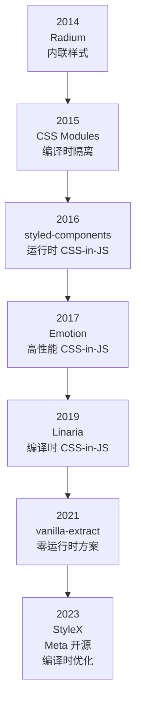
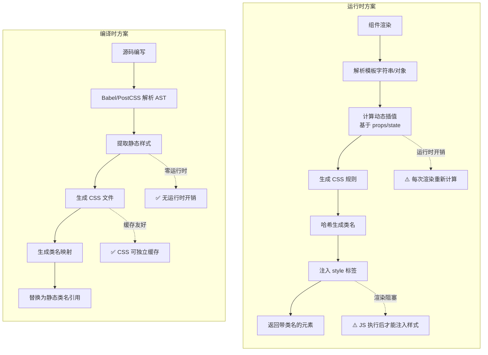
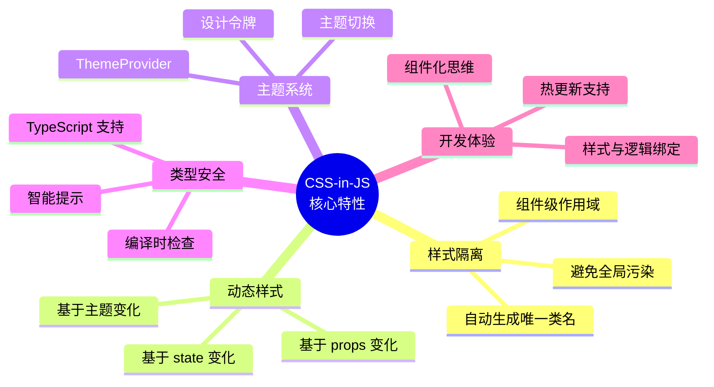
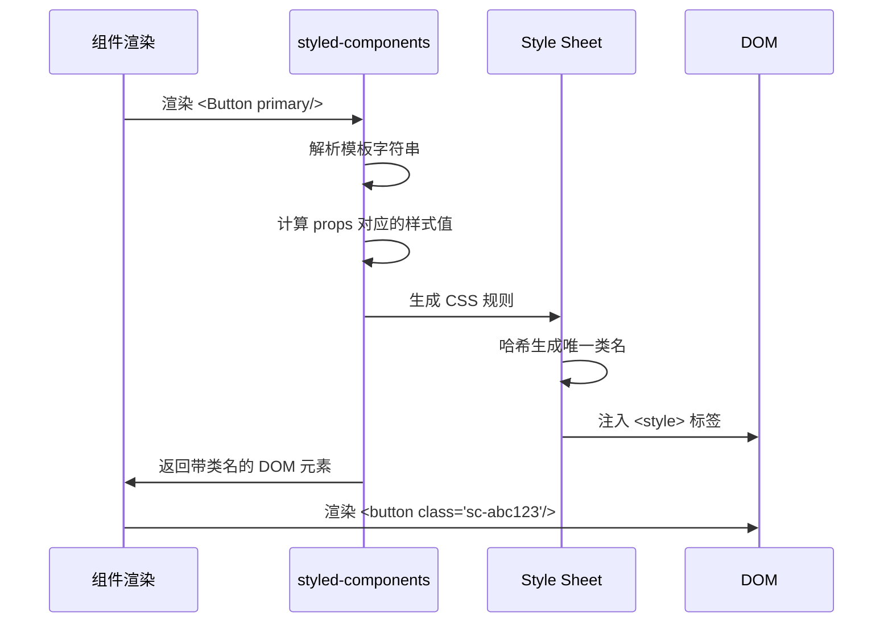
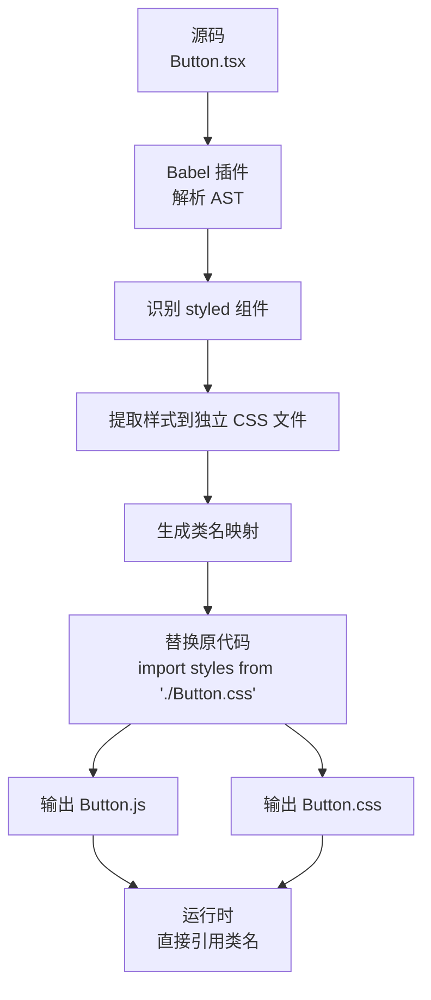
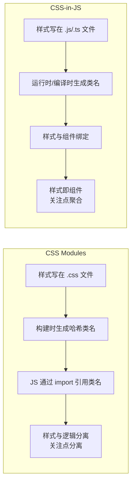
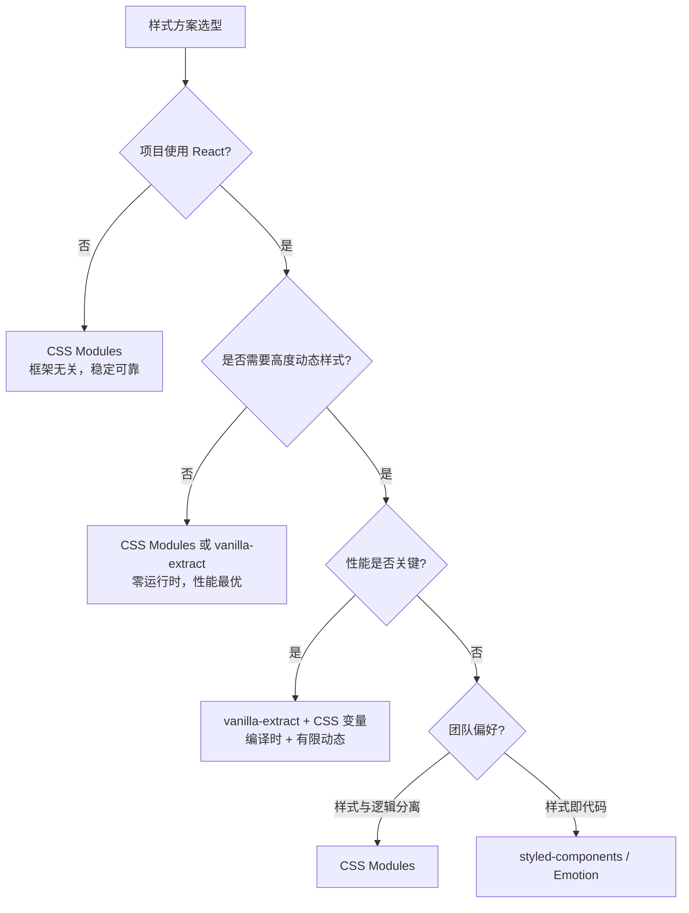
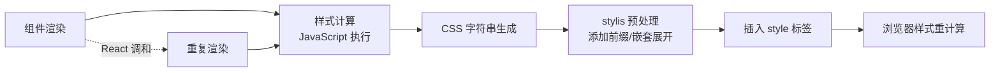
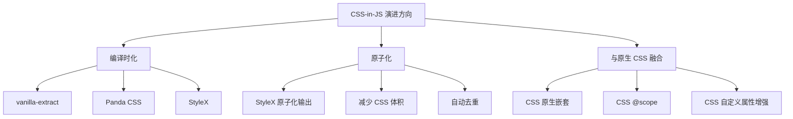

# CSS-in-JS

CSS-in-JS 是一种将 CSS 样式编写在 JavaScript 代码中的技术范式，通过 JavaScript 的能力实现样式的动态化、组件化和类型安全，是 React 生态系统中广泛采用的样式解决方案。自 2014 年 Christopher Chedeau（Vjeux）在 @Scale 大会上发表《CSS in JS》演讲提出这一概念以来，CSS-in-JS 已经发展出众多成熟方案，涵盖了运行时和编译时两大技术路线。

## 背景与动机

### 传统 CSS 的痛点

在大型 React 应用中，传统 CSS 面临诸多挑战：

| 问题 | 描述 | 影响 |
|------|------|------|
| **全局污染** | 所有样式都是全局作用域 | 类名冲突、样式覆盖 |
| **依赖管理** | CSS 和 JS 分离，难以追踪依赖 | 删除组件时遗留无用样式 |
| **动态样式** | 需要大量使用内联样式或类名切换 | 代码冗长、维护困难 |
| **死代码消除** | 难以判断哪些 CSS 未被使用 | 包体积膨胀 |
| **压缩混淆** | 类名压缩后难以调试 | 开发体验差 |
| **主题化** | 需要复杂的 CSS 变量或预处理器 | 实现复杂、灵活性差 |

### CSS-in-JS 的解决方案

CSS-in-JS 将样式视为组件的一部分，使用 JavaScript 编写和管理 CSS，实现了样式与组件逻辑的深度融合：

```jsx
// 传统方式：样式与逻辑分离
import './Button.css';
<button className="btn btn-primary">按钮</button>

// CSS-in-JS：样式与组件绑定
const Button = styled.button`
  padding: 10px 20px;
  background: ${props => props.primary ? '#007bff' : '#6c757d'};
  color: white;
`;
<Button primary>按钮</Button>
```

### 技术演进路线



## 核心概念

### 方案分类

CSS-in-JS 方案按样式生成时机可分为三大类：

| 类型 | 代表方案 | 样式生成时机 | 运行时开销 | 适用场景 |
|------|---------|------------|-----------|---------|
| **运行时** | styled-components<br/>Emotion | 运行时动态生成 | 有 | React 应用、动态样式 |
| **编译时** | Linaria<br/>vanilla-extract | 构建时生成 | 无 | 性能敏感应用 |
| **混合型** | Emotion | 支持两种方式 | 可选 | 灵活需求 |

### 运行时 vs 编译时方案架构对比



### 主流方案多维度对比

| 维度 | styled-components | Emotion | Linaria | vanilla-extract | CSS Modules |
|------|------------------|---------|---------|-----------------|-------------|
| **类型** | 运行时 | 运行时/混合 | 编译时 | 编译时 | 编译时 |
| **运行时体积** | ~16KB | ~9KB | ~0KB | ~0KB | ~0KB |
| **语法风格** | 模板字符串 | 模板字符串 + 对象 | 模板字符串 | TypeScript 对象 | 标准 CSS |
| **动态样式** | ✅ 完全支持 | ✅ 完全支持 | ⚠️ 有限（CSS 变量） | ⚠️ 有限（预定义变体） | ❌ 需条件拼接类名 |
| **TypeScript** | ✅ 支持（需声明） | ✅ 原生支持 | ✅ 支持 | ✅ 编译时完全检查 | ⚠️ 需手动声明 |
| **SSR 支持** | ⚠️ 需 ServerStyleSheet | ⚠️ 需 CacheProvider | ✅ 天然支持 | ✅ 天然支持 | ✅ 天然支持 |
| **主题系统** | ✅ ThemeProvider | ✅ ThemeProvider | ⚠️ 需手动实现 | ✅ createTheme | ⚠️ CSS 变量 |
| **样式复用** | 继承/组合 css`` | 组合 css`` | css`` 组合 | style 组合 | composes |
| **调试体验** | ⚠️ 类名不稳定 | ⚠️ 类名不稳定 | ✅ Source Map | ✅ Source Map | ✅ 可读类名 |
| **学习曲线** | 低 | 低 | 中 | 中 | 低 |
| **框架绑定** | React | React（核心） | 框架无关 | 框架无关 | 框架无关 |
| **生态成熟度** | ⭐⭐⭐⭐⭐ | ⭐⭐⭐⭐⭐ | ⭐⭐⭐ | ⭐⭐⭐⭐ | ⭐⭐⭐⭐⭐ |
| **npm 周下载** | ~2M | ~3M | ~200K | ~500K | 内置于构建工具 |

### 核心特性

所有 CSS-in-JS 方案都具备以下核心能力：



## 深入原理

### 运行时方案工作原理

以 styled-components 为例，运行时方案的样式生成流程如下：



**关键步骤**：
1. **模板解析**：将模板字符串转换为 CSS 规则
2. **props 计算**：根据组件 props 计算动态样式值
3. **类名生成**：基于样式内容生成唯一哈希类名
4. **样式注入**：将 CSS 规则注入到 `<style>` 标签
5. **DOM 渲染**：将生成的类名应用到 DOM 元素

### 编译时方案工作原理

以 Linaria 为例，编译时方案在构建阶段完成样式提取：



**关键优势**：
- 零运行时开销，性能与原生 CSS 一致
- 样式文件可独立缓存
- 支持 Source Map 调试
- 类名稳定，利于 SSR

### 运行时 vs 编译时方案对比

| 维度 | 运行时方案 | 编译时方案 |
|------|----------|----------|
| **性能** | 有运行时开销 | 零运行时开销 |
| **动态样式** | 完全支持 | 有限支持（需预定义） |
| **包大小** | 需要运行时库（7-16KB） | 无需运行时库 |
| **SSR** | 需要额外配置 | 天然支持 |
| **调试** | 类名不稳定 | 类名稳定，Source Map |
| **开发体验** | 优秀 | 良好 |
| **学习曲线** | 平缓 | 中等 |
| **适用场景** | 高频动态样式 | 性能敏感应用 |

## 主流方案详解

### styled-components

styled-components 是最早的 CSS-in-JS 方案之一，采用模板字符串语法：

```bash
npm install styled-components
```

```jsx
import styled from 'styled-components';

// 基础组件
const Button = styled.button`
  padding: 10px 20px;
  border: none;
  border-radius: 4px;
  background: ${props => props.primary ? '#007bff' : '#6c757d'};
  color: white;
  cursor: pointer;
  transition: all 0.2s ease;
  
  &:hover {
    opacity: 0.85;
    transform: translateY(-1px);
  }
  
  &:active {
    transform: translateY(0);
  }
  
  &:disabled {
    opacity: 0.5;
    cursor: not-allowed;
  }
`;

// 使用
function App() {
  return (
    <div>
      <Button>默认按钮</Button>
      <Button primary>主要按钮</Button>
      <Button disabled>禁用按钮</Button>
    </div>
  );
}
```

**高级特性**：

```jsx
// 样式继承
const BaseButton = styled.button`
  padding: 10px 20px;
  border: none;
  cursor: pointer;
`;

const PrimaryButton = styled(BaseButton)`
  background: #007bff;
  color: white;
`;

// 属性传递（attrs）
const Input = styled.input.attrs(props => ({
  type: props.type || 'text',
  placeholder: props.placeholder || '请输入...',
}))`
  padding: ${props => props.size === 'large' ? '12px' : '8px'};
  border: 1px solid #ccc;
  border-radius: 4px;
`;

// 使用
<Input size="large" placeholder="搜索..." />

// 样式组合
const baseStyles = css`
  padding: 10px;
  border-radius: 4px;
`;

const Card = styled.div`
  ${baseStyles}
  background: white;
  box-shadow: 0 2px 8px rgba(0, 0, 0, 0.1);
`;
```

### Emotion

Emotion 是另一个流行的 CSS-in-JS 方案，提供更灵活的 API：

```bash
npm install @emotion/react @emotion/styled
```

**两种使用方式**：

```jsx
/** @jsxImportSource @emotion/react */
import { css } from '@emotion/react';
import styled from '@emotion/styled';

// 方式一：css prop
const buttonStyle = css`
  padding: 10px 20px;
  background: #007bff;
  color: white;
  border: none;
  border-radius: 4px;
  
  &:hover {
    background: #0056b3;
  }
`;

function Button({ children }) {
  return <button css={buttonStyle}>{children}</button>;
}

// 方式二：styled API
const StyledButton = styled.button`
  padding: 10px 20px;
  background: ${props => props.primary ? '#007bff' : '#6c757d'};
  color: white;
  border: none;
  border-radius: 4px;
  
  &:hover {
    opacity: 0.85;
  }
`;

function App() {
  return (
    <div>
      <Button>按钮</Button>
      <StyledButton primary>主要按钮</StyledButton>
    </div>
  );
}
```

**对象语法**（性能更好）：

```jsx
const buttonStyles = css({
  padding: '10px 20px',
  background: '#007bff',
  color: 'white',
  border: 'none',
  borderRadius: '4px',
  '&:hover': {
    background: '#0056b3',
  },
});

const StyledButton = styled.button({
  padding: '10px 20px',
  background: 'blue',
  color: 'white',
});

// 动态对象样式
const DynamicButton = styled.button(props => ({
  padding: '10px 20px',
  background: props.primary ? 'blue' : 'gray',
}));
```

### Linaria

Linaria 是编译时 CSS-in-JS 方案，零运行时开销：

```bash
npm install @linaria/core @linaria/react
```

```jsx
import { styled } from '@linaria/react';
import { css } from '@linaria/core';

// 使用方式与 styled-components 类似
const Button = styled.button`
  padding: 10px 20px;
  background: ${props => props.primary ? '#007bff' : '#6c757d'};
  color: white;
  border: none;
  border-radius: 4px;
  
  &:hover {
    opacity: 0.85;
  }
`;

// 编译后会提取到独立 CSS 文件
// Button.linaria.css
```

**限制**：
- 动态样式能力受限（需预定义）
- 需要 Babel 或 Webpack 插件配置
- 不支持所有 JavaScript 表达式

### vanilla-extract

vanilla-extract 是零运行时方案，使用 TypeScript 编写样式：

```bash
npm install @vanilla-extract/css
```

```typescript
// Button.css.ts
import { style, styleVariants } from '@vanilla-extract/css';

export const button = style({
  padding: '10px 20px',
  border: 'none',
  borderRadius: '4px',
  cursor: 'pointer',
  transition: 'all 0.2s ease',
  ':hover': {
    opacity: 0.85,
  },
});

export const variant = styleVariants({
  primary: {
    background: '#007bff',
    color: 'white',
  },
  secondary: {
    background: '#6c757d',
    color: 'white',
  },
});

export const size = styleVariants({
  small: { padding: '6px 12px', fontSize: '13px' },
  medium: { padding: '8px 16px', fontSize: '14px' },
  large: { padding: '12px 24px', fontSize: '16px' },
});
```

```tsx
// Button.tsx
import * as styles from './Button.css';

interface ButtonProps {
  variant?: 'primary' | 'secondary';
  size?: 'small' | 'medium' | 'large';
  children: React.ReactNode;
}

export function Button({ 
  variant = 'primary', 
  size = 'medium', 
  children 
}: ButtonProps) {
  return (
    <button className={`${styles.button} ${styles.variant[variant]} ${styles.size[size]}`}>
      {children}
    </button>
  );
}
```

## 代码示例

### SSR 服务端渲染

#### styled-components SSR

```jsx
// server.js
import express from 'express';
import { renderToString } from 'react-dom/server';
import { ServerStyleSheet } from 'styled-components';
import App from './App';

const app = express();

app.get('*', (req, res) => {
  const sheet = new ServerStyleSheet();
  
  try {
    const html = renderToString(
      sheet.collectStyles(<App />)
    );
    
    const styleTags = sheet.getStyleTags();
    
    res.send(`
      <!DOCTYPE html>
      <html>
        <head>
          <meta charset="utf-8">
          <title>SSR App</title>
          ${styleTags}
        </head>
        <body>
          <div id="root">${html}</div>
          <script src="/bundle.js"></script>
        </body>
      </html>
    `);
  } catch (error) {
    res.status(500).send(error.message);
  } finally {
    sheet.seal();
  }
});

app.listen(3000);
```

#### Emotion SSR

```jsx
// server.js
import express from 'express';
import { renderToString } from 'react-dom/server';
import { CacheProvider } from '@emotion/react';
import createEmotionServer from '@emotion/server/create-instance';
import createCache from '@emotion/cache';
import App from './App';

const app = express();

function createEmotionCache() {
  return createCache({ key: 'css' });
}

app.get('*', (req, res) => {
  const cache = createEmotionCache();
  const { extractCriticalToChunks, constructStyleTagsFromChunks } = createEmotionServer(cache);
  
  const html = renderToString(
    <CacheProvider value={cache}>
      <App />
    </CacheProvider>
  );
  
  const chunks = extractCriticalToChunks(html);
  const styleTags = constructStyleTagsFromChunks(chunks);
  
  res.send(`
    <!DOCTYPE html>
    <html>
      <head>
        <meta charset="utf-8">
        <title>SSR App</title>
        ${styleTags}
      </head>
      <body>
        <div id="root">${html}</div>
        <script src="/bundle.js"></script>
      </body>
    </html>
  `);
});

app.listen(3000);
```

### 主题系统实现

#### 基础主题配置

```typescript
// theme.ts
export interface Theme {
  colors: {
    primary: string;
    secondary: string;
    success: string;
    danger: string;
    background: string;
    text: string;
    textSecondary: string;
    border: string;
  };
  spacing: {
    xs: string;
    sm: string;
    md: string;
    lg: string;
    xl: string;
  };
  borderRadius: {
    small: string;
    medium: string;
    large: string;
    full: string;
  };
  shadows: {
    small: string;
    medium: string;
    large: string;
  };
  breakpoints: {
    mobile: string;
    tablet: string;
    desktop: string;
  };
}

export const lightTheme: Theme = {
  colors: {
    primary: '#007bff',
    secondary: '#6c757d',
    success: '#28a745',
    danger: '#dc3545',
    background: '#ffffff',
    text: '#333333',
    textSecondary: '#666666',
    border: '#e0e0e0',
  },
  spacing: {
    xs: '4px',
    sm: '8px',
    md: '16px',
    lg: '24px',
    xl: '32px',
  },
  borderRadius: {
    small: '4px',
    medium: '8px',
    large: '16px',
    full: '9999px',
  },
  shadows: {
    small: '0 1px 3px rgba(0, 0, 0, 0.12)',
    medium: '0 4px 6px rgba(0, 0, 0, 0.1)',
    large: '0 10px 20px rgba(0, 0, 0, 0.15)',
  },
  breakpoints: {
    mobile: '768px',
    tablet: '1024px',
    desktop: '1280px',
  },
};

export const darkTheme: Theme = {
  ...lightTheme,
  colors: {
    primary: '#4da3ff',
    secondary: '#8e8e93',
    success: '#34c759',
    danger: '#ff3b30',
    background: '#1a1a1a',
    text: '#ffffff',
    textSecondary: '#a0a0a0',
    border: '#3a3a3a',
  },
};
```

#### TypeScript 类型扩展

```typescript
// styled.d.ts
import 'styled-components';
import { Theme } from './theme';

declare module 'styled-components' {
  export interface DefaultTheme extends Theme {}
}
```

#### 主题切换组件

```tsx
// ThemeProvider.tsx
import React, { createContext, useContext, useState, useEffect } from 'react';
import { ThemeProvider as StyledThemeProvider } from 'styled-components';
import { lightTheme, darkTheme } from './theme';

interface ThemeContextType {
  isDark: boolean;
  toggleTheme: () => void;
}

const ThemeContext = createContext<ThemeContextType>({
  isDark: false,
  toggleTheme: () => {},
});

export const useTheme = () => useContext(ThemeContext);

export function ThemeProvider({ children }: { children: React.ReactNode }) {
  const [isDark, setIsDark] = useState(() => {
    if (typeof window !== 'undefined') {
      const saved = localStorage.getItem('theme');
      return saved === 'dark';
    }
    return false;
  });

  useEffect(() => {
    localStorage.setItem('theme', isDark ? 'dark' : 'light');
    document.documentElement.setAttribute('data-theme', isDark ? 'dark' : 'light');
  }, [isDark]);

  const toggleTheme = () => setIsDark(!isDark);
  const theme = isDark ? darkTheme : lightTheme;

  return (
    <ThemeContext.Provider value={{ isDark, toggleTheme }}>
      <StyledThemeProvider theme={theme}>
        {children}
      </StyledThemeProvider>
    </ThemeContext.Provider>
  );
}
```

#### 使用主题

```tsx
// Button.tsx
import styled from 'styled-components';
import { useTheme } from './ThemeProvider';

const StyledButton = styled.button<{ variant?: 'primary' | 'secondary' }>`
  padding: ${props => props.theme.spacing.sm} ${props => props.theme.spacing.md};
  background: ${props => 
    props.variant === 'primary' 
      ? props.theme.colors.primary 
      : props.theme.colors.secondary
  };
  color: white;
  border: none;
  border-radius: ${props => props.theme.borderRadius.medium};
  box-shadow: ${props => props.theme.shadows.small};
  cursor: pointer;
  transition: all 0.2s ease;
  
  &:hover {
    box-shadow: ${props => props.theme.shadows.medium};
    transform: translateY(-1px);
  }
  
  @media (max-width: ${props => props.theme.breakpoints.mobile}) {
    padding: ${props => props.theme.spacing.xs} ${props => props.theme.spacing.sm};
    font-size: 14px;
  }
`;

export function Button({ 
  variant = 'primary', 
  children 
}: { 
  variant?: 'primary' | 'secondary';
  children: React.ReactNode;
}) {
  const { isDark, toggleTheme } = useTheme();
  
  return (
    <>
      <StyledButton variant={variant}>{children}</StyledButton>
      <button onClick={toggleTheme}>
        切换到 {isDark ? '浅色' : '深色'} 模式
      </button>
    </>
  );
}
```

### 测试策略

#### Jest 配置

```javascript
// jest.config.js
module.exports = {
  moduleNameMapper: {
    // 模拟 styled-components
    'styled-components': '<rootDir>/__mocks__/styled-components.js',
  },
  setupFilesAfterEnv: ['<rootDir>/jest.setup.js'],
};
```

```javascript
// __mocks__/styled-components.js
const styled = require('styled-components');

// 禁用样式注入，提升测试速度
styled.default.inlineStyleTags = false;
```

#### 快照测试

```jsx
// Button.test.tsx
import React from 'react';
import renderer from 'react-test-renderer';
import 'jest-styled-components';
import { ThemeProvider } from 'styled-components';
import { Button } from './Button';
import { lightTheme } from './theme';

const renderWithTheme = (component) => {
  return renderer.create(
    <ThemeProvider theme={lightTheme}>
      {component}
    </ThemeProvider>
  );
};

describe('Button', () => {
  it('renders primary button correctly', () => {
    const tree = renderWithTheme(
      <Button variant="primary">Primary Button</Button>
    ).toJSON();
    
    expect(tree).toMatchSnapshot();
    expect(tree).toHaveStyleRule('background', '#007bff');
  });
  
  it('renders secondary button correctly', () => {
    const tree = renderWithTheme(
      <Button variant="secondary">Secondary Button</Button>
    ).toJSON();
    
    expect(tree).toMatchSnapshot();
    expect(tree).toHaveStyleRule('background', '#6c757d');
  });
  
  it('applies hover styles', () => {
    const tree = renderWithTheme(
      <Button variant="primary">Hover Me</Button>
    ).toJSON();
    
    expect(tree).toHaveStyleRule('transform', 'translateY(-1px)', {
      modifier: ':hover',
    });
  });
});
```

#### 单元测试

```jsx
// Button.test.tsx
import { render, screen, fireEvent } from '@testing-library/react';
import { ThemeProvider } from 'styled-components';
import { Button } from './Button';
import { lightTheme } from './theme';

const renderWithTheme = (component) => {
  return render(
    <ThemeProvider theme={lightTheme}>
      {component}
    </ThemeProvider>
  );
};

describe('Button', () => {
  it('renders with correct text', () => {
    renderWithTheme(<Button>Click me</Button>);
    expect(screen.getByText('Click me')).toBeInTheDocument();
  });
  
  it('calls onClick when clicked', () => {
    const handleClick = jest.fn();
    renderWithTheme(<Button onClick={handleClick}>Click me</Button>);
    
    fireEvent.click(screen.getByText('Click me'));
    expect(handleClick).toHaveBeenCalledTimes(1);
  });
  
  it('applies primary variant styles', () => {
    renderWithTheme(<Button variant="primary">Primary</Button>);
    const button = screen.getByRole('button');
    expect(button).toHaveStyle('background-color: #007bff');
  });
  
  it('applies secondary variant styles', () => {
    renderWithTheme(<Button variant="secondary">Secondary</Button>);
    const button = screen.getByRole('button');
    expect(button).toHaveStyle('background-color: #6c757d');
  });
});
```

## 最佳实践

### 1. 限制动态样式

```jsx
// ❌ 性能差：过度动态
const Button = styled.button`
  padding: ${props => props.padding}px;
  margin: ${props => props.margin}px;
  font-size: ${props => props.fontSize}px;
  background: ${props => props.bgColor};
`;

// ✅ 性能好：有限动态，预定义变体
const Button = styled.button`
  padding: 10px 20px;
  margin: 0;
  font-size: 14px;
  
  ${props => props.size === 'large' && `
    padding: 15px 30px;
    font-size: 16px;
  `}
  
  ${props => props.variant === 'primary' && `
    background: #007bff;
    color: white;
  `}
  
  ${props => props.variant === 'secondary' && `
    background: #6c757d;
    color: white;
  `}
`;
```

### 2. 使用 shouldForwardProp 过滤 props

```jsx
// ❌ 错误：自定义 props 泄露到 DOM
const Button = styled.button`
  background: ${props => props.primary ? '#007bff' : '#6c757d'};
`;

<Button primary>按钮</Button>
// 渲染：<button primary="">按钮</button>

// ✅ 正确：过滤自定义 props
const Button = styled.button.withConfig({
  shouldForwardProp: (prop) => !['primary', 'size', 'variant'].includes(prop),
})`
  background: ${props => props.primary ? '#007bff' : '#6c757d'};
  padding: ${props => props.size === 'large' ? '15px 30px' : '10px 20px'};
`;

<Button primary size="large">按钮</Button>
// 渲染：<button>按钮</button>
```

### 3. 避免内联函数

```jsx
// ❌ 性能差：每次渲染创建新函数
const Button = styled.button`
  background: ${props => props.disabled ? '#ccc' : '#007bff'};
  color: ${props => props.disabled ? '#666' : 'white'};
`;

// ✅ 性能好：提取函数到组件外
const getBackground = props => props.disabled ? '#ccc' : '#007bff';
const getColor = props => props.disabled ? '#666' : 'white';

const Button = styled.button`
  background: ${getBackground};
  color: ${getColor};
`;
```

### 4. 使用 Babel 插件优化

```javascript
// .babelrc 或 babel.config.js
module.exports = {
  plugins: [
    [
      'babel-plugin-styled-components',
      {
        ssr: true,           // 启用 SSR 支持
        displayName: true,   // 开发环境显示组件名
        fileName: true,      // 依据文件名生成更可读的组件名
        minify: true,        // 压缩样式
        transpileTemplateLiterals: true,  // 转换模板字符串
      },
    ],
  ],
};
```

### 5. 样式组合与继承

```jsx
// 基础样式片段
const baseButtonStyles = css`
  padding: 10px 20px;
  border: none;
  border-radius: 4px;
  cursor: pointer;
  transition: all 0.2s ease;
`;

const hoverStyles = css`
  &:hover {
    opacity: 0.85;
    transform: translateY(-1px);
  }
`;

// 组合使用
const Button = styled.button`
  ${baseButtonStyles}
  ${hoverStyles}
  background: ${props => props.primary ? '#007bff' : '#6c757d'};
  color: white;
`;

// 样式继承
const BaseButton = styled.button`
  ${baseButtonStyles}
  ${hoverStyles}
`;

const PrimaryButton = styled(BaseButton)`
  background: #007bff;
  color: white;
`;

const SecondaryButton = styled(BaseButton)`
  background: #6c757d;
  color: white;
`;
```

## CSS-in-JS 与 CSS Modules 的深度对比

CSS Modules 和 CSS-in-JS 是解决同一问题（样式隔离）的两种不同思路，理解它们的差异对技术选型至关重要。

### 设计哲学差异



### 功能对比

| 维度 | CSS Modules | CSS-in-JS（运行时） | CSS-in-JS（编译时） |
|------|------------|-------------------|-------------------|
| **样式隔离** | ✅ 编译时哈希 | ✅ 运行时哈希 | ✅ 编译时哈希 |
| **动态样式** | ❌ 需条件拼接类名 | ✅ 基于 props 原生支持 | ⚠️ CSS 变量 / 预定义变体 |
| **主题切换** | ⚠️ CSS 变量 + data 属性 | ✅ ThemeProvider | ✅ createTheme / CSS 变量 |
| **类型安全** | ⚠️ 需手动声明类型 | ✅ 泛型推导 | ✅ 编译时检查 |
| **死代码消除** | ⚠️ 需工具辅助 | ✅ 组件未使用则样式不注入 | ✅ 构建时分析 |
| **样式复用** | composes / @value | 继承 / css`` 组合 | style 组合 / styleVariants |
| **学习成本** | 低（标准 CSS） | 中（新 API） | 中（新 API） |
| **框架耦合** | 无 | React | 无 |
| **调试体验** | ✅ 可读类名 + Source Map | ⚠️ 哈希类名 | ✅ Source Map |
| **性能** | ✅ 零运行时 | ⚠️ 运行时开销 | ✅ 零运行时 |

### 同一组件的两种实现

```tsx
// ===== CSS Modules 实现 =====
// Button.module.css
.button {
  padding: 8px 16px;
  border-radius: 6px;
  font-weight: 500;
  border: none;
  cursor: pointer;
}
.primary { background: #3b82f6; color: white; }
.primary:hover { background: #2563eb; }
.secondary { background: #6b7280; color: white; }

// Button.tsx
import styles from './Button.module.css';

interface ButtonProps {
  variant?: 'primary' | 'secondary';
  children: React.ReactNode;
}

export function Button({ variant = 'primary', children }: ButtonProps) {
  return (
    <button className={`${styles.button} ${styles[variant]}`}>
      {children}
    </button>
  );
}

// ===== styled-components 实现 =====
// Button.tsx（无需额外 CSS 文件）
import styled, { css } from 'styled-components';

const variantStyles = {
  primary: css`background: #3b82f6; color: white; &:hover { background: #2563eb; }`,
  secondary: css`background: #6b7280; color: white;`,
};

const StyledButton = styled.button<{ variant: 'primary' | 'secondary' }>`
  padding: 8px 16px;
  border-radius: 6px;
  font-weight: 500;
  border: none;
  cursor: pointer;
  ${props => variantStyles[props.variant]}
`;

export function Button({ variant = 'primary', children }: ButtonProps) {
  return <StyledButton variant={variant}>{children}</StyledButton>;
}
```

### 选型建议



## CSS-in-JS 的争议与未来

CSS-in-JS 自诞生以来就伴随着激烈的技术争议。了解这些争议，有助于在选型时做出更理性的判断。

### 核心争议

#### 争议一：运行时性能

运行时 CSS-in-JS 的性能问题是最受关注的争议点。2022 年，Sam Magura（Emotion 维护者）发表文章《Why We're Breaking Up with CSS in JS》，引发社区广泛讨论。

**问题本质**：



**性能数据对比**（1000 个组件渲染时间，数值为示意，非官方基准数据）：

| 方案 | 首次渲染 | 更新渲染 | 内存占用 |
|------|---------|---------|---------|
| CSS Modules | 45ms | 12ms | 2MB |
| styled-components | 120ms | 45ms | 8MB |
| Emotion | 95ms | 35ms | 6MB |
| vanilla-extract | 48ms | 13ms | 2.5MB |

**关键结论**：对于大多数应用（< 200 个组件），运行时开销可忽略。但在大型应用（> 500 个组件）或性能敏感场景（动画、拖拽）中，运行时方案可能成为瓶颈。

#### 争议二：Bundle 体积

运行时 CSS-in-JS 需要携带运行时库，增加了 JavaScript Bundle 体积：

| 方案 | 运行时库体积（gzip） | 额外 CSS 体积 | 总增量 |
|------|-------------------|-------------|--------|
| CSS Modules | 0 KB | ~0 KB | 0 KB |
| styled-components | ~13 KB | ~3 KB | ~16 KB |
| Emotion | ~7 KB | ~2 KB | ~9 KB |
| Linaria | 0 KB | ~0 KB | ~0 KB |
| vanilla-extract | 0 KB | ~0 KB | ~0 KB |

#### 争议三：SSR 复杂度

运行时 CSS-in-JS 在 SSR 中需要额外处理样式提取，增加了服务端复杂度：

```javascript
// styled-components SSR 需要的额外代码
import { ServerStyleSheet } from 'styled-components';

const sheet = new ServerStyleSheet();
try {
  const html = renderToString(sheet.collectStyles(<App />));
  const styleTags = sheet.getStyleTags(); // 提取关键 CSS
  res.send(`<html><head>${styleTags}</head><body>${html}</body></html>`);
} finally {
  sheet.seal();
}

// 对比：CSS Modules / vanilla-extract 无需额外处理
// CSS 直接通过 <link> 标签引入，天然支持 SSR
```

#### 争议四：与 React 18+ 并发模式的兼容性

React 18 的并发渲染（Concurrent Rendering）对运行时 CSS-in-JS 提出了新挑战：

- **样式注入时机不确定**：并发模式下组件可能多次渲染，`<style>` 标签的注入时机难以控制
- **类名不稳定**：运行时生成的类名在不同渲染批次中可能不一致
- **Strict Mode 双重渲染**：React 18 Strict Mode 会双重调用渲染函数，导致样式重复注入

```jsx
// React 18 Strict Mode 下的潜在问题
import { StrictMode } from 'react';

// styled-components 在 Strict Mode 下可能：
// 1. 样式重复注入（双重渲染）
// 2. 类名闪烁（FOUC）
// 3. SSR 类名不匹配
```

### CSS-in-JS 的未来趋势



**趋势一：编译时方案成为主流**

运行时 CSS-in-JS 的性能问题推动了编译时方案的崛起。vanilla-extract、Panda CSS、StyleX 等方案在保持开发体验的同时消除了运行时开销。

**趋势二：原子化 CSS-in-JS**

StyleX（Meta 开源）代表了新的方向：在编译时将样式对象拆解为原子类，每个 CSS 属性只生成一次，CSS 体积最小化。这种思路与 Tailwind CSS 的原子化理念殊途同归。

**趋势三：CSS 原生能力增强**

随着 CSS 原生嵌套（Nesting）、`@scope`、CSS 层叠层（`@layer`）等特性的普及，CSS-in-JS 解决的部分问题将被原生 CSS 覆盖：

```css
/* CSS 原生嵌套：减少对 CSS-in-JS 嵌套语法的依赖 */
.card {
  background: white;
  padding: 16px;

  & .title {
    font-size: 20px;
  }

  &:hover {
    box-shadow: 0 4px 12px rgba(0,0,0,0.1);
  }
}

/* CSS @scope：提供原生作用域隔离 */
@scope (.card) {
  .title { color: #333; }  /* 只匹配 .card 内的 .title */
}
```

**趋势四：混合方案兴起**

twin.macro、Panda CSS 等方案尝试融合 CSS-in-JS 的开发体验和 Tailwind CSS 的原子化优势，代表了"取各家之长"的混合方向。

### 给开发者的建议

1. **新项目**：优先考虑编译时方案（vanilla-extract / Panda CSS），或 CSS Modules + CSS 变量
2. **现有 styled-components 项目**：无需立即迁移，但应限制动态样式的使用，关注性能指标
3. **组件库开发**：vanilla-extract 提供最佳的类型安全和零运行时组合
4. **快速原型**：styled-components / Emotion 仍然是最高效的选择
5. **长期趋势**：关注 CSS 原生能力的发展，逐步减少对 CSS-in-JS 运行时的依赖

## 常见问题

### 1. 类名闪烁（FOUC）

**问题**：SSR 时客户端类名与服务端不一致，导致样式闪烁

**解决方案**：

```javascript
// babel.config.js
module.exports = {
  plugins: [
    [
      'styled-components',
      {
        ssr: true,
        displayName: true,
      },
    ],
  ],
};
```

### 2. 内存泄漏

```jsx
// ❌ 错误：在组件内或 useEffect 中创建样式
function Component() {
  useEffect(() => {
    const StyledDiv = styled.div`...`;  // 每次渲染都会创建新组件
  }, []);
  
  return <StyledDiv />;
}

// ✅ 正确：在组件外定义样式
const StyledDiv = styled.div`
  padding: 20px;
  background: white;
`;

function Component() {
  return <StyledDiv />;
}
```

### 3. 性能问题排查

```jsx
// 使用 React DevTools Profiler 检查渲染次数
// 检查是否有不必要的样式重新计算

// ❌ 性能问题：在循环中创建样式
items.map(item => {
  const ItemStyle = styled.div`...`;  // 每次循环创建新组件
  return <ItemStyle />;
});

// ✅ 正确：复用样式组件
const ItemStyle = styled.div`...`;
items.map(item => <ItemStyle key={item.id} />);
```

### 4. TypeScript 类型错误

```typescript
// ❌ 类型错误
const Button = styled.button`
  background: ${props => props.primary ? 'blue' : 'gray'};
`;

// ✅ 正确定义 props 类型
interface ButtonProps {
  primary?: boolean;
  size?: 'small' | 'medium' | 'large';
}

const Button = styled.button<ButtonProps>`
  background: ${props => props.primary ? 'blue' : 'gray'};
  padding: ${props => {
    switch (props.size) {
      case 'small': return '6px 12px';
      case 'large': return '12px 24px';
      default: return '8px 16px';
    }
  }};
`;
```

## 参考资源

### 官方文档
- [styled-components 文档](https://styled-components.com/docs)
- [Emotion 文档](https://emotion.sh/docs/introduction)
- [Linaria 文档](https://linaria.dev/)
- [vanilla-extract 文档](https://vanilla-extract.style/)

### 相关工具
- [babel-plugin-styled-components](https://github.com/styled-components/babel-plugin-styled-components) - Babel 优化插件
- [jest-styled-components](https://github.com/styled-components/jest-styled-components) - Jest 测试工具
- [twin.macro](https://github.com/ben-rogerson/twin.macro) - Tailwind + CSS-in-JS 混合方案

### 延伸阅读
- [CSS Modules 指南](01-CSS%20Modules.md) - 编译时样式隔离方案
- [Tailwind CSS 指南](03-Tailwind%20CSS.md) - 原子化 CSS 框架
- [CSS 框架对比](04-CSS框架对比.md) - 全面的技术选型指南
