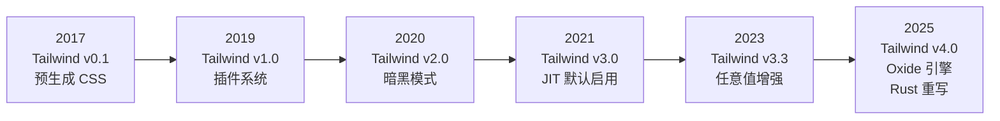
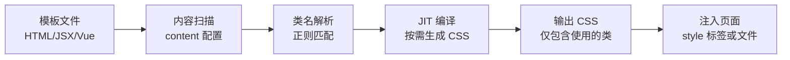
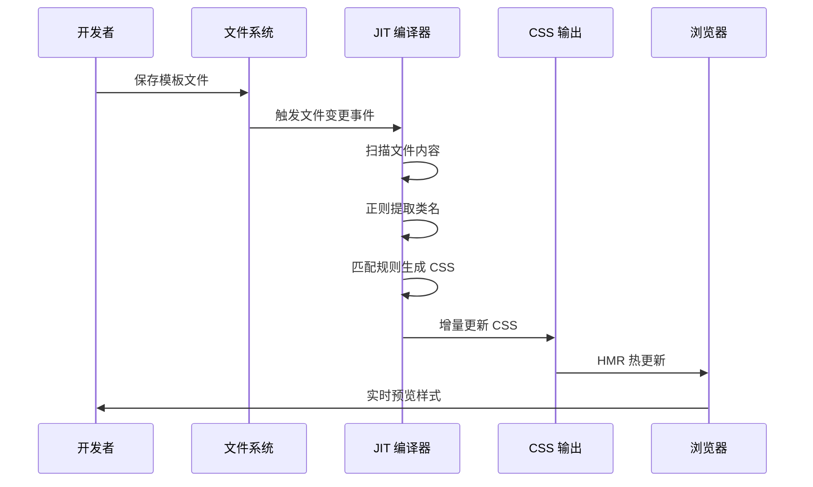

# Tailwind CSS

Tailwind CSS 是一个实用优先（Utility-First）的原子化 CSS 框架，通过组合预定义的原子类快速构建用户界面，无需编写自定义 CSS。自 2017 年由 Adam Wathan 创建以来，Tailwind CSS 已经成为现代前端开发中最受欢迎的样式解决方案之一，在 2024 年 State of CSS 调查中位列最受喜爱框架榜首。

## 背景与动机

### 传统 CSS 的困境

在传统的前端开发中，开发者面临以下 CSS 相关的挑战：

| 问题 | 描述 | 影响 |
|------|------|------|
| **命名困难** | 为 CSS 类名想出有意义的名称 | 开发效率低、命名不一致 |
| **样式耦合** | 修改一处样式可能影响其他组件 | 维护成本高、回归 Bug |
| **CSS 膨胀** | 随项目增长 CSS 文件不断增大 | 性能下降、加载缓慢 |
| **设计不一致** | 团队成员使用不同的颜色、间距值 | 视觉不统一、设计系统缺失 |
| **响应式复杂** | 需要编写大量媒体查询 | 代码冗长、难以维护 |

### Tailwind 的解决方案

Tailwind CSS 通过实用优先的理念，从根本上改变了 CSS 的编写方式：

```html
<!-- 传统方式：需要自定义 CSS 文件 -->
<button class="btn btn-primary">按钮</button>

<!-- Tailwind 方式：原子类组合 -->
<button class="px-4 py-2 bg-blue-500 text-white rounded hover:bg-blue-600">
  按钮
</button>
```

**核心理念**：不再创建抽象的类名（如 `.btn`），而是直接使用描述性的原子类来构建界面。每个类只做一件事，通过组合实现复杂的样式效果。

### 技术演进



## 核心概念

### 实用优先（Utility-First）

实用优先是一种 CSS 编写范式，强调使用低层次的原子类来构建界面，而非高层次的抽象类：

```html
<!-- 高层次抽象（传统方式） -->
<div class="card">
  <h2 class="card-title">标题</h2>
  <p class="card-text">内容</p>
</div>

<!-- 低层次原子类（Tailwind 方式） -->
<div class="bg-white rounded-lg shadow-md p-6">
  <h2 class="text-xl font-bold text-gray-900 mb-2">标题</h2>
  <p class="text-gray-600 leading-relaxed">内容</p>
</div>
```

### 原子化设计

每个 Tailwind 类对应单一的 CSS 属性或属性组合：

| 类名 | CSS 输出 | 类别 |
|------|---------|------|
| `px-4` | `padding-left: 1rem; padding-right: 1rem;` | 间距 |
| `bg-blue-500` | `background-color: #3b82f6;` | 颜色 |
| `text-lg` | `font-size: 1.125rem; line-height: 1.75rem;` | 排版 |
| `rounded-lg` | `border-radius: 0.5rem;` | 边框 |
| `shadow-md` | `box-shadow: 0 4px 6px -1px rgb(0 0 0 / 0.1);` | 效果 |
| `flex items-center` | `display: flex; align-items: center;` | 布局 |

### 工作流程



## 深入原理

### JIT 编译器原理

Tailwind CSS 3.0+ 默认启用 JIT（Just-In-Time）编译器，这是其核心创新之一。JIT 编译器在开发服务器运行时实时扫描模板文件并生成对应的 CSS：



**JIT 编译器的关键特性**：

1. **按需生成**：只为模板中实际使用的类生成 CSS
2. **任意值支持**：`bg-[#1da1f1]`、`w-[327px]` 等
3. **变体堆叠**：`md:hover:focus:bg-red-500`
4. **极快构建**：无论项目大小，编译耗时基本恒定（毫秒级）
5. **零配置**：无需维护 `purge` 列表

### Tailwind v4.0 Oxide 引擎

Tailwind CSS v4.0 引入了用 Rust 重写的 Oxide 引擎，带来了显著的性能提升：

| 指标 | v3.x | v4.0 | 提升 |
|------|------|------|------|
| 首次构建 | ~300ms | ~50ms | 6x |
| 增量更新 | ~15ms | ~2ms | 7.5x |
| CSS 输出体积 | ~10KB | ~8KB | 20% |
| 内存占用 | ~80MB | ~30MB | 62.5% |

> 注：上表为量级示意（非精确基准数据）。官方口径为：v4 引擎全量构建提速 5x 以上、增量构建最高可提速 100x 以上，具体因项目而异。

**v4.0 新特性**：
- 基于 Rust 的 Oxide 引擎
- 原生 CSS 嵌套支持
- 自动内容检测（无需配置 `content`）
- CSS-first 配置方式
- 更小的运行时开销

### 设计令牌系统

Tailwind 的设计令牌（Design Tokens）系统是其设计一致性的基础：

```
间距系统（基于 rem）
├── 0    → 0
├── 0.5  → 0.125rem (2px)
├── 1    → 0.25rem  (4px)
├── 2    → 0.5rem   (8px)
├── 4    → 1rem     (16px)
├── 8    → 2rem     (32px)
├── 16   → 4rem     (64px)
└── ...

颜色系统
├── slate   → 冷灰色系
├── gray    → 中性灰色系
├── zinc    → 暖灰色系
├── red     → 红色系（50-950）
├── blue    → 蓝色系（50-950）
├── green   → 绿色系（50-950）
└── ...
```

## 代码示例

### 安装与配置

```bash
# 使用 npm
npm install -D tailwindcss postcss autoprefixer

# 使用 pnpm
pnpm add -D tailwindcss postcss autoprefixer

# 初始化配置文件
npx tailwindcss init -p
```

```javascript
// tailwind.config.js
module.exports = {
  content: [
    './src/**/*.{js,jsx,ts,tsx}',
    './public/index.html',
  ],
  theme: {
    extend: {
      colors: {
        primary: {
          50: '#e7f1ff',
          100: '#cfe2ff',
          500: '#007bff',
          600: '#0056b3',
          700: '#004494',
        },
      },
      fontFamily: {
        sans: ['Inter', 'system-ui', 'sans-serif'],
      },
    },
  },
  plugins: [],
};
```

```css
/* src/index.css */
@tailwind base;
@tailwind components;
@tailwind utilities;
```

⚠️ **版本说明**：以上为 Tailwind v3.x 的安装与配置流程。Tailwind v4 起改用 CSS-first 配置：安装后只需在 CSS 入口写 `@import "tailwindcss";`，主题令牌通过 `@theme` 在 CSS 中定义，默认不再需要 `tailwind.config.js`（确需 JS 配置时可用 `@config` 引入）。本文后续的 `tailwind.config.js` 示例按 v3.x 语法讲解，概念在 v4 中同样适用。

### Vite + React 集成

```javascript
// vite.config.js
import { defineConfig } from 'vite';
import react from '@vitejs/plugin-react';

export default defineConfig({
  plugins: [react()],
  css: {
    postcss: {
      plugins: [
        require('tailwindcss'),
        require('autoprefixer'),
      ],
    },
  },
});
```

```jsx
// main.jsx
import React from 'react';
import ReactDOM from 'react-dom/client';
import './index.css';
import App from './App';

ReactDOM.createRoot(document.getElementById('root')).render(
  <React.StrictMode>
    <App />
  </React.StrictMode>
);
```

### Next.js 集成

```bash
npx create-next-app@latest my-project --typescript --tailwind --eslint
```

```css
/* app/globals.css */
@tailwind base;
@tailwind components;
@tailwind utilities;

@layer components {
  .btn-primary {
    @apply px-4 py-2 bg-blue-500 text-white rounded-md 
           hover:bg-blue-600 transition-colors duration-200
           focus:outline-none focus:ring-2 focus:ring-blue-500 focus:ring-offset-2;
  }
}
```

### 设计系统构建案例

以下是一个完整的设计系统配置，展示了如何用 Tailwind 构建企业级设计系统：

```javascript
// tailwind.config.js
const plugin = require('tailwindcss/plugin');

/** @type {import('tailwindcss').Config} */
module.exports = {
  content: ['./src/**/*.{js,jsx,ts,tsx}'],
  
  // 设计令牌定义
  theme: {
    // 覆盖默认值
    fontFamily: {
      sans: ['Inter', 'system-ui', '-apple-system', 'sans-serif'],
      mono: ['JetBrains Mono', 'Fira Code', 'monospace'],
    },
    
    // 扩展默认值
    extend: {
      // 品牌色
      colors: {
        brand: {
          50: '#eff6ff',
          100: '#dbeafe',
          200: '#bfdbfe',
          300: '#93c5fd',
          400: '#60a5fa',
          500: '#3b82f6',
          600: '#2563eb',
          700: '#1d4ed8',
          800: '#1e40af',
          900: '#1e3a8a',
          950: '#172554',
        },
        // 语义色
        success: { DEFAULT: '#10b981', light: '#d1fae5', dark: '#065f46' },
        warning: { DEFAULT: '#f59e0b', light: '#fef3c7', dark: '#92400e' },
        error: { DEFAULT: '#ef4444', light: '#fee2e2', dark: '#991b1b' },
        info: { DEFAULT: '#3b82f6', light: '#dbeafe', dark: '#1e40af' },
      },
      
      // 间距扩展
      spacing: {
        '18': '4.5rem',
        '88': '22rem',
        '128': '32rem',
      },
      
      // 圆角扩展
      borderRadius: {
        '2xl': '1rem',
        '3xl': '1.5rem',
      },
      
      // 阴影扩展
      boxShadow: {
        'inner-lg': 'inset 0 2px 4px 0 rgba(0, 0, 0, 0.06)',
        'glow': '0 0 15px rgba(59, 130, 246, 0.5)',
      },
      
      // 动画
      animation: {
        'fade-in': 'fadeIn 0.3s ease-in-out',
        'slide-up': 'slideUp 0.3s ease-out',
        'slide-down': 'slideDown 0.3s ease-out',
      },
      keyframes: {
        fadeIn: {
          '0%': { opacity: '0' },
          '100%': { opacity: '1' },
        },
        slideUp: {
          '0%': { transform: 'translateY(10px)', opacity: '0' },
          '100%': { transform: 'translateY(0)', opacity: '1' },
        },
        slideDown: {
          '0%': { transform: 'translateY(-10px)', opacity: '0' },
          '100%': { transform: 'translateY(0)', opacity: '1' },
        },
      },
    },
  },
  
  // 插件
  plugins: [
    require('@tailwindcss/typography'),
    require('@tailwindcss/forms'),
    require('@tailwindcss/aspect-ratio'),
  ],
};
```

### 自定义插件开发

#### 基础插件

```javascript
// tailwind.config.js
const plugin = require('tailwindcss/plugin');

module.exports = {
  plugins: [
    // 添加工具类
    plugin(function({ addUtilities, theme }) {
      addUtilities({
        '.text-shadow-sm': {
          'text-shadow': '1px 1px 2px rgba(0, 0, 0, 0.2)',
        },
        '.text-shadow': {
          'text-shadow': '2px 2px 4px rgba(0, 0, 0, 0.3)',
        },
        '.text-shadow-lg': {
          'text-shadow': '4px 4px 8px rgba(0, 0, 0, 0.4)',
        },
      });
    }),
    
    // 添加组件类
    plugin(function({ addComponents, theme }) {
      addComponents({
        '.card': {
          'background-color': theme('colors.white'),
          'border-radius': theme('borderRadius.lg'),
          'box-shadow': theme('boxShadow.md'),
          'padding': theme('spacing.6'),
          '&:hover': {
            'box-shadow': theme('boxShadow.lg'),
          },
        },
        '.btn': {
          'display': 'inline-flex',
          'align-items': 'center',
          'justify-content': 'center',
          'padding': `${theme('spacing.2')} ${theme('spacing.4')}`,
          'border-radius': theme('borderRadius.md'),
          'font-weight': '500',
          'transition-property': 'all',
          'transition-duration': '200ms',
          '&:focus-visible': {
            'outline': '2px solid',
            'outline-offset': '2px',
          },
        },
      });
    }),
    
    // 动态工具类
    plugin(function({ matchUtilities, theme }) {
      matchUtilities(
        {
          'text-shadow': (value) => ({
            'text-shadow': `0 0 ${value} rgba(0, 0, 0, 0.3)`,
          }),
        },
        { values: theme('spacing') }
      );
    }),
  ],
};
```

#### 带配置的插件

```javascript
// plugins/glass-morphism.js
const plugin = require('tailwindcss/plugin');

module.exports = plugin.withOptions(
  function(options = {}) {
    return function({ addUtilities, theme }) {
      const blurValues = options.blur || {
        sm: '4px',
        DEFAULT: '8px',
        md: '12px',
        lg: '16px',
        xl: '24px',
      };
      
      const utilities = {};
      
      Object.entries(blurValues).forEach(([key, value]) => {
        const suffix = key === 'DEFAULT' ? '' : `-${key}`;
        utilities[`.glass${suffix}`] = {
          'backdrop-filter': `blur(${value})`,
          'background-color': `rgba(255, 255, 255, ${options.opacity || 0.1})`,
          'border': '1px solid rgba(255, 255, 255, 0.2)',
        };
      });
      
      addUtilities(utilities);
    };
  },
  function(options = {}) {
    return {
      theme: {
        glassBlur: options.blur || {
          sm: '4px',
          DEFAULT: '8px',
          lg: '16px',
        },
      },
    };
  }
);

// 使用
// tailwind.config.js
// plugins: [require('./plugins/glass-morphism')({ opacity: 0.15 })]
```

### 团队规范建议

#### 1. 类名排序规范

使用 `prettier-plugin-tailwindcss` 自动排序：

```bash
npm install -D prettier-plugin-tailwindcss
```

```json
// .prettierrc
{
  "plugins": ["prettier-plugin-tailwindcss"],
  "tailwindConfig": "./tailwind.config.js"
}
```

排序规则：
1. 布局（display, position, flex, grid）
2. 盒模型（padding, margin, width, height）
3. 视觉（background, color, border, shadow）
4. 排版（font, text, line-height）
5. 交互（cursor, transition, animation）
6. 响应式前缀（sm:, md:, lg:）
7. 状态变体（hover:, focus:, active:）

#### 2. 组件抽象规范

```jsx
// ✅ 推荐：使用 clsx/tailwind-merge 管理类名
import { clsx } from 'clsx';
import { twMerge } from 'tailwind-merge';

function cn(...inputs) {
  return twMerge(clsx(inputs));
}

// Button 组件
export function Button({ 
  variant = 'primary',
  size = 'medium',
  className,
  children,
  ...props
}) {
  return (
    <button
      className={cn(
        // 基础样式
        'inline-flex items-center justify-center font-medium',
        'transition-colors duration-200',
        'focus-visible:outline-none focus-visible:ring-2 focus-visible:ring-offset-2',
        'disabled:pointer-events-none disabled:opacity-50',
        
        // 变体
        {
          'bg-brand-600 text-white hover:bg-brand-700 focus-visible:ring-brand-500': variant === 'primary',
          'bg-gray-100 text-gray-900 hover:bg-gray-200 focus-visible:ring-gray-500': variant === 'secondary',
          'border border-gray-300 bg-transparent hover:bg-gray-50': variant === 'outline',
        },
        
        // 尺寸
        {
          'h-8 px-3 text-sm rounded-md': size === 'small',
          'h-10 px-4 text-base rounded-md': size === 'medium',
          'h-12 px-6 text-lg rounded-lg': size === 'large',
        },
        
        // 外部传入的类名（优先级最高）
        className
      )}
      {...props}
    >
      {children}
    </button>
  );
}
```

#### 3. 响应式设计规范

```jsx
// ✅ 移动优先设计
<div className="
  grid grid-cols-1      /* 移动端：单列 */
  sm:grid-cols-2        /* ≥640px：双列 */
  lg:grid-cols-3        /* ≥1024px：三列 */
  xl:grid-cols-4        /* ≥1280px：四列 */
  gap-4 sm:gap-6        /* 间距响应式 */
">
```

#### 4. 暗黑模式规范

```javascript
// tailwind.config.js
module.exports = {
  darkMode: 'class',  // 推荐：使用 class 策略
};
```

```jsx
// 主题切换组件
function ThemeToggle() {
  const [dark, setDark] = useState(false);
  
  useEffect(() => {
    if (dark) {
      document.documentElement.classList.add('dark');
    } else {
      document.documentElement.classList.remove('dark');
    }
  }, [dark]);
  
  return (
    <button onClick={() => setDark(!dark)}>
      {dark ? '☀️' : '🌙'}
    </button>
  );
}

// 使用暗黑模式
<div className="bg-white dark:bg-gray-900">
  <h1 className="text-gray-900 dark:text-white">标题</h1>
  <p className="text-gray-600 dark:text-gray-400">内容</p>
</div>
```

## 最佳实践

### 1. 合理使用 @apply

```css
/* ✅ 推荐：仅用于真正需要复用的样式 */
@layer components {
  .btn-primary {
    @apply inline-flex items-center justify-center px-4 py-2 
           bg-brand-600 text-white font-medium rounded-md
           hover:bg-brand-700 transition-colors duration-200
           focus-visible:outline-none focus-visible:ring-2 
           focus-visible:ring-brand-500 focus-visible:ring-offset-2;
  }
}

/* ❌ 避免：过度使用 @apply 失去原子化优势 */
.card-header {
  @apply flex items-center justify-between p-4 border-b border-gray-200;
}
.card-body {
  @apply p-4;
}
```

### 2. 使用 @layer 管理样式层级

```css
@tailwind base;
@tailwind components;
@tailwind utilities;

/* 基础层：重置样式、全局样式 */
@layer base {
  html {
    font-family: 'Inter', system-ui, sans-serif;
  }
  
  body {
    @apply bg-gray-50 text-gray-900 antialiased;
  }
}

/* 组件层：可复用组件样式 */
@layer components {
  .card {
    @apply bg-white rounded-lg shadow-md p-6;
  }
  
  .btn {
    @apply inline-flex items-center justify-center 
           px-4 py-2 rounded-md font-medium
           transition-colors duration-200;
  }
}

/* 工具层：自定义工具类 */
@layer utilities {
  .text-balance {
    text-wrap: balance;
  }
  
  .scrollbar-hide {
    -ms-overflow-style: none;
    scrollbar-width: none;
    &::-webkit-scrollbar {
      display: none;
    }
  }
}
```

### 3. 性能优化

```javascript
// tailwind.config.js
module.exports = {
  // 精确指定内容扫描路径
  content: [
    './src/**/*.{html,js,jsx,ts,tsx}',
    // ❌ 避免过于宽泛
    // './**/*.{html,js}',
    // './node_modules/**/*.{js}',
  ],
  
  // 禁用不需要的核心插件（减少输出体积）
  corePlugins: {
    // 如果不使用 float 布局
    // float: false,
    // clear: false,
  },
};
```

## 常见问题

### 1. 类名过长如何处理？

```jsx
// 方案一：组件抽象（推荐）
function Button({ variant = 'primary', size = 'md', className, children }) {
  return (
    <button className={cn(
      'inline-flex items-center justify-center font-medium transition-colors',
      variants[variant], sizes[size], className
    )}>
      {children}
    </button>
  );
}

// 方案二：@apply 抽取（适度使用）
@layer components {
  .btn-primary { @apply bg-blue-500 text-white px-4 py-2 rounded; }
}

// 方案三：使用 clsx 组合
import clsx from 'clsx';
<button className={clsx('px-4 py-2', isActive && 'bg-blue-500')}>
```

### 2. 如何与 CSS Modules 共存？

```jsx
import styles from './Component.module.css';

function Component() {
  return (
    <div className="flex items-center p-4">
      {/* Tailwind 类 */}
      <h1 className="text-xl font-bold">标题</h1>
      
      {/* CSS Modules 类（复杂样式） */}
      <div className={styles.complexAnimation}>
        {/* 复杂动画用 CSS Modules */}
      </div>
    </div>
  );
}
```

### 3. 如何处理动态类名？

```jsx
// ❌ 错误：动态拼接类名不会被 JIT 识别
<div className={`bg-${color}-500`}>

// ✅ 正确：使用映射对象
const bgColors = {
  red: 'bg-red-500',
  blue: 'bg-blue-500',
  green: 'bg-green-500',
};
<div className={bgColors[color]}>

// ✅ 正确：使用 safelist（不得已时）
// tailwind.config.js
module.exports = {
  content: {
    safelist: [
      { pattern: /bg-(red|blue|green)-500/ },
    ],
  },
};
```

### 4. 如何调试样式？

```html
<!-- 方法一：使用调试边框 -->
<div class="border-2 border-red-500">调试区域</div>

<!-- 方法二：安装 Tailwind CSS DevTools 浏览器扩展 -->

<!-- 方法三：使用任意值快速调试 -->
<div class="bg-[rgba(255,0,0,0.3)]">半透明红色背景</div>
```

### 5. Tailwind 与 UnoCSS 如何选择？

| 维度 | Tailwind CSS | UnoCSS |
|------|-------------|--------|
| 构建速度 | 快 | 更快（5x+） |
| 生态成熟度 | 非常成熟 | 快速增长 |
| 社区规模 | 庞大 | 中等 |
| 文档质量 | 优秀 | 良好 |
| 灵活性 | 配置驱动 | 规则引擎驱动 |
| 图标支持 | 需要插件 | 内置支持 |
| 属性化模式 | 不支持 | 支持 |
| 学习资源 | 丰富 | 较少 |

## 参考资源

### 官方资源
- [Tailwind CSS 官方文档](https://tailwindcss.com/docs)
- [Tailwind Plus 组件库](https://tailwindcss.com/plus)（原 Tailwind UI）
- [Tailwind Play 在线演练](https://play.tailwindcss.com/)
- [Tailwind Blog](https://tailwindcss.com/blog)

### 生态工具
- [prettier-plugin-tailwindcss](https://github.com/tailwindlabs/prettier-plugin-tailwindcss) - 类名自动排序
- [tailwind-merge](https://github.com/dcastil/tailwind-merge) - 智能类名合并
- [clsx](https://github.com/lukeed/clsx) - 条件类名组合
- [cva](https://cva.style/) - 类变体管理（class variance authority）
- [headlessui](https://headlessui.com/) - 无样式组件库
- [daisyUI](https://daisyui.com/) - Tailwind 组件库

### 延伸阅读
- [CSS Modules 指南](01-CSS%20Modules.md) - 编译时样式隔离方案
- [CSS-in-JS 指南](02-CSS-in-JS.md) - 运行时与编译时样式方案
- [CSS 框架对比](04-CSS框架对比.md) - 全面的技术选型指南
