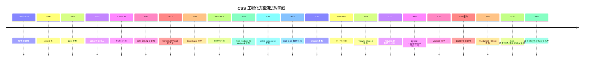
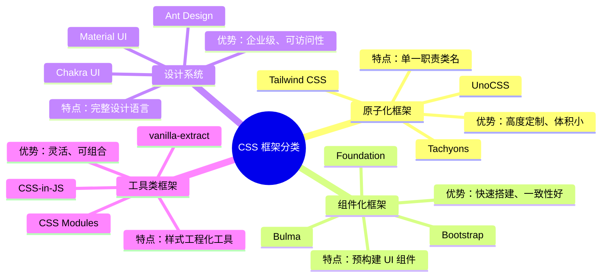
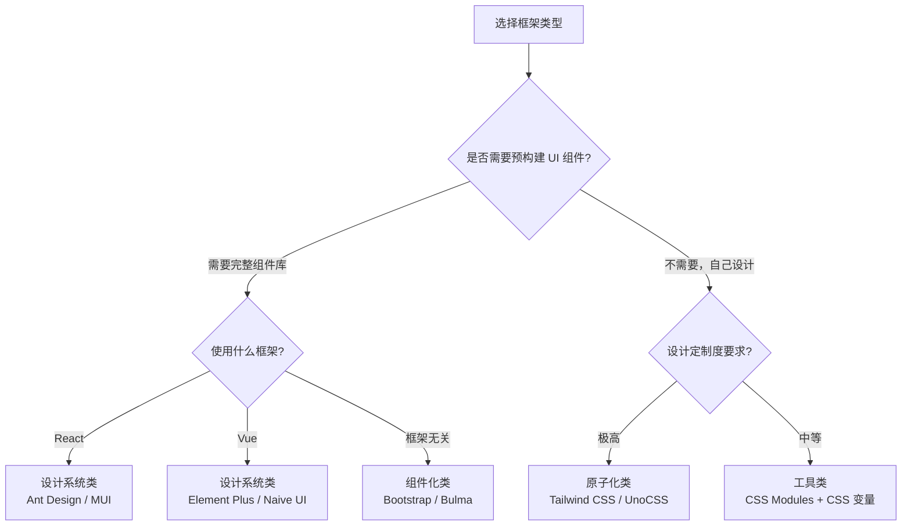
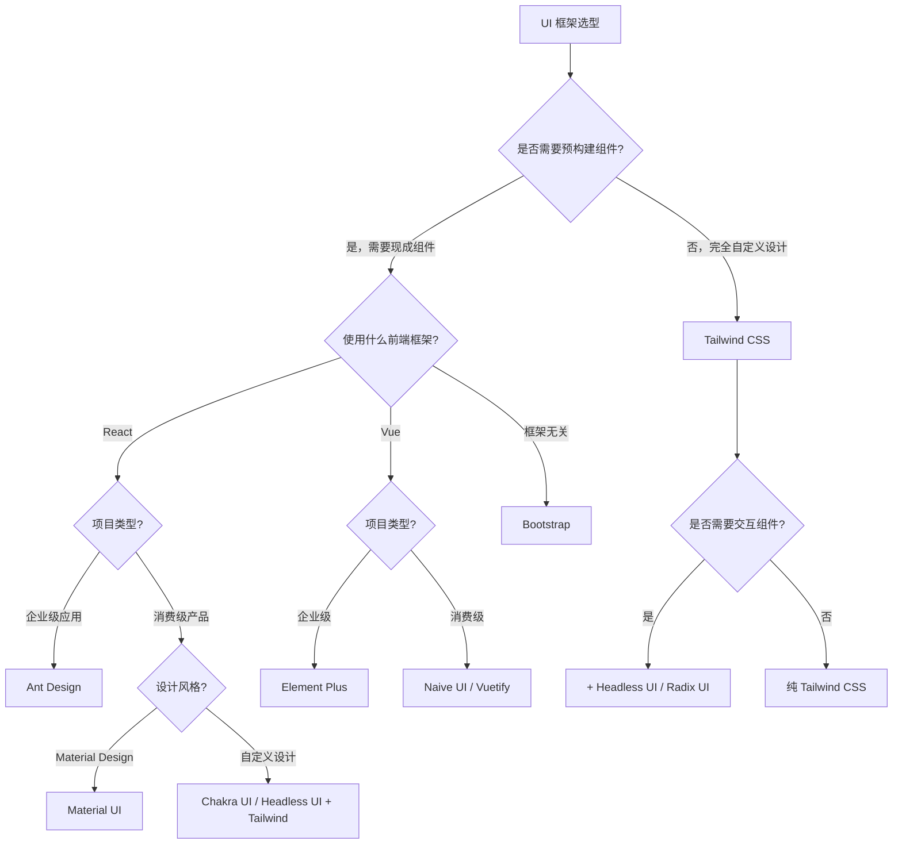
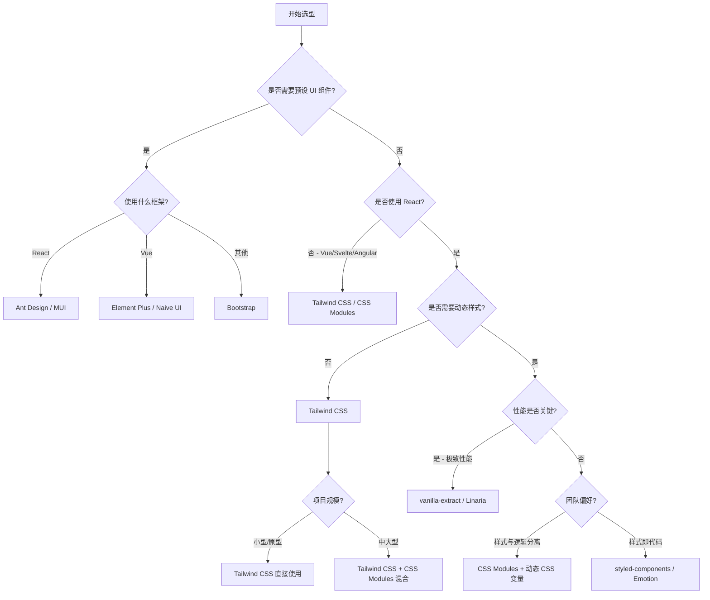
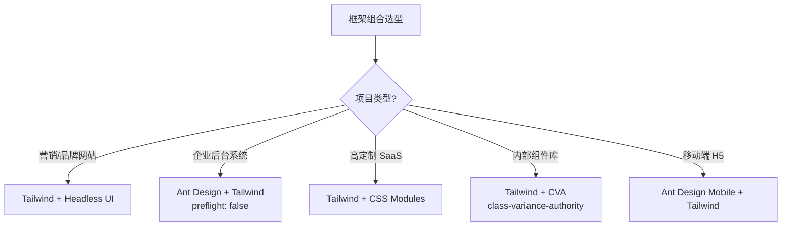
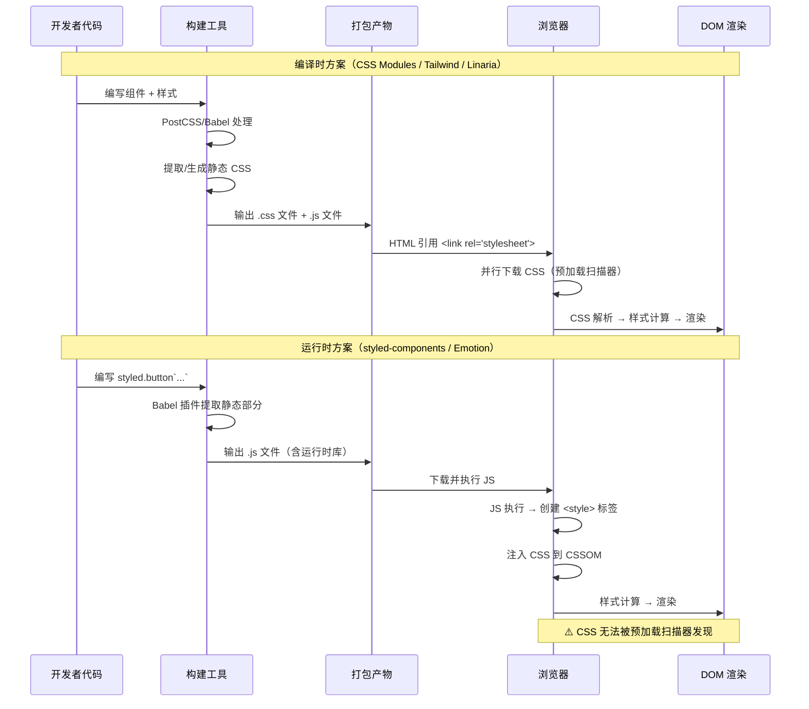

# CSS 框架对比与选型指南

## 背景与动机

### 传统 CSS 的痛点

CSS 作为 Web 表现层的基石语言，自诞生以来经历了从简单样式描述到复杂应用架构的演进。在大型前端工程化实践中，传统 CSS 暴露出一系列结构性问题：

**1. 全局作用域污染**

CSS 的全局作用域特性是其最根本的设计缺陷。任何选择器匹配的 DOM 元素都会受到样式影响，这意味着在多人协作的大型项目中，样式冲突成为不可避免的问题。一个 `.btn` 类名可能在导航栏、弹窗、表单中各自需要不同的样式表现，但全局作用域下只能存在一份定义。

**2. 依赖隐式管理**

CSS 的层叠规则（Cascading）使得样式的最终表现依赖于加载顺序、选择器优先级（Specificity）和继承链。开发者很难直观判断修改某条规则会产生什么影响，这种隐式依赖关系在代码量增长后变得不可维护。

**3. 死代码难以清理**

随着项目迭代，大量不再使用的 CSS 规则残留在代码库中。由于缺乏静态分析手段（CSS 类名可以被动态拼接），传统工具很难准确识别哪些样式是"死代码"。

**4. 样式复用困难**

CSS 原生不支持变量（CSS Custom Properties 直到 2017 年才获得广泛支持）、嵌套、混入（Mixin）等编程语言的基本特性，导致样式复用只能通过预处理器（Sass/Less）间接实现。

### 现代 CSS 方案的演进历程

为解决上述问题，前端社区在过去十余年间发展出多代 CSS 工程化方案：



每一代方案都在解决上一代遗留的问题，同时也引入了新的挑战。理解这些方案的底层原理，是做出正确技术选型的前提。

## 核心概念

### CSS 框架的分类体系

现代 CSS 框架可以从多个维度进行分类，理解这些分类有助于在选型时快速缩小范围。

#### 按设计理念分类



#### 四类框架详细对比

| 分类 | 核心理念 | 代表方案 | 适用场景 | 学习成本 | 定制度 |
|------|---------|---------|---------|---------|--------|
| **原子化** | 每个类名对应一条 CSS 规则 | Tailwind CSS、UnoCSS | 高度定制的设计 | 中 | ⭐⭐⭐⭐⭐ |
| **组件化** | 预构建完整的 UI 组件 | Bootstrap、Bulma | 快速原型、后台系统 | 低 | ⭐⭐⭐ |
| **设计系统** | 统一设计语言 + 组件库 | Ant Design、MUI | 企业级应用 | 中高 | ⭐⭐⭐⭐ |
| **工具类** | 样式工程化基础设施 | CSS Modules、vanilla-extract | 自定义架构 | 中 | ⭐⭐⭐⭐⭐ |

#### 分类选择决策



### 主流 UI 框架多维度对比

以下从多个关键维度对比四大主流 UI 框架/设计系统，帮助团队做出科学选型。

#### Tailwind CSS vs Bootstrap vs Ant Design vs Material UI

| 维度 | Tailwind CSS | Bootstrap | Ant Design | Material UI |
|------|-------------|-----------|------------|-------------|
| **类型** | 原子化 CSS 框架 | 组件化 CSS 框架 | React 设计系统 | React 设计系统 |
| **框架绑定** | 无 | 无 | React | React |
| **设计语言** | 无预设（完全自定义） | Bootstrap 风格 | Ant Design 语言 | Material Design |
| **CSS 体积（gzip）** | ~10KB（按需） | ~22KB（全量） | ~80KB（含组件） | ~85KB（含组件） |
| **JS 体积（gzip）** | 0 KB | ~15KB（含 Popper） | ~300KB | ~350KB |
| **主题定制** | tailwind.config.js | Sass 变量覆盖 | ConfigProvider + Token | MUI Theme + sx prop |
| **暗色模式** | 内置 `dark:` 变体 | 需手动实现 | 内置 ConfigProvider | 内置 ThemeProvider |
| **响应式** | 内置 `sm:/md:/lg:` | 内置栅格系统 | 内置 Grid/Row/Col | 内置 Grid/Breakpoints |
| **TypeScript** | ✅ IDE 插件支持 | ❌ 纯 CSS | ✅ 原生 TS 编写 | ✅ 原生 TS 编写 |
| **可访问性** | 需手动处理 | 部分组件支持 | ✅ 完善的 a11y | ✅ 完善的 a11y |
| **国际化和本地化** | 不涉及 | 不涉及 | ✅ 内置 i18n | ✅ 内置 i18n |
| **组件数量** | 0（纯工具类） | ~20 个 | ~60 个 | ~50 个 |
| **表单方案** | 无（需自行集成） | 基础表单样式 | Form 组件 + 校验 | React Hook Form 集成 |
| **企业级特性** | 无 | 无 | Pro Components、权限 | 无（需自行搭建） |
| **社区规模** | ⭐⭐⭐⭐⭐ | ⭐⭐⭐⭐⭐ | ⭐⭐⭐⭐⭐ | ⭐⭐⭐⭐⭐ |
| **npm 周下载** | ~8M | ~4M | ~3M | ~4M |

#### 选型场景匹配

| 项目场景 | 首选方案 | 理由 |
|---------|---------|------|
| **营销官网** | Tailwind CSS | 高度定制设计、性能优先、SEO 友好 |
| **企业后台** | Ant Design | 完整组件库、表单方案、权限管理 |
| **数据仪表盘** | Ant Design / MUI | 表格、图表、表单组件丰富 |
| **移动端 H5** | Ant Design Mobile | 专为移动端设计的组件库 |
| **内容网站** | Bootstrap | 快速搭建、响应式内置 |
| **设计系统** | Tailwind CSS + Headless UI | 完全自定义设计语言 |
| **开源项目** | Tailwind CSS | 无框架绑定、体积小 |
| **内部工具** | Ant Design / MUI | 开发效率最高 |

#### 选型决策树



### CSS 方案的分类体系

现代 CSS 解决方案可以从三个正交维度进行分类：

#### 维度一：编译时 vs 运行时

这是区分 CSS 方案最根本的维度，决定了样式的处理时机和性能特征。

| 特征 | 编译时方案 | 运行时方案 |
|------|-----------|-----------|
| 处理时机 | 构建阶段（Webpack/Vite 打包时） | 浏览器执行阶段 |
| 输出产物 | 静态 CSS 文件 | JavaScript 代码 + 动态 CSSOM 操作 |
| 性能开销 | 零运行时开销 | 需要运行时库支持 |
| 动态能力 | 受限（需预定义变量） | 灵活（可基于 JS 状态生成） |
| 代表方案 | CSS Modules、Tailwind CSS、Linaria、vanilla-extract | styled-components、Emotion |

#### 维度二：原子化 vs 语义化

| 特征 | 原子化方案 | 语义化方案 |
|------|-----------|-----------|
| 类名含义 | 单一 CSS 属性（如 `flex`、`p-4`） | 描述组件语义（如 `.product-card`） |
| 复用方式 | 组合多个原子类 | 继承/混入样式块 |
| HTML 可读性 | 较低（类名长且多） | 较高（语义化类名） |
| CSS 体积 | 极小（固定集合，按需生成） | 随项目增长线性增长 |
| 代表方案 | Tailwind CSS、UnoCSS、Tachyons | CSS Modules、BEM、styled-components |

#### 维度三：局部作用域 vs 全局作用域

| 特征 | 局部作用域 | 全局作用域 |
|------|-----------|-----------|
| 隔离机制 | 编译时类名哈希 / CSS-in-JS 自动前缀 | 依赖命名约定 |
| 冲突风险 | 极低 | 高 |
| 全局样式 | 需显式声明 | 默认全局 |
| 代表方案 | CSS Modules、styled-components、Shadow DOM | 原生 CSS、BEM、Bootstrap |

### 方案全景图

```
CSS 解决方案分类体系
├── 编译时方案
│   ├── 原子化
│   │   ├── Tailwind CSS（JIT 按需生成）
│   │   ├── UnoCSS（即时按需引擎）
│   │   └── Tachyons（预定义原子类）
│   ├── 模块化
│   │   ├── CSS Modules（类名哈希隔离）
│   │   └── vanilla-extract（类型安全原子类）
│   └── 零运行时 CSS-in-JS
│       ├── Linaria（Babel 提取）
│       ├── StyleX（Meta 开源）
│       └── Panda CSS（编译时原子化）
├── 运行时方案
│   ├── styled-components（标签模板字符串）
│   ├── Emotion（css prop + 对象语法）
│   └── Radium（内联样式增强）
└── 传统方案
    ├── 原生 CSS / Sass / Less
    ├── BEM 命名规范
    └── Bootstrap / Bulma（UI 框架）
```

## 深入原理

### 编译原理对比

#### CSS Modules 的编译流程

CSS Modules 依赖构建工具（通常是 Webpack 的 `css-loader` 或 Vite 的内置支持）在编译阶段对类名进行哈希转换。其核心处理流程如下：

```
源文件: Button.module.css
    ↓
[1] PostCSS 解析为 AST
    ↓
[2] css-loader 遍历 AST 中的类选择器
    ↓
[3] 生成哈希类名: .button → ._3x8Kq_button
    ↓
[4] 导出映射对象: { button: '_3x8Kq_button' }
    ↓
[5] 输出: 转换后的 CSS 文件 + JS 映射模块
```

关键实现细节：

```javascript
// Webpack css-loader 内部简化逻辑
function localizeSelector(selector, localIdentName) {
  // localIdentName 默认: [hash:base64]
  // 生成规则: [path][name]__[local]--[hash:base64:5]
  return selector.replace(/\.([\w-]+)/g, (match, className) => {
    const hash = generateHash(filePath + className);
    return `.${className}_${hash}`;
  });
}
```

CSS Modules 的哈希算法采用 `xxhash` 或 `md5`，确保在大型项目中的碰撞概率极低。生成的类名格式可通过 `localIdentName` 配置，开发环境使用可读格式（如 `[name]__[local]`），生产环境使用纯哈希。

#### Tailwind CSS 的 JIT 编译原理

Tailwind CSS v3.0+ 采用即时编译（Just-In-Time）模式，其核心是一个基于正则表达式和 AST 分析的类名扫描引擎：

```
源代码扫描阶段:
    ↓
[1] 扫描 content 配置指定的文件（.html/.tsx/.vue 等）
    ↓
[2] 使用正则匹配候选类名: /[\w-:.]+(?:\\.[\w-:]+)*/g
    ↓
[3] 候选类名与预定义规则库匹配
    ↓
[4] 生成对应 CSS 声明块
    ↓
[5] 去重、排序、输出最终 CSS
```

Tailwind 的规则匹配采用分层优先级策略：

```javascript
// Tailwind 内部规则匹配简化
const rules = [
  // 基础工具类
  { pattern: /^flex$/, generate: () => ({ display: 'flex' }) },
  { pattern: /^p-(\d+)$/, generate: (m) => ({ padding: `${m[1] * 0.25}rem` }) },
  { pattern: /^bg-(.+)$/, generate: (m) => ({ 'background-color': resolveColor(m[1]) }) },
  // 变体处理
  { pattern: /^hover:(.+)$/, generate: (m, ctx) => wrapPseudo('hover', matchRule(m[1], ctx)) },
  { pattern: /^md:(.+)$/, generate: (m, ctx) => wrapMedia('md', matchRule(m[1], ctx)) },
];
```

Tailwind 的 JIT 编译器监听文件变化事件，采用增量编译策略——只重新处理变更文件中的类名，避免全量重编译。在典型项目中，增量编译耗时在 10-50ms 范围内。

#### CSS-in-JS 运行时方案的编译原理

styled-components 和 Emotion 使用 Babel 插件在编译阶段提取静态样式，运行时仅处理动态部分：

```
编译阶段（Babel 插件）:
    ↓
[1] 解析 tagged template literal: styled.button`...`
    ↓
[2] 提取静态 CSS 字符串
    ↓
[3] 生成组件 ID 哈希
    ↓
[4] 保留动态插值表达式

运行时阶段:
    ↓
[1] 组件挂载 → 计算动态插值
    ↓
[2] 组装完整 CSS 字符串
    ↓
[3] 通过 stylis 预处理（自动添加厂商前缀）
    ↓
[4] 插入 <style> 标签到 <head>
    ↓
[5] 将生成的类名绑定到组件
```

#### Linaria 的零运行时提取原理

Linaria 代表了 CSS-in-JS 的编译时方向，其核心创新是在 Babel 编译阶段将 CSS-in-JS 代码完全提取为静态 CSS 文件：

```javascript
// 源代码
const Button = styled.button`
  color: ${props => props.primary ? 'blue' : 'gray'};
  padding: 8px 16px;
`;

// Linaria 编译后输出:
// 1. 静态 CSS 文件
// .Button_abc123 { color: var(--_abc123_color); padding: 8px 16px; }

// 2. JS 文件（无运行时依赖）
const Button = React.forwardRef((props, ref) => {
  const style = { '--_abc123_color': props.primary ? 'blue' : 'gray' };
  return <button ref={ref} className="Button_abc123" style={style} />;
});
```

Linaria 通过 Babel AST 分析，识别出哪些插值是静态可求值的（如常量、纯函数调用），哪些依赖运行时 props。对于后者，生成 CSS Custom Properties 作为桥接。

### 运行时机制分析

#### 样式注入机制对比

| 方案 | 注入方式 | 注入时机 | 性能影响 |
|------|---------|---------|---------|
| **CSS Modules** | `<link>` 标签引入静态 CSS | HTML 解析时 | 无额外开销 |
| **Tailwind CSS** | `<link>` 标签引入静态 CSS | HTML 解析时 | 无额外开销 |
| **styled-components** | `<style>` 标签动态插入 | 组件首次渲染时 | 阻塞渲染（同步插入） |
| **Emotion** | `<style>` 标签动态插入 | 组件首次渲染时 | 阻塞渲染（同步插入） |
| **Linaria** | `<link>` 标签引入静态 CSS | HTML 解析时 | 无额外开销 |

styled-components 的样式注入核心代码：

```javascript
// styled-components 内部简化
function injectStyles(componentId, css) {
  // 1. 检查是否已注入（缓存）
  if (styleSheet.has(componentId)) return;
  
  // 2. 通过 stylis 处理（嵌套展开、前缀添加）
  const processedCSS = stylis.compile(css);
  
  // 3. 创建 <style> 标签并插入
  const styleEl = document.createElement('style');
  styleEl.setAttribute('data-styled', componentId);
  styleEl.textContent = processedCSS;
  document.head.appendChild(styleEl);
  
  // 4. 记录到 Sheet 管理器
  styleSheet.set(componentId, styleEl);
}
```

#### 动态类名生成机制

运行时 CSS-in-JS 方案的类名生成采用"组件名 + 哈希"策略：

```javascript
// styled-components 类名生成
const generateId = (name) => {
  // 格式: sc-<ComponentName>-<hash>
  // hash 基于组件定义内容生成
  return `sc-${name}-${murmurhash3(content)}`;
};

// Emotion 类名生成
const generateClassName = (styles) => {
  // 格式: css-<hash>
  // hash 基于 CSS 内容生成（相同样式相同哈希 → 自动去重）
  return `css-${hashString(serialize(styles))}`;
};
```

### 性能特征对比

#### 构建时间基准测试

以下为各方案构建开销的量级示意（非实测数据，仅供参考）：

| 方案 | 首次构建 | 增量构建 | 样式处理占比 |
|------|---------|---------|------------|
| **原生 CSS** | 2.1s | 0.3s | 5% |
| **CSS Modules** | 2.8s | 0.5s | 12% |
| **Tailwind CSS** | 3.2s | 0.4s | 18% |
| **UnoCSS** | 2.5s | 0.2s | 8% |
| **Linaria** | 4.5s | 0.8s | 25% |
| **styled-components** | 3.8s | 0.6s | 15% |
| **vanilla-extract** | 4.2s | 0.7s | 22% |

> 数据来源：综合各框架官方基准测试及社区测试报告，实际数据因项目结构和硬件配置而异。

#### 运行时性能开销

| 方案 | 运行时库体积 | 首次渲染开销 | 样式更新开销 | 内存占用 |
|------|------------|------------|------------|---------|
| **原生 CSS** | 0 KB | 基准 | 基准 | 基准 |
| **CSS Modules** | 0 KB | +2ms | +1ms | +0.5MB |
| **Tailwind CSS** | 0 KB | +3ms | +2ms | +1MB |
| **UnoCSS** | 0 KB | +2ms | +1ms | +0.5MB |
| **Linaria** | ~2 KB | +3ms | +2ms | +1MB |
| **vanilla-extract** | ~3 KB | +3ms | +2ms | +1MB |
| **styled-components** | ~16 KB | +25ms | +15ms | +5MB |
| **Emotion** | ~9 KB | +18ms | +10ms | +3MB |

> 注：以上为量级示意，非精确基准数据，实际因设备与应用规模而异。

#### 包体积影响（gzip 后）

| 方案 | 运行时库 | 工具库 | 样式文件 | 总计 |
|------|---------|--------|---------|------|
| **原生 CSS** | 0 KB | 0 KB | ~20 KB | ~20 KB |
| **CSS Modules** | 0 KB | 0 KB | ~22 KB | ~22 KB |
| **Tailwind CSS** | 0 KB | 0 KB | ~10 KB | ~10 KB |
| **UnoCSS** | 0 KB | 0 KB | ~8 KB | ~8 KB |
| **Linaria** | ~2 KB | 0 KB | ~22 KB | ~24 KB |
| **vanilla-extract** | ~3 KB | 0 KB | ~20 KB | ~23 KB |
| **styled-components** | ~16 KB | 0 KB | ~25 KB | ~41 KB |
| **Emotion** | ~9 KB | ~2 KB | ~25 KB | ~36 KB |

#### 性能特征雷达图（综合评分 1-10）

| 维度 | 原生 CSS | CSS Modules | Tailwind CSS | styled-components | Emotion | Linaria |
|------|---------|------------|-------------|-------------------|---------|---------|
| **构建速度** | 10 | 8 | 7 | 6 | 6 | 5 |
| **运行时性能** | 10 | 10 | 10 | 5 | 6 | 9 |
| **包体积** | 10 | 9 | 10 | 4 | 5 | 8 |
| **开发体验** | 4 | 7 | 8 | 9 | 9 | 7 |
| **类型安全** | 2 | 6 | 7 | 8 | 8 | 10 |
| **动态样式** | 2 | 5 | 6 | 10 | 10 | 7 |
| **学习曲线** | 10 | 8 | 6 | 6 | 6 | 5 |
| **SSR 友好** | 10 | 10 | 9 | 5 | 6 | 9 |

### 浏览器渲染差异

不同 CSS 方案对浏览器渲染管线的影响存在显著差异：

**CSS 解析阶段**

- 静态 CSS 文件（CSS Modules / Tailwind）：浏览器在解析 HTML 时并行下载和解析 CSS，利用浏览器原生 CSS 解析器，性能最优。
- 动态注入 CSS（styled-components / Emotion）：JavaScript 执行后动态创建 `<style>` 标签，触发额外的 CSS 解析，且无法利用浏览器的预加载扫描器（Preload Scanner）。

**样式计算阶段**

- 原子化方案（Tailwind / UnoCSS）：由于类名数量固定且 CSS 规则简短，浏览器的样式匹配引擎可以高效处理。但大量类名组合可能导致选择器匹配次数增加。
- 语义化方案（CSS Modules / styled-components）：选择器数量少但复杂度可能较高（嵌套层级深），样式计算开销取决于选择器复杂度。

**重排重绘影响**

运行时方案在动态更新样式时，由于通过 JavaScript 操作 CSSOM，可能触发额外的样式重计算。特别是在高频更新场景（如拖拽、动画）下，运行时 CSS-in-JS 方案的 JavaScript 执行开销与浏览器的样式重计算叠加，可能导致帧率下降。

## 代码示例：同一组件的四种方案实现

以一个 React 按钮组件为例，展示四种主流方案的实现差异：

### 方案一：CSS Modules

```tsx
// Button.module.css
.button {
  padding: 8px 16px;
  border-radius: 6px;
  font-weight: 500;
  font-size: 14px;
  border: none;
  cursor: pointer;
  transition: all 0.2s ease;
}

.primary {
  background-color: #3b82f6;
  color: white;
}

.primary:hover {
  background-color: #2563eb;
}

.secondary {
  background-color: #6b7280;
  color: white;
}

.secondary:hover {
  background-color: #4b5563;
}

.disabled {
  opacity: 0.5;
  cursor: not-allowed;
}
```

```tsx
// Button.tsx
import styles from './Button.module.css';

interface ButtonProps {
  variant?: 'primary' | 'secondary';
  disabled?: boolean;
  children: React.ReactNode;
  onClick?: () => void;
}

export function Button({ variant = 'primary', disabled = false, children, onClick }: ButtonProps) {
  const className = [
    styles.button,
    styles[variant],
    disabled ? styles.disabled : '',
  ].filter(Boolean).join(' ');

  return (
    <button className={className} disabled={disabled} onClick={onClick}>
      {children}
    </button>
  );
}
```

### 方案二：Tailwind CSS

```tsx
// Button.tsx（无需额外 CSS 文件）
interface ButtonProps {
  variant?: 'primary' | 'secondary';
  disabled?: boolean;
  children: React.ReactNode;
  onClick?: () => void;
}

const variantClasses = {
  primary: 'bg-blue-500 hover:bg-blue-600',
  secondary: 'bg-gray-500 hover:bg-gray-600',
};

export function Button({ variant = 'primary', disabled = false, children, onClick }: ButtonProps) {
  return (
    <button
      className={[
        'px-4 py-2 rounded-md font-medium text-sm text-white',
        'transition-all duration-200 cursor-pointer',
        variantClasses[variant],
        disabled ? 'opacity-50 cursor-not-allowed' : '',
      ].filter(Boolean).join(' ')}
      disabled={disabled}
      onClick={onClick}
    >
      {children}
    </button>
  );
}
```

### 方案三：styled-components

```tsx
// Button.tsx
import styled, { css } from 'styled-components';

interface ButtonProps {
  variant?: 'primary' | 'secondary';
  disabled?: boolean;
  children: React.ReactNode;
  onClick?: () => void;
}

const variantStyles = {
  primary: css`
    background-color: #3b82f6;
    &:hover { background-color: #2563eb; }
  `,
  secondary: css`
    background-color: #6b7280;
    &:hover { background-color: #4b5563; }
  `,
};

const StyledButton = styled.button<ButtonProps>`
  padding: 8px 16px;
  border-radius: 6px;
  font-weight: 500;
  font-size: 14px;
  border: none;
  color: white;
  cursor: pointer;
  transition: all 0.2s ease;

  ${props => props.variant && variantStyles[props.variant]}
  
  ${props => props.disabled && css`
    opacity: 0.5;
    cursor: not-allowed;
  `}
`;

export function Button({ variant = 'primary', disabled = false, children, onClick }: ButtonProps) {
  return (
    <StyledButton variant={variant} disabled={disabled} onClick={onClick}>
      {children}
    </StyledButton>
  );
}
```

### 方案四：vanilla-extract（零运行时）

```ts
// Button.css.ts
import { style, styleVariants } from '@vanilla-extract/css';

export const button = style({
  padding: '8px 16px',
  borderRadius: '6px',
  fontWeight: 500,
  fontSize: '14px',
  border: 'none',
  color: 'white',
  cursor: 'pointer',
  transition: 'all 0.2s ease',
});

export const variant = styleVariants({
  primary: {
    backgroundColor: '#3b82f6',
    ':hover': { backgroundColor: '#2563eb' },
  },
  secondary: {
    backgroundColor: '#6b7280',
    ':hover': { backgroundColor: '#4b5563' },
  },
});

export const disabled = style({
  opacity: 0.5,
  cursor: 'not-allowed',
});
```

```tsx
// Button.tsx
import * as styles from './Button.css';

interface ButtonProps {
  variant?: 'primary' | 'secondary';
  disabled?: boolean;
  children: React.ReactNode;
  onClick?: () => void;
}

export function Button({ variant = 'primary', disabled: isDisabled = false, children, onClick }: ButtonProps) {
  return (
    <button
      className={[
        styles.button,
        styles.variant[variant],
        isDisabled ? styles.disabled : '',
      ].filter(Boolean).join(' ')}
      disabled={isDisabled}
      onClick={onClick}
    >
      {children}
    </button>
  );
}
```

### 四种方案对比总结

| 维度 | CSS Modules | Tailwind CSS | styled-components | vanilla-extract |
|------|------------|-------------|-------------------|-----------------|
| 文件数量 | 2（组件 + 样式） | 1（仅组件） | 1（仅组件） | 2（组件 + 样式） |
| 类型安全 | 中（需手动声明） | 高（IDE 插件） | 高（泛型推导） | 高（编译时检查） |
| 动态样式 | 需条件拼接类名 | 需条件拼接类名 | 原生支持 props | 需预定义变体 |
| 运行时开销 | 零 | 零 | 有（~16KB） | 零 |
| 样式复用 | 组合类名 | 组合类名 | 继承/组合 | 组合引用 |

## 最佳实践

### 选型决策树



### 选型决策矩阵

| 项目类型 | 首选方案 | 备选方案 | 不推荐方案 | 核心理由 |
|---------|---------|---------|-----------|---------|
| **个人博客/作品集** | Tailwind CSS | CSS Modules | styled-components | 开发效率高，样式定制灵活 |
| **企业官网** | Tailwind CSS | CSS Modules | Bootstrap | 需要高度定制的品牌设计 |
| **后台管理系统** | Tailwind + UI 库 | Bootstrap | 原生 CSS | 需要现成组件 + 自定义布局 |
| **React 组件库** | vanilla-extract | styled-components | Tailwind CSS | 需要样式隔离和主题系统 |
| **Vue 3 应用** | CSS Modules | Tailwind CSS | styled-components | Vue 生态对 CSS Modules 支持最好 |
| **电商平台** | Tailwind + CSS Modules | CSS Modules | 运行时 CSS-in-JS | 性能敏感，需要快速迭代 |
| **SSR/SSG 应用** | Tailwind CSS | Linaria | styled-components（未优化） | SSR 需要关键 CSS 提取 |
| **移动端 H5** | UnoCSS | Tailwind CSS | Bootstrap | 包体积敏感，构建速度重要 |

### 迁移策略

#### 从传统 CSS 迁移到 CSS Modules

**迁移成本：⭐⭐（低）**

```bash
# 步骤 1：批量重命名文件
find ./src -name "*.css" -exec sh -c 'mv "$1" "${1%.css}.module.css"' _ {} \;
```

```diff
# 步骤 2：更新导入方式
- import './Button.css';
+ import styles from './Button.module.css';
```

```diff
# 步骤 3：替换类名引用
- <button className="button primary">
+ <button className={`${styles.button} ${styles.primary}`}>
```

```css
/* 步骤 4：处理需要全局生效的样式 */
:global(.third-party-component) {
  /* 覆盖第三方组件样式 */
}
```

#### 从 CSS Modules 迁移到 Tailwind CSS

**迁移成本：⭐⭐⭐（中）**

```bash
# 步骤 1：安装 Tailwind CSS
npm install -D tailwindcss postcss autoprefixer
npx tailwindcss init -p
```

```tsx
// 步骤 2：逐步替换（可逐文件迁移）
// Before: CSS Modules
import styles from './Button.module.css';
<button className={`${styles.button} ${styles.primary}`}>

// After: Tailwind CSS
<button className="px-4 py-2 bg-blue-500 text-white rounded-md hover:bg-blue-600">
```

```css
/* 步骤 3：复杂样式保留 CSS Modules */
/* Animation.module.css - 复杂动画继续用 CSS Modules */
@keyframes slideIn {
  from { transform: translateX(-100%); opacity: 0; }
  to { transform: translateX(0); opacity: 1; }
}
```

#### 从 styled-components 迁移到 Tailwind CSS

**迁移成本：⭐⭐⭐⭐（高）**

```tsx
// Before: styled-components
const Card = styled.div<{ featured: boolean }>`
  padding: 24px;
  border-radius: 12px;
  background: ${props => props.featured ? '#eff6ff' : '#ffffff'};
  box-shadow: 0 2px 8px rgba(0, 0, 0, 0.1);
  
  &:hover {
    transform: translateY(-2px);
    box-shadow: 0 4px 16px rgba(0, 0, 0, 0.15);
  }
`;

// After: Tailwind CSS
function Card({ featured, children }: { featured: boolean; children: React.ReactNode }) {
  return (
    <div className={[
      'p-6 rounded-xl shadow-md transition-all duration-200',
      'hover:-translate-y-0.5 hover:shadow-lg',
      featured ? 'bg-blue-50' : 'bg-white',
    ].join(' ')}>
      {children}
    </div>
  );
}
```

### 混合使用方案：Tailwind CSS + CSS Modules

在大型项目中，单一方案往往难以覆盖所有场景。Tailwind CSS + CSS Modules 的组合策略兼顾了开发效率和复杂样式处理能力：

```
项目样式架构:
├── tailwind.config.js          # Tailwind 配置
├── src/
│   ├── styles/
│   │   ├── global.css          # 全局样式 + Tailwind 入口
│   │   └── variables.css       # CSS 自定义属性
│   ├── components/
│   │   ├── Layout/
│   │   │   └── Header.tsx      # 纯 Tailwind（简单布局）
│   │   ├── ProductCard/
│   │   │   └── ProductCard.tsx  # 纯 Tailwind（常规组件）
│   │   └── DataGrid/
│   │       ├── DataGrid.tsx     # Tailwind + CSS Modules
│   │       └── DataGrid.module.css  # 复杂表格布局/动画
│   └── features/
│       └── Animation/
│           ├── HeroBanner.tsx   # Tailwind + CSS Modules
│           └── HeroBanner.module.css  # 关键帧动画
```

```tsx
// DataGrid.tsx - 混合使用示例
import styles from './DataGrid.module.css';

export function DataGrid({ data, columns }) {
  return (
    <div className="overflow-x-auto rounded-lg border border-gray-200">
      <table className={styles.grid}>
        <thead>
          <tr className="bg-gray-50">
            {columns.map(col => (
              <th key={col.key} className="px-4 py-3 text-left text-sm font-medium text-gray-600">
                {col.title}
              </th>
            ))}
          </tr>
        </thead>
        <tbody>
          {data.map((row, i) => (
            <tr key={row.id} className={styles.row}>
              {/* 复杂行交互样式由 CSS Modules 处理 */}
              {columns.map(col => (
                <td key={col.key} className="px-4 py-3 text-sm">
                  {row[col.key]}
                </td>
              ))}
            </tr>
          ))}
        </tbody>
      </table>
    </div>
  );
}
```

```css
/* DataGrid.module.css - 复杂样式 */
.grid {
  width: 100%;
  border-collapse: separate;
  border-spacing: 0;
}

.row {
  transition: all 0.15s ease;
}

.row:hover {
  background-color: #f8fafc;
  /* 复杂的选择器组合，Tailwind 难以表达 */
}

.row:nth-child(even) {
  background-color: #fafbfc;
}

.row.expanded {
  background-color: #eff6ff;
  box-shadow: inset 3px 0 0 #3b82f6;
}
```

**混合使用原则**：

1. **Tailwind 优先**：布局、间距、颜色、排版等常规样式使用 Tailwind
2. **CSS Modules 兜底**：复杂动画、伪元素组合、深层嵌套选择器使用 CSS Modules
3. **CSS 变量桥接**：通过 CSS Custom Properties 实现 Tailwind 与 CSS Modules 的主题共享

### 框架组合策略深度指南

在真实项目中，单一框架往往难以覆盖所有需求。以下是经过实践验证的组合策略。

#### 策略一：Tailwind CSS + Headless UI（推荐）

适用于需要完全自定义设计但不想从零构建交互组件的项目：

```tsx
// 安装
// npm install tailwindcss @headlessui/react

import { Menu, MenuButton, MenuItems, MenuItem } from '@headlessui/react';

function Dropdown() {
  return (
    <Menu>
      <MenuButton className="px-4 py-2 bg-blue-500 text-white rounded-md hover:bg-blue-600">
        选项
      </MenuButton>
      <MenuItems className="absolute mt-2 w-56 origin-top-right rounded-md bg-white shadow-lg ring-1 ring-black/5">
        <MenuItem>
          {({ focus }) => (
            <a className={`block px-4 py-2 ${focus ? 'bg-blue-50' : ''}`} href="/settings">
              设置
            </a>
          )}
        </MenuItem>
      </MenuItems>
    </Menu>
  );
}
```

**优势**：Headless UI 提供无样式的可访问组件，Tailwind 负责所有视觉样式，两者完美互补。

#### 策略二：Ant Design + Tailwind CSS（企业项目常见）

适用于企业后台系统，利用 Ant Design 的组件能力 + Tailwind 的布局效率：

```tsx
// 在 Ant Design 组件上使用 Tailwind 类名
import { Button, Table } from 'antd';
import 'antd/dist/reset.css';

function Dashboard() {
  return (
    <div className="p-6 max-w-7xl mx-auto">
      <header className="flex justify-between items-center mb-6">
        <h1 className="text-2xl font-bold">数据仪表盘</h1>
        <Button type="primary">新建</Button>
      </header>

      {/* Ant Design 表格 + Tailwind 布局 */}
      <div className="bg-white rounded-lg shadow-sm p-4">
        <Table
          columns={columns}
          dataSource={data}
          className="ant-table-custom"
        />
      </div>
    </div>
  );
}
```

```javascript
/* tailwind.config.js 中配置 antd 前缀避免冲突 */
module.exports = {
  prefix: 'tw-',  /* Tailwind 类名加前缀，避免与 antd 冲突 */
  corePlugins: {
    preflight: false,  /* 禁用 Tailwind 的 reset，避免覆盖 antd 样式 */
  },
  content: ['./src/**/*.{js,jsx,ts,tsx}'],
};
```

**注意事项**：
- 禁用 Tailwind 的 `preflight`（CSS Reset），避免覆盖 Ant Design 的组件样式
- 使用 `prefix` 配置避免类名冲突
- 布局用 Tailwind，组件用 Ant Design，各司其职

#### 策略三：Tailwind CSS + CSS Modules（高定制项目）

适用于需要高度定制设计且包含复杂交互的项目：

```
项目架构示例：
src/
├── styles/
│   ├── global.css              # Tailwind 入口 + 全局样式
│   └── variables.css           # CSS 自定义属性（设计令牌）
├── components/
│   ├── Button/
│   │   └── Button.tsx          # 纯 Tailwind（简单组件）
│   ├── Card/
│   │   └── Card.tsx            # 纯 Tailwind
│   ├── DataGrid/
│   │   ├── DataGrid.tsx        # Tailwind + CSS Modules
│   │   └── DataGrid.module.css # 复杂表格样式
│   └── Animation/
│       ├── Hero.tsx            # Tailwind + CSS Modules
│       └── Hero.module.css     # 关键帧动画
```

**职责划分原则**：

| 样式类型 | 使用方案 | 原因 |
|---------|---------|------|
| 布局（flex/grid/间距） | Tailwind | 原子类组合高效 |
| 颜色/排版/边框 | Tailwind | 设计令牌集成好 |
| 简单交互（hover/focus） | Tailwind | 变体语法简洁 |
| 复杂动画（@keyframes） | CSS Modules | 可读性更好 |
| 伪元素组合 | CSS Modules | Tailwind 难以表达 |
| 深层选择器 | CSS Modules | 避免类名过长 |
| CSS 变量定义 | CSS Modules | 集中管理 |

#### 策略四：设计系统 + Tailwind（组件库开发）

适用于开发内部组件库，需要设计系统的一致性 + Tailwind 的开发效率：

```tsx
// 使用 Tailwind 构建符合设计系统的组件
import { cva, type VariantProps } from 'class-variance-authority';

// 定义组件变体（与设计令牌对齐）
const button = cva(
  'rounded-md font-medium transition-colors focus:outline-none focus:ring-2',
  {
    variants: {
      intent: {
        primary: 'bg-blue-600 text-white hover:bg-blue-700 focus:ring-blue-500',
        secondary: 'bg-gray-200 text-gray-900 hover:bg-gray-300 focus:ring-gray-500',
        danger: 'bg-red-600 text-white hover:bg-red-700 focus:ring-red-500',
      },
      size: {
        small: 'px-3 py-1.5 text-sm',
        medium: 'px-4 py-2 text-base',
        large: 'px-6 py-3 text-lg',
      },
    },
    defaultVariants: {
      intent: 'primary',
      size: 'medium',
    },
  }
);

// 类型安全的组件
interface ButtonProps extends VariantProps<typeof button> {
  children: React.ReactNode;
  onClick?: () => void;
}

export function Button({ intent, size, children, onClick }: ButtonProps) {
  return (
    <button className={button({ intent, size })} onClick={onClick}>
      {children}
    </button>
  );
}
```

#### 组合策略选型总结



## 新兴方案概览

### UnoCSS

UnoCSS 是一个即时按需的原子化 CSS 引擎，由 Anthony Fu 开发，是 Vite 生态的首选原子化方案。

**核心技术特点**：

- **极致构建速度**：采用无 AST 的正则匹配引擎，比 Tailwind CSS JIT 快 5-10 倍
- **灵活预设系统**：支持 `presetUno`（兼容 Tailwind 语法）、`presetAttributify`（属性化模式）、`presetIcons`（纯 CSS 图标）
- **自定义规则**：可通过简单的规则定义扩展任意 CSS 生成能力

```typescript
// uno.config.ts
import { defineConfig, presetUno, presetAttributify, presetIcons } from 'unocss';

export default defineConfig({
  presets: [presetUno(), presetAttributify(), presetIcons()],
  shortcuts: {
    'btn': 'px-4 py-2 rounded-md inline-block bg-blue-600 text-white cursor-pointer hover:bg-blue-700',
  },
  rules: [
    ['text-shadow-sm', { 'text-shadow': '0 1px 2px rgba(0,0,0,0.1)' }],
    [/^text-shadow-(\d+)$/, ([, d]) => ({ 'text-shadow': `0 ${d}px ${Number(d) * 2}px rgba(0,0,0,0.15)` })],
  ],
});
```

```html
<!-- 属性化模式：更简洁的模板 -->
<button text="sm white" bg="blue-600 hover:blue-700" px="4" py="2" rounded="md">
  按钮
</button>

<!-- 变体组：减少重复前缀 -->
<div class="hover:(bg-gray-100 text-red-500 font-bold) md:(grid grid-cols-3)">
```

### Panda CSS

Panda CSS 由 Chakra UI 团队开发，采用编译时方案，核心特点是零运行时 + 类型安全 + 类 Tailwind 语法：

```tsx
// 使用 Panda CSS 的 css 函数
import { css } from '../styled-system/css';

function Button({ variant = 'primary' }: { variant: 'primary' | 'secondary' }) {
  return (
    <button className={css({
      px: 4,
      py: 2,
      rounded: 'md',
      fontWeight: 'medium',
      bg: variant === 'primary' ? 'blue.500' : 'gray.500',
      color: 'white',
      _hover: {
        bg: variant === 'primary' ? 'blue.600' : 'gray.600',
      },
    })}>
      按钮
    </button>
  );
}
```

Panda CSS 在构建时通过 PostCSS 插件将 `css()` 调用转换为静态 CSS 类名，运行时零开销。

### StyleX

StyleX 由 Meta（Facebook）开发并开源，专为大型应用优化。其核心创新是"原子化 CSS-in-JS"——在编译时将样式对象拆解为原子类：

```tsx
// StyleX 源码
import * as stylex from '@stylexjs/stylex';

const styles = stylex.create({
  base: {
    padding: '8px 16px',
    borderRadius: '6px',
    fontWeight: 500,
  },
  primary: {
    backgroundColor: '#3b82f6',
    color: 'white',
  },
});

function Button({ variant }) {
  return (
    <button {...stylex.props(styles.base, variant === 'primary' && styles.primary)}>
      按钮
    </button>
  );
}

// 编译输出: 原子化 CSS 类
// .x1lliihq { padding: 8px 16px }
// .xy89k2s { border-radius: 6px }
// .x1font4wv6 { font-weight: 500 }
// .x1bg2uv5 { background-color: #3b82f6 }
// .xdj266r { color: white }
```

StyleX 的原子化策略确保每个 CSS 属性只生成一次，无论被多少组件引用，CSS 体积保持最小。

### 编译时 vs 运行时方案工作原理对比



## 常见问题

### FAQ 1：Tailwind CSS 的类名太长，影响可读性怎么办？

**答**：可以通过以下方式缓解：

1. **使用 `@apply` 指令**提取常用组合为语义化类：
```css
/* styles.css */
.btn-primary {
  @apply px-4 py-2 bg-blue-500 text-white rounded-md hover:bg-blue-600 transition-colors;
}
```

2. **使用组件封装**：将重复的类名组合封装为 React/Vue 组件，模板中只引用组件。

3. **使用 `clsx` 或 `classnames`** 库管理条件类名，提升可读性。

4. **配置 IDE 插件**：如 Tailwind CSS IntelliSense，提供类名补全和预览。

### FAQ 2：CSS Modules 和 styled-components 的样式隔离有什么区别？

**答**：两者实现隔离的机制不同：

- **CSS Modules**：编译时将类名转换为唯一哈希（如 `.button` → `._3x8Kq_button`），通过类名唯一性实现隔离。最终输出原生 CSS，浏览器通过标准选择器匹配。
- **styled-components**：运行时生成唯一类名（如 `.sc-abc123`），同时通过 `<style>` 标签注入样式。隔离效果相同，但实现路径不同。

关键区别在于：CSS Modules 零运行时开销，styled-components 支持动态样式更灵活。

### FAQ 3：在 SSR 场景下应该选择哪种方案？

**答**：SSR 场景需要特别注意样式的首屏渲染：

- **推荐**：Tailwind CSS、CSS Modules、Linaria、vanilla-extract——这些方案输出静态 CSS，可以直接内联到 HTML `<head>` 中，确保首屏无闪烁（FOUC）。
- **需谨慎**：styled-components 和 Emotion 需要额外配置 SSR 支持（如 `ServerStyleSheet`），在服务端渲染时将样式收集并注入到 HTML 中，增加了服务端复杂度。
- **不推荐**：依赖运行时样式注入的方案，在 SSR 中可能导致样式延迟加载。

### FAQ 4：如何在已有项目中渐进式引入 Tailwind CSS？

**答**：Tailwind CSS 可以与现有样式方案共存：

1. 安装并配置 Tailwind，设置 `content` 路径
2. 在入口 CSS 中添加 `@tailwind` 指令
3. 新组件直接使用 Tailwind 类名
4. 旧组件逐步迁移，无需一次性重写
5. 使用 `prefix` 配置项避免类名冲突

```javascript
// tailwind.config.js
module.exports = {
  prefix: 'tw-', // 可选：添加前缀避免冲突
  content: ['./src/**/*.{js,jsx,ts,tsx}'],
};
```

### FAQ 5：运行时 CSS-in-JS 方案的性能问题有多严重？

**答**：取决于使用场景：

- **轻量使用**（几十个组件）：性能影响可忽略，styled-components 的 ~16KB 运行时库在现代网络下加载时间 < 10ms。
- **中度使用**（几百个组件）：首次渲染增加 20-50ms，在低端移动设备上可能感知到延迟。
- **重度使用**（上千个组件 + 高频样式更新）：可能出现明显的性能瓶颈，如拖拽排序、虚拟列表等场景下帧率下降。

建议：如果项目对性能有明确要求（如 Lighthouse 分数 > 90），优先选择编译时方案。

### FAQ 6：vanilla-extract 和 Linaria 应该如何选择？

**答**：两者都是零运行时 CSS-in-JS 方案，但设计哲学不同：

| 维度 | vanilla-extract | Linaria |
|------|----------------|---------|
| 语法风格 | 独立 `.css.ts` 文件，对象语法 | 类似 styled-components 的标签模板语法 |
| 学习成本 | 需要适应新语法 | 低（与 styled-components 类似） |
| 类型安全 | 极强（编译时完全类型检查） | 强（依赖 TypeScript 推导） |
| 动态样式 | 仅支持 CSS 变量 | 支持 CSS 变量 + 条件类名 |
| 构建集成 | 需要专用插件 | Babel 插件，集成更简单 |
| 适用场景 | 设计系统、组件库 | 通用应用开发 |

### FAQ 7：UnoCSS 和 Tailwind CSS 该如何选择？

**答**：

- **选择 Tailwind CSS**：团队已有 Tailwind 经验、需要丰富的插件生态、使用非 Vite 构建工具、需要稳定的长期支持。
- **选择 UnoCSS**：使用 Vite 构建、追求极致构建速度、需要属性化模式或自定义规则、项目需要极小包体积。

UnoCSS 兼容 Tailwind 语法（通过 `presetUno`），迁移成本较低，但生态成熟度不及 Tailwind。

### FAQ 8：能否在一个项目中混合使用多种 CSS 方案？

**答**：可以，但需要遵循以下原则：

1. **最多两种方案组合**：如 Tailwind CSS + CSS Modules，避免三种以上方案混用导致心智负担。
2. **明确职责边界**：如 Tailwind 处理布局/间距/颜色，CSS Modules 处理复杂动画/特殊效果。
3. **统一主题变量**：通过 CSS Custom Properties 建立共享的设计令牌（Design Tokens），确保视觉一致性。
4. **建立团队规范**：文档化何时使用哪种方案，避免团队成员各自为政。

## 参考资源

### 官方文档

- [Tailwind CSS 官方文档](https://tailwindcss.com/docs) - 最全面的原子化 CSS 框架文档
- [CSS Modules 规范](https://github.com/css-modules/css-modules) - CSS Modules 规范定义
- [styled-components 文档](https://styled-components.com/docs) - 运行时 CSS-in-JS 代表方案
- [Emotion 文档](https://emotion.sh/docs/introduction) - 灵活的 CSS-in-JS 库
- [Linaria 文档](https://linaria.dev/) - 零运行时 CSS-in-JS
- [vanilla-extract 文档](https://vanilla-extract.style/) - 类型安全的零运行时方案
- [UnoCSS 文档](https://unocss.dev/) - 即时按需原子化 CSS 引擎
- [Panda CSS 文档](https://panda-css.com/) - 编译时零运行时方案
- [StyleX 文档](https://stylexjs.com/) - Meta 开源的原子化 CSS-in-JS

### 性能测试与基准报告

- [CSS-in-JS Performance Comparison](https://github.com/Automattic/styled-components-performance) - styled-components 性能基准
- [Tailwind CSS JIT Benchmark](https://github.com/tailwindlabs/tailwindcss/discussions/6269) - Tailwind JIT 模式性能分析
- [Zero-runtime CSS-in-JS comparison](https://github.com/remorses/notable) - 零运行时方案对比测试

### 技术博客与深度文章

- [CSS-in-JS: The Argument Refined](https://medium.com/seek-blog/css-in-js-the-argument-refined-470c1ee08470) - Seek 团队对 CSS-in-JS 的深度分析
- [Tailwind CSS: From Utility-First to Production](https://tailwindcss.com/blog/utility-first) - Tailwind 官方 Utility-First 理念阐述
- [The Case for Zero-Runtime CSS-in-JS](https://dev.to/evrimfeyzioglu/the-case-for-zero-runtime-css-in-js-3368) - 零运行时方案的技术论证
- [CSS Modules vs CSS-in-JS: A Deep Dive](https://css-tricks.com/css-modules-vs-css-in-js/) - CSS-Tricks 的深度对比文章
- [Reimagine Atomic CSS](https://antfu.me/posts/reimagine-atomic-css) - Anthony Fu 关于 UnoCSS 设计理念的文章

### 选型工具

- [State of CSS 2024](https://stateofcss.com/) - 年度 CSS 生态调查报告，包含框架使用率和满意度数据
- [npm trends](https://www.npmtrends.com/) - 对比各框架的 npm 下载趋势
- [Bundlephobia](https://bundlephobia.com/) - 查询各运行时库的包体积影响
