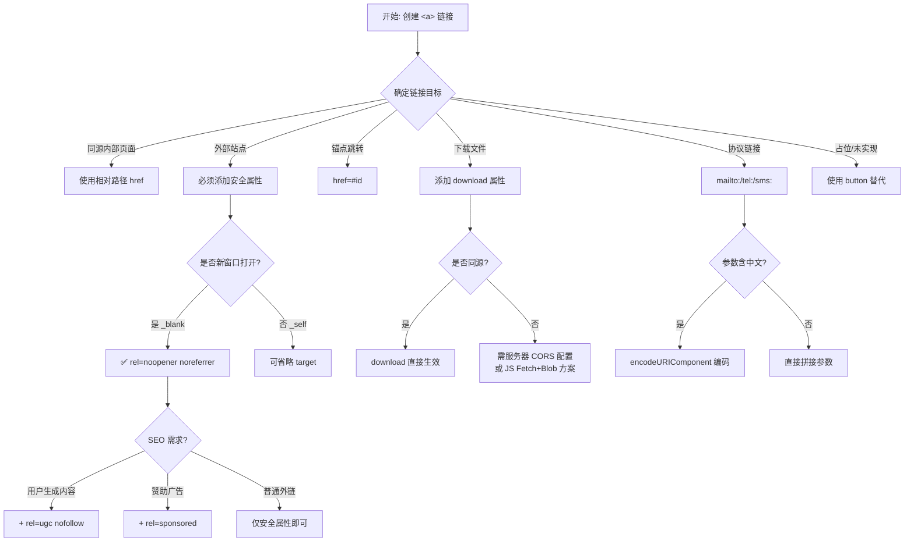
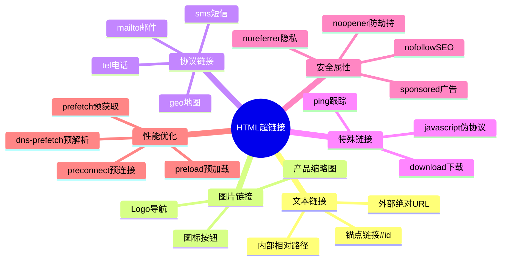
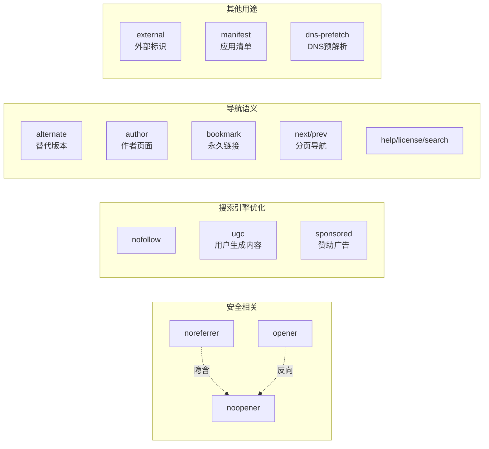
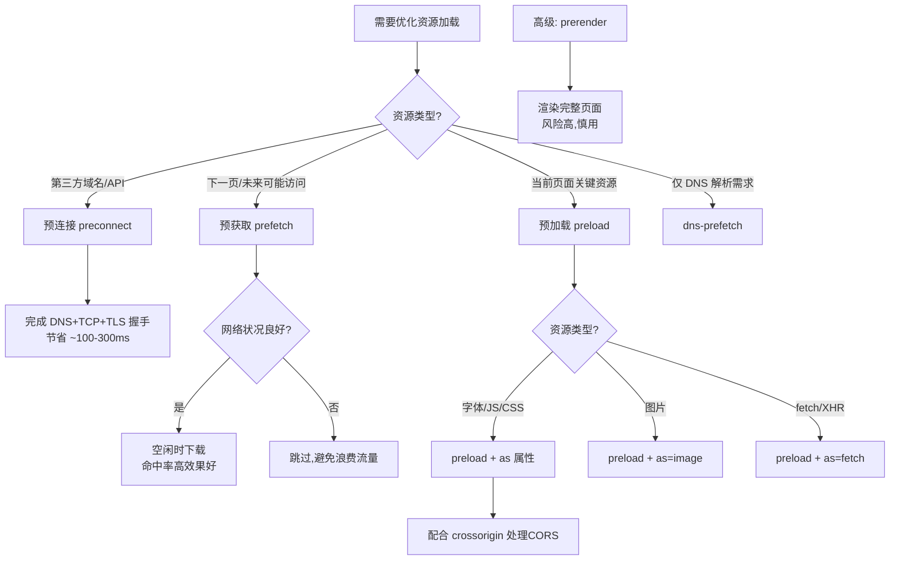
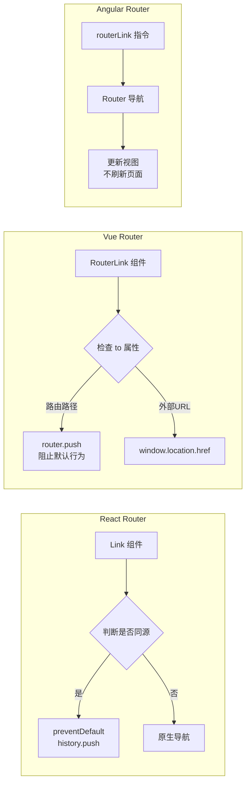
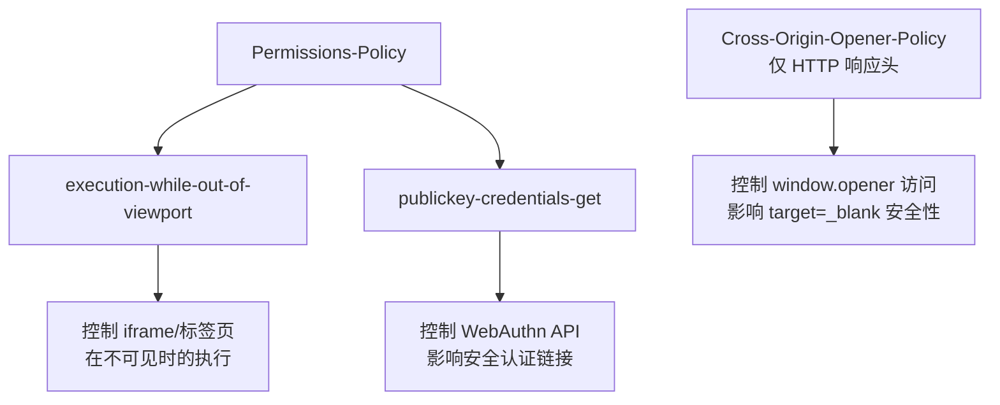
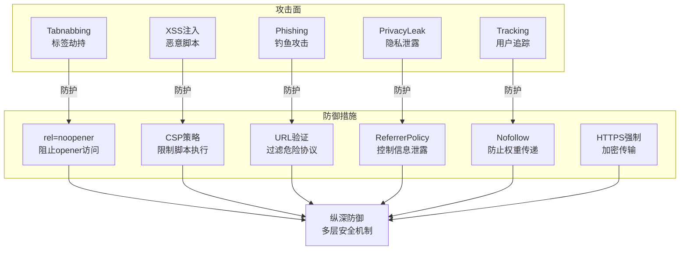

# 超链接

超链接（Hyperlink）是万维网的基石，通过 `<a>` 标签在页面元素与目标位置之间建立连接，实现站点内外的导航与资源引用。目标是 URL（统一资源定位符），可以指向页面、页面片段、媒体资源、联系方式或可下载文件等。`<a>` 标签是 HTML 中最重要的交互元素之一，是构建网站导航系统和内容互联的核心

**学习目标：**
- 掌握 `<a>` 标签的完整属性体系和使用方法
- 理解不同类型链接的应用场景和最佳实践
- 能够编写安全、可访问、高性能的超链接
- 了解链接在 SEO、安全、性能方面的影响

本节将系统介绍 `<a>` 标签的基本语法、常用属性、不同类型链接的创建方法，以及样式、安全性、性能与可访问性等最佳实践，帮助你在实际项目中正确、稳定地使用超链接。

## 基本语法

```html
<a href="URL">链接文本或元素</a>
```

**核心要素：**
- `href`：必需属性，定义链接目标地址
- 链接内容：可以是文本、图片、行内元素等（不能包含其他 `<a>` 或交互元素如 `<button>`）
- 可选属性：`target`、`rel`、`download`、`referrerpolicy`、`title`、`ping` 等

### 属性速查表

| 属性             | 作用                 | 常见取值                                                      | 说明                                                       |
| ---------------- | -------------------- | ------------------------------------------------------------- | ---------------------------------------------------------- |
| `href`           | 目标地址             | 绝对/相对 URL、`#fragment`、`mailto:`、`tel:`、`sms:`         | 省略时元素变为占位符，仍可聚焦但无法导航                   |
| `target`         | 打开位置             | `_self`、`_blank`、`_parent`、`_top`、框架名称                | `_blank` 必须配合 `rel="noopener"` 使用                    |
| `rel`            | 当前页面与目标的关系 | `noopener`、`noreferrer`、`nofollow`、`ugc`、`sponsored` 等   | 多值以空格分隔                                             |
| `download`       | 作为下载处理         | 可选文件名                                                    | 同源资源有效，跨源需服务器配合                             |
| `referrerpolicy` | 引荐来源策略         | `no-referrer`、`origin`、`strict-origin-when-cross-origin` 等 | 控制请求时的 Referer 头信息                                |
| `ping`           | 跳转上报地址         | 一个或多个 URL（空格分隔）                                    | 浏览器发送 POST 请求进行统计跟踪                           |
| `hreflang`       | 目标资源语言         | BCP 47 语言标签（如 `zh-CN`、`en-US`）                        | 指示目标页面的语言，用于多语言网站                         |
| `type`           | 目标资源 MIME 类型   | `text/html`、`application/pdf`、`image/png` 等                | 提示浏览器资源类型，仅供参考                               |
| `title`          | 链接提示信息         | 任意文本                                                      | 鼠标悬停时显示，应避免与链接文本重复                       |
| `aria-label`     | 无障碍标签           | 描述性文本                                                    | 为屏幕阅读器提供说明，优先于链接内容                       |

::: warning
不建议把 `javascript:` / `data:` 放进 `href` 里：它们更容易引入 XSS 与可访问性问题。仅触发动作（不导航）的场景，优先用 `<button>`
:::

### 属性选择决策树

下面的流程图帮助开发者根据不同场景选择合适的属性组合：



## 链接还是按钮

在 UI 中，"长得像链接的东西"不一定是链接。关键看它的**语义与默认行为**：链接用于导航，按钮用于触发动作。

| 需求/行为                           | 推荐元素    | 理由                                                     |
| ----------------------------------- | ----------- | -------------------------------------------------------- |
| 跳转到另一个页面/路由/锚点          | `<a>`       | 浏览器原生支持复制链接、在新标签打开、历史记录、可访问性 |
| 下载文件或跳转到资源                | `<a>`       | 目标仍是"资源导航"                                       |
| 打开弹窗、提交表单、切换展开/收起等 | `<button>`  | 这是"动作"，不是导航                                     |
| 看起来像按钮但本质是导航            | `<a>` + CSS | 保留语义，样式交给 CSS                                   |

### 链接类型全景图



### `rel` 属性详解

`rel`（relationship）属性定义了当前页面与目标资源之间的关系，可以设置多个值（用空格分隔）。它在**安全性、SEO 和导航语义**方面都发挥着重要作用。

#### `rel` 属性分类体系



#### 安全相关

- **`noopener`**：阻止目标页面通过 `window.opener` 访问来源页面，防止标签劫持攻击
  - **必须与 `target="_blank"` 一起使用**
  - 现代浏览器已默认为新标签页启用 noopener 行为，但显式声明仍是最佳实践

- **`noreferrer`**：不发送 Referer 头，提升隐私保护
  - 隐含 `noopener` 行为
  - 目标网站无法知道用户从哪个页面访问过来

#### SEO 相关

- **`nofollow`**：告诉搜索引擎不要跟踪该链接，不传递页面权重
  - 适用于不可信的外部链接
  - 用于控制页面之间的权重流动

- **`ugc`**（User Generated Content）：标记用户生成内容中的链接
  - 用于评论区、论坛帖子等用户创建的内容
  - 帮助搜索引擎识别链接性质

- **`sponsored`**：标记赞助或广告性质的链接
  - 用于付费链接、广告、赞助内容
  - 符合搜索引擎的广告链接规范

#### 导航相关

- **`alternate`**：替代版本（如不同语言、不同格式）
- **`author`**：指向作者页面
- **`bookmark`**：永久链接（permalink）
- **`canonical`**：规范链接（通常在 `<link>` 中使用）
- **`help`**：帮助文档链接
- **`license`**：许可证信息链接
- **`next`**：下一页（用于分页，与 `<link>` 配合使用）
- **`prev`**：上一页（用于分页，与 `<link>` 配合使用）
- **`search`**：搜索页面链接

#### 其他

- **`external`**：标准 link type，表示目标不属于当前站点；常配合 CSS 用于外链样式区分（如图标）

**使用示例：**

```html
<!-- 安全的外部链接 -->
<a href="https://example.com" target="_blank" rel="noopener noreferrer">外部链接</a>

<!-- SEO 优化的用户内容链接 -->
<a href="https://user-site.com" rel="ugc nofollow">用户博客</a>

<!-- 分页导航 -->
<a href="/page2.html" rel="next">下一页</a>
<a href="/page1.html" rel="prev">上一页</a>

<!-- 多语言版本 -->
<a href="/en/about.html" rel="alternate" hreflang="en">English</a>
<a href="/zh/about.html" rel="alternate" hreflang="zh-CN">中文</a>
```

### 目标窗口 `target`

`target` 属性指定在何处打开链接文档，默认值为 `_self`。

#### 取值说明

| 值         | 说明                                             | 使用场景                     |
| ---------- | ------------------------------------------------ | ---------------------------- |
| `_self`    | 默认值，在当前窗口或框架中打开                   | 大部分内部链接               |
| `_blank`   | 在新窗口或标签页中打开                           | 外部网站、PDF 文档           |
| `_parent`  | 在父框架中打开（如果存在）                       | 框架嵌套场景                 |
| `_top`     | 在最顶层窗口中打开，跳出所有框架                 | 框架嵌套场景                 |
| 框架名称   | 在指定名称的框架或窗口中打开                     | 特定 iframe 场景             |

**注意事项：**
- 使用 `_blank` 时**必须**同时设置 `rel="noopener"` 或 `rel="noopener noreferrer"` 以保证安全
- 外部链接在新窗口打开可保持用户当前浏览上下文
- 过度使用 `_blank` 会影响用户体验（大量标签页）

#### 使用示例

```html
<!-- 在当前窗口打开（默认） -->
<a href="/about.html">关于我们</a>

<!-- 在新窗口安全打开外部链接 -->
<a href="https://example.com" target="_blank" rel="noopener noreferrer">外部网站</a>

<!-- 框架场景 -->
<iframe name="content-frame"></iframe>
<a href="/page.html" target="content-frame">在框架中打开</a>

<!-- 跳出框架 -->
<a href="https://example.com" target="_top">跳出框架访问</a>
```

注意：

- 使用 `_blank` 时建议同时设置 `rel="noopener noreferrer"`
- 外部链接在新窗口打开可防止用户丢失当前阅读上下文，但需要合理提示
- 使用框架时根据目标选择合适值，确保按预期打开

### `referrerpolicy` 属性

`referrerpolicy` 控制导航请求时携带的 Referer 头信息，用于精细控制隐私和引荐来源策略。

#### 取值说明

| 值                                | 同源请求         | 跨源请求             | HTTPS→HTTP 降级  | 说明                   |
| --------------------------------- | ---------------- | -------------------- | ---------------- | ---------------------- |
| `no-referrer`                     | 不发送           | 不发送               | 不发送           | 完全隐私保护           |
| `origin`                          | 发送源           | 发送源               | 发送源           | 只传递域名信息         |
| `same-origin`                     | 发送完整 Referer | 不发送               | 不发送           | 仅同源传递完整信息     |
| `origin-when-cross-origin`        | 发送完整 Referer | 发送源               | 发送源           | 跨源时只传域名         |
| `strict-origin`                   | 发送源           | 发送源               | **不发送**       | 防止降级泄露           |
| `strict-origin-when-cross-origin` | 发送完整 Referer | 发送源               | **不发送**       | **浏览器默认值**       |
| `unsafe-url`                      | 发送完整 Referer | 发送完整 Referer     | 发送完整 Referer | 最不安全，谨慎使用     |

#### 使用场景

```html
<!-- 完全隐私保护（不泄露任何来源信息） -->
<a href="https://example.com" referrerpolicy="no-referrer">隐私链接</a>

<!-- 只传递域名（隐藏具体页面路径） -->
<a href="https://example.com" referrerpolicy="origin">来源链接</a>

<!-- 默认行为（推荐，无需显式设置） -->
<a href="https://example.com">标准链接</a>

<!-- 需要完整引荐信息（谨慎使用，仅特定业务场景） -->
<a href="https://partner.com" referrerpolicy="unsafe-url">完整引荐</a>
```

**最佳实践：**
- 现代浏览器默认使用 `strict-origin-when-cross-origin`，大多数情况下无需显式设置
- 对于敏感页面或第三方服务，考虑使用 `no-referrer` 或 `origin`
- 永远不要为了"方便"使用 `unsafe-url`，它可能泄露敏感信息（如URL 中的token）

### `download` 属性

`download` 属性指示浏览器下载资源而不是导航到它。可以指定下载文件名。

#### 基本用法

```html
<!-- 使用服务器提供的文件名 -->
<a href="/files/guide.pdf" download>下载指南</a>

<!-- 指定下载文件名 -->
<a href="/files/guide.pdf" download="入门指南.pdf">下载入门指南</a>

<!-- 下载图片 -->
<a href="/images/photo.jpg" download="我的照片.jpg">
  
</a>
```

#### 关键限制

1. **同源限制**：仅对同源资源有效，跨源资源需服务器设置 CORS 头
2. **服务器优先**：服务器的 `Content-Disposition` 头优先级高于 `download` 属性
3. **浏览器兼容性**：所有现代浏览器支持，IE 不支持

#### 跨源下载解决方案

**方案 1：服务器配置（推荐）**

```http
# 服务器响应头示例
Content-Disposition: attachment; filename="guide.pdf"
Access-Control-Allow-Origin: https://yourdomain.com
```

**方案 2：JavaScript Fetch + Blob**

```html
<button onclick="downloadFile('https://example.com/file.pdf', 'document.pdf')">
  下载文档
</button>

<script>
async function downloadFile(url, filename) {
  try {
    const response = await fetch(url)
    if (!response.ok) throw new Error('下载失败')
    
    const blob = await response.blob()
    const blobUrl = URL.createObjectURL(blob)
    
    const link = document.createElement('a')
    link.href = blobUrl
    link.download = filename
    link.click()
    
    // 清理内存
    URL.revokeObjectURL(blobUrl)
  } catch (error) {
    console.error('下载错误:', error)
    alert('下载失败，请稍后重试')
  }
}
</script>
```

#### 文件名处理

```html
<!-- 文件名需要编码非 ASCII 字符 -->
<a href="/文件.pdf" download="用户手册.pdf">下载</a>

<!-- JavaScript 动态生成文件名（纯 HTML 无法写表达式，需脚本设置） -->
<a href="/report.pdf" id="report-link" download>下载报告</a>
<script>
  const filename = `报告_${new Date().toISOString().split('T')[0]}.pdf`
  document.getElementById('report-link').download = filename
</script>
```

### `ping` 属性

`ping` 属性用于跟踪用户点击，浏览器会在导航时向指定 URL 发送 POST 请求（内容为 `PING`）。

```html
<a href="https://example.com" ping="https://analytics.example.com/track">
  外部链接
</a>

<!-- 多个上报地址（空格分隔） -->
<a href="https://example.com" 
   ping="https://analytics.com/ping https://stats.com/track">
  多点上报
</a>
```

#### 工作原理

```
用户点击链接
    ↓
浏览器发送 POST 请求到 ping URL
    ↓
请求体：PING
请求头：Ping-From, Ping-To
    ↓
浏览器导航到 href 目标
```

#### 注意事项

- **隐私问题**：用户可能禁用此功能或使用隐私保护插件
- **不保证送达**：网络问题或浏览器设置可能导致请求失败
- **不能替代主数据源**：应与常规分析工具配合使用，不作为唯一统计手段
- **CORS 要求**：ping URL 必须允许跨域请求

#### 适用场景

- 不侵入用户体验的轻量级统计
- 第三方内容跳转跟踪
- 需要统计但无法修改目标页面的场景

## 链接类型详解

### 文本超链接

文本超链接是最基础的链接形式，为文本内容添加导航能力。

```html
<!-- 内部链接（相对路径） -->
<a href="/about.html">关于我们</a>
<a href="./contact.html">联系我们</a>
<a href="../docs/readme.html">文档</a>

<!-- 外部链接（绝对路径） -->
<a href="https://example.com" target="_blank" rel="noopener noreferrer">外部网站</a>
```

**路径选择建议：**
- **站内链接**：使用相对路径（便于环境迁移）
- **站外链接**：使用绝对路径（必须包含协议 `https://`）
- **协议相对 URL**（`//example.com`）在现代开发中不推荐使用，可能导致混合内容问题

### 图片超链接

将图片作为可点击元素，常用于 Logo 导航、产品缩略图、广告横幅等场景。

**基本语法：**

```html
<a href="目标URL">
  
</a>
```

**实际应用示例：**

```html
<!-- Logo 返回首页 -->
<a href="/" aria-label="返回首页">
  
</a>

<!-- 产品缩略图链接 -->
<a href="/products/123" class="product-link">
  
  <span class="link-text">查看详情</span>
</a>

<!-- 图标按钮链接 -->
<a href="/settings" class="icon-link" title="设置">
  <svg aria-hidden="true"><!-- 设置图标 --></svg>
  <span class="sr-only">设置</span>
</a>
```

**最佳实践：**

1. **必须提供 `alt` 属性**：描述图片内容或链接目的
2. **装饰性图片**：使用 `alt=""` 和 `aria-hidden="true"`
3. **可访问性**：确保键盘可访问（Tab + Enter）
4. **视觉反馈**：添加悬停效果提示可点击

```html
<!-- 纯装饰性图标 -->
<a href="/home" aria-label="返回首页">
  
</a>

<!-- 图标 + 文本组合 -->
<a href="/settings">
  <svg aria-hidden="true"><!-- 图标 --></svg>
  <span>设置</span>
</a>
```

### 内部链接

内部链接是指向同一网站内其他页面或同一页面特定位置的链接，是网站导航系统的核心组成部分。

#### 页面间内部链接

指向同一网站内其他页面，使用相对路径：

```html
<!-- 相对于当前页面 -->
<a href="about.html">关于我们</a>

<!-- 相对于网站根目录 -->
<a href="/products/laptop">笔记本电脑</a>

<!-- 向上一级目录 -->
<a href="../contact.html">联系我们</a>
```

**相对路径规则：**
- `page.html` - 同目录下的文件
- `/page.html` - 网站根目录下的文件
- `./page.html` - 同目录下的文件（显式声明）
- `../page.html` - 上级目录的文件

#### 页面内锚点链接

跳转到同一页面的特定位置，使用 `#` 加元素 `id`：

```html
<!-- 目标元素 -->
<h2 id="features">产品特色</h2>
<h2 id="specs">技术规格</h2>

<!-- 锚点链接 -->
<a href="#features">查看产品特色</a>
<a href="#specs">查看技术规格</a>

<!-- 返回顶部 -->
<a href="#top">返回顶部</a>
<h1 id="top">页面标题</h1>
```

**高级用法：**

```html
<!-- 跳转到其他页面的锚点 -->
<a href="/about.html#team">关于我们 - 团队介绍</a>

<!-- 平滑滚动（CSS） -->
<style>
  html {
    scroll-behavior: smooth;
  }
  
  /* 或针对特定链接 */
  .smooth-scroll {
    scroll-behavior: smooth;
  }
</style>

<!-- JavaScript 控制滚动 -->
<script>
document.querySelector('a[href="#section"]').addEventListener('click', (e) => {
  e.preventDefault()
  document.querySelector('#section').scrollIntoView({ 
    behavior: 'smooth',
    block: 'start'
  })
})
</script>
```

**完整示例：**

```html
<!DOCTYPE html>
<html>
  <head>
    <title>内部链接示例</title>
    <style>
      section {
        margin-bottom: 1000px;
        padding: 20px;
        border-bottom: 1px solid #eee;
      }
      nav {
        background: #f5f5f5;
        padding: 10px;
        margin-bottom: 20px;
      }
      nav a {
        margin-right: 15px;
      }
    </style>
  </head>
  <body>
    <nav>
      <a href="#section1">产品特色</a>
      <a href="#section2">技术规格</a>
      <a href="#section3">客户评价</a>
      <a href="#top">返回顶部</a>
    </nav>

    <section id="section1">
      <h2>产品特色</h2>
      <p>我们的产品具有以下特色...</p>
    </section>

    <section id="section2">
      <h2>技术规格</h2>
      <p>详细技术参数如下...</p>
    </section>

    <section id="section3">
      <h2>客户评价</h2>
      <p>看看客户怎么说...</p>
    </section>

    <p><a href="#top">回到页面顶部</a></p>
  </body>
</html>
```

## 外部链接

外部链接指向其他网站或资源，是互联网互联互通的基础。

<h4>021-external-links-security.html</h4>

```html
<!-- 来源：4-超链接.md - 外部链接安全属性 -->
<!DOCTYPE html>
<html lang="zh-CN">
<head>
  <meta charset="UTF-8">
  <meta name="viewport" content="width=device-width, initial-scale=1.0">
  <title>外部链接安全属性示例</title>
  <style>
    * {
      margin: 0;
      padding: 0;
      box-sizing: border-box;
    }

    body {
      font-family: -apple-system, BlinkMacSystemFont, "Segoe UI", sans-serif;
      line-height: 1.6;
      color: #333;
      background: #f5f7fa;
      padding: 40px 20px;
    }

    .container {
      max-width: 800px;
      margin: 0 auto;
    }

    h1 {
      text-align: center;
      color: #222;
      margin-bottom: 10px;
      font-size: 32px;
    }

    .subtitle {
      text-align: center;
      color: #666;
      margin-bottom: 40px;
      font-size: 16px;
    }

    .link-card {
      background: white;
      border-radius: 12px;
      padding: 24px;
      margin-bottom: 20px;
      box-shadow: 0 2px 8px rgba(0,0,0,0.08);
      transition: transform 0.2s, box-shadow 0.2s;
    }

    .link-card:hover {
      transform: translateY(-2px);
      box-shadow: 0 4px 16px rgba(0,0,0,0.12);
    }

    .link-card h3 {
      color: #0066cc;
      margin-bottom: 12px;
      font-size: 18px;
      display: flex;
      align-items: center;
      gap: 8px;
    }

    .badge {
      display: inline-block;
      padding: 3px 8px;
      border-radius: 4px;
      font-size: 11px;
      font-weight: 600;
      text-transform: uppercase;
    }

    .badge-safe { background: #d4edda; color: #155724; }
    .badge-warning { background: #fff3cd; color: #856404; }
    .badge-danger { background: #f8d7da; color: #721c24; }

    .link-description {
      color: #666;
      font-size: 14px;
      line-height: 1.7;
      margin-bottom: 16px;
    }

    .code-block {
      background: #f8f9fa;
      border-left: 3px solid #0066cc;
      padding: 12px 16px;
      font-family: 'Monaco', 'Menlo', monospace;
      font-size: 13px;
      overflow-x: auto;
      border-radius: 4px;
      color: #333;
    }

    /* 外部链接自动添加图标 */
    a[href^="http"]:not([href*="example.com"])::after {
      content: " ↗";
      font-size: 0.85em;
      opacity: 0.7;
      margin-left: 4px;
    }

    .external-link {
      display: inline-flex;
      align-items: center;
      gap: 6px;
      padding: 10px 20px;
      background: linear-gradient(135deg, #667eea 0%, #764ba2 100%);
      color: white !important;
      text-decoration: none;
      border-radius: 6px;
      font-weight: 500;
      transition: all 0.3s;
      margin-top: 10px;
    }

    .external-link:hover {
      transform: translateY(-1px);
      box-shadow: 0 4px 12px rgba(102,126,234,0.4);
    }

    .info-box {
      background: #e3f2fd;
      border-left: 4px solid #0066cc;
      padding: 16px 20px;
      margin-top: 30px;
      border-radius: 4px;
    }

    .info-box h4 {
      color: #0066cc;
      margin-bottom: 8px;
    }

    .info-box ul {
      list-style: none;
      font-size: 14px;
      color: #555;
    }

    .info-box li {
      padding: 4px 0;
      padding-left: 16px;
      position: relative;
    }

    .info-box li::before {
      content: "•";
      position: absolute;
      left: 0;
      color: #0066cc;
      font-weight: bold;
    }
  </style>
</head>
<body>

  <div class="container">
    <h1>🔗 外部链接安全属性</h1>
    <p class="subtitle">正确使用 rel、target 等属性保护用户安全</p>

    <!-- 示例 1：标准安全外部链接 -->
    <div class="link-card">
      <h3>
        ✅ 标准安全外部链接
        <span class="badge badge-safe">推荐</span>
      </h3>
      <div class="link-description">
        使用 <strong>target="_blank"</strong> 在新窗口打开，同时添加
        <strong>rel="noopener noreferrer"</strong> 防止安全漏洞。
        <ul style="margin-top: 8px; padding-left: 20px;">
          <li><strong>noopener</strong>：阻止目标页面通过 window.opener 访问来源页面（防止标签劫持）</li>
          <li><strong>noreferrer</strong>：不发送 Referer 头信息（隐私保护），隐含 noopener 行为</li>
        </ul>
      </div>
      <div class="code-block">
        &lt;a href="https://developer.mozilla.org"<br>
        &nbsp;&nbsp;&nbsp;&nbsp;target="_blank" rel="noopener noreferrer"&gt;<br>
        &nbsp;&nbsp;MDN Web 文档<br>
        &lt;/a&gt;
      </div>
      <a href="https://developer.mozilla.org/zh-CN/"
         target="_blank"
         rel="noopener noreferrer"
         class="external-link">
        打开 MDN 文档 ↗
      </a>
    </div>

    <!-- 示例 2：SEO 优化的用户内容链接 -->
    <div class="link-card">
      <h3>
        🔍 SEO 优化的用户生成内容链接
        <span class="badge badge-safe">推荐</span>
      </h3>
      <div class="link-description">
        对于评论区、论坛等用户生成的内容中的链接，使用
        <strong>rel="ugc nofollow"</strong> 告诉搜索引擎不要传递权重。
        <ul style="margin-top: 8px; padding-left: 20px;">
          <li><strong>ugc</strong>（User Generated Content）：标记用户生成内容的链接</li>
          <li><strong>nofollow</strong>：告诉搜索引擎不跟踪该链接，不传递页面权重</li>
        </ul>
      </div>
      <div class="code-block">
        &lt;a href="https://user-blog.com" rel="ugc nofollow"&gt;<br>
        &nbsp;&nbsp;用户分享的博客链接<br>
        &lt;/a&gt;
      </div>
      <a href="https://github.com"
         target="_blank"
         rel="ugc noopener noreferrer"
         class="external-link">
        用户分享的 GitHub 链接 (ugc) ↗
      </a>
    </div>

    <!-- 示例 3：赞助广告链接 -->
    <div class="link-card">
      <h3>
        💰 赞助/广告性质链接
        <span class="badge badge-safe">合规</span>
      </h3>
      <div class="link-description">
        对于付费链接、广告、赞助内容，使用 <strong>rel="sponsored"</strong>
        符合搜索引擎的广告链接规范要求。
      </div>
      <div class="code-block">
        &lt;a href="https://sponsor.com" rel="sponsored" target="_blank"&gt;<br>
        &nbsp;&nbsp;赞助商链接<br>
        &lt;/a&gt;
      </div>
      <a href="https://www.w3schools.com/"
         target="_blank"
         rel="sponsored noopener noreferrer"
         class="external-link">
        赞助商链接示例 (sponsored) ↗
      </a>
    </div>

    <!-- 示例 4：危险的不安全链接 -->
    <div class="link-card">
      <h3>
        ❌ 不安全的写法
        <span class="badge badge-danger">禁止</span>
      </h3>
      <div class="link-description">
        以下写法存在安全隐患，<strong>绝对避免在生产环境使用</strong>：
      </div>
      <div class="code-block" style="border-left-color: #dc3545;">
        &lt;!-- 危险：缺少安全属性 --&gt;<br>
        &lt;a href="https://example.com" target="_blank"&gt;<br>
        &nbsp;&nbsp;不安全的外部链接<br>
        &lt;/a&gt;<br><br>
        &lt;!-- 问题说明 --&gt;<br>
        • 目标页面可通过 window.opener 操作原页面<br>
        • 可被用于钓鱼攻击和恶意重定向<br>
        • 可能泄露用户的敏感信息（如 cookie）
      </div>
    </div>

    <!-- 信息提示框 -->
    <div class="info-box">
      <h4>📌 最佳实践要点</h4>
      <ul>
        <li>所有 <strong>target="_blank"</strong> 的外部链接必须包含 <strong>rel="noopener noreferrer"</strong></li>
        <li>现代浏览器已默认为新标签页启用 noopener，但显式声明仍是最佳实践</li>
        <li>用户生成内容使用 <strong>ugc nofollow</strong></li>
        <li>付费/赞助链接使用 <strong>sponsored</strong></li>
        <li>可使用 CSS 选择器 <code>a[href^="http"]::after</code> 自动为外部链接添加图标标识</li>
      </ul>
    </div>
  </div>

</body>
</html>
```


<h4>024-download-with-js.html</h4>

```html
<!-- 来源：4-超链接.md - JavaScript Fetch + Blob 跨源下载 -->
<!DOCTYPE html>
<html lang="zh-CN">
<head>
  <meta charset="UTF-8">
  <meta name="viewport" content="width=device-width, initial-scale=1.0">
  <title>跨源文件下载解决方案</title>
  <style>
    * {
      margin: 0;
      padding: 0;
      box-sizing: border-box;
    }

    body {
      font-family: -apple-system, BlinkMacSystemFont, "Segoe UI", sans-serif;
      line-height: 1.6;
      color: #333;
      background: #f5f7fa;
      min-height: 100vh;
      display: flex;
      align-items: center;
      justify-content: center;
      padding: 20px;
    }

    .container {
      background: white;
      border-radius: 16px;
      padding: 40px;
      max-width: 700px;
      width: 100%;
      box-shadow: 0 10px 40px rgba(0,0,0,0.1);
    }

    h1 {
      text-align: center;
      color: #222;
      margin-bottom: 8px;
      font-size: 28px;
    }

    .subtitle {
      text-align: center;
      color: #666;
      margin-bottom: 32px;
      font-size: 15px;
    }

    .download-section {
      margin-bottom: 28px;
      padding: 24px;
      border-radius: 12px;
      background: #f8f9fa;
    }

    .download-section h3 {
      color: #333;
      margin-bottom: 6px;
      font-size: 17px;
      display: flex;
      align-items: center;
      gap: 8px;
    }

    .download-section p {
      color: #666;
      font-size: 14px;
      margin-bottom: 16px;
      line-height: 1.7;
    }

    /* 方案 1：原生 download 属性（同源有效） */
    .btn-download-native {
      display: inline-flex;
      align-items: center;
      gap: 8px;
      padding: 14px 28px;
      background: linear-gradient(135deg, #28a745, #20883d);
      color: white;
      text-decoration: none;
      border-radius: 8px;
      font-weight: 600;
      font-size: 15px;
      transition: all 0.3s;
      box-shadow: 0 4px 12px rgba(40,167,69,0.3);
    }

    .btn-download-native:hover {
      transform: translateY(-2px);
      box-shadow: 0 6px 20px rgba(40,167,69,0.4);
    }

    .badge {
      display: inline-block;
      padding: 2px 8px;
      border-radius: 4px;
      font-size: 11px;
      font-weight: 600;
      text-transform: uppercase;
      margin-left: auto;
    }

    .badge-success { background: #d4edda; color: #155724; }
    .badge-warning { background: #fff3cd; color: #856404; }
    .badge-info { background: #cce5ff; color: #004085; }

    /* 方案 2：JS Fetch + Blob（跨源下载） */
    .btn-download-js {
      display: inline-flex;
      align-items: center;
      gap: 8px;
      padding: 14px 28px;
      background: linear-gradient(135deg, #0066cc, #0052a3);
      color: white;
      border: none;
      border-radius: 8px;
      font-weight: 600;
      font-size: 15px;
      cursor: pointer;
      transition: all 0.3s;
      box-shadow: 0 4px 12px rgba(0,102,204,0.3);
    }

    .btn-download-js:hover:not(:disabled) {
      transform: translateY(-2px);
      box-shadow: 0 6px 20px rgba(0,102,204,0.4);
    }

    .btn-download-js:disabled {
      opacity: 0.6;
      cursor: not-allowed;
    }

    /* 下载进度条 */
    .progress-container {
      margin-top: 16px;
      display: none;
    }

    .progress-bar-bg {
      height: 8px;
      background: #e9ecef;
      border-radius: 4px;
      overflow: hidden;
    }

    .progress-bar-fill {
      height: 100%;
      background: linear-gradient(90deg, #0066cc, #28a745);
      border-radius: 4px;
      width: 0%;
      transition: width 0.3s ease;
    }

    .progress-text {
      font-size: 13px;
      color: #666;
      margin-top: 6px;
      text-align: right;
    }

    /* 状态提示 */
    .status-message {
      margin-top: 12px;
      padding: 10px 16px;
      border-radius: 6px;
      font-size: 14px;
      display: none;
    }

    .status-success {
      display: block;
      background: #d4edda;
      color: #155724;
      border-left: 4px solid #28a745;
    }

    .status-error {
      display: block;
      background: #f8d7da;
      color: #721c24;
      border-left: 4px solid #dc3545;
    }

    /* 对比表格 */
    .comparison-table {
      width: 100%;
      border-collapse: collapse;
      margin-top: 30px;
      font-size: 14px;
    }

    .comparison-table th,
    .comparison-table td {
      padding: 12px 16px;
      text-align: left;
      border-bottom: 1px solid #eee;
    }

    .comparison-table th {
      background: #f8f9fa;
      font-weight: 600;
      color: #555;
      font-size: 13px;
      text-transform: uppercase;
      letter-spacing: 0.5px;
    }

    .check { color: #28a745; font-weight: bold; }
    .cross { color: #dc3545; font-weight: bold; }

    /* 代码展示 */
    .code-preview {
      background: #1e1e1e;
      color: #d4d4d4;
      padding: 18px;
      border-radius: 8px;
      font-family: 'Monaco', 'Menlo', monospace;
      font-size: 13px;
      line-height: 1.6;
      overflow-x: auto;
      margin-top: 16px;
    }

    .code-keyword { color: #569cd6; }
    .code-string { color: #ce9178; }
    .code-comment { color: #6a9955; }
    .code-function { color: #dcdcaa; }
  </style>
</head>
<body>

  <div class="container">
    <h1>📥 文件下载解决方案</h1>
    <p class="subtitle">对比原生 download 属性与 JS Fetch + Blob 跨源下载方案</p>

    <!-- 方案 1：原生 download 属性 -->
    <div class="download-section">
      <h3>
        ✅ 方案一：原生 download 属性
        <span class="badge badge-success">同源有效</span>
      </h3>
      <p>
        使用 HTML 原生的 <strong>download</strong> 属性，简单直接。
        但仅对<strong>同源资源</strong>有效，跨源时浏览器会忽略该属性而直接导航。
      </p>
      <a href="#" download="产品使用手册.pdf" class="btn-download-native">
        ⬇️ 下载 PDF 文档
      </a>
    </div>


    <!-- 方案 2：JS Fetch + Blob -->
    <div class="download-section">
      <h3>
        🔧 方案二：Fetch + Blob（跨源兼容）
        <span class="badge badge-info">推荐</span>
      </h3>
      <p>
        使用 JavaScript 的 <strong>Fetch API</strong> 获取文件内容，
        通过 <strong>Blob</strong> 对象创建临时 URL 实现下载。
        支持跨域资源、自定义文件名、下载进度显示等功能。
      </p>

      <!-- 模拟下载按钮 -->
      <button id="downloadBtn" class="btn-download-js" onclick="downloadFile()">
        ⬇️ 开始下载（模拟）
      </button>

      <!-- 进度条 -->
      <div class="progress-container" id="progressContainer">
        <div class="progress-bar-bg">
          <div class="progress-bar-fill" id="progressBar"></div>
        </div>
        <div class="progress-text" id="progressText">准备中...</div>
      </div>

      <!-- 状态消息 -->
      <div class="status-message" id="statusMessage"></div>

      <!-- 核心代码预览 -->
      <div class="code-preview">
<span class="code-comment">// 核心：Fetch + Blob 跨源下载函数</span>
<span class="code-keyword">async function</span> <span class="code-function">downloadFile</span>(url, filename) {
  <span class="code-keyword">try</span> {
    <span class="code-keyword">const</span> response = <span class="code-keyword">await</span> fetch(url)
    <span class="code-keyword">if</span> (!response.ok) <span class="code-keyword">throw new</span> Error(<span class="code-string">'下载失败'</span>)

    <span class="code-keyword">const</span> blob = <span class="code-keyword">await</span> response.blob()
    <span class="code-keyword">const</span> blobUrl = URL.createObjectURL(blob)

    <span class="code-keyword">const</span> link = document.createElement(<span class="code-string">'a'</span>)
    link.href = blobUrl
    link.download = filename
    link.click()

    URL.revokeObjectURL(blobUrl)  <span class="code-comment">// 清理内存</span>
  } <span class="code-keyword">catch</span> (error) {
    console.error(<span class="code-string">'下载错误:'</span>, error)
  }
}
      </div>
    </div>


    <!-- 对比表格 -->
    <table class="comparison-table">
      <thead>
        <tr>
          <th>特性</th>
          <th>原生 download 属性</th>
          <th>Fetch + Blob 方案</th>
        </tr>
      </thead>
      <tbody>
        <tr>
          <td>同源下载</td>
          <td><span class="check">✓ 支持</span></td>
          <td><span class="check">✓ 支持</span></td>
        </tr>
        <tr>
          <td>跨源下载</td>
          <td><span class="cross">✗ 不支持</span></td>
          <td><span class="check">✓ 支持（需 CORS）</span></td>
        </tr>
        <tr>
          <td>自定义文件名</td>
          <td><span class="check">✓ 支持</span></td>
          <td><span class="check">✓ 支持</span></td>
        </tr>
        <tr>
          <td>下载进度显示</td>
          <td><span class="cross">✗ 不支持</span></td>
          <td><span class="check">✓ 可实现</span></td>
        </tr>
        <tr>
          <td>实现复杂度</td>
          <td><span class="check">✓ 极简</span></td>
          <td><span class="cross">中等</span></td>
        </tr>
        <tr>
          <td>浏览器兼容性</td>
          <td><span class="check">✓ 全部支持</span></td>
          <td><span class="check">✓ 现代浏览器</span></td>
        </tr>
      </tbody>
    </table>

  </div>

  <script>
    /**
     * 使用 Fetch + Blob 实现跨源文件下载
     * @param {string} url - 文件地址
     * @param {string} filename - 下载后的文件名
     */
    async function downloadFile(url, filename) {
      const btn = document.getElementById('downloadBtn')
      const progressContainer = document.getElementById('progressContainer')
      const progressBar = document.getElementById('progressBar')
      const progressText = document.getElementById('progressText')
      const statusMessage = document.getElementById('statusMessage')

      // 重置状态
      btn.disabled = true
      btn.textContent = '⏳ 下载中...'
      progressContainer.style.display = 'block'
      statusMessage.className = 'status-message'
      statusMessage.style.display = 'none'

      try {
        // 模拟下载过程（实际项目中替换为真实 fetch 请求）
        // const response = await fetch(url)
        // if (!response.ok) throw new Error('HTTP ' + response.status)

        // 模拟进度更新
        for (let progress = 0; progress <= 100; progress += 10) {
          await new Promise(resolve => setTimeout(resolve, 150))
          progressBar.style.width = progress + '%'
          progressText.textContent = `下载进度：${progress}%`
        }

        // 模拟 Blob 创建
        // const blob = await response.blob()

        // 创建临时链接并触发下载
        const blob = new Blob(['这是一个模拟的文件内容'], { type: 'application/pdf' })
        const blobUrl = URL.createObjectURL(blob)

        const link = document.createElement('a')
        link.href = url || blobUrl
        link.download = filename || '产品使用手册.pdf'
        document.body.appendChild(link)
        link.click()
        document.body.removeChild(link)

        // 清理内存
        setTimeout(() => URL.revokeObjectURL(blobUrl), 1000)

        // 显示成功状态
        showStatus('success', '✅ 文件下载成功！已保存为「' + (filename || '产品使用手册.pdf') + '」')

      } catch (error) {
        console.error('下载错误:', error)
        showStatus('error', '❌ 下载失败：' + error.message)
      } finally {
        btn.disabled = false
        btn.textContent = '⬇️ 重新下载'
      }
    }

    /**
     * 显示状态消息
     */
    function showStatus(type, message) {
      const statusEl = document.getElementById('statusMessage')
      statusEl.textContent = message
      statusEl.className = 'status-message status-' + type
      statusEl.style.display = 'block'
    }
  </script>

</body>
</html>
```

### 基本语法

```html
<a href="https://example.com" 
   target="_blank" 
   rel="noopener noreferrer">
  外部链接
</a>
```

### 必要的安全属性

外部链接**必须**包含安全属性：

```html
<!-- ✅ 正确：包含安全属性 -->
<a href="https://example.com" target="_blank" rel="noopener noreferrer">
  安全的外部链接
</a>

<!-- ❌ 错误：缺少安全属性 -->
<a href="https://example.com" target="_blank">
  不安全的外部链接
</a>
```

**属性说明：**
- `target="_blank"`：在新标签页打开
- `rel="noopener"`：防止新页面访问 `window.opener`（安全必需）
- `rel="noreferrer"`：不发送 Referer 头（隐私保护）

### 外部链接最佳实践

```html
<!-- 1. 明确标识外部链接 -->
<a href="https://developer.mozilla.org" 
   target="_blank" 
   rel="noopener noreferrer">
  MDN 文档 <span aria-label="在新窗口打开">↗</span>
</a>

<!-- 2. SEO 优化：用户生成内容 -->
<a href="https://user-blog.com" rel="ugc nofollow">用户博客</a>

<!-- 3. 赞助/广告链接 -->
<a href="https://sponsor.com" target="_blank" rel="sponsored noopener">赞助商链接</a>

<!-- 4. CSS 自动添加外部链接图标 -->
<style>
a[href^="http"]:not([href*="yourdomain.com"])::after {
  content: " ↗";
  font-size: 0.8em;
  opacity: 0.7;
}
</style>
```

### 完整示例

```html
<!DOCTYPE html>
<html lang="zh-CN">
<head>
  <meta charset="UTF-8" />
  <title>外部链接示例</title>
  <style>
    .external-links {
      list-style: none;
      padding: 0;
    }
    .external-links a {
      color: #0066cc;
      text-decoration: none;
    }
    .external-links a:hover {
      text-decoration: underline;
    }
  </style>
</head>
<body>
  <h1>推荐资源</h1>
  
  <ul class="external-links">
    <li>
      <a href="https://developer.mozilla.org/zh-CN/" 
         target="_blank" 
         rel="noopener noreferrer">
        MDN Web 文档 <span aria-label="外部链接">↗</span>
      </a>
    </li>
    <li>
      <a href="https://www.w3schools.com/" 
         target="_blank" 
         rel="noopener noreferrer">
        W3Schools 教程 <span aria-label="外部链接">↗</span>
      </a>
    </li>
  </ul>
</body>
</html>
```

### 文件下载

文件下载链接使用 `download` 属性，详见[download 属性](#download-属性)章节。

```html
<!-- 简单下载 -->
<a href="/files/guide.pdf" download>下载指南</a>

<!-- 指定文件名 -->
<a href="/files/report.pdf" download="年度报告.pdf">下载报告</a>
```

## 协议链接（Protocol Links）

协议链接使用特定协议（如 `mailto:`、`tel:`）直接触发设备上的应用程序。

<h4>022-contact-protocol-links.html</h4>

```html
<!-- 来源：4-超链接.md - 协议链接（联系方式卡片） -->
<!DOCTYPE html>
<html lang="zh-CN">
<head>
  <meta charset="UTF-8">
  <meta name="viewport" content="width=device-width, initial-scale=1.0">
  <title>协议链接 - 联系方式卡片</title>
  <style>
    * {
      margin: 0;
      padding: 0;
      box-sizing: border-box;
    }

    body {
      font-family: -apple-system, BlinkMacSystemFont, "Segoe UI", sans-serif;
      line-height: 1.6;
      color: #333;
      background: linear-gradient(135deg, #667eea 0%, #764ba2 100%);
      min-height: 100vh;
      display: flex;
      align-items: center;
      justify-content: center;
      padding: 20px;
    }

    .contact-card {
      background: white;
      border-radius: 20px;
      padding: 40px;
      width: 100%;
      max-width: 450px;
      box-shadow: 0 20px 60px rgba(0,0,0,0.3);
    }

    .contact-card h1 {
      text-align: center;
      color: #222;
      margin-bottom: 8px;
      font-size: 28px;
    }

    .contact-card .subtitle {
      text-align: center;
      color: #888;
      margin-bottom: 30px;
      font-size: 14px;
    }

    .contact-item {
      display: flex;
      align-items: center;
      gap: 16px;
      padding: 16px 20px;
      background: #f8f9fa;
      border-radius: 12px;
      text-decoration: none;
      color: #333;
      transition: all 0.3s ease;
      margin-bottom: 12px;
      border: 2px solid transparent;
    }

    .contact-item:hover {
      transform: translateX(6px);
      background: white;
      box-shadow: 0 4px 16px rgba(0,0,0,0.1);
      border-color: #0066cc;
    }

    .contact-icon {
      width: 48px;
      height: 48px;
      border-radius: 12px;
      display: flex;
      align-items: center;
      justify-content: center;
      font-size: 24px;
      flex-shrink: 0;
    }

    .icon-email { background: linear-gradient(135deg, #ff6b6b, #ee5a5a); }
    .icon-phone { background: linear-gradient(135deg, #51cf66, #40c057); }
    .icon-sms { background: linear-gradient(135deg, #339af0, #228be6); }
    .icon-whatsapp { background: linear-gradient(135deg, #25d366, #128c7e); }
    .icon-skype { background: linear-gradient(135deg, #00aff0, #0078d4); }
    .icon-map { background: linear-gradient(135deg, #ff922b, #fd7e14); }

    .contact-info {
      flex: 1;
    }

    .contact-label {
      font-size: 12px;
      color: #888;
      text-transform: uppercase;
      letter-spacing: 0.5px;
      margin-bottom: 2px;
    }

    .contact-value {
      font-size: 16px;
      color: #222;
      font-weight: 500;
    }

    .contact-arrow {
      color: #ccc;
      font-size: 20px;
      transition: all 0.3s;
    }

    .contact-item:hover .contact-arrow {
      color: #0066cc;
      transform: translateX(4px);
    }

    /* 协议说明区域 */
    .protocol-info {
      margin-top: 30px;
      padding-top: 24px;
      border-top: 1px solid #eee;
    }

    .protocol-info h3 {
      font-size: 14px;
      color: #888;
      margin-bottom: 12px;
      text-transform: uppercase;
      letter-spacing: 0.5px;
    }

    .protocol-list {
      list-style: none;
      font-size: 13px;
      color: #666;
    }

    .protocol-list li {
      padding: 6px 0;
      display: flex;
      gap: 8px;
    }

    .protocol-tag {
      display: inline-block;
      padding: 2px 8px;
      background: #e3f2fd;
      color: #0066cc;
      border-radius: 4px;
      font-family: 'Monaco', monospace;
      font-size: 12px;
      min-width: 70px;
      text-align: center;
    }

    /* 点击反馈动画 */
    .contact-item:active {
      transform: translateX(6px) scale(0.98);
    }

    @media (max-width: 480px) {
      .contact-card {
        padding: 24px;
      }

      .contact-icon {
        width: 40px;
        height: 40px;
        font-size: 20px;
      }

      .contact-value {
        font-size: 14px;
      }
    }
  </style>
</head>
<body>

  <div class="contact-card">
    <h1>📞 联系我们</h1>
    <p class="subtitle">点击即可直接调用设备应用</p>

    <!-- 邮件链接 (mailto:) -->
    <a href="mailto:support@example.com?subject=产品咨询&body=您好，我想了解更多产品信息..."
       class="contact-item"
       title="发送邮件到 support@example.com">
      <div class="contact-icon icon-email">📧</div>
      <div class="contact-info">
        <div class="contact-label">电子邮件</div>
        <div class="contact-value">support@example.com</div>
      </div>
      <span class="contact-arrow">→</span>
    </a>

    <!-- 电话链接 (tel:) -->
    <a href="tel:+861012345678" class="contact-item" title="拨打电话 +86 10 1234 5678">
      <div class="contact-icon icon-phone">📱</div>
      <div class="contact-info">
        <div class="contact-label">客服热线</div>
        <div class="contact-value">+86 10 1234 5678</div>
      </div>
      <span class="contact-arrow">→</span>
    </a>

    <!-- 短信链接 (sms:) -->
    <a href="sms:+861012345678?body=我想预约咨询服务" class="contact-item" title="发送短信">
      <div class="contact-icon icon-sms">💬</div>
      <div class="contact-info">
        <div class="contact-label">短信联系</div>
        <div class="contact-value">发送短信咨询</div>
      </div>
      <span class="contact-arrow">→</span>
    </a>

    <!-- WhatsApp 链接 -->
    <a href="https://wa.me/861012345678?text=你好，我想了解产品详情"
       target="_blank"
       rel="noopener noreferrer"
       class="contact-item"
       title="通过 WhatsApp 联系">
      <div class="contact-icon icon-whatsapp">💚</div>
      <div class="contact-info">
        <div class="contact-label">WhatsApp</div>
        <div class="contact-value">在线即时聊天</div>
      </div>
      <span class="contact-arrow">→</span>
    </a>

    <!-- Skype 链接 -->
    <a href="skype:live:.cid.xxxxxx?chat" class="contact-item" title="打开 Skype 聊天">
      <div class="contact-icon icon-skype">📹</div>
      <div class="contact-info">
        <div class="contact-label">Skype</div>
        <div class="contact-value">视频通话 / 聊天</div>
      </div>
      <span class="contact-arrow">→</span>
    </a>

    <!-- 地图定位 (geo:) -->
    <a href="geo:39.9042,116.4074?q=北京市朝阳区建国门外大街1号"
       class="contact-item"
       title="在地图中查看位置">
      <div class="contact-icon icon-map">📍</div>
      <div class="contact-info">
        <div class="contact-label">公司地址</div>
        <div class="contact-value">北京市朝阳区建国门外大街1号</div>
      </div>
      <span class="contact-arrow">→</span>
    </a>

    <!-- 协议说明 -->
    <div class="protocol-info">
      <h3>支持的协议类型</h3>
      <ul class="protocol-list">
        <li><span class="protocol-tag">mailto:</span> 触发邮件客户端，支持 subject、body、cc、bcc 参数</li>
        <li><span class="protocol-tag">tel:</span> 打开拨号器，国际格式 (+国家区号) 推荐使用</li>
        <li><span class="protocol-tag">sms:</span> 发送短信，支持 body 参数预设内容</li>
        <li><span class="protocol-tag">https://wa.me/</span> WhatsApp 官方链接方案</li>
        <li><span class="protocol-tag">skype:</span> Skype 通话或聊天（需安装应用）</li>
        <li><span class="protocol-tag">geo:</span> 地图定位，格式：纬度,经度?q=地点名称</li>
      </ul>
    </div>
  </div>

</body>
</html>
```

### 邮件链接（mailto:）

```html
<!-- 基本用法 -->
<a href="mailto:support@example.com">发送邮件</a>

<!-- 带主题和正文 -->
<a href="mailto:support@example.com?subject=反馈&body=你好，我想咨询...">反馈邮件</a>

<!-- 多个收件人 -->
<a href="mailto:team@example.com,admin@example.com?subject=团队通知">群发邮件</a>

<!-- 抄送和密送 -->
<a href="mailto:main@example.com?cc=cc@example.com&bcc=bcc@example.com&subject=会议">
  发送邀请
</a>
```

**URL 参数：**

| 参数      | 说明                 | 示例                     |
| --------- | -------------------- | ------------------------ |
| `subject` | 邮件主题             | `subject=咨询反馈`       |
| `body`    | 邮件正文             | `body=您好，我想咨询...` |
| `cc`      | 抄送地址             | `cc=admin@example.com`   |
| `bcc`     | 密送地址             | `bcc=secret@example.com` |
| `to`      | 收件人（可省略）     | `to=other@example.com`   |

**重要提示：**
- 所有参数值都需要 URL 编码（使用 `encodeURIComponent()`）
- 空格编码为 `%20` 或 `+`
- 参数之间用 `&` 连接

```javascript
// JavaScript 生成邮件链接
const email = 'support@example.com'
const subject = encodeURIComponent('产品咨询')
const body = encodeURIComponent('您好，我想咨询产品信息...')
const mailtoLink = `mailto:${email}?subject=${subject}&body=${body}`
```

### 电话链接（tel:）

```html
<!-- 国际格式（推荐，全球通用） -->
<a href="tel:+861012345678">+86 10 1234 5678</a>

<!-- 带分机号 -->
<a href="tel:+861012345678,1234">+86 10 1234 5678 转 1234</a>

<!-- 带暂停符（p）和等待符（w） -->
<a href="tel:+861012345678p1234">拨号后暂停再输入分机</a>
```

**最佳实践：**
- 始终使用国际格式（`+` 开头）
- 链接文本显示格式化的电话号码
- 移动端会直接打开拨号器
- 桌面端可能打开 Skype 等应用

### 短信链接（sms:）

```html
<!-- 基本用法 -->
<a href="sms:+861012345678">发送短信</a>

<!-- 带预设内容 -->
<a href="sms:+861012345678?body=验证码是123456">发送验证码</a>

<!-- iOS 格式（使用 &amp;） -->
<a href="sms:+861012345678&amp;body=你好">iOS 短信</a>

<!-- 多个收件人 -->
<a href="sms:+861012345678,+861098765432">群发短信</a>
```

**兼容性说明：**
- `body` 参数在不同设备上表现不同
- iOS 使用 `&amp;` 连接参数
- Android 使用 `?` 连接参数

### 其他协议

```html
<!-- WhatsApp（广泛支持） -->
<a href="https://wa.me/861012345678?text=你好">WhatsApp 联系</a>

<!-- Skype -->
<a href="skype:username?call">Skype 通话</a>
<a href="skype:username?chat">Skype 聊天</a>

<!-- 地图定位 -->
<a href="geo:39.9042,116.4074?q=北京天安门">打开地图</a>
```

### 完整联系示例

```html
<!DOCTYPE html>
<html lang="zh-CN">
<head>
  <meta charset="UTF-8" />
  <meta name="viewport" content="width=device-width, initial-scale=1.0" />
  <title>联系方式</title>
  <style>
    .contact-card {
      display: flex;
      flex-direction: column;
      gap: 15px;
      max-width: 400px;
      padding: 20px;
      background: #f8f9fa;
      border-radius: 8px;
    }
    .contact-item {
      display: flex;
      align-items: center;
      gap: 12px;
      padding: 10px;
      background: white;
      border-radius: 6px;
      text-decoration: none;
      color: #333;
      transition: transform 0.2s, box-shadow 0.2s;
    }
    .contact-item:hover {
      transform: translateX(5px);
      box-shadow: 0 2px 8px rgba(0,0,0,0.1);
    }
  </style>
</head>
<body>
  <h1>联系我们</h1>
  
  <div class="contact-card">
    <a href="mailto:support@example.com?subject=产品咨询" class="contact-item">
      <span>📧</span>
      <span>support@example.com</span>
    </a>
    
    <a href="tel:+861012345678" class="contact-item">
      <span>📞</span>
      <span>+86 10 1234 5678</span>
    </a>
    
    <a href="sms:+861012345678" class="contact-item">
      <span>💬</span>
      <span>发送短信</span>
    </a>
    
    <a href="https://wa.me/861012345678" class="contact-item">
      <span>📱</span>
      <span>WhatsApp</span>
    </a>
  </div>
</body>
</html>
```

## 其他特殊链接

在 HTML 中使用超链接时，除了常见的内部链接、书签链接、外部链接等，还有一些其他链接，如脚本链接、空链接。

### 空链接与占位符

空链接用于占位或未实现的功能，但应谨慎使用。

```html
<!-- 空锚点（页面会滚动到顶部） -->
<a href="#">返回顶部</a>

<!-- JavaScript 空操作（不推荐） -->
<a href="javascript:void(0)">占位链接</a>
```

**问题：**
- `href="#"` 会导致页面滚动到顶部
- `javascript:void(0)` 存在安全和可访问性问题
- 屏幕阅读器会将其识别为链接但无法导航

**最佳实践：**

```html
<!-- ✅ 推荐：使用按钮处理动作 -->
<button type="button" onclick="handleClick()">执行操作</button>

<!-- ✅ 如果必须是链接，阻止默认行为 -->
<a href="#" onclick="event.preventDefault(); handleClick()">执行操作</a>

<!-- ✅ 开发中的占位链接 -->
<a href="#" aria-disabled="true" style="pointer-events: none">即将上线</a>

<!-- ✅ 无 href 的链接占位符 -->
<a>暂无链接</a> <!-- 可聚焦但不可导航 -->
```

### 脚本链接

**强烈不推荐**在 `href` 中使用 `javascript:` 协议。

```html
<!-- ❌ 危险：XSS 风险和可访问性问题 -->
<a href="javascript:alert('XSS')">危险链接</a>
<a href="javascript:void(0)" onclick="doSomething()">触发动作</a>

<!-- ✅ 正确：使用按钮 -->
<button type="button" onclick="doSomething()">执行操作</button>
```

**为什么避免 `javascript:` 协议：**
1. **安全隐患**：容易受到 XSS 攻击
2. **可访问性差**：屏幕阅读器无法正确识别
3. **SEO 问题**：搜索引擎无法理解
4. **用户体验差**：无法在新标签打开、复制链接

**注意**：大多数浏览器只允许脚本关闭"由脚本打开的窗口/标签"，普通页面无法直接关闭当前标签页。

## URL 编码与处理

URL 中只能使用 ASCII 字符，其他字符必须进行编码。

### URL 解析与编码流程

```mermaid
flowchart TD
    A[原始字符串] --> B{包含非ASCII字符?}
    B -->|是| C[调用 encodeURIComponent]
    B -->|否| D{是否完整URL?}
    
    C --> E[输出编码后的字符串<br/>例: 中文 → %E4%B8%AD%E6%96%87]
    
    D -->|是(含协议域名)| F[调用 encodeURI<br/>保留 : / ? # & = 等分隔符]
    D -->|否(仅查询参数)| G[调用 encodeURIComponent<br/>编码所有特殊字符]
    
    E --> H[拼接到URL中]
    F --> H
    G --> H
    
    H --> I[最终完整URL]
    
    J[解码过程] --> K[decodeURIComponent]
    K --> L[还原原始字符串]
    
```

### 编码规则

```javascript
// URL 编码函数
const url = 'https://example.com/search?q=' + encodeURIComponent('前端开发')
// 结果: https://example.com/search?q=%E5%89%8D%E7%AB%AF%E5%BC%80%E5%8F%91

// 编码整个 URL
const fullUrl = encodeURI('https://example.com/path?name=张三&age=25')
// 结果: https://example.com/path?name=%E5%BC%A0%E4%B8%89&age=25

// 解码
const decoded = decodeURIComponent('%E5%89%8D%E7%AB%AF')
// 结果: 前端
```

### 常见场景

```javascript
// 1. 邮件主题和正文
const subject = encodeURIComponent('产品反馈')
const body = encodeURIComponent('您好，我对产品有以下建议...')
const mailto = `mailto:support@example.com?subject=${subject}&body=${body}`

// 2. 搜索参数
const query = encodeURIComponent('JavaScript 高级编程')
const searchUrl = `/search?q=${query}`

// 3. 动态生成链接
function createSearchLink(keyword) {
  return `/search?q=${encodeURIComponent(keyword)}`
}
```

### 编码对照表

| 字符 | 编码  | 说明       |
| ---- | ----- | ---------- |
| 空格 | `%20` | 空格       |
| `&`  | `%26` | 和号       |
| `=`  | `%3D` | 等号       |
| `?`  | `%3F` | 问号       |
| `/`  | `%2F` | 斜杠       |
| `#`  | `%23` | 井号       |
| `中` | `%E4%B8%AD` | 中文字符 |

## 样式与状态

链接样式是用户体验的重要组成部分，清晰的状态反馈能帮助用户理解交互行为。

<h4>023-link-lvha-states.html</h4>

```html
<!-- 来源：4-超链接.md - 链接 LVHA 伪类状态样式 -->
<!DOCTYPE html>
<html lang="zh-CN">
<head>
  <meta charset="UTF-8">
  <meta name="viewport" content="width=device-width, initial-scale=1.0">
  <title>链接状态伪类 - LVHA 样式演示</title>
  <style>
    * {
      margin: 0;
      padding: 0;
      box-sizing: border-box;
    }

    body {
      font-family: -apple-system, BlinkMacSystemFont, "Segoe UI", sans-serif;
      line-height: 1.6;
      color: #333;
      background: #f5f7fa;
      padding: 40px 20px;
    }

    .container {
      max-width: 1000px;
      margin: 0 auto;
    }

    h1 {
      text-align: center;
      color: #222;
      margin-bottom: 10px;
      font-size: 32px;
    }

    .subtitle {
      text-align: center;
      color: #666;
      margin-bottom: 40px;
    }

    .section-title {
      font-size: 18px;
      color: #555;
      margin: 30px 0 16px;
      padding-left: 12px;
      border-left: 4px solid #0066cc;
    }

    /* ========== 基础链接样式（LVHA 顺序）========== */

    .demo-basic a {
      display: inline-block;
      padding: 12px 24px;
      text-decoration: none;
      border-radius: 8px;
      font-weight: 500;
      transition: all 0.3s ease;
      margin: 8px;

      /* :link - 未访问的链接 */
      color: #0066cc;
      background: white;
      border: 2px solid #0066cc;
    }

    /* LoVe - 已访问 */
    .demo-basic a:visited {
      color: #551a8b;
      border-color: #551a8b;
    }

    /* LovE - 悬停 */
    .demo-basic a:hover {
      color: white;
      background: #0066cc;
      transform: translateY(-2px);
      box-shadow: 0 4px 12px rgba(0,102,204,0.3);
    }

    /* LovE HAted - 激活状态（点击时）*/
    .demo-basic a:active {
      color: white;
      background: #003d7a;
      transform: translateY(0);
      box-shadow: none;
    }

    /* 聚焦状态（键盘导航） */
    .demo-basic a:focus {
      outline: 3px solid #0066cc;
      outline-offset: 3px;
    }

    /* 仅键盘聚焦显示轮廓（鼠标点击不显示） */
    .demo-basic a:focus:not(:focus-visible) {
      outline: none;
    }

    .demo-basic a:focus-visible {
      outline: 3px solid #0066cc;
      outline-offset: 3px;
    }


    /* ========== 高级样式技巧演示 ========== */

    .demo-advanced {
      display: grid;
      grid-template-columns: repeat(auto-fit, minmax(280px, 1fr));
      gap: 20px;
      margin-top: 20px;
    }

    .style-card {
      background: white;
      border-radius: 12px;
      padding: 24px;
      box-shadow: 0 2px 8px rgba(0,0,0,0.08);
    }

    .style-card h4 {
      color: #333;
      margin-bottom: 16px;
      font-size: 16px;
    }

    /* 技巧 1：外部链接自动添加图标 */
    .external-icon-link {
      position: relative;
      color: #0066cc;
      text-decoration: none;
      font-weight: 500;
      display: inline-block;
      padding: 4px 0;
    }

    .external-icon-link::after {
      content: " ↗";
      font-size: 0.85em;
      opacity: 0.7;
      margin-left: 4px;
      transition: all 0.2s;
    }

    .external-icon-link:hover::after {
      opacity: 1;
      transform: translateX(2px);
    }

    /* 技巧 2：下载链接图标 */
    .download-link {
      color: #28a745;
      text-decoration: none;
      font-weight: 500;
      display: inline-flex;
      align-items: center;
      gap: 6px;
      padding: 8px 16px;
      background: #d4edda;
      border-radius: 6px;
      transition: all 0.3s;
    }

    .download-link::before {
      content: "⬇";
      font-size: 18px;
    }

    .download-link:hover {
      background: #28a745;
      color: white;
      transform: translateY(-1px);
    }

    /* 技巧 3：邮件链接图标 */
    .email-link {
      color: #dc3545;
      text-decoration: none;
      font-weight: 500;
      display: inline-flex;
      align-items: center;
      gap: 6px;
      padding: 8px 16px;
      background: #f8d7da;
      border-radius: 6px;
      transition: all 0.3s;
    }

    .email-link::before {
      content: "✉";
      font-size: 18px;
    }

    .email-link:hover {
      background: #dc3545;
      color: white;
    }

    /* 技巧 4：链接按钮样式 */
    .btn-link {
      display: inline-block;
      padding: 12px 28px;
      background: linear-gradient(135deg, #667eea 0%, #764ba2 100%);
      color: white !important;
      text-decoration: none;
      border-radius: 8px;
      font-weight: 600;
      font-size: 15px;
      transition: all 0.3s;
      box-shadow: 0 4px 12px rgba(102,126,234,0.3);
    }

    .btn-link:hover {
      transform: translateY(-2px);
      box-shadow: 0 6px 20px rgba(102,126,234,0.4);
    }

    .btn-link:active {
      transform: translateY(0);
    }

    /* 技巧 5：禁用状态 */
    .disabled-link {
      pointer-events: none;
      opacity: 0.5;
      cursor: not-allowed;
      text-decoration: none;
      color: #999 !important;
      background: #f0f0f0;
      padding: 12px 28px;
      border-radius: 8px;
      display: inline-block;
    }

    /* 技巧 6：下划线动画 */
    .animated-underline {
      position: relative;
      text-decoration: none;
      color: #0066cc;
      font-weight: 500;
      display: inline-block;
      padding: 4px 0;
    }

    .animated-underline::after {
      content: '';
      position: absolute;
      bottom: 0;
      left: 0;
      width: 0;
      height: 2px;
      background: linear-gradient(90deg, #0066cc, #764ba2);
      transition: width 0.3s ease;
    }

    .animated-underline:hover::after {
      width: 100%;
    }


    /* ========== 状态说明表格 ========== */

    .state-table {
      width: 100%;
      border-collapse: collapse;
      margin-top: 30px;
      background: white;
      border-radius: 12px;
      overflow: hidden;
      box-shadow: 0 2px 8px rgba(0,0,0,0.08);
    }

    .state-table th,
    .state-table td {
      padding: 14px 18px;
      text-align: left;
      border-bottom: 1px solid #eee;
    }

    .state-table th {
      background: #f8f9fa;
      font-weight: 600;
      color: #333;
      font-size: 14px;
      text-transform: uppercase;
      letter-spacing: 0.5px;
    }

    .state-table tr:last-child td {
      border-bottom: none;
    }

    .state-badge {
      display: inline-block;
      padding: 4px 10px;
      border-radius: 4px;
      font-family: 'Monaco', monospace;
      font-size: 13px;
      font-weight: 600;
    }

    .badge-link { background: #e3f2fd; color: #0066cc; }
    .badge-visited { background: #f3e5f5; color: #7b1fa2; }
    .badge-hover { background: #fff3e0; color: #e65100; }
    .badge-active { background: #fce4ec; color: #c62828; }
    .badge-focus { background: #e8f5e9; color: #2e7d32; }

    /* 记忆口诀提示框 */
    .mnemonic-box {
      background: linear-gradient(135deg, #667eea 0%, #764ba2 100%);
      color: white;
      padding: 24px 32px;
      border-radius: 12px;
      margin-top: 40px;
      text-align: center;
    }

    .mnemonic-box h3 {
      font-size: 22px;
      margin-bottom: 8px;
    }

    .mnemonic-box p {
      font-size: 18px;
      letter-spacing: 2px;
      font-weight: 600;
    }

    .mnemonic-box code {
      background: rgba(255,255,255,0.2);
      padding: 2px 8px;
      border-radius: 4px;
    }
  </style>
</head>
<body>

  <div class="container">
    <h1>🎨 链接状态伪类样式</h1>
    <p class="subtitle">LVHA 顺序规则与高级样式技巧</p>

    <!-- 基础 LVHA 演示 -->
    <h2 class="section-title">基础状态演示（点击/悬停查看效果）</h2>

    <div class="demo-basic" style="text-align: center; padding: 30px;">
      <a href="#link1">基础链接 1</a>
      <a href="#link2">基础链接 2</a>
      <a href="#link3">基础链接 3</a>
      <p style="margin-top: 20px; color: #888; font-size: 14px;">
        💡 提示：尝试用鼠标悬停、点击，或使用 Tab 键切换焦点
      </p>
    </div>


    <!-- 高级样式技巧 -->
    <h2 class="section-title">高级样式技巧</h2>

    <div class="demo-advanced">

      <!-- 外部链接图标 -->
      <div class="style-card">
        <h4>🔗 外部链接自动添加图标</h4>
        <p style="color: #666; font-size: 14px; margin-bottom: 12px;">
          使用 CSS 选择器 <code>a[href^="http"]::after</code> 自动标识
        </p>
        <a href="https://developer.mozilla.org"
           target="_blank"
           rel="noopener noreferrer"
           class="external-icon-link">
          MDN Web 文档
        </a>
      </div>

      <!-- 下载链接 -->
      <div class="style-card">
        <h4>⬇️ 下载链接样式</h4>
        <p style="color: #666; font-size: 14px; margin-bottom: 12px;">
          使用 <code>a[download]::before</code> 添加下载图标
        </p>
        <a href="#" download class="download-link">下载产品手册.pdf</a>
      </div>

      <!-- 邮件链接 -->
      <div class="style-card">
        <h4>✉️ 邮件链接样式</h4>
        <p style="color: #666; font-size: 14px; margin-bottom: 12px;">
          使用 <code>a[href^="mailto:"]::before</code> 标识邮件链接
        </p>
        <a href="mailto:support@example.com" class="email-link">发送邮件给我们</a>
      </div>

      <!-- 按钮样式 -->
      <div class="style-card">
        <h4>🎯 链接按钮样式</h4>
        <p style="color: #666; font-size: 14px; margin-bottom: 12px;">
          将链接设计为 CTA 按钮，提升转化率
        </p>
        <a href="#" class="btn-link">立即开始使用 →</a>
      </div>

      <!-- 禁用状态 -->
      <div class="style-card">
        <h4>🚫 禁用状态</h4>
        <p style="color: #666; font-size: 14px; margin-bottom: 12px;">
          使用 <code>pointer-events: none</code> 禁用交互
        </p>
        <span class="disabled-link">即将上线功能</span>
      </div>

      <!-- 下划线动画 -->
      <div class="style-card">
        <h4>✨ 下划线动画效果</h4>
        <p style="color: #666; font-size: 14px; margin-bottom: 12px;">
          使用 <code>::after</code> 伪元素实现动态下划线
        </p>
        <a href="#" class="animated-underline">悬停查看动画效果</a>
      </div>

    </div>


    <!-- 状态说明表格 -->
    <h2 class="section-title">LVHA 伪类说明</h2>

    <table class="state-table">
      <thead>
        <tr>
          <th>顺序</th>
          <th>伪类选择器</th>
          <th>触发条件</th>
          <th>说明</th>
        </tr>
      </thead>
      <tbody>
        <tr>
          <td><span class="state-badge badge-link">1st</span></td>
          <td><code>:link</code></td>
          <td>未访问的链接</td>
          <td>仅对有 <code>href</code> 的 &lt;a&gt; 生效</td>
        </tr>
        <tr>
          <td><span class="state-badge badge-visited">2nd</span></td>
          <td><code>:visited</code></td>
          <td>已访问过的链接</td>
          <td>样式能力受限（隐私保护），仅能修改颜色相关属性</td>
        </tr>
        <tr>
          <td><span class="state-badge badge-hover">3rd</span></td>
          <td><code>:hover</code></td>
          <td>鼠标悬停时</td>
          <td>所有元素都可用，不仅限于链接</td>
        </tr>
        <tr>
          <td><span class="state-badge badge-active">4th</span></td>
          <td><code>:active</code></td>
          <td>激活状态（按下瞬间）</td>
          <td>短暂状态，持续时间约等于鼠标按住时间</td>
        </tr>
        <tr>
          <td><span class="state-badge badge-focus">*</span></td>
          <td><code>:focus</code></td>
          <td>获得键盘焦点</td>
          <td>Tab 导航或鼠标点击触发，用于可访问性</td>
        </tr>
      </tbody>
    </table>


    <!-- 记忆口诀 -->
    <div class="mnemonic-box">
      <h3>🧠 记忆口诀</h3>
      <p>
        <code>L</code>o<code>V</code>e <code>H</code>A<code>t</code>e
        <br>
        (<code>:link</code> → <code>:visited</code> → <code>:hover</code> → <code>:active</code>)
      </p>
    </div>

  </div>

</body>
</html>
```

### 链接状态伪类

CSS 提供多个伪类来定义链接的不同状态：

| 伪类       | 触发条件               | 说明                         |
| ---------- | ---------------------- | ---------------------------- |
| `:link`    | 未访问的链接           | 仅对有 `href` 的 `<a>` 生效  |
| `:visited` | 已访问的链接           | 样式能力受限（隐私保护）     |
| `:hover`   | 鼠标悬停               | 所有元素可用                 |
| `:active`  | 激活状态（点击时）     | 短暂状态                     |
| `:focus`   | 获得焦点               | 键盘导航或鼠标点击           |

**LVHA 顺序（重要）：**

```css
/* ✅ 正确顺序：:link → :visited → :hover → :active */
a:link { color: blue; }
a:visited { color: purple; }
a:hover { color: red; }
a:active { color: orange; }
a:focus { outline: 2px solid blue; }

/* 记忆口诀：LoVe HAte (Link Visited Hover Active) */
```

**为什么顺序重要：**
- CSS 后声明的规则会覆盖先声明的规则
- 错误的顺序会导致某些状态无法生效

### 基础样式示例

```css
/* 默认链接样式 */
a {
  color: #0066cc;
  text-decoration: none;
  transition: color 0.2s;
}

/* 未访问 */
a:link {
  color: #0066cc;
}

/* 已访问（仅能修改颜色相关属性） */
a:visited {
  color: #551a8b;
}

/* 悬停 */
a:hover {
  color: #004499;
  text-decoration: underline;
}

/* 激活 */
a:active {
  color: #cc0000;
}

/* 聚焦 */
a:focus {
  outline: 2px solid #0066cc;
  outline-offset: 2px;
}

/* 仅键盘聚焦显示轮廓 */
a:focus:not(:focus-visible) {
  outline: none;
}

a:focus-visible {
  outline: 2px solid #0066cc;
  outline-offset: 2px;
}
```

### 高级样式技巧

```css
/* 1. 外部链接自动添加图标 */
a[href^="http"]:not([href*="yourdomain.com"])::after {
  content: " ↗";
  font-size: 0.8em;
  margin-left: 2px;
  color: #666;
}

/* 2. 下载链接图标 */
a[download]::before {
  content: "⬇ ";
}

/* 3. 邮件链接图标 */
a[href^="mailto:"]::before {
  content: "✉ ";
}

/* 4. 链接按钮样式 */
a.btn {
  display: inline-block;
  padding: 10px 20px;
  background: #0066cc;
  color: white !important;
  text-decoration: none;
  border-radius: 4px;
  transition: all 0.2s;
}

a.btn:hover {
  background: #004499;
  transform: translateY(-1px);
}

a.btn:active {
  transform: translateY(0);
}

/* 5. 禁用状态 */
a.disabled {
  pointer-events: none;
  opacity: 0.5;
  cursor: not-allowed;
  text-decoration: none;
}

/* 6. 下划线动画 */
a.animated {
  position: relative;
  text-decoration: none;
}

a.animated::after {
  content: '';
  position: absolute;
  bottom: 0;
  left: 0;
  width: 0;
  height: 2px;
  background: currentColor;
  transition: width 0.3s;
}

a.animated:hover::after {
  width: 100%;
}
```

### 响应式与移动端

```css
/* 移动端优化点击区域 */
@media (pointer: coarse) {
  a {
    min-height: 44px;  /* iOS 推荐最小触摸区域 */
    min-width: 44px;
    padding: 10px;
  }
}

/* 高对比度模式 */
@media (prefers-contrast: high) {
  a {
    text-decoration: underline;
    color: #0000EE;
  }
  
  a:focus {
    outline: 3px solid #000;
  }
}

/* 减少动画 */
@media (prefers-reduced-motion: reduce) {
  a {
    transition: none;
  }
}
```

## JavaScript 交互

### 常用事件

链接元素支持完整的鼠标和键盘事件：

```html
<a href="/page.html" 
   onclick="handleClick(event)"
   onmouseover="handleHover()"
   onkeydown="handleKey(event)">
   链接
</a>

<script>
// 点击事件
function handleClick(e) {
  e.preventDefault() // 阻止默认跳转
  console.log('链接被点击')
}

// 悬停事件
function handleHover() {
  console.log('鼠标悬停')
}

// 键盘事件
function handleKey(e) {
  if (e.key === 'Enter') {
    console.log('Enter 键按下')
  }
}
</script>
```

### 阻止默认行为

```javascript
// 方法 1：事件监听器
document.querySelector('a').addEventListener('click', (e) => {
  e.preventDefault()
  // 执行自定义逻辑
})
```

```html
<!-- 方法 2：onclick 返回 false -->
<a href="/page.html" onclick="handleClick(); return false;">链接</a>

<!-- 方法 3：confirm 确认 -->
<a href="/delete" onclick="return confirm('确定删除吗？')">删除</a>
```

### 动态链接操作

```javascript
// 1. 动态修改链接
const link = document.querySelector('a')
link.href = '/new-page.html'
link.textContent = '新链接文本'
link.target = '_blank'
link.rel = 'noopener noreferrer'

// 2. 创建新链接
const newLink = document.createElement('a')
newLink.href = 'https://example.com'
newLink.textContent = '外部链接'
newLink.target = '_blank'
newLink.rel = 'noopener noreferrer'
document.body.appendChild(newLink)

// 3. 批量处理外部链接
document.querySelectorAll('a[href^="http"]').forEach(link => {
  if (!link.href.includes(window.location.hostname)) {
    link.target = '_blank'
    link.rel = 'noopener noreferrer'
  }
})

// 4. 复制链接到剪贴板
function copyLink(url) {
  navigator.clipboard.writeText(url).then(() => {
    alert('链接已复制')
  })
}
```

### 异步加载与导航

```javascript
// 异步加载内容
async function loadContent(url) {
  try {
    const response = await fetch(url)
    const html = await response.text()
    document.getElementById('content').innerHTML = html
    // 更新浏览器历史
    history.pushState({}, '', url)
  } catch (error) {
    console.error('加载失败:', error)
  }
}

// SPA 路由拦截
document.addEventListener('click', (e) => {
  const link = e.target.closest('a')
  if (link && link.href.startsWith(window.location.origin)) {
    e.preventDefault()
    loadContent(link.href)
  }
})
```

### 链接验证

```javascript
// 验证 URL 格式
function isValidUrl(string) {
  try {
    const url = new URL(string)
    return ['http:', 'https:'].includes(url.protocol)
  } catch {
    return false
  }
}

// 检查链接是否可访问（同源）
async function checkLinkAccessible(url) {
  const parsed = new URL(url, window.location.href)
  
  // 仅同源可检查
  if (parsed.origin !== window.location.origin) {
    return null // 无法检查跨源链接
  }
  
  try {
    const response = await fetch(url, { method: 'HEAD' })
    return response.ok
  } catch {
    return false
  }
}

// 使用示例
if (isValidUrl('https://example.com')) {
  console.log('URL 格式有效')
}
```

### 埋点与统计

```javascript
// 链接点击跟踪
document.querySelectorAll('a').forEach(link => {
  link.addEventListener('click', function() {
    // Google Analytics
    if (typeof gtag !== 'undefined') {
      gtag('event', 'click', {
        'event_category': 'link',
        'event_label': this.href,
        'transport_type': 'beacon'
      })
    }
    
    // 自定义埋点
    trackEvent({
      type: 'link_click',
      url: this.href,
      text: this.textContent,
      timestamp: Date.now()
    })
  })
})

// 链接可见性追踪（Intersection Observer）
const observer = new IntersectionObserver((entries) => {
  entries.forEach(entry => {
    if (entry.isIntersecting) {
      console.log('链接可见:', entry.target.href)
    }
  })
})

document.querySelectorAll('a').forEach(link => observer.observe(link))
```

## 性能优化

### 资源提示（Resource Hints）策略矩阵

资源提示是一组用于优化资源加载的机制，通过声明式的 `<link>` 元素告诉浏览器提前准备关键资源。理解它们的差异对于构建高性能网站至关重要。

#### 资源提示对比表

| 特性 | `dns-prefetch` | `preconnect` | `prefetch` | `preload` | `prerender` |
|------|---------------|-------------|-----------|-----------|------------|
| **作用阶段** | DNS 查询 | DNS + TCP + TLS | 请求文档/资源 | 请求关键资源 | 渲染整个页面 |
| **优先级** | 最低 | 低 | 网络空闲时 | 高（立即） | 最高 |
| **适用场景** | 第三方域名 | API/CDN 域名 | 下一页/可能访问的资源 | 当前页面关键资源 | 确定会访问的页面 |
| **浏览器支持** | 广泛 | 广泛 | Chrome/Firefox（Safari 不支持） | 现代 | 仅 Chrome |
| **风险等级** | 极低 | 低 | 中（浪费带宽） | 中高（抢占带宽） | 高（浪费资源） |
| **`as` 属性** | ❌ | ❌ | 可选 | ✅ 必填 | ❌ |

#### 资源提示决策流程



#### 典型配置示例

```html
<head>
  <!-- 1. DNS 预解析：第三方域名 -->
  <link rel="dns-prefetch" href="//cdn.jsdelivr.net" />
  <link rel="dns-prefetch" href="//fonts.googleapis.com" />
  
  <!-- 2. 预连接：API 和字体服务（包含 TLS 握手） -->
  <link rel="preconnect" href="https://api.example.com" crossorigin />
  <link rel="preconnect" href="https://fonts.googleapis.com" />
  <link rel="preconnect" href="https://fonts.gstatic.com" crossorigin />
  
  <!-- 3. 预获取：用户可能访问的下一页 -->
  <link rel="prefetch" href="/next-page.html" as="document" />
  
  <!-- 4. 预加载：当前页面关键资源 -->
  <link rel="preload" href="/styles/critical.css" as="style" />
  <link rel="preload" href="/js/main.js" as="script" />
  <link rel="preload" href="/fonts/main.woff2" as="font" type="font/woff2" crossorigin />
  <link rel="preload" href="/images/hero.webp" as="image" />
  
  <!-- 5. 预渲染：确定会跳转的页面（慎用） -->
  <!-- <link rel="prerender" href="/checkout-success" /> -->
</head>
```

::: tip 最佳实践原则
1. **按需使用**：不要一次性添加所有资源提示，根据实际场景选择
2. **监控效果**：使用 DevTools Network 面板观察资源加载时间变化
3. **考虑成本**：prefetch/prerender 可能浪费用户带宽，移动端要谨慎
4. **preload 配合 as**：必须正确设置 `as` 属性，否则浏览器可能重复加载
:::

### 资源预加载

预加载可以提前获取用户可能访问的资源，提升用户体验。

```html
<!-- 预获取下一页（低优先级，空闲时加载） -->
<link rel="prefetch" href="/next-page.html" as="document" />

<!-- 预加载关键资源（高优先级） -->
<link rel="preload" href="/critical.css" as="style" />
<link rel="preload" href="/hero-image.jpg" as="image" />
<link rel="preload" href="/font.woff2" as="font" type="font/woff2" crossorigin />

<!-- 预渲染页面（Chrome 支持） -->
<link rel="prerender" href="/next-page.html" />
```

### DNS 预解析与预连接

减少外部资源加载的连接时间：

```html
<!-- DNS 预解析（仅解析域名） -->
<link rel="dns-prefetch" href="https://cdn.example.com" />

<!-- 预连接（DNS + TCP + TLS 握手） -->
<link rel="preconnect" href="https://api.example.com" />
<link rel="preconnect" href="https://fonts.googleapis.com" crossorigin />

<!-- 实际应用 -->
<head>
  <!-- 关键第三方域名预连接 -->
  <link rel="preconnect" href="https://fonts.googleapis.com" />
  <link rel="preconnect" href="https://fonts.gstatic.com" crossorigin />
  
  <!-- CDN 域名预解析 -->
  <link rel="dns-prefetch" href="https://cdn.yoursite.com" />
</head>
```

### 预加载最佳实践

```html
<!-- ✅ 预加载用户可能点击的链接 -->
<nav>
  <a href="/products" onmouseover="preloadPage('/products')">产品</a>
  <a href="/about" onmouseover="preloadPage('/about')">关于</a>
</nav>

<script>
function preloadPage(url) {
  const link = document.createElement('link')
  link.rel = 'prefetch'
  link.href = url
  document.head.appendChild(link)
}

// 或使用 Intersection Observer 预加载视口内的链接
const observer = new IntersectionObserver((entries) => {
  entries.forEach(entry => {
    if (entry.isIntersecting) {
      const link = document.createElement('link')
      link.rel = 'prefetch'
      link.href = entry.target.href
      document.head.appendChild(link)
      observer.unobserve(entry.target)
    }
  })
}, { rootMargin: '50px' })

document.querySelectorAll('a[href]').forEach(a => observer.observe(a))
</script>
```

### 避免性能陷阱

```html
<!-- ❌ 避免预加载过多资源 -->
<!-- 不要一次性预加载所有可能的页面 -->

<!-- ❌ 避免在移动网络预加载大文件 -->
<script>
if (navigator.connection && 
    navigator.connection.effectiveType !== '4g') {
  // 移动网络不预加载
  console.log('移动网络，跳过预加载')
}
</script>

<!-- ✅ 智能预加载 -->
<script>
// 根据网络状况决定是否预加载
if ('connection' in navigator) {
  const connection = navigator.connection
  if (connection.saveData || connection.effectiveType === 'slow-2g') {
    // 用户启用省流模式或慢速网络，不预加载
  } else {
    // 预加载下一页
    const link = document.createElement('link')
    link.rel = 'prefetch'
    link.href = '/next-page'
    document.head.appendChild(link)
  }
}
</script>
```

## SPA 路由中的链接管理

单页应用（Single Page Application, SPA）中，链接的行为与传统多页应用有本质区别。理解框架路由组件的工作原理，有助于写出更健壮的 SPA 链接。

### 框架路由组件原理

现代前端框架都提供了路由组件来处理客户端导航，它们本质上是对原生 `<a>` 标签的封装：



### Vue Router 链接处理

```vue
<template>
  <!-- ✅ 推荐：使用 RouterLink 组件 -->
  <router-link to="/about" custom v-slot="{ navigate, href, isExactActive }">
    <a :href="href" @click="navigate" :class="{ active: isExactActive }">
      关于我们
    </a>
  </router-link>
  
  <!-- ✅ 简写形式 -->
  <router-link to="/products">产品列表</router-link>
  
  <!-- ✅ 动态路由 -->
  <router-link :to="`/user/${userId}`">用户详情</router-link>
  
  <!-- ✅ 外部链接仍用原生 a 标签 -->
  <a href="https://example.com" target="_blank" rel="noopener noreferrer">
    外部链接
  </a>
</template>

<script setup>
import { useRouter, useRoute } from 'vue-router'

const router = useRouter()
const route = useRoute()

// 编程式导航
function navigateToProfile() {
  router.push({ name: 'profile', params: { id: 123 } })
}

// 替换当前记录（不可后退）
function replaceCurrent() {
  router.replace('/settings')
}
</script>
```

### React Router 链接处理

```jsx
import { Link, useNavigate, useParams } from 'react-router-dom'

function Navigation() {
  const navigate = useNavigate()
  
  return (
    <nav>
      {/* ✅ 内部路由使用 Link */}
      <Link to="/about">关于我们</Link>
      
      {/* ✅ 动态路由 */}
      <Link to={`/product/${productId}`}>查看产品</Link>
      
      {/* ✅ 带状态的路由跳转 */}
      <Link 
        to="/search" 
        state={{ from: 'homepage' }}
      >
        搜索
      </Link>
      
      {/* ✅ 外部链接使用原生 a 标签 */}
      <a 
        href="https://example.com"
        target="_blank"
        rel="noopener noreferrer"
      >
        外部网站
      </a>
      
      {/* ✅ 编程式导航 */}
      <button onClick={() => navigate('/dashboard')}>
        进入后台
      </button>
    </nav>
  )
}
```

### SPA 链接常见陷阱与解决方案

#### 陷阱 1：丢失原生能力

```jsx
// ❌ 问题：用户无法右键复制链接地址
<Link to="/page">页面</Link>

// ✅ 解决方案：确保 href 属性正确渲染
// React Router 的 Link 组件会自动生成正确的 href
// Vue Router 的 RouterLink 也同样处理
```

#### 陷阱 2：SEO 与 SSR

```vue
<!-- 服务端渲染时确保链接可被爬虫发现 -->
<template>
  <!-- Nuxt.js / Next.js 自动处理 SSR 链接 -->
  <nuxt-link to="/about">关于</nuxt-link>
  <!-- 或 Next.js（v13+ 中 Link 组件自动渲染 <a>，无需手动包裹） -->
  <Link href="/about">关于</Link>
</template>
```

#### 陷阱 3：滚动行为恢复

```javascript
// Vue Router 配置滚动行为
const router = createRouter({
  history: createWebHistory(),
  scrollBehavior(to, from, savedPosition) {
    if (savedPosition) {
      return savedPosition
    } else if (to.hash) {
      return { el: to.hash, behavior: 'smooth' }
    } else {
      return { top: 0 }
    }
  },
  routes
})
```

### 混合模式：SPA 内嵌传统链接

```vue
<template>
  <div>
    <!-- SPA 内部导航 -->
    <router-link to="/internal">内部页面</router-link>
    
    <!-- 传统多页应用部分 -->
    <a href="/legacy-page.html">旧版页面</a>
    
    <!-- 条件渲染：SPA 还是 MPA -->
    <component 
      :is="isSpaRoute ? 'router-link' : 'a'"
      v-bind="linkProps"
    >
      {{ linkText }}
    </component>
  </div>
</template>

<script setup>
import { computed } from 'vue'

const props = defineProps({
  to: [String, Object],
  href: String
})

const isSpaRoute = computed(() => {
  // 判断是否为 SPA 路由
  return props.to && !props.to.startsWith('http')
})

const linkProps = computed(() => {
  return isSpaRoute.value 
    ? { to: props.to } 
    : { href: props.href, target: '_blank', rel: 'noopener noreferrer' }
})
</script>
```

## 链接审计与监控

在生产环境中，维护健康的链接生态需要系统化的审计和监控策略。

### 死链检测方案

```javascript
/**
 * 链接健康检查器
 * 用于检测站内死链和异常链接
 */
class LinkAuditor {
  constructor(options = {}) {
    this.options = {
      timeout: 5000,           // 请求超时时间
      retryCount: 1,           // 重试次数
      concurrentLimit: 5,      // 并发限制
      ...options
    }
    this.results = []
  }

  /**
   * 审计页面所有链接
   * @param {Document} doc - 要审计的文档对象
   * @returns {Promise<Array>} 审计结果数组
   */
  async auditPage(doc = document) {
    const links = Array.from(doc.querySelectorAll('a[href]'))
    const internalLinks = links.filter(this.isInternalLink.bind(this))
    
    console.log(`开始审计: 共 ${links.length} 个链接, ${internalLinks.length} 个内部链接`)
    
    // 分批并发检测
    const batches = this.chunkArray(internalLinks, this.options.concurrentLimit)
    
    for (const batch of batches) {
      await Promise.allSettled(
        batch.map(link => this.checkLink(link))
      )
    }
    
    return this.generateReport()
  }

  /**
   * 检查单个链接的可访问性
   */
  async checkLink(link) {
    const url = link.href
    const startTime = performance.now()
    
    try {
      const response = await fetch(url, { 
        method: 'HEAD',
        signal: AbortSignal.timeout(this.options.timeout)
      })
      
      const duration = Math.round(performance.now() - startTime)
      
      this.results.push({
        url,
        status: response.status,
        ok: response.ok,
        duration,
        element: link,
        timestamp: new Date().toISOString()
      })
      
      // 标记问题链接
      if (!response.ok) {
        link.dataset.linkStatus = 'broken'
        link.setAttribute('aria-invalid', 'true')
      }
    } catch (error) {
      this.results.push({
        url,
        status: 0,
        ok: false,
        error: error.message,
        element: link,
        timestamp: new Date().toISOString()
      })
      
      link.dataset.linkStatus = 'error'
    }
  }

  /** 判断是否为内部链接 */
  isInternalLink(link) {
    try {
      const url = new URL(link.href)
      return url.origin === window.location.origin
    } catch {
      return false
    }
  }

  /** 数组分块 */
  chunkArray(array, size) {
    const chunks = []
    for (let i = 0; i < array.length; i += size) {
      chunks.push(array.slice(i, i + size))
    }
    return chunks
  }

  /** 生成审计报告 */
  generateReport() {
    const total = this.results.length
    const broken = this.results.filter(r => !r.ok).length
    const healthy = total - broken
    const avgDuration = total > 0 
      ? Math.round(this.results.reduce((sum, r) => sum + (r.duration || 0), 0) / total)
      : 0
    
    return {
      summary: {
        total,
        healthy,
        broken,
        healthRate: ((healthy / total) * 100).toFixed(1) + '%',
        avgResponseTime: avgDuration + 'ms'
      },
      details: this.results,
      brokenLinks: this.results.filter(r => !r.ok)
    }
  }
}

// 使用示例
// const auditor = new LinkAuditor({ timeout: 3000 })
// const report = await auditor.auditPage()
// console.table(report.brokenLinks)
```

### 重定向链检测

```javascript
/**
 * 重定向链分析器
 * 检测链接是否存在过多的重定向跳转
 */
async function analyzeRedirectChain(url, maxRedirects = 5) {
  const chain = []
  let currentUrl = url
  
  for (let i = 0; i <= maxRedirects; i++) {
    try {
      const response = await fetch(currentUrl, { 
        method: 'GET',
        redirect: 'manual',  // 手动处理重定向
        signal: AbortSignal.timeout(5000)
      })
      
      if (response.status >= 300 && response.status < 400) {
        const redirectUrl = response.headers.get('location')
        chain.push({
          from: currentUrl,
          to: redirectUrl,
          status: response.status
        })
        
        // 处理相对 URL
        currentUrl = new URL(redirectUrl, currentUrl).href
      } else {
        chain.push({
          from: currentUrl,
          to: null,
          status: response.status,
          final: true
        })
        break
      }
    } catch (error) {
      chain.push({ from: currentUrl, error: error.message })
      break
    }
  }
  
  return {
    url,
    chainLength: chain.length,
    hasExcessiveRedirects: chain.length > 3,
    chain,
    recommendation: chain.length > 3 
      ? '警告: 重定向链过长，建议优化为目标URL' 
      : '正常'
  }
}
```

### 链接变更监控

```javascript
/**
 * 链接监控器
 * 监控页面链接的变化，用于调试动态生成的链接
 */
class LinkMonitor {
  constructor() {
    this.observer = null
    this.snapshot = new Map()
  }

  start() {
    // 记录初始状态
    this.takeSnapshot()
    
    // 监控 DOM 变化
    this.observer = new MutationObserver((mutations) => {
      mutations.forEach(mutation => {
        mutation.addedNodes.forEach(node => {
          if (node.nodeType === Node.ELEMENT_NODE) {
            const links = node.querySelectorAll?.('a[href]') || []
            links.forEach(link => this.logChange('added', link))
            
            if (node.tagName === 'A' && node.hasAttribute('href')) {
              this.logChange('added', node)
            }
          }
        })
        
        mutation.removedNodes.forEach(node => {
          if (node.nodeType === Node.ELEMENT_NODE && node.tagName === 'A') {
            this.logChange('removed', node)
          }
        })
      })
    })
    
    this.observer.observe(document.body, {
      childList: true,
      subtree: true
    })
  }

  takeSnapshot() {
    document.querySelectorAll('a[href]').forEach((link, index) => {
      this.snapshot.set(index, {
        href: link.href,
        text: link.textContent.trim(),
        rel: link.rel,
        target: link.target
      })
    })
  }

  logChange(type, element) {
    const info = {
      type,
      timestamp: Date.now(),
      href: element.href,
      text: element.textContent.trim().slice(0, 50)
    }
    
    console.group(`🔗 链接${type === 'added' ? '新增' : '移除'}`)
    console.table(info)
    console.groupEnd()
  }

  stop() {
    this.observer?.disconnect()
  }

  getReport() {
    return {
      totalLinks: this.snapshot.size,
      snapshot: Object.fromEntries(this.snapshot)
    }
  }
}
```

### 自动化审计工具集成

```javascript
/**
 * CI/CD 集成的链接审计脚本
 * 可在构建阶段运行，检测文档站点死链
 */
async function runLinkAudit(config) {
  const { baseUrl, paths, excludePatterns } = config
  
  const results = {
    audited: [],
    errors: [],
    warnings: []
  }
  
  for (const path of paths) {
    const fullUrl = `${baseUrl}${path}`
    
    // 获取页面内容
    const response = await fetch(fullUrl)
    if (!response.ok) {
      results.errors.push({ path, error: `HTTP ${response.status}` })
      continue
    }
    
    const html = await response.text()
    const parser = new DOMParser()
    const doc = parser.parseFromString(html, 'text/html')
    
    // 提取并检查所有链接
    const links = doc.querySelectorAll('a[href]')
    
    for (const link of links) {
      let href = link.getAttribute('href')
      
      // 跳过排除模式
      if (excludePatterns.some(p => new RegExp(p).test(href))) {
        continue
      }
      
      // 转换为绝对 URL
      try {
        href = new URL(href, fullUrl).href
      } catch {
        results.warnings.push({ path, href, issue: '无效URL格式' })
        continue
      }
      
      // 检查可访问性（仅同源）
      if (href.startsWith(baseUrl)) {
        try {
          const checkResponse = await fetch(href, { method: 'HEAD' })
          if (!checkResponse.ok) {
            results.errors.push({ 
              path, 
              href, 
              sourcePath: path,
              error: `目标返回 ${checkResponse.status}` 
            })
          }
        } catch {
          results.warnings.push({ path, href, issue: '无法连接' })
        }
      }
      
      results.audited.push({ path, href })
    }
  }
  
  // 输出报告
  console.log('=== 链接审计报告 ===')
  console.log(`审计页面数: ${paths.length}`)
  console.log(`检查链接数: ${results.audited.length}`)
  console.log(`错误数量: ${results.errors.length}`)
  console.log(`警告数量: ${results.warnings.length}`)
  
  if (results.errors.length > 0) {
    console.error('\n❌ 错误详情:')
    console.table(results.errors)
  }
  
  return {
    success: results.errors.length === 0,
    ...results
  }
}
```

## 国际化链接（Internationalization, i18n）

多语言网站的链接管理涉及语言切换、SEO 优化和用户体验等多个维度。

<h4>028-i18n-language-switcher.html</h4>

```html
<!-- 来源：4-超链接.md - 多语言切换导航栏（hreflang/rel=alternate） -->
<!DOCTYPE html>
<html lang="zh-CN">
<head>
  <meta charset="UTF-8">
  <meta name="viewport" content="width=device-width, initial-scale=1.0">

  <!-- SEO：多语言 hreflang 声明 -->
  <link rel="alternate" hreflang="zh-CN" href="https://example.com/zh/about" />
  <link rel="alternate" hreflang="en" href="https://example.com/en/about" />
  <link rel="alternate" hreflang="ja" href="https://example.com/ja/about" />
  <link rel="alternate" hreflang="ko" href="https://example.com/ko/about" />
  <link rel="alternate" hreflang="x-default" href="https://example.com/about" />

  <!-- 规范链接（防止重复内容问题） -->
  <link rel="canonical" href="https://example.com/zh/about" />


  <title>多语言网站导航 - i18n 最佳实践</title>
  <style>
    * {
      margin: 0;
      padding: 0;
      box-sizing: border-box;
    }

    body {
      font-family: -apple-system, BlinkMacSystemFont, "Segoe UI", sans-serif;
      line-height: 1.6;
      color: #333;
      background: #f5f7fa;
    }

    /* 顶部语言导航 */
    .i18n-nav {
      background: white;
      padding: 12px 30px;
      display: flex;
      align-items: center;
      justify-content: space-between;
      box-shadow: 0 2px 8px rgba(0,0,0,0.06);
    }

    .site-brand {
      font-size: 18px;
      font-weight: 700;
      color: #0066cc;
      text-decoration: none;
    }

    .lang-switcher {
      display: flex;
      align-items: center;
      gap: 4px;
      list-style: none;
    }

    .lang-item a {
      display: flex;
      align-items: center;
      gap: 6px;
      padding: 8px 14px;
      text-decoration: none;
      color: #666;
      border-radius: 6px;
      font-size: 13px;
      transition: all 0.2s;
    }

    .lang-item a:hover {
      background: #f0f0f0;
      color: #333;
    }

    .lang-item.active a {
      background: #0066cc;
      color: white;
      font-weight: 600;
    }

    .flag {
      font-size: 18px;
      line-height: 1;
    }

    .current-indicator {
      font-size: 11px;
      color: #999;
      margin-left: 16px;
      padding-left: 16px;
      border-left: 1px solid #ddd;
    }


    /* 主内容区 */
    main {
      max-width: 900px;
      margin: 40px auto;
      padding: 0 20px;
    }

    h1 {
      font-size: 32px;
      color: #222;
      margin-bottom: 10px;
    }

    .subtitle {
      color: #666;
      margin-bottom: 28px;
      font-size: 15px;
    }

    /* 信息卡片网格 */
    .info-grid {
      display: grid;
      grid-template-columns: repeat(auto-fit, minmax(280px, 1fr));
      gap: 20px;
      margin-top: 24px;
    }

    .info-card {
      background: white;
      border-radius: 12px;
      padding: 24px;
      box-shadow: 0 2px 12px rgba(0,0,0,0.06);
    }

    .info-card h3 {
      font-size: 17px;
      color: #333;
      margin-bottom: 12px;
      display: flex;
      align-items: center;
      gap: 8px;
    }

    .info-card p {
      color: #666;
      font-size: 14px;
      line-height: 1.7;
    }

    /* 代码展示 */
    .code-block {
      background: #1e1e1e;
      color: #d4d4d4;
      padding: 14px 18px;
      border-radius: 8px;
      font-family: 'Monaco', 'Menlo', monospace;
      font-size: 12px;
      line-height: 1.7;
      overflow-x: auto;
      margin-top: 12px;
    }

    .tag { color: #569cd6; }
    .attr { color: #9cdcfe; }
    .value { color: #ce9178; }
    .comment { color: #6a9955; }

    /* URL 架构模式表格 */
    .url-pattern-table {
      width: 100%;
      border-collapse: collapse;
      background: white;
      border-radius: 12px;
      overflow: hidden;
      box-shadow: 0 2px 12px rgba(0,0,0,0.06);
      margin-top: 24px;
    }

    .url-pattern-table th,
    .url-pattern-table td {
      padding: 14px 18px;
      text-align: left;
      border-bottom: 1px solid #eee;
      font-size: 14px;
    }

    .url-pattern-table th {
      background: #f8f9fa;
      font-weight: 600;
      color: #555;
      font-size: 13px;
    }

    .pattern-tag {
      display: inline-block;
      padding: 3px 8px;
      background: #e3f2fd;
      color: #0066cc;
      border-radius: 4px;
      font-family: 'Monaco', monospace;
      font-size: 12px;
    }

    .badge-recommended { background: #d4edda; color: #155724; padding: 2px 8px; border-radius: 4px; font-size: 11px; }
    .badge-simple { background: #fff3cd; color: #856404; padding: 2px 8px; border-radius: 4px; font-size: 11px; }

    /* SEO 检查清单 */
    .seo-checklist {
      background: linear-gradient(135deg, #d4edda 0%, #c3e6cb 100%);
      border-left: 4px solid #28a745;
      padding: 24px;
      border-radius: 8px;
      margin-top: 30px;
    }

    .seo-checklist h3 {
      color: #155724;
      margin-bottom: 16px;
      font-size: 18px;
    }

    .checklist-items {
      list-style: none;
      font-size: 14px;
      color: #155724;
    }

    .checklist-items li {
      padding: 8px 0;
      padding-left: 28px;
      position: relative;
      line-height: 1.6;
    }

    .checklist-items li::before {
      content: "✅";
      position: absolute;
      left: 0;
      font-size: 16px;
    }

    @media (max-width: 768px) {
      .i18n-nav {
        flex-direction: column;
        gap: 12px;
        padding: 16px 20px;
      }

      .current-indicator {
        border-left: none;
        border-top: 1px solid #ddd;
        padding-left: 0;
        margin-left: 0;
        margin-top: 8px;
      }
    }
  </style>
</head>
<body>

  <!-- 多语言切换导航栏 -->
  <nav class="i18n-nav" aria-label="语言切换">
    <a href="#" class="site-brand">🌍 GlobalSite</a>

    <ul class="lang-switcher">
      <li class="lang-item active">
        <a href="/zh/about"
           hreflang="zh-CN"
           lang="zh-CN"
           rel="alternate"
           aria-current="page">
          <span class="flag">🇨🇳</span>
          <span>简体中文</span>
        </a>
      </li>

      <li class="lang-item">
        <a href="/en/about"
           hreflang="en"
           lang="en"
           rel="alternate">
          <span class="flag">🇺🇸</span>
          <span>English</span>
        </a>
      </li>

      <li class="lang-item">
        <a href="/ja/about"
           hreflang="ja"
           lang="ja"
           rel="alternate">
          <span class="flag">🇯🇵</span>
          <span>日本語</span>
        </a>
      </li>

      <li class="lang-item">
        <a href="/ko/about"
           hreflang="ko"
           lang="ko"
           rel="alternate">
          <span class="flag">🇰🇷</span>
          <span>한국어</span>
        </a>
      </li>

      <li class="lang-item">
        <a href="/about"
           hreflang="x-default"
           rel="alternate">
          <span>🌐</span>
          <span>Default</span>
        </a>
      </li>
    </ul>

    <div class="current-indicator" role="status" aria-live="polite">
      当前语言: 简体中文 (zh-CN)
    </div>
  </nav>


  <main>
    <h1>🌐 多语言网站导航 (i18n)</h1>
    <p class="subtitle">hreflang + rel=alternate + aria-current 完整 SEO 友好实现</p>


    <!-- 核心概念说明 -->
    <div class="info-grid">

      <div class="info-card">
        <h3>🏷️ hreflang 属性</h3>
        <p>
          告诉搜索引擎当前链接目标的语言版本，帮助为用户提供正确的语言变体。
          使用 <strong>BCP 47 语言标签</strong>（如 zh-CN、en-US）。
        </p>
        <div class="code-block">
<span class="tag">&lt;a</span> <span class="attr">href</span>=<span class="value">"/en/page"</span>
   <span class="attr">hreflang</span>=<span class="value">"en"</span>&gt;<br>
  English<br>
<span class="tag">&lt;/a&gt;</span><br><br>
<span class="comment">&lt;!-- 区域化更精确 --&gt;</span>
<span class="tag">&lt;a</span> <span class="attr">hreflang</span>=<span class="value">"en-US"</span>&gt;US English&lt;/a&gt;<br>
<span class="tag">&lt;a</span> <span class="attr">hreflang</span>=<span class="value">"en-GB"</span>&gt;British English&lt;/a&gt;<br>
<span class="tag">&lt;a</span> <span class="attr">hreflang</span>=<span class="value">"zh-CN"</span>&gt;简体中文&lt;/a&gt;<br>
<span class="tag">&lt;a</span> <span class="attr">hreflang</span>=<span class="value">"zh-TW"</span>&gt;繁體中文&lt;/a&gt;
        </div>
      </div>

      <div class="info-card">
        <h3>🔗 rel="alternate"</h3>
        <p>
          标识该链接是当前页面的<strong>替代版本</strong>（不同语言或格式），
          配合 hreflang 使用可让搜索引擎正确建立多语言索引。
        </p>
        <div class="code-block">
<span class="comment">&lt;!-- 页面 &lt;head&gt; 中声明 --&gt;</span>
<span class="tag">&lt;link</span> <span class="attr">rel</span>=<span class="value">"alternate"</span>
      <span class="attr">hreflang</span>=<span class="value">"zh-CN"</span>
      <span class="attr">href</span>=<span class="value">"/zh/about"</span> /&gt;

<span class="tag">&lt;link</span> <span class="attr">rel</span>=<span class="value">"alternate"</span>
      <span class="attr">hreflang</span>=<span class="value">"en"</span>
      <span class="attr">href</span>=<span class="value">"/en/about"</span> /&gt;

<span class="tag">&lt;link</span> <span class="attr">rel</span>=<span class="value">"alternate"</span>
      <span class="attr">hreflang</span>=<span class="value">"x-default"</span>
      <span class="attr">href</span>=<span class="value">"/about"</span> /&gt;
        </div>
      </div>

      <div class="info-card">
        <h3>📍 aria-current="page"</h3>
        <p>
          无障碍属性，告诉屏幕阅读器当前激活的页面/语言选项，
          提升键盘导航和辅助技术的使用体验。
        </p>
        <div class="code-block">
<span class="comment">&lt;!-- 当前激活的语言 --&gt;</span>
<span class="tag">&lt;a</span> <span class="attr">href</span>=<span class="value">"/zh/about"</span>
   <span class="attr">aria-current</span>=<span class="value">"page"</span>&gt;<br>
  🇨🇳 简体中文<br>
<span class="tag">&lt;/a&gt;</span><br><br>
<span class="comment">&lt;!-- 其他非活跃语言 --&gt;</span>
<span class="tag">&lt;a</span> <span class="attr">href</span>=<span class="value">"/en/about"</span>&gt;🇺🇸 English&lt;/a&gt;
        </div>
      </div>

      <div class="info-card">
        <h3>🔄 canonical 规范链接</h3>
        <p>
          指向该页面的<strong>规范（首选）版本 URL</strong>，
          防止多语言/多参数导致的重复内容问题影响 SEO 排名。
        </p>
        <div class="code-block">
<span class="comment">&lt;!-- 在每个语言版本的 &lt;head&gt; 中 --&gt;</span>
<span class="comment">&lt;!-- 中文版指向中文版 --&gt;</span>
<span class="tag">&lt;link</span> <span class="attr">rel</span>=<span class="value">"canonical"</span>
      <span class="attr">href</span>=<span class="value">"https://example.com/zh/about"</span> /&gt;<br><br>
<span class="comment">&lt;!-- 英文版指向英文版 --&gt;</span>
<span class="tag">&lt;link</span> <span class="attr">rel</span>=<span class="value">"canonical"</span>
      <span class="attr">href</span>=<span class="value">"https://example.com/en/about"</span> /&gt;
        </div>
      </div>

    </div>


    <!-- URL 架构模式对比 -->
    <table class="url-pattern-table">
      <thead>
        <tr>
          <th>架构模式</th>
          <th>URL 示例</th>
          <th>优点</th>
          <th>缺点</th>
          <th>适用场景</th>
          <th>推荐度</th>
        </tr>
      </thead>
      <tbody>
        <tr>
          <td><strong>子目录</strong></td>
          <td><code>/en/about</code>, <code>/zh/about</code></td>
          <td>SEO 友好、易于管理</td>
          <td>URL 较长</td>
          <td>内容型网站、博客</td>
          <td><span class="badge-recommended">⭐ 推荐</span></td>
        </tr>
        <tr>
          <td><strong>子域名</strong></td>
          <td><code>en.example.com</code>, <code>zh.example.com</code></td>
          <td>隔离性好</td>
          <td>需配置多域名</td>
          <td>大型国际化平台</td>
          <td>-</td>
        </tr>
        <tr>
          <td><strong>查询参数</strong></td>
          <td><code>/about?lang=en</code></td>
          <td>实现简单</td>
          <td>SEO 效果差</td>
          <td>小型应用</td>
          <td><span class="badge-simple">简单场景</span></td>
        </tr>
        <tr>
          <td><strong>独立域名</strong></td>
          <td><code>example.com</code>, <code>example.cn</code></td>
          <td>最强隔离</td>
          <td>成本高</td>
          <td>本地化运营</td>
          <td>-</td>
        </tr>
      </tbody>
    </table>


    <!-- SEO 完整检查清单 -->
    <div class="seo-checklist">
      <h3>✅ 多语言 SEO 完整清单</h3>
      <ul class="checklist-items">
        <li>每个语言版本都有对应的 <strong>hreflang</strong> 声明（在 &lt;link&gt; 和 &lt;a&gt; 标签中）</li>
        <li>包含 <strong>x-default</strong> 作为通用回退选项（无匹配语言时的默认页）</li>
        <li>使用 <strong>canonical</strong> 链接避免重复内容问题</li>
        <li>确保 HTML 的 <strong>lang 属性</strong> 与 hreflang 一致（如 &lt;html lang="zh-CN"&gt;）</li>
        <li>使用 <strong>rel="alternate"</strong> 标记所有语言变体链接</li>
        <li>当前激活语言添加 <strong>aria-current="page"</strong> 提升可访问性</li>
        <li>配合 Open Graph 多语言元数据（og:locale / og:locale:alternate）</li>
        <li>保持各语言版本的 URL 结构一致性</li>
      </ul>
    </div>

  </main>


  <script>
    /**
     * 多语言切换交互逻辑
     * 模拟语言切换效果（实际项目中会配合后端路由）
     */

    const langItems = document.querySelectorAll('.lang-item a')
    const indicator = document.querySelector('.current-indicator')

    // 语言名称映射
    const langNames = {
      'zh-CN': '简体中文',
      'en': 'English',
      'ja': '日本語',
      'ko': '한국어',
      'x-default': '默认'
    }

    // 为每个语言链接绑定点击事件
    langItems.forEach(link => {
      link.addEventListener('click', function (e) {
        e.preventDefault()

        // 移除所有 active 状态
        document.querySelectorAll('.lang-item').forEach(item => {
          item.classList.remove('active')
          item.querySelector('a').removeAttribute('aria-current')
        })

        // 设置当前项为 active
        this.parentElement.classList.add('active')
        this.setAttribute('aria-current', 'page')

        // 更新指示器
        const hreflang = this.getAttribute('hreflang')
        if (hreflang && hreflang !== 'x-default') {
          indicator.textContent = `当前语言: ${langNames[hreflang] || hreflang} (${hreflang})`
        } else {
          indicator.textContent = `当前语言: 默认 (x-default)`
        }

        console.log(`[i18n] 语言切换至: ${this.getAttribute('hreflang')}`)
        console.log(`[i18n] 目标 URL: ${this.getAttribute('href')}`)
      })
    })
  </script>

</body>
</html>
```

### hreflang 完整实现

`hreflang` 属性用于指示链接目标的语言版本，帮助搜索引擎为用户提供正确的语言变体。

#### HTML 链接级别

```html
<nav aria-label="语言切换">
  <!-- 当前页面中文版本 -->
  <a href="/zh/about" hreflang="zh-CN" lang="zh-CN" rel="alternate">
    中文
  </a>
  
  <!-- 英文版本 -->
  <a href="/en/about" hreflang="en" lang="en" rel="alternate">
    English
  </a>
  
  <!-- 日文版本 -->
  <a href="/ja/about" hreflang="ja" lang="ja" rel="alternate">
    日本語
  </a>
  
  <!-- 通用备用语言（x-default） -->
  <a href="/about" hreflang="x-default" rel="alternate">
    Default
  </a>
</nav>
```

#### 页面头部元数据（SEO 关键）

```html
<head>
  <!-- 当前页面是中文版本 -->
  <link rel="alternate" hreflang="zh-CN" href="https://example.com/zh/about" />
  <link rel="alternate" hreflang="en" href="https://example.com/en/about" />
  <link rel="alternate" hreflang="ja" href="https://example.com/ja/about" />
  <link rel="alternate" hreflang="x-default" href="https://example.com/about" />
  
  <!-- 规范链接指向主版本 -->
  <link rel="canonical" href="https://example.com/zh/about" />
</head>
```

#### 区域化 vs 语言化

```html
<!-- 语言代码（ISO 639-1） -->
<a href="/en/page" hreflang="en">English</a>
<a href="/zh/page" hreflang="zh">中文</a>

<!-- 语言-区域代码（BCP 47）- 更精确 -->
<a href="/en-us/page" hreflang="en-US">US English</a>
<a href="/en-gb/page" hreflang="en-GB">British English</a>
<a href="/zh-cn/page" hreflang="zh-CN">简体中文</a>
<a href="/zh-tw/page" hreflang="zh-TW">繁體中文</a>
```

### 多语言站点架构模式

| 模式 | URL 结构 | 优点 | 缺点 | 适用场景 |
|------|---------|------|------|---------|
| **子目录** | `/en/about`, `/zh/about` | SEO 友好、易于管理 | URL 较长 | 内容型网站 |
| **子域名** | `en.example.com`, `zh.example.com` | 隔离性好 | 需配置多个域名 | 大型国际化平台 |
| **查询参数** | `/about?lang=en` | 实现简单 | SEO 效果差 | 小型应用 |
| **独立域名** | `example.com`, `example.cn` | 最强隔离 | 成本高 | 本地化运营 |

### 多语言切换导航栏实战

```vue
<template>
  <!-- 多语言切换导航组件 -->
  <nav class="i18n-nav" aria-label="语言切换">
    <ul class="lang-list">
      <li 
        v-for="locale in locales" 
        :key="locale.code"
        :class="{ active: currentLocale === locale.code }"
      >
        <a 
          :href="getLocalizedUrl(locale.code)"
          :hreflang="locale.hreflang"
          :lang="locale.code"
          :rel="'alternate'"
          :aria-current="currentLocale === locale.code ? 'page' : undefined"
        >
          <span class="flag" :aria-label="`${locale.name}语言`">{{ locale.flag }}</span>
          <span class="name">{{ locale.name }}</span>
        </a>
      </li>
    </ul>
    
    <!-- 当前语言指示器 -->
    <div class="current-indicator" role="status" aria-live="polite">
      当前语言: {{ currentLocaleName }}
    </div>
  </nav>
</template>

<script setup>
import { computed, ref } from 'vue'

// 支持的语言配置
const locales = [
  { code: 'zh-CN', name: '简体中文', flag: '🇨🇳', hreflang: 'zh-CN' },
  { code: 'en', name: 'English', flag: '🇺🇸', hreflang: 'en' },
  { code: 'ja', name: '日本語', flag: '🇯🇵', hreflang: 'ja' },
  { code: 'ko', name: '한국어', flag: '🇰🇷', hreflang: 'ko' }
]

const currentLocale = ref('zh-CN')

const currentLocaleName = computed(() => {
  return locales.find(l => l.code === currentLocale.value)?.name
})

/**
 * 生成本地化 URL
 * 将当前 URL 转换为目标语言版本
 */
function getLocalizedUrl(targetLocale) {
  const currentPath = window.location.pathname
  
  // 从路径中提取语言前缀
  const localePattern = /^\/(zh-CN|en|ja|ko)(\/|$)/
  const basePath = currentPath.replace(localePattern, '/')
  
  // 构建新路径
  const newPath = `/${targetLocale}${basePath || '/'}`
  
  // 保留查询参数和哈希
  const query = window.location.search
  const hash = window.location.hash
  
  return `${newPath}${query}${hash}`
}
</script>

<style scoped>
.i18n-nav {
  padding: 10px 0;
  border-bottom: 1px solid #eee;
}

.lang-list {
  display: flex;
  list-style: none;
  gap: 8px;
  margin: 0;
  padding: 0;
}

.lang-list li a {
  display: flex;
  align-items: center;
  gap: 6px;
  padding: 6px 12px;
  border-radius: 4px;
  text-decoration: none;
  color: #666;
  transition: all 0.2s;
}

.lang-list li a:hover {
  background: #f0f0f0;
  color: #333;
}

.lang-list li.active a {
  background: #0066cc;
  color: white;
  font-weight: 500;
}

.flag {
  font-size: 18px;
  line-height: 1;
}

.current-indicator {
  margin-top: 8px;
  font-size: 12px;
  color: #999;
}
</style>
```

### SEO 最佳实践

```html
<!--
  多语言 SEO 完整清单：
  1. 每个 language 版本都有对应的 hreflang 声明
  2. 包含 x-default 作为回退选项
  3. 使用 canonical 避免重复内容
  4. 确保 lang 属性与 hreflang 一致
-->
<head>
  <meta charset="UTF-8" />
  <title>关于我们 - Example</title>

  <!-- 根元素 <html lang="zh-CN"> 包裹整个文档（lang 设置在根元素上，不在 head 内） -->

  <!-- Canonical: 指向规范版本 -->
  <link rel="canonical" href="https://www.example.com/zh/about" />
  
  <!-- Hreflang: 所有语言变体 -->
  <link rel="alternate" hreflang="zh-CN" href="https://www.example.com/zh/about" />
  <link rel="alternate" hreflang="zh-TW" href="https://www.example.com/tw/about" />
  <link rel="alternate" hreflang="en" href="https://www.example.com/en/about" />
  <link rel="alternate" hreflang="ja" href="https://www.example.com/ja/about" />
  <link rel="alternate" hreflang="x-default" href="https://www.example.com/about" />
  
  <!-- Open Graph 多语言 -->
  <meta property="og:locale" content="zh_CN" />
  <meta property="og:locale:alternate" content="en_US" />
  <meta property="og:locale:alternate" content="ja_JP" />
</head>
```

## 权限策略（Permissions Policy）

权限策略（Permissions Policy，原名 Feature-Policy）是现代浏览器提供的一种机制，用于控制浏览器特性的启用或禁用。它会影响某些链接相关的行为。

<h4>027-security-policy-combo.html</h4>

```html
<!-- 来源：4-超链接.md - 安全策略组合配置（CSP/Opener/Permissions/Referrer） -->
<!DOCTYPE html>
<html lang="zh-CN">
<head>
  <meta charset="UTF-8">
  <meta name="viewport" content="width=device-width, initial-scale=1.0">

  <!-- ============================================================
       安全策略组合配置演示
       包含 4 大安全策略头，保护网站免受常见 Web 安全威胁
  ============================================================ -->

  <!-- 1. Content Security Policy (CSP)
       限制资源加载来源，防止 XSS 攻击和数据注入 -->
  <meta http-equiv="Content-Security-Policy"
        content="
          default-src 'self';
          script-src 'self' 'unsafe-inline';
          style-src 'self' 'unsafe-inline';
          img-src 'self' data: https:;
          connect-src 'self' https://api.example.com;
          frame-ancestors 'none';
          form-action 'self';
          base-uri 'self';
          upgrade-insecure-requests
        " />

  <!-- 2. Opener 隔离（无法通过 meta 配置）
       target="_blank" 现代浏览器已默认隐式 noopener；
       跨窗口来源隔离需使用 HTTP 响应头（meta 写法无效）：
       Cross-Origin-Opener-Policy: same-origin -->

  <!-- 3. Permissions Policy 仅支持 HTTP 响应头，meta 写法会被浏览器忽略：
       Permissions-Policy: camera=(), microphone=(), payment=(self), usb=(), interest-cohort=() -->

  <!-- 4. Referrer Policy
       控制引荐信息泄露，平衡功能与隐私 -->
  <meta name="referrer" content="strict-origin-when-cross-origin" />


  <title>Web 安全策略组合配置</title>
  <style>
    * {
      margin: 0;
      padding: 0;
      box-sizing: border-box;
    }

    body {
      font-family: -apple-system, BlinkMacSystemFont, "Segoe UI", sans-serif;
      line-height: 1.6;
      color: #333;
      background: #f5f7fa;
      padding: 40px 20px;
    }

    .container {
      max-width: 1000px;
      margin: 0 auto;
    }

    h1 {
      text-align: center;
      color: #222;
      margin-bottom: 8px;
      font-size: 32px;
    }

    .subtitle {
      text-align: center;
      color: #666;
      margin-bottom: 36px;
      font-size: 15px;
    }

    /* 安全等级指示器 */
    .security-level {
      display: flex;
      justify-content: center;
      gap: 20px;
      margin-bottom: 30px;
    }

    .level-item {
      display: flex;
      align-items: center;
      gap: 8px;
      padding: 10px 20px;
      background: white;
      border-radius: 20px;
      box-shadow: 0 2px 8px rgba(0,0,0,0.06);
      font-size: 14px;
    }

    .level-dot {
      width: 12px;
      height: 12px;
      border-radius: 50%;
    }

    .dot-csp { background: #dc3545; }
    .dot-opener { background: #fd7e14; }
    .dot-permissions { background: #28a745; }
    .dot-referrer { background: #0066cc; }


    /* 策略卡片 */
    .policy-grid {
      display: grid;
      grid-template-columns: repeat(auto-fit, minmax(460px, 1fr));
      gap: 20px;
    }

    .policy-card {
      background: white;
      border-radius: 12px;
      overflow: hidden;
      box-shadow: 0 2px 12px rgba(0,0,0,0.06);
    }

    .policy-header {
      padding: 18px 24px;
      display: flex;
      align-items: center;
      justify-content: space-between;
      color: white;
    }

    .policy-header h3 {
      font-size: 17px;
      display: flex;
      align-items: center;
      gap: 8px;
    }

    .header-csp { background: linear-gradient(135deg, #dc3545, #c82333); }
    .header-opener { background: linear-gradient(135deg, #fd7e14, #e67e22); }
    .header-permissions { background: linear-gradient(135deg, #28a745, #20883d); }
    .header-referrer { background: linear-gradient(135deg, #0066cc, #0052a3); }

    .policy-body {
      padding: 20px 24px;
    }

    .policy-desc {
      font-size: 14px;
      color: #666;
      line-height: 1.7;
      margin-bottom: 16px;
    }

    /* 代码块 */
    .code-block {
      background: #1e1e1e;
      color: #d4d4d4;
      padding: 16px;
      border-radius: 8px;
      font-family: 'Monaco', 'Menlo', monospace;
      font-size: 12px;
      line-height: 1.7;
      overflow-x: auto;
      position: relative;
    }

    .code-block::before {
      content: attr(data-lang);
      position: absolute;
      top: 0;
      right: 0;
      padding: 4px 10px;
      background: #333;
      color: #888;
      font-size: 11px;
      border-radius: 0 8px 0 6px;
    }

    .tag { color: #569cd6; }
    .attr { color: #9cdcfe; }
    .value { color: #ce9178; }
    .comment { color: #6a9955; }

    /* 防护能力表格 */
    .protection-table {
      width: 100%;
      border-collapse: collapse;
      margin-top: 16px;
      font-size: 13px;
    }

    .protection-table th,
    .protection-table td {
      padding: 10px 14px;
      text-align: left;
      border-bottom: 1px solid #eee;
    }

    .protection-table th {
      background: #f8f9fa;
      font-weight: 600;
      color: #555;
      font-size: 12px;
      text-transform: uppercase;
    }

    .protect-yes { color: #28a745; font-weight: bold; }
    .protect-partial { color: #fd7e14; font-weight: bold; }
    .protect-no { color: #dc3545; }

    /* 检测结果面板 */
    .detection-panel {
      background: white;
      border-radius: 12px;
      padding: 28px;
      margin-top: 30px;
      box-shadow: 0 2px 12px rgba(0,0,0,0.06);
    }

    .detection-panel h3 {
      font-size: 18px;
      color: #333;
      margin-bottom: 20px;
      display: flex;
      align-items: center;
      gap: 8px;
    }

    .detection-results {
      display: grid;
      grid-template-columns: repeat(auto-fit, minmax(200px, 1fr));
      gap: 16px;
    }

    .result-item {
      background: #f8f9fa;
      padding: 18px;
      border-radius: 8px;
      border-left: 4px solid #28a745;
    }

    .result-item h4 {
      font-size: 14px;
      color: #333;
      margin-bottom: 6px;
    }

    .result-item p {
      font-size: 13px;
      color: #666;
    }

    .status-active { color: #28a745; font-weight: 600; }
    .status-inactive { color: #dc3545; font-weight: 600; }

    @media (max-width: 600px) {
      .policy-grid {
        grid-template-columns: 1fr;
      }
    }
  </style>
</head>
<body>

  <div class="container">
    <h1>🛡️ Web 安全策略组合</h1>
    <p class="subtitle">CSP + Opener Policy + Permissions Policy + Referrer Policy 全方位防护</p>

    <!-- 安全等级指示器 -->
    <div class="security-level">
      <div class="level-item">
        <span class="level-dot dot-csp"></span>
        <strong>CSP</strong> 内容安全策略
      </div>
      <div class="level-item">
        <span class="level-dot dot-opener"></span>
        <strong>Opener</strong> 标签安全
      </div>
      <div class="level-item">
        <span class="level-dot dot-permissions"></span>
        <strong>Permissions</strong> 权限控制
      </div>
      <div class="level-item">
        <span class="level-dot dot-referrer"></span>
        <strong>Referrer</strong> 引荐隐私
      </div>
    </div>


    <!-- 四大策略卡片 -->
    <div class="policy-grid">

      <!-- 1. Content Security Policy -->
      <div class="policy-card">
        <div class="policy-header header-csp">
          <h3>🔒 Content Security Policy</h3>
          <span>防 XSS / 数据注入</span>
        </div>
        <div class="policy-body">
          <p class="policy-desc">
            通过白名单机制限制页面可加载的资源来源，有效防范
            <strong>XSS 跨站脚本攻击</strong>、<strong>数据注入</strong>和
            <strong>点击劫持</strong>等安全威胁。
          </p>
          <div class="code-block" data-lang="HTML meta">
<span class="tag">&lt;meta</span> <span class="attr">http-equiv</span>=<span class="value">"Content-Security-Policy"</span>
      <span class="attr">content</span>=<span class="value">"</span>
<span class="value">  default-src 'self';</span>
<span class="value">  script-src 'self' 'unsafe-inline';</span>
<span class="value">  style-src 'self' 'unsafe-inline';</span>
<span class="value">  img-src 'self' data: https:;</span>
<span class="value">  connect-src 'self' https://api.example.com;</span>
<span class="value">  frame-ancestors 'none';</span>
<span class="value">  upgrade-insecure-requests</span>
<span class="value">"</span> <span class="tag">/&gt;</span>
          </div>
        </div>
      </div>

      <!-- 2. Opener 隔离与 noopener -->
      <div class="policy-card">
        <div class="policy-header header-opener">
          <h3>🚪 Opener 隔离</h3>
          <span>防标签劫持</span>
        </div>
        <div class="policy-body">
          <p class="policy-desc">
            控制 <code>target="_blank"</code> 打开的页面对原页面的访问权限，
            防止恶意网站通过 <strong>window.opener</strong> 进行
            <strong>标签页劫持（Tabnabbing）</strong>攻击。
          </p>
          <div class="code-block" data-lang="HTML / HTTP">
<span class="comment">&lt;!-- 1) 链接级：显式声明 rel（推荐） --&gt;</span>
<span class="tag">&lt;a</span> <span class="attr">href</span>=<span class="value">"..."</span> <span class="attr">target</span>=<span class="value">"_blank"</span> <span class="attr">rel</span>=<span class="value">"noopener noreferrer"</span><span class="tag">&gt;</span>...<span class="tag">&lt;/a&gt;</span><br><br>
<span class="comment">&lt;!-- 2) 站点级：跨窗口来源隔离（仅 HTTP 响应头，meta 无效） --&gt;</span>
<span class="value">Cross-Origin-Opener-Policy: same-origin</span><br><br>
<span class="comment">&lt;!-- 现代浏览器已对 target=_blank 默认隐式 noopener --&gt;</span>
          </div>
        </div>
      </div>

      <!-- 3. Permissions Policy -->
      <div class="policy-card">
        <div class="policy-header header-permissions">
          <h3>⚙️ Permissions Policy</h3>
          <span>减少攻击面</span>
        </div>
        <div class="policy-body">
          <p class="policy-desc">
            精细控制浏览器特性（摄像头、麦克风、支付等）的启用权限，
            <strong>禁用不必要的 API</strong>，大幅减少潜在攻击面。
          </p>
          <div class="code-block" data-lang="HTTP header">
<span class="comment">&lt;!-- Permissions-Policy 仅支持 HTTP 响应头，meta 写法无效 --&gt;</span>
<span class="value">Permissions-Policy: camera=(), microphone=(), payment=(self), usb=(), interest-cohort=()</span>
          </div>
        </div>
      </div>

      <!-- 4. Referrer Policy -->
      <div class="policy-card">
        <div class="policy-header header-referrer">
          <h3>🔐 Referrer Policy</h3>
          <span>引荐隐私保护</span>
        </div>
        <div class="policy-body">
          <p class="policy-desc">
            精确控制导航请求中 <strong>Referer 头</strong>的发送策略，
            平衡功能需求与用户隐私保护，避免敏感 URL 信息泄露。
          </p>
          <div class="code-block" data-lang="HTML meta">
<span class="tag">&lt;meta</span> <span class="attr">name</span>=<span class="value">"referrer"</span>
      <span class="attr">content</span>=<span class="value">"strict-origin-when-cross-origin"</span>
      <span class="tag">/&gt;</span><br><br>
<span class="comment">&lt;!-- 含义：同源发送完整 URL，跨域仅发送域名 --&gt;</span>
          </div>
        </div>
      </div>

    </div>


    <!-- 防护能力对比表 -->
    <table class="protection-table" style="margin-top: 30px;">
      <thead>
        <tr>
          <th>安全威胁</th>
          <th>CSP</th>
          <th>Opener Policy</th>
          <th>Permissions</th>
          <th>Referrer Policy</th>
        </tr>
      </thead>
      <tbody>
        <tr>
          <td>XSS 跨站脚本攻击</td>
          <td><span class="protect-yes">✓ 完全防护</span></td>
          <td>-</td>
          <td>-</td>
          <td>-</td>
        </tr>
        <tr>
          <td>标签页劫持 (Tabnabbing)</td>
          <td><span class="protect-partial">△ 部分</span></td>
          <td><span class="protect-yes">✓ 完全防护</span></td>
          <td>-</td>
          <td>-</td>
        </tr>
        <tr>
          <td>数据窃取（API 滥用）</td>
          <td><span class="protect-partial">△ 部分</span></td>
          <td>-</td>
          <td><span class="protect-yes">✓ 完全防护</span></td>
          <td>-</td>
        </tr>
        <tr>
          <td>URL 敏感信息泄露</td>
          <td>-</td>
          <td>-</td>
          <td>-</td>
          <td><span class="protect-yes">✓ 完全防护</span></td>
        </tr>
        <tr>
          <td>点击劫持 (Clickjacking)</td>
          <td><span class="protect-yes">✓ frame-ancestors</span></td>
          <td>-</td>
          <td>-</td>
          <td>-</td>
        </tr>
        <tr>
          <td>混合内容降级攻击</td>
          <td><span class="protect-yes">✓ upgrade-insecure</span></td>
          <td>-</td>
          <td>-</td>
          <td>-</td>
        </tr>
      </tbody>
    </table>


    <!-- 当前页面检测结果 -->
    <div class="detection-panel">
      <h3>🔍 当前页面安全策略检测</h3>
      <div class="detection-results" id="detectionResults">
        <!-- 由 JavaScript 动态填充 -->
      </div>
    </div>

  </div>


  <script>
    /**
     * 检测当前页面已配置的安全策略
     * 并展示在界面上
     */
    function detectSecurityPolicies() {
      const results = [
        {
          name: 'Content Security Policy',
          check: () => {
            const meta = document.querySelector('meta[http-equiv="Content-Security-Policy"]')
            return meta ? meta.content : null
          },
          icon: '🔒'
        },
        {
          name: 'Referrer Policy',
          check: () => {
            const meta = document.querySelector('meta[name="referrer"]')
            return meta ? meta.content : null
          },
          icon: '🔐'
        }
      ]

      const container = document.getElementById('detectionResults')

      results.forEach(policy => {
        const value = policy.check()
        const isActive = value !== null && value !== ''

        const item = document.createElement('div')
        item.className = 'result-item'
        item.style.borderLeftColor = isActive ? '#28a745' : '#dc3545'

        item.innerHTML = `
          <h4>${policy.icon} ${policy.name}</h4>
          <p class="${isActive ? 'status-active' : 'status-inactive'}">
            ${isActive ? '✅ 已配置' : '❌ 未检测到'}
          </p>
          ${isActive ? `<p style="font-size:12px;color:#888;margin-top:4px;word-break:break-all;">${value.slice(0, 80)}...</p>` : ''}
        `

        container.appendChild(item)
      })
    }

    // 页面加载后执行检测
    document.addEventListener('DOMContentLoaded', detectSecurityPolicies)
  </script>

</body>
</html>
```

### 权限策略对链接的影响



### Opener 隔离详解

针对 `target="_blank"` 场景的 opener 隔离有两个层面：

```html
<!-- 1) 链接级（推荐）：显式声明 rel -->
<a href="https://example.com" target="_blank" rel="noopener noreferrer">外部链接</a>

<!-- 2) 站点级：跨窗口来源隔离（仅支持 HTTP 响应头，无法通过 meta 设置） -->
<!-- Cross-Origin-Opener-Policy: same-origin -->
<!-- Cross-Origin-Opener-Policy: same-origin-allow-popups -->

<!-- 注：现代浏览器已对 target="_blank" 链接默认应用隐式 noopener，
     但显式声明 rel="noopener" 仍是最佳实践 -->
```

### 常见权限策略配置

```html
<!--
  Permissions-Policy 仅支持通过 HTTP 响应头下发（meta 写法会被浏览器忽略）。
  在 Nginx / Express 等服务器或 CDN 上配置，例如：

  Permissions-Policy: camera=(), microphone=(), geolocation=(self), payment=(self), usb=()
-->

<!--
  与链接相关的具体策略：
  - execution-while-not-rendered: 控制不可见元素的 JS 执行
  - execution-while-out-of-viewport: 控制视口外元素的执行
  这些会影响预加载/预渲染页面的行为
-->
```

### 实战：安全策略组合

```html
<!DOCTYPE html>
<html lang="zh-CN">
<head>
  <meta charset="UTF-8" />
  
  <!-- 1. Content Security Policy: 限制资源加载和脚本执行 -->
  <meta http-equiv="Content-Security-Policy" 
        content="
          default-src 'self';
          script-src 'self' 'unsafe-inline';
          style-src 'self' 'unsafe-inline';
          img-src 'self' data: https:;
          connect-src 'self' https://api.example.com;
          frame-ancestors 'none';
          form-action 'self';
          base-uri 'self';
          upgrade-insecure-requests
        " />
  
  <!-- 2. Opener 隔离：链接级显式 rel + 站点级 COOP 响应头
       （Cross-Origin-Opener-Policy: same-origin，仅 HTTP 头，meta 无效） -->
  <!-- 现代浏览器对 target="_blank" 已默认隐式 noopener，显式声明仍是最佳实践 -->

  <!-- 3. Permissions Policy: 仅 HTTP 响应头（meta 无效）
       Permissions-Policy: camera=(), microphone=(), payment=(self), usb=() -->

  <!-- 4. Referrer Policy: 全局引荐策略 -->
  <meta name="referrer" content="strict-origin-when-cross-origin" />
  
  <title>安全策略完整配置示例</title>
</head>
<body>
  <!-- 
    此时的链接安全性保障：
    1. CSP 防止 XSS 注入
    2. rel="noopener noreferrer" 阻断 opener（浏览器亦默认隐式启用）
    3. Permissions Policy 响应头限制危险 API（需在服务器配置）
    4. Referrer Policy 保护隐私
  -->
  
  <a href="https://safe-partner.com" target="_blank" rel="noopener noreferrer">
    合作伙伴（链接级安全属性显式声明）
  </a>
  
  <a href="/internal-page.html">
    内部页面（自动继承安全策略）
  </a>
</body>
</html>
```

::: warning 注意事项
- 并不存在 `Opener-Security-Policy` 这样的 meta 指令；opener 隔离依靠链接上的 `rel="noopener"`（现代浏览器对 `target="_blank"` 已默认隐式启用）与站点级的 `Cross-Origin-Opener-Policy` HTTP 响应头（无法通过 meta 设置）
- `Permissions-Policy` 同样只能通过 HTTP 响应头下发，`<meta http-equiv>` 写法会被浏览器忽略
- 即使浏览器默认隐式 noopener，仍建议在 `<a>` 标签上显式添加 `rel="noopener"` 以兼容旧浏览器
:::

## 安全与隐私

链接安全是 Web 安全的重要组成部分，涉及 XSS、钓鱼、隐私泄露等多种风险。

### 安全防护体系总览



### 标签劫持防护（Tabnabbing）

使用 `target="_blank"` 时，新页面可通过 `window.opener` 访问原页面，存在被恶意利用的风险。

**攻击原理：**

```html
<!-- ❌ 不安全的链接 -->
<a href="https://malicious.com" target="_blank">访问外部网站</a>
```

恶意网站可执行：

```javascript
// 恶意网站代码
if (window.opener) {
  // 将原页面重定向到钓鱼网站
  window.opener.location = 'https://phishing-site.com'
  // 用户回到原标签时，看到的是钓鱼网站
}
```

**防御措施：**

```html
<!-- ✅ 安全的链接 -->
<a href="https://example.com" 
   target="_blank" 
   rel="noopener noreferrer">
  外部链接
</a>
```

**属性说明：**
- `noopener`：阻止新页面访问 `window.opener`
- `noreferrer`：不发送 Referer 头，同时隐含 `noopener`

### XSS 防护

避免在 `href` 中使用危险协议：

```html
<!-- ❌ 危险：XSS 漏洞 -->
<a href="javascript:alert('XSS')">点击</a>
<a href="javascript:void(0)" onclick="dangerous()">链接</a>
<a href="data:text/html,<script>alert('XSS')</script>">数据</a>

<!-- ✅ 安全：使用按钮处理动作 -->
<button type="button" onclick="handleClick()">执行操作</button>

<!-- ✅ 安全：正常导航 -->
<a href="/page.html">跳转页面</a>
```

### 用户输入验证

用户生成的链接必须验证和清理：

```javascript
// URL 安全验证
function sanitizeUserUrl(url) {
  try {
    const parsed = new URL(url, window.location.origin)
    
    // 白名单协议
    const allowedProtocols = ['http:', 'https:', 'mailto:', 'tel:']
    if (!allowedProtocols.includes(parsed.protocol)) {
      return null
    }
    
    // 防止 javascript: 伪协议混淆
    if (parsed.protocol === 'javascript:') {
      return null
    }
    
    // 域名黑名单（示例）
    const blockedDomains = ['malicious.com', 'phishing.com']
    if (blockedDomains.some(domain => parsed.hostname.includes(domain))) {
      return null
    }
    
    return parsed.href
  } catch {
    return null
  }
}

// 使用示例
const userInput = 'https://example.com'
const safeUrl = sanitizeUserUrl(userInput)
if (safeUrl) {
  link.href = safeUrl
}
```

### 内容安全策略（CSP）

通过 CSP 进一步限制危险行为：

```html
<!-- HTTP 响应头 -->
Content-Security-Policy: default-src 'self'; script-src 'self'

<!-- HTML meta 标签 -->
<meta http-equiv="Content-Security-Policy" 
      content="default-src 'self'; script-src 'self'">

<!-- 限制内联脚本和 eval -->
<meta http-equiv="Content-Security-Policy"
      content="script-src 'self' 'unsafe-inline'">
```

### 隐私保护

控制 Referer 头泄露敏感信息：

```html
<!-- 完全隐私保护 -->
<a href="https://example.com" 
   target="_blank" 
   rel="noopener noreferrer"
   referrerpolicy="no-referrer">
  隐私链接
</a>

<!-- 默认安全策略 -->
<a href="https://example.com">
  标准链接（自动使用 strict-origin-when-cross-origin）
</a>

<!-- 特定场景 -->
<a href="https://partner.com" referrerpolicy="origin">
  合作伙伴链接（仅传递域名）
</a>
```

### HTTPS 强制

始终使用 HTTPS：

```html
<!-- ✅ 正确 -->
<a href="https://example.com">安全链接</a>

<!-- ❌ 避免 -->
<a href="http://example.com">不安全链接</a>

<!-- ❌ 协议相对 URL（可能导致混合内容） -->
<a href="//example.com">可能不安全</a>
```

### 安全检查清单

```javascript
// 自动检查并修复链接安全属性
function secureLinks() {
  document.querySelectorAll('a[href]').forEach(link => {
    const href = link.getAttribute('href')
    
    // 跳过空链接和锚点
    if (!href || href.startsWith('#') || href.startsWith('javascript:')) {
      return
    }
    
    try {
      const url = new URL(href, window.location.origin)
      const isExternal = url.origin !== window.location.origin
      
      // 外部链接必须设置安全属性
      if (isExternal && link.target === '_blank') {
        if (!link.rel.includes('noopener')) {
          link.rel += ' noopener'
        }
        if (!link.rel.includes('noreferrer')) {
          link.rel += ' noreferrer'
        }
      }
    } catch (e) {
      console.warn('无效的 URL:', href)
    }
  })
}

// 页面加载后执行
document.addEventListener('DOMContentLoaded', secureLinks)
```

### 完整安全示例

```html
<!DOCTYPE html>
<html lang="zh-CN">
<head>
  <meta charset="UTF-8" />
  <meta http-equiv="Content-Security-Policy" 
        content="default-src 'self'; script-src 'self'; style-src 'self' 'unsafe-inline'">
  <title>安全链接示例</title>
</head>
<body>
  <!-- ✅ 安全的外部链接 -->
  <a href="https://example.com" 
     target="_blank" 
     rel="noopener noreferrer"
     referrerpolicy="strict-origin-when-cross-origin">
    外部链接 ↗
  </a>
  
  <!-- ✅ 安全的内部链接 -->
  <a href="/about.html">关于我们</a>
  
  <!-- ✅ 安全的下载链接 -->
  <a href="/files/document.pdf" 
     download="document.pdf" 
     type="application/pdf">
    下载文档 (PDF, 2.5MB)
  </a>
  
  <!-- ✅ 安全的邮件链接 -->
  <a href="mailto:support@example.com?subject=咨询">
    联系支持
  </a>
</body>
</html>
```

## 可访问性（Accessibility）

可访问性确保所有用户（包括使用辅助技术的用户）都能有效使用链接。这是 Web 开发的法律要求和道德责任。

### WCAG 核心原则

链接可访问性遵循 WCAG 的四大原则：

| 原则         | 要求                         | 链接实现要点                   |
| ------------ | ---------------------------- | ------------------------------ |
| 可感知       | 信息必须可被用户感知         | 提供明确的链接文本             |
| 可操作       | 用户必须能操作界面           | 支持键盘导航                   |
| 可理解       | 用户必须能理解信息           | 链接文本清晰描述目标           |
| 健壮性       | 内容可被各种用户代理解析     | 使用标准 HTML 语义             |

### 链接文本最佳实践

**❌ 避免：**

```html
<!-- 不明确的文本 -->
<a href="/page.html">点击这里</a>
<a href="/page.html">更多</a>
<a href="/page.html">阅读更多</a>
<a href="/page.html">链接</a>

<!-- 仅用 URL 作为文本 -->
<a href="https://example.com">https://example.com</a>

<!-- 重复的"了解更多" -->
<div class="products">
  <div><h3>产品 A</h3><a href="/a">了解更多</a></div>
  <div><h3>产品 B</h3><a href="/b">了解更多</a></div>
</div>
```

**✅ 推荐：**

```html
<!-- 明确描述目标 -->
<a href="/about.html">关于我们</a>
<a href="/products.html">查看产品列表</a>
<a href="/contact.html">联系客服团队</a>

<!-- 包含上下文 -->
<p>了解更多信息，请访问<a href="/docs">文档中心</a>。</p>

<!-- 区分相同文本 -->
<div class="products">
  <div>
    <h3>产品 A</h3>
    <a href="/a" aria-label="了解产品 A 的详情">了解详情</a>
  </div>
  <div>
    <h3>产品 B</h3>
    <a href="/b" aria-label="了解产品 B 的详情">了解详情</a>
  </div>
</div>
```

### 非文本链接

图片、图标等非文本链接必须提供替代文本：

```html
<!-- ✅ 图片链接：使用 alt 描述 -->
<a href="/home">
  
</a>

<!-- ✅ 图标链接：使用 aria-label -->
<a href="/search" aria-label="搜索">
  <svg aria-hidden="true"><!-- 搜索图标 --></svg>
</a>

<!-- ✅ 装饰性图片：空 alt + aria-label -->
<a href="/home" aria-label="返回首页">
  
</a>

<!-- ✅ 图标 + 文本组合 -->
<a href="/settings">
  <svg aria-hidden="true"><!-- 齿轮图标 --></svg>
  <span>设置</span>
</a>
```

### 键盘导航

链接必须完全支持键盘操作：

```html
<style>
/* ✅ 清晰的焦点样式 */
a:focus {
  outline: 2px solid #0066cc;
  outline-offset: 2px;
}

/* ✅ 仅键盘聚焦显示轮廓 */
a:focus:not(:focus-visible) {
  outline: none; /* 鼠标点击时隐藏 */
}

a:focus-visible {
  outline: 2px solid #0066cc;
  outline-offset: 2px;
}

/* ❌ 永远不要这样做 */
a:focus {
  outline: none; /* 移除焦点指示器 = 可访问性失败 */
}
</style>
```

**键盘交互：**
- `Tab`：移动到下一个链接
- `Shift + Tab`：移动到上一个链接
- `Enter`：激活链接（导航）
- `Space`：不适用于链接（仅用于按钮）

### 外部链接提示

明确告知用户链接将在新窗口打开：

```html
<!-- ✅ 方法 1：文本提示 -->
<a href="https://example.com" target="_blank" rel="noopener noreferrer">
  外部网站 <span class="sr-only">（在新窗口打开）</span>
</a>

<!-- ✅ 方法 2：图标 + aria-label -->
<a href="https://example.com" 
   target="_blank" 
   rel="noopener noreferrer"
   aria-label="访问外部网站（在新窗口打开）">
  外部网站 <span aria-hidden="true">↗</span>
</a>

<!-- ✅ 方法 3：title 属性（补充信息） -->
<a href="https://example.com" 
   target="_blank" 
   rel="noopener noreferrer"
   title="在新窗口打开">
  外部网站 ↗
</a>
```

### ARIA 属性应用

```html
<!-- 当前页面 -->
<a href="/home" aria-current="page">首页</a>

<!-- 禁用状态 -->
<span class="disabled-link" aria-disabled="true">暂不可用</span>

<!-- 描述性标签 -->
<a href="/download/manual.pdf" 
   aria-label="下载产品手册 PDF（2.5MB）">
  下载手册
</a>

<!-- 链接组 -->
<nav aria-label="主导航">
  <a href="/home">首页</a>
  <a href="/about">关于</a>
</nav>

<nav aria-label="页脚链接">
  <a href="/privacy">隐私政策</a>
  <a href="/terms">使用条款</a>
</nav>
```

### 屏幕阅读器优化

```html
<!-- 隐藏装饰性元素 -->
<a href="/home">
  
  <span>返回首页</span>
</a>

<!-- 仅对屏幕阅读器可见 -->
<style>
.sr-only {
  position: absolute;
  width: 1px;
  height: 1px;
  padding: 0;
  margin: -1px;
  overflow: hidden;
  clip: rect(0, 0, 0, 0);
  white-space: nowrap;
  border-width: 0;
}
</style>

<a href="/download/file.pdf">
  <svg aria-hidden="true"><!-- 下载图标 --></svg>
  <span class="sr-only">下载文件（PDF，2.5MB）</span>
</a>
```

### 完整可访问性示例

```html
<!DOCTYPE html>
<html lang="zh-CN">
<head>
  <meta charset="UTF-8" />
  <title>可访问链接示例</title>
  <style>
    /* 导航样式 */
    .nav {
      display: flex;
      gap: 20px;
      list-style: none;
      padding: 0;
    }
    
    .nav a {
      padding: 10px 15px;
      text-decoration: none;
      color: #333;
      border-radius: 4px;
      transition: background 0.2s;
    }
    
    .nav a:hover {
      background: #f0f0f0;
    }
    
    .nav a:focus-visible {
      outline: 2px solid #0066cc;
      outline-offset: 2px;
    }
    
    .nav a[aria-current="page"] {
      background: #0066cc;
      color: white;
    }
    
    /* 外部链接图标 */
    .external::after {
      content: " ↗";
      font-size: 0.8em;
    }
    
    /* 屏幕阅读器专用 */
    .sr-only {
      position: absolute;
      width: 1px;
      height: 1px;
      padding: 0;
      margin: -1px;
      overflow: hidden;
      clip: rect(0, 0, 0, 0);
      white-space: nowrap;
      border-width: 0;
    }
  </style>
</head>
<body>
  <nav aria-label="主导航">
    <ul class="nav" role="list">
      <li><a href="/home" aria-current="page">首页</a></li>
      <li><a href="/products">产品</a></li>
      <li><a href="/about">关于我们</a></li>
      <li>
        <a href="https://partner.com" 
           target="_blank" 
           rel="noopener noreferrer"
           class="external">
          合作伙伴
          <span class="sr-only">（在新窗口打开）</span>
        </a>
      </li>
    </ul>
  </nav>
</body>
</html>
```

## 最佳实践

### 路径管理

```html
<!-- ✅ 推荐：相对路径 -->
<a href="/about.html">关于我们</a>
<a href="../docs/readme.html">文档</a>
<a href="./contact.html">联系我们</a>

<!-- ⚠️ 谨慎使用：绝对路径 -->
<a href="https://example.com/about.html">关于我们</a>
```

**优势：**

- 便于在不同环境（开发、测试、生产）间迁移
- 减少代码修改成本

::: tip
协议相对 URL（`//example.com`）在现代项目里通常不建议使用：它会把当前页面的协议"继承"过去，容易在少数场景里引入不符合预期的混合内容或安全策略问题。多数情况下直接使用 `https://` 更明确。
:::

### 链接语义化

```html
<!-- ✅ 导航链接使用 <nav> -->
<nav aria-label="主导航">
  <a href="/home">首页</a>
  <a href="/about">关于</a>
</nav>

<!-- ✅ 页脚链接使用 <footer> -->
<footer>
  <a href="/privacy">隐私政策</a>
  <a href="/terms">使用条款</a>
</footer>

<!-- ✅ 内容链接保持内联 -->
<p>了解更多信息，请访问<a href="/docs">文档中心</a>。</p>
```

### SEO 优化

```html
<!-- 内部链接传递权重 -->
<a href="/products/laptop.html">笔记本电脑</a>

<!-- 外部链接控制权重传递 -->
<a href="https://partner.com" rel="nofollow">合作伙伴</a>

<!-- 用户生成内容 -->
<a href="https://user-blog.com" rel="ugc nofollow">用户博客</a>

<!-- 分页导航 -->
<link rel="prev" href="/page1.html" />
<link rel="next" href="/page3.html" />
```

## 实战案例

<h4>026-smart-navigation-class.html</h4>

```html
<!-- 来源：4-超链接.md - SmartNavigation 智能导航管理系统 -->
<!DOCTYPE html>
<html lang="zh-CN">
<head>
  <meta charset="UTF-8">
  <meta name="viewport" content="width=device-width, initial-scale=1.0">
  <title>SmartNavigation - 智能链接管理系统</title>
  <style>
    * {
      margin: 0;
      padding: 0;
      box-sizing: border-box;
    }

    body {
      font-family: -apple-system, BlinkMacSystemFont, "Segoe UI", sans-serif;
      line-height: 1.6;
      color: #333;
      background: #f5f7fa;
    }

    /* 导航栏 */
    .navbar {
      position: fixed;
      top: 0;
      left: 0;
      right: 0;
      height: 60px;
      background: white;
      box-shadow: 0 2px 12px rgba(0,0,0,0.08);
      display: flex;
      align-items: center;
      padding: 0 30px;
      z-index: 1000;
    }

    .navbar-brand {
      font-size: 22px;
      font-weight: 700;
      color: #0066cc;
      text-decoration: none;
    }

    .nav-links {
      display: flex;
      gap: 8px;
      margin-left: auto;
      list-style: none;
    }

    .nav-links a {
      padding: 8px 16px;
      text-decoration: none;
      color: #555;
      border-radius: 6px;
      font-size: 14px;
      transition: all 0.2s;
      position: relative;
    }

    .nav-links a:hover {
      background: #e3f2fd;
      color: #0066cc;
    }

    .nav-links a.active {
      background: #0066cc;
      color: white;
      font-weight: 500;
    }

    /* 外部链接标识 */
    .nav-links a.external::after {
      content: " ↗";
      font-size: 11px;
      opacity: 0.7;
    }

    /* 主内容区 */
    main {
      max-width: 900px;
      margin: 100px auto 40px;
      padding: 0 20px;
    }

    h1 {
      font-size: 32px;
      color: #222;
      margin-bottom: 12px;
    }

    .subtitle {
      color: #666;
      margin-bottom: 30px;
      font-size: 16px;
    }

    /* 功能演示卡片 */
    .demo-grid {
      display: grid;
      grid-template-columns: repeat(auto-fit, minmax(280px, 1fr));
      gap: 20px;
      margin-top: 24px;
    }

    .demo-card {
      background: white;
      border-radius: 12px;
      padding: 24px;
      box-shadow: 0 2px 12px rgba(0,0,0,0.06);
    }

    .demo-card h3 {
      font-size: 17px;
      color: #333;
      margin-bottom: 10px;
      display: flex;
      align-items: center;
      gap: 8px;
    }

    .demo-card p {
      color: #666;
      font-size: 14px;
      line-height: 1.7;
      margin-bottom: 14px;
    }

    /* 链接按钮样式 */
    .link-btn {
      display: inline-flex;
      align-items: center;
      gap: 6px;
      padding: 10px 20px;
      background: linear-gradient(135deg, #0066cc, #0052a3);
      color: white !important;
      text-decoration: none;
      border-radius: 8px;
      font-weight: 500;
      font-size: 14px;
      transition: all 0.3s;
    }

    .link-btn:hover {
      transform: translateY(-2px);
      box-shadow: 0 4px 12px rgba(0,102,204,0.3);
    }

    .link-btn.download { background: linear-gradient(135deg, #28a745, #20883d); }
    .link-btn.email { background: linear-gradient(135deg, #dc3545, #c82333); }
    .link-btn.external { background: linear-gradient(135deg, #fd7e14, #e67e22); }

    /* 控制面板 */
    .control-panel {
      background: white;
      border-radius: 12px;
      padding: 28px;
      margin-top: 30px;
      box-shadow: 0 2px 12px rgba(0,0,0,0.06);
    }

    .control-panel h3 {
      font-size: 18px;
      color: #333;
      margin-bottom: 20px;
      padding-bottom: 12px;
      border-bottom: 2px solid #f0f0f0;
    }

    .controls-row {
      display: flex;
      flex-wrap: wrap;
      gap: 16px;
      align-items: center;
    }

    .control-group {
      display: flex;
      align-items: center;
      gap: 8px;
    }

    .control-group label {
      font-size: 13px;
      color: #555;
      font-weight: 500;
    }

    .toggle-switch {
      position: relative;
      width: 44px;
      height: 24px;
    }

    .toggle-switch input {
      opacity: 0;
      width: 0;
      height: 0;
    }

    .toggle-slider {
      position: absolute;
      cursor: pointer;
      top: 0; left: 0; right: 0; bottom: 0;
      background-color: #ccc;
      border-radius: 24px;
      transition: 0.3s;
    }

    .toggle-slider:before {
      position: absolute;
      content: "";
      height: 18px;
      width: 18px;
      left: 3px;
      bottom: 3px;
      background-color: white;
      border-radius: 50%;
      transition: 0.3s;
    }

    input:checked + .toggle-slider {
      background-color: #0066cc;
    }

    input:checked + .toggle-slider:before {
      transform: translateX(20px);
    }

    /* 统计面板 */
    .stats-panel {
      display: grid;
      grid-template-columns: repeat(auto-fit, minmax(150px, 1fr));
      gap: 16px;
      margin-top: 20px;
    }

    .stat-item {
      background: #f8f9fa;
      padding: 18px;
      border-radius: 8px;
      text-align: center;
    }

    .stat-value {
      font-size: 28px;
      font-weight: 700;
      color: #0066cc;
    }

    .stat-label {
      font-size: 12px;
      color: #888;
      margin-top: 4px;
      text-transform: uppercase;
      letter-spacing: 0.5px;
    }

    /* 日志区域 */
    .log-area {
      margin-top: 24px;
      background: #1e1e1e;
      border-radius: 8px;
      padding: 16px;
      max-height: 200px;
      overflow-y: auto;
      font-family: 'Monaco', 'Menlo', monospace;
      font-size: 12px;
      line-height: 1.8;
    }

    .log-entry {
      padding: 2px 0;
      border-bottom: 1px solid #333;
    }

    .log-time { color: #6a9955; }
    .log-type-info { color: #569cd6; }
    .log-type-warn { color: #dcdcaa; }
    .log-type-error { color: #f44747; }
    .log-msg { color: #d4d4d4; }
  </style>
</head>
<body>

  <!-- 导航栏 -->
  <nav class="navbar" id="mainNav">
    <a href="#" class="navbar-brand">🚀 SmartNav</a>
    <ul class="nav-links" id="navLinks">
      <li><a href="#home" data-nav="internal">首页</a></li>
      <li><a href="#products" data-nav="internal">产品</a></li>
      <li><a href="#about" data-nav="internal">关于</a></li>
      <li><a href="#contact" data-nav="internal">联系</a></li>
      <li><a href="https://developer.mozilla.org"
             target="_blank"
             rel="noopener noreferrer"
             data-nav="external"
             class="external">MDN 文档</a></li>
    </ul>
  </nav>

  <main>
    <h1>🧠 SmartNavigation</h1>
    <p class="subtitle">企业级智能链接管理系统 — 自动安全处理、性能优化、行为追踪</p>

    <!-- 功能演示 -->
    <div class="demo-grid">

      <div class="demo-card">
        <h3>🔒 自动安全处理</h3>
        <p>自动为外部链接添加 rel="noopener noreferrer"，防止标签劫持攻击。</p>
        <a href="https://github.com" target="_blank" class="link-btn external">
          外部链接 ↗
        </a>
      </div>

      <div class="demo-card">
        <h3>⬇️ 智能下载管理</h3>
        <p>自动检测 download 属性，跨源时切换为 Fetch + Blob 方案。</p>
        <a href="#" download="example.pdf" onclick="event.preventDefault();" class="link-btn download">
          下载文件
        </a>
      </div>

      <div class="demo-card">
        <h3>✉️ 协议链接增强</h3>
        <p>mailto/tel/sms 等协议链接自动添加图标和交互反馈。</p>
        <a href="mailto:support@example.com?subject=咨询" class="link-btn email">
          发送邮件
        </a>
      </div>

      <div class="demo-card">
        <h3>📊 行为数据收集</h3>
        <p>实时记录所有链接点击事件，支持埋点分析和用户行为研究。</p>
        <span style="color: #888; font-size: 13px;">点击任意链接查看日志 ↓</span>
      </div>

    </div>


    <!-- 控制面板 -->
    <div class="control-panel">
      <h3>⚙️ 控制面板（功能开关）</h3>

      <div class="controls-row">
        <div class="control-group">
          <label>自动安全属性</label>
          <label class="toggle-switch">
            <input type="checkbox" id="toggleSecurity" checked>
            <span class="toggle-slider"></span>
          </label>
        </div>

        <div class="control-group">
          <label>预加载下一页</label>
          <label class="toggle-switch">
            <input type="checkbox" id="togglePrefetch" checked>
            <span class="toggle-slider"></span>
          </label>
        </div>

        <div class="control-group">
          <label>点击事件追踪</label>
          <label class="toggle-switch">
            <input type="checkbox" id="toggleTracking" checked>
            <span class="toggle-slider"></span>
          </label>
        </div>

        <div class="control-group">
          <label>外部链接新窗口</label>
          <label class="toggle-switch">
            <input type="checkbox" id="toggleNewTab" checked>
            <span class="toggle-slider"></span>
          </label>
        </div>
      </div>

      <!-- 统计数据 -->
      <div class="stats-panel">
        <div class="stat-item">
          <div class="stat-value" id="totalLinks">0</div>
          <div class="stat-label">总链接数</div>
        </div>
        <div class="stat-item">
          <div class="stat-value" id="internalLinks">0</div>
          <div class="stat-label">内部链接</div>
        </div>
        <div class="stat-item">
          <div class="stat-value" id="externalLinks">0</div>
          <div class="stat-label">外部链接</div>
        </div>
        <div class="stat-item">
          <div class="stat-value" id="clickCount">0</div>
          <div class="stat-label">点击次数</div>
        </div>
      </div>

      <!-- 日志输出 -->
      <h4 style="margin-top: 20px; color: #555;">📋 实时日志</h4>
      <div class="log-area" id="logArea">
        <div class="log-entry">
          <span class="log-time">[系统]</span>
          <span class="log-type-info">[INFO]</span>
          <span class="log-msg">SmartNavigation 初始化完成，等待操作...</span>
        </div>
      </div>
    </div>

  </main>


  <script>
    /**
     * SmartNavigation - 企业级智能链接管理系统
     *
     * 功能：
     * - 自动为外部链接添加安全属性 (rel=noopener noreferrer)
     * - 智能预加载用户可能访问的页面
     * - 全局链接点击事件追踪与埋点
     * - 动态统计与监控面板
     */
    class SmartNavigation {
      constructor(options = {}) {
        this.config = {
          autoSecurity: true,       // 自动添加安全属性
          enablePrefetch: true,     // 启用预加载
          enableTracking: true,     // 启用点击追踪
          externalNewTab: true,     // 外部链接新窗口打开
          ...options
        }

        this.stats = {
          total: 0,
          internal: 0,
          external: 0,
          clicks: 0
        }

        this.logContainer = document.getElementById('logArea')
      }

      /**
       * 初始化：扫描并处理所有链接
       */
      init() {
        this.log('info', '开始扫描页面链接...')

        const links = document.querySelectorAll('a[href]')
        this.stats.total = links.length

        links.forEach(link => {
          // 分类处理
          if (this.isExternalLink(link)) {
            this.stats.external++
            if (this.config.autoSecurity) {
              this.secureExternalLink(link)
            }
          } else {
            this.stats.internal++
            if (this.config.enablePrefetch) {
              this.setupPrefetch(link)
            }
          }

          // 绑定点击追踪
          if (this.config.enableTracking) {
            this.trackClick(link)
          }
        })

        this.updateStats()
        this.log('info', `扫描完成：共 ${this.stats.total} 个链接（内部 ${this.stats.internal} / 外部 ${this.stats.external}）`)
      }

      /**
       * 判断是否为外部链接
       */
      isExternalLink(link) {
        try {
          const url = new URL(link.href)
          return url.origin !== window.location.origin && url.protocol.startsWith('http')
        } catch {
          return false
        }
      }

      /**
       * 为外部链接添加安全属性
       */
      secureExternalLink(link) {
        // 设置 target="_blank"
        if (this.config.externalNewTab && !link.target) {
          link.target = '_blank'
        }

        // 确保 rel 包含 noopener noreferrer
        const relValues = new Set((link.rel || '').split(/\s+/).filter(Boolean))
        relValues.add('noopener')
        relValues.add('noreferrer')
        link.rel = Array.from(relValues).join(' ')

        // 添加外部标识类名
        link.classList.add('smart-external')

        this.log('info', `已加固外部链接: ${link.href.slice(0, 50)}...`)
      }

      /**
       * 设置内部链接的预加载
       */
      setupPrefetch(link) {
        // 使用 IntersectionObserver 在链接可见时预加载
        const observer = new IntersectionObserver(
          (entries) => {
            entries.forEach(entry => {
              if (entry.isIntersecting) {
                const prefetchLink = document.createElement('link')
                prefetchLink.rel = 'prefetch'
                prefetchLink.href = entry.target.href
                document.head.appendChild(prefetchLink)

                this.log('info', `已预加载: ${entry.target.href}`)
                observer.unobserve(entry.target)
              }
            })
          },
          { rootMargin: '50px' }
        )

        observer.observe(link)
      }

      /**
       * 追踪链接点击事件
       */
      trackClick(link) {
        link.addEventListener('click', (e) => {
          this.stats.clicks++
          this.updateStats()

          const linkData = {
            type: this.isExternalLink(link) ? 'external' : 'internal',
            href: link.href,
            text: link.textContent.trim().slice(0, 30),
            timestamp: new Date().toISOString(),
            target: link.target || '_self',
            rel: link.rel || ''
          }

          this.log('info', `🖱️ 点击 [${linkData.type}] "${linkData.text}" → ${linkData.href}`)

          // 可在此处接入真实的埋点系统
          // gtag('event', 'click', { event_category: 'link', ...linkData })
        })
      }

      /**
       * 更新统计数据展示
       */
      updateStats() {
        document.getElementById('totalLinks').textContent = this.stats.total
        document.getElementById('internalLinks').textContent = this.stats.internal
        document.getElementById('externalLinks').textContent = this.stats.external
        document.getElementById('clickCount').textContent = this.stats.clicks
      }

      /**
       * 输出日志到控制台和界面
       */
      log(type, message) {
        const time = new Date().toLocaleTimeString()
        console.log(`[${time}] [${type.toUpperCase()}] ${message}`)

        const entry = document.createElement('div')
        entry.className = 'log-entry'
        entry.innerHTML = `
          <span class="log-time">[${time}]</span>
          <span class="log-type-${type}">[${type.toUpperCase()}]</span>
          <span class="log-msg">${message}</span>
        `

        this.logContainer.appendChild(entry)
        this.logContainer.scrollTop = this.logContainer.scrollHeight
      }
    }


    // ====== 初始化 SmartNavigation ======

    const smartNav = new SmartNavigation()

    // DOM 加载完成后初始化
    document.addEventListener('DOMContentLoaded', () => {
      smartNav.init()
    })


    // ====== 控制面板交互 ======

    document.getElementById('toggleSecurity').addEventListener('change', function () {
      smartNav.config.autoSecurity = this.checked
      smartNav.log('info', `自动安全属性: ${this.checked ? '✅ 已启用' : '❌ 已禁用'}`)
    })

    document.getElementById('togglePrefetch').addEventListener('change', function () {
      smartNav.config.enablePrefetch = this.checked
      smartNav.log('info', `预加载功能: ${this.checked ? '✅ 已启用' : '❌ 已禁用'}`)
    })

    document.getElementById('toggleTracking').addEventListener('change', function () {
      smartNav.config.enableTracking = this.checked
      smartNav.log('info', `点击追踪: ${this.checked ? '✅ 已启用' : '❌ 已禁用'}`)
    })

    document.getElementById('toggleNewTab').addEventListener('change', function () {
      smartNav.config.externalNewTab = this.checked
      smartNav.log('info', `外部链接新窗口: ${this.checked ? '✅ 已启用' : '❌ 已禁用'}`)
    })

  </script>

</body>
</html>
```

### 案例 1：智能导航系统

一个自动识别内外链、添加安全属性、统计埋点的智能链接管理系统。

```javascript
/**
 * SmartNavigation - 智能导航管理系统
 * 功能：
 * 1. 自动识别内外链并添加相应属性
 * 2. 安全属性自动补全
 * 3. 点击事件统一埋点
 * 4. 外部链接视觉标识
 * 5. 下载链接特殊处理
 */
class SmartNavigation {
  constructor(options = {}) {
    this.options = {
      // 当前域名（用于判断内外链）
      currentDomain: window.location.hostname,
      // 是否自动给外部链接添加 target="_blank"
      externalNewTab: true,
      // 是否自动添加安全属性
      autoSecure: true,
      // 是否显示外部链接图标
      showExternalIcon: true,
      // 埋点回调
      onTrack: null,
      // 选择器范围
      container: document.body,
      ...options
    }
    
    this.init()
  }

  init() {
    this.container = typeof this.options.container === 'string'
      ? document.querySelector(this.options.container)
      : this.options.container
    
    if (!this.container) {
      console.warn('[SmartNavigation] 容器元素未找到')
      return
    }
    
    this.processAllLinks()
    this.bindEvents()
    this.addStyles()
  }

  /**
   * 处理所有链接
   */
  processAllLinks() {
    const links = this.container.querySelectorAll('a[href]')
    
    links.forEach(link => {
      this.classifyLink(link)
      this.enhanceLink(link)
    })
    
    console.log(`[SmartNavigation] 已处理 ${links.length} 个链接`)
  }

  /**
   * 分类链接
   */
  classifyLink(link) {
    const href = link.getAttribute('href')
    
    // 跳过空链接、锚点、JavaScript
    if (!href || href === '#' || href.startsWith('javascript:') || href.startsWith('data:')) {
      link.dataset.linkType = 'special'
      return
    }
    
    // 判断链接类型
    try {
      const url = new URL(href, window.location.href)
      
      if (url.protocol === 'mailto:' || url.protocol === 'tel:' || url.protocol === 'sms:') {
        link.dataset.linkType = 'protocol'
      } else if (url.protocol === 'http:' || url.protocol === 'https:') {
        if (url.hostname === this.options.currentDomain ||
            url.hostname === `www.${this.options.currentDomain}`) {
          link.dataset.linkType = 'internal'
          
          // 进一步分类
          if (url.pathname.match(/\.(pdf|doc|xls|zip|rar)$/i)) {
            link.dataset.linkSubtype = 'download'
          } else if (url.hash) {
            link.dataset.linkSubtype = 'anchor'
          }
        } else {
          link.dataset.linkType = 'external'
        }
      } else {
        link.dataset.linkType = 'other'
      }
    } catch (e) {
      link.dataset.linkType = 'invalid'
    }
  }

  /**
   * 增强链接
   */
  enhanceLink(link) {
    const type = link.dataset.linkType
    
    switch (type) {
      case 'external':
        this.enhanceExternalLink(link)
        break
        
      case 'internal':
        this.enhanceInternalLink(link)
        break
        
      case 'protocol':
        this.enhanceProtocolLink(link)
        break
    }
  }

  /**
   * 增强外部链接
   */
  enhanceExternalLink(link) {
    // 新窗口打开
    if (this.options.externalNewTab) {
      link.target = '_blank'
    }
    
    // 安全属性
    if (this.options.autoSecure) {
      if (!link.rel.includes('noopener')) {
        link.rel = (link.rel + ' noopener').trim()
      }
      if (!link.rel.includes('noreferrer')) {
        link.rel = (link.rel + ' noreferrer').trim()
      }
    }
    
    // 外部链接标识
    if (this.options.showExternalIcon && !link.querySelector('.ext-icon')) {
      const icon = document.createElement('span')
      icon.className = 'ext-icon'
      icon.setAttribute('aria-hidden', 'true')
      icon.textContent = '↗'
      link.appendChild(icon)
    }
    
    // 无障碍提示
    if (!link.getAttribute('aria-label')) {
      const originalText = link.textContent.replace(/↗$/, '').trim()
      link.setAttribute('aria-label', `${originalText}（外部链接，将在新窗口打开）`)
    }
  }

  /**
   * 增强内部链接
   */
  enhanceInternalLink(link) {
    const subtype = link.dataset.linkSubtype
    
    // 下载链接
    if (subtype === 'download' && !link.hasAttribute('download')) {
      // 尝试从 URL 提取文件名
      const filename = link.pathname.split('/').pop()
      if (filename) {
        link.download = filename
      }
    }
  }

  /**
   * 增强协议链接
   */
  enhanceProtocolLink(link) {
    // 添加协议类型的 ARIA 标签
    const protocol = link.href.split(':')[0]
    const labels = {
      mailto: '发送邮件',
      tel: '拨打电话',
      sms: '发送短信'
    }
    
    if (labels[protocol] && !link.getAttribute('aria-label')) {
      link.setAttribute('aria-label', `${labels[protocol]}: ${link.textContent}`)
    }
  }

  /**
   * 绑定事件
   */
  bindEvents() {
    // 使用事件委托
    this.container.addEventListener('click', (e) => {
      const link = e.target.closest('a[href]')
      if (!link) return
      
      // 埋点
      this.trackClick(link)
    })
    
    // 监控动态添加的链接
    if (typeof MutationObserver !== 'undefined') {
      const observer = new MutationObserver((mutations) => {
        mutations.forEach(mutation => {
          mutation.addedNodes.forEach(node => {
            if (node.nodeType === Node.ELEMENT_NODE) {
              const links = node.tagName === 'A' && node.hasAttribute('href') 
                ? [node] 
                : Array.from(node.querySelectorAll('a[href]') || [])
              
              links.forEach(link => {
                this.classifyLink(link)
                this.enhanceLink(link)
              })
            }
          })
        })
      })
      
      observer.observe(this.container, {
        childList: true,
        subtree: true
      })
    }
  }

  /**
   * 点击埋点
   */
  trackClick(link) {
    const data = {
      type: link.dataset.linkType || 'unknown',
      subtype: link.dataset.linkSubtype || null,
      url: link.href,
      text: link.textContent.trim().slice(0, 100),
      target: link.target,
      rel: link.rel,
      timestamp: Date.now(),
      page: window.location.pathname
    }
    
    // 自定义回调
    if (typeof this.options.onTrack === 'function') {
      this.options.onTrack(data)
    }
    
    // Google Analytics 集成
    if (typeof gtag === 'function') {
      gtag('event', 'link_click', {
        event_category: 'navigation',
        event_label: data.type,
        value: 1
      })
    }
    
    // 控制台日志（开发模式）
    if (process.env.NODE_ENV === 'development') {
      console.log('[SmartNavigation] Link clicked:', data)
    }
  }

  /**
   * 添加样式
   */
  addStyles() {
    if (document.getElementById('smart-nav-styles')) return
    
    const style = document.createElement('style')
    style.id = 'smart-nav-styles'
    style.textContent = `
      .ext-icon {
        margin-left: 2px;
        font-size: 0.85em;
        opacity: 0.7;
        display: inline-block;
      }
      
      a[data-link-type="external"]:hover .ext-icon {
        opacity: 1;
      }
      
      a[data-link-subtype="download"]::before {
        content: "⬇ ";
        font-size: 0.9em;
      }
      
      a[data-link-type="protocol"][href^="mailto:"]::before {
        content: "✉ ";
      }
      
      a[data-link-type="protocol"][href^="tel:"]::before {
        content: "📞 ";
      }
    `
    document.head.appendChild(style)
  }

  /**
   * 获取统计报告
   */
  getReport() {
    const links = this.container.querySelectorAll('a[data-link-type]')
    const stats = {}
    
    links.forEach(link => {
      const type = link.dataset.linkType
      stats[type] = (stats[type] || 0) + 1
    })
    
    return {
      total: links.length,
      breakdown: stats,
      timestamp: new Date().toISOString()
    }
  }
}

// 使用示例
// const smartNav = new SmartNavigation({
//   externalNewTab: true,
//   autoSecure: true,
//   showExternalIcon: true,
//   onTrack: (data) => {
//     // 发送到分析服务器
//     sendToAnalytics('/api/track', data)
//   }
// })
```

### 案例 2：多语言切换导航栏

已在[国际化链接](#国际化链接-internationalization-i18n)章节提供完整的 Vue 实现，此处补充纯 HTML 版本：

```html
<!DOCTYPE html>
<html lang="zh-CN">
<head>
  <meta charset="UTF-8" />
  <meta name="viewport" content="width=device-width, initial-scale=1.0" />
  <title>多语言导航示例</title>
  <style>
    .lang-switcher {
      display: inline-flex;
      align-items: center;
      gap: 4px;
      padding: 4px;
      background: #f0f0f0;
      border-radius: 20px;
    }
    
    .lang-switcher a {
      display: flex;
      align-items: center;
      gap: 4px;
      padding: 6px 14px;
      border-radius: 16px;
      text-decoration: none;
      color: #555;
      font-size: 14px;
      transition: all 0.2s;
    }
    
    .lang-switcher a:hover {
      background: #e0e0e0;
    }
    
    .lang-switcher a.active {
      background: #0066cc;
      color: white;
      box-shadow: 0 2px 4px rgba(0,102,204,0.3);
    }
    
    .lang-flag {
      font-size: 18px;
      line-height: 1;
    }
    
    .lang-name {
      font-weight: 500;
    }
    
    /* 响应式 */
    @media (max-width: 600px) {
      .lang-name {
        display: none;
      }
      
      .lang-switcher a {
        padding: 8px 10px;
      }
    }
  </style>
</head>
<body>
  <header>
    <h1>网站标题</h1>
    
    <!-- 多语言切换导航 -->
    <nav class="lang-switcher" aria-label="语言切换">
      <a 
        href="/zh-CN/about" 
        hreflang="zh-CN" 
        lang="zh-CN" 
        rel="alternate"
        aria-current="page"
        class="active"
      >
        <span class="lang-flag" aria-label="简体中文">🇨🇳</span>
        <span class="lang-name">简体</span>
      </a>
      
      <a 
        href="/zh-TW/about" 
        hreflang="zh-TW" 
        lang="zh-TW" 
        rel="alternate"
      >
        <span class="lang-flag" aria-label="繁體中文">🇹🇼</span>
        <span class="lang-name">繁體</span>
      </a>
      
      <a 
        href="/en/about" 
        hreflang="en" 
        lang="en" 
        rel="alternate"
      >
        <span class="lang-flag" aria-label="English">🇺🇸</span>
        <span class="lang-name">EN</span>
      </a>
      
      <a 
        href="/ja/about" 
        hreflang="ja" 
        lang="ja" 
        rel="alternate"
      >
        <span class="lang-flag" aria-label="日本語">🇯🇵</span>
        <span class="lang-name">日本語</span>
      </a>
    </nav>
  </header>
  
  <main>
    <article>
      <h2>关于我们</h2>
      <p>这是页面的主要内容区域...</p>
    </article>
  </main>
  
  <footer>
    <p>&copy; 2025 Example Inc.</p>
  </footer>
</body>
</html>
```

## 常见问题排查

<h4>020-anchor-links-smooth-scroll.html</h4>

```html
<!-- 来源：4-超链接.md - 内部锚点链接与平滑滚动 -->
<!DOCTYPE html>
<html lang="zh-CN">
<head>
  <meta charset="UTF-8">
  <meta name="viewport" content="width=device-width, initial-scale=1.0">
  <title>内部锚点链接与平滑滚动</title>
  <style>
    * {
      margin: 0;
      padding: 0;
      box-sizing: border-box;
    }

    body {
      font-family: -apple-system, BlinkMacSystemFont, "Segoe UI", sans-serif;
      line-height: 1.6;
      color: #333;
    }

    /* 固定导航栏 */
    .navbar {
      position: fixed;
      top: 0;
      left: 0;
      right: 0;
      background: #fff;
      box-shadow: 0 2px 8px rgba(0,0,0,0.1);
      padding: 15px 30px;
      z-index: 1000;
      display: flex;
      justify-content: space-between;
      align-items: center;
    }

    .navbar h1 {
      font-size: 20px;
      color: #0066cc;
    }

    .nav-links {
      display: flex;
      gap: 20px;
      list-style: none;
    }

    .nav-links a {
      color: #555;
      text-decoration: none;
      padding: 8px 16px;
      border-radius: 4px;
      transition: all 0.3s;
      font-size: 14px;
    }

    .nav-links a:hover {
      background: #e3f2fd;
      color: #0066cc;
    }

    /* 平滑滚动 */
    html {
      scroll-behavior: smooth;
      scroll-padding-top: 80px; /* 为固定导航栏留出空间 */
    }

    main {
      margin-top: 80px;
      max-width: 900px;
      margin-left: auto;
      margin-right: auto;
      padding: 40px 20px;
    }

    section {
      min-height: 400px;
      padding: 60px 40px;
      margin-bottom: 40px;
      border-radius: 12px;
      background: #f8f9fa;
      border-left: 4px solid #0066cc;
    }

    section:nth-child(even) {
      border-left-color: #28a745;
    }

    section:nth-child(3n) {
      border-left-color: #fd7e14;
    }

    section h2 {
      font-size: 28px;
      margin-bottom: 20px;
      color: #222;
    }

    section p {
      font-size: 16px;
      color: #666;
      line-height: 1.8;
    }

    .feature-list {
      list-style: none;
      margin-top: 20px;
    }

    .feature-list li {
      padding: 10px 0;
      padding-left: 24px;
      position: relative;
      color: #555;
    }

    .feature-list li::before {
      content: "✓";
      position: absolute;
      left: 0;
      color: #28a745;
      font-weight: bold;
    }

    /* 返回顶部按钮 */
    .back-to-top {
      position: fixed;
      bottom: 30px;
      right: 30px;
      width: 50px;
      height: 50px;
      background: #0066cc;
      color: white;
      border: none;
      border-radius: 50%;
      cursor: pointer;
      font-size: 24px;
      display: flex;
      align-items: center;
      justify-content: center;
      box-shadow: 0 4px 12px rgba(0,102,204,0.3);
      transition: all 0.3s;
      opacity: 0;
      visibility: hidden;
    }

    .back-to-top.visible {
      opacity: 1;
      visibility: visible;
    }

    .back-to-top:hover {
      background: #0052a3;
      transform: translateY(-2px);
    }

    /* 高亮效果 */
    section:target {
      animation: highlight 1s ease-out;
    }

    @keyframes highlight {
      0% { background-color: #fff3cd; }
      100% { background-color: #f8f9fa; }
    }
  </style>
</head>
<body>

  <!-- 固定导航栏 -->
  <nav class="navbar" aria-label="主导航">
    <h1>📚 产品文档</h1>
    <ul class="nav-links">
      <li><a href="#features">产品特色</a></li>
      <li><a href="#specs">技术规格</a></li>
      <li><a href="#reviews">客户评价</a></li>
      <li><a href="#faq">常见问题</a></li>
      <li><a href="#top">返回顶部</a></li>
    </ul>
  </nav>

  <main id="top">
    <!-- 产品特色 -->
    <section id="features">
      <h2>🎯 产品特色</h2>
      <p>我们的产品采用最新技术栈开发，具有以下核心特色：</p>
      <ul class="feature-list">
        <li>高性能架构设计，支持百万级并发访问</li>
        <li>完善的权限管理系统，支持 RBAC 模型</li>
        <li>丰富的 API 接口，支持 RESTful 和 GraphQL</li>
        <li>实时数据同步，WebSocket 长连接支持</li>
        <li>多端适配，Web、iOS、Android 全平台覆盖</li>
      </ul>
    </section>

    <!-- 技术规格 -->
    <section id="specs">
      <h2>⚙️ 技术规格</h2>
      <p>详细的技术参数和性能指标：</p>
      <ul class="feature-list">
        <li>前端框架：React 18 / Vue 3 / Angular 17</li>
        <li>后端服务：Node.js / Python / Go 微服务架构</li>
        <li>数据库：PostgreSQL + Redis 缓存集群</li>
        <li>容器化部署：Docker + Kubernetes 编排</li>
        <li>监控体系：Prometheus + Grafana 可视化</li>
      </ul>
    </section>

    <!-- 客户评价 -->
    <section id="reviews">
      <h2>💬 客户评价</h2>
      <p>来自全球客户的真实反馈：</p>
      <ul class="feature-list">
        <li>"系统稳定性极高，上线至今零故障" —— 某大型互联网公司</li>
        <li>"API 设计规范，文档完善，接入非常顺畅" —— 知名 SaaS 企业</li>
        <li>"技术支持响应迅速，问题解决效率很高" —— 金融科技公司</li>
        <li>"性能优化做得很好，页面加载速度提升明显" —— 电商平台</li>
      </ul>
    </section>

    <!-- 常见问题 -->
    <section id="faq">
      <h2>❓ 常见问题</h2>
      <p>用户最关心的问题解答：</p>
      <ul class="feature-list">
        <li>Q: 是否支持私有化部署？<br>A: 支持，提供完整的部署文档和技术支持。</li>
        <li>Q: 数据安全保障机制？<br>A: 采用 AES-256 加密传输，符合 GDPR 合规要求。</li>
        <li>Q: 如何获取技术支持？<br>A: 提供工单系统、在线客服、电话支持多种渠道。</li>
        <li>Q: 定价方案如何？<br>A: 提供免费版、专业版、企业版多种套餐可选。</li>
      </ul>
    </section>
  </main>

  <!-- 返回顶部按钮 -->
  <button class="back-to-top" onclick="scrollToTop()" aria-label="返回顶部">↑</button>

  <script>
    // JavaScript 控制滚动（备用方案）
    document.querySelectorAll('a[href^="#"]').forEach(anchor => {
      anchor.addEventListener('click', function (e) {
        const targetId = this.getAttribute('href')
        if (targetId === '#') return

        const targetElement = document.querySelector(targetId)
        if (targetElement) {
          // 使用原生 scrollIntoView API
          targetElement.scrollIntoView({
            behavior: 'smooth',
            block: 'start'
          })
        }
      })
    })

    // 返回顶部按钮显示/隐藏逻辑
    const backToTopBtn = document.querySelector('.back-to-top')

    window.addEventListener('scroll', () => {
      if (window.scrollY > 300) {
        backToTopBtn.classList.add('visible')
      } else {
        backToTopBtn.classList.remove('visible')
      }
    })

    // 返回顶部函数
    function scrollToTop() {
      window.scrollTo({
        top: 0,
        behavior: 'smooth'
      })
    }
  </script>

</body>
</html>
```

### 问题 1：外部链接缺少安全属性

**症状：** 控制台警告、安全审计失败、Lighthouse 警告

```html
<!-- ❌ 问题代码 -->
<a href="https://example.com" target="_blank">外部链接</a>

<!-- ✅ 解决方案 -->
<a href="https://example.com" target="_blank" rel="noopener noreferrer">外部链接</a>
```

**自动修复脚本：**

```javascript
// 批量修复外部链接
document.querySelectorAll('a[target="_blank"]').forEach(link => {
  if (!link.rel.includes('noopener')) {
    link.rel += ' noopener noreferrer'
  }
})
```

### 问题 2：锚点跳转不流畅

**症状：** 页面瞬间跳转，用户体验差

**解决方案：**

```css
/* 方案 1：全局平滑滚动 */
html {
  scroll-behavior: smooth;
}

/* 方案 2：特定容器平滑滚动 */
.scroll-container {
  scroll-behavior: smooth;
  overflow-y: auto;
}
```

```javascript
// 方案 3：JavaScript 控制（更灵活）
function smoothScrollTo(target) {
  const element = document.querySelector(target)
  if (element) {
    element.scrollIntoView({
      behavior: 'smooth',
      block: 'start'
    })
  }
}

// 使用
<a href="#section" onclick="event.preventDefault(); smoothScrollTo('#section')">
  跳转到章节
</a>
```

### 问题 3：空链接导致页面跳转

**症状：** 点击 `href="#"` 后页面滚动到顶部

```html
<!-- ❌ 问题代码 -->
<a href="#" onclick="handleClick()">提交</a>

<!-- ✅ 解决方案 1：使用按钮 -->
<button type="button" onclick="handleClick()">提交</button>

<!-- ✅ 解决方案 2：阻止默认行为 -->
<a href="#" onclick="event.preventDefault(); handleClick()">提交</a>

<!-- ✅ 解决方案 3：使用 JavaScript void -->
<a href="javascript:void(0)" onclick="handleClick()">提交</a>
```

### 问题 4：下载链接不工作

**症状：** 点击下载链接却在浏览器中打开文件

**原因分析：**
1. 跨域限制
2. 缺少 `download` 属性
3. 服务器未设置正确的 `Content-Disposition`

**解决方案：**

```html
<!-- 方案 1：同源文件直接下载 -->
<a href="/files/document.pdf" download="文档.pdf">下载</a>

<!-- 方案 2：跨域文件需服务器配置 -->
<!-- 服务器响应头： -->
<!-- Content-Disposition: attachment; filename="document.pdf" -->
<!-- Access-Control-Allow-Origin: * -->

<!-- 方案 3：JavaScript Fetch 下载 -->
<script>
async function downloadFile(url, filename) {
  try {
    const response = await fetch(url)
    const blob = await response.blob()
    const blobUrl = URL.createObjectURL(blob)
    
    const link = document.createElement('a')
    link.href = blobUrl
    link.download = filename
    link.click()
    
    URL.revokeObjectURL(blobUrl)
  } catch (error) {
    console.error('下载失败:', error)
    alert('下载失败，请稍后重试')
  }
}
</script>
```

### 问题 5：链接样式混乱

**症状：** 不同状态的链接颜色混乱，某些状态不生效

**原因：** CSS 伪类顺序错误

```css
/* ❌ 错误顺序 */
a:hover { color: red; }
a:visited { color: purple; } /* 已访问状态会覆盖悬停状态 */

/* ✅ 正确顺序：LVHA */
a:link { color: blue; }      /* 1. 未访问 */
a:visited { color: purple; } /* 2. 已访问 */
a:hover { color: red; }      /* 3. 悬停 */
a:active { color: orange; }  /* 4. 激活 */
a:focus { outline: 2px solid blue; } /* 5. 聚焦 */
```

### 问题 6：移动端点击区域过小

**症状：** 移动设备上难以准确点击链接

**解决方案：**

```css
/* 增大点击区域 */
a {
  display: inline-block;
  padding: 12px 16px; /* 至少 44x44px */
  min-height: 44px;
  min-width: 44px;
}

/* 或使用伪元素扩大点击区域 */
a.small-link::before {
  content: '';
  position: absolute;
  top: -10px;
  right: -10px;
  bottom: -10px;
  left: -10px;
}
```

### 问题 7：邮件链接中文乱码

**症状：** `mailto:` 链接的主题或正文显示乱码

**解决方案：**

```html
<!-- ❌ 未编码 -->
<a href="mailto:test@example.com?subject=反馈&body=你好">发送邮件</a>

<!-- ✅ URL 编码 -->
<a href="mailto:test@example.com?subject=%E5%8F%8D%E9%A6%88&body=%E4%BD%A0%E5%A5%BD">
  发送邮件
</a>

<!-- ✅ JavaScript 动态生成 -->
<script>
function createMailtoLink(email, subject, body) {
  const params = new URLSearchParams({
    subject: subject,
    body: body
  })
  return `mailto:${email}?${params.toString()}`
}

const link = createMailtoLink('test@example.com', '反馈', '你好，我想咨询...')
</script>
```

### 问题 8：链接无法复制或新标签打开

**症状：** SPA 应用中链接无法复制或右键新标签打开

**原因：** 使用 JavaScript 拦截了点击事件

**解决方案：**

```html
<!-- ❌ 错误做法 -->
<a href="#" onclick="navigate('/page')">页面</a>

<!-- ✅ 正确做法 -->
<a href="/page" onclick="event.preventDefault(); router.push('/page')">页面</a>

<!-- ✅ 或使用 History API -->
<a href="/page" data-spa-link>页面</a>

<script>
document.querySelectorAll('[data-spa-link]').forEach(link => {
  link.addEventListener('click', (e) => {
    e.preventDefault()
    history.pushState({}, '', link.href)
    // 触发路由更新
  })
})
</script>
```

### 问题 9：预加载资源浪费带宽

**症状：** 使用了 `prefetch`/`preload` 后，用户并未访问该资源，造成流量浪费

**原因分析：**
1. 预加载了过多不确定会被访问的资源
2. 未考虑用户的网络环境和设备类型
3. 在移动网络下仍然进行预加载

**解决方案：**

```javascript
// ✅ 智能预加载策略
class SmartPreloader {
  constructor() {
    this.prefetched = new Set()
    this.init()
  }
  
  init() {
    // 1. 检测网络状况
    this.checkNetworkConditions()
    
    // 2. 监听用户意图信号
    this.setupIntentSignals()
    
    // 3. 监控性能指标
    this.monitorPerformance()
  }
  
  checkNetworkConditions() {
    const connection = navigator.connection || navigator.mozConnection || navigator.webkitConnection
    
    if (connection) {
      // 省流模式下不预加载
      if (connection.saveData) {
        console.log('[SmartPreloader] 省流模式，禁用预加载')
        this.disabled = true
        return
      }
      
      // 慢速网络降低预加载强度
      if (['slow-2g', '2g'].includes(connection.effectiveType)) {
        this.prefetchThreshold = 0.9 // 只预加载确定性高的资源
      }
    }
  }
  
  setupIntentSignals() {
    // 鼠标悬停预加载（桌面端）
    if (window.matchMedia('(pointer:fine)').matches) {
      document.addEventListener('mouseover', (e) => {
        const link = e.target.closest('a[href]')
        if (link && link.href && !this.prefetched.has(link.href)) {
          this.prefetch(link.href)
        }
      }, { passive: true })
    }
    
    // 视口内的链接预加载
    const observer = new IntersectionObserver((entries) => {
      entries.forEach(entry => {
        if (entry.isIntersecting && entry.target.href) {
          // 根据设备类型决定延迟
          const delay = window.matchMedia('(pointer:coarse)').matches ? 3000 : 1000
          setTimeout(() => this.prefetch(entry.target.href), delay)
          observer.unobserve(entry.target)
        }
      })
    }, { rootMargin: '100px' })
    
    document.querySelectorAll('a[href]').forEach(a => observer.observe(a))
  }
  
  prefetch(url) {
    if (this.disabled || this.prefetched.has(url)) return
    
    this.prefetched.add(url)
    
    const link = document.createElement('link')
    link.rel = 'prefetch'
    link.href = url
    document.head.appendChild(link)
  }
  
  monitorPerformance() {
    // 监控 PerformanceObserver 检测缓存命中率
    if ('PerformanceObserver' in window) {
      const observer = new PerformanceObserver((list) => {
        list.getEntries().forEach(entry => {
          if (entry.transferSize === 0) {
            console.log(`[SmartPreloader] 缓存命中: ${entry.name}`)
          }
        })
      })
      observer.observe({ entryTypes: ['resource'] })
    }
  }
}

// 初始化
// new SmartPreloader()
```

### 问题 10：多语言站点 hreflang 配置错误

**症状：** 搜索引擎未正确展示对应语言的页面，或出现重复内容警告

**常见错误及解决方案：**

```html
<!-- ❌ 错误 1：缺少 x-default 回退版本 -->
<link rel="alternate" hreflang="en" href="/en/page" />
<link rel="alternate" hreflang="zh" href="/zh/page" />
<!-- 应添加 -->
<link rel="alternate" hreflang="x-default" href="/page" />

<!-- ❌ 错误 2：hreflang 值与实际内容语言不一致 -->
<!-- 页面是简体中文，但 hreflang 写成了 zh-TW -->
<a href="/cn/page" hreflang="zh-TW">简体中文</a>
<!-- 应改为 -->
<a href="/cn/page" hreflang="zh-CN">简体中文</a>

<!-- ❌ 错误 3：自引用缺失（Google 要求每个页面声明自身） -->
<!-- /en/page.html 中应该包含 -->
<link rel="alternate" hreflang="en" href="/en/page.html" />

<!-- ❌ 错误 4：使用错误的 BCP 47 格式 -->
<a href="/page" hreflang="chinese">中文</a>  <!-- ❌ 错误 -->
<a href="/page" hreflang="zh-CN">中文</a>  <!-- ✅ 正确 -->

<!-- ✅ 完整的正确配置示例 -->
<head>
  <!-- 这是 /zh-CN/about 页面的 head -->
  <link rel="alternate" hreflang="zh-CN" href="https://example.com/zh-CN/about" />
  <link rel="alternate" hreflang="zh-TW" href="https://example.com/zh-TW/about" />
  <link rel="alternate" hreflang="en" href="https://example.com/en/about" />
  <link rel="alternate" hreflang="ja" href="https://example.com/ja/about" />
  <link rel="alternate" hreflang="x-default" href="https://example.com/about" />
  <link rel="canonical" href="https://example.com/zh-CN/about" />
</head>
```

**验证工具：**
- Google Search Console → 国际化报告
- [Hreflang Tags Testing Tool](https://www.hreflangtags.com/)
- [Merlin Hreflang Checker](https://www.merlin-digital-marketing.co.uk/hreflang-checker/)

### 问题 11：CSP 导致链接行为异常

**症状：** 设置 CSP 后，某些链接功能失效，如 `ping` 属性不工作、`javascript:` 协议被阻止

**原因：** CSP 策略过于严格，限制了必要的功能

**解决方案：**

```html
<!-- ❌ 过于严格的 CSP -->
<meta http-equiv="Content-Security-Policy" 
      content="default-src 'self'; script-src 'self'" />

<!-- ✅ 合理配置的 CSP -->
<meta http-equiv="Content-Security-Policy" 
      content="
        default-src 'self';
        script-src 'self' 'unsafe-inline';
        connect-src 'self' https://analytics.example.com;
        img-src 'self' data: https:;
        report-uri /csp-report
      " />

<!-- 如果需要 ping 属性工作，确保允许连接到 ping URL -->
<!-- ping 属性发送 POST 请求到指定 URL -->
<meta http-equiv="Content-Security-Policy" 
      content="connect-src 'self' https://ping.example.com" />

<!-- 调试技巧：先使用 Report-Only 模式 -->
<meta http-equiv="Content-Security-Policy-Report-Only" 
      content="default-src 'self'; report-uri /csp-report" />
```

### 问题 12：链接在 iframe 中行为异常

**症状：** 嵌入 iframe 的页面中，链接的 `target="_top"` 不生效，或者被父页面拦截

**解决方案：**

```html
<!-- iframe 中的页面 -->
<!-- ✅ 强制在最顶层窗口打开 -->
<a href="https://example.com" target="_top">跳出 iframe</a>

<!-- 父页面设置 sandbox 属性 -->
<!-- ⚠️ sandbox 会限制 iframe 中链接的行为 -->
<iframe 
  src="embedded.html" 
  sandbox="allow-same-origin allow-scripts allow-popups allow-top-navigation">
</iframe>

<!-- sandbox 属性详解 -->
<!-- 
  allow-top-navigation: 允许链接使用 target=_top/_parent
  allow-popups: 允许弹出窗口（target=_blank）
  allow-same-origin: 允许同源请求
  allow-scripts: 允许执行脚本
-->

<!-- JavaScript 检测是否在 iframe 中 -->
<script>
function isInIframe() {
  try {
    return window.self !== window.top
  } catch (e) {
    // 跨域 iframe 会抛出异常
    return true
  }
}

// 如果在 iframe 中，修改链接行为
if (isInIframe()) {
  document.querySelectorAll('a[target="_blank"]').forEach(link => {
    // 添加额外提示
    link.title = '将在新窗口中打开'
  })
}
</script>
```

## 兼容性说明

### 浏览器支持

| 特性                 | Chrome | Firefox | Safari | Edge | IE      | 说明                     |
| -------------------- | ------ | ------- | ------ | ---- | ------- | ------------------------ |
| `<a>` 基础属性       | ✅      | ✅       | ✅      | ✅    | ✅       | 所有浏览器完全支持       |
| `download`           | ✅      | ✅       | ✅      | ✅    | ❌       | IE 不支持                |
| `download` 跨域      | ⚠️      | ⚠️       | ⚠️      | ⚠️    | ❌       | 需服务器 CORS 配置       |
| `referrerpolicy`     | ✅      | ✅       | ✅      | ✅    | ❌       | IE 会忽略                |
| `rel="noopener"`     | ✅      | ✅       | ✅      | ✅    | ⚠️       | 现代浏览器默认启用       |
| `ping`               | ✅      | ✅       | ✅      | ✅    | ❌       | 可能被隐私设置禁用       |
| 协议链接 (`mailto:`) | ✅      | ✅       | ✅      | ✅    | ✅       | 依赖设备环境             |
| `hreflang`           | ✅      | ✅       | ✅      | ✅    | ✅       | 完全支持                 |
| 资源提示 (`<link>`)  | ✅      | ✅       | ⚠️      | ✅    | ❌       | Safari 部分支持          |

### 注意事项

1. **`download` 属性**：
   - IE 不支持
   - 跨域需要服务器配合（CORS + `Content-Disposition`）
   - 建议提供降级方案

2. **`referrerpolicy`**：
   - 旧浏览器会退回到默认策略
   - 不同浏览器默认策略可能不同

3. **`ping` 属性**：
   - 隐私插件可能禁用
   - 不能作为唯一统计手段
   - 需配合其他分析工具

4. **协议链接**：
   - 行为依赖设备环境
   - 移动端体验更好
   - 桌面端可能无响应

5. **测试建议**：
   - 关键业务流程需在主流浏览器测试
   - 移动端和桌面端都要测试
   - 不同网络环境下测试

## 参考资料

### 官方规范

- [MDN: `<a>`: The Anchor element](https://developer.mozilla.org/zh-CN/docs/Web/HTML/Element/a)
- [MDN: 创建超链接](https://developer.mozilla.org/zh-CN/docs/Learn/HTML/Introduction_to_HTML/Creating_hyperlinks)
- [WHATWG HTML Living Standard — The `a` element](https://html.spec.whatwg.org/multipage/text-level-semantics.html#the-a-element)

### 安全与隐私

- [OWASP: Cross-Site Scripting (XSS)](https://owasp.org/www-community/attacks/xss/)
- [W3C: Content Security Policy Level 3](https://www.w3.org/TR/CSP3/)
- [MDN: rel="noopener"](https://developer.mozilla.org/zh-CN/docs/Web/HTML/Link_types/noopener)
- [MDN: Referrer Policy](https://developer.mozilla.org/zh-CN/docs/Web/HTTP/Headers/Referrer-Policy)

### 可访问性

- [WCAG 2.2 Guidelines](https://www.w3.org/TR/WCAG22/)
- [MDN: 可访问性指南](https://developer.mozilla.org/zh-CN/docs/Web/Accessibility)
- [W3C: Web Accessibility Tutorials - Links](https://www.w3.org/WAI/tutorials/links/)

### SEO

- [Google: 链接方案](https://developers.google.com/search/docs/advanced/guidelines/link-schemes)
- [Google: rel 属性值](https://developers.google.com/search/docs/advanced/guidelines/qualify-outbound-links)
- [Google: 多语言站点 hreflang](https://developers.google.com/search/docs/specialty/international/multilingual-sites)

### 性能优化

- [MDN: Resource Hints](https://developer.mozilla.org/zh-CN/docs/Web/HTML/Element/link#resource_hints)
- [web.dev: Preload, Prefetch, Priorities](https://web.dev/preload-prefetch-and-priorities-in-chrome-77/)
- [W3C: Resource Hints Level 3](https://www.w3.org/TR/resource-hints-3/)

### 工具与测试

- [HTML 验证器](https://validator.w3.org/)
- [Lighthouse - Web 性能和可访问性审计](https://developers.google.com/web/tools/lighthouse)
- [axe DevTools - 可访问性测试](https://www.deque.com/axe/)
- [Hreflang Tags Testing Tool](https://www.hreflangtags.com/)

---

**最后更新：** 2025-06-12  
**文档版本：** v3.0  
**适用标准：** HTML Living Standard, WCAG 2.2, RFC 3986 (URI), BCP 47 (Language Tags)


## 补充示例

<h4>025-resource-hints-matrix.html</h4>

```html
<!-- 来源：4-超链接.md - 资源提示（Resource Hints）策略矩阵 -->
<!DOCTYPE html>
<html lang="zh-CN">
<head>
  <meta charset="UTF-8">
  <meta name="viewport" content="width=device-width, initial-scale=1.0">

  <!-- ========== 资源提示配置演示 ========== -->

  <!-- 1. DNS 预解析：第三方域名（仅进行 DNS 查询，最低优先级） -->
  <link rel="dns-prefetch" href="//cdn.jsdelivr.net" />
  <link rel="dns-prefetch" href="//fonts.googleapis.com" />

  <!-- 2. 预连接：API 和字体服务（DNS + TCP + TLS 握手，低优先级） -->
  <link rel="preconnect" href="https://fonts.googleapis.com" />
  <link rel="preconnect" href="https://fonts.gstatic.com" crossorigin />

  <!-- 3. 预获取：用户可能访问的下一页（空闲时下载，中优先级） -->
  <link rel="prefetch" href="/next-page.html" as="document" />

  <!-- 4. 预加载：当前页面关键资源（高优先级，立即开始） -->
  <link rel="preload" href="/styles/critical.css" as="style" />
  <link rel="preload" href="/js/main.js" as="script" />
  <link rel="preload" href="/fonts/main.woff2" as="font" type="font/woff2" crossorigin />


  <title>资源提示策略矩阵</title>
  <style>
    * {
      margin: 0;
      padding: 0;
      box-sizing: border-box;
    }

    body {
      font-family: -apple-system, BlinkMacSystemFont, "Segoe UI", sans-serif;
      line-height: 1.6;
      color: #333;
      background: #f5f7fa;
      padding: 40px 20px;
    }

    .container {
      max-width: 1100px;
      margin: 0 auto;
    }

    h1 {
      text-align: center;
      color: #222;
      margin-bottom: 8px;
      font-size: 32px;
    }

    .subtitle {
      text-align: center;
      color: #666;
      margin-bottom: 40px;
      font-size: 15px;
    }

    /* 策略矩阵表格 */
    .matrix-table {
      width: 100%;
      border-collapse: collapse;
      background: white;
      border-radius: 12px;
      overflow: hidden;
      box-shadow: 0 4px 16px rgba(0,0,0,0.08);
      margin-bottom: 30px;
    }

    .matrix-table th,
    .matrix-table td {
      padding: 14px 18px;
      text-align: left;
      border-bottom: 1px solid #eee;
      font-size: 14px;
    }

    .matrix-table thead {
      background: linear-gradient(135deg, #667eea 0%, #764ba2 100%);
      color: white;
    }

    .matrix-table th {
      font-weight: 600;
      font-size: 13px;
      text-transform: uppercase;
      letter-spacing: 0.5px;
    }

    .matrix-table tr:last-child td {
      border-bottom: none;
    }

    .matrix-table tbody tr:hover {
      background: #f8f9fa;
    }

    .hint-tag {
      display: inline-block;
      padding: 4px 10px;
      border-radius: 4px;
      font-family: 'Monaco', monospace;
      font-size: 12px;
      font-weight: 600;
      background: #e3f2fd;
      color: #0066cc;
    }

    .priority-low { color: #28a745; }
    .priority-medium { color: #fd7e14; }
    .priority-high { color: #dc3545; }
    .priority-highest { color: #6f42c1; }


    /* 资源提示卡片 */
    .hints-grid {
      display: grid;
      grid-template-columns: repeat(auto-fit, minmax(320px, 1fr));
      gap: 20px;
      margin-top: 30px;
    }

    .hint-card {
      background: white;
      border-radius: 12px;
      padding: 24px;
      box-shadow: 0 2px 12px rgba(0,0,0,0.06);
      border-top: 4px solid #0066cc;
      transition: transform 0.2s;
    }

    .hint-card:hover {
      transform: translateY(-4px);
      box-shadow: 0 8px 24px rgba(0,0,0,0.12);
    }

    .hint-card h3 {
      font-size: 18px;
      color: #222;
      margin-bottom: 8px;
      display: flex;
      align-items: center;
      justify-content: space-between;
    }

    .hint-card .code-tag {
      font-family: 'Monaco', monospace;
      font-size: 12px;
      background: #f0f0f0;
      padding: 3px 8px;
      border-radius: 4px;
      color: #555;
    }

    .hint-card p {
      color: #666;
      font-size: 14px;
      line-height: 1.7;
      margin-bottom: 14px;
    }

    .code-example {
      background: #1e1e1e;
      color: #d4d4d4;
      padding: 12px 16px;
      border-radius: 6px;
      font-family: 'Monaco', 'Menlo', monospace;
      font-size: 13px;
      line-height: 1.6;
      overflow-x: auto;
    }

    .code-example .tag { color: #569cd6; }
    .code-example .attr { color: #9cdcfe; }
    .code-example .value { color: #ce9178; }
    .code-example .comment { color: #6a9955; }

    /* 决策流程图 */
    .decision-flow {
      background: linear-gradient(135deg, #f8f9fa 0%, #e9ecef 100%);
      border-radius: 12px;
      padding: 30px;
      margin-top: 30px;
    }

    .decision-flow h3 {
      text-align: center;
      color: #333;
      margin-bottom: 24px;
      font-size: 20px;
    }

    .flow-steps {
      display: flex;
      flex-direction: column;
      align-items: center;
      gap: 12px;
    }

    .flow-step {
      background: white;
      padding: 14px 24px;
      border-radius: 8px;
      box-shadow: 0 2px 8px rgba(0,0,0,0.08);
      font-weight: 500;
      min-width: 300px;
      text-align: center;
      position: relative;
    }

    .flow-step.start { background: #e3f2fd; color: #0066cc; border-left: 4px solid #0066cc; }
    .flow-step.dns { background: #e8f5e9; color: #2e7d32; border-left: 4px solid #28a745; }
    .flow-step.connect { background: #fff3e0; color: #e65100; border-left: 4px solid #fd7e14; }
    .flow-step.prefetch { background: #fce4ec; color: #c62828; border-left: 4px solid #dc3545; }
    .flow-step.preload { background: #f3e5f5; color: #7b1fa2; border-left: 4px solid #6f42c1; }

    .flow-arrow {
      font-size: 20px;
      color: #999;
    }

    /* 最佳实践提示 */
    .best-practices {
      background: #d4edda;
      border-left: 4px solid #28a745;
      padding: 20px 24px;
      border-radius: 8px;
      margin-top: 30px;
    }

    .best-practices h4 {
      color: #155724;
      margin-bottom: 10px;
    }

    .best-practices ul {
      list-style: none;
      font-size: 14px;
      color: #155724;
    }

    .best-practices li {
      padding: 5px 0;
      padding-left: 20px;
      position: relative;
    }

    .best-practices li::before {
      content: "✓";
      position: absolute;
      left: 0;
      font-weight: bold;
    }
  </style>
</head>
<body>

  <div class="container">
    <h1>⚡ 资源提示策略矩阵</h1>
    <p class="subtitle">Resource Hints：dns-prefetch / preconnect / prefetch / preload 最佳实践</p>


    <!-- 策略对比表 -->
    <table class="matrix-table">
      <thead>
        <tr>
          <th>资源提示</th>
          <th>作用阶段</th>
          <th>优先级</th>
          <th>适用场景</th>
          <th>风险等级</th>
        </tr>
      </thead>
      <tbody>
        <tr>
          <td><span class="hint-tag">dns-prefetch</span></td>
          <td>DNS 查询</td>
          <td class="priority-low">最低 ⭐</td>
          <td>第三方域名预解析</td>
          <td>🟢 极低</td>
        </tr>
        <tr>
          <td><span class="hint-tag">preconnect</span></td>
          <td>DNS + TCP + TLS</td>
          <td class="priority-low">低 ⭐⭐</td>
          <td>API/CDN/字体服务域名</td>
          <td>🟢 低</td>
        </tr>
        <tr>
          <td><span class="hint-tag">prefetch</span></td>
          <td>请求文档/资源</td>
          <td class="priority-medium">中等 ⭐⭐⭐</td>
          <td>下一页/可能访问的资源</td>
          <td>🟡 中（浪费带宽）</td>
        </tr>
        <tr>
          <td><span class="hint-tag">preload</span></td>
          <td>请求关键资源</td>
          <td class="priority-high">高 ⭐⭐⭐⭐</td>
          <td>当前页面关键资源</td>
          <td>🟠 中高（抢占带宽）</td>
        </tr>
        <tr>
          <td><span class="hint-tag">prerender</span></td>
          <td>渲染整个页面</td>
          <td class="priority-highest">最高 ⭐⭐⭐⭐⭐</td>
          <td>确定会访问的页面</td>
          <td>🔴 高（浪费资源）</td>
        </tr>
      </tbody>
    </table>


    <!-- 详细说明卡片 -->
    <div class="hints-grid">

      <!-- dns-prefetch -->
      <div class="hint-card" style="border-top-color: #28a745;">
        <h3>
          🌐 dns-prefetch
          <span class="code-tag">仅 DNS</span>
        </h3>
        <p>
          仅执行 <strong>DNS 域名解析</strong>，将域名转换为 IP 地址。
          成本极低，适用于任何第三方域名。
        </p>
        <div class="code-example">
<span class="comment">&lt;!-- DNS 预解析第三方 CDN --&gt;</span>
&lt;<span class="tag">link</span> <span class="attr">rel</span>=<span class="value">"dns-prefetch"</span>
      <span class="attr">href</span>=<span class="value">"//cdn.jsdelivr.net"</span> /&gt;

<span class="comment">&lt;!-- 预解析字体服务 --&gt;</span>
&lt;<span class="tag">link</span> <span class="attr">rel</span>=<span class="value">"dns-prefetch"</span>
      <span class="attr">href</span>=<span class="value">"//fonts.googleapis.com"</span> /&gt;
        </div>
      </div>

      <!-- preconnect -->
      <div class="hint-card" style="border-top-color: #fd7e14;">
        <h3>
          🔗 preconnect
          <span class="code-tag">DNS+TCP+TLS</span>
        </h3>
        <p>
          在 DNS 解析基础上，额外完成 <strong>TCP 握手和 TLS 协商</strong>。
          可节省约 100-300ms 的连接建立时间。
        </p>
        <div class="code-example">
<span class="comment">&lt;!-- 预连接 Google Fonts（含 TLS）--&gt;</span>
&lt;<span class="tag">link</span> <span class="attr">rel</span>=<span class="value">"preconnect"</span>
      <span class="attr">href</span>=<span class="value">"https://fonts.googleapis.com"</span> /&gt;

&lt;<span class="tag">link</span> <span class="attr">rel</span>=<span class="value">"preconnect"</span>
      <span class="attr">href</span>=<span class="value">"https://fonts.gstatic.com"</span>
      <span class="attr">crossorigin</span> /&gt;
        </div>
      </div>

      <!-- prefetch -->
      <div class="hint-card" style="border-top-color: #dc3545;">
        <h3>
          📥 prefetch
          <span class="code-tag">空闲时下载</span>
        </h3>
        <p>
          在浏览器<strong>空闲时</strong>提前下载用户可能访问的下一个页面或资源。
          下载的内容会缓存到浏览器中。
        </p>
        <div class="code-example">
<span class="comment">&lt;!-- 预获取下一页内容 --&gt;</span>
&lt;<span class="tag">link</span> <span class="attr">rel</span>=<span class="value">"prefetch"</span>
      <span class="attr">href</span>=<span class="value">"/next-page.html"</span>
      <span class="attr">as</span>=<span class="value">"document"</span> /&gt;

<span class="comment">&lt;!-- 预获取图片 --&gt;</span>
&lt;<span class="tag">link</span> <span class="attr">rel</span>=<span class="value">"prefetch"</span>
      <span class="attr">href</span>=<span class="value">"/images/gallery.jpg"</span>
      <span class="attr">as</span>=<span class="value">"image"</span> /&gt;
        </div>
      </div>

      <!-- preload -->
      <div class="hint-card" style="border-top-color: #6f42c1;">
        <h3>
          ⚡ preload
          <span class="code-tag">高优先级立即</span>
        </h3>
        <p>
          <strong>高优先级</strong>立即开始下载当前页面的关键资源。
          必须配合 <code>as</code> 属性声明资源类型。
        </p>
        <div class="code-example">
<span class="comment">&lt;!-- 预加载关键 CSS --&gt;</span>
&lt;<span class="tag">link</span> <span class="attr">rel</span>=<span class="value">"preload"</span>
      <span class="attr">href</span>=<span class="value">"/styles/critical.css"</span>
      <span class="attr">as</span>=<span class="value">"style"</span> /&gt;

<span class="comment">&lt;!-- 预加载字体文件 --&gt;</span>
&lt;<span class="tag">link</span> <span class="attr">rel</span>=<span class="value">"preload"</span>
      <span class="attr">href</span>=<span class="value">"/fonts/main.woff2"</span>
      <span class="attr">as</span>=<span class="value">"font"</span>
      <span class="attr">type</span>=<span class="value">"font/woff2"</span>
      <span class="attr">crossorigin</span> /&gt;
        </div>
      </div>

    </div>


    <!-- 决策流程 -->
    <div class="decision-flow">
      <h3>🎯 资源提示选择决策流程</h3>
      <div class="flow-steps">
        <div class="flow-step start">需要优化资源加载？</div>
        <div class="flow-arrow">↓</div>
        <div class="flow-step dns">仅需 DNS 解析？ → dns-prefetch</div>
        <div class="flow-arrow">↓</div>
        <div class="flow-step connect">需要完整连接？ → preconnect</div>
        <div class="flow-arrow">↓</div>
        <div class="flow-step prefetch">下一页/未来资源？ → prefetch</div>
        <div class="flow-arrow">↓</div>
        <div class="flow-step preload">当前页面关键资源？ → preload</div>
      </div>
    </div>


    <!-- 最佳实践 -->
    <div class="best-practices">
      <h4>✅ 最佳实践原则</h4>
      <ul>
        <li><strong>按需使用</strong>：不要一次性添加所有资源提示，根据实际场景选择</li>
        <li><strong>监控效果</strong>：使用 DevTools Network 面板观察资源加载时间变化</li>
        <li><strong>考虑成本</strong>：prefetch/prerender 可能浪费用户带宽，移动端要谨慎</li>
        <li><strong>preload 配合 as</strong>：必须正确设置 <code>as</code> 属性，否则浏览器可能重复加载</li>
        <li><strong>智能预加载</strong>：根据网络状况（navigator.connection）决定是否启用预加载</li>
      </ul>
    </div>

  </div>

</body>
</html>
```