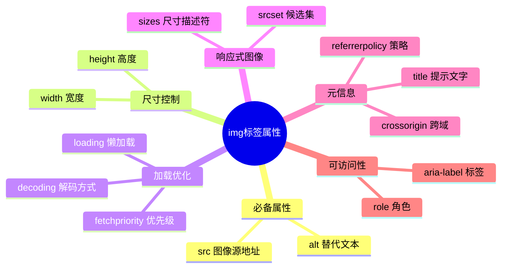
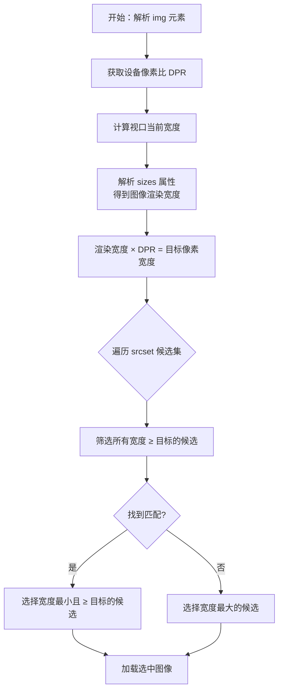
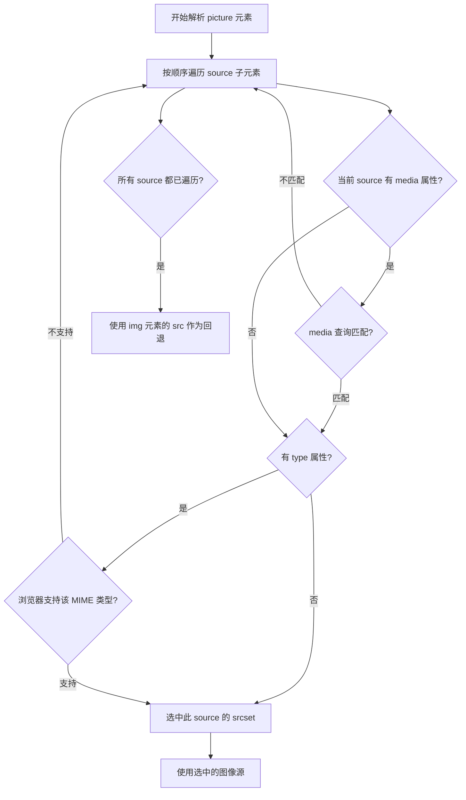
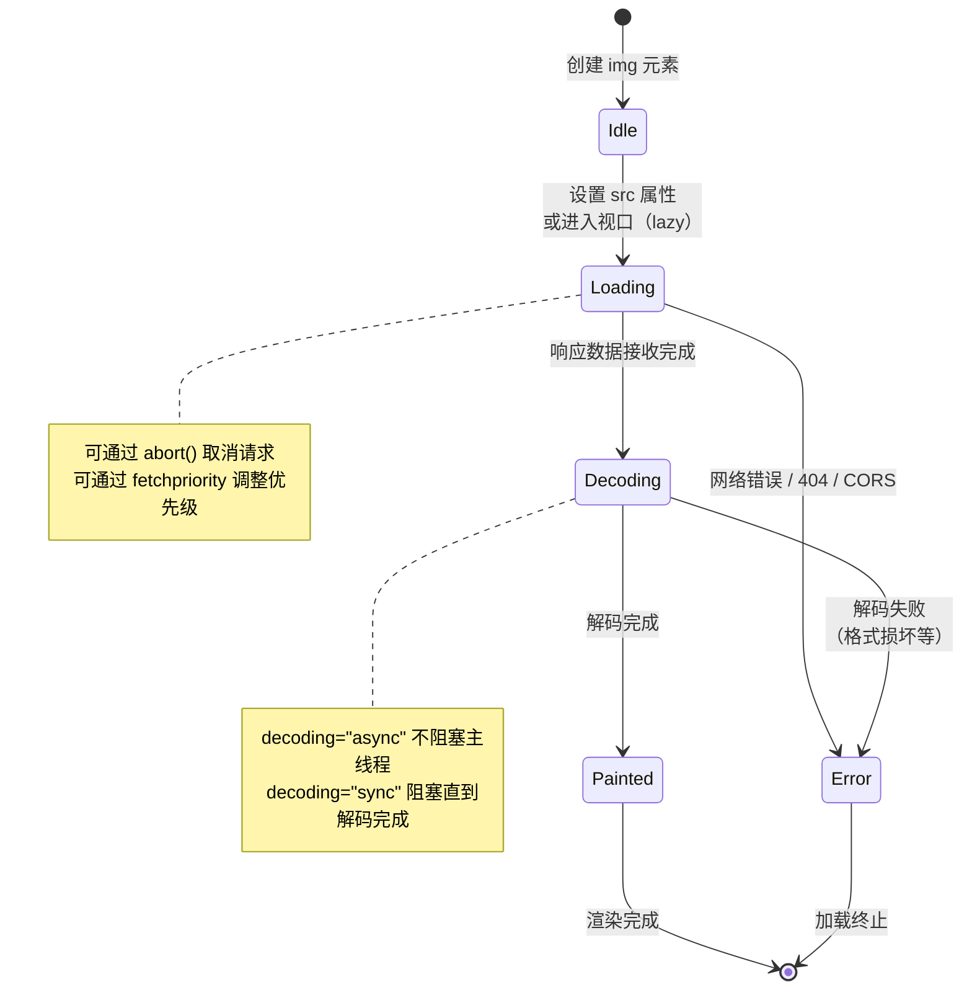
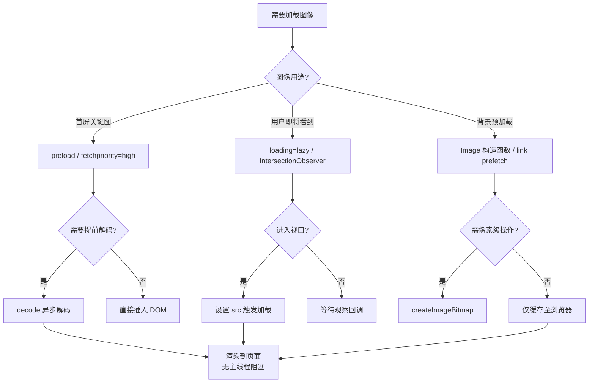

# 图像（01）：现代图像 API 深度解析


图像是网页内容的重要组成部分，用于展示信息、增强视觉效果和提升用户体验。`` 标签是 HTML 中最重要的媒体元素之一，正确使用图像属性和现代技术可以显著提升页面性能和用户体验。

**学习目标：**

- 掌握 `` 标签的完整属性体系和使用方法
- 理解响应式图像的实现原理和最佳实践
- 能够优化图像加载性能，提升页面体验
- 掌握图像的可访问性要求和 SEO 最佳实践
- 了解现代图像格式和工具链的使用

## 基本语法

`` 是个自闭合标签，`src` 属性指定图像文件的路径，`alt` 属性提供图像的替代文本（强烈建议始终提供）

```html

```

以下思维导图梳理了 `` 标签的完整属性体系，帮助建立全局认知：



属性速查表：

| 属性             | 作用             | 常见取值/说明                                                 | 说明                              |
| ---------------- | ---------------- | ------------------------------------------------------------- | --------------------------------- |
| `src`            | 图像源地址       | 相对路径或绝对 URL                                            | 必填                              |
| `alt`            | 替代文本         | 描述性文本                                                    | 必填（可访问性和 SEO）            |
| `title`          | 提示文字         | 描述性文本                                                    | 鼠标悬停时显示                    |
| `width`          | 图像宽度         | 像素值或百分比                                                | 建议 CSS 控制尺寸                 |
| `height`         | 图像高度         | 像素值或百分比                                                | 建议 CSS 控制尺寸                 |
| `loading`        | 懒加载           | `lazy`、`eager`                                               | 性能优化，默认 `eager`            |
| `decoding`       | 解码方式         | `async`、`sync`、`auto`                                       | 性能优化，默认 `auto`             |
| `srcset`         | 响应式图像源集   | 多个图像源和描述符（`1x`、`2x` 或 `400w`、`800w`）            | 响应式设计                        |
| `sizes`          | 响应式图像尺寸   | 媒体查询和尺寸描述                                            | 配合 `srcset` 使用                |
| `usemap`         | 图像映射         | `#map-name`                                                   | 图像热区链接                      |
| `ismap`          | 服务器端图像映射 | 布尔值                                                        | 较少使用                          |
| `crossorigin`    | 跨域设置         | `anonymous`、`use-credentials`                                | CORS 相关                         |
| `referrerpolicy` | 引荐来源策略     | `no-referrer`、`origin`、`strict-origin-when-cross-origin` 等 | 隐私控制                          |
| `fetchpriority`  | 获取优先级       | `high`、`low`、`auto`                                         | 性能优化，默认 `auto`             |
| `intrinsicsize`  | 固有尺寸         | 宽度 x 高度（如 `400x300`）                                   | 实验性，用于布局稳定性            |
| `importance`     | 资源重要性       | `high`、`low`、`auto`                                         | 已废弃，使用 `fetchpriority` 替代 |

::: warning

以下属性在 HTML5 中已废弃，应使用 CSS 替代：

- `border`：使用 CSS `border` 属性
- `align`：使用 CSS `vertical-align` 和 `float`
- `hspace`、`vspace`：使用 CSS `margin`

:::

## 图像路径与资源组织

在实际项目中，图像文件通常会存放在单独的资源目录中，例如 `images`、`assets/images` 等。合理组织路径可以避免「本地能显示、线上不显示」等问题。

- 相对路径：相对于当前 HTML 文件的位置，例如 `./images/logo.png`、`../images/bg.jpg`
- 绝对路径：从网站根目录开始，例如 `/images/logo.png`
- 完整 URL：包含协议和域名，例如 `https://example.com/images/logo.png`

常见推荐做法：

- 为静态资源单独建立目录，如 `/assets/images`、`/static/img`
- 线上环境使用 CDN 地址提供图像，例如 `https://cdn.example.com/img/...`
- 统一命名规范（小写、短横线分隔），方便管理和搜索

当图像来自其他站点时，如果需要在 `<canvas>` 中使用或读取像素信息，需要配合 `crossorigin` 和服务器端的 CORS 配置，否则会触发安全限制。

## 图像属性

### 图像尺寸（width、height）

`width` 和 `height` 属性用于设置图像的显示尺寸。在现代 Web 开发中，建议使用 CSS 来控制图像尺寸，但 HTML 属性仍有其用途

```html


<style>
  .responsive-img {
    width: 100%;
    max-width: 300px;
    height: auto; /* 保持宽高比 */
  }
</style>
```

**重要提示：**

1. **防止布局偏移（CLS）**：设置 `width` 和 `height` 属性可以帮助浏览器预留空间，减少累积布局偏移（Cumulative Layout Shift），提升页面性能评分。

```html
<!-- ✅ 推荐：设置宽高属性 -->

```

2. **响应式图像**：使用 CSS 实现响应式，同时保留 HTML 属性作为提示。

```html

```

3. **宽高比**：如果只设置宽度或高度，浏览器会按比例调整另一个维度。

### 图像边框（border）

::: danger

`border` 属性在 HTML5 中已废弃，应使用 CSS `border` 属性。

:::

**❌ 废弃方式：**

```html

```

**✅ 推荐方式：**

```html

<style>
  .bordered {
    border: 2px solid #333;
    border-radius: 4px;
  }
</style>
```

```html
<!DOCTYPE html>
<html lang="zh-CN">
  <head>
    <meta charset="UTF-8" />
    <meta name="viewport" content="width=device-width, initial-scale=1.0" />
    <title>设置主图和缩略图的大小并添加边框</title>
    <style>
      .image-container {
        max-width: 1100px;
        margin: 0 auto;
        padding: 20px;
        text-align: center;
      }

      .main-image {
        width: 350px;
        height: 350px;
        margin-bottom: 10px;
        border: none;
        border-radius: 4px;
      }

      .thumbnail-image {
        width: 50px;
        height: 50px;
        margin: 0 5px;
        border: 2px solid #333;
        border-radius: 4px;
        cursor: pointer;
        transition: border-color 0.2s;
      }

      .thumbnail-image:hover {
        border-color: #1890ff;
      }
    </style>
  </head>
  <body>
    <div class="image-container">
      <!-- 主图：无边框 -->
      
      <br />

      <!-- 缩略图：有边框 -->
      
      
      
    </div>
  </body>
</html>
```

### 图像间距（hspace、vspace）

::: danger

`hspace` 和 `vspace` 属性在 HTML5 中已废弃，应使用 CSS `margin` 属性。

:::

**❌ 废弃方式：**

```html

```

**✅ 推荐方式：**

```html

<style>
  .spaced {
    margin: 20px; /* 四个方向 */
    /* 或 */
    margin-left: 20px;
    margin-right: 20px;
    margin-top: 20px;
    margin-bottom: 20px;
  }
</style>
```

**文字环绕图像的间距示例：**

```html
<!DOCTYPE html>
<html lang="zh-CN">
  <head>
    <meta charset="UTF-8" />
    <title>图像与文字间距</title>
    <style>
      .article {
        max-width: 800px;
        margin: 0 auto;
      }
      .article img {
        float: left;
        margin-right: 20px;
        margin-bottom: 20px;
        max-width: 300px;
      }
    </style>
  </head>
  <body>
    <article class="article">
      
      <p>
        这是一段文字内容，文字会环绕在图像的右侧。通过 CSS margin
        属性，我们可以精确控制图像与文字之间的间距，使布局更加美观和协调。
      </p>
    </article>
  </body>
</html>
```

使用示例：


```html
<!DOCTYPE html>
<html lang="zh-CN">
  <head>
    <meta charset="UTF-8" />
    <meta name="viewport" content="width=device-width, initial-scale=1.0" />
    <title>设置图像的间距</title>
    <style>
      body {
        font-family: -apple-system, BlinkMacSystemFont, "Segoe UI", sans-serif;
      }

      .section {
        margin-bottom: 40px;
      }

      .section-title {
        font-size: 16px;
        margin-bottom: 10px;
        color: #333;
      }

      /* 基础图像样式 */
      .avatar {
        width: 100px;
        height: 100px;
        border: 2px solid #333;
        border-radius: 4px;
      }

      /* 不设置间距（使用默认 inline 间距） */
      .no-spacing .avatar {
        margin: 0;
      }

      /* 设置垂直间距 */
      .vertical-spacing .avatar {
        margin-top: 20px;
        margin-bottom: 20px;
      }

      /* 设置水平间距 */
      .horizontal-spacing .avatar {
        margin-left: 20px;
        margin-right: 20px;
      }

      /* 推荐方式：使用 Flexbox */
      .flex-spacing {
        display: flex;
        gap: 20px;
        align-items: center;
      }

      .flex-spacing .avatar {
        margin: 0;
      }
    </style>
  </head>
  <body>
    <h3>请选择您喜欢的头像：</h3>
    <hr />

    <!-- 方式 1：不设置间距 -->
    <div class="section">
      <div class="section-title">不设置间距（默认 inline 间距）</div>
      <div class="no-spacing">
        
        
        
        
      </div>
    </div>

    <!-- 方式 2：设置垂直间距 -->
    <div class="section">
      <div class="section-title">设置垂直间距（margin-top + margin-bottom）</div>
      <div class="vertical-spacing">
        
        
        
        
      </div>
    </div>

    <!-- 方式 3：设置水平间距 -->
    <div class="section">
      <div class="section-title">设置水平间距（margin-left + margin-right）</div>
      <div class="horizontal-spacing">
        
        
        
        
      </div>
    </div>

    <!-- 方式 4：推荐 - 使用 Flexbox -->
    <div class="section">
      <div class="section-title">✅ 推荐方式：使用 Flexbox + gap</div>
      <div class="flex-spacing">
        
        
        
        
      </div>
    </div>
  </body>
</html>
```

### 图片之间的间距

在 HTML 中 ``标签之间存在默认间距，这主要是由于 HTML 的默认样式以及浏览器渲染规则导致的

1. **行内元素特性**：`` 标签默认是行内元素（`display: inline`）。行内元素之间会存在一定的空白间隙，这个间隙是由 HTML 代码中的换行符、空格等空白字符引起的。即使你在代码中没有明显看到空格，换行本身也会被浏览器解析为一个空白字符。
2. **基线对齐**：行内元素默认会按照基线（baseline）对齐，这可能会导致元素之间出现一些额外的空间。

#### 解决方法

1. **去除 HTML 中的空白字符**：将 `` 标签之间的换行符和空格删除，这样就不会产生由空白字符引起的间距

```html
<div>
  不设置间距
</div>
```

2. **使用 CSS 的 `font-size: 0`**：将包含 `` 标签的父元素的 `font-size` 设置为 0，这样可以消除空白字符的影响。然后再为 `` 标签单独设置合适的 `font-size`（如果需要的话）

```html
<!DOCTYPE html>
<html lang="zh-CN">
  <head>
    <meta charset="UTF-8" />
    <title>设置图像的间距</title>
    <style>
      .avatar-list {
        font-size: 0; /* 消除空白字符影响 */
      }

      .avatar {
        width: 100px;
        height: 100px;
        border: 2px solid #333;
        border-radius: 4px;
      }

      .title {
        font-size: 16px;
        margin-bottom: 10px;
      }
    </style>
  </head>
  <body>
    <h3>请选择您喜欢的头像：</h3>
    <hr />

    <div class="avatar-list">
      <span class="title">不设置间距</span>
      
      
      
      
    </div>
  </body>
</html>
```

3. **✅ 推荐：使用 CSS 的 `display: flex`**：将父元素设置为 `display: flex`，这样可以更灵活地控制子元素的间距。

```html
<!DOCTYPE html>
<html lang="zh-CN">
  <head>
    <meta charset="UTF-8" />
    <title>设置图像的间距</title>
    <style>
      .img-container {
        display: flex;
        gap: 20px; /* 设置子元素之间的间距 */
      }
      .img-container img {
        width: 100px;
      }
    </style>
  </head>
  <body>
    <h3>请选择您喜欢的头像：</h3>
    <hr size="2" />
    <div class="img-container">
      不设置间距
      
      
      
      
    </div>
  </body>
</html>
```

### 图像相对于文字基准线的对齐方式

图像相对于文字基准线的对齐方式通过 `align` 属性进行设置。``

- **`top`**：将图片的顶部与相邻文本行的顶部对齐
- **`middle`**：将图片的中部与相邻文本行的基线对齐。基线是指文本行中字母的底部，对于大多数字体来说，基线位于文本行的中部偏下位置
- **`bottom`**：将图片的底部与相邻文本行的底部对齐
- **`left`**：将图片对齐到其容器的左侧，并使文本环绕在图片的右侧
- **`right`**：将图片对齐到其容器的右侧，并使文本环绕在图片的左侧


```html
<!DOCTYPE html>
<html>
  <head>
    <meta charset="utf-8" />
    <title>图像与文字的相对位置</title>
    <style>
      img {
        width: 100px;
      }

      span {
        font-size: 28px;
        color: #ff66cc;
      }
    </style>
  </head>
  <body>
    <div>
      <span>好看的微信头像</span>
      <!--图像的底端与文字的底端对齐-->
      
      <!--图像的中间与文本的基线对齐-->
      
      <!--图像的顶端与文字的基线对齐-->
      
      <!--图像的中间与同行中文字的中间对齐-->
      
      <!--图像的底端与文字的基线对齐-->
      
    </div>
  </body>
</html>
```

::: danger

在 HTML5 中，`` 标签的 `align` 属性已经被废弃。取而代之的是使用 CSS 来控制图片的对齐和布局。例如，可以使用 `vertical-align` 属性来实现垂直对齐，使用 `float` 属性来实现水平对齐和文本环绕效果

:::

**CSS 替代方法**：

- 垂直对齐：`vertical-align: top;`、`vertical-align: middle;`、`vertical-align: bottom;`
- 水平对齐和文本环绕：`float: left;`、`float: right;`

**兼容性和样式控制**：使用 CSS 来控制图片的对齐和布局可以提供更灵活的样式定制，并且可以更好地适应不同的屏幕和设备。此外，CSS 样式可以集中管理，便于维护和更新

### alt 属性（替代文本）

`alt` 属性是图像最重要的属性之一，用于提供图像的文本描述。它对于可访问性、SEO 和用户体验都至关重要。

**作用：**

1. **可访问性**：屏幕阅读器会读取 `alt` 文本，帮助视障用户理解图像内容
2. **图像加载失败**：当图像无法加载时，浏览器会显示 `alt` 文本
3. **SEO**：搜索引擎使用 `alt` 文本理解图像内容，有助于图片搜索排名

**最佳实践：**

```html
<!-- ✅ 信息性图像：提供有意义的描述 -->


<!-- ✅ 装饰性图像：使用空 alt -->


<!-- ✅ 功能性图像：描述功能 -->

<a href="/search">
  
</a>

<!-- ❌ 避免：冗余描述 -->


<!-- ❌ 避免：使用文件名 -->


<!-- ❌ 避免：过于冗长 -->

<!-- ✅ 改进 -->

```

**alt 文本编写指南：**

- **信息性图像**：简洁准确地描述图像内容和目的
- **装饰性图像**：使用空字符串 `alt=""`，并考虑添加 `role="presentation"` 或 `aria-hidden="true"`
- **功能性图像**：描述图像的功能而非外观
- **复杂图像**：提供简要描述，详细内容可在周围文本中说明
- **避免**：以"图片"、"图像"、"图标"等词开头（屏幕阅读器会自动说明）

### title 属性（提示文字）

`title` 属性用于提供额外的提示信息，当用户将鼠标悬停在图像上时会显示。

**使用场景：**

```html
<!-- 提供额外信息 -->


<!-- 版权信息 -->

```

**注意事项：**

1. **不要依赖 title**：`title` 属性在移动设备上不可用，不应作为主要信息源
2. **alt 优先**：始终提供有意义的 `alt` 属性，`title` 仅作为补充
3. **避免重复**：`title` 不应简单重复 `alt` 的内容

**alt 与 title 的区别：**

| 属性  | 用途     | 显示时机       | 可访问性 | 必需性 |
| ----- | -------- | -------------- | -------- | ------ |
| alt   | 替代文本 | 图像无法加载时 | 是       | 是     |
| title | 提示信息 | 鼠标悬停时     | 否       | 否     |

**完整示例：**

```html
<!DOCTYPE html>
<html lang="zh-CN">
  <head>
    <meta charset="UTF-8" />
    <title>图像 alt 和 title 示例</title>
  </head>
  <body>
    <!-- 信息性图像 -->
    <figure>
      
      <figcaption>美丽的日落景色</figcaption>
    </figure>

    <!-- 装饰性图像 -->
    <div class="header">
      
      <h1>网站标题</h1>
    </div>

    <!-- 功能性图像 -->
    <button type="button">
      
    </button>
  </body>
</html>
```

## 响应式图像

响应式图像是现代 Web 开发的重要特性，可以根据设备屏幕大小、像素密度等因素自动选择合适的图像。

<h4>030-responsive-image-srcset.html</h4>

```html
<!-- 来源：5-图像.md - 响应式图像 srcset/sizes -->
<!DOCTYPE html>
<html lang="zh-CN">
<head>
  <meta charset="UTF-8">
  <meta name="viewport" content="width=device-width, initial-scale=1.0">
  <title>响应式图像 - srcset 与 sizes</title>
  <style>
    * {
      margin: 0;
      padding: 0;
      box-sizing: border-box;
    }

    body {
      font-family: -apple-system, BlinkMacSystemFont, "Segoe UI", sans-serif;
      line-height: 1.6;
      color: #333;
      background: #f5f7fa;
      padding: 40px 20px;
    }

    .container {
      max-width: 1000px;
      margin: 0 auto;
    }

    h1 { text-align: center; color: #222; margin-bottom: 8px; font-size: 32px; }
    .subtitle { text-align: center; color: #666; margin-bottom: 36px; font-size: 15px; }

    /* 演示卡片 */
    .demo-card {
      background: white;
      border-radius: 12px;
      padding: 28px;
      margin-bottom: 24px;
      box-shadow: 0 2px 12px rgba(0,0,0,0.06);
    }

    .demo-card h3 {
      font-size: 18px;
      color: #333;
      margin-bottom: 12px;
      display: flex;
      align-items: center;
      gap: 8px;
    }

    .demo-card > p {
      color: #666;
      font-size: 14px;
      line-height: 1.7;
      margin-bottom: 16px;
    }

    /* 响应式图片容器 */
    .responsive-image-container {
      background: #f8f9fa;
      border-radius: 10px;
      padding: 20px;
      text-align: center;
    }

    .responsive-image-container img {
      max-width: 100%;
      height: auto;
      border-radius: 8px;
      box-shadow: 0 4px 16px rgba(0,0,0,0.1);
    }

    /* 代码块 */
    .code-block {
      background: #1e1e1e;
      color: #d4d4d4;
      padding: 16px 20px;
      border-radius: 8px;
      font-family: 'Monaco', 'Menlo', monospace;
      font-size: 13px;
      line-height: 1.7;
      overflow-x: auto;
      margin-top: 14px;
    }

    .tag { color: #569cd6; }
    .attr { color: #9cdcfe; }
    .value { color: #ce9178; }
    .comment { color: #6a9955; }

    /* 对比表格 */
    .compare-table {
      width: 100%;
      border-collapse: collapse;
      margin-top: 16px;
      font-size: 14px;
    }

    .compare-table th,
    .compare-table td {
      padding: 12px 16px;
      text-align: left;
      border-bottom: 1px solid #eee;
    }

    .compare-table th {
      background: #f8f9fa;
      font-weight: 600;
      color: #555;
      font-size: 13px;
    }

    /* 信息面板 */
    .info-panel {
      display: grid;
      grid-template-columns: repeat(auto-fit, minmax(240px, 1fr));
      gap: 16px;
      margin-top: 20px;
    }

    .info-item {
      background: linear-gradient(135deg, #e3f2fd 0%, #bbdefb 100%);
      padding: 18px;
      border-radius: 10px;
      border-left: 4px solid #0066cc;
    }

    .info-item h4 {
      color: #0066cc;
      font-size: 15px;
      margin-bottom: 6px;
    }

    .info-item p {
      font-size: 13px;
      color: #333;
      line-height: 1.6;
    }

    /* 当前选择状态 */
    .selection-status {
      background: linear-gradient(135deg, #d4edda 0%, #c3e6cb 100%);
      padding: 16px 20px;
      border-radius: 8px;
      margin-top: 16px;
      font-family: 'Monaco', monospace;
      font-size: 13px;
      color: #155724;
    }
  </style>
</head>
<body>

  <div class="container">
    <h1>📐 响应式图像</h1>
    <p class="subtitle">srcset + sizes：让浏览器自动选择最合适的图像</p>


    <!-- 演示 1：基于像素密度 (x 描述符) -->
    <div class="demo-card">
      <h3>🔍 方式一：基于像素密度（x 描述符）</h3>
      <p>
        使用 <strong>1x、2x、3x</strong> 等像素密度描述符，
        浏览器根据设备的 <code>devicePixelRatio</code>（DPR）自动选择。
        适用于固定尺寸的图像（如 Logo、图标、头像）。
      </p>

      <div class="responsive-image-container">
        
      </div>

      <div class="code-block">
<span class="tag">&lt;img</span>
  <span class="attr">src</span>=<span class="value">"image-1x.jpg"</span>
  <span class="attr">srcset</span>=<span class="value">"</span>
<span class="value">    image-1x.jpg   1x,</span>  <span class="comment">&lt;!-- 普通屏幕 --&gt;</span>
<span class="value">    image-2x.jpg   2x,</span>  <span class="comment">&lt;!-- Retina 屏幕 (2x) --&gt;</span>
<span class="value">    image-3x.jpg   3x</span>   <span class="comment">&lt;!-- 超高清屏幕 (3x) --&gt;</span>
<span class="value">  "</span>
  <span class="attr">alt</span>=<span class="value">"响应式图像"</span>
<span class="tag">/&gt;</span>
      </div>

      <div class="selection-status" id="densityStatus">
        💡 当前设备 DPR：<span id="dprValue">--</span> | 可能选择的图像：<span id="selectedImage">--</span>
      </div>
    </div>


    <!-- 演示 2：基于视口宽度 (w 描述符 + sizes) -->
    <div class="demo-card">
      <h3>📏 方式二：基于视口宽度（w 描述符 + sizes）</h3>
      <p>
        使用 <strong>w</strong> 宽度描述符配合 <strong>sizes</strong> 属性，
        浏览器根据当前视口宽度和图像渲染宽度计算最优资源。
        适用于<strong>流式布局</strong>中的大图（Hero Image、Banner 等）。
      </p>

      <div class="responsive-image-container">
        
      </div>

      <div class="code-block">
<span class="tag">&lt;img</span>
  <span class="attr">src</span>=<span class="value">"image-small.jpg"</span>
  <span class="attr">srcset</span>=<span class="value">"</span>
<span class="value">    image-400w.jpg  400w,</span>
<span class="value">    image-800w.jpg  800w,</span>
<span class="value">    image-1200w.jpg 1200w,</span>
<span class="value">    image-1600w.jpg 1600w</span>
<span class="value">  "</span>
  <span class="attr">sizes</span>=<span class="value">"</span>
<span class="value">    (max-width: 600px) 100vw,</span>   <span class="comment">&lt;!-- 手机：占满视口 --&gt;</span>
<span class="value">    (max-width: 1200px) 80vw,</span>  <span class="comment">&lt;!-- 平板：占 80% --&gt;</span>
<span class="value">    1200px</span>                      <span class="comment">&lt;!-- 桌面：最大 1200px --&gt;</span>
<span class="value">  "</span>
  <span class="attr">alt</span>=<span class="value">"响应式 Hero 图像"</span>
<span class="tag">/&gt;</span>
      </div>

      <div class="selection-status" id="viewportStatus">
        📱 当前视口宽度：<span id="viewportWidth">--</span>px |
        计算渲染宽度：<span id="renderWidth">--</span> |
        推荐加载：<span id="recommendedSrc">--</span>
      </div>
    </div>


    <!-- srcset vs picture 对比 -->
    <div class="demo-card">
      <h3>⚖️ srcset vs picture 选择指南</h3>

      <table class="compare-table">
        <thead>
          <tr>
            <th>特性</th>
            <th>&lt;img&gt; + srcset/sizes</th>
            <th>&lt;picture&gt; + &lt;source&gt;</th>
          </tr>
        </thead>
        <tbody>
          <tr>
            <td><strong>同一图片不同分辨率</strong></td>
            <td style="color:#28a745;">✅ 推荐</td>
            <td style="color:#999;">可用但冗余</td>
          </tr>
          <tr>
            <td><strong>不同裁剪/构图（艺术指导）</strong></td>
            <td style="color:#dc3545;">❌ 不支持</td>
            <td style="color:#28a745;">✅ 推荐</td>
          </tr>
          <tr>
            <td><strong>格式选择（WebP/AVIF/JPG）</strong></td>
            <td style="color:#dc3545;">❌ 不支持</td>
            <td style="color:#28a745;">✅ 推荐</td>
          </tr>
          <tr>
            <td><strong>媒体查询条件控制</strong></td>
            <td style="color:#999;">仅通过 sizes 间接影响</td>
            <td style="color:#28a745;">✅ 直接通过 media 属性</td>
          </tr>
          <tr>
            <td><strong>深色模式适配</strong></td>
            <td style="color:#dc3545;">❌ 不支持</td>
            <td style="color:#28a745;">✅ 支持</td>
          </tr>
          <tr>
            <td><strong>代码复杂度</strong></td>
            <td style="color:#28a745;">⭐ 低</td>
            <td style="color:#fd7e14;">⭐⭐ 较高</td>
          </tr>
        </tbody>
      </table>
    </div>


    <!-- 核心概念说明 -->
    <div class="info-panel">
      <div class="info-item">
        <h4>📷 x 描述符（像素密度）</h4>
        <p>表示图像的<strong>像素密度倍数</strong>。2x 图像是 1x 的两倍分辨率，适用于 Retina/高分屏设备。</p>
      </div>

      <div class="info-item">
        <h4>📐 w 描述符（固有宽度）</h4>
        <p>表示图像的<strong>实际像素宽度</strong>。浏览器用此值配合 sizes 计算应下载哪个版本。</p>
      </div>

      <div class="info-item">
        <h4>📏 sizes 属性</h4>
        <p>告诉浏览器图像在<strong>不同视口宽度下的渲染尺寸</strong>。格式为媒体查询 + 长度值。</p>
      </div>

      <div class="info-item">
        <h4>🧠 浏览器选择算法</h4>
        <p><code>渲染宽度 × DPR = 目标像素宽度</code>，选择 ≥ 目标的最小候选图像。</p>
      </div>
    </div>

  </div>

  <script>
    /**
     * 实时显示当前设备和浏览器的图像选择情况
     */

    // 显示设备像素比
    const dpr = window.devicePixelRatio || 1
    document.getElementById('dprValue').textContent = dpr + 'x'

    let densityChoice = '1x'
    if (dpr >= 2.5) densityChoice = '3x (image-3x.jpg)'
    else if (dpr >= 1.5) densityChoice = '2x (image-2x.jpg)'
    else densityChoice = '1x (image-1x.jpg)'
    document.getElementById('selectedImage').textContent = densityChoice


    // 显示视口宽度相关计算
    function updateViewportInfo() {
      const vw = window.innerWidth

      document.getElementById('viewportWidth').textContent = vw

      // 根据 sizes 属性逻辑计算渲染宽度
      let renderW
      if (vw <= 600) renderW = vw  // 100vw
      else if (vw <= 1200) renderW = Math.round(vw * 0.8)  // 80vw
      else renderW = 1200  // 固定 1200px

      document.getElementById('renderWidth').textContent = renderW + 'px'

      // 计算目标像素宽度并推荐源
      const targetPx = Math.round(renderW * dpr)
      let recommended
      if (targetPx <= 400) recommended = '400w (image-400w.jpg)'
      else if (targetPx <= 800) recommended = '800w (image-800w.jpg)'
      else if (targetPx <= 1200) recommended = '1200w (image-1200w.jpg)'
      else recommended = '1600w (image-1600w.jpg)'

      document.getElementById('recommendedSrc').textContent = `${recommended} （目标 ${targetPx}px）`
    }

    updateViewportInfo()
    window.addEventListener('resize', updateViewportInfo)
  </script>

</body>
</html>
```


<h4>031-picture-element.html</h4>

```html
<!-- 来源：5-图像.md - picture 元素（格式优先 + 艺术指导 + 深色模式） -->
<!DOCTYPE html>
<html lang="zh-CN">
<head>
  <meta charset="UTF-8">
  <meta name="viewport" content="width=device-width, initial-scale=1.0">
  <title>picture 元素 - 响应式图像终极方案</title>
  <style>
    * {
      margin: 0;
      padding: 0;
      box-sizing: border-box;
    }

    body {
      font-family: -apple-system, BlinkMacSystemFont, "Segoe UI", sans-serif;
      line-height: 1.6;
      color: #333;
      background: #f5f7fa;
      padding: 40px 20px;
    }

    .container {
      max-width: 1000px;
      margin: 0 auto;
    }

    h1 { text-align: center; color: #222; margin-bottom: 8px; font-size: 32px; }
    .subtitle { text-align: center; color: #666; margin-bottom: 36px; font-size: 15px; }

    /* 演示卡片 */
    .demo-card {
      background: white;
      border-radius: 12px;
      padding: 28px;
      margin-bottom: 24px;
      box-shadow: 0 2px 12px rgba(0,0,0,0.06);
    }

    .demo-card h3 {
      font-size: 18px;
      color: #333;
      margin-bottom: 12px;
      display: flex;
      align-items: center;
      gap: 8px;
    }

    .demo-card > p {
      color: #666;
      font-size: 14px;
      line-height: 1.7;
      margin-bottom: 16px;
    }

    /* 图片展示区 */
    .image-showcase {
      background: #f8f9fa;
      border-radius: 10px;
      padding: 20px;
      text-align: center;
      margin-top: 14px;
    }

    .image-showcase picture,
    .image-showcase img {
      max-width: 100%;
      height: auto;
      border-radius: 8px;
      display: block;
      margin: 0 auto;
    }

    /* 代码块 */
    .code-block {
      background: #1e1e1e;
      color: #d4d4d4;
      padding: 16px 20px;
      border-radius: 8px;
      font-family: 'Monaco', 'Menlo', monospace;
      font-size: 12px;
      line-height: 1.7;
      overflow-x: auto;
      margin-top: 14px;
    }

    .tag { color: #569cd6; }
    .attr { color: #9cdcfe; }
    .value { color: #ce9178; }
    .comment { color: #6a9955; }

    /* 场景标签 */
    .scene-badge {
      display: inline-block;
      padding: 4px 12px;
      border-radius: 20px;
      font-size: 12px;
      font-weight: 600;
      margin-left: auto;
    }

    .badge-format { background: #e8f5e9; color: #2e7d32; }
    .badge-art { background: #fff3e0; color: #e65100; }
    .badge-dark { background: #311b92; color: #b39ddb; }

    /* 格式优先级指示器 */
    .format-priority {
      display: flex;
      align-items: center;
      justify-content: center;
      gap: 10px;
      margin-top: 14px;
      padding: 12px;
      background: linear-gradient(90deg, #d4edda, #fff3cd, #fce4ec);
      border-radius: 8px;
      font-size: 13px;
      font-weight: 500;
    }

    .format-item {
      padding: 6px 14px;
      background: white;
      border-radius: 6px;
      box-shadow: 0 2px 4px rgba(0,0,0,0.08);
    }

    .format-item:first-child::before { content: "🥇 "; }
    .format-item:nth-child(2)::before { content: "🥈 "; }
    .format-item:nth-child(3)::before { content: "🥉 "; }

    /* 匹配逻辑说明 */
    .matching-flow {
      display: flex;
      flex-direction: column;
      gap: 8px;
      margin-top: 14px;
      padding: 16px;
      background: #f0f4f8;
      border-radius: 8px;
      font-size: 13px;
    }

    .flow-step {
      display: flex;
      align-items: center;
      gap: 10px;
      padding: 8px 12px;
      background: white;
      border-radius: 6px;
    }

    .flow-num {
      width: 24px;
      height: 24px;
      background: #0066cc;
      color: white;
      border-radius: 50%;
      display: flex;
      align-items: center;
      justify-content: center;
      font-size: 12px;
      font-weight: bold;
      flex-shrink: 0;
    }

    @media (prefers-color-scheme: dark) {
      body { background: #1a1a2e; color: #e0e0e0; }
      .demo-card { background: #16213e; }
      .code-block { background: #0f0f23; }
      .image-showcase { background: #1a1a2e; }
    }
  </style>
</head>
<body>

  <div class="container">
    <h1>🎨 picture 元素</h1>
    <p class="subtitle">格式选择 / 艺术指导 / 深色模式 — 响应式图像的终极方案</p>


    <!-- 场景 1：格式优先（AVIF → WebP → JPEG） -->
    <div class="demo-card">
      <h3>
        🖼️ 场景一：格式优先
        <span class="scene-badge badge-format">推荐</span>
      </h3>
      <p>
        按<strong>现代格式优先</strong>排列 &lt;source&gt;，浏览器会选择其支持的最优格式。
        推荐顺序：<strong>AVIF → WebP → JPEG/PNG</strong>，
        同时配合分辨率适配。
      </p>

      <div class="image-showcase">
        <picture>
          <!-- 优先级 1：AVIF（最新格式，压缩率最高） -->
          <source
            type="image/avif"
            srcset="https://picsum.photos/800/500?random=1&avif" />

          <!-- 优先级 2：WebP（现代格式，兼容性好） -->
          <source
            type="image/webp"
            srcset="https://picsum.photos/800/500?random=1&webp" />

          <!-- 回退：JPEG（所有浏览器支持） -->
          
        </picture>
      </div>

      <div class="format-priority">
        浏览器选择优先级：
        <span class="format-item">AVIF (最小)</span> →
        <span class="format-item">WebP (较小)</span> →
        <span class="format-item">JPEG (兜底)</span>
      </div>

      <div class="code-block">
<span class="tag">&lt;picture&gt;</span>
  <span class="comment">&lt;!-- 优先级 1: AVIF（压缩率最高）--&gt;</span>
  <span class="tag">&lt;source</span> <span class="attr">type</span>=<span class="value">"image/avif"</span>
         <span class="attr">srcset</span>=<span class="value">"photo.avif"</span> /&gt;

  <span class="comment">&lt;!-- 优先级 2: WebP（兼容性好）--&gt;</span>
  <span class="tag">&lt;source</span> <span class="attr">type</span>=<span class="value">"image/webp"</span>
         <span class="attr">srcset</span>=<span class="value">"photo.webp"</span> /&gt;

  <span class="comment">&lt;!-- 兜底回退：JPEG --&gt;</span>
  <span class="tag">&lt;img</span> <span class="attr">src</span>=<span class="value">"photo.jpg"</span>
       <span class="attr">alt</span>=<span class="value">"照片"</span>
       <span class="attr">loading</span>=<span class="value">"lazy"</span> /&gt;
<span class="tag">&lt;/picture&gt;</span>
      </div>
    </div>


    <!-- 场景 2：艺术指导（不同视口不同构图） -->
    <div class="demo-card">
      <h3>
        📐 场景二：艺术指导
        <span class="scene-badge badge-art">Art Direction</span>
      </h3>
      <p>
        不同屏幕尺寸下显示<strong>不同裁剪或构图</strong>的图像。
        移动端使用竖屏特写，桌面端使用横屏全景。
        这是 &lt;img&gt; + srcset 无法实现的能力。
      </p>

      <div class="image-showcase">
        <picture>
          <!-- 移动端：竖屏裁剪 -->
          <source
            media="(max-width: 640px)"
            srcset="https://picsum.photos/400/600?random=2"
            type="image/jpeg" />

          <!-- 平板/桌面：横屏全景 -->
          <source
            media="(min-width: 641px)"
            srcset="https://picsum.photos/900/400?random=2"
            type="image/jpeg" />

          <!-- 默认回退 -->
          
        </picture>
      </div>

      <div class="code-block">
<span class="tag">&lt;picture&gt;</span>
  <span class="comment">&lt;!-- 移动端：竖屏特写 --&gt;</span>
  <span class="tag">&lt;source</span>
    <span class="attr">media</span>=<span class="value">"(max-width: 640px)"</span>
    <span class="attr">srcset</span>=<span class="value">"hero-mobile.webp"</span>
    <span class="attr">type</span>=<span class="value">"image/webp"</span> /&gt;

  <span class="comment">&lt;!-- 桌面端：横屏全景 --&gt;</span>
  <span class="tag">&lt;source</span>
    <span class="attr">media</span>=<span class="value">"(min-width: 641px)"</span>
    <span class="attr">srcset</span>=<span class="value">"hero-desktop.webp"</span>
    <span class="attr">type</span>=<span class="value">"image/webp"</span> /&gt;

  <span class="comment">&lt;!-- 回退 --&gt;</span>
  <span class="tag">&lt;img</span> <span class="attr">src</span>=<span class="value">"hero-desktop.jpg"</span>
       <span class="attr">alt</span>=<span class="value">"Hero 图像"</span> /&gt;
<span class="tag">&lt;/picture&gt;</span>
      </div>
    </div>


    <!-- 场景 3：深色模式适配 -->
    <div class="demo-card">
      <h3>
        🌙 场景三：深色模式适配
        <span class="scene-badge badge-dark">Dark Mode</span>
      </h3>
      <p>
        利用 <strong>prefers-color-scheme</strong> 媒体查询为深色模式提供不同的图片版本，
        提升用户在不同主题下的视觉体验。
      </p>

      <div class="image-showcase" style="background: transparent;">
        <picture>
          <!-- 深色模式：暗色背景图 -->
          <source
            media="(prefers-color-scheme: dark)"
            srcset="https://picsum.photos/800/350?random=3&grayscale"
            type="image/jpeg" />

          <!-- 浅色模式：正常彩色图 -->
          
        </picture>
      </div>

      <p style="text-align:center; margin-top: 10px; font-size: 13px; color: #888;">
        💡 提示：切换操作系统的深色/浅色模式，观察上方图像变化
      </p>

      <div class="code-block">
<span class="tag">&lt;picture&gt;</span>
  <span class="comment">&lt;!-- 深色模式：暗色调图片 --&gt;</span>
  <span class="tag">&lt;source</span>
    <span class="attr">media</span>=<span class="value">"(prefers-color-scheme: dark)"</span>
    <span class="attr">srcset</span>=<span class="value">"banner-dark.webp"</span>
    <span class="attr">type</span>=<span class="value">"image/webp"</span> /&gt;

  <span class="comment">&lt;!-- 浅色模式：正常图片 --&gt;</span>
  <span class="tag">&lt;img</span> <span class="attr">src</span>=<span class="value">"banner-light.jpg"</span>
       <span class="attr">alt</span>=<span class="value">"横幅"</span> /&gt;
<span class="tag">&lt;/picture&gt;</span>
      </div>
    </div>


    <!-- picture 元素匹配逻辑 -->
    <div class="demo-card">
      <h3>🔄 浏览器匹配逻辑流程</h3>

      <div class="matching-flow">
        <div class="flow-step">
          <span class="flow-num">1</span>
          按 &lt;source&gt; 声明顺序依次遍历子元素
        </div>
        <div class="flow-step">
          <span class="flow-num">2</span>
          检查当前 source 是否有 media 属性？
          <br><small style="color:#888;">有 → 检查媒体查询是否匹配 | 无 → 进入步骤 3</small>
        </div>
        <div class="flow-step">
          <span class="flow-num">3</span>
          检查是否有 type 属性？
          <br><small style="color:#888;">有 → 浏览器是否支持该 MIME 类型？| 无 → 直接选中</small>
        </div>
        <div class="flow-step">
          <span class="flow-num">4</span>
          ✅ 首次命中即停止，使用选中的 source 的 srcset
        </div>
        <div class="flow-step" style="background: #fff3cd;">
          <span class="flow-num" style="background: #fd7e14;">!</span>
          所有 source 都不匹配？→ 使用 &lt;img&gt; 作为最终回退
        </div>
      </div>

      <p style="margin-top: 16px; padding: 14px; background: #e3f2fd; border-radius: 8px; font-size: 13px; color: #004085;">
        <strong>⚠️ 重要：</strong>&lt;picture&gt; 内必须包含一个 &lt;img&gt; 元素作为回退！
        浏览器按声明顺序匹配，命中第一个符合条件的 &lt;source&gt; 后立即停止；
        如果所有 &lt;source&gt; 都不匹配，则显示 &lt;img&gt; 的内容。
      </p>
    </div>

  </div>

</body>
</html>
```

### srcset 属性

`srcset` 属性允许指定多个图像源，浏览器会根据设备特性选择最合适的图像。

**基本用法（基于像素密度）：**

```html

```

**基于宽度的描述符：**

```html

```

### sizes 属性

`sizes` 属性与 `srcset` 配合使用，告诉浏览器在不同视口宽度下图像的显示尺寸。

```html

```

**sizes 语法说明：**

- `(max-width: 600px) 100vw`：视口宽度 ≤ 600px 时，图像占满视口宽度
- `(max-width: 1200px) 50vw`：视口宽度 ≤ 1200px 时，图像占视口宽度的 50%
- `800px`：默认情况下，图像宽度为 800px

**完整示例：**

```html
<!DOCTYPE html>
<html lang="zh-CN">
  <head>
    <meta charset="UTF-8" />
    <meta name="viewport" content="width=device-width, initial-scale=1.0" />
    <title>响应式图像</title>
    <style>
      .responsive-img {
        width: 100%;
        height: auto;
        display: block;
      }
    </style>
  </head>
  <body>
    
  </body>
</html>
```

#### 浏览器 srcset 选择算法

浏览器在解析 `srcset` + `sizes` 时，会按照以下流程选择最合适的图像源：



::: tip **关键要点**
- 浏览器会在**下载前**做出选择，不会下载多个版本再比较
- `sizes` 属性的值直接影响最终选择的图像，务必准确设置
- 当 `srcset` 使用 `w` 描述符时，必须配合 `sizes` 属性
:::

### picture 元素

`<picture>` 元素提供了更强大的响应式图像控制，支持艺术指导（Art Direction）和格式选择。

**基本结构：**

```html
<picture>
  <source media="(max-width: 600px)" srcset="portrait-mobile.jpg" />
  <source media="(max-width: 1200px)" srcset="landscape-tablet.jpg" />
  <source type="image/webp" srcset="image.webp" />
  
</picture>
```

::: warning
`<picture>` 内必须包含一个 `` 元素作为回退。浏览器按 `<source>` 声明顺序匹配，命中第一个符合条件的 `<source>` 后即停止；如果所有 `<source>` 都不匹配，则显示 ``。
:::

#### `<picture>` 元素匹配逻辑

浏览器处理 `<picture>` 元素时的匹配流程如下：



::: tip **匹配优先级建议**
1. 将**最具体的媒体查询**放在前面（如移动端特定尺寸）
2. **格式选择**的 `source` 放在媒体查询之后
3. 始终保留最后的 `` 作为兜底回退
:::

**核心使用场景：**

1. **艺术指导（Art Direction）**：不同屏幕显示不同裁剪的图像
2. **格式选择**：为支持新格式的浏览器提供最优格式
3. **条件加载**：根据媒体查询加载不同图像

#### 场景 1：格式优先——AVIF → WebP → JPEG

这是最常见的用法，按格式优先级排列 `<source>`，让浏览器选择其支持的最优格式：

```html
<picture>
  <source type="image/avif" srcset="photo.avif" />
  <source type="image/webp" srcset="photo.webp" />
  
</picture>
```

**格式优先级推荐：** AVIF > WebP > JPEG/PNG

#### 场景 2：艺术指导——不同视口使用不同构图

移动端显示竖屏裁剪，桌面端显示横屏全图：

```html
<picture>
  <source media="(max-width: 640px)" srcset="hero-mobile.webp" type="image/webp" />
  <source media="(max-width: 640px)" srcset="hero-mobile.jpg" />
  <source media="(min-width: 641px)" srcset="hero-desktop.webp" type="image/webp" />
  <source media="(min-width: 641px)" srcset="hero-desktop.jpg" />
  
</picture>
```

#### 场景 3：格式 + 响应式尺寸组合

同时处理格式选择和分辨率适配：

```html
<picture>
  <source
    type="image/avif"
    srcset="photo-400.avif 400w, photo-800.avif 800w, photo-1200.avif 1200w"
    sizes="(max-width: 600px) 100vw, 800px" />
  <source
    type="image/webp"
    srcset="photo-400.webp 400w, photo-800.webp 800w, photo-1200.webp 1200w"
    sizes="(max-width: 600px) 100vw, 800px" />
  
</picture>
```

#### 场景 4：深色模式适配

利用 `media` 属性的 `prefers-color-scheme` 为深色模式提供不同图片：

```html
<picture>
  <source media="(prefers-color-scheme: dark)" srcset="banner-dark.webp" type="image/webp" />
  <source media="(prefers-color-scheme: dark)" srcset="banner-dark.jpg" />
  <source srcset="banner-light.webp" type="image/webp" />
  
</picture>
```

#### `<picture>` 与 `` + `srcset` 的选择

| 特性               | `` + `srcset`/`sizes` | `<picture>` + `<source>` |
| ------------------ | -------------------------- | ------------------------ |
| 同一图片不同分辨率 | ✅ 推荐                    | 可用但冗余               |
| 不同裁剪/构图      | ❌ 不支持                  | ✅ 推荐                  |
| 格式选择           | ❌ 不支持                  | ✅ 推荐                  |
| 媒体查询条件       | 仅通过 `sizes` 间接影响    | ✅ 直接通过 `media` 属性 |
| 代码复杂度         | 低                         | 较高                     |

**决策原则：** 如果只需要分辨率适配，用 `` + `srcset`/`sizes` 即可；如果需要格式选择或艺术指导，使用 `<picture>`。

## 性能优化

<h4>032-image-lazy-loading.html</h4>

```html
<!-- 来源：5-图像.md - 图像懒加载（loading="lazy" + IntersectionObserver） -->
<!DOCTYPE html>
<html lang="zh-CN">
<head>
  <meta charset="UTF-8">
  <meta name="viewport" content="width=device-width, initial-scale=1.0">
  <title>图像懒加载技术</title>
  <style>
    * {
      margin: 0;
      padding: 0;
      box-sizing: border-box;
    }

    body {
      font-family: -apple-system, BlinkMacSystemFont, "Segoe UI", sans-serif;
      line-height: 1.6;
      color: #333;
      background: #f5f7fa;
    }

    /* 导航栏 */
    .navbar {
      position: sticky;
      top: 0;
      background: white;
      padding: 16px 30px;
      box-shadow: 0 2px 8px rgba(0,0,0,0.06);
      z-index: 100;
      display: flex;
      align-items: center;
      justify-content: space-between;
    }

    .navbar h1 {
      font-size: 20px;
      color: #0066cc;
    }

    .stats-bar {
      display: flex;
      gap: 20px;
      font-size: 13px;
      color: #666;
    }

    .stat-item {
      display: flex;
      align-items: center;
      gap: 6px;
    }

    .stat-value {
      font-weight: 700;
      color: #0066cc;
      font-size: 16px;
    }

    /* 主内容区 */
    main {
      max-width: 1000px;
      margin: 0 auto;
      padding: 30px 20px;
    }

    h2 {
      font-size: 22px;
      color: #222;
      margin-bottom: 8px;
    }

    .section-desc {
      color: #666;
      font-size: 14px;
      margin-bottom: 24px;
    }

    /* 首屏区域（立即加载） */
    .hero-section {
      text-align: center;
      padding: 40px 20px;
      margin-bottom: 40px;
      background: linear-gradient(135deg, #667eea 0%, #764ba2 100%);
      border-radius: 16px;
      color: white;
    }

    .hero-section h2 {
      color: white;
      font-size: 28px;
      margin-bottom: 12px;
    }

    .hero-section p { opacity: 0.9; max-width: 600px; margin: 0 auto; }

    .hero-image-container {
      margin-top: 24px;
      border-radius: 12px;
      overflow: hidden;
      box-shadow: 0 8px 32px rgba(0,0,0,0.2);
    }

    .hero-image-container img {
      width: 100%;
      max-width: 700px;
      height: auto;
      display: block;
      margin: 0 auto;
    }


    /* 图片画廊（懒加载演示区） */
    .gallery-grid {
      display: grid;
      grid-template-columns: repeat(auto-fill, minmax(280px, 1fr));
      gap: 20px;
      margin-top: 20px;
    }

    .gallery-item {
      background: white;
      border-radius: 12px;
      overflow: hidden;
      box-shadow: 0 2px 12px rgba(0,0,0,0.06);
      transition: transform 0.3s, box-shadow 0.3s;
    }

    .gallery-item:hover {
      transform: translateY(-4px);
      box-shadow: 0 8px 24px rgba(0,0,0,0.12);
    }

    .gallery-image-wrapper {
      position: relative;
      background: #f0f0f0;
      aspect-ratio: 4/3;
      overflow: hidden;
    }

    .gallery-image-wrapper img {
      width: 100%;
      height: 100%;
      object-fit: cover;
      /* 懒加载过渡效果 */
      opacity: 0;
      transition: opacity 0.5s ease-out;
    }

    .gallery-image-wrapper img.loaded {
      opacity: 1;
    }

    /* 骨架屏占位 */
    .skeleton {
      position: absolute;
      top: 0; left: 0; right: 0; bottom: 0;
      background: linear-gradient(90deg, #f0f0f0 25%, #e0e0e0 50%, #f0f0f0 75%);
      background-size: 200% 100%;
      animation: shimmer 1.5s infinite;
    }

    @keyframes shimmer {
      0% { background-position: 200% 0; }
      100% { background-position: -200% 0; }
    }

    .gallery-info {
      padding: 14px 16px;
    }

    .gallery-info h4 {
      font-size: 15px;
      color: #222;
      margin-bottom: 4px;
    }

    .gallery-info p {
      font-size: 12px;
      color: #888;
    }

    .load-badge {
      display: inline-block;
      padding: 2px 8px;
      border-radius: 4px;
      font-size: 11px;
      font-weight: 600;
      margin-left: 8px;
    }

    .badge-native { background: #d4edda; color: #155724; }
    .badge-observer { background: #cce5ff; color: #004085; }
    .badge-eager { background: #fff3cd; color: #856404; }


    /* 技术说明卡片 */
    .tech-cards {
      display: grid;
      grid-template-columns: repeat(auto-fit, minmax(300px, 1fr));
      gap: 20px;
      margin-top: 30px;
    }

    .tech-card {
      background: white;
      border-radius: 12px;
      padding: 24px;
      box-shadow: 0 2px 12px rgba(0,0,0,0.06);
    }

    .tech-card h3 {
      font-size: 17px;
      color: #333;
      margin-bottom: 10px;
      display: flex;
      align-items: center;
      gap: 8px;
    }

    .tech-card p {
      font-size: 14px;
      color: #666;
      line-height: 1.7;
      margin-bottom: 12px;
    }

    .code-snippet {
      background: #1e1e1e;
      color: #d4d4d4;
      padding: 12px 16px;
      border-radius: 6px;
      font-family: 'Monaco', monospace;
      font-size: 12px;
      line-height: 1.6;
      overflow-x: auto;
    }

    .tag { color: #569cd6; }
    .attr { color: #9cdcfe; }
    .value { color: #ce9178; }
    .comment { color: #6a9955; }
  </style>
</head>
<body>

  <!-- 固定导航栏 + 统计 -->
  <nav class="navbar">
    <h1>🖼️ 图像懒加载演示</h1>
    <div class="stats-bar">
      <div class="stat-item">
        总图片数：<span class="stat-value" id="totalImages">--</span>
      </div>
      <div class="stat-item">
        已加载：<span class="stat-value" id="loadedImages">0</span>
      </div>
      <div class="stat-item">
        懒加载节省：<span class="stat-value" id="savedBytes">--</span>
      </div>
    </div>
  </nav>

  <main>

    <!-- 首屏 Hero 区域：立即加载 -->
    <section class="hero-section">
      <h2>⚡ 首屏关键图像</h2>
      <p>使用 loading="eager" + fetchpriority="high" 立即加载，不等待进入视口</p>

      <div class="hero-image-container">
        
      </div>
    </section>


    <!-- 懒加载图片画廊 -->
    <section>
      <h2>📸 内容图库（懒加载）</h2>
      <p class="section-desc">向下滚动查看图片懒加载效果。图片在接近视口时才会开始加载。</p>

      <div class="gallery-grid" id="galleryGrid">

        <!-- 原生 lazy 加载的图片 -->
        <div class="gallery-item">
          <div class="gallery-image-wrapper">
            <div class="skeleton"></div>
            
          </div>
          <div class="gallery-info">
            <h4>山间日出 <span class="load-badge badge-native">Native Lazy</span></h4>
            <p>loading="lazy" — 浏览器原生支持</p>
          </div>
        </div>

        <div class="gallery-item">
          <div class="gallery-image-wrapper">
            <div class="skeleton"></div>
            
          </div>
          <div class="gallery-info">
            <h4>城市夜景 <span class="load-badge badge-native">Native Lazy</span></h4>
            <p>loading="lazy" — 浏览器原生支持</p>
          </div>
        </div>

        <div class="gallery-item">
          <div class="gallery-image-wrapper">
            <div class="skeleton"></div>
            
          </div>
          <div class="gallery-info">
            <h4>海边日落 <span class="load-badge badge-native">Native Lazy</span></h4>
            <p>loading="lazy" — 浏览器原生支持</p>
          </div>
        </div>

        <div class="gallery-item">
          <div class="gallery-image-wrapper">
            <div class="skeleton"></div>
            
          </div>
          <div class="gallery-info">
            <h4>森林小径 <span class="load-badge badge-native">Native Lazy</span></h4>
            <p>loading="lazy" — 浏览器原生支持</p>
          </div>
        </div>

        <div class="gallery-item">
          <div class="gallery-image-wrapper">
            <div class="skeleton"></div>
            
          </div>
          <div class="gallery-info">
            <h4>摩天大楼 <span class="load-badge badge-native">Native Lazy</span></h4>
            <p>loading="lazy" — 浏览器原生支持</p>
          </div>
        </div>

        <div class="gallery-item">
          <div class="gallery-image-wrapper">
            <div class="skeleton"></div>
            
          </div>
          <div class="gallery-info">
            <h4>精致甜点 <span class="load-badge badge-native">Native Lazy</span></h4>
            <p>loading="lazy" — 浏览器原生支持</p>
          </div>
        </div>

      </div>
    </section>


    <!-- 技术说明 -->
    <div class="tech-cards">

      <div class="tech-card">
        <h3>🔋 方式一：原生 loading="lazy"</h3>
        <p>HTML 原生属性，浏览器内置支持。简单易用，推荐优先使用。</p>
        <div class="code-snippet">
<span class="tag">&lt;img</span>
  <span class="attr">src</span>=<span class="value">"photo.jpg"</span>
  <span class="attr">alt</span>=<span class="value">"描述"</span>
  <span class="attr">loading</span>=<span class="value">"lazy"</span>       <span class="comment">&lt;!-- 进入视口才加载 --&gt;</span>
  <span class="attr">decoding</span>=<span class="value">"async"</span>     <span class="comment">&lt;!-- 异步解码不阻塞 --&gt;</span>
<span class="tag">/&gt;</span>
        </div>
        <p style="font-size: 12px; color: #888; margin-top: 8px;">
          ✅ Chromium 76+ | Firefox 75+ | Safari 15.4+<br>
          ⚠️ 距视口约 125px-250px 时触发（因浏览器而异）
        </p>
      </div>

      <div class="tech-card">
        <h3>🎯 方式二：IntersectionObserver</h3>
        <p>JavaScript API，可自定义 rootMargin、threshold 和加载动画。</p>
        <div class="code-snippet">
<span class="keyword">const</span> observer = <span class="keyword">new</span> IntersectionObserver(
  (entries) => {
    entries.<span class="function">forEach</span>(entry => {
      <span class="keyword">if</span> (entry.isIntersecting) {
        entry.target.src = entry.target.dataset.src
        observer.<span class="function">unobserve</span>(entry.target)
      }
    })
  },
  { rootMargin: <span class="string">'200px'</span> }  <span class="comment">&lt;!-- 提前 200px 触发 --&gt;</span>
)
        </div>
        <p style="font-size: 12px; color: #888; margin-top: 8px;">
          ✅ 精细控制 | 支持自定义动画<br>
          💡 可配合 decode() 实现非阻塞渲染
        </p>
      </div>

      <div class="tech-card">
        <h3>⚡ 首屏图像：立即加载</h3>
        <p>首屏关键图像不应使用懒加载，应立即加载并设置高优先级。</p>
        <div class="code-snippet">
<span class="tag">&lt;img</span>
  <span class="attr">src</span>=<span class="value">"hero.jpg"</span>
  <span class="attr">loading</span>=<span class="value">"eager"</span>           <span class="comment">&lt;!-- 立即加载 --&gt;</span>
  <span class="attr">fetchpriority</span>=<span class="value">"high"</span>   <span class="comment">&lt;!-- 高优先级 --&gt;</span>
  <span class="attr">decoding</span>=<span class="value">"sync"</span>         <span class="comment">&lt;!-- 同步解码 --&gt;</span>
<span class="tag">/&gt;</span>
        </div>
        <p style="font-size: 12px; color: #888; margin-top: 8px;">
          📌 Hero Image / Logo / Above Fold Images<br>
          🎯 使用 eager + fetchpriority="high"
        </p>
      </div>

    </div>

  </main>

  <script>
    /**
     * 统计面板更新逻辑
     */

    let loadedCount = 0

    // 初始化统计
    function initStats() {
      const total = document.querySelectorAll('.gallery-image-wrapper img').length + 1 // +1 for hero
      document.getElementById('totalImages').textContent = total
      // 估算节省带宽（假设每张懒加载图 ~150KB）
      document.getElementById('savedBytes').textContent = '~' + ((total - 1) * 150) + 'KB'
    }

    function updateStats() {
      loadedCount++
      document.getElementById('loadedImages').textContent = loadedCount
    }

    initStats()

    /**
     * 为所有带 data-src 的图片启用懒加载
     * （配合原生 loading="lazy" 的降级方案）
     */
    document.querySelectorAll('img[data-src]').forEach(img => {
      // 如果浏览器支持原生 lazy 且已有 loading 属性，则不需要 JS 处理
      if ('loading' in HTMLImageElement.prototype && img.hasAttribute('loading')) {
        img.src = img.dataset.src
        return
      }

      // 降级方案：使用 IntersectionObserver
      const observer = new IntersectionObserver((entries) => {
        entries.forEach(entry => {
          if (entry.isIntersecting) {
            const img = entry.target
            img.src = img.dataset.src
            observer.unobserve(img)
          }
        })
      }, { rootMargin: '200px' })

      observer.observe(img)
    })
  </script>

</body>
</html>
```


<h4>034-image-preloader-class.html</h4>

```html
<!-- 来源：5-图像.md - ImagePreloader 图像预加载类封装 -->
<!DOCTYPE html>
<html lang="zh-CN">
<head>
  <meta charset="UTF-8">
  <meta name="viewport" content="width=device-width, initial-scale=1.0">
  <title>ImagePreloader - 图像预加载管理器</title>
  <style>
    * { margin: 0; padding: 0; box-sizing: border-box; }

    body {
      font-family: -apple-system, BlinkMacSystemFont, "Segoe UI", sans-serif;
      line-height: 1.6;
      color: #333;
      background: #f5f7fa;
      padding: 40px 20px;
    }

    .container { max-width: 1000px; margin: 0 auto; }

    h1 { text-align: center; color: #222; margin-bottom: 8px; font-size: 32px; }
    .subtitle { text-align: center; color: #666; margin-bottom: 36px; font-size: 15px; }

    /* 控制面板 */
    .control-panel {
      background: white;
      border-radius: 12px;
      padding: 24px;
      margin-bottom: 24px;
      box-shadow: 0 2px 12px rgba(0,0,0,0.06);
    }

    .control-panel h3 {
      font-size: 17px;
      color: #333;
      margin-bottom: 16px;
    }

    .controls-row {
      display: flex;
      flex-wrap: wrap;
      gap: 12px;
      align-items: center;
    }

    .btn {
      padding: 10px 20px;
      border: none;
      border-radius: 8px;
      font-size: 14px;
      font-weight: 600;
      cursor: pointer;
      transition: all 0.2s;
    }

    .btn-primary {
      background: linear-gradient(135deg, #0066cc, #0052a3);
      color: white;
    }

    .btn-primary:hover:not(:disabled) {
      transform: translateY(-1px);
      box-shadow: 0 4px 12px rgba(0,102,204,0.3);
    }

    .btn-success {
      background: linear-gradient(135deg, #28a745, #20883d);
      color: white;
    }

    .btn-warning {
      background: linear-gradient(135deg, #fd7e14, #e67e22);
      color: white;
    }

    .btn-danger {
      background: linear-gradient(135deg, #dc3545, #c82333);
      color: white;
    }

    .btn:disabled { opacity: 0.5; cursor: not-allowed; }


    /* 图片画廊 */
    .gallery-section {
      background: white;
      border-radius: 12px;
      padding: 24px;
      margin-bottom: 24px;
      box-shadow: 0 2px 12px rgba(0,0,0,0.06);
    }

    .gallery-section h3 {
      font-size: 17px;
      color: #333;
      margin-bottom: 16px;
    }

    .gallery-grid {
      display: grid;
      grid-template-columns: repeat(auto-fill, minmax(200px, 1fr));
      gap: 16px;
    }

    .gallery-item {
      background: #f8f9fa;
      border-radius: 10px;
      overflow: hidden;
      position: relative;
      aspect-ratio: 1;
    }

    .gallery-item img {
      width: 100%;
      height: 100%;
      object-fit: cover;
      transition: transform 0.3s;
    }

    .gallery-item:hover img { transform: scale(1.05); }

    /* 加载状态 */
    .item-status {
      position: absolute;
      bottom: 0;
      left: 0;
      right: 0;
      padding: 8px 12px;
      background: rgba(0,0,0,0.7);
      color: white;
      font-size: 11px;
      text-align: center;
    }

    .status-loading { background: rgba(253,126,20,0.9); }
    .status-loaded { background: rgba(40,167,69,0.9); }
    .status-error { background: rgba(220,53,69,0.9); }
    .status-cached { background: rgba(102,126,234,0.9); }

    /* 缓存统计 */
    .stats-grid {
      display: grid;
      grid-template-columns: repeat(auto-fit, minmax(180px, 1fr));
      gap: 16px;
      margin-top: 20px;
    }

    .stat-card {
      background: white;
      padding: 18px;
      border-radius: 10px;
      text-align: center;
      box-shadow: 0 2px 8px rgba(0,0,0,0.06);
    }

    .stat-value {
      font-size: 32px;
      font-weight: 700;
      color: #0066cc;
    }

    .stat-label {
      font-size: 12px;
      color: #888;
      margin-top: 4px;
      text-transform: uppercase;
    }

    /* 日志区域 */
    .log-area {
      background: #1e1e1e;
      color: #d4d4d4;
      padding: 16px;
      border-radius: 8px;
      max-height: 220px;
      overflow-y: auto;
      font-family: 'Monaco', 'Menlo', monospace;
      font-size: 12px;
      line-height: 1.8;
      margin-top: 20px;
    }

    .log-entry { padding: 2px 0; border-bottom: 1px solid #333; }
    .log-time { color: #6a9955; }
    .log-type-info { color: #569cd6; }
    .log-type-success { color: #4ec970; }
    .log-type-warn { color: #dcdcaa; }
    .log-type-error { color: #f44747; }

    /* 代码展示 */
    .code-block {
      background: #1e1e1e;
      color: #d4d4d4;
      padding: 16px 20px;
      border-radius: 8px;
      font-family: 'Monaco', monospace;
      font-size: 12px;
      line-height: 1.7;
      overflow-x: auto;
      margin-top: 16px;
    }
    .tag { color: #569cd6; }
    .attr { color: #9cdcfe; }
    .value { color: #ce9178; }
    .comment { color: #6a9955; }
    .keyword { color: #c586c0; }
    .function { color: #dcdcaa; }
  </style>
</head>
<body>

  <div class="container">
    <h1>🚀 ImagePreloader</h1>
    <p class="subtitle">企业级图像预加载管理器 — 缓存、批量预加载、LRU 淘汰</p>


    <!-- 控制面板 -->
    <div class="control-panel">
      <h3>⚙️ 预加载控制</h3>

      <div class="controls-row">
        <button class="btn btn-primary" onclick="preloadSingle()">
          📷 预加载单张
        </button>

        <button class="btn btn-success" onclick="preloadBatch()">
          📦 批量预加载
        </button>

        <button class="btn btn-warning" onclick="preloadIdle()">
          💤 空闲时预加载
        </button>

        <button class="btn btn-danger" onclick="clearCache()">
          🗑️ 清空缓存
        </button>

        <span style="color:#888;font-size:13px;margin-left:auto;">
          缓存容量上限：<strong id="cacheLimit">50</strong> 张
        </span>
      </div>
    </div>


    <!-- 图片画廊 -->
    <div class="gallery-section">
      <h3>🖼️ 预加载演示图库</h3>
      <p style="color:#666;font-size:13px;margin-bottom:14px;">
        点击「批量预加载」后，观察每张图片的加载状态变化。已缓存的图片会瞬间显示。
      </p>

      <div class="gallery-grid" id="galleryGrid">
        <!-- 由 JavaScript 动态生成 -->
      </div>
    </div>


    <!-- 统计面板 -->
    <div class="stats-grid">
      <div class="stat-card">
        <div class="stat-value" id="statTotal">0</div>
        <div class="stat-label">总图片数</div>
      </div>
      <div class="stat-card">
        <div class="stat-value" style="color:#28a745;" id="statCached">0</div>
        <div class="stat-label">已缓存</div>
      </div>
      <div class="stat-card">
        <div class="stat-value" style="color:#fd7e14;" id="statLoading">0</div>
        <div class="stat-label">加载中</div>
      </div>
      <div class="stat-card">
        <div class="stat-value" style="color:#dc3545;" id="statError">0</div>
        <div class="stat-label">失败数</div>
      </div>
    </div>


    <!-- 日志输出 -->
    <div class="control-panel">
      <h3>📋 预加载日志</h3>
      <div class="log-area" id="logArea">
        <div class="log-entry">
          <span class="log-time">[系统]</span>
          <span class="log-type-info">[INFO]</span>
          ImagePreloader 初始化完成，等待操作...
        </div>
      </div>
    </div>


    <!-- 核心代码展示 -->
    <div class="control-panel">
      <h3>💻 核心 API 使用示例</h3>
      <div class="code-block">
<span class="comment">// 创建预加载器实例（最大缓存 30 张）</span>
<span class="keyword">const</span> preloader = <span class="keyword">new</span> <span class="function">ImagePreloader</span>({ maxCacheSize: <span class="number">30</span> })

<span class="comment">// 场景 1：预加载单张图片</span>
<span class="keyword">const</span> img = <span class="keyword">await</span> preloader.<span class="function">preload</span>(<span class="string">'photo.jpg'</span>)
console.<span class="function">log</span>(img.naturalWidth, img.naturalHeight)

<span class="comment">// 场景 2：鼠标悬停时预加载下一张轮播图</span>
carouselContainer.<span class="function">addEventListener</span>(<span class="string">'mouseenter'</span>, () => {
  preloader.<span class="function">preload</span>(nextSlideImageUrl)
})

<span class="comment">// 场景 3：页面空闲时批量预加载后续资源</span>
<span class="keyword">if</span> (<span class="string">'requestIdleCallback'</span> <span class="keyword">in</span> window) {
  requestIdleCallback(<span class="keyword">async</span> () => {
    <span class="keyword">await</span> preloader.<span class="function">preloadBatch</span>([
      <span class="string">'/images/slide-2.webp'</span>,
      <span class="string">'/images/slide-3.webp'</span>,
      <span class="string">'/images/slide-4.webp'</span>,
    ])
  })
}
      </div>
    </div>

  </div>

  <script>
    /**
     * ImagePreloader - 企业级图像预加载管理器
     *
     * 功能：
     * - 单张/批量图像预加载与缓存管理
     * - LRU 淘汰策略防止内存溢出
     * - 完整的状态追踪和日志记录
     */
    class ImagePreloader {
      constructor(options = {}) {
        this.cache = new Map()           // url → HTMLImageElement
        this.maxCacheSize = options.maxCacheSize || 50

        // 状态统计
        this.stats = { total: 0, cached: 0, loading: 0, error: 0 }

        this.log = this.log.bind(this)
      }

      /**
       * 预加载单张图片
       */
      preload(url) {
        return new Promise((resolve, reject) => {
          // 命中缓存直接返回
          if (this.cache.has(url)) {
            this.log('success', `✓ 命中缓存: ${this.shortenUrl(url)}`)
            this.updateStats()
            resolve(this.cache.get(url))
            return
          }

          const img = new Image()

          img.onload = () => {
            this._addToCache(url, img)
            this.log('success', `✓ 加载完成: ${this.shortenUrl(url)} (${img.naturalWidth}×${img.naturalHeight})`)
            this.updateStats()
            resolve(img)
          }

          img.onerror = () => {
            this.stats.error++
            this.log('error', `✗ 加载失败: ${url}`)
            this.updateStats()
            reject(new Error(`Image load failed: ${url}`))
          }

          this.stats.loading++
          this.log('info', `⏳ 开始加载: ${this.shortenUrl(url)}`)

          img.src = url
        })
      }

      /**
       * 批量预加载
       */
      async preloadBatch(urls) {
        this.log('info', `📦 开始批量预加载 ${urls.length} 张图片...`)

        const results = await Promise.allSettled(
          urls.map(url => this.preload(url))
        )

        const successCount = results.filter(r => r.status === 'fulfilled').length
        const failCount = results.length - successCount

        this.log('success', `📦 批量预加载完成: 成功 ${successCount} / 失败 ${failCount}`)
        return results
      }

      /** LRU 淘汰策略 */
      _addToCache(url, img) {
        if (this.cache.size >= this.maxCacheSize) {
          // 淘汰最早缓存的条目
          const firstKey = this.cache.keys().next().value
          this.cache.delete(firstKey)
          this.stats.cached--
        }

        this.cache.set(url, img)
        this.stats.cached++
        this.stats.loading = Math.max(0, this.stats.loading - 1)
      }

      clearCache() {
        this.cache.clear()
        this.stats.cached = 0
        this.log('warn', '🗑️ 缓存已清空')
        this.updateStats()
      }

      shortenUrl(url) {
        return url.length > 40 ? url.slice(0, 37) + '...' : url
      }

      log(type, message) {
        const time = new Date().toLocaleTimeString()
        console.log(`[${time}] [${type.toUpperCase()}] ${message}`)

        const entry = document.createElement('div')
        entry.className = 'log-entry'
        entry.innerHTML = `
          <span class="log-time">[${time}]</span>
          <span class="log-type-${type}">[${type.toUpperCase()}]</span>
          <span>${message}</span>
        `

        document.getElementById('logArea').appendChild(entry)
        document.getElementById('logArea').scrollTop = document.getElementById('logArea').scrollHeight
      }

      updateStats() {
        document.getElementById('statTotal').textContent = this.stats.total
        document.getElementById('statCached').textContent = this.stats.cached
        document.getElementById('statLoading').textContent = this.stats.loading
        document.getElementById('statError').textContent = this.stats.error
      }
    }


    // ====== 全局初始化 ======

    const preloader = new ImagePreloader({ maxCacheSize: 30 })

    // 图库 URL 列表
    const imageUrls = []
    for (let i = 1; i <= 12; i++) {
      imageUrls.push(`https://picsum.photos/300/300?random=${i + 50}`)
    }

    preloader.stats.total = imageUrls.length


    // ====== 渲染图库 ======

    function renderGallery() {
      const grid = document.getElementById('galleryGrid')
      grid.innerHTML = ''

      imageUrls.forEach((url, index) => {
        const item = document.createElement('div')
        item.className = 'gallery-item'
        item.id = `img-${index}`
        item.innerHTML = `
          
          <div class="item-status status-loading" id="status-${index}">⏳ 等待加载</div>
        `
        grid.appendChild(item)
      })

      preloader.updateStats()
    }

    function onImageLoaded(index) {
      const statusEl = document.getElementById(`status-${index}`)
      if (statusEl && preloader.cache.has(imageUrls[index])) {
        statusEl.className = 'item-status status-cached'
        statusEl.textContent = '⚡ 来自缓存'
      } else {
        statusEl.className = 'item-status status-loaded'
        statusEl.textContent = '✅ 已加载'
      }
    }


    // ====== 控制按钮事件 ======

    async function preloadSingle() {
      const randomIndex = Math.floor(Math.random() * imageUrls.length)
      try {
        await preloader.preload(imageUrls[randomIndex])
        const statusEl = document.getElementById(`status-${randomIndex}`)
        if (statusEl) {
          statusEl.className = 'item-status status-cached'
          statusEl.textContent = '⚡ 已预缓存'
        }
      } catch (e) {
        // 已在 preload 中处理错误日志
      }
    }

    async function preloadBatch() {
      await preloader.preloadBatch(imageUrls)

      // 更新所有状态
      for (let i = 0; i < imageUrls.length; i++) {
        const statusEl = document.getElementById(`status-${i}`)
        if (preloader.cache.has(imageUrls[i])) {
          statusEl.className = 'item-status status-cached'
          statusEl.textContent = '⚡ 来自缓存'
        }
      }
    }

    function preloadIdle() {
      if ('requestIdleCallback' in window) {
        preloader.log('info', '💤 注册空闲回调，将在浏览器空闲时执行...')
        requestIdleCallback(() => preloadBatch())
      } else {
        preloader.log('warn', '当前浏览器不支持 requestIdleCallback，立即执行')
        preloadBatch()
      }
    }

    function clearCache() {
      preloader.clearCache()

      // 重置所有状态显示
      for (let i = 0; i < imageUrls.length; i++) {
        const statusEl = document.getElementById(`status-${i}`)
        if (statusEl) {
          statusEl.className = 'item-status status-loading'
          statusEl.textContent = '⏳ 等待加载'
        }
      }
    }


    // 页面加载完成后渲染图库
    renderGallery()

  </script>

</body>
</html>
```


<h4>036-image-preload.html</h4>

```html
<!DOCTYPE html>
<html lang="zh-CN">
<head>
  <meta charset="UTF-8">
  <meta name="viewport" content="width=device-width, initial-scale=1.0">
  <title>【36】Image() 构造函数预加载</title>
  <!--
    来源: HTML5基础知识/5-图像.md
    知识点: Image() 构造函数预加载、批量预载、加载进度追踪
  -->
  <style>
    * { margin: 0; padding: 0; box-sizing: border-box; }
    body {
      font-family: -apple-system, BlinkMacSystemFont, 'Segoe UI', sans-serif;
      padding: 20px; background: #0f172a; color: #e2e8f0;
      min-height: 100vh;
    }
    .container { max-width: 1000px; margin: 0 auto; }
    .header {
      text-align: center; padding: 24px; background: linear-gradient(135deg, #0ea5e9, #06b6d4);
      color: white; border-radius: 12px; margin-bottom: 24px;
    }
    .header h1 { font-size: 22px; margin-bottom: 6px; }
    .header p { opacity: 0.9; font-size: 14px; }

    .card {
      background: #1e293b; border: 1px solid #334155; border-radius: 10px;
      padding: 24px; margin-bottom: 20px;
    }
    .card-title {
      font-size: 15px; font-weight: 600; color: #38bdf8;
      border-left: 3px solid #38bdf8; padding-left: 10px; margin-bottom: 16px;
    }

    .info-banner {
      background: rgba(14,165,233,0.1); border: 1px solid rgba(14,165,233,0.25);
      border-radius: 6px; padding: 12px 16px; font-size: 13px; line-height: 1.6;
      color: #7dd3fc; margin-bottom: 16px;
    }

    .controls { display: flex; gap: 10px; flex-wrap: wrap; margin-bottom: 20px; align-items: center; }
    label { font-size: 13px; color: #94a3b8; }
    select {
      padding: 8px 12px; background: #0f172a; border: 1px solid #475569;
      color: #e2e8f0; border-radius: 6px; font-size: 13px;
    }
    select:focus { outline: none; border-color: #38bdf8; }

    .btn {
      padding: 9px 20px; border: none; border-radius: 6px; cursor: pointer;
      font-size: 13px; font-weight: 600; transition: all 0.2s;
    }
    .btn-cyan { background: #0ea5e9; color: white; }
    .btn-cyan:hover { background: #0284c7; transform: translateY(-1px); }
    .btn-cyan:disabled { opacity: 0.4; cursor: not-allowed; transform: none !important; }
    .btn-red { background: #ef4444; color: white; }
    .btn-red:hover { background: #dc2626; }

    /* 进度条 */
    .progress-section { margin-bottom: 20px; }
    .progress-header { display: flex; justify-content: space-between; font-size: 13px; color: #94a3b8; margin-bottom: 6px; }
    .progress-track {
      height: 12px; background: #334155; border-radius: 6px; overflow: hidden;
    }
    .progress-fill {
      height: 100%; background: linear-gradient(90deg, #0ea5e9, #06b6d4);
      border-radius: 6px; transition: width 0.3s ease; width: 0%;
      display: flex; align-items: center; justify-content: center;
      font-size: 10px; font-weight: 700; color: white; min-width: 36px;
    }

    /* 图片网格 */
    .image-grid {
      display: grid; grid-template-columns: repeat(auto-fill, minmax(200px, 1fr));
      gap: 14px; margin-top: 16px;
    }
    .image-item {
      background: #0f172a; border: 1px solid #334155; border-radius: 8px;
      overflow: hidden; transition: all 0.3s;
    }
    .image-item.loaded { border-color: #22c55e; }
    .image-item.error { border-color: #ef4444; }
    .image-item.loading { border-color: #f59e0b; }

    .item-status-bar {
      height: 3px;
    }
    .item-status-bar.pending { background: #475569; }
    .item-status-bar.loading { background: linear-gradient(90deg,#f59e0b,#fbbf24); animation: shimmer 1.5s infinite; }
    .item-status-bar.done { background: #22c55e; }
    .item-status-bar.fail { background: #ef4444; }

    @keyframes shimmer { 0%{opacity:.5}50%{opacity:1}100%{opacity:.5} }

    .item-preview {
      height: 130px; display: flex; align-items: center; justify-content: center;
      background: #1e293b; position: relative;
    }
    .item-preview img {
      max-width: 100%; max-height: 120px; object-fit: cover; border-radius: 4px;
    }
    .item-placeholder {
      color: #475569; font-size: 28px;
    }
    .item-info {
      padding: 10px 12px; font-size: 11px; color: #94a3b8;
    }
    .item-name {
      font-weight: 600; color: #e2e8f0; font-size: 12px;
      margin-bottom: 4px; overflow: hidden; text-overflow: ellipsis; white-space: nowrap;
    }
    .item-meta { display: flex; justify-content: space-between; }

    /* 统计 */
    .stats-row {
      display: grid; grid-template-columns: repeat(4, 1fr); gap: 12px;
      margin-top: 16px;
    }
    .stat-box {
      background: #0f172a; border: 1px solid #334155; border-radius: 8px;
      padding: 14px; text-align: center;
    }
    .stat-val { font-size: 22px; font-weight: 700; }
    .stat-val.cyan { color: #38bdf8; }
    .stat-val.green { color: #22c55e; }
    .stat-val.red { color: #ef4444; }
    .stat-val.yellow { color: #f59e0b; }
    .stat-lbl { font-size: 11px; color: #64748b; margin-top: 4px; }

    /* 日志 */
    .log-area {
      background: #0f172a; border-radius: 6px; padding: 14px;
      font-family: monospace; font-size: 11px; max-height: 180px;
      overflow-y: auto; color: #64748b; line-height: 1.7; margin-top: 16px;
    }
    .log-entry.ok { color: #22c55e; }
    .log-entry.err { color: #ef4444; }
    .log-entry.info { color: #38bdf8; }
    .log-entry.warn { color: #f59e0b; }

    .compat-note {
      background: rgba(245,158,11,0.1); border: 1px solid rgba(245,158,11,0.25);
      border-radius: 6px; padding: 10px 14px; font-size: 12px; color: #fbbf24;
      margin-top: 16px;
    }
  </style>
</head>
<body>
  <div class="container">
    <div class="header">
      <h1>⚡ Image() 构造函数预加载</h1>
      <p>批量预载图片 + 加载进度追踪 — 提升用户体验的关键技术</p>
    </div>

    <div class="card">
      <div class="card-title">🎯 预加载控制台</div>
      <div class="info-banner">
        💡 <strong>原理：</strong>使用 <code>new Image()</code> 创建图片对象并设置 <code>src</code>，
        浏览器会在后台下载并缓存图片。通过 <code>onload</code>/<code>onerror</code> 事件追踪每张图片的加载状态。<br>
        预加载完成后，后续实际使用该 URL 的 &lt;img&gt; 标签会直接从缓存读取，实现瞬间显示。
      </div>

      <div class="controls">
        <label>选择图片集:</label>
        <select id="imageSet" onchange="changeSet()">
          <option value="nature">自然风景 (6张)</option>
          <option value="tech">科技抽象 (8张)</option>
          <option value="mixed">混合尺寸 (10张)</option>
        </select>
        <button class="btn btn-cyan" id="preloadBtn" onclick="startPreload()">▶ 开始批量预加载</button>
        <button class="btn btn-red" onclick="clearPreload()">🗑 清空重置</button>
      </div>

      <!-- 总体进度 -->
      <div class="progress-section">
        <div class="progress-header">
          <span>总体加载进度</span>
          <span id="progressText">0 / 0</span>
        </div>
        <div class="progress-track">
          <div class="progress-fill" id="progressFill">0%</div>
        </div>
      </div>

      <!-- 图片列表 -->
      <div class="image-grid" id="imageGrid"></div>

      <!-- 统计 -->
      <div class="stats-row">
        <div class="stat-box">
          <div class="stat-val cyan" id="statTotal">0</div>
          <div class="stat-lbl">总数量</div>
        </div>
        <div class="stat-box">
          <div class="stat-val green" id="statLoaded">0</div>
          <div class="stat-lbl">已加载 ✓</div>
        </div>
        <div class="stat-box">
          <div class="stat-val red" id="statFailed">0</div>
          <div class="stat-lbl">失败 ✗</div>
        </div>
        <div class="stat-box">
          <div class="stat-val yellow" id="statTime">-</div>
          <div class="stat-lbl">总耗时</div>
        </div>
      </div>

      <!-- 日志 -->
      <div class="log-area" id="logArea">
        <div class="log-entry info">[系统] Image() 预加载系统就绪，选择图片集后点击开始...</div>
      </div>

      <div class="compat-note">
        ⚠️ <strong>兼容性：</strong><code>new Image()</code> 在所有浏览器中均完全支持（包括 IE）。
        这是最古老且兼容性最好的图片预加载方式。
      </div>
    </div>
  </div>

  <script>
    // ====== 图片数据集 ======
    const imageSets = {
      nature: [
        { name: '山脉日出', url: 'https://picsum.photos/seed/mountain1/400/300' },
        { name: '森林小径', url: 'https://picsum.photos/seed/forest2/400/300' },
        { name: '海边日落', url: 'https://picsum.photos/seed/ocean3/400/300' },
        { name: '星空银河', url: 'https://picsum.photos/seed/star4/400/300' },
        { name: '瀑布溪流', url: 'https://picsum.photos/seed/waterfall5/400/300' },
        { name: '草原花海', url: 'https://picsum.photos/seed/meadow6/400/300' },
      ],
      tech: [
        { name: '电路板', url: 'https://picsum.photos/seed/circuit1/400/300' },
        { name: '数据流', url: 'https://picsum.photos/seed/dataflow2/400/300' },
        { name: '网络节点', url: 'https://picsum.photos/seed/network3/400/300' },
        { name: '代码屏幕', url: 'https://picsum.photos/seed/code4/400/300' },
        { name: '服务器机房', url: 'https://picsum.photos/seed/server5/400/300' },
        { name: '光纤连接', url: 'https://picsum.photos/seed/fiber6/400/300' },
        { name: 'AI 大脑', url: 'https://picsum.photos/seed/ai7/400/300' },
        { name: '量子计算', url: 'https://picsum.photos/seed/quantum8/400/300' },
      ],
      mixed: [
        { name: '大图横版', url: 'https://picsum.photos/seed/big1/800/450' },
        { name: '小图头像', url: 'https://picsum.photos/seed/avatar2/100/100' },
        { name: '竖图海报', url: 'https://picsum.photos/seed/poster3/300/500' },
        { name: '正方形', url: 'https://picsum.photos/seed/square4/400/400' },
        { name: '超宽横幅', url: 'https://picsum.photos/seed/banner5/1200/200' },
        { name: '缩略图', url: 'https://picsum.photos/seed/thumb6/60/60' },
        { name: '高清壁纸', url: 'https://picsum.photos/seed/wallpaper7/1920/1080' },
        { name: '图标大小', url: 'https://picsum.photos/seed/icon8/48/48' },
        { name: '中等尺寸', url: 'https://picsum.photos/seed/medium9/600/400' },
        { name: '自定义比例', url: 'https://picsum.photos/seed/custom10/350/550' },
      ],
    };

    let currentImages = [];
    let loadedCount = 0;
    let failedCount = 0;
    let startTime = null;

    const logArea = document.getElementById('logArea');
    const imageGrid = document.getElementById('imageGrid');

    function log(msg, cls = '') {
      const div = document.createElement('div');
      div.className = `log-entry ${cls}`;
      div.textContent = `[${new Date().toTimeString().substring(0,8)}] ${msg}`;
      logArea.appendChild(div);
      logArea.scrollTop = logArea.scrollHeight;
    }

    function changeSet() {
      const setKey = document.getElementById('imageSet').value;
      currentImages = [...imageSets[setKey]];
      renderGrid();
      resetStats();
      log(`已切换到图片集: ${setKey} (${currentImages.length} 张)`, 'info');
    }

    function renderGrid() {
      imageGrid.innerHTML = '';
      currentImages.forEach((img, i) => {
        const item = document.createElement('div');
        item.className = 'image-item';
        item.id = `item-${i}`;
        item.innerHTML = `
          <div class="item-status-bar pending"></div>
          <div class="item-preview">
            <span class="item-placeholder">⏳</span>
          </div>
          <div class="item-info">
            <div class="item-name">${img.name}</div>
            <div class="item-meta">
              <span>${img.url.match(/\\/\\d+\\/\\d+$/)?.[0]?.replace(/\//g,'×') || '?'}</span>
              <span class="status-text">等待</span>
            </div>
          </div>
        `;
        imageGrid.appendChild(item);
      });
    }

    function resetStats() {
      loadedCount = 0; failedCount = 0; startTime = null;
      document.getElementById('statTotal').textContent = currentImages.length;
      document.getElementById('statLoaded').textContent = '0';
      document.getElementById('statFailed').textContent = '0';
      document.getElementById('statTime').textContent = '-';
      document.getElementById('progressFill').style.width = '0%';
      document.getElementById('progressFill').textContent = '0%';
      document.getElementById('progressText').textContent = `0 / ${currentImages.length}`;
    }

    function updateProgress() {
      const total = currentImages.length;
      const done = loadedCount + failedCount;
      const pct = total > 0 ? Math.round((done / total) * 100) : 0;

      document.getElementById('progressFill').style.width = `${pct}%`;
      document.getElementById('progressFill').textContent = `${pct}%`;
      document.getElementById('progressText').textContent = `${done} / ${total}`;
      document.getElementById('statLoaded').textContent = loadedCount;
      document.getElementById('statFailed').textContent = failedCount;

      if (startTime && done === total) {
        const elapsed = ((performance.now() - startTime) / 1000).toFixed(2);
        document.getElementById('statTime').textContent = `${elapsed}s`;
      }
    }

    function startPreload() {
      const btn = document.getElementById('preloadBtn');
      btn.disabled = true;

      resetStats();
      startTime = performance.now();
      log(`▶ 开始批量预加载 ${currentImages.length} 张图片...`, 'info');

      currentImages.forEach((imgData, index) => {
        const item = document.getElementById(`item-${index}`);
        const statusBar = item.querySelector('.item-status-bar');
        const preview = item.querySelector('.item-preview');
        const statusText = item.querySelector('.status-text');

        // 更新为加载中状态
        item.className = 'image-item loading';
        statusBar.className = 'item-status-bar loading';
        preview.innerHTML = '<span class="item-placeholder">🔄</span>';
        statusText.textContent = '加载中...';

        // 使用 Image() 构造函数预加载
        const img = new Image();

        img.onload = function() {
          loadedCount++;
          item.className = 'image-item loaded';
          statusBar.className = 'item-status-bar done';

          // 显示预览图
          preview.innerHTML = ``;
          statusText.textContent = `${((performance.now() - startTime)/1000).toFixed(1)}s`;

          log(`✅ [#${index+1}] "${imgData.name}" 加载完成`, 'ok');
          updateProgress();
        };

        img.onerror = function() {
          failedCount++;
          item.className = 'image-item error';
          statusBar.className = 'item-status-bar fail';
          preview.innerHTML = '<span class="item-placeholder">✗</span>';
          statusText.textContent = '失败';

          log(`✗ [#${index+1}] "${imgData.name}" 加载失败`, 'err');
          updateProgress();
        };

        // 触发下载
        img.src = imgData.url;
      });
    }

    function clearPreload() {
      renderGrid();
      resetStats();
      document.getElementById('preloadBtn').disabled = false;
      log('已清空，可重新选择图片集并预加载', 'info');
    }

    // 初始化
    changeSet();
  </script>
</body>
</html>
```

### 懒加载（Lazy Loading）

`loading` 属性可以延迟加载图像，直到图像即将进入视口，从而提升页面加载性能。

```html
<!-- 懒加载（推荐用于非首屏图像） -->


<!-- 立即加载（默认，用于首屏关键图像） -->

```

**最佳实践：**

```html
<!DOCTYPE html>
<html lang="zh-CN">
  <head>
    <meta charset="UTF-8" />
    <title>图像懒加载</title>
  </head>
  <body>
    <!-- 首屏图像：立即加载 -->
    

    <!-- 内容图像：懒加载 -->
    <article>
      
      
    </article>

    <!-- 图库：懒加载 -->
    <div class="gallery">
      
      
      
    </div>
  </body>
</html>
```

#### 图像加载生命周期状态机

理解图像从开始加载到最终渲染（或失败）的完整状态转换，有助于编写更健壮的图像处理逻辑：



::: tip **实际应用**
- 在 `Loading` 状态可显示**骨架屏**或**模糊占位图（LQIP）**
- 在 `Error` 状态应显示**降级图片**或**错误提示**
- `Painted` 状态后可触发**入场动画**或移除**占位符**
:::

### decoding 属性

`decoding` 属性控制图像解码方式，影响图像渲染性能。

```html
<!-- 异步解码（推荐，不阻塞页面渲染） -->


<!-- 同步解码（阻塞渲染，直到图像解码完成） -->


<!-- 自动（浏览器决定，默认） -->

```

### fetchpriority 属性

`fetchpriority` 属性提示浏览器图像的加载优先级。

```html
<!-- 高优先级（用于首屏关键图像） -->


<!-- 低优先级（用于非关键图像） -->

```

### 图像格式优化

选择合适的图像格式可以显著减小文件大小：

| 格式 | 特点                 | 适用场景           |
| ---- | -------------------- | ------------------ |
| JPEG | 有损压缩，文件小     | 照片、复杂图像     |
| PNG  | 无损压缩，支持透明   | 图标、简单图像     |
| WebP | 现代格式，压缩率高   | 现代浏览器（推荐） |
| AVIF | 最新格式，压缩率最高 | 最新浏览器         |
| SVG  | 矢量图，可缩放       | 图标、简单图形     |

**使用 picture 元素提供多种格式：**

```html
<picture>
  <source type="image/avif" srcset="image.avif" />
  <source type="image/webp" srcset="image.webp" />
  
</picture>
```

### 前端工程中的图像优化策略

- 在构建阶段使用压缩工具批量压缩图片，减少体积
- 对于图标和简单图形优先考虑 SVG，提升清晰度和复用性
- 为首屏关键图像配合 `preload` 或关键 CSS，保证主要内容尽快可见
- 控制列表页首屏图片数量，避免一次性加载过多非必要资源
- 为静态不常变化的图片配置长期缓存，通过文件名哈希控制更新
- 对用户上传等动态图片结合 CDN 与按需裁剪服务，按终端尺寸返回合适大小

### 图像预加载

对于关键图像资源，可以使用 `<link rel="preload">` 进行预加载，提前告知浏览器优先获取：

```html
<head>
  <!-- 预加载关键图像 -->
  <link rel="preload" as="image" href="hero.jpg" />
  <link rel="preload" as="image" href="logo.webp" type="image/webp" />
</head>
```

**注意事项：**

- 仅预加载首屏关键图像，避免过度预加载浪费带宽
- 预加载的图像会在页面解析时立即开始加载
- 配合 `imagesrcset` 和 `imagesizes` 实现响应式预加载

```html
<link
  rel="preload"
  as="image"
  href="hero-small.jpg"
  imagesrcset="hero-small.jpg 400w, hero-medium.jpg 800w, hero-large.jpg 1200w"
  imagesizes="(max-width: 600px) 100vw, 800px" />
```

## 现代图像 API 深度解析

现代浏览器提供了一系列强大的 JavaScript API，用于精细控制图像的加载、解码和处理流程。掌握这些 API 可以显著提升复杂场景下的图像性能。

<h4>037-image-decode.html</h4>

```html
<!DOCTYPE html>
<html lang="zh-CN">
<head>
  <meta charset="UTF-8">
  <meta name="viewport" content="width=device-width, initial-scale=1.0">
  <title>【37】decode() 异步解码对比实验</title>
  <!--
    来源: HTML5基础知识/5-图像.md
    知识点: decode() 异步解码避免阻塞渲染的对比实验
  -->
  <style>
    * { margin: 0; padding: 0; box-sizing: border-box; }
    body {
      font-family: -apple-system, BlinkMacSystemFont, 'Segoe UI', sans-serif;
      padding: 20px; background: #fefce8; color: #333;
      min-height: 100vh;
    }
    .container { max-width: 1050px; margin: 0 auto; }
    .header {
      text-align: center; padding: 24px; background: linear-gradient(135deg, #f59e0b, #d97706);
      color: white; border-radius: 12px; margin-bottom: 24px;
    }
    .header h1 { font-size: 22px; margin-bottom: 6px; }
    .header p { opacity: 0.9; font-size: 14px; }

    .card {
      background: white; border-radius: 10px; padding: 24px;
      margin-bottom: 20px; box-shadow: 0 2px 10px rgba(0,0,0,0.05);
    }
    .card-title {
      font-size: 15px; font-weight: 600; color: #d97706;
      border-left: 3px solid #f59e0b; padding-left: 10px; margin-bottom: 16px;
    }

    .info-banner {
      background: #fef3c7; border-left: 4px solid #f59e0b;
      padding: 12px 16px; border-radius: 4px; font-size: 13px;
      line-height: 1.6; color: #92400e; margin-bottom: 16px;
    }

    .compare-grid { display: grid; grid-template-columns: 1fr 1fr; gap: 20px; }
    @media (max-width: 700px) { .compare-grid { grid-template-columns: 1fr; } }

    .compare-col {
      border: 2px solid #e5e7eb; border-radius: 10px; overflow: hidden;
    }
    .col-header {
      padding: 12px 16px; font-weight: 700; font-size: 14px; text-align: center;
    }
    .col-header.without { background: #fee2e2; color: #991b1b; }
    .col-header.with { background: #dcfce7; color: #166534; }
    .col-body { padding: 16px; min-height: 260px; background: #fafaf9; }

    .display-area {
      background: #f3f4f6; border-radius: 8px; padding: 16px;
      min-height: 160px; display: flex; align-items: center; justify-content: center;
      margin-bottom: 12px;
    }
    .display-area img { max-width: 100%; max-height: 150px; border-radius: 6px; object-fit: contain; }
    .placeholder-text { color: #9ca3af; font-size: 13px; }

    .metrics { display: grid; grid-template-columns: 1fr 1fr; gap: 8px; }
    .metric {
      background: white; border: 1px solid #e5e7eb; border-radius: 6px;
      padding: 8px 10px; text-align: center;
    }
    .metric-val { font-size: 16px; font-weight: 700; color: #d97706; }
    .metric-lbl { font-size: 10px; color: #9ca3af; }

    .controls { display: flex; gap: 10px; flex-wrap: wrap; margin-bottom: 20px; align-items: center; }
    label { font-size: 13px; font-weight: 500; }
    select {
      padding: 8px 12px; border: 1px solid #d1d5db; border-radius: 6px;
      font-size: 13px; background: white;
    }

    .btn {
      padding: 10px 22px; border: none; border-radius: 6px; cursor: pointer;
      font-size: 13px; font-weight: 600; transition: all 0.2s;
    }
    .btn-warning { background: #f59e0b; color: white; }
    .btn-warning:hover { background: #d97706; }
    .btn-warning:disabled { opacity: 0.4; cursor: not-allowed; }

    /* FPS 指示器 */
    .fps-indicator {
      display: inline-flex; align-items: center; gap: 8px;
      padding: 8px 16px; background: #1e293b; border-radius: 8px;
      color: #e2e8f0; font-family: monospace; font-size: 14px; margin-top: 16px;
    }
    .fps-dot {
      width: 10px; height: 10px; border-radius: 50%; transition: background 0.3s;
    }
    .fps-dot.good { background: #22c55e; box-shadow: 0 0 6px #22c55e; }
    .fps-dot.bad { background: #ef4444; box-shadow: 0 0 6px #ef4444; }

    .animation-test {
      background: #1e293b; border-radius: 8px; padding: 16px; margin-top: 16px;
      display: flex; align-items: center; gap: 16px;
    }
    .anim-box {
      width: 50px; height: 50px; background: linear-gradient(135deg, #f59e0b, #d97706);
      border-radius: 8px; animation: spin 1s linear infinite;
    }
    @keyframes spin { to { transform: rotate(360deg); } }
    .anim-desc { color: #94a3b8; font-size: 13px; }

    .result-log {
      background: #1e1e1e; border-radius: 6px; padding: 14px;
      font-family: monospace; font-size: 11px; max-height: 180px;
      overflow-y: auto; color: #9ca3af; line-height: 1.7; margin-top: 16px;
    }
    .log-ok { color: #4ade80; }
    .log-warn { color: #fbbf24; }
    .log-err { color: #f87171; }
    .log-info { color: #60a5fa; }

    .compat-note {
      background: #eff6ff; border: 1px solid #bfdbfe; border-radius: 6px;
      padding: 10px 14px; font-size: 12px; color: #1e40af; margin-top: 16px;
    }
  </style>
</head>
<body>
  <div class="container">
    <div class="header">
      <h1>🔬 decode() 异步解码对比实验</h1>
      <p>有 decode() vs 无 decode() — 验证异步解码对渲染性能的影响</p>
    </div>

    <div class="card">
      <div class="card-title">🧪 对比测试</div>
      <div class="info-banner">
        💡 <strong>原理：</strong><code>img.decode()</code> 返回一个 Promise，
        在图片解码完成（而非仅下载完成）后才 resolve。将图片插入 DOM <strong>之前</strong>调用 decode()，
        可以避免解码操作阻塞主线程渲染，保持页面流畅。<br>
        📌 <strong>适用场景：</strong>图片轮播、动态插入大图、动画场景中的图片切换等对帧率敏感的场景。
      </div>

      <div class="controls">
        <label>图片大小:</label>
        <select id="imgSize">
          <option value="small">小图 (200KB)</option>
          <option value="medium" selected>中图 (800KB)</option>
          <option value="large">大图 (2MB+)</option>
        </select>
        <label>同时加载数量:</label>
        <select id="batchCount">
          <option value="3">3 张</option>
          <option value="5" selected>5 张</option>
          <option value="10">10 张</option>
        </select>
        <button class="btn btn-warning" id="runBtn" onclick="runComparison()">🚀 运行对比测试</button>
      </div>

      <div class="compare-grid">
        <!-- 左：不用 decode -->
        <div class="compare-col">
          <div class="col-header without">❌ 不使用 decode()</div>
          <div class="col-body">
            <div class="display-area" id="areaWithout">
              <span class="placeholder-text">等待测试...</span>
            </div>
            <div class="metrics">
              <div class="metric"><div class="metric-val" id="timeWithout">-</div><div class="metric-lbl">显示耗时(ms)</div></div>
              <div class="metric"><div class="metric-val" id="jankWithout">-</div><div class="metric-lbl">卡顿次数</div></div>
            </div>
          </div>
        </div>

        <!-- 右：用 decode -->
        <div class="compare-col">
          <div class="col-header with">✅ 使用 decode()</div>
          <div class="col-body">
            <div class="display-area" id="areaWith">
              <span class="placeholder-text">等待测试...</span>
            </div>
            <div class="metrics">
              <div class="metric"><div class="metric-val" id="timeWith">-</div><div class="metric-lbl">显示耗时(ms)</div></div>
              <div class="metric"><div class="metric-val" id="jankWith">-</div><div class="metric-lbl">卡顿次数</div></div>
            </div>
          </div>
        </div>
      </div>

      <!-- 动画流畅度检测 -->
      <div class="animation-test">
        <div class="anim-box"></div>
        <div class="anim-desc">
          🔴 上方测试运行时观察此方块旋转是否卡顿<br>
          <span style="color:#64748b;font-size:11px;">使用 decode() 时应保持 60fps 流畅；不使用时可能出现掉帧</span>
        </div>
        <div class="fps-indicator">
          <span class="fps-dot good" id="fpsDot"></span>
          <span>FPS: <strong id="fpsValue">60</strong></span>
        </div>
      </div>

      <div class="result-log" id="resultLog">
        <div class="log-info">[系统] 就绪。点击 "运行对比测试" 开始...</div>
      </div>

      <div class="compat-note">
        ℹ️ <strong>兼容性：</strong><code>img.decode()</code> 在 Chrome 64+, Firefox 68+, Safari 11.1+, Edge 79+ 中支持。
        不支持的浏览器中 decode() 返回 rejected Promise，需做降级处理。
      </div>
    </div>
  </div>

  <script>
    const resultLog = document.getElementById('resultLog');

    function log(msg, cls = '') {
      const div = document.createElement('div');
      div.className = `log-entry ${cls}`;
      div.textContent = `[${new Date().toTimeString().substring(0,8)}] ${msg}`;
      resultLog.appendChild(div);
      resultLog.scrollTop = resultLog.scrollHeight;
    }

    // FPS 监控
    let lastFrameTime = performance.now();
    let frameCount = 0;
    function checkFPS() {
      frameCount++;
      const now = performance.now();
      if (now - lastFrameTime >= 1000) {
        const fps = Math.round(frameCount * 1000 / (now - lastFrameTime));
        document.getElementById('fpsValue').textContent = fps;
        const dot = document.getElementById('fpsDot');
        dot.className = `fps-dot ${fps >= 50 ? 'good' : 'bad'}`;
        frameCount = 0;
        lastFrameTime = now;
      }
      requestAnimationFrame(checkFPS);
    }
    requestAnimationFrame(checkFPS);

    // 图片 URL 生成
    function getImageURL(size, seed) {
      const sizes = {
        small: '300/200',
        medium: '800/600',
        large: '1920/1280'
      };
      return `https://picsum.photos/seed/${seed}/${sizes[size]}`;
    }

    async function runComparison() {
      const btn = document.getElementById('runBtn');
      btn.disabled = true;

      const size = document.getElementById('imgSize').value;
      const count = parseInt(document.getElementById('batchCount').value) || 5;

      // 重置显示区域
      ['Without', 'With'].forEach(side => {
        document.getElementById(`area${side}`).innerHTML = '<span class="placeholder-text">加载中...</span>';
        document.getElementById(`time${side}`).textContent = '-';
        document.getElementById(`jank${side}`).textContent = '-';
      });

      resultLog.innerHTML = '';
      log(`=== 对比测试开始: ${size} 图 x${count} ===`, 'info');

      // ====== 方式一：不使用 decode() ======
      log('', '');
      log('--- 方式一：不使用 decode() ---', 'warn');

      const areaWithout = document.getElementById('areaWithout');
      areaWithout.innerHTML = '';

      const t0 = performance.now();
      let jankCount = 0;
      let lastFpsTime = performance.now();

      for (let i = 0; i < Math.min(count, 3); i++) {
        const img = document.createElement('img');
        img.style.cssText = 'max-width:100%;max-height:120px;border-radius:4px;margin:2px;';
        img.alt = `Test ${i}`;

        const tStart = performance.now();
        img.src = getImageURL(size, `decode-test-${i}-${Date.now()}`);

        // 直接插入 DOM（解码在主线程同步进行）
        areaWithout.appendChild(img);

        img.onload = function() {
          const elapsed = performance.now() - tStart;
          log(`  [无decode] 图片${i+1} 显示耗时: ${elapsed.toFixed(1)}ms`, 'log-warn');
        };

        img.onerror = function() {
          log(`  [无decode] 图片${i+1} 加载失败`, 'log-err');
        };
      }

      const timeWithout = (performance.now() - t0).toFixed(0);
      await new Promise(r => setTimeout(r, 500)); // 等待图片加载

      document.getElementById('timeWithout').textContent = timeWithout;
      document.getElementById('jankWithout').textContent = '~';

      // ====== 方式二：使用 decode() ======
      log('', '');
      log('--- 方式二：使用 decode() ---', 'log-ok');

      const areaWith = document.getElementById('areaWith');
      areaWith.innerHTML = '';

      const t1 = performance.now();

      for (let i = 0; i < Math.min(count, 3); i++) {
        const img = new Image();
        img.style.cssText = 'max-width:100%;max-height:120px;border-radius:4px;margin:2px;';
        img.alt = `Test ${i}`;

        const tStart = performance.now();
        img.src = getImageURL(size, `decode-test-d-${i}-${Date.now()}`);

        try {
          // 先等待解码完成，再插入 DOM
          await img.decode();

          const decodeElapsed = performance.now() - tStart;
          areaWith.appendChild(img);

          log(`  [有decode] 图片${i+1} 解码+显示: ${decodeElapsed.toFixed(1)}ms`, 'log-ok');
        } catch (err) {
          // 降级：直接插入
          areaWith.appendChild(img);
          log(`  [有decode] 图片${i+1} decode 失败，降级处理: ${err.message}`, 'log-warn');
        }

        img.onload = () => {};
        img.onerror = function() {
          log(`  [有decode] 图片${i+1} 加载失败`, 'log-err');
        };
      }

      const timeWith = (performance.now() - t1).toFixed(0);
      document.getElementById('timeWith').textContent = timeWith;
      document.getElementById('jankWith').textContent = '~';

      // 结果汇总
      log('', '');
      log('═══ 测试结果 ═══', 'info');
      log(`  不用 decode(): 总耗时 ~${timeWithout}ms`, 'log-warn');
      log(`  使用 decode(): 总耗时 ~${timeWith}ms`, 'log-ok');
      log(`  结论: decode() 将解码移出主线程关键路径，避免渲染阻塞`, 'info');

      btn.disabled = false;
    }
  </script>
</body>
</html>
```


<h4>038-createimagebitmap.html</h4>

```html
<!DOCTYPE html>
<html lang="zh-CN">
<head>
  <meta charset="UTF-8">
  <meta name="viewport" content="width=device-width, initial-scale=1.0">
  <title>【38】createImageBitmap 高性能位图处理</title>
  <!--
    来源: HTML5基础知识/5-图像.md
    知识点: createImageBitmap 裁剪/缩放/翻转等像素级操作
  -->
  <style>
    * { margin: 0; padding: 0; box-sizing: border-box; }
    body {
      font-family: -apple-system, BlinkMacSystemFont, 'Segoe UI', sans-serif;
      padding: 20px; background: #0c0c1d; color: #e0e0e0;
      min-height: 100vh;
    }
    .container { max-width: 1100px; margin: 0 auto; }
    .header {
      text-align: center; padding: 24px; background: linear-gradient(135deg, #a855f7, #6366f1);
      color: white; border-radius: 12px; margin-bottom: 24px;
    }
    .header h1 { font-size: 22px; margin-bottom: 6px; }
    .header p { opacity: 0.9; font-size: 14px; }

    .card {
      background: #151528; border: 1px solid #2a2a4a; border-radius: 10px;
      padding: 24px; margin-bottom: 20px;
    }
    .card-title {
      font-size: 15px; font-weight: 600; color: #a78bfa;
      border-left: 3px solid #a855f7; padding-left: 10px; margin-bottom: 16px;
    }

    .info-banner {
      background: rgba(168,85,247,0.1); border: 1px solid rgba(168,85,247,0.25);
      border-radius: 6px; padding: 12px 16px; font-size: 13px; line-height: 1.6;
      color: #d8b4fe; margin-bottom: 16px;
    }

    /* 源图片 + 操作区 */
    .workspace { display: grid; grid-template-columns: 280px 1fr; gap: 20px; }
    @media (max-width: 768px) { .workspace { grid-template-columns: 1fr; } }

    .source-panel {
      background: #0c0c1d; border: 1px solid #2a2a4a; border-radius: 8px; padding: 16px;
    }
    .panel-label { font-size: 12px; font-weight: 600; color: #888; margin-bottom: 8px; text-transform: uppercase; letter-spacing: 1px; }
    .source-preview {
      width: 100%; aspect-ratio: 4/3; background: #1a1a30; border-radius: 6px;
      display: flex; align-items: center; justify-content: center; overflow: hidden;
    }
    .source-preview img { max-width: 100%; max-height: 100%; object-fit: contain; }

    .operations-panel { display: flex; flex-direction: column; gap: 10px; }
    .op-btn {
      padding: 10px 14px; border: 1px solid #2a2a4a; border-radius: 6px;
      background: transparent; color: #c4b5fd; cursor: pointer; font-size: 13px;
      text-align: left; transition: all 0.2s; display: flex; align-items: center; gap: 8px;
    }
    .op-btn:hover { background: rgba(168,85,247,0.15); border-color: #a855f7; }
    .op-btn.active { background: rgba(168,85,247,0.2); border-color: #a855f7; color: white; }
    .op-icon { font-size: 16px; width: 24px; text-align: center; }

    /* 结果展示 */
    .results-grid { display: grid; grid-template-columns: repeat(auto-fill, minmax(220px, 1fr)); gap: 16px; margin-top: 20px; }
    .result-card {
      background: #0c0c1d; border: 1px solid #2a2a4a; border-radius: 8px; overflow: hidden;
    }
    .result-header {
      padding: 8px 12px; font-size: 11px; font-weight: 600; color: #888;
      background: #111128; display: flex; justify-content: space-between;
    }
    .result-canvas-wrap {
      height: 160px; display: flex; align-items: center; justify-content: center;
      background: #080815;
    }
    .result-canvas-wrap canvas { max-width: 100%; max-height: 150px; border-radius: 4px; }
    .result-info {
      padding: 8px 12px; font-size: 10px; color: #666;
      display: flex; justify-content: space-between;
    }

    /* 参数控制 */
    .param-row { display: flex; gap: 10px; align-items: center; margin-top: 12px; flex-wrap: wrap; }
    label { font-size: 12px; color: #888; }
    input[type="number"] {
      width: 70px; padding: 6px 8px; background: #0c0c1d; border: 1px solid #333;
      color: #e0e0e0; border-radius: 4px; font-size: 12px;
    }
    input:focus { outline: none; border-color: #a855f7; }

    .btn-primary {
      padding: 8px 18px; background: linear-gradient(135deg, #a855f7, #6366f1);
      color: white; border: none; border-radius: 6px; cursor: pointer;
      font-size: 13px; font-weight: 500;
    }
    .btn-primary:hover { transform: translateY(-1px); }

    .log-area {
      background: #080815; border-radius: 6px; padding: 12px;
      font-family: monospace; font-size: 11px; max-height: 150px;
      overflow-y: auto; color: #666; line-height: 1.6; margin-top: 16px;
    }
    .log-ok { color: #4ade80; }
    .log-info { color: #a78bfa; }
    .log-warn { color: #fbbf24; }
    .log-err { color: #f87171; }

    .compat-note {
      background: rgba(99,102,241,0.1); border: 1px solid rgba(99,102,241,0.25);
      border-radius: 6px; padding: 10px 14px; font-size: 12px; color: #a5b4fc;
      margin-top: 16px;
    }
  </style>
</head>
<body>
  <div class="container">
    <div class="header">
      <h1>🔧 createImageBitmap 高性能位图处理</h1>
      <p>裁剪 / 缩放 / 翻转 / 裁切 — 像素级图像操作 API</p>
    </div>

    <div class="card">
      <div class="card-title">🛠️ 位图处理工作台</div>
      <div class="info-banner">
        💡 <strong>createImageBitmap()</strong> 是一个异步 API，用于从各种源（Image、Blob、Canvas、ImageData 等）
        创建 ImageBitmap 对象。相比手动 Canvas 绘制，它更高效且支持 GPU 加速。<br>
        📌 支持的操作：裁剪(sx/sy/sw/sh)、缩放(resizeWidth/resizeHeight)、翻转(flipX/flipY)、像素格式转换。
      </div>

      <div class="workspace">
        <!-- 源图片 -->
        <div class="source-panel">
          <div class="panel-label">源图片</div>
          <div class="source-preview" id="sourcePreview">
            <span style="color:#444;font-size:12px;">加载中...</span>
          </div>
          <div style="margin-top:10px;">
            <button class="btn-primary" onclick="changeSource()" style="width:100%;">🔄 更换源图片</button>
          </div>

          <div class="param-row" style="margin-top:16px;">
            <label>裁剪 X:</label><input type="number" id="cropX" value="50" />
            <label>Y:</label><input type="number" id="cropY" value="50" />
          </div>
          <div class="param-row">
            <label>宽:</label><input type="number" id="cropW" value="200" />
            <label>高:</label><input type="number" id="cropH" value="200" />
          </div>
          <div class="param-row">
            <label>目标宽:</label><input type="number" id="resizeW" value="150" />
            <label>高:</label><input type="number" id="resizeH" value="150" />
          </div>
        </div>

        <!-- 操作按钮 -->
        <div class="operations-panel">
          <div class="panel-label">操作 (点击执行)</div>
          <button class="op-btn" onclick="doOperation('original')"><span class="op-icon">📷</span> 原始图像 (不做处理)</button>
          <button class="op-btn" onclick="doOperation('crop')"><span class="op-icon">✂️</span> 裁剪区域 (crop)</button>
          <button class="op-btn" onclick="doOperation('resize')"><span class="op-icon">📐</span> 缩放 (resize)</button>
          <button class="op-btn" onclick="doOperation('cropResize')"><span class="op-icon">🔲</span> 裁剪 + 缩放</button>
          <button class="op-btn" onclick="doOperation('flipX')"><span class="op-icon">↔️</span> 水平翻转 (flipX)</button>
          <button class="op-btn" onclick="doOperation('flipY')"><span class="op-icon">↕️</span> 垂直翻转 (flipY)</button>
          <button class="op-btn" onclick="doOperation('rotate')"><span class="op-icon">🔄</span> 旋转 90° (模拟)</button>
          <button class="op-btn" onclick="doOperation('grayscale')"><span class="op-icon">🎨</span> 灰度化 (pixel manipulation)</button>
          <button class="op-btn" onclick="doOperation('all')"><span class="op-icon">⚡</span> 批量执行全部操作</button>
          <button class="op-btn" onclick="clearResults()" style="color:#ef4444;border-color:#3b1c1c;"><span class="op-icon">🗑️</span> 清空结果</button>
        </div>
      </div>

      <!-- 结果展示 -->
      <div class="results-grid" id="resultsGrid"></div>

      <!-- 日志 -->
      <div class="log-area" id="logArea">
        <div class="log-info">[系统] createImageBitmap 工作台就绪。选择操作后自动使用当前源图片。</div>
      </div>

      <div class="compat-note">
        ℹ️ <strong>兼容性：</strong>Chrome 61+, Firefox 65+, Safari 11.1+, Edge 79+。
        <code>resizeWidth/resizeHeight</code>、<code>flipX/flipY</code> 等选项在 Chrome 94+ 完整支持。
      </div>
    </div>
  </div>

  <script>
    const logArea = document.getElementById('logArea');
    let sourceImg = null;
    let sourceIndex = 0;

    function log(msg, cls = '') {
      const div = document.createElement('div');
      div.className = `log-entry ${cls}`;
      div.textContent = `[${new Date().toTimeString().substring(0,8)}] ${msg}`;
      logArea.appendChild(div);
      logArea.scrollTop = logArea.scrollHeight;
    }

    // 加载源图片
    async function loadSource(seed) {
      sourceImg = new Image();
      sourceImg.crossOrigin = 'anonymous';
      sourceImg.src = `https://picsum.photos/seed/${seed}/400/300`;

      await new Promise((resolve, reject) => {
        sourceImg.onload = resolve;
        sourceImg.onerror = reject;
      });

      const preview = document.getElementById('sourcePreview');
      preview.innerHTML = '';
      preview.appendChild(sourceImg.cloneNode());
      log(`源图片已加载: ${sourceImg.naturalWidth}×${sourceImg.naturalHeight}`, 'info');
    }

    function changeSource() {
      sourceIndex++;
      loadSource(`bitmap-src-${sourceIndex}-${Date.now()}`);
    }

    // 初始化
    loadSource(`bitmap-src-${Date.now()}`);

    // 渲染结果卡片
    function addResultCard(title, canvas) {
      const grid = document.getElementById('resultsGrid');
      const card = document.createElement('div');
      card.className = 'result-card';

      const wrap = document.createElement('div');
      wrap.className = 'result-canvas-wrap';
      wrap.appendChild(canvas);

      card.innerHTML = `
        <div class="result-header"><span>${title}</span><span>${canvas.width}×${canvas.height}</span></div>
      `;
      card.appendChild(wrap);
      card.innerHTML += `<div class="result-info"><span>ImageBitmap → Canvas</span><span>${((performance.now()-_t0)||0).toFixed(1)}ms</span></div>`;
      // 替换 canvas 到正确位置
      const infoDiv = card.querySelector('.result-info');
      card.insertBefore(wrap, infoDiv);

      grid.insertBefore(card, grid.firstChild);
    }

    let _t0 = 0;

    // 执行操作
    async function doOperation(op) {
      if (!sourceImg || !sourceImg.complete) {
        log('⚠️ 源图片未就绪，请稍候', 'warn'); return;
      }

      _t0 = performance.now();

      if (op === 'all') {
        for (const o of ['original','crop','resize','cropResize','flipX','flipY','grayscale']) {
          await doSingle(o);
        }
        return;
      }

      await doSingle(op);
    }

    async function doSingle(op) {
      _t0 = performance.now();
      const cropX = parseInt(document.getElementById('cropX').value) || 0;
      const cropY = parseInt(document.getElementById('cropY').value) || 0;
      const cropW = parseInt(document.getElementById('cropW').value) || 100;
      const cropH = parseInt(document.getElementById('cropH').value) || 100;
      const rW = parseInt(document.getElementById('resizeW').value) || 100;
      const rH = parseInt(document.getElementById('resizeH').value) || 100;

      try {
        let bitmap;
        const options = {};
        let title = '';

        switch (op) {
          case 'original':
            bitmap = await createImageBitmap(sourceImg);
            title = '原始图像';
            break;

          case 'crop':
            options.sx = cropX; options.sy = cropY;
            options.sw = cropW; options.sh = cropH;
            bitmap = await createImageBitmap(sourceImg, options);
            title = `裁剪 (${cropX},${cropY} ${cropW}×${cropH})`;
            break;

          case 'resize':
            options.resizeWidth = rW; options.resizeHeight = rH;
            bitmap = await createImageBitmap(sourceImg, options);
            title = `缩放 (${rW}×${rH})`;
            break;

          case 'cropResize':
            options.sx = cropX; options.sy = cropY;
            options.sw = cropW; options.sh = cropH;
            options.resizeWidth = rW; options.resizeHeight = rH;
            bitmap = await createImageBitmap(sourceImg, options);
            title = `裁剪+缩放`;
            break;

          case 'flipX':
            options.flipX = true;
            bitmap = await createImageBitmap(sourceImg, options);
            title = '水平翻转 flipX';
            break;

          case 'flipY':
            options.flipY = true;
            bitmap = await createImageBitmap(sourceImg, options);
            title = '垂直翻转 flipY';
            break;

          case 'rotate':
            // createImageBitmap 不直接支持旋转，通过 canvas 实现
            bitmap = await createImageBitmap(sourceImg);
            const rotCanvas = document.createElement('canvas');
            rotCanvas.width = bitmap.height;
            rotCanvas.height = bitmap.width;
            const rctx = rotCanvas.getContext('2d');
            rctx.translate(rotCanvas.width/2, rotCanvas.height/2);
            rctx.rotate(Math.PI/2);
            rctx.drawImage(bitmap, -bitmap.width/2, -bitmap.height/2);
            bitmap.close();
            addResultCard('旋转 90° (Canvas)', rotCanvas);
            log(`✅ 旋转完成 (Canvas 实现)`, 'ok');
            return;

          case 'grayscale':
            bitmap = await createImageBitmap(sourceImg);
            const gCanvas = document.createElement('canvas');
            gCanvas.width = bitmap.width;
            gCanvas.height = bitmap.height;
            const gctx = gCanvas.getContext('2d');
            gctx.drawImage(bitmap, 0, 0);
            const imageData = gctx.getImageData(0, 0, gCanvas.width, gCanvas.height);
            const data = imageData.data;
            for (let i = 0; i < data.length; i += 4) {
              const gray = data[i] * 0.299 + data[i+1] * 0.587 + data[i+2] * 0.114;
              data[i] = data[i+1] = data[i+2] = gray;
            }
            gctx.putImageData(imageData, 0, 0);
            bitmap.close();
            addResultCard('灰度化 (Pixel)', gCanvas);
            log(`✅ 灰度化完成 (${gCanvas.width}×${gCanvas.height})`, 'ok');
            return;

          default:
            return;
        }

        // 将 ImageBitmap 绘制到 Canvas 显示
        const canvas = document.createElement('canvas');
        canvas.width = bitmap.width;
        canvas.height = bitmap.height;
        const ctx = canvas.getContext('2d');
        ctx.drawImage(bitmap, 0, 0);
        bitmap.close(); // 释放资源

        addResultCard(title, canvas);
        log(`✅ ${title}: ${canvas.width}×${canvas.height} (${(performance.now()-_t0).toFixed(1)}ms)`, 'ok');

      } catch (err) {
        log(`❌ [${op}] 错误: ${err.message}`, 'err');
      }
    }

    function clearResults() {
      document.getElementById('resultsGrid').innerHTML = '';
      log('结果已清空', 'info');
    }
  </script>
</body>
</html>
```

### 图像加载决策流程

在深入 API 之前，先理解浏览器在不同场景下的图像加载决策逻辑：



### Image() 构造函数预加载

`Image()` 构造函数（或 `new Image()`）可以在不将图像插入 DOM 的情况下预先加载并缓存图像，适用于**预测用户行为**的场景（如 hover 预加载、轮播图预加载等）。

::: tip 核心优势
- 不占用 DOM 节点，不影响布局
- 浏览器会将加载完成的图像放入内存缓存
- 后续同一 URL 的 `` 标签会直接使用缓存，实现 **0 延迟渲染**
:::

```javascript
// ✅ 推荐：封装为可复用的预加载类
class ImagePreloader {
  constructor(options = {}) {
    this.cache = new Map()       // url → HTMLImageElement
    this.maxCacheSize = options.maxCacheSize || 50
  }

  /**
   * 预加载单张图片
   * @param {string} url - 图像地址
   * @param {object} options - 配置项
   * @returns {Promise<HTMLImageElement>}
   */
  preload(url, options = {}) {
    // 命中缓存则直接返回
    if (this.cache.has(url)) {
      return Promise.resolve(this.cache.get(url))
    }

    return new Promise((resolve, reject) => {
      const img = new Image()

      img.onload = () => {
        this._addToCache(url, img)
        resolve(img)
      }

      img.onerror = () => {
        reject(new Error(`Image load failed: ${url}`))
      }

      // 可选：跨域配置
      if (options.crossOrigin) {
        img.crossOrigin = options.crossOrigin
      }

      img.src = url
    })
  }

  /**
   * 批量预加载
   * @param {string[]} urls - 图像地址数组
   * @returns {Promise<Map<string, HTMLImageElement>>}
   */
  async preloadBatch(urls) {
    const results = await Promise.allSettled(
      urls.map(url => this.preload(url))
    )

    const successMap = new Map()
    results.forEach((result, index) => {
      if (result.status === 'fulfilled') {
        successMap.set(urls[index], result.value)
      } else {
        console.warn(`Preload failed: ${urls[index]}`)
      }
    })

    return successMap
 }

  /** 缓存管理：LRU 淘汰 */
  _addToCache(url, img) {
    if (this.cache.size >= this.maxCacheSize) {
      // 淘汰最早缓存的条目（简化版 LRU）
      const firstKey = this.cache.keys().next().value
      this.cache.delete(firstKey)
    }
    this.cache.set(url, img)
  }
}

// ===== 使用示例 =====

const preloader = new ImagePreloader({ maxCacheSize: 30 })

// 场景 1：鼠标悬停时预加载下一张轮播图
carouselContainer.addEventListener('mouseenter', () => {
  preloader.preload(nextSlideImageUrl)
})

// 场景 2：页面空闲时批量预加载后续资源
if ('requestIdleCallback' in window) {
  requestIdleCallback(async () => {
    await preloader.preloadBatch([
      '/images/slide-2.webp',
      '/images/slide-3.webp',
      '/images/slide-4.webp',
    ])
    console.log('✓ 轮播图预加载完成')
  })
}

// ❌ 不推荐：每次都创建新的 Image 实例而不管理缓存
function badPreload(url) {
  const img = new Image()
  img.src = url  // 无法复用，无法追踪状态
}
```

### decode() 异步解码与渲染优化

HTMLImageElement 的 `decode()` 方法返回一个 Promise，在图像解码完成后 resolve。其核心价值在于**避免解码阻塞主线程导致掉帧**。

::: warning 使用时机
`decode()` 应在**设置 `src` 之后、插入 DOM 之前**调用。如果在图像已插入 DOM 后调用，虽然仍能工作但优化效果大打折扣。
:::

```javascript
// ✅ 推荐模式：decode 后再插入 DOM
async function loadImageDecoded(container, src, alt) {
  const img = document.createElement('img')
  img.alt = alt
  img.decoding = 'async'  // HTML 属性声明

  // 1. 先设置 src 触发下载
  img.src = src

  try {
    // 2. 等待异步解码完成（不阻塞主线程）
    await img.decode()

    // 3. 解码完成后插入 DOM —— 渲染无阻塞
    container.appendChild(img)
    img.classList.add('fade-in') // 触发入场动画
  } catch (error) {
    console.error('图像解码失败:', error)
    // 降级处理：显示占位图
    container.innerHTML = '<div class="image-placeholder">图像加载失败</div>'
  }
}

// 实际应用：文章中的配图逐张解码后显示
const articleImages = [
  { src: 'photo-1.webp', alt: '第一张配图' },
  { src: 'photo-2.webp', alt: '第二张配图' },
  { src: 'photo-3.webp', alt: '第三张配图' },
]

articleImages.forEach(({ src, alt }) => {
  const figure = document.createElement('figure')
  document.querySelector('.article-content').appendChild(figure)
  loadImageDecoded(figure, src, alt)
})

// ❌ 不推荐：直接插入 DOM，解码可能阻塞动画
function badLoadImage(container, src) {
  const img = document.createElement('img')
  img.src = src
  container.appendChild(img)  // 解码在此处同步执行，可能造成卡顿
}
```

### createImageBitmap() 高性能位图处理

`createImageBitmap()` 是一个底层 API，可以从各种图像源（``、`Blob`、`ArrayBuffer`、`ImageData` 等）创建高效的可渲染 `ImageBitmap` 对象。它主要用于：

- **Canvas 渲染优化**：比 `drawImage()` + `` 更快
- **离屏预处理**：在 Worker 中进行图像裁剪/缩放
- **多线程图像处理**：结合 Web Worker 使用

```javascript
/**
 * ImagePipeline — 基于 createImageBitmap 的高性能图像处理管线
 *
 * 特性：
 * - 支持同步/异步创建 ImageBitmap
 * - 自动适配 Web Worker 多线程
 * - 内置缩放/裁剪预处理
 */
class ImagePipeline {
  constructor(options = {}) {
    this.workerPool = []          // Web Worker 池
    this.workerCount = Math.min(navigator.hardwareConcurrency || 4, 4)
    this.currentWorkerIndex = 0
  }

  /**
   * 从 Image 元素创建 ImageBitmap（用于 Canvas 渲染）
   * @param {HTMLImageElement} imageElement
   * @param {object} cropOptions - 裁剪选项
   * @returns {Promise<ImageBitmap>}
   */
  async createFromImage(imageElement, cropOptions = {}) {
    const options = {
      resizeWidth: cropOptions.width,
      resizeHeight: cropOptions.height,
      resizeQuality: 'high',     // 'pixelated' | 'low' | 'medium' | 'high'
      imageOrientation: 'none',  // 不做 EXIF 方向处理（'from-image' 才按 EXIF 旋转）
      ...cropOptions,
    }

    return createImageBitmap(imageElement, 
      cropOptions.sx || 0,
      cropOptions.sy || 0,
      cropOptions.sw || imageElement.naturalWidth,
      cropOptions.sh || imageElement.naturalHeight,
      options
    )
  }

  /**
   * 从 Blob/File 创建 ImageBitmap（用于用户上传文件）
   * @param {Blob} blob
   * @param {number} maxWidth - 最大宽度限制
   * @param {number} maxHeight - 最大高度限制
   * @returns {Promise<{bitmap: ImageBitmap, width: number, height: number}>}
   */
  async createFromFile(blob, maxWidth = 1920, maxHeight = 1080) {
    // 先创建原始 bitmap 以获取尺寸
    const originalBitmap = await createImageBitmap(blob)

    // 计算目标尺寸（保持宽高比）
    let { width: w, height: h } = originalBitmap
    const ratio = Math.min(maxWidth / w, maxHeight / h)

    if (ratio < 1) {
      w = Math.round(w * ratio)
      h = Math.round(h * ratio)
    }

    // 创建缩放后的 bitmap
    const resizedBitmap = await createImageBitmap(originalBitmap, {
      resizeWidth: w,
      resizeHeight: h,
      resizeQuality: 'high',
    })

    originalBitmap.close() // 释放原始 bitmap 内存

    return { bitmap: resizedBitmap, width: w, height: h }
  }

  /**
   * 批量创建 ImageBitmap 并绘制到 Canvas（高性能画廊渲染）
   * @param {string[]} imageUrls
   * @param {HTMLCanvasElement} canvas
   * @param {number} cols - 列数
   */
  async renderGallery(imageUrls, canvas, cols = 3) {
    const ctx = canvas.getContext('2d')
    const cellWidth = canvas.width / cols
    const cellHeight = cellWidth

    canvas.height = Math.ceil(imageUrls.length / cols) * cellHeight

    for (let i = 0; i < imageUrls.length; i++) {
      const col = i % cols
      const row = Math.floor(i / cols)
      const x = col * cellWidth
      const y = row * cellHeight

      try {
        // 加载图像
        const img = await this._loadImage(imageUrls[i])
        
        // 创建 ImageBitmap（自动裁剪居中）
        const bitmap = await this.createFromImage(img, {
          sx: 0, sy: 0,
          sw: img.naturalWidth, sh: img.naturalHeight,
          width: cellWidth, height: cellHeight,
        })

        // 绘制到 Canvas（硬件加速）
        ctx.drawImage(bitmap, x, y, cellWidth, cellHeight)
        bitmap.close() // 及时释放内存
      } catch (err) {
        console.warn(`Gallery item ${i} failed:`, err)
        // 绘制占位块
        ctx.fillStyle = '#f0f0f0'
        ctx.fillRect(x, y, cellWidth, cellHeight)
      }
    }
  }

  /** 内部方法：加载图像 */
  _loadImage(src) {
    return new Promise((resolve, reject) => {
      const img = new Image()
      img.onload = () => resolve(img)
      img.onerror = reject
      img.src = src
    })
  }
}

// ===== 使用示例 =====

// 场景 1：用户上传图片后的即时预览和压缩
const pipeline = new ImagePipeline()

fileInput.addEventListener('change', async (e) => {
  const file = e.target.files[0]
  if (!file) return

  const { bitmap, width, height } = await pipeline.createFromFile(file, 800, 600)

  // 绘制到预览 Canvas
  const previewCanvas = document.getElementById('preview')
  previewCanvas.width = width
  previewCanvas.height = height
  previewCanvas.getContext('2d').drawImage(bitmap, 0, 0)

  // 转换为 Blob 用于上传
  previewCanvas.toBlob((blob) => {
    console.log(`压缩后大小: ${(blob.size / 1024).toFixed(1)} KB`)
  }, 'image/webp', 0.85)
})

// 场景 2：高性能 Canvas 画廊
const galleryCanvas = document.getElementById('gallery-canvas')
galleryCanvas.width = 1200
await pipeline.renderGallery(
  ['img1.jpg', 'img2.jpg', 'img3.jpg', 'img4.jpg', 'img5.jpg', 'img6.jpg'],
  galleryCanvas,
  3
)
```

### IntersectionObserver 懒加载原理

虽然 `loading="lazy"` 已经原生支持懒加载，但 `IntersectionObserver` 提供了更精细的控制能力，包括自定义 rootMargin、threshold、加载动画触发等。

```javascript
/**
 * LazyLoadImageManager — 基于 IntersectionObserver 的企业级懒加载管理器
 *
 * 功能：
 * - 自定义 rootMargin / threshold
 * - 支持 LQIP（低质量占位符）过渡
 * - 断网重试机制
 * - 性能监控上报
 * - 与 loading="lazy" 优雅降级
 */
class LazyLoadImageManager {
  constructor(options = {}) {
    this.rootMargin = options.rootMargin || '200px 0px'   // 提前 200px 开始加载
    this.threshold = options.threshold || 0.01             // 只要 1% 可见就触发
    this.placeholder = options.placeholder || null         // 占位图 URL
    this.retryCount = options.retryCount || 2              // 失败重试次数
    this.onLoadCallback = options.onLoad || null           // 加载成功回调
    this.onErrorCallback = options.onError || null         // 加载失败回调

    this.observer = null
    this.loadedImages = new WeakSet()                      // 避免重复加载
  }

  init() {
    // 创建观察器实例
    this.observer = new IntersectionObserver(
      (entries) => this._handleIntersection(entries),
      {
        root: null,                    // 视口作为根
        rootMargin: this.rootMargin,   // 扩展视口边界
        threshold: [this.threshold],   // 回调阈值
      }
    )

    // 查找所有待懒加载的图像
    const lazyImages = document.querySelectorAll('img[data-src]')
    lazyImages.forEach((img) => this.observe(img))

    console.log(`🖼️ LazyLoadManager initialized: ${lazyImages.length} images observed`)
  }

  /** 将图像加入观察队列 */
  observe(img) {
    if (this.loadedImages.has(img)) return

    // 显示占位图
    if (this.placeholder && !img.src) {
      img.src = this.placeholder
      img.classList.add('lazy-placeholder')
    }

    this.observer.observe(img)
  }

  /** 处理交叉事件 */
  _handleIntersection(entries) {
    entries.forEach((entry) => {
      if (!entry.isIntersecting) return

      const img = entry.target
      this._loadImage(img)

      // 停止观察该元素
      this.observer.unobserve(img)
    })
  }

  /** 执行图像加载 */
  async _loadImage(img, retry = 0) {
    const realSrc = img.dataset.src
    if (!realSrc) return

    try {
      // 使用 decode() 实现非阻塞加载
      img.src = realSrc
      await img.decode()

      // 加载成功
      img.classList.remove('lazy-placeholder')
      img.classList.add('lazy-loaded')
      img.removeAttribute('data-src') // 清理属性
      this.loadedImages.add(img)

      this.onLoadCallback?.(img)
    } catch (error) {
      if (retry < this.retryCount) {
        // 延迟重试
        setTimeout(() => this._loadImage(img, retry + 1), 1000 * (retry + 1))
      } else {
        // 最终失败
        img.classList.add('lazy-error')
        this.onErrorCallback?.(img, error)
      }
    }
  }

  /** 销毁观察器，释放资源 */
  destroy() {
    this.observer?.disconnect()
    this.observer = null
  }
}

// ===== 初始化使用 =====

document.addEventListener('DOMContentLoaded', () => {
  const lazyManager = new LazyLoadImageManager({
    rootMargin: '300px 0px',          // 提前 300px 开始加载（更激进的预加载）
    placeholder: 'data:image/svg+xml,<svg xmlns="http://www.w3.org/2000/svg" viewBox="0 0 1 1"/>',
    retryCount: 2,
    onLoad: (img) => {
      // 可选：性能监控
      performance.mark(`image-loaded-${img.src.slice(-10)}`)
    },
    onError: (img) => {
      img.alt = '图像加载失败'
    },
  })

  lazyManager.init()
})

// ✅ HTML 中配合使用：
// 

// ❌ 不推荐：手动滚动监听（性能差）
// window.addEventListener('scroll', () => {
//   images.forEach(img => {
//     const rect = img.getBoundingClientRect()
//     if (rect.top < window.innerHeight) {
//       img.src = img.dataset.src
//     }
//   })
// })
```

### 各 API 性能对比

| API | 用途 | 主线程阻塞 | 适用场景 | 浏览器支持 |
|-----|------|-----------|----------|-----------|
| **`` + `src`** | 基础图像显示 | 解码时可能阻塞 | 简单场景 | 全部 |
| **`Image()` 构造函数** | 预加载缓存 | 否（不插入 DOM） | Hover 预加载、轮播预测 | 全部 |
| **`img.decode()`** | 异步解码 | **不阻塞** | 动画场景、首屏优化 | 现代浏览器 |
| **`createImageBitmap()`** | 位图创建与处理 | 可异步 | Canvas 渲染、Web Worker | 现代浏览器 |
| **`loading="lazy"`** | 原生懒加载 | — | 非首屏图像 | Chromium 76+、Firefox 75+、Safari 15.4+ |
| **`IntersectionObserver`** | 自定义懒加载 | — | 精细控制、动画过渡 | 全部 |

::: tip 选型建议
- **普通展示**：`` + `loading="lazy"` + `decoding="async"`
- **预加载需求**：`Image()` 构造函数 + 缓存管理
- **动画/交互密集页**：`decode()` 确保 60fps
- **Canvas 游戏/编辑器**：`createImageBitmap()` + WebGL
- **复杂业务逻辑**：`IntersectionObserver` 自定义策略
:::

