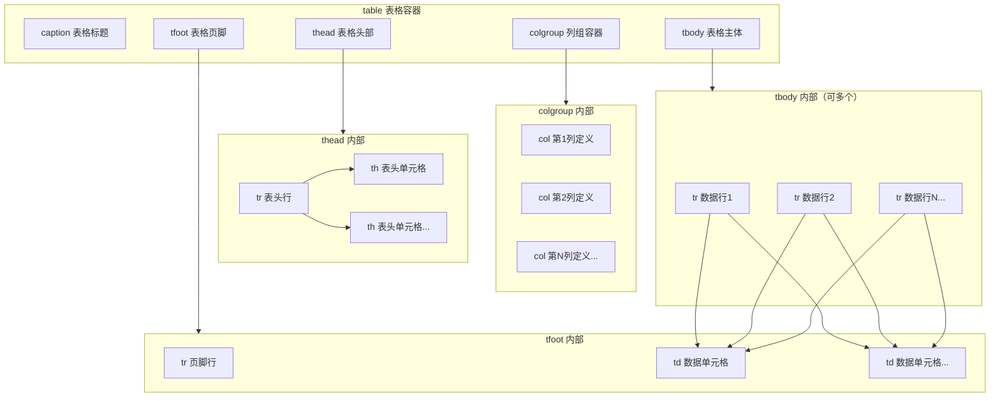
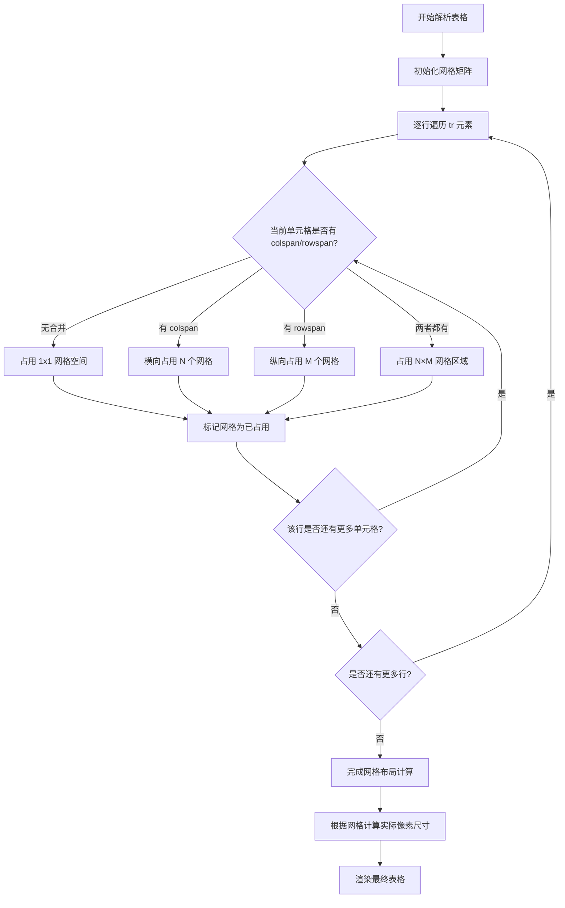
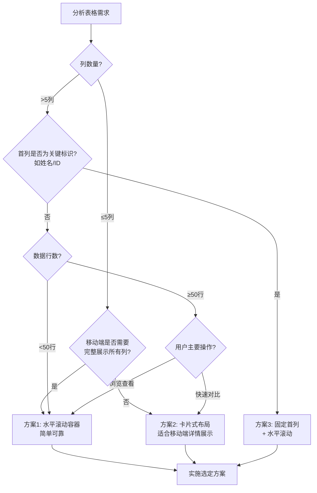
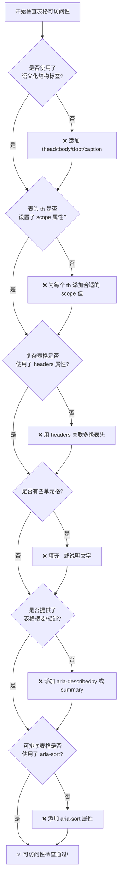
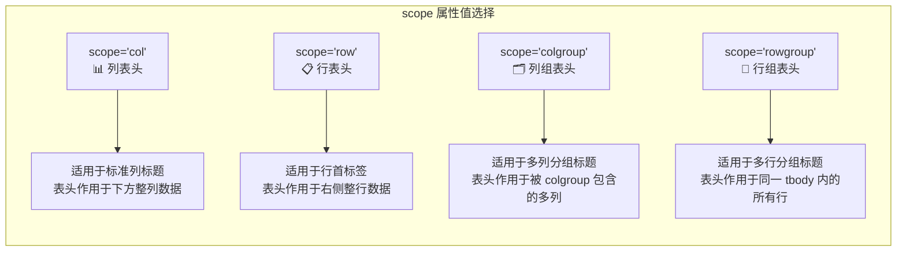

# HTML 表格完整指南

## 概述

HTML 表格（`<table>`）是用于展示结构化二维数据的语义化元素。它将数据按行和列组织，适用于展示数据报表、价格对比、课程安排、统计信息等场景。

### 核心特性

- **语义化结构**：通过 `<thead>`、`<tbody>`、`<tfoot>` 等标签明确表格结构
- **可访问性支持**：通过 `<caption>`、`scope`、`headers` 等属性提升屏幕阅读器体验
- **灵活的布局控制**：支持单元格合并、列组样式、响应式设计
- **丰富的 JavaScript API**：提供完整的 DOM 操作接口

### 适用场景

| 场景 | 适用性 | 说明 |
|------|--------|------|
| 数据报表 | ✅ 推荐 | 财务报表、统计报表、分析报告 |
| 价格对比表 | ✅ 推荐 | 产品定价、套餐对比 |
| 课程表/排班表 | ✅ 推荐 | 时间安排、资源分配 |
| 数据列表 | ⚠️ 谨慎 | 简单列表建议使用 `<ul>`/`<ol>` |
| 页面布局 | ❌ 不推荐 | 使用 CSS Grid/Flexbox |

:::: warning

**重要提示**：表格应仅用于展示表格数据，**切勿用于页面布局**。布局应使用 CSS Grid、Flexbox 等现代布局技术。

::::

### 表格 DOM 结构层次图



## 快速入门

### 最简表格示例

```html
<!DOCTYPE html>
<html lang="zh-CN">
<head>
  <meta charset="UTF-8">
  <title>最简表格</title>
</head>
<body>
  <table>
    <tr>
      <td>第一行第一列</td>
      <td>第一行第二列</td>
    </tr>
    <tr>
      <td>第二行第一列</td>
      <td>第二行第二列</td>
    </tr>
  </table>
</body>
</html>
```

### 完整结构示例

```html
<table>
  <caption>学生成绩表</caption>
  <thead>
    <tr>
      <th scope="col">姓名</th>
      <th scope="col">数学</th>
      <th scope="col">英语</th>
    </tr>
  </thead>
  <tbody>
    <tr>
      <td>张三</td>
      <td>85</td>
      <td>92</td>
    </tr>
    <tr>
      <td>李四</td>
      <td>76</td>
      <td>88</td>
    </tr>
  </tbody>
  <tfoot>
    <tr>
      <td>平均分</td>
      <td>80.5</td>
      <td>90</td>
    </tr>
  </tfoot>
</table>
```

---

<a id="tag-reference"></a>

## 标签速查表

### 基础标签

| 标签 | 作用 | 是否必需 | 主要属性 |
|------|------|----------|----------|
| `<table>` | 表格容器 | ✅ 必需 | `border`（已废弃） |
| `<caption>` | 表格标题 | ⚠️ 推荐 | 全局属性 |
| `<tr>` | 表格行 | ✅ 必需 | `align`、`valign`、`bgcolor`（均已废弃） |
| `<th>` | 表头单元格 | ⚠️ 推荐 | `scope`、`colspan`、`rowspan`、`headers`、`abbr` |
| `<td>` | 数据单元格 | ✅ 必需 | `colspan`、`rowspan`、`headers` |

### 结构标签

| 标签 | 作用 | 是否必需 | 说明 |
|------|------|----------|------|
| `<thead>` | 表格头部 | ⚠️ 推荐 | 包含列标题，提升可访问性 |
| `<tbody>` | 表格主体 | ⚠️ 推荐 | 包含数据行，可以有多个 `<tbody>` |
| `<tfoot>` | 表格页脚 | ⏸️ 可选 | 包含汇总信息 |

### 列组标签

| 标签 | 作用 | 是否必需 | 主要属性 |
|------|------|----------|----------|
| `<colgroup>` | 列组容器 | ⏸️ 可选 | `span` |
| `<col>` | 单个列定义 | ⏸️ 可选 | `span` |

---

<a id="table-structure"></a>

## 表格结构标签

### `<thead>` - 表格头部

**作用**：定义表格的列标题区域，增强语义化和可访问性。

**特点**：
- 通常包含一组 `<th>` 元素
- 支持多行表头
- 打印长表格时，浏览器可能重复显示表头

```html
<thead>
  <tr>
    <th scope="col">姓名</th>
    <th scope="col">年龄</th>
    <th scope="col">职业</th>
  </tr>
</thead>
```

### `<tbody>` - 表格主体

**作用**：包含表格的主要数据内容。

**特点**：
- 一个表格可以包含多个 `<tbody>`，用于数据分组
- 必须包含至少一个 `<tr>` 元素
- 便于样式化（如斑马纹效果）

```html
<tbody>
  <tr>
    <td>张三</td>
    <td>25</td>
    <td>工程师</td>
  </tr>
  <tr>
    <td>李四</td>
    <td>30</td>
    <td>设计师</td>
  </tr>
</tbody>
```

### `<tfoot>` - 表格页脚

**作用**：定义表格的汇总或总结信息。

**特点**：
- 通常包含合计、平均值等统计信息
- 在 HTML5 中可以放在 `<table>` 内的任何位置，浏览器会自动渲染到表格底部
- 每个表格只能有一个 `<tfoot>`

```html
<tfoot>
  <tr>
    <td>总计</td>
    <td>-</td>
    <td>55</td>
  </tr>
</tfoot>
```

### `<caption>` - 表格标题

**作用**：为表格提供可见的标题或说明。

**特点**：
- 必须是 `<table>` 的第一个子元素
- 默认显示在表格上方
- 可通过 CSS `caption-side` 属性控制位置（`top` 或 `bottom`）

```html
<table>
  <caption>2023年第四季度销售数据</caption>
  <!-- 表格内容 -->
</table>
```

### 多 tbody 分组示例

```html
<table>
  <caption>员工考勤统计</caption>
  <thead>
    <tr>
      <th>姓名</th>
      <th>出勤天数</th>
      <th>请假天数</th>
    </tr>
  </thead>
  <tbody>
    <tr><td colspan="3">技术部</td></tr>
    <tr>
      <td>张三</td>
      <td>22</td>
      <td>0</td>
    </tr>
    <tr>
      <td>李四</td>
      <td>20</td>
      <td>2</td>
    </tr>
  </tbody>
  <tbody>
    <tr><td colspan="3">市场部</td></tr>
    <tr>
      <td>王五</td>
      <td>21</td>
      <td>1</td>
    </tr>
  </tbody>
  <tfoot>
    <tr>
      <td>合计</td>
      <td>63</td>
      <td>3</td>
    </tr>
  </tfoot>
</table>
```

---

<a id="table-attributes"></a>

## 表格与单元格属性

### `<table>` 标签属性

#### 已废弃属性（使用 CSS 替代）

| 属性 | 作用 | CSS 替代方案 |
|------|------|--------------|
| `border` | 边框宽度 | `border` |
| `cellpadding` | 单元格内边距 | `padding`（应用在 `th`、`td`） |
| `cellspacing` | 单元格间距 | `border-spacing` |
| `width` | 表格宽度 | `width` |
| `height` | 表格高度 | `height` |
| `align` | 水平对齐 | `margin` + `auto` 或 `text-align` |
| `bgcolor` | 背景颜色 | `background-color` |
| `frame` | 外边框样式 | `border` |
| `rules` | 内边框样式 | `border` |

#### 已废弃的无障碍属性

| 属性 | 说明 | 现代替代方案 |
|------|------|--------------|
| `summary` | 曾用于为屏幕阅读器提供表格摘要，HTML5 中已废弃 | 使用 `<caption>` 或 `aria-describedby` |

### `<tr>` 标签属性

所有属性已废弃，使用 CSS 替代：

| 属性 | CSS 替代方案 |
|------|--------------|
| `align` | `text-align` |
| `valign` | `vertical-align` |
| `bgcolor` | `background-color` |

### `<th>` 和 `<td>` 共享属性

| 属性 | 作用 | 适用标签 | 示例 |
|------|------|----------|------|
| `colspan` | 横跨列数 | `<th>`、`<td>` | `<td colspan="3">` |
| `rowspan` | 纵跨行数 | `<th>`、`<td>` | `<td rowspan="2">` |
| `headers` | 关联表头 ID | `<th>`、`<td>` | `<td headers="name dept">` |

### `<th>` 特有属性

| 属性 | 作用 | 可选值 | 示例 |
|------|------|--------|------|
| `scope` | 表头作用范围 | `col`、`row`、`colgroup`、`rowgroup` | `<th scope="col">` |
| `abbr` | 缩写（屏幕阅读器使用） | 文本 | `<th abbr="ID">身份证号</th>` |

### `<td>` 特有属性

| 属性 | 作用 | 说明 |
|------|------|------|
| `colspan` | 合并列 | 默认值为 `1` |
| `rowspan` | 合并行 | 默认值为 `1` |
| `headers` | 关联表头 | 用于复杂表格的可访问性 |

### 已废弃的单元格属性

| 属性 | CSS 替代方案 |
|------|--------------|
| `align` | `text-align` |
| `valign` | `vertical-align` |
| `bgcolor` | `background-color` |
| `width` | `width` |
| `height` | `height` |
| `nowrap` | `white-space: nowrap` |

---

<a id="cell-merging"></a>

## 单元格合并

<h4>035-table-course-schedule.html</h4>

```html
<!-- 来源：6-表格.md - 完整课程表（rowspan/colspan 单元格合并） -->
<!DOCTYPE html>
<html lang="zh-CN">
<head>
  <meta charset="UTF-8">
  <meta name="viewport" content="width=device-width, initial-scale=1.0">
  <title>课程表 - 单元格合并示例</title>
  <style>
    * { margin: 0; padding: 0; box-sizing: border-box; }

    body {
      font-family: -apple-system, BlinkMacSystemFont, "Segoe UI", sans-serif;
      line-height: 1.6;
      color: #333;
      background: #f5f7fa;
      padding: 40px 20px;
    }

    .container { max-width: 900px; margin: 0 auto; }

    h1 { text-align: center; color: #222; margin-bottom: 8px; font-size: 32px; }
    .subtitle { text-align: center; color: #666; margin-bottom: 30px; font-size: 15px; }

    /* 课程表样式 */
    table {
      border-collapse: collapse;
      width: 100%;
      background: white;
      box-shadow: 0 4px 20px rgba(0,0,0,0.08);
      border-radius: 12px;
      overflow: hidden;
    }

    caption {
      font-size: 22px;
      font-weight: 700;
      color: #222;
      padding: 20px 16px 12px;
      text-align: center;
    }

    th, td {
      border: 1px solid #d0d5dd;
      padding: 14px 10px;
      text-align: center;
      font-size: 14px;
    }

    /* 星期标题行 */
    thead tr:first-child th {
      background: linear-gradient(135deg, #0066cc, #0052a3);
      color: white;
      font-weight: 600;
      padding: 16px 10px;
      letter-spacing: 0.5px;
    }

    /* 时间段列 */
    .time-header {
      background: linear-gradient(135deg, #28a745, #20883d);
      color: white !important;
      font-weight: 700;
      min-width: 80px;
    }

    /* 课程单元格颜色 */
    tbody td {
      transition: all 0.2s;
      cursor: default;
    }

    tbody td:hover {
      background-color: #e3f2fd !important;
      transform: scale(1.02);
      z-index: 1;
      position: relative;
    }

    /* 斑马纹效果 */
    tbody tr:nth-child(odd) td:not(.time-header) {
      background-color: #fafbfc;
    }

    /* 不同科目颜色 */
    .subject-math { background-color: #fff3e0; }
    .subject-chinese { background-color: #fce4ec; }
    .subject-english { background-color: #e8eaf6; }
    .subject-physics { background-color: #e0f2f1; }
    .subject-chemistry { background-color: #f3e5f5; }
    .subject-biology { background-color: #e8f5e9; }
    .subject-pe { background-color: #ffebee; }
    .subject-music { background-color: #fff8e1; }
    .subject-art { background-color: #e0f7fa; }
    .subject-history { background-color: #fbe9e7; }
    .subject-geography { background-color: #f1f8e9; }
    .subject-study { background-color: #eceff1; }

    /* 页脚 */
    tfoot td {
      background: #f8f9fa;
      color: #666;
      font-size: 13px;
      font-style: italic;
    }

    /* 说明面板 */
    .legend-panel {
      display: flex;
      flex-wrap: wrap;
      gap: 12px;
      justify-content: center;
      margin-top: 24px;
      padding: 18px;
      background: white;
      border-radius: 10px;
      box-shadow: 0 2px 8px rgba(0,0,0,0.06);
    }

    .legend-item {
      display: flex;
      align-items: center;
      gap: 6px;
      font-size: 13px;
      color: #555;
    }

    .legend-color {
      width: 20px;
      height: 14px;
      border-radius: 3px;
      border: 1px solid #ddd;
    }

    /* 技术说明卡片 */
    .tech-info {
      background: white;
      border-radius: 10px;
      padding: 24px;
      margin-top: 24px;
      box-shadow: 0 2px 8px rgba(0,0,0,0.06);
    }

    .tech-info h3 { color: #333; margin-bottom: 12px; font-size: 17px; }
    .tech-info p { color: #666; font-size: 14px; line-height: 1.7; margin-bottom: 10px; }

    .code-inline {
      font-family: 'Monaco', monospace;
      background: #f0f0f0;
      padding: 2px 8px;
      border-radius: 4px;
      font-size: 13px;
      color: #0066cc;
    }
  </style>
</head>
<body>

  <div class="container">
    <h1>📅 课程表示例</h1>
    <p class="subtitle">演示 rowspan 和 colspan 的实际应用</p>

    <!-- 课程表 -->
    <table>
      <caption>🏫 高一（3）班课程表</caption>

      <thead>
        <tr>
          <th></th>
          <th>周一</th>
          <th>周二</th>
          <th>周三</th>
          <th>周四</th>
          <th>周五</th>
        </tr>
      </thead>

      <tbody>
        <!-- 上午时段 (rowspan=4 跨越4行) -->
        <tr>
          <td class="time-header" rowspan="4">上午<br><small style="font-weight:400;font-size:11px;">08:00-12:00</small></td>
          <td class="subject-math">数学</td>
          <td class="subject-chinese">语文</td>
          <td class="subject-english">英语</td>
          <td class="subject-physics">物理</td>
          <td class="subject-chemistry">化学</td>
        </tr>
        <tr>
          <td class="subject-chinese">语文</td>
          <td class="subject-math">数学</td>
          <td class="subject-physics">物理</td>
          <td class="subject-english">英语</td>
          <td class="subject-biology">生物</td>
        </tr>
        <tr>
          <td class="subject-english">英语</td>
          <td class="subject-physics">物理</td>
          <td class="subject-math">数学</td>
          <td class="subject-chemistry">化学</td>
          <td class="subject-chinese">语文</td>
        </tr>
        <tr>
          <td class="subject-pe">体育</td>
          <td class="subject-chemistry">化学</td>
          <td class="subject-biology">生物</td>
          <td class="subject-math">数学</td>
          <td class="subject-english">英语</td>
        </tr>

        <!-- 下午时段 (rowspan=2 跨越2行) -->
        <tr>
          <td class="time-header" rowspan="2">下午<br><small style="font-weight:400;font-size:11px;">14:00-17:30</small></td>
          <td class="subject-music">音乐</td>
          <td class="subject-art">美术</td>
          <td class="subject-pe">体育</td>
          <td class="subject-history">历史</td>
          <td class="subject-geography">地理</td>
        </tr>
        <tr>
          <td class="subject-study">自习</td>
          <td class="subject-study">班会</td>
          <td class="subject-study">自习</td>
          <td class="subject-study">自习</td>
          <td class="subject-study">自习</td>
        </tr>
      </tbody>

      <tfoot>
        <tr>
          <td colspan="6">
            📌 备注：如有变动，以教务处通知为准 | 每节课45分钟，课间休息10分钟
          </td>
        </tr>
      </tfoot>
    </table>


    <!-- 科目图例 -->
    <div class="legend-panel">
      <div class="legend-item"><div class="legend-color subject-math"></div> 数学</div>
      <div class="legend-item"><div class="legend-color subject-chinese"></div> 语文</div>
      <div class="legend-item"><div class="legend-color subject-english"></div> 英语</div>
      <div class="legend-item"><div class="legend-color subject-physics"></div> 物理</div>
      <div class="legend-item"><div class="legend-color subject-chemistry"></div> 化学</div>
      <div class="legend-item"><div class="legend-color subject-biology"></div> 生物</div>
      <div class="legend-item"><div class="legend-color subject-pe"></div> 体育</div>
      <div class="legend-item"><div class="legend-color subject-music"></div> 音乐</div>
      <div class="legend-item"><div class="legend-color subject-art"></div> 美术</div>
      <div class="legend-item"><div class="legend-color subject-history"></div> 历史</div>
      <div class="legend-item"><div class="legend-color subject-geography"></div> 地理</div>
      <div class="legend-item"><div class="legend-color subject-study"></div> 自习/班会</div>
    </div>


    <!-- 技术说明 -->
    <div class="tech-info">
      <h3>🔧 使用的技术要点</h3>
      <p>
        • <strong>rowspan="4"</strong>：「上午」时间列跨越4行数据，将第1-4节归为同一时间段<br>
        • <strong>rowspan="2"</strong>：「下午」时间列跨越2行数据，将第5-6节归为同一时间段<br>
        • <strong>colspan="6"</strong>：页脚备注横跨全部6列，用于显示表格级别的说明信息
      </p>
      <p>
        浏览器在渲染时维护一个<strong>二维网格矩阵</strong>来跟踪哪些位置已被合并单元格占用。
        遇到 rowspan 时，后续行的对应位置会被自动跳过。
      </p>
    </div>

  </div>

</body>
</html>
```

### colspan - 横向合并

**作用**：让单元格横跨多列。

**使用场景**：
- 表头分组
- 合并统计行
- 创建跨列标题

```html
<table>
  <thead>
    <tr>
      <th rowspan="2">姓名</th>
      <th colspan="3">成绩</th>
    </tr>
    <tr>
      <th>数学</th>
      <th>英语</th>
      <th>物理</th>
    </tr>
  </thead>
  <tbody>
    <tr>
      <td>张三</td>
      <td>85</td>
      <td>92</td>
      <td>78</td>
    </tr>
  </tbody>
  <tfoot>
    <tr>
      <td colspan="4">全班平均分：85</td>
    </tr>
  </tfoot>
</table>
```

### rowspan - 纵向合并

**作用**：让单元格纵跨多行。

**使用场景**：
- 分组标识
- 时间段标注
- 分类标签

```html
<table>
  <thead>
    <tr>
      <th>时间段</th>
      <th>节次</th>
      <th>课程</th>
    </tr>
  </thead>
  <tbody>
    <tr>
      <td rowspan="2">上午</td>
      <td>第1节</td>
      <td>数学</td>
    </tr>
    <tr>
      <td>第2节</td>
      <td>语文</td>
    </tr>
    <tr>
      <td rowspan="2">下午</td>
      <td>第3节</td>
      <td>英语</td>
    </tr>
    <tr>
      <td>第4节</td>
      <td>体育</td>
    </tr>
  </tbody>
</table>
```

### 单元格合并算法流程图

浏览器在渲染带有 `colspan` 和 `rowspan` 的表格时，需要经过复杂的计算过程来确定每个单元格的位置和大小：



::: tip 合并算法要点

1. 浏览器维护一个二维矩阵来跟踪哪些网格位置已被占用
2. 遇到 `colspan="3"` 时，当前行及后续受影响行的对应位置会被标记为"已占用"
3. 后续单元格遇到已占用的位置时自动跳过
4. 如果计算结果导致某行列数不一致，浏览器会尝试自动修正或产生布局错误

:::

### 完整课程表示例

```html
<!DOCTYPE html>
<html lang="zh-CN">
<head>
  <meta charset="UTF-8">
  <title>课程表 - 合并单元格示例</title>
  <style>
    table {
      border-collapse: collapse;
      width: 80%;
      margin: 20px auto;
    }
    th, td {
      border: 1px solid #333;
      padding: 12px;
      text-align: center;
    }
    .time-header {
      background-color: #e3f2fd;
      font-weight: bold;
    }
    .day-header {
      background-color: #f5f5f5;
    }
    caption {
      font-size: 1.5em;
      font-weight: bold;
      margin-bottom: 15px;
    }
  </style>
</head>
<body>
  <table>
    <caption>课程表</caption>
    <thead>
      <tr class="day-header">
        <th></th>
        <th>周一</th>
        <th>周二</th>
        <th>周三</th>
        <th>周四</th>
        <th>周五</th>
      </tr>
    </thead>
    <tbody>
      <tr>
        <td class="time-header" rowspan="4">上午</td>
        <td>数学</td>
        <td>语文</td>
        <td>英语</td>
        <td>物理</td>
        <td>化学</td>
      </tr>
      <tr>
        <td>语文</td>
        <td>数学</td>
        <td>物理</td>
        <td>英语</td>
        <td>生物</td>
      </tr>
      <tr>
        <td>英语</td>
        <td>物理</td>
        <td>数学</td>
        <td>化学</td>
        <td>语文</td>
      </tr>
      <tr>
        <td>体育</td>
        <td>化学</td>
        <td>生物</td>
        <td>数学</td>
        <td>英语</td>
      </tr>
      <tr>
        <td class="time-header" rowspan="2">下午</td>
        <td>音乐</td>
        <td>美术</td>
        <td>体育</td>
        <td>历史</td>
        <td>地理</td>
      </tr>
      <tr>
        <td>自习</td>
        <td>班会</td>
        <td>自习</td>
        <td>自习</td>
        <td>自习</td>
      </tr>
    </tbody>
    <tfoot>
      <tr>
        <td colspan="6">备注：如有变动，以教务处通知为准</td>
      </tr>
    </tfoot>
  </table>
</body>
</html>
```

---

<a id="colgroup"></a>

## 列组样式控制

<h4>036-table-colgroup-pricing.html</h4>

```html
<!-- 来源：6-表格.md - 产品价格表（colgroup 列组样式） -->
<!DOCTYPE html>
<html lang="zh-CN">
<head>
  <meta charset="UTF-8">
  <meta name="viewport" content="width=device-width, initial-scale=1.0">
  <title>产品价格表 - colgroup 列组样式</title>
  <style>
    * { margin: 0; padding: 0; box-sizing: border-box; }

    body {
      font-family: -apple-system, BlinkMacSystemFont, "Segoe UI", sans-serif;
      line-height: 1.6;
      color: #333;
      background: #f5f7fa;
      padding: 40px 20px;
    }

    .container { max-width: 900px; margin: 0 auto; }

    h1 { text-align: center; color: #222; margin-bottom: 8px; font-size: 32px; }
    .subtitle { text-align: center; color: #666; margin-bottom: 30px; font-size: 15px; }

    /* 价格表格 */
    table {
      border-collapse: collapse;
      width: 100%;
      background: white;
      box-shadow: 0 4px 20px rgba(0,0,0,0.08);
      border-radius: 12px;
      overflow: hidden;
    }

    caption {
      font-size: 22px;
      font-weight: 700;
      color: #222;
      padding: 24px 16px 16px;
      text-align: center;
    }

    th, td {
      border: 1px solid #e0e0e0;
      padding: 16px 14px;
      font-size: 14px;
      vertical-align: middle;
    }

    th {
      font-weight: 600;
      color: white;
      padding: 18px 14px;
    }

    tbody tr {
      transition: background-color 0.2s;
    }

    tbody tr:hover {
      background-color: #f8f9ff !important;
    }

    /* 斑马纹 */
    tbody tr:nth-child(even) {
      background-color: #fafbfc;
    }

    /* 价格列特殊样式 */
    .price-value {
      font-size: 18px;
      font-weight: 700;
      color: #dc3545;
    }

    /* 状态标签 */
    .status-badge {
      display: inline-block;
      padding: 4px 12px;
      border-radius: 20px;
      font-size: 12px;
      font-weight: 600;
    }

    .badge-hot { background: #fee; color: #dc3545; }
    .badge-new { background: #efe; color: #28a745; }
    .badge-sale { background: #fff3cd; color: #856404; }

    /* 列组说明面板 */
    .colgroup-info {
      display: grid;
      grid-template-columns: repeat(3, 1fr);
      gap: 16px;
      margin-top: 28px;
    }

    .col-info-card {
      padding: 20px;
      border-radius: 10px;
      border-left: 4px solid;
    }

    .col-name { background-color: #e3f2fd; border-left-color: #0066cc; }
    .col-desc { background-color: #f8f9fa; border-left-color: #888; }
    .col-price { background-color: #fff3e0; border-left-color: #fd7e14; }

    .col-info-card h4 { font-size: 15px; margin-bottom: 6px; }
    .col-info-card p { font-size: 13px; color: #666; line-height: 1.6; }

    /* 代码展示 */
    .code-block {
      background: #1e1e1e;
      color: #d4d4d4;
      padding: 16px 20px;
      border-radius: 8px;
      font-family: 'Monaco', monospace;
      font-size: 13px;
      line-height: 1.7;
      overflow-x: auto;
      margin-top: 24px;
    }
    .tag { color: #569cd6; }
    .attr { color: #9cdcfe; }
    .value { color: #ce9178; }
    .comment { color: #6a9955; }

    @media (max-width: 768px) {
      .colgroup-info { grid-template-columns: 1fr; }
    }
  </style>
</head>
<body>

  <div class="container">
    <h1>💰 产品价格表</h1>
    <p class="subtitle">使用 colgroup/col 批量设置列样式</p>

    <!-- 价格表 -->
    <table>
      <caption>🛒 Apple 产品价格一览</caption>

      <!-- 列组定义：批量控制每列的宽度和背景色 -->
      <colgroup>
        <!-- 产品名称列：25% 宽度，浅蓝背景 -->
        <col style="width: 25%; background-color: #e3f2fd;" />
        <!-- 产品描述列：50% 宽度，默认背景 -->
        <col style="width: 50%;" />
        <!-- 价格列：25% 宽度，浅橙背景，右对齐 -->
        <col style="width: 25%; background-color: #fff3e0; text-align: right;" />
      </colgroup>

      <thead>
        <tr>
          <th scope="col">产品名称</th>
          <th scope="col">产品描述</th>
          <th scope="col">价格</th>
        </tr>
      </thead>

      <tbody>
        <tr>
          <td><strong>iPhone 15 Pro</strong><br><span class="status-badge badge-hot">🔥 热销</span></td>
          <td>A17 Pro 芯片，钛金属设计，4800万像素主摄，USB-C 接口，支持 Action Button</td>
          <td><span class="price-value">¥8,999</span></td>
        </tr>

        <tr>
          <td><strong>MacBook Air M3</strong></td>
          <td>M3 芯片，13.6 英寸 Liquid 视网膜显示屏，最长 18 小时电池续航，静音无风扇设计</td>
          <td><span class="price-value">¥9,499</span></td>
        </tr>

        <tr>
          <td><strong>iPad Pro M2</strong><br><span class="status-badge badge-new">✨ 新品</span></td>
          <td>M2 芯片，12.9 英寸 Liquid 视网膜 XDR 显示屏，支持 Apple Pencil 悬停功能</td>
          <td><span class="price-value">¥9,299</span></td>
        </tr>

        <tr>
          <td><strong>AirPods Pro 2</strong><br><span class="status-badge badge-hot">🔥 热销</span></td>
          <td>H2 芯片驱动，自适应音频模式，主动降噪，个性化空间音频，MagSafe 充电盒</td>
          <td><span class="price-value">¥1,899</span></td>
        </tr>

        <tr>
          <td><strong>Apple Watch Ultra 2</strong><br><span class="status-badge badge-sale">📉 特惠</span></td>
          <td>S9 SiP 芯片，49mm 钛金属表壳，3000 尼特亮度显示屏，双频 GPS 精准定位</td>
          <td><span class="price-value"><del style="color:#999;font-size:14px;">¥6,999</del> ¥6,499</span></td>
        </tr>

        <tr>
          <td><strong>Mac Mini M2</strong></td>
          <td>M2 / M2 Pro 芯片可选，紧凑设计，支持多显示器输出，丰富的接口配置</td>
          <td><span class="price-value">¥4,499</span></td>
        </tr>
      </tbody>

      <tfoot>
        <tr style="background: linear-gradient(135deg, #667eea, #764ba2); color: white;">
          <th colspan="2" style="text-align: right;">总计（以上全部）：</th>
          <th style="font-size: 20px;">¥40,694</th>
        </tr>
      </tfoot>
    </table>


    <!-- 列组说明 -->
    <div class="colgroup-info">
      <div class="col-info-card col-name">
        <h4>📝 第 1 列 — 产品名称</h4>
        <p>宽度 25%，浅蓝色背景突出显示。包含产品名和状态标签。</p>
      </div>
      <div class="col-info-card col-desc">
        <h4>📋 第 2 列 — 产品描述</h4>
        <p>宽度 50%（最大），承载详细的文字描述信息。默认背景色。</p>
      </div>
      <div class="col-info-card col-price">
        <h4>💵 第 3 列 — 价格</h4>
        <p>宽度 25%，浅橙色背景强调，右对齐显示金额数值。</p>
      </div>
    </div>


    <!-- 核心代码 -->
    <div class="code-block">
<span class="comment">&lt;!-- 使用 &lt;colgroup&gt; + &lt;col&gt; 批量定义列样式 --&gt;</span>
<span class="tag">&lt;table&gt;</span>
  <span class="tag">&lt;caption&gt;</span>产品价格表<span class="tag">&lt;/caption&gt;</span>

  <span class="tag">&lt;colgroup&gt;</span>
    <span class="comment">&lt;!-- 第1列：产品名 --&gt;</span>
    <span class="tag">&lt;col</span> <span class="attr">style</span>=<span class="value">"width:25%; background:#e3f2fd"</span> /&gt;

    <span class="comment">&lt;!-- 第2列：描述 --&gt;</span>
    <span class="tag">&lt;col</span> <span class="attr">style</span>=<span class="value">"width:50%"</span> /&gt;

    <span class="comment">&lt;!-- 第3列：价格 --&gt;</span>
    <span class="tag">&lt;col</span> <span class="attr">style</span>=<span class="value">"width:25%; background:#fff3e0"</span> /&gt;
  <span class="tag">&lt;/colgroup&gt;</span>

  <span class="tag">&lt;thead&gt;</span>...<span class="tag">&lt;/thead&gt;</span>
  <span class="tag">&lt;tbody&gt;</span>...<span class="tag">&lt;/tbody&gt;</span>
<span class="tag">&lt;/table&gt;</span>
    </div>

  </div>

</body>
</html>
```

### `<colgroup>` 和 `<col>` 概述

**作用**：批量设置列的样式，无需为每个单元格添加类名。

**优势**：
- 减少重复的 CSS 类定义
- 统一控制列宽、背景色
- 提高代码可维护性

### `<colgroup>` 标签

**属性**：
- `span`：指定列组包含的列数

```html
<table>
  <colgroup span="2" style="background-color: #f0f0f0;"></colgroup>
  <colgroup style="background-color: #e0e0e0;"></colgroup>
  <thead>
    <tr>
      <th>列1</th>
      <th>列2</th>
      <th>列3</th>
    </tr>
  </thead>
  <tbody>
    <tr>
      <td>数据1</td>
      <td>数据2</td>
      <td>数据3</td>
    </tr>
  </tbody>
</table>
```

### `<col>` 标签

**属性**：
- `span`：指定该列定义跨越的列数

**支持的 CSS 属性**：
- `width`
- `background-color`
- `border`
- `visibility`

```html
<table>
  <colgroup>
    <col style="width: 200px; background-color: #e3f2fd;">
    <col style="width: 300px;">
    <col style="width: 150px; background-color: #fff3e0;">
  </colgroup>
  <thead>
    <tr>
      <th>产品名称</th>
      <th>描述</th>
      <th>价格</th>
    </tr>
  </thead>
  <tbody>
    <tr>
      <td>iPhone 14</td>
      <td>最新款智能手机</td>
      <td>¥5999</td>
    </tr>
  </tbody>
</table>
```

### 完整示例：价格表

```html
<!DOCTYPE html>
<html lang="zh-CN">
<head>
  <meta charset="UTF-8">
  <title>列组样式示例</title>
  <style>
    table {
      border-collapse: collapse;
      width: 100%;
      max-width: 800px;
      margin: 20px auto;
    }
    th, td {
      border: 1px solid #ddd;
      padding: 12px;
      text-align: left;
    }
    th {
      background-color: #333;
      color: white;
      font-weight: bold;
    }
    .name-col {
      width: 25%;
      background-color: #e3f2fd;
      font-weight: bold;
    }
    .desc-col {
      width: 50%;
    }
    .price-col {
      width: 25%;
      background-color: #fff3e0;
      text-align: right;
      font-weight: bold;
    }
  </style>
</head>
<body>
  <table>
    <caption>产品价格表</caption>
    <colgroup>
      <col class="name-col">
      <col class="desc-col">
      <col class="price-col">
    </colgroup>
    <thead>
      <tr>
        <th>产品名称</th>
        <th>描述</th>
        <th>价格</th>
      </tr>
    </thead>
    <tbody>
      <tr>
        <td>iPhone 14</td>
        <td>最新款智能手机，A16芯片，超视网膜XDR显示屏</td>
        <td>¥5999</td>
      </tr>
      <tr>
        <td>MacBook Pro</td>
        <td>高性能笔记本电脑，M2芯片，16GB内存</td>
        <td>¥12999</td>
      </tr>
      <tr>
        <td>iPad Pro</td>
        <td>专业平板电脑，12.9英寸Liquid视网膜XDR显示屏</td>
        <td>¥8499</td>
      </tr>
    </tbody>
  </table>
</body>
</html>
```

---

<a id="table-css"></a>

## 表格 CSS 样式

### 基础样式模板

```css
/* 表格基础样式 */
table {
  border-collapse: collapse;
  width: 100%;
  margin: 20px 0;
  font-family: Arial, sans-serif;
}

/* 单元格样式 */
th, td {
  border: 1px solid #ddd;
  padding: 12px;
  text-align: left;
}

/* 表头样式 */
th {
  background-color: #f2f2f2;
  font-weight: bold;
  color: #333;
}

/* 斑马纹效果 */
tbody tr:nth-child(even) {
  background-color: #f9f9f9;
}

/* 鼠标悬停效果 */
tbody tr:hover {
  background-color: #f5f5f5;
  cursor: pointer;
}
```

### 边框控制

```css
/* 合并边框 */
table {
  border-collapse: collapse;
}

/* 分离边框 */
table {
  border-collapse: separate;
  border-spacing: 10px; /* 单元格间距 */
}
```

### 表格布局算法

```css
/* 自动布局（默认）- 根据内容调整列宽 */
table {
  table-layout: auto;
}

/* 固定布局 - 根据第一行或设定的宽度分配列宽 */
table {
  table-layout: fixed;
  width: 100%;
}
```

**性能提示**：`table-layout: fixed` 渲染速度更快，适合内容量大的表格。

### 对齐控制

```css
/* 水平对齐 */
th, td {
  text-align: left;   /* 左对齐 */
  text-align: center; /* 居中 */
  text-align: right;  /* 右对齐 */
}

/* 垂直对齐 */
th, td {
  vertical-align: top;     /* 顶部对齐 */
  vertical-align: middle;  /* 居中（默认） */
  vertical-align: bottom;  /* 底部对齐 */
  vertical-align: baseline; /* 基线对齐 */
}
```

### 标题样式控制

```css
caption {
  font-size: 1.2em;
  font-weight: bold;
  text-align: left;
  padding: 10px;
  caption-side: top;    /* 默认在表格上方 */
  /* caption-side: bottom; */ /* 标题在表格下方 */
}
```

### 空单元格处理

```css
/* 隐藏空单元格的边框 */
table {
  empty-cells: hide;
}

/* 显示空单元格的边框 */
table {
  empty-cells: show;
}
```

### 高级样式示例

```css
/* 现代化表格样式 */
.modern-table {
  border-collapse: collapse;
  width: 100%;
  box-shadow: 0 2px 15px rgba(0, 0, 0, 0.1);
  border-radius: 8px;
  overflow: hidden;
}

.modern-table th {
  background: linear-gradient(135deg, #667eea 0%, #764ba2 100%);
  color: white;
  padding: 15px;
  text-align: left;
  font-weight: 600;
  text-transform: uppercase;
  letter-spacing: 0.5px;
}

.modern-table td {
  padding: 12px 15px;
  border-bottom: 1px solid #e0e0e0;
}

.modern-table tbody tr:last-child td {
  border-bottom: none;
}

.modern-table tbody tr:hover {
  background-color: #f8f9ff;
  transition: background-color 0.3s ease;
}
```

### 固定表头 + 固定首列（双方向 Sticky）

当表格同时需要固定表头和固定首列时，需要精心处理层级关系和定位策略：

```html
<!DOCTYPE html>
<html lang="zh-CN">
<head>
  <meta charset="UTF-8">
  <title>固定表头+固定首列</title>
  <style>
    .sticky-table-container {
      width: 100%;
      height: 400px;
      overflow: auto;
      position: relative;
      border: 1px solid #ddd;
    }

    .sticky-table {
      border-collapse: collapse;
      min-width: 800px;
    }

    .sticky-table th,
    .sticky-table td {
      border: 1px solid #ddd;
      padding: 12px;
      min-width: 120px;
      white-space: nowrap;
    }

    /* 表头基础样式 */
    .sticky-table thead th {
      background-color: #333;
      color: white;
      position: sticky;
      top: 0;
      z-index: 2;
    }

    /* 左上角交叉单元格（同时固定顶部和左侧） */
    .sticky-table thead th:first-child {
      left: 0;
      z-index: 4; /* 最高层级，确保不被其他 sticky 元素遮挡 */
      background-color: #222;
    }

    /* 首列固定 */
    .sticky-table th:first-child,
    .sticky-table td:first-child {
      position: sticky;
      left: 0;
      background-color: white;
      z-index: 1;
    }

    /* 首列表头特殊处理 */
    .sticky-table thead th:first-child {
      z-index: 4;
      background-color: #222;
    }

    /* 首列数据单元格阴影效果 */
    .sticky-table td:first-child {
      box-shadow: 2px 0 5px rgba(0, 0, 0, 0.1);
      font-weight: 500;
    }

    /* 表头阴影效果 */
    .sticky-table thead th:not(:first-child) {
      box-shadow: 0 2px 5px rgba(0, 0, 0, 0.1);
    }

    /* 斑马纹 */
    .sticky-table tbody tr:nth-child(even) {
      background-color: #f9f9f9;
    }

    .sticky-table tbody tr:hover {
      background-color: #f0f0f0;
    }
  </style>
</head>
<body>
  <div class="sticky-table-container">
    <table class="sticky-table">
      <thead>
        <tr>
          <th>产品名称</th>
          <th>类别</th>
          <th>价格</th>
          <th>库存</th>
          <th>销量</th>
          <th>评分</th>
          <th>上架日期</th>
        </tr>
      </thead>
      <tbody>
        <tr>
          <td>iPhone 15 Pro</td>
          <td>手机</td>
          <td>¥8999</td>
          <td>1250</td>
          <td>3580</td>
          <td>4.8</td>
          <td>2024-01-15</td>
        </tr>
        <tr>
          <td>MacBook Air M3</td>
          <td>笔记本</td>
          <td>¥9499</td>
          <td>680</td>
          <td>1920</td>
          <td>4.7</td>
          <td>2024-03-08</td>
        </tr>
        <tr>
          <td>AirPods Pro 2</td>
          <td>耳机</td>
          <td>¥1899</td>
          <td>3200</td>
          <td>8650</td>
          <td>4.9</td>
          <td>2023-09-22</td>
        </tr>
        <!-- 更多数据行... -->
        <tr>
          <td>iPad Air M2</td>
          <td>平板</td>
          <td>¥4799</td>
          <td>960</td>
          <td>2340</td>
          <td>4.6</td>
          <td>2024-03-15</td>
        </tr>
        <tr>
          <td>Apple Watch Ultra 2</td>
          <td>手表</td>
          <td>¥6499</td>
          <td>420</td>
          <td>1180</td>
          <td>4.7</td>
          <td>2023-09-22</td>
        </tr>
        <tr>
          <td>Mac Mini M2</td>
          <td>台式机</td>
          <td>¥4499</td>
          <td>550</td>
          <td>890</td>
          <td>4.5</td>
          <td>2023-01-18</td>
        </tr>
      </tbody>
    </table>
  </div>
</body>
</html>
```

::: warning 双方向 Sticky 注意事项

1. **z-index 层级管理**：左上角交叉单元格需要最高 z-index（通常为 4）
2. **背景色设置**：所有 sticky 元素必须设置不透明的背景色，否则滚动时会出现透明重叠问题
3. **box-shadow 增强**：添加阴影可以清晰区分固定区域与滚动区域
4. **容器高度限制**：外层容器必须设置固定高度并启用 `overflow: auto`
5. **min-width 设置**：表格需要设置足够的 `min-width` 以触发水平滚动

:::

---

<a id="table-responsive"></a>

## 响应式表格设计

### 响应式方案决策树

根据不同的业务场景和数据特征，选择最合适的响应式方案：



### 方案 1：水平滚动容器

**适用场景**：列数较多，需要保留所有数据列。

```html
<!DOCTYPE html>
<html lang="zh-CN">
<head>
  <meta charset="UTF-8">
  <meta name="viewport" content="width=device-width, initial-scale=1.0">
  <title>响应式表格 - 水平滚动</title>
  <style>
    .table-container {
      overflow-x: auto;
      -webkit-overflow-scrolling: touch;
      border: 1px solid #ddd;
      border-radius: 4px;
    }
    
    table {
      border-collapse: collapse;
      width: 100%;
      min-width: 800px; /* 设置最小宽度触发滚动 */
    }
    
    th, td {
      border: 1px solid #ddd;
      padding: 12px;
      text-align: left;
      white-space: nowrap; /* 防止内容换行 */
    }
    
    th {
      background-color: #333;
      color: white;
      position: sticky;
      top: 0;
      z-index: 10;
    }
  </style>
</head>
<body>
  <div class="table-container">
    <table>
      <thead>
        <tr>
          <th>姓名</th>
          <th>年龄</th>
          <th>职业</th>
          <th>城市</th>
          <th>邮箱</th>
          <th>电话</th>
          <th>部门</th>
        </tr>
      </thead>
      <tbody>
        <tr>
          <td>张三</td>
          <td>25</td>
          <td>工程师</td>
          <td>北京</td>
          <td>zhang@example.com</td>
          <td>13800138000</td>
          <td>技术部</td>
        </tr>
      </tbody>
    </table>
  </div>
</body>
</html>
```

### 方案 2：卡片式布局

**适用场景**：移动端展示，行数较少。

```html
<!DOCTYPE html>
<html lang="zh-CN">
<head>
  <meta charset="UTF-8">
  <meta name="viewport" content="width=device-width, initial-scale=1.0">
  <title>响应式表格 - 卡片式</title>
  <style>
    table {
      border-collapse: collapse;
      width: 100%;
    }
    
    th, td {
      border: 1px solid #ddd;
      padding: 12px;
      text-align: left;
    }
    
    /* 桌面端正常显示 */
    @media (min-width: 601px) {
      th {
        background-color: #f2f2f2;
      }
    }
    
    /* 移动端卡片布局 */
    @media (max-width: 600px) {
      thead {
        display: none;
      }
      
      tbody tr {
        display: block;
        margin-bottom: 15px;
        border: 1px solid #ddd;
        border-radius: 8px;
        padding: 10px;
        background-color: #fff;
        box-shadow: 0 2px 4px rgba(0,0,0,0.1);
      }
      
      td {
        display: block;
        text-align: right;
        border: none;
        padding: 8px 0;
        border-bottom: 1px solid #eee;
      }
      
      td:last-child {
        border-bottom: none;
      }
      
      td::before {
        content: attr(data-label) ": ";
        float: left;
        font-weight: bold;
        color: #333;
      }
    }
  </style>
</head>
<body>
  <table>
    <thead>
      <tr>
        <th>姓名</th>
        <th>年龄</th>
        <th>职业</th>
        <th>城市</th>
      </tr>
    </thead>
    <tbody>
      <tr>
        <td data-label="姓名">张三</td>
        <td data-label="年龄">25</td>
        <td data-label="职业">工程师</td>
        <td data-label="城市">北京</td>
      </tr>
      <tr>
        <td data-label="姓名">李四</td>
        <td data-label="年龄">30</td>
        <td data-label="职业">设计师</td>
        <td data-label="城市">上海</td>
      </tr>
    </tbody>
  </table>
</body>
</html>
```

### 方案 3：固定首列

**适用场景**：首列为关键标识，需要始终可见。

```html
<!DOCTYPE html>
<html lang="zh-CN">
<head>
  <meta charset="UTF-8">
  <title>响应式表格 - 固定首列</title>
  <style>
    .table-wrapper {
      overflow-x: auto;
      position: relative;
      border: 1px solid #ddd;
    }
    
    table {
      border-collapse: collapse;
      width: 100%;
      min-width: 800px;
    }
    
    th, td {
      border: 1px solid #ddd;
      padding: 12px;
      white-space: nowrap;
    }
    
    /* 固定首列 */
    th:first-child,
    td:first-child {
      position: sticky;
      left: 0;
      background-color: white;
      z-index: 1;
      box-shadow: 2px 0 5px rgba(0,0,0,0.1);
    }
    
    th:first-child {
      background-color: #333;
      color: white;
      z-index: 2;
    }
    
    th {
      background-color: #f2f2f2;
    }
  </style>
</head>
<body>
  <div class="table-wrapper">
    <table>
      <thead>
        <tr>
          <th>产品名称</th>
          <th>Q1销量</th>
          <th>Q2销量</th>
          <th>Q3销量</th>
          <th>Q4销量</th>
          <th>年度总计</th>
        </tr>
      </thead>
      <tbody>
        <tr>
          <td>产品A</td>
          <td>1200</td>
          <td>1500</td>
          <td>1800</td>
          <td>2000</td>
          <td>6500</td>
        </tr>
        <tr>
          <td>产品B</td>
          <td>800</td>
          <td>950</td>
          <td>1100</td>
          <td>1300</td>
          <td>4150</td>
        </tr>
      </tbody>
    </table>
  </div>
</body>
</html>
```

### 方案 4：优先级隐藏

**适用场景**：列有明确优先级，可选择性隐藏低优先级列。

```css
/* 定义列优先级 */
.priority-1 { }
.priority-2 { }
.priority-3 { }

/* 移动端隐藏低优先级列 */
@media (max-width: 768px) {
  .priority-3 {
    display: none;
  }
}

@media (max-width: 480px) {
  .priority-2,
  .priority-3 {
    display: none;
  }
}
```

---

<a id="css-grid-alternative"></a>

## CSS Grid 替代表格布局

### 何时使用 CSS Grid 代替 `<table>`

虽然 `<table>` 是展示表格数据的语义化选择，但在某些场景下，CSS Grid 可能是更好的选择：

| 场景 | 推荐方案 | 原因 |
|------|----------|------|
| 真正的表格数据（报表、统计） | ✅ `<table>` | 语义化、可访问性好、原生支持关联关系 |
| 页面整体布局 | ✅ CSS Grid | 更灵活、更适合非表格内容 |
| 表单布局 / 仪表盘卡片 | ✅ CSS Grid | 不需要表格语义，布局更自由 |
| 复杂的图文混排 | ✅ CSS Grid | 支持不规则区域放置 |
| 需要屏幕阅读器支持的数据 | ✅ `<table>` | 原生提供导航和关联功能 |
| 需要导出 Excel/CSV 的数据 | ✅ `<table>` | 可直接从 DOM 提取结构化数据 |

### CSS Grid 实现表格布局示例

```html
<!DOCTYPE html>
<html lang="zh-CN">
<head>
  <meta charset="UTF-8">
  <title>CSS Grid 表格布局</title>
  <style>
    .grid-table {
      display: grid;
      grid-template-columns: repeat(4, 1fr); /* 4列等宽 */
      gap: 1px;
      background-color: #ddd;
      border: 1px solid #ddd;
      max-width: 800px;
      margin: 20px auto;
    }

    .grid-cell {
      background-color: white;
      padding: 12px;
      text-align: center;
    }

    /* 表头样式 */
    .grid-header {
      background-color: #f2f2f2;
      font-weight: bold;
    }

    /* 特定列宽调整 */
    .grid-cell:first-child {
      grid-column: span 1;
      text-align: left;
      font-weight: 500;
    }

    /* hover 效果 */
    .grid-row:hover .grid-cell {
      background-color: #f9f9f9;
    }
  </style>
</head>
<body>
  <div class="grid-table" role="table" aria-label="产品信息表">
    <!-- 表头 -->
    <div class="grid-cell grid-header" role="columnheader">产品名称</div>
    <div class="grid-cell grid-header" role="columnheader">类别</div>
    <div class="grid-cell grid-header" role="columnheader">价格</div>
    <div class="grid-cell grid-header" role="columnheader">库存</div>
    
    <!-- 数据行 -->
    <div class="grid-cell" role="cell">iPhone 15</div>
    <div class="grid-cell" role="cell">手机</div>
    <div class="grid-cell" role="cell">¥8999</div>
    <div class="grid-cell" role="cell">1250</div>
    
    <div class="grid-cell" role="cell">MacBook Pro</div>
    <div class="grid-cell" role="cell">笔记本</div>
    <div class="grid-cell" role="cell">¥14999</div>
    <div class="grid-cell" role="cell">680</div>
    
    <div class="grid-cell" role="cell">AirPods Pro</div>
    <div class="grid-cell" role="cell">耳机</div>
    <div class="grid-cell" role="cell">¥1899</div>
    <div class="grid-cell" role="cell">3200</div>
  </div>
</body>
</html>
```

::: tip Grid vs Table 选择建议

- **数据密集型应用**（后台管理系统、数据分析）：优先使用 `<table>`
- **展示型页面**（产品列表、仪表盘）：CSS Grid 更灵活
- **混合需求**：可以用 `<table>` 存放核心数据，用 CSS Grid 处理周围布局
- **可访问性优先**：始终选择 `<table>` 并配合 ARIA 属性

:::

---

<a id="table-editable"></a>

## 表格编辑功能

<h4>038-table-editable-crud.html</h4>

```html
<!-- 来源：6-表格.md - contenteditable 可编辑表格（增删改查） -->
<!DOCTYPE html>
<html lang="zh-CN">
<head>
  <meta charset="UTF-8">
  <meta name="viewport" content="width=device-width, initial-scale=1.0">
  <title>可编辑表格 - 增删改查 CRUD</title>
  <style>
    * { margin: 0; padding: 0; box-sizing: border-box; }

    body {
      font-family: -apple-system, BlinkMacSystemFont, "Segoe UI", sans-serif;
      line-height: 1.6;
      color: #333;
      background: #f5f7fa;
      padding: 40px 20px;
    }

    .container { max-width: 1000px; margin: 0 auto; }

    h1 { text-align: center; color: #222; margin-bottom: 8px; font-size: 32px; }
    .subtitle { text-align: center; color: #666; margin-bottom: 24px; font-size: 15px; }

    /* 工具栏 */
    .toolbar {
      display: flex;
      gap: 10px;
      margin-bottom: 16px;
      flex-wrap: wrap;
    }

    .btn {
      padding: 10px 20px;
      border: none;
      border-radius: 8px;
      font-size: 14px;
      font-weight: 600;
      cursor: pointer;
      transition: all 0.2s;
      display: inline-flex;
      align-items: center;
      gap: 6px;
    }

    .btn:hover:not(:disabled) { transform: translateY(-1px); box-shadow: 0 4px 12px rgba(0,0,0,0.15); }
    .btn:disabled { opacity: 0.5; cursor: not-allowed; }

    .btn-primary { background: linear-gradient(135deg, #0066cc, #0052a3); color: white; }
    .btn-success { background: linear-gradient(135deg, #28a745, #20883d); color: white; }
    .btn-danger { background: linear-gradient(135deg, #dc3545, #c82333); color: white; }
    .btn-warning { background: linear-gradient(135deg, #fd7e14, #e67e22); color: white; }

    /* 表格样式 */
    table {
      border-collapse: collapse;
      width: 100%;
      background: white;
      box-shadow: 0 4px 16px rgba(0,0,0,0.08);
      border-radius: 12px;
      overflow: hidden;
    }

    caption {
      font-size: 18px;
      font-weight: 700;
      padding: 18px 16px 12px;
      text-align: left;
    }

    th, td {
      border: 1px solid #e0e0e0;
      padding: 12px 14px;
      font-size: 14px;
      text-align: left;
    }

    th {
      background: linear-gradient(135deg, #0066cc, #0052a3);
      color: white;
      font-weight: 600;
      position: sticky;
      top: 0;
      z-index: 2;
    }

    /* 可编辑单元格 */
    td[contenteditable="true"] {
      outline: none;
      transition: background-color 0.15s;
      cursor: text;
    }

    td[contenteditable="true"]:hover {
      background-color: #e3f2fd;
    }

    td[contenteditable="true"]:focus {
      background-color: #bbdefb;
      box-shadow: inset 0 0 0 2px #0066cc;
    }

    /* 操作按钮列 */
    .action-btn {
      padding: 5px 10px;
      border: none;
      border-radius: 4px;
      font-size: 12px;
      cursor: pointer;
      transition: all 0.2s;
      margin-right: 4px;
    }

    .btn-edit { background: #cce5ff; color: #0066cc; }
    .btn-edit:hover { background: #0066cc; color: white; }

    .btn-delete { background: #ffebee; color: #dc3545; }
    .btn-delete:hover { background: #dc3545; color: white; }

    /* 斑马纹 */
    tbody tr:nth-child(even) td { background-color: #fafbfc; }
    tbody tr:hover td { background-color: #f0f7ff !important; }

    /* 状态标签 */
    .status-tag {
      display: inline-block;
      padding: 3px 10px;
      border-radius: 12px;
      font-size: 12px;
      font-weight: 600;
    }
    .tag-active { background: #d4edda; color: #155724; }
    .tag-inactive { background: #f8d7da; color: #721c24; }

    /* 日志区域 */
    .log-area {
      background: #1e1e1e;
      color: #d4d4d4;
      padding: 14px 18px;
      border-radius: 8px;
      max-height: 150px;
      overflow-y: auto;
      font-family: 'Monaco', monospace;
      font-size: 12px;
      line-height: 1.7;
      margin-top: 20px;
    }

    .log-entry { padding: 1px 0; border-bottom: 1px solid #333; }
    .log-time { color: #6a9955; }
    .log-action { color: #569cd6; }
    .log-data { color: #ce9178; }

    /* 统计信息 */
    .stats-bar {
      display: flex;
      gap: 20px;
      justify-content: center;
      margin-top: 16px;
      font-size: 13px;
      color: #666;
    }
    .stats-bar strong { color: #0066cc; }
  </style>
</head>
<body>

  <div class="container">
    <h1>✏️ 可编辑数据表格</h1>
    <p class="subtitle">contenteditable + JavaScript 完整增删改查（CRUD）</p>

    <!-- 工具栏 -->
    <div class="toolbar">
      <button class="btn btn-success" onclick="addRow()">
        ➕ 新增行
      </button>

      <button class="btn btn-warning" onclick="exportData()">
        📤 导出 JSON
      </button>

      <button class="btn btn-primary" onclick="saveAllChanges()">
        💾 保存所有修改
      </button>

      <span style="margin-left:auto;color:#888;font-size:13px;display:flex;align-items:center;">
        💡 点击单元格可直接编辑
      </span>
    </div>


    <!-- 可编辑表格 -->
    <table id="editableTable">
      <caption>📋 员工信息管理表</caption>

      <thead>
        <tr>
          <th scope="col" style="width:50px;">ID</th>
          <th scope="col">姓名</th>
          <th scope="col">部门</th>
          <th scope="col">职位</th>
          <th scope="col">邮箱</th>
          <th scope="col">状态</th>
          <th scope="col" style="width:140px;">操作</th>
        </tr>
      </thead>

      <tbody id="tableBody">

        <tr data-id="1">
          <td>#001</td>
          <td contenteditable="true" data-field="name">张三</td>
          <td contenteditable="true" data-field="dept">技术部</td>
          <td contenteditable="true" data-field="role">高级工程师</td>
          <td contenteditable="true" data-field="email">zhangsan@example.com</td>
          <td><span class="status-tag tag-active">在职</span></td>
          <td>
            <button class="action-btn btn-edit" onclick="editRow(this)">✏️ 编辑</button>
            <button class="action-btn btn-delete" onclick="deleteRow(this)">🗑️ 删除</button>
          </td>
        </tr>

        <tr data-id="2">
          <td>#002</td>
          <td contenteditable="true" data-field="name">李四</td>
          <td contenteditable="true" data-field="dept">产品部</td>
          <td contenteditable="true" data-field="role">产品经理</td>
          <td contenteditable="true" data-field="email">lisi@example.com</td>
          <td><span class="status-tag tag-active">在职</span></td>
          <td>
            <button class="action-btn btn-edit" onclick="editRow(this)">✏️ 编辑</button>
            <button class="action-btn btn-delete" onclick="deleteRow(this)">🗑️ 删除</button>
          </td>
        </tr>

        <tr data-id="3">
          <td>#003</td>
          <td contenteditable="true" data-field="name">王五</td>
          <td contenteditable="true" data-field="dept">设计部</td>
          <td contenteditable="true" data-field="role">UI 设计师</td>
          <td contenteditable="true" data-field="email">wangwu@example.com</td>
          <td><span class="status-tag tag-inactive">离职</span></td>
          <td>
            <button class="action-btn btn-edit" onclick="editRow(this)">✏️ 编辑</button>
            <button class="action-btn btn-delete" onclick="deleteRow(this)">🗑️ 删除</button>
          </td>
        </tr>

        <tr data-id="4">
          <td>#004</td>
          <td contenteditable="true" data-field="name">赵六</td>
          <td contenteditable="true" data-field="dept">市场部</td>
          <td contenteditable="true" data-field="role">市场专员</td>
          <td contenteditable="true" data-field="email">zhaoliu@example.com</td>
          <td><span class="status-tag tag-active">在职</span></td>
          <td>
            <button class="action-btn btn-edit" onclick="editRow(this)">✏️ 编辑</button>
            <button class="action-btn btn-delete" onclick="deleteRow(this)">🗑️ 删除</button>
          </td>
        </tr>

      </tbody>
    </table>

    <!-- 统计信息 -->
    <div class="stats-bar">
      总行数：<strong id="rowCount">4</strong> |
      已修改：<strong id="modifiedCount">0</strong> 处
    </div>

    <!-- 操作日志 -->
    <h3 style="margin-top:24px;font-size:16px;color:#555;">📋 操作日志</h3>
    <div class="log-area" id="logArea">
      <div class="log-entry">
        <span class="log-time">[系统]</span>
        <span class="log-action">[初始化]</span>
        可编辑表格已加载，共 <span class="log-data">4</span> 条记录
      </div>
    </div>

  </div>

  <script>
    let nextId = 5
    let modifiedCount = 0

    // ====== CRUD 操作函数 ======

    /** 新增行 */
    function addRow() {
      const tbody = document.getElementById('tableBody')
      const tr = document.createElement('tr')
      tr.dataset.id = nextId

      tr.innerHTML = `
        <td>#${String(nextId).padStart(3, '0')}</td>
        <td contenteditable="true" data-field="name">新员工</td>
        <td contenteditable="true" data-field="dept">待分配</td>
        <td contenteditable="true" data-field="role">待定</td>
        <td contenteditable="true" data-field="email">@example.com</td>
        <td><span class="status-tag tag-active">在职</span></td>
        <td>
          <button class="action-btn btn-edit" onclick="editRow(this)">✏️ 编辑</button>
          <button class="action-btn btn-delete" onclick="deleteRow(this)">🗑️ 删除</button>
        </td>
      `

      tbody.appendChild(tr)
      updateStats()
      log('新增', `添加了第 ${nextId} 条记录`)

      // 聚焦到新行的第一个可编辑单元格
      tr.querySelector('[contenteditable]').focus()

      nextId++
    }

    /** 编辑行 */
    function editRow(btn) {
      const tr = btn.closest('tr')
      const editableCells = tr.querySelectorAll('[contenteditable]')

      if (btn.textContent.includes('保存')) {
        // 保存模式 → 切换回编辑模式
        editableCells.forEach(cell => cell.contentEditable = false)
        btn.textContent = '✏️ 编辑'
        log('保存', `保存了 ID=#${tr.dataset.id} 的修改`)
      } else {
        // 编辑模式 → 切换回保存模式
        editableCells.forEach(cell => cell.contentEditable = true)
        btn.textContent = '💾 保存'
        editableCells[0].focus()
        log('编辑', `开始编辑 ID=#${tr.dataset.id}`)
      }
    }

    /** 删除行 */
    function deleteRow(btn) {
      const tr = btn.closest('tr')
      const id = tr.dataset.id
      const name = tr.querySelector('[data-field="name"]').textContent

      if (confirm(`确定要删除「${name}」(ID=${id}) 吗？`)) {
        tr.style.transition = 'all 0.3s'
        tr.style.opacity = '0'
        tr.style.transform = 'translateX(-30px)'
        setTimeout(() => tr.remove(), 300)

        updateStats()
        log('删除', `已删除 ID=#${id} (${name})`)
      }
    }

    /** 导出数据为 JSON */
    function exportData() {
      const rows = document.querySelectorAll('#tableBody tr')
      const data = []

      rows.forEach(tr => {
        const cells = tr.querySelectorAll('[data-field]')
        const row = {}
        cells.forEach(cell => row[cell.dataset.field] = cell.textContent.trim())
        row.id = tr.dataset.id
        data.push(row)
      })

      console.table(data)
      log('导出', `导出了 ${data.length} 条记录`, JSON.stringify(data, null, 2))

      alert(`已导出 ${data.length} 条记录！\n请打开浏览器控制台查看完整 JSON 数据。`)
    }

    /** 保存所有修改 */
    function saveAllChanges() {
      const allEditable = document.querySelectorAll('#tableBody [contenteditable]')
      let count = 0
      allEditable.forEach(cell => cell.contentEditable = false)

      log('保存', `已完成全局保存操作`)
      modifiedCount = 0
      updateStats()

      // 模拟保存成功提示
      const btn = event.target
      const originalText = btn.innerHTML
      btn.innerHTML = '✅ 已保存!'
      setTimeout(() => btn.innerHTML = originalText, 1500)
    }


    // ====== 辅助函数 ======

    function updateStats() {
      document.getElementById('rowCount').textContent = document.querySelectorAll('#tableBody tr').length
      document.getElementById('modifiedCount').textContent = modifiedCount
    }

    function log(action, detail, extra = '') {
      const time = new Date().toLocaleTimeString()
      const entry = document.createElement('div')
      entry.className = 'log-entry'

      let html = `<span class="log-time">[${time}]</span> `
      html += `<span class="log-action">[${action}]</span> ${detail}`
      if (extra) html += `<br><span class="log-data">${extra}</span>`

      entry.innerHTML = html
      document.getElementById('logArea').appendChild(entry)

      // 自动滚动到底部
      const logArea = document.getElementById('logArea')
      logArea.scrollTop = logArea.scrollHeight
    }

    // 监听单元格内容变化
    document.addEventListener('input', (e) => {
      if (e.target.matches('[contenteditable]')) {
        modifiedCount++
        updateStats()
      }
    })
  </script>

</body>
</html>
```

### contenteditable 单元格编辑

利用 HTML5 的 `contenteditable` 属性，可以实现单元格的原位编辑（Inline Editing）：

```html
<!DOCTYPE html>
<html lang="zh-CN">
<head>
  <meta charset="UTF-8">
  <title>可编辑表格</title>
  <style>
    .editable-table {
      border-collapse: collapse;
      width: 100%;
      max-width: 700px;
      margin: 20px auto;
    }

    .editable-table th,
    .editable-table td {
      border: 1px solid #ddd;
      padding: 12px;
      text-align: center;
    }

    .editable-table th {
      background-color: #333;
      color: white;
    }

    /* 可编辑单元格样式 */
    .editable-cell {
      cursor: text;
      transition: all 0.2s ease;
      position: relative;
    }

    .editable-cell:hover {
      background-color: #f0f7ff;
      outline: 2px dashed #2196F3;
      outline-offset: -2px;
    }

    /* 编辑状态样式 */
    .editable-cell:focus {
      outline: 2px solid #2196F3;
      outline-offset: -2px;
      background-color: #e3f2fd;
      box-shadow: 0 0 8px rgba(33, 150, 243, 0.3);
    }

    /* 已修改标识 */
    .modified {
      background-color: #fff8e1 !important;
    }

    .modified::after {
      content: '●';
      color: #ff9800;
      font-size: 8px;
      position: absolute;
      top: 4px;
      right: 4px;
    }

    /* 操作按钮区 */
    .toolbar {
      max-width: 700px;
      margin: 10px auto;
      display: flex;
      gap: 10px;
    }

    .toolbar button {
      padding: 8px 16px;
      border: none;
      border-radius: 4px;
      cursor: pointer;
      font-size: 14px;
    }

    .btn-primary { background-color: #2196F3; color: white; }
    .btn-success { background-color: #4CAF50; color: white; }
    .btn-warning { background-color: #FF9800; color: white; }
  </style>
</head>
<body>
  <div class="toolbar">
    <button class="btn-primary" onclick="addRow()">➕ 新增行</button>
    <button class="btn-success" onclick="saveChanges()">💾 保存修改</button>
    <button class="btn-warning" onclick="toggleEditMode()">✏️ 切换编辑模式</button>
  </div>

  <table class="editable-table" id="dataTable">
    <caption>员工信息表（点击单元格可直接编辑）</caption>
    <thead>
      <tr>
        <th>姓名</th>
        <th>部门</th>
        <th>职位</th>
        <th>薪资</th>
        <th>入职日期</th>
      </tr>
    </thead>
    <tbody>
      <tr>
        <td class="editable-cell" contenteditable="true">张三</td>
        <td class="editable-cell" contenteditable="true">技术部</td>
        <td class="editable-cell" contenteditable="true">前端工程师</td>
        <td class="editable-cell" contenteditable="true">25000</td>
        <td class="editable-cell" contenteditable="true">2023-03-15</td>
      </tr>
      <tr>
        <td class="editable-cell" contenteditable="true">李四</td>
        <td class="editable-cell" contenteditable="true">设计部</td>
        <td class="editable-cell" contenteditable="true">UI设计师</td>
        <td class="editable-cell" contenteditable="true">20000</td>
        <td class="editable-cell" contenteditable="true">2022-11-20</td>
      </tr>
      <tr>
        <td class="editable-cell" contenteditable="true">王五</td>
        <td class="editable-cell" contenteditable="true">产品部</td>
        <td class="editable-cell" contenteditable="true">产品经理</td>
        <td class="editable-cell" contenteditable="true">30000</td>
        <td class="editable-cell" contenteditable="true">2023-06-01</td>
      </tr>
    </tbody>
  </table>

  <script>
    // 记录原始值用于比较变化
    const originalValues = new Map();
    let editMode = true;

    // 初始化：记录原始值
    document.querySelectorAll('.editable-cell').forEach(cell => {
      originalValues.set(cell, cell.textContent);
      
      // 监听输入事件
      cell.addEventListener('input', function() {
        if (this.textContent !== originalValues.get(this)) {
          this.classList.add('modified');
        } else {
          this.classList.remove('modified');
        }
      });

      // 监听键盘事件
      cell.addEventListener('keydown', function(e) {
        // Tab 键跳转到下一个单元格
        if (e.key === 'Tab') {
          e.preventDefault();
          const cells = Array.from(document.querySelectorAll('.editable-cell'));
          const currentIndex = cells.indexOf(this);
          const nextIndex = e.shiftKey 
            ? (currentIndex - 1 + cells.length) % cells.length
            : (currentIndex + 1) % cells.length;
          cells[nextIndex].focus();
          
          // 选中全部文本方便替换
          document.execCommand('selectAll', false, null);
        }
        
        // Enter 键确认并跳到下一行同列
        if (e.key === 'Enter' && !e.shiftKey) {
          e.preventDefault();
          const cells = Array.from(document.querySelectorAll('.editable-cell'));
          const currentIndex = cells.indexOf(this);
          // 获取当前行的单元格数量
          const row = this.closest('tr');
          const cellsInRow = row.querySelectorAll('.editable-cell');
          const cellIndexInRow = Array.from(cellsInRow).indexOf(this);
          // 尝试获取下一行同位置的单元格
          const nextRow = row.nextElementSibling;
          if (nextRow) {
            const nextRowCells = nextRow.querySelectorAll('.editable-cell');
            if (nextRowCells[cellIndexInRow]) {
              nextRowCells[cellIndexInRow].focus();
              document.execCommand('selectAll', false, null);
            }
          }
        }
      });
    });

    // 切换编辑模式
    function toggleEditMode() {
      editMode = !editMode;
      document.querySelectorAll('.editable-cell').forEach(cell => {
        cell.contentEditable = editMode;
        cell.style.cursor = editMode ? 'text' : 'default';
      });
    }

    // 新增行
    function addRow() {
      const tbody = document.querySelector('#dataTable tbody');
      const newRow = document.createElement('tr');
      const headers = ['姓名', '部门', '职位', '薪资', '入职日期'];
      headers.forEach(() => {
        const cell = document.createElement('td');
        cell.className = 'editable-cell';
        cell.contentEditable = 'true';
        cell.textContent = '';
        
        // 绑定相同的事件监听器
        cell.addEventListener('input', function() {
          if (this.textContent !== originalValues.get(this)) {
            this.classList.add('modified');
          } else {
            this.classList.remove('modified');
          }
        });
        
        originalValues.set(cell, '');
        newRow.appendChild(cell);
      });
      tbody.appendChild(newRow);
      
      // 自动聚焦第一个单元格
      newRow.querySelector('.editable-cell').focus();
    }

    // 保存修改
    function saveChanges() {
      const changes = [];
      document.querySelectorAll('.editable-cell.modified').forEach(cell => {
        changes.push({
          rowIndex: cell.closest('tr').rowIndex,
          cellIndex: cell.cellIndex,
          oldValue: originalValues.get(cell),
          newValue: cell.textContent.trim()
        });
        // 更新原始值
        originalValues.set(cell, cell.textContent.trim());
        cell.classList.remove('modified');
      });
      
      if (changes.length > 0) {
        console.log('保存的变更:', changes);
        alert(`成功保存 ${changes.length} 处修改！\n详细信息请查看控制台`);
        // 这里可以发送到服务器...
      } else {
        alert('没有需要保存的修改');
      }
    }
  </script>
</body>
</html>
```

### 批量编辑模式

对于需要同时修改多条数据的场景，可以结合复选框实现批量编辑：

```javascript
// 批量编辑状态管理
class BatchEditor {
  constructor(tableSelector) {
    this.table = document.querySelector(tableSelector);
    this.selectedRows = new Set();
    this.init();
  }

  init() {
    // 为每行添加复选框
    this.table.querySelectorAll('tbody tr').forEach((row, index) => {
      const firstCell = row.cells[0];
      const checkbox = document.createElement('input');
      checkbox.type = 'checkbox';
      checkbox.dataset.rowIndex = index;
      checkbox.addEventListener('change', (e) => this.toggleRowSelection(index, e.target.checked));
      firstCell.prepend(' ');
      firstCell.prepend(checkbox);
    });
  }

  toggleRowSelection(index, selected) {
    if (selected) {
      this.selectedRows.add(index);
    } else {
      this.selectedRows.delete(index);
    }
    this.updateToolbarState();
  }

  // 批量修改某列的值
  batchUpdate(columnIndex, newValue) {
    this.selectedRows.forEach(rowIndex => {
      const row = this.table.rows[rowIndex + 1]; // +1 因为有 thead
      if (row && row.cells[columnIndex]) {
        row.cells[columnIndex].textContent = newValue;
        row.cells[columnIndex].classList.add('modified');
      }
    });
  }

  updateToolbarState() {
    const count = this.selectedRows.size;
    console.log(`已选中 ${count} 行`);
  }
}

// 使用示例
const editor = new BatchEditor('#batchTable');
// editor.batchUpdate(2, '新部门'); // 批量将第3列改为"新部门"
```

---

<a id="table-drag-drop"></a>

## 表格拖拽排序

<h4>039-table-drag-sort.html</h4>

```html
<!-- 来源：6-表格.md - 原生 Drag and Drop API 表格拖拽排序 -->
<!DOCTYPE html>
<html lang="zh-CN">
<head>
  <meta charset="UTF-8">
  <meta name="viewport" content="width=device-width, initial-scale=1.0">
  <title>表格拖拽排序</title>
  <style>
    * { margin: 0; padding: 0; box-sizing: border-box; }

    body {
      font-family: -apple-system, BlinkMacSystemFont, "Segoe UI", sans-serif;
      line-height: 1.6;
      color: #333;
      background: #f5f7fa;
      padding: 40px 20px;
    }

    .container { max-width: 800px; margin: 0 auto; }

    h1 { text-align: center; color: #222; margin-bottom: 8px; font-size: 32px; }
    .subtitle { text-align: center; color: #666; margin-bottom: 24px; font-size: 15px; }

    .hint {
      text-align: center;
      color: #888;
      font-size: 13px;
      margin-bottom: 20px;
      padding: 10px;
      background: linear-gradient(135deg, #fff3cd, #ffeaa7);
      border-radius: 6px;
    }

    /* 拖拽表格 */
    table {
      border-collapse: collapse;
      width: 100%;
      background: white;
      box-shadow: 0 4px 16px rgba(0,0,0,0.08);
      border-radius: 12px;
      overflow: hidden;
    }

    caption {
      font-size: 18px;
      font-weight: 700;
      padding: 18px 16px 14px;
      text-align: left;
    }

    th, td {
      border: 1px solid #e0e0e0;
      padding: 14px 16px;
      font-size: 14px;
      text-align: left;
    }

    th {
      background: linear-gradient(135deg, #28a745, #20883d);
      color: white;
      font-weight: 600;
      position: sticky;
      top: 0;
      z-index: 2;
    }

    /* 可拖拽行 */
    tbody tr {
      cursor: grab;
      transition: all 0.2s ease;
      user-select: none;
    }

    tbody tr:hover td {
      background-color: #f0f9ff !important;
    }

    /* 拖拽中的行 */
    tr.dragging {
      opacity: 0.5;
      background: #e3f2fd !important;
      transform: scale(0.98);
    }

    /* 放置目标行 */
    tr.drag-over {
      border-top: 3px solid #0066cc;
      background-color: #f0f4ff !important;
    }

    tr.drag-over td:first-child::after {
      content: "↓ 放置到此处";
      display: inline-block;
      margin-left: 10px;
      color: #0066cc;
      font-weight: 600;
      font-size: 12px;
    }

    /* 斑马纹 */
    tbody tr:nth-child(even) td { background-color: #fafbfc; }

    /* 排序列 */
    .drag-handle {
      cursor: grab;
      color: #bbb;
      font-size: 18px;
      transition: color 0.2s;
    }
    .drag-handle:hover { color: #666; }
    tr:hover .drag-handle { color: #333; }

    /* 优先级标签 */
    .priority-badge {
      display: inline-block;
      padding: 4px 12px;
      border-radius: 20px;
      font-size: 12px;
      font-weight: 600;
    }
    .p-high { background: #fee; color: #dc3545; }
    .p-medium { background: #fff3cd; color: #856404; }
    .p-low { background: #d4edda; color: #155724; }

    /* 操作日志 */
    .log-area {
      background: white;
      border-radius: 10px;
      padding: 18px;
      margin-top: 24px;
      box-shadow: 0 2px 8px rgba(0,0,0,0.06);
    }

    .log-area h4 { color: #555; margin-bottom: 10px; font-size: 15px; }

    .log-list {
      max-height: 180px;
      overflow-y: auto;
      font-size: 13px;
      line-height: 1.8;
    }

    .log-item {
      padding: 4px 0;
      border-bottom: 1px solid #eee;
      color: #666;
    }

    .log-item strong { color: #0066cc; }
    .log-arrow { color: #28a745; }
  </style>
</head>
<body>

  <div class="container">
    <h1>🖱️ 表格拖拽排序</h1>
    <p class="subtitle">原生 HTML5 Drag and Drop API — 行级拖拽重排</p>

    <div class="hint">
      ☝️ 拖拽左侧 ⠿ 图标来调整任务优先级顺序
    </div>


    <!-- 可拖排序列表 -->
    <table id="sortableTable">
      <caption>📋 任务优先级管理（可拖拽排序）</caption>

      <thead>
        <tr>
          <th style="width:50px;">⠿</th>
          <th style="width:60px;">序号</th>
          <th>任务名称</th>
          <th style="width:120px;">优先级</th>
          <th style="width:140px;">负责人</th>
          <th style="width:110px;">截止日期</th>
        </tr>
      </thead>

      <tbody id="sortableBody">

        <tr draggable="true" data-id="task-1">
          <td><span class="drag-handle" title="拖拽排序">⠿</span></td>
          <td>#01</td>
          <td><strong>完成用户认证模块重构</strong></td>
          <td><span class="priority-badge p-high">🔴 高</span></td>
          <td>张三</td>
          <td>2024-06-15</td>
        </tr>

        <tr draggable="true" data-id="task-2">
          <td><span class="drag-handle" title="拖拽排序">⠿</span></td>
          <td>#02</td>
          <td><strong>优化首页加载性能</strong></td>
          <td><span class="priority-badge p-high">🔴 高</span></td>
          <td>李四</td>
          <td>2024-06-18</td>
        </tr>

        <tr draggable="true" data-id="task-3">
          <td><span class="drag-handle" title="拖拽排序">⠿</span></td>
          <td>#03</td>
          <td>编写 API 接口文档</td>
          <td><span class="priority-badge p-medium">🟡 中</span></td>
          <td>王五</td>
          <td>2024-06-22</td>
        </tr>

        <tr draggable="true" data-id="task-4">
          <td><span class="drag-handle" title="拖拽排序">⠿</span></td>
          <td>#04</td>
          <td>设计新版 Dashboard 界面</td>
          <td><span class="priority-badge p-medium">🟡 中</span></td>
          <td>赵六</td>
          <td>2024-06-25</td>
        </tr>

        <tr draggable="true" data-id="task-5">
          <td><span class="drag-handle" title="拖拽排序">⠿</span></td>
          <td>#05</td>
          <td>修复移动端适配 Bug</td>
          <td><span class="priority-badge p-low">🟢 低</span></td>
          <td>孙七</td>
          <td>2024-06-30</td>
        </tr>

        <tr draggable="true" data-id="task-6">
          <td><span class="drag-handle" title="拖拽排序">⠿</span></td>
          <td>#06</td>
          <td>整理技术债务清单</td>
          <td><span class="priority-badge p-low">🟢 低</span></td>
          <td>周八</td>
          <td>2024-07-05</td>
        </tr>

      </tbody>
    </table>


    <!-- 操作日志 -->
    <div class="log-area">
      <h4>📋 拖拽操作日志</h4>
      <div class="log-list" id="logList">
        <div class="log-item">系统就绪，等待拖拽操作...</div>
      </div>
    </div>

  </div>

  <script>
    /**
     * 原生 HTML5 Drag and Drop API 实现表格行拖拽排序
     *
     * 核心事件：
     * - dragstart：开始拖拽
     * - dragover：拖拽经过目标
     * - dragleave：离开目标
     * - drop：放置到目标
     * - dragend：拖拽结束
     */

    const tbody = document.getElementById('sortableBody')
    let draggedRow = null

    // 为每一行绑定拖拽事件
    tbody.querySelectorAll('tr').forEach(row => {
      row.addEventListener('dragstart', handleDragStart)
      row.addEventListener('dragend', handleDragEnd)
      row.addEventListener('dragover', handleDragOver)
      row.addEventListener('drop', handleDrop)
      row.addEventListener('dragleave', handleDragLeave)
    })


    /** 开始拖拽 */
    function handleDragStart(e) {
      draggedRow = this
      this.classList.add('dragging')

      // 设置拖拽数据和效果
      e.dataTransfer.effectAllowed = 'move'
      e.dataTransfer.setData('text/plain', this.dataset.id)

      // 延迟添加样式以避免闪烁
      setTimeout(() => this.style.opacity = '0.4', 0)

      addLog(`开始拖拽: 「${this.querySelector('td:nth-child(3)').textContent.trim()}」`)
    }


    /** 拖拽结束 */
    function handleDragEnd() {
      this.classList.remove('dragging')
      this.style.opacity = ''

      // 清除所有行的 drag-over 样式
      tbody.querySelectorAll('tr').forEach(row => {
        row.classList.remove('drag-over')
      })

      draggedRow = null
    }


    /** 拖拽经过目标行 */
    function handleDragOver(e) {
      if (!draggedRow || draggedRow === this) return

      // 允许放置
      e.preventDefault()
      e.dataTransfer.dropEffect = 'move'

      // 高亮当前目标行
      this.classList.add('drag-over')
    }


    /** 离开目标行 */
    function handleDragLeave() {
      this.classList.remove('drag-over')
    }


    /** 放置到目标位置 */
    function handleDrop(e) {
      e.preventDefault()

      if (this === draggedRow) return

      // 获取所有行
      const rows = Array.from(tbody.querySelectorAll('tr'))
      const fromIndex = rows.indexOf(draggedRow)
      const toIndex = rows.indexOf(this)

      // 记录被移动的任务信息
      const taskName = draggedRow.querySelector('td:nth-child(3)').textContent.trim()

      // 执行 DOM 移动
      if (fromIndex < toIndex) {
        // 向下移动：插入到目标行之后
        this.parentNode.insertBefore(draggedRow, this.nextSibling)
      } else {
        // 向上移动：插入到目标行之前
        this.parentNode.insertBefore(draggedRow, this)
      }

      // 更新序号
      updateRowNumbers()

      // 记录日志
      addLog(
        `移动: 「${taskName}」从第 <strong>${fromIndex + 1}</strong> 位 → 第 <strong>${toIndex + 1}</strong> 位`,
        true
      )

      // 清除高亮
      this.classList.remove('drag-over')
    }


    /** 更新每行的序号显示 */
    function updateRowNumbers() {
      const rows = tbody.querySelectorAll('tr')
      rows.forEach((row, index) => {
        row.querySelector('td:nth-child(2)').textContent =
          '#' + String(index + 1).padStart(2, '0')
      })
    }


    /** 添加日志条目 */
    function addLog(message, isMove = false) {
      const logList = document.getElementById('logList')
      const item = document.createElement('div')
      item.className = 'log-item'

      const time = new Date().toLocaleTimeString()
      item.innerHTML = `<strong>[${time}]</strong> ${isMove ? '<span class="log-arrow">↕️</span>' : ''} ${message}`

      // 如果不是初始消息，移除它
      if (logList.children.length === 1 && logList.children[0].textContent.includes('系统就绪')) {
        logList.innerHTML = ''
      }

      logList.appendChild(item)
      logList.scrollTop = logList.scrollHeight
    }

  </script>

</body>
</html>
```

### 原生 Drag and Drop API 实现

使用 HTML5 原生拖拽 API 实现表格行的拖拽排序功能：

```html
<!DOCTYPE html>
<html lang="zh-CN">
<head>
  <meta charset="UTF-8">
  <title>表格拖拽排序</title>
  <style>
    .sortable-table {
      border-collapse: collapse;
      width: 100%;
      max-width: 600px;
      margin: 20px auto;
    }

    .sortable-table th,
    .sortable-table td {
      border: 1px solid #ddd;
      padding: 12px;
      text-align: left;
    }

    .sortable-table th {
      background-color: #333;
      color: white;
    }

    /* 可拖拽行样式 */
    .sortable-row {
      cursor: grab;
      transition: all 0.2s ease;
      user-select: none;
    }

    .sortable-row:hover {
      background-color: #f5f5f5;
    }

    /* 拖拽中状态 */
    .sortable-row.dragging {
      opacity: 0.5;
      background-color: #e3f2fd;
      cursor: grabbing;
    }

    /* 拖拽目标指示线 */
    .sortable-row.drag-over {
      border-top: 3px solid #2196F3;
      border-bottom: 3px solid #2196F3;
    }

    /* 拖拽手柄图标 */
    .drag-handle {
      cursor: grab;
      color: #999;
      font-size: 18px;
      margin-right: 10px;
      user-select: none;
    }

    .drag-handle:hover {
      color: #333;
    }

    /* 排序后动画 */
    .sortable-row.sort-moved {
      animation: highlightMove 0.5s ease;
    }

    @keyframes highlightMove {
      0% { background-color: #c8e6c9; }
      100% { background-color: transparent; }
    }

    .order-number {
      display: inline-block;
      width: 24px;
      height: 24px;
      line-height: 24px;
      text-align: center;
      background-color: #eee;
      border-radius: 50%;
      font-size: 12px;
      margin-right: 8px;
    }
  </style>
</head>
<body>
  <table class="sortable-table" id="sortableTable">
    <caption>任务优先级排序（拖拽行调整顺序）</caption>
    <thead>
      <tr>
        <th style="width: 40px;">#</th>
        <th style="width: 40px;"></th>
        <th>任务名称</th>
        <th>负责人</th>
        <th>截止日期</th>
        <th>优先级</th>
      </tr>
    </thead>
    <tbody>
      <tr class="sortable-row" draggable="true">
        <td><span class="order-number">1</span></td>
        <td><span class="drag-handle">☰</span></td>
        <td>完成首页重构</td>
        <td>张三</td>
        <td>2024-02-28</td>
        <td>🔴 高</td>
      </tr>
      <tr class="sortable-row" draggable="true">
        <td><span class="order-number">2</span></td>
        <td><span class="drag-handle">☰</span></td>
        <td>修复登录Bug</td>
        <td>李四</td>
        <td>2024-02-20</td>
        <td>🔴 高</td>
      </tr>
      <tr class="sortable-row" draggable="true">
        <td><span class="order-number">3</span></td>
        <td><span class="drag-handle">☰</span></td>
        <td>编写API文档</td>
        <td>王五</td>
        <td>2024-03-05</td>
        <td>🟡 中</td>
      </tr>
      <tr class="sortable-row" draggable="true">
        <td><span class="order-number">4</span></td>
        <td><span class="drag-handle">☰</span></td>
        <td>优化数据库查询</td>
        <td>赵六</td>
        <td>2024-03-10</td>
        <td>🟢 低</td>
      </tr>
      <tr class="sortable-row" draggable="true">
        <td><span class="order-number">5</span></td>
        <td><span class="drag-handle">☰</span></td>
        <td>单元测试覆盖</td>
        <td>钱七</td>
        <td>2024-03-15</td>
        <td>🟢 低</td>
      </tr>
    </tbody>
  </table>

  <script>
    class TableDragSort {
      constructor(tableId) {
        this.table = document.getElementById(tableId);
        this.draggedRow = null;
        this.placeholder = null;
        this.init();
      }

      init() {
        const rows = this.table.querySelectorAll('.sortable-row');
        
        rows.forEach(row => {
          // 拖拽开始
          row.addEventListener('dragstart', (e) => this.handleDragStart(e, row));
          // 拖拽结束
          row.addEventListener('dragend', (e) => this.handleDragEnd(e));
          // 拖拽经过
          row.addEventListener('dragover', (e) => this.handleDragOver(e, row));
          // 进入目标
          row.addEventListener('dragenter', (e) => this.handleDragEnter(e, row));
          // 离开目标
          row.addEventListener('dragleave', (e) => this.handleDragLeave(e, row));
          // 放置
          row.addEventListener('drop', (e) => this.handleDrop(e, row));
        });
      }

      handleDragStart(e, row) {
        this.draggedRow = row;
        row.classList.add('dragging');
        
        // 设置拖拽数据
        e.dataTransfer.effectAllowed = 'move';
        e.dataTransfer.setData('text/plain', row.rowIndex);
        
        // 创建半透明拖拽图像
        e.dataTransfer.setDragImage(row, 0, 0);
        
        // 延迟添加样式以避免拖拽图像也受到影响
        setTimeout(() => {
          row.style.opacity = '0.4';
        }, 0);
      }

      handleDragEnd(e) {
        if (this.draggedRow) {
          this.draggedRow.classList.remove('dragging');
          this.draggedRow.style.opacity = '1';
          this.draggedRow = null;
        }
        
        // 清除所有 drag-over 状态
        this.table.querySelectorAll('.sortable-row').forEach(row => {
          row.classList.remove('drag-over');
        });
        
        // 更新序号
        this.updateOrderNumbers();
      }

      handleDragOver(e, row) {
        e.preventDefault(); // 允许放置
        e.dataTransfer.dropEffect = 'move';
      }

      handleDragEnter(e, row) {
        if (row !== this.draggedRow) {
          row.classList.add('drag-over');
        }
      }

      handleDragLeave(e, row) {
        row.classList.remove('drag-over');
      }

      handleDrop(e, targetRow) {
        e.preventDefault();
        targetRow.classList.remove('drag-over');

        if (this.draggedRow && targetRow !== this.draggedRow) {
          const tbody = this.table.querySelector('tbody');
          const allRows = Array.from(tbody.querySelectorAll('.sortable-row'));
          
          // 获取源位置和目标位置
          const fromIndex = allRows.indexOf(this.draggedRow);
          const toIndex = allRows.indexOf(targetRow);
          
          // 判断是向上还是向下移动
          if (fromIndex < toIndex) {
            // 向下移动：插入到目标元素之后
            targetRow.parentNode.insertBefore(
              this.draggedRow, 
              targetRow.nextSibling
            );
          } else {
            // 向上移动：插入到目标元素之前
            targetRow.parentNode.insertBefore(
              this.draggedRow, 
              targetRow
            );
          }
          
          // 添加移动动画
          this.draggedRow.classList.add('sort-moved');
          setTimeout(() => {
            this.draggedRow.classList.remove('sort-moved');
          }, 500);

          // 输出新的排序
          this.logNewOrder();
        }
      }

      updateOrderNumbers() {
        const rows = this.table.querySelectorAll('.sortable-row');
        rows.forEach((row, index) => {
          const orderNum = row.querySelector('.order-number');
          if (orderNum) {
            orderNum.textContent = index + 1;
          }
        });
      }

      logNewOrder() {
        const rows = this.table.querySelectorAll('.sortable-row');
        const newOrder = Array.from(rows).map((row, index) => ({
          position: index + 1,
          taskName: row.cells[2]?.textContent?.trim()
        }));
        console.log('新排序:', newOrder);
      }
    }

    // 初始化拖拽排序
    const sortableTable = new TableDragSort('sortableTable');
  </script>
</body>
</html>
```

::: tip 拖拽排序最佳实践

1. **视觉反馈**：拖拽时改变透明度、高亮目标位置
2. **触屏兼容**：考虑使用 Touch Events 作为降级方案
3. **键盘支持**：为无障碍访问提供上下箭头键调整顺序的功能
4. **持久化**：排序变更后及时保存到服务器或 localStorage
5. **撤销功能**：允许用户撤销误操作

:::

---

<a id="table-print"></a>

## 表格打印优化

<h4>040-table-print-optimization.html</h4>

```html
<!-- 来源：6-表格.md - 表格打印优化 -->
<!DOCTYPE html>
<html lang="zh-CN">
<head>
  <meta charset="UTF-8">
  <meta name="viewport" content="width=device-width, initial-scale=1.0">
  <title>表格打印优化</title>
  <style>
    /* ========== 屏幕显示样式 ========== */

    * { margin: 0; padding: 0; box-sizing: border-box; }

    body {
      font-family: -apple-system, BlinkMacSystemFont, "Segoe UI", sans-serif;
      line-height: 1.6;
      color: #333;
      background: #f5f7fa;
      padding: 40px 20px;
    }

    .container { max-width: 900px; margin: 0 auto; }

    h1 { text-align: center; color: #222; margin-bottom: 8px; font-size: 32px; }
    .subtitle { text-align: center; color: #666; margin-bottom: 24px; font-size: 15px; }

    /* 打印按钮 */
    .print-actions {
      display: flex;
      justify-content: center;
      gap: 16px;
      margin-bottom: 24px;
    }

    .btn-print {
      padding: 12px 28px;
      background: linear-gradient(135deg, #0066cc, #0052a3);
      color: white;
      border: none;
      border-radius: 10px;
      font-size: 16px;
      font-weight: 600;
      cursor: pointer;
      transition: all 0.3s;
      box-shadow: 0 4px 14px rgba(0,102,204,0.3);
    }
    .btn-print:hover {
      transform: translateY(-2px);
      box-shadow: 0 6px 20px rgba(0,102,204,0.4);
    }

    /* 表格样式 */
    table {
      border-collapse: collapse;
      width: 100%;
      background: white;
      box-shadow: 0 4px 16px rgba(0,0,0,0.08);
      border-radius: 12px;
      overflow: hidden;
    }

    caption {
      font-size: 22px;
      font-weight: 700;
      padding: 24px 16px 16px;
      text-align: center;
    }

    th, td {
      border: 1px solid #d0d5dd;
      padding: 13px 14px;
      font-size: 14px;
      text-align: left;
    }

    th {
      background: linear-gradient(135deg, #333, #555);
      color: white;
      font-weight: 600;
      letter-spacing: 0.3px;
    }

    /* 斑马纹 */
    tbody tr:nth-child(even) td { background-color: #fafbfc; }
    tbody tr:hover td { background-color: #e8f4fd !important; }

    tfoot {
      background: #f8f9fa;
      font-weight: 600;
    }

    tfoot td {
      border-top: 2px solid #ccc;
    }

    /* 页脚信息 */
    .print-footer-info {
      margin-top: 30px;
      padding: 20px;
      background: white;
      border-radius: 10px;
      box-shadow: 0 2px 8px rgba(0,0,0,0.06);
    }

    .print-footer-info h3 { color: #333; margin-bottom: 12px; font-size: 17px; }
    .print-footer-info ul { list-style: none; font-size: 14px; color: #666; line-height: 1.9; }
    .print-footer-info li { padding-left: 20px; position: relative; }
    .print-footer-info li::before { content: "🖨️"; position: absolute; left: 0; }


    /* ========== 打印专用样式 (@media print) ========== */

    @media print {

      /* 隐藏不需要打印的元素 */
      body {
        background: white !important;
        padding: 0 !important;
        margin: 0 !important;
        color: black !important;
        -webkit-print-color-adjust: exact;
        print-color-adjust: exact;
      }

      .container { max-width: 100% !important; margin: 0 !important; padding: 0 !important; }

      h1, .subtitle, .print-actions, .print-footer-info {
        display: none !important;
      }

      table {
        box-shadow: none !important;
        border-radius: 0 !important;
        page-break-inside: avoid;
        font-size: 11pt;
      }

      caption {
        font-size: 18pt;
        padding: 15pt 10pt 10pt;
        text-align: center;
        font-weight: bold;
      }

      th, td {
        border: 1pt solid #999 !important;
        padding: 7pt 9pt !important;
        font-size: 10pt;
        vertical-align: middle;
      }

      th {
        background: #333 !important;
        color: white !important;
        -webkit-print-color-adjust: exact;
        print-color-adjust: exact;
      }

      tbody tr:nth-child(even) td {
        background-color: #f5f5f5 !important;
        -webkit-print-color-adjust: exact;
        print-color-adjust: exact;
      }

      tbody tr:hover td {
        background: transparent !important;
      }

      tfoot {
        background: #eee !important;
        -webkit-print-color-adjust: exact;
        print-color-adjust: exact;
      }

      /* 每页重复表头 */
      thead {
        display: table-header-group;
      }

      /* 每页重复表脚 */
      tfoot {
        display: table-footer-group;
      }

      /* 避免行被分页截断 */
      tr {
        page-break-inside: avoid;
      }

      /* 分页控制 */
      @page {
        size: A4 landscape;
        margin: 15mm 10mm;
      }

      @page :first {
        margin-top: 10mm;
      }

      /* 打印页眉页脚（CSS Paged Media 边距盒语法）
         ⚠️ @top-center/@bottom-center 与 counter(pages) 目前浏览器不支持，
         仅 Paged.js、Prince 等打印排版引擎实现；浏览器打印预览的页眉页脚由打印设置控制。
         浏览器中可用的替代方案见下方 .page-header/.page-footer 固定定位写法 */
      @page {
        @top-center { content: "2024年Q2销售报表 — 机密文件"; font-size: 9pt; color: #888; }
        @bottom-center { content: "第 " counter(page) " 页 / 共 " counter(pages) " 页"; font-size: 9pt; color: #888; }
      }
    }
  </style>
</head>
<body>

  <div class="container">
    <h1>🖨️ 表格打印优化</h1>
    <p class="subtitle">@media print + @page — 专业级打印输出效果</p>


    <!-- 打印操作按钮 -->
    <div class="print-actions">
      <button class="btn-print" onclick="window.print()">
        🖨️ 打印此表格
      </button>
    </div>


    <!-- 数据表格 -->
    <table id="printTable">
      <caption>📊 2024 年第二季度 (Q2) 销售数据汇总</caption>

      <thead>
        <tr>
          <th scope="col">区域</th>
          <th scope="col">产品线</th>
          <th scope="col">销售额 (万元)</th>
          <th scope="col">同比增长</th>
          <th scope="col">目标完成率</th>
          <th scope="col">客户数</th>
          <th scope="col">负责人</th>
        </tr>
      </thead>

      <tbody>
        <tr>
          <td><strong>华东区</strong></td>
          <td>企业软件</td>
          <td>¥ 2,850</td>
          <td style="color:#28a745;">↑ 23.5%</td>
          <td>118%</td>
          <td>156</td>
          <td>张三</td>
        </tr>
        <tr>
          <td></td>
          <td>云服务</td>
          <td>¥ 1,920</td>
          <td style="color:#28a745;">↑ 45.2%</td>
          <td>134%</td>
          <td>89</td>
          <td>张三</td>
        </tr>
        <tr>
          <td><strong>华南区</strong></td>
          <td>企业软件</td>
          <td>¥ 2,340</td>
          <td style="color:#28a745;">↑ 18.7%</td>
          <td>105%</td>
          <td>132</td>
          <td>李四</td>
        </tr>
        <tr>
          <td></td>
          <td>云服务</td>
          <td>¥ 1,650</td>
          <td style="color:#28a745;">↑ 38.9%</td>
          <td>112%</td>
          <td>67</td>
          <td>李四</td>
        </tr>
        <tr>
          <td><strong>华北区</strong></td>
          <td>企业软件</td>
          <td>¥ 1,980</td>
          <td style="color:#dc3545;">↓ 5.2%</td>
          <td>92%</td>
          <td>98</td>
          <td>王五</td>
        </tr>
        <tr>
          <td></td>
          <td>云服务</td>
          <td>¥ 1,420</td>
          <td style="color:#28a745;">↑ 29.3%</td>
          <td>101%</td>
          <td>54</td>
          <td>王五</td>
        </tr>
        <tr>
          <td><strong>西南区</strong></td>
          <td>企业软件</td>
          <td>¥ 1,250</td>
          <td style="color:#28a745;">↑ 31.4%</td>
          <td>125%</td>
          <td>76</td>
          <td>赵六</td>
        </tr>
        <tr>
          <td></td>
          <td>云服务</td>
          <td>¥ 890</td>
          <td style="color:#28a745;">↑ 52.1%</td>
          <td>148%</td>
          <td>43</td>
          <td>赵六</td>
        </tr>
      </tbody>

      <tfoot>
        <tr>
          <td colspan="2"><strong>Q2 总计</strong></td>
          <td><strong>¥ 14,300</strong></td>
          <td><strong style="color:#28a745;">↑ 26.8%</strong></td>
          <td><strong>114.3%</strong></td>
          <td><strong>715</strong></td>
          <td>—</td>
        </tr>
        <tr>
          <td colspan="7" style="text-align:center;font-size:12px;color:#888;">
            报表生成时间：2024-07-01 09:30 | 数据来源：CRM 系统 | 保密等级：内部公开
          </td>
        </tr>
      </tfoot>
    </table>


    <!-- 打印优化说明 -->
    <div class="print-footer-info">
      <h3>📋 已应用的打印优化技术</h3>
      <ul>
        <li><strong>@media print</strong>：隐藏按钮、标题等非必要元素，仅保留表格内容</li>
        <li><strong>@page { size: A4 landscape }</strong>：A4 纸横向打印，适合宽表格</li>
        <li><strong>thead { display: table-header-group }</strong>：每页自动重复表头</li>
        <li><strong>tfoot { display: table-footer-group }</strong>：每页自动重复表脚</li>
        <li><strong>tr { page-break-inside: avoid }</strong>：防止单行数据被分页截断</li>
        <li><strong>table { page-break-inside: avoid }</strong>：防止表格被分页拆开</li>
        <li><strong>print-color-adjust: exact</strong>：强制打印背景色和图片（默认浏览器会省略）</li>
        <li><strong>@top-center / @bottom-center</strong>：CSS Paged Media 的页眉/页脚边距盒，标准语法但<strong>浏览器目前不支持</strong>（仅 Paged.js/Prince 等打印引擎）；浏览器中请用固定定位的 .page-header/.page-footer 模拟</li>
      </ul>
    </div>

  </div>

</body>
</html>
```

### @media print 基础配置

打印表格时需要进行专门的样式优化，确保输出效果专业且易读：

```css
@media print {
  /* 隐藏不必要的页面元素 */
  body * {
    visibility: hidden;
  }

  /* 只显示表格及其容器 */
  .print-area,
  .print-area * {
    visibility: visible;
  }

  /* 打印专用表格样式 */
  table {
    border-collapse: collapse;
    width: 100%;
    font-size: 11pt; /* 打印时适当缩小字体 */
    line-height: 1.4;
  }

  th, td {
    border: 1pt solid #333; /* 使用 pt 单位更精确 */
    padding: 8pt;
    text-align: left;
  }

  /* 表头样式 */
  thead th {
    background-color: #333 !important;
    color: white !important;
    -webkit-print-color-adjust: exact; /* 强制打印背景色 */
    print-color-adjust: exact;
  }

  /* 斑马纹（打印友好） */
  tbody tr:nth-child(even) {
    background-color: #f5f5f5 !important;
    -webkit-print-color-adjust: exact;
    print-color-adjust: exact;
  }

  /* 移除悬停效果 */
  tbody tr:hover {
    background-color: transparent !important;
  }

  /* 分页控制 */
  tr {
    page-break-inside: avoid; /* 避免行内分页 */
  }

  thead {
    display: table-header-group; /* 每页重复表头 */
  }

  tfoot {
    display: table-footer-group; /* 每页重复页脚 */
  }

  /* 标题样式 */
  caption {
    font-size: 16pt;
    font-weight: bold;
    caption-side: top;
    padding-bottom: 10pt;
  }

  /* 页面设置 */
  @page {
    size: A4 landscape; /* 横向 A4 */
    margin: 1.5cm;
  }

  /* 第一页可以有不同边距 */
  @page :first {
    margin-top: 2cm;
  }
}
```

### 完整打印优化示例

```html
<!DOCTYPE html>
<html lang="zh-CN">
<head>
  <meta charset="UTF-8">
  <title>表格打印优化</title>
  <style>
    /* 屏幕显示样式 */
    .screen-only {
      display: block;
    }

    .print-only {
      display: none;
    }

    .data-table {
      border-collapse: collapse;
      width: 100%;
      margin: 20px 0;
    }

    .data-table th,
    .data-table td {
      border: 1px solid #ddd;
      padding: 12px;
      text-align: center;
    }

    .data-table th {
      background-color: #333;
      color: white;
    }

    /* 打印按钮 */
    .print-btn {
      padding: 10px 20px;
      background-color: #4CAF50;
      color: white;
      border: none;
      border-radius: 4px;
      cursor: pointer;
      font-size: 16px;
      margin: 20px 0;
    }

    .print-btn:hover {
      background-color: #45a049;
    }

    /* ====== 打印样式 ====== */
    @media print {
      /* 隐藏屏幕专用元素 */
      .screen-only {
        display: none !important;
      }

      /* 显示打印专用元素 */
      .print-only {
        display: block !important;
      }

      /* 页面重置 */
      body {
        margin: 0;
        padding: 0;
        font-family: "SimSun", "宋体", serif; /* 打印常用字体 */
      }

      /* 表格容器 */
      .print-area {
        width: 100%;
      }

      /* 表格样式 */
      .data-table {
        width: 100% !important;
        font-size: 10pt;
        border: 2pt solid #000;
      }

      .data-table th,
      .data-table td {
        border: 1pt solid #000 !important;
        padding: 6pt 8pt;
      }

      /* 强制打印背景色 */
      .data-table th {
        background-color: #333 !important;
        color: #fff !important;
        -webkit-print-color-adjust: exact !important;
        print-color-adjust: exact !important;
      }

      /* 重要行高亮 */
      .highlight-row {
        background-color: #ffffcc !important;
        -webkit-print-color-adjust: exact !important;
        print-color-adjust: exact !important;
        font-weight: bold;
      }

      /* 分页控制 */
      .data-table tr {
        page-break-inside: avoid;
      }

      .data-table thead {
        display: table-header-group;
      }

      .data-table tfoot {
        display: table-footer-group;
      }

      /* 避免孤行/寡行 */
      .data-table tbody tr:last-child {
        page-break-after: auto;
      }

      /* 页码显示 */
      .page-footer {
        position: fixed;
        bottom: 0;
        left: 0;
        right: 0;
        text-align: center;
        font-size: 9pt;
        color: #666;
        border-top: 1pt solid #ccc;
        padding-top: 5pt;
      }

      /* 打印页眉 */
      .page-header {
        position: fixed;
        top: 0;
        left: 0;
        right: 0;
        text-align: center;
        font-size: 9pt;
        color: #666;
        border-bottom: 1pt solid #ccc;
        padding-bottom: 5pt;
      }

      /* 页面设置（@bottom-center 边距盒浏览器不支持，仅打印排版引擎实现；
         浏览器中可用固定定位的页脚元素替代） */
      @page {
        size: A4 landscape;
        margin: 1.5cm 1cm;
        @bottom-center {
          content: "第 " counter(page) " 页 / 共 " counter(pages) " 页";
          font-size: 9pt;
        }
      }

      @page :first {
        margin-top: 2cm;
      }

      /* 隐藏链接URL */
      a[href]::after {
        content: none !important;
      }
    }
  </style>
</head>
<body>
  <!-- 屏幕显示的操作按钮 -->
  <div class="screen-only">
    <button class="print-btn" onclick="window.print()">🖨️ 打印表格</button>
  </div>

  <!-- 打印专用的页眉 -->
  <div class="print-only page-header">
    机密文件 · 内部使用 · 请勿外传
  </div>

  <div class="print-area">
    <table class="data-table">
      <caption>2024年第一季度销售报表</caption>
      <thead>
        <tr>
          <th>序号</th>
          <th>产品名称</th>
          <th>销售额（万元）</th>
          <th>同比增长</th>
          <th>占比</th>
          <th>备注</th>
        </tr>
      </thead>
      <tbody>
        <tr class="highlight-row">
          <td>1</td>
          <td>企业版 SaaS</td>
          <td>1,280</td>
          <td>+35.2%</td>
          <td>42%</td>
          <td>⭐ 明星产品</td>
        </tr>
        <tr>
          <td>2</td>
          <td>个人版订阅</td>
          <td>680</td>
          <td>+18.5%</td>
          <td>22%</td>
          <td></td>
        </tr>
        <tr>
          <td>3</td>
          <td>定制开发服务</td>
          <td>520</td>
          <td>+12.3%</td>
          <td>17%</td>
          <td></td>
        </tr>
        <tr>
          <td>4</td>
          <td>技术咨询</td>
          <td>350</td>
          <td>+8.7%</td>
          <td>11%</td>
          <td></td>
        </tr>
        <tr>
          <td>5</td>
          <td>培训服务</td>
          <td>230</td>
          <td>+22.1%</td>
          <td>8%</td>
          <td></td>
        </tr>
      </tbody>
      <tfoot>
        <tr>
          <td colspan="2"><strong>合计</strong></td>
          <td><strong>3,060</strong></td>
          <td><strong>+23.8%</strong></td>
          <td><strong>100%</strong></td>
          <td></td>
        </tr>
      </tfoot>
    </table>
  </div>

  <!-- 打印专用的页脚 -->
  <div class="print-only page-footer">
    报表生成时间：2024年04月01日 · 数据来源：ERP系统
  </div>
</body>
</html>
```

::: tip 打印优化技巧

1. **`@page` 规则**：控制纸张大小、方向、边距
2. **`display: table-header-group`**：让 `<thead>` 在每页重复显示
3. **`page-break-inside: avoid`**：避免行被分割到两页
4. **`print-color-adjust: exact`**：强制打印背景色（部分浏览器支持）
5. **使用 pt 单位**：打印时比 px 更精确
6. **测试打印**：使用浏览器的"打印预览"功能验证效果

:::

---

<a id="table-javascript"></a>

## JavaScript 操作 API

### DOM 接口

#### 获取表格元素

```javascript
// 通过选择器获取
const table = document.querySelector('table');
const rows = document.querySelectorAll('tr');
const cells = document.querySelectorAll('td');

// 通过 ID 获取
const tableById = document.getElementById('myTable');
```

#### 表格特有属性

```javascript
const table = document.querySelector('table');

// 获取所有行（HTMLCollection）
const rows = table.rows;
console.log(`总行数: ${rows.length}`);

// 获取表格头部（HTMLTableSectionElement）
const tHead = table.tHead;

// 获取表格主体集合（HTMLCollection）
const tBodies = table.tBodies;

// 获取表格页脚
const tFoot = table.tFoot;

// 获取标题元素
const caption = table.caption;
```

#### 行特有属性和方法

```javascript
const table = document.querySelector('table');
const row = table.rows[0];

// 获取行中的所有单元格
const cells = row.cells;
console.log(`该行单元格数: ${cells.length}`);

// 获取行索引
console.log(`行索引: ${row.rowIndex}`);

// 获取所在 tbody 中的索引
console.log(`Section 索引: ${row.sectionRowIndex}`);
```

#### 单元格特有属性

```javascript
const cell = document.querySelector('td');

// 获取单元格列索引
console.log(`列索引: ${cell.cellIndex}`);

// 获取/设置内容
cell.textContent = '新内容';
cell.innerHTML = '<strong>新内容</strong>';
```

### 动态创建表格

#### 创建表格结构

```javascript
// 创建表格
const table = document.createElement('table');
const caption = table.createCaption();
caption.textContent = '动态创建的表格';

// 创建表头
const thead = table.createTHead();
const headerRow = thead.insertRow();
['姓名', '年龄', '职业'].forEach(text => {
  const th = document.createElement('th');
  th.textContent = text;
  headerRow.appendChild(th);
});

// 创建表格主体
const tbody = table.createTBody();
const data = [
  { name: '张三', age: 25, job: '工程师' },
  { name: '李四', age: 30, job: '设计师' }
];

data.forEach(item => {
  const row = tbody.insertRow();
  Object.values(item).forEach(value => {
    const cell = row.insertCell();
    cell.textContent = value;
  });
});

// 创建表格页脚
const tfoot = table.createTFoot();
const footerRow = tfoot.insertRow();
const footerCell = footerRow.insertCell();
footerCell.colSpan = 3;
footerCell.textContent = '这是页脚';

// 添加到页面
document.body.appendChild(table);
```

#### 动态添加/删除行

```javascript
const table = document.querySelector('table');
const tbody = table.tBodies[0];

// 在末尾添加行
const newRow = tbody.insertRow(); // insertRow(-1) 也是末尾
newRow.insertCell().textContent = '新姓名';
newRow.insertCell().textContent = '新年龄';
newRow.insertCell().textContent = '新职业';

// 在指定位置插入行
const rowAtIndex = tbody.insertRow(0); // 在第一行位置插入

// 删除行
tbody.deleteRow(0); // 删除第一行
```

#### 动态添加/删除单元格

```javascript
const row = document.querySelector('tr');

// 在末尾添加单元格
const newCell = row.insertCell();
newCell.textContent = '新单元格';

// 在指定位置插入单元格
const cellAtIndex = row.insertCell(0); // 在第一个位置插入

// 删除单元格
row.deleteCell(0); // 删除第一个单元格
```

### 表格排序实现

```javascript
function sortTable(table, columnIndex, ascending = true) {
  const tbody = table.tBodies[0];
  const rows = Array.from(tbody.rows);
  
  rows.sort((a, b) => {
    const aText = a.cells[columnIndex].textContent.trim();
    const bText = b.cells[columnIndex].textContent.trim();
    
    // 尝试数字排序
    const aNum = parseFloat(aText);
    const bNum = parseFloat(bText);
    
    if (!isNaN(aNum) && !isNaN(bNum)) {
      return ascending ? aNum - bNum : bNum - aNum;
    }
    
    // 字符串排序
    return ascending 
      ? aText.localeCompare(bText, 'zh-CN')
      : bText.localeCompare(aText, 'zh-CN');
  });
  
  // 重新插入排序后的行
  rows.forEach(row => tbody.appendChild(row));
}

// 使用示例
const table = document.querySelector('table');
sortTable(table, 1, true); // 按第2列升序排序
```

### 表格筛选实现

```javascript
function filterTable(table, columnIndex, keyword) {
  const tbody = table.tBodies[0];
  const rows = tbody.rows;
  const lowerKeyword = keyword.toLowerCase();
  
  for (let row of rows) {
    const cellText = row.cells[columnIndex].textContent.toLowerCase();
    row.style.display = cellText.includes(lowerKeyword) ? '' : 'none';
  }
}

// 使用示例
const table = document.querySelector('table');
filterTable(table, 0, '张'); // 筛选第1列包含"张"的行
```

### 表格数据导出

#### 导出为 CSV

```javascript
function exportTableToCSV(table, filename = 'data.csv') {
  const rows = table.querySelectorAll('tr');
  const csv = [];
  
  rows.forEach(row => {
    const cols = row.querySelectorAll('td, th');
    const rowData = Array.from(cols).map(cell => {
      // 处理包含逗号或引号的内容
      let text = cell.textContent.replace(/"/g, '""');
      if (text.includes(',') || text.includes('"') || text.includes('\n')) {
        text = `"${text}"`;
      }
      return text;
    });
    csv.push(rowData.join(','));
  });
  
  const csvContent = csv.join('\n');
  const BOM = '\uFEFF'; // UTF-8 BOM，确保中文正常显示
  const blob = new Blob([BOM + csvContent], { type: 'text/csv;charset=utf-8;' });
  const link = document.createElement('a');
  link.href = URL.createObjectURL(blob);
  link.download = filename;
  link.click();
}

// 使用示例
exportTableToCSV(document.querySelector('table'), '学生成绩.csv');
```

---

<a id="virtual-scroll-worker"></a>

## 大数据量表格渲染

### 虚拟滚动 + Web Worker 完整实现

当表格数据量达到万行级别时，直接渲染所有 DOM 节点会导致严重的性能问题。虚拟滚动（Virtual Scrolling）结合 Web Worker 可以有效解决这一问题：

```html
<!DOCTYPE html>
<html lang="zh-CN">
<head>
  <meta charset="UTF-8">
  <title>大数据量表格 - 虚拟滚动 + Web Worker</title>
  <style>
    .virtual-table-container {
      width: 100%;
      height: 600px;
      overflow: auto;
      position: relative;
      border: 1px solid #ddd;
    }

    .virtual-table {
      border-collapse: collapse;
      width: 100%;
      table-layout: fixed;
    }

    .virtual-table th {
      position: sticky;
      top: 0;
      background-color: #333;
      color: white;
      padding: 12px;
      text-align: left;
      z-index: 10;
      border: 1px solid #444;
    }

    .virtual-table td {
      padding: 10px 12px;
      border-bottom: 1px solid #eee;
      white-space: nowrap;
      overflow: hidden;
      text-overflow: ellipsis;
      height: 44px; /* 固定行高 */
      box-sizing: border-box;
    }

    .virtual-table tbody tr {
      contain: strict; /* CSS Containment 优化 */
    }

    .virtual-table tbody tr:hover {
      background-color: #f5f5f5;
    }

    /* 加载状态 */
    .loading-overlay {
      position: absolute;
      top: 0;
      left: 0;
      right: 0;
      bottom: 0;
      background: rgba(255,255,255,0.8);
      display: flex;
      align-items: center;
      justify-content: center;
      z-index: 100;
    }

    .spinner {
      width: 40px;
      height: 40px;
      border: 4px solid #f3f3f3;
      border-top: 4px solid #3498db;
      border-radius: 50%;
      animation: spin 1s linear infinite;
    }

    @keyframes spin {
      0% { transform: rotate(0deg); }
      100% { transform: rotate(360deg); }
    }

    /* 统计信息栏 */
    .stats-bar {
      padding: 10px 15px;
      background-color: #f8f9fa;
      border: 1px solid #ddd;
      border-top: none;
      display: flex;
      justify-content: space-between;
      font-size: 14px;
      color: #666;
    }

    /* 搜索筛选栏 */
    .filter-bar {
      padding: 15px;
      background-color: #f8f9fa;
      border: 1px solid #ddd;
      border-bottom: none;
      display: flex;
      gap: 15px;
      flex-wrap: wrap;
    }

    .filter-bar input,
    .filter-bar select {
      padding: 8px 12px;
      border: 1px solid #ddd;
      border-radius: 4px;
      font-size: 14px;
    }

    .filter-bar input {
      width: 250px;
    }
  </style>
</head>
<body>
  <div class="filter-bar">
    <input type="text" id="searchInput" placeholder="🔍 搜索关键字...">
    <select id="columnFilter">
      <option value="-1">所有列</option>
      <option value="0">ID</option>
      <option value="1">名称</option>
      <option value="2">分类</option>
      <option value="3">价格</option>
    </select>
    <span id="resultCount" style="line-height: 36px; color: #666;"></span>
  </div>

  <div class="virtual-table-container" id="tableContainer">
    <div class="loading-overlay" id="loadingOverlay">
      <div class="spinner"></div>
      <span style="margin-left: 15px;">正在加载数据...</span>
    </div>
    
    <table class="virtual-table" id="virtualTable">
      <thead>
        <tr>
          <th style="width: 80px;">ID</th>
          <th style="width: 200px;">产品名称</th>
          <th style="width: 120px;">分类</th>
          <th style="width: 120px;">价格</th>
          <th style="width: 150px;">库存</th>
          <th style="width: 140px;">更新时间</th>
        </tr>
      </thead>
      <tbody id="tableBody"></tbody>
    </table>
  </div>

  <div class="stats-bar">
    <span id="visibleInfo"></span>
    <span id="performanceInfo"></span>
  </div>

  <script>
    // ========== Web Worker 代码（内联创建）==========
    const workerCode = `
      // Web Worker：负责数据处理和筛选
      self.onmessage = function(e) {
        const { type, data } = e.data;
        
        switch(type) {
          case 'FILTER':
            const filtered = filterData(data.allData, data.keyword, data.columnIndex);
            self.postMessage({ type: 'FILTER_RESULT', data: filtered });
            break;
            
          case 'SORT':
            const sorted = sortData(data.array, data.columnIndex, data.ascending);
            self.postMessage({ type: 'SORT_RESULT', data: sorted });
            break;
            
          case 'GENERATE':
            const generated = generateMockData(data.count);
            self.postMessage({ type: 'GENERATE_RESULT', data: generated });
            break;
        }
      };
      
      function filterData(data, keyword, columnIndex) {
        if (!keyword) return data;
        const lowerKeyword = keyword.toLowerCase();
        return data.filter(item => {
          if (columnIndex === -1) {
            // 搜索所有字段
            return Object.values(item).some(val => 
              String(val).toLowerCase().includes(lowerKeyword)
            );
          }
          const keys = Object.keys(item);
          const key = keys[columnIndex];
          return String(item[key]).toLowerCase().includes(lowerKeyword);
        });
      }
      
      function sortData(array, columnIndex, ascending) {
        return [...array].sort((a, b) => {
          const keys = Object.keys(a);
          const key = keys[columnIndex];
          const valA = a[key];
          const valB = b[key];
          
          const numA = parseFloat(valA);
          const numB = parseFloat(valB);
          
          if (!isNaN(numA) && !isNaN(numB)) {
            return ascending ? numA - numB : numB - numA;
          }
          
          return ascending 
            ? String(valA).localeCompare(String(valB), 'zh-CN')
            : String(valB).localeCompare(String(valA), 'zh-CN');
        });
      }
      
      function generateMockData(count) {
        const categories = ['电子产品', '服装', '食品', '家居', '图书'];
        const result = [];
        
        for (let i = 1; i <= count; i++) {
          result.push({
            id: i,
            name: \`产品-\${i}-\${Math.random().toString(36).substring(2, 8)}\`,
            category: categories[Math.floor(Math.random() * categories.length)],
            price: (Math.random() * 10000 + 100).toFixed(2),
            stock: Math.floor(Math.random() * 10000),
            updateTime: \`2024-\${String(Math.floor(Math.random() * 12) + 1).padStart(2, '0')}-\${String(Math.floor(Math.random() * 28) + 1).padStart(2, '0')}\`
          });
        }
        
        return result;
      }
    `;

    // 创建 Blob URL 用于 Worker
    const workerBlob = new Blob([workerCode], { type: 'application/javascript' });
    const workerUrl = URL.createObjectURL(workerBlob);
    const dataWorker = new Worker(workerUrl);

    // ========== 主线程代码 ==========
    class HighPerformanceVirtualTable {
      constructor(options) {
        this.container = options.container;
        this.tbody = options.tbody;
        this.rowHeight = options.rowHeight || 44;
        this.bufferSize = options.bufferSize || 5; // 上下缓冲行数
        
        this.allData = [];
        this.filteredData = [];
        this.scrollTop = 0;
        
        this.isProcessing = false;
        this.renderTimer = null;
        
        this.init();
      }

      init() {
        // 生成大量测试数据
        this.generateLargeDataset(100000); // 10万条数据
        
        // 绑定滚动事件（使用 requestAnimationFrame 优化）
        this.container.addEventListener('scroll', () => {
          if (this.renderTimer) cancelAnimationFrame(this.renderTimer);
          this.renderTimer = requestAnimationFrame(() => this.handleScroll());
        });

        // 监听 Worker 返回的消息
        dataWorker.onmessage = (e) => this.handleWorkerMessage(e.data);
      }

      generateLargeDataset(count) {
        // 通过 Worker 异步生成数据
        dataWorker.postMessage({ type: 'GENERATE', data: { count } });
      }

      handleWorkerMessage(message) {
        switch(message.type) {
          case 'GENERATE_RESULT':
            this.allData = message.data;
            this.filteredData = [...this.allData];
            this.hideLoading();
            this.render();
            this.updateStats();
            break;
            
          case 'FILTER_RESULT':
            this.filteredData = message.data;
            this.render();
            this.updateStats();
            this.isProcessing = false;
            break;
            
          case 'SORT_RESULT':
            this.filteredData = message.data;
            this.render();
            this.isProcessing = false;
            break;
        }
      }

      hideLoading() {
        document.getElementById('loadingOverlay').style.display = 'none';
      }

      handleScroll() {
        this.scrollTop = this.container.scrollTop;
        this.render();
      }

      render() {
        const startTime = performance.now();
        
        const visibleHeight = this.container.clientHeight;
        const totalHeight = this.filteredData.length * this.rowHeight;
        
        // 设置 tbody 总高度（撑开滚动条）
        this.tbody.style.height = \`\${totalHeight}px\`;
        this.tbody.style.position = 'relative';
        
        // 计算可见范围
        const startIndex = Math.max(0, Math.floor(this.scrollTop / this.rowHeight) - this.bufferSize);
        const endIndex = Math.min(
          this.filteredData.length,
          startIndex + Math.ceil(visibleHeight / this.rowHeight) + this.bufferSize * 2
        );
        
        // 使用 DocumentFragment 批量更新 DOM
        const fragment = document.createDocumentFragment();
        
        for (let i = startIndex; i < endIndex; i++) {
          const item = this.filteredData[i];
          const row = document.createElement('tr');
          row.style.position = 'absolute';
          row.style.top = \`\${i * this.rowHeight}px\`;
          row.style.left = '0';
          row.style.right = '0';
          row.style.contain = 'strict'; // 性能优化关键！
          
          row.innerHTML = \`
            <td>\${item.id}</td>
            <td>\${item.name}</td>
            <td>\${item.category}</td>
            <td>¥\${Number(item.price).toLocaleString()}</td>
            <td>\${Number(item.stock).toLocaleString()}</td>
            <td>\${item.updateTime}</td>
          \`;
          
          fragment.appendChild(row);
        }
        
        // 一次性更新 DOM
        this.tbody.innerHTML = '';
        this.tbody.appendChild(fragment);
        
        // 更新可见信息
        const endTime = performance.now();
        document.getElementById('visibleInfo').textContent = 
          \`显示: \${startIndex + 1} - \${endIndex} 条 / 共 \${this.filteredData.length.toLocaleString()} 条\`;
        document.getElementById('performanceInfo').textContent = 
          \`渲染耗时: \${(endTime - startTime).toFixed(2)}ms\`;
      }

      updateStats() {
        document.getElementById('resultCount').textContent = 
          \`共 \${this.allData.length.toLocaleString()} 条数据\`;
      }

      // 搜索过滤（委托给 Worker）
      search(keyword, columnIndex = -1) {
        if (this.isProcessing) return;
        this.isProcessing = true;
        
        dataWorker.postMessage({
          type: 'FILTER',
          data: {
            allData: this.allData,
            keyword,
            columnIndex
          }
        });
      }

      destroy() {
        dataWorker.terminate();
        URL.revokeObjectURL(workerUrl);
      }
    }

    // ========== 初始化 ==========
    const virtualTable = new HighPerformanceVirtualTable({
      container: document.getElementById('tableContainer'),
      tbody: document.getElementById('tableBody'),
      rowHeight: 44,
      bufferSize: 10
    });

    // 搜索功能绑定
    let searchTimeout;
    document.getElementById('searchInput').addEventListener('input', (e) => {
      clearTimeout(searchTimeout);
      searchTimeout = setTimeout(() => {
        const keyword = e.target.value.trim();
        const columnIdx = parseInt(document.getElementById('columnFilter').value);
        virtualTable.search(keyword, columnIdx);
      }, 300); // 300ms 防抖
    });
  </script>
</body>
</html>
```

::: warning 大数据量表格注意事项

1. **CSS Containment**：使用 `contain: strict` 或 `contain: content` 告诉浏览器元素的隔离性，大幅减少布局计算范围
2. **Web Worker**：将数据筛选、排序等 CPU 密集型操作放到 Worker 线程，避免阻塞主线程 UI
3. **requestAnimationFrame**：替代直接的 scroll 事件处理，避免过度渲染
4. **DocumentFragment**：批量 DOM 操作，减少重排次数
5. **防抖（Debounce）**：搜索输入等高频事件需要防抖处理
6. **内存管理**：大数据集注意内存占用，必要时使用 IndexedDB 或分页加载

:::

---

<a id="table-a11y"></a>

## 可访问性指南

### 可访问性检查清单流程图



### scope 属性值选择指南



### 核心原则

1. **使用语义化标签**：`<thead>`、`<tbody>`、`<tfoot>`、`<th>`
2. **提供标题**：始终使用 `<caption>`
3. **关联表头**：使用 `scope` 或 `headers` 属性
4. **避免空单元格**：空单元格使用 `&nbsp;` 或描述性文本

### scope 属性

**作用**：明确表头与数据单元格的关系，帮助屏幕阅读器用户理解表格结构。

| 值 | 说明 | 适用场景 |
|---|------|----------|
| `col` | 列表头 | 标准表头 |
| `row` | 行表头 | 行首标签 |
| `colgroup` | 列组表头 | 多列分组 |
| `rowgroup` | 行组表头 | 多行分组 |

```html
<!-- 标准列表头 -->
<table>
  <thead>
    <tr>
      <th scope="col">姓名</th>
      <th scope="col">年龄</th>
      <th scope="col">职业</th>
    </tr>
  </thead>
  <tbody>
    <tr>
      <td>张三</td>
      <td>25</td>
      <td>工程师</td>
    </tr>
  </tbody>
</table>

<!-- 行表头 -->
<table>
  <thead>
    <tr>
      <th scope="col">项目</th>
      <th scope="col">Q1</th>
      <th scope="col">Q2</th>
    </tr>
  </thead>
  <tbody>
    <tr>
      <th scope="row">销售额</th>
      <td>100万</td>
      <td>120万</td>
    </tr>
    <tr>
      <th scope="row">利润</th>
      <td>20万</td>
      <td>25万</td>
    </tr>
  </tbody>
</table>
```

### headers 属性

**作用**：在复杂表格中，精确关联单元格与多个表头。

```html
<table>
  <thead>
    <tr>
      <th id="name" rowspan="2">姓名</th>
      <th id="semester1" colspan="2">第一学期</th>
      <th id="semester2" colspan="2">第二学期</th>
    </tr>
    <tr>
      <th id="mid1">期中</th>
      <th id="final1">期末</th>
      <th id="mid2">期中</th>
      <th id="final2">期末</th>
    </tr>
  </thead>
  <tbody>
    <tr>
      <th id="zhang" headers="name">张三</th>
      <td headers="zhang semester1 mid1">85</td>
      <td headers="zhang semester1 final1">90</td>
      <td headers="zhang semester2 mid2">88</td>
      <td headers="zhang semester2 final2">92</td>
    </tr>
  </tbody>
</table>
```

### ARIA 属性增强

```html
<!-- 为表格添加角色标签 -->
<table role="table" aria-label="产品销售数据统计表">
  <caption>2023年销售数据</caption>
  <!-- 表格内容 -->
</table>

<!-- 为表格添加详细描述 -->
<table aria-describedby="table-description">
  <caption>销售数据</caption>
  <!-- 表格内容 -->
</table>
<div id="table-description" class="sr-only">
  此表格展示了2023年各产品的销售额、销售量和增长率数据。
</div>

<!-- 可排序表格 -->
<table>
  <thead>
    <tr>
      <th scope="col" aria-sort="ascending">
        姓名
        <button aria-label="按姓名降序排列">↓</button>
      </th>
      <th scope="col" aria-sort="none">
        分数
        <button aria-label="按分数升序排列">↑</button>
      </th>
    </tr>
  </thead>
  <!-- 表格内容 -->
</table>
```

### 可访问性最佳实践

```html
<!-- ✅ 推荐：完整的可访问性实现 -->
<table>
  <caption>
    <strong>学生成绩表</strong>
    <span class="sr-only">包含姓名、数学、英语、物理四列数据</span>
  </caption>
  <thead>
    <tr>
      <th scope="col">姓名</th>
      <th scope="col">数学</th>
      <th scope="col">英语</th>
      <th scope="col">物理</th>
    </tr>
  </thead>
  <tbody>
    <tr>
      <th scope="row">张三</th>
      <td>85</td>
      <td>92</td>
      <td>78</td>
    </tr>
  </tbody>
</table>

<!-- ❌ 避免：缺少可访问性属性 -->
<table>
  <tr>
    <td>姓名</td>
    <td>数学</td>
    <td>英语</td>
  </tr>
  <tr>
    <td>张三</td>
    <td>85</td>
    <td>92</td>
  </tr>
</table>
```

---

<a id="table-performance"></a>

## 性能优化建议

### 1. 使用固定表格布局

```css
table {
  table-layout: fixed;
  width: 100%;
}
```

**优势**：
- 浏览器只需读取第一行即可确定列宽
- 渲染速度比 `auto` 布局快
- 适合大数据量表格

### 2. 避免深层嵌套

```html
<!-- ❌ 避免：深层嵌套 -->
<table>
  <tr>
    <td>
      <table>
        <tr>
          <td>
            <table>...</table>
          </td>
        </tr>
      </table>
    </td>
  </tr>
</table>

<!-- ✅ 推荐：扁平结构或使用其他布局方式 -->
<div class="grid-container">
  <!-- 使用 CSS Grid -->
</div>
```

### 3. 虚拟滚动（大数据量）

```javascript
// 仅渲染可视区域的行
class VirtualTable {
  constructor(container, data, rowHeight = 40) {
    this.container = container;
    this.data = data;
    this.rowHeight = rowHeight;
    this.visibleRows = Math.ceil(container.clientHeight / rowHeight);
    
    this.init();
  }
  
  init() {
    // 创建表格外壳
    this.table = document.createElement('table');
    this.tbody = document.createElement('tbody');
    this.table.appendChild(this.tbody);
    
    // 设置总高度（用于滚动条）
    const totalHeight = this.data.length * this.rowHeight;
    this.table.style.height = `${totalHeight}px`;
    
    this.container.appendChild(this.table);
    this.render();
    
    // 监听滚动
    this.container.addEventListener('scroll', () => this.render());
  }
  
  render() {
    const scrollTop = this.container.scrollTop;
    const startIndex = Math.floor(scrollTop / this.rowHeight);
    const endIndex = Math.min(startIndex + this.visibleRows + 5, this.data.length);
    
    // 清空现有内容
    this.tbody.innerHTML = '';
    
    // 渲染可见行
    for (let i = startIndex; i < endIndex; i++) {
      const row = this.createRow(this.data[i], i);
      row.style.transform = `translateY(${i * this.rowHeight}px)`;
      this.tbody.appendChild(row);
    }
  }
  
  createRow(data, index) {
    const row = document.createElement('tr');
    Object.values(data).forEach(value => {
      const cell = document.createElement('td');
      cell.textContent = value;
      row.appendChild(cell);
    });
    return row;
  }
}
```

### 4. 延迟加载图片

```html
<table>
  <tbody>
    <tr>
      <td>产品A</td>
      <td></td>
    </tr>
  </tbody>
</table>
```

### 5. 减少重排重绘

```javascript
// ❌ 避免：频繁操作 DOM
const tbody = document.querySelector('tbody');
data.forEach(item => {
  const row = tbody.insertRow();
  row.insertCell().textContent = item.name;
});

// ✅ 推荐：批量更新
const tbody = document.querySelector('tbody');
const fragment = document.createDocumentFragment();
data.forEach(item => {
  const row = document.createElement('tr');
  const cell = document.createElement('td');
  cell.textContent = item.name;
  row.appendChild(cell);
  fragment.appendChild(row);
});
tbody.appendChild(fragment);
```

### 6. 使用 CSS Containment

```css
.table-row {
  contain: content;
}
```

**作用**：告诉浏览器该元素的样式不会影响外部元素，优化渲染性能。

---

<a id="best-practices"></a>

## 最佳实践

### 1. 结构完整性

```html
<!-- ✅ 推荐：完整的语义化结构 -->
<table>
  <caption>表格标题</caption>
  <thead>
    <tr>
      <th scope="col">列标题</th>
    </tr>
  </thead>
  <tbody>
    <tr>
      <td>数据</td>
    </tr>
  </tbody>
  <tfoot>
    <tr>
      <td>汇总</td>
    </tr>
  </tfoot>
</table>
```

### 2. 样式分离

```html
<!-- ❌ 避免：内联样式 -->
<table border="1" cellpadding="10" bgcolor="#f0f0f0">

<!-- ✅ 推荐：CSS 类 -->
<table class="data-table">
```

```css
.data-table {
  border-collapse: collapse;
}

.data-table th,
.data-table td {
  border: 1px solid #ddd;
  padding: 10px;
}
```

### 3. 响应式设计

```html
<div class="table-responsive">
  <table>
    <!-- 表格内容 -->
  </table>
</div>
```

```css
.table-responsive {
  overflow-x: auto;
  -webkit-overflow-scrolling: touch;
}
```

### 4. 可访问性清单

- [ ] 添加 `<caption>` 标题
- [ ] 使用 `<thead>`、`<tbody>`、`<tfoot>` 结构
- [ ] 为 `<th>` 添加 `scope` 属性
- [ ] 复杂表格使用 `headers` 属性
- [ ] 避免空单元格，使用 `&nbsp;` 或说明文字
- [ ] 提供表格说明（`aria-describedby` 或 `<caption>` 补充描述）

### 5. 性能优化清单

- [ ] 使用 `table-layout: fixed`
- [ ] 避免表格嵌套
- [ ] 大数据量使用虚拟滚动
- [ ] 图片使用懒加载
- [ ] 批量操作 DOM

### 6. 代码组织示例

```html
<!DOCTYPE html>
<html lang="zh-CN">
<head>
  <meta charset="UTF-8">
  <meta name="viewport" content="width=device-width, initial-scale=1.0">
  <title>最佳实践示例</title>
  <style>
    /* 基础样式 */
    .data-table {
      border-collapse: collapse;
      width: 100%;
      margin: 20px 0;
    }
    
    .data-table th,
    .data-table td {
      border: 1px solid #ddd;
      padding: 12px;
      text-align: left;
    }
    
    .data-table th {
      background-color: #f2f2f2;
      font-weight: bold;
    }
    
    /* 斑马纹 */
    .data-table tbody tr:nth-child(even) {
      background-color: #f9f9f9;
    }
    
    /* 响应式 */
    .table-responsive {
      overflow-x: auto;
      -webkit-overflow-scrolling: touch;
    }
    
    /* 屏幕阅读器专用 */
    .sr-only {
      position: absolute;
      width: 1px;
      height: 1px;
      padding: 0;
      margin: -1px;
      overflow: hidden;
      clip: rect(0, 0, 0, 0);
      white-space: nowrap;
      border: 0;
    }
  </style>
</head>
<body>
  <div class="table-responsive">
    <table class="data-table">
      <caption>
        <strong>学生成绩统计表</strong>
        <span class="sr-only">包含学生姓名、数学成绩、英语成绩三列</span>
      </caption>
      <thead>
        <tr>
          <th scope="col">姓名</th>
          <th scope="col">数学</th>
          <th scope="col">英语</th>
        </tr>
      </thead>
      <tbody>
        <tr>
          <th scope="row">张三</th>
          <td>85</td>
          <td>92</td>
        </tr>
        <tr>
          <th scope="row">李四</th>
          <td>76</td>
          <td>88</td>
        </tr>
      </tbody>
      <tfoot>
        <tr>
          <td colspan="3">平均分：数学 80.5，英语 90</td>
        </tr>
      </tfoot>
    </table>
  </div>
</body>
</html>
```

---

<a id="table-faq"></a>

## 常见问题排查

### 问题 1：表格边框不显示

**原因**：默认情况下表格没有边框。

**解决方案**：

```css
table {
  border-collapse: collapse;
}

th, td {
  border: 1px solid #ddd;
}
```

### 问题 2：单元格间距过大

**原因**：`border-spacing` 或遗留的 `cellspacing` 属性。

**解决方案**：

```css
table {
  border-collapse: collapse;
  /* 或 */
  border-spacing: 0;
}
```

### 问题 3：表格宽度超出容器

**原因**：表格内容过宽或未设置响应式。

**解决方案**：

```html
<div style="overflow-x: auto;">
  <table style="min-width: 600px;">
    <!-- 表格内容 -->
  </table>
</div>
```

### 问题 4：合并单元格后布局错乱

**原因**：`colspan` 或 `rowspan` 计算错误。

**排查方法**：
1. 确保每行的总列数一致
2. 使用调试工具检查单元格位置
3. 逐步添加合并，检查效果

```html
<!-- 正确示例 -->
<table>
  <tr>
    <td colspan="2">合并2列</td>
    <td>普通单元格</td>
  </tr>
  <tr>
    <td>单元格1</td>
    <td>单元格2</td>
    <td>单元格3</td>
  </tr>
</table>
```

### 问题 5：表头与数据不对齐

**原因**：表头和数据单元格宽度不一致。

**解决方案**：

```css
table {
  table-layout: fixed;
  width: 100%;
}

th, td {
  width: 25%; /* 每列占 25% */
}
```

### 问题 6：移动端表格显示不佳

**解决方案**：参考 [响应式表格设计](#table-responsive) 章节。

### 问题 7：表格在 Safari 中 sticky 定位失效

**原因**：Safari 对 `position: sticky` 在表格元素上的实现存在兼容性问题。

**解决方案**：

```css
/* 方案一：使用 wrapper 容器包裹 */
.sticky-wrapper {
  position: relative;
}

/* 方案二：为 Safari 添加 -webkit- 前缀 */
th {
  position: -webkit-sticky;
  position: sticky;
  top: 0;
  z-index: 10;
}

/* 方案三：使用 JavaScript polyfill 作为降级方案 */
if (!CSS.supports('position', 'sticky')) {
  // 加载 sticky-polyfill 库
}
```

::: tip Safari Sticky 兼容性提示

- iOS Safari 13+ 已基本支持表格内的 `position: sticky`
- macOS Safari 13+ 同样支持
- 对于更早版本，建议使用水平滚动方案作为替代

:::

### 问题 8：大量数据导致页面卡顿

**现象**：表格数据超过 1000 行时，页面出现明显卡顿、滚动不流畅。

**解决方案层次**：

```javascript
// 层次 1：基础优化
// 1. 使用 table-layout: fixed
// 2. 减少不必要的嵌套和复杂 CSS 选择器

// 层次 2：虚拟滚动（推荐）
// 参考 [大数据量表格渲染](#virtual-scroll-worker) 章节

// 层次 3：Web Worker 分离数据处理
// 将筛选、排序等操作放到 Worker 线程

// 层次 4：分页加载
// 服务端分页，每次只加载一页数据
class PaginatedTable {
  async loadPage(page = 1, pageSize = 50) {
    const response = await fetch(`/api/data?page=${page}&size=${pageSize}`);
    const { data, total } = await response.json();
    this.render(data);
    this.updatePagination(page, Math.ceil(total / pageSize));
  }
}
```

### 问题 9：表格复制粘贴丢失格式

**现象**：从网页表格复制到 Excel 时，格式混乱或数据错位。

**解决方案**：

```javascript
// 方案一：提供专门的复制功能（推荐）
function copyTableAsTSV(table) {
  const rows = table.querySelectorAll('tr');
  const tsv = [];
  
  rows.forEach(row => {
    const cells = row.querySelectorAll('th, td');
    const rowData = Array.from(cells)
      .map(cell => cell.textContent.trim())
      .join('\t'); // Tab 分隔
    tsv.push(rowData);
  });
  
  navigator.clipboard.writeText(tsv.join('\n')).then(() => {
    alert('已复制为 TSV 格式，可直接粘贴到 Excel');
  });
}

// 方案二：使用 Clipboard API 自定义复制行为
document.addEventListener('copy', (e) => {
  const selection = window.getSelection();
  if (selection.anchorNode?.closest('table')) {
    e.preventDefault();
    e.clipboardData.setData('text/plain', getTableAsTSV(selection.anchorNode.closest('table')));
    e.clipboardData.setData('text/html', getTableAsHTML(selection.anchorNode.closest('table')));
  }
});
```

### 问题 10：打印时表格被截断或分页不合理

**现象**：长表格打印时，表头只在首页显示，或者某一行被分割到两页。

**解决方案**：

```css
@media print {
  /* 确保每页都显示表头 */
  thead {
    display: table-header-group;
  }
  
  /* 避免行内分页 */
  tr {
    page-break-inside: avoid;
  }
  
  /* 避免表格整体被截断 */
  table {
    page-break-inside: auto;
  }
  
  /* 控制分页位置 */
  tbody tr {
    break-inside: avoid-page;
  }
  
  /* 对于特别长的表格，考虑强制分页 */
  .page-break-before {
    page-break-before: always;
  }
}
```

### 调试技巧

```javascript
// 检查表格结构
const table = document.querySelector('table');
console.log('表格行数:', table.rows.length);
console.log('表格列数:', table.rows[0]?.cells.length);

// 检查可访问性
const ths = document.querySelectorAll('th');
ths.forEach(th => {
  if (!th.hasAttribute('scope')) {
    console.warn('表头缺少 scope 属性:', th);
  }
});

// 检查响应式
const tableWidth = table.offsetWidth;
const containerWidth = table.parentElement.offsetWidth;
if (tableWidth > containerWidth) {
  console.warn('表格宽度超出容器，需要响应式处理');
}

// 检查合并单元格
function checkMergedCells(table) {
  const rows = table.rows;
  let maxCols = 0;
  
  for (let row of rows) {
    let colCount = 0;
    for (let cell of row.cells) {
      colCount += cell.colSpan || 1;
    }
    if (colCount !== maxCols && maxCols !== 0) {
      console.warn(`行 ${row.rowIndex} 的列数不一致`);
    }
    maxCols = colCount;
  }
}

// 性能分析
function analyzeTablePerformance(table) {
  const rowCount = table.rows.length;
  const cellCount = table.querySelectorAll('td, th').length;
  const nestedTables = table.querySelectorAll('table table').length;
  
  console.log('=== 表格性能分析 ===');
  console.log(`总行数: ${rowCount}`);
  console.log(`总单元格数: ${cellCount}`);
  console.log(`嵌套表格数: ${nestedTables}`);
  
  if (rowCount > 500) {
    console.warn('⚠️ 行数过多，建议使用虚拟滚动');
  }
  if (nestedTables > 0) {
    console.warn('⚠️ 存在嵌套表格，影响渲染性能');
  }
  if (cellCount > 5000) {
    console.warn('⚠️ 单元格过多，考虑分页或虚拟滚动');
  }
}
```

---

<a id="browser-compatibility"></a>

## 浏览器兼容性

### 表格相关特性兼容性一览

| 特性 | Chrome | Firefox | Safari | Edge | 说明 |
|------|--------|---------|--------|------|------|
| `<table>` 基础支持 | ✅ 全支持 | ✅ 全支持 | ✅ 全支持 | ✅ 全支持 | HTML 基础标签 |
| `border-collapse` | ✅ 1.0+ | ✅ 1.0+ | ✅ 1.2+ | ✅ 12+ | 边框合并模式 |
| `border-spacing` | ✅ 1.0+ | ✅ 1.0+ | ✅ 1.0+ | ✅ 12+ | 边框间距 |
| `table-layout: fixed` | ✅ 14+ | ✅ 1+ | ✅ 1+ | ✅ 12+ | 固定布局算法 |
| `empty-cells` | ✅ 1.0+ | ✅ 1.0+ | ✅ 1.2+ | ✅ 12+ | 空单元格显示 |
| `caption-side` | ✅ 1.0+ | ✅ 1.0+ | ✅ 1.0+ | ✅ 12+ | 标题位置 |
| `position: sticky` (表格内) | ✅ 56+ | ✅ 59+ | ⚠️ 13+ (有限制) | ✅ 16+ | 固定定位 |
| `contain` 属性 | ✅ 52+ | ✅ 69+ | ✅ 15.4+ | ✅ 79+ | CSS Containment |
| `col` / `colgroup` | ✅ 1.0+ | ✅ 1.0+ | ✅ 1.0+ | ✅ 12+ | 列组定义 |
| `scope` 属性 | ✅ 全支持 | ✅ 全支持 | ✅ 全支持 | ✅ 全支持 | 可访问性 |
| `headers` 属性 | ✅ 全支持 | ✅ 全支持 | ✅ 全支持 | ✅ 全支持 | 复杂表格 |
| `contenteditable` | ✅ 1.0+ | ✅ 3.5+ | ✅ 3+ | ✅ 12+ | 可编辑 |
| Drag and Drop API | ✅ 全支持 | ✅ 全支持 | ⚠️ 有限支持 | ✅ 全支持 | 拖拽排序 |
| Web Workers | ✅ 4+ | ✅ 3.5+ | ✅ 4+ | ✅ 12+ | 后台线程 |
| `@page` 规则 | ✅ 2.0+ | ✅ 19+ | ✅ 2.0+ | ✅ 12+ | 打印控制 |
| `print-color-adjust` | ✅ 97+ | ✅ 97+ | ✅ 15.4+ | ✅ 97+ | 打印背景色 |

::: warning 重要兼容性提醒

1. **Safari sticky 限制**：Safari 中 `position: sticky` 在 `<thead>` 上可能表现不一致，建议测试或在旧版 Safari 中使用降级方案
2. **IE 浏览器**：IE11 及以下不支持 `position: sticky`、CSS Containment、Web Workers（部分）、ES6+ 语法
3. **移动端 Safari**：iOS Safari 13 以下对表格内 sticky 支持不完善，建议使用水平滚动作为 fallback
4. **打印背景色**：`print-color-adjust` 在部分浏览器中仍为实验性特性，重要内容不应依赖背景色传达信息

:::

### Polyfill 与降级方案

```javascript
// 检测浏览器能力并提供降级方案
const BrowserCompat = {
  // 检测 sticky 支持
  supportsSticky: CSS.supports('position', 'sticky'),
  
  // 检测 CSS Containment 支持
  supportsContainment: CSS.supports('contain', 'strict'),
  
  // 检测 Web Worker 支持
  supportsWorker: typeof Worker !== 'undefined',
  
  // 应用降级策略
  applyFallbacks() {
    if (!this.supportsSticky) {
      console.warn('当前浏览器不支持 position: sticky，使用 JS 滚动监听替代');
      this.enableStickyPolyfill();
    }
    
    if (!this.supportsContainment) {
      console.info('当前浏览器不支持 CSS Containment，性能可能受影响');
    }
  },
  
  enableStickyPolyfill() {
    // 简化的 sticky polyfill 实现
    const stickyElements = document.querySelectorAll('[data-sticky]');
    
    window.addEventListener('scroll', () => {
      const scrollTop = window.pageYOffset;
      
      stickyElements.forEach(el => {
        const parent = el.parentElement;
        const parentRect = parent.getBoundingClientRect();
        const elRect = el.getBoundingClientRect();
        const stickyTop = parseInt(el.dataset.stickyTop) || 0;
        
        if (parentRect.top < stickyTop && parentRect.bottom > el.offsetHeight) {
          el.style.position = 'fixed';
          el.style.top = `${stickyTop}px`;
          el.style.width = `${elRect.width}px`;
        } else {
          el.style.position = '';
          el.style.top = '';
          el.style.width = '';
        }
      });
    }, { passive: true });
  }
};

// 页面加载后检测
document.addEventListener('DOMContentLoaded', () => {
  BrowserCompat.applyFallbacks();
});
```

---

<a id="table-resources"></a>

## 相关资源

### 官方文档

- [MDN - HTML `<table>` 元素](https://developer.mozilla.org/zh-CN/docs/Web/HTML/Element/table)
- [MDN - `<thead>` 元素](https://developer.mozilla.org/zh-CN/docs/Web/HTML/Element/thead)
- [MDN - `<tbody>` 元素](https://developer.mozilla.org/zh-CN/docs/Web/HTML/Element/tbody)
- [MDN - `<tfoot>` 元素](https://developer.mozilla.org/zh-CN/docs/Web/HTML/Element/tfoot)
- [MDN - `<th>` 元素](https://developer.mozilla.org/zh-CN/docs/Web/HTML/Element/th)
- [MDN - `<td>` 元素](https://developer.mozilla.org/zh-CN/docs/Web/HTML/Element/td)
- [MDN - `<caption>` 元素](https://developer.mozilla.org/zh-CN/docs/Web/HTML/Element/caption)

### 可访问性资源

- [W3C - 表格可访问性教程](https://www.w3.org/WAI/tutorials/tables/)
- [WAI-ARIA 表格设计指南](https://www.w3.org/TR/wai-aria-practices/examples/table/table.html)

### 进阶阅读

- [响应式表格设计模式](https://css-tricks.com/responsive-data-tables/)
- [CSS 表格布局指南](https://developer.mozilla.org/zh-CN/docs/Web/CSS/CSS_Table)
- [CSS Containment 规范](https://www.w3.org/TR/css-contain-1/)
- [Web Workers API](https://developer.mozilla.org/zh-CN/docs/Web/API/Web_Workers_API)
- [Clipboard API](https://developer.mozilla.org/zh-CN/docs/Web/API/Clipboard_API)

### 推荐工具库

| 库名 | 用途 | 特点 |
|------|------|------|
| [Ag-Grid](https://www.ag-grid.com/) | 企业级表格组件 | 功能全面、虚拟滚动、支持 React/Vue/Angular |
| [TanStack Table](https://tanstack.com/table) | Headless 表格库 | 无 UI、框架无关、轻量级 |
| [Handsontable](https://handsontable.com/) | Excel-like 电子表格 | 公式支持、协同编辑 |
| [DataTable](https://datatables.net/) | jQuery 表格插件 | 成熟稳定、插件丰富 |
| [react-virtualized](https://github.com/bvaughn/react-virtualized) | React 虚拟列表 | 高性能列表/表格渲染 |

---

## 更新日志

| 版本 | 日期 | 更新内容 |
|------|------|----------|
| 3.0 | 2026-06-12 | 大幅增强：新增 Mermaid 图表 5 个（DOM 结构/合并算法/响应式决策树/可访问性检查/scope 选择指南）；新增 CSS Grid 替代表格布局章节；新增表格编辑功能（contenteditable/批量编辑）；新增表格拖拽排序；新增双方向 Sticky 固定实现；新增表格打印优化；新增虚拟滚动 + Web Worker 大数据量处理；新增完整数据表格组件实战案例；扩展 FAQ 至 10 个；新增浏览器兼容性表格章节 |
| 2.0 | 2026-02-12 | 重构文档结构，新增 JavaScript API、性能优化章节 |
| 1.0 | 2023-05-23 | 初始版本 |


## 补充示例

<h4>037-table-sticky-dual.html</h4>

```html
<!-- 来源：6-表格.md - 固定表头+固定首列双方向 Sticky 表格 -->
<!DOCTYPE html>
<html lang="zh-CN">
<head>
  <meta charset="UTF-8">
  <meta name="viewport" content="width=device-width, initial-scale=1.0">
  <title>双方向 Sticky 表格</title>
  <style>
    * { margin: 0; padding: 0; box-sizing: border-box; }

    body {
      font-family: -apple-system, BlinkMacSystemFont, "Segoe UI", sans-serif;
      line-height: 1.6;
      color: #333;
      background: #f5f7fa;
      padding: 40px 20px;
    }

    .container { max-width: 1000px; margin: 0 auto; }

    h1 { text-align: center; color: #222; margin-bottom: 8px; font-size: 32px; }
    .subtitle { text-align: center; color: #666; margin-bottom: 24px; font-size: 15px; }

    .hint {
      text-align: center;
      color: #888;
      font-size: 13px;
      margin-bottom: 20px;
      padding: 10px;
      background: #e3f2fd;
      border-radius: 6px;
    }

    /* ====== Sticky 表格容器（核心）====== */
    .sticky-table-container {
      width: 100%;
      height: 450px;
      overflow: auto;
      position: relative;
      border: 2px solid #ddd;
      border-radius: 12px;
      background: white;
      box-shadow: 0 4px 16px rgba(0,0,0,0.08);
    }

    .sticky-table {
      border-collapse: collapse;
      min-width: 900px;
      width: 100%;
    }

    .sticky-table th,
    .sticky-table td {
      border: 1px solid #e0e0e0;
      padding: 12px 14px;
      min-width: 110px;
      white-space: nowrap;
      font-size: 14px;
    }

    /* ---- 表头基础样式：固定顶部 ---- */
    .sticky-table thead th {
      background-color: #1a237e;
      color: white;
      font-weight: 600;
      font-size: 13px;
      text-transform: uppercase;
      letter-spacing: 0.5px;

      /* 关键：固定在顶部 */
      position: sticky;
      top: 0;
      z-index: 2;

      /* 阴影效果 */
      box-shadow: 0 3px 6px rgba(0,0,0,0.15);
    }

    /* ---- 左上角交叉单元格：同时固定顶部和左侧 ---- */
    .sticky-table thead th:first-child {
      left: 0;
      z-index: 4;           /* 最高层级，不被其他 sticky 遮挡 */
      background-color: #0d1642;
      box-shadow:
        3px 0 6px rgba(0,0,0,0.12),
        0 3px 6px rgba(0,0,0,0.15);
    }

    /* ---- 首列固定：固定左侧 ---- */
    .sticky-table th:first-child,
    .sticky-table td:first-child {
      position: sticky;
      left: 0;
      background-color: white;
      z-index: 1;
      font-weight: 500;
    }

    /* 首列表头特殊处理（覆盖上面规则） */
    .sticky-table thead th:first-child {
      z-index: 4;
      background-color: #0d1642;
    }

    /* 首列数据单元格阴影 */
    .sticky-table td:first-child {
      box-shadow: 3px 0 6px rgba(0,0,0,0.1);
      background-color: #fafbfc;
    }

    /* 斑马纹效果 */
    .sticky-table tbody tr:nth-child(even) td:not(:first-child) {
      background-color: #f8f9fa;
    }

    /* 悬停高亮 */
    .sticky-table tbody tr:hover td:not(:first-child):not(:nth-child(2)) {
      background-color: #e8f4fd !important;
    }

    /* 数值右对齐 */
    .sticky-table td:nth-child(n+3),
    .sticky-table th:nth-child(n+3) {
      text-align: right;
    }

    /* 状态标签 */
    .status-dot {
      display: inline-block;
      width: 8px;
      height: 8px;
      border-radius: 50%;
      margin-right: 4px;
    }
    .dot-green { background: #28a745; }
    .dot-yellow { background: #ffc107; }
    .dot-red { background: #dc3545; }


    /* 技术要点说明 */
    .tech-notes {
      display: grid;
      grid-template-columns: repeat(auto-fit, minmax(260px, 1fr));
      gap: 16px;
      margin-top: 28px;
    }

    .note-card {
      background: white;
      padding: 18px;
      border-radius: 10px;
      box-shadow: 0 2px 8px rgba(0,0,0,0.06);
      border-left: 4px solid #0066cc;
    }

    .note-card h4 {
      font-size: 14px;
      color: #0066cc;
      margin-bottom: 8px;
    }

    .note-card p {
      font-size: 13px;
      color: #666;
      line-height: 1.7;
    }

    .note-card code {
      background: #f0f0f0;
      padding: 2px 6px;
      border-radius: 3px;
      font-size: 12px;
    }
  </style>
</head>
<body>

  <div class="container">
    <h1>📊 双方向 Sticky 表格</h1>
    <p class="subtitle">固定表头 + 固定首列 — 大数据量表格的最佳实践</p>

    <div class="hint">
      👇 向下滚动查看表头固定效果 → 向右滚动查看首列固定效果
    </div>

    <!-- Sticky 表格容器 -->
    <div class="sticky-table-container">
      <table class="sticky-table">

        <thead>
          <tr>
            <th scope="col">产品名称</th>
            <th scope="col">类别</th>
            <th scope="col">价格 (¥)</th>
            <th scope="col">库存</th>
            <th scope="col">月销量</th>
            <th scope="col">评分</th>
            <th scope="col">上架日期</th>
            <th scope="col">状态</th>
          </tr>
        </thead>

        <tbody>
          <tr>
            <td>iPhone 15 Pro Max</td>
            <td>智能手机</td>
            <td>9,999</td>
            <td>2,350</td>
            <td>8,420</td>
            <td>⭐ 4.9</td>
            <td>2024-01-15</td>
            <td><span class="status-dot dot-green"></span>热销</td>
          </tr>
          <tr>
            <td>MacBook Pro 16" M3</td>
            <td>笔记本电脑</td>
            <td>19,999</td>
            <td>480</td>
            <td>2,150</td>
            <td>⭐ 4.8</td>
            <td>2024-03-08</td>
            <td><span class="status-dot dot-green"></span>热销</td>
          </tr>
          <tr>
            <td>AirPods Pro 2nd Gen</td>
            <td>无线耳机</td>
            <td>1,899</td>
            <td>5,200</td>
            <td>12,800</td>
            <td>⭐ 4.9</td>
            <td>2023-09-22</td>
            <td><span class="status-dot dot-green"></span>热销</td>
          </tr>
          <tr>
            <td>iPad Air M2 11"</td>
            <td>平板电脑</td>
            <td>4,799</td>
            <td>1,650</td>
            <td>3,900</td>
            <td>⭐ 4.7</td>
            <td>2024-03-15</td>
            <td><span class="status-dot dot-yellow"></span>正常</td>
          </tr>
          <tr>
            <td>Apple Watch Ultra 2</td>
            <td>智能手表</td>
            <td>6,499</td>
            <td>320</td>
            <td>1,450</td>
            <td>⭐ 4.8</td>
            <td>2023-09-22</td>
            <td><span class="status-dot dot-yellow"></span>正常</td>
          </tr>
          <tr>
            <td>Mac Mini M2 Pro</td>
            <td>台式主机</td>
            <td>6,999</td>
            <td>280</td>
            <td>890</td>
            <td>⭐ 4.6</td>
            <td>2024-02-20</td>
            <td><span class="status-dot dot-red"></span>缺货</td>
          </tr>
          <tr>
            <td>Studio Display 27"</td>
            <td>显示器</td>
            <td>11,499</td>
            <td>150</td>
            <td>520</td>
            <td>⭐ 4.5</td>
            <td>2024-01-05</td>
            <td><span class="status-dot dot-red"></span>缺货</td>
          </tr>
          <tr>
            <td>Magic Keyboard Touch ID</td>
            <td>键盘</td>
            <td>999</td>
            <td>3,400</td>
            <td>5,600</td>
            <td>⭐ 4.7</td>
            <td>2023-06-15</td>
            <td><span class="status-dot dot-green"></span>热销</td>
          </tr>
          <tr>
            <td>HomePod 2nd Gen</td>
            <td>智能音箱</td>
            <td>2,299</td>
            <td>890</td>
            <td>1,200</td>
            <td>⭐ 4.6</td>
            <td>2023-04-18</td>
            <td><span class="status-dot dot-yellow"></span>正常</td>
          </tr>
          <tr>
            <td>AirTag (4件装)</td>
            <td>配件</td>
            <td>779</td>
            <td>8,500</td>
            <td>15,300</td>
            <td>⭐ 4.8</td>
            <td>2023-04-30</td>
            <td><span class="status-dot dot-green"></span>热销</td>
          </tr>
          <tr>
            <td>Vision Pro</td>
            <td>混合现实</td>
            <td>29,999</td>
            <td>85</td>
            <td>340</td>
            <td>⭐ 4.4</td>
            <td>2024-02-02</td>
            <td><span class="status-dot dot-red"></span>缺货</td>
          </tr>
          <tr>
            <td>USB-C to 3.5mm</td>
            <td>转接线</td>
            <td>149</td>
            <td>12,000</td>
            <td>22,000</td>
            <td>⭐ 4.3</td>
            <td>2023-09-25</td>
            <td><span class="status-dot dot-green"></span>热销</td>
          </tr>
        </tbody>

      </table>
    </div>


    <!-- 技术要点说明 -->
    <div class="tech-notes">
      <div class="note-card">
        <h4>🔝 z-index 层级管理</h4>
        <p>
          左上角交叉单元格需要<strong>最高层级 z-index: 4</strong>，
          普通表头为 <code>z-index: 2</code>，
          固定首列为 <code>z-index: 1</code>。
        </p>
      </div>

      <div class="note-card">
        <h4>🎨 不透明背景色</h4>
        <p>
          所有 <code>position: sticky</code> 元素<strong>必须设置不透明背景色</strong>，
          否则滚动时会出现内容穿透重叠问题。
        </p>
      </div>

      <div class="note-card">
        <h4>📦 容器高度限制</h4>
        <p>
          外层容器必须设置<strong>固定高度</strong>并启用 <code>overflow: auto</code>，
          这是 sticky 定位生效的前提条件。
        </p>
      </div>

      <div class="note-card">
        <h4>🌊 box-shadow 增强区分</h4>
        <p>
          为固定的表头和首列添加<strong>阴影效果</strong>，
          可以清晰地区分固定区域与可滚动区域。
        </p>
      </div>
    </div>

  </div>

</body>
</html>
```