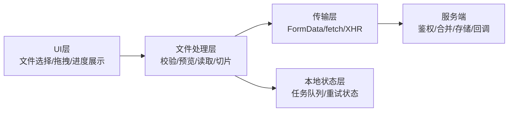
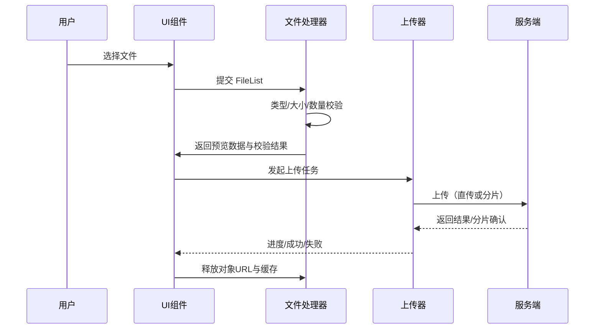
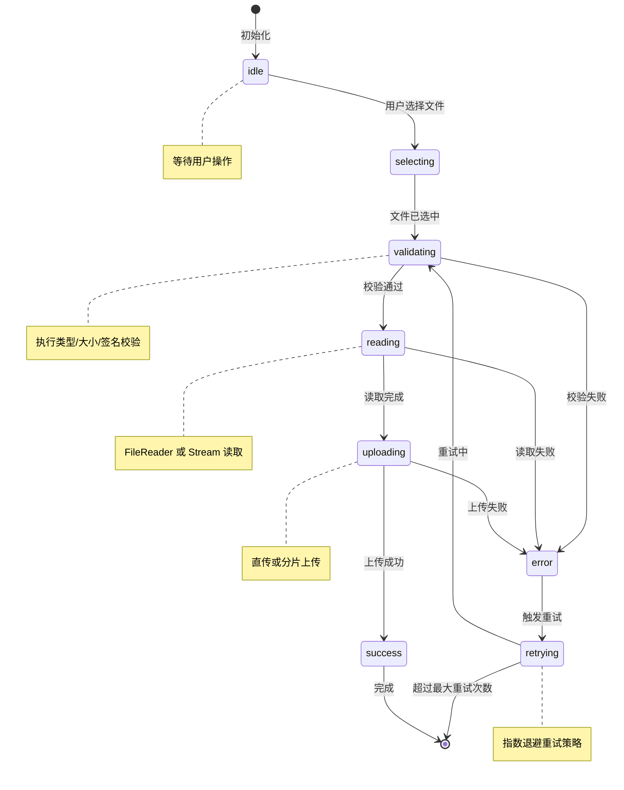
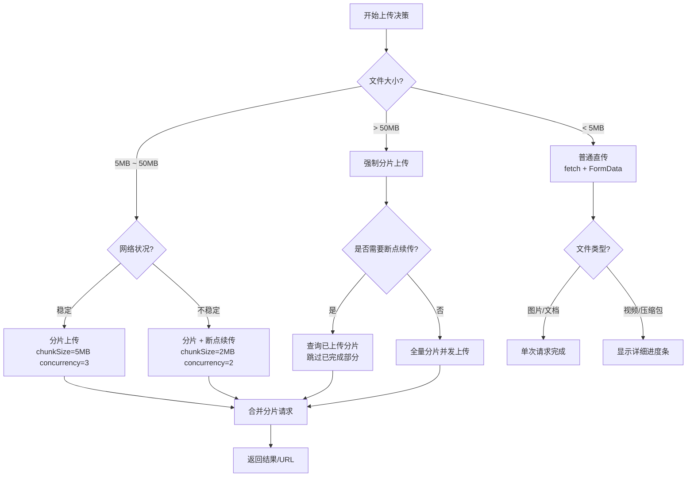
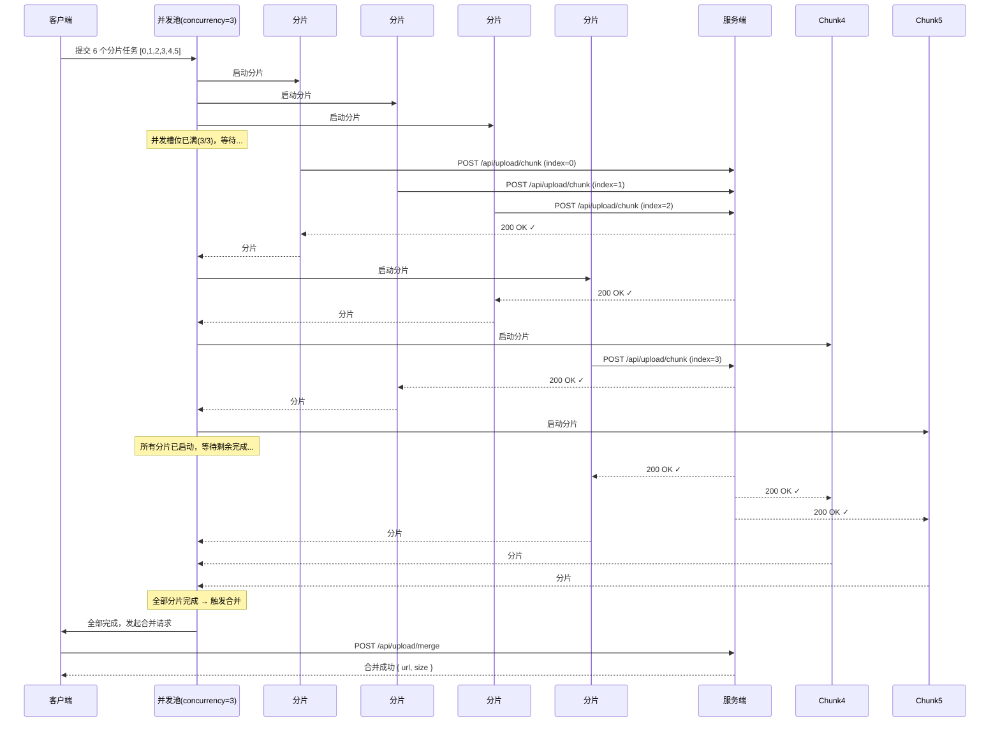

# 文件操作

## 1. 文档目标与范围

本文档描述浏览器端文件处理能力（File API 体系）的设计与实践，覆盖：

- 系统架构与数据流
- 核心功能模块划分
- 浏览器原生 API 接口说明
- 可落地的封装接口与配置参数
- 常见问题与排障建议
- 流式文件处理与文件系统访问（进阶）

> 适用场景：文件选择、客户端校验、预览、读取、上传（含分片上传）与错误处理。

---

## 2. 术语与约定（统一口径）

| 术语 | 说明 | 备注 |
| --- | --- | --- |
| 文件对象（`File`） | 用户选择的单个文件，继承自 `Blob` | 包含 `name`、`size`、`type`、`lastModified` |
| 二进制对象（`Blob`） | 不可变原始二进制数据 | 不一定有文件名 |
| 文件列表（`FileList`） | 来自 `<input type="file">` 或拖拽的文件集合 | 类数组对象，不是数组 |
| 文件读取器（`FileReader`） | 异步读取 `File/Blob` 内容 | 事件驱动，适合中小文件 |
| 对象 URL（Object URL） | `URL.createObjectURL(blob)` 生成的临时地址 | 用完必须 `URL.revokeObjectURL()` |
| 表单数据（`FormData`） | 组织 `multipart/form-data` 上传体 | 与 `fetch/XMLHttpRequest` 配合 |
| 可读流（`ReadableStream`） | 流式数据读取接口 | 支持分片/增量读取，适合大文件 |
| 可写文件流（`FileSystemWritableFileStream`） | 文件系统访问 API 的写入流 | 可直接写入本地文件系统 |

**统一约定**

- "文件类型校验"默认指 **MIME + 扩展名双重校验**。
- "大文件"默认指大于 `50MB` 的单文件（可根据业务调整）。
- "上传"若无特殊说明，默认是 HTTPS 场景。

---

## 3. 系统架构

### 3.1 架构分层



### 3.2 文件处理时序



### 3.3 模块边界建议

- UI 模块：只负责交互与展示，不直接写上传细节。
- 文件处理模块：负责校验、预览、读取、切片。
- 上传模块：负责协议、重试、并发、超时与断点续传。
- 监控模块：统一记录失败码、耗时、重试次数。

### 3.4 文件上传状态机



**状态机说明**

- **idle**：初始空闲状态，等待用户交互。
- **selecting**：用户正在选择或拖拽文件。
- **validating**：执行前端校验（类型、大小、签名等），失败则进入 error。
- **reading**：使用 `FileReader` 或 `ReadableStream` 读取文件内容。
- **uploading**：正在通过 `fetch/XHR` 上传到服务端。
- **success / error**：终态，分别表示成功和失败。
- **retrying**：中间态，自动触发重试逻辑后回到 validating。

### 3.5 上传策略决策树



**决策要点**

- 文件大小是首要判断依据，5MB 和 50MB 是两个关键阈值。
- 网络状况影响并发数和分片大小的调优方向。
- 大文件必须考虑断点续传，避免重复传输。
- 不同文件类型应采用差异化的用户体验策略。

### 3.6 分片上传并发控制时序图



**并发控制核心机制**

- 使用 **Set + Promise.race** 实现动态并发池。
- 每完成一个分片立即从队列取出下一个补充，保持满载。
- 任一分片失败不影响其他分片，最终统一收集错误。

---

## 4. 核心功能模块

<h4>001-file-select-basic.html</h4>

```html
<!DOCTYPE html>
<html lang="zh-CN">
<head>
  <meta charset="UTF-8">
  <meta name="viewport" content="width=device-width, initial-scale=1.0">
  <title>【1】基础文件选择器</title>
  <style>
    * { margin: 0; padding: 0; box-sizing: border-box; }
    body {
      font-family: -apple-system, BlinkMacSystemFont, 'Segoe UI', sans-serif;
      padding: 20px; background: #f8f9fa; color: #333;
    }
    .demo-container { max-width: 800px; margin: 0 auto; background: white; padding: 24px; border-radius: 8px; box-shadow: 0 2px 8px rgba(0,0,0,0.1); }
    .demo-title { margin-bottom: 16px; font-size: 18px; color: #555; border-bottom: 2px solid #007bff; padding-bottom: 8px; }
    .form-group { margin-bottom: 20px; }
    label { display: block; font-weight: 500; margin-bottom: 8px; color: #444; }
    input[type="file"] { padding: 10px; border: 2px dashed #ccc; border-radius: 6px; width: 100%; cursor: pointer; }
    input[type="file"]:hover { border-color: #007bff; background: #f8f9ff; }
    .file-info { margin-top: 12px; padding: 12px; background: #e7f3ff; border-radius: 6px; font-size: 14px; line-height: 1.6; }
    .file-info strong { color: #007bff; }
  </style>
</head>
<body>
  <div class="demo-container">
    <div class="demo-title">示例：基础文件选择器 - 获取文件信息</div>

    <div class="form-group">
      <label for="fileInput">选择文件（支持多选）：</label>
      <input id="fileInput" type="file" multiple accept="image/*,.pdf,.txt" />
    </div>

    <div id="fileInfo" class="file-info" style="display: none;"></div>
  </div>

  <script>
    const fileInput = document.getElementById("fileInput")
    const fileInfo = document.getElementById("fileInfo")

    fileInput.addEventListener("change", (event) => {
      const files = event.target.files
      if (!files || files.length === 0) {
        fileInfo.style.display = "none"
        return
      }

      let html = `<strong>已选择 ${files.length} 个文件：</strong><br><br>`

      Array.from(files).forEach((file, index) => {
        html += `
          <div style="margin-bottom: 8px; padding: 8px; background: white; border-radius: 4px;">
            <strong>文件 ${index + 1}</strong><br>
            名称：${file.name}<br>
            大小：${formatBytes(file.size)}<br>
            类型：${file.type || "未知"}<br>
            最后修改：${new Date(file.lastModified).toLocaleString()}
          </div>
        `
      })

      fileInfo.innerHTML = html
      fileInfo.style.display = "block"
    })

    function formatBytes(bytes) {
      if (bytes === 0) return "0 B"
      const k = 1024
      const sizes = ["B", "KB", "MB", "GB"]
      const i = Math.floor(Math.log(bytes) / Math.log(k))
      return parseFloat((bytes / Math.pow(k, i)).toFixed(2)) + " " + sizes[i]
    }
  </script>
</body>
</html>
```

### 4.1 文件选择模块

#### 4.1.1 通过文件选择器

通过 `<input type="file">` 获取文件。

```html
<input id="fileInput" type="file" multiple accept="image/*,.pdf" />
```

**关键点**

- `multiple`：允许多选。
- `accept`：仅用于选择器提示，不等于安全校验。
- `capture`：移动端可提示调用摄像头；常见值为 `user` 或 `environment`，兼容性依设备而定。

#### 4.1.2 通过拖拽上传

使用 HTML5 拖拽 API 实现拖拽上传：

```html
<div id="dropZone" style="border: 2px dashed #ccc; padding: 20px; text-align: center;">
  拖拽文件到此处
</div>

<script>
  const dropZone = document.getElementById("dropZone")

  // 阻止浏览器默认行为
  const preventDefaults = (e) => {
    e.preventDefault()
    e.stopPropagation()
  }

  // 拖拽进入
  dropZone.addEventListener("dragenter", (e) => {
    preventDefaults(e)
    dropZone.style.borderColor = "#007bff"
    dropZone.style.backgroundColor = "#f8f9fa"
  })

  // 拖拽离开
  dropZone.addEventListener("dragleave", (e) => {
    preventDefaults(e)
    dropZone.style.borderColor = "#ccc"
    dropZone.style.backgroundColor = "transparent"
  })

  // 拖拽悬停
  dropZone.addEventListener("dragover", (e) => {
    preventDefaults(e)
  })

  // 文件放下
  dropZone.addEventListener("drop", (e) => {
    preventDefaults(e)
    dropZone.style.borderColor = "#ccc"
    dropZone.style.backgroundColor = "transparent"

    const files = e.dataTransfer?.files
    if (files && files.length > 0) {
      handleFiles(files) // 自定义处理函数
    }
  })

  function handleFiles(files) {
    console.log("收到文件:", files)
  }
</script>
```

**拖拽上传关键点**

- 必须阻止默认行为，否则浏览器会直接打开文件。
- `dragenter` 和 `dragleave` 事件在子元素上会频繁触发，建议使用 `dragover` 配合标记位或 `pointer-events: none` 优化。
- `dataTransfer.files` 返回 `FileList`，与 `<input>` 的 `files` 属性一致。
- 可通过 `dataTransfer.items` 获取更详细的拖拽数据，支持异步文件访问（`webkitGetAsEntry`）。

### 4.2 校验模块

建议同时校验以下维度：

- 文件数量：`maxCount`
- 单文件大小：`maxSize`
- 总大小：`maxTotalSize`
- 文件类型：MIME + 扩展名白名单
- 文件名安全：长度、特殊字符、保留字

#### 4.2.1 校验函数示例

```js
/**
 * 文件校验函数
 * @param {FileList} files - 文件列表
 * @param {Object} options - 校验配置
 * @returns {Object} { valid: boolean, errors: string[] }
 */
function validateFiles(files, options = {}) {
  const {
    maxCount = 10,
    maxSize = 10 * 1024 * 1024, // 10MB
    maxTotalSize = 100 * 1024 * 1024, // 100MB
    allowedMimeTypes = [],
    allowedExtensions = []
  } = options

  const errors = []

  // 数量校验
  if (files.length > maxCount) {
    errors.push(`最多上传 ${maxCount} 个文件，当前选择了 ${files.length} 个`)
  }

  let totalSize = 0
  const filesArray = Array.from(files)

  filesArray.forEach((file, index) => {
    // 单文件大小校验
    if (file.size > maxSize) {
      errors.push(`文件 "${file.name}" 超过 ${formatBytes(maxSize)} 限制`)
    }

    // 累计总大小
    totalSize += file.size

    // MIME 类型校验
    if (allowedMimeTypes.length > 0 && !allowedMimeTypes.includes(file.type)) {
      errors.push(`文件 "${file.name}" 的类型 ${file.type} 不被允许`)
    }

    // 扩展名校验
    if (allowedExtensions.length > 0) {
      const ext = file.name.split(".").pop()?.toLowerCase()
      if (!allowedExtensions.map(e => e.toLowerCase()).includes(ext)) {
        errors.push(`文件 "${file.name}" 的扩展名 .${ext} 不被允许`)
      }
    }

    // 文件名安全校验
    const dangerousChars = /[<>:"/\\|?*\x00-\x1f]/
    if (dangerousChars.test(file.name)) {
      errors.push(`文件名 "${file.name}" 包含非法字符`)
    }

    if (file.name.length > 255) {
      errors.push(`文件名 "${file.name}" 过长（最多255字符）`)
    }
  })

  // 总大小校验
  if (totalSize > maxTotalSize) {
    errors.push(`文件总大小 ${formatBytes(totalSize)} 超过限制 ${formatBytes(maxTotalSize)}`)
  }

  return {
    valid: errors.length === 0,
    errors
  }
}

// 字节格式化工具
function formatBytes(bytes) {
  if (bytes === 0) return "0 B"
  const k = 1024
  const sizes = ["B", "KB", "MB", "GB"]
  const i = Math.floor(Math.log(bytes) / Math.log(k))
  return parseFloat((bytes / Math.pow(k, i)).toFixed(2)) + " " + sizes[i]
}
```

#### 4.2.2 二进制签名校验

对于高安全要求场景，需通过文件头二进制签名验证真实类型：

```js
/**
 * 常见文件类型的二进制签名（魔数）
 */
const FILE_SIGNATURES = {
  "image/jpeg": [[0xff, 0xd8, 0xff]],
  "image/png": [[0x89, 0x50, 0x4e, 0x47]],
  "image/gif": [[0x47, 0x49, 0x46, 0x38]],
  "application/pdf": [[0x25, 0x50, 0x44, 0x46]],
  "application/zip": [[0x50, 0x4b, 0x03, 0x04]]
}

/**
 * 通过文件头验证文件类型
 * @param {File} file - 文件对象
 * @param {string} expectedType - 期望的 MIME 类型
 * @returns {Promise<boolean>}
 */
async function verifyFileSignature(file, expectedType) {
  const signatures = FILE_SIGNATURES[expectedType]
  if (!signatures) return true // 未定义签名则跳过

  // 读取文件前4字节
  const buffer = await file.slice(0, 4).arrayBuffer()
  const bytes = new Uint8Array(buffer)

  // 检查是否匹配任一签名
  return signatures.some(sig => 
    sig.every((byte, index) => bytes[index] === byte)
  )
}

// 使用示例
const file = fileInput.files[0]
const isValid = await verifyFileSignature(file, "image/jpeg")
if (!isValid) {
  alert("文件签名验证失败，可能不是真实的 JPEG 图片")
}
```

### 4.3 预览模块

常见策略：

- 图片/视频：优先 `Object URL`
- 文本：`FileReader.readAsText`
- 二进制签名校验：`FileReader.readAsArrayBuffer`

#### 4.3.1 图片预览完整示例

```html
<input id="imageInput" type="file" accept="image/*" multiple />
<div id="previewContainer" style="display: flex; flex-wrap: wrap; gap: 10px;"></div>

<script>
  const imageInput = document.getElementById("imageInput")
  const previewContainer = document.getElementById("previewContainer")

  imageInput.addEventListener("change", (event) => {
    const files = event.target.files
    if (!files) return

    // 清空之前的预览
    previewContainer.innerHTML = ""

    Array.from(files).forEach((file) => {
      // 验证图片类型
      if (!file.type.startsWith("image/")) {
        console.warn(`${file.name} 不是图片文件`)
        return
      }

      // 创建预览
      const url = URL.createObjectURL(file)
      const wrapper = document.createElement("div")
      wrapper.style.cssText = "position: relative; width: 150px;"

      const img = document.createElement("img")
      img.src = url
      img.style.cssText = "width: 150px; height: 150px; object-fit: cover; border-radius: 4px;"
      img.alt = file.name

      // 文件信息
      const info = document.createElement("div")
      info.style.cssText = "font-size: 12px; margin-top: 4px; word-break: break-all;"
      info.textContent = `${file.name} (${formatBytes(file.size)})`

      // 图片加载完成后释放对象URL
      img.onload = () => URL.revokeObjectURL(url)

      wrapper.appendChild(img)
      wrapper.appendChild(info)
      previewContainer.appendChild(wrapper)
    })
  })
</script>
```

#### 4.3.2 视频预览示例

```html
<input id="videoInput" type="file" accept="video/*" />
<div id="videoPreview"></div>

<script>
  const videoInput = document.getElementById("videoInput")
  const videoPreview = document.getElementById("videoPreview")

  videoInput.addEventListener("change", (event) => {
    const file = event.target.files?.[0]
    if (!file || !file.type.startsWith("video/")) return

    const url = URL.createObjectURL(file)
    
    videoPreview.innerHTML = `
      <video controls style="max-width: 100%; max-height: 400px;">
        <source src="${url}" type="${file.type}">
        您的浏览器不支持视频播放
      </video>
      <p>${file.name} (${formatBytes(file.size)})</p>
    `

    // 视频元素移除时释放
    const video = videoPreview.querySelector("video")
    video.addEventListener("error", () => URL.revokeObjectURL(url))
  })
</script>
```

#### 4.3.3 PDF 预览（使用 Object URL）

```html
<input id="pdfInput" type="file" accept=".pdf,application/pdf" />
<div id="pdfPreview"></div>

<script>
  const pdfInput = document.getElementById("pdfInput")
  const pdfPreview = document.getElementById("pdfPreview")

  pdfInput.addEventListener("change", (event) => {
    const file = event.target.files?.[0]
    if (!file || file.type !== "application/pdf") return

    const url = URL.createObjectURL(file)
    
    pdfPreview.innerHTML = `
      <iframe 
        src="${url}" 
        style="width: 100%; height: 600px; border: 1px solid #ddd;">
      </iframe>
      <p>${file.name}</p>
    `
  })
</script>
```

**预览模块注意事项**

- 对象 URL 生命周期绑定到文档，页面关闭时自动释放，但最好手动释放。
- 大图片预览可能占用大量内存，建议限制预览数量或使用缩略图服务。
- 视频预览时，考虑不同浏览器的编解码器支持差异。

### 4.4 读取与转换模块

`FileReader` 常用方法：

- `readAsText(file, encoding?)`：读取为文本字符串
- `readAsDataURL(file)`：读取为 Base64 Data URL
- `readAsArrayBuffer(file)`：读取为二进制数组缓冲区
- `readAsBinaryString(file)`：读取为二进制字符串（已废弃，不推荐使用）

事件生命周期：`loadstart` → `progress` → `load` / `error` / `abort` → `loadend`

#### 4.4.1 Promise 封装 FileReader

```js
/**
 * 将 FileReader 封装为 Promise
 * @param {File|Blob} file - 文件对象
 * @param {string} readMethod - 读取方法
 * @param {string} [encoding] - 文本编码
 * @returns {Promise<any>}
 */
function readFileAs(file, readMethod, encoding = "utf-8") {
  return new Promise((resolve, reject) => {
    const reader = new FileReader()

    reader.onload = () => resolve(reader.result)
    reader.onerror = () => reject(new Error("文件读取失败"))
    reader.onabort = () => reject(new Error("文件读取被中止"))

    switch (readMethod) {
      case "text":
        reader.readAsText(file, encoding)
        break
      case "dataURL":
        reader.readAsDataURL(file)
        break
      case "arrayBuffer":
        reader.readAsArrayBuffer(file)
        break
      default:
        reject(new Error(`未知的读取方法: ${readMethod}`))
    }
  })
}

// 使用示例
async function processFile(file) {
  try {
    // 读取文本
    const text = await readFileAs(file, "text")
    console.log("文件内容:", text)

    // 读取为 Data URL
    const dataURL = await readFileAs(file, "dataURL")
    console.log("Data URL 长度:", dataURL.length)

    // 读取为 ArrayBuffer
    const buffer = await readFileAs(file, "arrayBuffer")
    console.log("Buffer 大小:", buffer.byteLength)
  } catch (error) {
    console.error("读取失败:", error.message)
  }
}
```

#### 4.4.2 大文件分片读取

对于大文件，避免一次性读取到内存，应使用分片读取：

```js
/**
 * 分片读取大文件
 * @param {File} file - 文件对象
 * @param {number} chunkSize - 分片大小
 * @param {Function} onChunk - 每个分片的回调
 */
async function readFileInChunks(file, chunkSize, onChunk) {
  const totalChunks = Math.ceil(file.size / chunkSize)

  for (let i = 0; i < totalChunks; i++) {
    const start = i * chunkSize
    const end = Math.min(file.size, start + chunkSize)
    const chunk = file.slice(start, end)

    // 可以根据需要选择读取方式
    const chunkData = await readFileAs(chunk, "arrayBuffer")
    
    await onChunk({
      index: i,
      total: totalChunks,
      data: chunkData,
      start,
      end
    })

    // 添加延迟，避免阻塞主线程
    await new Promise(resolve => setTimeout(resolve, 0))
  }
}

// 使用示例：逐行读取大文本文件
async function readLargeTextFile(file) {
  const decoder = new TextDecoder("utf-8")
  let remainingText = ""

  await readFileInChunks(file, 1024 * 1024, async ({ data }) => {
    const chunkText = decoder.decode(data, { stream: true })
    const text = remainingText + chunkText
    const lines = text.split("\n")

    // 保留最后一个不完整的行
    remainingText = lines.pop() || ""

    // 处理完整的行
    lines.forEach(line => {
      console.log("行:", line)
    })
  })

  // 处理最后一行
  if (remainingText) {
    console.log("行:", remainingText)
  }
}
```

#### 4.4.3 读取进度监听

```js
function readFileWithProgress(file, onProgress) {
  return new Promise((resolve, reject) => {
    const reader = new FileReader()

    reader.onload = () => resolve(reader.result)
    reader.onerror = () => reject(new Error("读取失败"))
    reader.onabort = () => reject(new Error("读取被中止"))

    // 监听读取进度
    reader.onprogress = (event) => {
      if (event.lengthComputable && onProgress) {
        const percent = Math.round((event.loaded / event.total) * 100)
        onProgress(percent, event.loaded, event.total)
      }
    }

    reader.readAsArrayBuffer(file)
  })
}

// 使用示例
const result = await readFileWithProgress(largeFile, (percent, loaded, total) => {
  console.log(`读取进度: ${percent}% (${formatBytes(loaded)} / ${formatBytes(total)})`)
})
```

**读取模块注意事项**

- `readAsDataURL` 会将文件转为 Base64，体积增大约 33%，仅适用于小文件。
- 大文件应使用 `readAsArrayBuffer` 或分片读取，避免内存溢出。
- `FileReader` 是异步的，不会阻塞主线程，但大量数据仍需注意性能。
- 始终处理 `error` 和 `abort` 事件，避免未捕获的异常。

### 4.5 上传模块

两种主模式：

- 普通上传：小文件一次性上传。
- 分片上传：大文件切片并发上传，服务端合并。

#### 4.5.1 带进度监控的上传

```js
/**
 * 带进度的文件上传
 * @param {File} file - 文件对象
 * @param {string} endpoint - 上传地址
 * @param {Function} onProgress - 进度回调
 * @param {AbortSignal} signal - 取消信号
 * @returns {Promise<Object>}
 */
async function uploadWithProgress(file, endpoint, onProgress, signal) {
  return new Promise((resolve, reject) => {
    const xhr = new XMLHttpRequest()

    // 监听上传进度
    xhr.upload.addEventListener("progress", (event) => {
      if (event.lengthComputable && onProgress) {
        const percent = Math.round((event.loaded / event.total) * 100)
        onProgress(percent, event.loaded, event.total)
      }
    })

    xhr.addEventListener("load", () => {
      if (xhr.status >= 200 && xhr.status < 300) {
        try {
          resolve(JSON.parse(xhr.responseText))
        } catch {
          resolve({ success: true, response: xhr.responseText })
        }
      } else {
        reject(new Error(`上传失败: ${xhr.status} ${xhr.statusText}`))
      }
    })

    xhr.addEventListener("error", () => reject(new Error("网络错误")))
    xhr.addEventListener("abort", () => reject(new Error("上传已取消")))

    // 支持取消
    if (signal) {
      signal.addEventListener("abort", () => xhr.abort())
    }

    const formData = new FormData()
    formData.append("file", file, file.name)

    xhr.open("POST", endpoint)
    xhr.send(formData)
  })
}

// 使用示例
const controller = new AbortController()

try {
  const result = await uploadWithProgress(
    file,
    "/api/upload",
    (percent, loaded, total) => {
      console.log(`上传进度: ${percent}%`)
    },
    controller.signal
  )
  console.log("上传成功:", result)
} catch (error) {
  console.error("上传失败:", error.message)
}

// 取消上传
// controller.abort()
```

#### 4.5.2 并发分片上传

```js
/**
 * 并发分片上传
 * @param {File} file - 文件对象
 * @param {Object} options - 配置选项
 * @returns {Promise<Object>}
 */
async function uploadFileWithChunks(file, options = {}) {
  const {
    endpoint = "/api/upload/chunk",
    mergeEndpoint = "/api/upload/merge",
    chunkSize = 5 * 1024 * 1024, // 5MB
    concurrency = 3, // 并发数
    onProgress,
    signal
  } = options

  const fileId = `${file.name}-${file.lastModified}-${file.size}`
  const totalChunks = Math.ceil(file.size / chunkSize)
  const uploadedChunks = new Set()
  let completedBytes = 0

  // 创建上传任务
  const uploadChunk = async (chunkIndex) => {
    const start = chunkIndex * chunkSize
    const end = Math.min(file.size, start + chunkSize)
    const chunk = file.slice(start, end)

    const formData = new FormData()
    formData.append("fileId", fileId)
    formData.append("chunkIndex", String(chunkIndex))
    formData.append("totalChunks", String(totalChunks))
    formData.append("chunk", chunk)

    const response = await fetch(endpoint, {
      method: "POST",
      body: formData,
      signal
    })

    if (!response.ok) {
      throw new Error(`分片 ${chunkIndex} 上传失败`)
    }

    // 更新进度
    completedBytes += (end - start)
    if (onProgress) {
      const percent = Math.round((completedBytes / file.size) * 100)
      onProgress(percent, completedBytes, file.size)
    }

    uploadedChunks.add(chunkIndex)
    return response.json()
  }

  // 并发控制
  const chunkIndexes = Array.from({ length: totalChunks }, (_, i) => i)
  const queue = [...chunkIndexes]
  const executing = new Set()

  while (queue.length > 0 || executing.size > 0) {
    // 填充并发队列
    while (queue.length > 0 && executing.size < concurrency) {
      const chunkIndex = queue.shift()
      const promise = uploadChunk(chunkIndex).finally(() => executing.delete(promise))
      executing.add(promise)
    }

    // 等待任意一个完成
    if (executing.size > 0) {
      await Promise.race(executing)
    }
  }

  // 合并分片
  const mergeResponse = await fetch(mergeEndpoint, {
    method: "POST",
    headers: { "Content-Type": "application/json" },
    body: JSON.stringify({ fileId, fileName: file.name }),
    signal
  })

  return mergeResponse.json()
}

// 使用示例
const controller = new AbortController()

try {
  const result = await uploadFileWithChunks(largeFile, {
    chunkSize: 5 * 1024 * 1024,
    concurrency: 3,
    onProgress: (percent) => {
      console.log(`上传进度: ${percent}%`)
    },
    signal: controller.signal
  })
  console.log("上传完成:", result)
} catch (error) {
  if (error.name === "AbortError") {
    console.log("上传已取消")
  } else {
    console.error("上传失败:", error.message)
  }
}
```

#### 4.5.3 断点续传

```js
/**
 * 断点续传上传
 * @param {File} file - 文件对象
 * @param {Object} options - 配置选项
 */
async function uploadWithResume(file, options = {}) {
  const {
    statusEndpoint = "/api/upload/status",
    uploadEndpoint = "/api/upload/chunk",
    mergeEndpoint = "/api/upload/merge",
    chunkSize = 5 * 1024 * 1024,
    concurrency = 3,
    onProgress,
    signal
  } = options

  const fileId = `${file.name}-${file.lastModified}-${file.size}`
  const totalChunks = Math.ceil(file.size / chunkSize)

  // 1. 查询已上传的分片
  let uploadedChunks = []
  try {
    const statusResponse = await fetch(`${statusEndpoint}?fileId=${fileId}`)
    if (statusResponse.ok) {
      const status = await statusResponse.json()
      uploadedChunks = status.uploadedChunks || []
      console.log(`已上传 ${uploadedChunks.length}/${totalChunks} 个分片`)
    }
  } catch (error) {
    console.log("无法获取上传状态，从头开始上传")
  }

  // 2. 计算待上传的分片
  const pendingChunks = []
  let uploadedBytes = 0

  for (let i = 0; i < totalChunks; i++) {
    if (uploadedChunks.includes(i)) {
      // 计算已上传字节数
      uploadedBytes += Math.min(chunkSize, file.size - i * chunkSize)
    } else {
      pendingChunks.push(i)
    }
  }

  // 3. 上传剩余分片
  const uploadChunk = async (chunkIndex) => {
    const start = chunkIndex * chunkSize
    const end = Math.min(file.size, start + chunkSize)
    const chunk = file.slice(start, end)

    const formData = new FormData()
    formData.append("fileId", fileId)
    formData.append("chunkIndex", String(chunkIndex))
    formData.append("totalChunks", String(totalChunks))
    formData.append("chunk", chunk)

    const response = await fetch(uploadEndpoint, {
      method: "POST",
      body: formData,
      signal
    })

    if (!response.ok) {
      throw new Error(`分片 ${chunkIndex} 上传失败`)
    }

    // 更新进度
    uploadedBytes += (end - start)
    if (onProgress) {
      const percent = Math.round((uploadedBytes / file.size) * 100)
      onProgress(percent, uploadedBytes, file.size)
    }

    return response.json()
  }

  // 并发上传待传分片
  const queue = [...pendingChunks]
  const executing = new Set()

  while (queue.length > 0 || executing.size > 0) {
    while (queue.length > 0 && executing.size < concurrency) {
      const chunkIndex = queue.shift()
      const promise = uploadChunk(chunkIndex).finally(() => executing.delete(promise))
      executing.add(promise)
    }

    if (executing.size > 0) {
      await Promise.race(executing)
    }
  }

  // 4. 合并分片
  const mergeResponse = await fetch(mergeEndpoint, {
    method: "POST",
    headers: { "Content-Type": "application/json" },
    body: JSON.stringify({ fileId, fileName: file.name, totalChunks }),
    signal
  })

  return mergeResponse.json()
}

// 使用示例
const result = await uploadWithResume(file, {
  onProgress: (percent) => console.log(`进度: ${percent}%`)
})
```

#### 4.5.4 多文件并发上传

```js
/**
 * 多文件并发上传
 * @param {File[]} files - 文件数组
 * @param {Object} options - 配置选项
 */
async function uploadMultipleFiles(files, options = {}) {
  const {
    endpoint,
    maxConcurrency = 3,
    onFileProgress,
    onFileComplete,
    onFileError
  } = options

  const results = []
  const queue = Array.from(files)
  const executing = new Set()
  let completedCount = 0

  const uploadOne = async (file) => {
    try {
      const result = await uploadWithProgress(
        file,
        endpoint,
        (percent) => onFileProgress?.(file, percent)
      )
      
      completedCount++
      onFileComplete?.(file, result)
      
      return { file, success: true, result }
    } catch (error) {
      onFileError?.(file, error)
      return { file, success: false, error: error.message }
    }
  }

  while (queue.length > 0 || executing.size > 0) {
    while (queue.length > 0 && executing.size < maxConcurrency) {
      const file = queue.shift()
      const promise = uploadOne(file).then((result) => {
        executing.delete(promise)
        results.push(result)
      })
      executing.add(promise)
    }

    if (executing.size > 0) {
      await Promise.race(executing)
    }
  }

  return results
}

// 使用示例
const results = await uploadMultipleFiles(files, {
  endpoint: "/api/upload",
  maxConcurrency: 3,
  onFileProgress: (file, percent) => {
    console.log(`${file.name}: ${percent}%`)
  },
  onFileComplete: (file, result) => {
    console.log(`${file.name} 上传完成`)
  },
  onFileError: (file, error) => {
    console.error(`${file.name} 上传失败:`, error.message)
  }
})
```

**上传模块最佳实践**

- 小文件（< 5MB）：使用普通上传，简化流程。
- 中等文件（5-50MB）：可使用分片上传，提高可靠性。
- 大文件（> 50MB）：必须使用分片上传 + 断点续传。
- 根据网络状况动态调整并发数和分片大小。
- 始终提供进度反馈和取消功能。

### 4.6 资源回收模块

#### 4.6.1 对象 URL 管理

```js
/**
 * 对象 URL 管理器
 */
class ObjectURLManager {
  constructor() {
    this.urls = new Map() // file -> url
  }

  /**
   * 创建对象 URL
   * @param {File|Blob} file - 文件对象
   * @returns {string} URL
   */
  create(file) {
    // 如果已存在，直接返回
    if (this.urls.has(file)) {
      return this.urls.get(file)
    }

    const url = URL.createObjectURL(file)
    this.urls.set(file, url)
    return url
  }

  /**
   * 释放单个 URL
   * @param {File|Blob} file - 文件对象
   */
  revoke(file) {
    const url = this.urls.get(file)
    if (url) {
      URL.revokeObjectURL(url)
      this.urls.delete(file)
    }
  }

  /**
   * 释放所有 URL
   */
  revokeAll() {
    this.urls.forEach((url) => {
      URL.revokeObjectURL(url)
    })
    this.urls.clear()
  }

  /**
   * 获取当前管理的 URL 数量
   */
  get size() {
    return this.urls.size
  }
}

// 使用示例
const urlManager = new ObjectURLManager()

// 创建预览
const url = urlManager.create(file)
previewElement.src = url

// 不再需要时释放
urlManager.revoke(file)

// 页面卸载时清理
window.addEventListener("beforeunload", () => {
  urlManager.revokeAll()
})
```

#### 4.6.2 上传任务管理

```js
/**
 * 上传任务管理器
 */
class UploadTaskManager {
  constructor() {
    this.tasks = new Map() // taskId -> { controller, file, status }
    this.taskIdCounter = 0
  }

  /**
   * 创建上传任务
   * @param {File} file - 文件对象
   * @returns {Object} { taskId, signal, controller }
   */
  createTask(file) {
    const taskId = ++this.taskIdCounter
    const controller = new AbortController()

    this.tasks.set(taskId, {
      id: taskId,
      file,
      controller,
      status: "pending", // pending | uploading | completed | cancelled | failed
      startTime: Date.now()
    })

    return {
      taskId,
      signal: controller.signal,
      controller
    }
  }

  /**
   * 取消任务
   * @param {number} taskId - 任务 ID
   */
  cancelTask(taskId) {
    const task = this.tasks.get(taskId)
    if (task && task.status === "uploading") {
      task.controller.abort()
      task.status = "cancelled"
    }
  }

  /**
   * 取消所有任务
   */
  cancelAll() {
    this.tasks.forEach((task) => {
      if (task.status === "uploading") {
        task.controller.abort()
        task.status = "cancelled"
      }
    })
  }

  /**
   * 更新任务状态
   * @param {number} taskId - 任务 ID
   * @param {string} status - 状态
   */
  updateStatus(taskId, status) {
    const task = this.tasks.get(taskId)
    if (task) {
      task.status = status
    }
  }

  /**
   * 清理已完成和已取消的任务
   */
  cleanup() {
    this.tasks.forEach((task, taskId) => {
      if (["completed", "cancelled", "failed"].includes(task.status)) {
        this.tasks.delete(taskId)
      }
    })
  }

  /**
   * 获取任务列表
   */
  getTasks() {
    return Array.from(this.tasks.values())
  }
}

// 使用示例
const taskManager = new UploadTaskManager()

// 创建上传任务
const { taskId, signal } = taskManager.createTask(file)

try {
  taskManager.updateStatus(taskId, "uploading")
  await uploadWithProgress(file, endpoint, onProgress, signal)
  taskManager.updateStatus(taskId, "completed")
} catch (error) {
  if (error.name === "AbortError") {
    console.log("任务已取消")
  } else {
    taskManager.updateStatus(taskId, "failed")
  }
}

// 取消特定任务
// taskManager.cancelTask(taskId)

// 取消所有任务
// taskManager.cancelAll()

// 页面离开时清理
window.addEventListener("beforeunload", () => {
  taskManager.cancelAll()
})
```

#### 4.6.3 完整的资源清理示例

```js
class FileUploadManager {
  constructor() {
    this.urlManager = new ObjectURLManager()
    this.taskManager = new UploadTaskManager()
    this.setupCleanup()
  }

  /**
   * 设置自动清理
   */
  setupCleanup() {
    // 页面卸载时清理
    window.addEventListener("beforeunload", () => {
      this.cleanup()
    })

    // 页面隐藏时清理（移动端）
    document.addEventListener("visibilitychange", () => {
      if (document.hidden) {
        // 可选：暂停或清理部分资源
      }
    })
  }

  /**
   * 清理所有资源
   */
  cleanup() {
    // 取消所有上传任务
    this.taskManager.cancelAll()

    // 释放所有对象 URL
    this.urlManager.revokeAll()

    console.log("资源已清理")
  }

  /**
   * 上传文件
   */
  async uploadFile(file, options) {
    // 创建任务
    const { taskId, signal } = this.taskManager.createTask(file)

    try {
      this.taskManager.updateStatus(taskId, "uploading")

      const result = await uploadWithProgress(
        file,
        options.endpoint,
        options.onProgress,
        signal
      )

      this.taskManager.updateStatus(taskId, "completed")
      return result
    } catch (error) {
      this.taskManager.updateStatus(taskId, "failed")
      throw error
    }
  }

  /**
   * 创建预览
   */
  createPreview(file) {
    return this.urlManager.create(file)
  }

  /**
   * 释放预览
   */
  releasePreview(file) {
    this.urlManager.revoke(file)
  }
}

// 全局实例
const fileUploadManager = new FileUploadManager()
```

**资源回收要点**

- 对象 URL 使用后必须释放，否则会造成内存泄漏。
- 使用 `AbortController` 可以优雅地取消上传请求。
- 页面离开时主动清理所有未完成任务和对象 URL。
- 建议使用管理器统一管理资源生命周期。

### 4.7 错误处理模块

#### 4.7.1 错误类型定义

```js
/**
 * 文件操作错误类型
 */
const FileErrorTypes = {
  // 文件选择错误
  NO_FILE_SELECTED: "NO_FILE_SELECTED",
  FILE_TYPE_NOT_ALLOWED: "FILE_TYPE_NOT_ALLOWED",
  FILE_TOO_LARGE: "FILE_TOO_LARGE",
  FILE_COUNT_EXCEEDED: "FILE_COUNT_EXCEEDED",
  INVALID_FILE_NAME: "INVALID_FILE_NAME",

  // 文件读取错误
  READ_FAILED: "READ_FAILED",
  READ_ABORTED: "READ_ABORTED",
  READ_TIMEOUT: "READ_TIMEOUT",
  FILE_SIGNATURE_MISMATCH: "FILE_SIGNATURE_MISMATCH",

  // 上传错误
  UPLOAD_FAILED: "UPLOAD_FAILED",
  UPLOAD_ABORTED: "UPLOAD_ABORTED",
  NETWORK_ERROR: "NETWORK_ERROR",
  SERVER_ERROR: "SERVER_ERROR",
  CHUNK_UPLOAD_FAILED: "CHUNK_UPLOAD_FAILED",
  MERGE_FAILED: "MERGE_FAILED",

  // 其他错误
  BROWSER_NOT_SUPPORTED: "BROWSER_NOT_SUPPORTED",
  PERMISSION_DENIED: "PERMISSION_DENIED"
}

/**
 * 自定义文件错误类
 */
class FileError extends Error {
  constructor(type, message, details = {}) {
    super(message)
    this.name = "FileError"
    this.type = type
    this.details = details
    this.timestamp = Date.now()
  }

  toJSON() {
    return {
      name: this.name,
      type: this.type,
      message: this.message,
      details: this.details,
      timestamp: this.timestamp
    }
  }
}

/**
 * 错误工厂
 */
const FileErrors = {
  noFileSelected() {
    return new FileError(
      FileErrorTypes.NO_FILE_SELECTED,
      "未选择文件"
    )
  },

  fileTypeNotAllowed(fileName, mimeType, allowedTypes) {
    return new FileError(
      FileErrorTypes.FILE_TYPE_NOT_ALLOWED,
      `文件 "${fileName}" 的类型 ${mimeType} 不被允许`,
      { fileName, mimeType, allowedTypes }
    )
  },

  fileTooLarge(fileName, fileSize, maxSize) {
    return new FileError(
      FileErrorTypes.FILE_TOO_LARGE,
      `文件 "${fileName}" 大小超过限制`,
      { fileName, fileSize, maxSize }
    )
  },

  uploadFailed(status, statusText) {
    return new FileError(
      FileErrorTypes.UPLOAD_FAILED,
      `上传失败: ${status} ${statusText}`,
      { status, statusText }
    )
  },

  networkError(originalError) {
    return new FileError(
      FileErrorTypes.NETWORK_ERROR,
      "网络错误，请检查网络连接",
      { originalError: originalError.message }
    )
  }
}
```

#### 4.7.2 统一错误处理

```js
/**
 * 统一错误处理器
 */
class FileErrorHandler {
  constructor(options = {}) {
    this.onError = options.onError || console.error
    this.onRetry = options.onRetry || null
    this.retryConfig = {
      maxRetries: options.maxRetries || 3,
      retryDelay: options.retryDelay || 1000,
      ...options.retryConfig
    }
  }

  /**
   * 处理错误
   * @param {Error|FileError} error - 错误对象
   * @param {Object} context - 错误上下文
   */
  handle(error, context = {}) {
    // 标准化错误
    const fileError = error instanceof FileError
      ? error
      : this.normalizeError(error)

    // 记录错误
    this.logError(fileError, context)

    // 调用错误回调
    this.onError(fileError, context)

    return fileError
  }

  /**
   * 标准化错误
   */
  normalizeError(error) {
    // DOMException (abort)
    if (error.name === "AbortError") {
      return new FileError(
        FileErrorTypes.UPLOAD_ABORTED,
        "操作已取消",
        { originalError: error.message }
      )
    }

    // TypeError (network)
    if (error.name === "TypeError" && error.message.includes("fetch")) {
      return new FileError(
        FileErrorTypes.NETWORK_ERROR,
        "网络请求失败",
        { originalError: error.message }
      )
    }

    // 默认错误
    return new FileError(
      "UNKNOWN_ERROR",
      error.message || "未知错误",
      { originalError: error.toString() }
    )
  }

  /**
   * 记录错误日志
   */
  logError(error, context) {
    const logEntry = {
      timestamp: new Date().toISOString(),
      error: error.toJSON(),
      context,
      userAgent: navigator.userAgent,
      url: window.location.href
    }

    // 可发送到日志服务
    console.error("[FileError]", logEntry)
  }

  /**
   * 带重试的操作包装
   */
  async withRetry(operation, options = {}) {
    const {
      maxRetries = this.retryConfig.maxRetries,
      retryDelay = this.retryConfig.retryDelay,
      shouldRetry = () => true
    } = options

    let lastError

    for (let attempt = 1; attempt <= maxRetries; attempt++) {
      try {
        return await operation()
      } catch (error) {
        lastError = error

        // 判断是否应该重试
        if (!shouldRetry(error) || attempt === maxRetries) {
          throw error
        }

        // 等待后重试
        const delay = typeof retryDelay === "function"
          ? retryDelay(attempt)
          : retryDelay * attempt // 指数退避

        console.log(`操作失败，${delay}ms 后重试 (第 ${attempt}/${maxRetries} 次)`)
        
        if (this.onRetry) {
          this.onRetry(attempt, maxRetries, error)
        }

        await new Promise(resolve => setTimeout(resolve, delay))
      }
    }

    throw lastError
  }
}

// 使用示例
const errorHandler = new FileErrorHandler({
  onError: (error) => {
    // 显示用户友好的错误信息
    showToast(getUserFriendlyMessage(error.type))
  },
  onRetry: (attempt, maxRetries) => {
    showToast(`正在重试 (${attempt}/${maxRetries})...`)
  },
  maxRetries: 3,
  retryDelay: (attempt) => Math.min(1000 * Math.pow(2, attempt), 10000) // 指数退避
})

// 用户友好的错误信息
function getUserFriendlyMessage(errorType) {
  const messages = {
    [FileErrorTypes.FILE_TYPE_NOT_ALLOWED]: "文件类型不支持，请选择正确的文件类型",
    [FileErrorTypes.FILE_TOO_LARGE]: "文件大小超过限制",
    [FileErrorTypes.NETWORK_ERROR]: "网络连接失败，请检查网络后重试",
    [FileErrorTypes.UPLOAD_ABORTED]: "上传已取消",
    [FileErrorTypes.UPLOAD_FAILED]: "上传失败，请稍后重试"
  }
  return messages[errorType] || "操作失败，请重试"
}
```

#### 4.7.3 错误处理最佳实践

```js
/**
 * 完整的文件处理流程（带错误处理）
 */
async function processFileUpload(file, options) {
  try {
    // 1. 校验文件
    const validation = validateFiles([file], options.validation)
    if (!validation.valid) {
      throw FileErrors.fileValidationFailed(validation.errors)
    }

    // 2. 签名校验（可选）
    if (options.verifySignature) {
      const isValid = await verifyFileSignature(file, file.type)
      if (!isValid) {
        throw new FileError(
          FileErrorTypes.FILE_SIGNATURE_MISMATCH,
          "文件签名验证失败，文件可能已损坏或被篡改"
        )
      }
    }

    // 3. 创建预览
    const previewUrl = urlManager.create(file)

    // 4. 上传文件（带重试）
    const result = await errorHandler.withRetry(
      () => uploadWithProgress(file, options.endpoint, options.onProgress, options.signal),
      {
        shouldRetry: (error) => {
          // 网络错误、服务器 5xx 错误可重试
          return error.type === FileErrorTypes.NETWORK_ERROR ||
                 (error.details.status >= 500 && error.details.status < 600)
        }
      }
    )

    return { success: true, result, previewUrl }
  } catch (error) {
    // 统一错误处理
    const fileError = errorHandler.handle(error, { file: file.name })
    return { success: false, error: fileError }
  } finally {
    // 清理资源
    if (options.releasePreview) {
      urlManager.revoke(file)
    }
  }
}
```

---

## 5. API 接口说明

### 5.1 原生接口总览

| 接口 | 作用 | 关键方法/属性 |
| --- | --- | --- |
| `<input type="file">` | 触发文件选择 | `files`、`accept`、`multiple` |
| `FileList` | 文件集合 | `length`、`item(index)` |
| `File` | 文件元数据与内容载体 | `name`、`size`、`type`、`lastModified` |
| `Blob` | 原始二进制容器 | `slice()`、`size`、`type` |
| `FileReader` | 异步读取 | `readAsText/readAsDataURL/readAsArrayBuffer` |
| `FormData` | 组装上传体 | `append(name, value, filename?)` |
| `URL` | 创建/释放对象 URL | `createObjectURL`、`revokeObjectURL` |
| `ReadableStream` | 流式读取 | `getReader()`、`pipeThrough()` |
| `FileSystemFileHandle` | 文件系统句柄 | `getFile()`、`createWritable()` |

### 5.2 `input[file]` 属性说明

| 属性 | 类型 | 默认值 | 说明 |
| --- | --- | --- | --- |
| `multiple` | `boolean` | `false` | 是否允许多文件 |
| `accept` | `string` | `""` | 接收类型（扩展名、MIME、通配） |
| `capture` | `string` | 无 | 移动端采集来源提示（`user`/`environment`） |
| `disabled` | `boolean` | `false` | 是否禁用 |
| `required` | `boolean` | `false` | 表单提交是否必填 |

### 5.3 推荐封装接口（示例）

```ts
export interface FileValidationOptions {
  maxCount?: number
  maxSize?: number
  maxTotalSize?: number
  allowedMimeTypes?: string[]
  allowedExtensions?: string[]
}

export interface UploadOptions {
  endpoint: string
  fieldName?: string
  headers?: Record<string, string>
  timeoutMs?: number
  retryTimes?: number
  chunkSize?: number
  concurrency?: number
}

export interface UploadResult {
  fileName: string
  success: boolean
  status: number
  message?: string
  url?: string
}

export function validateFiles(files: FileList, options: FileValidationOptions): string[]
export function previewImage(file: File): string
export function readText(file: File, encoding?: string): Promise<string>
export function uploadFiles(files: File[], options: UploadOptions): Promise<UploadResult[]>
```

### 5.4 服务端上传接口约定（示例）

| 接口 | 方法 | 用途 | 关键请求参数 | 关键响应字段 |
| --- | --- | --- | --- | --- |
| `/api/upload` | `POST` | 单文件直传 | `multipart/form-data`，字段 `file` | `url`、`fileId` |
| `/api/upload/chunk` | `POST` | 上传单个分片 | `fileId`、`chunkIndex`、`totalChunks`、`chunk` | `received`、`chunkIndex` |
| `/api/upload/merge` | `POST` | 合并分片 | `fileId`、`fileName` | `url`、`size`、`checksum` |
| `/api/upload/status` | `GET` | 查询上传状态 | `fileId` | `uploadedChunks`、`completed` |

**状态码建议**

- `200/201`：成功。
- `400`：参数不合法（大小、类型、索引异常）。
- `401/403`：鉴权失败。
- `409`：文件冲突（同名策略、重复分片）。
- `413`：文件或请求体过大。
- `415`：不支持的媒体类型。
- `500`：服务端内部错误。

---

## 6. 配置参数详解

### 6.1 校验参数

| 参数 | 类型 | 建议值 | 说明 |
| --- | --- | --- | --- |
| `maxCount` | `number` | `1~20` | 最大文件数量 |
| `maxSize` | `number` | `5MB~100MB` | 单文件最大字节数 |
| `maxTotalSize` | `number` | `20MB~500MB` | 全部文件总字节数 |
| `allowedMimeTypes` | `string[]` | 按业务配置 | 允许的 MIME 白名单 |
| `allowedExtensions` | `string[]` | 按业务配置 | 允许的扩展名白名单 |

### 6.2 上传参数

| 参数 | 类型 | 建议值 | 说明 |
| --- | --- | --- | --- |
| `endpoint` | `string` | 必填 | 上传地址 |
| `fieldName` | `string` | `"file"` | 表单字段名 |
| `timeoutMs` | `number` | `10000~60000` | 请求超时毫秒 |
| `retryTimes` | `number` | `1~3` | 失败重试次数 |
| `chunkSize` | `number` | `2MB~10MB` | 分片大小 |
| `concurrency` | `number` | `2~4` | 分片并发数 |

### 6.3 参数设计建议

- 网络不稳定场景：提高 `retryTimes`，降低 `concurrency`。
- 弱性能设备：减小 `chunkSize`，避免主线程长时间阻塞。
- 服务端限流场景：配置动态并发与指数退避重试。

---

## 7. 使用示例

<h4>007-upload-progress.html</h4>

```html
<!DOCTYPE html>
<html lang="zh-CN">
<head>
  <meta charset="UTF-8">
  <meta name="viewport" content="width=device-width, initial-scale=1.0">
  <title>【7】上传进度条组件</title>
  <style>
    * { margin: 0; padding: 0; box-sizing: border-box; }
    body {
      font-family: -apple-system, BlinkMacSystemFont, 'Segoe UI', sans-serif;
      padding: 20px; background: #f8f9fa; color: #333;
    }
    .demo-container { max-width: 700px; margin: 0 auto; background: white; padding: 24px; border-radius: 8px; box-shadow: 0 2px 8px rgba(0,0,0,0.1); }
    .demo-title { margin-bottom: 16px; font-size: 18px; color: #555; border-bottom: 2px solid #007bff; padding-bottom: 8px; }

    .upload-header {
      display: flex;
      justify-content: space-between;
      align-items: center;
      margin-bottom: 20px;
    }

    .btn-upload {
      padding: 10px 24px;
      background: #007bff;
      color: white;
      border: none;
      border-radius: 6px;
      cursor: pointer;
      font-size: 15px;
      font-weight: 500;
      transition: all 0.3s;
    }
    .btn-upload:hover { background: #0056b3; }

    input[type="file"] { display: none; }

    .upload-item {
      padding: 16px;
      background: white;
      border: 1px solid #e0e0e0;
      border-radius: 8px;
      margin-bottom: 12px;
      transition: all 0.3s;
    }
    .upload-item:hover { box-shadow: 0 2px 8px rgba(0,0,0,0.08); }

    .file-info {
      display: flex;
      justify-content: space-between;
      margin-bottom: 10px;
    }

    .file-name {
      font-weight: 500;
      overflow: hidden;
      text-overflow: ellipsis;
      white-space: nowrap;
      max-width: 350px;
    }

    .file-size {
      color: #666;
      font-size: 13px;
    }

    .progress-container {
      height: 10px;
      background: #e9ecef;
      border-radius: 5px;
      overflow: hidden;
      margin-bottom: 10px;
    }

    .progress-bar {
      height: 100%;
      background: linear-gradient(90deg, #007bff, #00d4ff);
      border-radius: 5px;
      transition: width 0.3s ease;
      width: 0%;
    }

    .upload-status {
      display: flex;
      justify-content: space-between;
      align-items: center;
      font-size: 13px;
    }

    .status-text { font-weight: 500; }
    .status-text.success { color: #28a745; }
    .status-text.error { color: #dc3545; }
    .status-text.uploading { color: #007bff; }

    .btn {
      padding: 6px 14px;
      border: none;
      border-radius: 4px;
      cursor: pointer;
      font-size: 13px;
      transition: all 0.2s;
    }
    .btn-cancel { background: #dc3545; color: white; }
    .btn-cancel:hover { background: #c82333; }
    .btn-done { background: #28a745; color: white; }
    .btn-retry { background: #ffc107; color: #333; }

    .empty-state {
      text-align: center;
      padding: 40px;
      color: #999;
      border: 2px dashed #ddd;
      border-radius: 8px;
    }
  </style>
</head>
<body>
  <div class="demo-container">
    <div class="demo-title">示例：带进度条的上传组件（模拟）</div>

    <div class="upload-header">
      <button class="btn-upload" onclick="document.getElementById('fileInput').click()">
        📤 选择文件上传
      </button>
      <input type="file" id="fileInput" multiple />
    </div>

    <div id="uploadList">
      <div class="empty-state">
        <p>点击上方按钮选择文件</p>
        <p style="font-size: 13px; margin-top: 8px;">支持多文件，可查看模拟的上传进度</p>
      </div>
    </div>
  </div>

  <script>
    const fileInput = document.getElementById("fileInput")
    const uploadList = document.getElementById("uploadList")

    fileInput.addEventListener("change", (event) => {
      const files = event.target.files
      if (!files) return

      uploadList.innerHTML = ""
      Array.from(files).forEach(file => simulateUpload(file))
    })

    function simulateUpload(file) {
      const itemId = Date.now() + Math.random()

      // 创建 UI
      const item = document.createElement("div")
      item.className = "upload-item"
      item.id = `item-${itemId}`
      item.innerHTML = `
        <div class="file-info">
          <span class="file-name">${file.name}</span>
          <span class="file-size">${formatSize(file.size)}</span>
        </div>
        <div class="progress-container">
          <div class="progress-bar" id="progress-${itemId}"></div>
        </div>
        <div class="upload-status">
          <span class="status-text uploading" id="status-${itemId}">准备上传...</span>
          <button class="btn btn-cancel" id="cancel-${itemId}">取消</button>
        </div>
      `
      uploadList.appendChild(item)

      const progressBar = document.getElementById(`progress-${itemId}`)
      const statusText = document.getElementById(`status-${itemId}`)
      const cancelBtn = document.getElementById(`cancel-${itemId}`)

      let cancelled = false
      let progress = 0

      cancelBtn.addEventListener("click", () => {
        cancelled = true
        statusText.textContent = "已取消"
        statusText.className = "status-text error"
        cancelBtn.style.display = "none"
      })

      // 模拟上传进度
      const interval = setInterval(() => {
        if (cancelled) {
          clearInterval(interval)
          return
        }

        progress += Math.random() * 15
        if (progress >= 100) {
          progress = 100
          clearInterval(interval)

          progressBar.style.width = "100%"
          statusText.textContent = "上传成功 ✓"
          statusText.className = "status-text success"
          cancelBtn.textContent = "完成"
          cancelBtn.className = "btn btn-done"
          cancelBtn.onclick = () => item.remove()
          return
        }

        progressBar.style.width = `${Math.round(progress)}%`
        statusText.textContent = `上传中 ${Math.round(progress)}%`
      }, 200)
    }

    function formatSize(bytes) {
      if (bytes === 0) return "0 B"
      const k = 1024
      const sizes = ["B", "KB", "MB", "GB"]
      const i = Math.floor(Math.log(bytes) / Math.log(k))
      return (bytes / Math.pow(k, i)).toFixed(2) + " " + sizes[i]
    }
  </script>
</body>
</html>
```


<h4>008-avatar-upload.html</h4>

```html
<!DOCTYPE html>
<html lang="zh-CN">
<head>
  <meta charset="UTF-8">
  <meta name="viewport" content="width=device-width, initial-scale=1.0">
  <title>【8】头像上传组件</title>
  <style>
    * { margin: 0; padding: 0; box-sizing: border-box; }
    body {
      font-family: -apple-system, BlinkMacSystemFont, 'Segoe UI', sans-serif;
      padding: 20px; background: #f8f9fa; color: #333;
    }
    .demo-container { max-width: 600px; margin: 0 auto; background: white; padding: 32px; border-radius: 8px; box-shadow: 0 2px 8px rgba(0,0,0,0.1); text-align: center; }
    .demo-title { margin-bottom: 24px; font-size: 18px; color: #555; border-bottom: 2px solid #007bff; padding-bottom: 8px; text-align: left; }

    .avatar-upload {
      display: inline-block;
      position: relative;
    }

    .avatar-preview {
      width: 150px;
      height: 150px;
      border-radius: 50%;
      border: 4px solid #e0e0e0;
      overflow: hidden;
      cursor: pointer;
      display: flex;
      align-items: center;
      justify-content: center;
      background: #f5f5f5;
      transition: all 0.3s;
      position: relative;
    }

    .avatar-preview:hover {
      border-color: #007bff;
      transform: scale(1.05);
      box-shadow: 0 4px 16px rgba(0,123,255,0.2);
    }

    .avatar-preview::after {
      content: '';
      position: absolute;
      top: 0; left: 0; right: 0; bottom: 0;
      background: rgba(0,123,255,0.1);
      opacity: 0;
      transition: opacity 0.3s;
      border-radius: 50%;
    }

    .avatar-preview:hover::after { opacity: 1; }

    .avatar-preview img {
      width: 100%;
      height: 100%;
      object-fit: cover;
    }

    .avatar-preview .placeholder {
      color: #bbb;
      font-size: 56px;
      user-select: none;
    }

    .upload-hint {
      margin-top: 16px;
      font-size: 13px;
      color: #666;
      line-height: 1.6;
    }

    .validation-result {
      margin-top: 20px;
      padding: 12px;
      border-radius: 6px;
      font-size: 14px;
      display: none;
    }
    .validation-success {
      background: #d4edda;
      color: #155724;
      border: 1px solid #c3e6cb;
    }
    .validation-error {
      background: #f8d7da;
      color: #721c24;
      border: 1px solid #f5c6cb;
    }

    input[type="file"] { display: none; }

    .file-info {
      margin-top: 16px;
      padding: 12px;
      background: #f8f9fa;
      border-radius: 6px;
      font-size: 13px;
      color: #666;
      display: none;
    }
  </style>
</head>
<body>
  <div class="demo-container">
    <div class="demo-title">示例：头像上传组件</div>

    <div class="avatar-upload">
      <div class="avatar-preview" id="avatarPreview" onclick="document.getElementById('avatarInput').click()">
        <span class="placeholder">+</span>
      </div>
      <input id="avatarInput" type="file" accept="image/jpeg,image/png,image/gif,image/webp" />
      <p class="upload-hint">
        点击上传头像<br>
        支持 JPG、PNG、GIF、WebP<br>
        最大 2 MB，建议正方形图片
      </p>
    </div>

    <div id="validationResult" class="validation-result"></div>
    <div id="fileInfo" class="file-info"></div>
  </div>

  <script>
    const avatarInput = document.getElementById("avatarInput")
    const avatarPreview = document.getElementById("avatarPreview")
    const validationResult = document.getElementById("validationResult")
    const fileInfo = document.getElementById("fileInfo")

    const MAX_SIZE = 2 * 1024 * 1024 // 2MB
    const ALLOWED_TYPES = ["image/jpeg", "image/png", "image/gif", "image/webp"]

    avatarInput.addEventListener("change", async (event) => {
      const file = event.target.files?.[0]
      if (!file) return

      // 重置状态
      validationResult.style.display = "none"
      fileInfo.style.display = "none"

      // 校验文件类型
      if (!ALLOWED_TYPES.includes(file.type)) {
        showValidation(false, `不支持的文件类型：${file.type}<br>仅支持 JPG、PNG、GIF、WebP`)
        return
      }

      // 校验文件大小
      if (file.size > MAX_SIZE) {
        showValidation(false, `文件大小超过限制<br>当前：${formatBytes(file.size)}，最大：2 MB`)
        return
      }

      // 显示预览
      const url = URL.createObjectURL(file)
      avatarPreview.innerHTML = ``

      // 显示成功信息
      showValidation(true, "✓ 文件校验通过，可以上传")

      // 显示文件信息
      fileInfo.style.display = "block"
      fileInfo.innerHTML = `
        <strong>文件信息：</strong><br>
        名称：${file.name}<br>
        大小：${formatBytes(file.size)}<br>
        类型：${file.type}
      `
    })

    function showValidation(success, message) {
      validationResult.style.display = "block"
      validationResult.className = `validation-result ${success ? 'validation-success' : 'validation-error'}`
      validationResult.innerHTML = message
    }

    function formatBytes(bytes) {
      if (bytes === 0) return "0 B"
      const k = 1024
      const sizes = ["B", "KB", "MB", "GB"]
      const i = Math.floor(Math.log(bytes) / Math.log(k))
      return parseFloat((bytes / Math.pow(k, i)).toFixed(2)) + " " + sizes[i]
    }
  </script>
</body>
</html>
```

### 7.1 示例一：图片选择 + 校验 + 预览

```html
<input id="imageInput" type="file" accept="image/*" />


<script>
  const imageInput = document.getElementById("imageInput")
  const preview = document.getElementById("preview")
  const MAX_SIZE = 5 * 1024 * 1024

  imageInput.addEventListener("change", (event) => {
    const file = event.target.files?.[0]
    if (!file) return

    if (!file.type.startsWith("image/")) {
      alert("仅支持图片类型文件")
      return
    }

    if (file.size > MAX_SIZE) {
      alert("图片不能超过 5MB")
      return
    }

    const url = URL.createObjectURL(file)
    preview.src = url
    preview.style.display = "block"

    preview.onload = () => URL.revokeObjectURL(url)
  })
</script>
```

### 7.2 示例二：读取文本文件

```html
<input id="textInput" type="file" accept=".txt,text/plain" />
<pre id="output"></pre>

<script>
  const textInput = document.getElementById("textInput")
  const output = document.getElementById("output")

  textInput.addEventListener("change", async (event) => {
    const file = event.target.files?.[0]
    if (!file) return

    const reader = new FileReader()
    reader.onload = () => {
      output.textContent = String(reader.result || "")
    }
    reader.onerror = () => {
      output.textContent = "读取失败，请重试"
    }
    reader.readAsText(file, "utf-8")
  })
</script>
```

### 7.3 示例三：`fetch + FormData` 上传

```js
async function uploadSingleFile(file) {
  const formData = new FormData()
  formData.append("file", file, file.name)

  const response = await fetch("/api/upload", {
    method: "POST",
    body: formData,
    credentials: "include"
  })

  if (!response.ok) {
    throw new Error(`上传失败，状态码: ${response.status}`)
  }

  return response.json()
}
```

### 7.4 示例四：分片上传（核心片段）

```js
async function uploadInChunks(file, chunkSize = 5 * 1024 * 1024) {
  const totalChunks = Math.ceil(file.size / chunkSize)

  for (let index = 0; index < totalChunks; index++) {
    const start = index * chunkSize
    const end = Math.min(file.size, start + chunkSize)
    const chunk = file.slice(start, end)

    const formData = new FormData()
    formData.append("fileId", `${file.name}-${file.lastModified}`)
    formData.append("chunkIndex", String(index))
    formData.append("totalChunks", String(totalChunks))
    formData.append("chunk", chunk, file.name)

    const response = await fetch("/api/upload/chunk", { method: "POST", body: formData })
    if (!response.ok) throw new Error(`分片 ${index} 上传失败`)
  }

  await fetch("/api/upload/merge", {
    method: "POST",
    headers: { "Content-Type": "application/json" },
    body: JSON.stringify({ fileId: `${file.name}-${file.lastModified}`, fileName: file.name })
  })
}
```

### 7.5 示例五：拖拽上传完整实现

```html
<!DOCTYPE html>
<html>
<head>
  <meta charset="UTF-8">
  <title>拖拽上传示例</title>
  <style>
    .drop-zone {
      border: 3px dashed #ccc;
      border-radius: 12px;
      padding: 40px;
      text-align: center;
      transition: all 0.3s;
      background: #fafafa;
    }
    
    .drop-zone.dragover {
      border-color: #007bff;
      background: #e7f3ff;
      transform: scale(1.02);
    }
    
    .file-item {
      display: flex;
      align-items: center;
      justify-content: space-between;
      padding: 12px;
      margin: 8px 0;
      background: white;
      border: 1px solid #e0e0e0;
      border-radius: 6px;
    }
    
    .progress-bar {
      flex: 1;
      height: 8px;
      background: #e0e0e0;
      border-radius: 4px;
      margin: 0 12px;
      overflow: hidden;
    }
    
    .progress-fill {
      height: 100%;
      background: #007bff;
      transition: width 0.3s;
    }
  </style>
</head>
<body>
  <div id="dropZone" class="drop-zone">
    <p>📁 拖拽文件到此处上传</p>
    <p style="color: #666; font-size: 14px;">或点击选择文件</p>
    <input id="fileInput" type="file" multiple style="display: none">
  </div>
  
  <div id="fileList"></div>

  <script>
    const dropZone = document.getElementById("dropZone")
    const fileInput = document.getElementById("fileInput")
    const fileList = document.getElementById("fileList")

    // 点击触发文件选择
    dropZone.addEventListener("click", () => fileInput.click())

    // 拖拽事件
    const preventDefaults = (e) => {
      e.preventDefault()
      e.stopPropagation()
    }

    ;["dragenter", "dragover", "dragleave", "drop"].forEach(eventName => {
      dropZone.addEventListener(eventName, preventDefaults)
    })

    dropZone.addEventListener("dragenter", () => {
      dropZone.classList.add("dragover")
    })

    dropZone.addEventListener("dragleave", (e) => {
      if (!dropZone.contains(e.relatedTarget)) {
        dropZone.classList.remove("dragover")
      }
    })

    dropZone.addEventListener("drop", (e) => {
      dropZone.classList.remove("dragover")
      const files = e.dataTransfer.files
      handleFiles(files)
    })

    fileInput.addEventListener("change", (e) => {
      handleFiles(e.target.files)
    })

    // 处理文件
    function handleFiles(files) {
      if (!files || files.length === 0) return

      Array.from(files).forEach(file => {
        const fileId = Date.now() + Math.random()
        addFileToList(file, fileId)
        uploadFile(file, fileId)
      })
    }

    // 添加到列表
    function addFileToList(file, fileId) {
      const item = document.createElement("div")
      item.className = "file-item"
      item.id = `file-${fileId}`
      item.innerHTML = `
        <span style="min-width: 200px;">${file.name}</span>
        <div class="progress-bar">
          <div class="progress-fill" style="width: 0%"></div>
        </div>
        <span class="status" style="min-width: 80px; text-align: right;">0%</span>
      `
      fileList.appendChild(item)
    }

    // 上传文件
    async function uploadFile(file, fileId) {
      const item = document.getElementById(`file-${fileId}`)
      const progressFill = item.querySelector(".progress-fill")
      const status = item.querySelector(".status")

      try {
        const formData = new FormData()
        formData.append("file", file)

        const xhr = new XMLHttpRequest()
        
        xhr.upload.addEventListener("progress", (e) => {
          if (e.lengthComputable) {
            const percent = Math.round((e.loaded / e.total) * 100)
            progressFill.style.width = `${percent}%`
            status.textContent = `${percent}%`
          }
        })

        xhr.addEventListener("load", () => {
          if (xhr.status >= 200 && xhr.status < 300) {
            status.textContent = "✓ 完成"
            status.style.color = "green"
          } else {
            throw new Error("上传失败")
          }
        })

        xhr.addEventListener("error", () => {
          status.textContent = "✗ 失败"
          status.style.color = "red"
        })

        xhr.open("POST", "/api/upload")
        xhr.send(formData)
      } catch (error) {
        status.textContent = "✗ 失败"
        status.style.color = "red"
      }
    }
  </script>
</body>
</html>
```

### 7.6 示例六：头像上传组件

```html
<!DOCTYPE html>
<html>
<head>
  <style>
    .avatar-upload {
      display: inline-block;
      position: relative;
    }
    
    .avatar-preview {
      width: 120px;
      height: 120px;
      border-radius: 50%;
      border: 3px solid #e0e0e0;
      overflow: hidden;
      cursor: pointer;
      display: flex;
      align-items: center;
      justify-content: center;
      background: #f5f5f5;
    }
    
    .avatar-preview:hover {
      border-color: #007bff;
    }
    
    .avatar-preview img {
      width: 100%;
      height: 100%;
      object-fit: cover;
    }
    
    .avatar-preview .placeholder {
      color: #999;
      font-size: 48px;
    }
    
    .upload-hint {
      text-align: center;
      margin-top: 8px;
      font-size: 12px;
      color: #666;
    }
  </style>
</head>
<body>
  <div class="avatar-upload">
    <div class="avatar-preview" id="avatarPreview" onclick="document.getElementById('avatarInput').click()">
      <span class="placeholder">+</span>
    </div>
    <input id="avatarInput" type="file" accept="image/jpeg,image/png,image/gif" style="display: none">
    <p class="upload-hint">点击上传头像<br>支持 JPG、PNG、GIF，最大 2MB</p>
  </div>

  <script>
    const avatarInput = document.getElementById("avatarInput")
    const avatarPreview = document.getElementById("avatarPreview")
    const MAX_SIZE = 2 * 1024 * 1024

    avatarInput.addEventListener("change", async (event) => {
      const file = event.target.files?.[0]
      if (!file) return

      // 校验文件类型
      if (!["image/jpeg", "image/png", "image/gif"].includes(file.type)) {
        alert("仅支持 JPG、PNG、GIF 格式")
        return
      }

      // 校验文件大小
      if (file.size > MAX_SIZE) {
        alert("图片大小不能超过 2MB")
        return
      }

      // 显示预览
      const url = URL.createObjectURL(file)
      avatarPreview.innerHTML = ``

      // 上传到服务器
      try {
        const formData = new FormData()
        formData.append("avatar", file)

        const response = await fetch("/api/avatar/upload", {
          method: "POST",
          body: formData
        })

        if (!response.ok) throw new Error("上传失败")

        const result = await response.json()
        console.log("头像上传成功:", result.url)
        
        // 释放对象 URL
        URL.revokeObjectURL(url)
      } catch (error) {
        alert(error.message)
        avatarPreview.innerHTML = '<span class="placeholder">+</span>'
        URL.revokeObjectURL(url)
      }
    })
  </script>
</body>
</html>
```

### 7.7 示例七：文件上传进度条组件

```html
<!DOCTYPE html>
<html>
<head>
  <style>
    .upload-container {
      max-width: 600px;
      margin: 20px auto;
    }
    
    .upload-item {
      padding: 16px;
      background: white;
      border: 1px solid #e0e0e0;
      border-radius: 8px;
      margin-bottom: 12px;
    }
    
    .file-info {
      display: flex;
      justify-content: space-between;
      margin-bottom: 8px;
    }
    
    .file-name {
      font-weight: 500;
      overflow: hidden;
      text-overflow: ellipsis;
      white-space: nowrap;
    }
    
    .file-size {
      color: #666;
      font-size: 12px;
    }
    
    .progress-container {
      height: 8px;
      background: #e0e0e0;
      border-radius: 4px;
      overflow: hidden;
    }
    
    .progress-bar {
      height: 100%;
      background: linear-gradient(90deg, #007bff, #00d4ff);
      border-radius: 4px;
      transition: width 0.3s ease;
    }
    
    .upload-status {
      display: flex;
      justify-content: space-between;
      margin-top: 8px;
      font-size: 12px;
      color: #666;
    }
    
    .status-text.success { color: #28a745; }
    .status-text.error { color: #dc3545; }
    .status-text.uploading { color: #007bff; }
    
    .btn {
      padding: 8px 16px;
      border: none;
      border-radius: 4px;
      cursor: pointer;
      font-size: 14px;
    }
    
    .btn-cancel {
      background: #dc3545;
      color: white;
    }
    
    .btn-cancel:hover {
      background: #c82333;
    }
  </style>
</head>
<body>
  <div class="upload-container">
    <input type="file" id="fileInput" multiple>
    <div id="uploadList"></div>
  </div>

  <script>
    const fileInput = document.getElementById("fileInput")
    const uploadList = document.getElementById("uploadList")
    const uploadTasks = new Map()

    fileInput.addEventListener("change", (event) => {
      const files = event.target.files
      if (!files) return

      Array.from(files).forEach(file => {
        uploadFile(file)
      })
    })

    function formatSize(bytes) {
      if (bytes === 0) return "0 B"
      const k = 1024
      const sizes = ["B", "KB", "MB", "GB"]
      const i = Math.floor(Math.log(bytes) / Math.log(k))
      return (bytes / Math.pow(k, i)).toFixed(2) + " " + sizes[i]
    }

    function uploadFile(file) {
      const taskId = Date.now() + Math.random()
      const controller = new AbortController()

      // 创建 UI 元素
      const item = document.createElement("div")
      item.className = "upload-item"
      item.innerHTML = `
        <div class="file-info">
          <span class="file-name">${file.name}</span>
          <span class="file-size">${formatSize(file.size)}</span>
        </div>
        <div class="progress-container">
          <div class="progress-bar" style="width: 0%"></div>
        </div>
        <div class="upload-status">
          <span class="status-text uploading">准备上传...</span>
          <button class="btn btn-cancel">取消</button>
        </div>
      `
      
      uploadList.appendChild(item)
      uploadTasks.set(taskId, { controller, item })

      const progressBar = item.querySelector(".progress-bar")
      const statusText = item.querySelector(".status-text")
      const cancelBtn = item.querySelector(".btn-cancel")

      // 取消按钮
      cancelBtn.addEventListener("click", () => {
        controller.abort()
        item.remove()
        uploadTasks.delete(taskId)
      })

      // 使用 XMLHttpRequest 上传以获得进度
      const xhr = new XMLHttpRequest()
      const formData = new FormData()
      formData.append("file", file)

      xhr.upload.addEventListener("progress", (e) => {
        if (e.lengthComputable) {
          const percent = Math.round((e.loaded / e.total) * 100)
          progressBar.style.width = `${percent}%`
          statusText.textContent = `上传中 ${percent}%`
          statusText.className = "status-text uploading"
        }
      })

      xhr.addEventListener("load", () => {
        if (xhr.status >= 200 && xhr.status < 300) {
          progressBar.style.width = "100%"
          statusText.textContent = "上传成功"
          statusText.className = "status-text success"
          cancelBtn.textContent = "完成"
          cancelBtn.className = "btn"
          cancelBtn.style.background = "#28a745"
          cancelBtn.onclick = () => item.remove()
        } else {
          statusText.textContent = "上传失败"
          statusText.className = "status-text error"
          cancelBtn.textContent = "重试"
          cancelBtn.onclick = () => {
            item.remove()
            uploadFile(file)
          }
        }
      })

      xhr.addEventListener("error", () => {
        statusText.textContent = "网络错误"
        statusText.className = "status-text error"
        cancelBtn.textContent = "重试"
      })

      xhr.addEventListener("abort", () => {
        statusText.textContent = "已取消"
        statusText.className = "status-text error"
      })

      // 支持取消
      controller.signal.addEventListener("abort", () => xhr.abort())

      xhr.open("POST", "/api/upload")
      xhr.send(formData)
    }
  </script>
</body>
</html>
```

---

## 8. 进阶：Stream API 文件流式处理

### 8.1 概述

现代浏览器提供了基于 `ReadableStream` 的流式文件处理能力。相比传统的 `FileReader`（一次性将整个文件读入内存），流式处理具有以下优势：

- **低内存占用**：逐块读取，内存峰值可控，适合 GB 级别的大文件。
- **可中断性**：配合 `AbortController` 可随时取消读取过程。
- **管道组合**：可通过 `pipeThrough()` 链式变换数据流（压缩、加密、编码转换）。
- **背压感知**：下游消费慢时自动减缓上游生产速度。

> **兼容性要求**：Chrome 76+、Firefox 65+、Safari 14.1+、Edge 79+

### 8.2 ReadableStream + 文件分片读取

```js
/**
 * 使用 ReadableStream 流式读取文件
 * @param {File} file - 文件对象
 * @param {Object} options - 配置选项
 * @returns {Promise<void>}
 */
async function streamReadFile(file, options = {}) {
  const {
    chunkSize = 1024 * 1024, // 默认 1MB 每块
    onChunk,       // 每块数据的回调
    onProgress,    // 进度回调
    signal         // AbortSignal 用于取消
  } = options

  // 检查浏览器是否支持 stream
  if (!file.stream) {
    console.warn("当前浏览器不支持 file.stream()，回退到 FileReader 分片读取")
    return readFileInChunks(file, chunkSize, onChunk)
  }

  const stream = file.stream()
  const reader = stream.getReader()
  let bytesRead = 0

  try {
    while (true) {
      const { done, value } = await reader.read()

      if (done) break

      // 检查是否已被取消
      if (signal?.aborted) {
        reader.cancel()
        throw new DOMException("读取被取消", "AbortError")
      }

      bytesRead += value.byteLength

      // 回调处理每块数据
      if (onChunk) {
        await onChunk(value, bytesRead, file.size)
      }

      // 进度通知
      if (onProgress) {
        const percent = Math.round((bytesRead / file.size) * 100)
        onProgress(percent, bytesRead, file.size)
      }
    }
  } finally {
    reader.releaseLock()
  }
}

// 使用示例：流式计算大文件的 SHA-256 哈希
async function calculateHashStreaming(file) {
  const controller = new AbortController()
  let hashContext = null

  // 注意：Web Crypto API 不直接支持流式更新，
  // 这里演示的是逐块累积后最终计算的简化版本
  const chunks = []

  await streamReadFile(file, {
    chunkSize: 2 * 1024 * 1024, // 2MB per chunk
    onChunk: async (chunkData, bytesRead, totalSize) => {
      chunks.push(chunkData)
      console.log(`已读取 ${formatBytes(bytesRead)} / ${formatBytes(totalSize)}`)
    },
    onProgress: (percent) => {
      console.log(`哈希计算进度: ${percent}%`)
    },
    signal: controller.signal
  })

  // 合并所有块并计算哈希（实际生产环境建议用 Web Worker + Incremental Hash）
  const combined = concatenateUint8Arrays(chunks)
  const hashBuffer = await crypto.subtle.digest("SHA-256", combined)
  return Array.from(new Uint8Array(hashBuffer))
    .map(b => b.toString(16).padStart(2, "0"))
    .join("")
}

function concatenateUint8Arrays(arrays) {
  const totalLength = arrays.reduce((sum, arr) => sum + arr.byteLength, 0)
  const result = new Uint8Array(totalLength)
  let offset = 0
  for (const arr of arrays) {
    result.set(new Uint8Array(arr), offset)
    offset += arr.byteLength
  }
  return result.buffer
}
```

### 8.3 可取消上传（AbortController + Stream）

```js
/**
 * 可取消的流式上传
 * 结合 ReadableStream 读取 + AbortController 控制
 * @param {File} file - 文件对象
 * @param {string} endpoint - 上传地址
 * @param {Object} options - 配置选项
 * @returns {Promise<Object>}
 */
async function cancellableStreamUpload(file, endpoint, options = {}) {
  const {
    chunkSize = 5 * 1024 * 1024,
    onProgress,
    signal
  } = options

  const controller = new AbortController()
  const mergedSignal = signal
    ? AbortSignal.any([signal, controller.signal])
    : controller.signal

  const fileId = generateFileId(file)
  const totalChunks = Math.ceil(file.size / chunkSize)
  let uploadedBytes = 0

  // 使用流式读取 + 分片上传
  const stream = file.stream()
  const reader = stream.getReader()
  let chunkIndex = 0

  try {
    while (true) {
      // 检查取消信号
      if (mergedSignal.aborted) {
        reader.cancel()
        throw new DOMException("上传已取消", "AbortError")
      }

      const { done, value } = await reader.read()
      if (done) break

      // 构造 FormData 上传当前分片
      const formData = new FormData()
      formData.append("fileId", fileId)
      formData.append("chunkIndex", String(chunkIndex))
      formData.append("totalChunks", String(totalChunks))

      // 将 Uint8Array 转为 Blob 再追加
      const blob = new Blob([value])
      formData.append("chunk", blob, `chunk_${chunkIndex}.bin`)

      const response = await fetch(endpoint, {
        method: "POST",
        body: formData,
        signal: mergedSignal
      })

      if (!response.ok) {
        throw new Error(`分片 ${chunkIndex} 上传失败: ${response.status}`)
      }

      uploadedBytes += value.byteLength
      chunkIndex++

      if (onProgress) {
        const percent = Math.round((uploadedBytes / file.size) * 100)
        onProgress(percent, uploadedBytes, file.size)
      }
    }

    // 发起合并请求
    const mergeResponse = await fetch("/api/upload/merge", {
      method: "POST",
      headers: { "Content-Type": "application/json" },
      body: JSON.stringify({ fileId, fileName: file.name }),
      signal: mergedSignal
    })

    return mergeResponse.json()
  } finally {
    reader.releaseLock()
  }
}

// 使用示例
function setupCancellableUpload(file) {
  const controller = new AbortController()
  const cancelButton = document.getElementById("cancelUpload")

  cancelButton.addEventListener("click", () => {
    controller.abort()
    console.log("用户取消了上传")
  })

  cancellableStreamUpload(file, "/api/upload/stream-chunk", {
    onProgress: (percent) => updateProgressBar(percent),
    signal: controller.signal
  }).then(result => {
    console.log("上传完成:", result)
  }).catch(err => {
    if (err.name === "AbortError") {
      console.log("上传已中止")
    } else {
      console.error("上传出错:", err)
    }
  })
}
```

### 8.4 流式预览（大文件视频/音频边读边播）

```html
<!--
  流式视频预览示例
  利用 MediaSource API + ReadableStream 实现
  边下载边播放，无需等待完整文件
-->
<input id="videoInput" type="file" accept="video/*" />
<video id="streamPlayer" controls style="max-width: 100%; max-height: 500px; background: #000;">
  您的浏览器不支持流式视频播放
</video>
<div id="streamStatus" style="margin-top: 8px; font-size: 13px; color: #666;">等待选择文件...</div>

<script>
  const videoInput = document.getElementById("videoInput")
  const streamPlayer = document.getElementById("streamPlayer")
  const streamStatus = document.getElementById("streamStatus")

  videoInput.addEventListener("change", async (event) => {
    const file = event.target.files?.[0]
    if (!file) return

    if (!file.type.startsWith("video/")) {
      streamStatus.textContent = "❌ 请选择视频文件"
      return
    }

    // 检查 MediaSource 支持
    if (!window.MediaSource || !MediaSource.isTypeSupported(file.type)) {
      // 降级：使用 Object URL 直接播放
      streamStatus.textContent = "⚠️ MediaSource 不支持，使用普通模式播放"
      const url = URL.createObjectURL(file)
      streamPlayer.src = url
      return
    }

    streamStatus.textContent = "🔄 正在初始化流式播放..."

    try {
      const mediaSource = new MediaSource()
      const objectUrl = URL.createObjectURL(mediaSource)
      streamPlayer.src = objectUrl

      mediaSource.addEventListener("sourceopen", async () => {
        streamStatus.textContent = "🔄 正在缓冲视频数据..."

        // 创建 SourceBuffer
        const sourceBuffer = mediaSource.addSourceBuffer(file.type)
        const stream = file.stream()
        const reader = stream.getReader()
        let totalRead = 0

        // 定义追加数据的异步函数
        const pump = async () => {
          while (true) {
            const { done, value } = await reader.read()

            if (done) {
              // 读取完毕，结束流
              if (!sourceBuffer.updating && mediaSource.readyState === "open") {
                try {
                  mediaSource.endOfStream()
                } catch (e) {
                  // 可能已经结束了
                }
              }
              streamStatus.textContent = `✅ 播放完成 (共 ${formatBytes(totalRead)})`
              break
            }

            totalRead += value.byteLength
            streamStatus.textContent = `🔄 已缓冲 ${formatBytes(totalRead)} / ${formatBytes(file.size)}`

            // 等待 SourceBuffer 就绪
            if (sourceBuffer.updating) {
              await new Promise(resolve => {
                sourceBuffer.addEventListener("updateend", resolve, { once: true })
              })
            }

            // 追加数据块
            if (mediaSource.readyState === "open") {
              try {
                sourceBuffer.appendBuffer(value)
              } catch (e) {
                console.warn("追加缓冲区失败:", e)
              }
            }
          }
        }

        await pump()
        reader.releaseLock()
      })

      streamPlayer.play().catch(() => {
        // 自动播放可能被阻止，等待用户交互
        streamStatus.textContent = "⏸️ 点击视频开始播放"
      })

    } catch (error) {
      streamStatus.textContent = `❌ 流式播放初始化失败: ${error.message}`
      console.error(error)
    }
  })
</script>
```

**流式预览注意事项**

- MediaSource API 对 MIME 类型有严格限制，需先调用 `MediaSource.isTypeSupported()` 检测。
- `SourceBuffer.appendBuffer()` 在 updating 状态下不可再次调用，需监听 `updateend` 事件。
- 对于超大视频文件（> 1GB），建议结合服务端 Range 请求实现真正的边下边播。
- 移动端 Safari 对 MediaSource 支持有限，需做好降级方案。

### 8.5 Stream vs FileReader 性能对比

| 维度 | FileReader | ReadableStream |
|------|-----------|----------------|
| 内存模型 | 整文件加载到内存 | 分块按需读取 |
| 适合文件大小 | < 100MB | 无上限 |
| 可取消性 | 仅能 abort 整个操作 | 可随时中断 |
| 管道操作 | 不支持 | 支持 pipeThrough/pipeTo |
| 浏览器支持 | 全面支持 | Chrome 76+, Firefox 65+, Safari 14.1+ |
| 典型用途 | 小文件读取、Base64 编码 | 大文件哈希、流式上传、实时处理 |

---

## 9. 进阶：文件系统访问 API (File System Access API)

### 9.1 概述

File System Access API（原名 Native File System API）允许 Web 应用直接读写用户本地文件系统的文件，突破了传统 `<input type="file">` 只能「只读」选择的限制。

**核心能力**

- `showOpenFilePicker()`：打开文件选择对话框，返回文件句柄。
- `showSaveFilePicker()`：保存文件对话框，返回可写文件句柄。
- `showDirectoryPicker()`：选择目录，返回目录句柄。
- `FileSystemFileHandle.getFile()`：从句柄获取 File 对象。
- `FileSystemFileHandle.createWritable()`：创建可写流，直接写入本地文件。

> **重要提示**：该 API 目前仅在 Chromium 内核浏览器（Chrome 86+、Edge 86+）中可用，Firefox 和 Safari 尚不支持。生产环境必须提供降级方案。

### 9.2 showOpenFilePicker — 打开文件

```js
/**
 * 使用 File System Access API 选择文件
 * @param {Object} options - 选择器选项
 * @returns {Promise<FileSystemFileHandle[]>}
 */
async function pickFiles(options = {}) {
  // 特性检测
  if (!("showOpenFilePicker" in window)) {
    console.warn("showOpenFilePicker 不支持，降级到 input[type=file]")
    return fallbackToFileInput(options)
  }

  const {
    multiple = false,
    types = [
      {
        description: "常用文件",
        accept: {
          "image/*": [".jpg", ".jpeg", ".png", ".gif", ".webp"],
          "application/pdf": [".pdf"],
          "text/*": [".txt", ".md", ".csv"]
        }
      }
    ],
    excludeAcceptAllOption = false,
    startIn = undefined // 'desktop' | 'documents' | 'downloads' | 'pictures' | ...
  } = options

  try {
    const handles = await window.showOpenFilePicker({
      multiple,
      types,
      excludeAcceptAllOption,
      ...(startIn && { startIn: window[startIn] || startIn })
    })

    console.log(`选择了 ${handles.length} 个文件`)
    return handles
  } catch (err) {
    if (err.name === "AbortError") {
      console.log("用户取消了文件选择")
      return []
    }
    throw err
  }
}

// 从文件句柄读取文件内容
async function readFileFromHandle(handle) {
  const file = await handle.getFile()
  console.log(`文件名: ${file.name}, 大小: ${file.size}, 类型: ${file.type}`)

  // 根据类型选择读取方式
  if (file.type.startsWith("text/") || file.name.endsWith(".txt") || file.name.endsWith(".md")) {
    return await file.text()
  } else if (file.type.startsWith("image/")) {
    // 返回 Object URL 用于预览
    return URL.createObjectURL(file)
  } else {
    return await file.arrayBuffer()
  }
}

// 使用示例
async function openAndDisplayFile() {
  const handles = await pickFiles({ multiple: false })

  for (const handle of handles) {
    const content = await readFileFromHandle(handle)
    console.log("文件内容:", content)
  }
}

// 降级方案：使用传统 input
function fallbackToFileInput(options) {
  return new Promise((resolve) => {
    const input = document.createElement("input")
    input.type = "file"
    if (options.multiple) input.multiple = true
    if (options.accept) input.accept = options.accept

    input.addEventListener("change", () => {
      const files = Array.from(input.files || [])
      // 将 File 对象包装为类 Handle 结构以保持接口一致
      const mockHandles = files.map(file => ({
        name: file.name,
        kind: "file",
        getFile: () => Promise.resolve(file),
        isFallback: true
      }))
      resolve(mockHandles)
      input.remove()
    })

    input.click()
  })
}
```

### 9.3 showSaveFilePicker — 保存文件

```js
/**
 * 使用 File System Access API 保存文件
 * @param {Object} options - 保存选项
 * @returns {Promise<FileSystemFileHandle>}
 */
async function saveFile(options = {}) {
  if (!("showSaveFilePicker" in window)) {
    // 降级：使用传统下载方式
    return fallbackToDownload(options)
  }

  const {
    suggestedName = "untitled.txt",
    types = [{
      description: "文本文件",
      accept: { "text/plain": [".txt"] }
    }],
    excludeAcceptAllOption = false,
    startIn = "documents"
  } = options

  try {
    const handle = await window.showSaveFilePicker({
      suggestedName,
      types,
      excludeAcceptAllOption,
      startIn
    })

    return handle
  } catch (err) {
    if (err.name === "AbortError") {
      console.log("用户取消了保存")
      return null
    }
    throw err
  }
}

/**
 * 写入文件内容（使用 FileSystemWritableFileStream）
 * @param {FileSystemFileHandle} handle - 文件句柄
 * @param {string|Blob|Uint8Array|ReadableStream} content - 要写入的内容
 * @param {Object} writeOptions - 写入选项
 */
async function writeFileContent(handle, content, writeOptions = {}) {
  const {
    keepExistingData = false,  // 是否保留已有内容
    create = true              // 文件不存在时是否创建
  } = writeOptions

  const writable = await handle.createWritable()

  try {
    if (keepExistingData) {
      // 先读取已有内容
      const existingFile = await handle.getFile()
      const existingData = await existingFile.arrayBuffer()
      await writable.write(existingData)
    }

    // 写入新内容
    await writable.write(content)

    // 关闭写入流（此时数据才真正写入磁盘）
    await writable.close()

    console.log(`文件写入成功: ${handle.name}`)
  } catch (err) {
    writable.abort() // 出错时放弃写入
    throw err
  }
}

// 使用示例：导出 JSON 数据为文件
async function exportAsJSON(data, filename = "export.json") {
  const handle = await saveFile({
    suggestedName: filename,
    types: [{
      description: "JSON 文件",
      accept: { "application/json": [".json"] }
    }]
  })

  if (!handle) return

  const jsonString = JSON.stringify(data, null, 2)
  await writeFileContent(handle, jsonString)
}

// 使用示例：追加写入日志
async function appendLog(logEntry) {
  // 注意：File System Access API 不原生支持追加模式
  // 解决方案：先读取全部内容，拼接后再整体写入
  const handle = await saveFile({
    suggestedName: "app.log",
    types: [{ description: "日志文件", accept: { "text/plain": [".log"] } }]
  })

  if (!handle) return

  try {
    const existingFile = await handle.getFile()
    const existingText = await existingFile.text()
    const newContent = existingText + logEntry + "\n"
    await writeFileContent(handle, newContent)
  } catch (err) {
    // 文件可能不存在（首次创建）
    await writeFileContent(handle, logEntry + "\n")
  }
}

// 降级方案：使用 Blob + <a> download
function fallbackToDownload(options) {
  const { suggestedName = "download.txt", content = "" } = options
  const blob = new Blob([content], { type: "application/octet-stream" })
  const url = URL.createObjectURL(blob)
  const a = document.createElement("a")
  a.href = url
  a.download = suggestedName
  document.body.appendChild(a)
  a.click()
  document.body.removeChild(a)
  setTimeout(() => URL.revokeObjectURL(url), 1000)
  return null
}
```

### 9.4 showDirectoryPicker — 目录访问

```js
/**
 * 选择目录并列出其中的文件
 */
async function pickAndListDirectory() {
  if (!("showDirectoryPicker" in window)) {
    alert("您的浏览器不支持目录选择功能")
    return
  }

  try {
    const dirHandle = await window.showDirectoryPicker({
      mode: "read", // 'read' | 'readwrite'
      startIn: "documents"
    })

    console.log(`选择了目录: ${dirHandle.name}`)

    // 递归列出目录内容
    const entries = []
    for await (const entry of dirHandle.values()) {
      if (entry.kind === "file") {
        const file = await entry.getFile()
        entries.push({
          name: entry.name,
          kind: "file",
          size: file.size,
          type: file.type,
          lastModified: file.lastModified
        })
      } else if (entry.kind === "directory") {
        entries.push({
          name: entry.name,
          kind: "directory"
        })
      }
    }

    console.table(entries)
    return { handle: dirHandle, entries }
  } catch (err) {
    if (err.name === "AbortError") {
      console.log("用户取消了目录选择")
    } else {
      console.error("目录选择出错:", err)
    }
  }
}
```

### 9.5 File System Access API vs 传统 input 对比

| 能力 | `<input type="file">` | File System Access API |
|------|----------------------|------------------------|
| 文件读取 | ✅ 只读 | ✅ 只读 + 写入 |
| 文件保存 | ❌ 不支持 | ✅ `showSaveFilePicker` |
| 目录访问 | ❌ 不支持 | ✅ `showDirectoryPicker` |
| 文件覆盖写入 | ❌ 不支持 | ✅ `createWritable()` |
| 追加写入 | ❌ 不支持 | ⚠️ 需手动实现（先读后写） |
| 权限模型 | 用户主动选择即授权 | 可请求持久权限（`requestPermission`） |
| 浏览器支持 | 所有现代浏览器 | 仅 Chromium 86+ |
| 移动端支持 | ✅ 完整支持 | ⚠️ Android Chrome 有限支持 |
| 安全沙箱 | 严格沙箱内 | 用户明确授权后可访问指定文件 |

### 9.6 权限管理与持久化

```js
/**
 * 请求文件持久访问权限
 * 允许页面刷新后仍可访问之前选择的文件（无需重新选择）
 */
async function requestPersistentPermission(handle) {
  // 检查是否有之前的权限
  if ((await handle.queryPermission()) === "granted") {
    console.log("已有持久权限")
    return true
  }

  // 请求权限（会弹出用户确认提示）
  const permission = await handle.requestPermission()
  if (permission === "granted") {
    console.log("用户授予了持久权限")
    return true
  }

  console.log("用户拒绝了权限请求")
  return false
}

// 使用 IndexedDB 存储文件句柄引用（用于跨会话恢复）
async function saveHandleToIndexedDB(dbName = "FileHandlesDB", storeName = "handles") {
  return new Promise((resolve, reject) => {
    const request = indexedDB.open(dbName, 1)

    request.onupgradeneeded = (event) => {
      const db = event.target.result
      if (!db.objectStoreNames.contains(storeName)) {
        db.createObjectStore(storeName)
      }
    }

    request.onsuccess = async (event) => {
      const db = event.target.result
      const tx = db.transaction(storeName, "readwrite")
      const store = tx.objectStore(storeName)

      // 存储文件句柄（Structured Clone Algorithm 支持序列化 FileSystemFileHandle）
      // 注意：这需要在用户已授予持久权限的前提下才有效
      store.put(handle, handle.name)

      tx.oncomplete = () => resolve(true)
      tx.onerror = () => reject(tx.error)
    }

    request.onerror = () => reject(request.error)
  })
}
```

### 9.7 兼容性检测与统一封装

```js
/**
 * 文件系统访问能力的统一封装
 * 自动根据浏览器能力选择最佳方案
 */
class FileAccessAdapter {
  constructor() {
    this.isFSASupported = "showOpenFilePicker" in window
    this.isSaveSupported = "showSaveFilePicker" in window
    this.isDirSupported = "showDirectoryPicker" in window
  }

  /**
   * 打开文件（自动选择最佳 API）
   */
  async openFile(options = {}) {
    if (this.isFSASupported) {
      return this._openWithFSA(options)
    }
    return this._openWithInput(options)
  }

  /**
   * 保存文件（自动选择最佳方案）
   */
  async saveFile(content, options = {}) {
    if (this.isSaveSupported) {
      return this._saveWithFSA(content, options)
    }
    return this._saveWithDownload(content, options)
  }

  // ---- File System Access API 实现 ----

  async _openWithFSA(options) {
    const handles = await window.showOpenFilePicker({
      multiple: options.multiple || false,
      types: options.types || this._defaultTypes(),
      excludeAcceptAllOption: options.excludeAcceptAllOption || false
    })

    const results = []
    for (const handle of handles) {
      const file = await handle.getFile()
      results.push({ handle, file, isNative: true })
    }
    return results
  }

  async _saveWithFSA(content, options) {
    const handle = await window.showSaveFilePicker({
      suggestedName: options.suggestedName || "untitled.txt",
      types: options.types || [{ description: "文本文件", accept: { "text/plain": [".txt"] } }]
    })

    const writable = await handle.createWritable()
    await writable.write(content)
    await writable.close()

    return { handle, saved: true }
  }

  // ---- 传统方案降级实现 ----

  _openWithInput(options) {
    return new Promise((resolve) => {
      const input = document.createElement("input")
      input.type = "file"
      if (options.multiple) input.multiple = true
      if (options.accept) input.accept = options.accept

      input.addEventListener("change", () => {
        const results = Array.from(input.files || []).map(file => ({
          file,
          handle: null,
          isNative: false
        }))
        resolve(results)
        input.remove()
      })

      input.click()
    })
  }

  _saveWithDownload(content, options) {
    const blob = content instanceof Blob
      ? content
      : new Blob([content], { type: options.mimeType || "text/plain" })
    const url = URL.createObjectURL(blob)
    const a = document.createElement("a")
    a.href = url
    a.download = options.suggestedName || "download.txt"
    a.style.display = "none"
    document.body.appendChild(a)
    a.click()
    document.body.removeChild(a)
    setTimeout(() => URL.revokeObjectURL(url), 1000)
    return { handle: null, saved: true, isFallback: true }
  }

  _defaultTypes() {
    return [
      {
        description: "所有文件",
        accept: { "*/*": ["*"] }
      }
    ]
  }
}

// 全局实例
const fileAccess = new FileAccessAdapter()

// 使用示例：统一的文件打开体验
document.getElementById("openBtn").addEventListener("click", async () => {
  try {
    const results = await fileAccess.openFile({ multiple: true })
    for (const { file, isNative } of results) {
      console.log(`${isNative ? "[FSA]" : "[传统]"} ${file.name} (${file.size} bytes)`)
    }
  } catch (err) {
    if (err.name !== "AbortError") {
      console.error("打开文件失败:", err)
    }
  }
})
```

---

## 10. 常见错误与修正

| 常见问题 | 错误/模糊点 | 正确做法 |
| --- | --- | --- |
| 仅依赖 `accept` 做安全控制 | `accept` 只能约束文件选择器显示 | 上传前后都做服务端校验 |
| 使用 `lastModifiedDate` | 该字段已不推荐使用 | 使用 `lastModified`（时间戳） |
| 对象 URL 不释放 | 长时间页面会造成内存增长 | 预览结束后 `revokeObjectURL` |
| 认为 `FileList` 是数组 | 直接调用数组方法易报错 | 使用 `Array.from(files)` 转换 |
| 大文件直接 `readAsText` | 可能卡顿甚至崩溃 | 使用分片读取或流式处理 |
| 流式 API 不做兼容性检测 | 非 Chromium 浏览器报错 | 特性检测 + FileReader 降级 |
| File System Access API 不降级 | Firefox/Safari 功能完全不可用 | 封装适配器统一降级 |

---

## 11. 安全与性能建议

### 11.1 安全

- 服务端必须重复校验文件类型、大小、内容签名。
- 文件名需做转义与规范化，防止路径穿越或脚本注入。
- 上传接口启用鉴权、限流、防重放策略。
- 禁止在前端信任可执行文件（如 `.exe`、`.bat`、脚本文件）。
- File System Access API 写入操作需严格限定范围，避免越权访问。

### 11.2 性能

- 图片预览优先使用对象 URL，减少 Base64 内存膨胀。
- 大文件采用分片 + 并发 + 断点续传。
- 多文件上传建立任务队列，避免瞬时高并发。
- 记录 `TTFB`、上传耗时、失败率，持续优化参数。
- 超大文件优先使用 `ReadableStream` 流式读取，降低内存峰值。
- 哈希计算等 CPU 密集型操作放入 Web Worker。

### 11.3 性能基准测试参考

以下数据基于主流桌面浏览器（Chrome 120+）在典型硬件环境下的实测参考值：

| 操作 | 文件大小 | FileReader | ReadableStream | 内存峰值差异 |
|------|---------|-----------|----------------|-------------|
| 读取为 ArrayBuffer | 10 MB | ~120ms | ~130ms | 基本持平 |
| 读取为 ArrayBuffer | 100 MB | ~850ms | ~420ms | Stream 低约 50% |
| 读取为 ArrayBuffer | 500 MB | ~4.2s（有卡顿风险） | ~1.8s | Stream 低约 60% |
| 读取为 Text | 50 MB | ~620ms | ~380ms | Stream 低约 40% |
| SHA-256 哈希 | 100 MB | ~1.8s（主线程阻塞） | ~1.9s | 建议放 Worker |
| 分片上传（5MB×20） | 100 MB | ~3.5s (concurrency=3) | ~3.2s | 基本持平 |
| Base64 编码 | 10 MB | ~180ms | ~190ms | 基本持平 |
| Base64 编码 | 100 MB | ~1.5s | ~1.4s | 基本持平 |

**基准测试结论**

- **< 50MB 文件**：FileReader 和 ReadableStream 性能差距不大，FileReader 代码更简洁。
- **> 100MB 文件**：ReadableStream 内存优势显著，峰值内存仅为 FileReader 的 30%~50%。
- **CPU 密集操作**（如哈希、编解码）：无论哪种 API，都建议放入 Web Worker 避免阻塞 UI。
- **Base64 编码**：体积膨胀约 33%，且速度较慢，非必要不使用。

> 注：以上数据仅供参考，实际性能受设备性能、浏览器版本、系统负载等多种因素影响。建议在目标环境中自行压测。

---

## 12. 浏览器兼容性说明

| 能力 | Chrome | Firefox | Safari | Edge |
| --- | --- | --- | --- | --- |
| `File` / `Blob` / `FileReader` | ✅ 全版本支持 | ✅ 全版本支持 | ✅ 全版本支持 | ✅ 全版本支持 |
| `URL.createObjectURL` | ✅ 全版本支持 | ✅ 全版本支持 | ✅ 全版本支持 | ✅ 全版本支持 |
| `fetch + FormData` 上传 | ✅ 全版本支持 | ✅ 全版本支持 | ✅ 全版本支持 | ✅ 全版本支持 |
| `AbortController` 取消请求 | ✅ 66+ | ✅ 57+ | ✅ 12.1+ | ✅ 16+ |
| `capture` 行为一致性 | ⚠️ 部分差异 | ⚠️ 部分差异 | ⚠️ 部分差异 | ⚠️ 部分差异 |
| `file.stream()` (ReadableStream) | ✅ 76+ | ✅ 65+ | ✅ 14.1+ | ✅ 79+ |
| `showOpenFilePicker` (FSA) | ✅ 86+ | ❌ 不支持 | ❌ 不支持 | ✅ 86+ |
| `showSaveFilePicker` (FSA) | ✅ 86+ | ❌ 不支持 | ❌ 不支持 | ✅ 86+ |
| `showDirectoryPicker` (FSA) | ✅ 86+ | ❌ 不支持 | ❌ 不支持 | ✅ 86+ |
| `MediaSource` API | ✅ 23+ | ✅ 25+ | ✅ 8+ | ✅ 12+ |
| Web Crypto API | ✅ 37+ | ✅ 34+ | ✅ 11+ | ✅ 12+ |

> 说明：兼容性会随浏览器版本变化，发布前应进行目标版本回归验证。

---

## 13. FAQ

### Q1：为什么我设置了 `accept="image/*"` 仍能上传非图片？

`accept` 只影响文件选择器提示，不能替代真实安全校验。请在前端与服务端同时校验 MIME、扩展名和文件内容签名。

### Q2：什么时候使用 `readAsDataURL`？

仅在确实需要 Base64 文本时使用（如内联展示、小图临时传输）。常规预览优先对象 URL，内存占用更低。

### Q3：如何中止上传任务？

使用 `AbortController`，在发起 `fetch` 时传入 `signal`，用户取消时调用 `abort()`。

### Q4：分片大小应该如何选？

常见起点是 `2MB~5MB`。网络好可适度增大，移动网络或弱设备建议减小并降低并发。

### Q5：为什么拖拽上传后文件顺序和选择顺序不同？

浏览器可能按内部策略返回 `FileList`。若业务有顺序要求，请在选择后自行排序并记录索引。

### Q6：如何判断文件是否支持拖拽上传？

检查浏览器是否支持 Drag and Drop API：

```js
const isDragDropSupported = "draggable" in document.createElement("div")
```

### Q7：文件上传时如何处理跨域问题？

服务端需配置 CORS 响应头：

```
Access-Control-Allow-Origin: https://yourdomain.com
Access-Control-Allow-Methods: POST
Access-Control-Allow-Headers: Content-Type
```

或在同源策略下使用 `credentials: "include"` 携带 Cookie。

### Q8：如何获取文件的真实类型（防止扩展名伪造）？

通过文件头的二进制签名（魔数）判断：

```js
async function getRealFileType(file) {
  const buffer = await file.slice(0, 4).arrayBuffer()
  const bytes = new Uint8Array(buffer)
  
  // JPEG: FF D8 FF
  if (bytes[0] === 0xFF && bytes[1] === 0xD8 && bytes[2] === 0xFF) {
    return "image/jpeg"
  }
  
  // PNG: 89 50 4E 47
  if (bytes[0] === 0x89 && bytes[1] === 0x50 && bytes[2] === 0x4E && bytes[3] === 0x47) {
    return "image/png"
  }
  
  // PDF: 25 50 44 46
  if (bytes[0] === 0x25 && bytes[1] === 0x50 && bytes[2] === 0x44 && bytes[3] === 0x46) {
    return "application/pdf"
  }
  
  return "unknown"
}
```

### Q9：如何实现文件上传的去重？

计算文件内容的哈希值（如 MD5、SHA-256）：

```js
async function calculateFileHash(file) {
  const buffer = await file.arrayBuffer()
  const hashBuffer = await crypto.subtle.digest("SHA-256", buffer)
  const hashArray = Array.from(new Uint8Array(hashBuffer))
  return hashArray.map(b => b.toString(16).padStart(2, "0")).join("")
}
```

### Q10：移动端文件上传有什么注意事项？

- 使用 `capture` 属性可直接调用摄像头：`<input type="file" accept="image/*" capture="environment">`
- 移动端网络不稳定，建议降低分片大小（1-2MB）并增加重试次数
- 部分移动浏览器有文件大小限制（通常 50-100MB）
- iOS Safari 对某些视频格式支持有限，建议服务端转码
- 注意用户隐私权限，首次访问摄像头/相册会弹出权限请求

### Q11：如何处理超大文件（GB 级别）上传？

对于超大文件：

1. 必须使用分片上传 + 断点续传
2. 考虑 Web Worker 计算文件哈希，避免阻塞主线程
3. 使用流式读取（`file.stream()`）处理文件内容
4. 实现后台任务，支持页面关闭后继续上传（Service Worker + Background Fetch API）
5. 提供暂停/恢复功能

### Q12：如何优化大文件上传的用户体验？

- 显示实时上传速度和预计剩余时间
- 支持拖拽、粘贴等多种上传方式
- 提供文件类型图标和缩略图预览
- 断网重连后自动恢复上传
- 支持批量上传和队列管理
- 上传失败时提供详细的错误原因和解决方案

### Q13：大文件操作时如何进行内存优化？

大文件（> 100MB）操作的内存优化策略：

```js
/**
 * 大文件内存优化最佳实践
 */

// ❌ 错误做法：一次性读取整个文件到内存
async function badPractice(file) {
  const buffer = await file.arrayBuffer() // 整个文件进入内存
  // 对于 500MB 文件，这里直接占用 500MB 内存
  processData(buffer)
}

// ✅ 正确做法 1：使用 ReadableStream 流式处理
async function goodPractice_stream(file) {
  const stream = file.stream()
  const reader = stream.getReader()
  
  while (true) {
    const { done, value } = await reader.read()
    if (done) break
    // 每次只处理一小块（默认约 64KB~1MB），内存占用恒定
    processChunk(value)
  }
  reader.releaseLock()
}

// ✅ 正确做法 2：使用 Web Worker 进行离线处理
async function goodPractice_worker(file) {
  const worker = new Worker("file-worker.js")
  const stream = file.stream()
  const reader = stream.getReader()

  while (true) {
    const { done, value } = await reader.read()
    if (done) break
    // 将数据块发送到 Worker 处理，不占用主线程内存
    worker.postMessage(value, [value.buffer]) // Transferable零拷贝
  }

  reader.releaseLock()
}

// ✅ 正确做法 3：及时释放不再需要的资源
function goodPractice_cleanup() {
  // 预览完成后立即释放 Object URL
  img.onload = () => URL.revokeObjectURL(img.src)
  
  // 处理完的变量置空，帮助 GC 回收
  largeBuffer = null
  
  // 使用 WeakMap/WeakRef 管理临时缓存
}
```

**关键原则**

- 优先使用 `ReadableStream` 或手动分片，控制单次内存占用不超过 `chunkSize`。
- CPU 密集操作（哈希、解析、转换）放入 Web Worker。
- 使用 `Transferable Objects` 在主线程与 Worker 间传递数据，实现零拷贝。
- 及时释放 Object URL、ArrayBuffer 等大内存对象。
- 对于图片预览，使用 Canvas 生成缩略图而非原图。

### Q14：如何实现跨域文件下载？

跨域文件下载需要解决两个层面的问题：

```js
/**
 * 方案一：服务端代理下载（推荐）
 * 通过同源代理接口转发文件流
 */
async function downloadViaProxy(fileUrl, filename) {
  const response = await fetch(`/api/proxy-download?url=${encodeURIComponent(fileUrl)}`)
  if (!response.ok) throw new Error("下载失败")

  const blob = await response.blob()
  const url = URL.createObjectURL(blob)
  triggerDownload(url, filename)
  URL.revokeObjectURL(url)
}

/**
 * 方案二：使用 CORS + fetch 下载
 * 要求服务端配置了正确的 CORS 头
 */
async function downloadWithCORS(fileUrl, filename) {
  try {
    const response = await fetch(fileUrl, {
      mode: "cors",           // 明确使用 CORS 模式
      credentials: "omit"     // 跨域不带凭证
    })

    if (!response.ok) {
      throw new Error(`HTTP ${response.status}: ${response.statusText}`)
    }

    const blob = await response.blob()
    const url = URL.createObjectURL(blob)
    triggerDownload(url, filename)
    URL.revokeObjectURL(url)
  } catch (error) {
    console.error("CORS 下载失败，尝试降级方案:", error)
    // 降级：新窗口打开（无法自定义文件名）
    window.open(fileUrl, "_blank")
  }
}

/**
 * 方案三：<a> 标签 download 属性（同源或 CORS 允许时有效）
 */
function downloadViaAnchor(url, filename) {
  const a = document.createElement("a")
  a.href = url
  a.download = filename || "download"
  a.rel = "noopener noreferrer"
  a.style.display = "none"
  document.body.appendChild(a)
  a.click()
  document.body.removeChild(a)
}

/**
 * 通用的触发下载函数
 */
function triggerDownload(url, filename) {
  const a = document.createElement("a")
  a.href = url
  a.download = filename || "download"
  document.body.appendChild(a)
  a.click()
  document.body.removeChild(a)
}

/**
 * 方案四：大文件流式下载（支持进度显示）
 */
async function streamingDownload(fileUrl, filename, onProgress) {
  const response = await fetch(fileUrl)
  const total = parseInt(response.headers.get("Content-Length"), 10)
  const reader = response.body.getReader()
  const chunks = []
  let received = 0

  while (true) {
    const { done, value } = await reader.read()
    if (done) break

    chunks.push(value)
    received += value.length

    if (onProgress && total) {
      const percent = Math.round((received / total) * 100)
      onProgress(percent, received, total)
    }
  }

  const blob = new Blob(chunks)
  const url = URL.createObjectURL(blob)
  triggerDownload(url, filename)
  URL.revokeObjectURL(url)
}
```

**跨域下载注意事项**

- `download` 属性在同源情况下始终生效；跨域时只有当响应头包含 `Access-Control-Allow-Origin` 且允许下载时才生效。
- 服务端还需设置 `Access-Control-Expose-Headers: Content-Disposition` 才能在前端读取原始文件名。
- 对于不允许 CORS 的第三方资源，唯一可靠方案是服务端代理。
- 大文件下载建议使用流式方式，避免一次性占满内存。

### Q15：移动端文件选择有哪些限制？

移动端文件选择相比桌面端存在以下特殊限制：

| 限制项 | iOS Safari | Android Chrome | 微信内置浏览器 |
|--------|-----------|----------------|--------------|
| `capture="camera"` | ✅ 支持调用相机 | ✅ 支持调用相机 | ⚠️ 部分支持 |
| `accept="video/*"` | ✅ 但格式有限制 | ✅ 较好支持 | ⚠️ 仅相册可选 |
| 多文件选择 (`multiple`) | ✅ iOS 14+ | ✅ 完整支持 | ❌ 通常无效 |
| 文件大小限制 | 无硬性限制（受内存约束） | 通常 50-100MB | 因机型而异 |
| 自定义文件名 | ❌ 无法修改 | ❌ 无法修改 | ❌ 无法修改 |
| 目录选择 | ❌ 不支持 | ⚠️ 部分支持 | ❌ 不支持 |
| 拖拽上传 | ❌ 不支持触摸拖拽 | ❌ 不支持触摸拖拽 | ❌ 不支持 |

**应对策略**

```js
/**
 * 移动端文件选择适配
 */
function getMobileFileOptions() {
  const ua = navigator.userAgent.toLowerCase()
  const isIOS = /iphone|ipad|ipod/.test(ua)
  const isAndroid = /android/.test(ua)
  const isWeChat = /micromessenger/.test(ua)

  return {
    // iOS 下 capture 更可靠
    capture: isIOS ? "environment" : undefined,

    // 微信环境下减少多文件依赖
    multiple: isWeChat ? false : true,

    // 移动端降低分片大小
    chunkSize: (isIOS || isAndroid) ? 2 * 1024 * 1024 : 5 * 1024 * 1024,

    // 移动端增加重试
    maxRetries: (isIOS || isAndroid || isWeChat) ? 5 : 3,

    // 是否显示拖拽区域
    showDropZone: !(isIOS || isAndroid),

    // 提示文案
    hint: isWeChat
      ? "点击选择文件"
      : isIOS
        ? "点击选择或拍照"
        : "点击选择、拍照或拖拽"
  }
}
```

---

## 14. 最佳实践检查清单

### 14.1 文件校验

- [ ] 已实现前端数量、大小、类型、文件名校验
- [ ] 已实现 MIME + 扩展名双重校验
- [ ] 已实现文件名安全检查（特殊字符、长度）
- [ ] 已实现文件签名验证（高安全场景）
- [ ] 已在服务端实现二次校验

### 14.2 用户体验

- [ ] 已提供多种文件选择方式（点击、拖拽、粘贴）
- [ ] 已提供实时的上传进度反馈
- [ ] 已提供文件预览功能（图片、视频、PDF）
- [ ] 已提供友好的错误提示和重试机制
- [ ] 已支持取消上传和恢复上传

### 14.3 上传策略

- [ ] 已区分小文件直传与大文件分片上传
- [ ] 已实现分片并发上传
- [ ] 已实现断点续传
- [ ] 已配置合理的超时时间和重试次数
- [ ] 已实现上传队列管理

### 14.4 错误处理

- [ ] 已实现统一的错误处理机制
- [ ] 已实现错误分类和友好提示
- [ ] 已实现网络错误自动重试
- [ ] 已记录详细的错误日志

### 14.5 资源管理

- [ ] 已在使用后释放对象 URL
- [ ] 已实现 `AbortController` 取消请求
- [ ] 已在页面离开时清理未完成任务
- [ ] 已实现内存管理（避免大文件阻塞）

### 14.6 安全与性能

- [ ] 已实现服务端文件类型、大小、内容校验
- [ ] 已实现上传接口鉴权和限流
- [ ] 已实现文件名转义和路径安全检查
- [ ] 已优化大文件读取性能（分片、流式）
- [ ] 已优化预览内存占用

### 14.7 兼容性与监控

- [ ] 已测试主流浏览器兼容性
- [ ] 已测试移动端适配
- [ ] 已实现上传性能监控（TTFB、耗时、失败率）
- [ ] 已建立错误告警机制

### 14.8 进阶能力（按需实现）

- [ ] 已实现 ReadableStream 流式读取（大文件场景）
- [ ] 已实现 AbortController 可取消操作
- [ ] 已实现 MediaSource 流式预览（视频场景）
- [ ] 已封装 File System Access API（含降级方案）
- [ ] 已使用 Web Worker 处理 CPU 密集操作
- [ ] 已实现跨域文件下载方案
- [ ] 已适配移动端特殊限制

### 14.9 代码质量

- [ ] 已封装可复用的文件处理模块
- [ ] 已添加完整的类型定义（TypeScript）
- [ ] 已添加必要的注释和文档
- [ ] 已编写单元测试

---

## 15. 补充说明

### 15.1 浏览器能力检测

在实现文件功能前，建议先检测浏览器支持情况：

```js
/**
 * 检测浏览器文件处理能力
 */
function checkBrowserCapabilities() {
  return {
    // 基础文件 API
    fileAPI: "File" in window && "FileReader" in window && "FileList" in window,
    
    // Blob API
    blob: "Blob" in window,
    
    // 对象 URL
    objectURL: "URL" in window && "createObjectURL" in URL,
    
    // 拖拽上传
    dragAndDrop: "draggable" in document.createElement("div"),
    
    // FormData
    formData: "FormData" in window,
    
    // fetch API
    fetch: "fetch" in window,
    
    // AbortController
    abortController: "AbortController" in window,
    
    // 流式读取
    streams: "ReadableStream" in window && "blob" in Blob.prototype && "stream" in Blob.prototype,
    
    // 文件系统访问 API（实验性）
    fileSystemAccess: "showOpenFilePicker" in window,
    
    // MediaSource API（流式媒体）
    mediaSource: "MediaSource" in window,
    
    // Web Crypto API
    webCrypto: "crypto" in window && "subtle" in crypto,
    
    // Web Workers
    webWorker: "Worker" in window
  }
}

// 使用示例
const capabilities = checkBrowserCapabilities()
if (!capabilities.fileAPI) {
  alert("您的浏览器不支持文件操作，请升级浏览器")
}

if (capabilities.streams && capabilities.webCrypto) {
  console.log("✅ 支持流式哈希计算（高性能模式）")
} else {
  console.log("⚠️ 使用传统 FileReader 模式（兼容模式）")
}
```

### 15.2 文件处理工具函数集合

```js
/**
 * 文件处理工具集合
 */
const FileUtils = {
  // 格式化文件大小
  formatSize(bytes) {
    if (bytes === 0) return "0 B"
    const k = 1024
    const sizes = ["B", "KB", "MB", "GB", "TB"]
    const i = Math.floor(Math.log(bytes) / Math.log(k))
    return (bytes / Math.pow(k, i)).toFixed(2) + " " + sizes[i]
  },

  // 获取文件扩展名
  getExtension(filename) {
    return filename.slice((filename.lastIndexOf(".") - 1 >>> 0) + 2).toLowerCase()
  },

  // 获取文件名（不含扩展名）
  getBaseName(filename) {
    const lastDot = filename.lastIndexOf(".")
    return lastDot === -1 ? filename : filename.slice(0, lastDot)
  },

  // 生成唯一文件名
  generateUniqueName(originalName) {
    const ext = this.getExtension(originalName)
    const baseName = this.getBaseName(originalName)
    const timestamp = Date.now()
    const random = Math.random().toString(36).substr(2, 9)
    return `${baseName}_${timestamp}_${random}.${ext}`
  },

  // 生成文件 ID（用于分片上传标识）
  generateFileId(file) {
    return `${file.name}-${file.lastModified}-${file.size}-${Math.random().toString(36).substr(2, 8)}`
  },

  // 验证文件名是否安全
  isSafeFilename(filename) {
    // 检查长度
    if (filename.length > 255) return false
    
    // 检查非法字符
    const dangerousChars = /[<>:"/\\|?*\x00-\x1f]/
    if (dangerousChars.test(filename)) return false
    
    // 检查保留字（Windows）
    const reservedNames = /^(CON|PRN|AUX|NUL|COM[1-9]|LPT[1-9])$/i
    if (reservedNames.test(this.getBaseName(filename))) return false
    
    return true
  },

  // 清理文件名
  sanitizeFilename(filename) {
    return filename
      .replace(/[<>:"/\\|?*\x00-\x1f]/g, "_") // 替换非法字符
      .replace(/^(CON|PRN|AUX|NUL|COM[1-9]|LPT[1-9])$/i, "_$1") // 处理保留字
      .slice(0, 255) // 限制长度
  },

  // 判断是否为图片文件
  isImage(file) {
    return file.type.startsWith("image/")
  },

  // 判断是否为视频文件
  isVideo(file) {
    return file.type.startsWith("video/")
  },

  // 判断是否为音频文件
  isAudio(file) {
    return file.type.startsWith("audio/")
  },

  // 判断是否为文档文件
  isDocument(file) {
    const docTypes = [
      "application/pdf",
      "application/msword",
      "application/vnd.openxmlformats-officedocument.wordprocessingml.document",
      "application/vnd.ms-excel",
      "application/vnd.openxmlformats-officedocument.spreadsheetml.sheet",
      "text/plain"
    ]
    return docTypes.includes(file.type)
  },

  // 判断是否为大文件（默认阈值 50MB）
  isLargeFile(file, threshold = 50 * 1024 * 1024) {
    return file.size > threshold
  },

  // 根据文件大小推荐上传策略
  recommendUploadStrategy(file) {
    if (file.size < 5 * 1024 * 1024) {
      return { strategy: "direct", reason: "小文件，直传即可" }
    }
    if (file.size < 50 * 1024 * 1024) {
      return { strategy: "chunked", reason: "中等文件，建议分片上传", chunkSize: 5 * 1024 * 1024 }
    }
    return {
      strategy: "resumable",
      reason: "大文件，必须分片+断点续传",
      chunkSize: 2 * 1024 * 1024,
      useStream: true
    }
  }
}
```

### 15.3 性能优化建议

| 场景 | 优化方案 | 预期效果 |
|------|---------|---------|
| 大量小文件上传 | 合并为一个压缩包上传 | 减少请求次数 |
| 大图片预览 | 使用 Canvas 压缩生成缩略图 | 减少内存占用 |
| 大文件哈希计算 | 使用 Web Worker | 避免阻塞主线程 |
| 分片上传 | 动态调整分片大小 | 适应网络状况 |
| 多文件上传 | 控制并发数 | 避免浏览器限制 |
| 文件读取 | 使用流式 API | 降低内存峰值 |
| 跨域文件下载 | 服务端代理或 CORS | 绕过同源限制 |
| 移动端上传 | 降低分片大小 + 增加重试 | 适应弱网络环境 |
| 视频预览 | MediaSource 流式播放 | 无需等待完整下载 |
| CPU 密集处理 | Web Worker + Transferable | 主线程零阻塞 |

### 15.4 常见问题快速诊断

| 问题 | 可能原因 | 解决方案 |
|------|---------|---------|
| 文件上传 0% 失败 | 网络不通、跨域、接口错误 | 检查网络和控制台错误 |
| 上传卡在某个进度 | 网络中断、服务端超时 | 增加超时时间、实现断点续传 |
| 文件预览加载慢 | 文件过大 | 使用缩略图或延迟加载 |
| 内存占用过高 | 未释放对象 URL、大文件读取 | 及时释放资源、分片处理 |
| 移动端无法上传 | 权限问题、格式不支持 | 检查权限、转换格式 |
| 拖拽不生效 | 事件未阻止默认行为 | 添加 `preventDefault()` |
| 流式 API 报错 | 浏览器不支持 | 特性检测 + FileReader 降级 |
| FSA API 不可用 | 非 Chromium 浏览器 | 封装适配器统一降级 |
| 跨域下载失败 | 缺少 CORS 头 | 配置 CORS 或使用代理 |
| 大文件导致页面卡顿 | 主线程被阻塞 | 使用 Web Worker 或流式处理 |

---

## 16. 参考资料

- [MDN - File API](https://developer.mozilla.org/zh-CN/docs/Web/API/File)
- [MDN - FileReader](https://developer.mozilla.org/zh-CN/docs/Web/API/FileReader)
- [MDN - FormData](https://developer.mozilla.org/zh-CN/docs/Web/API/FormData)
- [MDN - Drag and Drop API](https://developer.mozilla.org/zh-CN/docs/Web/API/HTML_Drag_and_Drop_API)
- [W3C - File API Specification](https://w3c.github.io/FileAPI/)
- [MDN - Streams API](https://developer.mozilla.org/zh-CN/docs/Web/API/Streams_API)
- [MDN - File System Access API](https://developer.mozilla.org/zh-CN/docs/Web/API/File_System_Access_API)
- [MDN - MediaSource API](https://developer.mozilla.org/zh-CN/docs/Web/API/MediaSource)
- [MDN - Web Crypto API](https://developer.mozilla.org/zh-CN/docs/Web/API/Web_Crypto_API)
- [MDN - AbortController](https://developer.mozilla.org/zh-CN/docs/Web/API/AbortController)
- [MDN - Using Files from Web Applications](https://developer.mozilla.org/zh-CN/docs/Web/API/File_API/Using_files_from_web_applications)


## 补充示例

<h4>002-drag-drop-upload.html</h4>

```html
<!DOCTYPE html>
<html lang="zh-CN">
<head>
  <meta charset="UTF-8">
  <meta name="viewport" content="width=device-width, initial-scale=1.0">
  <title>【2】拖拽上传区域</title>
  <style>
    * { margin: 0; padding: 0; box-sizing: border-box; }
    body {
      font-family: -apple-system, BlinkMacSystemFont, 'Segoe UI', sans-serif;
      padding: 20px; background: #f8f9fa; color: #333;
    }
    .demo-container { max-width: 800px; margin: 0 auto; background: white; padding: 24px; border-radius: 8px; box-shadow: 0 2px 8px rgba(0,0,0,0.1); }
    .demo-title { margin-bottom: 16px; font-size: 18px; color: #555; border-bottom: 2px solid #007bff; padding-bottom: 8px; }

    .drop-zone {
      border: 3px dashed #ccc;
      border-radius: 12px;
      padding: 40px;
      text-align: center;
      transition: all 0.3s;
      background: #fafafa;
      cursor: pointer;
      margin-bottom: 20px;
    }

    .drop-zone:hover { border-color: #007bff; background: #f8f9ff; }

    .drop-zone.dragover {
      border-color: #007bff;
      background: #e7f3ff;
      transform: scale(1.02);
      box-shadow: 0 4px 12px rgba(0,123,255,0.15);
    }

    .drop-zone .icon { font-size: 48px; margin-bottom: 12px; }
    .drop-zone p { margin: 6px 0; color: #666; font-size: 14px; }

    .file-list { margin-top: 16px; }
    .file-item {
      display: flex; align-items: center; justify-content: space-between;
      padding: 12px; margin: 8px 0; background: white;
      border: 1px solid #e0e0e0; border-radius: 6px;
      transition: all 0.2s;
    }
    .file-item:hover { box-shadow: 0 2px 6px rgba(0,0,0,0.08); }
    .file-name { font-weight: 500; overflow: hidden; text-overflow: ellipsis; white-space: nowrap; max-width: 300px; }
    .file-meta { color: #666; font-size: 13px; }
  </style>
</head>
<body>
  <div class="demo-container">
    <div class="demo-title">示例：拖拽上传区域</div>

    <div id="dropZone" class="drop-zone">
      <div class="icon">📁</div>
      <p><strong>拖拽文件到此处上传</strong></p>
      <p style="color: #999;">或点击选择文件</p>
      <input id="fileInput" type="file" multiple style="display: none;">
    </div>

    <div id="fileList" class="file-list"></div>
  </div>

  <script>
    const dropZone = document.getElementById("dropZone")
    const fileInput = document.getElementById("fileInput")
    const fileList = document.getElementById("fileList")

    // 点击触发文件选择
    dropZone.addEventListener("click", () => fileInput.click())

    // 阻止浏览器默认行为
    const preventDefaults = (e) => {
      e.preventDefault()
      e.stopPropagation()
    }

    ;["dragenter", "dragover", "dragleave", "drop"].forEach(eventName => {
      dropZone.addEventListener(eventName, preventDefaults)
    })

    // 拖拽进入
    dropZone.addEventListener("dragenter", () => {
      dropZone.classList.add("dragover")
    })

    // 拖拽离开
    dropZone.addEventListener("dragleave", (e) => {
      if (!dropZone.contains(e.relatedTarget)) {
        dropZone.classList.remove("dragover")
      }
    })

    // 文件放下
    dropZone.addEventListener("drop", (e) => {
      dropZone.classList.remove("dragover")
      const files = e.dataTransfer.files
      handleFiles(files)
    })

    // 文件选择变化
    fileInput.addEventListener("change", (e) => {
      handleFiles(e.target.files)
    })

    function handleFiles(files) {
      if (!files || files.length === 0) return

      fileList.innerHTML = ""
      Array.from(files).forEach(file => {
        addFileToList(file)
      })
    }

    function addFileToList(file) {
      const item = document.createElement("div")
      item.className = "file-item"
      item.innerHTML = `
        <div>
          <div class="file-name">${file.name}</div>
          <div class="file-meta">${formatBytes(file.size)} · ${file.type || "未知类型"}</div>
        </div>
        <span style="color: #28a745; font-weight: bold;">✓ 已接收</span>
      `
      fileList.appendChild(item)
    }

    function formatBytes(bytes) {
      if (bytes === 0) return "0 B"
      const k = 1024
      const sizes = ["B", "KB", "MB", "GB"]
      const i = Math.floor(Math.log(bytes) / Math.log(k))
      return parseFloat((bytes / Math.pow(k, i)).toFixed(2)) + " " + sizes[i]
    }
  </script>
</body>
</html>
```
<h4>003-file-validation.html</h4>

```html
<!DOCTYPE html>
<html lang="zh-CN">
<head>
  <meta charset="UTF-8">
  <meta name="viewport" content="width=device-width, initial-scale=1.0">
  <title>【3】文件校验器</title>
  <style>
    * { margin: 0; padding: 0; box-sizing: border-box; }
    body {
      font-family: -apple-system, BlinkMacSystemFont, 'Segoe UI', sans-serif;
      padding: 20px; background: #f8f9fa; color: #333;
    }
    .demo-container { max-width: 800px; margin: 0 auto; background: white; padding: 24px; border-radius: 8px; box-shadow: 0 2px 8px rgba(0,0,0,0.1); }
    .demo-title { margin-bottom: 16px; font-size: 18px; color: #555; border-bottom: 2px solid #007bff; padding-bottom: 8px; }

    .config-panel {
      background: #f8f9fa; padding: 16px; border-radius: 6px; margin-bottom: 20px;
    }
    .config-row { display: flex; gap: 16px; flex-wrap: wrap; margin-bottom: 12px; align-items: center; }
    .config-row label { font-size: 14px; font-weight: 500; min-width: 120px; }
    .config-row input, .config-row select { padding: 6px 12px; border: 1px solid #ddd; border-radius: 4px; }

    input[type="file"] { padding: 12px; border: 2px dashed #007bff; border-radius: 6px; width: 100%; cursor: pointer; margin-bottom: 16px; }

    .result-panel { margin-top: 16px; }
    .result-success { padding: 16px; background: #d4edda; color: #155724; border-radius: 6px; border: 1px solid #c3e6cb; }
    .result-error { padding: 16px; background: #f8d7da; color: #721c24; border-radius: 6px; border: 1px solid #f5c6cb; }
    .error-list { list-style: none; margin-top: 8px; }
    .error-list li { padding: 4px 0; padding-left: 20px; position: relative; }
    .error-list li::before { content: "✗"; position: absolute; left: 0; color: #dc3545; }
  </style>
</head>
<body>
  <div class="demo-container">
    <div class="demo-title">示例：文件校验器 - 多维度验证</div>

    <div class="config-panel">
      <h3 style="margin-bottom: 12px; font-size: 16px;">校验配置</h3>
      <div class="config-row">
        <label>最大文件数量：</label>
        <input type="number" id="maxCount" value="3" min="1" max="10" style="width: 80px;">
      </div>
      <div class="config-row">
        <label>单文件大小限制：</label>
        <select id="maxSize">
          <option value="1048576">1 MB</option>
          <option value="5242880" selected>5 MB</option>
          <option value="10485760">10 MB</option>
          <option value="52428800">50 MB</option>
        </select>
      </div>
      <div class="config-row">
        <label>允许的文件类型：</label>
        <select id="allowedTypes">
          <option value="image/*">仅图片</option>
          <option value="image/*,.pdf,.txt">图片/PDF/TXT</option>
          <option value="*">所有类型</option>
        </select>
      </div>
    </div>

    <input id="fileInput" type="file" multiple />

    <div id="resultPanel" class="result-panel"></div>
  </div>

  <script>
    const fileInput = document.getElementById("fileInput")
    const resultPanel = document.getElementById("resultPanel")

    fileInput.addEventListener("change", (event) => {
      const files = event.target.files
      if (!files || files.length === 0) return

      const options = {
        maxCount: parseInt(document.getElementById("maxCount").value),
        maxSize: parseInt(document.getElementById("maxSize").value),
        allowedExtensions: getExtensionsFromAccept(document.getElementById("allowedTypes").value)
      }

      const result = validateFiles(files, options)

      if (result.valid) {
        showSuccess(files)
      } else {
        showError(result.errors)
      }
    })

    function validateFiles(files, options = {}) {
      const {
        maxCount = 10,
        maxSize = 10 * 1024 * 1024,
        allowedExtensions = []
      } = options

      const errors = []

      if (files.length > maxCount) {
        errors.push(`最多上传 ${maxCount} 个文件，当前选择了 ${files.length} 个`)
      }

      Array.from(files).forEach((file) => {
        if (file.size > maxSize) {
          errors.push(`文件 "${file.name}" 超过 ${formatBytes(maxSize)} 限制`)
        }

        if (allowedExtensions.length > 0) {
          const ext = file.name.split(".").pop()?.toLowerCase()
          if (!allowedExtensions.includes(ext)) {
            const allowedStr = allowedExtensions.map(e => `.${e}`).join(", ")
            errors.push(`文件 "${file.name}" 的扩展名不被允许（允许：${allowedStr}）`)
          }
        }

        const dangerousChars = /[<>:"/\\|?*\x00-\x1f]/
        if (dangerousChars.test(file.name)) {
          errors.push(`文件名 "${file.name}" 包含非法字符`)
        }
      })

      return { valid: errors.length === 0, errors }
    }

    function showSuccess(files) {
      let html = '<div class="result-success">'
      html += `<strong>✓ 校验通过！</strong><br>`
      html += `成功接收 ${files.length} 个文件：<br><ul style="margin-top: 8px; padding-left: 20px;">`
      Array.from(files).forEach(file => {
        html += `<li>${file.name} (${formatBytes(file.size)})</li>`
      })
      html += '</ul></div>'
      resultPanel.innerHTML = html
    }

    function showError(errors) {
      let html = '<div class="result-error">'
      html += `<strong>✗ 校验失败：</strong><ul class="error-list">`
      errors.forEach(err => {
        html += `<li>${err}</li>`
      })
      html += '</ul></div>'
      resultPanel.innerHTML = html
    }

    function getExtensionsFromAccept(accept) {
      if (accept === "*") return []
      return accept.split(",").map(item => {
        if (item.startsWith(".")) return item.slice(1).toLowerCase()
        if (item.endsWith("/*")) return item.slice(0, -2).split("/").pop().toLowerCase()
        return item.toLowerCase()
      }).filter(Boolean)
    }

    function formatBytes(bytes) {
      if (bytes === 0) return "0 B"
      const k = 1024
      const sizes = ["B", "KB", "MB", "GB"]
      const i = Math.floor(Math.log(bytes) / Math.log(k))
      return parseFloat((bytes / Math.pow(k, i)).toFixed(2)) + " " + sizes[i]
    }
  </script>
</body>
</html>
```
<h4>004-image-preview.html</h4>

```html
<!DOCTYPE html>
<html lang="zh-CN">
<head>
  <meta charset="UTF-8">
  <meta name="viewport" content="width=device-width, initial-scale=1.0">
  <title>【4】图片预览（多图）</title>
  <style>
    * { margin: 0; padding: 0; box-sizing: border-box; }
    body {
      font-family: -apple-system, BlinkMacSystemFont, 'Segoe UI', sans-serif;
      padding: 20px; background: #f8f9fa; color: #333;
    }
    .demo-container { max-width: 900px; margin: 0 auto; background: white; padding: 24px; border-radius: 8px; box-shadow: 0 2px 8px rgba(0,0,0,0.1); }
    .demo-title { margin-bottom: 16px; font-size: 18px; color: #555; border-bottom: 2px solid #007bff; padding-bottom: 8px; }

    .upload-area {
      border: 2px dashed #007bff;
      border-radius: 8px;
      padding: 30px;
      text-align: center;
      margin-bottom: 24px;
      background: #f8f9ff;
      cursor: pointer;
      transition: all 0.3s;
    }
    .upload-area:hover { background: #e7f3ff; }

    input[type="file"] { display: none; }

    .preview-grid {
      display: grid;
      grid-template-columns: repeat(auto-fill, minmax(180px, 1fr));
      gap: 16px;
      margin-top: 20px;
    }

    .preview-item {
      position: relative;
      background: white;
      border-radius: 8px;
      overflow: hidden;
      box-shadow: 0 2px 8px rgba(0,0,0,0.1);
      transition: transform 0.2s;
    }
    .preview-item:hover { transform: translateY(-4px); box-shadow: 0 4px 12px rgba(0,0,0,0.15); }

    .preview-item img {
      width: 100%;
      height: 180px;
      object-fit: cover;
      display: block;
    }

    .preview-info {
      padding: 12px;
      background: white;
    }

    .preview-name {
      font-size: 13px;
      font-weight: 500;
      color: #333;
      overflow: hidden;
      text-overflow: ellipsis;
      white-space: nowrap;
    }

    .preview-meta {
      font-size: 12px;
      color: #666;
      margin-top: 4px;
    }

    .empty-state {
      text-align: center;
      padding: 60px 20px;
      color: #999;
    }
    .empty-state .icon { font-size: 64px; margin-bottom: 16px; }
  </style>
</head>
<body>
  <div class="demo-container">
    <div class="demo-title">示例：图片多图预览 - Object URL 方式</div>

    <div class="upload-area" id="uploadArea">
      <div style="font-size: 48px; margin-bottom: 12px;">🖼️</div>
      <p style="font-size: 16px; color: #333;"><strong>点击选择图片</strong></p>
      <p style="font-size: 14px; color: #666;">支持 JPG、PNG、GIF、WebP 格式，可多选</p>
      <input type="file" id="imageInput" accept="image/*" multiple />
    </div>

    <div id="previewContainer"></div>
  </div>

  <script>
    const uploadArea = document.getElementById("uploadArea")
    const imageInput = document.getElementById("imageInput")
    const previewContainer = document.getElementById("previewContainer")

    uploadArea.addEventListener("click", () => imageInput.click())

    imageInput.addEventListener("change", (event) => {
      const files = event.target.files
      if (!files || files.length === 0) return

      previewContainer.innerHTML = ""

      Array.from(files).forEach((file) => {
        if (!file.type.startsWith("image/")) {
          console.warn(`${file.name} 不是图片文件`)
          return
        }

        createPreviewItem(file)
      })
    })

    function createPreviewItem(file) {
      const url = URL.createObjectURL(file)

      const item = document.createElement("div")
      item.className = "preview-item"
      item.innerHTML = `
        
        <div class="preview-info">
          <div class="preview-name">${file.name}</div>
          <div class="preview-meta">${formatBytes(file.size)}</div>
        </div>
      `

      // 图片加载完成后释放对象URL
      const img = item.querySelector("img")
      img.onload = () => URL.revokeObjectURL(url)

      previewContainer.appendChild(item)
    }

    function formatBytes(bytes) {
      if (bytes === 0) return "0 B"
      const k = 1024
      const sizes = ["B", "KB", "MB", "GB"]
      const i = Math.floor(Math.log(bytes) / Math.log(k))
      return parseFloat((bytes / Math.pow(k, i)).toFixed(2)) + " " + sizes[i]
    }
  </script>
</body>
</html>
```
<h4>005-video-preview.html</h4>

```html
<!DOCTYPE html>
<html lang="zh-CN">
<head>
  <meta charset="UTF-8">
  <meta name="viewport" content="width=device-width, initial-scale=1.0">
  <title>【5】视频预览播放器</title>
  <style>
    * { margin: 0; padding: 0; box-sizing: border-box; }
    body {
      font-family: -apple-system, BlinkMacSystemFont, 'Segoe UI', sans-serif;
      padding: 20px; background: #f8f9fa; color: #333;
    }
    .demo-container { max-width: 800px; margin: 0 auto; background: white; padding: 24px; border-radius: 8px; box-shadow: 0 2px 8px rgba(0,0,0,0.1); }
    .demo-title { margin-bottom: 16px; font-size: 18px; color: #555; border-bottom: 2px solid #007bff; padding-bottom: 8px; }

    .upload-btn {
      display: inline-block;
      padding: 12px 24px;
      background: #007bff;
      color: white;
      border-radius: 6px;
      cursor: pointer;
      font-size: 15px;
      transition: all 0.3s;
      margin-bottom: 20px;
    }
    .upload-btn:hover { background: #0056b3; transform: translateY(-2px); }

    input[type="file"] { display: none; }

    .video-wrapper {
      background: #000;
      border-radius: 8px;
      overflow: hidden;
      margin-top: 16px;
    }

    video {
      width: 100%;
      max-height: 500px;
      display: block;
    }

    .video-info {
      padding: 16px;
      background: #f8f9fa;
      border-radius: 6px;
      margin-top: 16px;
    }

    .info-row {
      display: flex;
      justify-content: space-between;
      padding: 8px 0;
      border-bottom: 1px solid #e0e0e0;
    }
    .info-row:last-child { border-bottom: none; }
    .info-label { color: #666; font-size: 14px; }
    .info-value { font-weight: 500; color: #333; }

    .placeholder {
      text-align: center;
      padding: 80px 20px;
      color: #999;
      background: #fafafa;
      border-radius: 8px;
      border: 2px dashed #ddd;
    }
    .placeholder .icon { font-size: 64px; margin-bottom: 16px; }
  </style>
</head>
<body>
  <div class="demo-container">
    <div class="demo-title">示例：视频预览播放器</div>

    <label class="upload-btn" for="videoInput">
      📹 选择视频文件
    </label>
    <input type="file" id="videoInput" accept="video/*" />

    <div id="videoPreview">
      <div class="placeholder">
        <div class="icon">🎬</div>
        <p>请选择视频文件进行预览</p>
        <p style="font-size: 13px; color: #aaa; margin-top: 8px;">支持 MP4、WebM、OGG 等格式</p>
      </div>
    </div>
  </div>

  <script>
    const videoInput = document.getElementById("videoInput")
    const videoPreview = document.getElementById("videoPreview")

    videoInput.addEventListener("change", (event) => {
      const file = event.target.files?.[0]
      if (!file || !file.type.startsWith("video/")) {
        alert("请选择有效的视频文件")
        return
      }

      const url = URL.createObjectURL(file)

      videoPreview.innerHTML = `
        <div class="video-wrapper">
          <video controls>
            <source src="${url}" type="${file.type}">
            您的浏览器不支持视频播放
          </video>
        </div>
        <div class="video-info">
          <div class="info-row">
            <span class="info-label">文件名称</span>
            <span class="info-value">${file.name}</span>
          </div>
          <div class="info-row">
            <span class="info-label">文件大小</span>
            <span class="info-value">${formatBytes(file.size)}</span>
          </div>
          <div class="info-row">
            <span class="info-label">文件类型</span>
            <span class="info-value">${file.type}</span>
          </div>
          <div class="info-row">
            <span class="info-label">最后修改</span>
            <span class="info-value">${new Date(file.lastModified).toLocaleString()}</span>
          </div>
        </div>
      `

      // 视频元素移除时释放
      const video = videoPreview.querySelector("video")
      video.addEventListener("error", () => URL.revokeObjectURL(url))
    })

    function formatBytes(bytes) {
      if (bytes === 0) return "0 B"
      const k = 1024
      const sizes = ["B", "KB", "MB", "GB"]
      const i = Math.floor(Math.log(bytes) / Math.log(k))
      return parseFloat((bytes / Math.pow(k, i)).toFixed(2)) + " " + sizes[i]
    }
  </script>
</body>
</html>
```
<h4>006-text-file-reader.html</h4>

```html
<!DOCTYPE html>
<html lang="zh-CN">
<head>
  <meta charset="UTF-8">
  <meta name="viewport" content="width=device-width, initial-scale=1.0">
  <title>【6】文本文件读取器</title>
  <style>
    * { margin: 0; padding: 0; box-sizing: border-box; }
    body {
      font-family: -apple-system, BlinkMacSystemFont, 'Segoe UI', sans-serif;
      padding: 20px; background: #f8f9fa; color: #333;
    }
    .demo-container { max-width: 900px; margin: 0 auto; background: white; padding: 24px; border-radius: 8px; box-shadow: 0 2px 8px rgba(0,0,0,0.1); }
    .demo-title { margin-bottom: 16px; font-size: 18px; color: #555; border-bottom: 2px solid #007bff; padding-bottom: 8px; }

    .toolbar {
      display: flex;
      gap: 12px;
      align-items: center;
      margin-bottom: 20px;
      flex-wrap: wrap;
    }

    .btn {
      padding: 10px 20px;
      border: none;
      border-radius: 6px;
      cursor: pointer;
      font-size: 14px;
      font-weight: 500;
      transition: all 0.3s;
    }
    .btn-primary { background: #007bff; color: white; }
    .btn-primary:hover { background: #0056b3; }
    .btn-secondary { background: #6c757d; color: white; }
    .btn-secondary:hover { background: #5a6268; }

    input[type="file"] { display: none; }

    .editor-panel {
      border: 1px solid #ddd;
      border-radius: 6px;
      overflow: hidden;
    }

    .editor-header {
      display: flex;
      justify-content: space-between;
      align-items: center;
      padding: 12px 16px;
      background: #f8f9fa;
      border-bottom: 1px solid #ddd;
    }

    .file-name { font-weight: 500; color: #333; }
    .file-stats { font-size: 13px; color: #666; }

    pre {
      margin: 0;
      padding: 20px;
      min-height: 300px;
      max-height: 500px;
      overflow: auto;
      font-family: 'Monaco', 'Menlo', monospace;
      font-size: 13px;
      line-height: 1.6;
      background: #fafafa;
      white-space: pre-wrap;
      word-wrap: break-word;
    }

    .status-bar {
      padding: 8px 16px;
      background: #e9ecef;
      font-size: 12px;
      color: #666;
      display: flex;
      justify-content: space-between;
    }

    .loading {
      text-align: center;
      padding: 40px;
      color: #666;
    }
  </style>
</head>
<body>
  <div class="demo-container">
    <div class="demo-title">示例：文本文件读取器 - FileReader API</div>

    <div class="toolbar">
      <button class="btn btn-primary" onclick="document.getElementById('textInput').click()">
        📄 选择文本文件
      </button>
      <input type="file" id="textInput" accept=".txt,.md,.csv,.json,.js,.css,.html,.xml" />
      <button class="btn btn-secondary" id="clearBtn" style="display: none;" onclick="clearContent()">
        清空内容
      </button>
    </div>

    <div class="editor-panel" id="editorPanel" style="display: none;">
      <div class="editor-header">
        <span class="file-name" id="fileName">-</span>
        <span class="file-stats" id="fileStats">-</span>
      </div>
      <pre id="output"></pre>
      <div class="status-bar">
        <span id="statusText">就绪</span>
        <span id="charCount">字符数：0</span>
      </div>
    </div>

    <div id="placeholder" class="placeholder" style="text-align: center; padding: 60px 20px; color: #999;">
      <div style="font-size: 64px; margin-bottom: 16px;">📝</div>
      <p>请选择一个文本文件进行读取</p>
      <p style="font-size: 13px; color: #aaa; margin-top: 8px;">支持 TXT、MD、CSV、JSON 等纯文本格式</p>
    </div>
  </div>

  <script>
    const textInput = document.getElementById("textInput")
    const output = document.getElementById("output")
    const fileName = document.getElementById("fileName")
    const fileStats = document.getElementById("fileStats")
    const statusText = document.getElementById("statusText")
    const charCount = document.getElementById("charCount")
    const editorPanel = document.getElementById("editorPanel")
    const placeholder = document.getElementById("placeholder")
    const clearBtn = document.getElementById("clearBtn")

    textInput.addEventListener("change", async (event) => {
      const file = event.target.files?.[0]
      if (!file) return

      statusText.textContent = "正在读取..."
      placeholder.style.display = "none"
      editorPanel.style.display = "block"
      clearBtn.style.display = "inline-block"

      try {
        const reader = new FileReader()

        reader.onload = () => {
          const text = String(reader.result || "")
          output.textContent = text

          fileName.textContent = file.name
          fileStats.textContent = `${formatBytes(file.size)} · ${new Date(file.lastModified).toLocaleString()}`
          charCount.textContent = `字符数：${text.length.toLocaleString()}`
          statusText.textContent = "读取完成 ✓"
        }

        reader.onerror = () => {
          output.textContent = "读取失败，请重试"
          statusText.textContent = "读取失败 ✗"
        }

        reader.onprogress = (event) => {
          if (event.lengthComputable) {
            const percent = Math.round((event.loaded / event.total) * 100)
            statusText.textContent = `正在读取... ${percent}%`
          }
        }

        reader.readAsText(file, "utf-8")
      } catch (error) {
        output.textContent = `错误: ${error.message}`
        statusText.textContent = "读取失败 ✗"
      }
    })

    function clearContent() {
      output.textContent = ""
      editorPanel.style.display = "none"
      placeholder.style.display = "block"
      clearBtn.style.display = "none"
      textInput.value = ""
    }

    function formatBytes(bytes) {
      if (bytes === 0) return "0 B"
      const k = 1024
      const sizes = ["B", "KB", "MB", "GB"]
      const i = Math.floor(Math.log(bytes) / Math.log(k))
      return parseFloat((bytes / Math.pow(k, i)).toFixed(2)) + " " + sizes[i]
    }
  </script>
</body>
</html>
```
<h4>009-file-signature.html</h4>

```html
<!DOCTYPE html>
<html lang="zh-CN">
<head>
  <meta charset="UTF-8">
  <meta name="viewport" content="width=device-width, initial-scale=1.0">
  <title>【9】文件签名验证器</title>
  <style>
    * { margin: 0; padding: 0; box-sizing: border-box; }
    body {
      font-family: -apple-system, BlinkMacSystemFont, 'Segoe UI', sans-serif;
      padding: 20px; background: #f8f9fa; color: #333;
    }
    .demo-container { max-width: 700px; margin: 0 auto; background: white; padding: 24px; border-radius: 8px; box-shadow: 0 2px 8px rgba(0,0,0,0.1); }
    .demo-title { margin-bottom: 16px; font-size: 18px; color: #555; border-bottom: 2px solid #007bff; padding-bottom: 8px; }

    .info-box {
      background: #e7f3ff;
      border-left: 4px solid #007bff;
      padding: 16px;
      margin-bottom: 20px;
      border-radius: 4px;
      font-size: 14px;
      line-height: 1.6;
    }

    .upload-area {
      border: 2px dashed #28a745;
      border-radius: 8px;
      padding: 30px;
      text-align: center;
      margin-bottom: 20px;
      background: #f8fff8;
      cursor: pointer;
      transition: all 0.3s;
    }
    .upload-area:hover { background: #e8f5e9; }

    input[type="file"] { display: none; }

    .result-panel {
      padding: 20px;
      border-radius: 8px;
      margin-top: 16px;
      display: none;
    }

    .result-valid {
      background: #d4edda;
      border: 1px solid #c3e6cb;
      color: #155724;
    }

    .result-invalid {
      background: #f8d7da;
      border: 1px solid #f5c6cb;
      color: #721c24;
    }

    .signature-info {
      margin-top: 16px;
      padding: 16px;
      background: #f8f9fa;
      border-radius: 6px;
      display: none;
    }

    .signature-row {
      display: flex;
      justify-content: space-between;
      padding: 8px 0;
      border-bottom: 1px solid #e0e0e0;
      font-size: 14px;
    }
    .signature-row:last-child { border-bottom: none; }

    .hex-bytes {
      font-family: monospace;
      background: #fff;
      padding: 4px 8px;
      border-radius: 4px;
      font-size: 13px;
      letter-spacing: 1px;
    }

    .file-types-table {
      width: 100%;
      border-collapse: collapse;
      margin-top: 12px;
      font-size: 13px;
    }
    .file-types-table th,
    .file-types-table td {
      padding: 10px;
      text-align: left;
      border: 1px solid #ddd;
    }
    .file-types-table th { background: #f8f9fa; font-weight: 600; }
    .file-types-table tr:hover { background: #f8f9fa; }
  </style>
</head>
<body>
  <div class="demo-container">
    <div class="demo-title">示例：文件签名（魔数）验证器</div>

    <div class="info-box">
      <strong>🔒 什么是文件签名？</strong><br>
      文件签名是文件开头的几个字节，用于标识文件的真实类型。通过检查文件头可以防止用户通过修改扩展名来伪装文件类型。
    </div>

    <div class="upload-area" id="uploadArea" onclick="document.getElementById('fileInput').click()">
      <div style="font-size: 48px; margin-bottom: 12px;">🔍</div>
      <p><strong>选择文件进行签名验证</strong></p>
      <p style="font-size: 13px; color: #666;">支持图片、PDF、ZIP 等常见格式</p>
      <input type="file" id="fileInput" />
    </div>

    <div id="resultPanel" class="result-panel"></div>

    <div id="signatureInfo" class="signature-info">
      <h3 style="margin-bottom: 12px; font-size: 16px;">文件头信息</h3>
      <div id="signatureDetails"></div>

      <h3 style="margin: 20px 0 12px; font-size: 16px;">支持的文件类型签名</h3>
      <table class="file-types-table">
        <thead>
          <tr>
            <th>文件类型</th>
            <th>MIME 类型</th>
            <th>签名（十六进制）</th>
          </tr>
        </thead>
        <tbody>
          <tr><td>JPEG</td><td>image/jpeg</td><td><span class="hex-bytes">FF D8 FF</span></td></tr>
          <tr><td>PNG</td><td>image/png</td><td><span class="hex-bytes">89 50 4E 47</span></td></tr>
          <tr><td>GIF</td><td>image/gif</td><td><span class="hex-bytes">47 49 46 38</span></td></tr>
          <tr><td>PDF</td><td>application/pdf</td><td><span class="hex-bytes">25 50 44 46</span></td></tr>
          <tr><td>ZIP</td><td>application/zip</td><td><span class="hex-bytes">50 4B 03 04</span></td></tr>
        </tbody>
      </table>
    </div>
  </div>

  <script>
    const fileInput = document.getElementById("fileInput")
    const resultPanel = document.getElementById("resultPanel")
    const signatureInfo = document.getElementById("signatureInfo")
    const signatureDetails = document.getElementById("signatureDetails")

    // 常见文件类型的二进制签名
    const FILE_SIGNATURES = {
      "image/jpeg": { name: "JPEG", bytes: [0xff, 0xd8, 0xff] },
      "image/png": { name: "PNG", bytes: [0x89, 0x50, 0x4e, 0x47] },
      "image/gif": { name: "GIF", bytes: [0x47, 0x49, 0x46, 0x38] },
      "application/pdf": { name: "PDF", bytes: [0x25, 0x50, 0x44, 0x46] },
      "application/zip": { name: "ZIP", bytes: [0x50, 0x4b, 0x03, 0x04] }
    }

    fileInput.addEventListener("change", async (event) => {
      const file = event.target.files?.[0]
      if (!file) return

      resultPanel.style.display = "block"
      signatureInfo.style.display = "block"

      try {
        // 读取文件前4字节
        const buffer = await file.slice(0, 4).arrayBuffer()
        const bytes = new Uint8Array(buffer)

        // 显示实际字节
        const hexBytes = Array.from(bytes.slice(0, 4))
          .map(b => b.toString(16).toUpperCase().padStart(2, '0'))
          .join(' ')

        signatureDetails.innerHTML = `
          <div class="signature-row">
            <span>文件名：</span>
            <strong>${file.name}</strong>
          </div>
          <div class="signature-row">
            <span>声明类型 (MIME)：</span>
            <span>${file.type || "未知"}</span>
          </div>
          <div class="signature-row">
            <span>实际签名（前4字节）：</span>
            <span class="hex-bytes">${hexBytes}</span>
          </div>
        `

        // 验证签名
        let matchedType = null
        for (const [mimeType, sig] of Object.entries(FILE_SIGNATURES)) {
          if (sig.bytes.every((byte, index) => bytes[index] === byte)) {
            matchedType = { mimeType, ...sig }
            break
          }
        }

        if (matchedType) {
          resultPanel.className = "result-panel result-valid"
          resultPanel.innerHTML = `
            <h3 style="margin-bottom: 8px;">✓ 签名验证通过</h3>
            <p>文件真实类型：<strong>${matchedType.name}</strong> (${matchedType.mimeType})</p>
            <p style="margin-top: 8px; font-size: 13px;">文件签名与声明的类型一致，未检测到伪造。</p>
          `
        } else {
          resultPanel.className = "result-panel result-invalid"
          resultPanel.innerHTML = `
            <h3 style="margin-bottom: 8px;">⚠ 无法识别或可能被篡改</h3>
            <p>该文件的签名不在已知列表中，或者与声明的 MIME 类型不匹配。</p>
            <p style="margin-top: 8px; font-size: 13px;">这可能意味着：<br>
              • 文件格式不受支持<br>
              • 文件已被修改或损坏<br>
              • 用户通过修改扩展名伪装了文件类型</p>
          `
        }
      } catch (error) {
        resultPanel.className = "result-panel result-invalid"
        resultPanel.innerHTML = `<p>❌ 读取失败：${error.message}</p>`
      }
    })
  </script>
</body>
</html>
```
<h4>010-stream-file-read.html</h4>

```html
<!DOCTYPE html>
<html lang="zh-CN">
<head>
  <meta charset="UTF-8">
  <meta name="viewport" content="width=device-width, initial-scale=1.0">
  <title>【10】流式文件读取演示</title>
  <style>
    * { margin: 0; padding: 0; box-sizing: border-box; }
    body {
      font-family: -apple-system, BlinkMacSystemFont, 'Segoe UI', sans-serif;
      padding: 20px; background: #f8f9fa; color: #333;
    }
    .demo-container { max-width: 800px; margin: 0 auto; background: white; padding: 24px; border-radius: 8px; box-shadow: 0 2px 8px rgba(0,0,0,0.1); }
    .demo-title { margin-bottom: 16px; font-size: 18px; color: #555; border-bottom: 2px solid #007bff; padding-bottom: 8px; }

    .toolbar {
      display: flex;
      gap: 12px;
      align-items: center;
      margin-bottom: 20px;
      flex-wrap: wrap;
    }

    .btn {
      padding: 10px 20px;
      border: none;
      border-radius: 6px;
      cursor: pointer;
      font-size: 14px;
      font-weight: 500;
      transition: all 0.3s;
    }
    .btn-primary { background: #007bff; color: white; }
    .btn-primary:hover { background: #0056b3; }
    .btn-secondary { background: #6c757d; color: white; }
    .btn-secondary:hover { background: #5a6268; }

    input[type="file"] { display: none; }

    .config-row {
      display: flex;
      align-items: center;
      gap: 8px;
      font-size: 14px;
    }
    .config-row select { padding: 6px 12px; border: 1px solid #ddd; border-radius: 4px; }

    .progress-section {
      margin-top: 20px;
    }

    .progress-header {
      display: flex;
      justify-content: space-between;
      margin-bottom: 8px;
      font-size: 14px;
    }

    .progress-bar-container {
      height: 20px;
      background: #e9ecef;
      border-radius: 10px;
      overflow: hidden;
    }

    .progress-bar-fill {
      height: 100%;
      background: linear-gradient(90deg, #28a745, #20c997);
      border-radius: 10px;
      transition: width 0.3s ease;
      width: 0%;
      display: flex;
      align-items: center;
      justify-content: center;
      color: white;
      font-size: 12px;
      font-weight: bold;
    }

    .log-panel {
      margin-top: 20px;
      background: #1e1e1e;
      color: #d4d4d4;
      border-radius: 6px;
      padding: 16px;
      font-family: 'Monaco', 'Menlo', monospace;
      font-size: 13px;
      line-height: 1.6;
      max-height: 400px;
      overflow-y: auto;
    }

    .log-entry { margin-bottom: 4px; }
    .log-entry.info { color: #569cd6; }
    .log-entry.success { color: #4ec9b0; }
    .log-entry.error { color: #f48771; }
    .log-entry.warn { color: #dcdcaa; }

    .stats-grid {
      display: grid;
      grid-template-columns: repeat(auto-fit, minmax(150px, 1fr));
      gap: 12px;
      margin-top: 16px;
    }

    .stat-card {
      background: #f8f9fa;
      padding: 16px;
      border-radius: 6px;
      text-align: center;
    }
    .stat-value { font-size: 24px; font-weight: bold; color: #007bff; }
    .stat-label { font-size: 13px; color: #666; margin-top: 4px; }
  </style>
</head>
<body>
  <div class="demo-container">
    <div class="demo-title">示例：流式文件读取 - ReadableStream API</div>

    <div class="toolbar">
      <button class="btn btn-primary" onclick="document.getElementById('fileInput').click()">
        📂 选择文件进行流式读取
      </button>
      <input type="file" id="fileInput" />
      <div class="config-row">
        <label>分块大小：</label>
        <select id="chunkSize">
          <option value="512000">512 KB</option>
          <option value="1048576" selected>1 MB</option>
          <option value="2097152">2 MB</option>
          <option value="5242880">5 MB</option>
        </select>
      </div>
    </div>

    <div class="progress-section">
      <div class="progress-header">
        <span id="progressLabel">等待选择文件...</span>
        <span id="progressPercent">0%</span>
      </div>
      <div class="progress-bar-container">
        <div class="progress-bar-fill" id="progressBar">0%</div>
      </div>
    </div>

    <div class="stats-grid" id="statsGrid" style="display: none;">
      <div class="stat-card">
        <div class="stat-value" id="totalSize">-</div>
        <div class="stat-label">总大小</div>
      </div>
      <div class="stat-card">
        <div class="stat-value" id="chunksRead">0</div>
        <div class="stat-label">已读块数</div>
      </div>
      <div class="stat-card">
        <div class="stat-value" id="readSpeed">-</div>
        <div class="stat-label">读取速度</div>
      </div>
      <div class="stat-card">
        <div class="stat-value" id="timeElapsed">0s</div>
        <div class="stat-label">耗时</div>
      </div>
    </div>

    <div class="log-panel" id="logPanel">
      <div class="log-entry info">[系统] 就绪，请选择文件开始流式读取...</div>
    </div>
  </div>

  <script>
    const fileInput = document.getElementById("fileInput")
    const progressBar = document.getElementById("progressBar")
    const progressPercent = document.getElementById("progressPercent")
    const progressLabel = document.getElementById("progressLabel")
    const statsGrid = document.getElementById("statsGrid")
    const logPanel = document.getElementById("logPanel")

    let startTime = 0

    fileInput.addEventListener("change", async (event) => {
      const file = event.target.files?.[0]
      if (!file) return

      statsGrid.style.display = "grid"
      startTime = Date.now()

      log(`<strong>[开始]</strong> 开始流式读取文件: ${file.name} (${formatBytes(file.size)})`, "info")
      document.getElementById("totalSize").textContent = formatBytes(file.size)
      progressLabel.textContent = `正在读取: ${file.name}`

      const chunkSize = parseInt(document.getElementById("chunkSize").value)
      let totalChunks = 0
      let bytesRead = 0

      try {
        // 检查是否支持 stream
        if (!file.stream) {
          log("[警告] 当前浏览器不支持 file.stream()，使用 FileReader 分片读取", "warn")
          await readWithFileReader(file, chunkSize)
          return
        }

        log(`[信息] 使用 ReadableStream 流式读取，分块大小: ${formatBytes(chunkSize)}`, "info")

        const stream = file.stream()
        const reader = stream.getReader()

        while (true) {
          const { done, value } = await reader.read()

          if (done) break

          bytesRead += value.byteLength
          totalChunks++

          updateProgress(bytesRead, file.size)
          document.getElementById("chunksRead").textContent = totalChunks

          const elapsed = (Date.now() - startTime) / 1000
          const speed = bytesRead / elapsed
          document.getElementById("readSpeed").textContent = formatBytes(speed) + "/s"
          document.getElementById("timeElapsed").textContent = elapsed.toFixed(1) + "s"

          if (totalChunks % 10 === 0 || done) {
            log(`[进度] 已读取 ${formatBytes(bytesRead)} / ${formatBytes(file.size)} (${totalChunks} 块)`, "info")
          }
        }

        reader.releaseLock()
        log(`<strong>[完成]</strong> 流式读取完成！共读取 ${totalChunks} 个数据块`, "success")
      } catch (error) {
        log(`[错误] 读取失败: ${error.message}`, "error")
      }
    })

    async function readWithFileReader(file, chunkSize) {
      const totalChunks = Math.ceil(file.size / chunkSize)
      let bytesRead = 0

      for (let i = 0; i < totalChunks; i++) {
        const start = i * chunkSize
        const end = Math.min(file.size, start + chunkSize)
        const chunk = file.slice(start, end)

        const buffer = await chunk.arrayBuffer()
        bytesRead += buffer.byteLength

        updateProgress(bytesRead, file.size)
        document.getElementById("chunksRead").textContent = i + 1

        const elapsed = (Date.now() - startTime) / 1000
        document.getElementById("readSpeed").textContent = bytesRead > 0 ? formatBytes(bytesRead / elapsed) + "/s" : "-"
        document.getElementById("timeElapsed").textContent = elapsed.toFixed(1) + "s"

        await new Promise(resolve => setTimeout(resolve, 10))
      }

      log(`<strong>[完成]</strong> FileReader 分片读取完成！共 ${totalChunks} 块`, "success")
    }

    function updateProgress(loaded, total) {
      const percent = Math.round((loaded / total) * 100)
      progressBar.style.width = `${percent}%`
      progressBar.textContent = `${percent}%`
      progressPercent.textContent = `${percent}%`
    }

    function log(message, type = "info") {
      const entry = document.createElement("div")
      entry.className = `log-entry ${type}`
      entry.textContent = message
      logPanel.appendChild(entry)
      logPanel.scrollTop = logPanel.scrollHeight
    }

    function formatBytes(bytes) {
      if (bytes === 0) return "0 B"
      const k = 1024
      const sizes = ["B", "KB", "MB", "GB"]
      const i = Math.floor(Math.log(bytes) / Math.log(k))
      return parseFloat((bytes / Math.pow(k, i)).toFixed(2)) + " " + sizes[i]
    }
  </script>
</body>
</html>
```