# Canvas（01）：15. 性能优化深度指南


HTML5 `<canvas>` 元素提供了一块可编程的画布，允许通过 JavaScript 绘制图形、动画和可视化内容。Canvas 是 Web 图形编程的基础，广泛应用于数据可视化、游戏开发、图像处理等领域。

## 1. 概述

### Canvas 在 Web 图形体系中的定位

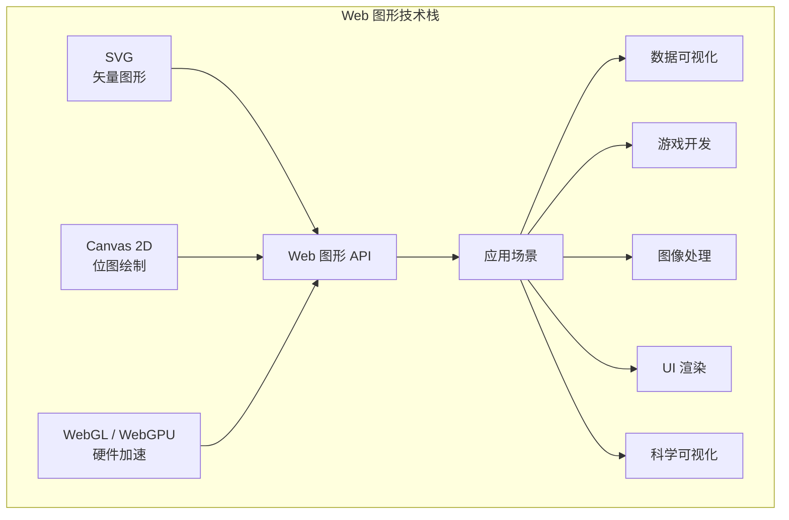

### 发展简史时间线

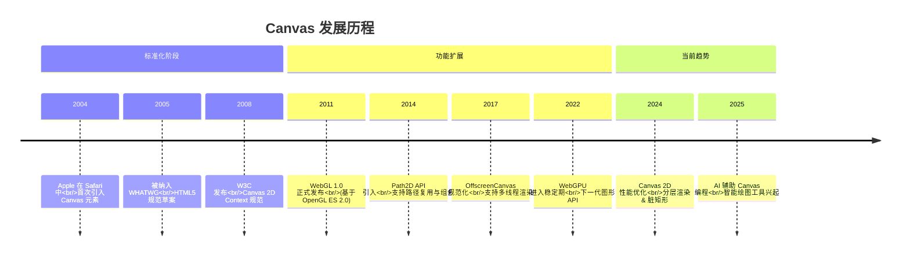

### Canvas 与 SVG 的选择

| 特性 | Canvas | SVG |
| --- | --- | --- |
| 渲染方式 | 位图（像素） | 矢量图（DOM 节点） |
| 分辨率 | 依赖像素密度，需手动处理 DPR | 无限缩放不失真 |
| 事件处理 | 需手动计算命中区域 | 每个 DOM 元素可绑定事件 |
| 性能 | 大量元素时性能好 | DOM 节点多时性能下降 |
| 适用场景 | 游戏、图像处理、大量粒子 | 图标、图表、交互式地图 |
| 动画 | 通过重绘实现 | 通过 CSS/SMIL 动画实现 |
| 可访问性 | 差（纯像素） | 好（DOM 语义） |

**决策原则：** 需要高性能渲染大量图形对象 → Canvas；需要交互性和可访问性 → SVG。

### 基本结构

```html
<canvas id="myCanvas" width="800" height="600">
  您的浏览器不支持 Canvas，请升级浏览器。
</canvas>
```

::: warning
`<canvas>` 的 `width` 和 `height` 属性定义画布的**绘图分辨率**，而非 CSS 显示尺寸。通过 CSS 缩放 Canvas 会导致模糊，应始终在 HTML 属性或 JavaScript 中设置实际像素尺寸。
:::

## 2. Canvas vs SVG vs WebGL 决策树

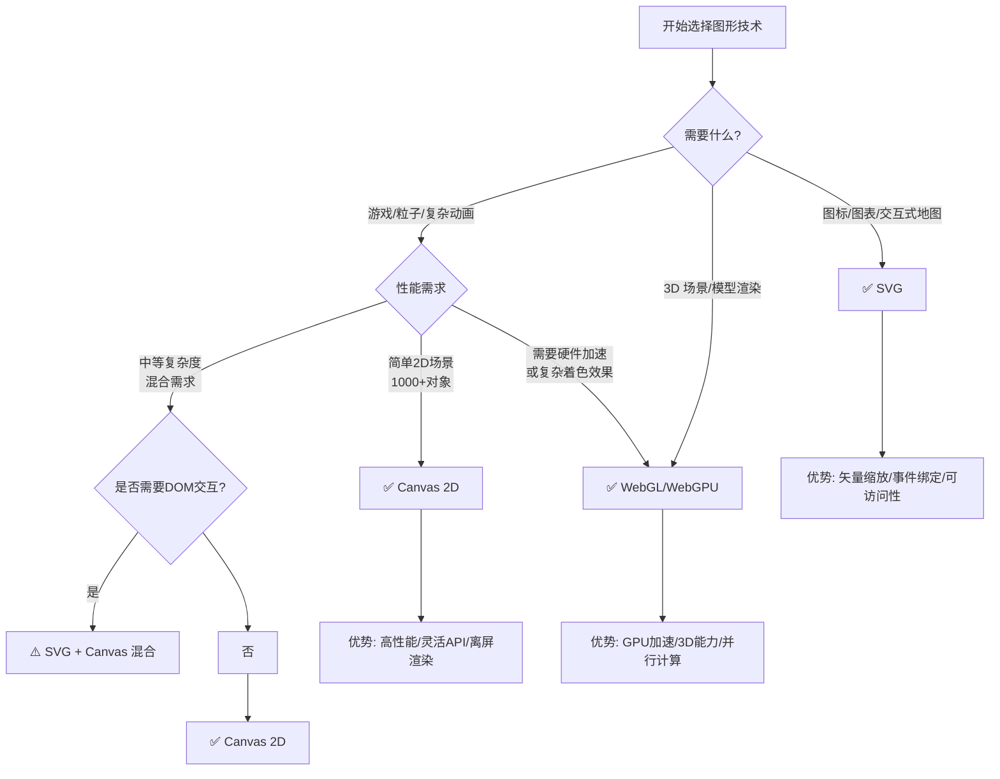

### 技术选型对比表

| 维度 | Canvas 2D | SVG | WebGL | WebGPU |
| --- | --- | --- | --- | --- |
| **学习曲线** | ⭐⭐ 低 | ⭐⭐ 低 | ⭐⭐⭐⭐ 高 | ⭐⭐⭐⭐⭐ 极高 |
| **性能上限** | CPU 绑定 | DOM 绑定 | GPU 加速 | GPU 并行 |
| **适用对象数** | 10,000+ | < 1,000 | 100,000+ | 无限 |
| **2D 能力** | 完整 | 完整 | 需自己实现 | 需自己实现 |
| **3D 能力** | 有限（伪3D） | 有限（CSS 3D） | 完整 | 完整 |
| **移动端兼容** | 优秀 | 良好 | 一般 | 有限 |
| **开发效率** | 高 | 高 | 中 | 低 |

## 3. 渲染管线原理

理解 Canvas 的渲染管线有助于写出高性能代码：

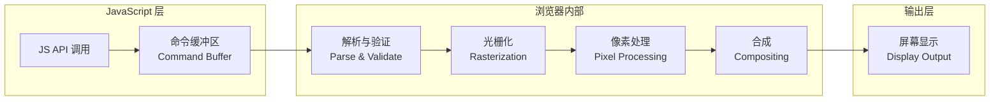

### 关键概念说明

- **命令缓冲区**：Canvas API 调用不会立即执行，而是先进入缓冲区批量处理
- **光栅化**：将矢量图形转换为像素网格的过程
- **合成**：将多个图层按照 `globalCompositeOperation` 规则合并为最终图像

::: tip
Canvas 采用**即时模式**（Immediate Mode）渲染——每次调用绘制 API 都会立即产生副作用。这与 SVG 的**保留模式**（Retained Mode）形成鲜明对比。
:::

## 4. 坐标系统与变换矩阵

<h4>009-transform-system.html</h4>

```html
<!-- 来源：12-Canvas.md - 第4章 坐标系统与变换矩阵 -->
<!DOCTYPE html>
<html lang="zh-CN">
<head>
  <meta charset="UTF-8">
  <meta name="viewport" content="width=device-width, initial-scale=1.0">
  <title>【9】Canvas 变换系统</title>
  <style>
    * { margin: 0; padding: 0; box-sizing: border-box; }
    body { font-family: -apple-system, BlinkMacSystemFont, 'Segoe UI', sans-serif; padding: 20px; background: #f8f9fa; color: #333; }
    .demo-container { max-width: 900px; margin: 0 auto; background: white; padding: 24px; border-radius: 8px; box-shadow: 0 2px 8px rgba(0,0,0,0.1); }
    .demo-title { margin-bottom: 16px; font-size: 18px; color: #555; border-bottom: 2px solid #007bff; padding-bottom: 8px; }

    canvas { display: block; margin: 16px auto; border: 1px solid #ddd; border-radius: 8px; background: white; }

    .controls {
      display: flex; gap: 10px; justify-content: center; flex-wrap: wrap; margin-bottom: 16px;
    }
    .btn {
      padding: 8px 16px; border: none; border-radius: 6px; cursor: pointer;
      font-size: 13px; font-weight: 500; transition: all 0.3s;
      background: #007bff; color: white;
    }
    .btn:hover { background: #0056b3; }
    .btn-secondary { background: #6c757d; color: white; }
    .btn-secondary:hover { background: #5a6268; }

    .info-row {
      display: flex; gap: 16px; justify-content: center; margin-top: 12px;
      font-size: 13px; color: #666;
    }
    .info-item { background: #f8f9fa; padding: 8px 14px; border-radius: 6px; }
    .info-item strong { color: #007bff; }
  </style>
</head>
<body>
  <div class="demo-container">
    <div class="demo-title">示例：Canvas 变换系统（translate / rotate / scale / save/restore / setTransform）</div>

    <div class="controls">
      <button class="btn" onclick="drawAll()">🎨 绘制全部</button>
      <button class="btn" onclick="toggleAnimation()">⏯️ 动画开/关</button>
      <button class="btn btn-secondary" onclick="clearCanvas()">🗑️ 清空</button>
    </div>

    <canvas id="transformCanvas" width="850" height="600"></canvas>

    <div class="info-row">
      <span class="info-item">旋转角度：<strong id="angleVal">0</strong>°</span>
      <span class="info-item">缩放比例：<strong id="scaleVal">1.00</strong>x</span>
      <span class="info-item">动画状态：<strong id="animStatus">运行中</strong></span>
    </div>
  </div>

  <script>
    const canvas = document.getElementById("transformCanvas")
    const ctx = canvas.getContext("2d")
    let animating = true
    let angle = 0
    let animId = null

    function clearCanvas() {
      ctx.clearRect(0, 0, canvas.width, canvas.height)
    }

    function drawAll() {
      // 清屏（保留半透明拖尾）
      ctx.fillStyle = "rgba(248,249,250,0.3)"
      ctx.fillRect(0, 0, canvas.width, canvas.height)

      drawTranslateDemo()
      drawRotateDemo()
      drawScaleDemo()
      drawSaveRestoreStack()
      drawSetTransformDemo()
    }

    // ====== 1. translate 平移 ======
    function drawTranslateDemo() {
      ctx.save()

      // 原点标记
      ctx.fillStyle = "#e74c3c"
      ctx.beginPath()
      ctx.arc(80, 70, 4, 0, Math.PI*2)
      ctx.fill()
      ctx.font = "11px monospace"
      ctx.fillText("(0,0)", 88, 74)

      // 平移后绘制
      ctx.save()
      ctx.translate(120, 50)
      ctx.fillStyle = "#3498db"
      ctx.fillRect(0, 0, 60, 40)
      ctx.strokeStyle="#2980b9"
      ctx.lineWidth=1
      ctx.strokeRect(0,0,60,40)
      ctx.restore()

      // 标签
      ctx.font="bold 13px sans-serif"
      ctx.fillStyle="#333"
      ctx.fillText("① translate(120, 50) — 坐标系平移", 30, 140)
      ctx.restore()
    }

    // ====== 2. rotate 旋转（动态）======
    function drawRotateDemo() {
      ctx.save()
      const cx = 280, cy = 90

      // 参考圆
      ctx.strokeStyle = "#eee"
      ctx.lineWidth=1
      ctx.setLineDash([4,4])
      ctx.beginPath()
      ctx.arc(cx, cy, 55, 0, Math.PI*2)
      ctx.stroke()
      ctx.setLineDash([])

      // 中心点
      ctx.fillStyle="#999"
      ctx.beginPath()
      ctx.arc(cx,cy,3,0,Math.PI*2)
      ctx.fill()

      // 旋转的矩形
      ctx.save()
      ctx.translate(cx, cy)
      ctx.rotate(angle)
      ctx.fillStyle = "#e74c3c"
      ctx.fillRect(-30, -20, 60, 40)
      ctx.strokeStyle="#c0392b"
      ctx.lineWidth=2
      ctx.strokeRect(-30,-20,60,40)

      // 方向指示
      ctx.fillStyle="#fff"
      ctx.beginPath()
      ctx.moveTo(25,0)
      ctx.lineTo(15,-6)
      ctx.lineTo(15,6)
      ctx.closePath()
      ctx.fill()
      ctx.restore()

      ctx.font="bold 13px sans-serif"
      ctx.fillStyle="#333"
      ctx.fillText("② rotate(angle) — 绕原点旋转", 190, 170)
      ctx.restore()
    }

    // ====== 3. scale 缩放（动态）======
    function drawScaleDemo() {
      ctx.save()
      const cx = 480, cy = 90
      const s = 1 + Math.sin(angle * 2) * 0.4

      ctx.save()
      ctx.translate(cx, cy)
      ctx.scale(s, s)
      ctx.fillStyle = "#2ecc71"
      roundRect(ctx,-30,-25,60,50,6)
      ctx.fill()
      ctx.strokeStyle="#27ae60"
      ctx.lineWidth=2/s // 补偿缩放导致的线宽变化
      ctx.strokeRect(-30,-25,60,50)
      ctx.restore()

      // 原始尺寸参考（虚线）
      ctx.strokeStyle="rgba(46,204,113,0.3)"
      ctx.lineWidth=1
      ctx.setLineDash([4,4])
      ctx.strokeRect(cx-30,cy-25,60,50)
      ctx.setLineDash([])

      ctx.font="bold 13px sans-serif"
      ctx.fillStyle="#333"
      ctx.fillText(`③ scale(${s.toFixed(2)}) — 动态缩放`, 400, 170)
      ctx.restore()
    }

    // ====== 4. save/restore 栈式管理 ======
    function drawSaveRestoreStack() {
      ctx.save()
      const startX = 650

      // 层级1：基础坐标系
      ctx.fillStyle = "#f8f9fa"
      ctx.fillRect(startX - 10, 35, 200, 120)
      ctx.strokeStyle="#ddd"
      ctx.lineWidth=1
      ctx.strokeRect(startX-10,35,200,120)

      ctx.save() // push state 1
        ctx.translate(startX + 30, 60)
        ctx.fillStyle = "#3498db"
        ctx.fillRect(0, 0, 40, 30)

        ctx.save() // push state 2
          ctx.translate(55, 15)
          ctx.rotate(Math.PI / 6)
          ctx.fillStyle = "#e74c3c"
          ctx.fillRect(0, 0, 40, 30)

          ctx.save() // push state 3
            ctx.translate(55, -5)
            ctx.scale(0.7, 0.7)
            ctx.fillStyle = "#2ecc71"
            ctx.fillRect(0, 0, 40, 30)
          ctx.restore() // pop state 3 → 回到 state 2
        ctx.restore() // pop state 2 → 回到 state 1
      ctx.restore() // pop state 1 → 回到初始

      ctx.font="bold 13px sans-serif"
      ctx.fillStyle="#333"
      ctx.fillText("④ save()/restore() — 栈式状态管理", 620, 175)
      ctx.font="11px monospace"
      ctx.fillStyle="#888"
      ctx.fillText("蓝→红→绿: 嵌套变换", 665, 168)
      ctx.restore()
    }

    // ====== 5. setTransform 矩阵变换 ======
    function drawSetTransformDemo() {
      ctx.save()
      const startY = 210

      // 区域标题
      ctx.font="bold 14px sans-serif"
      ctx.fillStyle="#333"
      ctx.fillText("⑤ setTransform(a,b,c,d,e,f) — 矩阵变换", 30, startY)

      // 网格背景
      ctx.strokeStyle = "#f0f0f0"
      ctx.lineWidth = 1
      for(let x=0;x<850;x+=30){
        ctx.beginPath();ctx.moveTo(x,startY+15);ctx.lineTo(x,580);ctx.stroke()
      }
      for(let y=startY+15;y<580;y+=30){
        ctx.beginPath();ctx.moveTo(30,y);ctx.lineTo(830,y);ctx.stroke()
      }

      // 原始矩形（参考）
      ctx.fillStyle = "rgba(52,152,219,0.3)"
      ctx.fillRect(60, startY + 50, 80, 60)
      ctx.strokeStyle = "#3498db"
      ctx.lineWidth = 1.5
      ctx.strokeRect(60, startY + 50, 80, 60)
      ctx.font = "11px sans-serif"
      ctx.fillStyle = "#3498db"
      ctx.fillText("原始", 85, startY + 125)

      // setTransform: 水平倾斜 shear
      ctx.save()
      ctx.setTransform(1, 0, 0.5, 1, 220, startY + 50)
      ctx.fillStyle = "#e74c3c"
      ctx.fillRect(0, 0, 80, 60)
      ctx.strokeStyle = "#c0392b"
      ctx.lineWidth = 1.5
      ctx.strokeRect(0, 0, 80, 60)
      ctx.restore()
      ctx.font = "11px sans-serif"
      ctx.fillStyle = "#e74c3c"
      ctx.fillText("shear X (c=0.5)", 240, startY + 125)

      // setTransform: 旋转45°
      ctx.save()
      const rad = Math.PI / 6
      ctx.setTransform(Math.cos(rad), Math.sin(rad), -Math.sin(rad), Math.cos(rad), 420, startY + 100)
      ctx.fillStyle = "#2ecc71"
      ctx.fillRect(0, 0, 80, 60)
      ctx.strokeStyle = "#27ae60"
      ctx.lineWidth = 1.5
      ctx.strokeRect(0, 0, 80, 60)
      ctx.restore()
      ctx.font = "11px sans-serif"
      ctx.fillStyle = "#2ecc71"
      ctx.fillText("rotate 30°", 440, startY + 125)

      // setTransform: 缩放+翻转
      ctx.save()
      ctx.setTransform(-1.2, 0, 0, 0.8, 620, startY + 110)
      ctx.fillStyle = "#9b59b6"
      ctx.fillRect(0, 0, 80, 60)
      ctx.strokeStyle = "#8e44ad"
      ctx.lineWidth = 1.5
      ctx.strokeRect(0, 0, 80, 60)
      ctx.restore()
      ctx.font = "11px sans-serif"
      ctx.fillStyle = "#9b59b6"
      ctx.fillText("scale(-1.2,0.8)", 600, startY + 125)

      // 复合变换：倾斜+缩放+旋转（动态）
      ctx.save()
      const dynamicAngle = angle * 0.8
      const cosA = Math.cos(dynamicAngle)
      const sinA = Math.sin(dynamicAngle)
      ctx.setTransform(
        cosA * 1.1, sinA * 1.1,
        -sinA * 0.8 + 0.2, cosA * 0.8,
        720, startY + 95
      )
      ctx.fillStyle = "#f39c12"
      ctx.fillRect(0, 0, 80, 60)
      ctx.strokeStyle = "#d68910"
      ctx.lineWidth = 2
      ctx.strokeRect(0, 0, 80, 60)
      ctx.restore()
      ctx.font = "11px sans-serif"
      ctx.fillStyle = "#f39c12"
      ctx.fillText("复合矩阵(动态)", 728, startY + 125)

      // 矩阵公式说明
      ctx.font="12px monospace"
      ctx.fillStyle="#666"
      ctx.fillText("矩阵公式: [a c e] [x]   a=水平缩放 b=水平倾斜", 30, startY + 155)
      ctx.fillText("          [b d f] [y]   c=垂直倾斜 d=垂直缩放 e=平移X f=平移Y", 30, startY + 172)

      ctx.restore()
    }

    function roundRect(ctx,x,y,w,h,r){
      ctx.beginPath()
      ctx.moveTo(x+r,y);ctx.lineTo(x+w-r,y);ctx.quadraticCurveTo(x+w,y,x+w,y+r)
      ctx.lineTo(x+w,y+h-r);ctx.quadraticCurveTo(x+w,y+h,x+w-r,y+h)
      ctx.lineTo(x+r,y+h);ctx.quadraticCurveTo(x,y+h,x,y+h-r)
      ctx.lineTo(x,y+r);ctx.quadraticCurveTo(x,y,x+r,y);ctx.closePath()
    }

    function toggleAnimation() {
      animating = !animating
      document.getElementById("animStatus").textContent = animating ? "运行中" : "已暂停"
      if (animating && !animId) animate()
    }

    function animate() {
      if (!animating) { animId = null; return }

      angle += 0.02

      // 更新信息显示
      const deg = ((angle * 180 / Math.PI) % 360).toFixed(0)
      document.getElementById("angleVal").textContent = deg
      const s = (1 + Math.sin(angle * 2) * 0.4).toFixed(2)
      document.getElementById("scaleVal").textContent = s

      drawAll()
      animId = requestAnimationFrame(animate)
    }

    // 初始绘制
    ctx.fillStyle = "#fff"
    ctx.fillRect(0, 0, canvas.width, canvas.height)
    animate()
  </script>
</body>
</html>
```

### 坐标系基础

Canvas 使用左上角为原点的坐标系：

```
(0,0) ────────→ x
  │
  │     (x, y)
  │
  ↓
  y
```

### 变换矩阵数学原理

每个变换都对应一个 3×3 变换矩阵：

$$
\begin{bmatrix} a & c & e \\ b & d & f \\ 0 & 0 & 1 \end{bmatrix}
\begin{bmatrix} x \\ y \\ 1 \end{bmatrix}
=
\begin{bmatrix} ax + cy + e \\ bx + dy + f \\ 1 \end{bmatrix}
$$

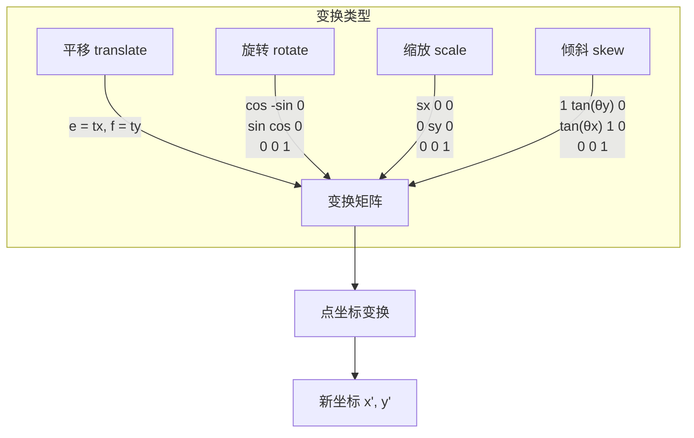

### 变换方法详解

```javascript
ctx.save();

// 平移坐标系原点
ctx.translate(200, 200);

// 旋转（弧度制）
ctx.rotate(Math.PI / 4);

// 缩放（可分别控制 X/Y 轴）
ctx.scale(1.5, 1.5);

// 自定义变换矩阵（a b c d e f）
// a: 水平缩放, b: 水平倾斜
// c: 垂直倾斜, d: 垂直缩放
// e: 水平平移, f: 垂直平移
ctx.transform(1, 0.2, 0.2, 1, 0, 0);

// 重置为单位矩阵后应用新变换
ctx.setTransform(1, 0, 0, 1, 0, 0); // 重置
ctx.translate(100, 100); // 重新设置

ctx.fillRect(-50, -50, 100, 100);
ctx.restore();
```

**变换方法汇总表：**

| 方法 | 说明 | 典型用途 |
| --- | --- | --- |
| `translate(x, y)` | 平移坐标系 | 设置绘制原点 |
| `rotate(angle)` | 旋转（弧度） | 旋转物体 |
| `scale(sx, sy)` | 缩放 | 放大/缩小物体 |
| `transform(a,b,c,d,e,f)` | 乘以当前矩阵 | 复合变换 |
| `setTransform(a,b,c,d,e,f)` | 重置并设置矩阵 | 完全重置状态 |
| `resetTransform()` | 重置为单位矩阵 | 快速重置 |
| `save()` | 保存当前状态 | 状态隔离 |
| `restore()` | 恢复上次保存的状态 | 状态恢复 |

## 5. Path2D API

Path2D 是 Canvas 路径的高级封装，支持路径复用和组合操作。

<h4>005-path2d-stars.html</h4>

```html
<!DOCTYPE html>
<html lang="zh-CN">
<head>
  <meta charset="UTF-8">
  <meta name="viewport" content="width=device-width, initial-scale=1.0">
  <title>【5】Path2D 星星绘制</title>
  <style>
    * { margin: 0; padding: 0; box-sizing: border-box; }
    body { font-family: -apple-system, BlinkMacSystemFont, 'Segoe UI', sans-serif; padding: 20px; background: #0d1117; color: #fff; }
    .demo-container { max-width: 800px; margin: 0 auto; background: #161b22; padding: 24px; border-radius: 12px; box-shadow: 0 4px 20px rgba(0,0,0,0.4); }
    .demo-title { margin-bottom: 16px; font-size: 18px; color: #58a6ff; border-bottom: 2px solid #58a6ff; padding-bottom: 8px; }

    canvas {
      display: block;
      margin: 16px auto;
      border-radius: 12px;
      background: linear-gradient(180deg, #0d1117 0%, #161b22 100%);
    }

    .controls { display: flex; gap: 10px; justify-content: center; flex-wrap: wrap; margin-bottom: 16px; }
    .btn {
      padding: 8px 18px;
      border: 1px solid #30363d;
      border-radius: 6px;
      cursor: pointer;
      font-size: 13px;
      background: #21262d;
      color: #c9d1d9;
      transition: all 0.3s;
    }
    .btn:hover { background: #30363d; color: #fff; }
  </style>
</head>
<body>
  <div class="demo-container">
    <div class="demo-title">示例：Path2D 可复用路径 - 动态星空</div>

    <div class="controls">
      <button class="btn" onclick="changeStarCount(-2)">⭐ 减少</button>
      <button class="btn" onclick="changeStarCount(2)">⭐ 增加</button>
      <button class="btn" onclick="toggleAnimation()">⏯️ 暂停/继续</button>
    </div>

    <canvas id="starCanvas" width="760" height="500"></canvas>
  </div>

  <script>
    const canvas = document.getElementById("starCanvas")
    const ctx = canvas.getContext("2d")
    let stars = []
    let animating = true
    let starCount = 12

    // 创建可复用的星星 Path2D
    function createStarPath(cx, cy, outerR, innerR, points) {
      const path = new Path2D()
      const step = Math.PI / points
      path.moveTo(cx, cy - outerR)
      for (let i = 0; i < 2 * points; i++) {
        const r = i % 2 === 0 ? outerR : innerR
        const angle = i * step - Math.PI / 2
        path.lineTo(cx + r * Math.cos(angle), cy + r * Math.sin(angle))
      }
      path.closePath()
      return path
    }

    class Star {
      constructor(index, total) {
        this.index = index
        this.total = total
        this.reset()
      }

      reset() {
        const cols = Math.ceil(Math.sqrt(this.total * 2))
        const row = Math.floor(this.index / cols)
        const col = this.index % cols

        this.baseX = 70 + col * ((canvas.width - 140) / Math.max(cols, 1))
        this.baseY = 70 + row * 110
        this.x = this.baseX
        this.y = this.baseY
        this.rotation = 0
        this.rotSpeed = (Math.random() - 0.5) * 0.03
        this.scale = 0.6 + Math.random() * 0.5
        this.outerRadius = 28 * this.scale
        this.innerRadius = 14 * this.scale
        this.points = 5
        this.hue = (this.index * 360 / this.total) % 360
        this.twinkle = Math.random() * Math.PI * 2
        this.twinkleSpeed = 0.02 + Math.random() * 0.04
      }

      update() {
        this.rotation += this.rotSpeed
        this.twinkle += this.twinkleSpeed
        this.x = this.baseX + Math.sin(this.twinkle) * 5
        this.y = this.baseY + Math.cos(this.twinkle * 0.7) * 3
      }

      draw(ctx) {
        ctx.save()
        ctx.translate(this.x, this.y)
        ctx.rotate(this.rotation)

        const brightness = 55 + Math.sin(this.twinkle) * 15
        const starPath = createStarPath(0, 0, this.outerRadius, this.innerRadius, this.points)

        // 发光效果
        const glow = ctx.createRadialGradient(0, 0, 0, 0, 0, this.outerRadius * 1.8)
        glow.addColorStop(0, `hsla(${this.hue}, 90%, ${brightness}%, 0.4)`)
        glow.addColorStop(1, "transparent")
        ctx.fillStyle = glow
        ctx.fill(starPath)

        // 核心
        ctx.fillStyle = `hsl(${this.hue}, 85%, ${brightness + 15}%)`
        ctx.fill(starPath)

        // 描边
        ctx.strokeStyle = `hsla(${this.hue}, 100%, 80%, 0.6)`
        ctx.lineWidth = 1.5
        ctx.stroke(starPath)

        ctx.restore()
      }
    }

    function initStars(count) {
      stars = []
      for (let i = 0; i < count; i++) stars.push(new Star(i, count))
    }

    function changeStarCount(delta) {
      starCount = Math.max(3, Math.min(30, starCount + delta))
      initStars(starCount)
    }

    function toggleAnimation() { animating = !animating }

    function animate() {
      if (animating) {
        ctx.fillStyle = "rgba(13, 17, 23, 0.2)"
      } else {
        ctx.fillStyle = "#0d1117"
      }
      ctx.fillRect(0, 0, canvas.width, canvas.height)

      stars.forEach(s => {
        if (animating) s.update()
        s.draw(ctx)
      })

      requestAnimationFrame(animate)
    }

    initStars(starCount)
    animate()
  </script>
</body>
</html>
```

### 创建 Path2D 对象

```javascript
// 方式1：空路径
const path1 = new Path2D();

// 方式2：从字符串创建（SVG path data）
const path2 = new Path2D('M10 10 h 80 v 80 h -80 Z');

// 方式3：复制现有路径
const path3 = new Path2D(path2);

// 方式4：从另一个 Path2D 添加
const combinedPath = new Path2D();
combinedPath.addPath(path2);
```

### 路径操作示例

```javascript
// 定义一个可复用的星星路径
function createStarPath(cx, cy, outerRadius, innerRadius, points) {
  const path = new Path2D();
  const step = Math.PI / points;
  
  path.moveTo(cx, cy - outerRadius);
  
  for (let i = 0; i < 2 * points; i++) {
    const radius = i % 2 === 0 ? outerRadius : innerRadius;
    const angle = i * step - Math.PI / 2;
    const x = cx + radius * Math.cos(angle);
    const y = cy + radius * Math.sin(angle);
    path.lineTo(x, y);
  }
  
  path.closePath();
  return path;
}

// 复用路径绘制多个星星
const starPath = createStarPath(0, 0, 40, 20, 5);

for (let i = 0; i < 5; i++) {
  ctx.save();
  ctx.translate(100 + i * 100, 150);
  ctx.rotate(i * 0.2);
  
  ctx.fillStyle = `hsl(${i * 60}, 70%, 50%)`;
  ctx.fill(starPath);
  
  ctx.strokeStyle = '#333';
  ctx.lineWidth = 2;
  ctx.stroke(starPath);
  
  ctx.restore();
}
```

### 路径组合操作

```javascript
const circle = new Path2D();
circle.arc(100, 100, 50, 0, Math.PI * 2);

const rect = new Path2D();
rect.rect(75, 75, 50, 50);

// 组合两个路径
const combined = new Path2D();
combined.addPath(circle);
combined.addPath(rect);

// 使用组合路径进行命中检测
const isHit = ctx.isPointInPath(combined, mouseX, mouseY);
```

### Path2D 优势对比

| 特性 | 传统路径 API | Path2D API |
| --- | --- | --- |
| **路径复用** | ❌ 每次重新构建 | ✅ 可复用对象 |
| **序列化** | ❌ 不支持 | ✅ 支持 SVG path data |
| **命中检测** | 仅当前路径 | ✅ 支持传入 Path2D |
| **路径组合** | 手动管理 | ✅ addPath() |
| **性能** | 一般 | ✅ 更优（预编译路径） |

## 6. 基础图形绘制

### 获取绘图上下文

```javascript
const canvas = document.getElementById('myCanvas');
const ctx = canvas.getContext('2d');
```

### 处理高分辨率屏幕（DPR）

```javascript
function setupHiDPICanvas(canvas, width, height) {
  const dpr = window.devicePixelRatio || 1;
  canvas.width = width * dpr;
  canvas.height = height * dpr;
  canvas.style.width = width + 'px';
  canvas.style.height = height + 'px';
  const ctx = canvas.getContext('2d');
  ctx.scale(dpr, dpr);
  return ctx;
}

// 使用示例
const canvas = document.getElementById('myCanvas');
const ctx = setupHiDPICanvas(canvas, 800, 600);
```

### 矩形

Canvas 中矩形是唯一可以直接绘制的原生形状：

```javascript
const ctx = canvas.getContext('2d');

// 填充矩形
ctx.fillStyle = '#ff6b6b';
ctx.fillRect(10, 10, 150, 100);

// 描边矩形
ctx.strokeStyle = '#333';
ctx.lineWidth = 2;
ctx.strokeRect(200, 10, 150, 100);

// 清除矩形区域
ctx.clearRect(50, 30, 80, 50);

// ✅ 推荐：使用整数坐标避免模糊
ctx.fillRect(Math.round(x), Math.round(y), w, h);
// ❌ 避免：浮点坐标可能导致抗锯齿模糊
ctx.fillRect(x + 0.5, y + 0.5, w, h);
```

### 路径（Path）

所有其他形状都通过路径绘制：

```javascript
// 三角形
ctx.beginPath();
ctx.moveTo(50, 50);
ctx.lineTo(200, 50);
ctx.lineTo(200, 150);
ctx.closePath(); // 自动连接起点和终点

ctx.fillStyle = '#4ecdc4';
ctx.fill();

ctx.strokeStyle = '#2c3e50';
ctx.lineWidth = 2;
ctx.stroke();

// ✅ 最佳实践：每次新路径都要 beginPath()
// ❌ 错误：忘记 beginPath() 导致路径叠加
```

### 圆形与弧线

```javascript
// 完整圆
ctx.beginPath();
ctx.arc(150, 150, 80, 0, Math.PI * 2);
ctx.fillStyle = '#45b7d1';
ctx.fill();

// 半圆（逆时针）
ctx.beginPath();
ctx.arc(400, 150, 80, 0, Math.PI, false);
ctx.strokeStyle = '#e74c3c';
ctx.lineWidth = 3;
ctx.stroke();
```

**arc() 参数详解：** `arc(x, y, radius, startAngle, endAngle, counterclockwise)`

| 参数 | 类型 | 说明 |
| --- | --- | --- |
| `x`, `y` | number | 圆心坐标 |
| `radius` | number | 半径（必须为正数） |
| `startAngle` | number | 起始角度（弧度，0 为 3 点钟方向） |
| `endAngle` | number | 结束角度（弧度） |
| `counterclockwise` | boolean | 是否逆时针绘制（默认 false） |

### 椭圆

```javascript
ctx.beginPath();
ctx.ellipse(300, 200, 150, 80, 0, 0, Math.PI * 2);
ctx.fillStyle = '#f39c12';
ctx.fill();

// 旋转的椭圆
ctx.beginPath();
ctx.ellipse(300, 350, 100, 50, Math.PI / 6, 0, Math.PI * 2);
ctx.fillStyle = '#9b59b6';
ctx.fill();
```

**ellipse() 参数：** `ellipse(x, y, radiusX, radiusY, rotation, startAngle, endAngle)`

### 贝塞尔曲线

```javascript
// 二次贝塞尔曲线（1 个控制点）
ctx.beginPath();
ctx.moveTo(50, 200);
ctx.quadraticCurveTo(150, 50, 250, 200); // 控制点 (150,50), 终点 (250,200)
ctx.strokeStyle = '#9b59b6';
ctx.lineWidth = 3;
ctx.stroke();

// 三次贝塞尔曲线（2 个控制点）
ctx.beginPath();
ctx.moveTo(300, 200);
ctx.bezierCurveTo(
  350, 50,   // 控制点1
  450, 350,  // 控制点2
  500, 200   // 终点
);
ctx.strokeStyle = '#1abc9c';
ctx.lineWidth = 3;
ctx.stroke();
```

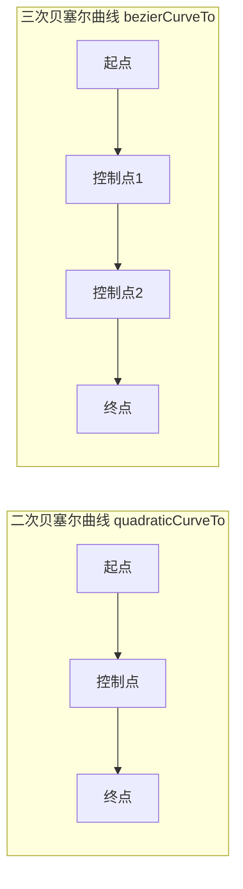

## 7. 样式与颜色系统

<h4>002-gradients.html</h4>

```html
<!DOCTYPE html>
<html lang="zh-CN">
<head>
  <meta charset="UTF-8">
  <meta name="viewport" content="width=device-width, initial-scale=1.0">
  <title>【2】渐变效果演示</title>
  <style>
    * { margin: 0; padding: 0; box-sizing: border-box; }
    body { font-family: -apple-system, BlinkMacSystemFont, 'Segoe UI', sans-serif; padding: 20px; background: #f8f9fa; color: #333; }
    .demo-container { max-width: 900px; margin: 0 auto; background: white; padding: 24px; border-radius: 8px; box-shadow: 0 2px 8px rgba(0,0,0,0.1); }
    .demo-title { margin-bottom: 16px; font-size: 18px; color: #555; border-bottom: 2px solid #007bff; padding-bottom: 8px; }

    canvas { display: block; margin: 16px auto; border: 1px solid #ddd; border-radius: 8px; }

    .gradient-grid {
      display: grid;
      grid-template-columns: repeat(2, 1fr);
      gap: 20px;
      margin-top: 16px;
    }

    .gradient-item h3 {
      text-align: center;
      font-size: 14px;
      color: #555;
      margin-bottom: 10px;
    }

    .gradient-item canvas { margin: 0 auto; }
  </style>
</head>
<body>
  <div class="demo-container">
    <div class="demo-title">示例：Canvas 渐变效果（线性、径向、锥形）</div>

    <div class="gradient-grid">
      <!-- 线性渐变 -->
      <div class="gradient-item">
        <h3>线性渐变 (Linear)</h3>
        <canvas id="linearCanvas" width="380" height="200"></canvas>
      </div>

      <!-- 径向渐变 -->
      <div class="gradient-item">
        <h3>径向渐变 (Radial)</h3>
        <canvas id="radialCanvas" width="380" height="200"></canvas>
      </div>

      <!-- 多色线性渐变 -->
      <div class="gradient-item">
        <h3>多色线性渐变</h3>
        <canvas id="multiLinearCanvas" width="380" height="200"></canvas>
      </div>

      <!-- 锥形渐变 -->
      <div class="gradient-item">
        <h3>锥形渐变 (Conic)</h3>
        <canvas id="conicCanvas" width="380" height="200"></canvas>
      </div>
    </div>
  </div>

  <script>
    // 1. 线性渐变
    const linearCtx = document.getElementById("linearCanvas").getContext("2d")
    const linearGrad = linearCtx.createLinearGradient(0, 0, 380, 0)
    linearGrad.addColorStop(0, "#e74c3c")
    linearGrad.addColorStop(0.33, "#f39c12")
    linearGrad.addColorStop(0.66, "#2ecc71")
    linearGrad.addColorStop(1, "#3498db")
    linearCtx.fillStyle = linearGrad
    linearCtx.fillRect(10, 10, 360, 180)

    // 文字
    linearCtx.fillStyle = "white"
    linearCtx.font = "bold 20px sans-serif"
    linearCtx.textAlign = "center"
    linearCtx.textBaseline = "middle"
    linearCtx.fillText("Linear Gradient", 190, 100)

    // 2. 径向渐变
    const radialCtx = document.getElementById("radialCanvas").getContext("2d")
    const radialGrad = radialCtx.createRadialGradient(190, 100, 10, 190, 100, 120)
    radialGrad.addColorStop(0, "rgba(255, 107, 107, 1)")
    radialGrad.addColorStop(0.5, "rgba(255, 152, 0, 0.8)")
    radialGrad.addColorStop(1, "rgba(255, 107, 107, 0)")
    radialCtx.fillStyle = radialGrad
    radialCtx.fillRect(0, 0, 380, 200)

    // 光晕中心点
    radialCtx.fillStyle = "white"
    radialCtx.font = "bold 14px sans-serif"
    radialCtx.textAlign = "center"
    radialCtx.fillText("Radial Glow Effect", 190, 105)

    // 3. 多色线性渐变（彩虹）
    const multiCtx = document.getElementById("multiLinearCanvas").getContext("2d")
    const rainbowGrad = multiCtx.createLinearGradient(0, 180, 380, 0)
    const colors = ["#ff0000", "#ff7f00", "#ffff00", "#00ff00", "#0000ff", "#4b0082", "#9400d3"]
    colors.forEach((color, i) => {
      rainbowGrad.addColorStop(i / (colors.length - 1), color)
    })
    multiCtx.fillStyle = rainbowGrad
    for (let i = 0; i < 12; i++) {
      multiCtx.fillRect(10 + i * 30, 20, 25, 160)
    }

    multiCtx.fillStyle = "#333"
    multiCtx.font = "14px sans-serif"
    multiCtx.textAlign = "center"
    multiCtx.fillText("Rainbow Stripes", 190, 195)

    // 4. 锥形渐变
    const conicCtx = document.getElementById("conicCanvas").getContext("2d")

    if (conicCtx.createConicGradient) {
      const conicGrad = conicCtx.createConicGradient(0, 190, 100)
      conicGrad.addColorStop(0, "#e74c3c")
      conicGrad.addColorStop(0.17, "#f39c12")
      conicGrad.addColorStop(0.33, "#f1c40f")
      conicGrad.addColorStop(0.5, "#2ecc71")
      conicGrad.addColorStop(0.67, "#3498db")
      conicGrad.addColorStop(0.83, "#9b59b6")
      conicGrad.addColorStop(1, "#e74c3c")

      conicCtx.fillStyle = conicGrad
      conicCtx.beginPath()
      conicCtx.arc(190, 100, 85, 0, Math.PI * 2)
      conicCtx.fill()

      // 内部白色圆形
      conicCtx.fillStyle = "white"
      conicCtx.beginPath()
      conicCtx.arc(190, 100, 50, 0, Math.PI * 2)
      conicCtx.fill()

      conicCtx.fillStyle = "#333"
      conicCtx.font = "bold 14px sans-serif"
      conicCtx.textAlign = "center"
      conicCtx.textBaseline = "middle"
      conicCtx.fillText("Conic\nGradient", 190, 100)
    } else {
      conicCtx.fillStyle = "#999"
      conicCtx.font = "14px sans-serif"
      conicCtx.textAlign = "center"
      conicCtx.fillText("浏览器不支持锥形渐变", 190, 100)
    }
  </script>
</body>
</html>
```


<h4>008-gradients-patterns.html</h4>

```html
<!-- 来源：12-Canvas.md - 第7章 样式与颜色系统 -->
<!DOCTYPE html>
<html lang="zh-CN">
<head>
  <meta charset="UTF-8">
  <meta name="viewport" content="width=device-width, initial-scale=1.0">
  <title>【8】Canvas 渐变与图案填充</title>
  <style>
    * { margin: 0; padding: 0; box-sizing: border-box; }
    body { font-family: -apple-system, BlinkMacSystemFont, 'Segoe UI', sans-serif; padding: 20px; background: #f8f9fa; color: #333; }
    .demo-container { max-width: 920px; margin: 0 auto; background: white; padding: 24px; border-radius: 8px; box-shadow: 0 2px 8px rgba(0,0,0,0.1); }
    .demo-title { margin-bottom: 16px; font-size: 18px; color: #555; border-bottom: 2px solid #007bff; padding-bottom: 8px; }

    .grid {
      display: grid;
      grid-template-columns: repeat(2, 1fr);
      gap: 20px;
      margin-top: 16px;
    }
    .grid-item {
      background: #fafafa;
      border-radius: 8px;
      padding: 16px;
      border: 1px solid #eee;
    }
    .grid-item h3 {
      text-align: center;
      font-size: 14px;
      color: #555;
      margin-bottom: 12px;
    }
    canvas { display: block; margin: 0 auto; border-radius: 6px; }

    .controls {
      display: flex; gap: 10px; justify-content: center; flex-wrap: wrap; margin-bottom: 16px;
    }
    .btn {
      padding: 8px 16px; border: none; border-radius: 6px; cursor: pointer;
      font-size: 13px; background: #007bff; color: white; transition: all 0.3s;
    }
    .btn:hover { background: #0056b3; }
  </style>
</head>
<body>
  <div class="demo-container">
    <div class="demo-title">示例：Canvas 渐变与图案（LinearGradient / RadialGradient / ConicGradient / Pattern）</div>

    <div class="controls">
      <button class="btn" onclick="redrawAll()">🔄 刷新全部</button>
    </div>

    <div class="grid">
      <!-- 1. 多色线性渐变 -->
      <div class="grid-item">
        <h3>多色线性渐变 (LinearGradient)</h3>
        <canvas id="linearGradCanvas" width="400" height="180"></canvas>
      </div>

      <!-- 2. 径向渐变 -->
      <div class="grid-item">
        <h3>径向渐变 (RadialGradient)</h3>
        <canvas id="radialGradCanvas" width="400" height="180"></canvas>
      </div>

      <!-- 3. 锥形渐变 -->
      <div class="grid-item">
        <h3>锥形渐变 (ConicGradient)</h3>
        <canvas id="conicGradCanvas" width="400" height="180"></canvas>
      </div>

      <!-- 4. 图案填充 Pattern -->
      <div class="grid-item">
        <h3>图案填充 (createPattern)</h3>
        <canvas id="patternCanvas" width="400" height="180"></canvas>
      </div>

      <!-- 5. 渐变形状组合 -->
      <div class="grid-item" style="grid-column: span 2;">
        <h3>渐变综合应用 — 彩虹球体与金属质感</h3>
        <canvas id="comboCanvas" width="832" height="220"></canvas>
      </div>
    </div>
  </div>

  <script>
    // ====== 1. 多色线性渐变 ======
    function drawLinearGradient() {
      const c = document.getElementById("linearGradCanvas")
      const ctx = c.getContext("2d")

      // 水平彩虹渐变
      const grad = ctx.createLinearGradient(10, 10, 390, 170)
      const colors = ["#ff0000","#ff7f00","#ffff00","#00ff00","#0000ff","#4b0082","#9400d3"]
      colors.forEach((color,i) => grad.addColorStop(i/(colors.length-1), color))
      ctx.fillStyle = grad
      roundRect(ctx, 10, 10, 380, 160, 12)
      ctx.fill()

      // 文字
      ctx.fillStyle = "rgba(255,255,255,0.9)"
      ctx.font = "bold 22px sans-serif"
      ctx.textAlign = "center"
      ctx.textBaseline = "middle"
      ctx.fillText("Rainbow Linear Gradient", 200, 90)
    }

    // ====== 2. 径向渐变 ======
    function drawRadialGradient() {
      const c = document.getElementById("radialGradCanvas")
      const ctx = c.getContext("2d")

      // 光晕效果
      const grad = ctx.createRadialGradient(200, 90, 5, 200, 90, 100)
      grad.addColorStop(0, "rgba(255,255,255,1)")
      grad.addColorStop(0.2, "rgba(255,200,100,0.9)")
      grad.addColorStop(0.5, "rgba(255,107,107,0.5)")
      grad.addColorStop(1, "rgba(255,107,107,0)")
      ctx.fillStyle = grad
      ctx.fillRect(0, 0, 400, 180)

      // 中心文字
      ctx.fillStyle = "#333"
      ctx.font = "bold 14px sans-serif"
      ctx.textAlign = "center"
      ctx.fillText("Radial Glow", 200, 95)

      // 参数说明
      ctx.font = "11px monospace"
      ctx.fillStyle="#888"
      ctx.fillText("createRadialGradient(x0,y0,r0, x1,y1,r1)", 200, 165)
    }

    // ====== 3. 锥形渐变 ======
    function drawConicGradient() {
      const c = document.getElementById("conicGradCanvas")
      const ctx = c.getContext("2d")

      if (ctx.createConicGradient) {
        const grad = ctx.createConicGradient(0, 200, 90)
        const palette=["#e74c3c","#e67e22","#f1c40f","#2ecc71","#3498db","#9b59b6"]
        palette.forEach((col,i) => grad.addColorStop(i/palette.length, col))
        grad.addColorStop(1, "#e74c3c")

        ctx.fillStyle = grad
        ctx.beginPath()
        ctx.arc(200, 90, 75, 0, Math.PI*2)
        ctx.fill()

        // 内圆遮罩
        ctx.fillStyle = "#fff"
        ctx.beginPath()
        ctx.arc(200, 90, 40, 0, Math.PI*2)
        ctx.fill()

        ctx.fillStyle="#333"
        ctx.font="bold 13px sans-serif"
        ctx.textAlign="center"
        ctx.textBaseline="middle"
        ctx.fillText("Conic",200,85)
        ctx.font="11px sans-serif"
        ctx.fillText("Gradient",200,102)
      } else {
        ctx.fillStyle="#999"
        ctx.font="14px sans-serif"
        ctx.textAlign="center"
        ctx.fillText("浏览器不支持锥形渐变", 200, 90)
      }
    }

    // ====== 4. 图案填充 ======
    function drawPattern() {
      const c = document.getElementById("patternCanvas")
      const ctx = c.getContext("2d")

      // 创建图案源（棋盘格）
      const patSize = 20
      const patCanvas = document.createElement("canvas")
      patCanvas.width = patSize
      patCanvas.height = patSize
      const pCtx = patCanvas.getContext("2d")
      pCtx.fillStyle = "#3498db"
      pCtx.fillRect(0, 0, patSize/2, patSize/2)
      pCtx.fillRect(patSize/2, patSize/2, patSize/2, patSize/2)
      pCtx.fillStyle = "#ecf0f1"
      pCtx.fillRect(patSize/2, 0, patSize/2, patSize/2)
      pCtx.fillRect(0, patSize/2, patSize/2, patSize/2)

      // repeat 填充
      const pattern = ctx.createPattern(patCanvas, "repeat")
      ctx.fillStyle = pattern
      roundRect(ctx, 10, 10, 175, 160, 8)
      ctx.fill()

      // 斜线图案
      const linePat = document.createElement("canvas")
      linePat.width = 12
      linePat.height = 12
      const lCtx = linePat.getContext("2d")
      lCtx.strokeStyle = "#e74c3c"
      lCtx.lineWidth = 2
      lCtx.beginPath()
      lCtx.moveTo(0, 12)
      lCtx.lineTo(12, 0)
      lCtx.stroke()

      const linePattern = ctx.createPattern(linePat, "repeat")
      ctx.fillStyle = linePattern
      roundRect(ctx, 205, 10, 185, 160, 8)
      ctx.fill()

      // 标签
      ctx.fillStyle="#555"
      ctx.font="11px sans-serif"
      ctx.textAlign="center"
      ctx.fillText("棋盘格 repeat", 97, 178)
      ctx.fillText("斜线 repeat", 297, 178)
    }

    // ====== 5. 综合应用 ======
    function drawCombo() {
      const c = document.getElementById("comboCanvas")
      const ctx = c.getContext("2d")

      // 彩虹球体
      for(let i=0;i<5;i++){
        const x = 80 + i*165
        const r = 50 + i*8

        const rg = ctx.createRadialGradient(x-r*0.3, 110-r*0.3, r*0.05, x, 110, r)
        rg.addColorStop(0, `hsl(${i*60},80%,75%)`)
        rg.addColorStop(0.5, `hsl(${i*60},70%,50%)`)
        rg.addColorStop(1, `hsl(${i*60},60%,25%)`)

        ctx.beginPath()
        ctx.arc(x, 110, r, 0, Math.PI*2)
        ctx.fillStyle = rg
        ctx.fill()
      }

      // 金属质感条
      const metalGrad = ctx.createLinearGradient(30, 190, 800, 210)
      metalGrad.addColorStop(0, "#a0a0a0")
      metalGrad.addColorStop(0.15, "#ffffff")
      metalGrad.addColorStop(0.3, "#d0d0d0")
      metalGrad.addColorStop(0.5, "#808080")
      metalGrad.addColorStop(0.7, "#e0e0e0")
      metalGrad.addColorStop(0.85, "#ffffff")
      metalGrad.addColorStop(1, "#909090")

      ctx.fillStyle = metalGrad
      roundRect(ctx, 30, 185, 770, 28, 6)
      ctx.fill()

      // 标签
      ctx.fillStyle="#666"
      ctx.font="11px sans-serif"
      ctx.textAlign="center"
      ctx.fillText("径向渐变模拟球体光照 →", 415, 70)
      ctx.fillText("← 线性渐变模拟金属拉丝质感", 415, 222)
    }

    function roundRect(ctx,x,y,w,h,r){
      ctx.beginPath()
      ctx.moveTo(x+r,y)
      ctx.lineTo(x+w-r,y)
      ctx.quadraticCurveTo(x+w,y,x+w,y+r)
      ctx.lineTo(x+w,y+h-r)
      ctx.quadraticCurveTo(x+w,y+h,x+w-r,y+h)
      ctx.lineTo(x+r,y+h)
      ctx.quadraticCurveTo(x,y+h,x,y+h-r)
      ctx.lineTo(x,y+r)
      ctx.quadraticCurveTo(x,y,x+r,y)
      ctx.closePath()
    }

    function redrawAll() {
      drawLinearGradient()
      drawRadialGradient()
      drawConicGradient()
      drawPattern()
      drawCombo()
    }

    redrawAll()
  </script>
</body>
</html>
```

### 填充与描边基础

```javascript
ctx.fillStyle = '#e74c3c';       // 十六进制颜色
ctx.strokeStyle = 'rgb(44, 62, 80)'; // RGB 颜色
ctx.lineWidth = 3;
ctx.lineCap = 'round';            // 线条端点样式
ctx.lineJoin = 'round';           // 线条连接样式
ctx.miterLimit = 10;              // 斜接限制
```

**lineCap 取值：**

| 值 | 效果 | 示意图 |
| --- | --- | --- |
| `butt`（默认） | 平直截断 | `──` |
| `round` | 圆形端点 | `●─●` |
| `square` | 方形端点（延伸半个线宽） | `▬─▬` |

**lineJoin 取值：**

| 值 | 效果 | 适用场景 |
| --- | --- | --- |
| `miter`（默认） | 尖角连接 | 锐利转角 |
| `round` | 圆滑连接 | 圆润外观 |
| `bevel` | 斜切连接 | 避免 miter 过长 |

### 渐变

#### 线性渐变

```javascript
const linearGrad = ctx.createLinearGradient(0, 0, 400, 0);
linearGrad.addColorStop(0, '#e74c3c');      // 起点：红色
linearGrad.addColorStop(0.5, '#f39c12');     // 中点：橙色
linearGrad.addColorStop(1, '#2ecc71');       // 终点：绿色
ctx.fillStyle = linearGrad;
ctx.fillRect(10, 10, 400, 100);
```

#### 径向渐变

```javascript
// createRadialGradient(x0, y0, r0, x1, y1, r1)
const radialGrad = ctx.createRadialGradient(250, 250, 10, 250, 250, 150);
radialGrad.addColorStop(0, 'rgba(255, 107, 107, 1)');   // 中心：不透明红色
radialGrad.addColorStop(1, 'rgba(255, 107, 107, 0)');   // 边缘：完全透明
ctx.fillStyle = radialGrad;
ctx.fillRect(100, 150, 300, 200);
```

#### 锥形渐变（Conic Gradient）

```javascript
// Chrome 69+, Firefox 113+
if (ctx.createConicGradient) {
  const conicGrad = ctx.createConicGradient(0, 200, 200);
  conicGrad.addColorStop(0, 'red');
  conicGrad.addColorStop(0.25, 'yellow');
  conicGrad.addColorStop(0.5, 'green');
  conicGrad.addColorStop(0.75, 'blue');
  conicGrad.addColorStop(1, 'red');
  ctx.fillStyle = conicGrad;
  ctx.fillRect(100, 100, 200, 200);
}
```

### 图案（Pattern）

```javascript
const img = new Image();
img.src = 'pattern.png';
img.onload = () => {
  // repeat | repeat-x | repeat-y | no-repeat
  const pattern = ctx.createPattern(img, 'repeat');
  ctx.fillStyle = pattern;
  ctx.fillRect(0, 0, canvas.width, canvas.height);
};
```

### 透明度与阴影

```javascript
// 全局透明度
ctx.globalAlpha = 0.7;

// 阴影属性
ctx.shadowColor = 'rgba(0, 0, 0, 0.5)';
ctx.shadowBlur = 10;         // 模糊半径
ctx.shadowOffsetX = 5;       // X 偏移
ctx.shadowOffsetY = 5;       // Y 偏移
```

::: warning
阴影效果对性能影响较大，在动画循环中应避免使用 shadow* 属性。建议使用预渲染的离屏 Canvas 或 ImageBitmap 替代。
:::

### 高级颜色话题

#### Color Space 与 ICC Profile

现代浏览器开始支持更丰富的颜色空间：

```javascript
// 检查颜色空间支持
if (typeof CanvasRenderingContext2D.prototype.getContextAttributes === 'function') {
  const attrs = ctx.getContextAttributes();
  console.log('Color space:', attrs.colorSpace); // 'srgb' 或 'display-p3'
}

// 使用 Display-P3 广色域（如果支持）
const p3Ctx = canvas.getContext('2d', { colorSpace: 'display-p3' });
if (p3Ctx) {
  // 可以使用更鲜艳的颜色
  p3Ctx.fillStyle = 'color(display-p3 0.8 0.2 0.5)';
}
```

#### 颜色格式支持

```javascript
// 所有支持的格式
ctx.fillStyle = 'red';                    // CSS 颜色名称
ctx.fillStyle = '#ff0000';               // 十六进制
ctx.fillStyle = 'rgb(255, 0, 0)';        // RGB
ctx.fillStyle = 'rgba(255, 0, 0, 0.5)';  // RGBA
ctx.fillStyle = 'hsl(0, 100%, 50%)';      // HSL
ctx.fillStyle = 'hsla(0, 100%, 50%, 0.5)'; // HSLA
ctx.fillStyle = 'lab(50% 50 50)';        // Lab（部分浏览器支持）
```

## 8. 文本排版引擎

### 基本文本绘制

```javascript
// 字体设置（CSS font 语法的子集）
ctx.font = 'bold 24px "Helvetica Neue", sans-serif';

// 文本对齐
ctx.textAlign = 'center';      // start | end | left | right | center
ctx.textBaseline = 'middle';   // top | hanging | middle | alphabetic | ideographic | bottom

// 文本方向（用于垂直文本）
ctx.direction = 'ltr';          // ltr | rtl | inherit

// 绘制填充文本
ctx.fillStyle = '#2c3e50';
ctx.fillText('Hello Canvas', 400, 300);

// 绘制描边文本
ctx.strokeStyle = '#e74c3c';
ctx.lineWidth = 1;
ctx.strokeText('描边文本', 400, 350);
```

### 文本测量与布局

```javascript
ctx.font = 'bold 24px Arial';
const text = 'Canvas 文本测量';
const metrics = ctx.measureText(text);

console.log('文本宽度:', metrics.width);
console.log('实际边界上沿:', metrics.actualBoundingBoxAscent);
console.log('实际边界下沿:', metrics.actualBoundingBoxDescent);
console.log('字体上沿:', metrics.fontBoundingBoxAscent);
console.log('字体下沿:', metrics.fontBoundingBoxDescent);
```

**TextMetrics 属性说明：**

| 属性 | 说明 |
| --- | --- |
| `width` | 文本宽度（像素） |
| `actualBoundingBoxAscent` | 从基线到文字顶部的实际距离 |
| `actualBoundingBoxDescent` | 从基线到底部的实际距离 |
| `fontBoundingBoxAscent` | 字体度量上沿 |
| `fontBoundingBoxDescent` | 字体度量下沿 |
| `emHeightAscent` | em 方框上沿 |
| `emHeightDescent` | em 方框下沿 |

### 多行文本绘制

```javascript
/**
 * 绘制自动换行的多行文本
 * @param {CanvasRenderingContext2D} ctx - 绑定上下文
 * @param {string} text - 文本内容
 * @param {number} x - 起始 X 坐标
 * @param {number} y - 起始 Y 坐标
 * @param {number} maxWidth - 最大宽度
 * @param {number} lineHeight - 行高
 */
function drawWrappedText(ctx, text, x, y, maxWidth, lineHeight) {
  const words = text.split('');
  let line = '';
  let currentY = y;

  for (let i = 0; i < words.length; i++) {
    const testLine = line + words[i];
    const metrics = ctx.measureText(testLine);
    
    if (metrics.width > maxWidth && line !== '') {
      ctx.fillText(line, x, currentY);
      line = words[i];
      currentY += lineHeight;
    } else {
      line = testLine;
    }
  }
  
  // 绘制最后一行
  ctx.fillText(line, x, currentY);
  
  return currentY + lineHeight; // 返回下一个可用 Y 坐标
}

// 使用示例
ctx.font = '16px Arial';
const nextY = drawWrappedText(ctx, 
  '这是一段很长的文本，需要在指定宽度内自动换行显示。',
  50, 50, 300, 24
);
```

### 文本对齐演示

```javascript
ctx.font = '20px Arial';
ctx.textBaseline = 'middle';

const alignments = ['left', 'center', 'right'];
alignments.forEach((align, i) => {
  ctx.textAlign = align;
  ctx.fillStyle = '#333';
  ctx.fillText(`textAlign: ${align}`, 200, 50 + i * 40);
  
  // 绘制参考线
  ctx.strokeStyle = '#e74c3c';
  ctx.lineWidth = 1;
  ctx.setLineDash([5, 5]);
  ctx.beginPath();
  ctx.moveTo(200, 30 + i * 40);
  ctx.lineTo(200, 70 + i * 40);
  ctx.stroke();
  ctx.setLineDash([]);
});
```

## 9. 图像处理流水线

<h4>007-image-processing.html</h4>

```html
<!-- 来源：12-Canvas.md - 第9章 图像处理流水线 -->
<!DOCTYPE html>
<html lang="zh-CN">
<head>
  <meta charset="UTF-8">
  <meta name="viewport" content="width=device-width, initial-scale=1.0">
  <title>【7】Canvas 图像处理与像素操作</title>
  <style>
    * { margin: 0; padding: 0; box-sizing: border-box; }
    body { font-family: -apple-system, BlinkMacSystemFont, 'Segoe UI', sans-serif; padding: 20px; background: #f8f9fa; color: #333; }
    .demo-container { max-width: 900px; margin: 0 auto; background: white; padding: 24px; border-radius: 8px; box-shadow: 0 2px 8px rgba(0,0,0,0.1); }
    .demo-title { margin-bottom: 16px; font-size: 18px; color: #555; border-bottom: 2px solid #007bff; padding-bottom: 8px; }

    canvas { display: block; margin: 16px auto; border: 1px solid #ddd; border-radius: 8px; background: white; }

    .controls {
      display: flex; gap: 10px; justify-content: center; flex-wrap: wrap; margin-bottom: 16px;
    }
    .btn {
      padding: 8px 16px; border: none; border-radius: 6px; cursor: pointer;
      font-size: 13px; font-weight: 500; transition: all 0.3s;
      background: #007bff; color: white;
    }
    .btn:hover { background: #0056b3; }
    .btn-secondary { background: #6c757d; color: white; }
    .btn-secondary:hover { background: #5a6268; }
    .btn.active { background: #e74c3c; box-shadow: 0 0 0 3px rgba(231,76,60,0.3); }

    .filter-grid { display: grid; grid-template-columns: repeat(4, 1fr); gap: 10px; margin-top: 12px; }
    .filter-btn {
      padding: 8px 12px; border: 1px solid #ddd; border-radius: 6px; cursor: pointer;
      font-size: 12px; background: #fff; transition: all 0.2s;
    }
    .filter-btn:hover { border-color: #007bff; color: #007bff; }
    .filter-btn.active { background: #007bff; color: white; border-color: #007bff; }

    .info-bar {
      text-align: center; padding: 10px; background: #f8f9fa; border-radius: 6px;
      font-size: 13px; color: #666; margin-top: 12px;
    }
  </style>
</head>
<body>
  <div class="demo-container">
    <div class="demo-title">示例：Canvas 图像处理（drawImage / getImageData / 像素滤镜）</div>

    <div class="controls">
      <button class="btn active" onclick="applyFilter('original')">📷 原图</button>
      <button class="btn" onclick="applyFilter('grayscale')">⚫ 灰度化</button>
      <button class="btn" onclick="applyFilter('invert')">🔄 反色</button>
      <button class="btn" onclick="applyFilter('blur')">💨 模糊</button>
      <button class="btn" onclick="applyFilter('brightness')">☀️ 增亮</button>
      <button class="btn" onclick="applyFilter('contrast')">🎚️ 对比度</button>
      <button class="btn btn-secondary" onclick="resetAll()">🔄 重置</button>
    </div>

    <canvas id="imageCanvas" width="850" height="480"></canvas>

    <div class="info-bar">
      <span id="filterInfo">当前效果：原图 | 点击按钮应用不同像素级滤镜</span>
    </div>
  </div>

  <script>
    const canvas = document.getElementById("imageCanvas")
    const ctx = canvas.getContext("2d")
    let originalImageData = null
    let currentFilter = "original"

    // ====== 生成程序化测试图像（无需外部图片）======
    function generateTestImage() {
      const w = 300, h = 220
      // 使用临时 canvas 生成图案
      const tempCanvas = document.createElement("canvas")
      tempCanvas.width = w
      tempCanvas.height = h
      const tctx = tempCanvas.getContext("2d")

      // 渐变背景
      const bgGrad = tctx.createLinearGradient(0, 0, w, h)
      bgGrad.addColorStop(0, "#667eea")
      bgGrad.addColorStop(0.5, "#764ba2")
      bgGrad.addColorStop(1, "#f093fb")
      tctx.fillStyle = bgGrad
      tctx.fillRect(0, 0, w, h)

      // 绘制一些图形
      for (let i = 0; i < 15; i++) {
        tctx.beginPath()
        const x = Math.random() * w
        const y = Math.random() * h
        const r = 10 + Math.random() * 40
        tctx.arc(x, y, r, 0, Math.PI * 2)
        tctx.fillStyle = `hsla(${Math.random()*360},70%,60%,${0.3 + Math.random()*0.5})`
        tctx.fill()
      }

      // 绘制矩形
      for (let i = 0; i < 8; i++) {
        tctx.fillStyle = `rgba(255,255,255,${0.1 + Math.random()*0.2})`
        tctx.fillRect(Math.random()*w, Math.random()*h, 30+Math.random()*60, 20+Math.random()*40)
      }

      // 文字
      tctx.font = "bold 28px 'Microsoft YaHei', sans-serif"
      tctx.fillStyle = "white"
      tctx.textAlign = "center"
      tctx.shadowColor = "rgba(0,0,0,0.5)"
      tctx.shadowBlur = 8
      tctx.fillText("Canvas 测试图", w/2, h/2)
      tctx.shadowBlur = 0

      return tempCanvas
    }

    function initScene() {
      ctx.clearRect(0, 0, canvas.width, canvas.height)
      const testImg = generateTestImage()

      // 绘制原图（左上）
      ctx.drawImage(testImg, 20, 20)

      // drawImage 九参数变形：源区域裁剪 + 目标缩放
      // 参数: img, sx, sy, sw, sh, dx, dy, dw, dh
      ctx.drawImage(testImg,
        50, 50, 200, 120,   // 源区域裁剪
        350, 20, 240, 144   // 目标区域放大
      )

      // 水平翻转（通过负宽度）
      ctx.save()
      ctx.translate(640, 20)
      ctx.scale(-1, 0.7)
      ctx.drawImage(testImg, -145, 0, 145, 220)
      ctx.restore()

      // 保存原始像素数据
      originalImageData = ctx.getImageData(0, 0, canvas.width, canvas.height)

      // 绘制说明标签
      ctx.font = "12px sans-serif"
      ctx.fillStyle="#555"
      ctx.fillText("① 原始尺寸", 100, 260)
      ctx.fillText("② 九参数裁剪+缩放", 420, 185)
      ctx.fillText("③ scale(-1,0.7) 翻转", 580, 175)

      // 分隔线
      ctx.beginPath()
      ctx.moveTo(20, 280)
      ctx.lineTo(830, 280)
      ctx.strokeStyle="#ddd"
      ctx.lineWidth=1
      ctx.stroke()

      // 底部大图区域（用于滤镜演示）
      ctx.fillStyle = "#fafafa"
      ctx.fillRect(20, 300, 810, 170)
      ctx.strokeStyle = "#ddd"
      ctx.strokeRect(20, 300, 810, 170)

      ctx.font = "14px sans-serif"
      ctx.fillStyle="#999"
      ctx.textAlign="center"
      ctx.fillText("👆 滤镜效果预览区 — 选择上方按钮查看像素操作结果", canvas.width/2, 385)
      ctx.textAlign="left"
    }

    // ====== 滤镜函数 ======
    function applyFilter(filterName) {
      currentFilter = filterName

      // 更新按钮状态
      document.querySelectorAll(".controls .btn").forEach(btn => btn.classList.remove("active"))
      event.target?.classList.add("active")

      if (!originalImageData) return

      // 复制原始数据
      const imageData = new ImageData(
        new Uint8ClampedArray(originalImageData.data),
        originalImageData.width,
        originalImageData.height
      )
      const data = imageData.data

      switch(filterName) {
        case "grayscale":
          // ITU-R BT.601 灰度标准
          for(let i=0;i<data.length;i+=4){
            const gray = 0.299*data[i] + 0.587*data[i+1] + 0.114*data[i+2]
            data[i]=data[i+1]=data[i+2]=gray
          }
          document.getElementById("filterInfo").textContent =
            "当前效果：灰度化 (ITU-R BT.601: R×0.299 + G×0.587 + B×0.114)"
          break

        case "invert":
          for(let i=0;i<data.length;i+=4){
            data[i]=255-data[i]
            data[i+1]=255-data[i+1]
            data[i+2]=255-data[i+2]
          }
          document.getElementById("filterInfo").textContent =
            "当前效果：反色 (255 - 原值)"
          break

        case "blur":
          // 简单的盒式模糊 (3x3)
          applyBoxBlur(data, imageData.width, imageData.height, 2)
          document.getElementById("filterInfo").textContent =
            "当前效果：模糊 (3×3 盒式卷积)"
          break

        case "brightness":
          for(let i=0;i<data.length;i+=4){
            data[i]=Math.min(255,data[i]+50)
            data[i+1]=Math.min(255,data[i+1]+50)
            data[i+2]=Math.min(255,data[i+2]+50)
          }
          document.getElementById("filterInfo").textContent =
            "当前效果：增亮 (+50)"
          break

        case "contrast":
          const factor=1.5
          for(let i=0;i<data.length;i+=4){
            data[i]=Math.min(255,Math.max(0,(data[i]-128)*factor+128))
            data[i+1]=Math.min(255,Math.max(0,(data[i+1]-128)*factor+128))
            data[i+2]=Math.min(255,Math.max(0,(data[i+2]-128)*factor+128))
          }
          document.getElementById("filterInfo").textContent =
            "当前效果：对比度增强 (factor=1.5)"
          break

        default:
          document.getElementById("filterInfo").textContent = "当前效果：原图"
          break
      }

      // 先重绘原始场景
      initScene()

      // 在底部区域展示滤镜效果
      const previewData = ctx.getImageData(20, 300, 810, 170)
      // 将滤镜应用到预览区域的副本上
      const srcImgData = new ImageData(
        new Uint8ClampedArray(originalImageData.data.slice(0)),
        originalImageData.width, originalImageData.height
      )
      // 只对顶部生成的图像部分做滤镜，然后绘制到底部
      const filteredSrc = new ImageData(
        new Uint8ClampedArray(originalImageData.data),
        originalImageData.width, originalImageData.height
      )
      const fd = filteredSrc.data
      switch(filterName) {
        case "grayscale":
          for(let i=0;i<fd.length;i+=4){const g=0.299*fd[i]+0.587*fd[i+1]+0.114*fd[i+2];fd[i]=fd[i+1]=fd[i+2]=g}
          break
        case "invert":
          for(let i=0;i<fd.length;i+=4){fd[i]=255-fd[i];fd[i+1]=255-fd[i+1];fd[i+2]=255-fd[i+2]}
          break
        case "brightness":
          for(let i=0;i<fd.length;i+=4){fd[i]=Math.min(255,fd[i]+50);fd[i+1]=Math.min(255,fd[i+1]+50);fd[i+2]=Math.min(255,fd[i+2]+50)}
          break
        case "contrast":
          for(let i=0;i<fd.length;i+=4){const f=1.5;fd[i]=Math.min(255,Math.max(0,(fd[i]-128)*f+128));fd[i+1]=Math.min(255,Math.max(0,(fd[i+1]-128)*f+128));fd[i+2]=Math.min(255,Math.max(0,(fd[i+2]-128)*f+128))}
          break
        case "blur":
          applyBoxBlur(fd, filteredSrc.width, filteredSrc.height, 2)
          break
      }

      // 创建临时 canvas 来放过滤后的完整图像
      const tempC = document.createElement("canvas")
      tempC.width = filteredSrc.width
      tempC.height = filteredSrc.height
      const tempCtx = tempC.getContext("2d")
      tempCtx.putImageData(filteredSrc, 0, 0)

      // 清空底部区域并绘制缩小版滤镜效果
      ctx.save()
      ctx.beginPath()
      ctx.rect(20, 300, 810, 170)
      ctx.clip()
      ctx.fillStyle = "#fff"
      ctx.fillRect(20, 300, 810, 170)
      // 将整个画布内容缩小绘入预览区
      ctx.drawImage(tempC, 20, 300, 810, 170)
      ctx.restore()

      // 预览区标签
      ctx.font = "bold 13px sans-serif"
      ctx.fillStyle = "#e74c3c"
      ctx.textAlign = "center"
      ctx.fillText(`【${getFilterLabel(filterName)}】全画布滤镜效果`, canvas.width/2, 455)
      ctx.textAlign = "left"
    }

    function getFilterLabel(name) {
      const map={original:"原图",grayscale:"灰度化",invert:"反色",blur:"模糊",brightness:"增亮",contrast:"对比度"}
      return map[name]||name
    }

    // 盒式模糊实现
    function applyBoxBlur(data, width, height, radius) {
      const copy = new Uint8ClampedArray(data)
      const r = radius
      for(let y=r;y<height-r;y++){
        for(let x=r;x<width-r;x++){
          let rSum=0,gSum=0,bSum=0,count=0
          for(let dy=-r;dy<=r;dy++){
            for(let dx=-r;dx<=r;dx++){
              const idx=((y+dy)*width+(x+dx))*4
              rSum+=copy[idx]
              gSum+=copy[idx+1]
              bSum+=copy[idx+2]
              count++
            }
          }
          const idx=(y*width+x)*4
          data[idx]=rSum/count
          data[idx+1]=gSum/count
          data[idx+2]=bSum/count
        }
      }
    }

    function resetAll() {
      currentFilter = "original"
      document.querySelectorAll(".controls .btn").forEach(btn => btn.classList.remove("active"))
      document.querySelector('.controls .btn[onclick="applyFilter(\'original\')"]')?.classList.add("active")
      initScene()
    }

    // 初始化
    initScene()
  </script>
</body>
</html>
```

### 绘制图像

```javascript
const img = new Image();
img.crossOrigin = 'anonymous'; // 处理跨域
img.src = 'photo.jpg';
img.onload = () => {
  // 形式1：原始尺寸绘制
  ctx.drawImage(img, 10, 10);
  
  // 形式2：指定宽高绘制
  ctx.drawImage(img, 10, 10, 200, 150);
  
  // 形式3：裁剪并缩放绘制
  // drawImage(image, sx, sy, sWidth, sHeight, dx, dy, dWidth, dHeight)
  ctx.drawImage(img, 
    0, 0, 100, 100,    // 源区域（裁剪）
    250, 10, 200, 200   // 目标区域（绘制位置和大小）
  );
};
```

### 像素级操作

```javascript
// 获取像素数据
const imageData = ctx.getImageData(0, 0, canvas.width, canvas.height);
const data = imageData.data; // Uint8ClampedArray [r, g, b, a, r, g, b, a, ...]

// 示例：灰度转换（使用 ITU-R BT.601 标准）
for (let i = 0; i < data.length; i += 4) {
  const r = data[i];
  const g = data[i + 1];
  const b = data[i + 2];
  // 人眼对不同颜色的敏感度不同，使用加权平均
  const gray = 0.299 * r + 0.587 * g + 0.114 * b;
  data[i] = gray;     // R
  data[i + 1] = gray; // G
  data[i + 2] = gray; // B
  // Alpha 保持不变
}

// 写回像素数据
ctx.putImageData(imageData, 0, 0);
```

### ImageBitmap 与异步图像处理

ImageBitmap 是一种高性能的可渲染位图对象，适合在 Worker 中使用：

```javascript
// 异步创建 ImageBitmap（非阻塞主线程）
async function loadAndProcessImage(url) {
  const response = await fetch(url);
  const blob = await response.blob();
  
  // 创建 ImageBitmap（可在 Worker 中使用）
  const bitmap = await createImageBitmap(blob, {
    resizeWidth: 800,
    resizeHeight: 600,
    resizeQuality: 'high'
  });
  
  // 直接绘制 ImageBitmap（比 Image 更高效）
  ctx.drawImage(bitmap, 0, 0);
  
  return bitmap;
}

// 使用示例
loadAndProcessImage('photo.jpg').then(bitmap => {
  console.log('ImageBitmap 已加载:', bitmap.width, 'x', bitmap.height);
});
```

**ImageBitmap vs Image 对比：**

| 特性 | Image | ImageBitmap |
| --- | --- | --- |
| **创建方式** | 同步 `new Image()` | 异步 `createImageBitmap()` |
| **线程安全** | 仅主线程 | 主线程 & Worker |
| **内存占用** | 较高 | 较低（优化存储） |
| **预处理** | 无 | 支持裁剪、缩放、翻转 |
| **绘制性能** | 一般 | ✅ 更优 |

### Canvas 导出

```javascript
// 导出为 Data URL（Base64）
const dataURL = canvas.toDataURL('image/png');
const jpegURL = canvas.toDataURL('image/jpeg', 0.92); // JPEG 质量 0-1

// 导出为 Blob（更适合上传）
const blob = await new Promise(resolve => 
  canvas.toBlob(resolve, 'image/png')
);
const url = URL.createObjectURL(blob);

// 下载图片
const link = document.createElement('a');
link.download = 'canvas-export.png';
link.href = url;
link.click();
```

::: warning 安全限制
当 Canvas 包含跨域图像且未设置 `crossOrigin = 'anonymous'` 时，`toDataURL()` 和 `toBlob()` 会抛出 SecurityError。这是为了防止信息泄露。
:::

## 10. 合成模式全景图

`globalCompositeOperation` 控制新绘制图形如何与已有内容合成，标准定义了 26 种模式（另有 `plus-lighter` / `plus-darker` 两种扩展）：

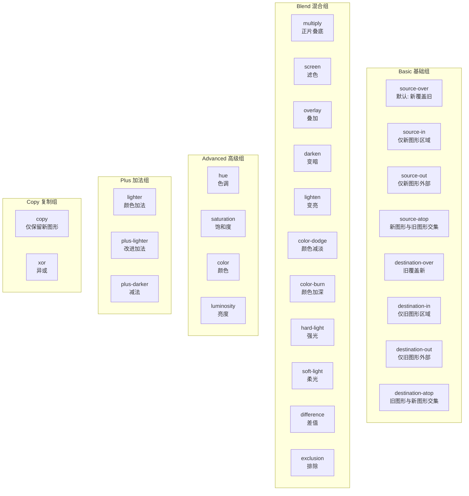

<h4>011-composite-modes.html</h4>

```html
<!-- 来源：12-Canvas.md - 第10章 合成模式全景图 -->
<!DOCTYPE html>
<html lang="zh-CN">
<head>
  <meta charset="UTF-8">
  <meta name="viewport" content="width=device-width, initial-scale=1.0">
  <title>【11】Canvas 合成模式</title>
  <style>
    * { margin: 0; padding: 0; box-sizing: border-box; }
    body { font-family: -apple-system, BlinkMacSystemFont, 'Segoe UI', sans-serif; padding: 20px; background: #f8f9fa; color: #333; }
    .demo-container { max-width: 920px; margin: 0 auto; background: white; padding: 24px; border-radius: 8px; box-shadow: 0 2px 8px rgba(0,0,0,0.1); }
    .demo-title { margin-bottom: 16px; font-size: 18px; color: #555; border-bottom: 2px solid #007bff; padding-bottom: 8px; }

    canvas { display: block; margin: 16px auto; border: 1px solid #ddd; border-radius: 8px; background: white; }

    .mode-grid {
      display: grid;
      grid-template-columns: repeat(5, 1fr);
      gap: 12px;
      margin-top: 14px;
    }
    .mode-card {
      background: #fafafa;
      border: 2px solid transparent;
      border-radius: 8px;
      padding: 10px;
      text-align: center;
      cursor: pointer;
      transition: all 0.2s;
    }
    .mode-card:hover { border-color: #007bff; transform: translateY(-2px); }
    .mode-card.active { border-color: #e74c3c; background: #fff5f5; }

    .mode-card canvas {
      width: 100%;
      height: 90px;
      margin: 6px auto 4px;
      border: 1px solid #eee;
      border-radius: 4px;
    }
    .mode-name {
      font-size: 11px;
      font-weight: 600;
      color: #333;
      margin-bottom: 2px;
    }
    .mode-desc {
      font-size: 10px;
      color: #999;
    }

    .detail-panel {
      margin-top: 20px;
      background: #f8f9fa;
      border-radius: 8px;
      padding: 16px;
      display: none;
    }
    .detail-panel.show { display: block; }

    .detail-title { font-size: 15px; font-weight: bold; color: #333; margin-bottom: 10px; }
    .detail-canvas-wrap { text-align: center; }
    #detailCanvas { border: 1px solid #ddd; border-radius: 8px; }

    .category-label {
      grid-column: span 5;
      font-size: 13px;
      font-weight: bold;
      color: #007bff;
      padding: 8px 0 4px;
      border-top: 1px solid #eee;
      margin-top: 4px;
    }
    .category-label:first-child { border-top: none; margin-top: 0; }
  </style>
</head>
<body>
  <div class="demo-container">
    <div class="demo-title">示例：globalCompositeOperation 合成模式全景图（26 种标准模式 + 2 种扩展）</div>

    <div class="mode-grid" id="modeGrid"></div>

    <div class="detail-panel" id="detailPanel">
      <div class="detail-title" id="detailTitle">点击上方卡片查看大图演示</div>
      <div class="detail-canvas-wrap">
        <canvas id="detailCanvas" width="500" height="320"></canvas>
      </div>
    </div>
  </div>

  <script>
    const modes = [
      // 基础组
      { category: "基础组 (Basic)", modes: [
        { name: "source-over", desc: "默认：新覆盖旧", type: "basic" },
        { name: "source-in", desc: "仅新图形区域", type: "basic" },
        { name: "source-out", desc: "仅新图形外部", type: "basic" },
        { name: "source-atop", desc: "新与旧交集", type: "basic" },
        { name: "destination-over", desc: "旧覆盖新", type: "basic" },
        { name: "destination-in", desc: "仅旧图形区域", type: "basic" },
        { name: "destination-out", desc: "仅旧图形外部", type: "basic" },
        { name: "destination-atop", desc: "旧与新交集", type: "basic" },
      ]},
      // 加法组
      { category: "加法组 (Additive)", modes: [
        { name: "lighter", desc: "颜色相加（发光）", type: "additive" },
        { name: "plus-lighter", desc: "改进加法", type: "additive" },
        { name: "plus-darker", desc: "减法", type: "additive" },
      ]},
      // 混合组
      { category: "混合组 (Blend)", modes: [
        { name: "multiply", desc: "正片叠底", type: "blend" },
        { name: "screen", desc: "滤色", type: "blend" },
        { name: "overlay", desc: "叠加", type: "blend" },
        { name: "darken", desc: "变暗", type: "blend" },
        { name: "lighten", desc: "变亮", type: "blend" },
        { name: "color-dodge", desc: "颜色减淡", type: "blend" },
        { name: "color-burn", desc: "颜色加深", type: "blend" },
        { name: "hard-light", desc: "强光", type: "blend" },
        { name: "soft-light", desc: "柔光", type: "blend" },
        { name: "difference", desc: "差值", type: "blend" },
        { name: "exclusion", desc: "排除", type: "blend" },
      ]},
      // 高级组
      { category: "高级组 (Advanced)", modes: [
        { name: "hue", desc: "色调", type: "advanced" },
        { name: "saturation", desc: "饱和度", type: "advanced" },
        { name: "color", desc: "颜色", type: "advanced" },
        { name: "luminosity", desc: "亮度", type: "advanced" },
      ]},
      // 特殊组
      { category: "特殊组 (Special)", modes: [
        { name: "copy", desc: "仅保留新图形", type: "special" },
        { name: "xor", desc: "异或", type: "special" },
      ]},
    ]

    const grid = document.getElementById("modeGrid")
    let activeMode = null

    function drawCompositeScene(ctx, w, h, modeName, animate) {
      ctx.clearRect(0, 0, w, h)
      ctx.fillStyle = "#fff"
      ctx.fillRect(0, 0, w, h)

      // 底层：蓝色圆形
      ctx.globalCompositeOperation = "source-over"
      ctx.fillStyle = "#3498db"
      ctx.beginPath()
      if (animate) {
        const offset = Math.sin(Date.now() / 400) * 15
        ctx.arc(w * 0.38 + offset, h * 0.5, Math.min(w, h) * 0.28, 0, Math.PI * 2)
      } else {
        ctx.arc(w * 0.38, h * 0.5, Math.min(w, h) * 0.28, 0, Math.PI * 2)
      }
      ctx.fill()

      // 顶层：红色矩形（应用合成模式）
      ctx.globalCompositeOperation = modeName
      ctx.fillStyle = "#e74c3c"
      if (animate) {
        const offset = Math.cos(Date.now() / 350) * 12
        ctx.fillRect(w * 0.48 + offset, h * 0.32, Math.min(w, h) * 0.42, Math.min(w, h) * 0.36)
      } else {
        ctx.fillRect(w * 0.48, h * 0.32, Math.min(w, h) * 0.42, Math.min(w, h) * 0.36)
      }

      // 恢复默认
      ctx.globalCompositeOperation = "source-over"
    }

    function createModeCard(modeInfo) {
      const card = document.createElement("div")
      card.className = "mode-card"
      card.dataset.mode = modeInfo.name

      const miniCvs = document.createElement("canvas")
      miniCvs.width = 140
      miniCvs.height = 90

      card.innerHTML = ""
      card.appendChild(miniCvs)

      const nameEl = document.createElement("div")
      nameEl.className = "mode-name"
      nameEl.textContent = modeInfo.name
      card.appendChild(nameEl)

      const descEl = document.createElement("div")
      descEl.className = "mode-desc"
      descEl.textContent = modeInfo.desc
      card.appendChild(descEl)

      // 绘制静态预览
      const mctx = miniCvs.getContext("2d")
      drawCompositeScene(mctx, 140, 90, modeInfo.name, false)

      // 点击事件
      card.addEventListener("click", () => selectMode(modeInfo.name, card))

      return card
    }

    function selectMode(modeName, cardEl) {
      // 更新选中状态
      document.querySelectorAll(".mode-card").forEach(c => c.classList.remove("active"))
      cardEl.classList.add("active")
      activeMode = modeName

      // 显示详情面板
      const panel = document.getElementById("detailPanel")
      panel.classList.add("show")

      document.getElementById("detailTitle").textContent =
        `globalCompositeOperation = "${modeName}"`

      // 绘制详情大图
      const detailCtx = document.getElementById("detailCanvas").getContext("2d")
      drawCompositeScene(detailCtx, 500, 320, modeName, true)

      // 启动动画（如果尚未启动）
      startDetailAnimation()
    }

    let detailAnimId = null
    function startDetailAnimation() {
      if (detailAnimId) cancelAnimationFrame(detailAnimId)

      function loop() {
        if (!activeMode) return
        const dctx = document.getElementById("detailCanvas").getContext("2d")
        drawCompositeScene(dctx, 500, 320, activeMode, true)
        detailAnimId = requestAnimationFrame(loop)
      }
      loop()
    }

    // ====== 构建网格 ======
    modes.forEach(group => {
      const catLabel = document.createElement("div")
      catLabel.className = "category-label"
      catLabel.textContent = group.category
      grid.appendChild(catLabel)

      group.modes.forEach(m => {
        grid.appendChild(createModeCard(m))
      })
    })

    // 默认选中第一个
    const firstCard = document.querySelector(".mode-card")
    if (firstCard) selectMode(firstCard.dataset.mode, firstCard)
  </script>
</body>
</html>
```

### 常用合成模式速查

| 分类 | 模式 | 效果 | 应用场景 |
| --- | --- | --- | --- |
| **基础** | `source-over` | 新覆盖旧 | 默认行为 |
| **擦除** | `destination-out` | 新区域擦除旧 | 橡皮擦功能 |
| **加法** | `lighter` | 颜色相加 | 发光效果、粒子叠加 |
| **混合** | `multiply` | 正片叠底 | 阴影、暗调效果 |
| **混合** | `screen` | 滤色 | 高光、亮调效果 |
| **混合** | `overlay` | 叠加 | 对比度增强 |
| **高级** | `color` | 保留新颜色的色相/饱和度 | 上色、滤镜 |
| **特殊** | `copy` | 只显示新图形 | 截图、遮罩 |
| **特殊** | `xor` | 异或 | 橡皮筋选择 |

### 合成模式演示

```javascript
// 设置合成模式
ctx.globalCompositeOperation = 'source-over'; // 默认

// 先绘制底层图形
ctx.fillStyle = '#3498db';
ctx.fillRect(50, 50, 100, 100);

// 切换合成模式后绘制顶层
ctx.globalCompositeOperation = 'multiply';
ctx.fillStyle = '#e74c3c';
ctx.fillRect(100, 100, 100, 100);

// 记得恢复默认模式
ctx.globalCompositeOperation = 'source-over';
```

## 11. Hit Testing 与碰撞检测

<h4>004-collision-detection.html</h4>

```html
<!DOCTYPE html>
<html lang="zh-CN">
<head>
  <meta charset="UTF-8">
  <meta name="viewport" content="width=device-width, initial-scale=1.0">
  <title>【4】碰撞检测演示</title>
  <style>
    * { margin: 0; padding: 0; box-sizing: border-box; }
    body { font-family: -apple-system, BlinkMacSystemFont, 'Segoe UI', sans-serif; padding: 20px; background: #f8f9fa; color: #333; }
    .demo-container { max-width: 800px; margin: 0 auto; background: white; padding: 24px; border-radius: 8px; box-shadow: 0 2px 8px rgba(0,0,0,0.1); }
    .demo-title { margin-bottom: 16px; font-size: 18px; color: #555; border-bottom: 2px solid #007bff; padding-bottom: 8px; }

    canvas {
      display: block;
      margin: 16px auto;
      border: 2px solid #ddd;
      border-radius: 8px;
      cursor: crosshair;
      background: #fafafa;
    }

    .info-bar {
      display: flex;
      justify-content: space-between;
      align-items: center;
      padding: 12px 16px;
      background: #f8f9fa;
      border-radius: 6px;
      font-size: 14px;
      margin-bottom: 12px;
    }

    .collision-count {
      color: #e74c3c;
      font-weight: bold;
      font-size: 18px;
    }

    .controls { display: flex; gap: 10px; justify-content: center; flex-wrap: wrap; }
    .btn {
      padding: 8px 18px;
      border: none;
      border-radius: 6px;
      cursor: pointer;
      font-size: 13px;
      transition: all 0.3s;
      background: #007bff;
      color: white;
    }
    .btn:hover { background: #0056b3; }
    .btn-danger { background: #dc3545; }
    .btn-danger:hover { background: #c82333; }
  </style>
</head>
<body>
  <div class="demo-container">
    <div class="demo-title">示例：AABB 碰撞检测 + 四叉树优化</div>

    <div class="info-bar">
      <span>对象数量：<strong id="objCount">15</strong></span>
      <span>碰撞对数：<span class="collision-count" id="collisionCount">0</span></span>
      <span>FPS：<strong id="fpsVal">60</strong></span>
    </div>

    <div class="controls">
      <button class="btn" onclick="addObject()">➕ 添加对象</button>
      <button class="btn btn-danger" onclick="removeObject()">➖ 移除对象</button>
      <button class="btn" onclick="resetObjects()">🔄 重置</button>
    </div>

    <canvas id="collisionCanvas" width="750" height="520"></canvas>

    <p style="text-align: center; margin-top: 12px; font-size: 13px; color: #666;">
      💡 碰撞时方块会变红并显示白色边框 | 点击画布添加新对象
    </p>
  </div>

  <script>
    const canvas = document.getElementById("collisionCanvas")
    const ctx = canvas.getContext("2d")

    const objects = []
    const colors = ["#3498db", "#2ecc71", "#f39c12", "#9b59b6", "#1abc9c", "#e74c3c"]
    let frameCount = 0, lastTime = performance.now(), fps = 60

    class GameObject {
      constructor(x, y) {
        this.x = x ?? Math.random() * (canvas.width - 40)
        this.y = y ?? Math.random() * (canvas.height - 40)
        this.size = 25 + Math.random() * 20
        this.color = colors[Math.floor(Math.random() * colors.length)]
        this.vx = (Math.random() - 0.5) * 4
        this.vy = (Math.random() - 0.5) * 4
        this.colliding = false
      }

      update() {
        this.x += this.vx
        this.y += this.vy

        if (this.x <= 0 || this.x >= canvas.width - this.size) {
          this.vx *= -1
          this.x = Math.max(0, Math.min(canvas.width - this.size, this.x))
        }
        if (this.y <= 0 || this.y >= canvas.height - this.size) {
          this.vy *= -1
          this.y = Math.max(0, Math.min(canvas.height - this.size, this.y))
        }
      }

      draw() {
        ctx.fillStyle = this.colliding ? "#e74c3c" : this.color
        ctx.fillRect(this.x, this.y, this.size, this.size)

        if (this.colliding) {
          ctx.strokeStyle = "#fff"
          ctx.lineWidth = 2
          ctx.strokeRect(this.x, this.y, this.size, this.size)
        }
      }

      getBounds() { return { x: this.x, y: this.y, w: this.size, h: this.size } }
    }

    function aabbCollision(a, b) {
      return a.x < b.x + b.w && a.x + a.w > b.x && a.y < b.y + b.h && a.y + a.h > b.y
    }

    function init(count = 15) {
      objects.length = 0
      for (let i = 0; i < count; i++) objects.push(new GameObject())
    }

    function addObject() { objects.push(new GameObject()) }
    function removeObject() { if (objects.length > 1) objects.pop() }
    function resetObjects() { init(15) }

    canvas.addEventListener("click", (e) => {
      const rect = canvas.getBoundingClientRect()
      objects.push(new GameObject(e.clientX - rect.left - 15, e.clientY - rect.top - 15))
    })

    function checkCollisions() {
      objects.forEach(o => o.colliding = false)
      let count = 0
      for (let i = 0; i < objects.length; i++) {
        for (let j = i + 1; j < objects.length; j++) {
          if (aabbCollision(objects[i].getBounds(), objects[j].getBounds())) {
            objects[i].colliding = true
            objects[j].colliding = true
            count++
          }
        }
      }
      return count
    }

    function animate(time) {
      frameCount++
      if (time - lastTime >= 1000) {
        fps = frameCount
        frameCount = 0
        lastTime = time
        document.getElementById("fpsVal").textContent = fps
      }

      ctx.clearRect(0, 0, canvas.width, canvas.height)
      objects.forEach(o => o.update())

      const collisions = checkCollisions()
      objects.forEach(o => o.draw())

      document.getElementById("objCount").textContent = objects.length
      document.getElementById("collisionCount").textContent = collisions

      requestAnimationFrame(animate)
    }

    init()
    animate(performance.now())
  </script>
</body>
</html>
```

### 11.1 内置 Hit Detection API

Canvas 提供了两种内置的命中检测方法：

#### isPointInPath()

检测点是否在填充区域内：

```javascript
// 使用当前路径
ctx.beginPath();
ctx.rect(50, 50, 100, 100);
ctx.fillStyle = '#3498db';
ctx.fill();

// 检测点击位置
canvas.addEventListener('click', (e) => {
  const rect = canvas.getBoundingClientRect();
  const x = e.clientX - rect.left;
  const y = e.clientY - rect.top;
  
  if (ctx.isPointInPath(x, y)) {
    console.log('点击了矩形！');
  }
});

// 使用 Path2D 对象
const starPath = createStarPath(200, 200, 50, 25, 5);
ctx.fill(starPath);

if (ctx.isPointInPath(starPath, x, y)) {
  console.log('点击了星星！');
}
```

#### isPointInStroke()

检测点是否在描边路径上（考虑 lineWidth）：

```javascript
ctx.beginPath();
ctx.arc(300, 200, 50, 0, Math.PI * 2);
ctx.lineWidth = 10;
ctx.strokeStyle = '#e74c3c';
ctx.stroke();

// 检测是否点击了圆形边框（含线宽范围）
if (ctx.isPointInStroke(x, y)) {
  console.log('点击了圆环！');
}
```

### 11.2 几何碰撞检测算法

#### AABB 碰撞检测（轴对齐包围盒）

最常用的快速碰撞检测算法：

```javascript
/**
 * AABB 碰撞检测
 * @param {{x: number, y: number, w: number, h: number}} rect1
 * @param {{x: number, y: number, w: number, h: number}} rect2
 * @returns {boolean}
 */
function aabbCollision(rect1, rect2) {
  return (
    rect1.x < rect2.x + rect2.w &&
    rect1.x + rect1.w > rect2.x &&
    rect1.y < rect2.y + rect2.h &&
    rect1.y + rect1.h > rect2.y
  );
}

// 使用示例
const player = { x: 100, y: 100, w: 50, h: 50 };
const enemy = { x: 120, y: 120, w: 50, h: 50 };

if (aabbCollision(player, enemy)) {
  console.log('发生碰撞！玩家与敌人相撞');
}
```

#### 圆形碰撞检测

```javascript
/**
 * 圆形碰撞检测
 * @param {{x: number, y: number, r: number}} circle1
 * @param {{x: number, y: number, r: number}} circle2
 * @returns {boolean}
 */
function circleCollision(circle1, circle2) {
  const dx = circle1.x - circle2.x;
  const dy = circle1.y - circle2.y;
  const distance = Math.sqrt(dx * dx + dy * dy);
  return distance < circle1.r + circle2.r;
}

// 优化版本（避免开方运算）
function circleCollisionFast(c1, c2) {
  const dx = c1.x - c2.x;
  const dy = c1.y - c2.y;
  const distSq = dx * dx + dy * dy;
  const radiusSum = c1.r + c2.r;
  return distSq < radiusSum * radiusSum;
}
```

#### 多边形碰撞检测（SAT 分离轴定理）

```javascript
/**
 * 凸多边形 SAT 碰撞检测
 * @param {Array<{x: number, y: number}>} polygon1 - 顶点数组
 * @param {Array<{x: number, y: number}>} polygon2 - 顶点数组
 * @returns {boolean}
 */
function satCollision(polygon1, polygon2) {
  const polygons = [polygon1, polygon2];
  
  for (let poly of polygons) {
    for (let i = 0; i < poly.length; i++) {
      const j = (i + 1) % poly.length;
      
      // 计算边的法向量（投影轴）
      const edge = {
        x: poly[j].x - poly[i].x,
        y: poly[j].y - poly[i].y
      };
      const axis = { x: -edge.y, y: edge.x };
      
      // 投影两个多边形到轴上
      const proj1 = projectPolygon(polygon1, axis);
      const proj2 = projectPolygon(polygon2, axis);
      
      // 检查投影是否重叠
      if (!overlap(proj1, proj2)) {
        return false; // 发现分离轴，无碰撞
      }
    }
  }
  
  return true; // 所有轴都有重叠，发生碰撞
}

function projectPolygon(polygon, axis) {
  let min = Infinity;
  let max = -Infinity;
  
  for (let vertex of polygon) {
    const dot = vertex.x * axis.x + vertex.y * axis.y;
    min = Math.min(min, dot);
    max = Math.max(max, dot);
  }
  
  return { min, max };
}

function overlap(proj1, proj2) {
  return !(proj1.max < proj2.min || proj2.max < proj1.min);
}
```

### 11.3 空间分区优化

当对象数量很多时，暴力检测（O(n²)）性能不足，需要空间分区：

```mermaid
flowchart TB
    subgraph "空间分区策略"
        A[所有对象] --> B{选择策略}
        
        B -->|对象少<br/><1000| C[暴力检测 O(n²)]
        B -->|均匀分布| D[网格分区 Grid]
        B -->|分布不均| E[四叉树 Quadtree]
        B -->|3D空间| F[八叉树 Octree]
        B -->|动态对象| G[均匀网格 + 哈希]
    end
    
    D --> H["时间复杂度: O(n/k²)<br/>k = 网格数量"]
    E --> I["时间复杂度: O(n log n)<br/>自适应深度"]
    
```

#### 四叉树实现

```javascript
class QuadTree {
  constructor(boundary, capacity = 4) {
    this.boundary = boundary; // {x, y, w, h}
    this.capacity = capacity;
    this.objects = [];
    this.divided = false;
    // 四个子节点：西北、东北、西南、东南
    this.nw = null;
    this.ne = null;
    this.sw = null;
    this.se = null;
  }
  
  insert(obj) {
    // 如果对象不在当前范围内，返回
    if (!this.contains(obj)) return false;
    
    // 如果未达到容量且未分割，直接添加
    if (this.objects.length < this.capacity && !this.divided) {
      this.objects.push(obj);
      return true;
    }
    
    // 如果未分割，先分割
    if (!this.divided) this.subdivide();
    
    // 尝试插入到子节点
    return (
      this.nw.insert(obj) || this.ne.insert(obj) ||
      this.sw.insert(obj) || this.se.insert(obj)
    );
  }
  
  subdivide() {
    const { x, y, w, h } = this.boundary;
    const halfW = w / 2;
    const halfH = h / 2;
    
    this.nw = new QuadTree({ x, y, w: halfW, h: halfH }, this.capacity);
    this.ne = new QuadTree({ x: x + halfW, y, w: halfW, h: halfH }, this.capacity);
    this.sw = new QuadTree({ x, y: y + halfH, w: halfW, h: halfH }, this.capacity);
    this.se = new QuadTree({ x: x + halfW, y: y + halfH, w: halfW, h: halfH }, this.capacity);
    
    this.divided = true;
    
    // 将当前对象重新分配到子节点
    const existingObjects = [...this.objects];
    this.objects = [];
    existingObjects.forEach(obj => this.insert(obj));
  }
  
  contains(obj) {
    const { x, y, w, h } = this.boundary;
    return (
      obj.x >= x && obj.x < x + w &&
      obj.y >= y && obj.y < y + h
    );
  }
  
  // 查询与给定范围相交的所有对象
  query(range, found = []) {
    // 如果查询范围与当前节点不相交，返回
    if (!this.intersects(range)) return found;
    
    // 添加当前节点的对象
    for (let obj of this.objects) {
      if (this.inRange(obj, range)) {
        found.push(obj);
      }
    }
    
    // 递归查询子节点
    if (this.divided) {
      this.nw.query(range, found);
      this.ne.query(range, found);
      this.sw.query(range, found);
      this.se.query(range, found);
    }
    
    return found;
  }
  
  intersects(range) {
    const { x, y, w, h } = this.boundary;
    return !(
      range.x > x + w ||
      range.x + range.w < x ||
      range.y > y + h ||
      range.y + range.h < y
    );
  }
  
  inRange(obj, range) {
    return (
      obj.x >= range.x &&
      obj.x < range.x + range.w &&
      obj.y >= range.y &&
      obj.y < range.y + range.h
    );
  }
}
```

### 11.4 完整碰撞检测演示

```html
<canvas id="collision-demo" width="800" height="600"></canvas>
<script>
const canvas = document.getElementById('collision-demo');
const ctx = canvas.getContext('2d');

// 创建多个可移动的对象
class GameObject {
  constructor(x, y, size, color) {
    this.x = x;
    this.y = y;
    this.size = size;
    this.color = color;
    this.vx = (Math.random() - 0.5) * 4;
    this.vy = (Math.random() - 0.5) * 4;
    this.colliding = false;
  }
  
  update() {
    this.x += this.vx;
    this.y += this.vy;
    
    // 边界反弹
    if (this.x <= 0 || this.x >= canvas.width - this.size) {
      this.vx *= -1;
      this.x = Math.max(0, Math.min(canvas.width - this.size, this.x));
    }
    if (this.y <= 0 || this.y >= canvas.height - this.size) {
      this.vy *= -1;
      this.y = Math.max(0, Math.min(canvas.height - this.size, this.y));
    }
  }
  
  draw(ctx) {
    ctx.fillStyle = this.colliding ? '#e74c3c' : this.color;
    ctx.fillRect(this.x, this.y, this.size, this.size);
    
    // 绘制 AABB 边框（调试用）
    if (this.colliding) {
      ctx.strokeStyle = '#fff';
      ctx.lineWidth = 2;
      ctx.strokeRect(this.x, this.y, this.size, this.size);
    }
  }
  
  getBounds() {
    return { x: this.x, y: this.y, w: this.size, h: this.size };
  }
}

// 初始化对象
const objects = [];
const colors = ['#3498db', '#2ecc71', '#f39c12', '#9b59b6', '#1abc9c'];

for (let i = 0; i < 15; i++) {
  objects.push(new GameObject(
    Math.random() * (canvas.width - 40),
    Math.random() * (canvas.height - 40),
    30 + Math.random() * 20,
    colors[i % colors.length]
  ));
}

// 使用四叉树优化碰撞检测
const quadTree = new QuadTree({
  x: 0, y: 0, w: canvas.width, h: canvas.height
}, 4);

function checkCollisions() {
  // 重置碰撞状态
  objects.forEach(obj => obj.colliding = false);
  
  // 重建四叉树
  quadTree.objects = [];
  quadTree.divided = false;
  quadTree.nw = quadTree.ne = quadTree.sw = quadTree.se = null;
  
  objects.forEach(obj => quadTree.insert(obj));
  
  // 查询潜在碰撞对
  for (let i = 0; i < objects.length; i++) {
    const obj = objects[i];
    const bounds = obj.getBounds();
    // 扩大查询范围以包含相邻格子
    const queryRange = {
      x: bounds.x - 1,
      y: bounds.y - 1,
      w: bounds.w + 2,
      h: bounds.h + 2
    };
    
    const nearby = quadTree.query(queryRange);
    
    for (let other of nearby) {
      if (other !== obj && aabbCollision(bounds, other.getBounds())) {
        obj.colliding = true;
        other.colliding = true;
      }
    }
  }
}

function animate() {
  ctx.clearRect(0, 0, canvas.width, canvas.height);
  
  // 更新所有对象
  objects.forEach(obj => obj.update());
  
  // 检测碰撞
  checkCollisions();
  
  // 绘制所有对象
  objects.forEach(obj => obj.draw(ctx));
  
  // 显示 FPS
  ctx.fillStyle = '#333';
  ctx.font = '14px monospace';
  ctx.fillText(`对象数: ${objects.length}`, 10, 20);
  
  requestAnimationFrame(animate);
}

animate();
</script>
```

## 12. 动画系统架构

### 动画状态机

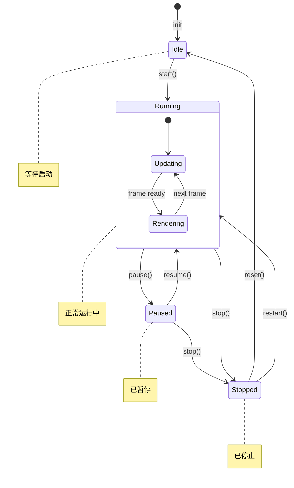

### 时间线管理系统

```javascript
class AnimationTimeline {
  constructor() {
    this.animations = new Map();
    this.isRunning = false;
    this.lastTime = 0;
    this.animationId = null;
  }
  
  /**
   * 添加动画到时间线
   * @param {string} name - 动画名称
   * @param {Function} updateFn - 更新函数 (progress, deltaTime) => void
   * @param {number} duration - 持续时间（毫秒）
   * @param {Object} options - 配置选项
   */
  add(name, updateFn, duration, options = {}) {
    this.animations.set(name, {
      updateFn,
      duration,
      startTime: null,
      easing: options.easing || 'linear',
      loop: options.loop || false,
      delay: options.delay || 0,
      onComplete: options.onComplete || null,
      progress: 0
    });
  }
  
  /**
   * 移除动画
   */
  remove(name) {
    this.animations.delete(name);
  }
  
  /**
   * 启动时间线
   */
  start() {
    if (this.isRunning) return;
    this.isRunning = true;
    this.lastTime = performance.now();
    this.loop(this.lastTime);
  }
  
  /**
   * 停止时间线
   */
  stop() {
    this.isRunning = false;
    if (this.animationId) {
      cancelAnimationFrame(this.animationId);
    }
  }
  
  loop(currentTime) {
    if (!this.isRunning) return;
    
    const deltaTime = currentTime - this.lastTime;
    this.lastTime = currentTime;
    
    this.animations.forEach((anim, name) => {
      // 初始化开始时间
      if (anim.startTime === null) {
        anim.startTime = currentTime + anim.delay;
      }
      
      // 检查延迟
      if (currentTime < anim.startTime) return;
      
      // 计算进度
      const elapsed = currentTime - anim.startTime;
      anim.progress = Math.min(elapsed / anim.duration, 1);
      
      // 应用缓动函数
      const easedProgress = EasingFunctions[anim.easing](anim.progress);
      
      // 执行更新
      anim.updateFn(easedProgress, deltaTime);
      
      // 循环处理
      if (anim.progress >= 1) {
        if (anim.loop) {
          anim.startTime = currentTime;
          anim.progress = 0;
        } else {
          if (anim.onComplete) anim.onComplete();
          // 可以选择是否自动移除
          // this.remove(name);
        }
      }
    });
    
    this.animationId = requestAnimationFrame((t) => this.loop(t));
  }
}
```

### 完整缓动函数库

```javascript
/**
 * 缓动函数库（Easing Functions）
 * 基于 Robert Penner 的缓动方程
 * 参考: https://easings.net/
 */
const EasingFunctions = {
  // 线性（无缓动）
  linear: t => t,
  
  // 二次方
  easeInQuad: t => t * t,
  easeOutQuad: t => t * (2 - t),
  easeInOutQuad: t => (t < 0.5 ? 2 * t * t : -1 + (4 - 2 * t) * t),
  
  // 三次方
  easeInCubic: t => t * t * t,
  easeOutCubic: t => (--t) * t * t + 1,
  easeInOutCubic: t => (t < 0.5 ? 4 * t * t * t : (t - 1) * (2 * t - 2) * (2 * t - 2) + 1),
  
  // 四次方
  easeInQuart: t => t * t * t * t,
  easeOutQuart: t => 1 - (--t) * t * t * t,
  easeInOutQuart: t => (t < 0.5 ? 8 * t * t * t * t : 1 - 8 * (--t) * t * t * t),
  
  // 正弦波
  easeInSine: t => 1 - Math.cos((t * Math.PI) / 2),
  easeOutSine: t => Math.sin((t * Math.PI) / 2),
  easeInOutSine: t => -(Math.cos(Math.PI * t) - 1) / 2,
  
  // 指数
  easeInExpo: t => (t === 0 ? 0 : Math.pow(2, 10 * (t - 1))),
  easeOutExpo: t => (t === 1 ? 1 : 1 - Math.pow(2, -10 * t)),
  easeInOutExpo: t => {
    if (t === 0 || t === 1) return t;
    return t < 0.5
      ? Math.pow(2, 20 * t - 10) / 2
      : (2 - Math.pow(2, -20 * t + 10)) / 2;
  },
  
  // 弹跳
  easeOutBounce: t => {
    const n1 = 7.5625;
    const d1 = 2.75;
    if (t < 1 / d1) return n1 * t * t;
    else if (t < 2 / d1) return n1 * (t -= 1.5 / d1) * t + 0.75;
    else if (t < 2.5 / d1) return n1 * (t -= 2.25 / d1) * t + 0.9375;
    else return n1 * (t -= 2.625 / d1) * t + 0.984375;
  },
  
  // 弹性
  easeOutElastic: t => {
    const c4 = (2 * Math.PI) / 3;
    return t === 0 ? 0 : t === 1 ? 1 :
      Math.pow(2, -10 * t) * Math.sin((t * 10 - 0.75) * c4) + 1;
  },
  
  // 回弹
  easeOutBack: t => {
    const c1 = 1.70158;
    const c3 = c1 + 1;
    return 1 + c3 * Math.pow(t - 1, 3) + c1 * Math.pow(t - 1, 2);
  },
};

// 使用示例
const timeline = new AnimationTimeline();

timeline.add('moveRight',
  (progress) => {
    const x = 0 + progress * 500; // 从 0 移动到 500
    ctx.clearRect(0, 0, canvas.width, canvas.height);
    ctx.fillRect(x, 200, 50, 50);
  },
  2000, // 2秒
  { easing: 'easeOutBounce', loop: true }
);

timeline.start();
```

### requestAnimationFrame 基础用法

```javascript
let x = 0;

function animate() {
  ctx.clearRect(0, 0, canvas.width, canvas.height);

  ctx.fillStyle = '#e74c3c';
  ctx.fillRect(x, 200, 50, 50);

  x += 2;
  if (x > canvas.width) x = -50;

  requestAnimationFrame(animate);
}

animate();
```

### 帧率控制

```javascript
const TARGET_FPS = 60;
const FRAME_INTERVAL = 1000 / TARGET_FPS;
let lastFrameTime = 0;

function animate(currentTime) {
  requestAnimationFrame(animate);

  const delta = currentTime - lastFrameTime;
  if (delta < FRAME_INTERVAL) return;

  lastFrameTime = currentTime - (delta % FRAME_INTERVAL);

  update(delta); // 传递帧间隔时间
  draw();
}

requestAnimationFrame(animate);
```

## 13. OffscreenCanvas 与多线程渲染

### OffscreenCanvas vs 普通 Canvas 对比

| 特性 | 普通 Canvas | OffscreenCanvas |
| --- | --- | --- |
| **线程** | 仅主线程 | 主线程 & Web Worker |
| **渲染上下文** | `getContext('2d')` | `getContext('2d')` |
| **DOM 关联** | 必须关联 `<canvas>` 元素 | 可独立存在 |
| **控制权转移** | N/A | `transferControlToOffscreen()` |
| **同步渲染** | ✅ 支持 | ✅ 支持 |
| **浏览器支持** | 全部 | Chrome 69+, Firefox 105+, Safari 16.4+ |

### Worker 渲染流程（Mermaid 序列图）

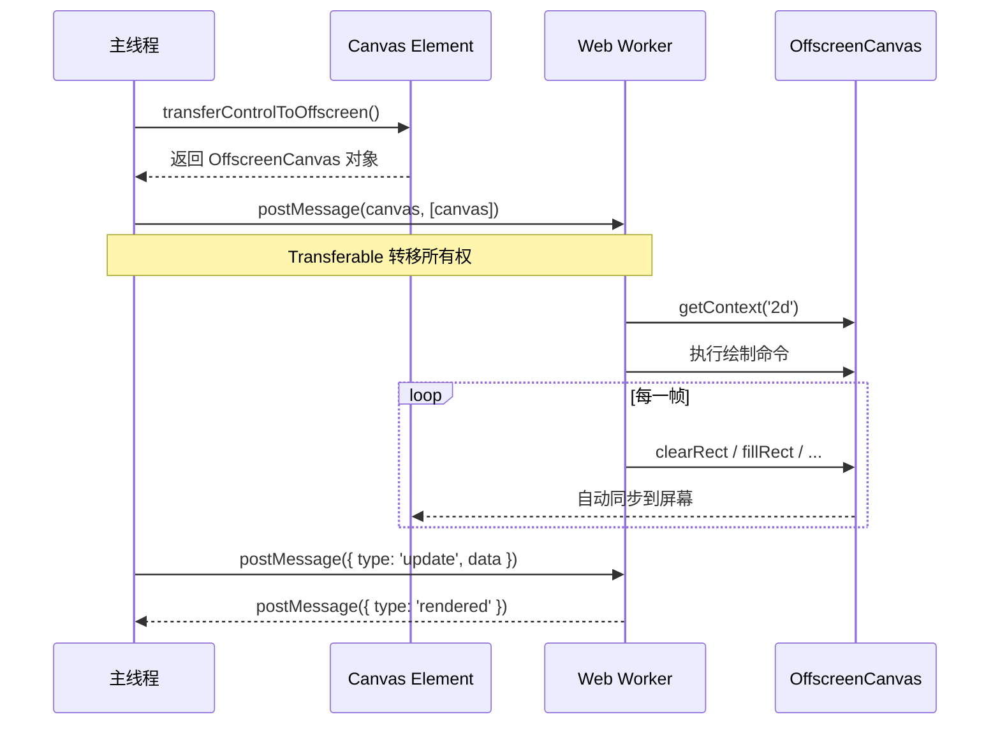

### transferControlToOffscreen 详解

```javascript
// 主线程代码
const canvas = document.getElementById('myCanvas');

// 1. 转移控制权到 OffscreenCanvas
const offscreen = canvas.transferControlToOffscreen();

// 2. 创建 Worker 并发送 OffscreenCanvas
const worker = new Worker('canvas-worker.js');

// 3. 使用 Transferable 对象转移所有权（零拷贝）
worker.postMessage({ 
  type: 'init',
  canvas: offscreen,
  width: 800,
  height: 600 
}, [offscreen]); // [offscreen] 表示转移所有权

// 4. 之后可以向 Worker 发送消息来控制渲染
worker.postMessage({ type: 'setColor', color: '#e74c3c' });
worker.postMessage({ type: 'startAnimation' });
```

### Worker 渲染框架（完整代码）

**canvas-worker.js：**

```javascript
/**
 * Canvas Worker 渲染框架
 * 支持双缓冲、消息协议设计
 */

self.onmessage = function(e) {
  const { type, data } = e.data;
  
  switch (type) {
    case 'init':
      initWorker(data);
      break;
    case 'update':
      updateState(data);
      break;
    case 'startAnimation':
      startAnimation();
      break;
    case 'stopAnimation':
      stopAnimation();
      break;
    case 'resize':
      handleResize(data);
      break;
  }
};

// ========== 状态管理 ==========
let ctx = null;
let canvas = null;
let animationId = null;
let isAnimating = false;

// 双缓冲相关
let backBuffer = null;
let backCtx = null;
let useDoubleBuffering = false;

// 渲染状态
const state = {
  backgroundColor: '#1a1a2e',
  objects: [],
  camera: { x: 0, y: 0 },
  lastFrameTime: 0,
  fps: 0,
  frameCount: 0,
};

// ========== 初始化 ==========
function initWorker(data) {
  canvas = data.canvas;
  ctx = canvas.getContext('2d');
  
  // 配置双缓冲（可选）
  useDoubleBuffering = data.doubleBuffering || false;
  if (useDoubleBuffering) {
    backBuffer = new OffscreenCanvas(data.width, data.height);
    backCtx = backBuffer.getContext('2d');
  }
  
  // 初始化画布尺寸
  canvas.width = data.width;
  canvas.height = data.height;
  
  // 向主线程报告就绪
  self.postMessage({ 
    type: 'ready',
    message: 'Worker 初始化完成'
  });
}

// ========== 动画循环 ==========
function startAnimation() {
  if (isAnimating) return;
  isAnimating = true;
  state.lastFrameTime = performance.now();
  loop(state.lastFrameTime);
}

function stopAnimation() {
  isAnimating = false;
  if (animationId) {
    cancelAnimationFrame(animationId);
  }
}

function loop(currentTime) {
  if (!isAnimating) return;
  
  animationId = requestAnimationFrame(loop);
  
  // 计算 delta time
  const delta = currentTime - state.lastFrameTime;
  state.lastFrameTime = currentTime;
  
  // 更新 FPS 统计
  state.frameCount++;
  if (state.frameCount % 60 === 0) {
    state.fps = Math.round(1000 / delta);
    self.postMessage({ type: 'fps', value: state.fps });
  }
  
  // 选择渲染目标
  const renderCtx = useDoubleBuffering ? backCtx : ctx;
  
  // 更新逻辑
  update(delta);
  
  // 渲染
  render(renderCtx);
  
  // 如果使用双缓冲，交换缓冲区
  if (useDoubleBuffering) {
    ctx.drawImage(backBuffer, 0, 0);
  }
}

// ========== 更新逻辑 ==========
function update(delta) {
  // 更新所有对象
  state.objects.forEach(obj => {
    if (obj.update) obj.update(delta);
  });
  
  // 相机跟随等逻辑可以在这里实现
}

// ========== 渲染逻辑 ==========
function render(renderCtx) {
  const { width, height } = canvas;
  
  // 清除画布
  renderCtx.fillStyle = state.backgroundColor;
  renderCtx.fillRect(0, 0, width, height);
  
  // 应用相机变换
  renderCtx.save();
  renderCtx.translate(-state.camera.x, -state.camera.y);
  
  // 渲染所有对象（按层级排序）
  const sortedObjects = [...state.objects].sort((a, b) => (a.zIndex || 0) - (b.zIndex || 0));
  
  sortedObjects.forEach(obj => {
    if (obj.draw) obj.draw(renderCtx);
  });
  
  renderCtx.restore();
  
  // 渲染 UI（不受相机影响）
  renderUI(renderCtx);
}

function renderUI(renderCtx) {
  // FPS 显示
  renderCtx.fillStyle = '#00ff00';
  renderCtx.font = '14px monospace';
  renderCtx.fillText(`FPS: ${state.fps}`, 10, 20);
}

// ========== 消息处理 ==========
function updateState(data) {
  Object.assign(state, data);
}

function handleResize(data) {
  canvas.width = data.width;
  canvas.height = data.height;
  if (useDoubleBuffering) {
    backBuffer.width = data.width;
    backBuffer.height = data.height;
  }
}

// ========== 工具函数 ==========
// 向 Worker 暴露的工具函数供外部调用
self.createRenderObject = function(config) {
  const obj = {
    x: config.x || 0,
    y: config.y || 0,
    width: config.width || 50,
    height: config.height || 50,
    color: config.color || '#3498db',
    velocity: config.velocity || { x: 0, y: 0 },
    zIndex: config.zIndex || 0,
    
    update(delta) {
      this.x += this.velocity.x * delta / 16;
      this.y += this.velocity.y * delta / 16;
    },
    
    draw(ctx) {
      ctx.fillStyle = this.color;
      ctx.fillRect(this.x, this.y, this.width, this.height);
    }
  };
  
  state.objects.push(obj);
  return obj;
};
```

**主线程集成代码：**

```javascript
class CanvasWorkerManager {
  constructor(canvasElement, workerUrl) {
    this.canvas = canvasElement;
    this.worker = null;
    this.pendingMessages = [];
    this.isReady = false;
    
    this.init(workerUrl);
  }
  
  async init(workerUrl) {
    // 转移控制权
    const offscreen = this.canvas.transferControlToOffscreen();
    
    // 创建 Worker
    this.worker = new Worker(workerUrl);
    
    // 监听来自 Worker 的消息
    this.worker.onmessage = (e) => {
      this.handleWorkerMessage(e.data);
    };
    
    // 发送初始化消息
    this.worker.postMessage({
      type: 'init',
      canvas: offscreen,
      width: this.canvas.width,
      height: this.canvas.height,
      doubleBuffering: true
    }, [offscreen]);
    
    // 等待 Worker 就绪
    await new Promise(resolve => {
      this._readyResolve = resolve;
    });
  }
  
  handleWorkerMessage(message) {
    switch (message.type) {
      case 'ready':
        this.isReady = true;
        if (this._readyResolve) {
          this._readyResolve();
          this._readyResolve = null;
        }
        break;
      case 'fps':
        this.onFpsUpdate?.(message.value);
        break;
      default:
        this.onMessage?.(message);
    }
  }
  
  // 发送消息到 Worker
  send(type, data) {
    if (!this.worker) return;
    
    if (this.isReady) {
      this.worker.postMessage({ type, data });
    } else {
      this.pendingMessages.push({ type, data });
    }
  }
  
  // 启动动画
  startAnimation() {
    this.send('startAnimation');
  }
  
  // 停止动画
  stopAnimation() {
    this.send('stopAnimation');
  }
  
  // 销毁
  destroy() {
    this.stopAnimation();
    if (this.worker) {
      this.worker.terminate();
      this.worker = null;
    }
  }
}

// 使用示例
const manager = new CanvasWorkerManager(
  document.getElementById('game-canvas'),
  'canvas-worker.js'
);

await manager.ready;

manager.startAnimation();

manager.onFpsUpdate = (fps) => {
  console.log('当前 FPS:', fps);
};
```

## 14. WebGL 基础

### WebGL vs Canvas 2D 对比

| 维度 | Canvas 2D | WebGL |
| --- | --- | --- |
| **渲染方式** | 软件/CPU 光栅化 | GPU 硬件加速 |
| **API 风格** | 即时模式命令式 | 状态机 + 着色器 |
| **学习难度** | ⭐⭐ | ⭐⭐⭐⭐ |
| **性能** | 适中（CPU 限制） | 极高（GPU 并行） |
| **适用场景** | 2D UI、简单动画 | 3D 场景、大量粒子、特效 |
| **纹理限制** | 无明显限制 | 受 GPU 显存限制 |
| **调试难度** | 简单 | 复杂（需了解 GPU 流水线） |

### WebGL 渲染管线

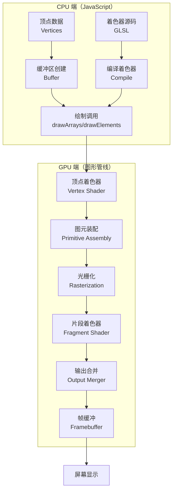

### 获取 WebGL 上下文

```javascript
const canvas = document.getElementById('webgl-canvas');

// 尝试获取 WebGL2 上下文（首选）
const gl = canvas.getContext('webgl2') || canvas.getContext('webgl');

if (!gl) {
  console.error('WebGL 不可用');
  throw new Error('WebGL not supported');
}

// 配置上下文属性
// canvas.getContext('webgl', {
//   alpha: false,           // 禁用透明通道（性能更好）
//   antialias: true,        // 开启抗锯齿
//   premultipliedAlpha: false,
//   preserveDrawingBuffer: false, // 不保留绘制缓冲
//   powerPreference: 'high-performance' // 请求高性能 GPU
// });
```

### 着色器基础

着色器是运行在 GPU 上的小程序，使用 GLSL（OpenGL Shading Language）编写。

#### 顶点着色器（Vertex Shader）

负责处理每个顶点的位置和属性：

```glsl
// 顶点着色器 - 处理顶点位置
attribute vec2 a_position;   // 顶点位置属性
uniform vec2 u_resolution;    // 画布分辨率
uniform vec2 u_translation;   // 平移量

void main() {
  // 将像素坐标转换为裁剪空间坐标 (-1 到 +1)
  vec2 position = a_position + u_translation;
  
  // 转换到 0.0 -> 1.0 空间，再转换到 -1.0 -> +1.0（裁剪空间）
  vec2 clipSpace = (position / u_resolution) * 2.0 - 1.0;
  
  // WebGL 中 Y 轴是反的，所以取反
  gl_Position = vec4(clipSpace * vec2(1, -1), 0, 1);
}
```

#### 片段着色器（Fragment Shader）

负责计算每个像素的颜色：

```glsl
// 片段着色器 - 计算像素颜色
precision mediump float;  // 浮点精度

uniform vec4 u_color;      // 颜色 uniform

void main() {
  gl_FragColor = u_color;  // 输出颜色
}
```

### WebGL 渲染流程完整示例

```javascript
/**
 * WebGL 基础示例：绘制彩色矩形
 */

// ========== 1. 初始化 ==========
const canvas = document.getElementById('webgl-canvas');
const gl = canvas.getContext('webgl');

// 设置画布尺寸
canvas.width = 800;
canvas.height = 600;
gl.viewport(0, 0, canvas.width, canvas.height);

// ========== 2. 创建着色器程序 ==========

// 顶点着色器源码
const vsSource = `
  attribute vec2 a_position;
  uniform vec2 u_resolution;
  uniform vec2 u_translation;
  
  void main() {
    vec2 position = a_position + u_translation;
    vec2 clipSpace = (position / u_resolution) * 2.0 - 1.0;
    gl_Position = vec4(clipSpace * vec2(1, -1), 0, 1);
  }
`;

// 片段着色器源码
const fsSource = `
  precision mediump float;
  uniform vec4 u_color;
  
  void main() {
    gl_FragColor = u_color;
  }
`;

// 编译着色器
function createShader(gl, type, source) {
  const shader = gl.createShader(type);
  gl.shaderSource(shader, source);
  gl.compileShader(shader);
  
  if (!gl.getShaderParameter(shader, gl.COMPILE_STATUS)) {
    console.error('着色器编译错误:', gl.getShaderInfoLog(shader));
    gl.deleteShader(shader);
    return null;
  }
  
  return shader;
}

// 创建程序
function createProgram(gl, vsSource, fsSource) {
  const vertexShader = createShader(gl, gl.VERTEX_SHADER, vsSource);
  const fragmentShader = createShader(gl, gl.FRAGMENT_SHADER, fsSource);
  
  const program = gl.createProgram();
  gl.attachShader(program, vertexShader);
  gl.attachShader(program, fragmentShader);
  gl.linkProgram(program);
  
  if (!gl.getProgramParameter(program, gl.LINK_STATUS)) {
    console.error('程序链接错误:', gl.getProgramInfoLog(program));
    return null;
  }
  
  return program;
}

const program = createProgram(gl, vsSource, fsSource);
gl.useProgram(program);

// ========== 3. 设置几何数据 ==========

// 矩形的四个顶点（两个三角形组成）
const positions = [
  0, 0,        // 左上
  200, 0,      // 右上
  0, 200,      // 左下
  0, 200,      // 左下
  200, 0,      // 右上
  200, 200,    // 右下
];

// 创建缓冲区
const positionBuffer = gl.createBuffer();
gl.bindBuffer(gl.ARRAY_BUFFER, positionBuffer);
gl.bufferData(gl.ARRAY_BUFFER, new Float32Array(positions), gl.STATIC_DRAW);

// 获取 attribute 位置并启用
const positionAttributeLocation = gl.getAttribLocation(program, 'a_position');
gl.enableVertexAttribArray(positionAttributeLocation);
gl.vertexAttribPointer(
  positionAttributeLocation,
  2,         // 每个顶点 2 个分量
  gl.FLOAT,
  false,     // 不归一化
  0,         // 步长
  0          // 偏移
);

// ========== 4. 设置 Uniforms ==========

// 分辨率 uniform
const resolutionUniformLocation = gl.getUniformLocation(program, 'u_resolution');
gl.uniform2f(resolutionUniformLocation, gl.canvas.width, gl.canvas.height);

// 颜色 uniform
const colorUniformLocation = gl.getUniformLocation(program, 'u_color');
gl.uniform4f(colorUniformLocation, 0.2, 0.6, 0.9, 1.0); // RGBA

// 平移 uniform
const translationUniformLocation = gl.getUniformLocation(program, 'u_translation');
gl.uniform2f(translationUniformLocation, 100, 100);

// ========== 5. 渲染 ==========

// 清除画布
gl.clearColor(0.1, 0.1, 0.15, 1.0); // 深灰色背景
gl.clear(gl.COLOR_BUFFER_BIT);

// 绘制三角形
gl.drawArrays(gl.TRIANGLES, 0, 6); // 6 个顶点 = 2 个三角形
```

### WebGL 资源管理最佳实践

```javascript
class WebGLRenderer {
  constructor(canvas) {
    this.gl = canvas.getContext('webgl2') || canvas.getContext('webgl');
    this.programs = new Map();
    this.buffers = new Map();
    this.textures = new Map();
    
    if (!this.gl) {
      throw new Error('WebGL 不可用');
    }
  }
  
  // 创建并缓存着色器程序
  createProgram(name, vsSource, fsSource) {
    if (this.programs.has(name)) {
      return this.programs.get(name);
    }
    
    const program = createProgram(this.gl, vsSource, fsSource);
    this.programs.set(name, program);
    return program;
  }
  
  // 创建缓冲区
  createBuffer(name, data, usage = this.gl.STATIC_DRAW) {
    const buffer = this.gl.createBuffer();
    this.gl.bindBuffer(this.gl.ARRAY_BUFFER, buffer);
    this.gl.bufferData(this.gl.ARRAY_BUFFER, data, usage);
    this.buffers.set(name, buffer);
    return buffer;
  }
  
  // 释放资源
  dispose() {
    // 删除所有程序
    this.programs.forEach(program => this.gl.deleteProgram(program));
    
    // 删除所有缓冲区
    this.buffers.forEach(buffer => this.gl.deleteBuffer(buffer));
    
    // 删除所有纹理
    this.textures.forEach(texture => this.gl.deleteTexture(texture));
    
    // 清空引用
    this.programs.clear();
    this.buffers.clear();
    this.textures.clear();
  }
}
```

### 从 Canvas 2D 到 WebGL 的迁移路径

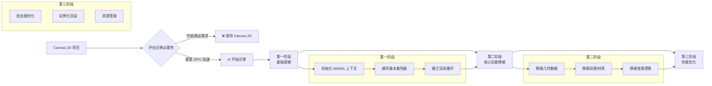

::: tip 迁移建议
对于大多数 2D 应用，Canvas 2D 已经足够。只有在以下情况才考虑迁移到 WebGL：
1. 需要同时渲染 10,000+ 个对象
2. 需要复杂的像素着色效果
3. 需要 3D 变换能力
4. Canvas 2D 性能已成为瓶颈
:::

## 15. 性能优化深度指南

### 性能瓶颈分析

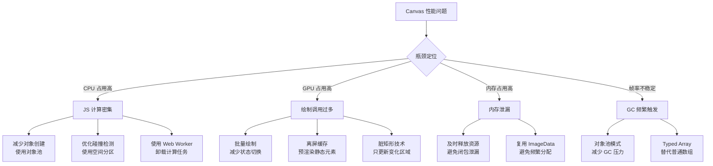

### 15.1 分层渲染（Layer Rendering）

将场景分为多个图层，只重绘变化的层：

```javascript
class LayeredRenderer {
  constructor(mainCanvas) {
    this.mainCanvas = mainCanvas;
    this.mainCtx = mainCanvas.getContext('2d');
    this.layers = new Map();
  }
  
  /**
   * 创建图层
   * @param {string} name - 图层名称
   * @param {number} zIndex - 层级（数值越大越靠上）
   */
  createLayer(name, zIndex = 0) {
    const layerCanvas = document.createElement('canvas');
    layerCanvas.width = this.mainCanvas.width;
    layerCanvas.height = this.mainCanvas.height;
    
    this.layers.set(name, {
      canvas: layerCanvas,
      ctx: layerCanvas.getContext('2d'),
      zIndex,
      dirty: true,  // 脏标记
      static: false  // 是否为静态层
    });
    
    return this.layers.get(name);
  }
  
  /**
   * 标记图层为"脏"（需要重绘）
   */
  markDirty(layerName) {
    const layer = this.layers.get(layerName);
    if (layer) layer.dirty = true;
  }
  
  /**
   * 设置图层为静态（不会每帧清除）
   */
  setStatic(layerName, isStatic) {
    const layer = this.layers.get(layerName);
    if (layer) layer.static = isStatic;
  }
  
  /**
   * 获取图层上下文用于绘制
   */
  getLayerContext(layerName) {
    const layer = this.layers.get(layerName);
    return layer ? layer.ctx : null;
  }
  
  /**
   * 合成所有图层到主画布
   */
  composite() {
    const mainCtx = this.mainCtx;
    mainCtx.clearRect(0, 0, this.mainCanvas.width, this.mainCanvas.height);
    
    // 按 zIndex 排序
    const sortedLayers = [...this.layers.entries()]
      .sort(([, a], [, b]) => a.zIndex - b.zIndex);
    
    for (const [name, layer] of sortedLayers) {
      if (layer.dirty) {
        if (!layer.static) {
          // 动态层：每帧清除并重绘
          layer.ctx.clearRect(0, 0, layer.canvas.width, layer.canvas.height);
        }
        // 触发该层的绘制回调
        this.onLayerDraw?.(name, layer.ctx);
        layer.dirty = false;
      }
      
      // 将图层绘制到主画布
      mainCtx.drawImage(layer.canvas, 0, 0);
    }
  }
}

// 使用示例
const renderer = new LayeredRenderer(canvas);

// 创建背景层（静态，很少变化）
renderer.createLayer('background', 0);
renderer.setStatic('background', true);
renderer.markDirty('background'); // 只在需要时标记

// 创建游戏对象层（动态，每帧更新）
renderer.createLayer('gameObjects', 1);

// 创建 UI 层（最高优先级）
renderer.createLayer('ui', 2);

// 渲染循环
function renderLoop() {
  // 标记动态层为脏
  renderer.markDirty('gameObjects');
  renderer.markDirty('ui');
  
  // 合成所有层
  renderer.composite();
  
  requestAnimationFrame(renderLoop);
}
```

### 15.2 脏矩形（Dirty Rectangle）算法

只重绘画面中实际发生变化的部分：

```javascript
class DirtyRectRenderer {
  constructor(canvas) {
    this.canvas = canvas;
    this.ctx = canvas.getContext('2d');
    this.dirtyRegions = [];  // 脏区域列表
    this.prevFrameData = null;
  }
  
  /**
   * 添加脏区域
   * @param {number} x - X 坐标
   * @param {number} y - Y 坐标
   * @param {number} w - 宽度
   * @param {number} h - 高度
   */
  addDirtyRegion(x, y, w, h) {
    this.dirtyRegions.push({ x, y, w, h });
  }
  
  /**
   * 合并脏区域（优化：减少绘制次数）
   */
  mergeDirtyRegions() {
    if (this.dirtyRegions.length <= 1) return this.dirtyRegions;
    
    const merged = [];
    const sorted = [...this.dirtyRegions].sort((a, b) => a.x - b.x);
    
    let current = { ...sorted[0] };
    
    for (let i = 1; i < sorted.length; i++) {
      const next = sorted[i];
      
      // 检查是否可以水平合并
      if (next.x <= current.x + current.w + 10) { // 10px 容差
        // 合并
        current.w = Math.max(current.x + current.w, next.x + next.w) - current.x;
        current.y = Math.min(current.y, next.y);
        current.h = Math.max(current.y + current.h, next.y + next.h) - current.y;
      } else {
        merged.push(current);
        current = { ...next };
      }
    }
    
    merged.push(current);
    this.dirtyRegions = merged;
    return merged;
  }
  
  /**
   * 只清除和重绘脏区域
   */
  render(drawCallback) {
    if (this.dirtyRegions.length === 0) {
      // 没有脏区域，不需要重绘
      return;
    }
    
    // 合并相邻的脏区域以提高效率
    const regions = this.mergeDirtyRegions();
    
    for (const region of regions) {
      // 只清除脏区域
      this.ctx.clearRect(region.x, region.y, region.w, region.h);
      
      // 保存状态并设置裁剪
      this.ctx.save();
      this.ctx.beginPath();
      this.ctx.rect(region.x, region.y, region.w, region.h);
      this.ctx.clip();
      
      // 调用绘制回调（只绘制该区域内的内容）
      drawCallback(this.ctx, region);
      
      this.ctx.restore();
    }
    
    // 清空脏区域列表
    this.dirtyRegions = [];
  }
}

// 使用示例
const dirtyRenderer = new DirtyRectRenderer(canvas);

// 游戏对象移动时，标记其新旧位置为脏
function moveObject(obj, newX, newY) {
  // 旧位置变脏
  dirtyRenderer.addDirtyRegion(obj.x, obj.y, obj.width, obj.height);
  
  // 更新位置
  obj.x = newX;
  obj.y = newY;
  
  // 新位置也变脏
  dirtyRenderer.addDirtyRegion(obj.x, obj.y, obj.width, obj.height);
}

// 渲染循环
function renderLoop() {
  dirtyRenderer.render((ctx, region) => {
    // 只绘制与脏区域相交的对象
    objects.forEach(obj => {
      if (rectIntersects(region, { 
        x: obj.x, y: obj.y, w: obj.width, h: obj.height 
      })) {
        obj.draw(ctx);
      }
    });
  });
  
  requestAnimationFrame(renderLoop);
}
```

### 15.3 对象池（Object Pool）模式

避免在动画循环中频繁创建和销毁对象，减少垃圾回收压力：

```javascript
/**
 * 通用对象池实现
 * @template T
 */
class ObjectPool {
  /**
   * @param {() => T} createFn - 创建新对象的工厂函数
   * @param {(obj: T) => void} resetFn - 重置对象状态的函数
   * @param {number} initialSize - 初始池大小
   */
  constructor(createFn, resetFn, initialSize = 10) {
    this.createFn = createFn;
    this.resetFn = resetFn;
    this.pool = [];
    this.active = new Set();
    
    // 预创建对象
    for (let i = 0; i < initialSize; i++) {
      this.pool.push(this.createFn());
    }
    
    // 统计信息
    this.stats = {
      created: initialSize,
      reused: 0,
      peakActive: 0,
    };
  }
  
  /**
   * 从池中获取一个对象
   * @returns {T}
   */
  acquire() {
    let obj;
    
    if (this.pool.length > 0) {
      // 复用池中的对象
      obj = this.pool.pop();
      this.stats.reused++;
    } else {
      // 池已满，创建新对象
      obj = this.createFn();
      this.stats.created++;
    }
    
    // 重置对象状态
    this.resetFn(obj);
    
    // 标记为活跃
    this.active.add(obj);
    
    // 更新峰值统计
    if (this.active.size > this.stats.peakActive) {
      this.stats.peakActive = this.active.size;
    }
    
    return obj;
  }
  
  /**
   * 将对象归还到池中
   * @param {T} obj - 要归还的对象
   */
  release(obj) {
    if (this.active.has(obj)) {
      this.active.delete(obj);
      this.pool.push(obj);
    }
  }
  
  /**
   * 释放所有活跃对象
   */
  releaseAll() {
    for (const obj of this.active) {
      this.pool.push(obj);
    }
    this.active.clear();
  }
  
  /**
   * 获取池统计信息
   */
  getStats() {
    return {
      ...this.stats,
      poolSize: this.pool.length,
      activeCount: this.active.size,
    };
  }
}

// ========== 粒子系统的对象池应用 ==========

class ParticlePool extends ObjectPool {
  constructor(initialSize = 100) {
    super(
      // 工厂函数：创建新粒子
      () => ({
        x: 0,
        y: 0,
        vx: 0,
        vy: 0,
        life: 1,
        decay: 0.01,
        size: 3,
        color: '#fff',
      }),
      // 重置函数：重置粒子状态
      (particle) => {
        particle.x = 0;
        particle.y = 0;
        particle.vx = 0;
        particle.vy = 0;
        particle.life = 1;
        particle.decay = 0.01 + Math.random() * 0.02;
        particle.size = 2 + Math.random() * 4;
        particle.color = `hsl(${Math.random() * 360}, 100%, 60%)`;
      },
      initialSize
    );
  }
  
  /**
   * 发射粒子
   */
  emit(x, y, count = 1) {
    const particles = [];
    for (let i = 0; i < count; i++) {
      const p = this.acquire();
      p.x = x;
      p.y = y;
      p.vx = (Math.random() - 0.5) * 6;
      p.vy = (Math.random() - 0.5) * 6;
      particles.push(p);
    }
    return particles;
  }
}

// 使用示例
const particlePool = new ParticlePool(200);

canvas.addEventListener('mousemove', (e) => {
  // 从池中获取粒子而不是 new Particle()
  particlePool.emit(e.offsetX, e.offsetY, 3);
});

function animate() {
  ctx.clearRect(0, 0, canvas.width, canvas.height);
  
  // 更新和绘制所有活跃粒子
  for (const particle of particlePool.active) {
    particle.x += particle.vx;
    particle.y += particle.vy;
    particle.life -= particle.decay;
    particle.vy += 0.05; // 重力
    
    if (particle.life <= 0) {
      // 归还到池中而不是 splice/delete
      particlePool.release(particle);
    } else {
      ctx.globalAlpha = particle.life;
      ctx.fillStyle = particle.color;
      ctx.beginPath();
      ctx.arc(particle.x, particle.y, particle.size, 0, Math.PI * 2);
      ctx.fill();
    }
  }
  
  ctx.globalAlpha = 1;
  requestAnimationFrame(animate);
}

animate();

// 定期打印统计信息
setInterval(() => {
  console.log('对象池状态:', particlePool.getStats());
}, 5000);
```

### 15.4 其他优化技巧

#### 批量绘制优化

```javascript
// ❌ 差：频繁切换状态
function badDraw(rects) {
  rects.forEach(rect => {
    ctx.fillStyle = rect.color; // 每次都切换颜色
    ctx.fillRect(rect.x, rect.y, rect.w, rect.h);
  });
}

// ✅ 好：按状态分组批量绘制
function goodDraw(rects) {
  // 按颜色分组
  const groups = new Map();
  rects.forEach(rect => {
    if (!groups.has(rect.color)) groups.set(rect.color, []);
    groups.get(rect.color).push(rect);
  });
  
  // 批量绘制每组
  for (const [color, group] of groups) {
    ctx.fillStyle = color; // 只设置一次
    group.forEach(rect => {
      ctx.fillRect(rect.x, rect.y, rect.w, rect.h);
    });
  }
}
```

#### 避免浮点坐标

```javascript
// ❌ 差：浮点坐标导致亚像素渲染和模糊
ctx.fillRect(10.5, 10.5, 100, 100);

// ✅ 好：使用整数坐标
ctx.fillRect(Math.round(10.5), Math.round(10.5), 100, 100);

// ✅ 更好：预先计算好整数坐标
const x = Math.round(someCalculation());
const y = Math.round(anotherCalculation());
ctx.fillRect(x, y, width, height);
```

#### 使用 Typed Array

```javascript
// ❌ 差：普通数组，类型不确定
const positions = [];
positions.push(x, y);

// ✅ 好：Typed Array，内存连续且类型固定
const positions = new Float32Array(maxObjects * 2); // 每个对象 x, y
let index = 0;
positions[index++] = x;
positions[index++] = y;

// 对于像素操作，必须使用 Uint8ClampedArray
const imageData = ctx.getImageData(0, 0, width, height);
const data = imageData.data; // Uint8ClampedArray
```

### 15.5 内存管理最佳实践

```javascript
// ========== 避免内存泄漏的最佳实践 ==========

// 1. 及时释放大对象
function processLargeImage() {
  let imageData = ctx.getImageData(0, 0, canvas.width, canvas.height);
  // ... 处理 imageData ...
  // 处理完成后，解除引用以便 GC 回收
  imageData = null;
}

// 2. 避免闭包导致的隐式引用
// ❌ 差：闭包持有 canvas 和 ctx 的引用
function badClosure() {
  let frame = 0;
  return function animate() {
    ctx.fillRect(frame++, 0, 1, 1); // ctx 被闭包捕获
    requestAnimationFrame(animate);
  };
}

// ✅ 好：显式清理
function goodClosure() {
  let frame = 0;
  let animId = null;
  
  function animate() {
    ctx.fillRect(frame++, 0, 1, 1);
    animId = requestAnimationFrame(animate);
  }
  
  // 提供停止方法
  return {
    start: () => animate(),
    stop: () => {
      if (animId) cancelAnimationFrame(animId);
      // 清理引用
      animId = null;
      frame = 0;
    }
  };
}

// 3. 复用 ImageData
let reusableImageData = null;

function getReusableImageData(width, height) {
  if (!reusableImageData || 
      reusableImageData.width !== width || 
      reusableImageData.height !== height) {
    reusableImageData = ctx.createImageData(width, height);
  }
  return reusableImageData;
}

// 4. 使用 WeakMap 存储临时数据
const tempCache = new WeakMap();
function getCachedData(obj) {
  if (!tempCache.has(obj)) {
    tempCache.set(obj, computeExpensiveData(obj));
  }
  return tempCache.get(obj);
}
// 当 obj 不被其他地方引用时，缓存的数据会被自动 GC
```

### 15.6 Canvas Profiling 工具和方法

```javascript
/**
 * Canvas 性能监控器
 */
class CanvasProfiler {
  constructor(canvas) {
    this.canvas = canvas;
    this.metrics = {
      fps: 0,
      frameTime: 0,
      drawCalls: 0,
      stateChanges: 0,
      memoryUsage: 0,
    };
    this.frameTimestamps = [];
    this.lastMeasureTime = performance.now();
  }
  
  /** 开始记录一帧 */
  beginFrame() {
    this.metrics.drawCalls = 0;
    this.metrics.stateChanges = 0;
    this._frameStart = performance.now();
  }
  
  /** 记录一次绘制调用 */
  recordDrawCall() {
    this.metrics.drawCalls++;
  }
  
  /** 记录一次状态变更 */
  recordStateChange() {
    this.metrics.stateChanges++;
  }
  
  /** 结束一帧并更新指标 */
  endFrame() {
    const now = performance.now();
    this.frameTimestamps.push(now);
    
    // 保留最近 60 帧的时间戳
    if (this.frameTimestamps.length > 60) {
      this.frameTimestamps.shift();
    }
    
    // 每秒更新一次 FPS
    if (now - this.lastMeasureTime >= 1000) {
      const frames = this.frameTimestamps.filter(t => t > now - 1000).length;
      this.metrics.fps = frames;
      this.lastMeasureTime = now;
      
      // 打印性能报告
      this.printReport();
    }
    
    this.metrics.frameTime = now - this._frameStart;
  }
  
  /** 打印性能报告 */
  printReport() {
    console.log(`%c[Canvas Profiler]`, 'color: #3498db; font-weight: bold;');
    console.log(`  FPS: ${this.metrics.fps}`);
    console.log(`  Frame Time: ${this.metrics.frameTime.toFixed(2)}ms`);
    console.log(`  Draw Calls: ${this.metrics.drawCalls}`);
    console.log(`  State Changes: ${this.metrics.stateChanges}`);
    
    // 内存使用（如果可用）
    if (performance.memory) {
      const mb = performance.memory.usedJSHeapSize / 1024 / 1024;
      console.log(`  Memory: ${mb.toFixed(2)} MB`);
    }
  }
  
  /** 在画布上显示性能指标 */
  drawOverlay(ctx) {
    ctx.save();
    ctx.fillStyle = 'rgba(0, 0, 0, 0.7)';
    ctx.fillRect(5, 5, 180, 80);
    ctx.fillStyle = '#00ff00';
    ctx.font = '12px monospace';
    ctx.fillText(`FPS: ${this.metrics.fps}`, 10, 22);
    ctx.fillText(`Frame: ${this.metrics.frameTime.toFixed(1)}ms`, 10, 38);
    ctx.fillText(`Draw Calls: ${this.metrics.drawCalls}`, 10, 54);
    ctx.fillText(`State Changes: ${this.metrics.stateChanges}`, 10, 70);
    ctx.restore();
  }
}

// 使用示例
const profiler = new CanvasProfiler(canvas);

function renderLoop() {
  profiler.beginFrame();
  
  ctx.clearRect(0, 0, canvas.width, canvas.height);
  
  // 在绘制调用处记录
  profiler.recordDrawCall();
  ctx.fillRect(10, 10, 50, 50);
  
  profiler.recordDrawCall();
  ctx.drawImage(someImage, 100, 100);
  
  // 显示性能覆盖层
  profiler.drawOverlay(ctx);
  
  profiler.endFrame();
  requestAnimationFrame(renderLoop);
}
```

