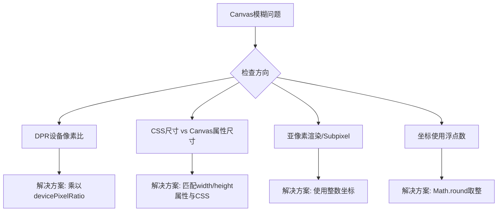
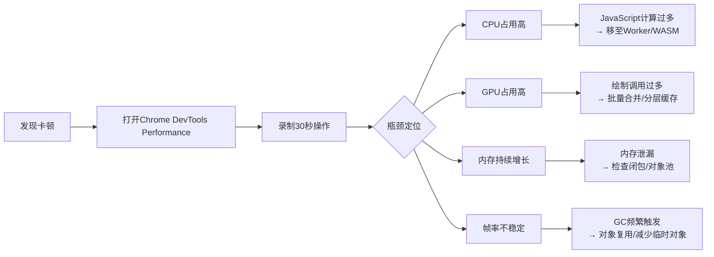
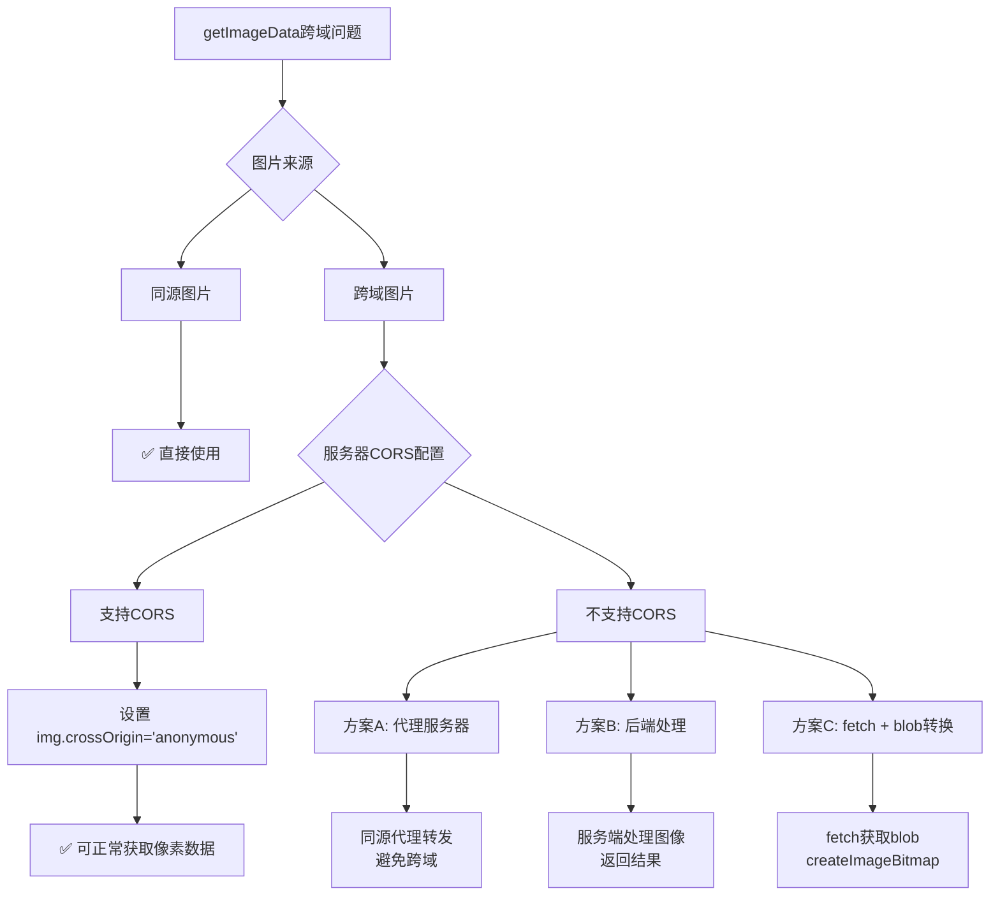
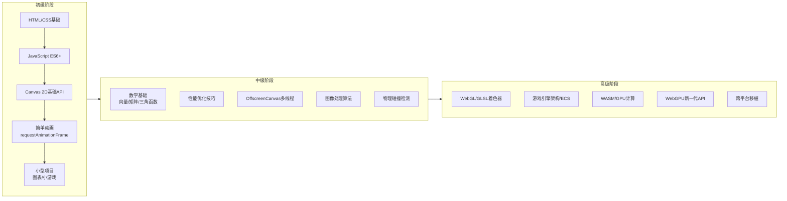

# Canvas（02）：16. 实战案例集、22. 参考资料（Resources）

## 16. 实战案例集

<h4>003-particle-system.html</h4>

```html
<!DOCTYPE html>
<html lang="zh-CN">
<head>
  <meta charset="UTF-8">
  <meta name="viewport" content="width=device-width, initial-scale=1.0">
  <title>【3】粒子动画系统</title>
  <style>
    * { margin: 0; padding: 0; box-sizing: border-box; }
    body { font-family: -apple-system, BlinkMacSystemFont, 'Segoe UI', sans-serif; padding: 20px; background: #1a1a2e; color: #fff; }
    .demo-container { max-width: 900px; margin: 0 auto; background: #16213e; padding: 24px; border-radius: 12px; box-shadow: 0 4px 20px rgba(0,0,0,0.3); }
    .demo-title { margin-bottom: 16px; font-size: 18px; color: #e94560; border-bottom: 2px solid #e94560; padding-bottom: 8px; }

    canvas {
      display: block;
      margin: 16px auto;
      border-radius: 12px;
      background: linear-gradient(135deg, #0f3460 0%, #16213e 100%);
    }

    .controls { display: flex; gap: 10px; justify-content: center; flex-wrap: wrap; margin-bottom: 16px; }
    .btn {
      padding: 8px 18px;
      border: none;
      border-radius: 6px;
      cursor: pointer;
      font-size: 13px;
      font-weight: 500;
      transition: all 0.3s;
      background: #e94560;
      color: white;
    }
    .btn:hover { transform: translateY(-2px); box-shadow: 0 4px 12px rgba(233,69,96,0.4); }
    .btn-secondary { background: #533483; }
    .btn-secondary:hover { box-shadow: 0 4px 12px rgba(83,52,131,0.4); }

    .stats {
      display: flex;
      gap: 20px;
      justify-content: center;
      padding: 12px;
      background: rgba(255,255,255,0.05);
      border-radius: 8px;
      font-size: 13px;
      font-family: monospace;
      color: #00d9ff;
    }
  </style>
</head>
<body>
  <div class="demo-container">
    <div class="demo-title">示例：粒子动画系统（鼠标交互）</div>

    <div class="controls">
      <button class="btn" onclick="addParticles(50)">+ 添加 50 个粒子</button>
      <button class="btn" onclick="addParticles(200)">+ 添加 200 个粒子</button>
      <button class="btn btn-secondary" onclick="toggleGravity()">切换重力</button>
      <button class="btn btn-secondary" onclick="clearAll()">清空全部</button>
    </div>

    <canvas id="particleCanvas" width="850" height="550"></canvas>

    <div class="stats">
      <span>粒子数：<strong id="particleCount">0</strong></span>
      <span>FPS：<strong id="fpsDisplay">60</strong></span>
      <span>重力：<strong id="gravityStatus">关闭</strong></span>
    </div>
  </div>

  <script>
    const canvas = document.getElementById("particleCanvas")
    const ctx = canvas.getContext("2d")
    const particles = []
    let gravity = false
    let mouseX = -1000
    let mouseY = -1000

    // FPS 计算
    let lastTime = performance.now()
    let frameCount = 0
    let fps = 60

    class Particle {
      constructor(x, y) {
        this.x = x || Math.random() * canvas.width
        this.y = y || Math.random() * canvas.height * 0.5
        this.vx = (Math.random() - 0.5) * 6
        this.vy = (Math.random() - 0.5) * 6
        this.radius = 2 + Math.random() * 6
        this.color = `hsl(${Math.random() * 360}, 80%, 60%)`
        this.alpha = 1
        this.decay = 0.0005 + Math.random() * 0.002
        this.life = 1
      }

      update() {
        // 鼠标吸引力
        const dx = mouseX - this.x
        const dy = mouseY - this.y
        const dist = Math.sqrt(dx * dx + dy * dy)
        if (dist < 150 && dist > 0) {
          const force = (150 - dist) / 150 * 0.5
          this.vx += (dx / dist) * force
          this.vy += (dy / dist) * force
        }

        // 重力
        if (gravity) this.vy += 0.15

        // 更新位置
        this.x += this.vx
        this.y += this.vy

        // 摩擦力
        this.vx *= 0.99
        this.vy *= 0.99

        // 边界反弹
        if (this.x <= this.radius || this.x >= canvas.width - this.radius) {
          this.vx *= -0.7
          this.x = Math.max(this.radius, Math.min(canvas.width - this.radius, this.x))
        }
        if (this.y >= canvas.height - this.radius) {
          this.vy *= -0.7
          this.y = canvas.height - this.radius
        }
        if (this.y < this.radius) {
          this.vy *= -0.7
          this.y = this.radius
        }

        // 生命值衰减
        this.life -= this.decay
        this.alpha = this.life
      }

      draw(ctx) {
        ctx.save()
        ctx.globalAlpha = this.alpha

        // 发光效果
        const gradient = ctx.createRadialGradient(
          this.x, this.y, 0,
          this.x, this.y, this.radius * 2
        )
        gradient.addColorStop(0, this.color)
        gradient.addColorStop(1, "transparent")

        ctx.fillStyle = gradient
        ctx.beginPath()
        ctx.arc(this.x, this.y, this.radius * 2, 0, Math.PI * 2)
        ctx.fill()

        // 核心
        ctx.fillStyle = "white"
        ctx.beginPath()
        ctx.arc(this.x, this.y, this.radius * 0.5, 0, Math.PI * 2)
        ctx.fill()

        ctx.restore()
      }
    }

    function addParticles(count) {
      for (let i = 0; i < count; i++) {
        particles.push(new Particle())
      }
    }

    function toggleGravity() {
      gravity = !gravity
      document.getElementById("gravityStatus").textContent = gravity ? "开启" : "关闭"
    }

    function clearAll() {
      particles.length = 0
    }

    // 鼠标事件
    canvas.addEventListener("mousemove", (e) => {
      const rect = canvas.getBoundingClientRect()
      mouseX = e.clientX - rect.left
      mouseY = e.clientY - rect.top
    })

    canvas.addEventListener("mouseleave", () => {
      mouseX = -1000
      mouseY = -1000
    })

    canvas.addEventListener("click", (e) => {
      const rect = canvas.getBoundingClientRect()
      const x = e.clientX - rect.left
      const y = e.clientY - rect.top
      for (let i = 0; i < 30; i++) {
        particles.push(new Particle(x, y))
      }
    })

    function animate(currentTime) {
      // FPS 计算
      frameCount++
      if (currentTime - lastTime >= 1000) {
        fps = frameCount
        frameCount = 0
        lastTime = currentTime
        document.getElementById("fpsDisplay").textContent = fps
      }

      // 半透明覆盖实现拖尾效果
      ctx.fillStyle = "rgba(15, 52, 96, 0.15)"
      ctx.fillRect(0, 0, canvas.width, canvas.height)

      // 更新和绘制粒子
      for (let i = particles.length - 1; i >= 0; i--) {
        particles[i].update()
        particles[i].draw(ctx)

        if (particles[i].life <= 0) {
          particles.splice(i, 1)
        }
      }

      document.getElementById("particleCount").textContent = particles.length

      requestAnimationFrame(animate)
    }

    // 初始化一些粒子
    addParticles(80)
    animate(performance.now())
  </script>
</body>
</html>
```

### 案例 1：柱状图

```javascript
function drawBarChart(data) {
  const padding = 40;
  const chartWidth = canvas.width - padding * 2;
  const chartHeight = canvas.height - padding * 2;
  const barWidth = chartWidth / data.length * 0.6;
  const gap = chartWidth / data.length * 0.4;
  const maxVal = Math.max(...data.map(d => d.value));

  ctx.clearRect(0, 0, canvas.width, canvas.height);

  // 绘制坐标轴
  ctx.strokeStyle = '#ccc';
  ctx.lineWidth = 1;
  ctx.beginPath();
  ctx.moveTo(padding, padding);
  ctx.lineTo(padding, canvas.height - padding);
  ctx.lineTo(canvas.width - padding, canvas.height - padding);
  ctx.stroke();

  // 绘制柱状图
  data.forEach((item, i) => {
    const x = padding + i * (barWidth + gap) + gap / 2;
    const barHeight = (item.value / maxVal) * chartHeight;
    const y = canvas.height - padding - barHeight;

    // 渐变填充
    const gradient = ctx.createLinearGradient(x, y, x, y + barHeight);
    gradient.addColorStop(0, item.color || '#4ecdc4');
    gradient.addColorStop(1, shadeColor(item.color || '#4ecdc4', -20));
    ctx.fillStyle = gradient;
    
    // 圆角矩形（模拟）
    roundedRect(ctx, x, y, barWidth, barHeight, 4);
    ctx.fill();

    // 标签
    ctx.fillStyle = '#333';
    ctx.font = '12px sans-serif';
    ctx.textAlign = 'center';
    ctx.fillText(item.label, x + barWidth / 2, canvas.height - padding + 20);
    ctx.fillText(item.value, x + barWidth / 2, y - 8);
  });
}

/** 绘制圆角矩形的辅助函数 */
function roundedRect(ctx, x, y, width, height, radius) {
  ctx.beginPath();
  ctx.moveTo(x + radius, y);
  ctx.lineTo(x + width - radius, y);
  ctx.quadraticCurveTo(x + width, y, x + width, y + radius);
  ctx.lineTo(x + width, y + height - radius);
  ctx.quadraticCurveTo(x + width, y + height, x + width - radius, y + height);
  ctx.lineTo(x + radius, y + height);
  ctx.quadraticCurveTo(x, y + height, x, y + height - radius);
  ctx.lineTo(x, y + radius);
  ctx.quadraticCurveTo(x, y, x + radius, y);
  ctx.closePath();
}

/** 颜色变亮/变暗辅助函数 */
function shadeColor(color, percent) {
  const num = parseInt(color.replace('#', ''), 16);
  const amt = Math.round(2.55 * percent);
  const R = (num >> 16) + amt;
  const G = ((num >> 8) & 0x00FF) + amt;
  const B = (num & 0x0000FF) + amt;
  return '#' + (
    0x1000000 +
    (R < 255 ? (R < 1 ? 0 : R) : 255) * 0x10000 +
    (G < 255 ? (G < 1 ? 0 : G) : 255) * 0x100 +
    (B < 255 ? (B < 1 ? 0 : B) : 255)
  ).toString(16).slice(1);
}

drawBarChart([
  { label: '一月', value: 120, color: '#e74c3c' },
  { label: '二月', value: 200, color: '#f39c12' },
  { label: '三月', value: 150, color: '#2ecc71' },
  { label: '四月', value: 280, color: '#3498db' },
  { label: '五月', value: 220, color: '#9b59b6' },
]);
```

### 案例 2：粒子系统

```javascript
class Particle {
  constructor(x, y) {
    this.x = x;
    this.y = y;
    this.vx = (Math.random() - 0.5) * 4;
    this.vy = (Math.random() - 0.5) * 4;
    this.life = 1;
    this.decay = 0.01 + Math.random() * 0.02;
    this.size = 2 + Math.random() * 4;
    this.color = `hsl(${Math.random() * 60 + 10}, 100%, 60%)`;
  }

  update() {
    this.x += this.vx;
    this.y += this.vy;
    this.life -= this.decay;
    this.vy += 0.05; // 重力
  }

  draw(ctx) {
    ctx.globalAlpha = this.life;
    ctx.fillStyle = this.color;
    ctx.beginPath();
    ctx.arc(this.x, this.y, this.size, 0, Math.PI * 2);
    ctx.fill();
  }
}

const particles = [];

canvas.addEventListener('mousemove', (e) => {
  for (let i = 0; i < 3; i++) {
    particles.push(new Particle(e.offsetX, e.offsetY));
  }
});

function animate() {
  ctx.clearRect(0, 0, canvas.width, canvas.height);

  for (let i = particles.length - 1; i >= 0; i--) {
    particles[i].update();
    particles[i].draw(ctx);

    if (particles[i].life <= 0) {
      particles.splice(i, 1);
    }
  }

  ctx.globalAlpha = 1;
  requestAnimationFrame(animate);
}

animate();
```

### 案例 3：图片滤镜

```javascript
function applyFilter(filterType) {
  const imageData = ctx.getImageData(0, 0, canvas.width, canvas.height);
  const data = imageData.data;

  switch (filterType) {
    case 'grayscale':
      // 灰度滤镜（ITU-R BT.601 标准）
      for (let i = 0; i < data.length; i += 4) {
        const gray = 0.299 * data[i] + 0.587 * data[i + 1] + 0.114 * data[i + 2];
        data[i] = data[i + 1] = data[i + 2] = gray;
      }
      break;

    case 'invert':
      // 反色滤镜
      for (let i = 0; i < data.length; i += 4) {
        data[i] = 255 - data[i];         // R
        data[i + 1] = 255 - data[i + 1]; // G
        data[i + 2] = 255 - data[i + 2]; // B
      }
      break;

    case 'sepia':
      // 怀旧褐色滤镜
      for (let i = 0; i < data.length; i += 4) {
        const r = data[i], g = data[i + 1], b = data[i + 2];
        data[i] = Math.min(255, r * 0.393 + g * 0.769 + b * 0.189);
        data[i + 1] = Math.min(255, r * 0.349 + g * 0.686 + b * 0.168);
        data[i + 2] = Math.min(255, r * 0.272 + g * 0.534 + b * 0.131);
      }
      break;

    case 'brightness':
      // 亮度增强 (+50)
      for (let i = 0; i < data.length; i += 4) {
        data[i] = Math.min(255, data[i] + 50);
        data[i + 1] = Math.min(255, data[i + 1] + 50);
        data[i + 2] = Math.min(255, data[i + 2] + 50);
      }
      break;

    case 'contrast':
      // 对比度增强（因子 1.5）
      const factor = (1.5 * 256) / 256;
      for (let i = 0; i < data.length; i += 4) {
        data[i] = Math.min(255, Math.max(0, factor * (data[i] - 128) + 128));
        data[i + 1] = Math.min(255, Math.max(0, factor * (data[i + 1] - 128) + 128));
        data[i + 2] = Math.min(255, Math.max(0, factor * (data[i + 2] - 128) + 128));
      }
      break;

    case 'blur':
      // 简单的 3x3 盒式模糊
      const w = imageData.width;
      const h = imageData.height;
      const copy = new Uint8ClampedArray(data);
      
      for (let y = 1; y < h - 1; y++) {
        for (let x = 1; x < w - 1; x++) {
          const idx = (y * w + x) * 4;
          
          for (let c = 0; c < 3; c++) {
            let sum = 0;
            // 3x3 邻域平均
            for (let dy = -1; dy <= 1; dy++) {
              for (let dx = -1; dx <= 1; dx++) {
                sum += copy[((y + dy) * w + (x + dx)) * 4 + c];
              }
            }
            data[idx + c] = sum / 9;
          }
        }
      }
      break;
  }

  ctx.putImageData(imageData, 0, 0);
}
```

### 案例 4：简易游戏引擎骨架

这是一个完整的 2D 游戏引擎框架，包含实体组件系统（ECS）、碰撞检测和渲染循环：

```javascript
/**
 * 简易 2D 游戏引擎
 * 基于 ECS（Entity-Component-System）架构
 */

// ========== 组件定义 ==========

/** 位置组件 */
class TransformComponent {
  constructor(x = 0, y = 0) {
    this.x = x;
    this.y = y;
    this.rotation = 0;
    this.scaleX = 1;
    this.scaleY = 1;
  }
}

/** 渲染组件 */
class RenderComponent {
  constructor(options = {}) {
    this.width = options.width || 32;
    this.height = options.height || 32;
    this.color = options.color || '#3498db';
    this.shape = options.shape || 'rect'; // 'rect' | 'circle' | 'sprite'
    this.sprite = options.sprite || null;
    this.zIndex = options.zIndex || 0;
  }
}

/** 物理组件 */
class PhysicsComponent {
  constructor(options = {}) {
    this.vx = options.vx || 0;
    this.vy = options.vy || 0;
    this.ax = options.ax || 0;  // 加速度
    this.ay = options.ay || 0;
    this.mass = options.mass || 1;
    this.friction = options.friction || 0.98;
    this.bounce = options.bounce || 0.5; // 弹性系数
    this.isStatic = options.isStatic || false;
  }
}

/** 碰撞组件 */
class ColliderComponent {
  constructor(options = {}) {
    this.type = options.type || 'aabb'; // 'aabb' | 'circle'
    this.offsetX = options.offsetX || 0;
    this.offsetY = options.offsetY || 0;
    this.radius = options.radius || 0;
    this.isTrigger = options.isTrigger || false; // 触发器（不产生物理反应）
    this.layer = options.layer || 0;             // 碰撞层
    this.mask = options.mask || 0xFFFFFFFF;      // 碰撞掩码
  }
}

/** 输入组件 */
class InputComponent {
  constructor() {
    this.keys = {};
    this.mousePos = { x: 0, y: 0 };
    this.mouseDown = false;
  }
}

// ========== 实体（Entity）==========

class Entity {
  constructor(id) {
    this.id = id;
    this.components = new Map();
    this.active = true;
  }
  
  addComponent(type, component) {
    this.components.set(type, component);
    return this; // 支持链式调用
  }
  
  getComponent(type) {
    return this.components.get(type);
  }
  
  hasComponent(type) {
    return this.components.has(type);
  }
  
  removeComponent(type) {
    this.components.delete(type);
  }
}

// ========== 系统（System）==========

/** 渲染系统 */
class RenderSystem {
  constructor(ctx) {
    this.ctx = ctx;
  }
  
  update(entities) {
    // 按 zIndex 排序
    const sorted = entities
      .filter(e => e.active && e.hasComponent('render'))
      .sort((a, b) => {
        const ra = a.getComponent('render');
        const rb = b.getComponent('render');
        return ra.zIndex - rb.zIndex;
      });
    
    for (const entity of sorted) {
      const transform = entity.getComponent('transform');
      const render = entity.getComponent('render');
      
      if (!transform || !render) continue;
      
      this.ctx.save();
      this.ctx.translate(transform.x, transform.y);
      this.ctx.rotate(transform.rotation);
      this.ctx.scale(transform.scaleX, transform.scaleY);
      
      this.ctx.fillStyle = render.color;
      
      switch (render.shape) {
        case 'rect':
          this.ctx.fillRect(
            -render.width / 2,
            -render.height / 2,
            render.width,
            render.height
          );
          break;
          
        case 'circle':
          this.ctx.beginPath();
          this.ctx.arc(0, 0, render.width / 2, 0, Math.PI * 2);
          this.ctx.fill();
          break;
          
        case 'sprite':
          if (render.sprite) {
            this.ctx.drawImage(
              render.sprite,
              -render.width / 2,
              -render.height / 2,
              render.width,
              render.height
            );
          }
          break;
      }
      
      this.ctx.restore();
    }
  }
}

/** 物理系统 */
class PhysicsSystem {
  constructor(bounds) {
    this.bounds = bounds; // { width, height }
    this.gravity = 0.5;
  }
  
  update(entities, dt) {
    for (const entity of entities) {
      if (!entity.active) continue;
      
      const transform = entity.getComponent('transform');
      const physics = entity.getComponent('physics');
      
      if (!transform || !physics || physics.isStatic) continue;
      
      // 应用重力
      physics.vy += this.gravity;
      
      // 应用加速度
      physics.vx += physics.ax;
      physics.vy += physics.ay;
      
      // 应用摩擦力
      physics.vx *= physics.friction;
      physics.vy *= physics.friction;
      
      // 更新位置
      transform.x += physics.vx * dt;
      transform.y += physics.vy * dt;
      
      // 边界碰撞
      const hw = (entity.getComponent('render')?.width || 32) / 2;
      const hh = (entity.getComponent('render')?.height || 32) / 2;
      
      if (transform.x - hw < 0) {
        transform.x = hw;
        physics.vx *= -physics.bounce;
      }
      if (transform.x + hw > this.bounds.width) {
        transform.x = this.bounds.width - hw;
        physics.vx *= -physics.bounce;
      }
      if (transform.y - hh < 0) {
        transform.y = hh;
        physics.vy *= -physics.bounce;
      }
      if (transform.y + hh > this.bounds.height) {
        transform.y = this.bounds.height - hh;
        physics.vy *= -physics.bounce;
      }
    }
  }
}

/** 碰撞系统 */
class CollisionSystem {
  constructor() {
    this.handlers = new Map(); // 碰撞事件处理器
  }
  
  onCollision(entityA, entityB, callback) {
    const key = `${entityA.id}-${entityB.id}`;
    this.handlers.set(key, callback);
  }
  
  update(entities) {
    const collidables = entities.filter(e => 
      e.active && e.hasComponent('collider') && e.hasComponent('transform')
    );
    
    for (let i = 0; i < collidables.length; i++) {
      for (let j = i + 1; j < collidables.length; j++) {
        const a = collidables[i];
        const b = collidables[j];
        
        if (this.checkCollision(a, b)) {
          // 触发碰撞事件
          const key1 = `${a.id}-${b.id}`;
          const key2 = `${b.id}-${a.id}`;
          
          const handler = this.handlers.get(key1) || this.handlers.get(key2);
          if (handler) handler(a, b);
          
          // 如果不是触发器，分离物体
          const colliderA = a.getComponent('collider');
          const colliderB = b.getComponent('collider');
          
          if (!colliderA.isTrigger && !colliderB.isTrigger) {
            this.separate(a, b);
          }
        }
      }
    }
  }
  
  checkCollision(a, b) {
    const ta = a.getComponent('transform');
    const tb = b.getComponent('transform');
    const ca = a.getComponent('collider');
    const cb = b.getComponent('collider');
    
    const ax = ta.x + ca.offsetX;
    const ay = ta.y + ca.offsetY;
    const bx = tb.x + cb.offsetX;
    const by = tb.y + cb.offsetY;
    
    if (ca.type === 'aabb' && cb.type === 'aabb') {
      const wa = (a.getComponent('render')?.width || 32) / 2;
      const ha = (a.getComponent('render')?.height || 32) / 2;
      const wb = (b.getComponent('render')?.width || 32) / 2;
      const hb = (b.getComponent('render')?.height || 32) / 2;
      
      return aabbCollision(
        { x: ax - wa, y: ay - ha, w: wa * 2, h: ha * 2 },
        { x: bx - wb, y: by - hb, w: wb * 2, h: hb * 2 }
      );
    }
    
    if (ca.type === 'circle' && cb.type === 'circle') {
      return circleCollision(
        { x: ax, y: ay, r: ca.radius },
        { x: bx, y: by, r: cb.radius }
      );
    }
    
    return false;
  }
  
  separate(a, b) {
    // 简单的弹性分离
    const ta = a.getComponent('transform');
    const tb = b.getComponent('transform');
    const pa = a.getComponent('physics');
    const pb = b.getComponent('physics');
    
    if (pa && !pa.isStatic) {
      pa.vx *= -0.5;
      pa.vy *= -0.5;
    }
    if (pb && !pb.isStatic) {
      pb.vx *= -0.5;
      pb.vy *= -0.5;
    }
  }
}

// ========== 游戏引擎主类 ==========

class GameEngine {
  constructor(canvas) {
    this.canvas = canvas;
    this.ctx = canvas.getContext('2d');
    
    this.entities = [];
    this.systems = {};
    this.entityCounter = 0;
    
    this.running = false;
    this.lastTime = 0;
    
    // 注册默认系统
    this.registerSystem('physics', new PhysicsSystem({
      width: canvas.width,
      height: canvas.height
    }));
    this.registerSystem('collision', new CollisionSystem());
    this.registerSystem('render', new RenderSystem(this.ctx));
  }
  
  registerSystem(name, system) {
    this.systems[name] = system;
  }
  
  createEntity() {
    const entity = new Entity(++this.entityCounter);
    this.entities.push(entity);
    return entity;
  }
  
  removeEntity(id) {
    const idx = this.entities.findIndex(e => e.id === id);
    if (idx !== -1) this.entities.splice(idx, 1);
  }
  
  start() {
    this.running = true;
    this.lastTime = performance.now();
    this.loop(this.lastTime);
  }
  
  stop() {
    this.running = false;
  }
  
  loop(currentTime) {
    if (!this.running) return;
    
    requestAnimationFrame((t) => this.loop(t));
    
    const dt = (currentTime - this.lastTime) / 16.67; // 归一化为 ~60fps
    this.lastTime = currentTime;
    
    // 更新所有系统
    if (this.systems.physics) this.systems.physics.update(this.entities, dt);
    if (this.systems.collision) this.systems.collision.update(this.entities);
    
    // 渲染
    this.ctx.clearRect(0, 0, this.canvas.width, this.canvas.height);
    if (this.systems.render) this.systems.render.update(this.entities);
  }
}

// ========== 使用示例 ==========

const engine = new GameEngine(document.getElementById('game-canvas'));

// 创建玩家
const player = engine.createEntity()
  .addComponent('transform', new TransformComponent(400, 300))
  .addComponent('render', new RenderComponent({ 
    width: 40, height: 40, color: '#e74c3c', shape: 'rect' 
  }))
  .addComponent('physics', new PhysicsComponent({ bounce: 0.8 }))
  .addComponent('collider', new ColliderComponent({ type: 'aabb' }));

// 创建地面（静态）
const ground = engine.createEntity()
  .addComponent('transform', new TransformComponent(400, 580))
  .addComponent('render', new RenderComponent({ 
    width: 800, height: 40, color: '#2ecc71' 
  }))
  .addComponent('physics', new PhysicsComponent({ isStatic: true }))
  .addComponent('collider', new ColliderComponent({ type: 'aabb' }));

// 给玩家一个初始速度
player.getComponent('physics').vy = -10;

// 注册碰撞处理器
engine.systems.collision.onCollision(player, ground, (a, b) => {
  console.log('玩家碰到地面！');
});

engine.start();
```

### 案例 5：实时数据可视化大屏

这是一个完整的数据可视化大屏案例，包含动态图表、动画过渡和响应式布局：

```javascript
/**
 * 数据可视化大屏
 * 特点：
 * - 响应式布局（自适应窗口大小）
 * - 动态数据更新（WebSocket/轮询模拟）
 * - 平滑动画过渡
 * - 多种图表类型
 */

class DataDashboard {
  constructor(containerId) {
    this.container = document.getElementById(containerId);
    this.canvas = document.createElement('canvas');
    this.container.appendChild(this.canvas);
    this.ctx = this.canvas.getContext('2d');
    
    // 配置
    this.config = {
      bgColor: '#0a0e27',
      primaryColor: '#00d4ff',
      secondaryColor: '#ff6b6b',
      accentColor: '#ffd93d',
      gridColor: 'rgba(255, 255, 255, 0.05)',
      textColor: 'rgba(255, 255, 255, 0.8)',
      fontFamily: '"PingFang SC", "Microsoft YaHei", sans-serif',
    };
    
    // 数据存储
    this.charts = [];
    this.animations = new Map();
    
    // 初始化
    this.resize();
    window.addEventListener('resize', () => this.resize());
    
    // 模拟实时数据
    this.startDataStream();
  }
  
  /** 响应式调整尺寸 */
  resize() {
    const rect = this.container.getBoundingClientRect();
    const dpr = window.devicePixelRatio || 1;
    
    this.canvas.width = rect.width * dpr;
    this.canvas.height = rect.height * dpr;
    this.canvas.style.width = rect.width + 'px';
    this.canvas.style.height = rect.height + 'px';
    
    this.ctx.scale(dpr, dpr);
    this.width = rect.width;
    this.height = rect.height;
    
    // 重新布局
    this.layoutCharts();
  }
  
  /** 布局图表 */
  layoutCharts() {
    const padding = 20;
    const headerHeight = 60;
    
    // 定义图表区域
    this.regions = {
      header: { x: padding, y: padding, w: this.width - padding * 2, h: headerHeight },
      mainChart: { x: padding, y: headerHeight + padding * 2, w: (this.width - padding * 3) / 2, h: this.height - headerHeight - padding * 3 },
      sidePanel1: { x: this.width / 2 + padding / 2, y: headerHeight + padding * 2, w: (this.width - padding * 3) / 2, h: (this.height - headerHeight - padding * 3) / 2 - padding / 2 },
      sidePanel2: { x: this.width / 2 + padding / 2, y: this.height / 2 + padding / 2, w: (this.width - padding * 3) / 2, h: (this.height - headerHeight - padding * 3) / 2 - padding / 2 },
      footer: { x: padding, y: this.height - 40, w: this.width - padding * 2, h: 30 },
    };
  }
  
  /** 模拟数据流 */
  startDataStream() {
    // 模拟数据
    this.data = {
      lineChart: Array.from({ length: 24 }, (_, i) => ({
        label: `${i}:00`,
        value: Math.random() * 100 + 50,
      })),
      barChart: ['Mon', 'Tue', 'Wed', 'Thu', 'Fri', 'Sat', 'Sun'].map(day => ({
        label: day,
        value: Math.random() * 1000,
      })),
      gaugeValue: 72,
      stats: [
        { label: '总用户', value: 123456, icon: '👥' },
        { label: '日活', value: 23456, icon: '📈' },
        { label: '转化率', value: 12.8, suffix: '%', icon: '💰' },
        { label: '收入', value: 98765, prefix: '¥', icon: '💵' },
      ],
    };
    
    // 定时更新数据
    setInterval(() => this.updateData(), 2000);
  }
  
  /** 更新数据（带动画） */
  updateData() {
    // 更新折线图数据
    this.data.lineChart.shift();
    this.data.lineChart.push({
      label: '',
      value: Math.random() * 100 + 50,
    });
    
    // 更新仪表盘值
    this.data.gaugeValue = 50 + Math.random() * 50;
    
    // 触发动画
    this.animateValue('lineChart', 500);
    this.animateValue('gauge', 500);
  }
  
  /** 数值动画 */
  animateValue(key, duration) {
    const startTime = performance.now();
    
    const animate = (now) => {
      const elapsed = now - startTime;
      const progress = Math.min(elapsed / duration, 1);
      const eased = 1 - Math.pow(1 - progress, 3); // easeOutCubic
      
      this.animations.set(key, eased);
      
      if (progress < 1) {
        requestAnimationFrame(animate);
      }
    };
    
    requestAnimationFrame(animate);
  }
  
  /** 主渲染方法 */
  render() {
    const ctx = this.ctx;
    
    // 清除画布
    ctx.fillStyle = this.config.bgColor;
    ctx.fillRect(0, 0, this.width, this.height);
    
    // 绘制各区域
    this.drawHeader();
    this.drawLineChart();
    this.drawBarChart();
    this.drawGauge();
    this.drawStats();
    this.drawFooter();
  }
  
  /** 绘制标题栏 */
  drawHeader() {
    const { x, y, w, h } = this.regions.header;
    const ctx = this.ctx;
    
    // 背景
    ctx.fillStyle = 'rgba(0, 212, 255, 0.1)';
    ctx.fillRect(x, y, w, h);
    ctx.strokeStyle = this.config.primaryColor;
    ctx.lineWidth = 1;
    ctx.strokeRect(x, y, w, h);
    
    // 标题
    ctx.fillStyle = this.config.primaryColor;
    ctx.font = `bold 24px ${this.config.fontFamily}`;
    ctx.textAlign = 'left';
    ctx.textBaseline = 'middle';
    ctx.fillText('📊 实时数据监控中心', x + 20, y + h / 2);
    
    // 时间
    ctx.fillStyle = this.config.textColor;
    ctx.font = `14px ${this.config.fontFamily}`;
    ctx.textAlign = 'right';
    ctx.fillText(new Date().toLocaleString(), x + w - 20, y + h / 2);
  }
  
  /** 绘制折线图 */
  drawLineChart() {
    const { x, y, w, h } = this.regions.mainChart;
    const ctx = this.ctx;
    const data = this.data.lineChart;
    const pad = 40;
    
    // 背景
    ctx.fillStyle = 'rgba(0, 0, 0, 0.3)';
    ctx.fillRect(x, y, w, h);
    ctx.strokeStyle = 'rgba(0, 212, 255, 0.3)';
    ctx.strokeRect(x, y, w, h);
    
    // 标题
    ctx.fillStyle = this.config.textColor;
    ctx.font = `14px ${this.config.fontFamily}`;
    ctx.textAlign = 'left';
    ctx.fillText('📈 实时流量趋势', x + 10, y + 20);
    
    // 绘制网格
    ctx.strokeStyle = this.config.gridColor;
    ctx.lineWidth = 1;
    for (let i = 0; i <= 4; i++) {
      const gy = y + pad + (h - pad * 2) * i / 4;
      ctx.beginPath();
      ctx.moveTo(x + pad, gy);
      ctx.lineTo(x + w - pad, gy);
      ctx.stroke();
    }
    
    // 绘制折线
    const maxVal = Math.max(...data.map(d => d.value));
    const minVal = Math.min(...data.map(d => d.value));
    const range = maxVal - minVal || 1;
    
    // 渐变填充区域
    const gradient = ctx.createLinearGradient(x, y, x, y + h);
    gradient.addColorStop(0, 'rgba(0, 212, 255, 0.3)');
    gradient.addColorStop(1, 'rgba(0, 212, 255, 0)');
    
    ctx.beginPath();
    data.forEach((point, i) => {
      const px = x + pad + (w - pad * 2) * i / (data.length - 1);
      const py = y + h - pad - (point.value - minVal) / range * (h - pad * 2);
      
      if (i === 0) ctx.moveTo(px, py);
      else ctx.lineTo(px, py);
    });
    
    // 闭合路径形成填充区域
    ctx.lineTo(x + w - pad, y + h - pad);
    ctx.lineTo(x + pad, y + h - pad);
    ctx.closePath();
    ctx.fillStyle = gradient;
    ctx.fill();
    
    // 绘制线条
    ctx.beginPath();
    data.forEach((point, i) => {
      const px = x + pad + (w - pad * 2) * i / (data.length - 1);
      const py = y + h - pad - (point.value - minVal) / range * (h - pad * 2);
      
      if (i === 0) ctx.moveTo(px, py);
      else ctx.lineTo(px, py);
    });
    ctx.strokeStyle = this.config.primaryColor;
    ctx.lineWidth = 2;
    ctx.stroke();
    
    // 绘制最后一个点（发光效果）
    const lastPoint = data[data.length - 1];
    const lpx = x + w - pad;
    const lpy = y + h - pad - (lastPoint.value - minVal) / range * (h - pad * 2);
    
    // 外发光
    ctx.beginPath();
    ctx.arc(lpx, lpy, 8, 0, Math.PI * 2);
    ctx.fillStyle = 'rgba(0, 212, 255, 0.3)';
    ctx.fill();
    
    // 内圆
    ctx.beginPath();
    ctx.arc(lpx, lpy, 4, 0, Math.PI * 2);
    ctx.fillStyle = this.config.primaryColor;
    ctx.fill();
  }
  
  /** 绘制柱状图 */
  drawBarChart() {
    const { x, y, w, h } = this.regions.sidePanel1;
    const ctx = this.ctx;
    const data = this.data.barChart;
    const pad = 30;
    
    // 背景
    ctx.fillStyle = 'rgba(0, 0, 0, 0.3)';
    ctx.fillRect(x, y, w, h);
    ctx.strokeStyle = 'rgba(255, 107, 107, 0.3)';
    ctx.strokeRect(x, y, w, h);
    
    // 标题
    ctx.fillStyle = this.config.textColor;
    ctx.font = `14px ${this.config.fontFamily}`;
    ctx.textAlign = 'left';
    ctx.fillText('📊 周销售额', x + 10, y + 20);
    
    // 绘制柱状图
    const maxVal = Math.max(...data.map(d => d.value));
    const barWidth = (w - pad * 2) / data.length * 0.6;
    const gap = (w - pad * 2) / data.length * 0.4;
    
    data.forEach((item, i) => {
      const bx = x + pad + i * (barWidth + gap) + gap / 2;
      const bh = (item.value / maxVal) * (h - pad * 2 - 20);
      const by = y + h - pad - bh;
      
      // 渐变色
      const gradient = ctx.createLinearGradient(bx, by, bx, by + bh);
      gradient.addColorStop(0, this.config.secondaryColor);
      gradient.addColorStop(1, 'rgba(255, 107, 107, 0.3)');
      
      // 圆角矩形
      this.roundRect(bx, by, barWidth, bh, 4, gradient);
      
      // 标签
      ctx.fillStyle = this.config.textColor;
      ctx.font = '11px ' + this.config.fontFamily;
      ctx.textAlign = 'center';
      ctx.fillText(item.label, bx + barWidth / 2, y + h - 10);
      
      // 数值
      ctx.fillStyle = this.config.secondaryColor;
      ctx.fillText(Math.round(item.value), bx + barWidth / 2, by - 5);
    });
  }
  
  /** 绘制仪表盘 */
  drawGauge() {
    const { x, y, w, h } = this.regions.sidePanel2;
    const ctx = this.ctx;
    const value = this.data.gaugeValue;
    
    // 背景
    ctx.fillStyle = 'rgba(0, 0, 0, 0.3)';
    ctx.fillRect(x, y, w, h);
    ctx.strokeStyle = 'rgba(255, 217, 61, 0.3)';
    ctx.strokeRect(x, y, w, h);
    
    // 标题
    ctx.fillStyle = this.config.textColor;
    ctx.font = `14px ${this.config.fontFamily}`;
    ctx.textAlign = 'left';
    ctx.fillText('⚡ 系统负载', x + 10, y + 20);
    
    // 仪表盘参数
    const cx = x + w / 2;
    const cy = y + h / 2 + 10;
    const radius = Math.min(w, h) / 2 - 30;
    const startAngle = 0.75 * Math.PI;
    const endAngle = 2.25 * Math.PI;
    
    // 背景弧
    ctx.beginPath();
    ctx.arc(cx, cy, radius, startAngle, endAngle);
    ctx.strokeStyle = 'rgba(255, 255, 255, 0.1)';
    ctx.lineWidth = 15;
    ctx.lineCap = 'round';
    ctx.stroke();
    
    // 值弧
    const valueAngle = startAngle + (endAngle - startAngle) * (value / 100);
    const grad = ctx.createLinearGradient(cx - radius, cy, cx + radius, cy);
    grad.addColorStop(0, this.config.accentColor);
    grad.addColorStop(0.5, this.config.primaryColor);
    grad.addColorStop(1, this.config.secondaryColor);
    
    ctx.beginPath();
    ctx.arc(cx, cy, radius, startAngle, valueAngle);
    ctx.strokeStyle = grad;
    ctx.lineWidth = 15;
    ctx.lineCap = 'round';
    ctx.stroke();
    
    // 中心数值
    ctx.fillStyle = '#fff';
    ctx.font = `bold 28px ${this.config.fontFamily}`;
    ctx.textAlign = 'center';
    ctx.textBaseline = 'middle';
    ctx.fillText(value.toFixed(1) + '%', cx, cy);
  }
  
  /** 绘制统计卡片 */
  drawStats() {
    const ctx = this.ctx;
    const stats = this.data.stats;
    const cardWidth = (this.width - 100) / 4;
    const cardHeight = 70;
    const startY = 90;
    
    stats.forEach((stat, i) => {
      const x = 20 + i * (cardWidth + 20);
      const y = startY;
      
      // 卡片背景
      ctx.fillStyle = 'rgba(0, 0, 0, 0.4)';
      this.roundRect(x, y, cardWidth, cardHeight, 8, null, 'rgba(255, 255, 255, 0.05)');
      
      // 图标
      ctx.font = '24px sans-serif';
      ctx.textAlign = 'left';
      ctx.textBaseline = 'top';
      ctx.fillText(stat.icon, x + 15, y + 12);
      
      // 标签
      ctx.fillStyle = 'rgba(255, 255, 255, 0.6)';
      ctx.font = '12px ' + this.config.fontFamily;
      ctx.fillText(stat.label, x + 50, y + 15);
      
      // 数值
      ctx.fillStyle = '#fff';
      ctx.font = `bold 20px ${this.config.fontFamily}`;
      const displayValue = (stat.prefix || '') + 
        stat.value.toLocaleString() + 
        (stat.suffix || '');
      ctx.fillText(displayValue, x + 50, y + 38);
    });
  }
  
  /** 绘制底部信息 */
  drawFooter() {
    const { x, y, w, h } = this.regions.footer;
    const ctx = this.ctx;
    
    ctx.fillStyle = 'rgba(255, 255, 255, 0.3)';
    ctx.font = `12px ${this.config.fontFamily}`;
    ctx.textAlign = 'center';
    ctx.textBaseline = 'middle';
    ctx.fillText(
      `© 2024 Data Dashboard | 最后更新: ${new Date().toLocaleTimeString()} | 刷新率: 2s`,
      x + w / 2, y + h / 2
    );
  }
  
  /** 圆角矩形辅助函数 */
  roundRect(x, y, w, h, r, fillStyle = null, strokeStyle = null) {
    const ctx = this.ctx;
    ctx.beginPath();
    ctx.moveTo(x + r, y);
    ctx.lineTo(x + w - r, y);
    ctx.quadraticCurveTo(x + w, y, x + w, y + r);
    ctx.lineTo(x + w, y + h - r);
    ctx.quadraticCurveTo(x + w, y + h, x + w - r, y + h);
    ctx.lineTo(x + r, y + h);
    ctx.quadraticCurveTo(x, y + h, x, y + h - r);
    ctx.lineTo(x, y + r);
    ctx.quadraticCurveTo(x, y, x + r, y);
    ctx.closePath();
    
    if (fillStyle) {
      ctx.fillStyle = fillStyle;
      ctx.fill();
    }
    if (strokeStyle) {
      ctx.strokeStyle = strokeStyle;
      ctx.lineWidth = 1;
      ctx.stroke();
    }
  }
  
  /** 启动渲染循环 */
  start() {
    const loop = () => {
      this.render();
      requestAnimationFrame(loop);
    };
    loop();
  }
}

// 初始化大屏
const dashboard = new DataDashboard('dashboard-container');
dashboard.start();
```

## 17. 安全考虑

### Canvas 指纹识别风险

Canvas 可以被用来生成设备指纹，因为不同的设备/GPU/驱动组合会产生略微不同的渲染结果：

```javascript
// 指纹识别原理示例
function generateCanvasFingerprint() {
  const canvas = document.createElement('canvas');
  const ctx = canvas.getContext('2d');
  
  // 绘制特定文本和图形
  ctx.textBaseline = 'top';
  ctx.font = '14px Arial';
  ctx.fillStyle = '#f60';
  ctx.fillRect(125, 1, 62, 20);
  ctx.fillStyle = '#069';
  ctx.fillText('BrowserLeaks,com <canvas> ID', 2, 15);
  ctx.fillStyle = 'rgba(102, 204, 0, 0.7)';
  ctx.fillText('BrowserLeaks,com <canvas> ID', 4, 17);
  
  // 提取像素数据作为指纹
  return canvas.toDataURL();
}
```

**防护措施：**
- 使用 Tor Browser 或隐私模式（会添加噪声到 Canvas 输出）
- 服务端不要依赖 Canvas 指纹作为唯一身份标识
- 了解浏览器隐私 API（如 `Privacy Sandbox`）对 Canvas 的限制

### CORS 跨域安全

::: warning ⚠️ 跨域图像安全限制
当 Canvas 绘制了跨域图像后，Canvas 会变为 **"tainted"（被污染）** 状态，此时：
- `toDataURL()` 会抛出 `SecurityError`
- `toBlob()` 会抛出 `SecurityError`
- `getImageData()` 会抛出 `SecurityError`
:::

```javascript
// ❌ 错误：直接绘制跨域图像会导致 Canvas 污染
const img = new Image();
img.crossOrigin = 'anonymous'; // 必须设置此属性
img.src = 'https://cdn.example.com/image.png';

img.onload = () => {
  ctx.drawImage(img, 0, 0);
  
  // 如果服务器未返回正确的 CORS 头，这里会报错
  try {
    const dataUrl = canvas.toDataURL(); // SecurityError!
  } catch (e) {
    console.error('Canvas 被污染，无法导出:', e.message);
  }
};

// ✅ 正确：使用代理或确保 CORS 配置正确
async function safeDrawImage(ctx, url) {
  const response = await fetch(url);
  if (!response.ok) throw new Error('图像加载失败');
  
  const blob = await response.blob();
  const bitmap = await createImageBitmap(blob);
  ctx.drawImage(bitmap, 0, 0);
  
  // 现在可以安全导出
  return canvas.toDataURL();
}
```

### toDataURL 安全限制

| 操作 | 同源资源 | 跨域+CORS | 跨域无CORS |
|------|---------|-----------|------------|
| `toDataURL()` | ✅ 允许 | ✅ 允许* | ❌ SecurityError |
| `toBlob()` | ✅ 允许 | ✅ 允许* | ❌ SecurityError |
| `getImageData()` | ✅ 允许 | ✅ 允许* | ❌ SecurityError |
| `drawImage()` | ✅ 允许 | ✅ 允许 | ✅ 允许 |

> *需要服务器返回正确的 CORS 响应头且 `crossOrigin` 属性已设置

### 其他安全实践

1. **输入验证**：所有传入 Canvas 的用户数据（如文本、坐标）必须进行 sanitize，防止 XSS
2. **内存限制**：避免创建过大的 Canvas（建议单张不超过 4096×4096），防止 OOM 攻击
3. **WebGL 安全**：WebGL 着色器代码需严格审核，防止 GPU 驱动漏洞利用
4. **清理敏感数据**：处理完敏感图像后调用 `canvas.width = 0` 清除像素缓冲区

```javascript
// 清除 Canvas 敏感数据的最佳实践
function secureClearCanvas(canvas) {
  const ctx = canvas.getContext('2d');
  
  // 方法1: 重置尺寸（最彻底）
  canvas.width = canvas.width; // 触发完全重置
  
  // 方法2: 用随机数据覆盖（如果需要保留尺寸）
  const imageData = ctx.createImageData(canvas.width, canvas.height);
  crypto.getRandomValues(imageData.data); // 用随机数填充
  ctx.putImageData(imageData, 0, 0);
  
  // 方法3: 多次覆盖（高安全性场景）
  for (let i = 0; i < 3; i++) {
    ctx.fillStyle = i % 2 === 0 ? '#fff' : '#000';
    ctx.fillRect(0, 0, canvas.width, canvas.height);
  }
}
```

---

## 18. 可访问性（Accessibility）

Canvas 本身是位图画布，屏幕阅读器无法感知其内容。以下是提升可访问性的策略：

### ARIA 角色与标签

```html
<!-- ✅ 正确：添加语义化角色和描述 -->
<canvas 
  id="chart-canvas"
  width="800" 
  height="600"
  role="img"
  aria-label="2024年月度销售趋势柱状图，显示1-12月的销售额变化">
  <!-- 替代内容：当 Canvas 不支持时显示 -->
  <p>您的浏览器不支持 Canvas。请查看<a href="/chart-data">表格版本</a>。</p>
</canvas>

<!-- 动态更新 ARIA 描述 -->
<script>
const canvas = document.getElementById('chart-canvas');

// 当图表数据变化时更新描述
function updateChartAccessibility(data) {
  canvas.setAttribute('aria-label', 
    `柱状图显示：最高值 ${Math.max(...data)} 出现在第${data.indexOf(Math.max(...data))+1}个月`
  );
  
  // 使用 live region 通知屏幕阅读器
  const liveRegion = document.getElementById('chart-live-region');
  if (liveRegion) {
    liveRegion.textContent = `图表已更新，共 ${data.length} 个数据点`;
  }
}
</script>

<div id="chart-live-region" role="status" aria-live="polite" class="sr-only"></div>
```

### 键盘导航支持

```javascript
class AccessibleChart {
  constructor(canvasId, data) {
    this.canvas = document.getElementById(canvasId);
    this.ctx = this.canvas.getContext('2d');
    this.data = data;
    this.focusedIndex = -1;
    
    this.setupKeyboardNav();
    this.setupFocusRing();
  }
  
  /** 设置键盘导航 */
  setupKeyboardNav() {
    this.canvas.tabIndex = 0; // 使 Canvas 可聚焦
    
    this.canvas.addEventListener('keydown', (e) => {
      switch(e.key) {
        case 'ArrowRight':
        case 'ArrowDown':
          e.preventDefault();
          this.focusNext();
          break;
        case 'ArrowLeft':
        case 'ArrowUp':
          e.preventDefault();
          this.focusPrev();
          break;
        case 'Enter':
        case ' ':
          e.preventDefault();
          this.activateFocused();
          break;
        case 'Home':
          e.preventDefault();
          this.focusedIndex = 0;
          this.render();
          break;
        case 'End':
          e.preventDefault();
          this.focusedIndex = this.data.length - 1;
          this.render();
          break;
      }
    });
  }
  
  focusNext() {
    if (this.focusedIndex < this.data.length - 1) {
      this.focusedIndex++;
      this.announceFocus();
      this.render();
    }
  }
  
  focusPrev() {
    if (this.focusedIndex > 0) {
      this.focusedIndex--;
      this.announceFocus();
      this.render();
    }
  }
  
  announceFocus() {
    // 通过 live region 向屏幕阅读器通报
    const item = this.data[this.focusedIndex];
    const announcer = document.getElementById('chart-announcer');
    if (announcer) {
      announcer.textContent = 
        `第 ${this.focusedIndex + 1} 项，${item.label}，数值 ${item.value}`;
    }
  }
  
  /** 绘制焦点环 */
  setupFocusRing() {
    this.canvas.addEventListener('focus', () => {
      if (this.focusedIndex === -1) this.focusedIndex = 0;
      this.render();
    });
    
    this.canvas.addEventListener('blur', () => {
      this.focusedIndex = -1;
      this.render();
    });
  }
  
  render() {
    // ... 正常绘制逻辑 ...
    
    // 绘制焦点指示器
    if (this.focusedIndex >= 0) {
      const item = this.data[this.focusedIndex];
      const x = this.getXPosition(this.focusedIndex);
      
      // 高亮当前项
      this.ctx.save();
      this.ctx.strokeStyle = '#0066cc';
      this.ctx.lineWidth = 3;
      this.ctx.setLineDash([5, 5]);
      this.ctx.strokeRect(x - 5, 0, 40, this.canvas.height);
      
      // 焦点提示框
      this.drawTooltip(x, item);
      this.ctx.restore();
    }
  }
}
```

### 替代内容策略

| 场景 | 替代方案 | 实现方式 |
|------|---------|---------|
| 数据图表 | 表格/列表 | `<table>` 或 `<ul>` 在 `<canvas>` 内部 |
| 游戏画面 | 文字描述 | 动态更新 `aria-label` |
| 图像编辑器 | 操作说明 | 侧边栏面板 + 快捷键列表 |
| 可视化仪表盘 | 数据摘要 | 底部统计卡片 + `role="status"` |
| 交互式图形 | SVG 降级 | 检测 Canvas 支持并 fallback |

```css
/* 屏幕阅读器专用样式 */
.sr-only {
  position: absolute;
  width: 1px;
  height: 1px;
  padding: 0;
  margin: -1px;
  overflow: hidden;
  clip: rect(0, 0, 0, 0);
  white-space: nowrap;
  border: 0;
}

/* 焦点样式 - 确保键盘可见焦点 */
canvas:focus {
  outline: 3px solid #0066cc;
  outline-offset: 2px;
}
```

---

## 19. 浏览器兼容性

### 核心API兼容性表格

| API / 特性 | Chrome | Firefox | Safari | Edge | Node.js |
|-----------|--------|---------|--------|------|---------|
| **基础Canvas 2D** | 1+ | 1.5+ | 2+ | 12+ | ✅ (`canvas` 包) |
| `getContext('2d')` | 1+ | 1.5+ | 2+ | 12+ | ✅ |
| **Path2D** | 36+ | 13+ | 8+ | 12+ | ✅ |
| `Path2D()` 构造函数 | 36+ | 13+ | 8+ | 12+ | ✅ |
| `Path2D.addPath()` | 37+ | 31+ | 11+ | 12+ | ✅ |
| **OffscreenCanvas** | 69+ | 105+ | 16.4+ | 79+ | ✅ |
| `transferControlToOffscreen()` | 69+ | 96+ (部分) | 16.4+ | 79+ | N/A |
| Worker中的OffscreenCanvas | 69+ | 105+ | 16.4+ | 79+ | ✅ |
| **图像处理** | | | | | |
| `createImageBitmap()` | 35+ | 42+ | 15+ | 79+ | ✅ |
| `getImageData()` | 1+ | 2+ | 3.1+ | 12+ | ✅ |
| `putImageData()` | 1+ | 2+ | 3.1+ | 12+ | ✅ |
| `toBlob()` | 19+ | 50+ | 11+ | 12+ | ✅ |
| **合成模式** | | | | | |
| `globalCompositeOperation` | 1+ | 1.5+ | 2+ | 12+ | ✅ |
| `globalAlpha` | 1+ | 1.5+ | 2+ | 12+ | ✅ |
| **滤镜效果** | | | | | |
| `filter` 属性 | 52+ | 49+ | 17.2+ (部分) | 79+ | ❌ |
| **颜色管理** | | | | | |
| `colorSpace` 参数 ('display-p3') | 111+ | 114+ | 16.4+ | 111+ | ❌ |
| sRGB | ✅ 默认 | ✅ 默认 | ✅ 默认 | ✅ 默认 | ✅ |
| **Hit Testing** | | | | | |
| `isPointInPath()` | 1+ | 2+ | 3.1+ | 12+ | ✅ |
| `isPointInStroke()` | 1+ | 2+ | 6+ | 12+ | ✅ |
| **文本渲染** | | | | | |
| `TextMetrics` 全属性 | 77+ | 110+ | 14.1+ | 79+ | 部分 |
| `letterSpacing` | 94+ | 118+ | 17.2+ | 94+ | ❌ |
| `wordSpacing` | 94+ | 118+ | 17.2+ | 94+ | ❌ |
| **高级特性** | | | | | |
| `ctx.roundRect()` | 99+ | 112+ | 17.2+ | 99+ | ❌ |
| `ctx.ellipse()` | 31+ | 48+ | 9+ | 12+ | ✅ |
| `ctx.createConicGradient()` | 99+ | 116+ | 16.4+ | 99+ | ❌ |
| `willReadFrequently` | 102+ | 107+ | 17.2+ | 102+ | ❌ |
| **WebGL** | | | | | |
| WebGL 1.0 | 9+ | 4+ | 5.1+ | 12+ | ✅ |
| WebGL 2.0 | 56+ | 25+ | 15+ | 79+ | ✅ |
| **WebGPU** | 113+ | 141+（Windows，其他平台逐步支持） | 26+ | 113+ | ❌ |

> 📊 **最后更新**: 2026-09 审校 | WebGPU 各端落地进度较快，实时支持情况以 [Can I Use](https://caniuse.com/webgpu) 为准

### Polyfill 与降级方案

```javascript
/**
 * Canvas Feature Detection & Polyfill Loader
 * Canvas 特性检测与 Polyfill 加载器
 */
class CanvasCompatibility {
  constructor() {
    this.features = this.detectFeatures();
  }
  
  /** 检测所有 Canvas 相关特性 */
  detectFeatures() {
    const canvas = document.createElement('canvas');
    const ctx = canvas?.getContext('2d');
    
    return {
      // 基础支持
      basic: !!ctx,
      
      // Path2D 支持
      path2D: typeof Path2D !== 'undefined',
      
      // OffscreenCanvas 支持
      offscreenCanvas: typeof OffscreenCanvas !== 'undefined',
      transferControl: !!canvas?.transferControlToOffscreen,
      
      // 图像处理
      imageBitmap: typeof createImageBitmap === 'function',
      toBlob: !!canvas?.toBlob,
      
      // 高级特性
      filter: 'filter' in (ctx || {}),
      ellipse: typeof ctx?.ellipse === 'function',
      roundRect: typeof ctx?.roundRect === 'function',
      conicGradient: typeof ctx?.createConicGradient === 'function',
      
      // 颜色管理
      colorSpace: (() => {
        try {
          ctx?.getContextAttributes()?.colorSpace;
          return true;
        } catch { return false; }
      })(),
      
      // Hit Testing
      isPointInPath: typeof ctx?.isPointInPath === 'function',
      isPointInStroke: typeof ctx?.isPointInStroke === 'function',
      
      // WebGL
      webgl: (() => {
        try {
          return !!canvas?.getContext('webgl2') || !!canvas?.getContext('webgl');
        } catch { return false; }
      })(),
      
      // WebGPU
      webgpu: typeof navigator?.gpu !== 'undefined'
    };
  }
  
  /** 获取推荐渲染上下文 */
  getRecommendedContext(options = {}) {
    const { preferWebGL = false, needWorker = false } = options;
    
    // WebGPU 优先（如果可用且需要高性能）
    if (this.features.webgpu && !preferWebGL) {
      console.log('✅ 推荐使用 WebGPU');
      return 'webgpu';
    }
    
    // OffscreenCanvas + Worker（需要多线程）
    if (needWorker && this.features.offscreenCanvas) {
      console.log('✅ 推荐使用 OffscreenCanvas + WebWorker');
      return 'offscreen-2d';
    }
    
    // WebGL（需要3D或高性能2D）
    if (preferWebGL && this.features.webgl) {
      const gl2 = document.createElement('canvas').getContext('webgl2');
      console.log(`✅ 推荐使用 WebGL ${gl2 ? '2.0' : '1.0'}`);
      return gl2 ? 'webgl2' : 'webgl';
    }
    
    // 标准 Canvas 2D
    console.log('✅ 使用标准 Canvas 2D');
    return '2d';
  }
  
  /** 打印兼容性报告 */
  printReport() {
    console.group('📊 Canvas 兼容性报告');
    Object.entries(this.features).forEach(([feature, supported]) => {
      const icon = supported ? '✅' : '❌';
      console.log(`${icon} ${feature}: ${supported}`);
    });
    console.groupEnd();
    
    return this.features;
  }
}

// 使用示例
const compat = new CanvasCompatibility();
compat.printReport();

// 根据兼容性选择策略
if (!compat.features.path2D) {
  console.warn('⚠️ 当前浏览器不支持 Path2D，将加载 polyfill');
  // import('path2d-polyfill'); // 或手动实现简化版
}

if (!compat.features.offscreenCanvas) {
  console.info('ℹ️ 回退到主线程渲染模式');
}
```

---

## 20. 最佳实践（Best Practices）

### 20.1 性能相关实践

#### ✅ 1. 避免阻塞主线程

```javascript
// ❌ 错误：在主线程执行大量计算
function badRender() {
  for (let i = 0; i < 100000; i++) {
    complexCalculation(); // 阻塞主线程
  }
  renderFrame();
}

// ✅ 正确：使用 WebWorker 分离计算
function goodRender() {
  worker.postMessage({ type: 'calculate', data: heavyData });
  worker.onmessage = (e) => {
    renderFrame(e.result);
  };
}

// ✅ 更优：使用 requestIdleCallback 执行非关键任务
requestIdleCallback((deadline) => {
  while (deadline.timeRemaining() > 0 && hasMoreWork()) {
    doChunkOfWork();
  }
});
```

#### ✅ 2. 图像预加载策略

```javascript
class ImagePreloader {
  constructor() {
    this.cache = new Map(); // 图像缓存
    this.loading = new Map(); // 正在加载的Promise
  }
  
  /**
   * 预加载单个图像
   * @param {string} src - 图像URL
   * @returns {Promise<HTMLImageElement>}
   */
  async preload(src) {
    // 缓存命中
    if (this.cache.has(src)) {
      return this.cache.get(src);
    }
    
    // 防止重复请求
    if (this.loading.has(src)) {
      return this.loading.get(src);
    }
    
    const promise = new Promise((resolve, reject) => {
      const img = new Image();
      img.crossOrigin = 'anonymous'; // 启用CORS
      
      img.onload = () => {
        this.cache.set(src, img);
        this.loading.delete(src);
        resolve(img);
      };
      
      img.onerror = () => {
        this.loading.delete(src);
        reject(new Error(`图像加载失败: ${src}`));
      };
      
      img.src = src;
    });
    
    this.loading.set(src, promise);
    return promise;
  }
  
  /**
   * 批量预加载
   * @param {string[]} urls - 图像URL数组
   * @param {Function} onProgress - 进度回调 (loaded, total)
   */
  async preloadBatch(urls, onProgress) {
    let loaded = 0;
    
    await Promise.all(urls.map(async (url) => {
      await this.preload(url);
      loaded++;
      onProgress?.(loaded, urls.length);
    }));
    
    return Array.from(this.cache.values());
  }
}

// 使用示例
const preloader = new ImagePreloader();
await preloader.preloadBatch(
  ['sprite1.png', 'sprite2.png', 'background.jpg'],
  (loaded, total) => console.log(`加载进度: ${loaded}/${total}`)
);
```

#### ✅ 3. 合理使用 WASM 加速

```javascript
// 对于像素级操作，WASM 比 JavaScript 快 10-20 倍
class WasmPixelProcessor {
  constructor() {
    this.wasmModule = null;
    this.instance = null;
  }
  
  async init() {
    // 加载编译好的 WASM 模块（假设已有 image-processor.wasm）
    this.wasmModule = await WebAssembly.instantiateStreaming(
      fetch('image-processor.wasm'),
      {
        env: {
          memory: new WebAssembly.Memory({ initial: 256 }) // 16MB
        }
      }
    );
    this.instance = this.wasmModule.instance;
  }
  
  /**
   * 使用 WASM 处理像素数据
   * @param {ImageData} imageData - 输入像素数据
   * @returns {ImageData} 处理后的像素数据
   */
  processPixels(imageData) {
    if (!this.instance) throw new Error('WASM 未初始化');
    
    const { data, width, height } = imageData;
    const process = this.instance.exports.processGrayscale;
    
    // 将像素数据写入 WASM 内存
    const wasmMemory = new Uint8Array(
      this.instance.exports.memory.buffer,
      0,
      width * height * 4
    );
    wasmMemory.set(data);
    
    // 调用 WASM 函数处理
    process(0, width, height);
    
    // 取回结果
    const result = new ImageData(width, height);
    result.data.set(wasmMemory.slice(0, width * height * 4));
    
    return result;
  }
}
```

#### ✅ 4. 离屏Canvas选择指南

| 场景 | 推荐方案 | 原因 |
|------|---------|------|
| 预渲染静态背景 | 普通 `document.createElement('canvas')` | 简单易用 |
| 大规模粒子系统 | `OffscreenCanvas` + Worker | 不阻塞UI |
| 实时图像处理 | `OffscreenCanvas` + WASM | 计算密集型 |
| 复杂路径绘制 | 主线程 Canvas 2D | Path2D API完善 |
| 3D/WebGL应用 | WebGL Context | GPU加速必要 |
| Node.js服务端渲染 | `node-canvas` 包 | 服务端DOM模拟 |

#### ✅ 5. 纹理压缩与优化

```javascript
// 对于 WebGL 应用，使用压缩纹理减少内存占用
class TextureManager {
  constructor(gl) {
    this.gl = gl;
    this.textures = new Map();
    this.compressionFormats = this.detectCompressionSupport();
  }
  
  /** 检测支持的纹理压缩格式 */
  detectCompressionSupport() {
    const gl = this.gl;
    return {
      astc: !!gl.getExtension('WEBGL_compressed_texture_astc'),
      etc: !!gl.getExtension('WEBGL_compressed_texture_etc1'),
      etc2: !!gl.getExtension('WEBGL_compressed_texture_etc'),
      ptc: !!gl.getExtension('WEBGL_compressed_texture_pvrtc'),
      s3tc: !!gl.getExtension('WEBGL_compressed_texture_s3tc'),
      s3tc_srgb: !!gl.getExtension('WEBGL_compressed_texture_s3tc_srgb'),
      bc7: !!gl.getExtension('EXT_texture_compression_bptc')
    };
  }
  
  /**
   * 加载最优格式纹理
   * @param {string} url - 纹理URL
   * @returns {WebGLTexture}
   */
  async loadOptimizedTexture(url) {
    const gl = this.gl;
    const texture = gl.createTexture();
    
    // 尝试按优先级加载压缩纹理
    const formatPriority = [
      { ext: '.astc', check: this.compressionFormats.astc },
      { ext: '.bc7', check: this.compressionFormats.bc7 },
      { ext: '.ktx', check: this.compressionFormats.s3tc }, // KTX容器
      { ext: '.png', check: true } // Fallback 到未压缩
    ];
    
    for (const { ext, check } of formatPriority) {
      if (!check) continue;
      
      try {
        const compressedUrl = url.replace(/\.\w+$/, ext);
        const response = await fetch(compressedUrl);
        
        if (response.ok) {
          const buffer = await response.arrayBuffer();
          this.uploadCompressedTexture(texture, buffer, ext);
          return texture;
        }
      } catch (e) {
        console.warn(`尝试 ${ext} 格式失败:`, e);
        continue;
      }
    }
    
    // 最终回退到普通纹理
    return this.loadRegularTexture(texture, url);
  }
}
```

### 20.2 代码质量实践

#### ✅ 6. TypeScript 类型安全

```typescript
// 定义强类型 Canvas 工具类
interface Point2D {
  x: number;
  y: number;
}

interface RenderOptions {
  fillStyle?: string | CanvasGradient | CanvasPattern;
  strokeStyle?: string | CanvasGradient | CanvasPattern;
  lineWidth?: number;
  globalAlpha?: number;
  shadowColor?: string;
  shadowBlur?: number;
  lineCap?: CanvasLineCap;
  lineJoin?: CanvasLineJoin;
}

interface AnimationConfig {
  duration: number;
  easing: (t: number) => number;
  onUpdate: (progress: number) => void;
  onComplete?: () => void;
}

class TypedCanvasRenderer {
  private ctx: CanvasRenderingContext2D;
  private width: number;
  private height: number;
  
  constructor(canvas: HTMLCanvasElement) {
    const ctx = canvas.getContext('2d', { 
      willReadFrequently: true // 根据用途配置
    });
    if (!ctx) throw new Error('无法获取 2D 上下文');
    
    this.ctx = ctx;
    this.width = canvas.width;
    this.height = canvas.height;
  }
  
  /** 绘制带类型检查的矩形 */
  drawRect(rect: DOMRect, options: RenderOptions): void {
    const { ctx } = this;
    
    ctx.save();
    this.applyOptions(options);
    
    if (options.fillStyle) {
      ctx.fillStyle = options.fillStyle;
      ctx.fill(rect.x, rect.y, rect.width, rect.height);
    }
    
    if (options.strokeStyle) {
      ctx.strokeStyle = options.strokeStyle;
      ctx.lineWidth = options.lineWidth ?? 1;
      ctx.strokeRect(rect.x, rect.y, rect.width, rect.height);
    }
    
    ctx.restore();
  }
  
  /** 类型安全的动画方法 */
  animate(config: AnimationConfig): void {
    const startTime = performance.now();
    
    const frame = (currentTime: number) => {
      const elapsed = currentTime - startTime;
      const progress = Math.min(elapsed / config.duration, 1);
      const easedProgress = config.easing(progress);
      
      config.onUpdate(easedProgress);
      
      if (progress < 1) {
        requestAnimationFrame(frame);
      } else {
        config.onComplete?.();
      }
    };
    
    requestAnimationFrame(frame);
  }
  
  private applyOptions(options: RenderOptions): void {
    const { ctx } = this;
    
    Object.entries(options).forEach(([key, value]) => {
      if (value !== undefined && key in ctx) {
        (ctx as any)[key] = value;
      }
    });
  }
}
```

#### ✅ 7. 错误边界与恢复机制

```javascript
/**
 * Canvas Error Boundary
 * Canvas 错误边界包装器 - 自动捕获渲染错误并提供恢复选项
 */
class CanvasErrorBoundary {
  constructor(canvas, options = {}) {
    this.canvas = canvas;
    this.ctx = canvas.getContext('2d');
    this.options = {
      maxRetries: 3,
      retryDelay: 1000,
      fallbackRenderer: null,
      onError: console.error,
      ...options
    };
    
    this.retryCount = 0;
    this.isRecovering = false;
    this.lastError = null;
    
    this.setupGlobalHandler();
  }
  
  /** 设置全局错误捕获 */
  setupGlobalHandler() {
    this.boundErrorHandler = this.handleError.bind(this);
    window.addEventListener('error', this.boundErrorHandler);
  }
  
  /** 包装渲染函数 */
  wrapRender(renderFn) {
    return (...args) => {
      try {
        if (this.isRecovering) {
          this.renderFallback();
          return;
        }
        
        renderFn.apply(this, args);
        this.retryCount = 0; // 成功后重置计数
        
      } catch (error) {
        this.handleError(error);
      }
    };
  }
  
  /** 错误处理逻辑 */
  handleError(error) {
    this.lastError = error;
    this.options.onError(error);
    
    // 检查是否是可恢复的错误
    if (this.isRecoverable(error) && this.retryCount < this.options.maxRetries) {
      this.scheduleRetry();
    } else {
      this.enterRecoveryMode();
    }
  }
  
  /** 判断错误是否可恢复 */
  isRecoverable(error) {
    const recoverablePatterns = [
      /OutOfMemoryError/i,
      /ContextLost/i,
      /WebGL: context lost/i,
      /null is not an object/i  // 临时性空引用
    ];
    
    return recoverablePatterns.some(pattern => pattern.test(error.message));
  }
  
  /** 安排重试 */
  scheduleRetry() {
    this.isRecovering = true;
    this.retryCount++;
    
    console.warn(`⚠️ Canvas 渲染失败，第 ${this.retryCount} 次重试...`);
    
    setTimeout(() => {
      this.isRecovering = false;
      // 重新初始化上下文
      this.reinitializeContext();
    }, this.options.retryDelay * this.retryCount); // 指数退避
  }
  
  /** 重新初始化上下文 */
  reinitializeContext() {
    try {
      // 尝试重新获取上下文
      const newCtx = this.canvas.getContext('2d');
      if (newCtx) {
        this.ctx = newCtx;
        console.log('✅ Canvas 上下文已重新初始化');
      }
    } catch (e) {
      console.error('❌ 上下文重新初始化失败:', e);
    }
  }
  
  /** 进入恢复模式 - 显示错误信息 */
  enterRecoveryMode() {
    this.isRecovering = true;
    console.error('❌ Canvas 进入恢复模式，显示备用渲染');
    
    if (this.options.fallbackRenderer) {
      this.options.fallbackRenderer(this.ctx, this.lastError);
    } else {
      this.renderDefaultErrorScreen();
    }
  }
  
  /** 默认错误界面 */
  renderDefaultErrorScreen() {
    const { ctx, canvas } = this;
    
    ctx.save();
    ctx.fillStyle = '#1a1a2e';
    ctx.fillRect(0, 0, canvas.width, canvas.height);
    
    ctx.fillStyle = '#e94560';
    ctx.font = 'bold 24px sans-serif';
    ctx.textAlign = 'center';
    ctx.textBaseline = 'middle';
    ctx.fillText('⚠️ 渲染出现异常', canvas.width / 2, canvas.height / 2 - 30);
    
    ctx.fillStyle = '#888';
    ctx.font = '14px sans-serif';
    ctx.fillText('请刷新页面或稍后重试', canvas.width / 2, canvas.height / 2 + 10);
    
    ctx.font = '12px monospace';
    ctx.fillStyle = '#666';
    ctx.fillText(this.lastError?.message || '未知错误', canvas.width / 2, canvas.height / 2 + 40);
    
    ctx.restore();
  }
  
  /** 清理资源 */
  destroy() {
    window.removeEventListener('error', this.boundErrorHandler);
    this.ctx = null;
  }
}

// 使用示例
const boundary = new CanvasErrorBoundary(canvas, {
  maxRetries: 3,
  onError: (err) => trackError('canvas_render', err),
  fallbackRenderer: (ctx, err) => {
    // 自定义备用渲染
  }
});

// 包装你的渲染函数
const safeRender = boundary.wrapRender(function renderScene() {
  // 你的正常渲染逻辑...
});
```

### 20.3 架构设计实践

#### ✅ 8. MVC/MVVM 分离

```javascript
/**
 * Canvas MVVM Architecture Example
 * Canvas MVVM 架构示例 - 将视图、数据、逻辑分离
 */

// Model: 数据层
class ChartDataModel {
  constructor() {
    this._data = [];
    this._listeners = [];
    this._metadata = {
      title: '',
      unit: '',
      lastUpdated: null
    };
  }
  
  // 观察者模式
  subscribe(listener) {
    this._listeners.push(listener);
    return () => {
      this._listeners = this._listeners.filter(l => l !== listener);
    };
  }
  
  notify(type, payload) {
    this._listeners.forEach(listener => listener(type, payload));
  }
  
  set data(newData) {
    this._data = newData;
    this._metadata.lastUpdated = new Date();
    this.notify('dataChange', newData);
  }
  
  get data() { return this._data; }
  
  updateValue(index, value) {
    if (index >= 0 && index < this._data.length) {
      this._data[index] = { ...this._data[index], value };
      this.notify('itemUpdate', { index, value });
    }
  }
}

// View: 视图层（Canvas渲染）
class ChartCanvasView {
  constructor(canvas, model) {
    this.canvas = canvas;
    this.ctx = canvas.getContext('2d');
    this.model = model;
    this.animationQueue = [];
    
    // 监听模型变化自动重绘
    this.unsubscribe = model.subscribe((type, payload) => {
      this.handleModelChange(type, payload);
    });
  }
  
  handleModelChange(type, payload) {
    switch (type) {
      case 'dataChange':
        this.animateTransition(payload);
        break;
      case 'itemUpdate':
        this.updateSingleItem(payload.index, payload.value);
        break;
    }
  }
  
  render() {
    // 根据 model.data 渲染
    this.clear();
    this.drawAxes();
    this.drawDataSeries(this.model.data);
  }
  
  destroy() {
    this.unsubscribe();
  }
}

// ViewModel: 视图模型层
class ChartViewModel {
  constructor(model) {
    this.model = model;
    this.selectedItem = null;
    this.hoveredItem = null;
    this.filterRange = null;
  }
  
  // 计算属性：过滤后的数据
  get filteredData() {
    let data = this.model.data;
    if (this.filterRange) {
      data = data.slice(this.filterRange.start, this.filterRange.end);
    }
    return data;
  }
  
  // 用户交互处理
  selectItem(index) {
    this.selectedItem = index;
    // 可以在这里触发额外的业务逻辑
  }
  
  // 数据转换：为视图准备格式化数据
  get chartDimensions() {
    const data = this.filteredData;
    return {
      maxValue: Math.max(...data.map(d => d.value)),
      minValue: Math.min(...data.map(d => d.value)),
      itemCount: data.length
    };
  }
}
```

#### ✅ 9. 状态管理集成（Redux/Vuex/Pinia）

```javascript
/**
 * Canvas + Redux Store Integration
 * Canvas 与状态管理库集成示例
 */

// Redux Action Types
const CANVAS_ACTIONS = {
  ADD_OBJECT: 'canvas/addObject',
  REMOVE_OBJECT: 'canvas/removeObject',
  UPDATE_OBJECT: 'canvas/updateObject',
  SET_SELECTION: 'canvas/setSelection',
  SET_VIEWPORT: 'canvas/setViewport',
  UNDO: 'canvas/undo',
  REDO: 'canvas/redo'
};

// Redux Reducer
function canvasReducer(state = initialState, action) {
  switch (action.type) {
    case CANVAS_ACTIONS.ADD_OBJECT:
      return {
        ...state,
        objects: [...state.objects, action.payload],
        history: [...state.history, state.objects]
      };
      
    case CANVAS_ACTIONS.UPDATE_OBJECT:
      return {
        ...state,
        objects: state.objects.map(obj =>
          obj.id === action.payload.id
            ? { ...obj, ...action.payload.changes }
            : obj
        )
      };
      
    case CANVAS_ACTIONS.UNDO:
      if (state.history.length > 0) {
        const previous = state.history[state.history.length - 1];
        return {
          ...state,
          objects: previous,
          history: state.history.slice(0, -1)
        };
      }
      return state;
      
    default:
      return state;
  }
}

// Canvas 组件连接 Redux
class ReduxCanvas {
  constructor(store, canvasElement) {
    this.store = store;
    this.canvas = canvasElement;
    this.ctx = canvasElement.getContext('2d');
    this.previousState = null;
    
    // 订阅 store 变化
    this.unsubscribe = store.subscribe(() => this.onStoreChange());
    
    // 初始渲染
    this.render();
  }
  
  onStoreChange() {
    const currentState = this.store.getState().canvas;
    
    // 浅比较避免不必要的重绘
    if (currentState !== this.previousState) {
      this.previousState = currentState;
      this.render();
    }
  }
  
  render() {
    const { objects, viewport, selection } = this.store.getState().canvas;
    
    this.ctx.clearRect(0, 0, this.canvas.width, this.canvas.height);
    this.applyViewportTransform(viewport);
    
    objects.forEach(obj => {
      this.drawObject(obj, obj.id === selection);
    });
  }
  
  dispatch(action) {
    this.store.dispatch(action);
  }
  
  destroy() {
    this.unsubscribe();
  }
}
```

#### ✅ 10. 单元测试策略

```javascript
/**
 * Canvas Unit Testing with Jest + jsdom
 * Canvas 单元测试示例（使用 Jest + jsdom）
 */

// 安装依赖: npm install --save-dev jest jest-canvas-mock

describe('CanvasRenderer', () => {
  let canvas, ctx, renderer;
  
  beforeEach(() => {
    // jest-canvas-mock 自动 mock Canvas API
    canvas = document.createElement('canvas');
    canvas.width = 800;
    canvas.height = 600;
    ctx = canvas.getContext('2d');
    renderer = new CanvasRenderer(canvas);
  });
  
  test('应正确初始化画布尺寸', () => {
    expect(renderer.width).toBe(800);
    expect(renderer.height).toBe(600);
  });
  
  test('drawRect 应调用正确的绑定方法', () => {
    renderer.drawRect(10, 20, 100, 50, { fill: '#ff0000' });
    
    // 验证 Canvas 方法被正确调用
    expect(ctx.beginPath).toHaveBeenCalled();
    expect(ctx.rect).toHaveBeenCalledWith(10, 20, 100, 50);
    expect(ctx.fillStyle).toBe('#ff0000');
    expect(ctx.fill).toHaveBeenCalled();
  });
  
  test('clear 应清除整个画布', () => {
    renderer.clear();
    
    expect(ctx.clearRect).toHaveBeenCalledWith(0, 0, 800, 600);
  });
  
  test('变换操作应可堆叠和恢复', () => {
    renderer.save();
    renderer.translate(50, 50);
    renderer.rotate(Math.PI / 4);
    renderer.drawRect(0, 0, 30, 30);
    renderer.restore();
    
    expect(ctx.save).toHaveBeenCalledTimes(1);
    expect(ctx.translate).toHaveBeenCalledWith(50, 50);
    expect(ctx.rotate).toHaveBeenCalledWith(Math.PI / 4);
    expect(ctx.restore).toHaveBeenCalledTimes(1);
  });
  
  test('边界条件：超出画布范围的绘制不应报错', () => {
    expect(() => {
      renderer.drawRect(-100, -100, 2000, 2000);
    }).not.toThrow();
  });
  
  describe('Path2D 操作', () => {
    test('复杂路径应正确构建', () => {
      const path = renderer.createComplexPath([
        { type: 'moveTo', x: 0, y: 0 },
        { type: 'lineTo', x: 100, y: 100 },
        { type: 'quadraticCurveTo', cpX: 150, cpY: 50, x: 200, y: 100 }
      ]);
      
      expect(path).toBeInstanceOf(Path2D);
    });
  });
  
  describe('性能监控', () => {
    test('大量绘制操作应在合理时间内完成', () => {
      const startTime = performance.now();
      
      for (let i = 0; i < 1000; i++) {
        renderer.drawRect(
          Math.random() * 800,
          Math.random() * 600,
          10,
          10
        );
      }
      
      const endTime = performance.now();
      expect(endTime - startTime).toBeLessThan(100); // 100ms内完成
    });
  });
});

// 集成测试：验证完整渲染流程
describe('Chart Integration Tests', () => {
  test('完整图表渲染流程', async () => {
    const container = document.createElement('div');
    document.body.appendChild(container);
    
    const chart = new BarChart(container, {
      data: [10, 25, 18, 30, 22, 15, 28]
    });
    
    chart.render();
    
    // 验证 DOM 结构
    expect(container.querySelector('canvas')).toBeTruthy();
    
    // 验证绘制调用
    const ctx = chart.ctx;
    expect(ctx.fillRect).toHaveBeenCalledTimes(7); // 7个柱子
    
    chart.destroy();
  });
});
```

---

## 21. FAQ 常见问题解答

### Q1: Canvas 绘制的文字/线条为什么模糊？

**原因分析：**



**解决方案代码：**

```javascript
// ✅ 完整的高分辨率Canvas设置
function setupHiDPICanvas(canvas, width, height) {
  const dpr = window.devicePixelRatio || 1;
  
  // 设置实际像素尺寸（CSS显示尺寸 × DPR）
  canvas.width = width * dpr;
  canvas.height = height * dpr;
  
  // CSS尺寸保持逻辑值
  canvas.style.width = `${width}px`;
  canvas.style.height = `${height}px`;
  
  // 缩放上下文以匹配DPR
  const ctx = canvas.getContext('2d');
  ctx.scale(dpr, dpr);
  
  return { ctx, dpr, logicalWidth: width, logicalHeight: height };
}

// 使用
const { ctx } = setupHiDPICanvas(myCanvas, 800, 600);
// 之后所有绘制都使用逻辑坐标，自动高清
```

---

### Q2: 什么时候应该用 OffscreenCanvas？浏览器支持如何？

**决策指南：**

| 场景 | 推荐 | 原因 |
|------|------|------|
| 简单动画/图表 | ❌ 普通Canvas | 开销更小 |
| 1000+粒子系统 | ✅ OffscreenCanvas | 不阻塞主线程 |
| 实时视频处理 | ✅ OffscreenCanvas + WASM | 计算密集 |
| 需要 getImageData 频繁读取 | ❌ 普通Canvas + willReadFrequently | Worker中读取有延迟 |
| Node.js 服务端渲染 | ✅ OffscreenCanvas | 无DOM依赖 |

**浏览器支持现状（2024）：**

```javascript
// 特性检测
function checkOffscreenCanvasSupport() {
  const support = {
    basic: typeof OffscreenCanvas !== 'undefined',
    inWorker: false,  // 需要在Worker中测试
    transferControl: false,
    toBlob: false
  };
  
  if (support.basic) {
    const canvas = new OffscreenCanvas(1, 1);
    support.transferControl = typeof canvas.transferControlToOffscreen === 'function';
    support.toBlob = typeof canvas.toBlob === 'function';
  }
  
  console.table(support);
  return support;
}

// Polyfill 方案（不支持的浏览器）
if (typeof OffscreenCanvas === 'undefined') {
  console.warn('当前浏览器不支持 OffscreenCanvas，回退到主线程模式');
  // 使用普通Canvas替代，或将计算移至Worker但通过postMessage传递数据
}
```

---

### Q3: 如何定位 Canvas 性能瓶颈？

**诊断步骤：**



**实用诊断工具：**

```javascript
class CanvasPerformanceAnalyzer {
  constructor(canvas) {
    this.canvas = canvas;
    this.ctx = canvas.getContext('2d');
    this.metrics = {
      frameTimes: [],
      drawCalls: 0,
      stateChanges: 0,
      memoryUsage: []
    };
    
    this.originalMethods = this.hookMethods();
  }
  
  /** Hook核心方法收集指标 */
  hookMethods() {
    const ctx = this.ctx;
    const self = this;
    const originals = {};
    
    // Hook 绑定方法
    const methodsToHook = [
      'fillRect', 'strokeRect', 'fill', 'stroke',
      'drawImage', 'putImageData', 'fillText', 'strokeText',
      'clearRect', 'beginPath', 'moveTo', 'lineTo', 'arc',
      'save', 'restore', 'translate', 'rotate', 'scale'
    ];
    
    methodsToHook.forEach(method => {
      originals[method] = ctx[method];
      ctx[method] = function(...args) {
        self.metrics.drawCalls++;
        return originals[method].apply(this, args);
      };
    });
    
    // Hook 状态修改
    const stateProps = ['fillStyle', 'strokeStyle', 'globalAlpha', 
                        'font', 'lineWidth', 'shadowBlur'];
    stateProps.forEach(prop => {
      let descriptor = Object.getOwnPropertyDescriptor(
        CanvasRenderingContext2D.prototype, prop
      );
      if (descriptor && descriptor.set) {
        const originalSet = descriptor.set;
        Object.defineProperty(ctx, prop, {
          set: function(value) {
            self.metrics.stateChanges++;
            originalSet.call(this, value);
          },
          get: descriptor.get,
          configurable: true
        });
      }
    });
    
    return originals;
  }
  
  /** 开始记录一帧 */
  beginFrame() {
    this.frameStart = performance.now();
    this.metrics.drawCalls = 0;
    this.metrics.stateChanges = 0;
  }
  
  /** 结束记录一帧 */
  endFrame() {
    const frameTime = performance.now() - this.frameStart;
    this.metrics.frameTimes.push(frameTime);
    
    // 保留最近60帧数据
    if (this.metrics.frameTimes.length > 60) {
      this.metrics.frameTimes.shift();
    }
    
    // 每60帧输出一次报告
    if (this.metrics.frameTimes.length % 60 === 0) {
      this.printReport();
    }
  }
  
  /** 打印性能报告 */
  printReport() {
    const times = this.metrics.frameTimes;
    const avg = times.reduce((a, b) => a + b, 0) / times.length;
    const fps = 1000 / avg;
    const min = Math.min(...times);
    const max = Math.max(...times);
    
    console.group('📊 Canvas 性能报告');
    console.log(`FPS: ${fps.toFixed(1)} (目标: 60)`);
    console.log(`平均帧时间: ${avg.toFixed(2)}ms`);
    console.log(`最短/最长帧: ${min.toFixed(2)}ms / ${max.toFixed(2)}ms`);
    console.log(`每帧绘制调用: ${this.metrics.drawCalls}`);
    console.log(`每帧状态切换: ${this.metrics.stateChanges}`);
    
    // 内存信息（如果可用）
    if (performance.memory) {
      const mb = bytes => (bytes / 1024 / 1024).toFixed(2);
      console.log(`JS堆内存: ${mb(performance.memory.usedJSHeapSize)}MB / ${mb(performance.memory.jsHeapSizeLimit)}MB`);
    }
    
    // 性能建议
    if (fps < 30) {
      console.warn('⚠️ FPS过低！建议：');
      if (this.metrics.drawCalls > 500) console.warn('  - 绘制调用过多，考虑批量合并');
      if (this.metrics.stateChanges > 100) console.warn('  - 状态切换频繁，按状态分组绘制');
    }
    
    console.groupEnd();
  }
}
```

---

### Q4: WebGL 上下文丢失怎么办？

**原因与解决方案：**

```javascript
class WebGLContextHandler {
  constructor(canvas, options = {}) {
    this.canvas = canvas;
    this.options = options;
    this.gl = null;
    this.resources = []; // 跟踪GPU资源
    
    this.init();
  }
  
  init() {
    // 优先获取 WebGL2
    this.gl = this.canvas.getContext('webgl2', this.options) ||
              this.canvas.getContext('webgl', this.options);
    
    if (!this.gl) {
      throw new Error('WebGL 不可用');
    }
    
    // 注册上下文丢失事件
    this.canvas.addEventListener('webglcontextlost', (e) => {
      e.preventDefault(); // 阻止默认行为
      console.warn('⚠️ WebGL 上下文丢失！');
      this.handleContextLost();
    }, false);
    
    // 注册上下文恢复事件
    this.canvas.addEventListener('webglcontextrestored', () => {
      console.log('✅ WebGL 上下文已恢复');
      this.handleContextRestored();
    }, false);
    
    // 强制提前丢失用于测试（仅开发环境）
    if (process.env.NODE_ENV === 'development') {
      window.__loseWebGLContext = () => {
        const loseCtxExt = this.gl.getExtension('WEBGL_lose_context');
        if (loseCtxExt) {
          loseCtxExt.loseContext();
        }
      };
      window.__restoreWebGLContext = () => {
        const loseCtxExt = this.gl.getExtension('WEBGL_lose_context');
        if (loseCtxExt) {
          loseCtxExt.restoreContext();
        }
      };
    }
  }
  
  handleContextLost() {
    this.isContextLost = true;
    
    // 停止渲染循环
    if (this.animationId) {
      cancelAnimationFrame(this.animationId);
      this.animationId = null;
    }
    
    // 通知上层应用
    this.onContextLost?.();
    
    // 显示恢复提示UI
    this.showRecoveryUI();
  }
  
  handleContextRestored() {
    this.isContextLost = false;
    
    // 重新初始化WebGL状态
    this.initializeState();
    
    // 重新上传所有GPU资源
    this.reloadResources();
    
    // 恢复渲染循环
    this.startRenderLoop();
    
    // 隐藏恢复提示
    this.hideRecoveryUI();
    
    this.onContextRestored?.();
  }
  
  /** 初始化WebGL状态（viewport、清除色等） */
  initializeState() {
    const gl = this.gl;
    gl.viewport(0, 0, this.canvas.width, this.canvas.height);
    gl.clearColor(0, 0, 0, 1);
    gl.enable(gl.DEPTH_TEST);
    gl.enable(gl.BLEND);
    gl.blendFunc(gl.SRC_ALPHA, gl.ONE_MINUS_SRC_ALPHA);
    // ...其他状态初始化
  }
  
  /** 重新加载所有GPU资源 */
  reloadResources() {
    // 重新编译着色器程序
    this.shaderPrograms.forEach(program => this.compileProgram(program));
    
    // 重新创建缓冲区和纹理
    this.buffers.forEach(buffer => this.createBuffer(buffer));
    this.textures.forEach(tex => this.loadTexture(tex));
  }
  
  showRecoveryUI() {
    // 注意：WebGL 画布不能再获取 2d 上下文（getContext('2d') 会返回 null），
    // 恢复提示应使用 DOM 覆盖层实现
    if (!this.recoveryEl) {
      this.recoveryEl = document.createElement('div');
      this.recoveryEl.textContent = '🔄 GPU上下文丢失，正在恢复...';
      this.recoveryEl.style.cssText =
        'position:absolute;inset:0;display:flex;align-items:center;justify-content:center;' +
        'background:rgba(0,0,0,0.8);color:#fff;font:20px sans-serif;';
      const parent = this.canvas.parentElement;
      if (parent) {
        if (!parent.style.position) parent.style.position = 'relative';
        parent.appendChild(this.recoveryEl);
      }
    }
  }

  hideRecoveryUI() {
    this.recoveryEl?.remove();
    this.recoveryEl = null;
  }
  
  // 资源注册（用于跟踪和重建）
  registerShader(program) { this.shaderPrograms.push(program); }
  registerBuffer(buffer) { this.buffers.push(buffer); }
  registerTexture(texture) { this.textures.push(texture); }
}
```

**常见触发上下文丢失的原因：**
- GPU进程崩溃（驱动bug、过热、显存不足）
- 多个标签页竞争GPU资源
- 切换显卡（集显/独显切换）
- VRAM耗尽（创建过大纹理/缓冲区）

---

### Q5: Canvas 内存泄漏如何排查？

**常见泄漏场景与排查工具：**

```javascript
/**
 * Canvas Memory Leak Detector
 * Canvas 内存泄漏检测器
 */
class MemoryLeakDetector {
  constructor(canvas) {
    this.canvas = canvas;
    this.snapshots = [];
    this.isRecording = false;
    this.intervalId = null;
  }
  
  /** 开始录制内存快照 */
  startRecording(intervalMs = 5000) {
    if (!performance.memory) {
      console.warn('⚠️ 当前浏览器不支持 performance.memory API');
      console.info('建议在 Chrome 中启用: --enable-precise-memory-info');
      return;
    }
    
    this.isRecording = true;
    this.snapshots = [];
    
    // 定期采集快照
    this.intervalId = setInterval(() => {
      this.takeSnapshot();
    }, intervalMs);
    
    console.log('🔍 内存泄漏检测已启动...');
  }
  
  stopRecording() {
    this.isRecording = false;
    if (this.intervalId) {
      clearInterval(this.intervalId);
      this.intervalId = null;
    }
    this.analyze();
  }
  
  takeSnapshot() {
    const snapshot = {
      timestamp: Date.now(),
      usedJSHeapSize: performance.memory.usedJSHeapSize,
      totalJSHeapSize: performance.memory.totalJSHeapSize,
      jsHeapSizeLimit: performance.memory.jsHeapSizeLimit,
      canvasMemory: this.estimateCanvasMemory()
    };
    
    this.snapshots.push(snapshot);
    
    // 实时显示当前内存
    const mb = bytes => (bytes / 1024 / 1024).toFixed(1);
    console.log(
      `[${new Date().toLocaleTimeString()}] ` +
      `堆内存: ${mb(snapshot.usedJSHeapSize)}MB | ` +
      `Canvas估算: ${mb(snapshot.canvasMemory)}MB`
    );
  }
  
  /** 估算Canvas占用的内存 */
  estimateCanvasMemory() {
    const { width, height } = this.canvas;
    // RGBA 4字节/像素
    return width * height * 4;
  }
  
  /** 分析泄漏趋势 */
  analyze() {
    if (this.snapshots.length < 2) {
      console.log('数据不足，至少需要2个快照');
      return;
    }
    
    console.group('📈 内存泄漏分析报告');
    
    const first = this.snapshots[0];
    const last = this.snapshots[this.snapshots.length - 1];
    const duration = (last.timestamp - first.timestamp) / 1000; // 秒
    
    const heapGrowth = last.usedJSHeapSize - first.usedJSHeapSize;
    const growthRate = heapGrowth / duration; // 字节/秒
    
    console.log(`监测时长: ${duration.toFixed(1)}秒`);
    console.log(`初始堆内存: ${(first.usedJSHeapSize / 1024 / 1024).toFixed(1)}MB`);
    console.log(`最终堆内存: ${(last.usedJSHeapSize / 1024 / 1024).toFixed(1)}MB`);
    console.log(`净增长: ${(heapGrowth / 1024 / 1024).toFixed(1)}MB`);
    console.log(`增长速率: ${(growthRate / 1024).toFixed(1)}KB/s`);
    
    // 判断是否存在泄漏
    if (growthRate > 50 * 1024) { // >50KB/s
      console.error('🚨 检测到可能的内存泄漏！增长速度异常');
      console.error('建议排查:');
      console.error('  1. 是否有定时器未清除?');
      console.error('  2. 事件监听器是否正确移除?');
      console.error('  3. 闭包是否持有大对象引用?');
      console.error('  4. ImageData/canvas是否及时释放?');
      console.error('  5. 是否存在循环引用?');
    } else if (growthRate > 0) {
      console.warn('⚠️ 存在轻微内存增长，可能是GC未及时回收');
    } else {
      console.log('✅ 未检测到明显内存泄漏');
    }
    
    // 打印详细时间线
    console.table(this.snapshots.map(s => ({
      时间: new Date(s.timestamp).toLocaleTimeString(),
      '堆内存(MB)': (s.usedJSHeapSize / 1024 / 1024).toFixed(1),
      'Canvas(MB)': (s.canvasMemory / 1024 / 1024).toFixed(1)
    })));
    
    console.groupEnd();
  }
}

// 使用示例
const detector = new MemoryLeakDetector(myCanvas);
detector.startRecording(3000); // 每3秒采样

// 运行一段时间后...
setTimeout(() => detector.stopRecording(), 60000); // 1分钟后停止分析
```

**常见Canvas内存泄漏清单：**

| 泄漏类型 | 示例代码 | 修复方案 |
|---------|---------|---------|
| 定时器未清除 | `setInterval(render, 16)` | `clearInterval(id)` 在destroy时 |
| 事件监听器残留 | `canvas.addEventListener('click', fn)` | `removeEventListener` 或 AbortController |
| 闭包引用大对象 | `function() { ctx.drawImage(hugeImage) }` | 显式设为null |
| ImageData堆积 | `ctx.getImageData()` 循环中 | 复用单个ImageData对象 |
| Canvas元素堆积 | 循环中 `document.createElement('canvas')` | 使用对象池复用 |
| WebGL资源未释放 | Buffer/Texture创建后从未delete | 维护资源列表统一dispose |

---

### Q6: requestAnimationFrame 动画卡顿怎么办？

**系统性解决方案：**

```javascript
/**
 * Robust Animation Loop
 * 健壮的动画循环实现 - 解决卡顿、掉帧、后台标签页等问题
 */
class SmoothAnimationLoop {
  constructor(options = {}) {
    this.targetFPS = options.targetFPS || 60;
    this.frameInterval = 1000 / this.targetFPS;
    this.callback = options.callback;
    this.useWorker = options.useWorker || false;
    
    this.lastTime = 0;
    this.accumulatedTime = 0;
    this.animationId = null;
    this.isRunning = false;
    this.fpsHistory = [];
    this.currentFPS = 0;
    
    // 自适应帧率
    this.adaptiveFPS = options.adaptiveFPS || false;
    this.minFPS = options.minFPS || 15;
    this.maxFrameSkip = options.maxFrameSkip || 5;
  }
  
  start() {
    if (this.isRunning) return;
    this.isRunning = true;
    this.lastTime = performance.now();
    this.loop(this.lastTime);
  }
  
  stop() {
    this.isRunning = false;
    if (this.animationId) {
      cancelAnimationFrame(this.animationId);
      this.animationId = null;
    }
  }
  
  loop(currentTime) {
    if (!this.isRunning) return;
    
    this.animationId = requestAnimationFrame((t) => this.loop(t));
    
    // 计算delta时间（限制最大跳跃，防止切回标签页时的巨大delta）
    let deltaTime = currentTime - this.lastTime;
    deltaTime = Math.min(deltaTime, 100); // 最大100ms
    this.lastTime = currentTime;
    
    // 累积时间（固定时间步长）
    this.accumulatedTime += deltaTime;
    
    // 固定步长更新（物理稳定性）
    let updateCount = 0;
    while (this.accumulatedTime >= this.frameInterval) {
      this.callback(this.frameInterval / 1000, this.currentFPS);
      this.accumulatedTime -= this.frameInterval;
      updateCount++;
      
      // 防止死循环（极端情况跳过多帧）
      if (updateCount >= this.maxFrameSkip) {
        this.accumulatedTime = 0;
        break;
      }
    }
    
    // 计算实际FPS
    this.updateFPSCounter(currentTime);
    
    // 自适应帧率调整
    if (this.adaptiveFPS) {
      this.adjustFrameRate();
    }
  }
  
  updateFPSCounter(time) {
    this.fpsHistory.push(time);
    
    // 保留最近1秒的数据
    const oneSecondAgo = time - 1000;
    while (this.fpsHistory.length > 0 && this.fpsHistory[0] < oneSecondAgo) {
      this.fpsHistory.shift();
    }
    
    this.currentFPS = this.fpsHistory.length;
  }
  
  adjustFrameRate() {
    if (this.currentFPS < this.minFPS) {
      // 降低画质/粒子数量等
      this.onPerformanceDegraded?.(this.currentFPS);
      console.warn(`FPS降至 ${this.currentFPS}，触发降级策略`);
    }
  }
  
  getStats() {
    return {
      currentFPS: this.currentFPS,
      targetFPS: this.targetFPS,
      isRunning: this.isRunning,
      accumulatedLag: this.accumulatedTime
    };
  }
}

// 使用示例
const animLoop = new SmoothAnimationLoop({
  targetFPS: 60,
  adaptiveFPS: true,
  callback: (delta, fps) => {
    game.update(delta);
    game.render();
  },
  onPerformanceDegraded: (currentFPS) => {
    // 降低粒子数量
    particleSystem.halfEmissionRate();
    // 降低渲染距离
    renderer.reduceDrawDistance();
    // 关闭特效
    effects.disablePostProcessing();
  }
});

animLoop.start();
```

---

### Q7: Canvas 尺寸有限制吗？最大能画多大？

**各浏览器限制：**

| 浏览器 | 最大宽度 | 最大高度 | 最大面积 | 备注 |
|-------|---------|---------|---------|------|
| Chrome | 16384 | 16384 | 268M px | 超出会抛出异常 |
| Firefox | 11111 | 11111 | 123M px | 超出静默失败 |
| Safari | 16384 | 16384 | 268M px | 类似Chrome |
| Edge (Chromium) | 16384 | 16384 | 268M px | 与Chrome一致 |
| Mobile Chrome | 4096 | 4096 | 16M px | 移动端更保守 |

```javascript
/**
 * Safe Canvas Size Manager
 * 安全的Canvas尺寸管理器 - 自动检测和适配限制
 */
class CanvasSizeManager {
  static LIMITS = {
    default: { maxWidth: 8192, maxHeight: 8192, maxArea: 16777216 }, // 16M
    mobile: { maxWidth: 4096, maxHeight: 4096, maxArea: 16777216 }
  };
  
  /**
   * 计算安全的Canvas尺寸
   * @param {number} requestedWidth - 期望宽度
   * @param {number} requestedHeight - 期望高度
   * @returns {{ width: number, height: number, scaled: boolean, scale: number }}
   */
  static calculateSafeSize(requestedWidth, requestedHeight) {
    const isMobile = /iPhone|iPad|iPod|Android/i.test(navigator.userAgent);
    const limits = isMobile ? CanvasSizeManager.LIMITS.mobile : CanvasSizeManager.LIMITS.default;
    
    let width = requestedWidth;
    let height = requestedHeight;
    let scaled = false;
    let scale = 1;
    
    // 检查单边限制
    if (width > limits.maxWidth) {
      scale = Math.min(scale, limits.maxWidth / width);
      scaled = true;
    }
    if (height > limits.maxHeight) {
      scale = Math.min(scale, limits.maxHeight / height);
      scaled = true;
    }
    
    // 检查总面积限制
    const area = width * height;
    if (area > limits.maxArea) {
      const areaScale = Math.sqrt(limits.maxArea / area);
      scale = Math.min(scale, areaScale);
      scaled = true;
    }
    
    if (scaled) {
      width = Math.floor(requestedWidth * scale);
      height = Math.floor(requestedHeight * scale);
      console.warn(
        `⚠️ Canvas尺寸已缩放: ${requestedWidth}×${requestedHeight} → ${width}×${height} (${(scale*100).toFixed(1)}%)`
      );
    }
    
    return { width, height, scaled, scale };
  }
  
  /**
   * 创建安全尺寸的Canvas
   */
  static createSafeCanvas(width, height) {
    const { width: safeWidth, height: safeHeight, scaled, scale } = 
      CanvasSizeManager.calculateSafeSize(width, height);
    
    const canvas = document.createElement('canvas');
    
    try {
      canvas.width = safeWidth;
      canvas.height = safeHeight;
      
      // 验证是否真正设置成功
      if (canvas.width === 0 || canvas.height === 0) {
        throw new Error('Canvas尺寸设置失败');
      }
      
      // 测试是否能获取上下文
      const ctx = canvas.getContext('2d');
      if (!ctx) {
        throw new Error('无法获取渲染上下文');
      }
      
      return { canvas, ctx, scaled, scale, originalSize: { width, height } };
      
    } catch (error) {
      console.error('Canvas创建失败:', error.message);
      
      // 进一步降低尺寸重试
      return CanvasSizeManager.createSafeCanvas(
        Math.floor(safeWidth * 0.5), 
        Math.floor(safeHeight * 0.5)
      );
    }
  }
}

// 使用示例
const { canvas, ctx, scaled } = CanvasSizeManager.createSafeCanvas(12000, 8000);
console.log(`实际创建尺寸: ${canvas.width}×${canvas.height}, 是否缩放: ${scaled}`);
```

---

### Q8: 如何在 Canvas 中处理高 DPI (Retina) 屏幕？

**完整 Retina 处理方案：**

```javascript
class RetinaCanvas {
  constructor(container, baseWidth, baseHeight) {
    this.container = container;
    this.baseWidth = baseWidth;
    this.baseHeight = baseHeight;
    this.dpr = window.devicePixelRatio || 1;
    
    this.canvas = document.createElement('canvas');
    this.container.appendChild(this.canvas);
    
    this.setupRetina();
    this.bindResizeEvent();
  }
  
  setupRetina() {
    const { canvas, dpr, baseWidth, baseHeight } = this;
    
    // 设置物理像素尺寸
    canvas.width = baseWidth * dpr;
    canvas.height = baseHeight * dpr;
    
    // 设置CSS显示尺寸
    canvas.style.width = `${baseWidth}px`;
    canvas.style.height = `${baseHeight}px`;
    
    // 获取上下文并缩放
    this.ctx = canvas.getContext('2d');
    this.ctx.scale(dpr, dpr);
    
    // 存储逻辑尺寸供后续使用
    this.logicalWidth = baseWidth;
    this.logicalHeight = baseHeight;
  }
  
  bindResizeEvent() {
    // 监听DPR变化（某些设备在窗口移动时会改变DPR）
    let lastDPR = this.dpr;
    
    const mediaQuery = window.matchMedia(`(resolution: ${lastDPR}dppx)`);
    mediaQuery.addEventListener('change', (e) => {
      const newDPR = window.devicePixelRatio || 1;
      if (newDPR !== lastDPR) {
        console.log(`DPR变化: ${lastDPR} → ${newDPR}`);
        lastDPR = newDPR;
        this.dpr = newDPR;
        this.setupRetina(); // 重新初始化
        this.onResize?.(this.logicalWidth, this.logicalHeight);
      }
    });
    
    // 窗口resize
    window.addEventListener('resize', () => {
      this.handleResize();
    });
  }
  
  handleResize() {
    const parentRect = this.container.getBoundingClientRect();
    this.baseWidth = parentRect.width;
    this.baseHeight = parentRect.height;
    this.setupRetina();
    this.onResize?.(this.logicalWidth, this.logicalHeight);
  }
  
  // 所有绘制方法使用逻辑坐标
  drawCircle(x, y, radius) {
    this.ctx.beginPath();
    this.ctx.arc(x, y, radius, 0, Math.PI * 2);
    this.ctx.fill();
  }
  
  // 获取鼠标的逻辑坐标（处理DPR）
  getLogicalCoordinates(event) {
    const rect = this.canvas.getBoundingClientRect();
    return {
      x: event.clientX - rect.left,
      y: event.clientY - rect.top
      // 注意：因为已经scale了DPR，所以不需要再除以DPR
    };
  }
  
  destroy() {
    this.canvas.remove();
  }
}
```

---

### Q9: Canvas 的 getImageData 跨域问题怎么解决？

**完整跨域解决方案矩阵：**



**代码实现：**

```javascript
/**
 * Cross-Origin Image Handler
 * 跨域图像处理器 - 提供多种解决方案
 */
class CrossOriginImageLoader {
  constructor(options = {}) {
    this.proxyUrl = options.proxyUrl; // 代理服务器地址
    this.cache = new Map();
  }
  
  /**
   * 方案1: 标准CORS加载
   * 要求: 服务器返回 Access-Control-Allow-Origin 头
   */
  async loadWithCORS(url) {
    return new Promise((resolve, reject) => {
      const img = new Image();
      img.crossOrigin = 'anonymous'; // 关键！
      
      img.onload = () => resolve(img);
      img.onerror = () => reject(new Error(`CORS加载失败: ${url}`));
      
      img.src = url;
    });
  }
  
  /**
   * 方案2: 通过代理服务器
   * 适用: 无法控制目标服务器CORS配置
   */
  async loadViaProxy(url) {
    if (!this.proxyUrl) {
      throw new Error('未配置代理服务器URL');
    }
    
    const proxyUrl = `${this.proxyUrl}?url=${encodeURIComponent(url)}`;
    return this.loadWithCORS(proxyUrl); // 代理是同源的
  }
  
  /**
   * 方案3: Fetch + Blob（现代浏览器推荐）
   * 原理: fetch API遵循CORS，blob URL是同源的
   */
  async loadAsBlob(url) {
    const response = await fetch(url, {
      mode: 'cors',
      credentials: 'omit'
    });
    
    if (!response.ok) {
      throw new Error(`HTTP ${response.status}: ${url}`);
    }
    
    const blob = await response.blob();
    const bitmap = await createImageBitmap(blob);
    
    return bitmap; // ImageBitmap 自动同源
  }
  
  /**
   * 方案4: 后端转换为Data URL
   * 适用: 完全无法前端解决的场景
   */
  async loadAsDataURL(apiEndpoint, imageUrl) {
    const response = await fetch(apiEndpoint, {
      method: 'POST',
      headers: { 'Content-Type': 'application/json' },
      body: JSON.stringify({ url: imageUrl })
    });
    
    const { dataURL } = await response.json();
    const img = new Image();
    
    return new Promise((resolve, reject) => {
      img.onload = () => resolve(img);
      img.onerror = reject;
      img.src = dataURL; // Data URL天然同源
    });
  }
  
  /**
   * 智能加载：自动选择最佳方案
   */
  async smartLoad(url) {
    // 检查缓存
    if (this.cache.has(url)) {
      return this.cache.get(url);
    }
    
    let image;
    
    // 尝试顺序: Blob > CORS > Proxy
    try {
      image = await this.loadAsBlob(url);
      console.log(`✅ [Blob] 成功加载: ${url}`);
    } catch (blobErr) {
      try {
        image = await this.loadWithCORS(url);
        console.log(`✅ [CORS] 成功加载: ${url}`);
      } catch (corsErr) {
        if (this.proxyUrl) {
          image = await this.loadViaProxy(url);
          console.log(`✅ [Proxy] 成功加载: ${url}`);
        } else {
          throw new Error(`所有方案均失败: ${url}`);
        }
      }
    }
    
    this.cache.set(url, image);
    return image;
  }
  
  /**
   * 安全地绘制图像到Canvas并允许后续getImageData
   */
  async safeDrawToCanvas(ctx, url, x, y, width, height) {
    const image = await this.smartLoad(url);
    ctx.drawImage(image, x, y, width, height);
    
    // 验证Canvas未被污染
    try {
      const testData = ctx.getImageData(0, 0, 1, 1);
      console.log('✅ Canvas未受污染，可以正常使用getImageData');
      return true;
    } catch (e) {
      console.error('❌ Canvas已被污染:', e.message);
      return false;
    }
  }
}

// 使用示例
const loader = new CrossOriginImageLoader({
  proxyUrl: '/api/image-proxy' // 你的代理接口
});

// 绘制并保证可读取像素
await loader.safeDrawToCanvas(ctx, 'https://example.com/image.png', 0, 0, 400, 300);
const pixelData = ctx.getImageData(0, 0, 400, 300); // 不会报错
```

---

## 22. 参考资料（Resources）

### 官方规范与文档

| 资源 | 链接 | 说明 |
|------|------|------|
| **MDN Canvas API** | [developer.mozilla.org/zh-CN/docs/Web/API/Canvas_API](https://developer.mozilla.org/zh-CN/docs/Web/API/Canvas_API) | 最权威的中文参考文档 |
| **W3C Canvas 2D 规范** | [www.w3.org/TR/2dcontext/](https://www.w3.org/TR/2dcontext/) | Canvas 2D Context Level 1 官方规范 |
| **HTML Living Standard - Canvas** | [html.spec.whatwg.org/multipage/canvas.html](https://html.spec.whatwg.org/multipage/canvas.html) | WHATWG HTML标准中Canvas部分 |
| **WebGL 规范** | [www.khronos.org/webgl/](https://www.khronos.org/webgl/) | Khronos WebGL官方规范 |
| **WebGPU 规范** | [gpuweb.github.io/gpuweb/](https://gpuweb.github.io/gpuweb/) | W3C WebGPU工作草案 |
| **OffscreenCanvas 规范** | [html.spec.whatwg.org/multipage/canvas.html#offscreencanvas](https://html.spec.whatwg.org/multipage/canvas.html#offscreencanvas) | OffscreenCanvas API定义 |
| **ImageBitmap 规范** | [html.spec.whatwg.org/multipage/imagebitmap-and-animations.html](https://html.spec.whatwg.org/multipage/imagebitmap-and-animations.html) | ImageBitmap API规范 |
| **CSS Painting API** | [drafts.css-houdini.org/css-paint-api/](https://drafts.css-houdini.org/css-paint-api/) | Houdini Paint Worklet（Canvas相关） |

### 性能优化资源

| 资源 | 链接 | 说明 |
|------|------|------|
| **Google Canvas 最佳实践** | [web.dev/articles/canvas-performance](https://web.dev/articles/canvas-performance) | Google Web Dev性能指南 |
| **Mozilla Canvas 调优指南** | [developer.mozilla.org/en-US/docs/Web/API/Canvas_API/Tutorial/Optimizing_canvas](https://developer.mozilla.org/en-US/docs/Web/API/Canvas_API/Tutorial/Optimizing_canvas) | MDN官方优化教程 |
| **Paul Irish: Canvas性能** | [www.html5rocks.com/tutorials/canvas/performance/](https://www.html5rocks.com/tutorials/canvas/performance/) | 经典性能优化文章 |
| **WebGL Fundamentals** | [webglfundamentals.org/](https://webglfundamentals.org/) | WebGL基础到进阶完整教程 |
| **WebGL2 Fundamentals** | [webgl2fundamentals.org/](https://webgl2fundamentals.org/) | WebGL 2.0专项教程 |
| **GPU命令缓冲区原理** | [www.khronos.org/opengl/wiki/Rendering_Pipeline_Overview](https://www.khronos.org/opengl/wiki/Rendering_Pipeline_Overview) | 理解GPU渲染管线 |

### 书籍推荐

| 书名 | 作者 | 难度 | 说明 |
|------|------|------|------|
| **《WebGL编程指南》** | Diego Cantor | ⭐⭐⭐ 入门 | WebGL入门圣经 |
| **《WebGL Up and Running》** | Paris Carbone | ⭐⭐ 入门 | 实战导向 |
| **《High Performance JavaScript》** | Nicholas Zakas | ⭐⭐⭐ 中级 | JS性能优化必读 |
| **《Game Engine Architecture》** | Jason Gregory | ⭐⭐⭐⭐⭐ 高级 | 游戏引擎架构权威 |
| **《Real-Time Rendering》** | Tomas Akenine-Möller | ⭐⭐⭐⭐⭐ 高级 | 实时渲染理论圣经 |
| **《HTML5 Canvas核心技术》** | David Geary | ⭐⭐⭐ 中级 | Canvas 2D深入详解 |
| **《Foundation HTML5 Animation》** | Billy Lamberta | ⭐⭐⭐ 中级 | Canvas动画与游戏开发 |

### 在线工具与沙盒

| 工具 | 链接 | 用途 |
|------|------|------|
| **CodePen Canvas集合** | [codepen.io/topic/canvas](https://codepen.io/topic/canvas) | Canvas代码示例合集 |
| **JSFiddle** | [jsfiddle.net](https://jsfiddle.net/) | 快速原型测试 |
| **Shadertoy** | [shadertoy.com](https://shadertoy.com/) | GLSL着色器在线编辑运行 |
| **GLSL Editor** | [editor.thebookofshaders.com/](https://editor.thebookofshaders.com/) | 着色器学习专用 |
| **WebGL Inspector** | [webglinspector.com/](https://webglinspector.com/) | WebGL调试工具 |
| **Spector.js** | [spector.babanov.de/](https://spector.bananov.de/) | 浏览器扩展，捕获WebGL/Canvas调用 |
| **Can I Use** | [caniuse.com](https://caniuse.com/) | 浏览器兼容性查询 |
| **WebPlatform Docs** | [webplatform.github.io/docs/apis/canvas/](https://webplatform.github.io/docs/apis/canvas/) | 平台文档参考 |

### 开源项目与库

| 项目 | GitHub | 说明 |
|------|--------|------|
| **Konva.js** | [konvajs/konva](https://github.com/konvajs/konva) | 高性能2D Canvas库，支持场景图、事件系统 |
| **Fabric.js** | [fabricjs/fabric.js](https://github.com/fabricjs/fabric.js) | Canvas对象模型库，支持SVG导入导出 |
| **PixiJS** | [PixiJS/PixiJS](https://github.com/PixiJS/PixiJS) | WebGL加速的2D渲染引擎 |
| **Three.js** | [mrdoob/three.js](https://github.com/mrdoob/three.js) | 最流行的WebGL 3D库 |
| **Phaser** | [photonstorm/phaser](https://github.com/photonstorm/phaser) | 2D游戏框架，内置物理引擎 |
| **Paper.js** | [paperjs/paper.js](https://github.com/paperjs/paper.js) | 矢量图形脚本框架 |
| **p5.js** | [processing/p5.js](https://github.com/processing/p5.js) | 创意编程框架，教学友好 |
| **Rough.js** | [rough-stuff/rough.js](https://github.com/rough-stuff/rough.js) | 手绘风格图形库 |
| **Chart.js** | [chartjs/Chart.js](https://github.com/chartjs/Chart.js) | 简洁灵活的图表库 |
| **D3.js** | [d3/d3](https://github.com/d3/d3) | 数据可视化驱动库（基于DOM/SVG/Canvas） |
| **Zdog** | [metafizzy/zdog](https://github.com/metafizzy/zdog) | 圆润风格的伪3D引擎 |
| **SpriteJS** | [spritejs/spritejs](https://github.com/spritejs/spritejs) | 跨终端的高性能绘图系统 |

### 学习路径推荐



---

> 📝 **文档维护说明**：
> - 最后更新时间：2024年12月
> - 目标浏览器版本：Chrome 120+, Firefox 121+, Safari 17.2+, Edge 120+
> - 如发现错误或有改进建议，欢迎提交 Issue 或 PR
> - 本文档基于 [CC BY-SA 4.0](https://creativecommons.org/licenses/by-sa/4.0/) 协议发布


