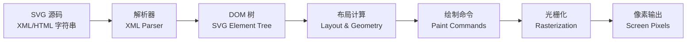
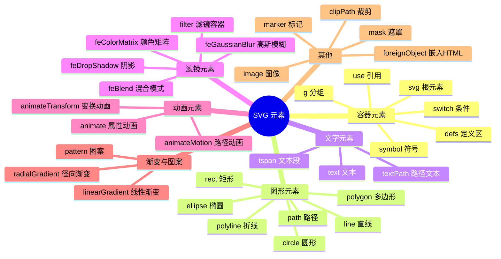
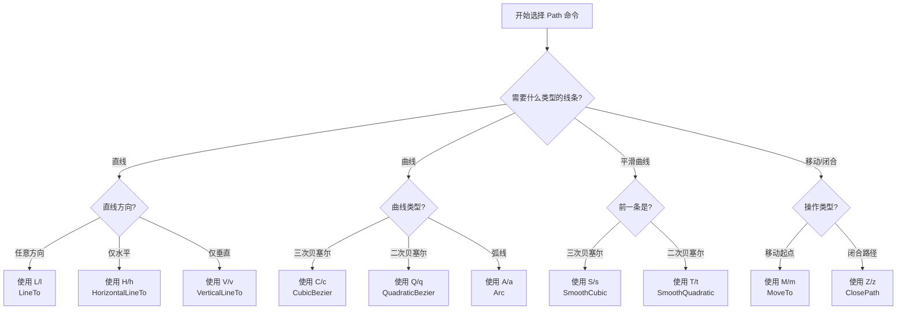
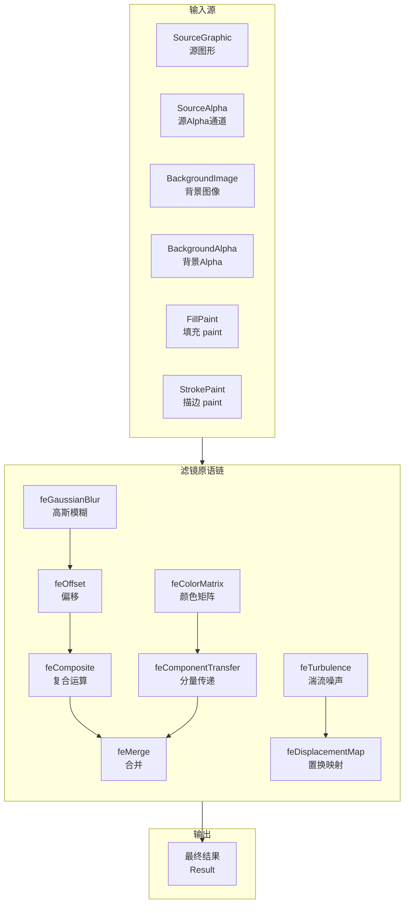
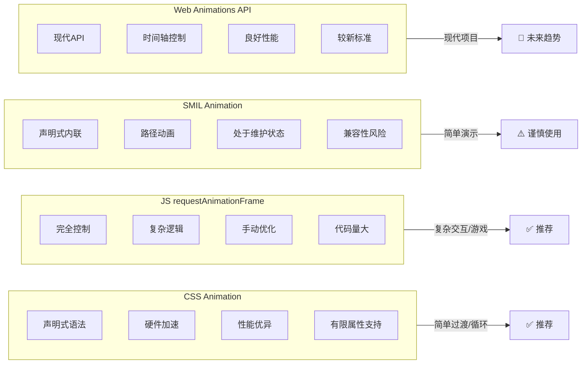

# SVG（01）：JavaScript 交互

## 使用 SVG

### 基础知识

SVG (Scalable Vector Graphics) 是一种基于 XML 的矢量图形格式，用于在网页上定义二维矢量图形。HTML5 通过 `<svg>` 标签原生支持 SVG 图形。

#### SVG 的特点

- **命名空间**：SVG 需要声明 XML 命名空间 `xmlns="http://www.w3.org/2000/svg"`
- **可缩放**：SVG 图形可以无损缩放而不失真，适合各种屏幕尺寸和分辨率
- **矢量图形**：由点、线、形状等数学公式组成，而非像素，文件通常较小
- **DOM 集成**：SVG 元素是 DOM 的一部分，可以通过 JavaScript 完全操作
- **交互性**：原生支持事件处理，每个元素都可以独立响应交互
- **样式控制**：完全支持 CSS，可以使用 CSS 控制 SVG 的外观
- **可访问性**：支持文本描述和语义化标记，便于屏幕阅读器访问
- **动画支持**：支持 CSS 动画、JavaScript 动画和 SMIL 动画（SMIL 现处维护状态，新项目建议优先 CSS/WAAPI）

#### SVG 的优势

1. **响应式设计**：通过 `viewBox` 属性轻松实现响应式布局
2. **可维护性**：作为文本格式，易于编辑和维护
3. **搜索引擎友好**：文本内容可以被搜索引擎索引
4. **性能**：对于少量复杂图形，性能优于 Canvas
5. **可复用性**：使用 `<use>` 和 `<symbol>` 可以轻松复用图形

#### 应用场景

- **图标系统**：可缩放的图标，支持多色和动画
- **数据可视化**：图表、仪表盘、流程图
- **地图应用**：交互式地图和地理信息可视化
- **Logo 和品牌标识**：需要高质量缩放的图形
- **插图和艺术**：矢量插图和艺术作品
- **UI 组件**：按钮、卡片、装饰性元素
- **动画效果**：加载动画、过渡效果

基本语法：

```html
<svg width="宽度" height="高度" viewBox="视口坐标" xmlns="http://www.w3.org/2000/svg">
  <!-- SVG 内容 -->
</svg>
```

常用属性：

- `width` 和 `height`：设置 SVG 的显示尺寸
- `viewBox`：定义坐标系统，格式为 "min-x min-y width height"
- `preserveAspectRatio`：控制图形如何适应容器尺寸
- `version`：SVG 版本号（通常不需要指定）

#### 使用方式

在 HTML5 中，SVG 可以通过以下多种方式嵌入网页：

1. **直接嵌入 HTML** ：将 SVG 代码直接写入 HTML 文档

2. **外部引用**：创建 `.svg` 文件后，通过以下标签插入：

   - ``（简单引用，不支持交互）
   - `<object type="image/svg+xml" data="image.svg"></object>`（推荐，支持交互和脚本）
   - `<embed src="image.svg" type="image/svg+xml">`（兼容旧浏览器）
   - `<a href="image.svg">`（作为下载链接）

3. **CSS 背景**

   ```css
   .element {
     background-image: url('image.svg');
   }
   ```

对比说明：

| 方法 | 优点 | 缺点 |
| ---------- | ------------------ | --------------------- |
| 直接嵌入 | 简单直接，支持交互 | 增加 HTML 文件体积 |
| `` | 简单易用 | 不支持脚本和 CSS 交互 |
| `<object>` | 支持交互，可替换 | 代码稍复杂 |
| CSS 背景 | 样式控制灵活 | 无法直接操作 SVG 元素 |

#### SVG 渲染流程图

理解 SVG 的渲染流程有助于优化性能和调试问题。下图展示了从 SVG 源码到最终像素输出的完整渲染管线：



::: tip 渲染管线关键节点说明

1. **解析阶段**：浏览器将 SVG 源码解析为 DOM 树，此阶段会验证语法正确性
2. **布局阶段**：计算每个元素的几何位置、变换矩阵（CTM）、裁剪区域
3. **绘制阶段**：将矢量命令转换为底层绘图 API 调用（如 Skia、Cairo）
4. **光栅化阶段**：将矢量图形转换为像素位图，应用滤镜和合成操作

性能瓶颈通常出现在 **布局计算**（复杂路径/大量元素）和 **光栅化**（大型滤镜/渐变）阶段。

:::

#### 示例代码

::: code-group

```html [基本 SVG 图形]
<svg width="200" height="200" xmlns="http://www.w3.org/2000/svg">
  <!-- 矩形 -->
  <rect x="10" y="10" width="50" height="50" fill="red" stroke="black" stroke-width="2"/>

  <!-- 圆形 -->
  <circle cx="100" cy="60" r="30" fill="blue" stroke="black" stroke-width="2"/>

  <!-- 椭圆 -->
  <ellipse cx="100" cy="140" rx="40" ry="20" fill="green" stroke="black" stroke-width="2"/>

  <!-- 五角星 -->
  <polygon points="160,50 175,90 220,90 185,115 195,160 160,135 125,160 135,115 100,90 145,90" 
           fill="gold" stroke="orange" stroke-width="2"/>
</svg>
```

```html [路径绘制复杂图形]
<svg width="300" height="200" xmlns="http://www.w3.org/2000/svg">
  <!-- 使用路径绘制一个房子 -->
  <path d="M50,150 L150,150 L175,100 L200,150 L300,150 L300,200 L50,200 Z" 
        fill="#8B4513" stroke="black" stroke-width="2"/>

  <!-- 屋顶 -->
  <polygon points="50,150 150,80 250,150" fill="#A52A2A" stroke="black" stroke-width="2"/>

  <!-- 门 -->
  <rect x="130" y="120" width="40" height="30" fill="#8B4513" stroke="black" stroke-width="1"/>

  <!-- 窗户 -->
  <rect x="70" y="120" width="20" height="20" fill="#ADD8E6" stroke="black" stroke-width="1"/>
  <rect x="210" y="120" width="20" height="20" fill="#ADD8E6" stroke="black" stroke-width="1"/>
</svg>
```

```html [SVG 文本]
<svg width="400" height="100" xmlns="http://www.w3.org/2000/svg">
  <text x="20" y="50" font-family="Arial" font-size="24" fill="blue">
    SVG 文本示例
    <tspan x="20" dy="30">这是第二行文本</tspan>
  </text>

  <!-- 带描边的文本 -->
  <text x="200" y="50" font-family="Verdana" font-size="20" fill="red" stroke="black" stroke-width="1">
    带描边的文本
  </text>
</svg>
```

```html [使用渐变]
<svg width="300" height="200" xmlns="http://www.w3.org/2000/svg">
  <!-- 定义线性渐变 -->
  <defs>
    <linearGradient id="grad1" x1="0%" y1="0%" x2="100%" y2="0%">
      <stop offset="0%" style="stop-color:rgb(255,0,0);stop-opacity:1" />
      <stop offset="50%" style="stop-color:rgb(255,255,0);stop-opacity:1" />
      <stop offset="100%" style="stop-color:rgb(255,0,0);stop-opacity:1" />
    </linearGradient>

    <!-- 定义径向渐变 -->
    <radialGradient id="grad2" cx="50%" cy="50%" r="50%" fx="50%" fy="50%">
      <stop offset="0%" style="stop-color:rgb(0,0,255);stop-opacity:1" />
      <stop offset="100%" style="stop-color:rgb(0,0,128);stop-opacity:1" />
    </radialGradient>
  </defs>

  <!-- 使用渐变 -->
  <rect x="50" y="50" width="200" height="80" fill="url(#grad1)" stroke="black" stroke-width="2"/>
  <circle cx="150" cy="150" r="50" fill="url(#grad2)" stroke="black" stroke-width="2"/>
</svg>
```

```html [动画示例]
<svg width="200" height="200" xmlns="http://www.w3.org/2000/svg">
    <circle cx="100" cy="100" r="40" fill="red">
        <!-- 简单动画：移动 -->
        <animate attributeName="cx" from="100" to="200" dur="2s" repeatCount="indefinite"/>
    </circle>
    
    <!-- 更复杂的动画：旋转 -->
    <rect x="70" y="70" width="60" height="60" fill="blue">
        <animateTransform attributeName="transform" type="rotate" from="0 100 100" 
                          to="360 100 100" dur="3s" repeatCount="indefinite"/>
    </rect>
</svg>
```

:::


```html
<!DOCTYPE html>
<html lang="en">
  <head>
    <meta charset="UTF-8" />
    <meta name="viewport" content="width=device-width, initial-scale=1.0" />
    <title>SVG 示例卡片</title>
    <style>
      body {
        font-family: Arial, sans-serif;
        margin: 0;
        padding: 20px;
        background-color: #f5f5f5;
      }

      .container {
        display: flex;
        flex-direction: row;
        flex-wrap: wrap;
        gap: 20px;
      }

      .card {
        background: white;
        border-radius: 8px;
        box-shadow: 0 4px 8px rgba(0, 0, 0, 0.1);
        padding: 20px;
        width: 100%;
        max-width: 400px;
        transition: transform 0.3s ease;
      }

      .card:hover {
        transform: translateY(-5px);
      }

      .card h2 {
        margin-top: 0;
        color: #333;
        border-bottom: 1px solid #eee;
        padding-bottom: 10px;
      }

      .card svg {
        display: block;
        margin: 0 auto;
      }

      @media (max-width: 768px) {
        .card {
          max-width: 100%;
        }
      }
    </style>
  </head>
  <body>
    <div class="container">
      <div class="card">
        <h2>基本 svg 图形</h2>
        <svg width="200" height="200" xmlns="http://www.w3.org/2000/svg">
          <!-- 矩形 -->
          <rect x="10" y="10" width="50" height="50" fill="red" stroke="black" stroke-width="2" />

          <!-- 圆形 -->
          <circle cx="100" cy="60" r="30" fill="blue" stroke="black" stroke-width="2" />

          <!-- 椭圆 -->
          <ellipse cx="100" cy="140" rx="40" ry="20" fill="green" stroke="black" stroke-width="2" />

          <!-- 五角星 -->
          <polygon
                   points="160,50 175,90 220,90 185,115 195,160 160,135 125,160 135,115 100,90 145,90"
                   fill="gold"
                   stroke="orange"
                   stroke-width="2" />
        </svg>
      </div>

      <div class="card">
        <h2>使用路径绘制复杂图形</h2>
        <svg width="300" height="200" xmlns="http://www.w3.org/2000/svg">
          <!-- 使用路径绘制一个房子 -->
          <path
                d="M50,150 L150,150 L175,100 L200,150 L300,150 L300,200 L50,200 Z"
                fill="#8B4513"
                stroke="black"
                stroke-width="2" />

          <!-- 屋顶 -->
          <polygon points="50,150 150,80 250,150" fill="#A52A2A" stroke="black" stroke-width="2" />

          <!-- 门 -->
          <rect
                x="130"
                y="120"
                width="40"
                height="30"
                fill="#8B4513"
                stroke="black"
                stroke-width="1" />

          <!-- 窗户 -->
          <rect
                x="70"
                y="120"
                width="20"
                height="20"
                fill="#ADD8E6"
                stroke="black"
                stroke-width="1" />
          <rect
                x="210"
                y="120"
                width="20"
                height="20"
                fill="#ADD8E6"
                stroke="black"
                stroke-width="1" />
        </svg>
      </div>

      <div class="card">
        <h2>使用 svg 文本</h2>
        <svg width="400" height="100" xmlns="http://www.w3.org/2000/svg">
          <text x="20" y="50" font-family="Arial" font-size="24" fill="blue">
            SVG 文本示例
            <tspan x="20" dy="30">这是第二行文本</tspan>
          </text>

          <!-- 带描边的文本 -->
          <text
                x="200"
                y="50"
                font-family="Verdana"
                font-size="20"
                fill="red"
                stroke="black"
                stroke-width="1">
            带描边的文本
          </text>
        </svg>
      </div>

      <div class="card">
        <h2>渐变效果</h2>
        <svg width="300" height="200" xmlns="http://www.w3.org/2000/svg">
          <!-- 定义线性渐变 -->
          <defs>
            <linearGradient id="grad1" x1="0%" y1="0%" x2="100%" y2="0%">
              <stop offset="0%" style="stop-color: rgb(255, 0, 0); stop-opacity: 1" />
              <stop offset="50%" style="stop-color: rgb(255, 255, 0); stop-opacity: 1" />
              <stop offset="100%" style="stop-color: rgb(255, 0, 0); stop-opacity: 1" />
            </linearGradient>

            <!-- 定义径向渐变 -->
            <radialGradient id="grad2" cx="50%" cy="50%" r="50%" fx="50%" fy="50%">
              <stop offset="0%" style="stop-color: rgb(0, 0, 255); stop-opacity: 1" />
              <stop offset="100%" style="stop-color: rgb(0, 0, 128); stop-opacity: 1" />
            </radialGradient>
          </defs>

          <!-- 使用渐变 -->
          <rect
                x="50"
                y="50"
                width="200"
                height="80"
                fill="url(#grad1)"
                stroke="black"
                stroke-width="2" />
          <circle cx="150" cy="150" r="50" fill="url(#grad2)" stroke="black" stroke-width="2" />
        </svg>
      </div>

      <div class="card">
        <h2>动画实例</h2>
        <svg width="200" height="200" xmlns="http://www.w3.org/2000/svg">
          <circle cx="100" cy="100" r="40" fill="red">
            <!-- 简单动画：移动 -->
            <animate attributeName="cx" from="100" to="200" dur="2s" repeatCount="indefinite" />
          </circle>

          <!-- 更复杂的动画：旋转 -->
          <rect x="70" y="70" width="60" height="60" fill="blue">
            <animateTransform
                              attributeName="transform"
                              type="rotate"
                              from="0 100 100"
                              to="360 100 100"
                              dur="3s"
                              repeatCount="indefinite" />
          </rect>
        </svg>
      </div>
    </div>
  </body>
</html>
```

#### 注意事项

1. **SVG 与 Canvas 的区别**：
   - SVG 是基于 XML 的矢量图形，适合需要交互和缩放的场景
   - Canvas 是基于像素的位图，适合需要频繁更新的大量图形
2. **浏览器兼容性**：
   - 现代浏览器都支持 SVG，但某些高级特性可能需要前缀或替代方案
3. **性能考虑**：
   - 复杂的 SVG 可能影响渲染性能
   - 对于大量静态图形，考虑使用 `<use>` 元素复用
4. **响应式设计**：
   - 使用 `viewBox` 和 CSS 可以轻松创建响应式 SVG

### 绘制基本形状

SVG 提供多种基本形状元素（如 `<rect>`、`<circle>`、`<ellipse>`、 `<line>`、 `<polyline>`、`<polygon>`、 `<path>` 等），它们共享许多公共属性。这些属性控制着形状的外观、位置、大小和样式等基本特征

<h4>004-path-commands.html</h4>

```html
<!DOCTYPE html>
<html lang="zh-CN">
<!--
  来源章节：基础知识/13-SVG.md - 路径绘制 (path)
  功能说明：SVG path 命令详解，可视化展示 M/L/H/V/C/S/Q/T/A 各命令的效果
-->
<head>
  <meta charset="UTF-8">
  <meta name="viewport" content="width=device-width, initial-scale=1.0">
  <title>【4】SVG Path 命令详解</title>
  <style>
    * { margin: 0; padding: 0; box-sizing: border-box; }
    body { font-family: -apple-system, BlinkMacSystemFont, 'Segoe UI', sans-serif; padding: 20px; background: #f8f9fa; color: #333; }
    .demo-container { max-width: 1100px; margin: 0 auto; background: white; padding: 24px; border-radius: 8px; box-shadow: 0 2px 8px rgba(0,0,0,0.1); }
    .demo-title { margin-bottom: 20px; font-size: 18px; color: #555; border-bottom: 2px solid #007bff; padding-bottom: 8px; }

    .cmd-grid {
      display: grid;
      grid-template-columns: repeat(auto-fit, minmax(320px, 1fr));
      gap: 20px;
      margin-top: 16px;
    }

    .cmd-card {
      background: #f8f9fa;
      border-radius: 10px;
      padding: 20px;
      text-align: center;
      transition: transform 0.3s, box-shadow 0.3s;
      border: 2px solid transparent;
    }
    .cmd-card:hover { transform: translateY(-4px); box-shadow: 0 6px 20px rgba(0,0,0,0.12); border-color: #007bff; }
    .cmd-card h3 { font-size: 16px; color: #007bff; margin-bottom: 12px; display: flex; align-items: center; justify-content: center; gap: 8px; }
    .cmd-badge { background: #007bff; color: white; padding: 2px 8px; border-radius: 4px; font-size: 13px; font-weight: bold; }
    .cmd-desc { font-size: 13px; color: #666; margin-top: 8px; line-height: 1.5; }
    .path-code { font-family: 'Monaco', 'Consolas', monospace; font-size: 11px; background: #fff; padding: 8px; border-radius: 4px; margin-top: 8px; text-align: left; word-break: break-all; color: #d63384; border: 1px solid #dee2e6; }

    svg { display: block; margin: 12px auto; background: white; border-radius: 6px; }
  </style>
</head>
<body>
  <div class="demo-container">
    <div class="demo-title">SVG Path 命令详解 - M/L/H/V/C/S/Q/T/A 各命令可视化演示</div>

    <div class="cmd-grid">

      <!-- M - MoveTo 移动命令 -->
      <div class="cmd-card">
        <h3><span class="cmd-badge">M</span> MoveTo 移动到起点</h3>
        <svg width="280" height="160" xmlns="http://www.w3.org/2000/svg">
          <defs>
            <marker id="arrowM" markerWidth="10" markerHeight="7" refX="9" refY="3.5" orient="auto">
              <polygon points="0 0, 10 3.5, 0 7" fill="#e74c3c" />
            </marker>
          </defs>
          <!-- 网格背景 -->
          <g stroke="#e9ecef" stroke-width="0.5">
            <line x1="0" y1="40" x2="280" y2="40"/>
            <line x1="0" y1="80" x2="280" y2="80"/>
            <line x1="0" y1="120" x2="280" y2="120"/>
            <line x1="70" y1="0" x2="70" y2="160"/>
            <line x1="140" y1="0" x2="140" y2="160"/>
            <line x1="210" y1="0" x2="210" y2="160"/>
          </g>
          <!-- M移动路径 -->
          <circle cx="30" cy="30" r="5" fill="#95a5a6"/>
          <text x="30" y="22" font-size="11" text-anchor="middle" fill="#7f8c8d">起点</text>
          <path d="M30,30 L70,80 L140,40 L210,100 L250,60" stroke="#e74c3c" stroke-width="2.5" fill="none" marker-end="url(#arrowM)"/>
          <circle cx="30" cy="30" r="4" fill="#27ae60"/>
          <circle cx="70" cy="80" r="4" fill="#3498db"/>
          <circle cx="140" cy="40" r="4" fill="#9b59b6"/>
          <circle cx="210" cy="100" r="4" fill="#e67e22"/>
        </svg>
        <div class="path-code">d="M30,30 L70,80 L140,40 L210,100"</div>
        <p class="cmd-desc">M命令将画笔移动到指定坐标，不绘制线条。是所有路径的起始命令。</p>
      </div>

      <!-- L - LineTo 直线命令 -->
      <div class="cmd-card">
        <h3><span class="cmd-badge">L</span> LineTo 绘制直线</h3>
        <svg width="280" height="160" xmlns="http://www.w3.org/2000/svg">
          <g stroke="#e9ecef" stroke-width="0.5">
            <line x1="0" y1="40" x2="280" y2="40"/><line x1="0" y1="80" x2="280" y2="80"/>
            <line x1="0" y1="120" x2="280" y2="120"/><line x1="70" y1="0" x2="70" y2="160"/>
            <line x1="140" y1="0" x2="140" y2="160"/><line x1="210" y1="0" x2="210" y2="160"/>
          </g>
          <!-- L直线 -->
          <path d="M20,130 L60,50 L120,90 L180,30 L240,110 L260,70" stroke="#3498db" stroke-width="3" fill="none" stroke-linecap="round" stroke-linejoin="round"/>
          <!-- 端点标记 -->
          <g fill="#e74c3c">
            <circle cx="20" cy="130" r="4"/><circle cx="60" cy="50" r="4"/>
            <circle cx="120" cy="90" r="4"/><circle cx="180" cy="30" r="4"/>
            <circle cx="240" cy="110" r="4"/><circle cx="260" cy="70" r="4"/>
          </g>
        </svg>
        <div class="path-code">d="M20,130 L60,50 L120,90 L180,30"</div>
        <p class="cmd-desc">L命令从当前位置绘制直线到目标点。l为相对坐标版本。</p>
      </div>

      <!-- H - Horizontal 水平线 -->
      <div class="cmd-card">
        <h3><span class="cmd-badge">H</span> HLineTo 水平线</h3>
        <svg width="280" height="160" xmlns="http://www.w3.org/2000/svg">
          <g stroke="#e9ecef" stroke-width="0.5">
            <line x1="0" y1="40" x2="280" y2="40"/><line x1="0" y1="80" x2="280" y2="80"/>
            <line x1="0" y1="120" x2="280" y2="120"/><line x1="70" y1="0" x2="70" y2="160"/>
            <line x1="140" y1="0" x2="140" y2="160"/><line x1="210" y1="0" x2="210" y2="160"/>
          </g>
          <!-- H水平线 -->
          <path d="M20,40 H100 M20,70 H150 M20,100 H220 M20,130 H260"
                stroke="#9b59b6" stroke-width="3" fill="none" stroke-linecap="round"/>
          <g fill="#e74c3c">
            <circle cx="20" cy="40" r="3"/><circle cx="100" cy="40" r="3"/>
            <circle cx="20" cy="70" r="3"/><circle cx="150" cy="70" r="3"/>
            <circle cx="20" cy="100" r="3"/><circle cx="220" cy="100" r="3"/>
            <circle cx="20" cy="130" r="3"/><circle cx="260" cy="130" r="3"/>
          </g>
        </svg>
        <div class="path-code">d="M20,40 H100 M20,70 H150"</div>
        <p class="cmd-desc">H命令绘制水平线，只指定x坐标。h为相对坐标版本。</p>
      </div>

      <!-- V - Vertical 垂直线 -->
      <div class="cmd-card">
        <h3><span class="cmd-badge">V</span> VLineTo 垂直线</h3>
        <svg width="280" height="160" xmlns="http://www.w3.org/2000/svg">
          <g stroke="#e9ecef" stroke-width="0.5">
            <line x1="0" y1="40" x2="280" y2="40"/><line x1="0" y1="80" x2="280" y2="80"/>
            <line x1="0" y1="120" x2="280" y2="120"/><line x1="70" y1="0" x2="70" y2="160"/>
            <line x1="140" y1="0" x2="140" y2="160"/><line x1="210" y1="0" x2="210" y2="160"/>
          </g>
          <!-- V垂直线 -->
          <path d="M40,20 V140 M90,35 V125 M140,50 V115 M190,25 V135 M240,45 V105"
                stroke="#e67e22" stroke-width="3" fill="none" stroke-linecap="round"/>
          <g fill="#27ae60">
            <circle cx="40" cy="20" r="3"/><circle cx="40" cy="140" r="3"/>
            <circle cx="90" cy="35" r="3"/><circle cx="90" cy="125" r="3"/>
            <circle cx="140" cy="50" r="3"/><circle cx="140" cy="115" r="3"/>
          </g>
        </svg>
        <div class="path-code">d="M40,20 V140 M90,35 V125"</div>
        <p class="cmd-desc">V命令绘制垂直线，只指定y坐标。v为相对坐标版本。</p>
      </div>

      <!-- C - Cubic Bezier 三次贝塞尔曲线 -->
      <div class="cmd-card">
        <h3><span class="cmd-badge">C</span> CurveTo 三次贝塞尔曲线</h3>
        <svg width="280" height="160" xmlns="http://www.w3.org/2000/svg">
          <g stroke="#e9ecef" stroke-width="0.5">
            <line x1="0" y1="40" x2="280" y2="40"/><line x1="0" y1="80" x2="280" y2="80"/>
            <line x1="0" y1="120" x2="280" y2="120"/><line x1="70" y1="0" x2="70" y2="160"/>
            <line x1="140" y1="0" x2="140" y2="160"/><line x1="210" y1="0" x2="210" y2="160"/>
          </g>
          <!-- C三次贝塞尔曲线 -->
          <path d="M20,130 C60,20 140,150 250,50" stroke="#e74c3c" stroke-width="3" fill="none"/>
          <!-- 控制点和控制线 -->
          <line x1="20" y1="130" x2="60" y2="20" stroke="#95a5a6" stroke-width="1" stroke-dasharray="4,2"/>
          <line x1="250" y1="50" x2="140" y2="150" stroke="#95a5a6" stroke-width="1" stroke-dasharray="4,2"/>
          <circle cx="20" cy="130" r="4" fill="#27ae60"/>
          <circle cx="250" cy="50" r="4" fill="#27ae60"/>
          <circle cx="60" cy="20" r="4" fill="#3498db"/>
          <circle cx="140" cy="150" r="4" fill="#3498db"/>
          <text x="55" y="15" font-size="10" fill="#3498db">C1</text>
          <text x="145" y="155" font-size="10" fill="#3498db">C2</text>
        </svg>
        <div class="path-code">d="M20,130 C60,20 140,150 250,50"</div>
        <p class="cmd-desc">C命令需要两个控制点和一个终点，可绘制平滑的S形曲线。</p>
      </div>

      <!-- S - Smooth Cubic 平滑三次贝塞尔 -->
      <div class="cmd-card">
        <h3><span class="cmd-badge">S</span> SmoothCurve 平滑三次贝塞尔</h3>
        <svg width="280" height="160" xmlns="http://www.w3.org/2000/svg">
          <g stroke="#e9ecef" stroke-width="0.5">
            <line x1="0" y1="40" x2="280" y2="40"/><line x1="0" y1="80" x2="280" y2="80"/>
            <line x1="0" y1="120" x2="280" y2="120"/><line x1="70" y1="0" x2="70" y2="160"/>
            <line x1="140" y1="0" x2="140" y2="160"/><line x1="210" y1="0" x2="210" y2="160"/>
          </g>
          <!-- S平滑曲线 -->
          <path d="M20,80 C60,20 100,140 140,80 S220,20 260,80"
                stroke="#16a085" stroke-width="3" fill="none"/>
          <!-- 控制点 -->
          <circle cx="20" cy="80" r="3" fill="#27ae60"/>
          <circle cx="140" cy="80" r="3" fill="#e74c3c"/>
          <circle cx="260" cy="80" r="3" fill="#27ae60"/>
          <circle cx="60" cy="20" r="3" fill="#3498db"/>
          <circle cx="100" cy="140" r="3" fill="#3498db"/>
          <!-- 自动计算的反射控制点 -->
          <circle cx="180" cy="20" r="3" fill="#9b59b6" stroke-dasharray="2"/>
          <text x="175" y="15" font-size="9" fill="#9b59b6">自动C1'</text>
        </svg>
        <div class="path-code">d="M20,80 C60,20 100,140 140,80 S220,20 260,80"</div>
        <p class="cmd-desc">S命令自动反射前一个C命令的第二个控制点，实现平滑连接。</p>
      </div>

      <!-- Q - Quadratic 二次贝塞尔曲线 -->
      <div class="cmd-card">
        <h3><span class="cmd-badge">Q</span> QuadCurve 二次贝塞尔曲线</h3>
        <svg width="280" height="160" xmlns="http://www.w3.org/2000/svg">
          <g stroke="#e9ecef" stroke-width="0.5">
            <line x1="0" y1="40" x2="280" y2="40"/><line x1="0" y1="80" x2="280" y2="80"/>
            <line x1="0" y1="120" x2="280" y2="120"/><line x1="70" y1="0" x2="70" y2="160"/>
            <line x1="140" y1="0" x2="140" y2="160"/><line x1="210" y1="0" x2="210" y2="160"/>
          </g>
          <!-- Q二次贝塞尔曲线 -->
          <path d="M20,130 Q140,20 260,130" stroke="#8e44ad" stroke-width="3" fill="none"/>
          <!-- 控制线和控制点 -->
          <line x1="20" y1="130" x2="140" y2="20" stroke="#95a5a6" stroke-width="1" stroke-dasharray="4,2"/>
          <line x1="140" y1="20" x2="260" y2="130" stroke="#95a5a6" stroke-width="1" stroke-dasharray="4,2"/>
          <circle cx="20" cy="130" r="4" fill="#27ae60"/>
          <circle cx="260" cy="130" r="4" fill="#27ae60"/>
          <circle cx="140" cy="20" r="5" fill="#e74c3c"/>
          <text x="135" y="15" font-size="10" fill="#e74c3c">控制点</text>
        </svg>
        <div class="path-code">d="M20,130 Q140,20 260,130"</div>
        <p class="cmd-desc">Q命令使用一个控制点绘制抛物线形状的曲线。</p>
      </div>

      <!-- T - Smooth Quad 平滑二次贝塞尔 -->
      <div class="cmd-card">
        <h3><span class="cmd-badge">T</span> SmoothQuad 平滑二次贝塞尔</h3>
        <svg width="280" height="160" xmlns="http://www.w3.org/2000/svg">
          <g stroke="#e9ecef" stroke-width="0.5">
            <line x1="0" y1="40" x2="280" y2="40"/><line x1="0" y1="80" x2="280" y2="80"/>
            <line x1="0" y1="120" x2="280" y2="120"/><line x1="70" y1="0" x2="70" y2="160"/>
            <line x1="140" y1="0" x2="140" y2="160"/><line x1="210" y1="0" x2="210" y2="160"/>
          </g>
          <!-- T平滑二次曲线 -->
          <path d="M20,100 Q80,20 140,100 T260,100" stroke="#c0392b" stroke-width="3" fill="none"/>
          <circle cx="20" cy="100" r="3" fill="#27ae60"/>
          <circle cx="140" cy="100" r="3" fill="#e74c3c"/>
          <circle cx="260" cy="100" r="3" fill="#27ae60"/>
          <circle cx="80" cy="20" r="3" fill="#3498db"/>
          <text x="75" y="15" font-size="9" fill="#3498db">Q控制点</text>
          <text x="195" y="85" font-size="9" fill="#9b59b6">T自动计算控制点</text>
        </svg>
        <div class="path-code">d="M20,100 Q80,20 140,100 T260,100"</div>
        <p class="cmd-desc">T命令自动反射前一个Q命令的控制点，实现平滑过渡。</p>
      </div>

      <!-- A - Arc 圆弧命令 -->
      <div class="cmd-card">
        <h3><span class="cmd-badge">A</span> Arc 圆弧</h3>
        <svg width="280" height="160" xmlns="http://www.w3.org/2000/svg">
          <g stroke="#e9ecef" stroke-width="0.5">
            <line x1="0" y1="40" x2="280" y2="40"/><line x1="0" y1="80" x2="280" y2="80"/>
            <line x1="0" y1="120" x2="280" y2="120"/><line x1="70" y1="0" x2="70" y2="160"/>
            <line x1="140" y1="0" x2="140" y2="160"/><line x1="210" y1="0" x2="210" y2="160"/>
          </g>
          <!-- A圆弧 - 各种弧线 -->
          <path d="M30,130 A50,50 0 0,1 130,130" stroke="#2980b9" stroke-width="3" fill="none"/>
          <path d="M140,130 A50,50 0 0,0 240,130" stroke="#27ae60" stroke-width="3" fill="none"/>
          <path d="M30,80 A40,30 0 1,1 110,80" stroke="#e74c3c" stroke-width="3" fill="none"/>
          <path d="M150,80 A40,30 0 1,0 230,80" stroke="#f39c12" stroke-width="3" fill="none"/>
          <!-- 标注 -->
          <text x="70" y="148" font-size="10" text-anchor="middle" fill="#2980b9">sweep=1</text>
          <text x="190" y="148" font-size="10" text-anchor="middle" fill="#27ae60">sweep=0</text>
        </svg>
        <div class="path-code">A rx,ry x-axis-rotation large-arc-flag sweep-flag x,y</div>
        <p class="cmd-desc">A命令绘制椭圆弧。参数：rx ry 旋转 大弧标志 方向标志 终点坐标。</p>
      </div>

      <!-- Z - ClosePath 闭合路径 -->
      <div class="cmd-card">
        <h3><span class="cmd-badge">Z</span> ClosePath 闭合路径</h3>
        <svg width="280" height="160" xmlns="http://www.w3.org/2000/svg">
          <g stroke="#e9ecef" stroke-width="0.5">
            <line x1="0" y1="40" x2="280" y2="40"/><line x1="0" y1="80" x2="280" y2="80"/>
            <line x1="0" y1="120" x2="280" y2="120"/><line x1="70" y1="0" x2="70" y2="160"/>
            <line x1="140" y1="0" x2="140" y2="160"/><line x1="210" y1="0" x2="210" y2="160"/>
          </g>
          <!-- Z闭合图形 -->
          <path d="M140,20 L220,70 L190,140 L90,140 L60,70 Z"
                fill="#3498db" fill-opacity="0.3" stroke="#2980b9" stroke-width="2.5"/>
          <path d="M140,40 L195,75 L175,125 L105,125 L85,75 Z"
                fill="#e74c3c" fill-opacity="0.3" stroke="#c0392b" stroke-width="2"/>
          <!-- 顶点标注 -->
          <g fill="#2c3e50" font-size="9">
            <text x="140" y="17" text-anchor="middle">顶点1</text>
            <text x="225" y="73" text-anchor="start">顶点2</text>
            <text x="195" y="152" text-anchor="middle">顶点3</text>
            <text x="85" y="152" text-anchor="middle">顶点4</text>
            <text x="48" y="73" text-anchor="end">顶点5</text>
          </g>
        </svg>
        <div class="path-code">d="M140,20 L220,70 L190,140 L90,140 L60,70 Z"</div>
        <p class="cmd-desc">Z命令闭合路径，从当前点直线连接回起点。可形成可填充区域。</p>
      </div>

      <!-- 综合示例：心形 -->
      <div class="cmd-card">
        <h3>💖 综合示例：心形路径</h3>
        <svg width="280" height="160" xmlns="http://www.w3.org/2000/svg">
          <defs>
            <linearGradient id="heartGrad" x1="0%" y1="0%" x2="100%" y2="100%">
              <stop offset="0%" style="stop-color:#ff6b6b"/>
              <stop offset="100%" style="stop-color:#ee5a5a"/>
            </linearGradient>
          </defs>
          <!-- 心形路径 (使用C和Z) -->
          <path d="M140,145
                   C140,145 65,95 65,55
                   C65,30 90,15 115,30
                   C128,38 135,50 140,62
                   C145,50 152,38 165,30
                   C190,15 215,30 215,55
                   C215,95 140,145 140,145 Z"
                fill="url(#heartGrad)" stroke="#c0392b" stroke-width="2"/>
          <text x="140" y="158" font-size="10" text-anchor="middle" fill="#666">由 C 和 Z 命令组成</text>
        </svg>
        <div class="path-code">使用 C(三次贝塞尔) + Z(闭合) 绘制心形</div>
        <p class="cmd-desc">综合运用多个path命令可以绘制任意复杂图形。</p>
      </div>

      <!-- 综合示例：波浪 -->
      <div class="cmd-card">
        <h3>🌊 综合示例：波浪路径动画</h3>
        <svg width="280" height="160" xmlns="http://www.w3.org/2000/svg">
          <defs>
            <linearGradient id="waveGrad" x1="0%" y1="0%" x2="0%" y2="100%">
              <stop offset="0%" style="stop-color:#4facfe"/>
              <stop offset="100%" style="stop-color:#00f2fe"/>
            </linearGradient>
          </defs>
          <!-- 波浪路径 -->
          <path id="wave1" d="M0,80 Q35,50 70,80 T140,80 T210,80 T280,80 V160 H0 Z"
                fill="url(#waveGrad)" opacity="0.7">
            <animate attributeName="d"
                     values="M0,80 Q35,50 70,80 T140,80 T210,80 T280,80 V160 H0 Z;
                             M0,80 Q35,110 70,80 T140,80 T210,80 T280,80 V160 H0 Z;
                             M0,80 Q35,50 70,80 T140,80 T210,80 T280,80 V160 H0 Z"
                     dur="3s" repeatCount="indefinite"/>
          </path>
          <path d="M0,100 Q35,70 70,100 T140,100 T210,100 T280,100 V160 H0 Z"
                fill="url(#waveGrad)" opacity="0.4">
            <animate attributeName="d"
                     values="M0,100 Q35,70 70,100 T140,100 T210,100 T280,100 V160 H0 Z;
                             M0,100 Q35,130 70,100 T140,100 T210,100 T280,100 V160 H0 Z;
                             M0,100 Q35,70 70,100 T140,100 T210,100 T280,100 V160 H0 Z"
                     dur="2.5s" repeatCount="indefinite"/>
          </path>
        </svg>
        <div class="path-code">使用 Q(二次贝塞尔) + SMIL 动画实现波浪效果</div>
        <p class="cmd-desc">结合SMIL动画可以让静态路径产生动态效果。</p>
      </div>

    </div>
  </div>
</body>
</html>
```

#### SVG 元素分类思维导图

下图展示了 SVG 元素的完整分类体系，帮助理解各类元素的用途和关系：



#### 公共属性

##### 坐标定位属性

| 属性 | 适用元素 | 描述 | 取值 | 默认值 |
| ---------- | ---------------------------------------------------------- | ------------------------- | ------------ | ------ |
| `x` | `<rect>`、`<image>`、 `<text>`、 `<line>`、 `<polygon>` 等 | 元素左上角或起点的 x 坐标 | 数值（像素） | 0 |
| `y` | `<rect>`、 `<image>`、`<text>`、 `<line>` 、`<polygon>` 等 | 元素左上角或起点的 y 坐标 | 数值（像素） | 0 |
| `cx` | `<circle>`、 `<ellipse>` | 圆心或椭圆中心的 x 坐标 | 数值（像素） | 0 |
| `cy` | `<circle>` 、`<ellipse>` | 圆心或椭圆中心的 y 坐标 | 数值（像素） | 0 |
| `x1`, `y1` | `<line>`、`<polyline>`、`<polygon>` | 线段起点坐标 | 数值（像素） | 0 |
| `x2`, `y2` | `<line>` | 线段终点坐标 | 数值（像素） | 0 |

示例：

```html
<svg width="200" height="200">
  <!-- 使用 x、y 定位的矩形 -->
  <rect x="10" y="10" width="50" height="50" fill="red" />

  <!-- 使用 cx、cy 定位的圆形 -->
  <circle cx="100" cy="100" r="40" fill="blue" />
</svg>
```

##### 尺寸属性

| 属性 | 适用元素 | 描述 | 取值 | 默认值 |
| ----------- | -------------------------------- | ------------------------ | -------------- | ------ |
| `width` | `<rect>`、`<image>`、 `<svg>` 等 | 元素宽度 | 正数值（像素） | 必需 |
| `height` | `<rect>`、`<image>`、 `<svg>` 等 | 元素高度 | 正数值（像素） | 必需 |
| `r` | `<circle>`、`<radialGradient>` | 圆形半径 | 正数值（像素） | 必需 |
| `rx`、 `ry` | `<rect>`、 `<ellipse>` | 圆角矩形的水平和垂直半径 | 非负数值 | 0 |
| `rx` | `<ellipse>` | 椭圆的 x 轴半径 | 正数值 | 0 |
| `ry` | `<ellipse>` | 椭圆的 y 轴半径 | 正数值 | 0 |

示例：

```html
<svg width="200" height="200">
  <!-- 指定尺寸的矩形 -->
  <rect x="10" y="10" width="80" height="60" fill="green" />
  
  <!-- 圆角矩形 -->
  <rect x="10" y="80" width="80" height="60" rx="10" ry="20" fill="orange" />
</svg>
```

##### 填充属性

| 属性 | 描述 | 取值 | 默认值 |
| -------------- | -------------------- | --------------------------------------------- | --------- |
| `fill` | 设置形状内部填充颜色 | 颜色名称、十六进制、RGB、RGBA 或继承 | "black" |
| `fill-opacity` | 设置填充透明度 | 0（透明）到 1（不透明） | 1 |
| `fill-rule` | 定义填充规则 | "nonzero"（非零环绕）或 "evenodd"（奇偶环绕） | "nonzero" |

示例：

```html
<svg width="200" height="200">
  <!-- 不同填充方式的形状 -->
  <rect x="10" y="10" width="50" height="50" fill="red" />
  <circle cx="80" cy="35" r="25" fill="blue" fill-opacity="0.5" />

  <!-- 使用 evenodd 规则的五角星 -->
  <polygon points="150,10 165,40 200,40 170,60 180,90 150,70 120,90 130,60 100,40 135,40" 
           fill="green" fill-rule="evenodd" />
</svg>
```

##### 描边属性

| 属性 | 描述 | 取值 | 默认值 |
| ------------------- | ------------------ | ------------------------------------------------- | ------- |
| `stroke` | 设置形状描边颜色 | 颜色名称、十六进制、RGB、RGBA 或继承 | "none" |
| `stroke-width` | 设置描边宽度 | 正数值（像素） | 1 |
| `stroke-opacity` | 设置描边透明度 | 0（透明）到 1（不透明） | 1 |
| `stroke-linecap` | 设置线条端点样式 | "butt"（平头）、"round"（圆头）、"square"（方头） | "butt" |
| `stroke-linejoin` | 设置线条连接处样式 | "miter"（尖角）、"round"（圆角）、"bevel"（斜角） | "miter" |
| `stroke-dasharray` | 设置虚线模式 | 数值列表（如 "5,5" 表示5px实线5px空白） | none |
| `stroke-dashoffset` | 设置虚线偏移量 | 数值（像素） | 0 |

示例：

```html
<svg width="200" height="200">
  <!-- 不同描边样式的形状 -->
  <rect x="10" y="10" width="50" height="50" stroke="black" stroke-width="2" stroke-linejoin="round" />

  <!-- 虚线矩形 -->
  <rect x="70" y="10" width="50" height="50" stroke="blue" stroke-width="2" stroke-dasharray="5,3" />

  <!-- 圆头线条的三角形 -->
  <polygon points="150,10 180,60 120,60" fill="none" stroke="red" stroke-width="3" stroke-linecap="round" />
</svg>
```

##### 变换属性

| 属性 | 描述 | 取值 | 默认值 |
| ----------- | -------- | ------------------------------------------------------------ | ------ |
| `transform` | 应用变换 | `translate()`, `rotate()`, `scale()`, `skewX()`, `skewY()`, `matrix()` | 无 |

示例：

```html
<rect x="10" y="10" width="50" height="50" transform="translate(20, 30)" />

<!-- 第三个和第四个参数是旋转中心点 -->
<circle cx="100" cy="100" r="40" transform="rotate(45 100 100)" />

<rect x="10" y="10" width="50" height="50" transform="scale(1.5)" />

<rect x="10" y="10" width="50" height="50" transform="translate(20, 30) rotate(45) scale(1.5)" />
```

##### 裁剪与遮罩属性

| 属性 | 描述 | 取值 | 默认值 |
| ----------- | -------- | ------------------------------------------------------------ | ------ |
| `clip-path` | 裁剪路径 | `url(#clipId)` 或 `inset()`, `circle()`、`ellipse()`、`polygon()` 等 | none |
| `mask` | 遮罩 | `url(#maskId)` | none |

**示例：**

```html
<svg width="200" height="200">
  <!-- 定义裁剪路径 -->
  <defs>
    <clipPath id="circleClip">
      <circle cx="100" cy="100" r="50" />
    </clipPath>
  </defs>

  <!-- 被裁剪的图像 -->
  <image href="https://via.placeholder.com/200" x="0" y="0" width="200" height="200" clip-path="url(#circleClip)" />

  <!-- 定义遮罩 -->
  <defs>
    <mask id="fadeMask">
      <rect x="0" y="0" width="200" height="200" fill="white" />
      <circle cx="100" cy="100" r="50" fill="black" />
    </mask>
  </defs>

  <!-- 使用遮罩的矩形 -->
  <rect x="0" y="0" width="200" height="200" fill="blue" mask="url(#fadeMask)" />
</svg>
```

##### 其他常用属性

| 属性 | 描述 | 取值 | 默认值 |
| ---------------- | -------------- | ------------------------------------------------------------ | ---------------- |
| `id` | 元素唯一标识符 | 字符串 | 无 |
| `class` | CSS 类名 | 字符串 | 无 |
| `style` | 内联样式 | CSS 样式字符串 | 无 |
| `opacity` | 整体透明度 | 0（透明）到 1（不透明） | 1 |
| `visibility` | 可见性 | "visible"（可见）、"hidden"（隐藏）、"collapse"（折叠） | "visible" |
| `pointer-events` | 指针事件行为 | "visiblePainted", "visibleFill", "visibleStroke", "visible", "painted", "fill", "stroke", "all", "none" | "visiblePainted" |

示例：

```html
<svg width="200" height="200">
  <!-- 使用 id 和 class 的矩形 -->
  <rect id="myRect" class="highlight" x="10" y="10" width="50" height="50" fill="red" />

  <!-- 使用内联样式的圆形 -->
  <circle cx="80" cy="35" r="25" style="fill:blue; stroke:black; stroke-width:2;" />

  <!-- 设置透明度的多边形 -->
  <polygon points="150,10 180,60 120,60" fill="green" opacity="0.5" />

  <!-- 隐藏的矩形 -->
  <rect x="10" y="100" width="50" height="50" fill="purple" visibility="hidden" />
</svg>
```

#### 矩形 rect

`<rect>` 是 SVG 中最基础的形状元素之一，用于绘制矩形或正方形。它是 SVG 图形设计中最常用的元素之一，可以创建各种矩形形状，包括圆角矩形

```html
<rect 
  x="x坐标" 
  y="y坐标" 
  width="宽度" 
  height="高度" 
  [rx="圆角水平半径"] 
  [ry="圆角垂直半径"]
  [其他属性...]
/>
```

圆角属性：

| 属性 | 描述 | 取值 | 默认值 |
| ---- | -------------- | -------- | ------ |
| `rx` | 圆角的水平半径 | 非负数值 | 0 |
| `ry` | 圆角的垂直半径 | 非负数值 | 0 |

**注意：**

- 如果只设置 `rx`，则 `ry` 会自动等于 `rx`，创建正圆角
- 如果 `rx` 或 `ry` 大于矩形宽度或高度的一半，则会被限制为最大可能值

```html
<svg width="200" height="200">
  <!-- 圆角矩形 -->
  <rect x="10" y="10" width="100" height="80" rx="10" ry="10" fill="green" />

  <!-- 正圆角矩形（rx=ry） -->
  <rect x="10" y="110" width="100" height="80" rx="15" fill="orange" />
</svg>
```

::: code-group

```html [填充与描边]
<svg width="200" height="200">
  <!-- 带填充和描边的矩形 -->
  <rect x="10" y="10" width="100" height="80" fill="#4CAF50" stroke="#2E7D32" stroke-width="3" />

  <!-- 半透明矩形 -->
  <rect x="10" y="110" width="100" height="80" fill="blue" fill-opacity="0.5" stroke="black" stroke-opacity="0.7" />
</svg>
```

```html [渐变]
<svg width="200" height="200">
  <defs>
    <linearGradient id="grad1" x1="0%" y1="0%" x2="100%" y2="0%">
      <stop offset="0%" style="stop-color:red;stop-opacity:1" />
      <stop offset="100%" style="stop-color:blue;stop-opacity:1" />
    </linearGradient>
  </defs>
  
  <rect x="10" y="10" width="100" height="80" fill="url(#grad1)" />
</svg>
```

```html [图案填充]
<svg width="200" height="200">
  <defs>
    <pattern id="pattern1" patternUnits="userSpaceOnUse" width="20" height="20">
      <circle cx="10" cy="10" r="8" fill="red" />
    </pattern>
  </defs>

  <rect x="10" y="10" width="100" height="80" fill="url(#pattern1)" />
</svg>
```

```html [旋转与缩放]
<svg width="200" height="200">
  <!-- 旋转矩形 -->
  <rect x="10" y="10" width="100" height="80" fill="purple" transform="rotate(45 60 50)" />

  <!-- 缩放矩形 -->
  <rect x="10" y="110" width="100" height="80" fill="brown" transform="scale(1.5)" />
</svg>
```

```html [SVG 动画]
<svg width="200" height="200">
  <rect x="10" y="10" width="100" height="80" fill="red">
    <animate attributeName="width" from="100" to="200" dur="2s" repeatCount="indefinite" />
  </rect>
</svg>
```

```html [CSS 动画]
<style>
  .animated-rect {
    animation: grow 2s infinite alternate;
  }
  
  @keyframes grow {
    from { width: 100px; }
    to { width: 200px; }
  }
</style>

<svg width="200" height="200">
  <rect class="animated-rect" x="10" y="10" width="100" height="80" fill="purple" />
</svg>
```

:::

#### 圆形 circle

`<circle>` 是 SVG 中用于绘制圆形的基本形状元素，是 SVG 图形设计中最常用的元素之一。它可以创建完美的圆形，并支持丰富的样式和动画效果

```html
<circle cx="圆心x坐标" cy="圆心y坐标" r="半径" [其他属性...]/>

<svg width="200" height="200">
  <!-- 基本圆形 -->
  <circle cx="100" cy="100" r="50" fill="blue" />
</svg>
```

::: danger

`r` 是必需属性，没有默认值。如果 `r` 设置为 0，则不会渲染任何内容。负值的 `r` 会被视为无效

:::

完整示例：


```html
<svg width="400" height="300" xmlns="http://www.w3.org/2000/svg">
  <!-- 基本圆形 -->
  <circle cx="100" cy="100" r="50" fill="#4285F4" />
  
  <!-- 渐变填充圆形 -->
  <defs>
    <radialGradient id="grad1" cx="50%" cy="50%" r="50%" fx="50%" fy="50%">
      <stop offset="0%" style="stop-color:#EA4335;stop-opacity:1" />
      <stop offset="100%" style="stop-color:#FBBC05;stop-opacity:1" />
    </radialGradient>
  </defs>
  <circle cx="100" cy="180" r="50" fill="url(#grad1)" />
  
  <!-- 动画圆形 -->
  <circle cx="300" cy="100" r="50" fill="#673AB7">
    <animate attributeName="r" values="50;70;50" dur="3s" repeatCount="indefinite" />
  </circle>
  
  <!-- 圆形与文字组合 -->
  <circle cx="300" cy="180" r="40" fill="yellow" stroke="black" stroke-width="2" />
  <text x="300" y="185" text-anchor="middle" fill="black" font-size="16">SVG</text>
  
  <!-- 圆形裁剪示例 -->
  <defs>
    <clipPath id="circleClip">
      <circle cx="100" cy="250" r="40" />
    </clipPath>
  </defs>
  <image href="https://via.placeholder.com/100" x="60" y="210" width="80" height="80" clip-path="url(#circleClip)" />
</svg>
```

#### 椭圆 ellipse

`<ellipse>` 是 SVG 中用于绘制椭圆的基本形状元素，是 SVG 图形设计中继 `<circle>` 之后最常用的形状之一。它可以创建完美的椭圆（包括圆形作为特殊情况），并支持丰富的样式和动画效果。

```html
<ellipse 
  cx="椭圆中心x坐标" 
  cy="椭圆中心y坐标" 
  rx="水平半径" 
  ry="垂直半径" 
  [其他属性...]
/>
```

**注意：**

- `rx` 和 `ry` 都是必需属性，没有默认值
- 如果 `rx` 和 `ry` 相等，则绘制的是圆形
- 如果任一半径为 0，则不会渲染任何内容
- 负值的半径会被视为无效

```html
<svg width="200" height="200">
  <!-- 基本椭圆 -->
  <ellipse cx="100" cy="100" rx="80" ry="50" fill="blue" />
  
  <!-- 圆形（特殊椭圆） -->
  <ellipse cx="100" cy="180" rx="50" ry="50" fill="red" />
</svg>
```

示例：


```html
<svg width="400" height="300" xmlns="http://www.w3.org/2000/svg">
  <!-- 基本椭圆 -->
  <ellipse cx="100" cy="100" rx="60" ry="40" fill="#4285F4" />
  
  <!-- 渐变填充椭圆 -->
  <defs>
    <radialGradient id="grad1" cx="50%" cy="50%" r="50%" fx="50%" fy="50%">
      <stop offset="0%" style="stop-color:#EA4335;stop-opacity:1" />
      <stop offset="100%" style="stop-color:#FBBC05;stop-opacity:1" />
    </radialGradient>
  </defs>
  <ellipse cx="100" cy="180" rx="60" ry="40" fill="url(#grad1)" />
  
  <!-- 动画椭圆 -->
  <ellipse cx="300" cy="100" rx="60" ry="40" fill="#673AB7">
    <animate attributeName="rx" values="60;80;60" dur="3s" repeatCount="indefinite" />
    <animate attributeName="ry" values="40;20;40" dur="4s" repeatCount="indefinite" />
  </ellipse>
  
  <!-- 椭圆与文字组合 -->
  <ellipse cx="300" cy="180" rx="40" ry="30" fill="yellow" stroke="black" stroke-width="2" />
  <text x="300" y="185" text-anchor="middle" fill="black" font-size="16">SVG</text>
  
  <!-- 椭圆裁剪示例 -->
  <defs>
    <clipPath id="ellipseClip">
      <ellipse cx="100" cy="250" rx="40" ry="30" />
    </clipPath>
  </defs>
  <image href="https://via.placeholder.com/100" x="60" y="235" width="80" height="60" clip-path="url(#ellipseClip)" />
</svg>
```

#### 多边形 polygon

`<polygon>` 是 SVG 中用于绘制多边形的基本形状元素，可以创建任意边数的闭合多边形。它是 SVG 图形设计中非常灵活的工具，适用于创建各种几何形状、星形、自定义图案等

```html
<polygon 
  points="x1,y1 x2,y2 x3,y3 ..." 
  [other attributes...]/>
```

顶点定义属性：

| 属性 | 描述 | 取值 | 默认值 |
| :------: | :----------------------: | :-----------------------------: | :----: |
| `points` | 定义多边形的所有顶点坐标 | 一系列由空格分隔的 `x,y` 坐标对 | 必需 |

**注意：**

- `points` 是必需属性，没有默认值
- 每个顶点由 `x,y` 坐标对表示
- 顶点之间用空格分隔
- 最后一个顶点会自动与第一个顶点连接形成闭合路径
- 坐标值可以是整数或浮点数

示例：


示例：

```html
<!DOCTYPE html>
<html lang="en">
  <head>
    <meta charset="UTF-8" />
    <meta name="viewport" content="width=device-width, initial-scale=1.0" />
    <title>Document</title>
  </head>
  <body>
    <svg width="400" height="400" xmlns="http://www.w3.org/2000/svg">
      <!-- 基本三角形 -->
      <polygon points="50,250 150,100 250,250" fill="#4285F4" />

      <!-- 五边形 -->
      <polygon points="50,150 110,80 170,150 110,220 50,150" fill="#34A853" />

      <!-- 星形 -->
      <polygon
        points="250,50 270,90 310,90 280,120 290,160 250,140 210,160 220,120 190,90 230,90"
        fill="#FBBC05" />

      <!-- 自定义形状 -->
      <polygon
        points="250,180 280,150 320,180 320,220 280,250 250,220 220,250 220,220"
        fill="#EA4335" />

      <!-- 复杂多边形 -->
      <polygon
        points="50,280 100,250 150,280 200,250 250,280 220,310 180,280 130,310 100,280"
        fill="none"
        stroke="black"
        stroke-width="2" />
    </svg>
  </body>
</html>
```

#### 直线 line

`<line>` 是 SVG 中用于绘制直线的基本形状元素，是创建几何图形、图表、框架和其他线性结构的基础组件。它以最简单的方式定义两点之间的直线段

```html
<line 
  x1="起点x坐标" 
  y1="起点y坐标" 
  x2="终点x坐标" 
  y2="终点y坐标" 
  [其他属性...]
/>
```

示例：

::: code-group

```html [动画]
<svg width="200" height="200">
  <line x1="10" y1="10" x2="190" y2="190" stroke="red">
    <animate attributeName="x2" from="190" to="150" dur="2s" repeatCount="indefinite" />
    <animate attributeName="y2" from="190" to="150" dur="2s" repeatCount="indefinite" />
  </line>
</svg>
```

```html [CSS 动画]
<style>
  .animated-line {
    animation: moveLine 3s infinite alternate;
  }

  @keyframes moveLine {
    from { stroke-dashoffset: 0; }
    to { stroke-dashoffset: 100; }
  }
</style>

<svg width="200" height="200">
  <line class="animated-line" x1="10" y1="10" x2="190" y2="190" stroke="purple" stroke-width="2" stroke-dasharray="5,5" />
</svg>
```

```html [裁剪路径]
<svg width="200" height="200">
  <defs>
    <clipPath id="clip1">
      <rect x="20" y="20" width="160" height="160" />
    </clipPath>
  </defs>
  
  <line x1="10" y1="10" x2="190" y2="190" stroke="green" stroke-width="2" clip-path="url(#clip1)" />
</svg>
```

```html [使用遮罩]
<svg width="200" height="200">
  <defs>
    <mask id="mask1">
      <rect x="20" y="20" width="160" height="160" fill="white" />
    </mask>
  </defs>
  
  <line x1="10" y1="10" x2="190" y2="190" stroke="blue" stroke-width="2" mask="url(#mask1)" />
</svg>
```

:::

综合示例：


```html
<!DOCTYPE html>
<html lang="en">
  <head>
    <meta charset="UTF-8" />
    <meta name="viewport" content="width=device-width, initial-scale=1.0" />
    <title>Document</title>
  </head>
  <body>
    <svg width="400" height="300" xmlns="http://www.w3.org/2000/svg">
      <!-- 基本直线 -->
      <line x1="50" y1="50" x2="350" y2="50" stroke="#4285F4" stroke-width="3" />

      <!-- 对角线 -->
      <line
            x1="50"
            y1="100"
            x2="350"
            y2="300"
            stroke="#34A853"
            stroke-width="2"
            stroke-dasharray="5,3" />

      <!-- 垂直线 -->
      <line
            x1="200"
            y1="150"
            x2="200"
            y2="250"
            stroke="#FBBC05"
            stroke-width="4"
            stroke-linecap="round" />

      <!-- 带箭头的线（使用路径模拟） -->
      <path
            d="M50,200 L150,200 L140,190 M150,200 L140,210"
            stroke="#EA4335"
            stroke-width="2"
            fill="none" />

      <!-- 多条线组合 -->
      <line x1="50" y1="250" x2="150" y2="250" stroke="#673AB7" stroke-width="1" />
      <line x1="170" y1="250" x2="270" y2="250" stroke="#673AB7" stroke-width="1" />
      <line x1="290" y1="250" x2="350" y2="250" stroke="#673AB7" stroke-width="1" />

      <!-- 文字标注 -->
      <text x="200" y="230" text-anchor="middle" fill="black">多条平行线</text>
    </svg>
  </body>
</html>
```

#### 绘制折线 polyline

`<polyline>` 是 SVG 中用于绘制由多条直线段连接而成的折线的基本形状元素。与 `<polygon>` 类似，但它不会自动闭合路径，适合创建开放的折线图形

```html
<polyline 
  points="x1,y1 x2,y2 x3,y3 ..." 
  [其他属性...]
/>
```

**注意：**

- `points` 是必需属性，没有默认值
- 每个顶点由 x、y 坐标对表示
- 顶点之间用空格分隔
- 坐标值可以是整数或浮点数
- 不会自动闭合路径（与 `<polygon>` 不同）

综合示例：


```html
<!DOCTYPE html>
<html lang="en">
  <head>
    <meta charset="UTF-8" />
    <meta name="viewport" content="width=device-width, initial-scale=1.0" />
    <title>Document</title>
  </head>
  <body>
    <svg width="500" height="300" xmlns="http://www.w3.org/2000/svg">
      <!-- 基本折线 -->
      <polyline
        points="50,50 100,80 150,60 200,90 250,70 300,100"
        fill="none"
        stroke="#4285F4"
        stroke-width="2" />

      <!-- 带标记的折线 -->
      <polyline
        points="50,120 100,150 150,130 200,160 250,140 300,170"
        fill="none"
        stroke="#EA4335"
        stroke-width="2">
        <animate
          attributeName="stroke-dasharray"
          values="0,1000; 500,500; 1000,0"
          dur="5s"
          repeatCount="indefinite" />
      </polyline>

      <!-- 多组折线 -->
      <polyline
        points="80,190 120,220 160,200 200,230 240,210 280,240"
        fill="none"
        stroke="#34A853"
        stroke-width="1.5" />

      <polyline
        points="80,210 120,190 160,210 200,190 240,210 280,190"
        fill="none"
        stroke="#FBBC05"
        stroke-width="1.5" />

      <!-- 图例 -->
      <rect x="240" y="270" width="15" height="15" fill="#4285F4" />
      <text x="262" y="283">温度</text>

      <rect x="300" y="270" width="15" height="15" fill="#EA4335" />
      <text x="322" y="283">湿度</text>

      <rect x="360" y="270" width="15" height="15" fill="#34A853" />
      <text x="382" y="283">气压</text>

      <rect x="420" y="270" width="15" height="15" fill="#FBBC05" />
      <text x="442" y="283">风速</text>
    </svg>
  </body>
</html>
```

#### 绘制路径 path

`<path>` 是 SVG 中最强大、最灵活的绘图元素，可以创建几乎任何复杂的矢量图形。它通过一系列命令和坐标来定义路径，支持直线、曲线、弧线等多种绘制方式。

```html
<path d="路径数据" [其他属性...] />
```

路径数据属性：

| 属性 | 描述 | 取值 | 默认值 |
| ---- | -------------------- | -------------- | ------ |
| `d` | 定义路径的命令和坐标 | 路径命令字符串 | 必需 |

**路径命令分为两类：**

1. **绝对坐标命令**（大写字母）：以画布坐标系为基准
2. **相对坐标命令**（小写字母）：以前一个点为基准

##### Path 命令速查决策树

根据绘图需求快速选择合适的 path 命令：



##### 常用路径命令

| 命令 | 描述 | 示例 | 说明 |
| ------- | ------------------ | ------------------------- | ---------------------------------- |
| `M`/`m` | 移动到 | `M10,10` 或 `m10,10` | 移动到指定点，不绘制线条 |
| `L`/`l` | 直线到 | `L100,100` 或 `l50,50` | 从当前点画直线到指定点 |
| `H`/`h` | 水平线 | `H200` 或 `h100` | 画水平线到指定x坐标 |
| `V`/`v` | 垂直线 | `V150` 或 `v50` | 画垂直线到指定y坐标 |
| `Z`/`z` | 闭合路径 | `Z` 或 `z` | 从当前点画直线到路径起点 |
| `C`/`c` | 三次贝塞尔曲线 | `C100,50 150,150 200,100` | 从当前点到指定点绘制三次贝塞尔曲线 |
| `S`/`s` | 平滑三次贝塞尔曲线 | `S200,200 250,150` | 相对前一个控制点的对称点绘制曲线 |
| `Q`/`q` | 二次贝塞尔曲线 | `Q150,100 200,150` | 从当前点到指定点绘制二次贝塞尔曲线 |
| `T`/`t` | 平滑二次贝塞尔曲线 | `T250,200` | 相对前一个点的对称点绘制曲线 |
| `A`/`a` | 椭圆弧线 | `A50,30 0 0 1 200,100` | 绘制椭圆弧线 |

##### 基本用法


::: code-group

```html [直线命令]
<svg width="200" height="200">
  <!-- 使用绝对坐标绘制折线 -->
  <path d="M10,10 L50,50 L90,10 L130,50 L170,10" 
        fill="none" 
        stroke="black" 
        stroke-width="2" />
  
  <!-- 使用相对坐标绘制相同折线 -->
  <path d="M10,50 l40,0 l40,-40 l40,40 l40,0" 
        fill="none" 
        stroke="red" 
        stroke-width="2" 
        transform="translate(0, 100)" />
</svg>
```

```html [二次贝塞尔曲线 (Q/q)]
<svg width="200" height="200">
  <!-- 二次贝塞尔曲线 -->
  <path d="M10,100 Q50,50 90,100 T170,100" 
        fill="none" 
        stroke="blue" 
        stroke-width="2" />
</svg>
```

```html [三次贝塞尔曲线 (C/c)]
<svg width="200" height="200">
  <!-- 三次贝塞尔曲线 -->
  <path d="M10,150 C30,100 70,200 90,150 S150,100 170,150" 
        fill="none" 
        stroke="green" 
        stroke-width="2" />
</svg>
```

```html [弧线命令 (A/a)]
<svg width="200" height="200">
  <!-- 弧线 -->
  <path d="M10,50 A40,20 0 0 1 90,50" 
        fill="none" 
        stroke="purple" 
        stroke-width="2" />
  
  <!-- 更复杂的弧线 -->
  <path d="M10,100 A30,50 0 0 0 70,100 A40,60 0 0 1 130,100" 
        fill="none" 
        stroke="orange" 
        stroke-width="2" />
</svg>
```

```html [路径组合示例]
<svg width="300" height="200">
  <!-- 复杂路径组合 -->
  <path d="M50,50 
           L100,50 
           C120,20 180,20 200,50 
           S260,120 250,150 
           Q200,180 150,170 
           T100,150 
           A30,20 0 0 1 70,120 
           Z" 
        fill="#4CAF50" 
        stroke="black" 
        stroke-width="2" />
</svg>
```

:::

##### 高级用法

::: code-group

```html [路径动画]
<svg width="200" height="200">
  <path d="M10,100 L90,100" 
        fill="none" 
        stroke="black" 
        stroke-width="2">
    <animate attributeName="d" 
             values="M10,100 L90,100;
                     M10,100 C30,50 70,150 90,100;
                     M10,100 L90,100" 
             dur="3s" 
             repeatCount="indefinite" />
  </path>
</svg>
```

```html [路径裁剪]
<svg width="200" height="200">
  <defs>
    <clipPath id="pathClip">
      <path d="M50,50 Q100,0 150,50 T250,50" />
    </clipPath>
  </defs>

  <image href="https://via.placeholder.com/300x100" x="0" y="50" width="300" height="100" clip-path="url(#pathClip)" />
</svg>
```

```html [路径描边效果]
<svg width="200" height="200">
  <path d="M10,10 L90,90 M10,90 L90,10" 
        fill="none" 
        stroke="black" 
        stroke-width="2"
        stroke-dasharray="5,5"
        stroke-linecap="round" />
</svg>
```

:::

综合示例：


```html
<svg width="400" height="300" xmlns="http://www.w3.org/2000/svg">
  <!-- 基本路径 -->
  <path d="M50,50 L150,50 L150,150 L50,150 Z" 
        fill="#4285F4" 
        stroke="black" 
        stroke-width="2" />
  
  <!-- 复杂路径 -->
  <path d="M200,50 
           C250,20 300,80 300,150 
           S250,220 200,180 
           Q150,200 100,180 
           T50,150" 
        fill="none" 
        stroke="#EA4335" 
        stroke-width="3" />
  
  <!-- 带箭头的路径 -->
  <defs>
    <marker id="arrowhead" markerWidth="10" markerHeight="7" 
            refX="9" refY="3.5" orient="auto">
      <polygon points="0 0, 10 3.5, 0 7" fill="black" />
    </marker>
  </defs>
  
  <path d="M50,200 L350,200" 
        fill="none" 
        stroke="green" 
        stroke-width="2"
        marker-end="url(#arrowhead)" />
  
  <!-- 贝塞尔曲线示例 -->
  <path d="M50,250 C100,200 200,300 250,250 S350,200 400,250" 
        fill="none" 
        stroke="purple" 
        stroke-width="2" />
</svg>
```

#### 文本 text

`<text>` 是 SVG 中用于绘制文本的基本元素，它允许在 SVG 图形中添加可编辑、可选择和可样式化的文本内容。与 HTML 中的普通文本不同，SVG 的 `<text>` 是矢量图形的一部分，可以无损缩放而不失真

```html
<text 
  x="起始x坐标" 
  y="起始y坐标" 
  [其他属性...]>
  文本内容
</text>
```

##### 文本定位属性

| 属性 | 描述 | 取值 | 默认值 |
| ------------------- | ---------------------- | ------------------------------------------------------------ | ------------ |
| `x` | 文本基线起点的 x 坐标 | 数值（像素） | 0 |
| `y` | 文本基线起点的 y 坐标 | 数值（像素） | 0 |
| `dx` | 相对于 `x`的水平偏移量 | 数值（像素） | 0 |
| `dy` | 相对于 `y`的垂直偏移量 | 数值（像素） | 0 |
| `text-anchor` | 文本水平对齐方式 | "start"（左对齐）、"middle"（居中）、"end"（右对齐） | "start" |
| `dominant-baseline` | 文本垂直对齐方式 | "auto"、"text-bottom"、"alphabetic"、"ideographic"、"middle"、"central"、"mathematical"、"hanging"、"text-top" | "alphabetic" |

**注意：**

- `x` 和 `y` 定义文本基线的起始位置
- `dx` 和 `dy` 是相对于 `x` 和 `y` 的偏移量
- `text-anchor` 控制文本的水平对齐方式
- `dominant-baseline` 控制文本的垂直对齐方式

**示例：**

```html
<svg width="400" height="200">
  <!-- 基本文本 -->
  <text x="50" y="50">左对齐文本</text>

  <!-- 居中对齐文本 -->
  <text x="200" y="50" text-anchor="middle">居中对齐文本</text>

  <!-- 右对齐文本 -->
  <text x="350" y="50" text-anchor="end">右对齐文本</text>

  <!-- 垂直对齐示例 -->
  <text x="50" y="100" dominant-baseline="text-top">顶部对齐</text>
  <text x="50" y="130" dominant-baseline="middle">中间对齐</text>
  <text x="50" y="160" dominant-baseline="text-bottom">底部对齐</text>
</svg>
```

##### 文本样式属性

| 属性 | 描述 | 取值 | 默认值 |
| ----------------- | ------------ | ------------------------------------------------ | -------- |
| `font-family` | 字体族 | 字体名称或通用字体族（如 "serif", "sans-serif"） | "serif" |
| `font-size` | 字体大小 | 数值（像素）或 "small", "medium", "large" 等 | "medium" |
| `font-weight` | 字体粗细 | "normal", "bold", "bolder", "lighter" 或数值 | "normal" |
| `font-style` | 字体样式 | "normal", "italic", "oblique" | "normal" |
| `fill` | 文本填充颜色 | 颜色名称、十六进制、RGB、RGBA 或继承 | "black" |
| `stroke` | 文本描边颜色 | 同 `fill` | "none" |
| `stroke-width` | 文本描边宽度 | 正数值 | 0 |
| `text-decoration` | 文本装饰 | "none", "underline", "overline", "line-through" | "none" |
| `letter-spacing` | 字符间距 | 数值（像素） | 0 |
| `word-spacing` | 单词间距 | 数值（像素） | 0 |
| `text-transform` | 文本转换 | "none", "capitalize", "uppercase", "lowercase" | "none" |

**示例：**

```html
<svg width="400" height="300">
  <!-- 基本样式文本 -->
  <text x="50" y="50" font-family="Arial" font-size="20" fill="blue">蓝色文本</text>

  <!-- 加粗斜体文本 -->
  <text x="50" y="90" font-weight="bold" font-style="italic">加粗斜体</text>

  <!-- 带描边的文本 -->
  <text x="50" y="130" fill="red" stroke="black" stroke-width="1">带描边文本</text>

  <!-- 装饰文本 -->
  <text x="50" y="170" text-decoration="underline">下划线</text>
  <text x="50" y="200" text-decoration="overline">上划线</text>
  <text x="50" y="230" text-decoration="line-through">删除线</text>

  <!-- 大小写转换 -->
  <text x="50" y="270" text-transform="uppercase">转换为 大写</text>
</svg>
```

##### 文本路径与定位

| 属性 | 描述 | 取值 | 默认值 |
| ----------- | -------- | ------------------------------------------------------------ | --------- |
| `transform` | 应用变换 | `translate()`, `rotate()`, `scale()`, `skewX()`, `skewY()`, `matrix()` | 无 |
| `xml:space` | 空白处理 | "default"（合并空白）、"preserve"（保留空白） | "default" |

**示例：**

```html
<svg width="400" height="300">
  <!-- 旋转文本 -->
  <text x="200" y="100" transform="rotate(45 200 100)">旋转45度</text>
  
  <!-- 缩放文本 -->
  <text x="200" y="150" transform="scale(1.5)">放大文本</text>
  
  <!-- 保留空白 -->
  <text x="50" y="200" xml:space="preserve">
    这是   带有    多个     空格的    文本
  </text>
</svg>
```

综合示例：


```html
<!DOCTYPE html>
<html lang="en">
  <head>
    <meta charset="UTF-8" />
    <meta name="viewport" content="width=device-width, initial-scale=1.0" />
    <title>Document</title>
  </head>
  <body>
    <svg width="500" height="400" xmlns="http://www.w3.org/2000/svg">
      <!-- 基本文本 -->
      <text x="50" y="50" font-family="Arial" font-size="20" fill="blue">基本文本示例</text>

      <!-- 样式化文本 -->
      <text
        x="50"
        y="100"
        font-family="Georgia"
        font-size="18"
        font-weight="bold"
        font-style="italic"
        fill="green">
        加粗斜体文本
      </text>

      <!-- 带描边的文本 -->
      <text
        x="50"
        y="150"
        font-family="Verdana"
        font-size="32"
        fill="red"
        stroke="yellow"
        stroke-width="1">
        带描边文本
      </text>

      <!-- 文本路径 -->
      <defs>
        <path id="curvePath" d="M100,250 Q150,200 200,250 T300,250" />
      </defs>
      <text font-family="Courier New" font-size="18" fill="purple">
        <textPath href="#curvePath" startOffset="10%">
          这是沿曲线排列的文本，可以沿着任意路径排列
        </textPath>
      </text>

      <!-- 多行文本 -->
      <text x="50" y="300" font-family="Times New Roman" font-size="16">
        第一行文本
        <tspan x="50" dy="25">第二行文本</tspan>
        <tspan x="50" dy="25">第三行文本</tspan>
      </text>

      <!-- 右对齐文本 -->
      <text x="450" y="350" font-family="Arial" font-size="16" text-anchor="end" fill="orange">
        右对齐文本
      </text>
    </svg>
  </body>
</html>
```

### 滤镜

SVG 滤镜是 SVG 中强大的视觉效果工具，可以创建各种复杂的图形效果，如模糊、发光、阴影、颜色调整等。滤镜通过 `<filter>` 元素定义，并可以应用于 SVG 中的任何图形元素

`<filter>` 是定义滤镜效果的容器元素，所有滤镜效果都在其中定义：

```html
<filter id="filterId" [属性...]><!-- 滤镜效果定义 --></filter>
```

**常用属性：**

| 属性 | 描述 | 取值 | 默认值 |
| ---------------- | -------------------- | --------------------------------------- | ------------------- |
| `id` | 滤镜唯一标识符 | 字符串 | 必需 |
| `x` | 滤镜应用区域的左边界 | 数值（默认为-10%） | -10% |
| `y` | 滤镜应用区域的上边界 | 数值（默认为-10%） | -10% |
| `width` | 滤镜应用区域的宽度 | 数值（默认为120%） | 120% |
| `height` | 滤镜应用区域的高度 | 数值（默认为120%） | 120% |
| `filterUnits` | 坐标系单位 | "userSpaceOnUse" 或 "objectBoundingBox" | "objectBoundingBox" |
| `primitiveUnits` | 原始单位 | "userSpaceOnUse" 或 "objectBoundingBox" | "userSpaceOnUse" |

**示例：**

```html
<svg width="400" height="300">
  <defs>
    <filter id="myFilter" x="-20%" y="-20%" width="140%" height="140%"><!-- 滤镜效果将在这里定义 --></filter>
  </defs>
  
  <rect x="50" y="50" width="300" height="200" fill="blue" filter="url(#myFilter)" />
</svg>
```

<h4>006-filters.html</h4>

```html
<!DOCTYPE html>
<html lang="zh-CN">
<!--
  来源章节：基础知识/13-SVG.md - 滤镜效果
  功能说明：SVG 滤镜效果完整演示，包括 feGaussianBlur / feDropShadow / feColorMatrix / feBlend 等
-->
<head>
  <meta charset="UTF-8">
  <meta name="viewport" content="width=device-width, initial-scale=1.0">
  <title>【6】SVG 滤镜效果</title>
  <style>
    * { margin: 0; padding: 0; box-sizing: border-box; }
    body { font-family: -apple-system, BlinkMacSystemFont, 'Segoe UI', sans-serif; padding: 20px; background: #f8f9fa; color: #333; }
    .demo-container { max-width: 1100px; margin: 0 auto; background: white; padding: 24px; border-radius: 8px; box-shadow: 0 2px 8px rgba(0,0,0,0.1); }
    .demo-title { margin-bottom: 20px; font-size: 18px; color: #555; border-bottom: 2px solid #007bff; padding-bottom: 8px; }

    .filter-grid {
      display: grid;
      grid-template-columns: repeat(auto-fit, minmax(320px, 1fr));
      gap: 20px;
      margin-top: 16px;
    }

    .filter-card {
      background: #f8f9fa;
      border-radius: 10px;
      padding: 20px;
      text-align: center;
      transition: transform 0.3s, box-shadow 0.3s;
    }
    .filter-card:hover { transform: translateY(-4px); box-shadow: 0 6px 20px rgba(0,0,0,0.12); }
    .filter-card h3 { font-size: 15px; color: #e74c3c; margin-bottom: 12px; }
    .filter-name { font-size: 12px; color: #888; font-family: 'Monaco', monospace; background: #eee; padding: 2px 8px; border-radius: 4px; margin-left: 6px; }
    .code-block { font-family: 'Monaco', monospace; font-size: 10px; background: #2d3748; color: #a0aec0; padding: 8px 10px; border-radius: 6px; margin-top: 10px; text-align: left; line-height: 1.5; }

    .compare-box {
      display: flex;
      gap: 12px;
      justify-content: center;
      align-items: center;
      margin: 10px 0;
    }
    .compare-item {
      text-align: center;
    }
    .compare-label {
      font-size: 10px;
      color: #888;
      margin-top: 4px;
    }

    svg { display: inline-block; vertical-align: middle; border-radius: 6px; }
  </style>
</head>
<body>
  <div class="demo-container">
    <div class="demo-title">SVG 滤镜效果 - feGaussianBlur / feDropShadow / feColorMatrix / feBlend 等</div>

    <div class="filter-grid">

      <!-- feGaussianBlur 高斯模糊 -->
      <div class="filter-card">
        <h3>高斯模糊 <span class="filter-name">feGaussianBlur</span></h3>
        <div class="compare-box">
          <div class="compare-item">
            <svg width="100" height="100" xmlns="http://www.w3.org/2000/svg">
              <rect x="15" y="15" width="70" height="70" rx="10" fill="#3498db"/>
            </svg>
            <div class="compare-label">原图</div>
          </div>
          <div class="compare-item">→</div>
          <div class="compare-item">
            <svg width="100" height="100" xmlns="http://www.w3.org/2000/svg">
              <defs>
                <filter id="blur1"><feGaussianBlur in="SourceGraphic" stdDeviation="3"/></filter>
              </defs>
              <rect x="15" y="15" width="70" height="70" rx="10" fill="#3498db" filter="url(#blur1)"/>
            </svg>
            <div class="compare-label">stdDeviation=3</div>
          </div>
          <div class="compare-item">
            <svg width="100" height="100" xmlns="http://www.w3.org/2000/svg">
              <defs>
                <filter id="blur2"><feGaussianBlur in="SourceGraphic" stdDeviation="6"/></filter>
              </defs>
              <rect x="15" y="15" width="70" height="70" rx="10" fill="#3498db" filter="url(#blur2)"/>
            </svg>
            <div class="compare-label">stdDeviation=6</div>
          </div>
        </div>
        <div class="code-block">&lt;filter&gt;
  &lt;feGaussianBlur stdDeviation="3"/&gt;
&lt;/filter&gt;</div>
      </div>

      <!-- feDropShadow 投影 -->
      <div class="filter-card">
        <h3>投影效果 <span class="filter-name">feDropShadow</span></h3>
        <div class="compare-box">
          <div class="compare-item">
            <svg width="110" height="110" xmlns="http://www.w3.org/2000/svg">
              <rect x="20" y="20" width="70" height="70" rx="12" fill="#e74c3c"/>
            </svg>
            <div class="compare-label">无阴影</div>
          </div>
          <div class="compare-item">
            <svg width="110" height="110" xmlns="http://www.w3.org/2000/svg">
              <defs>
                <filter id="shadow1"><feDropShadow dx="3" dy="3" stdDeviation="3" flood-color="#000" flood-opacity="0.3"/></filter>
              </defs>
              <rect x="20" y="20" width="70" height="70" rx="12" fill="#e74c3c" filter="url(#shadow1)"/>
            </svg>
            <div class="compare-label">基础投影</div>
          </div>
          <div class="compare-item">
            <svg width="110" height="110" xmlns="http://www.w3.org/2000/svg">
              <defs>
                <filter id="shadow2"><feDropShadow dx="0" dy="8" stdDeviation="6" flood-color="#e74c3c" flood-opacity="0.5"/></filter>
              </defs>
              <rect x="20" y="20" width="70" height="70" rx="12" fill="#fff" filter="url(#shadow2)"/>
            </svg>
            <div class="compare-label">彩色投影</div>
          </div>
        </div>
        <div class="code-block">&lt;feDropShadow dx="3" dy="3"
  stdDeviation="3"
  flood-color="#000"
  flood-opacity="0.3"/&gt;</div>
      </div>

      <!-- feColorMatrix 颜色矩阵 -->
      <div class="filter-card">
        <h3>颜色矩阵变换 <span class="filter-name">feColorMatrix</span></h3>
        <svg width="320" height="160" xmlns="http://www.w3.org/2000/svg">
          <defs>
            <filter id="grayScale">
              <feColorMatrix type="matrix" values="
                0.33 0.33 0.33 0 0
                0.33 0.33 0.33 0 0
                0.33 0.33 0.33 0 0
                0   0   0   1 0"/>
            </filter>
            <filter id="sepia">
              <feColorMatrix type="matrix" values="
                0.393 0.769 0.189 0 0
                0.349 0.686 0.168 0 0
                0.272 0.534 0.131 0 0
                0     0     0     1 0"/>
            </filter>
            <filter id="invert">
              <feColorMatrix type="matrix" values="
                -1 0 0 0 1
                0 -1 0 0 1
                0 0 -1 0 1
                0 0 0 1 0"/>
            </filter>
            <filter id="brightness">
              <feColorMatrix type="matrix" values="
                1.5 0   0   0 0
                0   1.5 0   0 0
                0   0   1.5 0 0
                0   0   0   1 0"/>
            </filter>
          </defs>
          <!-- 原图 -->
          <g transform="translate(10, 10)">
            <rect width="60" height="60" rx="8" fill="#e74c3c"/>
            <circle cx="30" cy="30" r="18" fill="#3498db"/>
            <text x="30" y="72" font-size="9" text-anchor="middle" fill="#666">原图</text>
          </g>
          <!-- 灰度 -->
          <g transform="translate(85, 10)" filter="url(#grayScale)">
            <rect width="60" height="60" rx="8" fill="#e74c3c"/>
            <circle cx="30" cy="30" r="18" fill="#3498db"/>
          </g>
          <text x="115" y="82" font-size="9" text-anchor="middle" fill="#666">灰度</text>
          <!-- 复古 -->
          <g transform="translate(160, 10)" filter="url(#sepia)">
            <rect width="60" height="60" rx="8" fill="#e74c3c"/>
            <circle cx="30" cy="30" r="18" fill="#3498db"/>
          </g>
          <text x="190" y="82" font-size="9" text-anchor="middle" fill="#666">复古</text>
          <!-- 反转 -->
          <g transform="translate(235, 10)" filter="url(#invert)">
            <rect width="60" height="60" rx="8" fill="#e74c3c"/>
            <circle cx="30" cy="30" r="18" fill="#3498db"/>
          </g>
          <text x="265" y="82" font-size="9" text-anchor="middle" fill="#666">反转</text>
          <!-- 高亮 -->
          <g transform="translate(47, 95)" filter="url(#brightness)">
            <rect width="60" height="60" rx="8" fill="#e74c3c"/>
            <circle cx="30" cy="30" r="18" fill="#3498db"/>
          </g>
          <text x="77" y="167" font-size="9" text-anchor="middle" fill="#666">提亮1.5x</text>
        </svg>
        <div class="code-block">type="matrix" values="<br/>  R通道 G通道 B通道 A 偏移<br/>  5×4 矩阵控制颜色变换</div>
      </div>

      <!-- feBlend 混合模式 -->
      <div class="filter-card">
        <h3>混合模式 <span class="filter-name">feBlend</span></h3>
        <svg width="320" height="160" xmlns="http://www.w3.org/2000/svg">
          <defs>
            <filter id="blendMultiply">
              <feBlend mode="multiply" in="SourceGraphic" in2="BackgroundImage"/>
            </filter>
            <filter id="blendScreen">
              <feBlend mode="screen" in="SourceGraphic" in2="BackgroundImage"/>
            </filter>
            <filter id="blendOverlay">
              <feBlend mode="overlay" in="SourceGraphic" in2="BackgroundImage"/>
            </filter>
          </defs>
          <!-- multiply -->
          <g transform="translate(10, 15)">
            <rect width="80" height="60" fill="#ff6b6b"/>
            <circle cx="55" cy="35" r="30" fill="#4ecdc4" style="mix-blend-mode: multiply;"/>
            <text x="40" y="78" font-size="10" text-anchor="middle" fill="#666">multiply 正片叠底</text>
          </g>
          <!-- screen -->
          <g transform="translate(115, 15)">
            <rect width="80" height="60" fill="#ff6b6b"/>
            <circle cx="55" cy="35" r="30" fill="#4ecdc4" style="mix-blend-mode: screen;"/>
            <text x="40" y="78" font-size="10" text-anchor="middle" fill="#666">screen 滤色</text>
          </g>
          <!-- overlay -->
          <g transform="translate(220, 15)">
            <rect width="80" height="60" fill="#ff6b6b"/>
            <circle cx="55" cy="35" r="30" fill="#4ecdc4" style="mix-blend-mode: overlay;"/>
            <text x="40" y="78" font-size="10" text-anchor="middle" fill="#666">overlay 叠加</text>
          </g>
          <!-- 使用 feBlend -->
          <g transform="translate(60, 95)">
            <rect width="80" height="50" fill="#ffd93d"/>
            <ellipse cx="55" cy="30" rx="35" ry="22" fill="#6c5ce7" opacity="0.7"/>
            <text x="40" y="64" font-size="10" text-anchor="middle" fill="#666">默认混合 (alpha)</text>
          </g>
          <g transform="translate(175, 95)">
            <rect width="80" height="50" fill="#ffd93d"/>
            <ellipse cx="55" cy="30" rx="35" ry="22" fill="#00cec9" style="mix-blend-mode: difference;"/>
            <text x="40" y="64" font-size="10" text-anchor="middle" fill="#666">difference 差值</text>
          </g>
        </svg>
        <div class="code-block">mode 可选值:<br/>normal | multiply | screen |<br/>overlay | darken | lighten |<br/>color-dodge | color-burn |...</div>
      </div>

      <!-- feFlood + feComposite + feMerge -->
      <div class="filter-card">
        <h3>复合滤镜：内发光效果</h3>
        <svg width="320" height="160" xmlns="http://www.w3.org/2000/svg">
          <defs>
            <filter id="innerGlow" x="-20%" y="-20%" width="140%" height="140%">
              <feGaussianBlur in="SourceAlpha" stdDeviation="4" result="blur"/>
              <feOffset dx="0" dy="0"/>
              <feComposite in="blur" in2="SourceAlpha" operator="arithmetic" k2="-1" k3="2" result="glow"/>
              <feFlood flood-color="#ffd700" flood-opacity="0.8" result="color"/>
              <feComposite in="color" in2="glow" operator="in" result="innerGlow"/>
              <feMerge>
                <feMergeNode in="SourceGraphic"/>
                <feMergeNode in="innerGlow"/>
              </feMerge>
            </filter>
            <filter id="outerGlow" x="-50%" y="-50%" width="200%" height="200%">
              <feGaussianBlur in="SourceAlpha" stdDeviation="6" result="blur"/>
              <feFlood flood-color="#00ffff" flood-opacity="0.8" result="color"/>
              <feComposite in="color" in2="blur" operator="in" result="glow"/>
              <feMerge>
                <feMergeNode in="glow"/>
                <feMergeNode in="SourceGraphic"/>
              </feMerge>
            </filter>
          </defs>
          <rect x="30" y="25" width="110" height="110" rx="16" fill="#2d3436" filter="url(#innerGlow)"/>
          <text x="85" y="155" font-size="11" text-anchor="middle" fill="#666">内发光 Inner Glow</text>

          <rect x="180" y="25" width="110" height="110" rx="16" fill="#2d3436" filter="url(#outerGlow)"/>
          <text x="235" y="155" font-size="11" text-anchor="middle" fill="#666">外发光 Outer Glow</text>
        </svg>
        <div class="code-block">核心原理:<br/>feGaussianBlur → 模糊<br/>feFlood → 填充颜色<br/>feComposite → 合成<br/>feMerge → 合并图层</div>
      </div>

      <!-- feTurbulence 噪声纹理 -->
      <div class="filter-card">
        <h3>噪声纹理 <span class="filter-name">feTurbulence</span></h3>
        <svg width="320" height="160" xmlns="http://www.w3.org/2000/svg">
          <defs>
            <filter id="turbulence1">
              <feTurbulence type="fractalNoise" baseFrequency="0.01" numOctaves="3" result="noise"/>
              <feColorMatrix type="matrix" values="1 0 0 0 0  0 0.8 0 0 0  0 0 1 0 0  0 0 0 0.4 0" in="noise"/>
            </filter>
            <filter id="turbulence2">
              <feTurbulence type="turbulence" baseFrequency="0.05" numOctaves="2" result="noise"/>
              <feColorMatrix type="matrix" values="0 0 0 0 0.1  0 0.5 0 0 0  0 0 1 0 0  0 0 0 0.5 0" in="noise"/>
            </filter>
            <filter id="cloud">
              <feTurbulence type="fractalNoise" baseFrequency="0.02" numOctaves="4" result="noise"/>
              <feDisplacementMap in="SourceGraphic" in2="noise" scale="15" xChannelSelector="R" yChannelSelector="G"/>
            </filter>
          </defs>
          <rect x="10" y="10" width="140" height="65" rx="8" filter="url(#turbulence1)"/>
          <text x="80" y="88" font-size="10" text-anchor="middle" fill="#666">fractalNoise 分形噪声</text>

          <rect x="170" y="10" width="140" height="65" rx="8" filter="url(#turbulence2)"/>
          <text x="240" y="88" font-size="10" text-anchor="middle" fill="#666">turbulence 湍流噪声</text>

          <g filter="url(#cloud)" transform="translate(60, 100)">
            <text x="100" y="25" font-size="20" font-weight="bold" fill="#e74c3c" text-anchor="middle">云雾文字</text>
          </g>
          <text x="160" y="143" font-size="10" text-anchor="middle" fill="#666">feDisplacementMap 扭曲变形</text>
        </svg>
        <div class="code-block">&lt;feTurbulence type="fractalNoise"<br/>  baseFrequency="0.01"<br/>  numOctaves="3"/&gt;</div>
      </div>

      <!-- feMorphology 形态学 -->
      <div class="filter-card">
        <h3>形态学操作 <span class="filter-name">feMorphology</span></h3>
        <svg width="320" height="160" xmlns="http://www.w3.org/2000/svg">
          <defs>
            <filter id="dilate">
              <feMorphology operator="dilate" radius="2"/>
            </filter>
            <filter id="erode">
              <feMorphology operator="erode" radius="2"/>
            </filter>
          </defs>
          <!-- 原图 -->
          <g transform="translate(15, 15)">
            <text x="40" y="35" font-size="28" font-weight="bold" fill="#2d3436">SVG</text>
            <circle cx="40" cy="55" r="15" fill="none" stroke="#e74c3c" stroke-width="3"/>
            <text x="40" y="88" font-size="10" text-anchor="middle" fill="#666">原图</text>
          </g>
          <!-- 膨胀 -->
          <g transform="translate(115, 15)" filter="url(#dilate)">
            <text x="40" y="35" font-size="28" font-weight="bold" fill="#2d3436">SVG</text>
            <circle cx="40" cy="55" r="15" fill="none" stroke="#e74c3c" stroke-width="3"/>
          </g>
          <text x="155" y="88" font-size="10" text-anchor="middle" fill="#666">dilate 膨胀</text>
          <!-- 腐蚀 -->
          <g transform="translate(215, 15)" filter="url(#erode)">
            <text x="40" y="35" font-size="28" font-weight="bold" fill="#2d3436">SVG</text>
            <circle cx="40" cy="55" r="15" fill="none" stroke="#e74c3c" stroke-width="3"/>
          </g>
          <text x="255" y="88" font-size="10" text-anchor="middle" fill="#666">erode 腐蚀</text>

          <!-- 应用于图像 -->
          <g transform="translate(40, 100)">
            <rect width="50" height="35" rx="4" fill="#3498db"/>
            <g transform="translate(80, 0)" filter="url(#erode)">
              <rect width="50" height="35" rx="4" fill="#3498db"/>
            </g>
            <g transform="translate(160, 0)" filter="url(#dilate)">
              <rect width="50" height="35" rx="4" fill="#3498db"/>
            </g>
            <text x="25" y="48" font-size="9" text-anchor="middle" fill="#888">原图</text>
            <text x="105" y="48" font-size="9" text-anchor="middle" fill="#888">腐蚀变细</text>
            <text x="185" y="48" font-size="9" text-anchor="middle" fill="#888">膨胀变粗</text>
          </g>
        </svg>
        <div class="code-block">operator="dilate" → 膨胀变粗<br/>operator="erode"  → 腐蚀变细<br/>radius="2" → 操作半径</div>
      </div>

      <!-- 实战：毛玻璃效果 -->
      <div class="filter-card">
        <h3>实战：毛玻璃效果 (Glassmorphism)</h3>
        <svg width="320" height="180" xmlns="http://www.w3.org/2000/svg">
          <defs>
            <!-- 背景图案 -->
            <pattern id="bgPattern" patternUnits="userSpaceOnUse" width="40" height="40">
              <rect width="40" height="40" fill="#667eea"/>
              <circle cx="20" cy="20" r="10" fill="#764ba2" opacity="0.5"/>
            </pattern>
            <!-- 毛玻璃滤镜 -->
            <filter id="glassmorphism" x="-10%" y="-10%" width="120%" height="120%">
              <feGaussianBlur in="SourceGraphic" stdDeviation="8" result="blur"/>
              <feColorMatrix type="matrix" values="1 0 0 0 0  0 1 0 0 0  0 0 1 0 0  0 0 0 0.25 0" in="blur"/>
            </filter>
          </defs>
          <!-- 背景 -->
          <rect width="320" height="180" fill="url(#bgPattern)"/>

          <!-- 毛玻璃卡片 -->
          <g transform="translate(60, 25)">
            <!-- 模糊背景层 -->
            <rect width="200" height="130" rx="16" fill="white" opacity="0.15" filter="url(#glassmorphism)"/>
            <!-- 半透明白色叠加 -->
            <rect width="200" height="130" rx="16" fill="white" opacity="0.2"/>
            <!-- 边框 -->
            <rect width="200" height="130" rx="16" fill="none" stroke="white" stroke-width="1.5" opacity="0.3"/>
            <!-- 内容 -->
            <text x="100" y="55" font-size="18" font-weight="bold" fill="white" text-anchor="middle">Glass Card</text>
            <text x="100" y="80" font-size="12" fill="rgba(255,255,255,0.8)" text-anchor="middle">毛玻璃效果</text>
            <rect x="50" y="95" width="100" height="20" rx="10" fill="rgba(255,255,255,0.25)"/>
          </g>
        </svg>
        <div class="code-block">实现步骤:<br/>1. feGaussianBlur 模糊背景<br/>2. feColorMatrix 降低不透明度<br/>3. 半透明白色叠加层<br/>4. 白色细边框增强边缘</div>
      </div>

      <!-- 实战：霓虹灯效果 -->
      <div class="filter-card">
        <h3>实战：霓虹灯发光效果</h3>
        <svg width="320" height="180" xmlns="http://www.w3.org/2000/svg">
          <defs>
            <filter id="neonRed" x="-50%" y="-50%" width="200%" height="200%">
              <feGaussianBlur in="SourceGraphic" stdDeviation="2" result="blur1"/>
              <feGaussianBlur in="SourceGraphic" stdDeviation="6" result="blur2"/>
              <feGaussianBlur in="SourceGraphic" stdDeviation="12" result="blur3"/>
              <feMerge>
                <feMergeNode in="blur3"/>
                <feMergeNode in="blur2"/>
                <feMergeNode in="blur1"/>
                <feMergeNode in="SourceGraphic"/>
              </feMerge>
            </filter>
            <filter id="neonBlue" x="-50%" y="-50%" width="200%" height="200%">
              <feGaussianBlur in="SourceGraphic" stdDeviation="2" result="blur1"/>
              <feGaussianBlur in="SourceGraphic" stdDeviation="5" result="blur2"/>
              <feGaussianBlur in="SourceGraphic" stdDeviation="10" result="blur3"/>
              <feMerge>
                <feMergeNode in="blur3"/>
                <feMergeNode in="blur2"/>
                <feMergeNode in="blur1"/>
                <feMergeNode in="SourceGraphic"/>
              </feMerge>
            </filter>
          </defs>
          <!-- 深色背景 -->
          <rect width="320" height="180" fill="#0a0a1a"/>

          <!-- 霓虹文字 -->
          <text x="160" y="70" font-size="36" font-weight="bold" fill="#ff0080" filter="url(#neonRed)" text-anchor="middle" letter-spacing="4">NEON</text>
          <text x="160" y="115" font-size="28" font-weight="bold" fill="#00ffff" filter="url(#neonBlue)" text-anchor="middle" letter-spacing="6">LIGHT</text>

          <!-- 霓虹图形 -->
          <circle cx="60" cy="150" r="15" fill="none" stroke="#ff0080" stroke-width="2" filter="url(#neonRed)"/>
          <polygon points="160,135 175,165 145,165" fill="none" stroke="#00ffff" stroke-width="2" filter="url(#neonBlue)"/>
          <rect x="220" y="137" width="30" height="26" rx="4" fill="none" stroke="#ffff00" stroke-width="2" filter="url(#neonBlue)"/>

          <text x="260" y="155" font-size="9" fill="#666">多层模糊叠加</text>
        </svg>
        <div class="code-block">多层 GaussianBlur 叠加:<br/>stdDeviation: 2 + 6 + 12<br/>通过 feMerge 合并三层<br/>产生柔和的辉光扩散</div>
      </div>

    </div>
  </div>
</body>
</html>
```

#### 滤镜管道架构

理解 SVG 滤镜的数据流架构对于构建复杂滤镜效果至关重要。下图展示了滤镜原语（Filter Primitives）如何串联和并联工作：



::: tip 滤镜原语数据流规则

1. **隐式输入**：如果不指定 `in` 属性，默认使用上一个原语的输出
2. **显式输入**：通过 `in="SourceGraphic"` 或 `in="resultName"` 指定输入源
3. **结果命名**：使用 `result="name"` 命名中间结果，供后续原语引用
4. **并行分支**：多个独立的结果可以最后通过 `feMerge` 合并

:::

#### 颜色调整滤镜

##### `feColorMatrix` 颜色矩阵变换

**功能：** 通过矩阵变换调整颜色通道

**属性：**

| 属性 | 描述 | 取值 |
| -------- | ---------- | -------------------- |
| `type` | 滤镜类型 | "matrix" |
| `values` | 4x5 矩阵值 | 20个数值，用空格分隔 |

**示例：**


```html
<svg width="400" height="300">
  <defs>
    <filter id="grayscale">
      <feColorMatrix type="matrix" 
        values="0.33 0.33 0.33 0 0
                0.33 0.33 0.33 0 0
                0.33 0.33 0.33 0 0
                0    0    0    1 0" />
    </filter>
    
    <filter id="sepia">
      <feColorMatrix type="matrix" 
        values="0.393 0.769 0.189 0 0
                0.349 0.686 0.168 0 0
                0.272 0.534 0.131 0 0
                0     0     0     1 0" />
    </filter>
  </defs>
  
  <rect x="50" y="50" width="150" height="150" fill="red" filter="url(#grayscale)" />
  <rect x="250" y="50" width="150" height="150" fill="red" filter="url(#sepia)" />
</svg>
```

##### `feComponentTransfer` 颜色分量传递

**功能：** 调整颜色的各个分量（红、绿、蓝、透明度）

**子元素：**

- `feFuncR` - 红色分量调整
- `feFuncG` - 绿色分量调整
- `feFuncB` - 蓝色分量调整
- `feFuncA` - 透明度分量调整

**类型属性：**

| 类型 | 描述 |
| -------- | -------- |
| linear | 线性变换 |
| table | 表格查找 |
| discrete | 离散值 |
| gamma | 伽马校正 |

**示例：**


```html
<svg width="400" height="300">
  <defs>
    <filter id="brightness">
      <feComponentTransfer>
        <feFuncR type="linear" slope="1.5" intercept="-0.2" />
        <feFuncG type="linear" slope="1.5" intercept="-0.2" />
        <feFuncB type="linear" slope="1.5" intercept="-0.2" />
      </feComponentTransfer>
    </filter>
    
    <filter id="contrast">
      <feComponentTransfer>
        <feFuncR type="linear" slope="2" intercept="-0.5" />
        <feFuncG type="linear" slope="2" intercept="-0.5" />
        <feFuncB type="linear" slope="2" intercept="-0.5" />
      </feComponentTransfer>
    </filter>
  </defs>
  
  <rect x="50" y="50" width="150" height="150" fill="blue" filter="url(#brightness)" />
  <rect x="250" y="50" width="150" height="150" fill="blue" filter="url(#contrast)" />
</svg>
```

#### 模糊与锐化滤镜

##### `feGaussianBlur` 高斯模糊

**功能：** 创建模糊效果

| 属性 | 描述 | 取值 |
| -------------- | ------------------ | ------------ |
| `stdDeviation` | 标准差（模糊程度） | 数值或 "x y" |

**示例：**


```html
<svg width="400" height="300">
  <defs>
    <filter id="blur">
      <feGaussianBlur stdDeviation="5" />
    </filter>
    
    <filter id="motionBlur">
      <feGaussianBlur in="SourceGraphic" stdDeviation="10 0" result="blurX" />
      <feGaussianBlur in="SourceGraphic" stdDeviation="0 10" result="blurY" />
      <feMerge>
        <feMergeNode in="blurX" />
        <feMergeNode in="blurY" />
      </feMerge>
    </filter>
  </defs>
  
  <rect x="50" y="50" width="150" height="150" fill="green" filter="url(#blur)" />
  <rect x="250" y="50" width="150" height="150" fill="green" filter="url(#motionBlur)" />
</svg>
```

##### `feConvolveMatrix` 卷积矩阵

**功能：** 高级模糊和锐化效果

| 属性 | 描述 | 取值 |
| -------------- | ---------- | ------------------------ |
| `kernelMatrix` | 卷积核矩阵 | 数值矩阵 |
| `divisor` | 除数 | 数值（默认为矩阵元素和） |
| `bias` | 偏移量 | 数值（默认为0） |

**示例：**


```html
<svg width="400" height="300">
  <defs>
    <!-- 锐化滤镜 -->
    <filter id="sharpen">
      <feConvolveMatrix order="3" 
        kernelMatrix="0 -1 0 -1 5 -1 0 -1 0" 
        divisor="1" />
    </filter>
    
    <!-- 边缘检测 -->
    <filter id="edgeDetect">
      <feConvolveMatrix order="3" 
        kernelMatrix="0 1 0 1 -4 1 0 1 0" 
        divisor="-1" />
    </filter>
  </defs>
  
  <rect x="50" y="50" width="150" height="150" fill="purple" filter="url(#sharpen)" />
  <rect x="250" y="50" width="150" height="150" fill="purple" filter="url(#edgeDetect)" />
</svg>
```

#### 阴影与发光滤镜

##### `feDropShadow` 阴影（SVG2）

**功能：** 创建阴影效果

| 属性 | 描述 | 取值 |
| --------------- | ------------ | ------ |
| `dx` | 阴影水平偏移 | 数值 |
| `dy` | 阴影垂直偏移 | 数值 |
| `stdDeviation` | 模糊程度 | 数值 |
| `flood-color` | 阴影颜色 | 颜色值 |
| `flood-opacity` | 阴影透明度 | 0-1 |

**示例：**


```html
<svg width="400" height="300">
  <defs>
    <filter id="shadow" x="-20%" y="-20%" width="140%" height="140%">
      <feDropShadow dx="5" dy="5" stdDeviation="3" flood-color="black" flood-opacity="0.5" />
    </filter>
    
    <filter id="glow">
      <feDropShadow dx="0" dy="0" stdDeviation="5" flood-color="yellow" flood-opacity="0.8" />
    </filter>
  </defs>
  
  <rect x="50" y="50" width="150" height="150" fill="orange" filter="url(#shadow)" />
  <circle cx="200" cy="150" r="70" fill="red" filter="url(#glow)" />
</svg>
```

##### 发光效果（组合滤镜实现）

**功能：** 创建发光效果（通过组合滤镜实现）


```html
<svg width="400" height="300">
  <defs>
    <filter id="glowEffect">
      <feGaussianBlur in="SourceAlpha" stdDeviation="4" result="blur" />
      <feComposite in="SourceGraphic" in2="blur" operator="over" />
      <feFlood flood-color="yellow" flood-opacity="0.8" result="glowColor" />
      <feComposite in="glowColor" in2="blur" operator="in" result="coloredBlur" />
      <feMerge>
        <feMergeNode in="coloredBlur" />
        <feMergeNode in="SourceGraphic" />
      </feMerge>
    </filter>
  </defs>
  
  <circle cx="200" cy="150" r="70" fill="red" filter="url(#glowEffect)" />
</svg>
```

#### 混合与遮罩滤镜

##### `feBlend` - 混合模式

**功能：** 混合两个输入源

| 属性 | 描述 | 取值 |
| ------ | -------- | ------------------------------------------------------------ |
| `mode` | 混合模式 | "normal", "multiply", "screen", "darken", "lighten", "overlay", "color-dodge", "color-burn", "hard-light", "soft-light", "difference", "exclusion", "hue", "saturation", "color", "luminosity" |

**示例：**

```html
<svg width="400" height="300">
  <defs>
    <filter id="blend">
      <feBlend in="SourceGraphic" in2="BackgroundImage" mode="multiply" />
    </filter>
    
    <filter id="screenBlend">
      <feBlend in="SourceGraphic" in2="BackgroundImage" mode="screen" />
    </filter>
  </defs>
  
  <!-- 注意：BackgroundImage需要特殊设置才能工作 -->
  <rect x="50" y="50" width="150" height="150" fill="blue" filter="url(#blend)">
    <animate attributeName="filter" values="url(#blend);none;url(#blend)" dur="3s" repeatCount="indefinite" />
  </rect>
  
  <rect x="250" y="50" width="150" height="150" fill="red" filter="url(#screenBlend)">
    <animate attributeName="filter" values="url(#screenBlend);none;url(#screenBlend)" dur="3s" repeatCount="indefinite" />
  </rect>
</svg>
```

**注意：** `feBlend` 的 `BackgroundImage` 输入通常需要特殊设置才能工作，实际应用中更常用的是 `feComposite` 或 `feMerge`。

##### `feComposite` - 复合操作

**功能：** 根据特定规则组合两个输入源

**属性：**

| 属性 | 描述 | 取值 |
| ---------- | -------- | ------------------------------------------------ |
| `operator` | 操作类型 | "over", "in", "out", "atop", "xor", "arithmetic" |

**示例：**


```html
<svg width="400" height="300">
  <defs>
    <filter id="composite">
      <feGaussianBlur in="SourceAlpha" stdDeviation="5" result="blur" />
      <feComposite in="SourceGraphic" in2="blur" operator="over" />
    </filter>
    
    <filter id="arithmeticComposite">
      <feGaussianBlur in="SourceAlpha" stdDeviation="5" result="blur" />
      <feComposite in="SourceGraphic" in2="blur" operator="arithmetic" k1="0" k2="1" k3="1" k4="0" />
    </filter>
  </defs>
  
  <rect x="50" y="50" width="150" height="150" fill="green" filter="url(#composite)" />
  <rect x="250" y="50" width="150" height="150" fill="purple" filter="url(#arithmeticComposite)" />
</svg>
```

#### 高级滤镜组合


::: code-group

```html [浮雕纹理效果]
<svg width="400" height="300">
  <defs>
    <filter id="emboss">
      <feConvolveMatrix order="3" 
        kernelMatrix=" -2 -1  0
                       -1  1  1
                        0  1 2" />
    </filter>
    
    <filter id="embossColor">
      <feColorMatrix type="matrix" 
        values="1 0 0 0 0
                0 1 0 0 0
                0 0 1 0 0
                0 0 0 0.5 0" />
      <feConvolveMatrix order="3" 
        kernelMatrix=" -2 -1  0
                       -1  1  1
                        0  1 2" />
      <feComposite in2="SourceGraphic" operator="arithmetic" k1="0" k2="1" k3="1" k4="0" />
    </filter>
  </defs>
  
  <rect x="50" y="50" width="150" height="150" fill="brown" filter="url(#emboss)" />
  <rect x="250" y="50" width="150" height="150" fill="gold" filter="url(#embossColor)" />
</svg>
```

```html [马赛克像素化效果]
<svg width="400" height="300">
  <defs>
    <filter id="mosaic">
      <feColorMatrix type="saturate" values="0" />
      <feComponentTransfer>
        <feFuncR type="discrete" tableValues="0 0.33 0.66 1" />
        <feFuncG type="discrete" tableValues="0 0.33 0.66 1" />
        <feFuncB type="discrete" tableValues="0 0.33 0.66 1" />
      </feComponentTransfer>
      <feComposite operator="in" in2="SourceGraphic" />
      <feBlend mode="normal" in2="SourceGraphic" />
    </filter>
    
    <!-- 更精确的马赛克实现 -->
    <filter id="mosaicPrecise">
      <feTurbulence type="fractalNoise" baseFrequency="0.05" numOctaves="2" result="noise" />
      <feDisplacementMap in="SourceGraphic" in2="noise" scale="10" xChannelSelector="R" yChannelSelector="G" />
      <feComponentTransfer>
        <feFuncR type="discrete" tableValues="0 0.33 0.66 1" />
        <feFuncG type="discrete" tableValues="0 0.33 0.66 1" />
        <feFuncB type="discrete" tableValues="0 0.33 0.66 1" />
      </feComponentTransfer>
    </filter>
  </defs>
  
  <image href="https://picsum.photos/400/300" x="0" y="0" width="400" height="150" filter="url(#mosaic)" />
  <image href="https://picsum.photos/400/300" x="0" y="150" width="400" height="150" filter="url(#mosaicPrecise)" />
</svg>
```

```html [动态水波纹效果]
<svg width="400" height="300">
  <defs>
    <filter id="ripple">
      <feTurbulence type="turbulence" baseFrequency="0.05" numOctaves="2" seed="1" result="turbulence">
        <animate attributeName="baseFrequency" values="0.05;0.07;0.05" dur="5s" repeatCount="indefinite" />
      </feTurbulence>
      <feDisplacementMap in="SourceGraphic" in2="turbulence" scale="15" xChannelSelector="R" yChannelSelector="G" />
    </filter>
  </defs>
  
  <image href="https://picsum.photos/400/300" x="0" y="0" width="400" height="300" filter="url(#ripple)" />
</svg>
```

:::

### 滤镜应用技巧

滤镜性能优化：

1. **限制滤镜区域**：通过设置 `x`, `y`, `width`, `height` 属性减少处理区域
2. **简化滤镜链**：减少滤镜数量和复杂度
3. **缓存结果**：`filterRes` 属性已从 SVG 2 移除，不建议再使用
4. **分层处理**：将复杂滤镜分解为多个简单滤镜

滤镜组合技巧：

1. **使用 `feMerge` 合并结果**：

```html
<filter id="combined">
  <feGaussianBlur in="SourceGraphic" stdDeviation="3" result="blur" />
  <feColorMatrix in="blur" type="matrix" values="..." result="colorized" />
  <feMerge>
    <feMergeNode in="colorized" />
    <feMergeNode in="SourceGraphic" />
  </feMerge>
</filter>
```

2. **使用 `feComposite` 控制混合**：

```html
<filter id="compositeEffect">
  <feGaussianBlur in="SourceAlpha" stdDeviation="5" result="blur" />
  <feFlood flood-color="yellow" flood-opacity="0.5" result="glow" />
  <feComposite in="glow" in2="blur" operator="in" result="coloredBlur" />
  <feComposite in="SourceGraphic" in2="coloredBlur" operator="over" />
</filter>
```

滤镜与动画结合：**示例：动态发光效果**

```html
<svg width="400" height="300">
  <defs>
    <filter id="animatedGlow">
      <feGaussianBlur in="SourceAlpha" stdDeviation="3" result="blur">
        <animate attributeName="stdDeviation" values="3;5;3" dur="2s" repeatCount="indefinite" />
      </feGaussianBlur>
      <feFlood flood-color="red" flood-opacity="0.5" result="glowColor" />
      <feComposite in="glowColor" in2="blur" operator="in" result="coloredBlur" />
      <feMerge>
        <feMergeNode in="coloredBlur" />
        <feMergeNode in="SourceGraphic" />
      </feMerge>
    </filter>
  </defs>
  
  <circle cx="200" cy="150" r="70" fill="blue" filter="url(#animatedGlow)" />
</svg>
```

综合示例：


::: code-group

```html [综合滤镜效果]
<svg width="500" height="400" xmlns="http://www.w3.org/2000/svg">
  <defs>
    <filter id="complexEffect" x="-20%" y="-20%" width="140%" height="140%">
      <!-- 创建阴影 -->
      <feGaussianBlur in="SourceAlpha" stdDeviation="5" result="shadowBlur" />
      <feOffset in="shadowBlur" dx="5" dy="5" result="shadowOffset" />
      <feComposite in="SourceGraphic" in2="shadowOffset" operator="over" result="shadow" />
      
      <!-- 创建发光 -->
      <feGaussianBlur in="SourceAlpha" stdDeviation="8" result="glowBlur" />
      <feFlood flood-color="yellow" flood-opacity="0.6" result="glowColor" />
      <feComposite in="glowColor" in2="glowBlur" operator="in" result="coloredGlow" />
      
      <!-- 合并阴影和发光 -->
      <feMerge>
        <feMergeNode in="coloredGlow" />
        <feMergeNode in="shadow" />
        <feMergeNode in="SourceGraphic" />
      </feMerge>
    </filter>
    
    <!-- 浮雕效果 -->
    <filter id="embossEffect">
      <feConvolveMatrix order="3" 
        kernelMatrix=" -2 -1  0
                       -1  1  1
                        0  1 2" 
        result="emboss" />
      <feComposite in="SourceGraphic" in2="emboss" operator="arithmetic" k1="0" k2="1" k3="1" k4="0" />
    </filter>
  </defs>
  
  <!-- 应用复杂滤镜的圆形 -->
  <circle cx="200" cy="150" r="80" fill="purple" filter="url(#complexEffect)" />
  
  <!-- 应用浮雕滤镜的矩形 -->
  <rect x="50" y="50" width="150" height="150" fill="brown" filter="url(#embossEffect)" />
  
  <!-- 对比效果 -->
  <circle cx="200" cy="150" r="80" fill="purple" style="filter:none; mix-blend-mode: difference;" />
</svg>
```

```html [动态滤镜效果]
<svg width="500" height="400" xmlns="http://www.w3.org/2000/svg">
  <defs>
    <filter id="dynamicRipple">
      <feTurbulence type="turbulence" baseFrequency="0.01" numOctaves="2" seed="1" result="turbulence">
        <animate attributeName="baseFrequency" values="0.01;0.02;0.01" dur="5s" repeatCount="indefinite" />
      </feTurbulence>
      <feDisplacementMap in="SourceGraphic" in2="turbulence" scale="20" xChannelSelector="R" yChannelSelector="G" />
    </filter>

    <filter id="pulsingGlow">
      <feGaussianBlur in="SourceAlpha" stdDeviation="3" result="blur">
        <animate attributeName="stdDeviation" values="3;8;3" dur="3s" repeatCount="indefinite" />
      </feGaussianBlur>
      <feFlood flood-color="red" flood-opacity="0.5" result="glow">
        <animate attributeName="flood-opacity" values="0.5;0.8;0.5" dur="3s" repeatCount="indefinite" />
      </feFlood>
      <feComposite in="glow" in2="blur" operator="in" result="coloredBlur" />
      <feMerge>
        <feMergeNode in="coloredBlur" />
        <feMergeNode in="SourceGraphic" />
      </feMerge>
    </filter>
  </defs>

  <!-- 动态波纹效果 -->
  <image href="https://picsum.photos/500/400" x="0" y="0" width="500" height="200" filter="url(#dynamicRipple)" />

  <!-- 脉冲发光效果 -->
  <circle cx="250" cy="300" r="80" fill="blue" filter="url(#pulsingGlow)" />
</svg>
```

```html [滤镜与渐变结合]
<svg width="500" height="400" xmlns="http://www.w3.org/2000/svg">
  <defs>
    <!-- 定义渐变 -->
    <linearGradient id="gradient1" x1="0%" y1="0%" x2="100%" y2="100%">
      <stop offset="0%" stop-color="red" />
      <stop offset="100%" stop-color="blue" />
    </linearGradient>
    
    <!-- 定义滤镜 -->
    <filter id="gradientFilter">
      <feColorMatrix type="matrix" 
        values="1 0 0 0 0
                0 1 0 0 0
                0 0 1 0 0
                0 0 0 0.5 0" />
      <feComponentTransfer>
        <feFuncR type="table" tableValues="0 0.5 1 0.5 0" />
        <feFuncG type="table" tableValues="0 0.5 1 0.5 0" />
        <feFuncB type="table" tableValues="0 0.5 1 0.5 0" />
      </feComponentTransfer>
    </filter>
    
    <!-- 应用滤镜的渐变 -->
    <linearGradient id="filteredGradient" x1="0%" y1="0%" x2="100%" y2="100%">
      <stop offset="0%" stop-color="red">
        <animate attributeName="stop-color" values="red;orange;yellow;green;blue;purple;red" dur="10s" repeatCount="indefinite" />
      </stop>
      <stop offset="100%" stop-color="blue">
        <animate attributeName="stop-color" values="blue;purple;red;orange;yellow;green;blue" dur="10s" repeatCount="indefinite" />
      </stop>
    </linearGradient>
  </defs>
  
  <!-- 应用滤镜的矩形 -->
  <rect x="50" y="50" width="400" height="200" fill="url(#gradient1)" filter="url(#gradientFilter)" />
  
  <!-- 带动画的渐变圆 -->
  <circle cx="250" cy="200" r="100" fill="url(#filteredGradient)" filter="url(#gradientFilter)" opacity="0.8" />
</svg>
```

```html [文字阴影]
<svg xmlns="http://www.w3.org/2000/svg" version="2.0">
  <defs>
    <!--滤镜容器-->
    <filter id="Filter" width="150%" height="150%">
      <!--创建阴影效果-->
      <feOffset result="offOut" in="SourceGraphic" dx="6" dy="6" />
      <!--创建高斯模糊-->
      <feGaussianBlur result="blurOut" in="offOut" stdDeviation="3" />
      <!--将上面两个效果组合到一起-->
      <feBlend in="SourceGraphic" in2="blurOut" mode="normal" />
    </filter>
  </defs>
  <text
        x="0"
        y="20"
        filter="url(#Filter)"
        fill="#fb6c97"
        style="font-weight: bolder"
        transform="scale(1.5)">
    心怀不惧，方能翱翔于天际
  </text>
</svg>
```

:::

### 动画

SVG 提供多种动画元素来实现丰富的动态效果

<h4>003-svg-animation.html</h4>

```html
<!DOCTYPE html>
<html lang="zh-CN">
<head>
  <meta charset="UTF-8">
  <meta name="viewport" content="width=device-width, initial-scale=1.0">
  <title>【3】SVG 动画效果</title>
  <style>
    * { margin: 0; padding: 0; box-sizing: border-box; }
    body { font-family: -apple-system, BlinkMacSystemFont, 'Segoe UI', sans-serif; padding: 20px; background: linear-gradient(135deg, #1a1a2e 0%, #16213e 100%); color: #fff; min-height: 100vh; }
    .demo-container { max-width: 850px; margin: 0 auto; background: rgba(255,255,255,0.05); backdrop-filter: blur(10px); padding: 24px; border-radius: 16px; border: 1px solid rgba(255,255,255,0.1); }
    .demo-title { margin-bottom: 20px; font-size: 18px; color: #e94560; border-bottom: 2px solid #e94560; padding-bottom: 8px; }

    svg { display: block; margin: 0 auto; }

    .animation-row {
      display: flex;
      gap: 20px;
      justify-content: center;
      flex-wrap: wrap;
      margin-top: 20px;
    }

    .anim-card {
      background: rgba(0,0,0,0.3);
      border-radius: 12px;
      padding: 20px;
      text-align: center;
      width: 240px;
    }
    .anim-card h3 { font-size: 13px; color: #aaa; margin-bottom: 12px; }
  </style>
</head>
<body>
  <div class="demo-container">
    <div class="demo-title">示例：SVG 动画（SMIL + CSS 动画）</div>

    <div class="animation-row">
      <!-- 弹跳球 -->
      <div class="anim-card">
        <h3>弹跳动画 (animate)</h3>
        <svg width="200" height="160" viewBox="0 0 200 160" xmlns="http://www.w3.org/2000/svg">
          <line x1="20" y1="140" x2="180" y2="140" stroke="#555" stroke-width="2"/>
          <circle r="18" fill="#e94560">
            <animate attributeName="cy" values="122;40;122" dur="0.8s" repeatCount="indefinite" calcMode="spline" keySplines="0.42 0 1 1;0 0 0.58 1"/>
            <animate attributeName="cx" values="40;160" dur="2.4s" repeatCount="indefinite"/>
            <animate attributeName="r" values="18;20;17;19;18" dur="0.8s" repeatCount="indefinite"/>
          </circle>
        </svg>
      </div>

      <!-- 旋转方块 -->
      <div class="anim-card">
        <h3>旋转动画 (animateTransform)</h3>
        <svg width="200" height="160" viewBox="0 0 200 160" xmlns="http://www.w3.org/2000/svg">
          <g transform="translate(100,80)">
            <rect x="-35" y="-35" width="70" height="70" rx="8" fill="#0f3460" stroke="#e94560" stroke-width="2">
              <animateTransform attributeName="transform" type="rotate" from="0" to="360" dur="3s" repeatCount="indefinite"/>
            </rect>
            <rect x="-20" y="-20" width="40" height="40" rx="4" fill="#e94560">
              <animateTransform attributeName="transform" type="rotate" from="360" to="0" dur="2s" repeatCount="indefinite"/>
            </rect>
          </g>
        </svg>
      </div>

      <!-- 脉冲圆环 -->
      <div class="anim-card">
        <h3>脉冲动画 (CSS Animation)</h3>
        <svg width="200" height="160" viewBox="0 0 200 160" xmlns="http://www.w3.org/2000/svg">
          <style>
            @keyframes pulse {
              0% { r: 20; opacity: 1; }
              100% { r: 55; opacity: 0; }
            }
            .pulse-ring { animation: pulse 2s ease-out infinite; transform-origin: center; }
            .ring2 { animation-delay: 0.67s; }
            .ring3 { animation-delay: 1.33s; }
          </style>
          <circle cx="100" cy="80" r="20" fill="#e94560"/>
          <circle cx="100" cy="80" r="20" fill="none" stroke="#e94560" stroke-width="2" class="pulse-ring"/>
          <circle cx="100" cy="80" r="20" fill="none" stroke="#e94560" stroke-width="2" class="pulse-ring ring2"/>
          <circle cx="100" cy="80" r="20" fill="none" stroke="#e94560" stroke-width="2" class="pulse-ring ring3"/>
        </svg>
      </div>

      <!-- 路径动画 -->
      <div class="anim-card">
        <h3>路径动画 (animateMotion)</h3>
        <svg width="200" height="160" viewBox="0 0 200 160" xmlns="http://www.w3.org/2000/svg">
          <path d="M20,130 Q60,20 100,80 T180,50" fill="none" stroke="#333" stroke-width="2" stroke-dasharray="6,4"/>
          <circle r="10" fill="#ffd93d">
            <animateMotion dur="3s" repeatCount="indefinite" calcMode="spline" keySplines="0.4 0 0.6 1; 0.4 0 0.6 1" keyTimes="0;0.5;1">
              <mpath href="#motionPath"/>
            </animateMotion>
          </circle>
          <path id="motionPath" d="M20,130 Q60,20 100,80 T180,50" fill="none" stroke="none"/>
        </svg>
      </div>

      <!-- 颜色变换 -->
      <div class="anim-card">
        <h3>颜色渐变动画</h3>
        <svg width="200" height="160" viewBox="0 0 200 160" xmlns="http://www.w3.org/2000/svg">
          <rect x="40" y="30" width="120" height="100" rx="12">
            <animate attributeName="fill" values="#e94560;#0f3460;#e94560" dur="4s" repeatCount="indefinite"/>
            <animate attributeName="rx" values="12;40;12" dur="4s" repeatCount="indefinite"/>
            <animate attributeName="ry" values="12;50;12" dur="4s" repeatCount="indefinite"/>
          </rect>
          <text x="100" y="88" text-anchor="middle" fill="white" font-size="14" font-weight="bold">Color Morph</text>
        </svg>
      </div>

      <!-- 描边绘制 -->
      <div class="anim-card">
        <h3>描边动画 (stroke-dashoffset)</h3>
        <svg width="200" height="160" viewBox="0 0 200 160" xmlns="http://www.w3.org/2000/svg">
          <style>
            @keyframes draw {
              to { stroke-dashoffset: 0; }
            }
            .draw-path {
              stroke-dasharray: 400;
              stroke-dashoffset: 400;
              animation: draw 3s ease-in-out infinite alternate;
            }
          </style>
          <polygon class="draw-path" points="100,20 125,70 180,76 140,114 152,168 100,140 48,168 60,114 20,76 75,70"
                   fill="rgba(233,69,96,0.15)" stroke="#e94560" stroke-width="2.5" stroke-linejoin="round"/>
        </svg>
      </div>
    </div>
  </div>
</body>
</html>```

### SVG 动画技术对比

现代 Web 开发中有多种实现 SVG 动画的技术方案，各有优劣：



::: tip 技术选型建议

| 技术 | 优点 | 缺点 | 适用场景 |
|------|------|------|----------|
| **CSS Animation** | 硬件加速、声明式、性能好 | 仅支持可动画属性 | hover 效果、loading 动画、简单过渡 |
| **requestAnimationFrame** | 完全可控、支持复杂逻辑 | 需手动优化、代码量大 | 游戏、数据可视化、物理模拟 |
| **SMIL** | 内联声明、路径动画原生支持 | 仍受支持但处于维护状态，生态上建议优先 CSS/WAAPI | 快速原型、独立 SVG 文件 |
| **Web Animations API** | 现代 API、时间轴控制、可序列化 | 较新、IE 不支持 | 现代 Web App、复杂动画编排 |

:::

#### animate 元素

`<animate>` 元素用于在指定时间内修改元素的属性值，实现属性动画效果

| 属性 | 含义 |
| ------------- | ------------------------------------------------------------ |
| attributeType | 目标属性的类型，其属性值可以是 XML、CSS 或者 auto（由浏览器确定） |
| attributeName | 目标属性的名称，即参与动画的属性，只能设置一个属性，如果想要为多个属性设置动画，需要定义多个动画 |
| from | 目标属性的起始值，一个数值，可以为负值，单位为像素 |
| to | 目标属性的结束值，一个数值，可以为负值，单位为像素 |
| dur | 目标动画持续的时间，例如，10s 表示持续时间为 10 秒 |
| repeatCount | 动画播放的次数，其属性值可以是 infinite（无限次）或具体的次数 |

```xml
<animate 
  attributeName="属性名" 
  from="起始值" 
  to="结束值" 
  dur="持续时间" 
  begin="开始时间"
  repeatCount="重复次数"
/>
```

示例：

::: code-group

```html [矩形宽度变化动画]
<svg width="300" height="100">
  <rect x="50" y="30" width="50" height="40" fill="blue">
    <animate 
      attributeName="width" 
      from="50" 
      to="200" 
      dur="2s" 
      begin="0s" 
      repeatCount="indefinite" />
  </rect>
</svg>
```

```html [圆形颜色渐变动画]
<svg width="200" height="200">
  <circle cx="100" cy="100" r="50" fill="red">
    <animate 
      attributeName="fill" 
      values="red;yellow;green;blue;red" 
      dur="5s" 
      repeatCount="indefinite" />
  </circle>
</svg>
```

```html [滚动的字]
<svg xmlns="http://www.w3.org/2000/svg" version="2.0" width="500">
  <text x="30" y="20" fill="blue" transform="scale(1.5)">
    纵有疾风起
    <!--设置第一行文字水平向右移动-->
    <animate attributeType="xml" attributeName="x" from="0" to="220" dur="10s" repeatCount="indefinite" />
  </text>

  <text x="30" y="60" fill="red" transform="scale(1.5)">
    人生不言弃
    <!--设置第二行文字水平向左移动-->
    <animate attributeType="xml" attributeName="x" from="220" to="0" dur="10s" repeatCount="indefinite" />
  </text>
</svg>
```

:::

#### animateMotion 元素

`<animateMotion>` 元素用于让元素沿着指定的路径移动

| 属性 | 含义 |
| ---------- | ------------------------------------------------------------ |
| calcMode | 动画的插值模式。其值可以是 discrete（规定每个片段平均划分动画时间，但是没有动画效果，而是顺势完成）、linear（默认值，规定每一个动画片段都匀速进行）、paced（规定动画始终匀速进行，如果指定了 paced，则 keyTimes 或 key Splines 将被忽略）、spline（自定义动画效果，使用 keySplines 属性定义各动画的过渡效果） |
| path | 目标对象的运动路径 |
| keyPoints | 表示在［0，1］范围内，每个 key Times 关联值的对象在路径中的距离 |
| keyTimes | 动画对象目前动画片段的持续时间 |
| rotate | 让动画对象旋转，其属性值为 auto（让元素随路径切线方向旋转，指向运动方向）、auto-reverse（在 auto 的基础上再旋转 180 度）或者具体的旋转角度 |
| xlink:href | 应用动画路径的对象 |

```xml
<animateMotion 
  path="路径数据" 
  dur="持续时间" 
  repeatCount="重复次数"
  rotate="auto|auto-reverse"
/>
```

示例：沿路径移动的圆形；`rotate="auto"` 会让元素自动旋转以匹配运动方向

```html [沿路径移动的圆形]
<svg width="400" height="200">
  <path id="motionPath" d="M50,100 C150,50 250,150 350,100" stroke="gray" fill="none" />
  
  <circle r="10" fill="red">
    <animateMotion 
      path="M50,100 C150,50 250,150 350,100"
      dur="4s" 
      repeatCount="indefinite" 
      rotate="auto" />
  </circle>
  
  <!-- 为了可视化路径，添加了隐藏的路径 -->
  <use href="#motionPath" stroke="transparent" stroke-dasharray="5,5" />
</svg>
```

示例：


```html
<!DOCTYPE html>
<html>
  <head>
    <meta charset="UTF-8" />
    <title>小方块沿着矩形旋涡移动的动画</title>
  </head>

  <body>
    <svg xmlns="http://www.w3.org/2000/svg" version="2.0" width="300" height="250">
      <path
        id="path1"
        d="M30,30 L240 ,30 L240,240 L60,240 L60,60 L210,60 L210,210 L90,210 L90,90 L180,90,
    L180,180 L120,180  L120,120, L150,120 L150,150"
        fill="none"
        stroke="#a5d9ff"
        stroke-width="2" />
      <rect x="-10" y="-10" width="20" height="20" fill="#fd4b7b" id="rect" />
      <animateMotion
        dur="15s"
        repeatCount="indefinite"
        fill="remove"
        xlink:href="#rect"
        calcMode="linear">
        <mpath xlink:href="#path1" />
      </animateMotion>
    </svg>
  </body>
</html>
```

#### animateTransform 元素

`<animateTransform>` 元素专门用于对元素应用变换（如旋转、缩放、平移等）动画

| 属性 | 含义 |
| ------------- | ------------------------------------------------------------ |
| attributeName | 属性值固定为 transform |
| type | 动画类型，属性值为 translate（平移）、scale（缩放）、rotate（旋转）等 |
| from | 动画的起始值。例如：在平移动画中，设置 from="0 0"，表示从点 (0,0) 开始；在旋转动画中，设置 from="0"，表示旋转的起始度数为 0；在缩放动画中，设置 from="1 1"，表示在 x 轴和 y 轴上都不缩放 |
| to | 动画的结束值。例如：在平移动画中，设置 to="100 0"，表示到点 (100,0) 结束；在旋转动画中，设置 to="30"，表示整个坐标系旋转 30°；在缩放动画中，设置 to="0.5 1"，表示在 x 轴上缩小一半，在 y 轴上不缩放 |
| begin | 动画的起始时间，例如，5s 表示过 5 秒后开始 |
| dur | 动画持续的时间，例如，10s 表示持续时间为 10 秒 |
| repeatCount | 动画播放的次数，其属性值可以是 infinite（无限次），也可以是具体的次数 |

```xml
<animateTransform 
  attributeName="transform" 
  type="变换类型" 
  from="起始值" 
  to="结束值" 
  dur="持续时间" 
  repeatCount="重复次数"
/>
```

示例： `from="0 100 100"` 和 `to="360 100 100"` 中的 100,100 是旋转中心点坐标


```html
<!DOCTYPE html>
<html lang="en">
  <head>
    <meta charset="UTF-8" />
    <meta name="viewport" content="width=device-width, initial-scale=1.0" />
    <title>Document</title>
  </head>
  <body>
    <svg width="200" height="200">
      <rect x="50" y="50" width="50" height="50" fill="green">
        <animateTransform
          attributeName="transform"
          type="rotate"
          from="0 100 100"
          to="360 100 100"
          dur="2s"
          repeatCount="indefinite" />
      </rect>
    </svg>

    <svg width="200" height="200">
      <rect x="50" y="50" width="50" height="50" fill="purple">
        <animateTransform
          attributeName="transform"
          type="scale"
          from="1"
          to="2"
          dur="2s"
          repeatCount="indefinite"
          additive="sum" />
      </rect>
    </svg>

    <svg width="300" height="300">
      <rect x="50" y="250" width="50" height="50" fill="orange">
        <animateTransform
          attributeName="transform"
          type="translate"
          from="0 0"
          to="100 -50"
          dur="2s"
          repeatCount="indefinite"
          additive="sum" />
        <animateTransform
          attributeName="transform"
          type="rotate"
          from="0 100 75"
          to="360 100 75"
          dur="4s"
          repeatCount="indefinite"
          additive="sum" />
      </rect>
    </svg>
  </body>
</html>

```

示例：实现文字逐个下落的动画


```html
<!DOCTYPE html>
<html>
  <head>
    <meta charset="UTF-8" />
    <title>实现文字逐个下落的动画</title>
  </head>
  <body>
    <svg xmlns="http://www.w3.org/2000/svg" version="2.0" width="800" height="200">
      <text x="20" y="-10" fill="red" style="font: bold 40px/20px ''" id="txt1">愿</text>
      <text x="60" y="-10" fill="red" style="font: bold 40px/20px ''" id="txt2">你</text>
      <text x="100" y="-10" fill="red" style="font: bold 40px/20px ''" id="txt3">的</text>
      <text x="140" y="-10" fill="red" style="font: bold 40px/20px ''" id="txt4">青</text>
      <text x="180" y="-10" fill="red" style="font: bold 40px/20px ''" id="txt5">春</text>
      <text x="220" y="-10" fill="red" style="font: bold 40px/20px ''" id="txt6">不</text>
      <text x="260" y="-10" fill="red" style="font: bold 40px/20px ''" id="txt7">负</text>
      <text x="300" y="-10" fill="red" style="font: bold 40px/20px ''" id="txt8">梦</text>
      <text x="340" y="-10" fill="red" style="font: bold 40px/20px ''" id="txt9">想</text>
      <animateTransform
        dur="0.5s"
        attributeName="transform"
        begin="0s"
        xlink:href="#txt1"
        type="translate"
        from="20,-10"
        to="20 150"
        repeatCount="1"
        fill="freeze" />
      <animateTransform
        dur="0.5s"
        attributeName="transform"
        begin="1s"
        xlink:href="#txt2"
        type="translate"
        from="60,-10"
        to="60 150"
        repeatCount="1"
        fill="freeze" />
      <animateTransform
        dur="0.5s"
        attributeName="transform"
        begin="1.5s"
        xlink:href="#txt3"
        type="translate"
        from="100,-10"
        to="100 150"
        repeatCount="1"
        fill="freeze" />
      <animateTransform
        dur="0.5s"
        attributeName="transform"
        begin="2s"
        xlink:href="#txt4"
        type="translate"
        from="140,-10"
        to="140 150"
        repeatCount="1"
        fill="freeze" />
      <animateTransform
        dur="0.5s"
        attributeName="transform"
        begin="2.5s"
        xlink:href="#txt5"
        type="translate"
        from="180,-10"
        to="180 150"
        repeatCount="1"
        fill="freeze" />
      <animateTransform
        dur="0.5s"
        attributeName="transform"
        begin="3s"
        xlink:href="#txt6"
        type="translate"
        from="220,-10"
        to="220 150"
        repeatCount="1"
        fill="freeze" />
      <animateTransform
        dur="0.5s"
        attributeName="transform"
        begin="3.5s"
        xlink:href="#txt7"
        type="translate"
        from="260,-10"
        to="260 150"
        repeatCount="1"
        fill="freeze" />
      <animateTransform
        dur="0.5s"
        attributeName="transform"
        begin="4s"
        xlink:href="#txt8"
        type="translate"
        from="300,-10"
        to="300 150"
        repeatCount="1"
        fill="freeze" />
      <animateTransform
        dur="0.5s"
        attributeName="transform"
        begin="4.5s"
        xlink:href="#txt9"
        type="translate"
        from="340,-10"
        to="340 150"
        repeatCount="1"
        fill="freeze" />
    </svg>
  </body>
</html>
```

#### 注意事项

1. **坐标系统**：SVG 动画基于元素的本地坐标系，除非特别指定
2. **性能考虑**：复杂的动画可能会影响性能，特别是在移动设备上
3. **SMIL 支持**：`<animate>` 系列元素使用 SMIL (Synchronized Multimedia Integration Language)，主流浏览器目前仍支持但该技术处于维护状态，推荐使用 CSS 动画或 Web Animations API 作为替代方案。
4. **路径动画**：`<animateMotion>` 是实现沿路径动画的最佳选择。

虽然 SVG 动画功能强大，但在现代 Web 开发中，CSS 动画和 JavaScript 动画（如 GSAP）通常更灵活且性能更好。不过，了解 SVG 动画对于处理矢量图形动画仍然很有价值。

### 渐变

#### 线性渐变 (linearGradient)

线性渐变沿着一条直线在两个或多个颜色之间过渡

```xml
<linearGradient 
                id="gradientID" 
                x1="起点x" y1="起点y" 
                x2="终点x" y2="终点y"
                gradientUnits="userSpaceOnUse|objectBoundingBox"
                gradientTransform="transform"
                >
  <stop offset="0%" stop-color="颜色1" />
  <stop offset="100%" stop-color="颜色2" />
</linearGradient>
```

属性说明：

- `id`: 渐变的唯一标识符，用于引用
- `x1,y1`: 渐变起点坐标（默认为0%,0%）
- `x2,y2`: 渐变终点坐标（默认为100%,0%）
- `gradientUnits`：
  - `userSpaceOnUse`: 使用绝对坐标
  - `objectBoundingBox` (默认): 使用相对坐标（相对于应用渐变的元素）
- `gradientTransform`: 对渐变应用变换

::: code-group

```html [水平线性渐变]
<svg width="300" height="100">
  <defs>
    <linearGradient id="horizontalGradient" x1="0%" y1="0%" x2="100%" y2="0%">
      <stop offset="0%" stop-color="red" />
      <stop offset="50%" stop-color="yellow" />
      <stop offset="100%" stop-color="green" />
    </linearGradient>
  </defs>
  
  <rect x="50" y="20" width="200" height="60" fill="url(#horizontalGradient)" />
</svg>
```

```html [垂直线性渐变]
<svg width="100" height="300">
  <defs>
    <linearGradient id="verticalGradient" x1="0%" y1="0%" x2="0%" y2="100%">
      <stop offset="0%" stop-color="blue" />
      <stop offset="100%" stop-color="purple" />
    </linearGradient>
  </defs>
  
  <rect x="20" y="50" width="60" height="200" fill="url(#verticalGradient)" />
</svg>
```

```html [对角线渐变]
<svg width="300" height="300">
  <defs>
    <linearGradient id="diagonalGradient" x1="0%" y1="0%" x2="100%" y2="100%">
      <stop offset="0%" stop-color="orange" />
      <stop offset="100%" stop-color="brown" />
    </linearGradient>
  </defs>
  
  <rect x="50" y="50" width="200" height="200" fill="url(#diagonalGradient)" />
</svg>
```

:::

#### 径向渐变 (radialGradient)

径向渐变从中心点向外辐射，在同心圆之间过渡颜色。

```xml
<radialGradient 
  id="gradientID" 
  cx="中心x" cy="中心y" 
  r="半径"
  fx="焦点x" fy="焦点y"
  gradientUnits="userSpaceOnUse|objectBoundingBox"
  gradientTransform="transform"
>
  <stop offset="0%" stop-color="颜色1" />
  <stop offset="100%" stop-color="颜色2" />
</radialGradient>
```

属性说明：

- `cx,cy`: 渐变中心点坐标（默认为50%,50%）
- `r`: 渐变半径（默认为50%）
- `fx,fy`: 渐变焦点坐标（默认与中心点相同）
- 其他属性与线性渐变相同

::: code-group

```html [基本径向渐变]
<svg width="300" height="300">
  <defs>
    <radialGradient id="basicRadial" cx="50%" cy="50%" r="50%">
      <stop offset="0%" stop-color="yellow" />
      <stop offset="100%" stop-color="red" />
    </radialGradient>
  </defs>
  
  <circle cx="150" cy="150" r="100" fill="url(#basicRadial)" />
</svg>
```

```html [自定义焦点径向渐变]
<svg width="300" height="300">
  <defs>
    <radialGradient id="customFocus" cx="50%" cy="50%" r="50%" fx="30%" fy="30%">
      <stop offset="0%" stop-color="pink" />
      <stop offset="70%" stop-color="purple" />
      <stop offset="100%" stop-color="black" />
    </radialGradient>
  </defs>
  
  <circle cx="150" cy="150" r="100" fill="url(#customFocus)" />
</svg>
```

```html [椭圆形径向渐变]
<svg width="300" height="200">
  <defs>
    <radialGradient id="ellipseGradient" cx="50%" cy="50%" r="50%">
      <stop offset="0%" stop-color="lightblue" />
      <stop offset="100%" stop-color="darkblue" />
    </radialGradient>
  </defs>
  
  <ellipse cx="150" cy="100" rx="120" ry="80" fill="url(#ellipseGradient)" />
</svg>
```

:::

综合示例：


```html
<!DOCTYPE html>
<html lang="zh-CN">
  <head>
    <meta charset="UTF-8" />
    <meta name="viewport" content="width=device-width, initial-scale=1.0" />
    <title>SVG 渐变高级特性与实际应用示例</title>
    <style>
      body {
        font-family: Arial, sans-serif;
        margin: 20px;
        background-color: #f5f5f5;
      }
      h1,
      h2 {
        color: #333;
      }
      .container {
        display: flex;
        flex-wrap: wrap;
        gap: 30px;
      }
      .section {
        display: flex;
        flex-direction: row;
        gap: 20px;
      }
      .card {
        background-color: white;
        padding: 20px;
        border-radius: 8px;
        box-shadow: 0 2px 4px rgba(0, 0, 0, 0.1);
        width: 300px;
      }
      svg {
        max-width: 100%;
        height: auto;
        border: 1px solid #ddd;
        margin-top: 10px;
      }
      .code-block {
        background-color: #f8f9fa;
        padding: 15px;
        border-radius: 5px;
        overflow-x: auto;
        margin-top: 15px;
      }
      pre {
        margin: 0;
      }
    </style>
  </head>
  <body>
    <div class="container">
      <!-- 渐变高级特性部分 -->
      <div class="section">
        <!-- 颜色插值示例 -->
        <div class="card">
          <h3>3.1 颜色插值</h3>
          <p>通过多个颜色停止点创建平滑的渐变过渡。</p>
          <svg width="300" height="100">
            <defs>
              <linearGradient id="multiStopGradient">
                <stop offset="0%" stop-color="red" />
                <stop offset="30%" stop-color="orange" />
                <stop offset="60%" stop-color="yellow" />
                <stop offset="100%" stop-color="green" />
              </linearGradient>
            </defs>
            <rect x="50" y="20" width="200" height="60" fill="url(#multiStopGradient)" />
          </svg>
        </div>

        <!-- 渐变变换示例 -->
        <div class="card">
          <h3>3.2 渐变变换</h3>
          <p>通过动画让渐变旋转，创造动态效果。</p>
          <svg width="300" height="300">
            <defs>
              <radialGradient id="transformedGradient" cx="50%" cy="50%" r="50%">
                <stop offset="0%" stop-color="white" />
                <stop offset="100%" stop-color="black" />
                <animateTransform
                  attributeName="gradientTransform"
                  type="rotate"
                  from="0 150 150"
                  to="360 150 150"
                  dur="5s"
                  repeatCount="indefinite" />
              </radialGradient>
            </defs>
            <circle cx="150" cy="150" r="100" fill="url(#transformedGradient)" />
          </svg>
        </div>

        <!-- 扩展和重复渐变示例 -->
        <div class="card">
          <h3>3.3 扩展和重复</h3>
          <p>通过动画让渐变扩展或重复，创造动态效果。</p>
          <svg width="300" height="100">
            <defs>
              <!-- 重复渐变 -->
              <linearGradient id="repeatGradient" x1="0%" y1="0%" x2="100%" y2="0%">
                <stop offset="0%" stop-color="red" />
                <stop offset="50%" stop-color="yellow" />
                <stop offset="100%" stop-color="green" />
                <animate attributeName="x1" values="0%;100%;0%" dur="4s" repeatCount="indefinite" />
              </linearGradient>

              <!-- 扩展渐变 -->
              <linearGradient id="spreadGradient" x1="0%" y1="0%" x2="0%" y2="100%">
                <stop offset="0%" stop-color="blue" />
                <stop offset="100%" stop-color="purple" />
                <animate attributeName="x2" values="0%;100%;0%" dur="4s" repeatCount="indefinite" />
              </linearGradient>
            </defs>

            <rect x="50" y="20" width="200" height="60" fill="url(#repeatGradient)" />
            <rect x="50" y="100" width="200" height="60" fill="url(#spreadGradient)" />
          </svg>
        </div>
      </div>

      <!-- 实际应用示例部分 -->
      <div class="section">
        <!-- 渐变按钮示例 -->
        <div class="card">
          <h3>渐变按钮</h3>
          <p>使用线性渐变创建一个按钮效果。</p>
          <svg width="200" height="60">
            <defs>
              <linearGradient id="buttonGradient" x1="0%" y1="0%" x2="0%" y2="100%">
                <stop offset="0%" stop-color="#4a90e2" />
                <stop offset="100%" stop-color="#2a70d2" />
              </linearGradient>
              <linearGradient id="buttonHover" x1="0%" y1="0%" x2="0%" y2="100%">
                <stop offset="0%" stop-color="#5a9eec" />
                <stop offset="100%" stop-color="#3a80e2" />
              </linearGradient>
            </defs>

            <rect
              x="10"
              y="10"
              width="180"
              height="40"
              rx="5"
              fill="url(#buttonGradient)"
              stroke="#1a5fb2"
              stroke-width="1" />
            <text
              x="100"
              y="35"
              font-family="Arial"
              font-size="16"
              fill="white"
              text-anchor="middle">
              Click Me
            </text>
          </svg>
        </div>

        <!-- 渐变背景示例 -->
        <div class="card">
          <h3>渐变背景</h3>
          <p>使用线性渐变创建一个页面背景效果。</p>
          <svg width="100%" height="200">
            <defs>
              <linearGradient id="bgGradient" x1="0%" y1="0%" x2="100%" y2="100%">
                <stop offset="0%" stop-color="#f0f8ff" />
                <stop offset="100%" stop-color="#e6eeff" />
              </linearGradient>
            </defs>
            <rect width="100%" height="100%" fill="url(#bgGradient)" />
          </svg>
        </div>
      </div>
    </div>
  </body>
</html>
```

### JavaScript 交互

SVG 元素是 DOM 的一部分，可以通过 JavaScript 进行完全的操作和交互。

#### 获取和操作 SVG 元素

```javascript
// 获取 SVG 元素
const svg = document.querySelector('svg');
const circle = document.getElementById('myCircle');
const rect = document.querySelector('rect');

// 修改属性
circle.setAttribute('r', '60');
circle.setAttribute('fill', 'blue');
rect.style.fill = 'red'; // 使用 style 属性

// 获取属性
const radius = circle.getAttribute('r');
const fillColor = circle.getAttribute('fill');
```

#### 动态创建 SVG 元素

```javascript
// 创建 SVG 元素
const svg = document.createElementNS('http://www.w3.org/2000/svg', 'svg');
svg.setAttribute('width', '400');
svg.setAttribute('height', '300');

// 创建圆形
const circle = document.createElementNS('http://www.w3.org/2000/svg', 'circle');
circle.setAttribute('cx', '200');
circle.setAttribute('cy', '150');
circle.setAttribute('r', '50');
circle.setAttribute('fill', 'blue');

// 添加到 SVG
svg.appendChild(circle);
document.body.appendChild(svg);
```

#### 使用 JavaScript 操作 SVG 的完整示例

```html
<svg id="interactiveSvg" width="400" height="300" xmlns="http://www.w3.org/2000/svg">
  <circle id="myCircle" cx="200" cy="150" r="50" fill="blue" />
  <rect id="myRect" x="100" y="100" width="100" height="80" fill="red" />
</svg>

<button onclick="changeColor()">改变颜色</button>
<button onclick="animateCircle()">动画圆形</button>
<button onclick="addShape()">添加形状</button>

<script>
  const circle = document.getElementById('myCircle');
  const rect = document.getElementById('myRect');
  
  function changeColor() {
    const colors = ['red', 'blue', 'green', 'yellow', 'purple'];
    const randomColor = colors[Math.floor(Math.random() * colors.length)];
    circle.setAttribute('fill', randomColor);
  }
  
  function animateCircle() {
    let radius = 50;
    const interval = setInterval(() => {
      radius += 5;
      circle.setAttribute('r', radius);
      if (radius > 100) {
        clearInterval(interval);
        circle.setAttribute('r', '50');
      }
    }, 50);
  }
  
  function addShape() {
    const svg = document.getElementById('interactiveSvg');
    const newCircle = document.createElementNS('http://www.w3.org/2000/svg', 'circle');
    newCircle.setAttribute('cx', Math.random() * 400);
    newCircle.setAttribute('cy', Math.random() * 300);
    newCircle.setAttribute('r', '20');
    newCircle.setAttribute('fill', 'orange');
    svg.appendChild(newCircle);
  }
</script>
```

