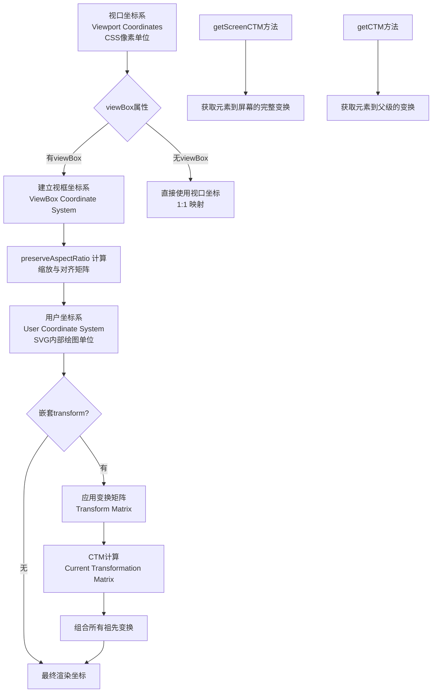
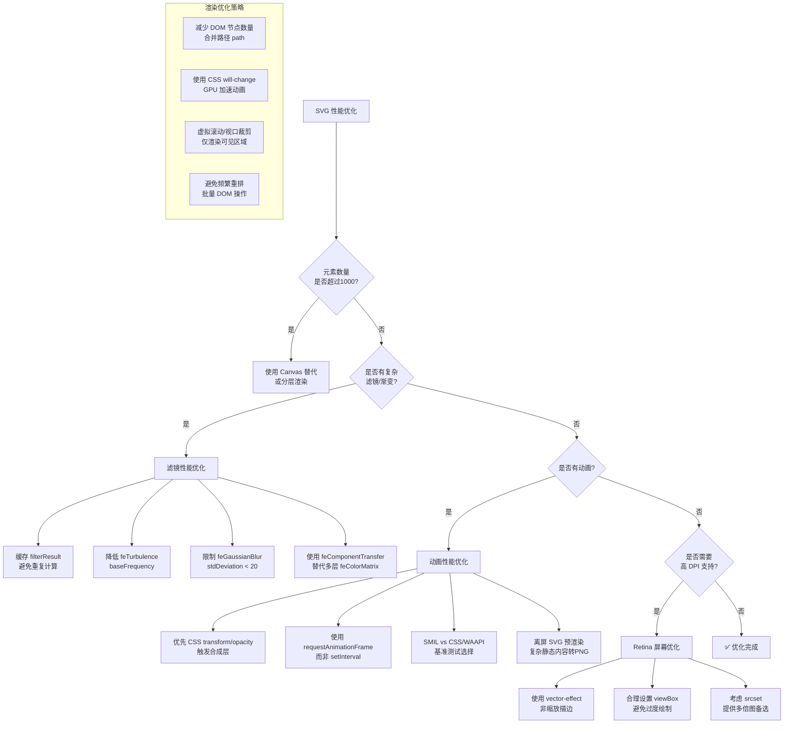

# SVG（02）：事件处理、补充示例

## 事件处理

SVG 元素支持标准的 DOM 事件，可以轻松实现交互功能。

### 鼠标事件

```html
<svg width="400" height="300" xmlns="http://www.w3.org/2000/svg">
  <circle 
    id="clickableCircle" 
    cx="200" 
    cy="150" 
    r="50" 
    fill="blue"
    style="cursor: pointer;" />
</svg>

<script>
  const circle = document.getElementById('clickableCircle');
  
  // 点击事件
  circle.addEventListener('click', (e) => {
    const colors = ['red', 'blue', 'green', 'yellow', 'purple'];
    const randomColor = colors[Math.floor(Math.random() * colors.length)];
    circle.setAttribute('fill', randomColor);
  });
  
  // 鼠标悬停
  circle.addEventListener('mouseenter', () => {
    circle.setAttribute('r', '60');
  });
  
  circle.addEventListener('mouseleave', () => {
    circle.setAttribute('r', '50');
  });
  
  // 鼠标移动
  circle.addEventListener('mousemove', (e) => {
    const rect = circle.getBoundingClientRect();
    const x = e.clientX - rect.left;
    const y = e.clientY - rect.top;
    console.log(`鼠标位置: (${x}, ${y})`);
  });
</script>
```

### 触摸事件（移动端）

```html
<svg width="400" height="300" xmlns="http://www.w3.org/2000/svg">
  <circle 
    id="touchableCircle" 
    cx="200" 
    cy="150" 
    r="50" 
    fill="green" />
</svg>

<script>
  const circle = document.getElementById('touchableCircle');
  
  circle.addEventListener('touchstart', (e) => {
    e.preventDefault();
    circle.setAttribute('fill', 'red');
  });
  
  circle.addEventListener('touchend', (e) => {
    e.preventDefault();
    circle.setAttribute('fill', 'green');
  });
</script>
```

### 拖拽功能

```html
<svg id="dragSvg" width="400" height="300" xmlns="http://www.w3.org/2000/svg">
  <circle 
    id="draggableCircle" 
    cx="200" 
    cy="150" 
    r="50" 
    fill="blue"
    style="cursor: move;" />
</svg>

<script>
  const circle = document.getElementById('draggableCircle');
  const svg = document.getElementById('dragSvg');
  let isDragging = false;
  let offset = { x: 0, y: 0 };
  
  circle.addEventListener('mousedown', (e) => {
    isDragging = true;
    const rect = svg.getBoundingClientRect();
    const cx = parseFloat(circle.getAttribute('cx'));
    const cy = parseFloat(circle.getAttribute('cy'));
    offset.x = e.clientX - rect.left - cx;
    offset.y = e.clientY - rect.top - cy;
  });
  
  svg.addEventListener('mousemove', (e) => {
    if (isDragging) {
      const rect = svg.getBoundingClientRect();
      const x = e.clientX - rect.left - offset.x;
      const y = e.clientY - rect.top - offset.y;
      circle.setAttribute('cx', x);
      circle.setAttribute('cy', y);
    }
  });
  
  svg.addEventListener('mouseup', () => {
    isDragging = false;
  });
  
  svg.addEventListener('mouseleave', () => {
    isDragging = false;
  });
</script>
```

### 交互式 SVG 应用示例

```html
<!DOCTYPE html>
<html lang="zh-CN">
<head>
  <meta charset="UTF-8">
  <meta name="viewport" content="width=device-width, initial-scale=1.0">
  <title>交互式 SVG 示例</title>
  <style>
    body {
      font-family: Arial, sans-serif;
      padding: 20px;
      background-color: #f5f5f5;
    }
    .container {
      background: white;
      padding: 20px;
      border-radius: 8px;
      box-shadow: 0 2px 4px rgba(0,0,0,0.1);
    }
    .controls {
      margin: 20px 0;
    }
    button {
      padding: 10px 20px;
      margin: 5px;
      cursor: pointer;
      background: #4CAF50;
      color: white;
      border: none;
      border-radius: 4px;
    }
    button:hover {
      background: #45a049;
    }
    svg {
      border: 1px solid #ddd;
      background: white;
    }
  </style>
</head>
<body>
  <div class="container">
    <h1>交互式 SVG 示例</h1>
    <div class="controls">
      <button onclick="addRandomShape()">添加随机形状</button>
      <button onclick="clearAll()">清空</button>
    </div>
    <svg id="interactiveSvg" width="600" height="400" xmlns="http://www.w3.org/2000/svg">
      <defs>
        <linearGradient id="grad1" x1="0%" y1="0%" x2="100%" y2="100%">
          <stop offset="0%" stop-color="#ff6b6b" />
          <stop offset="100%" stop-color="#4ecdc4" />
        </linearGradient>
      </defs>
      <rect width="600" height="400" fill="url(#grad1)" opacity="0.1" />
    </svg>
  </div>

  <script>
    const svg = document.getElementById('interactiveSvg');
    let shapeCount = 0;
    
    function addRandomShape() {
      const shapes = ['circle', 'rect', 'ellipse'];
      const shapeType = shapes[Math.floor(Math.random() * shapes.length)];
      const shape = document.createElementNS('http://www.w3.org/2000/svg', shapeType);
      
      const colors = ['#ff6b6b', '#4ecdc4', '#ffe66d', '#a8e6cf', '#ff8b94'];
      const color = colors[Math.floor(Math.random() * colors.length)];
      
      shape.setAttribute('fill', color);
      shape.setAttribute('stroke', '#333');
      shape.setAttribute('stroke-width', '2');
      shape.style.cursor = 'pointer';
      shape.setAttribute('class', 'interactive-shape');
      
      if (shapeType === 'circle') {
        shape.setAttribute('cx', Math.random() * 500 + 50);
        shape.setAttribute('cy', Math.random() * 300 + 50);
        shape.setAttribute('r', Math.random() * 30 + 20);
      } else if (shapeType === 'rect') {
        shape.setAttribute('x', Math.random() * 500);
        shape.setAttribute('y', Math.random() * 300);
        shape.setAttribute('width', Math.random() * 60 + 40);
        shape.setAttribute('height', Math.random() * 60 + 40);
        shape.setAttribute('rx', '5');
      } else if (shapeType === 'ellipse') {
        shape.setAttribute('cx', Math.random() * 500 + 50);
        shape.setAttribute('cy', Math.random() * 300 + 50);
        shape.setAttribute('rx', Math.random() * 40 + 30);
        shape.setAttribute('ry', Math.random() * 40 + 20);
      }
      
      svg.appendChild(shape);
      shapeCount++;
      
      shape.addEventListener('click', function(e) {
        e.target.style.transform = 'scale(1.2)';
        e.target.style.transformOrigin = `${e.target.getAttribute('cx') || e.target.getAttribute('x')}px ${e.target.getAttribute('cy') || e.target.getAttribute('y')}px`;
        setTimeout(() => {
          e.target.style.transform = 'scale(1)';
        }, 200);
        
        const info = document.getElementById('info');
        if (info) {
          info.textContent = `点击了 ${shapeType.toUpperCase()} - 坐标: (${Math.round(Math.random() * 500)}, ${Math.round(Math.random() * 300)})`;
        }
      });
    }

    // 清空按钮功能
    function clearAll() {
      const shapes = svg.querySelectorAll('.interactive-shape');
      shapes.forEach(shape => shape.remove());
      shapeCount = 0;
    }
  </script>
</body>
</html>
```

::: tip 最佳实践
- 使用事件委托（event delegation）处理大量动态 SVG 元素的交互
- 避免在动画循环中频繁查询 DOM，缓存元素引用
- 考虑使用 CSS transform 代替 SVG transform 属性以获得 GPU 加速
:::

### 响应式 SVG 设计

SVG 天然支持响应式设计，通过 `viewBox` 和 `preserveAspectRatio` 属性实现：

```html
<!-- 响应式 SVG 容器 -->
<div style="width: 100%; max-width: 600px; margin: 0 auto;">
  <svg viewBox="0 0 800 400" preserveAspectRatio="xMidYMid meet" 
       style="width: 100%; height: auto;">
    <!-- 内容会根据容器宽度自动缩放 -->
    <rect x="50" y="50" width="700" height="300" fill="#f0f0f0" stroke="#333"/>
    <circle cx="200" cy="200" r="80" fill="#4CAF50"/>
    <text x="400" y="210" text-anchor="middle" font-size="24">响应式 SVG</text>
  </svg>
</div>

<!-- preserveAspectRatio 参数说明 -->
<!--
  align 参数:
  - xMinYMin: 左上角对齐
  - xMidYMid: 居中对齐（默认）
  - xMaxYMax: 右下角对齐
  
  meet: 保持比例，完整显示（默认）
  slice: 保持比例，填满容器（可能裁剪）
  none: 不保持比例，拉伸填满
-->
```

#### 坐标系统与视口转换

理解 SVG 的坐标系统对于精确控制图形至关重要。SVG 使用多层坐标系统进行转换：



**CTM（Current Transformation Matrix）详解：**

```javascript
// JavaScript 中获取和操作 CTM
const svg = document.querySelector('svg');
const rect = document.querySelector('rect');

// 获取当前变换矩阵（相对于SVG画布）
const ctm = rect.getCTM();
console.log('CTM:', ctm);
// 返回 SVGMatrix { a, b, c, d, e, f }
// a: 水平缩放  b: 水平倾斜
// c: 垂直倾斜  d: 垂直缩放
// e: 水平平移  f: 垂直平移

// 获取屏幕CTM（包含所有嵌套变换和CSS变换）
const screenCTM = rect.getScreenCTM();

// 将屏幕坐标转换为SVG用户坐标
function screenToSVG(screenX, screenY, svgElement) {
  const pt = svgElement.createSVGPoint();
  pt.x = screenX;
  pt.y = screenY;
  return pt.matrixTransform(svgElement.getScreenCTM().inverse());
}

// 示例：鼠标点击位置转换为SVG坐标
svg.addEventListener('click', (event) => {
  const svgPoint = screenToSVG(event.clientX, event.clientY, svg);
  console.log(`SVG坐标: (${svgPoint.x.toFixed(2)}, ${svgPoint.y.toFixed(2)})`);
});
```

```html
<!-- 坐标系统演示 -->
<svg id="coordinateDemo" viewBox="0 0 400 300" width="100%" height="300"
     style="border: 2px solid #333; background: #fafafa;">
  <!-- 视口边框（虚线） -->
  <rect x="10" y="10" width="380" height="280" 
        fill="none" stroke="#999" stroke-dasharray="5,5"/>
  
  <!-- 用户坐标系网格 -->
  <defs>
    <pattern id="grid" width="40" height="40" patternUnits="userSpaceOnUse">
      <path d="M 40 0 L 0 0 0 40" fill="none" stroke="#e0e0e0" stroke-width="1"/>
    </pattern>
  </defs>
  <rect x="10" y="10" width="380" height="280" fill="url(#grid)"/>
  
  <!-- 原点标记 -->
  <circle cx="10" cy="290" r="5" fill="#f44336"/>
  <text x="20" y="288" font-size="12" fill="#f44336">原点(0,0)</text>
  
  <!-- 变换示例组 -->
  <g transform="translate(200, 150)">
    <!-- 未变换的矩形 -->
    <rect x="-60" y="-40" width="120" height="80" 
          fill="#2196F3" fill-opacity="0.3" stroke="#2196F3"/>
    
    <!-- 旋转45度的矩形 -->
    <g transform="rotate(45)">
      <rect x="-60" y="-40" width="120" height="80" 
            fill="#4CAF50" fill-opacity="0.3" stroke="#4CAF50"/>
    </g>
    
    <!-- 缩放的矩形 -->
    <g transform="scale(0.7) translate(50, 30)">
      <rect x="-60" y="-40" width="120" height="80" 
            fill="#FF9800" fill-opacity="0.3" stroke="#FF9800"/>
    </g>
    
    <text x="0" y="-55" text-anchor="middle" font-size="14" font-weight="bold">
      坐标原点(200,150)
    </text>
  </g>
</svg>
```

## SVG 可访问性（Accessibility）

SVG 图形对于视觉障碍用户可能完全不可见或无法理解。遵循 WCAG 标准实现可访问性是专业开发的基本要求。

### 基础可访问性属性

```html
<svg role="img" aria-labelledby="svg-title svg-desc" viewBox="0 0 200 200" 
     xmlns="http://www.w3.org/2000/svg" focusable="false">
  
  <!-- 标题和描述（屏幕阅读器读取） -->
  <title id="svg-title">销售数据饼图 - 2024年Q1季度报告</title>
  <desc id="svg-desc">该图表展示四个产品线的销售占比：产品A占35%（绿色），产品B占25%（蓝色），产品C占22%（橙色），产品D占18%（红色）</desc>
  
  <!-- 为每个图形元素添加可访问性标签 -->
  <g role="group" aria-label="饼图数据">
    <path d="M100,100 L100,20 A80,80 0 0,1 170,65 Z" 
          fill="#4CAF50" 
          role="graphics-symbol"
          aria-label="产品A: 35%"/>
    <path d="M100,100 L170,65 A80,80 0 0,1 170,135 Z" 
          fill="#2196F3"
          role="graphics-symbol"
          aria-label="产品B: 25%"/>
    <path d="M100,100 L170,135 A80,80 0 0,1 100,180 Z" 
          fill="#FF9800"
          role="graphics-symbol"
          aria-label="产品C: 22%"/>
    <path d="M100,100 L100,180 A80,80 0 0,1 100,20 Z" 
          fill="#f44336"
          role="graphics-symbol"
          aria-label="产品D: 18%"/>
  </g>
</svg>
```

### 对比度与视觉可访问性

::: warning WCAG 2.1 对比度要求
- **AA 级别**: 文本对比度至少 4.5:1，大文本（18pt+）至少 3:1
- **AAA 级别**: 文本对比度至少 7:1，大文本至少 4.5:1
- **非文本元素**: 至少 3:1 对比度
:::

```css
/* 高对比度模式支持 */
@media (prefers-contrast: high) {
  .chart-bar {
    stroke: #000;
    stroke-width: 2;
  }
  .chart-text {
    fill: #000;
    font-weight: bold;
  }
}

/* 减少动画偏好 */
@media (prefers-reduced-motion: reduce) {
  .animated-element {
    animation: none !important;
    transition: none !important;
  }
}

/* 强制颜色适配 */
@media (forced-colors: active) {
  .custom-button {
    forced-color-adjust: auto;
    outline: 2px solid ButtonText;
  }
}
```

### 键盘导航与焦点管理

```html
<!-- 可键盘操作的交互式 SVG -->
<svg tabindex="0" role="application" aria-label="交互式地图导航" 
     viewBox="0 0 600 400" xmlns="http://www.w3.org/2000/svg">
  
  <style>
    .map-region {
      fill: #e0e0e0;
      stroke: #666;
      stroke-width: 2;
      cursor: pointer;
      transition: fill 0.2s;
    }
    .map-region:hover,
    .map-region:focus {
      fill: #2196F3;
      outline: 3px solid #ff9800;
      outline-offset: 2px;
    }
    .map-region:focus-visible {
      outline: 3px solid #ff9800;
    }
    /* 屏幕阅读器专用文本 */
    .sr-only {
      position: absolute;
      width: 1px;
      height: 1px;
      padding: 0;
      margin: -1px;
      overflow: hidden;
      clip: rect(0, 0, 0, 0);
      white-space: nowrap;
      border: 0;
    }
  </style>
  
  <!-- 地图区域（可通过Tab键聚焦） -->
  <path class="map-region" tabindex="0" d="M50,50 L150,30 L180,120 L80,140 Z"
        data-region="north" aria-label="北部区域 - 点击查看详情"
        role="button"/>
  <path class="map-region" tabindex="0" d="M180,120 L280,100 L300,200 L200,220 Z"
        data-region="east" aria-label="东部区域 - 点击查看详情"
        role="button"/>
  <path class="map-region" tabindex="0" d="M80,140 L200,220 L150,320 L50,280 Z"
        data-region="south" aria-label="南部区域 - 点击查看详情"
        role="button"/>
  <path class="map-region" tabindex="0" d="M50,50 L80,140 L50,280 L20,150 Z"
        data-region="west" aria-label="西部区域 - 点击查看详情"
        role="button"/>
  
  <!-- 动态信息面板 -->
  <foreignObject x="350" y="50" width="230" height="300">
    <div xmlns="http://www.w3.org/1999/xhtml" id="regionInfo">
      <h3>区域信息</h3>
      <p>使用 Tab 键选择区域，按 Enter 或 Space 查看详情。</p>
    </div>
  </foreignObject>
  
  <script type="text/javascript"><![CDATA[
    document.querySelectorAll('.map-region').forEach(region => {
      region.addEventListener('keydown', (e) => {
        if (e.key === 'Enter' || e.key === ' ') {
          e.preventDefault();
          showRegionInfo(region.dataset.region);
        }
      });
      region.addEventListener('click', () => {
        showRegionInfo(region.dataset.region);
      });
    });
    
    function showRegionInfo(regionName) {
      const infoPanel = document.getElementById('regionInfo');
      const regionData = {
        north: { name: '北部区域', population: '120万', gdp: '850亿' },
        east: { name: '东部区域', population: '200万', gdp: '1500亿' },
        south: { name: '南部区域', population: '95万', gdp: '620亿' },
        west: { name: '西部区域', population: '68万', gdp: '380亿' }
      };
      const data = regionData[regionName];
      infoPanel.innerHTML = `
        <h3>${data.name}</h3>
        <p><strong>人口:</strong> ${data.population}</p>
        <p><strong>GDP:</strong> ${data.gdp}</p>
      `;
      region.focus(); // 保持焦点在当前元素
    }
  ]]></script>
</svg>
```

### ARIA Live Region 用于动态更新

```html
<svg viewBox="0 0 400 300" role="img" aria-labelledby="chart-title">
  <title id="chart-title">实时温度监控仪表盘</title>
  
  <!-- 屏幕阅读器专用的动态更新区域 -->
  <desc class="sr-only" role="status" aria-live="polite" aria-atomic="true"
       id="chart-description">
    当前温度：25摄氏度，状态正常
  </desc>
  
  <!-- 温度计图形 -->
  <g id="thermometer">
    <rect x="180" y="50" width="40" height="200" rx="20" fill="#eee" stroke="#333"/>
    <rect id="tempFill" x="185" y="150" width="30" height="95" rx="15" fill="#4CAF90"/>
    <circle cx="200" cy="250" r="30" fill="#4CAF90" stroke="#333"/>
    <text id="tempValue" x="200" y="255" text-anchor="middle" 
          fill="#fff" font-size="18" font-weight="bold">25°C</text>
  </g>
  
  <script>
    // 更新时同步更新 ARIA 描述
    function updateTemperature(temp) {
      document.getElementById('tempValue').textContent = `${temp}°C`;
      const fillHeight = Math.max(0, Math.min(195, (temp / 50) * 195));
      document.getElementById('tempFill').setAttribute('y', 255 - fillHeight);
      document.getElementById('tempFill').setAttribute('height', fillHeight);
      
      // 更新屏幕阅读器文本
      const status = temp > 40 ? '警告：高温警报' : temp < 10 ? '注意：低温' : '状态正常';
      document.getElementById('chart-description').textContent = 
        `当前温度：${temp}摄氏度，${status}`;
    }
  </script>
</svg>
```

::: tip 可访问性检查清单
- ✅ 所有装饰性 SVG 设置 `aria-hidden="true"` 或 `role="presentation"`
- ✅ 信息型 SVG 包含 `<title>` 和 `<desc>`
- ✅ 交互型 SVG 支持键盘操作（tabindex、keydown 事件）
- ✅ 颜色不作为唯一的信息传达方式（添加图案/纹理）
- ✅ 文本对比度符合 WCAG AA 标准（4.5:1）
- ✅ 动态更新内容使用 `aria-live` 区域
- ✅ 尊重 `prefers-reduced-motion` 媒体查询
:::

## SVG 在现代前端框架中的使用

### React 中的 SVG 最佳实践

```jsx
// components/Icon.jsx - 组件化 SVG 图标
import React from 'react';

const Icon = ({ 
  name, 
  size = 24, 
  color = 'currentColor',
  className = '',
  onClick,
  ...props 
}) => {
  const icons = {
    // 内联 SVG 定义
    arrow: (
      <svg 
        width={size} 
        height={size} 
        viewBox="0 0 24 24" 
        fill="none" 
        xmlns="http://www.w3.org/2000/svg"
        className={className}
        onClick={onClick}
        aria-hidden="true"
        {...props}
      >
        <path 
          d="M12 4l-8 8h6v8h4v-8h6l-8-8z" 
          fill={color}
        />
      </svg>
    ),
    
    menu: (
      <svg 
        width={size} 
        height={size} 
        viewBox="0 0 24 24" 
        fill="none" 
        xmlns="http://www.w3.org/2000/svg"
        className={className}
        aria-label="菜单"
        role="img"
        {...props}
      >
        <title>菜单图标</title>
        <path 
          d="M3 6h18M3 12h18M3 18h18" 
          stroke={color} 
          strokeWidth="2" 
          strokeLinecap="round"
        />
      </svg>
    )
  };
  
  return icons[name] || null;
};

export default Icon;

// 使用示例
// <Icon name="arrow" size={32} color="#2196F3" onClick={handleClick} />
```

```jsx
// components/InteractiveChart.jsx - 数据驱动的动态 SVG
import React, { useMemo } from 'react';

const InteractiveChart = ({ data, width = 600, height = 400 }) => {
  // useMemo 缓存路径计算，避免不必要的重渲染
  const pathData = useMemo(() => {
    const padding = 40;
    const chartWidth = width - padding * 2;
    const chartHeight = height - padding * 2;
    const maxValue = Math.max(...data.map(d => d.value));
    
    return data.map((point, index) => ({
      ...point,
      x: padding + (index / (data.length - 1)) * chartWidth,
      y: padding + chartHeight - (point.value / maxValue) * chartHeight
    }));
  }, [data, width, height]);
  
  const linePath = pathData
    .map((p, i) => `${i === 0 ? 'M' : 'L'} ${p.x} ${p.y}`)
    .join(' ');
  
  const areaPath = `${linePath} L ${pathData[pathData.length - 1].x} ${height - padding} L ${pathData[0].x} ${height - padding} Z`;
  
  return (
    <svg 
      viewBox={`0 0 ${width} ${height}`} 
      className="interactive-chart"
      role="img"
      aria-label={`${data.length}个数据点的趋势图`}
    >
      <defs>
        <linearGradient id="areaGradient" x1="0%" y1="0%" x2="0%" y2="100%">
          <stop offset="0%" stopColor="#2196F3" stopOpacity="0.4"/>
          <stop offset="100%" stopColor="#2196F3" stopOpacity="0.05"/>
        </linearGradient>
      </defs>
      
      {/* 网格线 */}
      {Array.from({ length: 5 }).map((_, i) => (
        <line
          key={`grid-${i}`}
          x1={40}
          y1={40 + (i * (height - 80) / 4)}
          x2={width - 40}
          y2={40 + (i * (height - 80) / 4)}
          stroke="#e0e0e0"
          strokeDasharray="4,4"
        />
      ))}
      
      {/* 面积图 */}
      <path d={areaPath} fill="url(#areaGradient)" />
      
      {/* 折线 */}
      <path d={linePath} fill="none" stroke="#2196F3" strokeWidth="3" />
      
      {/* 数据点（带交互） */}
      {pathData.map((point, index) => (
        <g key={`point-${index}`}>
          <circle
            cx={point.x}
            cy={point.y}
            r="6"
            fill="#fff"
            stroke="#2196F3"
            strokeWidth="3"
            className="data-point"
            tabIndex={0}
            aria-label={`${point.label}: ${point.value}`}
          />
          {/* Tooltip（悬停显示） */}
          <title>{`${point.label}: ${point.value}`}</title>
        </g>
      ))}
    </svg>
  );
};

export default InteractiveChart;
```

### Vue 中的 SVG 集成

```vue
<!-- components/SvgIcon.vue - Vue 3 组合式 API -->
<template>
  <svg
    :width="size"
    :height="size"
    :viewBox="viewBox"
    :class="['svg-icon', { 'spin': spinning }]"
    :aria-hidden="decorative ? 'true' : undefined"
    :role="decorative ? 'presentation' : 'img'"
    :aria-label="label"
    v-bind="$attrs"
  >
    <use :href="`#${iconName}`" />
  </svg>
</template>

<script setup>
import { computed } from 'vue';

const props = defineProps({
  iconName: {
    type: String,
    required: true
  },
  size: {
    type: [Number, String],
    default: 24
  },
  label: String,
  decorative: {
    type: Boolean,
    default: false
  },
  spinning: Boolean
});

const viewBox = computed(() => '0 0 24 24');
</script>

<style scoped>
.svg-icon {
  display: inline-block;
  vertical-align: middle;
  fill: currentColor;
  transition: transform 0.3s ease;
}

.spin {
  animation: spin 1s linear infinite;
}

@keyframes spin {
  from { transform: rotate(0deg); }
  to { transform: rotate(360deg); }
}
</style>
```

```vue
<!-- components/DataVisualization.vue - 动态数据可视化 -->
<template>
  <div class="viz-container">
    <svg ref="svgRef" :viewBox="`0 0 ${svgWidth} ${svgHeight}`">
      <defs>
        <!-- 渐变定义 -->
        <linearGradient :id="gradientId" x1="0%" y1="0%" x2="0%" y2="100%">
          <stop offset="0%" :stop-color="primaryColor" stop-opacity="0.8"/>
          <stop offset="100%" :stop-color="primaryColor" stop-opacity="0.2"/>
        </linearGradient>
        
        <!-- 阴影滤镜 -->
        <filter :id="shadowId" x="-20%" y="-20%" width="140%" height="140%">
          <feDropShadow dx="0" dy="2" stdDeviation="3" flood-opacity="0.2"/>
        </filter>
      </defs>
      
      <!-- 坐标轴 -->
      <g class="axes">
        <line x1="60" y1="40" x2="60" :y2="svgHeight - 40" stroke="#ccc"/>
        <line x1="60" :y1="svgHeight - 40" :x2="svgWidth - 40" :y2="svgHeight - 40" stroke="#ccc"/>
      </g>
      
      <!-- 动态柱状图 -->
      <g class="bars">
        <transition-group name="bar">
          <rect
            v-for="(item, index) in processedData"
            :key="item.id"
            :x="xScale(index)"
            :y="yScale(item.value)"
            :width="barWidth"
            :height="svgHeight - 40 - yScale(item.value)"
            :fill="`url(#${gradientId})`"
            :filter="`url(#${shadowId})`"
            :rx="4"
            class="bar-rect"
            @mouseenter="showTooltip($event, item)"
            @mouseleave="hideTooltip"
          />
        </transition-group>
      </g>
      
      <!-- Tooltip -->
      <foreignObject 
        v-if="tooltip.show" 
        :x="tooltip.x" 
        :y="tooltip.y"
        width="120"
        height="60"
      >
        <div xmlns="http://www.w3.org/1999/xhtml" class="tooltip-content">
          <strong>{{ tooltip.data?.label }}</strong>
          <p>{{ tooltip.data?.value }}</p>
        </div>
      </foreignObject>
    </svg>
  </div>
</template>

<script setup>
import { ref, computed, onMounted } from 'vue';

const props = defineProps({
  data: Array,
  primaryColor: { type: String, default: '#2196F3' },
  svgWidth: { type: Number, default: 600 },
  svgHeight: { type: Number, default: 400 }
});

const svgRef = ref(null);
const gradientId = `gradient-${Math.random().toString(36).substr(2, 9)}`;
const shadowId = `shadow-${Math.random().toString(36).substr(2, 9)}`;

const tooltip = ref({ show: false, x: 0, y: 0, data: null });

const barWidth = computed(() => {
  const totalBarsWidth = props.svgWidth - 120; // 减去padding
  return (totalBarsWidth / props.data.length) * 0.7; // 70%宽度，留间隙
});

const processedData = computed(() => 
  props.data.map((item, index) => ({ ...item, id: index }))
);

const xScale = (index) => {
  const padding = 60;
  const availableWidth = props.svgWidth - padding * 2;
  const barSpace = availableWidth / props.data.length;
  return padding + index * barSpace + (barSpace - barWidth.value) / 2;
};

const yScale = (value) => {
  const padding = 40;
  const maxValue = Math.max(...props.data.map(d => d.value));
  const availableHeight = props.svgHeight - padding * 2;
  return props.svgHeight - padding - (value / maxValue) * availableHeight;
};

const showTooltip = (event, item) => {
  const rect = svgRef.value.getBoundingClientRect();
  tooltip.value = {
    show: true,
    x: event.clientX - rect.left + 10,
    y: event.clientY - rect.top - 60,
    data: item
  };
};

const hideTooltip = () => {
  tooltip.value.show = false;
};
</script>
```

### SVG Sprite 系统（图标字体替代方案）

图标字体存在以下问题：
- 需要网络请求加载字体文件
- 屏幕阅读器可能读出乱码
- CSS 失败时显示方块
- 无法做多色图标
- 字体抗锯齿导致边缘模糊

**SVG Sprite 是更好的替代方案：**

```html
<!-- 方案1：内联 Symbol Sprite（推荐用于中小项目） -->
<body>
  <!-- 隐藏的 Sprite 定义区域 -->
  <svg xmlns="http://www.w3.org/2000/svg" style="display: none;">
    <symbol id="icon-home" viewBox="0 0 24 24">
      <path d="M10 20v-6h4v6h5v-8h3L12 3 2 12h3v8z"/>
    </symbol>
    
    <symbol id="icon-user" viewBox="0 0 24 24">
      <path d="M12 12c2.21 0 4-1.79 4-4s-1.79-4-4-4-4 1.79-4 4 1.79 4 4 4zm0 2c-2.67 0-8 1.34-8 4v2h16v-2c0-2.66-5.33-4-8-4z"/>
    </symbol>
    
    <symbol id="icon-settings" viewBox="0 0 24 24">
      <path d="M19.14 12.94c.04-.31.06-.63.06-.94 0-.31-.02-.63-.06-.94l2.03-1.58c.18-.14.23-.41.12-.61l-1.92-3.32c-.12-.22-.37-.29-.59-.22l-2.39.96c-.5-.38-1.03-.7-1.62-.94l-.36-2.54c-.04-.24-.24-.41-.48-.41h-3.84c-.24 0-.43.17-.47.41l-.36 2.54c-.59.24-1.13.57-1.62.94l-2.39-.96c-.22-.08-.47 0-.59.22L2.74 8.87c-.12.21-.08.47.12.61l2.03 1.58c-.04.31-.06.63-.06.94s.02.63.06.94l-2.03 1.58c-.18.14-.23.41-.12.61l1.92 3.32c.12.22.37.29.59.22l2.39-.96c.5.38 1.03.7 1.62.94l.36 2.54c.05.24.24.41.48.41h3.84c.24 0 .44-.17.47-.41l.36-2.54c.59-.24 1.13-.56 1.62-.94l2.39.96c.22.08.47 0 .59-.22l1.92-3.32c.12-.22.07-.47-.12-.61l-2.01-1.58zM12 15.6c-1.98 0-3.6-1.62-3.6-3.6s1.62-3.6 3.6-3.6 3.6 1.62 3.6 3.6-1.62 3.6-3.6 3.6z"/>
    </symbol>
    
    <symbol id="icon-search" viewBox="0 0 24 24">
      <path d="M15.5 14h-.79l-.28-.27C15.41 12.59 16 11.11 16 9.5 16 5.91 13.09 3 9.5 3S3 5.91 3 9.5 5.91 16 9.5 16c1.61 0 3.09-.59 4.23-1.57l.27.28v.79l5 4.99L20.49 19l-4.99-5zm-6 0C7.01 14 5 11.99 5 9.5S7.01 5 9.5 5 14 7.01 14 9.5 11.99 14 9.5 14z"/>
    </symbol>
  </svg>
  
  <!-- 页面中使用图标 -->
  <nav>
    <a href="/" aria-label="首页">
      <svg class="icon" width="24" height="24">
        <use href="#icon-home"/>
      </svg>
    </a>
    <a href="/profile" aria-label="个人中心">
      <svg class="icon" width="24" height="24">
        <use href="#icon-user"/>
      </svg>
    </a>
    <a href="/settings" aria-label="设置">
      <svg class="icon" width="24" height="24">
        <use href="#icon-settings"/>
      </svg>
    </a>
  </nav>
  
  <style>
    .icon {
      display: inline-block;
      width: 1em;
      height: 1em;
      fill: currentColor;
      vertical-align: middle;
      transition: color 0.2s;
    }
    
    nav a:hover .icon {
      color: #2196F3;
    }
  </style>
</body>
```

```javascript
// 方案2：外部 Sprite 文件 + 构建工具集成（推荐大型项目）

// icons/sprite.js - 自动生成 sprite 文件
const fs = require('fs');
const path = require('path');
const glob = require('glob');

// 扫描所有 SVG 图标文件
const iconFiles = glob.sync('./src/icons/*.svg');
let symbols = '';

iconFiles.forEach(file => {
  const fileName = path.basename(file, '.svg');
  const svgContent = fs.readFileSync(file, 'utf8');
  
  // 解析 SVG 内容并转换为 symbol
  const match = svgContent.match(/<svg[^>]*>([\s\S]*?)<\/svg>/i);
  if (match) {
    symbols += `<symbol id="icon-${fileName}" ${match[0].match(/<svg([^>]*)>/i)[1]}>\n`;
    symbols += match[1];
    symbols += `\n</symbol>\n\n`;
  }
});

// 生成完整的 sprite 文件
const spriteContent = `<?xml version="1.0" encoding="UTF-8"?>
<svg xmlns="http://www.w3.org/2000/svg" style="display:none">
${symbols}
</svg>`;

fs.writeFileSync('./public/icons/sprite.svg', spriteContent);
console.log(`✓ Generated sprite with ${iconFiles.length} icons`);

// 在 HTML 中引入外部 sprite
// <head>
//   <link rel="preload" href="/icons/sprite.svg" as="image" type="image/svg+xml">
// </head>
// <body>
//   <svg class="icon"><use href="/icons/sprite.svg#icon-name"></use></svg>
// </body>
```

```javascript
// webpack/vite 配置：自动导入 SVG 作为组件
// vite.config.js
import { createSvgIconsPlugin } from 'vite-plugin-svg-icons';
import path from 'path';

export default {
  plugins: [
    createSvgIconsPlugin({
      iconDirs: [path.resolve(process.cwd(), 'src/icons')],
      symbolId: 'icon-[name]',
      inject: 'body-last',
      customDomId: '__svg__icons__dom__'
    })
  ]
};

// 使用方式（配合 vite-plugin-svg-icons）
// import Icon from '@/components/Icon.vue'
// <Icon name="home" /> → 自动渲染 <svg><use href="#icon-home"></use></svg>
```

### Figma/Sketch 到 SVG 的工作流

```bash
# 1. 从 Figma 导出 SVG
# 选择图层 → 右键 → Copy as SVG / Export → SVG

# 2. 优化导出的 SVG（使用 svgo）
npm install -g svgo

# 单文件优化
svgo input.svg -o output.svg

# 批量优化项目图标
svgo -f ./src/icons --precision=1 --multipass

# 3. 自定义 SVGO 配置（svgo.config.js）
module.exports = {
  plugins: [
    'preset-default',
    'removeDimensions',           // 移除固定尺寸，依赖viewBox
    'convertShapeToPath',         // 将基础形状转为path（更灵活）
    'mergePaths',                 // 合并相邻路径
    'convertTransform',           // 合并transform属性
    'removeEmptyContainers',      // 移除空容器
    'cleanupNumericValues',       // 清理数值精度
    { name: 'removeAttrs', params: { attrs: '(data-name)' } }, // 移除设计工具属性
  ],
  floatPrecision: 1,             // 减少小数位数
  multipass: true                // 多次优化以获得最小体积
};
```

## 高级 SVG 技术

### foreignObject：嵌入 HTML 内容

`foreignObject` 允许在 SVG 中嵌入完整的 HTML/XHTML 内容，是实现富文本、表单等复杂内容的强大工具。

```html
<svg viewBox="0 0 500 350" xmlns="http://www.w3.org/2000/svg">
  <defs>
    <filter id="cardShadow" x="-5%" y="-5%" width="110%" height="110%">
      <feDropShadow dx="0" dy="4" stdDeviation="6" flood-color="#000" flood-opacity="0.15"/>
    </filter>
    <linearGradient id="headerGrad" x1="0%" y1="0%" x2="100%" y2="0%">
      <stop offset="0%" stop-color="#667eea"/>
      <stop offset="100%" stop-color="#764ba2"/>
    </linearGradient>
  </defs>
  
  <!-- 卡片背景 -->
  <rect x="20" y="20" width="460" height="310" rx="16" ry="16" 
        fill="white" filter="url(#cardShadow)" stroke="#e0e0e0"/>
  
  <!-- 渐变头部（SVG原生绘制） -->
  <rect x="20" y="20" width="460" height="70" rx="16" ry="16" 
        fill="url(#headerGrad)"/>
  <rect x="20" y="60" width="460" height="30" fill="url(#headerGrad)"/>
  
  <!-- foreignObject：嵌入HTML卡片内容 -->
  <foreignObject x="30" y="30" width="440" height="290">
    <div xmlns="http://www.w3.org/1999/xhtml" 
         style="font-family: -apple-system, BlinkMacSystemFont, 'Segoe UI', sans-serif; height: 100%;">
      
      <!-- 头部文字 -->
      <div style="display: flex; justify-content: space-between; align-items: center; padding: 18px 20px 0; color: white;">
        <div>
          <h2 style="margin: 0; font-size: 18px; font-weight: 600;">用户资料卡</h2>
          <p style="margin: 4px 0 0; opacity: 0.85; font-size: 13px;">高级会员 · 已认证</p>
        </div>
        <div style="
          width: 48px; height: 48px; border-radius: 50%; background: rgba(255,255,255,0.2);
          display: flex; align-items: center; justify-content: center; font-size: 20px;
        ">
          👤
        </div>
      </div>
      
      <!-- HTML 表单内容 -->
      <div style="padding: 20px;">
        <div style="margin-bottom: 16px;">
          <label style="display: block; font-size: 13px; color: #666; margin-bottom: 6px; font-weight: 500;">
            电子邮箱
          </label>
          <input type="email" placeholder="user@example.com" value="developer@svg.dev"
                 style="
                   width: 100%; padding: 10px 14px; border: 2px solid #e0e0e0; border-radius: 8px;
                   font-size: 14px; box-sizing: border-box; outline: none; transition: border-color 0.2s;
                 "
                 onfocus="this.style.borderColor='#667eea'"
                 onblur="this.style.borderColor='#e0e0e0'" />
        </div>
        
        <div style="margin-bottom: 16px;">
          <label style="display: block; font-size: 13px; color: #666; margin-bottom: 6px; font-weight: 500;">
            个人简介
          </label>
          <textarea rows="3" placeholder="介绍一下自己..."
                    style="
                      width: 100%; padding: 10px 14px; border: 2px solid #e0e0e0; border-radius: 8px;
                      font-size: 14px; resize: vertical; box-sizing: border-box; font-family: inherit;
                    ">SVG 技术爱好者，专注于数据可视化与现代前端架构。</textarea>
        </div>
        
        <!-- 按钮 -->
        <button onclick="alert('保存成功！')"
                style="
                  width: 100%; padding: 12px; background: linear-gradient(135deg, #667eea, #764ba2);
                  color: white; border: none; border-radius: 8px; font-size: 15px; font-weight: 600;
                  cursor: pointer; transition: transform 0.2s, box-shadow 0.2s;
                "
                onmouseover="this.style.transform='translateY(-1px)'; this.style.boxShadow='0 4px 12px rgba(102,126,234,0.4)'"
                onmouseout="this.style.transform='translateY(0)'; this.style.boxShadow='none'">
          保存更改
        </button>
      </div>
    </div>
  </foreignObject>
</svg>
```

::: warning foreignObject 注意事项
- 必须声明正确的命名空间：`xmlns="http://www.w3.org/1999/xhtml"`
- 在 `` 标签中加载的 SVG，foreignObject **不会生效**
- 不同浏览器对 foreignObject 内 CSS 的支持程度不同
- 嵌入的内容应避免溢出 foreignObject 边界
:::

### SVG 路径动画技术

```html
<!DOCTYPE html>
<html lang="zh-CN">
<head>
<meta charset="UTF-8">
<title>SVG 路径动画演示</title>
<style>
  body {
    display: flex;
    flex-direction: column;
    align-items: center;
    gap: 40px;
    padding: 40px;
    background: #f5f5f5;
    font-family: system-ui, sans-serif;
  }
  
  .demo-container {
    background: white;
    padding: 30px;
    border-radius: 16px;
    box-shadow: 0 4px 20px rgba(0,0,0,0.1);
  }
  
  h3 { margin-top: 0; color: #333; }
  
  /* 描边动画（Stroke Drawing） */
  .draw-path {
    fill: none;
    stroke: #2196F3;
    stroke-width: 3;
    stroke-linecap: round;
    stroke-dasharray: 1000;
    stroke-dashoffset: 1000;
    animation: draw 3s ease-in-out infinite;
  }
  
  @keyframes draw {
    0%, 20% { stroke-dashoffset: 1000; }
    60%, 100% { stroke-dashoffset: 0; }
  }
  
  /* 形变动画（Morphing） */
  .morph-path {
    fill: #4CAF50;
    animation: morph 4s ease-in-out infinite;
  }
  
  @keyframes morph {
    0%, 100% { d: path('M100,30 C130,10 170,10 200,30 C230,50 230,90 200,110 C170,130 130,130 100,110 C70,90 70,50 100,30 Z'); }
    33% { d: path('M150,20 C180,5 210,20 220,50 C235,85 215,120 180,130 C145,140 115,125 100,100 C85,75 95,40 120,25 Z'); }
    66% { d: path('M120,40 C160,15 200,30 210,70 C220,110 190,145 150,150 C110,155 80,130 70,95 C60,60 80,30 120,40 Z'); }
  }
  
  /* 沿路径运动 */
  .moving-dot {
    fill: #FF5722;
    offset-distance: 0%;
    animation: moveAlong 3s linear infinite;
  }
  
  @keyframes moveAlong {
    to { offset-distance: 100%; }
  }
  
  .track-path {
    fill: none;
    stroke: #e0e0e0;
    stroke-width: 2;
    stroke-dasharray: 8,4;
  }
  
  button {
    padding: 10px 24px;
    border: none;
    border-radius: 8px;
    background: #2196F3;
    color: white;
    cursor: pointer;
    font-size: 14px;
    font-weight: 500;
    margin: 0 8px;
    transition: background 0.2s;
  }
  
  button:hover { background: #1976D2; }
</style>
</head>
<body>

<!-- 演示1：描边动画（Loading 效果） -->
<div class="demo-container">
  <h3>🎨 描边动画（Stroke Drawing）</h3>
  <svg width="240" height="240" viewBox="0 0 240 240">
    <circle class="draw-path" cx="120" cy="120" r="80"/>
    <text x="120" y="125" text-anchor="middle" fill="#999" font-size="14">Loading...</text>
  </svg>
</div>

<!-- 演示2：路径变形动画 -->
<div class="demo-container">
  <h3>🫧 路径变形（Morphing）</h3>
  <svg width="280" height="200" viewBox="0 0 280 200">
    <path class="morph-path" 
          d="M100,30 C130,10 170,10 200,30 C230,50 230,90 200,110 C170,130 130,130 100,110 C70,90 70,50 100,30 Z"/>
  </svg>
  <p style="color: #666; font-size: 13px; margin: 10px 0 0;">
    ⚠️ 需要 Chrome 88+ / Edge 88+ / Firefox 97+ 支持 CSS `d:` 属性动画
  </p>
</div>

<!-- 演示3：沿路径运动 -->
<div class="demo-container">
  <h3>🚗 沿路径运动（Motion Path）</h3>
  <svg width="320" height="180" viewBox="0 0 320 180">
    <defs>
      <path id="motionTrack" d="M20,140 Q80,20 160,90 T300,80" 
            fill="none" class="track-path"/>
    </defs>
    
    <use href="#motionTrack"/>
    
    <!-- 运动的圆点 -->
    <circle class="moving-dot" r="10" offset-path="url(#motionTrack)">
      <animate attributeName="r" values="10;14;10" dur="1.5s" repeatCount="indefinite"/>
    </circle>
  </svg>
</div>

<!-- 演示4：JavaScript 控制的复杂路径动画 -->
<div class="demo-container">
  <h3>⚡ JS 驱动的弹性路径动画</h3>
  <svg id="elasticSvg" width="300" height="200" viewBox="0 0 300 200">
    <path id="elasticPath" d="M50,100 Q150,100 250,100" 
          fill="none" stroke="#9C27B0" stroke-width="4" stroke-linecap="round"/>
    <circle id="dragHandle" cx="150" cy="100" r="12" fill="#9C27B0" 
            style="cursor: grab; transition: fill 0.2s;"/>
  </svg>
  <p style="color: #888; font-size: 13px; margin: 8px 0 0;">
    拖动紫色控制点观察弹性曲线变化
  </p>
</div>

<script>
// 弹性拖拽动画演示
const elasticSvg = document.getElementById('elasticSvg');
const elasticPath = document.getElementById('elasticPath');
const dragHandle = document.getElementById('dragHandle');

let isDragging = false;
let targetY = 100;
let currentY = 100;
let velocity = 0;

dragHandle.addEventListener('mousedown', (e) => {
  isDragging = true;
  dragHandle.style.cursor = 'grabbing';
  dragHandle.style.fill = '#7B1FA2';
});

document.addEventListener('mousemove', (e) => {
  if (!isDragging) return;
  const rect = elasticSvg.getBoundingClientRect();
  targetY = ((e.clientY - rect.top) / rect.height) * 200;
  targetY = Math.max(20, Math.min(180, targetY)); // 限制范围
});

document.addEventListener('mouseup', () => {
  isDragging = false;
  dragHandle.style.cursor = 'grab';
  dragHandle.style.fill = '#9C27B0';
});

// 物理模拟循环（弹簧阻尼系统）
function animateElastic() {
  if (!isDragging) {
    // 弹簧力：向平衡点（y=100）拉回
    const springForce = (100 - currentY) * 0.08;
    // 阻尼力：减缓速度
    const dampingForce = -velocity * 0.85;
    
    velocity += springForce + dampingForce;
    currentY += velocity;
    
    // 当接近静止时稳定到目标值
    if (Math.abs(velocity) < 0.1 && Math.abs(currentY - 100) < 0.5) {
      currentY = 100;
      velocity = 0;
    }
  } else {
    // 拖拽状态：平滑跟随
    currentY += (targetY - currentY) * 0.2;
    velocity = 0;
  }
  
  // 更新路径和控制点位置
  elasticPath.setAttribute('d', `M50,100 Q150,${currentY} 250,100`);
  dragHandle.setAttribute('cy', currentY);
  
  requestAnimationFrame(animateElastic);
}

animateElastic();
</script>

</body>
</html>
```

### SVG 滤镜实战案例

```html
<!-- 高级滤镜效果合集 -->
<div style="display: grid; grid-template-columns: repeat(auto-fit, minmax(280px, 1fr)); gap: 24px; padding: 20px;">

  <!-- 1. 霓虹发光文字 -->
  <div style="background: #1a1a2e; padding: 30px; border-radius: 12px;">
    <svg width="260" height="120" viewBox="0 0 260 120">
      <defs>
        <!-- 多层模糊叠加产生霓虹效果 -->
        <filter id="neonGlow" x="-50%" y="-50%" width="200%" height="200%">
          <feGaussianBlur in="SourceGraphic" stdDeviation="2" result="blur1"/>
          <feGaussianBlur in="SourceGraphic" stdDeviation="4" result="blur2"/>
          <feGaussianBlur in="SourceGraphic" stdDeviation="8" result="blur3"/>
          <feMerge>
            <feMergeNode in="blur3"/>
            <feMergeNode in="blur2"/>
            <feMergeNode in="blur1"/>
            <feMergeNode in="SourceGraphic"/>
          </feMerge>
        </filter>
      </defs>
      <text x="130" y="75" text-anchor="middle" font-size="42" font-weight="bold"
            fill="#00ffff" filter="url(#neonGlow)" letter-spacing="4">
        NEON
      </text>
    </svg>
  </div>

  <!-- 2. 液态玻璃态效果（Glassmorphism） -->
  <div style="background: linear-gradient(135deg, #667eea, #764ba2); padding: 30px; border-radius: 12px;">
    <svg width="260" height="140" viewBox="0 0 260 140">
      <defs>
        <filter id="glassEffect" x="-10%" y="-10%" width="120%" height="120%">
          <!-- 背景模糊 -->
          <feGaussianBlur in="SourceGraphic" stdDeviation="8" result="blur"/>
          <!-- 颜色矩阵调整透明度和亮度 -->
          <feColorMatrix in="blur" type="matrix" values="
            1 0 0 0 0
            0 1 0 0 0
            0 0 1 0 0
            0 0 0 0.25 0" result="colored"/>
          <!-- 高光边缘 -->
          <feSpecularLighting in="blur" surfaceScale="5" specularConstant="1" 
                              specularExponent="20" lighting-color="white" result="specular">
            <fePointLight x="130" y="-50" z="200"/>
          </feSpecularLighting>
          <feComposite in="specular" in2="colored" operator="arithmetic" k1="0" k2="1" k3="1" k4="0"/>
        </filter>
      </defs>
      <rect x="30" y="20" width="200" height="100" rx="16" ry="16"
            fill="rgba(255,255,255,0.15)" 
            stroke="rgba(255,255,255,0.3)" stroke-width="1.5"
            filter="url(#glassEffect)"/>
      <text x="130" y="78" text-anchor="middle" fill="white" font-size="18" font-weight="600">
        Glassmorphism
      </text>
    </svg>
  </div>

  <!-- 3. 液体/熔岩效果 -->
  <div style="background: #0d1117; padding: 30px; border-radius: 12px;">
    <svg width="260" height="140" viewBox="0 0 260 140">
      <defs>
        <filter id="liquid">
          <feTurbulence type="turbulence" baseFrequency="0.02" numOctaves="3" 
                        seed="1" result="turbulence">
            <animate attributeName="baseFrequency" values="0.02;0.025;0.02" dur="8s" repeatCount="indefinite"/>
          </feTurbulence>
          <feDisplacementMap in="SourceGraphic" in2="turbulence" scale="20" 
                             xChannelSelector="R" yChannelSelector="G"/>
        </filter>
      </defs>
      <ellipse cx="130" cy="70" rx="100" ry="50" fill="#ff4500" filter="url(#liquid)">
        <animate attributeName="fill" values="#ff4500;#ff6b35;#ff4500" dur="4s" repeatCount="indefinite"/>
      </ellipse>
      <text x="130" y="76" text-anchor="middle" fill="white" font-size="16" font-weight="bold">
        Liquid Effect
      </text>
    </svg>
  </div>

  <!-- 4. 故障艺术（Glitch）效果 -->
  <div style="background: #222; padding: 30px; border-radius: 12px;">
    <svg width="260" height="120" viewBox="0 0 260 120">
      <defs>
        <filter id="glitch">
          <!-- RGB 通道分离 -->
          <feOffset in="SourceGraphic" dx="3" dy="0" result="red-shift">
            <animate attributeName="dx" values="3;-3;2;-2;3" dur="0.3s" repeatCount="indefinite"/>
          </feOffset>
          <feOffset in="SourceGraphic" dx="-3" dy="0" result="cyan-shift">
            <animate attributeName="dx" values="-3;3;-2;2;-3" dur="0.3s" repeatCount="indefinite"/>
          </feOffset>
          <!-- 色彩混合 -->
          <feColorMatrix in="red-shift" type="matrix" values="
            1 0 0 0 0
            0 0 0 0 0
            0 0 0 0 0
            0 0 0 1 0" result="red"/>
          <feColorMatrix in="cyan-shift" type="matrix" values="
            0 0 0 0 0
            0 0 0 0 0
            0 0 0 1 0
            0 0 0 1 0" result="cyan"/>
          <feBlend in="red" in2="cyan" mode="screen"/>
          <!-- 随机切片偏移 -->
          <feOffset in="SourceGraphic" dx="0" dy="2" result="slice">
            <animate attributeName="dy" values="2;0;-2;0;2" dur="0.15s" repeatCount="indefinite"/>
          </feOffset>
        </filter>
      </defs>
      <text x="130" y="72" text-anchor="middle" font-size="38" font-weight="bold"
            fill="#00ff00" filter="url(#glitch)" font-family="monospace">
        GLITCH
      </text>
    </svg>
  </div>

</div>
```

### SVG 与 Canvas 混合使用策略

```html
<!DOCTYPE html>
<html lang="zh-CN">
<head>
<meta charset="UTF-8">
<title>SVG + Canvas 混合架构</title>
<style>
  body {
    margin: 0;
    padding: 20px;
    font-family: system-ui, sans-serif;
    background: #fafafa;
  }
  .container {
    max-width: 900px;
    margin: 0 auto;
    background: white;
    border-radius: 12px;
    box-shadow: 0 2px 12px rgba(0,0,0,0.08);
    overflow: hidden;
  }
  header {
    padding: 20px 24px;
    background: linear-gradient(135deg, #1a237e, #3949ab);
    color: white;
  }
  h1 { margin: 0 0 4px; font-size: 22px; }
  .subtitle { opacity: 0.8; font-size: 14px; }
  
  .viz-area {
    position: relative;
    height: 420px;
  }
  
  /* 底层 Canvas：高性能粒子背景 */
  #particleCanvas {
    position: absolute;
    top: 0;
    left: 0;
    width: 100%;
    height: 100%;
  }
  
  /* 上层 SVG：矢量UI和数据层 */
  #overlaySvg {
    position: absolute;
    top: 0;
    left: 0;
    width: 100%;
    height: 100%;
    pointer-events: none; /* 让鼠标事件穿透到Canvas */
  }
  
  /* SVG内的交互元素恢复指针事件 */
  .interactive-ui {
    pointer-events: all;
  }
  
  .controls {
    padding: 16px 24px;
    background: #f5f5f5;
    display: flex;
    gap: 12px;
    flex-wrap: wrap;
    align-items: center;
  }
  
  .stat-card {
    background: white;
    padding: 12px 20px;
    border-radius: 8px;
    border: 1px solid #e0e0e0;
    min-width: 120px;
  }
  .stat-value { font-size: 24px; font-weight: 700; color: #1a237e; }
  .stat-label { font-size: 12px; color: #666; margin-top: 2px; }
  
  button {
    padding: 8px 20px;
    border: none;
    border-radius: 6px;
    background: #3949ab;
    color: white;
    cursor: pointer;
    font-size: 14px;
    font-weight: 500;
    transition: background 0.2s;
  }
  button:hover { background: #303f9f; }
</style>
</head>
<body>

<div class="container">
  <header>
    <h1>🔄 SVG + Canvas 混合可视化</h1>
    <p class="subtitle">Canvas 负责大量粒子的实时渲染 | SVG 负责矢量 UI 和精确交互</p>
  </header>
  
  <div class="viz-area">
    <!-- Canvas层：高性能粒子系统 -->
    <canvas id="particleCanvas"></canvas>
    
    <!-- SVG层：矢量UI覆盖层 -->
    <svg id="overlaySvg" viewBox="0 0 860 420" preserveAspectRatio="xMidYMid meet">
      <defs>
        <linearGradient id="uiGrad" x1="0%" y1="0%" x2="100%" y2="100%">
          <stop offset="0%" stop-color="rgba(26,35,126,0.9)"/>
          <stop offset="100%" stop-color="rgba(57,73,171,0.85)"/>
        </linearGradient>
        <filter id="uiShadow" x="-20%" y="-20%" width="140%" height="140%">
          <feDropShadow dx="0" dy="4" stdDeviation="8" flood-color="#000" flood-opacity="0.2"/>
        </filter>
      </defs>
      
      <!-- 信息面板（SVG绘制，支持高分辨率） -->
      <g class="interactive-ui" transform="translate(20, 20)">
        <rect width="220" height="140" rx="12" fill="url(#uiGrad)" filter="url(#uiShadow)"/>
        <text x="16" y="32" fill="white" font-size="15" font-weight="600">实时统计</text>
        <line x1="16" y1="44" x2="204" y2="44" stroke="rgba(255,255,255,0.2)" stroke-width="1"/>
        
        <text x="16" y="72" fill="rgba(255,255,255,0.8)" font-size="13">活跃粒子数</text>
        <text x="204" y="72" fill="white" font-size="16" font-weight="700" text-anchor="end" id="particleCountText">0</text>
        
        <text x="16" y="98" fill="rgba(255,255,255,0.8)" font-size="13">帧率 FPS</text>
        <text x="204" y="98" fill="#69f0ae" font-size="16" font-weight="700" text-anchor="end" id="fpsText">60</text>
        
        <text x="16" y="124" fill="rgba(255,255,255,0.8)" font-size="13">渲染引擎</text>
        <text x="204" y="124" fill="#ffab40" font-size="13" text-anchor="end">Canvas 2D</text>
      </g>
      
      <!-- 中心十字准星（SVG精确绘制） -->
      <g class="interactive-ui" transform="translate(430, 210)" opacity="0.6">
        <circle r="40" fill="none" stroke="#3949ab" stroke-width="1" stroke-dasharray="4,4">
          <animateTransform attributeName="transform" type="rotate" from="0" to="360" dur="20s" repeatCount="indefinite"/>
        </circle>
        <line x1="-50" y1="0" x2="50" y2="0" stroke="#3949ab" stroke-width="1" opacity="0.5"/>
        <line x1="0" y1="-50" x2="0" y2="50" stroke="#3949ab" stroke-width="1" opacity="0.5"/>
      </g>
      
      <!-- 底部时间轴 -->
      <g class="interactive-ui" transform="translate(260, 380)">
        <rect width="340" height="24" rx="12" fill="rgba(0,0,0,0.4)"/>
        <rect id="progressBar" width="0" height="24" rx="12" fill="#3949ab"/>
        <text x="170" y="17" fill="white" font-size="12" text-anchor="middle" id="timeLabel">00:00</text>
      </g>
    </svg>
  </div>
  
  <div class="controls">
    <div class="stat-card">
      <div class="stat-value" id="totalParticles">0</div>
      <div class="stat-label">总粒子数</div>
    </div>
    <div class="stat-card">
      <div class="stat-value" id="avgSpeed">0</div>
      <div class="stat-label">平均速度</div>
    </div>
    <button onclick="addParticles(50)">+50 粒子</button>
    <button onclick="clearParticles()">清空</button>
    <button onclick="togglePause()" id="pauseBtn">暂停</button>
  </div>
</div>

<script>
// ========== Canvas 粒子系统 ==========
const canvas = document.getElementById('particleCanvas');
const ctx = canvas.getContext('2d');

// 高 DPI 支持
function resizeCanvas() {
  const rect = canvas.parentElement.getBoundingClientRect();
  const dpr = window.devicePixelRatio || 1;
  canvas.width = rect.width * dpr;
  canvas.height = rect.height * dpr;
  ctx.scale(dpr, dpr);
  canvas.style.width = rect.width + 'px';
  canvas.style.height = rect.height + 'px';
}
resizeCanvas();
window.addEventListener('resize', resizeCanvas);

class Particle {
  constructor(x, y) {
    this.x = x ?? Math.random() * canvas.clientWidth;
    this.y = y ?? Math.random() * canvas.clientHeight;
    this.vx = (Math.random() - 0.5) * 2;
    this.vy = (Math.random() - 0.5) * 2;
    this.radius = Math.random() * 3 + 1;
    this.alpha = Math.random() * 0.5 + 0.3;
    this.hue = Math.random() * 60 + 220; // 蓝-紫范围
  }
  
  update() {
    this.x += this.vx;
    this.y += this.vy;
    
    // 边界反弹
    if (this.x < 0 || this.x > canvas.clientWidth) this.vx *= -0.9;
    if (this.y < 0 || this.y > canvas.clientHeight) this.vy *= -0.9;
    
    // 速度衰减
    this.vx *= 0.999;
    this.vy *= 0.999;
  }
  
  draw() {
    ctx.beginPath();
    ctx.arc(this.x, this.y, this.radius, 0, Math.PI * 2);
    ctx.fillStyle = `hsla(${this.hue}, 80%, 60%, ${this.alpha})`;
    ctx.fill();
  }
}

let particles = [];
let isPaused = false;
let lastTime = performance.now();
let frameCount = 0;
let fps = 60;

// 初始化粒子
for (let i = 0; i < 100; i++) particles.push(new Particle());

function addParticles(count) {
  for (let i = 0; i < count; i++) particles.push(new Particle());
}

function clearParticles() { particles = []; }

function togglePause() {
  isPaused = !isPaused;
  document.getElementById('pauseBtn').textContent = isPaused ? '继续' : '暂停';
}

// 主渲染循环
function animate(currentTime) {
  requestAnimationFrame(animate);
  
  // FPS 计算
  frameCount++;
  if (currentTime - lastTime >= 1000) {
    fps = frameCount;
    frameCount = 0;
    lastTime = currentTime;
  }
  
  if (isPaused) return;
  
  // 清空画布
  ctx.clearRect(0, 0, canvas.clientWidth, canvas.clientHeight);
  
  // 绘制连线（距离小于100的粒子之间）
  ctx.strokeStyle = 'rgba(57,73,171,0.1)';
  ctx.lineWidth = 0.5;
  for (let i = 0; i < particles.length; i++) {
    for (let j = i + 1; j < particles.length; j++) {
      const dx = particles[i].x - particles[j].x;
      const dy = particles[i].y - particles[j].y;
      const dist = Math.sqrt(dx * dx + dy * dy);
      if (dist < 100) {
        ctx.beginPath();
        ctx.moveTo(particles[i].x, particles[i].y);
        ctx.lineTo(particles[j].x, particles[j].y);
        ctx.stroke();
      }
    }
  }
  
  // 更新和绘制粒子
  let totalSpeed = 0;
  particles.forEach(p => {
    p.update();
    p.draw();
    totalSpeed += Math.sqrt(p.vx * p.vx + p.vy * p.vy);
  });
  
  // 同步更新 SVG UI 层数据
  document.getElementById('particleCountText').textContent = particles.length;
  document.getElementById('fpsText').textContent = fps;
  document.getElementById('fpsText').style.color = fps < 30 ? '#ff5252' : '#69f0ae';
  document.getElementById('totalParticles').textContent = particles.length;
  document.getElementById('avgSpeed').textContent = (totalSpeed / particles.length || 0).toFixed(2);
  
  // 进度条动画
  const progress = ((Date.now() % 10000) / 10000) * 340;
  document.getElementById('progressBar').setAttribute('width', progress);
  const seconds = Math.floor((Date.now() % 10000) / 1000);
  document.getElementById('timeLabel').textContent = 
    `00:${seconds.toString().padStart(2, '0')}`;
}

animate(performance.now());

// 点击添加粒子
canvas.addEventListener('click', (e) => {
  const rect = canvas.getBoundingClientRect();
  for (let i = 0; i < 10; i++) {
    particles.push(new Particle(
      e.clientX - rect.left,
      e.clientY - rect.top
    ));
  }
});
</script>

</body>
</html>
```

## 实战案例：交互式 SVG 数据仪表盘

下面是一个完整的、生产级别的交互式数据仪表盘，展示了 SVG 在复杂数据可视化场景中的应用能力。

```html
<!DOCTYPE html>
<html lang="zh-CN">
<head>
<meta charset="UTF-8">
<meta name="viewport" content="width=device-width, initial-scale=1.0">
<title>交互式 SVG 数据仪表盘</title>
<style>
  * { margin: 0; padding: 0; box-sizing: border-box; }
  
  body {
    font-family: -apple-system, BlinkMacSystemFont, 'Segoe UI', Roboto, sans-serif;
    background: linear-gradient(135deg, #0f0c29, #302b63, #24243e);
    min-height: 100vh;
    padding: 24px;
    color: #e0e0e0;
  }
  
  .dashboard {
    max-width: 1280px;
    margin: 0 auto;
  }
  
  .dashboard-header {
    display: flex;
    justify-content: space-between;
    align-items: center;
    margin-bottom: 24px;
    padding-bottom: 16px;
    border-bottom: 1px solid rgba(255,255,255,0.1);
  }
  
  .dashboard-header h1 {
    font-size: 28px;
    font-weight: 700;
    background: linear-gradient(90deg, #00d2ff, #3a7bd5);
    -webkit-background-clip: text;
    -webkit-text-fill-color: transparent;
    background-clip: text;
  }
  
  .header-controls {
    display: flex;
    gap: 12px;
    align-items: center;
  }
  
  .time-range-selector {
    display: flex;
    background: rgba(255,255,255,0.08);
    border-radius: 8px;
    padding: 4px;
  }
  
  .time-btn {
    padding: 8px 16px;
    border: none;
    background: transparent;
    color: #aaa;
    border-radius: 6px;
    cursor: pointer;
    font-size: 13px;
    font-weight: 500;
    transition: all 0.2s;
  }
  
  .time-btn.active {
    background: rgba(58,123,213,0.3);
    color: #00d2ff;
  }
  
  .time-btn:hover:not(.active) {
    background: rgba(255,255,255,0.08);
    color: #fff;
  }
  
  .cards-grid {
    display: grid;
    grid-template-columns: repeat(auto-fit, minmax(240px, 1fr));
    gap: 20px;
    margin-bottom: 24px;
  }
  
  .metric-card {
    background: rgba(255,255,255,0.04);
    backdrop-filter: blur(10px);
    border: 1px solid rgba(255,255,255,0.08);
    border-radius: 16px;
    padding: 24px;
    position: relative;
    overflow: hidden;
    transition: transform 0.3s, border-color 0.3s;
  }
  
  .metric-card:hover {
    transform: translateY(-4px);
    border-color: rgba(0,210,255,0.3);
  }
  
  .metric-card::before {
    content: '';
    position: absolute;
    top: 0;
    left: 0;
    right: 0;
    height: 3px;
    background: linear-gradient(90deg, var(--accent-color), transparent);
  }
  
  .metric-label {
    font-size: 13px;
    color: #888;
    text-transform: uppercase;
    letter-spacing: 1px;
    margin-bottom: 8px;
  }
  
  .metric-value {
    font-size: 36px;
    font-weight: 700;
    color: #fff;
    line-height: 1;
    margin-bottom: 8px;
  }
  
  .metric-change {
    font-size: 13px;
    display: flex;
    align-items: center;
    gap: 4px;
  }
  
  .metric-change.positive { color: #69f0ae; }
  .metric-change.negative { color: #ff5252; }
  
  .main-chart-section {
    background: rgba(255,255,255,0.04);
    backdrop-filter: blur(10px);
    border: 1px solid rgba(255,255,255,0.08);
    border-radius: 16px;
    padding: 24px;
    margin-bottom: 24px;
  }
  
  .section-header {
    display: flex;
    justify-content: space-between;
    align-items: center;
    margin-bottom: 20px;
  }
  
  .section-title {
    font-size: 18px;
    font-weight: 600;
    color: #fff;
  }
  
  .chart-legend {
    display: flex;
    gap: 20px;
  }
  
  .legend-item {
    display: flex;
    align-items: center;
    gap: 6px;
    font-size: 13px;
    color: #aaa;
  }
  
  .legend-dot {
    width: 10px;
    height: 10px;
    border-radius: 50%;
  }
  
  .charts-row {
    display: grid;
    grid-template-columns: 2fr 1fr;
    gap: 24px;
  }
  
  .donut-section {
    background: rgba(255,255,255,0.04);
    backdrop-filter: blur(10px);
    border: 1px solid rgba(255,255,255,0.08);
    border-radius: 16px;
    padding: 24px;
  }
  
  .tooltip-overlay {
    position: fixed;
    background: rgba(15,12,41,0.95);
    border: 1px solid rgba(0,210,255,0.3);
    border-radius: 10px;
    padding: 12px 16px;
    pointer-events: none;
    z-index: 1000;
    opacity: 0;
    transition: opacity 0.15s;
    box-shadow: 0 8px 32px rgba(0,0,0,0.4);
    font-size: 13px;
  }
  
  .tooltip-overlay.visible { opacity: 1; }
  
  .tt-title { color: #888; font-size: 11px; margin-bottom: 4px; }
  .tt-value { color: #fff; font-size: 18px; font-weight: 700; }
  .tt-sub { color: #00d2ff; font-size: 12px; margin-top: 2px; }

  @media (max-width: 900px) {
    .charts-row { grid-template-columns: 1fr; }
  }
</style>
</head>
<body>

<div class="dashboard">
  <div class="dashboard-header">
    <h1>📊 业务数据监控中心</h1>
    <div class="header-controls">
      <div class="time-range-selector">
        <button class="time-btn" onclick="setTimeRange('24h')">24H</button>
        <button class="time-btn active" onclick="setTimeRange('7d')">7天</button>
        <button class="time-btn" onclick="setTimeRange('30d')">30天</button>
        <button class="time-btn" onclick="setTimeRange('90d')">90天</button>
      </div>
    </div>
  </div>
  
  <!-- 关键指标卡片 -->
  <div class="cards-grid" id="metricsGrid">
    <!-- 由JS动态生成 -->
  </div>
  
  <!-- 主图表区域 -->
  <div class="main-chart-section">
    <div class="section-header">
      <span class="section-title">收入趋势分析</span>
      <div class="chart-legend">
        <div class="legend-item">
          <span class="legend-dot" style="background:#00d2ff;"></span>
          本期收入
        </div>
        <div class="legend-item">
          <span class="legend-dot" style="background:#ff6b6b;"></span>
          上期对比
        </div>
      </div>
    </div>
    <div id="mainChartContainer">
      <svg id="mainChart" viewBox="0 0 860 360" preserveAspectRatio="xMidYMid meet" style="width:100%;height:auto;">
        <!-- 由JS动态渲染 -->
      </svg>
    </div>
  </div>
  
  <div class="charts-row">
    <!-- 饼图 -->
    <div class="donut-section">
      <div class="section-header">
        <span class="section-title">流量来源分布</span>
      </div>
      <svg id="donutChart" viewBox="0 0 300 260" style="width:100%;height:auto;">
        <!-- 由JS动态渲染 -->
      </svg>
    </div>
    
    <!-- 迷你柱状图 -->
    <div class="donut-section">
      <div class="section-header">
        <span class="section-title">周访问量排行</span>
      </div>
      <svg id="barChart" viewBox="0 0 280 260" style="width:100%;height:auto;">
        <!-- 由JS动态渲染 -->
      </svg>
    </div>
  </div>
</div>

<!-- 全局 Tooltip -->
<div class="tooltip-overlay" id="globalTooltip">
  <div class="tt-title" id="ttTitle"></div>
  <div class="tt-value" id="ttValue"></div>
  <div class="tt-sub" id="ttSub"></div>
</div>

<script>
// ========== 模拟数据集 ==========
const dashboardData = {
  metrics: [
    { label: '总收入', value: '¥847,290', change: '+12.5%', positive: true, accent: '#00d2ff' },
    { label: '活跃用户', value: '24,891', change: '+8.2%', positive: true, accent: '#69f0ae' },
    { label: '转化率', value: '3.84%', change: '-0.3%', positive: false, accent: '#ffab40' },
    { label: '平均订单', value: '¥328', change: '+5.7%', positive: true, accent: '#ce93d8' }
  ],
  
  revenue: {
    current: [42, 58, 45, 72, 68, 85, 92, 78, 95, 88, 102, 96, 108, 115],
    previous: [35, 48, 52, 60, 58, 72, 78, 68, 82, 80, 88, 85, 92, 98],
    labels: ['周一', '周二', '周三', '周四', '周五', '周六', '周日', 
             '周一', '周二', '周三', '周四', '周五', '周六', '周日']
  },
  
  trafficSources: [
    { label: '自然搜索', value: 42, color: '#00d2ff' },
    { label: '直接访问', value: 25, color: '#69f0ae' },
    { label: '社交媒体', value: 18, color: '#ffab40' },
    { label: '付费广告', value: 10, color: '#ce93d8' },
    { label: '其他渠道', value: 5, color: '#ff6b6b' }
  ],
  
  weeklyVisits: [
    { day: '周一', visits: 1240 },
    { day: '周二', visits: 1580 },
    { day: '周三', visits: 1420 },
    { day: '周四', visits: 1890 },
    { day: '周五', visits: 2100 },
    { day: '周六', visits: 1650 },
    { day: '周日', visits: 980 }
  ]
};

// ========== 渲染指标卡片 ==========
function renderMetrics() {
  const grid = document.getElementById('metricsGrid');
  grid.innerHTML = dashboardData.metrics.map(m => `
    <div class="metric-card" style="--accent-color: ${m.accent};">
      <div class="metric-label">${m.label}</div>
      <div class="metric-value">${m.value}</div>
      <div class="metric-change ${m.positive ? 'positive' : 'negative'}">
        <span>${m.positive ? '↑' : '↓'}</span>
        <span>${m.change}</span>
        <span style="color:#666;margin-left:4px;">vs 上期</span>
      </div>
    </div>
  `).join('');
}

// ========== 渲染主折线图 ==========
function renderMainChart() {
  const svg = document.getElementById('mainChart');
  const data = dashboardData.revenue;
  const W = 860, H = 360;
  const pad = { top: 30, right: 30, bottom: 40, left: 60 };
  const cW = W - pad.left - pad.right;
  const cH = H - pad.top - pad.bottom;
  const maxVal = Math.max(...data.current, ...data.previous) * 1.1;
  
  // 坐标映射函数
  const xScale = (i) => pad.left + (i / (data.labels.length - 1)) * cW;
  const yScale = (v) => pad.top + cH - (v / maxVal) * cH;
  
  // 生成路径
  const makePath = (arr) => arr.map((v, i) => `${i===0?'M':'L'} ${xScale(i)} ${yScale(v)}`).join(' ');
  const makeArea = (arr) => {
    const line = arr.map((v, i) => `${i===0?'M':'L'} ${xScale(i)} ${yScale(v)}`).join(' ');
    return `${line} L ${xScale(arr.length-1)} ${pad.top+cH} L ${xScale(0)} ${pad.top+cH} Z`;
  };
  
  svg.innerHTML = `
    <defs>
      <linearGradient id="areaGrad" x1="0%" y1="0%" x2="0%" y2="100%">
        <stop offset="0%" stop-color="#00d2ff" stop-opacity="0.3"/>
        <stop offset="100%" stop-color="#00d2ff" stop-opacity="0.02"/>
      </linearGradient>
      <linearGradient id="lineGrad" x1="0%" y1="0%" x2="100%" y2="0%">
        <stop offset="0%" stop-color="#00d2ff"/>
        <stop offset="100%" stop-color="#3a7bd5"/>
      </linearGradient>
      <filter id="glow">
        <feGaussianBlur stdDeviation="3" result="blur"/>
        <feMerge><feMergeNode in="blur"/><feMergeNode in="SourceGraphic"/></feMerge>
      </filter>
    </defs>
    
    <!-- 网格线 -->
    ${[0, 0.25, 0.5, 0.75, 1].map(ratio => `
      <line x1="${pad.left}" y1="${pad.top + cH*(1-ratio)}" x2="${W-pad.right}" y2="${pad.top + cH*(1-ratio)}"
            stroke="rgba(255,255,255,0.06)" stroke-dasharray="4,4"/>
      <text x="${pad.left-10}" y="${pad.top + cH*(1-ratio)+4}" text-anchor="end" 
            fill="#666" font-size="11">${Math.round(maxVal*ratio)}</text>
    `).join('')}
    
    <!-- X轴标签 -->
    ${data.labels.map((lbl, i) => `
      <text x="${xScale(i)}" y="${H-12}" text-anchor="middle" fill="#666" font-size="11">${lbl}</text>
    `).join('')}
    
    <!-- 上期对比线 -->
    <path d="${makePath(data.previous)}" fill="none" stroke="#ff6b6b" stroke-width="2" 
          stroke-dasharray="6,4" opacity="0.5"/>
    
    <!-- 本期面积 -->
    <path d="${makeArea(data.current)}" fill="url(#areaGrad)"/>
    
    <!-- 本期主线 -->
    <path d="${makePath(data.current)}" fill="none" stroke="url(#lineGrad)" stroke-width="3" 
          stroke-linecap="round" stroke-linejoin="round" filter="url(#glow)"/>
    
    <!-- 数据点（带交互） -->
    ${data.current.map((v, i) => `
      <circle cx="${xScale(i)}" cy="${yScale(v)}" r="5" fill="#0f0c29" stroke="#00d2ff" 
              stroke-width="2" class="chart-point" data-index="${i}" data-value="${v}"
              style="cursor:pointer;transition:r 0.2s;" tabindex="0"
              onmouseenter="showChartTip(evt, ${i})"
              onmouseleave="hideTip()"
              onfocus="showChartTip(evt, ${i})"/>
    `).join('')}
  `;
}

// ========== 渲染环形图 ==========
function renderDonut() {
  const svg = document.getElementById('donutChart');
  const data = dashboardData.trafficSources;
  const cx = 150, cy = 130, outerR = 100, innerR = 60;
  const total = data.reduce((sum, d) => sum + d.value, 0);
  
  let cumulativeAngle = -90; // 从顶部开始
  const paths = data.map(d => {
    const angle = (d.value / total) * 360;
    const startAngle = cumulativeAngle;
    const endAngle = cumulativeAngle + angle;
    cumulativeAngle = endAngle;
    
    return { ...d, startAngle, endAngle, angle };
  });
  
  // SVG Arc 路径生成函数
  function describeArc(x, y, radius, startAngle, endAngle) {
    const start = polarToCartesian(x, y, radius, endAngle);
    const end = polarToCartesian(x, y, radius, startAngle);
    const largeArcFlag = endAngle - startAngle <= 180 ? "0" : "1";
    return ["M", start.x, start.y, "A", radius, radius, 0, largeArcFlag, 0, end.x, end.y].join(" ");
  }
  
  function polarToCartesian(cx, cy, r, angle) {
    const rad = (angle - 90) * Math.PI / 180;
    return { x: cx + r * Math.cos(rad), y: cy + r * Math.sin(rad) };
  }
  
  svg.innerHTML = `
    <defs>
      ${paths.map(p => `
        <filter id="drop-${p.label}">
          <feDropShadow dx="0" dy="2" stdDeviation="3" flood-color="${p.color}" flood-opacity="0.4"/>
        </filter>
      `).join('')}
    </defs>
    
    ${paths.map(p => {
      const outerArc = describeArc(cx, cy, outerR, p.startAngle, p.endAngle);
      const innerArc = describeArc(cx, cy, innerR, p.endAngle, p.startAngle);
      return `
        <path d="${outerArc} A${innerR},${innerR} 0 ${p.angle>180?1:0} 0 ${polarToCartesian(cx,cy,innerR,p.startAngle).x},${polarToCartesian(cx,cy,innerR,p.startAngle).y} Z"
              fill="${p.color}" filter="url(#drop-${p.label})"
              style="cursor:pointer;transition:opacity 0.2s;"
              onmouseover="this.style.opacity=0.8; donutHover('${p.label}', '${p.value}%')"
              onmouseout="this.style.opacity=1; donutLeave()"
              tabindex="0" role="graphics-symbol" aria-label="${p.label}: ${p.value}%"/>
      `;
    }).join('')}
    
    <text x="${cx}" y="${cy-6}" text-anchor="middle" fill="#fff" font-size="22" font-weight="700" id="donutCenterValue">100%</text>
    <text x="${cx}" y="${cy+14}" text-anchor="middle" fill="#888" font-size="11" id="donutCenterLabel">总流量</text>
    
    <!-- 图例 -->
    ${paths.map((p, i) => `
      <g transform="translate(20, ${200 + i*11})" style="cursor:pointer;">
        <rect width="8" height="8" rx="2" fill="${p.color}"/>
        <text x="14" y="8" fill="#bbb" font-size="11">${p.label}</text>
        <text x="100" y="8" fill="#fff" font-size="11" font-weight="600">${p.value}%</text>
      </g>
    `).join('')}
  `;
}

function donutHover(label, value) {
  document.getElementById('donutCenterValue').textContent = value;
  document.getElementById('donutCenterLabel').textContent = label;
}
function donutLeave() {
  document.getElementById('donutCenterValue').textContent = '100%';
  document.getElementById('donutCenterLabel').textContent = '总流量';
}

// ========== 渲染迷你柱状图 ==========
function renderBarChart() {
  const svg = document.getElementById('barChart');
  const data = dashboardData.weeklyVisits;
  const W = 280, H = 260;
  const pad = { top: 20, right: 16, bottom: 30, left: 36 };
  const cW = W - pad.left - pad.right;
  const cH = H - pad.top - pad.bottom;
  const maxVisits = Math.max(...data.map(d => d.visits)) * 1.15;
  const barWidth = (cW / data.length) * 0.6;
  const barGap = (cW / data.length) * 0.4;
  
  svg.innerHTML = `
    <defs>
      <linearGradient id="barGrad" x1="0%" y1="0%" x2="0%" y2="100%">
        <stop offset="0%" stop-color="#00d2ff"/>
        <stop offset="100%" stop-color="#3a7bd5"/>
      </linearGradient>
      <filter id="barShadow">
        <feDropShadow dx="0" dy="2" stdDeviation="3" flood-color="#00d2ff" flood-opacity="0.3"/>
      </filter>
    </defs>
    
    <!-- Y轴参考线 -->
    ${[0, 0.5, 1].map(ratio => `
      <line x1="${pad.left}" y1="${pad.top + cH*(1-ratio)}" x2="${W-pad.right}" y2="${pad.top + cH*(1-ratio)}"
            stroke="rgba(255,255,255,0.06)"/>
      <text x="${pad.left-6}" y="${pad.top + cH*(1-ratio)+4}" text-anchor="end" fill="#666" font-size="10">
        ${Math.round(maxVisits*ratio/1000)}K
      </text>
    `).join('')}
    
    ${data.map((d, i) => {
      const barH = (d.visits / maxVisits) * cH;
      const x = pad.left + i * (barWidth + barGap) + barGap/2;
      const y = pad.top + cH - barH;
      return `
        <g style="cursor:pointer;" tabindex="0" 
           onmouseenter="showBarTip(evt, '${d.day}', ${d.visits})"
           onmouseleave="hideTip()">
          <rect x="${x}" y="${y}" width="${barWidth}" height="${barH}" rx="4"
                fill="url(#barGrad)" filter="url(#barShadow)"
                style="transition:y 0.3s, height 0.3s;">
            <animate attributeName="height" from="0" to="${barH}" dur="0.6s" fill="freeze" 
                     calcMode="spline" keySplines="0.25 0.1 0.25 1"/>
            <animate attributeName="y" from="${pad.top+cH}" to="${y}" dur="0.6s" fill="freeze"
                     calcMode="spline" keySplines="0.25 0.1 0.25 1"/>
          </rect>
          <text x="${x + barWidth/2}" y="${y-6}" text-anchor="middle" fill="#00d2ff" font-size="11" font-weight="600">
            ${(d.visits/1000).toFixed(1)}K
          </text>
          <text x="${x + barWidth/2}" y="${H-10}" text-anchor="middle" fill="#888" font-size="11">${d.day.slice(1)}</text>
        </g>
      `;
    }).join('')}
  `;
}

// ========== Tooltip 系统 ==========
const tooltip = document.getElementById('globalTooltip');
const ttTitle = document.getElementById('ttTitle');
const ttValue = document.getElementById('ttValue');
const ttSub = document.getElementById('ttSub');

function showChartTip(evt, index) {
  const data = dashboardData.revenue;
  ttTitle.textContent = data.labels[index];
  ttValue.textContent = `¥${data.current[index].toLocaleString()}`;
  const prev = data.previous[index];
  const change = ((data.current[index]-prev)/prev*100).toFixed(1);
  ttSub.textContent = `环比 ${change>0?'+':''}${change}%`;
  ttSub.style.color = change >= 0 ? '#69f0ae' : '#ff5252';
  positionTooltip(evt);
  tooltip.classList.add('visible');
}

function showBarTip(evt, day, visits) {
  ttTitle.textContent = day;
  ttValue.textContent = visits.toLocaleString() + ' 访问';
  ttSub.textContent = '页面浏览量 PV';
  ttSub.style.color = '#00d2ff';
  positionTooltip(evt);
  tooltip.classList.add('visible');
}

function hideTip() {
  tooltip.classList.remove('visible');
}

function positionTooltip(evt) {
  const x = evt.clientX + 16;
  const y = evt.clientY - 10;
  tooltip.style.left = x + 'px';
  tooltip.style.top = y + 'px';
}

// 时间范围切换
function setTimeRange(range) {
  document.querySelectorAll('.time-btn').forEach(b => b.classList.remove('active'));
  event.target.classList.add('active');
  // 实际项目中这里会重新请求数据并重绘图表
  console.log('切换时间范围:', range);
}

// ========== 初始化 ==========
renderMetrics();
renderMainChart();
renderDonut();
renderBarChart();
</script>

</body>
</html>
```

## SVG 性能优化指南

在实际项目中，当 SVG 包含数千个元素或复杂滤镜时，性能问题就会显现。以下是经过验证的性能优化策略。



### 关键优化技巧详解

```html
<!-- 优化1：will-change 触发 GPU 合成层 -->
<style>
  .animated-element {
    will-change: transform, opacity; /* 提前告知浏览器将发生变化 */
    transform: translateZ(0); /* 强制创建新的合成层 */
  }
  
  /* 优化2：减少重绘 - 使用 CSS 变量控制 SVG 属性 */
  .themeable-icon {
    --icon-primary: #2196F3;
    --icon-secondary: #1565C0;
  }
  .theme-dark .themeable-icon {
    --icon-primary: #64B5F6;
    --icon-secondary: #1976D2;
  }
</style>

<svg class="themeable-icon animated-element" viewBox="0 0 24 24">
  <path fill="var(--icon-primary)" d="..."/>
  <path fill="var(--icon-secondary)" d="..."/>
</svg>

<!-- 优化3：使用 <use> 复用元素，减少 DOM 节点 -->
<svg viewBox="0 0 400 400">
  <defs>
    <!-- 定义一次复杂图案 -->
    <g id="star-pattern">
      <polygon points="10,0 13,7 20,7 14,12 17,20 10,15 3,20 6,12 0,7 7,7" fill="#FFD700"/>
    </g>
  </defs>
  
  <!-- 复用100次但只占用少量内存 -->
  <use href="#star-pattern" x="20" y="20"/>
  <use href="#star-pattern" x="60" y="20"/>
  <!-- ... 更多 use 元素 ... -->
</svg>

<!-- 优化4：vector-effect 非缩放描边（高DPI必备） -->
<svg viewBox="0 0 200 200" style="width: 100%; max-width: 400px;">
  <!-- 默认行为：描边随缩放变粗/变细 -->
  <circle cx="60" cy="100" r="40" fill="none" stroke="#f44336" stroke-width="2"/>
  <text x="60" y="160" text-anchor="middle" font-size="11" fill="#666">默认描边</text>
  
  <!-- 优化后：描边始终保持 2px，不受缩放影响 -->
  <circle cx="140" cy="100" r="40" fill="none" stroke="#4CAF50" stroke-width="2"
          vector-effect="non-scaling-stroke"/>
  <text x="140" y="160" text-anchor="middle" font-size="11" fill="#666">非缩放描边</text>
</svg>

<!-- 优化5：延迟加载和懒加载大型 SVG -->


<!-- 或使用 Intersection Observer -->
<script>
const observer = new IntersectionObserver((entries) => {
  entries.forEach(entry => {
    if (entry.isIntersecting) {
      const img = entry.target;
      img.src = img.dataset.src;
      observer.unobserve(img);
    }
  });
});

document.querySelectorAll('svg[data-lazy]').forEach(svg => {
  observer.observe(svg);
});
</script>
```

### 性能分析工具

```javascript
// 使用 Performance API 测量 SVG 渲染性能
function measureSVGPerformance(svgElement, operation) {
  // 清除之前的性能条目
  performance.clearMarks('svg-start');
  performance.clearMarks('svg-end');
  performance.clearMeasures('svg-operation');
  
  performance.mark('svg-start');
  
  operation(); // 执行要测试的操作
  
  performance.mark('svg-end');
  performance.measure('svg-operation', 'svg-start', 'svg-end');
  
  const measure = performance.getEntriesByName('svg-operation')[0];
  console.log(`⏱️ SVG 操作耗时: ${measure.duration.toFixed(2)}ms`);
  
  // 检查长任务
  const longTasks = performance.getEntriesByType('longtask');
  if (longTasks.length > 0) {
    console.warn(`⚠️ 检测到 ${longTasks.length} 个长任务，可能导致掉帧`);
  }
  
  return measure.duration;
}

// 使用示例
measureSVGPerformance(document.querySelector('svg'), () => {
  // 添加1000个元素
  for (let i = 0; i < 1000; i++) {
    const circle = document.createElementNS('http://www.w3.org/2000/svg', 'circle');
    circle.setAttribute('cx', Math.random() * 800);
    circle.setAttribute('cy', Math.random() * 400);
    circle.setAttribute('r', 3);
    document.querySelector('svg').appendChild(circle);
  }
});

// Chrome DevTools Coverage 分析未使用的 SVG 代码
// 1. 打开 DevTools → More tools → Coverage
// 2. 点击录制，操作页面
// 3. 查看哪些 SVG 代码未被使用（红色标记）
// 4. 移除或懒加载这些代码
```

## SVG vs Canvas 对比

| 特性 | SVG | Canvas |
|------|-----|--------|
| **类型** | 矢量图形（DOM 节点） | 位图像素操作 |
| **DOM 支持** | 每个图形都是 DOM 元素 | 单个 `<canvas>` 元素 |
| **事件处理** | 原生支持每个元素的独立事件 | 需手动计算坐标 |
| **样式** | CSS 完全可控 | 仅通过 API 控制 |
| **可访问性** | 原生支持 a11y 属性 | 需额外实现 |
| **响应式** | 天然自适应 | 需手动处理 DPI |
| **性能（少量元素）** | ✅ 优秀 | ✅ 优秀 |
| **性能（大量元素）** | ❌ DOM 开销大 | ✅ 高性能 |
| **适用场景** | 图标、图表、UI、动画 | 游戏、图像处理、大数据可视化 |
| **学习曲线** | 🟢 较低 | 🟡 中等 |

## 现代 SVG 特性与浏览器支持

### SVG 2.0 新特性预览

```css
/* SVG 2.0 新增 CSS 特性 */

/* 1. d 属性可以直接用 CSS 动画（已在主流浏览器实现） */
.morphing-path {
  d: path('M10,80 C40,10 65,10 95,80 S150,150 180,80');
  animation: morph 3s ease-in-out infinite alternate;
}

@keyframes morph {
  to {
    d: path('M10,80 C40,150 65,150 95,80 S150,10 180,80');
  }
}

/* 2. SVG transform 可以用 CSS 完全控制 */
.rotating-gear {
  transform-origin: center;
  transform-box: fill-box;
  animation: rotate 4s linear infinite;
}

@keyframes rotate {
  to { transform: rotate(360deg); }
}

/* 3. color-mix() 与 SVG 结合 */
.icon-primary {
  fill: color-mix(in oklab, #2196F3 70%, white);
}

/* 4. 容器查询（Container Queries）应用于 SVG */
.card-layout {
  container-type: inline-size;
}

@container (min-width: 400px) {
  .responsive-chart text {
    font-size: 14px;
  }
}
```

## FAQ（常见问题）

### Q1: 为什么我的 SVG 在某些浏览器中显示异常？

**A:** 最常见的兼容性问题包括：
- **命名空间缺失**: 确保 SVG 标签包含 `xmlns="http://www.w3.org/2000/svg"`
- **自闭合标签**: 在 XHTML/HTML5 中，`<rect />` 应写为 `<rect></rect>` 或确保正确闭合
- **CSS 样式冲突**: 全局样式可能意外影响 SVG 内部元素，使用 scoped styles
- **外部资源引用**: `<image xlink:href>` 应改为 `<image href>`（现代浏览器）

### Q2: 如何减小 SVG 文件大小？

**A:** 优化策略：
1. 使用 [SVGO](https://github.com/svg/svgo) 工具自动压缩
2. 移除冗余的 `xmlns` 声明和编辑器元数据
3. 合并相似路径，使用 `<use>` 复用元素
4. 减少 `decimal-places`（通常 1-2 位足够）
5. 将简单形状（rect/circle）转换为 path 以减少代码

### Q3: SVG 可以做动画吗？有哪些方式？

**A:** SVG 支持多种动画方式（详见上方"动画技术对比"章节）：
- **CSS Animation**: 简单的变换、透明度动画（推荐）
- **SMIL (`<animate>`)**: 原生 SVG 动画，主流浏览器仍支持（Chrome 曾于 2015 年宣布弃用后又撤回，现处维护状态；新项目建议优先 CSS/WAAPI）
- **JavaScript + requestAnimationFrame**: 复杂交互和物理模拟
- **Web Animations API**: 现代标准 API，性能优秀

### Q4: 如何在 SVG 中使用外部字体？

**A:** 通过 `@import` 或 `@font-face` 引入：

```svg
<svg xmlns="http://www.w3.org/2000/svg" viewBox="0 0 200 100">
  <style>
    @import url('https://fonts.googleapis.com/css2?family=Noto+Sans+SC:wght@400;700&amp;display=swap');
    text {
      font-family: 'Noto Sans SC', sans-serif;
    }
  </style>
  <text x="100" y="55" text-anchor="middle" font-size="20" font-weight="700">
    外部字体测试
  </text>
</svg>
```
::: warning 注意
当 SVG 作为 `` 或 `background-image` 加载时，外部字体和外部样式表**不会加载**（安全限制）。此时需内联所有样式。
:::

### Q5: SVG 在移动端性能如何？

**A:** 
- **iOS Safari**: 对 SVG 支持良好，但复杂滤镜和大量元素会导致耗电增加
- **Android Chrome**: 性能表现优于 iOS，复杂滤镜同样需要注意耗电与帧率
- **最佳实践**: 移动端建议：
  - 限制 SVG 元素数量在 500 以内
  - 避免使用复杂的 feTurbulence 滤镜
  - 使用 CSS 动画代替 SMIL
  - 对于大型数据可视化，考虑使用 Canvas 或 WebGL

---

### Q6: SVG 文件应该如何配置缓存策略？CDN 场景下有什么注意事项？

**A:** SVG 文件的缓存策略需要根据使用场景区分：

**场景一：内联 SVG（Inline SVG）**
- 无需单独配置缓存，随 HTML 文档一起缓存
- 适合图标、小型装饰图形（< 5KB）
- 修改时只需更新 HTML 即可立即生效

**场景二：外部 SVG 文件（`` / `background-image`）**
```11-Nginx基础概述
# Nginx 缓存配置示例
location ~* \.(svg)$ {
    # 静态图标/Sprite 文件：强缓存（带文件名 hash）
    location ~* /icons/sprite-([a-f0-9]{8})\.svg$ {
        expires 1y;
        add_header Cache-Control "public, immutable";
        access_log off;
    }
    
    # 可能频繁变更的 SVG：协商缓存
    location ~* /(uploads|dynamic)/.*\.svg$ {
        etag on;
        expires 7d;
        add_header Cache-Control "public, must-revalidate";
    }
}
```

**场景三：CDN 分发 SVG**
```javascript
// Vite/Webpack 构建配置：为 SVG 文件名添加 content hash
// vite.config.js
export default {
  build: {
    rollupOptions: {
      output: {
        assetFileNames: (assetInfo) => {
          if (assetInfo.name.endsWith('.svg')) {
            return 'assets/[name].[hash][extname]';
          }
        }
      }
    }
  }
}

// CDN 最佳实践：
// 1. 使用 content hash 文件名 → 可设置 immutable 长缓存
// 2. 启用 Brotli/Gzip 压缩（SVG 压缩率可达 80%+）
// 3. 配置 CORS 头（如需跨域使用）
// 4. 使用 preload 提示关键 SVG 资源
```

::: tip SVG 压缩提示
启用 Brotli 压缩后，典型 SVG 文件可从 50KB 压缩至 8-12KB。确保服务器配置了 `.svg` MIME 类型为 `image/svg+xml`。
:::

---

### Q7: 跨域加载 SVG 时遇到 CORS 问题如何解决？

**A:** SVG 的跨域问题分几种情况：

**情况 1：`` 标签加载跨域 SVG**
```html
<!-- 基本加载（无需特殊配置）-->


<!-- 但如果需要在 Canvas 中使用跨域 SVG，则需要 crossorigin -->
<canvas id="myCanvas"></canvas>
<script>
  const img = new Image();
  img.crossOrigin = 'anonymous'; // 关键！
  img.src = 'https://cdn.example.com/graph.svg';
  img.onload = () => {
    const ctx = document.getElementById('myCanvas').getContext('2d');
    ctx.drawImage(img, 0, 0);
  };
</script>
```

**情况 2：`<use>` 引用外部 Sprite 文件**
```html
<!-- 跨域 use 引用需要服务端配置 CORS -->
<svg>
  <use href="https://cdn.example.com/sprites.svg#icon-menu"/>
</svg>

<!-- 服务端必须返回正确的 CORS 头 -->
# Apache (.htaccess)
<FilesMatch "\.svg$">
  Header set Access-Control-Allow-Origin "*"
</FilesMatch>

# Nginx
location ~* \.svg$ {
    add_header Access-Control-Allow-Origin "*";
}
```

**情况 3：fetch/XMLHttpRequest 加载 SVG**
```javascript
// no-cors 模式会得到不透明响应（opaque）：body 为空、无法读取内容
fetch('https://api.example.com/dynamic-chart.svg', { mode: 'no-cors' })
  .then(response => response.text())
  .then(svgText => {
    console.log(svgText); // 空字符串——不透明响应不可读
  });

// 如果需要完全访问，服务端需配置允许特定源
fetch('https://api.example.com/dynamic-chart.svg', {
  mode: 'cors',
  credentials: 'omit'
})
```

**情况 4：嵌入 `<iframe>` 中的 SVG**
```html
<!-- iframe 加载跨域 SVG 受同源策略保护 -->
<iframe src="https://other-domain.com/map.svg" sandbox="allow-scripts"></iframe>

<!-- 无法通过 JS 访问 iframe 内部 SVG DOM -->
```

::: warning 安全注意事项
- 设置 `Access-Control-Allow-Origin: "*"` 时要注意安全性，生产环境建议指定具体域名
- SVG 文件可以包含 `<script>` 标签，跨域加载不受信任的 SVG 存在 XSS 风险
- 建议对用户上传的 SVG 进行净化（sanitize），移除 `<script>`、外部资源引用等危险内容
:::

---

### Q8: SVG 动画出现卡顿/掉帧怎么办？如何定位性能瓶颈？

**A:** SVG 动画的性能瓶颈通常出现在以下几个环节：

**诊断步骤：**

```javascript
// 1. 使用 Performance Monitor 测量帧率
let frameTimes = [];
let lastFrameTime = performance.now();

function measureFrame(currentTime) {
  const delta = currentTime - lastFrameTime;
  frameTimes.push(delta);
  lastFrameTime = currentTime;
  
  // 保留最近 60 帧的数据
  if (frameTimes.length > 60) frameTimes.shift();
  
  requestAnimationFrame(measureFrame);
}
requestAnimationFrame(measureFrame);

// 每 5 秒输出平均帧耗时
setInterval(() => {
  const avg = frameTimes.reduce((a, b) => a + b, 0) / frameTimes.length;
  const fps = 1000 / avg;
  const worst = Math.max(...frameTimes);
  console.log(`📊 平均FPS: ${fps.toFixed(1)}, 最差帧: ${worst.toFixed(1)}ms`);
  if (avg > 20) console.warn('⚠️ 存在性能问题！');
}, 5000);

// 2. 使用 Chrome DevTools Performance 面板
// 步骤：F12 → Performance → Record → 操作动画 → Stop → 分析
// 关注指标：
// - Main 线程是否有长任务（Long Task > 50ms）
// - 是否触发布局抖动（Layout Thrashing）
// - GPU 内存使用情况
```

**常见瓶颈及解决方案：**

| 瓶颈类型 | 症状 | 解决方案 |
|---------|------|---------|
| **DOM 数量过多** | >1000 个元素，CPU 占用高 | 使用 Canvas；合并路径；虚拟滚动 |
| **布局抖动** | 每帧强制同步布局 | 批量读取/写入 DOM；缓存 getBoundingClientRect |
| **滤镜计算昂贵** | feTurbulence/feGaussianBlur 导致掉帧 | 降低 quality；预渲染为 PNG；减少 filter 区域 |
| **频繁样式重绘** | fill/stroke 每帧变化 | 使用 CSS transform/opacity（合成层属性） |
| **内存泄漏** | 长时间运行后越来越卡 | 及时清理事件监听；避免闭包引用大对象 |

**优化方案示例：**

```javascript
// ❌ 低效：每帧查询 DOM
function badAnimation() {
  const circles = document.querySelectorAll('.particle');
  circles.forEach(c => {
    const x = parseFloat(c.getAttribute('cx')) + 1; // 读取
    c.setAttribute('cx', x); // 写入 → 触发重排
  });
  requestAnimationFrame(badAnimation);
}

// ✅ 高效：缓存引用 + 批量更新
const particleCache = [];
document.querySelectorAll('.particle').forEach(el => {
  particleCache.push({ el, x: parseFloat(el.getAttribute('cx')), y: parseFloat(el.getAttribute('cy')) });
});

function goodAnimation() {
  // 使用 DocumentFragment 批量更新
  const fragment = document.createDocumentFragment();
  particleCache.forEach(p => {
    p.x += 1;
    p.el.setAttribute('cx', p.x); // 只写入，不在循环中读取
  });
  requestAnimationFrame(goodAnimation);
}

// ✅ 更优：纯 CSS 动画（GPU 加速）
/*
.particle {
  animation: drift 3s linear infinite;
  will-change: transform;
}
@keyframes drift {
  from { transform: translateX(0); }
  to { transform: translateX(100px); }
}
*/
```

---

### Q9: Retina / 高 DPI 屏幕下的 SVG 显示模糊问题怎么解决？

**A:** SVG 本身是矢量图形，理论上应该无限清晰。但在实际项目中仍可能出现以下问题：

**问题 1：Canvas 导出 SVG 时模糊**
```javascript
// 导出高分辨率 PNG
function exportHighDPI(svgElement, scale = 2) {
  const clone = svgElement.cloneNode(true);
  const bbox = svgElement.getBBox();
  
  const canvas = document.createElement('canvas');
  const ctx = canvas.getContext('2d');
  const dpr = window.devicePixelRatio || 1;
  
  // 设置高分辨率画布尺寸
  canvas.width = bbox.width * scale * dpr;
  canvas.height = bbox.height * scale * dpr;
  canvas.style.width = bbox.width * scale + 'px';
  canvas.style.height = bbox.height * scale + 'px';
  
  // 缩放上下文以匹配
  ctx.scale(scale * dpr, scale * dpr);
  
  // 序列化 SVG 并绘制
  const serializer = new XMLSerializer();
  const svgString = serializer.serializeToString(clone);
  const img = new Image();
  const svgBlob = new Blob([svgString], { type: 'image/svg+xml;charset=utf-8' });
  const url = URL.createObjectURL(svgBlob);
  
  img.onload = () => {
    ctx.drawImage(img, bbox.x, bbox.y, bbox.width, bbox.height);
    URL.revokeObjectURL(url);
    
    // 下载
    const link = document.createElement('a');
    link.download = `chart-${scale}x.png`;
    link.href = canvas.toDataURL('image/png');
    link.click();
  };
  img.src = url;
}
```

**问题 2：`` 标签中 SVG 显示模糊**
```html
<!-- ❌ 错误：没有设置明确的尺寸 -->


<!-- ✅ 正确：明确设置 width/height，让浏览器知道原始尺寸 -->


<!-- ✅ 更好：使用 srcset 提供 2x 版本（虽然 SVG 本身不需要，但某些老旧浏览器有益）-->
<picture>
  <source srcset="chart.svg" type="image/svg+xml"/>
  
</picture>
```

**问题 3：描边在高 DPI 下过细或过粗**
```svg
<svg viewBox="0 0 200 200" width="200" height="200">
  <!-- 问题：缩放后描边粗细不一致 -->
  <circle cx="100" cy="100" r="80" stroke="#333" stroke-width="1"/>
  
  <!-- 解决方案：vector-effect 非缩放描边 -->
  <circle cx="100" cy="100" r="80" stroke="#333" stroke-width="1"
          vector-effect="non-scaling-stroke"/>
          
  <!-- 或者使用 CSS 媒体查询调整 -->
  <style>
    @media (-webkit-min-device-pixel-ratio: 2), (min-resolution: 192dpi) {
      .retina-stroke {
        stroke-width: 0.5; /* Retina 下减半 */
      }
    }
  </style>
</svg>
```

**问题 4：CSS `background-image` 中的 SVG 在 Retina 下模糊**
```css
.card-background {
  /* 确保背景 SVG 清晰 */
  background-image: url('pattern.svg');
  background-size: cover; /* 或 contain */
  /* 关键：不要使用 background-size 的固定像素值 */
  -webkit-background-size: cover;
}

/* 或者使用内联 Data URI（避免额外的 HTTP 请求和解码延迟）*/
.card-gradient {
  background-image: url("data:image/svg+xml,%3Csvg xmlns='http://www.w3.org/2000/svg' viewBox='0 0 4 4'%3E%3Cpath d='M0 0L4 4Z' fill='%23ffffff10'/%3E%3C/svg%3E");
}
```

---

### Q10: SSR（服务端渲染）/ SSG（静态站点生成）中如何正确处理 SVG？

**A:** 不同框架和构建工具对 SVG 的处理方式有所不同：

**Nuxt 3 / Vue SSR**
```vue
<!-- 方案1：直接内联（推荐用于重要 SVG）-->
<template>
  <div>
    <svg><!-- 直接写在模板中 --></svg>
  </div>
</template>

<!-- 方案2：使用 v-html（需信任内容源）-->
<template>
  <div v-html="svgContent"></div>
</template>
<script setup>
// 服务端和客户端都能正确渲染
const svgContent = ref('<svg xmlns="http://www.w3.org/2000/svg" viewBox="0 0 24 24">...</svg>');
</script>

<!-- 方案3：Nuxt Icon 模块（自动化处理）-->
<!-- npm install @nuxt/icon -->
<template>
  <Icon name="heroicons:menu-alt-2" size="24" />
</template>
```

**Next.js / React SSR**
```jsx
// 方案1：直接 JSX 内联（推荐）
export function LogoIcon({ size = 40 }) {
  return (
    <svg width={size} height={size} viewBox="0 0 40 40" fill="none" xmlns="http://www.w3.org/2000/svg">
      <circle cx="20" cy="20" r="18" stroke="currentColor" strokeWidth="2"/>
      <path d="M14 20L18 24L26 16" stroke="currentColor" strokeWidth="2" strokeLinecap="round"/>
    </svg>
  );
}

// 方案2：next/image + SVG（Next.js 13+）
import Image from 'next/image';

export function SvgImage() {
  return (
    <Image 
      src="/icons/logo.svg" 
      alt="Logo" 
      width={120} 
      height={40}
      // 注意：Next.js 默认不优化 SVG（需 dangerouslyAllowSVG 配置），SVG 为矢量格式通常也无需优化
    />
  );
}

// 方案3：动态导入（客户端渲染）
import dynamic from 'next/dynamic';

const DynamicChart = dynamic(() => import('./HeavySvgChart'), {
  ssr: false, // 禁用 SSR，仅在客户端渲染
  loading: () => <div>Loading chart...</div>
});
```

**Astro SSG**
```astro
---
// Astro 对 SVG 支持良好，可直接内联
---

<!-- 方式1：直接在 .astro 文件中写 SVG -->
<svg viewBox="0 0 24 24" class="icon">
  <path d="M12 2L2 7l10 5 10-5-10-5z" fill="currentColor"/>
</svg>

<!-- 方式2：导入 SVG 组件 -->
import IconMenu from '../assets/icons/menu.svg?component'; // 需要配置

<IconMenu class="w-6 h-6" />

<!-- 方式3：使用 astro-icon 集成 -->
---
import { Icon } from 'astro-icon/components';
---

<Icon name="mdi:menu" width="24" height="24" />

<style>
  /* Astro 的 scoped CSS 对 SVG 也有效 */
  svg :global(path) {
    transition: fill 0.2s;
  }
</style>
```

**通用 SSR 注意事项：**

```javascript
// ⚠️ SSR 中的常见陷阱

// 1. 避免 DOM API（window/document 在 SSR 时不存在）
// ❌ 错误
const svg = document.createElementNS('http://www.w3.org/2000/svg', 'svg');

// ✅ 正确：条件判断或在 onMounted 中执行
if (typeof window !== 'undefined') {
  const svg = document.createElementNS('http://www.w3.org/2000/svg', 'svg');
}

// 2. 外部 SVG URL 在 SSR 时可能无法解析
// ❌ 可能导致 hydration mismatch


// 3. 使用 ClientOnly 包装仅客户端的 SVG 组件
// Nuxt:
<ClientOnly>
  <HeavySvgVisualization :data="chartData" />
</ClientOnly>

// Next.js 无内置 ClientOnly 组件，可用 next/dynamic（ssr: false）实现同等效果
const InteractiveMap = dynamic(() => import('./InteractiveMap'), { ssr: false });

// 4. SVG 中的 <script> 标签在 SSR 时不会执行
// 如需初始化逻辑，放在 onMounted / useEffect 中
```

::: tip SSR 性能建议
- 大型 SVG（> 50KB）建议在客户端懒加载，不要内联到 SSR HTML 中
- 使用 `loading="lazy"` 属性延迟加载非首屏 SVG
- 考虑使用 SSG 工具将动态 SVG 在构建时预渲染为静态版本
- 监控 SSR HTML 体积，单个页面的 SVG 总大小建议控制在 100KB 以内
:::

---

## 总结

SVG 是一项强大的 Web 技术，适用于从简单图标到复杂数据可视化的各种场景。掌握以下核心要点：

1. **基础语法熟练掌握**：`viewBox`、基本形状、`<path>` 命令、文本和渐变
2. **理解渲染管线**：Parser → DOM Tree → Layout → Paint → Composite
3. **善用 Mermaid 图表**：在文档中可视化表达 SVG 的概念关系
4. **动画选型合理**：根据场景选择 CSS Animation / JS rAF / SMIL / WAAPI
5. **性能意识**：大量元素用 Canvas，少量元素用 SVG，合理使用 GPU 加速
6. **可访问性不可忽视**：为 SVG 添加 title/desc/role/aria-label，支持键盘导航
7. **现代框架集成**：React/Vue 中组件化管理 SVG，使用 Sprite 系统替代图标字体
8. **高级技术储备**：foreignObject、路径动画、滤镜实战、Canvas 混合架构
9. **工程化实践**：SVGO 优化、缓存策略、CORS 配置、Retina 适配、SSR 兼容

::: details 学习资源
- [MDN SVG 文档](https://developer.mozilla.org/zh-CN/docs/Web/SVG) — 最权威的中文 SVG 参考
- [SVG 规范 (W3C)](https://www.w3.org/TR/SVG/) — 完整的技术规范
- [Can I Use - SVG](https://caniuse.com/#search=svg) — 浏览器兼容性查询
- [SVGO 在线优化](https://jakearchibald.github.io/svgomg/) — SVG 压缩工具
- [CSS-Tricks SVG 指南](https://css-tricks.com/snippets/svg/) — 实用的 SVG 技巧集合
- [A Complete Guide to SVG Sprites](https://css-tricks.com/complete-guide-svg-sprites/) — Sprite 系统完整教程
:::

> 💡 **最后建议**：SVG 的学习曲线相对平缓，但要精通需要大量的实践。建议从简单的图标开始，逐步尝试数据可视化、交互动画，最后挑战高级滤镜和混合渲染。每一个项目都是提升 SVG 技能的机会！


## 补充示例

<h4>001-basic-shapes.html</h4>

```html
<!DOCTYPE html>
<html lang="zh-CN">
<head>
  <meta charset="UTF-8">
  <meta name="viewport" content="width=device-width, initial-scale=1.0">
  <title>【1】SVG 基础图形</title>
  <style>
    * { margin: 0; padding: 0; box-sizing: border-box; }
    body { font-family: -apple-system, BlinkMacSystemFont, 'Segoe UI', sans-serif; padding: 20px; background: #f8f9fa; color: #333; }
    .demo-container { max-width: 900px; margin: 0 auto; background: white; padding: 24px; border-radius: 8px; box-shadow: 0 2px 8px rgba(0,0,0,0.1); }
    .demo-title { margin-bottom: 16px; font-size: 18px; color: #555; border-bottom: 2px solid #007bff; padding-bottom: 8px; }

    svg { display: block; margin: 16px auto; }

    .card-grid {
      display: grid;
      grid-template-columns: repeat(auto-fit, minmax(380px, 1fr));
      gap: 20px;
      margin-top: 16px;
    }

    .card {
      background: #f8f9fa;
      border-radius: 10px;
      padding: 20px;
      text-align: center;
      transition: transform 0.3s;
    }
    .card:hover { transform: translateY(-4px); box-shadow: 0 4px 16px rgba(0,0,0,0.1); }
    .card h3 { font-size: 15px; color: #444; margin-bottom: 12px; }
  </style>
</head>
<body>
  <div class="demo-container">
    <div class="demo-title">示例：SVG 基础图形（矩形、圆形、椭圆、多边形、线条）</div>

    <div class="card-grid">
      <!-- 矩形 -->
      <div class="card">
        <h3>矩形 (rect)</h3>
        <svg width="280" height="180" xmlns="http://www.w3.org/2000/svg">
          <rect x="20" y="20" width="100" height="70" fill="#4CAF50" stroke="#2E7D32" stroke-width="2" rx="8" />
          <rect x="140" y="30" width="80" height="50" fill="#2196F3" fill-opacity="0.6" stroke="#1565C0" stroke-width="2" />
          <rect x="60" y="110" width="160" height="45" rx="22" ry="22" fill="url(#rectGrad)" />
          <defs>
            <linearGradient id="rectGrad" x1="0%" y1="0%" x2="100%" y2="0%">
              <stop offset="0%" style="stop-color:#FF6B6B" />
              <stop offset="100%" style="stop-color:#FFD93D" />
            </linearGradient>
          </defs>
        </svg>
      </div>

      <!-- 圆形与椭圆 -->
      <div class="card">
        <h3>圆形 & 椭圆 (circle / ellipse)</h3>
        <svg width="280" height="180" xmlns="http://www.w3.org/2000/svg">
          <circle cx="70" cy="60" r="40" fill="#9C27B0" />
          <circle cx="200" cy="60" r="35" fill="url(#radialGrad)" stroke="#E91E63" stroke-width="2" />
          <ellipse cx="140" cy="135" rx="90" ry="30" fill="#00BCD4" fill-opacity="0.5" stroke="#0097A7" stroke-width="2" />
          <ellipse cx="220" cy="145" rx="25" ry="15" transform="rotate(30 220 145)" fill="#FF5722" />
          <defs>
            <radialGradient id="radialGrad" cx="40%" cy="40%">
              <stop offset="0%" style="stop-color:#FFE082" />
              <stop offset="100%" style="stop-color:#FFB300" />
            </radialGradient>
          </defs>
        </svg>
      </div>

      <!-- 多边形 -->
      <div class="card">
        <h3>多边形 (polygon)</h3>
        <svg width="280" height="180" xmlns="http://www.w3.org/2000/svg">
          <!-- 三角形 -->
          <polygon points="50,150 110,50 170,150" fill="#3F51B5" />
          <!-- 五角星 -->
          <polygon points="230,40 245,75 282,78 255,103 262,138 230,118 198,138 205,103 178,78 215,75"
                   fill="#FFC107" stroke="#FF9800" stroke-width="1.5" />
          <!-- 六边形 -->
          <polygon points="140,85 170,65 210,75 210,115 170,135 140,125" fill="none" stroke="#4CAF50" stroke-width="2" stroke-dasharray="4,2" />
        </svg>
      </div>

      <!-- 线条与折线 -->
      <div class="card">
        <h3>线条 & 折线 (line / polyline)</h3>
        <svg width="280" height="180" xmlns="http://www.w3.org/2000/svg">
          <line x1="20" y1="30" x2="260" y2="30" stroke="#E91E63" stroke-width="3" stroke-linecap="round" />
          <line x1="20" y1="60" x2="260" y2="60" stroke="#2196F3" stroke-width="3" stroke-dasharray="12,4" />
          <polyline points="30,160 70,90 120,130 170,70 220,120 260,85" fill="none" stroke="#4CAF50" stroke-width="2.5" stroke-linecap="round" stroke-linejoin="round" />
          <!-- 数据点 -->
          <g fill="#4CAF50">
            <circle cx="30" cy="160" r="4"/><circle cx="70" cy="90" r="4"/>
            <circle cx="120" cy="130" r="4"/><circle cx="170" cy="70" r="4"/>
            <circle cx="220" cy="120" r="4"/><circle cx="260" cy="85" r="4"/>
          </g>
        </svg>
      </div>
    </div>
  </div>
</body>
</html>```
<h4>002-gradients-filters.html</h4>

```html
<!DOCTYPE html>
<html lang="zh-CN">
<head>
  <meta charset="UTF-8">
  <meta name="viewport" content="width=device-width, initial-scale=1.0">
  <title>【2】SVG 渐变与滤镜</title>
  <style>
    * { margin: 0; padding: 0; box-sizing: border-box; }
    body { font-family: -apple-system, BlinkMacSystemFont, 'Segoe UI', sans-serif; padding: 20px; background: #0d1117; color: #fff; }
    .demo-container { max-width: 900px; margin: 0 auto; background: #161b22; padding: 24px; border-radius: 12px; }
    .demo-title { margin-bottom: 16px; font-size: 18px; color: #58a6ff; border-bottom: 2px solid #58a6ff; padding-bottom: 8px; }

    svg { display: block; margin: 16px auto; }

    .showcase {
      display: grid;
      grid-template-columns: repeat(auto-fit, minmax(380px, 1fr));
      gap: 20px;
      margin-top: 16px;
    }

    .item {
      background: #21262d;
      border-radius: 10px;
      padding: 20px;
      text-align: center;
    }
    .item h3 { font-size: 14px; color: #8b949e; margin-bottom: 14px; }
  </style>
</head>
<body>
  <div class="demo-container">
    <div class="demo-title">示例：SVG 渐变、图案与滤镜效果</div>

    <div class="showcase">
      <!-- 线性渐变 -->
      <div class="item">
        <h3>线性渐变 (Linear Gradient)</h3>
        <svg width="320" height="200" viewBox="0 0 320 200" xmlns="http://www.w3.org/2000/svg">
          <defs>
            <linearGradient id="lg1" x1="0%" y1="0%" x2="100%" y2="100%">
              <stop offset="0%" stop-color="#667eea"/>
              <stop offset="50%" stop-color="#764ba2"/>
              <stop offset="100%" stop-color="#f093fb"/>
            </linearGradient>
            <linearGradient id="lg2" x1="0%" y1="0%" x2="100%" y2="0%">
              <stop offset="0%" stop-color="#ff6b6b"/>
              <stop offset="33%" stop-color="#feca57"/>
              <stop offset="66%" stop-color="#48dbfb"/>
              <stop offset="100%" stop-color="#ff9ff3"/>
            </linearGradient>
          </defs>
          <rect x="20" y="20" width="280" height="70" rx="12" fill="url(#lg1)"/>
          <rect x="20" y="110" width="280" height="70" rx="12" fill="url(#lg2)"/>
        </svg>
      </div>

      <!-- 径向渐变 -->
      <div class="item">
        <h3>径向渐变 (Radial Gradient)</h3>
        <svg width="320" height="200" viewBox="0 0 320 200" xmlns="http://www.w3.org/2000/svg">
          <defs>
            <radialGradient id="rg1" cx="50%" cy="50%" r="50%">
              <stop offset="0%" stop-color="#fff" stop-opacity="1"/>
              <stop offset="30%" stop-color="#ffd700" stop-opacity="0.8"/>
              <stop offset="100%" stop-color="#ff4500" stop-opacity="0"/>
            </radialGradient>
            <radialGradient id="rg2" cx="30%" cy="30%" r="70%">
              <stop offset="0%" stop-color="#00ffff"/>
              <stop offset="100%" stop-color="#000080"/>
            </radialGradient>
          </defs>
          <circle cx="100" cy="80" r="70" fill="url(#rg1)"/>
          <ellipse cx="220" cy="130" rx="80" ry="55" fill="url(#rg2)"/>
        </svg>
      </div>

      <!-- 滤镜效果 -->
      <div class="item">
        <h3>滤镜效果 (Filter)</h3>
        <svg width="320" height="200" viewBox="0 0 320 200" xmlns="http://www.w3.org/2000/svg">
          <defs>
            <filter id="blur">
              <feGaussianBlur in="SourceGraphic" stdDeviation="3"/>
            </filter>
            <filter id="shadow">
              <feDropShadow dx="4" dy="4" stdDeviation="4" flood-color="#000" flood-opacity="0.4"/>
            </filter>
            <filter id="glow">
              <feGaussianBlur stdDeviation="4" result="coloredBlur"/>
              <feMerge><feMergeNode in="coloredBlur"/><feMergeNode in="SourceGraphic"/></feMerge>
            </filter>
          </defs>
          <text x="30" y="45" font-size="18" font-weight="bold" fill="#c9d1d9">原始文字</text>
          <text x="30" y="85" font-size="18" font-weight="bold" fill="#c9d1d9" filter="url(#blur)">高斯模糊</text>
          <text x="30" y="125" font-size="18" font-weight="bold" fill="#c9d1d9" filter="url(#shadow)">阴影效果</text>
          <text x="30" y="165" font-size="18" font-weight="bold" fill="#58a6ff" filter="url(#glow)">发光效果</text>
        </svg>
      </div>

      <!-- 图案填充 -->
      <div class="item">
        <h3>图案填充 (Pattern)</h3>
        <svg width="320" height="200" viewBox="0 0 320 200" xmlns="http://www.w3.org/2000/svg">
          <defs>
            <pattern id="dots" patternUnits="userSpaceOnUse" width="16" height="16">
              <circle cx="8" cy="8" r="3" fill="#ff6b6b"/>
            </pattern>
            <pattern id="grid" patternUnits="userSpaceOnUse" width="20" height="20">
              <path d="M 20 0 L 0 0 0 20" fill="none" stroke="#48dbfb" stroke-width="1"/>
            </pattern>
            <pattern id="stripes" patternUnits="userSpaceOnUse" width="12" height="12" patternTransform="rotate(45)">
              <rect width="6" height="12" fill="#ffd93d"/>
              <rect x="6" width="6" height="12" fill="#ff9ff3"/>
            </pattern>
          </defs>
          <rect x="20" y="20" width="130" height="155" rx="8" fill="url(#dots)" stroke="#ff6b6b" stroke-width="1"/>
          <rect x="170" y="20" width="130" height="70" rx="8" fill="url(#grid)" stroke="#48dbfb" stroke-width="1"/>
          <rect x="170" y="105" width="130" height="70" rx="8" fill="url(#stripes)" stroke="#ffd93d" stroke-width="1"/>
        </svg>
      </div>
    </div>
  </div>
</body>
</html>```
<h4>005-gradients-complete.html</h4>

```html
<!DOCTYPE html>
<html lang="zh-CN">
<!--
  来源章节：基础知识/13-SVG.md - 渐变效果
  功能说明：SVG 渐变效果完整示例，包括 linearGradient 和 radialGradient 的各种用法
-->
<head>
  <meta charset="UTF-8">
  <meta name="viewport" content="width=device-width, initial-scale=1.0">
  <title>【5】SVG 渐变效果</title>
  <style>
    * { margin: 0; padding: 0; box-sizing: border-box; }
    body { font-family: -apple-system, BlinkMacSystemFont, 'Segoe UI', sans-serif; padding: 20px; background: #f8f9fa; color: #333; }
    .demo-container { max-width: 1100px; margin: 0 auto; background: white; padding: 24px; border-radius: 8px; box-shadow: 0 2px 8px rgba(0,0,0,0.1); }
    .demo-title { margin-bottom: 20px; font-size: 18px; color: #555; border-bottom: 2px solid #007bff; padding-bottom: 8px; }

    .grad-grid {
      display: grid;
      grid-template-columns: repeat(auto-fit, minmax(320px, 1fr));
      gap: 20px;
      margin-top: 16px;
    }

    .grad-card {
      background: #f8f9fa;
      border-radius: 10px;
      padding: 20px;
      text-align: center;
      transition: transform 0.3s, box-shadow 0.3s;
    }
    .grad-card:hover { transform: translateY(-4px); box-shadow: 0 6px 20px rgba(0,0,0,0.12); }
    .grad-card h3 { font-size: 15px; color: #444; margin-bottom: 12px; }
    .code-snippet { font-family: 'Monaco', monospace; font-size: 11px; background: #2d3748; color: #68d391; padding: 8px 12px; border-radius: 6px; margin-top: 10px; text-align: left; overflow-x: auto; white-space: pre-wrap; }

    svg { display: block; margin: 12px auto; border-radius: 6px; background: white; }
  </style>
</head>
<body>
  <div class="demo-container">
    <div class="demo-title">SVG 渐变效果 - linearGradient & radialGradient 完整演示</div>

    <div class="grad-grid">

      <!-- 线性渐变 - 水平方向 -->
      <div class="grad-card">
        <h3>线性渐变 - 水平 (left → right)</h3>
        <svg width="300" height="180" xmlns="http://www.w3.org/2000/svg">
          <defs>
            <linearGradient id="linearH" x1="0%" y1="0%" x2="100%" y2="0%">
              <stop offset="0%" style="stop-color:#ff6b6b;stop-opacity:1"/>
              <stop offset="33%" style="stop-color:#feca57;stop-opacity:1"/>
              <stop offset="66%" style="stop-color:#48dbfb;stop-opacity:1"/>
              <stop offset="100%" style="stop-color:#ff9ff3;stop-opacity:1"/>
            </linearGradient>
          </defs>
          <rect x="20" y="30" width="260" height="120" rx="12" fill="url(#linearH)" stroke="#ddd" stroke-width="1"/>
          <!-- 方向箭头 -->
          <line x1="30" y1="165" x2="270" y2="165" stroke="#999" stroke-width="1.5" marker-end="url(#arrow)"/>
          <defs><marker id="arrow" markerWidth="10" markerHeight="7" refX="9" refY="3.5" orient="auto"><polygon points="0 0, 10 3.5, 0 7" fill="#999"/></marker></defs>
          <text x="150" y="178" font-size="11" text-anchor="middle" fill="#666">x1=0% → x2=100%</text>
        </svg>
        <div class="code-snippet">&lt;linearGradient x1="0%" y1="0%"
  x2="100%" y2="0%"&gt;</div>
      </div>

      <!-- 线性渐变 - 垂直方向 -->
      <div class="grad-card">
        <h3>线性渐变 - 垂直 (top → bottom)</h3>
        <svg width="300" height="180" xmlns="http://www.w3.org/2000/svg">
          <defs>
            <linearGradient id="linearV" x1="0%" y1="0%" x2="0%" y2="100%">
              <stop offset="0%" style="stop-color:#667eea"/>
              <stop offset="50%" style="stop-color:#764ba2"/>
              <stop offset="100%" style="stop-color:#f093fb"/>
            </linearGradient>
          </defs>
          <rect x="50" y="20" width="200" height="140" rx="12" fill="url(#linearV)" stroke="#ddd" stroke-width="1"/>
          <line x1="265" y1="30" x2="265" y2="150" stroke="#999" stroke-width="1.5" marker-end="url(#arrowV)"/>
          <defs><marker id="arrowV" markerWidth="10" markerHeight="7" refX="9" refY="3.5" orient="auto"><polygon points="0 0, 10 3.5, 0 7" fill="#999"/></marker></defs>
          <text x="150" y="178" font-size="11" text-anchor="middle" fill="#666">y1=0% → y2=100%</text>
        </svg>
        <div class="code-snippet">&lt;linearGradient x1="0%" y1="0%"
  x2="0%" y2="100%"&gt;</div>
      </div>

      <!-- 线性渐变 - 对角线 -->
      <div class="grad-card">
        <h3>线性渐变 - 对角线方向</h3>
        <svg width="300" height="180" xmlns="http://www.w3.org/2000/svg">
          <defs>
            <linearGradient id="linearDiag" x1="0%" y1="0%" x2="100%" y2="100%">
              <stop offset="0%" style="stop-color:#11998e"/>
              <stop offset="50%" style="stop-color:#38ef7d"/>
              <stop offset="100%" style="stop-color:#56ab2f"/>
            </linearGradient>
          </defs>
          <rect x="20" y="20" width="260" height="140" rx="12" fill="url(#linearDiag)" stroke="#ddd" stroke-width="1"/>
          <line x1="28" y1="28" x2="272" y2="152" stroke="#999" stroke-width="1.5" stroke-dasharray="4,2" marker-end="url(#arrowD)"/>
          <defs><marker id="arrowD" markerWidth="10" markerHeight="7" refX="9" refY="3.5" orient="auto"><polygon points="0 0, 10 3.5, 0 7" fill="#999"/></marker></defs>
          <text x="150" y="178" font-size="11" text-anchor="middle" fill="#666">(0%,0%) → (100%,100%)</text>
        </svg>
        <div class="code-snippet">&lt;linearGradient x1="0%" y1="0%"
  x2="100%" y2="100%"&gt;</div>
      </div>

      <!-- 径向渐变 - 基本 -->
      <div class="grad-card">
        <h3>径向渐变 - 基础圆形</h3>
        <svg width="300" height="180" xmlns="http://www.w3.org/2000/svg">
          <defs>
            <radialGradient id="radialBasic" cx="50%" cy="50%" r="50%">
              <stop offset="0%" style="stop-color:#ffeaa7"/>
              <stop offset="40%" style="stop-color:#fdcb6e"/>
              <stop offset="70%" style="stop-color:#e17055"/>
              <stop offset="100%" style="stop-color:#d63031"/>
            </radialGradient>
          </defs>
          <circle cx="150" cy="90" r="70" fill="url(#radialBasic)" stroke="#ddd" stroke-width="1"/>
          <!-- 中心标记 -->
          <circle cx="150" cy="90" r="3" fill="#333"/>
          <line x1="150" y1="90" x2="220" y2="90" stroke="#666" stroke-width="1" stroke-dasharray="3,2"/>
          <text x="185" y="86" font-size="10" fill="#666">r=50%</text>
        </svg>
        <div class="code-snippet">&lt;radialGradient cx="50%" cy="50%"
  r="50%"&gt;</div>
      </div>

      <!-- 径向渐变 - 偏移中心 -->
      <div class="grad-card">
        <h3>径向渐变 - 偏移中心点</h3>
        <svg width="300" height="180" xmlns="http://www.w3.org/2000/svg">
          <defs>
            <radialGradient id="radialOffset" cx="30%" cy="30%" r="60%">
              <stop offset="0%" style="stop-color:#a29bfe"/>
              <stop offset="50%" style="stop-color:#6c5ce7"/>
              <stop offset="100%" style="stop-color:#0984e3"/>
            </radialGradient>
          </defs>
          <rect x="20" y="20" width="260" height="140" rx="12" fill="url(#radialOffset)" stroke="#ddd" stroke-width="1"/>
          <!-- 中心点标记 -->
          <circle cx="98" cy="62" r="4" fill="#fff" stroke="#333" stroke-width="1.5"/>
          <text x="108" y="58" font-size="10" fill="#333">cx=30% cy=30%</text>
        </svg>
        <div class="code-snippet">&lt;radialGradient cx="30%" cy="30%"
  r="60%"&gt;<br/>  偏移中心产生聚光效果</div>
      </div>

      <!-- 径向渐变 - 焦点偏移 -->
      <div class="grad-card">
        <h3>径向渐变 - 焦点偏移 (fx/fy)</h3>
        <svg width="300" height="180" xmlns="http://www.w3.org/2000/svg">
          <defs>
            <radialGradient id="radialFocus" cx="50%" cy="50%" r="50%" fx="80%" fy="30%">
              <stop offset="0%" style="stop-color:#fff"/>
              <stop offset="20%" style="stop-color:#81ecec"/>
              <stop offset="60%" style="stop-color:#00cec9"/>
              <stop offset="100%" style="stop-color:#0984e3"/>
            </radialGradient>
          </defs>
          <circle cx="150" cy="90" r="75" fill="url(#radialFocus)" stroke="#ddd" stroke-width="1"/>
          <!-- 焦点标记 -->
          <circle cx="210" cy="52" r="4" fill="#e74c3c"/>
          <circle cx="150" cy="90" r="3" fill="#333"/>
          <line x1="150" y1="90" x2="210" y2="52" stroke="#e74c3c" stroke-width="1" stroke-dasharray="3,2"/>
          <text x="215" y="50" font-size="10" fill="#e74c3c">焦点(fx,fy)</text>
          <text x="158" y="103" font-size="10" fill="#333">圆心(cx,cy)</text>
        </svg>
        <div class="code-snippet">fx="80%" fy="30%"<br/>焦点偏离圆心<br/>产生不规则高光</div>
      </div>

      <!-- 渐变应用于不同形状 -->
      <div class="grad-card">
        <h3>渐变应用于多种形状</h3>
        <svg width="300" height="180" xmlns="http://www.w3.org/2000/svg">
          <defs>
            <linearGradient id="multiShape" x1="0%" y1="0%" x2="100%" y2="100%">
              <stop offset="0%" style="stop-color:#fd79a8"/>
              <stop offset="100%" style="stop-color:#e84393"/>
            </linearGradient>
          </defs>
          <!-- 矩形 -->
          <rect x="15" y="20" width="80" height="60" rx="8" fill="url(#multiShape)"/>
          <!-- 圆形 -->
          <circle cx="200" cy="50" r="32" fill="url(#multiShape)"/>
          <!-- 椭圆 -->
          <ellipse cx="150" cy="130" rx="90" ry="30" fill="url(#multiShape)"/>
          <!-- 多边形 -->
          <polygon points="50,100 70,140 30,140" fill="url(#multiShape)" opacity="0.8"/>
          <!-- 文字 -->
          <text x="235" y="135" font-size="24" font-weight="bold" fill="url(#multiShape)">Aa</text>
        </svg>
        <div class="code-snippet">同一渐变可应用于：<br/>rect / circle / ellipse<br/>polygon / text 等元素</div>
      </div>

      <!-- 渐变透明度 -->
      <div class="grad-card">
        <h3>渐变透明度变化</h3>
        <svg width="300" height="180" xmlns="http://www.w3.org/2000/svg">
          <defs>
            <linearGradient id="opacityGrad" x1="0%" y1="0%" x2="100%" y2="0%">
              <stop offset="0%" style="stop-color:#e74c3c;stop-opacity:1"/>
              <stop offset="50%" style="stop-color:#e74c3c;stop-opacity:0.3"/>
              <stop offset="100%" style="stop-color:#e74c3c;stop-opacity:0"/>
            </linearGradient>
            <radialGradient id="fadeRadial" cx="50%" cy="50%" r="50%">
              <stop offset="0%" style="stop-color:#3498db;stop-opacity:1"/>
              <stop offset="70%" style="stop-color:#3498db;stop-opacity:0.3"/>
              <stop offset="100%" style="stop-color:#3498db;stop-opacity:0"/>
            </radialGradient>
          </defs>
          <rect x="15" y="20" width="270" height="50" rx="6" fill="url(#opacityGrad)"/>
          <circle cx="150" cy="125" r="50" fill="url(#fadeRadial)"/>
          <text x="150" y="172" font-size="11" text-anchor="middle" fill="#666">通过 stop-opacity 实现淡出效果</text>
        </svg>
        <div class="code-snippet">&lt;stop offset="0%"<br/>  stop-opacity="1"/&gt;<br/>&lt;stop offset="100%"<br/>  stop-opacity="0"/&gt;</div>
      </div>

      <!-- 多色渐变 - 彩虹 -->
      <div class="grad-card">
        <h3>多色渐变 - 彩虹效果</h3>
        <svg width="300" height="180" xmlns="http://www.w3.org/2000/svg">
          <defs>
            <linearGradient id="rainbow" x1="0%" y1="0%" x2="100%" y2="0%">
              <stop offset="0%" style="stop-color:#ff0000"/>
              <stop offset="16.6%" style="stop-color:#ff8000"/>
              <stop offset="33.3%" style="stop-color:#ffff00"/>
              <stop offset="50%" style="stop-color:#00ff00"/>
              <stop offset="66.6%" style="stop-color:#0080ff"/>
              <stop offset="83.3%" style="stop-color:#8000ff"/>
              <stop offset="100%" style="stop-color:#ff00ff"/>
            </linearGradient>
          </defs>
          <rect x="15" y="30" width="270" height="40" rx="8" fill="url(#rainbow)"/>
          <circle cx="150" cy="115" r="50" fill="url(#rainbow)"/>
          <text x="150" y="178" font-size="11" text-anchor="middle" fill="#666">7色均匀分布的彩虹渐变</text>
        </svg>
        <div class="code-snippet">7个 stop 节点<br/>offset: 0%, 16.6%, 33.3%...<br/>覆盖整个可见光谱</div>
      </div>

      <!-- 渐变模拟金属质感 -->
      <div class="grad-card">
        <h3>渐变模拟金属质感</h3>
        <svg width="300" height="180" xmlns="http://www.w3.org/2000/svg">
          <defs>
            <linearGradient id="gold" x1="0%" y1="0%" x2="0%" y2="100%">
              <stop offset="0%" style="stop-color:#fef08a"/>
              <stop offset="25%" style="stop-color:#fbbf24"/>
              <stop offset="50%" style="stop-color:#fef08a"/>
              <stop offset="75%" style="stop-color:#d97706"/>
              <stop offset="100%" style="stop-color:#fef08a"/>
            </linearGradient>
            <linearGradient id="silver" x1="0%" y1="0%" x2="0%" y2="100%">
              <stop offset="0%" style="stop-color:#f1f5f9"/>
              <stop offset="30%" style="stop-color:#cbd5e1"/>
              <stop offset="50%" style="stop-color:#ffffff"/>
              <stop offset="70%" style="stop-color:#94a3b8"/>
              <stop offset="100%" style="stop-color:#e2e8f0"/>
            </linearGradient>
            <linearGradient id="bronze" x1="0%" y1="0%" x2="0%" y2="100%">
              <stop offset="0%" style="stop-color:#fde68a"/>
              <stop offset="30%" style="stop-color:#d97706"/>
              <stop offset="50%" style="stop-color:#fcd34d"/>
              <stop offset="75%" style="stop-color:#92400e"/>
              <stop offset="100%" style="stop-color:#fbbf24"/>
            </linearGradient>
          </defs>
          <rect x="20" y="20" width="75" height="130" rx="10" fill="url(#gold)" stroke="#ca8a04" stroke-width="1"/>
          <text x="57" y="165" font-size="10" text-anchor="middle" fill="#854d0e">Gold</text>

          <rect x="112" y="20" width="75" height="130" rx="10" fill="url(#silver)" stroke="#94a3b8" stroke-width="1"/>
          <text x="149" y="165" font-size="10" text-anchor="middle" fill="#475569">Silver</text>

          <rect x="204" y="20" width="75" height="130" rx="10" fill="url(#bronze)" stroke="#a16207" stroke-width="1"/>
          <text x="241" y="165" font-size="10" text-anchor="middle" fill="#78350f">Bronze</text>
        </svg>
        <div class="code-snippet">通过多个 stop 模拟<br/>金属反光的高光带<br/>产生立体金属质感</div>
      </div>

      <!-- 渐变 + 图案组合 -->
      <div class="grad-card">
        <h3>渐变 + 描边组合效果</h3>
        <svg width="300" height="180" xmlns="http://www.w3.org/2000/svg">
          <defs>
            <linearGradient id="strokeGrad" x1="0%" y1="0%" x2="100%" y2="100%">
              <stop offset="0%" style="stop-color:#667eea"/>
              <stop offset="100%" style="stop-color:#764ba2"/>
            </linearGradient>
            <linearGradient id="fillGrad" x1="0%" y1="100%" x2="100%" y2="0%">
              <stop offset="0%" style="stop-color:#f093fb;stop-opacity:0.3"/>
              <stop offset="100%" style="stop-color:#f5576c;stop-opacity:0.6"/>
            </linearGradient>
          </defs>
          <!-- 星形 -->
          <polygon points="150,20 173,78 236,82 188,123 201,184 150,153 99,184 112,123 64,82 127,78"
                   fill="url(#fillGrad)"
                   stroke="url(#strokeGrad)"
                   stroke-width="3"
                   stroke-linejoin="round"/>
          <text x="150" y="178" font-size="10" text-anchor="middle" fill="#666">填充+描边分别应用渐变</text>
        </svg>
        <div class="code-snippet">fill="url(#fillGrad)"<br/>stroke="url(#strokeGrad)"<br/>填充和描边可分别设置渐变</div>
      </div>

      <!-- 动态渐变动画 -->
      <div class="grad-card">
        <h3>动态渐变动画 (SMIL)</h3>
        <svg width="300" height="180" xmlns="http://www.w3.org/2000/svg">
          <defs>
            <linearGradient id="animGrad" x1="0%" y1="0%" x2="100%" y2="0%">
              <stop offset="0%" style="stop-color:#ff6b6b">
                <animate attributeName="stop-color" values="#ff6b6b;#4ecdc4;#45b7d1;#96ceb4;#ffeaa7;#ff6b6b" dur="5s" repeatCount="indefinite"/>
              </stop>
              <stop offset="50%" style="stop-color:#4ecdc4">
                <animate attributeName="stop-color" values="#4ecdc4;#45b7d1;#96ceb4;#ffeaa7;#ff6b6b;#4ecdc4" dur="5s" repeatCount="indefinite"/>
              </stop>
              <stop offset="100%" style="stop-color:#45b7d1">
                <animate attributeName="stop-color" values="#45b7d1;#96ceb4;#ffeaa7;#ff6b6b;#4ecdc4;#45b7d1" dur="5s" repeatCount="indefinite"/>
              </stop>
            </linearGradient>
          </defs>
          <rect x="25" y="35" width="250" height="100" rx="16" fill="url(#animGrad)"/>
          <text x="150" y="88" font-size="18" font-weight="bold" fill="white" text-anchor="middle">颜色流动动画</text>
          <text x="150" y="156" font-size="11" text-anchor="middle" fill="#666">通过 &lt;animate&gt; 改变 stop-color</text>
        </svg>
        <div class="code-snippet">&lt;animate attributeName="stop-color"<br/>  values="..." dur="5s"<br/>  repeatCount="indefinite"/&gt;</div>
      </div>

    </div>
  </div>
</body>
</html>
```
<h4>007-smil-animation.html</h4>

```html
<!DOCTYPE html>
<html lang="zh-CN">
<!--
  来源章节：基础知识/13-SVG.md - SMIL 动画
  功能说明：SVG SMIL 动画完整演示，包括 animate / animateMotion / animateTransform 等
-->
<head>
  <meta charset="UTF-8">
  <meta name="viewport" content="width=device-width, initial-scale=1.0">
  <title>【7】SVG SMIL 动画</title>
  <style>
    * { margin: 0; padding: 0; box-sizing: border-box; }
    body { font-family: -apple-system, BlinkMacSystemFont, 'Segoe UI', sans-serif; padding: 20px; background: #f8f9fa; color: #333; }
    .demo-container { max-width: 1100px; margin: 0 auto; background: white; padding: 24px; border-radius: 8px; box-shadow: 0 2px 8px rgba(0,0,0,0.1); }
    .demo-title { margin-bottom: 20px; font-size: 18px; color: #555; border-bottom: 2px solid #007bff; padding-bottom: 8px; }

    .anim-grid {
      display: grid;
      grid-template-columns: repeat(auto-fit, minmax(320px, 1fr));
      gap: 20px;
      margin-top: 16px;
    }

    .anim-card {
      background: #f8f9fa;
      border-radius: 10px;
      padding: 20px;
      text-align: center;
      transition: transform 0.3s, box-shadow 0.3s;
    }
    .anim-card:hover { transform: translateY(-4px); box-shadow: 0 6px 20px rgba(0,0,0,0.12); }
    .anim-card h3 { font-size: 15px; color: #e74c3c; margin-bottom: 12px; }
    .code-block { font-family: 'Monaco', monospace; font-size: 10px; background: #2d3748; color: #a0aec0; padding: 8px 10px; border-radius: 6px; margin-top: 10px; text-align: left; line-height: 1.6; white-space: pre-wrap; }

    svg { display: block; margin: 12px auto; border-radius: 6px; background: #fff; }
  </style>
</head>
<body>
  <div class="demo-container">
    <div class="demo-title">SVG SMIL 动画 - animate / animateMotion / animateTransform</div>

    <div class="anim-grid">

      <!-- animate 属性动画 -->
      <div class="anim-card">
        <h3>animate 属性动画</h3>
        <svg width="300" height="160" xmlns="http://www.w3.org/2000/svg">
          <!-- 圆的位置动画 -->
          <circle cx="50" cy="80" r="25" fill="#3498db">
            <animate attributeName="cx" values="50;250;50" dur="3s" repeatCount="indefinite"/>
          </circle>
          <!-- 轨迹线 -->
          <line x1="50" y1="115" x2="250" y2="115" stroke="#ddd" stroke-width="2" stroke-dasharray="6,3"/>
          <text x="150" y="140" font-size="11" text-anchor="middle" fill="#666">cx 属性: 50 → 250 → 50 (循环)</text>

          <!-- 颜色动画 -->
          <rect x="120" y="20" width="60" height="30" rx="6" fill="#e74c3c">
            <animate attributeName="fill" values="#e74c3c;#3498db;#2ecc71;#f39c12;#e74c3c" dur="4s" repeatCount="indefinite"/>
          </rect>
        </svg>
        <div class="code-block">&lt;animate attributeName="cx"
  values="50;250;50"
  dur="3s"
  repeatCount="indefinite"/&gt;</div>
      </div>

      <!-- animateTransform 变换动画 -->
      <div class="anim-card">
        <h3>animateTransform 变换动画</h3>
        <svg width="300" height="180" xmlns="http://www.w3.org/2000/svg">
          <!-- 旋转 -->
          <g transform="translate(75, 70)">
            <rect x="-30" y="-30" width="60" height="60" rx="8" fill="#e74c3c">
              <animateTransform attributeName="transform"
                                type="rotate"
                                from="0 0 0"
                                to="360 0 0"
                                dur="4s"
                                repeatCount="indefinite"/>
            </rect>
            <circle cx="0" cy="0" r="3" fill="#333"/>
            <text x="0" y="52" font-size="10" text-anchor="middle" fill="#666">rotate 旋转</text>
          </g>

          <!-- 缩放 -->
          <g transform="translate(225, 70)">
            <rect x="-30" y="-30" width="60" height="60" rx="8" fill="#3498db">
              <animateTransform attributeName="transform"
                                type="scale"
                                values="1;1.3;0.7;1"
                                dur="2s"
                                repeatCount="indefinite"/>
            </rect>
            <text x="0" y="52" font-size="10" text-anchor="middle" fill="#666">scale 缩放</text>
          </g>

          <!-- 平移 -->
          <g transform="translate(150, 145)">
            <polygon points="0,-20 17,10 -17,10" fill="#2ecc71">
              <animateTransform attributeName="transform"
                                type="translate"
                                values="-80,0;80,0;-80,0"
                                dur="3s"
                                repeatCount="indefinite"/>
            </polygon>
            <text x="0" y="28" font-size="10" text-anchor="middle" fill="#666">translate 平移</text>
          </g>
        </svg>
        <div class="code-block">type 可选值:<br/>rotate   - 旋转<br/>scale    - 缩放<br/>translate - 平移<br/>skewX/Y - 倾斜</div>
      </div>

      <!-- animateMotion 路径运动 -->
      <div class="anim-card">
        <h3>animateMotion 路径运动</h3>
        <svg width="300" height="180" xmlns="http://www.w3.org/2000/svg">
          <defs>
            <path id="motionPath" d="M30,90 Q100,20 170,90 T290,90" fill="none" stroke="#ddd" stroke-width="2" stroke-dasharray="6,3"/>
          </defs>
          <!-- 运动路径显示 -->
          <use href="#motionPath"/>

          <!-- 沿路径运动的圆 -->
          <circle r="14" fill="#e74c3c">
            <animateMotion dur="4s" repeatCount="indefinite" rotate="auto">
              <mpath href="#motionPath"/>
            </animateMotion>
          </circle>

          <!-- 沿路径运动的箭头 -->
          <polygon points="0,-8 16,0 0,8 -4,0" fill="#3498db">
            <animateMotion dur="4s" repeatCount="indefinite" rotate="auto" begin="0.5s">
              <mpath href="#motionPath"/>
            </animateMotion>
          </polygon>

          <text x="150" y="165" font-size="11" text-anchor="middle" fill="#666">rotate="auto" 自动朝向路径切线方向</text>
        </svg>
        <div class="code-block">&lt;animateMotion dur="4s"<br/>  rotate="auto"&gt;<br/>  &lt;mpath href="#pathId"/&gt;<br/>&lt;/animateMotion&gt;</div>
      </div>

      <!-- 多属性组合动画 -->
      <div class="anim-card">
        <h3>多属性组合动画 - 心跳效果</h3>
        <svg width="300" height="180" xmlns="http://www.w3.org/2000/svg">
          <defs>
            <linearGradient id="heartGrad" x1="0%" y1="0%" x2="100%" y2="100%">
              <stop offset="0%" style="stop-color:#ff6b6b"/>
              <stop offset="100%" style="stop-color:#ee5a5a"/>
            </linearGradient>
          </defs>

          <!-- 心形 + 组合动画 -->
          <g transform="translate(150, 85)">
            <path d="M0,-15 C-20,-40 -50,-15 -50,10 C-50,40 0,65 0,65 C0,65 50,40 50,10 C50,-15 20,-40 0,-15 Z"
                  fill="url(#heartGrad)"
                  filter="url(#dropShadow)">
              <!-- 缩放心跳 -->
              <animateTransform attributeName="transform"
                                type="scale"
                                values="1;1.15;1;1.15;1"
                                keyTimes="0;0.15;0.3;0.45;1"
                                dur="1.2s"
                                repeatCount="indefinite"/>
              <!-- 颜色脉动 -->
              <animate attributeName="fill-opacity"
                       values="1;0.8;1;0.8;1"
                       keyTimes="0;0.15;0.3;0.45;1"
                       dur="1.2s"
                       repeatCount="indefinite"/>
            </path>
          </g>

          <defs>
            <filter id="dropShadow">
              <feDropShadow dx="0" dy="4" stdDeviation="4" flood-color="#000" flood-opacity="0.2"/>
            </filter>
          </defs>

          <text x="150" y="168" font-size="11" text-anchor="middle" fill="#666">缩放 + 透明度同步动画模拟心跳</text>
        </svg>
        <div class="code-block">keyTimes 控制关键帧时间点:<br/>values="1;1.15;1;1.15;1"<br/>keyTimes="0;0.15;0.3;0.45;1"</div>
      </div>

      <!-- 加载动画 -->
      <div class="anim-card">
        <h3>实战：加载动画 Loading Spinner</h3>
        <svg width="300" height="160" xmlns="http://www.w3.org/2000/svg">
          <g transform="translate(150, 70)">
            <!-- 外圈旋转 -->
            <circle cx="0" cy="0" r="40" fill="none" stroke="#e9ecef" stroke-width="6"/>
            <circle cx="0" cy="0" r="40" fill="none" stroke="#3498db" stroke-width="6"
                     stroke-linecap="round"
                     stroke-dasharray="188.5" stroke-dashoffset="141.4">
              <animateTransform attributeName="transform"
                                type="rotate"
                                from="0 0 0"
                                to="360 0 0"
                                dur="1.5s"
                                repeatCount="indefinite"/>
              <animate attributeName="stroke-dashoffset"
                       values="188.5;47.1;188.5"
                       dur="1.5s"
                       repeatCount="indefinite"/>
            </circle>

            <!-- 内部脉冲点 -->
            <circle cx="0" cy="0" r="8" fill="#3498db">
              <animate attributeName="r" values="6;10;6" dur="1.5s" repeatCount="indefinite"/>
              <animate attributeName="opacity" values="1;0.5;1" dur="1.5s" repeatCount="indefinite"/>
            </circle>
          </g>
          <text x="150" y="140" font-size="13" fill="#666" text-anchor="middle">加载中...</text>
          <text x="150" y="155" font-size="10" fill="#999" text-anchor="middle">stroke-dashoffset 实现进度动画</text>
        </svg>
        <div class="code-block">技巧: stroke-dasharray = 周长<br/>stroke-dashoffset 动画<br/>实现圆形进度条效果</div>
      </div>

      <!-- 弹跳球物理动画 -->
      <div class="anim-card">
        <h3>弹跳球动画 (keyTimes/keySplines)</h3>
        <svg width="300" height="180" xmlns="http://www.w3.org/2000/svg">
          <defs>
            <linearGradient id="ballGrad" x1="0%" y1="0%" x2="100%" y2="100%">
              <stop offset="0%" style="stop-color:#ff9a56"/>
              <stop offset="100%" style="stop-color:#ff6b35"/>
            </linearGradient>
            <radialGradient id="ballShine" cx="35%" cy="35%">
              <stop offset="0%" style="stop-color:rgba(255,255,255,0.8)"/>
              <stop offset="100%" style="stop-color:rgba(255,255,255,0)"/>
            </radialGradient>
          </defs>

          <!-- 地面 -->
          <line x1="20" y1="155" x2="280" y2="155" stroke="#ccc" stroke-width="2"/>

          <!-- 弹跳球 -->
          <g>
            <animateTransform attributeName="transform"
                              type="translate"
                              values="40,20; 130,145; 220,20; 130,145; 40,20"
                              keyTimes="0; 0.25; 0.5; 0.75; 1"
                              keySplines="0.42 0 1 1; 0 0 0.58 1; 0.42 0 1 1; 0 0 0.58 1"
                              calcMode="spline"
                              dur="2s"
                              repeatCount="indefinite"/>

            <!-- 球体 -->
            <circle cx="0" cy="0" r="18" fill="url(#ballGrad)"/>
            <circle cx="-5" cy="-5" r="8" fill="url(#ballShine)"/>

            <!-- 挤压变形 -->
            <ellipse cx="0" cy="0" rx="18" ry="18" fill="none" stroke="transparent">
              <animate attributeName="rx"
                       values="18;22;18;22;18"
                       keyTimes="0; 0.24; 0.25; 0.49; 0.5"
                       dur="2s"
                       repeatCount="indefinite"/>
              <animate attributeName="ry"
                       values="18;14;18;14;18"
                       keyTimes="0; 0.24; 0.25; 0.49; 0.5"
                       dur="2s"
                       repeatCount="indefinite"/>
            </ellipse>
          </g>

          <text x="150" y="175" font-size="10" text-anchor="middle" fill="#666">keySplines 贝塞尔曲线控制缓动函数</text>
        </svg>
        <div class="code-block">calcMode="spline"<br/>keySplines="0.42 0 1 1"<br/>  (ease-in-out)<br/>落地时挤压变形增强真实感</div>
      </div>

      <!-- 呼吸光圈 -->
      <div class="anim-card">
        <h3>呼吸光圈雷达扫描效果</h3>
        <svg width="300" height="180" xmlns="http://www.w3.org/2000/svg">
          <g transform="translate(150, 85)">
            <!-- 同心圆环 -->
            <circle cx="0" cy="0" r="60" fill="none" stroke="#2ecc71" stroke-width="1" opacity="0.3">
              <animate attributeName="r" values="20;55;20" dur="3s" repeatCount="indefinite"/>
              <animate attributeName="opacity" values="0.8;0.1;0.8" dur="3s" repeatCount="indefinite"/>
            </circle>
            <circle cx="0" cy="0" r="45" fill="none" stroke="#3498db" stroke-width="1.5" opacity="0.4">
              <animate attributeName="r" values="15;42;15" dur="3s" begin="0.5s" repeatCount="indefinite"/>
              <animate attributeName="opacity" values="0.7;0.15;0.7" dur="3s" begin="0.5s" repeatCount="indefinite"/>
            </circle>
            <circle cx="0" cy="0" r="30" fill="none" stroke="#e74c3c" stroke-width="2" opacity="0.5">
              <animate attributeName="r" values="10;28;10" dur="3s" begin="1s" repeatCount="indefinite"/>
              <animate attributeName="opacity" values="0.6;0.2;0.6" dur="3s" begin="1s" repeatCount="indefinite"/>
            </circle>

            <!-- 中心点 -->
            <circle cx="0" cy="0" r="5" fill="#e74c3c">
              <animate attributeName="r" values="4;6;4" dur="1.5s" repeatCount="indefinite"/>
            </circle>

            <!-- 扫描线 -->
            <line x1="0" y1="0" x2="0" y2="-55" stroke="#f39c12" stroke-width="2" opacity="0.8">
              <animateTransform attributeName="transform"
                                type="rotate"
                                from="0 0 0"
                                to="360 0 0"
                                dur="4s"
                                repeatCount="indefinite"/>
            </line>
          </g>

          <text x="150" y="172" font-size="11" text-anchor="middle" fill="#666">多层延迟动画 + 旋转扫描线</text>
        </svg>
        <div class="code-block">begin="0.5s" 延迟启动<br/>多层圆环错开时间<br/>产生波纹扩散效果</div>
      </div>

      <!-- 文字打字机效果 -->
      <div class="anim-card">
        <h3>文字逐字显示动画</h3>
        <svg width="300" height="160" xmlns="http://www.w3.org/2000/svg">
          <rect width="300" height="160" fill="#1a1a2e" rx="10"/>

          <!-- 打字机文字 -->
          <text x="20" y="70" font-family="'Courier New', monospace" font-size="22" fill="#00ff88">
            Hello SVG!
            <animate attributeName="stroke-dashoffset"
                     from="250" to="0"
                     dur="2s"
                     fill="freeze"/>
          </text>

          <!-- 光标闪烁 -->
            <line x1="175" y1="50" x2="175" y2="72" stroke="#00ff88" stroke-width="2">
              <animate attributeName="opacity" values="1;0;1" dur="0.8s" repeatCount="indefinite"/>
              <animate attributeName="x1" values="175;175" dur="2s" fill="freeze"/>
              <animate attributeName="x2" values="175;175" dur="2s" fill="freeze"/>
            </line>

          <!-- 进度条 -->
          <rect x="20" y="110" width="260" height="6" rx="3" fill="#333"/>
          <rect x="20" y="110" width="260" height="6" rx="3" fill="#00ff88">
            <animate attributeName="width" from="0" to="260" dur="2s" fill="freeze"/>
          </rect>

          <text x="150" y="142" font-size="11" fill="#888" text-anchor="middle">Typewriter Effect</text>
        </svg>
        <div class="code-block">fill="freeze" 保持最终状态<br/>stroke-dashoffset 文字描边动画<br/>opacity 光标闪烁效果</div>
      </div>

      <!-- 波浪进度条 -->
      <div class="anim-card">
        <h3>波浪进度条动画</h3>
        <svg width="300" height="140" xmlns="http://www.w3.org/2000/svg">
          <defs>
            <clipPath id="waveClip">
              <rect x="0" y="0" width="240" height="100">
                <animate attributeName="width" from="0" to="240" dur="3s" fill="freeze"/>
              </rect>
            </clipPath>
            <linearGradient id="waterGrad" x1="0%" y1="0%" x2="0%" y2="100%">
              <stop offset="0%" style="stop-color:#4facfe"/>
              <stop offset="100%" style="stop-color:#00f2fe"/>
            </linearGradient>
          </defs>

          <!-- 边框容器 -->
          <rect x="30" y="15" width="240" height="95" rx="12" fill="none" stroke="#e0e0e0" stroke-width="2"/>

          <!-- 波浪内容 -->
          <g clip-path="url(#waveClip)">
            <rect x="30" y="15" width="240" height="95" fill="url(#waterGrad)" opacity="0.3"/>

            <!-- 波浪层1 -->
            <path d="M30,80 Q75,55 120,80 T210,80 T300,80 V110 H30 Z" fill="url(#waterGrad)" opacity="0.7">
              <animate attributeName="d"
                       values="M30,80 Q75,55 120,80 T210,80 T300,80 V110 H30 Z;
                               M30,80 Q75,105 120,80 T210,80 T300,80 V110 H30 Z;
                               M30,80 Q75,55 120,80 T210,80 T300,80 V110 H30 Z"
                       dur="2s"
                       repeatCount="indefinite"/>
            </path>

            <!-- 波浪层2 -->
            <path d="M30,90 Q82,65 135,90 T240,90 T330,90 V110 H30 Z" fill="url(#waterGrad)">
              <animate attributeName="d"
                       values="M30,90 Q82,65 135,90 T240,90 T330,90 V110 H30 Z;
                               M30,90 Q82,115 135,90 T240,90 T330,90 V110 H30 Z;
                               M30,90 Q82,65 135,90 T240,90 T330,90 V110 H30 Z"
                       dur="1.7s"
                       repeatCount="indefinite"/>
            </path>
          </g>

          <!-- 百分比文字 -->
          <text x="150" y="68" font-size="26" font-weight="bold" fill="white" text-anchor="middle" opacity="0.9">
            <tspan>0%</tspan>
            <animate attributeName="opacity" values="0;1" dur="3s" fill="freeze"/>
          </text>

          <text x="150" y="130" font-size="11" fill="#666" text-anchor="middle">clip-path + path 动画实现波浪填充</text>
        </svg>
        <div class="code-block">关键技术:<br/>1. clipPath 裁剪区域动画<br/>2. path d 属性波浪形变<br/>3. 双层波浪错开相位</div>
      </div>

    </div>
  </div>
</body>
</html>
```
