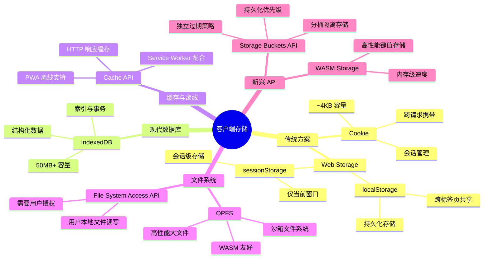
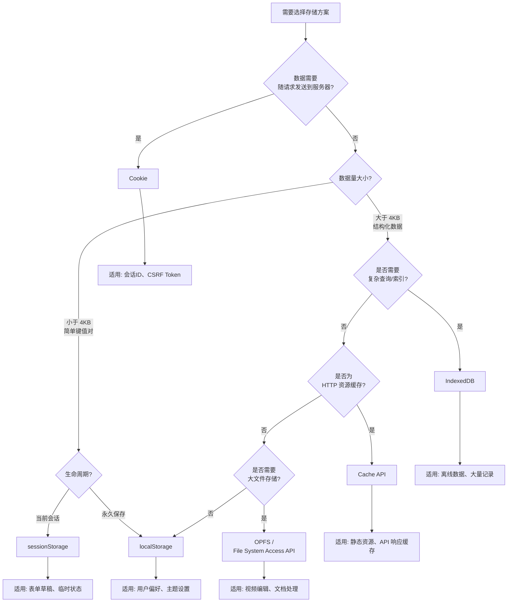
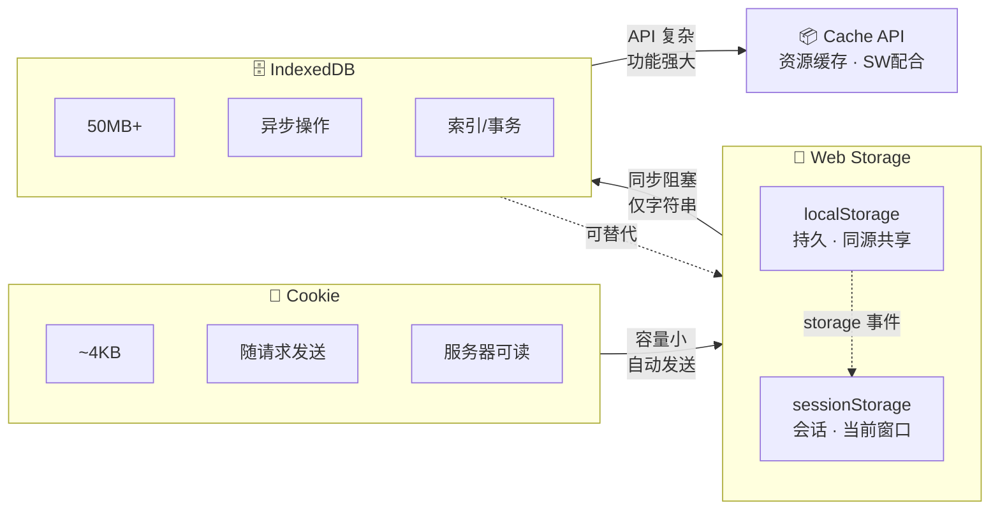
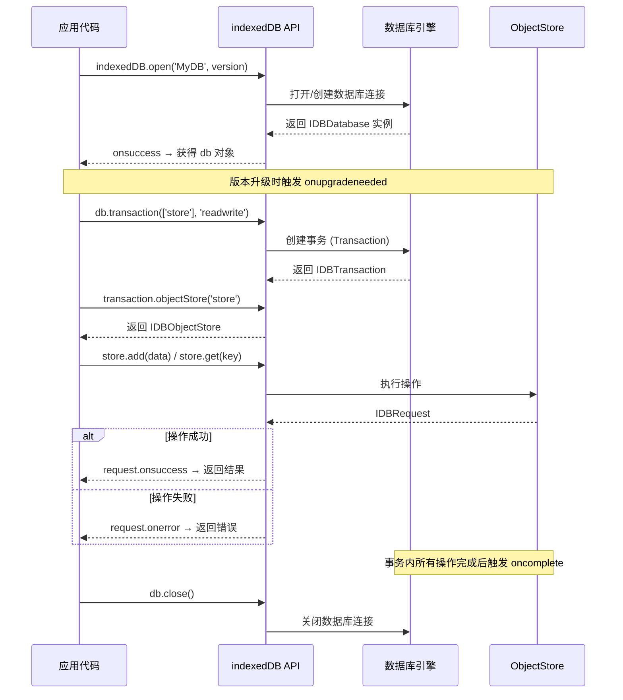

# 数据存储（01）：IndexedDB


HTML5 提供了多种客户端数据存储方案，每种方案都有其特定的应用场景和优势。选择合适的存储方案可以显著提升应用性能和用户体验。

## 存储方案概览

HTML5 主要提供以下客户端存储方案：

1. **Cookie**：传统的客户端存储机制，主要用于服务器端会话管理
2. **Web Storage**：包括 `localStorage`（长期存储）和 `sessionStorage`（会话级存储）
3. **IndexedDB**：强大的客户端数据库，支持复杂数据结构和索引查询

### 存储方案对比

| 特性 | Cookie | localStorage | sessionStorage | IndexedDB |
| ------ | -------- | ------------- | ---------------- | ----------- |
| **存储容量** | ~4KB | 5-10MB | 5-10MB | 50MB+ |
| **生命周期** | 可设置过期时间 | 永久（除非手动删除） | 会话结束清除 | 永久（除非手动删除） |
| **作用域** | 同域名 | 同源 | 同源同窗口 | 同源 |
| **是否随请求发送** | 是 | 否 | 否 | 否 |
| **操作方式** | 同步 | 同步 | 同步 | 异步 |
| **数据类型** | 字符串 | 字符串 | 字符串 | 多种类型 |
| **查询能力** | 无 | 无 | 无 | 支持索引查询 |
| **事务支持** | 无 | 无 | 无 | 支持 |
| **适用场景** | 会话管理、小数据 | 用户偏好、配置 | 临时数据、表单 | 大量结构化数据 |

### 如何选择存储方案

- **Cookie**：适合需要随请求自动发送到服务器的数据（如会话ID、用户标识）
- **localStorage**：适合需要长期保存的用户偏好、配置信息、缓存数据
- **sessionStorage**：适合临时数据、表单草稿、单次会话的状态信息
- **IndexedDB**：适合大量结构化数据、离线应用、需要复杂查询的场景

### 客户端存储方案分类体系



### 存储方案选择决策树



### 存储方案对比关系图



### 浏览器兼容性

所有现代浏览器都支持 HTML5 存储方案，但具体实现细节可能略有差异：

| 浏览器 | Cookie | localStorage | sessionStorage | IndexedDB | Storage API |
|--------|--------|--------------|----------------|-----------|-------------|
| Chrome 4+ | ✓ | ✓ | ✓ | ✓ (23+) | ✓ (52+) |
| Firefox 3.5+ | ✓ | ✓ | ✓ | ✓ (10+) | ✓ (57+) |
| Safari 4+ | ✓ | ✓ | ✓ | ✓ (10+) | ✓ (15.2+) |
| Edge 12+ | ✓ | ✓ | ✓ | ✓ | ✓ |
| IE 8-10 | ✓ | ✓ | ✓ | ✓ (10) | ✗ |
| IE 11 | ✓ | ✓ | ✓ | ✓ | ✗ |
| Opera 10.5+ | ✓ | ✓ | ✓ | ✓ (15+) | ✓ (39+) |
| iOS Safari 3.2+ | ✓ | ✓ | ✓ | ✓ (10+) | ✓ |
| Android Browser 2.1+ | ✓ | ✓ | ✓ | ✓ (4.4+) | ✓ (53+) |

**注意事项：**

- IE 8-9 的 `localStorage` 对象可能被模拟为 `userData` 行为
- 隐私/无痕模式下存储空间可能受限或完全禁用
- iOS Safari 在存储空间不足时可能会自动清理数据
- Service Worker 环境中无法访问 `localStorage` 和 `sessionStorage`

**特性检测示例：**

```javascript
// 检测 Web Storage
function isStorageAvailable(type) {
  try {
    const storage = window[type];
    const test = '__storage_test__';
    storage.setItem(test, test);
    storage.removeItem(test);
    return true;
  } catch (e) {
    return false;
  }
}

// 检测 IndexedDB
function isIndexedDBAvailable() {
  try {
    return 'indexedDB' in window && 
           window.indexedDB !== null;
  } catch (e) {
    return false;
  }
}

// 检测 Storage API (用于查询存储配额)
function isStorageAPIAvailable() {
  return 'storage' in navigator && 
         'estimate' in navigator.storage;
}

// 使用示例
if (isStorageAvailable('localStorage')) {
  console.log('localStorage 可用');
}
```

## 存储系统架构

理解 HTML5 存储方案的整体架构有助于更好地设计和优化应用程序的存储策略。

### 存储架构层次

```
┌─────────────────────────────────────────────────────────────┐
│                    Web 应用层                                 │
│  (应用逻辑、UI 组件、业务流程)                                 │
└─────────────────────────────────────────────────────────────┘
                            ↓
┌─────────────────────────────────────────────────────────────┐
│                   存储抽象层                                  │
│  (统一 API、工具类封装、数据序列化)                           │
└─────────────────────────────────────────────────────────────┘
                            ↓
┌──────────────┬──────────────┬──────────────┬───────────────┐
│    Cookie    │ Web Storage  │  IndexedDB   │  Cache API    │
│  (会话管理)   │ (键值存储)    │ (结构化数据) │  (资源缓存)   │
└──────────────┴──────────────┴──────────────┴───────────────┘
                            ↓
┌─────────────────────────────────────────────────────────────┐
│                   浏览器存储引擎                              │
│  (SQLite, LevelDB, 文件系统)                                 │
└─────────────────────────────────────────────────────────────┘
                            ↓
┌─────────────────────────────────────────────────────────────┐
│                   操作系统层                                  │
│  (磁盘存储、内存管理、安全沙箱)                               │
└─────────────────────────────────────────────────────────────┘
```

### 数据流与访问模式

#### Cookie 数据流

```
浏览器 ←→ 服务器
  │          │
  │ ← HTTP 响应头 Set-Cookie
  │ → HTTP 请求头 Cookie (自动携带)
  │
  └→ document.cookie API (JavaScript 访问)
```

**特点：**
- 双向自动同步
- 随每次请求发送
- 大小受限（4KB）
- 可设置过期时间和作用域

#### Web Storage 数据流

```
浏览器
  │
  ├→ localStorage (持久化)
  │    ├─ 同源所有窗口共享
  │    ├─ 手动删除或清除浏览器数据时删除
  │    └─ Storage 事件通知其他窗口
  │
  └→ sessionStorage (会话级)
       ├─ 仅当前窗口可用
       ├─ 关闭标签页后自动清除
       └─ 不触发 Storage 事件
```

**特点：**
- 仅客户端访问
- 同步 API 调用
- 容量较大（5-10MB）
- 不随请求发送

#### IndexedDB 数据流

```
浏览器
  │
  └→ 异步 API (Promise/回调)
       │
       ├─ Database (数据库)
       │    ├─ Object Store (对象仓库)
       │    │    ├─ 索引 (Index)
       │    │    └─ 记录 (Records)
       │    │
       │    └─ 事务 (Transaction)
       │         ├─ readwrite
       │         └─ readonly
       │
       └─ Cursor (游标遍历)
```

**特点：**
- 异步非阻塞
- 大容量存储（50MB+）
- 支持索引和事务
- 结构化数据存储

### 存储隔离与安全模型

```
┌─────────────────────────────────────────┐
│          同源策略 (Same-Origin)          │
│  协议 + 域名 + 端口                      │
│                                         │
│  https://example.com:443                │
│  ├── localStorage (独立)                │
│  ├── sessionStorage (独立)              │
│  └── IndexedDB (独立)                   │
│                                         │
│  https://other.com:443                  │
│  ├── localStorage (独立)                │
│  ├── sessionStorage (独立)              │
│  └── IndexedDB (独立)                   │
│                                         │
│  http://example.com:80                  │
│  ├── localStorage (独立)                │
│  ├── sessionStorage (独立)              │
│  └── IndexedDB (独立)                   │
└─────────────────────────────────────────┘

Cookie 作用域：
├─ Domain 属性控制域名范围
├─ Path 属性控制路径范围
└─ SameSite 属性控制跨站访问
```

**安全最佳实践：**

1. **同源隔离**：不同源的存储完全隔离,无法互相访问
2. **Cookie 作用域**：通过 Domain 和 Path 精细控制
3. **安全属性**：
   - `HttpOnly`：防止 XSS 攻击
   - `Secure`：仅 HTTPS 传输
   - `SameSite`：防止 CSRF 攻击
4. **敏感数据**：不应直接存储明文,需要加密

### 存储容量管理

```javascript
// 查询存储配额 (Storage API)
async function checkStorageQuota() {
  if ('storage' in navigator && 'estimate' in navigator.storage) {
    const estimate = await navigator.storage.estimate();
    console.log(`已使用: ${(estimate.usage / 1024 / 1024).toFixed(2)} MB`);
    console.log(`总配额: ${(estimate.quota / 1024 / 1024).toFixed(2)} MB`);
    console.log(`可用: ${((estimate.quota - estimate.usage) / 1024 / 1024).toFixed(2)} MB`);
    return estimate;
  } else {
    console.warn('Storage API 不可用');
    return null;
  }
}

// 监听存储压力
if ('storage' in navigator && 'persist' in navigator.storage) {
  navigator.storage.persist().then(granted => {
    if (granted) {
      console.log('持久化存储已授权,浏览器不会自动清理');
    }
  });
}
```

## Cookie

Cookie 是 Web 开发中最古老的客户端存储技术之一，它允许服务器在用户浏览器中存储少量数据，这些数据会在后续请求中自动发送回服务器

1. **自动随请求发送**：每次 HTTP 请求都会自动携带相关 Cookie
2. **大小限制**：通常每个 Cookie 不超过 4KB，每个域名下最多约 20-50 个 Cookie（取决于浏览器）
3. **过期时间**：可以设置过期时间（会话 Cookie 或持久 Cookie）
4. **域名限制**：只能在设置它的域名及其子域名下访问
5. **安全性**：可以设置 HttpOnly 和 Secure 标志增强安全性

一个 Cookie 通常包含以下部分：

- **名称/值对**（必需）：存储的实际数据
- **可选属性**：
  - `expires` 或 `max-age`：过期时间
    - `expires`：指定具体的过期日期（GMT 格式）
    - `max-age`：指定从当前时间开始的秒数
  - `domain`：作用域名，默认为当前域名
  - `path`：作用路径，默认为 `/`
  - `secure`：仅通过 HTTPS 传输，防止中间人攻击
  - `HttpOnly`：禁止 JavaScript 访问，防止 XSS 攻击（只能通过服务器端设置）
  - `SameSite`：控制跨站请求时是否发送
    - `Strict`：严格模式，任何跨站请求都不发送 Cookie
    - `Lax`：宽松模式，GET 请求的跨站导航会发送 Cookie（默认值）
    - `None`：所有跨站请求都发送 Cookie（需要配合 `Secure` 使用）

<h4>003-cookie-panel.html</h4>

```html
<!-- 来源：14-数据存储.md - Cookie章节 -->
<!DOCTYPE html>
<html lang="zh-CN">
<head>
  <meta charset="UTF-8">
  <meta name="viewport" content="width=device-width, initial-scale=1.0">
  <title>【3】Cookie 完整操作面板</title>
  <style>
    * { margin: 0; padding: 0; box-sizing: border-box; }
    body { font-family: -apple-system, BlinkMacSystemFont, 'Segoe UI', sans-serif; padding: 20px; background: #f0f2f5; color: #333; }
    .demo-container { max-width: 860px; margin: 0 auto; }
    .demo-title { margin-bottom: 20px; font-size: 20px; color: #1a1a1a; border-bottom: 3px solid #e74c3c; padding-bottom: 10px; display: flex; align-items: center; gap: 8px; }
    .demo-title::before { content: "🍪"; font-size: 24px; }

    .panel { background: white; border-radius: 10px; box-shadow: 0 2px 12px rgba(0,0,0,0.08); padding: 20px; margin-bottom: 18px; }
    .panel-header { font-size: 15px; font-weight: 600; color: #555; margin-bottom: 14px; padding-bottom: 8px; border-bottom: 1px solid #eee; }

    .form-row { display: flex; gap: 12px; margin-bottom: 12px; flex-wrap: wrap; }
    .form-group { flex: 1; min-width: 180px; }
    .form-group label { display: block; font-size: 12px; font-weight: 500; color: #666; margin-bottom: 4px; }
    .form-group input, .form-group select {
      width: 100%; padding: 8px 12px; border: 1.5px solid #ddd; border-radius: 6px;
      font-size: 13px; transition: border-color 0.2s; background: #fafafa;
    }
    .form-group input:focus, .form-group select:focus { border-color: #e74c3c; outline: none; background: white; }

    .checkbox-group { display: flex; gap: 16px; flex-wrap: wrap; margin-bottom: 14px; }
    .checkbox-item { display: flex; align-items: center; gap: 5px; font-size: 13px; color: #555; cursor: pointer; }
    .checkbox-item input[type="checkbox"] { accent-color: #e74c3c; cursor: pointer; }

    .btn { padding: 9px 18px; border: none; border-radius: 6px; cursor: pointer; font-size: 13px; font-weight: 500; transition: all 0.2s; }
    .btn:hover { transform: translateY(-1px); }
    .btn-primary { background: #e74c3c; color: white; }
    .btn-primary:hover { background: #c0392b; }
    .btn-success { background: #27ae60; color: white; }
    .btn-success:hover { background: #219a52; }
    .btn-warning { background: #f39c12; color: white; }
    .btn-warning:hover { background: #d68910; }
    .btn-danger { background: #e74c3c; color: white; }
    .btn-info { background: #3498db; color: white; }
    .btn-sm { padding: 5px 12px; font-size: 12px; }

    .btn-group { display: flex; gap: 8px; flex-wrap: wrap; margin-top: 12px; }

    /* Cookie 列表 */
    .cookie-list { max-height: 280px; overflow-y: auto; }
    .cookie-item {
      display: flex; justify-content: space-between; align-items: center;
      padding: 10px 14px; margin: 6px 0; background: #fef9f9;
      border: 1px solid #fdd; border-radius: 8px; font-size: 13px;
      transition: background 0.2s;
    }
    .cookie-item:hover { background: #fff0f0; }
    .cookie-name { font-weight: 600; color: #e74c3c; font-family: monospace; }
    .cookie-value { color: #666; max-width: 250px; overflow: hidden; text-overflow: ellipsis; white-space: nowrap; font-family: monospace; font-size: 12px; }
    .cookie-actions { display: flex; gap: 4px; }

    /* 属性标签 */
    .attr-tags { display: flex; gap: 6px; flex-wrap: wrap; margin-top: 8px; }
    .attr-tag { font-size: 11px; padding: 2px 8px; border-radius: 10px; background: #eee; color: #777; }
    .attr-tag.active { background: #e8f5e9; color: #27ae60; }

    /* 大小测试 */
    .size-bar { height: 24px; background: linear-gradient(90deg, #27ae60 0%, #f39c12 70%, #e74c3c 100%); border-radius: 12px; position: relative; margin: 10px 0; }
    .size-marker { position: absolute; top: -22px; font-size: 11px; color: #888; transform: translateX(-50%); }
    .size-current { position: absolute; top: -22px; font-size: 11px; font-weight: 700; color: #333; transform: translateX(-50%); border-bottom: 2px solid #333; padding-bottom: 2px; }

    .empty-state { text-align: center; padding: 30px; color: #aaa; font-size: 14px; }

    .toast {
      position: fixed; top: 20px; right: 20px; padding: 12px 22px;
      border-radius: 8px; color: white; font-size: 14px; font-weight: 500;
      animation: slideIn 0.3s ease; z-index: 1000;
    }
    .toast-success { background: #27ae60; }
    .toast-error { background: #e74c3c; }
    @keyframes slideIn { from { transform: translateX(100%); opacity: 0; } to { transform: translateX(0); opacity: 1; } }

    .log-area {
      background: #1e1e1e; color: #d4d4d4; border-radius: 8px; padding: 14px;
      font-family: 'Monaco', 'Menlo', monospace; font-size: 12px;
      max-height: 150px; overflow-y: auto; line-height: 1.6;
      white-space: pre-wrap; word-break: break-all;
    }
    .log-area .log-info { color: #569cd6; }
    .log-area .log-warn { color: #dcdcaa; }
    .log-area .log-error { color: #f44747; }
  </style>
</head>
<body>
  <div class="demo-container">
    <div class="demo-title">Cookie 完整操作面板</div>

    <!-- 设置 Cookie -->
    <div class="panel">
      <div class="panel-header">📝 设置 Cookie</div>
      <div class="form-row">
        <div class="form-group"><label>名称 (Name)</label><input type="text" id="ckName" placeholder="如: username" value="demo_cookie"></div>
        <div class="form-group"><label>值 (Value)</label><input type="text" id="ckValue" placeholder="如: JohnDoe" value="hello_world"></div>
      </div>
      <div class="form-row">
        <div class="form-group"><label>过期时间 / Max-Age（秒）</label><input type="number" id="ckMaxAge" placeholder="如: 3600 (1小时)" value="3600"></div>
        <div class="form-group"><label>路径 (Path)</label><input type="text" id="ckPath" placeholder="默认: /" value="/"></div>
      </div>
      <div class="form-row">
        <div class="form-group"><label>域名 (Domain)</label><input type="text" id="ckDomain" placeholder="留空=当前域名"></div>
        <div class="form-group"><label>SameSite</label>
          <select id="ckSameSite">
            <option value="">默认 (Lax)</option>
            <option value="Strict">Strict</option>
            <option value="Lax" selected>Lax</option>
            <option value="None">None (需Secure)</option>
          </select>
        </div>
      </div>
      <div class="checkbox-group">
        <label class="checkbox-item"><input type="checkbox" id="ckSecure"> Secure（仅 HTTPS）</label>
        <label class="checkbox-item"><input type="checkbox" id="ckHttpOnly" disabled title="JavaScript 无法设置 HttpOnly"> HttpOnly（仅服务端可设）</label>
      </div>
      <div class="btn-group">
        <button class="btn btn-primary" onclick="setCookie()">🍪 设置 Cookie</button>
        <button class="btn btn-success" onclick="setTestCookies()">📦 批量写入测试 Cookie</button>
      </div>
    </div>

    <!-- 读取 & 删除 -->
    <div class="panel">
      <div class="panel-header">📖 当前所有 Cookie</div>
      <div style="display:flex;justify-content:space-between;align-items:center;margin-bottom:10px;">
        <span style="font-size:13px;color:#888;" id="cookieCount">共 0 个 Cookie</span>
        <div class="btn-group" style="margin-top:0;">
          <button class="btn btn-info btn-sm" onclick="refreshCookieList()">🔄 刷新列表</button>
          <button class="btn btn-danger btn-sm" onclick="clearAllCookies()">🗑️ 清除本页全部 Cookie</button>
        </div>
      </div>
      <div class="cookie-list" id="cookieList"><div class="empty-state">暂无 Cookie</div></div>
    </div>

    <!-- 大小限制测试 -->
    <div class="panel">
      <div class="panel-header">📏 Cookie 大小限制测试（单条 ~4KB）</div>
      <p style="font-size:13px;color:#888;margin-bottom:10px;">逐步增大 Cookie 值，观察何时触发 QuotaExceededError</p>
      <div class="size-bar" id="sizeBar">
        <span class="size-marker" style="left:0%">0B</span>
        <span class="size-marker" style="left:25%">1KB</span>
        <span class="size-marker" style="left:50%">2KB</span>
        <span class="size-marker" style="left:75%">3KB</span>
        <span class="size-marker" style="left:100%">4KB</span>
        <span class="size-current" id="sizeMarker" style="left:0%">当前: 0B</span>
      </div>
      <div class="btn-group">
        <button class="btn btn-warning" onclick="testSizeIncrement()">+ 增加 256 字节</button>
        <button class="btn btn-sm" onclick="resetSizeTest()" style="background:#999;color:white;">重置测试</button>
      </div>
      <div class="log-area" id="sizeLog" style="margin-top:10px;"><span class="log-info">// 点击按钮开始大小测试...</span></div>
    </div>

    <!-- 操作日志 -->
    <div class="panel">
      <div class="panel-header">📋 操作日志</div>
      <div class="log-area" id="logArea"><span class="log-info">// 操作日志将显示在这里...</span></div>
    </div>
  </div>

  <script>
    const logArea = document.getElementById('logArea')
    let sizeTestBytes = 0

    function log(msg, type = 'info') {
      const time = new Date().toLocaleTimeString()
      const colors = { info: 'log-info', warn: 'log-warn', error: 'log-error' }
      logArea.innerHTML += `<span class="${colors[type]}">[${time}] ${msg}</span>\n`
      logArea.scrollTop = logArea.scrollHeight
    }

    function showToast(msg, type) {
      const toast = document.createElement('div')
      toast.className = `toast toast-${type}`
      toast.textContent = msg
      document.body.appendChild(toast)
      setTimeout(() => toast.remove(), 2500)
    }

    // ====== Cookie 工具函数 ======
    function setCookie() {
      const name = document.getElementById('ckName').value.trim()
      const value = document.getElementById('ckValue').value.trim()
      if (!name || !value) return showToast('请填写名称和值', 'error')

      let cookieStr = `${encodeURIComponent(name)}=${encodeURIComponent(value)}`

      const maxAge = document.getElementById('ckMaxAge').value
      if (maxAge) cookieStr += `; Max-Age=${maxAge}`

      const path = document.getElementById('ckPath').value.trim()
      if (path) cookieStr += `; Path=${path}`

      const domain = document.getElementById('ckDomain').value.trim()
      if (domain) cookieStr += `; Domain=${domain}`

      const sameSite = document.getElementById('ckSameSite').value
      if (sameSite) cookieStr += `; SameSite=${sameSite}`

      if (document.getElementById('ckSecure').checked) cookieStr += '; Secure'

      try {
        document.cookie = cookieStr
        log(`✅ 已设置 Cookie: ${name}=${value.substring(0, 30)}... | 属性: [Max-Age=${maxAge||'会话'} Path=${path||'/'} SameSite=${sameSite||'Lax'}${document.getElementById('ckSecure').checked?' Secure':''}]`, 'info')
        showToast(`Cookie "${name}" 设置成功`, 'success')
        refreshCookieList()
      } catch (e) {
        log(`❌ 设置失败: ${e.message}`, 'error')
        showToast('设置失败', 'error')
      }
    }

    function getCookie(name) {
      const eq = encodeURIComponent(name) + '='
      const cookies = document.cookie.split(';')
      for (let c of cookies) {
        c = c.trim()
        if (c.startsWith(eq)) return decodeURIComponent(c.substring(eq.length))
      }
      return null
    }

    function deleteCookie(name, path = '/') {
      document.cookie = `${encodeURIComponent(name)}=; expires=Thu, 01 Jan 1970 00:00:00 UTC; path=${path}`
    }

    function getAllCookies() {
      const map = {}
      if (!document.cookie) return map
      for (const c of document.cookie.split(';')) {
        const idx = c.indexOf('=')
        if (idx > 0) {
          const k = decodeURIComponent(c.substring(0, idx).trim())
          const v = decodeURIComponent(c.substring(idx + 1).trim())
          map[k] = v
        }
      }
      return map
    }

    function refreshCookieList() {
      const list = document.getElementById('cookieList')
      const countEl = document.getElementById('cookieCount')
      const cookies = getAllCookies()
      const keys = Object.keys(cookies)

      countEl.textContent = `共 ${keys.length} 个 Cookie`

      if (keys.length === 0) {
        list.innerHTML = '<div class="empty-state">暂无 Cookie — 点击上方按钮创建</div>'
        return
      }

      let html = ''
      keys.forEach(k => {
        let v = cookies[k]
        if (v.length > 50) v = v.substring(0, 47) + '...'
        const safeK = k.replace(/&/g,'&amp;').replace(/</g,'&lt;')
        const safeV = v.replace(/&/g,'&amp;').replace(/</g,'&lt;')
        const size = new Blob([k + '=' + cookies[k]]).size
        html += `
          <div class="cookie-item">
            <div>
              <span class="cookie-name">${safeK}</span>
              <span style="color:#ccc;margin:0 6px;">=</span>
              <span class="cookie-value">${safeV}</span>
              <span style="color:#bbb;font-size:11px;margin-left:8px;">(${size} B)</span>
            </div>
            <div class="cookie-actions">
              <button class="btn btn-danger btn-sm" onclick="deleteByName('${safeK}')">删除</button>
            </div>
          </div>`
      })
      list.innerHTML = html
    }

    function deleteByName(name) {
      deleteCookie(name)
      log(`🗑️ 已删除 Cookie: ${name}`, 'warn')
      showToast(`已删除: ${name}`, 'success')
      refreshCookieList()
    }

    function clearAllCookies() {
      if (!confirm('确定要清除本页面能访问的所有 Cookie 吗？')) return
      const cookies = getAllCookies()
      Object.keys(cookies).forEach(k => deleteCookie(k))
      log(`🧹 已清除全部 ${Object.keys(cookies).length} 个 Cookie`, 'warn')
      showToast('已清空全部 Cookie', 'success')
      refreshCookieList()
    }

    function setTestCookies() {
      const tests = [
        { name: 'user_pref_theme', value: 'dark', age: 86400 * 30 },
        { name: 'user_lang', value: 'zh-CN', age: 86400 * 365 },
        { name: 'session_id', value: 'sess_' + Math.random().toString(36).slice(2, 14), age: 3600 },
        { name: 'visit_count', value: String(parseInt(getCookie('visit_count') || '0') + 1), age: 86400 * 365 },
      ]
      tests.forEach(t => {
        document.cookie = `${encodeURIComponent(t.name)}=${encodeURIComponent(t.value)}; Max-Age=${t.age}; Path=/`
      })
      log(`📦 批量写入 ${tests.length} 个测试 Cookie`, 'info')
      showToast(`已写入 ${tests.length} 个测试 Cookie`, 'success')
      refreshCookieList()
    }

    // ====== 大小限制测试 ======
    function testSizeIncrement() {
      sizeTestBytes += 256
      const testVal = 'x'.repeat(sizeTestBytes)
      const testKey = '__size_test__'

      try {
        document.cookie = `${testKey}=${testVal}; Path=/`
        const totalSize = new Blob([document.cookie]).size
        const pct = Math.min((totalSize / 4096) * 100, 100)

        document.getElementById('sizeMarker').style.left = `${Math.min(pct, 98)}%`
        document.getElementById('sizeMarker').textContent = `当前: ${(totalSize/1024).toFixed(2)} KB`

        log(`📏 写入 ${sizeTestBytes} 字节成功 | 总 Cookie 大小: ${(totalSize/1024).toFixed(2)} KB (${pct.toFixed(1)}%)`, 'info')
      } catch (e) {
        log(`❌ 写入失败! 当前尝试 ${sizeTestBytes} 字节 | 错误: ${e.name === 'QuotaExceededError' ? '超出 4KB 限制!' : e.message}`, 'error')
        showToast('达到大小上限!', 'error')
      }
    }

    function resetSizeTest() {
      document.cookie = '__size_test__=; expires=Thu, 01 Jan 1970 00:00:00 UTC; path=/'
      sizeTestBytes = 0
      document.getElementById('sizeMarker').style.left = '0%'
      document.getElementById('sizeMarker').textContent = '当前: 0B'
      log(`🔄 大小测试已重置`, 'info')
    }

    // 初始化
    refreshCookieList()
    log('🍪 Cookie 操作面板已就绪', 'info')
  </script>
</body>
</html>
```

### 设置 Cookie

1. 通过 HTTP 响应头设置（服务器端）

```http
Set-Cookie: sessionId=abc123; Path=/; HttpOnly; Secure; SameSite=Lax
Set-Cookie: theme=dark; Expires=Wed, 21 Oct 2026 07:28:00 GMT; Max-Age=604800
```

2. 通过 JavaScript 设置（前端）

```javascript
// 设置简单 Cookie
document.cookie = "username=JohnDoe";

// 设置带过期时间的 Cookie（7 天后过期）
const expirationDate = new Date();
expirationDate.setTime(expirationDate.getTime() + (7 * 24 * 60 * 60 * 1000)); // 7天后过期
document.cookie = `theme=dark; expires=${expirationDate.toUTCString()}; path=/`;

// 设置带路径和域名的 Cookie
document.cookie = "language=en; path=/; domain=.example.com";

// 设置 Secure 和 HttpOnly 需要通过服务器端设置（JavaScript 无法设置 HttpOnly）
document.cookie = "sessionId=abc123; path=/; secure";
```

### Cookie API 详解

#### Cookie 属性说明

| 属性 | 说明 | 示例 | 默认值 | 注意事项 |
|------|------|------|--------|----------|
| **Name=Value** | Cookie 名称和值(必需) | `username=JohnDoe` | 无 | 建议使用 `encodeURIComponent()` 编码 |
| **Expires** | 过期日期(GMT格式) | `Expires=Wed, 21 Oct 2026 07:28:00 GMT` | 会话Cookie | 过期后浏览器自动删除 |
| **Max-Age** | 有效期(秒) | `Max-Age=604800` (7天) | 会话Cookie | 优先级高于 Expires |
| **Domain** | 作用域名 | `Domain=.example.com` | 当前域名 | `.example.com` 包含所有子域名 |
| **Path** | 作用路径 | `Path=/admin` | `/` | 只在该路径及其子路径下有效 |
| **Secure** | 仅HTTPS传输 | `Secure` | 无 | 生产环境必须设置 |
| **HttpOnly** | 禁止JS访问 | `HttpOnly` | 无 | 防止XSS攻击,仅服务器端设置 |
| **SameSite** | 跨站策略 | `SameSite=Strict` | `Lax` | 防止CSRF攻击 |

#### SameSite 属性详解

| 值 | 说明 | 使用场景 | 示例 |
|----|------|----------|------|
| **Strict** | 严格模式,任何跨站请求都不发送 | 敏感操作、银行网站 | `SameSite=Strict` |
| **Lax** | 宽松模式,GET跨站导航发送(默认) | 大多数网站 | `SameSite=Lax` |
| **None** | 所有跨站请求都发送 | 需要跨站嵌入的网站 | `SameSite=None; Secure` |

**注意事项：**

- `SameSite=None` 必须配合 `Secure` 使用
- 现代浏览器默认值为 `Lax`
- 跨站请求包括：链接、图片加载、表单提交等

#### Cookie 操作方法

```javascript
// 检查 Cookie 是否启用
function areCookiesEnabled() {
  try {
    document.cookie = 'testcookie=1';
    const ret = document.cookie.indexOf('testcookie=') !== -1;
    document.cookie = 'testcookie=1; expires=Thu, 01 Jan 1970 00:00:00 GMT';
    return ret;
  } catch (e) {
    return false;
  }
}

// 获取所有 Cookie 的键值对
function getAllCookies() {
  const cookies = {};
  if (document.cookie) {
    const cookieArray = document.cookie.split(';');
    cookieArray.forEach(cookie => {
      const [name, value] = cookie.trim().split('=');
      if (name && value) {
        cookies[decodeURIComponent(name)] = decodeURIComponent(value);
      }
    });
  }
  return cookies;
}

// 检查 Cookie 是否存在
function hasCookie(name) {
  return document.cookie.split(';').some(cookie => {
    return cookie.trim().startsWith(encodeURIComponent(name) + '=');
  });
}

// 获取 Cookie 数量
function getCookieCount() {
  return document.cookie ? document.cookie.split(';').length : 0;
}
```

### 操作 Cookie

::: code-group

```javascript [读取 cookie]
// 直接读取所有 Cookie（返回字符串）
const allCookies = document.cookie;
console.log(allCookies); // 例如: "username=JohnDoe; theme=dark; language=en"

// 解析 Cookie 为对象
function getCookie(cookieName) {
  const name = cookieName + "=";
  const decodedCookie = decodeURIComponent(document.cookie);
  const cookieArray = decodedCookie.split(';');
  
  for(let i = 0; i < cookieArray.length; i++) {
    let cookie = cookieArray[i].trim();
    if (cookie.indexOf(name) === 0) {
      return cookie.substring(name.length, cookie.length);
    }
  }
  return "";
}

const username = getCookie("username");
console.log(username); // 输出: JohnDoe
```

```javascript [删除 Cookie]
// 通过设置过期时间为过去的时间来删除
document.cookie = "username=; expires=Thu, 01 Jan 1970 00:00:00 UTC; path=/;";
```

:::

### 示例

::: code-group

```html [记住用户名]
<!DOCTYPE html>
<html>
  <head>
    <title>Cookie 示例</title>
  </head>
  <body>
    <h1>登录表单</h1>
    <form id="loginForm">
      <label for="username">用户名:</label>
      <input type="text" id="username" name="username"><br><br>
      <label for="remember">记住我</label>
      <input type="checkbox" id="remember" name="remember"><br><br>
      <button type="submit">登录</button>
    </form>

    <script>
      const form = document.getElementById('loginForm');
      const usernameInput = document.getElementById('username');
      const rememberCheckbox = document.getElementById('remember');

      // 页面加载时检查是否记住用户名
      window.addEventListener('load', function() {
        const savedUsername = getCookie("username");
        if (savedUsername) {
          usernameInput.value = savedUsername;
          rememberCheckbox.checked = true;
        }
      });

      // 表单提交处理
      form.addEventListener('submit', function(e) {
        e.preventDefault();

        if (rememberCheckbox.checked) {
          // 设置 Cookie 保存用户名（7天后过期）
          const expirationDate = new Date();
          expirationDate.setTime(expirationDate.getTime() + (7 * 24 * 60 * 60 * 1000));
          document.cookie = `username=${encodeURIComponent(usernameInput.value)}; expires=${expirationDate.toUTCString()}; path=/`;
        } else {
          // 删除已保存的用户名
          document.cookie = "username=; expires=Thu, 01 Jan 1970 00:00:00 UTC; path=/;";
        }

        alert("登录成功！");
      });

      // 获取 Cookie 的辅助函数
      function getCookie(cookieName) {
        const name = cookieName + "=";
        const decodedCookie = decodeURIComponent(document.cookie);
        const cookieArray = decodedCookie.split(';');

        for(let i = 0; i < cookieArray.length; i++) {
          let cookie = cookieArray[i].trim();
          if (cookie.indexOf(name) === 0) {
            return cookie.substring(name.length, cookie.length);
          }
        }
        return "";
      }
    </script>
  </body>
</html>
```

```javascript [跟踪用户偏好（主题设置）]
// 设置主题 Cookie（30天后过期）
function setTheme(theme) {
  const expirationDate = new Date();
  expirationDate.setTime(expirationDate.getTime() + (30 * 24 * 60 * 60 * 1000));
  document.cookie = `theme=${theme}; expires=${expirationDate.toUTCString()}; path=/`;
}

// 获取主题 Cookie
function getTheme() {
  const theme = getCookie("theme");
  return theme || "light"; // 默认主题
}

// 辅助函数
function getCookie(cookieName) {
  const name = cookieName + "=";
  const decodedCookie = decodeURIComponent(document.cookie);
  const cookieArray = decodedCookie.split(';');

  for(let i = 0; i < cookieArray.length; i++) {
    let cookie = cookieArray[i].trim();
    if (cookie.indexOf(name) === 0) {
      return cookie.substring(name.length, cookie.length);
    }
  }
  return "";
}

// 使用示例
document.getElementById('darkThemeBtn').addEventListener('click', function() {
  setTheme("dark");
  document.body.className = "dark-theme";
});

document.getElementById('lightThemeBtn').addEventListener('click', function() {
  setTheme("light");
  document.body.className = "light-theme";
});

// 页面加载时应用保存的主题
window.addEventListener('load', function() {
  document.body.className = getTheme() + "-theme";
});
```

:::

### Cookie 工具类封装

为了方便使用，可以封装一个 Cookie 工具类：

```javascript
class CookieUtil {
  /**
   * 设置 Cookie
   * @param {string} name - Cookie 名称
   * @param {string} value - Cookie 值
   * @param {Object} options - 配置选项
   * @param {number} options.days - 过期天数
   * @param {string} options.path - 路径
   * @param {string} options.domain - 域名
   * @param {boolean} options.secure - 是否仅 HTTPS
   * @param {string} options.sameSite - SameSite 属性
   */
  static set(name, value, options = {}) {
    let cookieString = `${encodeURIComponent(name)}=${encodeURIComponent(value)}`;

    if (options.days) {
      const expirationDate = new Date();
      expirationDate.setTime(expirationDate.getTime() + (options.days * 24 * 60 * 60 * 1000));
      cookieString += `; expires=${expirationDate.toUTCString()}`;
    }

    if (options.path) {
      cookieString += `; path=${options.path}`;
    }

    if (options.domain) {
      cookieString += `; domain=${options.domain}`;
    }

    if (options.secure) {
      cookieString += '; secure';
    }

    if (options.sameSite) {
      cookieString += `; SameSite=${options.sameSite}`;
    }

    document.cookie = cookieString;
  }

  /**
   * 获取 Cookie
   * @param {string} name - Cookie 名称
   * @returns {string|null} Cookie 值
   */
  static get(name) {
    const nameEQ = encodeURIComponent(name) + "=";
    const cookies = document.cookie.split(';');

    for (let i = 0; i < cookies.length; i++) {
      let cookie = cookies[i].trim();
      if (cookie.indexOf(nameEQ) === 0) {
        return decodeURIComponent(cookie.substring(nameEQ.length));
      }
    }
    return null;
  }

  /**
   * 删除 Cookie
   * @param {string} name - Cookie 名称
   * @param {string} path - 路径
   * @param {string} domain - 域名
   */
  static remove(name, path = '/', domain = '') {
    let cookieString = `${encodeURIComponent(name)}=; expires=Thu, 01 Jan 1970 00:00:00 UTC; path=${path}`;
    if (domain) {
      cookieString += `; domain=${domain}`;
    }
    document.cookie = cookieString;
  }

  /**
   * 获取所有 Cookie
   * @returns {Object} 所有 Cookie 的键值对
   */
  static getAll() {
    const cookies = {};
    const cookieArray = document.cookie.split(';');

    for (let i = 0; i < cookieArray.length; i++) {
      const cookie = cookieArray[i].trim();
      const [name, value] = cookie.split('=');
      if (name && value) {
        cookies[decodeURIComponent(name)] = decodeURIComponent(value);
      }
    }
    return cookies;
  }

  /**
   * 检查 Cookie 是否存在
   * @param {string} name - Cookie 名称
   * @returns {boolean} 是否存在
   */
  static has(name) {
    return this.get(name) !== null;
  }
}

// 使用示例
CookieUtil.set('username', 'JohnDoe', { days: 7, path: '/' });
const username = CookieUtil.get('username');
CookieUtil.remove('username');
```

### 优缺点

**优点：**

1. **简单易用**：API 简单，易于实现
2. **自动发送**：随每个请求自动发送到服务器，适合会话管理
3. **广泛支持**：所有浏览器都支持，兼容性最好
4. **服务器可读**：服务器端可以直接读取，无需额外请求

**缺点：**

1. **大小限制**：每个 Cookie 通常不超过 4KB，存储容量小
2. **数量限制**：每个域名下最多约 20-50 个 Cookie（取决于浏览器）
3. **性能影响**：每次 HTTP 请求都会携带 Cookie，增加请求头大小
4. **安全性问题**：容易受到 XSS 和 CSRF 攻击（需要正确设置安全属性）
5. **无结构化数据**：只能存储字符串，复杂数据需要序列化
6. **同步操作**：所有操作都是同步的，可能阻塞主线程

### 安全最佳实践

1. **敏感数据使用 HttpOnly**：防止 XSS 攻击窃取 Cookie
2. **生产环境使用 Secure**：确保 Cookie 仅通过 HTTPS 传输
3. **合理设置 SameSite**：根据需求选择 `Strict`、`Lax` 或 `None`
4. **避免存储敏感信息**：不要在 Cookie 中存储密码、信用卡号等敏感信息
5. **定期清理过期 Cookie**：避免 Cookie 过多影响性能

## Web Storage

Web Storage 是 HTML5 提供的一种在浏览器中存储数据的机制，它比传统的 Cookie 更高效、更安全，并且提供更大的存储空间。Web Storage 主要分为两种类型：`localStorage` 和 `sessionStorage`

1. **更大的存储空间**：通常提供 5-10MB 的存储空间（取决于浏览器），远大于 Cookie 的 4KB
2. **更快的访问速度**：数据存储在浏览器本地，访问速度比 Cookie 快
3. **更简单的 API**：使用键值对存储数据，操作简单
4. **不会随请求发送到服务器**：与 Cookie 不同，Web Storage 数据不会自动包含在 HTTP 请求头中
5. **同源策略**：数据只能在相同协议、域名和端口的页面间共享

对比：

| 特性 | localStorage | sessionStorage |
| -------- | -------------------------- | ---------------------------------- |
| 生命周期 | 永久存储，除非手动删除 | 仅在当前会话有效，关闭标签页后清除 |
| 共享范围 | 同一浏览器中的所有同源窗口 | 仅限当前窗口/标签页 |
| 典型用途 | 长期保存用户偏好设置 | 临时保存表单数据等会话信息 |

主要方法示例：

```javascript
localStorage.setItem('username', 'JohnDoe');

const username = localStorage.getItem('username');

localStorage.removeItem('username');

localStorage.clear();

// 获取指定索引的键名
const keyName = localStorage.key(0);

const count = localStorage.length;
```

### Web Storage API 详解

#### Storage 接口

所有 Web Storage 方法都属于 `Storage` 接口,`localStorage` 和 `sessionStorage` 都实现了这个接口。

| 方法/属性 | 语法 | 参数 | 返回值 | 说明 | 示例 |
|-----------|------|------|--------|------|------|
| **setItem()** | `storage.setItem(key, value)` | key: 键名<br>value: 值 | void | 存储数据项 | `localStorage.setItem('name', 'Alice')` |
| **getItem()** | `storage.getItem(key)` | key: 键名 | string \| null | 获取数据项,不存在返回 null | `localStorage.getItem('name')` |
| **removeItem()** | `storage.removeItem(key)` | key: 键名 | void | 删除指定数据项 | `localStorage.removeItem('name')` |
| **clear()** | `storage.clear()` | 无 | void | 清空所有数据 | `localStorage.clear()` |
| **key()** | `storage.key(index)` | index: 索引位置 | string \| null | 获取指定索引的键名 | `localStorage.key(0)` |
| **length** | `storage.length` | 无 | number | 获取存储项数量 | `localStorage.length` |

#### Storage 事件

当 `localStorage` 被修改时,会在同源的其他窗口触发 `storage` 事件:

| 事件属性 | 类型 | 说明 |
|----------|------|------|
| `key` | string \| null | 被修改的键名,clear() 时为 null |
| `oldValue` | string \| null | 旧值,新增时为 null |
| `newValue` | string \| null | 新值,删除时为 null |
| `url` | string | 触发变化的页面 URL |
| `storageArea` | Storage | 发生变化的 Storage 对象 |

```javascript
// 监听 storage 事件
window.addEventListener('storage', (event) => {
  console.log('存储变化:', {
    key: event.key,          // 被修改的键
    oldValue: event.oldValue, // 旧值
    newValue: event.newValue, // 新值
    url: event.url,          // 触发页面 URL
    storageArea: event.storageArea // localStorage 或 sessionStorage
  });
  
  // 实际应用示例
  if (event.key === 'userTheme') {
    applyTheme(event.newValue);
  }
});
```

**注意事项：**

- `storage` 事件只在**其他同源窗口**触发,当前窗口不会触发
- `sessionStorage` 的修改不会触发 `storage` 事件
- 事件在修改完成后异步触发
- 可以用于实现跨标签页同步

#### 完整示例：跨标签页通信

```html
<!DOCTYPE html>
<html lang="zh-CN">
<head>
  <meta charset="UTF-8">
  <title>跨标签页通信示例</title>
</head>
<body>
  <h1>跨标签页通信</h1>
  <input type="text" id="messageInput" placeholder="输入消息">
  <button onclick="sendMessage()">发送消息</button>
  <div id="messages"></div>

  <script>
    // 发送消息到其他标签页
    function sendMessage() {
      const input = document.getElementById('messageInput');
      const message = {
        text: input.value,
        timestamp: Date.now(),
        tabId: sessionStorage.getItem('tabId')
      };
      
      // 存储消息,触发其他标签页的 storage 事件
      localStorage.setItem('crossTabMessage', JSON.stringify(message));
      input.value = '';
    }

    // 监听来自其他标签页的消息
    window.addEventListener('storage', (event) => {
      if (event.key === 'crossTabMessage' && event.newValue) {
        const message = JSON.parse(event.newValue);
        
        // 不显示自己发送的消息
        if (message.tabId !== sessionStorage.getItem('tabId')) {
          displayMessage(message);
        }
      }
    });

    // 显示消息
    function displayMessage(message) {
      const div = document.getElementById('messages');
      const time = new Date(message.timestamp).toLocaleTimeString();
      div.innerHTML += `<p>[${time}] ${message.text}</p>`;
    }

    // 为每个标签页分配唯一 ID
    if (!sessionStorage.getItem('tabId')) {
      sessionStorage.setItem('tabId', 'tab-' + Math.random().toString(36).substr(2, 9));
    }
  </script>
</body>
</html>
```

### 使用示例

::: code-group

```javascript [基本存储和读取]
// 存储数据
localStorage.setItem('user', JSON.stringify({
  name: 'Alice',
  age: 28,
  email: 'alice@example.com'
}));

// 读取数据
const user = JSON.parse(localStorage.getItem('user'));
console.log(user.name); // 输出: Alice

// 删除数据
localStorage.removeItem('user');

// 清除所有数据
localStorage.clear();
```

```javascript [检查存储支持]
if (typeof(Storage) !== "undefined") {
  // 支持 Web Storage
  console.log("Web Storage 可用");
} else {
  // 不支持 Web Storage
  console.log("抱歉，您的浏览器不支持 Web Storage");
}
```

```javascript [会话存储示例]
// 在 sessionStorage 中存储表单数据
document.getElementById('myForm').addEventListener('submit', function(e) {
  e.preventDefault();

  const formData = {
    username: document.getElementById('username').value,
    password: document.getElementById('password').value
  };

  sessionStorage.setItem('form_data', JSON.stringify(formData));

  // 处理表单提交...
});

// 在页面加载时恢复表单数据
window.addEventListener('load', function() {
  const savedData = sessionStorage.getItem('form_data');
  if (savedData) {
    const formData = JSON.parse(savedData);
    document.getElementById('username').value = formData.username;
    document.getElementById('password').value = formData.password;

    // 可选：清除已保存的数据
    sessionStorage.removeItem('form_data');
  }
});
```

```javascript [存储大量数据]
// 存储数组
const todos = [
  { id: 1, text: '学习HTML5', completed: false },
  { id: 2, text: '练习CSS', completed: true }
];

localStorage.setItem('todos', JSON.stringify(todos));

// 读取并处理
const storedTodos = JSON.parse(localStorage.getItem('todos'));
storedTodos.forEach(todo => {
  console.log(`${todo.id}: ${todo.text} - ${todo.completed ? '已完成' : '未完成'}`);
});
```

```javascript [使用事件监听存储变化]
// 监听 storage 事件（在同一个源的其他标签页中修改时触发）
window.addEventListener('storage', function(e) {
  console.log(`键 ${e.key} 已被修改`);
  console.log(`旧值: ${e.oldValue}`);
  console.log(`新值: ${e.newValue}`);
  console.log(`发生修改的 URL: ${e.url}`);
});

// 修改存储项（在另一个标签页中会触发上面的事件）
localStorage.setItem('theme', 'dark');
```

:::

### Web Storage 工具类封装

封装一个功能完善的 Web Storage 工具类，包含错误处理和类型转换：

```javascript
class StorageUtil {
  constructor(storage = localStorage) {
    this.storage = storage;
  }

  /**
   * 设置存储项
   * @param {string} key - 键名
   * @param {*} value - 值（可以是任意类型）
   * @returns {boolean} 是否设置成功
   */
  set(key, value) {
    try {
      const serializedValue = JSON.stringify(value);
      this.storage.setItem(key, serializedValue);
      return true;
    } catch (error) {
      if (error.name === 'QuotaExceededError') {
        console.error('存储空间已满');
      } else {
        console.error('存储失败:', error);
      }
      return false;
    }
  }

  /**
   * 获取存储项
   * @param {string} key - 键名
   * @param {*} defaultValue - 默认值
   * @returns {*} 存储的值或默认值
   */
  get(key, defaultValue = null) {
    try {
      const item = this.storage.getItem(key);
      if (item === null) {
        return defaultValue;
      }
      return JSON.parse(item);
    } catch (error) {
      console.error('读取存储失败:', error);
      return defaultValue;
    }
  }

  /**
   * 删除存储项
   * @param {string} key - 键名
   */
  remove(key) {
    this.storage.removeItem(key);
  }

  /**
   * 清空所有存储
   */
  clear() {
    this.storage.clear();
  }

  /**
   * 检查键是否存在
   * @param {string} key - 键名
   * @returns {boolean} 是否存在
   */
  has(key) {
    return this.storage.getItem(key) !== null;
  }

  /**
   * 获取所有键名
   * @returns {string[]} 所有键名数组
   */
  keys() {
    const keys = [];
    for (let i = 0; i < this.storage.length; i++) {
      keys.push(this.storage.key(i));
    }
    return keys;
  }

  /**
   * 获取存储大小（字节）
   * @returns {number} 存储大小
   */
  getSize() {
    let total = 0;
    for (let key in this.storage) {
      if (this.storage.hasOwnProperty(key)) {
        total += this.storage[key].length + key.length;
      }
    }
    return total;
  }

  /**
   * 检查存储是否可用
   * @returns {boolean} 是否可用
   */
  static isAvailable() {
    try {
      const test = '__storage_test__';
      localStorage.setItem(test, test);
      localStorage.removeItem(test);
      return true;
    } catch (error) {
      return false;
    }
  }
}

// 使用示例
const storage = new StorageUtil(localStorage);
storage.set('user', { name: 'Alice', age: 28 });
const user = storage.get('user');
console.log(storage.getSize()); // 获取存储大小
```

### 错误处理

Web Storage 操作可能会失败，需要正确处理错误：

```javascript
function safeSetItem(key, value) {
  try {
    localStorage.setItem(key, JSON.stringify(value));
    return true;
  } catch (error) {
    if (error.name === 'QuotaExceededError') {
      // 存储空间已满
      console.error('存储空间已满，无法保存数据');
      // 可以尝试清理旧数据或提示用户
      clearOldData();
    } else if (error.name === 'SecurityError') {
      // 安全错误（如隐私模式）
      console.error('存储被禁用');
    } else {
      console.error('存储失败:', error);
    }
    return false;
  }
}

function clearOldData() {
  // 清理策略：删除最旧的数据或非关键数据
  const keys = Object.keys(localStorage);
  // 实现清理逻辑...
}
```

### 存储空间检查

在存储大量数据前，检查可用空间：

```javascript
function getStorageInfo() {
  const info = {
    used: 0,
    available: 0,
    total: 0
  };

  // 计算已使用空间
  for (let key in localStorage) {
    if (localStorage.hasOwnProperty(key)) {
      info.used += localStorage[key].length + key.length;
    }
  }

  // 估算总容量（不同浏览器不同，通常 5-10MB）
  info.total = 5 * 1024 * 1024; // 假设 5MB
  info.available = info.total - info.used;

  return info;
}

// 使用
const storageInfo = getStorageInfo();
console.log(`已使用: ${(storageInfo.used / 1024).toFixed(2)} KB`);
console.log(`可用: ${(storageInfo.available / 1024).toFixed(2)} KB`);
```

### 注意事项

1. **数据类型限制**：Web Storage 只能存储字符串，存储对象时需要使用 `JSON.stringify()` 转换，读取时使用 `JSON.parse()`
2. **同步操作**：所有 Web Storage 操作都是同步的，可能会阻塞主线程，大量数据操作时应考虑性能
3. **隐私模式**：某些浏览器在隐私模式下可能会限制或清除存储的数据，需要做好错误处理
4. **存储限制**：不同浏览器有不同的存储限制，通常为 5-10MB，超出限制会抛出 `QuotaExceededError`
5. **安全性**：敏感数据不应直接存储在 Web Storage 中，因为可以通过 JavaScript 访问，建议加密存储
6. **跨标签页通信**：使用 `storage` 事件可以实现跨标签页的数据同步
7. **数据持久化**：localStorage 数据会持久保存，需要定期清理过期数据

### 性能优化建议

1. **批量操作**：避免频繁的单个操作，尽量批量处理
2. **数据压缩**：对于大量数据，可以考虑压缩后再存储
3. **定期清理**：定期清理过期或不需要的数据
4. **使用 IndexedDB**：对于大量数据，考虑使用 IndexedDB 替代
5. **避免存储大对象**：避免存储过大的对象，考虑分片存储

### 性能监控与存储管理

#### 存储性能监控

```javascript
class StoragePerformanceMonitor {
  constructor() {
    this.metrics = {
      readCount: 0,
      writeCount: 0,
      deleteCount: 0,
      totalReadTime: 0,
      totalWriteTime: 0,
      errors: []
    };
  }

  // 监控读取操作
  monitorRead(key) {
    const startTime = performance.now();
    
    try {
      const value = localStorage.getItem(key);
      const endTime = performance.now();
      
      this.metrics.readCount++;
      this.metrics.totalReadTime += (endTime - startTime);
      
      return value;
    } catch (error) {
      this.metrics.errors.push({
        operation: 'read',
        key,
        error: error.message,
        timestamp: Date.now()
      });
      throw error;
    }
  }

  // 监控写入操作
  monitorWrite(key, value) {
    const startTime = performance.now();
    
    try {
      localStorage.setItem(key, value);
      const endTime = performance.now();
      
      this.metrics.writeCount++;
      this.metrics.totalWriteTime += (endTime - startTime);
      
      return true;
    } catch (error) {
      this.metrics.errors.push({
        operation: 'write',
        key,
        error: error.message,
        timestamp: Date.now()
      });
      throw error;
    }
  }

  // 获取性能报告
  getPerformanceReport() {
    return {
      ...this.metrics,
      averageReadTime: this.metrics.readCount > 0 
        ? this.metrics.totalReadTime / this.metrics.readCount 
        : 0,
      averageWriteTime: this.metrics.writeCount > 0 
        ? this.metrics.totalWriteTime / this.metrics.writeCount 
        : 0
    };
  }

  // 重置统计
  reset() {
    this.metrics = {
      readCount: 0,
      writeCount: 0,
      deleteCount: 0,
      totalReadTime: 0,
      totalWriteTime: 0,
      errors: []
    };
  }
}

// 使用示例
const monitor = new StoragePerformanceMonitor();

// 监控存储操作
monitor.monitorWrite('user', JSON.stringify({ name: 'Alice' }));
const user = monitor.monitorRead('user');

// 定期输出性能报告
setInterval(() => {
  const report = monitor.getPerformanceReport();
  console.table({
    '读取次数': report.readCount,
    '写入次数': report.writeCount,
    '平均读取时间(ms)': report.averageReadTime.toFixed(3),
    '平均写入时间(ms)': report.averageWriteTime.toFixed(3),
    '错误次数': report.errors.length
  });
  
  // 发送到监控服务
  // sendToAnalytics(report);
}, 60000); // 每分钟报告一次
```

#### 智能存储管理

```javascript
class SmartStorageManager {
  constructor(options = {}) {
    this.maxSize = options.maxSize || 5 * 1024 * 1024; // 5MB
    this.cleanupThreshold = options.cleanupThreshold || 0.9; // 90% 时开始清理
    this.expiryKey = options.expiryKey || '_expiry';
  }

  // 设置带过期时间的数据
  setWithExpiry(key, value, ttlSeconds) {
    const now = Date.now();
    const item = {
      value: value,
      expiry: now + ttlSeconds * 1000,
      timestamp: now,
      accessCount: 0
    };
    
    localStorage.setItem(key, JSON.stringify(item));
  }

  // 获取数据并更新访问统计
  getWithExpiry(key) {
    const itemStr = localStorage.getItem(key);
    
    if (!itemStr) {
      return null;
    }
    
    const item = JSON.parse(itemStr);
    const now = Date.now();
    
    // 检查是否过期
    if (now > item.expiry) {
      localStorage.removeItem(key);
      return null;
    }
    
    // 更新访问计数
    item.accessCount = (item.accessCount || 0) + 1;
    item.lastAccess = now;
    localStorage.setItem(key, JSON.stringify(item));
    
    return item.value;
  }

  // LRU 清理策略
  cleanupLRU(targetSize = null) {
    const items = [];
    const target = targetSize || this.maxSize * 0.7; // 清理到 70%
    
    // 收集所有项目及其元数据
    for (let i = 0; i < localStorage.length; i++) {
      const key = localStorage.key(i);
      const value = localStorage.getItem(key);
      
      try {
        const item = JSON.parse(value);
        items.push({
          key,
          size: value.length + key.length,
          accessCount: item.accessCount || 0,
          lastAccess: item.lastAccess || item.timestamp || 0,
          expiry: item.expiry || Infinity
        });
      } catch (e) {
        // 非 JSON 数据,保留
      }
    }
    
    // 按访问频率和时间排序
    items.sort((a, b) => {
      // 优先删除过期的
      if (a.expiry < Date.now() && b.expiry >= Date.now()) return -1;
      if (b.expiry < Date.now() && a.expiry >= Date.now()) return 1;
      
      // 然后按访问次数和最后访问时间
      const scoreA = a.accessCount / (Date.now() - a.lastAccess + 1);
      const scoreB = b.accessCount / (Date.now() - b.lastAccess + 1);
      
      return scoreA - scoreB;
    });
    
    // 清理直到达到目标大小
    let currentSize = this.getCurrentSize();
    const removedItems = [];
    
    for (const item of items) {
      if (currentSize <= target) {
        break;
      }
      
      localStorage.removeItem(item.key);
      currentSize -= item.size;
      removedItems.push(item.key);
    }
    
    console.log(`清理了 ${removedItems.length} 项,释放空间 ${currentSize - this.getCurrentSize()} 字节`);
    return removedItems;
  }

  // 获取当前存储大小
  getCurrentSize() {
    let total = 0;
    for (let key in localStorage) {
      if (localStorage.hasOwnProperty(key)) {
        total += localStorage[key].length + key.length;
      }
    }
    return total;
  }

  // 检查并自动清理
  checkAndCleanup() {
    const currentSize = this.getCurrentSize();
    const usage = currentSize / this.maxSize;
    
    if (usage >= this.cleanupThreshold) {
      console.warn(`存储使用率达到 ${(usage * 100).toFixed(2)}%,开始自动清理`);
      return this.cleanupLRU();
    }
    
    return [];
  }

  // 获取存储统计信息
  getStorageStats() {
    const stats = {
      totalSize: this.getCurrentSize(),
      maxSize: this.maxSize,
      usagePercentage: (this.getCurrentSize() / this.maxSize * 100).toFixed(2),
      itemCount: localStorage.length,
      items: []
    };
    
    for (let i = 0; i < localStorage.length; i++) {
      const key = localStorage.key(i);
      const value = localStorage.getItem(key);
      
      try {
        const item = JSON.parse(value);
        stats.items.push({
          key,
          size: value.length + key.length,
          accessCount: item.accessCount || 0,
          lastAccess: item.lastAccess || item.timestamp,
          expired: item.expiry ? Date.now() > item.expiry : false
        });
      } catch (e) {
        stats.items.push({
          key,
          size: value.length + key.length,
          accessCount: 0,
          lastAccess: null,
          expired: false
        });
      }
    }
    
    return stats;
  }
}

// 使用示例
const storageManager = new SmartStorageManager({
  maxSize: 5 * 1024 * 1024, // 5MB
  cleanupThreshold: 0.85 // 85% 时开始清理
});

// 设置带过期时间的数据
storageManager.setWithExpiry('tempData', { foo: 'bar' }, 3600); // 1小时后过期

// 读取数据
const data = storageManager.getWithExpiry('tempData');

// 定期检查并清理
setInterval(() => {
  const removed = storageManager.checkAndCleanup();
  if (removed.length > 0) {
    console.log('自动清理的项目:', removed);
  }
}, 300000); // 每5分钟检查一次

// 查看存储统计
const stats = storageManager.getStorageStats();
console.log('存储统计:', stats);
```

#### 存储配额管理 (Storage API)

```javascript
// 使用 Storage API 管理配额
class QuotaManager {
  // 查询存储配额
  async getQuota() {
    if ('storage' in navigator && 'estimate' in navigator.storage) {
      const estimate = await navigator.storage.estimate();
      return {
        usage: estimate.usage,
        quota: estimate.quota,
        usagePercentage: ((estimate.usage / estimate.quota) * 100).toFixed(2),
        available: estimate.quota - estimate.usage
      };
    }
    return null;
  }

  // 请求持久化存储
  async requestPersistence() {
    if ('storage' in navigator && 'persist' in navigator.storage) {
      const isPersisted = await navigator.storage.persist();
      
      if (isPersisted) {
        console.log('持久化存储已授权,浏览器不会自动清理数据');
      } else {
        console.log('持久化存储未授权,数据可能会被浏览器清理');
      }
      
      return isPersisted;
    }
    return false;
  }

  // 检查持久化状态
  async checkPersistence() {
    if ('storage' in navigator && 'persisted' in navigator.storage) {
      return await navigator.storage.persisted();
    }
    return false;
  }

  // 获取存储类型信息
  async getStorageInfo() {
    const quota = await this.getQuota();
    const isPersisted = await this.checkPersistence();
    
    return {
      ...quota,
      isPersisted,
      storageType: this.detectStorageType()
    };
  }

  // 检测存储类型
  detectStorageType() {
    if ('storage' in navigator && 'estimate' in navigator.storage) {
      return 'modern'; // 支持 Storage API
    } else if ('webkitStorageInfo' in navigator) {
      return 'webkit'; // 旧版 WebKit
    } else {
      return 'legacy'; // 传统方式
    }
  }
}

// 使用示例
const quotaManager = new QuotaManager();

// 查询配额
quotaManager.getQuota().then(quota => {
  if (quota) {
    console.log(`存储使用: ${(quota.usage / 1024 / 1024).toFixed(2)} MB`);
    console.log(`总配额: ${(quota.quota / 1024 / 1024).toFixed(2)} MB`);
    console.log(`使用率: ${quota.usagePercentage}%`);
  }
});

// 请求持久化
document.getElementById('enablePersistence').addEventListener('click', async () => {
  const persisted = await quotaManager.requestPersistence();
  alert(persisted ? '持久化存储已启用' : '用户拒绝了持久化请求');
});
```

## IndexedDB

IndexedDB 是 HTML5 提供的一种强大的客户端数据库 API，它允许开发者在浏览器中存储大量结构化数据，并支持索引查询，比传统的 Web Storage 更适合处理复杂数据

1. **异步操作**：所有操作都是异步的，不会阻塞主线程
2. **事务性**：所有操作都在事务中执行，保证数据一致性
3. **大容量存储**：通常提供 50MB 以上的存储空间（远大于 Cookie 和 Web Storage）
4. **索引支持**：可以创建索引实现高效查询
5. **同源策略**：数据只能在相同协议、域名和端口的页面间共享
6. **支持多种数据类型**：可以存储字符串、数字、日期、对象等复杂数据

<h4>006-indexeddb-notes.html</h4>

```html
<!-- 来源：14-数据存储.md - IndexedDB章节 - 完整CRUD应用 -->
<!DOCTYPE html>
<html lang="zh-CN">
<head>
  <meta charset="UTF-8">
  <meta name="viewport" content="width=device-width, initial-scale=1.0">
  <title>【6】IndexedDB 笔记应用（完整 CRUD）</title>
  <style>
    * { margin: 0; padding: 0; box-sizing: border-box; }
    body { font-family: -apple-system, BlinkMacSystemFont, 'Segoe UI', sans-serif; padding: 20px; background: #f0f2f5; color: #333; }
    .demo-container { max-width: 960px; margin: 0 auto; }
    .demo-title { margin-bottom: 20px; font-size: 20px; color: #1a1a1a; border-bottom: 3px solid #e67e22; padding-bottom: 10px; display: flex; align-items: center; gap: 8px; }
    .demo-title::before { content: "🗄️"; font-size: 24px; }

    .panel { background: white; border-radius: 10px; box-shadow: 0 2px 12px rgba(0,0,0,0.08); padding: 20px; margin-bottom: 18px; }
    .panel-header { font-size: 15px; font-weight: 600; color: #555; margin-bottom: 14px; padding-bottom: 8px; border-bottom: 1px solid #eee; display: flex; justify-content: space-between; align-items: center; }

    /* 数据库状态 */
    .db-status { display: flex; align-items: center; gap: 8px; font-size: 13px; }
    .status-dot { width: 10px; height: 10px; border-radius: 50%; display: inline-block; }
    .status-dot.connected { background: #27ae60; box-shadow: 0 0 6px #27ae60; animation: pulse 2s infinite; }
    .status-dot.disconnected { background: #e74c3c; }
    .status-dot.connecting { background: #f39c12; animation: pulse 1s infinite; }
    @keyframes pulse { 0%,100%{opacity:1} 50%{opacity:0.4} }

    /* 表单 */
    .form-row { display: flex; gap: 12px; margin-bottom: 12px; align-items: flex-end; flex-wrap: wrap; }
    .form-group { flex: 1; min-width: 160px; }
    .form-group label { display: block; font-size: 12px; font-weight: 500; color: #666; margin-bottom: 4px; }
    .form-group input, .form-group textarea, .form-group select {
      width: 100%; padding: 9px 12px; border: 1.5px solid #ddd; border-radius: 6px;
      font-size: 13px; transition: border-color 0.2s; background: #fafafa;
    }
    .form-group input:focus, .form-group textarea:focus { border-color: #e67e22; outline: none; background: white; }
    .form-group textarea { min-height: 80px; resize: vertical; }

    .btn { padding: 9px 20px; border: none; border-radius: 6px; cursor: pointer; font-size: 13px; font-weight: 500; transition: all 0.2s; }
    .btn:hover { transform: translateY(-1px); box-shadow: 0 3px 8px rgba(0,0,0,0.12); }
    .btn-primary { background: #e67e22; color: white; }
    .btn-primary:hover { background: #d35400; }
    .btn-success { background: #27ae60; color: white; }
    .btn-success:hover { background: #219a52; }
    .btn-danger { background: #e74c3c; color: white; }
    .btn-info { background: #3498db; color: white; }
    .btn-secondary { background: #95a5a6; color: white; }
    .btn-sm { padding: 5px 12px; font-size: 11px; }
    .btn-group { display: flex; gap: 8px; flex-wrap: wrap; }

    /* 笔记列表 */
    .notes-grid { display: grid; grid-template-columns: repeat(auto-fill, minmax(280px, 1fr)); gap: 14px; }
    .note-card {
      background: linear-gradient(135deg, #fef9f3 0%, #fff5eb 100%);
      border: 1px solid #f5d7b8; border-radius: 10px; padding: 16px;
      transition: all 0.2s; position: relative;
    }
    .note-card:hover { transform: translateY(-2px); box-shadow: 0 6px 16px rgba(230,126,34,0.15); border-color: #e67e22; }
    .note-card.editing { border-color: #3498db; background: linear-gradient(135deg, #f0f8ff 0%, #eaf6ff 100%); }
    .note-title { font-size: 15px; font-weight: 700; color: #2c3e50; margin-bottom: 6px; display: flex; gap: 6px; align-items: center; }
    .note-category { font-size: 10px; padding: 2px 8px; border-radius: 10px; font-weight: 500; }
    .cat-work { background: #e8f6ff; color: #2980b9; }
    .cat-life { background: #e8f8f0; color: #27ae60; }
    .cat-tech { background: #f5eeff; color: #8e44ad; }
    .cat-other { background: #f0f0f0; color: #777; }
    .note-content { font-size: 13px; color: #666; line-height: 1.6; margin-bottom: 10px; max-height: 80px; overflow: hidden; text-overflow: ellipsis; }
    .note-footer { display: flex; justify-content: space-between; align-items: center; font-size: 11px; color: #aaa; }
    .note-actions { display: flex; gap: 4px; }

    /* 搜索区 */
    .search-row { display: flex; gap: 10px; align-items: center; margin-bottom: 14px; flex-wrap: wrap; }
    .search-row input { flex: 1; padding: 8px 14px; border: 1.5px solid #ddd; border-radius: 6px; font-size: 13px; min-width: 200px; }
    .search-row select { padding: 8px 12px; border: 1.5px solid #ddd; border-radius: 6px; font-size: 13px; }

    /* 日志 */
    .log-area {
      background: #1e1e1e; color: #d4d4d4; border-radius: 8px; padding: 14px;
      font-family: 'Monaco', monospace; font-size: 12px; line-height: 1.7;
      max-height: 180px; overflow-y: auto; white-space: pre-wrap; word-break: break-all;
    }
    .log-area .i { color: #569cd6; }
    .log-area .ok { color: #4ec970; }
    .log-area .err { color: #f44747; }
    .log-area .warn { color: #dcdcaa; }

    .empty-state { grid-column: 1/-1; text-align: center; padding: 40px; color: #bbb; font-size: 14px; }

    .toast {
      position: fixed; top: 20px; right: 20px; padding: 12px 22px;
      border-radius: 8px; color: white; font-size: 14px; font-weight: 500;
      animation: slideIn 0.3s ease; z-index: 1000;
    }
    .toast-success { background: #27ae60; } .toast-error { background: #e74c3c; }
    @keyframes slideIn { from { transform: translateX(100%); opacity: 0; } to { transform: translateX(0); opacity: 1; } }

    .hidden { display: none !important; }
  </style>
</head>
<body>
  <div class="demo-container">
    <div class="demo-title">IndexedDB 笔记应用 — 完整 CRUD 演示</div>

    <!-- 数据库状态 -->
    <div class="panel" style="padding:14px;">
      <div style="display:flex;justify-content:space-between;align-items:center;">
        <div class="db-status">
          <span class="status-dot disconnected" id="dbDot"></span>
          <span id="dbStatusText">未连接</span>
          <span style="color:#aaa;font-size:12px;" id="dbInfo"></span>
        </div>
        <div class="btn-group">
          <button class="btn btn-primary" onclick="initDatabase()">🔌 连接/创建数据库</button>
          <button class="btn btn-danger btn-sm" onclick="deleteDatabase()" title="删除整个数据库">🗑️ 删库</button>
        </div>
      </div>
    </div>

    <!-- 新建/编辑笔记表单 -->
    <div class="panel" id="formPanel">
      <div class="panel-header" id="formTitle">📝 新建笔记</div>
      <input type="hidden" id="editId" value="">
      <div class="form-row">
        <div class="form-group" style="flex:2;"><label>标题 *</label><input type="text" id="noteTitle" placeholder="笔记标题..."></div>
        <div class="form-group"><label>分类</label>
          <select id="noteCategory">
            <option value="work">💼 工作</option>
            <option value="life">🏠 生活</option>
            <option value="tech">💻 技术</option>
            <option value="other">📌 其他</option>
          </select>
        </div>
      </div>
      <div class="form-group"><label>内容 *</label><textarea id="noteContent" placeholder="写下你的笔记内容..."></textarea></div>
      <div class="btn-group">
        <button class="btn btn-primary" onclick="saveNote()" id="saveBtn">✅ 保存笔记 (add)</button>
        <button class="btn btn-secondary" onclick="resetForm()">↩️ 重置</button>
        <button class="btn btn-success btn-sm" onclick="addSampleNotes()">📦 添加示例数据</button>
      </div>
    </div>

    <!-- 搜索 & 筛选 -->
    <div class="panel">
      <div class="panel-header">🔍 搜索 & 索引查询</div>
      <div class="search-row">
        <input type="text" id="searchInput" placeholder="按标题搜索..." oninput="searchNotes()">
        <select id="filterCategory" onchange="filterByCategory()">
          <option value="">全部分类</option>
          <option value="work">💼 工作</option>
          <option value="life">🏠 生活</option>
          <option value="tech">💻 技术</option>
          <option value="other">📌 其他</option>
        </select>
        <button class="btn btn-info btn-sm" onclick="loadAllNotes()">显示全部</button>
        <button class="btn btn-sm" style="background:#9b59b6;color:white;" onclick="cursorTraverse()">游标遍历</button>
      </div>

      <div style="display:flex;gap:8px;font-size:12px;color:#888;margin-top:8px;">
        <span id="resultCount">共 0 条笔记</span>
        <span>|</span>
        <span id="queryMethod">当前: getAll()</span>
      </div>
    </div>

    <!-- 笔记列表 -->
    <div class="panel">
      <div class="panel-header">📓 笔记列表</div>
      <div class="notes-grid" id="notesGrid"><div class="empty-state">请先连接数据库，然后添加笔记</div></div>
    </div>

    <!-- 操作日志 -->
    <div class="panel">
      <div class="panel-header">📋 IndexedDB 操作日志</div>
      <div class="log-area" id="logArea"><span class="i">// 日志将记录所有 IndexedDB 操作...</span>\n</div>
    </div>
  </div>

  <script>
    const DB_NAME = 'NoteAppDB'
    const DB_VERSION = 1
    const STORE_NAME = 'notes'
    let db = null

    const logEl = document.getElementById('logArea')
    function log(msg, cls='i') {
      const t = new Date().toLocaleTimeString()
      logEl.innerHTML += `<span class="${cls}">[${t}] ${msg}</span>\n`
      logEl.scrollTop = logEl.scrollHeight
    }

    function showToast(msg, type) {
      const t = document.createElement('div'); t.className = `toast toast-${type}`; t.textContent = msg
      document.body.appendChild(t); setTimeout(() => t.remove(), 2500)
    }

    function updateDbStatus(state, info) {
      const dot = document.getElementById('dbDot')
      dot.className = 'status-dot ' + state
      const texts = { connected:'已连接', disconnected:'未连接', connecting:'连接中...' }
      document.getElementById('dbStatusText').textContent = texts[state] || state
      if (info) document.getElementById('dbInfo').textContent = info
    }

    // ====== 数据库操作 ======
    function initDatabase() {
      updateDbStatus('connecting')
      log(`正在打开数据库 "${DB_NAME}" v${DB_VERSION}...`, 'i')

      const request = indexedDB.open(DB_NAME, DB_VERSION)

      request.onupgradeneeded = (event) => {
        log(`⬆️ onupgradeneeded 触发! 创建对象仓库...`, 'warn')
        const db = event.target.result

        if (!db.objectStoreNames.contains(STORE_NAME)) {
          const store = db.createObjectStore(STORE_NAME, { keyPath: 'id', autoIncrement: true })
          // 创建索引
          store.createIndex('titleIndex', 'title', { unique: false })
          store.createIndex('categoryIndex', 'category', { unique: false })
          store.createIndex('createdIndex', 'createdAt', { unique: false })
          log(`✅ 创建 ObjectStore: ${store.name}, 索引: [titleIndex, categoryIndex, createdIndex]`, 'ok')
        }
      }

      request.onsuccess = (event) => {
        db = event.target.result
        updateDbStatus('connected', `${STORE_NAME} | v${db.version}`)
        log(`✅ 数据库连接成功! objectStoreNames: [...${Array.from(db.objectStoreNames)}]`, 'ok')
        showToast('数据库连接成功', 'success')
        loadAllNotes()
      }

      request.onerror = (event) => {
        log(`❌ 打开失败: ${request.error?.message || 'Unknown error'}`, 'err')
        updateDbStatus('disconnected')
        showToast('数据库连接失败', 'error')
      }

      request.onblocked = () => {
        log(`⚠️ 数据库被阻塞！请关闭其他标签页`, 'warn')
        showToast('数据库被占用，请关闭其他标签页', 'error')
      }
    }

    function deleteDatabase() {
      if (!confirm('确定要删除整个 NoteAppDB 数据库吗？所有笔记将被清除！')) return
      if (db) db.close()
      indexedDB.deleteDatabase(DB_NAME).onsuccess = () => {
        db = null
        updateDbStatus('disconnected')
        log(`🗑️ 数据库已删除`, 'warn')
        document.getElementById('notesGrid').innerHTML = '<div class="empty-state">数据库已删除</div>'
        document.getElementById('resultCount').textContent = '共 0 条笔记'
        showToast('数据库已删除', 'success')
      }
    }

    // ====== CRUD 操作 ======
    function saveNote() {
      if (!db) return showToast('请先连接数据库', 'error')

      const title = document.getElementById('noteTitle').value.trim()
      const content = document.getElementById('noteContent').value.trim()
      const category = document.getElementById('noteCategory').value
      const editId = document.getElementById('editId').value

      if (!title || !content) return showToast('标题和内容不能为空', 'error')

      const tx = db.transaction([STORE_NAME], 'readwrite')
      const store = tx.objectStore(STORE_NAME)

      if (editId) {
        // 更新 put()
        const note = { id: parseInt(editId), title, content, category, updatedAt: new Date().toISOString() }
        const req = store.put(note)
        req.onsuccess = () => {
          log(`✅ put() 更新成功: id=${editId} "${title}"`, 'ok')
          showToast('笔记更新成功', 'success')
          resetForm(); loadAllNotes()
        }
        req.onerror = () => log(`❌ put() 失败: ${req.error}`, 'err')
      } else {
        // 新增 add()
        const note = { title, content, category, createdAt: new Date().toISOString() }
        const req = store.add(note)
        req.onsuccess = () => {
          log(`✅ add() 新增成功: id=${req.result} "${title}"`, 'ok')
          showToast('笔记添加成功', 'success')
          resetForm(); loadAllNotes()
        }
        req.onerror = () => log(`❌ add() 失败: ${req.error}`, 'err')
      }
    }

    function loadAllNotes() {
      if (!db) return
      const tx = db.transaction([STORE_NAME], 'readonly')
      const store = tx.objectStore(STORE_NAME)
      const req = store.getAll()

      req.onsuccess = () => {
        renderNotes(req.result)
        document.getElementById('queryMethod').textContent = '当前: getAll()'
        log(`📖 getAll() 获取到 ${req.result.length} 条记录`, 'i')
      }
      req.onerror = () => log(`❌ getAll() 失败`, 'err')
    }

    function searchNotes() {
      if (!db) return
      const keyword = document.getElementById('searchInput').value.trim().toLowerCase()
      if (!keyword) { loadAllNotes(); return }

      // 使用索引 + 游标做模糊搜索
      const tx = db.transaction([STORE_NAME], 'readonly')
      const store = tx.objectStore(STORE_NAME)
      const index = store.index('titleIndex')
      const results = []

      const req = index.openCursor()
      req.onsuccess = (event) => {
        const cursor = event.target.result
        if (cursor) {
          if (cursor.value.title.toLowerCase().includes(keyword)) {
            results.push(cursor.value)
          }
          cursor.continue()
        } else {
          renderNotes(results)
          document.getElementById('queryMethod').textContent = `当前: index.openCursor() 搜索 "${keyword}"`
          log(`🔍 索引搜索 "${keyword}" → 找到 ${results.length} 条`, 'i')
        }
      }
    }

    function filterByCategory() {
      if (!db) return
      const cat = document.getElementById('filterCategory').value
      if (!cat) { loadAllNotes(); return }

      const tx = db.transaction([STORE_NAME], 'readonly')
      const store = tx.objectStore(STORE_NAME)
      const index = store.index('categoryIndex')
      const req = index.getAll(cat)

      req.onsuccess = () => {
        renderNotes(req.result)
        document.getElementById('queryMethod').textContent = `当前: index.getAll("${cat}")`
        log(`🏷️ 按分类筛选 [${cat}] → ${req.result.length} 条`, 'i')
      }
    }

    function cursorTraverse() {
      if (!db) return
      const tx = db.transaction([STORE_NAME], 'readonly')
      const store = tx.objectStore(STORE_NAME)
      const results = []
      const req = store.openCursor()

      req.onsuccess = (event) => {
        const cursor = event.target.result
        if (cursor) {
          results.push(cursor.value)
          cursor.continue()
        } else {
          renderNotes(results)
          document.getElementById('queryMethod').textContent = '当前: openCursor() 遍历'
          log(`🔄 游标遍历完成，共 ${results.length} 条`, 'ok')
        }
      }
    }

    function deleteNote(id) {
      if (!confirm('确定删除这条笔记吗？')) return
      const tx = db.transaction([STORE_NAME], 'readwrite')
      tx.objectStore(STORE_NAME).delete(id).onsuccess = () => {
        log(`🗑️ delete() 删除成功: id=${id}`, 'warn')
        showToast('已删除', 'success')
        loadAllNotes()
      }
    }

    function editNote(note) {
      document.getElementById('editId').value = note.id
      document.getElementById('noteTitle').value = note.title
      document.getElementById('noteContent').value = note.content
      document.getElementById('noteCategory').value = note.category
      document.getElementById('formTitle').textContent = '✏️ 编辑笔记'
      document.getElementById('saveBtn').textContent = '✅ 更新笔记 (put)'
      document.querySelectorAll('.note-card').forEach(c => c.classList.remove('editing'))
      document.querySelector(`[data-id="${note.id}"]`)?.classList.add('editing')
      window.scrollTo({ top: 0, behavior: 'smooth' })
      log(`📝 进入编辑模式: id=${note.id}`, 'i')
    }

    function resetForm() {
      document.getElementById('editId').value = ''
      document.getElementById('noteTitle').value = ''
      document.getElementById('noteContent').value = ''
      document.getElementById('noteCategory').value = 'work'
      document.getElementById('formTitle').textContent = '📝 新建笔记'
      document.getElementById('saveBtn').textContent = '✅ 保存笔记 (add)'
      document.querySelectorAll('.note-card').forEach(c => c.classList.remove('editing'))
    }

    // ====== 渲染 ======
    function renderNotes(notes) {
      const el = document.getElementById('notesGrid')
      document.getElementById('resultCount').textContent = `共 ${notes.length} 条笔记`

      if (notes.length === 0) {
        el.innerHTML = '<div class="empty-state">暂无笔记 — 点击「添加示例数据」或手动创建</div>'
        return
      }

      const catMap = { work:['工作','cat-work'], life:['生活','cat-life'], tech:['技术','cat-tech'], other:['其他','cat-other'] }

      el.innerHTML = notes.map(n => {
        const [catLabel, catClass] = catMap[n.category] || ['其他','cat-other']
        const time = n.updatedAt || n.createdAt
        const shortContent = n.content.length > 100 ? n.content.substring(0,97)+'...' : n.content
        return `
          <div class="note-card" data-id="${n.id}">
            <div class="note-title">${escHtml(n.title)} <span class="note-category ${catClass}">${catLabel}</span></div>
            <div class="note-content">${escHtml(shortContent)}</div>
            <div class="note-footer">
              <span>${new Date(time).toLocaleString()}</span>
              <div class="note-actions">
                <button class="btn btn-info btn-sm" onclick="editNote(${JSON.stringify(n).replace(/"/g,'&quot;')})">编辑</button>
                <button class="btn btn-danger btn-sm" onclick="deleteNote(${n.id})">删除</button>
              </div>
            </div>
          </div>`
      }).join('')
    }

    function escHtml(s) { return s.replace(/&/g,'&amp;').replace(/</g,'&lt;').replace(/>/g,'&gt;') }

    // ====== 示例数据 ======
    function addSampleNotes() {
      if (!db) return showToast('请先连接数据库', 'error')
      const samples = [
        { title: '学习 HTML5 存储 API', content: 'HTML5 提供了多种客户端存储方案：Cookie、Web Storage(localStorage/sessionStorage)、IndexedDB、Cache API 等。每种方案都有其适用场景。', category: 'tech' },
        { title: '周末购物清单', content: '1. 牛奶 2. 面包 3. 鸡蛋 4. 西红柿 5. 苹果\n记得带环保袋！', category: 'life' },
        { title: '项目周报要点', content: '- 完成用户模块开发\n- 修复了 3 个 bug\n- 下周计划：优化首页加载速度\n- 需要与设计确认新版UI稿', category: 'work' },
        { title: 'JavaScript 异步编程', content: '异步编程方式：\n1. 回调函数\n2. Promise\n3. async/await\n4. 事件监听\nIndexedDB 大量使用 Promise 封装来简化回调。', category: 'tech' },
        { title: '读书笔记：《深入理解计算机系统》', content: '第三章：程序的机器级表示\n- x86-64 汇编基础\n- 数据格式：字节、整数、浮点数\n- 访问信息：寄存器、操作数指示符', category: 'other' },
      ]

      const tx = db.transaction([STORE_NAME], 'readwrite')
      const store = tx.objectStore(STORE_NAME)
      let added = 0
      samples.forEach(s => {
        s.createdAt = new Date().toISOString()
        const req = store.add(s)
        req.onsuccess = () => added++
      })

      tx.oncomplete = () => {
        log(`📦 批量插入 ${added} 条示例数据`, 'ok')
        showToast(`已添加 ${added} 条示例笔记`, 'success')
        loadAllNotes()
      }
    }

    // 页面加载时尝试自动连接
    log('// 页面就绪，等待连接数据库...\n', 'i')
  </script>
</body>
</html>
```


<h4>007-indexeddb-advanced.html</h4>

```html
<!-- 来源：14-数据存储.md - IndexedDB章节 - 高级特性(版本升级/索引/事务/批量操作) -->
<!DOCTYPE html>
<html lang="zh-CN">
<head>
  <meta charset="UTF-8">
  <meta name="viewport" content="width=device-width, initial-scale=1.0">
  <title>【7】IndexedDB 高级特性 — 版本升级 / 索引 / 事务 / 批量操作</title>
  <style>
    * { margin: 0; padding: 0; box-sizing: border-box; }
    body { font-family: -apple-system, BlinkMacSystemFont, 'Segoe UI', sans-serif; padding: 20px; background: #f0f2f5; color: #333; }
    .demo-container { max-width: 960px; margin: 0 auto; }
    .demo-title { margin-bottom: 20px; font-size: 20px; color: #1a1a1a; border-bottom: 3px solid #9b59b6; padding-bottom: 10px; display: flex; align-items: center; gap: 8px; }
    .demo-title::before { content: "⚡"; font-size: 24px; }

    .panel { background: white; border-radius: 10px; box-shadow: 0 2px 12px rgba(0,0,0,0.08); padding: 20px; margin-bottom: 18px; }
    .panel-header { font-size: 15px; font-weight: 600; color: #555; margin-bottom: 14px; padding-bottom: 8px; border-bottom: 1px solid #eee; display: flex; justify-content: space-between; align-items: center; }

    .btn { padding: 9px 18px; border: none; border-radius: 6px; cursor: pointer; font-size: 13px; font-weight: 500; transition: all 0.2s; }
    .btn:hover { transform: translateY(-1px); }
    .btn-purple { background: #9b59b6; color: white; } .btn-purple:hover { background: #8e44ad; }
    .btn-blue { background: #3498db; color: white; } .btn-blue:hover { background: #2980b9; }
    .btn-green { background: #27ae60; color: white; } .btn-green:hover { background: #219a52; }
    .btn-red { background: #e74c3c; color: white; }
    .btn-orange { background: #e67e22; color: white; }
    .btn-gray { background: #95a5a6; color: white; }
    .btn-sm { padding: 5px 12px; font-size: 11px; }
    .btn-group { display: flex; gap: 8px; flex-wrap: wrap; margin-top: 10px; }

    /* 版本信息 */
    .version-bar { display: flex; align-items: center; gap: 12px; padding: 14px; background: linear-gradient(135deg, #667eea, #764ba2); color: white; border-radius: 8px; font-size: 13px; margin-bottom: 12px; }
    .ver-num { font-size: 28px; font-weight: 800; min-width: 50px; text-align: center; }
    .ver-info div { line-height: 1.6; opacity: 0.9; }

    /* 步骤流程 */
    .steps { display: flex; gap: 8px; align-items: center; margin-bottom: 16px; flex-wrap: wrap; }
    .step {
      padding: 8px 16px; border-radius: 20px; font-size: 12px; font-weight: 500;
      background: #ecf0f1; color: #7f8c8d; position: relative;
    }
    .step.active { background: #9b59b6; color: white; }
    .step.done { background: #d5f5e3; color: #27ae60; }
    .step-arrow { color: #bbb; font-size: 16px; }

    /* 表格 */
    table { width: 100%; border-collapse: collapse; font-size: 13px; }
    th { background: #f8f4ff; padding: 10px 12px; text-align: left; font-weight: 600; color: #6c3483; border-bottom: 2px solid #d7bde2; }
    td { padding: 9px 12px; border-bottom: 1px solid #f0ebf8; vertical-align: top; }
    tr:hover td { background: #faf5ff; }
    .tag { font-size: 11px; padding: 2px 8px; border-radius: 10px; font-weight: 500; }
    .tag-unique { background: #fadbd8; color: #c0392b; }
    .tag-normal { background: #d6eaf8; color: #2980b9; }

    /* 索引卡片 */
    .index-grid { display: grid; grid-template-columns: repeat(auto-fill, minmax(220px, 1fr)); gap: 10px; margin: 12px 0; }
    .index-card { background: #faf5ff; border: 1.5px solid #e1d5f0; border-radius: 8px; padding: 12px; }
    .index-card h5 { font-size: 13px; color: #6c3483; margin-bottom: 6px; }
    .index-card p { font-size: 11px; color: #888; line-height: 1.5; }

    /* 日志 */
    .log-area {
      background: #1a1a2e; color: #e0e0e0; border-radius: 8px; padding: 14px;
      font-family: 'SF Mono', 'Monaco', monospace; font-size: 12px; line-height: 1.7;
      max-height: 280px; overflow-y: auto; white-space: pre-wrap; word-break: break-all;
    }
    .log-area .i { color: #74b9ff; }
    .log-area .ok { color: #55efc4; }
    .log-area .warn { color: #ffeaa7; }
    .log-area .err { color: #ff7675; }
    .log-area .hl { color: #fd79a8; font-weight: 700; }

    /* 事务面板 */
    .tx-panel { background: linear-gradient(135deg, #fdfbfb 0%, #ebedee 100%); border-radius: 8px; padding: 14px; margin-top: 10px; }
    .tx-row { display: flex; align-items: center; gap: 10px; margin-bottom: 8px; font-size: 13px; }
    .tx-badge { padding: 3px 10px; border-radius: 12px; font-size: 11px; font-weight: 600; }
    .tx-rw { background: #ffeaa7; color: #a04000; }
    .tx-ro { background: #dfe6e9; color: #636e72; }

    .toast {
      position: fixed; top: 20px; right: 20px; padding: 10px 20px;
      border-radius: 8px; color: white; font-size: 13px; animation: slideIn 0.3s ease; z-index: 1000;
    }
    .toast-success { background: #27ae60; } .toast-error { background: #e74c3c; }
    @keyframes slideIn { from{transform:translateX(100%);opacity:0} to{transform:translateX(0);opacity:1} }
  </style>
</head>
<body>
  <div class="demo-container">
    <div class="demo-title">IndexedDB 高级特性演示</div>

    <!-- 版本管理区 -->
    <div class="panel">
      <div class="panel-header">📦 版本升级 (onupgradeneeded)</div>

      <!-- 当前版本状态 -->
      <div class="version-bar" id="versionBar">
        <div class="ver-num" id="currentVer">?</div>
        <div class="ver-info">
          <div>当前数据库版本</div>
          <div id="storeInfo">ObjectStore: -- | 索引: --</div>
        </div>
        <div style="margin-left:auto;display:flex;gap:8px;">
          <button class="btn btn-purple btn-sm" onclick="openVersion(1)">v1 初始化</button>
          <button class="btn btn-blue btn-sm" onclick="openVersion(2)">v2 添加索引</button>
          <button class="btn btn-green btn-sm" onclick="openVersion(3)">v3 新增表</button>
          <button class="btn btn-orange btn-sm" onclick="openVersion(4)">v4 复合索引</button>
        </div>
      </div>

      <!-- 升级步骤 -->
      <div class="steps" id="upgradeSteps">
        <span class="step" id="st1">① 打开 DB</span>
        <span class="step-arrow">→</span>
        <span class="step" id="st2">② onupgradeneeded</span>
        <span class="step-arrow">→</span>
        <span class="step" id="st3">③ 创建/修改结构</span>
        <span class="step-arrow">→</span>
        <span class="step" id="st4">④ onsuccess 连接就绪</span>
      </div>

      <!-- 各版本变更说明 -->
      <div id="versionDesc" style="font-size:13px;color:#666;padding:10px;background:#f8f4ff;border-radius:6px;margin-top:10px;">
        点击上方版本按钮触发对应版本的 schema 变更。每次升级版本号会自动触发 onupgradeneeded 回调。
      </div>
    </div>

    <!-- ObjectStore & 索引信息 -->
    <div class="panel">
      <div class="panel-header">🗂️ ObjectStore & 索引概览</div>
      <div id="schemaInfo">
        <p style="color:#aaa;text-align:center;padding:20px;">请先初始化数据库（点击 v1）查看 Schema 信息</p>
      </div>
    </div>

    <!-- 事务隔离级别演示 -->
    <div class="panel">
      <div class="panel-header">🔒 事务 (Transaction) 演示</div>
      <p style="font-size:13px;color:#666;margin-bottom:12px;">IndexedDB 的事务模式决定了操作的读写权限。同一事务内所有操作原子性提交或回滚。</p>

      <div class="tx-panel">
        <div class="tx-row"><span class="tx-badge tx-ro">readonly</span><span>只能读取，可并发执行多个 readonly 事务</span></div>
        <div class="tx-row"><span class="tx-badge tx-rw">readwrite</span><span>可读可写，独占锁（同 store 只能有一个 readwrite）</span></div>
        <div class="tx-row"><span style="color:#888;font-size:12px;">💡 提示：readwrite 事务会在所有请求完成后才真正写入磁盘（oncomplete 触发时）</span></div>
      </div>

      <div class="btn-group">
        <button class="btn btn-blue" onclick="demoReadonlyTx()">📖 readonly 事务查询</button>
        <button class="btn btn-orange" onclick="demoReadWriteTx()">✏️ readwrite 事务写入</button>
        <button class="btn btn-green" onclick="demoBatchInsert()">📦 批量插入 (单事务)</button>
        <button class="btn btn-red" onclick="demoBatchDelete()">🗑️ 批量删除 (单事务)</button>
      </div>
    </div>

    <!-- 索引查询 -->
    <div class="panel">
      <div class="panel-header">🔍 索引查询 (Index Query)</div>
      <div style="display:flex;gap:10px;margin-bottom:12px;flex-wrap:wrap;">
        <input type="text" id="idxSearchVal" placeholder="输入搜索值..." style="flex:1;padding:8px 12px;border:1.5px solid #ddd;border-radius:6px;font-size:13px;">
        <select id="idxSelect" style="padding:8px 12px;border:1.5px solid #ddd;border-radius:6px;font-size:13px;">
          <option value="">选择索引...</option>
        </select>
        <button class="btn btn-purple" onclick="execIndexQuery()">查询</button>
        <button class="btn btn-blue btn-sm" onclick="execRangeQuery()">范围查询</button>
      </div>
      <table id="queryResultTable">
        <thead><tr><th>ID</th><th>Name</th><th>Email</th><th>Age</th><th>Dept</th><th>Created</th></tr></thead>
        <tbody id="queryBody"><tr><td colspan="6" style="text-align:center;color:#aaa;">暂无数据</td></tr></tbody>
      </table>
    </div>

    <!-- 操作日志 -->
    <div class="panel">
      <div class="panel-header">📋 操作日志</div>
      <div class="log-area" id="logArea"><span class="i">// IndexedDB 高级特性演示日志\n// 点击上方按钮开始操作...\n</span></div>
    </div>
  </div>

  <script>
    const ADV_DB_NAME = 'AdvancedIDBDemo'
    let advDb = null
    let currentVersion = 0

    const logEl = document.getElementById('logArea')
    function log(msg, cls='i') {
      const t = new Date().toLocaleTimeString()
      logEl.innerHTML += `<span class="${cls}">[${t}] ${msg}</span>\n`
      logEl.scrollTop = logEl.scrollHeight
    }

    function showToast(msg, t) {
      const el = document.createElement('div'); el.className = `toast toast-${t||'success'}`; el.textContent = msg
      document.body.appendChild(el); setTimeout(() => el.remove(), 2500)
    }

    function setStep(activeIdx) {
      for (let i=1;i<=4;i++) {
        const el = document.getElementById(`st${i}`)
        el.className = 'step ' + (i < activeIdx ? 'done' : i === activeIdx ? 'active' : '')
      }
    }

    function resetSteps() { for(let i=1;i<=4;i++) document.getElementById(`st${i}`).className = 'step' }

    // ====== 版本升级 ======
    function openVersion(version) {
      if (advDb) { advDb.close(); advDb = null }
      resetSteps()
      setStep(1)
      log(`<span class="hl">━━━ 打开 v${version} ━━━</span>`, 'warn')

      const req = indexedDB.open(ADV_DB_NAME, version)

      req.onupgradeneeded = (event) => {
        setStep(2)
        log(`⬆️ <span class="hl">onupgradeneeded</span> 触发! oldVersion=${event.oldVersion || '新建'} → newVersion=${version}`, 'warn')
        const db = event.target.result
        const tx = event.target.transaction

        // === v1: 基础表 ===
        if (!db.objectStoreNames.contains('employees')) {
          const store = db.createObjectStore('employees', { keyPath: 'id', autoIncrement: true })
          log(`  ✅ 创建 ObjectStore: employees (keyPath=id, autoIncrement=true)`, 'ok')
        }

        // === v2: 添加索引 ===
        if (version >= 2 && event.oldVersion < 2) {
          const store = tx.objectStore?.('employees') || (db.objectStoreNames.contains('employees') && event.target.transaction.objectStore('employees'))
          if (store && !store.indexNames.contains('nameIndex')) {
            store.createIndex('nameIndex', 'name', { unique: false })
            log(`  ✅ 创建索引: nameIndex → name (非唯一)`, 'ok')
          }
          if (store && !store.indexNames.contains('emailIndex')) {
            store.createIndex('emailIndex', 'email', { unique: true })
            log(`  ✅ 创建索引: emailIndex → email (<span class="hl">唯一</span>)`, 'ok')
          }
          if (store && !store.indexNames.contains('ageIndex')) {
            store.createIndex('ageIndex', 'age', { unique: false })
            log(`  ✅ 创建索引: ageIndex → age`, 'ok')
          }
        }

        // === v3: 新增表 ===
        if (version >= 3 && event.oldVersion < 3) {
          if (!db.objectStoreNames.contains('departments')) {
            const deptStore = db.createObjectStore('departments', { keyPath: 'code' })
            deptStore.createIndex('nameIndex', 'name', { unique: true })
            log(`  ✅ 创建新 ObjectStore: departments + nameIndex(唯一)`, 'ok')
          }
        }

        // === v4: 复合索引 ===
        if (version >= 4 && event.oldVersion < 4) {
          const empStore = tx.objectStore?.('employees')
          if (empStore && !empStore.indexNames.contains('deptAgeIndex')) {
            empStore.createIndex('deptAgeIndex', ['department', 'age'], { unique: false })
            log(`  ✅ 创建<span class="hl">复合索引</span>: deptAgeIndex → [department, age]`, 'ok')
          }
        }

        setStep(3)
        log(`  📋 Schema 变更完成`, 'ok')
      }

      req.onsuccess = () => {
        advDb = req.result
        currentVersion = version
        setStep(4)

        document.getElementById('currentVer').textContent = `v${version}`
        const stores = Array.from(advDb.objectStoreNames).join(', ')
        document.getElementById('storeInfo').textContent = `ObjectStore: ${stores || '--'}`
        updateSchemaInfo()
        log(`✅ 数据库连接成功! version=${advDb.version}, stores=[${stores}]`, 'ok')
        showToast(`已连接到 v${version}`, 'success')
      }

      req.onerror = () => { log(`❌ 打开失败: ${req.error}`, 'err'); showToast('失败','error') }
      req.onblocked = () => { log(`⚠️ 被阻塞！关闭其他标签页`, 'err') }
    }

    function updateSchemaInfo() {
      if (!advDb) return
      let html = '<table><tr><th>ObjectStore</th><th>KeyPath</th><th>索引列表</th></tr>'
      for (const storeName of advDb.objectStoreNames) {
        // 需要通过事务获取详细信息
        html += `<tr><td><strong>${storeName}</strong></td><td>--</td><td>(需运行查询后显示)</td></tr>`
      }
      html += '</table>'
      document.getElementById('schemaInfo').innerHTML = html

      // 更新索引选择器
      const sel = document.getElementById('idxSelect')
      sel.innerHTML = '<option value="">选择索引...</option>'
      // 默认添加一些已知索引名
      ;['nameIndex','emailIndex','ageIndex','deptAgeIndex'].forEach(name => {
        sel.innerHTML += `<option value="${name}">${name}</option>`
      })
    }

    // ====== 事务演示 ======
    function demoReadonlyTx() {
      if (!advDb) return toast('先连接数据库','error')
      const tx = advDb.transaction(['employees'], 'readonly')
      const store = tx.objectStore('employees')
      const countReq = store.count()

      countReq.onsuccess = () => {
        log(`📖 readonly 事务 → employees 共 ${countReq.result} 条记录`, 'i')
        tx.oncomplete = () => log(`  ✅ readonly 事务完成 (oncomplete)`, 'ok')
      }
    }

    function demoReadWriteTx() {
      if (!advDb) return toast('先连接数据库','error')
      const tx = advDb.transaction(['employees'], 'readwrite')
      const store = tx.objectStore('employees')

      const data = { name: `员工_${Date.now().toString(36).slice(-4)}`, email: `${Date.now().toString(36)}@test.com`, age: Math.floor(Math.random()*40+22), department: ['技术部','产品部','市场部'][Math.floor(Math.random()*3)], createdAt: new Date().toISOString() }
      const addReq = store.add(data)

      addReq.onsuccess = () => {
        log(`✏️ readwrite 事务 → add() id=${addReq.result} "${data.name}"`, 'ok')
      }

      tx.oncomplete = () => log(`  ✅ readwrite 事务提交完成 (oncomplete) — 数据已持久化到磁盘`, 'ok')
      tx.onerror = () => log(`❌ 事务回滚: ${tx.error}`, 'err')
      tx.onabort = () => log(`⚠️ 事务中止 (onabort)`, 'warn')
    }

    function demoBatchInsert() {
      if (!advDb) return toast('先连接数据库','error')
      const names = ['张伟','李娜','王芳','刘洋','陈静','杨帆','赵磊','周婷','吴昊','郑凯']
      const depts = ['技术部','产品部','市场部']
      const data = names.map((name,i) => ({
        name, email: `${name.toLowerCase()}@company.com`,
        age: Math.floor(Math.random()*30+23), department: depts[i%3],
        createdAt: new Date().toISOString()
      }))

      const tx = advDb.transaction(['employees'], 'readwrite')
      const store = tx.objectStore('employees')
      let successCount = 0

      data.forEach(item => {
        const req = store.add(item)
        req.onsuccess = () => successCount++
      })

      tx.oncomplete = () => {
        log(`📦 批量插入完成! 成功 ${successCount}/${data.length} 条 (单个 readwrite 事务)`, 'ok')
        refreshQueryTable()
        showToast(`插入 ${successCount} 条`)
      }
    }

    function demoBatchDelete() {
      if (!advDb) return toast('先连接数据库','error')
      const tx = advDb.transaction(['employees'], 'readwrite')
      const store = tx.objectStore('employees')
      const req = store.getAll()

      req.onsuccess = () => {
        const all = req.result
        if (all.length === 0) return log('没有数据可删除','warn')
        // 删除前半部分
        const toDelete = all.slice(0, Math.ceil(all.length/2))
        toDelete.forEach(item => store.delete(item.id))
        log(`🗑️ 批量删除中... 目标 ${toDelete.length} 条`, 'warn')
      }

      tx.oncomplete = () => {
        log(`✅ 批量删除完成 (事务内全部操作原子执行)`, 'ok')
        refreshQueryTable()
      }
    }

    // ====== 索引查询 ======
    function execIndexQuery() {
      if (!advDb) return toast('先连接数据库','error')
      const idxName = document.getElementById('idxSelect').value
      const val = document.getElementById('idxSearchVal').value.trim()
      if (!idxName || !val) return toast('选择索引并输入值','error')

      const tx = advDb.transaction(['employees'], 'readonly')
      const store = tx.objectStore('employees')
      const index = store.index(idxName)
      const req = index.getAll(val)

      req.onsuccess = () => {
        renderQueryResults(req.result)
        log(`🔍 索引查询 [${idxName}]="${val}" → ${req.result.length} 条结果`, 'ok')
      }
      req.onerror = () => log(`❌ 索引查询失败: ${req.error}`, 'err')
    }

    function execRangeQuery() {
      if (!advDb) return toast('先连接数据库','error')
      const val = parseInt(document.getElementById('idxSearchVal').value)
      if (isNaN(val)) return toast('范围查询需输入数字(age)','error')

      const tx = advDb.transaction(['employees'], 'readonly')
      const store = tx.objectStore('employees')
      const index = store.index('ageIndex')
      // 查询 age >= val 的所有记录
      const range = IDBKeyRange.lowerBound(val)
      const results = []
      const cursorReq = index.openCursor(range)

      cursorReq.onsuccess = (event) => {
        const cursor = event.target.result
        if (cursor) { results.push(cursor.value); cursor.continue() }
        else {
          renderQueryResults(results)
          log(`🔍 范围查询 [ageIndex] >= ${val} → ${results.length} 条 (使用 IDBKeyRange.lowerBound)`, 'ok')
        }
      }
    }

    function renderQueryResults(data) {
      const tbody = document.getElementById('queryBody')
      if (!data || data.length === 0) {
        tbody.innerHTML = '<tr><td colspan="6" style="text-align:center;color:#aaa;">无匹配数据</td></tr>'
        return
      }
      tbody.innerHTML = data.map(r => `<tr>
        <td>${r.id}</td><td>${esc(r.name)}</td><td style="font-size:11px;">${esc(r.email)}</td><td>${r.age}</td><td>${esc(r.department||'-')}</td><td style="font-size:11px;color:#999;">${r.createdAt?new Date(r.createdAt).toLocaleDateString():'-'}</td>
      </tr>`).join('')
    }

    function refreshQueryTable() {
      if (!advDb) return
      const tx = advDb.transaction(['employees'], 'readonly')
      tx.objectStore('employees').getAll().onsuccess = (e) => renderQueryResults(e.target.result)
    }

    function esc(s) { return s?s.replace(/&/g,'&amp;').replace(/</g,'&lt;'):'' }

    log('// 就绪。点击版本按钮开始...\n', 'i')
  </script>
</body>
</html>
```

### 基本概念

1. **数据库 (Database)**：存储数据的容器
2. **对象仓库 (Object Store)**：类似于关系数据库中的表，存储对象集合
3. **索引 (Index)**：用于快速查询对象仓库中的数据
4. **事务 (Transaction)**：所有操作都在事务中执行
5. **请求 (Request)**：每个操作返回一个请求对象，用于处理结果或错误

### IndexedDB 事务执行流程



### 核心方法

#### 数据库操作

```javascript
// 打开数据库
const request = indexedDB.open("myDatabase", 1);

// 创建/升级数据库
request.onupgradeneeded = function(event) {
  const db = event.target.result;
  // 创建对象仓库
  if (!db.objectStoreNames.contains('books')) {
    db.createObjectStore('books', { keyPath: 'id' });
  }
};
```

#### 对象仓库操作

```javascript
// 添加数据
const transaction = db.transaction(['books'], 'readwrite');
const store = transaction.objectStore('books');
store.add({ id: 1, title: 'JavaScript Guide', author: 'John' });

// 获取数据
const request = store.get(1);
request.onsuccess = function() {
  console.log(request.result);
};

// 更新数据
const request = store.put({ id: 1, title: 'Updated Book', author: 'John' });

// 删除数据
const request = store.delete(1);

// 查询数据
// 使用游标查询
const request = store.openCursor();
request.onsuccess = function() {
  const cursor = request.result;
  if (cursor) {
    console.log(cursor.value);
    cursor.continue();
  }
};

// 使用索引查询
const index = store.index('titleIndex');
const request = index.get('JavaScript Guide');
```

#### 索引操作

```javascript
// 创建索引
request.onupgradeneeded = function(event) {
  const db = event.target.result;
  const store = db.createObjectStore('books', { keyPath: 'id' });
  // 创建唯一索引
  store.createIndex('titleIndex', 'title', { unique: false });
};
```

### 图书管理案例


```html
<!DOCTYPE html>
<html lang="zh-CN">

  <head>
    <meta charset="UTF-8" />
    <meta name="viewport" content="width=device-width, initial-scale=1.0" />
    <title>IndexedDB 综合示例</title>
    <style>
      body {
        font-family: Arial, sans-serif;
        max-width: 800px;
        margin: 0 auto;
        padding: 20px;
      }

      h1,
      h2 {
        color: #333;
      }

      button {
        padding: 8px 16px;
        margin: 5px;
        background-color: #4caf50;
        color: white;
        border: none;
        border-radius: 4px;
        cursor: pointer;
      }

      button:hover {
        background-color: #45a049;
      }

      #output {
        margin-top: 20px;
        padding: 15px;
        border: 1px solid #ddd;
        border-radius: 4px;
        background-color: #f9f9f9;
      }

      ul {
        list-style-type: none;
        padding: 0;
      }

      li {
        padding: 8px;
        margin: 5px 0;
        background-color: #fff;
        border: 1px solid #eee;
        border-radius: 4px;
      }

      .search-section {
        margin-top: 20px;
        padding-top: 20px;
        border-top: 1px solid #ddd;
      }

      .form-group {
        margin-bottom: 10px;
      }

      label {
        display: inline-block;
        width: 80px;
      }

      input[type="text"] {
        padding: 5px;
        width: 200px;
      }
    </style>
  </head>

  <body>
    <h1>IndexedDB 综合示例</h1>

    <!-- 基本 CRUD 操作 -->
    <div>
      <h2>基本 CRUD 操作</h2>
      <button id="addBook">添加图书</button>
      <button id="listBooks">列出所有图书</button>
      <div id="crudOutput"></div>
    </div>

    <!-- 索引查询 -->
    <div class="search-section">
      <h2>索引查询</h2>
      <div class="form-group">
        <label for="titleSearch">按标题查询:</label>
        <input type="text" id="titleSearch" placeholder="输入书名" />
        <button id="searchByTitle">搜索</button>
      </div>
      <div class="form-group">
        <label for="authorSearch">按作者查询:</label>
        <input type="text" id="authorSearch" placeholder="输入作者" />
        <button id="searchByAuthor">搜索</button>
      </div>
      <div id="indexOutput"></div>
    </div>

    <!-- 模糊搜索 -->
    <div class="search-section">
      <h2>模糊搜索</h2>
      <div class="form-group">
        <label for="fuzzySearch">模糊搜索书名:</label>
        <input type="text" id="fuzzySearch" placeholder="输入关键词" />
        <button id="fuzzySearchBtn">搜索</button>
      </div>
      <div id="fuzzyOutput"></div>
    </div>

    <script>
      // 数据库变量
      let db

      // 初始化数据库
      function initDB() {
        return new Promise((resolve, reject) => {
          const request = indexedDB.open("BookStore", 1)

          request.onerror = function (event) {
            reject("数据库打开失败: " + event.target.errorCode)
          }

          request.onsuccess = function (event) {
            db = event.target.result
            resolve(db)
          }

          request.onupgradeneeded = function (event) {
            const db = event.target.result

            // 创建对象仓库
            if (!db.objectStoreNames.contains("books")) {
              const store = db.createObjectStore("books", {
                keyPath: "id",
                autoIncrement: true
              })

              // 创建索引
              store.createIndex("titleIndex", "title", { unique: false })
              store.createIndex("authorIndex", "author", { unique: false })
            }
          }
        })
      }

      // 基本 CRUD 操作
      document.getElementById("addBook").addEventListener("click", function () {
        const title = prompt("请输入书名:")
        const author = prompt("请输入作者:")

        if (title && author) {
          initDB()
            .then((db) => {
            const transaction = db.transaction(["books"], "readwrite")
            const store = transaction.objectStore("books")

            const request = store.add({ title, author })

            request.onsuccess = function () {
              document.getElementById("crudOutput").innerHTML = "<p>图书添加成功!</p>"
              listAllBooks()
            }

            request.onerror = function (event) {
              console.error("添加图书失败:", event.target.error)
              document.getElementById("crudOutput").innerHTML = "<p>添加图书失败</p>"
            }
          })
            .catch((error) => {
            console.error(error)
            document.getElementById("crudOutput").innerHTML = "<p>数据库错误</p>"
          })
        }
      })

      document.getElementById("listBooks").addEventListener("click", function () {
        listAllBooks()
      })

      function listAllBooks() {
        initDB()
          .then((db) => {
          const transaction = db.transaction(["books"], "readonly")
          const store = transaction.objectStore("books")
          const request = store.getAll()

          request.onsuccess = function () {
            const books = request.result
            const output = document.getElementById("crudOutput")
            output.innerHTML = "<h3>图书列表</h3>"

            if (books.length === 0) {
              output.innerHTML += "<p>没有图书记录</p>"
            } else {
              const list = document.createElement("ul")
              books.forEach((book) => {
                const item = document.createElement("li")
                item.textContent = `${book.title} - ${book.author}`
                list.appendChild(item)
              })
              output.appendChild(list)
            }
          }

          request.onerror = function (event) {
            console.error("获取图书失败:", event.target.error)
            document.getElementById("crudOutput").innerHTML = "<p>获取图书失败</p>"
          }
        })
          .catch((error) => {
          console.error(error)
          document.getElementById("crudOutput").innerHTML = "<p>数据库错误</p>"
        })
      }

      // 索引查询
      document.getElementById("searchByTitle").addEventListener("click", function () {
        const title = document.getElementById("titleSearch").value
        if (title) {
          searchByTitle(title)
        } else {
          alert("请输入书名")
        }
      })

      document.getElementById("searchByAuthor").addEventListener("click", function () {
        const author = document.getElementById("authorSearch").value
        if (author) {
          searchByAuthor(author)
        } else {
          alert("请输入作者")
        }
      })

      function searchByTitle(title) {
        initDB()
          .then((db) => {
          const transaction = db.transaction(["books"], "readonly")
          const store = transaction.objectStore("books")
          const index = store.index("titleIndex")

          const request = index.getAll(title) // 精确匹配

          request.onsuccess = function () {
            const books = request.result
            displaySearchResults(books, "indexOutput", `精确匹配标题 "${title}" 的结果:`)
          }

          request.onerror = function (event) {
            console.error("搜索失败:", event.target.error)
            document.getElementById("indexOutput").innerHTML = "<p>搜索失败</p>"
          }
        })
          .catch((error) => {
          console.error(error)
          document.getElementById("indexOutput").innerHTML = "<p>数据库错误</p>"
        })
      }

      function searchByAuthor(author) {
        initDB()
          .then((db) => {
          const transaction = db.transaction(["books"], "readonly")
          const store = transaction.objectStore("books")
          const index = store.index("authorIndex")

          const request = index.getAll(author) // 精确匹配

          request.onsuccess = function () {
            const books = request.result
            displaySearchResults(books, "indexOutput", `精确匹配作者 "${author}" 的结果:`)
          }

          request.onerror = function (event) {
            console.error("搜索失败:", event.target.error)
            document.getElementById("indexOutput").innerHTML = "<p>搜索失败</p>"
          }
        })
          .catch((error) => {
          console.error(error)
          document.getElementById("indexOutput").innerHTML = "<p>数据库错误</p>"
        })
      }

      // 模糊搜索
      document.getElementById("fuzzySearchBtn").addEventListener("click", function () {
        const keyword = document.getElementById("fuzzySearch").value
        if (keyword) {
          fuzzySearchByTitle(keyword)
        } else {
          alert("请输入搜索关键词")
        }
      })

      /**
           * 根据标题关键字进行模糊搜索
           * @param {string} keyword - 搜索关键词
           */
      function fuzzySearchByTitle(keyword) {
        initDB()
          .then((db) => {
          const transaction = db.transaction(["books"], "readonly")
          const store = transaction.objectStore("books")
          const index = store.index("titleIndex")

          // 创建范围查询
          const lowerBound = keyword.toLowerCase()
          const upperBound = keyword.toLowerCase() + "\uffff" // Unicode 最大字符

          const range = IDBKeyRange.bound(lowerBound, upperBound)

          const request = index.openCursor(range)
          const results = []

          request.onsuccess = function () {
            const cursor = request.result
            if (cursor) {
              // 检查是否包含关键词（不区分大小写）
              if (cursor.value.title.toLowerCase().includes(keyword.toLowerCase())) {
                results.push(cursor.value)
              }
              cursor.continue()
            } else {
              // 查询完成
              displaySearchResults(results, "fuzzyOutput", `模糊搜索包含 "${keyword}" 的结果:`)
            }
          }

          request.onerror = function (event) {
            console.error("模糊搜索失败:", event.target.error)
            document.getElementById("fuzzyOutput").innerHTML = "<p>模糊搜索失败</p>"
          }
        })
          .catch((error) => {
          console.error(error)
          document.getElementById("fuzzyOutput").innerHTML = "<p>数据库错误</p>"
        })
      }

      // 显示搜索结果
      function displaySearchResults(books, outputId, title) {
        const output = document.getElementById(outputId)
        output.innerHTML = `<h3>${title}</h3>`

        if (books.length === 0) {
          output.innerHTML += "<p>没有找到匹配的图书</p>"
        } else {
          const list = document.createElement("ul")
          books.forEach((book) => {
            const item = document.createElement("li")
            item.textContent = `${book.title} - ${book.author}`
            list.appendChild(item)
          })
          output.appendChild(list)
        }
      }
    </script>
  </body>
</html>
```

### 优缺点

优点：

1. **大容量存储**：比 Cookie 和 Web Storage 提供更大的存储空间
2. **异步操作**：不会阻塞主线程，适合处理大量数据
3. **结构化数据**：可以存储复杂对象而不仅仅是字符串
4. **索引支持**：支持高效查询
5. **事务支持**：保证数据一致性
6. **同源策略**：数据隔离，安全性好

缺点

1. **API 复杂**：相比 localStorage 等 API 更复杂
2. **异步编程**：需要处理回调或 Promise
3. **浏览器兼容性**：虽然现代浏览器都支持，但旧版浏览器可能需要 polyfill
4. **无内置查询语言**：需要手动实现查询逻辑

### 实际应用场景

1. **离线应用数据存储**：如笔记应用、待办事项应用
2. **缓存大量数据**：如图片库、产品目录
3. **客户端数据分析**：在客户端存储和分析大量数据
4. **游戏存档**：存储游戏进度和设置
5. **表单自动填充**：存储用户填写的表单数据

### Promise 封装 IndexedDB

原生 IndexedDB 使用回调方式处理异步操作，可以使用 Promise 进行封装简化代码：

```javascript
class IndexedDBUtil {
  /**
   * 打开数据库
   * @param {string} dbName - 数据库名称
   * @param {number} version - 版本号
   * @param {Function} onUpgrade - 升级回调函数
   * @returns {Promise<IDBDatabase>} 数据库实例
   */
  static openDB(dbName, version, onUpgrade) {
    return new Promise((resolve, reject) => {
      const request = indexedDB.open(dbName, version);

      request.onerror = () => reject(request.error);
      request.onsuccess = () => resolve(request.result);

      if (onUpgrade) {
        request.onupgradeneeded = (event) => {
          onUpgrade(event.target.result, event.target.transaction);
        };
      }
    });
  }

  /**
   * 获取对象仓库
   * @param {IDBDatabase} db - 数据库实例
   * @param {string} storeName - 仓库名称
   * @param {string} mode - 事务模式 ('readonly' | 'readwrite')
   * @returns {IDBObjectStore} 对象仓库
   */
  static getStore(db, storeName, mode = 'readonly') {
    const transaction = db.transaction([storeName], mode);
    return transaction.objectStore(storeName);
  }

  /**
   * 添加数据
   * @param {IDBDatabase} db - 数据库实例
   * @param {string} storeName - 仓库名称
   * @param {*} data - 要添加的数据
   * @returns {Promise<IDBValidKey>} 生成的键
   */
  static add(db, storeName, data) {
    return new Promise((resolve, reject) => {
      const store = this.getStore(db, storeName, 'readwrite');
      const request = store.add(data);
      request.onsuccess = () => resolve(request.result);
      request.onerror = () => reject(request.error);
    });
  }

  /**
   * 更新数据
   * @param {IDBDatabase} db - 数据库实例
   * @param {string} storeName - 仓库名称
   * @param {*} data - 要更新的数据
   * @returns {Promise<IDBValidKey>} 键
   */
  static put(db, storeName, data) {
    return new Promise((resolve, reject) => {
      const store = this.getStore(db, storeName, 'readwrite');
      const request = store.put(data);
      request.onsuccess = () => resolve(request.result);
      request.onerror = () => reject(request.error);
    });
  }

  /**
   * 获取数据
   * @param {IDBDatabase} db - 数据库实例
   * @param {string} storeName - 仓库名称
   * @param {*} key - 键值
   * @returns {Promise<*>} 数据
   */
  static get(db, storeName, key) {
    return new Promise((resolve, reject) => {
      const store = this.getStore(db, storeName);
      const request = store.get(key);
      request.onsuccess = () => resolve(request.result);
      request.onerror = () => reject(request.error);
    });
  }

  /**
   * 获取所有数据
   * @param {IDBDatabase} db - 数据库实例
   * @param {string} storeName - 仓库名称
   * @returns {Promise<Array>} 所有数据
   */
  static getAll(db, storeName) {
    return new Promise((resolve, reject) => {
      const store = this.getStore(db, storeName);
      const request = store.getAll();
      request.onsuccess = () => resolve(request.result);
      request.onerror = () => reject(request.error);
    });
  }

  /**
   * 删除数据
   * @param {IDBDatabase} db - 数据库实例
   * @param {string} storeName - 仓库名称
   * @param {*} key - 键值
   * @returns {Promise<void>}
   */
  static delete(db, storeName, key) {
    return new Promise((resolve, reject) => {
      const store = this.getStore(db, storeName, 'readwrite');
      const request = store.delete(key);
      request.onsuccess = () => resolve();
      request.onerror = () => reject(request.error);
    });
  }

  /**
   * 通过索引查询
   * @param {IDBDatabase} db - 数据库实例
   * @param {string} storeName - 仓库名称
   * @param {string} indexName - 索引名称
   * @param {*} key - 查询键值
   * @returns {Promise<Array>} 查询结果
   */
  static getByIndex(db, storeName, indexName, key) {
    return new Promise((resolve, reject) => {
      const store = this.getStore(db, storeName);
      const index = store.index(indexName);
      const request = index.getAll(key);
      request.onsuccess = () => resolve(request.result);
      request.onerror = () => reject(request.error);
    });
  }

  /**
   * 范围查询
   * @param {IDBDatabase} db - 数据库实例
   * @param {string} storeName - 仓库名称
   * @param {string} indexName - 索引名称（可选）
   * @param {IDBKeyRange} range - 键范围
   * @returns {Promise<Array>} 查询结果
   */
  static getByRange(db, storeName, indexName, range) {
    return new Promise((resolve, reject) => {
      const store = this.getStore(db, storeName);
      const source = indexName ? store.index(indexName) : store;
      const request = source.getAll(range);
      request.onsuccess = () => resolve(request.result);
      request.onerror = () => reject(request.error);
    });
  }

  /**
   * 使用游标遍历
   * @param {IDBDatabase} db - 数据库实例
   * @param {string} storeName - 仓库名称
   * @param {Function} callback - 回调函数
   * @param {IDBKeyRange} range - 键范围（可选）
   * @returns {Promise<void>}
   */
  static cursor(db, storeName, callback, range = null) {
    return new Promise((resolve, reject) => {
      const store = this.getStore(db, storeName);
      const request = range ? store.openCursor(range) : store.openCursor();
      
      request.onsuccess = (event) => {
        const cursor = event.target.result;
        if (cursor) {
          callback(cursor.value, cursor);
          cursor.continue();
        } else {
          resolve();
        }
      };
      
      request.onerror = () => reject(request.error);
    });
  }
}

// 使用示例
async function example() {
  try {
    // 打开数据库
    const db = await IndexedDBUtil.openDB('BookStore', 1, (db, transaction) => {
      if (!db.objectStoreNames.contains('books')) {
        const store = db.createObjectStore('books', {
          keyPath: 'id',
          autoIncrement: true
        });
        store.createIndex('titleIndex', 'title', { unique: false });
        store.createIndex('authorIndex', 'author', { unique: false });
      }
    });

    // 添加数据
    await IndexedDBUtil.add(db, 'books', {
      title: 'JavaScript Guide',
      author: 'John Doe',
      year: 2023
    });

    // 查询数据
    const book = await IndexedDBUtil.get(db, 'books', 1);
    const allBooks = await IndexedDBUtil.getAll(db, 'books');

    // 通过索引查询
    const booksByAuthor = await IndexedDBUtil.getByIndex(db, 'books', 'authorIndex', 'John Doe');

    // 范围查询
    const range = IDBKeyRange.bound('A', 'Z');
    const booksInRange = await IndexedDBUtil.getByRange(db, 'books', 'titleIndex', range);

    // 游标遍历
    await IndexedDBUtil.cursor(db, 'books', (book) => {
      console.log(book);
    });

    db.close();
  } catch (error) {
    console.error('数据库操作失败:', error);
  }
}
```

### 更多查询示例

#### 范围查询

```javascript
// 大于等于某个值
const range1 = IDBKeyRange.lowerBound(100);

// 小于等于某个值
const range2 = IDBKeyRange.upperBound(200);

// 在范围内
const range3 = IDBKeyRange.bound(100, 200);

// 大于某个值（不包含）
const range4 = IDBKeyRange.lowerBound(100, true);

// 小于某个值（不包含）
const range5 = IDBKeyRange.upperBound(200, true);

// 仅匹配某个值
const range6 = IDBKeyRange.only(150);
```

#### 排序和分页

```javascript
async function getBooksPaginated(db, page = 1, pageSize = 10) {
  const store = IndexedDBUtil.getStore(db, 'books');
  const index = store.index('titleIndex');
  const results = [];
  let count = 0;
  const skip = (page - 1) * pageSize;

  return new Promise((resolve, reject) => {
    const request = index.openCursor(null, 'next');

    request.onsuccess = (event) => {
      const cursor = event.target.result;
      if (cursor) {
        if (count >= skip && results.length < pageSize) {
          results.push(cursor.value);
        }
        count++;
        if (results.length < pageSize) {
          cursor.continue();
        } else {
          resolve(results);
        }
      } else {
        resolve(results);
      }
    };

    request.onerror = () => reject(request.error);
  });
}
```

### 版本升级策略

当需要修改数据库结构时，需要升级版本：

```javascript
async function upgradeDatabase() {
  const db = await IndexedDBUtil.openDB('MyDB', 2, (db, transaction) => {
    // 版本 1 到 2 的升级
    if (!db.objectStoreNames.contains('users')) {
      const store = db.createObjectStore('users', { keyPath: 'id' });
      store.createIndex('emailIndex', 'email', { unique: true });
    }

    // 添加新索引
    if (db.objectStoreNames.contains('books')) {
      const store = transaction.objectStore('books');
      if (!store.indexNames.contains('yearIndex')) {
        store.createIndex('yearIndex', 'year', { unique: false });
      }
    }
  });
  return db;
}
```

### 错误处理最佳实践

```javascript
async function safeDBOperation() {
  try {
    const db = await IndexedDBUtil.openDB('MyDB', 1, onUpgrade);
    // 执行操作...
  } catch (error) {
    if (error.name === 'QuotaExceededError') {
      console.error('存储空间不足');
      // 提示用户清理空间
    } else if (error.name === 'VersionError') {
      console.error('版本错误，可能需要关闭其他标签页');
    } else if (error.name === 'InvalidStateError') {
      console.error('数据库状态无效');
    } else {
      console.error('数据库操作失败:', error);
    }
  }
}
```

### IndexedDB 性能优化

1. **合理使用索引**：为常用查询字段创建索引，但不要过度索引
2. **批量操作**：使用事务进行批量操作，减少事务数量
3. **游标优化**：对于大量数据，使用游标而不是 `getAll()`
4. **及时关闭连接**：操作完成后及时关闭数据库连接
5. **避免阻塞**：利用异步特性，避免阻塞主线程

