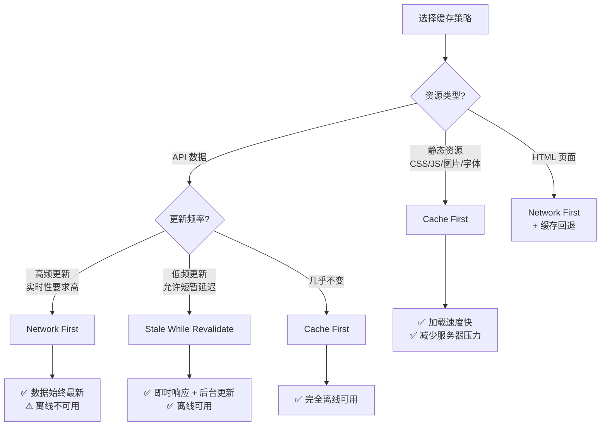

# 数据存储（02）：常见问题解答、现代存储 API

## 常见问题解答

<h4>001-localStorage-demo.html</h4>

```html
<!DOCTYPE html>
<html lang="zh-CN">
<head>
  <meta charset="UTF-8">
  <meta name="viewport" content="width=device-width, initial-scale=1.0">
  <title>【1】localStorage 演示</title>
  <style>
    * { margin: 0; padding: 0; box-sizing: border-box; }
    body { font-family: -apple-system, BlinkMacSystemFont, 'Segoe UI', sans-serif; padding: 20px; background: #f8f9fa; color: #333; }
    .demo-container { max-width: 700px; margin: 0 auto; background: white; padding: 24px; border-radius: 8px; box-shadow: 0 2px 8px rgba(0,0,0,0.1); }
    .demo-title { margin-bottom: 16px; font-size: 18px; color: #555; border-bottom: 2px solid #007bff; padding-bottom: 8px; }

    .form-group { margin-bottom: 16px; }
    label { display: block; font-weight: 500; margin-bottom: 6px; color: #444; }
    input[type="text"], textarea {
      width: 100%; padding: 10px 14px;
      border: 2px solid #e0e0e0; border-radius: 6px;
      font-size: 14px; transition: border-color 0.3s;
    }
    input:focus, textarea:focus { border-color: #007bff; outline: none; }
    textarea { min-height: 80px; resize: vertical; }

    .btn-group { display: flex; gap: 10px; flex-wrap: wrap; margin-bottom: 20px; }
    .btn {
      padding: 10px 20px; border: none; border-radius: 6px;
      cursor: pointer; font-size: 14px; font-weight: 500;
      transition: all 0.3s;
    }
    .btn-primary { background: #007bff; color: white; }
    .btn-primary:hover { background: #0056b3; }
    .btn-success { background: #28a745; color: white; }
    .btn-success:hover { background: #218838; }
    .btn-danger { background: #dc3545; color: white; }
    .btn-danger:hover { background: #c82333; }
    .btn-secondary { background: #6c757d; color: white; }

    .storage-panel {
      background: #f8f9fa; border-radius: 8px; padding: 16px;
      border: 1px solid #e0e0e0;
    }
    .storage-header {
      display: flex; justify-content: space-between; align-items: center;
      margin-bottom: 12px; font-weight: 600; color: #333;
    }
    .item-row {
      display: flex; justify-content: space-between; align-items: center;
      padding: 10px 12px; margin: 6px 0;
      background: white; border-radius: 6px;
      border: 1px solid #eee; font-size: 13px;
    }
    .key { font-family: monospace; color: #007bff; font-weight: 600; }
    .value { color: #555; max-width: 300px; overflow: hidden; text-overflow: ellipsis; white-space: nowrap; }
    .delete-btn {
      background: none; border: none; color: #dc3545; cursor: pointer;
      font-size: 16px; padding: 2px 6px; border-radius: 4px;
    }
    .delete-btn:hover { background: #f8d7da; }

    .toast {
      position: fixed; top: 20px; right: 20px; padding: 12px 24px;
      border-radius: 8px; color: white; font-size: 14px;
      animation: slideIn 0.3s ease; z-index: 1000;
    }
    .toast-success { background: #28a745; }
    .toast-error { background: #dc3545; }
    @keyframes slideIn { from { transform: translateX(100%); opacity: 0; } to { transform: translateX(0); opacity: 1; } }

    .empty-state { text-align: center; padding: 30px; color: #999; font-size: 14px; }
  </style>
</head>
<body>
  <div class="demo-container">
    <div class="demo-title">示例：localStorage 键值存储操作</div>

    <div class="form-group">
      <label for="keyInput">键名 (Key)</label>
      <input type="text" id="keyInput" placeholder="输入键名，如：username">
    </div>

    <div class="form-group">
      <label for="valueInput">值 (Value)</label>
      <textarea id="valueInput" placeholder="输入值，支持任意文本"></textarea>
    </div>

    <div class="btn-group">
      <button class="btn btn-primary" onclick="saveItem()">💾 存储 (setItem)</button>
      <button class="btn btn-success" onclick="readItem()">📖 读取 (getItem)</button>
      <button class="btn btn-danger" onclick="deleteItem()">🗑️ 删除 (removeItem)</button>
      <button class="btn btn-secondary" onclick="clearAll()">🧹 清空全部 (clear)</button>
    </div>

    <div class="storage-panel">
      <div class="storage-header">
        <span>📦 localStorage 当前内容</span>
        <span style="font-size: 12px; color: #888;" id="itemCount">0 项</span>
      </div>
      <div id="storageList"></div>
    </div>
  </div>

  <script>
    const keyInput = document.getElementById("keyInput")
    const valueInput = document.getElementById("valueInput")
    const storageList = document.getElementById("storageList")
    const itemCount = document.getElementById("itemCount")

    function refreshList() {
      const keys = Object.keys(localStorage)
      itemCount.textContent = `${keys.length} 项`

      if (keys.length === 0) {
        storageList.innerHTML = '<div class="empty-state">localStorage 为空<br>请添加一些数据试试</div>'
        return
      }

      let html = ""
      keys.forEach(key => {
        let value = localStorage.getItem(key)
        // 截断过长的值
        if (value.length > 60) value = value.substring(0, 57) + "..."
        // 转义 HTML
        value = value.replace(/&/g,"&amp;").replace(/</g,"&lt;").replace(/>/g,"&gt;")
        const safeKey = key.replace(/&/g,"&amp;").replace(/</g,"&lt;")

        html += `
          <div class="item-row">
            <span><span class="key">${safeKey}</span> : <span class="value">${value}</span></span>
            <button class="delete-btn" onclick="removeByKey('${safeKey}')">×</button>
          </div>`
      })
      storageList.innerHTML = html
    }

    function saveItem() {
      const key = keyInput.value.trim()
      const value = valueInput.value.trim()
      if (!key) return showToast("请输入键名", "error")

      localStorage.setItem(key, value)
      showToast(`已存储: ${key}`, "success")
      valueInput.value = ""
      refreshList()
    }

    function readItem() {
      const key = keyInput.value.trim()
      if (!key) return showToast("请输入键名", "error")

      const value = localStorage.getItem(key)
      if (value !== null) {
        valueInput.value = value
        showToast(`读取成功: ${key} = ${value.substring(0, 30)}...`, "success")
      } else {
        showToast(`未找到键: ${key}`, "error")
      }
    }

    function deleteItem() {
      const key = keyInput.value.trim()
      if (!key) return showToast("请输入键名", "error")

      if (localStorage.getItem(key) !== null) {
        localStorage.removeItem(key)
        showToast(`已删除: ${key}`, "success")
        keyInput.value = ""
        valueInput.value = ""
      } else {
        showToast(`键不存在: ${key}`, "error")
      }
      refreshList()
    }

    function removeByKey(key) {
      localStorage.removeItem(key)
      showToast(`已删除: ${key}`, "success")
      refreshList()
    }

    function clearAll() {
      if (confirm("确定要清空所有 localStorage 数据吗？")) {
        localStorage.clear()
        showToast("已清空全部数据", "success")
        refreshList()
      }
    }

    function showToast(msg, type) {
      const toast = document.createElement("div")
      toast.className = `toast toast-${type}`
      toast.textContent = msg
      document.body.appendChild(toast)
      setTimeout(() => toast.remove(), 2500)
    }

    // 初始化
    refreshList()

    // 监听其他标签页的变化
    window.addEventListener("storage", () => refreshList())
  </script>
</body>
</html>```


<h4>004-localstorage-crud.html</h4>

```html
<!-- 来源：14-数据存储.md - Web Storage章节 -->
<!DOCTYPE html>
<html lang="zh-CN">
<head>
  <meta charset="UTF-8">
  <meta name="viewport" content="width=device-width, initial-scale=1.0">
  <title>【4】localStorage CRUD 操作台</title>
  <style>
    * { margin: 0; padding: 0; box-sizing: border-box; }
    body { font-family: -apple-system, BlinkMacSystemFont, 'Segoe UI', sans-serif; padding: 20px; background: #f0f2f5; color: #333; }
    .demo-container { max-width: 900px; margin: 0 auto; }
    .demo-title { margin-bottom: 20px; font-size: 20px; color: #1a1a1a; border-bottom: 3px solid #3498db; padding-bottom: 10px; display: flex; align-items: center; gap: 8px; }
    .demo-title::before { content: "💾"; font-size: 24px; }

    .panel { background: white; border-radius: 10px; box-shadow: 0 2px 12px rgba(0,0,0,0.08); padding: 20px; margin-bottom: 18px; }
    .panel-header { font-size: 15px; font-weight: 600; color: #555; margin-bottom: 14px; padding-bottom: 8px; border-bottom: 1px solid #eee; }

    .form-row { display: flex; gap: 12px; margin-bottom: 12px; flex-wrap: wrap; }
    .form-group { flex: 1; min-width: 200px; }
    .form-group label { display: block; font-size: 12px; font-weight: 500; color: #666; margin-bottom: 4px; }
    .form-group input, .form-group textarea, .form-group select {
      width: 100%; padding: 9px 12px; border: 1.5px solid #ddd; border-radius: 6px;
      font-size: 13px; transition: border-color 0.2s; background: #fafafa;
    }
    .form-group textarea { min-height: 70px; resize: vertical; font-family: monospace; }
    .form-group input:focus, .form-group textarea:focus { border-color: #3498db; outline: none; background: white; }

    .btn { padding: 9px 18px; border: none; border-radius: 6px; cursor: pointer; font-size: 13px; font-weight: 500; transition: all 0.2s; }
    .btn:hover { transform: translateY(-1px); box-shadow: 0 2px 6px rgba(0,0,0,0.15); }
    .btn-primary { background: #3498db; color: white; }
    .btn-primary:hover { background: #2980b9; }
    .btn-success { background: #27ae60; color: white; }
    .btn-success:hover { background: #219a52; }
    .btn-danger { background: #e74c3c; color: white; }
    .btn-danger:hover { background: #c0392b; }
    .btn-warning { background: #f39c12; color: white; }
    .btn-info { background: #9b59b6; color: white; }
    .btn-secondary { background: #95a5a6; color: white; }
    .btn-sm { padding: 5px 12px; font-size: 12px; }
    .btn-group { display: flex; gap: 8px; flex-wrap: wrap; margin-top: 10px; }

    /* 数据列表 */
    .data-list { max-height: 300px; overflow-y: auto; }
    .data-item {
      display: flex; justify-content: space-between; align-items: center;
      padding: 11px 14px; margin: 6px 0; background: #f8fbff;
      border: 1px solid #d6eaf8; border-radius: 8px; font-size: 13px;
      transition: all 0.2s;
    }
    .data-item:hover { background: #eaf3fc; border-color: #a9cce3; }
    .data-key { font-weight: 600; color: #2980b9; font-family: monospace; }
    .data-value { color: #555; max-width: 320px; overflow: hidden; text-overflow: ellipsis; white-space: nowrap; font-family: monospace; font-size: 12px; }
    .data-meta { font-size: 11px; color: #999; margin-left: 8px; }
    .data-actions { display: flex; gap: 4px; flex-shrink: 0; }

    /* 容量条 */
    .quota-bar { height: 28px; background: #ecf0f1; border-radius: 14px; overflow: hidden; position: relative; margin: 10px 0; }
    .quota-fill { height: 100%; border-radius: 14px; transition: width 0.5s ease; display: flex; align-items: center; justify-content: center; color: white; font-size: 11px; font-weight: 600; }
    .quota-fill.low { background: linear-gradient(135deg, #27ae60, #2ecc71); }
    .quota-fill.mid { background: linear-gradient(135deg, #f39c12, #f1c40f); }
    .quota-fill.high { background: linear-gradient(135deg, #e74c3c, #c0392b); }

    /* 统计卡片 */
    .stats-grid { display: grid; grid-template-columns: repeat(4, 1fr); gap: 12px; margin-bottom: 14px; }
    .stat-card { background: linear-gradient(135deg, #667eea 0%, #764ba2 100%); color: white; padding: 16px; border-radius: 10px; text-align: center; }
    .stat-card:nth-child(2) { background: linear-gradient(135deg, #11998e, #38ef7d); }
    .stat-card:nth-child(3) { background: linear-gradient(135deg, #eb3349, #f45c43); }
    .stat-card:nth-child(4) { background: linear-gradient(135deg, #4e54c8, #8f94fb); }
    .stat-value { font-size: 24px; font-weight: 700; }
    .stat-label { font-size: 11px; opacity: 0.85; margin-top: 4px; }

    /* TTL 标签 */
    .ttl-badge { font-size: 10px; padding: 2px 7px; border-radius: 8px; font-weight: 500; }
    .ttl-active { background: #d5f5e3; color: #1e8449; }
    .ttl-expired { background: #fadbd8; color: #c0392b; }
    .ttl-none { background: #eee; color: #888; }

    .empty-state { text-align: center; padding: 30px; color: #aaa; font-size: 14px; }

    .toast {
      position: fixed; top: 20px; right: 20px; padding: 12px 22px;
      border-radius: 8px; color: white; font-size: 14px; font-weight: 500;
      animation: slideIn 0.3s ease; z-index: 1000;
    }
    .toast-success { background: #27ae60; }
    .toast-error { background: #e74c3c; }
    @keyframes slideIn { from { transform: translateX(100%); opacity: 0; } to { transform: translateX(0); opacity: 1; } }

    pre { background: #1e1e1e; color: #d4d4d4; padding: 12px; border-radius: 8px; font-size: 12px; overflow-x: auto; white-space: pre-wrap; }
  </style>
</head>
<body>
  <div class="demo-container">
    <div class="demo-title">localStorage CRUD 操作台</div>

    <!-- 统计概览 -->
    <div class="panel" style="padding:16px;">
      <div class="stats-grid">
        <div class="stat-card"><div class="stat-value" id="statCount">0</div><div class="stat-label">数据项数</div></div>
        <div class="stat-card"><div class="stat-value" id="statUsed">0 B</div><div class="stat-label">已用空间</div></div>
        <div class="stat-card"><div class="stat-value" id="statQuota">~5MB</div><div class="stat-label">估算配额</div></div>
        <div class="stat-card"><div class="stat-value" id="statPercent">0%</div><div class="stat-label">使用率</div></div>
      </div>
      <div class="quota-bar"><div class="quota-fill low" id="quotaFill" style="width:0%">0%</div></div>
    </div>

    <!-- 基本操作 -->
    <div class="panel">
      <div class="panel-header">🔧 基本 CRUD 操作</div>
      <div class="form-row">
        <div class="form-group"><label>键名 (Key)</label><input type="text" id="lsKey" placeholder="如: user_info"></div>
        <div class="form-group"><label>值 (Value / JSON)</label><textarea id="lsValue" placeholder='支持文本或 JSON，如: {"name":"Alice","age":25}'></textarea></div>
      </div>
      <div class="form-row">
        <div class="form-group"><label>TTL 过期时间（秒，留空=永不过期）</label><input type="number" id="lsTTL" placeholder="如: 60 (1分钟后过期)"></div>
      </div>
      <div class="btn-group">
        <button class="btn btn-primary" onclick="setItem()">💾 setItem 存储</button>
        <button class="btn btn-success" onclick="getItem()">📖 getItem 读取</button>
        <button class="btn btn-warning" onclick="updateItem()">✏️ 更新值</button>
        <button class="btn btn-danger" onclick="removeItem()">🗑️ removeItem 删除</button>
        <button class="btn btn-secondary" onclick="clearAll()">🧹 clear 清空全部</button>
      </div>
    </div>

    <!-- 遍历操作 -->
    <div class="panel">
      <div class="panel-header">🔄 遍历 & 查询</div>
      <div class="btn-group">
        <button class="btn btn-info" onclick="iterateByLength()">📋 按 length 遍历所有 key</button>
        <button class="btn btn-info" onclick="iterateByKey()">🔑 使用 key(index) 获取键名</button>
        <button class="btn btn-warning" onclick="cleanExpired()">🧹 清理已过期数据</button>
        <button class="btn btn-secondary" onclick="loadSampleData()">📦 加载示例 JSON 数据</button>
      </div>
      <pre id="iterOutput" style="margin-top:12px;display:none;"></pre>
    </div>

    <!-- 数据列表 -->
    <div class="panel">
      <div class="panel-header">
        📦 localStorage 当前内容
        <span style="font-size:12px;color:#999;font-weight:400;float:right;" id="itemCountLabel">0 项</span>
      </div>
      <div class="data-list" id="dataList"><div class="empty-state">localStorage 为空 — 点击「加载示例数据」或手动添加</div></div>
    </div>
  </div>

  <script>
    const ESTIMATED_QUOTA = 5 * 1024 * 1024 // 5MB

    function showToast(msg, type) {
      const t = document.createElement('div')
      t.className = `toast toast-${type}`; t.textContent = msg
      document.body.appendChild(t)
      setTimeout(() => t.remove(), 2500)
    }

    function escapeHTML(str) {
      return str.replace(/&/g,'&amp;').replace(/</g,'&lt;').replace(/>/g,'&gt;')
    }

    function calcUsedSize() {
      let total = 0
      for (let i = 0; i < localStorage.length; i++) {
        const k = localStorage.key(i)
        total += k.length + (localStorage.getItem(k) || '').length
      }
      return total * 2 // UTF-16 ≈ 2 bytes/char
    }

    function updateStats() {
      const count = localStorage.length
      const used = calcUsedSize()
      const pct = Math.min((used / ESTIMATED_QUOTA) * 100, 100)

      document.getElementById('statCount').textContent = count
      document.getElementById('statUsed').textContent = used > 1024*1024 ? `${(used/1024/1024).toFixed(2)} MB` : `${(used/1024).toFixed(1)} KB`
      document.getElementById('statPercent').textContent = `${pct.toFixed(1)}%`
      document.getElementById('itemCountLabel').textContent = `${count} 项`

      const fill = document.getElementById('quotaFill')
      fill.style.width = `${pct}%`
      fill.textContent = `${pct.toFixed(1)}%`
      fill.className = 'quota-fill ' + (pct < 50 ? 'low' : pct < 80 ? 'mid' : 'high')
    }

    function refreshList() {
      updateStats()
      const list = document.getElementById('dataList')
      if (localStorage.length === 0) {
        list.innerHTML = '<div class="empty-state">localStorage 为空 — 点击「加载示例数据」或手动添加</div>'
        return
      }

      let html = ''
      for (let i = 0; i < localStorage.length; i++) {
        const k = localStorage.key(i)
        const raw = localStorage.getItem(k)
        let displayVal = raw
        if (raw.length > 80) displayVal = raw.substring(0, 77) + '...'

        // TTL 检测
        let ttlStatus = '<span class="ttl-badge ttl-none">无TTL</span>'
        try {
          const parsed = JSON.parse(raw)
          if (parsed.__ttl && parsed.__expiry) {
            const expired = Date.now() > parsed.__expiry
            ttlStatus = `<span class="ttl-badge ${expired ? 'ttl-expired' : 'ttl-active'}">${expired ? '已过期' : '剩余 ' + Math.max(0, Math.round((parsed.__expiry - Date.now())/1000)) + 's'}</span>`
            displayVal = typeof parsed.__value !== 'undefined' ? JSON.stringify(parsed.__value) : raw
            if (displayVal.length > 80) displayVal = displayVal.substring(0, 77) + '...'
          }
        } catch(e) {}

        const size = new Blob([k + raw]).size
        html += `
          <div class="data-item">
            <div>
              <span class="data-key">${escapeHTML(k)}</span>
              <span style="color:#ccc;margin:0 4px;">:</span>
              <span class="data-value">${escapeHTML(displayVal)}</span>
              ${ttlStatus}
              <span class="data-meta">${size}B</span>
            </div>
            <div class="data-actions">
              <button class="btn btn-sm" style="background:#3498db;color:white;" onclick="readAndShow('${escapeHTML(k)}')">读</button>
              <button class="btn btn-sm btn-danger" onclick="deleteByKey('${escapeHTML(k)}')">删</button>
            </div>
          </div>`
      }
      list.innerHTML = html
    }

    // ====== TTL 封装 ======
    function setWithTTL(key, value, ttlSeconds) {
      const item = { __value: value, __ttl: true, __expiry: Date.now() + ttlSeconds * 1000, __setAt: Date.now() }
      localStorage.setItem(key, JSON.stringify(item))
    }

    function getWithTTL(key) {
      const raw = localStorage.getItem(key)
      if (!raw) return null
      try {
        const item = JSON.parse(raw)
        if (item.__ttl && item.__expiry) {
          if (Date.now() > item.__expiry) {
            localStorage.removeItem(key)
            return null // 已过期
          }
          return item.__value
        }
        return raw // 非 TTL 数据返回原始字符串
      } catch(e) {
        return raw
      }
    }

    // ====== 操作函数 ======
    function setItem() {
      const key = document.getElementById('lsKey').value.trim()
      let value = document.getElementById('lsValue').value.trim()
      const ttl = parseInt(document.getElementById('lsTTL').value)
      if (!key) return showToast('请输入键名', 'error')

      try {
        if (!isNaN(ttl) && ttl > 0) {
          // 尝试解析为 JSON
          let actualValue
          try { actualValue = JSON.parse(value) } catch(e) { actualValue = value }
          setWithTTL(key, actualValue, ttl)
          showToast(`已存储 [TTL=${ttl}秒]: ${key}`, 'success')
        } else {
          localStorage.setItem(key, value)
          showToast(`已存储: ${key}`, 'success')
        }
        refreshList()
      } catch(e) {
        if (e.name === 'QuotaExceededError') {
          showToast('⚠️ 存储空间不足!', 'error')
        } else {
          showToast('存储失败: ' + e.message, 'error')
        }
      }
    }

    function getItem() {
      const key = document.getElementById('lsKey').value.trim()
      if (!key) return showToast('请输入键名', 'error')

      const result = getWithTTL(key)
      if (result === null) {
        document.getElementById('lsValue').value = ''
        showToast(`未找到或已过期: ${key}`, 'error')
      } else {
        const display = typeof result === 'object' ? JSON.stringify(result, null, 2) : result
        document.getElementById('lsValue').value = display
        showToast(`读取成功: ${key}`, 'success')
      }
    }

    function readAndShow(key) {
      document.getElementById('lsKey').value = key
      getItem()
    }

    function updateItem() {
      const key = document.getElementById('lsKey').value.trim()
      const value = document.getElementById('lsValue').value.trim()
      if (!key) return showToast('请输入键名', 'error')
      if (localStorage.getItem(key) === null) return showToast(`键不存在: ${key}`, 'error')

      localStorage.setItem(key, value)
      showToast(`已更新: ${key}`, 'success')
      refreshList()
    }

    function removeItem() {
      const key = document.getElementById('lsKey').value.trim()
      if (!key) return showToast('请输入键名', 'error')
      localStorage.removeItem(key)
      showToast(`已删除: ${key}`, 'success')
      document.getElementById('lsKey').value = ''
      document.getElementById('lsValue').value = ''
      refreshList()
    }

    function deleteByKey(key) {
      localStorage.removeItem(key)
      showToast(`已删除: ${key}`, 'success')
      refreshList()
    }

    function clearAll() {
      if (!confirm('确定要清空所有 localStorage 数据吗？')) return
      localStorage.clear()
      showToast('已清空全部数据', 'success')
      refreshList()
    }

    function iterateByLength() {
      const out = document.getElementById('iterOutput')
      out.style.display = 'block'
      let lines = ['// ========== 按 length 遍历 ==========']
      lines.push(`// 总共 ${localStorage.length} 项:\n`)
      for (let i = 0; i < localStorage.length; i++) {
        const k = localStorage.key(i)
        const v = localStorage.getItem(k)
        lines.push(`[${i}] key="${k}" → ${v.length > 60 ? v.substring(0,57)+'...' : v}`)
      }
      out.textContent = lines.join('\n')
    }

    function iterateByKey() {
      const out = document.getElementById('iterOutput')
      out.style.display = 'block'
      let lines = ['// ========== 使用 key(index) 遍历 ==========']
      for (let i = 0; i < localStorage.length; i++) {
        lines.push(`localStorage.key(${i}) → "${localStorage.key(i)}"`)
      }
      lines.push(`\n// localStorage.length = ${localStorage.length}`)
      out.textContent = lines.join('\n')
    }

    function cleanExpired() {
      let cleaned = 0
      const keysToRemove = []
      for (let i = 0; i < localStorage.length; i++) {
        const k = localStorage.key(i)
        try {
          const item = JSON.parse(localStorage.getItem(k))
          if (item.__ttl && item.__expiry && Date.now() > item.__expiry) {
            keysToRemove.push(k)
          }
        } catch(e) {}
      }
      keysToRemove.forEach(k => { localStorage.removeItem(k); cleaned++ })
      showToast(cleaned > 0 ? `已清理 ${cleaned} 条过期数据` : '没有过期数据', cleaned > 0 ? 'success' : 'info')
      refreshList()
    }

    function loadSampleData() {
      const samples = [
        { key: 'app_user', val: { name: '张三', role: 'admin', lastLogin: new Date().toISOString() }, ttl: 7200 },
        { key: 'app_settings', val: { theme: 'dark', language: 'zh-CN', fontSize: 14 }, ttl: 0 },
        { key: 'app_cache_data', val: { items: Array.from({length:5},(_,i)=>({id:i+1,name:`项目${i+1}`})), timestamp: Date.now() }, ttl: 300 },
        { key: 'app_token', val: 'eyJhbGciOiJIUzI1NiIsInR5cCI6IkpXVCJ9.demo', ttl: 1800 },
        { key: 'plain_text_note', val: '这是一段普通文本，没有 TTL 过期机制。', ttl: 0 },
      ]
      samples.forEach(s => {
        if (s.ttl > 0) {
          setWithTTL(s.key, s.val, s.ttl)
        } else {
          localStorage.setItem(s.key, typeof s.val === 'string' ? s.val : JSON.stringify(s.val))
        }
      })
      showToast(`已加载 ${samples.length} 条示例数据`, 'success')
      refreshList()
    }

    // 初始化
    refreshList()

    // 监听跨标签页变化
    window.addEventListener('storage', () => refreshList())
  </script>
</body>
</html>
```


<h4>005-sessionstorage-compare.html</h4>

```html
<!-- 来源：14-数据存储.md - Web Storage章节 - localStorage vs sessionStorage -->
<!DOCTYPE html>
<html lang="zh-CN">
<head>
  <meta charset="UTF-8">
  <meta name="viewport" content="width=device-width, initial-scale=1.0">
  <title>【5】sessionStorage 会话管理 & 与 localStorage 对比</title>
  <style>
    * { margin: 0; padding: 0; box-sizing: border-box; }
    body { font-family: -apple-system, BlinkMacSystemFont, 'Segoe UI', sans-serif; padding: 20px; background: #f0f2f5; color: #333; }
    .demo-container { max-width: 960px; margin: 0 auto; }
    .demo-title { margin-bottom: 20px; font-size: 20px; color: #1a1a1a; border-bottom: 3px solid #8e44ad; padding-bottom: 10px; display: flex; align-items: center; gap: 8px; }
    .demo-title::before { content: "🔄"; font-size: 24px; }

    .panel { background: white; border-radius: 10px; box-shadow: 0 2px 12px rgba(0,0,0,0.08); padding: 20px; margin-bottom: 18px; }
    .panel-header { font-size: 15px; font-weight: 600; color: #555; margin-bottom: 14px; padding-bottom: 8px; border-bottom: 1px solid #eee; }

    /* 对比表格 */
    .compare-grid { display: grid; grid-template-columns: 1fr 1fr; gap: 16px; margin-bottom: 18px; }
    .compare-card { border-radius: 10px; padding: 18px; position: relative; overflow: hidden; }
    .compare-card.ls { background: linear-gradient(135deg, #667eea 0%, #764ba2 100%); color: white; }
    .compare-card.ss { background: linear-gradient(135deg, #11998e 0%, #38ef7d 100%); color: white; }
    .compare-card h3 { font-size: 17px; margin-bottom: 12px; display: flex; align-items: center; gap: 6px; }
    .compare-card .badge { font-size: 11px; padding: 2px 8px; border-radius: 10px; background: rgba(255,255,255,0.25); }

    .compare-table { width: 100%; font-size: 13px; line-height: 1.8; }
    .compare-table td { padding: 3px 0; }
    .compare-table td:first-child { opacity: 0.75; width: 40%; }

    /* 存储面板 */
    .storage-cols { display: grid; grid-template-columns: 1fr 1fr; gap: 16px; }
    .storage-col { border-radius: 10px; padding: 16px; }
    .storage-col.local { background: #f0ebff; border: 2px solid #b794f6; }
    .storage-col.session { background: #e6fff5; border: 2px solid #6bcb97; }
    .storage-col h4 { font-size: 14px; margin-bottom: 10px; display: flex; justify-content: space-between; align-items: center; }
    .storage-col h4 .count { font-size: 11px; padding: 2px 8px; border-radius: 10px; }
    .local h4 .count { background: #d4c4fb; color: #5b2c91; }
    .session h4 .count { background: #b8ead5; color: #1e8449; }

    .form-row { display: flex; gap: 8px; margin-bottom: 10px; }
    .form-row input { flex: 1; padding: 7px 10px; border: 1.5px solid #ddd; border-radius: 6px; font-size: 13px; }
    .form-row input:focus { outline: none; border-color: #8e44ad; }

    .btn { padding: 7px 14px; border: none; border-radius: 6px; cursor: pointer; font-size: 12px; font-weight: 500; transition: all 0.2s; }
    .btn:hover { transform: translateY(-1px); }
    .btn-purple { background: #8e44ad; color: white; }
    .btn-purple:hover { background: #7d3c98; }
    .btn-green { background: #27ae60; color: white; }
    .btn-green:hover { background: #219a52; }
    .btn-red { background: #e74c3c; color: white; }
    .btn-blue { background: #3498db; color: white; }
    .btn-gray { background: #95a5a6; color: white; }
    .btn-sm { padding: 4px 10px; font-size: 11px; }
    .btn-group { display: flex; gap: 6px; flex-wrap: wrap; }

    .data-list { max-height: 180px; overflow-y: auto; margin-top: 8px; }
    .data-item {
      display: flex; justify-content: space-between; align-items: center;
      padding: 7px 10px; margin: 4px 0; border-radius: 6px;
      font-size: 12px; transition: background 0.15s;
    }
    .local .data-item { background: rgba(183,148,246,0.15); }
    .local .data-item:hover { background: rgba(183,148,246,0.3); }
    .session .data-item { background: rgba(107,203,151,0.15); }
    .session .data-item:hover { background: rgba(107,203,151,0.3); }
    .data-key { font-family: monospace; font-weight: 600; }
    .local .data-key { color: #6c3483; }
    .session .data-key { color: #196f3d; }
    .data-value { color: #666; max-width: 150px; overflow: hidden; text-overflow: ellipsis; white-space: nowrap; font-family: monospace; font-size: 11px; }

    /* 跨标签页同步测试区 */
    .sync-test { background: linear-gradient(135deg, #ffecd2 0%, #fcb69f 100%); border-radius: 10px; padding: 18px; }
    .sync-test h4 { font-size: 14px; margin-bottom: 10px; color: #a04000; }
    .sync-log {
      background: #2c3e50; color: #ecf0f1; border-radius: 8px; padding: 12px;
      font-family: monospace; font-size: 12px; min-height: 80px; max-height: 160px;
      overflow-y: auto; line-height: 1.6; margin-top: 10px;
    }
    .sync-log .msg-send { color: #3498db; }
    .sync-log .msg-recv { color: #2ecc71; }
    .sync-log .msg-info { color: #f39c12; }

    /* 实验说明 */
    .experiment-tip {
      background: #fff8e1; border-left: 4px solid #ffc107;
      padding: 14px 16px; border-radius: 0 8px 8px 0; font-size: 13px;
      color: #666; line-height: 1.6; margin-bottom: 18px;
    }
    .experiment-tip strong { color: #e65100; }

    .empty-state { text-align: center; padding: 16px; color: #aaa; font-size: 12px; }

    .toast {
      position: fixed; top: 20px; right: 20px; padding: 10px 20px;
      border-radius: 8px; color: white; font-size: 13px; font-weight: 500;
      animation: slideIn 0.3s ease; z-index: 1000;
    }
    .toast-success { background: #27ae60; }
    @keyframes slideIn { from { transform: translateX(100%); opacity: 0; } to { transform: translateX(0); opacity: 1; } }
  </style>
</head>
<body>
  <div class="demo-container">
    <div class="demo-title">sessionStorage vs localStorage 对比演示</div>

    <!-- 对比卡片 -->
    <div class="compare-grid">
      <div class="compare-card ls">
        <h3>💾 localStorage <span class="badge">持久化</span></h3>
        <table class="compare-table">
          <tr><td>生命周期</td><td>✅ 永久（手动删除/清浏览器数据）</td></tr>
          <tr><td>作用域</td><td>同源所有标签页/窗口共享</td></tr>
          <tr><td>跨标签同步</td><td>✅ 支持 storage 事件</td></tr>
          <tr><td>关闭标签后</td><td>✅ 数据保留</td></tr>
          <tr><td>容量</td><td>~5-10 MB</td></tr>
        </table>
      </div>
      <div class="compare-card ss">
        <h3>📋 sessionStorage <span class="badge">会话级</span></h3>
        <table class="compare-table">
          <tr><td>生命周期</td><td>⏰ 仅当前会话（关闭标签即清除）</td></tr>
          <tr><td>作用域</td><td>仅当前标签页/窗口</td></tr>
          <tr><td>跨标签同步</td><td>❌ 不支持 storage 事件</td></tr>
          <tr><td>关闭标签后</td><td>❌ 数据清除</td></tr>
          <tr><td>容量</td><td>~5-10 MB</td></tr>
        </table>
      </div>
    </div>

    <!-- 实验提示 -->
    <div class="experiment-tip">
      <strong>🧪 动手实验：</strong>
      请尝试以下操作来体验差异：<br/>
      ① 分别在两侧写入数据 → 打开<strong>新的标签页</strong>访问本页面 → 观察 localStorage 数据是否同步，sessionStorage 是否为空<br/>
      ② 在 sessionStorage 写入数据 → <strong>关闭当前标签页</strong> → 重新打开 → 观察数据是否消失<br/>
      ③ 点击「发送消息到其他标签」→ 在另一个标签页观察是否收到
    </div>

    <!-- 并排操作面板 -->
    <div class="storage-cols">
      <!-- localStorage 面板 -->
      <div class="storage-col local">
        <h4>localStorage <span class="count" id="lsCount">0 项</span></h4>
        <div class="form-row">
          <input type="text" id="lsKey" placeholder="键名">
          <input type="text" id="lsVal" placeholder="值">
        </div>
        <div class="btn-group">
          <button class="btn btn-purple" onclick="opLS('set')">写入</button>
          <button class="btn btn-purple" onclick="opLS('get')">读取</button>
          <button class="btn btn-red btn-sm" onclick="opLS('del')">删除</button>
          <button class="btn btn-gray btn-sm" onclick="opLS('clear')">清空</button>
        </div>
        <div class="data-list" id="lsList"><div class="empty-state">空</div></div>
      </div>

      <!-- sessionStorage 面板 -->
      <div class="storage-col session">
        <h4>sessionStorage <span class="count" id="ssCount">0 项</span></h4>
        <div class="form-row">
          <input type="text" id="ssKey" placeholder="键名">
          <input type="text" id="ssVal" placeholder="值">
        </div>
        <div class="btn-group">
          <button class="btn btn-green" onclick="opSS('set')">写入</button>
          <button class="btn btn-green" onclick="opSS('get')">读取</button>
          <button class="btn btn-red btn-sm" onclick="opSS('del')">删除</button>
          <button class="btn btn-gray btn-sm" onclick="opSS('clear')">清空</button>
        </div>
        <div class="data-list" id="ssList"><div class="empty-state">空</div></div>
      </div>
    </div>

    <!-- 跨标签页同步测试 -->
    <div class="panel sync-test">
      <h4>📡 跨标签页通信测试 (localStorage storage 事件)</h4>
      <p style="font-size:12px;color:#a04000;margin-bottom:8px;">通过 localStorage 变化触发 storage 事件实现跨标签页消息传递。请打开多个标签页测试。</p>
      <div class="form-row">
        <input type="text" id="syncMsg" placeholder="输入要广播到其他标签页的消息...">
        <button class="btn btn-blue" onclick="sendSyncMsg()">📤 发送消息</button>
        <button class="btn btn-gray btn-sm" onclick="clearSyncLog()">清空日志</button>
      </div>
      <div class="sync-log" id="syncLog">// 等待消息...\n// 提示：打开另一个本页面标签，然后在此处发送消息\n</div>
    </div>
  </div>

  <script>
    function showToast(msg) {
      const t = document.createElement('div'); t.className = 'toast toast-success'; t.textContent = msg
      document.body.appendChild(t); setTimeout(() => t.remove(), 2000)
    }

    function esc(s) { return s.replace(/&/g,'&amp;').replace(/</g,'&lt;').replace(/>/g,'&gt;') }

    function renderList(storage, containerId, countId) {
      const el = document.getElementById(containerId)
      const cntEl = document.getElementById(countId)
      let n = 0
      let html = ''
      for (let i = 0; i < storage.length; i++) {
        const k = storage.key(i)
        let v = storage.getItem(k)
        if (v.length > 50) v = v.substring(0,47)+'...'
        html += `<div class="data-item"><span><span class="data-key">${esc(k)}</span>:<span class="data-value">${esc(v)}</span></span><button class="btn btn-red btn-sm" onclick="quickDel('${containerId}','${esc(k)}')">×</button></div>`
        n++
      }
      el.innerHTML = html || '<div class="empty-state">空</div>'
      cntEl.textContent = `${n} 项`
    }

    function quickDel(containerId, key) {
      if (containerId === 'lsList') localStorage.removeItem(key)
      else sessionStorage.removeItem(key)
      refreshAll()
    }

    function opLS(action) {
      const k = document.getElementById('lsKey').value.trim()
      const v = document.getElementById('lsVal').value.trim()
      switch(action) {
        case 'set': if(k){localStorage.setItem(k,v);showToast(`localStorage 写入: ${k}`);} break
        case 'get':
          if(k){
            const r = localStorage.getItem(k)
            document.getElementById('lsVal').value = r !== null ? r : '(未找到)'
            showToast(r !== null ? `读取成功: ${k}` : `未找到: ${k}`)
          }
          break
        case 'del': if(k){localStorage.removeItem(k);showToast(`已删除: ${k}`);document.getElementById('lsVal').value=''} break
        case 'clear': if(confirm('清空 localStorage?')){localStorage.clear();showToast('已清空')} break
      }
      refreshAll()
    }

    function opSS(action) {
      const k = document.getElementById('ssKey').value.trim()
      const v = document.getElementById('ssVal').value.trim()
      switch(action) {
        case 'set': if(k){sessionStorage.setItem(k,v);showToast(`sessionStorage 写入: ${k}`);} break
        case 'get':
          if(k){
            const r = sessionStorage.getItem(k)
            document.getElementById('ssVal').value = r !== null ? r : '(未找到)'
            showToast(r !== null ? `读取成功: ${k}` : `未找到: ${k}`)
          }
          break
        case 'del': if(k){sessionStorage.removeItem(k);showToast(`已删除: ${k}`);document.getElementById('ssVal').value=''} break
        case 'clear': if(confirm('清空 sessionStorage?')){sessionStorage.clear();showToast('已清空')} break
      }
      refreshAll()
    }

    function refreshAll() {
      renderList(localStorage, 'lsList', 'lsCount')
      renderList(sessionStorage, 'ssList', 'ssCount')
    }

    // ====== 跨标签页同步 ======
    const syncLog = document.getElementById('syncLog')

    function logSync(msg, cls) {
      const time = new Date().toLocaleTimeString()
      syncLog.innerHTML += `<span class="${cls}">[${time}] ${msg}</span>\n`
      syncLog.scrollTop = syncLog.scrollHeight
    }

    function sendSyncMsg() {
      const msg = document.getElementById('syncMsg').value.trim()
      if (!msg) return
      const payload = JSON.stringify({ text: msg, from: 'Tab-' + Math.random().toString(36).slice(2,6), ts: Date.now() })
      localStorage.setItem('__cross_tab_msg__', payload)
      logSync(`📤 发送: ${msg}`, 'msg-send')
      document.getElementById('syncMsg').value = ''
    }

    // 监听来自其他标签页的 storage 事件
    window.addEventListener('storage', (e) => {
      if (e.key === '__cross_tab_msg__' && e.newValue) {
        try {
          const data = JSON.parse(e.newValue)
          logSync(`📥 收到 [${data.from}]: ${data.text}`, 'msg-recv')
        } catch(err) {
          logSync(`📥 收到原始消息: ${e.newValue.substring(0,50)}`, 'msg-recv')
        }
      } else if (e.key) {
        // 其他 localStorage 变化也记录
        logSync(`🔔 检测到变化: key="${e.key}" oldValue=${e.oldValue?e.oldValue.substring(0,30):'null'} → newValue=${e.newValue?e.newValue.substring(0,30):'null'}`, 'msg-info')
        refreshAll() // 刷新列表
      }
    })

    function clearSyncLog() { syncLog.innerHTML = '// 日志已清空\n' }

    // 初始化
    refreshAll()
    logSync('// 跨标签页同步系统就绪 — 打开新标签页测试', 'msg-info')
  </script>
</body>
</html>
```

### 1. 如何选择存储方案？

- **小数据（< 4KB）且需要服务器访问**：使用 Cookie
- **中等数据（< 5MB）且仅客户端使用**：使用 localStorage 或 sessionStorage
- **大量结构化数据或需要复杂查询**：使用 IndexedDB

### 2. localStorage 和 sessionStorage 的区别？

- **localStorage**：数据永久保存，除非手动删除或清除浏览器数据
- **sessionStorage**：数据仅在当前标签页/窗口有效，关闭后自动清除

### 3. 存储空间满了怎么办？

- **Cookie**：删除旧的或非必要的 Cookie
- **Web Storage**：实现 LRU（最近最少使用）策略，清理旧数据
- **IndexedDB**：提示用户清理空间，或实现自动清理机制

### 4. 如何实现数据加密？

对于敏感数据，建议在存储前加密：

```javascript
// 简单的 Base64 编码（不推荐用于敏感数据）
function encode(data) {
  return btoa(JSON.stringify(data));
}

function decode(encoded) {
  return JSON.parse(atob(encoded));
}

// 使用加密库（推荐）
import CryptoJS from 'crypto-js';

function encrypt(data, key) {
  return CryptoJS.AES.encrypt(JSON.stringify(data), key).toString();
}

function decrypt(encrypted, key) {
  const bytes = CryptoJS.AES.decrypt(encrypted, key);
  return JSON.parse(bytes.toString(CryptoJS.enc.Utf8));
}
```

### 5. 如何处理隐私模式？

某些浏览器在隐私模式下会限制存储，需要做好降级处理：

```javascript
function checkStorageAvailable() {
  try {
    const test = '__storage_test__';
    localStorage.setItem(test, test);
    localStorage.removeItem(test);
    return true;
  } catch (e) {
    return false;
  }
}

if (!checkStorageAvailable()) {
  // 降级到内存存储或其他方案
  console.warn('存储不可用，使用内存存储');
}
```

### 6. 如何实现跨标签页通信？

使用 `storage` 事件监听其他标签页的变化：

```javascript
window.addEventListener('storage', (e) => {
  if (e.key === 'user') {
    // 用户信息在其他标签页被更新
    updateUserInfo(JSON.parse(e.newValue));
  }
});
```

### 7. IndexedDB 版本升级失败怎么办？

版本升级失败通常是因为其他标签页打开了旧版本的数据库，需要：

1. 关闭所有相关标签页
2. 实现版本冲突处理逻辑
3. 使用 `onblocked` 事件提示用户

```javascript
request.onblocked = () => {
  console.warn('数据库升级被阻塞，请关闭其他标签页');
};
```

### 8. 存储空间配额超限（QuotaExceededError）如何处理？

当浏览器存储配额不足时，`localStorage.setItem()`、`IndexedDB` 写入等操作会抛出 `QuotaExceededError`。需要实现分级清理策略：

```javascript
/**
 * 存储空间管理器 - 配额超限时自动清理
 */
class StorageQuotaManager {
  constructor() {
    this.cleanupStrategies = [
      { priority: 1, name: '临时缓存', keyPrefix: '_temp_', description: '清除带 _temp_ 前缀的临时数据' },
      { priority: 2, name: '过期数据', check: (item) => item.expiry && Date.now() > item.expiry, description: '清除已过期的数据' },
      { priority: 3, name: '低频访问数据', sortBy: 'lastAccess', description: '按最后访问时间，删除最久未使用的' },
      { priority: 4, name: '大体积非关键数据', sortBy: 'size', minSize: 1024 * 100, description: '删除超过 100KB 的非关键缓存' }
    ];
  }

  /**
   * 安全写入（带配额检查和自动清理）
   */
  async safeWrite(storageType, key, value) {
    try {
      if (storageType === 'localStorage') {
        localStorage.setItem(key, JSON.stringify(value));
        return true;
      } else if (storageType === 'indexedDB') {
        // IndexedDB 写入逻辑...
        return true;
      }
    } catch (error) {
      if (error.name === 'QuotaExceededError') {
        console.warn('存储空间不足，开始自动清理...');
        
        // 逐级尝试清理
        for (const strategy of this.cleanupStrategies) {
          await this.executeStrategy(strategy);
          
          // 清理后重试
          try {
            if (storageType === 'localStorage') {
              localStorage.setItem(key, JSON.stringify(value));
              return true;
            }
          } catch (retryError) {
            if (retryError.name !== 'QuotaExceededError') throw retryError;
            // 继续下一级清理策略
          }
        }
        
        // 所有策略都失败
        throw new Error('存储空间严重不足，无法完成写入');
      }
      throw error;
    }
  }

  async executeStrategy(strategy) {
    const keysToRemove = [];
    
    for (let i = 0; i < localStorage.length; i++) {
      const key = localStorage.key(i);
      
      if (strategy.keyPrefix && key.startsWith(strategy.keyPrefix)) {
        keysToRemove.push(key);
        continue;
      }
      
      try {
        const item = JSON.parse(localStorage.getItem(key));
        if (strategy.check && strategy.check(item)) {
          keysToRemove.push(key);
        }
      } catch (e) {
        // 非 JSON 数据跳过
      }
    }
    
    // 按策略排序后删除部分数据
    if (strategy.sortBy) {
      // 实现排序逻辑...
    }
    
    // 删除 20% 的候选数据（保守清理）
    const toRemoveCount = Math.ceil(keysToRemove.length * 0.2);
    for (let i = 0; i < toRemoveCount; i++) {
      localStorage.removeItem(keysToRemove[i]);
    }
    
    console.log(`[清理] ${strategy.description}: 已清理 ${toRemoveCount} 项`);
  }

  /**
   * 查询当前存储使用情况
   */
  async getUsageStats() {
    if ('storage' in navigator && 'estimate' in navigator.storage) {
      const estimate = await navigator.storage.estimate();
      return {
        used: estimate.usage,
        quota: estimate.quota,
        usagePercent: ((estimate.usage / estimate.quota) * 100).toFixed(2),
        available: estimate.quota - estimate.usage,
        isCritical: (estimate.usage / estimate.quota) > 0.9
      };
    }
    return null;
  }
}

// 使用示例
const quotaManager = new StorageQuotaManager();

// 普通写入（自动处理配额超限）
await quotaManager.safeWrite('localStorage', 'userData', { name: 'Alice' });

// 定期检查存储状态
const stats = await quotaManager.getUsageStats();
if (stats?.isCritical) {
  console.warn('⚠️ 存储空间使用率超过 90%！');
}
```

### 9. 跨标签页数据同步有哪些方案？如何保证一致性？

除了 `storage` 事件外，还有多种跨标签页通信方案：

| 方案 | 原理 | 适用场景 | 局限 |
|------|------|----------|------|
| **Storage 事件** | 监听 `localStorage` 变化 | 简单键值同步 | 仅限同源、仅字符串 |
| **BroadcastChannel** | 多对多消息通道 | 复杂消息传递 | 不支持 IE |
| **SharedWorker** | 共享后台线程 | 需要共享状态的复杂逻辑 | API 较复杂 |
| **postMessage + iframe** | iframe 中转 | 跨域场景 | 需要 iframe |
| **Cookie 轮询** | 定时读取 Cookie | 兼容性要求高 | 性能差 |

**BroadcastChannel 示例（推荐用于现代应用）：**

```javascript
// 标签页 A - 发送端
const channel = new BroadcastChannel('app_channel');

channel.postMessage({
  type: 'USER_UPDATED',
  payload: { id: 1, name: 'Alice', avatar: '/avatar.png' },
  timestamp: Date.now()
});

// 标签页 B - 接收端
const channel = new BroadcastChannel('app_channel');

channel.onmessage = (event) => {
  const { type, payload } = event.data;

  switch (type) {
    case 'USER_UPDATED':
      updateUserInfo(payload);     // 更新用户信息显示
      refreshNotificationBadge();   // 刷新通知角标
      break;
    case 'THEME_CHANGED':
      applyTheme(payload.theme);    // 应用主题变更
      break;
    case 'LOGOUT':
      window.location.reload();     // 强制重新登录
      break;
  }
};

// 关闭时清理
window.addEventListener('unload', () => channel.close());
```

**一致性保障策略：**

```javascript
/**
 * 跨标签页同步管理器
 * 结合 Storage 事件和 BroadcastChannel，确保数据一致性
 */
class CrossTabSyncManager {
  constructor(channelName = 'app_sync') {
    this.channel = null;
    this.pendingUpdates = new Map();  // 待确认的更新
    this.revision = 0;                // 版本号

    this.initChannel(channelName);
    this.initStorageListener();
  }

  initChannel(name) {
    if ('BroadcastChannel' in window) {
      this.channel = new BroadcastChannel(name);
      this.channel.onmessage = (e) => this.handleMessage(e.data);
    }
  }

  initStorageListener() {
    window.addEventListener('storage', (e) => {
      // Storage 事件作为降级方案（BroadcastChannel 不可用时）
      if (!this.channel && e.newValue) {
        this.handleMessage(JSON.parse(e.newValue));
      }
    });
  }

  /**
   * 广播更新（带版本号）
   */
  broadcast(type, data) {
    const message = {
      type,
      data,
      revision: ++this.revision,
      sourceId: this.getSourceId(),
      timestamp: Date.now()
    };

    // 1. 通过 BroadcastChannel 发送
    if (this.channel) {
      this.channel.postMessage(message);
    }

    // 2. 同时写入 localStorage 作为持久化 + 兼容降级
    localStorage.setItem('_sync_message', JSON.stringify(message));

    // 3. 记录待确认更新
    this.pendingUpdates.set(this.revision, message);

    return message.revision;
  }

  handleMessage(message) {
    // 忽略自己发出的消息
    if (message.sourceId === this.getSourceId()) return;

    console.log(`[CrossTabSync] 收到消息: ${message.type} (v${message.revision})`);

    switch (message.type) {
      case 'DATA_UPDATE':
        this.applyDataUpdate(message.data);
        break;
      case 'ACK':  // 确认收到
        this.pendingUpdates.delete(message.revision);
        break;
    }
  }

  getSourceId() {
    if (!this._sourceId) {
      this._sourceId = 'tab_' + Math.random().toString(36).slice(2, 10);
    }
    return this._sourceId;
  }

  applyDataUpdate(data) {
    // 根据 data 类型执行相应更新...
    console.log('应用跨标签页数据更新:', data);
  }
}
```

### 10. 隐私模式（Incognito/Private Browsing）下存储行为差异？

不同浏览器的隐私模式对客户端存储的处理方式存在显著差异：

| 浏览器 | Cookie | localStorage | sessionStorage | IndexedDB | Cache API |
|--------|--------|--------------|-----------------|-----------|-----------|
| **Chrome** | ✅ 正常 | ⚠️ 内存中 | ✅ 正常 | ⚠️ 内存中 | ⚠️ 关闭即清 |
| **Firefox** | ✅ 正常 | ⚠️ 关闭即清 | ✅ 正常 | ❌ 禁用 | ⚠️ 受限 |
| **Safari** | ⚠️ 7 天过期 | ⚠️ 7 天过期 | ✅ 正常 | ⚠️ 7 天过期 | ⚠️ 受限 |
| **Edge** | ✅ 同 Chrome | ⚠️ 同 Chrome | ✅ 正常 | ⚠️ 同 Chrome | ⚠️ 同 Chrome |

**兼容性处理方案：**

```javascript
/**
 * 隐私模式兼容层
 * 自动检测并适配不同浏览器的隐私模式行为
 */
class PrivacyModeCompatLayer {
  constructor() {
    this.isPrivacyMode = false;
    this.fallbackStore = new Map();  // 内存回退存储
    this.detectPrivacyMode();
  }

  /**
   * 检测是否处于隐私模式
   */
  async detectPrivacyMode() {
    // 方法1：尝试写入 localStorage
    try {
      const testKey = '__privacy_test__';
      localStorage.setItem(testKey, '1');
      localStorage.removeItem(testKey);
    } catch (e) {
      this.isPrivacyMode = true;
      return;
    }

    // 方法2：检测 Storage API 持久化状态
    if ('storage' in navigator && 'persisted' in navigator.storage) {
      const persisted = await navigator.storage.persisted();
      if (!persisted) {
        console.warn('存储可能不被持久化（隐私模式或受限环境）');
      }
    }

    // 方法3：Safari 特殊检测（ITP 智能防跟踪）
    const ua = navigator.userAgent.toLowerCase();
    if (ua.includes('safari') && !ua.includes('chrome')) {
      // Safari 可能会在 7 天后清除数据
      console.info('Safari 检测到：隐私模式下数据可能 7 天后被清除');
    }
  }

  /**
   * 安全读取（自动降级）
   */
  getItem(key) {
    if (!this.isPrivacyMode) {
      try {
        const value = localStorage.getItem(key);
        return value ? JSON.parse(value) : undefined;
      } catch (e) {
        // 降级到内存
      }
    }
    return this.fallbackStore.get(key);
  }

  /**
   * 安全写入（自动降级）
   */
  setItem(key, value) {
    if (!this.isPrivacyMode) {
      try {
        localStorage.setItem(key, JSON.stringify(value));
        return true;
      } catch (e) {
        if (e.name === 'QuotaExceededError' || e.name === 'SecurityError') {
          this.isPrivacyMode = true;  // 动态切换到降级模式
          console.warn('存储不可用，切换到内存模式');
        }
      }
    }

    // 降级到内存存储
    this.fallbackStore.set(key, value);
    return false;  // 返回 false 表示使用了降级方案
  }

  /**
   * 提示用户
   */
  showWarningIfNeeded() {
    if (this.isPrivacyMode) {
      const warningEl = document.createElement('div');
      warningEl.innerHTML = `
        <div style="position:fixed;top:0;left:0;right:0;background:#fff3cd;padding:8px;text-align:center;z-index:9999;font-size:14px;">
          ⚠️ 当前为隐私/受限模式，部分数据仅在本次会话中有效。
          <button onclick="this.parentElement.remove()" style="margin-left:10px;">关闭</button>
        </div>
      `;
      document.body.prepend(warningEl);
    }
  }
}

// 应用启动时初始化
const compatLayer = new PrivacyModeCompatLayer();
compatLayer.showWarningIfNeeded();

// 使用（与普通 localStorage 用法一致）
compatLayer.setItem('userPrefs', { theme: 'dark' });
const prefs = compatLayer.getItem('userPrefs');
```

## 存储安全最佳实践

Web 客户端存储的安全性是生产环境中必须重视的问题。以下从多个维度提供完整的安全防护指南。

<h4>012-storage-security.html</h4>

```html
<!-- 来源：14-数据存储.md - 存储安全最佳实践 / XSS防护 / 安全封装类 章节 -->
<!DOCTYPE html>
<html lang="zh-CN">
<head>
  <meta charset="UTF-8">
  <meta name="viewport" content="width=device-width, initial-scale=1.0">
  <title>【12】存储安全演示 — XSS 防护 & 安全封装</title>
  <style>
    * { margin: 0; padding: 0; box-sizing: border-box; }
    body { font-family: -apple-system, BlinkMacSystemFont, 'Segoe UI', sans-serif; padding: 20px; background: #f0f2f5; color: #333; }
    .demo-container { max-width: 960px; margin: 0 auto; }
    .demo-title { margin-bottom: 20px; font-size: 20px; color: #1a1a1a; border-bottom: 3px solid #c0392b; padding-bottom: 10px; display: flex; align-items: center; gap: 8px; }
    .demo-title::before { content: "🛡️"; font-size: 24px; }

    .panel { background: white; border-radius: 10px; box-shadow: 0 2px 12px rgba(0,0,0,0.08); padding: 18px; margin-bottom: 16px; }
    .panel-header { font-size: 15px; font-weight: 600; color: #555; margin-bottom: 12px; padding-bottom: 8px; border-bottom: 1px solid #eee; display: flex; align-items: center; gap: 8px; }
    .panel-header .danger-icon { color: #e74c3c; } .panel-header .safe-icon { color: #27ae60; }

    /* 警告横幅 */
    .warning-banner {
      background: linear-gradient(135deg, #fdedec, #fadbd8);
      border-left: 4px solid #e74c3c;
      padding: 14px 18px; border-radius: 0 8px 8px 0; margin-bottom: 16px;
      font-size: 13px; line-height: 1.6; color: #922b21;
    }
    .safe-banner {
      background: linear-gradient(135deg, #eafaf1, #d5f5e3);
      border-left: 4px solid #27ae60;
      padding: 14px 18px; border-radius: 0 8px 8px 0; margin-bottom: 16px;
      font-size: 13px; line-height: 1.6; color: #196f3d;
    }

    /* 两列对比 */
    .two-col { display: grid; grid-template-columns: 1fr 1fr; gap: 16px; }
    @media (max-width:700px) { .two-col { grid-template-columns: 1fr; } }

    /* XSS 演示区 */
    .xss-zone { border-radius: 10px; overflow: hidden; }
    .xss-danger { border: 2px solid #e74c3c; }
    .xss-safe { border: 2px solid #27ae60; }
    .zone-label { padding: 10px 14px; font-size: 13px; font-weight: 600; }
    .xss-danger .zone-label { background: #fadbd8; color: #c0392b; }
    .xss-safe .zone-label { background: #d5f5e3; color: #1e8449; }
    .zone-body { padding: 14px; background: #fafbfc; }

    .form-row { display: flex; gap: 8px; margin-bottom: 10px; align-items: stretch; flex-wrap: wrap; }
    .form-row textarea, .form-row input {
      flex: 1; min-width: 150px; padding: 9px 12px; border: 1.5px solid #ddd;
      border-radius: 6px; font-size: 13px; resize: vertical;
    }
    .form-row textarea { min-height: 70px; font-family: monospace; }

    .btn { padding: 9px 18px; border: none; border-radius: 6px; cursor: pointer; font-size: 12px; font-weight: 500; transition: all 0.15s; }
    .btn:hover { transform: translateY(-1px); }
    .btn-red { background: #e74c3c; color: white; } .btn-green { background: #27ae60; color: white; }
    .btn-blue { background: #3498db; color: white; } .btn-orange { background: #e67e22; color: white; }
    .btn-purple { background: #9b59b6; color: white; } .btn-gray { background: #95a5a6; color: white; }
    .btn-sm { padding: 5px 12px; font-size: 11px; }
    .btn-group { display: flex; gap: 7px; flex-wrap: wrap; }

    /* 渲染结果 */
    .render-box {
      border: 1.5px dashed #ccc; border-radius: 6px; padding: 12px;
      min-height: 80px; margin-top: 10px; font-size: 13px;
      background: white; word-break: break-word;
    }
    .render-box.danger-render { border-color: #e74c3c; background: #fef5f5; }
    .render-box.safe-render { border-color: #27ae60; background: #f0faf4; }

    /* 攻击载荷预设 */
    .payload-list { display: flex; flex-direction: column; gap: 4px; margin-top: 8px; }
    .payload-item {
      display: flex; justify-content: space-between; align-items: center;
      padding: 6px 10px; background: #f8f9fa; border: 1px solid #eee; border-radius: 4px;
      font-size: 12px; cursor: pointer; transition: background 0.15s; font-family: monospace;
    }
    .payload-item:hover { background: #eef2f7; }
    .payload-name { color: #c0392b; font-weight: 500; }
    .payload-use { font-size: 10px; padding: 2px 8px; border-radius: 8px; background: #e74c3c; color: white; }

    /* SecureStorage 演示 */
    .sec-demo { background: linear-gradient(135deg,#f8f4ff,#efeaff); border: 1.5px solid #d7bde2; border-radius: 8px; padding: 14px; margin-top: 10px; }
    .sec-result { background: #1e1e1e; color: #d4d4d4; border-radius: 6px; padding: 10px; font-family: monospace; font-size: 12px; margin-top: 8px; min-height: 50px; white-space: pre-wrap; word-break: break-all; }

    /* 检查清单 */
    .checklist { list-style: none; font-size: 13px; line-height: 2; }
    .checklist li { display: flex; align-items: center; gap: 8px; padding: 4px 0; }
    .checklist .p0::before { content:"🔴"; } .checklist .p1::before { content:"🟠"; }
    .checklist .p2::before { content:"🟡"; } .checklist .p3::before { content:"🟢"; }

    .toast {
      position: fixed; top: 20px; right: 20px; padding: 10px 20px;
      border-radius: 8px; color: white; font-size: 13px; animation: slideIn 0.3s ease; z-index: 1000;
    }
    .toast-success { background: #27ae60; } .toast-error { background: #e74c3c; } .toast-warn { background: #f39c12; }
    @keyframes slideIn { from{transform:translateX(100%);opacity:0} to{transform:translateX(0);opacity:1} }
  </style>
</head>
<body>
  <div class="demo-container">
    <div class="demo-title">存储安全演示 — XSS 攻击模拟 & 安全封装</div>

    <div class="warning-banner">
      ⚠️ <strong>安全警告：</strong>本页面包含 XSS 攻击的<strong>教学演示</strong>。所有攻击代码仅在受控环境中运行，不会造成实际危害。
      在生产环境中，XSS 攻击可能导致：<strong>Cookie 窃取、Token 泄露、用户数据被盗</strong>等严重后果。
    </div>

    <!-- ========== Part 1: XSS 攻击模拟 ========== -->
    <div class="panel">
      <div class="panel-header"><span class="danger-icon">⚠️</span> Part 1: XSS 攻击模拟 — 危险 vs 安全渲染</div>

      <div class="two-col">
        <!-- ❌ 危险方式 -->
        <div class="xss-zone xss-danger">
          <div class="zone-label">❌ 危险: 直接 innerHTML (无转义)</div>
          <div class="zone-body">
            <p style="font-size:12px;color:#999;margin-bottom:8px;">将用户输入直接写入 innerHTML，攻击者可注入任意 JS 代码</p>
            <div class="form-row">
              <textarea id="unsafeInput" placeholder="输入内容... 或点击下方攻击载荷"></textarea>
            </div>
            <div class="btn-group">
              <button class="btn btn-red" onclick="renderUnsafe()">⚠️ 危险渲染 (innerHTML)</button>
              <button class="btn btn-gray btn-sm" onclick="clearUnsafe()">清空</button>
            </div>

            <div class="render-box danger-render" id="unsafeOutput">// 点击「危险渲染」查看结果...</div>

            <!-- 预设攻击载荷 -->
            <details style="margin-top:10px;">
              <summary style="font-size:12px;color:#c0392b;cursor:pointer;font-weight:600;">🎯 攻击载荷预设 (点击展开)</summary>
              <div class="payload-list">
                <div class="payload-item" onclick="usePayload('unsafe','&lt;img src=x onerror=alert(\'XSS!\')&gt;')">
                  <span><span class="payload-name">img onerror alert</span></span>
                  <span class="payload-use">使用</span>
                </div>
                <div class="payload-item" onclick="usePayload('unsafe','&lt;script&gt;alert(\"XSS from script\")&lt;/script&gt;')">
                  <span><span class="payload-name">script 标签</span></span>
                  <span class="payload-use">使用</span>
                </div>
                <div class="payload-item" onclick="usePayload('unsafe','&lt;svg onload=alert(\"XSS SVG\")&gt;')">
                  <span><span class="payload-name">SVG onload</span></span>
                  <span class="payload-use">使用</span>
                </div>
                <div class="payload-item" onclick="usePayload('unsafe','普通文本，无攻击')">
                  <span style="color:#27ae60;"><span class="payload-name">✅ 正常文本</span></span>
                  <span class="payload-use" style="background:#27ae60;">使用</span>
                </div>
              </div>
            </details>
          </div>
        </div>

        <!-- ✅ 安全方式 -->
        <div class="xss-zone xss-safe">
          <div class="zone-label">✅ 安全: 转义后输出 (textContent / HTML实体编码)</div>
          <div class="zone-body">
            <p style="font-size:12px;color:#999;margin-bottom:8px;">对用户输入进行 HTML 实体编码后再渲染，恶意代码将被转义为纯文本</p>
            <div class="form-row">
              <textarea id="safeInput" placeholder="输入相同的内容对比效果..."></textarea>
            </div>
            <div class="btn-group">
              <button class="btn btn-green" onclick="renderSafe()">✅ 安全渲染 (转义输出)</button>
              <button class="btn btn-gray btn-sm" onclick="clearSafe()">清空</button>
            </div>

            <div class="render-box safe-render" id="safeOutput">// 点击「安全渲染」查看结果...\n// 所有特殊字符都会被转义为 HTML 实体</div>
          </div>
        </div>
      </div>
    </div>

    <!-- ========== Part 2: 安全存储封装类 ========== -->
    <div class="panel">
      <div class="panel-header"><span class="safe-icon">🛡️</span> Part 2: SecureStorage — 安全存储封装类</div>

      <p style="font-size:13px;color:#666;margin-bottom:12px;">
        SecureStorage 内置以下安全机制：
        <strong>① 输入净化</strong>（键名只允许字母数字下划线连字符）
        <strong>② 敏感数据检测</strong>（token/password/secret/apiKey 等键名默认拒绝存储）
        <strong>③ 输出编码</strong>（getEscapedForHTML 自动转义，防止 DOM-XSS）
      </p>

      <div class="sec-demo">
        <h4 style="font-size:14px;margin-bottom:10px;">SecureStorage 操作面板</h4>
        <div class="form-row">
          <input type="text" id="secKey" placeholder="键名 (试试输入 token)">
          <input type="text" id="secVal" placeholder="值">
        </div>
        <div class="btn-group">
          <button class="btn btn-purple" onclick="secureSet()">🔒 安全存储 (set)</button>
          <button class="btn btn-blue" onclick="secureGet()">📖 安全读取 (get)</button>
          <button class="btn btn-green" onclick="secureGetEscaped()">🛡️ 安全输出 (getEscapedForHTML)</button>
          <button class="btn btn-sm btn-gray" onclick="secureRemove()">删除</button>
        </div>
        <div class="sec-result" id="secResult">// SecureStorage 操作日志\n</div>
      </div>

      <div style="margin-top:14px;">
        <h4 style="font-size:14px;margin-bottom:8px;">🧪 快速测试敏感数据拦截:</h4>
        <div class="btn-group">
          <button class="btn btn-red btn-sm" onclick="testSensitive('token')">尝试存 token</button>
          <button class="btn btn-red btn-sm" onclick="testSensitive('password')">尝试存 password</button>
          <button class="btn btn-red btn-sm" onclick="testSensitive('secret')">尝试存 secret</button>
          <button class="btn btn-blue btn-sm" onclick="testSensitive('username')">尝试存 username ✅</button>
          <button class="btn btn-blue btn-sm" onclick="testSensitive('theme')">尝试存 theme ✅</button>
        </div>
      </div>
    </div>

    <!-- ========== Part 3: 安全检查清单 ========== -->
    <div class="panel">
      <div class="panel-header">📋 Web 存储安全检查清单</div>
      <ul class="checklist">
        <li class="p0"><strong>禁止 localStorage 存储敏感信息</strong> — Token、密码、身份证号等绝对不能存</li>
        <li class="p0"><strong>Cookie 设置 HttpOnly</strong> — 所有认证相关 Cookie 必须设置</li>
        <li class="p0"><strong>Cookie 设置 Secure</strong> — 生产环境强制 HTTPS</li>
        <li class="p0"><strong>Cookie 设置 SameSite</strong> — 防止 CSRF 攻击</li>
        <li class="p1"><strong>输入输出编码</strong> — 存储前净化，渲染前转义</li>
        <li class="p1"><strong>CSP 策略</strong> — 限制内联脚本执行</li>
        <li class="p2"><strong>定期清理过期数据</strong> — 减少攻击面</li>
        <li class="p2"><strong>最小权限原则</strong> — 只存储必要的数据</li>
        <li class="p3"><strong>监控异常访问</strong> — 检测异常的存储读写模式</li>
        <li class="p3"><strong>隐私合规</strong> — GDPR/个人信息保护法要求</li>
      </ul>
    </div>
  </div>

  <script>
    // ====== 工具函数 ======
    function esc(s) { return s?s.replace(/&/g,'&amp;').replace(/</g,'&lt;').replace(/>/g,'&gt;').replace(/"/g,'&quot;').replace(/'/g,'&#39;'):'' }

    function showToast(msg, t) {
      const el = document.createElement('div'); el.className=`toast toast-${t||'success'}`; el.textContent=msg
      document.body.appendChild(el); setTimeout(()=>el.remove(),2500)
    }

    function secLog(msg) {
      const el = document.getElementById('secResult')
      const t = new Date().toLocaleTimeString()
      el.innerHTML += `[${t}] ${msg}\n`
      el.scrollTop = el.scrollHeight
    }

    // ====== XSS 演示 ======
    function usePayload(targetId, payload) {
      document.getElementById(targetId).value = payload
      document.getElementById(targetId + (targetId === 'unsafe' ? 'Input' : 'Input')).value = payload
    }

    function renderUnsafe() {
      const val = document.getElementById('unsafeInput').value
      // ❌ 危险：直接 innerHTML
      document.getElementById('unsafeOutput').innerHTML = `<strong>渲染结果:</strong><br>${val}`
    }

    function renderSafe() {
      const val = document.getElementById('safeInput').value
      // ✅ 安全：HTML 实体转义
      const escaped = esc(val)
      document.getElementById('safeOutput').innerHTML = `<strong>渲染结果 (已转义):</strong><br>${escaped}`
    }

    function clearUnsafe() { document.getElementById('unsafeInput').value=''; document.getElementById('unsafeOutput').innerHTML='// 已清空' }
    function clearSafe() { document.getElementById('safeInput').value=''; document.getElementById('safeOutput').innerHTML='// 已清空' }

    // ====== SecureStorage 封装类 ======
    class SecureStorage {
      constructor(prefix = 'secure_') {
        this.prefix = prefix
        this.sensitiveKeys = new Set(['token', 'password', 'secret', 'apikey', 'api_key', 'auth_token', 'session_id', 'csrf', 'credit_card', 'ssn'])
      }

      set(key, value, options = {}) {
        // 1. 键名规范化 — 只允许安全字符
        const safeKey = this.prefix + key.replace(/[^a-zA-Z0-9_-]/g, '')

        // 2. 敏感数据检测
        if (this.sensitiveKeys.has(key.toLowerCase())) {
          if (!options.allowSensitive) {
            throw new Error(`🚫 安全策略: 拒绝存储敏感数据 "${key}"。建议使用 HttpOnly Cookie 存储。如确需存储，设置 allowSensitive: true`)
          }
          secLog(`⚠️ 用户强制允许存储敏感数据: ${key}`)
        }

        // 3. 序列化并写入
        try {
          const serialized = JSON.stringify(value)
          localStorage.setItem(safeKey, serialized)
          return true
        } catch(e) {
          throw new Error(`写入失败: ${e.message}`)
        }
      }

      get(key) {
        const safeKey = this.prefix + key.replace(/[^a-zA-Z0-9_-]/g, '')
        const raw = localStorage.getItem(safeKey)
        if (raw === null) return undefined
        try { return JSON.parse(raw) } catch(e) { return raw }
      }

      // HTML 安全输出 — 防止 DOM-XSS
      getEscapedForHTML(key) {
        const value = this.get(key)
        if (value === undefined || value === null) return ''
        const str = typeof value === 'string' ? value : JSON.stringify(value)
        // 使用 textContent 方式实现自动转义
        const div = document.createElement('div')
        div.textContent = str
        return div.innerHTML
      }

      remove(key) {
        const safeKey = this.prefix + key.replace(/[^a-zA-Z0-9_-]/g, '')
        localStorage.removeItem(safeKey)
      }
    }

    const secureStore = new SecureStorage('myapp_')

    // ====== SecureStorage 操作 ======
    function secureSet() {
      const key = document.getElementById('secKey').value.trim()
      let val = document.getElementById('secVal').value.trim()
      if (!key) return showToast('请输入键名')

      // 尝试解析为 JSON
      try { val = JSON.parse(val) } catch(e) {}

      try {
        secureStore.set(key, val)
        secLog(`✅ 存储成功: ${key} → ${typeof val === 'object' ? '[Object]' : String(val).substring(0,40)}`)
        showToast('存储成功')
      } catch(e) {
        secLog(`❌ ${e.message}`)
        showToast(e.message, 'error')
      }
    }

    function secureGet() {
      const key = document.getElementById('secKey').value.trim()
      if (!key) return showToast('请输入键名')
      const val = secureStore.get(key)
      if (val !== undefined) {
        secLog(`📖 读取成功: ${key} = ${typeof val === 'object' ? JSON.stringify(val, null, 2).substring(0,100) : String(val).substring(0,80)}`)
        document.getElementById('secVal').value = typeof val === 'object' ? JSON.stringify(val) : val
      } else {
        secLog(`⚠️ 未找到: ${key}`)
        showToast('未找到该键')
      }
    }

    function secureGetEscaped() {
      const key = document.getElementById('secKey').value.trim()
      if (!key) return showToast('请输入键名')
      const escaped = secureStore.getEscapedForHTML(key)
      secLog(`🛡️ 安全输出 [${key}]:\n  原始值 → 转义后 (可直接用于 innerHTML):\n  ${escaped.substring(0,120)}${escaped.length>120?'...':''}`)
      // 展示安全输出效果
      const demoBox = document.createElement('div')
      demoBox.style.cssText = 'background:#eafaf1;border:1px solid #27ae60;border-radius:6px;padding:10px;margin-top:8px;font-size:13px;'
      demoBox.innerHTML = `<strong>安全渲染效果:</strong> ${escaped}`
      const existing = document.querySelector('.sec-demo .sec-result + div')
      if (existing) existing.remove()
      document.querySelector('.sec-demo').appendChild(demoBox)
    }

    function secureRemove() {
      const key = document.getElementById('secKey').value.trim()
      if (!key) return showToast('请输入键名')
      secureStore.remove(key)
      secLog(`🗑️ 已删除: ${key}`)
      showToast('已删除')
    }

    function testSensitive(key) {
      document.getElementById('secKey').value = key
      document.getElementById('secVal').value = `sensitive-value-for-${key}`
      secureSet()
    }

    // 初始化
    secLog('// SecureStorage 安全存储封装类就绪\n// 前缀: myapp_\n// 敏感词黑名单: token, password, secret, apikey, ...\n')
  </script>
</body>
</html>
```

### XSS 攻击防护

XSS（跨站脚本攻击）是 Web 存储面临的主要威胁之一。攻击者可以通过注入恶意脚本窃取 localStorage/Cookie 中的敏感数据。

#### 危险示例

```javascript
// ❌ 危险：直接将用户输入存入 localStorage 后渲染
const userInput = '';
localStorage.setItem('comment', userInput);

// 渲染时未转义 → 触发 XSS
document.getElementById('comments').innerHTML = localStorage.getItem('comment');

// ❌ 危险：将 Token 明文存入 localStorage
localStorage.setItem('auth_token', 'eyJhbGciOiJIUzI1NiIs...');  // JWT Token
// 任何 XSS 漏洞都可窃取此 Token
```

#### 安全实践

```javascript
/**
 * 安全存储工具类 - 内置 XSS 防护
 */
class SecureStorage {
  constructor(prefix = 'app_') {
    this.prefix = prefix;
    this.sensitiveKeys = new Set(['token', 'password', 'secret', 'apiKey']);
  }

  /**
   * 安全存储（输入净化 + 敏感数据警告）
   */
  set(key, value, options = {}) {
    // 1. 键名规范化
    const safeKey = this.prefix + key.replace(/[^a-zA-Z0-9_-]/g, '');

    // 2. 敏感数据检测
    if (this.sensitiveKeys.has(key.toLowerCase())) {
      console.warn(`⚠️ [SecureStorage] 尝试存储敏感数据 "${key}"，建议使用 HttpOnly Cookie`);
      if (options.allowSensitive !== true) {
        throw new Error(`拒绝存储敏感数据: ${key}。如确需存储，设置 allowSensitive: true`);
      }
    }

    // 3. 数据序列化
    let serialized;
    try {
      serialized = JSON.stringify(value);
    } catch (e) {
      throw new Error('数据无法序列化');
    }

    // 4. 写入
    try {
      localStorage.setItem(safeKey, serialized);
      return true;
    } catch (e) {
      console.error('[SecureStorage] 写入失败:', e.message);
      return false;
    }
  }

  /**
   * 安全读取（输出编码）
   */
  get(key) {
    const safeKey = this.prefix + key.replace(/[^a-zA-Z0-9_-]/g, '');
    const raw = localStorage.getItem(safeKey);

    if (raw === null) return undefined;

    try {
      return JSON.parse(raw);
    } catch (e) {
      console.error('[SecureStorage] 数据解析失败');
      return undefined;
    }
  }

  /**
   * HTML 安全输出（防止 DOM-XSS）
   */
  getEscapedForHTML(key) {
    const value = this.get(key);
    if (value === undefined || typeof value !== 'string') return '';

    // HTML 实体编码
    const div = document.createElement('div');
    div.textContent = value;
    return div.innerHTML;
  }
}

// 使用示例
const secureStore = new SecureStorage('myapp_');

// 安全存储
secureStore.set('username', 'Alice');           // ✅ 正常
secureStore.set('theme', { mode: 'dark' });     // ✅ 正常

try {
  secureStore.set('token', 'secret-token');     // ❌ 抛出错误
} catch (e) {
  console.log(e.message);  // "拒绝存储敏感数据: token"
}

// 安全输出（自动转义）
document.getElementById('display').innerHTML = secureStore.getEscapedForHTML('userComment');
```

### 数据加密存储

对于确实需要在客户端存储的敏感信息，应进行加密：

```javascript
/**
 * 加密存储模块
 * 使用 Web Crypto API 进行 AES-GCM 加密
 */
class EncryptedStorage {
  constructor() {
    this.storage = localStorage;
    this.algorithm = { name: 'AES-GCM', length: 256 };
    this.key = null;
  }

  /**
   * 从密码派生加密密钥（PBKDF2）
   */
  async initFromPassword(password, salt) {
    const encoder = new TextEncoder();
    
    // 导入密码材料
    const keyMaterial = await crypto.subtle.importKey(
      'raw',
      encoder.encode(password),
      'PBKDF2',
      false,
      ['deriveKey']
    );

    // 派生 AES 密钥
    this.key = await crypto.subtle.deriveKey(
      {
        name: 'PBKDF2',
        salt: encoder.encode(salt),
        iterations: 100000,
        hash: 'SHA-256'
      },
      keyMaterial,
      this.algorithm,
      false,
      ['encrypt', 'decrypt']
    );

    return this.key;
  }

  /**
   * 加密并存储
   */
  async setEncrypted(key, plaintext) {
    if (!this.key) throw new Error('未初始化密钥');

    const iv = crypto.getRandomValues(new Uint8Array(12));  // 96-bit IV
    const encoder = new TextEncoder();
    const data = encoder.encode(typeof plaintext === 'string'
      ? plaintext
      : JSON.stringify(plaintext)
    );

    // 加密
    const ciphertext = await crypto.subtle.encrypt(
      { ...this.algorithm, iv },
      this.key,
      data
    );

    // 存储：IV + 密文（Base64 编码）
    const combined = new Uint8Array(iv.length + ciphertext.byteLength);
    combined.set(iv, 0);
    combined.set(new Uint8Array(ciphertext), iv.length);

    this.storage.setItem(key, btoa(String.fromCharCode(...combined)));
  }

  /**
   * 读取并解密
   */
  async getEncrypted(key) {
    if (!this.key) throw new Error('未初始化密钥');

    const stored = this.storage.getItem(key);
    if (!stored) return null;

    // 解码 Base64
    const combined = new Uint8Array(
      atob(stored).split('').map(c => c.charCodeAt(0))
    );

    // 提取 IV 和密文
    const iv = combined.slice(0, 12);
    const ciphertext = combined.slice(12);

    // 解密
    const plaintext = await crypto.subtle.decrypt(
      { ...this.algorithm, iv },
      this.key,
      ciphertext
    );

    return new TextDecoder().decode(plaintext);
  }
}

// 使用示例
const encStorage = new EncryptedStorage();

// 初始化（密码应来自用户输入或安全配置）
await encStorage.initFromPassword('user-secret-password', 'app-salt-v1');

// 加密存储
await encStorage.setEncrypted('private_notes', '这是机密内容');
await encStorage.setEncrypted('api_key', { key: 'sk-xxx', expires: '2025-12-31' });

// 解密读取
const notes = await encStorage.getEncrypted('private_notes');
console.log(notes);  // "这是机密内容"
```

::: warning
**重要提醒**：客户端加密只能防御「被动」的数据泄露（如设备被盗、磁盘被读取）。如果页面本身存在 XSS 漏洞，攻击者可以在同一上下文中调用解密函数获取明文。因此：
1. **Token / Session ID** → 必须使用 **HttpOnly Cookie**
2. **密码 / 私钥** → 不要存储在任何客户端存储中
3. **加密存储仅适用于**：离线数据、本地偏好等「非关键但隐私」的信息
:::

### 安全检查清单

| 检查项 | 说明 | 优先级 |
|--------|------|--------|
| 🔴 **禁止 localStorage 存储敏感信息** | Token、密码、身份证号等绝对不能存 | P0 |
| 🟠 **Cookie 设置 HttpOnly** | 所有认证相关 Cookie 必须设置 | P0 |
| 🟠 **Cookie 设置 Secure** | 生产环境强制 HTTPS | P0 |
| 🟠 **Cookie 设置 SameSite** | 防止 CSRF 攻击 | P0 |
| 🟡 **输入输出编码** | 存储前净化，渲染前转义 | P1 |
| 🟡 **CSP 策略** | 限制内联脚本执行 | P1 |
| 🟢 **定期清理过期数据** | 减少攻击面 | P2 |
| 🟢 **最小权限原则** | 只存储必要的数据 | P2 |
| 🟢 **监控异常访问** | 检测异常的存储读写模式 | P3 |
| ⚪ **隐私合规** | GDPR/个人信息保护法要求 | P3 |

## Cache API 与离线应用

Cache API 是 Service Worker 生态的核心组件，为 Web 应用提供请求/响应对的缓存能力，是实现 PWA（Progressive Web App）离线功能的关键技术。

<h4>008-cache-strategies.html</h4>

```html
<!-- 来源：14-数据存储.md - Cache API章节 - 缓存策略演示 -->
<!DOCTYPE html>
<html lang="zh-CN">
<head>
  <meta charset="UTF-8">
  <meta name="viewport" content="width=device-width, initial-scale=1.0">
  <title>【8】Cache API 缓存策略对比演示</title>
  <style>
    * { margin: 0; padding: 0; box-sizing: border-box; }
    body { font-family: -apple-system, BlinkMacSystemFont, 'Segoe UI', sans-serif; padding: 20px; background: #f0f2f5; color: #333; }
    .demo-container { max-width: 960px; margin: 0 auto; }
    .demo-title { margin-bottom: 20px; font-size: 20px; color: #1a1a1a; border-bottom: 3px solid #16a085; padding-bottom: 10px; display: flex; align-items: center; gap: 8px; }
    .demo-title::before { content: "📦"; font-size: 24px; }

    .panel { background: white; border-radius: 10px; box-shadow: 0 2px 12px rgba(0,0,0,0.08); padding: 20px; margin-bottom: 18px; }
    .panel-header { font-size: 15px; font-weight: 600; color: #555; margin-bottom: 14px; padding-bottom: 8px; border-bottom: 1px solid #eee; }

    /* 兼容性提示 */
    .compat-warning {
      background: linear-gradient(135deg, #fff3cd, #ffeaa7); border-left: 4px solid #f39c12;
      padding: 14px 18px; border-radius: 0 8px 8px 0; margin-bottom: 18px;
    }
    .compat-ok {
      background: linear-gradient(135deg, #d4edda, #c3e6cb); border-left: 4px solid #27ae60;
      padding: 12px 18px; border-radius: 0 8px 8px 0; margin-bottom: 18px;
    }

    /* 策略卡片 */
    .strategy-grid { display: grid; grid-template-columns: repeat(auto-fit, minmax(280px, 1fr)); gap: 16px; }

    .strategy-card { border-radius: 12px; overflow: hidden; transition: transform 0.2s; }
    .strategy-card:hover { transform: translateY(-3px); }
    .strat-header { padding: 16px; color: white; position: relative; }
    .strat-header h3 { font-size: 17px; margin-bottom: 4px; }
    .strat-header p { font-size: 12px; opacity: 0.85; line-height: 1.4; }
    .strat-body { padding: 16px; background: #fafbfc; border: 1px solid #eee; border-top: none; }

    .strat-cf .strat-header { background: linear-gradient(135deg, #667eea, #764ba2); }
    .strat-nf .strat-header { background: linear-gradient(135deg, #11998e, #38ef7d); }
    .strat-swr .strat-header { background: linear-gradient(135deg, #eb3349, #f45c43); }

    /* 流程图 */
    .flow { display: flex; align-items: center; gap: 2px; margin: 10px 0; font-size: 11px; flex-wrap: wrap; }
    .flow-node { padding: 4px 10px; border-radius: 12px; font-weight: 500; white-space: nowrap; }
    .flow-arrow { color: #bbb; font-size: 14px; }
    .node-cache { background: #d6eaf8; color: #2980b9; }
    .node-network { background: #fadbd8; color: #c0392b; }
    .node-response { background: #d5f5e3; color: #27ae60; }
    .node-update { background: #fcf3cf; color: #a04000; }

    /* 结果区 */
    .result-box {
      background: #1e1e1e; color: #d4d4d4; border-radius: 8px; padding: 12px;
      font-family: 'Monaco', monospace; font-size: 12px; min-height: 100px;
      max-height: 200px; overflow-y: auto; margin-top: 10px; line-height: 1.6;
    }
    .result-hit { color: #4ec970; font-weight: 700; }
    .result-miss { color: #f44747; }
    .result-info { color: #569cd6; }

    .btn { padding: 8px 16px; border: none; border-radius: 6px; cursor: pointer; font-size: 12px; font-weight: 500; transition: all 0.2s; }
    .btn:hover { transform: translateY(-1px); }
    .btn-purple { background: #764ba2; color: white; } .btn-green { background: #27ae60; color: white; }
    .btn-red { background: #e74c3c; color: white; } .btn-blue { background: #3498db; color: white; }
    .btn-gray { background: #95a5a6; color: white; } .btn-sm { padding: 5px 10px; font-size: 11px; }
    .btn-group { display: flex; gap: 6px; flex-wrap: wrap; margin-top: 10px; }

    /* URL 输入 */
    .url-input-row { display: flex; gap: 8px; margin-bottom: 10px; }
    .url-input-row input { flex: 1; padding: 8px 12px; border: 1.5px solid #ddd; border-radius: 6px; font-size: 13px; font-family: monospace; }

    /* 统计 */
    .stats-bar { display: flex; gap: 16px; margin-top: 12px; flex-wrap: wrap; }
    .stat-item { text-align: center; }
    .stat-val { font-size: 22px; font-weight: 700; color: #333; }
    .stat-lbl { font-size: 11px; color: #999; }

    .toast {
      position: fixed; top: 20px; right: 20px; padding: 10px 20px;
      border-radius: 8px; color: white; font-size: 13px; animation: slideIn 0.3s ease; z-index: 1000;
    }
    .toast-success { background: #27ae60; } .toast-error { background: #e74c3c; }
    @keyframes slideIn { from{transform:translateX(100%);opacity:0} to{transform:translateX(0);opacity:1} }
  </style>
</head>
<body>
  <div class="demo-container">
    <div class="demo-title">Cache API 缓存策略对比演示</div>

    <!-- 兼容性检测 -->
    <div id="compatBox"></div>

    <!-- 策略卡片 -->
    <div class="strategy-grid">
      <!-- Cache First -->
      <div class="strategy-card strat-cf">
        <div class="strat-header">
          <h3>🟣 Cache First (缓存优先)</h3>
          <p>优先从缓存读取，缓存未命中再请求网络并更新缓存。适合静态资源。</p>
        </div>
        <div class="strat-body">
          <div class="flow">
            <span class="flow-node node-cache">查缓存</span>
            <span class="flow-arrow">→</span>
            <span class="flow-node node-response" style="background:#a9cce3;">命中? 返回</span>
            <span style="margin:0 4px;color:#ccc;">|</span>
            <span class="flow-node node-network">请求网络</span>
            <span class="flow-arrow">→</span>
            <span class="flow-node node-update">写入缓存</span>
            <span class="flow-arrow">→</span>
            <span class="flow-node node-response">返回</span>
          </div>
          <div class="url-input-row"><input type="text" id="cfUrl" value="https://httpbin.org/json" placeholder="请求URL..."></div>
          <div class="btn-group">
            <button class="btn btn-purple" onclick="execStrategy('cache-first')">▶ 执行 Cache First</button>
            <button class="btn btn-sm btn-gray" onclick="clearCache('cache-first')">清缓存</button>
          </div>
          <div class="result-box" id="cfResult">// 等待执行...</div>
          <div class="stats-bar">
            <div class="stat-item"><div class="stat-val" id="cfHits">0</div><div class="stat-lbl">命中</div></div>
            <div class="stat-item"><div class="stat-val" id="cfMisses">0</div><div class="stat-lbl">未命中</div></div>
            <div class="stat-item"><div class="stat-val" id="cfTime">-</div><div class="stat-lbl">耗时(ms)</div></div>
          </div>
        </div>
      </div>

      <!-- Network First -->
      <div class="strategy-card strat-nf">
        <div class="strat-header">
          <h3>🟢 Network First (网络优先)</h3>
          <p>优先从网络获取最新数据，失败时回退到缓存。适合需要实时性的数据。</p>
        </div>
        <div class="strat-body">
          <div class="flow">
            <span class="flow-node node-network">请求网络</span>
            <span class="flow-arrow">→</span>
            <span class="flow-node node-response" style="background:#a9dfbf;">成功? 更新缓存+返回</span>
            <span style="margin:0 4px;color:#ccc;">| 失败</span>
            <span class="flow-arrow">→</span>
            <span class="flow-node node-cache">读缓存</span>
            <span class="flow-arrow">→</span>
            <span class="flow-node node-response">返回</span>
          </div>
          <div class="url-input-row"><input type="text" id="nfUrl" value="https://httpbin.org/json" placeholder="请求URL..."></div>
          <div class="btn-group">
            <button class="btn btn-green" onclick="execStrategy('network-first')">▶ 执行 Network First</button>
            <button class="btn btn-sm btn-gray" onclick="clearCache('network-first')">清缓存</button>
          </div>
          <div class="result-box" id="nfResult">// 等待执行...</div>
          <div class="stats-bar">
            <div class="stat-item"><div class="stat-val" id="nfHits">0</div><div class="stat-lbl">回退缓存</div></div>
            <div class="stat-item"><div class="stat-val" id="nfNetwork">0</div><div class="stat-lbl">网络成功</div></div>
            <div class="stat-item"><div class="stat-val" id="nfTime">-</div><div class="stat-lbl">耗时(ms)</div></div>
          </div>
        </div>
      </div>

      <!-- Stale While Revalidate -->
      <div class="strategy-card strat-swr">
        <div class="strat-header">
          <h3>🔴 Stale While Revalidate</h3>
          <p>立即返回缓存数据，同时后台发起新请求更新缓存。兼顾速度与新鲜度。</p>
        </div>
        <div class="strat-body">
          <div class="flow">
            <span class="flow-node node-cache">返回缓存</span>
            <span style="margin:0 4px;color:#ccc;">同时后台:</span>
            <span class="flow-node node-network">请求网络</span>
            <span class="flow-arrow">→</span>
            <span class="flow-node node-update">更新缓存</span>
          </div>
          <div class="url-input-row"><input type="text" id="swrUrl" value="https://httpbin.org/json" placeholder="请求URL..."></div>
          <div class="btn-group">
            <button class="btn btn-red" onclick="execStrategy('swr')">▶ 执行 SWR</button>
            <button class="btn btn-sm btn-gray" onclick="clearCache('swr')">清缓存</button>
          </div>
          <div class="result-box" id="swrResult">// 等待执行...</div>
          <div class="stats-bar">
            <div class="stat-item"><div class="stat-val" id="swrHits">0</div><div class="stat-lbl">缓存返回</div></div>
            <div class="stat-item"><div class="stat-val" id="swrRefresh">0</div><div class="stat-lbl">后台刷新</div></div>
            <div class="stat-item"><div class="stat-val" id="swrTime">-</div><div class="stat-lbl">响应耗时</div></div>
          </div>
        </div>
      </div>
    </div>

    <!-- 全局操作 & 日志 -->
    <div class="panel">
      <div class="panel-header">🌐 全局操作</div>
      <div class="btn-group">
        <button class="btn btn-blue" onclick="listAllCaches()">📋 列出所有缓存</button>
        <button class="btn btn-gray" onclick="deleteAllCaches()">🗑️ 删除所有测试缓存</button>
        <button class="btn btn-sm" style="background:#e67e22;color:white;" onclick="prefetchAll()">⚡ 预加载三个缓存</button>
      </div>
      <div class="result-box" id="globalLog" style="margin-top:12px;">// 全局日志...\n</div>
    </div>
  </div>

  <script>
    const CACHE_NAMES = {
      'cache-first': 'cache-api-demo-cf-v1',
      'network-first': 'cache-api-demo-nf-v1',
      'swr': 'cache-api-demo-swr-v1'
    }

    // 统计
    const stats = { 'cache-first': { hits:0, misses:0 }, 'network-first': { fallback:0, network:0 }, 'swr': { hits:0, refresh:0 } }

    const globalLog = document.getElementById('globalLog')
    function glog(msg) {
      const t = new Date().toLocaleTimeString()
      globalLog.innerHTML += `<span class="result-info">[${t}] ${msg}</span>\n`
      globalLog.scrollTop = globalLog.scrollHeight
    }

    function showToast(msg, t) {
      const el = document.createElement('div'); el.className=`toast toast-${t||'success'}`; el.textContent=msg
      document.body.appendChild(el); setTimeout(()=>el.remove(),2500)
    }

    function esc(s) { return s.replace(/&/g,'&amp;').replace(/</g,'&lt;').replace(/>/g,'&gt;') }

    // ====== 兼容性检测 ======
    function checkCompatibility() {
      const box = document.getElementById('compatBox')
      if (!('caches' in window)) {
        box.innerHTML = `<div class="compat-warning">⚠️ <strong>当前浏览器不支持 Cache API</strong><br/>Cache API 需要 HTTPS 环境（或 localhost）以及现代浏览器支持。<br/>支持的浏览器：Chrome 40+, Firefox 39+, Safari 11.1+, Edge 79+</div>`
        return false
      }
      if (location.protocol !== 'https:' && location.hostname !== 'localhost' && location.hostname !== '127.0.0.1') {
        box.innerHTML = `<div class="compat-warning">⚠️ <strong>Cache API 需要 HTTPS 环境</strong><br/>当前协议为 ${location.protocol}。请通过 HTTPS 或 localhost 访问本页面以使用完整功能。<br/>下方演示将模拟策略流程（不实际调用 caches API）。</div>`
        return false
      }
      box.innerHTML = `<div class="compat-ok">✅ <strong>环境检测通过</strong> — Cache API 可用 | 协议: ${location.protocol}</div>`
      return true
    }

    const isCacheAvailable = checkCompatibility()

    // ====== 策略实现 ======
    async function execStrategy(strategy) {
      const urlInputId = { 'cache-first':'cfUrl', 'network-first':'nfUrl', 'swr':'swrUrl' }[strategy]
      const resultId = { 'cache-first':'cfResult', 'network-first':'nfResult', 'swr':'swrResult' }[strategy]
      const url = document.getElementById(urlInputId).value.trim()
      const resultEl = document.getElementById(resultId)

      if (!url) return showToast('请输入请求URL', 'error')

      const start = performance.now()
      resultEl.innerHTML = `<span class="result-info">⏳ 正在执行 [${strategy}] 策略...</span>\n`

      try {
        let result

        switch(strategy) {
          case 'cache-first':
            result = await cacheFirst(url, CACHE_NAMES[strategy])
            break
          case 'network-first':
            result = await networkFirst(url, CACHE_NAMES[strategy])
            break
          case 'swr':
            result = await staleWhileRevalidate(url, CACHE_NAMES[strategy])
            break
        }

        const elapsed = Math.round(performance.now() - start)

        // 显示结果
        let output = ''
        output += `━━━ 策略: ${strategy.toUpperCase()} ━━━\n`
        output += `📍 URL: ${url}\n`
        output += `⏱️  耗时: ${elapsed}ms\n`
        output += `🎯 来源: <span class="${result.fromCache ? 'result-hit' : 'result-miss'}">${result.source}</span>\n`
        output += `📊 Status: ${result.status}\n`
        if (result.data) {
          const preview = typeof result.data === 'string' ? result.data.substring(0,300) : JSON.stringify(result.data).substring(0,300)
          output += `📄 数据预览:\n${esc(preview)}${preview.length >= 300 ? '\n...(截断)' : ''}`
        }
        resultEl.innerHTML = output

        // 更新统计
        updateStats(strategy, result, elapsed)

      } catch(err) {
        resultEl.innerHTML += `\n<span class="result-miss">❌ 错误: ${err.message}</span>`
      }
    }

    // --- Cache First ---
    async function cacheFirst(url, cacheName) {
      if (!isCacheAvailable) return mockResult('cache-first', url)

      const cache = await caches.open(cacheName)
      const cachedResponse = await cache.match(url)

      if (cachedResponse) {
        stats['cache-first'].hits++
        return { source: '🟢 缓存命中 (Cache)', fromCache: true, status: cachedResponse.status, data: await cachedResponse.text() }
      }

      // 缓存未命中 → 请求网络
      stats['cache-first'].misses++
      try {
        const netRes = await fetch(url)
        if (netRes.ok) {
          await cache.put(url, netRes.clone())
          return { source: '🔴 网络获取 (已缓存)', fromCache: false, status: netRes.status, data: await netRes.text() }
        }
        return { source: '⚠️ 网络失败', fromCache: false, status: netRes.status, data: null }
      } catch(e) {
        return { source: '❌ 网络+缓存均无', fromCache: false, status: 0, data: null }
      }
    }

    // --- Network First ---
    async function networkFirst(url, cacheName) {
      if (!isCacheAvailable) return mockResult('network-first', url)

      const cache = await caches.open(cacheName)

      try {
        const netRes = await fetch(url)
        stats['network-first'].network++
        if (netRes.ok) {
          await cache.put(url, netRes.clone())
          return { source: '🟢 网络成功 (已更新缓存)', fromCache: false, status: netRes.status, data: await netRes.text() }
        }
        throw new Error(`HTTP ${netRes.status}`)
      } catch(e) {
        // 网络失败 → 回退缓存
        const cached = await cache.match(url)
        if (cached) {
          stats['network-first'].fallback++
          return { source: '🟡 回退到缓存', fromCache: true, status: cached.status, data: await cached.text() }
        }
        return { source: '❌ 网络失败且无缓存', fromCache: false, status: 0, data: null }
      }
    }

    // --- Stale While Revalidate ---
    async function staleWhileRevalidate(url, cacheName) {
      if (!isCacheAvailable) return mockResult('swr', url)

      const cache = await caches.open(cacheName)
      const cached = await cache.match(url)

      // 立即返回缓存（如果有）
      let immediateData = null
      if (cached) {
        stats['swr'].hits++
        immediateData = await cached.text()
      }

      // 后台发起网络请求更新缓存
      ;(async () => {
        try {
          const netRes = await fetch(url)
          if (netRes.ok) {
            await cache.put(url, netRes)
            stats['swr'].refresh++
            glog(`[SWR] 后台刷新完成: ${url}`)
          }
        } catch(e) {
          glog(`[SWR] 后台刷新失败: ${e.message}`)
        }
      })()

      if (cached) {
        return { source: '🟢 缓存 (后台刷新中...)', fromCache: true, status: cached.status, data: immediateData }
      } else {
        // 无缓存 → 等待网络
        try {
          const netRes = await fetch(url)
          if (netRes.ok) {
            await cache.put(url, netRes.clone())
            return { source: '🔴 网络获取 (首次)', fromCache: false, status: netRes.status, data: await netRes.text() }
          }
        } catch(e) {}
        return { source: '❌ 无缓存且网络失败', fromCache: false, status: 0, data: null }
      }
    }

    // 模拟结果（降级模式）
    function mockResult(strategy, url) {
      const sources = {
        'cache-first': ['🟢 缓存命中 (模拟)', '🔴 网络获取 (模拟)'],
        'network-first': ['🟢 网络成功 (模拟)', '🟡 回退到缓存 (模拟)'],
        'swr': ['🟢 缓存 + 后台刷新 (模拟)']
      }
      const src = sources[strategy][Math.random() > 0.5 ? 0 : 1]
      return { source: src, fromCache: src.includes('缓存'), status: 200, data: `{ "mock": true, "url": "${url}", "note": "Cache API 不可用时的模拟结果" }` }
    }

    // ====== 统计更新 ======
    function updateStats(strategy, result, time) {
      if (strategy === 'cache-first') {
        document.getElementById('cfHits').textContent = stats['cache-first'].hits
        document.getElementById('cfMisses').textContent = stats['cache-first'].misses
        document.getElementById('cfTime').textContent = time
      } else if (strategy === 'network-first') {
        document.getElementById('nfHits').textContent = stats['network-first'].fallback
        document.getElementById('nfNetwork').textContent = stats['network-first'].network
        document.getElementById('nfTime').textContent = time
      } else if (strategy === 'swr') {
        document.getElementById('swrHits').textContent = stats['swr'].hits
        document.getElementById('swrRefresh').textContent = stats['swr'].refresh
        document.getElementById('swrTime').textContent = time
      }
    }

    // ====== 全局操作 ======
    async function listAllCaches() {
      if (!isCacheAvailable) { glog('⚠️ Cache API 不可用'); return }
      const names = await caches.keys()
      glog(`📋 所有缓存: [${names.join(', ') || '(空)'}]`)
      for (const name of names) {
        const cache = await caches.open(name)
        const keys = await cache.keys()
        glog(`  └─ ${name}: ${keys.length} 个条目`)
      }
    }

    async function deleteAllCaches() {
      if (!isCacheAvailable) return
      for (const name of Object.values(CACHE_NAMES)) {
        await caches.delete(name)
      }
      glog('🗑️ 已删除所有测试缓存')
      showToast('缓存已清除')
    }

    async function clearCache(strategy) {
      if (!isCacheAvailable) return
      await caches.delete(CACHE_NAMES[strategy])
      glog(`🧹 已清理: ${CACHE_NAMES[strategy]}`)
    }

    async function prefetchAll() {
      if (!isCacheAvailable) { glog('⚠️ 无法预加载'); return }
      const urls = [
        document.getElementById('cfUrl').value,
        document.getElementById('nfUrl').value,
        document.getElementById('swrUrl').value
      ].filter(u => u.trim())

      for (const strategy of Object.keys(CACHE_NAMES)) {
        const cache = await caches.open(CACHE_NAMES[strategy])
        for (const url of urls) {
          try {
            const res = await fetch(url)
            if (res.ok) { await cache.put(url, res); glog(`⚡ 预加载 [${strategy}]: ${url}`) }
          } catch(e) { glog(`⚠️ 预加载失败: ${url}`) }
        }
      }
      showToast('预加载完成')
    }

    glog('// Cache API 策略演示就绪\n// 点击各策略卡片的「执行」按钮开始测试\n')
  </script>
</body>
</html>
```

### Cache 接口核心方法

| 方法 | 说明 | 返回值 |
|------|------|--------|
| `cache.add(request)` | 发起请求并缓存响应 | `Promise<void>` |
| `cache.addAll(requests)` | 批量发起请求并缓存所有响应 | `Promise<void>` |
| `cache.put(request, response)` | 直接将键值对存入缓存（不发起网络请求） | `Promise<void>` |
| `cache.match(request, options)` | 匹配缓存的响应 | `Promise<Response \| undefined>` |
| `cache.matchAll(request, options)` | 匹配所有符合条件的缓存 | `Promise<Response[]>` |
| `cache.delete(request, options)` | 删除匹配的缓存条目 | `Promise<boolean>` |
| `cache.keys(request, options)` | 获取缓存中的所有键（Request 对象） | `Promise<Request[]>` |

**基本操作示例：**

```javascript
// 打开/创建缓存
const cache = await caches.open('my-cache-v1');

// 添加单个资源（会自动 fetch）
await cache.add('/api/data.json');

// 批量添加
await cache.addAll([
  '/',
  '/styles/main.css',
  '/scripts/app.js',
  '/images/logo.png'
]);

// 手动存入（不发起网络请求）
const response = new Response(JSON.stringify({ key: 'value' }), {
  headers: { 'Content-Type': 'application/json' }
});
await cache.put('/api/local-data', response);

// 匹配查询
const cachedResponse = await cache.match('/styles/main.css');
if (cachedResponse) {
  const text = await cachedResponse.text();
  console.log('缓存命中:', text);
}

// 遍历所有缓存条目
const keys = await cache.keys();
for (const request of keys) {
  console.log('缓存项:', request.url);
}

// 删除指定缓存
const deleted = await cache.delete('/api/old-data');
console.log('删除结果:', deleted);

// 删除整个缓存
await caches.delete('my-cache-v1');
```

### 缓存策略详解

Service Worker 通过拦截 `fetch` 事件实现不同的缓存策略。以下是五种核心策略的实现：

#### 1. Cache First（缓存优先）

优先从缓存读取，缓存未命中时回退到网络请求并更新缓存。

```javascript
// Cache First: 适合静态资源（CSS、JS、图片）
self.addEventListener('fetch', (event) => {
  event.respondWith(
    caches.match(event.request)
      .then(cached => {
        if (cached) {
          return cached; // 缓存命中，直接返回
        }
        return fetch(event.request).then(response => {
          // 网络获取成功后缓存副本
          if (response.ok) {
            const clone = response.clone();
            caches.open('static-v1').then(cache => {
              cache.put(event.request, clone);
            });
          }
          return response;
        });
      })
  );
});
```

#### 2. Network First（网络优先）

优先从网络获取，网络失败时回退到缓存。适合需要实时性的数据。

```javascript
// Network First: 适合 API 数据、频繁更新的内容
self.addEventListener('fetch', (event) => {
  event.respondWith(
    fetch(event.request)
      .then(response => {
        // 网络成功：缓存最新数据
        if (response.ok) {
          const clone = response.clone();
          caches.open('api-cache').then(cache => {
            cache.put(event.request, clone);
          });
        }
        return response;
      })
      .catch(async () => {
        // 网络失败：回退到缓存
        const cached = await caches.match(event.request);
        if (cached) return cached;
        // 缓也没有：返回离线页面
        return caches.match('/offline.html');
      })
  );
});
```

#### 3. Stale While Revalidate（后台更新）

立即返回缓存数据，同时在后台发起新请求更新缓存。兼顾速度和新鲜度。

```javascript
// Stale While Revalidate: 适合非关键内容
self.addEventListener('fetch', (event) => {
  const cachePromise = caches.match(event.request);
  const fetchPromise = fetch(event.request).then(response => {
    if (response.ok) {
      const clone = response.clone();
      caches.open('dynamic-v1').then(cache => {
        cache.put(event.request, clone);
      });
    }
    return response;
  });

  event.respondWith(
    cachePromise.then(cached => cached || fetchPromise)
  );

  // 后台更新（不影响当前响应）
  event.waitUntil(fetchPromise);
});
```

#### 4. Cache Only（仅缓存）

只从缓存读取，不发起任何网络请求。完全离线的场景。

```javascript
// Cache Only: 已预缓存的静态资源
self.addEventListener('fetch', (event) => {
  event.respondWith(
    caches.match(event.request).then(response => {
      if (response) return response;
      // 缓存未命中时返回 fallback
      return new Response('Not available offline', { status: 503 });
    })
  );
});
```

#### 5. Network Only（仅网络）

每次都从网络获取，不使用缓存。适合需要绝对实时数据的场景。

```javascript
// Network Only: 需要实时数据的 API
self.addEventListener('fetch', (event) => {
  if (event.request.url.includes('/api/realtime')) {
    event.respondWith(
      fetch(event.request).catch(() => {
        return new Response(JSON.stringify({ error: 'Network unavailable' }), {
          status: 503,
          headers: { 'Content-Type': 'application/json' }
        });
      })
    );
  }
});
```

### 缓存策略选择指南



### Workbox 工具链集成

Workbox 是 Google 开发的 Service Worker 工具库，大幅简化了缓存策略的实现和路由管理。

#### 安装与基本配置

```bash
npm install workbox-sw workbox-routing workbox-strategies workbox-precaching
```

```javascript
// sw.js - 使用 Workbox
importScripts('https://storage.googleapis.com/workbox-cdn/releases/6.5.4/workbox-sw.js');

// === 预缓存静态资源 ===
workbox.precaching.precacheAndRoute(self.__WB_MANIFEST);

// === 路由规则 ===

// 图片 - CacheFirst 策略（带过期时间）
workbox.routing.registerRoute(
  ({ request }) => request.destination === 'image',
  new workbox.strategies.CacheFirst({
    cacheName: 'images',
    plugins: [
      new workbox.expiration.ExpirationPlugin({
        maxEntries: 60,           // 最多缓存 60 张图片
        maxAgeSeconds: 30 * 24 * 60 * 60  // 30 天过期
      }),
      new workbox.cacheableResponse.CacheableResponsePlugin({
        statuses: [0, 200]        // 只缓存成功的响应
      })
    ]
  })
);

// CSS 和 JS - StaleWhileRevalidate 策略
workbox.routing.registerRoute(
  ({ request }) =>
    request.destination === 'style' ||
    request.destination === 'script',
  new workbox.strategies.StaleWhileRevalidate({
    cacheName: 'static-resources'
  })
);

// API 请求 - NetworkFirst 策略
workbox.routing.registerRoute(
  ({ url }) => url.pathname.startsWith('/api/'),
  new workbox.strategies.NetworkFirst({
    cacheName: 'api-data',
    networkTimeoutSeconds: 5,     // 网络超时 5 秒后回退缓存
    plugins: [
      new workbox.expiration.ExpirationPlugin({
        maxEntries: 100,
        maxAgeSeconds: 5 * 60      // API 数据缓存 5 分钟
      })
    ]
  })
);

// Google Fonts - CacheFirst（带 CORS）
workbox.routing.registerRoute(
  ({ url }) => url.origin === 'https://fonts.googleapis.com' ||
               url.origin === 'https://fonts.gstatic.com',
  new workbox.strategies.CacheFirst({
    cacheName: 'google-fonts',
    plugins: [
      new workbox.cacheableResponse.CacheableResponsePlugin({
        statuses: [0, 200]
      }),
      new workbox.expiration.ExpirationPlugin({
        maxAgeSeconds: 365 * 24 * 60 * 60,  // 1 年
        maxEntries: 30
      })
    ]
  })
);
```

#### Workbox CLI 构建集成

```javascript
// workbox.config.js
module.exports = {
  globDirectory: 'dist/',
  globPatterns: ['**/*.{js,css,html,png,jpg,svg}'],
  swDest: 'dist/sw.js',
  swSrc: 'src/sw-template.js',
  maximumFileSizeToCacheInBytes: 5 * 1024 * 1024,

  // 忽略的文件
  globIgnores: [
    '**/*.map',
    '**/service-worker.js'
  ],

  // 运行时配置
  runtimeCaching: [
    {
      urlPattern: /^https:\/\/api\./,
      handler: 'NetworkFirst',
      options: {
        cacheName: 'api-cache',
        expiration: {
          maxEntries: 50,
          maxAgeSeconds: 300
        }
      }
    },
    {
      urlPattern: /\.(?:png|jpg|jpeg|svg|gif)$/,
      handler: 'CacheFirst',
      options: {
        cacheName: 'image-cache',
        expiration: {
          maxEntries: 60,
          maxAgeSeconds: 2592000
        }
      }
    }
  ]
};
```

```json
// package.json scripts
{
  "scripts": {
    "build": "webpack && workbox injectManifest workbox.config.js",
    "dev": "webpack serve"
  }
}
```

::: tip
Workbox 还支持 Vite 插件 (`vite-plugin-pwa`) 和 webpack 插件 (`workbox-webpack-plugin`) 的无缝集成，可以在构建流程中自动生成 Service Worker 并注入预缓存清单。
:::

## OPFS (Origin Private File System)

OPFS（Origin Private File System）是 File System Access API 的一部分，它为 Web 应用提供了一个私有的、高性能的沙箱文件系统。与传统 IndexedDB 相比，OPFS 在处理大文件和高频写入操作时具有显著性能优势。

<h4>009-opfs-demo.html</h4>

```html
<!-- 来源：14-数据存储.md - OPFS (Origin Private File System) 章节 -->
<!DOCTYPE html>
<html lang="zh-CN">
<head>
  <meta charset="UTF-8">
  <meta name="viewport" content="width=device-width, initial-scale=1.0">
  <title>【9】OPFS 文件系统演示</title>
  <style>
    * { margin: 0; padding: 0; box-sizing: border-box; }
    body { font-family: -apple-system, BlinkMacSystemFont, 'Segoe UI', sans-serif; padding: 20px; background: #f0f2f5; color: #333; }
    .demo-container { max-width: 920px; margin: 0 auto; }
    .demo-title { margin-bottom: 20px; font-size: 20px; color: #1a1a1a; border-bottom: 3px solid #e67e22; padding-bottom: 10px; display: flex; align-items: center; gap: 8px; }
    .demo-title::before { content: "📁"; font-size: 24px; }

    .panel { background: white; border-radius: 10px; box-shadow: 0 2px 12px rgba(0,0,0,0.08); padding: 20px; margin-bottom: 18px; }
    .panel-header { font-size: 15px; font-weight: 600; color: #555; margin-bottom: 14px; padding-bottom: 8px; border-bottom: 1px solid #eee; }

    /* 支持状态 */
    .support-banner { padding: 16px 20px; border-radius: 10px; margin-bottom: 18px; display: flex; align-items: center; gap: 12px; }
    .support-ok { background: linear-gradient(135deg, #d4edda, #c3e6cb); border-left: 4px solid #27ae60; }
    .support-no { background: linear-gradient(135deg, #fff3cd, #ffeaa7); border-left: 4px solid #f39c12; }
    .support-icon { font-size: 28px; }

    /* 对比表 */
    .compare-table { width: 100%; border-collapse: collapse; font-size: 13px; margin: 14px 0; }
    .compare-table th { background: #fdf2e9; padding: 10px; text-align: left; color: #a04000; border-bottom: 2px solid #f5b041; }
    .compare-table td { padding: 8px 10px; border-bottom: 1px solid #fef5e7; }
    .compare-table tr:hover td { background: #fef9f0; }

    /* 文件浏览器 */
    .file-browser {
      background: #fafafa; border: 1.5px solid #e0e0e0; border-radius: 8px;
      min-height: 200px; max-height: 320px; overflow-y: auto; padding: 12px;
    }
    .breadcrumb { font-size: 13px; color: #666; margin-bottom: 10px; font-family: monospace; }
    .file-entry {
      display: flex; align-items: center; gap: 8px; padding: 8px 12px;
      margin: 3px 0; border-radius: 6px; cursor: pointer; transition: background 0.15s;
      font-size: 13px;
    }
    .file-entry:hover { background: #e8f0fe; }
    .file-entry.dir { color: #1976d2; font-weight: 500; }
    .file-entry.file { color: #555; }
    .file-icon { font-size: 16px; width: 24px; text-align: center; }
    .file-meta { margin-left: auto; font-size: 11px; color: #aaa; }

    .btn { padding: 8px 16px; border: none; border-radius: 6px; cursor: pointer; font-size: 12px; font-weight: 500; transition: all 0.2s; }
    .btn:hover { transform: translateY(-1px); }
    .btn-orange { background: #e67e22; color: white; } .btn-orange:hover { background: #d35400; }
    .btn-blue { background: #3498db; color: white; } .btn-green { background: #27ae60; color: white; }
    .btn-red { background: #e74c3c; color: white; } .btn-gray { background: #95a5a6; color: white; }
    .btn-sm { padding: 5px 10px; font-size: 11px; }
    .btn-group { display: flex; gap: 7px; flex-wrap: wrap; }

    .form-row { display: flex; gap: 10px; margin-bottom: 12px; flex-wrap: wrap; }
    .form-row input, .form-row textarea {
      flex: 1; min-width: 150px; padding: 9px 12px; border: 1.5px solid #ddd;
      border-radius: 6px; font-size: 13px;
    }
    .form-row textarea { min-height: 80px; resize: vertical; font-family: monospace; }

    /* 编辑器 */
    .editor-area {
      background: #1e1e1e; color: #d4d4d4; border-radius: 8px; padding: 14px;
      font-family: 'Monaco', monospace; font-size: 13px; min-height: 120px;
      white-space: pre-wrap; word-break: break-all; line-height: 1.6;
    }

    .log-area {
      background: #263238; color: #eceff1; border-radius: 8px; padding: 14px;
      font-family: monospace; font-size: 12px; line-height: 1.6;
      max-height: 180px; overflow-y: auto; white-space: pre-wrap;
    }
    .log-area .ok { color: #a5d6a7; } .log-area .err { color: #ef9a9a; }
    .log-area .info { color: #90caf9; } .log-area .warn { color: #fff59d; }

    .toast {
      position: fixed; top: 20px; right: 20px; padding: 10px 20px;
      border-radius: 8px; color: white; font-size: 13px; animation: slideIn 0.3s ease; z-index: 1000;
    }
    .toast-success { background: #27ae60; } .toast-error { background: #e74c3c; }
    @keyframes slideIn { from{transform:translateX(100%);opacity:0} to{transform:translateX(0);opacity:1} }
  </style>
</head>
<body>
  <div class="demo-container">
    <div class="demo-title">OPFS (Origin Private File System) 演示</div>

    <!-- 支持检测 -->
    <div id="supportBanner"></div>

    <!-- OPFS vs 其他存储 对比 -->
    <div class="panel">
      <div class="panel-header">📊 OPFS vs 其他存储方案</div>
      <table class="compare-table">
        <tr><th>特性</th><th>📁 OPFS</th><th>🗄️ IndexedDB</th><th>💾 localStorage</th></tr>
        <tr><td>存储模型</td><td>文件系统(目录/文件)</td><td>键值对象仓库</td><td>键值字符串对</td></tr>
        <tr><td>写入性能</td><td style="color:#27ae60;font-weight:600;">极高（直接磁盘写）</td><td style="color:#f39c12;">中等</td><td style="color:#e74c3c;">较低</td></tr>
        <tr><td>适用场景</td><td>大文件、流式写入、WASM</td><td>结构化数据、索引查询</td><td>小量配置、用户偏好</td></tr>
        <tr><td>容量限制</td><td>共享源配额</td><td>50MB+</td><td>5-10MB</td></tr>
        <tr><td>浏览器支持</td><td>Chrome 86+, Edge 86+</td><td>全现代浏览器</td><td>全现代浏览器</td></tr>
      </table>
    </div>

    <!-- 操作面板 -->
    <div class="panel" id="opfsPanel">
      <div class="panel-header">🛠️ OPFS 操作面板</div>

      <!-- 目录操作 -->
      <div class="form-row">
        <input type="text" id="dirName" placeholder="目录名，如: documents">
        <button class="btn btn-blue" onclick="createDir()">📂 创建目录</button>
        <button class="btn btn-sm btn-gray" onclick="listDir()">📋 列出当前目录</button>
      </div>

      <!-- 文件操作 -->
      <div class="form-row">
        <input type="text" id="fileName" placeholder="文件名，如: note.txt">
        <button class="btn btn-orange" onclick="writeFile()">✏️ 写入文件</button>
        <button class="btn btn-green" onclick="readFile()">📖 读取文件</button>
        <button class="btn btn-red btn-sm" onclick="deleteFileOpfs()">🗑️ 删除</button>
      </div>

      <div class="form-row">
        <textarea id="fileContent" placeholder="输入要写入的文件内容..."></textarea>
      </div>

      <div class="btn-group">
        <button class="btn btn-blue" onclick="writeSampleFiles()">📦 写入示例文件</button>
        <button class="btn btn-gray" onclick="appendToFile()">➕ 追加内容</button>
        <button class="btn btn-sm" style="background:#9b59b6;color:white;" onclick="getFileInfo()">ℹ️ 文件信息</button>
      </div>
    </div>

    <!-- 文件浏览器 -->
    <div class="panel">
      <div class="panel-header">📂 文件浏览器 (根目录 /)</div>
      <div class="breadcrumb" id="breadcrumb">📍 / (根目录)</div>
      <div class="file-browser" id="fileBrowser"><p style="color:#aaa;text-align:center;padding:30px;">点击「初始化」或「写入示例文件」开始</p></div>
    </div>

    <!-- 文件内容查看器 -->
    <div class="panel">
      <div class="panel-header">📄 文件内容预览</div>
      <div class="editor-area" id="editorArea">// 选择一个文件后点击「读取文件」查看内容...</div>
    </div>

    <!-- 日志 -->
    <div class="panel">
      <div class="panel-header">📋 操作日志</div>
      <div class="log-area" id="logArea">// OPFS 演示日志\n// 等待初始化...\n</div>
    </div>
  </div>

  <script>
    let opfsRoot = null
    let currentDir = null

    const logEl = document.getElementById('logArea')
    function log(msg, cls='info') {
      const t = new Date().toLocaleTimeString()
      logEl.innerHTML += `<span class="${cls}">[${t}] ${msg}</span>\n`
      logEl.scrollTop = logEl.scrollHeight
    }

    function showToast(msg, t) {
      const el = document.createElement('div'); el.className=`toast toast-${t||'success'}`; el.textContent=msg
      document.body.appendChild(el); setTimeout(()=>el.remove(),2500)
    }

    // ====== 兼容性检测 ======
    function checkSupport() {
      const banner = document.getElementById('supportBanner')
      if ('storage' in navigator && typeof navigator.storage.getDirectory === 'function') {
        banner.className = 'support-banner support-ok'
        banner.innerHTML = `<span class="support-icon">✅</span><div><strong>OPFS 可用!</strong> 当前浏览器支持 Origin Private File System API<br/>支持目录创建、文件读写等完整功能。</div>`
        return true
      } else {
        banner.className = 'support-banner support-no'
        banner.innerHTML = `<span class="support-icon">⚠️</span><div><strong>OPFS 不可用</strong> 当前浏览器不支持 navigator.storage.getDirectory()<br/>需要 Chrome 86+ / Edge 86+ 或基于 Chromium 的浏览器。<br/>下方将展示降级提示和功能介绍。</div>`
        document.getElementById('opfsPanel').style.opacity = '0.5'
        document.getElementById('opfsPanel').style.pointerEvents = 'none'
        return false
      }
    }

    const isSupported = checkSupport()

    // ====== 初始化 ======
    async function initOPFS() {
      try {
        opfsRoot = await navigator.storage.getDirectory()
        currentDir = opfsRoot
        log(`✅ 获取 OPFS 根目录成功`, 'ok')
        showToast('OPFS 初始化成功', 'success')
        await listDir()
      } catch(e) {
        log(`❌ 初始化失败: ${e.message}`, 'err')
        showToast('初始化失败', 'error')
      }
    }

    // ====== 目录操作 ======
    async function createDir() {
      if (!opfsRoot) await initOPFS()
      const name = document.getElementById('dirName').value.trim()
      if (!name) return showToast('请输入目录名', 'error')

      try {
        await currentDir.getDirectoryHandle(name, { create: true })
        log(`📂 创建/打开目录: ${name}`, 'ok')
        showToast(`目录已创建: ${name}`)
        listDir()
      } catch(e) { log(`❌ 创建目录失败: ${e.message}`, 'err') }
    }

    async function listDir() {
      if (!opfsRoot) await initOPFS()

      const browser = document.getElementById('fileBrowser')
      let html = ''
      let entries = []

      for await (const entry of currentDir.values()) {
        entries.push({ name: entry.name, kind: entry.kind, handle: entry })
      }
      entries.sort((a,b) => a.kind.localeCompare(b.kind) || a.name.localeCompare(b.name))

      if (entries.length === 0) {
        html = '<p style="color:#aaa;text-align:center;padding:20px;">空目录 — 创建子目录或写入文件</p>'
      } else {
        for (const e of entries) {
          const icon = e.kind === 'directory' ? '📁' : '📄'
          html += `<div class="file-entry ${e.kind}" onclick="${e.kind==='directory'?`enterDir('${e.name}')`:`previewFile('${e.name}')`}">
            <span class="file-icon">${icon}</span>
            <span>${esc(e.name)}</span>
            <span class="file-meta">${e.kind}</span>
          </div>`
        }
      }
      browser.innerHTML = html
      log(`📋 列出目录: ${entries.length} 项`, 'info')
    }

    async function enterDir(name) {
      currentDir = await currentDir.getDirectoryHandle(name)
      document.getElementById('breadcrumb').textContent = `📍 .../${name}/`
      log(`📂 进入目录: ${name}`, 'info')
      listDir()
    }

    function goRoot() {
      currentDir = opfsRoot
      document.getElementById('breadcrumb').textContent = '📍 / (根目录)'
      listDir()
    }

    // ====== 文件操作 ======
    async function writeFile() {
      if (!opfsRoot) await initOPFS()
      const fileName = document.getElementById('fileName').value.trim()
      const content = document.getElementById('fileContent').value
      if (!fileName || !content) return showToast('请填写文件名和内容', 'error')

      try {
        const handle = await currentDir.getFileHandle(fileName, { create: true })
        const writable = await handle.createWritable()
        await writable.write(content)
        await writable.close()
        log(`✏️ 写入文件: ${fileName} (${content.length} 字符)`, 'ok')
        showToast(`已写入: ${fileName}`)
        listDir()
      } catch(e) { log(`❌ 写入失败: ${e.message}`, 'err') }
    }

    async function readFile() {
      if (!opfsRoot) await initOPFS()
      const fileName = document.getElementById('fileName').value.trim()
      if (!fileName) return showToast('请输入文件名', 'error')

      try {
        const handle = await currentDir.getFileHandle(fileName)
        const file = await handle.getFile()
        const content = await file.text()
        document.getElementById('editorArea').textContent = content
        document.getElementById('fileContent').value = content
        log(`📖 读取文件: ${fileName} (${file.size} B)`, 'ok')
        showToast(`已读取: ${fileName}`)
      } catch(e) { log(`❌ 读取失败: ${e.message}`, 'err') }
    }

    async function previewFile(name) {
      document.getElementById('fileName').value = name
      readFile()
    }

    async function appendToFile() {
      if (!opfsRoot) await initOPFS()
      const fileName = document.getElementById('fileName').value.trim()
      const extra = '\n' + document.getElementById('fileContent').value.trim()
      if (!fileName || !extra) return showToast('请先选择文件并输入追加内容', 'error')

      try {
        const handle = await currentDir.getFileHandle(fileName)
        // 追加写入 = 保留原数据 + seek 到文件末尾再写（规范无布尔追加模式，
        // createWritable(true) 不是追加：布尔值不是合法的选项对象）
        const existing = await handle.getFile()
        const writable = await handle.createWritable({ keepExistingData: true })
        await writable.write({ type: 'seek', position: existing.size })
        await writable.write(extra)
        await writable.close()
        log(`➕ 追加到: ${fileName} (+${extra.length} 字符)`, 'ok')
        showToast('追加成功')
        readFile()
      } catch(e) { log(`❌ 追加失败: ${e.message}`, 'err') }
    }

    async function deleteFileOpfs() {
      if (!opfsRoot) await initOPFS()
      const fileName = document.getElementById('fileName').value.trim()
      if (!fileName) return showToast('请输入文件名', 'error')
      try {
        await currentDir.removeEntry(fileName)
        log(`🗑️ 已删除: ${fileName}`, 'warn')
        showToast('已删除')
        listDir()
      } catch(e) { log(`❌ 删除失败: ${e.message}`, 'err') }
    }

    async function getFileInfo() {
      if (!opfsRoot) await initOPFS()
      const fileName = document.getElementById('fileName').value.trim()
      if (!fileName) return showToast('请输入文件名', 'error')
      try {
        const handle = await currentDir.getFileHandle(fileName)
        const file = await handle.getFile()
        const info = `名称: ${file.name}\n大小: ${formatSize(file.size)}\n类型: ${file.type || '(未知)'}\n修改时间: ${new Date(file.lastModified).toLocaleString()}`
        log(`ℹ️ 文件信息:\n${info.split('\n').map(l=>'  '+l).join('\n')}`, 'info')
        alert(info)
      } catch(e) { log(`❌ 获取信息失败: ${e.message}`, 'err') }
    }

    async function writeSampleFiles() {
      if (!opfsRoot) await initOPFS()
      try {
        // 创建 documents 目录并写入文件
        const docsDir = await opfsRoot.getDirectoryHandle('documents', { create: true })

        const h1 = await docsDir.getFileHandle('hello.txt', { create: true })
        const w1 = await h1.createWritable()
        await w1.write('Hello from OPFS!\n这是一个通过 Origin Private File System API 写入的文本文件。\nCreated at: ' + new Date().toISOString())
        await w1.close()

        const h2 = await docsDir.getFileHandle('data.json', { create: true })
        const w2 = await h2.createWritable()
        await w2.write(JSON.stringify({
          app: 'OPFS Demo', version: '1.0',
          items: ['notebook','document','image'],
          config: { theme: 'dark', lang: 'zh-CN' }
        }, null, 2))
        await w2.close()

        // 在根目录创建一个文件
        const h3 = await opfsRoot.getFileHandle('readme.md', { create: true })
        const w3 = await h3.createWritable()
        await w3.write('# OPFS Demo\n\n这是一个 **Origin Private File System** 的演示。\n\n## 特性\n- 私有沙箱文件系统\n- 高性能大文件读写\n- 支持目录和文件操作\n')
        await w3.close()

        log(`📦 示例文件写入完成: documents/hello.txt, documents/data.json, readme.md`, 'ok')
        showToast('示例文件已写入', 'success')
        listDir()
      } catch(e) { log(`❌ 写入示例失败: ${e.message}`, 'err') }
    }

    // ====== 工具函数 ======
    function formatSize(bytes) {
      if (bytes < 1024) return bytes + ' B'
      if (bytes < 1024*1024) return (bytes/1024).toFixed(2) + ' KB'
      return (bytes/1024/1024).toFixed(2) + ' MB'
    }

    function esc(s) { return s?s.replace(/&/g,'&amp;').replace(/</g,'&lt;'):'' }

    // 自动初始化
    if (isSupported) initOPFS()
    else log('// OPFS 不支持，以下为功能介绍模式\n// 请在 Chrome 86+ 中使用本演示\n', 'warn')
  </script>
</body>
</html>
```

### OPFS 核心特性

| 特性 | OPFS | IndexedDB | localStorage |
|------|------|-----------|--------------|
| **存储模型** | 文件系统（目录/文件） | 键值对象仓库 | 键值字符串对 |
| **访问方式** | 同步（WASM）/ 异步 | 异步 | 同步 |
| **写入性能** | 极高（直接磁盘写） | 中等 | 较低 |
| **适用场景** | 大文件、流式写入 | 结构化数据 | 小量配置 |
| **容量限制** | 与源配额共享 | 50MB+ | 5-10MB |
| **浏览器支持** | Chrome 86+ / Edge 86+ / Firefox 111+ / Safari 15.2+ | 全现代浏览器 | 全现代浏览器 |

### 基础操作

#### 获取 OPFS 根目录

```javascript
// 获取 OPFS 根目录
const root = await navigator.storage.getDirectory();

// 创建子目录
const imagesDir = await root.getDirectoryHandle('images', { create: true });
const docsDir = await root.getDirectoryHandle('documents', { create: true });

// 创建嵌套目录
const subDir = await root.getDirectoryHandle('project-a', { create: true });
const nestedDir = await subDir.getDirectoryHandle('assets', { create: true });
```

#### 文件读写操作

```javascript
class OPFSManager {
  constructor() {
    this.root = null;
  }

  async init() {
    this.root = await navigator.storage.getDirectory();
  }

  /**
   * 写入文本文件
   */
  async writeFile(dirPath, fileName, content) {
    let dir = this.root;

    // 创建或导航到目标目录
    for (const dirName of dirPath.split('/')) {
      if (dirName) {
        dir = await dir.getDirectoryHandle(dirName, { create: true });
      }
    }

    // 创建/获取文件句柄
    const fileHandle = await dir.getFileHandle(fileName, { create: true });

    // 创建可写流并写入
    const writable = await fileHandle.createWritable();
    await writable.write(content);
    await writable.close();

    console.log(`文件已写入: ${dirPath}/${fileName}`);
  }

  /**
   * 读取文本文件
   */
  async readFile(dirPath, fileName) {
    let dir = this.root;

    for (const dirName of dirPath.split('/')) {
      if (dirName) {
        dir = await dir.getDirectoryHandle(dirName);
      }
    }

    const fileHandle = await dir.getFileHandle(fileName);
    const file = await fileHandle.getFile();
    return await file.text();
  }

  /**
   * 追加写入（高效模式）
   */
  async appendToFile(dirPath, fileName, content) {
    let dir = this.root;

    for (const dirName of dirPath.split('/')) {
      if (dirName) {
        dir = await dir.getDirectoryHandle(dirName, { create: true });
      }
    }

    const fileHandle = await dir.getFileHandle(fileName, { create: true });
    // 追加写入 = 保留原数据 + seek 到文件末尾再写
    const existing = await fileHandle.getFile();
    const writable = await fileHandle.createWritable({ keepExistingData: true });
    await writable.write({ type: 'seek', position: existing.size });
    await writable.write(content);
    await writable.close();
  }

  /**
   * 列出目录内容
   */
  async listDirectory(dirPath = '') {
    let dir = this.root;

    for (const dirName of dirPath.split('/')) {
      if (dirName) {
        dir = await dir.getDirectoryHandle(dirName);
      }
    }

    const entries = [];
    for await (const entry of dir.values()) {
      entries.push({
        name: entry.name,
        kind: entry.kind,  // 'file' 或 'directory'
        handle: entry
      });
    }

    return entries;
  }

  /**
   * 删除文件
   */
  async removeFile(dirPath, fileName) {
    let dir = this.root;

    for (const dirName of dirPath.split('/')) {
      if (dirName) {
        dir = await dir.getDirectoryHandle(dirName);
      }
    }

    await dir.removeEntry(fileName);
    console.log(`已删除: ${fileName}`);
  }

  /**
   * 获取文件大小和元信息
   */
  async getFileInfo(dirPath, fileName) {
    let dir = this.root;

    for (const dirName of dirPath.split('/')) {
      if (dirName) {
        dir = await dir.getDirectoryHandle(dirName);
      }
    }

    const fileHandle = await dir.getFileHandle(fileName);
    const file = await fileHandle.getFile();

    return {
      name: file.name,
      size: file.size,
      type: file.type,
      lastModified: new Date(file.lastModified),
      sizeFormatted: formatFileSize(file.size)
    };
  }
}

function formatFileSize(bytes) {
  if (bytes < 1024) return bytes + ' B';
  if (bytes < 1024 * 1024) return (bytes / 1024).toFixed(2) + ' KB';
  if (bytes < 1024 * 1024 * 1024) return (bytes / (1024 * 1024)).toFixed(2) + ' MB';
  return (bytes / (1024 * 1024 * 1024)).toFixed(2) + ' GB';
}

// 使用示例
const opfs = new OPFSManager();
await opfs.init();

// 写入文件
await opfs.writeFile('documents', 'note.md', '# 我的笔记\n\n这是第一行内容。\n');

// 追加内容
await opfs.appendToFile('documents', 'note.md', '\n这是追加的内容。\n');

// 读取文件
const content = await opfs.readFile('documents', 'note.md');
console.log(content);

// 列出目录
const files = await opfs.listDirectory('documents');
console.table(files);

// 获取文件信息
const info = await opfs.getFileInfo('documents', 'note.md');
console.log(info);
// { name: 'note.md', size: 68, type: 'text/markdown', ... }
```

### 同步访问模式（FileSystemSyncAccessHandle）

OPFS 的独特优势在于支持在 Web Worker 内通过 `FileSystemSyncAccessHandle` 进行同步文件访问，这对 WASM 应用尤其重要：

```javascript
// worker-opfs.js - 在 Web Worker 中使用同步 OPFS
self.onmessage = async function(e) {
  const { action, data } = e.data;

  switch (action) {
    case 'init':
      const root = await navigator.storage.getDirectory();
      const fileHandle = await root.getFileHandle('data.bin', { create: true });
      const accessHandle = await fileHandle.createSyncAccessHandle();

      self.accessHandle = accessHandle;
      self.postMessage({ status: 'ready', size: accessHandle.getSize() });
      break;

    case 'write':
      // 同步写入（不会阻塞主线程！）
      const encoder = new TextEncoder();
      const writeData = encoder.encode(data.content);

      // 定位到文件末尾追加
      const position = self.accessHandle.getSize();
      self.accessHandle.write(writeData, { at: position });

      // 刷新到磁盘
      self.accessHandle.flush();

      self.postMessage({
        status: 'written',
        newSize: self.accessHandle.getSize()
      });
      break;

    case 'read':
      // 同步读取
      const size = self.accessHandle.getSize();
      const buffer = new ArrayBuffer(size);
      self.accessHandle.read(buffer, { at: 0 });

      const decoder = new TextDecoder();
      const content = decoder.decode(buffer);

      self.postMessage({ status: 'read', content });
      break;

    case 'truncate':
      // 截断文件
      self.accessHandle.truncate(data.size);
      self.accessHandle.flush();
      self.postMessage({ status: 'truncated', size: data.size });
      break;

    case 'close':
      self.accessHandle.close();
      self.postMessage({ status: 'closed' });
      break;
  }
};
```

```javascript
// 主线程中使用 OPFS Worker
const opfsWorker = new Worker('worker-opfs.js');

opfsWorker.onmessage = (e) => {
  console.log('Worker 响应:', e.data);
};

opfsWorker.postMessage({ action: 'init' });

// 写入大量数据（例如日志记录）
opfsWorker.postMessage({
  action: 'write',
  data: { content: `[${new Date().toISOString()}] 日志条目\n` }
});

// 读取全部内容
opfsWorker.postMessage({ action: 'read' });
```

### OPFS vs IndexedDB 对比

#### 适用场景对比

| 场景 | 推荐 | 原因 |
|------|------|------|
| 用户偏好设置 | **localStorage** | 简单键值，API 最简单 |
| 用户认证状态 | **Cookie (HttpOnly)** | 安全性最佳，自动携带 |
| 结构化业务数据 | **IndexedDB** | 支持索引查询和事务 |
| 大量小记录（>10000 条） | **IndexedDB** | 批量查询和游标遍历 |
| 大文件存储（>50MB） | **OPFS** | 流式读写，内存效率高 |
| 高频写入（如日志） | **OPFS** | 同步写入性能极佳 |
| 视频编辑/音频处理 | **OPFS** | 直接二进制操作 |
| WASM 应用数据 | **OPFS** | FileSystemSyncAccessHandle |
| HTTP 资源缓存 | **Cache API** | Request/Response 原生支持 |
| 离线应用资源 | **Cache API + SW** | PWA 标准方案 |

#### 性能基准测试参考

```javascript
// OPFS vs IndexedDB 写入性能对比测试
async function benchmarkWritePerformance(iterations = 1000) {
  const testData = { id: 0, timestamp: Date.now(), data: 'x'.repeat(256) };
  const results = {};

  // ====== IndexedDB 测试 ======
  const idbStart = performance.now();
  const idbDb = await indexedDB.open('BenchmarkDB', 1);
  
  await new Promise((resolve) => {
    idbDb.onupgradeneeded = (e) => {
      e.target.result.createObjectStore('bench', { keyPath: 'id' });
    };
    idbDb.onsuccess = () => resolve();
  });

  const db = idbDb.result;
  for (let i = 0; i < iterations; i++) {
    const tx = db.transaction(['bench'], 'readwrite');
    tx.objectStore('bench').put({ ...testData, id: i });
    await new Promise(r => tx.oncomplete = r);
  }
  results.indexedDB = performance.now() - idbStart;
  db.close();

  // 清理
  await indexedDB.deleteDatabase('BenchmarkDB');

  // ====== OPFS 测试 ======
  const opfsStart = performance.now();
  const root = await navigator.storage.getDirectory();
  const fileHandle = await root.getFileHandle('bench.dat', { create: true });
  const writable = await fileHandle.createWritable();

  const encoder = new TextEncoder();
  for (let i = 0; i < iterations; i++) {
    const line = JSON.stringify({ ...testData, id: i }) + '\n';
    await writable.write(encoder.encode(line));
  }
  await writable.close();
  results.opfs = performance.now() - opfsStart;

  // 清理
  await root.removeEntry('bench.dat');

  console.table({
    'IndexedDB': `${results.indexedDB.toFixed(2)} ms`,
    'OPFS': `${results.opfs.toFixed(2)} ms`,
    'OPFS 加速比': `${(results.indexedDB / results.opfs).toFixed(2)}x`
  });

  return results;
}

// 注意：实际性能因浏览器和数据大小而异
// OPFS 在大文件和批量写入场景下通常有 2-10x 性能优势
```

### OPFS 实战案例：客户端日志系统

```javascript
/**
 * 基于 OPFS 的高性能客户端日志系统
 * 特点：
 * - 同步写入（Web Worker 内），不阻塞主线程
 * - 自动轮转（按大小/日期）
 * - 支持日志级别过滤
 * - 支持导出下载
 */

// log-worker.js
let accessHandle = null;
let currentSize = 0;
const MAX_FILE_SIZE = 10 * 1024 * 1024; // 10MB 轮转

self.onmessage = async (e) => {
  const { action, data } = e.data;

  switch (action) {
    case 'init': {
      const root = await navigator.storage.getDirectory();
      const logsDir = await root.getDirectoryHandle('logs', { create: true });
      
      // 使用日期作为文件名
      const dateStr = new Date().toISOString().slice(0, 10);
      const fileHandle = await logsDir.getFileHandle(`${dateStr}.log`, { create: true });
      accessHandle = await fileHandle.createSyncAccessHandle();
      currentSize = accessHandle.getSize();
      
      self.postMessage({ status: 'ready', file: `${dateStr}.log`, size: currentSize });
      break;
    }

    case 'log': {
      if (!accessHandle) {
        self.postMessage({ error: '未初始化' });
        return;
      }

      // 检查是否需要轮转
      if (currentSize > MAX_FILE_SIZE) {
        accessHandle.flush();
        accessHandle.close();
        
        const root = await navigator.storage.getDirectory();
        const logsDir = await root.getDirectoryHandle('logs');
        const dateStr = new Date().toISOString().slice(0, 10);
        const timeStr = Date.now();
        const fileHandle = await logsDir.getFileHandle(`${dateStr}_${timeStr}.log`, { create: true });
        accessHandle = await fileHandle.createSyncAccessHandle();
        currentSize = 0;
      }

      // 格式化日志
      const timestamp = new Date().toISOString();
      const level = data.level.toUpperCase().padEnd(5);
      const logLine = `[${timestamp}] [${level}] ${data.message}\n`;
      
      const encoder = new TextEncoder();
      const encoded = encoder.encode(logLine);
      
      // 同步写入
      accessHandle.write(encoded, { at: currentSize });
      currentSize += encoded.byteLength;
      accessHandle.flush();
      
      self.postMessage({ status: 'logged', size: currentSize });
      break;
    }

    case 'export': {
      accessHandle?.flush();
      const root = await navigator.storage.getDirectory();
      const logsDir = await root.getDirectoryHandle('logs');
      const allLogs = [];
      
      for await (const entry of logsDir.values()) {
        if (entry.kind === 'file') {
          const file = await entry.getFile();
          const text = await file.text();
          allLogs.push(`=== ${file.name} (${formatSize(file.size)}) ===\n${text}`);
        }
      }
      
      self.postMessage({ 
        status: 'exported', 
        content: allLogs.join('\n'),
        totalSize: allLogs.join('\n').length
      });
      break;
    }

    case 'close': {
      accessHandle?.flush();
      accessHandle?.close();
      accessHandle = null;
      self.postMessage({ status: 'closed' });
      break;
    }
  }
};

function formatSize(bytes) {
  return bytes < 1024 ? bytes + 'B' : (bytes / 1024).toFixed(1) + 'KB';
}
```

```javascript
// 主线程使用日志系统
class ClientLogger {
  constructor(options = {}) {
    this.worker = new Worker('log-worker.js');
    this.level = options.level || 'debug';
    this.levels = { debug: 0, info: 1, warn: 2, error: 3 };
    this.initialized = false;

    this.worker.onmessage = (e) => {
      if (e.data.status === 'ready') {
        this.initialized = true;
        console.log(`[Logger] 初始化完成, 当前文件: ${e.data.file}`);
      }
    };

    this.worker.postMessage({ action: 'init' });
  }

  log(level, message) {
    if (this.levels[level] < this.levels[this.level]) return;
    this.worker.postMessage({ action: 'log', data: { level, message } });
  }

  debug(msg) { this.log('debug', msg); }
  info(msg) { this.log('info', msg); }
  warn(msg) { this.log('warn', msg); }
  error(msg) { this.log('error', msg); }

  async exportLogs() {
    return new Promise((resolve) => {
      const handler = (e) => {
        if (e.data.status === 'exported') {
          this.worker.removeEventListener('message', handler);
          resolve(e.data);
        }
      };
      this.worker.addEventListener('message', handler);
      this.worker.postMessage({ action: 'export' });
    });
  }

  close() {
    this.worker.postMessage({ action: 'close' });
  }
}

// 使用
const logger = new ClientLogger({ level: 'info' });
logger.info('应用启动');
logger.warn('检测到低电量模式');
logger.error('API 请求超时');

// 导出日志
document.getElementById('exportLogs').onclick = async () => {
  const result = await logger.exportLogs();
  
  // 创建下载
  const blob = new Blob([result.content], { type: 'text/plain' });
  const url = URL.createObjectURL(blob);
  const a = document.createElement('a');
  a.href = url;
  a.download = `client-logs-${Date.now()}.txt`;
  a.click();
  URL.revokeObjectURL(url);
};
```

::: warning
OPFS 目前仅在基于 Chromium 的浏览器（Chrome 86+、Edge 86+、Opera 72+）中受支持。Firefox 和 Safari 尚不支持。使用前务必进行特性检测并提供降级方案。
:::

## 现代存储 API

### File System Access API

File System Access API 允许 Web 应用直接读写用户本地文件系统中的文件，提供接近原生应用的文件操作体验。

**核心能力：**

| 方法 | 说明 |
| --- | --- |
| `window.showOpenFilePicker()` | 弹出文件选择对话框，返回文件句柄 |
| `window.showSaveFilePicker()` | 弹出保存文件对话框，返回文件句柄 |
| `window.showDirectoryPicker()` | 弹出目录选择对话框，返回目录句柄 |
| `handle.getFile()` | 从句柄获取 `File` 对象 |
| `handle.createWritable()` | 创建可写流，用于写入文件 |

**读取本地文件：**

```javascript
async function openFile() {
  const [fileHandle] = await window.showOpenFilePicker({
    types: [{
      description: '文本文件',
      accept: { 'text/plain': ['.txt', '.md'] }
    }],
    multiple: false
  });

  const file = await fileHandle.getFile();
  const content = await file.text();
  console.log('文件名:', file.name);
  console.log('文件内容:', content);
}
```

**保存文件到本地：**

```javascript
async function saveFile(content) {
  const fileHandle = await window.showSaveFilePicker({
    suggestedName: 'untitled.txt',
    types: [{
      description: '文本文件',
      accept: { 'text/plain': ['.txt'] }
    }]
  });

  const writable = await fileHandle.createWritable();
  await writable.write(content);
  await writable.close();
  console.log('文件保存成功');
}
```

**读取目录内容：**

```javascript
async function listDirectory() {
  const dirHandle = await window.showDirectoryPicker();

  for await (const entry of dirHandle.values()) {
    console.log(entry.kind, entry.name);
  }
}
```

**持久化文件句柄（IndexedDB）：**

```javascript
// 保存句柄到 IndexedDB，下次打开时可恢复
async function saveHandle(handle) {
  const db = await openDB('FileApp', 1, {
    upgrade(db) { db.createObjectStore('handles'); }
  });
  await db.put('handles', handle, 'lastFile');
}

// 从 IndexedDB 恢复句柄（需要重新请求权限）
async function restoreHandle() {
  const db = await openDB('FileApp', 1);
  const handle = await db.get('handles', 'lastFile');

  const options = { mode: 'readwrite' };
  if ((await handle.queryPermission(options)) !== 'granted') {
    await handle.requestPermission(options);
  }

  return handle;
}
```

::: warning
File System Access API 目前以 Chromium 内核浏览器（Chrome、Edge）支持最完整，Safari 26+ 已支持选择器 API，Firefox 暂不支持。使用前应做特性检测，并提供降级方案（如 `<input type="file">`）。
:::

### Storage Buckets API

Storage Buckets API 允许开发者创建独立的存储桶（Storage Bucket），每个桶可以有不同的过期策略和持久化优先级，解决传统存储中"一删全删"的问题。

**核心概念：**

传统浏览器存储是"尽力而为"的——当磁盘空间不足时，浏览器可能清除所有站点数据。Storage Buckets 允许你声明某些数据为"持久化"（`persisted: true`），确保关键数据不被意外清除。

**创建存储桶：**

```javascript
const bucket = await navigator.storageBuckets.openOrCreate('user-data', {
  persisted: true,
  quota: 100 * 1024 * 1024,
  durability: 'relaxed',
  expires: Date.now() + 30 * 24 * 60 * 60 * 1000
});
```

**在存储桶中使用 IndexedDB 和 Cache API：**

```javascript
const bucket = await navigator.storageBuckets.openOrCreate('user-data', {
  persisted: true
});

const idb = await bucket.indexedDB;
const cacheStorage = await bucket.caches;

const db = await new Promise((resolve, reject) => {
  const req = idb.open('MyDB', 1);
  req.onupgradeneeded = (e) => {
    e.target.result.createObjectStore('records', { keyPath: 'id' });
  };
  req.onsuccess = (e) => resolve(e.target.result);
  req.onerror = (e) => reject(e.target.error);
});
```

**管理存储桶：**

```javascript
const names = await navigator.storageBuckets.keys();
console.log('所有存储桶:', names);

const bucket = await navigator.storageBuckets.openOrCreate('temp-cache', {
  persisted: false,
  expires: Date.now() + 7 * 24 * 60 * 60 * 1000
});

await bucket.delete();
```

::: tip
Storage Buckets API 适用于需要区分数据重要性的场景：将用户数据放入持久化桶，将缓存数据放入非持久化桶，浏览器在空间不足时优先清除后者。
:::

