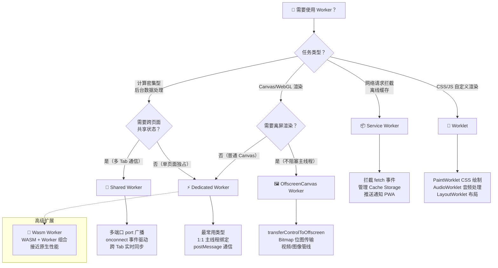
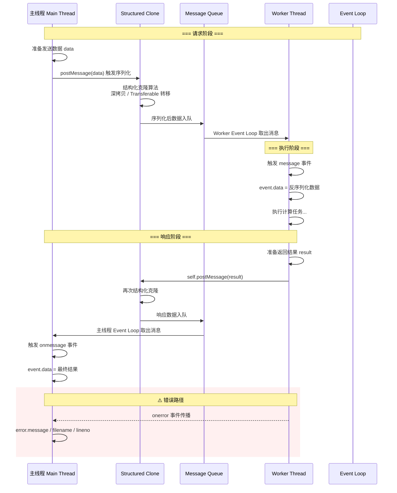
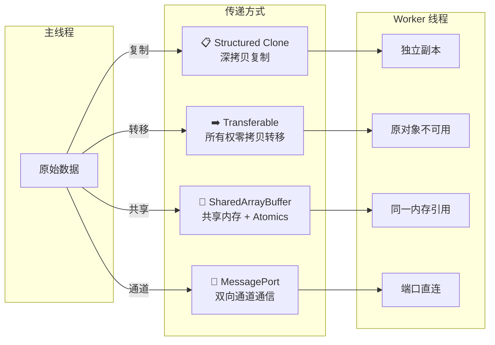
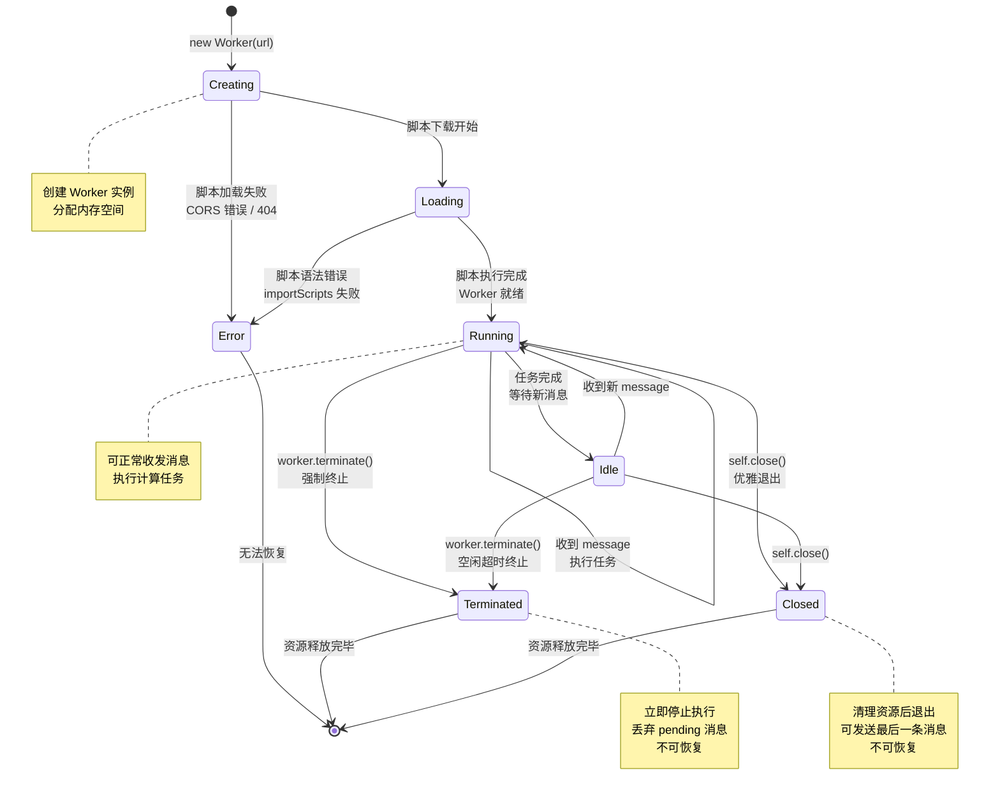
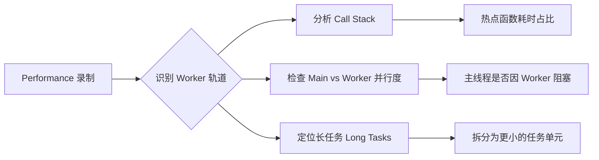

# WebWorkers处理线程（01）：常见问题（FAQ）

## Web Workers 处理线程

Web Workers 是 HTML5 引入的一项重要技术，允许在浏览器后台运行 JavaScript 脚本，而不会阻塞主线程的用户界面交互。这使得开发者能够执行计算密集型任务而不影响页面的响应速度。

### 概述

#### Web Workers 的主要类型

1. **专用 Worker (Dedicated Worker)**：仅服务于创建它的页面，是最常用的类型
2. **共享 Worker (Shared Worker)**：可被同一浏览器上下文中的多个页面共享，用于跨页面通信
3. **Service Worker**：特殊的 Worker，用于拦截和处理网络请求，实现离线缓存、推送通知等功能

#### 核心概念

1. **独立线程**：Web Workers 在独立的线程中运行，与主线程并行执行
2. **消息通信**：通过 `postMessage()` 和 `onmessage` 事件进行线程间通信
3. **无 DOM 访问**：Worker 不能直接访问 DOM，只能进行计算和数据处理
4. **同源限制**：Worker 脚本必须与主线程同源（或通过 CORS 配置）
5. **生命周期**：由主线程创建和控制，可通过 `terminate()` 方法终止
6. **数据传递**：使用结构化克隆算法传递数据，支持大多数 JavaScript 对象类型

#### 浏览器兼容性

| 浏览器  | 专用 Worker | 共享 Worker | Service Worker |
| ------- | ----------- | ----------- | -------------- |
| Chrome  | ✅ 4+       | ✅ 4+       | ✅ 40+         |
| Firefox | ✅ 3.5+     | ✅ 114+     | ✅ 44+         |
| Safari  | ✅ 4+       | ✅ 16.4+    | ✅ 11.1+       |
| Edge    | ✅ 12+      | ✅ 79+      | ✅ 17+         |
| IE      | ❌ 不支持   | ❌ 不支持   | ❌ 不支持      |

> **注意**：Shared Worker 在 Safari 6.1–16.3 期间被移除、16.4 起重新支持（Firefox 114+ 才正式支持），Service Worker 需要 HTTPS 环境（localhost 除外）

#### 适用场景

- ✅ **计算密集型任务**：大数据处理、复杂算法计算
- ✅ **图像/视频处理**：Canvas 图像处理、视频编码解码
- ✅ **数据解析**：JSON 解析、CSV 处理、文件解析
- ✅ **实时数据处理**：WebSocket 数据处理、实时分析
- ✅ **后台任务**：定时任务、数据同步、日志记录
- ❌ **DOM 操作**：无法直接操作 DOM
- ❌ **简单任务**：对于轻量级任务，Worker 的开销可能大于收益

### 系统架构

#### 线程模型

Web Workers 采用多线程架构,允许在浏览器主线程之外创建独立的 Worker 线程。这种架构设计实现了真正的并行计算,避免了 JavaScript 单线程模型的限制。

```
┌─────────────────────────────────────────────────────────────┐
│                         浏览器进程                           │
├─────────────────────────────────────────────────────────────┤
│  ┌──────────────────┐      ┌──────────────────┐            │
│  │   主线程 (UI)     │      │  Worker 线程 1   │            │
│  │  ┌────────────┐  │      │  ┌────────────┐  │            │
│  │  │ DOM 操作   │  │      │  │ 计算任务   │  │            │
│  │  │ 事件处理   │◄─┼──────┼─►│ 数据处理   │  │            │
│  │  │ UI 渲染    │  │      │  │ 网络请求   │  │            │
│  │  └────────────┘  │      │  └────────────┘  │            │
│  └──────────────────┘      └──────────────────┘            │
│         │                           │                       │
│         │ postMessage               │ postMessage           │
│         ▼                           ▼                       │
│  ┌──────────────────────────────────────────────────┐      │
│  │         消息队列 (MessageChannel)                │      │
│  └──────────────────────────────────────────────────┘      │
│                                     │                       │
│                          ┌──────────────────┐              │
│                          │  Worker 线程 2   │              │
│                          │  ┌────────────┐  │              │
│                          │  │ 图像处理   │  │              │
│                          │  │ 文件解析   │  │              │
│                          │  └────────────┘  │              │
│                          └──────────────────┘              │
└─────────────────────────────────────────────────────────────┘
```

#### 通信架构

Worker 线程与主线程之间采用**消息传递机制**进行通信,这是一种异步、线程安全的通信方式:

##### 消息传递流程

```
主线程                          Worker 线程
  │                               │
  │ 1. postMessage(data)          │
  ├──────────────────────────────►│
  │                               │ 2. 序列化数据
  │                               │    (结构化克隆)
  │                               │
  │                               │ 3. 执行计算任务
  │                               │
  │ 4. 反序列化数据               │
  │◄──────────────────────────────┤
  │ 5. 触发 onmessage 事件        │ 6. postMessage(result)
  │                               │
```

##### 关键特性

1. **数据隔离**: 每个线程有独立的内存空间,数据传递时进行复制或转移
2. **异步通信**: 消息传递是非阻塞的,不会影响线程执行
3. **类型支持**: 使用结构化克隆算法,支持大多数 JavaScript 数据类型
4. **错误传播**: Worker 中的错误可以通过 `onerror` 事件传递到主线程

#### 线程生命周期

```
创建 ──► 运行 ──► 空闲 ──► 终止
 │       │       │        │
 │       │       │        └─ worker.terminate() / self.close()
 │       │       │
 │       │       └─ 任务完成,等待新消息
 │       │
 │       └─ 接收消息,执行任务
 │
 └─ new Worker(scriptURL)
```

#### 资源占用

| 资源类型     | 主线程      | Worker 线程        |
| ------------ | ----------- | ------------------ |
| DOM 访问     | ✅ 完全访问 | ❌ 无法访问        |
| Window 对象  | ✅ 可用     | ❌ 不可用          |
| localStorage | ✅ 可用     | ❌ 不可用          |
| IndexedDB    | ✅ 可用     | ✅ 可用            |
| Fetch API    | ✅ 可用     | ✅ 可用            |
| WebSocket    | ✅ 可用     | ✅ 可用            |
| Canvas       | ✅ 可用     | ✅ OffscreenCanvas |
| 内存空间     | 独立        | 独立               |

### Worker 类型选型指南

Web Workers 生态中存在多种 Worker 类型，每种都有其特定的使用场景和约束。以下是完整的分类与决策流程：



#### 各类型详细对比

| 特性 | Dedicated Worker | Shared Worker | Service Worker | OffscreenCanvas Worker | Worklet | Wasm Worker |
| ---- | ---------------- | ------------- | -------------- | ---------------------- | ------- | ----------- |
| **生命周期** | 随页面销毁 | 所有页面关闭后销毁 | 注册后持久运行 | 随页面销毁 | 浏览器管理 | 随页面销毁 |
| **通信方式** | postMessage | port.postMessage | fetch 事件 / postMessage | Bitmap / postMessage | 输入属性 | postMessage |
| **DOM 访问** | ❌ | ❌ | ❌ | 仅 Canvas | ❌ | ❌ |
| **支持数量** | 无硬性上限 | 通常 1 个同源实例 | 1 个 per scope | 多个 | 多个 | 多个 |
| **模块支持** | ES Module ✅ | ES Module ✅ | ES Module ✅ | ES Module ✅ | 部分 | ES Module ✅ |
| **典型场景** | 数据计算 | 跨 Tab 通信 | 离线/PWA | 视频处理 | CSS Houdini | 高性能计算 |

::: tip 选型建议
- **90% 的场景**使用 Dedicated Worker 即可满足需求
- 需要多标签页实时协作时选择 Shared Worker
- 构建 PWA 应用时必须使用 Service Worker
- 进行视频编解码或复杂图像滤镜时考虑 OffscreenCanvas + Worker
:::

### 通信机制详解

<h4>002-dedicated-worker-comm.html</h4>

```html
<!DOCTYPE html>
<html lang="zh-CN">
<head>
  <meta charset="UTF-8">
  <meta name="viewport" content="width=device-width, initial-scale=1.0">
  <title>【2】Dedicated Worker 基础通信</title>
  <!--
    来源: HTML5基础知识/15-WebWorkers处理线程.md
    知识点: Dedicated Worker postMessage/onmessage 单向+双向通信
  -->
  <style>
    * { margin: 0; padding: 0; box-sizing: border-box; }
    body {
      font-family: -apple-system, BlinkMacSystemFont, 'Segoe UI', sans-serif;
      padding: 20px; background: #f0f2f5; color: #333;
      min-height: 100vh;
    }
    .container { max-width: 900px; margin: 0 auto; }
    .header {
      text-align: center; padding: 20px; background: linear-gradient(135deg, #667eea 0%, #764ba2 100%);
      color: white; border-radius: 12px; margin-bottom: 24px;
    }
    .header h1 { font-size: 22px; margin-bottom: 8px; }
    .header p { opacity: 0.9; font-size: 14px; }

    .card {
      background: white; border-radius: 10px; padding: 24px; margin-bottom: 20px;
      box-shadow: 0 2px 12px rgba(0,0,0,0.08);
    }
    .card-title {
      font-size: 16px; font-weight: 600; color: #444;
      border-left: 4px solid #667eea; padding-left: 12px; margin-bottom: 16px;
    }

    .info-banner {
      background: #e8f4fd; border-radius: 6px; padding: 12px 16px;
      font-size: 13px; line-height: 1.6; color: #1565c0; margin-bottom: 16px;
    }

    /* 通信演示区 */
    .comm-area { display: grid; grid-template-columns: 1fr 1fr; gap: 16px; }
    @media (max-width: 600px) { .comm-area { grid-template-columns: 1fr; } }

    .thread-box {
      border: 2px solid #e0e0e0; border-radius: 8px; padding: 16px;
      min-height: 200px;
    }
    .thread-box.main-thread { border-color: #667eea; background: #f5f3ff; }
    .thread-box.worker-thread { border-color: #48bb78; background: #f0fff4; }

    .thread-label {
      display: inline-block; padding: 4px 12px; border-radius: 20px;
      font-size: 12px; font-weight: 600; margin-bottom: 12px;
    }
    .thread-label.main { background: #667eea; color: white; }
    .thread-label.worker { background: #48bb78; color: white; }

    .message-input-group { display: flex; gap: 8px; margin-bottom: 12px; }
    .message-input-group input {
      flex: 1; padding: 8px 12px; border: 1px solid #ddd; border-radius: 6px;
      font-size: 13px;
    }
    .message-input-group input:focus { outline: none; border-color: #667eea; }

    .btn {
      padding: 8px 16px; border: none; border-radius: 6px; cursor: pointer;
      font-size: 13px; font-weight: 500; transition: all 0.2s;
    }
    .btn-primary { background: #667eea; color: white; }
    .btn-primary:hover { background: #5a67d8; }
    .btn-success { background: #48bb78; color: white; }
    .btn-success:hover { background: #38a169; }
    .btn-danger { background: #fc8181; color: white; }
    .btn-danger:hover { background: #e53e3e; }

    .message-list {
      max-height: 180px; overflow-y: auto; font-size: 12px;
    }
    .msg-item {
      padding: 6px 10px; margin-bottom: 4px; border-radius: 4px;
      animation: slideIn 0.3s ease;
    }
    @keyframes slideIn { from { opacity: 0; transform: translateX(-10px); } to { opacity: 1; transform: translateX(0); } }
    .msg-item.sent { background: #dbeafe; color: #1e40af; text-align: right; }
    .msg-item.received { background: #dcfce7; color: #166534; }
    .msg-item.system { background: #fef3c7; color: #92400e; font-style: italic; }

    .status-bar {
      display: flex; gap: 16px; align-items: center; padding: 12px 16px;
      background: #f8fafc; border-radius: 6px; font-size: 13px;
    }
    .status-dot {
      width: 10px; height: 10px; border-radius: 50%; display: inline-block;
    }
    .status-dot.active { background: #48bb78; box-shadow: 0 0 6px #48bb78; }
    .status-dot.inactive { background: #cbd5e0; }

    .compat-notice {
      background: #fffbeb; border: 1px solid #fcd34d; border-radius: 6px;
      padding: 10px 14px; font-size: 12px; color: #92400e; margin-top: 16px;
    }
  </style>
</head>
<body>
  <div class="container">
    <div class="header">
      <h1>Dedicated Worker 基础通信</h1>
      <p>postMessage / onmessage 单向与双向通信演示</p>
    </div>

    <div class="card">
      <div class="card-title">通信原理</div>
      <div class="info-banner">
        💡 <strong>Dedicated Worker</strong> 是最常用的 Worker 类型，仅服务于创建它的页面。主线程和 Worker 通过
        <code>postMessage()</code> 发送消息，通过 <code>onmessage</code> 接收消息，实现单向或双向通信。
      </div>

      <div class="comm-area">
        <!-- 主线程 -->
        <div class="thread-box main-thread">
          <span class="thread-label main">🖥️ 主线程 (Main Thread)</span>
          <div class="message-input-group">
            <input type="text" id="mainInput" placeholder="输入消息发送给 Worker..." />
            <button class="btn btn-primary" onclick="sendToWorker()">发送 ▶</button>
          </div>
          <div class="message-list" id="mainMessages"></div>
        </div>

        <!-- Worker 线程 -->
        <div class="thread-box worker-thread">
          <span class="thread-label worker">⚙️ Worker 线程 (Worker)</span>
          <div style="font-size: 11px; color: #888; margin-bottom: 8px;">Worker 自动回复收到的消息</div>
          <div class="message-list" id="workerMessages"></div>
        </div>
      </div>

      <div class="status-bar" style="margin-top: 16px;">
        <span>状态：</span>
        <span class="status-dot active" id="statusDot"></span>
        <span id="statusText">Worker 运行中</span>
        <span style="margin-left: auto; color: #888;">
          消息计数：<strong id="msgCount">0</strong>
        </span>
      </div>

      <div style="display: flex; gap: 8px; margin-top: 12px; flex-wrap: wrap;">
        <button class="btn btn-success" onclick="sendPing()">📡 发送 Ping</button>
        <button class="btn btn-primary" onclick="sendObject()">📦 发送对象</button>
        <button class="btn btn-primary" onclick="sendArray()">📋 发送数组</button>
        <button class="btn btn-danger" onclick="terminateWorker()">⛔ 终止 Worker</button>
        <button class="btn btn-primary" onclick="recreateWorker()">🔄 重建 Worker</button>
      </div>

      <div class="compat-notice">
        ⚠️ <strong>兼容性提示：</strong>Web Workers 在所有现代浏览器中均支持（Chrome 4+, Firefox 3.5+, Safari 4+, Edge 12+）。
        IE 不支持 Web Workers。
      </div>
    </div>
  </div>

  <script>
    // ====== 日志函数 ======
    const mainMsgEl = document.getElementById('mainMessages');
    const workerMsgEl = document.getElementById('workerMessages');
    let msgCount = 0;

    function addMessage(element, text, type) {
      const div = document.createElement('div');
      div.className = `msg-item ${type}`;
      div.textContent = `[${new Date().toLocaleTimeString()}] ${text}`;
      element.appendChild(div);
      element.scrollTop = element.scrollHeight;
    }

    function updateStatus(text, active) {
      document.getElementById('statusText').textContent = text;
      document.getElementById('statusDot').className = `status-dot ${active ? 'active' : 'inactive'}`;
    }

    function incrementCount() {
      msgCount++;
      document.getElementById('msgCount').textContent = msgCount;
    }

    // ====== Worker 代码 ======
    const workerCode = `
// Worker 接收主线程消息
self.onmessage = function(e) {
  const data = e.data;

  // 根据不同类型回复
  if (data.type === 'ping') {
    self.postMessage({
      type: 'pong',
      message: 'Pong! Worker 收到 Ping',
      timestamp: Date.now()
    });
  } else if (data.type === 'text') {
    self.postMessage({
      type: 'reply',
      message: 'Worker 已收到: "' + data.content + '"',
      original: data.content,
      timestamp: Date.now()
    });
  } else if (data.type === 'object') {
    self.postMessage({
      type: 'reply',
      message: 'Worker 收到对象，属性数: ' + Object.keys(data.content).length,
      receivedKeys: Object.keys(data.content),
      timestamp: Date.now()
    });
  } else if (data.type === 'array') {
    self.postMessage({
      type: 'reply',
      message: 'Worker 收到数组，长度: ' + data.content.length,
      sum: data.content.reduce((a, b) => a + b, 0),
      timestamp: Date.now()
    });
  } else {
    self.postMessage({
      type: 'reply',
      message: 'Worker 收到未知类型消息',
      raw: data,
      timestamp: Date.now()
    });
  }
};

self.onerror = function(err) {
  self.postMessage({ type: 'error', message: err.message });
};
`;

    // ====== 创建 Worker ======
    let worker = null;

    function createWorker() {
      const blob = new Blob([workerCode], { type: 'application/javascript' });
      const url = URL.createObjectURL(blob);
      worker = new Worker(url);

      worker.onmessage = function(e) {
        const data = e.data;
        incrementCount();

        if (data.type === 'pong') {
          addMessage(workerMsgEl, `发送: Pong! (${Date.now() - data.timestamp}ms 往返)`, 'sent');
          addMessage(mainMsgEl, `收到: ${data.message}`, 'received');
        } else if (data.type === 'reply') {
          addMessage(workerMsgEl, `回复: ${data.message}`, 'sent');
          addMessage(mainMsgEl, `收到: ${data.message}`, 'received');
        } else if (data.type === 'error') {
          addMessage(mainMsgEl, `错误: ${data.message}`, 'system');
        }
      };

      worker.onerror = function(err) {
        addMessage(mainMsgEl, `Worker 错误: ${err.message} (${err.filename}:${err.lineno})`, 'system');
        updateStatus('Worker 出错', false);
      };

      updateStatus('Worker 运行中', true);
      addMessage(mainMsgEl, 'Worker 已创建并连接', 'system');
    }

    createWorker();

    // ====== 通信操作 ======
    function sendToWorker() {
      const input = document.getElementById('mainInput');
      const text = input.value.trim();
      if (!text || !worker) return;

      addMessage(mainMsgEl, `发送: "${text}"`, 'sent');
      worker.postMessage({ type: 'text', content: text });
      input.value = '';
    }

    document.getElementById('mainInput').addEventListener('keypress', function(e) {
      if (e.key === 'Enter') sendToWorker();
    });

    function sendPing() {
      if (!worker) return;
      addMessage(mainMsgEl, '发送: Ping!', 'sent');
      worker.postMessage({ type: 'ping' });
    }

    function sendObject() {
      if (!worker) return;
      const obj = {
        name: '测试对象',
        value: Math.random() * 100,
        tags: ['html5', 'webworkers', 'demo'],
        nested: { a: 1, b: 2 }
      };
      addMessage(mainMsgEl, `发送: 对象 ${JSON.stringify(obj).substring(0, 50)}...`, 'sent');
      worker.postMessage({ type: 'object', content: obj });
    }

    function sendArray() {
      if (!worker) return;
      const arr = Array.from({ length: 5 }, () => Math.floor(Math.random() * 100));
      addMessage(mainMsgEl, `发送: 数组 [${arr.join(', ')}]`, 'sent');
      worker.postMessage({ type: 'array', content: arr });
    }

    function terminateWorker() {
      if (worker) {
        worker.terminate();
        worker = null;
        updateStatus('Worker 已终止', false);
        addMessage(mainMsgEl, 'Worker 已被 terminate() 终止', 'system');
      }
    }

    function recreateWorker() {
      if (worker) {
        worker.terminate();
      }
      mainMsgEl.innerHTML = '';
      workerMsgEl.innerHTML = '';
      msgCount = 0;
      document.getElementById('msgCount').textContent = '0';
      createWorker();
    }
  </script>
</body>
</html>
```

#### 主线程与 Worker 通信时序

理解主线程和 Worker 之间的完整通信流程是高效使用 Web Workers 的基础。以下时序图展示了从消息发送到响应接收的完整过程：



##### 关键时间节点说明

| 阶段 | 操作 | 耗时影响因素 |
| ---- | ---- | ------------ |
| **序列化** | Structured Clone 深拷贝数据 | 数据大小、对象嵌套深度 |
| **队列等待** | 消息在队列中排队 | 当前线程繁忙程度 |
| **反序列化** | 接收端还原对象 | 同序列化 |
| **任务执行** | Worker 内部计算逻辑 | 算法复杂度、数据量 |

#### 数据传递方式对比

不同的数据传递方式在性能、安全性和适用场景上差异显著：



##### 各方式详细对比

| 维度 | Structured Clone | Transferable | SharedArrayBuffer | MessagePort |
| ---- | ---------------- | ------------ | ----------------- | ----------- |
| **原理** | 深拷贝数据到新内存 | 所有权转移，零拷贝 | 共享同一块内存 | 双向通信管道 |
| **速度** | 中等（需复制） | 最快（指针移动） | 最快（无传输） | 快（轻量级） |
| **原数据可用性** | ✅ 仍可使用 | ❌ 变为空/不可用 | ✅ 双方均可读写 | N/A |
| **数据大小限制** | 数百 MB | 无限制 | 需配置 COOP/COEP | 无限制 |
| **线程安全性** | 天然安全 | 天然安全 | 需 Atomics 保证 | 天然安全 |
| **适用数据** | 任意可克隆对象 | ArrayBuffer 等 | SharedArrayBuffer | 任意可克隆对象 |
| **浏览器要求** | 全部支持 | 全部支持 | 需跨域隔离头 | 全部支持 |

###### 使用建议

```javascript
// 场景 1: 小数据量 → Structured Clone（默认）
worker.postMessage({ type: 'config', options: { threshold: 0.5 } })

// 场景 2: 大型二进制数据 → Transferable
const largeBuffer = new ArrayBuffer(10 * 1024 * 1024) // 10MB
worker.postMessage({ buffer: largeBuffer }, [largeBuffer])
// largeBuffer 现在已为 detached 状态，length = 0

// 场景 3: 高频读写共享 → SharedArrayBuffer（需 COOP/COEP）
if (crossOriginIsolated) {
  const sab = new SharedArrayBuffer(1024)
  const int32View = new Int32Array(sab)
  worker.postMessage({ sharedBuffer: sab })
  // 双方通过 Atomics 读写 int32View
}

// 场景 4: Worker 间直连 → MessagePort
const channel = new MessageChannel()
workerA.postMessage({ port: channel.port1 }, [channel.port1])
workerB.postMessage({ port: channel.port2 }, [channel.port2])
```

#### Worker 生命周期状态机



##### 各状态特征说明

| 状态 | 触发条件 | 可否恢复 | 资源占用 |
| ---- | -------- | -------- | -------- |
| **Creating** | `new Worker()` 调用 | - | 已分配但未初始化 |
| **Loading** | 开始下载脚本 | - | 正在加载脚本文件 |
| **Running** | 脚本加载并执行成功 | - | 活跃状态，全量资源 |
| **Idle** | 无待处理消息 | 自动转 Running | 保持活跃，监听中 |
| **Terminated** | `terminate()` 强制终止 | ❌ 不可恢复 | 已释放 |
| **Closed** | `self.close()` 优雅退出 | ❌ 不可恢复 | 已释放 |
| **Error** | 加载/执行出错 | ❌ 不可恢复 | 部分已释放 |

::: warning 注意事项
- `terminate()` 是立即生效的暴力终止，正在执行的代码会被打断，pending 的异步操作会被取消
- `self.close()` 是优雅退出，Worker 可以在关闭前做清理工作并发送最后一条消息
- 一旦进入 Terminated 或 Closed 状态，该 Worker 实例无法重新使用，必须创建新的
:::

### 专用 Worker

#### 基本使用示例


::: code-group

```html [index.html]
<!DOCTYPE html>
<html>
  <head>
    <title>Web Worker 示例</title>
  </head>

  <body>
    <h1>Web Worker 的累加计算</h1>
    <input type="number" id="number" placeholder="输入数字" />
    <button id="calculate">计算</button>
    <p>结果: <span id="result"></span></p>

    <script src="./main.js"></script>
  </body>
</html>
```

```JavaScript [主线程 main.js]
// 创建 Worker
const worker = new Worker("./worker.js")

// 接收 Worker 发来的消息
worker.onmessage = function (event) {
  console.log("主线程收到消息:", event.data)

  if (event.data.success) {
    document.getElementById("result").textContent = event.data.result
  } else {
    document.getElementById("result").textContent = "错误: " + event.data.error
  }
}

// 向 Worker 发送消息
document.getElementById("calculate").addEventListener("click", function () {
  const num = parseInt(document.getElementById("number").value)
  worker.postMessage(num)
  console.log("主线程发送消息:", num)
})

// 错误处理
worker.onerror = function (error) {
  console.error("Worker 错误:", error)
  // error.message: 错误消息
  // error.filename: 发生错误的文件名
  // error.lineno: 错误行号
  document.getElementById("result").textContent = "计算出错: " + error.message
}

// 使用 addEventListener 方式（推荐）
worker.addEventListener('error', function(error) {
  console.error('Worker 错误详情:', {
    message: error.message,
    filename: error.filename,
    lineno: error.lineno,
    colno: error.colno
  })
})
```

```javascript [Worker线程 worker.js]
// 接收主线程消息
self.onmessage = function (event) {
  console.log("Worker 收到消息:", event.data)

  try {
    // 执行耗时计算
    const result = heavyCalculation(event.data)

    // 发送结果回主线程
    self.postMessage({
      success: true,
      result: result
    })
  } catch (error) {
    // 捕获错误并发送给主线程
    self.postMessage({
      success: false,
      error: error.message
    })
  }
}

// 模拟耗时计算
function heavyCalculation(num) {
  if (typeof num !== "number" || num < 0) {
    throw new Error("请输入有效的正数")
  }

  let sum = 0
  for (let i = 0; i <= num; i++) {
    sum += i
  }
  return sum
}

// Worker 内部错误处理
self.onerror = function (error) {
  console.error("Worker 内部错误:", error)
  // 可以发送错误信息给主线程
  self.postMessage({
    success: false,
    error: "Worker 执行出错"
  })
}
```

:::

#### 复杂数据传递示例

Web Workers 使用**结构化克隆算法**（Structured Clone Algorithm）来传递数据。这个算法支持大多数 JavaScript 对象类型，但有一些限制。

**支持的数据类型：**

- ✅ 基本类型：`String`、`Number`、`Boolean`、`null`、`undefined`
- ✅ 对象：`Object`、`Array`、`Date`、`RegExp`
- ✅ 集合类型：`Map`、`Set`、`ArrayBuffer`、`TypedArray`
- ✅ `Blob`、`File`、`ImageData`
- ❌ `Function`、`DOM 元素`（`Error` 与 `Symbol` 现已支持结构化克隆）

::: code-group

```javascript [主线程代码]
const worker = new Worker("worker.js")

// 发送复杂对象
worker.postMessage({
  command: "process",
  data: {
    numbers: [1, 2, 3, 4, 5],
    text: "处理这些数据",
    timestamp: new Date() // Date 对象会被正确传递
  }
})

// 接收处理结果
worker.onmessage = function (event) {
  console.log("处理结果:", event.data)
}

// 结构化克隆 API 示例
const complexData = {
  date: new Date(),
  array: [1, 2, 3],
  map: new Map([
    ["a", 1],
    ["b", 2]
  ]),
  set: new Set([1, 2, 3]),
  buffer: new ArrayBuffer(8) // ArrayBuffer 也可以传递
}

// 注意：Worker 不能直接使用某些对象类型，如 DOM 元素、函数
// 但可以使用结构化克隆 API 传递大多数 JavaScript 对象
worker.postMessage(complexData)

// 错误示例：不能传递函数
// worker.postMessage({ fn: function() {} }); // ❌ 会报错

// 错误示例：不能传递 DOM 元素
// worker.postMessage({ element: document.body }); // ❌ 会报错
```

```javascript [Worker 线程]
self.onmessage = function (event) {
  if (event.data.command === "process") {
    const result = processData(event.data.data)
    self.postMessage(result)
  }
}

function processData(data) {
  // 处理数据
  const sum = data.numbers.reduce((acc, val) => acc + val, 0)
  return {
    sum: sum,
    textLength: data.text.length,
    timestamp: new Date().toISOString()
  }
}
```

:::

#### Worker 构造函数参数详解

创建 Worker 实例时,可以传递配置选项来控制 Worker 的行为:

```javascript
const worker = new Worker(scriptURL, options)
```

##### 参数说明

**scriptURL** (必需)

- Worker 脚本的 URL 地址
- 必须与主线程同源,或配置 CORS
- 可以是相对路径或绝对路径

**options** (可选)

| 属性          | 类型   | 默认值      | 说明                                              |
| ------------- | ------ | ----------- | ------------------------------------------------- |
| `type`        | string | `"classic"` | Worker 类型:`"classic"` 或 `"module"`             |
| `credentials` | string | `"same-origin"` | 凭证模式:`"omit"`、`"same-origin"` 或 `"include"` |
| `name`        | string | `""`        | Worker 名称,用于调试识别                          |

##### 使用示例

:::: code-group

```javascript [模块化 Worker]
// 创建支持 ES6 模块的 Worker
const worker = new Worker("worker.js", {
  type: "module", // 允许使用 import/export 语法
  name: "data-processor", // 设置 Worker 名称
  credentials: "same-origin" // 携带同源凭证
})

// Worker 内部可以使用 ES6 模块
// worker.js
import { calculate } from "./utils.js"

self.onmessage = function (event) {
  const result = calculate(event.data)
  self.postMessage(result)
}
```

```javascript [经典模式 Worker]
// 默认的经典模式
const worker = new Worker("worker.js", {
  type: "classic" // 默认值,可省略
})

// Worker 内部使用 importScripts
// worker.js
importScripts("utils.js")

self.onmessage = function (event) {
  const result = calculate(event.data)
  self.postMessage(result)
}
```

```javascript [跨域脚本转同源 Blob Worker]
// Worker 构造函数仅接受同源 URL，跨域脚本需先经 CORS fetch 再用 Blob URL 创建
async function createCrossOriginWorker(url) {
  const response = await fetch(url, { mode: "cors" }) // 服务器需配置 CORS
  const code = await response.text()
  const blobURL = URL.createObjectURL(new Blob([code], { type: "application/javascript" }))
  return new Worker(blobURL)
}

const worker = await createCrossOriginWorker("https://example.com/worker.js")
worker.onerror = function (error) {
  console.error("Worker 加载失败:", error)
}
```

::::

#### Inline Worker 与 Blob Worker

除了从外部文件加载 Worker,还可以使用 Blob URL 或 Data URL 创建内联 Worker。这种方式适用于:

- 单文件应用
- 动态生成 Worker 代码
- 避免额外的网络请求

##### Blob Worker

:::: code-group

```javascript [创建 Blob Worker]
// 将 Worker 代码作为字符串
const workerCode = `
  self.onmessage = function(event) {
    const result = event.data * 2;
    self.postMessage(result);
  };
`

// 创建 Blob 对象
const blob = new Blob([workerCode], { type: "application/javascript" })

// 生成 Blob URL
const workerURL = URL.createObjectURL(blob)

// 创建 Worker
const worker = new Worker(workerURL)

// 使用 Worker
worker.postMessage(10)
worker.onmessage = function (event) {
  console.log("结果:", event.data) // 输出: 20
}

// 清理 Blob URL (Worker 仍可继续使用)
URL.revokeObjectURL(workerURL)
```

```javascript [函数式创建 Worker]
// 封装为工具函数
function createInlineWorker(workerFunction) {
  // 将函数转换为字符串
  const workerCode = `
    (${workerFunction.toString())})();
  `

  const blob = new Blob([workerCode], { type: "application/javascript" })
  const workerURL = URL.createObjectURL(blob)
  const worker = new Worker(workerURL)

  // 立即释放 Blob URL
  URL.revokeObjectURL(workerURL)

  return worker
}

// 使用示例
const worker = createInlineWorker(function () {
  self.onmessage = function (event) {
    // 执行复杂计算
    const result = heavyCalculation(event.data)
    self.postMessage(result)
  }

  function heavyCalculation(data) {
    // 计算逻辑...
    return data * 2
  }
})
```

```javascript [动态生成 Worker]
// 根据配置动态生成 Worker
function createDynamicWorker(config) {
  const workerCode = `
    // 配置参数
    const config = ${JSON.stringify(config)};
    
    self.onmessage = function(event) {
      const { action, data } = event.data;
      
      switch(action) {
        case 'process':
          const result = processData(data, config);
          self.postMessage({ type: 'result', data: result });
          break;
        case 'terminate':
          self.close();
          break;
      }
    };
    
    function processData(data, config) {
      // 根据配置处理数据
      return data.map(item => item * config.multiplier);
    }
  `

  const blob = new Blob([workerCode], { type: "application/javascript" })
  return new Worker(URL.createObjectURL(blob))
}

// 使用示例
const worker = createDynamicWorker({ multiplier: 10 })
worker.postMessage({ action: "process", data: [1, 2, 3, 4, 5] })
worker.onmessage = function (event) {
  console.log("处理结果:", event.data) // [10, 20, 30, 40, 50]
}
```

::::

##### Data URL Worker

```javascript
// 使用 Data URL (不推荐,有大小限制)
const workerCode = "self.onmessage = e => self.postMessage(e.data * 2);"
const dataURL = `data:application/javascript,${encodeURIComponent(workerCode)}`

const worker = new Worker(dataURL)

// 注意: Data URL 在某些浏览器中可能有长度限制
```

##### 使用场景对比

| 创建方式     | 优点                         | 缺点                  | 适用场景          |
| ------------ | ---------------------------- | --------------------- | ----------------- |
| **外部文件** | 代码分离,易于维护,支持模块化 | 需要额外 HTTP 请求    | 生产环境,大型项目 |
| **Blob URL** | 无需额外请求,可动态生成      | 代码管理复杂,调试困难 | 动态配置,小型应用 |
| **Data URL** | 简单直接                     | 有长度限制,编码开销   | 极简单场景        |

##### 最佳实践

```javascript
// ✅ 推荐: 使用外部文件 + 模块模式
const worker = new Worker("worker.js", { type: "module" })

// ✅ 推荐: Blob Worker 用于动态场景
function createConfigurableWorker(options) {
  const code = generateWorkerCode(options)
  const blob = new Blob([code], { type: "application/javascript" })
  return new Worker(URL.createObjectURL(blob))
}

// ❌ 避免: 在生产环境中过度使用内联 Worker
// 原因: 代码管理困难,不利于缓存和优化
```

### 共享 Worker

共享 Worker 可以被同一浏览器上下文中的多个页面共享。主要用于不同的页面通信。在下面的示例中，page1 发送的消息会被 page2 接受

::: code-group

```html [主线程 page1]
<!DOCTYPE html>
<html>
  <head>
    <title>Web Worker 示例</title>
  </head>
  <body>
    <h1>发送消息</h1>
    <input type="text" id="message" />
    <button id="send">发送</button>

    <script>
      // 创建共享 Worker
      const sharedWorker = new SharedWorker("./shared-worker.js")

      // 连接事件
      sharedWorker.port.onmessage = function (event) {
        console.log("Page1 收到消息:", event.data)
      }

      // 发送消息
      document.getElementById("send").addEventListener("click", function () {
        const msg = document.getElementById("message").value
        sharedWorker.port.postMessage(msg)
      })

      // 启动端口通信
      sharedWorker.port.start()
    </script>
  </body>
</html>
```

```html [主线程 page2]
<!DOCTYPE html>
<html>
  <head>
    <title>Web Worker 示例</title>
  </head>

  <body>
    <p>结果: <span id="result"></span></p>

    <script>
      // 创建共享 Worker（与 page1.html 相同）
      const sharedWorker = new SharedWorker("./shared-worker.js")

      // 连接事件
      sharedWorker.port.onmessage = function (event) {
        console.log("Page2 收到消息:", event.data)
        document.getElementById("result").textContent = event.data
      }
      sharedWorker.port.start()
    </script>
  </body>
</html>
```

```javascript [共享 Worker]
// 维护连接列表
const ports = []

// 接收连接
self.onconnect = function (event) {
  const port = event.ports[0]
  ports.push(port)

  // 接收消息
  port.onmessage = function (e) {
    console.log("Worker 收到消息:", e.data)

    // 广播给所有连接的端口
    ports.forEach((p) => {
      if (p !== port) {
        // 避免发送给自己
        p.postMessage(`来自其他页面的消息: ${e.data}`)
      }
    })
  }

  // 发送欢迎消息
  port.postMessage("已连接到共享 Worker")
}
```

:::

### 高级特性

#### 1. Transferable Objects（可转移对象）

对于大型二进制数据（如 ArrayBuffer），可以使用 transferable objects 来提高性能，避免数据复制

**主线程代码:**

```javascript
const worker = new Worker("worker.js")

// 创建大型 ArrayBuffer
const largeBuffer = new ArrayBuffer(10000000) // 10MB

// 转移所有权（不是复制）
worker.postMessage({ buffer: largeBuffer }, [largeBuffer])

// 注意：转移后主线程不能再使用 largeBuffer
```

**Worker 线程代码:**

```javascript
self.onmessage = function (event) {
  const buffer = event.data.buffer
  // 现在拥有 buffer 的所有权
  // 可以进行处理...
}
```

#### 2. 异步 API 在 Worker 中的使用

Worker 中可以使用大多数异步 API，如 Fetch API、setTimeout 等

**Worker 代码示例:**

```javascript
// 使用 Fetch API
fetch("https://api.example.com/data")
  .then((response) => response.json())
  .then((data) => {
    self.postMessage({ type: "data", payload: data })
  })
  .catch((error) => {
    self.postMessage({ type: "error", message: error.message })
  })

// 使用 setTimeout
setTimeout(() => {
  self.postMessage({ type: "timeout" })
}, 1000)
```

#### 3. 动态导入模块

Worker 支持动态导入 ES 模块

**Worker 代码:**

```javascript
// 动态导入模块
importScripts("utils.js") // 传统方式（同步）

// 或者使用 ES 模块（需要浏览器支持，异步）
import("module.js")
  .then((module) => {
    module.doSomething()
  })
  .catch((err) => {
    console.error("模块加载失败:", err)
  })

// 导入多个脚本（按顺序执行）
importScripts("math.js", "string.js", "utils.js")
```

#### 4. ES Module Workers

传统 Worker 使用 `importScripts()` 同步加载脚本，而 ES Module Workers 允许使用 `import/export` 语法，支持静态分析和 Tree Shaking。

**创建 ES Module Worker：**

```javascript
const worker = new Worker("worker.mjs", { type: "module" })
```

**Worker 内使用 ES Module：**

```javascript
import { processImage } from "./image-utils.js"
import { CONFIG } from "./config.js"

self.onmessage = async (event) => {
  const result = await processImage(event.data, CONFIG)
  self.postMessage(result)
}
```

**ES Module Worker 与 Classic Worker 的区别：**

| 特性              | Classic Worker（默认）        | ES Module Worker                               |
| ----------------- | ----------------------------- | ---------------------------------------------- |
| 创建方式          | `new Worker('worker.js')`     | `new Worker('worker.mjs', { type: 'module' })` |
| 导入方式          | `importScripts()`（同步阻塞） | `import` / `export`（异步，顶层 await 可用）   |
| 作用域            | 独立全局作用域                | 独立模块作用域                                 |
| 严格模式          | 可选                          | 始终严格模式                                   |
| Tree Shaking      | 不支持                        | 支持（构建工具可优化）                         |
| 顶层 await        | 不支持                        | 支持                                           |
| `importScripts()` | 可用                          | **不可用**（会抛出错误）                       |

**顶层 await 示例：**

```javascript
const data = await fetch("/api/config").then((r) => r.json())

self.onmessage = (event) => {
  console.log("配置已加载:", data)
  self.postMessage({ config: data, input: event.data })
}
```

::: tip
ES Module Workers 是现代 Web 应用的推荐方式，但需要浏览器支持（Chrome 80+、Firefox 114+、Safari 15+）。不支持的环境会回退到 Classic Worker。
:::

#### 5. SharedArrayBuffer 与 Atomics

`SharedArrayBuffer` 允许主线程和 Worker 共享同一块内存，实现零拷贝的高效数据交换。`Atomics` 提供原子操作，确保共享内存的线程安全。

**基本原理：**

```
主线程                    Worker 线程
  │                          │
  ├── SharedArrayBuffer ─────┤  ← 同一块内存
  │                          │
  ├── Atomics.store()        ├── Atomics.load()
  └── Atomics.wait()         └── Atomics.notify()
```

**创建共享内存：**

```javascript
const sharedBuffer = new SharedArrayBuffer(4)
const sharedArray = new Int32Array(sharedBuffer)

const worker = new Worker("worker.js")
worker.postMessage({ buffer: sharedBuffer })
```

**Worker 中使用共享内存：**

```javascript
self.onmessage = (event) => {
  const sharedArray = new Int32Array(event.data.buffer)

  Atomics.store(sharedArray, 0, 42)
  Atomics.notify(sharedArray, 0)
}
```

**等待 Worker 更新（须在 Worker 线程内）：**

::: warning
`Atomics.wait()` 会阻塞线程，**不允许在主线程调用**（会抛出异常），只能在 Worker 线程中使用；主线程应通过 `onmessage` 事件获知更新完成。
:::

```javascript
// Worker 内部
Atomics.wait(sharedArray, 0, 0)
console.log("值已更新:", Atomics.load(sharedArray, 0))
```

**Atomics 常用方法：**

| 方法                                          | 说明           |
| --------------------------------------------- | -------------- |
| `Atomics.store(arr, idx, val)`                | 原子写入       |
| `Atomics.load(arr, idx)`                      | 原子读取       |
| `Atomics.add(arr, idx, val)`                  | 原子加法       |
| `Atomics.sub(arr, idx, val)`                  | 原子减法       |
| `Atomics.compareExchange(arr, idx, old, new)` | CAS 操作       |
| `Atomics.wait(arr, idx, val, timeout?)`       | 阻塞等待值变化 |
| `Atomics.notify(arr, idx, count?)`            | 唤醒等待的线程 |

**实战示例：多 Worker 并行计算**

```javascript
const THREAD_COUNT = 4
const DATA_SIZE = 1000000
const sharedBuffer = new SharedArrayBuffer(DATA_SIZE * 4)
const resultArray = new Int32Array(sharedBuffer)

const chunkSize = Math.ceil(DATA_SIZE / THREAD_COUNT)
const workers = []

for (let i = 0; i < THREAD_COUNT; i++) {
  const worker = new Worker("compute-worker.js")
  worker.postMessage({
    buffer: sharedBuffer,
    offset: i * chunkSize,
    length: chunkSize
  })
  workers.push(worker)
}

workers.forEach((w, i) => {
  w.onmessage = () => {
    console.log(`Worker ${i} 完成`)
  }
})
```

::: warning
由于 Spectre 漏洞的安全影响，`SharedArrayBuffer` 要求页面使用**跨域隔离**（Cross-Origin Isolation）：

- 服务器须返回 `Cross-Origin-Opener-Policy: same-origin`
- 服务器须返回 `Cross-Origin-Embedder-Policy: require-corp`

未配置这些响应头时，`SharedArrayBuffer` 在部分浏览器中不可用。可通过 `self.crossOriginIsolated` 检测：

```javascript
if (self.crossOriginIsolated) {
  const sab = new SharedArrayBuffer(1024)
} else {
  console.warn("页面未跨域隔离，SharedArrayBuffer 不可用")
}
```

:::

#### 6. MessageChannel（消息通道）

`MessageChannel` 允许在两个 Worker 之间或 Worker 与主线程之间建立直接通信通道。

::: code-group

```javascript [主线程]
// 创建消息通道
const channel = new MessageChannel()

// 创建两个 Worker
const worker1 = new Worker("worker1.js")
const worker2 = new Worker("worker2.js")

// 将端口传递给 Worker
worker1.postMessage({ port: channel.port1 }, [channel.port1])
worker2.postMessage({ port: channel.port2 }, [channel.port2])

// 现在 worker1 和 worker2 可以直接通信
```

```javascript [worker1.js]
let port

self.onmessage = function (event) {
  if (event.data.port) {
    port = event.data.port

    // 监听来自 worker2 的消息
    port.onmessage = function (e) {
      console.log("Worker1 收到 Worker2 的消息:", e.data)
    }

    // 向 worker2 发送消息
    port.postMessage("Hello from Worker1")
  }
}
```

```javascript [worker2.js]
let port

self.onmessage = function (event) {
  if (event.data.port) {
    port = event.data.port

    // 监听来自 worker1 的消息
    port.onmessage = function (e) {
      console.log("Worker2 收到 Worker1 的消息:", e.data)
      // 回复消息
      port.postMessage("Hello from Worker2")
    }
  }
}
```

:::

#### 7. Worker 池（Worker Pool）

对于需要处理大量任务的场景，可以使用 Worker 池来管理多个 Worker 实例，提高并发处理能力。

```javascript
// Worker 池实现
class WorkerPool {
  constructor(workerScript, poolSize = navigator.hardwareConcurrency || 4) {
    this.workerScript = workerScript
    this.poolSize = poolSize
    this.workers = []
    this.queue = []
    this.activeWorkers = 0

    // 初始化 Worker 池
    for (let i = 0; i < poolSize; i++) {
      this.workers.push({
        worker: new Worker(workerScript),
        busy: false,
        id: i
      })
    }
  }

  // 执行任务
  execute(task, callback) {
    return new Promise((resolve, reject) => {
      const workerInfo = this.getAvailableWorker()

      if (workerInfo) {
        this.runTask(workerInfo, task, resolve, reject)
      } else {
        // 如果没有可用 Worker，加入队列
        this.queue.push({ task, resolve, reject })
      }
    })
  }

  // 获取可用的 Worker
  getAvailableWorker() {
    return this.workers.find((w) => !w.busy)
  }

  // 运行任务
  runTask(workerInfo, task, resolve, reject) {
    workerInfo.busy = true
    this.activeWorkers++

    const cleanup = () => {
      workerInfo.busy = false
      this.activeWorkers--

      // 处理队列中的下一个任务
      if (this.queue.length > 0) {
        const next = this.queue.shift()
        this.runTask(workerInfo, next.task, next.resolve, next.reject)
      }
    }

    workerInfo.worker.onmessage = (event) => {
      cleanup()
      resolve(event.data)
    }

    workerInfo.worker.onerror = (error) => {
      cleanup()
      reject(error)
    }

    workerInfo.worker.postMessage(task)
  }

  // 终止所有 Worker
  terminate() {
    this.workers.forEach((w) => w.worker.terminate())
    this.workers = []
    this.queue = []
  }
}

// 使用示例
const pool = new WorkerPool("worker.js", 4)

// 并发处理多个任务
Promise.all([
  pool.execute({ data: [1, 2, 3] }),
  pool.execute({ data: [4, 5, 6] }),
  pool.execute({ data: [7, 8, 9] }),
  pool.execute({ data: [10, 11, 12] })
]).then((results) => {
  console.log("所有任务完成:", results)
})
```

### 示例：图像处理 Worker


::: code-group

```html [主线程]
<!DOCTYPE html>
<html>
  <head>
    <title>图像处理 Worker</title>
    <style>
      body {
        padding: 30px;
      }

      canvas {
        border: 1px solid #ccc;
      }
    </style>
  </head>

  <body>
    <h1>图像处理示例</h1>
    <input type="file" id="imageInput" accept="image/*" />
    <canvas id="canvas" width="800" height="800"></canvas>
    <button id="grayscale">转换为灰度</button>
    <button id="invert">反色</button>

    <script>
      const canvas = document.getElementById("canvas")
      const ctx = canvas.getContext("2d")
      const imageInput = document.getElementById("imageInput")
      const grayscaleBtn = document.getElementById("grayscale")
      const invertBtn = document.getElementById("invert")

      let originalImageData = null
      let worker = new Worker("image-worker.js")

      // 加载图像
      imageInput.addEventListener("change", function (e) {
        const file = e.target.files[0]
        if (!file) return

        const reader = new FileReader()
        reader.onload = function (event) {
          const img = new Image()
          img.onload = function () {
            // 保持宽高比适应800x800 canvas
            const canvasAspect = canvas.width / canvas.height
            const imgAspect = img.width / img.height

            let drawWidth,
              drawHeight,
              offsetX = 0,
              offsetY = 0

            if (imgAspect > canvasAspect) {
              // 图片更宽，宽度适应
              drawWidth = canvas.width
              drawHeight = canvas.width / imgAspect
              offsetY = (canvas.height - drawHeight) / 2
            } else {
              // 图片更高，高度适应
              drawHeight = canvas.height
              drawWidth = canvas.height * imgAspect
              offsetX = (canvas.width - drawWidth) / 2
            }

            // 绘制图片居中显示，保持宽高比
            ctx.drawImage(img, offsetX, offsetY, drawWidth, drawHeight)
            originalImageData = ctx.getImageData(0, 0, canvas.width, canvas.height)
          }
          img.src = event.target.result
        }
        reader.readAsDataURL(file)
      })

      // 转换为灰度
      grayscaleBtn.addEventListener("click", function () {
        if (!originalImageData) return

        // 重新获取当前canvas的图像数据
        const currentImageData = ctx.getImageData(0, 0, canvas.width, canvas.height)

        worker.postMessage(
          {
            type: "grayscale",
            imageData: currentImageData
          },
          [currentImageData.data.buffer]
        )

        worker.onmessage = function (e) {
          if (e.data.type === "processed") {
            ctx.putImageData(e.data.imageData, 0, 0)
            // 更新原始图像数据引用
            originalImageData = e.data.imageData
          }
        }
      })

      // 反色
      invertBtn.addEventListener("click", function () {
        if (!originalImageData) return

        // 重新获取当前canvas的图像数据
        const currentImageData = ctx.getImageData(0, 0, canvas.width, canvas.height)

        worker.postMessage(
          {
            type: "invert",
            imageData: currentImageData
          },
          [currentImageData.data.buffer]
        )

        worker.onmessage = function (e) {
          if (e.data.type === "processed") {
            ctx.putImageData(e.data.imageData, 0, 0)
            // 更新原始图像数据引用
            originalImageData = e.data.imageData
          }
        }
      })
    </script>
  </body>
</html>
```

```JavaScript [worker 进程]
self.onmessage = function (e) {
  const { type, imageData } = e.data

  // 创建图像数据的副本以避免修改原始数据
  const data = new Uint8ClampedArray(imageData.data)
  const processedImageData = new ImageData(data, imageData.width, imageData.height)

  switch (type) {
    case "grayscale":
      applyGrayscale(processedImageData.data, imageData.width, imageData.height)
      break
    case "invert":
      applyInvert(processedImageData.data, imageData.width, imageData.height)
      break
  }

  // 发送处理后的图像数据回主线程
  self.postMessage(
    {
      type: "processed",
      imageData: processedImageData
    },
    [processedImageData.data.buffer]
  )
}

// 应用灰度滤镜
function applyGrayscale(data, width, height) {
  for (let i = 0; i < data.length; i += 4) {
    const avg = (data[i] + data[i + 1] + data[i + 2]) / 3
    data[i] = avg // R
    data[i + 1] = avg // G
    data[i + 2] = avg // B
    // Alpha 通道保持不变
  }
}

// 应用反色滤镜
function applyInvert(data, width, height) {
  for (let i = 0; i < data.length; i += 4) {
    data[i] = 255 - data[i] // R
    data[i + 1] = 255 - data[i + 1] // G
    data[i + 2] = 255 - data[i + 2] // B
    // Alpha 通道保持不变
  }
}
```

:::

### 生命周期管理

Web Worker 实例在被创建后会持续运行并监听消息，**即使其初始任务已完成**，也会保持活动状态直至被显式终止。这种设计确保了 Worker 能随时响应后续消息，但也要求开发者主动管理其生命周期以避免资源浪费。

要终止特定 Web Worker，需在其父页面（创建它的上下文）中调用 `terminate()` 方法。该方法会立即停止 Worker 的所有执行，**释放关联的资源**，并终止所有未完成的异步操作

```javascript
// 创建 Worker 实例
const worker = new Worker("worker.js")

// ...执行任务...

// 终止 Worker
worker.terminate()
```

关键特性：

1. **即时生效**：调用后 Worker 会立即停止执行，不会等待当前任务完成
2. **单向操作**：终止后无法恢复，需重新创建实例
3. **资源释放**：自动清理 Worker 占用的内存和线程资源
4. **通信中断**：终止后所有 pending 的消息传递将被丢弃

最佳实践：

- 在确定不再需要 Worker 时（如组件卸载、页面关闭前）及时调用
- 对于长时间运行的 Worker，建议实现心跳检测机制
- 在 Worker 内部可以调用 `self.close()` 方法让 Worker 进行优雅退出

```javascript
// Worker 内部优雅退出
self.onmessage = function (event) {
  if (event.data === "terminate") {
    // 清理资源
    // ...
    self.close() // Worker 自己关闭
  }
}
```

#### 性能优化建议

1. **合理使用 Transferable Objects**
   - 对于大型 `ArrayBuffer`、`ImageData` 等，使用 transferable objects 避免复制
   - 转移后原对象将无法使用，需要重新创建

2. **避免频繁创建和销毁 Worker**
   - 对于需要多次使用的 Worker，应该复用而不是每次创建新的
   - 使用 Worker 池管理多个 Worker 实例

3. **批量处理数据**
   - 将多个小任务合并为一个大任务，减少消息传递次数
   - 使用批处理模式处理数组数据

4. **控制 Worker 数量**
   - 使用 `navigator.hardwareConcurrency` 获取 CPU 核心数
   - Worker 数量不应超过 CPU 核心数太多

```javascript
// 获取 CPU 核心数
const cpuCores = navigator.hardwareConcurrency || 4
console.log("CPU 核心数:", cpuCores)

// 根据核心数创建 Worker 池
const poolSize = Math.min(cpuCores, 8) // 最多 8 个
```

1. **使用进度反馈**
   - 对于长时间运行的任务，定期发送进度更新
   - 避免主线程长时间等待

```javascript
// Worker 中发送进度
function processLargeData(data) {
  const total = data.length
  for (let i = 0; i < total; i++) {
    // 处理数据...

    // 每处理 10% 发送一次进度
    if (i % (total / 10) === 0) {
      self.postMessage({
        type: "progress",
        progress: (i / total) * 100
      })
    }
  }
}
```

#### 调试技巧

1. **使用 Chrome DevTools**
   - 在 Sources 面板中可以找到 Worker 脚本
   - 可以在 Worker 脚本中设置断点
   - 在 Console 面板中可以看到 Worker 的 `console.log` 输出

2. **添加调试标识**
   - 在 Worker 消息中添加类型标识，便于区分不同消息
   - 使用时间戳追踪消息传递

```javascript
// Worker 中
self.postMessage({
  type: "result",
  data: result,
  timestamp: Date.now(),
  workerId: "worker-1"
})
```

1. **错误追踪**
   - 使用 `try-catch` 包装 Worker 代码
   - 记录详细的错误堆栈信息

```javascript
self.onmessage = function (event) {
  try {
    // 处理逻辑
  } catch (error) {
    self.postMessage({
      type: "error",
      message: error.message,
      stack: error.stack,
      data: event.data
    })
  }
}
```

1. **性能监控**
   - 使用 `performance.now()` 测量 Worker 执行时间
   - 监控消息传递的延迟

```javascript
// 主线程
const startTime = performance.now()
worker.postMessage(data)
worker.onmessage = function (event) {
  const duration = performance.now() - startTime
  console.log(`Worker 执行耗时: ${duration}ms`)
}
```

### Web Worker 内置 API

Web Worker 提供一系列专用的全局对象和 API，使其能够在独立线程中执行复杂计算和数据处理任务

#### 线程作用域与通信

| 属性/方法              | 描述                                                             |
| ---------------------- | ---------------------------------------------------------------- |
| `self`                 | 表示 Worker 线程自身的全局作用域，类似于主线程中的 `window` 对象 |
| `postMessage(message)` | 向创建该 Worker 的主线程发送消息                                 |
| `onmessage`            | 用于接收主线程发送的消息的事件处理程序                           |

#### 脚本导入

**`importScripts(urls)`**：用于在 Worker 中导入外部 JavaScript 文件。该方法会同步加载并执行指定的脚本文件

**特点：**

- 所有导入的脚本必须在同一域下（同源策略）
- 脚本按参数顺序同步执行
- 方法会阻塞直到所有脚本加载并执行完成
- 是 Worker 中唯一可用的脚本导入方式（无法使用 `<script>` 标签）

**示例：**

```javascript
// 导入单个脚本
importScripts("utils.js")

// 导入多个脚本（按顺序执行）
importScripts("math-utils.js", "string-utils.js", "api-wrapper.js")
```

#### Web API 支持

Web Worker 支持大部分 Web API，但有一些限制：

| API 类别       | 支持情况    | 说明                                                                               |
| -------------- | ----------- | ---------------------------------------------------------------------------------- |
| **网络请求**   | ✅ 支持     | `XMLHttpRequest` 和 `fetch()`（现代浏览器）                                        |
| **存储**       | ✅ 部分支持 | `localStorage` 和 `sessionStorage` 不可用（Worker 无 `window` 上下文）<br>`IndexedDB` 可用 |
| **定时器**     | ✅ 支持     | `setTimeout()` 和 `setInterval()`                                                  |
| **WebSocket**  | ✅ 支持     | 可使用 `WebSocket` API 进行实时通信                                                |
| **导航**       | ❌ 不支持   | 无法访问 `window` 或 `document` 对象                                               |
| **File API**   | ✅ 支持     | `FileReader`、`Blob`、`File` 等                                                    |
| **URL API**    | ✅ 支持     | `URL`、`URLSearchParams` 等                                                        |
| **Crypto API** | ✅ 支持     | `crypto.subtle`（需要 HTTPS）                                                      |

#### 其他可用功能

- **全局对象**：`navigator`（精简版）、`console`、`JSON`
- **核心函数**：`eval()`、`isNaN()`、`isFinite()`、`parseFloat()`、`parseInt()` 等
- **错误处理**：`try...catch` 语句
- **本地对象**：可以创建和使用自定义对象、数组、Date 等
- **数学计算**：`Math` 对象的所有方法
- **正则表达式**：完整支持

#### 注意事项

1. **同源策略**：所有导入的脚本必须与 Worker 文件同源
2. **同步加载**：`importScripts()` 是同步操作，会阻塞 Worker 执行
3. **无 DOM 访问**：Worker 无法访问 `document`、`window` 等 DOM 相关对象
4. **存储限制**：不能使用 `localStorage`，但可以使用 `IndexedDB`
5. **脚本隔离**：每个 Worker 有独立的全局作用域

#### Worker 事件类型

Worker 支持多种事件类型,用于处理不同的场景:

##### 主线程事件

| 事件类型       | 触发时机                 | 事件对象属性                                                                                | 说明                                       |
| -------------- | ------------------------ | ------------------------------------------------------------------------------------------- | ------------------------------------------ |
| `message`      | 接收到 Worker 发送的消息 | `data`: 消息数据<br>`origin`: 消息来源<br>`source`: 消息源窗口<br>`ports`: MessagePort 数组 | 最常用的事件,用于接收 Worker 的处理结果    |
| `error`        | Worker 执行出错          | `message`: 错误消息<br>`filename`: 错误文件名<br>`lineno`: 错误行号<br>`colno`: 错误列号    | Worker 内部的未捕获错误会触发此事件        |
| `messageerror` | 消息反序列化失败         | `data`: 无法反序列化的数据                                                                  | 当 Worker 发送的数据无法被结构化克隆时触发 |

##### Worker 线程事件

| 事件类型       | 触发时机               | 事件对象属性                                                        | 说明                                   |
| -------------- | ---------------------- | ------------------------------------------------------------------- | -------------------------------------- |
| `message`      | 接收到主线程发送的消息 | `data`: 消息数据                                                    | 接收主线程传递的数据                   |
| `error`        | Worker 内部发生错误    | `message`: 错误消息<br>`filename`: 错误文件名<br>`lineno`: 错误行号 | Worker 内部的错误处理                  |
| `messageerror` | 消息反序列化失败       | `data`: 无法反序列化的数据                                          | 主线程发送的数据无法被结构化克隆时触发 |
| `install`      | Service Worker 安装时  | -                                                                   | 仅 Service Worker                      |
| `activate`     | Service Worker 激活时  | -                                                                   | 仅 Service Worker                      |
| `fetch`        | 拦截网络请求时         | `request`: Request 对象                                             | 仅 Service Worker                      |

##### SharedWorker 特有事件

| 事件类型  | 触发时机     | 事件对象属性              | 说明                                    |
| --------- | ------------ | ------------------------- | --------------------------------------- |
| `connect` | 新连接建立时 | `ports`: MessagePort 数组 | 当新的客户端连接到 Shared Worker 时触发 |

##### MessagePort 事件

| 事件类型       | 触发时机         | 说明                           |
| -------------- | ---------------- | ------------------------------ |
| `message`      | 接收到端口消息   | 用于 MessageChannel 通信       |
| `messageerror` | 消息反序列化失败 | 端口接收的数据无法序列化时触发 |

##### 事件监听方式

```javascript
// 方式 1: 属性赋值 (推荐用于简单场景)
worker.onmessage = function (event) {
  console.log("收到消息:", event.data)
}

// 方式 2: addEventListener (推荐用于复杂场景)
worker.addEventListener("message", function (event) {
  console.log("收到消息:", event.data)
})

// 方式 3: 移除事件监听器
function handleMessage(event) {
  console.log("收到消息:", event.data)
}

worker.addEventListener("message", handleMessage)
// 需要时移除
worker.removeEventListener("message", handleMessage)
```

##### 事件处理最佳实践

```javascript
// 完整的事件处理示例
class RobustWorker {
  constructor(scriptURL) {
    this.worker = new Worker(scriptURL)
    this.eventHandlers = new Map()
    this.setupEventHandlers()
  }

  setupEventHandlers() {
    // 消息处理
    this.worker.addEventListener("message", (event) => {
      this.handleMessage(event)
    })

    // 错误处理
    this.worker.addEventListener("error", (error) => {
      this.handleError(error)
    })

    // 消息错误处理
    this.worker.addEventListener("messageerror", (error) => {
      this.handleMessageError(error)
    })
  }

  handleMessage(event) {
    const { type, payload } = event.data

    // 查找对应的处理函数
    const handler = this.eventHandlers.get(type)
    if (handler) {
      handler(payload)
    } else {
      console.warn(`未处理的消息类型: ${type}`)
    }
  }

  handleError(error) {
    console.error("Worker 错误:", {
      message: error.message,
      filename: error.filename,
      lineno: error.lineno,
      colno: error.colno
    })

    // 可以在这里实现错误上报
    this.reportError(error)
  }

  handleMessageError(error) {
    console.error("消息序列化错误:", error)
    // 尝试恢复或通知用户
  }

  on(eventType, handler) {
    this.eventHandlers.set(eventType, handler)
    return this // 支持链式调用
  }

  off(eventType) {
    this.eventHandlers.delete(eventType)
    return this
  }

  postMessage(type, payload) {
    this.worker.postMessage({ type, payload })
    return this
  }

  reportError(error) {
    // 实现错误上报逻辑
  }

  terminate() {
    this.worker.terminate()
    this.eventHandlers.clear()
  }
}

// 使用示例
const worker = new RobustWorker("worker.js")

worker
  .on("data", (data) => {
    console.log("处理数据:", data)
  })
  .on("progress", (progress) => {
    console.log(`进度: ${progress}%`)
  })
  .on("complete", () => {
    console.log("任务完成")
    worker.terminate()
  })

// 发送任务
worker.postMessage("process", { data: [1, 2, 3, 4, 5] })
```

完整示例：

::: code-group

```javascript [主线程]
const worker = new Worker("worker.js")

// 发送消息给 Worker
worker.postMessage({ command: "start", data: [1, 2, 3] })

// 接收 Worker 的响应
worker.onmessage = function (event) {
  console.log("收到 Worker 响应:", event.data)
}
```

```javascript [worker 代码]
// 导入辅助脚本
importScripts("math-utils.js")

// 处理接收到的消息
onmessage = function (event) {
  if (event.data.command === "start") {
    // 使用导入的函数
    const result = calculateSum(event.data.data)

    // 发送结果回主线程
    postMessage({
      status: "success",
      result: result
    })
  }
}

// 错误处理
self.onerror = function (error) {
  console.error("Worker 错误:", error)
}
```

:::

### 安全性考虑

#### 同源策略

Web Worker 受同源策略约束,确保应用安全性:

1. **脚本来源限制**
   - Worker 脚本必须与主页面同源（构造函数以 same-origin 模式请求，即使服务器配置 CORS 也无法直接加载跨域 URL）
   - 确需加载跨域脚本时，先在主线程 `fetch`（此步要求服务器配置 CORS），再用 Blob URL 创建 Worker
   - 不能从 `file://` 协议加载 Worker

```javascript
// ✅ 正确: 同源 Worker
const worker = new Worker("/workers/data-processor.js")

// ❌ 错误: 跨域 URL 无法直接加载（即使服务器返回 CORS 头）
// const worker = new Worker("https://cdn.example.com/worker.js")

// ✅ 正确: 跨域脚本经 fetch + Blob URL 转为同源 Worker
const resp = await fetch("https://cdn.example.com/worker.js", { mode: "cors" })
const blobWorker = new Worker(
  URL.createObjectURL(new Blob([await resp.text()], { type: "application/javascript" }))
)

// ❌ 错误: file:// 协议
// const worker = new Worker('worker.js'); // 在本地文件中会失败
```

2. **跨域 Worker 配置**

:::: code-group

```javascript [服务器端 CORS 配置]
// Node.js Express 示例
app.use("/workers", (req, res, next) => {
  res.header("Access-Control-Allow-Origin", "https://yourdomain.com")
  res.header("Access-Control-Allow-Credentials", "true")
  next()
})
```

```javascript [客户端创建跨域 Worker]
// 主线程代码：跨域 URL 无法直接传入 new Worker，需 fetch 后经 Blob URL 创建
async function loadCrossOriginWorker(url) {
  const resp = await fetch(url, { credentials: "include", mode: "cors" })
  if (!resp.ok) throw new Error("Worker 脚本加载失败,可能是 CORS 错误")
  const code = await resp.text()
  return new Worker(URL.createObjectURL(new Blob([code], { type: "application/javascript" })))
}

const worker = await loadCrossOriginWorker("https://cdn.example.com/worker.js")
```

::::

#### 数据安全

##### 敏感数据处理

```javascript
// ❌ 危险: 直接传递敏感数据
// worker.postMessage({
//   password: 'user_password',
//   apiKey: 'secret_key'
// });

// ✅ 安全: 传递加密后的数据或引用
const encryptedData = await encrypt(sensitiveData)
worker.postMessage({ data: encryptedData })

// ✅ 安全: 使用 token 而不是密码
worker.postMessage({
  token: getAuthToken(), // 临时 token
  action: "process"
})
```

##### 防止 XSS 攻击

```javascript
// ❌ 危险: 动态拼接 Worker 代码
// const userCode = getUserInput();
// const worker = new Worker(`data:application/javascript,${userCode}`);

// ✅ 安全: 验证和清理输入
function sanitizeWorkerCode(code) {
  // 移除危险的函数调用
  const dangerousPatterns = [/eval\s*\(/g, /Function\s*\(/g, /document\./g, /window\./g]

  let sanitized = code
  dangerousPatterns.forEach((pattern) => {
    sanitized = sanitized.replace(pattern, "/* blocked */")
  })

  return sanitized
}

// 或者完全不使用动态代码
```

#### 消息验证

所有来自 Worker 的消息都应该进行验证:

```javascript
// 消息验证模式
const messageValidator = {
  validate(message, schema) {
    for (const [key, type] of Object.entries(schema)) {
      if (!(key in message)) {
        throw new Error(`Missing required field: ${key}`)
      }
      if (typeof message[key] !== type) {
        throw new Error(`Invalid type for ${key}: expected ${type}`)
      }
    }
    return true
  }
}

// 使用示例
worker.onmessage = function (event) {
  try {
    // 验证消息结构
    messageValidator.validate(event.data, {
      type: "string",
      payload: "object"
    })

    // 处理消息
    handleMessage(event.data)
  } catch (error) {
    console.error("消息验证失败:", error)
  }
}
```

#### Worker 隔离

Worker 提供天然的安全隔离:

1. **独立的执行环境**
   - 无法访问主线程的变量
   - 无法访问 DOM
   - 无法访问 `localStorage` 和 `sessionStorage`

2. **受限的 API 访问**
   - 只能使用允许的 Web API
   - 不能执行某些敏感操作

3. **错误隔离**
   - Worker 中的错误不会直接导致主线程崩溃
   - 需要显式处理错误传播

#### 最佳安全实践

```javascript
class SecureWorker {
  constructor(scriptURL, options = {}) {
    // 验证 URL
    if (!this.isValidWorkerURL(scriptURL)) {
      throw new Error("Invalid worker URL")
    }

    this.worker = new Worker(scriptURL, options)
    this.setupSecurityHandlers()
    this.messageSchema = options.messageSchema || {}
  }

  isValidWorkerURL(url) {
    try {
      const parsed = new URL(url, window.location.origin)
      // 只允许 https 和同源
      return parsed.protocol === "https:" || parsed.origin === window.location.origin
    } catch {
      return false
    }
  }

  setupSecurityHandlers() {
    this.worker.onerror = (error) => {
      // 阻止错误冒泡
      error.preventDefault()

      // 记录错误
      this.logSecurityEvent("worker_error", {
        message: error.message,
        filename: error.filename,
        lineno: error.lineno
      })
    }

    this.worker.onmessageerror = (error) => {
      this.logSecurityEvent("message_error", {
        type: error.type
      })
    }
  }

  postMessage(data) {
    // 验证发送的数据
    if (!this.validateOutgoingData(data)) {
      throw new Error("Invalid data format")
    }

    this.worker.postMessage(data)
  }

  onMessage(handler) {
    this.worker.onmessage = (event) => {
      // 验证接收的数据
      if (this.validateIncomingData(event.data)) {
        handler(event.data)
      } else {
        this.logSecurityEvent("invalid_message", event.data)
      }
    }
  }

  validateOutgoingData(data) {
    // 实现数据验证逻辑
    return true
  }

  validateIncomingData(data) {
    // 实现数据验证逻辑
    return true
  }

  logSecurityEvent(event, data) {
    // 记录安全事件
    console.warn("Security Event:", event, data)
  }

  terminate() {
    this.worker.terminate()
  }
}
```

### 高级应用场景

#### 1. 加密解密操作

Web Worker 非常适合执行加密解密等计算密集型任务:

:::: code-group

```javascript [主线程]
const cryptoWorker = new Worker("crypto-worker.js")

// 加密数据
async function encryptData(data) {
  return new Promise((resolve, reject) => {
    cryptoWorker.postMessage({
      action: "encrypt",
      data: data
    })

    cryptoWorker.onmessage = (event) => {
      if (event.data.error) {
        reject(new Error(event.data.error))
      } else {
        resolve(event.data.result)
      }
    }
  })
}

// 使用示例
const sensitiveData = { message: "Hello, World!" }
const encrypted = await encryptData(sensitiveData)
console.log("加密结果:", encrypted)
```

```javascript [crypto-worker.js]
// 使用 Web Crypto API 进行加密
self.onmessage = async function (event) {
  const { action, data } = event.data

  try {
    let result

    switch (action) {
      case "encrypt":
        result = await encrypt(data)
        break
      case "decrypt":
        result = await decrypt(data)
        break
      default:
        throw new Error("Unknown action")
    }

    self.postMessage({ result })
  } catch (error) {
    self.postMessage({ error: error.message })
  }
}

async function encrypt(data) {
  // 生成密钥
  const key = await crypto.subtle.generateKey({ name: "AES-GCM", length: 256 }, true, [
    "encrypt",
    "decrypt"
  ])

  // 加密数据
  const encoder = new TextEncoder()
  const encodedData = encoder.encode(JSON.stringify(data))
  const iv = crypto.getRandomValues(new Uint8Array(12))

  const encrypted = await crypto.subtle.encrypt({ name: "AES-GCM", iv }, key, encodedData)

  return {
    encrypted: Array.from(new Uint8Array(encrypted)),
    iv: Array.from(iv)
  }
}

async function decrypt(encryptedData) {
  // 解密实现...
}
```

::::

#### 2. 数据压缩与解压

:::: code-group

```javascript [主线程]
const compressionWorker = new Worker("compression-worker.js")

// 压缩大数据
async function compressLargeData(data) {
  return new Promise((resolve, reject) => {
    // 转换为 ArrayBuffer
    const jsonString = JSON.stringify(data)
    const encoder = new TextEncoder()
    const buffer = encoder.encode(jsonString).buffer

    compressionWorker.postMessage(
      {
        action: "compress",
        data: buffer
      },
      [buffer]
    ) // 转移所有权

    compressionWorker.onmessage = (event) => {
      resolve(event.data.compressed)
    }

    compressionWorker.onerror = reject
  })
}

// 使用示例
const largeDataset = generateLargeDataset() // 生成大数据
const compressed = await compressLargeData(largeDataset)
console.log(`压缩率: ${((1 - compressed.byteLength / largeDataset.length) * 100).toFixed(2)}%`)
```

```javascript [compression-worker.js]
importScripts("pako.min.js") // 使用 pako 库

self.onmessage = function (event) {
  const { action, data } = event.data

  try {
    let result

    switch (action) {
      case "compress":
        result = pako.deflate(new Uint8Array(data))
        break
      case "decompress":
        result = pako.inflate(new Uint8Array(data))
        break
    }

    self.postMessage(
      {
        compressed: result.buffer
      },
      [result.buffer]
    ) // 转移所有权
  } catch (error) {
    self.postMessage({ error: error.message })
  }
}
```

::::

#### 3. WebAssembly 集成

Web Worker 可以与 WebAssembly 结合,获得接近原生的性能:

:::: code-group

```javascript [主线程]
const wasmWorker = new Worker("wasm-worker.js")

// 使用 WebAssembly 进行高性能计算
async function performHeavyCalculation(data) {
  return new Promise((resolve) => {
    wasmWorker.postMessage({
      type: "init",
      wasmUrl: "/wasm/calculator.wasm"
    })

    wasmWorker.onmessage = (event) => {
      if (event.data.type === "ready") {
        // WASM 已加载,发送计算任务
        wasmWorker.postMessage({
          type: "calculate",
          data: data
        })
      } else if (event.data.type === "result") {
        resolve(event.data.result)
      }
    }
  })
}
```

```javascript [wasm-worker.js]
let wasmModule = null

self.onmessage = async function (event) {
  const { type, data } = event.data

  switch (type) {
    case "init":
      // 加载 WebAssembly 模块
      const response = await fetch(event.data.wasmUrl)
      const bytes = await response.arrayBuffer()
      wasmModule = await WebAssembly.instantiate(bytes)

      self.postMessage({ type: "ready" })
      break

    case "calculate":
      if (wasmModule) {
        // 调用 WASM 函数
        const result = wasmModule.instance.exports.heavyCalculation(data)
        self.postMessage({ type: "result", result })
      }
      break
  }
}
```

::::

#### 4. 大文件分片处理

:::: code-group

```javascript [主线程]
class FileProcessor {
  constructor(file, chunkSize = 1024 * 1024) {
    // 默认 1MB
    this.file = file
    this.chunkSize = chunkSize
    this.workers = []
    this.chunks = Math.ceil(file.size / chunkSize)
  }

  async process(workerCount = navigator.hardwareConcurrency || 4) {
    // 创建 Worker 池
    for (let i = 0; i < workerCount; i++) {
      this.workers.push(new Worker("file-chunk-worker.js"))
    }

    // 分配任务
    const results = await Promise.all(
      this.workers.map((worker, index) => {
        return this.processChunk(worker, index)
      })
    )

    // 清理 Worker
    this.workers.forEach((w) => w.terminate())

    return results
  }

  processChunk(worker, workerIndex) {
    return new Promise((resolve, reject) => {
      // 计算该 Worker 负责的分片
      const chunksForWorker = []

      for (let i = workerIndex; i < this.chunks; i += this.workers.length) {
        const start = i * this.chunkSize
        const end = Math.min(start + this.chunkSize, this.file.size)
        chunksForWorker.push({
          index: i,
          start,
          end,
          blob: this.file.slice(start, end)
        })
      }

      worker.postMessage({
        chunks: chunksForWorker,
        totalSize: this.file.size
      })

      worker.onmessage = (event) => {
        resolve(event.data.results)
      }

      worker.onerror = reject
    })
  }
}

// 使用示例
const fileInput = document.getElementById("fileInput")
fileInput.addEventListener("change", async (e) => {
  const file = e.target.files[0]
  const processor = new FileProcessor(file)

  const results = await processor.process()
  console.log("处理完成:", results)
})
```

```javascript [file-chunk-worker.js]
self.onmessage = async function (event) {
  const { chunks, totalSize } = event.data
  const results = []

  for (const chunk of chunks) {
    try {
      // 读取分片
      const buffer = await chunk.blob.arrayBuffer()

      // 处理分片 (例如: 计算哈希、解析数据等)
      const processed = await processChunk(buffer, chunk.index)

      results.push({
        index: chunk.index,
        result: processed,
        size: buffer.byteLength
      })

      // 发送进度
      self.postMessage({
        type: "progress",
        chunk: chunk.index,
        total: chunks.length
      })
    } catch (error) {
      results.push({
        index: chunk.index,
        error: error.message
      })
    }
  }

  self.postMessage({ type: "complete", results })
}

async function processChunk(buffer, index) {
  // 实现具体的处理逻辑
  // 例如: 计算哈希、解析数据等
  const hashBuffer = await crypto.subtle.digest("SHA-256", buffer)
  return Array.from(new Uint8Array(hashBuffer))
}
```

::::

### 构建工具集成：Vite / Webpack Worker 配置

在现代前端工程中，通常使用构建工具（Vite 或 Webpack）来打包项目，Worker 脚本的配置方式与原生开发有所不同。以下介绍主流构建工具中的 Worker 配置方案。

#### Vite 中的 Worker 配置

Vite 对 Web Workers 提供了开箱即用的支持，推荐使用以下几种方式：

##### 方式一：`?worker&inline` 查询参数（推荐）

Vite 支持通过查询参数导入 Worker 脚本，这是最简洁的方式：

```javascript
// 导入 Worker 脚本（返回 Worker 构造函数）
import MyWorker from './worker.js?worker'

const worker = new MyWorker()
worker.postMessage({ data: [1, 2, 3] })
worker.onmessage = (e) => {
  console.log('结果:', e.data)
}
```

**查询参数说明：**

| 参数 | 说明 |
| ---- | ---- |
| `?worker` | 将文件作为 Worker 入口打包，导出 Worker 构造函数 |
| `?worker&inline` | 将 Worker 代码内联为 Blob URL，不产生额外请求 |
| `?worker&url` | 返回 Worker 文件的 URL 字符串 |
| `?sharedworker` | 作为 SharedWorker 导入（同理支持 inline/url） |

##### 方式二：`new Worker()` with `{ type: 'module' }`

如果不想使用导入语法，可以在 Vite 中使用标准的 `new Worker()` 配合 ES Module 类型：

```javascript
// vite.config.js 中无需特殊配置即可使用
const worker = new Worker(
  new URL('./worker.js', import.meta.url),
  { type: 'module' }
)

worker.onmessage = (e) => console.log(e.data)
worker.postMessage({ action: 'start' })
```

> **注意**：`new URL(..., import.meta.url)` 是 Vite/现代打包器的标准写法，确保开发环境和生产环境中路径都能正确解析。

##### 方式三：Vite 配置项

在 `vite.config.js` 中可以对 Worker 行为进行更精细的控制：

```javascript
// vite.config.js
import { defineConfig } from 'vite'
import react from '@vitejs/plugin-react'

export default defineConfig({
  plugins: [react()],
  worker: {
    format: 'es',           // Worker 输出格式: 'es' | 'iife' | 'umd'
    plugins: [],            // Worker 专用的 Vite 插件
    rollupOptions: {         // Rollup 打包选项
      output: {
        // Worker chunk 文件命名
        entryFileNames: 'assets/workers/[name]-[hash].js'
      }
    }
  }
})
```

#### Webpack 中的 Worker 配置

Webpack 5 对 Worker 有内置支持，也支持通过插件扩展。

##### 方式一：Webpack 5 内置 Worker（推荐）

Webpack 5 原生支持 `new Worker()` / `new SharedWorker()` 构造函数：

```javascript
// webpack.config.js
module.exports = {
  // 开启 Worker 支持（Webpack 5 默认开启）
  // 无需额外配置
}

// 源码中使用
const worker = new Worker(
  new URL('./worker.js', import.meta.url),
  { type: 'module' }
)
```

##### 方式二：`worker-loader`（Webpack 4 兼容）

对于旧版 Webpack 或需要更细粒度控制的场景：

```javascript
// 安装: npm install -D worker-loader

// webpack.config.js
module.exports = {
  module: {
    rules: [
      {
        test: /\.worker\.js$/,
        use: {
          loader: 'worker-loader',
          options: {
            inline: 'fallback',  // 'no-fallback' | 'fallback' | true
            publicPath: '/workers/',
            filename: '[name].[hash].worker.js',
            esModule: true        // 启用 ES Module 导出
          }
        }
      }
    ]
  }
}
```

```javascript
// 源码中使用
import MyWorker from './my.worker.js'

const worker = new MyWorker()
worker.postMessage('hello')
```

##### 方式三：`comlink-loader`（基于 RPC 的 Worker 通信）

[Comlink](https://github.com/GoogleChromeLabs/comlink) 是 Google Chrome Labs 出品的库，可以让 Worker 通信像调用本地函数一样自然：

```javascript
// 安装: npm install comlink comlink-loader

// webpack.config.js
module.exports = {
  module: {
    rules: [
      {
        test: /\.worker\.js$/,
        use: ['comlink-loader']
      }
    ]
  }
}
```

```javascript
// worker.js
import * as Comlink from 'comlink'

const obj = {
  counter: 0,
  async increment(amount) {
    this.counter += amount
    return this.counter
  }
}

export default Comlink.expose(obj)
```

```javascript
// main.js
import Worker from './worker.js'
import * as Comlink from 'comlink'

const instance = Comlink.wrap(new Worker())
const result = await instance.increment(5)
console.log(result) // 5
```

#### 构建工具对比总结

| 特性 | Vite | Webpack 5 | worker-loader | comlink-loader |
| ---- | ---- | --------- | ------------- | -------------- |
| **导入语法** | `import w from './w?worker'` | `new URL()` + `new Worker()` | `import w from './w.worker'` | `import w from './w.worker'` |
| **ES Module** | ✅ 原生支持 | ✅ 原生支持 | 需配置 | ✅ 支持 |
| **HMR** | ✅ 支持 | ⚠️ 有限支持 | ❌ 不支持 | ❌ 不支持 |
| **内联选项** | `?inline` | 需插件 | `inline: true` | ❌ |
| **SharedWorker** | `?sharedworker` | ✅ 原生支持 | 需单独配置 | ❌ |
| **TypeScript** | ✅ 原生支持 | ✅ 原生支持 | 需声明文件 | 需声明文件 |
| **推荐指数** | ⭐⭐⭐⭐⭐ | ⭐⭐⭐⭐ | ⭐⭐⭐ | ⭐⭐⭐⭐ |

::: tip 选择建议
- **Vite 项目**：优先使用 `?worker` 查询参数，简洁且功能完善
- **Webpack 5 项目**：使用 `new URL() + new Worker()` 标准写法，无需额外依赖
- **需要 RPC 风格通信**：考虑 comlink-loader，大幅简化 Worker 通信代码
:::

### Web Worker 调试与性能分析

Worker 运行在独立线程中，调试和分析其行为需要专门的技巧和工具。本章介绍如何系统性地调试 Worker 并分析其性能瓶颈。

#### Chrome DevTools Threads 面板调试

Chrome DevTools 为 Worker 调试提供了完善的可视化支持：

##### Sources 面板定位 Worker 脚本

1. 打开 DevTools → **Sources** 面板
2. 左侧文件树顶部找到 **Page** 分组下展开 **Workers** 或 **Threads**
3. 每个 Worker 以独立线程形式列出，点击即可查看源码
4. 支持设置断点、单步执行、查看变量——与主线程调试体验一致

```
Sources 面板结构:
├── Page
│   ├── (index.html)          ← 主线程
│   ├── top
│   │   ├── main.js
│   │   └── app.js
│   ├──Workers / Threads
│   │   ├── worker.js:1        ← Dedicated Worker 线程
│   │   ├── compute-worker.js:1 ← 另一个 Worker
│   │   └── shared-worker.js:1  ← Shared Worker
│   └── ...
├── FileSystem
├── Overrides
└── Snippets
```

##### Console 面板的上下文切换

Console 面板默认显示主线程日志。要查看 Worker 的 `console.log` 输出：

- Console 面板左上角的下拉框中选择目标 **Context**：
  - `top` — 主线程
  - `worker.js:1` — Worker 线程
  - `shared-worker.js:1` — Shared Worker 线程

```javascript
// Worker 中的 console 使用
self.onmessage = (e) => {
  console.log('[Worker] 收到:', e.data)        // ✅ 正常输出
  console.warn('[Worker] 警告: 数据过大')        // ✅ 正常输出
  console.error('[Worker] 错误:', new Error())  // ✅ 正常输出
  console.table([{ id: 1, name: 'a' }])          // ✅ 表格输出
  console.time('processing')                    // ✅ 计时器
  // ... 计算 ...
  console.timeEnd('processing')
}
```

##### Console 在 Worker 中的使用限制

| 功能 | Worker 中是否可用 | 备注 |
| ---- | ----------------- | ---- |
| `console.log/warn/error` | ✅ 可用 | 输出到对应 Context |
| `console.table` | ✅ 可用 | 表格格式化输出 |
| `console.time/timeEnd` | ✅ 可用 | 性能计时 |
| `console.trace` | ✅ 可用 | 打印调用栈 |
| `console.count/countReset` | ✅ 可用 | 计数器 |
| `console.group/groupEnd` | ✅ 可用 | 日志分组 |
| `console.assert` | ✅ 可用 | 条件断言 |
| `console.clear` | ✅ 可用 | 但只清除当前 Context |
| `console.dir/dirxml` | ✅ 可用 | 对象详情 |
| `console.profile/profileEnd` | ⚠️ 有限支持 | 建议用 Performance 面板替代 |
| `$0` / `$(selector)` | ❌ 不可用 | 无 DOM 访问权限 |
| `copy()` | ⚠️ 有限支持 | 部分浏览器可用 |
| `debugger` 语句 | ✅ 可用 | 触发断点暂停 |

#### Performance 面板分析 Worker 性能

Performance 面板可以录制并分析 Worker 线程的运行时性能表现：

##### 录制 Worker 性能

1. 打开 DevTools → **Performance** 面板
2. 点击 **Record** 按钮（或按 `Ctrl+E`）
3. 执行触发 Worker 任务的交互操作
4. 点击 **Stop** 结束录制
5. 在时间轴中找到 **Worker** 相关的线程轨道

##### 分析要点



**关键指标解读：**

| 指标 | 含义 | 优化方向 |
| ---- | ---- | -------- |
| **Self Time** | 函数自身执行时间（不含子调用） | 定位真正的计算热点 |
| **Total Time** | 包含子调用的总耗时 | 了解整体调用链路 |
| **Idle 时间** | Worker 空闲等待时长 | 考虑合并任务减少唤醒次数 |
| **Main Thread Blocking** | Worker 是否导致主线程卡顿 | 检查 GC 或大内存分配 |

##### 实战：检测 Worker 中的长任务

```javascript
// Worker 中添加性能标记
self.onmessage = async (e) => {
  // 标记任务开始
  performance.mark('task-start')

  // 执行计算...
  const result = heavyComputation(e.data)

  // 标记任务结束
  performance.mark('task-end')
  performance.measure('worker-task', 'task-start', 'task-end')

  // 将性能数据回传给主线程
  const entries = performance.getEntriesByName('worker-task')
  self.postMessage({
    result,
    perf: entries[entries.length - 1].duration
  })

  // 清理标记
  performance.clearMarks()
  performance.clearMeasures()
}
```

#### Worker 内存泄漏检测

Worker 拥有独立的内存空间，但其内存泄漏同样会导致页面整体性能下降甚至崩溃。

##### 常见泄漏模式

```javascript
// ❌ 泄漏模式 1: 未清理的事件监听器
self.onmessage = function(e) {
  // 每次 message 都新增一个定时器，从不清理
  setInterval(() => {
    processData(e.data) // 闭包持有对 e.data 的引用
  }, 1000)
}

// ✅ 正确做法: 及时清理
let timerId = null
self.onmessage = function(e) {
  if (timerId) clearInterval(timerId) // 先清理旧的
  timerId = setInterval(() => {
    processData(e.data)
  }, 1000)
}

// ❌ 泄漏模式 2: 缓存无限增长
const cache = new Map()
self.onmessage = function(e) {
  cache.set(e.data.id, e.data.largePayload) // 永不删除
}

// ✅ 正确做法: LRU 缓存或限制大小
const MAX_CACHE_SIZE = 100
const cache = new Map()
self.onmessage = function(e) {
  if (cache.size >= MAX_CACHE_SIZE) {
    // 删除最早的条目
    const oldestKey = cache.keys().next().value
    cache.delete(oldestKey)
  }
  cache.set(e.data.id, e.data.largePayload)
}

// ❌ 泄漏模式 3: ArrayBuffer 未释放
self.onmessage = function(e) {
  const buffers = [] // 全局数组持续增长
  buffers.push(e.data.buffer) // 引用不释放
}

// ✅ 正确做法: 用完即弃
self.onmessage = function(e) {
  processBuffer(e.data.buffer)
  // 局部变量在函数结束后会被 GC 回收
}
```

##### Memory 面板快照对比

1. **Performance** → **Memory** 勾选框（或直接打开 **Memory** 面板）
2. 选择 **Heap snapshot** 类型
3. 在 Worker 执行前后分别拍摄快照
4. 切换到 **Comparison** 视图，观察对象增量
5. 关注 `(array)`、`(typed array)`、`Object` 等类型的 Delta

```javascript
// 手动触发 GC（仅在 DevTools 中有效）
if (typeof gc !== 'undefined') {
  gc() // 强制垃圾回收
}
```

#### 调试最佳实践清单

| 技巧 | 说明 | 适用场景 |
| ---- | ---- | -------- |
| **给 Worker 命名** | `new Worker(url, { name: 'compute' })` | 多 Worker 项目快速区分 |
| **消息类型标识** | 每条消息带 `type` 字段 | Console 中过滤日志 |
| **唯一 ID 追踪** | 每次请求分配 `requestId` | 异步操作关联请求/响应 |
| **性能埋点** | `performance.mark/measure` | 生产环境性能监控 |
| **错误边界** | Worker 外层 try-catch + 上报 | 线上问题排查 |
| **心跳机制** | 定期 `ping/pong` | 检测 Worker 是否存活 |

```javascript
// 完整的调试增强 Worker 封装
class DebuggableWorker {
  constructor(scriptUrl, options = {}) {
    this.name = options.name || scriptUrl
    this.worker = new Worker(scriptUrl, { ...options, name: this.name })
    this.requestId = 0
    this.pendingRequests = new Map()
    this.setupDebugHandlers()
  }

  setupDebugHandlers() {
    this.worker.onmessage = (e) => {
      const { requestId, type, payload, perf } = e.data

      // 性能日志
      if (perf) {
        console.log(`[${this.name}] Task #${requestId} completed in ${perf.toFixed(2)}ms`)
      }

      // 请求匹配
      if (requestId && this.pendingRequests.has(requestId)) {
        const { resolve } = this.pendingRequests.get(requestId)
        this.pendingRequests.delete(requestId)
        resolve(payload)
      }
    }

    this.worker.onerror = (e) => {
      console.error(`[${this.name}] Error:`, e.message, `@${e.filename}:${e.lineno}:${e.colno}`)
    }
  }

  execute(payload) {
    const id = ++this.requestId
    console.log(`[${this.name}] Sending request #${id}`, payload)

    return new Promise((resolve) => {
      this.pendingRequests.set(id, { resolve })
      this.worker.postMessage({ requestId: id, ...payload })
    })
  }

  // 心跳检测
  startHeartbeat(interval = 5000) {
    this.heartbeatTimer = setInterval(() => {
      const start = performance.now()
      this.worker.postMessage({ type: '__ping__', ts: start })

      const timeout = setTimeout(() => {
        console.warn(`[${this.name}] Heartbeat timeout! Worker may be frozen.`)
      }, interval * 0.8)

      const onPong = (e) => {
        if (e.data?.type === '__pong__') {
          clearTimeout(timeout)
          const latency = performance.now() - e.data.ts
          console.log(`[${this.name}] Heartbeat OK, latency: ${latency.toFixed(2)}ms`)
        }
      }
      this.worker.addEventListener('message', onPong, { once: true })
    }, interval)
  }

  terminate() {
    clearInterval(this.heartbeatTimer)
    this.worker.terminate()
    this.pendingRequests.clear()
  }
}
```

### OffscreenCanvas + Worker 渲染管线

`OffscreenCanvas` 是 HTML5 Canvas 的离屏版本，可以脱离 DOM 在 Worker 线程中进行渲染操作，然后将渲染结果位图传回主线程显示。这彻底解决了 Canvas 渲染阻塞主线程的问题。

<h4>009-offscreen-canvas-worker.html</h4>

```html
<!DOCTYPE html>
<html lang="zh-CN">
<head>
  <meta charset="UTF-8">
  <meta name="viewport" content="width=device-width, initial-scale=1.0">
  <title>【9】OffscreenCanvas + Worker 渲染</title>
  <!--
    来源: HTML5基础知识/15-WebWorkers处理线程.md
    知识点: OffscreenCanvas transferControlToOffscreen 在 Worker 中渲染 Canvas
  -->
  <style>
    * { margin: 0; padding: 0; box-sizing: border-box; }
    body {
      font-family: -apple-system, BlinkMacSystemFont, 'Segoe UI', sans-serif;
      padding: 20px; background: #0d1117; color: #e6edf3;
      min-height: 100vh;
    }
    .container { max-width: 1000px; margin: 0 auto; }
    .header {
      text-align: center; padding: 24px; background: linear-gradient(135deg, #238636, #2ea043);
      color: white; border-radius: 12px; margin-bottom: 24px;
    }
    .header h1 { font-size: 22px; margin-bottom: 6px; }
    .header p { opacity: 0.9; font-size: 14px; }

    .card {
      background: #161b22; border: 1px solid #30363d; border-radius: 10px;
      padding: 24px; margin-bottom: 20px;
    }
    .card-title {
      font-size: 15px; font-weight: 600; color: #3fb950;
      border-left: 3px solid #3fb950; padding-left: 10px; margin-bottom: 16px;
    }

    .info-banner {
      background: rgba(63,185,80,0.1); border: 1px solid rgba(63,185,80,0.25);
      border-radius: 6px; padding: 12px 16px; font-size: 13px; line-height: 1.6;
      color: #7ee787; margin-bottom: 16px;
    }

    .canvas-wrapper {
      display: grid; grid-template-columns: 1fr 1fr; gap: 20px; margin-bottom: 20px;
    }
    @media (max-width: 700px) { .canvas-wrapper { grid-template-columns: 1fr; } }

    .canvas-box {
      background: #0d1117; border: 2px solid #30363d; border-radius: 10px;
      padding: 12px; text-align: center;
    }
    .canvas-label {
      font-size: 12px; color: #8b949e; margin-bottom: 8px; font-weight: 600;
    }
    canvas {
      background: #000; border-radius: 6px; display: block; margin: 0 auto;
      max-width: 100%;
    }

    .controls { display: flex; gap: 10px; flex-wrap: wrap; margin-bottom: 16px; }
    .btn {
      padding: 9px 18px; border: none; border-radius: 6px; cursor: pointer;
      font-size: 13px; font-weight: 500; transition: all 0.2s;
    }
    .btn-green { background: #238636; color: white; }
    .btn-green:hover { background: #2ea043; }
    .btn-blue { background: #1f6feb; color: white; }
    .btn-blue:hover { background: #388bfd; }
    .btn-orange { background: #bd561d; color: white; }
    .btn-orange:hover { background: #d18616; }
    .btn-purple { background: #8957e5; color: white; }
    .btn-purple:hover { background: #a371f7; }
    .btn-red { background: #da3633; color: white; }
    .btn-red:hover { background: #f85149; }
    .btn:disabled { opacity: 0.4; cursor: not-allowed; }

    .stats-bar {
      display: grid; grid-template-columns: repeat(4, 1fr); gap: 10px;
      margin-top: 16px;
    }
    .stat-item {
      background: #0d1117; border: 1px solid #21262d; border-radius: 6px;
      padding: 10px; text-align: center;
    }
    .stat-val { font-size: 18px; font-weight: 700; color: #58a6ff; }
    .stat-lbl { font-size: 10px; color: #8b949e; margin-top: 2px; }

    .log-area {
      background: #0d1117; border-radius: 6px; padding: 12px;
      font-family: monospace; font-size: 11px; max-height: 150px;
      overflow-y: auto; color: #8b949e; line-height: 1.6;
    }
    .log-entry { padding: 1px 0; }
    .log-entry.ok { color: #3fb950; }
    .log-entry.err { color: #f85149; }
    .log-entry.info { color: #58a6ff; }

    .compat-warning {
      background: rgba(255,165,2,0.1); border: 1px solid rgba(255,165,2,0.25);
      border-radius: 6px; padding: 10px 14px; font-size: 12px; color: #ffa502;
      margin-top: 16px;
    }
    .support-badge {
      display: inline-block; padding: 2px 10px; border-radius: 10px;
      font-size: 11px; font-weight: 600; margin-left: 8px;
    }
    .badge-yes { background: rgba(63,185,80,0.2); color: #3fb950; }
    .badge-no { background: rgba(248,81,73,0.2); color: #f85149; }
  </style>
</head>
<body>
  <div class="container">
    <div class="header">
      <h1>🖼️ OffscreenCanvas + Worker 渲染</h1>
      <p>transferControlToOffscreen — 在 Worker 线程中进行 Canvas 绘制，不阻塞主线程</p>
    </div>

    <div class="card">
      <div class="card-title">🎨 Canvas 渲染演示</div>
      <div class="info-banner">
        💡 <strong>原理：</strong>通过 <code>canvas.transferControlToOffscreen()</code> 将渲染控制权转移给 OffscreenCanvas，
        然后在 Worker 中进行绘制操作。主线程完全不参与渲染过程。<br>
        支持:
        <span class="support-badge badge-yes">Chrome 69+</span>
        <span class="support-badge badge-yes">Edge 79+</span>
        <span class="support-badge badge-no">Firefox 部分支持</span>
        <span class="support-badge badge-no">Safari 不支持</span>
      </div>

      <div class="controls">
        <button class="btn btn-green" onclick="startAnimation()">▶ 开始粒子动画</button>
        <button class="btn btn-blue" onclick="drawMandelbrot()">🌀 Mandelbrot 分形</button>
        <button class="btn btn-orange" onclick="drawWaveform()">〰️ 波形动画</button>
        <button class="btn btn-purple" onclick="drawClock()">🕐 实时时钟</button>
        <button class="btn btn-red" onclick="stopAll()">⛹ 停止全部</button>
      </div>

      <div class="canvas-wrapper">
        <div class="canvas-box">
          <div class="canvas-label">🖥️ 主线程 Canvas (对比)</div>
          <canvas id="mainCanvas" width="400" height="300"></canvas>
        </div>
        <div class="canvas-box">
          <div class="canvas-label">⚙️ Worker OffscreenCanvas</div>
          <canvas id="offscreenCanvas" width="400" height="300"></canvas>
        </div>
      </div>

      <div class="stats-bar">
        <div class="stat-item">
          <div class="stat-val" id="fpsValue">-</div>
          <div class="stat-lbl">FPS (Worker)</div>
        </div>
        <div class="stat-item">
          <div class="stat-val" id="particleCount">0</div>
          <div class="stat-lbl">粒子数量</div>
        </div>
        <div class="stat-item">
          <div class="stat-val" id="renderMode">空闲</div>
          <div class="stat-lbl">当前模式</div>
        </div>
        <div class="stat-item">
          <div class="stat-val" id="workerStatus">就绪</div>
          <div class="stat-lbl">Worker 状态</div>
        </div>
      </div>

      <div class="log-area" id="logArea">
        <div class="log-entry info">[系统] 等待用户操作... (OffscreenCanvas 需要 Chrome 69+ 或 Edge 79+)</div>
      </div>
    </div>

    <div class="compat-warning">
      ⚠️ <strong>兼容性提示：</strong>OffscreenCanvas 目前在 Chrome/Edge 中支持最好。Firefox 从 v105 开始部分支持（仅 2D context）。
      Safari 暂不支持。如果您的浏览器不支持，将回退到主线程 Canvas 绘制。
    </div>
  </div>

  <script>
    const logArea = document.getElementById('logArea');
    let offscreenWorker = null;
    let animationId = null;
    let mainAnimId = null;

    function log(msg, type = '') {
      const div = document.createElement('div');
      div.className = `log-entry ${type}`;
      div.textContent = `[${new Date().toTimeString().substring(0,8)}] ${msg}`;
      logArea.appendChild(div);
      logArea.scrollTop = logArea.scrollHeight;
    }

    function updateStats(fps, particles, mode, status) {
      if (fps !== undefined) document.getElementById('fpsValue').textContent = fps;
      if (particles !== undefined) document.getElementById('particleCount').textContent = particles;
      if (mode !== undefined) document.getElementById('renderMode').textContent = mode;
      if (status !== undefined) document.getElementById('workerStatus').textContent = status;
    }

    // ====== 检测 OffscreenCanvas 支持情况 ======
    const supportsOffscreenCanvas = typeof OffscreenCanvas !== 'undefined'
      && typeof HTMLCanvasElement.prototype.transferControlToOffscreen === 'function';

    // ====== Worker 渲染代码 ======
    const renderWorkerCode = `
let ctx = null;
let animId = null;
let mode = 'idle';
let frameCount = 0;
let lastTime = performance.now();
let fps = 0;

// 粒子系统
let particles = [];

function createParticles(count) {
  particles = [];
  for (let i = 0; i < count; i++) {
    particles.push({
      x: Math.random() * 400,
      y: Math.random() * 300,
      vx: (Math.random() - 0.5) * 4,
      vy: (Math.random() - 0.5) * 4,
      radius: Math.random() * 4 + 2,
      hue: Math.random() * 360
    });
  }
}

function drawParticles() {
  ctx.fillStyle = 'rgba(0, 0, 0, 0.15)';
  ctx.fillRect(0, 0, 400, 300);

  particles.forEach(p => {
    p.x += p.vx;
    p.y += p.vy;
    p.hue = (p.hue + 1) % 360;

    if (p.x < 0 || p.x > 400) p.vx *= -1;
    if (p.y < 0 || p.y > 300) p.vy *= -1;

    ctx.beginPath();
    ctx.arc(p.x, p.y, p.radius, 0, Math.PI * 2);
    ctx.fillStyle = 'hsl(' + p.hue + ', 80%, 60%)';
    ctx.fill();
  });

  // 计算 FPS
  frameCount++;
  const now = performance.now();
  if (now - lastTime >= 1000) {
    fps = frameCount;
    frameCount = 0;
    lastTime = now;
    self.postMessage({ type: 'fps', value: fps });
  }

  if (mode === 'particles') {
    animId = requestAnimationFrame(drawParticles);
  }
}

function drawMandelbrot() {
  const w = 400, h = 300;
  const imageData = ctx.createImageData(w, h);
  const data = imageData.data;
  const maxIter = 100;

  for (let py = 0; py < h; py++) {
    for (let px = 0; px < w; px++) {
      const x0 = (px / w) * 3.5 - 2.5;
      const y0 = (py / h) * 2 - 1;

      let x = 0, y = 0, iter = 0;
      while (x*x + y*y <= 4 && iter < maxIter) {
        const xtemp = x*x - y*y + x0;
        y = 2*x*y + y0;
        x = xtemp;
        iter++;
      }

      const idx = (py * w + px) * 4;
      if (iter === maxIter) {
        data[idx] = data[idx+1] = data[idx+2] = 0;
      } else {
        const t = iter / maxIter;
        data[idx] = Math.floor(9 * (1-t) * t * t * t * 255);
        data[idx+1] = Math.floor(15 * (1-t) * (1-t) * t * t * 255);
        data[idx+2] = Math.floor(8.5 * (1-t) * (1-t) * (1-t) * t * 255);
      }
      data[idx+3] = 255;
    }
  }
  ctx.putImageData(imageData, 0, 0);
  self.postMessage({ type: 'done', mode: 'mandelbrot' });
}

function drawWaveform(time) {
  ctx.fillStyle = '#000';
  ctx.fillRect(0, 0, 400, 300);

  for (let ch = 0; ch < 3; ch++) {
    ctx.beginPath();
    ctx.strokeStyle = ['hsl(0,80%,60%)','hsl(120,80%,60%)','hsl(240,80%,60%)'][ch];
    ctx.lineWidth = 2;

    for (let x = 0; x < 400; x++) {
      const y = 150 + Math.sin((x + time * (1 + ch*0.5)) * 0.03 + ch * 2) * (60 + ch * 20)
                + Math.sin((x + time) * 0.01) * 30;
      if (x === 0) ctx.moveTo(x, y);
      else ctx.lineTo(x, y);
    }
    ctx.stroke();
  }

  if (mode === 'wave') {
    animId = requestAnimationFrame(drawWaveform);
  }
}

function drawClock() {
  const cx = 200, cy = 150, r = 110;
  const now = new Date();

  ctx.fillStyle = '#111';
  ctx.beginPath();
  ctx.arc(cx, cy, r, 0, Math.PI * 2);
  ctx.fill();

  ctx.strokeStyle = '#444';
  ctx.lineWidth = 3;
  ctx.beginPath();
  ctx.arc(cx, cy, r, 0, Math.PI * 2);
  ctx.stroke();

  // 刻度
  for (let i = 0; i < 12; i++) {
    const angle = (i * 30 - 90) * Math.PI / 180;
    const inner = i % 3 === 0 ? r - 15 : r - 8;
    ctx.beginPath();
    ctx.moveTo(cx + Math.cos(angle) * inner, cy + Math.sin(angle) * inner);
    ctx.lineTo(cx + Math.cos(angle) * (r - 3), cy + Math.sin(angle) * (r - 3));
    ctx.strokeStyle = i % 3 === 0 ? '#fff' : '#666';
    ctx.lineWidth = i % 3 === 0 ? 3 : 1;
    ctx.stroke();
  }

  // 时针
  const hourAngle = ((now.getHours() % 12) * 30 + now.getMinutes() * 0.5 - 90) * Math.PI / 180;
  ctx.beginPath();
  ctx.moveTo(cx, cy);
  ctx.lineTo(cx + Math.cos(hourAngle) * 50, cy + Math.sin(hourAngle) * 50);
  ctx.strokeStyle = '#fff';
  ctx.lineWidth = 5;
  ctx.lineCap = 'round';
  ctx.stroke();

  // 分针
  const minAngle = (now.getMinutes() * 6 + now.getSeconds() * 0.1 - 90) * Math.PI / 180;
  ctx.beginPath();
  ctx.moveTo(cx, cy);
  ctx.lineTo(cx + Math.cos(minAngle) * 75, cy + Math.sin(minAngle) * 75);
  ctx.strokeStyle = '#aaa';
  ctx.lineWidth = 3;
  ctx.stroke();

  // 秒针
  const secAngle = (now.getSeconds() * 6 - 90) * Math.PI / 180;
  ctx.beginPath();
  ctx.moveTo(cx, cy);
  ctx.lineTo(cx + Math.cos(secAngle) * 90, cy + Math.sin(secAngle) * 90);
  ctx.strokeStyle = '#f55';
  ctx.lineWidth = 1.5;
  ctx.stroke();

  // 中心点
  ctx.beginPath();
  ctx.arc(cx, cy, 5, 0, Math.PI * 2);
  ctx.fillStyle = '#f55';
  ctx.fill();

  if (mode === 'clock') {
    animId = requestAnimationFrame(drawClock);
  }
}

// ====== 消息处理 ======
self.onmessage = function(e) {
  const data = e.data;

  if (data.type === 'init') {
    ctx = data.canvas.getContext('2d');
    self.postMessage({ type: 'ready' });
  }

  if (data.type === 'startParticles') {
    if (animId) cancelAnimationFrame(animId);
    mode = 'particles';
    createParticles(data.count || 100);
    lastTime = performance.now();
    frameCount = 0;
    drawParticles();
  }

  if (data.type === 'mandelbrot') {
    if (animId) cancelAnimationFrame(animId);
    mode = 'mandelbrot';
    drawMandelbrot();
  }

  if (data.type === 'wave') {
    if (animId) cancelAnimationFrame(animId);
    mode = 'wave';
    drawWaveform(performance.now());
  }

  if (data.type === 'clock') {
    if (animId) cancelAnimationFrame(animId);
    mode = 'clock';
    drawClock();
  }

  if (data.type === 'stop') {
    if (animId) cancelAnimationFrame(animId);
    animId = null;
    mode = 'idle';
    ctx.fillStyle = '#000';
    ctx.fillRect(0, 0, 400, 300);
    self.postMessage({ type: 'stopped' });
  }
};
`;

    // ====== 初始化 ======
    function initWorker() {
      if (!supportsOffscreenCanvas) {
        log('⚠️ 浏览器不支持 OffscreenCanvas，将使用主线程 Canvas 回退模式', 'err');
        return null;
      }

      try {
        const canvas = document.getElementById('offscreenCanvas');
        const offscreen = canvas.transferControlToOffscreen();

        const blob = new Blob([renderWorkerCode], { type: 'application/javascript' });
        const worker = new Worker(URL.createObjectURL(blob));

        worker.onmessage = function(e) {
          const d = e.data;
          if (d.type === 'ready') {
            log('Worker 已初始化 OffscreenCanvas', 'ok');
          } else if (d.type === 'fps') {
            document.getElementById('fpsValue').textContent = d.value;
          } else if (d.type === 'done') {
            log(`${d.mode} 渲染完成`, 'ok');
          } else if (d.type === 'stopped') {
            log('渲染已停止', 'info');
          }
        };

        worker.onerror = function(e) {
          log(`Worker 错误: ${e.message}`, 'err');
          e.preventDefault();
        };

        // 发送 OffscreenCanvas 给 Worker
        worker.postMessage({ type: 'init', canvas: offscreen }, [offscreen]);
        log('OffscreenCanvas 控制权已转移给 Worker', 'ok');
        return worker;
      } catch (err) {
        log(`初始化失败: ${err.message}`, 'err');
        return null;
      }
    }

    // ====== 动画函数 ======
    function startAnimation() {
      stopAll();
      updateStats('-', 100, '粒子动画', '运行中');

      if (offscreenWorker && supportsOffscreenCanvas) {
        offscreenWorker.postMessage({ type: 'startParticles', count: 100 });
        log('▶ Worker 粒子动画启动 (100 个粒子)', 'ok');
      } else {
        // 回退到主线程
        startMainParticleAnimation();
        log('▶ 主线程回退模式: 粒子动画 (浏览器不支持 OffscreenCanvas)', 'warn');
      }
    }

    // 主线程回退的粒子动画
    function startMainParticleAnimation() {
      const canvas = document.getElementById('mainCanvas');
      const mctx = canvas.getContext('2d');
      const particles = [];

      for (let i = 0; i < 100; i++) {
        particles.push({
          x: Math.random() * 400, y: Math.random() * 300,
          vx: (Math.random() - 0.5) * 4, vy: (Math.random() - 0.5) * 4,
          r: Math.random() * 4 + 2, hue: Math.random() * 360
        });
      }

      let frames = 0, lastT = performance.now(), fps = 0;
      function animate() {
        mctx.fillStyle = 'rgba(0,0,0,0.15)';
        mctx.fillRect(0, 0, 400, 300);

        particles.forEach(p => {
          p.x += p.vx; p.y += p.vy; p.hue = (p.hue + 1) % 360;
          if (p.x < 0 || p.x > 400) p.vx *= -1;
          if (p.y < 0 || p.y > 300) p.vy *= -1;
          mctx.beginPath();
          mctx.arc(p.x, p.y, p.r, 0, Math.PI * 2);
          mctx.fillStyle = `hsl(${p.hue},80%,60%)`;
          mctx.fill();
        });

        frames++;
        const now = performance.now();
        if (now - lastT >= 1000) { fps = frames; frames = 0; lastT = now; document.getElementById('fpsValue').textContent = fps; }
        mainAnimId = requestAnimationFrame(animate);
      }
      animate();
    }

    function drawMandelbrot() {
      stopAll();
      updateStats('-', '-', 'Mandelbrot', '运行中');

      if (offscreenWorker && supportsOffscreenCanvas) {
        offscreenWorker.postMessage({ type: 'mandelbrot' });
        log('🌀 Worker 开始渲染 Mandelbrot 分形...', 'ok');
      } else {
        log('⚠️ 当前浏览器不支持 OffscreenCanvas，无法演示此功能', 'err');
      }
    }

    function drawWaveform() {
      stopAll();
      updateStats('-', '-', '波形动画', '运行中');

      if (offscreenWorker && supportsOffscreenCanvas) {
        offscreenWorker.postMessage({ type: 'wave' });
        log('〰️ Worker 波形动画启动', 'ok');
      } else {
        log('⚠️ 当前浏览器不支持 OffscreenCanvas', 'err');
      }
    }

    function drawClock() {
      stopAll();
      updateStats('-', '-', '实时时钟', '运行中');

      if (offscreenWorker && supportsOffscreenCanvas) {
        offscreenWorker.postMessage({ type: 'clock' });
        log('🕐 Worker 时钟启动', 'ok');
      } else {
        log('⚠️ 当前浏览器不支持 OffscreenCanvas', 'err');
      }
    }

    function stopAll() {
      if (mainAnimId) { cancelAnimationFrame(mainAnimId); mainAnimId = null; }
      if (offscreenWorker && supportsOffscreenCanvas) {
        offscreenWorker.postMessage({ type: 'stop' });
      }
      // 清空主线程 canvas
      const mc = document.getElementById('mainCanvas').getContext('2d');
      mc.fillStyle = '#000'; mc.fillRect(0, 0, 400, 300);
      updateStats('-', 0, '空闲', '就绪');
      log('⛹ 所有渲染已停止', 'info');
    }

    // 页面加载时初始化 Worker
    window.addEventListener('load', function() {
      offscreenWorker = initWorker();
    });
  </script>
</body>
</html>
```

#### 核心概念

传统 Canvas 渲染的痛点在于所有绘制操作（`fillRect`、`drawImage`、`getImageData` 等）都在主线程执行，当画布尺寸较大或绘制内容复杂时，会导致界面卡顿。`OffscreenCanvas` 将渲染工作转移到 Worker 中：

```
传统模式:
  主线程: UI 交互 + Canvas 绘制 → 😫 卡顿

OffscreenCanvas 模式:
  主线程: UI 交互（流畅）😊
  Worker: Canvas 绘制（独立线程）→ 位图回传 → 主线程合成显示
```

#### transferControlToOffscreen() 基础用法

```html
<!-- index.html -->
<canvas id="mainCanvas" width="800" height="600"></canvas>
```

```javascript
// main.js - 主线程
const canvas = document.getElementById('mainCanvas')

// 1. 将控制权转移到 OffscreenCanvas
const offscreen = canvas.transferControlToOffscreen()

// 2. 将 OffscreenCanvas 传给 Worker
const worker = new Worker('render-worker.js', { type: 'module' })
worker.postMessage({ canvas: offscreen }, [offscreen])

// 3. 之后主线程不再操作此 canvas，所有绘制由 Worker 完成
```

```javascript
// render-worker.js - Worker 线程
self.onmessage = (e) => {
  const { canvas } = e.data
  const ctx = canvas.getContext('2d')

  // 现在可以在 Worker 中自由绘制了！
  function render(timestamp) {
    // 清除画布
    ctx.clearRect(0, 0, canvas.width, canvas.height)

    // 绘制内容
    ctx.fillStyle = '#3498db'
    ctx.fillRect(100 + Math.sin(timestamp / 500) * 50, 100, 200, 200)

    ctx.strokeStyle = '#e74c3c'
    ctx.lineWidth = 3
    ctx.beginPath()
    ctx.arc(400, 300, 80 + Math.cos(timestamp / 300) * 20, 0, Math.PI * 2)
    ctx.stroke()

    // 请求下一帧
    requestAnimationFrame(render)
  }

  // 启动渲染循环
  requestAnimationFrame(render)
}
```

#### 视频处理实战：Worker 化视频帧处理

以下示例展示如何在 Worker 中逐帧处理视频数据，实现实时的视频滤镜效果而不影响主线程 UI：

::: code-group

```html [video-filter.html]
<!DOCTYPE html>
<html>
<head>
  <title>OffscreenCanvas 视频滤镜</title>
  <style>
    body { display: flex; flex-direction: column; align-items: center; padding: 20px; }
    video { display: none; }
    canvas { border: 2px solid #333; max-width: 100%; }
    .controls { margin: 15px 0; display: flex; gap: 10px; }
    button { padding: 8px 16px; cursor: pointer; }
  </style>
</head>
<body>
  <h1>视频滤镜处理器 (OffscreenCanvas + Worker)</h1>
  <div class="controls">
    <input type="file" id="videoInput" accept="video/*" />
    <select id="filterSelect">
      <option value="none">无滤镜</option>
      <option value="grayscale">灰度</option>
      <option value="sepia">复古</option>
      <option value="invert">反色</option>
      <option value="blur">模糊</option>
    </select>
    <button id="togglePlay">播放</button>
  </div>
  <video id="video" crossorigin="anonymous" loop muted></video>
  <canvas id="outputCanvas" width="800" height="450"></canvas>
  <p id="fpsDisplay">FPS: --</p>

  <script src="./video-main.js"></script>
</body>
</html>
```

```javascript [video-main.js]
const video = document.getElementById('video')
const outputCanvas = document.getElementById('outputCanvas')
const filterSelect = document.getElementById('filterSelect')
const toggleBtn = document.getElementById('togglePlay')
const fpsDisplay = document.getElementById('fpsDisplay')

// 转移 Canvas 控制权到 Worker
const offscreen = outputCanvas.transferControlToOffscreen()
const worker = new Worker('video-filter-worker.js', { type: 'module' })
worker.postMessage({ canvas: offscreen }, [offscreen])

// 接收 Worker 的 FPS 上报
worker.onmessage = (e) => {
  if (e.data.fps !== undefined) {
    fpsDisplay.textContent = `FPS: ${e.data.fps.toFixed(1)}`
  }
}

// 加载视频
document.getElementById('videoInput').addEventListener('change', (e) => {
  const file = e.target.files[0]
  if (!file) return
  video.src = URL.createObjectURL(file)
  video.load()
})

// 播放/暂停
toggleBtn.addEventListener('click', () => {
  if (video.paused) {
    video.play()
    toggleBtn.textContent = '暂停'
    worker.postMessage({ command: 'start', filter: filterSelect.value })
  } else {
    video.pause()
    toggleBtn.textContent = '播放'
    worker.postMessage({ command: 'stop' })
  }
})

// 切换滤镜
filterSelect.addEventListener('change', () => {
  worker.postMessage({ command: 'setFilter', filter: filterSelect.value })
})

// 将视频元素传给 Worker（视频本身不能 transfer，但可以传递引用信息）
// 通过定期向 Worker 发送视频当前帧的方式处理
```

```javascript [video-filter-worker.js]
let ctx = null
let canvas = null
let currentFilter = 'none'
let isRunning = false
let frameCount = 0
let lastFpsTime = performance.now()

// 滤镜算法
const filters = {
  none: (data) => data, // 原样返回

  grayscale: (data) => {
    for (let i = 0; i < data.length; i += 4) {
      const avg = (data[i] + data[i + 1] + data[i + 2]) / 3
      data[i] = data[i + 1] = data[i + 2] = avg
    }
    return data
  },

  sepia: (data) => {
    for (let i = 0; i < data.length; i += 4) {
      const r = data[i], g = data[i + 1], b = data[i + 2]
      data[i] = Math.min(255, r * 0.393 + g * 0.769 + b * 0.189)
      data[i + 1] = Math.min(255, r * 0.349 + g * 0.686 + b * 0.168)
      data[i + 2] = Math.min(255, r * 0.272 + g * 0.534 + b * 0.131)
    }
    return data
  },

  invert: (data) => {
    for (let i = 0; i < data.length; i += 4) {
      data[i] = 255 - data[i]
      data[i + 1] = 255 - data[i + 1]
      data[i + 2] = 255 - data[i + 2]
    }
    return data
  },

  blur: (data, width, height) => {
    // 简单盒式模糊
    const copy = new Uint8ClampedArray(data)
    const radius = 3
    for (let y = radius; y < height - radius; y++) {
      for (let x = radius; x < width - radius; x++) {
        let r = 0, g = 0, b = 0, count = 0
        for (let dy = -radius; dy <= radius; dy++) {
          for (let dx = -radius; dx <= radius; dx++) {
            const idx = ((y + dy) * width + (x + dx)) * 4
            r += copy[idx]
            g += copy[idx + 1]
            b += copy[idx + 2]
            count++
          }
        }
        const idx = (y * width + x) * 4
        data[idx] = r / count
        data[idx + 1] = g / count
        data[idx + 2] = b / count
      }
    }
    return data
  }
}

self.onmessage = (e) => {
  const { command, canvas: c, filter } = e.data

  if (command === 'init' && c) {
    canvas = c
    ctx = canvas.getContext('2d')
  }

  if (command === 'setFilter') {
    currentFilter = filter
  }

  if (command === 'stop') {
    isRunning = false
  }
}

// 注意：实际的视频帧获取需要在主线程配合完成
// 因为 Worker 不能直接读取 <video> 元素的帧数据
// 完整方案通常是：主线程 drawImage(video) 到一个隐藏 canvas，
// 然后 getImageData -> postMessage 给 Worker 处理 -> putImageData 回传
```

:::

#### 图像滤镜 Worker 化实战

下面是一个更实用的完整示例——纯在 Worker 中进行图像处理的管线：

```javascript
// image-pipeline-main.js - 主线程
const canvas = document.getElementById('canvas')
const offscreen = canvas.transferControlToOffscreen()
const pipelineWorker = new Worker('image-pipeline-worker.js', { type: 'module' })

pipelineWorker.postMessage({ canvas: offscreen }, [offscreen])

// 加载图片后发送给 Worker 处理
function loadImageAndProcess(imageUrl) {
  const img = new Image()
  img.crossOrigin = 'anonymous'
  img.onload = () => {
    // 创建 ImageBitmap（可 transfer 到 Worker）
    createImageBitmap(img).then((bitmap) => {
      pipelineWorker.postMessage(
        {
          command: 'process',
          image: bitmap,
          pipeline: ['brightness', 'contrast', 'sharpen'],
          params: { brightness: 1.2, contrast: 1.1 }
        },
        [bitmap]
      )
    })
  }
  img.src = imageUrl
}
```

```javascript
// image-pipeline-worker.js - Worker 线程
self.onmessage = async (e) => {
  const { command, canvas, image, pipeline, params } = e.data

  if (!canvas) return

  const ctx = canvas.getContext('2d')
  const offscreenCanvas = new OffscreenCanvas(canvas.width, canvas.height)
  const offCtx = offscreenCanvas.getContext('2d')

  // 绘制原始图片到离屏 Canvas
  offCtx.drawImage(image, 0, 0)
  let imageData = offCtx.getImageData(0, 0, offscreenCanvas.width, offscreenCanvas.height)

  // 按流水线依次应用滤镜
  for (const step of pipeline) {
    imageData = applyFilter(step, imageData, params)
  }

  // 将结果绘制到主 canvas（通过 OffscreenCanvas 自动同步）
  ctx.putImageData(imageData, 0, 0)

  self.postMessage({ status: 'done', pipeline })
}

function applyFilter(filterName, imageData, params) {
  const data = imageData.data
  const width = imageData.width
  const height = imageData.height

  switch (filterName) {
    case 'brightness':
      const bFactor = params.brightness || 1
      for (let i = 0; i < data.length; i += 4) {
        data[i] = Math.min(255, data[i] * bFactor)
        data[i + 1] = Math.min(255, data[i + 1] * bFactor)
        data[i + 2] = Math.min(255, data[i + 2] * bFactor)
      }
      break

    case 'contrast':
      const cFactor = params.contrast || 1
      const intercept = 128 * (1 - cFactor)
      for (let i = 0; i < data.length; i += 4) {
        data[i] = Math.max(0, Math.min(255, data[i] * cFactor + intercept))
        data[i + 1] = Math.max(0, Math.min(255, data[i + 1] * cFactor + intercept))
        data[i + 2] = Math.max(0, Math.min(255, data[i + 2] * cFactor + intercept))
      }
      break

    case 'sharpen':
      // 卷积核锐化
      const kernel = [0, -1, 0, -1, 5, -1, 0, -1, 0]
      applyConvolution(data, width, height, kernel)
      break
  }

  return imageData
}

function applyConvolution(data, width, height, kernel) {
  const copy = new Uint8ClampedArray(data)
  const kSize = 3
  const half = Math.floor(kSize / 2)

  for (let y = half; y < height - half; y++) {
    for (let x = half; x < width - half; x++) {
      let r = 0, g = 0, b = 0
      for (let ky = 0; ky < kSize; ky++) {
        for (let kx = 0; kx < kSize; kx++) {
          const px = x + kx - half
          const py = y + ky - half
          const idx = (py * width + px) * 4
          const ki = ky * kSize + kx
          r += copy[idx] * kernel[ki]
          g += copy[idx + 1] * kernel[ki]
          b += copy[idx + 2] * kernel[ki]
        }
      }
      const idx = (y * width + x) * 4
      data[idx] = Math.max(0, Math.min(255, r))
      data[idx + 1] = Math.max(0, Math.min(255, g))
      data[idx + 2] = Math.max(0, Math.min(255, b))
    }
  }
}
```

#### OffscreenCanvas 兼容性与注意事项

| 浏览器 | OffscreenCanvas | transferControlToOffscreen |
| ------ | ---------------- | -------------------------- |
| Chrome 69+ | ✅ | ✅ |
| Firefox 105+ | ✅ | ✅ |
| Safari 16.4+ | ✅ | ✅ |
| Edge 79+ | ✅ | ✅ |

::: warning 重要限制
1. **`transferControlToOffscreen()` 只能调用一次**：一旦转移控制权，主线程不能再对该 `<canvas>` 元素调用 `getContext()` 等方法
2. **部分 Canvas API 在 OffscreenCanvas 中不可用**：如 `isPointInPath()`、`measureText()` 等涉及布局计算的 API
3. **`toDataURL()` / `toBlob()` 不可用**：如需导出图片，应在 Worker 中使用 `convertToBlob()` 替代
4. **WebGL 上下文同样支持**：`offscreen.getContext('webgl2')` 可以在 Worker 中使用 WebGL 渲染
:::

### 最佳实践总结

<h4>004-worker-error-handling.html</h4>

```html
<!DOCTYPE html>
<html lang="zh-CN">
<head>
  <meta charset="UTF-8">
  <meta name="viewport" content="width=device-width, initial-scale=1.0">
  <title>【4】Worker 错误处理</title>
  <!--
    来源: HTML5基础知识/15-WebWorkers处理线程.md
    知识点: onerror / onmessageerror 捕获和处理 Worker 错误
  -->
  <style>
    * { margin: 0; padding: 0; box-sizing: border-box; }
    body {
      font-family: -apple-system, BlinkMacSystemFont, 'Segoe UI', sans-serif;
      padding: 20px; background: #fafafa; color: #333;
    }
    .container { max-width: 850px; margin: 0 auto; }
    .header {
      text-align: center; padding: 24px; background: linear-gradient(135deg, #eb3349, #f45c43);
      color: white; border-radius: 12px; margin-bottom: 24px;
    }
    .header h1 { font-size: 22px; margin-bottom: 6px; }
    .header p { opacity: 0.9; font-size: 14px; }

    .card {
      background: white; border-radius: 10px; padding: 24px; margin-bottom: 20px;
      box-shadow: 0 2px 10px rgba(0,0,0,0.06);
    }
    .card-title {
      font-size: 16px; font-weight: 600; color: #333;
      border-left: 4px solid #eb3349; padding-left: 12px; margin-bottom: 16px;
    }

    .info-box {
      background: #fff3cd; border-left: 4px solid #ffc107;
      padding: 12px 16px; border-radius: 4px; font-size: 13px; line-height: 1.6;
      color: #856404; margin-bottom: 16px;
    }

    .btn-grid { display: flex; gap: 10px; flex-wrap: wrap; margin-bottom: 20px; }
    .btn {
      padding: 10px 20px; border: none; border-radius: 6px; cursor: pointer;
      font-size: 13px; font-weight: 500; transition: all 0.2s;
    }
    .btn:hover { transform: translateY(-1px); }
    .btn-syntax { background: #eb3349; color: white; }
    .btn-runtime { background: #f45c43; color: white; }
    .btn-type { background: #e74c3c; color: white; }
    .btn-resource { background: #c0392b; color: white; }
    .btn-normal { background: #27ae60; color: white; }

    .console-panel {
      background: #1e1e1e; border-radius: 8px; padding: 16px;
      font-family: 'SF Mono', Monaco, Consolas, monospace; font-size: 12px;
      min-height: 300px; max-height: 450px; overflow-y: auto; color: #d4d4d4;
    }
    .log-entry { padding: 4px 0; border-bottom: 1px solid #2d2d2d; display: flex; gap: 10px; }
    .log-time { color: #6a9955; min-width: 80px; }
    .log-msg { flex: 1; }
    .log-entry.error { color: #f44747; }
    .log-entry.error .log-msg::before { content: '✗ '; }
    .log-entry.warn { color: #cca700; }
    .log-entry.success { color: #4ec9b0; }
    .log-entry.success .log-msg::before { content: '✓ '; }
    .log-entry.info { color: #569cd6; }

    .error-detail {
      background: #2d2d2d; border-radius: 6px; padding: 12px; margin-top: 8px;
      font-size: 11px; color: #888; display: none;
    }
    .error-detail.show { display: block; }

    table {
      width: 100%; border-collapse: collapse; font-size: 13px; margin-top: 12px;
    }
    th, td { padding: 10px 12px; text-align: left; border-bottom: 1px solid #eee; }
    th { background: #f5f5f5; font-weight: 600; color: #555; }
    tr:hover td { background: #fafafa; }

    .compat-badge {
      display: inline-block; padding: 3px 10px; border-radius: 12px;
      font-size: 11px; font-weight: 600;
    }
    .badge-good { background: #d4edda; color: #155724; }
    .badge-warn { background: #fff3cd; color: #856404; }

    .compat-table { margin-top: 16px; }
  </style>
</head>
<body>
  <div class="container">
    <div class="header">
      <h1>🛡️ Worker 错误处理机制</h1>
      <p>onerror / onmessageerror 演示 — 捕获和处理各类 Worker 错误</p>
    </div>

    <div class="card">
      <div class="card-title">错误触发按钮</div>
      <div class="info-box">
        ⚡ 点击下方按钮模拟不同类型的 Worker 错误，观察控制台输出。<br>
        <strong>onerror</strong> 捕获 Worker 脚本中的运行时错误；<strong>onmessageerror</strong> 捕获无法反序列化的消息数据错误。
      </div>

      <div class="btn-grid">
        <button class="btn btn-syntax" onclick="triggerError('syntax')">📝 语法错误 (SyntaxError)</button>
        <button class="btn btn-runtime" onclick="triggerError('runtime')">⚠️ 运行时错误 (ReferenceError)</button>
        <button class="btn btn-type" onclick="triggerError('type')">🔄 类型错误 (TypeError)</button>
        <button class="btn btn-resource" onclick="triggerError('resource')">🔗 资源加载错误 (404)</button>
        <button class="btn btn-normal" onclick="triggerError('normal')">✅ 正常消息传递</button>
        <button class="btn btn-normal" onclick="clearConsole()">🧹 清空控制台</button>
      </div>

      <div class="console-panel" id="console">
        <div class="log-entry info">
          <span class="log-time">[--:--:--]</span>
          <span class="log-msg">控制台已就绪，点击上方按钮触发各类错误...</span>
        </div>
      </div>
    </div>

    <div class="card">
      <div class="card-title">错误事件详解</div>
      <table>
        <thead>
          <tr>
            <th>事件</th>
            <th>触发场景</th>
            <th>ErrorEvent 属性</th>
            <th>说明</th>
          </tr>
        </thead>
        <tbody>
          <tr>
            <td><code>onerror</code></td>
            <td>Worker 脚本语法错误、运行时异常</td>
            <td><code>message, filename, lineno, colno, error</code></td>
            <td>捕获 Worker 内部抛出的异常</td>
          </tr>
          <tr>
            <td><code>onmessageerror</code></td>
            <td>接收无法反序列化的数据（如 DOM 对象、函数）</td>
            <td><code>message, filename, lineno, colno, error</code></td>
            <td>结构化克隆失败时触发</td>
          </tr>
        </tbody>
      </table>

      <table class="compat-table">
        <thead>
          <tr><th colspan="2">浏览器兼容性</th></tr>
        </thead>
        <tbody>
          <tr>
            <td><code>worker.onerror</code></td>
            <td><span class="compat-badge badge-good">Chrome 4+</span> <span class="compat-badge badge-good">Firefox 3.5+</span> <span class="compat-badge badge-good">Safari 4+</span></td>
          </tr>
          <tr>
            <td><code>worker.onmessageerror</code></td>
            <td><span class="compat-badge badge-good">Chrome 60+</span> <span class="compat-badge badge-good">Firefox 57+</span> <span class="compat-badge badge-warn">Safari 不支持</span></td>
          </tr>
        </tbody>
      </table>
    </div>
  </div>

  <script>
    const consoleEl = document.getElementById('console');

    function log(msg, type = 'info') {
      const entry = document.createElement('div');
      entry.className = `log-entry ${type}`;
      const now = new Date();
      entry.innerHTML = `<span class="log-time">${now.toTimeString().substring(0,8)}</span><span class="log-msg">${msg}</span>`;
      consoleEl.appendChild(entry);
      consoleEl.scrollTop = consoleEl.scrollHeight;
    }

    function clearConsole() {
      consoleEl.innerHTML = '';
      log('控制台已清空', 'info');
    }

    function triggerError(type) {
      log(`--- 触发 ${type} 类型错误 ---`, 'warn');

      switch (type) {
        case 'syntax': {
          // 语法错误的代码
          const badCode = `
function broken( {
  console.log("missing closing paren"
}
self.onmessage = function(e) {};
`;
          const blob = new Blob([badCode], { type: 'application/javascript' });
          try {
            const w = new Worker(URL.createObjectURL(blob));
            w.onerror = function(e) {
              log(`[onerror] SyntaxError: ${e.message}`, 'error');
              log(`  文件: ${e.filename} | 行: ${e.lineno} | 列: ${e.colno}`, 'error');
              e.preventDefault(); // 阻止错误继续传播
              w.terminate();
            };
            w.onmessageerror = function(e) {
              log(`[onmessageerror] ${e.message || '反序列化失败'}`, 'error');
            };
          } catch (err) {
            log(`[catch] 构造异常: ${err.message}`, 'error');
          }
          break;
        }

        case 'runtime': {
          const runtimeCode = `
self.onmessage = function(e) {
  // 故意引用未定义变量
  const result = undefinedVariable.doSomething();
  self.postMessage(result);
};
`;
          const blob = new Blob([runtimeCode], { type: 'application/javascript' });
          const w = new Worker(URL.createObjectURL(blob));
          w.onerror = function(e) {
            log(`[onerror] ReferenceError: ${e.message}`, 'error');
            log(`  文件: ${e.filename} | 行号: ${e.lineno}`, 'error');
            e.preventDefault();
            w.terminate();
          };
          w.onmessageerror = function(e) {
            log(`[onmessageerror] ${e.message || '反序列化失败'}`, 'error');
          };
          w.postMessage('trigger');
          break;
        }

        case 'type': {
          const typeCode = `
self.onmessage = function(e) {
  const num = e.data;
  // 将非函数当作函数调用
  const result = num();
  self.postMessage(result);
};
`;
          const blob = new Blob([typeCode], { type: 'application/javascript' });
          const w = new Worker(URL.createObjectURL(blob));
          w.onerror = function(e) {
            log(`[onerror] TypeError: ${e.message}`, 'error');
            log(`  文件: ${e.filename} | 行号: ${e.lineno}`, 'error');
            e.preventDefault();
            w.terminate();
          };
          w.onmessageerror = function(e) {
            log(`[onmessageerror] ${e.message || '反序列化失败'}`, 'error');
          };
          w.postMessage(42);
          break;
        }

        case 'resource': {
          // 尝试加载不存在的脚本
          try {
            const w = new Worker('./non-existent-worker-file-xyz.js');
            w.onerror = function(e) {
              log(`[onerror] 资源加载失败: ${e.message}`, 'error');
              log(`  这通常意味着 Worker 脚本文件不存在或路径错误`, 'error');
              e.preventDefault();
              w.terminate();
            };
            w.onmessageerror = function(e) {
              log(`[onmessageerror] ${e.message || '反序列化失败'}`, 'error');
            };
          } catch (err) {
            log(`[catch] ${err.name}: ${err.message}`, 'error');
          }
          break;
        }

        case 'normal': {
          const normalCode = `
self.onmessage = function(e) {
  self.postMessage({ status: 'ok', echo: e.data, timestamp: Date.now() });
};
`;
          const blob = new Blob([normalCode], { type: 'application/javascript' });
          const w = new Worker(URL.createObjectURL(blob));
          w.onmessage = function(e) {
            log(`[onmessage] 正常接收: ${JSON.stringify(e.data)}`, 'success');
            w.terminate();
          };
          w.onerror = function(e) {
            log(`[onerror] ${e.message}`, 'error');
            e.preventDefault();
            w.terminate();
          };
          w.onmessageerror = function(e) {
            log(`[onmessageerror] 反序列化错误`, 'error');
          };
          w.postMessage({ test: 'hello from main thread' });

          // 同时测试不可序列化的数据
          log('', 'info');
          log('尝试发送不可序列化数据 (DOM 元素)...', 'warn');
          try {
            w.postMessage(document.body); // DOM 对象无法克隆
          } catch (err) {
            log(`[DataCloneError] 无法克隆: ${err.name}: ${err.message.substring(0, 60)}`, 'error');
          }
          break;
        }
      }
    }
  </script>
</body>
</html>
```

#### 1. 何时使用 Web Workers

**适合使用 Worker 的场景：**

- 处理大量数据（数组、字符串、图像等）
- 执行复杂计算（加密、压缩、图像处理）
- 需要保持 UI 响应性的长时间运行任务
- 需要并行处理多个独立任务

**不适合使用 Worker 的场景：**

- 简单的 DOM 操作
- 轻量级计算（开销可能大于收益）
- 需要频繁访问 DOM 的任务
- 需要访问 `localStorage` 或 `sessionStorage` 的任务

#### 2. 代码组织建议

```javascript
// ✅ 好的实践：使用类封装 Worker 管理
class TaskProcessor {
  constructor() {
    this.worker = new Worker("worker.js")
    this.setupHandlers()
  }

  setupHandlers() {
    this.worker.onmessage = this.handleMessage.bind(this)
    this.worker.onerror = this.handleError.bind(this)
  }

  process(data) {
    return new Promise((resolve, reject) => {
      this.resolve = resolve
      this.reject = reject
      this.worker.postMessage(data)
    })
  }

  handleMessage(event) {
    if (this.resolve) {
      this.resolve(event.data)
    }
  }

  handleError(error) {
    if (this.reject) {
      this.reject(error)
    }
  }

  destroy() {
    this.worker.terminate()
  }
}
```

#### 3. 错误处理模式

```javascript
// 统一的错误处理模式
class SafeWorker {
  constructor(script) {
    this.worker = new Worker(script)
    this.setupErrorHandling()
  }

  setupErrorHandling() {
    this.worker.addEventListener("error", (error) => {
      console.error("Worker 错误:", {
        message: error.message,
        filename: error.filename,
        lineno: error.lineno
      })
      // 发送错误到监控系统
      this.reportError(error)
    })

    this.worker.addEventListener("messageerror", (error) => {
      console.error("消息传递错误:", error)
    })
  }

  postMessage(data) {
    try {
      this.worker.postMessage(data)
    } catch (error) {
      console.error("发送消息失败:", error)
    }
  }

  reportError(error) {
    // 实现错误上报逻辑
  }
}
```

#### 4. 内存管理

- 及时终止不再使用的 Worker
- 对于大型数据，使用 Transferable Objects
- 避免在 Worker 中创建大量全局变量
- 定期清理不需要的数据引用

### 常见问题（FAQ）

#### Q1: Worker 可以访问哪些全局对象？

Worker 可以访问：

- `self`（Worker 的全局对象）
- `navigator`（精简版）
- `console`
- `JSON`、`Math`、`Date` 等标准对象
- `fetch`、`XMLHttpRequest`（网络请求）
- `setTimeout`、`setInterval`（定时器）

Worker 不能访问：

- `window`、`document`（DOM 相关）
- `parent`、`top`、`frames`
- `localStorage`、`sessionStorage`

#### Q2: 如何检测浏览器是否支持 Web Workers？

```javascript
if (typeof Worker !== "undefined") {
  // 支持 Web Workers
  const worker = new Worker("worker.js")
} else {
  // 不支持，使用降级方案
  console.warn("浏览器不支持 Web Workers")
}
```

#### Q3: Worker 可以共享变量吗？

不可以。Worker 和主线程有完全独立的作用域，只能通过 `postMessage` 传递数据。如果需要共享状态，可以使用：

- Shared Worker（跨页面共享）
- IndexedDB（持久化存储）
- 主线程作为中介进行状态同步

#### Q4: 如何传递函数给 Worker？

不能直接传递函数。如果需要传递逻辑，可以：

1. 传递函数字符串，在 Worker 中使用 `eval()`（不推荐）
2. 传递配置对象，Worker 根据配置执行不同逻辑
3. 使用 `importScripts` 导入包含函数的脚本

```javascript
// ❌ 不能这样做
worker.postMessage({ fn: function () {} })

// ✅ 可以这样做
worker.postMessage({
  action: "calculate",
  params: [1, 2, 3]
})
```

#### Q5: Worker 中的 `this` 指向什么？

在 Worker 中，`this` 指向 `self`（Worker 的全局对象）。建议使用 `self` 而不是 `this`，代码更清晰。

```javascript
// 在 Worker 中
console.log(this === self) // true
self.onmessage = function (event) {
  // 使用 self 更明确
}
```

#### Q6: 如何实现 Worker 之间的通信？

使用 `MessageChannel` 可以在两个 Worker 之间建立直接通信通道，详见 [MessageChannel 部分](#6-messagechannel消息通道)。

#### Q7: Worker 可以访问 Cookie 吗？

Worker 不能直接访问 Cookie，但可以通过以下方式：

1. 在主线程中读取 Cookie，然后通过 `postMessage` 传递给 Worker
2. 在 Worker 中使用 `fetch` 请求时，Cookie 会自动包含在请求头中（如果设置了 `credentials: 'include'`）

#### Q8: 如何调试 Worker 代码？

1. 在 Chrome DevTools 的 Sources 面板中找到 Worker 脚本
2. 设置断点进行调试
3. 使用 `console.log` 输出调试信息
4. 在 Console 面板中可以看到 Worker 的输出

详见 [Web Worker 调试与性能分析](#web-worker-调试与性能分析) 章节。

#### Q9: Worker 会影响页面性能吗？

Worker 在独立线程中运行，不会阻塞主线程，但会占用系统资源：

- 每个 Worker 会消耗内存
- 过多的 Worker 可能导致 CPU 过载
- 建议 Worker 数量不超过 CPU 核心数

#### Q10: 如何处理 Worker 加载失败？

```javascript
let worker
try {
  worker = new Worker("worker.js")
} catch (error) {
  console.error("Worker 创建失败:", error)
  // 使用降级方案
  fallbackToMainThread()
}

worker.addEventListener("error", (error) => {
  if (error.filename && error.lineno === 0) {
    // 脚本加载失败
    console.error("Worker 脚本加载失败")
  }
})
```

#### Q11: Worker 中无法访问 DOM，有哪些替代方案？

这是 Worker 最常见的限制之一，以下是成熟的替代方案：

##### 方案一：主线程代理模式（最常用）

```javascript
// Worker 中需要 DOM 操作时，发送指令给主线程执行
// worker.js
self.onmessage = (e) => {
  const { action, selector, text } = e.data
  // 不直接操作 DOM，而是通知主线程
  self.postMessage({
    type: 'dom-update',
    action: 'setTextContent',
    selector: '#result',
    text: `计算结果: ${text}`
  })
}

// main.js
worker.onmessage = (e) => {
  if (e.data.type === 'dom-update') {
    const el = document.querySelector(e.data.selector)
    if (el && e.data.action === 'setTextContent') {
      el.textContent = e.data.text
    }
  }
}
```

##### 方案二：HTML Template 预渲染

```javascript
// 在主线程预先准备模板和数据
// Worker 只负责计算数据，主线程负责渲染
const template = document.getElementById('row-template')
worker.onmessage = (e) => {
  const rows = e.data.rows
  const container = document.getElementById('table-body')
  container.innerHTML = ''
  rows.forEach(row => {
    const clone = template.content.cloneNode(true)
    clone.querySelector('.name').textContent = row.name
    clone.querySelector('.value').textContent = row.value
    container.appendChild(clone)
  })
}
```

##### 方案三：Virtual DOM / 库辅助

```javascript
// 使用轻量级虚拟 DOM 库（如 uhtml、lighterhtml 等）
// 这些库支持在 Worker 中构建 DOM 树，然后一次性同步到主线程
```

##### 方案四：CSS-in-JS + 数据驱动

```javascript
// Worker 计算样式数据和布局信息
// 主线程根据数据应用样式
worker.onmessage = (e) => {
  const { elementId, styles } = e.data
  const el = document.getElementById(elementId)
  Object.assign(el.style, styles)
}
```

| 方案 | 适用场景 | 复杂度 | 推荐度 |
| ---- | -------- | ------ | ------ |
| 主线程代理 | 通用场景 | 低 | ⭐⭐⭐⭐⭐ |
| HTML Template | 列表/表格渲染 | 低 | ⭐⭐⭐⭐ |
| Virtual DOM | 复杂 UI 构建 | 中 | ⭐⭐⭐ |
| 数据驱动样式 | 动画/可视化 | 低 | ⭐⭐⭐⭐ |

#### Q12: Worker 脚本加载遇到 CORS 问题怎么办？

Worker 脚本受同源策略约束，跨域加载时会遇到 CORS 问题。

##### 问题诊断

```javascript
const worker = new Worker('https://cdn.example.com/worker.js')
worker.onerror = (error) => {
  // CORS 错误的特征:
  // - error.message 通常为 "Script error." 或空
  // - error.filename 为空字符串 ""
  // - error.lineno 为 0
  if (!error.filename && error.lineno === 0) {
    console.error('❌ 这是 CORS 错误！Worker 脚本跨域加载失败')
  }
}
```

##### 解决方案

**方案 A：服务器配置 CORS 响应头（推荐）**

```11-Nginx基础概述
# Nginx 配置
location /workers/ {
  add_header Access-Control-Allow-Origin * always;
  # 或者指定具体域名
  # add_header Access-Control-Allow-Origin https://your-app.com always;
}
```

```javascript
// Node.js / Express
app.get('/workers/:filename', (req, res) => {
  res.setHeader('Access-Control-Allow-Origin', '*')
  res.setHeader('Access-Control-Allow-Headers', '*')
  res.setHeader('Content-Type', 'application/javascript')
  // 返回 Worker 脚本内容
})
```

**方案 B：将 Worker 脚本放到同源服务器**

```javascript
// 开发环境: Vite/Webpack 会自动处理
import MyWorker from './worker?worker'
const worker = new MyWorker()

// 生产环境: 将 worker.js 打包到同域名下
const worker = new Worker('/assets/worker-[hash].js')
```

**方案 C：使用 Blob Worker 绕过（临时方案）**

```javascript
// 从 CDN 获取脚本内容，转为 Blob URL
fetch('https://cdn.example.com/worker.js')
  .then(r => r.text())
  .then(code => {
    const blob = new Blob([code], { type: 'application/javascript' })
    const worker = new Worker(URL.createObjectURL(blob))
  })
```

::: warning 安全提醒
方案 C 存在安全隐患（等同于 eval 远程代码），仅建议在可信 CDN 场景下临时使用。生产环境应优先采用方案 A 或 B。
:::

#### Q13: 浏览器对 Worker 数量有限制吗？

浏览器没有明确规定 Worker 的最大数量，但存在实际的资源限制：

##### 实际限制因素

| 因素 | 限制 | 说明 |
| ---- | ---- | ---- |
| **内存** | 每个 Worker 约 1MB+ 基础开销 | 内存不足时创建会失败 |
| **CPU 核心** | `navigator.hardwareConcurrency` | 超过核心数的 Worker 会导致频繁上下文切换 |
| **浏览器实现** | Chrome 约数百个上限 | 不同浏览器行为不同 |
| **端口数** | 每个 Worker 占用一个端口 | 系统端口总数有限（~65535） |

##### 最佳实践

```javascript
// ✅ 推荐: 根据 CPU 核心数决定 Worker 数量
const OPTIMAL_WORKER_COUNT = Math.min(
  navigator.hardwareConcurrency || 4,  // 不超过 CPU 核心数
  8                                     // 设置硬上限防止过多
)

console.log(`推荐 Worker 数量: ${OPTIMAL_WORKER_COUNT}`)

// ❌ 避免: 无限制创建 Worker
function badPattern(dataList) {
  dataList.forEach(item => {
    const worker = new Worker('worker.js') // 可能创建数千个！
    worker.postMessage(item)
  })
}

// ✅ 推荐: 使用 Worker 池
function goodPattern(dataList) {
  const pool = new WorkerPool('worker.js', OPTIMAL_WORKER_COUNT)
  return Promise.all(dataList.map(item => pool.execute(item)))
}
```

##### 监控 Worker 资源占用

```javascript
// 使用 Performance API 监控 Worker 创建的开销
function monitorWorkerCreation() {
  const start = performance.now()
  const worker = new Worker('worker.js')
  const duration = performance.now() - start
  console.log(`Worker 创建耗时: ${duration.toFixed(2)}ms`)

  // 估算内存（粗略）
  if (performance.memory) {
    console.log(`当前 JS 堆内存: ${(performance.memory.usedJSHeapSize / 1024 / 1024).toFixed(1)}MB`)
  }
}
```

