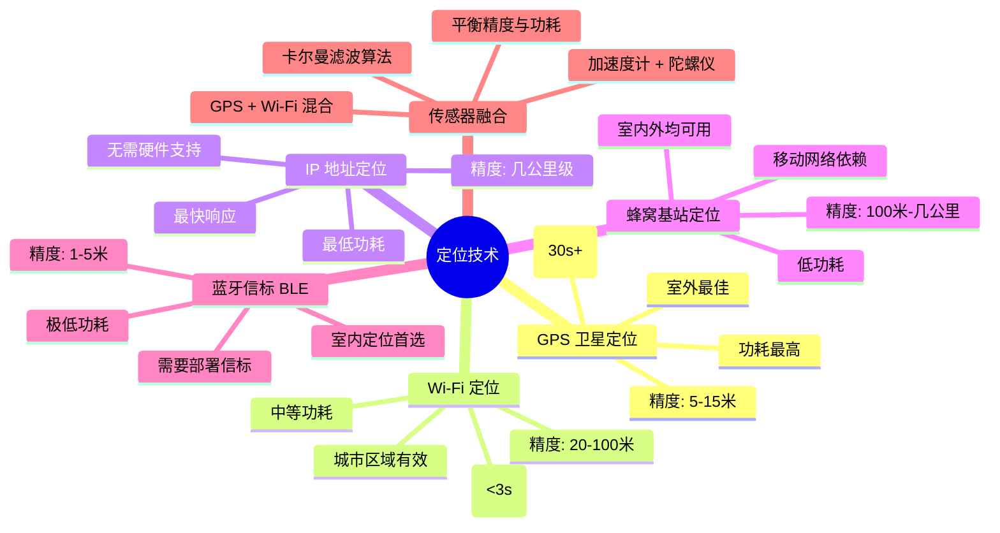
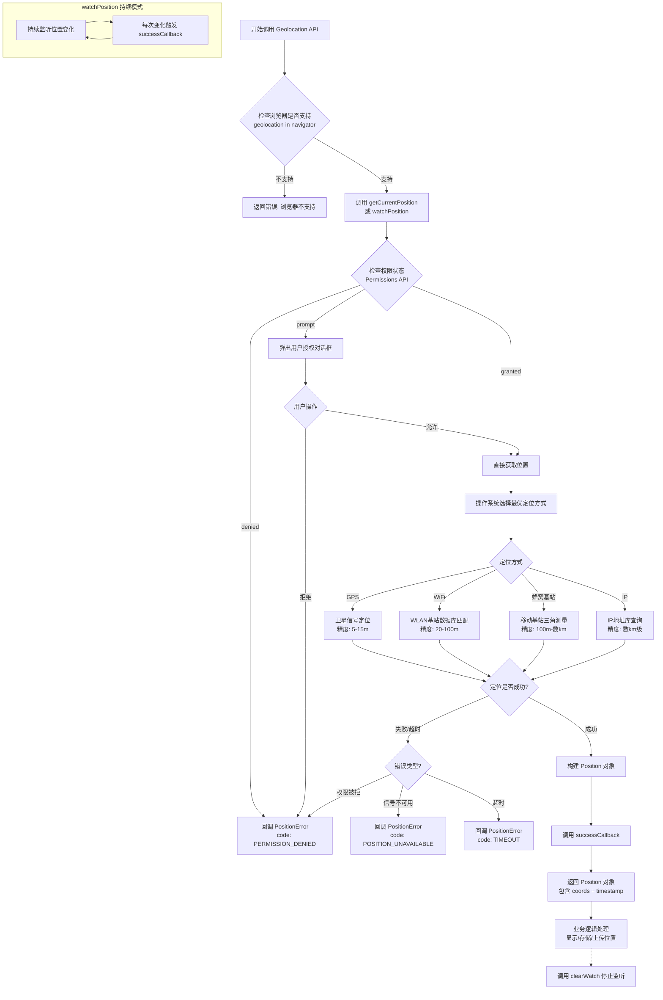
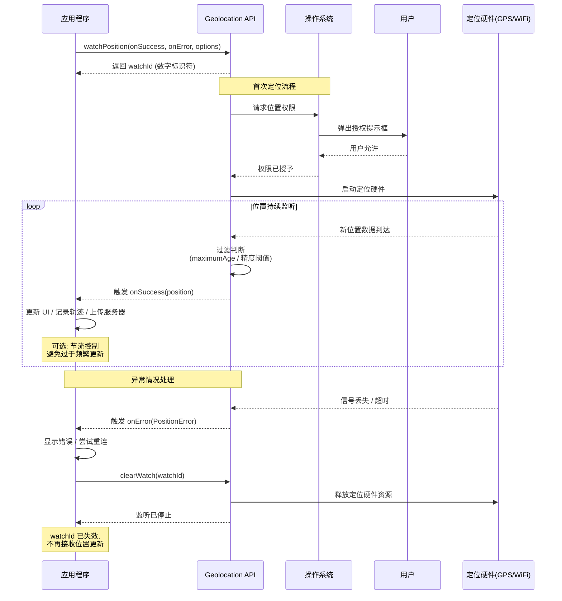
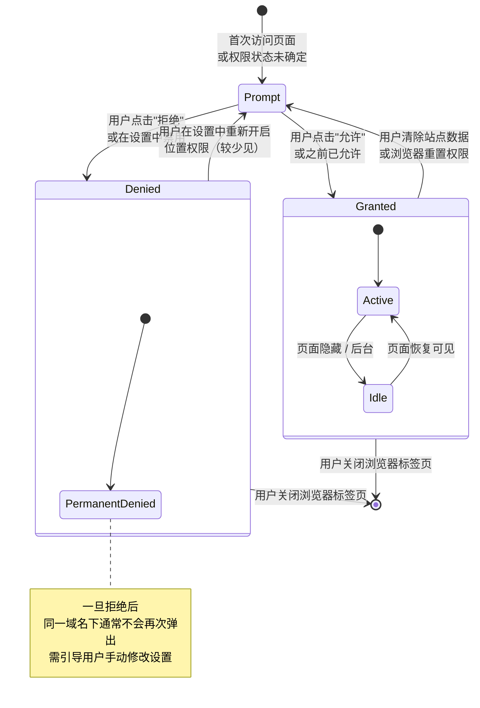

# 获取地理位置信息

## 概述

HTML5 的 Geolocation API 为 Web 应用提供了获取设备地理位置信息的能力，是构建基于位置服务（LBS）的核心技术之一。该 API 允许网页在用户明确授权的情况下，通过多种定位方式（GPS、Wi-Fi、基站、IP 地址等）获取设备的精确位置。

<h4>001-geolocation.html</h4>

```html
<!DOCTYPE html>
<html lang="zh-CN">
<head>
  <meta charset="UTF-8">
  <meta name="viewport" content="width=device-width, initial-scale=1.0">
  <title>【1】地理位置获取</title>
  <style>
    * { margin: 0; padding: 0; box-sizing: border-box; }
    body { font-family: -apple-system, BlinkMacSystemFont, 'Segoe UI', sans-serif; padding: 20px; background: #f8f9fa; color: #333; }
    .demo-container { max-width: 700px; margin: 0 auto; background: white; padding: 24px; border-radius: 8px; box-shadow: 0 2px 8px rgba(0,0,0,0.1); }
    .demo-title { margin-bottom: 16px; font-size: 18px; color: #555; border-bottom: 2px solid #007bff; padding-bottom: 8px; }

    .location-card {
      background: linear-gradient(135deg, #667eea 0%, #764ba2 100%);
      color: white;
      border-radius: 16px;
      padding: 28px;
      text-align: center;
      margin-bottom: 24px;
      position: relative;
      overflow: hidden;
    }

    .location-card::before {
      content: '';
      position: absolute;
      top: -50%; right: -30%;
      width: 300px; height: 300px;
      background: rgba(255,255,255,0.1);
      border-radius: 50%;
    }

    .location-icon { font-size: 48px; margin-bottom: 12px; position: relative; z-index: 1; }
    .status-text { font-size: 16px; opacity: 0.9; position: relative; z-index: 1; }

    .btn {
      display: inline-flex; align-items: center; gap: 8px;
      padding: 14px 32px; border: none; border-radius: 10px;
      cursor: pointer; font-size: 15px; font-weight: 600;
      transition: all 0.3s; margin-bottom: 24px;
    }
    .btn-primary {
      background: linear-gradient(135deg, #007bff, #0056b3);
      color: white; box-shadow: 0 4px 14px rgba(0,123,255,0.35);
    }
    .btn-primary:hover { transform: translateY(-2px); box-shadow: 0 6px 20px rgba(0,123,255,0.45); }
    .btn-primary:disabled { background: #ccc; cursor: not-allowed; transform: none; box-shadow: none; }

    .info-grid {
      display: grid;
      grid-template-columns: repeat(auto-fit, minmax(200px, 1fr));
      gap: 14px; margin-top: 20px;
    }

    .info-item {
      background: #f8f9fa; border-radius: 10px;
      padding: 16px; border: 1px solid #e9ecef;
      transition: transform 0.2s;
    }
    .info-item:hover { transform: translateY(-2px); box-shadow: 0 4px 12px rgba(0,0,0,0.06); }
    .info-label { font-size: 12px; color: #888; margin-bottom: 6px; text-transform: uppercase; letter-spacing: 0.5px; }
    .info-value { font-size: 17px; font-weight: 600; color: #333; font-family: monospace; word-break: break-all; }

    .error-panel {
      background: #fff5f5; border-left: 4px solid #fc8181;
      padding: 16px; border-radius: 6px; margin-top: 20px; display: none;
    }
    .error-panel h4 { color: #c53030; margin-bottom: 8px; }
    .error-panel p { color: #742a2a; font-size: 14px; line-height: 1.6; }

    .options-bar {
      display: flex; gap: 16px; align-items: center; flex-wrap: wrap;
      margin-bottom: 16px; padding: 14px; background: #f8f9fa; border-radius: 8px;
    }
    .options-bar label { font-size: 13px; font-weight: 500; color: #555; }
    .toggle-switch {
      width: 44px; height: 24px; background: #ccc; border-radius: 12px;
      position: relative; cursor: pointer; transition: background 0.3s;
    }
    .toggle-switch.active { background: #007bff; }
    .toggle-switch::after {
      content: ''; position: absolute; width: 18px; height: 18px;
      background: white; border-radius: 50%; top: 3px; left: 3px;
      transition: left 0.3s;
    }
    .toggle-switch.active::after { left: 23px; }
  </style>
</head>
<body>
  <div class="demo-container">
    <div class="demo-title">示例：HTML5 Geolocation API - 获取地理位置</div>

    <div class="location-card" id="locationCard">
      <div class="location-icon" id="locIcon">📍</div>
      <div class="status-text" id="statusText">点击下方按钮获取您的位置</div>
    </div>

    <div style="text-align: center;">
      <button class="btn btn-primary" id="getLocationBtn" onclick="requestLocation()">
        🌍 获取我的位置
      </button>
    </div>

    <div class="options-bar">
      <label for="highAccuracyToggle">高精度模式 (GPS)</label>
      <div class="toggle-switch" id="highAccuracyToggle" onclick="this.classList.toggle('active')"></div>
    </div>

    <div class="info-grid" id="infoGrid"></div>

    <div class="error-panel" id="errorPanel">
      <h4>⚠️ 获取位置失败</h4>
      <p id="errorMessage"></p>
    </div>
  </div>

  <script>
    const locationCard = document.getElementById("locationCard")
    const locIcon = document.getElementById("locIcon")
    const statusText = document.getElementById("statusText")
    const infoGrid = document.getElementById("infoGrid")
    const errorPanel = document.getElementById("errorPanel")
    const errorMessage = document.getElementById("errorMessage")
    const getLocationBtn = document.getElementById("getLocationBtn")

    function requestLocation() {
      // 重置状态
      errorPanel.style.display = "none"
      infoGrid.innerHTML = ""
      locIcon.textContent = "⏳"
      statusText.textContent = "正在请求位置权限..."
      getLocationBtn.disabled = true

      // 检测支持
      if (!navigator.geolocation) {
        showError("您的浏览器不支持 Geolocation API", null)
        return
      }

      const highAccuracy = document.getElementById("highAccuracyToggle").classList.contains("active")

      navigator.geolocation.getCurrentPosition(
        (position) => showLocation(position),
        (error) => handleError(error),
        {
          enableHighAccuracy: highAccuracy,
          timeout: 15000,
          maximumAge: 0
        }
      )
    }

    function showLocation(position) {
      const coords = position.coords
      const timestamp = new Date(position.timestamp)

      locIcon.textContent = "✅"
      statusText.textContent = `成功获取位置 · ${timestamp.toLocaleTimeString()}`

      const data = [
        { label: "纬度 Latitude", value: coords.latitude.toFixed(7) + "°" },
        { label: "经度 Longitude", value: coords.longitude.toFixed(7) + "°" },
        { label: "精度 Accuracy", value: Math.round(coords.accuracy) + " 米" },
        { label: "海拔 Altitude", value: coords.altitude !== null ? coords.altitude.toFixed(1) + " 米" : "不可用" },
        { label: "海拔精度", value: coords.altitudeAccuracy !== null ? coords.altitudeAccuracy.toFixed(1) + " 米" : "不可用" },
        { label: "方向 Heading", value: coords.heading !== null ? coords.heading.toFixed(1) + "°" : "不可用" },
        { label: "速度 Speed", value: coords.speed !== null ? coords.speed.toFixed(2) + " m/s" : "不可用" },
        { label: "时间戳", value: timestamp.toLocaleString() }
      ]

      infoGrid.innerHTML = data.map(item => `
        <div class="info-item">
          <div class="info-label">${item.label}</div>
          <div class="info-value">${item.value}</div>
        </div>
      `).join("")

      getLocationBtn.disabled = false
    }

    function handleError(error) {
      let msg = ""

      switch (error.code) {
        case error.PERMISSION_DENIED:
          msg = "用户拒绝了位置请求。请在浏览器设置中允许访问位置信息，然后重试。<br><br>💡 提示：Chrome 地址栏左侧点击锁/信息图标 → 位置 → 允许"
          break
        case error.POSITION_UNAVAILABLE:
          msg = "无法获取位置信息。可能的原因：<br>• GPS 信号弱（室内常见）<br>• 网络连接问题<br>• 设备无定位硬件"
          break
        case error.TIMEOUT:
          msg = "获取位置超时。请检查网络连接或尝试在户外使用高精度模式。"
          break
        default:
          msg = `未知错误：${error.message || "发生未知错误"}`
      }

      showError(msg, error.code)
    }

    function showError(msg, code) {
      errorMessage.innerHTML = msg
      errorPanel.style.display = "block"

      locIcon.textContent = "❌"
      statusText.textContent = code ? `错误代码: ${code}` : "获取失败"
      getLocationBtn.disabled = false
    }
  </script>
</body>
</html>```


<h4>002-geolocation-basic.html</h4>

```html
<!DOCTYPE html>
<html lang="zh-CN">
<head>
  <meta charset="UTF-8">
  <meta name="viewport" content="width=device-width, initial-scale=1.0">
  <title>【2】Geolocation API 基础用法</title>
  <!--
    来源: HTML5基础知识/16-获取地理位置信息.md
    知识点: getCurrentPosition 一次性获取 + 配置项 enableHighAccuracy/timeout/maximumAge
  -->
  <style>
    * { margin: 0; padding: 0; box-sizing: border-box; }
    body {
      font-family: -apple-system, BlinkMacSystemFont, 'Segoe UI', sans-serif;
      padding: 20px; background: linear-gradient(135deg, #0c1445, #1a237e);
      color: #e0e0e0; min-height: 100vh;
    }
    .container { max-width: 900px; margin: 0 auto; }
    .header {
      text-align: center; padding: 24px; background: linear-gradient(135deg, #2196f3, #00bcd4);
      color: white; border-radius: 12px; margin-bottom: 24px;
    }
    .header h1 { font-size: 22px; margin-bottom: 6px; }
    .header p { opacity: 0.9; font-size: 14px; }

    .card {
      background: rgba(255,255,255,0.06); border: 1px solid rgba(255,255,255,0.12);
      border-radius: 12px; padding: 24px; margin-bottom: 20px; backdrop-filter: blur(10px);
    }
    .card-title {
      font-size: 15px; font-weight: 600; color: #64b5f6;
      border-left: 3px solid #2196f3; padding-left: 10px; margin-bottom: 16px;
    }

    .info-banner {
      background: rgba(33,150,243,0.15); border: 1px solid rgba(33,150,243,0.3);
      border-radius: 8px; padding: 14px 18px; font-size: 13px; line-height: 1.7;
      color: #90caf9; margin-bottom: 20px;
    }

    /* 配置面板 */
    .config-grid {
      display: grid; grid-template-columns: repeat(auto-fit, minmax(220px, 1fr));
      gap: 14px; margin-bottom: 20px;
    }
    .config-item {
      background: rgba(0,0,0,0.25); border: 1px solid rgba(255,255,255,0.08);
      border-radius: 8px; padding: 14px;
    }
    .config-label { font-size: 11px; color: #888; text-transform: uppercase; letter-spacing: 1px; margin-bottom: 6px; }
    .config-control { display: flex; align-items: center; gap: 8px; }
    .toggle-switch {
      width: 44px; height: 24px; background: #37474f; border-radius: 12px;
      position: relative; cursor: pointer; transition: background 0.3s;
    }
    .toggle-switch.active { background: #2196f3; }
    .toggle-switch::after {
      content: ''; position: absolute; width: 18px; height: 18px;
      background: white; border-radius: 50%; top: 3px; left: 3px;
      transition: transform 0.3s;
    }
    .toggle-switch.active::after { transform: translateX(20px); }
    .config-value { font-size: 13px; color: #b0bec5; }
    input[type="number"] {
      width: 70px; padding: 6px 8px; background: rgba(0,0,0,0.4); border: 1px solid #455a64;
      color: #fff; border-radius: 4px; font-size: 13px;
    }
    input:focus { outline: none; border-color: #2196f3; }

    .btn {
      padding: 12px 28px; border: none; border-radius: 8px; cursor: pointer;
      font-size: 14px; font-weight: 600; transition: all 0.25s;
    }
    .btn-primary {
      background: linear-gradient(135deg, #2196f3, #00bcd4); color: white;
    }
    .btn-primary:hover { transform: translateY(-2px); box-shadow: 0 6px 20px rgba(33,150,243,0.35); }
    .btn-primary:disabled { opacity: 0.4; cursor: not-allowed; transform: none !important; }

    /* 结果展示 */
    .result-panel {
      background: rgba(0,0,0,0.3); border-radius: 10px; overflow: hidden;
    }
    .result-header {
      display: flex; justify-content: space-between; align-items: center;
      padding: 12px 18px; background: rgba(255,255,255,0.05); font-size: 13px;
      font-weight: 600; color: #90caf9;
    }
    .coords-display {
      padding: 20px; text-align: center;
    }
    .coord-value {
      font-family: 'SF Mono', Monaco, monospace; font-size: 22px; font-weight: 700;
      color: #4fc3f7;
    }
    .coord-label { font-size: 12px; color: #666; margin-top: 4px; }

    .data-grid {
      display: grid; grid-template-columns: repeat(2, 1fr); gap: 1px;
      background: rgba(255,255,255,0.05);
    }
    .data-cell {
      padding: 12px 16px; background: rgba(0,0,0,0.2);
      display: flex; justify-content: space-between; align-items: center;
    }
    .data-key { font-size: 12px; color: #888; }
    .data-val { font-size: 13px; font-weight: 600; color: #e0e0e0; font-family: monospace; }

    /* 状态 */
    .status-bar {
      display: flex; align-items: center; gap: 10px; padding: 14px 18px;
      background: rgba(0,0,0,0.2); border-radius: 8px; margin-top: 16px;
      font-size: 13px;
    }
    .status-dot {
      width: 10px; height: 10px; border-radius: 50%;
    }
    .status-dot.idle { background: #607d8b; }
    .status-dot.loading { background: #ffc107; animation: pulse 1s infinite; }
    .status-dot.success { background: #4caf50; box-shadow: 0 0 8px rgba(76,175,80,0.5); }
    .status-dot.error { background: #f44336; }
    @keyframes pulse { 0%,100%{opacity:1}50%{opacity:.4} }

    .compat-note {
      background: rgba(255,152,0,0.1); border: 1px solid rgba(255,152,0,0.25);
      border-radius: 6px; padding: 10px 14px; font-size: 12px; color: #ffcc80;
      margin-top: 16px;
    }
  </style>
</head>
<body>
  <div class="container">
    <div class="header">
      <h1>📍 Geolocation API 基础用法</h1>
      <p>getCurrentPosition 一次性获取位置 + 完整配置选项演示</p>
    </div>

    <div class="card">
      <div class="card-title">🎛️ 定位配置与执行</div>
      <div class="info-banner">
        💡 <strong>navigator.geolocation.getCurrentPosition()</strong> 是获取用户当前位置的核心 API。<br>
        • <strong>enableHighAccuracy:</strong> 使用 GPS 高精度模式（更耗电但更准确）<br>
        • <strong>timeout:</strong> 等待定位的最长时间（毫秒），超时触发错误回调<br>
        • <strong>maximumAge:</strong> 可接受的缓存位置最大年龄（ms），0 表示不要缓存
      </div>

      <!-- 配置选项 -->
      <div class="config-grid">
        <div class="config-item">
          <div class="config-label">高精度模式 (enableHighAccuracy)</div>
          <div class="config-control">
            <div class="toggle-switch" id="toggleAccuracy" onclick="this.classList.toggle('active')"></div>
            <span class="config-value" id="labelAccuracy">关闭 (省电模式)</span>
          </div>
        </div>

        <div class="config-item">
          <div class="config-label">超时时间 (timeout) 毫秒</div>
          <div class="config-control">
            <input type="number" id="inputTimeout" value="10000" min="1000" step="1000" />
            <span class="config-value" style="font-size:11px;">默认 10s</span>
          </div>
        </div>

        <div class="config-item">
          <div class="config-label">缓存有效期 (maximumAge) 毫秒</div>
          <div class="config-control">
            <input type="number" id="inputMaxAge" value="0" min="0" step="1000" />
            <span class="config-value" style="font-size:11px;">0 = 不使用缓存</span>
          </div>
        </div>
      </div>

      <div style="text-align:center;">
        <button class="btn btn-primary" id="locateBtn" onclick="requestLocation()">📍 获取我的位置</button>
      </div>

      <!-- 结果展示 -->
      <div class="result-panel" style="margin-top: 20px;" id="resultPanel">
        <div class="result-header">
          <span>🌍 定位结果</span>
          <span id="timestamp">-</span>
        </div>
        <div class="coords-display">
          <div style="display:inline-block;margin:0 30px;text-align:center;">
            <div class="coord-value" id="valLat">--</div>
            <div class="coord-label">纬度 Latitude</div>
          </div>
          <div style="display:inline-block;margin:0 30px;text-align:center;">
            <div class="coord-value" id="valLng">--</div>
            <div class="coord-label">经度 Longitude</div>
          </div>
        </div>
        <div class="data-grid" id="dataGrid">
          <div class="data-cell"><span class="data-key">精度 accuracy</span><span class="data-val" id="valAcc">-</span></div>
          <div class="data-cell"><span class="data-key">海拔 altitude</span><span class="data-val" id="valAlt">-</span></div>
          <div class="data-cell"><span class="data-key">海拔精度 altAccuracy</span><span class="data-val" id="valAltAcc">-</span></div>
          <div class="data-cell"><span class="data-key">方向 heading</span><span class="data-val" id="valHead">-</span></div>
          <div class="data-cell"><span class="data-key">速度 speed</span><span class="data-val" id="valSpeed">-</span></div>
          <div class="data-cell"><span class="data-key">配置 enableHighAccuracy</span><span class="data-val" id="valConfig">-</span></div>
        </div>
      </div>

      <!-- 状态栏 -->
      <div class="status-bar">
        <span class="status-dot idle" id="statusDot"></span>
        <span id="statusText">就绪 — 点击按钮开始定位（浏览器会弹出权限请求）</span>
      </div>

      <div class="compat-note">
        ⚠️ <strong>兼容性与安全要求：</strong>
        Chrome 50+ 要求 HTTPS 环境（localhost 除外）。
        首次调用会弹出系统级权限请求对话框，用户必须明确授权才能获取位置。
        在不支持 Geolocation 的环境中会自动降级提示。
      </div>
    </div>
  </div>

  <script>
    // ====== UI 更新函数 ======
    function setStatus(text, type) {
      const dot = document.getElementById('statusDot');
      const label = document.getElementById('statusText');
      dot.className = `status-dot ${type}`;
      label.textContent = text;
    }

    // 监听高精度开关
    document.getElementById('toggleAccuracy').addEventListener('click', function() {
      const isActive = this.classList.contains('active');
      document.getElementById('labelAccuracy').textContent = isActive ? '开启 (GPS模式)' : '关闭 (省电模式)';
    });

    // ====== 核心定位功能 ======
    function requestLocation() {
      // 兼容性检测
      if (!navigator.geolocation) {
        setStatus('❌ 您的浏览器不支持 Geolocation API', 'error');
        alert('您的浏览器不支持地理位置功能');
        return;
      }

      const btn = document.getElementById('locateBtn');
      btn.disabled = true;

      // 读取配置
      const options = {
        enableHighAccuracy: document.getElementById('toggleAccuracy').classList.contains('active'),
        timeout: parseInt(document.getElementById('inputTimeout').value) || 10000,
        maximumAge: parseInt(document.getElementById('inputMaxAge').value) || 0
      };

      setStatus(`⏳ 正在请求位置... (高精度:${options.enableHighAccuracy} | 超时:${options.timeout}ms | 缓存:${options.maximumAge}ms)`, 'loading');

      const startTime = performance.now();

      navigator.geolocation.getCurrentPosition(
        // 成功回调
        function(position) {
          const elapsed = ((performance.now() - startTime) / 1000).toFixed(2);

          // 更新坐标
          document.getElementById('valLat').textContent = position.coords.latitude.toFixed(7);
          document.getElementById('valLng').textContent = position.coords.longitude.toFixed(7);
          document.getElementById('timestamp').textContent = new Date().toLocaleString();

          // 更新详细数据
          document.getElementById('valAcc').textContent = position.coords.accuracy.toFixed(1) + ' m';
          document.getElementById('valAlt').textContent = position.coords.altitude !== null
            ? position.coords.altitude.toFixed(1) + ' m' : '不可用';
          document.getElementById('valAltAcc').textContent = position.coords.altitudeAccuracy !== null
            ? position.coords.altitudeAccuracy.toFixed(1) + ' m' : '不可用';
          document.getElementById('valHead').textContent = position.coords.heading !== null
            ? position.coords.heading.toFixed(1) + '°' : '不可用';
          document.getElementById('valSpeed').textContent = position.coords.speed !== null
            ? position.coords.speed.toFixed(2) + ' m/s' : '不可用';
          document.getElementById('valConfig').textContent = options.enableHighAccuracy ? '开启' : '关闭';

          setStatus(`✅ 定位成功! 耗时 ${elapsed}s`, 'success');
          btn.disabled = false;

          console.log('完整 Position 对象:', position);
          console.log('完整 Coordinates 对象:', position.coords);
        },

        // 错误回调
        function(error) {
          let msg = '';
          switch (error.code) {
            case error.PERMISSION_DENIED:
              msg = '用户拒绝了位置请求权限';
              break;
            case error.POSITION_UNAVAILABLE:
              msg = '无法获取位置信息（GPS/Wi-Fi不可用）';
              break;
            case error.TIMEOUT:
              msg = `定位超时 (${options.timeout}ms 内未完成)`;
              break;
            default:
              msg = '未知错误: ' + error.message;
          }

          setStatus(`❌ ${msg}`, 'error');
          btn.disabled = false;
          console.error('Geolocation Error:', error);
        },

        // 配置选项
        options
      );
    }
  </script>
</body>
</html>
```


<h4>004-geolocation-error-handling.html</h4>

```html
<!DOCTYPE html>
<html lang="zh-CN">
<head>
  <meta charset="UTF-8">
  <meta name="viewport" content="width=device-width, initial-scale=1.0">
  <title>【4】地理位置错误处理详解</title>
  <!--
    来源: HTML5基础知识/16-获取地理位置信息.md
    知识点: PERMISSION_DENIED / POSITION_UNAVAILABLE / TIMEOUT 三种错误的友好提示
  -->
  <style>
    * { margin: 0; padding: 0; box-sizing: border-box; }
    body {
      font-family: -apple-system, BlinkMacSystemFont, 'Segoe UI', sans-serif;
      padding: 20px; background: #1a1a2e; color: #e0e0e0;
      min-height: 100vh;
    }
    .container { max-width: 920px; margin: 0 auto; }
    .header {
      text-align: center; padding: 24px; background: linear-gradient(135deg, #fc4a1a, #f7b733);
      color: white; border-radius: 12px; margin-bottom: 24px;
    }
    .header h1 { font-size: 22px; margin-bottom: 6px; }
    .header p { opacity: 0.9; font-size: 14px; }

    .card {
      background: #16213e; border: 1px solid #0f3460; border-radius: 10px;
      padding: 24px; margin-bottom: 20px;
    }
    .card-title {
      font-size: 15px; font-weight: 600; color: #f39c12;
      border-left: 3px solid #e74c3c; padding-left: 10px; margin-bottom: 16px;
    }

    /* 错误类型卡片 */
    .error-types { display: grid; grid-template-columns: repeat(3, 1fr); gap: 16px; margin-bottom: 24px; }
    @media (max-width: 700px) { .error-types { grid-template-columns: 1fr; } }

    .error-card {
      border-radius: 10px; overflow: hidden; border: 2px solid transparent;
      transition: all 0.3s;
    }
    .error-card.active { border-color: currentColor; transform: scale(1.02); box-shadow: 0 8px 32px rgba(0,0,0,0.2); }

    .error-card.permission { --ecolor: #e74c3c; }
    .error-card.unavailable { --ecolor: #f39c12; }
    .error-card.timeout { --ecolor: #3498db; }

    .err-header {
      padding: 14px 16px; font-weight: 700; font-size: 14px; color: var(--ecolor);
      text-align: center; background: rgba(255,255,255,0.03);
    }
    .err-body { padding: 16px; }
    .err-code {
      font-family: monospace; font-size: 12px; background: rgba(0,0,0,0.3);
      padding: 4px 10px; border-radius: 4px; display: inline-block;
      color: var(--ecolor); margin-bottom: 8px;
    }
    .err-desc { font-size: 12px; color: #aaa; line-height: 1.6; margin-bottom: 10px; }
    .err-solution {
      font-size: 11px; padding: 8px 12px; border-radius: 6px;
      background: rgba(255,255,255,0.04); line-height: 1.5;
    }
    .err-solution strong { color: var(--ecolor); }

    /* 触发按钮 */
    .trigger-btns { display: flex; gap: 10px; flex-wrap: wrap; justify-content: center; margin-bottom: 24px; }
    .btn {
      padding: 10px 22px; border: none; border-radius: 6px; cursor: pointer;
      font-size: 13px; font-weight: 600; transition: all 0.2s;
    }
    .btn-perm { background: #e74c3c; color: white; }
    .btn-perm:hover { background: #c0392b; }
    .btn-unavail { background: #f39c12; color: #1a1a2e; }
    .btn-unavail:hover { background: #e67e22; }
    .btn-timeout { background: #3498db; color: white; }
    .btn-timeout:hover { background: #2980b9; }
    .btn-normal { background: #27ae60; color: white; }
    .btn-normal:hover { background: #2ecc71; }

    /* 模拟结果展示 */
    .result-stage {
      background: #0a0a1a; border-radius: 10px; padding: 24px;
      min-height: 200px; display: flex; flex-direction: column;
      align-items: center; justify-content: center;
      border: 2px dashed #333; transition: all 0.3s;
    }
    .result-stage.success { border-color: #27ae60; border-style: solid; }
    .result-stage.error { border-style: solid; }

    .result-icon { font-size: 48px; margin-bottom: 12px; }
    .result-title { font-size: 18px; font-weight: 700; margin-bottom: 6px; }
    .result-desc { font-size: 13px; color: #888; text-align: center; max-width: 400px; line-height: 1.6; }

    .result-detail {
      margin-top: 16px; background: rgba(0,0,0,0.3); border-radius: 6px;
      padding: 12px 16px; font-family: monospace; font-size: 11px;
      width: 100%; max-width: 500px; color: #aaa;
    }
    .detail-row { display: flex; justify-content: space-between; padding: 3px 0; border-bottom: 1px solid #222; }

    /* PositionError 属性表 */
    .prop-table { width: 100%; border-collapse: collapse; font-size: 12px; margin-top: 16px; }
    .prop-table th, .prop-table td {
      padding: 8px 12px; text-align: left; border-bottom: 1px solid #222;
    }
    .prop-table th { background: rgba(255,255,255,0.03); color: #888; }

    .compat-note {
      background: rgba(52,152,219,0.1); border: 1px solid rgba(52,152,219,0.25);
      border-radius: 6px; padding: 10px 14px; font-size: 12px; color: #85c1e9;
      margin-top: 16px;
    }
  </style>
</head>
<body>
  <div class="container">
    <div class="header">
      <h1>⚠️ 地理位置 错误处理详解</h1>
      <p>PERMISSION_DENIED / POSITION_UNAVAILABLE / TIMEOUT — 三种错误类型及友好提示</p>
    </div>

    <div class="card">
      <div class="card-title">🔍 三种错误类型</div>

      <div class="error-types">
        <div class="error-card permission" id="cardPerm">
          <div class="err-header">🚫 PERMISSION_DENIED (1)</div>
          <div class="err-body">
            <div class="err-code">error.PERMISSION_DENIED → 1</div>
            <div class="err-desc">用户拒绝了地理定位请求，或页面没有获得定位权限。</div>
            <div class="err-solution">
              <strong>💡 解决方案：</strong><br>
              • 引导用户到设置中开启位置权限<br>
              • 提供手动输入地址的备选方案<br>
              • 解释为什么需要位置信息以增加授权率
            </div>
          </div>
        </div>

        <div class="error-card unavailable" id="cardUnavail">
          <div class="err-header">📡 POSITION_UNAVAILABLE (2)</div>
          <div class="err-body">
            <div class="err-code">error.POSITION_UNAVAILABLE → 2</div>
            <div class="err-desc">无法获取位置信息。网络断开、GPS 信号弱、或定位服务被禁用。</div>
            <div class="err-solution">
              <strong>💡 解决方案：</strong><br>
              • 检查网络连接状态<br>
              • 提示用户检查设备的定位服务开关<br>
              • 尝试使用 IP 定位作为降级方案
            </div>
          </div>
        </div>

        <div class="error-card timeout" id="cardTimeout">
          <div class="err-header">⏱️ TIMEOUT (3)</div>
          <div class="err-body">
            <div class="err-code">error.TIMEOUT → 3</div>
            <div class="err-desc">在指定的 timeout 时间内未能获取到位置信息。</div>
            <div class="err-solution">
              <strong>💡 解决方案：</strong><br>
              • 增加 timeout 值（室内可能需要更长）<br>
              • 降低 enableHighAccuracy 以加快响应<br>
              • 设置合理的 maximumAge 使用缓存
            </div>
          </div>
        </div>
      </div>

      <!-- 触发测试 -->
      <div class="trigger-btns">
        <button class="btn btn-normal" onclick="testLocation()">✅ 正常获取位置</button>
        <button class="btn btn-perm" onclick="simulateError('permission')">🚫 模拟拒绝权限</button>
        <button class="btn btn-unavail" onclick="simulateError('unavailable')">📡 模拟不可用</button>
        <button class="btn btn-timeout" onclick="simulateError('timeout')">⏱️ 模拟超时</button>
      </div>

      <!-- 结果展示 -->
      <div class="result-stage" id="resultStage">
        <div class="result-icon">📍</div>
        <div class="result-title">等待测试</div>
        <div class="result-desc">点击上方按钮模拟不同的定位结果和错误场景</div>
      </div>

      <!-- PositionError 属性表 -->
      <table class="prop-table">
        <thead>
          <tr><th>属性</th><th>类型</th><th>说明</th></tr>
        </thead>
        <tbody>
          <tr><td><code>code</code></td><td>Number</td><td>错误代码：1=PERMISSION_DENIED, 2=UNAVAILABLE, 3=TIMEOUT</td></tr>
          <tr><td><code>message</code></td><td>String</td><td>人类可读的错误描述信息</td></tr>
        </tbody>
      </table>

      <div class="compat-note">
        ℹ️ 注意：实际运行时，<strong>PERMISSION_DENIED</strong> 需要用户在系统弹窗中主动选择"拒绝"；
        <strong>TIMEOUT</strong> 可通过设置极短的 timeout 值来触发；<strong>POSITION_UNAVAILABLE</strong>
        在正常环境下较难复现（通常需要断网或禁用定位服务）。
      </div>
    </div>
  </div>

  <script>
    const stage = document.getElementById('resultStage');

    function showResult(type, title, desc, detail) {
      stage.className = 'result-stage ' + (type === 'success' ? 'success' : 'error');

      const icons = { success: '✅', permission: '🚫', unavailable: '📡', timeout: '⏱️' };
      const colors = { success: '#27ae60', permission: '#e74c3c', unavailable: '#f39c12', timeout: '#3498db' };

      stage.innerHTML = `
        <div class="result-icon">${icons[type]}</div>
        <div class="result-title" style="color:${colors[type]}">${title}</div>
        <div class="result-desc">${desc}</div>
        ${detail ? `<div class="result-detail">${detail}</div>` : ''}
      `;
    }

    // 清除所有卡片激活状态
    function clearActive() {
      document.querySelectorAll('.error-card').forEach(c => c.classList.remove('active'));
    }

    // 正常获取
    function testLocation() {
      clearActive();
      showResult('', '正在请求...', '请允许位置权限...', '');

      if (!navigator.geolocation) {
        showResult('unavailable', 'API 不支持', '当前浏览器不支持 Geolocation API', '');
        return;
      }

      navigator.geolocation.getCurrentPosition(
        function(pos) {
          showResult('success', '✅ 定位成功',
            `纬度: ${pos.coords.latitude.toFixed(6)}<br/>经度: ${pos.coords.longitude.toFixed(6)}<br/>精度: ±${pos.coords.accuracy.toFixed(1)}m`,
            `<div class="detail-row"><span>code</span><span>- (无错误)</span></div>
             <div class="detail-row"><span>latitude</span><span>${pos.coords.latitude.toFixed(7)}</span></div>
             <div class="detail-row"><span>longitude</span><span>${pos.coords.longitude.toFixed(7)}</span></div>
             <div class="detail-row"><span>accuracy</span><span>${pos.coords.accuracy.toFixed(1)} m</span></div>`
          );
        },
        function(err) {
          handleRealError(err);
        },
        { enableHighAccuracy: true, timeout: 15000, maximumAge: 0 }
      );
    }

    // 处理真实错误
    function handleRealError(err) {
      const types = { 1: 'permission', 2: 'unavailable', 3: 'timeout' };
      const titles = { 1: '🚫 权限被拒绝', 2: '📡 位置不可用', 3: '⏱️ 获取超时' };
      const descs = {
        1: '用户拒绝了位置访问权限请求。<br/>请在浏览器设置中允许位置访问后重试。',
        2: '无法获取位置信息。<br/>可能原因：定位服务关闭、网络问题、或设备无定位能力。',
        3: '在规定时间内未能完成定位。<br/>可尝试增大 timeout 或降低精度要求。'
      };

      const t = types[err.code];
      clearActive();
      const card = document.getElementById(t === 'permission' ? 'cardPerm' : t === 'unavailable' ? 'cardUnavail' : 'cardTimeout');
      if (card) card.classList.add('active');

      showResult(t, titles[err.code], descs[err.code],
        `<div class="detail-row"><span>code</span><span>${err.code} (${['','PERMISSION_DENIED','POSITION_UNAVAILABLE','TIMEOUT'][err.code]})</span></div>
         <div class="detail-row"><span>message</span><span>"${err.message}"</span></div>`
      );
    }

    // 模拟错误
    function simulateError(type) {
      clearActive();

      const cardMap = { permission: 'cardPerm', unavailable: 'cardUnavail', timeout: 'cardTimeout' };
      const card = document.getElementById(cardMap[type]);
      if (card) card.classList.add('active');

      const fakeErrors = {
        permission: { code: 1, message: 'User denied Geolocation access.' },
        unavailable: { code: 2, message: 'Network location provider at \'https://\' : User denied Geolocation.' },
        timeout: { code: 3, message: 'Timeout expired' }
      };

      const err = fakeErrors[type];

      if (type === 'timeout') {
        // TIMEOUT 可以真实触发
        showResult(type, '⏱️ 获取超时', '尝试用极短的超时时间触发...',
          `<div class="detail-row"><span>设置的 timeout</span><span>1 ms</span></div>`);

        navigator.geolocation.getCurrentPosition(
          () => {},
          (e) => handleRealError(e),
          { timeout: 1, maximumAge: 0 }
        );
      } else {
        // 直接展示模拟结果
        const titles = { permission: '🚫 权限被拒绝 (模拟)', unavailable: '📡 位置不可用 (模拟)' };
        const descs = {
          permission: '这是模拟的 PERMISSION_DENIED 错误。<br/>实际场景：用户在系统弹窗中点击了"不允许"。',
          unavailable: '这是模拟的 POSITION_UNAVAILABLE 错误。<br/>实际场景：定位服务关闭或网络不可达。'
        };

        showResult(type, titles[type], descs[type],
          `<div class="detail-row"><span>code</span><span>${err.code}</span></div>
           <div class="detail-row"><span>message</span><span>"${err.message}"</span></div>`
        );
      }
    }
  </script>
</body>
</html>
```

### 核心特性

- **用户隐私保护**：必须经过用户明确授权才能获取位置信息
- **多种定位方式**：自动选择最优定位方式（GPS > Wi-Fi > 基站 > IP）
- **实时位置追踪**：支持持续监听位置变化
- **精度可控**：可通过配置项平衡精度和性能
- **跨平台支持**：桌面端和移动端浏览器均支持

### 应用场景

| 应用类型 | 典型场景 | 定位需求 |
|---------|---------|---------|
| 地图导航 | 路线规划、实时导航 | 高精度、实时更新 |
| 生活服务 | 附近餐厅、打车服务 | 中等精度 |
| 社交应用 | 附近的人、位置打卡 | 中等精度 |
| 天气服务 | 本地天气预报 | 低精度即可 |
| 电商物流 | 配送地址定位 | 中等精度 |
| 运动健身 | 轨迹记录、配速统计 | 高精度、实时更新 |

### 工作原理

```
┌─────────────┐
│  浏览器请求   │
└──────┬──────┘
       │
       ▼
┌─────────────────┐
│ 用户授权提示框  │
└──────┬──────────┘
       │
   ┌───┴───┐
   │ 授权? │
   └───┬───┘
       │
   ┌───┴────────────────────────┐
   │                            │
   ▼                            ▼
允许                          拒绝
   │                            │
   ▼                            ▼
┌──────────────────┐      ┌─────────────┐
│ 选择定位方式:    │      │ 返回错误:   │
│ • GPS (最精确)   │      │ PERMISSION_ │
│ • Wi-Fi (中等)   │      │ DENIED      │
│ • 基站 (较低)    │      └─────────────┘
│ • IP (最低)      │
└────────┬─────────┘
         │
         ▼
┌──────────────────┐
│ 返回 Position    │
│ 对象包含:        │
│ • 经纬度         │
│ • 精度           │
│ • 海拔 (可选)    │
│ • 速度 (可选)    │
└──────────────────┘
```

### 定位技术分类

不同的定位技术在精度、覆盖范围和功耗上各有优劣。浏览器会根据设备能力和环境自动选择最优的定位方式：



## 浏览器兼容性

### 桌面浏览器支持

| 浏览器 | 支持版本 | 备注 |
|--------|---------|------|
| Chrome | 5+ | 完整支持，50+ 版本要求 HTTPS |
| Firefox | 3.5+ | 完整支持 |
| Safari | 5+ | 完整支持 |
| Edge | 12+ | 完整支持 |
| Internet Explorer | 9+ | 基本支持，部分功能受限 |
| Opera | 10.6+ | 完整支持 |

### 移动浏览器支持

| 浏览器 | 支持版本 | 备注 |
|--------|---------|------|
| iOS Safari | 3.2+ | 完整支持 |
| Android Browser | 2.1+ | 完整支持 |
| Chrome for Android | 18+ | 完整支持 |
| Firefox for Android | 4+ | 完整支持 |
| UC Browser | 11+ | 基本支持 |
| 微信浏览器 | 全版本 | 完整支持 |

### 特性支持情况

| 特性 | Chrome | Firefox | Safari | Edge | 备注 |
|------|--------|---------|--------|------|------|
| `getCurrentPosition` | ✅ | ✅ | ✅ | ✅ | 核心功能 |
| `watchPosition` | ✅ | ✅ | ✅ | ✅ | 核心功能 |
| `clearWatch` | ✅ | ✅ | ✅ | ✅ | 核心功能 |
| HTTPS 要求 | 50+ | 55+ | 10+ | 79+ | 仅安全上下文可用（localhost 除外） |
| Permissions API | ✅ | ✅ | ✅ (16+) | ✅ | 权限查询 |

### 兼容性检测代码

```javascript
// 检测 Geolocation API 支持情况
function checkGeolocationSupport() {
  const support = {
    basic: "geolocation" in navigator,
    permissions: "permissions" in navigator,
    https: location.protocol === "https:" || location.hostname === "localhost"
  }
  
  console.log("Geolocation 支持情况:")
  console.log("- 基础 API:", support.basic ? "✅ 支持" : "❌ 不支持")
  console.log("- Permissions API:", support.permissions ? "✅ 支持" : "❌ 不支持")
  console.log("- HTTPS 环境:", support.https ? "✅ 是" : "⚠️ 否 (部分浏览器可能受限)")
  
  return support
}

// 使用示例
checkGeolocationSupport()
```

### 检查浏览器是否支持

```javascript
if ("geolocation" in navigator) {
  // 浏览器支持地理定位
  console.log("浏览器支持地理定位")
} else {
  // 浏览器不支持地理定位
  console.warn("您的浏览器不支持地理定位功能")
  alert("您的浏览器不支持地理定位功能")
}
```

## API 详解

<h4>003-watchposition-tracking.html</h4>

```html
<!DOCTYPE html>
<html lang="zh-CN">
<head>
  <meta charset="UTF-8">
  <meta name="viewport" content="width=device-width, initial-scale=1.0">
  <title>【3】watchPosition 持续追踪位置变化</title>
  <!--
    来源: HTML5基础知识/16-获取地理位置信息.md
    知识点: watchPosition 持续追踪、实时更新坐标、速度/方向信息
  -->
  <style>
    * { margin: 0; padding: 0; box-sizing: border-box; }
    body {
      font-family: -apple-system, BlinkMacSystemFont, 'Segoe UI', sans-serif;
      padding: 20px; background: #0d1117; color: #c9d1d9;
      min-height: 100vh;
    }
    .container { max-width: 1000px; margin: 0 auto; }
    .header {
      text-align: center; padding: 24px; background: linear-gradient(135deg, #238636, #2ea043);
      color: white; border-radius: 12px; margin-bottom: 24px;
    }
    .header h1 { font-size: 22px; margin-bottom: 6px; }
    .header p { opacity: 0.9; font-size: 14px; }

    .card {
      background: #161b22; border: 1px solid #30363d; border-radius: 10px;
      padding: 24px; margin-bottom: 20px;
    }
    .card-title {
      font-size: 15px; font-weight: 600; color: #3fb950;
      border-left: 3px solid #3fb950; padding-left: 10px; margin-bottom: 16px;
    }

    .info-banner {
      background: rgba(46,204,113,0.08); border: 1px solid rgba(46,204,113,0.2);
      border-radius: 6px; padding: 12px 16px; font-size: 13px; line-height: 1.6;
      color: #7ee787; margin-bottom: 16px;
    }

    /* 控制区 */
    .controls { display: flex; gap: 10px; flex-wrap: wrap; align-items: center; margin-bottom: 20px; }
    .btn {
      padding: 10px 22px; border: none; border-radius: 6px; cursor: pointer;
      font-size: 13px; font-weight: 600; transition: all 0.2s;
    }
    .btn-green { background: #238636; color: white; }
    .btn-green:hover { background: #2ea043; }
    .btn-red { background: #da3633; color: white; }
    .btn-red:hover { background: #f85149; }
    .btn:disabled { opacity: 0.4; cursor: not-allowed; }

    /* 实时数据仪表盘 */
    .dashboard { display: grid; grid-template-columns: repeat(auto-fit, minmax(180px, 1fr)); gap: 12px; margin-bottom: 20px; }
    .gauge {
      background: #0d1117; border: 1px solid #21262d; border-radius: 8px;
      padding: 16px; text-align: center;
    }
    .gauge-icon { font-size: 24px; margin-bottom: 6px; }
    .gauge-value {
      font-size: 20px; font-weight: 700; font-family: 'SF Mono', monospace;
      color: #58a6ff;
    }
    .gauge-label { font-size: 11px; color: #6e7681; margin-top: 4px; }

    /* 地图区域 (Canvas) */
    .map-area {
      background: #0d1117; border: 1px solid #30363d; border-radius: 10px;
      overflow: hidden; position: relative;
    }
    .map-canvas { display: block; width: 100%; }
    .map-overlay {
      position: absolute; top: 10px; right: 10px;
      background: rgba(0,0,0,0.75); backdrop-filter: blur(8px);
      border-radius: 6px; padding: 8px 12px; font-size: 11px; color: #8b949e;
    }

    /* 轨迹日志 */
    .track-log {
      background: #0d1117; border-radius: 6px; padding: 14px;
      font-family: monospace; font-size: 11px; max-height: 200px;
      overflow-y: auto; color: #6e7681; line-height: 1.7;
    }
    .log-entry { padding: 2px 0; border-bottom: 1px solid #161b22; }
    .log-entry.pos { color: #3fb950; }
    .log-entry.speed { color: #58a6ff; }
    .log-entry.warn { color: #d29922; }
    .log-entry.err { color: #f85149; }

    /* 统计 */
    .stats-row {
      display: grid; grid-template-columns: repeat(4, 1fr); gap: 10px;
      margin-top: 16px;
    }
    .stat-box {
      background: #0d1117; border: 1px solid #21262d; border-radius: 6px;
      padding: 12px; text-align: center;
    }
    .stat-val { font-size: 17px; font-weight: 700; color: #c9d1d9; }
    .stat-lbl { font-size: 10px; color: #6e7681; margin-top: 2px; }

    .compat-note {
      background: rgba(210,153,34,0.1); border: 1px solid rgba(210,153,34,0.25);
      border-radius: 6px; padding: 10px 14px; font-size: 12px; color: #d29922;
      margin-top: 16px;
    }
  </style>
</head>
<body>
  <div class="container">
    <div class="header">
      <h1>🛰️ watchPosition 持续追踪</h1>
      <p>实时监控位置变化 — 坐标 / 速度 / 方向 / 海拔 动态更新</p>
    </div>

    <div class="card">
      <div class="card-title">📍 追踪控制台</div>
      <div class="info-banner">
        💡 <strong>watchPosition()</strong> 与 <code>getCurrentPosition()</code> 不同，它会持续监听设备位置变化，
        每当位置发生改变时调用回调。适合导航、运动轨迹记录等场景。<br>
        📌 返回一个 watch ID，可通过 <code>clearWatch(watchId)</code> 停止追踪。
      </div>

      <div class="controls">
        <button class="btn btn-green" id="startBtn" onclick="startWatching()">▶ 开始追踪</button>
        <button class="btn btn-red" id="stopBtn" onclick="stopWatching()" disabled>⛹ 停止追踪</button>
        <label style="font-size:13px;color:#8b949e;">高精度:</label>
        <select id="accuracyMode" style="padding:6px 10px;background:#0d1117;border:1px solid #30363d;color:#c9d1d9;border-radius:4px;font-size:12px;">
          <option value="false">普通精度 (省电)</option>
          <option value="true">高精度 (GPS)</option>
        </select>
      </div>

      <!-- 实时仪表盘 -->
      <div class="dashboard">
        <div class="gauge">
          <div class="gauge-icon">🌐</div>
          <div class="gauge-value" id="gLat">--</div>
          <div class="gauge-label">纬度</div>
        </div>
        <div class="gauge">
          <div class="gauge-icon">🧭</div>
          <div class="gauge-value" id="gLng">--</div>
          <div class="gauge-label">经度</div>
        </div>
        <div class="gauge">
          <div class="gauge-icon">🚀</div>
          <div class="gauge-value" id="gSpeed">--</div>
          <div class="gauge-label">速度 (m/s)</div>
        </div>
        <div class="gauge">
          <div class="gauge-icon">➡️</div>
          <div class="gauge-value" id="gHeading">--</div>
          <div class="gauge-label">方向 (°)</div>
        </div>
        <div class="gauge">
          <div class="gauge-icon">📏</div>
          <div class="gauge-value" id="gAlt">--</div>
          <div class="gauge-label">海拔 (m)</div>
        </div>
        <div class="gauge">
          <div class="gauge-icon">🎯</div>
          <div class="gauge-value" id="gAcc">--</div>
          <div class="gauge-label">精度 (m)</div>
        </div>
      </div>

      <!-- Canvas 地图 -->
      <div class="map-area">
        <canvas id="mapCanvas" class="map-canvas" width="940" height="350"></canvas>
        <div class="map-overlay" id="mapOverlay">点击 "开始追踪" 启动</div>
      </div>

      <!-- 统计 -->
      <div class="stats-row">
        <div class="stat-box"><div class="stat-val" id="statUpdates">0</div><div class="stat-lbl">更新次数</div></div>
        <div class="stat-box"><div class="stat-val" id="statDuration">0s</div><div class="stat-lbl">追踪时长</div></div>
        <div class="stat-box"><div class="stat-val" id="statMaxSpeed">-</div><div class="stat-lbl">最高速度</div></div>
        <div class="stat-box"><div class="stat-val" id="statAvgAcc">-</div><div class="stat-lbl">平均精度</div></div>
      </div>

      <!-- 日志 -->
      <div class="track-log" id="trackLog">
        <div class="log-entry warn">[系统] watchPosition 追踪就绪。点击 "开始追踪" 后请移动设备以观察位置变化。</div>
      </div>

      <div class="compat-note">
        ⚠️ <strong>注意：</strong>watchPosition 在桌面浏览器中通常不会频繁触发（因为桌面设备位置基本不变）。
        在移动设备上或使用开发者工具模拟 GPS 时效果最佳。
      </div>
    </div>
  </div>

  <script>
    const canvas = document.getElementById('mapCanvas');
    const ctx = canvas.getContext('2d');
    const logEl = document.getElementById('trackLog');

    let watchId = null;
    let trackPoints = [];
    let updateCount = 0;
    let startTime = null;
    let timerInterval = null;
    let maxSpeed = 0;
    let accSum = 0;

    function log(msg, type = '') {
      const div = document.createElement('div');
      div.className = `log-entry ${type}`;
      div.textContent = `[${new Date().toTimeString().substring(0,8)}] ${msg}`;
      logEl.appendChild(div);
      logEl.scrollTop = logEl.scrollHeight;
    }

    // ====== Canvas 绘制 ======
    function resizeCanvas() {
      const rect = canvas.parentElement.getBoundingClientRect();
      canvas.width = rect.width;
      canvas.height = 350;
      drawMap();
    }
    window.addEventListener('resize', resizeCanvas);
    resizeCanvas();

    function drawMap() {
      ctx.fillStyle = '#0d1117';
      ctx.fillRect(0, 0, canvas.width, canvas.height);

      // 网格
      ctx.strokeStyle = '#21262d';
      ctx.lineWidth = 1;
      for (let x = 0; x < canvas.width; x += 40) {
        ctx.beginPath(); ctx.moveTo(x, 0); ctx.lineTo(x, canvas.height); ctx.stroke();
      }
      for (let y = 0; y < canvas.height; y += 40) {
        ctx.beginPath(); ctx.moveTo(0, y); ctx.lineTo(canvas.width, y); ctx.stroke();
      }

      if (trackPoints.length === 0) return;

      // 归一化坐标到画布
      const lats = trackPoints.map(p => p.lat);
      const lngs = trackPoints.map(p => p.lng);
      const minLat = Math.min(...lats), maxLat = Math.max(...lats);
      const minLng = Math.min(...lngs), maxLng = Math.max(...lngs);

      const pad = 40;
      function toX(lng) {
        if (maxLng === minLng) return canvas.width / 2;
        return pad + ((lng - minLng) / (maxLng - minLng)) * (canvas.width - 2*pad);
      }
      function toY(lat) {
        if (maxLat === minLat) return canvas.height / 2;
        return pad + ((lat - minLat) / (maxLat - minLat)) * (canvas.height - 2*pad);
      }

      // 绘制轨迹线
      if (trackPoints.length > 1) {
        ctx.beginPath();
        ctx.strokeStyle = '#238636';
        ctx.lineWidth = 2;
        ctx.moveTo(toX(trackPoints[0].lng), toY(trackPoints[0].lat));
        for (let i = 1; i < trackPoints.length; i++) {
          ctx.lineTo(toX(trackPoints[i].lng), toY(trackPoints[i].lat));
        }
        ctx.stroke();
      }

      // 绘制点
      trackPoints.forEach((p, i) => {
        const isLast = i === trackPoints.length - 1;
        ctx.beginPath();
        ctx.arc(toX(p.lng), toY(p.lat), isLast ? 8 : 4, 0, Math.PI * 2);
        ctx.fillStyle = isLast ? '#58a6ff' : '#3fb950';
        ctx.fill();
        if (isLast) {
          ctx.strokeStyle = '#58a6ff'; ctx.lineWidth = 2; ctx.stroke();
        }
      });

      // 当前位置标注
      if (trackPoints.length > 0) {
        const last = trackPoints[trackPoints.length - 1];
        const x = toX(last.lng), y = toY(last.lat);
        ctx.fillStyle = '#58a6ff';
        ctx.font = 'bold 11px system-ui';
        ctx.fillText(`${last.lat.toFixed(5)}, ${last.lng.toFixed(5)}`, x + 14, y - 4);
      }
    }

    // ====== 追踪控制 ======
    function startWatching() {
      if (!navigator.geolocation) {
        log('❌ 浏览器不支持 Geolocation', 'err'); return;
      }

      const highAcc = document.getElementById('accuracyMode').value === 'true';

      document.getElementById('startBtn').disabled = true;
      document.getElementById('stopBtn').disabled = false;

      trackPoints = [];
      updateCount = 0;
      maxSpeed = 0;
      accSum = 0;
      startTime = performance.now();

      // 计时器
      timerInterval = setInterval(() => {
        const s = ((performance.now() - startTime) / 1000).toFixed(0);
        document.getElementById('statDuration').textContent = s + 's';
      }, 1000);

      log(`▶ 开始追踪 (高精度: ${highAcc})`, 'warn');
      document.getElementById('mapOverlay').textContent = '追踪中...';

      watchId = navigator.geolocation.watchPosition(
        function(position) {
          updateCount++;
          const c = position.coords;

          // 更新仪表盘
          document.getElementById('gLat').textContent = c.latitude.toFixed(7);
          document.getElementById('gLng').textContent = c.longitude.toFixed(7);
          document.getElementById('gSpeed').textContent = c.speed !== null ? c.speed.toFixed(2) : '--';
          document.getElementById('gHeading').textContent = c.heading !== null ? c.heading.toFixed(1) : '--';
          document.getElementById('gAlt').textContent = c.altitude !== null ? c.altitude.toFixed(1) : '--';
          document.getElementById('gAcc').textContent = c.accuracy.toFixed(1);

          // 更新统计
          document.getElementById('statUpdates').textContent = updateCount;
          if (c.speed !== null && c.speed > maxSpeed) {
            maxSpeed = c.speed;
            document.getElementById('statMaxSpeed').textContent = maxSpeed.toFixed(2) + ' m/s';
          }
          accSum += c.accuracy;
          document.getElementById('statAvgAcc').textContent = (accSum / updateCount).toFixed(1) + ' m';

          // 记录轨迹点
          trackPoints.push({ lat: c.latitude, lng: c.longitude, time: Date.now() });
          drawMap();

          log(`#${updateCount} lat=${c.latitude.toFixed(6)} lng=${c.longitude.toFixed(6)} acc=${c.accuracy}m${c.speed ? ' spd='+c.speed.toFixed(1)+'m/s' : ''}`,
            c.speed ? 'speed' : 'pos');
        },

        function(err) {
          const msgs = { 1:'PERMISSION_DENIED', 2:'POSITION_UNAVAILABLE', 3:'TIMEOUT' };
          log(`❌ 错误: ${msgs[err.code] || err.message}`, 'err');
        },

        {
          enableHighAccuracy: highAcc,
          timeout: 30000,
          maximumAge: 0
        }
      );
    }

    function stopWatching() {
      if (watchId !== null) {
        navigator.geolocation.clearWatch(watchId);
        watchId = null;
      }
      if (timerInterval) { clearInterval(timerInterval); timerInterval = null; }

      document.getElementById('startBtn').disabled = false;
      document.getElementById('stopBtn').disabled = true;
      document.getElementById('mapOverlay').textContent = `已停止 (共 ${updateCount} 次更新)`;

      log(`⛹ 追踪已停止。共收到 ${updateCount} 次位置更新。`, 'warn');
    }
  </script>
</body>
</html>
```

### 获取当前位置 getCurrentPosition

`getCurrentPosition` 方法用于获取设备的当前位置信息。

**语法：**

```javascript
navigator.geolocation.getCurrentPosition(successCallback, errorCallback, options)
```

**参数说明：**

- `successCallback`：成功获取位置时的回调函数，接收一个 `Position` 对象作为参数
- `errorCallback`：获取位置失败时的回调函数（可选），接收一个 `PositionError` 对象作为参数
- `options`：配置选项对象（可选）

**基本示例：**

```javascript
if (navigator.geolocation) {
  navigator.geolocation.getCurrentPosition(
    (position) => {
      const coords = position.coords
      console.log("纬度:", coords.latitude)
      console.log("经度:", coords.longitude)
      console.log("精度:", coords.accuracy, "米")
    },
    (error) => {
      console.error("获取位置失败:", error.message)
    }
  )
} else {
  console.error("浏览器不支持地理定位")
}
```

**使用 Promise 封装：**

```javascript
function getCurrentPosition(options = {}) {
  return new Promise((resolve, reject) => {
    if (!navigator.geolocation) {
      reject(new Error("浏览器不支持地理定位"))
      return
    }

    navigator.geolocation.getCurrentPosition(resolve, reject, options)
  })
}

// 使用示例
try {
  const position = await getCurrentPosition({
    enableHighAccuracy: true,
    timeout: 10000,
    maximumAge: 0
  })
  console.log("位置信息:", position.coords)
} catch (error) {
  console.error("获取位置失败:", error)
}
```

### 持续监听位置 watchPosition

如果需要持续监听位置变化（例如导航应用），可以使用 `watchPosition` 方法。该方法会持续监听设备位置，并在位置发生变化时触发回调函数。

**语法：**

```javascript
const watchId = navigator.geolocation.watchPosition(successCallback, errorCallback, options)
```

**参数说明：**

- `successCallback`：位置更新时的回调函数
- `errorCallback`：错误回调函数（可选）
- `options`：配置选项对象（可选）
- **返回值**：返回一个数字 ID，用于停止监听

**停止监听：**

```javascript
navigator.geolocation.clearWatch(watchId)
```

**完整示例：**

```javascript
let watchId = null

// 开始监听位置变化
function startWatching() {
  if (!navigator.geolocation) {
    console.error("浏览器不支持地理定位")
    return
  }

  watchId = navigator.geolocation.watchPosition(
    (position) => {
      const coords = position.coords
      console.log("当前位置更新:")
      console.log("纬度:", coords.latitude)
      console.log("经度:", coords.longitude)
      console.log("速度:", coords.speed, "米/秒")
      console.log("方向:", coords.heading, "度")

      // 更新地图标记或执行其他操作
      updateMapMarker(coords.latitude, coords.longitude)
    },
    (error) => {
      console.error("监听位置失败:", error.message)
    },
    {
      enableHighAccuracy: true,
      timeout: 5000,
      maximumAge: 0
    }
  )
}

// 停止监听
function stopWatching() {
  if (watchId !== null) {
    navigator.geolocation.clearWatch(watchId)
    watchId = null
    console.log("已停止监听位置")
  }
}

// 使用示例
startWatching()

// 5秒后停止监听
setTimeout(() => {
  stopWatching()
}, 5000)
```

**注意事项：**

- `watchPosition` 会持续消耗设备电量，使用完毕后务必调用 `clearWatch` 停止监听
- 建议在应用进入后台或用户离开页面时停止监听
- 移动设备上使用 `watchPosition` 时，建议设置合理的 `maximumAge` 以减少电量消耗

## 数据对象

Geolocation API 涉及三个核心数据对象：`Position`、`Coordinates` 和 `PositionError`。理解这些对象的结构和属性对于正确使用 API 至关重要。

### Position 对象

如果获取地理位置信息成功，则可以在获取成功的回调函数中通过访问 `position` 对象的属性来得到这些地理位置信息。`position` 对象包含两个属性：`coords` 和 `timestamp`。

### 属性说明

- **`coords`**：只读属性，返回一个表示当前位置的 `Coordinates` 对象
- **`timestamp`**：只读属性，返回一个时间戳（DOMTimeStamp），表示获取地理位置时的时间，通常为 UTC 时间 1970 年 1 月 1 日午夜以来的总毫秒数

### Coordinates 对象

`Coordinates` 对象表示设备在地球上的位置、海拔，以及计算这些属性的精度等信息。

| 属性               | 类型           | 说明                                   | 可能值      |
| ------------------ | -------------- | -------------------------------------- | ----------- |
| `latitude`         | number         | 当前地理位置的纬度（度）               | -90 到 90   |
| `longitude`        | number         | 当前地理位置的经度（度）               | -180 到 180 |
| `accuracy`         | number         | 获取到的纬度或经度的精度（以米为单位） | 正数        |
| `altitude`         | number \| null | 当前地理位置的海拔高度（米）           | 数字或 null |
| `altitudeAccuracy` | number \| null | 获取到的海拔高度的精度（以米为单位）   | 数字或 null |
| `heading`          | number \| null | 设备的前进方向（度），0-360，正北为 0  | 数字或 null |
| `speed`            | number \| null | 设备的前进速度（米/秒）                | 数字或 null |

**完整示例：**

```javascript
function successCallback(position) {
  const coords = position.coords
  const timestamp = position.timestamp

  console.log("=== 位置信息 ===")
  console.log("纬度:", coords.latitude)
  console.log("经度:", coords.longitude)
  console.log("精度:", coords.accuracy, "米")
  console.log("海拔:", coords.altitude !== null ? coords.altitude + " 米" : "不可用")
  console.log("海拔精度:", coords.altitudeAccuracy !== null ? coords.altitudeAccuracy + " 米" : "不可用")
  console.log("方向:", coords.heading !== null ? coords.heading + " 度" : "不可用")
  console.log("速度:", coords.speed !== null ? coords.speed + " 米/秒" : "不可用")
  console.log("时间戳:", new Date(timestamp).toLocaleString())
}
```


```html
<!DOCTYPE html>
<html>
  <head>
    <meta charset="utf-8" />
    <title>显示当前的详细位置信息</title>
    <script type="text/javascript">
      function body_onLoad() {
        if (navigator.geolocation) {
          navigator.geolocation.getCurrentPosition(geo_onSuccess, geo_onError) //获取地理位置信息
        } else {
          geo_onError() //处理错误
        }
      }
      function geo_onSuccess(pos) {
        document.getElementById("accuracySpan").innerHTML = pos.coords.accuracy
        document.getElementById("altitudeSpan").innerHTML = pos.coords.altitude ?? "不可用"
        document.getElementById("altitudeAccuracySpan").innerHTML = pos.coords.altitudeAccuracy ?? "不可用"
        document.getElementById("headingSpan").innerHTML = pos.coords.heading ?? "不可用"
        document.getElementById("latitudeSpan").innerHTML = pos.coords.latitude
        document.getElementById("longitudeSpan").innerHTML = pos.coords.longitude
        document.getElementById("speedSpan").innerHTML = pos.coords.speed ?? "不可用"
      }
      function geo_onError() {
        alert("您当前使用的浏览器不支持Geolocation")
      }
    </script>
    <style>
      li {
        float: left; /* 浮云在左侧 */
        min-width: 49%; /* 设置最小宽度 */
        min-height: 30px; /* 设置最小高度 */
        border-bottom: solid 1px grey; /* 设置下边框 */
      }
    </style>
  </head>

  <body onLoad="body_onLoad();">
    <h2>当前地理位置信息</h2>
    <ul style="list-style: none">
      <li>经纬度的精度(accuracy):</li>
      <li><span id="accuracySpan"></span></li>
      <li>海拔高度(altitude):</li>
      <li><span id="altitudeSpan"></span></li>
      <li>海拔高度的精度(altitudeAccuracy):</li>
      <li><span id="altitudeAccuracySpan"></span></li>
      <li>航向(heading):</li>
      <li><span id="headingSpan"></span></li>
      <li>纬度(latitude):</li>
      <li><span id="latitudeSpan"></span></li>
      <li>经度(longitude):</li>
      <li><span id="longitudeSpan"></span></li>
      <li>前进速度(speed):</li>
      <li><span id="speedSpan"></span></li>
    </ul>
  </body>
</html>
```

### PositionError 对象

当获取地理位置信息失败时，错误回调函数会接收一个 `PositionError` 对象作为参数。

**PositionError 属性：**

- `code`：错误代码（数字），表示错误类型
- `message`：错误信息（字符串），用于开发和调试，不适合直接展示给用户

**错误代码说明：**

| code 属性值 | 常量名                 | 说明                                       | 常见原因 |
| ----------- | ---------------------- | ------------------------------------------ | -------- |
| 1           | `PERMISSION_DENIED`    | 用户拒绝了获取位置信息的请求               | 用户点击"拒绝"按钮，或在浏览器设置中禁用了定位 |
| 2           | `POSITION_UNAVAILABLE` | 网络不可用或者无法连接到获取位置信息的卫星 | GPS信号弱、网络故障、设备无定位硬件 |
| 3           | `TIMEOUT`              | 网络可用但是在计算用户的位置上花了太长时间 | 网络延迟、GPS搜索时间长、timeout设置过短 |
| 4           | `UNKNOWN_ERROR`        | 发生其他未知错误                           | 未知原因，极少发生 |

## 错误处理

良好的错误处理机制是确保应用稳定性的关键。Geolocation API 的错误处理需要考虑多种场景。

### 基本错误处理示例

```javascript
function errorCallback(error) {
  let errorMessage = "无法获取位置信息: "

  switch (error.code) {
    case error.PERMISSION_DENIED:
      errorMessage += "用户拒绝了地理定位请求"
      break
    case error.POSITION_UNAVAILABLE:
      errorMessage += "位置信息不可用"
      break
    case error.TIMEOUT:
      errorMessage += "获取用户位置超时"
      break
    case error.UNKNOWN_ERROR:
      errorMessage += "发生未知错误"
      break
    default:
      errorMessage += "未知错误"
  }

  console.error(errorMessage)
  console.error("错误详情:", error.message)

  // 显示用户友好的错误提示
  alert(errorMessage)
}

// 使用示例
navigator.geolocation.getCurrentPosition(
  (position) => {
    console.log("位置信息:", position.coords)
  },
  errorCallback,
  {
    timeout: 5000
  }
)
```

## 配置选项

`getCurrentPosition` 和 `watchPosition` 方法的第三个参数是一个配置对象，用于指定获取位置信息的行为。

### 选项说明

| 属性                 | 类型    | 默认值     | 说明                                                                                                                      |
| -------------------- | ------- | ---------- | ------------------------------------------------------------------------------------------------------------------------- |
| `enableHighAccuracy` | boolean | `false`    | 是否启用高精度模式。设为 `true` 时，设备会使用更精确的定位方式（如 GPS），但会消耗更多电量和时间                          |
| `timeout`            | number  | `Infinity` | 超时时间（毫秒）。如果在该时间内未获取到地理位置信息，则返回 `TIMEOUT` 错误                                               |
| `maximumAge`         | number  | `0`        | 可接受的缓存位置的最大年龄（毫秒）。设为 `0` 表示不使用缓存，必须获取新位置；设为 `Infinity` 表示可以使用任意旧的缓存位置 |

### 配置示例

```javascript
// 基本配置
const basicOptions = {
  enableHighAccuracy: false,
  timeout: 5000,
  maximumAge: 0
}

// 高精度配置（适用于需要精确定位的场景）
const highAccuracyOptions = {
  enableHighAccuracy: true,
  timeout: 10000,
  maximumAge: 0
}

// 使用缓存的配置（适用于对实时性要求不高的场景）
const cacheOptions = {
  enableHighAccuracy: false,
  timeout: 5000,
  maximumAge: 60000 // 使用1分钟内的缓存位置
}

// 实际使用
navigator.geolocation.getCurrentPosition(
  (position) => {
    console.log("位置信息:", position.coords)
  },
  (error) => {
    console.error("错误:", error)
  },
  highAccuracyOptions
)
```

### 配置建议

1. **一般场景**：使用默认配置或设置较短的 `timeout`
2. **导航应用**：启用 `enableHighAccuracy: true`，设置合理的 `timeout`
3. **节省电量**：设置较大的 `maximumAge` 值，使用缓存位置
4. **实时追踪**：设置 `maximumAge: 0`，确保获取最新位置

## 实际应用案例

### 案例 1：显示详细位置信息

```html
<!DOCTYPE html>
<html>
  <head>
    <title>地理位置示例</title>
    <style>
      #map {
        height: 600px;
        width: 100%;
      }

      #location-info {
        padding: 10px;
        background: #f5f5f5;
        border-bottom: 1px solid #ddd;
        font-family: Arial, sans-serif;
      }
    </style>
  </head>

  <body>
    <div id="location-info"></div>
    <div id="map"></div>
    <script src="https://api.map.baidu.com/api?v=3.0&ak=nNMEzPeiw73A2BnUfsPG373YuTrvN60p"></script>
    <script>
      // 坐标转换函数
      function convertCoordinate(lng, lat, callback) {
        const convertor = new BMap.Convertor()
        const pointArr = [new BMap.Point(lng, lat)]
        convertor.translate(pointArr, 1, 5, (data) => {
          if (data.status === 0) {
            callback(data.points[0])
          }
        })
      }

      // 获取当前位置
      function initMap(position) {
        const lat = position.coords.latitude
        const lng = position.coords.longitude

        // 显示原始坐标
        const locationInfo = document.getElementById("location-info")
        locationInfo.innerHTML = `
                <p>原始坐标(WGS84): 经度 ${lng.toFixed(6)}, 纬度 ${lat.toFixed(6)}</p>
            `

        // 创建地图实例
        const map = new BMap.Map("map")

        // 将WGS84坐标转换为百度坐标
        convertCoordinate(lng, lat, (point) => {
          // 显示转换后坐标
          locationInfo.innerHTML += `
                    <p>百度坐标(BD09): 经度 ${point.lng.toFixed(6)}, 纬度 ${point.lat.toFixed(6)}</p>
                `

          // 初始化地图，设置中心点坐标和地图级别
          map.centerAndZoom(point, 15)
          // 启用滚轮缩放
          map.enableScrollWheelZoom()

          // 创建标记
          const marker = new BMap.Marker(point)
          // 将标记添加到地图中
          map.addOverlay(marker)
          // 设置标记标题
          marker.setTitle("您的位置")
        })
      }

      function showError(error) {
        switch (error.code) {
          case error.PERMISSION_DENIED:
            alert("请允许访问您的位置以查看地图")
            break
          case error.POSITION_UNAVAILABLE:
            alert("无法获取您的位置信息")
            break
          case error.TIMEOUT:
            alert("获取位置超时")
            break
          default:
            alert("发生未知错误")
        }
      }

      if (navigator.geolocation) {
        navigator.geolocation.getCurrentPosition(initMap, showError, {
          enableHighAccuracy: true,
          timeout: 10000
        })
      } else {
        alert("您的浏览器不支持地理定位")
      }
    </script>
  </body>
</html>
```

### 案例 2：反向地理编码（经纬度转地址）

使用第三方地图服务将经纬度转换为具体的地址信息。

```html
<!DOCTYPE html>
<html lang="zh-CN">
<head>
  <meta charset="UTF-8">
  <meta name="viewport" content="width=device-width, initial-scale=1.0">
  <title>反向地理编码示例</title>
  <style>
    #location {
      padding: 20px;
      background: #f5f5f5;
      border-radius: 8px;
      margin: 20px;
      font-family: Arial, sans-serif;
    }
    .loading {
      color: #666;
      font-style: italic;
    }
    .address {
      font-size: 18px;
      color: #333;
      margin-top: 10px;
    }
    .coords {
      font-size: 14px;
      color: #999;
      margin-top: 5px;
    }
    .error {
      color: #d32f2f;
      padding: 20px;
      background: #ffebee;
      border-radius: 8px;
      margin: 20px;
    }
  </style>
</head>
<body>
  <div id="location" class="loading">正在获取位置信息...</div>
  
  <script>
    // 使用百度地图 API 进行反向地理编码
    async function reverseGeocode(lat, lng) {
      const BMap = window.BMap
      const geocoder = new BMap.Geocoder()
      
      return new Promise((resolve, reject) => {
        const point = new BMap.Point(lng, lat)
        geocoder.getLocation(point, (result) => {
          if (result) {
            resolve({
              address: result.address,
              province: result.addressComponents.province,
              city: result.addressComponents.city,
              district: result.addressComponents.district,
              street: result.addressComponents.street,
              streetNumber: result.addressComponents.streetNumber
            })
          } else {
            reject(new Error('无法获取地址信息'))
          }
        })
      })
    }

    // 获取位置并转换地址
    async function getLocationAndAddress() {
      const locationEl = document.getElementById('location')
      
      try {
        // 检查浏览器支持
        if (!navigator.geolocation) {
          throw new Error('浏览器不支持地理定位')
        }

        // 获取当前位置
        const position = await new Promise((resolve, reject) => {
          navigator.geolocation.getCurrentPosition(resolve, reject, {
            enableHighAccuracy: true,
            timeout: 10000,
            maximumAge: 0
          })
        })

        const lat = position.coords.latitude
        const lng = position.coords.longitude

        // 进行反向地理编码
        const addressInfo = await reverseGeocode(lat, lng)

        // 显示结果
        locationEl.className = 'location'
        locationEl.innerHTML = `
          <div class="address">📍 当前地址：${addressInfo.address}</div>
          <div class="coords">
            详细信息：${addressInfo.province} ${addressInfo.city} ${addressInfo.district}<br>
            街道：${addressInfo.street} ${addressInfo.streetNumber}<br>
            坐标：${lng.toFixed(6)}, ${lat.toFixed(6)}<br>
            精度：${position.coords.accuracy.toFixed(0)} 米
          </div>
        `
      } catch (error) {
        locationEl.className = 'error'
        
        let errorMessage = '获取位置失败：'
        if (error.code === error.PERMISSION_DENIED) {
          errorMessage += '用户拒绝了位置请求'
        } else if (error.code === error.POSITION_UNAVAILABLE) {
          errorMessage += '位置信息不可用'
        } else if (error.code === error.TIMEOUT) {
          errorMessage += '请求超时'
        } else {
          errorMessage += error.message
        }
        
        locationEl.textContent = errorMessage
      }
    }

    // 加载百度地图 API
    function loadBaiduMapAPI() {
      return new Promise((resolve) => {
        if (window.BMap) {
          resolve()
          return
        }
        
        window.initBaiduMap = resolve
        const script = document.createElement('script')
        script.src = 'https://api.map.baidu.com/api?v=3.0&ak=YOUR_API_KEY&callback=initBaiduMap'
        document.head.appendChild(script)
      })
    }

    // 初始化
    async function init() {
      try {
        await loadBaiduMapAPI()
        await getLocationAndAddress()
      } catch (error) {
        const locationEl = document.getElementById('location')
        locationEl.className = 'error'
        locationEl.textContent = '初始化失败：' + error.message
      }
    }

    // 页面加载完成后执行
    window.addEventListener('load', init)
  </script>
</body>
</html>
```

**高德地图版本：**

```javascript
// 使用高德地图进行反向地理编码
async function reverseGeocodeAMap(lat, lng) {
  return new Promise((resolve, reject) => {
    if (typeof AMap === 'undefined') {
      reject(new Error('高德地图 API 未加载'))
      return
    }

    AMap.plugin('AMap.Geocoder', () => {
      const geocoder = new AMap.Geocoder({
        radius: 1000, // 搜索半径
        extensions: 'all'
      })

      geocoder.getAddress([lng, lat], (status, result) => {
        if (status === 'complete' && result.regeocode) {
          const addressComponent = result.regeocode.addressComponent
          resolve({
            formattedAddress: result.regeocode.formattedAddress,
            province: addressComponent.province,
            city: addressComponent.city || addressComponent.province,
            district: addressComponent.district,
            township: addressComponent.township,
            street: addressComponent.streetNumber.street,
            streetNumber: addressComponent.streetNumber.number
          })
        } else {
          reject(new Error('无法获取地址信息'))
        }
      })
    })
  })
}

// 使用示例
async function showAddress() {
  try {
    const position = await new Promise((resolve, reject) => {
      navigator.geolocation.getCurrentPosition(resolve, reject)
    })
    
    const addressInfo = await reverseGeocodeAMap(
      position.coords.latitude,
      position.coords.longitude
    )
    
    console.log('详细地址：', addressInfo.formattedAddress)
    console.log('省市区：', `${addressInfo.province} ${addressInfo.city} ${addressInfo.district}`)
  } catch (error) {
    console.error('获取地址失败：', error)
  }
}

showAddress()
```

**注意事项：**
1. 反向地理编码需要使用第三方地图服务（百度地图、高德地图等）
2. 需要申请相应的 API Key
3. 坐标系统可能需要转换（WGS84 转 GCJ-02 或 BD-09）
4. 注意 API 调用次数限制和费用

### 案例 3：计算两点之间的距离

```javascript
// 计算两点之间的距离（使用 Haversine 公式）
function calculateDistance(lat1, lon1, lat2, lon2) {
  const R = 6371 // 地球半径（公里）
  const dLat = toRad(lat2 - lat1)
  const dLon = toRad(lon2 - lon1)

  const a =
    Math.sin(dLat / 2) * Math.sin(dLat / 2) + Math.cos(toRad(lat1)) * Math.cos(toRad(lat2)) * Math.sin(dLon / 2) * Math.sin(dLon / 2)

  const c = 2 * Math.atan2(Math.sqrt(a), Math.sqrt(1 - a))
  const distance = R * c // 距离（公里）

  return distance
}

function toRad(degrees) {
  return degrees * (Math.PI / 180)
}

// 使用示例
navigator.geolocation.getCurrentPosition((position) => {
  const userLat = position.coords.latitude
  const userLon = position.coords.longitude

  // 目标位置（例如：北京天安门）
  const targetLat = 39.9042
  const targetLon = 116.4074

  const distance = calculateDistance(userLat, userLon, targetLat, targetLon)
  console.log(`距离目标位置: ${distance.toFixed(2)} 公里`)
})
```

### 案例 4：实时位置追踪

```javascript
class LocationTracker {
  constructor() {
    this.watchId = null
    this.positions = []
  }

  startTracking() {
    if (!navigator.geolocation) {
      console.error("浏览器不支持地理定位")
      return
    }

    this.watchId = navigator.geolocation.watchPosition(
      (position) => {
        this.positions.push({
          lat: position.coords.latitude,
          lng: position.coords.longitude,
          timestamp: position.timestamp,
          accuracy: position.coords.accuracy
        })

        console.log("位置已记录:", this.positions.length)
        this.onPositionUpdate(position)
      },
      (error) => {
        console.error("追踪位置失败:", error)
      },
      {
        enableHighAccuracy: true,
        timeout: 5000,
        maximumAge: 0
      }
    )
  }

  stopTracking() {
    if (this.watchId !== null) {
      navigator.geolocation.clearWatch(this.watchId)
      this.watchId = null
      console.log("已停止追踪")
    }
  }

  onPositionUpdate(position) {
    // 可以在这里更新地图标记、绘制路径等
    console.log("当前位置:", position.coords.latitude, position.coords.longitude)
  }

  getTrack() {
    return this.positions
  }

  clearTrack() {
    this.positions = []
  }
}

// 使用示例
const tracker = new LocationTracker()
tracker.startTracking()

// 10秒后停止追踪
setTimeout(() => {
  tracker.stopTracking()
  console.log("追踪记录:", tracker.getTrack())
}, 10000)
```

## Geolocation API 调用流程

理解 Geolocation API 的完整调用流程是正确使用该 API 的基础。以下流程图展示了从发起请求到获得结果（或错误）的全过程：



### watchPosition 持续追踪时序

当需要持续追踪用户位置变化时（如导航、运动轨迹记录），`watchPosition` 方法会建立一个长连接式的监听机制。以下是完整的交互时序图：



### 权限状态机

Geolocation API 的权限管理遵循严格的状态机模型。理解权限状态转换有助于设计更好的用户体验流程：



::: tip 权限状态说明

| 状态 | 含义 | 行为建议 |
|------|------|----------|
| `prompt` | 尚未决定，将弹窗询问 | 准备好解释为什么需要位置信息 |
| `granted` | 已授权，可直接调用 | 正常使用 API，无需额外交互 |
| `denied` | 已拒绝，不会弹窗 | 引导用户到设置中手动开启 |

:::

## Geolocation 高级应用

<h4>005-geofencing.html</h4>

```html
<!DOCTYPE html>
<html lang="zh-CN">
<head>
  <meta charset="UTF-8">
  <meta name="viewport" content="width=device-width, initial-scale=1.0">
  <title>【5】地理围栏 Geofencing 演示</title>
  <!--
    来源: HTML5基础知识/16-获取地理位置信息.md
    知识点: 地理围栏 — 进入/离开指定半径区域触发通知
  -->
  <style>
    * { margin: 0; padding: 0; box-sizing: border-box; }
    body {
      font-family: -apple-system, BlinkMacSystemFont, 'Segoe UI', sans-serif;
      padding: 20px; background: linear-gradient(135deg, #0c0c1d, #1a1a3e);
      color: #e0e0e0; min-height: 100vh;
    }
    .container { max-width: 1000px; margin: 0 auto; }
    .header {
      text-align: center; padding: 24px; background: linear-gradient(135deg, #e91e63, #9c27b0);
      color: white; border-radius: 12px; margin-bottom: 24px;
    }
    .header h1 { font-size: 22px; margin-bottom: 6px; }
    .header p { opacity: 0.9; font-size: 14px; }

    .card {
      background: rgba(255,255,255,0.05); border: 1px solid rgba(255,255,255,0.1);
      border-radius: 12px; padding: 24px; margin-bottom: 20px; backdrop-filter: blur(10px);
    }
    .card-title {
      font-size: 15px; font-weight: 600; color: #f48fb1;
      border-left: 3px solid #e91e63; padding-left: 10px; margin-bottom: 16px;
    }

    .info-banner {
      background: rgba(233,30,99,0.1); border: 1px solid rgba(233,30,99,0.25);
      border-radius: 6px; padding: 12px 16px; font-size: 13px; line-height: 1.6;
      color: #f8bbd0; margin-bottom: 16px;
    }

    /* 围栏设置 */
    .fence-config { display: grid; grid-template-columns: repeat(auto-fit, minmax(200px, 1fr)); gap: 14px; margin-bottom: 20px; }
    .config-item {
      background: rgba(0,0,0,0.25); border: 1px solid rgba(255,255,255,0.08);
      border-radius: 8px; padding: 14px;
    }
    .config-label { font-size: 11px; color: #888; text-transform: uppercase; letter-spacing: 1px; margin-bottom: 6px; }
    input[type="number"], input[type="text"] {
      width: 100%; padding: 8px 10px; background: rgba(0,0,0,0.4); border: 1px solid #444;
      color: #fff; border-radius: 6px; font-size: 13px; font-family: monospace;
    }
    input:focus { outline: none; border-color: #e91e63; }

    .btn {
      padding: 11px 26px; border: none; border-radius: 8px; cursor: pointer;
      font-size: 14px; font-weight: 600; transition: all 0.2s;
    }
    .btn-pink { background: linear-gradient(135deg, #e91e63, #9c27b0); color: white; }
    .btn-pink:hover { transform: translateY(-2px); box-shadow: 0 6px 20px rgba(233,30,99,0.35); }
    .btn-pink:disabled { opacity: 0.4; cursor: not-allowed; }
    .btn-red { background: #f44336; color: white; }
    .btn-red:hover { background: #da3633; }

    /* 地图可视化 */
    .map-container {
      position: relative; background: #0a0a18; border-radius: 10px;
      overflow: hidden; margin-bottom: 16px;
    }
    canvas { display: block; width: 100%; height: 340px; }

    /* 围栏状态 */
    .fence-status {
      display: flex; align-items: center; gap: 16px; padding: 16px 20px;
      background: rgba(0,0,0,0.25); border-radius: 8px; margin-bottom: 16px;
    }
    .status-indicator {
      width: 60px; height: 60px; border-radius: 50%;
      display: flex; align-items: center; justify-content: center;
      font-size: 28px; transition: all 0.5s;
    }
    .status-inside { background: rgba(76,175,80,0.2); border: 3px solid #4caf50; box-shadow: 0 0 20px rgba(76,175,80,0.3); }
    .status-outside { background: rgba(244,67,54,0.15); border: 3px solid #f44336; }
    .status-unknown { background: rgba(158,158,158,0.15); border: 3px solid #9e9e9e; }
    .status-text h3 { font-size: 18px; margin-bottom: 4px; }
    .status-text p { font-size: 12px; color: #888; }

    /* 事件日志 */
    .event-log {
      background: #0a0a15; border-radius: 6px; padding: 14px;
      font-family: monospace; font-size: 11px; max-height: 200px;
      overflow-y: auto; color: #777; line-height: 1.7;
    }
    .event-entry { padding: 4px 8px; margin-bottom: 3px; border-radius: 4px; animation: fadeSlide 0.3s ease; }
    @keyframes fadeSlide { from{opacity:0;transform:translateX(-10px)} to{opacity:1;transform:translateX(0)} }
    .event-enter { background: rgba(76,175,80,0.12); color: #81c784; border-left: 3px solid #4caf50; }
    .event-leave { background: rgba(244,67,54,0.12); color: #e57373; border-left: 3px solid #f44336; }
    .event-info { background: rgba(33,150,243,0.08); color: #64b5f6; border-left: 3px solid #2196f3; }
    .event-warn { background: rgba(255,152,0,0.08); color: #ffb74d; border-left: 3px solid #ff9800; }

    .compat-note {
      background: rgba(156,39,176,0.1); border: 1px solid rgba(156,39,176,0.25);
      border-radius: 6px; padding: 10px 14px; font-size: 12px; color: #ce93d8;
      margin-top: 16px;
    }
  </style>
</head>
<body>
  <div class="container">
    <div class="header">
      <h1>🚧 地理围栏 Geofencing 演示</h1>
      <p>进入 / 离开指定半径区域时自动触发通知</p>
    </div>

    <div class="card">
      <div class="card-title">🎯 围栏配置与监控</div>
      <div class="info-banner">
        💡 <strong>地理围栏 (Geofencing)</strong> 是基于位置的服务核心功能：设定一个中心点和半径，
        当设备进入或离开该圆形区域时触发事件。应用场景：<br>
        • 🛒 到店推送优惠 • 🏢 考勤打卡范围检测 • ⚠️ 危险区域警告 • 🎮 基于位置的 AR 游戏
      </div>

      <!-- 围栏参数设置 -->
      <div class="fence-config">
        <div class="config-item">
          <div class="config-label">目标纬度 (Latitude)</div>
          <input type="number" id="fenceLat" value="39.9042" step="0.0001" />
        </div>
        <div class="config-item">
          <div class="config-label">目标经度 (Longitude)</div>
          <input type="number" id="fenceLng" value="116.4074" step="0.0001" />
        </div>
        <div class="config-item">
          <div class="config-label">围栏半径 (Radius) 米</div>
          <input type="number" id="fenceRadius" value="500" min="10" max="50000" />
        </div>
        <div class="config-item">
          <div class="config-label">围栏名称</div>
          <input type="text" id="fenceName" value="天安门广场 (示例)" />
        </div>
      </div>

      <div style="display:flex;gap:10px;margin-bottom:20px;flex-wrap:wrap;">
        <button class="btn btn-pink" id="startBtn" onclick="startGeofencing()">🚧 启动围栏监控</button>
        <button class="btn btn-red" id="stopBtn" onclick="stopGeofencing()" disabled>⛹ 停止监控</button>
        <button class="btn btn-pink" style="background:#7b1fa2;" onclick="useMyLocation()">📍 使用我的位置作为中心</button>
      </div>

      <!-- 围栏状态 -->
      <div class="fence-status">
        <div class="status-indicator status-unknown" id="statusIndicator">❓</div>
        <div class="status-text">
          <h3 id="statusTitle">未开始监控</h3>
          <p id="statusDesc">点击 "启动围栏监控" 开始检测您是否在围栏区域内</p>
        </div>
      </div>

      <!-- 地图 -->
      <div class="map-container">
        <canvas id="geoCanvas"></canvas>
      </div>

      <!-- 事件日志 -->
      <div class="event-log" id="eventLog">
        <div class="event-entry event-info">[系统] 地理围栏系统就绪。默认中心: 天安门广场 (39.9042, 116.4074)，半径: 500m</div>
      </div>

      <div class="compat-note">
        ℹ️ <strong>说明：</strong>HTML5 Geolocation API 本身不提供原生的 Geofencing 功能。
        此示例通过 <code>watchPosition()</code> + Haversine 公式计算距离来模拟地理围栏。
        原生 Geofencing API 曾存在于 Chrome 中但已废弃，推荐使用 Web 方案模拟实现。
      </div>
    </div>
  </div>

  <script>
    const canvas = document.getElementById('geoCanvas');
    const ctx = canvas.getContext('2d');
    const logEl = document.getElementById('eventLog');

    let watchId = null;
    let lastState = null; // 'inside' | 'outside' | null

    function log(msg, type) {
      const div = document.createElement('div');
      div.className = `event-entry ${type}`;
      const t = new Date().toTimeString().substring(0,8);
      div.textContent = `[${t}] ${msg}`;
      logEl.appendChild(div);
      logEl.scrollTop = logEl.scrollHeight;
    }

    // ====== Canvas 绘制 ======
    function resizeCanvas() {
      canvas.width = canvas.parentElement.clientWidth;
      canvas.height = 340;
      drawMap();
    }
    window.addEventListener('resize', resizeCanvas);

    function drawMap(userPos = null) {
      const w = canvas.width, h = canvas.height;

      // 背景
      ctx.fillStyle = '#0a0a18';
      ctx.fillRect(0, 0, w, h);

      // 网格
      ctx.strokeStyle = '#1a1a35';
      ctx.lineWidth = 1;
      for (let x = 0; x < w; x += 50) { ctx.beginPath(); ctx.moveTo(x,0); ctx.lineTo(x,h); ctx.stroke(); }
      for (let y = 0; y < h; y += 50) { ctx.beginPath(); ctx.moveTo(0,y); ctx.lineTo(w,y); ctx.stroke(); }

      const lat = parseFloat(document.getElementById('fenceLat').value) || 39.9042;
      const lng = parseFloat(document.getElementById('fenceLng').value) || 116.4074;
      const radius = parseFloat(document.getElementById('fenceRadius').value) || 500;

      // 中心点（围栏圆心）— 映射到画布中心
      const cx = w / 2, cy = h / 2;

      // 将半径映射到像素（假设 1km ≈ 150px）
      const pxPerMeter = 0.15;
      const rPx = Math.min(radius * pxPerMeter, Math.min(w, h) * 0.42);

      // 绘制围栏区域
      // 外圈
      ctx.beginPath();
      ctx.arc(cx, cy, rPx, 0, Math.PI * 2);
      ctx.fillStyle = userPos === 'inside'
        ? 'rgba(76,175,80,0.08)' : userPos === 'outside'
        ? 'rgba(244,67,54,0.06)' : 'rgba(156,39,176,0.05)';
      ctx.fill();
      ctx.strokeStyle = userPos === 'inside' ? '#4caf50' : userPos === 'outside' ? '#f44336' : '#9c27b0';
      ctx.lineWidth = 2;
      ctx.stroke();

      // 内圈虚线
      ctx.setLineDash([5, 5]);
      ctx.beginPath();
      ctx.arc(cx, cy, rPx * 0.6, 0, Math.PI * 2);
      ctx.strokeStyle = 'rgba(255,255,255,0.08)';
      ctx.stroke();
      ctx.setLineDash([]);

      // 中心标记
      ctx.fillStyle = '#9c27b0';
      ctx.beginPath();
      ctx.arc(cx, cy, 6, 0, Math.PI * 2);
      ctx.fill();

      // 标签
      ctx.font = 'bold 12px system-ui';
      ctx.fillStyle = '#ce93d8';
      ctx.textAlign = 'center';
      ctx.fillText(`🎯 ${document.getElementById('fenceName').value}`, cx, cy - 16);
      ctx.font = '11px monospace';
      ctx.fillStyle = '#666';
      ctx.fillText(`${lat.toFixed(4)}, ${lng.toFixed(4)}`, cx, cy + 28);
      ctx.fillText(`半径: ${radius}m`, cx, cy + 44);

      // 用户位置
      if (userPos && userPos.lat !== undefined) {
        // 简单映射：将用户位置相对于中心的偏移量显示
        // 实际中需要更复杂的坐标投影
        const offsetScale = 3000; // 放大偏移以便观察
        let ux = cx + ((userPos.lng - lng) * offsetScale);
        let uy = cy - ((userPos.lat - lat) * offsetScale);

        // 限制在画布内
        ux = Math.max(20, Math.min(w - 20, ux));
        uy = Math.max(20, Math.min(h - 20, uy));

        // 用户点到围栏的距离（像素）
        const distPx = Math.sqrt((ux-cx)**2 + (uy-cy)**2);

        // 连线
        ctx.beginPath();
        ctx.moveTo(cx, cy);
        ctx.lineTo(ux, uy);
        ctx.strokeStyle = userPos.state === 'inside' ? 'rgba(76,175,80,0.4)' : 'rgba(244,67,54,0.4)';
        ctx.lineWidth = 1;
        ctx.setLineDash([4, 4]);
        ctx.stroke();
        ctx.setLineDash([]);

        // 用户点
        ctx.beginPath();
        ctx.arc(ux, uy, 10, 0, Math.PI * 2);
        ctx.fillStyle = userPos.state === 'inside' ? '#4caf50' : '#f44336';
        ctx.fill();
        ctx.strokeStyle = 'white'; ctx.lineWidth = 2; ctx.stroke();

        // 距离标注
        const realDist = calcDistance(lat, lng, userPos.lat, userPos.lng);
        ctx.font = 'bold 11px monospace';
        ctx.fillStyle = '#aaa';
        ctx.textAlign = 'left';
        ctx.fillText(`${realDist.toFixed(0)}m`, ux + 14, uy + 4);
      } else {
        // 提示
        ctx.font = '12px system-ui';
        ctx.fillStyle = '#555';
        ctx.textAlign = 'center';
        ctx.fillText('启动监控后，您的位置将显示在此处', cx, h - 20);
      }
    }

    // ====== Haversine 公式计算两点间距离 ======
    function calcDistance(lat1, lon1, lat2, lon2) {
      const R = 6371000; // 地球半径 (米)
      const dLat = (lat2 - lat1) * Math.PI / 180;
      const dLon = (lon2 - lon1) * Math.PI / 180;
      const a = Math.sin(dLat/2)**2 +
                Math.cos(lat1*Math.PI/180) * Math.cos(lat2*Math.PI/180) *
                Math.sin(dLon/2)**2;
      return R * 2 * Math.atan2(Math.sqrt(a), Math.sqrt(1-a));
    }

    function updateStatus(state) {
      const indicator = document.getElementById('statusIndicator');
      const title = document.getElementById('statusTitle');
      const desc = document.getElementById('statusDesc');

      if (state === 'inside') {
        indicator.className = 'status-indicator status-inside';
        indicator.textContent = '✅';
        title.textContent = '🎉 您在围栏区域内！';
        title.style.color = '#4caf50';
        desc.textContent = `当前位于 "${document.getElementById('fenceName').value}" 的监控范围内`;
      } else if (state === 'outside') {
        indicator.className = 'status-indicator status-outside';
        indicator.textContent = '📍';
        title.textContent = '📍 您在围栏区域外';
        title.style.color = '#f44336';
        desc.textContent = `距离围栏中心还有一定距离`;
      } else {
        indicator.className = 'status-indicator status-unknown';
        indicator.textContent = '❓';
        title.textContent = '等待定位...';
        title.style.color = '#9e9e9e';
        desc.textContent = '';
      }
    }

    // ====== 控制函数 ======
    function startGeofencing() {
      if (!navigator.geolocation) {
        log('❌ 浏览器不支持 Geolocation', 'warn'); return;
      }

      document.getElementById('startBtn').disabled = true;
      document.getElementById('stopBtn').disabled = false;
      lastState = null;

      const fenceLat = parseFloat(document.getElementById('fenceLat').value);
      const fenceLng = parseFloat(document.getElementById('fenceLng').value);
      const fenceRadius = parseFloat(document.getElementById('fenceRadius').value);

      log(`🚧 围栏已启用: 中心(${fenceLat}, ${fenceLng}) | 半径:${fenceRadius}m | 名称: "${document.getElementById('fenceName').value}"`, 'info');
      updateStatus(null);

      resizeCanvas();

      watchId = navigator.geolocation.watchPosition(
        function(pos) {
          const c = pos.coords;
          const distance = calcDistance(fenceLat, fenceLng, c.latitude, c.longitude);
          const currentState = distance <= fenceRadius ? 'inside' : 'outside';

          // 更新地图
          drawMap({ lat: c.latitude, lng: c.longitude, state: currentState });

          // 检测状态变化
          if (lastState !== currentState) {
            if (currentState === 'inside') {
              log(`🟢 进入围栏! 距离中心: ${distance.toFixed(0)}m ≤ 半径: ${fenceRadius}m`, 'enter');
            } else {
              log(`🔴 离开围栏! 距离中心: ${distance.toFixed(0)}m > 半径: ${fenceRadius}m`, 'leave');
            }
            lastState = currentState;
          }

          updateStatus(currentState);
        },

        function(err) {
          const msgs = { 1:'权限被拒绝', 2:'位置不可用', 3:'超时' };
          log(`❌ 定位错误 [${err.code}]: ${msgs[err.code] || err.message}`, 'warn');
        },

        { enableHighAccuracy: true, timeout: 15000, maximumAge: 5000 }
      );
    }

    function stopGeofencing() {
      if (watchId !== null) {
        navigator.geolocation.clearWatch(watchId);
        watchId = null;
      }
      document.getElementById('startBtn').disabled = false;
      document.getElementById('stopBtn').disabled = true;
      updateStatus(null);
      log('⛹ 围栏监控已停止', 'info');

      // 重绘地图（无用户位置）
      drawMap();
    }

    function useMyLocation() {
      if (!navigator.geolocation) return;
      log('📍 正在获取当前位置...', 'info');
      navigator.geolocation.getCurrentPosition(
        function(pos) {
          document.getElementById('fenceLat').value = pos.coords.latitude.toFixed(6);
          document.getElementById('fenceLng').value = pos.coords.longitude.toFixed(2);
          log(`✅ 已设为当前位置: (${pos.coords.latitude.toFixed(6)}, ${pos.coords.longitude.toFixed(6)})`, 'enter');
          drawMap();
        },
        function(err) { log(`获取失败: code=${err.code}`, 'warn'); },
        { enableHighAccuracy: true, timeout: 10000 }
      );
    }

    // 初始化 Canvas
    resizeCanvas();
  </script>
</body>
</html>
```

### 地理围栏 Geofencing

地理围栏（Geofencing）是一种虚拟边界技术，当设备进入、离开或停留在特定地理区域时触发相应事件。虽然浏览器原生尚未提供标准 Geofencing API，但我们可以基于 `watchPosition` 自行实现。

#### 围栏核心实现

```javascript
/**
 * 地理围栏管理器
 * 支持圆形围栏的进入/离开/停留检测
 */
class GeofenceManager {
  constructor(options = {}) {
    this.fences = new Map() // 围栏集合
    this.watchId = null
    this.lastPosition = null
    this.insideFences = new Set() // 当前处于内部的围栏 ID
    this.dwellTimers = new Map() // 停留计时器
    this.options = {
      dwellTime: options.dwellTime || 3000, // 停留判定时间（ms）
      updateInterval: options.updateInterval || 2000, // 位置更新间隔
      ...options
    }
  }

  /**
   * 添加圆形地理围栏
   * @param {string} id - 围栏唯一标识
   * @param {number} latitude - 圆心纬度
   * @param {number} longitude - 圆心经度
   * @param {number} radius - 半径（米）
   * @param {object} callbacks - 回调函数集合
   */
  addFence(id, latitude, longitude, radius, callbacks = {}) {
    this.fences.set(id, {
      id,
      center: { latitude, longitude },
      radius,
      onEnter: callbacks.onEnter || (() => {}),
      onExit: callbacks.onExit || (() => {}),
      onDwell: callbacks.onDwell || (() => {})
    })

    console.log(`[Geofence] 围栏已添加: ${id}, 半径: ${radius}m`)
    return this
  }

  /**
   * 移除指定围栏
   */
  removeFence(id) {
    this.fences.delete(id)
    this.insideFences.delete(id)
    if (this.dwellTimers.has(id)) {
      clearTimeout(this.dwellTimers.get(id))
      this.dwellTimers.delete(id)
    }
    console.log(`[Geofence] 围栏已移除: ${id}`)
  }

  /**
   * 计算 Haversine 距离（米）
   */
  _distanceToCenter(lat1, lon1, lat2, lon2) {
    const R = 6371000 // 地球半径（米）
    const dLat = (lat2 - lat1) * Math.PI / 180
    const dLon = (lon2 - lon1) * Math.PI / 180
    const a =
      Math.sin(dLat / 2) ** 2 +
      Math.cos(lat1 * Math.PI / 180) *
      Math.cos(lat2 * Math.PI / 180) *
      Math.sin(dLon / 2) ** 2
    const c = 2 * Math.atan2(Math.sqrt(a), Math.sqrt(1 - a))
    return R * c
  }

  /**
   * 检测单个围栏状态
   */
  _checkFence(fence, currentLat, currentLng) {
    const distance = this._distanceToCenter(
      currentLat, currentLng,
      fence.center.latitude, fence.center.longitude
    )
    const isInside = distance <= fence.radius
    const wasInside = this.insideFences.has(fence.id)

    if (isInside && !wasInside) {
      // 进入围栏
      this.insideFences.add(fence.id)
      console.log(`[Geofence] 🟢 进入围栏: ${fence.id}, 距中心: ${Math.round(distance)}m`)
      fence.onEnter({ fenceId: fence.id, distance, position: this.lastPosition })

      // 启动停留计时
      this.dwellTimers.set(fence.id, setTimeout(() => {
        if (this.insideFences.has(fence.id)) {
          console.log(`[Geofence] 🔵 停留围栏: ${fence.id}`)
          fence.onDwell({ fenceId: fence.id, dwellTime: this.options.dwellTime })
        }
      }, this.options.dwellTime))

    } else if (!isInside && wasInside) {
      // 离开围栏
      this.insideFences.delete(fence.id)
      console.log(`[Geofence] 🔴 离开围栏: ${fence.id}`)
      fence.onExit({ fenceId: fence.id, distance, position: this.lastPosition })

      // 取消停留计时
      if (this.dwellTimers.has(fence.id)) {
        clearTimeout(this.dwellTimers.get(fence.id))
        this.dwellTimers.delete(fence.id)
      }
    }
  }

  /**
   * 启动围栏监控
   */
  start() {
    if (this.watchId !== null) {
      console.warn("[Geofence] 监控已在运行中")
      return
    }

    if (!navigator.geolocation) {
      console.error("[Geofence] 浏览器不支持地理定位")
      return
    }

    this.watchId = navigator.geolocation.watchPosition(
      (position) => {
        this.lastPosition = position
        const { latitude, longitude } = position.coords

        // 检测所有围栏
        this.fences.forEach((fence) => {
          this._checkFence(fence, latitude, longitude)
        })
      },
      (error) => {
        console.error("[Geofence] 定位错误:", error.message)
      },
      {
        enableHighAccuracy: true,
        timeout: 10000,
        maximumAge: 0
      }
    )

    console.log(`[Geofence] 监控已启动, 共 ${this.fences.size} 个围栏`)
  }

  /**
   * 停止围栏监控
   */
  stop() {
    if (this.watchId !== null) {
      navigator.geolocation.clearWatch(this.watchId)
      this.watchId = null
    }
    // 清理所有停留计时器
    this.dwellTimers.forEach((timer) => clearTimeout(timer))
    this.dwellTimers.clear()
    console.log("[Geofence] 监控已停止")
  }
}
```

#### 地理围栏使用示例

```javascript
// 创建围栏管理器
const geofenceManager = new GeofenceManager({ dwellTime: 5000 })

// 添加公司围栏（进入打卡提醒）
geofenceManager.addFence(
  "company",
  39.984153, 116.307490, // 北京某公司坐标
  200,                    // 半径 200 米
  {
    onEnter: ({ fenceId, distance }) => {
      showNotification("欢迎回到公司", `您已进入公司范围 (${Math.round(distance)}m)`)
      triggerCheckInButton()
    },
    onExit: ({ fenceId }) => {
      showNotification("离开公司", "您已离开公司范围")
    },
    onDwell: ({ fenceId }) => {
      console.log("已在公司停留超过 5 秒")
    }
  }
)

// 添加家周围围栏
geofenceManager.addFence(
  "home",
  39.904200, 116.407400, // 北京天安门附近（示例）
  500,
  {
    onEnter: () => {
      showNotification("到家了", "欢迎回家！")
    },
    onExit: () => {
      sendLeaveHomeNotification()
    }
  }
)

// 启动监控
geofenceManager.start()

// 1小时后停止
setTimeout(() => geofenceManager.stop(), 3600000)
```

### 轨迹记录与路径绘制

结合 Leaflet 开源地图库实现运动轨迹的实时记录与可视化展示：

```javascript
/**
 * 轨迹记录器 - 整合 Leaflet 地图
 * 需要先引入 Leaflet CSS/JS:
 * <link rel="stylesheet" href="https://unpkg.com/leaflet@1.9.4/dist/leaflet.css" />
 * <script src="https://unpkg.com/leaflet@1.9.4/dist/leaflet.js"></script>
 */
class TrackRecorder {
  constructor(mapContainerId, options = {}) {
    this.trackPoints = []
    this.watchId = null
    this.isRecording = false
    this.polyline = null
    this.marker = null
    this.options = {
      lineColor: options.lineColor || '#e74c3c',
      lineWeight: options.lineWeight || 4,
      maxPoints: options.maxPoints || 1000,
      ...options
    }

    // 初始化地图
    this.map = L.map(mapContainerId).setView([39.9042, 116.4074], 13)
    L.tileLayer('https://{s}.tile.openstreetmap.org/{z}/{x}/{y}.png', {
      attribution: '&copy; OpenStreetMap contributors'
    }).addTo(this.map)
  }

  startRecording() {
    if (this.isRecording) return
    this.isRecording = true
    this.trackPoints = []

    // 清除之前的轨迹线
    if (this.polyline) {
      this.map.removeLayer(this.polyline)
      this.polyline = null
    }

    this.watchId = navigator.geolocation.watchPosition(
      (position) => {
        const { latitude, longitude, accuracy } = position.coords
        const point = {
          lat: latitude,
          lng: longitude,
          accuracy,
          timestamp: position.timestamp,
          time: new Date(position.timestamp).toLocaleTimeString()
        }

        this.trackPoints.push(point)

        // 更新轨迹线
        this._updatePolyline()

        // 更新当前位置标记
        this._updateMarker(latitude, longitude)

        // 自动平移地图视角
        this.map.panTo([latitude, longitude])

        // 触发外部回调
        if (this.onPointAdded) {
          this.onPointAdded(point, this.trackPoints.length)
        }

        // 限制最大点数
        if (this.trackPoints.length > this.options.maxPoints) {
          this.trackPoints.shift()
        }
      },
      (error) => {
        console.error("轨迹记录失败:", error.message)
        this.stopRecording()
      },
      {
        enableHighAccuracy: true,
        timeout: 10000,
        maximumAge: 0
      }
    )
  }

  _updatePolyline() {
    const latLngs = this.trackPoints.map(p => [p.lat, p.lng])

    if (this.polyline) {
      this.polyline.setLatLngs(latLngs)
    } else {
      this.polyline = L.polyline(latLngs, {
        color: this.options.lineColor,
        weight: this.options.lineWeight,
        opacity: 0.8
      }).addTo(this.map)
    }
  }

  _updateMarker(lat, lng) {
    if (this.marker) {
      this.marker.setLatLng([lat, lng])
    } else {
      // 创建带脉冲动画的自定义图标
      const pulseIcon = L.divIcon({
        className: 'custom-marker',
        html: '<div class="pulse-ring"></div><div class="marker-dot"></div>',
        iconSize: [24, 24],
        iconAnchor: [12, 12]
      })
      this.marker = L.marker([lat, lng], { icon: pulseIcon }).addTo(this.map)
    }
  }

  stopRecording() {
    if (this.watchId !== null) {
      navigator.geolocation.clearWatch(this.watchId)
      this.watchId = null
    }
    this.isRecording = false
    return this.getTrackSummary()
  }

  getTrackSummary() {
    if (this.trackPoints.length < 2) {
      return { points: this.trackPoints, totalDistance: 0, duration: 0 }
    }

    let totalDistance = 0
    for (let i = 1; i < this.trackPoints.length; i++) {
      totalDistance += this._haversine(
        this.trackPoints[i - 1].lat, this.trackPoints[i - 1].lng,
        this.trackPoints[i].lat, this.trackPoints[i].lng
      )
    }

    const startTime = this.trackPoints[0].timestamp
    const endTime = this.trackPoints[this.trackPoints.length - 1].timestamp
    const duration = (endTime - startTime) / 1000 // 秒

    return {
      points: this.trackPoints,
      pointCount: this.trackPoints.length,
      totalDistance: Math.round(totalDistance),
      duration: Math.round(duration),
      avgSpeed: duration > 0 ? Math.round(totalDistance / duration * 3.6) : 0 // km/h
    }
  }

  _haversine(lat1, lon1, lat2, lon2) {
    const R = 6371000
    const dLat = (lat2 - lat1) * Math.PI / 180
    const dLon = (lon2 - lon1) * Math.PI / 180
    const a = Math.sin(dLat / 2) ** 2 +
      Math.cos(lat1 * Math.PI / 180) * Math.cos(lat2 * Math.PI / 180) *
      Math.sin(dLon / 2) ** 2
    return R * 2 * Math.atan2(Math.sqrt(a), Math.sqrt(1 - a))
  }

  exportGPX() {
    if (this.trackPoints.length === 0) return ''

    let gpx = '<?xml version="1.0" encoding="UTF-8"?>\n'
    gpx += '<gpx version="1.1" creator="TrackRecorder">\n'
    gpx += '<trk><trkseg>\n'

    this.trackPoints.forEach(p => {
      gpx += `<trkpt lat="${p.lat}" lon="${p.lng}">\n`
      gpx += `<time>${new Date(p.timestamp).toISOString()}</time>\n`
      gpx += '</trkpt>\n'
    })

    gpx += '</trkseg></trk>\n</gpx>'
    return gpx
  }

  destroy() {
    this.stopRecording()
    if (this.map) {
      this.map.remove()
    }
  }
}
```

#### 轨迹记录 HTML 完整示例

```html
<!DOCTYPE html>
<html lang="zh-CN">
<head>
  <meta charset="UTF-8">
  <meta name="viewport" content="width=device-width, initial-scale=1.0">
  <title>运动轨迹记录</title>
  <link rel="stylesheet" href="https://unpkg.com/leaflet@1.9.4/dist/leaflet.css" />
  <style>
    #map { height: 400px; width: 100%; }
    .controls { padding: 15px; background: #f8f9fa; display: flex; gap: 10px; align-items: center; }
    .stats { padding: 15px; background: #fff; border-top: 1px solid #eee; display: flex; gap: 20px; }
    .stat-item { text-align: center; }
    .stat-value { font-size: 24px; font-weight: bold; color: #333; }
    .stat-label { font-size: 12px; color: #999; }
    button { padding: 8px 16px; cursor: pointer; border-radius: 4px; border: none; }
    .btn-start { background: #27ae60; color: white; }
    .btn-stop { background: #e74c3c; color: white; }
    .btn-export { background: #3498db; color: white; }
    .recording-indicator { 
      width: 12px; height: 12px; background: #e74c3c; 
      border-radius: 50%; animation: pulse 1s infinite; 
    }
    @keyframes pulse { 0%, 100% { opacity: 1; } 50% { opacity: 0.3; } }
  </style>
</head>
<body>
  <div class="controls">
    <button id="startBtn" class="btn-start" onclick="toggleRecording()">开始记录</button>
    <button id="exportBtn" class="btn-export" onclick="exportTrack()" disabled>导出 GPX</button>
    <span id="statusIndicator" style="display:none;"><span class="recording-indicator"></span> 记录中...</span>
  </div>
  <div id="map"></div>
  <div class="stats">
    <div class="stat-item"><div class="stat-value" id="pointCount">0</div><div class="stat-label">采样点</div></div>
    <div class="stat-item"><div class="stat-value" id="totalDist">0 m</div><div class="stat-label">总距离</div></div>
    <div class="stat-item"><div class="stat-value" id="duration">0s</div><div class="stat-label">时长</div></div>
    <div class="stat-item"><div class="stat-value" id="avgSpeed">0</div><div class="stat-label">平均时速(km/h)</div></div>
  </div>

  <script src="https://unpkg.com/leaflet@1.9.4/dist/leaflet.js"></script>
  <script>
    let recorder = null

    function initRecorder() {
      recorder = new TrackRecorder('map', {
        lineColor: '#e74c3c',
        lineWeight: 4
      })

      recorder.onPointAdded = (point, count) => {
        document.getElementById('pointCount').textContent = count
      }
    }

    function toggleRecording() {
      const btn = document.getElementById('startBtn')
      const indicator = document.getElementById('statusIndicator')
      const exportBtn = document.getElementById('exportBtn')

      if (!recorder.isRecording) {
        recorder.startRecording()
        btn.textContent = '停止记录'
        btn.className = 'btn-stop'
        indicator.style.display = 'inline-flex'
      } else {
        const summary = recorder.stopRecording()
        btn.textContent = '开始记录'
        btn.className = 'btn-start'
        indicator.style.display = 'none'
        exportBtn.disabled = false

        // 显示最终统计数据
        document.getElementById('totalDist').textContent = summary.totalDistance + ' m'
        document.getElementById('duration').textContent = summary.duration + 's'
        document.getElementById('avgSpeed').textContent = summary.avgSpeed
      }
    }

    function exportTrack() {
      const gpx = recorder.exportGPX()
      const blob = new Blob([gpx], { type: 'application/gpx+xml' })
      const url = URL.createObjectURL(blob)
      const a = document.createElement('a')
      a.href = url
      a.download = `track-${Date.now()}.gpx`
      a.click()
      URL.revokeObjectURL(url)
    }

    // 页面加载完成后初始化
    window.addEventListener('load', () => {
      // 先加载 TrackRecorder 类定义（上面的类定义需要先引入）
      initRecorder()
    })
  </script>
</body>
</html>
```

### 位置变化节流与防抖策略

在使用 `watchPosition` 时，位置回调频率可能非常高（某些设备每秒可达数次），这会导致不必要的性能开销和网络请求。节流（Throttle）和防抖（Debounce）是两种经典的频率控制策略：

```javascript
/**
 * 位置更新频率控制器
 * 提供节流、防抖、距离过滤等多种策略
 */
class LocationUpdateController {
  constructor(options = {}) {
    this.options = {
      throttleInterval: options.throttleInterval || 2000,  // 节流间隔(ms)
      debounceDelay: options.debounceDelay || 3000,        // 防抖延迟(ms)
      minDistance: options.minDistance || 10,              // 最小移动距离(m)
      ...options
    }
    this.lastUpdateTime = 0
    this.debounceTimer = null
    this.lastPosition = null
  }

  /**
   * 策略一：节流 (Throttle)
   * 保证在指定时间间隔内最多执行一次回调
   */
  throttle(callback) {
    return (position) => {
      const now = Date.now()
      if (now - this.lastUpdateTime >= this.options.throttleInterval) {
        this.lastUpdateTime = now
        this.lastPosition = position
        callback(position)
      }
    }
  }

  /**
   * 策略二：防抖 (Debounce)
   * 在位置停止变化一段时间后才执行回调
   * 适用于"用户停止移动后再上报"的场景
   */
  debounce(callback) {
    return (position) => {
      if (this.debounceTimer) {
        clearTimeout(this.debounceTimer)
      }
      this.debounceTimer = setTimeout(() => {
        this.lastPosition = position
        callback(position)
      }, this.options.debounceDelay)
    }
  }

  /**
   * 策略三：距离过滤 (Distance Filter)
   * 只有当移动距离超过阈值时才触发回调
   * 有效过滤 GPS 抖动噪声
   */
  filterByDistance(callback) {
    return (position) => {
      if (!this.lastPosition) {
        this.lastPosition = position
        callback(position)
        return
      }

      const dist = this._calculateDistance(
        this.lastPosition.coords.latitude,
        this.lastPosition.coords.longitude,
        position.coords.latitude,
        position.coords.longitude
      )

      if (dist >= this.options.minDistance) {
        this.lastPosition = position
        callback(position, dist)
      }
    }
  }

  /**
   * 策略四：组合策略（推荐生产环境使用）
   * 同时应用节流 + 距离过滤
   */
  combined(callback) {
    const throttled = this.throttle((pos) => {
      // 节流通过后，再进行距离过滤
      if (!this._lastCombinedPos) {
        this._lastCombinedPos = pos
        callback(pos)
        return
      }

      const dist = this._calculateDistance(
        this._lastCombinedPos.coords.latitude,
        this._lastCombinedPos.coords.longitude,
        pos.coords.latitude,
        pos.coords.longitude
      )

      if (dist >= this.options.minDistance) {
        this._lastCombinedPos = pos
        callback(pos, dist)
      }
    })
    return throttled
  }

  _calculateDistance(lat1, lon1, lat2, lon2) {
    const R = 6371000
    const dLat = (lat2 - lat1) * Math.PI / 180
    const dLon = (lon2 - lon1) * Math.PI / 180
    const a = Math.sin(dLat / 2) ** 2 +
      Math.cos(lat1 * Math.PI / 180) * Math.cos(lat2 * Math.PI / 180) *
      Math.sin(dLon / 2) ** 2
    return R * 2 * Math.atan2(Math.sqrt(a), Math.sqrt(1 - a))
  }

  reset() {
    this.lastUpdateTime = 0
    this.lastPosition = null
    this._lastCombinedPos = null
    if (this.debounceTimer) {
      clearTimeout(this.debounceTimer)
      this.debounceTimer = null
    }
  }
}
```

#### 使用示例对比

```javascript
const controller = new LocationUpdateController({
  throttleInterval: 2000,  // 最多每2秒一次
  debounceDelay: 3000,     // 停止移动3秒后触发
  minDistance: 15          // 至少移动15米
})

// 方式1: 纯节流 - 适合实时导航
const throttledHandler = controller.throttle((position) => {
  updateNavigationUI(position.coords)
})
navigator.geolocation.watchPosition(throttledHandler, handleError, trackingOptions)

// 方式2: 纯防抖 - 适合签到/打卡场景
const debouncedHandler = controller.debounce((position) => {
  submitCheckInLocation(position.coords)
})

// 方式3: 距离过滤 - 适合轨迹记录
const filteredHandler = controller.filterByDistance((position, distance) => {
  addTrackPoint(position.coords, distance)
})

// 方式4: 组合策略（推荐）- 适合大多数场景
const combinedHandler = controller.combined((position, distance) => {
  // 这里保证: 每2秒内最多1次 且 移动超过15米才触发
  uploadPositionToServer(position.coords)
  updateMapMarker(position.coords)
})
navigator.geolocation.watchPosition(combinedHandler, handleError, trackingOptions)
```

### 后台持续定位

Web 应用的后台定位能力受限于浏览器的生命周期管理，但可以通过以下策略实现近似效果：

```javascript
/**
 * 后台定位管理器
 * 利用 Page Visibility API + Service Worker + Background Sync 实现降级方案
 */
class BackgroundLocationService {
  constructor(options = {}) {
    this.options = {
      foregroundInterval: options.foregroundInterval || 5000,   // 前台更新间隔
      backgroundInterval: options.backgroundInterval || 30000, // 后台更新间隔
      maxBackgroundDuration: options.maxBackgroundDuration || 3600000, // 最大后台时长
      ...options
    }
    this.watchId = null
    this.isForeground = !document.hidden
    this.startTime = Date.now()
    this.positionCache = []
  }

  async start() {
    // 注册 Service Worker 用于后台同步
    await this._registerServiceWorker()

    // 注册 Background Sync
    await this._registerBackgroundSync()

    // 启动前台定位
    this._startForegroundTracking()

    // 监听页面可见性变化
    document.addEventListener('visibilitychange', () => this._onVisibilityChange())

    // 监听来自 SW 的消息
    navigator.serviceWorker?.addEventListener('message', (event) => {
      if (event.data.type === 'BACKGROUND_LOCATION') {
        this._handleBackgroundPosition(event.data.position)
      }
    })
  }

  _startForegroundTracking() {
    this.watchId = navigator.geolocation.watchPosition(
      (position) => {
        this._cachePosition(position, 'foreground')
        this._broadcastPosition(position)
      },
      (error) => console.error('前台定位错误:', error),
      {
        enableHighAccuracy: this.isForeground,
        timeout: this.options.foregroundInterval,
        maximumAge: 0
      }
    )
  }

  _stopForegroundTracking() {
    if (this.watchId !== null) {
      navigator.geolocation.clearWatch(this.watchId)
      this.watchId = null
    }
  }

  _onVisibilityChange() {
    const nowHidden = document.hidden
    if (nowHidden === this.isForeground) return

    this.isForeground = !nowHidden

    if (nowHidden) {
      // 进入后台
      console.log('[BgLocation] 进入后台模式')
      this._stopForegroundTracking()

      // 尝试使用 Web Worker 保持定时器运行
      this._startBackgroundWorker()

      // 保存最后已知位置到 IndexedDB
      this._saveLastKnownPosition()
    } else {
      // 回到前台
      console.log('[BgLocation] 回到前台模式')
      this._stopBackgroundWorker()
      this._startForegroundTracking()

      // 从 IndexedDB 恢复位置
      this._restorePositions()
    }
  }

  _startBackgroundWorker() {
    // 创建内联 Worker 来维持定时任务
    const workerCode = `
      let intervalId = null
      self.onmessage = function(e) {
        if (e.data.command === 'start') {
          intervalId = setInterval(() => {
            self.postMessage({ type: 'tick', time: Date.now() })
          }, e.data.interval)
        } else if (e.data.command === 'stop') {
          if (intervalId) clearInterval(intervalId)
        }
      }
    `
    const blob = new Blob([workerCode], { type: 'application/javascript' })
    this.bgWorker = new Worker(URL.createObjectURL(blob))

    this.bgWorker.onmessage = (e) => {
      if (e.data.type === 'tick') {
        // 定时触发，尝试获取位置
        this._attemptBackgroundFetch()
      }
    }

    this.bgWorker.postMessage({
      command: 'start',
      interval: this.options.backgroundInterval
    })
  }

  _stopBackgroundWorker() {
    if (this.bgWorker) {
      this.bgWorker.postMessage({ command: 'stop' })
      this.bgWorker.terminate()
      this.bgWorker = null
    }
  }

  async _attemptBackgroundFetch() {
    // 注意：大部分浏览器在后台会限制 Geolocation
    // 这是一种尽力而为的策略
    try {
      const position = await new Promise((resolve, reject) => {
        const timer = setTimeout(() => reject(new Error('timeout')), 5000)
        navigator.geolocation.getCurrentPosition(
          (pos) => { clearTimeout(timer); resolve(pos) },
          (err) => { clearTimeout(timer); reject(err) },
          { enableHighAccuracy: false, timeout: 5000, maximumAge: 60000 }
        )
      })
      this._cachePosition(position, 'background')
    } catch (err) {
      // 后台获取失败是预期行为，静默处理
      console.debug('[BgLocation] 后台定位尝试失败（正常）')
    }
  }

  async _registerServiceWorker() {
    if ('serviceWorker' in navigator) {
      try {
        const swUrl = '/sw-geolocation.js'
        // 如果已有 SW 文件则注册，否则跳过
        // 实际项目中应预先创建 sw-geolocation.js
        // await navigator.serviceWorker.register(swUrl)
        console.log('[BgLocation] Service Worker 就绪')
      } catch (err) {
        console.warn('[BgLocation] SW 注册失败:', err)
      }
    }
  }

  async _registerBackgroundSync() {
    if ('serviceWorker' in navigator && 'SyncManager' in window) {
      try {
        const reg = await navigator.serviceWorker.ready
        await reg.sync.register('location-sync')
        console.log('[BgLocation] Background Sync 已注册')
      } catch (err) {
        console.warn('[BgLocation] Background Sync 注册失败:', err)
      }
    }
  }

  _cachePosition(position, source) {
    const entry = {
      source,
      latitude: position.coords.latitude,
      longitude: position.coords.longitude,
      accuracy: position.coords.accuracy,
      timestamp: position.timestamp
    }
    this.positionCache.push(entry)

    // 保留最近 1000 条
    if (this.positionCache.length > 1000) {
      this.positionCache.shift()
    }
  }

  _handleBackgroundPosition(position) {
    console.log('[BgLocation] 收到后台位置:', position)
    this._cachePosition(position, 'background-worker')
  }

  _broadcastPosition(position) {
    // 自定义事件广播
    window.dispatchEvent(new CustomEvent('locationUpdate', {
      detail: { position, isForeground: this.isForeground }
    }))
  }

  async _saveLastKnownPosition() {
    // 使用 IndexedDB 存储最后位置
    if ('indexedDB' in window) {
      // 简化版：使用 localStorage 作为降级方案
      const lastPos = this.positionCache[this.positionCache.length - 1]
      if (lastPos) {
        localStorage.setItem('geo_last_position', JSON.stringify(lastPos))
      }
    }
  }

  getStatistics() {
    const fgCount = this.positionCache.filter(p => p.source === 'foreground').length
    const bgCount = this.positionCache.filter(p => p.source === 'background').length
    return {
      totalPoints: this.positionCache.length,
      foregroundPoints: fgCount,
      backgroundPoints: bgCount,
      duration: Date.now() - this.startTime
    }
  }

  stop() {
    this._stopForegroundTracking()
    this._stopBackgroundWorker()
    document.removeEventListener('visibilitychange', this._onVisibilityBinded)
  }
}
```

::: warning 后台定位限制说明

| 平台 | 后台行为 | 说明 |
|------|---------|------|
| Chrome Desktop | 标签页后台后暂停 JS 执行 | 定位回调不再触发 |
| Chrome Android | 一段时间后限制定时器 | 可短暂保持，约 5 分钟后受限 |
| iOS Safari | 后台极快冻结 | 几乎立即暂停 |
| Firefox | 类似 Chrome | 取决于具体版本 |

**建议方案：**
1. 对于强需求的后台定位场景，考虑使用 **PWA + 原生插件** 或 **Capacitor/Cordova**
2. 对于弱需求的场景，利用 **Page Visibility API** 在前后台切换时调整策略即可
3. 利用 **Background Sync API** 在网络恢复时批量同步缓存的位置数据

:::

## 主流地图 SDK 集成示例

在实际开发中，通常需要将 Geolocation API 获取的原始坐标对接到第三方地图 SDK 中进行展示和分析。以下提供三大主流地图 SDK 的完整集成示例。

### 高德地图 SDK 集成

高德地图是国内最常用的地图服务之一，其 JavaScript API 与 Geolocation API 结合非常紧密。

```html
<!DOCTYPE html>
<html lang="zh-CN">
<head>
  <meta charset="UTF-8">
  <meta name="viewport" content="width=device-width, initial-scale=1.0">
  <title>高德地图 + Geolocation 集成</title>
  <style>
    #container { width: 100%; height: 500px; }
    .info-panel { padding: 15px; background: #f0f0f0; margin-bottom: 10px; font-size: 14px; }
    .btn-group { padding: 10px; }
    button { padding: 8px 16px; margin-right: 8px; cursor: pointer; }
  </style>
</head>
<body>
  <div class="info-panel" id="infoPanel">正在加载高德地图...</div>
  <div class="btn-group">
    <button onclick="locateMe()">定位我的位置</button>
    <button onclick="startTrack()">开始追踪</button>
    <button onclick="stopTrack()">停止追踪</button>
    <button onclick="reverseGeocode()">反向地理编码</button>
  </div>
  <div id="container"></div>

  <!-- 引入高德地图 JS API -->
  <script src="https://webapi.amap.com/maps?v=2.0&key=YOUR_AMAP_KEY"></script>
  <script>
    let map = null
    let marker = null
    let watchId = null
    let polyline = null
    let trackPoints = []

    function initMap() {
      map = new AMap.Map('container', {
        zoom: 15,
        center: [116.397428, 39.90923] // 默认北京
      })
      document.getElementById('infoPanel').textContent = '地图加载完成，点击按钮开始定位'
    }

    // 获取当前位置并在地图上显示
    async function locateMe() {
      if (!navigator.geolocation) {
        alert('您的浏览器不支持地理定位')
        return
      }

      try {
        const position = await new Promise((resolve, reject) => {
          navigator.geolocation.getCurrentPosition(resolve, reject, {
            enableHighAccuracy: true,
            timeout: 10000,
            maximumAge: 0
          })
        })

        const lng = position.coords.longitude
        const lat = position.coords.latitude
        const acc = position.coords.accuracy

        // 注意：浏览器 Geolocation 返回 WGS84 坐标，
        // 高德地图使用 GCJ-02 坐标系，需要进行转换
        // 这里简化处理，实际项目需做坐标转换

        // 创建/更新标记
        if (marker) {
          marker.setPosition([lng, lat])
        } else {
          marker = new AMap.Marker({
            position: [lng, lat],
            title: '我的位置',
            animation: 'AMAP_ANIMATION_BOUNCE'
          })
          map.add(marker)
        }

        // 设置地图中心和缩放
        map.setCenter([lng, lat])
        map.setZoom(16)

        // 绘制精度圆圈
        new AMap.Circle({
          center: [lng, lat],
          radius: acc,
          fillColor: '#1791fc',
          fillOpacity: 0.15,
          strokeColor: '#1791fc',
          strokeOpacity: 0.4,
          strokeWeight: 1
        }).addTo(map)

        // 更新信息面板
        document.getElementById('infoPanel').innerHTML = `
          <strong>定位成功</strong><br>
          坐标: ${lat.toFixed(6)}, ${lng.toFixed(6)}<br>
          精度: ±${acc.toFixed(0)} 米
        `

      } catch (error) {
        handleGeolocationError(error)
      }
    }

    // 开始追踪位置
    function startTrack() {
      if (watchId !== null) {
        alert('已经在追踪中')
        return
      }

      trackPoints = []
      if (polyline) {
        map.remove(polyline)
        polyline = null
      }

      watchId = navigator.geolocation.watchPosition(
        (position) => {
          const lng = position.coords.longitude
          const lat = position.coords.latitude
          trackPoints.push([lng, lat])

          // 更新标记
          if (marker) {
            marker.setPosition([lng, lat])
          } else {
            marker = new AMap.Marker({ position: [lng, lat] })
            map.add(marker)
          }

          // 绘制轨迹线
          if (polyline) {
            polyline.setPath(trackPoints)
          } else {
            polyline = new AMap.Polyline({
              path: trackPoints,
              strokeColor: '#e74c3c',
              strokeWeight: 4,
              strokeOpacity: 0.8
            })
            map.add(polyline)
          }

          // 自动跟随
          map.setCenter([lng, lat])
        },
        (error) => handleGeolocationError(error),
        { enableHighAccuracy: true, timeout: 5000, maximumAge: 0 }
      )

      document.getElementById('infoPanel').textContent = '📍 正在追踪位置... (点"停止追踪"结束)'
    }

    // 停止追踪
    function stopTrack() {
      if (watchId !== null) {
        navigator.geolocation.clearWatch(watchId)
        watchId = null
        document.getElementById('infoPanel').innerHTML =
          `追踪已停止，共记录 ${trackPoints.length} 个位置点`
      }
    }

    // 反向地理编码
    async function reverseGeocode() {
      if (!marker) {
        alert('请先定位')
        return
      }

      const pos = marker.getPosition()
      AMap.plugin('AMap.Geocoder', () => {
        const geocoder = new AMap.Geocoder({})
        geocoder.getAddress([pos.lng, pos.lat], (status, result) => {
          if (status === 'complete' && result.regeocode) {
            document.getElementById('infoPanel').innerHTML = `
              <strong>地址解析结果:</strong><br>
              ${result.regeocode.formattedAddress}<br>
              <small>${result.regeocode.addressComponent.province} 
              ${result.regeocode.addressComponent.city} 
              ${result.regeocode.addressComponent.district}</small>
            `
          }
        })
      })
    }

    function handleGeolocationError(error) {
      const messages = {
        [error.PERMISSION_DENIED]: '用户拒绝了位置请求',
        [error.POSITION_UNAVAILABLE]: '无法获取位置信息',
        [error.TIMEOUT]: '获取位置超时'
      }
      document.getElementById('infoPanel').textContent =
        '定位失败: ' + (messages[error.code] || error.message)
    }

    // 初始化地图
    initMap()
  </script>
</body>
</html>
```

### 百度地图 SDK 集成

百度地图使用 BD-09 坐标系，从 WGS84 到 BD-09 需要经过两步转换（WGS84 → GCJ-02 → BD-09）：

```html
<!DOCTYPE html>
<html lang="zh-CN">
<head>
  <meta charset="UTF-8">
  <meta name="viewport" content="width=device-width, initial-scale=1.0">
  <title>百度地图 + Geolocation 集成</title>
  <style>
    #bmap { width: 100%; height: 500px; }
    .panel { padding: 10px; background: #f5f5f5; margin-bottom: 5px; }
  </style>
</head>
<body>
  <div class="panel" id="statusPanel">加载中...</div>
  <div id="bmap"></div>

  <script src="https://api.map.baidu.com/api?v=3.0&ak=YOUR_BAIDU_AK"></script>
  <script>
    let bmap = null
    let bmarker = null
    let bwatchId = null

    // WGS84 -> BD-09 坐标转换（两步法）
    function wgs84ToBd09(lng, lat) {
      // 第一步: WGS84 -> GCJ-02
      let x_pi = Math.PI * 3000.0 / 180.0
      let z = Math.sqrt(lng * lng + lat * lat) + 0.00002 * Math.sin(lat * x_pi)
      let theta = Math.atan2(lat, lng) + 0.000003 * Math.cos(lng * x_pi)
      let gcj_lng = z * Math.cos(theta) + 0.0065
      let gcj_lat = z * Math.sin(theta) + 0.006

      // 第二步: GCJ-02 -> BD-09
      z = Math.sqrt(gcj_lng * gcj_lng + gcj_lat * gcj_lat) + 0.00002 * Math.sin(gcj_lat * x_pi)
      theta = Math.atan2(gcj_lat, gcj_lng) + 0.000003 * Math.cos(gcj_lng * x_pi)
      let bd_lng = z * Math.cos(theta) + 0.0065
      let bd_lat = z * Math.sin(theta) + 0.006

      return { lng: bd_lng, lat: bd_lat }
    }

    function initBaiduMap() {
      bmap = new BMap.Map('bmap')
      bmap.centerAndZoom(new BMap.Point(116.404, 39.915), 15)
      bmap.enableScrollWheelZoom()
      document.getElementById('statusPanel').textContent = '百度地图就绪'
    }

    async function locateOnBaiduMap() {
      try {
        const pos = await new Promise((resolve, reject) => {
          navigator.geolocation.getCurrentPosition(resolve, reject, {
            enableHighAccuracy: true, timeout: 10000
          })
        })

        // 浏览器返回的是 WGS84 坐标，转换为百度 BD-09
        const bd = wgs84ToBd09(pos.coords.longitude, pos.coords.latitude)
        const point = new BMap.Point(bd.lng, bd.lat)

        // 显示标记
        if (bmarker) {
          bmarker.setPosition(point)
        } else {
          bmarker = new BMap.Marker(point)
          bmap.addOverlay(bmarker)
        }

        bmap.panTo(point)
        bmap.setZoom(17)

        // 反向地理编码
        const geocoder = new BMap.Geocoder()
        geocoder.getLocation(point, (result) => {
          if (result) {
            document.getElementById('statusPanel').innerHTML =
              `<strong>${result.address}</strong>` +
              `<br>WGS84: ${pos.coords.latitude.toFixed(5)}, ${pos.coords.longitude.toFixed(5)}` +
              `<br>BD-09: ${bd.lat.toFixed(5)}, ${bd.lng.toFixed(5)}` +
              `<br>精度: ±${pos.coords.accuracy.toFixed(0)}m`
          }
        })

      } catch (err) {
        document.getElementById('statusPanel').textContent = '定位失败: ' + err.message
      }
    }

    // 页面加载完成
    window.onload = () => {
      initBaiduMap()
      // 自动定位
      setTimeout(locateOnBaiduMap, 1000)
    }
  </script>
</body>
</html>
```

### Google Maps SDK 集成

Google Maps 使用标准的 WGS84 坐标系，与浏览器 Geolocation API 直接兼容，无需坐标转换：

```html
<!DOCTYPE html>
<html lang="zh-CN">
<head>
  <meta charset="UTF-8">
  <meta name="viewport" content="width=device-width, initial-scale=1.0">
  <title>Google Maps + Geolocation 集成</title>
  <style>
    #gmap { width: 100%; height: 500px; }
    .info-bar { padding: 12px; background: #e8f0fe; font-family: sans-serif; }
  </style>
</head>
<body>
  <div class="info-bar" id="infoBar">Loading Google Maps...</div>
  <div id="gmap"></div>

  <script>
    let googleMap = null
    let googleMarker = null
    let accuracyCircle = null

    function initGoogleMap() {
      googleMap = new google.maps.Map(document.getElementById('gmap'), {
        center: { lat: 39.9042, lng: 116.4074 },
        zoom: 15,
        mapTypeId: 'roadmap'
      })
      document.getElementById('infoBar').textContent = 'Google Maps ready. Click "Locate Me".'
    }

    async function locateOnGoogleMaps() {
      try {
        const position = await new Promise((resolve, reject) => {
          navigator.geolocation.getCurrentPosition(resolve, reject, {
            enableHighAccuracy: true,
            timeout: 15000,
            maximumAge: 0
          })
        })

        const { latitude: lat, longitude: lng, accuracy: acc } = position.coords

        // Google Maps 直接使用 WGS84 坐标，无需转换！
        const pos = { lat, lng }

        // 更新或创建标记
        if (googleMarker) {
          googleMarker.setPosition(pos)
        } else {
          googleMarker = new google.maps.Marker({
            position: pos,
            map: googleMap,
            title: 'Your Location',
            animation: google.maps.Animation.DROP,
            icon: {
              path: google.maps.SymbolPath.CIRCLE,
              scale: 10,
              fillColor: '#4285f4',
              fillOpacity: 1,
              strokeColor: '#ffffff',
              strokeWeight: 3
            }
          })
        }

        // 精度圆圈
        if (accuracyCircle) {
          accuracyCircle.setCenter(pos)
          accuracyCircle.setRadius(acc)
        } else {
          accuracyCircle = new google.maps.Circle({
            center: pos,
            radius: acc,
            fillColor: '#4285f4',
            fillOpacity: 0.15,
            strokeColor: '#4285f4',
            strokeOpacity: 0.3,
            strokeWeight: 1,
            map: googleMap
          })
        }

        googleMap.panTo(pos)
        googleMap.setZoom(17)

        // 信息面板
        document.getElementById('infoBar').innerHTML = `
          <strong>📍 Location Found</strong> &nbsp;|&nbsp;
          Lat: ${lat.toFixed(6)} &nbsp;|&nbsp;
          Lng: ${lng.toFixed(6)} &nbsp;|&nbsp;
          Accuracy: ±${Math.round(acc)}m
        `

        // 使用 Geocoding API 获取地址
        const geocoder = new google.maps.Geocoder()
        geocoder.geocode({ location: pos }, (results, status) => {
          if (status === 'OK' && results[0]) {
            document.getElementById('infoBar').innerHTML +=
              `<br><small>Address: ${results[0].formatted_address}</small>`
          }
        })

      } catch (error) {
        const msgs = {
          1: 'Permission denied by user',
          2: 'Position unavailable',
          3: 'Request timed out'
        }
        document.getElementById('infoBar').textContent =
          'Error: ' + (msgs[error.code] || error.message)
      }
    }

    // 添加定位按钮控件
    function addLocateControl() {
      const locateControlDiv = document.createElement('div')
      locateControlDiv.style.backgroundColor = '#fff'
      locateControlDiv.style.border = '2px solid #fff'
      locateControlDiv.style.borderRadius = '3px'
      locateControlDiv.style.boxShadow = '0 2px 6px rgba(0,0,0,.3)'
      locateControlDiv.style.cursor = 'pointer'
      locateControlDiv.style.textAlign = 'center'
      locateControlDiv.title = 'Locate Me'
      locateControlDiv.innerHTML = '📍 Locate'

      locateControlDiv.addEventListener('click', locateOnGoogleMaps)

      googleMap.controls[google.maps.ControlPosition.TOP_RIGHT].push(locateControlDiv)
    }
  </script>

  <!-- Google Maps JS API -->
  <script
    src="https://maps.googleapis.com/maps/api/js?key=YOUR_GOOGLE_API_KEY&callback=initGoogleMap&libraries=geometry"
    defer>
  </script>
</body>
</html>
```

::: tip 三大坐标系速查表

| 坐标系 | 使用方 | 与 WGS84 偏移 | 转换方式 |
|--------|--------|---------------|----------|
| **WGS84** | 浏览器 Geolocation API、GPS 原始坐标、Google Maps | 基准（无偏移） | — |
| **GCJ-02** | 高德地图、腾讯地图、天地图 | 有偏移（火星坐标） | WGS84 → GCJ-02 算法转换 |
| **BD-09** | 百度地图 | 二次偏移 | GCJ-02 → BD-09 算法转换 |

:::

## 隐私和安全

<h4>007-location-privacy.html</h4>

```html
<!DOCTYPE html>
<html lang="zh-CN">
<head>
  <meta charset="UTF-8">
  <meta name="viewport" content="width=device-width, initial-scale=1.0">
  <title>【7】位置隐私保护演示</title>
  <!--
    来源: HTML5基础知识/16-获取地理位置信息.md
    知识点: 位置隐私保护、精度模糊化/网格化处理演示
  -->
  <style>
    * { margin: 0; padding: 0; box-sizing: border-box; }
    body {
      font-family: -apple-system, BlinkMacSystemFont, 'Segoe UI', sans-serif;
      padding: 20px; background: linear-gradient(135deg, #141e30, #243b55);
      color: #e0e0e0; min-height: 100vh;
    }
    .container { max-width: 1100px; margin: 0 auto; }
    .header {
      text-align: center; padding: 24px; background: linear-gradient(135deg, #6B73FF, #000DFF);
      color: white; border-radius: 12px; margin-bottom: 24px;
    }
    .header h1 { font-size: 22px; margin-bottom: 6px; }
    .header p { opacity: 0.9; font-size: 14px; }

    .card {
      background: rgba(255,255,255,0.05); border: 1px solid rgba(255,255,255,0.1);
      border-radius: 12px; padding: 24px; margin-bottom: 20px; backdrop-filter: blur(10px);
    }
    .card-title {
      font-size: 15px; font-weight: 600; color: #a5b4fc;
      border-left: 3px solid #6366f1; padding-left: 10px; margin-bottom: 16px;
    }

    .info-banner {
      background: rgba(99,102,241,0.12); border: 1px solid rgba(99,102,241,0.25);
      border-radius: 6px; padding: 12px 16px; font-size: 13px; line-height: 1.6;
      color: #c7d2fe; margin-bottom: 16px;
    }

    /* 隐私策略卡片 */
    .strategy-grid { display: grid; grid-template-columns: repeat(auto-fit, minmax(240px, 1fr)); gap: 14px; margin-bottom: 20px; }
    .strat-card {
      background: rgba(0,0,0,0.25); border: 1px solid rgba(255,255,255,0.08);
      border-radius: 8px; padding: 16px; cursor: pointer; transition: all 0.2s;
    }
    .strat-card:hover { border-color: #6366f1; transform: translateY(-2px); }
    .strat-card.active { border-color: #6366f1; background: rgba(99,102,241,0.1); }
    .strat-icon { font-size: 24px; margin-bottom: 8px; }
    .strat-name { font-size: 14px; font-weight: 700; margin-bottom: 4px; }
    .strat-desc { font-size: 11px; color: #888; line-height: 1.5; }
    .strat-param { margin-top: 10px; }
    .strat-param label { font-size: 11px; color: #666; }
    .strat-param input {
      width: 70px; padding: 5px 8px; background: rgba(0,0,0,0.4); border: 1px solid #333;
      color: #fff; border-radius: 4px; font-size: 12px; margin-left: 6px;
    }

    .controls { display: flex; gap: 10px; flex-wrap: wrap; margin-bottom: 20px; }
    .btn {
      padding: 10px 22px; border: none; border-radius: 6px; cursor: pointer;
      font-size: 13px; font-weight: 600; transition: all 0.2s;
    }
    .btn-primary { background: linear-gradient(135deg, #6366f1, #8b5cf6); color: white; }
    .btn-primary:hover { transform: translateY(-1px); box-shadow: 0 4px 16px rgba(99,102,241,0.3); }

    /* 对比表格 */
    .compare-table { width: 100%; border-collapse: collapse; font-size: 12px; margin-top: 16px; }
    .compare-table th, .compare-table td {
      padding: 10px 14px; text-align: left; border-bottom: 1px solid rgba(255,255,255,0.06);
    }
    .compare-table th { background: rgba(0,0,0,0.3); color: #a5b4fc; font-weight: 600; }
    .compare-table code { background: rgba(99,102,241,0.15); padding: 2px 6px; border-radius: 3px; font-size: 11px; color: #a5b4fc; }

    /* 结果展示 */
    .result-grid { display: grid; grid-template-columns: 1fr 1fr; gap: 16px; margin-top: 16px; }
    @media (max-width: 700px) { .result-grid { grid-template-columns: 1fr; } }
    .result-panel {
      background: rgba(0,0,0,0.3); border-radius: 8px; padding: 16px;
    }
    .result-header { font-size: 12px; font-weight: 700; color: #888; margin-bottom: 10px; text-transform: uppercase; letter-spacing: 1px; }
    .coord-display {
      font-family: monospace; font-size: 15px; color: #e0e0e0;
      background: rgba(0,0,0,0.3); padding: 10px; border-radius: 4px;
      margin-bottom: 6px;
    }
    .privacy-meter {
      height: 6px; background: #333; border-radius: 3px; overflow: hidden; margin-top: 8px;
    }
    .privacy-fill { height: 100%; border-radius: 3px; transition: width 0.5s ease; }

    .compat-note {
      background: rgba(139,92,246,0.1); border: 1px solid rgba(139,92,246,0.25);
      border-radius: 6px; padding: 10px 14px; font-size: 12px; color: #ddd6fe;
      margin-top: 16px;
    }
  </style>
</head>
<body>
  <div class="container">
    <div class="header">
      <h1>🔒 位置隐私保护演示</h1>
      <p>精度模糊化 / 网格化处理 — 在提供位置服务的同时保护用户隐私</p>
    </div>

    <div class="card">
      <div class="card-title">🛡️ 隐私保护策略</div>
      <div class="info-banner">
        💡 <strong>为什么需要位置隐私保护？</strong><br>
        精确的位置信息可能被用于追踪用户的日常活动轨迹、推断家庭/工作地址等敏感信息。<br>
        通过<strong>降低精度</strong>、<strong>网格化</strong>、<strong>添加随机噪声</strong>等方式，可以在保留位置服务功能的同时有效保护用户隐私。
      </div>

      <!-- 策略选择 -->
      <div class="strategy-grid">
        <div class="strat-card active" id="stratRaw" onclick="selectStrategy('raw')">
          <div class="strat-icon">📍</div>
          <div class="strat-name">原始坐标 (无保护)</div>
          <div class="strat-desc">直接使用 API 返回的精确坐标，无任何隐私处理。</div>
        </div>

        <div class="strat-card" id="stratRound" onclick="selectStrategy('round')">
          <div class="strat-icon">🔢</div>
          <div class="strat-name">精度截断 (Rounding)</div>
          <div class="strat-desc">将经纬度小数位数减少到指定位数。</div>
          <div class="strat-param">
            <label>保留小数位:</label>
            <input type="number" id="roundDigits" value="3" min="0" max="7" />
          </div>
        </div>

        <div class="strat-card" id="stratGrid" onclick="selectStrategy('grid')">
          <div class="strat-icon">📐</div>
          <div class="strat-name">网格化 (Grid Snapping)</div>
          <div class="strat-desc">将坐标对齐到最近的网格交点。</div>
          <div class="strat-param">
            <label>网格大小 (°):</label>
            <input type="number" id="gridSize" value="0.01" min="0.001" max="1" step="0.001" />
          </div>
        </div>

        <div class="strat-card" id="stratNoise" onclick="selectStrategy('noise')">
          <div class="strat-icon">🎲</div>
          <div class="strat-name">添加随机噪声</div>
          <div class="strat-desc">在坐标上叠加均匀分布的随机偏移。</div>
          <div class="strat-param">
            <label>噪声幅度 (°):</label>
            <input type="number" id="noiseAmount" value="0.005" min="0.0001" max="0.1" step="0.001" />
          </div>
        </div>

        <div class="strat-card" id="stratOffset" onclick="selectStrategy('offset')">
          <div class="strat-icon">↗️</div>
          <div class="strat-name">固定偏移 (Offset)</div>
          <div class="strat-desc">向固定方向偏移固定距离。</div>
          <div class="strat-param">
            <label>偏移距离 (km):</label>
            <input type="number" id="offsetKm" value="1" min="0.1" max="50" step="0.5" />
          </div>
        </div>

        <div class="strat-card" id="stratFuzzy" onclick="selectStrategy('fuzzy')">
          <div class="strat-icon">🌫️</div>
          <div class="strat-name">模糊区域 (Fuzzy Region)</div>
          <div class="strat-desc">只报告所在的城市/街区级别区域。</div>
        </div>
      </div>

      <div class="controls">
        <button class="btn btn-primary" onclick="applyPrivacy()">🔒 应用隐私策略并获取位置</button>
      </div>

      <!-- 结果对比 -->
      <div class="result-grid">
        <div class="result-panel">
          <div class="result-header">📍 原始位置</div>
          <div class="coord-display" id="rawCoord">--</div>
          <div class="coord-display" style="font-size:12px;color:#888;" id="rawDetail">等待获取...</div>
          <div style="font-size:11px;color:#ef4444;margin-top:4px;">⚠️ 隐私风险: 高</div>
          <div class="privacy-meter"><div class="privacy-fill" id="rawPrivacy" style="width:5%;background:#ef4444;"></div></div>
        </div>
        <div class="result-panel">
          <div class="result-header" id="protHeader">🔒 保护后位置</div>
          <div class="coord-display" id="protCoord">--</div>
          <div class="coord-display" style="font-size:12px;color:#888;" id="protDetail">选择策略后显示...</div>
          <div style="font-size:11px;color:#22c55e;margin-top:4px;" id="protRisk">✅ 隐私风险: 低</div>
          <div class="privacy-meter"><div class="privacy-fill" id="protPrivacy" style="width:95%;background:#22c55e;"></div></div>
        </div>
      </div>

      <!-- 策略效果表 -->
      <table class="compare-table">
        <thead>
          <tr>
            <th>策略</th>
            <th>原理</th>
            <th>隐私保护程度</th>
            <th>适用场景</th>
            <th>位置偏差</th>
          </tr>
        </thead>
        <tbody>
          <tr>
            <td><code>原始坐标</code></td>
            <td>不做任何处理</td>
            <td style="color:#ef4444;">无</td>
            <td>导航、精确配送</td>
            <td>0m</td>
          </tr>
          <tr>
            <td><code>精度截断</code></td>
            <td>减少小数位数 (如 7→3 位)</td>
            <td style="color:#f97316;">低~中</td>
            <td>城市级天气、附近搜索</td>
            <td>~100m ~ 100km</td>
          </tr>
          <tr>
            <td><code>网格化</code></td>
            <td>对齐到网格点</td>
            <td style="color:#eab308;">中</td>
            <td>热力图、区域统计</td>
            <td>取决于网格大小</td>
          </tr>
          <tr>
            <td><code>随机噪声</code></td>
            <td>添加均匀/高斯噪声</td>
            <td style="color:#84cc16;">中~高</td>
            <td>广告定向、内容推荐</td>
            <td>随机分布</td>
          </tr>
          <tr>
            <td><code>模糊区域</code></td>
            <td>仅报告区域名称</td>
            <td style="color:#22c55e;">高</td>
            <td>本地化内容、合规要求</td>
            <td>数公里+</td>
          </tr>
        </tbody>
      </table>

      <div class="compat-note">
        🔐 <strong>最佳实践：</strong>GDPR 和其他隐私法规要求最小化收集个人数据。
        如果业务不需要精确位置，应始终采用适当的模糊策略。记录并告知用户你使用的隐私保护措施可以增加信任度。
      </div>
    </div>
  </div>

  <script>
    let selectedStrategy = 'raw';

    function selectStrategy(s) {
      selectedStrategy = s;
      document.querySelectorAll('.strat-card').forEach(c => c.classList.remove('active'));
      document.getElementById('strat' + s.charAt(0).toUpperCase() + s.slice(1)).classList.add('active');
    }

    function applyPrivacy() {
      if (!navigator.geolocation) { alert('浏览器不支持'); return; }

      navigator.geolocation.getCurrentPosition(
        function(pos) {
          const c = pos.coords;

          // 显示原始坐标
          document.getElementById('rawCoord').textContent =
            `${c.latitude.toFixed(7)}, ${c.longitude.toFixed(7)}`;
          document.getElementById('rawDetail').textContent =
            `精度: ±${c.accuracy.toFixed(1)}m | 海拔: ${c.altitude?.toFixed(1)||'--'}m`;

          // 应用隐私策略
          let protLat = c.latitude;
          let protLng = c.longitude;
          let strategyName = '';
          let privacyPct = 5;
          let riskColor = '#ef4444';
          let riskText = '⚠️ 隐私风险: 高';
          let detailText = '';

          switch (selectedStrategy) {
            case 'raw':
              strategyName = '原始坐标 (无保护)';
              privacyPct = 5;
              break;

            case 'round':
              const digits = parseInt(document.getElementById('roundDigits').value) || 3;
              const factor = Math.pow(10, digits);
              protLat = Math.round(c.latitude * factor) / factor;
              protLng = Math.round(c.longitude * factor) / factor;
              strategyName = `精度截断 (${digits}位小数)`;
              privacyPct = 20 + digits * 10;
              detailText = `从 7 位截断至 ${digits} 位小数`;
              break;

            case 'grid':
              const gs = parseFloat(document.getElementById('gridSize').value) || 0.01;
              protLat = Math.round(c.latitude / gs) * gs;
              protLng = Math.round(c.longitude / gs) * gs;
              strategyName = `网格化 (${gs}°)`;
              privacyPct = 60;
              detailText = `对齐到 ${gs}° × ${gs}° 网格`;
              break;

            case 'noise':
              const noise = parseFloat(document.getElementById('noiseAmount').value) || 0.005;
              protLat = c.latitude + (Math.random() - 0.5) * 2 * noise;
              protLng = c.longitude + (Math.random() - 0.5) * 2 * noise;
              strategyName = `随机噪声 (±${noise}°)`;
              privacyPct = 70;
              detailText = `叠加均匀分布随机偏移`;
              break;

            case 'offset':
              const km = parseFloat(document.getElementById('offsetKm') value) || 1;
              // 约 1° 经度 ≈ 111km × cos(lat)
              const degPerKm = 1 / 111;
              protLat = c.latitude + km * degPerKm * 0.7;
              protLng = c.longitude + km * degPerKm / Math.cos(c.latitude * Math.PI / 180);
              strategyName = `固定偏移 (~${km}km)`;
              privacyPct = 65;
              detailText = `向东北方向偏移约 ${km}km`;
              break;

            case 'fuzzy':
              // 只保留到 1° 级别 (约 100km)
              protLat = Math.round(c.latitude);
              protLng = Math.round(c.longitude * 10) / 10;
              strategyName = '模糊区域 (城市级)';
              privacyPct = 95;
              detailText = '仅报告大致区域';
              break;
          }

          // 显示保护后的坐标
          document.getElementById('protCoord').textContent =
            `${protLat.toFixed(7)}, ${protLng.toFixed(7)}`;
          document.getElementById('protDetail').textContent =
            `策略: ${strategyName}${detailText ? ' | ' + detailText : ''}`;

          // 更新隐私条
          document.getElementById('protPrivacy').style.width = `${privacyPct}%`;
          const colors = ['#ef4444','#f97316','#eab308','#84cc16','#22c55e'];
          const ci = Math.min(4, Math.floor(privacyPct / 25));
          document.getElementById('protPrivacy').style.background = colors[ci];
          document.getElementById('protRisk').textContent =
            privacyPct > 70 ? '✅ 隐私风险: 低' :
            privacyPct > 40 ? '⚠️ 隐私风险: 中' : '🔴 隐私风险: 高';
          document.getElementById('protRisk').style.color = colors[ci];

          console.log('原始:', c.latitude, c.longitude);
          console.log('保护后:', protLat, protLng);
        },
        function(err) { alert(`错误: code=${err.code}`); },
        { enableHighAccuracy: true, timeout: 15000 }
      );
    }
  </script>
</body>
</html>
```

### 用户授权

Geolocation API 需要用户明确授权才能使用。浏览器会在首次请求位置信息时弹出授权提示。

**重要提示：**

1. **HTTPS 要求**：现代浏览器（Chrome 50+）要求在使用 Geolocation API 时必须使用 HTTPS 协议（localhost 除外）
2. **用户隐私**：位置信息属于敏感数据，应明确告知用户使用目的
3. **数据保护**：不要将用户位置信息发送到不可信的服务器

### 权限状态检查

```javascript
// 检查权限状态（需要 Permissions API 支持）
if (navigator.permissions) {
  navigator.permissions.query({ name: "geolocation" }).then((result) => {
    console.log("权限状态:", result.state)

    if (result.state === "granted") {
      // 已授权，可以直接获取位置
      getLocation()
    } else if (result.state === "prompt") {
      // 需要用户授权
      requestLocationPermission()
    } else if (result.state === "denied") {
      // 用户已拒绝，需要引导用户手动开启
      showPermissionGuide()
    }

    // 监听权限变化
    result.onchange = () => {
      console.log("权限状态已更改:", result.state)
    }
  })
} else {
  // 浏览器不支持 Permissions API，直接尝试获取位置
  getLocation()
}
```

### 安全建议

1. **使用 HTTPS**：确保网站使用 HTTPS 协议
2. **明确告知**：在请求位置前，向用户说明使用目的
3. **最小化数据**：只请求必要的位置精度
4. **及时清理**：使用完毕后及时停止监听，释放资源
5. **数据加密**：如果存储位置信息，应进行加密处理

## 位置隐私深度防护

随着全球隐私法规的日益严格（如欧盟 GDPR、美国 CCPA、中国《个人信息保护法》），位置数据的采集和使用必须遵循更高标准的隐私保护原则。

### 精度模糊化

降低位置精度是最直接有效的隐私保护手段之一。根据业务需求，将精确坐标模糊化到可接受的范围内：

```javascript
/**
 * 位置精度模糊化工具
 * 通过网格化、随机偏移等方式降低位置精度
 */
class LocationObfuscator {
  constructor(options = {}) {
    this.options = {
      gridPrecision: options.gridPrecision || 0.001,    // 网格精度（约 111m/度）
      randomOffset: options.randomOffset || 100,        // 随机偏移范围（米）
      minAccuracy: options.minAccuracy || 500,          // 最小报告精度（米）
      ...options
    }
  }

  /**
   * 策略一：网格化（Grid-based Obfuscation）
   * 将坐标对齐到最近的网格交叉点
   */
  gridize(latitude, longitude) {
    const precision = this.options.gridPrecision
    const gridLat = Math.round(latitude / precision) * precision
    const gridLng = Math.round(longitude / precision) * precision

    return {
      latitude: parseFloat(gridLat.toFixed(6)),
      longitude: parseFloat(gridLng.toFixed(6)),
      method: 'grid',
      originalAccuracy: this.options.gridPrecision * 111000 / 2 // 近似米
    }
  }

  /**
   * 策略二：随机偏移（Random Offset）
   * 在真实位置周围添加随机偏移
   */
  randomize(latitude, longitude) {
    const offsetMeters = this.options.randomOffset
    // 1度纬度 ≈ 111km, 1度经度 ≈ 111km * cos(纬度)
    const latOffset = (Math.random() - 0.5) * 2 * offsetMeters / 111000
    const lngOffset = (Math.random() - 0.5) * 2 * offsetMeters / (111000 * Math.cos(latitude * Math.PI / 180))

    return {
      latitude: parseFloat((latitude + latOffset).toFixed(6)),
      longitude: parseFloat((longitude + lngOffset).toFixed(6)),
      method: 'random',
      originalAccuracy: offsetMeters
    }
  }

  /**
   * 策略三：精度截断（Accuracy Floor）
   * 强制将 accuracy 设为一个较大值，暗示位置不够精确
   */
  floorAccuracy(position) {
    const obfuscated = {
      ...position,
      coords: {
        ...position.coords,
        accuracy: Math.max(position.coords.accuracy, this.options.minAccuracy)
      }
    }
    return obfuscated
  }

  /**
   * 策略四：城市级别模糊（City-level）
   * 仅保留城市级别的粗略位置
   */
  toCityLevel(latitude, longitude) {
    // 简化版：保留两位小数（约 1.1km 精度）
    return {
      latitude: parseFloat(latitude.toFixed(2)),
      longitude: parseFloat(longitude.toFixed(2)),
      method: 'city-level',
      originalAccuracy: 1100
    }
  }

  /**
   * 综合模糊化处理
   * 根据隐私等级选择合适的策略组合
   */
  obfuscate(position, privacyLevel = 'medium') {
    const strategies = {
      low: () => this.floorAccuracy(position),
      medium: () => {
        const grid = this.gridize(position.coords.latitude, position.coords.longitude)
        return {
          ...position,
          coords: {
            ...position.coords,
            latitude: grid.latitude,
            longitude: grid.longitude,
            accuracy: Math.max(position.coords.accuracy, grid.originalAccuracy)
          }
        }
      },
      high: () => {
        const randomized = this.randomize(position.coords.latitude, position.coords.longitude)
        return {
          ...position,
          coords: {
            ...position.coords,
            latitude: randomized.latitude,
            longitude: randomized.longitude,
            accuracy: this.options.minAccuracy
          }
        }
      },
      city: () => {
        const city = this.toCityLevel(position.coords.latitude, position.coords.longitude)
        return {
          ...position,
          coords: {
            ...position.coords,
            latitude: city.latitude,
            longitude: city.longitude,
            accuracy: city.originalAccuracy
          }
        }
      }
    }

    return (strategies[privacyLevel] || strategies.medium)()
  }
}
```

#### 精度模糊化使用示例

```javascript
const obfuscator = new LocationObfuscator({
  gridPrecision: 0.005,   // 约 500m 网格
  randomOffset: 200,      // ±200m 随机偏移
  minAccuracy: 500        // 最小精度 500m
})

// 原始位置（假设精度 10m）
const rawPosition = {
  coords: { latitude: 39.984153, longitude: 116.307490, accuracy: 10 }
}

// 不同隐私等级的处理效果
console.log('原始位置:', rawPosition.coords)
console.log('低隐私保护:', obfuscator.obfuscate(rawPosition, 'low').coords)
// accuracy: 500 (仅提升 accuracy 值)

console.log('中等保护:', obfuscator.obfuscate(rawPosition, 'medium').coords)
// latitude/longitude 被网格化, accuracy ≥ 500m

console.log('高隐私保护:', obfuscator.obfuscate(rawPosition, 'high').coords)
// 坐标随机偏移, accuracy = 500m

console.log('城市级别:', obfuscator.obfuscate(rawPosition, 'city').coords)
// 仅保留 2 位小数, 约 1.1km 精度
```

### 最小权限原则

只在真正需要的时候才请求位置权限，并且使用满足业务需求的最低精度配置：

```javascript
/**
 * 最小权限定位管理器
 * 按需请求、按需释放、分级授权
 */
class MinimalLocationManager {
  constructor() {
    this.currentPurpose = null
    this.activeWatchId = null
    this.purposeLevels = {
      weather: {        // 天气查询：城市级别即可
        enableHighAccuracy: false,
        timeout: 5000,
        maximumAge: 300000,  // 5分钟缓存
        privacyLevel: 'city'
      },
      nearby_search: {  // 附近搜索：区县级
        enableHighAccuracy: false,
        timeout: 8000,
        maximumAge: 120000,
        privacyLevel: 'medium'
      },
      navigation: {     // 导航：需要高精度
        enableHighAccuracy: true,
        timeout: 10000,
        maximumAge: 0,
        privacyLevel: 'low'
      },
      checkin: {        // 打卡：中等精度
        enableHighAccuracy: true,
        timeout: 10000,
        maximumAge: 0,
        privacyLevel: 'medium'
      }
    }
  }

  /**
   * 按用途获取位置
   * @param {string} purpose - 用途标识
   * @returns {Promise<Position>} 模糊化后的位置
   */
  async getLocationForPurpose(purpose) {
    const config = this.purposeLevels[purpose]
    if (!config) {
      throw new Error(`未知用途: ${purpose}`)
    }

    this.currentPurpose = purpose
    console.log(`[Privacy] 请求位置权限, 用途: ${purpose}`)

    // 先检查权限状态
    if (navigator.permissions) {
      const status = await navigator.permissions.query({ name: 'geolocation' })
      if (status.state === 'denied') {
        throw new Error('位置权限已被拒绝')
      }
    }

    const position = await new Promise((resolve, reject) => {
      navigator.geolocation.getCurrentPosition(resolve, reject, config)
    })

    // 根据隐私等级进行模糊化
    const obfuscator = new LocationObfuscator()
    return obfuscator.obfuscate(position, config.privacyLevel)
  }

  /**
   * 用途结束后立即释放资源
   */
  release(purpose) {
    if (this.currentPurpose === purpose) {
      if (this.activeWatchId !== null) {
        navigator.geolocation.clearWatch(this.activeWatchId)
        this.activeWatchId = null
      }
      this.currentPurpose = null
      console.log(`[Privacy] 位置权限已释放, 用途: ${purpose}`)
    }
  }
}

// 使用示例
const locMgr = new MinimalLocationManager()

// 场景1：天气查询（最低权限）
try {
  const weatherPos = await locMgr.getLocationForPurpose('weather')
  fetchWeather(weatherPos.coords.latitude, weatherPos.coords.longitude)
  locMgr.release('weather') // 立即释放
} catch (e) {
  console.error('天气定位失败:', e)
  // 降级：使用 IP 定位或默认城市
}

// 场景2：打卡签到（中等权限）
async function performCheckIn() {
  try {
    const checkinPos = await locMgr.getLocationForPurpose('checkin')
    submitCheckIn(checkinPos.coords)
  } finally {
    locMgr.release('checkin')
  }
}
```

### 位置数据脱敏存储

当需要在客户端持久化存储位置数据时，必须进行脱敏处理：

```javascript
/**
 * 安全位置存储器
 * 存储前脱敏、读取时还原元数据
 */
class SecureLocationStore {
  constructor(storeName = 'secure_locations') {
    this.storeName = storeName
  }

  /**
   * 脱敏规则：
   * 1. 坐标保留有限精度
   * 2. 时间戳归整到分钟
   * 3. 不存储 speed/heading 等动态信息
   * 4. 添加数据过期时间
   */
  _sanitize(position) {
    return {
      // 坐标保留4位小数（约11m精度）
      lat: parseFloat(position.coords.latitude.toFixed(4)),
      lng: parseFloat(position.coords.longitude.toFixed(4)),
      // 归整到分钟
      ts: Math.floor(position.timestamp / 60000) * 60000,
      // 仅保留精度信息
      acc: Math.round(position.coords.accuracy),
      // 数据过期时间（7天后自动失效）
      expireAt: Date.now() + 7 * 24 * 60 * 60 * 1000,
      // 数据版本号（便于后续迁移/清洗）
      schemaVersion: 1
    }
  }

  async save(position) {
    const sanitized = this._sanitize(position)
    const db = await this._getDB()
    await db.put(this.storeName, sanitized)
    console.log('[SecureStore] 位置已安全存储')
  }

  async getAllValid() {
    const db = await this._getDB()
    const all = await db.getAll(this.storeName)
    const now = Date.now()
    // 过滤掉已过期的数据
    return all.filter(item => item.expireAt > now)
  }

  async clearExpired() {
    const db = await this._getDB()
    const all = await db.getAll(this.storeName)
    const now = Date.now()
    const expired = all.filter(item => item.expireAt <= now)
    for (const item of expired) {
      await db.delete(this.storeName, item.ts)
    }
    console.log(`[SecureStore] 已清理 ${expired.length} 条过期数据`)
  }

  async clearAll() {
    const db = await this._getDB()
    await db.clear(this.storeName)
    console.log('[SecureStore] 所有位置数据已清除')
  }

  async _getDB() {
    // 使用 IndexedDB（如果可用），否则降级到 localStorage
    if ('indexedDB' in window) {
      return new Promise((resolve, reject) => {
        const request = indexedDB.open('LocationSecureDB', 1)
        request.onerror = () => reject(request.error)
        request.onsuccess = () => resolve(request.result)
        request.onupgradeneeded = (event) => {
          const db = event.target.result
          if (!db.objectStoreNames.contains(this.storeName)) {
            db.createObjectStore(this.storeName, { keyPath: 'ts' })
          }
        }
      }).then(db => db.transaction(this.storeName, 'readwrite').objectStore(this.storeName))
    }
    // localStorage 降级方案
    return {
      put: async (store, data) => {
        const items = JSON.parse(localStorage.getItem(store) || '[]')
        items.push(data)
        localStorage.setItem(store, JSON.stringify(items))
      },
      getAll: async (store) => JSON.parse(localStorage.getItem(store) || '[]'),
      delete: async (store, key) => {
        const items = JSON.parse(localStorage.getItem(store) || '[]')
        const filtered = items.filter(i => i.ts !== key)
        localStorage.setItem(store, JSON.stringify(filtered))
      },
      clear: async (store) => localStorage.removeItem(store)
    }
  }
}
```

### GDPR / CCPA 合规要点

```javascript
/**
 * 隐私合规管理器
 * 涵盖 GDPR（欧盟）、CCPA（加州）、PIPL（中国个人信息保护法）的核心要求
 */
class PrivacyComplianceManager {
  constructor(options = {}) {
    this.options = {
      consentStorageKey: options.consentStorageKey || 'geo_consent_status',
      retentionDays: options.retentionDays || 30,             // 数据保留天数
      requireExplicitConsent: options.requireExplicitConsent || true,
      ...options
    }
  }

  /**
   * 检查是否已获得用户同意
   */
  hasConsent() {
    const consent = localStorage.getItem(this.options.consentStorageKey)
    if (!consent) return false
    try {
      const data = JSON.parse(consent)
      // 检查同意是否仍在有效期内
      if (data.expiresAt && data.expiresAt < Date.now()) {
        this.revokeConsent()
        return false
      }
      return data.granted === true
    } catch {
      return false
    }
  }

  /**
   * 记录用户同意
   * @param {object} details - 同意详情（用途列表、是否可选等）
   */
  grantConsent(details = {}) {
    const consentRecord = {
      granted: true,
      purposes: details.purposes || ['essential'],
      optional: details.optional || false,
      grantedAt: new Date().toISOString(),
      expiresAt: Date.now() + this.options.retentionDays * 24 * 60 * 60 * 1000,
      version: '1.0',
      userAgent: navigator.userAgent.substring(0, 100)
    }
    localStorage.setItem(
      this.options.consentStorageKey,
      JSON.stringify(consentRecord)
    )
    console.log('[Compliance] 用户同意已记录')

    // GDPR 要求：用户有权撤回同意，需提供便捷入口
    this._showWithdrawOption()
  }

  /**
   * 撤销同意（GDPR Art. 7.3 / CCPA）
   */
  revokeConsent() {
    localStorage.setItem(this.options.consentStorageKey, JSON.stringify({
      granted: false,
      revokedAt: new Date().toISOString()
    }))
    console.log('[Compliance] 用户已撤销同意')

    // 触发数据删除（GDPR Art. 17 被遗忘权）
    this.triggerDataDeletion()
  }

  /**
   * 生成隐私政策摘要
   */
  generatePrivacyNotice() {
    return {
      // GDPR Art. 13: 信息透明度
      dataController: '您的组织名称',
      purposes: [
        '提供基于位置的服务',
        '改善用户体验',
        '安全验证（可选）'
      ],
      legalBasis: '用户明确同意 (GDPR Art. 6(1)(a))',
      retentionPeriod: `${this.options.retentionDays} 天`,
      rights: [
        '访问权 (Access) - 查看收集的位置数据',
        '更正权 (Rectification) - 修正不准确的数据',
        '删除权 (Erasure) - 删除所有位置数据',
        '限制处理权 (Restriction) - 限制数据处理',
        '可携带权 (Portability) - 导出个人数据',
        '反对权 (Object) - 反对特定处理活动'
      ],
      // CCPA 特别条款
      ccpaRights: [
        '知晓权 - 了解收集了哪些信息',
        '删除权 - 删除个人信息',
        '退出销售权 - 退出个人信息出售',
        '非歧视权 - 不得因行使权利而歧视'
      ],
      contact: 'privacy@example.com'
    }
  }

  /**
   * 触发数据删除（被遗忘权）
   */
  async triggerDataDeletion() {
    const store = new SecureLocationStore()
    await store.clearAll()
    console.log('[Compliance] 位置数据已按用户请求删除')

    // 同时通知服务端删除
    try {
      await fetch('/api/privacy/delete-my-data', {
        method: 'POST',
        credentials: 'include'
      })
    } catch (e) {
      console.warn('[Compliance] 服务端删除通知失败:', e)
    }
  }

  /**
   * 导出用户数据（数据可携带权）
   */
  async exportUserData() {
    const store = new SecureLocationStore()
    const data = await store.getAllValid()

    const exportPackage = {
      exportedAt: new Date().toISOString(),
      recordType: 'location_data',
      records: data,
      recordCount: data.length,
      format: 'JSON',
      schema: 'SecureLocationStore_v1'
    }

    // 生成下载文件
    const blob = new Blob([JSON.stringify(exportPackage, null, 2)], {
      type: 'application/json'
    })
    const url = URL.createObjectURL(blob)
    const a = document.createElement('a')
    a.href = url
    a.download = `my-location-data-${Date.now()}.json`
    a.click()
    URL.revokeObjectURL(url)
  }

  _showWithdrawOption() {
    // 在页面底部显示"撤回同意"链接
    if (!document.getElementById('privacy-withdraw')) {
      const link = document.createElement('a')
      link.id = 'privacy-withdraw'
      link.href = '#'
      link.textContent = '撤回位置权限同意'
      link.style.cssText = 'font-size:12px;color:#999;display:block;text-align:center;padding:10px;'
      link.onclick = (e) => {
        e.preventDefault()
        if (confirm('确定要撤回位置数据的处理同意吗？这将删除已存储的位置信息。')) {
          this.revokeConsent()
          link.textContent = '已撤回同意'
          link.style.pointerEvents = 'none'
        }
      }
      document.body.appendChild(link)
    }
  }
}

// 合规检查中间件
function withPrivacyCheck(locationAction) {
  return async (...args) => {
    const compliance = new PrivacyComplianceManager()

    if (!compliance.hasConsent()) {
      // 显示同意弹窗
      showConsentDialog(async (granted) => {
        if (granted) {
          compliance.grantConsent()
          await locationAction(...args)
        } else {
          console.info('[Compliance] 用户未同意，位置功能不可用')
        }
      })
      return
    }

    // 同意有效，执行操作
    return locationAction(...args)
  }
}
```

## 兼容性处理

对于不支持 Geolocation API 的浏览器，可以提供备用方案：

### 方案 1：IP 定位（精度较低）

```javascript
async function getLocationByIP() {
  try {
    const response = await fetch("https://ipapi.co/json/")
    const data = await response.json()

    if (data.latitude && data.longitude) {
      return {
        latitude: data.latitude,
        longitude: data.longitude,
        accuracy: 10000, // IP定位精度较低，通常为几公里
        source: "IP"
      }
    }
  } catch (error) {
    console.error("IP定位失败:", error)
  }
  return null
}

// 使用示例
async function getLocationWithFallback() {
  if (navigator.geolocation) {
    try {
      const position = await new Promise((resolve, reject) => {
        navigator.geolocation.getCurrentPosition(resolve, reject)
      })
      return {
        latitude: position.coords.latitude,
        longitude: position.coords.longitude,
        accuracy: position.coords.accuracy,
        source: "GPS"
      }
    } catch (error) {
      console.warn("GPS定位失败，尝试IP定位")
      return await getLocationByIP()
    }
  } else {
    return await getLocationByIP()
  }
}
```

### 方案 2：使用第三方定位服务

```javascript
// 使用高德地图定位服务（需要申请 API Key）
function getLocationByAMap() {
  return new Promise((resolve, reject) => {
    // 需要先加载高德地图 JS API
    if (typeof AMap !== "undefined") {
      const geolocation = new AMap.Geolocation({
        enableHighAccuracy: true,
        timeout: 10000
      })

      geolocation.getCurrentPosition((status, result) => {
        if (status === "complete") {
          resolve({
            latitude: result.position.lat,
            longitude: result.position.lng,
            accuracy: result.accuracy,
            source: "AMap"
          })
        } else {
          reject(new Error(result.message))
        }
      })
    } else {
      reject(new Error("高德地图 API 未加载"))
    }
  })
}
```

## 最佳实践

### 1. 错误处理

```javascript
function getLocationSafely() {
  return new Promise((resolve, reject) => {
    if (!navigator.geolocation) {
      reject(new Error("浏览器不支持地理定位"))
      return
    }

    navigator.geolocation.getCurrentPosition(
      resolve,
      (error) => {
        let message = "获取位置失败: "
        switch (error.code) {
          case error.PERMISSION_DENIED:
            message += "用户拒绝了位置请求"
            break
          case error.POSITION_UNAVAILABLE:
            message += "位置信息不可用"
            break
          case error.TIMEOUT:
            message += "请求超时"
            break
          default:
            message += "未知错误"
        }
        reject(new Error(message))
      },
      {
        enableHighAccuracy: false,
        timeout: 10000,
        maximumAge: 60000
      }
    )
  })
}
```

### 2. 性能优化

```javascript
// 使用缓存减少请求次数
let cachedPosition = null
let cacheTime = 0
const CACHE_DURATION = 60000 // 1分钟

function getCachedLocation() {
  const now = Date.now()

  // 如果缓存有效，直接返回
  if (cachedPosition && now - cacheTime < CACHE_DURATION) {
    return Promise.resolve(cachedPosition)
  }

  // 否则获取新位置
  return getLocationSafely().then((position) => {
    cachedPosition = position
    cacheTime = now
    return position
  })
}
```

### 3. 用户体验优化

```javascript
// 显示加载状态
function getLocationWithUI() {
  const loadingEl = document.getElementById("loading")
  const errorEl = document.getElementById("error")

  loadingEl.style.display = "block"
  errorEl.style.display = "none"

  getLocationSafely()
    .then((position) => {
      loadingEl.style.display = "none"
      displayLocation(position)
    })
    .catch((error) => {
      loadingEl.style.display = "none"
      errorEl.style.display = "block"
      errorEl.textContent = error.message
    })
}
```

### 4. 资源清理

```javascript
// 确保在页面卸载时清理资源
window.addEventListener("beforeunload", () => {
  if (watchId !== null) {
    navigator.geolocation.clearWatch(watchId)
  }
})

// 页面隐藏时暂停追踪
document.addEventListener("visibilitychange", () => {
  if (document.hidden) {
    // 页面隐藏，停止追踪
    if (watchId !== null) {
      navigator.geolocation.clearWatch(watchId)
      watchId = null
    }
  } else {
    // 页面显示，恢复追踪（如果需要）
    // startWatching()
  }
})
```

### 5. 完整封装示例

```javascript
class GeolocationService {
  constructor(options = {}) {
    this.options = {
      enableHighAccuracy: options.enableHighAccuracy || false,
      timeout: options.timeout || 10000,
      maximumAge: options.maximumAge || 60000
    }
    this.watchId = null
    this.cachedPosition = null
    this.cacheTime = 0
  }

  async getCurrentPosition() {
    if (!navigator.geolocation) {
      throw new Error("浏览器不支持地理定位")
    }

    // 检查缓存
    const now = Date.now()
    if (this.cachedPosition && now - this.cacheTime < this.options.maximumAge) {
      return this.cachedPosition
    }

    // 获取新位置
    const position = await new Promise((resolve, reject) => {
      navigator.geolocation.getCurrentPosition(resolve, reject, this.options)
    })

    // 更新缓存
    this.cachedPosition = position
    this.cacheTime = now

    return position
  }

  watchPosition(onSuccess, onError) {
    if (!navigator.geolocation) {
      throw new Error("浏览器不支持地理定位")
    }

    this.watchId = navigator.geolocation.watchPosition(
      (position) => {
        this.cachedPosition = position
        this.cacheTime = Date.now()
        onSuccess(position)
      },
      onError,
      this.options
    )

    return this.watchId
  }

  clearWatch() {
    if (this.watchId !== null) {
      navigator.geolocation.clearWatch(this.watchId)
      this.watchId = null
    }
  }

  clearCache() {
    this.cachedPosition = null
    this.cacheTime = 0
  }
}

// 使用示例
const geoService = new GeolocationService({
  enableHighAccuracy: true,
  timeout: 10000,
  maximumAge: 60000
})

try {
  const position = await geoService.getCurrentPosition()
  console.log("位置:", position.coords)
} catch (error) {
  console.error("错误:", error)
}
```

## 性能优化

### 1. 合理使用缓存

```javascript
class LocationCache {
  constructor(maxAge = 60000) {
    this.cache = null
    this.cacheTime = 0
    this.maxAge = maxAge
  }

  get() {
    if (this.cache && Date.now() - this.cacheTime < this.maxAge) {
      return this.cache
    }
    return null
  }

  set(position) {
    this.cache = position
    this.cacheTime = Date.now()
  }

  clear() {
    this.cache = null
    this.cacheTime = 0
  }
}

// 使用示例
const locationCache = new LocationCache(300000) // 5分钟缓存

async function getLocation() {
  // 先尝试从缓存获取
  const cached = locationCache.get()
  if (cached) {
    console.log("使用缓存位置")
    return cached
  }

  // 获取新位置
  const position = await new Promise((resolve, reject) => {
    navigator.geolocation.getCurrentPosition(resolve, reject)
  })

  // 存入缓存
  locationCache.set(position)
  return position
}
```

### 2. 智能精度控制

```javascript
// 根据场景动态调整精度
function getOptimalOptions(scenario) {
  const scenarios = {
    // 快速定位，不要求高精度
    quick: {
      enableHighAccuracy: false,
      timeout: 5000,
      maximumAge: 300000 // 5分钟缓存
    },
    // 平衡模式
    balanced: {
      enableHighAccuracy: false,
      timeout: 10000,
      maximumAge: 60000
    },
    // 高精度定位
    precise: {
      enableHighAccuracy: true,
      timeout: 15000,
      maximumAge: 0
    },
    // 实时追踪
    tracking: {
      enableHighAccuracy: true,
      timeout: 5000,
      maximumAge: 0
    }
  }

  return scenarios[scenario] || scenarios.balanced
}

// 使用示例
// 场景1：获取天气信息，快速定位即可
const weatherPosition = await getLocation(getOptimalOptions("quick"))

// 场景2：导航应用，需要高精度
const navPosition = await getLocation(getOptimalOptions("precise"))

// 场景3：实时位置追踪
const trackId = navigator.geolocation.watchPosition(
  updateLocation,
  handleError,
  getOptimalOptions("tracking")
)
```

### 3. 节流和防抖

```javascript
// 对位置更新进行节流
function throttlePositionUpdate(callback, minInterval = 1000) {
  let lastUpdate = 0

  return (position) => {
    const now = Date.now()
    if (now - lastUpdate >= minInterval) {
      lastUpdate = now
      callback(position)
    }
  }
}

// 使用示例
const throttledUpdate = throttlePositionUpdate((position) => {
  updateMap(position)
  sendToServer(position)
}, 2000) // 最多每2秒更新一次

navigator.geolocation.watchPosition(throttledUpdate, handleError)
```

### 4. 电池优化

```javascript
// 根据电池状态调整定位策略
async function getBatteryOptimizedLocation() {
  if ("getBattery" in navigator) {
    const battery = await navigator.getBattery()
    
    const options = {
      enableHighAccuracy: battery.charging || battery.level > 0.5,
      timeout: battery.level < 0.2 ? 5000 : 10000,
      maximumAge: battery.level < 0.2 ? 300000 : 60000
    }
    
    console.log("电池状态:", {
      level: battery.level,
      charging: battery.charging,
      options
    })
    
    return new Promise((resolve, reject) => {
      navigator.geolocation.getCurrentPosition(resolve, reject, options)
    })
  }
  
  // 不支持 Battery API，使用默认选项
  return new Promise((resolve, reject) => {
    navigator.geolocation.getCurrentPosition(resolve, reject)
  })
}
```

## 调试技巧

### 1. Chrome DevTools 模拟位置

Chrome 浏览器提供了位置模拟功能，方便开发测试：

**步骤：**
1. 打开开发者工具（F12）
2. 点击三个点菜单 → More tools → Sensors
3. 在 "Geolocation" 部分：
   - 选择预设位置（如 "Berlin"、"San Francisco"）
   - 或自定义经纬度
   - 或选择 "Location unavailable" 模拟错误

### 2. 其他浏览器模拟方法

| 浏览器 | 模拟方式 | 说明 |
|--------|---------|------|
| **Chrome** | DevTools → Sensors → Geolocation | 支持预设城市、自定义坐标、不可用模拟 |
| **Firefox** | about:config → `geo.wifi.uri` | 修改为本地 mock 服务 URL |
| **Safari** | Develop → Feature Responses → Location | 菜单式切换 |
| **Edge** | DevTools → Sensors（同 Chrome） | 基于 Chromium，与 Chrome 一致 |
| **Android Chrome** | DevTools → Remote Devices | 远程调试 + Sensors |
| **iOS Simulator** | Debug → Location → Custom Location | Xcode 模拟器内置 |

### 3. Firefox 模拟定位详细步骤

```javascript
// Firefox 模拟定位方法
// 1. 地址栏输入 about:config
// 2. 搜索 geo.wifi.uri
// 3. 修改值为 data:application/json,{"location":{"lat":39.9042,"lng":116.4074,"accuracy":10}}
// 或者创建本地 Mock 服务

// 创建一个简单的位置 Mock 服务器（Node.js）
// mock-location-server.js
/*
const http = require('http');
const fs = require('fs');

const server = http.createServer((req, res) => {
  // Mozilla Geolocation WiFi 服务格式
  const mockData = {
    location: {
      lat: 39.9042,
      lng: 116.4074,
      accuracy: 10.0
    },
    accuracy: 10.0
  };
  res.writeHead(200, { 'Content-Type': 'application/json' });
  res.end(JSON.stringify(mockData));
});

server.listen(18900, () => {
  console.log('Mock location server running at http://localhost:18900');
  console.log('Set Firefox geo.wfi.uri to: http://localhost:18900');
});
*/
```

### 4. 控制台调试工具

```javascript
// 地理位置调试工具
const GeoDebugger = {
  // 检查API支持
  checkSupport() {
    console.group("Geolocation API 支持检查")
    console.log("基础支持:", "geolocation" in navigator)
    console.log("权限API:", "permissions" in navigator)
    console.log("HTTPS:", location.protocol === "https:" || location.hostname === "localhost")
    console.groupEnd()
  },

  // 检查权限状态
  async checkPermission() {
    if (navigator.permissions) {
      const result = await navigator.permissions.query({ name: "geolocation" })
      console.log("权限状态:", result.state)
      return result.state
    }
    console.warn("Permissions API 不支持")
    return null
  },

  // 测试定位
  async testLocation() {
    console.group("测试定位")
    const startTime = Date.now()
    
    try {
      const position = await new Promise((resolve, reject) => {
        navigator.geolocation.getCurrentPosition(resolve, reject, {
          enableHighAccuracy: true,
          timeout: 10000
        })
      })
      
      const duration = Date.now() - startTime
      console.log("✅ 定位成功")
      console.log("耗时:", duration, "ms")
      console.log("经度:", position.coords.longitude)
      console.log("纬度:", position.coords.latitude)
      console.log("精度:", position.coords.accuracy, "米")
      console.log("时间戳:", new Date(position.timestamp).toLocaleString())
    } catch (error) {
      console.error("❌ 定位失败")
      console.error("错误码:", error.code)
      console.error("错误信息:", error.message)
    }
    
    console.groupEnd()
  },

  // 监控位置变化
  monitorChanges(duration = 10000) {
    console.log("开始监控位置变化，持续", duration / 1000, "秒")
    
    const positions = []
    const watchId = navigator.geolocation.watchPosition(
      (position) => {
        positions.push({
          time: new Date().toLocaleTimeString(),
          lat: position.coords.latitude,
          lng: position.coords.longitude,
          accuracy: position.coords.accuracy
        })
        console.log("位置更新:", positions[positions.length - 1])
      },
      (error) => console.error("监控错误:", error),
      { enableHighAccuracy: true, maximumAge: 0 }
    )

    setTimeout(() => {
      navigator.geolocation.clearWatch(watchId)
      console.log("监控结束，共记录", positions.length, "个位置点")
      console.table(positions)
    }, duration)
  }
}

// 使用示例
GeoDebugger.checkSupport()
await GeoDebugger.checkPermission()
await GeoDebugger.testLocation()
GeoDebugger.monitorChanges(5000)
```

### 5. 日志记录

```javascript
// 详细的日志记录
class GeolocationLogger {
  constructor() {
    this.logs = []
  }

  log(type, data) {
    const entry = {
      timestamp: new Date().toISOString(),
      type,
      data
    }
    this.logs.push(entry)
    console.log(`[GeoLog][${type}]`, data)
  }

  startWatching() {
    this.log("watch_start", { time: new Date().toLocaleString() })
    
    return navigator.geolocation.watchPosition(
      (position) => this.log("position", {
        lat: position.coords.latitude,
        lng: position.coords.longitude,
        accuracy: position.coords.accuracy,
        timestamp: position.timestamp
      }),
      (error) => this.log("error", {
        code: error.code,
        message: error.message
      })
    )
  }

  getReport() {
    return {
      totalLogs: this.logs.length,
      errors: this.logs.filter(l => l.type === "error").length,
      positions: this.logs.filter(l => l.type === "position").length,
      logs: this.logs
    }
  }

  exportLogs() {
    const data = JSON.stringify(this.logs, null, 2)
    const blob = new Blob([data], { type: "application/json" })
    const url = URL.createObjectURL(blob)
    const a = document.createElement("a")
    a.href = url
    a.download = `geolocation-logs-${Date.now()}.json`
    a.click()
  }
}
```

## 常见问题

### Q1: 为什么在本地测试时定位不准确或失败？

**原因：**
- 本地 HTTP 环境下，部分浏览器限制定位功能
- 桌面浏览器通常使用 IP 定位，精度较低
- GPS 在室内信号弱

**解决方案：**
1. 使用 HTTPS 或 localhost
2. 使用 Chrome DevTools 模拟位置
3. 在移动设备或外接 GPS 设备上测试
4. 设置合理的 `timeout` 和 `enableHighAccuracy`

### Q2: 为什么 Geolocation API 必须使用 HTTPS？

这是出于**安全性**考虑的设计决策：

| 安全威胁 | HTTP 环境 | HTTPS 环境 |
|---------|-----------|-----------|
| **中间人攻击 (MITM)** | 攻击者可拦截位置请求，伪造或窃取真实位置 | TLS 加密保护传输层安全 |
| **混合内容风险** | 非 HTTPS 页面的脚本可被注入恶意代码 | CSP 策略可有效防止 |
| **用户信任** | 用户无法确认谁在请求位置 | 锁定图标 + 域名验证增强信任 |
| **权限绑定** | 任何子资源都可能触发定位 | 权限与安全源（Origin）绑定 |

**现代浏览器的安全上下文要求（截至 2026-09）：**
- Chrome 50+、Firefox 55+、Safari 10+ 均将 Geolocation 限定为安全上下文，非安全上下文（仅 localhost、127.x.x.x 等可信本地来源除外）中调用 `getCurrentPosition()` / `watchPosition()` 会被直接拒绝（`PositionError` code 1），控制台同时给出安全警告
- 即 `navigator.geolocation` 在非安全上下文的页面中不可用，需先解决 HTTPS 部署再使用定位功能

**开发阶段解决方案：**
```bash
# 使用 mkcert 生成本地可信证书
brew install mkcert
mkcert -install
mkcert localhost 127.0.0.1 ::1

# 然后在本地启动 HTTPS 服务器
npx serve -l tls --cert localhost+2.pem --key localhost+2-key.pem .
```

### Q3: watchPosition 电量消耗大如何优化？

`watchPosition` 持续运行时会显著增加设备电量消耗，尤其在移动端。以下是一套系统的优化方案：

```javascript
/**
 * 省电型位置追踪器
 * 多层次电量优化策略
 */
class PowerSavingTracker {
  constructor() {
    this.watchId = null
    this.currentStrategy = 'normal'
    this.strategies = {
      // 正常模式：平衡精度和电量
      normal: {
        enableHighAccuracy: false,
        timeout: 10000,
        maximumAge: 5000
      },
      // 省电模式：低频次、低精度
      powerSave: {
        enableHighAccuracy: false,
        timeout: 30000,
        maximumAge: 60000
      },
      // 高精度模式：仅在必要时启用
      highPrecision: {
        enableHighAccuracy: true,
        timeout: 8000,
        maximumAge: 0
      }
    }
  }

  async start() {
    // 1. 检测电池状态，自适应策略
    await this._adaptToBattery()

    // 2. 检测网络状态，在线时才高精度
    this._setupNetworkListener()

    // 3. 启动追踪
    this._applyStrategy()
  }

  async _adaptToBattery() {
    if ('getBattery' in navigator) {
      try {
        const battery = await navigator.getBattery()

        if (battery.level < 0.2 && !battery.charging) {
          this.currentStrategy = 'powerSave'
          console.log('[PowerSave] 低电量，启用省电模式')
        } else if (battery.level > 0.8 && battery.charging) {
          this.currentStrategy = 'highPrecision'
          console.log('[PowerSave] 充电且电量充足，启用高精度模式')
        } else {
          this.currentStrategy = 'normal'
        }

        // 监听电池变化
        battery.onlevelchange = () => this._adaptToBattery()
        battery.onchargingchange = () => this._adaptToBattery()
      } catch (e) {
        console.warn('[PowerSave] Battery API 不可用')
      }
    }
  }

  _setupNetworkListener() {
    // 离线时降低更新频率
    window.addEventListener('online', () => {
      console.log('[PowerSave] 网络恢复，恢复正常模式')
      this.currentStrategy = 'normal'
      this._restartWithNewStrategy()
    })

    window.addEventListener('offline', () => {
      console.log('[PowerSave] 网络断开，切换到省电模式')
      this.currentStrategy = 'powerSave'
      this._restartWithNewStrategy()
    })
  }

  _applyStrategy() {
    const opts = this.strategies[this.currentStrategy]

    this.watchId = navigator.geolocation.watchPosition(
      (position) => {
        // 收到位置后短暂休眠（进一步减少唤醒次数）
        this._scheduleNextWake(opts.maximumAge || 10000)
      },
      (error) => console.error('定位错误:', error),
      opts
    )

    console.log(`[PowerSave] 当前策略: ${this.currentStrategy}`, opts)
  }

  _restartWithNewStrategy() {
    if (this.watchId !== null) {
      navigator.geolocation.clearWatch(this.watchId)
    }
    this._applyStrategy()
  }

  _scheduleNextWake(delay) {
    // 如果在省电模式，可以主动暂停一段时间再恢复
    if (this.currentStrategy === 'powerSave' && this.watchId !== null) {
      navigator.geolocation.clearWatch(this.watchId)
      this.watchId = null

      setTimeout(() => {
        if (this.watchId === null) {
          this._applyStrategy()
        }
      }, delay)
    }
  }

  stop() {
    if (this.watchId !== null) {
      navigator.geolocation.clearWatch(this.watchId)
      this.watchId = null
    }
  }
}
```

**电量优化要点总结：**

| 优化维度 | 具体措施 | 预期效果 |
|---------|---------|---------|
| **精度控制** | 非必要时不启用 `enableHighAccuracy` | 减少 60-80% 电量消耗 |
| **缓存利用** | 设置较大的 `maximumAge` 值 | 减少硬件唤醒频率 |
| **页面可见性** | 后台时停止或降级追踪 | 后台零消耗 |
| **节流处理** | 限制回调执行频率 | 减少 CPU/GPU 活动 |
| **电池感知** | 低电量时自动降级 | 延长续航 20-40% |
| **网络联动** | 离线时降低更新频率 | 避免无效耗电 |

### Q4: 如何在各平台模拟定位进行测试？

除了 Chrome DevTools Sensors 面板，还有以下常用方法：

**Android 实机测试：**

```bash
# 方法1: adb 模拟定位
adb emu geo fix <经度> <纬度> [<海拔>]
# 示例：模拟北京天安门位置
adb emu geo fix 116.4074 39.9042

# 方法2: 使用 telnet
telnet localhost 5554
geo fix 116.4074 39.9042
```

**iOS 模拟器测试：**

```swift
// 在 iOS 模拟器中：Features → Location → Custom Location...
// 或使用命令行：
xcrun simctl location booted set 39.9042 116.4074
```

**通用 Mock 方案（适用于自动化测试）：**

```javascript
/**
 * Geolocation Mock 工具
 * 用于单元测试和 CI/CD 环境
 */
class GeolocationMock {
  static install(mockPositions = []) {
    this.originalGeolocation = navigator.geolocation
    this.mockIndex = 0
    this.mockData = mockPositions

    const self = this

    navigator.geolocation = {
      getCurrentPosition(success, error, options) {
        if (self.mockData.length === 0) {
          // 默认 mock 数据
          self._resolveDefault(success)
          return
        }

        const pos = self.mockData[self.mockIndex % self.mockData.length]
        self.mockIndex++

        // 模拟网络延迟
        setTimeout(() => {
          success(self._createPosition(pos))
        }, pos.delay || 100)
      },

      watchPosition(success, error, options) {
        let count = 0
        const interval = setInterval(() => {
          if (self.mockData.length > 0) {
            const pos = self.mockData[count % self.mockData.length]
            count++
            success(self._createPosition(pos))
          } else {
            success(self._createPosition({
              lat: 39.9042 + Math.random() * 0.001,
              lng: 116.4074 + Math.random() * 0.001
            }))
          }
        }, options?.maximumAge || 2000)

        return setInterval(() => {}, 999999) // 返回假 watchId
      },

      clearWatch(id) {
        clearInterval(id)
      }
    }
  }

  static uninstall() {
    if (this.originalGeolocation) {
      navigator.geolocation = this.originalGeolocation
    }
  }

  static _createPosition(data) {
    return {
      coords: {
        latitude: data.lat,
        longitude: data.lng,
        accuracy: data.accuracy || 10,
        altitude: data.altitude || null,
        altitudeAccuracy: data.altitudeAccuracy || null,
        heading: data.heading || null,
        speed: data.speed || null
      },
      timestamp: data.timestamp || Date.now()
    }
  }

  static _resolveDefault(success) {
    setTimeout(() => {
      success(this._createPosition({
        lat: 39.9042,
        lng: 116.4074,
        accuracy: 15
      }))
    }, 50)
  }
}

// 单元测试中使用
describe('LocationFeature', () => {
  beforeEach(() => {
    GeolocationMock.install([
      { lat: 39.9042, lng: 116.4074, accuracy: 10 },
      { lat: 39.9052, lng: 116.4084, accuracy: 12 },
      { lat: 39.9062, lng: 116.4094, accuracy: 8 }
    ])
  })

  afterEach(() => {
    GeolocationMock.uninstall()
  })

  it('should correctly process location updates', async () => {
    // 测试逻辑...
  })
})
```

### Q5: 用户拒绝授权后如何处理？

```javascript
async function handleDeniedPermission() {
  // 1. 友好提示
  alert("位置权限被拒绝，部分功能可能受限")
  
  // 2. 提供替代方案
  const userChoice = confirm(
    "是否要手动输入位置？" + 
    "\n点击'确定'手动输入" +
    "\n点击'取消'使用默认位置"
  )
  
  if (userChoice) {
    // 显示手动输入界面
    showManualLocationInput()
  } else {
    // 使用默认位置（如北京）
    useDefaultLocation({ lat: 39.9042, lng: 116.4074 })
  }
  
  // 3. 引导用户修改权限
  if (confirm("是否查看如何重新启用位置权限？")) {
    window.open("帮助文档URL")
  }
}
```

### Q6: 如何在微信浏览器中获取位置？

```javascript
// 微信浏览器定位
function getLocationInWechat() {
  return new Promise((resolve, reject) => {
    // 检查是否在微信环境
    const isWechat = /MicroMessenger/i.test(navigator.userAgent)
    
    if (!isWechat) {
      // 非微信环境，使用标准 API
      navigator.geolocation.getCurrentPosition(resolve, reject)
      return
    }
    
    // 微信环境，使用微信 JSSDK
    if (typeof wx === "undefined") {
      reject(new Error("微信 JSSDK 未加载"))
      return
    }
    
    wx.ready(() => {
      wx.getLocation({
        type: "gcj02", // 火星坐标系
        success: (res) => {
          resolve({
            coords: {
              latitude: res.latitude,
              longitude: res.longitude,
              accuracy: res.accuracy
            },
            timestamp: Date.now()
          })
        },
        fail: (error) => {
          reject(new Error(error.errMsg))
        }
      })
    })
  })
}
```

### Q7: 如何处理坐标系统差异？

```javascript
// 坐标转换工具
const CoordinateConverter = {
  // WGS84 转 GCJ-02（火星坐标）
  wgs84ToGcj02(lng, lat) {
    const dLat = this.transformLat(lng - 105.0, lat - 35.0)
    const dLng = this.transformLng(lng - 105.0, lat - 35.0)
    const radLat = (lat / 180.0) * Math.PI
    let magic = Math.sin(radLat)
    magic = 1 - 0.00669342162296594323 * magic * magic
    const sqrtMagic = Math.sqrt(magic)
    dLat = (dLat * 180.0) / ((6378245.0 * (1 - 0.00669342162296594323)) / (magic * sqrtMagic) * Math.PI)
    dLng = (dLng * 180.0) / (6378245.0 / sqrtMagic * Math.cos(radLat) * Math.PI)
    const mgLat = lat + dLat
    const mgLng = lng + dLng
    return { lat: mgLat, lng: mgLng }
  },

  transformLat(x, y) {
    let ret = -100.0 + 2.0 * x + 3.0 * y + 0.2 * y * y + 0.1 * x * y + 0.2 * Math.sqrt(Math.abs(x))
    ret += (20.0 * Math.sin(6.0 * x * Math.PI) + 20.0 * Math.sin(2.0 * x * Math.PI)) * 2.0 / 3.0
    ret += (20.0 * Math.sin(y * Math.PI) + 40.0 * Math.sin(y / 3.0 * Math.PI)) * 2.0 / 3.0
    ret += (160.0 * Math.sin(y / 12.0 * Math.PI) + 320 * Math.sin(y * Math.PI / 30.0)) * 2.0 / 3.0
    return ret
  },

  transformLng(x, y) {
    let ret = 300.0 + x + 2.0 * y + 0.1 * x * x + 0.1 * x * y + 0.1 * Math.sqrt(Math.abs(x))
    ret += (20.0 * Math.sin(6.0 * x * Math.PI) + 20.0 * Math.sin(2.0 * x * Math.PI)) * 2.0 / 3.0
    ret += (20.0 * Math.sin(x * Math.PI) + 40.0 * Math.sin(x / 3.0 * Math.PI)) * 2.0 / 3.0
    ret += (150.0 * Math.sin(x / 12.0 * Math.PI) + 300.0 * Math.sin(x / 30.0 * Math.PI)) * 2.0 / 3.0
    return ret
  }
}

// 使用示例
navigator.geolocation.getCurrentPosition((position) => {
  // 浏览器返回的是 WGS84 坐标
  const wgs84 = {
    lat: position.coords.latitude,
    lng: position.coords.longitude
  }
  
  // 转换为 GCJ-02（适用于高德地图、腾讯地图）
  const gcj02 = CoordinateConverter.wgs84ToGcj02(wgs84.lng, wgs84.lat)
  
  console.log("WGS84 坐标:", wgs84)
  console.log("GCJ-02 坐标:", gcj02)
})
```

### Q8: watchPosition 耗电严重怎么办？

```javascript
// 智能定位管理器
class SmartLocationTracker {
  constructor() {
    this.watchId = null
    this.isTracking = false
    this.lastPosition = null
  }

  // 开始追踪（仅在页面可见时）
  startTracking() {
    if (this.isTracking) return
    
    this.isTracking = true
    this.watchId = navigator.geolocation.watchPosition(
      (position) => {
        this.lastPosition = position
        this.onPositionUpdate(position)
      },
      (error) => this.onPositionError(error),
      {
        enableHighAccuracy: false, // 低精度模式省电
        maximumAge: 5000,
        timeout: 10000
      }
    )
  }

  // 停止追踪
  stopTracking() {
    if (this.watchId !== null) {
      navigator.geolocation.clearWatch(this.watchId)
      this.watchId = null
    }
    this.isTracking = false
  }

  // 页面可见性管理
  setupVisibilityManager() {
    document.addEventListener("visibilitychange", () => {
      if (document.hidden) {
        // 页面隐藏，停止追踪
        this.stopTracking()
        console.log("页面隐藏，停止追踪以节省电量")
      } else {
        // 页面显示，恢复追踪
        this.startTracking()
        console.log("页面显示，恢复追踪")
      }
    })
  }

  onPositionUpdate(position) {
    console.log("位置更新:", position.coords)
  }

  onPositionError(error) {
    console.error("定位错误:", error)
  }
}

// 使用示例
const tracker = new SmartLocationTracker()
tracker.setupVisibilityManager()
tracker.startTracking()
```

### Q9: 如何在离线应用中使用地理定位？

```javascript
// Service Worker 中缓存位置
// service-worker.js
self.addEventListener("message", async (event) => {
  if (event.data.type === "CACHE_LOCATION") {
    const cache = await caches.open("geolocation-cache")
    cache.put(
      "/last-known-location",
      new Response(JSON.stringify(event.data.position))
    )
  }
})

// 主线程代码
async function saveLocationOffline(position) {
  // 保存到 IndexedDB
  const db = await openDB("GeoDB", 1, {
    upgrade(db) {
      db.createObjectStore("locations", { keyPath: "timestamp" })
    }
  })
  
  await db.add("locations", {
    timestamp: position.timestamp,
    latitude: position.coords.latitude,
    longitude: position.coords.longitude,
    accuracy: position.coords.accuracy
  })
}

async function getLastKnownLocation() {
  try {
    const db = await openDB("GeoDB", 1)
    const locations = await db.getAll("locations")
    return locations[locations.length - 1] // 返回最近的位置
  } catch (error) {
    console.error("获取缓存位置失败:", error)
    return null
  }
}

// 使用示例
navigator.geolocation.getCurrentPosition(
  async (position) => {
    // 保存到本地
    await saveLocationOffline(position)
    console.log("位置已保存到本地")
  },
  async (error) => {
    console.error("定位失败，尝试使用缓存")
    const cachedLocation = await getLastKnownLocation()
    if (cachedLocation) {
      console.log("使用缓存位置:", cachedLocation)
    }
  }
)
```

### Q10: 如何批量处理位置数据？

```javascript
// 批量位置处理器
class BatchLocationProcessor {
  constructor(batchSize = 10, flushInterval = 30000) {
    this.batch = []
    this.batchSize = batchSize
    this.flushInterval = flushInterval
    this.timer = null
  }

  add(position) {
    this.batch.push({
      latitude: position.coords.latitude,
      longitude: position.coords.longitude,
      accuracy: position.coords.accuracy,
      timestamp: position.timestamp
    })

    if (this.batch.length >= this.batchSize) {
      this.flush()
    } else if (!this.timer) {
      this.timer = setTimeout(() => this.flush(), this.flushInterval)
    }
  }

  async flush() {
    if (this.batch.length === 0) return

    const dataToSend = [...this.batch]
    this.batch = []
    
    if (this.timer) {
      clearTimeout(this.timer)
      this.timer = null
    }

    try {
      await this.sendToServer(dataToSend)
      console.log(`成功发送 ${dataToSend.length} 个位置点`)
    } catch (error) {
      console.error("发送失败，数据将重新加入队列")
      this.batch.unshift(...dataToSend)
    }
  }

  async sendToServer(data) {
    const response = await fetch("/api/locations/batch", {
      method: "POST",
      headers: { "Content-Type": "application/json" },
      body: JSON.stringify({ locations: data })
    })
    
    if (!response.ok) {
      throw new Error("服务器错误")
    }
  }
}

// 使用示例
const batchProcessor = new BatchLocationProcessor(10, 30000)
navigator.geolocation.watchPosition(
  (position) => batchProcessor.add(position),
  console.error,
  { enableHighAccuracy: true, maximumAge: 0 }
)
```

## 最佳实践总结

### 1. 用户体验优先

- ✅ 在请求位置前说明使用目的
- ✅ 提供加载状态反馈
- ✅ 错误提示清晰友好
- ✅ 提供手动输入或降级方案
- ❌ 不要在页面加载时立即请求位置
- ❌ 不要频繁弹窗骚扰用户

### 2. 性能优化

- ✅ 合理使用缓存（`maximumAge`）
- ✅ 根据场景选择精度模式
- ✅ 及时清理 `watchPosition`
- ✅ 使用节流控制更新频率
- ❌ 不要长时间保持高精度追踪
- ❌ 不要在后台持续监听位置

### 3. 隐私安全

- ✅ 使用 HTTPS
- ✅ 明确告知用户数据用途
- ✅ 最小化数据收集
- ✅ 加密传输位置数据
- ❌ 不要将精确位置发送到不可信服务器
- ❌ 不要永久存储精确位置信息

### 4. 兼容性处理

- ✅ 检测 API 支持情况
- ✅ 提供优雅降级方案
- ✅ 处理所有错误类型
- ✅ 兼容主流浏览器和设备
- ❌ 不要假设 API 总是可用
- ❌ 不要忽略错误处理

### 5. 代码质量

- ✅ 使用 Promise 封装
- ✅ 统一错误处理
- ✅ 添加日志记录
- ✅ 编写单元测试
- ❌ 不要使用魔法数字
- ❌ 不要深层嵌套回调

---

**参考资料：**

- [MDN - Geolocation API](https://developer.mozilla.org/zh-CN/docs/Web/API/Geolocation_API)
- [W3C Geolocation Specification](https://www.w3.org/TR/geolocation-API/)
- [Can I use Geolocation?](https://caniuse.com/geolocation)

**更新日志：**

- 2026-06-12: 文档全面增强，新增 Mermaid 图表（4个）、Geolocation 高级应用章节、主流地图 SDK 集成、位置隐私深度防护、补充 FAQ 等内容


## 补充示例

<h4>006-location-accuracy-viz.html</h4>

```html
<!DOCTYPE html>
<html lang="zh-CN">
<head>
  <meta charset="UTF-8">
  <meta name="viewport" content="width=device-width, initial-scale=1.0">
  <title>【6】位置精度可视化</title>
  <!--
    来源: HTML5基础知识/16-获取地理位置信息.md
    知识点: accuracy 属性精度半径圆圈显示定位精度范围
  -->
  <style>
    * { margin: 0; padding: 0; box-sizing: border-box; }
    body {
      font-family: -apple-system, BlinkMacSystemFont, 'Segoe UI', sans-serif;
      padding: 20px; background: #0f0f1a; color: #d0d0d0;
      min-height: 100vh;
    }
    .container { max-width: 1050px; margin: 0 auto; }
    .header {
      text-align: center; padding: 24px; background: linear-gradient(135deg, #00b09b, #96c93d);
      color: white; border-radius: 12px; margin-bottom: 24px;
    }
    .header h1 { font-size: 22px; margin-bottom: 6px; }
    .header p { opacity: 0.9; font-size: 14px; }

    .card {
      background: #161622; border: 1px solid #2a2a3e; border-radius: 10px;
      padding: 24px; margin-bottom: 20px;
    }
    .card-title {
      font-size: 15px; font-weight: 600; color: #69f0ae;
      border-left: 3px solid #00b09b; padding-left: 10px; margin-bottom: 16px;
    }

    .info-banner {
      background: rgba(0,176,155,0.1); border: 1px solid rgba(0,176,155,0.25);
      border-radius: 6px; padding: 12px 16px; font-size: 13px; line-height: 1.6;
      color: #81e6c9; margin-bottom: 16px;
    }

    .controls { display: flex; gap: 10px; flex-wrap: wrap; align-items: center; margin-bottom: 16px; }
    .btn {
      padding: 10px 22px; border: none; border-radius: 6px; cursor: pointer;
      font-size: 13px; font-weight: 600; transition: all 0.2s;
    }
    .btn-green { background: #00b09b; color: white; }
    .btn-green:hover { background: #009688; transform: translateY(-1px); }
    .btn-green:disabled { opacity: 0.4; cursor: not-allowed; }

    /* 主展示区 */
    .viz-area {
      display: grid; grid-template-columns: 1fr 280px; gap: 20px;
    }
    @media (max-width: 800px) { .viz-area { grid-template-columns: 1fr; } }

    .canvas-container {
      background: #0a0a14; border: 1px solid #222; border-radius: 10px;
      overflow: hidden; position: relative;
    }
    canvas { display: block; width: 100%; height: 420px; }

    .legend {
      position: absolute; bottom: 12px; left: 12px;
      background: rgba(0,0,0,0.75); backdrop-filter: blur(8px);
      border-radius: 6px; padding: 10px 14px; font-size: 11px; color: #999;
    }
    .legend-item { display: flex; align-items: center; gap: 6px; margin-bottom: 4px; }
    .legend-dot { width: 10px; height: 10px; border-radius: 50%; }

    /* 数据面板 */
    .data-panel { display: flex; flex-direction: column; gap: 12px; }
    .data-card {
      background: #0d0d17; border: 1px solid #222; border-radius: 8px;
      padding: 14px;
    }
    .data-card-title { font-size: 11px; color: #666; text-transform: uppercase; letter-spacing: 1px; margin-bottom: 8px; }
    .data-row { display: flex; justify-content: space-between; padding: 5px 0; font-size: 13px; }
    .data-key { color: #888; }
    .data-val { font-family: monospace; font-weight: 600; color: #69f0ae; }

    /* 精度等级指示 */
    .accuracy-bar {
      height: 8px; background: #222; border-radius: 4px; overflow: hidden;
      margin-top: 8px;
    }
    .accuracy-fill {
      height: 100%; border-radius: 4px; transition: all 0.5s ease;
    }

    .accuracy-levels { display: flex; flex-direction: column; gap: 8px; margin-top: 12px; }
    .acc-level {
      display: flex; align-items: center; gap: 8px; font-size: 11px; color: #888;
    }
    .acc-dot { width: 10px; height: 10px; border-radius: 50%; flex-shrink: 0; }

    .log-box {
      background: #0a0a12; border-radius: 6px; padding: 12px;
      font-family: monospace; font-size: 11px; max-height: 140px;
      overflow-y: auto; color: #555; line-height: 1.6; margin-top: 12px;
    }
    .log-ok { color: #69f0ae; }

    .compat-note {
      background: rgba(150,201,61,0.1); border: 1px solid rgba(150,201,61,0.25);
      border-radius: 6px; padding: 10px 14px; font-size: 12px; color: #b2ff59;
      margin-top: 16px;
    }
  </style>
</head>
<body>
  <div class="container">
    <div class="header">
      <h1>🎯 位置精度可视化</h1>
      <p>accuracy 半径圆圈显示定位精度范围 — 理解 GPS/Wi-Fi/IP 定位精度差异</p>
    </div>

    <div class="card">
      <div class="card-title">📡 精度分析面板</div>
      <div class="info-banner">
        💡 <strong>coords.accuracy</strong> 表示以米为单位的精度半径值。<br>
        • 该值表示真实位置有 68% 的概率落在以返回坐标为圆心、accuracy 为半径的圆内<br>
        • GPS 高精度模式通常 &lt; 10m；Wi-Fi 定位约 20-100m；IP 定位可达数公里<br>
        • 圆圈越小 = 定位越精确
      </div>

      <div class="controls">
        <button class="btn btn-green" id="getLocBtn" onclick="getLocation()">📍 获取位置并分析精度</button>
        <label style="font-size:12px;color:#888;">对比模式:</label>
        <button class="btn btn-green" style="background:#455a64;padding:8px 16px;font-size:12px;" onclick="showComparison()">🔬 显示不同精度等级对比</button>
      </div>

      <div class="viz-area">
        <div class="canvas-container">
          <canvas id="accCanvas"></canvas>
          <div class="legend">
            <div class="legend-item"><span class="legend-dot" style="background:#00b09b;"></span> 返回的坐标点 (最佳估计)</div>
            <div class="legend-item"><span class="legend-dot" style="background:rgba(0,176,155,0.3);"></span> accuracy 精度范围 (68%置信)</div>
            <div class="legend-item"><span class="legend-dot" style="background:rgba(0,176,155,0.1);"></span> 2× accuracy (95%置信)</div>
          </div>
        </div>

        <div class="data-panel">
          <div class="data-card">
            <div class="data-card-title">定位结果</div>
            <div class="data-row"><span class="data-key">纬度</span><span class="data-val" id="vLat">--</span></div>
            <div class="data-row"><span class="data-key">经度</span><span class="data-val" id="vLng">--</span></div>
            <div class="data-row"><span class="data-key">海拔</span><span class="data-val" id="vAlt">--</span></div>
          </div>

          <div class="data-card">
            <div class="data-card-title">精度数据</div>
            <div class="data-row"><span class="data-key">accuracy</span><span class="data-val" id="vAcc">-- m</span></div>
            <div class="data-row"><span class="data-key">altAccuracy</span><span class="data-val" id="vAltAcc">--</span></div>
            <div class="data-row"><span class="data-key">精度等级</span><span class="data-val" id="vLevel">-</span></div>
            <div class="accuracy-bar"><div class="accuracy-fill" id="accBarFill" style="width:0%"></div></div>
          </div>

          <div class="data-card">
            <div class="data-card-title">精度等级参考</div>
            <div class="accuracy-levels">
              <div class="acc-level"><span class="acc-dot" style="background:#4caf50;"></span>&lt; 10m — GPS 高精度</div>
              <div class="acc-level"><span class="acc-dot" style="background:#8bc34a;"></span>10-50m — Wi-Fi 定位</div>
              <div class="acc-level"><span class="acc-dot" style="background:#ffc107;"></span>50-500m — 蜂窝基站</div>
              <div class="acc-level"><span class="acc-dot" style="background:#ff9800;"></span>500m-5km — IP 定位</div>
              <div class="acc-level"><span class="acc-dot" style="background:#f44336;"></span>&gt; 5km — 极低精度</div>
            </div>
          </div>

          <div class="log-box" id="logBox">
            <div>[系统] 点击按钮获取位置...</div>
          </div>
        </div>
      </div>

      <div class="compat-note">
        ℹ️ accuracy 值受多种因素影响：GPS 信号强度、Wi-Fi 扫描结果、蜂窝网络密度、室内/室外环境等。
        开启 enableHighAccuracy 通常能获得更好的精度但消耗更多电量。
      </div>
    </div>
  </div>

  <script>
    const canvas = document.getElementById('accCanvas');
    const ctx = canvas.getContext('2d');

    function resizeCanvas() {
      canvas.width = canvas.parentElement.clientWidth;
      canvas.height = 420;
    }
    window.addEventListener('resize', () => { resizeCanvas(); if (currentData) drawAccuracyViz(currentData); });
    resizeCanvas();

    let currentData = null;

    function log(msg) {
      const el = document.getElementById('logBox');
      const div = document.createElement('div');
      div.className = 'log-ok';
      div.textContent = `[${new Date().toTimeString().substring(0,8)}] ${msg}`;
      el.insertBefore(div, el.firstChild);
    }

    function getLevel(acc) {
      if (acc < 10) return { name: '极高 (GPS)', color: '#4caf50', pct: 95 };
      if (acc < 50) return { name: '高 (Wi-Fi)', color: '#8bc34a', pct: 75 };
      if (acc < 500) return { name: '中等 (基站)', color: '#ffc107', pct: 50 };
      if (acc < 5000) return { name: '低 (IP)', color: '#ff9800', pct: 25 };
      return { name: '极低', color: '#f44336', pct: 10 };
    }

    function drawAccuracyViz(data) {
      const w = canvas.width, h = canvas.height;
      ctx.fillStyle = '#0a0a14';
      ctx.fillRect(0, 0, w, h);

      const cx = w / 2, cy = h / 2;
      const acc = data.accuracy;
      const level = getLevel(acc);

      // 计算缩放：让 accuracy 圆合适当大小显示
      // 最大显示 5000m 半径对应画布短边的 45%
      const maxDisplayM = 5000;
      const scale = Math.min(w, h) * 0.45 / maxDisplayM;

      // 2x accuracy 圈 (95% 置信)
      const r2 = Math.min(acc * 2 * scale, Math.min(w, h) * 0.47);
      ctx.beginPath();
      ctx.arc(cx, cy, r2, 0, Math.PI * 2);
      ctx.fillStyle = 'rgba(0,176,155,0.05)';
      ctx.fill();
      ctx.strokeStyle = 'rgba(0,176,155,0.15)';
      ctx.lineWidth = 1;
      ctx.setLineDash([4, 4]);
      ctx.stroke();
      ctx.setLineDash([]);

      // 1x accuracy 圈 (68% 置信)
      const r1 = Math.min(acc * scale, Math.min(w, h) * 0.46);
      ctx.beginPath();
      ctx.arc(cx, cy, r1, 0, Math.PI * 2);
      ctx.fillStyle = 'rgba(0,176,155,0.12)';
      ctx.fill();
      ctx.strokeStyle = level.color;
      ctx.lineWidth = 2;
      ctx.stroke();

      // 刻度线
      for (let i = 1; i <= 4; i++) {
        const tr = r1 * (i / 4);
        ctx.beginPath();
        ctx.arc(cx, cy, tr, 0, Math.PI * 2);
        ctx.strokeStyle = 'rgba(255,255,255,0.04)';
        ctx.lineWidth = 1;
        ctx.stroke();
      }

      // 中心点
      ctx.beginPath();
      ctx.arc(cx, cy, 8, 0, Math.PI * 2);
      ctx.fillStyle = '#00b09b';
      ctx.fill();
      ctx.strokeStyle = 'white';
      ctx.lineWidth = 2;
      ctx.stroke();

      // 十字准星
      ctx.beginPath();
      ctx.moveTo(cx - 20, cy); ctx.lineTo(cx + 20, cy);
      ctx.moveTo(cx, cy - 20); ctx.lineTo(cx, cy + 20);
      ctx.strokeStyle = 'rgba(0,176,155,0.4)';
      ctx.lineWidth = 1;
      ctx.stroke();

      // 标注
      ctx.font = 'bold 13px system-ui';
      ctx.fillStyle = '#69f0ae';
      ctx.textAlign = 'center';
      ctx.fillText(`精度 ±${acc.toFixed(1)}m`, cx, cy - 28);

      ctx.font = '11px monospace';
      ctx.fillStyle = '#666';
      ctx.fillText(`${level.name}`, cx, cy + 38);
      ctx.fillText(`${data.lat.toFixed(5)}, ${data.lng.toFixed(5)}`, cx, cy + 54);

      // 标注圆圈含义
      ctx.font = '10px system-ui';
      ctx.fillStyle = 'rgba(0,176,155,0.5)';
      ctx.textAlign = 'left';
      ctx.fillText(`内圈: 68% 置信区间 (±${acc.toFixed(0)}m)`, 14, h - 32);
      ctx.fillText(`外圈: 95% 置信区间 (±${(acc*2).toFixed(0)}m)`, 14, h - 16);

      // 比例尺
      const barLen = 100; // pixels
      const meterVal = barLen / scale;
      ctx.fillStyle = '#444';
      ctx.fillRect(w - 140, h - 30, barLen, 3);
      ctx.fillStyle = '#888';
      ctx.font = '10px system-ui';
      ctx.textAlign = 'center';
      ctx.fillText(meterVal > 1000 ? `${(meterVal/1000).toFixed(1)}km` : `${meterVal.toFixed(0)}m`, w - 90, h - 38);
    }

    function showComparison() {
      currentData = {
        lat: 39.9042, lng: 116.4074,
        accuracy: 250, alt: 50, altAcc: 15
      };

      document.getElementById('vLat').textContent = '39.904200';
      document.getElementById('vLng').textContent = '116.407400';
      document.getElementById('vAlt').textContent = '50 m';
      document.getElementById('vAcc').textContent = '250 m';
      document.getElementById('vAltAcc').textContent = '±15 m';

      const level = getLevel(250);
      document.getElementById('vLevel').textContent = level.name;
      document.getElementById('vLevel').style.color = level.color;
      document.getElementById('accBarFill').style.width = `${level.pct}%`;
      document.getElementById('accBarFill').style.background = level.color;

      drawAccuracyViz(currentData);
      log('显示对比: accuracy=250m (中等精度)');
    }

    function getLocation() {
      if (!navigator.geolocation) {
        alert('浏览器不支持 Geolocation'); return;
      }

      const btn = document.getElementById('getLocBtn');
      btn.disabled = true;

      navigator.geolocation.getCurrentPosition(
        function(pos) {
          const c = pos.coords;
          currentData = {
            lat: c.latitude, lng: c.longitude,
            accuracy: c.accuracy,
            alt: c.altitude, altAcc: c.altitudeAccuracy
          };

          document.getElementById('vLat').textContent = c.latitude.toFixed(7);
          document.getElementById('vLng').textContent = c.longitude.toFixed(7);
          document.getElementById('vAlt').textContent = c.altitude !== null ? `${c.altitude.toFixed(1)} m` : '--';
          document.getElementById('vAcc').textContent = `${c.accuracy.toFixed(1)} m`;
          document.getElementById('vAltAcc').textContent = c.altitudeAccuracy !== null ? `±${c.altitudeAccuracy.toFixed(1)} m` : '--';

          const level = getLevel(c.accuracy);
          document.getElementById('vLevel').textContent = level.name;
          document.getElementById('vLevel').style.color = level.color;
          document.getElementById('accBarFill').style.width = `${level.pct}%`;
          document.getElementById('accBarFill').style.background = level.color;

          drawAccuracyViz(currentData);
          log(`精度: ±${c.accuracy.toFixed(1)}m → ${level.name}`);
          btn.disabled = false;
        },
        function(err) {
          log(`错误: code=${err.code}`);
          btn.disabled = false;
        },
        { enableHighAccuracy: true, timeout: 15000, maximumAge: 0 }
      );
    }
  </script>
</body>
</html>
```
<h4>008-location-throttle-debounce.html</h4>

```html
<!DOCTYPE html>
<html lang="zh-CN">
<head>
  <meta charset="UTF-8">
  <meta name="viewport" content="width=device-width, initial-scale=1.0">
  <title>【8】位置变化节流与防抖</title>
  <!--
    来源: HTML5基础知识/16-获取地理位置信息.md
    知识点: 位置变化节流与防抖 — 避免 watchPosition 过度触发
  -->
  <style>
    * { margin: 0; padding: 0; box-sizing: border-box; }
    body {
      font-family: -apple-system, BlinkMacSystemFont, 'Segoe UI', sans-serif;
      padding: 20px; background: #0f172a; color: #e2e8f0;
      min-height: 100vh;
    }
    .container { max-width: 1050px; margin: 0 auto; }
    .header {
      text-align: center; padding: 24px; background: linear-gradient(135deg, #f97316, #ea580c);
      color: white; border-radius: 12px; margin-bottom: 24px;
    }
    .header h1 { font-size: 22px; margin-bottom: 6px; }
    .header p { opacity: 0.9; font-size: 14px; }

    .card {
      background: #1e293b; border: 1px solid #334155; border-radius: 10px;
      padding: 24px; margin-bottom: 20px;
    }
    .card-title {
      font-size: 15px; font-weight: 600; color: #fb923c;
      border-left: 3px solid #f97316; padding-left: 10px; margin-bottom: 16px;
    }

    .info-banner {
      background: rgba(249,115,22,0.1); border: 1px solid rgba(249,115,22,0.25);
      border-radius: 6px; padding: 12px 16px; font-size: 13px; line-height: 1.6;
      color: #fdba74; margin-bottom: 16px;
    }

    /* 模式对比 */
    .mode-compare { display: grid; grid-template-columns: 1fr 1fr; gap: 20px; margin-bottom: 20px; }
    @media (max-width: 800px) { .mode-compare { grid-template-columns: 1fr; } }

    .mode-panel {
      background: #0f172a; border: 2px solid #334155; border-radius: 10px;
      overflow: hidden; transition: border-color 0.2s;
    }
    .mode-panel.active { border-color: #f97316; }
    .mode-header {
      padding: 12px 16px; font-size: 13px; font-weight: 700; display: flex;
      align-items: center; gap: 8px;
    }
    .mode-header.raw { background: rgba(239,68,68,0.1); color: #fca5a5; }
    .mode-header.throttled { background: rgba(34,197,94,0.1); color: #86efac; }
    .mode-body { padding: 16px; }

    /* 触发计数器 */
    .counter-display {
      display: flex; align-items: baseline; gap: 4px; justify-content: center;
      padding: 16px; background: rgba(0,0,0,0.25); border-radius: 8px; margin-bottom: 12px;
    }
    .counter-num { font-size: 42px; font-weight: 800; font-family: monospace; }
    .counter-label { font-size: 13px; color: #64748b; }
    .counter-num.high { color: #ef4444; }
    .counter-num.low { color: #22c55e; }

    /* 时间线 */
    .timeline-bar {
      height: 40px; background: #1e293b; border-radius: 6px; overflow: hidden;
      position: relative; margin-bottom: 10px;
    }
    .timeline-event {
      position: absolute; bottom: 0; width: 3px; border-radius: 2px 2px 0 0;
      transition: height 0.15s ease;
    }
    .timeline-event.raw { background: #ef4444; }
    .timeline-event.throttled { background: #22c55e; }

    /* 统计行 */
    .stats-mini { display: grid; grid-template-columns: 1fr 1fr; gap: 6px; }
    .stat-cell {
      background: rgba(255,255,255,0.03); border-radius: 4px;
      padding: 8px 10px; text-align: center; font-size: 11px;
    }
    .stat-cell .val { font-weight: 700; font-size: 15px; }
    .stat-cell .lbl { color: #64748b; margin-top: 2px; }

    /* 控制区 */
    .controls { display: flex; gap: 10px; flex-wrap: wrap; align-items: center; margin-bottom: 20px; }
    label { font-size: 13px; color: #94a3b8; }
    input[type="number"] {
      width: 70px; padding: 7px 10px; background: #0f172a; border: 1px solid #475569;
      color: #fff; border-radius: 5px; font-size: 13px;
    }
    input:focus { outline: none; border-color: #f97316; }

    .btn {
      padding: 10px 22px; border: none; border-radius: 6px; cursor: pointer;
      font-size: 13px; font-weight: 600; transition: all 0.2s;
    }
    .btn-orange { background: linear-gradient(135deg, #f97316, #ea580c); color: white; }
    .btn-orange:hover { transform: translateY(-1px); }
    .btn-orange:disabled { opacity: 0.4; cursor: not-allowed; }
    .btn-red { background: #dc2626; color: white; }
    .btn-red:hover { background: #b91c1c; }

    /* 原理说明 */
    .principle-cards { display: grid; grid-template-columns: 1fr 1fr; gap: 16px; margin-top: 16px; }
    .principle-card {
      background: rgba(0,0,0,0.2); border: 1px solid rgba(255,255,255,0.06);
      border-radius: 8px; padding: 16px;
    }
    .principle-card h4 { font-size: 13px; margin-bottom: 8px; color: #fb923c; }
    .principle-card pre {
      background: #0f172a; padding: 10px; border-radius: 6px;
      font-size: 11px; color: #94a3b8; overflow-x: auto; line-height: 1.5;
    }
    .principle-card p { font-size: 11px; color: #64748b; line-height: 1.5; margin-top: 8px; }

    .compat-note {
      background: rgba(34,197,94,0.08); border: 1px solid rgba(34,197,94,0.2);
      border-radius: 6px; padding: 10px 14px; font-size: 12px; color: #86efac;
      margin-top: 16px;
    }
  </style>
</head>
<body>
  <div class="container">
    <div class="header">
      <h1>⏱️ 位置变化节流与防抖</h1>
      <p>避免 watchPosition 过度触发 — 节流 (Throttle) vs 防抖 (Debounce) 对比演示</p>
    </div>

    <div class="card">
      <div class="card-title">🎛️ 节流/防抖对比实验</div>
      <div class="info-banner">
        💡 <strong>问题：</strong><code>watchPosition()</code> 在移动设备上可能每秒触发多次回调，导致：<br>
        • 频繁的 DOM 更新 → UI 卡顿<br>
        • 大量的网络请求 → 浪费带宽和服务器资源<br>
        • 不必要的计算 → 电量消耗<br>
        💡 <strong>解决方案：</strong><strong>节流 (Throttle)</strong> 固定时间间隔执行；<strong>防抖 (Debounce)</strong> 停止变化后延迟执行。
      </div>

      <div class="controls">
        <label>节流间隔 (ms):</label>
        <input type="number" id="throttleMs" value="2000" min="200" step="200" />
        <label>防抖延迟 (ms):</label>
        <input type="number" id="debounceMs" value="3000" min="500" step="500" />
        <button class="btn btn-orange" id="startBtn" onclick="startDemo()">▶ 启动对比监控</button>
        <button class="btn btn-red" id="stopBtn" onclick="stopDemo()" disabled>⛹ 停止</button>
      </div>

      <div class="mode-compare">
        <!-- 原始模式 -->
        <div class="mode-panel active" id="panelRaw">
          <div class="mode-header raw">⚡ 原始模式 (无节流)</div>
          <div class="mode-body">
            <div class="counter-display">
              <span class="counter-num high" id="countRaw">0</span>
              <span class="counter-label">次触发</span>
            </div>
            <div class="timeline-bar" id="timelineRaw"></div>
            <div class="stats-mini">
              <div class="stat-cell"><div class="val" id="rateRaw">-</div><div class="lbl">触发频率</div></div>
              <div class="stat-cell"><div class="val" id="savedRaw">-</div><div class="lbl">节省调用</div></div>
            </div>
          </div>
        </div>

        <!-- 节流/防抖模式 -->
        <div class="mode-panel" id="panelThrottled">
          <div class="mode-header throttled">✅ 节流 + 防抖模式</div>
          <div class="mode-body">
            <div class="counter-display">
              <span class="counter-num low" id="countThrottled">0</span>
              <span class="counter-label">次有效调用</span>
            </div>
            <div class="timeline-bar" id="timelineThrottled"></div>
            <div class="stats-mini">
              <div class="stat-cell"><div class="val" id="rateThrottled">-</div><div class="lbl">实际频率</div></div>
              <div class="stat-cell"><div class="val" id="savedThrottled">-</div><div class="lbl">节省比例</div></div>
            </div>
          </div>
        </div>
      </div>

      <!-- 原理说明 -->
      <div class="principle-cards">
        <div class="principle-card">
          <h4>📌 Throttle 节流</h4>
          <pre>function throttle(fn, delay) {
  let lastCall = 0;
  return function(...args) {
    const now = Date.now();
    if (now - lastCall >= delay) {
      lastCall = now;
      fn.apply(this, args);
    }
  };
}</pre>
          <p>✅ 保证至少每隔 N ms 执行一次。适合持续性的位置更新场景。</p>
        </div>
        <div class="principle-card">
          <h4>📌 Debounce 防抖</h4>
          <pre>function debounce(fn, delay) {
  let timer = null;
  return function(...args) {
    clearTimeout(timer);
    timer = setTimeout(() => {
      fn.apply(this, args);
    }, delay);
  };
}</pre>
          <p>✅ 等待停止变化 N ms 后才执行。适合"最终位置"确定后的操作。</p>
        </div>
      </div>

      <div class="compat-note">
        ℹ️ 此示例同时展示两种策略：原始 watchPosition 回调全部记录 + 经过节流/防抖处理后的有效调用。
        实际项目中通常选择其中一种或组合使用。
      </div>
    </div>
  </div>

  <script>
    let watchId = null;
    let rawCount = 0;
    let throttledCount = 0;
    let startTime = null;
    let timerInterval = null;

    // 节流和防抖实现
    let lastThrottleTime = 0;
    let debounceTimer = null;

    const throttleMsInput = document.getElementById('throttleMs');
    const debounceMsInput = document.getElementById('debounceMs');

    // ====== 时间线绘制 ======
    function addTimelineEvent(containerId, type, timePercent) {
      const container = document.getElementById(containerId);
      const bar = container;
      const w = bar.clientWidth || 400;

      const div = document.createElement('div');
      div.className = `timeline-event ${type}`;
      const x = Math.min(timePercent * w, w - 4);
      div.style.left = `${x}px`;
      div.style.height = '20px';
      bar.appendChild(div);

      // 限制事件数量
      if (bar.children.length > 60) {
        bar.removeChild(bar.firstChild);
      }
    }

    function clearTimelines() {
      ['timelineRaw', 'timelineThrottled'].forEach(id => {
        document.getElementById(id).innerHTML = '';
      });
    }

    // ====== 核心逻辑 ======
    function startDemo() {
      if (!navigator.geolocation) { alert('不支持 Geolocation'); return; }

      clearTimelines();
      rawCount = 0;
      throttledCount = 0;
      lastThrottleTime = 0;
      startTime = performance.now();

      document.getElementById('startBtn').disabled = true;
      document.getElementById('stopBtn').disabled = false;
      document.getElementById('countRaw').textContent = '0';
      document.getElementById('countThrottled').textContent = '0';

      // 计时器
      timerInterval = setInterval(() => {
        const elapsed = ((performance.now() - startTime) / 1000).toFixed(0);

        // 更新频率
        const rateRaw = elapsed > 0 ? (rawCount / elapsed).toFixed(1) : '-';
        const rateThrot = elapsed > 0 ? (throttledCount / elapsed).toFixed(1) : '-';
        document.getElementById('rateRaw').textContent = rateRaw ? rateRaw + '/s' : '-';
        document.getElementById('rateThrottled').textContent = rateThrot ? rateThrot + '/s' : '-';

        // 更新节省统计
        if (rawCount > 0 && throttledCount >= 0) {
          const savedPct = ((1 - throttledCount / Math.max(rawCount, 1)) * 100).toFixed(0);
          document.getElementById('savedRaw').textContent = '-';
          document.getElementById('savedThrottled').textContent = savedPct + '%';
        }
      }, 1000);

      const throttleMs = parseInt(throttleMsInput.value) || 2000;
      const debounceMs = parseInt(debounceMsInput.value) || 3000;

      watchId = navigator.geolocation.watchPosition(
        // ====== 原始回调 (无处理) ======
        function(pos) {
          rawCount++;
          document.getElementById('countRaw').textContent = rawCount;

          const elapsed = (performance.now() - startTime) / 1000;
          // 归一化到 0-1 (显示最近 30 秒)
          const pct = (elapsed % 30) / 30;
          addTimelineEvent('timelineRaw', 'raw', pct);

          // ====== 节流处理 ======
          const now = Date.now();
          if (now - lastThrottleTime >= throttleMs) {
            lastThrottleTime = now;
            handleThrottledPosition(pos);
          } else {
            // 防抖：重置计时器
            clearTimeout(debounceTimer);
            debounceTimer = setTimeout(() => {
              handleThrottledPosition(pos);
            }, debounceMs);
          }
        },

        function(err) {
          console.error('Geolocation error:', err.code);
        },

        { enableHighAccuracy: true, timeout: 30000, maximumAge: 0 }
      );
    }

    function handleThrottledPosition(pos) {
      throttledCount++;
      document.getElementById('countThrottled').textContent = throttledCount;

      const elapsed = (performance.now() - startTime) / 1000;
      const pct = (elapsed % 30) / 30;
      addTimelineEvent('timelineThrottled', 'throttled', pct);
    }

    function stopDemo() {
      if (watchId !== null) {
        navigator.geolocation.clearWatch(watchId);
        watchId = null;
      }
      if (timerInterval) { clearInterval(timerInterval); timerInterval = null; }
      clearTimeout(debounceTimer);

      document.getElementById('startBtn').disabled = false;
      document.getElementById('stopBtn').disabled = true;

      const elapsed = ((performance.now() - startTime) / 1000).toFixed(0);
      console.log(`=== 结果 ===`);
      console.log(`原始触发: ${rawCount} 次 (${(rawCount/Math.max(elapsed,1)).toFixed(1)}/s)`);
      console.log(`节流后调用: ${throttledCount} 次 (${(throttledCount/Math.max(elapsed,1)).toFixed(1)}/s)`);
      console.log(`节省: ${((1-throttledCount/Math.max(rawCount,1))*100).toFixed(0)}%`);
    }
  </script>
</body>
</html>
```