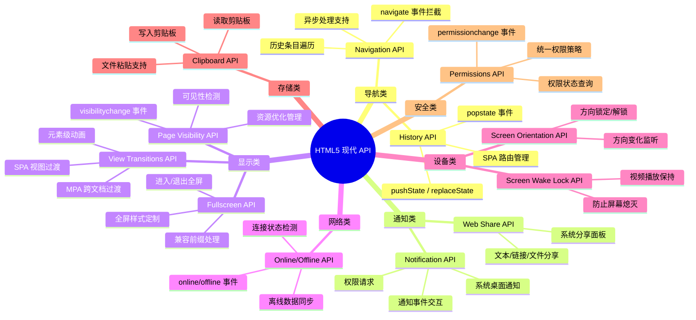
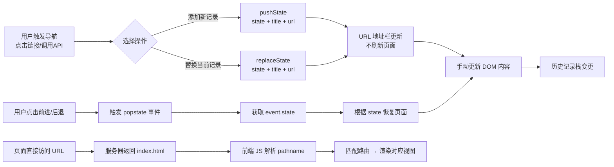
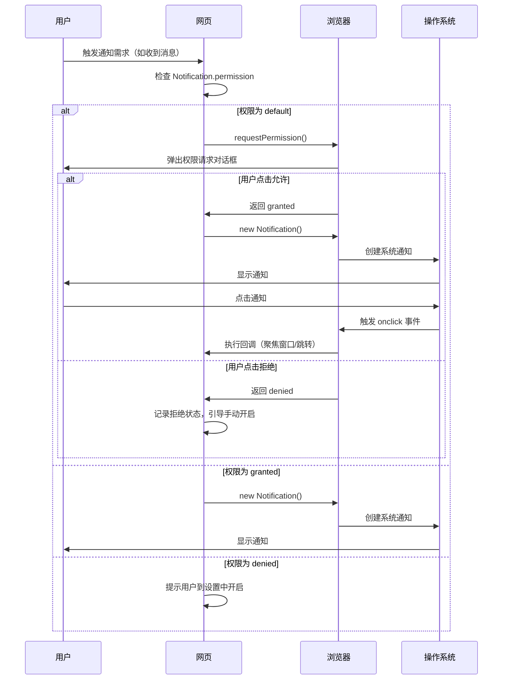
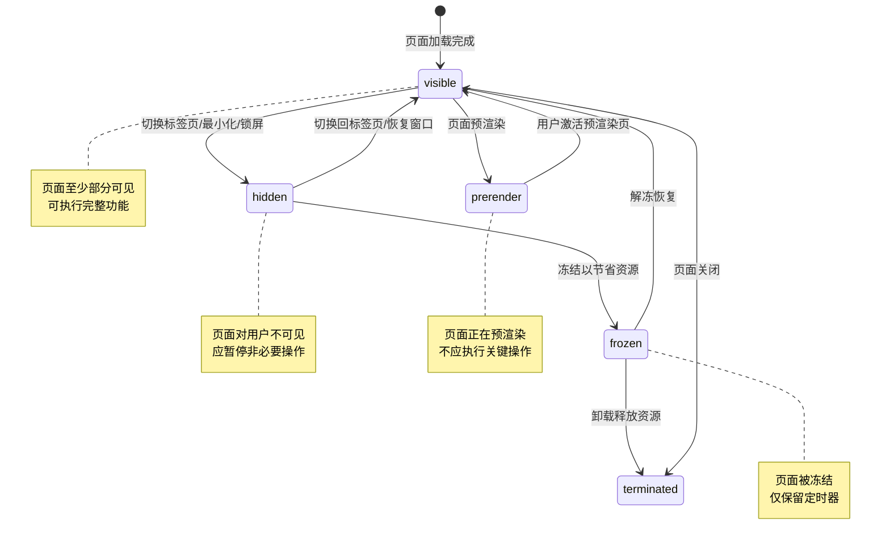
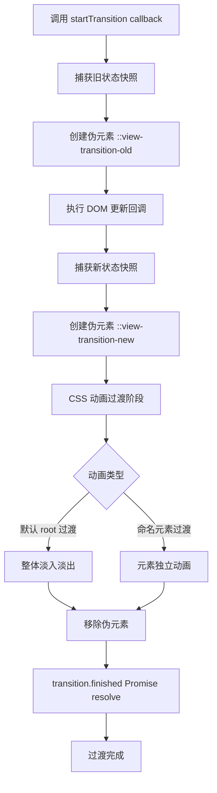

# HTML5 其他应用

本文档介绍 HTML5 提供的几个重要 API，这些 API 能够增强 Web 应用的交互性和用户体验。

## 概述

HTML5 引入了多个实用的浏览器 API，用于处理历史记录导航、系统通知、页面可见性检测、全屏模式切换以及网络状态监测等场景。这些 API 使得 Web 应用能够提供更接近原生应用的用户体验。

### 核心功能模块

| API 名称 | 核心功能 | 主要应用场景 |
|---------|---------|-------------|
| History API | 操作浏览器历史记录 | 单页应用(SPA)路由、无刷新导航 |
| Notification API | 系统级桌面通知 | 消息提醒、系统通知 |
| Page Visibility API | 检测页面可见性 | 资源优化、节省电量 |
| Fullscreen API | 控制全屏模式 | 视频播放、游戏、演示 |
| Online/Offline API | 检测网络状态 | PWA、离线应用、数据同步 |
| Permissions API | 统一权限管理 | 权限查询与策略控制 |
| Screen Wake Lock API | 防止屏幕熄灭 | 视频播放、阅读场景 |
| Screen Orientation API | 屏幕方向控制 | 游戏、视频、演示 |
| View Transitions API | 视图过渡动画 | SPA/MPA 页面切换动画 |
| Navigation API | 现代导航管理 | SPA 路由拦截与状态管理 |
| Clipboard API | 剪贴板操作 | 复制/粘贴文本和文件 |
| Selection API | 文本选区操作 | 富文本编辑器、高亮 |

### 浏览器兼容性概览

所有现代浏览器均支持本文档介绍的 API，但在具体实现细节上可能存在差异。建议在生产环境中进行充分的兼容性测试。

::: tip 提示
本文档中所有 API 示例均可在现代浏览器（Chrome、Firefox、Safari、Edge）中运行。部分旧版浏览器可能需要添加厂商前缀。
:::

### HTML5 现代 API 全景分类



## History API

HTML5 的 History API 提供一种在不刷新页面的情况下操作浏览器历史记录的能力，使得单页应用(SPA)能够实现更流畅的导航体验。这个 API 主要包括 `history.pushState()`、 `history.replaceState()` 和 `popstate` 事件。

<h4>001-history-router.html</h4>

```html
<!DOCTYPE html>
<html lang="zh-CN">
<head>
  <meta charset="UTF-8">
  <meta name="viewport" content="width=device-width, initial-scale=1.0">
  <title>【1】History API - SPA 路由</title>
  <style>
    * { margin: 0; padding: 0; box-sizing: border-box; }
    body { font-family: -apple-system, BlinkMacSystemFont, 'Segoe UI', sans-serif; padding: 20px; background: #f0f2f5; color: #333; }

    .app-container { max-width: 800px; margin: 0 auto; background: white; border-radius: 12px; overflow: hidden; box-shadow: 0 4px 20px rgba(0,0,0,0.08); }

    .nav-bar {
      display: flex;
      background: linear-gradient(135deg, #667eea 0%, #764ba2 100%);
      padding: 0;
      position: sticky; top: 0; z-index: 10;
    }

    .nav-link {
      flex: 1; text-align: center; padding: 16px 20px;
      color: rgba(255,255,255,0.85); text-decoration: none;
      font-weight: 500; font-size: 14px; transition: all 0.3s;
      cursor: pointer; border: none; background: none;
    }
    .nav-link:hover { background: rgba(255,255,255,0.15); color: white; }
    .nav-link.active {
      background: rgba(255,255,255,0.2); color: white;
      border-bottom: 3px solid white;
    }

    .content-area {
      min-height: 400px; padding: 32px;
      animation: fadeIn 0.35s ease;
    }
    @keyframes fadeIn { from { opacity: 0; transform: translateY(10px); } to { opacity: 1; transform: translateY(0); } }

    .page-title { font-size: 26px; font-weight: 700; margin-bottom: 16px; color: #333; }
    .page-desc { color: #666; line-height: 1.8; font-size: 15px; }

    .feature-grid {
      display: grid; grid-template-columns: repeat(auto-fit, minmax(200px, 1fr));
      gap: 16px; margin-top: 24px;
    }
    .feature-card {
      padding: 18px; background: #f8f9fa; border-radius: 10px;
      border-left: 4px solid #667eea; transition: transform 0.2s;
    }
    .feature-card:hover { transform: translateX(4px); }
    .feature-title { font-weight: 600; font-size: 14px; margin-bottom: 6px; }
    .feature-text { font-size: 13px; color: #666; line-height: 1.5; }

    .history-info {
      margin-top: 24px; padding: 16px; background: #e7f3ff;
      border-radius: 8px; font-family: monospace; font-size: 13px;
    }
    .info-row { display: flex; justify-content: space-between; padding: 4px 0; }
    .info-label { color: #007bff; }
  </style>
</head>
<body>
  <div class="app-container">
    <nav class="nav-bar">
      <button class="nav-link active" data-page="home">🏠 首页</button>
      <button class="nav-link" data-page="about">📖 关于我们</button>
      <button class="nav-link" data-page="services">⚙️ 服务项目</button>
      <button class="nav-link" data-page="contact">📞 联系我们</button>
    </nav>

    <div class="content-area" id="content"></div>

    <div class="history-info">
      <div class="info-row"><span class="info-label">当前 URL:</span><span id="currentUrl">-</span></div>
      <div class="info-row"><span class="info-label">历史记录数:</span><span id="historyLength">-</span></div>
      <div class="info-row"><span class="info-label">提示:</span><span style="color:#888;">点击导航按钮或浏览器前进/后退按钮测试</span></div>
    </div>
  </div>

  <script>
    const pages = {
      home: {
        title: "欢迎来到首页",
        content: `<p>这是使用 History API 实现的单页应用（SPA）路由演示。</p>
          <p>页面切换不会刷新整个页面，只更新内容区域，体验更加流畅。</p>
          <p>💡 试试点击浏览器的<strong>后退/前进按钮</strong>，可以看到 URL 和内容会同步变化！</p>`
      },
      about: {
        title: "关于我们",
        content: `<p>我们是一家专注于前端技术教育的团队。</p>
          <p>致力于提供高质量、实用的 HTML5/CSS3/JavaScript 学习资源。</p>`
      },
      services: {
        title: "服务项目",
        content: `<p>我们提供以下服务：</p>`
      },
      contact: {
        title: "联系我们",
        content: `<p>邮箱：contact@example.com</p><p>电话：123-456-7890</p><p>地址：北京市海淀区</p>`
      }
    }

    const content = document.getElementById("content")
    const currentUrlEl = document.getElementById("currentUrl")
    const historyLength = document.getElementById("historyLength")

    function navigateTo(page) {
      const pageData = pages[page] || pages.home

      // 更新内容
      content.innerHTML = `
        <h1 class="page-title">${pageData.title}</h1>
        <div class="page-desc">${pageData.content}</div>
      ` + (page === "services" ? `
        <div class="feature-grid">
          <div class="feature-card"><div class="feature-title">🎨 UI 设计</div><div class="feature-text">响应式界面设计与开发</div></div>
          <div class="feature-card"><div class="feature-title">💻 前端开发</div><div class="feature-text">Vue / React / 原生 JS</div></div>
          <div class="feature-card"><div class="feature-title">📱 移动端适配</div><div class="feature-text">PWA 与跨平台应用</div></div>
          <div class="feature-card"><div class="feature-title">🚀 性能优化</div><div class="feature-text">加载速度与用户体验</div></div>
        </div>` : "")

      // 更新 URL（不刷新页面）
      history.pushState({ page }, pageData.title, `#${page}`)

      // 更新导航高亮
      document.querySelectorAll(".nav-link").forEach(link => {
        link.classList.toggle("active", link.dataset.page === page)
      })

      updateInfo()
    }

    function updateInfo() {
      currentUrlEl.textContent = window.location.href
      historyLength.textContent = history.length
    }

    // 监听 popstate 事件（浏览器前进/后退）
    window.addEventListener("popstate", (event) => {
      const state = event.state
      if (state && state.page) {
        navigateTo(state.page)
      } else {
        // 解析 hash
        const hash = window.location.hash.slice(1)
        navigateTo(hash || "home")
      }
    })

    // 导航按钮点击
    document.querySelectorAll(".nav-link").forEach(link => {
      link.addEventListener("click", () => navigateTo(link.dataset.page))
    })

    // 初始化
    const initHash = window.location.hash.slice(1)
    if (initHash && pages[initHash]) {
      navigateTo(initHash)
    } else {
      navigateTo("home")
    }
  </script>
</body>
</html>```

### History API 导航流程



### 参数

#### 状态对象 state

- 可以存储任何可序列化的 JavaScript 对象
- 当用户导航到新状态时，该对象会通过 `popstate` 事件的 `event.state` 属性传递
- 如果不提供状态对象，将使用 `null`

#### URL 参数

- 可以是相对路径（相对于当前 URL）
- 不能包含哈希片段（`#`）
- 不能包含查询参数（`?`），但可以通过 state 对象存储这些信息
- 必须同源（same-origin policy）

### 核心方法

#### pushState、replaceState

`history.pushState(state, title[, url])`：向浏览器历史记录栈中添加一个新条目

- **state**: 与当前历史记录条目关联的 JavaScript 对象（通常包含页面状态数据）
- **title**: 大多数浏览器忽略此参数，建议传空字符串 `''`
- **url** (可选): 新历史记录条目的 URL（相对或绝对路径）

`history.replaceState(state, title[, url])`：替换当前历史记录条目，而不是添加新条目

#### back、forward、go

`history.back()`、 `history.forward()`、 `history.go()`：这些方法与浏览器的前进/后退按钮功能相同

```javascript
// 示例
history.pushState({ id: 1, title: '首页' }, '', '/home');

// 示例
history.replaceState({ id: 2, title: '关于我们' }, '', '/about');

history.back();    // 后退一步
history.forward(); // 前进一步
history.go(-2);    // 后退两步
```

### `popstate` 事件

当活动历史记录条目改变时触发（用户点击浏览器的前进/后退按钮时）

```javascript
window.addEventListener('popstate', function(event) {
    console.log('状态:', event.state);
    // 根据event.state更新页面内容
});
```

注意：`pushState()` 和 `replaceState()` 不会触发 `popstate` 事件

### 示例


```html
<!DOCTYPE html>
<html lang="zh-CN">

<head>
    <meta charset="UTF-8">
    <meta name="viewport" content="width=device-width, initial-scale=1.0">
    <title>History API 示例</title>
    <style>
        body {
            font-family: Arial, sans-serif;
            max-width: 800px;
            margin: 0 auto;
            padding: 20px;
        }

        nav {
            margin-bottom: 20px;
        }

        a {
            margin-right: 10px;
            text-decoration: none;
            color: #0066cc;
        }

        .content {
            padding: 20px;
            border: 1px solid #ddd;
            border-radius: 5px;
        }
    </style>
</head>

<body>
    <nav>
        <a href="#" data-page="home">首页</a>
        <a href="#" data-page="about">关于我们</a>
        <a href="#" data-page="contact">联系我们</a>
    </nav>

    <div class="content" id="content">
        <!-- 内容将在这里动态加载 -->
        <h1>欢迎来到首页</h1>
        <p>这是默认内容。</p>
    </div>

    <script>
        // 页面内容数据
        const pages = {
            home: {
                title: '首页',
                content: '<h1>欢迎来到首页</h1><p>这是网站的首页内容。</p>'
            },
            about: {
                title: '关于我们',
                content: '<h1>关于我们</h1><p>我们是一家专注于Web技术的公司。</p>'
            },
            contact: {
                title: '联系我们',
                content: '<h1>联系我们</h1><p>邮箱: info@example.com<br>电话: 123-456-7890</p>'
            }
        }

        // 更新页面内容和URL
        function navigateTo(page) {
            // 获取页面数据
            const pageData = pages[page] || pages.home

            // 更新内容
            document.getElementById('content').innerHTML = pageData.content

            // 更新标题（pushState 的 title 参数会被大多数浏览器忽略，
            // 页面标题需通过 document.title 设置）

            // 使用History API更新URL
            history.pushState({ page }, pageData.title, `/${page}`)
        }

        // 处理 popstate 事件（监听 后退/前进按钮）
        window.addEventListener('popstate', function (event) {
            if (event.state && event.state.page) {
                navigateTo(event.state.page)
            } else {
                // 如果没有状态对象，可能是初始加载或直接访问URL
                const path = window.location.pathname
                const page = path.substring(1) // 去掉斜杠
                if (pages[page]) {
                    navigateTo(page)
                } else {
                    navigateTo('home')
                }
            }
        })

        // 初始化页面
        document.addEventListener('DOMContentLoaded', function () {
            // 处理导航链接点击
            document.querySelectorAll('nav a').forEach(link => {
                link.addEventListener('click', function (e) {
                    e.preventDefault()
                    const page = this.getAttribute('data-page')
                    navigateTo(page)
                })
            })

            // 检查初始URL
            const path = window.location.pathname
            const page = path.substring(1) // 去掉斜杠
            if (pages[page]) {
                navigateTo(page)
            }
        });
    </script>
</body>

</html>
```

对于上述示例，服务器需要配置以处理不同的 URL 路径。以下是简单的 Node.js Express 示例：

```javascript
const express = require('express');
const path = require('path');
const app = express();

// 静态文件服务
app.use(express.static(path.join(__dirname, 'public')));

// 处理所有路由，返回index.html
app.get('*', (req, res) => {
    res.sendFile(path.join(__dirname, 'public', 'index.html'));
});

const PORT = process.env.PORT || 3000;
app.listen(PORT, () => {
    console.log(`服务器运行在 http://localhost:${PORT}`);
});
```

这样配置后，无论用户访问 `/home`、`/products` 还是其他路径，都会返回 `index.html`，然后由前端 JavaScript 处理路由逻辑。

### 浏览器兼容性

| API 方法 | Chrome | Firefox | Safari | Edge | 说明 |
|---------|--------|---------|--------|------|------|
| pushState | 5+ | 4+ | 5+ | 12+ | 完全支持 |
| replaceState | 5+ | 4+ | 5+ | 12+ | 完全支持 |
| popstate 事件 | 5+ | 4+ | 5+ | 12+ | 注意：页面加载时不会触发 |

### 最佳实践

1. **状态管理**：使用 state 对象存储页面状态，避免在 URL 中暴露敏感信息
2. **错误处理**：始终处理 `popstate` 事件，确保用户使用浏览器前进/后退按钮时页面能正确更新
3. **SEO 优化**：对于需要 SEO 的页面，确保服务器端也能正确渲染内容
4. **滚动位置**：在切换页面时，考虑保存和恢复滚动位置

```javascript
// 保存和恢复滚动位置
const scrollPositions = {};

function navigateTo(page) {
  // 保存当前页面滚动位置
  scrollPositions[window.location.pathname] = window.scrollY;
  
  // 导航到新页面
  const pageData = pages[page] || pages.home;
  document.getElementById('content').innerHTML = pageData.content;
  history.pushState({ page }, pageData.title, `/${page}`);
  
  // 恢复新页面滚动位置（如果有）
  setTimeout(() => {
    const savedPosition = scrollPositions[`/${page}`] || 0;
    window.scrollTo(0, savedPosition);
  }, 0);
}
```

1. **URL 验证**：在 `popstate` 事件中验证 URL 的有效性，防止无效路由

```javascript
window.addEventListener('popstate', function(event) {
  const path = window.location.pathname;
  const page = path.substring(1);
  
  if (pages[page]) {
    navigateTo(page);
  } else {
    // 无效路由，重定向到首页
    history.replaceState({ page: 'home' }, '首页', '/home');
    navigateTo('home');
  }
});
```

## 桌面通知 Notification API

HTML5 的 Notification API 允许网页在用户授权后向用户显示系统级通知，即使当网页不在活动状态时也能显示。这种功能对于提醒用户重要信息非常有用。

桌面通知并不能随意使用，用户需要获取使用权限，同一个域名下的项目只需要获取一次权限。以 Google Chrome 浏览器为例进行权限设置：


```bash
# 复制到浏览器中
chrome://settings/content/notifications
```

检查浏览器支持

```javascript
if (!("Notification" in window)) {
  console.log("This browser does not support desktop notification");
} else {
  // 浏览器支持通知
}
```

在显示通知前，需要先请求用户授权。权限状态有三种：

- `default`：用户尚未做出选择（现代浏览器会自动显示权限请求对话框）
- `granted`：用户已授权
- `denied`：用户已拒绝

```javascript
// 现代浏览器推荐方式
Notification.requestPermission().then(function(permission) {
  if (permission === "granted") {
    console.log("Notification permission granted.");
  } else {
    console.log("Notification permission denied.");
  }
});
```

创建通知：

```javascript
// 简单通知
function showNotification() {
  if (Notification.permission === "granted") {
    new Notification("Hello World!", {
      body: "This is a notification message.",
      icon: "path/to/icon.png"
    });
  } else if (Notification.permission !== "denied") {
    Notification.requestPermission().then(function(permission) {
      if (permission === "granted") {
        new Notification("Hello World!", {
          body: "This is a notification message.",
          icon: "path/to/icon.png"
        });
      }
    });
  }
}
```

<h4>002-notification-api.html</h4>

```html
<!DOCTYPE html>
<html lang="zh-CN">
<head>
  <meta charset="UTF-8">
  <meta name="viewport" content="width=device-width, initial-scale=1.0">
  <title>【2】Notification API 桌面通知</title>
  <style>
    * { margin: 0; padding: 0; box-sizing: border-box; }
    body { font-family: -apple-system, BlinkMacSystemFont, 'Segoe UI', sans-serif; padding: 20px; background: #f8f9fa; color: #333; }
    .demo-container { max-width: 650px; margin: 0 auto; background: white; padding: 28px; border-radius: 12px; box-shadow: 0 2px 16px rgba(0,0,0,0.08); }
    .demo-title { margin-bottom: 20px; font-size: 18px; color: #555; border-bottom: 2px solid #007bff; padding-bottom: 8px; }

    .permission-card {
      background: linear-gradient(135deg, #667eea 0%, #764ba2 100%);
      color: white; border-radius: 14px; padding: 28px;
      text-align: center; margin-bottom: 24px;
    }
    .permission-icon { font-size: 48px; margin-bottom: 12px; }
    .permission-status { font-size: 18px; font-weight: 600; margin-bottom: 8px; }
    .permission-desc { opacity: 0.85; font-size: 14px; }

    .btn-group { display: flex; gap: 12px; justify-content: center; flex-wrap: wrap; margin-bottom: 24px; }
    .btn {
      padding: 11px 24px; border: none; border-radius: 8px;
      cursor: pointer; font-size: 14px; font-weight: 600;
      transition: all 0.3s; display: inline-flex; align-items: center; gap: 8px;
    }
    .btn-primary { background: #007bff; color: white; }
    .btn-primary:hover { background: #0056b3; transform: translateY(-2px); box-shadow: 0 4px 12px rgba(0,123,255,0.3); }
    .btn-success { background: #28a745; color: white; }
    .btn-success:hover { background: #218838; }
    .btn-warning { background: #ffc107; color: #333; }
    .btn-warning:hover { background: #e0a800; }
    .btn-danger { background: #dc3545; color: white; }
    .btn-danger:hover { background: #c82333; }
    .btn:disabled { background: #ccc; cursor: not-allowed; transform: none; box-shadow: none; }

    .notification-list { list-style: none; }
    .notification-item {
      padding: 14px 18px; margin: 10px 0; background: #f8f9fa;
      border-radius: 8px; border-left: 4px solid #007bff;
      animation: slideIn 0.3s ease;
    }
    @keyframes slideIn { from { opacity: 0; transform: translateX(-20px); } to { opacity: 1; transform: translateX(0); } }
    .notif-time { font-size: 12px; color: #888; float: right; }
    .notif-title { font-weight: 600; font-size: 14px; }
    .notif-body { font-size: 13px; color: #555; margin-top: 4px; }

    .warning-box {
      background: #fff3cd; border-left: 4px solid #ffc107;
      padding: 14px 18px; border-radius: 6px; margin-top: 20px;
      font-size: 13px; color: #856404; line-height: 1.6;
    }
  </style>
</head>
<body>
  <div class="demo-container">
    <div class="demo-title">示例：Notification API - 系统桌面通知</div>

    <div class="permission-card" id="permCard">
      <div class="permission-icon" id="permIcon">🔔</div>
      <div class="permission-status" id="permStatus">检测中...</div>
      <div class="permission-desc" id="permDesc">正在检查通知权限状态</div>
    </div>

    <div class="btn-group" id="actionBtns">
      <button class="btn btn-primary" onclick="requestPermission()" id="requestBtn">
        🔐 请求通知权限
      </button>
      <button class="btn btn-success" onclick="sendBasicNotif()" disabled id="basicBtn">
        📢 发送基础通知
      </button>
      <button class="btn btn-warning" onclick="sendCustomNotif()" disabled id="customBtn">
        🎨 发送自定义通知
      </button>
      <button class="btn btn-danger" onclick="sendTimedNotif()" disabled id="timedBtn">
        ⏰ 5秒后发送定时通知
      </button>
    </div>

    <h3 style="margin-bottom: 12px; font-size: 15px;">通知历史记录</h3>
    <ul class="notification-list" id="notifList">
      <li style="color: #999; text-align: center; padding: 30px; font-size: 13px;">
        尚未发送任何通知
      </li>
    </ul>

    <div class="warning-box" id="warningBox" style="display:none;"></div>
  </div>

  <script>
    const permCard = document.getElementById("permCard")
    const permIcon = document.getElementById("permIcon")
    const permStatus = document.getElementById("permStatus")
    const permDesc = document.getElementById("permDesc")
    const notifList = document.getElementById("notifList")
    const warningBox = document.getElementById("warningBox")

    const btns = {
      request: document.getElementById("requestBtn"),
      basic: document.getElementById("basicBtn"),
      custom: document.getElementById("customBtn"),
      timed: document.getElementById("timedBtn")
    }

    let notifCount = 0

    // 初始化权限状态
    function checkPermission() {
      if (!("Notification" in window)) {
        showPermState("❌", "不支持", "您的浏览器不支持 Notification API", false)
        return
      }

      switch (Notification.permission) {
        case "granted":
          showPermState("✅", "已授权", "可以发送桌面通知", true)
          break
        case "denied":
          showPermState("❌", "已拒绝", "请在浏览器设置中允许通知后重试", false)
          showWarning()
          break
        default:
          showPermState("⏳", "未授权", "点击下方按钮请求通知权限", false)
          break
      }
    }

    function showPermState(icon, status, desc, granted) {
      permIcon.textContent = icon
      permStatus.textContent = status
      permDesc.textContent = desc

      btns.basic.disabled = !granted
      btns.custom.disabled = !granted
      btns.timed.disabled = !granted
      btns.request.style.display = granted ? "none" : "inline-flex"

      if (granted) {
        permCard.style.background = "linear-gradient(135deg, #28a745 0%, #20c997 100%)"
      } else if (Notification.permission === "denied") {
        permCard.style.background = "linear-gradient(135deg, #dc3545 0%, #c82333 100%)"
      }
    }

    async function requestPermission() {
      try {
        const permission = await Notification.requestPermission()
        checkPermission()

        if (permission === "granted") {
          addLogItem("success", "权限请求成功", "用户已授权通知权限")
        } else {
          addLogItem("error", "权限被拒绝", "用户拒绝了通知请求")
        }
      } catch (err) {
        showPermState("❌", "错误", `请求失败: ${err.message}`, false)
      }
    }

    function sendBasicNotif() {
      const notif = new Notification("基础通知", {
        body: "这是一条简单的桌面通知消息！",
        icon: "data:image/svg+xml,<svg xmlns='http://www.w3.org/2000/svg' viewBox='0 0 100 100'><text y='.9em' font-size='90'>📢</text></svg>"
      })
      setupNotif(notif, "基础通知", "这是一条简单的桌面通知消息！")
    }

    function sendCustomNotif() {
      const notif = new Notification("🎉 自定义样式通知", {
        body: "这条通知有自定义图标和标签设置",
        tag: "custom-demo",
        renotify: true,
        requireInteraction: false,
        silent: false
      })
      setupNotif(notif, "自定义样式通知", "这条通知有自定义图标和标签设置")
    }

    function sendTimedNotif() {
      btns.timed.disabled = true
      btns.timed.textContent = "⏳ 5秒后发送..."

      setTimeout(() => {
        const notif = new Notification("⏰ 定时提醒", {
          body: "这是您设置的 5 秒定时提醒！时间到啦~",
          tag: "reminder-timed",
          requireInteraction: true
        })
        setupNotif(notif, "定时提醒", "这是您设置的 5 秒定时提醒！")

        btns.timed.disabled = false
        btns.timed.textContent = "⏰ 5秒后发送定时通知"
      }, 5000)

      addLogItem("pending", "定时通知已安排", "将在 5 秒后自动发送")
    }

    function setupNotif(notif, title, body) {
      notif.onclick = () => {
        window.focus()
        notif.close()
        addLogItem("click", `[${title}] 用户点击了通知`, "窗口已聚焦")
      }
      notif.onshow = () => addLogItem("sent", `[${title}] 通知已显示`, body)
      notif.onclose = () => addLogItem("closed", `[${title}] 通知已关闭`, "")
      notif.onerror = () => addLogItem("error", `[${title]}`, "通知出错")
    }

    function addLogItem(type, title, body) {
      notifCount++
      if (notifCount === 1) notifList.innerHTML = ""

      const colors = {
        sent: "#28a745", click: "#007bff", closed: "#6c757d",
        error: "#dc3545", pending: "#ffc107"
      }

      const li = document.createElement("li")
      li.className = "notification-item"
      li.style.borderLeftColor = colors[type] || "#007bff"
      li.innerHTML = `
        <span class="notif-time">${new Date().toLocaleTimeString()}</span>
        <div class="notif-title">${title}</div>
        ${body ? `<div class="notif-body">${body}</div>` : ""}
      `
      notifList.prepend(li)
    }

    function showWarning() {
      warningBox.style.display = "block"
      warningBox.innerHTML = `
        ⚠️ <strong>注意事项：</strong><br>
        • 通知功能需要 <strong>HTTPS</strong> 或 <strong>localhost</strong> 环境<br>
        • 如果被拒绝，可在浏览器地址栏左侧 🔒 图标 → 通知 → 允许<br>
        • Chrome 设置路径：<code>chrome://settings/content/notifications</code>
      `
    }

    // 初始化
    checkPermission()
  </script>
</body>
</html>```


<h4>006-notification-geolocation-orientation.html</h4>

```html
<!DOCTYPE html>
<!--
  来源：基础知识/17-HTML5其他应用.md
  演示：Notification API 增强、Geolocation API、Screen Orientation API
-->
<html lang="zh-CN">
<head>
  <meta charset="UTF-8">
  <title>Notification / Geolocation / Screen Orientation API</title>
  <style>
    * { margin: 0; padding: 0; box-sizing: border-box; }
    body { font-family: -apple-system, sans-serif; padding: 30px; background: #f0f2f5; max-width: 900px; margin: 0 auto; }
    h1 { color: #1a1a1a; margin-bottom: 25px; }
    .section { background: white; padding: 25px; margin-bottom: 20px; border-radius: 10px; box-shadow: 0 2px 10px rgba(0,0,0,0.06); }
    h2 { color: #333; font-size: 17px; margin-bottom: 15px; border-bottom: 2px solid #eee; padding-bottom: 8px; }

    button {
      padding: 10px 20px; border: none; border-radius: 8px; cursor: pointer;
      font-size: 14px; font-weight: 600; transition: all 0.2s;
      margin: 6px 6px 6px 0;
    }
    .btn-primary { background: #3498db; color: white; }
    .btn-primary:hover { background: #2980b9; }
    .btn-success { background: #27ae60; color: white; }
    .btn-warning { background: #f39c12; color: white; }
    .btn-danger { background: #e74c3c; color: white; }
    button:disabled { opacity: 0.5; cursor: not-allowed; }

    /* Notification demo */
    .notif-options {
      background: #f8f9fa; padding: 18px; border-radius: 10px; margin: 15px 0;
    }
    .notif-option { margin: 12px 0; }
    .notif-option label { display: block; font-weight: 600; font-size: 13px; color: #555; margin-bottom: 6px; }
    .notif-option input[type="text"] { width: 100%; padding: 10px; border: 1px solid #ddd; border-radius: 6px; font-size: 14px; }
    .notif-option select { width: 100%; padding: 10px; border: 1px solid #ddd; border-radius: 6px; font-size: 14px; }

    .notif-preview {
      background: #fff; border: 1px solid #e0e0e0; border-radius: 10px; padding: 16px;
      margin-top: 15px; display: none; animation: slideIn 0.3s ease-out;
    }
    .notif-preview.show { display: block; }
    @keyframes slideIn { from { opacity: 0; transform: translateY(-10px); } to { opacity: 1; transform: translateY(0); } }
    .notif-preview .icon { font-size: 36px; float: left; margin-right: 14px; }
    .notif-preview .body { overflow: hidden; }
    .notif-preview .title { font-weight: 700; font-size: 15px; margin-bottom: 4px; }
    .notif-preview .text { font-size: 13px; color: #666; }

    /* Geolocation */
    .geo-display {
      background: linear-gradient(135deg, #e3f2fd, #bbdefb); border-radius: 12px;
      padding: 24px; text-align: center; margin: 15px 0;
    }
    .geo-coords { font-family: monospace; font-size: 18px; font-weight: bold; color: #1565c0; margin: 12px 0; }
    .geo-map {
      width: 100%; height: 200px; background: #c8e6c9; border-radius: 10px;
      display: flex; align-items: center; justify-content: center;
      color: #2e7d32; font-size: 48px; position: relative; overflow: hidden;
    }
    .geo-map .dot {
      position: absolute; width: 16px; height: 16px; background: #e74c3c;
      border-radius: 50%; border: 3px solid white; box-shadow: 0 2px 8px rgba(0,0,0,0.3);
      animation: bounce 1s ease-in-out infinite;
    }
    @keyframes bounce { 0%, 100% { transform: translateY(0); } 50% { transform: translateY(-8px); } }
    .geo-detail { display: grid; grid-template-columns: 1fr 1fr; gap: 10px; margin-top: 15px; font-size: 13px; }
    .geo-detail dt { color: #888; }
    .geo-detail dd { color: #333; font-weight: 600; font-family: monospace; }

    /* Screen Orientation */
    .orient-info {
      display: grid; grid-template-columns: repeat(3, 1fr); gap: 12px; margin: 15px 0;
    }
    @media (max-width: 650px) { .orient-info { grid-template-columns: 1fr 1fr; } }
    .orient-card {
      background: #f8f9fa; border: 2px solid #e0e0e0; border-radius: 10px;
      padding: 20px; text-align: center; transition: all 0.3s;
    }
    .orient-card.active { border-color: #3498db; background: #ebf5fb; }
    .orient-card .icon { font-size: 32px; margin-bottom: 8px; }
    .orient-card .name { font-weight: 700; font-size: 14px; color: #333; }
    .orient-card .status { font-size: 12px; color: #888; margin-top: 4px; }

    pre { background: #263238; color: #eceff1; padding: 15px; border-radius: 8px; overflow-x: auto; font-size: 12px; line-height: 1.6; }
    .log-panel { background: #1e1e1e; color: #d4d4d4; padding: 14px; border-radius: 8px; font-family: monospace; font-size: 12px; line-height: 1.6; max-height:200px;overflow-y:auto;}

    table { width: 100%; border-collapse: collapse; font-size: 13px; margin: 15px 0; }
    th, td { padding: 10px 12px; text-align: left; border: 1px solid #dee2e6; }
    th { background: #34495e; color: white; }

    .api-badge { display: inline-flex; align-items: center; gap: 6px; padding: 6px 14px; border-radius: 20px; font-size: 13px; font-weight: 600; }
    .badge-ok { background: #eafaf1; color: #27ae60; }
    .badge-no { background: #fef5f5; color: #e74c3c; }
  </style>
</head>
<body>
  <h1>🔔 Notification / Geolocation / Screen Orientation API</h1>

  <!-- ========== Notification API ========== -->
  <div class="section">
    <h2>1. Notification API — 浏览器通知</h2>

    <div style="display:flex;align-items:center;gap:12px;margin-bottom:15px;flex-wrap:wrap;">
      通知权限状态：
      <span id="notif-perm-status" class="api-badge badge-no">检测中...</span>
      <button class="btn-primary" onclick="requestNotifPermission()">🔐 请求权限</button>
    </div>

    <div class="notif-options">
      <div class="notif-option">
        <label>通知标题</label>
        <input type="text" id="notif-title" value="👋 你好！" placeholder="输入通知标题">
      </div>
      <div class="notif-option">
        <label>通知正文</label>
        <input type="text" id="notif-body" value="这是一条来自 Web 的桌面通知消息。" placeholder="输入通知内容">
      </div>
      <div style="display:grid;grid-template-columns:1fr 1fr;gap:12px;">
        <div class="notif-option">
          <label>图标类型</label>
          <select id="notif-icon">
            <option value="">无图标</option>
            <option value="ℹ️">信息 ℹ️</option>
            <option value="✅">成功 ✅</option>
            <option value="⚠️">警告 ⚠️</option>
            <option value="❌">错误 ❌</option>
          </select>
        </div>
        <div class="notif-option">
          <label>交互行为</label>
          <select id="notif-tag">
            <option value="">默认</option>
            <option value="default">需要点击关闭</option>
            <option value="auto-close">自动关闭</option>
          </select>
        </div>
      </div>
    </div>

    <div style="display:flex;gap:10px;flex-wrap:wrap;margin:15px 0;">
      <button class="btn-primary" onclick="sendNotification()">🔔 发送通知</button>
      <button class="btn-success" onclick="sendTimedNotification()">⏰ 定时通知 (3秒后)</button>
      <button class="btn-warning" onclick="sendBatchNotifications()">📬 批量发送 (3条)</button>
    </div>

    <div class="notif-preview" id="notif-preview">
      <div class="icon" id="preview-icon">ℹ️</div>
      <div class="body">
        <div class="title" id="preview-title">通知预览标题</div>
        <div class="text" id="preview-text">通知预览内容文字</div>
      </div>
    </div>

    <pre style="font-size:11px;">// Notification API 核心用法:

// 1. 请求权限（必须由用户手势触发）
const permission = await Notification.requestPermission();
// 结果: 'granted' | 'denied' | 'default'

// 2. 发送通知
if (Notification.permission === 'granted') {
  new Notification('标题', {
    body: '通知正文内容',
    icon: '/icon.png',           // 图标 URL
    image: '/image.png',         // 大图（仅部分浏览器支持）
    tag: 'unique-id',            // 相同 tag 会替换旧通知
    requireInteraction: false,   // 是否需要用户手动关闭
    silent: false,               // 静默模式（无声音）
    vibrate: [200, 100, 200],   // 震动模式（仅 Android Chrome）
    actions: [                   // 操作按钮
      { action: 'reply', title: '回复' },
      { action: 'archive', title: '归档' },
    ],
    data: { userId: 123 }        // 附加数据
  });
}

// 3. 监听通知点击
notification.onclick = () => { window.focus(); };
notification.onclose = () => { console.log('通知已关闭'); };</pre>
  </div>

  <!-- ========== Geolocation API ========== -->
  <div class="section">
    <h2>2. Geolocation API — 地理位置获取</h2>

    <div style="display:flex;align-items:center;gap:12px;margin-bottom:15px;flex-wrap:wrap;">
      地理定位支持：
      <span id="geo-support" class="api-badge badge-no">检测中...</span>
    </div>

    <div class="geo-display" id="geo-display">
      <div style="font-size:48px;margin-bottom:8px;">📍</div>
      <div style="font-size:15px;color:#555;margin-bottom:4px;">当前位置坐标</div>
      <div class="geo-coords" id="geo-coords">等待获取...</div>
      <div style="display:flex;gap:10px;justify-content:center;flex-wrap:wrap;margin-top:15px;">
        <button class="btn-primary" onclick="getLocation()">🌍 获取位置</button>
        <button class="btn-success" onclick="watchPosition()">📍 持续追踪</button>
        <button class="btn-danger" onclick="stopWatching()">⏹ 停止追踪</button>
      </div>
    </div>

    <div class="geo-map" id="geo-map">
      🗺️ 地图区域
      <div class="dot" id="geo-dot" style="display:none;"></div>
    </div>

    <div class="geo-detail" id="geo-detail" style="display:none;">
      <dt>纬度 Latitude</dt><dd id="geo-lat">-</dd>
      <dt>经度 Longitude</dt><dd id="geo-lng">-</dd>
      <dt>精度 Accuracy</dt><dd id="geo-acc">-</dd>
      <dt>海拔 Altitude</dt><dd id="geo-alt">-</dd>
      <dt>航向 Heading</dt><dd id="geo-head">-</dd>
      <dt>速度 Speed</dt><dd id="geo-speed">-</dd>
    </div>

    <div class="log-panel" id="geo-log" style="margin-top:15px;">// 地理位置日志...</div>
  </div>

  <!-- ========== Screen Orientation API ========== -->
  <div class="section">
    <h2>3. Screen Orientation API — 屏幕方向</h2>

    <div class="orient-info" id="orient-info">
      <div class="orient-card" data-orient="portrait-primary">
        <div class="icon">📱</div>
        <div class="name">竖屏主方向</div>
        <div class="status" id="status-portrait-primary">未激活</div>
      </div>
      <div class="orient-card" data-orient="landscape-primary">
        <div class="icon">🖥️</div>
        <div class="name">横屏主方向</div>
        <div class="status" id="status-landscape-primary">未激活</div>
      </div>
      <div class="orient-card" data-orient="portrait-secondary">
        <div class="icon">📱↩️</div>
        <div class="name">竖屏次要方向</div>
        <div class="status" id="status-portrait-secondary">未激活</div>
      </div>
      <div class="orient-card" data-orient="landscape-secondary">
        <div class="icon">🖥️↩️</div>
        <div class="name">横屏次要方向</div>
        <div class="status" id="status-landscape-secondary">未激活</div>
      </div>
    </div>

    <div style="margin:20px 0;text-align:center;">
      <p style="font-size:13px;color:#666;margin-bottom:12px;">尝试旋转你的设备或调整浏览器窗口：</p>
      <div style="font-size:24px;font-weight:bold;color:#333;" id="current-orientation">
        当前方向：<span id="orient-type" style="color:#3498db;">检测中...</span>
      </div>
    </div>

    <table>
      <thead><tr><th>orientation.type 值</th><th>含义</th><th>典型设备</th></tr></thead>
      <tbody>
        <tr><td><code>"portrait-primary"</code></td><td>正向竖屏</td><td>手机正常握持</td></tr>
        <tr><td><code>"portrait-secondary"</code></td><td>倒转竖屏</td><td>手机倒置</td></tr>
        <tr><td><code>"landscape-primary"</code></td><td>正向横屏</td><td>手机左旋/平板</td></tr>
        <tr><td><code>"landscape-secondary"</code></td><td>倒转横屏</td><td>手机右旋</td></tr>
      </tbody>
    </table>

    <pre style="font-size:11px;">// Screen Orientation API

// 读取当前方向
const orientation = screen.orientation;
console.log(orientation.type);  // "portrait-primary" 等
console.log(orientation.angle);  // 0, 90, 180, 270

// 监听方向变化
screen.orientation.addEventListener('change', () => {
  console.log('方向变为:', screen.orientation.type);
  console.log('角度:', screen.orientation.angle);
});

// 锁定方向（需用户手势触发）
await screen.orientation.lock('landscape-primary');

// 解锁方向
screen.orientation.unlock();

// 检查是否支持锁定
const canLock = screen.orientation?.lock !== undefined;</pre>
  </div>

  <script>
    // ===== Notification API =====
    const notifPermStatus = document.getElementById('notif-perm-status');

    async function checkNotifPermission() {
      if (!('Notification' in window) {
        notifPermStatus.className = 'api-badge badge-no';
        notifPermStatus.textContent = '❌ 不支持';
        return;
      }
      const perm = Notification.permission;
      if (perm === 'granted') {
        notifPermStatus.className = 'api-badge badge-ok';
        notifPermStatus.textContent = '✅ 已授权';
      } else if (perm === 'denied') {
        notifPermStatus.className = 'api-badge badge-no';
        notifPermStatus.textContent = '❌ 已拒绝';
      } else {
        notifPermStatus.className = 'api-badge badge-no';
        notifPermStatus.textContent = '⏳ 未请求';
      }
    }
    checkNotifPermission();

    async function requestNotifPermission() {
      try {
        const result = await Notification.requestPermission();
        checkNotifPermission();
      } catch (err) {
        alert('请求权限失败: ' + err.message);
      }
    }

    function showPreview(title, body, icon) {
      const preview = document.getElementById('notif-preview');
      document.getElementById('preview-title').textContent = title || '(空)';
      document.getElementById('preview-text').textContent = body || '(空)';
      document.getElementById('preview-icon').textContent = icon || '🔔';
      preview.classList.add('show');
      setTimeout(() => preview.classList.remove('show'), 4000);
    }

    function sendNotification() {
      const title = document.getElementById('notif-title').value;
      const body = document.getElementById('notif-body').value;
      const icon = document.getElementById('notif-icon').value;

      showPreview(title, body, icon);

      if (Notification.permission === 'granted') {
        const n = new Notification(title, { body, icon: icon ? undefined : '' });
        n.onclick = () => { window.focus(); n.close(); };
      } else {
        alert('请先授予通知权限！');
      }
    }

    function sendTimedNotification() {
      setTimeout(() => sendNotification(), 3000);
    }

    function sendBatchNotifications() {
      const titles = ['📧 新邮件到达', '🔔 日程提醒', '💬 新消息通知'];
      titles.forEach((t, i) => {
        setTimeout(() => {
          new Notification(t, { body: `这是第 ${i + 1} 条通知` });
        }, i * 1500);
      });
    }

    // ===== Geolocation API =====
    const geoSupport = document.getElementById('geo-support');
    const geoLog = document.getElementById('geo-log');
    let watchId = null;

    if ('geolocation' in navigator) {
      geoSupport.className = 'api-badge badge-ok';
      geoSupport.textContent = '✅ 支持 Geolocation';
    } else {
      geoSupport.className = 'api-badge badge-no';
      geoSupport.textContent = '❌ 不支持';
    }

    function getLocation() {
      geoLog.textContent = `[${new Date().toLocaleTimeString()}] 开始获取位置...\n` + geoLog.textContent;
      document.getElementById('geo-dot').style.display = 'block';

      navigator.geolocation.getCurrentPosition(
        (pos) => {
          const { latitude, longitude, accuracy, altitude, heading, speed } = pos.coords;
          
          document.getElementById('geo-coords').textContent =
            `${latitude.toFixed(6)}, ${longitude.toFixed(6)}`;
          document.getElementById('geo-lat').textContent = latitude.toFixed(6) + '°';
          document.getElementById('geo-lng').textContent = longitude.toFixed(6) + '°';
          document.getElementById('geo-acc').textContent = accuracy ? `±${Math.round(accuracy)}m` : '-';
          document.getElementById('geo-alt').textContent = altitude ? `${altitude.toFixed(1)}m` : '-';
          document.getElementById('geo-head').textContent = heading ? `${heading.toFixed(1)}°` : '-';
          document.getElementById('geo-speed').textContent = speed ? `${speed.toFixed(1)} m/s` : '-';

          // 在地图上显示点
          const mapEl = document.getElementById('geo-map');
          const dot = document.getElementById('geo-dot');
          const pctX = ((longitude + 180) / 360) * 100;
          const pctY = ((90 - latitude) / 180) * 100;
          dot.style.left = `calc(${pctX}% - 8px)`;
          dot.style.top = `calc(${pctY}% - 8px)`;

          document.getElementById('geo-detail').style.display = 'grid';
          geoLog.textContent = `[${new Date().toLocaleTimeString()}] ✅ 位置获取成功\n` +
            `纬度: ${latitude.toFixed(6)}°, 经度: ${longitude.toFixed(6)}°\n` +
            `精度: ±${Math.round(accuracy)}m\n` + geoLog.textContent;
        },
        (err) => {
          geoLog.textContent = `[${new Date().toLocaleTimeString()}] ❌ 获取失败: ${err.message}\n` +
            `(错误码: ${err.code} — ${err.PERMISSION_DENIED ? '权限被拒绝' : err.POSITION_UNAVAILABLE ? '不可用' : '超时'})\n` + geoLog.textContent;
        },
        { enableHighAccuracy: true, timeout: 10000, maximumAge: 0 }
      );
    }

    function watchPosition() {
      if (watchId) { navigator.geolocation.clearWatch(watchId); }
      watchId = navigator.geolocation.watchPosition(
        (pos) => {
          const { latitude, longitude } = pos.coords;
          document.getElementById('geo-coords').textContent =
            `${latitude.toFixed(4)}, ${longitude.toFixed(4)} (实时)`;
          geoLog.textContent = `[${new Date().toLocaleTimeString()}] 📍 位置更新: ${latitude.toFixed(4)}, ${longitude.toFixed(4)}\n` + geoLog.textContent;
        },
        (err) => geoLog.textContent = `[${new Date().toLocaleTimeString()}] ⚠️ 追踪出错: ${err.message}\n` + geoLog.textContent,
        { enableHighAccuracy: true, maximumAge: 0 }
      );
    }

    function stopWatching() {
      if (watchId) {
        navigator.geolocation.clearWatch(watchId);
        watchId = null;
        geoLog.textContent = `[${new Date().toLocaleTimeString()}] ⏹ 已停止位置追踪\n` + geoLog.textContent;
      }
    }

    // ===== Screen Orientation API =====
    function updateOrientationDisplay() {
      const type = screen.orientation?.type || 'unknown';
      const angle = screen.orientation?.angle ?? 0;
      document.getElementById('orient-type').textContent = type + ` (${angle}°)`;

      // 高亮对应卡片
      document.querySelectorAll('.orient-card').forEach(card => {
        card.classList.toggle('active', card.dataset.orient === type);
      });

      // 更新状态文字
      const statusMap = {
        'portrait-primary': '✅ 当前',
        'portrait-secondary': '',
        'landscape-primary': '',
        'landscape-secondary': ''
      };
      Object.entries(statusMap).forEach(([key, val]) => {
        const el = document.getElementById(`status-${key}`);
        if (el) el.textContent = val || '未激活';
      });
    }

    if (screen.orientation) {
      screen.orientation.addEventListener('change', updateOrientationDisplay);
      updateOrientationDisplay();
    } else {
      document.getElementById('orient-type').textContent = '❌ 此浏览器不支持 Screen Orientation API';
    }
  </script>
</body>
</html>
```

### Notification 完整交互流程



### 通知选项

创建通知时可以传入一个选项对象，包含以下属性：

```javascript
new Notification(title, {
  body: "通知正文内容",          // 通知的主要文本内容
  icon: "icon.png",              // 通知图标URL
  badge: "badge.png",            // 应用图标角标（iOS Safari）
  image: "image.png",            // 通知中的大图
  tag: "notification-tag",       // 标记通知，相同tag会替换旧通知
  renotify: true,                // 当有相同tag的通知时是否提醒用户
  requireInteraction: true,      // 是否保持通知直到用户交互
  silent: false,                 // 是否静音（不播放声音）
  sound: "sound.mp3",            // 自定义通知声音（规范已移除，浏览器未实现）
  vibrate: [200, 100, 200],      // 振动模式（毫秒）
  actions: [                     // 自定义操作按钮
    {
      action: "like",            // 动作标识符
      title: "Like",             // 按钮文本
      icon: "like-icon.png"      // 按钮图标
    },
    {
      action: "reply",
      title: "Reply",
      icon: "reply-icon.png"
    }
  ],
  data: {                        // 自定义数据
    id: 123,
    url: "https://example.com"
  },
  dir: "auto"                    // 文本方向（auto/ltr/rtl）
});
```

### 通知事件

通知对象支持以下事件：

```javascript
const notification = new Notification("Title", { body: "Body" });

notification.onclick = function(event) {
  event.preventDefault(); // 阻止默认行为（聚焦到相关标签页）
  window.open("https://example.com", "_blank");
};

notification.onshow = function() {
  console.log("Notification was shown");
};

notification.onclose = function() {
  console.log("Notification was closed");
};

notification.onerror = function() {
  console.log("Notification encountered an error");
};
```

### 注意事项

1. **权限管理**：用户可以随时在浏览器设置中禁用通知
2. **自动关闭**：大多数浏览器会在一段时间后自动关闭通知
3. **移动设备限制**：某些移动设备可能限制后台通知
4. **图标大小**：推荐使用 192x192 或 256x256 像素的图标
5. **隐私考虑**：频繁发送通知可能会打扰用户

::: warning 重要提示
即使已经在浏览器中开启了桌面通知的权限，但依然不能运行出桌面通知程序，这是因为浏览器还会检测是否使用了 HTTPS 协议，如果不是，则无法显示通知。本地开发时可以使用 `localhost` 或 `127.0.0.1`，这些被视为安全上下文。
:::

### 实际应用场景

#### 1. 消息通知系统

```javascript
// 消息通知管理器
class NotificationManager {
  constructor() {
    this.permission = Notification.permission;
    this.requestPermission();
  }
  
  async requestPermission() {
    if (this.permission === 'default') {
      this.permission = await Notification.requestPermission();
    }
  }
  
  showMessage(title, body, options = {}) {
    if (this.permission !== 'granted') {
      console.warn('通知权限未授予');
      return null;
    }
    
    const notification = new Notification(title, {
      body,
      icon: options.icon || '/default-icon.png',
      tag: options.tag || 'message',
      requireInteraction: options.requireInteraction || false,
      ...options
    });
    
    // 点击通知时聚焦到窗口
    notification.onclick = () => {
      window.focus();
      notification.close();
    };
    
    return notification;
  }
  
  // 显示聊天消息
  showChatMessage(sender, message) {
    return this.showMessage(
      `新消息来自 ${sender}`,
      message,
      {
        tag: `chat-${sender}`,
        icon: '/chat-icon.png',
        badge: '/badge.png'
      }
    );
  }
  
  // 显示系统提醒
  showReminder(title, body, time) {
    return this.showMessage(
      title,
      body,
      {
        tag: `reminder-${time}`,
        requireInteraction: true,
        vibrate: [200, 100, 200]
      }
    );
  }
}

// 使用示例
const notificationManager = new NotificationManager();
notificationManager.showChatMessage('张三', '你好，在吗？');
```

#### 2. 定时提醒功能

```javascript
// 定时提醒功能
class ReminderService {
  constructor() {
    this.reminders = [];
    this.checkPermission();
  }
  
  async checkPermission() {
    if (Notification.permission === 'default') {
      await Notification.requestPermission();
    }
  }
  
  setReminder(title, body, delay) {
    const reminderId = setTimeout(() => {
      if (Notification.permission === 'granted') {
        const notification = new Notification(title, {
          body,
          icon: '/reminder-icon.png',
          tag: `reminder-${reminderId}`,
          requireInteraction: true
        });
        
        notification.onclick = () => {
          window.focus();
          notification.close();
        };
      }
    }, delay);
    
    this.reminders.push(reminderId);
    return reminderId;
  }
  
  cancelReminder(reminderId) {
    clearTimeout(reminderId);
    this.reminders = this.reminders.filter(id => id !== reminderId);
  }
}

// 使用示例
const reminderService = new ReminderService();
// 5分钟后提醒
reminderService.setReminder('会议提醒', '10分钟后有重要会议', 5 * 60 * 1000);
```

#### 3. 通知队列管理

```javascript
// 通知队列管理器（避免通知过多）
class NotificationQueue {
  constructor(maxNotifications = 3) {
    this.queue = [];
    this.maxNotifications = maxNotifications;
    this.activeNotifications = new Set();
  }
  
  async requestPermission() {
    if (Notification.permission === 'default') {
      await Notification.requestPermission();
    }
  }
  
  add(title, body, options = {}) {
    this.queue.push({ title, body, options });
    this.processQueue();
  }
  
  processQueue() {
    // 移除已关闭的通知
    this.activeNotifications.forEach(notification => {
      if (notification.closed) {
        this.activeNotifications.delete(notification);
      }
    });
    
    // 如果队列中有通知且未达到最大数量，显示通知
    while (this.queue.length > 0 && this.activeNotifications.size < this.maxNotifications) {
      const { title, body, options } = this.queue.shift();
      this.show(title, body, options);
    }
  }
  
  show(title, body, options = {}) {
    if (Notification.permission !== 'granted') {
      return;
    }
    
    const notification = new Notification(title, {
      body,
      tag: options.tag || `notification-${Date.now()}`,
      ...options
    });
    
    notification.onclose = () => {
      this.activeNotifications.delete(notification);
      this.processQueue(); // 处理队列中的下一个通知
    };
    
    this.activeNotifications.add(notification);
  }
}

// 使用示例
const notificationQueue = new NotificationQueue(3);
notificationQueue.add('通知1', '这是第一条通知');
notificationQueue.add('通知2', '这是第二条通知');
notificationQueue.add('通知3', '这是第三条通知');
notificationQueue.add('通知4', '这是第四条通知'); // 会等待前面的通知关闭
```

### 浏览器兼容性

| 功能特性 | Chrome | Firefox | Safari | Edge | 说明 |
|---------|--------|---------|--------|------|------|
| 基础通知 | 22+ | 22+ | 6+ | 14+ | 完全支持 |
| actions 按钮 | 53+ | 不支持 | 不支持 | 79+ | Chromium 系支持 |
| image 大图 | 56+ | 不支持 | 不支持 | 79+ | Chromium 系支持 |
| requireInteraction | 50+ | 不支持 | 不支持 | 79+ | Chromium 系支持 |
| vibrate 振动 | 53+ | 不支持 | 不支持 | 不支持 | 移动端 Chrome |

::: warning 安全要求
Notification API 必须在安全上下文（HTTPS）中使用，本地开发可使用 `localhost` 或 `127.0.0.1`。
:::

### 最佳实践

1. **权限请求时机**：在用户需要通知功能时再请求权限，而不是页面加载时立即请求
2. **通知频率控制**：避免频繁发送通知，以免打扰用户
3. **通知内容**：保持通知内容简洁明了，标题和正文都要有意义
4. **图标优化**：使用高质量的图标（推荐 192x192 或 256x256 像素）
5. **错误处理**：始终处理通知创建失败的情况
6. **用户偏好**：允许用户自定义通知设置（声音、振动等）

```html
<!DOCTYPE html>
<html>
  <head>
    <meta charset="UTF-8" />
    <title>向用户发送中奖消息的桌面通知</title>
    <script type="text/javascript">
      // 获取授权
      function getPermission() {
        window.Notification.requestPermission().then(function (permission) {
          if (permission === "default") {
            console.log("用户未授权")
          } else if (permission === "denied") {
            console.log("用户拒绝")
          } else if (permission === "granted") {
            console.log("用户同意通知")
            setTimeout(sendMsg, 4000)
          }
        })
      }

      //发送通知
      function sendMsg() {
        let notification = null
        const title = "恭喜中奖"
        const options = {
          dir: "auto", // 文字方向
          body: "您获得一次本站免费抽奖的机会" // 通知主体
        }

        notification = new Notification(title, options)
        //显示通知时触发
        notification.onshow = function () {
          console.log("通知显示")
        }

        // 单击打开与通知相关联的页面时触发
        notification.onclick = function (e) {
          console.log("单击通知")
          window.open("https://example.com", "_blank");
          notification.close(); // 关闭通知
        }

        // 自动或手动关闭通知时触发
        notification.onclose = function () {
          console.log("关闭通知")
        }

        // Google Chrome浏览器本地运行时会触发，不会触发onshow、onclick、onclose事件
        notification.onerror = function () {
          console.log("通知异常")
        }
      }
    </script>
  </head>

  <body>
    <button onclick="getPermission()">点击获取许可</button>
    <button onclick="sendMsg()">发送桌面通知!</button>
  </body>
</html>
```

## 页面可见性 Page Visibility

Page Visibility API 允许网页检测当前页面是否对用户可见，以及页面的可见性状态何时发生变化。这对于优化性能、节省资源（如暂停视频播放、停止动画或减少网络请求）非常有用。

- 检测页面当前是否可见
- 监听页面可见性状态的变化
- 区分不同的隐藏原因（如切换标签页、最小化窗口、锁屏等）

<h4>003-visibility-network.html</h4>

```html
<!DOCTYPE html>
<html lang="zh-CN">
<head>
  <meta charset="UTF-8">
  <meta name="viewport" content="width=device-width, initial-scale=1.0">
  <title>【3】Page Visibility & Online/Offline</title>
  <style>
    * { margin: 0; padding: 0; box-sizing: border-box; }
    body { font-family: -apple-system, BlinkMacSystemFont, 'Segoe UI', sans-serif; padding: 20px; background: #f8f9fa; color: #333; }
    .demo-container { max-width: 750px; margin: 0 auto; background: white; padding: 24px; border-radius: 12px; box-shadow: 0 2px 16px rgba(0,0,0,0.08); }
    .demo-title { margin-bottom: 20px; font-size: 18px; color: #555; border-bottom: 2px solid #007bff; padding-bottom: 8px; }

    .status-cards { display: grid; grid-template-columns: repeat(auto-fit, minmax(300px, 1fr)); gap: 16px; margin-bottom: 24px; }

    .status-card {
      padding: 22px; border-radius: 12px; text-align: center;
      transition: all 0.4s ease;
    }

    .card-visibility {
      background: linear-gradient(135deg, #11998e 0%, #38ef7d 100%);
      color: white;
    }
    .card-visibility.hidden { background: linear-gradient(135deg, #636363 0%, #a2ab58 100%); }

    .card-online {
      background: linear-gradient(135deg, #4facfe 0%, #00f2fe 100%);
      color: white;
    }
    .card-offline { background: linear-gradient(135deg, #ff416c 0%, #ff4b2b 100%); color: white; }

    .status-icon { font-size: 42px; margin-bottom: 10px; }
    .status-label { font-size: 14px; opacity: 0.9; margin-bottom: 6px; }
    .status-value { font-size: 20px; font-weight: 700; }

    .log-panel {
      background: #1e1e1e; color: #d4d4d4; border-radius: 8px;
      padding: 16px; font-family: monospace; font-size: 13px;
      max-height: 300px; overflow-y: auto; margin-top: 16px;
    }
    .log-entry { padding: 4px 0; border-bottom: 1px solid #333; }
    .log-time { color: #569cd6; margin-right: 10px; }
    .log-vis { color: #4ec9b0; }
    .log-net { color: #ce9178; }

    .test-section {
      margin-top: 20px; padding: 18px; background: #f8f9fa;
      border-radius: 8px; text-align: center;
    }
    .hint { font-size: 13px; color: #666; margin-top: 8px; }
  </style>
</head>
<body>
  <div class="demo-container">
    <div class="demo-title">示例：Page Visibility API & Online/Offline API</div>

    <div class="status-cards">
      <!-- 页面可见性 -->
      <div class="status-card card-visibility" id="visCard">
        <div class="status-icon" id="visIcon">👁️</div>
        <div class="status-label">页面可见性</div>
        <div class="status-value" id="visValue">可见</div>
      </div>

      <!-- 网络状态 -->
      <div class="status-card card-online" id="netCard">
        <div class="status-icon" id="netIcon">🌐</div>
        <div class="status-label">网络连接</div>
        <div class="status-value" id="netValue">在线</div>
      </div>
    </div>

    <div class="test-section">
      <strong>测试方法：</strong><br>
      <span class="hint">
        🔄 切换浏览器标签页 → 观察页面可见性变化<br>
        📶 断开/恢复网络 → 观察网络状态变化（可使用开发者工具 Network 面板模拟）
      </span>
    </div>

    <div class="log-panel" id="logPanel">
      <div class="log-entry"><span class="log-time">--:--:--</span><span class="log-vis">[系统]</span> 就绪，等待事件...</div>
    </div>
  </div>

  <script>
    const visCard = document.getElementById("visCard")
    const visIcon = document.getElementById("visIcon")
    const visValue = document.getElementById("visValue")
    const netCard = document.getElementById("netCard")
    const netIcon = document.getElementById("netIcon")
    const netValue = document.getElementById("netValue")
    const logPanel = document.getElementById("logPanel")

    function log(msg, type = "") {
      const entry = document.createElement("div")
      entry.className = "log-entry"
      const time = new Date().toLocaleTimeString()
      entry.innerHTML = `<span class="log-time">${time}</span><span class="${type}">${msg}</span>`
      logPanel.appendChild(entry)
      logPanel.scrollTop = logPanel.scrollHeight
    }

    // ====== Page Visibility API ======
    function handleVisibilityChange() {
      if (document.hidden) {
        visCard.classList.add("hidden")
        visIcon.textContent = "🙈"
        visValue.textContent = "隐藏"
        log("[Visibility] 页面变为隐藏 (hidden)", "log-vis")
      } else {
        visCard.classList.remove("hidden")
        visIcon.textContent = "👁️"
        visValue.textContent = "可见"
        log(`[Visibility] 页面变为可见 | 隐藏时长: ${getHiddenTime()}ms`, "log-vis")
      }
    }

    let hiddenTime = null
    document.addEventListener("visibilitychange", () => {
      if (document.hidden) hiddenTime = Date.now()
      else handleVisibilityChange()
    })

    function getHiddenTime() {
      return hiddenTime ? Date.now() - hiddenTime : 0
    }

    // ====== Online/Offline API ======
    function updateNetworkStatus() {
      if (navigator.onLine) {
        netCard.className = "status-card card-online"
        netIcon.textContent = "🌐"
        netValue.textContent = "在线"
        log("[Network] 网络已连接 ✓", "log-net")
      } else {
        netCard.className = "status-card card-offline"
        netIcon.textContent = "📴"
        netValue.textContent = "离线"
        log("[Network] 网络已断开 ✗", "log-net")
      }
    }

    window.addEventListener("online", updateNetworkStatus)
    window.addEventListener("offline", updateNetworkStatus)

    // 初始化
    updateNetworkStatus()
    log(`[系统] 初始化完成 | 可见性API支持: ${typeof document.hidden !== "undefined"} | 在线状态: ${navigator.onLine ? "在线" : "离线"}`)
  </script>
</body>
</html>```


<h4>004-fullscreen-visibility-online-transitions.html</h4>

```html
<!DOCTYPE html>
<!--
  来源：基础知识/17-HTML5其他应用.md
  演示：Fullscreen API / Page Visibility API / Online-Offline API / View Transitions API
-->
<html lang="zh-CN">
<head>
  <meta charset="UTF-8">
  <title>Fullscreen / Visibility / Online / View Transitions API</title>
  <style>
    * { margin: 0; padding: 0; box-sizing: border-box; }
    body { font-family: -apple-system, sans-serif; padding: 30px; background: #f0f2f5; max-width: 900px; margin: 0 auto; }
    h1 { color: #1a1a1a; margin-bottom: 25px; }
    .section { background: white; padding: 25px; margin-bottom: 20px; border-radius: 10px; box-shadow: 0 2px 10px rgba(0,0,0,0.06); }
    h2 { color: #333; font-size: 17px; margin-bottom: 15px; border-bottom: 2px solid #eee; padding-bottom: 8px; }
    h3 { color: #555; font-size: 15px; margin: 18px 0 12px; }

    button {
      padding: 10px 20px; border: none; border-radius: 8px; cursor: pointer;
      font-size: 14px; font-weight: 600; transition: all 0.2s;
    }
    .btn-primary { background: #3498db; color: white; }
    .btn-primary:hover { background: #2980b9; }
    .btn-success { background: #27ae60; color: white; }
    .btn-danger { background: #e74c3c; color: white; }
    .btn-warning { background: #f39c12; color: white; }
    button:disabled { opacity: 0.5; cursor: not-allowed; }

    /* Fullscreen demo */
    #fullscreen-demo {
      background: linear-gradient(135deg, #1a1a2e 0%, #16213e 50%, #0f3460 100%);
      color: white; padding: 30px; border-radius: 12px; text-align: center;
      transition: all 0.3s;
    }
    #fullscreen-demo:-webkit-full-screen { width: 100%; height: 100%; }
    #fullscreen-demo:fullscreen { width: 100%; height: 100%; }

    /* Visibility status */
    .status-card {
      display: flex; align-items: center; gap: 15px; padding: 18px 20px;
      border-radius: 10px; margin: 10px 0; transition: all 0.3s;
    }
    .status-visible { background: #eafaf1; border-left: 4px solid #27ae60; }
    .status-hidden { background: #fef5f5; border-left: 4px solid #e74c3c; }
    .status-icon { font-size: 28px; }
    .status-info h4 { font-size: 15px; margin-bottom: 3px; }
    .status-info p { font-size: 12px; color: #666; }

    /* Online status */
    .online-indicator {
      display: inline-flex; align-items: center; gap: 8px;
      padding: 10px 20px; border-radius: 30px; font-weight: bold; font-size: 15px;
      transition: all 0.3s;
    }
    .online-indicator.online { background: #eafaf1; color: #27ae60; }
    .online-indicator.offline { background: #fef5f5; color: #e74c3c; }
    .dot { width: 12px; height: 12px; border-radius: 50%; animation: pulse 2s infinite; }
    .online .dot { background: #27ae60; }
    .offline .dot { background: #e74c3c; }
    @keyframes pulse { 0%, 100% { opacity: 1; } 50% { opacity: 0.4; } }

    /* View Transitions */
    .vt-demo { position: relative; overflow: hidden; border-radius: 12px; }
    .vt-page {
      padding: 40px; text-align: center; border-radius: 12px; transition: all 0.5s cubic-bezier(0.4, 0, 0.2, 1);
    }
    .vt-page.page-a { background: linear-gradient(135deg, #667eea, #764ba2); color: white; }
    .vt-page.page-b { background: linear-gradient(135deg, #f093fb, #f5576c); color: white; }
    .vt-page.page-c { background: linear-gradient(135deg, #4facfe, #00f2fe); color: white; }

    pre { background: #263238; color: #eceff1; padding: 15px; border-radius: 8px; overflow-x: auto; font-size: 12px; line-height: 1.6; }
    .log-panel { background: #1e1e1e; color: #d4d4d4; padding: 15px; border-radius: 8px; font-family: monospace; font-size: 12px; line-height: 1.6; max-height:200px;overflow-y:auto;}

    table { width: 100%; border-collapse: collapse; font-size: 13px; margin: 15px 0; }
    th, td { padding: 10px 12px; text-align: left; border: 1px solid #dee2e6; }
    th { background: #34495e; color: white; }
  </style>
</head>
<body>
  <h1>🌐 HTML5 浏览器 API 综合演示</h1>

  <!-- ========== Fullscreen API ========== -->
  <div class="section">
    <h2>1. Fullscreen API — 全屏切换</h2>

    <div id="fullscreen-demo">
      <h2 style="font-size:28px;margin-bottom:10px;">🖥️ 全屏演示区域</h2>
      <p style="opacity:0.8;margin-bottom:20px;">点击下方按钮切换全屏模式</p>
      <div style="font-size:48px;margin-bottom:20px;">🎬</div>
      <p id="fs-status" style="font-size:14px;opacity:0.7;">当前状态：窗口模式</p>
      <div style="margin-top:20px;display:flex;gap:10px;justify-content:center;flex-wrap:wrap;">
        <button class="btn-primary" onclick="enterFullscreen()">⛶ 进入全屏</button>
        <button class="btn-danger" onclick="exitFullscreen()">退出全屏</button>
        <button class="btn-warning" onclick="toggleFullscreen()">🔄 切换全屏</button>
      </div>
    </div>

    <pre style="margin-top:15px;font-size:11px;">// Fullscreen API 核心方法:

const elem = document.getElementById('demo');

// 进入全屏
elem.requestFullscreen()
  .then(() => console.log('已进入全屏'))
  .catch(err => console.log('失败:', err.message));

// 退出全屏
document.exitFullscreen();

// 检测状态
document.fullscreenElement  // 当前全屏元素（null=非全屏）
document.fullscreenEnabled   // 是否支持全屏 API

// 全屏变化事件
document.addEventListener('fullscreenchange', () => {
  if (document.fullscreenElement) {
    console.log('进入全屏:', document.fullscreenElement);
  } else {
    console.log('退出全屏');
  }
});

// 前缀处理:
// webkitRequestFullscreen (Safari/旧Chrome)
// mozRequestFullScreen  (旧 Firefox)
// msRequestFullscreen    (IE/Edge)</pre>
  </div>

  <!-- ========== Page Visibility API ========== -->
  <div class="section">
    <h2>2. Page Visibility API — 页面可见性检测</h2>
    <p>检测用户是否正在查看当前标签页（切走/切回时触发）：</p>

    <div id="visibility-status" class="status-card status-visible">
      <span class="status-icon" id="vis-icon">👁️</span>
      <div class="status-info">
        <h4 id="vis-title">页面可见</h4>
        <p id="vis-desc">用户正在查看此页面</p>
      </div>
    </div>

    <div style="background:#f8f9fa;padding:15px;border-radius:8px;margin:15px 0;">
      <p style="font-size:13px;color:#555;margin-bottom:8px;">
        👆 <strong>试试操作：</strong>切换到其他标签页，再切回来；最小化浏览器窗口再恢复。
      </p>
      <p style="font-size:13px;color:#555;">
        切换次数：<strong id="vis-count" style="color:#3498db;">0</strong> |
        最后可见时间：<strong id="vis-last-seen" style="color:#27ae60;">-</strong> |
        总计隐藏时长：<strong id="vis-hidden-time" style="color:#e74c3c;">0秒</strong>
      </p>
    </div>

    <h3>典型应用场景</h3>
    <table>
      <thead><tr><th>场景</th><th>不可见时应做的事</th></tr></thead>
      <tbody>
        <tr><td>视频播放</td><td>自动暂停视频，节省带宽和电量</td></tr>
        <tr><td>实时聊天</td><td>显示未读消息数，不推送通知</td></tr>
        <tr><td>数据轮询</td><td>降低请求频率或停止轮询</td></tr>
        <tr><td>动画/游戏</td><td>暂停动画循环和计时器</td></tr>
        <tr><td>数据分析</td><td>统计用户实际停留时长</td></tr>
      </tbody>
    </table>

    <pre style="font-size:11px;">// Page Visibility API
document.addEventListener('visibilitychange', () => {
  if (document.hidden) {
    console.log('页面隐藏！');
    // 暂停视频、停止轮询、暂停动画...
  } else {
    console.log('页面可见！');
    // 恢复视频、重启轮询、恢复动画...
  }
});

// 属性
document.hidden          // true/false
document.visibilityState // 'visible' | 'hidden' | 'prerender' | 'unloaded' | 'frozen'

// 注意：移动端 App 切换到后台也是 hidden</pre>
  </div>

  <!-- ========== Online/Offline API ========== -->
  <div class="section">
    <h2>3. Online / Offline API — 网络状态检测</h2>

    <div style="text-align:center;margin:20px 0;">
      <div id="online-status" class="online-indicator online">
        <span class="dot"></span>
        <span id="online-text">网络已连接</span>
      </div>
    </div>

    <div style="display:grid;grid-template-columns:1fr 1fr;gap:15px;">
      <div style="background:#eafaf1;padding:20px;border-radius:10px;text-align:center;">
        <div style="font-size:36px;margin-bottom:8px;">🟢</div>
        <h4 style="color:#27ae60;margin-bottom:5px;">在线模式</h4>
        <p style="font-size:12px;color:#666;">可以正常访问服务器资源</p>
        <ul style="font-size:12px;color:#555;text-align:left;margin-top:10px;padding-left:18px;line-height:1.8;">
          <li>发送表单数据</li>
          <li>加载远程资源</li>
          <li>同步数据到云端</li>
          <li>实时通信正常</li>
        </ul>
      </div>
      <div style="background:#fef5f5;padding:20px;border-radius:10px;text-align:center;">
        <div style="font-size:36px;margin-bottom:8px;">🔴</div>
        <h4 style="color:#e74c3c;margin-bottom:5px;">离线模式</h4>
        <p style="font-size:12px;color:#666;">网络连接已断开</p>
        <ul style="font-size:12px;color:#555;text-align:left;margin-top:10px;padding-left:18px;line-height:1.8;">
          <li>使用缓存数据</li>
          <li>排队待发送的操作</li>
          <li>显示离线提示 UI</li>
          <li>启用 Service Worker</li>
        </ul>
      </div>
    </div>

    <div class="log-panel" id="network-log" style="margin-top:15px;">// 网络状态变更日志...</div>

    <pre style="font-size:11px;">// Online/Offline API

// 方式一：navigator.onLine（即时查询）
console.log(navigator.onLine); // true | false

// 方式二：监听事件
window.addEventListener('online', () => {
  console.log('网络恢复了！');
  // 重试失败的请求、清除离线提示...
});

window.addEventListener('offline', () => {
  console.log('断网了！');
  // 显示离线提示、保存草稿到 IndexedDB...
});

// ⚠️ 注意事项:
// 1. navigator.onLine 只能检测物理连接，不能确认能否上网
// 2. 可能存在误报（如连接了 captive portal）
// 3. 建议配合 fetch() 的 catch 做兜底判断</pre>
  </div>

  <!-- ========== View Transitions API ========== -->
  <div class="section">
    <h2>4. View Transitions API — 页面过渡动画</h2>
    <p>原生 SPA 式页面过渡动画（实验性 API，Chrome 111+ 支持）：</p>

    <div class="vt-demo">
      <div class="vt-page page-a" id="vt-current-page">
        <h2 style="font-size:28px;">📄 页面 A</h2>
        <p style="opacity:0.85;margin:20px 0;">这是第一个视图的内容</p>
        <div style="display:flex;gap:10px;justify-content:center;">
          <button class="btn-primary" onclick="transitionTo('page-b')">→ 切换到 B</button>
          <button class="btn-primary" onclick="transitionTo('page-c')">→ 切换到 C</button>
        </div>
      </div>
    </div>

    <div style="margin-top:15px;display:flex;gap:10px;flex-wrap:wrap;">
      <button class="btn-warning" onclick="testViewTransition()">🎬 测试过渡动画</button>
      <button style="background:#6c757d;color:white;" onclick="checkVTSupport()">🔍 检查浏览器支持</button>
    </div>

    <div class="log-panel" id="vt-log" style="margin-top:15px;"></div>

    <pre style="font-size:11px;">// View Transitions API (Chrome 111+)

async function navigateToPage() {
  // 触发过渡动画
  const transition = document.startViewTransition(() => {
    // DOM 变更在此执行（同步）
    updatePageContent();
  });

  // 等待过渡完成
  await transition.finished;
  console.log('过渡完成！');
}

// 过渡事件
transition.ready.then(() => console.log('过渡开始'));
transition.finished.then(() => console.log('过渡结束'));

// CSS 自定义过渡样式
::view-transition-old(root) {
  animation: fade-out 0.3s ease-out;
}
::view-transition-new(root) {
  animation: fade-in 0.3s ease-in;
}

@keyframes fade-out { from { opacity: 1; } to { opacity: 0; } }
@keyframes fade-in  { from { opacity: 0; } to { opacity: 1; } }</pre>
  </div>

  <script>
    // ===== Fullscreen API =====
    const fsDemo = document.getElementById('fullscreen-demo');

    async function enterFullscreen() {
      try {
        await fsDemo.requestFullscreen();
      } catch (err) {
        alert('无法进入全屏: ' + err.message);
      }
    }

    function exitFullscreen() {
      document.exitFullscreen?.();
    }

    function toggleFullscreen() {
      if (!document.fullscreenElement) {
        enterFullscreen();
      } else {
        exitFullscreen();
      }
    }

    document.addEventListener('fullscreenchange', () => {
      const isFS = !!document.fullscreenElement;
      document.getElementById('fs-status').textContent =
        `当前状态：${isFS ? '🖥️ 全屏模式' : '🪟 窗口模式'}`;
    });

    // ===== Page Visibility API =====
    let visCount = 0, lastSeenTime = Date.now(), totalHiddenMs = 0, hiddenSince = 0;

    document.addEventListener('visibilitychange', () => {
      const card = document.getElementById('visibility-status');
      const icon = document.getElementById('vis-icon');
      const title = document.getElementById('vis-title');
      const desc = document.getElementById('vis-desc');

      if (document.hidden) {
        hiddenSince = Date.now();
        card.className = 'status-card status-hidden';
        icon.textContent = '🙈';
        title.textContent = '页面隐藏';
        title.style.color = '#e74c3c';
        desc.textContent = '用户切换了标签页或最小化了窗口';
      } else {
        const hiddenMs = Date.now() - hiddenSince;
        totalHiddenMs += hiddenMs;
        visCount++;
        lastSeenTime = new Date();

        card.className = 'status-card status-visible';
        icon.textContent = '👁️';
        title.textContent = '页面可见';
        title.style.color = '#27ae60';
        desc.textContent = `用户回来了！（本次隐藏 ${(hiddenMs/1000).toFixed(1)} 秒）`;

        document.getElementById('vis-count').textContent = visCount;
        document.getElementById('vis-last-seen').textContent = lastSeenTime.toLocaleTimeString();
        document.getElementById('vis-hidden-time').textContent = (totalHiddenMs/1000).toFixed(1) + '秒';
      }
    });

    // ===== Online/Offline API =====
    const onlineStatus = document.getElementById('online-status');
    const onlineText = document.getElementById('online-text');
    const netLog = document.getElementById('network-log');

    function updateOnlineStatus() {
      const isOnline = navigator.onLine;
      onlineStatus.className = `online-indicator ${isOnline ? 'online' : 'offline'}`;
      onlineText.textContent = isOnline ? '网络已连接' : '网络已断开';

      netLog.textContent = `[${new Date().toLocaleTimeString()}] 网络状态变更: ${isOnline ? '✅ online' : '❌ offline'}\n` + netLog.textContent;
    }

    window.addEventListener('online', updateOnlineStatus);
    window.addEventListener('offline', updateOnlineStatus);
    updateOnlineStatus(); // 初始化

    // ===== View Transitions API =====
    const vtPages = ['page-a', 'page-b', 'page-c'];
    const vtColors = {
      'page-a': 'linear-gradient(135deg, #667eea, #764ba2)',
      'page-b': 'linear-gradient(135deg, #f093fb, #f5576c)',
      'page-c': 'linear-gradient(135deg, #4facfe, #00f2fe)'
    };
    const vtTitles = { 'page-a': '📄 页面 A', 'page-b': '🎨 页面 B', 'page-c': '🚀 页面 C' };

    async function transitionTo(pageId) {
      const vtLog = document.getElementById('vt-log');
      const currentPage = document.getElementById('vt-current-page');

      // 检查支持
      if (!document.startViewTransition) {
        // 降级：无动画直接切换
        currentPage.className = `vt-page ${pageId}`;
        currentPage.style.background = vtColors[pageId];
        currentPage.querySelector('h2').textContent = vtTitles[pageId];
        vtLog.textContent = '[降级] 浏览器不支持 View Transitions API，已直接切换\n' + vtLog.textContent;
        return;
      }

      const transition = document.startViewTransition(() => {
        currentPage.className = `vt-page ${pageId}`;
        currentPage.style.background = vtColors[pageId];
        currentPage.querySelector('h2').textContent = vtTitles[pageId];
      });

      vtLog.textContent = `[${new Date().toLocaleTimeString()}] 开始过渡到 ${pageId}\n` + vtLog.textContent;

      transition.ready.then(() => {
        vtLog.textContent = `[${new Date().toLocaleTimeString()}] 过渡动画开始\n` + vtLog.textContent;
      });

      transition.finished.then(() => {
        vtLog.textContent = `[${new Date().toLocaleTimeString()}] 过渡完成 ✓\n` + vtLog.textContent;
      });
    }

    function testViewTransition() {
      const pages = ['page-b', 'page-c', 'page-a'];
      let i = 0;
      const interval = setInterval(() => {
        transitionTo(pages[i]);
        i++;
        if (i >= pages.length) clearInterval(interval);
      }, 800);
    }

    function checkVTSupport() {
      const supported = typeof document.startViewTransition === 'function';
      const cssSupported = CSS.supports('view-transition-old', 'root');
      document.getElementById('vt-log').textContent =
        `// View Transitions API 支持检测:\n\n` +
        `document.startViewTransition: ${supported ? '✅ 支持' : '❌ 不支持'}\n` +
        `CSS ::view-transition-*:  ${cssSupported ? '✅ 支持' : '❌ 不支持'}\n\n` +
        `建议: Chrome 111+, Edge 111+\n` +
        `Firefox/Safari 暂不支持此 API`;
    }
  </script>
</body>
</html>
```

### Page Visibility 状态转换



### 核心接口

document.visibilityState。只读属性，返回当前页面的可见性状态，可能的值包括：

- `"visible"` - 页面内容至少部分可见（通常是当前标签页）
- `"hidden"` - 页面对用户完全不可见（如切换到其他标签页、最小化窗口、锁屏等）
- `"prerender"` - 页面正在预渲染中（对用户不可见，但可能随时变为可见）
- `"frozen"` - 页面被浏览器冻结以节省 CPU/电池（冻结的定时器可能不会触发）
- `"terminated"` - 页面正在被卸载，即将完全消失

visibilitychange 事件：当 `document.visibilityState` 发生变化时触发此事件

### 基本用法

1. 检测当前可见性状态

```javascript
if (document.visibilityState === "visible") {
  console.log("页面当前可见");
} else {
  console.log("页面当前不可见");
}
```

2. 监听可见性变化

```javascript
document.addEventListener("visibilitychange", function() {
  if (document.visibilityState === "visible") {
    console.log("页面变为可见");
    // 可以在这里恢复动画、重新开始视频等
  } else {
    console.log("页面变为不可见");
    // 可以在这里暂停动画、停止视频等
  }
});
```

### 实际应用场景

::: code-group

```javascript [节省资源]
// 暂停视频播放
const video = document.querySelector("video");

document.addEventListener("visibilitychange", function() {
  if (document.visibilityState === "hidden") {
    video.pause();
  } else {
    video.play();
  }
});
```

```javascript [防止不必要的计算]
let animationFrameId;

function animate() {
  // 动画逻辑...
  animationFrameId = requestAnimationFrame(animate);
}

// 开始动画
animationFrameId = requestAnimationFrame(animate);

// 当页面不可见时停止动画
document.addEventListener("visibilitychange", function() {
  if (document.visibilityState === "hidden") {
    cancelAnimationFrame(animationFrameId);
  } else {
    animationFrameId = requestAnimationFrame(animate);
  }
});
```

```javascript [跟踪用户活动]
let hiddenTime = 0;

document.addEventListener("visibilitychange", function() {
  if (document.visibilityState === "hidden") {
    hiddenTime = Date.now();
  } else {
    const visibleTime = Date.now() - hiddenTime;
    console.log(`页面可见时间: ${visibleTime}ms`);
    // 可以发送到分析服务
  }
});
```

```javascript [防止敏感信息泄露]
document.addEventListener("visibilitychange", function() {
  if (document.visibilityState === "hidden") {
    // 隐藏敏感信息
    document.getElementById("sensitive-data").style.display = "none";
  } else {
    // 显示敏感信息
    document.getElementById("sensitive-data").style.display = "block";
  }
});
```

:::

### 浏览器兼容性

| API/属性 | Chrome | Firefox | Safari | Edge | 说明 |
|---------|--------|---------|--------|------|------|
| visibilityState | 33+ | 18+ | 7+ | 12+ | 完全支持 |
| visibilitychange 事件 | 33+ | 18+ | 7+ | 12+ | 完全支持 |
| webkit前缀版本 | 14+ | - | 7+ | - | 旧版 Safari 需要 |

::: tip 最佳实践
在页面不可见时暂停不必要的操作（如动画、视频、轮询），可显著提升性能和节省电量，特别是在移动设备上。
:::

### 注意事项

1. **不同隐藏状态的区别**：
   - `"hidden"` 状态不仅包括切换标签页，还包括窗口最小化、锁屏等情况
   - 某些浏览器可能会在页面部分可见时仍返回 `"visible"`（如最小化窗口时）
2. **性能考虑**：
   - 在 `"hidden"` 状态下应尽量减少不必要的计算和网络请求
   - 但也要注意不要完全停止关键功能（如后台同步）
3. **与 `pagehide`/`pageshow` 的区别**：
   - `visibilitychange` 关注的是页面是否对用户可见
   - `pagehide`/`pageshow` 关注的是页面是否被卸载或重新加载
4. **移动端行为差异**：
   - 在 iOS 上，当用户切换到主屏幕或打开控制中心时，页面会变为 `"hidden"`
   - 在 Android 上，行为可能因浏览器而异

### 高级用法

现代浏览器提供更全面的 Page Lifecycle API，可以与 Page Visibility API 结合使用：

```javascript
// 检查页面是否曾被浏览器丢弃（Page Lifecycle API，Chrome 支持）
if (document.wasDiscarded) {
  console.log("页面曾被浏览器丢弃，可在此恢复上次状态");
}

// 监听生命周期变化（freeze/resume 事件目前主要在 Chromium 中支持）
document.addEventListener("visibilitychange", updateState);
document.addEventListener("freeze", updateState);
document.addEventListener("resume", updateState);

function updateState() {
  console.log("当前状态 - 可见性:", document.visibilityState);
}
```

实现智能暂停/恢复：

```javascript
let lastVisibleTime = Date.now();
let inactivityTimer;

function handleVisibilityChange() {
  if (document.visibilityState === "visible") {
    // 页面变为可见
    lastVisibleTime = Date.now();

    // 清除不活动计时器
    clearTimeout(inactivityTimer);

    // 如果超过5分钟不活动，可能需要重新加载某些数据
    inactivityTimer = setTimeout(() => {
      if (document.visibilityState === "visible") {
        console.log("用户长时间未操作，可能需要刷新数据");
      }
    }, 5 * 60 * 1000);

    // 恢复功能
    resumeApp();
  } else {
    // 页面变为不可见
    // 停止不活动计时器
    clearTimeout(inactivityTimer);

    // 暂停功能
    pauseApp();
  }
}

function resumeApp() {
  console.log("恢复应用功能");
  // 恢复动画、视频、网络请求等
}

function pauseApp() {
  console.log("暂停应用功能");
  // 暂停动画、视频、网络请求等
}

// 初始调用
handleVisibilityChange();

// 监听变化
document.addEventListener("visibilitychange", handleVisibilityChange);
```

## 切换全屏模式 Fullscreen API

Fullscreen API 允许网页内容以全屏模式显示，提供沉浸式体验。这在游戏、视频播放、演示文稿等场景中非常有用。Fullscreen API 提供进入和退出全屏模式的方法，以及检测当前全屏状态的能力。

### 核心接口

- `Element.requestFullscreen()` 请求将指定元素设为全屏模式
- `Document.exitFullscreen()` 退出当前的全屏模式
- `Document.fullscreenElement`  返回当前处于全屏模式的元素，如果没有则返回 `null`
- `Document.fullscreenEnabled`  返回布尔值，表示当前文档是否支持全屏 API

```javascript
element.requestFullscreen();

document.exitFullscreen();

if (document.fullscreenElement) {
  // 当前有元素处于全屏模式
}

if (document.fullscreenEnabled) {
  // 当前浏览器支持全屏API
}
```

事件：

- `fullscreenchange` - 当全屏状态改变时触发
- `fullscreenerror` - 当全屏请求失败时触发

示例：

```html
<!DOCTYPE html>
<html>
<head>
  <title>Fullscreen API 示例</title>
  <style>
    #fullscreen-btn {
      position: fixed;
      bottom: 20px;
      right: 20px;
      padding: 10px 20px;
      background: #007bff;
      color: white;
      border: none;
      border-radius: 4px;
      cursor: pointer;
    }
    
    #content {
      width: 100%;
      height: 100vh;
      display: flex;
      justify-content: center;
      align-items: center;
      background: #f0f0f0;
    }
  </style>
</head>
<body>
  <div id="content">
    <h1>Fullscreen API 示例</h1>
    <p>点击下方按钮进入全屏模式</p>
  </div>
  
  <button id="fullscreen-btn">进入全屏</button>

  <script>
    const fullscreenBtn = document.getElementById('fullscreen-btn');
    const content = document.getElementById('content');
    
    // 处理不同浏览器的前缀
    function getFullscreenElement() {
      return document.fullscreenElement || 
             document.webkitFullscreenElement || 
             document.mozFullScreenElement || 
             document.msFullscreenElement;
    }
    
    function requestFullscreen(element) {
      if (element.requestFullscreen) {
        element.requestFullscreen();
      } else if (element.webkitRequestFullscreen) { // Safari
        element.webkitRequestFullscreen();
      } else if (element.mozRequestFullScreen) { // Firefox
        element.mozRequestFullScreen();
      } else if (element.msRequestFullscreen) { // IE/Edge
        element.msRequestFullscreen();
      }
    }
    
    function exitFullscreen() {
      if (document.exitFullscreen) {
        document.exitFullscreen();
      } else if (document.webkitExitFullscreen) { // Safari
        document.webkitExitFullscreen();
      } else if (document.mozCancelFullScreen) { // Firefox
        document.mozCancelFullScreen();
      } else if (document.msExitFullscreen) { // IE/Edge
        document.msExitFullscreen();
      }
    }
    
    // 切换全屏状态
    function toggleFullscreen() {
      const fullscreenElement = getFullscreenElement();
      
      if (!fullscreenElement) {
        // 进入全屏模式
        requestFullscreen(content);
        fullscreenBtn.textContent = '退出全屏';
      } else {
        // 退出全屏模式
        exitFullscreen();
        fullscreenBtn.textContent = '进入全屏';
      }
    }
    
    // 监听全屏状态变化
    document.addEventListener('fullscreenchange', updateButton);
    document.addEventListener('webkitfullscreenchange', updateButton); // Safari
    document.addEventListener('mozfullscreenchange', updateButton); // Firefox
    document.addEventListener('MSFullscreenChange', updateButton); // IE/Edge
    
    function updateButton() {
      const fullscreenElement = getFullscreenElement();
      fullscreenBtn.textContent = fullscreenElement ? '退出全屏' : '进入全屏';
    }
    
    // 错误处理
    document.addEventListener('fullscreenerror', (e) => {
      console.error('全屏请求失败:', e);
      alert('无法进入全屏模式，请检查浏览器设置');
    });
    
    // 按钮点击事件
    fullscreenBtn.addEventListener('click', toggleFullscreen);
    
    // 初始状态
    updateButton();
  </script>
</body>
</html>
```

### 高级用法

::: code-group

```javascript [全屏时禁用滚动]
function disableScroll() {
  document.body.style.overflow = 'hidden';
}

function enableScroll() {
  document.body.style.overflow = '';
}

document.addEventListener('fullscreenchange', () => {
  if (getFullscreenElement()) {
    disableScroll();
  } else {
    enableScroll();
  }
});
```

```css [全屏时改变样式]
/* 全屏时的特殊样式 */
#content:-webkit-full-screen {
  background: black;
  color: white;
}

#content:fullscreen {
  background: black;
  color: white;
}

#content:-moz-full-screen {
  background: black;
  color: white;
}

#content:-ms-fullscreen {
  background: black;
  color: white;
}
```

```javascript [特定元素上触发全屏]
// 可以是任何元素，不只是body
const video = document.querySelector('video');
video.addEventListener('click', () => {
  if (!getFullscreenElement()) {
    requestFullscreen(video);
  } else {
    exitFullscreen();
  }
});
```

```javascript [结合键盘快捷键]
document.addEventListener('keydown', (e) => {
  // F11 或 Esc 键通常由浏览器处理，但可以添加自定义快捷键
  if (e.key === 'f' && e.ctrlKey) {
    e.preventDefault();
    toggleFullscreen();
  }
});
```

:::

### 浏览器兼容性

| API 方法/属性 | Chrome | Firefox | Safari | Edge | 说明 |
|--------------|--------|---------|--------|------|------|
| requestFullscreen | 15+ | 10+ | 5.1+ | 12+ | 需要厂商前缀 |
| exitFullscreen | 15+ | 10+ | 5.1+ | 12+ | 需要厂商前缀 |
| fullscreenElement | 15+ | 10+ | 5.1+ | 12+ | 需要厂商前缀 |
| fullscreenEnabled | 15+ | 10+ | 5.1+ | 12+ | 需要厂商前缀 |
| fullscreenchange 事件 | 15+ | 10+ | 5.1+ | 12+ | 需要厂商前缀 |

**厂商前缀对照表：**

| 标准 API | Chrome | Firefox | Safari | IE/Edge Legacy |
|---------|--------|---------|--------|----------------|
| requestFullscreen | webkitRequestFullscreen | mozRequestFullScreen | webkitRequestFullscreen | msRequestFullscreen |
| exitFullscreen | webkitExitFullscreen | mozCancelFullScreen | webkitExitFullscreen | msExitFullscreen |
| fullscreenElement | webkitFullscreenElement | mozFullScreenElement | webkitFullscreenElement | msFullscreenElement |

::: warning 安全限制
全屏请求必须由用户手势触发（如点击事件），无法通过 JavaScript 自动执行。这是浏览器安全策略的强制要求。
:::

### 注意事项

1. **用户交互要求**：大多数浏览器要求全屏请求必须由用户手势（如点击）触发，不能自动执行。
2. **安全限制**：
   - 某些浏览器在全屏时禁用某些API（如alert）
   - 全屏时可能会有视觉指示（如浏览器工具栏显示）
3. **移动设备支持**：
   - 移动设备上的全屏行为可能与桌面不同
   - 某些移动浏览器可能不支持全屏API
4. **样式调整**：
   - 全屏时可能需要调整CSS以适应新尺寸
   - 可以使用 `:fullscreen` 伪类选择器
5. **错误处理**：
   - 始终处理全屏请求失败的情况
   - 提供备用方案或友好的错误提示

通过合理使用 Fullscreen API，可以显著提升用户体验，特别是在需要沉浸式体验的应用场景中。

### 实际应用示例

#### Promise 返回值说明

`requestFullscreen()` 方法返回一个 Promise，当设置为全屏模式后，Promise 状态将被设置为 fulfilled。该方法没有参数，直接调用即可。

::: tip 提示
由于 `requestFullscreen()` 方法是作用在元素上的，如果想要整个页面全屏，应该使用 `document.documentElement.requestFullscreen()` 方法来实现。
:::

#### 视频全屏播放示例

```html
<!DOCTYPE html>
<html>
  <head>
    <meta charset="utf-8" />
    <meta name="viewport" content="width=device-width, initial-scale=1.0">
    <title>视频全屏播放示例</title>
    <style>
      body {
        font-family: Arial, sans-serif;
        max-width: 800px;
        margin: 0 auto;
        padding: 20px;
      }
      
      .video-container {
        position: relative;
        width: 100%;
        max-width: 640px;
        margin: 20px auto;
      }
      
      video {
        width: 100%;
        height: auto;
        border-radius: 8px;
      }
      
      .controls {
        margin-top: 10px;
        text-align: center;
      }
      
      button {
        padding: 10px 20px;
        background: #007bff;
        color: white;
        border: none;
        border-radius: 4px;
        cursor: pointer;
        font-size: 16px;
      }
      
      button:hover {
        background: #0056b3;
      }
      
      .hint {
        margin-top: 10px;
        color: #666;
        font-size: 14px;
      }
    </style>
  </head>
  <body>
    <h1>视频全屏播放示例</h1>
    <div class="video-container">
      <video controls id="myvideo">
        <source src="video.mp4" type="video/mp4" />
        当前浏览器不支持视频播放
      </video>
      <div class="controls">
        <button id="fullscreenBtn">进入全屏</button>
        <p class="hint"><strong>提示:</strong> 按 Esc 或 Q 键退出全屏</p>
      </div>
    </div>

    <script>
      const video = document.getElementById('myvideo');
      const fullscreenBtn = document.getElementById('fullscreenBtn');
      
      // 获取全屏元素（兼容不同浏览器）
      function getFullscreenElement() {
        return document.fullscreenElement || 
               document.webkitFullscreenElement || 
               document.mozFullScreenElement || 
               document.msFullscreenElement;
      }
      
      // 进入全屏
      function openFullscreen() {
        if (video.requestFullscreen) {
          video.requestFullscreen()
            .then(() => {
              console.log('已进入全屏模式');
            })
            .catch(err => {
              console.error('全屏请求失败:', err);
              alert('无法进入全屏模式');
            });
        } else if (video.webkitRequestFullscreen) {
          video.webkitRequestFullscreen();
        } else if (video.mozRequestFullScreen) {
          video.mozRequestFullScreen();
        } else if (video.msRequestFullscreen) {
          video.msRequestFullscreen();
        }
      }
      
      // 退出全屏
      function exitFullscreen() {
        if (document.exitFullscreen) {
          document.exitFullscreen();
        } else if (document.webkitExitFullscreen) {
          document.webkitExitFullscreen();
        } else if (document.mozCancelFullScreen) {
          document.mozCancelFullScreen();
        } else if (document.msExitFullscreen) {
          document.msExitFullscreen();
        }
      }
      
      // 切换全屏状态
      function toggleFullscreen() {
        if (!getFullscreenElement()) {
          openFullscreen();
        } else {
          exitFullscreen();
        }
      }
      
      // 更新按钮文本
      function updateButton() {
        const isFullscreen = !!getFullscreenElement();
        fullscreenBtn.textContent = isFullscreen ? '退出全屏' : '进入全屏';
      }
      
      // 监听全屏状态变化
      document.addEventListener('fullscreenchange', updateButton);
      document.addEventListener('webkitfullscreenchange', updateButton);
      document.addEventListener('mozfullscreenchange', updateButton);
      document.addEventListener('MSFullscreenChange', updateButton);
      
      // 按钮点击事件
      fullscreenBtn.addEventListener('click', toggleFullscreen);
      
      // 键盘事件监听（按 Q 键退出全屏）
      document.addEventListener('keydown', function(e) {
        if (e.code === 'KeyQ' && getFullscreenElement()) {
          e.preventDefault();
          exitFullscreen();
        }
      });
      
      // 初始状态
      updateButton();
    </script>
  </body>
</html>
```

#### 图片全屏查看

```javascript
// 图片点击全屏查看
function setupImageFullscreen() {
  const images = document.querySelectorAll('img.fullscreenable');
  
  images.forEach(img => {
    img.style.cursor = 'pointer';
    img.addEventListener('click', () => {
      const fullscreenElement = document.fullscreenElement || 
                                document.webkitFullscreenElement || 
                                document.mozFullScreenElement || 
                                document.msFullscreenElement;
      
      if (!fullscreenElement) {
        if (img.requestFullscreen) {
          img.requestFullscreen();
        } else if (img.webkitRequestFullscreen) {
          img.webkitRequestFullscreen();
        } else if (img.mozRequestFullScreen) {
          img.mozRequestFullScreen();
        } else if (img.msRequestFullscreen) {
          img.msRequestFullscreen();
        }
      }
    });
  });
}
```

#### 游戏全屏模式

```javascript
// 游戏场景全屏
class Game {
  constructor(canvas) {
    this.canvas = canvas;
    this.isFullscreen = false;
    this.initFullscreenListeners();
  }
  
  initFullscreenListeners() {
    // 监听全屏状态变化
    document.addEventListener('fullscreenchange', () => this.onFullscreenChange());
    document.addEventListener('webkitfullscreenchange', () => this.onFullscreenChange());
    document.addEventListener('mozfullscreenchange', () => this.onFullscreenChange());
  }
  
  toggleFullscreen() {
    if (!this.isFullscreen) {
      this.canvas.requestFullscreen()
        .then(() => {
          this.isFullscreen = true;
          this.onFullscreenChange();
        })
        .catch(err => {
          console.error('全屏失败:', err);
        });
    } else {
      document.exitFullscreen()
        .then(() => {
          this.isFullscreen = false;
          this.onFullscreenChange();
        });
    }
  }
  
  onFullscreenChange() {
    // 调整游戏画布尺寸以适应全屏
    if (this.isFullscreen) {
      this.canvas.width = window.innerWidth;
      this.canvas.height = window.innerHeight;
    } else {
      this.canvas.width = 800;
      this.canvas.height = 600;
    }
    // 重新渲染游戏
    this.render();
  }
  
  render() {
    // 游戏渲染逻辑
  }
}
```

## 判断在线状态

`navigator.onLine` 是 HTML5 Navigator 对象提供的一个属性，用于检测当前设备是否在线（即是否能够访问互联网）。这个属性在需要处理离线/在线状态的应用程序中非常有用，如 PWA（渐进式 Web 应用）、离线缓存应用等。

`navigator.onLine` 是一个布尔值属性：

- `true`：表示设备当前在线（可以访问互联网）
- `false`：表示设备当前离线（无法访问互联网）

需要注意的是，这个属性只能检测设备的网络连接状态，不能保证实际可以访问特定网站或服务。例如，设备可能连接到 Wi-Fi 但该网络没有互联网访问权限。

检测当前在线状态：

```javascript
if (navigator.onLine) {
  console.log("设备在线");
} else {
  console.log("设备离线");
}
```

可以通过监听 `online` 和 `offline` 事件来响应网络状态的变化：

```javascript
// 添加事件监听器
window.addEventListener('online', () => {
  console.log("网络已连接");
  // 可以在这里执行需要网络的操作
});

window.addEventListener('offline', () => {
  console.log("网络已断开");
  // 可以在这里处理离线情况
});
```

### 示例

基本在线状态检测和监听：

```html
<!DOCTYPE html>
<html lang="zh-CN">
  <head>
    <meta charset="UTF-8">
    <meta name="viewport" content="width=device-width, initial-scale=1.0">
    <title>在线状态检测</title>
    <style>
      #status {
        padding: 10px;
        margin: 10px 0;
        border-radius: 4px;
      }
      .online {
        background-color: #d4edda;
        color: #155724;
      }
      .offline {
        background-color: #f8d7da;
        color: #721c24;
      }
    </style>
  </head>
  <body>
    <h1>网络状态检测</h1>
    <div id="status">正在检测网络状态...</div>
    <button id="checkBtn">手动检查网络状态</button>

    <script>
      const statusElement = document.getElementById('status');
      const checkBtn = document.getElementById('checkBtn');

      // 更新状态显示
      function updateStatus(isOnline) {
        if (isOnline) {
          statusElement.textContent = "当前在线";
          statusElement.className = "online";
        } else {
          statusElement.textContent = "当前离线";
          statusElement.className = "offline";
        }
      }

      // 初始检查
      updateStatus(navigator.onLine);

      // 监听在线/离线事件
      window.addEventListener('online', () => {
        updateStatus(true);
        alert("网络已恢复连接！");
      });

      window.addEventListener('offline', () => {
        updateStatus(false);
        alert("网络连接已断开！");
      });

      // 手动检查按钮
      checkBtn.addEventListener('click', () => {
        updateStatus(navigator.onLine);
      });
    </script>
  </body>
</html>
```

高级用法 - 节流状态检查：

```javascript
// 防止频繁触发事件处理
let isOnline = navigator.onLine;
let checkOnlineTimeout;

function throttledCheckOnline() {
  clearTimeout(checkOnlineTimeout);

  checkOnlineTimeout = setTimeout(() => {
    const newStatus = navigator.onLine;
    if (newStatus !== isOnline) {
      isOnline = newStatus;
      updateAppStatus(isOnline);
    }
  }, 300); // 300ms 内只执行一次
}

// 添加节流的事件监听器
window.addEventListener('online', throttledCheckOnline);
window.addEventListener('offline', throttledCheckOnline);

// 初始检查
updateAppStatus(navigator.onLine);

function updateAppStatus(isOnline) {
  if (isOnline) {
    console.log("应用已在线");
    // 启用所有功能
    enableAllFeatures();
  } else {
    console.log("应用已离线");
    // 禁用需要网络的功能
    disableOnlineFeatures();
  }
}

function enableAllFeatures() {
  // 启用所有功能
}

function disableOnlineFeatures() {
  // 禁用需要网络的功能
}
```

### 浏览器兼容性

| API/事件 | Chrome | Firefox | Safari | Edge | 说明 |
|---------|--------|---------|--------|------|------|
| navigator.onLine | 14+ | 3.5+ | 5+ | 12+ | 完全支持 |
| online 事件 | 14+ | 3.5+ | 5+ | 12+ | 完全支持 |
| offline 事件 | 14+ | 3.5+ | 5+ | 12+ | 完全支持 |

::: warning 局限性说明
`navigator.onLine` 只能检测设备是否连接到网络，无法判断是否能够访问互联网。设备可能连接到无互联网访问的 Wi-Fi 热点，此时 `onLine` 仍返回 `true`。
:::

### 注意事项

1. **不保证实际网络访问能力**：
   - `navigator.onLine` 只能检测设备的网络连接状态
   - 设备可能连接到网络但无法访问互联网（如本地网络）
   - 设备可能通过代理连接，代理可能有问题
2. **移动设备特殊情况**：
   - 在移动设备上，连接到 Wi-Fi 但未开启移动数据时可能显示在线
   - 飞行模式下通常显示离线
3. **事件触发时机**：
   - `online` 和 `offline` 事件可能在网络状态实际变化后稍晚触发
   - 某些浏览器可能在网络恢复后不会立即触发 `online` 事件
4. **与 Service Worker 结合**：
   - 对于需要离线功能的 PWA，应该结合 Service Worker 使用
   - Service Worker 可以缓存资源并提供离线访问能力
5. **浏览器兼容性**：
   - 虽然现代浏览器都支持，但在极少数旧浏览器中可能需要 polyfill
   - 某些浏览器可能对事件触发有不同的实现

### 实际应用场景

1. **PWA 应用**：
   - 检测网络状态以决定是否启用离线模式
   - 在离线时显示缓存内容
2. **数据同步应用**：
   - 在网络恢复时自动同步数据
   - 在离线时缓存操作，待网络恢复后执行
3. **用户体验优化**：
   - 在离线时显示友好的提示信息
   - 根据网络状态调整应用功能
4. **错误处理**：
   - 在网络请求失败时检查是否离线
   - 提供适当的重试机制

通过合理使用 `navigator.onLine` 属性和相关事件，可以显著提升 Web 应用的可用性和用户体验，特别是在网络条件不稳定的情况下。

### 高级应用示例

#### 1. 离线数据同步

```javascript
// 离线数据同步管理器
class OfflineSyncManager {
  constructor() {
    this.pendingActions = [];
    this.isOnline = navigator.onLine;
    this.init();
  }
  
  init() {
    // 监听网络状态变化
    window.addEventListener('online', () => {
      this.isOnline = true;
      this.syncPendingActions();
    });
    
    window.addEventListener('offline', () => {
      this.isOnline = false;
      this.showOfflineMessage();
    });
    
    // 初始检查
    if (this.isOnline) {
      this.syncPendingActions();
    }
  }
  
  // 添加待同步的操作
  addPendingAction(action) {
    this.pendingActions.push({
      ...action,
      timestamp: Date.now()
    });
    
    // 如果在线，立即同步
    if (this.isOnline) {
      this.syncPendingActions();
    } else {
      // 离线时保存到本地存储
      this.saveToLocalStorage();
    }
  }
  
  // 同步待处理的操作
  async syncPendingActions() {
    if (!this.isOnline || this.pendingActions.length === 0) {
      return;
    }
    
    const actions = [...this.pendingActions];
    this.pendingActions = [];
    
    for (const action of actions) {
      try {
        await this.executeAction(action);
        console.log('操作同步成功:', action);
      } catch (error) {
        console.error('操作同步失败:', error);
        // 失败的操作重新加入队列
        this.pendingActions.push(action);
      }
    }
    
    // 更新本地存储
    this.saveToLocalStorage();
  }
  
  // 执行操作
  async executeAction(action) {
    // 根据 action.type 执行不同的操作
    switch (action.type) {
      case 'create':
        return await fetch('/api/create', {
          method: 'POST',
          body: JSON.stringify(action.data)
        });
      case 'update':
        return await fetch(`/api/update/${action.id}`, {
          method: 'PUT',
          body: JSON.stringify(action.data)
        });
      case 'delete':
        return await fetch(`/api/delete/${action.id}`, {
          method: 'DELETE'
        });
      default:
        throw new Error('未知的操作类型');
    }
  }
  
  // 保存到本地存储
  saveToLocalStorage() {
    localStorage.setItem('pendingActions', JSON.stringify(this.pendingActions));
  }
  
  // 从本地存储加载
  loadFromLocalStorage() {
    const saved = localStorage.getItem('pendingActions');
    if (saved) {
      this.pendingActions = JSON.parse(saved);
    }
  }
  
  // 显示离线消息
  showOfflineMessage() {
    console.log('网络已断开，操作已保存到本地');
    // 可以显示 UI 提示
  }
}

// 使用示例
const syncManager = new OfflineSyncManager();
syncManager.addPendingAction({
  type: 'create',
  data: { name: '新项目', description: '项目描述' }
});
```

#### 2. 智能重试机制

```javascript
// 智能网络请求重试
class NetworkRequestManager {
  constructor() {
    this.isOnline = navigator.onLine;
    this.failedRequests = [];
    this.init();
  }
  
  init() {
    window.addEventListener('online', () => {
      this.isOnline = true;
      this.retryFailedRequests();
    });
    
    window.addEventListener('offline', () => {
      this.isOnline = false;
    });
  }
  
  // 发送请求（带重试机制）
  async request(url, options = {}) {
    if (!this.isOnline) {
      // 离线时保存请求
      this.failedRequests.push({ url, options, timestamp: Date.now() });
      throw new Error('网络不可用，请求已保存');
    }
    
    try {
      const response = await fetch(url, options);
      if (!response.ok) {
        throw new Error(`HTTP error! status: ${response.status}`);
      }
      return await response.json();
    } catch (error) {
      // 请求失败，保存到重试队列
      this.failedRequests.push({ url, options, timestamp: Date.now() });
      throw error;
    }
  }
  
  // 重试失败的请求
  async retryFailedRequests() {
    if (!this.isOnline || this.failedRequests.length === 0) {
      return;
    }
    
    const requests = [...this.failedRequests];
    this.failedRequests = [];
    
    for (const { url, options } of requests) {
      try {
        await this.request(url, options);
        console.log('请求重试成功:', url);
      } catch (error) {
        console.error('请求重试失败:', url, error);
        // 如果仍然失败，重新加入队列（可以设置最大重试次数）
        this.failedRequests.push({ url, options, timestamp: Date.now() });
      }
    }
  }
}

// 使用示例
const networkManager = new NetworkRequestManager();
networkManager.request('/api/data')
  .then(data => console.log('数据:', data))
  .catch(error => console.error('错误:', error));
```

#### 3. 网络状态指示器

```javascript
// 网络状态指示器组件
class NetworkStatusIndicator {
  constructor(containerId) {
    this.container = document.getElementById(containerId);
    this.isOnline = navigator.onLine;
    this.init();
  }
  
  init() {
    this.render();
    
    window.addEventListener('online', () => {
      this.isOnline = true;
      this.render();
      this.showMessage('网络已连接', 'success');
    });
    
    window.addEventListener('offline', () => {
      this.isOnline = false;
      this.render();
      this.showMessage('网络已断开', 'error');
    });
  }
  
  render() {
    if (!this.container) return;
    
    this.container.innerHTML = `
      <div class="network-status ${this.isOnline ? 'online' : 'offline'}">
        <span class="status-icon">${this.isOnline ? '✓' : '✗'}</span>
        <span class="status-text">${this.isOnline ? '在线' : '离线'}</span>
      </div>
    `;
  }
  
  showMessage(message, type) {
    // 显示临时消息提示
    const messageEl = document.createElement('div');
    messageEl.className = `network-message ${type}`;
    messageEl.textContent = message;
    document.body.appendChild(messageEl);
    
    setTimeout(() => {
      messageEl.remove();
    }, 3000);
  }
}

// 使用示例
const statusIndicator = new NetworkStatusIndicator('network-status');
```

### 最佳实践总结

1. **结合 Service Worker**：对于 PWA 应用，结合 Service Worker 实现完整的离线功能
2. **数据持久化**：离线时使用 IndexedDB 或 localStorage 保存数据
3. **用户提示**：清晰地向用户展示当前网络状态
4. **优雅降级**：在网络不可用时提供基本功能
5. **定期检查**：除了监听事件，也可以定期检查网络状态
6. **错误处理**：始终处理网络请求失败的情况

---

## View Transitions API

View Transitions API 提供了一种声明式的方式来实现页面或元素之间的过渡动画，无论是 SPA 的视图切换还是 MPA 的页面跳转，都可以使用统一的 API。

### View Transitions 执行流程



### 基本用法（SPA 视图切换）

```javascript
document.startViewTransition(() => {
  updateDOM();
});
```

**完整示例：列表 ↔ 详情切换**

```javascript
function switchView(newView) {
  if (!document.startViewTransition) {
    updateDOM(newView);
    return;
  }

  const transition = document.startViewTransition(() => {
    updateDOM(newView);
  });

  transition.finished.then(() => {
    console.log('过渡动画完成');
  });
}
```

### 自定义过渡动画

通过 CSS `::view-transition-*` 伪元素自定义动画：

```css
::view-transition-old(root) {
  animation: fade-out 0.3s ease;
}

::view-transition-new(root) {
  animation: fade-in 0.3s ease;
}

@keyframes fade-out {
  to { opacity: 0; }
}

@keyframes fade-in {
  from { opacity: 0; }
}
```

### 元素级过渡（指定元素独立动画）

```css
.card {
  view-transition-name: card;
}

::view-transition-old(card) {
  animation: slide-out 0.25s ease;
}

::view-transition-new(card) {
  animation: slide-in 0.25s ease;
}
```

### MPA（多页面应用）跨文档过渡

在两个页面间实现跨文档过渡动画（Chrome 126+ / Edge 126+ / Safari 18.2+，Firefox 暂未支持跨文档过渡）：

```html
<head>
  <meta name="view-transition" content="same-origin" />
</head>
```

### 降级策略

在不支持 View Transitions API 的浏览器中优雅降级：

```javascript
function navigateWithTransition(updateFn) {
  if (document.startViewTransition) {
    document.startViewTransition(updateFn);
  } else {
    // 降级：直接执行 DOM 更新
    updateFn();
  }
}
```

::: tip
View Transitions API 大幅简化了过渡动画的实现，替代了以往需要 FLIP 动画库或手动计算位置的方式。适用于标签切换、列表排序、主题切换等场景。
:::

## Navigation API

Navigation API 是 History API 的现代替代方案，提供了更清晰的导航状态管理和事件模型，特别适合 SPA 路由。

### 基本用法

```javascript
window.navigation.addEventListener('navigate', (event) => {
  if (event.canIntercept) {
    event.intercept({
      handler: async () => {
        const response = await fetch(event.destination.url);
        const html = await response.text();
        document.getElementById('app').innerHTML = html;
      }
    });
  }
});
```

### 编程式导航

```javascript
navigation.navigate('/dashboard');
navigation.back();
navigation.forward();
navigation.reload();
```

### Navigation API 与 History API 对比

| 特性 | History API | Navigation API |
| --- | --- | --- |
| 事件模型 | `popstate` 仅后退/前进触发 | `navigate` 统一拦截所有导航 |
| 拦截导航 | 需手动监听点击/提交 | `event.intercept()` 声明式拦截 |
| 目标信息 | 仅 `state` 和 `url` | `event.destination` 包含完整信息 |
| 导入/导出状态 | 不支持 | `navigation.entries()` 可遍历历史 |
| 异步处理 | 无内置支持 | `intercept({ handler })` 返回 Promise |

::: tip
Navigation API 在 Chrome 102+ / Edge 102+ 可用，Firefox 139+（2025 年）与 Safari 26+ 已跟进支持。对于需要广泛兼容的项目，建议使用 Navigation API 作为增强，History API 作为降级。
:::

## Permissions API 统一权限管理

Permissions API 提供了一种标准化的方式来查询和管理各种 Web API 的权限状态，使得开发者可以在请求权限之前先了解当前的权限状态，从而优化用户体验。

### 核心方法

#### navigator.permissions.query()

查询特定权限的当前状态：

```javascript
async function checkPermission(permissionName) {
  try {
    const result = await navigator.permissions.query({ name: permissionName });
    console.log(`${permissionName} 权限状态:`, result.state);
    
    // result.state 可能的值：
    // 'granted' - 已授权
    // 'denied'  - 已拒绝
    // 'prompt'  - 需要询问用户（等同于 default）
    
    return result.state;
  } catch (error) {
    console.error('查询权限失败:', error);
    return null;
  }
}

// 查询通知权限
checkPermission('notifications');
```

#### permissionchange 事件

监听权限状态的变化：

```javascript
async function monitorPermission(permissionName) {
  try {
    const result = await navigator.permissions.query({ name: permissionName });
    
    console.log(`当前 ${permissionName} 权限:`, result.state);
    
    // 监听权限变化
    result.addEventListener('change', () => {
      console.log(`${permissionName} 权限已变更为:`, result.state);
      
      if (result.state === 'granted') {
        onPermissionGranted(permissionName);
      } else if (result.state === 'denied') {
        onPermissionDenied(permissionName);
      }
    });
    
    return result;
  } catch (error) {
    console.error('监控权限失败:', error);
  }
}

// 监控通知权限变化
monitorPermission('notifications');
```

### 各 API 权限名称对照表

| 权限名称 | 对应 API | 说明 | 支持浏览器 |
|---------|---------|------|-----------|
| `notifications` | Notification API | 桌面通知权限 | Chrome 43+, Firefox 44+ |
| `geolocation` | Geolocation API | 地理位置定位 | Chrome 43+, Firefox 46+ |
| `camera` | MediaDevices API | 摄像头访问 | Chrome 47+, Firefox 49+ |
| `microphone` | MediaDevices API | 麦克风访问 | Chrome 47+, Firefox 49+ |
| `clipboard-read` | Clipboard API | 读取剪贴板 | Chrome 63+（Firefox 未支持该权限名查询） |
| `clipboard-write` | Clipboard API | 写入剪贴板 | Chrome 63+（Firefox 写入无需权限查询） |
| `screen-wake-lock` | Screen Wake Lock API | 屏幕唤醒锁定（Chrome 84+ 曾用名 `wake-lock`，95+ 起为现名） | Chrome 84+, Firefox 未支持 |
| `screen-capture` | Display Capture API | 屏幕共享/录制 | Chrome 72+, Firefox 未支持 |
| `local-fonts` | Local Font Access API | 访问本地字体 | Chrome 103+ |
| `storage-access` | Storage Access API | 跨站存储访问 | Chrome 119+, Firefox 未支持 |
| `background-sync` | Background Sync API | 后台同步 | Chrome 49+, Firefox 未支持 |
| `persistent-storage` | Storage Manager API | 持久化存储 | Chrome 52+, Firefox 55+ |
| `push` | Push API | 推送通知 | Chrome 42+, Firefox 44+ |
| `midi` | Web MIDI API | MIDI 设备访问 | Chrome 43+, Firefox 29+ |

### 权限策略最佳实践

#### 1. 先查询再请求

避免在用户明确不需要某功能时就弹出权限请求框：

```javascript
class SmartPermissionManager {
  constructor() {
    this.permissionCache = new Map();
  }
  
  // 智能请求权限
  async requestIfNeeded(permissionName, userInitiated = false) {
    const currentState = await this.queryPermission(permissionName);
    
    if (currentState === 'granted') {
      return 'granted';
    }
    
    if (currentState === 'denied') {
      console.warn(`${permissionName} 权限已被拒绝`);
      return 'denied';
    }
    
    // prompt 状态：仅在用户主动触发时请求
    if (!userInitiated) {
      console.log('等待用户主动触发权限请求');
      return 'prompt';
    }
    
    // 根据权限类型执行对应的请求方法
    return this.executePermissionRequest(permissionName);
  }
  
  async queryPermission(permissionName) {
    if (this.permissionCache.has(permissionName)) {
      return this.permissionCache.get(permissionName);
    }
    
    try {
      const result = await navigator.permissions.query({ name: permissionName });
      this.permissionCache.set(permissionName, result.state);
      
      // 缓存失效时更新
      result.addEventListener('change', () => {
        this.permissionCache.set(permissionName, result.state);
      });
      
      return result.state;
    } catch (error) {
      console.warn(`不支持查询 ${permissionName} 权限`);
      return 'prompt'; // 默认视为需要询问
    }
  }
  
  async executePermissionRequest(permissionName) {
    switch (permissionName) {
      case 'notifications':
        return Notification.requestPermission();
      case 'clipboard-read':
      case 'clipboard-write':
        // Clipboard API 通常不需要显式请求
        return 'granted';
      case 'wake-lock':
        try {
          await navigator.wakeLock.request('screen');
          return 'granted';
        } catch (e) {
          return 'denied';
        }
      default:
        console.warn(`未知的权限类型: ${permissionName}`);
        return 'denied';
    }
  }
}

// 使用示例
const permManager = new SmartPermissionManager();

// 用户点击通知按钮时
notifyBtn.addEventListener('click', async () => {
  const status = await permManager.requestIfNeeded('notifications', true);
  if (status === 'granted') {
    sendNotification();
  }
});
```

#### 2. 权限引导界面

当权限被拒绝时，引导用户到浏览器设置中手动开启：

```javascript
class PermissionGuide {
  static showGuideFor(permissionName) {
    const guides = {
      notifications: {
        chrome: 'chrome://settings/content/notifications',
        firefox: 'about:preferences#privacy → 通知',
        safari: '偏好设置 → 网站 → 通知'
      },
      geolocation: {
        chrome: 'chrome://settings/content/location',
        firefox: 'about:permissions#geo',
        safari: '偏好设置 → 网站 → 位置'
      },
      camera: {
        chrome: 'chrome://settings/content/camera',
        firefox: 'about:permissions#camera',
        safari: '偏好设置 → 网站 → 摄像头'
      }
    };

    const guide = guides[permissionName];
    if (!guide) return;

    const browser = this.detectBrowser();
    const url = guide[browser];

    if (url.startsWith('chrome:') || url.startsWith('about:')) {
      // 内部页面需要特殊处理
      this.showModal(`
        <p>请在浏览器地址栏输入以下地址：</p>
        <code>${url}</code>
        <p>然后找到本站点并允许 <strong>${permissionName}</strong> 权限</p>
      `);
    } else {
      this.showModal(`
        <p>请按以下步骤开启权限：</p>
        <ol>
          <li>打开浏览器 <strong>${browser}</strong></li>
          <li>进入 ${url}</li>
          <li>找到本站点并允许 <strong>${permissionName}</strong> 权限</li>
        </ol>
      `);
    }
  }

  static detectBrowser() {
    if (/Chrome/.test(navigator.userAgent)) return 'chrome';
    if (/Firefox/.test(navigator.userAgent)) return 'firefox';
    if (/Safari/.test(navigator.userAgent)) return 'safari';
    return 'chrome';
  }

  static showModal(htmlContent) {
    const overlay = document.createElement('div');
    overlay.innerHTML = `
      <div style="
        position: fixed; top: 0; left: 0; right: 0; bottom: 0;
        background: rgba(0,0,0,0.5); display: flex;
        align-items: center; justify-content: center; z-index: 9999;
      ">
        <div style="
          background: white; padding: 24px; border-radius: 8px;
          max-width: 400px; box-shadow: 0 4px 20px rgba(0,0,0,0.15);
        ">
          ${htmlContent}
          <button onclick="this.closest('div[style*=fixed]').remove()"
                  style="margin-top: 16px; width: 100%; padding: 8px;">
            我知道了
          </button>
        </div>
      </div>
    `;
    document.body.appendChild(overlay);
  }
}

// 使用示例
if (Notification.permission === 'denied') {
  PermissionGuide.showGuideFor('notifications');
}
```

### 浏览器兼容性

| API/方法 | Chrome | Firefox | Safari | Edge | 说明 |
|---------|--------|---------|--------|------|------|
| permissions.query() | 43+ | 46+ | 16+ | 79+ | 核心方法 |
| permissionchange 事件 | 43+ | 46+ | 16+ | 79+ | 权限变更监听 |
| notifications 权限名 | 43+ | 44+ | 16+ | 79+ | 通知权限 |
| geolocation 权限名 | 43+ | 46+ | 16+ | 79+ | 定位权限 |
| camera/microphone 权限名 | 47+ | 49+ | 16+ | 79+ | 媒体设备权限 |

::: warning 注意
Safari 对 Permissions API 的支持较晚（从 Safari 16 开始），且部分权限名称可能不完全一致。在生产环境中建议进行特性检测。
:::

## Screen Wake Lock API & Screen Orientation API

这两个 API 主要用于控制设备的屏幕行为，常用于视频播放、电子书阅读、游戏等需要长时间保持屏幕激活的场景。

### Screen Wake Lock API

防止设备屏幕因闲置而自动熄灭或降低亮度。

#### 基本用法

```javascript
let wakeLock = null;

async function requestWakeLock() {
  try {
    // 检查浏览器支持
    if (!('wakeLock' in navigator)) {
      console.warn('当前浏览器不支持 Screen Wake Lock API');
      return;
    }

    // 请求屏幕唤醒锁
    wakeLock = await navigator.wakeLock.request('screen');
    
    console.log('屏幕唤醒锁已获取');
    
    // 监听唤醒锁释放事件
    wakeLock.addEventListener('release', () => {
      console.log('屏幕唤醒锁已被释放');
      wakeLock = null;
    });
    
  } catch (err) {
    console.error('获取屏幕唤醒锁失败:', err.name, err.message);
    
    // 常见错误原因：
    // - NotAllowedError: 页面不在可见状态
    // - NotSupportedError: 浏览器不支持
  }
}

async function releaseWakeLock() {
  if (wakeLock) {
    await wakeLock.release();
    wakeLock = null;
    console.log('屏幕唤醒锁已手动释放');
  }
}
```

#### 结合 Page Visibility API 使用

当页面不可见时，浏览器会自动释放唤醒锁；页面恢复可见时需要重新获取：

```javascript
let wakeLock = null;

// 获取唤醒锁
async function acquireWakeLock() {
  try {
    if (document.visibilityState !== 'visible') return;
    
    wakeLock = await navigator.wakeLock.request('screen');
    wakeLock.addEventListener('release', () => {
      wakeLock = null;
    });
  } catch (err) {
    console.warn('唤醒锁获取失败:', err);
  }
}

// 监听页面可见性变化
document.addEventListener('visibilitychange', async () => {
  if (document.visibilityState === 'visible') {
    // 页面恢复可见时重新获取唤醒锁
    await acquireWakeLock();
  }
});

// 初始化
acquireWakeLock();
```

#### 实际应用：视频播放器防息屏

```html
<!DOCTYPE html>
<html>
<head>
  <style>
    .video-player {
      position: relative;
      max-width: 800px;
      margin: 0 auto;
    }
    video {
      width: 100%;
      border-radius: 8px;
    }
    .wake-lock-indicator {
      position: absolute;
      top: 10px;
      right: 10px;
      padding: 4px 12px;
      border-radius: 12px;
      font-size: 12px;
      background: rgba(0,0,0,0.6);
      color: white;
    }
    .wake-lock-indicator.active {
      background: rgba(76, 175, 80, 0.8);
    }
  </style>
</head>
<body>
  <div class="video-player">
    <video id="player" controls>
      <source src="video.mp4" type="video/mp4">
    </video>
    <div id="wakeLockIndicator" class="wake-lock-indicator">屏幕保护: 关闭</div>
  </div>

  <script>
    const video = document.getElementById('player');
    const indicator = document.getElementById('wakeLockIndicator');
    let wakeLock = null;

    async function acquireWakeLock() {
      try {
        if ('wakeLock' in navigator && document.visibilityState === 'visible') {
          wakeLock = await navigator.wakeLock.request('screen');
          wakeLock.addEventListener('release', () => {
            wakeLock = null;
            updateIndicator(false);
          });
          updateIndicator(true);
        }
      } catch (e) {
        console.warn('唤醒锁不可用');
      }
    }

    function releaseWakeLock() {
      if (wakeLock) {
        wakeLock.release();
        wakeLock = null;
      }
      updateIndicator(false);
    }

    function updateIndicator(active) {
      indicator.textContent = active ? '屏幕保护: 开启' : '屏幕保护: 关闭';
      indicator.classList.toggle('active', active);
    }

    // 视频播放时获取唤醒锁
    video.addEventListener('play', acquireWakeLock);
    // 视频暂停时释放唤醒锁
    video.addEventListener('pause', releaseWakeLock);
    // 视频结束时释放唤醒锁
    video.addEventListener('ended', releaseWakeLock);

    // 页面可见性变化时重新获取
    document.addEventListener('visibilitychange', async () => {
      if (document.visibilityState === 'visible' && !video.paused) {
        await acquireWakeLock();
      }
    });
  </script>
</body>
</html>
```

### Screen Orientation API

控制并锁定屏幕的方向，适用于游戏、视频播放、幻灯片展示等场景。

#### 基本用法

```javascript
// 获取当前屏幕方向
console.log(screen.orientation.type);   // 'portrait-primary', 'landscape-primary' 等
console.log(screen.orientation.angle);  // 0, 90, 180, 270

// 锁定屏幕方向
async function lockOrientation(orientation) {
  try {
    await screen.orientation.lock(orientation);
    console.log(`屏幕已锁定为: ${orientation}`);
  } catch (err) {
    console.error('方向锁定失败:', err);
    // 常见原因：
    // - NotSupportedError: 该方向不被支持
    // - SecurityError: 不是由用户手势触发的全屏页面
  }
}

// 解锁屏幕方向
function unlockOrientation() {
  screen.orientation.unlock();
  console.log('屏幕方向已解锁');
}

// 监听方向变化
screen.orientation.addEventListener('change', () => {
  console.log('新的屏幕方向:', screen.orientation.type);
  console.log('旋转角度:', screen.orientation.angle);
});
```

#### 可用方向类型

| 方向值 | 说明 | 适用场景 |
|-------|------|---------|
| `'portrait-primary'` | 正向竖屏（Home 键在下） | 默认手机竖屏 |
| `'portrait-secondary'` | 反向竖屏（Home 键在上） | 少数场景 |
| `'landscape-primary'` | 正向横屏（顺时针 90°） | 默认横屏游戏/视频 |
| `'landscape-secondary'` | 反向横屏（逆时针 90°） | 少数场景 |
| `'portrait'` | 任意竖屏方向 | 电子书阅读 |
| `'landscape'` | 任意横屏方向 | 视频/游戏 |
| `'any'` | 任意方向（等于解锁） | 默认状态 |
| `'natural'` | 设备自然方向 | 自适应布局 |

#### 与 Fullscreen API 配合使用

屏幕方向锁定通常需要在全屏模式下才能生效：

```javascript
async function enterLandscapeFullscreen(element) {
  try {
    // 1. 先进入全屏
    await element.requestFullscreen();
    
    // 2. 再锁定为横屏
    await screen.orientation.lock('landscape');
    
    console.log('已进入横屏全屏模式');
    
  } catch (error) {
    console.error('操作失败:', error);
    
    // 如果方向锁定失败，仍然可以保持全屏
    if (!document.fullscreenElement) {
      throw error; // 全屏也失败了才抛出
    }
  }
}

function exitLandscapeFullscreen() {
  // 1. 先解锁方向
  screen.orientation.unlock();
  
  // 2. 再退出全屏
  if (document.exitFullscreen) {
    document.exitFullscreen();
  }
}

// 使用示例
const gameCanvas = document.getElementById('gameCanvas');
const fullscreenBtn = document.getElementById('fullscreenBtn');

fullscreenBtn.addEventListener('click', async () => {
  if (document.fullscreenElement) {
    exitLandscapeFullscreen();
    fullscreenBtn.textContent = '进入横屏全屏';
  } else {
    await enterLandscapeFullscreen(gameCanvas);
    fullscreenBtn.textContent = '退出横屏全屏';
  }
});
```

#### 游戏方向控制器

```javascript
class GameOrientationController {
  constructor(canvas) {
    this.canvas = canvas;
    this.isLocked = false;
    this.initListeners();
  }
  
  initListeners() {
    // 监听方向变化以调整画布尺寸
    screen.orientation.addEventListener('change', () => this.handleOrientationChange());
    
    // 监听全屏变化
    document.addEventListener('fullscreenchange', () => this.handleFullscreenChange());
  }
  
  async lockForGame() {
    try {
      // 必须在全屏状态下才能锁定方向
      if (!document.fullscreenElement) {
        await this.canvas.requestFullscreen();
      }
      
      await screen.orientation.lock('landscape');
      this.isLocked = true;
      this.resizeCanvas();
      
    } catch (err) {
      console.warn('游戏方向锁定失败:', err.message);
      // 降级：仅全屏，不锁定方向
      if (!document.fullscreenElement) {
        await this.canvas.requestFullscreen();
      }
    }
  }
  
  unlockFromGame() {
    if (this.isLocked) {
      screen.orientation.unlock();
      this.isLocked = false;
    }
    if (document.fullscreenElement) {
      document.exitFullscreen();
    }
  }
  
  handleOrientationChange() {
    const type = screen.orientation.type;
    const angle = screen.orientation.angle;
    
    console.log(`方向变化: ${type}, 角度: ${angle}`);
    
    // 根据方向调整游戏布局
    if (type.includes('landscape')) {
      this.canvas.style.maxWidth = '100%';
      this.canvas.style.maxHeight = '100vh';
    } else {
      // 竖屏时提示用户旋转设备
      this.showRotateHint();
    }
    
    this.resizeCanvas();
  }
  
  resizeCanvas() {
    if (this.isLocked) {
      this.canvas.width = window.innerWidth;
      this.canvas.height = window.innerHeight;
    }
    // 触发游戏重绘
  }
  
  showRotateHint() {
    // 显示"请旋转设备至横屏"提示
    const hint = document.createElement('div');
    hint.id = 'rotate-hint';
    hint.textContent = '📱 请旋转设备至横屏以获得最佳体验';
    hint.style.cssText = `
      position: fixed; top: 50%; left: 50%;
      transform: translate(-50%, -50%);
      background: rgba(0,0,0,0.85); color: white;
      padding: 20px 40px; border-radius: 12px;
      font-size: 18px; z-index: 9999; text-align: center;
    `;
    document.body.appendChild(hint);
  }
  
  handleFullscreenChange() {
    if (!document.fullscreenElement && this.isLocked) {
      // 用户通过 ESC 退出了全屏，同时解锁方向
      this.unlockFromGame();
    }
  }
}
```

### 浏览器兼容性

| API | Chrome | Firefox | Safari | Edge | 说明 |
|-----|--------|---------|--------|------|------|
| Screen Wake Lock | 84+ | 138+ | 16.4+ | 84+ | 需要安全上下文 |
| Screen Orientation | 38+ | 63+ | 16+ | 38+ | 移动端支持更好 |
| orientation.lock() | 38+ | 未支持 | 16.4+ | 38+ | 需要全屏或用户手势 |
| orientation.unlock() | 38+ | 未支持 | 16.4+ | 38+ | - |
| orientationchange 事件 | 38+ | 63+ | 16+ | 38+ | - |

::: warning 重要限制
1. **Screen Wake Lock**: 需要 HTTPS 安全上下文，且仅在页面可见时可获取
2. **方向锁定**: 大多数浏览器要求页面必须处于全屏模式才能锁定屏幕方向
3. **iOS Safari**: 对 Screen Wake Lock 支持有限（iOS 16.4+），方向锁定仅在 iPad 上可用
:::

## Clipboard API 剪贴板

Clipboard API 提供了异步的方式来读写系统剪贴板，替代了旧的 `document.execCommand('copy/paste')` 方法，更加安全和灵活。

<h4>005-clipboard-selection-contextmenu.html</h4>

```html
<!DOCTYPE html>
<!--
  来源：基础知识/17-HTML5其他应用.md
  演示：Clipboard API / Selection API / 自定义上下文菜单
-->
<html lang="zh-CN">
<head>
  <meta charset="UTF-8">
  <title>Clipboard & Selection & Context Menu API</title>
  <style>
    * { margin: 0; padding: 0; box-sizing: border-box; }
    body { font-family: -apple-system, sans-serif; padding: 30px; background: #f0f2f5; max-width: 900px; margin: 0 auto; }
    h1 { color: #1a1a1a; margin-bottom: 25px; }
    .section { background: white; padding: 25px; margin-bottom: 20px; border-radius: 10px; box-shadow: 0 2px 10px rgba(0,0,0,0.06); }
    h2 { color: #333; font-size: 17px; margin-bottom: 15px; border-bottom: 2px solid #eee; padding-bottom: 8px; }

    button {
      padding: 8px 18px; border: none; border-radius: 6px; cursor: pointer;
      font-size: 13px; font-weight: 600; transition: all 0.2s;
    }
    .btn-primary { background: #3498db; color: white; }
    .btn-primary:hover { background: #2980b9; }
    .btn-success { background: #27ae60; color: white; }
    .btn-danger { background: #e74c3c; color: white; }

    /* Clipboard demo */
    .clipboard-area {
      display: grid; grid-template-columns: 1fr 1fr; gap: 20px;
    }
    @media (max-width: 600px) { .clipboard-area { grid-template-columns: 1fr; } }
    .clip-box {
      background: #f8f9fa; border: 2px solid #e0e0e0; border-radius: 10px;
      padding: 16px; min-height: 140px;
    }
    .clip-box label { display: block; font-weight: 600; font-size: 13px; color: #555; margin-bottom: 8px; }
    textarea, input[type="text"] {
      width: 100%; padding: 10px; border: 1px solid #ddd; border-radius: 6px;
      font-size: 13px; font-family: monospace; resize: vertical;
    }
    textarea:focus, input:focus { outline: none; border-color: #3498db; }

    .clip-result {
      background: #eafaf1; border: 1px solid #27ae60; border-radius: 6px;
      padding: 10px 14px; margin-top: 10px; font-size: 13px; font-family: monospace;
      display: none;
    }
    .clip-result.show { display: block; animation: fadeIn 0.3s; }
    @keyframes fadeIn { from { opacity: 0; transform: translateY(-5px); } to { opacity: 1; transform: translateY(0); } }

    /* Selection demo */
    .selection-demo {
      padding: 20px; line-height: 2; font-size: 15px; border: 2px dashed #ddd;
      border-radius: 10px; user-select: all;
    }
    .selection-info {
      background: linear-gradient(135deg, #667eea, #764ba2); color: white;
      padding: 16px; border-radius: 10px; margin-top: 15px;
    }
    .selection-info .row { display: flex; gap: 20px; flex-wrap: wrap; margin: 6px 0; font-size: 13px; }
    .selection-info label { opacity: 0.75; min-width: 100px; }
    .selection-info value { font-weight: bold; font-family: monospace; }

    /* Context menu */
    .ctx-target {
      padding: 40px; background: linear-gradient(135deg, #f093fb, #f5576c);
      color: white; border-radius: 12px; text-align: center; cursor: context-menu;
      user-select: none;
    }
    .context-menu {
      position: fixed; background: white; border-radius: 10px;
      box-shadow: 0 8px 30px rgba(0,0,0,0.2); padding: 6px; min-width: 180px;
      z-index: 9999; display: none; animation: menuIn 0.15s ease-out;
    }
    @keyframes menuIn { from { opacity: 0; transform: scale(0.95); } to { opacity: 1; transform: scale(1); } }
    .ctx-item {
      padding: 10px 16px; font-size: 13px; cursor: pointer; border-radius: 6px;
      display: flex; align-items: center; gap: 10px; transition: background 0.15s;
    }
    .ctx-item:hover { background: #f0f4ff; }
    .ctx-sep { height: 1px; background: #eee; margin: 4px 8px; }
    .ctx-item .icon { width: 18px; text-align: center; font-size: 14px; }
    .ctx-item .shortcut { margin-left: auto; font-size: 11px; color: #aaa; }

    pre { background: #263238; color: #eceff1; padding: 15px; border-radius: 8px; overflow-x: auto; font-size: 12px; line-height: 1.6; }
    table { width: 100%; border-collapse: collapse; font-size: 13px; margin: 15px 0; }
    th, td { padding: 10px 12px; text-align: left; border: 1px solid #dee2e6; }
    th { background: #34495e; color: white; }
  </style>
</head>
<body>
  <h1>📋 Clipboard / Selection / Context Menu API</h1>

  <!-- ========== Clipboard API ========== -->
  <div class="section">
    <h2>1. Clipboard API — 剪贴板读写</h2>

    <div class="clipboard-area">
      <div class="clip-box">
        <label>✏️ 文本输入区（写入剪贴板）</label>
        <textarea id="copy-text" rows="4" placeholder="输入要复制的内容...">Hello, Clipboard API!
这是通过 JavaScript 写入剪贴板的文本。</textarea>
        <div style="margin-top:12px;display:flex;gap:8px;flex-wrap:wrap;">
          <button class="btn-primary" onclick="writeToClipboard('text')">📋 复制文本</button>
          <button class="btn-success" onclick="writeToClipboard('html')">🌐 复制 HTML</button>
          <button class="btn-danger" onclick="writeToClipboard('rich')">📎 复制富文本</button>
        </div>
        <div class="clip-result" id="write-result"></div>
      </div>

      <div class="clip-box">
        <label>📥 从剪贴板读取</label>
        <input type="text" id="paste-output" placeholder="点击按钮读取剪贴板内容..." readonly style="padding:12px;">
        <div style="margin-top:12px;">
          <button class="btn-primary" onclick="readFromClipboard()">📥 读取剪贴板</button>
          <button class="btn-success" onclick="readClipboardTypes()" style="margin-left:8px;">🔍 查看类型</button>
        </div>
        <div class="clip-result" id="read-result"></div>
      </div>
    </div>

    <pre style="font-size:11px;">// Clipboard API (异步，需要用户授权)

// 写入文本
await navigator.clipboard.writeText('Hello World!');

// 写入多种格式
await navigator.clipboard.write([
  new ClipboardItem({
    'text/plain': new Blob(['纯文本内容'], { type: 'text/plain' }),
    'text/html': new Blob(['<b>富文本</b>内容'], { type: 'text/html' }),
  })
]);

// 读取文本
const text = await navigator.clipboard.readText();

// 读取所有格式
const items = await navigator.clipboard.read();
for (const item of items.types) {
  const blob = await item.getType(item);
  console.log(`${item}:`, await blob.text());
}

// ⚠️ 注意:
// 1. clipboard.readText/writeText 在大多数浏览器可直接使用
// 2. clipboard.read/write 需要页面是焦点状态 + 用户交互触发
// 3. HTTPS 页面才能使用（除 localhost）</pre>
  </div>

  <!-- ========== Selection API ========== -->
  <div class="section">
    <h2>2. Selection API — 文本选区操作</h2>
    <p style="font-size:13px;color:#666;margin-bottom:12px;">选中下方文字查看实时选区信息：</p>

    <div class="selection-demo" id="selection-demo">
      HTML5 是构建现代网页的核心技术。它引入了语义化标签如 header、nav、article 和 section，
      让文档结构更加清晰。CSS 负责页面的视觉呈现，JavaScript 则赋予网页交互能力。
      三者协同工作，共同构成了前端开发的基石。
    </div>

    <div class="selection-info" id="selection-info">
      <div class="row"><label>选中文本:</label><value id="sel-text">— 请选择上方文字 —</value></div>
      <div class="row"><label>字符数:</label><value id="sel-length">0</value></div>
      <div class="row"><label>锚点偏移:</label><value id="sel-anchor">0</value></div>
      <div class="row"><label>焦点偏移:</label><value id="sel-focus">0</value></div>
      <div class="row"><label>范围数:</label><value id="sel-range-count">0</value></div>
    </div>

    <div style="margin-top:15px;display:flex;gap:10px;flex-wrap:wrap;">
      <button class="btn-primary" onclick="selectAllDemo()">全选文字</button>
      <button class="btn-success" onclick="getSelectionRange()">获取选区位置</button>
      <button class="btn-danger" onclick="collapseSelection()">折叠选区</button>
    </div>

    <pre id="selection-log" style="margin-top:15px;"></pre>
  </div>

  <!-- ========== 自定义右键菜单 ========== -->
  <div class="section">
    <h2>3. 自定义上下文菜单</h2>
    <p style="font-size:13px;color:#666;margin-bottom:12px;">在下方区域<strong>右键单击</strong>查看自定义菜单：</p>

    <div class="ctx-target" id="ctx-target" oncontextmenu="showContextMenu(event)">
      <div style="font-size:36px;margin-bottom:10px;">🖱️</div>
      <strong>在此区域右键单击</strong><br>
      <small style="opacity:0.75;">自定义上下文菜单演示</small>
    </div>

    <!-- 自定义菜单 -->
    <div class="context-menu" id="context-menu">
      <div class="ctx-item" onclick="ctxAction('复制')"><span class="icon">📋</span> 复制<span class="shortcut">⌘C</span></div>
      <div class="ctx-item" onclick="ctxAction('粘贴')"><span class="icon">📥</span> 粘贴<span class="shortcut">⌘V</span></div>
      <div class="ctx-sep"></div>
      <div class="ctx-item" onclick="ctxAction('全选')"><span class="icon">◻️</span> 全选<span class="shortcut">⌘A</span></div>
      <div class="ctx-item" onclick="ctxAction('搜索')"><span class="icon">🔍</span> 搜索<span class="shortcut">⌘F</span></div>
      <div class="ctx-sep"></div>
      <div class="ctx-item" onclick="ctxAction('分享')"><span class="icon">📤</span> 分享...</div>
      <div class="ctx-item" onclick="ctxAction('审查元素')"><span class="icon">🔧</span> 审查元素</div>
    </div>

    <pre style="font-size:11px;">// 自定义上下文菜单核心代码:

element.addEventListener('contextmenu', (e) => {
  e.preventDefault();  // 阻止默认右键菜单

  const menu = document.getElementById('my-menu');
  menu.style.left = e.pageX + 'px';
  menu.style.top = e.pageY + 'px';
  menu.style.display = 'block';
});

// 点击其他地方关闭
document.addEventListener('click', () => {
  menu.style.display = 'none';
});</pre>
  </div>

  <script>
    // ===== Clipboard API =====
    async function writeToClipboard(type) {
      const text = document.getElementById('copy-text').value;
      const result = document.getElementById('write-result');

      try {
        if (type === 'text') {
          await navigator.clipboard.writeText(text);
          result.className = 'clip-result show';
          result.style.background = '#eafaf1';
          result.style.borderColor = '#27ae60';
          result.textContent = `✅ 已复制文本 (${text.length} 字符): "${text.substring(0, 50)}${text.length > 50 ? '...' : ''}"`;
        } else if (type === 'html') {
          const html = `<b>${text}</b>`;
          await navigator.clipboard.write([
            new ClipboardItem({ 'text/html': new Blob([html], { type: 'text/html' }) })
          ]);
          result.className = 'clip-result show';
          result.textContent = `✅ 已复制 HTML 富文本格式`;
        } else if (type === 'rich') {
          await navigator.clipboard.write([
            new ClipboardItem({
              'text/plain': new Blob([text], { type: 'text/plain' }),
              'text/html': new Blob([`<div style="color:red;font-weight:bold">${text}</div>`], { type: 'text/html' }),
            })
          ]);
          result.className = 'clip-result show';
          result.textContent = `✅ 已复制多种格式（纯文本 + HTML）`;
        }
      } catch (err) {
        result.className = 'clip-result show';
        result.style.background = '#fef5f5';
        result.style.borderColor = '#e74c3c';
        result.textContent = `❌ 错误: ${err.message}`;
      }
    }

    async function readFromClipboard() {
      const output = document.getElementById('paste-output');
      const result = document.getElementById('read-result');
      try {
        const text = await navigator.clipboard.readText();
        output.value = text || '(剪贴板为空)';
        result.className = 'clip-result show';
        result.style.background = '#eafaf1';
        result.textContent = `✅ 读取成功: "${(text || '').substring(0, 80)}" (${text.length} 字符)`;
      } catch (err) {
        result.className = 'clip-result show';
        result.style.background = '#fef5f5';
        result.textContent = `❌ 读取失败: ${err.message}`;
      }
    }

    async function readClipboardTypes() {
      const result = document.getElementById('read-result');
      try {
        const items = await navigator.clipboard.read();
        let info = `✅ 剪贴板包含 ${items.length} 个 ClipboardItem:\n\n`;
        for (let i = 0; i < items.length; i++) {
          const types = items[i].types;
          info += `  Item ${i + 1}: [${types.join(', ')}]\n`;
        }
        result.className = 'clip-result show';
        result.textContent = info;
      } catch (err) {
        result.className = 'clip-result show';
        result.style.background = '#fef5f5';
        result.textContent = `❌ ${err.message}`;
      }
    }

    // ===== Selection API =====
    const selInfo = document.getElementById('selection-info');
    const selLog = document.getElementById('selection-log');

    document.addEventListener('selectionchange', () => {
      const sel = window.getSelection();
      
      document.getElementById('sel-text').textContent = sel.toString().length > 0
        ? `"${sel.toString().substring(0, 60)}${sel.toString().length > 60 ? '...' : ''}"` 
        : '— 请选择上方文字 —';
      document.getElementById('sel-length').textContent = sel.toString().length;
      document.getElementById('sel-anchor').textContent = sel.anchorOffset;
      document.getElementById('sel-focus').textContent = sel.focusOffset;
      document.getElementById('sel-range-count').textContent = sel.rangeCount;
    });

    function selectAllDemo() {
      const range = document.createRange();
      range.selectNodeContents(document.getElementById('selection-demo'));
      const sel = window.getSelection();
      sel.removeAllRanges();
      sel.addRange(range);
      logSel('已选择全部文本');
    }

    function getSelectionRange() {
      const sel = window.getSelection();
      if (sel.rangeCount > 0) {
        const range = sel.getRangeAt(0);
        logSel(`选区信息:\n  startContainer: ${range.startContainer.tagName}\n  startOffset: ${range.startOffset}\n  endOffset: ${range.endOffset}\n  toString(): "${range.toString().substring(0, 50)}"`);
      }
    }

    function collapseSelection() {
      window.getSelection().collapseToEnd();
      logSel('已折叠选区（光标移到末尾）');
    }

    function logSel(msg) {
      selLog.textContent = `[${new Date().toLocaleTimeString()}] ${msg}\n` + selLog.textContent;
    }

    // ===== Context Menu =====
    const ctxMenu = document.getElementById('context-menu');

    function showContextMenu(e) {
      e.preventDefault();
      
      // 确保菜单不超出视口
      const x = Math.min(e.pageX, window.innerWidth - 200);
      const y = Math.min(e.pageY, window.innerHeight - 250);
      
      ctxMenu.style.left = x + 'px';
      ctxMenu.style.top = y + 'px';
      ctxMenu.style.display = 'block';
    }

    function ctxAction(action) {
      ctxMenu.style.display = 'none';
      alert(`🖱️ 选择了: "${action}"\n\n在实际应用中这里会执行对应的功能。`);
    }

    document.addEventListener('click', () => {
      ctxMenu.style.display = 'none';
    });
  </script>
</body>
</html>
```

### 基本用法

#### 写入文本到剪贴板

```javascript
async function copyText(text) {
  try {
    await navigator.clipboard.writeText(text);
    console.log('文本已复制到剪贴板');
    return true;
  } catch (err) {
    console.error('复制失败:', err);
    return false;
  }
}

// 使用示例
copyBtn.addEventListener('click', async () => {
  const success = await copyText('要复制的文本内容');
  if (success) {
    showToast('复制成功！');
  }
});
```

#### 从剪贴板读取文本

```javascript
async function readClipboard() {
  try {
    const text = await navigator.clipboard.readText();
    console.log('剪贴板内容:', text);
    return text;
  } catch (err) {
    console.error('读取失败:', err);
    // 可能的原因：
    // - 用户拒绝了剪贴板读取权限
    // - 页面不在焦点状态
    return null;
  }
}

pasteBtn.addEventListener('click', async () => {
  const text = await readClipboard();
  if (text) {
    document.getElementById('output').value = text;
  }
});
```

#### 写入富内容（图片等）

```javascript
async function copyImage(blob) {
  try {
    await navigator.clipboard.write([
      new ClipboardItem({ 'image/png': blob })
    ]);
    console.log('图片已复制到剪贴板');
  } catch (err) {
    console.error('复制图片失败:', err);
  }
}

// 将 canvas 内容复制为图片
async function copyCanvas(canvas) {
  return new Promise((resolve) => {
    canvas.toBlob(async (blob) => {
      await copyImage(blob);
      resolve();
    }, 'image/png');
  });
}
```

#### 读取剪贴板中的文件

```javascript
async function readClipboardFiles() {
  try {
    const items = await navigator.clipboard.read();
    
    for (const item of items) {
      for (const type of item.types) {
        if (type.startsWith('image/')) {
          const blob = await item.getType(type);
          const url = URL.createObjectURL(blob);
          
          // 显示图片
          const img = document.createElement('img');
          img.src = url;
          document.body.appendChild(img);
        }
      }
    }
  } catch (err) {
    console.error('读取剪贴板文件失败:', err);
  }
}
```

### 事件监听

监听剪贴板内容的复制、剪切、粘贴事件：

```javascript
// 监听复制事件
document.addEventListener('copy', (e) => {
  // 获取选中的文本
  const selection = window.getSelection().toString();
  
  // 可以修改剪贴板数据
  e.clipboardData.setData('text/plain', selection + '\n—— 来自 MyWebsite');
  
  // 阻止默认行为以使用自定义数据
  e.preventDefault();
});

// 监听粘贴事件
document.addEventListener('paste', async (e) => {
  // 阻止默认粘贴行为
  e.preventDefault();
  
  // 使用 Clipboard API 读取
  try {
    const text = await navigator.clipboard.readText();
    console.log('粘贴的内容:', text);
    
    // 在光标位置插入文本
    document.execCommand('insertText', false, text);
  } catch (err) {
    // 降级：使用 clipboardData
    const text = e.clipboardData.getData('text');
    document.execCommand('insertText', false, text);
  }
});

// 监听剪切事件
document.addEventListener('cut', (e) => {
  const selection = window.getSelection().toString();
  e.clipboardData.setData('text/plain', selection);
  e.preventDefault();
});
```

### 一键复制组件封装

```javascript
class CopyButton {
  constructor(buttonSelector, targetSelector, options = {}) {
    this.button = document.querySelector(buttonSelector);
    this.target = document.querySelector(targetSelector);
    this.options = {
      successText: options.successText || '已复制！',
      duration: options.duration || 2000,
      ...options
    };
    
    this.init();
  }
  
  init() {
    if (!this.button || !this.target) {
      console.warn('CopyButton: 未找到目标元素');
      return;
    }
    
    this.originalText = this.button.textContent;
    this.button.addEventListener('click', () => this.copy());
  }
  
  async copy() {
    const text = this.target.value || this.target.textContent;
    
    if (navigator.clipboard && window.isSecureContext) {
      try {
        await navigator.clipboard.writeText(text);
        this.showSuccess();
        return;
      } catch (e) {
        console.warn('Clipboard API 失败，尝试降级方案');
      }
    }
    
    // 降级方案：使用 textarea + execCommand
    this.fallbackCopy(text);
  }
  
  fallbackCopy(text) {
    const textarea = document.createElement('textarea');
    textarea.value = text;
    textarea.style.position = 'fixed';
    textarea.style.opacity = '0';
    document.body.appendChild(textarea);
    textarea.select();
    
    try {
      document.execCommand('copy');
      this.showSuccess();
    } catch (e) {
      console.error('复制失败:', e);
      this.showError();
    }
    
    document.body.removeChild(textarea);
  }
  
  showSuccess() {
    this.button.textContent = this.options.successText;
    this.button.disabled = true;
    
    setTimeout(() => {
      this.button.textContent = this.originalText;
      this.button.disabled = false;
    }, this.options.duration);
  }
  
  showError() {
    const original = this.button.textContent;
    this.button.textContent = '复制失败';
    this.button.style.color = 'red';
    
    setTimeout(() => {
      this.button.textContent = original;
      this.button.style.color = '';
    }, this.options.duration);
  }
}

// 使用示例
new CopyButton('#copyBtn', '#codeBlock', {
  successText: '✓ 已复制！',
  duration: 1500
});
```

### 浏览器兼容性

| API/方法 | Chrome | Firefox | Safari | Edge | 说明 |
|---------|--------|---------|--------|------|------|
| clipboard.writeText() | 66+ | 63+ | 13.1+ | 79+ | 写入文本 |
| clipboard.readText() | 66+ | 125+ | 13.1+ | 79+ | 读取文本 |
| clipboard.write() | 76+ | 127+ | 13.1+ | 79+ | 写入 Blob |
| clipboard.read() | 76+ | 127+ | 13.1+ | 79+ | 读取文件 |
| clipboard 事件 | 66+ | 63+ | 13.1+ | 79+ | copy/cut/paste |

::: warning 安全要求
Clipboard API 的写入操作 (`writeText`/`write`) 几乎所有情况下都可用，但读取操作 (`readText`/`read`) 需要：
1. 页面处于焦点状态
2. 由用户手势触发（如点击事件）
3. 在安全上下文（HTTPS）中运行
:::

## Selection API 文本选区

Selection API 用于获取和操作用户在页面中选择的文本范围，广泛应用于富文本编辑器、高亮标注、文本工具等场景。

### 基本概念

Selection 表示用户选择的文本范围，可以包含零个或多个 Range 对象：

```javascript
// 获取当前选区
const selection = window.getSelection();

// 选区基本信息
console.log(selection.toString());           // 选中的文本内容
console.log(selection.rangeCount);           // 包含的范围数量
console.log(selection.isCollapsed);          // 是否折叠（光标状态）
console.log(selection.anchorNode);           // 选区起始节点
console.log(selection.focusNode);            // 选区结束节点
console.log(selection.anchorOffset);         // 起始偏移量
console.log(selection.focusOffset);          // 结束偏移量
```

### 常用操作

#### 获取选中文本

```javascript
// 监听选区变化
document.addEventListener('selectionchange', () => {
  const selection = window.getSelection();
  const selectedText = selection.toString().trim();
  
  if (selectedText) {
    console.log('选中了:', selectedText.length, '个字符');
    console.log('内容:', selectedText);
    
    // 可以显示工具栏（如加粗、斜体按钮等）
    showToolbar(selection.getRangeAt(0));
  } else {
    hideToolbar();
  }
});
```

#### 设置选区

```javascript
// 选中一个元素的全部内容
function selectElementContents(el) {
  const range = document.createRange();
  range.selectNodeContents(el);
  
  const selection = window.getSelection();
  selection.removeAllRanges();
  selection.addRange(range);
}

// 选中指定范围的文本
function selectTextRange(el, start, end) {
  const range = document.createRange();
  range.setStart(el.firstChild, start);
  range.setEnd(el.firstChild, end);
  
  const selection = window.getSelection();
  selection.removeAllRanges();
  selection.addRange(range);
}

// 取消选区
function clearSelection() {
  window.getSelection().removeAllRanges();
}

// 折叠选区到起始/结束位置（变成光标）
selection.collapseToEnd();   // 折叠到末尾
selection.collapseToStart(); // 折叠到开头
```

#### 替换选中内容

```javascript
// 用 HTML 替换选中的文本
function replaceSelection(html) {
  const selection = window.getSelection();
  if (selection.rangeCount > 0) {
    const range = selection.getRangeAt(0);
    range.deleteContents();
    
    const fragment = range.createContextualFragment(html);
    range.insertNode(fragment);
    
    // 清除选区
    selection.removeAllRanges();
  }
}

// 示例：加粗选中文本
boldBtn.addEventListener('click', () => {
  const selection = window.getSelection();
  if (selection.toString().trim()) {
    replaceSelection(`<strong>${selection.toString()}</strong>`);
  }
});

// 示例：插入链接
linkBtn.addEventListener('click', () => {
  const url = prompt('请输入链接地址:');
  if (url) {
    const text = window.getSelection().toString() || url;
    replaceSelection(`<a href="${url}" target="_blank">${text}</a>`);
  }
});
```

### 获取选区的坐标位置

用于在选区附近浮动显示工具栏或菜单：

```javascript
function getSelectionRect() {
  const selection = window.getSelection();
  if (!selection.rangeCount) return null;
  
  const range = selection.getRangeAt(0);
  const rect = range.getBoundingClientRect();
  
  return {
    top: rect.top,
    bottom: rect.bottom,
    left: rect.left,
    right: rect.right,
    width: rect.width,
    height: rect.height,
    // 相对于视口的中心点
    centerX: rect.left + rect.width / 2,
    centerY: rect.bottom
  };
}

// 在选区上方显示浮动工具栏
function showFloatingToolbar() {
  const rect = getSelectionRect();
  if (!rect || rect.width === 0) return;
  
  const toolbar = document.getElementById('floating-toolbar');
  toolbar.style.display = 'flex';
  toolbar.style.position = 'fixed';
  toolbar.style.top = `${rect.top - toolbar.offsetHeight - 8}px`;
  toolbar.style.left = `${rect.centerX - toolbar.offsetWidth / 2}px`;
}
```

### 保存和恢复选区

在编辑器中保存选区位置，以便在 DOM 变化后恢复：

```javascript
class SelectionSaver {
  save() {
    const sel = window.getSelection();
    if (sel.rangeCount === 0) return null;
    
    const range = sel.getRangeAt(0);
    
    // 保存相对于容器的偏移
    const container = range.startContainer;
    const preCaretRange = range.cloneRange();
    preCaretRange.selectNodeContents(container);
    preCaretRange.setEnd(range.startContainer, range.startOffset);
    
    return {
      startOffset: preCaretRange.toString().length,
      endOffset: preCaretRange.toString().length + range.toString().length,
      containerPath: this.getNodePath(container)
    };
  }
  
  restore(savedSelection) {
    if (!savedSelection) return;
    
    const container = this.findNodeByPath(savedSelection.containerPath);
    if (!container) return;
    
    const range = document.createRange();
    let charIndex = 0;
    
    const nodeStack = [container];
    let foundStart = false;
    let node = nodeStack.pop();
    
    while (node && !foundStart) {
      if (node.nodeType === Node.TEXT_NODE) {
        const nextCharIndex = charIndex + node.length;
        
        if (!foundStart && savedSelection.startOffset >= charIndex && savedSelection.startOffset <= nextCharIndex) {
          range.setStart(node, savedSelection.startOffset - charIndex);
          foundStart = true;
        }
        
        if (foundStart && savedSelection.endOffset >= charIndex && savedSelection.endOffset <= nextCharIndex) {
          range.setEnd(node, savedSelection.endOffset - charIndex);
          break;
        }
        
        charIndex = nextCharIndex;
      } else {
        let i = node.childNodes.length;
        while (i--) {
          nodeStack.push(node.childNodes[i]);
        }
      }
      
      node = nodeStack.pop();
    }
    
    const sel = window.getSelection();
    sel.removeAllRanges();
    sel.addRange(range);
  }
  
  getNodePath(node) {
    const path = [];
    while (node && node !== document.body) {
      const parent = node.parentNode;
      const index = Array.from(parent.childNodes).indexOf(node);
      path.unshift(index);
      node = parent;
    }
    return path;
  }
  
  findNodeByPath(path) {
    let node = document.body;
    for (const index of path) {
      if (node.childNodes[index]) {
        node = node.childNodes[index];
      } else {
        return null;
      }
    }
    return node;
  }
}
```

### 浏览器兼容性

| API/方法 | Chrome | Firefox | Safari | Edge | 说明 |
|---------|--------|---------|--------|------|------|
| getSelection() | 1+ | 1+ | 1+ | 12+ | 完全支持 |
| toString() | 1+ | 1+ | 1+ | 12+ | 获取选中文本 |
| addRange() | 1+ | 1+ | 1+ | 12+ | 添加范围 |
| removeAllRanges() | 1+ | 1+ | 1+ | 12+ | 清除选区 |
| collapse() | 1+ | 1+ | 1+ | 12+ | 折叠选区 |
| selectionchange 事件 | 1+ | 1+ | 1.3+ | 12+ | 选区变化监听 |

::: tip
Selection API 在所有现代浏览器中都得到了良好支持，是构建富文本编辑器的核心技术之一。配合 `document.execCommand` 或 `ContentEditable` API 可以实现完整的编辑功能。
:::

## Web Share API

Web Share API 允许 Web 应用调用系统原生的分享面板，支持分享文本、链接和文件到其他应用。

### 分享文本和链接

```javascript
async function shareContent() {
  try {
    await navigator.share({
      title: '精彩文章',
      text: '推荐一篇关于 HTML5 的好文',
      url: 'https://example.com/article'
    });
    console.log('分享成功');
  } catch (err) {
    if (err.name !== 'AbortError') {
      console.error('分享失败:', err);
    }
  }
}
```

### 分享文件

```javascript
async function shareFile(file) {
  if (!navigator.canShare || !navigator.canShare({ files: [file] })) {
    console.warn('当前浏览器不支持文件分享');
    return;
  }

  try {
    await navigator.share({
      files: [file],
      title: '分享图片',
      text: '看看这张照片'
    });
  } catch (err) {
    console.error('分享失败:', err);
  }
}
```

### 检测支持

```javascript
const shareBtn = document.getElementById('shareBtn');

if (navigator.share) {
  shareBtn.style.display = 'inline-block';
  shareBtn.addEventListener('click', shareContent);
} else {
  shareBtn.style.display = 'none';
}
```

::: tip
Web Share API 必须由用户操作（如点击按钮）触发，不能在页面加载时自动调用。移动端支持较好，桌面端 Chrome 93+ 和 Safari 15+ 也已支持。
:::

## 常见问题解答

### History API 相关问题

#### Q1: 为什么 pushState 后页面没有变化？

`history.pushState()` 只会修改浏览器地址栏显示的 URL 和历史记录，不会触发页面刷新或 `popstate` 事件。需要手动更新页面内容。

```javascript
// 正确做法
function navigateTo(url) {
  history.pushState({ url }, '', url);
  updatePageContent(url); // 手动更新页面内容
}
```

#### Q2: 页面刷新后出现 404 错误怎么办？

这是因为服务器没有配置处理客户端路由。需要配置服务器将所有路由请求返回同一个 HTML 文件。

**Nginx 配置示例：**
```11-Nginx基础概述
location / {
  try_files $uri $uri/ /index.html;
}
```

**Apache 配置示例：**
```apache
<IfModule mod_rewrite.c>
  RewriteEngine On
  RewriteBase /
  RewriteRule ^index\.html$ - [L]
  RewriteCond %{REQUEST_FILENAME} !-f
  RewriteCond %{REQUEST_FILENAME} !-d
  RewriteRule . /index.html [L]
</IfModule>
```

#### Q3: 如何处理浏览器前进/后退按钮？

监听 `popstate` 事件来处理用户点击浏览器前进/后退按钮的行为：

```javascript
window.addEventListener('popstate', (event) => {
  if (event.state) {
    const { url } = event.state;
    updatePageContent(url);
  }
});
```

#### Q4: History SPA 路由如何兼容 iOS Safari？

iOS Safari 对 History API 有一些特殊行为需要注意：

```javascript
// iOS Safari 兼容处理
class IOSHistoryCompat {
  static isIOS() {
    return /iPad|iPhone|iPod/.test(navigator.userAgent);
  }
  
  // iOS Safari 的 popstate 会在页面加载时触发（与其他浏览器不同）
  static setupPopstateHandler(handler) {
    let initialPop = true;
    
    window.addEventListener('popstate', (event) => {
      // 跳过 iOS Safari 的初始 popstate 事件
      if (this.isIOS() && initialPop) {
        initialPop = false;
        return;
      }
      
      handler(event);
    });
  }
  
  // iOS Safari 的 hash 变化有时不会触发 popstate
  static setupHashFallback() {
    if (!this.isIOS()) return;
    
    window.addEventListener('hashchange', () => {
      // hash 变化时的备用处理
      const hash = window.location.hash.slice(1);
      if (hash) {
        // 处理基于 hash 的路由
      }
    });
  }
  
  // iOS Safari 下处理 bfcache（往返缓存）
  static setupPageshowHandler() {
    window.addEventListener('pageshow', (event) => {
      if (event.persisted) {
        // 页面从 bfcache 恢复，需要重新初始化
        console.log('页面从 bfcache 恢复');
        reinitializeApp();
      }
    });
  }
}

// 使用示例
IOSHistoryCompat.setupPopstateHandler((event) => {
  console.log('处理 popstate:', event.state);
  router.navigate(event.state?.path);
});

IOSHistoryCompat.setupPageshowHandler();
```

### Notification API 相关问题

#### Q1: 为什么本地测试通知不显示？

Notification API 需要在安全上下文中运行：
- 使用 HTTPS 协议
- 或使用 `localhost` / `127.0.0.1`

```javascript
// 检查是否为安全上下文
if (window.isSecureContext) {
  // 可以使用 Notification API
} else {
  console.warn('需要 HTTPS 或 localhost 环境');
}
```

#### Q2: 用户拒绝了通知权限怎么办？

如果用户拒绝了权限，需要引导用户到浏览器设置中手动开启：

```javascript
function requestNotificationPermission() {
  if (Notification.permission === 'denied') {
    alert('请在浏览器设置中允许通知权限');
    // 或者显示引导界面
    showPermissionGuide();
    return;
  }
  
  Notification.requestPermission().then(permission => {
    if (permission === 'granted') {
      // 权限获取成功
    }
  });
}
```

#### Q3: 如何让通知点击后跳转到页面？

```javascript
const notification = new Notification('新消息', {
  body: '点击查看详情',
  data: { url: '/messages/123' }
});

notification.onclick = function(event) {
  event.preventDefault();
  window.focus(); // 聚焦窗口
  const url = event.target.data.url;
  window.location.href = url;
  notification.close();
};
```

#### Q4: Notification 在各浏览器表现差异有哪些？

不同浏览器对 Notification API 的实现存在明显差异：

| 特性 | Chrome | Firefox | Safari | Edge |
|-----|--------|---------|--------|------|
| actions 按钮 | ✅ 支持 | ❌ 不支持 | ❌ 不支持 | ❌ 不支持 |
| image 大图 | ✅ 支持 | ❌ 不支持 | ❌ 不支持 | ❌ 不支持 |
| requireInteraction | ✅ 支持 | ❌ 不支持 | ❌ 不支持 | ❌ 不支持 |
| vibrate 振动 | ✅ 仅移动端 | ❌ 不支持 | ❌ 不支持 | ❌ 不支持 |
| sound 自定义声音 | ⚠️ 部分支持 | ❌ 不支持 | ⚠️ 系统音 | ❌ 不支持 |
| 通知最大数量 | 无硬限制 | 约 30 条 | 约 5 条 | 同 Chrome |
| 自动关闭时间 | ~20秒 | 不自动关闭 | ~5秒 | ~20秒 |
| 后台通知 | ✅ 支持 | ✅ 支持 | ⚠️ 受限 | ✅ 支持 |

```javascript
// 跨浏览器兼容的通知封装
class CrossBrowserNotification {
  static async show(title, options = {}) {
    // 检查基础支持
    if (!('Notification' in window)) {
      console.error('浏览器不支持 Notification API');
      return null;
    }
    
    // 检查安全上下文
    if (!window.isSecureContext && location.hostname !== 'localhost') {
      console.error('需要在安全上下文中使用');
      return null;
    }
    
    // 权限处理
    if (Notification.permission === 'denied') {
      console.warn('通知权限已被拒绝');
      return null;
    }
    
    if (Notification.permission === 'default') {
      const permission = await Notification.requestPermission();
      if (permission !== 'granted') return null;
    }
    
    // 根据浏览器能力调整选项
    const safeOptions = this.sanitizeOptions(options);
    
    try {
      return new Notification(title, safeOptions);
    } catch (err) {
      console.error('创建通知失败:', err);
      return null;
    }
  }
  
  static sanitizeOptions(options) {
    const sanitized = { ...options };
    
    // 移除不受支持的选项（避免报错）
    if (!this.supportsActions()) {
      delete sanitized.actions;
    }
    if (!this.supportsImage()) {
      delete sanitized.image;
    }
    if (!this.supportsVibrate()) {
      delete sanitized.vibrate;
    }
    
    return sanitized;
  }
  
  static supportsActions() {
    return 'actions' in Notification.prototype;
  }
  
  static supportsImage() {
    // 通过特性检测判断
    try {
      new Notification('', { image: 'test.png' }).close();
      return true;
    } catch {
      return false;
    }
  }
  
  static supportsVibrate() {
    return navigator.vibrate !== undefined;
  }
}
```

### Page Visibility API 相关问题

#### Q1: visibilitychange 和 pagehide 有什么区别？

| 事件 | 触发时机 | 用途 |
|-----|---------|------|
| visibilitychange | 页面可见性改变时 | 暂停/恢复页面功能 |
| pagehide | 页面即将卸载时 | 保存页面状态、清理资源 |

```javascript
// visibilitychange - 页面切换标签页
document.addEventListener('visibilitychange', () => {
  if (document.visibilityState === 'hidden') {
    pauseVideo();
  }
});

// pagehide - 页面即将关闭
window.addEventListener('pagehide', (event) => {
  savePageState();
});
```

#### Q2: 如何在页面隐藏时停止轮询请求？

```javascript
let pollingInterval;

function startPolling() {
  pollingInterval = setInterval(() => {
    fetch('/api/updates');
  }, 5000);
}

function stopPolling() {
  clearInterval(pollingInterval);
}

document.addEventListener('visibilitychange', () => {
  if (document.visibilityState === 'hidden') {
    stopPolling();
  } else {
    startPolling();
  }
});
```

### Fullscreen API 相关问题

#### Q1: 为什么全屏请求失败？

常见原因：
1. 不是由用户手势触发
2. 元素不可见或不存在
3. 元素有 CSS `pointer-events: none`

```javascript
async function enterFullscreen(element) {
  try {
    await element.requestFullscreen();
    console.log('进入全屏成功');
  } catch (error) {
    console.error('全屏请求失败:', error);
    // 提供备用方案
    showFallbackUI();
  }
}
```

#### Q2: 如何检测 ESC 键退出全屏？

监听 `fullscreenchange` 事件而不是键盘事件：

```javascript
document.addEventListener('fullscreenchange', () => {
  if (!document.fullscreenElement) {
    console.log('用户退出了全屏');
    // 执行退出全屏后的逻辑
    onExitFullscreen();
  }
});
```

#### Q3: 移动端全屏有什么限制？

- iOS Safari 不支持 Fullscreen API
- Android Chrome 支持但行为可能不同
- 建议使用 video 元素原生全屏或提供备用方案

```javascript
function toggleFullscreen(element) {
  if (isIOS()) {
    // iOS 使用 video 原生全屏
    if (element.tagName === 'VIDEO') {
      element.webkitEnterFullscreen();
    } else {
      showIOSFullscreenMessage();
    }
    return;
  }
  // 其他平台使用标准 API
  standardFullscreen(element);
}
```

### 网络状态 API 相关问题

#### Q1: navigator.onLine 显示在线但实际无法访问网络？

这是因为 `navigator.onLine` 只检测设备是否连接到网络接口，不验证互联网连接。建议使用实际请求验证：

```javascript
async function checkRealConnectivity() {
  try {
    // 发送一个小请求验证连接
    const response = await fetch('/ping', { 
      method: 'HEAD',
      cache: 'no-cache'
    });
    return response.ok;
  } catch {
    return false;
  }
}
```

#### Q2: 如何实现离线数据同步？

结合 IndexedDB 和 Service Worker：

```javascript
class OfflineSync {
  constructor() {
    this.dbName = 'offlineDB';
    this.init();
  }

  init() {
    // 监听网络恢复
    window.addEventListener('online', () => {
      this.syncPendingData();
    });
  }

  async saveOffline(action) {
    const db = await this.openDB();
    await db.add('pending', { ...action, timestamp: Date.now() });
  }

  async syncPendingData() {
    const db = await this.openDB();
    const pending = await db.getAll('pending');
    
    for (const action of pending) {
      try {
        await fetch(action.url, action.options);
        await db.delete('pending', action.id);
      } catch (error) {
        console.error('同步失败:', error);
      }
    }
  }
}
```

### View Transitions API 相关问题

#### Q1: View Transitions 不支持时如何降级？

```javascript
function navigateWithTransition(callback) {
  // 特性检测
  if (!document.startViewTransition) {
    // 降级：直接执行 DOM 更新，无动画
    callback();
    return;
  }
  
  // 支持时使用过渡动画
  document.startViewTransition(callback);
}

// 或者使用 CSS @supports 检测
@supports (view-transition-name: test) {
  /* View Transitions 可用 */
  .card {
    view-transition-name: card-item;
  }
}

@supports not (view-transition-name: test) {
  /* 降级方案：使用传统动画 */
  .card-enter {
    animation: fadeIn 0.2s ease;
  }
}
```

#### Q2: View Transitions 性能注意事项？

```javascript
// 1. 避免过度复杂的过渡
document.startViewTransition(() => {
  // ✅ 推荐：轻量级 DOM 变更
  container.innerHTML = newContent;
  
  // ❌ 避免：大量 DOM 操作后再做过渡
  // for (let i = 0; i < 10000; i++) { ... }
});

// 2. 合理使用 will-change 优化
.transition-element {
  will-change: transform, opacity;
}

// 3. 避免在过渡期间触发重排
::view-transition-old(root),
::view-transition-new(root) {
  /* 避免使用会引起 layout 的属性 */
  transform: translateZ(0); /* 启用 GPU 加速 */
}
```

---

## API 关系图

以下图表展示了各 API 之间的关联和典型应用场景：

```
┌─────────────────────────────────────────────────────────────────┐
│                    HTML5 Web 应用                                │
├─────────────────────────────────────────────────────────────────┤
│                                                                 │
│  ┌──────────────┐    ┌──────────────┐    ┌──────────────┐      │
│  │  History API │◄──►│ Page Visibility│◄──►│ Fullscreen  │      │
│  │              │    │     API        │    │    API       │      │
│  │ SPA路由导航  │    │ 资源优化管理   │    │ 沉浸式体验   │      │
│  └──────────────┘    └──────────────┘    └──────────────┘      │
│         │                   │                    │              │
│         └───────────────────┼────────────────────┘              │
│                             │                                   │
│                    ┌────────┴────────┐                         │
│                    │  Application    │                         │
│                    │    State        │                         │
│                    └────────┬────────┘                         │
│                             │                                   │
│         ┌───────────────────┼───────────────────┐              │
│         │                   │                   │              │
│  ┌──────┴──────┐    ┌──────┴──────┐    ┌──────┴──────┐       │
│  │Notification │    │ Online/     │    │   Service   │       │
│  │    API      │    │  Offline    │    │   Worker    │       │
│  │             │    │    API      │    │             │       │
│  │ 消息推送    │    │ 离线状态    │    │ 离线缓存    │       │
│  └─────────────┘    └─────────────┘    └─────────────┘       │
│                                                                 │
└─────────────────────────────────────────────────────────────────┘
```

## 性能优化建议

### 1. 合理使用 Page Visibility API

```javascript
// 在页面不可见时暂停非关键操作
document.addEventListener('visibilitychange', () => {
  if (document.visibilityState === 'hidden') {
    // 暂停动画
    cancelAnimationFrame(animationId);
    // 暂停视频
    video.pause();
    // 减少轮询频率
    reducePollingFrequency();
  } else {
    // 恢复操作
    resumeAnimations();
  }
});
```

### 2. 批量处理通知

```javascript
class BatchNotificationManager {
  constructor(batchInterval = 5000) {
    this.queue = [];
    this.batchInterval = batchInterval;
  }

  add(message) {
    this.queue.push(message);
    this.scheduleBatch();
  }

  scheduleBatch() {
    if (this.timer) return;
    
    this.timer = setTimeout(() => {
      this.sendBatch();
    }, this.batchInterval);
  }

  sendBatch() {
    if (this.queue.length === 0) return;
    
    const count = this.queue.length;
    new Notification('新消息', {
      body: `您有 ${count} 条新消息`,
      tag: 'batch-notification'
    });
    
    this.queue = [];
    this.timer = null;
  }
}
```

### 3. 网络状态变化防抖处理

```javascript
let debounceTimer;

window.addEventListener('online', () => {
  clearTimeout(debounceTimer);
  debounceTimer = setTimeout(() => {
    // 网络恢复后的处理
    syncData();
  }, 1000);
});

window.addEventListener('offline', () => {
  clearTimeout(debounceTimer);
  debounceTimer = setTimeout(() => {
    // 网络断开后的处理
    showOfflineMessage();
  }, 1000);
});
```

### 4. View Transitions 性能优化

```css
/* 使用 GPU 加速的属性 */
::view-transition-old(root),
::view-transition-new(root) {
  /* 优先使用 transform 和 opacity */
  backface-visibility: hidden;
  will-change: transform, opacity;
}

/* 避免引起重排的属性 */
/* ❌ 不要使用: width, height, top, left, margin 等 */

/* 正确的滑动效果 */
@keyframes slide-in {
  from {
    transform: translateX(100%);
    opacity: 0;
  }
}

@keyframes slide-out {
  to {
    transform: translateX(-100%);
    opacity: 0;
  }
}
```

### 5. 权限请求优化策略

```javascript
// 权限请求的最佳时机
class PermissionOptimizer {
  // 1. 延迟请求：不要在页面加载时立即请求
  requestOnDemand(api, triggerElement) {
    triggerElement.addEventListener('click', async () => {
      // 先查询当前状态
      const status = await this.checkPermission(api);
      
      if (status === 'prompt') {
        // 此时再弹窗请求，转化率更高
        await this.doRequest(api);
      } else if (status === 'denied') {
        // 引导用户手动开启
        this.showGuide(api);
      }
    }, { once: true });
  }
  
  // 2. 解释价值：请求前说明为什么需要该权限
  explainBeforeRequest(api, reason) {
    const modal = this.createModal(`
      <h3>需要${api}权限</h3>
      <p>${reason}</p>
      <button id="allow-btn">允许</button>
      <button id="deny-btn">暂不允许</button>
    `);
    
    modal.querySelector('#allow-btn').addEventListener('click', () => {
      this.doRequest(api);
      modal.remove();
    });
  }
  
  // 3. 记住用户选择
  rememberChoice(api, allowed) {
    localStorage.setItem(`perm_${api}`, allowed ? 'granted' : 'denied');
  }
  
  // 4. 尊重用户决定：如果用户拒绝过，不要再频繁请求
  shouldRequestAgain(api) {
    const lastChoice = localStorage.getItem(`perm_${api}`);
    if (lastChoice === 'denied') {
      // 至少间隔 7 天后才再次询问
      const lastAsked = parseInt(localStorage.getItem(`perm_${api}_time`) || '0');
      return Date.now() - lastAsked > 7 * 24 * 60 * 60 * 1000;
    }
    return true;
  }
}
```

## 总结

HTML5 提供的这些 API 使得 Web 应用能够提供更接近原生应用的体验：

| API | 核心价值 | 使用建议 |
|-----|---------|---------|
| History API | 无刷新导航，改善 SPA 体验 | 配合服务器路由配置 |
| Notification API | 及时触达用户 | 注意权限请求时机和通知频率 |
| Page Visibility API | 性能优化 | 在页面隐藏时暂停非必要操作 |
| Fullscreen API | 沉浸式体验 | 注意兼容性处理和用户交互要求 |
| Online/Offline API | 离线能力 | 结合 Service Worker 实现完整离线功能 |
| View Transitions API | 流畅的视觉过渡 | 提供优雅降级方案 |
| Navigation API | 现代化导航管理 | 作为 History API 的增强补充 |
| Permissions API | 统一权限管理 | 先查询再请求，优化用户体验 |
| Screen Wake Lock API | 防止屏幕熄灭 | 配合 Page Visibility 使用 |
| Screen Orientation API | 屏幕方向控制 | 通常需配合全屏模式 |
| Clipboard API | 剪贴板操作 | 注意安全上下文和用户手势要求 |
| Selection API | 文本选区操作 | 构建富文本编辑器的核心 API |
| Web Share API | 系统原生分享 | 移动端体验优秀 |

正确使用这些 API 可以显著提升 Web 应用的用户体验和性能表现。
