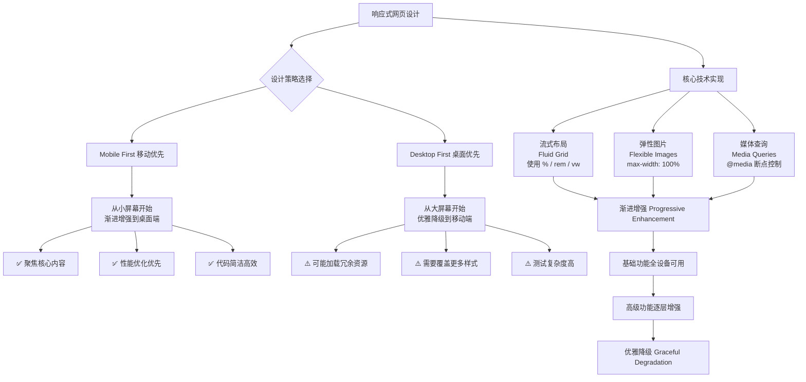
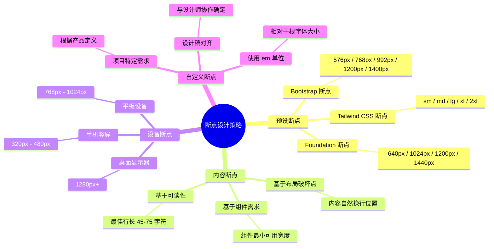
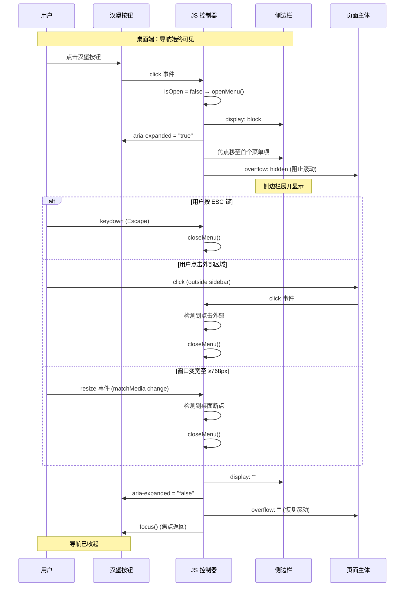

# 响应式网页设计

响应式网页设计（Responsive Web Design, RWD）是一种网页设计方法，使网站能够自动适应不同设备（如桌面电脑、平板电脑、手机等）的屏幕尺寸和方向，提供最佳的用户体验。

## 概述

### 核心原则

响应式设计基于三大核心技术：

| 技术要素       | 说明                                             | 关键特性                                     |
| -------------- | ------------------------------------------------ | -------------------------------------------- |
| **流体网格**   | 使用相对单位（%、rem、vw）替代固定像素           | 布局随视口变化自动调整                       |
| **灵活图片**   | 图片根据容器大小自适应，支持多种分辨率           | 使用 `max-width: 100%`、`srcset`、`picture` |
| **媒体查询**   | 根据设备特性（宽度、高度、方向等）应用不同样式   | 实现断点设计和设备适配                       |

### 设计理念

:::: tip 移动优先（Mobile First）
响应式设计推荐采用"移动优先"策略：从小屏幕开始设计，逐步增强到大屏幕。这种方法的优点是：

- 强制聚焦核心内容
- 减少不必要的功能和装饰
- 更好的性能表现
- 渐进增强，确保基础功能可用
::::

### 响应式设计核心原则流程图



## 响应式设计评估

### 适用场景分析

#### ✅ 适合响应式设计的场景

| 场景类型       | 典型案例                         | 优势说明                                       |
| -------------- | -------------------------------- | ---------------------------------------------- |
| 内容驱动型网站 | 博客、新闻门户、企业官网         | 内容结构相对简单，适合多设备阅读               |
| 中小型电商     | 品牌专卖店、垂直电商             | 产品展示类页面易于适配                         |
| 服务型企业     | 律师事务所、咨询公司、医疗机构   | 信息展示为主，交互复杂度低                     |
| 品牌一致性需求 | 跨平台应用、全渠道营销           | 单一代码库确保所有渠道体验一致                 |
| 预算有限项目   | 创业公司、中小型企业             | 初始投入较高，但长期维护成本更低               |

#### ❌ 不太适合响应式设计的场景

| 场景类型       | 典型案例                         | 替代方案                     |
| -------------- | -------------------------------- | ---------------------------- |
| 大型复杂电商   | 淘宝、亚马逊级平台               | 独立移动端 + 桌面端          |
| 高度定制化应用 | 专业设计工具、复杂管理系统       | 原生应用或独立Web应用        |
| 性能关键型应用 | 在线游戏、视频编辑、3D渲染       | 原生应用或WebAssembly        |
| 遗留系统改造   | 技术债务过重的老旧系统           | 渐进式迁移或重构             |

### 优缺点分析

#### 优点

| 优点             | 说明                                                     | 实际价值                                       |
| ---------------- | -------------------------------------------------------- | ---------------------------------------------- |
| 跨设备一致性     | 用户在任何设备上获得一致的视觉和交互体验                  | 增强品牌认知度，降低学习成本                   |
| SEO 友好         | 单一 URL 结构，避免内容重复，Google 明确推荐              | 提升搜索排名，降低跳出率                       |
| 维护成本低       | 一套代码库，内容更新一次即可覆盖所有设备                  | 长期维护成本降低 50% 以上                      |
| 用户体验优化     | 自动适应屏幕尺寸，触摸友好设计                            | 用户满意度显著提升                             |
| 未来兼容性       | 基于标准 Web 技术，自动适应新设备                         | 投资保护，减少重构成本                         |
| 社交分享友好     | 单一 URL 确保分享链接在所有设备正常工作                   | 提高社交媒体参与度和转化率                     |

#### 缺点

| 缺点             | 具体问题                                                 | 解决方案                                       |
| ---------------- | -------------------------------------------------------- | ---------------------------------------------- |
| 初始开发成本较高 | 需要更复杂的前端技能，设计过程更耗时                     | 使用成熟框架，建立设计系统                     |
| 性能优化挑战     | 所有资源默认加载，复杂布局可能影响渲染性能               | 条件加载、懒加载、代码分割                     |
| 设计限制         | 复杂桌面设计难以在小屏幕呈现，创意自由度受限             | 内容优先级设计，渐进式增强                     |
| 内容决策困难     | 需要决定不同屏幕显示/隐藏的内容                          | 内容审计，移动优先策略                         |
| 测试复杂性       | 需要多设备、多分辨率、多浏览器测试                       | 自动化测试，云测试平台                         |
| 第三方兼容性     | 广告、插件可能不支持响应式                               | 选择响应式友好的第三方服务                     |

## 核心概念基础

### 像素与分辨率

#### 像素类型

在响应式设计中，需要区分三种"像素"概念：

```
┌─────────────────────────────────────────────────────────────┐
│                    像素类型关系图                            │
├─────────────────────────────────────────────────────────────┤
│                                                             │
│  设备像素 (Device Pixel)                                    │
│  ├─ 屏幕上的物理显示单元                                    │
│  ├─ 由硬件决定，固定不变                                    │
│  └─ 每个像素由 RGB 三个子像素组成                           │
│                                                             │
│         ↓ (DPR 转换)                                        │
│                                                             │
│  CSS 像素 (CSS Pixel)                                       │
│  ├─ 浏览器使用的抽象单位                                    │
│  ├─ CSS 样式中的逻辑像素                                    │
│  └─ 1 CSS 像素 = DPR × DPR 个设备像素                       │
│                                                             │
│         ↓ (viewport 控制)                                   │
│                                                             │
│  视口像素 (Viewport Pixel)                                  │
│  ├─ 与视口相关的像素单位                                    │
│  └─ 通过 <meta name="viewport"> 标签控制                   │
│                                                             │
└─────────────────────────────────────────────────────────────┘
```

#### 设备像素比 (DPR)

DPR（Device Pixel Ratio）是设备像素与 CSS 像素的比值：

```
DPR = 物理像素数 / CSS 像素数
```

**常见设备的 DPR：**

| 设备类型            | DPR  | 说明                           |
| ------------------- | ---- | ------------------------------ |
| 普通显示器          | 1    | 标准显示器                     |
| iPhone 6/7/8        | 2    | Retina 屏幕                    |
| iPhone 6/7/8 Plus   | 3    | 高清 Retina 屏幕               |
| iPhone X/12/13      | 3    | 超视网膜显示屏                 |
| iPhone 11           | 2    | 液晶视网膜显示屏               |
| iPad Pro            | 2    | Retina 显示屏                  |
| MacBook Pro (Retina)| 2    | Retina 显示屏                  |
| 4K 显示器           | 1.5-2| 高分辨率显示器                 |

**DPR 对显示的影响：**

```javascript
// 获取当前设备 DPR
const dpr = window.devicePixelRatio || 1

// DPR = 1: 1 CSS 像素 = 1×1 = 1 个设备像素
// DPR = 2: 1 CSS 像素 = 2×2 = 4 个设备像素
// DPR = 3: 1 CSS 像素 = 3×3 = 9 个设备像素
```

#### PPI (Pixels Per Inch)

PPI 是衡量屏幕清晰度的指标：

```
PPI = √(水平像素² + 垂直像素²) / 屏幕对角线英寸数
```

**清晰度等级：**

| PPI 范围    | 清晰度等级 | 典型设备                 |
| ----------- | ---------- | ------------------------ |
| < 120       | 低密度     | 旧款显示器               |
| 120 - 200   | 标准密度   | 普通笔记本显示器         |
| 200 - 300   | 高密度     | Retina 显示屏            |
| > 300       | 超高密度   | 高端手机屏幕             |

### 屏幕分辨率

屏幕分辨率指显示器或设备屏幕上可显示的像素总数。

#### 常见分辨率标准

**移动设备：**

| 分辨率        | 设备类型           | 视口宽度 (CSS 像素) |
| ------------- | ------------------ | ------------------- |
| 320×568       | iPhone SE          | 320px               |
| 375×667       | iPhone 6/7/8       | 375px               |
| 390×844       | iPhone 12/13       | 390px               |
| 375×812       | iPhone 12/13 mini  | 375px               |
| 428×926       | iPhone 12/13 Pro Max | 428px             |

**平板设备：**

| 分辨率        | 设备类型           | 视口宽度 (CSS 像素) |
| ------------- | ------------------ | ------------------- |
| 768×1024      | iPad 竖屏          | 768px               |
| 1024×768      | iPad 横屏          | 1024px              |
| 834×1194      | iPad Pro 11"       | 834px               |

**桌面显示器：**

| 分辨率        | 俗称               | 视口宽度             |
| ------------- | ------------------ | -------------------- |
| 1366×768      | HD                 | 1366px               |
| 1920×1080     | Full HD (FHD)      | 1920px               |
| 2560×1440     | QHD / 2K           | 2560px               |
| 3840×2160     | 4K / Ultra HD      | 3840px               |
| 5120×2880     | 5K                 | 5120px               |

## 视口原理

### 视口类型

视口是浏览器中用于显示网页内容的可视区域。在移动设备上，视口概念更为复杂。

#### 三种视口

```
┌─────────────────────────────────────────────────────────────┐
│                     布局视口 (Layout Viewport)               │
│  ┌───────────────────────────────────────────────────────┐  │
│  │            视觉视口 (Visual Viewport)                  │  │
│  │  ┌─────────────────────────────────────────────────┐  │  │
│  │  │                                                  │  │  │
│  │  │      用户当前看到的页面区域                      │  │  │
│  │  │      可通过缩放和滚动改变                        │  │  │
│  │  │                                                  │  │  │
│  │  └─────────────────────────────────────────────────┘  │  │
│  └───────────────────────────────────────────────────────┘  │
│                                                              │
│  浏览器为渲染网页建立的虚拟容器                              │
│  通常比设备物理宽度大（如 980px）                           │
└─────────────────────────────────────────────────────────────┘

设备物理屏幕
┌─────────────────────────────────────────────────────────────┐
│                                                             │
│  理想视口 (Ideal Viewport)                                  │
│  ├─ 宽度等于设备物理宽度（以 CSS 像素为单位）               │
│  └─ 是响应式设计的目标视口                                  │
│                                                             │
└─────────────────────────────────────────────────────────────┘
```

#### 视口特性对比

| 视口类型     | 特点                                           | 获取方式                      | 用途                     |
| ------------ | ---------------------------------------------- | ----------------------------- | ------------------------ |
| 布局视口     | 浏览器渲染网页的虚拟容器，通常 980px           | `document.documentElement.clientWidth` | 页面布局基准             |
| 视觉视口     | 用户当前实际看到的区域，随缩放滚动变化         | `window.visualViewport.width` | 处理缩放、滚动交互       |
| 理想视口     | 设备的理想尺寸，等于设备宽度                   | 设置 `width=device-width`     | 响应式设计的目标         |

### 视口配置

#### viewport meta 标签

```html
<meta name="viewport" content="属性1=值1, 属性2=值2, ..." />
```

**核心属性：**

| 属性            | 可选值                      | 说明                                       |
| --------------- | --------------------------- | ------------------------------------------ |
| `width`         | 正整数或 `device-width`     | 设置布局视口宽度                           |
| `height`        | 正整数或 `device-height`    | 设置布局视口高度                           |
| `initial-scale` | 0.0 - 10.0                  | 初始缩放比例，1.0 表示不缩放               |
| `minimum-scale` | 0.0 - 10.0                  | 允许的最小缩放比例                         |
| `maximum-scale` | 0.0 - 10.0                  | 允许的最大缩放比例                         |
| `user-scalable` | `yes` 或 `no`               | 是否允许用户手动缩放                       |
| `viewport-fit`  | `auto`/`contain`/`cover`    | 视口如何适应设备安全区域（刘海屏等）       |

#### 推荐配置方案

**1. 标准响应式配置（推荐）：**

```html
<meta name="viewport" content="width=device-width, initial-scale=1.0" />
```

**2. 限制缩放范围：**

```html
<meta name="viewport" content="width=device-width, initial-scale=1.0, maximum-scale=5.0, minimum-scale=0.5" />
```

**3. 适配刘海屏（iPhone X 及以上）：**

```html
<meta name="viewport" content="width=device-width, initial-scale=1.0, viewport-fit=cover" />
```

**4. 禁止缩放（影响可访问性，谨慎使用）：**

```html
<meta name="viewport" content="width=device-width, initial-scale=1.0, maximum-scale=1.0, user-scalable=no" />
```

:::: warning 可访问性警告
禁止用户缩放会影响可访问性，对于视力障碍用户不友好。建议至少允许 2-5 倍的缩放范围。
::::

#### viewport-fit 详解

`viewport-fit` 用于处理刘海屏、圆角屏等异形屏幕：

```css
/* viewport-fit: auto (默认) - 行为与 contain 相同 */
/* viewport-fit: contain - 视口完全包含在安全区域内，内容不会被刘海遮挡 */
/* viewport-fit: cover - 视口覆盖整个屏幕，内容可能延伸到刘海下方，需手动处理安全区域 */

/* 配合 CSS env() 函数使用 */
.header {
  padding-top: env(safe-area-inset-top);      /* 顶部安全区域 */
  padding-bottom: env(safe-area-inset-bottom); /* 底部安全区域 */
  padding-left: env(safe-area-inset-left);    /* 左侧安全区域 */
  padding-right: env(safe-area-inset-right);  /* 右侧安全区域 */
}
```

### 视口单位

CSS 提供基于视口的相对单位，用于创建响应式布局：

| 单位   | 定义                     | 计算方式                        | 应用场景               |
| ------ | ------------------------ | ------------------------------- | ---------------------- |
| `vw`   | 视口宽度的 1%            | `1vw = viewport width / 100`    | 响应式字体、宽度       |
| `vh`   | 视口高度的 1%            | `1vh = viewport height / 100`   | 全屏容器、高度相关     |
| `vmin` | 视口较小尺寸的 1%        | `1vmin = min(vw, vh)`           | 正方形元素、一致性     |
| `vmax` | 视口较大尺寸的 1%        | `1vmax = max(vw, vh)`           | 覆盖式布局             |

#### 视口单位示例

```css
/* 全屏容器 */
.fullscreen {
  width: 100vw;
  height: 100vh;
}

/* 响应式字体（结合 clamp 使用更安全） */
h1 {
  font-size: clamp(1.5rem, 5vw, 3rem);
}

/* 正方形元素（始终基于较小边） */
.square {
  width: 50vmin;
  height: 50vmin;
}

/* 视口相对的间距 */
.container {
  padding: 5vh 5vw;
}
```

:::: tip vh 在移动端的注意事项
移动浏览器中，地址栏会占用一部分视口高度，导致 `100vh` 可能超出可见区域。解决方案：
- 使用 `100dvh`（动态视口高度，现代浏览器支持）
- 使用 JavaScript 计算实际可视高度
- 使用 `min-height: 100vh; height: 100%;` 的组合
::::

### 视口相关 API

#### JavaScript 访问视口信息

```javascript
// 1. 获取设备物理屏幕尺寸（设备像素）
const screenWidth = screen.width
const screenHeight = screen.height

// 2. 获取布局视口尺寸（CSS 像素）
const viewportWidth = window.innerWidth
const viewportHeight = window.innerHeight

// 3. 获取视觉视口信息（现代浏览器）
if (window.visualViewport) {
  const visualViewport = window.visualViewport
  console.log('视觉视口宽度:', visualViewport.width)
  console.log('视觉视口高度:', visualViewport.height)
  console.log('当前缩放比例:', visualViewport.scale)
  console.log('X 偏移:', visualViewport.offsetX)
  console.log('Y 偏移:', visualViewport.offsetY)
}

// 4. 监听视觉视口变化
window.visualViewport?.addEventListener('resize', () => {
  console.log('视觉视口发生变化')
})
```

## 媒体查询原理

<h4>008-media-query-demo.html</h4>

```html
<!DOCTYPE html>
<html lang="zh-CN">
<head>
  <meta charset="UTF-8">
  <meta name="viewport" content="width=device-width, initial-scale=1.0">
  <title>【008】媒体查询断点演示面板</title>
  <style>
    * { margin: 0; padding: 0; box-sizing: border-box; }
    body { font-family: -apple-system, BlinkMacSystemFont, 'Segoe UI', sans-serif; padding: 20px; background: #f8f9fa; color: #333; }
    .demo-wrap { max-width: 900px; margin: 0 auto; }
    .demo-header { display: flex; justify-content: space-between; align-items: center; margin-bottom: 20px; padding-bottom: 12px; border-bottom: 2px solid #e0e0e0; }
    .demo-header h1 { font-size: 20px; font-weight: 600; }
    .demo-badge { font-size: 12px; padding: 3px 10px; border-radius: 12px; background: #64748b; color: white; }

    /* Live viewport info */
    .viewport-info {
      display: grid; grid-template-columns: repeat(auto-fit, minmax(140px, 1fr));
      gap: 0.75rem; margin-bottom: 1.5rem;
    }
    .vp-card {
      background: white; border-radius: 10px; padding: 1rem;
      box-shadow: 0 2px 6px rgba(0,0,0,0.06); text-align: center;
    }
    .vp-card .label { font-size: 0.75rem; color: #94a3b8; text-transform: uppercase; letter-spacing: 0.04em; }
    .vp-card .value { font-size: 1.35rem; font-weight: 800; color: #1e293b; margin-top: 4px; font-family: monospace; }
    .vp-card.active { border: 2px solid #6366f1; box-shadow: 0 0 0 3px rgba(99,102,241,0.15); }

    /* Breakpoint visualization */
    .breakpoint-bar {
      height: 40px; border-radius: 20px; margin: 1.5rem 0;
      background: linear-gradient(90deg,
        #22c55e 0%, #22c55e 23%,
        #3b82f6 23%, #3b82f6 51%,
        #f59e0b 51%, #f59e0b 76%,
        #ef4444 76%, #ef4444 100%
      );
      position: relative; display: flex; align-items: center; justify-content: center;
      color: white; font-weight: 600; font-size: 0.85rem;
      box-shadow: inset 0 2px 4px rgba(0,0,0,0.1);
    }
    .bp-marker {
      position: absolute; bottom: -24px; font-size: 0.7rem; color: #64748b;
      font-family: monospace;
    }
    .bp-marker:nth-child(1) { left: 23%; }
    .bp-marker:nth-child(2) { left: 51%; }
    .bp-marker:nth-child(3) { left: 76%; }

    /* Responsive layout demo */
    .layout-demo {
      background: white; border-radius: 12px; padding: 1.5rem;
      box-shadow: 0 2px 8px rgba(0,0,0,0.08); min-height: 200px;
      transition: all 0.3s ease;
    }
    .layout-grid {
      display: grid;
      gap: 0.75rem;
      grid-template-columns: 1fr;
    }
    .layout-cell {
      background: linear-gradient(135deg, #667eea20, #764ba220);
      border: 2px dashed #a78bfa; border-radius: 8px;
      padding: 1.5rem; text-align: center; font-weight: 600; color: #6d28d9;
      min-height: 80px; display: flex; align-items: center; justify-content: center;
      transition: all 0.3s ease;
    }
    .layout-cell.header { background: linear-gradient(135deg, #667eea, #764ba2); color: white; border-style: solid; border-color: transparent; }

    @media (min-width: 576px) {
      .layout-grid { grid-template-columns: repeat(2, 1fr); }
      .layout-cell.header { grid-column: span 2; }
    }
    @media (min-width: 768px) {
      .layout-grid {
        grid-template-columns: 180px 1fr;
        grid-template-rows: auto 1fr;
      }
      .layout-cell.header { grid-column: span 2; }
      .layout-cell.sidebar { grid-row: span 2; background: linear-gradient(135deg, #1e293b30, #33415530); border-color: #64748b; color: #334155; }
    }
    @media (min-width: 1024px) {
      .layout-grid { grid-template-columns: 220px 1fr 200px; }
      .layout-cell.sidebar { grid-row: span 2; }
      .layout-cell.aside { grid-row: span 2; background: linear-gradient(135deg, #fef3c730, #fde68a30); border-color: #f59e0b; color: #92400e; }
    }

    /* Active breakpoint highlight */
    .bp-xs.active, .bp-sm.active, .bp-md.active, .bp-lg.active { animation: pulse 1.5s infinite; }
    @keyframes pulse {
      0%, 100% { box-shadow: 0 0 0 0 rgba(99,102,241,0.4); }
      50% { box-shadow: 0 0 0 8px rgba(99,102,241,0); }
    }

    .mq-rules {
      margin-top: 1.5rem; background: #1e293b; border-radius: 12px;
      padding: 1.25rem; color: #e2e8f0; font-size: 0.85rem; overflow-x: auto;
    }
    .mq-rule { margin-bottom: 0.5rem; opacity: 0.5; transition: opacity 0.2s; }
    .mq-rule.active { opacity: 1; color: #38bdf8; }
    .mq-rule code { color: #fbbf24; background: rgba(255,255,255,0.08); padding: 1px 6px; border-radius: 4px; }
  </style>
</head>
<body>
  <div class="demo-wrap">
    <div class="demo-header">
      <h1>媒体查询断点演示面板</h1>
      <span class="demo-badge">@media 断点可视化</span>
    </div>

    <div class="viewport-info">
      <div class="vp-card bp-xs" id="vpWidth">
        <div class="label">视口宽度</div>
        <div class="value" id="vwValue">-- px</div>
      </div>
      <div class="vp-card bp-sm" id="vpHeight">
        <div class="label">视口高度</div>
        <div class="value" id="vhValue">-- px</div>
      </div>
      <div class="vp-card bp-md" id="vpDpr">
        <div class="label">像素比 DPR</div>
        <div class="value" id="dprValue">--x</div>
      </div>
      <div class="vp-card bp-lg" id="vpBreakpoint">
        <div class="label">当前断点</div>
        <div class="value" id="bpValue" style="font-size:1rem;">--</div>
      </div>
    </div>

    <div class="breakpoint-bar" id="bpBar">
      当前断点: <span id="currentBp">检测中...</span>
      <span class="bp-marker">576px</span>
      <span class="bp-marker">768px</span>
      <span class="bp-marker">1024px</span>
    </div>

    <div class="layout-demo">
      <div class="layout-grid" id="layoutGrid">
        <div class="layout-cell header">Header（始终横跨）</div>
        <div class="layout-cell sidebar">Sidebar</div>
        <div class="layout-cell main">Main Content</div>
        <div class="layout-cell aside">Aside</div>
      </div>
    </div>

    <div class="mq-rules">
      <div class="mq-rule" id="mqXs"><code>@media (max-width: 575px)</code> — 单列布局，所有内容垂直堆叠</div>
      <div class="mq-rule" id="mqSm"><code>@media (min-width: 576px)</code> — 2 列网格，Header 跨两列</div>
      <div class="mq-rule" id="mqMd"><code>@media (min-width: 768px)</code> — Sidebar + Main，侧边栏固定宽度</div>
      <div class="mq-rule" id="mqLg"><code>@media (min-width: 1024px)</code> — 三栏布局，Sidebar + Main + Aside</div>
    </div>
  </div>

  <script>
    function updateViewportInfo() {
      const w = window.innerWidth;
      const h = window.innerHeight;

      document.getElementById('vwValue').textContent = w + ' px';
      document.getElementById('vhValue').textContent = h + ' px';
      document.getElementById('dprValue').textContent = window.devicePixelRatio + 'x';

      let bp, activeClass;
      if (w < 576) { bp = 'XS'; activeClass = 'bp-xs'; }
      else if (w < 768) { bp = 'SM'; activeClass = 'bp-sm'; }
      else if (w < 1024) { bp = 'MD'; activeClass = 'bp-md'; }
      else { bp = 'LG'; activeClass = 'bp-lg'; }

      document.getElementById('bpValue').textContent = bp;
      document.getElementById('currentBp').textContent = bp;

      // Update active states
      ['bp-xs','bp-sm','bp-md','bp-lg'].forEach(c => {
        document.querySelectorAll('.' + c).forEach(el => el.classList.remove('active'));
      });
      document.querySelectorAll('.' + activeClass).forEach(el => el.classList.add('active'));

      // Update MQ rules
      document.getElementById('mqXs').classList.toggle('active', w < 576);
      document.getElementById('mqSm').classList.toggle('active', w >= 576 && w < 768);
      document.getElementById('mqMd').classList.toggle('active', w >= 768 && w < 1024);
      document.getElementById('mqLg').classList.toggle('active', w >= 1024);
    }

    updateViewportInfo();
    window.addEventListener('resize', updateViewportInfo);
  </script>
</body>
</html>
```

### 基本语法

媒体查询允许根据设备特性应用不同的 CSS 样式：

```css
@media [媒体类型] [逻辑运算符] (媒体特性) {
  /* CSS 样式 */
}
```

### 媒体类型

| 类型      | 说明               | 使用场景                 |
| --------- | ------------------ | ------------------------ |
| `all`     | 所有设备（默认）   | 通用样式                 |
| `screen`  | 屏幕设备           | 网页显示                 |
| `print`   | 打印设备           | 打印样式优化             |
| `speech`  | 语音合成器         | 屏幕阅读器               |

### 媒体特性

#### 尺寸相关

| 特性                 | 说明         | 示例                           |
| -------------------- | ------------ | ------------------------------ |
| `width`              | 视口宽度     | `(min-width: 768px)`           |
| `height`             | 视口高度     | `(min-height: 600px)`          |
| `device-width`       | 设备宽度     | `(device-width: 375px)`        |
| `device-height`      | 设备高度     | `(device-height: 667px)`       |
| `aspect-ratio`       | 宽高比       | `(aspect-ratio: 16/9)`         |

#### 显示相关

| 特性                 | 说明             | 示例                               |
| -------------------- | ---------------- | ---------------------------------- |
| `orientation`        | 设备方向         | `(orientation: landscape)`         |
| `resolution`         | 分辨率           | `(min-resolution: 2dppx)`          |
| `color`              | 颜色深度         | `(min-color: 8)`                   |
| `color-index`        | 颜色索引表项数   | `(min-color-index: 256)`           |

#### 用户偏好

| 特性                       | 说明             | 示例                                       |
| -------------------------- | ---------------- | ------------------------------------------ |
| `prefers-color-scheme`     | 颜色主题偏好     | `(prefers-color-scheme: dark)`             |
| `prefers-reduced-motion`   | 减少动画偏好     | `(prefers-reduced-motion: reduce)`         |
| `prefers-contrast`         | 对比度偏好       | `(prefers-contrast: more)`                 |
| `prefers-reduced-data`     | 减少数据使用偏好 | `(prefers-reduced-data: reduce)`           |

#### 交互能力

| 特性           | 说明             | 示例                     |
| -------------- | ---------------- | ------------------------ |
| `hover`        | 悬停能力         | `(hover: hover)`         |
| `pointer`      | 指针精度         | `(pointer: fine)`        |
| `any-hover`    | 任意输入悬停能力 | `(any-hover: none)`      |
| `any-pointer`  | 任意输入指针精度 | `(any-pointer: coarse)`  |

### 逻辑运算符

```css
/* AND 运算符 - 所有条件都必须满足 */
@media (min-width: 768px) and (max-width: 1024px) {
  /* 768px - 1024px 之间的设备 */
}

/* OR 运算符（逗号分隔）- 任一条件满足即可 */
@media (max-width: 767px), (orientation: portrait) {
  /* 移动设备或竖屏设备 */
}

/* NOT 运算符 - 取反 */
@media not (max-width: 767px) {
  /* 非移动设备 */
}

/* ONLY 运算符 - 防止旧浏览器误判 */
@media only screen and (min-width: 768px) {
  /* 仅屏幕设备且宽度 ≥ 768px */
}

/* 组合使用 */
@media (min-width: 768px) and (max-width: 1024px) and (orientation: landscape) {
  /* 横屏平板设备 */
}
```

### 媒体查询加载方式

#### 1. CSS 样式表中

```css
/* 内联媒体查询 */
@media (min-width: 768px) {
  .container {
    max-width: 720px;
  }
}
```

#### 2. link 标签

```html
<!-- 条件加载 CSS 文件 -->
<link rel="stylesheet" href="mobile.css" media="(max-width: 767px)" />
<link rel="stylesheet" href="desktop.css" media="(min-width: 768px)" />
```

#### 3. @import 规则

```css
/* 条件导入（不推荐，影响性能） */
@import url('mobile.css') (max-width: 767px);
```

### 媒体查询工作原理

```
┌─────────────────────────────────────────────────────────────┐
│                    媒体查询执行流程                          │
├─────────────────────────────────────────────────────────────┤
│                                                             │
│  1. 浏览器解析 CSS，遇到 @media 规则                        │
│     ↓                                                       │
│  2. 评估媒体查询条件                                        │
│     ├─ 检查媒体类型是否匹配                                 │
│     ├─ 检查媒体特性是否满足                                 │
│     └─ 应用逻辑运算符组合条件                               │
│     ↓                                                       │
│  3. 条件判断                                                │
│     ├─ 满足 → 应用样式块中的 CSS 规则                       │
│     └─ 不满足 → 忽略样式块                                  │
│     ↓                                                       │
│  4. 视口变化时重新评估                                      │
│     └─ 浏览器重新计算并应用/移除样式                        │
│                                                             │
└─────────────────────────────────────────────────────────────┘
```

## 响应式设计策略

### 移动优先设计

#### 概念

移动优先设计是"渐进增强"理念的具体实践：从小屏幕开始设计，确保核心功能和内容可用，然后逐步增强到大屏幕。

#### 实现方式

```css
/* ✅ 移动优先：使用 min-width 媒体查询 */

/* 默认样式 - 移动设备 */
.container {
  width: 100%;
  padding: 1rem;
}

/* 平板及以上 */
@media (min-width: 768px) {
  .container {
    max-width: 720px;
    margin: 0 auto;
  }
}

/* 桌面及以上 */
@media (min-width: 1024px) {
  .container {
    max-width: 960px;
    padding: 2rem;
  }
}
```

#### 优势

| 优势             | 说明                                               |
| ---------------- | -------------------------------------------------- |
| 内容优先         | 强制聚焦核心内容，避免功能臃肿                     |
| 性能优化         | 移动端只加载必要资源，避免冗余                     |
| 渐进增强         | 确保基础功能在所有设备可用                         |
| 代码效率         | 避免覆盖样式，CSS 更简洁                           |

### 内容优先断点

#### 概念

内容优先断点是根据内容需求而非设备类型设置断点的方法。

#### 实现原则

```css
/* ❌ 设备优先断点（不推荐） */
@media (min-width: 768px) { /* iPad */
  /* 样式 */
}

/* ✅ 内容优先断点（推荐） */
@media (min-width: 30em) { /* 内容需要更宽空间 */
  /* 样式 */
}
```

#### 内容断点示例

```css
/* 基础布局：单列 */
.content {
  display: grid;
  grid-template-columns: 1fr;
  gap: 1rem;
}

/* 当内容宽度不足以容纳两列时保持单列 */
@media (min-width: 40em) {
  .content {
    grid-template-columns: repeat(2, 1fr);
  }
}

/* 当有更多空间时扩展为三列 */
@media (min-width: 60em) {
  .content {
    grid-template-columns: repeat(3, 1fr);
  }
}
```

### 断点设计指南

#### 常用断点参考

```css
/* 移动优先断点系统 */

/* 超小屏幕（手机竖屏） */
/* 默认样式，无需媒体查询 */

/* 小屏幕（手机横屏/小平板） */
@media (min-width: 576px) { /* 36em */ }

/* 中等屏幕（平板） */
@media (min-width: 768px) { /* 48em */ }

/* 大屏幕（桌面） */
@media (min-width: 992px) { /* 62em */ }

/* 超大屏幕（大桌面） */
@media (min-width: 1200px) { /* 75em */ }

/* 超超大屏幕 */
@media (min-width: 1400px) { /* 87.5em */ }
```

#### 使用 em 单位的优势

```css
/* 推荐使用 em 单位设置断点 */
@media (min-width: 48em) { } /* 比 768px 更好 */

/* 原因：
   1. 与用户字体大小设置保持一致
   2. 用户放大字体时，布局也会相应调整
   3. 更符合内容优先的设计理念
*/
```

### 断点设计策略体系



## 容器查询

<h4>004-container-query-cards.html</h4>

```html
<!DOCTYPE html>
<html lang="zh-CN">
<head>
  <meta charset="UTF-8">
  <meta name="viewport" content="width=device-width, initial-scale=1.0">
  <title>【004】Container Query 卡片自适应</title>
  <style>
    * { margin: 0; padding: 0; box-sizing: border-box; }
    body { font-family: -apple-system, BlinkMacSystemFont, 'Segoe UI', sans-serif; padding: 20px; background: #f8f9fa; color: #333; }
    .demo-wrap { max-width: 1200px; margin: 0 auto; }
    .demo-header { display: flex; justify-content: space-between; align-items: center; margin-bottom: 20px; padding-bottom: 12px; border-bottom: 2px solid #e0e0e0; }
    .demo-header h1 { font-size: 20px; font-weight: 600; }
    .demo-badge { font-size: 12px; padding: 3px 10px; border-radius: 12px; background: #8b5cf6; color: white; }

    /* Container contexts */
    .layout-controls { margin-bottom: 1.5rem; display: flex; gap: 0.75rem; flex-wrap: wrap; }
    .layout-btn {
      padding: 8px 18px; border: 2px solid #e2e8f0; background: white;
      border-radius: 8px; cursor: pointer; font-size: 0.9rem; font-weight: 500;
      transition: all 0.15s;
    }
    .layout-btn:hover { border-color: #8b5cf6; color: #8b5cf6; }
    .layout-btn.active { background: #8b5cf6; color: white; border-color: #8b5cf6; }

    .demo-layout {
      display: grid;
      gap: 1.5rem;
      transition: all 0.3s ease;
    }
    .demo-layout.layout-1col { grid-template-columns: 1fr; max-width: 400px; }
    .demo-layout.layout-2col { grid-template-columns: repeat(2, 1fr); }
    .demo-layout.layout-sidebar {
      grid-template-columns: 280px 1fr;
    }

    /* Container with container-type */
    .card-container {
      container-type: inline-size;
      container-name: card;
    }

    /* Card base styles (narrow/mobile first) */
    .product-card {
      background: white; border-radius: 12px;
      overflow: hidden; box-shadow: 0 2px 8px rgba(0,0,0,0.08);
      display: flex; flex-direction: column;
      transition: transform 0.2s, box-shadow 0.2s;
    }
    .product-card:hover {
      transform: translateY(-4px);
      box-shadow: 0 12px 28px rgba(0,0,0,0.12);
    }
    .product-card__image {
      width: 100%; aspect-ratio: 4/3;
      object-fit: cover; background: linear-gradient(135deg, #667eea, #764ba2);
      display: flex; align-items: center; justify-content: center;
      color: white; font-size: 2.5rem;
    }
    .product-card__info { padding: 1.25rem; flex: 1; display: flex; flex-direction: column; }
    .product-card__category {
      font-size: 0.75rem; text-transform: uppercase; letter-spacing: 0.05em;
      color: #8b5cf6; font-weight: 600; margin-bottom: 0.5rem;
    }
    .product-card__title { font-size: 1.1rem; font-weight: 700; color: #1e293b; margin-bottom: 0.5rem; }
    .product-card__desc { font-size: 0.875rem; color: #64748b; line-height: 1.5; flex: 1; }
    .product-card__footer {
      display: flex; justify-content: space-between; align-items: center;
      margin-top: 1rem; padding-top: 1rem; border-top: 1px solid #e2e8f0;
    }
    .product-card__price { font-size: 1.25rem; font-weight: 800; color: #059669; }
    .product-card__btn {
      padding: 8px 18px; border: none; background: #8b5cf6; color: white;
      border-radius: 8px; cursor: pointer; font-size: 0.875rem; font-weight: 500;
      transition: background 0.15s;
    }
    .product-card__btn:hover { background: #7c3aed; }

    /* Container Query: wide layout */
    @container card (min-width: 420px) {
      .product-card {
        flex-direction: row; align-items: stretch;
      }
      .product-card__image {
        width: 200px; flex-shrink: 0; aspect-ratio: auto;
        min-height: 180px;
      }
      .product-card__info { display: flex; flex-direction: column; justify-content: center; }
    }

    .info-panel {
      margin-top: 1.5rem; padding: 1.25rem;
      background: #f1f5f9; border-radius: 12px; font-size: 0.875rem; color: #475569;
    }
    .info-panel strong { color: #1e293b; }
    .cq-support { display: inline-block; padding: 2px 10px; border-radius: 999px; font-size: 0.75rem; font-weight: 600; }
    .cq-yes { background: #dcfce7; color: #166534; }
    .cq-no { background: #fee2e2; color: #991b1b; }
  </style>
</head>
<body>
  <div class="demo-wrap">
    <div class="demo-header">
      <h1>Container Query 卡片自适应组件</h1>
      <span class="demo-badge">@container 容器查询</span>
    </div>

    <div class="layout-controls">
      <button class="layout-btn active" data-layout="layout-1col">窄容器 (~380px)</button>
      <button class="layout-btn" data-layout="layout-2col">中等容器 (2列均分)</button>
      <button class="layout-btn" data-layout="layout-sidebar">侧边栏+宽容器</button>
    </div>

    <div class="demo-layout layout-1col" id="demoLayout">
      <div class="card-container">
        <article class="product-card">
          <div class="product-card__image">🎧</div>
          <div class="product-card__info">
            <span class="product-card__category">音频设备</span>
            <h3 class="product-card__title">无线降噪耳机 Pro</h3>
            <p class="product-card__desc">主动降噪，40小时续航，Hi-Res 音质认证，支持多设备无缝切换。</p>
            <div class="product-card__footer">
              <span class="product-card__price">¥1,299</span>
              <button class="product-card__btn">加入购物车</button>
            </div>
          </div>
        </article>
      </div>

      <div class="card-container">
        <article class="product-card">
          <div class="product-card__image">⌚</div>
          <div class="product-card__info">
            <span class="product-card__category">智能穿戴</span>
            <h3 class="product-card__title">智能运动手表 S8</h3>
            <p class="product-card__desc">血氧监测，GPS 定位，100+ 运动模式，钛金属表壳，超长待机。</p>
            <div class="product-card__footer">
              <span class="product-card__price">¥2,499</span>
              <button class="product-card__btn">加入购物车</button>
            </div>
          </div>
        </article>
      </div>

      <div class="card-container">
        <article class="product-card">
          <div class="product-card__image">📷</div>
          <div class="product-card__info">
            <span class="product-card__category">影像器材</span>
            <h3 class="product-card__title">微单相机 Z7II</h3>
            <p class="product-card__desc">4571万像素全画幅传感器，机身防抖，双卡槽设计，4K 60P 视频。</p>
            <div class="product-card__footer">
              <span class="product-card__price">¥15,999</span>
              <button class="product-card__btn">加入购物车</button>
            </div>
          </div>
        </article>
      </div>
    </div>

    <div class="info-panel">
      <p><strong>工作原理：</strong>每个卡片外层有 <code>container-type: inline-size</code>，当容器宽度 ≥420px 时，卡片自动从垂直堆叠变为水平并排布局。</p>
      <p style="margin-top:0.5rem;">
        浏览器支持: <span class="cq-support cq-yes" id="cqSupport">检测中...</span>
        &nbsp;| 切换上方布局按钮查看同一组件在不同尺寸容器中的表现差异
      </p>
    </div>
  </div>

  <script>
    // Container Query support detection
    const cqSupportEl = document.getElementById('cqSupport');
    if (CSS.supports('container-type: inline-size')) {
      cqSupportEl.textContent = '✅ 已支持 Container Queries';
      cqSupportEl.className = 'cq-support cq-yes';
    } else {
      cqSupportEl.textContent = '❌ 不支持 Container Queries';
      cqSupportEl.className = 'cq-support cq-no';
    }

    // Layout switcher
    const layout = document.getElementById('demoLayout');
    const buttons = document.querySelectorAll('.layout-btn');
    buttons.forEach(btn => {
      btn.addEventListener('click', () => {
        buttons.forEach(b => b.classList.remove('active'));
        btn.classList.add('active');
        layout.className = 'demo-layout ' + btn.dataset.layout;
      });
    });
  </script>
</body>
</html>
```

### 概念

容器查询（Container Queries）是 CSS 的新特性，允许根据容器尺寸而非视口尺寸应用样式，实现组件级响应式设计。

### 容器查询 vs 媒体查询

| 特性         | 媒体查询                     | 容器查询                         |
| ------------ | ---------------------------- | -------------------------------- |
| 查询对象     | 视口（浏览器窗口）           | 父容器元素                       |
| 适用场景     | 页面级布局                   | 组件级布局                       |
| 响应范围     | 整个页面                     | 特定容器内的元素                 |
| 组件复用性   | 组件在不同位置表现一致       | 组件根据容器自适应               |

### 基本用法

#### 定义容器上下文

```css
/* 定义容器 */
.card-container {
  container-type: inline-size;  /* 查询容器宽度 */
  container-name: card;         /* 可选：命名容器 */
}

/* 或使用简写 */
.card-container {
  container: card / inline-size;
}
```

#### 容器查询语法

```css
/* 基于容器宽度应用样式 */
@container (min-width: 400px) {
  .card {
    display: flex;
    flex-direction: row;
  }
}

/* 使用命名容器 */
@container card (min-width: 400px) {
  .card {
    /* 样式 */
  }
}
```

#### 完整示例

```html
<div class="sidebar">
  <div class="card">
    
    <div class="card-content">
      <h3>Card Title</h3>
      <p>Card description text...</p>
    </div>
  </div>
</div>

<div class="main">
  <div class="card">
    
    <div class="card-content">
      <h3>Card Title</h3>
      <p>Card description text...</p>
    </div>
  </div>
</div>
```

```css
/* 定义容器 */
.sidebar,
.main {
  container-type: inline-size;
}

/* 卡片基础样式 - 垂直布局 */
.card {
  display: flex;
  flex-direction: column;
  gap: 1rem;
}

.card img {
  width: 100%;
}

/* 当容器宽度 >= 400px 时 - 水平布局 */
@container (min-width: 400px) {
  .card {
    flex-direction: row;
  }
  
  .card img {
    width: 40%;
  }
  
  .card-content {
    flex: 1;
  }
}
```

### 容器类型

```css
/* inline-size - 查询容器行内尺寸（宽度） */
.container {
  container-type: inline-size;
}

/* size - 查询容器宽度和高度 */
.container {
  container-type: size;
}

/* 无容器上下文 - 用于命名容器 */
.container {
  container-type: normal;
}
```

### 浏览器支持

| 浏览器            | 支持版本       |
| ----------------- | -------------- |
| Chrome            | 105+           |
| Edge              | 105+           |
| Safari            | 16.0+          |
| Firefox           | 110+           |
| Opera             | 91+            |

:::: warning 兼容性提示
容器查询是较新的特性，使用时需检查目标浏览器支持情况。可使用 `@supports` 提供降级方案：

```css
/* 降级方案 */
.card {
  /* 默认样式 */
}

/* 支持容器查询的浏览器 */
@supports (container-type: inline-size) {
  .card-container {
    container-type: inline-size;
  }
  
  @container (min-width: 400px) {
    .card {
      /* 增强样式 */
    }
  }
}
```
::::

## 高分辨率屏幕适配

### 高 DPR 设备优化

高 DPR（Device Pixel Ratio）设备（如 Retina 屏幕）需要特殊处理以确保图像清晰。

### 图片优化策略

#### 1. 使用 srcset 和 sizes

```html

```

#### 2. 使用 w 描述符

```html

```

#### 3. 使用 CSS 媒体查询

```css
/* 标准 DPR */
.background {
  background-image: url('bg.jpg');
}

/* 高 DPR (2x) */
@media (-webkit-min-device-pixel-ratio: 2),
       (min-resolution: 192dpi),
       (min-resolution: 2dppx) {
  .background {
    background-image: url('bg@2x.jpg');
  }
}

/* 超高 DPR (3x) */
@media (-webkit-min-device-pixel-ratio: 3),
       (min-resolution: 288dpi),
       (min-resolution: 3dppx) {
  .background {
    background-image: url('bg@3x.jpg');
  }
}
```

#### 4. 使用 CSS image-set()

```css
.logo {
  width: 100px;
  height: 100px;
  background-image: image-set(
    'logo.png' 1x,
    'logo@2x.png' 2x,
    'logo@3x.png' 3x
  );
}
```

#### 5. 使用 SVG 矢量图

```html
<!-- SVG 天然支持高 DPR -->

```

```css
/* CSS 背景 */
.icon {
  width: 24px;
  height: 24px;
  background-image: url('icon.svg');
  background-size: contain;
}
```

### 图标字体优化

```css
/* 使用 transform 优化图标字体在高 DPR 设备上的显示 */
.icon {
  display: inline-block;
  font-size: 16px;
  -webkit-font-smoothing: antialiased;
  -moz-osx-font-smoothing: grayscale;
}
```

### 响应式图片方案对比

```mermaid
graph TB
    subgraph HTML解决方案
        A[srcset + sizes<br/>基于视口宽度选择]
        B[picture 元素<br/>艺术指导 Art Direction]
    end
    
    subgraph CSS解决方案
        C[image-set()函数<br/>背景图多分辨率]
        D[object-fit 属性<br/>图片填充方式控制]
    end
    
    subgraph JavaScript解决方案
        E[动态加载<br/>按需请求不同资源]
    end
    
    A --> F[✅ 浏览器原生支持<br/>✅ SEO 友好<br/>✅ 无需 JavaScript]
    A --> G[❌ 仅适用于 img 标签]
    
    B --> H[✅ 完全控制图片切换<br/>✅ 支持不同裁剪]
    B --> I[❌ 代码较冗长<br/>❌ 需要多份图片资源]
    
    C --> J[✅ 适用于背景图<br/>✅ 语法简洁]
    C --> K[❌ 浏览器兼容性需注意]
    
    D --> L[✅ 控制图片填充行为<br/>✅ 保持比例不失真]
    D --> M[❌ 不改变图片源文件]
    
    E --> N[✅ 最大灵活性<br/>✅ 可结合业务逻辑]
    E --> O[❌ 增加复杂度<br/>❌ 影响首屏性能]
    
```

## 现代 CSS 布局与响应式

<h4>006-has-selector-form.html</h4>

```html
<!DOCTYPE html>
<html lang="zh-CN">
<head>
  <meta charset="UTF-8">
  <meta name="viewport" content="width=device-width, initial-scale=1.0">
  <title>【006】:has() 选择器响应式表单</title>
  <style>
    * { margin: 0; padding: 0; box-sizing: border-box; }
    body { font-family: -apple-system, BlinkMacSystemFont, 'Segoe UI', sans-serif; padding: 20px; background: #f8f9fa; color: #333; }
    .demo-wrap { max-width: 700px; margin: 0 auto; }
    .demo-header { display: flex; justify-content: space-between; align-items: center; margin-bottom: 20px; padding-bottom: 12px; border-bottom: 2px solid #e0e0e0; }
    .demo-header h1 { font-size: 20px; font-weight: 600; }
    .demo-badge { font-size: 12px; padding: 3px 10px; border-radius: 12px; background: #f43f5e; color: white; }

    .form-container {
      background: white; border-radius: 16px; padding: 2rem;
      box-shadow: 0 4px 24px rgba(0,0,0,0.08);
      transition: all 0.3s ease;
    }

    /* :has() 响应式表单 */
    .form-group {
      margin-bottom: 1.25rem;
    }
    .form-group label {
      display: block; font-size: 0.875rem; font-weight: 600;
      color: #374151; margin-bottom: 6px;
    }
    .form-group input,
    .form-group select,
    .form-group textarea {
      width: 100%; padding: 10px 14px; border: 2px solid #e5e7eb;
      border-radius: 8px; font-size: 0.95rem; font-family: inherit;
      transition: border-color 0.2s, box-shadow 0.2s;
      outline: none;
    }
    .form-group input:focus,
    .form-group select:focus,
    .form-group textarea:focus {
      border-color: #6366f1; box-shadow: 0 0 0 3px rgba(99,102,241,0.15);
    }
    .form-group textarea { min-height: 80px; resize: vertical; }

    /* Error state with :has() */
    .form-group:has(input:invalid:not(:placeholder-shown)) input,
    .form-group:has(select:invalid:not(:placeholder-shown)) select {
      border-color: #ef4444;
    }
    .form-group:has(input:invalid:not(:placeholder-shown))::after {
      content: attr(data-error);
      display: block; color: #ef4444; font-size: 0.8rem; margin-top: 4px;
    }

    /* Focused field highlight parent */
    .form-group:has(:focus) label { color: #6366f1; }
    .form-group:has(:focus) { transform: translateY(-2px); }

    /* Checkbox styling */
    .checkbox-group {
      display: flex; align-items: center; gap: 8px;
      cursor: pointer; padding: 8px 0;
    }
    .checkbox-group input[type="checkbox"] {
      width: 18px; height: 18px; accent-color: #6366f1; cursor: pointer;
    }

    /* Conditional field visibility */
    .conditional-fields {
      display: none; overflow: hidden;
      opacity: 0; max-height: 0;
      transition: all 0.35s ease;
      background: #f8fafc; border-radius: 10px; padding: 0 1.25rem;
      border: 1px dashed #cbd5e1;
    }
    .form-container:has(#showCompany:checked) .conditional-fields {
      display: block; opacity: 1; max-height: 300px; padding: 1.25rem;
    }

    .submit-btn {
      width: 100%; padding: 14px; background: linear-gradient(135deg, #6366f1, #8b5cf6);
      color: white; border: none; border-radius: 10px; font-size: 1rem;
      font-weight: 600; cursor: pointer; transition: transform 0.15s, box-shadow 0.15s;
      margin-top: 0.5rem;
    }
    .submit-btn:hover { transform: translateY(-2px); box-shadow: 0 8px 20px rgba(99,102,241,0.3); }
    .submit-btn:active { transform: translateY(0); }

    /* Password strength indicator */
    .password-strength {
      height: 4px; border-radius: 2px; margin-top: 8px;
      background: #e5e7eb; overflow: hidden;
      transition: all 0.3s ease;
    }
    .password-strength-bar {
      height: 100%; width: 0; border-radius: 2px;
      transition: all 0.3s ease;
    }
    .strength-weak { width: 33%; background: #ef4444; }
    .strength-medium { width: 66%; background: #f59e0b; }
    .strength-strong { width: 100%; background: #22c55e; }

    /* Form validation state */
    .form-container:has(.all-valid) .submit-btn {
      background: linear-gradient(135deg, #059669, #10b981);
    }

    .info-note {
      margin-top: 1.25rem; padding: 1rem; background: #fef3c7;
      border-radius: 10px; font-size: 0.85rem; color: #92400e;
      border: 1px solid #fcd34d;
    }

    @media (max-width: 500px) {
      .form-container { padding: 1.25rem; }
    }
  </style>
</head>
<body>
  <div class="demo-wrap">
    <div class="demo-header">
      <h1>:has() 选择器响应式表单</h1>
      <span class="demo-badge">父级选择器</span>
    </div>

    <form class="form-container" id="mainForm" novalidate>
      <div class="form-group">
        <label for="name">姓名 *</label>
        <input type="text" id="name" placeholder="请输入您的姓名" required minlength="2"
               data-error="⚠️ 姓名至少需要 2 个字符">
      </div>

      <div class="form-group">
        <label for="email">邮箱地址 *</label>
        <input type="email" id="email" placeholder="example@email.com" required
               data-error="⚠️ 请输入有效的邮箱地址">
      </div>

      <div class="form-group">
        <label for="password">设置密码 *</label>
        <input type="password" id="password" placeholder="至少 8 位字符" required
               minlength="8" data-error="⚠️ 密码至少需要 8 个字符">
        <div class="password-strength"><div class="password-strength-bar" id="strengthBar"></div></div>
      </div>

      <div class="checkbox-group">
        <input type="checkbox" id="showCompany">
        <label for="showCompany" style="display:inline;margin:0;font-weight:normal;">
          我代表公司注册（填写企业信息）
        </label>
      </div>

      <div class="conditional-fields">
        <div class="form-group">
          <label for="companyName">公司名称</label>
          <input type="text" id="companyName" placeholder="请输入公司全称">
        </div>
        <div class="form-group">
          <label for="taxId">统一社会信用代码</label>
          <input type="text" id="taxId" placeholder="18位信用代码">
        </div>
      </div>

      <div class="form-group">
        <label for="bio">个人简介</label>
        <textarea id="bio" placeholder="简单介绍一下自己..."></textarea>
      </div>

      <button type="submit" class="submit-btn">创建账户</button>
    </form>

    <div class="info-note">
      💡 <strong>:has() 实现的功能：</strong><br>
      ① 输入框聚焦时父容器高亮 + 标签变色<br>
      ② 输入验证失败时自动显示错误提示<br>
      ③ 勾选「代表公司注册」时动态展开企业字段
    </div>
  </div>

  <script>
    // Password strength indicator
    const passwordInput = document.getElementById('password');
    const strengthBar = document.getElementById('strengthBar');

    passwordInput.addEventListener('input', () => {
      const val = passwordInput.value;
      strengthBar.className = 'password-strength-bar';
      if (val.length === 0) return;
      if (val.length < 6 || !/[A-Z]/.test(val) || !/[0-9]/.test(val)) {
        strengthBar.classList.add('strength-weak');
      } else if (val.length < 10 || !/[^A-Za-z0-9]/.test(val)) {
        strengthBar.classList.add('strength-medium');
      } else {
        strengthBar.classList.add('strength-strong');
      }
    });

    // Form submit
    document.getElementById('mainForm').addEventListener('submit', (e) => {
      e.preventDefault();
      alert('✅ 表单提交成功！（演示用）\n\n:has() 选择器让 CSS 能够感知子元素状态并动态改变父元素样式。');
    });
  </script>
</body>
</html>
```


<h4>007-subgrid-alignment.html</h4>

```html
<!DOCTYPE html>
<html lang="zh-CN">
<head>
  <meta charset="UTF-8">
  <meta name="viewport" content="width=device-width, initial-scale=1.0">
  <title>【007】Subgrid 子网格对齐</title>
  <style>
    * { margin: 0; padding: 0; box-sizing: border-box; }
    body { font-family: -apple-system, BlinkMacSystemFont, 'Segoe UI', sans-serif; padding: 20px; background: #f8f9fa; color: #333; }
    .demo-wrap { max-width: 900px; margin: 0 auto; }
    .demo-header { display: flex; justify-content: space-between; align-items: center; margin-bottom: 20px; padding-bottom: 12px; border-bottom: 2px solid #e0e0e0; }
    .demo-header h1 { font-size: 20px; font-weight: 600; }
    .demo-badge { font-size: 12px; padding: 3px 10px; border-radius: 12px; background: #0ea5e9; color: white; }

    .section-title { font-size: 0.95rem; font-weight: 600; color: #475569; margin: 1.5rem 0 0.75rem; }

    /* Without Subgrid */
    .without-subgrid {
      display: grid;
      grid-template-columns: repeat(3, 1fr);
      gap: 1rem;
      margin-bottom: 2rem;
    }
    .card-no-subgrid {
      background: white; border-radius: 12px;
      padding: 1.25rem; box-shadow: 0 2px 8px rgba(0,0,0,0.06);
      display: grid; grid-template-columns: auto 1fr; gap: 8px 12px;
      align-items: start;
    }
    .card-no-subgrid .icon { font-size: 1.5rem; }
    .card-no-subgrid .label { font-size: 0.75rem; color: #94a3b8; text-transform: uppercase; letter-spacing: 0.03em; }
    .card-no-subgrid .value { font-size: 1rem; font-weight: 700; color: #1e293b; }
    .card-no-subgrid .desc { font-size: 0.82rem; color: #64748b; line-height: 1.4; grid-column: span 2; }

    /* With Subgrid */
    .with-subgrid {
      display: grid;
      grid-template-columns: repeat(3, 1fr);
      gap: 1rem;
    }
    .card-with-subgrid {
      background: white; border-radius: 12px;
      padding: 1.25rem; box-shadow: 0 2px 8px rgba(0,0,0,0.06);
      display: grid;
      grid-template-columns: subgrid;
      grid-template-rows: subgrid;
      column-gap: 12px; row-gap: 8px;
      align-items: start;
    }
    .card-with-subgrid .icon { font-size: 1.5rem; grid-column: 1; grid-row: 1 / 3; align-self: start; }
    .card-with-subgrid .label { font-size: 0.75rem; color: #94a3b8; text-transform: uppercase; letter-spacing: 0.03em; grid-column: 2; grid-row: 1; }
    .card-with-subgrid .value { font-size: 1rem; font-weight: 700; color: #1e293b; grid-column: 2; grid-row: 2; }
    .card-with-subgrid .desc { font-size: 0.82rem; color: #64748b; line-height: 1.4; grid-column: 1 / -1; grid-row: 3; }

    .compare-container {
      display: grid; grid-template-columns: 1fr 1fr; gap: 2rem;
    }
    .compare-panel {
      background: white; border-radius: 12px; padding: 1.5rem;
      box-shadow: 0 2px 8px rgba(0,0,0,0.06);
    }
    .compare-label {
      display: inline-block; padding: 3px 10px; border-radius: 6px;
      font-size: 0.72rem; font-weight: 600; margin-bottom: 0.75rem;
    }
    .label-bad { background: #fee2e2; color: #991b1b; }
    .label-good { background: #dcfce7; color: #166534; }

    .alignment-line {
      position: relative; border-top: 2px dashed #ef4444; margin: 4px 0;
      opacity: 0.5;
    }
    .alignment-line.good { border-color: #22c55e; }

    .info-tip {
      margin-top: 1.5rem; padding: 1rem; background: #eff6ff;
      border-radius: 10px; font-size: 0.85rem; color: #1e40af;
      border: 1px solid #bfdbfe;
    }

    code { background: #f1f5f9; padding: 2px 6px; border-radius: 4px; font-size: 0.85em; color: #e11d48; }

    @media (max-width: 768px) {
      .compare-container { grid-template-columns: 1fr; }
      .without-subgrid, .with-subgrid { grid-template-columns: 1fr; }
    }
  </style>
</head>
<body>
  <div class="demo-wrap">
    <div class="demo-header">
      <h1>Subgrid 子网格精确对齐</h1>
      <span class="demo-badge">grid-template-rows: subgrid</span>
    </div>

    <div class="compare-container">
      <!-- 左侧：不用 subgrid -->
      <div class="compare-panel">
        <span class="compare-label label-bad">❌ 普通嵌套 Grid</span>
        <div class="section-title">各卡片内部网格独立</div>
        <div class="without-subgrid">
          <article class="card-no-subgrid">
            <div class="icon">⚡</div>
            <span class="label">指标</span>
            <span class="value">加载速度</span>
            <p class="desc">页面首屏加载时间控制在 1.5 秒以内</p>
          </article>
          <article class="card-no-subgrid">
            <div class="icon">📱</div>
            <span class="label">指标</span>
            <span class="value">响应式</span>
            <p class="desc">完美适配从 320px 到 2560px 的所有设备</p>
          </article>
          <article class="card-no-subgrid">
            <div class="icon">🔒</div>
            <span class="label">安全</span>
            <span class="value">HTTPS</span>
            <p class="desc">全程加密传输，保护用户隐私数据安全无忧</p>
          </article>
        </div>
        <div class="alignment-line"></div>
        <p style="font-size:0.8rem;color:#ef4444;margin-top:0.5rem;">↑ 各卡片的图标、文字、描述无法跨行对齐</p>
      </div>

      <!-- 右侧：使用 subgrid -->
      <div class="compare-panel">
        <span class="compare-label label-good">✅ 使用 Subgrid</span>
        <div class="section-title">子网格继承父级轨道</div>
        <div class="with-subgrid">
          <article class="card-with-subgrid">
            <div class="icon">⚡</div>
            <span class="label">指标</span>
            <span class="value">加载速度</span>
            <p class="desc">页面首屏加载时间控制在 1.5 秒以内</p>
          </article>
          <article class="card-with-subgrid">
            <div class="icon">📱</div>
            <span class="label">指标</span>
            <span class="value">响应式</span>
            <p class="desc">完美适配从 320px 到 2560px 的所有设备</p>
          </article>
          <article class="card-with-subgrid">
            <div class="icon">🔒</div>
            <span class="label">安全</span>
            <span class="value">HTTPS</span>
            <p class="desc">全程加密传输，保护用户隐私数据安全无忧</p>
          </article>
        </div>
        <div class="alignment-line good"></div>
        <p style="font-size:0.8rem;color:#22c55e;margin-top:0.5rem;">↑ 图标、标签、数值、描述全部跨行精确对齐！</p>
      </div>
    </div>

    <div class="info-tip">
      💡 <strong>Subgrid 核心原理：</strong>通过 <code>grid-template-rows: subgrid</code> 让子 Grid 继承父级的行轨道定义，
      使多个子组件内部的元素能够跨组件精确对齐。适用于仪表盘、产品列表等需要对齐的场景。
    </div>
  </div>
</body>
</html>
```

### CSS Grid + Flexbox 混合布局实战

现代响应式布局通常结合 CSS Grid 和 Flexbox 的优势：Grid 处理二维宏观布局，Flexbox 处理一维组件内部排列。

#### 混合布局架构

```css
/* ✅ 推荐：Grid + Flexbox 混合布局 */

/* 外层使用 Grid 控制整体页面结构 */
.page-layout {
  display: grid;
  grid-template-columns: 1fr;
  gap: 1.5rem;
}

/* 内层组件使用 Flexbox 处理排列 */
.card-list {
  display: flex;
  flex-wrap: wrap;
  gap: 1rem;
}

.card-item {
  flex: 1 1 300px; /* 基础宽度 300px，允许伸缩 */
  display: flex;
  flex-direction: column;
}

/* 桌面端：Grid 两栏布局 */
@media (min-width: 992px) {
  .page-layout {
    grid-template-columns: 250px 1fr; /* 侧边栏 + 主内容区 */
  }
}
```

#### ❌ 不推荐：纯浮动布局

```css
/* ❌ 不推荐：使用 float 实现响应式布局 */
.container::after {
  content: "";
  display: table;
  clear: both;
}

.column {
  float: left;
  width: 50%;
}

/* 问题：
   1. 需要清除浮动
   2. 高度塌陷问题
   3. 对齐能力弱
   4. 响应式调整复杂
*/
```

### Container Queries 容器查询详解

容器查询代表了响应式设计的范式转变：从**页面级响应式**转向**组件级响应式**。

#### 容器查询的核心优势

```html
<!-- 同一个 Card 组件在不同容器中自适应 -->
<aside class="sidebar">
  <article class="product-card">
    <!-- 窄容器：垂直堆叠布局 -->
  </article>
</aside>

<main class="content">
  <article class="product-card">
    <!-- 宽容器：水平并排布局 -->
  </article>
</main>
```

```css
/* 定义容器查询上下文 */
.sidebar,
.content {
  container-type: inline-size;
  container-name: layout;
}

/* 产品卡片基础样式（窄容器/移动端） */
.product-card {
  display: flex;
  flex-direction: column;
  padding: 1rem;
}

.product-card__image {
  width: 100%;
  aspect-ratio: 4/3;
  object-fit: cover;
}

/* 容器宽度 >= 500px 时：水平布局 */
@container layout (min-width: 500px) {
  .product-card {
    flex-direction: row;
    align-items: center;
    gap: 1.5rem;
  }
  
  .product-card__image {
    width: 200px;
    flex-shrink: 0;
  }
  
  .product-card__info {
    flex: 1;
  }
}
```

#### 容器查询长度单位

```css
.container {
  container-type: inline-size;
}

.element {
  /* cqw: 容器宽度的 1% */
  font-size: clamp(14px, 2cqw, 18px);
  
  /* cqh: 容器高度的 1% */
  padding: 1cqh;
  
  /* cqmin: 容器较小尺寸的 1% */
  margin: 0.5cqmin;
  
  /* cqmax: 容器较大尺寸的 1% */
  max-width: 80cqmax;
}
```

### :has() 选择器与响应式

`:has()` 选择器被称为"父选择器"，它可以根据子元素的状态来为父元素应用样式，开启了一种全新的响应式模式——**状态驱动响应式**。

#### 响应式表单验证反馈

```css
/* ✅ 推荐：使用 :has() 实现状态驱动的响应式样式 */

/* 表单组：当内部 input 处于 focus 状态时 */
.form-group:has(:focus) {
  border-color: #3b82f6;
  box-shadow: 0 0 0 3px rgba(59, 130, 246, 0.1);
}

/* 表单组：当内部 input 包含无效值时 */
.form-group:has(:user-invalid) {
  border-color: #ef4444;
  background-color: #fef2f2;
}

/* 表单组：当内部 input 有效时 */
.form-group:has(:user-valid) {
  border-color: #22c55e;
}

/* 卡片：当包含特殊标签时改变样式 */
.product-card:has(.badge--sale) {
  border-color: #f59e0b;
}
```

#### 响应式布局切换

```css
/* 根据 nav 是否包含激活项来调整布局 */
.header:has(.nav__item--active) {
  /* 导航有激活项时的样式 */
}

/* 根据内容数量动态调整网格 */
.grid-container:has(> :nth-child(5)) {
  /* 当超过 4 个子元素时切换布局 */
  grid-template-columns: repeat(auto-fill, minmax(200px, 1fr));
}
```

### Subgrid 子网格

Subgrid 允许嵌套网格继承父网格的轨道定义，解决嵌套布局中对齐困难的问题。

```html
<section class="card-grid">
  <article class="card">
    <header class="card__header">标题</header>
    <div class="card__body">内容</div>
    <footer class="card__footer">底部</footer>
  </article>
  <article class="card">
    <header class="card__header">较长标题文本</header>
    <div class="card__body">较多内容文本...</div>
    <footer class="card__footer">操作按钮</footer>
  </article>
</section>
```

```css
/* ✅ 推荐：使用 subgrid 实现完美对齐 */
.card-grid {
  display: grid;
  grid-template-columns: repeat(3, 1fr);
  gap: 1.5rem;
}

.card {
  display: grid;
  grid-template-rows: subgrid; /* 继承父网格行轨道 */
  grid-row: span 3; /* 占据 3 行 */
  gap: 0; /* 子元素间距由父网格控制 */
}

/* 所有卡片的 header/body/footer 都会对齐 */
.card__header {
  /* 自动继承父网格的第一行轨道 */
}

.card__body {
  /* 自动继承父网格的第二行轨道 */
}

.card__footer {
  /* 自动继承父网格的第三行轨道 */
}
```

## 响应式排版与可访问性

### Fluid Typography 流体排版

传统响应式排版通过多个断点的媒体查询来调整字体大小，这种方式存在以下问题：
- 字体大小在断点处突变，不够平滑
- 需要编写大量媒体查询代码
- 难以精确控制每个断点的字号

#### clamp() 公式详解

```css
/* ✅ 推荐：使用 clamp() 实现平滑的流体排版 */

/* 基本语法：clamp(最小值, 首选值, 最大值) */

:root {
  /* 流体标题字号 */
  --fluid-h1: clamp(2rem, 5vw + 1rem, 4rem);
  --fluid-h2: clamp(1.5rem, 4vw + 0.5rem, 3rem);
  --fluid-h3: clamp(1.25rem, 3vw + 0.25rem, 2rem);
  
  /* 流体正文字号 */
  --fluid-body: clamp(1rem, 1vw + 0.5rem, 1.25rem);
  --fluid-small: clamp(0.875rem, 0.5vw + 0.75rem, 1rem);
}

h1 { font-size: var(--fluid-h1); line-height: 1.2; }
h2 { font-size: var(--fluid-h2); line-height: 1.3; }
h3 { font-size: var(--fluid-h3); line-height: 1.4; }
body { font-size: var(--fluid-body); line-height: 1.6; }
small, .text-sm { font-size: var(--fluid-small); }
```

#### Utopia.fyi 流体排版计算公式

Utopia.fyi 提出了一个经过数学优化的流体排版公式，可以在指定视口范围内实现完美的平滑缩放：

```css
/* Utopia 公式模板
 * 
 * clamp(
 *   [最小字号],
 *   [最小字号] + ([最大字号] - [最小字号]) * ((100vw - [最小视口]) / ([最大视口] - [最小视口])),
 *   [最大字号]
 * )
 */

:root {
  /* 视口范围：320px - 1200px */
  --fluid-min-width: 320;
  --fluid-max-width: 1200;
  
  /* H1: 320px时36px → 1200px时72px */
  --fluid-h1: clamp(
    2.25rem,
    2.25rem + 2.35 * ((100vw - 20rem) / 55),
    4.5rem
  );
  
  /* Body: 320px时16px → 1200px时20px */
  --fluid-body: clamp(
    1rem,
    1rem + 0.25 * ((100vw - 20rem) / 55),
    1.25rem
  );
}
```

#### ❌ 不推荐：传统的断点式字号

```css
/* ❌ 不推荐：使用固定断点调整字号 */
h1 {
  font-size: 1.5rem; /* 移动端 */
}

@media (min-width: 768px) {
  h1 { font-size: 2rem; } /* 平板 */
}

@media (min-width: 1024px) {
  h1 { font-size: 2.5rem; } /* 桌面 */
}

@media (min-width: 1440px) {
  h1 { font-size: 3rem; } /* 大屏 */
}

/* 问题：
   1. 字号在断点处跳变
   2. 代码冗长
   3. 难以维护
   4. 可能遗漏某些区间
*/
```

### 响应式排版系统流程

```mermaid
flowchart LR
    A[字体大小 Font Size] --> B[clamp() 流体公式]
    B --> C[行高 Line Height]
    C --> D[基于字号的相对单位<br/>line-height: 1.4-1.6]
    D --> E[垂直节奏 Vertical Rhythm]
    E --> F[间距 Spacing System]
    F --> G[8px Grid 基础栅格<br/>CSS Custom Properties]
    G --> H[容器 Containers]
    H --> I[max-width 限制<br/>响应式 padding/margin]
    I --> J[栅格系统 Grid System]
    J --> K[CSS Grid / Flexbox<br/>auto-fill / auto-fit]
    
```

### 响应式间距系统

建立一致的间距系统是响应式设计的基础，推荐使用 **8px 栅格系统** 结合 CSS 自定义属性。

#### 8px 栅格间距变量

```css
/* ✅ 推荐：基于 8px 的响应式间距系统 */
:root {
  /* 基础间距单位 */
  --space-1: 0.25rem;  /* 4px */
  --space-2: 0.5rem;   /* 8px */
  --space-3: 0.75rem;  /* 12px */
  --space-4: 1rem;     /* 16px */
  --space-5: 1.5rem;   /* 24px */
  --space-6: 2rem;     /* 32px */
  --space-7: 2.5rem;   /* 40px */
  --space-8: 3rem;     /* 48px */
  --space-9: 4rem;     /* 64px */
  --space-10: 5rem;    /* 80px */
  --space-11: 6rem;    /* 96px */
  --space-12: 8rem;    /* 128px */
}

/* 响应式间距：大屏幕增加间距 */
@media (min-width: 768px) {
  :root {
    --space-5: 2rem;    /* 24px → 32px */
    --space-6: 2.5rem;  /* 32px → 40px */
    --space-7: 3rem;    /* 40px → 48px */
  }
}

@media (min-width: 1200px) {
  :root {
    --space-6: 3rem;    /* 40px → 48px */
    --space-7: 4rem;    /* 48px → 64px */
    --space-8: 4.5rem;  /* 48px → 72px */
  }
}
```

#### 使用间距变量的语义化类名

```css
/* 语义化间距工具类 */
.mt-4 { margin-top: var(--space-4); }
.mb-6 { margin-bottom: var(--space-6); }
.px-5 { padding-left: var(--space-5); padding-right: var(--space-5); }
.gap-4 { gap: var(--space-4); }

/* 组件中使用 */
.card {
  padding: var(--space-6);
  margin-bottom: var(--space-6);
}

.section {
  padding: var(--space-10) var(--space-6);
}

@media (min-width: 768px) {
  .section {
    padding: var(--space-12) var(--space-8);
  }
}
```

### 色彩对比度与可访问性适配

色彩对比度直接影响内容的可读性，特别是在不同设备和环境光线下。

#### prefers-color-scheme 暗色模式

```css
/* ✅ 推荐：支持明暗主题切换 */
:root {
  --color-bg: #ffffff;
  --color-text: #1a1a1a;
  --color-primary: #2563eb;
  --color-border: #e5e7eb;
}

/* 暗色模式 */
@media (prefers-color-scheme: dark) {
  :root {
    --color-bg: #0f172a;
    --color-text: #f1f5f9;
    --color-primary: #3b82f6;
    --color-border: #334155;
  }
}

/* 应用颜色变量 */
body {
  background-color: var(--color-bg);
  color: var(--color-text);
}
```

#### prefers-contrast 高对比度模式

```css
/* 为视力障碍用户提供高对比度模式 */
/* 注：prefers-contrast 的取值为 no-preference / more / less / custom */
@media (prefers-contrast: more) {
  :root {
    --color-text: #000000;
    --color-bg: #ffffff;
    --color-primary: #0000ff;
    /* 使用更粗的字重提高可读性 */
    --font-weight-body: 600;
  }
  
  /* 移除 decorative 元素 */
  .decorative {
    display: none;
  }
  
  /* 增加焦点指示器的可见性 */
  :focus {
    outline: 3px solid currentColor;
    outline-offset: 2px;
  }
}

@media (prefers-contrast: less) {
  :root {
    /* 降低对比度，适合光敏感用户 */
    --color-text: #4a4a4a;
    --color-bg: #fafafa;
  }
}
```

#### 色彩对比度检查清单

| 元素类型         | 最小对比度（WCAG AA） | 最小对比度（WCAG AAA） |
| ---------------- | --------------------- | ---------------------- |
| 正文文本         | 4.5:1                 | 7:1                    |
| 大号文本（≥24px，或 ≥18.66px 粗体）| 3:1                   | 4.5:1                  |
| UI 组件（按钮等） | 3:1                   | 4.5:1                  |
| 图形元素         | 3:1                   | -                      |

### 响应式焦点管理与键盘导航

确保键盘用户和辅助技术用户能够在任何设备上顺利导航。

#### 焦点可见性

```css
/* ✅ 推荐：清晰可见的焦点样式 */
:focus-visible {
  outline: 2px solid var(--color-primary);
  outline-offset: 2px;
  border-radius: 2px;
}

/* 仅在键盘导航时显示焦点环（鼠标点击不显示） */
:focus:not(:focus-visible) {
  outline: none;
}
```

#### Skip Navigation 跳转链接

```html
<!-- ✅ 推荐：提供跳转到主内容的链接 -->
<a href="#main-content" class="skip-link">
  跳转到主内容
</a>

<main id="main-content">
  <!-- 主要内容 -->
</main>
```

```css
.skip-link {
  position: absolute;
  top: -100%;
  left: 50%;
  transform: translateX(-50%);
  padding: 0.5rem 1rem;
  background: var(--color-primary);
  color: white;
  text-decoration: none;
  border-radius: 0 0 4px 4px;
  z-index: 9999;
}

/* 键盘 Tab 到达时显示 */
.skip-link:focus {
  top: 0;
}
```

#### 响应式焦点陷阱（模态框）

```javascript
/**
 * 焦点陷阱工具函数
 * 确保在模态框打开时，Tab 键只在模态框内循环
 */
class FocusTrap {
  constructor(containerElement) {
    this.container = containerElement
    this.focusableSelectors = [
      'a[href]',
      'button:not([disabled])',
      'input:not([disabled])',
      'select:not([disabled])',
      'textarea:not([disabled])',
      '[tabindex]:not([tabindex="-1"])'
    ].join(', ')
  }
  
  getFocusableElements() {
    return Array.from(
      this.container.querySelectorAll(this.focusableSelectors)
    )
  }
  
  activate() {
    this.focusableElements = this.getFocusableElements()
    const firstFocusable = this.focusableElements[0]
    const lastFocusable = this.focusableElements[this.focusableElements.length - 1]
    
    this.handleKeyDown = (e) => {
      if (e.key !== 'Tab') return
      
      if (e.shiftKey) {
        // Shift + Tab
        if (document.activeElement === firstFocusable) {
          e.preventDefault()
          lastFocusable.focus()
        }
      } else {
        // Tab
        if (document.activeElement === lastFocusable) {
          e.preventDefault()
          firstFocusable.focus()
        }
      }
    }
    
    this.container.addEventListener('keydown', this.handleKeyDown)
    firstFocusable?.focus()
  }
  
  deactivate() {
    this.container.removeEventListener('keydown', this.handleKeyDown)
  }
}
```

## 响应式性能优化

### Critical CSS 内联策略

Critical CSS 是首屏渲染所需的最小 CSS 集合，将其内联到 HTML 中可以显著提升首次内容绘制（FCP）时间。

#### Critical CSS 提取原则

```html
<!DOCTYPE html>
<html lang="zh-CN">
<head>
  <meta charset="UTF-8">
  
  <!-- ✅ 推荐：Critical CSS 内联 -->
  <style>
    /* 仅包含首屏关键样式 */
    body { margin: 0; font-family: system-ui; }
    header { padding: 1rem; background: #fff; }
    .hero { min-height: 60vh; display: flex; align-items: center; }
    h1 { font-size: clamp(2rem, 5vw, 3.5rem); }
    /* ... 其他首屏样式 */
  </style>
  
  <!-- 其余 CSS 异步加载 -->
  <link rel="preload" href="styles.css" as="style" onload="this.onload=null;this.rel='stylesheet'">
  <noscript><link rel="stylesheet" href="styles.css"></noscript>
</head>
```

#### 工具自动化提取

```bash
# 使用 critical 包自动提取 Critical CSS
npx critical index.html --inline --base ./dist --extract

# 使用 Penthouse 提取
npx penthouse https://example.com --css styles.css > critical.css
```

### 响应式下的资源加载

根据设备类型和网络条件智能加载不同资源，避免浪费带宽。

#### 按设备类型加载不同资源包

```javascript
/**
 * ✅ 推荐：基于设备能力的条件加载
 */
async function loadResponsiveAssets() {
  const isMobile = window.matchMedia('(max-width: 768px)').matches
  const isHighDpr = window.devicePixelRatio >= 2
  const connection = navigator.connection?.effectiveType || '4g'
  
  // 图片资源
  const imageSize = isMobile ? 'small' : (isHighDpr ? 'large-hd' : 'large')
  await loadImages(imageSize)
  
  // 功能脚本：移动端延迟加载非关键功能
  if (!isMobile) {
    // 桌面端才加载的高级功能
    const { initAdvancedFeatures } = await import('./advanced.js')
    initAdvancedFeatures()
  }
  
  // 动画资源：慢速网络或减少动画偏好时不加载
  const prefersReducedMotion = window.matchMedia('(prefers-reduced-motion: reduce)').matches
  if (connection !== 'slow-2g' && connection !== '2g' && !prefersReducedMotion) {
    await import('./animations.js')
  }
}

function loadImages(size) {
  return new Promise(resolve => {
    const img = new Image()
    img.src = `/images/hero-${size}.jpg`
    img.onload = resolve
  })
}
```

#### Network Information API 适配

```javascript
// 根据网络状况调整加载策略
if ('connection' in navigator) {
  const connection = navigator.connection
  
  function handleConnectionChange() {
    const effectiveType = connection.effectiveType // 'slow-2g' | '2g' | '3g' | '4g'
    const downlink = connection.downlink // Mbps
    const rtt = connection.rtt // Round-trip time in ms
    
    if (effectiveType === 'slow-2g' || effectiveType === '2g') {
      // 极简模式：仅加载核心资源
      document.documentElement.classList.add('low-bandwidth')
      disableNonEssentialFeatures()
    } else if (effectiveType === '3g') {
      // 节省模式：降低图片质量
      loadLowQualityImages()
    }
    // 4g+: 正常加载
  }
  
  connection.addEventListener('change', handleConnectionChange)
  handleConnectionChange() // 初始执行
}
```

### CLS（Cumulative Layout Shift）防止策略

CLS 衡量视觉稳定性，高分值表示页面加载过程中发生了大量意外布局偏移。

#### 常见 CLS 原因及解决方案

```css
/* ✅ 解决方案 1：为图片和视频预留空间 */
.hero-image {
  aspect-ratio: 16 / 9; /* 固定宽高比 */
  background-color: #f0f0f0; /* 加载前的占位背景 */
}

/* ✅ 解决方案 2：动态广告位预留空间 */
.ad-slot {
  min-height: 250px; /* 预留广告最小高度 */
  background-color: #fafafa;
}

/* ✅ 解决方案 3：避免在已有内容上方插入新内容 */
.notification-bar {
  position: fixed; /* 使用 fixed/absolute 定位 */
  top: 0;
  left: 0;
  right: 0;
  z-index: 1000;
}

/* ❌ 不推荐：导致 CLS 的写法 */
.dynamic-content {
  /* 没有 width/height/aspect-ratio */
  /* 内容动态加载后会撑开容器 */
}
```

#### 字体加载导致的 CLS

```html
<!-- ✅ 推荐：使用 font-display: swap 并预留空间 -->
<style>
  @font-face {
    font-family: 'CustomFont';
    src: url('/fonts/custom.woff2') format('woff2');
    font-display: swap; /* 字体加载期间使用系统字体 */
    ascent-override: 90%; /* 调整度量以减少布局偏移 */
    descent-override: 22%;
    line-gap-override: 0%;
  }
  
  /* 预留字体加载前后的空间差异 */
  body {
    font-family: 'CustomFont', system-ui, sans-serif;
  }
</style>

<!-- 或者使用 rel="preload" 加速字体加载 -->
<link rel="preload" href="/fonts/custom.woff2" as="font" type="font/woff2" crossorigin>
```

### 性能监控与 RUM 数据分析

#### Core Web Vitals 监控

```javascript
/**
 * Web Vitals 性能监控
 * 收集 LCP、INP、CLS、TTFB 数据
 */
import { onLCP, onCLS, onTTFB, onINP } from 'web-vitals'

function sendToAnalytics(metric) {
  const body = JSON.stringify({
    name: metric.name,
    value: metric.value,
    rating: metric.rating, // 'good' | 'needs-improvement' | 'poor'
    delta: metric.delta,
    id: metric.id,
    navigationType: performance.getEntriesByType('navigation')[0]?.type,
    // 响应式相关信息
    viewportWidth: window.innerWidth,
    viewportHeight: window.innerHeight,
    devicePixelRatio: window.devicePixelRatio,
    userAgent: navigator.userAgent,
    timestamp: Date.now(),
  })
  
  // 使用 sendBeacon 确保页面关闭时也能发送
  navigator.sendBeacon('/analytics', body)
}

// 注册指标监听
onLCP(sendToAnalytics)  // Largest Contentful Paint
onCLS(sendToAnalytics)  // Cumulative Layout Shift
onTTFB(sendToAnalytics) // Time to First Byte
onINP(sendToAnalytics)  // Interaction to Next Paint
// 注：FID 已被 INP 取代，web-vitals v4 起不再提供 onFID
```

#### 响应式特定性能指标

```javascript
/**
 * 分析不同视口尺寸下的性能表现
 */
function collectResponsiveMetrics() {
  const metrics = {
    viewport: {
      width: window.innerWidth,
      height: window.innerHeight,
    },
    device: {
      pixelRatio: window.devicePixelRatio,
      memory: navigator.deviceMemory, // GB
      cpuCores: navigator.hardwareConcurrency,
    },
    network: {
      effectiveType: navigator.connection?.effectiveType,
      downlink: navigator.connection?.downlink,
      rtt: navigator.connection?.rtt,
    },
    performance: {
      // 首次内容绘制时间
      fcp: performance.getEntriesByName('first-contentful-paint')[0]?.startTime,
      // 最大内容绘制时间
      lcp: performance.getEntriesByType('largest-contentful-paint').pop()?.startTime,
      // 布局偏移分数
      cls: calculateCLS(),
    },
  }
  
  return metrics
}

function calculateCLS() {
  let clsValue = 0
  const observer = new PerformanceObserver((list) => {
    for (const entry of list.getEntries()) {
      if (!entry.hadRecentInput) {
        clsValue += entry.value
      }
    }
  })
  observer.observe({ type: 'layout-shift', buffered: true })
  return clsValue
}
```

## 实战案例

<h4>003-responsive-navigation.html</h4>

```html
<!DOCTYPE html>
<html lang="zh-CN">
<head>
  <meta charset="UTF-8">
  <meta name="viewport" content="width=device-width, initial-scale=1.0">
  <title>【003】响应式导航栏（汉堡菜单）</title>
  <style>
    * { margin: 0; padding: 0; box-sizing: border-box; }
    body { font-family: -apple-system, BlinkMacSystemFont, 'Segoe UI', sans-serif; background: #f8f9fa; color: #333; }
    .demo-wrap { max-width: 900px; margin: 0 auto; padding: 20px; }
    .demo-header { display: flex; justify-content: space-between; align-items: center; margin-bottom: 20px; padding-bottom: 12px; border-bottom: 2px solid #e0e0e0; }
    .demo-header h1 { font-size: 20px; font-weight: 600; }
    .demo-badge { font-size: 12px; padding: 3px 10px; border-radius: 12px; background: #f59e0b; color: white; }

    /* Navigation */
    .nav {
      display: flex;
      justify-content: space-between;
      align-items: center;
      padding: 1rem 1.5rem;
      background: linear-gradient(135deg, #1e293b 0%, #334155 100%);
      color: white;
      border-radius: 12px;
      box-shadow: 0 4px 20px rgba(0,0,0,0.15);
    }
    .logo { font-size: 1.35rem; font-weight: 700; letter-spacing: -0.5px; }
    .logo span { color: #38bdf8; }

    .menu-toggle {
      display: flex; flex-direction: column; gap: 5px;
      background: none; border: none; cursor: pointer;
      padding: 4px; border-radius: 6px; transition: background 0.2s;
    }
    .menu-toggle:hover { background: rgba(255,255,255,0.1); }
    .hamburger {
      display: block; width: 24px; height: 3px;
      background: white; border-radius: 2px;
      transition: all 0.3s ease;
      position: relative;
    }
    .hamburger::before, .hamburger::after {
      content: ''; position: absolute; width: 100%; height: 100%;
      background: white; border-radius: 2px; transition: all 0.3s ease;
    }
    .hamburger::before { top: -8px; }
    .hamburger::after { top: 8px; }

    /* Hamburger Animation */
    .menu-toggle.active .hamburger { background: transparent; }
    .menu-toggle.active .hamburger::before { top: 0; transform: rotate(45deg); }
    .menu-toggle.active .hamburger::after { top: 0; transform: rotate(-45deg); }

    /* Mobile Menu */
    .nav-menu {
      display: none; flex-direction: column;
      width: 100%; position: absolute;
      top: 100%; left: 0; right: 0;
      background: #1e293b; list-style: none;
      padding: 1rem 1.5rem; margin: 0.5rem 0 0 0;
      border-radius: 0 0 12px 12px;
      box-shadow: 0 8px 24px rgba(0,0,0,0.2);
      animation: slideDown 0.25s ease;
    }
    @keyframes slideDown { from { opacity: 0; transform: translateY(-8px); } to { opacity: 1; transform: translateY(0); } }

    .nav-menu.active { display: flex; }
    .nav-menu li { padding: 0; }
    .nav-menu a {
      display: block; padding: 0.85rem 0; color: #cbd5e1;
      text-decoration: none; font-size: 1rem;
      border-bottom: 1px solid rgba(255,255,255,0.06);
      transition: all 0.15s; border-radius: 6px;
    }
    .nav-menu a:hover { color: white; background: rgba(56,189,248,0.1); padding-left: 1rem; }

    .nav { position: relative; }

    /* Desktop */
    @media (min-width: 768px) {
      .menu-toggle { display: none; }
      .nav-menu {
        display: flex !important;
        flex-direction: row; position: static;
        width: auto; gap: 0.5rem; padding: 0; margin: 0;
        background: none; box-shadow: none; animation: none;
      }
      .nav-menu a {
        font-size: 0.9rem; padding: 0.5rem 1rem; border: none; border-radius: 8px;
        color: #94a3b8; transition: all 0.2s;
      }
      .nav-menu a:hover { color: white; background: rgba(255,255,255,0.1); padding-left: 1rem; }
      .nav-menu li { border: none; }
    }

    .preview-area {
      margin-top: 2rem; padding: 2rem;
      background: white; border-radius: 12px;
      box-shadow: 0 2px 8px rgba(0,0,0,0.06);
      min-height: 300px;
    }
    .preview-area h2 { font-size: 1.5rem; margin-bottom: 0.75rem; }
    .preview-area p { color: #64748b; line-height: 1.7; }

    .breakpoint-indicator {
      margin-top: 1.5rem; padding: 1rem;
      background: linear-gradient(90deg, #dcfce7 0%, #bfdbfe 50%, #fecaca 100%);
      border-radius: 8px; text-align: center; font-size: 0.85rem;
    }
    .bp-label { display: inline-block; padding: 2px 12px; border-radius: 999px; font-weight: 600; font-size: 0.8rem; }
    .bp-mobile { background: #22c55e; color: white; }
    .bp-tablet { background: #3b82f6; color: white; }
    .bp-desktop { background: #ef4444; color: white; }
  </style>
</head>
<body>
  <div class="demo-wrap">
    <div class="demo-header">
      <h1>响应式导航栏</h1>
      <span class="demo-badge">Mobile First + Hamburger</span>
    </div>

    <nav class="nav">
      <div class="logo">My<span>Brand</span></div>
      <button class="menu-toggle" id="menuToggle" aria-label="切换菜单" aria-expanded="false">
        <span class="hamburger"></span>
      </button>
      <ul class="nav-menu" id="navMenu" role="menubar">
        <li role="none"><a href="#" role="menuitem">首页</a></li>
        <li role="none"><a href="#" role="menuitem">产品</a></li>
        <li role="none"><a href="#" role="menuitem">解决方案</a></li>
        <li role="none"><a href="#" role="menuitem">定价</a></li>
        <li role="none"><a href="#" role="menuitem">关于我们</a></li>
        <li role="none"><a href="#" role="menuitem" style="color:#38bdf8;">开始使用 →</a></li>
      </ul>
    </nav>

    <div class="preview-area">
      <h2>页面主内容区域</h2>
      <p>这是一个模拟的页面内容区域。当你在移动端时，导航菜单会收起为汉堡按钮；点击后展开垂直菜单。在平板及以上屏幕（≥768px），导航会自动切换为水平排列。</p>
      <p style="margin-top:1rem;">💡 请尝试调整浏览器窗口大小，或用开发者工具切换到移动设备视图来体验完整的响应式效果。</p>
    </div>

    <div class="breakpoint-indicator" id="bpIndicator">
      当前模式: <span class="bp-label bp-mobile" id="bpLabel">📱 移动端 (&lt;768px)</span>
    </div>
  </div>

  <script>
    const toggle = document.getElementById('menuToggle');
    const menu = document.getElementById('navMenu');
    const bpLabel = document.getElementById('bpLabel');

    toggle.addEventListener('click', () => {
      const isOpen = toggle.classList.toggle('active');
      menu.classList.toggle('active');
      toggle.setAttribute('aria-expanded', String(isOpen));
    });

    // Close menu when clicking outside
    document.addEventListener('click', (e) => {
      if (!e.target.closest('.nav')) {
        toggle.classList.remove('active');
        menu.classList.remove('active');
        toggle.setAttribute('aria-expanded', 'false');
      }
    });

    // Breakpoint indicator
    function updateBreakpoint() {
      const w = window.innerWidth;
      if (w < 768) {
        bpLabel.textContent = '📱 移动端 (<768px)';
        bpLabel.className = 'bp-label bp-mobile';
      } else if (w < 1024) {
        bpLabel.textContent = '📱 平板端 (768px–1024px)';
        bpLabel.className = 'bp-label bp-tablet';
      } else {
        bpLabel.textContent = '🖥️ 桌面端 (>1024px)';
        bpLabel.className = 'bp-label bp-desktop';
      }
    }
    updateBreakpoint();
    window.addEventListener('resize', updateBreakpoint);
  </script>
</body>
</html>
```

### 案例 1：响应式 Dashboard 布局（Grid + Container Queries）

这是一个完整的管理后台 Dashboard 实现，展示了如何结合 CSS Grid 和 Container Queries 构建真正组件级的响应式布局。

#### HTML 结构

```html
<body class="dashboard">
  <header class="dashboard__header">
    <h1 class="dashboard__logo">管理后台</h1>
    <nav class="dashboard__nav">
      <a href="#" class="nav__link nav__link--active">概览</a>
      <a href="#" class="nav__link">数据分析</a>
      <a href="#" class="nav__link">用户管理</a>
      <a href="#" class="nav__link">系统设置</a>
    </nav>
    <button class="menu-toggle" aria-label="菜单" aria-expanded="false">
      <span></span><span></span><span></span>
    </button>
  </header>

  <aside class="dashboard__sidebar">
    <nav class="sidebar__menu">
      <a href="#" class="menu__item menu__item--active">
        <svg><!-- icon --></svg>
        <span>仪表盘</span>
      </a>
      <a href="#" class="menu__item">
        <svg><!-- icon --></svg>
        <span>订单管理</span>
      </a>
      <a href="#" class="menu__item">
        <svg><!-- icon --></svg>
        <span>商品管理</span>
      </a>
      <a href="#" class="menu__item">
        <svg><!-- icon --></svg>
        <span>客户列表</span>
      </a>
    </nav>
  </aside>

  <main class="dashboard__main">
    <div class="stats-grid">
      <article class="stat-card stat-card--primary">
        <div class="stat-card__icon">📈</div>
        <div class="stat-card__info">
          <span class="stat-card__value">¥128,430</span>
          <span class="stat-card__label">本月营收</span>
          <span class="stat-card__trend trend--up">↑ 12.5%</span>
        </div>
      </article>
      
      <article class="stat-card stat-card--success">
        <div class="stat-card__icon">👥</div>
        <div class="stat-card__info">
          <span class="stat-card__value">2,847</span>
          <span class="stat-card__label">活跃用户</span>
          <span class="stat-card__trend trend--up">↑ 8.3%</span>
        </div>
      </article>
      
      <article class="stat-card stat-card--warning">
        <div class="stat-card__icon">📦</div>
        <div class="stat-card__info">
          <span class="stat-card__value">563</span>
          <span class="stat-card__label">待处理订单</span>
          <span class="stat-card__trend trend--down">↓ 3.2%</span>
        </div>
      </article>
      
      <article class="stat-card stat-card--danger">
        <div class="stat-card__icon">💬</div>
        <div class="stat-card__info">
          <span class="stat-card__value">127</span>
          <span class="stat-card__label">未读消息</span>
          <span class="stat-card__trend trend--up">↑ 23.1%</span>
        </div>
      </article>
    </div>

    <div class="content-grid">
      <section class="chart-panel">
        <h2>销售趋势</h2>
        <div class="chart-placeholder"><!-- 图表区域 --></div>
      </section>
      
      <section class="table-panel">
        <h2>最近订单</h2>
        <div class="table-responsive">
          <table>
            <thead>
              <tr>
                <th>订单号</th>
                <th>客户</th>
                <th>金额</th>
                <th>状态</th>
                <th>操作</th>
              </tr>
            </thead>
            <tbody>
              <tr>
                <td>#ORD-2024001</td>
                <td>张三</td>
                <td>¥2,340</td>
                <td><span class="badge badge--success">已完成</span></td>
                <td><button>查看</button></td>
              </tr>
              <!-- 更多行... -->
            </tbody>
          </table>
        </div>
      </section>
    </div>
  </main>
</body>
```

#### CSS 样式

```css
/* ============================================
   响应式 Dashboard 完整样式
   ============================================ */

/* CSS 自定义属性 */
:root {
  --color-primary: #3b82f6;
  --color-success: #22c55e;
  --color-warning: #f59e0b;
  --color-danger: #ef4444;
  --color-bg: #f8fafc;
  --color-surface: #ffffff;
  --color-text: #1e293b;
  --color-text-muted: #64748b;
  --radius: 8px;
  --shadow: 0 1px 3px rgba(0,0,0,0.1), 0 1px 2px rgba(0,0,0,0.06);
  --shadow-lg: 0 10px 15px -3px rgba(0,0,0,0.1), 0 4px 6px -2px rgba(0,0,0,0.05);
  --transition: 0.2s ease;
}

/* 整体布局 - Grid */
.dashboard {
  display: grid;
  grid-template-columns: 1fr;
  grid-template-rows: auto 1fr;
  grid-template-areas:
    "header"
    "main";
  min-height: 100vh;
  background: var(--color-bg);
}

/* Header */
.dashboard__header {
  grid-area: header;
  display: flex;
  align-items: center;
  justify-content: space-between;
  padding: 0 1rem;
  height: 60px;
  background: var(--color-surface);
  box-shadow: var(--shadow);
  position: sticky;
  top: 0;
  z-index: 100;
}

.dashboard__logo {
  font-size: 1.25rem;
  font-weight: 700;
  color: var(--color-primary);
}

.dashboard__nav {
  display: none; /* 移动端隐藏 */
}

.menu-toggle {
  display: flex;
  flex-direction: column;
  justify-content: space-around;
  width: 28px;
  height: 20px;
  background: none;
  border: none;
  cursor: pointer;
  padding: 0;
}

.menu-toggle span {
  display: block;
  width: 100%;
  height: 2px;
  background: var(--color-text);
  transition: var(--transition);
}

/* Sidebar - 移动端隐藏 */
.dashboard__sidebar {
  display: none;
}

/* Main Content */
.dashboard__main {
  grid-area: main;
  padding: 1rem;
  overflow-y: auto;
}

/* Stats Grid - 容器查询 */
.stats-grid {
  container-type: inline-size;
  container-name: stats;
  display: grid;
  grid-template-columns: 1fr;
  gap: 1rem;
  margin-bottom: 1.5rem;
}

/* Stat Card 基础样式 */
.stat-card {
  display: flex;
  align-items: center;
  gap: 1rem;
  padding: 1.25rem;
  background: var(--color-surface);
  border-radius: var(--radius);
  box-shadow: var(--shadow);
  border-left: 4px solid var(--color-primary);
}

.stat-card--primary { border-left-color: var(--color-primary); }
.stat-card--success { border-left-color: var(--color-success); }
.stat-card--warning { border-left-color: var(--color-warning); }
.stat-card--danger { border-left-color: var(--color-danger); }

.stat-card__icon {
  font-size: 2rem;
  flex-shrink: 0;
}

.stat-card__info {
  display: flex;
  flex-direction: column;
  flex: 1;
  min-width: 0;
}

.stat-card__value {
  font-size: 1.5rem;
  font-weight: 700;
  color: var(--color-text);
  line-height: 1.2;
}

.stat-card__label {
  font-size: 0.875rem;
  color: var(--color-text-muted);
}

.stat-card__trend {
  font-size: 0.75rem;
  font-weight: 600;
}

.trend--up { color: var(--color-success); }
.trend--down { color: var(--color-danger); }

/* 容器查询：Stats Grid 响应式 */
@container stats (min-width: 500px) {
  .stats-grid {
    grid-template-columns: repeat(2, 1fr);
  }
  
  .stat-card__value {
    font-size: 1.75rem;
  }
}

@container stats (min-width: 900px) {
  .stats-grid {
    grid-template-columns: repeat(4, 1fr);
  }
  
  .stat-card {
    flex-direction: column;
    text-align: center;
    padding: 1.5rem;
  }
  
  .stat-card__value {
    font-size: 2rem;
  }
}

/* Content Grid */
.content-grid {
  display: grid;
  grid-template-columns: 1fr;
  gap: 1.5rem;
}

.chart-panel,
.table-panel {
  background: var(--color-surface);
  border-radius: var(--radius);
  box-shadow: var(--shadow);
  padding: 1.25rem;
}

.chart-panel h2,
.table-panel h2 {
  margin: 0 0 1rem;
  font-size: 1.125rem;
  color: var(--color-text);
}

.chart-placeholder {
  height: 250px;
  background: linear-gradient(135deg, #f0f9ff 0%, #e0f2fe 100%);
  border-radius: calc(var(--radius) - 4px);
}

/* 表格响应式 */
.table-responsive {
  overflow-x: auto;
  -webkit-overflow-scrolling: touch;
}

table {
  width: 100%;
  border-collapse: collapse;
  font-size: 0.875rem;
}

th, td {
  padding: 0.75rem;
  text-align: left;
  border-bottom: 1px solid #e2e8f0;
}

th {
  font-weight: 600;
  color: var(--color-text-muted);
  white-space: nowrap;
}

.badge {
  display: inline-block;
  padding: 0.25rem 0.5rem;
  border-radius: 9999px;
  font-size: 0.75rem;
  font-weight: 500;
}

.badge--success { background: #dcfce7; color: #166534; }
.badge--warning { background: #fef3c7; color: #92400e; }
.badge--danger { background: #fee2e2; color: #991b1b; }

/* ======== 平板及以上 (≥768px) ======== */
@media (min-width: 768px) {
  .dashboard {
    grid-template-columns: 240px 1fr;
    grid-template-areas:
      "header header"
      "sidebar main";
  }
  
  .dashboard__header {
    padding: 0 1.5rem;
  }
  
  .dashboard__nav {
    display: flex;
    gap: 1.5rem;
  }
  
  .nav__link {
    color: var(--color-text-muted);
    text-decoration: none;
    font-size: 0.875rem;
    transition: color var(--transition);
  }
  
  .nav__link:hover,
  .nav__link--active {
    color: var(--color-primary);
  }
  
  .menu-toggle {
    display: none;
  }
  
  .dashboard__sidebar {
    display: block;
    grid-area: sidebar;
    background: var(--color-surface);
    border-right: 1px solid #e2e8f0;
    padding: 1.5rem 0;
    overflow-y: auto;
  }
  
  .sidebar__menu {
    display: flex;
    flex-direction: column;
    gap: 0.25rem;
  }
  
  .menu__item {
    display: flex;
    align-items: center;
    gap: 0.75rem;
    padding: 0.75rem 1.5rem;
    color: var(--color-text-muted);
    text-decoration: none;
    font-size: 0.875rem;
    transition: all var(--transition);
    border-left: 3px solid transparent;
  }
  
  .menu__item:hover {
    background: #f1f5f9;
    color: var(--color-text);
  }
  
  .menu__item--active {
    background: #eff6ff;
    color: var(--color-primary);
    border-left-color: var(--color-primary);
  }
  
  .dashboard__main {
    padding: 1.5rem;
  }
  
  .content-grid {
    grid-template-columns: 1fr 1fr;
  }
}

/* ======== 桌面端 (≥1200px) ======== */
@media (min-width: 1200px) {
  .dashboard {
    grid-template-columns: 260px 1fr;
  }
  
  .dashboard__main {
    padding: 2rem;
  }
  
  .stats-grid {
    gap: 1.5rem;
  }
  
  .chart-placeholder {
    height: 350px;
  }
}
```

#### JavaScript：响应式导航切换

```javascript
/**
 * 响应式导航控制器
 * 处理移动端汉堡菜单的展开/收起
 */
class ResponsiveNav {
  constructor(toggleButton, sidebar) {
    this.toggle = toggleButton
    this.sidebar = sidebar
    this.isOpen = false
    
    this.init()
  }
  
  init() {
    this.toggle.addEventListener('click', () => this.toggleMenu())
    
    // 点击外部关闭
    document.addEventListener('click', (e) => {
      if (this.isOpen && !this.sidebar.contains(e.target) && !this.toggle.contains(e.target)) {
        this.closeMenu()
      }
    })
    
    // ESC 键关闭
    document.addEventListener('keydown', (e) => {
      if (e.key === 'Escape' && this.isOpen) {
        this.closeMenu()
      }
    })
    
    // 窗口变大时自动关闭
    const mediaQuery = window.matchMedia('(min-width: 768px)')
    mediaQuery.addEventListener('change', (e) => {
      if (e.matches && this.isOpen) {
        this.closeMenu()
      }
    })
  }
  
  toggleMenu() {
    this.isOpen ? this.closeMenu() : this.openMenu()
  }
  
  openMenu() {
    this.isOpen = true
    this.sidebar.style.display = 'block'
    this.toggle.setAttribute('aria-expanded', 'true')
    this.toggle.classList.add('is-active')
    
    // 焦点管理：将焦点移至第一个菜单项
    const firstMenuItem = this.sidebar.querySelector('.menu__item')
    firstMenuItem?.focus()
    
    // 阻止背景滚动
    document.body.style.overflow = 'hidden'
  }
  
  closeMenu() {
    this.isOpen = false
    this.sidebar.style.display = ''
    this.toggle.setAttribute('aria-expanded', 'false')
    this.toggle.classList.remove('is-active')
    document.body.style.overflow = ''
    this.toggle.focus() // 焦点返回触发按钮
  }
}

// 初始化
document.addEventListener('DOMContentLoaded', () => {
  const toggle = document.querySelector('.menu-toggle')
  const sidebar = document.querySelector('.dashboard__sidebar')
  if (toggle && sidebar) {
    new ResponsiveNav(toggle, sidebar)
  }
})
```

### 响应式导航模式切换时序



### 案例 2：响应式电商产品列表页（Card 自适应排列）

这个案例展示了如何构建一个在各种屏幕尺寸下都能完美呈现的产品列表页面。

#### HTML 结构

```html
<main class="product-page">
  <div class="page-header">
    <h1>全部商品</h1>
    <div class="filter-bar">
      <select class="filter-select" aria-label="排序方式">
        <option value="default">默认排序</option>
        <option value="price-asc">价格从低到高</option>
        <option value="price-desc">价格从高到低</option>
        <option value="sales">销量优先</option>
      </select>
      <div class="view-toggle" role="group" aria-label="视图切换">
        <button class="view-btn view-btn--active" data-view="grid" aria-pressed="true">
          <svg><!-- grid icon --></svg>
        </button>
        <button class="view-btn" data-view="list" aria-pressed="false">
          <svg><!-- list icon --></svg>
        </button>
      </div>
    </div>
  </div>

  <aside class="filters-sidebar">
    <h2>筛选条件</h2>
    <div class="filter-group">
      <h3>分类</h3>
      <label><input type="checkbox"> 电子产品</label>
      <label><input type="checkbox"> 服装配饰</label>
      <label><input type="checkbox"> 家居生活</label>
    </div>
    <div class="filter-group">
      <h3>价格区间</h3>
      <label><input type="radio" name="price"> ¥0 - 100</label>
      <label><input type="radio" name="price"> ¥100 - 500</label>
      <label><input type="radio" name="price"> ¥500+</label>
    </div>
  </aside>

  <section class="products-grid" aria-label="商品列表">
    <article class="product-card">
      <div class="product-card__image-wrapper">
        
        <span class="product-card__badge badge--sale">限时特惠</span>
      </div>
      <div class="product-card__content">
        <h3 class="product-card__title">
          <a href="#">高品质无线蓝牙耳机 主动降噪 长续航</a>
        </h3>
        <div class="product-card__rating">
          ⭐ 4.8 (2,847 评价)
        </div>
        <div class="product-card__pricing">
          <span class="price price--current">¥299</span>
          <span class="price price--original">¥599</span>
        </div>
        <button class="product-card__action" aria-label="加入购物车">
          加入购物车
        </button>
      </div>
    </article>
    
    <!-- 更多 product-card... -->
  </section>
</main>
```

#### CSS 样式

```css
/* ============================================
   响应式电商产品列表页
   ============================================ */

:root {
  --product-gap: 1rem;
  --product-min-width: 280px;
}

.product-page {
  display: grid;
  grid-template-columns: 1fr;
  gap: 1.5rem;
  padding: 1rem;
  max-width: 1400px;
  margin: 0 auto;
}

/* Page Header */
.page-header {
  display: flex;
  flex-direction: column;
  gap: 1rem;
}

.page-header h1 {
  font-size: 1.5rem;
  margin: 0;
}

.filter-bar {
  display: flex;
  flex-wrap: wrap;
  gap: 0.75rem;
  align-items: center;
}

.filter-select {
  flex: 1;
  min-width: 150px;
  padding: 0.5rem 0.75rem;
  border: 1px solid #d1d5db;
  border-radius: 6px;
  font-size: 0.875rem;
}

.view-toggle {
  display: flex;
  border: 1px solid #d1d5db;
  border-radius: 6px;
  overflow: hidden;
}

.view-btn {
  padding: 0.5rem 0.75rem;
  background: #fff;
  border: none;
  cursor: pointer;
  transition: background 0.15s;
}

.view-btn--active,
.view-btn[aria-pressed="true"] {
  background: #f3f4f6;
}

/* Filters Sidebar */
.filters-sidebar {
  display: none; /* 移动端默认隐藏 */
}

/* Products Grid - 核心响应式部分 */
.products-grid {
  container-type: inline-size;
  container-name: products;
  display: grid;
  grid-template-columns: repeat(auto-fill, minmax(var(--product-min-width), 1fr));
  gap: var(--product-gap);
}

/* Product Card */
.product-card {
  display: flex;
  flex-direction: column;
  background: #fff;
  border-radius: 12px;
  overflow: hidden;
  box-shadow: 0 1px 3px rgba(0,0,0,0.1);
  transition: transform 0.2s, box-shadow 0.2s;
}

.product-card:hover {
  transform: translateY(-4px);
  box-shadow: 0 12px 24px rgba(0,0,0,0.12);
}

.product-card__image-wrapper {
  position: relative;
  aspect-ratio: 1 / 1;
  overflow: hidden;
  background: #f3f4f6;
}

.product-card__image-wrapper img {
  width: 100%;
  height: 100%;
  object-fit: cover;
  transition: transform 0.3s;
}

.product-card:hover .product-card__image-wrapper img {
  transform: scale(1.05);
}

.product-card__badge {
  position: absolute;
  top: 0.75rem;
  left: 0.75rem;
  padding: 0.25rem 0.5rem;
  border-radius: 4px;
  font-size: 0.75rem;
  font-weight: 600;
}

.badge--sale {
  background: #ef4444;
  color: #fff;
}

.badge--new {
  background: #22c55e;
  color: #fff;
}

.product-card__content {
  display: flex;
  flex-direction: column;
  flex: 1;
  padding: 1rem;
  gap: 0.5rem;
}

.product-card__title {
  margin: 0;
  font-size: 0.95rem;
  line-height: 1.4;
  display: -webkit-box;
  -webkit-line-clamp: 2;
  -webkit-box-orient: vertical;
  overflow: hidden;
}

.product-card__title a {
  color: inherit;
  text-decoration: none;
}

.product-card__title a:hover {
  color: var(--color-primary, #3b82f6);
}

.product-card__rating {
  font-size: 0.8rem;
  color: #6b7280;
}

.product-card__pricing {
  display: flex;
  align-items: baseline;
  gap: 0.5rem;
  margin-top: auto;
  padding-top: 0.5rem;
}

.price--current {
  font-size: 1.25rem;
  font-weight: 700;
  color: #ef4444;
}

.price--original {
  font-size: 0.875rem;
  color: #9ca3af;
  text-decoration: line-through;
}

.product-card__action {
  width: 100%;
  padding: 0.625rem;
  margin-top: 0.75rem;
  background: #3b82f6;
  color: #fff;
  border: none;
  border-radius: 6px;
  font-size: 0.875rem;
  font-weight: 500;
  cursor: pointer;
  transition: background 0.15s;
}

.product-card__action:hover {
  background: #2563eb;
}

/* ======== 容器查询：Product Card 响应式 ======== */
@container products (min-width: 450px) {
  .product-card__title {
    font-size: 1rem;
  }
  
  .price--current {
    font-size: 1.375rem;
  }
}

@container products (min-width: 700px) {
  .product-card__content {
    padding: 1.25rem;
  }
  
  .product-card__action {
    padding: 0.75rem;
    font-size: 0.95rem;
  }
}

/* ======== 平板 (≥768px)：显示筛选栏 ======== */
@media (min-width: 768px) {
  .product-page {
    grid-template-columns: 220px 1fr;
    padding: 1.5rem;
    gap: 2rem;
  }
  
  .filters-sidebar {
    display: block;
    position: sticky;
    top: 80px;
    align-self: start;
    max-height: calc(100vh - 100px);
    overflow-y: auto;
    padding: 1.25rem;
    background: #fff;
    border-radius: 12px;
    box-shadow: 0 1px 3px rgba(0,0,0,0.08);
  }
  
  .filters-sidebar h2 {
    font-size: 1rem;
    margin: 0 0 1rem;
    padding-bottom: 0.75rem;
    border-bottom: 1px solid #e5e7eb;
  }
  
  .filter-group {
    margin-bottom: 1.25rem;
  }
  
  .filter-group h3 {
    font-size: 0.875rem;
    font-weight: 600;
    margin: 0 0 0.5rem;
    color: #374151;
  }
  
  .filter-group label {
    display: flex;
    align-items: center;
    gap: 0.5rem;
    padding: 0.375rem 0;
    font-size: 0.85rem;
    color: #6b7280;
    cursor: pointer;
  }
  
  .filter-group label:hover {
    color: #374151;
  }
  
  .page-header {
    flex-direction: row;
    justify-content: space-between;
    align-items: center;
  }
  
  .page-header h1 {
    font-size: 1.75rem;
  }
  
  :root {
    --product-gap: 1.25rem;
    --product-min-width: 260px;
  }
}

/* ======== 桌面 (≥1024px) ======== */
@media (min-width: 1024px) {
  .product-page {
    padding: 2rem;
  }
  
  :root {
    --product-gap: 1.5rem;
    --product-min-width: 280px;
  }
  
  .filters-sidebar {
    width: 240px;
  }
}

/* ======== 列表视图模式 ======== */
.products-grid[data-view="list"] {
  grid-template-columns: 1fr !important;
}

.products-grid[data-view="list"] .product-card {
  flex-direction: row;
  height: auto;
}

.products-grid[data-view="list"] .product-card__image-wrapper {
  width: 200px;
  aspect-ratio: auto;
  flex-shrink: 0;
}

.products-grid[data-view="list"] .product-card__content {
  flex: 1;
  display: flex;
  flex-direction: column;
  justify-content: center;
}

@media (max-width: 600px) {
  .products-grid[data-view="list"] .product-card {
    flex-direction: column;
  }
  
  .products-grid[data-view="list"] .product-card__image-wrapper {
    width: 100%;
    aspect-ratio: 16 / 9;
  }
}
```

#### JavaScript：视图切换与筛选联动

```javascript
/**
 * 产品列表页交互控制器
 */
class ProductListController {
  constructor() {
    this.grid = document.querySelector('.products-grid')
    this.viewButtons = document.querySelectorAll('.view-btn')
    this.filterSelect = document.querySelector('.filter-select')
    
    this.init()
  }
  
  init() {
    // 视图切换
    this.viewButtons.forEach(btn => {
      btn.addEventListener('click', () => {
        const view = btn.dataset.view
        this.switchView(view)
        
        // 更新按钮状态
        this.viewButtons.forEach(b => {
          b.classList.remove('view-btn--active')
          b.setAttribute('aria-pressed', 'false')
        })
        btn.classList.add('view-btn--active')
        btn.setAttribute('aria-pressed', 'true')
      })
    })
    
    // 排序变更
    this.filterSelect?.addEventListener('change', (e) => {
      this.sortProducts(e.target.value)
    })
    
    // 从 URL 参数恢复状态
    this.restoreStateFromURL()
  }
  
  switchView(view) {
    this.grid.dataset.view = view
    // 保存到 URL
    const url = new URL(window.location)
    url.searchParams.set('view', view)
    history.replaceState({}, '', url)
  }
  
  sortProducts(sortBy) {
    // 实际项目中这里会调用 API 或对 DOM 元素排序
    console.log('排序方式:', sortBy)
    
    const url = new URL(window.location)
    url.searchParams.set('sort', sortBy)
    history.replaceState({}, '', url)
  }
  
  restoreStateFromURL() {
    const params = new URLSearchParams(window.location.search)
    
    // 恢复视图模式
    const savedView = params.get('view')
    if (savedView === 'list' || savedView === 'grid') {
      this.switchView(savedView)
      this.viewButtons.forEach(b => {
        const isActive = b.dataset.view === savedView
        b.classList.toggle('view-btn--active', isActive)
        b.setAttribute('aria-pressed', String(isActive))
      })
    }
    
    // 恢复排序
    const savedSort = params.get('sort')
    if (savedSort && this.filterSelect) {
      this.filterSelect.value = savedSort
    }
  }
}

// 初始化
document.addEventListener('DOMContentLoaded', () => {
  new ProductListController()
})
```

## 性能优化原则

### 资源加载优化

#### 1. 条件加载资源

```html
<!-- 仅在大屏加载大图 -->
<link rel="preload" as="image" href="hero-large.jpg" media="(min-width: 1024px)" />

<!-- 条件加载 CSS -->
<link rel="stylesheet" href="print.css" media="print" />
<link rel="stylesheet" href="desktop.css" media="(min-width: 1024px)" />
```

#### 2. 懒加载

```html
<!-- 图片懒加载 -->


<!-- iframe 懒加载 -->
<iframe src="video.html" loading="lazy"></iframe>
```

### CSS 优化

#### 1. 避免冗余样式

```css
/* ❌ 不推荐：重复定义 */
@media (min-width: 768px) {
  .container { max-width: 720px; }
}

@media (min-width: 1024px) {
  .container { max-width: 960px; }
  .container { padding: 2rem; } /* 重复定义 */
}

/* ✅ 推荐：合并样式 */
@media (min-width: 768px) {
  .container { max-width: 720px; }
}

@media (min-width: 1024px) {
  .container {
    max-width: 960px;
    padding: 2rem;
  }
}
```

#### 2. 使用 CSS 变量

```css
:root {
  --container-padding: 1rem;
  --container-max-width: 100%;
}

@media (min-width: 768px) {
  :root {
    --container-padding: 2rem;
    --container-max-width: 720px;
  }
}

.container {
  padding: var(--container-padding);
  max-width: var(--container-max-width);
}
```

### JavaScript 优化

#### 防抖与节流

```javascript
// 防抖：延迟执行，避免频繁触发
function debounce(func, wait) {
  let timeout
  return function executedFunction(...args) {
    const later = () => {
      clearTimeout(timeout)
      func(...args)
    }
    clearTimeout(timeout)
    timeout = setTimeout(later, wait)
  }
}

// 节流：限制执行频率
function throttle(func, limit) {
  let inThrottle
  return function(...args) {
    if (!inThrottle) {
      func.apply(this, args)
      inThrottle = true
      setTimeout(() => inThrottle = false, limit)
    }
  }
}

// 优化 resize 事件
const handleResize = debounce(() => {
  console.log('窗口大小变化')
}, 250)

window.addEventListener('resize', handleResize)
```

## 测试与验证

### 浏览器开发工具

#### Chrome DevTools

1. 打开开发者工具（F12 / Cmd+Option+I）
2. 切换设备工具栏（Ctrl+Shift+M / Cmd+Shift+M）
3. 选择预设设备或自定义尺寸
4. 可以模拟 DPR、网络条件、触摸事件等

#### 常用功能

| 功能               | 用途                           |
| ------------------ | ------------------------------ |
| 设备模拟           | 模拟不同设备的视口尺寸         |
| DPR 模拟           | 测试高分辨率屏幕               |
| 网络节流           | 模拟慢速网络                   |
| 媒体查询检查       | 查看 CSS 媒体查询匹配情况      |
| 性能分析           | 分析页面加载和运行性能         |

### 在线测试工具

| 工具名称                   | 特点                           | 网址                                       |
| -------------------------- | ------------------------------ | ------------------------------------------ |
| BrowserStack               | 真实设备测试                   | https://www.browserstack.com              |
| Responsively               | 多设备预览                     | https://responsively.app                  |
| Viewport Resizer           | 视口大小调整                   | https://lab.maltewassermann.com/viewport-resizer/ |

### 测试清单

- [ ] 不同断点下的布局是否正常
- [ ] 图片在不同 DPR 设备上是否清晰
- [ ] 文本在所有屏幕尺寸下是否可读
- [ ] 触摸目标（按钮、链接）是否足够大（≥ 44×44px）
- [ ] 横屏和竖屏方向是否都正常
- [ ] 导航在所有设备上是否可用
- [ ] 表单在移动设备上是否易于填写
- [ ] 动画是否流畅（考虑 `prefers-reduced-motion`）
- [ ] 页面加载速度是否可接受
- [ ] 可访问性标准是否满足

## 最佳实践总结

### 设计原则

1. **移动优先**：从小屏幕开始设计，逐步增强
2. **内容优先**：根据内容需求设置断点，而非设备类型
3. **渐进增强**：确保基础功能在所有设备可用
4. **优雅降级**：在新特性不支持时提供备选方案

### 技术原则

1. **使用相对单位**：优先使用 `rem`、`em`、`vw`、`vh`、`%`
2. **灵活图片**：使用 `max-width: 100%`、`srcset`、`picture`
3. **性能优化**：懒加载、条件加载、代码分割
4. **可访问性**：支持 `prefers-reduced-motion`、`prefers-color-scheme`

### 开发流程

```
1. 内容分析
   ↓
2. 移动端设计
   ↓
3. 逐步增强（平板 → 桌面）
   ↓
4. 多设备测试
   ↓
5. 性能优化
   ↓
6. 可访问性检查
```

### 常见误区

| 误区                     | 正确做法                           |
| ------------------------ | ---------------------------------- |
| 为每种设备设计断点       | 根据内容需求设置断点               |
| 隐藏移动端内容           | 优化内容优先级，而非简单隐藏       |
| 忽略性能优化             | 响应式设计也需要性能优化           |
| 禁止用户缩放             | 保持缩放功能，提升可访问性         |
| 只使用 Chrome DevTools 测试 | 在真实设备上测试                  |

## 常见问题解答（FAQ）

### Q1：移动优先和桌面优先有什么区别？应该选择哪种？

**A：** 

| 对比维度 | Mobile First（移动优先） | Desktop First（桌面优先） |
| -------- | ----------------------- | ------------------------- |
| **起始点** | 从小屏幕开始设计 | 从大屏幕开始设计 |
| **媒体查询** | 使用 `min-width` 向上扩展 | 使用 `max-width` 向下缩减 |
| **代码量** | 基础样式更精简 | 基础样式更复杂 |
| **性能** | 移动端只加载必要样式 | 可能加载多余样式 |
| **适用场景** | 内容为主的大多数网站 | 复杂的后台管理系统 |

**推荐：** 对于绝大多数面向公众的网站和应用，强烈推荐采用**移动优先**策略。它能强制你聚焦核心内容，天然带来更好的移动端性能表现。

::: code-group
```css [✅ 移动优先（推荐）]
/* 基础样式 = 移动端 */
.container { width: 100%; padding: 1rem; }

/* 逐步增强 */
@media (min-width: 768px) {
  .container { max-width: 720px; }
}
@media (min-width: 1024px) {
  .container { max-width: 960px; padding: 2rem; }
}
```
```css [❌ 桌面优先（不推荐）]
/* 基础样式 = 桌面端 */
.container { max-width: 960px; padding: 2rem; }

/* 逐步降级 */
@media (max-width: 1023px) {
  .container { max-width: 720px; }
}
@media (max-width: 767px) {
  .container { width: 100%; padding: 1rem; }
}
```
:::

---

### Q2：如何选择合适的断点？应该使用预设断点还是自定义断点？

**A：** 这取决于你的项目类型和团队情况：

**预设断点（Bootstrap/Tailwind 等）：**
- ✅ 适合快速开发、团队协作
- ✅ 经过广泛测试，兼容性好
- ❌ 可能不完全匹配你的内容需求

**自定义断点（Content-First）：**
- ✅ 完美匹配内容和设计
- ✅ 代码更精简，没有无用断点
- ❌ 需要更多的设计和测试工作

**最佳实践：** 以主流框架的断点为起点，根据实际内容进行调整。当你发现某个断点处布局"看起来不对"时，那就是你需要调整的位置。

```css
/* 推荐做法：基于内容的混合断点 */
:root {
  /* 从 Tailwind 的断点出发 */
  --breakpoint-sm: 640px;
  --breakpoint-md: 768px;
  --breakpoint-lg: 1024px;
  --breakpoint-xl: 1280px;
}

/* 但根据你的内容微调 */
@media (min-width: 650px) { /* 而不是严格的 640px */
  /* 你的内容在这里自然需要更多空间 */
}
```

---

### Q3：为什么我的响应式图片在某些设备上还是模糊？

**A：** 这是一个常见问题，通常由以下几个原因导致：

**原因 1：未考虑高 DPI 设备**
```css
/* ❌ 只提供了 1x 图片 */
background-image: url('logo.png');

/* ✅ 使用 image-set() 或媒体查询提供多倍图 */
.logo {
  background-image: image-set(
    'logo.png' 1x,
    'logo@2x.png' 2x,
    'logo@3x.png' 3x
  );
}
```

**原因 2：SVG 未正确使用**
```html
<!-- ❌ SVG 设置了固定的宽高但被拉伸 -->


<!-- ✅ SVG 配合 viewBox 正确缩放 -->

```

**原因 3：sizes 属性设置不当**
```html
<!-- ❌ sizes 与实际显示不符 -->


<!-- ✅ sizes 准确描述图片在各断点的显示宽度 -->

```

---

### Q4：容器查询（Container Queries）可以完全替代媒体查询吗？

**A：** 不可以，它们是互补关系：

| 场景 | 推荐方案 | 原因 |
| ---- | ------- | ---- |
| 页面整体布局（Header/Sidebar/Main） | **媒体查询** | 这些元素直接受视口影响 |
| 可复用组件（Card/List/Widget） | **容器查询** | 组件可能在任何大小的容器中出现 |
| 全局字体大小、间距 | **媒体查询** | 这些通常是全局性的 |
| 暗色模式、动画偏好 | **媒体查询** | 这些是用户系统偏好，不是容器特性 |

**实际项目中两者配合使用：**
```css
/* 媒体查询处理页面级布局 */
@media (min-width: 768px) {
  .page-layout {
    grid-template-columns: 250px 1fr;
  }
}

/* 容器查询处理组件级响应式 */
.card-container {
  container-type: inline-size;
}

@container (min-width: 400px) {
  .card { flex-direction: row; }
}
```

---

### Q5：如何在响应式设计中保证良好的可访问性（Accessibility）？

**A：** 响应式设计与可访问性密切相关，以下是关键要点：

**1. 触摸目标尺寸**
```css
/* ✅ 推荐：触摸目标至少 44×44px（WCAG 2.5.5） */
.button, .nav-link, .interactive-element {
  min-width: 44px;
  min-height: 44px;
  /* 对于小图标，增加不可见的 padding */
  padding: 12px;
}
```

**2. 尊重用户的偏好设置**
```css
/* 减少动画偏好 */
@media (prefers-reduced-motion: reduce) {
  *, *::before, *::after {
    animation-duration: 0.01ms !important;
    animation-iteration-count: 1 !important;
    transition-duration: 0.01ms !important;
  }
}

/* 高对比度偏好 */
@media (prefers-contrast: more) {
  :focus-visible {
    outline: 3px solid currentColor;
    outline-offset: 2px;
  }
}
```

**3. 缩放支持**
```html
<!-- ✅ 推荐：不要禁止用户缩放 -->
<meta name="viewport" content="width=device-width, initial-scale=1.0">

<!-- ❌ 不推荐：禁止缩放影响可访问性 -->
<meta name="viewport" content="width=device-width, initial-scale=1.0, user-scalable=no">
```

**4. 键盘导航**
- 确保所有交互元素可通过 Tab 键到达
- 提供可见的焦点指示器（`:focus-visible`）
- 模态框使用焦点陷阱（Focus Trap）

---

### Q6：响应式设计会影响 SEO 吗？

**A：** 正确实现的响应式设计对 SEO 是**积极正面**的影响：

**SEO 优势：**
- ✅ **单一 URL**：Google 明确推荐响应式设计，避免 m.domain.com 的重复内容问题
- ✅ **移动优先索引（Mobile-First Indexing）**：Google 主要使用移动版本来排名
- ✅ **减少跳出率**：良好的移动端体验降低用户离开率
- ✅ **页面速度**：响应式设计配合优化策略可提升 Core Web Vitals 得分

**需要注意的 SEO 要点：**
```html
<!-- ✅ 确保 viewport 配置正确 -->
<meta name="viewport" content="width=device-width, initial-scale=1.0">

<!-- ✅ 使用语义化 HTML -->
<header><nav><main><article><section><aside><footer>

<!-- ✅ 图片始终有 alt 属性 -->


<!-- ✅ heading 层级正确 -->
<h1>页面唯一主标题</h1>
  <h2>章节标题</h2>
    <h3>子章节标题</h3>
```

**常见 SEO 错误：**
- ❌ 使用 `display: none` 隐藏大量内容（可能被视为 Cloaking）
- ❌ 移动端缺少关键内容或链接
- ❌ 字体文件过大导致 FCP 过长

---

### Q7：如何调试和排查响应式布局问题？

**A：** 系统化的调试方法：

**第一步：确认视口设置**
```javascript
// 在控制台检查视口配置
console.log('视口宽度:', window.innerWidth)
console.log('设备像素比:', window.devicePixelRatio)
console.log('meta viewport:', document.querySelector('meta[name="viewport"]')?.content)
```

**第二步：使用 Chrome DevTools 调试**
1. 打开 DevTools → 切换到设备模拟模式（Cmd+Shift+M）
2. 在 **Elements** 面板中查看元素的盒模型
3. 使用 **Styles** 面板底部的媒体查询条查看哪些规则生效
4. 使用 **Console** 输入 `window.matchMedia('(min-width: 768px)').matches` 测试媒体查询

**第三步：可视化断点边界**
```css
/* 调试时临时添加断点标记 */
body::before {
  content: 'Mobile (< 768px)';
  position: fixed;
  bottom: 10px;
  right: 10px;
  background: rgba(0,0,0,0.7);
  color: #fff;
  padding: 4px 8px;
  border-radius: 4px;
  font-size: 12px;
  z-index: 9999;
}

@media (min-width: 768px) {
  body::before { content: 'Tablet (≥ 768px)'; }
}

@media (min-width: 1024px) {
  body::before { content: 'Desktop (≥ 1024px)'; }
}
```

**第四步：常见问题速查**

| 问题现象 | 可能原因 | 解决方法 |
| ------- | -------- | -------- |
| 移动端布局错乱 | 缺少 `<meta viewport>` | 添加 viewport meta 标签 |
| 图片溢出容器 | 缺少 `max-width: 100%` | 给 img 添加此样式 |
| 水平滚动条出现 | 元素宽度超过 100vw | 检查 padding/margin/border |
| 字体在移动端过小 | 使用了 px 固定值 | 改用 rem 或 clamp() |
| 布局在某断点突然跳动 | 断点设置不合理 | 调整为内容驱动的断点 |

---

### Q8：响应式设计中的图片优化有哪些最佳实践？

**A：** 图片优化是响应式性能的关键环节：

**1. 使用正确的格式**
```html
<!-- ✅ 现代格式：WebP/AVIF 更小 -->
<picture>
  <source srcset="image.avif" type="image/avif">
  <source srcset="image.webp" type="image/webp">
  
</picture>
```

**2. 响应式 srcset**
```html
<!-- ✅ 使用 w 描述符让浏览器智能选择 -->

>
```

**3. Art Direction（艺术指导）**
```html
<!-- 不同尺寸下显示不同裁剪的图片 -->
<picture>
  <!-- 移动端：人物特写 -->
  <source
    media="(max-width: 600px)"
    srcset="portrait-close.jpg"
  >
  <!-- 桌面端：人物全身 -->
  <source
    media="(min-width: 601px)"
    srcset="portrait-full.jpg"
  >
  
</picture>
```

**4. CSS 背景图优化**
```css
/* ✅ 使用 media query + image-set() */
.hero {
  background-image: url('hero-small.jpg');
  background-size: cover;
  background-position: center;
}

@media (min-width: 768px) {
  .hero {
    background-image: image-set(
      'hero-medium.webp' type('image/webp'),
      'hero-medium.jpg'
    );
  }
}

@media (-webkit-min-device-pixel-ratio: 2), (min-resolution: 192dpi) {
  .hero {
    background-image: url('hero-medium@2x.jpg');
  }
}
```

**5. 懒加载策略**
```html
<!-- 首屏图片：立即加载 -->


<!-- 折叠下方图片：懒加载 -->


<!-- 用户交互后才出现的图片：延迟加载 -->

```

---

### Q9：如何处理响应式设计中的表格？

**A：** 表格是响应式设计中最难处理的元素之一，因为表格本身具有刚性结构：

**方案 1：水平滚动（最常用）**
```css
/* ✅ 推荐：保持表格完整性 */
.table-responsive {
  width: 100%;
  overflow-x: auto;
  -webkit-overflow-scrolling: touch; /* iOS 平滑滚动 */
}

.table-responsive table {
  min-width: 600px; /* 确保有最小宽度 */
  width: 100%;
}
```

**方案 2：卡片式转换（移动端）**
```css
/* ✅ 推荐：移动端转为卡片列表 */
@media (max-width: 600px) {
  .responsive-table thead {
    display: none; /* 隐藏表头 */
  }
  
  .responsive-table tbody tr {
    display: block;
    margin-bottom: 1rem;
    border: 1px solid #e5e7eb;
    border-radius: 8px;
    padding: 1rem;
  }
  
  .responsive-table td {
    display: flex;
    justify-content: space-between;
    padding: 0.5rem 0;
    border: none;
  }
  
  /* 使用 data-label 显示列名 */
  .responsive-table td::before {
    content: attr(data-label);
    font-weight: 600;
    margin-right: 1rem;
  }
}
```
```html
<table class="responsive-table">
  <thead>
    <tr><th>产品</th><th>价格</th><th>库存</th></tr>
  </thead>
  <tbody>
    <tr>
      <td data-label="产品">iPhone 15</td>
      <td data-label="价格">¥5999</td>
      <td data-label="库存">有货</td>
    </tr>
  </tbody>
</table>
```

**方案 3：简化显示（隐藏次要列）**
```css
/* ✅ 推荐：小屏幕隐藏不重要列 */
@media (max-width: 600px) {
  .hide-on-mobile { display: none; }
  
  /* 也可以用 :nth-child 隐藏特定列 */
  .responsive-table th:nth-child(3),
  .responsive-table td:nth-child(3) {
    display: none;
  }
}
```

---

### Q10：CSS Grid 和 Flexbox 在响应式中应该如何选择？

**A：** 两者各有擅长领域，合理组合使用效果最佳：

**选择 Flexbox 的场景：**
- 一维布局（一行或一列）
- 元素内容的居中对齐
- 导航栏、卡片内部排列
- 等高列布局

**选择 CSS Grid 的场景：**
- 二维布局（同时控制行列）
- 整体页面骨架（Header/Sidebar/Main/Footer）
- 需要精确重叠控制的布局
- 元素需要跨越多行或多列

**典型组合模式：**
```css
/* 外层 Grid 控制整体结构 */
.page {
  display: grid;
  grid-template-columns: 250px 1fr;
  grid-template-rows: auto 1fr auto;
  grid-template-areas:
    "header header"
    "sidebar main"
    "footer footer";
}

/* 内层 Flexbox 处理组件细节 */
.nav-menu {
  display: flex;
  gap: 1rem;
  align-items: center;
}

.card-list {
  display: flex;
  flex-wrap: wrap;
  gap: 1rem;
}

.card {
  flex: 1 1 300px; /* 弹性伸缩，最小 300px */
  display: flex;
  flex-direction: column;
}
```

**现代趋势：Grid + Container Queries**
```css
/* Grid 处理页面布局，Container Queries 处理组件响应式 */
.layout {
  display: grid;
  grid-template-columns: 1fr;
}

@media (min-width: 1024px) {
  .layout {
    grid-template-columns: 280px 1fr;
  }
}

/* 组件使用容器查询 */
.widget-container {
  container-type: inline-size;
}

@container (min-width: 400px) {
  .widget { /* 组件内部响应式 */ }
}
```

---

### Q11：如何测量和监控响应式设计的性能表现？

**A：** 全面的性能监控应该涵盖以下方面：

**1. Core Web Vitals 关键指标**
```javascript
import { onLCP, onCLS, onINP } from 'web-vitals'

function logMetric(metric) {
  console.log(`${metric.name}: ${metric.value} (${metric.rating})`)
  // 发送到分析服务器
  navigator.sendBeacon('/api/vitals', JSON.stringify({
    name: metric.name,
    value: metric.value,
    rating: metric.rating,
    viewport: `${window.innerWidth}x${window.innerHeight}`,
    dpr: window.devicePixelRatio,
  }))
}

onLCP(logMetric)  // 最大内容绘制（应 < 2.5s）
onCLS(logMetric)  // 累积布局偏移（应 < 0.1）
onINP(logMetric)  // 交互到下一次绘制（应 < 200ms）
```

**2. 响应式特定指标**
```javascript
// 资源加载效率
function measureResourceEfficiency() {
  const images = document.querySelectorAll('img[srcset]')
  let optimalCount = 0
  
  images.forEach(img => {
    const actualDisplaySize = img.getBoundingClientRect().width * window.devicePixelRatio
    // 检查是否有接近实际需求的尺寸选项
  })
  
  return {
    totalImages: images.length,
    responsiveImages: images.length,
    viewportWidth: window.innerWidth,
    dpr: window.devicePixelRatio,
  }
}

// 断点覆盖率
function measureBreakpointCoverage() {
  const breakpoints = [320, 375, 414, 768, 1024, 1280, 1440, 1920]
  const currentWidth = window.innerWidth
  
  return {
    currentBreakpoint: breakpoints.find(b => b > currentWidth) || 'xl',
    nearestLower: [...breakpoints].reverse().find(b => b <= currentWidth),
    testedBreakpoints: breakpoints,
  }
}
```

**3. Real User Monitoring (RUM)**
```javascript
// 按设备类型聚合性能数据
function categorizeAndReport(metrics) {
  const category = window.innerWidth < 768 ? 'mobile' 
    : window.innerWidth < 1024 ? 'tablet' : 'desktop'
  
  reportToAnalytics({
    category,
    metrics,
    connectionType: navigator.connection?.effectiveType,
    deviceMemory: navigator.deviceMemory,
  })
}
```

---

### Q12：未来响应式设计的发展趋势是什么？

**A：** 以下是目前正在发展或即将普及的趋势：

**1. 容器查询（Container Queries）普及**
- 已获得主流浏览器支持
- 从"页面级响应式"走向"组件级响应式"
- 与 CSS Grid/Flexbox 结合更加紧密

**2. :has() 选择器广泛应用**
- 实现真正的"父选择器"
- 状态驱动的响应式样式
- 减少对 JavaScript 的依赖

**3. 视图过渡 API（View Transitions API）**
```css
/* 页面切换时的流畅过渡 */
::view-transition-old(root) {
  animation: fade-out 0.3s ease;
}

::view-transition-new(root) {
  animation: fade-in 0.3s ease;
}
```

**4. 更多查询能力**
```css
/* 较新的查询特性 */

/* 脚本可用性查询（Media Queries Level 5） */
@media (scripting: enabled) {
  .animated-element { /* 脚本可用时的增强样式 */ }
}

/* 用户偏好增强 */
@media (prefers-reduced-transparency: reduce) {
  .glass-effect { backdrop-filter: none; }
}
```

**5. 响应式设计工具链进化**
- 设计工具（Figma）与代码的双向同步
- AI 辅助的断点生成
- 组件库内置容器查询支持

**6. 性能与体验的平衡**
- 更精细的条件加载策略
- 基于 Network Information API 的自适应
- Edge Computing 与响应式的结合

---

## 参考资料

### 规范文档

- [MDN - 响应式设计](https://developer.mozilla.org/zh-CN/docs/Learn/CSS/CSS_layout/Responsive_Design)
- [MDN - 媒体查询](https://developer.mozilla.org/zh-CN/docs/Web/CSS/Media_Queries)
- [MDN - 容器查询](https://developer.mozilla.org/zh-CN/docs/Web/CSS/CSS_Container_Queries)
- [W3C - CSS Media Queries Level 5](https://www.w3.org/TR/mediaqueries-5/)
- [W3C - CSS Container Queries](https://www.w3.org/TR/css-contain-3/)
- [MDN - :has() 选择器](https://developer.mozilla.org/en-US/docs/Web/CSS/:has)
- [MDN - CSS Subgrid](https://developer.mozilla.org/en-US/docs/Web/CSS/CSS_grid_layout/Subgrid)

### 工具资源

- [Can I Use](https://caniuse.com/) - 浏览器兼容性查询
- [Viewports](https://viewports.fyi/) - 设备视口尺寸查询
- [CSS-Tricks - Complete Guide to Media Queries](https://css-tricks.com/a-complete-guide-to-css-media-queries/)
- [Utopia.fyi - 流体排版/间距计算器](https://utopia.fyi/space/calculator)
- [Modern CSS Solutions](https://moderncss.dev/) - 现代 CSS 方案集合
- [Web Vitals](https://web.dev/vitals/) - Core Web Vitals 指南

### 学习资源

- [Every Layout](https://every.layout/) - 响应式布局设计系统
- [Responsive Design Patterns](https://bradfrost.com/blog/post/responsive-web-design-patterns) - Brad Frost 响应式模式
- [Container Queries Spotlight](https://containerqueries.com/) - 容器查询示例集合
- [MDN - 可访问性](https://developer.mozilla.org/zh-CN/docs/Learn/Accessibility)


## 补充示例

<h4>001-responsive-dashboard.html</h4>

```html
<!DOCTYPE html>
<html lang="zh-CN">
<head>
  <meta charset="UTF-8">
  <meta name="viewport" content="width=device-width, initial-scale=1.0">
  <title>【001】响应式 Dashboard 布局</title>
  <style>
    * { margin: 0; padding: 0; box-sizing: border-box; }
    body { font-family: -apple-system, BlinkMacSystemFont, 'Segoe UI', sans-serif; padding: 20px; background: #f8f9fa; color: #333; }
    .demo-wrap { max-width: 1200px; margin: 0 auto; }
    .demo-header { display: flex; justify-content: space-between; align-items: center; margin-bottom: 20px; padding-bottom: 12px; border-bottom: 2px solid #e0e0e0; }
    .demo-header h1 { font-size: 20px; font-weight: 600; }
    .demo-badge { font-size: 12px; padding: 3px 10px; border-radius: 12px; background: #6366f1; color: white; }

    /* Dashboard Grid Layout */
    .dashboard {
      display: grid;
      grid-template-columns: 1fr;
      gap: 1rem;
    }

    /* Header - 全宽 */
    .dash-header {
      grid-column: 1 / -1;
      background: linear-gradient(135deg, #667eea 0%, #764ba2 100%);
      color: white;
      padding: 1.5rem;
      border-radius: 12px;
      display: flex;
      justify-content: space-between;
      align-items: center;
    }
    .dash-header h2 { font-size: 1.25rem; }
    .dash-header .stats { display: flex; gap: 1.5rem; font-size: 0.875rem; }
    .dash-header .stat-value { font-size: 1.5rem; font-weight: 700; }

    /* Sidebar + Main */
    .dash-sidebar {
      background: white;
      border-radius: 12px;
      padding: 1rem;
      box-shadow: 0 2px 8px rgba(0,0,0,0.08);
    }
    .dash-sidebar nav a {
      display: block;
      padding: 0.75rem 1rem;
      color: #64748b;
      text-decoration: none;
      border-radius: 8px;
      margin-bottom: 4px;
      transition: all 0.15s;
    }
    .dash-sidebar nav a:hover, .dash-sidebar nav a.active {
      background: #f1f5f9;
      color: #2563eb;
    }

    .dash-main {
      display: grid;
      grid-template-columns: 1fr;
      gap: 1rem;
    }

    /* Cards */
    .card {
      background: white;
      border-radius: 12px;
      padding: 1.25rem;
      box-shadow: 0 2px 8px rgba(0,0,0,0.08);
    }
    .card h3 { font-size: 0.9rem; color: #64748b; margin-bottom: 0.5rem; }
    .card .value { font-size: 1.75rem; font-weight: 700; color: #1e293b; }
    .card .trend { font-size: 0.8rem; margin-top: 0.25rem; }
    .trend.up { color: #16a34a; }
    .trend.down { color: #dc2626; }

    /* Chart placeholder */
    .chart-placeholder {
      height: 160px;
      background: linear-gradient(180deg, rgba(99,102,241,0.1) 0%, transparent 100%);
      border-radius: 8px;
      display: flex;
      align-items: flex-end;
      justify-content: space-around;
      padding: 0.5rem;
    }
    .chart-bar {
      width: 32px;
      background: linear-gradient(180deg, #667eea, #764ba2);
      border-radius: 4px 4px 0 0;
      animation: growUp 1s ease-out forwards;
      transform-origin: bottom;
    }
    @keyframes growUp { from { transform: scaleY(0); } to { transform: scaleY(1); } }

    /* Table */
    .data-table { width: 100%; border-collapse: collapse; font-size: 0.85rem; }
    .data-table th, .data-table td { padding: 0.75rem; text-align: left; border-bottom: 1px solid #e2e8f0; }
    .data-table th { background: #f8fafc; font-weight: 600; color: #475569; }
    .status-badge { padding: 2px 10px; border-radius: 999px; font-size: 0.75rem; }
    .status-done { background: #dcfce7; color: #166534; }
    .status-pending { background: #fef9c3; color: #854d0e; }
    .status-fail { background: #fee2e2; color: #991b1b; }

    /* Responsive Breakpoints */
    @media (min-width: 768px) {
      .dashboard {
        grid-template-columns: 200px 1fr;
        grid-template-rows: auto 1fr;
      }
      .dash-header { grid-column: 1 / -1; }
      .dash-sidebar { grid-row: 2 / 4; }
      .dash-main { grid-column: 2; grid-row: 2 / 4; }
    }

    @media (min-width: 1024px) {
      .dash-main {
        grid-template-columns: repeat(2, 1fr);
      }
      .card-wide { grid-column: span 2; }
    }

    @media (min-width: 1280px) {
      .dashboard { grid-template-columns: 240px 1fr; gap: 1.5rem; }
    }

    .info-tip {
      margin-top: 1rem;
      padding: 0.75rem 1rem;
      background: #eff6ff;
      border-left: 4px solid #3b82f6;
      border-radius: 0 8px 8px 0;
      font-size: 0.85rem;
      color: #1e40af;
    }
  </style>
</head>
<body>
  <div class="demo-wrap">
    <div class="demo-header">
      <h1>响应式 Dashboard 布局</h1>
      <span class="demo-badge">Grid + Container Queries</span>
    </div>

    <div class="dashboard">
      <!-- Header -->
      <header class="dash-header">
        <div>
          <h2>📊 管理面板</h2>
          <p style="opacity:0.8;font-size:0.85rem;margin-top:4px;">实时数据监控</p>
        </div>
        <div class="stats">
          <div><div class="stat-value">2,847</div><div>访问量</div></div>
          <div><div class="stat-value">¥128K</div><div>营收</div></div>
          <div><div class="stat-value">94.2%</div><div>转化率</div></div>
        </div>
      </header>

      <!-- Sidebar -->
      <aside class="dash-sidebar">
        <nav>
          <a href="#" class="active">📈 概览</a>
          <a href="#">📦 订单管理</a>
          <a href="#">👥 用户分析</a>
          <a href="#">💰 财务报表</a>
          <a href="#">⚙️ 系统设置</a>
        </nav>
      </aside>

      <!-- Main Content -->
      <main class="dash-main">
        <div class="card">
          <h3>本周销售趋势</h3>
          <div class="chart-placeholder">
            <div class="chart-bar" style="height:40%"></div>
            <div class="chart-bar" style="height:65%"></div>
            <div class="chart-bar" style="height:45%"></div>
            <div class="chart-bar" style="height:80%"></div>
            <div class="chart-bar" style="height:55%"></div>
            <div class="chart-bar" style="height:90%"></div>
            <div class="chart-bar" style="height:70%"></div>
          </div>
        </div>

        <div class="card">
          <h3>快速指标</h3>
          <div class="value">¥45,231</div>
          <div class="trend up">↑ 12.5% 较上周</div>
        </div>

        <div class="card card-wide">
          <h3>最近订单</h3>
          <table class="data-table">
            <thead><tr><th>订单号</th><th>客户</th><th>金额</th><th>状态</th></tr></thead>
            <tbody>
              <tr><td>#10234</td><td>张三</td><td>¥1,280</td><td><span class="status-badge status-done">完成</span></td></tr>
              <tr><td>#10235</td><td>李四</td><td>¥3,560</td><td><span class="status-badge status-pending">处理中</span></td></tr>
              <tr><td>#10236</td><td>王五</td><td>¥890</td><td><span class="status-badge status-fail">已取消</span></td></tr>
              <tr><td>#10237</td><td>赵六</td><td>¥2,100</td><td><span class="status-badge status-done">完成</span></td></tr>
            </tbody>
          </table>
        </div>
      </main>
    </div>

    <div class="info-tip">
      💡 调整浏览器窗口大小查看响应式效果：移动端单列 → 平板侧栏+内容 → 桌面端完整布局
    </div>
  </div>
</body>
</html>
```
<h4>002-fluid-typography.html</h4>

```html
<!DOCTYPE html>
<html lang="zh-CN">
<head>
  <meta charset="UTF-8">
  <meta name="viewport" content="width=device-width, initial-scale=1.0">
  <title>【002】流体排版系统 clamp()</title>
  <style>
    * { margin: 0; padding: 0; box-sizing: border-box; }
    body { font-family: -apple-system, BlinkMacSystemFont, 'Segoe UI', sans-serif; padding: 20px; background: #f8f9fa; color: #333; line-height: 1.6; }
    .demo-wrap { max-width: 900px; margin: 0 auto; }
    .demo-header { display: flex; justify-content: space-between; align-items: center; margin-bottom: 20px; padding-bottom: 12px; border-bottom: 2px solid #e0e0e0; }
    .demo-header h1 { font-size: 20px; font-weight: 600; }
    .demo-badge { font-size: 12px; padding: 3px 10px; border-radius: 12px; background: #ec4899; color: white; }

    :root {
      --fluid-h1: clamp(2rem, 5vw + 1rem, 4rem);
      --fluid-h2: clamp(1.5rem, 4vw + 0.5rem, 3rem);
      --fluid-h3: clamp(1.25rem, 3vw + 0.25rem, 2rem);
      --fluid-body: clamp(1rem, 1vw + 0.5rem, 1.25rem);
      --fluid-small: clamp(0.875rem, 0.5vw + 0.75rem, 1rem);

      /* Utopia.fyi 精确公式 */
      --utopia-h1: clamp(2.25rem, 2.25rem + 2.35 * ((100vw - 20rem) / 55), 4.5rem);
      --utopia-body: clamp(1rem, 1rem + 0.25 * ((100vw - 20rem) / 55), 1.25rem);
    }

    h1 { font-size: var(--fluid-h1); line-height: 1.2; margin-bottom: 0.5em; }
    h2 { font-size: var(--fluid-h2); line-height: 1.3; margin-bottom: 0.5em; }
    h3 { font-size: var(--fluid-h3); line-height: 1.4; margin-bottom: 0.5em; }
    p, li { font-size: var(--fluid-body); }
    small, .text-sm { font-size: var(--fluid-small); }

    .article { background: white; border-radius: 12px; padding: 2rem; box-shadow: 0 2px 8px rgba(0,0,0,0.08); max-width: 720px; margin: 0 auto 2rem; }
    .article + .article { border-top: 4px solid #667eea; }

    .formula-card {
      background: linear-gradient(135deg, #1e293b 0%, #334155 100%);
      color: white;
      border-radius: 12px;
      padding: 2rem;
      margin: 2rem 0;
    }
    .formula-card code {
      display: block;
      background: rgba(255,255,255,0.1);
      padding: 1rem;
      border-radius: 8px;
      font-size: 0.9rem;
      overflow-x: auto;
      margin-top: 0.75rem;
      color: #a5f3fc;
    }

    .compare-grid {
      display: grid;
      grid-template-columns: 1fr 1fr;
      gap: 1rem;
      margin: 1.5rem 0;
    }
    .compare-box {
      border: 2px solid #e2e8f0;
      border-radius: 12px;
      padding: 1.25rem;
      text-align: center;
    }
    .compare-box.good { border-color: #22c55e; background: #f0fdf4; }
    .compare-box.bad { border-color: #ef4444; background: #fef2f2; }
    .compare-box h4 { font-size: 1rem; margin-bottom: 0.5rem; }
    .sample-text { padding: 1rem; background: rgba(0,0,0,0.04); border-radius: 8px; margin-top: 0.75rem; }

    .size-display {
      position: fixed; bottom: 20px; right: 20px;
      background: #1e293b; color: #38bdf8; padding: 12px 20px;
      border-radius: 12px; font-family: monospace; font-size: 14px;
      box-shadow: 0 4px 20px rgba(0,0,0,0.3); z-index: 100;
    }

    @media (max-width: 600px) {
      .compare-grid { grid-template-columns: 1fr; }
      .article { padding: 1.25rem; }
    }
  </style>
</head>
<body>
  <div class="demo-wrap">
    <div class="demo-header">
      <h1>流体排版系统 Fluid Typography</h1>
      <span class="demo-badge">clamp() 函数</span>
    </div>

    <div class="article">
      <h1>探索现代 CSS 流体排版</h1>
      <p>使用 <code>clamp()</code> 函数实现平滑的字体缩放，告别断点式跳变。字体大小会随着视口宽度在最小值和最大值之间线性变化。</p>
    </div>

    <div class="formula-card">
      <strong>📐 Utopia.fyi 流体排版公式</strong>
      <code>clamp(
  [最小字号],
  [最小字号] + ([最大字号] - [最小字号]) *
    ((100vw - [最小视口]) / ([最大视口] - [最小视口])),
  [最大字号]
)</code>
    </div>

    <div class="compare-grid">
      <div class="compare-box bad">
        <h4>❌ 传统媒体查询</h4>
        <p class="text-sm">字体在断点处突变，需要写大量 @media 规则</p>
        <div class="sample-text">
          <p style="font-size:16px;">手机：16px</p>
          <p style="font-size:20px;">平板：20px（跳变！）</p>
          <p style="font-size:28px;">桌面：28px（跳变！）</p>
        </div>
      </div>
      <div class="compare-box good">
        <h4>✅ clamp() 流体排版</h4>
        <p class="text-sm">字体随视口连续平滑缩放，无需断点</p>
        <div class="sample-text">
          <h3>这个标题会自动缩放</h3>
          <p class="text-sm">调整窗口大小观察效果 →</p>
        </div>
      </div>
    </div>

    <div class="article">
      <h2>CSS 自定义属性驱动</h2>
      <p>通过 CSS 变量定义全局排版系统，所有组件统一使用流体字号：</p>
      <pre style="background:#1e293b;color:#e2e8f0;padding:1rem;border-radius:8px;font-size:0.85rem;overflow-x:auto;margin-top:0.75rem;"><code>:root {
  --fluid-h1:   clamp(2rem, 5vw + 1rem, 4rem);
  --fluid-h2:   clamp(1.5rem, 4vw + 0.5rem, 3rem);
  --fluid-h3:   clamp(1.25rem, 3vw + 0.25rem, 2rem);
  --fluid-body: clamp(1rem, 1vw + 0.5rem, 1.25rem);
}</code></pre>
    </div>

    <div class="article">
      <h2>实际文章渲染效果</h2>
      <h3>副标题示例</h3>
      <p>这是一段正文内容，使用流体排版系统，字号会根据屏幕宽度自动调整。从 320px 到 1200px 的视口范围内，文字大小平滑过渡。</p>
      <ul>
        <li>列表项同样使用流体字号</li>
        <li>保持良好的可读性</li>
        <li>在任何设备上都清晰舒适</li>
      </ul>
      <p><small>这是小字注释 — 同样是流体的</small></p>
    </div>
  </div>

  <div class="size-display" id="sizeDisplay">视口宽度: -- px</div>

  <script>
    function updateSize() {
      document.getElementById('sizeDisplay').textContent = `视口宽度: ${window.innerWidth} px`;
    }
    updateSize();
    window.addEventListener('resize', updateSize);
  </script>
</body>
</html>
```
<h4>005-responsive-table.html</h4>

```html
<!DOCTYPE html>
<html lang="zh-CN">
<head>
  <meta charset="UTF-8">
  <meta name="viewport" content="width=device-width, initial-scale=1.0">
  <title>【005】响应式表格方案</title>
  <style>
    * { margin: 0; padding: 0; box-sizing: border-box; }
    body { font-family: -apple-system, BlinkMacSystemFont, 'Segoe UI', sans-serif; padding: 20px; background: #f8f9fa; color: #333; }
    .demo-wrap { max-width: 1000px; margin: 0 auto; }
    .demo-header { display: flex; justify-content: space-between; align-items: center; margin-bottom: 20px; padding-bottom: 12px; border-bottom: 2px solid #e0e0e0; }
    .demo-header h1 { font-size: 20px; font-weight: 600; }
    .demo-badge { font-size: 12px; padding: 3px 10px; border-radius: 12px; background: #14b8a6; color: white; }

    .section-title { font-size: 1rem; font-weight: 600; color: #475569; margin: 2rem 0 1rem; padding-left: 12px; border-left: 3px solid #14b8a6; }

    /* 方案一：水平滚动 */
    .table-scroll-wrapper {
      overflow-x: auto;
      -webkit-overflow-scrolling: touch;
      border-radius: 12px;
      box-shadow: 0 2px 8px rgba(0,0,0,0.08);
      background: white;
    }
    .table-scroll-wrapper::-webkit-scrollbar { height: 6px; }
    .table-scroll-wrapper::-webkit-scrollbar-thumb { background: #cbd5e1; border-radius: 3px; }

    .data-table {
      width: 100%; min-width: 600px;
      border-collapse: collapse; font-size: 0.9rem;
    }
    .data-table th, .data-table td { padding: 12px 16px; text-align: left; border-bottom: 1px solid #e2e8f0; }
    .data-table th { background: #f8fafc; font-weight: 600; color: #475569; position: sticky; top: 0; z-index: 1; }
    .data-table tr:hover { background: #f8fafc; }

    /* 方案二：卡片式表格 */
    .card-table { display: block; list-style: none; }
    .card-table__item {
      display: grid;
      grid-template-columns: 1fr 1fr;
      gap: 0.5rem 1rem;
      background: white;
      border-radius: 12px;
      padding: 1rem 1.25rem;
      margin-bottom: 0.75rem;
      box-shadow: 0 2px 6px rgba(0,0,0,0.06);
      transition: box-shadow 0.15s;
    }
    .card-table__item:hover { box-shadow: 0 4px 12px rgba(0,0,0,0.1); }
    .card-table__label {
      font-size: 0.78rem; color: #94a3b8; text-transform: uppercase; letter-spacing: 0.03em;
    }
    .card-table__value { font-size: 0.92rem; color: #1e293b; font-weight: 500; }
    .card-table__value--primary { font-weight: 700; font-size: 1.05rem; }
    .status-dot { display: inline-block; width: 8px; height: 8px; border-radius: 50%; margin-right: 6px; vertical-align: middle; }
    .status-active { background: #22c55e; }
    .status-pending { background: #f59e0b; }
    .status-inactive { background: #94a3b8; }

    /* 方案三：隐藏次要列 */
    .responsive-table { width: 100%; border-collapse: collapse; background: white; border-radius: 12px; overflow: hidden; box-shadow: 0 2px 8px rgba(0,0,0,0.08); }
    .responsive-table th, .responsive-table td { padding: 12px 16px; text-align: left; border-bottom: 1px solid #e2e8f0; font-size: 0.88rem; }
    .responsive-table th { background: #f1f5f9; font-weight: 600; color: #334155; }
    /* Hide less important columns on small screens */
    .col-priority-low { display: table-cell; }
    @media (max-width: 768px) {
      .col-priority-low { display: none; }
    }
    @media (max-width: 480px) {
      .col-priority-medium { display: none; }
    }

    .method-label {
      display: inline-block; padding: 3px 10px; border-radius: 6px;
      font-size: 0.72rem; font-weight: 600; margin-left: 8px;
    }
    .m-scroll { background: #dbeafe; color: #1d4ed8; }
    .m-card { background: #dcfce7; color: #166534; }
    .m-hide { background: #fef3c7; color: #92400e; }

    .tip-box {
      margin-top: 1rem; padding: 1rem;
      background: linear-gradient(135deg, #ecfdf5, #f0fdf4);
      border-radius: 10px; font-size: 0.85rem; color: #166534;
      border: 1px solid #bbf7d0;
    }
  </style>
</head>
<body>
  <div class="demo-wrap">
    <div class="demo-header">
      <h1>响应式表格解决方案</h1>
      <span class="demo-badge">3 种方案对比</span>
    </div>

    <!-- 方案一 -->
    <div class="section-title">方案一：水平滚动 <span class="method-label m-scroll">overflow-x: auto</span></div>
    <p style="font-size:0.85rem;color:#64748b;margin-bottom:0.75rem;">保持原始表格结构，小屏幕下允许横向滚动，适合数据密集型场景。</p>

    <div class="table-scroll-wrapper">
      <table class="data-table">
        <thead>
          <tr>
            <th>订单号</th><th>客户名称</th><th>商品</th><th>数量</th>
            <th>单价</th><th>总价</th><th>状态</th><th>日期</th>
          </tr>
        </thead>
        <tbody>
          <tr><td>#ORD-2847</td><td>张明远</td><td>MacBook Pro 14"</td><td>1</td><td>¥14,999</td><td>¥14,999</td><td><span class="status-dot status-active"></span>已完成</td><td>2025-01-15</td></tr>
          <tr><td>#ORD-2848</td><td>李思雨</td><td>AirPods Pro 2</td><td>2</td><td>¥1,899</td><td>¥3,798</td><td><span class="status-dot status-pending"></span>配送中</td><td>2025-01-15</td></tr>
          <tr><td>#ORD-2849</td><td>王浩然</td><td>iPad Air M2</td><td>1</td><td>¥4,799</td><td>¥4,799</td><td><span class="status-dot status-active"></span>已完成</td><td>2025-01-14</td></tr>
          <tr><td>#ORD-2850</td><td>陈晓婷</td><td>Apple Watch Ultra</td><td>1</td><td>¥6,299</td><td>¥6,299</td><td><span class="status-dot status-inactive"></span>已取消</td><td>2025-01-14</td></tr>
          <tr><td>#ORD-2851</td><td>刘子轩</td><td>Studio Display</td><td>1</td><td>¥11,499</td><td>¥11,499</td><td><span class="status-dot status-pending"></span>处理中</td><td>2025-01-13</td></tr>
        </tbody>
      </table>
    </div>

    <!-- 方案二 -->
    <div class="section-title" style="margin-top:2.5rem;">方案二：卡片式布局 <span class="method-label m-card">CSS Grid 卡片</span></div>
    <p style="font-size:0.85rem;color:#64748b;margin-bottom:0.75rem;">每行数据变为独立卡片，标签+值的形式展示，移动端友好。</p>

    <ul class="card-table">
      <li class="card-table__item">
        <span class="card-table__label">订单号</span><span class="card-table__value card-table__value--primary">#ORD-2847</span>
        <span class="card-table__label">客户</span><span class="card-table__value">张明远</span>
        <span class="card-table__label">商品</span><span class="card-table__value">MacBook Pro 14"</span>
        <span class="card-table__label">数量 / 单价</span><span class="card-table__value">1 × ¥14,999</span>
        <span class="card-table__label">状态</span><span class="card-table__value"><span class="status-dot status-active"></span>已完成</span>
        <span class="card-table__label">日期</span><span class="card-table__value">2025-01-15</span>
      </li>
      <li class="card-table__item">
        <span class="card-table__label">订单号</span><span class="card-table__value card-table__value--primary">#ORD-2848</span>
        <span class="card-table__label">客户</span><span class="card-table__value">李思雨</span>
        <span class="card-table__label">商品</span><span class="card-table__value">AirPods Pro 2 ×2</span>
        <span class="card-table__label">数量 / 单价</span><span class="card-table__value">2 × ¥1,899</span>
        <span class="card-table__label">状态</span><span class="card-table__value"><span class="status-dot status-pending"></span>配送中</span>
        <span class="card-table__label">日期</span><span class="card-table__value">2025-01-15</span>
      </li>
      <li class="card-table__item">
        <span class="card-table__label">订单号</span><span class="card-table__value card-table__value--primary">#ORD-2849</span>
        <span class="card-table__label">客户</span><span class="card-table__value">王浩然</span>
        <span class="card-table__label">商品</span><span class="card-table__value">iPad Air M2</span>
        <span class="card-table__label">数量 / 单价</span><span class="card-table__value">1 × ¥4,799</span>
        <span class="card-table__label">状态</span><span class="card-table__value"><span class="status-dot status-active"></span>已完成</span>
        <span class="card-table__label">日期</span><span class="card-table__value">2025-01-14</span>
      </li>
    </ul>

    <!-- 方案三 -->
    <div class="section-title" style="margin-top:2.5rem;">方案三：渐进隐藏列 <span class="method-label m-hide">@media 隐藏</span></div>
    <p style="font-size:0.85rem;color:#64748b;margin-bottom:0.75rem;">按优先级逐步隐藏列，保留核心信息。</p>

    <table class="responsive-table">
      <thead>
        <tr>
          <th>订单号</th>
          <th>客户</th>
          <th>商品</th>
          <th class="col-priority-medium">数量</th>
          <th class="col-priority-medium">单价</th>
          <th>总价</th>
          <th class="col-priority-low">状态</th>
          <th class="col-priority-low">日期</th>
        </tr>
      </thead>
      <tbody>
        <tr><td>#ORD-2847</td><td>张明远</td><td>MacBook Pro 14"</td><td class="col-priority-medium">1</td><td class="col-priority-medium">¥14,999</td><td>¥14,999</td><td class="col-priority-low">✅ 完成</td><td class="col-priority-low">01-15</td></tr>
        <tr><td>#ORD-2848</td><td>李思雨</td><td>AirPods Pro 2</td><td class="col-priority-medium">2</td><td class="col-priority-medium">¥1,899</td><td>¥3,798</td><td class="col-priority-low">🚚 配送中</td><td class="col-priority-low">01-15</td></tr>
        <tr><td>#ORD-2849</td><td>王浩然</td><td>iPad Air M2</td><td class="col-priority-medium">1</td><td class="col-priority-medium">¥4,799</td><td>¥4,799</td><td class="col-priority-low">✅ 完成</td><td class="col-priority-low">01-14</td></tr>
      </tbody>
    </table>

    <div class="tip-box">
      💡 缩放浏览器窗口观察方案三的响应式效果：≥768px 显示全部 → &lt;768px 隐藏低优先级列 → &lt;480px 只显示核心信息
    </div>
  </div>
</body>
</html>
```
<h4>009-product-listing.html</h4>

```html
<!DOCTYPE html>
<html lang="zh-CN">
<head>
  <meta charset="UTF-8">
  <meta name="viewport" content="width=device-width, initial-scale=1.0">
  <title>【009】电商产品列表页</title>
  <style>
    * { margin: 0; padding: 0; box-sizing: border-box; }
    body { font-family: -apple-system, BlinkMacSystemFont, 'Segoe UI', sans-serif; padding: 20px; background: #f8f9fa; color: #333; }
    .demo-wrap { max-width: 1100px; margin: 0 auto; }
    .demo-header { display: flex; justify-content: space-between; align-items: center; margin-bottom: 20px; padding-bottom: 12px; border-bottom: 2px solid #e0e0e0; }
    .demo-header h1 { font-size: 20px; font-weight: 600; }
    .demo-badge { font-size: 12px; padding: 3px 10px; border-radius: 12px; background: #f97316; color: white; }

    /* Toolbar */
    .toolbar {
      display: flex; justify-content: space-between; align-items: center;
      flex-wrap: wrap; gap: 0.75rem; margin-bottom: 1.25rem;
    }
    .search-bar {
      display: flex; flex: 1; max-width: 360px;
      background: white; border: 2px solid #e2e8f0; border-radius: 10px;
      overflow: hidden; transition: border-color 0.2s;
    }
    .search-bar:focus-within { border-color: #f97316; }
    .search-bar input {
      flex: 1; border: none; padding: 10px 14px; outline: none; font-size: 0.9rem;
    }
    .search-bar button {
      padding: 10px 16px; background: #f97316; color: white;
      border: none; cursor: pointer; font-weight: 600;
    }
    .filter-btns { display: flex; gap: 0.5rem; flex-wrap: wrap; }
    .filter-btn {
      padding: 8px 14px; border: 2px solid #e2e8f0; background: white;
      border-radius: 8px; cursor: pointer; font-size: 0.83rem; transition: all 0.15s;
    }
    .filter-btn:hover { border-color: #f97316; color: #f97316; }
    .filter-btn.active { background: #f97316; color: white; border-color: #f97316; }

    /* Product Grid */
    .product-grid {
      display: grid;
      grid-template-columns: repeat(auto-fill, minmax(260px, 1fr));
      gap: 1.25rem;
    }

    .product-card {
      background: white; border-radius: 14px; overflow: hidden;
      box-shadow: 0 2px 8px rgba(0,0,0,0.07);
      transition: transform 0.2s, box-shadow 0.2s;
      container-type: inline-size;
    }
    .product-card:hover {
      transform: translateY(-4px);
      box-shadow: 0 12px 28px rgba(0,0,0,0.12);
    }
    .product-img {
      aspect-ratio: 4/3; display: flex; align-items: center; justify-content: center;
      font-size: 3rem; color: white;
    }
    .product-img.p1 { background: linear-gradient(135deg, #667eea, #764ba2); }
    .product-img.p2 { background: linear-gradient(135deg, #f093fb, #f5576c); }
    .product-img.p3 { background: linear-gradient(135deg, #4facfe, #00f2fe); }
    .product-img.p4 { background: linear-gradient(135deg, #43e97b, #38f9d7); }
    .product-img.p5 { background: linear-gradient(135deg, #fa709a, #fee140); }
    .product-img.p6 { background: linear-gradient(135deg, #a18cd1, #fbc2eb); }

    .product-body { padding: 1.1rem; }
    .product-tag {
      display: inline-block; padding: 2px 8px; border-radius: 4px;
      font-size: 0.7rem; font-weight: 600; margin-bottom: 6px;
    }
    .tag-new { background: #dbeafe; color: #1d4ed8; }
    .tag-hot { background: #fee2e2; color: #dc2626; }
    .tag-sale { background: #dcfce7; color: #15803d; }
    .product-name { font-size: 1rem; font-weight: 700; color: #1e293b; margin-bottom: 4px; }
    .product-desc { font-size: 0.82rem; color: #64748b; line-height: 1.4; margin-bottom: 0.75rem; display: -webkit-box; -webkit-line-clamp: 2; -webkit-box-orient: vertical; overflow: hidden; }
    .product-footer { display: flex; justify-content: space-between; align-items: center; }
    .product-price { font-size: 1.2rem; font-weight: 800; color: #dc2626; }
    .product-price .original { font-size: 0.8rem; color: #94a3b8; font-weight: 400; text-decoration: line-through; margin-right: 4px; }
    .add-cart-btn {
      padding: 6px 14px; background: #1e293b; color: white;
      border: none; border-radius: 6px; cursor: pointer; font-size: 0.8rem; font-weight: 500;
      transition: background 0.15s;
    }
    .add-cart-btn:hover { background: #f97316; }

    /* Container Query for card internal layout */
    @container (min-width: 280px) {
      .product-footer { flex-direction: row; }
    }
    @container (max-width: 279px) {
      .product-footer { flex-direction: column; align-items: flex-start; gap: 8px; }
      .add-cart-btn { width: 100%; text-align: center; }
    }

    .result-count {
      font-size: 0.85rem; color: #64748b; margin-bottom: 0.75rem;
    }
    .result-count strong { color: #1e293b; }

    @media (max-width: 600px) {
      .search-bar { max-width: 100%; flex: 1 1 100%; }
      .filter-btns { width: 100%; }
      .product-grid { grid-template-columns: repeat(auto-fill, minmax(200px, 1fr)); gap: 0.75rem; }
    }
  </style>
</head>
<body>
  <div class="demo-wrap">
    <div class="demo-header">
      <h1>电商产品列表页</h1>
      <span class="demo-badge">Auto-fill Grid + Container Query</span>
    </div>

    <div class="toolbar">
      <div class="search-bar">
        <input type="text" placeholder="搜索商品..." value="">
        <button>搜索</button>
      </div>
      <div class="filter-btns">
        <button class="filter-btn active">全部</button>
        <button class="filter-btn">数码</button>
        <button class="filter-btn">服饰</button>
        <button class="filter-btn">家居</button>
        <button class="filter-btn">运动</button>
      </div>
    </div>

    <p class="result-count">共找到 <strong>6</strong> 件商品</p>

    <div class="product-grid">
      <article class="product-card">
        <div class="product-img p1">🎧</div>
        <div class="product-body">
          <span class="product-tag tag-hot">热卖</span>
          <h3 class="product-name">无线降噪耳机 Pro Max</h3>
          <p class="product-desc">主动降噪技术，48小时超长续航，空间音频，多设备无缝切换</p>
          <div class="product-footer">
            <span class="product-price"><span class="original">¥1,999</span>¥1,599</span>
            <button class="add-cart-btn">加入购物车</button>
          </div>
        </div>
      </article>

      <article class="product-card">
        <div class="product-img p2">⌚</div>
        <div class="product-body">
          <span class="product-tag tag-new">新品</span>
          <h3 class="product-name">智能运动手表 Ultra 3</h3>
          <p class="product-desc">钛金属表壳，双频GPS精准定位，100+ 运动模式，潜水级防水</p>
          <div class="product-footer">
            <span class="product-price"><span class="original">¥3,299</span>¥2,899</span>
            <button class="add-cart-btn">加入购物车</button>
          </div>
        </div>
      </article>

      <article class="product-card">
        <div class="product-img p3">📷</div>
        <div class="product-body">
          <span class="product-tag tag-sale">促销</span>
          <h3 class="product-name">全画幅微单相机 Z9</h3>
          <p class="product-desc">4571万像素堆栈式传感器，8K视频录制，机身防抖系统</p>
          <div class="product-footer">
            <span class="product-price"><span class="original">¥19,999</span>¥16,888</span>
            <button class="add-cart-btn">加入购物车</button>
          </div>
        </div>
      </article>

      <article class="product-card">
        <div class="product-img p4">💻</div>
        <div class="product-body">
          <span class="product-tag tag-new">新品</span>
          <h3 class="product-name">超轻薄笔记本 Air X</h3>
          <p class="product-desc">M4芯片，14英寸Liquid视网膜屏，仅重0.9kg，18小时续航</p>
          <div class="product-footer">
            <span class="product-price">¥9,999</span>
            <button class="add-cart-btn">加入购物车</button>
          </div>
        </div>
      </article>

      <article class="product-card">
        <div class="product-img p5">🎮</div>
        <div class="product-body">
          <span class="product-tag tag-hot">热卖</span>
          <h3 class="product-name">次世代游戏手柄 Elite</h3>
          <p class="product-desc">自适应扳机，触觉反馈，可编程按键，40小时无线续航</p>
          <div class="product-footer">
            <span class="product-price"><span class="original">¥699</span>¥549</span>
            <button class="add-cart-btn">加入购物车</button>
          </div>
        </div>
      </article>

      <article class="product-card">
        <div class="product-img p6">🏠</div>
        <div class="product-body">
          <span class="product-tag tag-sale">促销</span>
          <h3 class="product-name">智能空气净化器 Pro</h3>
          <p class="product-desc">H13级HEPA滤网，PM2.5实时监测，静音模式低至22dB</p>
          <div class="product-footer">
            <span class="product-price"><span class="original">¥2,499</span>¥1,899</span>
            <button class="add-cart-btn">加入购物车</button>
          </div>
        </div>
      </article>
    </div>
  </div>

  <script>
    // Filter button interaction
    document.querySelectorAll('.filter-btn').forEach(btn => {
      btn.addEventListener('click', function() {
        document.querySelectorAll('.filter-btn').forEach(b => b.classList.remove('active'));
        this.classList.add('active');
      });
    });

    // Add to cart interaction
    document.querySelectorAll('.add-cart-btn').forEach(btn => {
      btn.addEventListener('click', function() {
        const originalText = this.textContent;
        this.textContent = '✓ 已添加';
        this.style.background = '#22c55e';
        setTimeout(() => {
          this.textContent = originalText;
          this.style.background = '';
        }, 1500);
      });
    });
  </script>
</body>
</html>
```