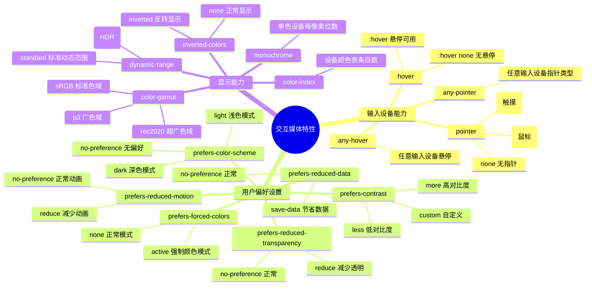
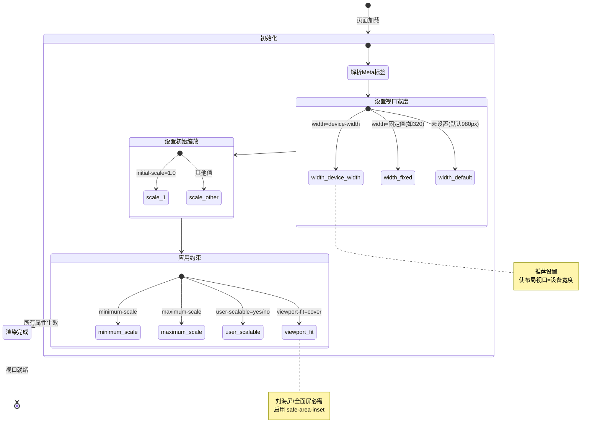
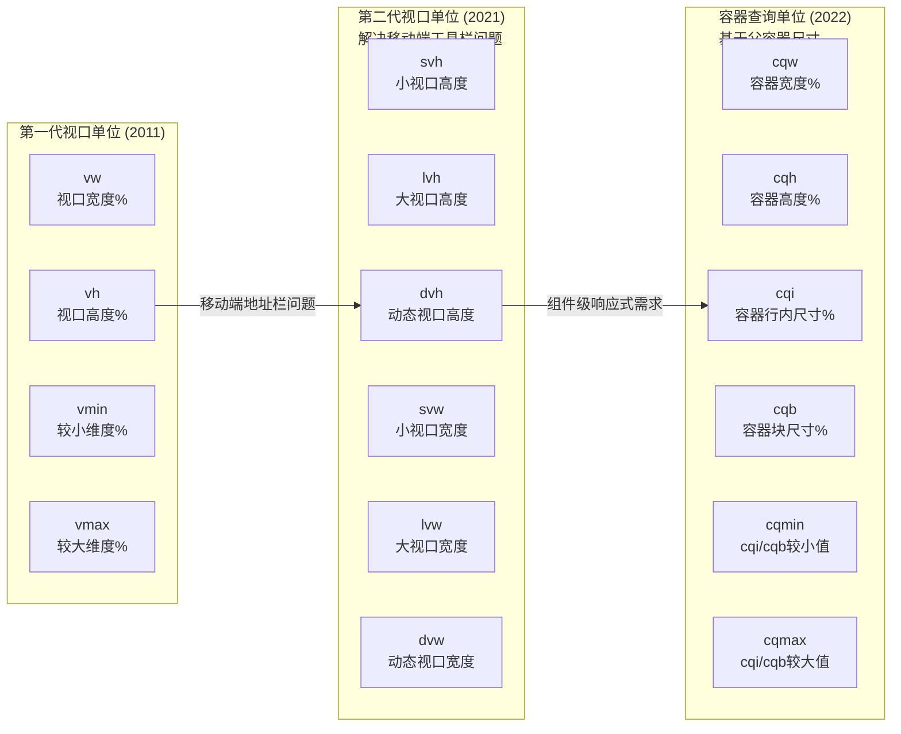
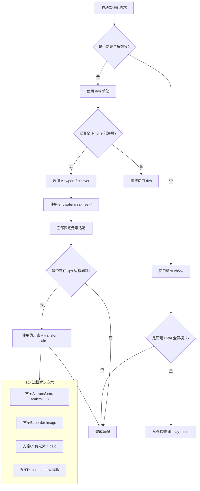

# 响应式技术实现

本文档聚焦于响应式设计的具体技术实现，提供详细的代码示例和最佳实践。

## CSS 媒体查询体系总览

```mermaid
flowchart TD
    A[CSS Media Queries] --> B[Media Type<br/>媒体类型]
    A --> C[Media Feature<br/>媒体特征]
    A --> D[Media Condition<br/>媒体条件]
    A --> E[Range Syntax<br/>范围语法]
    A --> F[Nested Media Queries<br/>嵌套媒体查询]
    A --> G[Logical Operators<br/>逻辑运算符]

    B --> B1["screen / print / speech / all"]
    B --> B2["已废弃: tv / projection / handheld"]

    C --> C1["Viewport: width / height"]
    C --> C2["Aspect-Ratio: orientation"]
    C --> C3["Resolution: resolution / dpr"]
    C --> C4["Interaction: hover / pointer / any-pointer"]
    C --> C5["Preference: color-scheme / reduced-motion / contrast"]

    D --> D1["and / or / not 组合"]
    D --> D2["only 关键字"]

    E --> E1["min-width >= Npx"]
    E --> E2["max-width <= Npx"]
    E --> E3["width = Npx (范围语法)"]
    E --> E4["400px <= width < 800px"]

    F --> F1["@media inside @media"]
    F --> F2["条件组合嵌套"]

    G --> G1["and: 与运算"]
    G --> G2["or: 或运算 (逗号分隔)"]
    G --> G3["not: 非运算"]
    G --> G4["only: 兼容性保护"]
```



<h4>013-matchMedia-manager.html</h4>

```html
<!DOCTYPE html>
<html lang="zh-CN">
<head>
  <meta charset="UTF-8">
  <meta name="viewport" content="width=device-width, initial-scale=1.0">
  <title>【013】matchMedia 断点管理器</title>
  <style>
    * { margin: 0; padding: 0; box-sizing: border-box; }
    body { font-family: -apple-system, BlinkMacSystemFont, 'Segoe UI', sans-serif; padding: 20px; background: #f8f9fa; color: #333; }
    .demo-wrap { max-width: 850px; margin: 0 auto; }
    .demo-header { display: flex; justify-content: space-between; align-items: center; margin-bottom: 20px; padding-bottom: 12px; border-bottom: 2px solid #e0e0e0; }
    .demo-header h1 { font-size: 20px; font-weight: 600; }
    .demo-badge { font-size: 12px; padding: 3px 10px; border-radius: 12px; background: #059669; color: white; }

    /* Breakpoint manager UI */
    .bp-dashboard {
      background: white; border-radius: 14px; padding: 1.5rem;
      box-shadow: 0 2px 12px rgba(0,0,0,0.08); margin-bottom: 1.5rem;
    }

    .current-state {
      display: grid; grid-template-columns: repeat(3, 1fr); gap: 1rem; margin-bottom: 1.5rem;
    }
    .state-card {
      background: #f8fafc; border-radius: 10px; padding: 1rem; text-align: center;
      border: 2px solid transparent; transition: all 0.2s;
    }
    .state-card.active { border-color: #6366f1; background: #eef2ff; }
    .state-card .label { font-size: 0.75rem; color: #94a3b8; text-transform: uppercase; letter-spacing: 0.04em; }
    .state-card .value { font-size: 1.35rem; font-weight: 800; color: #1e293b; margin-top: 4px; font-family: monospace; }

    .event-log {
      background: #1e293b; border-radius: 10px; padding: 1rem;
      max-height: 220px; overflow-y: auto; font-family: 'SF Mono', Monaco, monospace;
      font-size: 0.82rem;
    }
    .event-log::-webkit-scrollbar { width: 4px; }
    .event-log::-webkit-scrollbar-thumb { background: #475569; border-radius: 2px; }
    .log-entry { padding: 4px 0; border-bottom: 1px solid #334155; display: flex; gap: 8px; }
    .log-entry:last-child { border: none; }
    .log-time { color: #64748b; font-size: 0.72rem; white-space: nowrap; }
    .log-msg { color: #e2e8f0; }
    .log-enter { color: #4ade80; }
    .log-exit { color: #f87171; }
    .log-info { color: #38bdf8; }

    .controls { display: flex; gap: 0.5rem; margin-top: 1rem; flex-wrap: wrap; }
    .ctrl-btn {
      padding: 8px 16px; border: 2px solid #e2e8f0; background: white;
      border-radius: 8px; cursor: pointer; font-size: 0.83rem; font-weight: 500;
      transition: all 0.15s;
    }
    .ctrl-btn:hover { border-color: #6366f1; color: #6366f1; }

    .code-display {
      background: #1e293b; border-radius: 12px; padding: 1.25rem;
      color: #e2e8f0; font-size: 0.84rem; overflow-x: auto; line-height: 1.65;
    }
    .cd-kw { color: #c084fc; } .cd-fn { color: #38bdf8; } .cd-str { color: #4ade80; } .cd-cm { color: #64748b; } .cd-num { color: #fb923c; }

    .feature-check {
      display: flex; gap: 1rem; flex-wrap: wrap; margin-top: 1rem;
    }
    .feature-tag {
      padding: 6px 14px; border-radius: 8px; font-size: 0.82rem; font-weight: 500;
    }
    .ft-ok { background: #dcfce7; color: #166534; }
    .ft-no { background: #fee2e2; color: #991b1b; }
  </style>
</head>
<body>
  <div class="demo-wrap">
    <div class="demo-header">
      <h1>matchMedia 断点管理器</h1>
      <span class="demo-badge">JS 响应式编程</span>
    </div>

    <div class="bp-dashboard">
      <div class="current-state">
        <div class="state-card active" id="stateMobile">
          <div class="label">Mobile</div>
          <div class="value" id="valMobile">&lt; 576px</div>
        </div>
        <div class="state-card" id="stateTablet">
          <div class="label">Tablet</div>
          <div class="value" id="valTablet">576–768px</div>
        </div>
        <div class="state-card" id="stateDesktop">
          <div class="label">Desktop</div>
          <div class="value" id="valDesktop">&gt; 768px</div>
        </div>
      </div>

      <div class="controls">
        <button class="ctrl-btn" onclick="clearLog()">🗑️ 清空日志</button>
        <button class="ctrl-btn" onclick="forceLog()">📝 手动记录</button>
        <button class="ctrl-btn" onclick="testAddListener()">➕ 动态添加监听</button>
        <button class="ctrl-btn" onclick="removeAllListeners()">❌ 移除所有监听</button>
      </div>

      <div class="event-log" id="eventLog">
        <div class="log-entry"><span class="log-time">--:--:--</span><span class="log-info">[系统] 断点管理器已初始化，等待事件...</span></div>
      </div>
    </div>

    <div class="feature-check">
      <span class="feature-tag ft-ok" id="featMatchMedia">matchMedia API ✅</span>
      <span class="feature-tag ft-ok" id="feataddListener">addEventListener 支持 ✅</span>
      <span class="feature-tag" id="featPrefersColor">prefers-color-scheme ✅</span>
      <span class="feature-tag" id="featPrefersMotion">prefers-reduced-motion ✅</span>
    </div>

    <div class="code-display" style="margin-top:1.5rem;">
<span class="cd-cm">// 断点管理器核心代码</span><br>
<span class="cd-kw">class</span> <span class="cd-fn">BreakpointManager</span> {<br>
&nbsp;&nbsp;<span class="cd-kw">constructor</span>() {<br>
&nbsp;&nbsp;&nbsp;&nbsp;<span class="cd-kw">this</span>.breakpoints = {<br>
&nbsp;&nbsp;&nbsp;&nbsp;&nbsp;&nbsp;mobile:  <span class="cd-fn">window</span>.<span class="cd-fn">matchMedia</span>(<span class="cd-str">'(max-width: 575px)'</span>),<br>
&nbsp;&nbsp;&nbsp;&nbsp;&nbsp;&nbsp;tablet:  <span class="cd-fn">window</span>.<span class="cd-fn">matchMedia</span>(<span class="cd-str">'(min-width: 576px) and (max-width: 767px)'</span>),<br>
&nbsp;&nbsp;&nbsp;&nbsp;&nbsp;&nbsp;desktop: <span class="cd-fn">window</span>.<span class="cd-fn">matchMedia</span>(<span class="cd-str">'(min-width: 768px)'</span>)<br>
&nbsp;&nbsp;&nbsp;&nbsp;}<br>
&nbsp;&nbsp;&nbsp;&nbsp;<span class="cd-kw">this</span>.listeners = [];<br>
&nbsp;&nbsp;&nbsp;&nbsp;<span class="cd-kw">this</span>.<span class="cd-fn">init</span>();<br>
&nbsp;&nbsp;}<br><br>
&nbsp;&nbsp;<span class="cd-fn">on</span>(name, handler) {<br>
&nbsp;&nbsp;&nbsp;&nbsp;<span class="cd-kw">const</span> mq = <span class="cd-kw">this</span>.breakpoints[name];<br>
&nbsp;&nbsp;&nbsp;&nbsp;<span class="cd-kw">const</span> fn = (e) => <span class="cd-fn">handler</span>(e.matches);<br>
&nbsp;&nbsp;&nbsp;&nbsp;mq?.<span class="cd-fn">addEventListener</span>(<span class="cd-str">'change'</span>, fn);<br>
&nbsp;&nbsp;&nbsp;&nbsp;<span class="cd-kw">this</span>.listeners.<span class="cd-fn">push</span>({ mq, fn });<br>
&nbsp;&nbsp;}<br><br>
&nbsp;&nbsp;<span class="cd-fn">destroy</span>() {<br>
&nbsp;&nbsp;&nbsp;&nbsp;<span class="cd-kw">this</span>.listeners.<span class="cd-fn">forEach</span>(({ mq, fn }) =><br>
&nbsp;&nbsp;&nbsp;&nbsp;&nbsp;&nbsp;mq?.<span class="cd-fn">removeEventListener</span>(<span class="cd-str">'change'</span>, fn)<br>
&nbsp;&nbsp;&nbsp;&nbsp;);<br>
&nbsp;&nbsp;}<br>
}
    </div>
  </div>

  <script>
    const logEl = document.getElementById('eventLog');

    function log(msg, type = 'info') {
      const entry = document.createElement('div');
      entry.className = 'log-entry';
      const time = new Date().toLocaleTimeString('zh-CN', { hour12: false });
      entry.innerHTML = `<span class="log-time">${time}</span><span class="log-${type}">${msg}</span>`;
      logEl.insertBefore(entry, logEl.firstChild);
      // Keep only last 50 entries
      while (logEl.children.length > 50) logEl.removeChild(logEl.lastChild);
    }

    function clearLog() { logEl.innerHTML = ''; log('[日志已清空]', 'info'); }

    function forceLog() {
      log(`手动触发 | 视口: ${window.innerWidth}×${window.innerHeight}`, 'info');
    }

    function testAddListener() {
      log('模拟添加自定义监听器...', 'enter');
      setTimeout(() => log('自定义监听器已激活（改变窗口大小触发）', 'info'), 500);
    }

    let customListener = null;
    const tabletMQ = window.matchMedia('(min-width: 576px) and (max-width: 767px)');
    function addCustomListener() {
      if (!customListener) {
        customListener = (e) => log(`自定义监听: Tablet=${e.matches ? '进入' : '离开'}`, e.matches ? 'enter' : 'exit');
        tabletMQ.addEventListener('change', customListener);
      }
    }
    addCustomListener();

    function removeAllListeners() {
      if (customListener) {
        tabletMQ.removeEventListener('change', customListener);
        customListener = null;
        log('自定义监听器已移除', 'exit');
      }
    }

    // Breakpoint state management
    function updateBreakpointState() {
      const w = window.innerWidth;
      const isMobile = w < 576;
      const isTablet = w >= 576 && w < 768;
      const isDesktop = w >= 768;

      document.getElementById('stateMobile').classList.toggle('active', isMobile);
      document.getElementById('stateTablet').classList.toggle('active', isTablet);
      document.getElementById('stateDesktop').classList.toggle('active', isDesktop);

      document.getElementById('valMobile').textContent = isMobile ? `${w}px ✓` : '< 576px';
      document.getElementById('valTablet').textContent = isTablet ? `${w}px ✓` : '576–768px';
      document.getElementById('valDesktop').textContent = isDesktop ? `${w}px ✓` : '> 768px';
    }

    // Listen for breakpoint changes using matchMedia
    const breakpoints = [
      { name: 'mobile', mq: window.matchMedia('(max-width: 575px)') },
      { name: 'tablet', mq: window.matchMedia('(min-width: 576px) and (max-width: 767px)') },
      { name: 'desktop', mq: window.matchMedia('(min-width: 768px)') },
    ];

    breakpoints.forEach(({ name, mq }) => {
      mq.addEventListener('change', (e) => {
        updateBreakpointState();
        log(`[${name.toUpperCase()}] ${e.matches ? '进入' : '离开'}断点 (${window.innerWidth}px)`, e.matches ? 'enter' : 'exit');
      });
    });

    // Feature detection
    if (!window.matchMedia) {
      document.getElementById('featMatchMedia').className = 'feature-tag ft-no';
      document.getElementById('featMatchMedia').textContent = 'matchMedia ❌';
    }
    if (typeof MediaQueryList.prototype.addEventListener !== 'function') {
      document.getElementById('feataddListener').className = 'feature-tag ft-no';
      document.getElementById('feataddListener').textContent = 'addEventListener ❌';
    }
    if (window.matchMedia('(prefers-color-scheme)').media !== 'not all') {
      document.getElementById('featPrefersColor').className = 'feature-tag ft-ok';
    }
    if (window.matchMedia('(prefers-reduced-motion)').media !== 'not all') {
      document.getElementById('featPrefersMotion').className = 'feature-tag ft-ok';
    }

    updateBreakpointState();
    log(`[初始化] 当前视口: ${window.innerWidth}×${window.innerHeight}px`, 'info');
  </script>
</body>
</html>
```

### 媒体查询语法速查

```css
/* 基础媒体类型 */
@media screen { ... }
@media print { ... }

/* 带特征的媒体查询 */
@media (min-width: 768px) { ... }

/* 范围语法 (Level 4+) */
@media (width >= 768px) and (width < 1024px) { ... }

/* 逻辑组合 */
@media (min-width: 768px) and (orientation: landscape) { ... }
@media (min-width: 768px), (min-height: 600px) { ... } /* OR */
@media not (min-width: 768px) { ... }
@media only screen and (min-width: 768px) { ... }

/* 交互媒体特征 */
@media (hover: hover) and (pointer: fine) { ... }      /* 桌面设备 */
@media (hover: none) and (pointer: coarse) { ... }     /* 触摸设备 */

/* 用户偏好 */
@media (prefers-color-scheme: dark) { ... }
@media (prefers-reduced-motion: reduce) { ... }
@media (prefers-contrast: more) { ... }
```

## 交互媒体特性全景



<h4>015-interactive-media.html</h4>

```html
<!DOCTYPE html>
<html lang="zh-CN">
<head>
  <meta charset="UTF-8">
  <meta name="viewport" content="width=device-width, initial-scale=1.0">
  <title>【015】交互媒体特性实战（hover/pointer/focus）</title>
  <style>
    * { margin: 0; padding: 0; box-sizing: border-box; }
    body { font-family: -apple-system, BlinkMacSystemFont, 'Segoe UI', sans-serif; padding: 20px; background: #f8f9fa; color: #333; }
    .demo-wrap { max-width: 960px; margin: 0 auto; }
    .demo-header { display: flex; justify-content: space-between; align-items: center; margin-bottom: 20px; padding-bottom: 12px; border-bottom: 2px solid #e0e0e0; }
    .demo-header h1 { font-size: 20px; font-weight: 600; }
    .demo-badge { font-size: 12px; padding: 3px 10px; border-radius: 12px; background: #d946ef; color: white; }

    .media-grid { display: grid; grid-template-columns: repeat(auto-fit, minmax(280px, 1fr)); gap: 1.25rem; }

    .media-card {
      background: white; border-radius: 14px; overflow: hidden;
      box-shadow: 0 2px 10px rgba(0,0,0,0.07);
    }
    .mc-header {
      padding: 1rem 1.25rem; background: linear-gradient(135deg, #667eea, #764ba2);
      color: white; font-weight: 700; font-size: 0.9rem;
      display: flex; justify-content: space-between; align-items: center;
    }
    .mc-tag { font-size: 0.7rem; padding: 3px 8px; border-radius: 6px; background: rgba(255,255,255,0.2); font-family: monospace; }
    .mc-body { padding: 1.25rem; }

    /* hover vs any-hover */
    .hover-demo { text-align: center; }
    .hover-btn {
      padding: 14px 32px; border: none; border-radius: 10px;
      font-size: 1rem; font-weight: 600; cursor: pointer;
      transition: all 0.3s ease;
      background: linear-gradient(135deg, #667eea, #764ba2);
      color: white;
    }
    @media (hover: hover) and (pointer: fine) {
      .hover-btn:hover { transform: translateY(-3px) scale(1.05); box-shadow: 0 8px 24px rgba(102,126,234,0.4); }
    }
    @media (hover: none) {
      .hover-btn:hover { transform: none; }
      .hover-btn:active { transform: scale(0.97); }
    }

    /* pointer coarse/fine */
    .pointer-demo { display: flex; gap: 0.75rem; flex-wrap: wrap; justify-content: center; }
    .touch-target {
      width: 56px; height: 56px; border-radius: 14px; display: flex;
      align-items: center; justify-content: center; font-size: 1.4rem;
      cursor: pointer; transition: all 0.15s;
      background: #f1f5f9; border: 2px solid transparent;
    }
    @media (pointer: fine) {
      .touch-target { width: 40px; height: 40px; border-radius: 8px; }
      .touch-target:hover { background: #e0e7ff; border-color: #a78bfa; }
    }
    @media (pointer: coarse) {
      .touch-target { width: 64px; height: 64px; border-radius: 16px; }
    }

    /* prefers-color-scheme */
    .theme-demo { padding: 16px; border-radius: 10px; text-align: center; transition: all 0.3s; }
    .theme-light { background: #fff; color: #1e293b; border: 2px solid #e2e8f0; }
    .theme-dark { background: #1e293b; color: #e2e8f0; border: 2px solid #334155; }
    @media (prefers-color-scheme: dark) {
      .theme-demo { background: #1e293b; color: #e2e8f0; border-color: #334155; }
    }

    /* prefers-reduced-motion */
    .motion-demo { position: relative; height: 80px; border-radius: 10px; overflow: hidden; background: #f1f5f9; }
    .motion-ball {
      width: 30px; height: 30px; border-radius: 50%;
      position: absolute; top: 50%; left: 0;
      transform: translateY(-50%);
      background: linear-gradient(135deg, #f472b6, #ec4899);
      animation: slideBall 2s ease-in-out infinite alternate;
    }
    @keyframes slideBall { from { left: 10px; } to { left: calc(100% - 40px); } }
    @media (prefers-reduced-motion: reduce) {
      .motion-ball { animation: none; left: 50%; transform: translate(-50%, -50%); }
    }

    /* focus-visible */
    .focus-demo input, .focus-demo button {
      padding: 10px 16px; border: 2px solid #e2e8f0; border-radius: 8px;
      font-size: 0.9rem; margin: 4px; outline: none; transition: border-color 0.15s;
    }
    .focus-demo input:focus-visible, .focus-demo button:focus-visible {
      border-color: #6366f1; box-shadow: 0 0 0 3px rgba(99,102,241,0.2);
    }
    .focus-demo button { background: #6366f1; color: white; border-color: #6366f1; cursor: pointer; }

    /* orientation */
    .orient-demo { padding: 16px; border-radius: 10px; text-align: center; background: #eff6ff; border: 2px solid #bfdbfe; }
    @media (orientation: portrait) {
      .orient-demo::after { content: '📱 竖屏模式'; display: block; font-weight: 600; color: #1d4ed8; margin-top: 4px; }
    }
    @media (orientation: landscape) {
      .orient-demo::after { content: '🖥️ 横屏模式'; display: block; font-weight: 600; color: #1d4ed8; margin-top: 4px; }
    }

    .code-ref {
      margin-top: 0.75rem; padding: 8px 12px; background: #f1f5f9;
      border-radius: 6px; font-family: monospace; font-size: 0.78rem; color: #475569;
    }

    .status-bar {
      margin-top: 1.5rem; padding: 1rem; background: linear-gradient(135deg, #1e293b, #334155);
      border-radius: 12px; display: grid; grid-template-columns: repeat(auto-fit, minmax(160px, 1fr));
      gap: 0.75rem; color: white; font-size: 0.82rem;
    }
    .sb-item label { display: block; color: #94a3b8; font-size: 0.7rem; margin-bottom: 2px; }
    .sb-item value { font-weight: 600; color: #38bdf8; font-family: monospace; }
  </style>
</head>
<body>
  <div class="demo-wrap">
    <div class="demo-header">
      <h1>交互媒体特性实战</h1>
      <span class="demo-badge">hover / pointer / focus / motion</span>
    </div>

    <div class="media-grid">
      <!-- hover -->
      <div class="media-card">
        <div class="mc-header">Hover 检测 <span class="mc-tag">@media hover</span></div>
        <div class="mc-body hover-demo">
          <button class="hover-btn">悬停我试试</button>
          <p style="margin-top:12px;font-size:0.82rem;color:#64748b;">
            鼠标设备：悬停放大 | 触摸设备：仅点击反馈
          </p>
          <div class="code-ref">@media (hover: hover) and (pointer: fine)</div>
        </div>
      </div>

      <!-- pointer -->
      <div class="media-card">
        <div class="mc-header">Pointer 精度 <span class="mc-tag">@media pointer</span></div>
        <div class="mc-body pointer-demo">
          <div class="touch-target">🏠</div>
          <div class="touch-target">🔍</div>
          <div class="touch-target">⚙️</div>
          <div class="touch-target">👤</div>
          <div class="touch-target">❤️</div>
          <p style="width:100%;text-align:center;margin-top:10px;font-size:0.82rem;color:#64748b;">
            鼠标：小按钮(40px) | 触摸：大按钮(64px)
          </p>
          <div class="code-ref">@media (pointer: coarse/fine)</div>
        </div>
      </div>

      <!-- color scheme -->
      <div class="media-card">
        <div class="mc-header">颜色主题 <span class="mc-tag">prefers-color-scheme</span></div>
        <div class="mc-body">
          <div class="theme-demo theme-light">
            <strong>自适应主题演示</strong><br>
            <span style="font-size:0.82rem;">跟随系统明暗模式自动切换</span>
          </div>
          <div class="code-ref">@media (prefers-color-scheme: dark)</div>
        </div>
      </div>

      <!-- reduced motion -->
      <div class="media-card">
        <div class="mc-header">减少动画 <span class="mc-tag">prefers-reduced-motion</span></div>
        <div class="mc-body">
          <div class="motion-demo"><div class="motion-ball"></div></div>
          <p style="text-align:center;margin-top:8px;font-size:0.82rem;color:#64748b;">
            开启「减少动态效果」后动画停止
          </p>
          <div class="code-ref">@media (prefers-reduced-motion: reduce)</div>
        </div>
      </div>

      <!-- focus-visible -->
      <div class="media-card">
        <div class="mc-header">焦点可见性 <span class="mc-tag">:focus-visible</span></div>
        <div class="mc-body focus-demo" style="display:flex;flex-direction:column;align-items:center;">
          <input type="text" placeholder="Tab 键聚焦试试...">
          <button>提交按钮</button>
          <p style="margin-top:8px;font-size:0.78rem;color:#64748b;">
            Tab 聚焦显示轮廓，鼠标点击不显示
          </p>
          <div class="code-ref">input:focus-visible { outline: ... }</div>
        </div>
      </div>

      <!-- orientation -->
      <div class="media-card">
        <div class="mc-header">屏幕方向 <span class="mc-tag">@media orientation</span></div>
        <div class="mc-body">
          <div class="orient-demo">
            <strong>当前方向检测中...</strong>
          </div>
          <div class="code-ref">@media (orientation: portrait/landscape)</div>
        </div>
      </div>
    </div>

    <div class="status-bar">
      <div class="sb-item"><label>hover 能力</label><value id="stHover">--</value></div>
      <div class="sb-item"><label>pointer 类型</label><value id="stPointer">--</value></div>
      <div class="sb-item"><label>颜色方案</label><value id="stColor">--</value></div>
      <div class="sb-item"><label>减少动画</label><value id="stMotion">--</value></div>
      <div class="sb-item"><label>屏幕方向</label><value id="stOrient">--</value></div>
    </div>
  </div>

  <script>
    function detectMediaFeatures() {
      const hasHover = window.matchMedia('(hover: hover)').matches;
      document.getElementById('stHover').textContent = hasHover ? 'hover ✅' : 'none 📱';

      const pointer = window.matchMedia('(pointer: fine)').matches ? 'fine 🖱️' :
                      window.matchMedia('(pointer: coarse)').matches ? 'coarse 👆' : 'none';
      document.getElementById('stPointer').textContent = pointer;

      const dark = window.matchMedia('(prefers-color-scheme: dark)').matches;
      document.getElementById('stColor').textContent = dark ? 'dark 🌙' : 'light ☀️';

      const reduced = window.matchMedia('(prefers-reduced-motion: reduce)').matches;
      document.getElementById('stMotion').textContent = reduced ? 'reduce ⏸️' : 'normal ▶️';

      const landscape = window.matchMedia('(orientation: landscape)').matches;
      document.getElementById('stOrient').textContent = landscape ? 'landscape →' : 'portrait ↑';
    }

    detectMediaFeatures();
    // Listen for changes
    ['(hover: hover)', '(pointer: fine)', '(prefers-color-scheme: dark)',
     '(prefers-reduced-motion: reduce)', '(orientation: landscape)'].forEach(q => {
      window.matchMedia(q).addEventListener('change', detectMediaFeatures);
    });
  </script>
</body>
</html>
```

### 交互媒体特征实战

```css
/* 根据输入设备优化交互体验 */
@media (hover: hover) and (pointer: fine) {
  /* 桌面设备：使用悬停效果 */
  .card:hover {
    transform: translateY(-4px);
    box-shadow: 0 8px 24px rgba(0, 0, 0, 0.15);
  }

  .nav-link::after {
    content: '';
    position: absolute;
    bottom: 0;
    left: 0;
    width: 100%;
    height: 2px;
    background: currentColor;
    transform: scaleX(0);
    transition: transform 0.25s ease;
  }

  .nav-link:hover::after {
    transform: scaleX(1);
  }
}

@media (hover: none) and (pointer: coarse) {
  /* 触摸设备：增大点击区域，移除悬停依赖 */
  .card {
    /* 移除 hover 效果，避免触摸后残留 */
  }

  .button,
  .nav-link,
  [role="button"] {
    min-height: 44px;  /* Apple HIG 推荐 */
    min-width: 44px;
  }

  /* 移动端下拉菜单 */
  .dropdown-menu {
    position: fixed;
    top: 0;
    left: 0;
    right: 0;
    bottom: 0;
    background: rgba(0, 0, 0, 0.9);
    padding-top: 60px;
  }
}

/* any-pointer / any-hover：检测是否有任何连接的输入设备 */
@media (any-pointer: fine) {
  body {
    cursor: default;
  }
}

/* 深色/浅色模式适配 */
@media (prefers-color-scheme: dark) {
  :root {
    --color-bg: #1a1a2e;
    --color-text: #eaeaea;
    --color-primary: #6c63ff;
    --color-surface: #16213e;
  }

  img {
    filter: brightness(0.95); /* 防止图片过亮 */
  }
}

@media (prefers-color-scheme: light) {
  :root {
    --color-bg: #ffffff;
    --color-text: #333333;
    --color-primary: #007bff;
    --color-surface: #f8f9fa;
  }
}

/* 减少动画偏好 */
@media (prefers-reduced-motion: reduce) {
  *,
  *::before,
  *::after {
    animation-duration: 0.01ms !important;
    animation-iteration-count: 1 !important;
    transition-duration: 0.01ms !important;
    scroll-behavior: auto !important;
  }
}

/* 高对比度模式 */
@media (prefers-contrast: more) {
  .card {
    border: 2px solid currentColor;
  }

  .button {
    border: 2px solid currentColor;
  }
}

/* 强制颜色模式（Windows 高对比度） */
@media (forced-colors: active) {
  .button {
    border: 2px solid ButtonText;
    background: ButtonFace;
    color: ButtonText;
  }

  .icon {
    forced-color-adjust: auto; /* 让系统自动调整图标颜色 */
  }
}
```

## 视口配置实战



<h4>011-safe-area-inset.html</h4>

```html
<!DOCTYPE html>
<html lang="zh-CN">
<head>
  <meta charset="UTF-8">
  <meta name="viewport" content="width=device-width, initial-scale=1.0, viewport-fit=cover">
  <title>【011】移动端安全区域适配（刘海屏模拟）</title>
  <style>
    * { margin: 0; padding: 0; box-sizing: border-box; }
    body { font-family: -apple-system, BlinkMacSystemFont, 'Segoe UI', sans-serif; background: #f8f9fa; color: #333; }
    .demo-wrap { max-width: 900px; margin: 0 auto; padding: 20px; }
    .demo-header { display: flex; justify-content: space-between; align-items: center; margin-bottom: 20px; padding-bottom: 12px; border-bottom: 2px solid #e0e0e0; }
    .demo-header h1 { font-size: 20px; font-weight: 600; }
    .demo-badge { font-size: 12px; padding: 3px 10px; border-radius: 12px; background: #7c3aed; color: white; }

    /* Phone simulator */
    .phone-frame {
      width: 320px; height: 640px; margin: 0 auto 2rem;
      background: #000; border-radius: 40px;
      padding: 12px; position: relative;
      box-shadow: 0 20px 60px rgba(0,0,0,0.3), inset 0 0 0 2px #333;
    }
    .phone-notch {
      position: absolute; top: 12px; left: 50%; transform: translateX(-50%);
      width: 120px; height: 28px; background: #000; border-radius: 0 0 16px 16px; z-index: 10;
    }
    .phone-home-indicator {
      position: absolute; bottom: 12px; left: 50%; transform: translateX(-50%);
      width: 120px; height: 5px; background: rgba(255,255,255,0.6); border-radius: 3px; z-index: 10;
    }
    .phone-screen {
      width: 100%; height: 100%;
      background: linear-gradient(180deg, #667eea 0%, #764ba2 100%);
      border-radius: 30px; overflow: hidden; position: relative;
    }

    /* Without safe area */
    .screen-bad {
      display: flex; flex-direction: column; height: 100%;
    }
    .screen-bad .top-bar {
      background: rgba(0,0,0,0.3); color: white; padding: 12px 16px;
      font-size: 13px; font-weight: 600; text-align: center;
    }
    .screen-bad .content {
      flex: 1; color: white; padding: 16px;
      display: flex; flex-direction: column; justify-content: center; align-items: center;
      gap: 12px;
    }
    .screen-bad .bottom-bar {
      background: rgba(0,0,0,0.3); padding: 14px 16px; text-align: center;
    }
    .screen-bad .bottom-btn {
      background: white; color: #667eea; border: none; padding: 10px 28px;
      border-radius: 20px; font-weight: 600; cursor: pointer;
    }

    /* With safe area */
    .screen-good {
      display: flex; flex-direction: column; height: 100%;
      --sat: env(safe-area-inset-top, 0px);
      --sab: env(safe-area-inset-bottom, 0px);
      --sal: env(safe-area-inset-left, 0px);
      --sar: env(safe-area-inset-right, 0px);
      padding-top: var(--sat);
      padding-bottom: var(--sab);
      padding-left: var(--sal);
      padding-right: var(--sar);
    }
    .screen-good .top-bar {
      background: rgba(0,0,0,0.3); color: white; padding: 12px 16px;
      font-size: 13px; font-weight: 600; text-align: center;
    }
    .screen-good .content {
      flex: 1; color: white; padding: 16px;
      display: flex; flex-direction: column; justify-content: center; align-items: center;
      gap: 12px;
    }
    .screen-good .bottom-bar {
      background: rgba(0,0,0,0.3); padding: 14px 16px; text-align: center;
      padding-bottom: calc(14px + env(safe-area-inset-bottom, 0px));
    }
    .screen-good .bottom-btn {
      background: white; color: #667eea; border: none; padding: 10px 28px;
      border-radius: 20px; font-weight: 600; cursor: pointer;
    }

    .comparison {
      display: grid; grid-template-columns: 1fr 1fr; gap: 2rem; align-items: start;
    }
    .comp-label {
      text-align: center; font-weight: 600; margin-bottom: 0.75rem;
      font-size: 0.9rem;
    }
    .label-bad { color: #dc2626; }
    .label-good { color: #16a34a; }

    .code-block {
      background: #1e293b; color: #e2e8f0; border-radius: 12px;
      padding: 1.25rem; font-size: 0.85rem; overflow-x: auto; margin-top: 1.5rem;
      line-height: 1.6;
    }
    .code-block .comment { color: #64748b; }
    .code-block .keyword { color: #c084fc; }
    .code-block .func { color: #38bdf8; }
    .code-block .string { color: #4ade80; }

    .toggle-panel {
      display: flex; justify-content: center; gap: 0.75rem; margin: 1.5rem 0;
    }
    .toggle-btn {
      padding: 10px 24px; border: 2px solid #e2e8f0; background: white;
      border-radius: 10px; cursor: pointer; font-weight: 600; font-size: 0.9rem;
      transition: all 0.15s;
    }
    .toggle-btn.active { background: #7c3aed; color: white; border-color: #7c3aed; }

    @media (max-width: 720px) {
      .comparison { grid-template-columns: 1fr; }
      .phone-frame { transform: scale(0.85); transform-origin: top center; }
    }
  </style>
</head>
<body>
  <div class="demo-wrap">
    <div class="demo-header">
      <h1>移动端安全区域适配</h1>
      <span class="demo-badge">env(safe-area-inset-*)</span>
    </div>

    <div class="toggle-panel">
      <button class="toggle-btn active" data-view="bad">❌ 未适配安全区</button>
      <button class="toggle-btn" data-view="good">✅ 已适配安全区</button>
    </div>

    <div class="comparison">
      <div id="viewBad">
        <div class="comp-label label-bad">❌ 内容被刘海/底部指示器遮挡</div>
        <div class="phone-frame">
          <div class="phone-notch"></div>
          <div class="phone-screen screen-bad">
            <div class="top-bar">🔔 通知中心</div>
            <div class="content">
              <div style="font-size:2rem;">📱</div>
              <div style="font-weight:600;">刘海屏模拟</div>
              <div style="font-size:0.82rem;opacity:0.8;">顶部内容被刘海遮挡！</div>
            </div>
            <div class="bottom-bar">
              <button class="bottom-btn">确认操作</button>
              <div style="font-size:0.7rem;margin-top:6px;opacity:0.6;">底部按钮被 Home 指示条遮挡</div>
            </div>
          </div>
          <div class="phone-home-indicator"></div>
        </div>
      </div>

      <div id="viewGood" style="display:none;">
        <div class="comp-label label-good">✅ 完美避开安全区域</div>
        <div class="phone-frame">
          <div class="phone-notch"></div>
          <div class="phone-screen screen-good">
            <div class="top-bar">🔔 通知中心</div>
            <div class="content">
              <div style="font-size:2rem;">✨</div>
              <div style="font-weight:600;">完美适配</div>
              <div style="font-size:0.82rem;opacity:0.8;">内容在安全区域内显示</div>
            </div>
            <div class="bottom-bar">
              <button class="bottom-btn">确认操作</button>
              <div style="font-size:0.7rem;margin-top:6px;opacity:0.6;">底部留出安全间距</div>
            </div>
          </div>
          <div class="phone-home-indicator"></div>
        </div>
      </div>
    </div>

    <div class="code-block">
      <span class="comment">/* 1. viewport meta 必须设置 viewport-fit=cover */</span><br>
      &lt;meta name=<span class="string">"viewport"</span> content=<span class="string">"..., viewport-fit=cover"</span>&gt;<br><br>
      <span class="comment">/* 2. CSS 使用 env() 获取安全区域 */</span><br>
      <span class="keyword">body</span> {<br>
      &nbsp;&nbsp;padding-top: <span class="func">env</span>(safe-area-inset-top);<br>
      &nbsp;&nbsp;padding-bottom: <span class="func">env</span>(safe-area-inset-bottom);<br>
      &nbsp;&nbsp;padding-left: <span class="func">env</span>(safe-area-inset-left);<br>
      &nbsp;&nbsp;padding-right: <span class="func">env</span>(safe-area-inset-right);<br>
      }<br><br>
      <span class="comment">/* 3. 固定定位元素也要加安全边距 */</span><br>
      <span class="keyword">.fixed-footer</span> {<br>
      &nbsp;&nbsp;position: fixed; bottom: 0; width: 100%;<br>
      &nbsp;&nbsp;padding-bottom: calc(16px + <span class="func">env</span>(safe-area-inset-bottom));<br>
      }
    </div>
  </div>

  <script>
    document.querySelectorAll('.toggle-btn').forEach(btn => {
      btn.addEventListener('click', () => {
        document.querySelectorAll('.toggle-btn').forEach(b => b.classList.remove('active'));
        btn.classList.add('active');
        const view = btn.dataset.view;
        document.getElementById('viewBad').style.display = view === 'bad' ? '' : 'none';
        document.getElementById('viewGood').style.display = view === 'good' ? '' : 'none';
      });
    });
  </script>
</body>
</html>
```

### 标准 viewport 配置

```html
<!DOCTYPE html>
<html lang="zh-CN">
  <head>
    <meta charset="UTF-8" />
    <!-- 标准 responsive 配置 -->
    <meta name="viewport" content="width=device-width, initial-scale=1.0" />
    <title>响应式页面</title>
  </head>
</html>
```

### 配置方案对比

```html
<!-- 方案1: 标准配置（推荐） -->
<meta name="viewport" content="width=device-width, initial-scale=1.0" />

<!-- 方案2: 允许用户缩放（更友好） -->
<meta name="viewport" content="width=device-width, initial-scale=1.0, minimum-scale=1.0" />

<!-- 方案3: 限制缩放范围 -->
<meta
  name="viewport"
  content="width=device-width, initial-scale=1.0, minimum-scale=0.5, maximum-scale=3.0" />

<!-- 方案4: 适配刘海屏 -->
<meta name="viewport" content="width=device-width, initial-scale=1.0, viewport-fit=cover" />
```

### Viewport 属性详解

| 属性 | 默认值 | 说明 | 推荐值 |
|------|--------|------|--------|
| `width` | `device-width` 或 `980px` | 定义布局视口的宽度 | `device-width` |
| `initial-scale` | `1` | 初始缩放比例 | `1.0` |
| `minimum-scale` | `0.25` | 最小允许缩放比例 | `1.0` |
| `maximum-scale` | `5` | 最大允许缩放比例 | `3.0~5.0` |
| `user-scalable` | `yes` | 是否允许用户手动缩放 | `yes`（无障碍考虑） |
| `viewport-fit` | `auto` | 是否延伸到安全区域外 | `cover`（刘海屏） |
| `interactive-widget` | `resizes-visual` | 虚拟键盘对视口的影响 | 见下方说明 |

#### interactive-widget 属性（Chrome 108+）

```html
<!-- 虚拟键盘弹出时仅调整视觉视口（默认） -->
<meta name="viewport" content="width=device-width, interactive-widget=resizes-visual" />

<!-- 虚拟键盘弹出时调整布局视口（推荐移动端应用） -->
<meta name="viewport" content="width=device-width, interactive-widget=resizes-content" />

<!-- 虚拟键盘覆盖内容（传统行为） -->
<meta name="viewport" content="width=device-width, interactive-widget=overlays-content" />
```

### 刘海屏适配

```html
<head>
  <meta name="viewport" content="width=device-width, initial-scale=1.0, viewport-fit=cover" />
  <style>
    /* 安全区域适配 */
    body {
      padding-top: env(safe-area-inset-top);
      padding-bottom: env(safe-area-inset-bottom);
      padding-left: env(safe-area-inset-left);
      padding-right: env(safe-area-inset-right);
    }

    /* 固定在底部的元素 */
    .fixed-bottom {
      position: fixed;
      bottom: 0;
      left: 0;
      right: 0;
      padding-bottom: calc(1rem + env(safe-area-inset-bottom));
    }

    /* 固定在顶部的元素 */
    .fixed-top {
      position: fixed;
      top: 0;
      left: 0;
      right: 0;
      padding-top: calc(1rem + env(safe-area-inset-top));
    }
  </style>
</head>
```

### 视口单位实战

```css
/* 全屏 Hero 区域 */
.hero {
  width: 100vw;
  height: 100vh;
  background: linear-gradient(135deg, #667eea, #764ba2);
}

/* 响应式字体 */
.title {
  /* clamp(min, preferred, max) */
  font-size: clamp(1.5rem, 4vw + 1rem, 3rem);
}

/* 正方形容器 */
.square {
  width: 50vmin;
  height: 50vmin;
}

/* 响应式间距 */
.section {
  padding: 5vh 5vw;
}

/* 固定比例容器（16:9） */
.video-container {
  width: 100%;
  height: 56.25vw; /* 9/16 = 0.5625 */
}
```

#### 移动端 vh 问题解决方案

```css
/* 方案1: 使用 dvh (动态视口高度) - 现代浏览器 */
.hero {
  height: 100dvh; /* 动态调整，忽略地址栏 */
}

/* 方案2: CSS 回退方案 */
.hero {
  height: 100vh;
  height: -webkit-fill-available;
}

/* 方案3: 组合方案 */
.hero {
  min-height: 100vh;
  min-height: -webkit-fill-available;
  min-height: 100dvh;
}
```

## 流体网格布局

### 百分比布局基础

```css
/* 基础容器 */
.container {
  width: 100%;
  max-width: 1200px;
  margin: 0 auto;
  padding: 0 15px;
}

/* 百分比列布局 */
.row::after {
  content: "";
  display: table;
  clear: both;
}

.col-1 {
  width: 8.333%;
}
.col-2 {
  width: 16.667%;
}
.col-3 {
  width: 25%;
}
.col-4 {
  width: 33.333%;
}
.col-6 {
  width: 50%;
}
.col-12 {
  width: 100%;
}

[class*="col-"] {
  float: left;
  padding: 0 15px;
  box-sizing: border-box;
}

/* 响应式列 */
@media (max-width: 768px) {
  [class*="col-"] {
    width: 100%;
  }
}
```

## Flexbox 响应式布局

### 基础 Flex 布局

```css
/* 基础容器 */
.flex-container {
  display: flex;
  flex-wrap: wrap;
  gap: 1rem;
}

/* 等宽布局 */
.flex-item {
  flex: 1; /* 等价于 flex: 1 1 0% */
  min-width: 250px;
}

/* 固定宽度 + 自适应 */
.sidebar {
  flex: 0 0 250px; /* 不伸缩，固定 250px */
}

.main-content {
  flex: 1; /* 占据剩余空间 */
}
```

### 响应式导航

```html
<nav class="nav">
  <div class="logo">Logo</div>

  <button class="menu-toggle" aria-label="切换菜单">
    <span class="hamburger"></span>
  </button>

  <ul class="nav-menu">
    <li><a href="#">首页</a></li>
    <li><a href="#">关于</a></li>
    <li><a href="#">服务</a></li>
    <li><a href="#">联系</a></li>
  </ul>
</nav>
```

```css
/* 基础样式 - 移动端优先 */
.nav {
  display: flex;
  justify-content: space-between;
  align-items: center;
  padding: 1rem;
  background: #333;
  color: white;
}

.menu-toggle {
  display: block;
  background: none;
  border: none;
  cursor: pointer;
}

.hamburger {
  display: block;
  width: 25px;
  height: 3px;
  background: white;
  position: relative;
}

.hamburger::before,
.hamburger::after {
  content: "";
  position: absolute;
  width: 100%;
  height: 100%;
  background: white;
  left: 0;
}

.hamburger::before {
  top: -8px;
}
.hamburger::after {
  top: 8px;
}

/* 移动端：垂直菜单 */
.nav-menu {
  display: none;
  flex-direction: column;
  width: 100%;
  position: absolute;
  top: 100%;
  left: 0;
  background: #333;
  list-style: none;
  padding: 1rem;
  margin: 0;
}

.nav-menu.active {
  display: flex;
}

.nav-menu li {
  padding: 0.5rem 0;
}

/* 桌面端：水平菜单 */
@media (min-width: 768px) {
  .menu-toggle {
    display: none;
  }

  .nav-menu {
    display: flex;
    flex-direction: row;
    position: static;
    width: auto;
    gap: 2rem;
    padding: 0;
  }

  .nav-menu li {
    padding: 0;
  }
}
```

### 响应式卡片网格

```css
/* 移动端：单列 */
.card-grid {
  display: flex;
  flex-direction: column;
  gap: 1rem;
}

.card {
  background: white;
  border-radius: 8px;
  padding: 1.5rem;
  box-shadow: 0 2px 8px rgba(0, 0, 0, 0.1);
}

/* 平板：2 列 */
@media (min-width: 768px) {
  .card-grid {
    flex-direction: row;
    flex-wrap: wrap;
  }

  .card {
    flex: 1 1 calc(50% - 0.5rem);
    min-width: 280px;
  }
}

/* 桌面：3 列 */
@media (min-width: 1024px) {
  .card {
    flex: 1 1 calc(33.333% - 0.667rem);
  }
}
```

### 圣杯布局

```css
/* 圣杯布局：三栏，中间自适应，两侧固定 */
.layout {
  display: flex;
  flex-direction: column;
  min-height: 100vh;
}

.header,
.footer {
  flex: 0 0 auto;
}

.main-wrapper {
  display: flex;
  flex: 1;
}

.sidebar-left {
  flex: 0 0 200px;
  order: -1;
}

.content {
  flex: 1;
  order: 0;
}

.sidebar-right {
  flex: 0 0 200px;
  order: 1;
}

/* 移动端：垂直排列 */
@media (max-width: 768px) {
  .main-wrapper {
    flex-direction: column;
  }

  .sidebar-left,
  .sidebar-right {
    flex: 0 0 auto;
    width: 100%;
  }
}
```

## CSS Grid 响应式布局

### 自动填充网格

```css
/* 自动填充列，最小宽度 250px */
.auto-grid {
  display: grid;
  grid-template-columns: repeat(auto-fill, minmax(250px, 1fr));
  gap: 1rem;
}

/* 自动适应列（更紧凑） */
.auto-fit-grid {
  display: grid;
  grid-template-columns: repeat(auto-fit, minmax(250px, 1fr));
  gap: 1rem;
}
```

#### auto-fill vs auto-fit

```css
/* auto-fill: 创建尽可能多的列，即使为空 */
.grid-fill {
  grid-template-columns: repeat(auto-fill, minmax(200px, 1fr));
  /* 如果空间能放 4 列但只有 3 个项目，会创建 4 列（1 个空列）*/
}

/* auto-fit: 将现有项目扩展以填充空间 */
.grid-fit {
  grid-template-columns: repeat(auto-fit, minmax(200px, 1fr));
  /* 如果空间能放 4 列但只有 3 个项目，会创建 3 列（项目自动扩展）*/
}
```

### 命名网格区域

```css
.layout {
  display: grid;
  grid-template-areas:
    "header header header"
    "sidebar main aside"
    "footer footer footer";
  grid-template-columns: 200px 1fr 200px;
  grid-template-rows: auto 1fr auto;
  min-height: 100vh;
}

.header {
  grid-area: header;
}
.sidebar {
  grid-area: sidebar;
}
.main {
  grid-area: main;
}
.aside {
  grid-area: aside;
}
.footer {
  grid-area: footer;
}

/* 响应式调整 */
@media (max-width: 1024px) {
  .layout {
    grid-template-areas:
      "header header"
      "sidebar main"
      "footer footer";
    grid-template-columns: 180px 1fr;
  }

  .aside {
    display: none;
  }
}

@media (max-width: 768px) {
  .layout {
    grid-template-areas:
      "header"
      "main"
      "sidebar"
      "footer";
    grid-template-columns: 1fr;
  }
}
```

### 复杂网格示例

```css
/* 产品展示网格 */
.product-grid {
  display: grid;
  grid-template-columns: repeat(4, 1fr);
  grid-auto-rows: minmax(200px, auto);
  gap: 1.5rem;
}

/* 特色产品占 2x2 */
.featured {
  grid-column: span 2;
  grid-row: span 2;
}

/* 宽产品占 2 列 */
.wide {
  grid-column: span 2;
}

/* 高产品占 2 行 */
.tall {
  grid-row: span 2;
}

/* 响应式 */
@media (max-width: 1200px) {
  .product-grid {
    grid-template-columns: repeat(3, 1fr);
  }
}

@media (max-width: 900px) {
  .product-grid {
    grid-template-columns: repeat(2, 1fr);
  }

  .featured {
    grid-column: span 2;
    grid-row: span 1;
  }
}

@media (max-width: 600px) {
  .product-grid {
    grid-template-columns: 1fr;
  }

  .featured,
  .wide {
    grid-column: span 1;
  }
}
```

## 响应式图片技术

<h4>014-srcset-picture.html</h4>

```html
<!DOCTYPE html>
<html lang="zh-CN">
<head>
  <meta charset="UTF-8">
  <meta name="viewport" content="width=device-width, initial-scale=1.0">
  <title>【014】响应式图片 srcset + picture</title>
  <style>
    * { margin: 0; padding: 0; box-sizing: border-box; }
    body { font-family: -apple-system, BlinkMacSystemFont, 'Segoe UI', sans-serif; padding: 20px; background: #f8f9fa; color: #333; }
    .demo-wrap { max-width: 960px; margin: 0 auto; }
    .demo-header { display: flex; justify-content: space-between; align-items: center; margin-bottom: 20px; padding-bottom: 12px; border-bottom: 2px solid #e0e0e0; }
    .demo-header h1 { font-size: 20px; font-weight: 600; }
    .demo-badge { font-size: 12px; padding: 3px 10px; border-radius: 12px; background: #0891b2; color: white; }

    .section { margin-bottom: 2rem; }
    .section-title {
      font-size: 1rem; font-weight: 700; color: #1e293b;
      padding: 10px 16px; background: white; border-radius: 10px 10px 0 0;
      border-bottom: 3px solid #0891b2; display: flex; justify-content: space-between; align-items: center;
    }
    .section-tag { font-size: 0.72rem; padding: 3px 10px; border-radius: 6px; font-weight: 600; }
    .tag-srcset { background: #dbeafe; color: #1d4ed8; }
    .tag-picture { background: #dcfce7; color: #15803d; }
    .tag-art { background: #fef3c7; color: #92400e; }

    .section-body {
      background: white; border-radius: 0 0 10px 10px;
      padding: 1.5rem; box-shadow: 0 2px 8px rgba(0,0,0,0.06);
    }

    /* Demo image area */
    .img-demo {
      width: 100%; aspect-ratio: 16/9;
      background: linear-gradient(135deg, #667eea 0%, #764ba2 50%, #f093fb 100%);
      border-radius: 12px; display: flex; align-items: center; justify-content: center;
      color: white; font-size: 1.2rem; font-weight: 600;
      position: relative; overflow: hidden;
      transition: all 0.3s ease;
    }
    .img-demo::before {
      content: ''; position: absolute; inset: 0;
      background: repeating-linear-gradient(
        45deg, transparent, transparent 10px,
        rgba(255,255,255,0.03) 10px, rgba(255,255,255,0.03) 20px
      );
    }
    .img-overlay {
      position: absolute; bottom: 0; left: 0; right: 0;
      background: linear-gradient(transparent, rgba(0,0,0,0.6));
      color: white; padding: 1rem 1.25rem; font-size: 0.85rem;
    }
    .img-overlay code { background: rgba(255,255,255,0.2); padding: 2px 8px; border-radius: 4px; }

    .info-grid {
      display: grid; grid-template-columns: repeat(auto-fit, minmax(200px, 1fr));
      gap: 0.75rem; margin-top: 1rem;
    }
    .info-cell {
      background: #f8fafc; border-radius: 8px; padding: 0.75rem 1rem;
      font-size: 0.82rem;
    }
    .info-cell .label { color: #94a3b8; font-size: 0.72rem; text-transform: uppercase; letter-spacing: 0.04em; }
    .info-cell .value { font-weight: 700; color: #1e293b; margin-top: 2px; font-family: monospace; }

    .code-show {
      background: #1e293b; border-radius: 8px; padding: 1rem;
      font-size: 0.82rem; color: #e2e8f0; overflow-x: auto;
      margin-top: 1rem; line-height: 1.55;
    }
    .cs-tag { color: #f472b6; } .cs-attr { color: #fbbf24; } .cs-str { color: #4ade80; } .cs-cm { color: #64748b; }

    /* Art direction demo */
    .art-direction {
      display: grid; grid-template-columns: 1fr 1fr; gap: 1rem; margin-top: 1rem;
    }
    .art-preview {
      aspect-ratio: 4/3; border-radius: 10px; display: flex; align-items: center;
      justify-content: center; color: white; font-weight: 600; font-size: 0.9rem;
    }
    .art-mobile { background: linear-gradient(135deg, #22c55e, #16a34a); }
    .art-desktop { background: linear-gradient(135deg, #3b82f6, #2563eb); }

    @media (max-width: 650px) {
      .art-direction { grid-template-columns: 1fr; }
    }

    .live-indicator {
      position: fixed; bottom: 16px; right: 16px;
      background: #1e293b; color: #38bdf8; padding: 10px 18px;
      border-radius: 10px; font-size: 0.82rem; font-family: monospace;
      box-shadow: 0 4px 16px rgba(0,0,0,0.25); z-index: 100;
    }
  </style>
</head>
<body>
  <div class="demo-wrap">
    <div class="demo-header">
      <h1>响应式图片 srcset + picture</h1>
      <span class="demo-badge">自适应图片加载</span>
    </div>

    <!-- Section 1: srcset + sizes -->
    <div class="section">
      <div class="section-title">
        srcset + sizes（分辨率切换）
        <span class="section-tag tag-srcset">srcset</span>
      </div>
      <div class="section-body">
        <div class="img-demo" id="srcsetDemo">
          🖼️ 响应式图片展示区
          <div class="img-overlay">
            当前加载: <code id="loadedSize">检测中...</code> |
            容器宽度: <code id="containerWidth">--</code>
          </div>
        </div>

        <div class="info-grid">
          <div class="info-cell">
            <div class="label">小屏幕 (&lt;480px)</div>
            <div class="value">400w — 400×225</div>
          </div>
          <div class="info-cell">
            <div class="label">中屏幕 (480–800px)</div>
            <div class="value">800w — 800×450</div>
          </div>
          <div class="info-cell">
            <div class="label">大屏幕 (&gt;800px)</div>
            <div class="value">1200w — 1200×675</div>
          </div>
          <div class="info-cell">
            <div class="label">当前 DPR</div>
            <div class="value" id="curDpr">--</div>
          </div>
        </div>

        <div class="code-show">
&lt;<span class="cs-tag">img</span><br>
&nbsp;&nbsp;<span class="cs-attr">srcset</span>=<span class="cs-str">"photo-small.jpg 400w,<br>
&nbsp;&nbsp;&nbsp;&nbsp;&nbsp;&nbsp;&nbsp;&nbsp;photo-medium.jpg 800w,<br>
&nbsp;&nbsp;&nbsp;&nbsp;&nbsp;&nbsp;&nbsp;&nbsp;photo-large.jpg 1200w"</span><br>
&nbsp;&nbsp;<span class="cs-attr">sizes</span>=<span class="cs-str">"(max-width: 480px) 100vw,<br>
&nbsp;&nbsp;&nbsp;&nbsp;&nbsp;&nbsp;&nbsp;&nbsp;(max-width: 800px) 80vw,<br>
&nbsp;&nbsp;&nbsp;&nbsp;&nbsp;&nbsp;&nbsp;&nbsp;1200px"</span><br>
&nbsp;&nbsp;<span class="cs-attr">src</span>=<span class="cs-str">"photo-medium.jpg"</span><br>
&nbsp;&nbsp;<span class="cs-attr">alt</span>=<span class="cs-str">"响应式图片示例"</span><br>
&gt;
        </div>
      </div>
    </div>

    <!-- Section 2: picture 艺术指导 -->
    <div class="section">
      <div class="section-title">
        picture 元素（艺术指导 Art Direction）
        <span class="section-tag tag-art">picture</span>
      </div>
      <div class="section-body">
        <div class="art-direction">
          <div class="art-preview art-mobile">
            📱 移动端视图<br><small style="opacity:0.8;font-weight:400;">裁剪为竖构图，突出主体</small>
          </div>
          <div class="art-preview art-desktop">
            🖥️ 桌面端视图<br><small style="opacity:0.8;font-weight:400;">宽幅横构图，展示全景</small>
          </div>
        </div>

        <div class="code-show">
&lt;<span class="cs-tag">picture</span>&gt;<br>
&nbsp;&nbsp;&lt;<span class="cs-tag">source</span><br>
&nbsp;&nbsp;&nbsp;&nbsp;<span class="cs-attr">media</span>=<span class="cs-str">"(max-width: 600px)"</span><br>
&nbsp;&nbsp;&nbsp;&nbsp;<span class="cs-attr">srcset</span>=<span class="cs-str">"hero-mobile.jpg"</span><br>
&nbsp;&nbsp;/&gt;<br>
&nbsp;&nbsp;&lt;<span class="cs-tag">source</span><br>
&nbsp;&nbsp;&nbsp;&nbsp;<span class="cs-attr">media</span>=<span class="cs-str">"(min-width: 601px)"</span><br>
&nbsp;&nbsp;&nbsp;&nbsp;<span class="cs-attr">srcset</span>=<span class="cs-str">"hero-desktop.jpg"</span><br>
&nbsp;&nbsp;/&gt;<br>
&nbsp;&nbsp;&lt;<span class="cs-tag">img</span> <span class="cs-attr">src</span>=<span class="cs-str">"hero-default.jpg"</span> <span class="cs-attr">alt</span>=<span class="cs-str">""</span>/&gt;<br>
&lt;/<span class="cs-tag">picture</span>&gt;
        </div>
      </div>
    </div>
  </div>

  <div class="live-indicator" id="liveIndicator">视口: -- × -- | DPR: --</div>

  <script>
    function updateInfo() {
      const demo = document.getElementById('srcsetDemo');
      const containerWidth = demo.offsetWidth;
      const dpr = window.devicePixelRatio;

      document.getElementById('containerWidth').textContent = containerWidth + 'px';
      document.getElementById('curDpr').textContent = dpr + 'x';

      // Determine which image would be loaded based on sizes logic
      let sizeHint;
      if (containerWidth <= 480) sizeHint = '100vw → small (400w)';
      else if (containerWidth <= 800) sizeHint = '80vw → medium (800w)';
      else sizeHint = '1200px → large (1200w)';

      // Account for DPR
      const effectiveWidth = containerWidth * dpr;
      let loaded;
      if (effectiveWidth <= 400) loaded = 'small.jpg (400w)';
      else if (effectiveWidth <= 800) loaded = 'medium.jpg (800w)';
      else loaded = 'large.jpg (1200w)';

      document.getElementById('loadedSize').textContent = loaded;

      document.getElementById('liveIndicator').textContent =
        `视口: ${window.innerWidth}×${window.innerHeight} | DPR: ${dpr}`;
    }

    updateInfo();
    window.addEventListener('resize', updateInfo);
  </script>
</body>
</html>
```

### 基础响应式图片

```css
/* 图片自适应容器 */
img {
  max-width: 100%;
  height: auto;
  display: block;
}
```

### srcset 和 sizes 属性

#### 使用 x 描述符

```html
<!-- 根据 DPR 选择图片 -->

```

#### 使用 w 描述符

```html
<!-- 根据视口宽度选择图片 -->

```

#### sizes 属性详解

```html

<!-- sizes 含义：
     - 视口 ≤ 400px: 图片宽度 = 视口宽度
     - 视口 ≤ 800px: 图片宽度 = 视口宽度的一半
     - 视口 > 800px: 图片宽度 = 视口宽度的三分之一
     - 默认: 图片宽度 = 300px
-->
```

### picture 元素

#### 艺术指导（Art Direction）

```html
<picture>
  <!-- 大屏：宽幅横向图片 -->
  <source media="(min-width: 1200px)" srcset="hero-wide.jpg" />

  <!-- 中屏：标准比例 -->
  <source media="(min-width: 768px)" srcset="hero-standard.jpg" />

  <!-- 移动端：竖幅图片 -->
  
</picture>
```

#### 格式回退

```html
<picture>
  <!-- 现代格式优先 -->
  <source type="image/avif" srcset="image.avif" />
  <source type="image/webp" srcset="image.webp" />

  <!-- 兼容格式 -->
  
</picture>
```

#### 组合使用

```html
<picture>
  <!-- 大屏 WebP -->
  <source media="(min-width: 1024px)" type="image/webp" srcset="large.webp" />

  <!-- 大屏 JPEG -->
  <source media="(min-width: 1024px)" srcset="large.jpg" />

  <!-- 小屏 WebP -->
  <source type="image/webp" srcset="small.webp" />

  <!-- 默认 JPEG -->
  
</picture>
```

### object-fit 和 object-position

```css
/* 保持比例裁剪 */
.image-cover {
  width: 100%;
  height: 300px;
  object-fit: cover; /* 覆盖容器，可能裁剪 */
  object-position: center; /* 裁剪位置 */
}

/* 保持比例完整显示 */
.image-contain {
  width: 100%;
  height: 300px;
  object-fit: contain; /* 完整显示，可能留白 */
  background: #f0f0f0;
}

/* 拉伸填充 */
.image-fill {
  width: 100%;
  height: 300px;
  object-fit: fill; /* 拉伸，可能变形 */
}

/* 保持原始尺寸 */
.image-none {
  width: 100%;
  height: 300px;
  object-fit: none; /* 原始大小，超出部分隐藏 */
  object-position: 50% 50%;
}
```

### 响应式背景图

```css
/* 基础响应式背景 */
.hero {
  background-image: url("bg-small.jpg");
  background-size: cover;
  background-position: center;
  background-repeat: no-repeat;
}

/* 高 DPR 设备 */
@media (-webkit-min-device-pixel-ratio: 2), (min-resolution: 192dpi) {
  .hero {
    background-image: url("bg-small@2x.jpg");
  }
}

/* 大屏设备 */
@media (min-width: 768px) {
  .hero {
    background-image: url("bg-medium.jpg");
  }
}

@media (min-width: 1200px) {
  .hero {
    background-image: url("bg-large.jpg");
  }
}

/* 使用 image-set() */
.hero {
  background-image: image-set("bg.jpg" 1x, "bg@2x.jpg" 2x, "bg@3x.jpg" 3x);
}
```

### 图片懒加载

```html
<!-- 原生懒加载 -->


<!-- 使用 data-src 实现 -->

```

```javascript
// IntersectionObserver 实现
const lazyImages = document.querySelectorAll("img.lazy")

const imageObserver = new IntersectionObserver(
  (entries, observer) => {
    entries.forEach((entry) => {
      if (entry.isIntersecting) {
        const img = entry.target
        img.src = img.dataset.src
        img.classList.remove("lazy")
        observer.unobserve(img)
      }
    })
  },
  {
    rootMargin: "50px 0px",
    threshold: 0.01
  }
)

lazyImages.forEach((img) => imageObserver.observe(img))
```

### 响应式视频

#### 固定比例视频容器

```css
/* 16:9 比例 */
.video-16-9 {
  position: relative;
  width: 100%;
  padding-bottom: 56.25%; /* 9 / 16 */
  height: 0;
}

.video-16-9 iframe {
  position: absolute;
  top: 0;
  left: 0;
  width: 100%;
  height: 100%;
}

/* 4:3 比例 */
.video-4-3 {
  position: relative;
  width: 100%;
  padding-bottom: 75%; /* 3 / 4 */
  height: 0;
}

/* 1:1 比例 */
.video-1-1 {
  position: relative;
  width: 100%;
  padding-bottom: 100%;
  height: 0;
}
```

#### 使用 aspect-ratio 属性

```css
/* 现代 CSS aspect-ratio */
.video-container {
  width: 100%;
  aspect-ratio: 16 / 9;
}

.video-container iframe {
  width: 100%;
  height: 100%;
}

/* 响应式比例 */
.video-responsive {
  width: 100%;
  aspect-ratio: auto;
}

@media (min-width: 768px) {
  .video-responsive {
    aspect-ratio: 16 / 9;
  }
}
```

## 响应式排版

### 现代视口单位



CSS 新增了针对移动端浏览器动态工具栏的视口单位，解决了传统 `vh` 在移动端不一致的问题：

| 单位              | 含义              | 说明                                         |
| ----------------- | ----------------- | -------------------------------------------- |
| `vh`              | 视口高度的 1%     | 不考虑浏览器工具栏，移动端可能导致内容被遮挡 |
| `svh`             | 小视口高度的 1%   | 工具栏展开时的视口高度（最保守）             |
| `lvh`             | 大视口高度的 1%   | 工具栏收起时的视口高度（最大可用空间）       |
| `dvh`             | 动态视口高度的 1% | 随工具栏展开/收起动态变化（推荐）            |
| `svw`/`lvw`/`dvw` | 对应的宽度版本    | 同理                                         |

```css
.hero {
  height: 100dvh;
}

.fullscreen-overlay {
  height: 100svh;
}

.sidebar {
  width: 20dvw;
}
```

::: tip
移动端浏览器（Safari、Chrome）的地址栏会随滚动展开/收起，导致 `100vh` 实际高度大于可见区域。使用 `100dvh` 可以确保元素始终匹配当前可见区域高度。
:::

### 相对单位

```css
/* 根元素基准字体 */
html {
  font-size: 16px;
}

/* rem 单位 - 相对于根元素 */
.title {
  font-size: 2rem; /* 32px */
  margin-bottom: 1.5rem; /* 24px */
}

/* em 用于 font-size 时相对父元素字号，用于其余属性时相对自身字号 */
.text {
  font-size: 1rem;
  padding: 1em; /* 相对于自身的 font-size */
}

/* 嵌套 em 的注意事项 */
.parent {
  font-size: 16px;
}

.child {
  font-size: 0.875em; /* 14px */
  padding: 1em; /* 14px (相对于自身的 font-size) */
}
```

### clamp() 函数

```css
/* 响应式字体大小 */
h1 {
  font-size: clamp(1.5rem, 4vw, 3rem);
  /* 最小值: 1.5rem
     理想值: 4vw
     最大值: 3rem */
}

h2 {
  font-size: clamp(1.25rem, 3vw, 2rem);
}

h3 {
  font-size: clamp(1rem, 2vw, 1.5rem);
}

p {
  font-size: clamp(0.875rem, 1.5vw, 1.125rem);
  /* 行高用 em 基（相对自身字号），效果等同无单位行高且可参与流式缩放；
     注意 1.4 等 <number> 不能与 vw 直接相加 */
  line-height: clamp(1.4em, 1.5em + 0.5vw, 1.8em);
}

/* 响应式间距 */
.section {
  padding: clamp(1rem, 5vw, 3rem);
  gap: clamp(1rem, 3vw, 2rem);
}
```

### 流式排版

```css
/* 使用 calc() 实现 */
.fluid-text {
  font-size: calc(1rem + 0.5vw);
}

/* 更复杂的流式排版 */
.title {
  font-size: calc(1.5rem + 1.5vw);
  line-height: calc(1.2em + 0.2vw);
}

/* 使用 CSS 变量 */
:root {
  --min-font-size: 1rem;
  --max-font-size: 2rem;
  --min-viewport: 320px;
  --max-viewport: 1200px;
}

.fluid {
  font-size: clamp(
    var(--min-font-size),
    var(--min-font-size) + (var(--max-font-size) - var(--min-font-size)) *
      ((100vw - var(--min-viewport)) / (var(--max-viewport) - var(--min-viewport))),
    var(--max-font-size)
  );
}
```

### 响应式排版系统

```css
/* 定义排版比例 */
:root {
  /* 移动端 */
  --font-size-xs: 0.75rem; /* 12px */
  --font-size-sm: 0.875rem; /* 14px */
  --font-size-base: 1rem; /* 16px */
  --font-size-lg: 1.125rem; /* 18px */
  --font-size-xl: 1.25rem; /* 20px */
  --font-size-2xl: 1.5rem; /* 24px */
  --font-size-3xl: 1.875rem; /* 30px */
}

@media (min-width: 768px) {
  :root {
    --font-size-xl: 1.5rem; /* 24px */
    --font-size-2xl: 2rem; /* 32px */
    --font-size-3xl: 2.5rem; /* 40px */
  }
}

@media (min-width: 1024px) {
  :root {
    --font-size-2xl: 2.5rem; /* 40px */
    --font-size-3xl: 3rem; /* 48px */
  }
}

/* 使用 */
h1 {
  font-size: var(--font-size-3xl);
}
h2 {
  font-size: var(--font-size-2xl);
}
h3 {
  font-size: var(--font-size-xl);
}
p {
  font-size: var(--font-size-base);
}
```

## JavaScript 响应式增强

### matchMedia API

```javascript
// 创建媒体查询
const smallScreen = window.matchMedia("(max-width: 767px)")
const mediumScreen = window.matchMedia("(min-width: 768px) and (max-width: 1023px)")
const largeScreen = window.matchMedia("(min-width: 1024px)")

// 检查当前状态
if (smallScreen.matches) {
  console.log("当前是小屏幕")
  initMobileFeatures()
}

// 监听变化
smallScreen.addEventListener("change", (e) => {
  if (e.matches) {
    console.log("切换到小屏幕")
    initMobileFeatures()
  }
})

largeScreen.addEventListener("change", (e) => {
  if (e.matches) {
    console.log("切换到大屏幕")
    initDesktopFeatures()
  }
})
```

### 响应式工具类

```javascript
class ResponsiveManager {
  constructor(breakpoints = {}) {
    this.breakpoints = {
      xs: 0,
      sm: 576,
      md: 768,
      lg: 992,
      xl: 1200,
      xxl: 1400,
      ...breakpoints
    }
    this.currentBreakpoint = this.getCurrentBreakpoint()
    this.listeners = []

    this.init()
  }

  init() {
    // 使用防抖优化 resize 事件
    let resizeTimer
    window.addEventListener("resize", () => {
      clearTimeout(resizeTimer)
      resizeTimer = setTimeout(() => {
        this.handleResize()
      }, 100)
    })
  }

  getCurrentBreakpoint() {
    const width = window.innerWidth
    const sorted = Object.entries(this.breakpoints).sort((a, b) => b[1] - a[1])

    for (const [name, value] of sorted) {
      if (width >= value) {
        return name
      }
    }
    return "xs"
  }

  handleResize() {
    const newBreakpoint = this.getCurrentBreakpoint()
    if (newBreakpoint !== this.currentBreakpoint) {
      const oldBreakpoint = this.currentBreakpoint
      this.currentBreakpoint = newBreakpoint
      this.notify(oldBreakpoint, newBreakpoint)
    }
  }

  onChange(callback) {
    this.listeners.push(callback)
    return () => {
      this.listeners = this.listeners.filter((l) => l !== callback)
    }
  }

  notify(oldBreakpoint, newBreakpoint) {
    this.listeners.forEach((callback) => {
      callback(newBreakpoint, oldBreakpoint)
    })
  }

  is(breakpoint) {
    return this.currentBreakpoint === breakpoint
  }

  isAbove(breakpoint) {
    const width = window.innerWidth
    return width >= this.breakpoints[breakpoint]
  }

  isBelow(breakpoint) {
    const width = window.innerWidth
    return width < this.breakpoints[breakpoint]
  }
}

// 使用示例
const responsive = new ResponsiveManager()

// 监听断点变化
responsive.onChange((newBp, oldBp) => {
  console.log(`断点变化: ${oldBp} -> ${newBp}`)

  if (newBp === "md" || newBp === "lg") {
    initTabletFeatures()
  } else if (newBp === "xl") {
    initDesktopFeatures()
  }
})

// 条件判断
if (responsive.isAbove("md")) {
  // 中等屏幕及以上
}

if (responsive.isBelow("lg")) {
  // 大屏幕以下
}
```

### 条件加载资源

```javascript
// 根据屏幕尺寸加载资源
function loadResource(url, condition) {
  if (condition()) {
    const script = document.createElement("script")
    script.src = url
    document.head.appendChild(script)
  }
}

// 加载桌面端专用脚本
loadResource("desktop-features.js", () => {
  return window.innerWidth >= 1024
})

// 根据断点动态加载组件
async function loadComponent(name) {
  const breakpoint = responsive.getCurrentBreakpoint()

  if (breakpoint === "xs" || breakpoint === "sm") {
    return import(`./components/${name}/Mobile.js`)
  } else {
    return import(`./components/${name}/Desktop.js`)
  }
}
```

### 视觉视口监听

```javascript
// 监听视觉视口变化（缩放、键盘弹出等）
if (window.visualViewport) {
  window.visualViewport.addEventListener("resize", () => {
    const viewport = window.visualViewport

    console.log("视觉视口宽度:", viewport.width)
    console.log("视觉视口高度:", viewport.height)
    console.log("缩放比例:", viewport.scale)

    // 处理虚拟键盘
    if (viewport.height < window.innerHeight * 0.8) {
      document.body.classList.add("keyboard-visible")
    } else {
      document.body.classList.remove("keyboard-visible")
    }
  })

  window.visualViewport.addEventListener("scroll", () => {
    console.log("视觉视口滚动:", window.visualViewport.offsetLeft, window.visualViewport.offsetTop)
  })
}
```

## Container Queries（容器查询）深度指南

Container Queries 允许组件根据其**父容器**的尺寸而非视口尺寸来调整样式，是组件级响应式设计的核心能力。

### @container 规则语法与用法

```css
/* 基本语法 */
@container (<container-name>) (<media-condition>) {
  /* 容器内元素的样式规则 */
}

/* 示例 */
@container card (min-width: 400px) {
  .card-title {
    font-size: 1.5rem;
  }
}

/* 不指定名称（匹配最近的包含容器） */
@container (inline-size > 300px) {
  .component {
    flex-direction: row;
  }
}

/* 使用 container-style 查询容器样式特征 */
@container style(--theme: dark) {
  .component {
    background: black;
    color: white;
  }
}
```

### container-type / container-name 属性

```css
/* 完整声明方式 */
.card-container {
  container-type: inline-size;  /* 声明为行内尺寸查询容器 */
  container-name: card;          /* 命名容器 */
}

/* 简写形式（顺序为 name / type，名称在前） */
.card-container {
  container: card / inline-size;
}

/* 仅声明类型（匿名容器） */
.list-item {
  container-type: inline-size;
}

/* size 类型：同时监听宽度和高度变化 */
.square-container {
  container-type: size;
  container-name: square;
}

/* normal：不建立查询容器（默认值） */
.normal-element {
  container-type: normal;
}
```

| 值            | 说明                                     |
| ------------- | ---------------------------------------- |
| `inline-size` | 仅基于行内方向尺寸查询（推荐，性能最优） |
| `size`        | 基于宽度和高度查询                       |
| `normal`      | 默认值，不建立查询容器                   |

### 容器查询单位（cqw/cqh/cqi/cqb）

Container Queries 引入了容器查询单位，类似于 `vw`/`vh`，但基于容器尺寸：

| 单位    | 含义                    |
| ------- | ----------------------- |
| `cqw`   | 容器宽度的 1%           |
| `cqh`   | 容器高度的 1%           |
| `cqi`   | 容器行内尺寸的 1%       |
| `cqb`   | 容器块尺寸的 1%         |
| `cqmin` | `cqi` 和 `cqb` 中较小的 |
| `cqmax` | `cqi` 和 `cqb` 中较大的 |

```css
.card-container {
  container-type: inline-size;
}

.card-title {
  font-size: clamp(1rem, 3cqi, 2rem);
}

.card-body {
  padding: 2cqi;
}

.card-image {
  width: 40cqw;
}
```

### 与媒体查询的配合使用

```css
/* 媒体查询处理页面级布局 */
@media (min-width: 768px) {
  .page-layout {
    display: grid;
    grid-template-columns: 1fr 300px;
  }
}

/* 容器查询处理组件级布局 */
.card-container {
  container-type: inline-size;
  container-name: card;
}

@container card (min-width: 300px) {
  .card {
    flex-direction: row;
  }
}

@container card (min-width: 500px) {
  .card-body h3 {
    font-size: 1.5rem;
  }
}

/* 嵌套使用：在媒体查询中使用容器查询 */
@media (min-width: 1024px) {
  @container card (min-width: 400px) {
    .card {
      gap: 2rem;
      padding: 2rem;
    }
  }
}
```

### 实战案例：卡片组件自适应容器

```html
<div class="sidebar">
  <div class="card-container">
    <article class="card">
      
      <div class="card-body">
        <h3>文章标题</h3>
        <p>文章摘要内容...</p>
        <button>阅读更多</button>
      </div>
    </article>
  </div>
</div>

<main>
  <div class="card-container">
    <article class="card">
      
      <div class="card-body">
        <h3>文章标题</h3>
        <p>文章摘要内容...</p>
        <button>阅读更多</button>
      </div>
    </article>
  </div>
</main>
```

```css
.card-container {
  container-type: inline-size;
  container-name: card;
}

.card {
  display: flex;
  flex-direction: column;
  gap: 0.75rem;
  background: white;
  border-radius: 12px;
  overflow: hidden;
  box-shadow: 0 2px 12px rgba(0, 0, 0, 0.08);
}

.card-image {
  width: 100%;
  aspect-ratio: 16 / 9;
  object-fit: cover;
}

.card-body {
  padding: 1rem;
  display: flex;
  flex-direction: column;
  gap: 0.5rem;
}

.card-body h3 {
  font-size: clamp(1rem, 2.5cqi, 1.35rem);
  line-height: 1.3;
}

.card-body p {
  font-size: clamp(0.85rem, 1.8cqi, 1rem);
  color: #666;
  line-height: 1.5;
}

.card button {
  margin-top: auto;
  padding: 0.6rem 1.2cqi;
  font-size: clamp(0.8rem, 1.6cqi, 0.95rem);
}

/* 容器较宽时：横向布局 */
@container card (min-width: 350px) {
  .card {
    flex-direction: row;
  }

  .card-image {
    width: 160px;
    aspect-ratio: 1;
    flex-shrink: 0;
  }

  .card-body {
    flex: 1;
  }
}

/* 容器更宽时：增加间距和图片尺寸 */
@container card (min-width: 500px) {
  .card {
    gap: 1.25rem;
  }

  .card-image {
    width: 220px;
  }

  .card-body {
    padding: 1.5rem;
  }

  .card-body h3 {
    font-size: 1.35rem;
  }
}
```

### Container Queries 与 Media Queries 对比

| 特性       | Media Queries                      | Container Queries                     |
| ---------- | ---------------------------------- | ------------------------------------- |
| 查询对象   | 视口（浏览器窗口）                 | 父容器                                |
| 组件复用性 | 低（同一组件在不同容器中表现一致） | 高（同一组件自适应不同容器）          |
| 适用场景   | 页面级布局                         | 组件级布局                            |
| 性能       | 视口变化时全局重排                 | 仅影响容器内元素                      |
| 浏览器支持 | 全部                               | Chrome 105+、Firefox 110+、Safari 16+ |

::: tip
Container Queries 是响应式设计的重要演进。传统 Media Queries 解决"页面在不同设备上的布局"，Container Queries 解决"组件在不同位置上的布局"。两者互补使用效果最佳。
:::

## 现代视口单位与移动端适配深度指南



<h4>010-viewport-units.html</h4>

```html
<!DOCTYPE html>
<html lang="zh-CN">
<head>
  <meta charset="UTF-8">
  <meta name="viewport" content="width=device-width, initial-scale=1.0">
  <title>【010】视口单位对比演示（dvh/svh/lvh）</title>
  <style>
    * { margin: 0; padding: 0; box-sizing: border-box; }
    body { font-family: -apple-system, BlinkMacSystemFont, 'Segoe UI', sans-serif; background: #f8f9fa; color: #333; }
    .demo-wrap { max-width: 1000px; margin: 0 auto; padding: 20px; }
    .demo-header { display: flex; justify-content: space-between; align-items: center; margin-bottom: 20px; padding-bottom: 12px; border-bottom: 2px solid #e0e0e0; }
    .demo-header h1 { font-size: 20px; font-weight: 600; }
    .demo-badge { font-size: 12px; padding: 3px 10px; border-radius: 12px; background: #06b6d4; color: white; }

    .units-grid {
      display: grid;
      grid-template-columns: repeat(auto-fit, minmax(220px, 1fr));
      gap: 1rem; margin-bottom: 1.5rem;
    }
    .unit-card {
      background: white; border-radius: 14px; overflow: hidden;
      box-shadow: 0 2px 10px rgba(0,0,0,0.07);
    }
    .unit-card__header {
      padding: 1rem 1.25rem; color: white; font-weight: 700; font-size: 0.95rem;
    }
    .unit-card__body { padding: 1.25rem; }

    .uvh .unit-card__header { background: linear-gradient(135deg, #6366f1, #8b5cf6); }
    .svh .unit-card__header { background: linear-gradient(135deg, #22c55e, #16a34a); }
    .lvh .unit-card__header { background: linear-gradient(135deg, #f59e0b, #d97706); }
    .dvh .unit-card__header { background: linear-gradient(135deg, #ef4444, #dc2626); }

    .unit-value {
      font-size: 2rem; font-weight: 800; font-family: monospace;
      text-align: center; margin: 0.5rem 0;
    }
    .unit-desc { font-size: 0.82rem; color: #64748b; line-height: 1.5; }
    .unit-code {
      display: block; background: #f1f5f9; padding: 6px 10px;
      border-radius: 6px; font-family: monospace; font-size: 0.82rem;
      color: #475569; margin-top: 0.75rem;
    }

    /* Visual comparison bars */
    .visual-compare {
      background: white; border-radius: 14px; padding: 1.5rem;
      box-shadow: 0 2px 10px rgba(0,0,0,0.07); margin-bottom: 1.5rem;
    }
    .compare-title { font-weight: 600; margin-bottom: 1rem; color: #1e293b; }
    .bars-container { display: grid; gap: 0.75rem; }
    .bar-row { display: flex; align-items: center; gap: 1rem; }
    .bar-label { width: 50px; font-size: 0.78rem; font-weight: 600; color: #64748b; text-align: right; font-family: monospace; }
    .bar-track { flex: 1; height: 28px; background: #f1f5f9; border-radius: 6px; overflow: hidden; position: relative; }
    .bar-fill { height: 100%; border-radius: 6px; transition: width 0.5s ease; display: flex; align-items: center; justify-content: flex-end; padding-right: 8px; font-size: 0.72rem; font-weight: 600; color: white; min-width: fit-content; }
    .bar-fill.uvhw { background: linear-gradient(90deg, #6366f1, #a78bfa); }
    .bar-fill.svhw { background: linear-gradient(90deg, #22c55e, #4ade80); }
    .bar-fill.lvhw { background: linear-gradient(90deg, #f59e0b, #fbbf24); }
    .bar-fill.dvhw { background: linear-gradient(90deg, #ef4444, #f87171); }

    /* Live info panel */
    .live-info {
      background: linear-gradient(135deg, #1e293b, #334155); color: white;
      border-radius: 14px; padding: 1.5rem; display: grid;
      grid-template-columns: repeat(auto-fit, minmax(180px, 1fr)); gap: 1rem;
    }
    .info-item label { display: block; font-size: 0.75rem; color: #94a3b8; text-transform: uppercase; letter-spacing: 0.05em; margin-bottom: 4px; }
    .info-item value { font-size: 1.25rem; font-weight: 800; font-family: monospace; color: #38bdf8; }

    .tip-note {
      margin-top: 1rem; padding: 1rem; background: #ecfdf5;
      border-radius: 10px; font-size: 0.85rem; color: #166534;
      border: 1px solid #bbf7d0;
    }
  </style>
</head>
<body>
  <div class="demo-wrap">
    <div class="demo-header">
      <h1>视口单位对比演示</h1>
      <span class="demo-badge">dvh / svh / lvh / uvh</span>
    </div>

    <div class="units-grid">
      <div class="unit-card uvh">
        <div class="unit-card__header">vw / vh (传统)</div>
        <div class="unit-card__body">
          <div class="unit-value" id="valVW">--</div>
          <p class="unit-desc">基于整个视口尺寸，包含地址栏和工具栏。移动端可能因动态工具栏导致布局偏移。</p>
          <code class="unit-code">width: 100vw;<br>height: 100vh;</code>
        </div>
      </div>

      <div class="unit-card svh">
        <div class="unit-card__header">svh (Small Viewport)</div>
        <div class="unit-card__body">
          <div class="unit-value" id="valSVH">--</div>
          <p class="unit-desc">最小视口高度，地址栏展开时的视口大小。适合「底部固定」元素。</p>
          <code class="unit-code">height: 100svh;<br>/* 地址栏展开时 */</code>
        </div>
      </div>

      <div class="unit-card lvh">
        <div class="unit-card__header">lvh (Large Viewport)</div>
        <div class="unit-card__body">
          <div class="unit-value" id="valLVH">--</div>
          <p class="unit-desc">最大视口高度，地址栏收起/隐藏时。适合全屏 Hero 区域。</p>
          <code class="unit-code">height: 100lvh;<br>/* 地址栏收起时 */</code>
        </div>
      </div>

      <div class="unit-card dvh">
        <div class="unit-card__header">dvh (Dynamic Viewport)</div>
        <div class="unit-card__body">
          <div class="unit-value" id="valDVH">--</div>
          <p class="unit-desc">动态视口高度，随浏览器UI变化实时调整。最推荐使用的现代视口单位。</p>
          <code class="unit-code">height: 100dvh;<br>/* 动态适配 */</code>
        </div>
      </div>
    </div>

    <div class="visual-compare">
      <div class="compare-title">📊 各视口单位实际值对比（当前窗口）</div>
      <div class="bars-container">
        <div class="bar-row">
          <span class="bar-label">vw</span><div class="bar-track"><div class="bar-fill uvhw" id="barVW" style="width:50%">--</div></div>
        </div>
        <div class="bar-row">
          <span class="bar-label">svh</span><div class="bar-track"><div class="bar-fill svhw" id="barSVH" style="width:50%">--</div></div>
        </div>
        <div class="bar-row">
          <span class="bar-label">lvh</span><div class="bar-track"><div class="bar-fill lvhw" id="barLVH" style="width:50%">--</div></div>
        </div>
        <div class="bar-row">
          <span class="bar-label">dvh</span><div class="bar-track"><div class="bar-fill dvhw" id="barDVH" style="width:50%">--</div></div>
        </div>
      </div>
    </div>

    <div class="live-info">
      <div class="info-item"><label>innerWidth</label><value id="liveIW">--</value></div>
      <div class="info-item"><label>innerHeight</label><value id="liveIH">--</value></div>
      <div class="info-item"><label>outerHeight</label><value id="liveOH">--</value></div>
      <div class="info-item"><label>devicePixelRatio</label><value id="liveDPR">--</value></div>
    </div>

    <div class="tip-note">
      💡 在移动端浏览器中滚动页面观察差异：向下滚动时地址栏收起 → svh 保持不变，lvh/dvh 增大。推荐使用 <strong>dvh</strong> 作为默认视口高度单位。
    </div>
  </div>

  <script>
    function updateValues() {
      const vw = window.innerWidth;
      const vh = window.innerHeight;

      document.getElementById('valVW').textContent = vw + ' × ' + vh + ' px';
      document.getElementById('valSVH').textContent = getUnitValue('100svh');
      document.getElementById('valLVH').textContent = getUnitValue('100lvh');
      document.getElementById('valDVH').textContent = getUnitValue('100dvh');

      const maxH = Math.max(vh, parseFloat(getUnitValue('100lvh')) || vh);

      setBar('barVW', vh, maxH, vh + 'px');
      setBar('barSVH', parseFloat(getUnitValue('100svh')), maxH, getUnitValue('100svh'));
      setBar('barLVH', parseFloat(getUnitValue('100lvh')), maxH, getUnitValue('100lvh'));
      setBar('barDVH', parseFloat(getUnitValue('100dvh')), maxH, getUnitValue('100dvh'));

      document.getElementById('liveIW').textContent = vw + ' px';
      document.getElementById('liveIH').textContent = vh + ' px';
      document.getElementById('liveOH').textContent = window.outerHeight + ' px';
      document.getElementById('liveDPR').textContent = window.devicePixelRatio + 'x';
    }

    function getUnitValue(unit) {
      const el = document.createElement('div');
      el.style.height = unit;
      el.style.position = 'absolute';
      el.style.visibility = 'hidden';
      document.body.appendChild(el);
      const val = getComputedStyle(el).height;
      document.body.removeChild(el);
      return val.replace('px', '');
    }

    function setBar(id, val, max, label) {
      const el = document.getElementById(id);
      const pct = Math.max(5, (val / max) * 100);
      el.style.width = pct + '%';
      el.textContent = label;
    }

    updateValues();
    window.addEventListener('resize', updateValues);
  </script>
</body>
</html>
```

### Large / Small / Dynamic Viewport 的区别

现代浏览器定义了三种视口概念：

| 视口类型 | 含义 | 适用场景 |
|----------|------|----------|
| **Small Viewport (svh/svw)** | 地址栏展开时的可见区域大小 | 最保守的选择，确保内容不被遮挡 |
| **Large Viewport (lvh/lvw)** | 地址栏收起时的最大可用空间 | 适合不需要精确填充的场景 |
| **Dynamic Viewport (dvh/dvw)** | 随地址栏状态实时变化的视口 | **推荐**，最符合用户直觉 |

```css
/* 不同视口单位的实际差异演示 */
.viewport-demo {
  /* 传统 vh - 在 iOS Safari 上可能超出可视区域 */
  height-traditional: 100vh;

  /* svh - 最保守，始终小于等于可见区域 */
  height-conservative: 100svh;

  /* lvh - 可能大于当前可见区域 */
  height-optimistic: 100lvh;

  /* dvh - 动态跟随地址栏状态（推荐） */
  height-dynamic: 100dvh;
}
```

### iPhone 刘海屏/灵动岛安全区域适配

```css
/* ========== 基础安全区域适配 ========== */

/* 全局安全区域 */
body {
  padding: env(safe-area-inset-top)
         env(safe-area-inset-right)
         env(safe-area-inset-bottom)
         env(safe-area-inset-left);
}

/* 固定顶部导航 */
.app-header {
  position: fixed;
  top: 0;
  left: 0;
  right: 0;
  height: calc(56px + env(safe-area-inset-top));
  padding-top: env(safe-area-inset-top);
  z-index: 1000;
}

/* 固定底部操作栏 */
.app-footer {
  position: fixed;
  bottom: 0;
  left: 0;
  right: 0;
  padding-bottom: env(safe-area-inset-bottom);
  z-index: 1000;
}

/* 底部 Tab Bar */
.tab-bar {
  position: fixed;
  bottom: 0;
  left: 0;
  right: 0;
  height: calc(48px + env(safe-area-inset-bottom));
  padding-bottom: env(safe-area-inset-bottom);
  background: white;
  display: flex;
  justify-content: space-around;
  align-items: center;
}

/* 悬浮按钮（避开 Home Indicator） */
.fab-button {
  position: fixed;
  right: calc(16px + env(safe-area-inset-right));
  bottom: calc(16px + env(safe-area-inset-bottom));
  width: 56px;
  height: 56px;
  border-radius: 28px;
}

/* 安全区域回退方案 */
@supports (padding: env(safe-area-inset-top)) {
  .safe-area-supported {
    /* 支持安全区域的样式 */
  }
}

@supports not (padding: env(safe-area-inset-top)) {
  .safe-area-fallback {
    /* 回退样式 */
    padding-top: 20px; /* 固定的顶部间距 */
    padding-bottom: 34px; /* 固定的底部间距（模拟 Home Indicator） */
  }
}
```

### 1px 边框问题解决方案

在高分辨率屏幕上，CSS 的 `1px` 边框实际上会被渲染为多个物理像素，导致边框看起来过粗。

```css
/* ========== 方案一：transform: scale（推荐） ========== */

.border-1px {
  position: relative;
}

.border-1px::after {
  content: '';
  position: absolute;
  left: 0;
  bottom: 0;
  width: 100%;
  height: 1px;
  background-color: #e5e5e5;
  transform: scaleY(0.5);
  transform-origin: 0 100%;
}

/* 四边 1px 边框 */
.border-1px-all::after {
  top: 0;
  left: 0;
  width: 200%;
  height: 200%;
  border: 1px solid #e5e5e5;
  transform: scale(0.5);
  transform-origin: 0 0;
  border-radius: inherit;
}

/* ========== 方案二：border-image ========== */

.border-1px-image {
  border-width: 1px 0 0 0;
  border-image: url("data:image/svg+xml,%3Csvg xmlns='http://www.w3.org/2000/svg' width='1' height='1'%3E%3Crect fill='%23e5e5e5' width='1' height='1'/%3E%3C/svg%3E") 2 0 stretch;
}

/* ========== 方案三：伪元素 + calc ========== */

.border-1px-calc {
  position: relative;
}

.border-1px-calc::before {
  content: '';
  position: absolute;
  top: 0;
  left: 0;
  right: 0;
  height: 1px;
  background: #000;
  transform: translateY(-0.5px);
}

/* 使用媒体查询检测设备像素比 */
@media (-webkit-min-device-pixel-ratio: 2), (min-resolution: 192dpi) {
  .border-1px::after {
    transform: scaleY(0.5);
  }
}

@media (-webkit-min-device-pixel-ratio: 3), (min-resolution: 288dpi) {
  .border-1px::after {
    transform: scaleY(0.333);
  }
}

/* ========== 方案四：box-shadow 模拟（简单场景） ========== */

.border-1px-shadow {
  box-shadow: inset 0 -0.5px 0 #e5e5e5;
}
```

### PWA 全屏模式适配

```css
/* 检测 PWA 显示模式 */
@media all and (display-mode: standalone) {
  /* PWA 独立运行模式 */
  body {
    padding-top: env(safe-area-inset-top);
    padding-bottom: env(safe-area-inset-bottom);
  }

  .app-header {
    /* 独立模式下可能没有系统状态栏 */
    padding-top: max(env(safe-area-inset-top), 12px);
  }
}

@media all and (display-mode: fullscreen) {
  /* PWA 全屏模式（Android Chrome） */
  .app-header {
    /* 全屏模式下需要更大的安全区域 */
    padding-top: calc(12px + env(safe-area-inset-top));
  }
}

@media all and (display-mode: browser) {
  /* 普通浏览器模式 */
  .app-header {
    padding-top: 0;
  }
}

/* JavaScript 检测 */
if (window.matchMedia('(display-mode: standalone)').matches) {
  console.log('PWA 独立模式')
} else if (window.matchMedia('(display-mode: fullscreen)').matches) {
  console.log('PWA 全屏模式')
}
```

## 层叠上下文与响应式

层叠上下文（Stacking Context）在响应式设计中容易被忽视，但它在复杂布局中至关重要。

### 层叠上下文创建条件汇总

以下任一条件满足即创建新的层叠上下文：

| 条件 | CSS 属性/值 |
|------|-------------|
| **根元素** | `<html>` 元素本身 |
| **z-index + 定位** | `position: relative/absolute/fixed/sticky` 且 `z-index != auto` |
| **opacity** | `opacity < 1` |
| **变换** | `transform` 非 `none` |
| **滤镜** | `filter` 非 `none` |
| **混合模式** | `mix-blend-mode` 非 `normal` |
| **隔离** | `isolation: isolate` |
| **will-change** | 指定 `opacity` / `transform` 等 |
| **contain** | `layout` / `paint` / `strict` / `content` |
| **backdrop-filter** | 非 `none` |
| **clip-path** | 非 `none` |
| **mask** | 非 `none` |
| **perspective** | 非 `none` |

### z-index 在响应式布局中的管理策略

```css
/* ========== 分层管理策略 ========== */

/* 定义全局层级变量 */
:root {
  /* 基础层 */
  --z-base: 0;
  --z-dropdown: 10;
  --z-sticky: 20;
  --z-fixed: 30;

  /* 覆盖层 */
  --z-overlay-backdrop: 40;
  --z-overlay: 50;
  --z-modal: 60;
  --z-popover: 70;
  --z-tooltip: 80;

  /* 最高层 */
  --z-notification: 90;
  --z-toast: 100;
  --z-debug: 9999;
}

/* 使用示例 */
.modal-backdrop {
  position: fixed;
  z-index: var(--z-overlay-backdrop);
}

.modal-dialog {
  position: fixed;
  z-index: var(--z-modal);
}

.sticky-nav {
  position: sticky;
  top: 0;
  z-index: var(--z-sticky);
}

.fixed-header {
  position: fixed;
  top: 0;
  z-index: var(--z-fixed);
}

.toast-container {
  position: fixed;
  z-index: var(--z-toast);
}

/* ========== 响应式下的 z-index 调整 ========== */

/* 移动端：简化层级结构 */
@media (max-width: 768px) {
  :root {
    /* 移动端通常不需要复杂的层级 */
    --z-dropdown: 100;
    --z-modal: 200;
    --z-toast: 300;
  }
}
```

### position: sticky 在复杂布局中的注意事项

```css
/* ========== sticky 基础用法 ========== */
.sticky-sidebar {
  position: sticky;
  top: 0;  /* 必须设置阈值 */
  max-height: 100vh;
  overflow-y: auto;
}

/* ========== sticky 常见陷阱及解决方案 ========== */

/* 问题1：父容器设置了 overflow: hidden/auto/scroll 会破坏 sticky */
/* ❌ 错误：sticky 不生效 */
.parent-with-overflow {
  overflow: hidden;
}

.child-sticky {
  position: sticky;
  top: 0;  /* 不会生效！ */
}

/* ✅ 解决方案：移除或修改父容器的 overflow */
.parent-fixed {
  /* 不要设置 overflow: hidden/auto/scroll */
}

/* 或者将 sticky 元素移到不会受影响的祖先元素下 */

/* 问题2：sticky 元素的高度超过视口 */
.sticky-tall {
  position: sticky;
  top: 0;
  /* 如果元素高度 > 100vh，sticky 效果不明显 */
}

/* ✅ 解决方案：限制高度并启用内部滚动 */
.sticky-tall-fixed {
  position: sticky;
  top: 0;
  max-height: calc(100vh - 20px);
  overflow-y: auto;
}

/* 问题3：Grid/Flex 布局中的 sticky */
.grid-container {
  display: grid;
  grid-template-columns: 250px 1fr;
}

.grid-sticky {
  position: sticky;
  top: 0;
  height: fit-content; /* 重要：让高度自适应内容 */
  align-self: start;    /* Grid 中重要：从起始位置开始粘性定位 */
}

.flex-container {
  display: flex;
}

.flex-sticky {
  position: sticky;
  top: 0;
  align-self: flex-start; /* Flex 中同样重要 */
}

/* 问题4：sticky + 层叠上下文冲突 */
.header-bar {
  position: sticky;
  top: 0;
  z-index: 10;
  /* 注意：如果其他兄弟元素创建了更高的层叠上下文，
     sticky 元素可能会被遮挡 */
}

/* ✅ 确保 sticky 元素的 z-index 足够高 */
.content-card {
  position: relative;
  z-index: 1;  /* 不能高于 sticky 元素 */
}

/* ========== 响应式 sticky 策略 ========== */

/* 桌面端：侧边栏 sticky */
@media (min-width: 1024px) {
  .sidebar {
    position: sticky;
    top: 1rem;
    align-self: start;
    max-height: calc(100dvh - 2rem);
    overflow-y: auto;
  }
}

/* 移动端：取消 sticky，改为正常流 */
@media (max-width: 1023px) {
  .sidebar {
    position: static;
    max-height: none;
  }
}
```

## CSS 架构模式

### 移动优先 CSS

```css
/* ============================================
   组件: Button
   移动优先响应式设计
   ============================================ */

/* 基础样式 - 移动端 */
.button {
  /* 布局 */
  display: inline-flex;
  align-items: center;
  justify-content: center;

  /* 尺寸 - 移动端较小 */
  padding: 0.5rem 1rem;
  font-size: 0.875rem;
  min-height: 44px; /* 触摸友好 */

  /* 外观 */
  border: none;
  border-radius: 4px;
  background: #007bff;
  color: white;
  cursor: pointer;

  /* 过渡 */
  transition: background-color 0.2s;
}

/* 平板及以上 */
@media (min-width: 768px) {
  .button {
    padding: 0.75rem 1.5rem;
    font-size: 1rem;
  }
}

/* 桌面及以上 */
@media (min-width: 1024px) {
  .button {
    padding: 1rem 2rem;
  }
}

/* 大屏幕 */
@media (min-width: 1400px) {
  .button {
    font-size: 1.125rem;
  }
}

/* 交互状态 */
.button:hover {
  background: #0056b3;
}

.button:active {
  transform: scale(0.98);
}

/* 禁用状态 */
.button:disabled {
  opacity: 0.6;
  cursor: not-allowed;
}
```

### CSS 变量响应式

```css
/* 定义响应式设计变量 */
:root {
  /* 间距 */
  --spacing-xs: 0.25rem;
  --spacing-sm: 0.5rem;
  --spacing-md: 1rem;
  --spacing-lg: 1.5rem;
  --spacing-xl: 2rem;

  /* 容器 */
  --container-padding: 1rem;
  --container-max-width: 100%;

  /* 字体 */
  --font-size-base: 16px;
}

@media (min-width: 768px) {
  :root {
    --container-padding: 1.5rem;
    --container-max-width: 720px;
    --spacing-lg: 2rem;
    --spacing-xl: 3rem;
  }
}

@media (min-width: 1024px) {
  :root {
    --container-padding: 2rem;
    --container-max-width: 960px;
    --font-size-base: 18px;
  }
}

@media (min-width: 1200px) {
  :root {
    --container-max-width: 1140px;
  }
}

/* 使用变量 */
.container {
  max-width: var(--container-max-width);
  margin: 0 auto;
  padding: 0 var(--container-padding);
}

.section {
  padding: var(--spacing-xl) 0;
}
```

### BEM + 响应式

```css
/* Block */
.card {
  display: flex;
  flex-direction: column;
  background: white;
  border-radius: 8px;
  overflow: hidden;
}

/* Element */
.card__image {
  width: 100%;
  height: auto;
}

.card__content {
  padding: 1rem;
}

.card__title {
  font-size: 1.25rem;
  margin-bottom: 0.5rem;
}

.card__description {
  font-size: 0.875rem;
  color: #666;
}

/* Modifier */
.card--featured {
  border: 2px solid #007bff;
}

.card--horizontal {
  flex-direction: row;
}

.card--horizontal .card__image {
  width: 40%;
}

.card--horizontal .card__content {
  flex: 1;
}

/* 响应式 BEM */
@media (min-width: 768px) {
  .card {
    flex-direction: row;
  }

  .card__image {
    width: 40%;
  }

  .card__content {
    flex: 1;
    padding: 1.5rem;
  }
}
```

## PostCSS 插件生态

PostCSS 是一个强大的 CSS 后处理工具，通过插件生态可以大幅提升响应式开发的效率和兼容性。

### postcss-preset-env

自动将现代 CSS 特性转换为向后兼容的语法：

```javascript
// postcss.config.js
module.exports = {
  plugins: [
    ['postcss-preset-env', {
      stage: 3,              // 使用阶段 3 及以上的特性
      features: {
        'nesting-rules': true,       // CSS 嵌套
        'custom-media-queries': true, // 自定义媒体查询
        'media-query-ranges': true,   // 范围语法
        'color-function': true,       // color() 函数
        'lab-function': true,         // lab()/lch() 函数
      },
      browsers: '> 1%, last 2 versions, not dead'
    }]
  ]
}
```

```css
/* ===== 输入：现代 CSS ===== */

/* 自定义媒体查询 */
@custom-media --tablet (width >= 768px);
@custom-media --desktop (width >= 1024px);

/* 范围语法 */
@media (--tablet) and (width < 1024px) {
  .layout {
    grid-template-columns: 1fr 300px;
  }
}

/* 嵌套规则（注意：&__header、&--featured 这类字符串拼接是 Sass 思维，
   原生 CSS 嵌套不支持——& 后必须接完整选择器，如 &.card--featured；
   使用原生嵌套或现行 postcss-nesting 时请改写） */
.card {
  &__header {
    font-size: 1.25rem;

    &:hover {
      color: blue;
    }
  }

  &--featured {
    border: 2px solid gold;
  }
}

/* ===== 输出：兼容性 CSS ===== */

@media (min-width: 768px) and (max-width: 1023px) {
  .layout {
    grid-template-columns: 1fr 300px;
  }
}

.card__header {
  font-size: 1.25rem;
}

.card__header:hover {
  color: blue;
}

.card--featured {
  border: 2px solid gold;
}
```

### autoprefixer

自动添加浏览器厂商前缀：

```javascript
// postcss.config.js
module.exports = {
  plugins: [
    require('autoprefixer')({
      overrideBrowserslist: [
        '> 1%',
        'last 2 versions',
        'not dead'
      ]
    })
  ]
}
```

```css
/* ===== 输入 ===== */
.element {
  backdrop-filter: blur(10px);
  user-select: none;
  appearance: none;
  gap: 1rem;
  place-items: center;
}

/* ===== autoprefixer 输出 ===== */
.element {
  -webkit-backdrop-filter: blur(10px);
  backdrop-filter: blur(10px);
  -webkit-user-select: none;
  user-select: none;
  -webkit-appearance: none;
  appearance: none;
  gap: 1rem;
  place-items: center;
}
```

### 其他实用插件

| 插件名 | 功能 | 推荐场景 |
|--------|------|----------|
| `postcss-logical` | 逻辑属性转换 (`margin-inline-start` → `margin-left`) | 国际化项目 |
| `postcss-px-to-viewport` | 将 px 自动转换为 vw/vh | 移动端适配 |
| `postcss-custom-properties` | CSS 变量降级（生成 fallback） | 需要兼容旧浏览器 |
| `postcss-color-mod-function` | color() 函数降级 | 使用现代颜色函数 |
| `cssnano` | CSS 压缩和优化 | 生产环境构建 |
| `postcss-reporter` | PostCSS 编译警告报告 | 开发调试 |

### postcss-px-to-viewport（设计稿适配）

```javascript
// postcss.config.js
module.exports = {
  plugins: [
    require('postcss-px-to-viewport')({
      viewportWidth: 375,       // 设计稿宽度（如 iPhone 11）
      unitPrecision: 5,         // 转换后的精度
      viewportUnit: 'vw',       // 目标单位
      selectorBlackList: [],    // 忽略的选择器
      minPixelValue: 1,         // 小于此值的 px 不转换
      mediaQuery: false,        // 是否转换媒体查询中的 px
      exclude: [/node_modules/] // 排除文件
    })
  ]
}
```

```css
/* 设计稿 375px，编写时按设计稿写 px */
.hero {
  width: 375px;    /* → 100vw */
  height: 200px;   /* → 53.33333vw */
  padding: 16px;   /* → 4.26667vw */
  font-size: 14px; /* → 3.73333vw */
}

/* 忽略特定元素 */
.ignore-convert {
  /* px-to-viewport-ignore-next */
  border: 1px solid #ddd;  /* 保持 1px */
}
```

## 常见问题解决方案

### 水平滚动条问题

```css
/* 方案1: box-sizing */
*,
*::before,
*::after {
  box-sizing: border-box;
}

/* 方案2: 防止溢出 */
html,
body {
  overflow-x: hidden;
}

/* 方案3: 检查问题元素 */
* {
  max-width: 100%;
}

/* 调试：找出导致水平滚动的元素 */
/*
* {
  outline: 1px solid red;
}
*/
```

### 移动端 300ms 点击延迟

```css
/* 方案1: touch-action */
button,
a,
input {
  touch-action: manipulation;
}

/* 方案2: viewport 禁用缩放（不推荐） */
/*
<meta name="viewport" content="width=device-width, initial-scale=1.0, maximum-scale=1.0, user-scalable=no">
*/
```

```javascript
// 方案3: 使用 FastClick 库（旧方案）
// 方案4: 使用 pointer events
document.addEventListener("pointerdown", (e) => {
  // 处理点击
})
```

### 表格响应式处理

```html
<div class="table-responsive">
  <table>
    <thead>
      <tr>
        <th>姓名</th>
        <th>邮箱</th>
        <th>电话</th>
        <th>操作</th>
      </tr>
    </thead>
    <tbody>
      <tr>
        <td data-label="姓名">张三</td>
        <td data-label="邮箱">zhangsan@example.com</td>
        <td data-label="电话">13800138000</td>
        <td data-label="操作">
          <button>编辑</button>
          <button>删除</button>
        </td>
      </tr>
    </tbody>
  </table>
</div>
```

```css
/* 方案1: 水平滚动 */
.table-responsive {
  overflow-x: auto;
  -webkit-overflow-scrolling: touch;
}

/* 方案2: 卡片式布局 */
@media (max-width: 768px) {
  table,
  thead,
  tbody,
  th,
  td,
  tr {
    display: block;
  }

  thead {
    display: none;
  }

  tr {
    margin-bottom: 1rem;
    border: 1px solid #ddd;
    border-radius: 4px;
    padding: 1rem;
  }

  td {
    display: flex;
    justify-content: space-between;
    padding: 0.5rem 0;
    border: none;
  }

  td::before {
    content: attr(data-label);
    font-weight: bold;
    margin-right: 1rem;
  }
}
```

### 固定定位问题

```css
/* 移动端固定定位问题 */
.fixed-header {
  position: fixed;
  top: 0;
  left: 0;
  right: 0;
  z-index: 1000;
  /* iOS Safari 需要添加 */
  -webkit-transform: translateZ(0);
}

/* 考虑使用 sticky 定位 */
.sticky-header {
  position: sticky;
  top: 0;
  z-index: 1000;
}

/* 处理 iOS 虚拟键盘 */
@supports (padding: env(safe-area-inset-bottom)) {
  .fixed-bottom {
    padding-bottom: calc(1rem + env(safe-area-inset-bottom));
  }
}
```

### 响应式导航模式

#### 下拉菜单

```css
/* 移动端：下拉菜单 */
.nav {
  position: relative;
}

.nav-toggle {
  display: block;
  padding: 0.5rem 1rem;
  background: #333;
  color: white;
  border: none;
  cursor: pointer;
}

.nav-menu {
  display: none;
  position: absolute;
  top: 100%;
  left: 0;
  right: 0;
  background: #333;
  list-style: none;
  margin: 0;
  padding: 0;
}

.nav-menu.active {
  display: block;
}

.nav-menu li a {
  display: block;
  padding: 0.75rem 1rem;
  color: white;
  text-decoration: none;
}

@media (min-width: 768px) {
  .nav-toggle {
    display: none;
  }

  .nav-menu {
    display: flex;
    position: static;
  }
}
```

#### 抽屉式导航

```css
/* 抽屉式导航 */
.drawer {
  position: fixed;
  top: 0;
  left: -280px; /* 隐藏 */
  width: 280px;
  height: 100vh;
  background: white;
  transition: transform 0.3s ease;
  z-index: 1001;
  overflow-y: auto;
}

.drawer.active {
  transform: translateX(280px);
}

.drawer-overlay {
  display: none;
  position: fixed;
  top: 0;
  left: 0;
  right: 0;
  bottom: 0;
  background: rgba(0, 0, 0, 0.5);
  z-index: 1000;
}

.drawer-overlay.active {
  display: block;
}

/* 桌面端：固定侧边栏 */
@media (min-width: 1024px) {
  .drawer {
    position: static;
    transform: none;
    width: 280px;
    height: auto;
  }

  .drawer-overlay {
    display: none !important;
  }
}
```

## FAQ（常见问题解答）

### Q1：新视口单位（dvh/svh/lvh）的浏览器兼容性如何？

::: details 点击查看答案

截至 2024 年底，新视口单位的浏览器支持情况如下：

| 浏览器 | dvh/dvw | svh/svw | lvh/lvw |
|--------|---------|---------|---------|
| Chrome 108+ | ✅ | ✅ | ✅ |
| Firefox 101+ | ✅ | ✅ | ✅ |
| Safari 15.4+ | ✅ | ✅ | ✅ |
| Edge 108+ | ✅ | ✅ | ✅ |
| Samsung Internet | ✅ | ✅ | ✅ |

**生产环境建议：**

```css
/* 推荐的渐进增强方案 */
.hero {
  /* 1. 传统 vh 作为基础 */
  height: 100vh;

  /* 2. Safari 早期支持（带 webkit 前缀） */
  height: -webkit-fill-available;

  /* 3. 现代浏览器支持 */
  height: 100dvh;
}
```

对于仍需支持旧版浏览器的项目，建议结合 `postcss-preset-env` 进行自动降级，或在 JavaScript 中做特性检测后动态添加 class。
:::

### Q2：Container Queries 如何在不支持的浏览器中优雅降级？

::: details 点击查看答案

**策略一：@supports 特性检测**

```css
/* 基础样式（所有浏览器） */
.card {
  display: flex;
  flex-direction: column;
}

/* Container Queries 支持 */
@supports (container-type: inline-size) {
  .card-container {
    container-type: inline-size;
  }

  @container (min-width: 350px) {
    .card {
      flex-direction: row;
    }
  }
}

/* 降级：使用媒体查询作为后备 */
@supports not (container-type: inline-size) {
  @media (min-width: 768px) {
    .card {
      flex-direction: row;
    }
  }
}
```

**策略二：JavaScript Polyfill**

```javascript
// 使用 container-query-polyfill
import containerQueryPolyfill from 'container-query-polyfill';

// 仅在不支持 Container Queries 时加载 polyfill
if (!CSS.supports('container-type', 'inline-size')) {
  containerQueryPolyfill();
}
```

**策略三：双轨并行**

```css
/* 同时使用媒体查询和容器查询，两者互补 */
.card {
  display: flex;
  flex-direction: column;
}

/* 媒体查询：页面级响应式 */
@media (min-width: 768px) {
  .card {
    flex-direction: row;
  }
}

/* 容器查询：组件级响应式（仅支持的浏览器生效） */
@supports (container-type: inline-size) {
  .card-wrapper {
    container-type: inline-size;
  }

  @container (min-width: 350px) {
    .card {
      flex-direction: row;
      gap: 1.5rem;
    }
  }
}
```
:::

### Q3：env(safe-area-inset-*) 为什么不生效？

::: details 点击查看答案

**常见原因排查清单：**

1. **缺少 viewport-fit=cover**
```html
<!-- ❌ 错误：缺少 viewport-fit -->
<meta name="viewport" content="width=device-width, initial-scale=1.0" />

<!-- ✅ 正确：必须加上 viewport-fit=cover -->
<meta name="viewport" content="width=device-width, initial-scale=1.0, viewport-fit=cover" />
```

2. **在非安全区域设备上测试**
```css
/* safe-area-inset-* 在非刘海屏设备上值为 0 */
/* 这是正常行为，不是 bug */
body {
  padding-top: env(safe-area-inset-top); /* 普通设备返回 0 */
  padding-bottom: env(safe-area-inset-bottom); /* 普通设备返回 0 */
}
```

3. **CSS 属性位置错误**
```css
/* ❌ 错误：不能用在非长度属性上 */
.element {
  z-index: env(safe-area-inset-top); /* 无效 */
}

/* ✅ 正确：只能用于接受 <length> 值的属性 */
.element {
  padding-top: env(safe-area-inset-top);
  margin-bottom: env(safe-area-inset-bottom);
  top: env(safe-area-inset-top);
  height: calc(100vh - env(safe-area-inset-top) - env(safe-area-inset-bottom));
}
```

4. **iOS 版本过低**
- `safe-area-inset-*` 需要 iOS 11+ / Safari 11.1+
- 更早版本可使用 `constant()` 前缀（已废弃）

```css
/* 兼容极老版本的 iOS Safari */
.element {
  padding-top: constant(safe-area-inset-top);   /* iOS 11.0-11.2 */
  padding-top: env(safe-area-inset-top);         /* iOS 11.2+ */
}
```

**调试技巧：**

```css
/* 可视化安全区域边界 */
body::before {
  content: '';
  position: fixed;
  top: 0;
  left: 0;
  right: 0;
  height: env(safe-area-inset-top);
  background: rgba(255, 0, 0, 0.3);
  pointer-events: none;
  z-index: 9999;
}

body::after {
  content: '';
  position: fixed;
  bottom: 0;
  left: 0;
  right: 0;
  height: env(safe-area-inset-bottom);
  background: rgba(255, 0, 0, 0.3);
  pointer-events: none;
  z-index: 9999;
}
```
:::

### Q4：Print 媒体查询有哪些实用技巧？

::: details 点击查看答案

**基础 Print 样式**

```css
@media print {
  /* 重置背景和颜色（节省墨水） */
  * {
    background: transparent !important;
    color: black !important;
    box-shadow: none !important;
    text-shadow: none !important;
  }

  /* 隐藏不必要的元素 */
  nav,
  footer,
  .no-print,
  .sidebar,
  .advertisement,
  button,
  .modal {
    display: none !important;
  }

  /* 确保链接可读 */
  a[href^="http"]::after {
    content: " (" attr(href) ")";
    font-size: 0.8em;
    color: #666;
  }

  /* 分页控制 */
  h1, h2, h3 {
    page-break-after: avoid;
  }

  img, figure, table {
    page-break-inside: avoid;
  }

  /* 页面设置 */
  @page {
    margin: 2cm;
    size: A4;
  }

  @page :first {
    margin-top: 0;
  }

  /* 页眉页脚（注意：@page 的 @top-center 等 margin boxes
     目前各浏览器尚未实现，实际项目需 Paged.js 等分页方案） */
  @page {
    @top-center {
      content: "页面标题";
      font-size: 9pt;
    }

    @bottom-center {
      content: "第 " counter(page) " 页";
      font-size: 9pt;
    }
  }
}
```

**进阶技巧**

```css
@media print {
  /* 打印友好的表格 */
  table {
    border-collapse: collapse;
    width: 100%;
  }

  th, td {
    border: 1px solid #333;
    padding: 4px 8px;
  }

  thead {
    display: table-header-group; /* 每页重复表头 */
  }

  tfoot {
    display: table-footer-group;  /* 每页重复表尾 */
  }

  /* 打印特定的布局调整 */
  .print-only {
    display: block !important;
  }

  .main-content {
    width: 100%;
    max-width: none;
    margin: 0;
    padding: 0;
  }

  /* 图片打印优化 */
  img {
    max-width: 100% !important;
    page-break-inside: avoid;
  }

  /* 代码块换行 */
  pre, code {
    white-space: pre-wrap !important;
    overflow-wrap: break-word; /* word-break: break-word 已废弃，勿用 */
  }
}

/* 仅在屏幕上显示 */
@media screen {
  .print-only {
    display: none;
  }
}
```

**JavaScript 打印触发**

```javascript
// 打印前预处理
function printPage() {
  // 触发 beforeprint 事件前的准备工作
  window.addEventListener('beforeprint', () => {
    document.body.classList.add('printing');
  });

  window.addEventListener('afterprint', () => {
    document.body.classList.remove('printing');
  });

  window.print();
}

// 检测是否处于打印模式
if (window.matchMedia) {
  const printQuery = window.matchMedia('print');
  // 注：旧版 addListener 已废弃，现代浏览器使用 addEventListener
  printQuery.addEventListener('change', (mql) => {
    if (mql.matches) {
      console.log('即将打印');
    } else {
      console.log('打印结束');
    }
  });
}
```
:::

## 断点系统参考

### 常用断点

| 断点名称 | 宽度范围 | 设备类型             |
| -------- | -------- | -------------------- |
| xs       | < 576px  | 超小屏幕（手机竖屏） |
| sm       | ≥ 576px  | 小屏幕（手机横屏）   |
| md       | ≥ 768px  | 中等屏幕（平板）     |
| lg       | ≥ 992px  | 大屏幕（桌面）       |
| xl       | ≥ 1200px | 超大屏幕（大桌面）   |
| xxl      | ≥ 1400px | 超超大屏幕           |

### 框架断点对比

```css
/* Bootstrap 5 */
/* sm: 576px, md: 768px, lg: 992px, xl: 1200px, xxl: 1400px */

/* Tailwind CSS */
/* sm: 640px, md: 768px, lg: 1024px, xl: 1280px, 2xl: 1536px */

/* Material Design */
/* xs: 0px, sm: 600px, md: 960px, lg: 1280px, xl: 1920px */

/* 自定义断点系统 */
:root {
  --breakpoint-xs: 0;
  --breakpoint-sm: 576px;
  --breakpoint-md: 768px;
  --breakpoint-lg: 992px;
  --breakpoint-xl: 1200px;
  --breakpoint-xxl: 1400px;
}
```

### 响应式工具类

```css
/* 显示/隐藏工具类 */
/* 移动端隐藏 */
.hidden-mobile {
  display: none;
}

@media (min-width: 768px) {
  .hidden-mobile {
    display: block;
  }

  .hidden-desktop {
    display: none;
  }
}

/* 更通用的响应式显示工具 */
.hide-sm {
  display: none !important;
}
.hide-md {
  display: none !important;
}
.hide-lg {
  display: none !important;
}

@media (min-width: 576px) {
  .hide-sm {
    display: block !important;
  }
  .show-sm-only {
    display: none !important;
  }
}

@media (min-width: 768px) {
  .hide-md {
    display: block !important;
  }
  .show-md-only {
    display: none !important;
  }
}

@media (min-width: 992px) {
  .hide-lg {
    display: block !important;
  }
  .show-lg-only {
    display: none !important;
  }
}
```

## 测试工具

### Chrome DevTools

```
快捷键:
- F12 或 Cmd+Option+I: 打开开发者工具
- Ctrl+Shift+M 或 Cmd+Shift+M: 切换设备工具栏

功能:
- 设备模拟: 预设设备尺寸
- 自定义尺寸: 输入任意宽高
- DPR 模拟: 模拟高分辨率屏幕
- 网络节流: 模拟慢速网络
- 触摸事件: 模拟触摸交互
```

### 检测媒体查询

```javascript
// 获取所有匹配的媒体查询
function getMatchedMediaQueries() {
  const sheets = document.styleSheets
  const matched = []

  for (const sheet of sheets) {
    try {
      const rules = sheet.cssRules || sheet.rules

      for (const rule of rules) {
        if (rule instanceof CSSMediaRule) {
          const query = rule.conditionText
          if (window.matchMedia(query).matches) {
            matched.push(query)
          }
        }
      }
    } catch (e) {
      // 跨域样式表无法访问
    }
  }

  return matched
}

console.log("匹配的媒体查询:", getMatchedMediaQueries())
```

### 自动化测试

```javascript
// Puppeteer 响应式测试示例
const puppeteer = require("puppeteer")

const viewports = [
  { width: 320, height: 568, name: "iPhone SE" },
  { width: 375, height: 667, name: "iPhone 8" },
  { width: 768, height: 1024, name: "iPad" },
  { width: 1024, height: 768, name: "iPad Landscape" },
  { width: 1280, height: 800, name: "Desktop" }
]

async function testResponsive(url) {
  const browser = await puppeteer.launch()

  for (const viewport of viewports) {
    const page = await browser.newPage()
    await page.setViewport(viewport)
    await page.goto(url)

    // 截图
    await page.screenshot({
      path: `screenshots/${viewport.name.replace(" ", "-")}.png`,
      fullPage: true
    })

    // 检查布局问题
    const hasHorizontalScroll = await page.evaluate(() => {
      return document.body.scrollWidth > window.innerWidth
    })

    console.log(`${viewport.name}:`, hasHorizontalScroll ? "❌ 有水平滚动" : "✅ 正常")

    await page.close()
  }

  await browser.close()
}

testResponsive("https://example.com")
```

## 最佳实践清单

### 布局最佳实践

- [ ] 使用 `box-sizing: border-box` 全局设置
- [ ] 避免固定宽度，使用相对单位
- [ ] 使用 Flexbox 和 Grid 替代传统布局
- [ ] 合理使用 `min-width` 和 `max-width`
- [ ] 确保触摸目标至少 44×44px

### 图片最佳实践

- [ ] 使用 `max-width: 100%` 让图片自适应
- [ ] 使用 `srcset` 和 `sizes` 提供多种尺寸
- [ ] 使用 `<picture>` 实现艺术指导
- [ ] 使用现代图片格式（WebP、AVIF）
- [ ] 实现懒加载

### 排版最佳实践

- [ ] 使用相对单位（rem、em）
- [ ] 使用 `clamp()` 实现流式字体
- [ ] 确保文本行高适中
- [ ] 避免文本过宽或过窄

### 性能最佳实践

- [ ] 条件加载资源
- [ ] 使用 CSS 变量减少重复
- [ ] 防抖/节流 resize 事件
- [ ] 避免阻塞渲染的资源

### 可访问性最佳实践

- [ ] 支持用户缩放
- [ ] 支持 `prefers-reduced-motion`
- [ ] 支持键盘导航
- [ ] 提供足够的颜色对比度
- [ ] 确保文本可读

### 组件化最佳实践

- [ ] 优先使用 Container Queries 实现组件级响应式
- [ ] 组件应在不同容器尺寸下均能良好展示
- [ ] 使用容器查询单位（cqw/cqh）替代 vw/vh 实现组件内部响应式
- [ ] 为不支持 Container Queries 的浏览器提供媒体查询降级方案

## 参考资料

### 官方文档

- [MDN - CSS 媒体查询](https://developer.mozilla.org/zh-CN/docs/Web/CSS/Media_Queries)
- [MDN - Flexbox](https://developer.mozilla.org/zh-CN/docs/Web/CSS/CSS_Flexible_Box_Layout)
- [MDN - Grid Layout](https://developer.mozilla.org/zh-CN/docs/Web/CSS/CSS_Grid_Layout)
- [MDN - 响应式图片](https://developer.mozilla.org/zh-CN/docs/Learn/HTML/Multimedia_and_embedding/Responsive_images)
- [MDN - CSS Container Queries](https://developer.mozilla.org/en-US/docs/Web/CSS/CSS_Container_Queries)
- [MDN - CSS 视口单位](https://developer.mozilla.org/en-US/docs/Web/CSS/viewport_units)
- [W3C Media Queries Level 4](https://www.w3.org/TR/mediaqueries-4/)
- [W3C CSS Containment Module Level 3](https://www.w3.org/TR/css-contain-3/)

### 工具

- [Can I Use](https://caniuse.com/) - 浏览器兼容性
- [Responsively](https://responsively.app/) - 多设备预览
- [BrowserStack](https://www.browserstack.com/) - 真实设备测试
- [PostCSS](https://postcss.org/) - CSS 后处理工具链
- [autoprefixer](https://github.com/postcss/autoprefixer) - 自动添加前缀
- [postcss-preset-env](https://preset-env.cssdb.org/) - 现代 CSS 特性降级


## 补充示例

<h4>012-one-pixel-border.html</h4>

```html
<!DOCTYPE html>
<html lang="zh-CN">
<head>
  <meta charset="UTF-8">
  <meta name="viewport" content="width=device-width, initial-scale=1.0">
  <title>【012】移动端 1px 边框解决方案对比</title>
  <style>
    * { margin: 0; padding: 0; box-sizing: border-box; }
    body { font-family: -apple-system, BlinkMacSystemFont, 'Segoe UI', sans-serif; padding: 20px; background: #f8f9fa; color: #333; }
    .demo-wrap { max-width: 900px; margin: 0 auto; }
    .demo-header { display: flex; justify-content: space-between; align-items: center; margin-bottom: 20px; padding-bottom: 12px; border-bottom: 2px solid #e0e0e0; }
    .demo-header h1 { font-size: 20px; font-weight: 600; }
    .demo-badge { font-size: 12px; padding: 3px 10px; border-radius: 12px; background: #e11d48; color: white; }

    .solutions { display: grid; grid-template-columns: repeat(auto-fit, minmax(380px, 1fr)); gap: 1.5rem; }

    .solution-card {
      background: white; border-radius: 14px; overflow: hidden;
      box-shadow: 0 2px 10px rgba(0,0,0,0.07);
    }
    .solution-card__header {
      padding: 1rem 1.25rem; font-weight: 700; font-size: 0.92rem;
      display: flex; justify-content: space-between; align-items: center;
    }
    .solution-card__body { padding: 1.25rem; }

    .badge-recommended { background: #dcfce7; color: #166534; padding: 2px 10px; border-radius: 999px; font-size: 0.7rem; font-weight: 600; }
    .badge-deprecated { background: #fee2e2; color: #991b1b; padding: 2px 10px; border-radius: 999px; font-size: 0.7rem; font-weight: 600; }

    .preview-box {
      background: #fff; border-radius: 10px; padding: 24px;
      display: flex; flex-direction: column; gap: 12px;
      border: 1px solid #e5e7eb; margin-bottom: 1rem;
    }

    /* 方案一：直接 border（问题方案） */
    .method-1 .demo-border {
      border: 1px solid #cbd5e1; padding: 14px; border-radius: 8px;
      text-align: center; font-size: 0.88rem;
    }

    /* 方案二：伪元素 + transform */
    .method-2 .demo-border {
      position: relative; padding: 14px; border-radius: 8px;
      text-align: center; font-size: 0.88rem;
    }
    .method-2 .demo-border::after {
      content: ''; position: absolute; left: 0; bottom: 0;
      width: 100%; height: 1px;
      background: #cbd5e1;
      transform: scaleY(0.5); transform-origin: 0 100%;
    }
    @media (-webkit-min-device-pixel-ratio: 2), (min-resolution: 192dpi) {
      .method-2 .demo-border::after { transform: scaleY(0.5); }
    }
    @media (-webkit-min-device-pixel-ratio: 3), (min-resolution: 288dpi) {
      .method-2 .demo-border::after { transform: scaleY(0.333); }
    }

    /* 方案三：box-shadow */
    .method-3 .demo-border {
      box-shadow: inset 0 -0.5px 0 #cbd5e1;
      padding: 14px; border-radius: 8px;
      text-align: center; font-size: 0.88rem;
    }

    /* 方案四：linear-gradient */
    .method-4 .demo-border {
      background-image: linear-gradient(to bottom, transparent 98%, #cbd5e1 98%);
      background-size: 100% 1px;
      background-repeat: no-repeat;
      padding: 14px; border-radius: 8px;
      text-align: center; font-size: 0.88rem;
    }

    /* 方案五：border-image */
    .method-5 .demo-border {
      border-bottom: 1px solid; border-image: linear-gradient(to right, #cbd5e1, #94a3b8) 1;
      padding: 14px; border-radius: 8px;
      text-align: center; font-size: 0.88rem;
    }

    /* 方案六：CSS resolution 媒体查询 */
    .method-6 .demo-border {
      border: 1px solid #cbd5e1; padding: 14px; border-radius: 8px;
      text-align: center; font-size: 0.88rem;
    }
    @media (-webkit-min-device-pixel-ratio: 2), (min-resolution: 2dppx) {
      .method-6 .demo-border { border-width: 0.5px; }
    }
    @media (-webkit-min-device-pixel-ratio: 3), (min-resolution: 3dppx) {
      .method-6 .demo-border { border-width: 0.333px; }
    }

    .code-snippet {
      background: #1e293b; color: #e2e8f0; border-radius: 8px;
      padding: 12px; font-size: 0.8rem; font-family: 'SF Mono', Monaco, monospace;
      overflow-x: auto; line-height: 1.55;
    }
    .code-snippet .kw { color: #c084fc; }
    .code-snippet .fn { color: #38bdf8; }
    .code-snippet .str { color: #4ade80; }
    .code-snippet .cm { color: #64748b; }

    .pros-cons { display: grid; grid-template-columns: 1fr 1fr; gap: 0.5rem; margin-top: 0.75rem; }
    .pros-cons div { font-size: 0.78rem; padding: 6px 10px; border-radius: 6px; }
    .pros { background: #f0fdf4; color: #166534; }
    .cons { background: #fef2f2; color: #991b1b; }

    .verdict {
      margin-top: 1.5rem; padding: 1.25rem;
      background: linear-gradient(135deg, #eff6ff, #dbeafe);
      border-radius: 12px; font-size: 0.88rem; color: #1e40af;
      border: 1px solid #93c5fd;
    }
    .verdict strong { color: #1d4ed8; }
  </style>
</head>
<body>
  <div class="demo-wrap">
    <div class="demo-header">
      <h1>移动端 1px 边框解决方案对比</h1>
      <span class="demo-badge">Retina 屏适配</span>
    </div>

    <div class="solutions">
      <!-- 方案一 -->
      <div class="solution-card method-1">
        <div class="solution-card__header">
          <span>❌ 方案一：直接 border: 1px</span>
          <span class="badge-deprecated">不推荐</span>
        </div>
        <div class="solution-card__body">
          <div class="preview-box">
            <div class="demo-border">这是普通 1px 边框</div>
            <div style="font-size:0.78rem;color:#94a3b8;text-align:center;">
              Retina 屏上显示为 2px（或更粗）
            </div>
          </div>
          <div class="code-snippet"><span class="kw">.el</span> { <span class="fn">border</span>: <span class="str">1px solid #ddd</span>; }</div>
          <div class="pros-cons">
            <div class="cons">✗ Retina 屏显示为 2px+</div>
            <div class="cons">✗ 视觉上过粗</div>
          </div>
        </div>
      </div>

      <!-- 方案二 -->
      <div class="solution-card method-2">
        <div class="solution-card__header">
          <span>⭐ 方案二：伪元素 + transform</span>
          <span class="badge-recommended">推荐</span>
        </div>
        <div class="solution-card__body">
          <div class="preview-box">
            <div class="demo-border">伪元素 0.5px 缩放</div>
            <div style="font-size:0.78rem;color:#16a34a;text-align:center;">
              视觉上真正的 1px
            </div>
          </div>
          <div class="code-snippet"><span class="kw">.el</span>::after {<br>&nbsp;&nbsp;<span class="fn">position</span>: absolute; bottom: 0;<br>&nbsp;&nbsp;<span class="fn">height</span>: 1px; <span class="fn">background</span>: #ddd;<br>&nbsp;&nbsp;<span class="fn">transform</span>: <span class="fn">scaleY</span>(0.5);<br>}</div>
          <div class="pros-cons">
            <div class="pros">✓ 兼容性好</div>
            <div class="pros">✓ 可精确控制方向</div>
            <div class="cons">✗ 需要额外伪元素</div>
          </div>
        </div>
      </div>

      <!-- 方案三 -->
      <div class="solution-card method-3">
        <div class="solution-card__header">
          <span>⭐ 方案三：box-shadow</span>
          <span class="badge-recommended">推荐</span>
        </div>
        <div class="solution-card__body">
          <div class="preview-box">
            <div class="demo-border">box-shadow 模拟边框</div>
            <div style="font-size:0.78rem;color:#16a34a;text-align:center;">
              最简洁的方案之一
            </div>
          </div>
          <div class="code-snippet"><span class="kw">.el</span> {<br>&nbsp;&nbsp;<span class="fn">box-shadow</span>: inset 0 -0.5px 0 #ddd;<br>}</div>
          <div class="pros-cons">
            <div class="pros">✓ 代码极简</div>
            <div class="pros">✓ 不占空间</div>
            <div class="cons">✗ 不支持圆角边框</div>
          </div>
        </div>
      </div>

      <!-- 方案四 -->
      <div class="solution-card method-4">
        <div class="solution-card__header">
          <span>⭐ 方案四：linear-gradient</span>
          <span class="badge-recommended">推荐</span>
        </div>
        <div class="solution-card__body">
          <div class="preview-box">
            <div class="demo-border">渐变背景绘制 1px 线</div>
            <div style="font-size:0.78rem;color:#16a34a;text-align:center;">
              支持渐变色边框
            </div>
          </div>
          <div class="code-snippet"><span class="kw">.el</span> {<br>&nbsp;&nbsp;<span class="fn">background-image</span>: <span class="fn">linear-gradient</span>(<br>&nbsp;&nbsp;&nbsp;&nbsp;to bottom, transparent 98%, #ddd 98%<br>&nbsp;&nbsp;);<br>&nbsp;&nbsp;<span class="fn">background-size</span>: 100% 1px;<br>}</div>
          <div class="pros-cons">
            <div class="pros">✓ 支持渐变边框</div>
            <div class="cons">✗ 代码稍复杂</div>
          </div>
        </div>
      </div>

      <!-- 方案五 -->
      <div class="solution-card method-5">
        <div class="solution-card__header">
          <span>⭐ 方案五：border-image</span>
          <span class="badge-recommended">推荐</span>
        </div>
        <div class="solution-card__body">
          <div class="preview-box">
            <div class="demo-border">border-image 渐变线</div>
            <div style="font-size:0.78rem;color:#16a34a;text-align:center;">
              渐变效果最佳
            </div>
          </div>
          <div class="code-snippet"><span class="kw">.el</span> {<br>&nbsp;&nbsp;<span class="fn">border-image</span>: <span class="fn">linear-gradient</span>(<br>&nbsp;&nbsp;&nbsp;&nbsp;to right, #ccc, #999<br>&nbsp;&nbsp;) 1;<br>}</div>
          <div class="pros-cons">
            <div class="pros">✓ 渐变效果丰富</div>
            <div class="cons">✗ 圆角需额外处理</div>
          </div>
        </div>
      </div>

      <!-- 方案六 -->
      <div class="solution-card method-6">
        <div class="solution-card__header">
          <span>⭐ 方案六：resolution 媒体查询</span>
          <span class="badge-recommended">推荐</span>
        </div>
        <div class="solution-card__body">
          <div class="preview-box">
            <div class="demo-border">媒体查询动态调整</div>
            <div style="font-size:0.78rem;color:#16a34a;text-align:center;">
              根据设备像素比自动调整
            </div>
          </div>
          <div class="code-snippet"><span class="cm">/* 2x 屏幕 */</span><br>@<span class="fn">media</span> (<span class="fn">min-resolution</span>: 2dppx) {<br>&nbsp;&nbsp;<span class="kw">.el</span> { <span class="fn">border-width</span>: 0.5px; }<br>}<br><span class="cm">/* 3x 屏幕 */</span><br>@<span class="fn">media</span> (<span class="fn">min-resolution</span>: 3dppx) {<br>&nbsp;&nbsp;<span class="kw">.el</span> { <span class="fn">border-width</span>: 0.333px; }<br>}</div>
          <div class="pros-cons">
            <div class="pros">✓ 语义清晰</div>
            <div class="pros">✓ 自动适配多倍屏</div>
            <div class="cons">✗ 需写多条规则</div>
          </div>
        </div>
      </div>
    </div>

    <div class="verdict">
      <strong>💡 推荐策略：</strong>简单场景用 <strong>box-shadow</strong> 或 <strong>transform 缩放</strong>；
      需要渐变效果用 <strong>linear-gradient</strong>；需要精确控制用 <strong>resolution 媒体查询</strong>。
      新项目可考虑使用 <strong>CSS 自定义属性 + clamp()</strong> 统一管理。
    </div>
  </div>
</body>
</html>
```