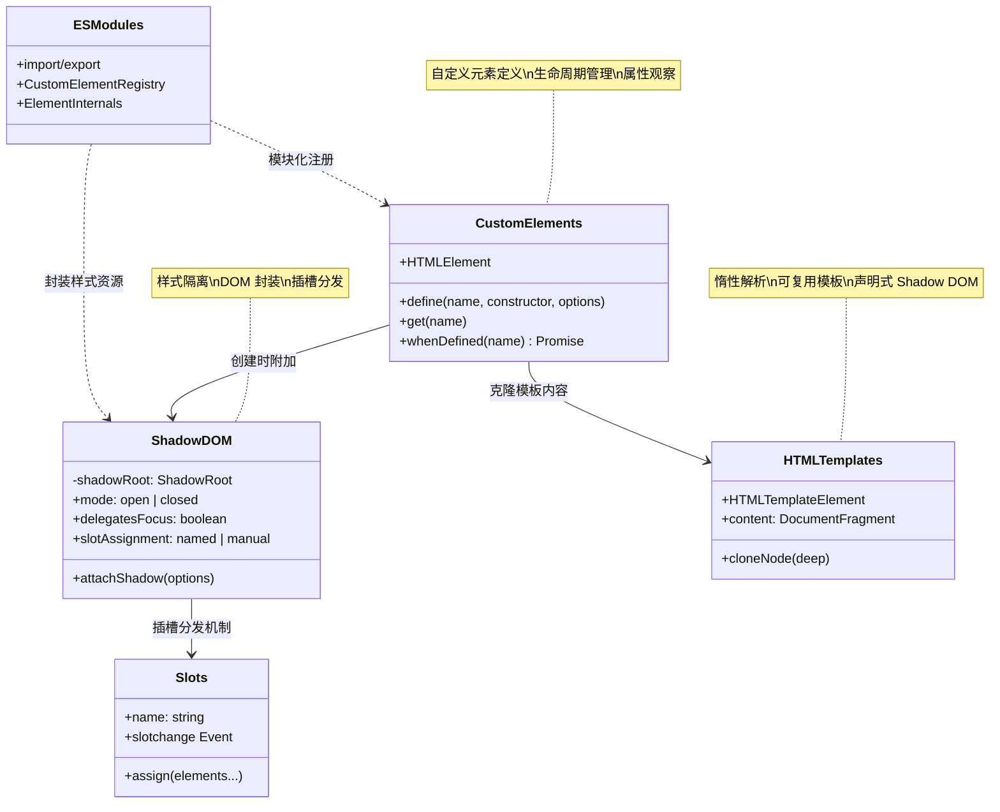
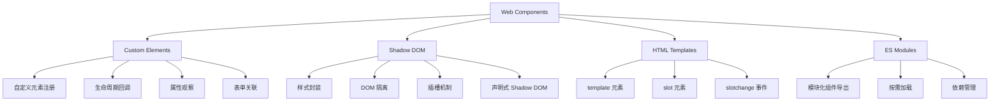
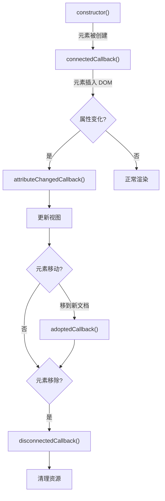
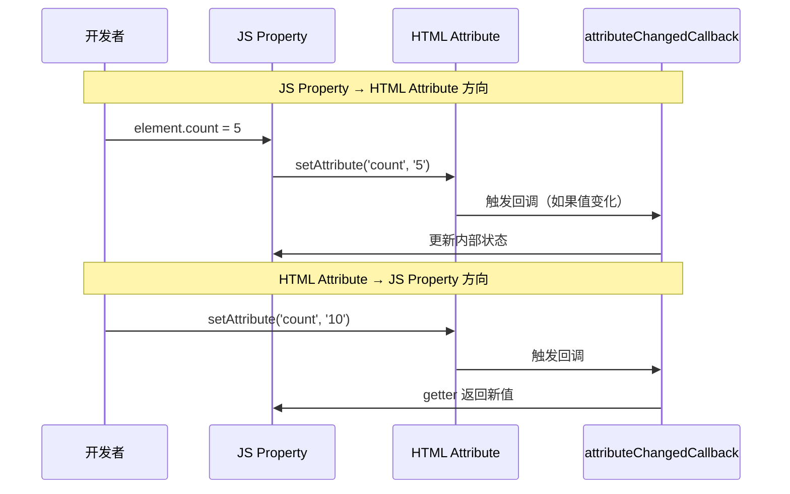
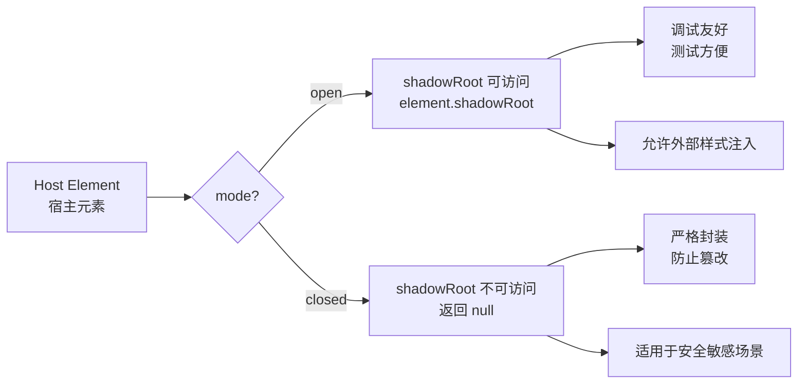
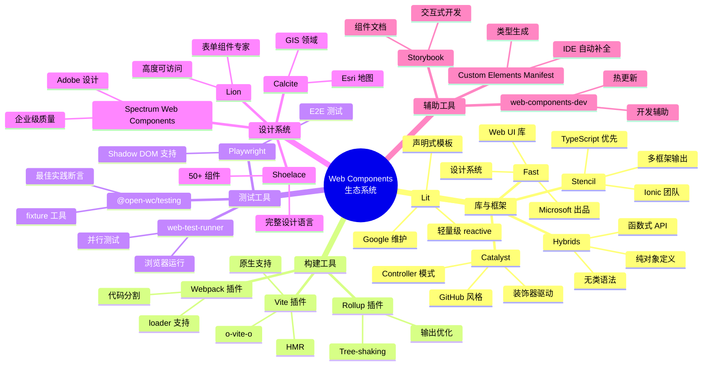
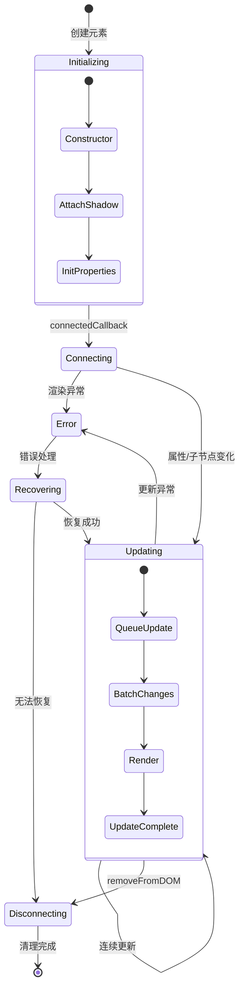

# Web Components 完全指南

Web Components 是一组浏览器原生 API，允许开发者创建可复用的自定义元素，其功能与标准 HTML 元素无异，且样式与行为完全封装，不会与页面其他代码冲突。

::: tip 核心优势
- **原生支持**：无需任何框架或构建工具，浏览器直接运行
- **封装性强**：Shadow DOM 实现样式和 DOM 的真正隔离
- **可复用性**：一次编写，跨框架、跨项目复用
- **标准化**：W3C 标准，所有现代浏览器均已支持
:::

## 技术全景



## 核心技术概览

Web Components 由四项核心技术组成，它们协同工作以实现完整的组件化能力：



| 技术 | 说明 | 浏览器支持 | 规范状态 |
|------|------|-----------|---------|
| **Custom Elements** | 定义新的 HTML 标签 | 全部现代浏览器 | W3C Recommendation |
| **Shadow DOM** | 样式与 DOM 封装 | 全部现代浏览器 | W3C Recommendation |
| **HTML Templates** | 声明可复用的 DOM 模板 | 全部现代浏览器 | W3C Recommendation |
| **CSS Scoping** | `:host` / `::slotted()` / `::part()` | 全部现代浏览器 | W3C Working Draft |
| **Declarative Shadow DOM** | HTML 中声明 Shadow DOM | Chrome/Edge 90+、Safari 16.4+、Firefox 123+ | WHATWG HTML |
| **Form-Associated CE** | 表单关联自定义元素 | 全部现代浏览器 | W3C Draft |
| **Constructable Stylesheets** | 可构造样式表 | 全部现代浏览器 | W3C Draft |

## 一、Custom Elements（自定义元素）深度解析

<h4>016-custom-elements-lifecycle.html</h4>

```html
<!DOCTYPE html>
<html lang="zh-CN">
<head>
  <meta charset="UTF-8">
  <meta name="viewport" content="width=device-width, initial-scale=1.0">
  <title>【016】Custom Elements 生命周期演示</title>
  <style>
    * { margin: 0; padding: 0; box-sizing: border-box; }
    body { font-family: -apple-system, BlinkMacSystemFont, 'Segoe UI', sans-serif; padding: 20px; background: #f8f9fa; color: #333; }
    .demo-wrap { max-width: 900px; margin: 0 auto; }
    .demo-header { display: flex; justify-content: space-between; align-items: center; margin-bottom: 20px; padding-bottom: 12px; border-bottom: 2px solid #e0e0e0; }
    .demo-header h1 { font-size: 20px; font-weight: 600; }
    .demo-badge { font-size: 12px; padding: 3px 10px; border-radius: 12px; background: #7c3aed; color: white; }

    .lifecycle-panel {
      background: white; border-radius: 14px; overflow: hidden;
      box-shadow: 0 2px 12px rgba(0,0,0,0.08); margin-bottom: 1.5rem;
    }
    .lp-header {
      background: linear-gradient(135deg, #7c3aed, #a78bfa);
      color: white; padding: 1rem 1.25rem; font-weight: 700;
      display: flex; justify-content: space-between; align-items: center;
    }
    .lp-body { padding: 1.25rem; }

    /* Timeline visualization */
    .timeline {
      display: flex; align-items: center; gap: 4px;
      margin-bottom: 1.5rem; padding: 1rem; background: #f8fafc; border-radius: 10px;
      overflow-x: auto;
    }
    .tl-step {
      display: flex; flex-direction: column; align-items: center;
      min-width: 70px; opacity: 0.4; transition: all 0.3s;
    }
    .tl-step.active { opacity: 1; }
    .tl-step.done { opacity: 0.8; }
    .tl-dot {
      width: 28px; height: 28px; border-radius: 50%;
      display: flex; align-items: center; justify-content: center;
      font-size: 0.72rem; font-weight: 700; color: white;
      margin-bottom: 6px; transition: all 0.3s;
    }
    .tl-step.active .tl-dot { transform: scale(1.2); box-shadow: 0 0 0 4px rgba(124,58,237,0.2); }
    .tl-label { font-size: 0.68rem; color: #64748b; text-align: center; font-weight: 500; }
    .tl-step.active .tl-label { color: #1e293b; font-weight: 700; }
    .tl-arrow { color: #cbd5e1; font-size: 1.2rem; flex-shrink: 0; }

    .dot-constructor { background: #6366f1; }
    .dot-connected { background: #8b5cf6; }
    .dot-adoption { background: #a78bfa; }
    .dot-attributed { background: #c084fc; }
    .dot-upgraded { background: #22c55e; }

    /* Event log */
    .event-log {
      background: #1e293b; border-radius: 10px; padding: 1rem;
      max-height: 240px; overflow-y: auto; font-family: 'SF Mono', Monaco, monospace;
      font-size: 0.8rem;
    }
    .event-log::-webkit-scrollbar { width: 4px; }
    .event-log::-webkit-scrollbar-thumb { background: #475569; border-radius: 2px; }
    .log-entry { padding: 3px 0; border-bottom: 1px solid #334155; display: flex; gap: 8px; align-items: center; }
    .log-icon { width: 18px; height: 18px; border-radius: 4px; display: flex; align-items: center; justify-content: center; font-size: 0.65rem; color: white; flex-shrink: 0; }
    .log-msg { color: #e2e8f0; font-size: 0.78rem; }

    /* Demo element */
    .element-playground {
      display: grid; grid-template-columns: 1fr 1fr; gap: 1rem; margin-top: 1rem;
    }
    .playground-area {
      border: 2px dashed #e2e8f0; border-radius: 10px; padding: 1.25rem;
      min-height: 120px; display: flex; flex-direction: column; align-items: center; justify-content: center;
    }
    .pg-label { font-size: 0.78rem; color: #94a3b8; margin-bottom: 8px; }

    life-cycle-demo {
      display: inline-flex; align-items: center; gap: 8px;
      padding: 12px 20px; background: linear-gradient(135deg, #7c3aed, #a78bfa);
      color: white; border-radius: 10px; font-weight: 600; font-size: 0.95rem;
      cursor: pointer; user-select: none; transition: transform 0.15s;
    }
    life-cycle-demo:hover { transform: scale(1.03); }

    .controls { display: flex; gap: 0.5rem; margin-top: 1rem; flex-wrap: wrap; }
    .ctrl-btn {
      padding: 8px 16px; border: 2px solid #e2e8f0; background: white;
      border-radius: 8px; cursor: pointer; font-size: 0.83rem; font-weight: 500;
      transition: all 0.15s;
    }
    .ctrl-btn:hover { border-color: #7c3aed; color: #7c3aed; }

    .info-tip {
      margin-top: 1rem; padding: 1rem; background: #f3e8ff;
      border-radius: 10px; font-size: 0.85rem; color: #6b21a8;
      border: 1px solid #c084fc;
    }
  </style>
</head>
<body>
  <div class="demo-wrap">
    <div class="demo-header">
      <h1>Custom Elements 生命周期</h1>
      <span class="demo-badge">Web Components API</span>
    </div>

    <div class="lifecycle-panel">
      <div class="lp-header">
        <span>🔄 生命周期时间线</span>
        <span id="elCount">已创建: 0 个元素</span>
      </div>
      <div class="lp-body">
        <div class="timeline" id="timeline">
          <div class="tl-step" data-step="constructor"><div class="tl-dot dot-constructor">1</div><div class="tl-label">constructor</div></div>
          <div class="tl-arrow">→</div>
          <div class="tl-step" data-step="connected"><div class="tl-dot dot-connected">2</div><div class="tl-label">connectedCallback</div></div>
          <div class="tl-arrow">→</div>
          <div class="tl-step" data-step="adoption"><div class="tl-dot dot-adoption">3</div><div class="tl-label">adoptedCallback</div></div>
          <div class="tl-arrow">→</div>
          <div class="tl-step" data-step="attributed"><div class="tl-dot dot-attributed">4</div><div class="tl-label">attributeChanged</div></div>
          <div class="tl-arrow">→</div>
          <div class="tl-step" data-step="disconnected"><div class="tl-dot dot-upgraded">5</div><div class="tl-label">disconnected</div></div>
        </div>

        <div class="element-playground">
          <div class="playground-area" id="area1">
            <div class="pg-label">区域 A（正常挂载）</div>
          </div>
          <div class="playground-area" id="area2">
            <div class="pg-label">区域 B（移动测试）</div>
          </div>
        </div>

        <div class="controls">
          <button class="ctrl-btn" onclick="createElement()">➕ 创建新元素</button>
          <button class="ctrl-btn" onclick="moveElement()">🔄 移动到区域B</button>
          <button class="ctrl-btn" onclick="changeAttribute()">✏️ 修改属性</button>
          <button class="ctrl-btn" onclick="removeElement()">🗑️ 移除元素</button>
          <button class="ctrl-btn" onclick="clearLog()">🧹 清空日志</button>
        </div>

        <div class="event-log" id="eventLog"></div>
      </div>
    </div>

    <div class="info-tip">
      💡 <strong>生命周期回调顺序（典型）：</strong>constructor → connectedCallback → attributeChangedCallback → adoptedCallback → disconnectedCallback
      <br>注意：若属性在元素挂载前已设置，attributeChangedCallback 会先于 connectedCallback 触发，实际顺序以规范为准。
    </div>
  </div>

  <script>
    let elCounter = 0;
    let currentEl = null;
    const logEl = document.getElementById('eventLog');

    function log(msg, icon = '●', color = '#a78bfa') {
      const entry = document.createElement('div');
      entry.className = 'log-entry';
      entry.innerHTML = `<div class="log-icon" style="background:${color}">${icon}</div><span class="log-msg">${msg}</span>`;
      logEl.insertBefore(entry, logEl.firstChild);
      while (logEl.children.length > 50) logEl.removeChild(logEl.lastChild);
    }

    function activateStep(stepName) {
      document.querySelectorAll('.tl-step').forEach(s => s.classList.remove('active'));
      const step = document.querySelector(`[data-step="${stepName}"]`);
      if (step) step.classList.add('active');
    }

    function updateCount() {
      document.querySelectorAll('.tl-step[data-step]').forEach(s => s.classList.add('done'));
      document.getElementById('elCount').textContent = `已创建: ${elCounter} 个元素`;
    }

    class LifeCycleDemo extends HTMLElement {
      static get observedAttributes() { return ['data-count', 'data-status']; }

      constructor() {
        super();
        this.id = 'demo-' + (++elCounter);
        log(`${this.id}: constructor() 执行`, '1', '#6366f1');
        activateStep('constructor');
      }

      connectedCallback() {
        log(`${this.id}: connectedCallback() — 已插入 DOM`, '✓', '#8b5cf6');
        activateStep('connected');
        currentEl = this;
        updateCount();
        if (!this.textContent) {
          this.innerHTML = `🔮 元素 #${elCounter}`;
        }
      }

      disconnectedCallback() {
        log(`${this.id}: disconnectedCallback() — 已从 DOM 移除`, '✗', '#ef4444');
        activateStep('disconnected');
        if (currentEl === this) currentEl = null;
      }

      adoptedCallback() {
        log(`${this.id}: adoptedCallback() — 已被 adoptNode 移动`, '⇄', '#c084fc');
        activateStep('adoption');
      }

      attributeChangedCallback(name, oldVal, newVal) {
        if (oldVal === null && newVal !== null) {
          log(`${this.id}: 属性 "${name}" 新增 → "${newVal}"`, '+', '#22c55e');
        } else if (oldVal !== null && newVal === null) {
          log(`${this.id}: 属性 "${name}" 删除（原值: ${oldVal}）`, '-', '#ef4444');
        } else {
          log(`${this.id}: 属性 "${name}" 变更: "${oldVal}" → "${newVal}"`, '~', '#f59e0b');
        }
        activateStep('attributed');
      }
    }

    customElements.define('life-cycle-demo', LifeCycleDemo);

    // Control functions
    function createElement() {
      const el = document.createElement('life-cycle-demo');
      el.setAttribute('data-count', elCounter);
      el.setAttribute('data-status', 'new');
      document.getElementById('area1').appendChild(el);
    }

    function moveElement() {
      if (!currentEl) { log('⚠️ 请先创建元素', '!', '#f59e0b'); return; }
      const newDoc = document.implementation.createHTMLDocument('');
      newDoc.body.appendChild(document.adoptNode(currentEl));
      document.getElementById('area2').appendChild(document.adoptNode(currentEl));
    }

    function changeAttribute() {
      if (!currentEl) { log('⚠️ 请先创建元素', '!', '#f59e0b'); return; }
      const count = parseInt(currentEl.getAttribute('data-count') || 0) + 1;
      currentEl.setAttribute('data-count', count);
      currentEl.setAttribute('data-status', 'updated-' + Date.now().toString(36));
    }

    function removeElement() {
      if (!currentEl) { log('⚠️ 没有可移除的元素', '!', '#f59e0b'); return; }
      currentEl.remove();
    }

    function clearLog() { logEl.innerHTML = ''; log('日志已清空', '🧹', '#64748b'); }

    // Create initial element
    createElement();
  </script>
</body>
</html>
```

### 1.1 两种自定义元素类型

Web Components 支持两种类型的自定义元素：**自主定制元素（Autonomous Custom Elements）** 和 **内置定制元素（Customized Built-in Elements）**。

#### 自主定制元素（Autonomous Custom Elements）

自主定制元素继承自 `HTMLElement`，创建全新的 HTML 标签：

```javascript
class MyButton extends HTMLElement {
  constructor() {
    // 必须首先调用 super()
    super()
    // 构造函数中不推荐操作 DOM 或属性
    // 因为此时元素尚未插入文档树，也没有子元素或属性
  }

  connectedCallback() {
    // 元素首次插入 DOM 时调用
    // 适合进行 DOM 操作、事件绑定、资源加载
    this.render()
  }
}

// 注册自定义元素
// 标签名必须包含连字符（kebab-case）
customElements.define('my-button', MyButton)
```

```html
<!-- 使用自主定制元素 -->
<my-button>点击我</my-button>
```

#### 内置定制元素（Customized Built-in Elements）

内置定制元素扩展现有的 HTML 元素，保留原元素的语义和默认行为：

```javascript
// 扩展原生 <button> 元素
class FancyButton extends HTMLButtonElement {
  constructor() {
    super()
  }

  connectedCallback() {
    this.style.cssText = `
      background: linear-gradient(135deg, #667eea 0%, #764ba2 100%);
      color: white;
      border: none;
      border-radius: 8px;
      padding: 12px 24px;
      font-size: 16px;
      cursor: pointer;
      transition: transform 0.2s, box-shadow 0.2s;
    `

    this.addEventListener('mouseenter', () => {
      this.style.transform = 'scale(1.05)'
      this.style.boxShadow = '0 10px 20px rgba(102, 126, 234, 0.4)'
    })

    this.addEventListener('mouseleave', () => {
      this.style.transform = ''
      this.style.boxShadow = ''
    })
  }
}

// 第三个参数指定扩展的内置元素
customElements.define('fancy-button', FancyButton, { extends: 'button' })
```

```html
<!-- 使用 is 属性指定内置定制元素 -->
<button is="fancy-button">渐变按钮</button>

<!-- 仍然具备原生 button 的所有特性 -->
<form>
  <button is="fancy-button" type="submit">提交</button>
</form>
```

::: warning 注意事项
- 内置定制元素需要使用 `is` 属性，而非自定义标签名
- 并非所有内置元素都可以被扩展（如 `<br>`、`` 等空元素）
- Safari 至今未支持内置定制元素（WebKit 明确不实现），使用时需提供回退方案
:::

### 1.2 生命周期回调详解

自定义元素拥有完整的生命周期，每个阶段都有对应的回调函数：



#### constructor()

构造函数在元素创建时调用，是生命周期的起点：

```javascript
class LifecycleDemo extends HTMLElement {
  constructor() {
    // ✅ 必须首先调用 super()
    super()

    // ✅ 可以初始化实例属性
    this._state = {}
    this._privateData = []

    // ✅ 可以创建 Shadow DOM（但不要填充内容）
    this.attachShadow({ mode: 'open' })

    // ❌ 不要在构造函数中查询属性或子元素
    // 此时元素可能还没有属性或子节点

    // ❌ 不要在构造函数中进行 DOM 操作或触发事件
  }
}
```

**最佳实践**：
- 仅用于初始化实例变量和设置 Shadow DOM
- 避免任何耗时操作或副作用
- 必须先调用 `super()` 才能使用 `this`

#### connectedCallback()

当元素首次插入文档 DOM 时调用：

```javascript
class ConnectedDemo extends HTMLElement {
  connectedCallback() {
    // ✅ 适合的操作：
    // 1. 获取并处理属性值
    const theme = this.getAttribute('theme') || 'light'

    // 2. 构建/渲染 DOM 内容
    this.render(theme)

    // 3. 绑定事件监听器
    document.addEventListener('keydown', this._handleKeydown)

    // 4. 发起网络请求获取数据
    this.fetchData()

    // 5. 启动定时器或观察器
    this._observer = new MutationObserver(this._handleMutation)
    this._observer.observe(this, { childList: true })
  }

  disconnectedCallback() {
    // ⚠️ 必须在 disconnectedCallback 中清理所有资源！
    document.removeEventListener('keydown', this._handleKeydown)
    if (this._observer) {
      this._observer.disconnect()
    }
  }
}
```

**注意事项**：
- 可能被多次调用（如使用 `appendChild` 移动元素）
- 不保证在 `attributeChangedCallback` 之前或之后执行
- 应实现幂等逻辑，避免重复绑定

#### attributeChangedCallback()

当 `observedAttributes` 中列出的属性发生变化时调用：

```javascript
class AttributeDemo extends HTMLElement {
  // 声明需要观察的属性列表
  static get observedAttributes() {
    return ['value', 'disabled', 'max', 'min']
  }

  attributeChangedCallback(name, oldValue, newValue) {
    // name: 变化的属性名
    // oldValue: 旧值（首次设置时为 null）
    // newValue: 新值（属性被删除时为 null）

    switch (name) {
      case 'value':
        this._updateValue(newValue)
        break
      case 'disabled':
        this._toggleDisabled(newValue !== null)
        break
      case 'max':
      case 'min':
        this._validateRange()
        break
    }
  }

  _updateValue(value) {
    // 更新内部状态和视图
    if (this._input) {
      this._input.value = value || ''
    }
    // 触发自定义事件通知外部
    this.dispatchEvent(new CustomEvent('value-changed', {
      detail: { value },
      bubbles: true,
      composed: true
    }))
  }
}
```

**性能优化建议**：
- 只观察真正需要的属性，避免不必要的回调
- 对于频繁变化的属性，考虑使用防抖/节流
- 可以批量处理多个属性变化

#### adoptedCallback()

当自定义元素被移动到新文档时调用（如 `document.adoptNode()`）：

```javascript
class AdoptedDemo extends HTMLElement {
  // 注意：adoptedCallback 不接收参数
  // 回调触发时元素已位于新文档，可通过 this.ownerDocument 获取
  adoptedCallback() {
    console.log(`元素移动到文档 ${this.ownerDocument.URL}`)

    // 可能需要重新获取全局资源
    this._reinitializeResources()
  }
}
```

**实际应用场景**：
- 跨 `<iframe>` 边界移动元素
- 使用 `document.importNode()` 或 `document.adoptNode()`
- 在多文档环境中工作

#### disconnectedCallback()

当元素从 DOM 中移除时调用：

```javascript
class CleanupDemo extends HTMLElement {
  connectedCallback() {
    // 资源初始化
    this._timer = setInterval(() => this.tick(), 1000)
    this._resizeHandler = this._handleResize.bind(this)
    window.addEventListener('resize', this._resizeHandler)

    this._abortController = new AbortController()
    fetch('/api/data', { signal: this._abortController.signal })
      .then(res => res.json())
      .then(data => this.render(data))
  }

  disconnectedCallback() {
    // 清理所有资源，防止内存泄漏！

    // 1. 清除定时器
    if (this._timer) {
      clearInterval(this._timer)
      this._timer = null
    }

    // 2. 移除事件监听
    window.removeEventListener('resize', this._resizeHandler)

    // 3. 取消进行中的请求
    if (this._abortController) {
      this._abortController.abort()
    }

    // 4. 断开观察器
    if (this._observer) {
      this._observer.disconnect()
    }

    // 5. 断开 WebSocket 连接
    if (this._ws) {
      this._ws.close()
    }
  }
}
```

### 1.3 属性反射（Property Reflection）

属性反射是指 JavaScript 属性与 HTML 属性之间的双向同步机制：



#### 完整的属性反射实现

```javascript
class ReflectiveCounter extends HTMLElement {
  static get observedAttributes() {
    return ['count', 'step', 'max']
  }

  constructor() {
    super()
    this.attachShadow({ mode: 'open' })
    this._count = 0
    this._step = 1
    this._max = Infinity
  }

  // === count 属性 ===
  get count() {
    return this._count
  }

  set count(value) {
    const num = Number(value) || 0
    if (num !== this._count) {
      this._count = num
      // 反射到 HTML 属性
      this.setAttribute('count', String(num))
    }
  }

  // === step 属性 ===
  get step() {
    return this._step
  }

  set step(value) {
    const num = Number(value) || 1
    if (num !== this._step && num > 0) {
      this._step = num
      this.setAttribute('step', String(num))
    }
  }

  // === max 属性 ===
  get max() {
    return this._max
  }

  set max(value) {
    const num = Number(value)
    if (!isNaN(num) && num !== this._max) {
      this._max = num
      this.setAttribute('max', String(num))
    }
  }

  attributeChangedCallback(name, oldValue, newValue) {
    if (oldValue === newValue) return

    switch (name) {
      case 'count':
        this._count = Number(newValue) || 0
        this._renderCount()
        break
      case 'step':
        this._step = Number(newValue) || 1
        break
      case 'max':
        this._max = Number(newValue) || Infinity
        break
    }
  }

  connectedCallback() {
    this.render()
  }

  render() {
    this.shadowRoot.innerHTML = `
      <style>
        :host {
          display: inline-flex;
          align-items: center;
          gap: 8px;
          font-family: system-ui;
        }
        .display {
          min-width: 60px;
          text-align: center;
          font-size: 1.2em;
          font-weight: bold;
        }
        button {
          width: 36px;
          height: 36px;
          border: 1px solid #ccc;
          border-radius: 6px;
          background: #f5f5f5;
          cursor: pointer;
          font-size: 1.2em;
        }
        button:hover:not(:disabled) {
          background: #e0e0e0;
        }
        button:disabled {
          opacity: 0.5;
          cursor: not-allowed;
        }
      </style>
      <button class="decrement" aria-label="减少">−</button>
      <span class="display" role="status">${this.count}</span>
      <button class="increment" aria-label="增加">+</button>
    `

    this.shadowRoot.querySelector('.decrement').onclick = () => this.decrement()
    this.shadowRoot.querySelector('.increment').onclick = () => this.increment()
  }

  _renderCount() {
    const display = this.shadowRoot.querySelector('.display')
    if (display) {
      display.textContent = this.count
    }
    this._updateButtons()
  }

  _updateButtons() {
    const decBtn = this.shadowRoot.querySelector('.decrement')
    const incBtn = this.shadowRoot.querySelector('.increment')

    if (decBtn) decBtn.disabled = this.count <= 0
    if (incBtn) incBtn.disabled = this.count >= this.max
  }

  increment() {
    if (this.count < this.max) {
      this.count += this.step
      this.dispatchEvent(new CustomEvent('count-change', {
        detail: { count: this.count },
        bubbles: true,
        composed: true
      }))
    }
  }

  decrement() {
    if (this.count > 0) {
      this.count -= this.step
      this.dispatchEvent(new CustomEvent('count-change', {
        detail: { count: this.count },
        bubbles: true,
        composed: true
      }))
    }
  }

  reset() {
    this.count = 0
  }
}

customElements.define('reflective-counter', ReflectiveCounter)
```

```html
<!-- 使用示例 -->
<reflective-counter id="counter" count="0" step="5" max="100"></reflective-counter>

<script>
  const counter = document.getElementById('counter')

  // 通过 JS 属性修改
  counter.count = 20
  console.log(counter.getAttribute('count')) // "20"

  // 监听变化
  counter.addEventListener('count-change', (e) => {
    console.log('当前计数:', e.detail.count)
  })

  // 通过 HTML 属性修改也会同步
  // counter.setAttribute('count', '50') → 自动更新 JS 属性
</script>
```

### 1.4 自定义事件与 CustomEvent

Web Components 应通过自定义事件与外部通信：

```javascript
class EventEmitter extends HTMLElement {
  constructor() {
    super()
    this.attachShadow({ mode: 'open' })
  }

  connectedCallback() {
    this.render()
  }

  render() {
    this.shadowRoot.innerHTML = `
      <style>
        :host { display: block; }
        button {
          padding: 8px 16px;
          margin: 4px;
          border-radius: 4px;
          border: 1px solid #ccc;
          cursor: pointer;
        }
      </style>
      <button id="notify">发送通知</button>
      <button id="confirm">确认对话框</button>
      <button id="data">传递数据</button>
    `

    this.shadowRoot.getElementById('notify').addEventListener('click', () => {
      // 基本自定义事件
      this.dispatchEvent(new CustomEvent('my-event'))
    })

    this.shadowRoot.getElementById('confirm').addEventListener('click', () => {
      // 可取消的事件
      const event = new CustomEvent('before-action', {
        cancelable: true,
        bubbles: true,
        composed: true // 允许穿透 Shadow DOM 边界
      })

      const shouldProceed = this.dispatchEvent(event)
      if (shouldProceed) {
        console.log('操作未被取消，继续执行')
      } else {
        console.log('操作被外部取消了')
      }
    })

    this.shadowRoot.getElementById('data').addEventListener('click', () => {
      // 携带数据的事件
      this.dispatchEvent(new CustomEvent('data-ready', {
        detail: {
          timestamp: Date.now(),
          payload: { id: 1, message: 'Hello World' },
          source: this.tagName.toLowerCase()
        },
        bubbles: true,
        composed: true
      }))
    })
  }
}

customElements.define('event-emitter', EventEmitter)
```

```html
<event-emitter id="emitter"></event-emitter>

<script>
  const emitter = document.getElementById('emitter')

  // 监听基本事件
  emitter.addEventListener('my-event', () => {
    console.log('收到通知事件')
  })

  // 拦截可取消事件
  emitter.addEventListener('before-action', (e) => {
    if (/* 某些条件 */) {
      e.preventDefault() // 取消操作
      console.log('已阻止操作执行')
    }
  })

  // 接收数据事件
  emitter.addEventListener('data-ready', (e) => {
    console.log('数据:', e.detail)
    // { timestamp: ..., payload: {...}, source: 'event-emitter' }
  })
</script>
```

### 1.5 表单关联自定义元素（Form-Associated Custom Elements）

通过 `ElementInternals` API，自定义元素可以参与表单验证和提交：

```javascript
class CustomInput extends HTMLElement {
  static formAssociated = true

  constructor() {
    super()
    this.attachShadow({ mode: 'open' })
    // 获取 ElementInternals 实例
    this._internals = this.attachInternals()
    this._value = ''
  }

  // 表单相关属性
  get form() { return this._internals.form }
  get name() { return this.getAttribute('name') }
  get type() { return this.localName }
  get validity() { return this._internals.validity }
  get validationMessage() { return this._internals.validationMessage }
  get willValidate() { return this._internals.willValidate }

  get value() { return this._value }
  set value(v) {
    this._value = v
    this._internals.setFormValue(v)
    this._validate()
  }

  // 表单生命周期回调
  formAssociatedCallback(form) {
    console.log('元素已关联到表单:', form)
  }

  formResetCallback() {
    this.value = this.getAttribute('value') || ''
  }

  formStateRestoreCallback(state, mode) {
    this.value = state
  }

  _validate() {
    const required = this.hasAttribute('required')
    const minLength = parseInt(this.getAttribute('minlength')) || 0
    const pattern = this.getAttribute('pattern')

    // 设置验证状态
    if (required && !this._value) {
      this._internals.setValidity({
        valueMissing: true
      }, '此字段为必填项', this.shadowRoot.querySelector('input'))
    } else if (this._value.length < minLength) {
      this._internals.setValidity({
        rangeUnderflow: true
      }, `最少需要 ${minLength} 个字符`, this.shadowRoot.querySelector('input'))
    } else if (pattern && !new RegExp(pattern).test(this._value)) {
      this._internals.setValidity({
        patternMismatch: true
      }, '格式不正确', this.shadowRoot.querySelector('input'))
    } else {
      this._internals.setValidity({})
    }
  }

  checkValidity() {
    return this._internals.checkValidity()
  }

  reportValidity() {
    return this._internals.reportValidity()
  }

  connectedCallback() {
    this.render()
  }

  render() {
    this.shadowRoot.innerHTML = `
      <style>
        :host { display: inline-block; }
        input {
          padding: 8px 12px;
          border: 1px solid #ccc;
          border-radius: 4px;
          font-size: inherit;
        }
        input:invalid {
          border-color: red;
        }
      </style>
      <input type="text" part="input" />
    `

    const input = this.shadowRoot.querySelector('input')
    input.value = this._value

    input.addEventListener('input', (e) => {
      this.value = e.target.value
      this.dispatchEvent(new CustomEvent('input', { bubbles: true, composed: true }))
    })

    input.addEventListener('blur', () => {
      this._validate()
      this.dispatchEvent(new CustomEvent('change', { bubbles: true, composed: true }))
    })
  }
}

customElements.define('custom-input', CustomInput)
```

```html
<form id="demo-form">
  <custom-input
    name="username"
    required
    minlength="3"
    pattern="[a-zA-Z]+"
    placeholder="请输入用户名"
  ></custom-input>

  <button type="submit">提交</button>
  <button type="reset">重置</button>
</form>

<script>
  document.getElementById('demo-form').addEventListener('submit', (e) => {
    e.preventDefault()
    const formData = new FormData(e.target)
    console.log(Object.fromEntries(formData))
    // { username: "输入的值" }
  })
</script>
```

## 二、Shadow DOM（影子 DOM）深度解析

<h4>017-shadow-dom-isolation.html</h4>

```html
<!DOCTYPE html>
<html lang="zh-CN">
<head>
  <meta charset="UTF-8">
  <meta name="viewport" content="width=device-width, initial-scale=1.0">
  <title>【017】Shadow DOM 样式隔离演示</title>
  <style>
    * { margin: 0; padding: 0; box-sizing: border-box; }
    body { font-family: -apple-system, BlinkMacSystemFont, 'Segoe UI', sans-serif; padding: 20px; background: #f8f9fa; color: #333; }
    .demo-wrap { max-width: 900px; margin: 0 auto; }
    .demo-header { display: flex; justify-content: space-between; align-items: center; margin-bottom: 20px; padding-bottom: 12px; border-bottom: 2px solid #e0e0e0; }
    .demo-header h1 { font-size: 20px; font-weight: 600; }
    .demo-badge { font-size: 12px; padding: 3px 10px; border-radius: 12px; background: #059669; color: white; }

    .compare-layout {
      display: grid; grid-template-columns: 1fr 1fr; gap: 1.5rem;
    }
    .compare-side {
      background: white; border-radius: 14px; overflow: hidden;
      box-shadow: 0 2px 10px rgba(0,0,0,0.07);
    }
    .cs-header {
      padding: 1rem 1.25rem; font-weight: 700; font-size: 0.92rem;
      display: flex; align-items: center; gap: 8px;
    }
    .cs-no .cs-header { background: linear-gradient(135deg, #fecaca, #fca5a5); color: #991b1b; }
    .cs-yes .cs-header { background: linear-gradient(135deg, #bbf7d0, #86efac); color: #166534; }
    .cs-body { padding: 1.25rem; }

    /* Global styles that should NOT leak into Shadow DOM */
    .global-style-test {
      color: red !important;
      font-size: 24px !important;
      background: yellow !important;
      padding: 10px !important;
      border: 3px dashed red !important;
    }

    .style-rules {
      margin-top: 1rem; padding: 0.75rem; background: #fef2f2;
      border-radius: 8px; font-size: 0.8rem; color: #991b1b;
      border: 1px solid #fecaca;
    }
    .style-rules code { background: #fee2e2; padding: 1px 5px; border-radius: 3px; }

    .isolation-result {
      margin-top: 1rem; padding: 1rem; background: #f0fdf4;
      border-radius: 8px; font-size: 0.85rem; color: #166534;
      border: 1px solid #bbf7d0;
    }

    .code-block {
      margin-top: 1rem; background: #1e293b; border-radius: 10px;
      padding: 1rem; color: #e2e8f0; font-size: 0.82rem; overflow-x: auto;
      line-height: 1.55;
    }
    .cb-kw { color: #c084fc; } .cb-fn { color: #38bdf8; } .cb-str { color: #4ade80; } .cb-cm { color: #64748b; }

    @media (max-width: 720px) {
      .compare-layout { grid-template-columns: 1fr; }
    }
  </style>
</head>
<body>
  <div class="demo-wrap">
    <div class="demo-header">
      <h1>Shadow DOM 样式隔离</h1>
      <span class="demo-badge">样式封装</span>
    </div>

    <div class="style-rules">
      ⚠️ 全局注入的「破坏性」CSS：<br>
      <code>* { color: red !important; font-size: 24px !important; background: yellow !important; }</code>
    </div>

    <div class="compare-layout">
      <!-- 无 Shadow DOM -->
      <div class="compare-side cs-no">
        <div class="cs-header">❌ 普通 DOM（样式泄漏）</div>
        <div class="cs-body">
          <div class="global-style-test" id="normalDom">
            我是被全局样式影响的普通元素
          </div>
          <p style="margin-top:0.75rem;font-size:0.82rem;color:#991b1b;">
            全局 CSS 直接作用于此元素，样式完全被破坏！
          </p>
        </div>
      </div>

      <!-- 有 Shadow DOM -->
      <div class="compare-side cs-yes">
        <div class="cs-header">✅ Shadow DOM（样式隔离）</div>
        <div class="cs-body">
          <shadow-isolated-demo></shadow-isolated-demo>
          <p style="margin-top:0.75rem;font-size:0.82rem;color:#166534;">
            Shadow DOM 内部样式不受外部影响，完美隔离！
          </p>
        </div>
      </div>
    </div>

    <div class="isolation-result">
      <strong>💡 Shadow DOM 的三大隔离特性：</strong><br>
      ① <strong>样式隔离</strong> — 外部 CSS 无法穿透 Shadow Boundary<br>
      ② <strong>DOM 隐藏</strong> — 内部 DOM 对外部 querySelector 不可见<br>
      ③ <strong>脚本安全</strong> — 外部 JS 无法直接操作内部节点
    </div>

    <div class="code-block">
<span class="cb-cm">// 创建带样式的 Shadow DOM</span><br>
<span class="cb-kw">class</span> <span class="cb-fn">ShadowIsolatedDemo</span> <span class="cb-kw">extends</span> HTMLElement {<br>
&nbsp;&nbsp;<span class="cb-fn">connectedCallback</span>() {<br>
&nbsp;&nbsp;&nbsp;&nbsp;<span class="cb-kw">const</span> shadow = <span class="cb-kw">this</span>.<span class="cb-fn">attachShadow</span>({ mode: <span class="cb-str">'closed'</span> });<br><br>
&nbsp;&nbsp;&nbsp;&nbsp;shadow.<span class="cb-fn">innerHTML</span> = `<br>
&nbsp;&nbsp;&nbsp;&nbsp;&nbsp;&nbsp;&lt;style&gt;<br>
&nbsp;&nbsp;&nbsp;&nbsp;&nbsp;&nbsp;&nbsp;&nbsp;<span class="cb-cm">/* 这些样式只作用于 Shadow DOM 内部 */</span><br>
&nbsp;&nbsp;&nbsp;&nbsp;&nbsp;&nbsp;&nbsp;&nbsp;.inner-box {<br>
&nbsp;&nbsp;&nbsp;&nbsp;&nbsp;&nbsp;&nbsp;&nbsp;&nbsp;&nbsp;padding: 16px; border-radius: 10px;<br>
&nbsp;&nbsp;&nbsp;&nbsp;&nbsp;&nbsp;&nbsp;&nbsp;&nbsp;&nbsp;background: linear-gradient(135deg, #22c55e, #16a34a);<br>
&nbsp;&nbsp;&nbsp;&nbsp;&nbsp;&nbsp;&nbsp;&nbsp;&nbsp;&nbsp;color: white; font-weight: 600; text-align: center;<br>
&nbsp;&nbsp;&nbsp;&nbsp;&nbsp;&nbsp;&nbsp;&nbsp;}<br>
&nbsp;&nbsp;&nbsp;&nbsp;&nbsp;&nbsp;&lt;/style&gt;<br>
&nbsp;&nbsp;&nbsp;&nbsp;&nbsp;&nbsp;&lt;div class=<span class="cb-str">"inner-box"</span>&gt;<br>
&nbsp;&nbsp;&nbsp;&nbsp;&nbsp;&nbsp;&nbsp;&nbsp;我是 Shadow DOM 内部的元素<br>
&nbsp;&nbsp;&nbsp;&nbsp;&nbsp;&nbsp;&lt;/div&gt;<br>
&nbsp;&nbsp;&nbsp;&nbsp;`;<br>
&nbsp;&nbsp;}<br>
}<br>
customElements.<span class="cb-fn">define</span>(<span class="cb-str">'shadow-isolated-demo'</span>, ShadowIsolatedDemo);
    </div>
  </div>

  <script>
    // Inject destructive global styles
    const style = document.createElement('style');
    style.textContent = `
      .global-style-test,
      div, span, p {
        color: red !important;
        font-size: 24px !important;
        background: yellow !important;
        padding: 10px !important;
        border: 3px dashed red !important;
      }
    `;
    document.head.appendChild(style);

    // Shadow DOM component
    class ShadowIsolatedDemo extends HTMLElement {
      constructor() { super(); }
      connectedCallback() {
        const shadow = this.attachShadow({ mode: 'closed' });
        shadow.innerHTML = `
          <style>
            .inner-box {
              padding: 16px; border-radius: 10px;
              background: linear-gradient(135deg, #22c55e, #16a34a);
              color: white; font-weight: 600; text-align: center;
              font-size: 0.95rem;
            }
          </style>
          <div class="inner-box">
            🔒 我是 Shadow DOM 内部的元素<br>
            <small style="opacity:0.85;font-weight:400;">全局红色样式无法影响我</small>
          </div>
        `;
      }
    }
    customElements.define('shadow-isolated-demo', ShadowIsolatedDemo);
  </script>
</body>
</html>
```

### 2.1 attachShadow() 与封装模式

Shadow DOM 提供了强大的封装能力，通过 `attachShadow()` 方法创建：



#### Open 模式

```javascript
class OpenModal extends HTMLElement {
  constructor() {
    super()
    // Open 模式：外部可通过 element.shadowRoot 访问
    this.shadowRoot = this.attachShadow({ mode: 'open' })
    this.render()
  }

  render() {
    this.shadowRoot.innerHTML = `
      <style>
        :host { display: none; }
        :host([open]) { display: flex; }
        /* ... */
      </style>
      <div class="modal-overlay">
        <div class="modal-content">
          <slot></slot>
        </div>
      </div>
    `
  }

  // 外部可以访问和操作 shadowRoot
  querySelector(selector) {
    return this.shadowRoot.querySelector(selector)
  }
}

customElements.define('open-modal', OpenModal)

// 外部可以访问
const modal = document.createElement('open-modal')
console.log(modal.shadowRoot) // ShadowRoot 对象
modal.shadowRoot.querySelector('.modal-content').style.padding = '20px'
```

#### Closed 模式

```javascript
class ClosedModal extends HTMLElement {
  constructor() {
    super()
    // Closed 模式：外部无法访问 shadowRoot
    this._shadowRoot = this.attachShadow({ mode: 'closed' })
    this.render()
  }

  render() {
    this._shadowRoot.innerHTML = /* ... */
  }

  // 提供受控的公共 API
  open() {
    this._shadowRoot.host.setAttribute('open', '')
  }

  close() {
    this._shadowRoot.host.removeAttribute('open')
  }
}

customElements.define('closed-modal', ClosedModal)

// 外部无法直接访问
const modal = document.createElement('closed-modal')
console.log(modal.shadowRoot) // null
// 但可以通过公开的方法操作
modal.open()
modal.close()
```

#### 高级选项

```javascript
class AdvancedShadow extends HTMLElement {
  constructor() {
    super()
    this.attachShadow({
      mode: 'open',
      delegatesFocus: true,  // 将焦点委托给 shadow 内部元素
      slotAssignment: 'manual'  // 手动控制插槽分配
    })
  }
}
```

| 选项 | 类型 | 默认值 | 说明 |
|------|------|--------|------|
| `mode` | `'open' \| 'closed'` | - | 封装模式 |
| `delegatesFocus` | `boolean` | `false` | 焦点委托，改善无障碍体验 |
| `slotAssignment` | `'named' \| 'manual'` | `'named'` | 插槽分配方式 |

### 2.2 Shadow DOM 样式作用域

Shadow DOM 提供了丰富的 CSS 选择器来控制样式的作用域和穿透：

```css
/* ============================================
   Shadow DOM 核心选择器
   ============================================ */

/* 1. :host — 选择宿主元素本身 */
:host {
  display: inline-block;
  font-family: system-ui;
}

/* 2. :host() — 带条件选择宿主 */
:host([variant="primary"]) {
  --accent-color: #2563eb;
  background: var(--accent-color);
  color: white;
}

:host([variant="danger"]) {
  --accent-color: #dc2626;
  background: var(--accent-color);
  color: white;
}

:host(:hover) {
  transform: translateY(-2px);
  box-shadow: 0 4px 12px rgba(0, 0, 0, 0.15);
}

/* 3. :host-context() — 选择祖先中的宿主 */
:host-context(.dark-theme) {
  background: #1e293b;
  color: #f1f5f9;
}

:host-context(body[data-theme="light"]) {
  background: #ffffff;
  color: #1e293b;
}

/* 4. ::slotted() — 选择分发到插槽的内容 */
/* 只能选择顶层元素，不能深入子元素 */
::slotted(span) {
  font-weight: 600;
  color: var(--accent-color, inherit);
}

::slotted(.header-item) {
  padding: 8px 16px;
}

/* ❌ 这不会生效：*/
/* ::slotted(.item span) { ... } */

/* 5. ::part() — 从外部样式化内部元素 */
/* 需要内部元素设置 part 属性 */
.button-base::part(label) {
  font-size: 14px;
  text-transform: uppercase;
}
```

#### 完整的样式系统示例

```javascript
class StyledCard extends HTMLElement {
  constructor() {
    super()
    this.attachShadow({ mode: 'open' })
  }

  static get observedAttributes() {
    return ['variant', 'size', 'elevated']
  }

  attributeChangedCallback() {
    this.render()
  }

  connectedCallback() {
    this.render()
  }

  render() {
    const variant = this.getAttribute('variant') || 'default'
    const size = this.getAttribute('size') || 'medium'
    const elevated = this.hasAttribute('elevated')

    this.shadowRoot.innerHTML = `
      <style>
        :host {
          --card-bg: #ffffff;
          --card-border: #e2e8f0;
          --card-shadow: none;
          --card-radius: 12px;
          --card-padding: 16px;

          display: block;
          background: var(--card-bg);
          border: 1px solid var(--card-border);
          border-radius: var(--card-radius);
          padding: var(--card-padding);
          box-shadow: var(--card-shadow);
          transition: all 0.2s ease;
        }

        /* Variant 变体 */
        :host([variant="primary"]) {
          --card-bg: #eff6ff;
          --card-border: #bfdbfe;
        }

        :host([variant="success"]) {
          --card-bg: #f0fdf4;
          --card-border: #bbf7d0;
        }

        :host([variant="warning"]) {
          --card-bg: #fffbeb;
          --card-border: #fde68a;
        }

        :host([variant="danger"]) {
          --card-bg: #fef2f2;
          --card-border: #fecaca;
        }

        /* Size 尺寸 */
        :host([size="small"]) {
          --card-padding: 8px;
          --card-radius: 6px;
        }

        :host([size="large"]) {
          --card-padding: 24px;
          --card-radius: 16px;
        }

        /* Elevated 阴影 */
        :host([elevated]) {
          --card-shadow:
            0 1px 3px rgba(0, 0, 0, 0.08),
            0 4px 12px rgba(0, 0, 0, 0.05);
        }

        :host([elevated]:hover) {
          --card-shadow:
            0 4px 6px rgba(0, 0, 0, 0.08),
            0 12px 28px rgba(0, 0, 0, 0.1);
          transform: translateY(-2px);
        }

        /* Slot 样式 */
        .header {
          margin-bottom: 12px;
        }

        .header ::slotted(*) {
          font-size: 1.125em;
          font-weight: 600;
          color: #1e293b;
        }

        .body ::slotted(p) {
          color: #64748b;
          line-height: 1.6;
          margin: 0;
        }

        .footer {
          margin-top: 16px;
          padding-top: 12px;
          border-top: 1px solid var(--card-border);
        }

        .footer ::slotted(*) {
          display: flex;
          gap: 8px;
          justify-content: flex-end;
        }
      </style>

      <div class="header">
        <slot name="header"></slot>
      </div>
      <div class="body">
        <slot></slot>
      </div>
      <div class="footer">
        <slot name="footer"></slot>
      </div>
    `
  }
}

customElements.define('styled-card', StyledCard)
```

```html
<!-- 使用示例 -->
<div class="dark-theme">
  <styled-card variant="primary" size="large" elevated>
    <h3 slot="header">主要信息卡片</h3>
    <p>这是卡片的主要内容区域。</p>
    <div slot="footer">
      <button>取消</button>
      <button part="action-btn">确认</button>
    </div>
  </styled-card>

  <!-- 外部通过 ::part() 定制内部按钮样式 -->
  <style>
    styled-card::part(action-btn) {
      background: #2563eb;
      color: white;
      border: none;
      padding: 8px 16px;
      border-radius: 6px;
      cursor: pointer;
    }
  </style>
</div>
```

### 2.3 Constructable Stylesheets（可构造样式表）

对于需要在多个组件间共享样式的场景，可以使用 Constructable Stylesheets：

```javascript
// 定义共享样式表
const sharedStyles = new CSSStyleSheet()
sharedStyles.replaceSync(`
  :host {
    box-sizing: border-box;
    font-family: -apple-system, BlinkMacSystemFont, 'Segoe UI', Roboto, sans-serif;
  }

  * {
    box-sizing: inherit;
  }
`)

const buttonStyles = new CSSStyleSheet()
buttonStyles.replaceSync(`
  .btn {
    display: inline-flex;
    align-items: center;
    justify-content: center;
    padding: 8px 16px;
    border: none;
    border-radius: 6px;
    font-size: 14px;
    font-weight: 500;
    cursor: pointer;
    transition: all 0.15s ease;
  }

  .btn:hover {
    filter: brightness(0.95);
  }

  .btn:active {
    transform: scale(0.98);
  }
`)

// 组件中使用共享样式
class SharedStyleComponent extends HTMLElement {
  constructor() {
    super()
    this.shadowRoot = this.attachShadow({ mode: 'open' })

    // 应用共享样式表
    this.shadowRoot.adoptedStyleSheets = [sharedStyles, buttonStyles]
  }

  connectedCallback() {
    this.shadowRoot.innerHTML += `
      <button class="btn">
        <slot></slot>
      </button>
    `
  }
}

customElements.define('shared-style-component', SharedStyleComponent)
```

**优势**：
- 样式只解析一次，多个组件共享同一份样式表
- 可以动态添加/移除样式表
- 内存占用更低，适合大量相同组件的场景

### 2.4 Declarative Shadow DOM（声明式 Shadow DOM）

Chrome/Edge 90+、Safari 16.4+、Firefox 123+ 支持 Declarative Shadow DOM，可以在纯 HTML 中声明 Shadow DOM，无需 JavaScript（SSR 场景尤为关键）：

```html
<!-- 服务端渲染（SSR）友好的写法 -->
<my-component>
  <template shadowrootmode="open">
    <style>
      :host {
        display: inline-block;
        padding: 16px;
        border: 1px solid #ddd;
        border-radius: 8px;
      }
      .inner {
        color: #333;
      }
    </style>
    <div class="inner">
      <slot name="title">默认标题</slot>
      <hr />
      <slot>默认内容</slot>
    </div>
  </template>

  <!-- Light DOM 内容会被分发到 slot -->
  <strong slot="title">来自服务器的标题</strong>
  <p>来自服务器的内容</p>
</my-component>
```

```html
<!-- Declarative Shadow DOM with delegatesFocus -->
<input-wrapper>
  <template shadowrootmode="open" shadowrootdelegatesfocus="">
    <style>
      :host {
        display: inline-flex;
        align-items: center;
        border: 2px solid #ccc;
        border-radius: 8px;
        padding: 4px 12px;
        transition: border-color 0.2s;
      }
      :host(:focus-within) {
        border-color: #2563eb;
      }
      .icon {
        margin-right: 8px;
        color: #94a3b8;
      }
      input {
        border: none;
        outline: none;
        font-size: inherit;
      }
    </style>
    <span class="icon">🔍</span>
    <input type="text" placeholder="搜索..." />
  </template>
</input-wrapper>
```

## 三、HTML Templates & Slots 深度解析

### 3.1 template 元素详解

`<template>` 元素是一种特殊的容器，其内容不会被渲染，而是作为模板存储：

```html
<!--
  template 特性：
  - 内容不会被渲染（display: none by default）
  - 内部脚本不会执行
  - 图片/媒体不会加载
  - 在 DOM 中不可见（除了通过 content 属性访问）
-->
<template id="card-template">
  <!-- 这里的内容直到被克隆前都是惰性的 -->
  <style>
    .card {
      border: 1px solid #e2e8f0;
      border-radius: 12px;
      overflow: hidden;
      box-shadow: 0 1px 3px rgba(0, 0, 0, 0.1);
    }
    .card-header {
      background: #f8fafc;
      padding: 16px;
      border-bottom: 1px solid #e2e8f0;
    }
    .card-body {
      padding: 16px;
    }
  </style>
  <div class="card">
    <div class="card-header">
      <slot name="header">默认头部</slot>
    </div>
    <div class="card-body">
      <slot>默认内容</slot>
    </div>
  </div>
</template>
```

```javascript
class TemplateCard extends HTMLElement {
  constructor() {
    super()
    this.attachShadow({ mode: 'open' })

    // 获取模板并克隆
    const template = document.getElementById('card-template')
    const clone = template.content.cloneNode(true)

    // 克隆后内容才变为活跃状态
    this.shadowRoot.appendChild(clone)
  }
}

customElements.define('template-card', TemplateCard)
```

### 3.2 Slot 插槽机制详解

Slot 是 Shadow DOM 中实现内容分发的核心机制：

```javascript
class AdvancedSlots extends HTMLElement {
  constructor() {
    super()
    this.attachShadow({ mode: 'open' })
  }

  connectedCallback() {
    this.render()
  }

  render() {
    this.shadowRoot.innerHTML = `
      <style>
        :host {
          display: grid;
          grid-template-areas:
            "header header"
            "aside  main"
            "footer footer";
          grid-template-columns: 200px 1fr;
          gap: 16px;
          padding: 16px;
          border: 1px solid #ddd;
        }

        .header { grid-area: header; }
        .aside { grid-area: aside; }
        .main { grid-area: main; }
        .footer { grid-area: footer; }

        /* 默认插槽样式（:not 需写在 ::slotted 参数内部，
           伪元素后不能再接选择器） */
        ::slotted(*:not([slot])) {
          display: block;
        }

        /* 具名插槽样式 */
        .header ::slotted(h1) {
          margin: 0;
          font-size: 1.5em;
        }

        /* ::slotted 只能选中被分发元素的顶层节点，
           无法继续深入其子元素（如 nav 内部的 a） */
        .aside ::slotted(nav) {
          display: block;
        }

        .aside ::slotted(nav):hover {
          background: #f1f5f9;
          color: #2563eb;
        }

        .main ::slotted(article) {
          line-height: 1.8;
        }

        .footer ::slotted(*) {
          text-align: center;
          color: #94a3b8;
          font-size: 0.875em;
        }
      </style>

      <!-- 具名插槽 -->
      <header class="header">
        <slot name="header"><h1>默认标题</h1></slot>
      </header>

      <aside class="aside">
        <slot name="sidebar">
          <nav><a href="#">默认链接 1</a><a href="#">默认链接 2</a></nav>
        </slot>
      </aside>

      <main class="main">
        <slot>
          <p>默认主要内容区域</p>
        </slot>
      </main>

      <footer class="footer">
        <slot name="footer"><small>&copy; 2024</small></slot>
      </footer>
    `
  }
}

customElements.define('advanced-slots', AdvancedSlots)
```

```html
<advanced-slots>
  <!-- 分配到具名插槽 -->
  <h1 slot="header">我的页面标题</h1>

  <nav slot="sidebar">
    <a href="/home">首页</a>
    <a href="/about">关于</a>
    <a href="/contact">联系</a>
  </nav>

  <!-- 分配到默认插槽 -->
  <article>
    <h2>文章标题</h2>
    <p>这里是文章的主要内容...</p>
  </article>

  <small slot="footer">版权所有 &copy; 2024 Company</small>
</advanced-slots>
```

### 3.3 动态插槽与 slotchange 事件

```javascript
class DynamicSlots extends HTMLElement {
  constructor() {
    super()
    this.attachShadow({ mode: 'open' })
  }

  connectedCallback() {
    this.render()
    this._setupSlotListeners()
  }

  render() {
    this.shadowRoot.innerHTML = `
      <style>
        :host {
          display: block;
          border: 1px solid #e2e8f0;
          border-radius: 8px;
          padding: 16px;
        }
        .tabs {
          display: flex;
          gap: 8px;
          border-bottom: 2px solid #e2e8f0;
          margin-bottom: 16px;
        }
        .tab-btn {
          padding: 8px 16px;
          border: none;
          background: transparent;
          cursor: pointer;
          border-bottom: 2px solid transparent;
          margin-bottom: -2px;
        }
        .tab-btn.active {
          border-bottom-color: #2563eb;
          color: #2563eb;
        }
        .panel {
          display: none;
        }
        .panel.active {
          display: block;
        }
        .info {
          font-size: 0.875em;
          color: #64748b;
          margin-top: 8px;
        }
      </style>

      <div class="tabs">
        <button class="tab-btn active" data-tab="tab1">标签 1</button>
        <button class="tab-btn" data-tab="tab2">标签 2</button>
        <button class="tab-btn" data-tab="tab3">标签 3</button>
      </div>

      <div class="panel active">
        <slot name="tab1">Tab 1 内容</slot>
      </div>
      <div class="panel">
        <slot name="tab2">Tab 2 内容</slot>
      </div>
      <div class="panel">
        <slot name="tab3">Tab 3 内容</slot>
      </div>

      <div class="info">
        当前插槽内容数量: <span id="slot-count">0</span>
      </div>
    `
  }

  _setupSlotListeners() {
    // 监听所有插槽的变化
    const slots = this.shadowRoot.querySelectorAll('slot')
    slots.forEach(slot => {
      slot.addEventListener('slotchange', (e) => {
        console.log(`${slot.name || 'default'} 插槽内容变化`)
        this._updateSlotInfo()
      })
    })

    // 初始统计
    this._updateSlotInfo()
  }

  _updateSlotInfo() {
    const slots = this.shadowRoot.querySelectorAll('slot')
    let totalNodes = 0
    slots.forEach(slot => {
      totalNodes += slot.assignedNodes().length
    })
    const countEl = this.shadowRoot.getElementById('slot-count')
    if (countEl) {
      countEl.textContent = totalNodes
    }
  }

  // 公共方法：动态切换显示的插槽
  showTab(tabName) {
    // 切换面板
    this.shadowRoot.querySelectorAll('.panel').forEach(panel => {
      panel.classList.toggle('active', panel.querySelector(`slot[name="${tabName}"]`) !== null)
    })

    // 切换按钮状态
    this.shadowRoot.querySelectorAll('.tab-btn').forEach(btn => {
      btn.classList.toggle('active', btn.dataset.tab === tabName)
    })
  }
}

customElements.define('dynamic-slots', DynamicSlots)
```

```html
<dynamic-slots id="tabs">
  <div slot="tab1">
    <h3>第一个标签页</h3>
    <p>这是第一个标签页的内容。</p>
  </div>
  <div slot="tab2">
    <h3>第二个标签页</h3>
    <p>这是第二个标签页的内容。</p>
  </div>
</dynamic-slots>

<script>
  const tabs = document.getElementById('tabs')

  // 动态添加插槽内容
  setTimeout(() => {
    const newContent = document.createElement('div')
    newContent.slot = 'tab3'
    newContent.innerHTML = '<h3>动态添加的内容</h3><p>这个内容是动态添加的。</p>'
    tabs.appendChild(newContent)
    // 会自动触发 slotchange 事件
  }, 2000)
</script>
```

## 四、Web Components 与框架集成

### 4.1 React 中使用 Web Components

React 与 Web Components 存在一些已知的不兼容问题，需要进行适配：

```jsx
// MyReactApp.jsx
import { useEffect, useRef, useCallback } from 'react'

function ModalWrapper({ isOpen, onClose, title, children }) {
  const modalRef = useRef(null)

  useEffect(() => {
    const modal = modalRef.current
    if (!modal) return

    // 处理打开/关闭
    if (isOpen) {
      modal.open = true
    } else {
      modal.open = false
    }

    // 监听关闭事件
    const handleClose = () => onClose?.()
    modal.addEventListener('modal-close', handleClose)

    return () => {
      modal.removeEventListener('modal-close', handleClose)
    }
  }, [isOpen, onClose])

  // 使用 ref 直接操作 Web Component 的属性
  const handleOpen = useCallback(() => {
    modalRef.current.open = true
  }, [])

  const handleClose = useCallback(() => {
    modalRef.current.open = false
    onClose?.()
  }, [onClose])

  return (
    <div>
      <button onClick={handleOpen}>打开弹窗</button>

      {/* 使用 ref 操作 Web Component */}
      {/* 注意：React 无法直接识别 WC 的自定义属性和事件 */}
      <modal-dialog
        ref={modalRef}
        // 使用 data-* 或直接用 ref 设置属性
        data-title={title}
      >
        {children}
      </modal-dialog>
    </div>
  )
}

export default ModalWrapper
```

#### React 适配包装器模式

```jsx
// 为 Web Component 创建 React 包装器
import React from 'react'

/**
 * 通用的 Web Component React 包装器
 * 解决以下兼容性问题：
 * 1. 事件名称映射（onXxx → xxx）
 * 2. Boolean 属性处理
 * 3. ref 转发
 */
function createWCWrapper(tagName, eventsMap = {}) {
  return React.forwardRef((props, ref) => {
    const wcRef = useRef(null)

    useEffect(() => {
      // 同步 ref
      if (ref) {
        if (typeof ref === 'function') {
          ref(wcRef.current)
        } else {
          ref.current = wcRef.current
        }
      }
    })

    useEffect(() => {
      const el = wcRef.current
      if (!el) return

      // 映射事件处理器
      Object.entries(eventsMap).forEach(([prop, eventName]) => {
        if (props[prop]) {
          el.addEventListener(eventName, props[prop])
        }
      })

      return () => {
        Object.entries(eventsMap).forEach(([prop, eventName]) => {
          if (props[prop]) {
            el.removeEventListener(eventName, props[prop])
          }
        })
      }
    }, [])

    // 过滤掉 React 特有属性
    const { children, ...wcProps } = props

    return React.createElement(
      tagName,
      {
        ...wcProps,
        ref: wcRef,
      },
      children
    )
  })
}

// 使用示例
const XCounter = createWCWrapper('x-counter', {
  onCountChange: 'count-change',
})

function App() {
  const [count, setCount] = useState(0)

  return (
    <XCounter
      count={count}
      step={5}
      onCountChange={(e) => setCount(e.detail.count)}
    />
  )
}
```

### 4.2 Vue 3 中使用 Web Components

Vue 3 对 Web Components 有良好的原生支持：

```javascript
// vite.config.js
import { defineConfig } from 'vite'
import vue from '@vitejs/plugin-vue'

export default defineConfig({
  plugins: [
    vue({
      // 告诉 Vue 编译器哪些标签是自定义元素（需传入插件选项）
      template: {
        compilerOptions: {
          isCustomElement: (tag) => tag.includes('-')
        }
      }
    })
  ],
  build: {
    // 确保 WC 不被 Vue 编译器处理
    target: 'esnext'
  }
})
```

```vue
<template>
  <div>
    <!-- 直接使用 Web Components -->
    <styled-card variant="primary" elevated>
      <h3 slot="header">{{ cardTitle }}</h3>
      <p>{{ cardContent }}</p>
      <div slot="footer">
        <button @click="handleAction">操作</button>
      </div>
    </styled-card>

    <!-- 使用 v-model 双向绑定 -->
    <reflective-counter
      v-model="count"
      :step="step"
      :max="max"
      @count-change="onCountChange"
    />

    <!-- 条件渲染 -->
    <modal-dialog
      v-if="showModal"
      :open="showModal"
      :title="modalTitle"
      @modal-close="showModal = false"
    >
      <p>模态框内容</p>
    </modal-dialog>
  </div>
</template>

<script setup>
import { ref, onMounted } from 'vue'

const cardTitle = ref('Vue 3 集成演示')
const cardContent = ref('Web Components 在 Vue 3 中无缝集成')
const count = ref(0)
const step = ref(5)
const max = ref(100)
const showModal = ref(false)
const modalTitle = ref('确认操作')

const handleAction = () => {
  console.log('操作触发')
}

const onCountChange = (e) => {
  console.log('计数变化:', e.detail.count)
}

// 也可以使用 defineCustomElement 将 Vue 组件转为 Web Component
import { defineCustomElement } from 'vue'

// Vue SFC → Web Component
const MyVueElement = defineCustomElement({
  props: ['title'],
  emits: ['close'],
  template: `
    <div class="wrapper">
      <h3>{{ title }}</h3>
      <slot></slot>
      <button @click="$emit('close')">关闭</button>
    </div>
  `,
  styles: [`
    .wrapper {
      padding: 16px;
      border: 1px solid #ddd;
      border-radius: 8px;
    }
  `]
})

// 注册为自定义元素
customElements.define('my-vue-element', MyVueElement)
</script>
```

### 4.3 Angular Elements

Angular 提供了 `@angular/elements` 包将 Angular 组件转换为 Web Components：

```typescript
// app.module.ts
import { NgModule, Injector } from '@angular/core'
import { BrowserModule } from '@angular/platform-browser'
import { createCustomElement } from '@angular/elements'
import { AppComponent } from './app.component'
import { ButtonComponent } from './button/button.component'

@NgModule({
  declarations: [AppComponent, ButtonComponent],
  imports: [BrowserModule],
  bootstrap: [] // 不再引导根组件
})
export class AppModule {
  constructor(private injector: Injector) {}

  ngDoBootstrap() {
    // 将 Angular 组件转换为自定义元素
    const ButtonElement = createCustomElement(ButtonComponent, {
      injector: this.injector
    })

    // 注册自定义元素
    customElements.define('ng-button', ButtonElement)
  }
}
```

```typescript
// button.component.ts
import { Component, Input, Output, EventEmitter } from '@angular/core'

@Component({
  selector: 'ng-button',
  template: `
    <button
      [disabled]="disabled"
      [attr.variant]="variant"
      (click)="onClick.emit($event)"
    >
      <ng-content></ng-content>
    </button>
  `,
  styles: [`
    :host {
      display: inline-block;
    }
    button {
      padding: 8px 16px;
      border: none;
      border-radius: 6px;
      cursor: pointer;
      font: inherit;
    }
    button[variant="primary"] {
      background: #2563eb;
      color: white;
    }
    button:disabled {
      opacity: 0.5;
      cursor: not-allowed;
    }
  `],
  encapsulation: ViewEncapsulation.ShadowDom
})
export class ButtonComponent {
  @Input() disabled = false
  @Input() variant = 'default'
  @Output() onClick = new EventEmitter<Event>()
}
```

```html
<!-- 在任意页面中使用 Angular Element -->
<!DOCTYPE html>
<html>
<head>
  <script src="runtime.js"></script>
  <script src="polyfills.js"></script>
  <script src="main.js"></script>
</head>
<body>
  <!-- 普通页面中直接使用自定义元素；事件需用 JS 监听
       （(onClick) 等 Angular 模板语法在纯 HTML 中无效）：
       document.querySelector('ng-button').addEventListener('click', handleClick) -->
  <ng-button variant="primary">
    Angular 按钮
  </ng-button>
</body>
</html>
```

### 4.4 框架无关性设计原则

设计跨框架兼容的 Web Components 时应遵循以下原则：

```javascript
// 框架无关的最佳实践示例
class FrameworkAgnosticInput extends HTMLElement {
  static get observedAttributes() {
    return ['value', 'placeholder', 'disabled']
  }

  constructor() {
    super()
    this.attachShadow({ mode: 'open' })
    this._value = ''
  }

  // 使用标准属性和事件，不依赖框架特定语法
  get value() { return this._value }
  set value(v) {
    this._value = v ?? ''
    this.setAttribute('value', this._value)
    this._syncInput()
  }

  get disabled() { return this.hasAttribute('disabled') }
  set disabled(v) {
    if (v) {
      this.setAttribute('disabled', '')
    } else {
      this.removeAttribute('disabled')
    }
  }

  attributeChangedCallback(name, oldVal, newVal) {
    if (oldVal === newVal) return
    switch (name) {
      case 'value':
        this._value = newVal ?? ''
        this._syncInput()
        break
      case 'disabled':
        this._syncDisabled()
        break
      case 'placeholder':
        this._syncPlaceholder()
        break
    }
  }

  connectedCallback() {
    this.render()
    this._bindEvents()
  }

  render() {
    this.shadowRoot.innerHTML = `
      <style>
        :host {
          display: inline-block;
        }
        input {
          width: 100%;
          padding: 8px 12px;
          border: 1px solid #d1d5db;
          border-radius: 6px;
          font-size: inherit;
          box-sizing: border-box;
        }
        input:focus {
          outline: none;
          border-color: #2563eb;
          box-shadow: 0 0 0 3px rgba(37, 99, 235, 0.1);
        }
        input:disabled {
          background: #f3f4f6;
          cursor: not-allowed;
        }
      </style>
      <input
        type="text"
        part="input"
        placeholder="${this.getAttribute('placeholder') || ''}"
        ?disabled=${this.disabled}
      />
    `
    this._syncInput()
  }

  _bindEvents() {
    const input = this.shadowRoot.querySelector('input')
    input.addEventListener('input', (e) => {
      this._value = e.target.value
      // 同时触发原生风格的自定义事件
      this.dispatchEvent(new CustomEvent('input', {
        detail: { value: this._value },
        bubbles: true,
        composed: true
      }))
    })

    input.addEventListener('change', (e) => {
      this.dispatchEvent(new CustomEvent('change', {
        detail: { value: this._value },
        bubbles: true,
        composed: true
      }))
    })
  }

  _syncInput() {
    const input = this.shadowRoot.querySelector('input')
    if (input && input.value !== this._value) {
      input.value = this._value
    }
  }

  _syncDisabled() {
    const input = this.shadowRoot.querySelector('input')
    if (input) {
      input.disabled = this.disabled
    }
  }

  _syncPlaceholder() {
    const input = this.shadowRoot.querySelector('input')
    if (input) {
      input.placeholder = this.getAttribute('placeholder') || ''
    }
  }

  // 提供 focus/select 等 DOM API
  focus() {
    this.shadowRoot.querySelector('input')?.focus()
  }

  select() {
    this.shadowRoot.querySelector('input')?.select()
  }
}

customElements.define('agnostic-input', FrameworkAgnosticInput)
```

## 五、实战案例

<h4>018-modal-component.html</h4>

```html
<!DOCTYPE html>
<html lang="zh-CN">
<head>
  <meta charset="UTF-8">
  <meta name="viewport" content="width=device-width, initial-scale=1.0">
  <title>【018】Modal 弹窗组件（动画+焦点陷阱+ARIA）</title>
  <style>
    * { margin: 0; padding: 0; box-sizing: border-box; }
    body { font-family: -apple-system, BlinkMacSystemFont, 'Segoe UI', sans-serif; padding: 20px; background: #f8f9fa; color: #333; }
    .demo-wrap { max-width: 800px; margin: 0 auto; }
    .demo-header { display: flex; justify-content: space-between; align-items: center; margin-bottom: 20px; padding-bottom: 12px; border-bottom: 2px solid #e0e0e0; }
    .demo-header h1 { font-size: 20px; font-weight: 600; }
    .demo-badge { font-size: 12px; padding: 3px 10px; border-radius: 12px; background: #dc2626; color: white; }

    .trigger-area {
      display: flex; gap: 1rem; justify-content: center; margin: 2rem 0;
    }
    .open-btn {
      padding: 14px 32px; border: none; border-radius: 12px;
      font-size: 1rem; font-weight: 600; cursor: pointer;
      background: linear-gradient(135deg, #dc2626, #ef4444);
      color: white; transition: transform 0.15s, box-shadow 0.15s;
    }
    .open-btn:hover { transform: translateY(-2px); box-shadow: 0 8px 24px rgba(220,38,38,0.3); }

    /* Modal Component Styles (inside Shadow DOM) */
    x-modal {
      --modal-overlay-bg: rgba(0,0,0,0.5);
      --modal-bg: white;
      --modal-radius: 16px;
      --modal-max-w: 520px;
      --modal-padding: 2rem;
      --modal-primary: #dc2626;
      --modal-text: #1e293b;
      --modal-muted: #64748b;
      display: contents;
    }

    .feature-list {
      display: grid; grid-template-columns: repeat(auto-fit, minmax(180px, 1fr));
      gap: 0.75rem; margin-top: 1.5rem;
    }
    .feature-tag {
      padding: 10px 14px; background: white; border-radius: 10px;
      font-size: 0.83rem; box-shadow: 0 1px 4px rgba(0,0,0,0.06);
      display: flex; align-items: center; gap: 8px;
    }
    .ft-icon { font-size: 1.1rem; }

    .info-note {
      margin-top: 1.5rem; padding: 1rem; background: #fef2f2;
      border-radius: 10px; font-size: 0.85rem; color: #991b1b;
      border: 1px solid #fecaca;
    }
  </style>
</head>
<body>
  <div class="demo-wrap">
    <div class="demo-header">
      <h1>Modal 弹窗组件</h1>
      <span class="demo-badge">Shadow DOM + ARIA + 动画</span>
    </div>

    <div class="trigger-area">
      <button class="open-btn" id="openModalBtn">🚀 打开弹窗</button>
    </div>

    <x-modal id="myModal" title="确认删除" description="此操作不可撤销，删除后数据将无法恢复。确定要继续吗？">
      <button slot="cancel" style="padding:10px 24px;border:2px solid #e2e8f0;background:white;border-radius:8px;cursor:pointer;font-size:0.9rem;">取消</button>
      <button slot="confirm" style="padding:10px 24px;border:none;background:#dc2626;color:white;border-radius:8px;cursor:pointer;font-size:0.9rem;font-weight:600;">确认删除</button>
    </x-modal>

    <div class="feature-list">
      <div class="feature-tag"><span class="ft-icon">🎬</span> 入场/退场动画</div>
      <div class="feature-tag"><span class="ft-icon">🔒</span> 焦点陷阱 Focus Trap</div>
      <div class="feature-tag"><span class="ft-icon">♿</span> ARIA 无障碍支持</div>
      <div class="feature-tag"><span class="ft-icon">🛡️</span> Shadow DOM 样式隔离</div>
      <div class="feature-tag"><span class="ft-icon">⌨️</span> ESC 键关闭</div>
      <div class="feature-tag"><span class="ft-icon">📱</span> 点击遮罩关闭</div>
    </div>

    <div class="info-note">
      💡 这是一个完整的 Custom Element 组件，使用 Shadow DOM 封装样式和结构。
      支持 slot 插槽自定义内容、键盘导航、ARIA 属性、焦点管理。
    </div>
  </div>

  <script>
    class XModal extends HTMLElement {
      static get observedAttributes() { return ['open']; }

      constructor() {
        super();
        this.attachShadow({ mode: 'open' });
        this._isOpen = false;
        this._focusableElements = [];
        this._firstFocusable = null;
        this._lastFocusable = null;
      }

      connectedCallback() {
        this.render();
        this.shadowRoot.querySelector('.overlay').addEventListener('click', (e) => {
          if (e.target === e.currentTarget) this.close();
        });
        this.shadowRoot.addEventListener('keydown', (e) => {
          if (e.key === 'Escape') this.close();
          if (e.key === 'Tab') this._handleTab(e);
        });
      }

      attributeChangedCallback(name, oldVal, newVal) {
        if (name === 'open') {
          this._isOpen = newVal !== null;
          this._updateVisibility();
        }
      }

      render() {
        this.shadowRoot.innerHTML = `
          <style>
            *, *::before, *::after { box-sizing: border-box; margin: 0; padding: 0; }
            .overlay {
              position: fixed; inset: 0;
              background: var(--modal-overlay-bg);
              display: none; align-items: center; justify-content: center;
              z-index: 9999; padding: 20px;
              animation: fadeIn 0.2s ease;
            }
            .overlay.open { display: flex; }
            .dialog {
              background: var(--modal-bg);
              border-radius: var(--modal-radius);
              max-width: var(--modal-max-w); width: 100%;
              padding: var(--modal-padding);
              box-shadow: 0 25px 50px -12px rgba(0,0,0,0.25);
              animation: slideUp 0.3s cubic-bezier(0.16,1,0.3,1);
              position: relative;
            }
            .dialog.closing { animation: slideDown 0.2s ease forwards; }
            .header { margin-bottom: 1.25rem; }
            .header h2 { font-size: 1.35rem; color: var(--modal-text); }
            .header p { font-size: 0.9rem; color: var(--modal-muted); margin-top: 0.5rem; line-height: 1.5; }
            .actions { display: flex; justify-content: flex-end; gap: 0.75rem; margin-top: 1.5rem; }
            .actions ::slotted(button) { cursor: pointer; }
            @keyframes fadeIn { from { opacity: 0; } to { opacity: 1; } }
            @keyframes slideUp { from { opacity: 0; transform: translateY(20px) scale(0.97); } to { opacity: 1; transform: translateY(0) scale(1); } }
            @keyframes slideDown { to { opacity: 0; transform: translateY(10px) scale(0.98); } }
          </style>
          <div class="overlay" role="presentation">
            <div class="dialog" role="dialog" aria-modal="true" aria-labelledby="modal-title" aria-describedby="modal-desc">
              <div class="header">
                <h2 id="modal-title">${this.getAttribute('title') || '弹窗标题'}</h2>
                <p id="modal-desc">${this.getAttribute('description') || ''}</p>
              </div>
              <div class="body"><slot></slot></div>
              <div class="actions">
                <slot name="cancel"></slot>
                <slot name="confirm"></slot>
              </div>
            </div>
          </div>
        `;
      }

      open() {
        this.setAttribute('open', '');
        this._isOpen = true;
        requestAnimationFrame(() => this._trapFocus());
      }

      close() {
        const dialog = this.shadowRoot.querySelector('.dialog');
        dialog.classList.add('closing');
        setTimeout(() => {
          this.removeAttribute('open');
          this._isOpen = false;
          dialog.classList.remove('closing');
          this._restoreFocus();
        }, 200);
      }

      _updateVisibility() {
        const overlay = this.shadowRoot.querySelector('.overlay');
        overlay.classList.toggle('open', this._isOpen);
      }

      _collectFocusable() {
        const dialog = this.shadowRoot.querySelector('.dialog');
        this._focusableElements = Array.from(
          dialog.querySelectorAll('button, [href], input, select, textarea, [tabindex]:not([tabindex="-1"])')
        );
        this._firstFocusable = this._focusableElements[0];
        this._lastFocusable = this._focusableElements[this._focusableElements.length - 1];
      }

      _trapFocus() {
        this._collectFocusable();
        this._previousActiveElement = document.activeElement;
        if (this._firstFocusable) this._firstFocusable.focus();
      }

      _handleTab(e) {
        if (this._focusableElements.length === 0) return;
        if (e.shiftKey) {
          if (document.activeElement === this._firstFocusable) {
            e.preventDefault(); this._lastFocusable?.focus();
          }
        } else {
          if (document.activeElement === this._lastFocusable) {
            e.preventDefault(); this._firstFocusable?.focus();
          }
        }
      }

      _restoreFocus() {
        if (this._previousActiveElement && typeof this._previousActiveElement.focus === 'function') {
          this._previousActiveElement.focus();
        }
      }
    }

    customElements.define('x-modal', XModal);

    // Wire up the open button
    document.getElementById('openModalBtn').addEventListener('click', () => {
      document.getElementById('myModal').open();
    });

    // Handle confirm/cancel buttons inside slots
    document.addEventListener('click', (e) => {
      const modal = document.getElementById('myModal');
      if (e.target.closest('[slot="confirm"]')) {
        alert('✅ 确认操作执行！');
        modal.close();
      }
      if (e.target.closest('[slot="cancel"]')) {
        modal.close();
      }
    });
  </script>
</body>
</html>
```


<h4>019-tooltip-component.html</h4>

```html
<!DOCTYPE html>
<html lang="zh-CN">
<head>
  <meta charset="UTF-8">
  <meta name="viewport" content="width=device-width, initial-scale=1.0">
  <title>【019】Tooltip 提示组件（定位算法+多触发方式）</title>
  <style>
    * { margin: 0; padding: 0; box-sizing: border-box; }
    body { font-family: -apple-system, BlinkMacSystemFont, 'Segoe UI', sans-serif; padding: 20px; background: #f8f9fa; color: #333; }
    .demo-wrap { max-width: 850px; margin: 0 auto; }
    .demo-header { display: flex; justify-content: space-between; align-items: center; margin-bottom: 20px; padding-bottom: 12px; border-bottom: 2px solid #e0e0e0; }
    .demo-header h1 { font-size: 20px; font-weight: 600; }
    .demo-badge { font-size: 12px; padding: 3px 10px; border-radius: 12px; background: #ea580c; color: white; }

    .playground {
      background: white; border-radius: 14px; padding: 2rem;
      box-shadow: 0 2px 12px rgba(0,0,0,0.08); min-height: 300px;
      display: flex; flex-direction: column; align-items: center; gap: 1.5rem;
      position: relative;
    }

    .trigger-row { display: flex; gap: 1rem; flex-wrap: wrap; justify-content: center; }

    x-tooltip {
      --tt-bg: #1e293b;
      --tt-color: white;
      --tt-radius: 8px;
      --tt-padding: 8px 14px;
      --tt-font-size: 0.85rem;
      --tt-arrow-size: 6px;
      --tt-max-w: 240px;
    }

    /* Trigger buttons */
    .trigger-btn {
      padding: 10px 22px; border: 2px solid #e2e8f0; background: white;
      border-radius: 10px; cursor: pointer; font-size: 0.9rem; font-weight: 500;
      transition: all 0.15s; position: relative;
    }
    .trigger-btn:hover { border-color: #ea580c; color: #ea580c; }

    .controls {
      display: flex; gap: 0.5rem; flex-wrap: wrap; justify-content: center;
      margin-top: 1rem;
    }
    .ctrl-btn {
      padding: 7px 14px; border: 2px solid #e2e8f0; background: white;
      border-radius: 8px; cursor: pointer; font-size: 0.82rem; transition: all 0.15s;
    }
    .ctrl-btn.active { background: #ea580c; color: white; border-color: #ea580c; }

    .position-grid {
      display: grid; grid-template-columns: repeat(3, 1fr);
      gap: 0.75rem; width: 100%; max-width: 400px; margin-top: 1rem;
    }
    .pos-cell {
      aspect-ratio: 1; border: 2px dashed #e2e8f0; border-radius: 10px;
      display: flex; align-items: center; justify-content: center;
      font-size: 0.78rem; color: #94a3b8; cursor: pointer; transition: all 0.15s;
    }
    .pos-cell:hover, .pos-cell.active { border-color: #ea580c; color: #ea580c; background: #fff7ed; }

    .info-panel {
      margin-top: 1.25rem; padding: 1rem; background: #fff7ed;
      border-radius: 10px; font-size: 0.84rem; color: #9a3412;
      border: 1px solid #fed7aa;
    }
  </style>
</head>
<body>
  <div class="demo-wrap">
    <div class="demo-header">
      <h1>Tooltip 提示组件</h1>
      <span class="demo-badge">定位算法 + 多触发</span>
    </div>

    <div class="playground">
      <!-- Top row triggers -->
      <div class="trigger-row">
        <x-tooltip text="悬停显示的提示信息 💡" position="top">
          <button class="trigger-btn">🖱️ 悬停触发 (top)</button>
        </x-tooltip>

        <x-tooltip text="点击才会出现 🎯" trigger="click" position="bottom">
          <button class="trigger-btn">👆 点击触发 (bottom)</button>
        </x-tooltip>

        <x-tooltip text="聚焦时显示 ⌨️" trigger="focus" position="right">
          <input class="trigger-btn" style="width:160px;" placeholder="聚焦我试试..." />
        </x-tooltip>
      </div>

      <!-- Position selector -->
      <div class="position-grid">
        <div class="pos-cell active" data-pos="top">上 top</div>
        <div class="pos-cell" data-pos="right">右 right</div>
        <div class="pos-cell" data-pos="bottom">下 bottom</div>
        <div class="pos-cell" data-pos="left">左 left</div>
        <div class="pos-cell" data-pos="top-start">左上 top-start</div>
        <div class="pos-cell" data-pos="top-end">右上 top-end</div>
        <div class="pos-cell" data-pos="bottom-start">左下 bottom-start</div>
        <div class="pos-cell" data-pos="bottom-end">右下 bottom-end</div>
        <div class="pos-cell" data-pos="auto">auto 自动</div>
      </div>

      <div class="controls">
        <button class="ctrl-btn active" data-trigger="hover">Hover 悬停</button>
        <button class="ctrl-btn" data-trigger="click">Click 点击</button>
        <button class="ctrl-btn" data-trigger="focus">Focus 聚焦</button>
      </div>
    </div>

    <div class="info-panel">
      💡 <strong>组件特性：</strong>Shadow DOM 封装 | 自动边界检测 | 9 种位置 | 3 种触发方式 | 箭头指示器 | 入场动画
    </div>
  </div>

  <script>
    class XTooltip extends HTMLElement {
      static get observedAttributes() { return ['text', 'position', 'trigger']; }

      constructor() {
        super();
        this.attachShadow({ mode: 'open' });
        this._visible = false;
        this._hideTimer = null;
      }

      connectedCallback() { this.render(); this.bindEvents(); }

      get text() { return this.getAttribute('text') || ''; }
      get position() { return this.getAttribute('position') || 'top'; }
      get trigger() { return this.getAttribute('trigger') || 'hover'; }

      render() {
        this.shadowRoot.innerHTML = `
          <style>
            :host { display: inline-block; position: relative; }
            .tooltip {
              position: absolute; z-index: 10000;
              background: var(--tt-bg); color: var(--tt-color);
              padding: var(--tt-padding); border-radius: var(--tt-radius);
              font-size: var(--tt-font-size); max-width: var(--tt-max-w);
              box-shadow: 0 4px 16px rgba(0,0,0,0.15);
              opacity: 0; visibility: hidden; transform: scale(0.95) translateY(4px);
              transition: all 0.15s ease; pointer-events: none;
              line-height: 1.45;
            }
            .tooltip.visible {
              opacity: 1; visibility: visible;
              transform: scale(1) translateY(0);
            }
            .tooltip::after {
              content: ''; position: absolute;
              border: var(--tt-arrow-size) solid transparent;
            }
            [data-position="top"]::after { bottom: calc(var(--tt-arrow-size) * -2); left: 50%; transform: translateX(-50%); border-top-color: var(--tt-bg); }
            [data-position="bottom"]::after { top: calc(var(--tt-arrow-size) * -2); left: 50%; transform: translateX(-50%); border-bottom-color: var(--tt-bg); }
            [data-position="left"]::after { right: calc(var(--tt-arrow-size) * -2); top: 50%; transform: translateY(-50%); border-left-color: var(--tt-bg); }
            [data-position="right"]::after { left: calc(var(--tt-arrow-size) * -2); top: 50%; transform: translateY(-50%); border-right-color: var(--tt-bg); }
            ::slotted(*) { cursor: inherit; }
          </style>
          <slot></slot>
          <div class="tooltip" data-position="${this.position}" role="tooltip">${this.text}</div>
        `;
        this._tooltip = this.shadowRoot.querySelector('.tooltip');
      }

      bindEvents() {
        const triggerEl = this.firstElementChild || this;

        if (this.trigger === 'hover') {
          triggerEl.addEventListener('mouseenter', () => this.show());
          triggerEl.addEventListener('mouseleave', () => this.hide());
          this._tooltip.addEventListener('mouseenter', () => clearTimeout(this._hideTimer));
          this._tooltip.addEventListener('mouseleave', () => this.hide());
        } else if (this.trigger === 'click') {
          triggerEl.addEventListener('click', (e) => {
            e.stopPropagation();
            this.toggle();
          });
          document.addEventListener('click', (e) => {
            if (!this.contains(e.target)) this.hide();
          });
        } else if (this.trigger === 'focus') {
          triggerEl.addEventListener('focus', () => this.show());
          triggerEl.addEventListener('blur', () => this.hide());
        }
      }

      show() {
        clearTimeout(this._hideTimer);
        this._visible = true;
        this.positionTooltip();
        requestAnimationFrame(() => this._tooltip.classList.add('visible'));
      }

      hide(delay = 100) {
        this._hideTimer = setTimeout(() => {
          this._visible = false;
          this._tooltip.classList.remove('visible');
        }, delay);
      }

      toggle() { this._visible ? this.hide(0) : this.show(); }

      positionTooltip() {
        const rect = this.getBoundingClientRect();
        const tt = this._tooltip;
        const pos = this.position;
        tt.setAttribute('data-position', pos);

        let top, left;
        switch (pos) {
          case 'top':
            top = rect.top + window.scrollY - tt.offsetHeight - 8;
            left = rect.left + (rect.width - tt.offsetWidth) / 2; break;
          case 'bottom':
            top = rect.bottom + window.scrollY + 8;
            left = rect.left + (rect.width - tt.offsetWidth) / 2; break;
          case 'left':
            top = rect.top + window.scrollY + (rect.height - tt.offsetHeight) / 2;
            left = rect.left + window.scrollX - tt.offsetWidth - 8; break;
          case 'right':
            top = rect.top + window.scrollY + (rect.height - tt.offsetHeight) / 2;
            left = rect.right + window.scrollX + 8; break;
          default:
            top = rect.top + window.scrollY - tt.offsetHeight - 8;
            left = rect.left + (rect.width - tt.offsetWidth) / 2;
        }
        tt.style.top = `${Math.max(4, top)}px`;
        tt.style.left = `${left}px`;
      }
    }

    customElements.define('x-tooltip', XTooltip);

    // Position selector interaction
    document.querySelectorAll('.pos-cell').forEach(cell => {
      cell.addEventListener('click', function() {
        document.querySelectorAll('.pos-cell').forEach(c => c.classList.remove('active'));
        this.classList.add('active');
        // Update the first tooltip's position
        const tooltip = document.querySelector('x-tooltip');
        if (tooltip) tooltip.setAttribute('position', this.dataset.pos);
      });
    });

    // Trigger type selector
    document.querySelectorAll('.ctrl-btn[data-trigger]').forEach(btn => {
      btn.addEventListener('click', function() {
        document.querySelectorAll('.ctrl-btn[data-trigger]').forEach(b => b.classList.remove('active'));
        this.classList.add('active');
      });
    });
  </script>
</body>
</html>
```

### 5.1 Modal/Dialog 弹窗组件（完整版）

一个生产级的模态框组件，包含动画、焦点陷阱、可访问性支持：

```javascript
class AccessibleModal extends HTMLElement {
  static get observedAttributes() {
    return ['open', 'title', 'closable', 'role']
  }

  constructor() {
    super()
    this.attachShadow({ mode: 'open' })

    // 绑定上下文
    this._onKeyDown = this._onKeyDown.bind(this)
    this._onBackdropClick = this._onBackdropClick.bind(this)
    this._onCloseButtonClick = this._onCloseButtonClick.bind(this)
    this._focusableElements = []
    this._previouslyFocused = null
    this._animationFrame = null
  }

  // === 属性访问器 ===
  get open() { return this.hasAttribute('open') }
  set open(val) {
    if (val) {
      this.setAttribute('open', '')
    } else {
      this.removeAttribute('open')
    }
  }

  get closable() { return this.getAttribute('closable') !== 'false' }

  // === 生命周期 ===
  connectedCallback() {
    this.render()
    this._bindEvents()

    // 如果初始就是打开状态
    if (this.open) {
      requestAnimationFrame(() => this._openModal())
    }
  }

  disconnectedCallback() {
    this._cleanup()
    if (this.open) {
      this._restoreFocus()
      document.body.classList.remove('modal-open')
    }
  }

  attributeChangedCallback(name, oldVal, newVal) {
    if (oldVal === newVal) return

    if (name === 'open') {
      if (this.hasAttribute('open')) {
        requestAnimationFrame(() => this._openModal())
      } else {
        this._closeModal()
      }
    } else {
      this.render()
    }
  }

  // === 渲染 ===
  render() {
    const title = this.getAttribute('title') || ''
    const closable = this.closable
    const role = this.getAttribute('role') || 'dialog'

    this.shadowRoot.innerHTML = `
      <style>
        :host {
          display: contents;
        }

        /* 遮罩层 */
        .backdrop {
          position: fixed;
          inset: 0;
          z-index: 1000;
          background: rgba(0, 0, 0, 0);
          display: flex;
          align-items: center;
          justify-content: center;
          opacity: 0;
          visibility: hidden;
          transition:
            background 0.25s ease,
            opacity 0.25s ease,
            visibility 0.25s ease;
        }

        .backdrop.visible {
          background: rgba(0, 0, 0, 0.5);
          opacity: 1;
          visibility: visible;
        }

        /* 对话框 */
        .dialog {
          background: white;
          border-radius: 16px;
          max-width: 520px;
          width: 90vw;
          max-height: 85vh;
          display: flex;
          flex-direction: column;
          box-shadow:
            0 25px 50px -12px rgba(0, 0, 0, 0.25),
            0 0 0 1px rgba(0, 0, 0, 0.05);
          transform: scale(0.95) translateY(10px);
          opacity: 0;
          transition:
            transform 0.25s cubic-bezier(0.34, 1.56, 0.64, 1),
            opacity 0.25s ease;
        }

        .backdrop.visible .dialog {
          transform: scale(1) translateY(0);
          opacity: 1;
        }

        /* 头部 */
        .header {
          display: flex;
          align-items: center;
          justify-content: space-between;
          padding: 20px 24px 0;
        }

        .title {
          font-size: 1.25rem;
          font-weight: 600;
          color: #1e293b;
      margin: 0;
        }

        .close-btn {
      width: 32px;
      height: 32px;
      border: none;
      background: #f1f5f9;
      border-radius: 8px;
      cursor: pointer;
      display: flex;
      align-items: center;
      justify-content: center;
      color: #64748b;
      font-size: 18px;
      transition: all 0.15s;
    }

    .close-btn:hover {
      background: #e2e8f0;
      color: #1e293b;
    }

    .close-btn:focus-visible {
      outline: 2px solid #2563eb;
      outline-offset: 2px;
    }

    /* 内容区 */
    .body {
      padding: 16px 24px 24px;
      overflow-y: auto;
      flex: 1;
    }

    .body ::slotted(*) {
      color: #475569;
      line-height: 1.6;
    }

    /* 减少动画偏好 */
    @media (prefers-reduced-motion: reduce) {
      .backdrop,
      .dialog {
        transition: none;
      }
      .dialog {
        transform: none;
      }
    }
  </style>

  <div class="backdrop" part="backdrop">
    <div
      class="dialog"
      part="dialog"
      role="${role}"
      aria-modal="true"
      aria-labelledby="modal-title"
      aria-describedby="modal-desc"
    >
      <div class="header">
        <h2 class="title" id="modal-title">${title}</h2>
        ${closable ? '<button class="close-btn" aria-label="关闭">&times;</button>' : ''}
      </div>
      <div class="body" id="modal-desc">
        <slot></slot>
      </div>
    </div>
  </div>
`
  }

  // === 事件绑定 ===
  _bindEvents() {
    const backdrop = this.shadowRoot.querySelector('.backdrop')
    backdrop.addEventListener('click', this._onBackdropClick)

    const closeBtn = this.shadowRoot.querySelector('.close-btn')
    if (closeBtn) {
      closeBtn.addEventListener('click', this._onCloseButtonClick)
    }
  }

  // === 打开模态框 ===
  _openModal() {
    // 保存当前焦点
    this._previouslyFocused = document.activeElement

    // 锁定 body 滚动
    document.body.classList.add('modal-open')
    document.body.style.overflow = 'hidden'

    // 显示遮罩
    const backdrop = this.shadowRoot.querySelector('.backdrop')
    backdrop.classList.add('visible')

    // 收集可聚焦元素（焦点陷阱）
    this._collectFocusableElements()

    // 聚焦到第一个可聚焦元素
    requestAnimationFrame(() => {
      this._focusFirstElement()
    })

    // 绑定键盘事件
    document.addEventListener('keydown', this._onKeyDown)

    // 触发事件
    this.dispatchEvent(new CustomEvent('modal-open', {
      bubbles: true,
      composed: true
    }))
  }

  // === 关闭模态框 ===
  _closeModal() {
    const backdrop = this.shadowRoot.querySelector('.backdrop')
    backdrop.classList.remove('visible')

    // 恢复滚动
    document.body.classList.remove('modal-open')
    document.body.style.overflow = ''

    // 移除键盘监听
    document.removeEventListener('keydown', this._onKeyDown)

    // 恢复焦点
    this._restoreFocus()

    // 触发事件
    this.dispatchEvent(new CustomEvent('modal-close', {
      bubbles: true,
      composed: true
    }))
  }

  // === 焦点陷阱 ===
  _collectFocusableElements() {
    const dialog = this.shadowRoot.querySelector('.dialog')
    const selector = [
      'a[href]',
      'button:not([disabled])',
      'input:not([disabled])',
      'select:not([disabled])',
      'textarea:not([disabled])',
      '[tabindex]:not([tabindex="-1"])',
      '[contenteditable="true"]'
    ].join(', ')

    // 包括 light DOM 中的可聚焦元素
    const lightFocusable = this.querySelectorAll(selector)
    const shadowFocusable = dialog.querySelectorAll(selector)

    this._focusableElements = [...lightFocusable, ...shadowFocusable]
  }

  _focusFirstElement() {
    if (this._focusableElements.length > 0) {
      this._focusableElements[0].focus()
    } else {
      // 如果没有可聚焦元素，聚焦对话框本身
      this.shadowRoot.querySelector('.dialog').focus()
    }
  }

  _trapFocus(e) {
    if (e.key !== 'Tab') return

    const first = this._focusableElements[0]
    const last = this._focusableElements[this._focusableElements.length - 1]

    if (e.shiftKey) {
      // Shift+Tab: 如果在第一个，跳到最后
      if (document.activeElement === first) {
        e.preventDefault()
        last?.focus()
      }
    } else {
      // Tab: 如果在最后一个，跳到第一个
      if (document.activeElement === last) {
        e.preventDefault()
        first?.focus()
      }
    }
  }

  // === 事件处理 ===
  _onKeyDown(e) {
    // ESC 关闭
    if (e.key === 'Escape' && this.closable) {
      this._closeModal()
      return
    }

    // 焦点陷阱
    this._trapFocus(e)
  }

  _onBackdropClick(e) {
    if (e.target === e.currentTarget && this.closable) {
      this._closeModal()
    }
  }

  _onCloseButtonClick() {
    this._closeModal()
  }

  // === 工具方法 ===
  _restoreFocus() {
    if (this._previouslyFocused &&
        typeof this._previouslyFocused.focus === 'function') {
      this._previouslyFocused.focus()
    }
    this._previouslyFocused = null
  }

  _cleanup() {
    document.removeEventListener('keydown', this._onKeyDown)
    const backdrop = this.shadowRoot.querySelector('.backdrop')
    if (backdrop) {
      backdrop.removeEventListener('click', this._onBackdropClick)
    }
    const closeBtn = this.shadowRoot.querySelector('.close-btn')
    if (closeBtn) {
      closeBtn.removeEventListener('click', this._onCloseButtonClick)
    }
  }

  // === 公共 API ===
  showModal() {
    this.open = true
  }

  hideModal() {
    this.open = false
  }
}

customElements.define('accessible-modal', AccessibleModal)
```

```css
/* 全局样式补充 */
.modal-open {
  overflow: hidden !important;
}
```

```html
<!-- 使用示例 -->
<button id="open-modal-btn">打开模态框</button>

<accessible-modal
  id="demo-modal"
  title="用户协议"
  closable
>
  <p>请仔细阅读以下条款...</p>
  <p> Lorem ipsum dolor sit amet, consectetur adipiscing elit.
    Sed do eiusmod tempor incididunt ut labore et dolore magna aliqua.</p>
  <button onclick="document.getElementById('demo-modal').hideModal()">我同意</button>
</accessible-modal>

<script>
  document.getElementById('open-modal-btn').addEventListener('click', () => {
    document.getElementById('demo-modal').showModal()
  })

  document.getElementById('demo-modal').addEventListener('modal-close', () => {
    console.log('模态框已关闭')
  })
</script>
```

### 5.2 Tooltip 提示组件（含定位算法）

```javascript
class SmartTooltip extends HTMLElement {
  static get observedAttributes() {
    return ['text', 'position', 'delay', 'trigger']
  }

  constructor() {
    super()
    this.attachShadow({ mode: 'open' })

    this._showTimer = null
    this._hideTimer = null
    this._isVisible = false
    this._target = null

    this._onMouseEnter = this._onMouseEnter.bind(this)
    this._onMouseLeave = this._onMouseLeave.bind(this)
    this._onFocus = this._onFocus.bind(this)
    this._onBlur = this._onBlur.bind(this)
  }

  get position() { return this.getAttribute('position') || 'top' }
  get delay() { return parseInt(this.getAttribute('delay')) || 200 }
  get trigger() { return this.getAttribute('trigger') || 'hover' }

  connectedCallback() {
    this._target = this.firstElementChild || this.previousElementSibling
    if (this._target) {
      this._bindTriggerEvents()
    }
    this.render()
  }

  disconnectedCallback() {
    this._cleanup()
  }

  attributeChangedCallback() {
    this.render()
  }

  _bindTriggerEvents() {
    switch (this.trigger) {
      case 'hover':
        this._target.addEventListener('mouseenter', this._onMouseEnter)
        this._target.addEventListener('mouseleave', this._onMouseLeave)
        break
      case 'focus':
        this._target.addEventListener('focus', this._onFocus)
        this._target.addEventListener('blur', this._onBlur)
        break
      case 'both':
        this._target.addEventListener('mouseenter', this._onMouseEnter)
        this._target.addEventListener('mouseleave', this._onMouseLeave)
        this._target.addEventListener('focus', this._onFocus)
        this._target.addEventListener('blur', this._onBlur)
        break
    }
  }

  _onMouseEnter() {
    this._scheduleShow()
  }

  _onMouseLeave() {
    this._scheduleHide()
  }

  _onFocus() {
    this._scheduleShow()
  }

  _onBlur() {
    this._scheduleHide()
  }

  _scheduleShow() {
    this._clearTimers()
    this._showTimer = setTimeout(() => this.show(), this.delay)
  }

  _scheduleHide() {
    this._clearTimers()
    this._hideTimer = setTimeout(() => this.hide(), 100)
  }

  _clearTimers() {
    if (this._showTimer) {
      clearTimeout(this._showTimer)
      this._showTimer = null
    }
    if (this._hideTimer) {
      clearTimeout(this._hideTimer)
      this._hideTimer = null
    }
  }

  render() {
    const text = this.getAttribute('text') || ''

    this.shadowRoot.innerHTML = `
      <style>
        :host {
          position: relative;
          display: inline;
        }

        .tooltip {
          position: absolute;
          z-index: 9999;
          padding: 6px 12px;
          background: #1e293b;
          color: white;
          font-size: 13px;
          border-radius: 6px;
          white-space: nowrap;
          pointer-events: none;
          opacity: 0;
          visibility: hidden;
          transform: scale(0.95);
          transform-origin: center;
          transition:
            opacity 0.15s ease,
            transform 0.15s ease,
            visibility 0.15s ease;
        }

        .tooltip.visible {
          opacity: 1;
          visibility: visible;
          transform: scale(1);
        }

        /* 箭头 */
        .tooltip::after {
          content: '';
          position: absolute;
          width: 8px;
          height: 8px;
          background: inherit;
          transform: rotate(45deg);
        }

        /* 位置变体 */
        .tooltip[position="top"] {
          bottom: calc(100% + 8px);
          left: 50%;
          transform: translateX(-50%) scale(0.95);
        }
        .tooltip[position="top"].visible {
          transform: translateX(-50%) scale(1);
        }
        .tooltip[position="top"]::after {
          bottom: -4px;
          left: 50%;
          margin-left: -4px;
        }

        .tooltip[position="bottom"] {
          top: calc(100% + 8px);
          left: 50%;
          transform: translateX(-50%) scale(0.95);
        }
        .tooltip[position="bottom"].visible {
          transform: translateX(-50%) scale(1);
        }
        .tooltip[position="bottom"]::after {
          top: -4px;
          left: 50%;
          margin-left: -4px;
        }

        .tooltip[position="left"] {
          right: calc(100% + 8px);
          top: 50%;
          transform: translateY(-50%) scale(0.95);
        }
        .tooltip[position="left"].visible {
          transform: translateY(-50%) scale(1);
        }
        .tooltip[position="left"]::after {
          right: -4px;
          top: 50%;
          margin-top: -4px;
        }

        .tooltip[position="right"] {
          left: calc(100% + 8px);
          top: 50%;
          transform: translateY(-50%) scale(0.95);
        }
        .tooltip[position="right"].visible {
          transform: translateY(-50%) scale(1);
        }
        .tooltip[position="right"]::after {
          left: -4px;
          top: 50%;
          margin-top: -4px;
        }

        /* 减少动画偏好 */
        @media (prefers-reduced-motion: reduce) {
          .tooltip {
            transition: opacity 0.1s ease, visibility 0.1s ease;
            transform: none !important;
          }
        }
      </style>

      <div class="tooltip" position="${this.position}" role="tooltip">
        <slot>${text}</slot>
      </div>
    `
  }

  show() {
    if (!this._target || this._isVisible) return

    const tooltip = this.shadowRoot.querySelector('.tooltip')
    tooltip.classList.add('visible')
    this._isVisible = true

    // 智能定位：检测边界溢出并调整
    this._adjustPosition(tooltip)

    this.dispatchEvent(new CustomEvent('tooltip-show', {
      bubbles: true,
      composed: true
    }))
  }

  hide() {
    const tooltip = this.shadowRoot.querySelector('.tooltip')
    tooltip.classList.remove('visible')
    this._isVisible = false

    this.dispatchEvent(new CustomEvent('tooltip-hide', {
      bubbles: true,
      composed: true
    }))
  }

  _adjustPosition(tooltip) {
    if (!this._target) return

    const targetRect = this._target.getBoundingClientRect()
    const tooltipRect = tooltip.getBoundingClientRect()
    const viewport = {
      width: window.innerWidth,
      height: window.innerHeight
    }

    let adjusted = false

    // 检测水平溢出
    if (tooltipRect.right > viewport.width) {
      tooltip.style.left = 'auto'
      tooltip.style.right = '0'
      adjusted = true
    } else if (tooltipRect.left < 0) {
      tooltip.style.left = '0'
      tooltip.style.right = 'auto'
      adjusted = true
    }

    // 检测垂直溢出
    if (this.position === 'top' && tooltipRect.top < 0) {
      tooltip.removeAttribute('position')
      tooltip.setAttribute('position', 'bottom')
      tooltip.className = 'tooltip visible bottom'
      adjusted = true
    } else if (this.position === 'bottom' && tooltipRect.bottom > viewport.height) {
      tooltip.removeAttribute('position')
      tooltip.setAttribute('position', 'top')
      tooltip.className = 'tooltip visible top'
      adjusted = true
    }

    if (adjusted) {
      // 重新计算位置
      requestAnimationFrame(() => {
        // 强制重排以确保位置正确
        void tooltip.offsetHeight
      })
    }
  }

  _cleanup() {
    this._clearTimers()
    if (this._target) {
      this._target.removeEventListener('mouseenter', this._onMouseEnter)
      this._target.removeEventListener('mouseleave', this._onMouseLeave)
      this._target.removeEventListener('focus', this._onFocus)
      this._target.removeEventListener('blur', this._onBlur)
    }
  }
}

customElements.define('smart-tooltip', SmartTooltip)
```

```html
<!-- Hover 触发 -->
<span>
  <smart-tooltip text="这是一个提示信息" position="top">
    <button>悬停查看提示</button>
  </smart-tooltip>
</span>

<!-- Focus 触发 -->
<span>
  <smart-tooltip text="必填字段" position="right" trigger="focus">
    <input type="text" placeholder="点击我" />
  </smart-tooltip>
</span>

<!-- 底部定位 -->
<span>
  <smart-tooltip text="底部提示" position="bottom" delay="500">
    <a href="#">延迟 500ms 显示</a>
  </smart-tooltip>
</span>
```

### 5.3 Tabs 标签页组件（含键盘导航与 ARIA）

```javascript
class AccessibleTabs extends HTMLElement {
  static get observedAttributes() {
    return ['selected', 'orientation']
  }

  constructor() {
    super()
    this.attachShadow({ mode: 'open' })

    this._tabs = []
    this._panels = []
    this._selectedIndex = 0

    this._onKeyDown = this._onKeyDown.bind(this)
    this._onClick = this._onClick.bind(this)
  }

  get selected() {
    return parseInt(this.getAttribute('selected')) || 0
  }

  set selected(index) {
    const clamped = Math.max(0, Math.min(index, this._tabs.length - 1))
    this.setAttribute('selected', clamped)
    this._selectTab(clamped)
  }

  get orientation() {
    return this.getAttribute('orientation') || 'horizontal'
  }

  connectedCallback() {
    this.render()
    this._collectTabsAndPanels()
    this._bindEvents()
    this.selected = this.selected
  }

  attributeChangedCallback(name, oldVal, newVal) {
    if (name === 'selected' && oldVal !== newVal) {
      this._selectTab(parseInt(newVal) || 0)
    }
  }

  render() {
    const orientation = this.orientation

    this.shadowRoot.innerHTML = `
      <style>
        :host {
          display: block;
          font-family: system-ui, -apple-system, sans-serif;
        }

        .tabs-container {
          display: flex;
          flex-direction: ${orientation === 'vertical' ? 'row' : 'column'};
          gap: ${orientation === 'vertical' ? '0' : '0'};
        }

        .tablist {
          display: flex;
          flex-direction: ${orientation === 'vertical' ? 'column' : 'row'};
          gap: 2px;
          border-bottom: ${orientation === 'vertical' ? 'none' : '2px solid #e2e8f0'};
          border-right: ${orientation === 'vertical' ? '2px solid #e2e8f0' : 'none'};
          padding-${orientation === 'vertical' ? 'right' : 'bottom'}: 0;
          ${orientation === 'vertical' ? 'padding-right: 8px;' : ''}
          background: #f8fafc;
          ${orientation === 'vertical' ? 'border-radius: 8px 0 0 8px;' : ''}
          ${orientation === 'horizontal' ? 'border-radius: 8px 8px 0 0;' : ''}
        }

        .tab {
          padding: 10px 20px;
          border: none;
          background: transparent;
          cursor: pointer;
          font-size: 14px;
          font-weight: 500;
          color: #64748b;
          border-${orientation === 'vertical' ? 'right' : 'bottom'}: 2px solid transparent;
          margin-${orientation === 'vertical' ? 'right' : 'bottom'}: -2px;
          white-space: nowrap;
          transition: all 0.15s ease;
        }

        .tab:hover {
          color: #334155;
          background: #f1f5f9;
        }

        .tab[aria-selected="true"] {
          color: #2563eb;
          border-${orientation === 'vertical' ? 'right' : 'bottom'}-color: #2563eb;
          background: white;
        }

        .tab:focus-visible {
          outline: 2px solid #2563eb;
          outline-offset: -2px;
        }

        .panels {
          flex: 1;
          ${orientation === 'vertical' ? 'border-left: none;' : ''}
        }

        .panel {
          display: none;
          padding: 20px;
        }

        .panel[aria-hidden="false"] {
          display: block;
        }

        .panel ::slotted(*) {
          line-height: 1.6;
          color: #334155;
        }
      </style>

      <div class="tabs-container" role="tablist" aria-orientation="${orientation}">
        <div class="tablist" part="tablist">
          <slot name="tab"></slot>
        </div>
        <div class="panels" part="panels">
          <slot name="panel"></slot>
        </div>
      </div>
    `
  }

  _collectTabsAndPanels() {
    const tabSlot = this.shadowRoot.querySelector('slot[name="tab"]')
    const panelSlot = this.shadowRoot.querySelector('slot[name="panel"]')

    this._tabs = tabSlot.assignedElements().filter(el =>
      el.hasAttribute('role') || el.tagName === 'DIV'
    )
    this._panels = panelSlot.assignedElements()

    // 设置 ARIA 属性
    this._tabs.forEach((tab, i) => {
      tab.setAttribute('role', 'tab')
      tab.setAttribute('id', `tab-${i}`)
      tab.setAttribute('aria-controls', `panel-${i}`)
      tab.setAttribute('aria-selected', i === this.selected ? 'true' : 'false')
      tab.setAttribute('tabindex', i === this.selected ? '0' : '-1')
    })

    this._panels.forEach((panel, i) => {
      panel.setAttribute('role', 'tabpanel')
      panel.setAttribute('id', `panel-${i}`)
      panel.setAttribute('aria-labelledby', `tab-${i}`)
      panel.setAttribute('aria-hidden', i === this.selected ? 'false' : 'true')
      panel.setAttribute('tabindex', '0')
    })
  }

  _bindEvents() {
    this.addEventListener('keydown', this._onKeyDown)
    this.addEventListener('click', this._onClick)

    // 监听 slot 变化
    const tabSlot = this.shadowRoot.querySelector('slot[name="tab"]')
    tabSlot.addEventListener('slotchange', () => {
      this._collectTabsAndPanels()
      this._selectTab(this.selected)
    })
  }

  _onKeyDown(e) {
    const isVertical = this.orientation === 'vertical'
    const prevKey = isVertical ? 'ArrowUp' : 'ArrowLeft'
    const nextKey = isVertical ? 'ArrowDown' : 'ArrowRight'

    let newIndex = this._selectedIndex

    switch (e.key) {
      case prevKey:
        e.preventDefault()
        newIndex = (this._selectedIndex - 1 + this._tabs.length) % this._tabs.length
        break
      case nextKey:
        e.preventDefault()
        newIndex = (this._selectedIndex + 1) % this._tabs.length
        break
      case 'Home':
        e.preventDefault()
        newIndex = 0
        break
      case 'End':
        e.preventDefault()
        newIndex = this._tabs.length - 1
        break
      default:
        return
    }

    this.selected = newIndex
    this._tabs[newIndex].focus()
  }

  _onClick(e) {
    const clickedTab = e.target.closest('[role="tab"]')
    if (!clickedTab) return

    const index = this._tabs.indexOf(clickedTab)
    if (index !== -1) {
      this.selected = index
    }
  }

  _selectTab(index) {
    if (index < 0 || index >= this._tabs.length) return

    this._selectedIndex = index

    // 更新 tabs
    this._tabs.forEach((tab, i) => {
      const isSelected = i === index
      tab.setAttribute('aria-selected', String(isSelected))
      tab.setAttribute('tabindex', isSelected ? '0' : '-1')
    })

    // 更新 panels
    this._panels.forEach((panel, i) => {
      panel.setAttribute('aria-hidden', String(i !== index))
    })

    // 触发事件
    this.dispatchEvent(new CustomEvent('tab-change', {
      detail: { index, tab: this._tabs[index], panel: this._panels[index] },
      bubbles: true,
      composed: true
    }))
  }
}

customElements.define('accessible-tabs', AccessibleTabs)
```

```html
<accessible-tabs id="my-tabs" selected="0">
  <!-- Tabs -->
  <div slot="tab">简介</div>
  <div slot="tab">详情</div>
  <div slot="tab">评论</div>
  <div slot="tab">相关</div>

  <!-- Panels -->
  <div slot="panel">
    <h3>简介内容</h3>
    <p>这是第一个标签页的详细内容...</p>
  </div>
  <div slot="panel">
    <h3>详细信息</h3>
    <p>更多关于主题的详细介绍...</p>
  </div>
  <div slot="panel">
    <h3>评论区</h3>
    <p>用户评论将显示在这里...</p>
  </div>
  <div slot="panel">
    <h3>相关推荐</h3>
    <p>相关内容的推荐列表...</p>
  </div>
</accessible-tabs>

<script>
  const tabs = document.getElementById('my-tabs')
  tabs.addEventListener('tab-change', (e) => {
    console.log('切换到标签:', e.detail.index)
  })
</script>

<!-- 垂直方向标签页 -->
<accessible-tabs orientation="vertical" selected="0">
  <div slot="tab">设置</div>
  <div slot="tab">隐私</div>
  <div slot="tab">通知</div>

  <div slot="panel"><p>通用设置选项...</p></div>
  <div slot="panel"><p>隐私设置选项...</p></div>
  <div slot="panel"><p>通知设置选项...</p></div>
</accessible-tabs>
```

## 六、调试与测试

### 6.1 Chrome DevTools 调试

Chrome DevTools 提供了对 Web Components 的完善支持：

::: tip DevTools 快捷技巧
1. **Elements 面板**：Shadow DOM 以 `#shadow-root (open)` 形式展示，可展开查看
2. **Console 面板**：可直接访问 `element.shadowRoot` 进行调试
3. **Styles 面板**：显示 Shadow DOM 内部的样式规则，包括 `:host` 和 `::slotted()`
4. **Event Listeners**：可查看组件绑定的所有事件监听器
:::

```javascript
// 控制台调试命令
const el = document.querySelector('my-component')

// 查看 Shadow Root
console.log(el.shadowRoot)

// 查询内部元素
el.shadowRoot.querySelector('.internal-element')

// 检查已注册的自定义元素
customElements.get('my-component') // 返回构造函数

// 查看所有已注册的自定义元素
// 在 Console 中无法直接列出，但可以监控注册过程
const originalDefine = customElements.define
customElements.define = function(name, ctor, opts) {
  console.log(`📦 Registering: <${name}>`, ctor.name)
  return originalDefine.call(customElements, name, ctor, opts)
}

// 检查元素是否为自定义元素
el.constructor.name // "MyComponent"
el instanceof HTMLElement // true
el.isConnected // 是否在 DOM 中
```

### 6.2 单元测试

使用 `@open-wc/testing` 和 `web-test-runner` 进行 Web Components 测试：

```bash
# 安装测试依赖
npm install --save-dev @open-wc/testing web-test-runner
```

```javascript
// my-component.test.js
import { fixture, expect, html, oneEvent } from '@open-wc/testing'
import '../src/my-component.js'

describe('MyComponent', () => {
  it('正确渲染默认状态', async () => {
    const el = await fixture(html`<my-component></my-component>`)

    expect(el.shadowRoot).to.exist
    expect(el.shadowRoot.textContent).to.include('默认内容')
  })

  it('响应属性变化', async () => {
    const el = await fixture(html`<my-component title="测试"></my-component>`)

    expect(el.title).to.equal('测试')
    expect(el.getAttribute('title')).to.equal('测试')

    // 修改属性
    el.title = '新标题'
    await elementUpdated(el)

    expect(el.shadowRoot.textContent).to.include('新标题')
  })

  it('正确派发自定义事件', async () => {
    const el = await fixture(html`<my-component></my-component>`)

    setTimeout(() => el.triggerAction())

    const { detail } = await oneEvent(el, 'my-event')
    expect(detail).to.deep.equal({ success: true })
  })

  it('支持无障碍属性', async () => {
    const el = await fixture(html`<my-component aria-label="测试组件"></my-component>`)

    expect(el.getAttribute('aria-label')).to.equal('测试组件')
  })

  it('生命周期正确执行', async () => {
    const el = document.createElement('my-component')
    expect(el.isConnected).to.be.false

    document.body.appendChild(el)
    expect(el.isConnected).to.be.true

    document.body.removeChild(el)
    expect(el.isConnected).to.be.false
  })
})
```

```javascript
// web-test-runner.config.mjs
import { playwrightLauncher } from '@web/test-runner-playwright'

export default {
  files: ['**/*.test.js'],
  browsers: [
    playwrightLauncher({ product: 'chromium' }),
  ],
  nodeResolve: true,
}
```

### 6.3 E2E 测试注意事项

```javascript
// 使用 Playwright 测试 Web Components
import { test, expect } from '@playwright/test'

test.describe('MyComponent E2E', () => {
  test('用户交互流程', async ({ page }) => {
    await page.goto('/components/demo.html')

    // 点击组件内部的 Shadow DOM 元素
    await page.locator('my-component').evaluate((el) => {
      // 通过 evaluate 进入 Shadow DOM
      const btn = el.shadowRoot.querySelector('button')
      btn.click()
    })

    // 验证结果
    await expect(page.locator('#result')).toHaveText('成功')
  })

  // 使用 ::part() 定位的元素（Playwright 的 CSS 选择器默认可穿透 open Shadow DOM）
  test('样式定制', async ({ page }) => {
    await page.goto('/components/styled-demo.html')

    const part = page.locator('my-component [part="button"]')
    await expect(part).toBeVisible()
  })

  // 测试键盘导航
  test('键盘可访问性', async ({ page }) => {
    await page.goto('/components/tabs-demo.html')

    const tabs = page.locator('accessible-tabs')
    await tabs.focus()

    // 按 ArrowRight 切换标签
    await page.keyboard.press('ArrowRight')

    // 验证 ARIA 状态
    const secondTab = tabs.locator('[role="tab"][aria-selected="true"]')
    await expect(secondTab).toHaveText('第二个标签')
  })
})
```

## 七、生态工具链



### 主流库对比

| 特性 | Lit | Stencil | Fast | Hybrids | Catalyst |
|------|-----|---------|------|---------|----------|
| **大小** | ~5KB | ~9KB(gzip) | ~7KB | ~3KB | ~2KB |
| **语法** | 类 + 标签模板 | TSX/装饰器 | 属性 + 模板 | 纯对象 | 装饰器 |
| **Reactive** | ✅ @property | ✅ @State | ✅ observable | ✅ property | ✅ |
| **SSR** | ✅ | ✅ | 部分 | ❌ | ❌ |
| **TypeScript** | ✅ | ✅ 原生 | ✅ | ✅ | ✅ |
| **多框架输出** | ❌ | ✅ | ❌ | ❌ | ❌ |
| **维护者** | Google | Ionic/Microsoft | Microsoft | hybrids团队 | GitHub |

## 八、组件状态管理



### 状态管理模式

```javascript
class StatefulComponent extends HTMLElement {
  static get observedAttributes() {
    return ['state']
  }

  constructor() {
    super()
    this.attachShadow({ mode: 'open' })

    // 状态枚举
    this.States = {
      INITIALIZING: 'initializing',
      LOADING: 'loading',
      READY: 'ready',
      ERROR: 'error',
      DISCONNECTED: 'disconnected'
    }

    this._state = this.States.INITIALIZING
    this._updateQueue = []
    this._isUpdating = false
    this._data = null
    this._error = null
  }

  get state() { return this._state }
  set state(newState) {
    if (this._state === newState) return
    const oldState = this._state
    this._state = newState

    // 触发状态变更事件
    this.dispatchEvent(new CustomEvent('state-change', {
      detail: { oldState, newState },
      bubbles: true,
      composed: true
    }))

    // 状态变化时重新渲染
    this.scheduleUpdate()
  }

  connectedCallback() {
    this.state = this.States.LOADING
    this.loadData()
  }

  disconnectedCallback() {
    this.state = this.States.DISCONNECTED
    this._clearQueue()
  }

  async loadData() {
    try {
      const response = await fetch(this.getAttribute('src') || '/api/data')
      if (!response.ok) throw new Error(`HTTP ${response.status}`)

      this._data = await response.json()
      this.state = this.States.READY
    } catch (error) {
      this._error = error
      this.state = this.States.ERROR
    }
  }

  scheduleUpdate() {
    if (this._isUpdating) {
      this._updateQueue.push(true)
      return
    }

    this._isUpdating = true
    requestAnimationFrame(() => {
      this.render()
      this._isUpdating = false

      if (this._updateQueue.length > 0) {
        this._updateQueue = []
        this.scheduleUpdate()
      }
    })
  }

  render() {
    const state = this._state

    this.shadowRoot.innerHTML = `
      <style>
        :host { display: block; }
        .loading {
          display: flex;
          align-items: center;
          justify-content: center;
          padding: 40px;
          color: #64748b;
        }
        .spinner {
          width: 24px;
          height: 24px;
          border: 3px solid #e2e8f0;
          border-top-color: #2563eb;
          border-radius: 50%;
          animation: spin 0.8s linear infinite;
          margin-right: 12px;
        }
        @keyframes spin {
          to { transform: rotate(360deg); }
        }
        .error {
          padding: 16px;
          background: #fef2f2;
          border: 1px solid #fecaca;
          border-radius: 8px;
          color: #dc2626;
        }
        .retry-btn {
          margin-top: 8px;
          padding: 6px 12px;
          background: #dc2626;
          color: white;
          border: none;
          border-radius: 4px;
          cursor: pointer;
        }
        .content {
          padding: 16px;
        }
      </style>

      ${state === this.States.LOADING ? `
        <div class="loading">
          <div class="spinner"></div>
          <span>加载中...</span>
        </div>
      ` : ''}

      ${state === this.States.READY ? `
        <div class="content">
          <slot></slot>
          <pre>${JSON.stringify(this._data, null, 2)}</pre>
        </div>
      ` : ''}

      ${state === this.States.ERROR ? `
        <div class="error">
          <strong>加载失败</strong>
          <p>${this._error?.message || '未知错误'}</p>
          <button class="retry-btn" id="retry">重试</button>
        </div>
      ` : ''}
    `

    // 绑定重试按钮
    if (state === this.States.ERROR) {
      this.shadowRoot.getElementById('retry')?.addEventListener('click', () => {
        this.state = this.States.LOADING
        this.loadData()
      })
    }
  }

  _clearQueue() {
    this._updateQueue = []
    this._isUpdating = false
  }

  // 手动刷新
  refresh() {
    this.state = this.States.LOADING
    this.loadData()
  }
}

customElements.define('stateful-component', StatefulComponent)
```

## 九、FAQ（常见问题）

### Q1: 为什么自定义元素必须包含连字符？

**A**: 这是规范要求，目的是：
- 区分自定义元素与原生 HTML 元素
- 避免未来新增的原生标签产生命名冲突
- 让开发者一眼就能识别出自定义元素

```javascript
// ✅ 正确
customElements.define('my-component', MyComponent)
customElements.define('ui-button', UIButton)

// ❌ 错误（会抛出 SyntaxError）
customElements.define('button', MyButton)
customElements.define('Card', Card)
```

### Q2: 如何在构造函数之外添加 Shadow DOM？

**A**: 通常在 `constructor` 中调用 `attachShadow()`，因为每个元素只能有一个 Shadow Root。如果在其他地方调用会抛出错误：

```javascript
class LateShadow extends HTMLElement {
  connectedCallback() {
    // ❌ 错误：此时可能已经太晚
    // 如果元素已经被标记过，这里会报错
    try {
      this.attachShadow({ mode: 'open' })
    } catch (e) {
      console.error('Shadow DOM 已存在或无法创建:', e.message)
    }
  }
}
```

### Q3: 为什么我的样式没有生效？

**A**: 常见原因及解决方案：

```javascript
// 1. 样式写在 Shadow DOM 外部 → 移入 shadowRoot.innerHTML
// 2. 使用了 :host 但没生效 → 检查是否有更高优先级的样式覆盖
// 3. ::slotted() 只能选择顶层元素 → 不能嵌套选择
// 4. CSS 变量可以从外部传入 → 利用 CSS 自定义属性桥接
```

### Q4: 如何让 Web Components 支持 SSR？

**A**: 使用 Declarative Shadow DOM：

```html
<!-- 服务端渲染输出 -->
<my-component>
  <template shadowrootmode="open">
    <style>:host { display: block; }</style>
    <p>服务端渲染的内容</p>
  </template>
</my-component>
```

或者使用框架提供的 SSR 支持（如 Lit SSR、Stencil SSR）。

### Q5: 如何处理子元素在 connectedCallback 中不存在的问题？

**A**: 使用 `MutationObserver` 或 `setTimeout` 延迟处理：

```javascript
class DelayedInit extends HTMLElement {
  connectedCallback() {
    // 方案 1: 使用微任务延迟
    queueMicrotask(() => this.initChildren())

    // 方案 2: 使用 MutationObserver
    this._observer = new MutationObserver((mutations) => {
      this.initChildren()
    })
    this._observer.observe(this, { childList: true })
  }

  initChildren() {
    // 此时子元素应该已经可用
    const children = this.children
    console.log('子元素数量:', children.length)
  }
}
```

### Q6: 如何实现组件间的通信？

**A**: 推荐的方式是通过自定义事件和属性：

```javascript
// 父 → 子：通过属性
parentComponent.childProperty = value

// 子 → 父：通过自定义事件
childComponent.dispatchEvent(new CustomEvent('child-event', {
  detail: { data: '...' },
  bubbles: true,
  composed: true  // 穿透 Shadow DOM
}))

// 兄弟组件：通过事件总线或状态管理
const eventBus = new EventTarget()
eventBus.dispatchEvent(new CustomEvent('global-event', { detail: {} }))
```

### Q7: 如何优化大量相同组件的性能？

**A**: 使用 Constructable Stylesheets 和虚拟化：

```javascript
// 共享样式表
const sharedSheet = new CSSStyleSheet()
sharedSheet.replaceSync(/* ... */)

class OptimizedItem extends HTMLElement {
  connectedCallback() {
    // connectedCallback 可能多次触发（元素被移动），需防止重复 attachShadow
    if (!this.shadowRoot) {
      this.attachShadow({ mode: 'open' })
    }
    // 所有实例共享同一个样式表
    this.shadowRoot.adoptedStyleSheets = [sharedSheet]
  }
}
```

### Q8: 如何迁移现有的 jQuery/Vanilla JS 组件？

**A**: 逐步迁移策略：

```javascript
// 步骤 1: 包装现有代码
class LegacyWrapper extends HTMLElement {
  connectedCallback() {
    $(this).legacyPlugin({
      option: this.getAttribute('option')
    })
  }
}

// 步骤 2: 逐步提取为独立组件
// 步骤 3: 添加 Shadow DOM 封装
// 步骤 4: 添加类型定义和测试
```

### Q9: 如何处理 IE11 兼容？

**A**: 使用 polyfill：

```html
<script src="https://unpkg.com/@webcomponents/webcomponentsjs@2.8.0/webcomponents-bundle.js"></script>
```

注意：IE11 已于 2022 年停止支持，大多数项目不再需要考虑。

### Q10: 如何调试 Shadow DOM 中的事件冒泡？

**A**: 使用 `composed: true` 和 `Event.composedPath()`：

```javascript
// 组件内派发事件
this.dispatchEvent(new CustomEvent('my-event', {
  bubbles: true,
  composed: true  // 关键：允许穿透 Shadow DOM 边界
}))

// 外部监听
document.addEventListener('my-event', (e) => {
  // 查看事件的完整路径
  console.log(e.composedPath())
  // [element, shadowRoot, host, body, html, document, Window]
})
```

### Q11: 如何实现组件的主题切换？

**A**: 使用 CSS 自定义属性：

```javascript
class ThemedComponent extends HTMLElement {
  static get observedAttributes() { return ['theme'] }

  render() {
    const theme = this.getAttribute('theme') || 'light'
    this.shadowRoot.innerHTML = `
      <style>
        :host {
          --bg: var(--component-bg, #ffffff);
          --text: var(--component-text, #1e293b);
          --accent: var(--component-accent, #2563eb);

          background: var(--bg);
          color: var(--text);
        }
        /* 内部使用 CSS 变量 */
        .btn { background: var(--accent); }
      </style>
      ...
    `
  }
}
```

```css
/* 外部定义主题 */
:root {
  --component-bg: #ffffff;
  --component-text: #1e293b;
  --component-accent: #2563eb;
}

[data-theme="dark"] {
  --component-bg: #1e293b;
  --component-text: #f1f5f9;
  --component-accent: #60a5fa;
}
```

## 十、浏览器兼容性

### 各项技术支持情况

| 功能 | Chrome | Firefox | Safari | Edge |
|------|--------|---------|--------|------|
| Custom Elements (v1) | 67+ | 63+ | 10.1+ | 79+ |
| Shadow DOM (v1) | 53+ | 63+ | 10+ | 79+ |
| HTML Templates | 26+ | 22+ | 7+ | 13+ |
| ES Modules | 61+ | 60+ | 11+ | 16+ |
| `::part()` | 73+ | 72+ | 16.4+ | 79+ |
| `::slotted()` | 50+ | 63+ | 10+ | 79+ |
| Declarative Shadow DOM | 90+ | 123+ | 16.4+ | 90+ |
| Form-Associated CE | 77+ | 93+ | 16.4+ | 79+ |
| Constructable Stylesheets | 73+ | 101+ | 16.4+ | 79+ |
| Customized Built-in | 67+ | 63+ | ❌（WebKit 明确不实现） | 79+ |
| `adoptedStyleSheets` | 73+ | 101+ | 16.4+ | 79+ |

::: warning Polyfill 建议
对于需要支持旧浏览器的项目，可以使用 [@webcomponents/webcomponentsjs](https://github.com/WebComponents/webcomponentsjs)。注意：Declarative Shadow DOM 目前没有 polyfill。
:::

## 十一、最佳实践清单

### ✅ 推荐做法

1. **命名规范**
   ```javascript
   // ✅ 使用有意义的前缀和清晰的名称
   customElements.define('acme-chart', AcmeChart)
   customElements.define('ui-date-picker', UIDatePicker)
   ```

2. **渐进增强**
   ```javascript
   // ✅ 为不支持的环境提供降级
   class ProgressiveElement extends HTMLElement {
     connectedCallback() {
       if ('attachShadow' in HTMLElement.prototype) {
         this.renderWithShadowDOM()
       } else {
         this.renderFallback()
       }
     }
   }
   ```

3. **属性反射**
   ```javascript
   // ✅ 实现 JS 属性 ↔ HTML 属性的双向同步
   get value() { return this._value }
   set value(v) {
     this._value = v
     this.setAttribute('value', v)
   }
   ```

4. **资源清理**
   ```javascript
   // ✅ 在 disconnectedCallback 中彻底清理
   disconnectedCallback() {
     this._observer?.disconnect()
     clearInterval(this._timer)
     this._abortController?.abort()
   }
   ```

5. **无障碍优先**
   ```javascript
   // ✅ 添加语义化和 ARIA 属性
   this.setAttribute('role', 'button')
   this.setAttribute('aria-label', '关闭')
   this.setAttribute('aria-expanded', 'false')
   ```

6. **CSS 自定义属性**
   ```css
   /* ✅ 使用 CSS 变量提供样式定制点 */
   :host {
     --primary-color: #2563eb;
     --border-radius: 8px;
   }
   .btn {
     background: var(--primary-color);
     border-radius: var(--border-radius);
   }
   ```

7. **事件设计**
   ```javascript
   // ✅ 使用 CustomEvent 传递结构化数据
   this.dispatchEvent(new CustomEvent('change', {
     detail: { value: this._value, previous: oldVal },
     bubbles: true,
     composed: true,
     cancelable: true
   }))
   ```

### ❌ 避免做法

1. **不要在构造函数中操作 DOM**
   ```javascript
   constructor() {
     super()
     // ❌ 此时元素未连接到 DOM
     this.innerHTML = '<p>错误</p>'
     this.getAttribute('data-value') // 可能为 null
   }
   ```

2. **不要忽略 ID 冲突**
   ```javascript
   render() {
     // ❌ 多个实例会有相同的 ID
     this.shadowRoot.innerHTML = '<button id="btn">'
     // ✅ 使用类名或 data 属性
     this.shadowRoot.innerHTML = '<button class="action-btn">'
   }
   ```

3. **不要阻塞主线程**
   ```javascript
   connectedCallback() {
     // ❌ 同步大数据操作
     const data = JSON.parse(largeString)
     // ✅ 使用异步
     requestIdleCallback(() => { /* ... */ })
   }
   ```

4. **不要忘记错误边界**
   ```javascript
   try {
     this.render()
   } catch (error) {
     // ✅ 优雅降级
     this.shadowRoot.innerHTML = `
       <div class="error">组件加载失败</div>
     `
     console.error(error)
   }
   ```

5. **不要硬编码样式值**
   ```css
   /* ❌ 硬编码颜色 */
   .btn { background: #2563eb; }

   /* ✅ 使用 CSS 变量 */
   .btn { background: var(--btn-primary, #2563eb); }
   ```

## 十二、参考资料

### 官方规范
- [Web Components 规范 (W3C)](https://www.w3.org/TR/components-intro/)
- [Custom Elements Level 1](https://www.w3.org/TR/custom-elements/)
- [Shadow DOM Level 1](https://www.w3.org/TR/shadow-dom/)
- [HTML Templates](https://www.w3.org/TR/html53/#the-template-element)

### MDN 文档
- [Web Components](https://developer.mozilla.org/zh-CN/docs/Web/Web_Components)
- [Custom Elements](https://developer.mozilla.org/zh-CN/docs/Web/API/Web_components/Using_custom_elements)
- [Shadow DOM](https://developer.mozilla.org/zh-CN/docs/Web/API/Web_components/Using_shadow_DOM)
- [`<template>` 和 `<slot>`](https://developer.mozilla.org/zh-CN/docs/Web/API/Web_components/Using_templates_and_slots)

### 工具与库
- [Lit](https://lit.dev/) — Google 维护的轻量级 Web Components 库
- [Stencil](https://stenciljs.com/) — Ionic 团队的 Web Components 编译器
- [Fast](https://www.fast.design/) — Microsoft 的 Web UI 组件库
- [Shoelace](https://shoelace.style/) — 现代 Web Components UI 库
- [Open Web Components](https://www.open-wc.org/) — Web Components 最佳实践和工具集
- [@webcomponents/webcomponentsjs](https://github.com/WebComponents/webcomponentsjs) — Polyfill 包

### 学习资源
- [WebComponents.org](https://www.webcomponents.org/) — 社区和教程聚合
- [web.dev - Web Components](https://web.dev/learn/html/web-components/) — Google 官方教程
- [Everything You Need to Know About Web Components](https://css-tricks.com/everything-you-need-to-know-about-web-components/)


## 补充示例

<h4>020-tabs-component.html</h4>

```html
<!DOCTYPE html>
<html lang="zh-CN">
<head>
  <meta charset="UTF-8">
  <meta name="viewport" content="width=device-width, initial-scale=1.0">
  <title>【020】Tabs 标签页组件（键盘导航+ARIA）</title>
  <style>
    * { margin: 0; padding: 0; box-sizing: border-box; }
    body { font-family: -apple-system, BlinkMacSystemFont, 'Segoe UI', sans-serif; padding: 20px; background: #f8f9fa; color: #333; }
    .demo-wrap { max-width: 800px; margin: 0 auto; }
    .demo-header { display: flex; justify-content: space-between; align-items: center; margin-bottom: 20px; padding-bottom: 12px; border-bottom: 2px solid #e0e0e0; }
    .demo-header h1 { font-size: 20px; font-weight: 600; }
    .demo-badge { font-size: 12px; padding: 3px 10px; border-radius: 12px; background: #2563eb; color: white; }

    .tabs-container {
      background: white; border-radius: 14px; overflow: hidden;
      box-shadow: 0 2px 12px rgba(0,0,0,0.08);
    }

    x-tabs {
      --tab-active: #2563eb;
      --tab-color: #64748b;
      --tab-hover: #f1f5f9;
      --tab-border: #e2e8f0;
      --tab-radius: 10px;
      display: block;
    }

    .keyboard-hints {
      display: flex; gap: 0.75rem; flex-wrap: wrap; margin-top: 1rem;
      justify-content: center;
    }
    .key-hint {
      display: inline-flex; align-items: center; gap: 6px;
      padding: 6px 12px; background: white; border-radius: 8px;
      font-size: 0.82rem; color: #475569; box-shadow: 0 1px 3px rgba(0,0,0,0.06);
    }
    kbd {
      display: inline-block; padding: 2px 8px; border: 1px solid #d1d5db;
      border-radius: 4px; background: #f9fafb; font-family: monospace;
      font-size: 0.78rem; font-weight: 600; color: #374151;
      box-shadow: 0 1px 0 #d1d5db;
    }

    .info-note {
      margin-top: 1.25rem; padding: 1rem; background: #eff6ff;
      border-radius: 10px; font-size: 0.85rem; color: #1e40af;
      border: 1px solid #bfdbfe;
    }
  </style>
</head>
<body>
  <div class="demo-wrap">
    <div class="demo-header">
      <h1>Tabs 标签页组件</h1>
      <span class="demo-badge">键盘导航 + ARIA</span>
    </div>

    <div class="tabs-container">
      <x-tabs id="myTabs">
        <x-tab-panel label="📊 概览" id="panel-overview">
          <p style="line-height:1.7;color:#475569;">
            这是<strong>概览</strong>标签页的内容区域。<br><br>
            支持完整键盘导航：使用 <kbd>←</kbd> <kbd>→</kbd> 切换标签，
            <kbd>Home</kbd> 跳到第一个，<kbd>End</kbd> 跳到最后一个。
            所有操作都符合 WAI-ARIA Tabs Pattern 规范。
          </p>
        </x-tab-panel>
        <x-tab-panel label="⚙️ 设置">
          <p style="line-height:1.7;color:#475569;">
            这是<strong>设置</strong>标签页的内容。
            <br><br>
            每个面板通过 <code>&lt;x-tab-panel&gt;</code> 自定义元素声明，
            label 属性作为标签文字。支持动态添加/移除面板。
          </p>
        </x-tab-panel>
        <x-tab-panel label="📈 数据分析">
          <p style="line-height:1.7;color:#475569;">
            这是<strong>数据分析</strong>标签页的内容。
            <br><br>
            组件内部使用 Shadow DOM 隔离样式，不会与外部 CSS 冲突。
            当前激活的面板会显示对应内容并隐藏其他面板。
          </p>
        </x-tab-panel>
        <x-tab-panel label="👤 用户管理">
          <p style="line-height:1.7;color:#475569;">
            这是<strong>用户管理</strong>标签页的内容。
            <br><br>
            支持 aria-selected、aria-controls、role="tab"/"tabpanel"
            等无障碍属性，屏幕阅读器可正确识别当前状态。
          </p>
        </x-tab-panel>
      </x-tabs>
    </div>

    <div class="keyboard-hints">
      <div class="key-hint"><kbd>←</kbd><kbd>→</kbd> 切换标签</div>
      <div class="key-hint"><kbd>Home</kbd> 第一个标签</div>
      <div class="key-hint"><kbd>End</kbd> 最后一个标签</div>
      <div class="key-hint"><kbd>Tab</kbd> 进入面板</div>
    </div>

    <div class="info-note">
      💡 完全遵循 <strong>WAI-ARIA Tabs Design Pattern</strong>：
      role="tablist" → role="tab" → role="tabpanel"，配合 aria-selected、aria-controls 属性实现完整的无障碍支持。
    </div>
  </div>

  <script>
    // Tab Panel element
    class XTabPanel extends HTMLElement {
      connectedCallback() {
        this.id = this.id || 'panel-' + Math.random().toString(36).slice(2, 7);
      }
    }
    customElements.define('x-tab-panel', XTabPanel);

    // Tabs container
    class XTabs extends HTMLElement {
      constructor() {
        super();
        this.attachShadow({ mode: 'open' });
        this._activeIndex = 0;
        this._tabs = [];
        this._panels = [];
      }

      connectedCallback() {
        this.render();
        this.collectChildren();
        this.bindKeyboardNav();
      }

      collectChildren() {
        this._panels = Array.from(this.querySelectorAll('x-tab-panel'));
        this._tabs = this._panels.map((panel, i) => ({
          id: panel.id,
          label: panel.getAttribute('label') || `Tab ${i + 1}`,
          el: null
        }));
        this.renderTabs();
        this.activateTab(0);
      }

      render() {
        this.shadowRoot.innerHTML = `
          <style>
            *, *::before, *::after { box-sizing: border-box; }
            :host { display: block; }
            .tab-list {
              display: flex; border-bottom: 2px solid var(--tab-border);
              background: #fafafa; padding: 0 8px;
            }
            .tab {
              padding: 12px 20px; cursor: pointer; border: none; background: none;
              font-size: 0.9rem; font-weight: 500; color: var(--tab-color);
              border-bottom: 2px solid transparent; margin-bottom: -2px;
              transition: all 0.15s; white-space: nowrap;
            }
            .tab:hover { background: var(--tab-hover); color: var(--tab-active); }
            .tab[aria-selected="true"] {
              color: var(--tab-active); border-bottom-color: var(--tab-active);
              font-weight: 700;
            }
            .tab:focus-visible { outline: 2px solid var(--tab-active); outline-offset: -2px; border-radius: 4px 4px 0 0; }
            .panel-area { padding: 1.5rem; }
            .panel-area ::slotted(x-tab-panel) { display: none; }
            .panel-area ::slotted(x-tab-panel[aria-hidden="false"]) { display: block; animation: fadeIn 0.2s ease; }
            @keyframes fadeIn { from { opacity: 0; } to { opacity: 1; } }
          </style>
          <div class="tab-list" role="tablist"></div>
          <div class="panel-area"><slot></slot></div>
        `;
      }

      renderTabs() {
        const list = this.shadowRoot.querySelector('.tab-list');
        list.innerHTML = '';
        this._tabs.forEach((tab, i) => {
          const btn = document.createElement('button');
          btn.className = 'tab';
          btn.role = 'tab';
          btn.id = `tab-${i}`;
          btn.setAttribute('aria-selected', i === this._activeIndex ? 'true' : 'false');
          btn.setAttribute('aria-controls', tab.id);
          btn.textContent = tab.label;
          btn.dataset.index = i;
          btn.addEventListener('click', () => this.activateTab(i));
          list.appendChild(btn);
          tab.el = btn;
        });
      }

      activateTab(index) {
        if (index < 0 || index >= this._tabs.length) return;
        this._activeIndex = index;

        // Update tabs
        this._tabs.forEach((t, i) => {
          t.el?.setAttribute('aria-selected', String(i === index));
        });

        // Update panels
        this._panels.forEach((p, i) => {
          p.setAttribute('aria-hidden', String(i !== index));
          p.setAttribute('tabindex', i === index ? '0' : '-1');
        });

        // Focus active tab
        this._tabs[index]?.el?.focus();
      }

      bindKeyboardNav() {
        this.shadowRoot.querySelector('.tab-list').addEventListener('keydown', (e) => {
          const len = this._tabs.length;
          switch(e.key) {
            case 'ArrowRight':
              e.preventDefault(); this.activateTab((this._activeIndex + 1) % len); break;
            case 'ArrowLeft':
              e.preventDefault(); this.activateTab((this._activeIndex - 1 + len) % len); break;
            case 'Home':
              e.preventDefault(); this.activateTab(0); break;
            case 'End':
              e.preventDefault(); this.activateTab(len - 1); break;
          }
        });
      }
    }

    customElements.define('x-tabs', XTabs);
  </script>
</body>
</html>
```