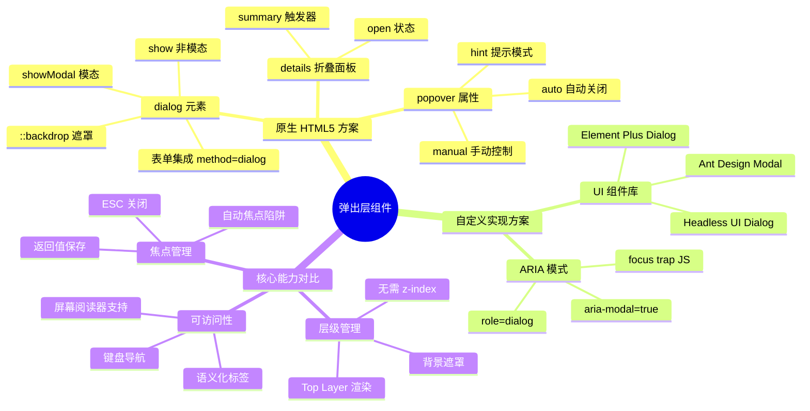
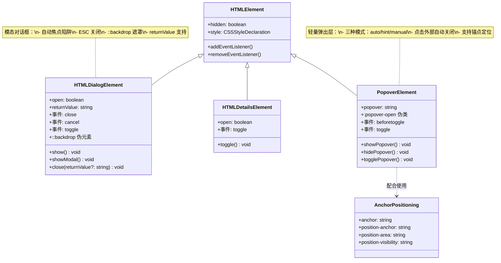
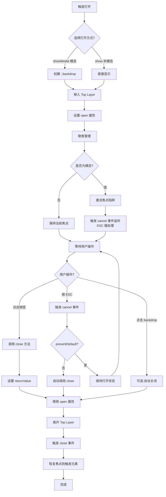
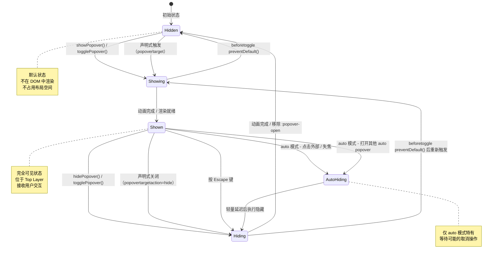
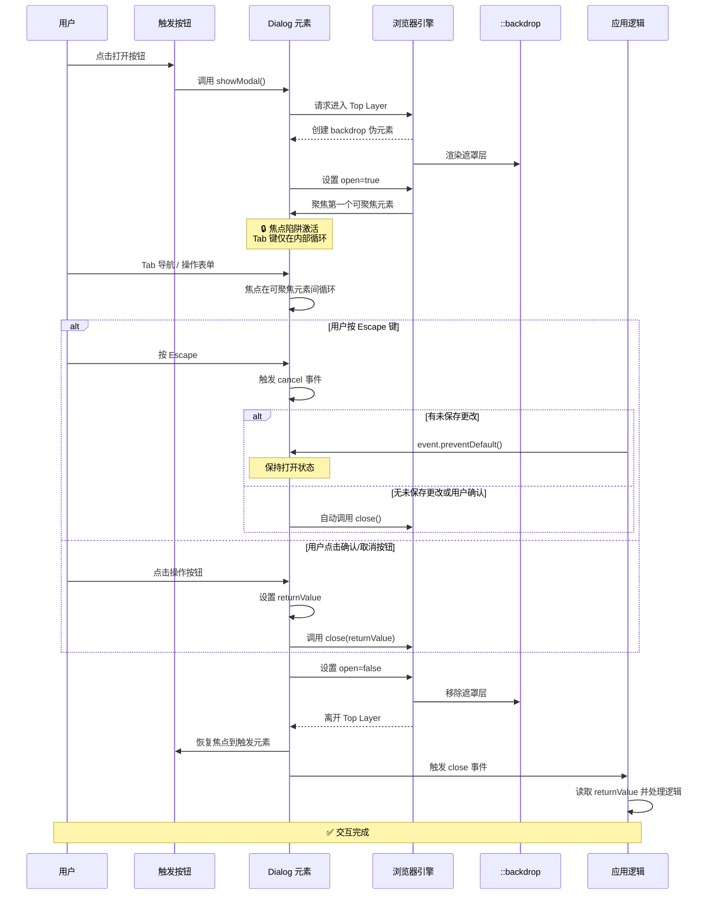

# Dialog 与 Popover API

HTML5 新增的 `<dialog>` 元素和 Popover API 为 Web 应用提供了原生的对话框和弹出层能力，替代了长期以来依赖 JavaScript 和 ARIA 实现的方案。

## 概述

| 特性 | `<dialog>` | Popover API |
| --- | --- | --- |
| 主要用途 | 模态/非模态对话框 | 轻量弹出层（Tooltip、菜单等） |
| HTML 属性 | `<dialog>` 元素 | `popover` 属性（可加在任何元素上） |
| 打开方式 | `.show()` / `.showModal()` | `.showPopover()` 或声明式触发 |
| 模态行为 | `showModal()` 时有顶层遮罩 | 无模态遮罩 |
| 焦点陷阱 | `showModal()` 自动管理 | 不自动管理 |
| 关闭方式 | `Escape` / `.close()` | `Escape` / 点击外部 / `.hidePopover()` |
| 背景交互 | `showModal()` 时阻止 | 允许 |
| 层叠上下文 | `showModal()` 时在顶层（Top Layer） | 顶层（Top Layer） |

### Top Layer（顶层）

两者都渲染在浏览器的**顶层**中，无需 `z-index` 即可覆盖所有页面内容，解决了长期以来的层叠上下文管理难题。

### API 架构全景图



### 元素 API 对比图



## dialog 元素

### 基本用法

```html
<dialog id="myDialog">
  <p>这是一个对话框</p>
  <button onclick="document.getElementById('myDialog').close()">关闭</button>
</dialog>

<button onclick="document.getElementById('myDialog').show()">非模态打开</button>
<button onclick="document.getElementById('myDialog').showModal()">模态打开</button>
```

### 模态与非模态

| 行为 | `show()` | `showModal()` |
| --- | --- | --- |
| 背景遮罩 | 无 | 有（可通过 `::backdrop` 样式化） |
| 焦点陷阱 | 无 | 有（Tab 键在对话框内循环） |
| 背景交互 | 允许 | 阻止 |
| 关闭方式 | 仅 `close()` | `Escape` 键 + `close()` |

### form 方法="dialog"

在 `<dialog>` 内的表单可使用 `method="dialog"` 实现声明式关闭：

```html
<dialog id="confirmDialog">
  <form method="dialog">
    <p>确定要删除这条记录吗？</p>
    <button value="cancel">取消</button>
    <button value="confirm">确认删除</button>
  </form>
</dialog>

<script>
const dialog = document.getElementById('confirmDialog');

dialog.addEventListener('close', () => {
  console.log('用户选择:', dialog.returnValue);
});
</script>
```

### 返回值（returnValue）

```javascript
const dialog = document.getElementById('myDialog');

dialog.showModal();

dialog.addEventListener('close', () => {
  if (dialog.returnValue === 'save') {
    console.log('用户选择保存');
  } else {
    console.log('用户取消');
  }
});
```

### ::backdrop 伪元素

自定义模态对话框的遮罩样式：

```css
dialog::backdrop {
  background: rgba(0, 0, 0, 0.5);
  backdrop-filter: blur(4px);
}
```

### 事件

| 事件 | 触发时机 |
| --- | --- |
| `close` | 对话框关闭时 |
| `cancel` | 用户按 Escape 键时（可 `preventDefault()` 阻止关闭） |
| `beforetoggle` / `toggle` | 打开/关闭状态切换前后触发（较新的规范增补） |

```javascript
dialog.addEventListener('cancel', (e) => {
  if (hasUnsavedChanges) {
    e.preventDefault();
  }
});
```

### 实战示例：确认对话框组件

```html
<dialog id="confirmDialog" class="confirm-dialog">
  <h2 id="confirmTitle">确认操作</h2>
  <p id="confirmMessage">确定要执行此操作吗？</p>
  <div class="dialog-actions">
    <button value="cancel" class="btn-cancel">取消</button>
    <button value="confirm" class="btn-confirm">确认</button>
  </div>
</dialog>

<script>
function showConfirm({ title, message }) {
  const dialog = document.getElementById('confirmDialog');
  document.getElementById('confirmTitle').textContent = title;
  document.getElementById('confirmMessage').textContent = message;

  return new Promise((resolve) => {
    dialog.addEventListener('close', () => {
      resolve(dialog.returnValue === 'confirm');
    }, { once: true });

    dialog.showModal();
  });
}

async function handleDelete() {
  const confirmed = await showConfirm({
    title: '删除确认',
    message: '此操作不可撤销，确定要删除吗？'
  });

  if (confirmed) {
    await deleteItem();
  }
}
</script>

<style>
.confirm-dialog {
  border: none;
  border-radius: 12px;
  padding: 24px;
  max-width: 400px;
  box-shadow: 0 20px 60px rgba(0, 0, 0, 0.3);
}

.confirm-dialog::backdrop {
  background: rgba(0, 0, 0, 0.5);
  backdrop-filter: blur(4px);
}

.confirm-dialog h2 {
  margin: 0 0 12px;
  font-size: 18px;
}

.confirm-dialog p {
  margin: 0 0 24px;
  color: #666;
}

.dialog-actions {
  display: flex;
  justify-content: flex-end;
  gap: 12px;
}

.btn-cancel {
  padding: 8px 16px;
  border: 1px solid #ddd;
  border-radius: 6px;
  background: #fff;
  cursor: pointer;
}

.btn-confirm {
  padding: 8px 16px;
  border: none;
  border-radius: 6px;
  background: #e74c3c;
  color: #fff;
  cursor: pointer;
}
</style>
```

### 实战示例：表单对话框

```html
<dialog id="editDialog">
  <form id="editForm" method="dialog">
    <label for="name">姓名</label>
    <input type="text" id="name" name="name" required />

    <label for="email">邮箱</label>
    <input type="email" id="email" name="email" required />

    <div class="dialog-actions">
      <button type="button" onclick="document.getElementById('editDialog').close('cancel')">取消</button>
      <button type="submit" value="save">保存</button>
    </div>
  </form>
</dialog>

<script>
const dialog = document.getElementById('editDialog');
const form = document.getElementById('editForm');

dialog.addEventListener('close', () => {
  if (dialog.returnValue === 'save') {
    const formData = new FormData(form);
    const data = Object.fromEntries(formData);
    console.log('保存数据:', data);
    saveToServer(data);
  }
  form.reset();
});

function openEditDialog(userData) {
  form.name.value = userData.name || '';
  form.email.value = userData.email || '';
  dialog.showModal();
}
</script>
```

## Dialog 显示流程



## Popover API

Popover API 允许将任何元素声明为弹出层，无需 JavaScript 即可实现打开/关闭交互。

### 基本用法

```html
<button popovertarget="myPopover">打开弹出层</button>

<div id="myPopover" popover>
  <p>这是一个弹出层</p>
</div>
```

### popover 属性值

| 值 | 行为 |
| --- | --- |
| `popover` 或 `popover="auto"` | 自动模式：点击外部关闭、Escape 关闭、同时只显示一个 |
| `popover="manual"` | 手动模式：不自动关闭，可同时显示多个 |

```html
<div id="tooltip" popover="auto">提示信息</div>
<div id="notification" popover="manual">通知内容</div>
```

### 声明式触发

```html
<button popovertarget="menu">打开菜单</button>
<button popovertarget="menu" popovertargetaction="show">仅打开</button>
<button popovertarget="menu" popovertargetaction="hide">仅关闭</button>
<button popovertarget="menu" popovertargetaction="toggle">切换</button>

<nav id="menu" popover>
  <a href="/home">首页</a>
  <a href="/about">关于</a>
  <a href="/contact">联系</a>
</nav>
```

### JavaScript API

```javascript
const popover = document.getElementById('myPopover');

popover.showPopover();
popover.hidePopover();
popover.togglePopover();

console.log(popover.matches(':popover-open'));
```

### 事件

| 事件 | 触发时机 |
| --- | --- |
| `beforetoggle` | 弹出层即将显示/隐藏（可 `preventDefault()` 阻止） |
| `toggle` | 弹出层显示/隐藏后 |

```javascript
popover.addEventListener('toggle', (e) => {
  if (e.newState === 'open') {
    console.log('弹出层已打开');
  } else if (e.newState === 'closed') {
    console.log('弹出层已关闭');
  }
});
```

### 样式

```css
[popover] {
  margin: 0;
  border: none;
  padding: 12px 16px;
  border-radius: 8px;
  box-shadow: 0 4px 16px rgba(0, 0, 0, 0.15);
  background: #fff;
}

[popover]:popover-open {
  animation: popoverIn 0.2s ease;
}

@keyframes popoverIn {
  from {
    opacity: 0;
    transform: translateY(-8px);
  }
  to {
    opacity: 1;
    transform: translateY(0);
  }
}
```

### 实战示例：Tooltip

```html
<style>
  .tip-trigger {
    position: relative;
    display: inline-block;
    text-decoration: underline dotted;
    cursor: help;
  }

  [popover].tooltip {
    margin: 0;
    padding: 6px 12px;
    border: none;
    border-radius: 6px;
    background: #333;
    color: #fff;
    font-size: 13px;
    max-width: 240px;
    box-shadow: 0 2px 8px rgba(0, 0, 0, 0.2);
  }
</style>

<p>
  HTML 是
  <span class="tip-trigger"
        popovertarget="html-tip"
        onmouseenter="this.popovertargetElement.showPopover()"
        onmouseleave="this.popovertargetElement.hidePopover()">
    超文本标记语言
  </span>
  的缩写。
</p>

<div id="html-tip" popover class="tooltip">
  HTML（HyperText Markup Language）是构建网页内容的标准标记语言。
</div>
```

### 实战示例：右键菜单

```html
<div id="contextMenu" popover="auto" class="context-menu">
  <button class="menu-item" onclick="handleCopy()">复制</button>
  <button class="menu-item" onclick="handlePaste()">粘贴</button>
  <hr />
  <button class="menu-item" onclick="handleDelete()">删除</button>
</div>

<script>
const menu = document.getElementById('contextMenu');

document.addEventListener('contextmenu', (e) => {
  e.preventDefault();
  menu.style.position = 'fixed';
  menu.style.left = e.clientX + 'px';
  menu.style.top = e.clientY + 'px';
  menu.showPopover();
});
</script>

<style>
.context-menu {
  margin: 0;
  padding: 4px;
  border: 1px solid #e0e0e0;
  border-radius: 8px;
  background: #fff;
  box-shadow: 0 4px 16px rgba(0, 0, 0, 0.12);
  min-width: 160px;
}

.menu-item {
  display: block;
  width: 100%;
  padding: 8px 12px;
  border: none;
  background: none;
  text-align: left;
  cursor: pointer;
  border-radius: 4px;
}

.menu-item:hover {
  background: #f0f0f0;
}

.context-menu hr {
  border: none;
  border-top: 1px solid #e0e0e0;
  margin: 4px 0;
}
</style>
```

## Popover 状态机



## 模态对话框交互时序



## `<dialog>` 深度指南

### showModal() vs show() 的区别与使用场景

#### 核心差异对比

| 特性 | `showModal()` | `show()` |
|------|-------------|---------|
| **行为类型** | 模态对话框 | 非模态对话框 |
| **背景遮罩** | ✅ 自动创建 `::backdrop` | ❌ 无遮罩 |
| **焦点管理** | ✅ 自动焦点陷阱 | ❌ 不拦截焦点 |
| **背景交互** | ❌ 阻止所有背景交互 | ✅ 允许正常交互 |
| **ESC 关闭** | ✅ 内置支持 | ❌ 需手动实现 |
| **Top Layer** | ✅ 是 | ❌ 否（普通流） |
| **返回值** | ✅ 支持 `returnValue` | ✅ 支持 `returnValue` |
| **堆叠支持** | ✅ 多层模态堆叠 | ❌ 无法堆叠 |

#### 使用场景决策树

```javascript
// 场景 1：需要阻断用户操作的确认框 → 使用 showModal()
function confirmDelete(itemId) {
  const dialog = document.getElementById('deleteConfirm');
  dialog.showModal(); // 模态：阻止背景操作
}

// 场景 2：侧边抽屉/信息展示 → 使用 show()
function showInfoPanel(articleId) {
  const dialog = document.getElementById('infoPanel');
  dialog.show(); // 非模态：允许用户继续浏览
}

// 场景 3：嵌套子对话框 → 使用 showModal()
function showNestedSettings() {
  const parent = document.getElementById('settingsDialog');
  parent.showModal();
  
  // 在父对话框内打开子对话框
  setTimeout(() => {
    const child = document.getElementById('nestedDialog');
    child.showModal(); // 子对话框会覆盖父对话框
  }, 300);
}
```

#### 性能考量

```javascript
// ⚠️ 注意：showModal() 会创建额外的 backdrop 和焦点管理开销
// 对于频繁切换的场景，考虑复用单个 dialog 实例

class DialogManager {
  constructor() {
    this.dialogPool = new Map(); // 对话框实例池
  }

  getDialog(id) {
    if (!this.dialogPool.has(id)) {
      const dialog = document.getElementById(id);
      this.dialogPool.set(id, dialog);
    }
    return this.dialogPool.get(id);
  }

  async showModal(id, options = {}) {
    const dialog = this.getDialog(id);
    
    // 预热：提前设置内容，减少打开时的布局抖动
    if (options.content) {
      dialog.innerHTML = options.content;
    }
    
    dialog.showModal();
    
    return new Promise((resolve) => {
      dialog.addEventListener('close', () => {
        resolve(dialog.returnValue);
      }, { once: true });
    });
  }
}
```

### ::backdrop 伪元素样式定制

#### 基础样式定制

```css
/* 深色半透明遮罩 */
dialog::backdrop {
  background: rgba(0, 0, 0, 0.5);
}

/* 毛玻璃效果 */
dialog.glass-backdrop::backdrop {
  background: rgba(255, 255, 255, 0.3);
  backdrop-filter: blur(10px);
  -webkit-backdrop-filter: blur(10px);
}

/* 渐变遮罩 */
dialog.gradient-backdrop::backdrop {
  background: radial-gradient(
    circle at center,
    rgba(0, 0, 0, 0.3) 0%,
    rgba(0, 0, 0, 0.7) 100%
  );
}

/* 动画遮罩 */
dialog.animated::backdrop {
  animation: fadeInBackdrop 0.3s ease-out;
}

@keyframes fadeInBackdrop {
  from {
    opacity: 0;
  }
  to {
    opacity: 1;
  }
}
```

#### 高级视觉效果

```css
/* 图片模糊背景 */
dialog.image-blur::backdrop {
  background: url('/background.jpg') center/cover no-repeat;
  filter: blur(20px) brightness(0.7);
  transform: scale(1.05); /* 缩放以避免边缘模糊 */
}

/* 网格图案遮罩 */
dialog.pattern-backdrop::backdrop {
  background-color: rgba(0, 0, 0, 0.6);
  background-image: 
    linear-gradient(rgba(255, 255, 255, 0.05) 1px, transparent 1px),
    linear-gradient(90deg, rgba(255, 255, 255, 0.05) 1px, transparent 1px);
  background-size: 40px 40px;
}

/* 动态光晕效果 */
dialog.glow-backdrop::backdrop {
  background: radial-gradient(
    ellipse at var(--mouse-x, 50%) var(--mouse-y, 50%),
    rgba(66, 153, 225, 0.15) 0%,
    transparent 50%
  ),
  rgba(0, 0, 0, 0.5);
  transition: background 0.3s ease;
}

/* JavaScript 更新光晕位置 */
const dialog = document.querySelector('.glow-backdrop');
dialog.addEventListener('mousemove', (e) => {
  const rect = dialog.getBoundingClientRect();
  const x = ((e.clientX - rect.left) / rect.width) * 100;
  const y = ((e.clientY - rect.top) / rect.height) * 100;
  dialog.style.setProperty('--mouse-x', `${x}%`);
  dialog.style.setProperty('--mouse-y', `${y}%`);
});
```

### 表单集成（form + method 属性自动提交）

#### 完整表单工作流

```html
<dialog id="userFormDialog" class="modern-dialog">
  <form id="userForm" method="dialog">
    <fieldset>
      <legend>用户信息</legend>
      
      <div class="form-group">
        <label for="username">用户名 *</label>
        <input 
          type="text" 
          id="username" 
          name="username" 
          required 
          minlength="3"
          maxlength="20"
          pattern="[a-zA-Z0-9_]+"
          title="只允许字母、数字和下划线"
        />
      </div>

      <div class="form-group">
        <label for="email">邮箱 *</label>
        <input 
          type="email" 
          id="email" 
          name="email" 
          required 
        />
      </div>

      <div class="form-group">
        <label for="role">角色</label>
        <select id="role" name="role">
          <option value="user">普通用户</option>
          <option value="admin">管理员</option>
          <option value="super_admin">超级管理员</option>
        </select>
      </div>

      <div class="form-group">
        <label>
          <input type="checkbox" name="agree" required />
          我已阅读并同意服务条款
        </label>
      </div>
    </fieldset>

    <div class="form-actions">
      <!-- type="submit" + formnovalidate：跳过校验并关闭对话框，returnValue="cancel" -->
      <button type="submit" value="cancel" formnovalidate>取消</button>
      <button type="submit" value="save">保存</button>
      <button type="submit" value="save_and_continue">保存并继续</button>
    </div>
  </form>
</dialog>

<script>
const dialog = document.getElementById('userFormDialog');
const form = document.getElementById('userForm');

// 监听关闭事件处理不同返回值
dialog.addEventListener('close', async () => {
  const action = dialog.returnValue;

  switch (action) {
    case 'save':
      await handleSave();
      break;
    case 'save_and_continue':
      await handleSaveAndContinue();
      break;
    case 'cancel':
      handleCancel();
      break;
    default:
      console.log('未知的操作:', action);
  }
});

async function handleSave() {
  try {
    const formData = new FormData(form);
    const data = Object.fromEntries(formData.entries());
    
    // 客户端验证
    if (!validateUserData(data)) {
      return; // 保持对话框打开让用户修正
    }
    
    // 提交到服务器
    const response = await fetch('/api/users', {
      method: 'POST',
      body: JSON.stringify(data),
      headers: { 'Content-Type': 'application/json' }
    });

    if (response.ok) {
      showToast('保存成功！');
      form.reset();
    } else {
      throw new Error('服务器错误');
    }
  } catch (error) {
    showError(error.message);
    dialog.showModal(); // 出错时重新打开对话框
  }
}

// 数据预填充
function prefillForm(userData) {
  form.username.value = userData.username || '';
  form.email.value = userData.email || '';
  form.role.value = userData.role || 'user';
  dialog.showModal();
}
</script>

<style>
.modern-dialog {
  border: none;
  border-radius: 16px;
  padding: 32px;
  max-width: 500px;
  box-shadow: 0 25px 50px -12px rgba(0, 0, 0, 0.25);
  background: linear-gradient(to bottom, #ffffff, #f9fafb);
}

.modern-dialog::backdrop {
  background: rgba(0, 0, 0, 0.4);
  backdrop-filter: blur(4px);
}

.modern-dialog fieldset {
  border: 1px solid #e5e7eb;
  border-radius: 8px;
  padding: 20px;
  margin-bottom: 24px;
}

.modern-dialog legend {
  padding: 0 8px;
  font-weight: 600;
  color: #111827;
}

.form-group {
  margin-bottom: 16px;
}

.form-group label {
  display: block;
  margin-bottom: 6px;
  font-size: 14px;
  font-weight: 500;
  color: #374151;
}

.form-group input,
.form-group select {
  width: 100%;
  padding: 10px 12px;
  border: 1px solid #d1d5db;
  border-radius: 6px;
  font-size: 14px;
  transition: all 0.2s ease;
}

.form-group input:focus,
.form-group select:focus {
  outline: none;
  border-color: #3b82f6;
  box-shadow: 0 0 0 3px rgba(59, 130, 246, 0.1);
}

.form-actions {
  display: flex;
  gap: 12px;
  justify-content: flex-end;
}

.form-actions button {
  padding: 10px 20px;
  border: none;
  border-radius: 6px;
  font-size: 14px;
  font-weight: 500;
  cursor: pointer;
  transition: all 0.2s ease;
}

.form-actions button[value="cancel"] {
  background: #f3f4f6;
  color: #374151;
}

.form-actions button[value="save"] {
  background: #3b82f6;
  color: white;
}

.form-actions button[value="save_and_continue"] {
  background: #10b981;
  color: white;
}
</style>
```

### 关闭原因检测

#### 多种检测方法

```javascript
const dialog = document.getElementById('myDialog');

// 方法 1：通过 returnValue 判断
dialog.addEventListener('close', () => {
  switch (dialog.returnValue) {
    case 'confirm':
      console.log('用户点击了确认按钮');
      break;
    case 'cancel':
      console.log('用户点击了取消按钮');
      break;
    case '':
      console.log('可能是 ESC 关闭或程序调用 close()');
      break;
  }
});

// 方法 2：通过 cancel 事件检测 ESC 关闭
let closedByEscape = false;

dialog.addEventListener('cancel', (e) => {
  closedByEscape = true;
  console.log('用户按下了 ESC 键');
  
  // 可以阻止默认关闭行为
  // e.preventDefault();
});

dialog.addEventListener('close', () => {
  if (closedByEscape) {
    console.log('对话框被 ESC 关闭');
    closedByEscape = false;
  } else {
    console.log('对话框被其他方式关闭');
  }
});

// 方法 3：使用 CloseWatcher API（实验性）
if ('CloseWatcher' in window) {
  const watcher = new CloseWatcher();

  // 用户发出关闭请求（Esc、Android 返回键等）时触发
  watcher.onclose = () => {
    console.log('CloseWatcher 检测到关闭请求');
    dialog.close('watcher-close');
  };

  // requestClose() 则用于以编程方式发出关闭请求（会触发 onclose）
}
```

#### 综合关闭原因追踪器

```javascript
class DialogCloseTracker {
  constructor(dialog) {
    this.dialog = dialog;
    this.closeReason = null;
    this.isEscapeClose = false;
    this.setupListeners();
  }

  setupListeners() {
    // 追踪 cancel 事件（ESC）
    this.dialog.addEventListener('cancel', (e) => {
      this.isEscapeClose = true;
      this.closeReason = 'escape';
      
      // 如果需要阻止 ESC 关闭
      // if (this.shouldPreventEscape()) {
      //   e.preventDefault();
      //   this.isEscapeClose = false;
      // }
    });

    // 追踪 close 事件
    this.dialog.addEventListener('close', () => {
      if (!this.isEscapeClose && this.dialog.returnValue) {
        this.closeReason = `button:${this.dialog.returnValue}`;
      } else if (!this.isEscapeClose) {
        this.closeReason = 'programmatic';
      }
      
      this.emitCloseEvent();
      this.reset();
    });

    // 追踪按钮点击
    this.dialog.querySelectorAll('button[value]').forEach(btn => {
      btn.addEventListener('click', () => {
        this.closeReason = `button:${btn.value}`;
      });
    });
  }

  shouldPreventEscape() {
    // 示例：如果有未保存的更改则阻止关闭
    return this.hasUnsavedChanges?.() ?? false;
  }

  emitCloseEvent() {
    const event = new CustomEvent('dialogClose', {
      detail: {
        reason: this.closeReason,
        returnValue: this.dialog.returnValue,
        wasEscape: this.isEscapeClose,
        timestamp: Date.now()
      },
      bubbles: true
    });
    
    this.dialog.dispatchEvent(event);
  }

  reset() {
    this.isEscapeClose = false;
    this.closeReason = null;
  }
}

// 使用示例
const tracker = new DialogCloseTracker(document.getElementById('myDialog'));

tracker.hasUnsavedChanges = () => {
  return document.querySelector('#editorForm').dataset.modified === 'true';
};

document.getElementById('myDialog').addEventListener('dialogClose', (e) => {
  console.log('关闭原因:', e.detail.reason);
  console.log('返回值:', e.detail.returnValue);
  console.log('是否ESC关闭:', e.detail.wasEscape);
});
```

### 多层模态框堆叠管理

#### 堆叠原理与实现

```javascript
class ModalStackManager {
  constructor() {
    this.stack = []; // 模态框栈
    this.activeDialog = null;
    this.previousFocus = null;
  }

  /**
   * 打开新的模态框并推入栈中
   * @param {HTMLDialogElement} dialog - 要打开的对话框元素
   * @param {Object} options - 配置选项
   */
  push(dialog, options = {}) {
    // 保存当前焦点
    if (this.stack.length > 0) {
      this.previousFocus = document.activeElement;
    }

    // 推入栈
    this.stack.push({
      element: dialog,
      openedAt: Date.now(),
      options
    });

    // 更新 z-index 层级
    this.updateZIndex();

    // 打开对话框
    dialog.showModal();
    this.activeDialog = dialog;

    // 监听关闭事件
    const closeHandler = () => {
      this.pop(dialog);
      dialog.removeEventListener('close', closeHandler);
    };
    dialog.addEventListener('close', closeHandler);

    return this.stack.length;
  }

  /**
   * 关闭并从栈中移除指定的模态框
   * @param {HTMLDialogElement} dialog - 要关闭的对话框
   */
  pop(dialog) {
    const index = this.stack.findIndex(item => item.element === dialog);
    
    if (index === -1) return;

    // 从栈中移除
    this.stack.splice(index, 1);

    // 更新层级
    this.updateZIndex();

    // 恢复焦点
    if (this.stack.length > 0) {
      this.activeDialog = this.stack[this.stack.length - 1].element;
      this.activeDialog.focus();
    } else {
      this.activeDialog = null;
      if (this.previousFocus) {
        this.previousFocus.focus();
        this.previousFocus = null;
      }
    }
  }

  /**
   * 更新所有模态框的 z-index
   */
  updateZIndex() {
    const baseZIndex = 1000; // 基础 z-index
    const zIndexStep = 10;   // 每层的增量

    this.stack.forEach((item, index) => {
      const zIndex = baseZIndex + (index * zIndexStep);
      item.element.style.zIndex = zIndex;

      // 同时更新对应的 backdrop
      // 注意：backdrop 不是直接可访问的，需要通过 CSS 变量或其他方式
      item.element.style.setProperty('--dialog-z-index', zIndex);
    });
  }

  /**
   * 关闭所有模态框
   */
  closeAll() {
    while (this.stack.length > 0) {
      const { element } = this.stack[this.stack.length - 1];
      element.close('close-all');
    }
  }

  /**
   * 获取当前栈深度
   */
  get depth() {
    return this.stack.length;
  }

  /**
   * 检查指定对话框是否在栈中
   */
  contains(dialog) {
    return this.stack.some(item => item.element === dialog);
  }
}

// 全局单例
const modalStack = new ModalStackManager();

// 使用示例
function openNestedModals() {
  // 第一层
  const dialog1 = document.getElementById('level1Dialog');
  modalStack.push(dialog1);

  // 2秒后打开第二层
  setTimeout(() => {
    const dialog2 = document.getElementById('level2Dialog');
    modalStack.push(dialog2);
  }, 2000);

  // 再过2秒打开第三层
  setTimeout(() => {
    const dialog3 = document.getElementById('level3Dialog');
    modalStack.push(dialog3);
  }, 4000);
}
```

#### 配套样式

```css
/* 多层模态框样式系统 */
dialog.stacked-modal {
  border: none;
  border-radius: 12px;
  padding: 24px;
  max-width: 480px;
  box-shadow: 
    0 25px 50px -12px rgba(0, 0, 0, 0.25),
    0 0 0 1px rgba(0, 0, 0, 0.05);
  animation: slideIn 0.3s cubic-bezier(0.16, 1, 0.3, 1);
}

@keyframes slideIn {
  from {
    opacity: 0;
    transform: translateY(-20px) scale(0.95);
  }
  to {
    opacity: 1;
    transform: translateY(0) scale(1);
  }
}

/* 不同层级的视觉区分 */
dialog[data-level="1"] {
  --modal-bg: #ffffff;
  --modal-border: #e5e7eb;
}

dialog[data-level="2"] {
  --modal-bg: #fafafa;
  --modal-border: #d1d5db;
  width: calc(100% - 48px); /* 逐层缩小 */
}

dialog[data-level="3"] {
  --modal-bg: #f3f4f6;
  --modal-border: #9ca3af;
  width: calc(100% - 96px);
}

/* 层级指示器 */
.modal-stack-indicator {
  position: absolute;
  top: 12px;
  right: 12px;
  display: flex;
  gap: 4px;
}

.modal-stack-dot {
  width: 8px;
  height: 8px;
  border-radius: 50%;
  background: #d1d5db;
  transition: all 0.2s ease;
}

.modal-stack-dot.active {
  background: #3b82f6;
  transform: scale(1.2);
}
```

## Popover API 深度指南

### 三种弹出类型详解

#### Auto 模式（默认）

**特性：**
- 点击外部区域自动关闭
- 按 Escape 键关闭
- 同一时间只能有一个 auto popover 打开
- 打开新的 auto popover 会自动关闭之前的

**适用场景：** 下拉菜单、工具提示、选择器等需要即时反馈的交互

```html
<!-- 下拉菜单 -->
<div class="dropdown-container">
  <button popovertarget="userMenu">
    用户菜单 ▾
  </button>
  
  <div id="userMenu" popover="auto" class="dropdown-menu">
    <a href="/profile">个人资料</a>
    <a href="/settings">账户设置</a>
    <hr />
    <a href="/logout">退出登录</a>
  </div>
</div>

<style>
.dropdown-menu {
  margin-top: 8px;
  min-width: 180px;
  padding: 8px 0;
  border-radius: 8px;
  background: white;
  box-shadow: 0 10px 30px rgba(0, 0, 0, 0.15);
  border: 1px solid #e5e7eb;
}

.dropdown-menu a {
  display: block;
  padding: 10px 16px;
  text-decoration: none;
  color: #374151;
  transition: background 0.15s ease;
}

.dropdown-menu a:hover {
  background: #f3f4f6;
  color: #111827;
}

.dropdown-menu hr {
  border: none;
  border-top: 1px solid #e5e7eb;
  margin: 4px 0;
}
</style>
```

#### Manual 模式

**特性：**
- 不会因点击外部而关闭
- 仍响应 Escape 键（可通过 `keydown` 事件阻止）
- 可以同时存在多个 manual popover
- 必须显式调用 `hidePopover()` 或通过触发按钮关闭

**适用场景：** 通知提示、持久性浮层、多步骤向导、全局搜索结果等

```html
<!-- 通知系统 -->
<button popovertarget="notifications" class="notification-btn">
  🔔 通知 (<span id="notifCount">3</span>)
</button>

<div id="notifications" popover="manual" class="notification-panel">
  <div class="panel-header">
    <h3>通知中心</h3>
    <button popovertarget="notifications" popovertargetaction="hide">
      ✕
    </button>
  </div>
  
  <div class="notification-list">
    <div class="notification-item unread">
      <strong>新消息</strong>
      <p>张三向您发送了一条消息</p>
      <time>5分钟前</time>
    </div>
    
    <div class="notification-item unread">
      <strong>系统提醒</strong>
      <p>您的密码将在7天后过期</p>
      <time>1小时前</time>
    </div>
    
    <div class="notification-item">
      <strong>任务完成</strong>
      <p>数据导出任务已完成</p>
      <time>昨天</time>
    </div>
  </div>
  
  <a href="/notifications" class="view-all">查看全部通知</a>
</div>

<style>
.notification-panel {
  position: fixed;
  top: 60px;
  right: 20px;
  width: 360px;
  max-height: 480px;
  border-radius: 12px;
  background: white;
  box-shadow: 0 20px 40px rgba(0, 0, 0, 0.15);
  border: 1px solid #e5e7eb;
  overflow: hidden;
}

.panel-header {
  display: flex;
  justify-content: space-between;
  align-items: center;
  padding: 16px;
  border-bottom: 1px solid #e5e7eb;
}

.panel-header h3 {
  margin: 0;
  font-size: 16px;
  font-weight: 600;
}

.notification-list {
  max-height: 360px;
  overflow-y: auto;
}

.notification-item {
  padding: 16px;
  border-bottom: 1px solid #f3f4f6;
  cursor: pointer;
  transition: background 0.15s ease;
}

.notification-item:hover {
  background: #f9fafb;
}

.notification-item.unread {
  background: #eff6ff;
  border-left: 3px solid #3b82f6;
}

.notification-item strong {
  display: block;
  font-size: 14px;
  margin-bottom: 4px;
}

.notification-item p {
  margin: 0;
  font-size: 13px;
  color: #6b7280;
}

.notification-item time {
  display: block;
  font-size: 12px;
  color: #9ca3af;
  margin-top: 8px;
}

.view-all {
  display: block;
  text-align: center;
  padding: 12px;
  background: #f9fafb;
  color: #3b82f6;
  text-decoration: none;
  font-size: 14px;
  font-weight: 500;
}

.view-all:hover {
  background: #f3f4f6;
}
</style>
```

#### Hint 模式（实验性）

**特性：**
- 类似于 auto，但语义上表示"提示性"内容
- 与屏幕阅读器的交互可能不同
- 可能获得特殊的浏览器优化

**适用场景：** 纯粹的信息提示、帮助文本、上下文说明

```html
<!-- 带提示的输入框 -->
<label for="password">密码</label>
<div class="input-with-hint">
  <input 
    type="password" 
    id="password"
    placeholder="请输入密码"
    aria-describedby="password-hint"
  />
  <button 
    popovertarget="password-hint"
    class="hint-trigger"
    aria-label="查看密码要求"
  >
    ?
  </button>
  
  <div id="password-hint" popover="hint" class="hint-content">
    <ul>
      <li>至少 8 个字符</li>
      <li>包含大写字母</li>
      <li>包含小写字母</li>
      <li>包含数字</li>
      <li>包含特殊字符（!@#$%^&*）</li>
    </ul>
  </div>
</div>
```

### 定位策略与 Anchor Positioning API

#### 基础定位

```css
/* 使用 anchor positioning API 定位 popover */
#myPopover {
  position: fixed;
  position-anchor: --trigger-btn;  /* 引用触发元素的 anchor-name */

  /* 相对于锚点的位置 */
  top: anchor(bottom);
  left: anchor(left);

  /* 或者使用 position-area 简写（原 inset-area 已更名为 position-area） */
  position-area: bottom span-all;
}

#triggerBtn {
  anchor-name: --trigger-btn;
}
```

#### 高级定位策略

```html
<div class="toolbar">
  <!-- 工具栏按钮 -->
  <button 
    id="formatBtn"
    popovertarget="formatMenu"
    style="anchor-name: --format-anchor;"
  >
    格式 ▾
  </button>
  
  <button 
    id="insertBtn"
    popovertarget="insertMenu"
    style="anchor-name: --insert-anchor;"
  >
    插入 ▾
  </button>
  
  <!-- 格式菜单 -->
  <div id="formatMenu" popover="auto" class="smart-popover">
    <button onclick="format('bold')"><b>B</b> 加粗</button>
    <button onclick="format('italic')"><i>I</i> 斜体</button>
    <button onclick="format('underline')"><u>U</u> 下划线</button>
    <hr />
    <button onclick="format('heading')">标题</button>
    <button onclick="format('list')">列表</button>
  </div>
  
  <!-- 插入菜单 -->
  <div id="insertMenu" popover="auto" class="smart-popover">
    <button onclick="insert('image')">📷 图片</button>
    <button onclick="insert('link')">🔗 链接</button>
    <button onclick="insert('table')">📊 表格</button>
    <button onclick="insert('code')">💻 代码块</button>
  </div>
</div>

<style>
.smart-popover {
  margin: 0;
  padding: 8px;
  min-width: 200px;
  border-radius: 8px;
  background: white;
  box-shadow: 0 10px 30px rgba(0, 0, 0, 0.15);
  border: 1px solid #e5e7eb;
  
  /* 智能定位 */
  position: fixed;
  position-anchor: --format-anchor;
  /* anchor() 第二个参数是回退值，与锚点保持 8px 间距需用 calc */
  top: calc(anchor(bottom) + 8px);
  left: anchor(left);

  /* 边界检测与翻转回退 */
  position-visibility: no-overflow;
  position-try-fallbacks: flip-block, flip-inline;
}

.smart-popover button {
  display: flex;
  align-items: center;
  gap: 8px;
  width: 100%;
  padding: 8px 12px;
  border: none;
  background: none;
  text-align: left;
  cursor: pointer;
  border-radius: 4px;
  font-size: 14px;
}

.smart-popover button:hover {
  background: #f3f4f6;
}

.smart-popover hr {
  border: none;
  border-top: 1px solid #e5e7eb;
  margin: 4px 0;
}

/* 第二个菜单的锚点 */
#insertMenu {
  position-anchor: --insert-anchor;
}
</style>
```

#### 边界检测与自适应

```javascript
class SmartPopover {
  constructor(triggerEl, popoverEl, options = {}) {
    this.trigger = triggerEl;
    this.popover = popoverEl;
    this.options = {
      placement: 'bottom-start', // top/bottom/left/right + start/end/center
      offset: 8,
      boundary: 'viewport',       // viewport/scrollParent/element
      flip: true,                 // 是否翻转
      ...options
    };
    
    this.init();
  }

  init() {
    // 绑定触发事件
    this.trigger.addEventListener('click', () => this.toggle());
    
    // 点击外部关闭
    document.addEventListener('click', (e) => {
      if (!this.popover.contains(e.target) && !this.trigger.contains(e.target)) {
        this.hide();
      }
    });

    // 重新计算位置
    window.addEventListener('resize', () => this.updatePosition());
    window.addEventListener('scroll', () => this.updatePosition(), true);
  }

  calculatePosition() {
    const triggerRect = this.trigger.getBoundingClientRect();
    const popoverRect = this.popover.getBoundingClientRect();
    const viewport = {
      width: window.innerWidth,
      height: window.innerHeight
    };

    let { placement } = this.options;
    let { offset } = this.options;

    // 解析 placement
    const [side, align] = placement.split('-');

    // 计算基础位置
    let top, left;

    switch (side) {
      case 'top':
        top = triggerRect.top - popoverRect.height - offset;
        break;
      case 'bottom':
        top = triggerRect.bottom + offset;
        break;
      case 'left':
        left = triggerRect.left - popoverRect.width - offset;
        break;
      case 'right':
        left = triggerRect.right + offset;
        break;
    }

    // 计算对齐
    switch (align) {
      case 'start':
        left = left ?? triggerRect.left;
        top = top ?? triggerRect.top;
        break;
      case 'center':
        left = left ?? triggerRect.left + (triggerRect.width - popoverRect.width) / 2;
        top = top ?? triggerRect.top + (triggerRect.height - popoverRect.height) / 2;
        break;
      case 'end':
        left = left ?? triggerRect.right - popoverRect.width;
        top = top ?? triggerRect.bottom - popoverRect.height;
        break;
      default:
        left = left ?? triggerRect.left;
        top = top ?? triggerRect.bottom + offset;
    }

    // 边界检测与翻转
    if (this.options.flip) {
      // 检测是否超出边界
      if (top < 0 && side === 'top') {
        top = triggerRect.bottom + offset;
      } else if (top + popoverRect.height > viewport.height && side === 'bottom') {
        top = triggerRect.top - popoverRect.height - offset;
      }

      if (left < 0) {
        left = Math.max(0, triggerRect.right - popoverRect.width);
      } else if (left + popoverRect.width > viewport.width) {
        left = viewport.width - popoverRect.width - 8;
      }
    }

    return { top, left };
  }

  updatePosition() {
    if (!this.popover.matches(':popover-open')) return;

    const { top, left } = this.calculatePosition();
    this.popover.style.top = `${top}px`;
    this.popover.style.left = `${left}px`;
  }

  show() {
    this.popover.showPopover();
    // 延迟一帧确保渲染完成后计算位置
    requestAnimationFrame(() => this.updatePosition());
  }

  hide() {
    this.popover.hidePopover();
  }

  toggle() {
    if (this.popover.matches(':popover-open')) {
      this.hide();
    } else {
      this.show();
    }
  }
}

// 使用示例
const smartPopover = new SmartPopover(
  document.getElementById('formatBtn'),
  document.getElementById('formatMenu'),
  {
    placement: 'bottom-start',
    offset: 8,
    flip: true
  }
);
```

### 与 `<select>` / `<datalist>` 的关系

#### 对比分析

| 特性 | `<select>` | `<datalist>` | Popover |
|------|-----------|--------------|---------|
| **原生控件** | ✅ 完全原生 | ✅ 完全原生 | ✅ 原生 API |
| **自定义样式** | ❌ 受限 | ❌ 不可样式化 | ✅ 完全可控 |
| **搜索过滤** | ❌ 不支持 | ✅ 输入过滤 | ✅ 可自行实现 |
| **多选** | ✅ 支持 | ❌ 单选暗示 | ✅ 可自行实现 |
| **分组** | ✅ `<optgroup>` | ❌ 不支持 | ✅ 完全自由 |
| **键盘导航** | ✅ 内置 | ✅ 内置 | ✅ 内置 |
| **无障碍** | ✅ 完善 | ✅ 完善 | ✅ 完善 |
| **性能** | 🚀 最优 | 🚀 优 | ⚡ 良好 |

#### 用 Popover 实现增强型 Select

```html
<!-- 自定义 Select 组件 -->
<div class="custom-select" role="combobox" aria-expanded="false" aria-haspopup="listbox">
  <button 
    type="button"
    id="customSelectTrigger"
    popovertarget="customSelectDropdown"
    class="select-trigger"
    aria-label="选择选项"
  >
    <span class="select-value">请选择...</span>
    <span class="select-arrow">▾</span>
  </button>
  
  <div 
    id="customSelectDropdown" 
    popover="auto"
    class="select-dropdown"
    role="listbox"
    aria-labelledby="customSelectTrigger"
  >
    <input 
      type="search" 
      class="select-search"
      placeholder="搜索..."
      aria-label="搜索选项"
    />
    
    <ul class="select-options" role="group">
      <li role="option" data-value="1" tabindex="0">选项一</li>
      <li role="option" data-value="2" tabindex="0">选项二</li>
      <li role="option" data-value="3" tabindex="0">选项三</li>
      <li role="option" data-value="4" tabindex="0">选项四</li>
      <li role="option" data-value="5" tabindex="0">选项五</li>
    </ul>
  </div>
  
  <input type="hidden" name="selectedValue" id="selectedValue" />
</div>

<script>
class CustomSelect {
  constructor(container) {
    this.container = container;
    this.trigger = container.querySelector('.select-trigger');
    this.valueDisplay = container.querySelector('.select-value');
    this.dropdown = container.querySelector('.select-dropdown');
    this.searchInput = container.querySelector('.select-search');
    this.optionsList = container.querySelector('.select-options');
    this.hiddenInput = container.querySelector('input[type="hidden"]');
    this.options = [...container.querySelectorAll('[role="option"]')];
    
    this.selectedOption = null;
    this.filteredOptions = [...this.options];
    
    this.init();
  }

  init() {
    // 搜索功能
    this.searchInput.addEventListener('input', (e) => {
      this.filterOptions(e.target.value);
    });

    // 选项选择
    this.options.forEach(option => {
      option.addEventListener('click', () => this.selectOption(option));
      option.addEventListener('keydown', (e) => {
        if (e.key === 'Enter' || e.key === ' ') {
          e.preventDefault();
          this.selectOption(option);
        }
      });
    });

    // 键盘导航
    this.searchInput.addEventListener('keydown', (e) => this.handleKeyNav(e));

    // 状态同步
    this.dropdown.addEventListener('toggle', (e) => {
      this.trigger.setAttribute('aria-expanded', e.newState === 'open');
      if (e.newState === 'open') {
        this.searchInput.focus();
      }
    });
  }

  filterOptions(query) {
    const lowerQuery = query.toLowerCase();
    
    this.filteredOptions = this.options.filter(opt => 
      opt.textContent.toLowerCase().includes(lowerQuery)
    );

    // 更新可见性
    this.options.forEach(opt => {
      opt.style.display = this.filteredOptions.includes(opt) ? '' : 'none';
    });

    // 显示无结果提示
    if (this.filteredOptions.length === 0) {
      if (!this.noResultsMsg) {
        this.noResultsMsg = document.createElement('li');
        this.noResultsMsg.textContent = '没有匹配的结果';
        this.noResultsMsg.className = 'no-results';
        this.optionsList.appendChild(this.noResultsMsg);
      }
      this.noResultsMsg.style.display = '';
    } else if (this.noResultsMsg) {
      this.noResultsMsg.style.display = 'none';
    }
  }

  selectOption(option) {
    // 取消之前的选择
    if (this.selectedOption) {
      this.selectedOption.removeAttribute('aria-selected');
      this.selectedOption.classList.remove('selected');
    }

    // 选择新选项
    this.selectedOption = option;
    option.setAttribute('aria-selected', 'true');
    option.classList.add('selected');

    // 更新显示值
    this.valueDisplay.textContent = option.textContent;
    this.hiddenInput.value = option.dataset.value;

    // 关闭下拉框
    this.dropdown.hidePopover();

    // 触发 change 事件
    this.container.dispatchEvent(new CustomEvent('change', {
      detail: { value: option.dataset.value, text: option.textContent }
    }));
  }

  handleKeyNav(e) {
    const visibleOptions = this.filteredOptions.filter(opt => 
      opt.style.display !== 'none'
    );
    const currentIndex = visibleOptions.indexOf(document.activeElement);

    switch (e.key) {
      case 'ArrowDown':
        e.preventDefault();
        if (currentIndex < visibleOptions.length - 1) {
          visibleOptions[currentIndex + 1].focus();
        }
        break;
        
      case 'ArrowUp':
        e.preventDefault();
        if (currentIndex > 0) {
          visibleOptions[currentIndex - 1].focus();
        }
        break;
        
      case 'Escape':
        this.dropdown.hidePopover();
        this.trigger.focus();
        break;
    }
  }

  get value() {
    return this.hiddenInput.value;
  }

  set value(val) {
    const option = this.options.find(opt => opt.dataset.value === val);
    if (option) {
      this.selectOption(option);
    }
  }
}

// 初始化
document.querySelectorAll('.custom-select').forEach(el => {
  el.customSelect = new CustomSelect(el);
});
</script>

<style>
.custom-select {
  position: relative;
  display: inline-block;
  width: 240px;
}

.select-trigger {
  display: flex;
  align-items: center;
  justify-content: space-between;
  width: 100%;
  padding: 10px 12px;
  border: 1px solid #d1d5db;
  border-radius: 6px;
  background: white;
  cursor: pointer;
  font-size: 14px;
  transition: all 0.2s ease;
}

.select-trigger:hover {
  border-color: #3b82f6;
}

.select-trigger:focus {
  outline: none;
  border-color: #3b82f6;
  box-shadow: 0 0 0 3px rgba(59, 130, 246, 0.1);
}

.select-arrow {
  transition: transform 0.2s ease;
}

.select-dropdown {
  margin: 4px 0 0 0;
  width: 100%;
  border-radius: 8px;
  background: white;
  box-shadow: 0 10px 30px rgba(0, 0, 0, 0.15);
  border: 1px solid #e5e7eb;
  overflow: hidden;
}

.select-search {
  width: 100%;
  padding: 10px 12px;
  border: none;
  border-bottom: 1px solid #e5e7eb;
  font-size: 14px;
  outline: none;
}

.select-options {
  list-style: none;
  margin: 0;
  padding: 4px;
  max-height: 200px;
  overflow-y: auto;
}

.select-options li {
  padding: 8px 12px;
  border-radius: 4px;
  cursor: pointer;
  font-size: 14px;
  transition: background 0.15s ease;
}

.select-options li:hover,
.select-options li:focus {
  background: #f3f4f6;
  outline: none;
}

.select-options li.selected {
  background: #eff6ff;
  color: #2563eb;
  font-weight: 500;
}

.select-options .no-results {
  padding: 12px;
  text-align: center;
  color: #9ca3af;
  font-size: 13px;
}
</style>
```

## 焦点管理与可访问性

### Focus Trap（焦点陷阱）完整实现原理

#### 什么是 Focus Trap？

焦点陷阱是一种无障碍技术，它将用户的键盘焦点限制在特定的 UI 组件（如模态对话框）内。当用户按 Tab 或 Shift+Tab 时，焦点只在组件内的可聚焦元素之间循环，无法逃逸到组件外部。

#### 原生 vs 自定义实现

```javascript
/**
 * 焦点陷阱类 - 用于理解原生 dialog 的焦点管理机制
 * 注：<dialog> 的 showModal() 已内置此功能，此代码仅供学习参考
 */
class FocusTrap {
  constructor(container) {
    this.container = container;
    this.previousActiveElement = null;
    this.focusableSelectors = [
      'a[href]',
      'button:not([disabled])',
      'textarea:not([disabled])',
      'input:not([disabled])',
      'select:not([disabled])',
      '[tabindex]:not([tabindex="-1"])',
      '[contenteditable="true"]'
    ];
    
    this.boundHandleKeyDown = this.handleKeyDown.bind(this);
  }

  /**
   * 获取容器内所有可聚焦元素
   */
  getFocusableElements() {
    const elements = this.container.querySelectorAll(this.focusableSelectors.join(','));
    return Array.from(elements).filter(el => {
      // 过滤掉不可见元素
      const rect = el.getBoundingClientRect();
      return rect.width > 0 && rect.height > 0 &&
             window.getComputedStyle(el).visibility !== 'hidden';
    });
  }

  /**
   * 激活焦点陷阱
   */
  activate() {
    // 保存当前焦点
    this.previousActiveElement = document.activeElement;
    
    // 聚焦到第一个可聚焦元素或容器本身
    const focusableElements = this.getFocusableElements();
    if (focusableElements.length > 0) {
      focusableElements[0].focus();
    } else {
      this.container.setAttribute('tabindex', '-1');
      this.container.focus();
    }
    
    // 监听键盘事件
    document.addEventListener('keydown', this.boundHandleKeyDown);
  }

  /**
   * 停用焦点陷阱
   */
  deactivate() {
    // 移除监听器
    document.removeEventListener('keydown', this.boundHandleKeyDown);
    
    // 恢复之前的焦点
    if (this.previousActiveElement && typeof this.previousActiveElement.focus === 'function') {
      this.previousActiveElement.focus();
    }
    this.previousActiveElement = null;
  }

  /**
   * 处理键盘导航
   */
  handleKeyDown(event) {
    // 只处理 Tab 键
    if (event.key !== 'Tab') return;

    const focusableElements = this.getFocusableElements();
    
    if (focusableElements.length === 0) {
      event.preventDefault();
      return;
    }

    const firstElement = focusableElements[0];
    const lastElement = focusableElements[focusableElements.length - 1];
    const activeElement = document.activeElement;

    if (event.shiftKey) {
      // Shift + Tab：反向导航
      if (activeElement === firstElement || !this.container.contains(activeElement)) {
        event.preventDefault();
        lastElement.focus();
      }
    } else {
      // Tab：正向导航
      if (activeElement === lastElement || !this.container.contains(activeElement)) {
        event.preventDefault();
        firstElement.focus();
      }
    }
  }

  /**
   * 更新焦点元素列表（当动态添加/移除元素时调用）
   */
  update() {
    // 当容器内的可聚焦元素发生变化时调用
    // 例如：异步加载内容后
  }
}

// 使用示例（仅用于学习，实际应使用原生 <dialog>）
/*
const trap = new FocusTrap(myCustomModal);
trap.activate();
// ... 用户交互 ...
trap.deactivate();
*/
```

#### 原生 Dialog 的焦点管理细节

```javascript
const dialog = document.getElementById('myDialog');

// 1. showModal() 自动执行的焦点管理：
dialog.showModal();
// ✓ 保存当前活动元素
// ✓ 将 dialog 移至 Top Layer
// ✓ 聚焦到 dialog 内的第一个 autofocus 元素，如果没有则聚焦 dialog 本身
// ✓ 激活焦点陷阱（Tab 循环）
// ✓ ESC 键监听

// 2. close() 自动恢复：
dialog.close();
// ✓ 移除焦点陷阱
// ✓ 恢复到 showModal() 之前的活动元素
// ✓ 从 Top Layer 移除

// 3. autofocus 属性的使用
// dialog 内部可以使用 autofocus 指定初始焦点
/*
<dialog>
  <input autofocus />  <!-- 这个元素会首先获得焦点 -->
  <input />
</dialog>
*/

// 4. 焦点相关事件监听
dialog.addEventListener('focusin', (e) => {
  console.log('焦点进入:', e.target);
});

dialog.addEventListener('focusout', (e) => {
  console.log('焦点离开:', e.target);
});
```

### Inert 属性（inert）与非活动区域标记

#### inert 属性详解

`inert` 是一个全局 HTML 属性，用于标记元素及其后代为"非活动的"（inert）。浏览器会忽略这些元素：

- 不接收点击事件
- 不接收焦点
- 被 Tab 键跳过
- 被浏览器页内查找和辅助技术忽略

#### 与 Dialog 配合使用

```html
<!-- 主页面内容 -->
<main id="mainContent">
  <header>
    <nav>主导航菜单</nav>
  </header>
  
  <article>
    <h1>文章标题</h1>
    <p>文章内容...</p>
    
    <button id="openDialog">打开对话框</button>
  </article>
  
  <footer>
    <p>页脚信息</p>
  </footer>
</main>

<!-- 模态对话框 -->
<dialog id="modalDialog">
  <h2>重要操作</h2>
  <p>请在对话框内完成操作。</p>
  <button id="closeDialog">关闭</button>
</dialog>

<script>
const dialog = document.getElementById('modalDialog');
const mainContent = document.getElementById('mainContent');

document.getElementById('openDialog').addEventListener('click', () => {
  // 方法 1：手动标记主内容为 inert（模拟 showModal 效果）
  mainContent.inert = true;
  
  dialog.showModal();
});

document.getElementById('closeDialog').addEventListener('click', () => {
  dialog.close();
});

dialog.addEventListener('close', () => {
  // 恢复主内容的交互性
  mainContent.inert = false;
});

// 注意：实际上 showModal() 已经自动处理了这些，
// 这里只是为了演示 inert 的作用
</script>
```

#### inert 的高级应用场景

```javascript
/**
 * Inert 管理器 - 用于复杂场景下的非活动区域控制
 */
class InertManager {
  constructor() {
    this.inertedElements = new Set();
    this.debug = false; // 开发调试时置为 true，绘制视觉提示
  }

  /**
   * 使元素变为非活动状态
   * @param {HTMLElement} element - 要标记的元素
   * @param {string} reason - 标记原因（用于调试）
   */
  makeInert(element, reason = 'unknown') {
    if (this.inertedElements.has(element)) {
      console.warn(`元素已被标记为 inert (${reason})`);
      return;
    }

    // 保存原始状态
    element.dataset.wasInertBefore = element.inert;
    element.dataset.inertReason = reason;
    
    // 标记为 inert
    element.inert = true;
    this.inertedElements.add(element);

    // 添加视觉提示（开发模式）
    if (this.debug) {
      element.style.outline = '2px dashed red';
      element.title = `[INERT] ${reason}`;
    }
  }

  /**
   * 恢复元素的活动状态
   * @param {HTMLElement} element - 要恢复的元素
   */
  removeInert(element) {
    if (!this.inertedElements.has(element)) {
      console.warn('该元素未被标记为 inert');
      return;
    }

    // 恢复原始状态
    element.inert = element.dataset.wasInertBefore === 'true';
    delete element.dataset.wasInertBefore;
    delete element.dataset.inertReason;
    
    // 移除视觉提示
    if (this.debug) {
      element.style.outline = '';
      element.title = '';
    }
    
    this.inertedElements.delete(element);
  }

  /**
   * 清除所有 inert 标记
   */
  removeAll() {
    this.inertedElements.forEach(element => {
      this.removeInert(element);
    });
  }

  /**
   * 获取当前所有被标记的元素
   */
  get inertedList() {
    return Array.from(this.inertedElements);
  }
}

// 使用示例：多层模态场景
const inertManager = new InertManager();

function openLayeredModal(modalId) {
  const modal = document.getElementById(modalId);
  
  // 将除了当前模态框外的所有内容标记为 inert
  const allContent = document.querySelectorAll('body > *:not(script):not(style)');
  allContent.forEach(el => {
    if (el !== modal) {
      inertManager.makeInert(el, `modal-${modalId}-active`);
    }
  });
  
  modal.showModal();
}

function closeModal(modalId) {
  const modal = document.getElementById(modalId);
  modal.close();
  
  // 恢复所有 inert 标记
  inertManager.removeAll();
}
```

### ARIA 规范完整指南

#### 必要的 ARIA 属性

```html
<!-- 完整的无障碍对话框模板 -->
<dialog 
  id="accessibleDialog"
  aria-labelledby="dialogTitle"
  aria-describedby="dialogDescription"
  role="dialog"
>
  <!-- 标题区域 -->
  <header class="dialog-header">
    <h2 id="dialogTitle">对话框标题</h2>
    <button 
      class="close-btn"
      aria-label="关闭对话框"
      onclick="this.closest('dialog').close()"
    >
      ✕
    </button>
  </header>
  
  <!-- 内容区域 -->
  <section class="dialog-body">
    <p id="dialogDescription">
      这是对话框的详细描述，解释这个对话框的目的和所需操作。
    </p>
    
    <!-- 表单或内容 -->
    <form id="dialogForm" method="dialog">
      <fieldset>
        <legend>操作选项</legend>
        
        <label for="inputField">
          输入字段
          <abbr title="必填">*</abbr>
        </label>
        <input 
          type="text" 
          id="inputField" 
          required
          aria-required="true"
          aria-describedby="fieldHelp"
        />
        <small id="fieldHelp">请输入有效的文本内容</small>
      </fieldset>
      
      <!-- 操作按钮 -->
      <div class="dialog-footer" role="group" aria-label="对话框操作">
        <button type="button" value="cancel" formnovalidate>
          取消
        </button>
        <button type="submit" value="confirm">
          确认
        </button>
      </div>
    </form>
  </section>
</dialog>
```

#### ARIA 属性速查表

| 属性 | 用途 | 必要性 | 示例值 |
|------|------|--------|--------|
| `role="dialog"` | 标识为对话框 | 推荐（已有隐含角色） | `role="dialog"` |
| `aria-modal="true"` | 表示为模态对话框 | 模态时必要 | `aria-modal="true"` |
| `aria-labelledby` | 引用标题元素 ID | 强烈推荐 | `aria-labelledby="title-id"` |
| `aria-describedby` | 引用描述元素 ID | 推荐 | `aria-describedby="desc-id"` |
| `aria-label` | 直接提供标签 | 当无可见标签时 | `aria-label="关闭"` |
| `aria-required` | 标记必填字段 | 表单字段 | `aria-required="true"` |
| `aria-invalid` | 标记无效状态 | 验证失败时 | `aria-invalid="true"` |
| `aria-live` | 动态内容区域 | 动态更新的区域 | `aria-live="polite"` |

#### 动态 ARIA 状态管理

```javascript
class AccessibleDialog {
  constructor(dialogElement) {
    this.dialog = dialogElement;
    this.setupAccessibility();
  }

  setupAccessibility() {
    // 确保 ARIA 属性正确设置
    this.ensureAriaAttributes();
    
    // 监听状态变化
    this.setupStateObservers();
    
    // 管理焦点
    this.setupFocusManagement();
  }

  ensureAriaAttributes() {
    const dialog = this.dialog;
    
    // 设置基本属性
    if (!dialog.getAttribute('role')) {
      dialog.setAttribute('role', 'dialog');
    }
    
    // 查找或创建标题引用
    const heading = dialog.querySelector('h1, h2, h3, h4, h5, h6');
    if (heading && !dialog.getAttribute('aria-labelledby')) {
      const headingId = heading.id || `dialog-title-${Date.now()}`;
      if (!heading.id) heading.id = headingId;
      dialog.setAttribute('aria-labelledby', headingId);
    }
    
    // 查找或创建描述引用
    const description = dialog.querySelector('[data-description]');
    if (description && !dialog.getAttribute('aria-describedby')) {
      const descId = description.id || `dialog-desc-${Date.now()}`;
      if (!description.id) description.id = descId;
      dialog.setAttribute('aria-describedby', descId);
    }
  }

  setupStateObservers() {
    // 监听打开/关闭状态
    const observer = new MutationObserver((mutations) => {
      mutations.forEach((mutation) => {
        if (mutation.attributeName === 'open') {
          const isOpen = this.dialog.hasAttribute('open');
          this.updateAriaState(isOpen);
        }
      });
    });
    
    observer.observe(this.dialog, { attributes: true });
  }

  updateAriaState(isOpen) {
    if (isOpen) {
      // 模态对话框设置
      this.dialog.setAttribute('aria-modal', 'true');
      
      // 广播给屏幕阅读器
      this.announceToScreenReader('对话框已打开');
    } else {
      this.dialog.removeAttribute('aria-modal');
      this.announceToScreenReader('对话框已关闭');
    }
  }

  setupFocusManagement() {
    // 存储之前的焦点
    this.previouslyFocused = null;
    
    this.dialog.addEventListener('close', () => {
      // 恢复焦点
      if (this.previouslyFocused) {
        this.previouslyFocused.focus();
      }
    });
  }

  announceToScreenReader(message) {
    // 创建临时的 live 区域来广播消息
    let announcer = document.getElementById('sr-announcer');
    
    if (!announcer) {
      announcer = document.createElement('div');
      announcer.id = 'sr-announcer';
      announcer.setAttribute('aria-live', 'polite');
      announcer.setAttribute('aria-atomic', 'true');
      announcer.className = 'sr-only'; // 视觉隐藏但屏幕阅读器可读
      document.body.appendChild(announcer);
    }
    
    // 清空并设置新消息（确保重复消息也能被读取）
    announcer.textContent = '';
    setTimeout(() => {
      announcer.textContent = message;
    }, 100);
  }

  // 表单验证反馈
  updateValidationState(inputElement, isValid, errorMessage) {
    if (isValid) {
      inputElement.removeAttribute('aria-invalid');
      inputElement.removeAttribute('aria-describedby');
    } else {
      inputElement.setAttribute('aria-invalid', 'true');
      
      // 创建或更新错误消息
      let errorEl = inputElement.nextElementSibling;
      if (!errorEl || !errorEl.classList.contains('error-message')) {
        errorEl = document.createElement('div');
        errorEl.className = 'error-message';
        errorEl.setAttribute('role', 'alert');
        inputElement.parentNode.insertBefore(errorEl, inputElement.nextSibling);
      }
      
      const errorId = `error-${inputElement.id}`;
      errorEl.id = errorId;
      errorEl.textContent = errorMessage;
      inputElement.setAttribute('aria-describedby', errorId);
      
      // 聚焦到错误的输入框
      inputElement.focus();
    }
  }
}

// 初始化所有对话框
document.querySelectorAll('dialog').forEach(dialog => {
  dialog.accessibleInstance = new AccessibleDialog(dialog);
});
```

### 键盘交互规范

```javascript
/**
 * 键盘交互管理器 - 确保符合 WCAG 2.1 AA 标准
 */
class KeyboardInteractionManager {
  constructor(container) {
    this.container = container;
    this.handlers = new Map();
    this.setupGlobalHandlers();
  }

  setupGlobalHandlers() {
    this.container.addEventListener('keydown', (e) => this.handleKeyDown(e));
  }

  /**
   * 注册快捷键处理器
   */
  register(key, handler, options = {}) {
    const { ctrlKey = false, shiftKey = false, altKey = false, priority = 0 } = options;
    
    const keyCombo = this.getKeyCombo(key, { ctrlKey, shiftKey, altKey });
    
    if (!this.handlers.has(keyCombo)) {
      this.handlers.set(keyCombo, []);
    }
    
    this.handlers.get(keyCombo).push({ handler, priority });
    
    // 按优先级排序
    this.handlers.get(keyCombo).sort((a, b) => b.priority - a.priority);
  }

  getKeyCombo(key, modifiers) {
    let combo = [];
    if (modifiers.ctrlKey) combo.push('ctrl');
    if (modifiers.shiftKey) combo.push('shift');
    if (modifiers.altKey) combo.push('alt');
    combo.push(key.toLowerCase());
    return combo.join('+');
  }

  handleKeyDown(event) {
    const keyCombo = this.getKeyCombo(event.key, {
      ctrlKey: event.ctrlKey || event.metaKey,
      shiftKey: event.shiftKey,
      altKey: event.altKey
    });

    const handlers = this.handlers.get(keyCombo);
    if (handlers && handlers.length > 0) {
      // 从高优先级开始执行
      for (const { handler } of handlers) {
        const result = handler(event);
        if (result === false) {
          // 返回 false 表示阻止后续处理和默认行为
          event.preventDefault();
          event.stopPropagation();
          break;
        }
      }
    }
  }
}

// 对话框标准键盘交互配置
function setupDialogKeyboardInteractions(dialog) {
  const keyboard = new KeyboardInteractionManager(dialog);

  // Escape 关闭对话框
  keyboard.register('escape', (e) => {
    if (dialog.open) {
      // 检查是否有未保存的更改
      if (shouldPreventClose()) {
        showUnsavedChangesWarning();
        return false; // 阻止关闭
      }
      dialog.close('escape');
      return false;
    }
  });

  // Enter 提交表单（在非 textarea/input 中）
  keyboard.register('enter', (e) => {
    const activeEl = document.activeElement;
    const isTextActive = activeEl.tagName === 'INPUT' || 
                         activeEl.tagName === 'TEXTAREA';
    
    if (!isTextActive && dialog.open) {
      const submitBtn = dialog.querySelector('button[type="submit"]');
      if (submitBtn) {
        submitBtn.click();
        return false;
      }
    }
  });

  // Ctrl+Enter 快捷提交
  keyboard.register('enter', (e) => {
    if (dialog.open) {
      const submitBtn = dialog.querySelector('button[type="submit"]');
      if (submitBtn) {
        submitBtn.click();
        return false;
      }
    }
  }, { ctrlKey: true });

  // Tab 焦点管理（由原生 dialog 自动处理，这里只是演示）
  keyboard.register('tab', (e) => {
    // 原生的 showModal() 已经处理了焦点循环
    // 这里可以添加自定义的焦点顺序调整
    return true; // 不阻止默认行为
  });
}
```

### 屏幕阅读器测试清单

```markdown
## 屏幕阅读器兼容性测试清单

### 基础功能测试
- [ ] 打开对话框时，屏幕阅读器是否宣布"对话框"？
- [ ] 对话框标题是否被正确朗读？
- [ ] 对话框描述是否被朗读？
- [ ] 关闭对话框后，焦点是否回到触发元素？

### 焦点管理测试
- [ ] 打开后焦点是否移动到正确的元素？
- [ ] Tab 键是否只在对话框内循环？
- [ ] Shift+Tab 是否反向导航？
- [ ] 关闭后焦点是否正确恢复？

### 键盘操作测试
- [ ] ESC 键是否能关闭对话框？
- [ ] Enter 键是否能提交表单？
- [ ] 所有交互元素是否可通过键盘访问？
- [ ] 快捷键是否有冲突？

### 动态内容测试
- [ ] 表单验证错误是否被宣布？
- [ ] 加载状态是否被传达？
- [ ] 成功/失败消息是否被朗读？
- [ ] 动态添加的内容是否可访问？

### 兼容性测试平台
- **Windows:** NVDA + Firefox/Chrome, JAWS + Chrome
- **macOS:** VoiceOver + Safari
- **iOS:** VoiceOver + Safari
- **Android:** TalkBack + Chrome
```

## Dialog 与 Popover 的选择

| 场景 | 推荐 | 原因 |
| --- | --- | --- |
| 确认操作（删除、提交） | `<dialog>` | 需要模态行为和焦点陷阱 |
| 表单编辑弹窗 | `<dialog>` | 需要阻止背景交互 |
| 图片/内容预览 | `<dialog>` | 需要遮罩和焦点管理 |
| Tooltip | Popover | 轻量、自动关闭 |
| 下拉菜单 | Popover | 点击外部关闭、无遮罩 |
| 通知卡片 | Popover (`manual`) | 不阻止交互、手动控制 |
| 右键菜单 | Popover | 自动关闭、位置灵活 |

## 实战案例：完整 Modal 组件封装类

### 功能特性

- ✅ 动画过渡效果（淡入淡出 + 缩放）
- ✅ 完整焦点陷阱实现
- ✅ 滚动锁定（body scroll lock）
- ✅ 层级管理（z-index stack）
- ✅ ESC 键关闭（可配置）
- ✅ 点击遮罩关闭（可配置）
- ✅ 返回值 Promise 支持
- ✅ 多实例管理
- ✅ 完整 ARIA 支持

```javascript
/**
 * Modal - 企业级模态对话框组件
 * @example
 * const modal = new Modal({
 *   content: '<h2>标题</h2><p>内容</p>',
 *   onClose: (result) => console.log(result)
 * });
 * modal.open().then(result => { ... });
 */
class Modal {
  static defaultOptions = {
    // 内容配置
    title: '',
    content: '',
    footer: '',
    
    // 行为配置
    closable: true,           // 是否可关闭
    escapeToClose: true,      // ESC 关闭
    overlayClickClose: true,  // 点击遮罩关闭
    closeOnNavigation: true,  // 页面导航时关闭
    
    // 样式配置
    className: '',
    width: '520px',
    maxWidth: '90vw',
    maxHeight: '85vh',
    centered: true,
    
    // 动画配置
    animation: true,
    animationDuration: 300,
    
    // 焦点配置
    autoFocus: true,
    trapFocus: true,
    returnFocus: true,
    
    // 滚动锁定
    lockScroll: true,
    lockBodyPadding: true,
    
    // 回调
    onBeforeOpen: null,
    onOpen: null,
    onBeforeClose: null,
    onClose: null,
    
    // ARIA
    ariaLabelledBy: '',
    ariaDescribedBy: ''
  };

  static instanceCounter = 0;
  static activeInstances = [];

  constructor(options = {}) {
    this.options = { ...Modal.defaultOptions, ...options };
    this.instanceId = ++Modal.instanceCounter;
    this.state = 'closed'; // closed, opening, open, closing
    this.previousActiveElement = null;
    this.scrollBarWidth = this.getScrollBarWidth();
    this.resolvePromise = null;
    this.rejectPromise = null;
    
    this.createDOM();
    this.bindEvents();
  }

  createDOM() {
    // 创建容器
    this.el = document.createElement('dialog');
    this.el.className = `modal ${this.options.className}`.trim();
    this.el.setAttribute('role', 'dialog');
    this.el.setAttribute('aria-modal', 'true');
    
    if (this.options.ariaLabelledBy) {
      this.el.setAttribute('aria-labelledby', this.options.ariaLabelledBy);
    }
    if (this.options.ariaDescribedBy) {
      this.el.setAttribute('aria-describedby', this.options.ariaDescribedBy);
    }

    // 构建内容结构
    this.buildContent();
    
    // 添加到 body
    document.body.appendChild(this.el);
  }

  buildContent() {
    const { title, content, footer, closable } = this.options;
    
    let html = '<div class="modal-wrapper">';
    
    // 头部
    if (title || closable) {
      html += '<header class="modal-header">';
      if (title) {
        const titleId = `modal-title-${this.instanceId}`;
        html += `<h2 id="${titleId}" class="modal-title">${title}</h2>`;
        if (!this.options.ariaLabelledBy) {
          this.el.setAttribute('aria-labelledby', titleId);
        }
      }
      if (closable) {
        html += `
          <button 
            type="button" 
            class="modal-close" 
            aria-label="关闭"
            data-action="close"
          >
            <svg width="16" height="16" viewBox="0 0 16 16" fill="none">
              <path d="M12 4L4 12M4 4l8 8" stroke="currentColor" stroke-width="2" stroke-linecap="round"/>
            </svg>
          </button>
        `;
      }
      html += '</header>';
    }
    
    // 主体
    html += `
      <div class="modal-body">
        ${typeof content === 'function' ? content() : content}
      </div>
    `;
    
    // 底部
    if (footer) {
      html += `
        <footer class="modal-footer">
          ${typeof footer === 'function' ? footer() : footer}
        </footer>
      `;
    }
    
    html += '</div>';
    
    this.el.innerHTML = html;
  }

  bindEvents() {
    // 关闭按钮
    this.el.addEventListener('click', (e) => {
      const action = e.target.closest('[data-action]');
      if (action?.dataset.action === 'close') {
        this.close('button-close');
      }
      
      // 点击遮罩关闭
      if (
        this.options.overlayClickClose &&
        e.target === this.el &&
        this.state === 'open'
      ) {
        this.close('overlay-click');
      }
    });

    // ESC 键
    this.el.addEventListener('cancel', (e) => {
      if (this.options.escapeToClose && this.state === 'open') {
        this.close('escape');
      } else {
        e.preventDefault();
      }
    });

    // 关闭事件
    this.el.addEventListener('close', () => {
      this.handleCloseComplete();
    });

    // 页面导航关闭
    if (this.options.closeOnNavigation) {
      window.addEventListener('popstate', () => {
        if (this.state === 'open') {
          this.close('navigation');
        }
      });
    }

    // 窗口大小变化时检查溢出
    window.addEventListener('resize', () => {
      if (this.state === 'open') {
        this.checkOverflow();
      }
    });
  }

  /**
   * 打开模态框
   * @param {Object} options - 临时覆盖选项
   * @returns {Promise<string>} 返回关闭原因
   */
  async open(options = {}) {
    if (this.state === 'open') return this.resolvePromise;
    if (this.state === 'opening') return this.resolvePromise;

    // 合并临时选项
    const mergedOptions = { ...this.options, ...options };
    
    // 触发前置回调
    if (mergedOptions.onBeforeOpen) {
      const canOpen = await mergedOptions.onBeforeOpen(this);
      if (canOpen === false) return Promise.reject(new Error('打开被拒绝'));
    }

    this.state = 'opening';

    // 保存焦点
    if (mergedOptions.returnFocus) {
      this.previousActiveElement = document.activeElement;
    }

    // 锁定滚动
    if (mergedOptions.lockScroll) {
      this.lockBodyScroll();
    }

    // 更新内容（如果提供了新内容）
    if (options.content) {
      this.updateContent(options.content);
    }

    // 设置层级
    this.updateZIndex();

    // 添加到活跃实例
    Modal.activeInstances.push(this);

    // 显示对话框
    if (mergedOptions.animation) {
      this.el.classList.add('modal-opening');
    }
    
    this.el.showModal();
    this.state = 'open';

    // 触发打开回调
    if (mergedOptions.onOpen) {
      mergedOptions.onOpen(this);
    }

    // 创建 Promise
    return new Promise((resolve, reject) => {
      this.resolvePromise = resolve;
      this.rejectPromise = reject;
    });
  }

  /**
   * 关闭模态框
   * @param {string} reason - 关闭原因
   */
  close(reason = 'programmatic') {
    if (this.state !== 'open') return;
    
    this.state = 'closing';
    this.closeReason = reason;

    // 触发前置回调
    if (this.options.onBeforeClose) {
      const canClose = this.options.onBeforeClose(reason, this);
      if (canClose === false) {
        this.state = 'open';
        return;
      }
    }

    // 添加关闭动画类
    if (this.options.animation) {
      this.el.classList.remove('modal-opening');
      this.el.classList.add('modal-closing');
      
      // 等待动画完成后再真正关闭
      setTimeout(() => {
        this.performClose();
      }, this.options.animationDuration);
    } else {
      this.performClose();
    }
  }

  performClose() {
    // 从活跃实例移除
    const index = Modal.activeInstances.indexOf(this);
    if (index > -1) {
      Modal.activeInstances.splice(index, 1);
    }

    // 关闭对话框
    this.el.close(this.closeReason);
  }

  handleCloseComplete() {
    // 解锁滚动
    if (this.options.lockScroll) {
      this.unlockBodyScroll();
    }

    // 恢复焦点
    if (this.options.returnFocus && this.previousActiveElement) {
      // 使用 requestAnimationFrame 确保在下一个渲染帧恢复焦点
      requestAnimationFrame(() => {
        if (this.previousActiveElement && typeof this.previousActiveElement.focus === 'function') {
          this.previousActiveElement.focus();
        }
      });
    }

    this.state = 'closed';

    // 移除动画类
    this.el.classList.remove('modal-opening', 'modal-closing');

    // 触发关闭回调
    if (this.options.onClose) {
      this.options.onClose(this.closeReason, this);
    }

    // 解决 Promise
    if (this.resolvePromise) {
      this.resolvePromise(this.closeReason);
      this.resolvePromise = null;
      this.rejectPromise = null;
    }
  }

  updateZIndex() {
    const baseZIndex = 1050;
    const myIndex = Modal.activeInstances.indexOf(this);
    this.el.style.zIndex = baseZIndex + (myIndex * 10);
  }

  lockBodyScroll() {
    const body = document.body;
    const hasVerticalScroll = body.scrollHeight > window.innerHeight;
    
    body.style.overflow = 'hidden';
    
    // 补偿滚动条宽度，防止页面跳动
    if (hasVerticalScroll && this.options.lockBodyPadding) {
      body.style.paddingRight = `${this.scrollBarWidth}px`;
      
      // 固定定位的元素也需要补偿
      document.querySelectorAll(`
        header[style*="position: fixed"],
        nav[style*="position: fixed"],
        [class*="fixed"]
      `).forEach(el => {
        const currentPadding = parseInt(window.getComputedStyle(el).paddingRight) || 0;
        el.style.paddingRight = `${currentPadding + this.scrollBarWidth}px`;
      });
    }
  }

  unlockBodyScroll() {
    const body = document.body;
    body.style.overflow = '';
    body.style.paddingRight = '';
    
    // 移除固定定位元素的补偿
    document.querySelectorAll('[style*="padding-right"]').forEach(el => {
      // 只移除我们添加的补偿，保留原始样式
      // 这里简化处理，实际项目可能需要更精确的逻辑
    });
  }

  getScrollBarWidth() {
    return window.innerWidth - document.documentElement.clientWidth;
  }

  checkOverflow() {
    const wrapper = this.el.querySelector('.modal-wrapper');
    if (wrapper) {
      const isOverflowing = wrapper.scrollHeight > wrapper.clientHeight;
      wrapper.classList.toggle('is-scrollable', isOverflowing);
    }
  }

  updateContent(content) {
    const body = this.el.querySelector('.modal-body');
    if (body) {
      body.innerHTML = typeof content === 'function' ? content() : content;
    }
  }

  setReturnValue(value) {
    this.closeReason = value;
  }

  destroy() {
    if (this.state === 'open') {
      this.close('destroy');
    }
    
    this.el.remove();
    
    const index = Modal.activeInstances.indexOf(this);
    if (index > -1) {
      Modal.activeInstances.splice(index, 1);
    }
  }

  static closeAll() {
    [...Modal.activeInstances].forEach(modal => modal.close('close-all'));
  }

  get isOpen() {
    return this.state === 'open';
  }
}
```

### 配套样式

```css
/* Modal 组件样式系统 */

/* 重置 dialog 默认样式 */
.modal {
  border: none;
  padding: 0;
  max-width: none;
  max-height: none;
  color: inherit;
  background: transparent;
}

/* 遮罩层 */
.modal::backdrop {
  background: rgba(0, 0, 0, 0.45);
  backdrop-filter: blur(4px);
  -webkit-backdrop-filter: blur(4px);
  opacity: 0;
  transition: opacity 0.3s ease;
}

.modal.modal-opening::backdrop,
.modal[open]::backdrop {
  opacity: 1;
}

/* 包装器 */
.modal-wrapper {
  background: #fff;
  border-radius: 16px;
  box-shadow: 
    0 25px 50px -12px rgba(0, 0, 0, 0.25),
    0 0 0 1px rgba(0, 0, 0, 0.05);
  max-width: 520px;
  max-height: 85vh;
  display: flex;
  flex-direction: column;
  overflow: hidden;
  transform: scale(0.95) translateY(-20px);
  opacity: 0;
  transition: all 0.3s cubic-bezier(0.34, 1.56, 0.64, 1);
}

.modal.modal-opening .modal-wrapper,
.modal[open] .modal-wrapper {
  transform: scale(1) translateY(0);
  opacity: 1;
}

.modal.modal-closing .modal-wrapper {
  transform: scale(0.95) translateY(-20px);
  opacity: 0;
  transition: all 0.2s ease-in;
}

/* 头部 */
.modal-header {
  display: flex;
  align-items: center;
  justify-content: space-between;
  padding: 20px 24px 0;
  flex-shrink: 0;
}

.modal-title {
  margin: 0;
  font-size: 20px;
  font-weight: 600;
  color: #111827;
  line-height: 1.4;
}

.modal-close {
  display: flex;
  align-items: center;
  justify-content: center;
  width: 32px;
  height: 32px;
  border: none;
  border-radius: 8px;
  background: transparent;
  color: #6b7280;
  cursor: pointer;
  transition: all 0.15s ease;
  flex-shrink: 0;
}

.modal-close:hover {
  background: #f3f4f6;
  color: #111827;
}

.modal-close:focus {
  outline: none;
  box-shadow: 0 0 0 2px #fff, 0 0 0 4px #3b82f6;
}

/* 主体 */
.modal-body {
  padding: 16px 24px 24px;
  overflow-y: auto;
  flex: 1;
  line-height: 1.6;
  color: #374151;
}

.modal-body.is-scrollable {
  overscroll-behavior: contain;
}

/* 底部 */
.modal-footer {
  display: flex;
  align-items: center;
  justify-content: flex-end;
  gap: 12px;
  padding: 16px 24px;
  border-top: 1px solid #f3f4f6;
  flex-shrink: 0;
  background: #fafafa;
}

/* 响应式 */
@media (max-width: 640px) {
  .modal-wrapper {
    max-width: 95vw;
    max-height: 90vh;
    border-radius: 12px;
  }
  
  .modal-header,
  .modal-body,
  .modal-footer {
    padding-left: 16px;
    padding-right: 16px;
  }
  
  .modal-title {
    font-size: 18px;
  }
}

/* 减少动画偏好 */
@media (prefers-reduced-motion: reduce) {
  .modal-wrapper,
  .modal::backdrop {
    transition: none;
  }
  
  .modal.modal-opening .modal-wrapper,
  .modal[open] .modal-wrapper {
    transform: none;
  }
}

/* 高对比度模式 */
@media (forced-colors: active) {
  .modal-wrapper {
    border: 2px solid ButtonText;
  }
  
  .modal-close {
    forced-color-adjust: none;
    border: 1px solid ButtonText;
  }
}
```

### 使用示例

```javascript
// 示例 1：简单的确认对话框
async function confirmAction() {
  const modal = new Modal({
    title: '确认删除',
    content: `
      <p>确定要删除这条记录吗？此操作不可撤销。</p>
    `,
    footer: `
      <button data-action="close" class="btn btn-secondary">取消</button>
      <button id="confirmBtn" class="btn btn-danger">确认删除</button>
    `,
    width: '400px'
  });

  // 绑定确认按钮
  modal.el.querySelector('#confirmBtn').addEventListener('click', () => {
    modal.setReturnValue('confirmed');
    modal.close();
  });

  const result = await modal.open();
  
  if (result === 'confirmed') {
    console.log('用户确认了删除');
    // 执行删除操作...
  } else {
    console.log('用户取消了操作');
  }
}

// 示例 2：表单对话框
async function editUser(userId) {
  const userData = await fetchUser(userId);
  
  const modal = new Modal({
    title: '编辑用户',
    content: () => `
      <form id="editUserForm">
        <div class="form-group">
          <label>用户名</label>
          <input type="text" name="username" value="${userData.username}" required />
        </div>
        <div class="form-group">
          <label>邮箱</label>
          <input type="email" name="email" value="${userData.email}" required />
        </div>
      </form>
    `,
    footer: `
      <button data-action="close" class="btn btn-secondary">取消</button>
      <button id="saveBtn" class="btn btn-primary">保存</button>
    `,
    onBeforeClose: (reason) => {
      // 如果有未保存的更改，提示用户
      const form = modal.el.querySelector('#editUserForm');
      if (isFormModified(form) && reason !== 'save') {
        return confirm('您有未保存的更改，确定要关闭吗？');
      }
      return true;
    }
  });

  modal.el.querySelector('#saveBtn').addEventListener('click', () => {
    const form = modal.el.querySelector('#editUserForm');
    if (form.checkValidity()) {
      const formData = new FormData(form);
      saveUser(userId, Object.fromEntries(formData));
      modal.setReturnValue('saved');
      modal.close();
    }
  });

  await modal.open();
}

// 示例 3：图片预览
function previewImage(imageUrl) {
  const modal = new Modal({
    closable: true,
    escapeToClose: true,
    overlayClickClose: true,
    content: `
      
    `,
    width: '90vw',
    maxWidth: '1200px',
    centered: true,
    animation: true
  });

  modal.open();
}

// 示例 4：Alert 替代方案
function showAlert(message, type = 'info') {
  const icons = {
    info: 'ℹ️',
    success: '✅',
    warning: '⚠️',
    error: '❌'
  };

  const modal = new Modal({
    title: type.charAt(0).toUpperCase() + type.slice(1),
    content: `
      <div style="display:flex;align-items:center;gap:12px;">
        <span style="font-size:24px;">${icons[type]}</span>
        <p style="margin:0;">${message}</p>
      </div>
    `,
    footer: `
      <button data-action="close" class="btn btn-primary">确定</button>
    `,
    width: '400px',
    escapeToClose: true,
    overlayClickClose: true,
    animationDuration: 200
  });

  modal.open();
}
```

## 实战案例：Popover/Tooltip/Dropdown 组件系统

### 组件架构设计

```javascript
/**
 * PopoverSystem - 统一的弹出层组件系统
 * 支持 Tooltip、Dropdown、Popover 等多种形态
 */
class PopoverSystem {
  static instances = new Map();
  static activePopovers = new Map(); // 按 type 分组管理
  
  constructor(options = {}) {
    this.id = options.id || `popover-${Date.now()}-${Math.random().toString(36).substr(2, 9)}`;
    this.type = options.type || 'popover'; // tooltip | dropdown | popover | menu
    this.triggerEl = options.trigger;
    this.contentEl = options.content;
    this.placement = options.placement || 'bottom';
    this.offset = options.offset || 8;
    this.autoFlip = options.autoFlip !== false;
    this.arrow = options.arrow || false;
    this.animation = options.animation !== false;
    this.interactive = options.interactive || false;
    this.delay = {
      show: options.showDelay || 0,
      hide: options.hideDelay || 150
    };
    this.triggers = options.triggers || ['click']; // click | hover | focus | manual
    this.hideOnClickOutside = options.hideOnClickOutside !== false;
    this.maxWidth = options.maxWidth || null;
    this.zIndex = options.zIndex || 1060;
    
    this.state = 'hidden';
    this.timers = {};
    this.position = { top: 0, left: 0 };
    
    this.init();
  }

  init() {
    this.createContainer();
    this.bindTriggers();
    this.bindGlobalEvents();
    
    // 注册实例
    PopoverSystem.instances.set(this.id, this);
  }

  createContainer() {
    // 创建 popover 容器
    this.popover = document.createElement('div');
    this.popover.id = this.id;
    this.popover.setAttribute('popover', this.getPopoverMode());
    this.popover.className = `ps-popover ps-popover--${this.type}`;
    
    if (this.maxWidth) {
      this.popover.style.maxWidth = this.maxWidth;
    }
    
    // 添加箭头
    if (this.arrow) {
      const arrow = document.createElement('div');
      arrow.className = 'ps-popover__arrow';
      arrow.setAttribute('data-arrow', '');
      this.popover.appendChild(arrow);
    }
    
    // 内容包装器
    const wrapper = document.createElement('div');
    wrapper.className = 'ps-popover__content';
    
    if (typeof this.contentEl === 'string') {
      wrapper.innerHTML = this.contentEl;
    } else if (this.contentEl instanceof HTMLElement) {
      wrapper.appendChild(this.contentEl);
    }
    
    this.popover.appendChild(wrapper);
    document.body.appendChild(this.popover);
  }

  getPopoverMode() {
    // 根据 type 决定 popover 模式
    switch (this.type) {
      case 'tooltip':
        return 'auto';
      case 'dropdown':
      case 'menu':
        return 'auto';
      case 'popover':
        return this.interactive ? 'manual' : 'auto';
      default:
        return 'auto';
    }
  }

  bindTriggers() {
    const trigger = this.triggerEl;
    
    if (!trigger) return;

    // Click 触发
    if (this.triggers.includes('click')) {
      trigger.addEventListener('click', (e) => {
        e.stopPropagation();
        this.toggle();
      });
    }

    // Hover 触发
    if (this.triggers.includes('hover')) {
      trigger.addEventListener('mouseenter', () => this.scheduleShow());
      trigger.addEventListener('mouseleave', () => this.scheduleHide());
      
      this.popover.addEventListener('mouseenter', () => this.cancelHide());
      this.popover.addEventListener('mouseleave', () => this.scheduleHide());
    }

    // Focus 触发
    if (this.triggers.includes('focus')) {
      trigger.addEventListener('focus', () => this.show());
      trigger.addEventListener('blur', (e) => {
        // 检查焦点是否转移到 popover 内部
        setTimeout(() => {
          if (!this.popover.contains(document.activeElement)) {
            this.hide();
          }
        }, 100);
      });
    }

    // 设置 popovertarget 属性
    trigger.setAttribute('popovertarget', this.id);
  }

  bindGlobalEvents() {
    // 点击外部关闭
    if (this.hideOnClickOutside) {
      document.addEventListener('click', (e) => {
        if (
          this.state === 'shown' &&
          !this.popover.contains(e.target) &&
          !this.triggerEl.contains(e.target)
        ) {
          this.hide();
        }
      });
    }

    // ESC 关闭
    document.addEventListener('keydown', (e) => {
      if (e.key === 'Escape' && this.state === 'shown') {
        this.hide();
        this.triggerEl?.focus();
      }
    });

    // 窗口变化时更新位置
    window.addEventListener('resize', () => {
      if (this.state === 'shown') {
        this.updatePosition();
      }
    });

    window.addEventListener('scroll', () => {
      if (this.state === 'shown') {
        this.updatePosition();
      }
    }, true);
  }

  scheduleShow() {
    this.cancelHide();
    this.clearTimer('show');
    this.timers.show = setTimeout(() => this.show(), this.delay.show);
  }

  scheduleHide() {
    this.clearTimer('hide');
    this.timers.hide = setTimeout(() => this.hide(), this.delay.hide);
  }

  cancelHide() {
    this.clearTimer('hide');
  }

  clearTimer(name) {
    if (this.timers[name]) {
      clearTimeout(this.timers[name]);
      delete this.timers[name];
    }
  }

  show() {
    if (this.state === 'shown' || this.state === 'showing') return;
    
    this.state = 'showing';
    
    // 管理 auto 类型的互斥
    if (this.getPopoverMode() === 'auto') {
      this.closeSameTypePopovers();
    }
    
    // 计算位置
    this.updatePosition();
    
    // 显示
    this.popover.showPopover();
    this.state = 'shown';
    
    // 记录活跃状态
    if (!PopoverSystem.activePopovers.has(this.type)) {
      PopoverSystem.activePopovers.set(this.type, new Set());
    }
    PopoverSystem.activePopovers.get(this.type).add(this);

    // 触发事件
    this.popover.dispatchEvent(new CustomEvent('ps:show', { bubbles: true }));
  }

  hide() {
    if (this.state === 'hidden' || this.state === 'hiding') return;
    
    this.state = 'hiding';
    this.popover.hidePopover();
    this.state = 'hidden';
    
    // 移除活跃状态
    if (PopoverSystem.activePopovers.has(this.type)) {
      PopoverSystem.activePopovers.get(this.type).delete(this);
    }
    
    // 清除所有定时器
    Object.keys(this.timers).forEach(key => this.clearTimer(key));
    
    // 触发事件
    this.popover.dispatchEvent(new CustomEvent('ps:hide', { bubbles: true }));
  }

  toggle() {
    if (this.state === 'shown') {
      this.hide();
    } else {
      this.show();
    }
  }

  closeSameTypePopovers() {
    const sameType = PopoverSystem.activePopovers.get(this.type);
    if (sameType) {
      sameType.forEach(p => {
        if (p.id !== this.id) {
          p.hide();
        }
      });
    }
  }

  updatePosition() {
    const triggerRect = this.triggerEl.getBoundingClientRect();
    const popoverRect = this.popover.getBoundingClientRect();
    const viewport = {
      width: window.innerWidth,
      height: window.innerHeight
    };
    
    // 解析 placement
    let [side, align] = this.placement.split('-');
    align = align || 'center';
    
    // 计算基础位置
    let top, left;
    
    switch (side) {
      case 'top':
        top = triggerRect.top - popoverRect.height - this.offset;
        break;
      case 'bottom':
        top = triggerRect.bottom + this.offset;
        break;
      case 'left':
        left = triggerRect.left - popoverRect.width - this.offset;
        break;
      case 'right':
        left = triggerRect.right + this.offset;
        break;
    }

    // 计算对齐
    if (side === 'top' || side === 'bottom') {
      switch (align) {
        case 'start':
          left = triggerRect.left;
          break;
        case 'center':
          left = triggerRect.left + (triggerRect.width - popoverRect.width) / 2;
          break;
        case 'end':
          left = triggerRect.right - popoverRect.width;
          break;
      }
      top = top ?? (side === 'top' ? triggerRect.top - popoverRect.height - this.offset : triggerRect.bottom + this.offset);
    } else {
      switch (align) {
        case 'start':
          top = triggerRect.top;
          break;
        case 'center':
          top = triggerRect.top + (triggerRect.height - popoverRect.height) / 2;
          break;
        case 'end':
          top = triggerRect.bottom - popoverRect.height;
          break;
      }
      left = left ?? (side === 'left' ? triggerRect.left - popoverRect.width - this.offset : triggerRect.right + this.offset);
    }

    // 边界检测与翻转
    if (this.autoFlip) {
      // 检测垂直方向溢出
      if (top < 0 && side === 'top') {
        top = triggerRect.bottom + this.offset;
        side = 'bottom';
      } else if (top + popoverRect.height > viewport.height && side === 'bottom') {
        top = triggerRect.top - popoverRect.height - this.offset;
        side = 'top';
      }

      // 检测水平方向溢出
      if (left < 0) {
        left = Math.max(8, triggerRect.right - popoverRect.width);
      } else if (left + popoverRect.width > viewport.width) {
        left = Math.min(viewport.width - popoverRect.width - 8, triggerRect.left);
      }
    }

    // 应用位置
    this.popover.style.top = `${top}px`;
    this.popover.style.left = `${left}px`;

    // 更新箭头位置
    if (this.arrow) {
      this.updateArrowPosition(side, triggerRect, popoverRect);
    }

    // 保存当前位置
    this.position = { top, left, side };
  }

  updateArrowPosition(side, triggerRect, popoverRect) {
    const arrow = this.popover.querySelector('[data-arrow]');
    if (!arrow) return;

    let arrowTop, arrowLeft;

    if (side === 'top' || side === 'bottom') {
      arrowLeft = triggerRect.left + triggerRect.width / 2 - popoverRect.left;
      arrow.style.left = `${arrowLeft}px`;
      arrow.style.top = '';
      
      if (side === 'top') {
        arrow.className = 'ps-popover__arrow ps-popover__arrow--bottom';
      } else {
        arrow.className = 'ps-popover__arrow ps-popover__arrow--top';
      }
    } else {
      arrowTop = triggerRect.top + triggerRect.height / 2 - popoverRect.top;
      arrow.style.top = `${arrowTop}px`;
      arrow.style.left = '';
      
      if (side === 'left') {
        arrow.className = 'ps-popover__arrow ps-popover__arrow--right';
      } else {
        arrow.className = 'ps-popover__arrow ps-popover__arrow--left';
      }
    }
  }

  updateContent(content) {
    const wrapper = this.popover.querySelector('.ps-popover__content');
    if (wrapper) {
      if (typeof content === 'string') {
        wrapper.innerHTML = content;
      } else if (content instanceof HTMLElement) {
        wrapper.innerHTML = '';
        wrapper.appendChild(content);
      }
    }
  }

  destroy() {
    this.hide();
    this.popover.remove();
    PopoverSystem.instances.delete(this.id);
    
    if (PopoverSystem.activePopovers.has(this.type)) {
      PopoverSystem.activePopovers.get(this.type).delete(this.id);
    }
  }

  // 静态工厂方法
  static createTooltip(trigger, content, options = {}) {
    return new PopoverSystem({
      trigger,
      content,
      type: 'tooltip',
      triggers: options.triggers || ['hover', 'focus'],
      delay: { show: options.showDelay || 200, hide: options.hideDelay || 100 },
      placement: options.placement || 'top',
      arrow: true,
      interactive: false,
      ...options
    });
  }

  static createDropdown(trigger, content, options = {}) {
    return new PopoverSystem({
      trigger,
      content,
      type: 'dropdown',
      triggers: ['click'],
      placement: options.placement || 'bottom-start',
      arrow: false,
      interactive: true,
      ...options
    });
  }

  static createMenu(trigger, items, options = {}) {
    const menuHtml = `
      <ul class="ps-menu">
        ${items.map(item => `
          <li class="ps-menu__item ${item.disabled ? 'ps-menu__item--disabled' : ''}">
            ${item.icon ? `<span class="ps-menu__icon">${item.icon}</span>` : ''}
            ${item.divider ? '<hr />' : `
              <a href="${item.href || '#'}" ${item.target ? `target="${item.target}"` : ''}>
                ${item.label}
              </a>
            `}
          </li>
        `).join('')}
      </ul>
    `;
    
    return new PopoverSystem({
      trigger,
      content: menuHtml,
      type: 'menu',
      triggers: ['click'],
      placement: options.placement || 'bottom-start',
      interactive: true,
      ...options
    });
  }
}
```

### 组件样式系统

```css
/* Popover System 样式基础 */

.ps-popover {
  margin: 0;
  border: 1px solid #e5e7eb;
  border-radius: 8px;
  background: #fff;
  box-shadow: 0 10px 30px rgba(0, 0, 0, 0.12), 0 1px 2px rgba(0, 0, 0, 0.08);
  padding: 0;
  font-family: inherit;
  font-size: 14px;
  line-height: 1.5;
  color: #374151;
  z-index: 1060;
}

/* Tooltip 特定样式 */
.ps-popover--tooltip {
  padding: 6px 12px;
  border-radius: 6px;
  background: #1f2937;
  color: #fff;
  font-size: 13px;
  max-width: 280px;
  box-shadow: 0 4px 12px rgba(0, 0, 0, 0.2);
  border: none;
}

/* Dropdown 特定样式 */
.ps-popover--dropdown {
  min-width: 180px;
  padding: 4px 0;
}

/* Menu 特定样式 */
.ps-popover--menu {
  min-width: 200px;
  padding: 4px 0;
}

/* 内容区 */
.ps-popover__content {
  position: relative;
}

/* 箭头 */
.ps-popover__arrow {
  position: absolute;
  width: 12px;
  height: 12px;
  transform: rotate(45deg);
  background: inherit;
  border-color: inherit;
  z-index: -1;
}

.ps-popover__arrow--top {
  top: -6px;
  border-right: 1px solid #e5e7eb;
  border-top: 1px solid #e5e7eb;
}

.ps-popover__arrow--bottom {
  bottom: -6px;
  border-left: 1px solid #e5e7eb;
  border-bottom: 1px solid #e5e7eb;
}

.ps-popover__arrow--left {
  left: -6px;
  border-top: 1px solid #e5e7eb;
  border-left: 1px solid #e5e7eb;
}

.ps-popover__arrow--right {
  right: -6px;
  border-bottom: 1px solid #e5e7eb;
  border-right: 1px solid #e5e7eb;
}

/* Tooltip 箭头特殊颜色 */
.ps-popover--tooltip .ps-popover__arrow {
  background: #1f2937;
  border-color: #1f2937;
}

/* Menu 样式 */
.ps-menu {
  list-style: none;
  margin: 0;
  padding: 0;
}

.ps-menu__item {
  position: relative;
}

.ps-menu__item > a {
  display: flex;
  align-items: center;
  gap: 8px;
  padding: 8px 12px;
  color: inherit;
  text-decoration: none;
  transition: background 0.15s ease;
}

.ps-menu__item > a:hover {
  background: #f3f4f6;
  color: #111827;
}

.ps-menu__item--disabled > a {
  opacity: 0.5;
  pointer-events: none;
}

.ps-menu__icon {
  display: flex;
  align-items: center;
  justify-content: center;
  width: 20px;
  height: 20px;
  font-size: 16px;
}

.ps-menu__item hr {
  border: none;
  border-top: 1px solid #e5e7eb;
  margin: 4px 8px;
}

/* 动画 */
.ps-popover:popover-open {
  animation: psFadeIn 0.2s ease-out;
}

@keyframes psFadeIn {
  from {
    opacity: 0;
    transform: scale(0.96) translateY(-4px);
  }
  to {
    opacity: 1;
    transform: scale(1) translateY(0);
  }
}

/* 减少动画偏好 */
@media (prefers-reduced-motion: reduce) {
  .ps-popover:popover-open {
    animation: none;
  }
}
```

### 使用示例

```html
<!-- 示例 1：Tooltip -->
<span id="tooltipTrigger" class="text-link">悬停查看提示</span>

<script>
PopoverSystem.createTooltip(
  document.getElementById('tooltipTrigger'),
  '这是提示信息，可以包含丰富的内容和格式。',
  { placement: 'top' }
);
</script>

<!-- 示例 2：Dropdown -->
<div class="dropdown-demo">
  <button id="dropdownTrigger" class="btn btn-primary">
    下拉菜单 ▾
  </button>
</div>

<script>
PopoverSystem.createDropdown(
  document.getElementById('dropdownTrigger'),
  `
    <div class="dropdown-content">
      <a href="#option1">选项一</a>
      <a href="#option2">选项二</a>
      <a href="#option3">选项三</a>
      <hr />
      <a href="#option4" style="color:#ef4444;">危险操作</a>
    </div>
  `,
  { placement: 'bottom-start' }
);
</script>

<!-- 示例 3：Context Menu -->
<div id="contextArea" class="context-area">
  右键点击此区域
</div>

<script>
let contextMenu = null;

document.getElementById('contextArea').addEventListener('contextmenu', (e) => {
  e.preventDefault();
  
  // 创建虚拟触发元素
  const fakeTrigger = document.createElement('div');
  fakeTrigger.style.position = 'fixed';
  fakeTrigger.style.left = `${e.clientX}px`;
  fakeTrigger.style.top = `${e.clientY}px`;
  document.body.appendChild(fakeTrigger);
  
  // 关闭之前的菜单
  contextMenu?.destroy();
  
  // 创建菜单
  contextMenu = PopoverSystem.createMenu(fakeTrigger, [
    { label: '复制', icon: '📋', href: '#' },
    { label: '剪切', icon: '✂️', href: '#' },
    { label: '粘贴', icon: '📋', href: '#' },
    { divider: true },
    { label: '删除', icon: '🗑️', href: '#', disabled: true },
    { divider: true },
    { label: '属性', icon: '⚙️', href: '#' }
  ], {
    placement: 'right-start',
    offset: 4
  });
  
  contextMenu.show();
  
  // 点击后清理
  contextMenu.popover.addEventListener('ps:hide', () => {
    setTimeout(() => fakeTrigger.remove(), 100);
  }, { once: true });
});
</script>

<!-- 示例 4：带表单的 Popover -->
<button id="quickAddBtn" class="btn btn-success">快速添加</button>

<script>
const quickAddPopover = new PopoverSystem({
  trigger: document.getElementById('quickAddBtn'),
  type: 'popover',
  triggers: ['click'],
  placement: 'bottom-end',
  interactive: true,
  arrow: true,
  content: `
    <form class="quick-add-form" onsubmit="event.preventDefault();">
      <h4 style="margin:0 0 12px;font-size:15px;">快速添加任务</h4>
      <input type="text" placeholder="任务名称..." style="width:100%;padding:8px;border:1px solid #ddd;border-radius:4px;margin-bottom:8px;" />
      <div style="display:flex;gap:8px;">
        <button type="button" class="btn btn-sm btn-secondary" onclick="this.closest('.ps-popover').hidePopover()">取消</button>
        <button type="submit" class="btn btn-sm btn-primary">添加</button>
      </div>
    </form>
  `,
  maxWidth: '320px'
});
</script>
```

## FAQ 常见问题

### 1. `<dialog>` 和普通的 `div` 弹窗有什么区别？

**核心区别在于浏览器原生支持：**

| 特性 | `<dialog>` | 普通 div 弹窗 |
|------|-----------|--------------|
| **语义化** | ✅ 原生语义 | ❌ 需要 ARIA |
| **焦点陷阱** | ✅ 自动管理 | ❌ 需手写 JS |
| **ESC 关闭** | ✅ 内置 | ❌ 需手写 JS |
| **Top Layer** | ✅ 自动置顶 | ❌ 需管理 z-index |
| **可访问性** | ✅ 开箱即用 | ❌ 大量额外工作 |
| **样式隔离** | ✅ ::backdrop | ❌ 需手动创建遮罩 |
| **返回值机制** | ✅ returnValue | ❌ 需自行实现 |
| **性能** | 🚀 浏览器优化 | ⚡ 取决于实现 |

**建议：** 除非有非常特殊的定制需求，否则始终优先使用 `<dialog>`。

### 2. 如何在 React/Vue 中使用 `<dialog>`？

**React 示例：**

```jsx
import { useEffect, useRef, useState } from 'react';

function Modal({ isOpen, onClose, children, title }) {
  const dialogRef = useRef(null);

  useEffect(() => {
    const dialog = dialogRef.current;
    if (!dialog) return;

    if (isOpen) {
      dialog.showModal();
    } else {
      dialog.close();
    }

    // 清理函数
    return () => {
      if (dialog.open) {
        dialog.close();
      }
    };
  }, [isOpen]);

  return (
    <dialog ref={dialogRef} onCancel={onClose}>
      {title && <h2>{title}</h2>}
      {children}
      <button onClick={onClose}>关闭</button>
    </dialog>
  );
}

// 使用
function App() {
  const [isOpen, setIsOpen] = useState(false);

  return (
    <>
      <button onClick={() => setIsOpen(true)}>打开</button>
      <Modal 
        isOpen={isOpen} 
        onClose={() => setIsOpen(false)}
        title="React Modal"
      >
        <p>这是 React 中的 dialog 内容</p>
      </Modal>
    </>
  );
}
```

**Vue 3 示例：**

```vue
<template>
  <dialog ref="dialogRef" @cancel="emit('update:modelValue', false)">
    <slot></slot>
    <button @click="close">关闭</button>
  </dialog>
</template>

<script setup>
import { ref, watch, onMounted } from 'vue';

const props = defineProps({
  modelValue: Boolean
});

const emit = defineEmits(['update:modelValue']);
const dialogRef = ref(null);

watch(() => props.modelValue, (newVal) => {
  if (newVal) {
    dialogRef.value?.showModal();
  } else {
    dialogRef.value?.close();
  }
});

function close() {
  emit('update:modelValue', false);
}
</script>

<!-- 使用 -->
<Modal v-model="isOpen">
  <h2>Vue Modal</h2>
</Modal>
```

### 3. 为什么我的 `<dialog>` 样式不生效？

**常见原因及解决方案：**

```css
/* 问题 1：浏览器重置样式影响了 dialog */
/* 解决：明确重置 dialog 的默认样式 */
dialog {
  all: unset; /* 移除所有继承的样式 */
  display: block; /* 重新设置必要的显示属性 */
}

/* 问题 2：::backdrop 样式不生效 */
/* 解决：确保使用正确的选择器 */
dialog::backdrop { /* ✅ 正确 */
  background: rgba(0, 0, 0, 0.5);
}

/* ❌ 错误：不能这样写 */
dialog .backdrop { ... }

/* 问题 3：z-index 不生效 */
/* 解释：dialog 在 Top Layer 中，z-index 只在多个 dialog 之间有效 */
/* 解决：如果需要覆盖其他 Top Layer 元素，使用更高 z-index */
dialog.priority {
  z-index: 9999;
}

/* 问题 4：动画不生效 */
/* 解决：使用正确的伪类 */
dialog[open] { /* ✅ showModal() 时 */ }
dialog:not([open]) { /* ✅ 关闭状态 */ }

/* 注意：show() 打开的 dialog 也有 open 属性 */
/* 区分两者可以检查 .modal 类或其他自定义属性 */
```

### 4. 如何实现拖拽调整大小的 dialog？

```html
<dialog id="resizableDialog" class="resizable-dialog">
  <div class="resize-handle" data-resize=""></div>
  <h2>可调整大小的对话框</h2>
  <p>拖拽右下角调整大小</p>
  <button onclick="this.closest('dialog').close()">关闭</button>
</dialog>

<style>
.resizable-dialog {
  border: none;
  border-radius: 8px;
  padding: 20px;
  min-width: 300px;
  min-height: 200px;
  resize: both; /* 原生调整大小支持 */
  overflow: auto;
}

/* 自定义拖拽手柄 */
.resize-handle {
  position: absolute;
  right: 0;
  bottom: 0;
  width: 16px;
  height: 16px;
  cursor: nwse-resize;
  background: linear-gradient(135deg, transparent 50%, #ccc 50%);
}

/* 或者使用更精细的自定义实现 */
.resizable-dialog.custom-resize {
  resize: none; /* 禁用原生 resize */
}
</style>

<script>
// 自定义拖拽调整大小
class ResizableDialog {
  constructor(dialog) {
    this.dialog = dialog;
    this.isResizing = false;
    this.startX = 0;
    this.startY = 0;
    this.startWidth = 0;
    this.startHeight = 0;
    
    this.init();
  }

  init() {
    const handle = this.dialog.querySelector('[data-resize]');
    if (!handle) return;

    handle.addEventListener('mousedown', (e) => this.startResize(e));
    document.addEventListener('mousemove', (e) => this.resize(e));
    document.addEventListener('mouseup', () => this.stopResize());
  }

  startResize(e) {
    this.isResizing = true;
    this.startX = e.clientX;
    this.startY = e.clientY;
    this.startWidth = this.dialog.offsetWidth;
    this.startHeight = this.dialog.offsetHeight;
    e.preventDefault();
  }

  resize(e) {
    if (!this.isResizing) return;

    const dx = e.clientX - this.startX;
    const dy = e.clientY - this.startY;
    
    const newWidth = Math.max(300, this.startWidth + dx);
    const newHeight = Math.max(200, this.startHeight + dy);
    
    this.dialog.style.width = `${newWidth}px`;
    this.dialog.style.height = `${newHeight}px`;
  }

  stopResize() {
    this.isResizing = false;
  }
}

// 使用
new ResizableDialog(document.getElementById('resizableDialog'));
document.getElementById('resizableDialog').showModal();
</script>
```

### 5. Popover 在移动端的表现如何？

**移动端适配要点：**

```css
/* 移动端适配 */
@media (max-width: 768px) {
  /* 触摸目标尺寸增大 */
  [popover] {
    min-width: 44px;
    min-height: 44px;
  }
  
  /* 下拉菜单全宽显示 */
  .ps-popover--dropdown,
  .ps-popover--menu {
    position: fixed;
    left: 0 !important;
    right: 0 !important;
    bottom: 0;
    top: auto !important;
    width: 100vw;
    max-height: 70vh;
    border-radius: 16px 16px 0 0;
    animation: slideUp 0.3s ease;
  }
  
  @keyframes slideUp {
    from {
      transform: translateY(100%);
    }
    to {
      transform: translateY(0);
    }
  }
  
  /* Tooltip 改为底部显示 */
  .ps-popover--tooltip {
    position: fixed;
    left: 50% !important;
    right: auto !important;
    transform: translateX(-50%);
    bottom: 80px;
    top: auto !important;
    max-width: 90vw;
  }
}

/* 触摸设备优化 */
@media (hover: none) and (pointer: coarse) {
  /* 增加 hover 触发区域的延迟 */
  .hover-trigger {
    /* 延迟显示，避免意外触发 */
  }
  
  /* 禁用 hover 触发，改用 click */
  .mobile-popover {
    /* 使用 click 作为主要触发方式 */
  }
}
```

**JavaScript 移动端优化：**

```javascript
class MobileOptimizedPopover extends PopoverSystem {
  constructor(options) {
    super({
      ...options,
      // 移动端使用 click 触发代替 hover
      triggers: this.isMobile() ? ['click'] : options.triggers || ['hover']
    });
  }

  isMobile() {
    return /Android|webOS|iPhone|iPad|iPod|BlackBerry|IEMobile|Opera Mini/i.test(
      navigator.userAgent
    ) || ('ontouchstart' in window);
  }

  // 移动端触摸优化
  bindTriggers() {
    if (this.isMobile()) {
      // 使用 touchstart 提高响应速度
      this.triggerEl.addEventListener('touchstart', (e) => {
        // 防止 300ms 延迟
        e.preventDefault();
        this.toggle();
      }, { passive: false });
    } else {
      super.bindTriggers();
    }
  }
}
```

### 6. 如何处理多个 dialog 的堆叠问题？

**最佳实践：**

```javascript
class DialogStack {
  constructor() {
    this.stack = [];
    this.baseZIndex = 1000;
  }

  /**
   * 打开新的对话框
   */
  async push(dialog, options = {}) {
    // 如果有其他打开的对话框，暂时禁用它们的交互
    this.stack.forEach(({ dialog: d }) => {
      d.style.pointerEvents = 'none';
      d.style.opacity = '0.7';
    });

    // 设置层级
    const zIndex = this.baseZIndex + (this.stack.length * 10);
    dialog.style.zIndex = zIndex;

    // 打开对话框
    dialog.showModal();
    
    // 记录到栈
    this.stack.push({
      dialog,
      options,
      openedAt: Date.now(),
      previousFocus: document.activeElement
    });

    // 返回 Promise 以便等待关闭
    return new Promise((resolve) => {
      const handleClose = () => {
        this.pop(dialog);
        resolve(dialog.returnValue);
        dialog.removeEventListener('close', handleClose);
      };
      dialog.addEventListener('close', handleClose);
    });
  }

  /**
   * 关闭并移除对话框
   */
  pop(dialog) {
    const index = this.stack.findIndex(item => item.dialog === dialog);
    if (index === -1) return;

    // 移除
    this.stack.splice(index, 1);

    // 恢复上一个对话框的交互
    if (this.stack.length > 0) {
      const prev = this.stack[this.stack.length - 1];
      prev.dialog.style.pointerEvents = '';
      prev.dialog.style.opacity = '';
      prev.dialog.focus();
    }
  }

  /**
   * 关闭所有对话框
   */
  closeAll() {
    while (this.stack.length > 0) {
      const { dialog } = this.stack.pop();
      dialog.close('close-all');
      dialog.style.pointerEvents = '';
      dialog.style.opacity = '';
    }
  }

  /**
   * 获取当前栈深度
   */
  get depth() {
    return this.stack.length;
  }
}

// 全局实例
const dialogStack = new DialogStack();

// 使用示例
async function showNestedDialogs() {
  // 第一层
  await dialogStack.push(dialog1);
  
  // 在第一层内打开第二层
  await dialogStack.push(dialog2);
  
  // 当前 depth = 2
  
  // 关闭第二层后自动回到第一层
  // dialogStack.depth = 1
}
```

### 7. 如何实现 dialog 的动画效果？

**CSS 动画方案（推荐）：**

```css
/* 使用 @starting-style 实现入场动画（现代浏览器） */
.animated-dialog {
  border: none;
  border-radius: 16px;
  padding: 0;
  background: transparent;
  opacity: 0;
  transform: scale(0.95) translateY(-20px);
  transition: 
    opacity 0.3s cubic-bezier(0.16, 1, 0.3, 1),
    transform 0.3s cubic-bezier(0.16, 1, 0.3, 1),
    overlay 0.3s allow-discrete,
    display 0.3s allow-discrete;
}

/* 入场起始状态 */
@starting-style {
  .animated-dialog:popover-open,
  .animated-dialog[open] {
    opacity: 0;
    transform: scale(0.95) translateY(-20px);
  }
}

/* 显示状态 */
.animated-dialog:popover-open,
.animated-dialog[open] {
  opacity: 1;
  transform: scale(1) translateY(0);
}

/* 遮罩动画 */
.animated-dialog::backdrop {
  opacity: 0;
  transition: opacity 0.3s ease;
}

@starting-style {
  .animated-dialog:popover-open::backdrop,
  .animated-dialog[open]::backdrop {
    opacity: 0;
  }
}

.animated-dialog:popover-open::backdrop,
.animated-dialog[open]::backdrop {
  opacity: 1;
}

/* 传统浏览器的 fallback */
@supports not (selector(:popover-open)) {
  .animated-dialog {
    animation: dialogIn 0.3s cubic-bezier(0.16, 1, 0.3, 1);
  }
  
  @keyframes dialogIn {
    from {
      opacity: 0;
      transform: scale(0.95) translateY(-20px);
    }
    to {
      opacity: 1;
      transform: scale(1) translateY(0);
    }
  }
}
```

**JavaScript 动画控制（精细控制）：**

```javascript
class AnimatedDialog {
  constructor(dialog) {
    this.dialog = dialog;
    this.animationDuration = 300;
    this.setupAnimations();
  }

  setupAnimations() {
    // 监听打开
    const observer = new MutationObserver((mutations) => {
      mutations.forEach((mutation) => {
        if (mutation.attributeName === 'open' && this.dialog.hasAttribute('open')) {
          this.playOpenAnimation();
        }
      });
    });
    
    observer.observe(this.dialog, { attributes: true });
    
    // 监听关闭
    this.dialog.addEventListener('close', () => {
      this.playCloseAnimation();
    });
  }

  playOpenAnimation() {
    const dialog = this.dialog;
    const wrapper = dialog.querySelector('.dialog-wrapper');
    
    if (wrapper) {
      // 使用 Web Animations API
      wrapper.animate([
        { opacity: 0, transform: 'scale(0.95) translateY(-20px)' },
        { opacity: 1, transform: 'scale(1) translateY(0)' }
      ], {
        duration: this.animationDuration,
        easing: 'cubic-bezier(0.16, 1, 0.3, 1)',
        fill: 'forwards'
      });
    }
  }

  playCloseAnimation() {
    const dialog = this.dialog;
    const wrapper = dialog.querySelector('.dialog-wrapper');
    
    if (wrapper) {
      return wrapper.animate([
        { opacity: 1, transform: 'scale(1) translateY(0)' },
        { opacity: 0, transform: 'scale(0.95) translateY(-20px)' }
      ], {
        duration: this.animationDuration,
        easing: 'ease-in',
        fill: 'forwards'
      }).finished;
    }
    
    return Promise.resolve();
  }
}
```

### 8. Popover 和 Tooltip 应该如何选择？

**决策指南：**

```javascript
function chooseComponent(useCase) {
  const decisionMatrix = {
    // 信息提示类
    'term-explanation': {
      component: 'tooltip',
      reason: '简短文字说明，悬停即显',
      example: '专业术语解释、图标含义'
    },
    'help-text': {
      component: 'tooltip',
      reason: '表单字段的补充说明',
      example: '密码规则提示、格式要求'
    },
    
    // 交互操作类
    'single-select': {
      component: 'dropdown',
      reason: '从列表中选择一个选项',
      example: '排序方式、筛选条件'
    },
    'multi-action': {
      component: 'menu',
      reason: '多个相关操作集合',
      example: '工具栏菜单、操作列表'
    },
    'context-actions': {
      component: 'contextmenu',
      reason: '针对特定对象的操作',
      example: '文件右键菜单、表格行操作'
    },
    
    // 内容展示类
    'rich-content': {
      component: 'popover',
      reason: '包含丰富内容或交互',
      example: '用户卡片、详情预览'
    },
    'form-inline': {
      component: 'popover',
      reason: '内联的小型表单',
      example: '快速添加任务、搜索框'
    },
    'notification': {
      component: 'popover (manual)',
      reason: '需要持久显示的通知',
      example: '系统通知、操作反馈'
    }
  };

  const recommendation = decisionMatrix[useCase];
  
  if (!recommendation) {
    console.warn('未找到匹配的使用场景，请检查 useCase 参数');
    return null;
  }

  return recommendation;
}

// 使用示例
const result = chooseComponent('single-select');
console.log(result);
// { component: 'dropdown', reason: '从列表中选择一个选项', example: '排序方式、筛选条件' }
```

### 9. 如何处理 dialog 内的长内容滚动？

**最佳实践：**

```css
/* 方案 1：限制最大高度并允许内部滚动 */
.scrollable-dialog {
  max-height: 85vh;
  display: flex;
  flex-direction: column;
}

.scrollable-dialog .dialog-header,
.scrollable-dialog .dialog-footer {
  flex-shrink: 0; /* 头部和底部不压缩 */
}

.scrollable-dialog .dialog-body {
  flex: 1;
  overflow-y: auto;
  overscroll-behavior: contain; /* 防止滚动传播到页面 */
}

/* 自定义滚动条样式 */
.scrollable-dialog .dialog-body::-webkit-scrollbar {
  width: 8px;
}

.scrollable-dialog .dialog-body::-webkit-scrollbar-track {
  background: #f3f4f6;
  border-radius: 4px;
}

.scrollable-dialog .dialog-body::-webkit-scrollbar-thumb {
  background: #d1d5db;
  border-radius: 4px;
}

.scrollable-dialog .dialog-body::-webkit-scrollbar-thumb:hover {
  background: #9ca3af;
}
```

```javascript
// JavaScript：动态调整高度
class ScrollableDialog {
  constructor(dialog) {
    this.dialog = dialog;
    this.body = dialog.querySelector('.dialog-body');
    this.setupScrollBehavior();
  }

  setupScrollBehavior() {
    // 检测是否溢出
    this.checkOverflow();
    
    // 监听内容变化
    if (this.body) {
      const observer = new MutationObserver(() => this.checkOverflow());
      observer.observe(this.body, { 
        childList: true, 
        subtree: true, 
        characterData: true 
      });
    }
    
    // 监听窗口大小变化
    window.addEventListener('resize', () => this.checkOverflow());
  }

  checkOverflow() {
    if (!this.body) return;

    const isOverflowing = this.body.scrollHeight > this.body.clientHeight;
    this.dialog.classList.toggle('has-scroll', isOverflowing);
    
    // 可选：添加阴影指示器
    if (isOverflowing) {
      this.addScrollIndicators();
    } else {
      this.removeScrollIndicators();
    }
  }

  addScrollIndicators() {
    // 在顶部和底部添加渐变指示
    if (!this.topGradient) {
      this.topGradient = document.createElement('div');
      this.topGradient.className = 'scroll-gradient top';
      this.body.prepend(this.topGradient);
    }
    
    if (!this.bottomGradient) {
      this.bottomGradient = document.createElement('div');
      this.bottomGradient.className = 'scroll-gradient bottom';
      this.body.appendChild(this.bottomGradient);
    }
  }

  removeScrollIndicators() {
    this.topGradient?.remove();
    this.bottomGradient?.remove();
    this.topGradient = null;
    this.bottomGradient = null;
  }
}
```

### 10. Popover 与 `<details>` 元素应该如何选择？

**对比分析：**

| 特性 | `<details>` | `popover="auto"` | `popover="manual"` |
|------|-------------|-------------------|---------------------|
| **语义** | ✅ 折叠/展开 | ❌ 通用弹出层 | ❌ 通用弹出层 |
| **动画** | ⚠️ 有限支持 | ✅ 完全可控 | ✅ 完全可控 |
| **位置** | 文档流内 | Top Layer（任意） | Top Layer（任意） |
| **键盘** | Enter 切换 | ESC 关闭 | 需手动实现 |
| **嵌套** | 天然支持 | 需管理互斥 | 支持多实例 |
| **可访问性** | ✅ 原生良好 | ✅ 良好 | ✅ 良好 |
| **适用场景** | FAQ、代码块 | Tooltip、菜单 | 通知、面板 |

**选择建议：**

```html
<!-- 使用 details 的场景：FAQ 折叠 -->
<details class="faq-item">
  <summary>这是一个常见问题？</summary>
  <p>这是问题的详细答案，可以是任意长度的内容。</p>
</details>

<!-- 使用 popover 的场景：工具提示 -->
<button popovertarget="helpTip">?</button>
<div id="helpTip" popover>这是帮助提示</div>

<!-- 使用 popover 的场景：下拉菜单 -->
<button popovertarget="userMenu">用户菜单</button>
<nav id="userMenu" popover>
  <a href="/profile">个人资料</a>
  <a href="/settings">设置</a>
</nav>
```

### 11. 如何实现 dialog 的国际化（i18n）？

**方案一：静态文本替换**

```javascript
const i18n = {
  zh: {
    close: '关闭',
    confirm: '确认',
    cancel: '取消',
    save: '保存',
    delete: '删除',
    unsavedChanges: '您有未保存的更改，确定要离开吗？'
  },
  en: {
    close: 'Close',
    confirm: 'Confirm',
    cancel: 'Cancel',
    save: 'Save',
    delete: 'Delete',
    unsavedChanges: 'You have unsaved changes. Are you sure you want to leave?'
  }
};

function t(key) {
  const lang = document.documentElement.lang || 'zh';
  return i18n[lang]?.[key] || i18n['zh'][key] || key;
}

// 使用
const dialog = document.getElementById('myDialog');
dialog.querySelector('.close-btn').textContent = t('close');
dialog.querySelector('.confirm-btn').textContent = t('confirm');
```

**方案二：基于 HTML 属性**

```html
<dialog id="i18nDialog">
  <h2 data-i18n="title">默认标题</h2>
  <p data-i18n="content">默认内容</p>
  <button data-i18n="cancel" value="cancel">取消</button>
  <button data-i18n="confirm" value="confirm">确认</button>
</dialog>

<script>
function localizeDialog(dialog, lang = 'zh') {
  const translations = {
    zh: { title: '中文标题', content: '中文内容' },
    en: { title: 'English Title', content: 'English Content' }
  };

  dialog.querySelectorAll('[data-i18n]').forEach(el => {
    const key = el.dataset.i18n;
    if (translations[lang]?.[key]) {
      // 区分 textContent 和 value
      if (el.hasAttribute('value')) {
        el.value = translations[lang][key];
      } else {
        el.textContent = translations[lang][key];
      }
    }
  });
}
</script>
```

### 12. Dialog 和 Popover 的性能优化有哪些？

**优化策略：**

```javascript
/**
 * 性能优化清单
 */

// 1. 懒加载 - 只在需要时创建对话框内容
class LazyDialog {
  constructor(dialog) {
    this.dialog = dialog;
    this.contentLoaded = false;
    this.loader = null;
  }

  async loadContent() {
    if (this.contentLoaded) return;

    // 显示加载状态
    this.showLoader();

    try {
      // 动态导入或获取内容
      const content = await this.fetchDialogContent();
      this.dialog.innerHTML = content;
      this.contentLoaded = true;
    } catch (error) {
      this.showError(error.message);
    } finally {
      this.hideLoader();
    }
  }

  showLoader() {
    this.loader = document.createElement('div');
    this.loader.className = 'dialog-loader';
    this.loader.innerHTML = '<div class="spinner"></div>';
    this.dialog.appendChild(this.loader);
  }

  hideLoader() {
    this.loader?.remove();
    this.loader = null;
  }
}

// 2. 对话框池 - 复用已创建的对话框
class DialogPool {
  constructor() {
    this.pool = new Map();
    this.maxSize = 5;
  }

  acquire(id) {
    if (this.pool.has(id)) {
      const dialog = this.pool.get(id);
      this.pool.delete(id); // 移除（最近使用）
      return dialog;
    }
    return null;
  }

  release(id, dialog) {
    if (this.pool.size >= this.maxSize) {
      // 移除最久未使用的
      const oldestKey = this.pool.keys().next().value;
      this.pool.get(oldestKey).remove();
      this.pool.delete(oldestKey);
    }

    // 重置对话框状态
    dialog.close();
    dialog.innerHTML = '';
    
    this.pool.set(id, dialog);
  }

  clear() {
    this.pool.forEach(dialog => dialog.remove());
    this.pool.clear();
  }
}

// 3. 虚拟化 - 对于大量列表项
class VirtualizedDialogContent {
  constructor(container, items, itemHeight = 48) {
    this.container = container;
    this.items = items;
    this.itemHeight = itemHeight;
    this.visibleCount = Math.ceil(container.clientHeight / itemHeight) + 2;
    this.scrollTop = 0;
    
    this.init();
  }

  init() {
    this.container.addEventListener('scroll', () => this.onScroll());
    this.render();
  }

  onScroll() {
    requestAnimationFrame(() => this.render());
  }

  render() {
    const startIndex = Math.floor(this.scrollTop / this.itemHeight);
    const endIndex = startIndex + this.visibleCount;
    const visibleItems = this.items.slice(startIndex, endIndex);

    // 更新容器偏移
    this.container.style.paddingTop = `${startIndex * this.itemHeight}px`;
    this.container.style.paddingBottom = `${Math.max(
      0,
      (this.items.length - endIndex) * this.itemHeight
    )}px`;

    // 渲染可见项（使用 diff 算法优化）
    this.updateDOM(visibleItems, startIndex);
  }

  updateDOM(items, startIndex) {
    // 简化版：直接替换
    // 生产环境应使用虚拟 DOM diff
    this.container.innerHTML = items.map((item, i) => `
      <div style="height:${this.itemHeight}px" data-index="${startIndex + i}">
        ${item.content}
      </div>
    `).join('');
  }
}

// 4. 防抖 - 快速打开/关闭时避免性能问题
function debounce(func, wait = 100) {
  let timeout;
  return function executedFunction(...args) {
    const later = () => {
      clearTimeout(timeout);
      func(...args);
    };
    clearTimeout(timeout);
    timeout = setTimeout(later, wait);
  };
}

// 应用到对话框操作
const debouncedOpen = debounce(function(dialog) {
  dialog.showModal();
}, 50);

// 5. 使用 contentvisibility 优化渲染
/*
dialog .heavy-content {
  content-visibility: auto;
  contain-intrinsic-size: auto 500px;
}
*/
```

## 浏览器兼容性

| 特性 | Chrome | Firefox | Safari | Edge |
| --- | --- | --- | --- | --- |
| `<dialog>` | 37+ | 98+ | 15.4+ | 79+ |
| Popover API | 114+ | 125+ | 17+ | 114+ |
| Top Layer | 37+ | 98+ | 15.4+ | 79+ |
| Anchor Positioning | 125+ | 144+ | 26.0+ | 125+ |
| `::backdrop` | 37+ | 98+ | 15.4+ | 79+ |
| `inert` 属性 | 102+ | 118+ | 15.4+ | 102+ |

**兼容性处理：**

```javascript
if (!HTMLElement.prototype.showModal) {
  console.warn('浏览器不支持 <dialog>，使用 polyfill');
  // 推荐使用: https://github.com/GoogleChrome/dialog-polyfill
}

if (!HTMLElement.prototype.showPopover) {
  console.warn('浏览器不支持 Popover API，使用降级方案');
  // 降级为自定义实现或使用 polyfill
}

// 功能检测工具函数
function checkSupport() {
  const support = {
    dialog: 'showModal' in HTMLElement.prototype,
    popover: 'showPopover' in HTMLElement.prototype,
    anchorPositioning: CSS.supports('anchor-name: --test'),
    inert: 'inert' in HTMLElement.prototype,
    closeWatcher: 'CloseWatcher' in window
  };

  console.table(support);
  return support;
}

// 根据浏览器能力选择策略
function getBestImplementation(useCase) {
  const support = checkSupport();

  switch (useCase) {
    case 'modal':
      return support.dialog ? 'native-dialog' : 'custom-modal';
    case 'tooltip':
      return support.popover ? 'native-popover' : 'custom-tooltip';
    case 'dropdown':
      return support.popover ? 'native-popover' : 'custom-dropdown';
    default:
      return 'custom';
  }
}
```

## 最佳实践

### 设计原则

1. **优先使用原生方案**：`<dialog>` 和 Popover API 比自定义实现更可靠、更易维护
2. **模态操作用 dialog**：需要阻止背景交互时使用 `showModal()`
3. **轻量弹出用 popover**：Tooltip、菜单等不需要模态行为
4. **提供可访问性**：为 dialog 添加 `aria-labelledby` 描述标题
5. **动画使用 CSS**：通过 `:popover-open` 和 `dialog[open]` 伪类实现过渡
6. **避免嵌套 dialog**：多个模态对话框会使用户困惑
7. **Escape 键行为**：尊重用户按 Escape 关闭的预期，除非有未保存的更改

### 性能最佳实践

8. **复用对话框实例**：频繁使用的对话框应缓存而非重复创建
9. **懒加载内容**：大型对话框内容按需加载
10. **合理使用动画**：避免过度动画影响用户体验
11. **移动端适配**：触摸目标至少 44x44px，考虑触摸事件延迟
12. **减少重排重绘**：批量更新 DOM，使用 transform 代替 top/left

### 安全最佳实践

13. **XSS 防护**：动态插入内容时进行转义
14. **CSRF 保护**：表单提交添加 token
15. **点击劫持**：模态对话框自动获得焦点可以防止部分攻击

### 代码组织建议

```javascript
// 推荐的项目结构
/components
  /Modal/
    Modal.js          # 主组件类
    Modal.css         # 样式文件
    Modal.test.js     # 测试文件
  /Popover/
    PopoverSystem.js  # 弹出系统
    Tooltip.js        # Tooltip 封装
    Dropdown.js       # Dropdown 封装
/utils
  focusTrap.js        # 焦点陷阱工具
  scrollLock.js       # 滚动锁定工具
  inertManager.js     # Inert 管理器
/hooks
  useDialog.js        # React Hook
  usePopover.js       # React Hook
```

## 参考资料

- MDN：[`<dialog>` 元素](https://developer.mozilla.org/zh-CN/docs/Web/HTML/Element/dialog)
- MDN：[Popover API](https://developer.mozilla.org/zh-CN/docs/Web/API/Popover_API)
- WHATWG：[Dialog 规范](https://html.spec.whatwg.org/multipage/interactive-elements.html#the-dialog-element)
- Chrome Developers：[Introducing the Popover API](https://developer.chrome.com/blog/popover-api/)
- W3C：[WAI-ARIA Dialog Pattern](https://www.w3.org/WAI/ARIA/apg/patterns/dialog/)
- Web.dev：[Building accessible dialogs](https://web.dev/building-accessible-dialogs/)
- GitHub：[dialog-polyfill](https://github.com/GoogleChrome/dialog-polyfill)
- MDN：[CSS Anchor Positioning](https://developer.mozilla.org/en-US/docs/Web/CSS/CSS_anchor_positioning)
- MDN：[inert attribute](https://developer.mozilla.org/en-US/docs/Web/HTML/Global_attributes/inert)


## 补充示例

<h4>021-dialog-showmodal-vs-show.html</h4>

```html
<!DOCTYPE html>
<html lang="zh-CN">
<head>
  <meta charset="UTF-8">
  <meta name="viewport" content="width=device-width, initial-scale=1.0">
  <title>【021】Dialog showModal/show 对比</title>
  <style>
    * { margin: 0; padding: 0; box-sizing: border-box; }
    body { font-family: -apple-system, BlinkMacSystemFont, 'Segoe UI', sans-serif; padding: 20px; background: #f8f9fa; color: #333; }
    .demo-wrap { max-width: 850px; margin: 0 auto; }
    .demo-header { display: flex; justify-content: space-between; align-items: center; margin-bottom: 20px; padding-bottom: 12px; border-bottom: 2px solid #e0e0e0; }
    .demo-header h1 { font-size: 20px; font-weight: 600; }
    .demo-badge { font-size: 12px; padding: 3px 10px; border-radius: 12px; background: #7c3aed; color: white; }

    .compare-grid {
      display: grid; grid-template-columns: 1fr 1fr; gap: 1.5rem;
    }
    .compare-card {
      background: white; border-radius: 14px; overflow: hidden;
      box-shadow: 0 2px 10px rgba(0,0,0,0.07);
    }
    .cc-header {
      padding: 1rem 1.25rem; font-weight: 700; font-size: 0.92rem;
      display: flex; justify-content: space-between; align-items: center;
    }
    .cc-modal .cc-header { background: linear-gradient(135deg, #7c3aed, #a78bfa); color: white; }
    .cc-show .cc-header { background: linear-gradient(135deg, #0891b2, #06b6d4); color: white; }
    .cc-body { padding: 1.25rem; text-align: center; }

    .demo-btn {
      padding: 12px 28px; border: none; border-radius: 10px;
      font-size: 0.95rem; font-weight: 600; cursor: pointer;
      color: white; transition: all 0.15s; margin: 0.5rem;
    }
    .btn-modal { background: linear-gradient(135deg, #7c3aed, #a78bfa); }
    .btn-show { background: linear-gradient(135deg, #0891b2, #06b6d4); }
    .demo-btn:hover { transform: translateY(-2px); box-shadow: 0 6px 16px rgba(0,0,0,0.15); }

    /* Dialog styles */
    dialog {
      border: none; border-radius: 16px; padding: 2rem;
      max-width: 420px; width: 90%;
      box-shadow: 0 25px 60px rgba(0,0,0,0.3);
    }
    dialog::backdrop {
      background: rgba(0,0,0,0.5);
      backdrop-filter: blur(4px);
      animation: backdropIn 0.2s ease;
    }
    @keyframes backdropIn { from { opacity: 0; } to { opacity: 1; } }

    dialog h2 { font-size: 1.35rem; margin-bottom: 0.5rem; color: #1e293b; }
    dialog p { color: #64748b; line-height: 1.6; margin-bottom: 1.25rem; font-size: 0.92rem; }
    dialog menu { display: flex; justify-content: flex-end; gap: 0.75rem; }
    dialog button {
      padding: 10px 22px; border-radius: 8px; cursor: pointer;
      font-size: 0.88rem; font-weight: 500; border: none;
    }
    .dlg-cancel { background: #f1f5f9; color: #475569; }
    .dlg-confirm { background: #7c3aed; color: white; }

    .feature-table {
      margin-top: 1.5rem; background: white; border-radius: 14px;
      overflow: hidden; box-shadow: 0 2px 10px rgba(0,0,0,0.07);
    }
    .ft-head {
      display: grid; grid-template-columns: 2fr 1fr 1fr;
      background: #f8fafc; padding: 0.75rem 1rem; font-weight: 700;
      font-size: 0.82rem; color: #475569; border-bottom: 1px solid #e2e8f0;
    }
    .ft-row {
      display: grid; grid-template-columns: 2fr 1fr 1fr;
      padding: 0.75rem 1rem; font-size: 0.83rem;
      border-bottom: 1px solid #f1f5f9; align-items: center;
    }
    .ft-row:last-child { border: none; }
    .check { color: #22c55e; font-weight: 700; }
    .cross { color: #ef4444; }
    .partial { color: #f59e0b; }

    .browser-support {
      margin-top: 1rem; padding: 1rem; background: #f3e8ff;
      border-radius: 10px; font-size: 0.84rem; color: #6b21a8;
      border: 1px solid #c084fc;
    }

    @media (max-width: 650px) {
      .compare-grid { grid-template-columns: 1fr; }
      .ft-head, .ft-row { grid-template-columns: 1.5fr 1fr 1fr; font-size: 0.78rem; }
    }
  </style>
</head>
<body>
  <div class="demo-wrap">
    <div class="demo-header">
      <h1>Dialog showModal vs show</h1>
      <span class="demo-badge">HTML Dialog API</span>
    </div>

    <div class="compare-grid">
      <div class="compare-card cc-modal">
        <div class="cc-header">showModal() <span style="font-size:0.72rem;background:rgba(255,255,255,0.2);padding:3px 8px;border-radius:6px;">模态对话框</span></div>
        <div class="cc-body">
          <button class="demo-btn btn-modal" onclick="modalDlg.showModal()">打开 Modal</button>
          <dialog id="modalDlg">
            <h2>🔒 模态对话框</h2>
            <p>使用 <code>showModal()</code> 打开。页面其余部分被禁用，焦点被捕获在对话框内。</p>
            <menu>
              <button class="dlg-cancel" onclick="modalDlg.close()">关闭</button>
              <button class="dlg-confirm" onclick="modalDlg.close('confirmed')">确认</button>
            </menu>
          </dialog>
        </div>
      </div>

      <div class="compare-card cc-show">
        <div class="cc-header">show() <span style="font-size:0.72rem;background:rgba(255,255,255,0.2);padding:3px 8px;border-radius:6px;">非模态对话框</span></div>
        <div class="cc-body">
          <button class="demo-btn btn-show" onclick="nonModalDlg.show()">打开 Non-Modal</button>
          <dialog id="nonModalDlg">
            <h2>💬 非模态对话框</h2>
            <p>使用 <code>show()</code> 打开。可以与页面其他元素交互，焦点不被限制。</p>
            <menu>
              <button class="dlg-cancel" onclick="nonModalDlg.close()">关闭</button>
              <button class="dlg-confirm" onclick="nonModalDlg.close()">确认</button>
            </menu>
          </dialog>
        </div>
      </div>
    </div>

    <div class="feature-table">
      <div class="ft-head"><span>特性</span><span>showModal()</span><span>show()</span></div>
      <div class="ft-row"><span>顶层显示（top layer）</span><span class="check">✅ 是</span><span class="cross">❌ 否</span></div>
      <div class="ft-row"><span>焦点陷阱（Focus Trap）</span><span class="check">✅ 内置</span><span class="cross">❌ 无</span></div>
      <div class="ft-row"><span>ESC 键关闭</span><span class="check">✅ 内置</span><span class="cross">❌ 手动实现</span></div>
      <div class="ft-row"><span>::backdrop 伪元素</span><span class="check">✅ 支持</span><span class="partial">⚠️ 部分</span></div>
      <div class="ft-row"><span>可与非弹窗元素交互</span><span class="cross">❌ 不能</span><span class="check">✅ 可以</span></div>
      <div class="ft-row"><span>返回 returnValue</span><span class="check">✅ 支持</span><span class="check">✅ 支持</span></div>
      <div class="ft-row"><span>close 事件</span><span class="check">✅ 支持</span><span class="check">✅ 支持</span></div>
    </div>

    <div class="browser-support">
      💡 <strong>浏览器支持：</strong>Chrome 37+, Firefox 98+, Safari 15.4+, Edge 79+
      &nbsp;|&nbsp; Polyfill: <code>dialog-polyfill</code> 可用于旧浏览器
    </div>
  </div>

  <script>
    // Track close events
    ['modalDlg', 'nonModalDlg'].forEach(id => {
      const dlg = document.getElementById(id);
      dlg.addEventListener('close', () => {
        console.log(`[${id}] closed with returnValue: "${dlg.returnValue}"`);
      });
    });
  </script>
</body>
</html>
```
<h4>022-popover-modes.html</h4>

```html
<!DOCTYPE html>
<html lang="zh-CN">
<head>
  <meta charset="UTF-8">
  <meta name="viewport" content="width=device-width, initial-scale=1.0">
  <title>【022】Popover 三种模式对比</title>
  <style>
    * { margin: 0; padding: 0; box-sizing: border-box; }
    body { font-family: -apple-system, BlinkMacSystemFont, 'Segoe UI', sans-serif; padding: 20px; background: #f8f9fa; color: #333; }
    .demo-wrap { max-width: 960px; margin: 0 auto; }
    .demo-header { display: flex; justify-content: space-between; align-items: center; margin-bottom: 20px; padding-bottom: 12px; border-bottom: 2px solid #e0e0e0; }
    .demo-header h1 { font-size: 20px; font-weight: 600; }
    .demo-badge { font-size: 12px; padding: 3px 10px; border-radius: 12px; background: #db2777; color: white; }

    .modes-grid { display: grid; grid-template-columns: repeat(auto-fit, minmax(280px, 1fr)); gap: 1.25rem; }

    .mode-card {
      background: white; border-radius: 14px; overflow: hidden;
      box-shadow: 0 2px 10px rgba(0,0,0,0.07);
    }
    .mc-header {
      padding: 1rem 1.25rem; color: white; font-weight: 700; font-size: 0.92rem;
      display: flex; justify-content: space-between; align-items: center;
    }
    .mc-auto .mc-header { background: linear-gradient(135deg, #3b82f6, #2563eb); }
    .mc-manual .mc-header { background: linear-gradient(135deg, #8b5cf6, #7c3aed); }
    .mc-hint .mc-header { background: linear-gradient(135deg, #ec4899, #db2777); }

    .mc-tag { padding: 2px 8px; border-radius: 6px; background: rgba(255,255,255,0.25); font-size: 0.7rem; }
    .mc-body { padding: 1.25rem; text-align: center; min-height: 200px; position: relative; }

    /* Popover trigger button */
    .pop-trigger {
      padding: 12px 26px; border: none; border-radius: 10px;
      font-size: 0.95rem; font-weight: 600; cursor: pointer;
      color: white; transition: all 0.15s;
      margin-top: 1rem;
    }
    .pop-trigger:hover { transform: translateY(-2px); filter: brightness(1.1); }
    .pt-auto { background: linear-gradient(135deg, #3b82f6, #2563eb); }
    .pt-manual { background: linear-gradient(135deg, #8b5cf6, #7c3aed); }
    .pt-hint { background: linear-gradient(135deg, #ec4899, #db2777); }

    /* Popover styles */
    [popover] {
      border: none; border-radius: 12px; padding: 1.25rem;
      box-shadow: 0 16px 40px rgba(0,0,0,0.18);
      background: white; max-width: 280px;
      animation: popIn 0.15s ease-out;
    }
    [popover]::backdrop { backdrop-filter: blur(2px); }
    @keyframes popIn {
      from { opacity: 0; transform: scale(0.96) translateY(-4px); }
      to { opacity: 1; transform: scale(1) translateY(0); }
    }

    .pop-title { font-size: 1rem; font-weight: 700; color: #1e293b; margin-bottom: 0.5rem; }
    .pop-desc { font-size: 0.85rem; color: #64748b; line-height: 1.5; margin-bottom: 1rem; }
    .pop-actions { display: flex; gap: 0.5rem; justify-content: flex-end; }
    .pop-btn {
      padding: 7px 16px; border-radius: 6px; cursor: pointer;
      font-size: 0.82rem; font-weight: 500; border: none;
    }
    .pop-btn-cancel { background: #f1f5f9; color: #475569; }
    .pop-btn-confirm { background: #3b82f6; color: white; }

    .behavior-list {
      margin-top: 0.75rem; text-align: left; font-size: 0.8rem;
    }
    .bl-item { padding: 4px 0; color: #475569; display: flex; gap: 6px; align-items: flex-start; }
    .bl-icon { flex-shrink: 0; }

    .compare-table {
      margin-top: 1.5rem; background: white; border-radius: 14px;
      overflow: hidden; box-shadow: 0 2px 10px rgba(0,0,0,0.07);
    }
    .ct-head {
      display: grid; grid-template-columns: 1.6fr 1fr 1fr 1fr;
      background: #f8fafc; padding: 0.75rem 1rem; font-weight: 600;
      font-size: 0.82rem; color: #475569; border-bottom: 1px solid #e2e8f0;
    }
    .ct-row {
      display: grid; grid-template-columns: 1.6fr 1fr 1fr 1fr;
      padding: 0.65rem 1rem; font-size: 0.82rem;
      border-bottom: 1px solid #f1f5f9; align-items: center;
    }
    .ct-row:last-child { border: none; }
    .yes { color: #22c55e; font-weight: 600; }
    .no { color: #ef4444; }
    .partial { color: #f59e0b; }

    @media (max-width: 720px) {
      .modes-grid { grid-template-columns: 1fr; }
      .ct-head, .ct-row { grid-template-columns: 1.2fr 1fr 1fr 1fr; font-size: 0.76rem; }
    }
  </style>
</head>
<body>
  <div class="demo-wrap">
    <div class="demo-header">
      <h1>Popover 三种模式对比</h1>
      <span class="demo-badge">HTML Popover API</span>
    </div>

    <div class="modes-grid">
      <!-- Auto Mode -->
      <div class="mode-card mc-auto">
        <div class="mc-header">Auto 模式 <span class="mc-tag">默认</span></div>
        <div class="mc-body">
          <button class="pop-trigger pt-auto" popovertarget="autoPop">点击/聚焦触发</button>
          <div id="autoPop" popover="auto">
            <div class="pop-title">🔔 Auto 模式</div>
            <p class="pop-desc">点击外部或按 ESC 自动关闭，无需手动管理。</p>
            <div class="behavior-list">
              <div class="bl-item"><span class="bl-icon">✅</span> 点击外部自动关闭</div>
              <div class="bl-item"><span class="bl-icon">✅</span> 按 ESC 关闭</div>
              <div class="bl-item"><span class="bl-icon">✅</span> 聚焦其他元素关闭</div>
              <div class="bl-item"><span class="bl-icon">⚠️</span> 同一时间只显示一个</div>
            </div>
          </div>
        </div>
      </div>

      <!-- Manual Mode -->
      <div class="mode-card mc-manual">
        <div class="mc-header">Manual 模式 <span class="mc-tag">手动控制</span></div>
        <div class="mc-body">
          <button class="pop-trigger pt-manual" popovertarget="manualPop">打开（需手动关闭）</button>
          <button class="pop-trigger pt-manual" style="background:#94a3b8;margin-top:8px;" onclick="document.getElementById('manualPop').hidePopover()">手动关闭</button>
          <div id="manualPop" popover="manual">
            <div class="pop-title">⚙️ Manual 模式</div>
            <p class="pop-desc">必须通过 JS 或按钮显式关闭，适合需要用户确认的场景。</p>
            <div class="pop-actions">
              <button class="pop-btn pop-btn-confirm" onclick="this.closest('[popover]').hidePopover()">确认关闭</button>
            </div>
          </div>
        </div>
      </div>

      <!-- Hint Mode -->
      <div class="mode-card mc-hint">
        <div class="mc-header">Hint 模式 <span class="mc-tag">提示性</span></div>
        <div class="mc-body">
          <div style="position:relative;display:inline-block;">
            <input type="text" placeholder="聚焦我看看..." style="padding:10px 16px;border:2px solid #e2e8f0;border-radius:10px;width:180px;font-size:0.9rem;" popovertarget="hintPop">
            <div id="hintPop" popover="hint" style="position:absolute;top:100%;left:0;margin-top:8px;padding:8px 12px;border-radius:8px;background:#1e293b;color:white;font-size:0.8rem;white-space:nowrap;">
              💡 输入你的邮箱地址
            </div>
          </div>
          <div class="behavior-list" style="margin-top:1.25rem;">
            <div class="bl-item"><span class="bl-icon">✅</span> 不阻挡其他交互</div>
            <div class="bl-item"><span class="bl-icon">✅</span> 可同时存在多个 hint</div>
            <div class="bl-item"><span class="bl-icon">✅</span> 适合表单验证提示</div>
            <div class="bl-item"><span class="bl-icon">✅</span> 不需要显式关闭</div>
          </div>
        </div>
      </div>
    </div>

    <div class="compare-table">
      <div class="ct-head"><span>特性</span><span>auto</span><span>manual</span><span>hint</span></div>
      <div class="ct-row"><span>点击外部关闭</span><span class="yes">✅ 自动</span><span class="no">❌ 否</span><span class="yes">✅ 自动</span></div>
      <div class="ct-row"><span>ESC 键关闭</span><span class="yes">✅ 自动</span><span class="no">❌ 否</span><span class="no">❌ 否</span></div>
      <div class="ct-row"><span>同时多个实例</span><span class="no">❌ 唯一</span><span class="yes">✅ 允许</span><span class="yes">✅ 允许</span></div>
      <div class="ct-row"><span>Light Dismiss</span><span class="yes">✅</span><span class="no">❌</span><span class="yes">✅</span></div>
      <div class="ct-row"><span>::backdrop 伪元素</span><span class="yes">✅</span><span class="yes">✅</span><span class="no">❌</span></div>
      <div class="ct-row"><span>适用场景</span><span class="partial">菜单/下拉</span><span class="partial">对话框</span><span class="partial">提示/工具提示</span></div>
    </div>
  </div>
</body>
</html>
```
<h4>029-form-dialog.html</h4>

```html
<!DOCTYPE html>
<html lang="zh-CN">
<head>
  <meta charset="UTF-8">
  <meta name="viewport" content="width=device-width, initial-scale=1.0">
  <title>【029】表单集成 Dialog（method="dialog"）</title>
  <style>
    * { margin: 0; padding: 0; box-sizing: border-box; }
    body { font-family: -apple-system, BlinkMacSystemFont, 'Segoe UI', sans-serif; padding: 20px; background: #f8f9fa; color: #333; }
    .demo-wrap { max-width: 750px; margin: 0 auto; }
    .demo-header { display: flex; justify-content: space-between; align-items: center; margin-bottom: 20px; padding-bottom: 12px; border-bottom: 2px solid #e0e0e0; }
    .demo-header h1 { font-size: 20px; font-weight: 600; }
    .demo-badge { font-size: 12px; padding: 3px 10px; border-radius: 12px; background: #059669; color: white; }

    .form-area {
      background: white; border-radius: 14px; padding: 2rem;
      box-shadow: 0 2px 12px rgba(0,0,0,0.08); max-width: 480px; margin: 0 auto;
    }
    .form-title { font-size: 1.35rem; font-weight: 700; margin-bottom: 0.5rem; color: #1e293b; }
    .form-subtitle { font-size: 0.88rem; color: #64748b; margin-bottom: 1.5rem; }

    .field { margin-bottom: 1.1rem; }
    .field label { display: block; font-size: 0.85rem; font-weight: 600; color: #374151; margin-bottom: 6px; }
    .field input,
    .field select {
      width: 100%; padding: 10px 14px; border: 2px solid #e5e7eb;
      border-radius: 8px; font-size: 0.9rem; outline: none;
    }
    .field input:focus, .field select:focus { border-color: #059669; box-shadow: 0 0 0 3px rgba(5,150,105,0.1); }

    .submit-row { display: flex; gap: 0.75rem; margin-top: 1.5rem; }
    .submit-btn {
      flex: 1; padding: 12px; border: none; border-radius: 10px;
      font-size: 0.95rem; font-weight: 600; cursor: pointer;
      transition: all 0.15s;
    }
    .btn-primary { background: linear-gradient(135deg, #059669, #10b981); color: white; }
    .btn-secondary { background: #f1f5f9; color: #475569; }
    .submit-btn:hover { transform: translateY(-2px); box-shadow: 0 4px 12px rgba(0,0,0,0.1); }

    /* Dialog */
    dialog {
      border: none; border-radius: 16px; padding: 2rem;
      max-width: 420px; width: 90%;
      box-shadow: 0 25px 60px rgba(0,0,0,0.25);
    }
    dialog::backdrop { background: rgba(0,0,0,0.4); backdrop-filter: blur(4px); }
    dialog h2 { font-size: 1.25rem; margin-bottom: 0.5rem; color: #1e293b; }
    dialog p { color: #64748b; line-height: 1.6; font-size: 0.92rem; margin-bottom: 1.25rem; }
    dialog menu { display: flex; justify-content: flex-end; gap: 0.75rem; }

    /* Result area */
    .result-area {
      margin-top: 1.5rem; padding: 1.25rem; background: #f0fdf4;
      border-radius: 10px; border: 1px solid #bbf7d0; display: none;
    }
    .result-area.show { display: block; animation: fadeIn 0.3s ease; }
    @keyframes fadeIn { from { opacity: 0; } to { opacity: 1; } }

    .feature-list {
      margin-top: 1.25rem; display: grid; grid-template-columns: 1fr 1fr; gap: 0.5rem;
    }
    .fl-item {
      padding: 10px 14px; background: white; border-radius: 8px;
      font-size: 0.83rem; box-shadow: 0 1px 3px rgba(0,0,0,0.06);
      display: flex; align-items: center; gap: 8px;
    }
    .fl-icon { font-size: 1.1rem; }

    .code-note {
      margin-top: 1rem; padding: 1rem; background: #1e293b; border-radius: 10px;
      font-size: 0.82rem; color: #e2e8f0; line-height: 1.55;
    }
    .cn-tag { color: #f472b6; } .cn-attr { color: #fbbf24; } .cn-str { color: #4ade80; } .cn-cm { color: #64748b; }

    @media (max-width: 550px) { .feature-list { grid-template-columns: 1fr; } }
  </style>
</head>
<body>
  <div class="demo-wrap">
    <div class="demo-header">
      <h1>表单集成 Dialog</h1>
      <span class="demo-badge">method="dialog"</span>
    </div>

    <form id="mainForm">
      <div class="form-area">
        <h2 class="form-title">创建新项目</h2>
        <p class="form-subtitle">填写以下信息并提交，体验 method="dialog" 的便捷性</p>

        <div class="field">
          <label for="projName">项目名称 *</label>
          <input type="text" id="projName" placeholder="输入项目名称" required minlength="2">
        </div>
        <div class="field">
          <label for="projType">项目类型</label>
          <select id="projType">
            <option value="">请选择...</option>
            <option value="web">Web 应用</option>
            <option value="mobile">移动端 App</option>
            <option value="desktop">桌面应用</option>
            <option value="library">开源库</option>
          </select>
        </div>
        <div class="field">
          <label for="projDesc">项目描述</label>
          <input type="text" id="projDesc" placeholder="简要描述项目...">
        </div>

        <div class="submit-row">
          <button type="submit" class="submit-btn btn-primary">✅ 提交表单</button>
          <button type="reset" class="submit-btn btn-secondary">🔄 重置</button>
        </div>
      </div>

      <!-- Confirmation Dialog -->
      <dialog id="confirmDlg">
        <h2>📋 确认提交</h2>
        <p>请确认以下信息是否正确：<br><br>
          <strong>项目名称：</strong><span id="dlgName">--</span><br>
          <strong>项目类型：</strong><span id="dlgType">--</span>
        </p>
        <menu>
          <button class="submit-btn btn-secondary" formmethod="dialog" value="cancel">取消修改</button>
          <button class="submit-btn btn-primary" formmethod="dialog" value="confirm">确认提交 ✓</button>
        </menu>
      </dialog>
    </form>

    <div class="result-area" id="resultArea">
      <strong style="color:#166534;">✅ 表单提交成功！</strong>
      <pre id="resultData" style="margin-top:0.5rem;font-size:0.84rem;color:#15803d;"></pre>
    </div>

    <div class="feature-list">
      <div class="fl-item"><span class="fl-icon">⚡</span> 无需 JS 监听 submit</div>
      <div class="fl-item"><span class="fl-icon">🔄</span> returnValue 自动传递</div>
      <div class="fl-item"><span class="fl-icon">🔒</span> 内置焦点管理</div>
      <div class="fl-item"><span class="fl-icon">♿</span> 原生 ARIA 支持</div>
    </div>

    <div class="code-note">
<span class="cn-cm">&lt;!-- 关键代码 --&gt;</span><br>
&lt;<span class="cn-tag">dialog</span> <span class="cn-attr">id</span>=<span class="cn-str">"confirm"</span>&gt;<br>
&nbsp;&nbsp;&lt;<span class="cn-tag">menu</span>&gt;<br>
&nbsp;&nbsp;&nbsp;&nbsp;<span class="cn-cm">&lt;!-- method="dialog" 让按钮关闭对话框并返回 value --&gt;</span><br>
&nbsp;&nbsp;&nbsp;&nbsp;&lt;<span class="cn-tag">button</span> <span class="cn-attr">formmethod</span>=<span class="cn-str">"dialog"</span> <span class="cn-attr">value</span>=<span class="cn-str">"confirm"</span>&gt;确认&lt;/<span class="cn-tag">button</span>&gt;<br>
&nbsp;&nbsp;&nbsp;&nbsp;&lt;<span class="cn-tag">button</span> <span class="cn-attr">formmethod</span>=<span class="cn-str">"dialog"</span> <span class="cn-attr">value</span>=<span class="cn-str">"cancel"</span>&gt;取消&lt;/<span class="cn-tag">button</span>&gt;<br>
&nbsp;&nbsp;&lt;/<span class="cn-tag">menu</span>&gt;<br>
&lt;/<span class="cn-tag">dialog</span>&gt;
    </div>
  </div>

  <script>
    const form = document.getElementById('mainForm');
    const dlg = document.getElementById('confirmDlg');
    const resultArea = document.getElementById('resultArea');
    const resultData = document.getElementById('resultData');

    form.addEventListener('submit', (e) => {
      e.preventDefault();

      // Populate dialog
      document.getElementById('dlgName').textContent = document.getElementById('projName').value || '(未填写)';
      document.getElementById('dlgType').textContent = document.getElementById('projType').options[document.getElementById('projType').selectedIndex]?.text || '(未选择)';

      // Show modal dialog
      dlg.showModal();
    });

    dlg.addEventListener('close', () => {
      if (dlg.returnValue === 'confirm') {
        // Simulate submission
        resultData.textContent = JSON.stringify({
          name: document.getElementById('projName').value,
          type: document.getElementById('projType').value,
          desc: document.getElementById('projDesc').value,
          submittedAt: new Date().toISOString()
        }, null, 2);
        resultArea.classList.add('show');
      }
    });
  </script>
</body>
</html>
```
<h4>030-smart-popover.html</h4>

```html
<!DOCTYPE html>
<html lang="zh-CN">
<head>
  <meta charset="UTF-8">
  <meta name="viewport" content="width=device-width, initial-scale=1.0">
  <title>【030】Smart Popover 边界检测下拉菜单</title>
  <style>
    * { margin: 0; padding: 0; box-sizing: border-box; }
    body { font-family: -apple-system, BlinkMacSystemFont, 'Segoe UI', sans-serif; padding: 20px; background: #f8f9fa; color: #333; }
    .demo-wrap { max-width: 850px; margin: 0 auto; }
    .demo-header { display: flex; justify-content: space-between; align-items: center; margin-bottom: 20px; padding-bottom: 12px; border-bottom: 2px solid #e0e0e0; }
    .demo-header h1 { font-size: 20px; font-weight: 600; }
    .demo-badge { font-size: 12px; padding: 3px 10px; border-radius: 12px; background: #ec4899; color: white; }

    .playground {
      background: white; border-radius: 14px; padding: 2rem;
      box-shadow: 0 2px 12px rgba(0,0,0,0.08); position: relative;
      min-height: 350px;
    }

    .trigger-grid {
      display: grid; grid-template-columns: repeat(4, 1fr); gap: 1rem;
    }
    .trigger-spot {
      aspect-ratio: 1; border: 2px dashed #e2e8f0; border-radius: 12px;
      display: flex; flex-direction: column; align-items: center; justify-content: center;
      gap: 8px; cursor: pointer; transition: all 0.15s; position: relative;
    }
    .trigger-spot:hover { border-color: #ec4899; background: #fdf2f8; }
    .trigger-spot .spot-label { font-size: 0.78rem; color: #94a3b8; font-weight: 500; }
    .trigger-spot .spot-pos { font-size: 0.68rem; color: #cbd5e1; font-family: monospace; }

    .menu-trigger {
      padding: 10px 20px; border: 2px solid #e2e8f0; background: white;
      border-radius: 8px; cursor: pointer; font-size: 0.9rem; font-weight: 500;
      transition: all 0.15s;
    }
    .menu-trigger:hover { border-color: #ec4899; color: #ec4899; }

    [popover] {
      border: none; border-radius: 12px; padding: 0.5rem;
      box-shadow: 0 12px 36px rgba(0,0,0,0.15);
      background: white; min-width: 160px;
      animation: popIn 0.12s ease-out;
    }
    @keyframes popIn { from { opacity: 0; transform: scale(0.95) translateY(-4px); } to { opacity: 1; transform: scale(1) translateY(0); } }

    .pop-menu { list-style: none; padding: 4px; }
    .pop-menu li {
      padding: 10px 14px; border-radius: 8px; cursor: pointer;
      font-size: 0.88rem; color: #374151; transition: background 0.1s;
      display: flex; align-items: center; gap: 8px;
    }
    .pop-menu li:hover { background: #f1f5f9; }
    .pop-menu li .pm-icon { font-size: 1.1rem; }

    .position-info {
      margin-top: 1.25rem; padding: 1rem; background: #fdf2f8;
      border-radius: 10px; font-size: 0.84rem; color: #be185d;
      border: 1px solid #fbcfe8;
    }

    .boundary-indicator {
      position: absolute; pointer-events: none;
      border: 2px dashed #ec4899; border-radius: 4px;
      z-index: 9998; opacity: 0; transition: opacity 0.2s;
    }
  </style>
</head>
<body>
  <div class="demo-wrap">
    <div class="demo-header">
      <h1>Smart Popover 边界检测菜单</h1>
      <span class="demo-badge">智能定位 + 边界检测</span>
    </div>

    <div class="playground" id="playground">
      <div class="trigger-grid">
        <div class="trigger-spot" id="spot-tl">
          <span class="spot-label">左上角</span><span class="spot-pos">top-left</span>
          <button class="menu-trigger" popovertarget="menuTL">打开菜单 ▾</button>
          <div id="menuTL" popover="auto">
            <ul class="pop-menu">
              <li><span class="pm-icon">🏠</span>首页</li>
              <li><span class="pm-icon">👤</span>个人中心</li>
              <li><span class="pm-icon">⚙️</span>设置</li>
              <li><span class="pm-icon">🚪</span>退出登录</li>
            </ul>
          </div>
        </div>
        <div class="trigger-spot" id="spot-tr">
          <span class="spot-label">右上角</span><span class="spot-pos">top-right</span>
          <button class="menu-trigger" popovertarget="menuTR">打开菜单 ▾</button>
          <div id="menuTR" popover="auto">
            <ul class="pop-menu">
              <li><span class="pm-icon">🔍</span>搜索</li>
              <li><span class="pm-icon">🔔</span>通知</li>
              <li><span class="pm-icon">🌙</span>暗色模式</li>
            </ul>
          </div>
        </div>
        <div class="trigger-spot" id="spot-bl">
          <span class="spot-label">左下角</span><span class="spot-pos">bottom-left</span>
          <button class="menu-trigger" popovertarget="menuBL">打开菜单 ▾</button>
          <div id="menuBL" popover="auto">
            <ul class="pop-menu">
              <li><span class="pm-icon">ℹ️</span>帮助文档</li>
              <li><span class="pm-icon">📞</span>联系我们</li>
              <li><span class="pm-icon">📋</span>关于</li>
            </ul>
          </div>
        </div>
        <div class="trigger-spot" id="spot-br">
          <span class="spot-label">右下角</span><span class="spot-pos">bottom-right</span>
          <button class="menu-trigger" popovertarget="menuBR">打开菜单 ▾</button>
          <div id="menuBR" popover="auto">
            <ul class="pop-menu">
              <li><span class="pm-icon">📊</span>数据统计</li>
              <li><span class="pm-icon">📥</span>导出报告</li>
              <li><span class="pm-icon">🗑️</span>清空缓存</li>
            </ul>
          </div>
        </div>
      </div>

      <div style="grid-column: span 4; text-align:center; margin-top:1.5rem;">
        <button class="menu-trigger" style="padding:14px 40px;" popovertarget="menuCenter">📍 居中弹出菜单</button>
        <div id="menuCenter" popover="auto" style="max-width:240px;">
          <ul class="pop-menu">
            <li><span class="pm-icon">✨</span>新建文件</li>
            <li><span class="pm-icon">📁</span>打开文件夹</li>
            <li><span class="pm-icon">💾</span>最近文件</li>
            <li><span class="pm-icon">🔗</span>快捷链接</li>
          </ul>
        </div>
      </div>
    </div>

    <div class="position-info">
      💡 <strong>边界检测原理：</strong>当 Popover 超出视口边界时，
      使用 CSS 的 <code>anchor-positioning</code> 或 JS 计算翻转位置。
      HTML Popover API 支持通过 <code>popover</code> 属性自动管理层级和显示隐藏。
    </div>
  </div>

  <script>
    // Smart boundary detection for popovers
    // popovertarget 在触发按钮上，据此找到对应 popover
    document.querySelectorAll('[popovertarget]').forEach(trigger => {
      const popover = document.getElementById(trigger.getAttribute('popovertarget'));

      if (!popover) return;

      // Reposition when shown（popover 打开时匹配 :popover-open）
      new MutationObserver(() => {
        if (popover.matches(':popover-open')) {
          repositionPopover(popover, trigger);
        }
      }).observe(popover, { attributes: true, attributeFilter: ['open'] });

      // Also reposition on scroll/resize
      window.addEventListener('scroll', () => {
        if (popover.matches(':popover-open')) repositionPopover(popover, trigger);
      }, { passive: true });
      window.addEventListener('resize', () => {
        if (popover.matches(':popover-open')) repositionPopover(popover, trigger);
      });
    });

    function repositionPopover(popover, trigger) {
      const triggerRect = trigger.getBoundingClientRect();
      const popoverRect = popover.getBoundingClientRect();
      const viewportW = window.innerWidth;
      const viewportH = window.innerHeight;

      // Check horizontal overflow
      if (popoverRect.right > viewportW - 8) {
        popover.style.left = 'auto';
        popover.style.right = '0';
      } else if (popoverRect.left < 8) {
        popover.style.left = '0';
        popover.style.right = 'auto';
      }

      // Check vertical overflow
      if (popoverRect.bottom > viewportH - 8) {
        popover.style.top = 'auto';
        popover.style.bottom = 'calc(100% + 8px)';
        popover.style.marginTop = '8px';
      } else if (popoverRect.top < 8) {
        popover.style.top = 'calc(100% + 8px)';
        popover.style.bottom = 'auto';
      }
    }
  </script>
</body>
</html>
```