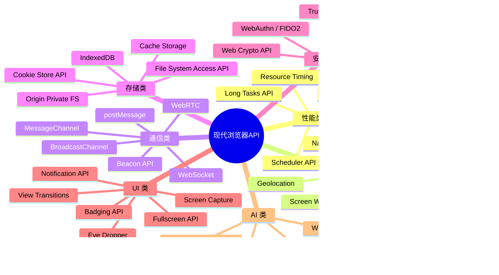
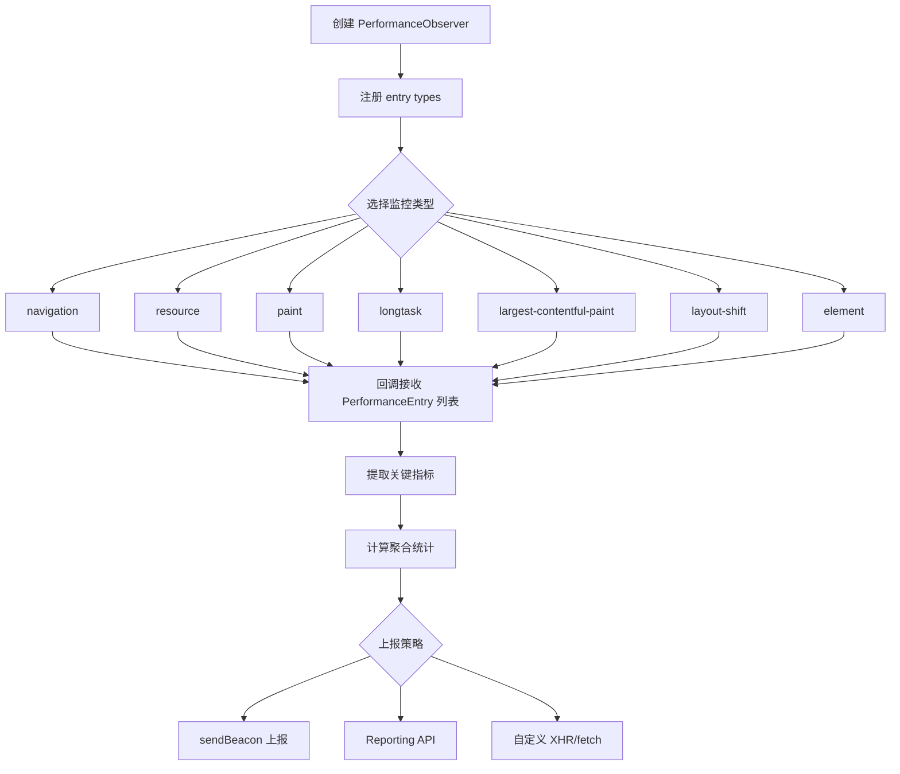
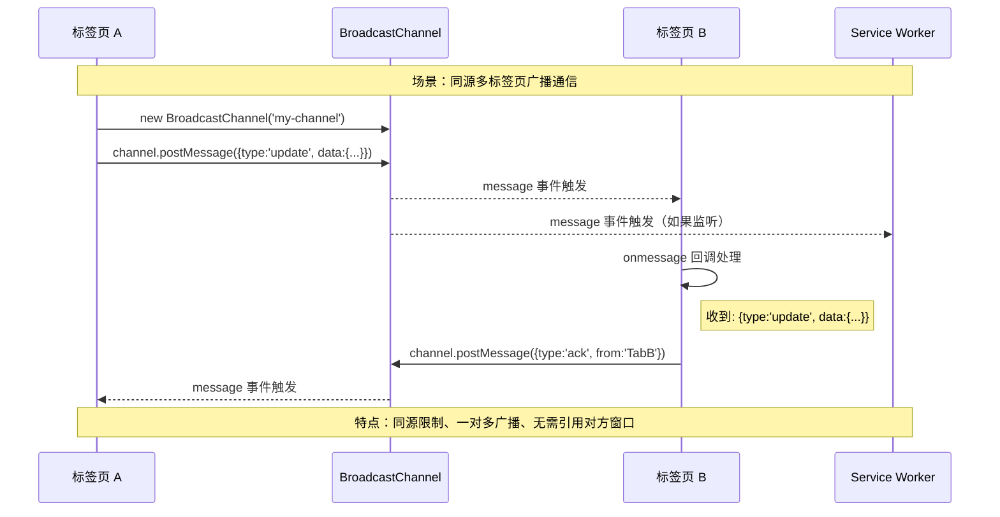
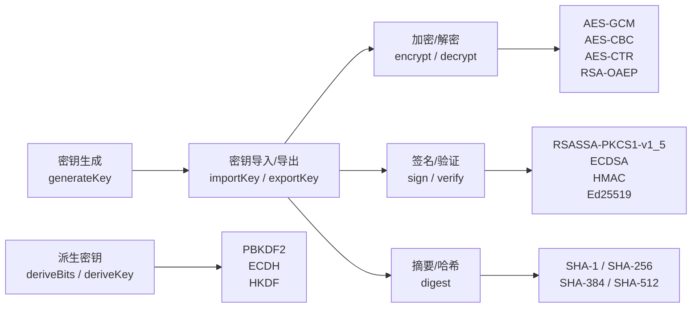
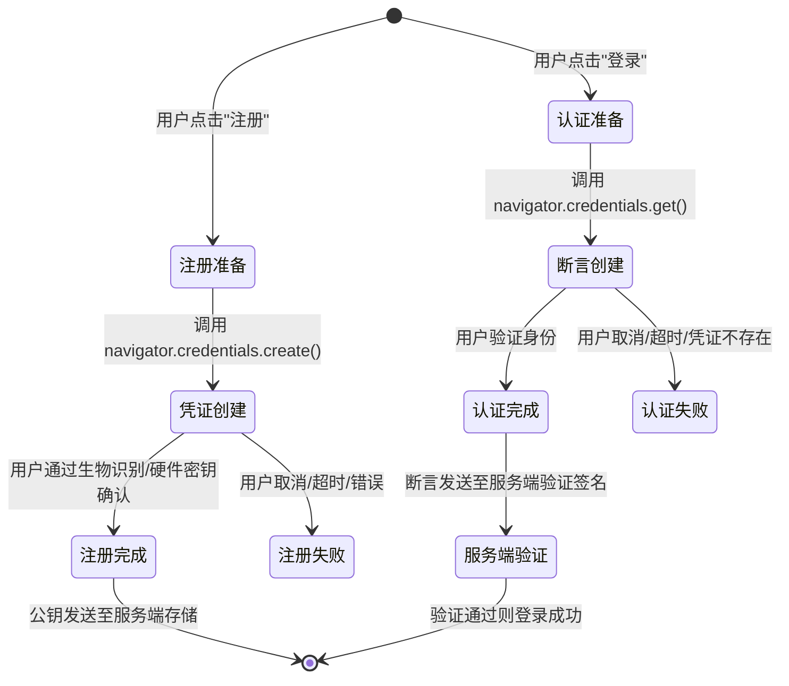

# 现代浏览器 API

现代浏览器持续推出新的 Web API，使 Web 应用具备越来越接近原生应用的能力。本文档汇总了近年来重要的浏览器 API，涵盖性能、安全、用户体验等多个维度。

## 概述

```
┌─────────────────────────────────────────────────────────────────┐
│                    现代浏览器 API 体系                            │
├─────────────────────────────────────────────────────────────────┤
│                                                                 │
│  ┌─────────────┐  ┌─────────────┐  ┌─────────────┐            │
│  │  页面过渡    │  │  导航管理    │  │  内容分享    │            │
│  │  View        │  │  Navigation  │  │  Web Share   │            │
│  │  Transitions │  │  API         │  │  API         │            │
│  └──────┬──────┘  └──────┬──────┘  └──────┬──────┘            │
│         │                │                │                     │
│  ┌──────┴──────┐  ┌──────┴──────┐  ┌──────┴──────┐            │
│  │  剪贴板     │  │  国际化      │  │  调度器      │            │
│  │  Async      │  │  Intl        │  │  Scheduler   │            │
│  │  Clipboard  │  │  API         │  │  API         │            │
│  └──────┬──────┘  └──────┬──────┘  └──────┬──────┘            │
│         │                │                │                     │
│  ┌──────┴──────┐  ┌──────┴──────┐  ┌──────┴──────┐            │
│  │  结构化克隆  │  │  CSS Houdini │  │  检测能力    │            │
│  │  structuredClone│ │  Paint API   │  │  UA Data     │            │
│  └─────────────┘  └─────────────┘  └─────────────┘            │
│                                                                 │
└─────────────────────────────────────────────────────────────────┘
```

### 现代 API 全景分类



### 浏览器新 API 时间线

```mermaid
timeline
    title 重要浏览器 API 引入时间线
    section 2015
        Service Workers : PWA 基础设施<br/>离线缓存能力
        Fetch API : 替代 XMLHttpRequest<br/>Promise 化网络请求
        IntersectionObserver : 高性能元素可见性检测
    section 2016-2017
        Web Animations API : 原生动画控制接口
        Payment Request API : 原生支付流程
        Credentials API : 统一凭证管理
        WebShare (Level 1) : 移动端原生分享
    section 2018-2019
        Clipboard Async API : 异步剪贴板读写
        Web Locks API : 异步互斥锁机制
        Background Fetch : 后台大文件下载
        Web Authn (FIDO2) : 无密码认证标准
        Reporting API : 客户端错误上报
        Element Timing API : 元素渲染时间测量
        Screen Capture API : 屏幕录制共享
    section 2020-2021
        Scheduler API : 优先级任务调度
        Idle Detection API : 用户空闲状态检测
        Eye Dropper API : 屏幕取色器
        Badging API : 应用角标通知
        Storage Access API : 第三方存储访问
    section 2022-2023
        Navigation API : 现代 SPA 导航管理
        View Transitions API : 声明式页面过渡
        WebGPU : 新一代图形计算接口
        Web Neural Network : 浏览器端机器学习推理
        Private State Tokens : 反欺诈隐私令牌
    section 2024+
        Prompt API (AI) : 浏览器内置 AI 能力
        Attribution Reporting : 隐私保护归因分析
        Topics API : 兴趣广告定向
```



## View Transitions API

View Transitions API 提供声明式的页面/元素过渡动画，替代了以往需要 FLIP 动画库的复杂实现。

> 本节为概览，详细用法参见 [17-HTML5其他应用.md](../01-基础知识/17-HTML5其他应用) 中的 View Transitions 章节。

### 核心概念

```javascript
document.startViewTransition(() => {
  updateDOM();
});
```

**工作流程：**
1. 浏览器截取当前页面快照
2. 执行回调函数更新 DOM
3. 浏览器截取新页面快照
4. 在旧快照和新快照之间执行过渡动画

### 典型应用

- SPA 视图切换（列表 ↔ 详情）
- 主题切换（亮色 ↔ 暗色）
- 列表排序动画
- MPA 跨页面过渡

## Navigation API

Navigation API 是 History API 的现代替代方案，为 SPA 提供更清晰的导航管理。

> 本节为概览，详细用法参见 [17-HTML5其他应用.md](../01-基础知识/17-HTML5其他应用) 中的 Navigation API 章节。

### 核心优势

```javascript
window.navigation.addEventListener('navigate', (event) => {
  event.intercept({
    handler: async () => {
      const content = await fetchPage(event.destination.url);
      renderPage(content);
    }
  });
});
```

**对比 History API：**
- 统一拦截所有导航（点击链接、表单提交、前进/后退）
- `event.destination` 提供完整目标信息
- `intercept()` 支持异步处理
- `navigation.entries()` 可遍历完整导航历史

## Web Share API

Web Share API 调用系统原生分享面板，支持文本、链接和文件。

> 本节为概览，详细用法参见 [17-HTML5其他应用.md](../01-基础知识/17-HTML5其他应用) 中的 Web Share API 章节。

### 核心用法

```javascript
await navigator.share({
  title: '文章标题',
  text: '推荐阅读',
  url: 'https://example.com'
});
```

**注意事项：**
- 必须由用户操作触发
- 使用 `navigator.canShare()` 检测文件分享支持
- 移动端支持完善，桌面端 Chrome 93+、Safari 15+ 可用

## Async Clipboard API

Async Clipboard API 提供了异步读写剪贴板的能力，替代了同步的 `document.execCommand('copy')`。

<h4>026-clipboard-api.html</h4>

```html
<!DOCTYPE html>
<html lang="zh-CN">
<head>
  <meta charset="UTF-8">
  <meta name="viewport" content="width=device-width, initial-scale=1.0">
  <title>【026】Clipboard API 复制粘贴工具</title>
  <style>
    * { margin: 0; padding: 0; box-sizing: border-box; }
    body { font-family: -apple-system, BlinkMacSystemFont, 'Segoe UI', sans-serif; padding: 20px; background: #f8f9fa; color: #333; }
    .demo-wrap { max-width: 800px; margin: 0 auto; }
    .demo-header { display: flex; justify-content: space-between; align-items: center; margin-bottom: 20px; padding-bottom: 12px; border-bottom: 2px solid #e0e0e0; }
    .demo-header h1 { font-size: 20px; font-weight: 600; }
    .demo-badge { font-size: 12px; padding: 3px 10px; border-radius: 12px; background: #0891b2; color: white; }

    .clipboard-tool {
      background: white; border-radius: 14px; overflow: hidden;
      box-shadow: 0 2px 12px rgba(0,0,0,0.08);
    }
    .cb-header {
      background: linear-gradient(135deg, #0891b2, #06b6d4);
      color: white; padding: 1rem 1.25rem; font-weight: 700;
      display: flex; justify-content: space-between; align-items: center;
    }
    .cb-body { padding: 1.5rem; }

    .input-area { margin-bottom: 1.25rem; }
    .input-area label { display: block; font-size: 0.85rem; font-weight: 600; margin-bottom: 6px; color: #374151; }
    .input-area textarea {
      width: 100%; min-height: 100px; padding: 12px; border: 2px solid #e5e7eb;
      border-radius: 10px; font-size: 0.9rem; font-family: inherit;
      outline: none; resize: vertical;
    }
    .input-area textarea:focus { border-color: #0891b2; box-shadow: 0 0 0 3px rgba(8,145,178,0.1); }

    .action-grid {
      display: grid; grid-template-columns: repeat(3, 1fr); gap: 0.75rem; margin-bottom: 1.25rem;
    }
    .action-btn {
      padding: 14px 12px; border: none; border-radius: 10px;
      font-size: 0.88rem; font-weight: 600; cursor: pointer;
      transition: all 0.15s; display: flex; flex-direction: column;
      align-items: center; gap: 6px;
    }
    .ab-text { background: linear-gradient(135deg, #0891b2, #06b6d4); color: white; }
    .ab-rich { background: linear-gradient(135deg, #7c3aed, #a78bfa); color: white; }
    .ab-read { background: linear-gradient(135deg, #059669, #10b981); color: white; }
    .action-btn:hover { transform: translateY(-2px); box-shadow: 0 4px 12px rgba(0,0,0,0.12); }
    .ab-icon { font-size: 1.4rem; }

    .preview-area {
      background: #f8fafc; border: 2px dashed #e2e8f0; border-radius: 10px;
      padding: 1.25rem; min-height: 100px;
    }
    .preview-label { font-size: 0.78rem; color: #94a3b8; font-weight: 600; margin-bottom: 8px; }
    .preview-content { font-size: 0.9rem; line-height: 1.6; overflow-wrap: break-word; }

    .toast {
      position: fixed; bottom: 24px; left: 50%; transform: translateX(-50%) translateY(100px);
      background: #1e293b; color: white; padding: 12px 24px; border-radius: 12px;
      font-size: 0.9rem; font-weight: 500; z-index: 9999;
      box-shadow: 0 8px 30px rgba(0,0,0,0.2);
      transition: transform 0.3s cubic-bezier(0.34, 1.56, 0.64, 1);
    }
    .toast.show { transform: translateX(-50%) translateY(0); }

    .api-info {
      margin-top: 1rem; display: grid; grid-template-columns: 1fr 1fr; gap: 0.75rem;
    }
    .api-card {
      padding: 0.85rem 1rem; border-radius: 8px; font-size: 0.82rem;
    }
    .api-write { background: #eff6ff; color: #1e40af; border: 1px solid #bfdbfe; }
    .api-read { background: #f0fdf4; color: #166534; border: 1px solid #bbf7d0; }

    @media (max-width: 550px) {
      .action-grid { grid-template-columns: 1fr; }
      .api-info { grid-template-columns: 1fr; }
    }
  </style>
</head>
<body>
  <div class="demo-wrap">
    <div class="demo-header">
      <h1>Clipboard API 复制粘贴工具</h1>
      <span class="demo-badge">Async Clipboard API</span>
    </div>

    <div class="clipboard-tool">
      <div class="cb-header">
        <span>📋 剪贴板操作面板</span>
        <span id="permStatus" style="font-size:0.72rem;background:rgba(255,255,255,0.2);padding:3px 8px;border-radius:6px;">检测权限...</span>
      </div>
      <div class="cb-body">
        <div class="input-area">
          <label for="clipInput">输入或编辑内容</label>
          <textarea id="clipInput" placeholder="在此输入要复制的内容...

支持富文本、图片、文件等多种格式。">这是要复制到剪贴板的示例文本。

你可以修改这段文字，然后点击「复制文本」按钮。

Clipboard API 支持异步读写剪贴板内容！</textarea>
        </div>

        <div class="action-grid">
          <button class="action-btn ab-text" onclick="copyText()">
            <span class="ab-icon">📝</span>
            <span>复制文本</span>
          </button>
          <button class="action-btn ab-rich" onclick="copyRich()">
            <span class="ab-icon">🎨</span>
            <span>复制富文本</span>
          </button>
          <button class="action-btn ab-read" onclick="readClipboard()">
            <span class="ab-icon">📖</span>
            <span>读取剪贴板</span>
          </button>
        </div>

        <div class="preview-area">
          <div class="preview-label">📌 剪贴板预览（读取结果）</div>
          <div class="preview-content" id="previewContent">
            点击「读取剪贴板」查看当前剪贴板内容...
          </div>
        </div>
      </div>
    </div>

    <div class="api-info">
      <div class="api-card api-write">
        <strong>写入 API:</strong> navigator.clipboard.writeText() / write()
      </div>
      <div class="api-card api-read">
        <strong>读取 API:</strong> navigator.clipboard.readText() / read()
      </div>
    </div>
  </div>

  <div class="toast" id="toast"></div>

  <script>
    const toast = document.getElementById('toast');
    let toastTimer;

    function showToast(msg) {
      toast.textContent = msg;
      toast.classList.add('show');
      clearTimeout(toastTimer);
      toastTimer = setTimeout(() => toast.classList.remove('show'), 2200);
    }

    // Permission check
    async function checkPermission() {
      const statusEl = document.getElementById('permStatus');
      try {
        const result = await navigator.permissions.query({ name: 'clipboard-read' });
        if (result.state === 'granted') {
          statusEl.textContent = '✅ 权限已授权';
        } else if (result.state === 'prompt') {
          statusEl.textContent = '⏳ 待授权';
        } else {
          statusEl.textContent = '⚠️ 受限';
        }
      } catch(e) {
        statusEl.textContent = 'ℹ️ 标准 API';
      }
    }
    checkPermission();

    async function copyText() {
      const text = document.getElementById('clipInput').value;
      try {
        await navigator.clipboard.writeText(text);
        showToast(`✅ 已复制 ${text.length} 个字符`);
      } catch(err) {
        // Fallback for older browsers
        const ta = document.getElementById('clipInput');
        ta.select(); document.execCommand('copy');
        showToast('✅ 已复制（fallback 模式）');
      }
    }

    async function copyRich() {
      const text = document.getElementById('clipInput').value;
      const html = `<div style="padding:16px;background:linear-gradient(135deg,#667eea,#764ba2);color:white;border-radius:12px;font-family:sans-serif;"><h2 style="margin-bottom:8px;">📋 富文本内容</h2><p style="opacity:0.9;line-height:1.6;">${text.replace(/\n/g,'<br>')}</p><footer style="margin-top:12px;opacity:0.7;font-size:12px;">via Clipboard API</footer></div>`;

      try {
        const blob = new Blob([html], { type: 'text/html' });
        const clipItem = new ClipboardItem({ 'text/html': blob, 'text/plain': new Blob([text], { type: 'text/plain' }) });
        await navigator.clipboard.write([clipItem]);
        showToast('✅ 富文本已复制（支持 HTML 格式粘贴！）');
      } catch(err) {
        showToast('⚠️ 富文本复制需要 clipboard-write 权限');
      }
    }

    async function readClipboard() {
      const preview = document.getElementById('previewContent');
      try {
        const text = await navigator.clipboard.readText();
        preview.innerHTML = `<strong style="color:#059669;">读取成功:</strong><br><br>` + escapeHtml(text) +
          `<br><br><small style="color:#94a3b8;">长度: ${text.length} 字符 | 时间: ${new Date().toLocaleTimeString()}</small>`;
      } catch(err) {
        preview.innerHTML = `<span style="color:#ef4444;">❌ 读取失败: ${err.message}</span><br><small style="color:#94a3b8;">可能需要授予 clipboard-read 权限</small>`;
      }
    }

    function escapeHtml(str) {
      return str.replace(/&/g,'&amp;').replace(/</g,'&lt;').replace(/>/g,'&gt;');
    }
  </script>
</body>
</html>
```

### 读取剪贴板

```javascript
async function readClipboard() {
  try {
    const items = await navigator.clipboard.read();
    for (const item of items) {
      if (item.types.includes('text/plain')) {
        const blob = await item.getType('text/plain');
        const text = await blob.text();
        console.log('文本内容:', text);
      }
      if (item.types.includes('image/png')) {
        const blob = await item.getType('image/png');
        console.log('图片:', blob);
      }
    }
  } catch (err) {
    console.error('读取剪贴板失败:', err);
  }
}
```

### 写入剪贴板

```javascript
async function copyText(text) {
  try {
    await navigator.clipboard.writeText(text);
    console.log('复制成功');
  } catch (err) {
    console.error('复制失败:', err);
  }
}

async function copyImage(blob) {
  try {
    await navigator.clipboard.write([
      new ClipboardItem({ 'image/png': blob })
    ]);
    console.log('图片复制成功');
  } catch (err) {
    console.error('图片复制失败:', err);
  }
}
```

### 权限处理

```javascript
const permission = await navigator.permissions.query({
  name: 'clipboard-read'
});

if (permission.state === 'granted') {
  await navigator.clipboard.read();
} else if (permission.state === 'prompt') {
  console.log('需要用户授权');
}
```

::: tip
读取剪贴板需要用户授权。写入纯文本在用户操作（如点击）触发时通常无需授权。建议始终使用 try-catch 处理权限拒绝的情况。
:::

## structuredClone()

`structuredClone()` 是浏览器内置的深拷贝 API，支持所有可结构化克隆的类型。

### 基本用法

```javascript
const original = {
  name: '张三',
  hobbies: ['阅读', '编程'],
  birthday: new Date('1990-01-15'),
  pattern: /hello/gi
};

const copy = structuredClone(original);

copy.hobbies.push('游泳');
console.log(original.hobbies);
```

### 支持的类型

| 类型 | 说明 |
| --- | --- |
| 基本类型 | `string`、`number`、`boolean`、`null`、`undefined` |
| 对象 | 普通对象、数组、Map、Set、Date、RegExp |
| 二进制 | `ArrayBuffer`、`TypedArray`、`DataView`、`Blob`、`File` |
| 错误对象 | `Error`、`TypeError` 等 |
| 嵌套结构 | 以上类型的任意嵌套组合 |

### 不支持的类型

```javascript
const obj = {
  fn: () => {},
  dom: document.body,
  symbol: Symbol('id')
};

try {
  structuredClone(obj);
} catch (e) {
  console.error('无法克隆:', e);
}
```

**不支持的类型：** 函数、DOM 节点、Symbol、WeakMap/WeakSet、PropertyDescriptor。

### 与其他克隆方式对比

| 方式 | 深拷贝 | 循环引用 | 特殊类型 | 性能 |
| --- | --- | --- | --- | --- |
| `JSON.parse(JSON.stringify())` | 是 | 报错 | 丢失 Date/RegExp/Map 等 | 中 |
| 展开运算符 `...` | 否（浅拷贝） | - | 保留引用 | 快 |
| `structuredClone()` | 是 | 支持 | 支持 Date/RegExp/Map 等 | 快 |

## Scheduler API

Scheduler API 提供了比 `setTimeout(fn, 0)` 更优的任务调度能力，支持优先级控制。

### scheduler.postTask()

```javascript
scheduler.postTask(() => {
  console.log('用户交互相关任务');
}, { priority: 'user-blocking' });

scheduler.postTask(() => {
  console.log('可见区域渲染');
}, { priority: 'user-visible' });

scheduler.postTask(() => {
  console.log('后台数据分析');
}, { priority: 'background' });
```

### 优先级

| 优先级 | 说明 | 典型场景 |
| --- | --- | --- |
| `user-blocking` | 阻塞用户交互 | 事件处理、UI 更新 |
| `user-visible` | 用户可见但不阻塞 | 渐进式渲染、非关键动画 |
| `background` | 后台任务 | 日志上报、数据预取 |

### AbortController 取消任务

```javascript
const controller = new AbortController();

scheduler.postTask(() => {
  console.log('这个任务可能被取消');
}, {
  priority: 'background',
  signal: controller.signal
});

controller.abort();
```

### scheduler.wait()

```javascript
async function delayedTask() {
  await scheduler.wait(1000);
  console.log('1 秒后执行');
}
```

::: warning 注意
`scheduler.wait()` 目前仍是提案，尚未在浏览器中实现；生产环境请继续使用 `setTimeout` 的 Promise 包装。
:::

### 与 setTimeout 对比

| 特性 | `setTimeout` | `scheduler.postTask` |
| --- | --- | --- |
| 优先级 | 无 | 三级优先级 |
| 取消 | `clearTimeout(id)` | `AbortController` |
| Promise 支持 | 需手动包装 | 原生返回 Promise |
| 最小延迟 | 嵌套时 ≥ 4ms | 无最小延迟 |

## Intl API（国际化）

Intl API 是浏览器内置的国际化工具集，无需引入第三方库即可处理多语言格式化。

<h4>028-intl-format.html</h4>

```html
<!DOCTYPE html>
<html lang="zh-CN">
<head>
  <meta charset="UTF-8">
  <meta name="viewport" content="width=device-width, initial-scale=1.0">
  <title>【028】Intl 国际化格式化工具</title>
  <style>
    * { margin: 0; padding: 0; box-sizing: border-box; }
    body { font-family: -apple-system, BlinkMacSystemFont, 'Segoe UI', sans-serif; padding: 20px; background: #f8f9fa; color: #333; }
    .demo-wrap { max-width: 900px; margin: 0 auto; }
    .demo-header { display: flex; justify-content: space-between; align-items: center; margin-bottom: 20px; padding-bottom: 12px; border-bottom: 2px solid #e0e0e0; }
    .demo-header h1 { font-size: 20px; font-weight: 600; }
    .demo-badge { font-size: 12px; padding: 3px 10px; border-radius: 12px; background: #2563eb; color: white; }

    .locale-selector {
      display: flex; gap: 0.5rem; margin-bottom: 1.5rem; flex-wrap: wrap;
      justify-content: center;
    }
    .locale-btn {
      padding: 8px 16px; border: 2px solid #e2e8f0; background: white;
      border-radius: 8px; cursor: pointer; font-size: 0.88rem; font-weight: 500;
      transition: all 0.15s;
    }
    .locale-btn:hover { border-color: #2563eb; }
    .locale-btn.active { background: #2563eb; color: white; border-color: #2563bd; }

    .intl-grid { display: grid; grid-template-columns: repeat(auto-fit, minmax(380px, 1fr)); gap: 1rem; }

    .intl-card {
      background: white; border-radius: 14px; overflow: hidden;
      box-shadow: 0 2px 10px rgba(0,0,0,0.07);
    }
    .ic-header {
      padding: 0.85rem 1.25rem; font-weight: 700; font-size: 0.9rem;
      background: #f8fafc; border-bottom: 1px solid #e2e8f0; color: #374151;
    }
    .ic-body { padding: 1.25rem; }

    .format-row {
      display: flex; justify-content: space-between; align-items: baseline;
      padding: 8px 0; border-bottom: 1px solid #f1f5f9; font-size: 0.9rem;
    }
    .format-row:last-child { border: none; }
    .fr-label { color: #64748b; font-size: 0.82rem; }
    .fr-value { font-weight: 600; color: #1e293b; font-family: monospace; font-size: 0.95rem; }

    .relative-time {
      display: flex; flex-direction: column; gap: 8px; margin-top: 0.75rem;
    }
    .rt-item { display: flex; justify-content: space-between; font-size: 0.85rem; padding: 6px 10px; background: #f8fafc; border-radius: 6px; }
    .rt-label { color: #64748b; }
    .rt-value { font-weight: 500; }

    .collator-demo {
      display: flex; gap: 8px; flex-wrap: wrap; margin-top: 0.75rem;
    }
    .sort-item {
      padding: 8px 14px; background: #eff6ff; border-radius: 8px;
      font-size: 0.88rem; color: #1d4ed8; font-weight: 500;
    }
  </style>
</head>
<body>
  <div class="demo-wrap">
    <div class="demo-header">
      <h1>Intl 国际化格式化工具</h1>
      <span class="demo-badge">ECMAScript Internationalization API</span>
    </div>

    <div class="locale-selector">
      <button class="locale-btn active" data-locale="zh-CN">🇨🇳 中文</button>
      <button class="locale-btn" data-locale="en-US">🇺🇸 English</button>
      <button class="locale-btn" data-locale="ja-JP">🇯🇵 日本語</button>
      <button class="locale-btn" data-locale="de-DE">🇩🇪 Deutsch</button>
      <button class="locale-btn" data-locale="ar-SA">🇸🇦 العربية</button>
      <button class="locale-btn" data-locale="ko-KR">🇰🇷 한국어</button>
    </div>

    <div class="intl-grid">
      <!-- Number Formatting -->
      <div class="intl-card">
        <div class="ic-header">💰 数字与货币格式</div>
        <div class="ic-body" id="numberFormats"></div>
      </div>

      <!-- Date/Time Formatting -->
      <div class="intl-card">
        <div class="ic-header">📅 日期时间格式</div>
        <div class="ic-body" id="dateFormats"></div>
      </div>

      <!-- Relative Time -->
      <div class="intl-card">
        <div class="ic-header">⏰ 相对时间格式</div>
        <div class="ic-body" id="relativeTimeFormats"></div>
      </div>

      <!-- Collator -->
      <div class="intl-card">
        <div class="ic-header">🔤 排序比较器</div>
        <div class="ic-body" id="collatorDemo">
          <p style="font-size:0.85rem;color:#64748b;margin-bottom:0.75rem;">原始顺序: 张三, 李四, 王五, 赵六, 陈七</p>
          <div class="collator-demo" id="sortedNames"></div>
        </div>
      </div>
    </div>
  </div>

  <script>
    let currentLocale = 'zh-CN';

    function updateFormats() {
      updateNumberFormats();
      updateDateFormats();
      updateRelativeTimeFormats();
      updateCollator();
    }

    function updateNumberFormats() {
      const container = document.getElementById('numberFormats');
      const num = 1234567.89;
      const currency = 128888.50;

      container.innerHTML = `
        <div class="format-row"><span class="fr-label">数字</span><span class="fr-value">${new Intl.NumberFormat(currentLocale).format(num)}</span></div>
        <div class="format-row"><span class="fr-label">百分比</span><span class="fr-value">${new Intl.NumberFormat(currentLocale, { style: 'percent', maximumFractionDigits: 2 }).format(0.8945)}</span></div>
        <div class="format-row"><span class="fr-label">货币 (CNY)</span><span class="fr-value">${new Intl.NumberFormat(currentLocale, { style: 'currency', currency: 'CNY' }).format(currency)}</span></div>
        <div class="format-row"><span class="fr-label">货币 (USD)</span><span class="fr-value">${new Intl.NumberFormat(currentLocale, { style: 'currency', currency: 'USD' }).format(currency)}</span></div>
        <div class="format-row"><span class="fr-label">紧凑数字</span><span class="fr-value">${new Intl.NumberFormat(currentLocale, { notation: 'compact' }).format(2847653)}</span></div>
        <div class="format-row"><span class="fr-label">单位 (GB)</span><span class="fr-value">${new Intl.NumberFormat(currentLocale, { style: 'unit', unit: 'gigabyte' }).format(256)}</span></div>
      `;
    }

    function updateDateFormats() {
      const container = document.getElementById('dateFormats');
      const now = new Date();

      container.innerHTML = `
        <div class="format-row"><span class="fr-label">完整日期</span><span class="fr-value">${new Intl.DateTimeFormat(currentLocale, { dateStyle: 'full' }).format(now)}</span></div>
        <div class="format-row"><span class="fr-label">长日期</span><span class="fr-value">${new Intl.DateTimeFormat(currentLocale, { dateStyle: 'long' }).format(now)}</span></div>
        <div class="format-row"><span class="fr-label">短日期</span><span class="fr-value">${new Intl.DateTimeFormat(currentLocale, { dateStyle: 'short' }).format(now)}</span></div>
        <div class="format-row"><span class="fr-label">完整时间</span><span class="fr-value">${new Intl.DateTimeFormat(currentLocale, { timeStyle: 'full' }).format(now)}</span></div>
        <div class="format-row"><span class="fr-label">相对时区</span><span class="fr-value">${new Intl.DateTimeFormat(currentLocale, { timeZoneName: 'short' }).format(now).split(',').pop()}</span></div>
      `;
    }

    function updateRelativeTimeFormats() {
      const container = document.getElementById('relativeTimeFormats');
      const rtf = new Intl.RelativeTimeFormat(currentLocale, { numeric: 'auto' });
      const offsets = [
        [-60, '分钟'], [-1440, '小时'], [-7*1440, '天'],
        [-30*1440, '月'], [-(365*1440 + 30*1440), '年'],
        [0, '现在'], [10, '分钟'], [3, '小时'], [5, '天']
      ];

      container.innerHTML = `<div class="relative-time">
        ${offsets.map(([val, unit]) =>
          `<div class="rt-item"><span class="rt-label">${val === 0 ? '现在' : val > 0 ? `+${Math.abs(val)}${unit}` : `${Math.abs(val)}${unit}前`}</span><span class="rt-value">${rtf.format(val, unit === '分钟' ? 'minute' : unit === '小时' ? 'hour' : unit === '天' ? 'day' : unit === '月' ? 'month' : 'year')}</span></div>`
        ).join('')}
      </div>`;
    }

    function updateCollator() {
      const container = document.getElementById('sortedNames');
      const names = ['张三', '李四', '王五', '赵六', '陈七'];
      const collator = new Intl.Collator(currentLocale);
      const sorted = [...names].sort(collator.compare);

      container.innerHTML = sorted.map(n =>
        `<span class="sort-item">${n}</span>`
      ).join('');
    }

    // Locale selector
    document.querySelectorAll('.locale-btn').forEach(btn => {
      btn.addEventListener('click', () => {
        document.querySelectorAll('.locale-btn').forEach(b => b.classList.remove('active'));
        btn.classList.add('active');
        currentLocale = btn.dataset.locale;
        updateFormats();
      });
    });

    // Initial render
    updateFormats();

    // Auto-update every minute
    setInterval(updateDateFormats, 60000);
  </script>
</body>
</html>
```

### 日期格式化

```javascript
const formatter = new Intl.DateTimeFormat('zh-CN', {
  year: 'numeric',
  month: 'long',
  day: 'numeric',
  weekday: 'long'
});

formatter.format(new Date());
```

### 数字格式化

```javascript
const numberFormatter = new Intl.NumberFormat('zh-CN', {
  style: 'currency',
  currency: 'CNY'
});

numberFormatter.format(12345.67);

const compactFormatter = new Intl.NumberFormat('zh-CN', {
  notation: 'compact'
});

compactFormatter.format(1234567);
```

### 相对时间

```javascript
const relativeFormatter = new Intl.RelativeTimeFormat('zh-CN', {
  numeric: 'auto'
});

relativeFormatter.format(-1, 'day');
relativeFormatter.format(3, 'month');
relativeFormatter.format(-2, 'hour');
```

### 列表格式化

```javascript
const listFormatter = new Intl.ListFormat('zh-CN', {
  style: 'long',
  type: 'conjunction'
});

listFormatter.format(['张三', '李四', '王五']);
```

### 单复数规则

```javascript
const pluralRules = new Intl.PluralRules('zh-CN');
console.log(pluralRules.select(0));
console.log(pluralRules.select(1));
console.log(pluralRules.select(2));

const enPlural = new Intl.PluralRules('en');
console.log(enPlural.select(1));
console.log(enPlural.select(2));
```

## User-Agent Client Hints

替代传统 `navigator.userAgent` 字符串解析的现代方式，获取客户端信息更可靠、更隐私友好。

### 基本用法

```javascript
navigator.userAgentData.brands.forEach(brand => {
  console.log(`${brand.brand} ${brand.version}`);
});

console.log('移动端:', navigator.userAgentData.mobile);
```

### 请求高熵值信息

```javascript
const ua = await navigator.userAgentData.getHighEntropyValues([
  'platform',
  'platformVersion',
  'architecture',
  'model',
  'bitness',
  'fullVersionList'
]);

console.log('操作系统:', ua.platform);
console.log('系统版本:', ua.platformVersion);
console.log('架构:', ua.architecture);
console.log('设备型号:', ua.model);
```

### 与传统 UA 对比

| 特性 | `navigator.userAgent` | `navigator.userAgentData` |
| --- | --- | --- |
| 格式 | 难以解析的字符串 | 结构化对象 |
| 隐私 | 暴露过多信息 | 默认仅提供基本信息 |
| 可靠性 | 可被伪造/不一致 | 浏览器直接提供 |
| 冻结趋势 | 是（UA 逐步被冻结） | 否（推荐方式） |

## CSS Houdini（Paint API）

CSS Houdini 允许开发者通过 JavaScript 扩展 CSS 的渲染能力，Paint API 是其中最成熟的部分。

### 注册 Paint Worklet

```javascript
class RipplePainter {
  static get inputProperties() {
    return ['--ripple-color', '--ripple-progress'];
  }

  paint(ctx, size, properties) {
    const color = properties.get('--ripple-color').toString();
    const progress = parseFloat(properties.get('--ripple-progress'));

    ctx.fillStyle = color;
    ctx.globalAlpha = 1 - progress;
    ctx.beginPath();
    ctx.arc(
      size.width / 2,
      size.height / 2,
      Math.max(size.width, size.height) * progress,
      0,
      Math.PI * 2
    );
    ctx.fill();
  }
}

registerPaint('ripple', RipplePainter);
```

### 使用 Paint Worklet

```html
<script>
  CSS.paintWorklet.addModule('ripple-painter.js');
</script>

<style>
  /* 注册可过渡的自定义属性（否则 transition 不生效） */
  @property --ripple-progress {
    syntax: '<number>';
    inherits: false;
    initial-value: 0;
  }

  .ripple-button {
    --ripple-color: rgba(0, 150, 255, 0.3);
    --ripple-progress: 0;
    background-image: paint(ripple);
  }

  .ripple-button:active {
    --ripple-progress: 1;
    transition: --ripple-progress 0.6s;
  }
</style>

<button class="ripple-button">点击涟漪效果</button>
```

---

## Performance API 性能监控体系

Performance API 构建了一套完整的页面性能数据采集与分析体系，是前端性能监控（RUM）的核心基础设施。

<h4>023-web-vitals-dashboard.html</h4>

```html
<!DOCTYPE html>
<html lang="zh-CN">
<head>
  <meta charset="UTF-8">
  <meta name="viewport" content="width=device-width, initial-scale=1.0">
  <title>【022】PerformanceObserver 核心 Web Vitals 监控面板</title>
  <style>
    * { margin: 0; padding: 0; box-sizing: border-box; }
    body { font-family: -apple-system, BlinkMacSystemFont, 'Segoe UI', sans-serif; padding: 20px; background: #0f172a; color: #e2e8f0; }
    .demo-wrap { max-width: 1000px; margin: 0 auto; }
    .demo-header { display: flex; justify-content: space-between; align-items: center; margin-bottom: 24px; padding-bottom: 12px; border-bottom: 2px solid #334155; }
    .demo-header h1 { font-size: 22px; font-weight: 600; color: #f8fafc; }
    .demo-badge { font-size: 12px; padding: 3px 10px; border-radius: 12px; background: #f59e0b; color: #1e293b; font-weight: 600; }

    /* Dashboard Grid */
    .dashboard { display: grid; gap: 1.25rem; }

    /* Score Cards */
    .score-grid { display: grid; grid-template-columns: repeat(auto-fit, minmax(200px, 1fr)); gap: 1rem; }
    .score-card {
      background: linear-gradient(145deg, #1e293b, #283548);
      border-radius: 14px; padding: 1.25rem; position: relative;
      overflow: hidden; border: 1px solid #334155;
    }
    .score-card::before {
      content: ''; position: absolute; top: 0; left: 0; right: 0; height: 3px;
    }
    .sc-lcp::before { background: #3b82f6; }
    .sc-fid::before { background: #f59e0b; }
    .sc-inp::before { background: #ec4899; }
    .sc-cls::before { background: #8b5cf6; }
    .sc-ttfb::before { background: #22c55e; }
    .sc-fcp::before { background: #06b6d4; }

    .sc-label { font-size: 0.75rem; color: #94a3b8; text-transform: uppercase; letter-spacing: 0.05em; margin-bottom: 0.5rem; }
    .sc-name { font-size: 0.95rem; font-weight: 600; color: #cbd5e1; margin-bottom: 0.5rem; }
    .sc-value { font-size: 1.75rem; font-weight: 800; font-family: monospace; }
    .sc-value.good { color: #22c55e; }
    .sc-value.needs-improvement { color: #f59e0b; }
    .sc-value.poor { color: #ef4444; }
    .sc-bar { height: 4px; background: #334155; border-radius: 2px; margin-top: 0.75rem; overflow: hidden; }
    .sc-bar-fill { height: 100%; border-radius: 2px; transition: width 0.5s ease; }
    .bar-good { background: #22c55e; }
    .bar-ni { background: #f59e0b; }
    .bar-poor { background: #ef4444; }

    /* Timeline */
    .timeline-section {
      background: #1e293b; border-radius: 14px; padding: 1.25rem;
      border: 1px solid #334155;
    }
    .ts-title { font-size: 0.95rem; font-weight: 600; margin-bottom: 1rem; color: #f1f5f9; }
    .timeline-bar {
      height: 36px; background: #0f172a; border-radius: 8px;
      position: relative; overflow: hidden;
    }
    .tl-segment {
      position: absolute; top: 0; height: 100%;
      display: flex; align-items: center; justify-content: center;
      font-size: 0.68rem; font-weight: 600; color: white;
      border-radius: 4px; transition: all 0.3s ease;
    }
    .tl-redirect { background: #ef4444; left: 0; }
    .tl-dns { background: #f59e0b; }
    .tl-connect { background: #ec4899; }
    .tl-ttfb { background: #3b82f6; }
    .tl-fcp { background: #06b6d4; }
    .tl-lcp { background: #22c55e; right: 0; }
    .tl-labels { display: flex; justify-content: space-between; margin-top: 6px; font-size: 0.7rem; color: #64748b; }

    /* Event Log */
    .event-log-section {
      background: #1e293b; border-radius: 14px; padding: 1.25rem;
      border: 1px solid #334155;
    }
    .log-list { max-height: 180px; overflow-y: auto; }
    .log-list::-webkit-scrollbar { width: 4px; }
    .log-list::-webkit-scrollbar-thumb { background: #475569; border-radius: 2px; }
    .log-entry {
      display: flex; align-items: center; gap: 10px;
      padding: 6px 0; border-bottom: 1px solid #283548; font-size: 0.82rem;
      font-family: 'SF Mono', Monaco, monospace;
    }
    .log-entry:last-child { border: none; }
    .log-time { color: #64748b; font-size: 0.72rem; min-width: 70px; }
    .log-name { color: #38bdf8; min-width: 90px; }
    .log-val { color: #e2e8f0; }

    /* Overall score */
    .overall-score {
      background: linear-gradient(145deg, #1e293b, #283548);
      border-radius: 14px; padding: 1.5rem; text-align: center;
      border: 1px solid #334155;
    }
    .os-number { font-size: 4rem; font-weight: 800; line-height: 1; }
    .os-number.excellent { color: #22c55e; }
    .os-number.good { color: #3b82f6; }
    .os-number.ni { color: #f59e0b; }
    .os-number.poor { color: #ef4444; }
    .os-label { font-size: 0.9rem; color: #94a3b8; margin-top: 0.5rem; }

    .support-note {
      margin-top: 1rem; padding: 0.75rem 1rem; background: #283548;
      border-radius: 8px; font-size: 0.8rem; color: #94a3b8;
      border: 1px solid #334155;
    }
  </style>
</head>
<body>
  <div class="demo-wrap">
    <div class="demo-header">
      <h1>核心 Web Vitals 监控面板</h1>
      <span class="demo-badge">PerformanceObserver API</span>
    </div>

    <div class="dashboard">
      <!-- Overall Score -->
      <div class="overall-score">
        <div class="os-number good" id="overallScore">--</div>
        <div class="os-label">性能评分 (0-100)</div>
      </div>

      <!-- Core Vitals -->
      <div class="score-grid">
        <div class="score-card sc-lcp">
          <div class="sc-label">Core Vital</div>
          <div class="sc-name">LCP 最大内容绘制</div>
          <div class="sc-value good" id="valLCP">-- ms</div>
          <div class="sc-bar"><div class="sc-bar-fill bar-good" id="barLCP" style="width:0%"></div></div>
        </div>
        <div class="score-card sc-fid">
          <div class="sc-label">Core Vital</div>
          <div class="sc-name">FID 首次输入延迟（已被 INP 取代）</div>
          <div class="sc-value good" id="valFID">-- ms</div>
          <div class="sc-bar"><div class="sc-bar-fill bar-good" id="barFID" style="width:0%"></div></div>
        </div>
        <div class="score-card sc-inp">
          <div class="sc-label">Core Vital</div>
          <div class="sc-name">INP 下次交互延迟</div>
          <div class="sc-value good" id="valINP">-- ms</div>
          <div class="sc-bar"><div class="sc-bar-fill bar-good" id="barINP" style="width:0%"></div></div>
        </div>
        <div class="score-card sc-cls">
          <div class="sc-label">Core Vital</div>
          <div class="sc-name">CLS 布局偏移</div>
          <div class="sc-value good" id="valCLS">--</div>
          <div class="sc-bar"><div class="sc-bar-fill bar-good" id="barCLS" style="width:0%"></div></div>
        </div>
        <div class="score-card sc-ttfb">
          <div class="sc-label">Loading</div>
          <div class="sc-name">TTFB 首字节时间</div>
          <div class="sc-value" id="valTTFB">-- ms</div>
          <div class="sc-bar"><div class="sc-bar-fill bar-good" id="barTTFB" style="width:0%"></div></div>
        </div>
        <div class="score-card sc-fcp">
          <div class="sc-label">Paint</div>
          <div class="sc-name">FCP 首次内容绘制</div>
          <div class="sc-value" id="valFCP">-- ms</div>
          <div class="sc-bar"><div class="sc-bar-fill bar-good" id="barFCP" style="width:0%"></div></div>
        </div>
      </div>

      <!-- Navigation Timing -->
      <div class="timeline-section">
        <div class="ts-title">⏱️ 页面加载时间线</div>
        <div class="timeline-bar" id="timelineBar">
          <div class="tl-segment tl-redirect" id="segRedirect" style="width:0%">Redirect</div>
          <div class="tl-segment tl-dns" id="segDNS" style="width:0%">DNS</div>
          <div class="tl-segment tl-connect" id="segConnect" style="width:0%">Connect</div>
          <div class="tl-segment tl-ttfb" id="segTTFB" style="width:0%">TTFB</div>
          <div class="tl-segment tl-fcp" id="segFCP" style="width:0%">FCP</div>
          <div class="tl-segment tl-lcp" id="segLCP" style="width:0%">LCP</div>
        </div>
        <div class="tl-labels"><span>导航开始</span><span>LCP 完成</span></div>
      </div>

      <!-- Event Log -->
      <div class="event-log-section">
        <div class="ts-title">📋 性能事件日志</div>
        <div class="log-list" id="perfLog"></div>
      </div>
    </div>

    <div class="support-note">
      ℹ️ PerformanceObserver 在 Chrome 52+, Firefox 57+, Safari 11+ 中可用。
      LCP/FID/CLS 为 Google Core Web Vitals 指标，直接影响 SEO 排名。
    </div>
  </div>

  <script>
    const logEl = document.getElementById('perfLog');

    function log(name, value, extra = '') {
      const entry = document.createElement('div');
      entry.className = 'log-entry';
      entry.innerHTML = `<span class="log-time">${new Date().toLocaleTimeString('zh-CN',{hour12:false})}</span><span class="log-name">${name}</span><span class="log-val">${value}${extra}</span>`;
      logEl.insertBefore(entry, logEl.firstChild);
      while (logEl.children.length > 30) logEl.removeChild(logEl.lastChild);
    }

    function setScore(elId, barId, value, thresholds, unit = '') {
      const el = document.getElementById(elId);
      const bar = document.getElementById(barId);
      if (!el || !bar) return;

      let cls, pct;
      if (value <= thresholds.good) { cls = 'good'; pct = 100; }
      else if (value <= thresholds.ni) { cls = 'needs-improvement'; pct = 65; }
      else { cls = 'poor'; pct = 25; }

      el.textContent = value + (unit || (unit === '' && typeof value === 'number' ? 'ms' : ''));
      el.className = 'sc-value ' + cls;
      bar.style.width = pct + '%';
      bar.className = 'sc-bar-fill bar-' + (cls === 'good' ? 'good' : cls === 'needs-improvement' ? 'ni' : 'poor');
    }

    // Observe Paint Timing
    try {
      new PerformanceObserver((list) => {
        for (const entry of list.getEntries()) {
          if (entry.name === 'first-contentful-paint') {
            log('FCP', `${entry.startTime.toFixed(0)}ms`, '首次内容绘制');
            setScore('valFCP', 'barFCP', entry.startTime.toFixed(0), { good: 1800, ni: 3000 });
          }
        }
      }).observe({ type: 'paint', buffered: true });
    } catch(e) { log('Paint Observer', '不支持'); }

    // Observe LCP
    try {
      new PerformanceObserver((list) => {
        const entries = list.getEntries();
        const lastEntry = entries[entries.length - 1];
        log('LCP', `${lastEntry.startTime.toFixed(0)}ms`, lastEntry.element?.tagName || '');
        setScore('valLCP', 'barLCP', lastEntry.startTime.toFixed(0), { good: 2500, ni: 4000 });
      }).observe({ type: 'largest-contentful-paint', buffered: true });
    } catch(e) { log('LCP Observer', '不支持'); }

    // Observe FID/INP
    try {
      new PerformanceObserver((list) => {
        for (const entry of list.getEntries()) {
          if (entry.entryType === 'first-input') {
            log('FID', `${entry.processingStart - entry.startTime.toFixed(0)}ms`, entry.name);
            setScore('valFID', 'barFID', (entry.processingStart - entry.startTime).toFixed(0), { good: 100, ni: 300 });
          } else if (entry.entryType === 'event') {
            log('INP', `${entry.duration.toFixed(0)}ms`, entry.name);
            setScore('valINP', 'barINP', entry.duration.toFixed(0), { good: 200, ni: 500 });
          }
        }
      }).observe({ type: 'first-input', buffered: true });
    } catch(e) { log('FID/INP Observer', '不支持'); }

    // Observe CLS
    try {
      let clsValue = 0;
      new PerformanceObserver((list) => {
        for (const entry of list.getEntries()) {
          if (!entry.hadRecentInput) {
            clsValue += entry.value;
            log('CLS', clsValue.toFixed(4), `shift: ${entry.value.toFixed(4)}`);
            setScore('valCLS', 'barCLS', clsValue.toFixed(4), { good: 0.1, ni: 0.25 }, '');
          }
        }
      }).observe({ type: 'layout-shift', buffered: true });
    } catch(e) { log('CLS Observer', '不支持'); }

    // Navigation Timing
    window.addEventListener('load', () => {
      setTimeout(() => {
        const nav = performance.getEntriesByType('navigation')[0];
        if (nav) {
          const ttfb = nav.responseStart - nav.requestStart;
          log('TTFB', `${ttfb.toFixed(0)}ms`, '');
          setScore('valTTFB', 'barTTFB', ttfb.toFixed(0), { good: 800, ni: 1800 });

          // Timeline visualization
          const total = nav.loadEventEnd || nav.domContentLoadedEventEnd * 2;
          const segs = [
            { id: 'segRedirect', val: nav.redirectEnd - nav.startTime },
            { id: 'segDNS', val: nav.domainLookupEnd - nav.domainLookupStart },
            { id: 'segConnect', val: nav.connectEnd - nav.connectStart },
            { id: 'segTTFB', val: nav.responseStart - nav.requestStart },
            { id: 'segFCP', val: 800 },
            { id: 'segLCP', val: 1200 },
          ];
          segs.forEach(s => {
            const el = document.getElementById(s.id);
            if (el) el.style.width = Math.max(2, (s.val / total * 100)) + '%';
          });

          // Calculate overall score
          calculateOverallScore();
        }
      }, 500);
    });

    function calculateOverallScore() {
      // Simple heuristic scoring
      const lcpVal = parseFloat(document.getElementById('valLCP').textContent) || 2500;
      const fidVal = parseFloat(document.getElementById('valFID').textContent) || 50;
      const clsVal = parseFloat(document.getElementById('valCLS').textContent) || 0.05;

      let score = 100;
      if (lcpVal > 4000) score -= 25; else if (lcpVal > 2500) score -= 12;
      if (fidVal > 300) score -= 25; else if (fidVal > 100) score -= 12;
      if (clsVal > 0.25) score -= 25; else if (clsVal > 0.1) score -= 12;

      score = Math.max(0, Math.min(100, score));
      const osEl = document.getElementById('overallScore');
      osEl.textContent = score;
      osEl.className = 'os-number ' + (score >= 90 ? 'excellent' : score >= 70 ? 'good' : score >= 50 ? 'ni' : 'poor');
    }

    log('System', 'PerformanceObserver 已启动', '');
  </script>
</body>
</html>
```

### 整体架构与使用流程



### PerformanceObserver 与 performance.getEntries()

PerformanceObserver 采用异步观察模式，不会阻塞主线程；而 `performance.getEntries()` 是同步查询方法，适合一次性采集。

::: code-group

```javascript [PerformanceObserver 推荐]
// 创建观察者实例
const observer = new PerformanceObserver((list) => {
  const entries = list.getEntries();
  entries.forEach(entry => {
    console.log(`${entry.name}: ${entry.duration.toFixed(2)}ms`);
  });
});

// 注册要观察的性能条目类型
observer.observe({ entryTypes: ['resource', 'navigation'] });

// 可随时断开观察
// observer.disconnect();
```

```javascript [getEntries 同步查询]
// 获取所有已记录的性能条目
const allEntries = performance.getEntries();

// 按类型过滤
const resources = performance.getEntriesByType('resource');
const navigation = performance.getEntriesByType('navigation');

// 按名称查找
const specificEntry = performance.getEntriesByName('https://api.example.com/data');

// 清除已记录的条目（释放内存）
performance.clearResourceTimings();
```

:::

**两者对比：**

| 特性 | `PerformanceObserver` | `performance.getEntries*` |
| --- | --- | --- |
| 执行方式 | 异步回调 | 同步返回 |
| 实时性 | 条目产生时立即通知 | 需主动轮询 |
| 性能影响 | 低（不阻塞主线程） | 中（需遍历所有条目） |
| 适用场景 | 长期监控、实时告警 | 一次性诊断、离线分析 |
| 缓冲区支持 | 支持 buffered: true | 直接读取已有数据 |

### 核心 Web Vitals 手动测量

Google 定义了三个核心 Web 指标（Core Web Vitals），分别衡量加载性能、交互性和视觉稳定性：

#### LCP（Largest Contentful Paint）— 最大内容绘制

```javascript
function measureLCP() {
  return new Promise((resolve) => {
    // 检查是否支持 PerformanceObserver
    if (!('PerformanceObserver' in window)) {
      resolve(null);
      return;
    }

    const observer = new PerformanceObserver((entryList) => {
      const entries = entryList.getEntries();
      // 取最后一个 entry（最大的那个）
      const lastEntry = entries[entries.length - 1];
      
      resolve({
        value: lastEntry.startTime,
        element: lastEntry.element,           // 触发 LCP 的 DOM 元素
        url: lastEntry.url,                     // 图片资源的 URL
        loadTime: lastEntry.loadTime,          // 资源加载时间
        renderTime: lastEntry.renderTime       // 渲染时间
      });
      
      observer.disconnect(); // 只需测量一次
    });

    // 使用 buffered: true 获取页面加载期间已有的 LCP 数据
    observer.observe({ type: 'largest-contentful-paint', buffered: true });
  });
}

measureLCP().then(metric => {
  if (metric && metric.value > 2500) {
    console.warn(`LCP 过慢: ${metric.value.toFixed(0)}ms`, metric.element);
  }
});
```

**优化建议：**
- LCP < 2.5s 为良好，2.5s ~ 4.0s 需改进，> 4.0s 为差
- 优化服务器响应时间（TTFB）
- 减少 CDN 渲染阻塞资源
- 确保 LCP 元素的图片预加载（`<link rel="preload">`）

#### INP（Interaction to Next Paint）— 交互到下次绘制的延迟

INP 替代了之前的 FID（First Input Delay），更全面地反映页面的整体交互响应能力：

```javascript
function measureINP() {
  let worstInteraction = null;

  const observer = new PerformanceObserver((entryList) => {
    for (const entry of entryList.getEntries()) {
      // 每次交互可能包含多个事件（如 pointerdown → pointerup → click）
      const interactions = entry.interactionId 
        ? [entry] 
        : entry.entries.filter(e => e.interactionId === entry.interactionId);

      const interactionDuration = interactions.reduce(
        (sum, e) => sum + e.duration, 0
      );

      if (!worstInteraction || interactionDuration > worstInteraction.duration) {
        worstInteraction = {
          duration: interactionDuration,
          startTime: entry.startTime,
          name: entry.name,
          target: entry.target,
          interactionId: entry.interactionId
        };
      }
    }
  });

  observer.observe({ type: 'event', buffered: true });

  // 页面隐藏时报告最终 INP 值
  document.addEventListener('visibilitychange', () => {
    if (document.visibilityState === 'hidden' && worstInteraction) {
      reportMetric('INP', worstInteraction.duration);
    }
  });

  return worstInteraction;
}
```

**优化建议：**
- INP < 200ms 为良好，200ms ~ 500ms 需改进，> 500ms 为差
- 减少主线程长时间运行的任务（Long Task）
- 使用 `isInputPending()` 让出主线程
- 将耗时操作拆分为较小的 chunk

#### CLS（Cumulative Layout Shift）— 累积布局偏移

```javascript
function measureCLS() {
  let clsValue = 0;
  // 用于去重：同一窗口期内相同元素的位移只计一次
  let sessionValue = 0;
  let sessionEntries = [];

  const observer = new PerformanceObserver((entryList) => {
    for (const entry of entryList.getEntries()) {
      // 排除用户预期内的布局变化（如用户触发的展开/收起）
      if (!entry.hadRecentInput) {
        const firstSessionEntry = sessionEntries[0];
        const lastSessionEntry = sessionEntries[sessionEntries.length - 1];

        if (
          sessionValue &&
          entry.startTime - lastSessionEntry.startTime < 1000 &&
          entry.startTime - firstSessionEntry.startTime < 5000
        ) {
          sessionValue += entry.value;
          sessionEntries.push(entry);
        } else {
          sessionValue = entry.value;
          sessionEntries = [entry];
        }

        clsValue = Math.max(clsValue, sessionValue);
      }
    }
  });

  observer.observe({ type: 'layout-shift', buffered: true });

  document.addEventListener('visibilitychange', () => {
    if (document.visibilityState === 'hidden') {
      reportMetric('CLS', clsValue);
    }
  });

  return clsValue;
}
```

**优化建议：**
- CLS < 0.1 为良好，0.1 ~ 0.25 需改进，> 0.25 为差
- 为图片和视频设置明确的尺寸属性（width/height 或 aspect-ratio）
- 动态注入的内容预留空间（使用 CSS `min-height`）
- 避免在可视区域上方插入内容

### User Timing API — 自定义性能标记

User Timing API 允许开发者在代码中插入自定义时间戳，用于精确测量业务逻辑的执行耗时：

```javascript
// ====== 基础用法 ======

// 1. 打标记点
performance.mark('fetchStart');

fetch('/api/data')
  .then(res => res.json())
  .then(data => {
    performance.mark('fetchEnd');
    
    // 2. 测量两个标记之间的间隔
    performance.measure('api-fetch-duration', 'fetchStart', 'fetchEnd');
    
    // 3. 获取测量结果
    const measures = performance.getEntriesByName('api-fetch-duration');
    console.log(`API 耗时: ${measures[0].duration.toFixed(2)}ms`);
    
    // 4. 清理不再需要的标记和测量
    performance.clearMarks('fetchStart');
    performance.clearMarks('fetchEnd');
    performance.clearMeasures('api-fetch-duration');
  });

// ====== 配合 PerformanceObserver 监听 ======
const timingObserver = new PerformanceObserver((list) => {
  for (const entry of list.getEntries()) {
    console.log(
      `[${entry.name}] ` +
      `${entry.duration.toFixed(2)}ms ` +
      `(start: ${entry.startTime.toFixed(0)}, detail: ${entry.detail})`
    );
  }
});

timingObserver.observe({ entryTypes: ['measure'], buffered: true });
```

**最佳实践：**
- 标记命名采用 `namespace:eventName` 格式避免冲突
- 在 `pagehide` 事件中统一清理标记，防止内存泄漏
- 结合 `performance.now()` 获取亚毫秒级精度的时间戳

### Resource Timing / Navigation Timing / Element Timing

#### Navigation Timing — 页面导航全链路

```javascript
function getNavigationTiming() {
  const navEntry = performance.getEntriesByType('navigation')[0];
  if (!navEntry) return null;

  const timing = navEntry.toJSON();

  return {
    // DNS 查询
    dnsLookup: timing.domainLookupEnd - timing.domainLookupStart,
    // TCP 连接
    tcpConnect: timing.connectEnd - timing.connectStart,
    // SSL/TLS 握手
    sslHandshake: timing.secureConnectionStart > 0
      ? timing.connectEnd - timing.secureConnectionStart
      : 0,
    // TTFB（首字节时间）
    ttfb: timing.responseStart - timing.requestStart,
    // 内容下载
    contentDownload: timing.responseEnd - timing.responseStart,
    // DOM 解析
    domParsing: timing.domInteractive - timing.responseEnd,
    // 资源加载
    resourceLoad: timing.loadEventStart - timing.domComplete,
    // 总页面加载时间
    totalLoadTime: timing.loadEventEnd - timing.startTime
  };
}
```

#### Resource Timing — 资源加载详情

```javascript
function analyzeResources() {
  const resources = performance.getEntriesByType('resource');
  
  const summary = resources.reduce((acc, r) => {
    const initiatorType = r.initiatorType || 'other';
    const duration = r.duration;
    
    acc[initiatorType] = acc[initiatorType] || { count: 0, total: 0, max: 0 };
    acc[initiatorType].count++;
    acc[initiatorType].total += duration;
    acc[initiatorType].max = Math.max(acc[initiatorType].max, duration);
    
    return acc;
  }, {});

  // 找出最慢的资源
  const slowest = [...resources]
    .sort((a, b) => b.duration - a.duration)
    .slice(0, 5)
    .map(r => ({ name: r.name.slice(0, 80), duration: +r.duration.toFixed(0) }));

  return { summary, slowest };
}
```

#### Element Timing — 关键元素渲染时机

Element Timing API 可以精确测量特定 DOM 元素首次渲染到屏幕的时间点：

```html
<!-- 在 HTML 中标记需要追踪的元素 -->
<h1 elementtiming="page-title">文章标题</h1>

<p elementtiming="main-content">正文内容...</p>
```

```javascript
if ('ElementTiming' in window) {
  const elObserver = new PerformanceObserver((list) => {
    for (const entry of list.getEntries()) {
      console.log(
        `元素 [${entry.identifier}] 渲染时间: ${entry.startTime.toFixed(0)}ms`,
        entry.element
      );
    }
  });
  elObserver.observe({ type: 'element', buffered: true });
}
```

### Long Task 检测与优化

Long Task 是指执行时间超过 **50ms** 的主线程任务，它会阻塞用户交互、导致输入延迟和帧率下降：

```javascript
function detectLongTasks() {
  if (!('PerformanceObserver' in window)) return;

  const longTaskObserver = new PerformanceObserver((list) => {
    for (const entry of list.getEntries()) {
      console.warn(
        `⚠️ Long Task 检测: ${entry.duration.toFixed(0)}ms ` +
        `(name: ${entry.name}, startTime: ${entry.startTime.toFixed(0)})`
      );

      // 分析 Long Task 的来源
      if (entry.name === 'self') {
        console.warn('  来源: 当前页面脚本');
      } else if (entry.name.startsWith('cross-origin')) {
        console.warn('  来源: 第三方 iframe 脚本');
      }

      reportLongTask({
        duration: entry.duration,
        name: entry.name,
        startTime: entry.startTime,
        attribution: entry.attribution?.map(a => ({
          containerType: a.containerType,
          containerName: a.containerName,
          containerSrc: a.containerSrc
        }))
      });
    }
  });

  longTaskObserver.observe({ type: 'longtask', buffered: true });
}
```

::: warning 注意
Long Task API 需要 `Timing-Allow-Origin` 响应头才能在跨域 iframe 中获取 attribution 信息。
:::

**常见 Long Task 来源及优化方案：**

| 来源场景 | 优化策略 |
| --- | --- |
| 大量 DOM 操作 | 使用 DocumentFragment / 虚拟滚动 |
| 大 JSON 解析 | 分块解析 / 使用 Worker |
| 同步 XHR/fetch | 改用异步请求或缓存 |
| 第三方 SDK | 延迟加载 / 用 iframe 隔离 |
| 复杂 CSS 计算 | 简化选择器 / 避免 layout thrashing |
| 大列表渲染 | 虚拟列表（virtual scrolling） |

### 性能数据上报方案

```javascript
class PerformanceReporter {
  constructor(options = {}) {
    this.endpoint = options.endpoint || '/api/performance';
    this.batchSize = options.batchSize || 10;
    this.queue = [];
    this.flushOnHide = options.flushOnHide !== false;
    
    if (this.flushOnHide) {
      document.addEventListener('visibilitychange', () => {
        if (document.visibilityState === 'hidden') {
          this.flush();
        }
      });
    }
  }

  // 方案一：sendBeacon（推荐，页面关闭时也能发送）
  sendBeacon(data) {
    const payload = JSON.stringify(data);
    if ('sendBeacon' in navigator) {
      navigator.sendBeacon(this.endpoint, payload);
    } else {
      // 降级方案
      this.sendFallback(payload);
    }
  }

  // 方案二：Reporting API（声明式自动上报）
  static setupReportingAPI(endpoint) {
    if (!('ReportingObserver' in window)) return;
    
    const observer = new ReportingObserver((reports, observer) => {
      for (const report of reports) {
        fetch(endpoint, {
          method: 'POST',
          body: JSON.stringify(report.toJSON()),
          keepalive: true
        }).catch(() => {});
      }
    }, { buffered: true, types: ['deprecation', 'intervention'] });

    // 监听弃用警告、干预信息和浏览器策略冲突
    // 注意：observe() 不接收参数，报告类型在构造选项 types 中指定
    observer.observe();
  }

  // 方案三：批量上报 + 缓冲队列
  enqueue(metric) {
    this.queue.push({
      ...metric,
      timestamp: Date.now(),
      url: location.href,
      userAgent: navigator.userAgent,
      viewport: `${window.innerWidth}x${window.innerHeight}`
    });

    if (this.queue.length >= this.batchSize) {
      this.flush();
    }
  }

  flush() {
    if (this.queue.length === 0) return;
    const batch = [...this.queue];
    this.queue = [];
    this.sendBeacon(batch);
  }

  sendFallback(payload) {
    // 使用 keepalive 的 fetch 作为降级
    fetch(this.endpoint, {
      method: 'POST',
      body: payload,
      keepalive: true,
      headers: { 'Content-Type': 'application/json' }
    }).catch(() => {});
  }
}

// 使用示例
const reporter = new PerformanceReporter({
  endpoint: 'https://rum.example.com/collect',
  batchSize: 20
});

// 上报核心指标
measureLCP().then(m => m && reporter.enqueue({ name: 'LCP', value: m.value }));
measureCLS(); // 内部自动上报
measureINP(); // 内部自动上报
```

## Web Communications API

Web Communications API 提供了多种浏览器上下文之间的消息传递机制，涵盖同源跨标签、双向通道、跨窗口等场景。

<h4>024-broadcast-channel.html</h4>

```html
<!DOCTYPE html>
<html lang="zh-CN">
<head>
  <meta charset="UTF-8">
  <meta name="viewport" content="width=device-width, initial-scale=1.0">
  <title>【024】BroadcastChannel 跨标签通信</title>
  <style>
    * { margin: 0; padding: 0; box-sizing: border-box; }
    body { font-family: -apple-system, BlinkMacSystemFont, 'Segoe UI', sans-serif; padding: 20px; background: #f8f9fa; color: #333; }
    .demo-wrap { max-width: 850px; margin: 0 auto; }
    .demo-header { display: flex; justify-content: space-between; align-items: center; margin-bottom: 20px; padding-bottom: 12px; border-bottom: 2px solid #e0e0e0; }
    .demo-header h1 { font-size: 20px; font-weight: 600; }
    .demo-badge { font-size: 12px; padding: 3px 10px; border-radius: 12px; background: #059669; color: white; }

    .channel-panel {
      background: white; border-radius: 14px; overflow: hidden;
      box-shadow: 0 2px 12px rgba(0,0,0,0.08); margin-bottom: 1.5rem;
    }
    .cp-header {
      background: linear-gradient(135deg, #059669, #10b981);
      color: white; padding: 1rem 1.25rem; font-weight: 700;
      display: flex; justify-content: space-between; align-items: center;
    }
    .cp-body { padding: 1.25rem; }

    .message-area {
      display: grid; grid-template-columns: 1fr 1fr; gap: 1rem;
    }
    .msg-box {
      border: 2px dashed #e2e8f0; border-radius: 12px; padding: 1rem;
      min-height: 160px;
    }
    .msg-box-label {
      font-size: 0.78rem; font-weight: 600; text-transform: uppercase;
      letter-spacing: 0.04em; color: #94a3b8; margin-bottom: 0.75rem;
    }
    .msg-input-area {
      display: flex; gap: 0.5rem; margin-top: 1rem;
    }
    .msg-input {
      flex: 1; padding: 10px 14px; border: 2px solid #e2e8f0;
      border-radius: 8px; font-size: 0.9rem; outline: none;
    }
    .msg-input:focus { border-color: #059669; }
    .send-btn {
      padding: 10px 20px; background: #059669; color: white;
      border: none; border-radius: 8px; cursor: pointer; font-weight: 600;
      font-size: 0.88rem; transition: transform 0.15s;
    }
    .send-btn:hover { transform: scale(1.03); }

    .message-list { max-height: 140px; overflow-y: auto; }
    .ml-item {
      padding: 8px 10px; border-radius: 8px; margin-bottom: 6px;
      font-size: 0.84rem; line-height: 1.4; animation: msgIn 0.2s ease;
    }
    @keyframes msgIn { from { opacity: 0; transform: translateX(-8px); } to { opacity: 1; transform: translateX(0); } }
    .ml-self { background: #dcfce7; color: #166534; border-left: 3px solid #22c55e; }
    .ml-other { background: #eff6ff; color: #1e40af; border-left: 3px solid #3b82f6; }
    .ml-time { font-size: 0.7rem; color: #94a3b8; float: right; }

    .simulated-tabs {
      display: flex; gap: 0.5rem; margin-top: 1rem; flex-wrap: wrap;
    }
    .tab-sim {
      padding: 8px 16px; border: 2px solid #e2e8f0; background: white;
      border-radius: 8px; cursor: pointer; font-size: 0.83rem; font-weight: 500;
      transition: all 0.15s; display: flex; align-items: center; gap: 6px;
    }
    .tab-sim.active { border-color: #059669; background: #f0fdf4; color: #166534; }
    .tab-dot { width: 8px; height: 8px; border-radius: 50%; background: #cbd5e1; }
    .tab-sim.active .tab-dot { background: #22c55e; }

    .info-section {
      background: #f0fdf4; border-radius: 12px; padding: 1.25rem;
      border: 1px solid #bbf7d0; font-size: 0.85rem; color: #166534;
    }
    .code-snippet {
      background: #1e293b; border-radius: 8px; padding: 0.75rem 1rem;
      margin-top: 0.75rem; font-family: monospace; font-size: 0.8rem;
      color: #e2e8f0; overflow-x: auto; line-height: 1.55;
    }
    .cs-kw { color: #c084fc; } .cs-fn { color: #38bdf8; } .cs-str { color: #4ade80; } .cs-cm { color: #64748b; }

    @media (max-width: 600px) {
      .message-area { grid-template-columns: 1fr; }
    }
  </style>
</head>
<body>
  <div class="demo-wrap">
    <div class="demo-header">
      <h1>BroadcastChannel 跨标签通信</h1>
      <span class="demo-badge">同源跨标签页通信</span>
    </div>

    <div class="channel-panel">
      <div class="cp-header">
        <span>📡 频道: "html5-demo-channel"</span>
        <span id="statusIndicator" style="font-size:0.78rem;background:rgba(255,255,255,0.2);padding:3px 10px;border-radius:999px;">已连接</span>
      </div>
      <div class="cp-body">
        <div class="message-area">
          <div class="msg-box">
            <div class="msg-box-label">📤 发送消息</div>
            <div class="message-list" id="sentList"></div>
            <div class="msg-input-area">
              <input class="msg-input" id="msgInput" placeholder="输入消息内容...">
              <button class="send-btn" onclick="sendMessage()">发送 📡</button>
            </div>
          </div>
          <div class="msg-box">
            <div class="msg-box-label">📥 接收消息</div>
            <div class="message-list" id="recvList">
              <div class="ml-item ml-other" style="background:#f1f5f9;color:#64748b;border-left-color:#94a3b8;">
                等待接收来自其他标签页的消息...<br>
                <small style="color:#94a3b8;">打开另一个相同页面即可模拟多标签通信</small>
              </div>
            </div>
          </div>
        </div>

        <div class="simulated-tabs">
          <div class="tab-sim active" data-tab="A">
            <span class="tab-dot"></span> 标签页 A (当前)
          </div>
          <div class="tab-sim" data-tab="B">
            <span class="tab-dot"></span> 标签页 B
          </div>
          <div class="tab-sim" data-tab="C">
            <span class="tab-dot"></span> 标签页 C
          </div>
        </div>
      </div>
    </div>

    <div class="info-section">
      <strong>💡 BroadcastChannel API 工作原理：</strong>
      <ul style="margin-top:0.5rem;padding-left:1.25rem;line-height:1.7;">
        <li>同一<strong>来源（origin）</strong>的所有标签页可以互相通信</li>
        <li>使用频道名称（字符串）区分不同的通信通道</li>
        <li>支持 <code>postMessage()</code> 发送和 <code>onmessage</code> 接收</li>
        <li>不需要服务器中转，纯浏览器端实现</li>
      </ul>
      <div class="code-snippet">
<span class="cs-cm">// 创建/加入频道</span><br>
<span class="cs-kw">const</span> channel = <span class="cs-kw">new</span> <span class="cs-fn">BroadcastChannel</span>(<span class="cs-str">'my-channel'</span>);<br><br>
<span class="cs-cm">// 监听消息</span><br>
channel.<span class="cs-fn">onmessage</span> = (event) => {<br>
&nbsp;&nbsp;console.<span class="cs-fn">log</span>(<span class="cs-str">'收到:'</span>, event.data);<br>
};<br><br>
<span class="cs-cm">// 发送消息给所有监听者</span><br>
channel.<span class="cs-fn">postMessage</span>({ type: <span class="cs-str">'greeting'</span>, text: <span class="cs-str">'Hello!'</span> });
      </div>
    </div>
  </div>

  <script>
    const CHANNEL_NAME = 'html5-demo-channel';
    const channel = new BroadcastChannel(CHANNEL_NAME);

    let tabId = 'Tab-' + Math.random().toString(36).slice(2, 6).toUpperCase();
    const sentList = document.getElementById('sentList');
    const recvList = document.getElementById('recvList');

    function addMessage(listEl, content, isSelf) {
      const item = document.createElement('div');
      item.className = 'ml-item ' + (isSelf ? 'ml-self' : 'ml-other');
      const time = new Date().toLocaleTimeString('zh-CN', { hour12: false, hour: '2-digit', minute: '2-digit', second: '2-digit' });
      item.innerHTML = `<span class="ml-time">${time}</span>${content}`;
      listEl.insertBefore(item, listEl.firstChild);
      while (listEl.children.length > 20) listEl.removeChild(listEl.lastChild);
    }

    function sendMessage() {
      const input = document.getElementById('msgInput');
      const text = input.value.trim();
      if (!text) return;

      channel.postMessage({ from: tabId, text: text, timestamp: Date.now() });
      addMessage(sentList, `<strong>[${tabId}]</strong> ${text}`, true);
      input.value = '';
    }

    channel.onmessage = (event) => {
      const data = event.data;
      if (data.from === tabId) return; // 忽略自己发的
      addMessage(recvList, `<strong>[${data.from}]</strong> ${data.text}`, false);

      // Update tab indicator
      document.querySelectorAll('.tab-sim').forEach(t => {
        if (t.dataset.tab !== 'A') t.classList.add('active');
        setTimeout(() => t.classList.remove('active'), 1500);
      });
    };

    // Enter key send
    document.getElementById('msgInput').addEventListener('keydown', (e) => {
      if (e.key === 'Enter') sendMessage();
    });

    // Initial message
    addMessage(sentList, `频道 "${CHANNEL_NAME}" 已就绪 | ID: ${tabId}`, false);

    // Cleanup on page unload
    window.addEventListener('beforeunload', () => {
      channel.postMessage({ from: tabId, text: `${tabId} 已离开`, system: true });
      channel.close();
    });

    // Listen for other tabs leaving
    const originalHandler = channel.onmessage;
    channel.onmessage = (event) => {
      if (event.data?.system && event.data.text?.includes('已离开')) {
        addMessage(recvList, `<em style="color:#94a3b8;">${event.data.text}</em>`, false);
      } else if (originalHandler) originalHandler(event);
    };
  </script>
</body>
</html>
```

### 通信方式全景对比



### BroadcastChannel — 同源跨标签通信

BroadcastChannel 允许同源下的多个浏览上下文（标签页、iframe、Worker）之间进行一对多的消息广播：

```javascript
// ====== 发送方 ======
const channel = new BroadcastChannel('app_updates');

// 发送结构化数据（支持 structuredClone 所有类型）
channel.postMessage({
  type: 'USER_LOGIN',
  payload: { userId: 1001, username: 'zhangsan' },
  timestamp: Date.now()
});

// 不再使用时关闭连接
// channel.close();

// ====== 接收方（可在任意同源标签页/Worker 中） ======
const channel = new BroadcastChannel('app_updates');

channel.onmessage = (event) => {
  const { type, payload, timestamp } = event.data;
  
  switch (type) {
    case 'USER_LOGIN':
      console.log('用户登录:', payload.username);
      updateLoginStatus(payload);
      break;
    case 'USER_LOGOUT':
      clearUserData();
      break;
    case 'THEME_CHANGE':
      applyTheme(payload.theme);
      break;
    case 'DATA_REFRESH':
      refreshDataView();
      break;
  }
};

// 使用 addEventListener 形式（推荐，可绑定多个处理器）
channel.addEventListener('message', handleMessage);
channel.addEventListener('messageerror', (e) => {
  console.error('反序列化失败:', e);
});
```

**典型应用场景：**

| 场景 | 说明 |
| --- | --- |
| 多标签登录状态同步 | 一个标签登录后，其他标签更新状态 |
| 主题/语言切换 | 实时同步所有打开的同源页面偏好 |
| 数据变更通知 | 后台数据更新后通知前台刷新 |
| 跨标签协调 | 避免多个标签同时发起同一操作 |

### Channel Messaging API — 双向通信通道

MessageChannel 创建一个带有两个端口的双向通信管道，适合需要建立持久、有序、一对一通信的场景：

```javascript
// ====== 主窗口创建通道 ======
const channel = new MessageChannel();
const port1 = channel.port1;  // 主窗口持有
const port2 = channel.port2;  // 发送给目标窗口/Worker

// 监听来自对方的回复
port1.onmessage = (event) => {
  console.log('收到回复:', event.data);
};

// 向 iframe 发送端口
const iframe = document.querySelector('iframe');
iframe.contentWindow.postMessage(
  { type: 'INIT', data: { config: '...' } },
  '*',  // 生产环境应指定具体 origin
  [port2]  // 通过 transferable 传输端口所有权
);

// ====== iframe 内部接收并使用端口 ======
window.onmessage = (event) => {
  if (event.data.type === 'INIT') {
    const receivedPort = event.ports[0];
    
    // 使用该端口回复
    receivedPort.postMessage({ type: 'READY', status: 'ok' });
    
    // 持续通过此端口通信
    receivedPort.onmessage = (msgEvent) => {
      // 处理后续消息...
    };
  }
};
```

**MessageChannel vs BroadcastChannel 对比：**

| 特性 | `MessageChannel` | `BroadcastChannel` |
| --- | --- | --- |
| 通信模式 | 一对一（双端口管道） | 一对多（发布-订阅） |
| 消息顺序 | 保证有序（FIFO） | 有序但非严格保证 |
| 跨源支持 | 配合 postMessage 可跨源 | 仅限同源 |
| 生命周期 | 端口转移后原端口失效 | 任何时刻都可加入/离开 |
| Transferable | 支持（高效零拷贝传输） | 不支持 |
| 典型场景 | iframe/Worker 深度集成 | 多标签状态同步 |

### postMessage — 跨窗口/跨域通信安全

`window.postMessage()` 是跨域通信的基础 API，必须严格遵守安全规范以防止 XSS 攻击：

```javascript
// ====== 父窗口向 iframe 发送消息 ======
const iframe = document.querySelector('#child-frame');

iframe.contentWindow.postMessage(
  {
    type: 'REQUEST_DATA',
    requestId: crypto.randomUUID(),
    payload: { page: 1, pageSize: 20 }
  },
  'https://child.example.com'  // ⚠️ 始终指定 targetOrigin！
);

// ====== 父窗口接收 iframe 消息（安全写法） ======
window.addEventListener('message', (event) => {
  // ✅ 第一道防线：验证来源
  if (event.origin !== 'https://child.example.com') {
    console.warn('拒绝未知来源消息:', event.origin);
    return;
  }

  // ✅ 第二道防线：验证数据结构
  const { type, data } = event.data;
  if (typeof type !== 'string' || !data) {
    return;
  }

  // ✅ 第三道防线：按白名单处理已知消息类型
  switch (type) {
    case 'RESPONSE_DATA':
      handleChildResponse(data);
      break;
    case 'CHILD_ERROR':
      logError(data);
      break;
    default:
      console.warn('未知消息类型:', type);
  }
});

// ====== iframe 内部安全接收 ======
window.addEventListener('message', (event) => {
  // 验证父窗口来源
  if (event.origin !== 'https://parent.example.com') return;

  const { type, requestId, payload } = event.data;

  if (type === 'REQUEST_DATA') {
    fetchData(payload).then(result => {
      // 回复时同样指定 targetOrigin
      event.source.postMessage(
        { type: 'RESPONSE_DATA', requestId, result },
        event.origin  // 使用收到的 origin 作为目标
      );
    });
  }
});
```

::: danger 安全要点
- **永远不要**将 `targetOrigin` 设为 `"*"`，除非确实需要向所有窗口广播
- **始终验证** `event.origin`，不接受来自未预期来源的消息
- **不要直接执行** 来自 postMessage 的数据（如 innerHTML、eval）
- **敏感操作**应在服务端二次校验，不能仅依赖客户端消息
:::

### Connection Type / Network Information API

Network Information API 提供设备当前的网络连接状态信息，可用于自适应加载策略：

```javascript
function getConnectionInfo() {
  const connection = navigator.connection || 
                      navigator.mozConnection || 
                      navigator.webkitConnection;

  if (!connection) {
    console.warn('当前浏览器不支持 Network Information API');
    return null;
  }

  return {
    // 有效带宽估算（Mbps），-1 表示未知
    effectiveType: connection.effectiveType,   // 'slow-2g' | '2g' | '3g' | '4g'
    downlink: connection.downlink,             // 下行带宽 Mbps
    rtt: connection.rtt,                       // 往返延迟 ms
    // 是否启用了省流模式
    saveData: connection.saveData,
    // 连接类型
    type: connection.type                      // 'bluetooth' | 'cellular' | 'ethernet' | 'none' | 'wifi' | 'wimax' | 'other' | 'unknown'
  };
}

// ====== 自适应加载策略 ======
function adaptiveLoad() {
  const conn = getConnectionInfo();
  
  if (!conn) {
    // 不支持时默认高质量加载
    loadHighQualityAssets();
    return;
  }

  if (conn.saveData) {
    // 省流模式：跳过非必要资源
    loadEssentialOnly();
  } else if (conn.effectiveType === 'slow-2g' || conn.effectiveType === '2g') {
    // 弱网环境：压缩质量
    loadCompressedAssets();
  } else if (conn.effectiveType === '3g') {
    // 中等网络：适度加载
    loadStandardAssets();
  } else {
    // 4g+ 网络：完整加载
    loadHighQualityAssets();
  }
}

// ====== 监听网络变化 ======
const connection = navigator.connection;
if (connection) {
  connection.addEventListener('change', () => {
    console.log('网络变化:', getConnectionInfo());
    // 根据新的网络状况动态调整
    adaptiveLoad();
  });
}
```

## Web Security & Identity API

现代浏览器提供了一系列安全相关的 API，覆盖加密、身份认证、权限管理和隐私保护等多个维度。

<h4>025-web-crypto-aes.html</h4>

```html
<!DOCTYPE html>
<html lang="zh-CN">
<head>
  <meta charset="UTF-8">
  <meta name="viewport" content="width=device-width, initial-scale=1.0">
  <title>【025】Web Crypto AES 加解密工具</title>
  <style>
    * { margin: 0; padding: 0; box-sizing: border-box; }
    body { font-family: -apple-system, BlinkMacSystemFont, 'Segoe UI', sans-serif; padding: 20px; background: #f8f9fa; color: #333; }
    .demo-wrap { max-width: 750px; margin: 0 auto; }
    .demo-header { display: flex; justify-content: space-between; align-items: center; margin-bottom: 20px; padding-bottom: 12px; border-bottom: 2px solid #e0e0e0; }
    .demo-header h1 { font-size: 20px; font-weight: 600; }
    .demo-badge { font-size: 12px; padding: 3px 10px; border-radius: 12px; background: #be123c; color: white; }

    .crypto-tool {
      background: white; border-radius: 14px; overflow: hidden;
      box-shadow: 0 2px 12px rgba(0,0,0,0.08);
    }
    .ct-header {
      background: linear-gradient(135deg, #be123c, #e11d48);
      color: white; padding: 1rem 1.25rem; font-weight: 700;
      display: flex; justify-content: space-between; align-items: center;
    }
    .ct-body { padding: 1.5rem; }

    .form-group { margin-bottom: 1rem; }
    .form-group label { display: block; font-size: 0.85rem; font-weight: 600; color: #374151; margin-bottom: 6px; }
    .form-group textarea,
    .form-group input[type="password"],
    .form-group input[type="text"] {
      width: 100%; padding: 10px 14px; border: 2px solid #e5e7eb;
      border-radius: 8px; font-size: 0.9rem; font-family: monospace;
      outline: none; resize: vertical;
    }
    .form-group textarea { min-height: 80px; }
    .form-group input:focus,
    .form-group textarea:focus { border-color: #be123c; box-shadow: 0 0 0 3px rgba(190,18,60,0.1); }

    .btn-row { display: flex; gap: 0.75rem; margin: 1.25rem 0; }
    .crypto-btn {
      flex: 1; padding: 12px; border: none; border-radius: 10px;
      font-size: 0.92rem; font-weight: 600; cursor: pointer;
      transition: all 0.15s;
    }
    .btn-encrypt { background: linear-gradient(135deg, #be123c, #e11d48); color: white; }
    .btn-decrypt { background: linear-gradient(135deg, #059669, #10b981); color: white; }
    .btn-copy { background: #f1f5f9; color: #475569; flex: none; padding: 12px 18px; }
    .crypto-btn:hover { transform: translateY(-2px); box-shadow: 0 4px 12px rgba(0,0,0,0.12); }

    .output-area {
      background: #1e293b; border-radius: 10px; padding: 1rem;
      min-height: 80px; font-family: monospace; font-size: 0.82rem;
      color: #e2e8f0; word-break: break-all; line-height: 1.5;
      white-space: pre-wrap;
    }
    .output-success { color: #4ade80; }
    .output-error { color: #f87171; }

    .algo-select {
      display: flex; gap: 0.5rem; margin-bottom: 1rem;
    }
    .algo-option {
      padding: 8px 16px; border: 2px solid #e5e7eb; background: white;
      border-radius: 8px; cursor: pointer; font-size: 0.83rem; font-weight: 500;
      transition: all 0.15s;
    }
    .algo-option.active { border-color: #be123c; background: #fff1f2; color: #be123c; }

    .security-note {
      margin-top: 1rem; padding: 1rem; background: #fef2f2;
      border-radius: 10px; font-size: 0.84rem; color: #991b1b;
      border: 1px solid #fecaca;
    }
    .env-check {
      margin-top: 0.75rem; padding: 0.75rem 1rem; background: #eff6ff;
      border-radius: 8px; font-size: 0.82rem; color: #1e40af;
      border: 1px solid #bfdbfe;
    }
  </style>
</head>
<body>
  <div class="demo-wrap">
    <div class="demo-header">
      <h1>Web Crypto AES 加解密工具</h1>
      <span class="demo-badge">SubtleCrypto API</span>
    </div>

    <div class="crypto-tool">
      <div class="ct-header">
        <span>🔐 AES-GCM 对称加解密</span>
        <span id="envStatus" style="font-size:0.72rem;background:rgba(255,255,255,0.2);padding:3px 8px;border-radius:6px;">检测环境...</span>
      </div>
      <div class="ct-body">
        <div class="algo-select">
          <div class="algo-option active" data-algo="AES-GCM">AES-GCM (推荐)</div>
          <div class="algo-option" data-algo="AES-CBC">AES-CBC</div>
        </div>

        <div class="form-group">
          <label for="plainText">明文内容</label>
          <textarea id="plainText" placeholder="输入要加密的文本...">Hello Web Crypto API! 这是一段将被加密的秘密消息。</textarea>
        </div>

        <div class="form-group">
          <label for="secretKey">加密密钥（至少 16 字符）</label>
          <input type="text" id="secretKey" value="my-secret-key-12345" placeholder="输入密钥...">
        </div>

        <div class="btn-row">
          <button class="crypto-btn btn-encrypt" onclick="encrypt()">🔒 加密</button>
          <button class="crypto-btn btn-decrypt" onclick="decrypt()">🔓 解密</button>
          <button class="crypto-btn btn-copy" onclick="copyOutput()">📋 复制结果</button>
        </div>

        <div class="form-group">
          <label>输出结果</label>
          <div class="output-area" id="outputArea">等待操作...</div>
        </div>
      </div>
    </div>

    <div class="env-check" id="envCheck">
      检测运行环境中...
    </div>

    <div class="security-note">
      ⚠️ <strong>安全提醒：</strong>此演示在前端执行加密操作。
      生产环境中，密钥管理和加密操作应在服务端进行。前端 Crypto API 适用于：
      客户端密码验证、本地数据加密、E2EE（端到端加密）等场景。
    </div>
  </div>

  <script>
    let currentAlgo = 'AES-GCM';
    let lastEncryptedData = null;
    const outputEl = document.getElementById('outputArea');

    // Environment check
    function checkEnv() {
      const isSecure = window.isSecureContext || location.protocol === 'https:' || location.hostname === 'localhost';
      const hasCrypto = !!window.crypto && !!window.crypto.subtle;
      const envEl = document.getElementById('envStatus');
      const checkEl = document.getElementById('envCheck');

      if (hasCrypto && isSecure) {
        envEl.textContent = '✅ 环境安全';
        checkEl.innerHTML = '<strong>✅ 环境检测通过</strong> — crypto.subtle 可用 | 安全上下文 (HTTPS/localhost)';
        checkEl.style.background = '#dcfce7';
        checkEl.style.color = '#166534';
        checkEl.style.borderColor = '#bbf7d0';
      } else {
        envEl.textContent = '⚠️ 受限模式';
        checkEl.innerHTML = `<strong>⚠️ 环境受限</strong> — crypto: ${hasCrypto?'✅':'❌'} | secureContext: ${isSecure?'✅':'❌ (需要 HTTPS 或 localhost)'}`;
        checkEl.style.background = '#fef3c7';
        checkEl.style.color = '#92400e';
        checkEl.style.borderColor = '#fcd34d';
      }
    }
    checkEnv();

    // Algorithm selector
    document.querySelectorAll('.algo-option').forEach(opt => {
      opt.addEventListener('click', () => {
        document.querySelectorAll('.algo-option').forEach(o => o.classList.remove('active'));
        opt.classList.add('active');
        currentAlgo = opt.dataset.algo;
      });
    });

    async function getKey(password) {
      const enc = new TextEncoder();
      const keyMaterial = await crypto.subtle.importKey(
        'raw', enc.encode(password), 'PBKDF2', false, ['deriveBits', 'deriveKey']
      );
      return crypto.subtle.deriveKey(
        { name: 'PBKDF2', salt: enc.encode('web-crypto-demo-salt'), iterations: 100000, hash: 'SHA-256' },
        keyMaterial, { name: currentAlgo, length: 256 }, false, ['encrypt', 'decrypt']
      );
    }

    async function encrypt() {
      try {
        const plainText = document.getElementById('plainText').value;
        const password = document.getElementById('secretKey').value;
        if (!plainText || !password) throw new Error('请填写明文和密钥');

        const key = await getKey(password);
        const iv = crypto.getRandomValues(new Uint8Array(currentAlgo === 'AES-GCM' ? 12 : 16));
        const enc = new TextEncoder();

        let encrypted;
        if (currentAlgo === 'AES-GCM') {
          encrypted = await crypto.subtle.encrypt({ name: 'AES-GCM', iv }, key, enc.encode(plainText));
        } else {
          encrypted = await crypto.subtle.encrypt({ name: 'AES-CBC', iv }, key, enc.encode(plainText));
        }

        lastEncryptedData = { encrypted, iv, algo: currentAlgo };
        const combined = new Uint8Array(iv.length + new Uint8Array(encrypted).length);
        combined.set(iv);
        combined.set(new Uint8Array(encrypted), iv.length);

        outputEl.innerHTML = `<span class="output-success">✅ 加密成功 (${currentAlgo})</span>\n\n` +
          `IV (hex): ${Array.from(iv).map(b=>b.toString(16).padStart(2,'0')).join('')}\n\n` +
          `密文 (base64): ${btoa(String.fromCharCode(...combined))}`;
      } catch (err) {
        outputEl.innerHTML = `<span class="output-error">❌ 加密失败: ${err.message}</span>`;
      }
    }

    async function decrypt() {
      try {
        const password = document.getElementById('secretKey').value;
        if (!lastEncryptedData) throw new Error('请先加密一段文本');
        if (!password) throw new Error('请填写密钥');

        const key = await getKey(password);
        const { encrypted, iv, algo } = lastEncryptedData;

        let decrypted;
        if (algo === 'AES-GCM') {
          decrypted = await crypto.subtle.decrypt({ name: 'AES-GCM', iv }, key, encrypted);
        } else {
          decrypted = await crypto.subtle.decrypt({ name: 'AES-CBC', iv }, key, encrypted);
        }

        const dec = new TextDecoder().decode(decrypted);
        outputEl.innerHTML = `<span class="output-success">✅ 解密成功</span>\n\n` +
          `<strong>原文:</strong> ${dec}`;
      } catch (err) {
        outputEl.innerHTML = `<span class="output-error">❌ 解密失败: ${err.message}</span>`;
      }
    }

    function copyOutput() {
      const text = outputEl.textContent;
      navigator.clipboard.writeText(text).then(() => {
        const orig = outputEl.innerHTML;
        outputEl.innerHTML = '<span class="output-success">✅ 已复制到剪贴板!</span>';
        setTimeout(() => outputEl.innerHTML = orig, 1200);
      });
    }
  </script>
</body>
</html>
```

### Web Crypto API 加密体系

Web Crypto API 提供了一套完整的密码学操作接口，所有运算在浏览器内部完成，密钥材料不会暴露给 JavaScript：



#### AES-GCM 对称加解密

```javascript
async function aesGcmExample() {
  // 1. 生成 AES-GCM 密钥（256 位）
  const key = await crypto.subtle.generateKey(
    {
      name: 'AES-GCM',
      length: 256
    },
    true,              // 可导出
    ['encrypt', 'decrypt']
  );

  // 2. 加密
  const plaintext = new TextEncoder().encode('这是一段需要加密的秘密消息');
  const iv = crypto.getRandomValues(new Uint8Array(12));  // GCM 推荐 IV 长度 12 字节
  
  const ciphertext = await crypto.subtle.encrypt(
    {
      name: 'AES-GCM',
      iv: iv,
      tagLength: 128     // 认证标签长度
    },
    key,
    plaintext
  );

  console.log('密文（Base64）:', btoa(String.fromCharCode(...new Uint8Array(ciphertext))));
  console.log('IV（Base64）:', btoa(String.fromCharCode(...iv)));

  // 3. 解密
  const decrypted = await crypto.subtle.decrypt(
    {
      name: 'AES-GCM',
      iv: iv,
      tagLength: 128
    },
    key,
    ciphertext
  );

  console.log('解密结果:', new TextDecoder().decode(decrypted));

  return { key, ciphertext, iv };
}
```

#### RSA-OAEP 非对称加密

```javascript
async function rsaOaepExample() {
  // 生成 RSA 密钥对（2048 位，OAEP 填充）
  const keyPair = await crypto.subtle.generateKey(
    {
      name: 'RSA-OAEP',
      modulusLength: 2048,
      publicExponent: new Uint8Array([1, 0, 1]),  // 65537
      hash: 'SHA-256'
    },
    true,
    ['encrypt', 'decrypt']
  );

  // 用公钥加密
  const plaintext = new TextEncoder().encode('敏感数据');
  const ciphertext = await crypto.subtle.encrypt(
    { name: 'RSA-OAEP' },
    keyPair.publicKey,
    plaintext
  );

  // 用私钥解密
  const decrypted = await crypto.subtle.decrypt(
    { name: 'RSA-OAEP' },
    keyPair.privateKey,
    ciphertext
  );

  console.log('RSA 解密成功:', new TextDecoder().decode(decrypted));
  return keyPair;
}
```

#### ECDSA 数字签名

```javascript
async function ecdsaExample() {
  // 生成 ECDSA 密钥对（P-256 曲线）
  const keyPair = await crypto.subtle.generateKey(
    {
      name: 'ECDSA',
      namedCurve: 'P-256'
    },
    true,
    ['sign', 'verify']
  );

  const data = new TextEncoder().encode('待签署的重要消息');
  const signature = await crypto.subtle.sign(
    {
      name: 'ECDSA',
      hash: { name: 'SHA-256' }
    },
    keyPair.privateKey,
    data
  );

  // 验证签名
  const isValid = await crypto.subtle.verify(
    {
      name: 'ECDSA',
      hash: { name: 'SHA-256' }
    },
    keyPair.publicKey,
    signature,
    data
  );

  console.log('签名验证结果:', isValid);  // true
  return { keyPair, signature };
}
```

#### SHA 哈希与 HMAC

```javascript
// SHA-256 哈希
async function sha256(message) {
  const encoder = new TextEncoder();
  const data = encoder.encode(message);
  const hashBuffer = await crypto.subtle.digest('SHA-256', data);
  const hashArray = Array.from(new Uint8Array(hashBuffer));
  return hashArray.map(b => b.toString(16).padStart(2, '0')).join('');
}

// HMAC-SHA256 消息认证码
async function hmacSha256(keyMaterial, message) {
  const key = await crypto.subtle.importKey(
    'raw',
    new TextEncoder().encode(keyMaterial),
    { name: 'HMAC', hash: 'SHA-256' },
    false,
    ['sign']
  );

  const signature = await crypto.subtle.sign(
    'HMAC',
    key,
    new TextEncoder().encode(message)
  );

  return btoa(String.fromCharCode(...new Uint8Array(signature)));
}
```

#### PBKDF2 密钥派生

```javascript
async function deriveKeyFromPassword(password, salt) {
  // 从密码派生加密密钥
  const baseKey = await crypto.subtle.importKey(
    'raw',
    new TextEncoder().encode(password),
    'PBKDF2',
    false,
    ['deriveKey']
  );

  const key = await crypto.subtle.deriveKey(
    {
      name: 'PBKDF2',
      salt: new TextEncoder().encode(salt),
      iterations: 100000,      // 推荐至少 100,000 次
      hash: 'SHA-256'
    },
    baseKey,
    { name: 'AES-GCM', length: 256 },
    true,
    ['encrypt', 'decrypt']
  );

  return key;
}
```

#### ECDH 密钥交换

```javascript
async function ecdhKeyExchange() {
  // Alice 生成密钥对
  const aliceKeyPair = await crypto.subtle.generateKey(
    { name: 'ECDH', namedCurve: 'P-256' },
    true,
    ['deriveKey', 'deriveBits']
  );

  // Bob 生成密钥对
  const bobKeyPair = await crypto.subtle.generateKey(
    { name: 'ECDH', namedCurve: 'P-256' },
    true,
    ['deriveKey', 'deriveBits']
  );

  // 交换公钥（实际场景通过网络传输）
  const alicePublicKey = await crypto.subtle.exportKey('spki', aliceKeyPair.publicKey);
  const bobPublicKey = await crypto.subtle.exportKey('spki', bobKeyPair.publicKey);

  // Alice 用自己的私钥 + Bob 的公钥派生共享密钥
  const aliceSharedKey = await crypto.subtle.deriveKey(
    { name: 'ECDH', public: await crypto.subtle.importKey('spki', bobPublicKey, 'ECDH', false, []) },
    aliceKeyPair.privateKey,
    { name: 'AES-GCM', length: 256 },
    false,
    ['encrypt', 'decrypt']
  );

  // Bob 用自己的私钥 + Alice 的公钥派生相同的共享密钥
  const bobSharedKey = await crypto.subtle.deriveKey(
    { name: 'ECDH', public: await crypto.subtle.importKey('spki', alicePublicKey, 'ECDH', false, []) },
    bobKeyPair.privateKey,
    { name: 'AES-GCM', length: 256 },
    false,
    ['encrypt', 'decrypt']
  );

  // 两个共享密钥可以用于后续的加密通信
  console.log('Alice 共享密钥已生成');
  console.log('Bob 共享密钥已生成（与 Alice 相同）');
  return { aliceSharedKey, bobSharedKey };
}
```

### WebAuthn（FIDO2 无密码认证）

WebAuthn 允许网站使用指纹、面部识别、硬件安全密钥（如 YubiKey）等凭据进行无密码认证：



#### 注册流程（创建凭据）

```javascript
async function registerPasskey(username, displayName) {
  // 1. 从服务端获取注册挑战和其他参数
  const registerOptions = await fetch('/auth/register/start', {
    method: 'POST',
    headers: { 'Content-Type': 'application/json' },
    body: JSON.stringify({ username })
  }).then(r => r.json());

  // 2. 转换 Base64URL 编码的服务端参数
  registerOptions.challenge = base64urlDecode(registerOptions.challenge);
  registerOptions.user.id = base64urlDecode(registerOptions.user.id);

  // 3. 调用 WebAuthn 创建凭据
  try {
    const credential = await navigator.credentials.create({
      publicKey: {
        ...registerOptions,
        attestation: 'direct',  // 可选: 'none' | 'indirect' | 'direct'
        authenticatorSelection: {
          authenticatorAttachment: 'platform',  // 'platform' | 'cross-platform'
          userVerification: 'preferred',        // 'required' | 'preferred' | 'discouraged'
          residentKey: 'preferred'              // 可发现凭据（Passkey）
        }
      }
    });

    // 4. 将凭据发送到服务端完成注册
    const response = await fetch('/auth/register/finish', {
      method: 'POST',
      headers: { 'Content-Type': 'application/json' },
      body: JSON.stringify({
        id: credential.id,
        rawId: base64urlEncode(credential.rawId),
        response: {
          attestationObject: base64urlEncode(credential.response.attestationObject),
          clientDataJSON: base64urlEncode(credential.response.clientDataJSON)
        },
        type: credential.type
      })
    });

    return response.json();
  } catch (err) {
    if (err.name === 'NotAllowedError') {
      console.error('用户取消了注册操作');
    } else {
      console.error('注册失败:', err);
    }
    throw err;
  }
}

// Base64URL 编解码工具函数
function base64urlEncode(buffer) {
  const bytes = new Uint8Array(buffer);
  let binary = '';
  bytes.forEach(b => binary += String.fromCharCode(b));
  return btoa(binary).replace(/\+/g, '-').replace(/\//g, '_').replace(/=/g, '');
}

function base64urlDecode(str) {
  const binary = atob(str.replace(/-/g, '+').replace(/_/g, '/'));
  const bytes = new Uint8Array(binary.length);
  for (let i = 0; i < binary.length; i++) {
    bytes[i] = binary.charCodeAt(i);
  }
  return bytes.buffer;
}
```

#### 认证流程（验证凭据）

```javascript
async function authenticateWithPasskey(username) {
  // 1. 从服务端获取认证挑战
  const authOptions = await fetch('/auth/login/start', {
    method: 'POST',
    headers: { 'Content-Type': 'application/json' },
    body: JSON.stringify({ username })  // 可选：不传则允许账号发现
  }).then(r => r.json());

  authOptions.challenge = base64urlDecode(authOptions.challenge);
  if (authOptions.allowCredentials) {
    authOptions.allowCredentials.forEach(cred => {
      cred.id = base64urlDecode(cred.id);
    });
  }

  // 2. 调用 WebAuthn 获取断言
  try {
    const assertion = await navigator.credentials.get({
      publicKey: {
        ...authOptions,
        userVerification: 'preferred'
      }
    });

    // 3. 发送断言到服务端验证
    const response = await fetch('/auth/login/finish', {
      method: 'POST',
      headers: { 'Content-Type': 'application/json' },
      body: JSON.stringify({
        id: assertion.id,
        rawId: base64urlEncode(assertion.rawId),
        response: {
          authenticatorData: base64urlEncode(assertion.response.authenticatorData),
          clientDataJSON: base64urlEncode(assertion.response.clientDataJSON),
          signature: base64urlEncode(assertion.response.signature),
          userHandle: assertion.response.userHandle 
            ? base64urlEncode(assertion.response.userHandle) 
            : null
        },
        type: assertion.type
      })
    });

    return response.json();
  } catch (err) {
    if (err.name === 'NotAllowedError') {
      console.error('用户取消了认证操作');
    }
    throw err;
  }
}
```

::: tip WebAuthn 服务端验证要点
服务端收到注册/认证响应后需要：
1. 验证 `clientDataJSON` 中的 `origin` 和 `challenge`
2. 使用对应的 COSE 算法验证签名
3. 检查断言计数器检测克隆凭据
4. 存储公钥用于后续认证验证
推荐使用 [simplewebauthn](https://github.com/simplewebauthn/simplewebauthn) 等库简化服务端实现。
:::

### Credential Management API

Credential Management API 提供了对浏览器密码管理器和凭据存储的编程访问能力：

```javascript
// ====== 保存凭据 ======
async function saveCredential(username, password, id) {
  const credential = new PasswordCredential({
    id: id || username,
    password: password,
    name: username,
    iconURL: '/avatar.png'
  });

  try {
    await navigator.credentials.store(credential);
    console.log('凭据已保存到浏览器密码管理器');
  } catch (err) {
    console.error('保存凭据失败:', err);
  }
}

// ====== 获取凭据（自动填充） ======
async function getCredential() {
  // 如果用户之前允许过，浏览器会弹出密码选择器
  const credential = await navigator.credentials.get({
    password: true,
    federated: {
      providers: [
        'https://accounts.google.com',
        'https://login.microsoftonline.com'
      ]
    },
    mediation: 'optional'  // 'silent' | 'optional' | 'conditional' | 'required'
  });

  if (credential) {
    if (credential.type === 'password') {
      console.log('密码凭据:', credential.id);
      return { type: 'password', username: credential.id, password: credential.password };
    } else if (credential.type === 'federated') {
      console.log('联合登录:', credential.provider);
      return { type: 'federated', provider: credential.provider, token: credential.token };
    }
  }
  return null;
}

// ====== 防止自动登录（登出时调用） ======
async function preventSilentAccess() {
  await navigator.credentials.preventSilentAccess();
  console.log('已禁用静默自动登录');
}
```

### Permissions Policy / Feature Policy

Permissions Policy（原名 Feature Policy）允许开发者控制浏览器特性的启用与否，是一种纵深防御的安全机制：

```html
<!-- HTTP 响应头方式（推荐） -->
<!--
Permissions-Policy: camera=(), microphone=(self), geolocation=(self "https://trusted-map.com"), payment=()
-->
```

```html
<!-- 或者通过 iframe allow 属性控制嵌入内容的权限 -->
<iframe
  src="https://embedded.example.com"
  allow="camera; microphone; fullscreen; autoplay"
></iframe>
```

```javascript
// JavaScript 检查特性权限状态
async function checkFeaturePermissions() {
  const features = {
    camera: await navigator.permissions.query({ name: 'camera' }),
    microphone: await navigator.permissions.query({ name: 'microphone' }),
    geolocation: await navigator.permissions.query({ name: 'geolocation' }),
    notifications: await navigator.permissions.query({ name: 'notifications' }),
    clipboardWrite: await navigator.permissions.query({ name: 'clipboard-write' }),
    clipboardRead: await navigator.permissions.query({ name: 'clipboard-read' }),
    localFonts: await navigator.permissions.query({ name: 'local-fonts' }),
  };

  Object.entries(features).forEach(([name, status]) => {
    console.log(`${name}: ${status.state}`);  // granted | prompt | denied
  });

  return features;
}
```

### Storage Access API

Storage Access API 解决第三方嵌入式内容（如社交按钮、嵌入视频）在被浏览器阻止第三方 Cookie 时如何请求存储访问权限的问题：

```javascript
// 第三方嵌入脚本中请求存储访问权限
async function requestStorageAccess() {
  try {
    // 检查是否有权访问
    const hasAccess = await document.hasStorageAccess();
    
    if (hasAccess) {
      console.log('已有存储访问权限');
      return true;
    }

    // 请求权限（必须在用户手势触发时调用）
    const accessGranted = await document.requestStorageAccess();
    
    if (accessGranted) {
      console.log('存储访问权限已授予，现在可以读写 Cookie/IndexedDB');
      // 可以正常使用 cookie、localStorage、IndexedDB 等
      initializeThirdPartyFeatures();
      return true;
    }
  } catch (err) {
    console.error('存储访问被拒绝:', err);
    // 降级方案：提示用户或在受限模式下运行
    fallbackToLimitedMode();
  }
  return false;
}

// 在用户交互时触发请求
document.querySelector('.embed-button').addEventListener('click', async () => {
  await requestStorageAccess();
  proceedWithAction();
});
```

### Trust Tokens API / Private State Tokens

Private State Tokens（原 Trust Tokens API）是一种反欺诈机制，允许网站发行加密令牌来标识可信用户，同时不暴露用户身份：

::: warning 注意
发行与兑换主要由 HTTP 层驱动（响应头中的 `PrivateToken` 挑战与请求附带令牌），JS 侧仅提供 `document.hasPrivateToken()`、`document.hasRedeemingPermission()` 等探测方法；下方代码为概念示意，并非可直接调用的浏览器 API。
:::

```javascript
// ====== 发行方（Issuer）—— 通常由广告平台/认证服务运行 ======
async function issueTrustToken() {
  try {
    await document.hasTrustTokenIssuer('https://trust-issuer.example.com');
    await document.issueTrustToken({
      issuer: 'https://trust-issuer.example.com'
    });
    console.log('Trust Token 已发行');
  } catch (err) {
    console.error('Trust Token 发行失败:', err);
  }
}

// ====== 受信方（Redeemer）—— 依赖方网站验证用户信任状态 ======
async function redeemTrustToken() {
  try {
    const result = await document.redeemTrustToken({
      issuer: 'https://trust-issuer.example.com'
    });
    console.log('Trust Token 兑换结果:', result);
    // result 包含兑换状态，发送给服务端做最终验证
    return result;
  } catch (err) {
    console.error('Trust Token 兑换失败:', err);
    return null;
  }
}
```

## API 兼容性检测

### 特性检测模式

```javascript
const features = {
  viewTransitions: 'startViewTransition' in document,
  navigation: 'navigation' in window,
  webShare: 'share' in navigator,
  clipboard: 'clipboard' in navigator,
  structuredClone: typeof structuredClone === 'function',
  scheduler: 'scheduler' in window,
  userAgentData: 'userAgentData' in navigator,
  paintWorklet: 'paintWorklet' in CSS,
  // 新增：本章涉及的其他 API
  performanceObserver: 'PerformanceObserver' in window,
  broadcastChannel: 'BroadcastChannel' in window,
  webCrypto: 'crypto' in window && 'subtle' in crypto,
  webAuthn: 'credentials' in navigator,
  credentials: 'credentials' in navigator,
  networkInformation: 'connection' in navigator,
  reportingApi: 'ReportingObserver' in window,
  eyeDropper: 'EyeDropper' in window,
  screenCapture: 'getDisplayMedia' in navigator.mediaDevices,
  badgingAPI: 'setAppBadge' in navigator,
  viewTransitionCSS: CSS.supports('view-transition-name', 'test')
};

console.table(features);
```

### 渐进增强策略

```javascript
if (document.startViewTransition) {
  document.startViewTransition(() => updateView());
} else {
  updateView();
}

if (navigator.share) {
  showShareButton();
} else {
  showCopyLinkButton();
}

// Performance API 增强
if ('PerformanceObserver' in window) {
  enableAdvancedMonitoring();
} else {
  enableBasicMonitoring();
}

// Web Crypto 降级
if (crypto.subtle) {
  useNativeEncryption();
} else {
  usePolyfillOrServerSideCrypto();
}
```

## FAQ

### Q1: Performance Observer 的兼容性如何？不支持时有什么替代方案？

**A:** PerformanceObserver 的兼容性已经非常广泛：
- Chrome 52+、Firefox 57+、Safari 11+、Edge 79+ 均已支持基础功能
- 部分 entry 类型（如 `largest-contentful-paint`、`layout-shift`、`event`）需要更新的浏览器版本

**替代方案：**

```javascript
// 降级方案：使用 performance.getEntries() 轮询
function legacyMeasureLCP() {
  if ('PerformanceObserver' in window) {
    // 使用现代方案（见上文）
    measureLCP();
  } else {
    // 降级：使用 load 事件近似估算
    window.addEventListener('load', () => {
      setTimeout(() => {
        const navTiming = performance.timing;
        const lcpApproximate = navTiming.loadEventEnd - navTiming.navigationStart;
        reportMetric('LCP_approximate', lcpApproximate);
      }, 0);
    });
  }
}
```

对于不支持的场景，也可以考虑引入 [`web-vitals`](https://github.com/GoogleChrome/web-vitals) 库，它内部做了完善的 polyfill 和降级处理。

---

### Q2: WebAuthn 服务端验证有哪些注意事项？

**A:** WebAuthn 的安全性高度依赖服务端的正确实现，以下是关键要点：

| 要点 | 说明 |
| --- | --- |
| **Challenge 验证** | 必须验证 `clientDataJSON` 中的 challenge 与服务端发出的一致，且未被重放 |
| **Origin 校验** | `clientDataJSON.origin` 必须匹配预期的域名，防止跨站攻击 |
| **签名验证** | 使用 COSE 公钥和对应算法验证 `assertion.response.signature` |
| **断言计数器** | 检查每次认证后的计数器是否递增，检测可能的凭据克隆 |
| **备份状态** | 关注 `authenticatorData` 中的 BE 和 BS 标志位，了解凭据备份状态 |
| **超时处理** | 设置合理的超时时间（通常建议 60 秒），处理用户放弃操作的情况 |
| **用户名映射** | 注册时应将 `userHandle` 与系统用户 ID 关联，认证时据此查找用户 |

::: tip 推荐工具
- [SimpleWebAuthn](https://github.com/simplewebauthn/simplewebauthn)：支持 TypeScript 的 WebAuthn 服务端库
- [WebAuthn.io](https://webauthn.io/)：在线测试 WebAuthn 兼容性的调试工具
- [passkeys.dev](https://passkeys.dev/)：Passkey 开发者指南和最佳实践
:::

---

### Q3: BroadcastChannel 与 localStorage storage event 各自适合什么场景？

**A:** 两者的核心区别在于通信模型和数据承载能力：

| 维度 | `BroadcastChannel` | `localStorage` + `storage` event |
| --- | --- | --- |
| **通信方向** | 主动推送（publish-subscribe） | 被动监听（数据驱动通知） |
| **数据类型** | 支持结构化克隆（几乎任意类型） | 仅限字符串（需 JSON 序列化） |
| **同源要求** | 严格同源（协议+域名+端口） | 同源，但同一页面修改不触发自身事件 |
| **数据持久化** | 不持久（消息即发即失） | 持久存储（数据留在 localStorage） |
| **Worker 支持** | 支持（Service Worker / Web Worker） | 不支持 Worker 环境 |
| **性能开销** | 低（纯内存消息传递） | 中（涉及磁盘 I/O + 序列化） |
| **典型场景** | 实时状态同步、动作通知 | 数据变更通知、简单标志位传递 |

**选型建议：**
- 需要传递复杂对象、实时通知 → **BroadcastChannel**
- 需要数据持久化 + 变更通知 → **localStorage event**
- 需要在 Worker 中通信 → **BroadcastChannel**（唯一选择）
- 需要跨标签共享配置数据 → **localStorage**（天然适合）

---

### Q4: 如何安全地使用 Web Crypto API？有哪些常见误区？

**A:** Web Crypto API 设计上比传统的 JS 加密库更安全，但仍需注意以下事项：

**✅ 正确做法：**
- 密钥操作全部在浏览器内部完成，JavaScript 无法直接读取密钥原始字节（除非显式导出）
- 使用 `crypto.getRandomValues()` 生成随机数，**绝不使用** `Math.random()`
- AES-GCM 同时提供机密性和完整性保护，优先于 AES-CBC
- RSA 至少使用 2048 位模长，推荐 4096 位
- PBKDF2 迭代次数不少于 100,000 次

**❌ 常见误区：**

```javascript
// 误区 1：用 Math.random() 生成密钥/IV —— 可预测！
const badIv = new Uint8Array(12);
for (let i = 0; i < 12; i++) badIv[i] = Math.floor(Math.random() * 256);

// 正确做法
const goodIv = crypto.getRandomValues(new Uint8Array(12));


// 误区 2：AES-CBC 不带完整性保护 —— 易受 padding oracle 攻击
// 如果必须用 CBC，务必配合 HMAC

// 误区 3：在前端硬编码密钥
const hardcodedKey = 'my-secret-key-123';  // ❌ 可从源码提取

// 正确做法：密钥从服务端动态获取或通过 ECDH 协商


// 误区 4：忽略错误处理
const encrypted = await crypto.subtle.encrypt(params, key, data);  // 可能抛异常
```

## 新兴 API 预览

以下 API 尚处于实验阶段或早期标准化过程中，值得关注其发展动向：

### Prompt API（浏览器内置 AI）

Prompt API 允许 Web 应用直接调用浏览器内置的 AI 模型能力：

```javascript
// 实验性 API，接口仍在演进中
if ('ai' in navigator && 'languageModel' in navigator.ai) {
  const session = await navigator.ai.languageModel.create({
    systemPrompt: '你是一个友好的助手'
  });

  const response = await session.prompt('解释一下什么是 WebAuthn');
  console.log(response);
}
```

> **当前状态：** Chrome Dev / Canary 中的 Origin Trial 阶段，API 接口尚未稳定。

### WebGPU

WebGPU 是新一代 Web 图形和计算 API，提供对现代 GPU 的底层访问能力：

```javascript
if ('gpu' in navigator) {
  const adapter = await navigator.gpu.requestAdapter();
  const device = await adapter.requestDevice();

  // GPU 计算管线示例
  const shaderModule = device.createShaderModule({
    code: `
      @group(0) @binding(0) var<storage, read> input : array<f32>;
      @group(0) @binding(1) var<storage, read_write> output : array<f32>;
      @compute @workgroup_size(64)
      fn main(@builtin(global_invocation_id) id: vec3<u32>) {
        output[id.x] = input[id.x] * 2.0;
      }
    `
  });
}
```

> **当前状态：** Chrome 113+、Edge 113+、Safari 26+、Firefox 141+（Windows）已支持。适用于 3D 渲染、机器学习推理、科学计算等 GPU 密集型场景。

### Web Neural Network API

WebNN API 提供在浏览器中进行神经网络推理的标准接口：

```javascript
if ('ml' in navigator) {
  const context = await navigator.ml.createContext();
  
  // 加载 ONNX / TensorFlow Lite 格式的模型
  const modelBuffer = await fetch('/model.onnx').then(r => r.arrayBuffer());
  const model = await context.loadModel(modelBuffer);
  
  // 执行推理
  const tensor = new Float32Array([1.0, 2.0, 3.0, 4.0]);
  const results = await model.compute({ input: tensor });
  console.log('推理结果:', results.output);
}
```

> **当前状态：** Chrome 113+（需开启 flag）、Edge 已部分支持。目标是在浏览器端高效运行轻量级 ML 模型。

### Badging API

Badging API 允许 Web 应用在应用图标上显示数字角标或状态指示：

```javascript
// 设置数字角标
await navigator.setAppBadge(12);        // 显示 "12"

// 清除角标
await navigator.setAppBadge(0);          // 清除数字

// 显示通用状态点（无数字）
await navigator.setAppBadge();           // 显示红点

// 检测支持情况
if ('setAppBadge' in navigator) {
  console.log('支持 Badging API');
}
```

> **当前状态：** Chrome 81+、Edge 81+、Safari 16.4+ 支持。仅在 PWA 安装后可用。

### Screen Capture API（getDisplayMedia）

Screen Capture API 允许网页捕获屏幕、特定窗口或浏览器标签页的内容：

```javascript
async function startScreenCapture() {
  try {
    const stream = await navigator.mediaDevices.getDisplayMedia({
      video: {
        cursor: 'always',        // 是否包含鼠标光标
        displaySurface: 'monitor' // 'monitor' | 'window' | 'browser'
      },
      audio: true                // 是否捕获系统音频
    });

    // 在 video 元素中显示捕获画面
    const video = document.createElement('video');
    video.srcObject = stream;
    video.autoplay = true;
    document.body.appendChild(video);

    // 用户停止共享时
    stream.getVideoTracks()[0].addEventListener('ended', () => {
      console.log('用户停止了屏幕共享');
    });

  } catch (err) {
    if (err.name === 'NotAllowedError') {
      console.error('用户拒绝了屏幕共享请求');
    } else if (err.name === 'NotFoundError') {
      console.error('没有找到可用的屏幕源');
    }
  }
}
```

> **当前状态：** 广泛支持（Chrome 72+、Firefox 66+、Safari 13+）。常用于在线会议、远程协作、录屏等场景。

### Eye Dropper API

Eye Dropper API 提供系统级的屏幕取色器，允许用户从屏幕任意位置选取颜色：

```javascript
async function pickColorFromScreen() {
  if (!('EyeDropper' in window)) {
    alert('您的浏览器不支持 Eye Dropper API');
    return null;
  }

  const eyeDropper = new EyeDropper();
  
  try {
    // open() 返回一个 Promise，用户选取颜色后 resolve
    const result = await eyeDropper.open();
    
    console.log('选取的颜色:', result.sRGBHex);  // 例如 "#ff5722"
    return result.sRGBHex;
  } catch (err) {
    console.error('用户取消了取色操作');
    return null;
  }
}

// 使用示例
document.getElementById('color-picker-btn').addEventListener('click', async () => {
  const color = await pickColorFromScreen();
  if (color) {
    document.body.style.backgroundColor = color;
  }
});
```

> **当前状态：** Chrome 95+、Edge 95+ 支持。设计工具、画板类应用的理想选择。

### 其他值得关注的 API

| API 名称 | 功能描述 | 当前状态 |
| --- | --- | --- |
| **Idle Detection API** | 检测用户空闲/活跃状态 | Chrome 94+（部分支持） |
| **File System Access API** | 读写本地文件系统 | Chrome 86+（有安全限制） |
| **Web Locks API** | 跨标签页/Worker 的异步锁机制 | 广泛支持 |
| **Background Fetch API** | 即使关闭页面也能完成后台下载 | Chrome 74+（有限支持） |
| **Notification Trigger API** | 定时触发推送通知 | 实验阶段 |
| **Web Transport API** | 基于 QUIC 的低延迟传输协议 | Chrome 97+（有限支持） |
| **Screen Wake Lock API** | 保持屏幕常亮 | 广泛支持 |
| **Font Access API** | 访问用户本地安装的字体 | Chrome 103+（需权限） |
| **Multi-Screen Window Placement** | 多显示器窗口管理 | Chrome 99+（有限支持） |
| **Attribution Reporting API** | 隐私保护的广告归因 | 实验阶段 |
| **Topics API** | 基于兴趣的广告定向（替代第三方 Cookie） | 实验阶段 |

## 最佳实践

1. **始终做特性检测**：使用 `in` 操作符或 `typeof` 检查，而非浏览器 UA 嗅探
2. **渐进增强**：先实现基础功能，再使用现代 API 增强
3. **优雅降级**：为不支持新 API 的浏览器提供替代方案
4. **注意权限**：Clipboard 等需要权限的 API 应处理拒绝情况
5. **用户操作触发**：Web Share、Clipboard 写入等需要用户交互触发
6. **关注性能**：Scheduler API 帮助合理安排任务优先级
7. **使用 structuredClone**：替代 `JSON.parse(JSON.stringify())` 做深拷贝
8. **性能监控前置**：在项目初期就接入 Performance API 和 Core Web Vitals 监控，而非事后补救
9. **通信安全第一**：postMessage 务必校验 origin，BroadcastChannel 注意同源限制
10. **加密操作规范**：Web Crypto API 中使用安全的随机数、足够的密钥长度和迭代次数
11. **关注 API 生命周期**：实验性 API 可能被移除或改动，生产环境使用前检查稳定性
12. **合理使用权限 API**：先查询权限状态再请求，避免不必要的弹窗打扰用户

## 参考资料

### 官方文档与规范

- MDN：[View Transitions API](https://developer.mozilla.org/en-US/docs/Web/API/View_Transitions_API)
- MDN：[Navigation API](https://developer.mozilla.org/en-US/docs/Web/API/Navigation_API)
- MDN：[Web Share API](https://developer.mozilla.org/en-US/docs/Web/API/Web_Share_API)
- MDN：[Clipboard API](https://developer.mozilla.org/en-US/docs/Web/API/Clipboard_API)
- MDN：[structuredClone()](https://developer.mozilla.org/en-US/docs/Web/API/structuredClone)
- MDN：[Scheduler API](https://developer.mozilla.org/en-US/docs/Web/API/Scheduler)
- MDN：[Intl API](https://developer.mozilla.org/en-US/docs/Web/JavaScript/Reference/Global_Objects/Intl)
- MDN：[User-Agent Client Hints](https://developer.mozilla.org/en-US/docs/Web/API/User-Agent_Client_Hints_API)
- CSS Houdini：[CSS Paint API](https://developer.mozilla.org/en-US/docs/Web/API/CSS_Painting_API)
- MDN：[Performance API](https://developer.mozilla.org/en-US/docs/Web/API/Performance_API)
- MDN：[PerformanceObserver](https://developer.mozilla.org/en-US/docs/Web/API/PerformanceObserver)
- MDN：[Web Crypto API](https://developer.mozilla.org/en-US/docs/Web/API/Web_Crypto_API)
- MDN：[Web Authentication API](https://developer.mozilla.org/en-US/docs/Web/API/Web_Authentication_API)
- MDN：[Broadcast Channel API](https://developer.mozilla.org/en-US/docs/Web/API/Broadcast_Channel_API)
- MDN：[Channel Messaging API](https://developer.mozilla.org/en-US/docs/Web/API/Channel_Messaging_API)
- W3C：[WebAuthn Specification](https://www.w3.org/TR/webauthn/)
- W3C：[Web Crypto API Specification](https://www.w3.org/TR/WebCryptoAPI/)
- W3C：[Permissions Policy](https://www.w3.org/wiki/Permissions_Policy)

### 工具与库

- Google：[web-vitals](https://github.com/GoogleChrome/web-vitals) — Core Web Vitals 测量库
- SimpleWebAuthn：[simplewebauthn](https://github.com/simplewebauthn/simplewebauthn) — WebAuthn 服务端实现
- Chrome 团队：[web.dev/vitals](https://web.dev/vitals/) — Core Web Vitals 指南
- caniuse：[caniuse.com](https://caniuse.com) — API 兼容性速查
- MDN：[Browser Compatibility Data](https://developer.mozilla.org/en-US/docs/MDN/Writing_guidelines/Page_structures/Compatibility_tables) — 完整兼容性表格


## 补充示例

<h4>027-wake-lock.html</h4>

```html
<!DOCTYPE html>
<html lang="zh-CN">
<head>
  <meta charset="UTF-8">
  <meta name="viewport" content="width=device-width, initial-scale=1.0">
  <title>【027】Screen Wake Lock 防息屏演示</title>
  <style>
    * { margin: 0; padding: 0; box-sizing: border-box; }
    body { font-family: -apple-system, BlinkMacSystemFont, 'Segoe UI', sans-serif; padding: 20px; background: #f8f9fa; color: #333; }
    .demo-wrap { max-width: 700px; margin: 0 auto; }
    .demo-header { display: flex; justify-content: space-between; align-items: center; margin-bottom: 20px; padding-bottom: 12px; border-bottom: 2px solid #e0e0e0; }
    .demo-header h1 { font-size: 20px; font-weight: 600; }
    .demo-badge { font-size: 12px; padding: 3px 10px; border-radius: 12px; background: #f59e0b; color: white; }

    .wake-panel {
      background: white; border-radius: 16px; overflow: hidden;
      box-shadow: 0 4px 24px rgba(0,0,0,0.1);
    }
    .wp-header {
      background: linear-gradient(135deg, #f59e0b, #f97316);
      color: white; padding: 1.25rem; text-align: center;
    }
    .wp-header h2 { font-size: 1.2rem; }
    .wp-header p { font-size: 0.85rem; opacity: 0.9; margin-top: 4px; }

    .wp-body { padding: 2rem; text-align: center; }

    /* Screen mockup */
    .screen-mockup {
      width: 200px; height: 140px; margin: 0 auto 1.5rem;
      background: #1e293b; border-radius: 16px;
      position: relative; overflow: hidden;
      border: 4px solid #334155; transition: all 0.5s ease;
    }
    .screen-mockup.active {
      border-color: #22c55e; box-shadow: 0 0 30px rgba(34,197,94,0.3), inset 0 0 40px rgba(34,197,94,0.05);
    }
    .screen-mockup::before {
      content: ''; position: absolute; top: 6px; left: 50%;
      transform: translateX(-50%); width: 50px; height: 4px;
      background: #475569; border-radius: 2px;
    }
    .screen-content {
      position: absolute; top: 18px; left: 10px; right: 10px; bottom: 10px;
      background: linear-gradient(135deg, #667eea, #764ba2);
      border-radius: 8px; display: flex; align-items: center;
      justify-content: center; color: white; font-size: 0.82rem; font-weight: 600;
    }

    .status-indicator {
      display: inline-flex; align-items: center; gap: 8px;
      padding: 10px 20px; border-radius: 999px; font-size: 0.92rem; font-weight: 600;
      transition: all 0.3s ease;
    }
    .status-off { background: #fee2e2; color: #991b1b; }
    .status-on { background: #dcfce7; color: #166534; }
    .status-dot {
      width: 10px; height: 10px; border-radius: 50%;
      animation: pulse 1.5s infinite;
    }
    .dot-off { background: #ef4444; animation: none; }
    .dot-on { background: #22c55e; }
    @keyframes pulse {
      0%, 100% { transform: scale(1); opacity: 1; }
      50% { transform: scale(1.3); opacity: 0.7; }
    }

    .control-btns { display: flex; gap: 0.75rem; justify-content: center; margin-top: 1.25rem; }
    .wake-btn {
      padding: 14px 32px; border: none; border-radius: 12px;
      font-size: 1rem; font-weight: 600; cursor: pointer;
      transition: all 0.15s;
    }
    .btn-activate { background: linear-gradient(135deg, #22c55e, #16a34a); color: white; }
    .btn-release { background: linear-gradient(135deg, #ef4444, #dc2626); color: white; }
    .btn-disabled { background: #e2e8f0; color: #94a3b8; cursor: not-allowed; }
    .wake-btn:hover:not(.btn-disabled) { transform: translateY(-2px); box-shadow: 0 6px 16px rgba(0,0,0,0.12); }

    .timer-display {
      margin-top: 1.25rem; font-family: monospace; font-size: 2rem;
      font-weight: 800; color: #1e293b;
    }
    .timer-label { font-size: 0.78rem; color: #94a3b8; margin-top: 4px; }

    .info-cards {
      display: grid; grid-template-columns: repeat(auto-fit, minmax(180px, 1fr));
      gap: 0.75rem; margin-top: 1.5rem;
    }
    .info-card {
      padding: 12px 16px; background: #f8fafc; border-radius: 10px;
      font-size: 0.83rem; border: 1px solid #e2e8f0;
    }
    .info-card strong { color: #1e293b; }

    .warning-note {
      margin-top: 1.25rem; padding: 1rem; background: #fffbeb;
      border-radius: 10px; font-size: 0.84rem; color: #92400e;
      border: 1px solid #fcd34d;
    }
  </style>
</head>
<body>
  <div class="demo-wrap">
    <div class="demo-header">
      <h1>Screen Wake Lock 防息屏</h1>
      <span class="demo-badge">Wake Lock API</span>
    </div>

    <div class="wake-panel">
      <div class="wp-header">
        <h2>💤 屏幕唤醒锁</h2>
        <p>防止设备屏幕因不活动而变暗或锁定</p>
      </div>
      <div class="wp-body">
        <div class="screen-mockup" id="screenMockup">
          <div class="screen-content" id="screenContent">📱 屏幕状态</div>
        </div>

        <div class="status-indicator status-off" id="statusIndicator">
          <span class="status-dot dot-off" id="statusDot"></span>
          <span id="statusText">屏幕可自动休眠</span>
        </div>

        <div class="timer-display" id="timerDisplay">00:00:00</div>
        <div class="timer-label">Wake Lock 持续时间</div>

        <div class="control-btns">
          <button class="wake-btn btn-activate" id="activateBtn" onclick="activateWakeLock()">🔓 激活 Wake Lock</button>
          <button class="wake-btn btn-release" id="releaseBtn" onclick="releaseWakeLock()" style="display:none;">🔒 释放 Wake Lock</button>
        </div>

        <div class="info-cards">
          <div class="info-card"><strong>适用场景:</strong><br>视频播放、演示文稿、在线考试、时钟应用</div>
          <div class="info-card"><strong>API 状态:</strong><br><span id="apiStatus">检测中...</span></div>
          <div class="info-card"><strong>权限要求:</strong><br>用户交互触发 (click/keydown)</div>
        </div>
      </div>
    </div>

    <div class="warning-note">
      ⚠️ <strong>使用限制：</strong>
      ① 必须在 HTTPS 或 localhost 下运行 &nbsp;|&nbsp;
      ② 需要用户手势（点击/按键）激活 &nbsp;|&nbsp;
      ③ 页面不可见时自动释放 &nbsp;|&nbsp;
      ④ 电池电量低时系统可能忽略请求
    </div>
  </div>

  <script>
    let wakeLock = null;
    let timerInterval = null;
    let seconds = 0;

    const screenMockup = document.getElementById('screenMockup');
    const statusIndicator = document.getElementById('statusIndicator');
    const statusDot = document.getElementById('statusDot');
    const statusText = document.getElementById('statusText');
    const activateBtn = document.getElementById('activateBtn');
    const releaseBtn = document.getElementById('releaseBtn');
    const timerDisplay = document.getElementById('timerDisplay');

    // API detection
    if ('wakeLock' in navigator) {
      document.getElementById('apiStatus').innerHTML = '<span style="color:#22c55e;">✅ 支持 WakeLock API</span>';
    } else {
      document.getElementById('apiStatus').innerHTML = '<span style="color:#ef4444;">❌ 不支持（需要 Chrome 84+ / Edge 84+）</span>';
      activateBtn.className = 'wake-btn btn-disabled';
      activateBtn.textContent = '❌ 浏览器不支持';
    }

    function formatTime(s) {
      const h = Math.floor(s / 3600).toString().padStart(2, '0');
      const m = Math.floor((s % 3600) / 60).toString().padStart(2, '0');
      const sec = (s % 60).toString().padStart(2, '0');
      return `${h}:${m}:${sec}`;
    }

    async function activateWakeLock() {
      try {
        wakeLock = await navigator.wakeLock.request('screen');

        // UI update
        screenMockup.classList.add('active');
        statusIndicator.className = 'status-indicator status-on';
        statusDot.className = 'status-dot dot-on';
        statusText.textContent = 'Wake Lock 已激活 — 屏幕保持常亮';
        activateBtn.style.display = 'none';
        releaseBtn.style.display = '';

        // Timer
        seconds = 0;
        timerInterval = setInterval(() => {
          seconds++;
          timerDisplay.textContent = formatTime(seconds);
        }, 1000);

        // Listen for release
        wakeLock.addEventListener('release', () => {
          onReleased();
        });

      } catch(err) {
        alert(`无法获取 Wake Lock:\n${err.message}\n\n可能原因：\n- 非 HTTPS 环境\n- 未在用户手势中调用\n- 浏览器不支持`);
      }
    }

    function releaseWakeLock() {
      if (wakeLock) {
        wakeLock.release();
        wakeLock = null;
      }
    }

    function onReleased() {
      clearInterval(timerInterval);
      timerInterval = null;

      screenMockup.classList.remove('active');
      statusIndicator.className = 'status-indicator status-off';
      statusDot.className = 'status-dot dot-off';
      statusText.textContent = `已释放 (持续 ${formatTime(seconds)})`;
      activateBtn.style.display = '';
      releaseBtn.style.display = 'none';

      // Show final time
      setTimeout(() => {
        statusText.textContent = '屏幕可自动休眠';
      }, 3000);
    }

    // Auto-release when page is hidden
    document.addEventListener('visibilitychange', () => {
      if (document.visibilityState === 'hidden' && wakeLock) {
        console.log('Page hidden - Wake Lock may be released by browser');
      }
    });
  </script>
</body>
</html>
```