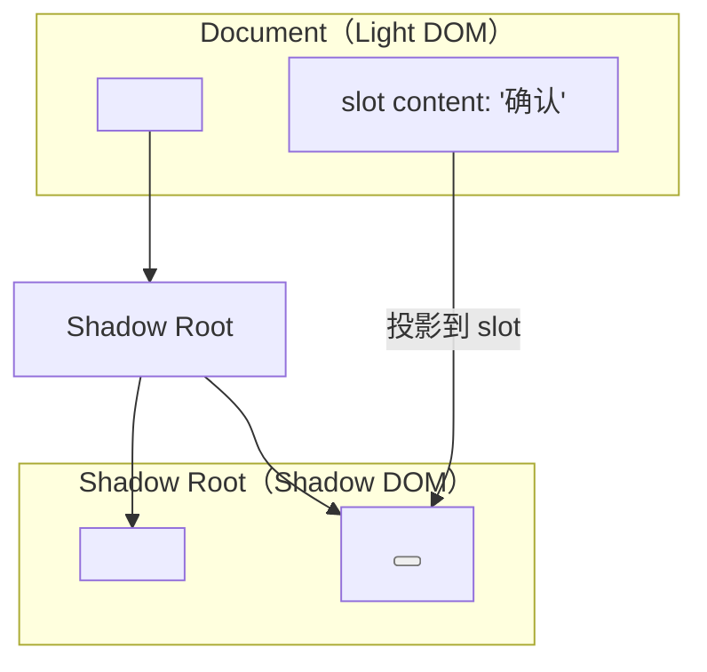

# Web Components：原生组件化标准的演进与实践

## 概述

Web Components 是 W3C 推出的浏览器原生组件化标准，旨在提供封装、复用的自定义 HTML 元素。2019 年原文发布时，各浏览器对 Web Components 的支持尚不完整；截至 2026 年，Custom Elements、Shadow DOM、HTML Templates 三大核心 API 已获全浏览器稳定支持，CSS Parts、Form-Associated Custom Elements 等增强特性也已标准化。

---

## 1 Web Components 三大核心 API

### 1.1 Custom Elements

Custom Elements 允许开发者定义新的 HTML 标签，并关联其行为：

```javascript
class MyButton extends HTMLElement {
    static get observedAttributes() {
        return ['variant', 'disabled'];
    }

    constructor() {
        super();
        this.attachShadow({ mode: 'open' });
    }

    connectedCallback() {
        this.render();
    }

    attributeChangedCallback(name, oldValue, newValue) {
        this.render();
    }

    render() {
        const variant = this.getAttribute('variant') || 'primary';
        const disabled = this.hasAttribute('disabled');
        this.shadowRoot.innerHTML = `
            <style>
                :host { display: inline-block; }
                button {
                    padding: 8px 16px;
                    border: none;
                    border-radius: 4px;
                    cursor: pointer;
                }
                button.primary { background: #1976d2; color: white; }
                button.secondary { background: #e0e0e0; color: #333; }
                button:disabled { opacity: 0.5; cursor: not-allowed; }
            </style>
            <button class="${variant}" ${disabled ? 'disabled' : ''}>
                <slot></slot>
            </button>
        `;
    }
}

customElements.define('my-button', MyButton);
```

使用：

```html
<my-button variant="primary">确认</my-button>
<my-button variant="secondary" disabled>取消</my-button>
```

### 1.2 Shadow DOM

Shadow DOM 提供样式和 DOM 的封装边界：



**Shadow DOM 的封装特性**：

| 特性 | 说明 |
|------|------|
| **样式隔离** | Shadow DOM 内的样式不影响外部，外部样式也不影响内部 |
| **DOM 隔离** | `querySelector` 无法穿透 Shadow 边界 |
| **事件重定向** | Shadow DOM 内的事件在外部表现为来自宿主元素 |

### 1.3 HTML Templates

`<template>` 和 `<slot>` 提供声明式的模板机制：

```html
<template id="card-template">
    <style>
        .card { border: 1px solid #ddd; border-radius: 8px; padding: 16px; }
        .card-title { font-weight: bold; }
    </style>
    <div class="card">
        <div class="card-title"><slot name="title">默认标题</slot></div>
        <div class="card-body"><slot>默认内容</slot></div>
    </div>
</template>
```

---

## 2 增强特性

### 2.1 CSS Shadow Parts

`::part()` 选择器允许外部样式化 Shadow DOM 内的特定元素：

```javascript
// 组件内部声明 part
this.shadowRoot.innerHTML = `
    <div part="container">
        <span part="label"><slot></slot></span>
    </div>
`;
```

```css
/* 外部样式 */
my-button::part(container) {
    padding: 12px 24px;
}
my-button::part(label) {
    font-size: 14px;
}
```

### 2.2 Form-Associated Custom Elements

`ElementInternals` API 允许自定义元素参与表单验证和提交：

```javascript
class MyInput extends HTMLElement {
    static formAssociated = true;

    constructor() {
        super();
        this.internals_ = this.attachInternals();
    }

    set value(v) {
        this._value = v;
        this.internals_.setFormValue(v);
        // setValidity 第一个参数是 ValidityStateFlags 字典，
        // 传布尔值会抛 TypeError；无错误时传空对象
        this.internals_.setValidity(
            v.length > 0 ? {} : { valueMissing: true },
            '此字段为必填项'
        );
    }

    get value() { return this._value; }
}

customElements.define('my-input', MyInput);
```

### 2.3 Constructable Stylesheets

`CSSStyleSheet` 构造函数允许在多个 Shadow Root 间共享样式表，避免重复解析：

```javascript
const sheet = new CSSStyleSheet();
sheet.replaceSync(`
    :host { display: block; }
    .content { padding: 16px; }
`);

class ComponentA extends HTMLElement {
    constructor() {
        super();
        const shadow = this.attachShadow({ mode: 'open' });
        shadow.adoptedStyleSheets = [sheet]; // 共享样式表
    }
}
```

---

## 3 Web Components 与框架的集成

### 3.1 框架互操作性

| 框架 | Web Components 集成 | 状态 |
|------|---------------------|------|
| **React** | 需要包装器（属性映射、事件处理） | React 19 改善了自定义元素支持 |
| **Vue** | `compilerOptions.isCustomElement` 配置（in-DOM 模板需 `is="vue:"` 前缀，`v-is` 已废弃） | 原生支持 |
| **Angular** | `CUSTOM_ELEMENTS_SCHEMA` | 原生支持 |
| **Svelte** | `svelte:options tag` | 一等公民支持 |
| **Lit** | 基于 Web Components 的框架 | 原生 |

### 3.2 Lit：Web Components 的增强框架

Google 的 **Lit** 库简化了 Web Components 的开发：

```typescript
import { LitElement, html, css } from 'lit';
import { customElement, property } from 'lit/decorators.js';

@customElement('simple-greeting')
export class SimpleGreeting extends LitElement {
    static styles = css`
        :host { display: block; padding: 16px; }
        p { color: blue; }
    `;

    @property() name = 'World';

    render() {
        return html`<p>Hello, ${this.name}!</p>`;
    }
}
```

---

## 4 总结

| 核心特性 | 2019 年 | 2026 年 |
|----------|---------|---------|
| Custom Elements | 部分浏览器支持 | 全浏览器稳定支持 |
| Shadow DOM | Chrome/Firefox 支持 | 全浏览器稳定支持（含声明式 Shadow DOM） |
| HTML Templates | 全浏览器支持 | 全浏览器支持 |
| CSS Parts | 不支持 | 全浏览器支持 |
| Form-Associated | 不支持 | 全浏览器支持 |
| Constructable Stylesheets | 不支持 | 全浏览器支持 |
| Declarative Shadow DOM | 不存在 | 全浏览器支持（Firefox 123+ 起支持） |

Web Components 的价值不在于替代 React/Vue 等框架，而在于提供**跨框架的组件复用标准**。当不同团队使用不同技术栈时，Web Components 提供了互操作的基础。

---

## 参考文献

1. WHATWG: [Custom Elements](https://html.spec.whatwg.org/multipage/custom-elements.html)
2. WHATWG: [Shadow DOM](https://dom.spec.whatwg.org/#shadow-trees)
3. W3C: [CSS Shadow Parts](https://www.w3.org/TR/css-shadow-parts-1/)
4. Web.dev: [Web Components](https://web.dev/articles/web-components)
5. Lit: [Documentation](https://lit.dev/docs/)
