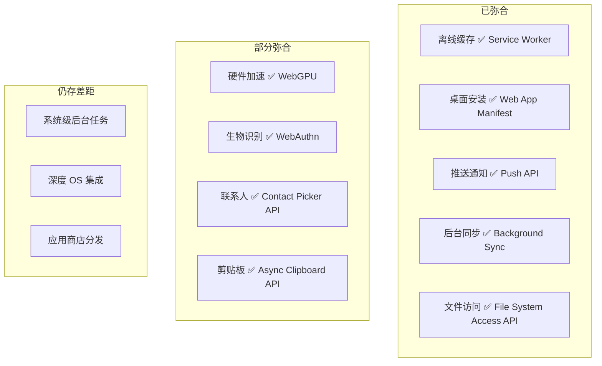
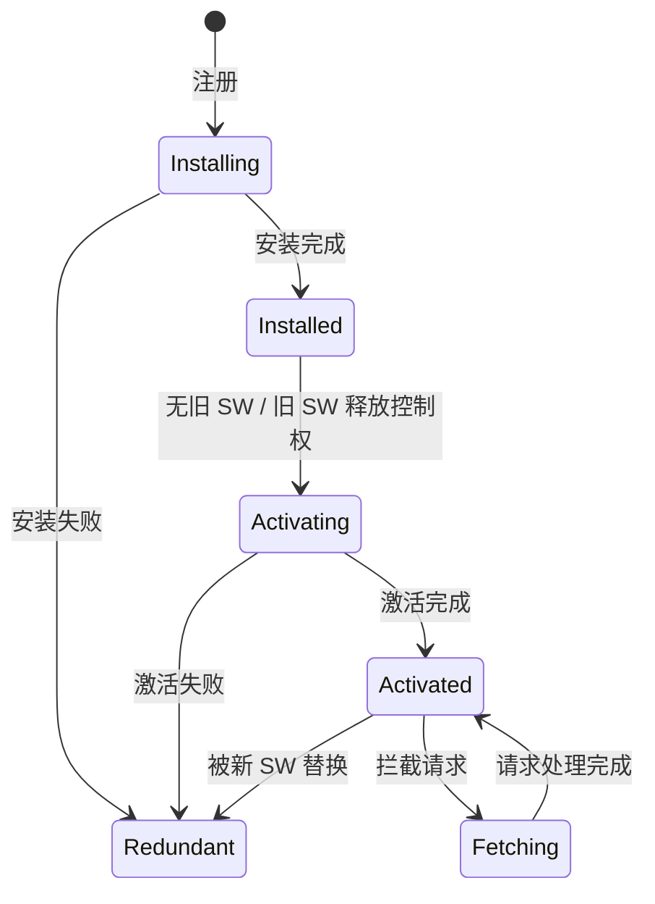
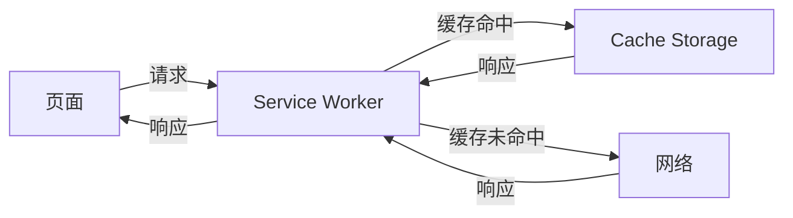
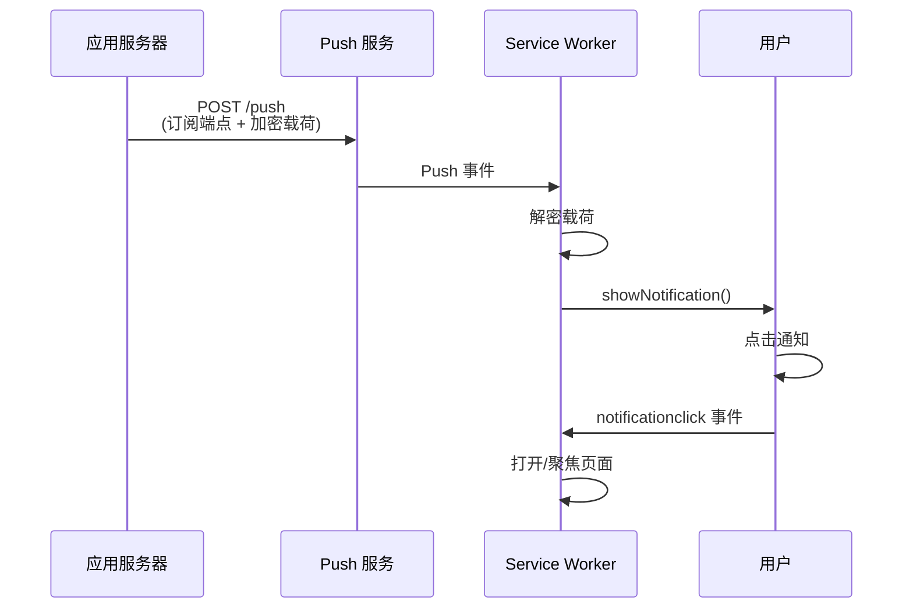

# 渐进式 Web 应用（PWA）：Web 与原生应用的融合

## 概述

PWA（Progressive Web App）是一套渐进式增强 Web 应用能力的理念与技术集合。2019 年原文发布时，PWA 仍处于概念推广阶段；截至 2026 年，PWA 已在桌面和移动端获得广泛支持，Service Worker、Web App Manifest、Push API 等核心 API 趋于成熟，同时 WebGPU、WebAssembly、View Transitions 等新 API 持续缩小 Web 与原生应用的差距。

---

## 1 Web 应用 vs 原生应用：差距与弥合

### 1.1 2019 年的三大差距

| 差距 | 原生能力 | Web 缺陷 | PWA 解决方案 |
|------|----------|----------|--------------|
| 离线使用 | 本地文件系统 | 依赖网络 | Service Worker Cache |
| 消息推送 | 系统级推送 | 无推送能力 | Push API + Service Worker |
| 一级入口 | 桌面图标/启动器 | 需通过浏览器 | Web App Manifest |

### 1.2 2026 年的差距弥合



---

## 2 Service Worker 架构

### 2.1 运行模型

Service Worker 运行于独立线程，生命周期与页面分离：



### 2.2 请求拦截机制

Service Worker 在页面与网络之间充当代理：



### 2.3 缓存策略

| 策略 | 行为 | 适用场景 |
|------|------|----------|
| **Cache First** | 优先缓存，失败回退网络 | 静态资源（JS/CSS/字体/图片） |
| **Network First** | 优先网络，失败回退缓存 | API 请求（需最新数据但离线可用） |
| **Stale While Revalidate** | 立即返回缓存，后台更新 | 非关键 API（如配置信息） |
| **Cache Only** | 仅从缓存获取 | 预缓存的 App Shell |
| **Network Only** | 仅从网络获取 | 非 GET 请求、实时数据 |

Workbox 库封装了这些策略的完整实现：

```javascript
import { registerRoute } from 'workbox-routing';
import { CacheFirst, NetworkFirst, StaleWhileRevalidate } from 'workbox-strategies';

// 静态资源：Cache First
registerRoute(
    ({ request }) => request.destination === 'style' || request.destination === 'script',
    new CacheFirst({ cacheName: 'static-resources' })
);

// API：Network First
registerRoute(
    ({ url }) => url.pathname.startsWith('/api/'),
    new NetworkFirst({ cacheName: 'api-data' })
);

// 字体：Stale While Revalidate
registerRoute(
    ({ request }) => request.destination === 'font',
    new StaleWhileRevalidate({ cacheName: 'fonts' })
);
```

### 2.4 Navigation Preload

Navigation Preload 允许 Service Worker 拦截导航请求的同时，并行发起网络请求：

```javascript
// 激活时启用
self.addEventListener('activate', (event) => {
    event.waitUntil(self.registration.navigationPreload.enable());
});

// 使用预加载响应
self.addEventListener('fetch', (event) => {
    event.respondWith(async () => {
        const preload = await event.preloadResponse;
        if (preload) return preload;
        return caches.match(event.request) || fetch(event.request);
    })();
});
```

---

## 3 Web App Manifest

### 3.1 核心配置

```json
{
    "name": "My App",
    "short_name": "MyApp",
    "description": "A progressive web application",
    "start_url": "/",
    "display": "standalone",
    "background_color": "#ffffff",
    "theme_color": "#1976d2",
    "icons": [
        { "src": "/icons/192.png", "sizes": "192x192", "type": "image/png" },
        { "src": "/icons/512.png", "sizes": "512x512", "type": "image/png" },
        { "src": "/icons/maskable-512.png", "sizes": "512x512", "type": "image/png", "purpose": "maskable" }
    ],
    "categories": ["productivity"],
    "shortcuts": [
        { "name": "New Item", "url": "/new", "icons": [{ "src": "/icons/new.png", "sizes": "96x96" }] }
    ]
}
```

### 3.2 display 模式

| 模式 | 浏览器 UI | 接近原生程度 |
|------|-----------|-------------|
| `browser` | 完整浏览器 UI | 低 |
| `minimal-ui` | 最少 UI（后退/刷新） | 中 |
| `standalone` | 无浏览器 UI | 高 |
| `fullscreen` | 全屏（无系统 UI） | 最高 |

---

## 4 Push API 与后台同步

### 4.1 推送通知



### 4.2 Background Sync

Background Sync 允许在用户离线时延迟发送请求，网络恢复后自动执行：

```javascript
// 注册同步
navigator.serviceWorker.ready.then(reg => {
    reg.sync.register('submit-form');
});

// Service Worker 中处理
self.addEventListener('sync', (event) => {
    if (event.tag === 'submit-form') {
        event.waitUntil(submitFormData());
    }
});
```

---

## 5 Web 应用的最新进展

### 5.1 Isolated Web Apps（IWA）

2023—2024 年 Chrome 推出 IWA 模型，提供更强的隔离和权限：

- Signed Web Bundle 离线分发
- 独立渲染进程
- 扩展的文件系统和设备 API 访问
- 强制 CSP 和内容完整性校验

### 5.2 WebGPU

WebGPU 是 WebGL 的继任者，提供现代 GPU API 访问能力：

```javascript
const adapter = await navigator.gpu.requestAdapter();
const device = await adapter.requestDevice();
const shaderModule = device.createShaderModule({ code: wgslCode });
```

WebGPU 对 PWA 的意义：Web 应用可实现接近原生的图形渲染和计算性能，为游戏、3D 建模、AI 推理等场景打开大门。

### 5.3 View Transitions API

View Transitions API 实现页面/视图切换时的平滑过渡动画：

```javascript
document.startViewTransition(async () => {
    // 更新 DOM
    updateContent();
});
```

CSS 可自定义过渡效果：

```css
::view-transition-old(root) {
    animation: fade-out 0.3s ease;
}
::view-transition-new(root) {
    animation: fade-in 0.3s ease;
}
```

---

## 6 总结

PWA 的演进体现了 **渐进式增强** 的设计哲学：

| 阶段 | 能力增量 | 代表技术 |
|------|----------|----------|
| 基础 Web | 响应式 + 离线提示 | AppCache（已废弃） |
| PWA 1.0 | 离线 + 安装 + 推送 | Service Worker + Manifest + Push |
| PWA 2.0 | 系统级集成 + 高性能 | File System Access + WebGPU + IWA |
| PWA 3.0 | 流畅体验 + 智能交互 | View Transitions + WebAssembly + AI API |

PWA 是否能完全取代原生应用？答案取决于具体场景。对于信息类、工具类、轻量级应用，PWA 已具备足够的能力；对于需要深度 OS 集成或极致性能的应用，原生开发仍不可替代。但 PWA 的渐进式策略确保了：**Web 应用可以逐步获得能力，而非一步到位**。

---

## 参考文献

1. W3C: [Service Worker](https://www.w3.org/TR/service-workers/)
2. W3C: [Web App Manifest](https://www.w3.org/TR/appmanifest/)
3. W3C: [Push API](https://www.w3.org/TR/push-api/)
4. W3C: [WebGPU](https://www.w3.org/TR/webgpu/)
5. W3C: [View Transitions API](https://www.w3.org/TR/css-view-transitions-1/)
6. Google Developer: [Workbox](https://developer.chrome.com/docs/workbox/)
7. WICG: [Isolated Web Apps](https://github.com/WICG/isolated-web-apps)
