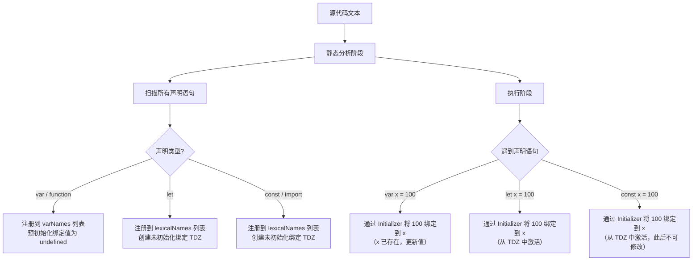

# JavaScript 语法和变量

ECMA-262 第 5 版（ES5）定义的 `ECMAScript`，是目前为止实现得最为广泛（即受浏览器支持最好）的一个版本。第 6 版（ES6）在浏览器中的实现（即受支持）程度次之。到 2017 年底，大多数主流浏览器几乎或全部实现了这一版的规范。下面的内容主要基于 `ECMAScript` 第 6 版（ES6/ES2015）及后续版本

## 语法

`ECMAScript` 语法大量借鉴了 C 及其他类 C 语言（如 `Java` 和 `Perl`）的语法

### 区分大小写

`ECMAScript` 中一切都区分大小写。无论是变量、函数名还是操作符，都区分大小写。变量 test 和变量 Test 是两个不同的变量。类似地 `typeof` 不能作为函数名，因为它是一个关键字。但 `Typeof` 是个完全有效的函数名

### 标识符

**标识符** 就是指变量、函数、属性的名字，或者函数的参数。

**命名规则：**

- 第一个字符必须是一个字母、下划线 `_` 或一个美元符号 `$`
- 其他字符可以是字母、下划线、美元符号或数字
- 不能使用关键字和保留字作为标识符
- 标识符中的字母也可以包含扩展的 ASCII 或 Unicode 字母字符（如 À 和 Æ），但不推荐这样做

**命名规范：**

`ECMAScript` 标识符推荐采用驼峰大小写格式（camelCase）：

```javascript
// ✅ 好的命名
var firstName
var myCar
var doSomethingImportant
var userAccountBalance

// ❌ 不好的命名
var firstname // 应该用驼峰
var my_car // 应该用驼峰
var DoSomething // 应该以小写开头（除非是构造函数）
```

**命名约定：**

- **变量和函数**：使用驼峰命名法，以小写字母开头
- **常量**：使用全大写字母，单词间用下划线分隔（`const MAX_SIZE = 100`）
- **构造函数/类**：使用帕斯卡命名法（PascalCase），首字母大写（`class UserAccount {}`）
- **私有变量**：在 ES2022+ 中可以使用 `#` 前缀，或使用下划线前缀约定（`_privateVar`）

虽然没有谁强制要求必须采用这种格式，但为了与 ECMAScript 内置的函数和对象命名格式保持一致，可以将其当作一种最佳实践。

### 严格模式

`ECMAScript 5` 引入了严格模式概念。在严格模式下，ECMAScript 3 中的一些不确定的行为将得到处理，而且对某些不安全的操作也会抛出错误。要在整个脚本中启用严格模式，可以在顶部添加如下代码：

```javascript
"use strict"
```

在函数内部的上方包含这条编译指示，也可以指定函数在严格模式下执行：

```javascript
function doSomething() {
  "use strict"
  //函数体
}
```

严格模式下不允许使用 `with` 语句，否则将视为语法错误。由于大量使用 **with** 语句会导致性能下降，同时也会给调试代码造成困难，因此在开发大型应用程序时，不建议使用 **with** 语句

**严格模式的主要限制：**

1. **变量声明**：

   - 不能使用未声明的变量
   - 不能删除变量、函数或参数
   - 不能定义名为 `eval` 或 `arguments` 的变量

2. **函数限制**：

   - 不能把函数命名为 `eval` 或 `arguments`
   - 不能把参数命名为 `eval` 或 `arguments`
   - 不能出现两个命名参数同名的情况
   - 函数的 `this` 值为 `undefined`（非严格模式下指向全局对象）

3. **其他限制**：
   - 不允许使用 `with` 语句
   - 不允许对只读属性赋值
   - 不允许删除不可删除的属性
   - 不允许使用八进制字面量（如 `010`）

**严格模式示例：**

```javascript
"use strict"

// 1. 未声明的变量会报错
x = 10 // ReferenceError: x is not defined

// 2. 删除变量会报错
var y = 20
delete y // SyntaxError: Delete of an unqualified identifier

// 3. 重复参数名会报错
function test(a, a) {} // SyntaxError: Duplicate parameter name

// 4. 函数中的 this 为 undefined
function showThis() {
  console.log(this) // undefined（非严格模式下是 window）
}
showThis()
```

**何时使用严格模式：**

- 现代 JavaScript 开发中，建议始终使用严格模式
- ES6 模块和类自动启用严格模式
- 使用构建工具（如 Babel、Webpack）时，通常会自动添加 `"use strict"`

### 语句

`ECMAScript` 中语句以一个分号结尾`;`，如果省略分号，则由解析器确定语句的结尾：

```javascript
var sum = a + b // 即使没有分号也是有效的语句
var diff = a - b // 有效的语句
```

加上分号也会在某些情况下增进代码的性能，因为这样解析器就不必再花时间推测应该在哪里插入分号。

最佳实践是始终在控制语句中使用代码块：

```javascript
if (test) alert(test) // 有效但容易出错，不要使用

if (test) {
  // 推荐使用
  alert(test)
}
```

## 关键字和保留字

ECMA-262 描述一组保留的关键字，这些关键字有特殊用途，比如表示控制语句的开始和结束，或者执行特定的操作。按照规定，保留的关键字不能用作标识符或属性名。

### 关键字列表

ECMA-262 第 6 版规定的所有关键字：

**控制流：**

- `if`、`else`、`switch`、`case`、`default`、`do`、`while`、`for`、`break`、`continue`

**声明与模块：**

- `var`、`let`、`const`、`function`、`class`、`extends`、`import`、`export`

**异常处理：**

- `try`、`catch`、`finally`、`throw`

**类型与成员运算：**

- `typeof`、`instanceof`、`in`、`new`、`delete`、`void`

**其他：**

- `return`、`this`、`super`、`debugger`、`yield`（生成器函数中）、`with`（严格模式下禁用）

> 注：`of` 只是在 `for-of` 循环中使用的上下文关键字，并不是保留关键字。

```javascript
// ❌ 错误：使用关键字作为标识符
var if = 10        // SyntaxError
function var() {}  // SyntaxError
const class = {}   // SyntaxError

// ✅ 正确：使用其他名称
var condition = 10
function variable() {}
const className = {}
```

### 保留字

规范中也描述一组未来的保留字，同样不能用作标识符或属性名。虽然保留字在语言中没有特定用途，但它们是保留给将来做关键字用的。

**ECMA-262 第 6 版保留字：**

- **始终保留**：`enum`
- **严格模式下保留**：`implements`、`package`、`public`、`interface`、`protected`、`static`、`let`、`private`
- **模块代码中保留**：`await`

```javascript
// ❌ 错误：使用保留字
var enum = "test" // SyntaxError
var implements = true // SyntaxError（严格模式下）
var await = "value" // SyntaxError（模块中）

// ✅ 正确：使用其他名称
var enumeration = "test"
var implementsFlag = true
var awaitedValue = "value"
```

**注意：**

- 虽然 `let` 和 `await` 现在是关键字，但在某些上下文中可能作为保留字
- 在对象字面量中，关键字可以作为属性名（ES5+）：

```javascript
const obj = {
  if: "value", // ✅ 允许
  class: "test" // ✅ 允许
}
```

## 变量

`ECMAScript` 变量是松散类型的，所谓松散类型就是可以用来保存任何类型的数据。有 3 个关键字可以声明变量：`var`、`const` 和 `let`。其中 `var` 在 `ECMAScript` 的所有版本中都可以使用，而 const 和 `let` 只能在 ECMAScript 6 及更晚的版本中使用

### var 关键字

定义名为 `message` 的变量，可以用它保存任何类型的值。不初始化的情况下，变量会保存一个特殊值 `undefined`

```javascript
var message // undefined
```

ECMAScript 也支持直接初始化变量，因此在定义变量的同时就可以设置变量的值，虽然不建议修改变量所保存值的类型，但这种操作在 `ECMAScript` 中完全有效

```javascript
var message = "hi"

message = 100 //有效，但不推荐
```

#### var 声明作用域

注意：用 `var` 操作符定义的变量将成为定义该变量的作用域中的局部变量。如果在函数中使用 `var` 定义变量，那么这个变量在函数退出后就会被销毁

```javascript
function test() {
  var message = "hi" // 局部变量
}

test()
alert(message) // 错误！
```

但像下面这样省略 `var` 操作符，会创建一个全局变量：

```javascript
function test() {
  message = "hi" // 全局变量
}

test()
alert(message) // "hi"
```

可以使用一条语句定义多个变量，只要像下面这样把每个变量（初始化或不初始化均可）用逗号分隔开即可：

```javascript
var message = "hi",
  found = false,
  age = 29
```

#### var 声明提升

使用 `var` 时，下面的代码不会报错。这是因为使用这个关键字声明的变量会自动提升到函数作用域顶部：

```javascript
function foo() {
  console.log(age)
  var age = 26
}
foo() // undefined
```

不会报错是因为 `ECMAScript` 运行时把它看成等价于如下代码：

```javascript
function foo() {
  var age
  console.log(age)
  age = 26
}
foo() // undefined
```

这就是所谓的“提升”（hoist），也就是把所有变量声明都拉到函数作用域的顶部。此外，反复多次使用 var 声明同一个变量也没有问题：

```javascript
function foo() {
  var age = 16
  var age = 26
  var age = 36
  console.log(age)
}
foo() // 36
```

### let 声明

`let` 跟 `var` 的作用差不多，但有着非常重要的区别。最明显的区别是，`let` 声明的范围是块作用域，而 `var` 声明的范围是函数作用域

```javascript
if (true) {
  var name = "Matt"
  console.log(name) // Matt
}
console.log(name) // Matt

if (true) {
  let age = 26
  console.log(age) // 26
}
console.log(age) // ReferenceError: age 没有定义
```

`age` 变量之所以不能在 `if` 块外部被引用，是因为它的作用域仅限于该块内部。块作用域是函数作用域的子集，因此适用于 var 的作用域限制同样也适用于 let。

`let` 也不允许同一个块作用域中出现冗余声明。这样会导致报错：

```javascript
var name
var name
let age
let age // SyntaxError；标识符 age 已经声明过了
```

当然，`JavaScript` 引擎会记录用于变量声明的标识符及其所在的块作用域，因此嵌套使用相同的标识符不会报错，而这是因为同一个块中没有重复声明：

```javascript
var name = "Nicholas"

console.log(name) // 'Nicholas'

if (true) {
  var name = "Matt"
  console.log(name) // 'Matt'
}

let age = 30
console.log(age) // 30

if (true) {
  let age = 26
  console.log(age) // 26
}
```

对声明冗余报错不会因混用 `let` 和 `var` 而受影响。这两个关键字声明的并不是不同类型的变量，它们只是指出变量在相关作用域如何存在：

```javascript
var name
let name // SyntaxError

let age
var age // SyntaxError
```

#### 暂时性死区

`let` 与 `var` 的另一个重要的区别，就是 `let` 声明的变量不会在作用域中被提升。

```javascript
// name 会被提升
console.log(name) // undefined
var name = "Matt"

// age 不会被提升
console.log(age) // ReferenceError：age 没有定义
let age = 26
```

在解析代码时，`JavaScript` 引擎也会注意出现在块后面的 `let` 声明，只不过在此之前不能以任何方式来引用未声明的变量。在 `let` 声明之前的执行瞬间被称为“暂时性死区”（temporal dead zone），在此阶段引用任何后面才声明的变量都会抛出 ReferenceError

#### 全局声明

与 `var` 关键字不同，使用 `let` 在全局作用域中声明的变量不会成为 `window` 对象的属性（`var` 声明的变量则会）

```javascript
var name = "Matt"
console.log(window.name) // 'Matt'

let age = 26
console.log(window.age) // undefined
```

不过，`let` 声明仍然是在全局作用域中发生的，相应变量会在页面的生命周期内存续。因此为避免 `SyntaxError`，必须确保页面不会重复声明同一个变量

#### 条件声明

在使用 `var` 声明变量时，由于声明会被提升，`JavaScript` 引擎会自动将多余的声明在作用域顶部合并为一个声明。因为 `let` 的作用域是块，所以不可能检查前面是否已经使用 `let` 声明过同名变量，同时也就不可能在没有声明的情况下声明它

```html
<script>
  var name = "Nicholas"
  let age = 26
</script>
<script>
  // 假设脚本不确定页面中是否已经声明了同名变量，那它可以假设还没有声明过
  var name = "Matt"
  // 这里没问题，因为可以被作为一个提升声明来处理，不需要检查之前是否声明过同名变量

  let age = 36
  // 如果 age 之前声明过，这里会报错
</script>
```

使用 `try/catch` 语句或 `typeof` 操作符也不能解决，因为条件块中 `let` 声明的作用域仅限于该块

```html
<script>
  let name = "Nicholas"
  let age = 36
</script>
<script>
  // 假设脚本不确定页面中是否已经声明了同名变量，那它可以假设还没有声明过
  if (typeof name === "undefined") {
    let name
  }
  // name 被限制在 if {} 块的作用域内，因此这个赋值形同全局赋值
  name = "Matt"
  try {
    console.log(age) // 如果 age 没有声明过，则会报错
  } catch (error) {
    let age
  }
  // age 被限制在 catch {}块的作用域内，因此这个赋值形同全局赋值
  age = 26
</script>
```

#### for 循环中的 let 声明

在 `let` 出现之前，`for` 循环定义的迭代变量会渗透到循环体外部：

```javascript
for (var i = 0; i < 5; ++i) {
  // 循环逻辑
}

console.log(i) // 5
```

改成使用 `let` 之后，这个问题就消失，因为迭代变量的作用域仅限于 for 循环块内部：

```javascript
for (let i = 0; i < 5; ++i) {
  // 循环逻辑
}

console.log(i) // ReferenceError: i 没有定义
```

在使用 var 的时候，最常见的问题就是对迭代变量的奇特声明和修改：

```javascript
for (var i = 0; i < 5; ++i) {
  setTimeout(() => console.log(i), 0)
}

// 你可能以为会输出 0、1、2、3、4
// 实际上会输出 5、5、5、5、5
```

之所以会这样，是因为在退出循环时，迭代变量保存的是导致循环退出的值：5。在之后执行超时逻辑时，所有的 i 都是同一个变量，因而输出的都是同一个最终值。

而在使用 `let` 声明迭代变量时，`JavaScript` 引擎在后台会为每个迭代循环声明一个新的迭代变量。每个 `setTimeout` 引用的都是不同的变量实例，所以 `console.log` 输出的是期望的值，也就是循环执行过程中每个迭代变量的值。

```javascript
for (let i = 0; i < 5; ++i) {
  setTimeout(() => console.log(i), 0)
}

// 会输出 0、1、2、3、4
```

这种每次迭代声明一个独立变量实例的行为适用于所有风格的 for 循环，包括 `for-in` 和 `for-of` 循环

### const 声明

`const` 行为与 `let` 基本相同，唯一重要区别是用它声明变量时必须同时初始化变量，且尝试修改 const 声明的变量会导致运行时错误

```javascript
const age = 26
age = 36 // TypeError: 给常量赋值

// const 也不允许重复声明
const name = "Matt"
const name = "Nicholas" // SyntaxError

// const 声明的作用域也是块
const name = "Matt"
if (true) {
  const name = "Nicholas"
}
console.log(name) // Matt
```

`const` 声明的限制只适用于它指向的变量的引用。换句话说，如果 `const` 变量引用的是一个对象，那么修改这个对象内部的属性并不违反 const 的限制

```javascript
const person = {}
person.name = "Matt" // ok
```

`JavaScript` 引擎会为 `for` 循环中的 `let` 声明分别创建独立的变量实例，虽然 `const` 变量跟 `let` 变量很相似，但是不能用 `const` 来声明迭代变量（因为迭代变量会自增）：

```javascript
for (const i = 0; i < 10; ++i) {} // TypeError：给常量赋值
```

不过，如果只想用 `const` 声明一个不会被修改的 `for` 循环变量，那也是可以的。也就是说，每次迭代只是创建一个新变量。这对 for-of 和 for-in 循环特别有意义：

```javascript
let i = 0
for (const j = 7; i < 5; ++i) {
  console.log(j)
}
// 7, 7, 7, 7, 7

for (const key in { a: 1, b: 2 }) {
  console.log(key)
}
// a, b

for (const value of [1, 2, 3, 4, 5]) {
  console.log(value)
}
// 1, 2, 3, 4, 5
```

### 声明风格推荐

- **不使用 `var`**：有 `let` 和 `const`，大多数开发者会发现自己不再需要 `var` 了。限制只使用 `let` 和 `const` 有助于提升代码质量，因为变量有明确的作用域、声明位置，以及不变的值
- **`const` 优先，`let` 次之**：使用 `const` 声明可以让浏览器运行时强制保持变量不变，也可以让静态代码分析工具提前发现不合法的赋值操作。因此，很多开发者认为应该优先使用 `const` 来声明变量，只在提前知道未来会有修改时，再使用 `let`

### 解构赋值与变量声明

ES6 引入了解构赋值语法，可以更简洁地从数组或对象中提取值并赋给变量。

#### 数组解构

```javascript
const [a, b, c] = [1, 2, 3]           // 基本用法
const [first, , third] = [1, 2, 3]     // 跳过某些值
const [x = 10, y = 20] = [5]           // 默认值
let m = 1, n = 2
;[m, n] = [n, m]                       // 交换变量
const [head, ...tail] = [1, 2, 3, 4, 5] // 剩余元素
```

#### 对象解构

```javascript
const { name, age } = { name: "John", age: 30 }           // 基本用法
const { name: userName, age: userAge } = { name: "John" } // 重命名
const { x = 100, y = 200 } = { x: 50 }                    // 默认值
const { a: firstProp, ...rest } = { a: 1, b: 2, c: 3 }    // 剩余属性
// 嵌套解构
const user = { profile: { name: "John", address: { city: "Beijing" } } }
const { profile: { name: profileName, address: { city } } } = user
```

#### 函数参数解构

```javascript
function greet({ name, age = 18 } = {}) {
  console.log(`Hello, ${name}! You are ${age} years old.`)
}
function sum([a, b, c]) { return a + b + c }
```

## 变量声明对比

### var vs let vs const

| 特性     | `var`                  | `let`                  | `const`                  |
| -------- | ---------------------- | ---------------------- | ------------------------ |
| 作用域   | 函数作用域             | 块作用域               | 块作用域                 |
| 提升     | 是（提升到函数顶部）   | 是（但存在暂时性死区） | 是（但存在暂时性死区）   |
| 重复声明 | 允许                   | 不允许                 | 不允许                   |
| 全局属性 | 是（成为 window 属性） | 否                     | 否                       |
| 初始化   | 可选                   | 可选                   | 必须                     |
| 重新赋值 | 允许                   | 允许                   | 不允许（对象属性可修改） |

### 选择建议

```javascript
// ✅ 优先使用 const
const API_URL = "https://api.example.com"
const config = { timeout: 5000 }

// ✅ 需要重新赋值时使用 let
let counter = 0
let currentUser = null

// ❌ 避免使用 var
var oldVariable = "deprecated" // 不推荐
```

## 作用域详解

### 作用域类型

#### 1. 全局作用域（Global Scope）

在函数外部声明的变量拥有全局作用域：

```javascript
var globalVar = "I am global"

function test() {
  console.log(globalVar) // 可以访问
}

console.log(globalVar) // 'I am global'
```

#### 2. 函数作用域（Function Scope）

使用 `var` 声明的变量具有函数作用域：

```javascript
function test() {
  var functionVar = "I am in function scope"
  if (true) {
    var anotherVar = "Also in function scope"
  }
  console.log(anotherVar) // 可以访问
}

test()
// console.log(functionVar) // ReferenceError
```

#### 3. 块作用域（Block Scope）

使用 `let` 和 `const` 声明的变量具有块作用域：

```javascript
if (true) {
  let blockVar = "I am in block scope"
  const blockConst = "Me too"
}

// console.log(blockVar) // ReferenceError
// console.log(blockConst) // ReferenceError
```

### 作用域链

JavaScript 使用作用域链来查找变量。当访问一个变量时，JavaScript 引擎会：

1. 首先在当前作用域查找
2. 如果找不到，向上一级作用域查找
3. 继续向上查找，直到全局作用域
4. 如果全局作用域也找不到，抛出 `ReferenceError`

```javascript
var global = "global"

function outer() {
  var outerVar = "outer"

  function inner() {
    var innerVar = "inner"
    console.log(innerVar) // 'inner' - 当前作用域
    console.log(outerVar) // 'outer' - 上一级作用域
    console.log(global) // 'global' - 全局作用域
  }

  inner()
}

outer()
```

## 执行上下文与变量

理解执行上下文（Execution Context）对于深入理解变量行为至关重要。详细内容见 [执行上下文](07-执行上下文.md) 章节。

简要来说：执行上下文是 JavaScript 代码执行时的环境抽象，变量在创建阶段被提升（var 初始化为 undefined，let/const 进入 TDZ），在执行阶段被赋值。闭包正是函数维持对其词法环境引用的结果。

```javascript
// 变量对象在代码执行前的状态
function test(a, b) {
  var c = 10
  function d() {}
  var e = function () {}
}
test(1, 2)
// VO = {
//   arguments: { 0: 1, 1: 2, length: 2 },
//   a: 1, b: 2,
//   c: undefined, d: <function d>, e: undefined
// }
```

## 变量提升详解

### var 的提升

使用 `var` 声明的变量会被提升到函数作用域的顶部：

```javascript
console.log(x) // undefined（不会报错）
var x = 5
console.log(x) // 5

// 等价于：
var x
console.log(x) // undefined
x = 5
console.log(x) // 5
```

### let 和 const 的提升

`let` 和 `const` 也会被提升，但存在"暂时性死区"（Temporal Dead Zone）：

```javascript
// 暂时性死区开始
console.log(x) // ReferenceError: Cannot access 'x' before initialization
// 暂时性死区结束
let x = 5
```

**暂时性死区的原因：**

- 变量在声明前就存在于作用域中
- 但在声明之前访问会抛出错误
- 这避免了意外的行为，使代码更安全

### 函数提升

函数声明也会被提升：

```javascript
sayHello() // 'Hello' - 可以调用

function sayHello() {
  console.log("Hello")
}
```

但函数表达式不会被提升：

```javascript
sayHello() // TypeError: sayHello is not a function

var sayHello = function () {
  console.log("Hello")
}
```

## 性能考虑

局部变量查找最快，沿作用域链向上查找较慢。闭包持有大对象引用需注意内存释放。

```javascript
// ✅ 缓存 DOM 引用，减少作用域链查找
const testElement = document.getElementById("test")
for (let i = 0; i < 100; i++) { /* 使用 testElement */ }

// ✅ 闭包只保存需要的值
function createClosure() {
  const largeData = new Array(1000000).fill("data")
  const firstItem = largeData[0]
  return () => console.log(firstItem)
}
```

## 最佳实践

```javascript
// ✅ const 优先，let 次之
const API_BASE_URL = "https://api.example.com"
let userCount = 0

// ✅ 块作用域隔离变量
if (condition) {
  const temp = calculateValue()
  process(temp)
}
// temp 不可访问，避免污染作用域

// ✅ const 保护引用，对象属性可修改；完全不可变用 Object.freeze()
const config = { api: "https://api.example.com" }
config.api = "new-url" // ✅ 允许
// config = {} // ❌ TypeError

// ✅ 循环中用 let（每次迭代独立变量）
for (let i = 0; i < items.length; i++) {
  setTimeout(() => console.log(items[i]), 100) // 正确输出
}
```

## 常见错误和陷阱

### 实际应用场景

#### 场景 1：模块化变量管理

```javascript
const UserModule = (() => {
  const users = []
  let currentUser = null
  return {
    addUser(user) { users.push(user) },
    getCurrentUser() { return currentUser },
    setCurrentUser(user) { currentUser = user }
  }
})()
```

#### 场景 2：状态管理（闭包实现）

```javascript
function createStore(initialState) {
  let state = initialState
  return {
    getState: () => state,
    setState: (newState) => { state = { ...state, ...newState }; return state }
  }
}
const store = createStore({ count: 0 })
store.setState({ count: 1 })
```

### 1. 意外创建全局变量

```javascript
// ❌ 错误：忘记声明变量
function test() { message = "Hello" } // 创建了全局变量！
// ✅ 正确：始终声明变量
function test() { const message = "Hello" }
```

### 2. 循环中的闭包问题

```javascript
// ❌ 问题：所有函数共享同一个变量
var funcs = []
for (var i = 0; i < 3; i++) {
  funcs.push(function () { console.log(i) }) // 都输出 3
}
// ✅ 解决方案：使用 let
for (let i = 0; i < 3; i++) {
  funcs.push(function () { console.log(i) }) // 0, 1, 2
}
```

### 3. const 的误解

```javascript
// ❌ 误解：const 使对象不可变
const obj = { name: "John" }
obj.name = "Jane" // ✅ 允许！const 保护的是引用
// ✅ 完全不可变：Object.freeze(obj)
```

### 声明的规范语义（核心原理深度）

> **规范层级**：ECMAScript 规范 · [9.1.2 Environment Records] / [14.2.2 Runtime Semantics: Evaluation — VariableDeclaration]
> **原理来源**：JavaScript 核心原理解析·第 02 讲

#### 规范语义

JavaScript 拥有且仅有 **6 种声明语句**：`var`、`let`、`const`、`function`、`class`、`import`。所有声明都通过**静态语法分析**在用户代码执行之前创建标识符绑定。

声明与语句的根本区别：

| 特性 | 声明（Declaration） | 语句（Statement） |
|------|---------------------|-------------------|
| 执行结果 | 返回 `Empty`（空） | 可能返回 Value |
| 生效时机 | 静态分析阶段 | 运行时执行阶段 |
| 侧重点 | 创建标识符绑定 | 执行计算逻辑 |

**`var x = 100` 中的 `=` 不是赋值运算符**，而是声明的 Initializer（初始化器）语法组件。这与 `x = 100`（赋值表达式）有本质区别：

- `var x = 100`：声明 + 初始化，x 在静态阶段就被注册
- `x = 100`：赋值表达式，x 不存在时创建全局属性

#### 执行机制



#### 核心洞察

**1. 声明语义（Declaration Semantics）vs 执行语义（Execution Semantics）**

这是静态语言范式与动态语言范式的分界线：

- **声明语义**：标识符在代码执行前就已存在，由静态分析确定。`var`、`let`、`const`、`function`、`class`、`import` 都属于声明语义
- **执行语义**：标识符在运行时动态创建。隐式全局变量 `x = 100` 属于执行语义

`var x = y = 100` 的陷阱正是这两种语义的混淆：`var x` 是声明语义，`y = 100` 是执行语义。

**2. 三种绑定模式**

| 绑定模式 | 包含的声明 | 初始化行为 | 可删除性 |
|----------|-----------|-----------|---------|
| varDecls | `var`、`function` | 预初始化为 `undefined` | 不可删除（configurable: false） |
| lexicalDecls-let | `let` | 创建未初始化绑定（TDZ） | 不可删除 |
| lexicalDecls-const | `const`、`import` | 创建未初始化绑定（TDZ），必须立即初始化 | 不可删除 |

**3. `var x = y = 100` 的精确解析**

```javascript
var x = y = 100
```

规范解析为：

1. `var x` — 声明语义：在当前作用域注册 x，预初始化为 undefined
2. `y = 100` — 执行语义：对 y 赋值。y 未声明，在非严格模式下创建全局属性
3. `x = 100` — 声明的 Initializer：将 100 赋给已存在的 x

只有 x 被声明了，y 泄漏到了全局作用域。

**4. 全局变量管理：varNames vs 动态属性**

在全局环境记录中，变量有两种管理方式：

- **varNames 列表**：`var`/`function` 声明的变量被注册在此列表中，属性描述符为 `{configurable: false}`
- **动态属性**：隐式全局变量直接作为全局对象的属性，属性描述符为 `{configurable: true}`

`eval('var x')` 是唯一可以从 varNames 中移除条目的方式——`eval` 中的 `var` 声明创建的是可删除的绑定。

#### 代码实证

```javascript
// var vs let 的提升行为
function hoistingDemo() {
  console.log(a)  // undefined（var 预初始化为 undefined）
  var a = 1
  try { console.log(b) } catch (e) { console.log(e.message) } // ReferenceError (TDZ)
  let b = 2
}

// 全局变量泄漏：var x = y = 100，只有 x 被声明，y 泄漏到全局
function leakDemo() { var x = y = 100 }
leakDemo()
console.log(y)  // 100 — y 成为全局属性
console.log(typeof x)  // 'undefined' — x 是局部变量

// var 声明 vs 隐式全局：configurable 差异
var declared = 'var-declared'
implicit_global = 'implicit-global'
console.log(Object.getOwnPropertyDescriptor(globalThis, 'declared').configurable)  // false
console.log(Object.getOwnPropertyDescriptor(globalThis, 'implicit_global').configurable)  // true
```

#### 与实战的关联

**1. 为什么 `"use strict"` 能防止全局泄漏**

严格模式下，对未声明的变量赋值会抛出 `ReferenceError`。这直接阻止了 `var x = y = 100` 中 y 的泄漏。现代 JavaScript 开发中，ES Module 自动启用严格模式，从根源上消除了这类问题。

**2. 为什么 let/const 的 TDZ 是特性而非缺陷**

TDZ（暂时性死区）迫使开发者在变量声明之后才能使用它，避免了 `var` 提升带来的"变量似乎已存在但值为 undefined"的混乱。TDZ 将运行时错误提前暴露，使代码行为更可预测。

**3. 理解声明语义如何帮助调试提升问题**

当遇到变量提升相关的 bug 时，关键判断是：

- 变量是否在**声明语句执行前**被访问？
- 如果是 `var`，访问得到 `undefined`（可能不是预期行为）
- 如果是 `let/const`，抛出 `ReferenceError`（更容易定位问题）
- 如果变量根本未声明，则是全局泄漏（严格模式下会报错）

## 总结

### 核心要点回顾

#### 1. 语法基础

- JavaScript **区分大小写**
- 标识符命名遵循驼峰命名法（camelCase）
- 推荐在严格模式下开发，捕获潜在错误

#### 2. 变量声明三剑客

| 声明方式 | 作用域 | 提升 | 重复声明 | 适用场景 |
|---------|--------|------|----------|----------|
| `var` | 函数作用域 | 完整提升 | 允许 | 避免使用 |
| `let` | 块作用域 | TDZ | 禁止 | 需重新赋值的变量 |
| `const` | 块作用域 | TDZ | 禁止 | 常量、引用类型 |

#### 3. 作用域规则

```
全局作用域
    └── 函数作用域 (var)
        └── 块作用域 (let/const)
            └── 内部块作用域
```

#### 4. 最佳实践速查

```javascript
// ✅ 推荐做法
const API_URL = "https://api.example.com" // 常量用 const
let counter = 0 // 需要改变的变量用 let
for (let i = 0; i < arr.length; i++) {} // 循环变量用 let

// ❌ 避免做法
var oldStyle = "deprecated" // 不使用 var
x = "no declaration" // 不省略声明
let a, b, c // 避免一行声明多个变量，应分行声明
```

#### 5. 常见陷阱速查

| 陷阱 | 表现 | 解决方案 |
|-----|------|---------|
| 全局变量污染 | 未声明变量成为全局属性 | 始终声明变量，使用严格模式 |
| 循环变量泄露 | var 声明的循环变量泄露到外部 | 使用 let 声明循环变量 |
| 提升混淆 | 变量提升导致意外行为 | 使用 let/const，先声明后使用 |
| const 误解 | 以为 const 对象完全不可变 | 理解 const 保护的是引用，使用 Object.freeze() |
| TDZ 错误 | 在声明前访问变量 | 遵循先声明后使用原则 |

### 学习路径建议

1. **初级阶段**：掌握 var、let、const 的基本用法和区别
2. **中级阶段**：理解作用域链、变量提升、执行上下文
3. **高级阶段**：深入理解词法环境、闭包、内存管理

### 延伸阅读

- [ECMAScript 规范](https://tc39.es/ecma262/)
- [MDN - 变量](https://developer.mozilla.org/zh-CN/docs/Web/JavaScript/Guide/Grammar_and_types#变量)
- [你不知道的 JavaScript（上卷）](https://book.douban.com/subject/26351021/) - 作用域与闭包详解

---

**记住**：理解作用域、提升和变量声明方式是编写高质量 JavaScript 代码的基础！
