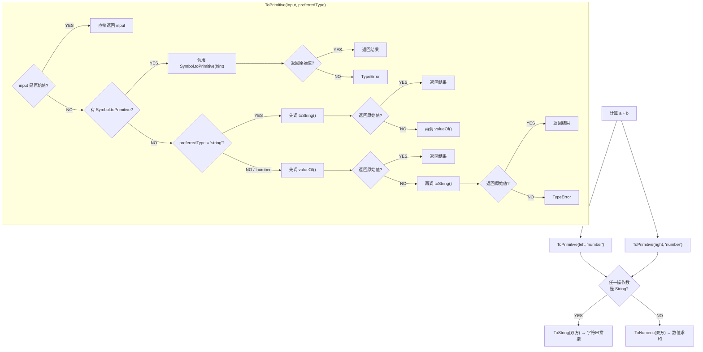

# JavaScript 数据类型

## 数据类型概述

JavaScript 有 **8 种数据类型**，其中 7 种为原始类型，1 种为引用类型。

### 数据类型分类

| 类型分类     | 数据类型    | 说明             | typeof 返回值 |
| ------------ | ----------- | ---------------- | ------------- |
| **原始类型** | `Undefined` | 未定义           | `"undefined"` |
|              | `Null`      | 空值             | `"object"` ⚠️ |
|              | `Boolean`   | 布尔值           | `"boolean"`   |
|              | `Number`    | 数值             | `"number"`    |
|              | `String`    | 字符串           | `"string"`    |
|              | `Symbol`    | 符号（ES6）      | `"symbol"`    |
|              | `BigInt`    | 大整数（ES2020） | `"bigint"`    |
| **引用类型** | `Object`    | 对象             | `"object"`    |

### ECMAScript 版本演进

```javascript
// ES5 (2009)
// - Undefined, Null, Boolean, Number, String, Object

// ES6 (2015)
// - 新增 Symbol 类型

// ES2020 (ES11)
// - 新增 BigInt 类型

// ES2025 (ES16)
// - 新增 Float16Array（半精度浮点数定型数组）
```

## 原始类型 vs 引用类型

理解原始类型和引用类型的区别对于深入掌握 JavaScript 至关重要。

### 核心区别

| 特性         | 原始类型            | 引用类型                             |
| ------------ | ------------------- | ------------------------------------ |
| **存储方式** | 存储在栈（Stack）中 | 存储在堆（Heap）中，栈中存储引用地址 |
| **值传递**   | 按值传递            | 按引用传递                           |
| **可变性**   | 不可变（immutable） | 可变（mutable）                      |
| **比较方式** | 比较值是否相等      | 比较引用地址是否相同                 |
| **复制**     | 创建独立的副本      | 复制引用，指向同一对象               |

> 严格地说，JavaScript 的参数传递都是"按值传递"：引用类型传递的是**引用的值**。因此重新赋值（如 `obj2 = newObj`）不会影响 `obj1`，但通过引用修改对象属性会反映到所有指向该对象的变量上。

### 存储方式示意图

```
原始类型存储：
┌─────────────────┐
│  栈内存 (Stack) │
├─────────────────┤
│  a: 10          │  // let a = 10
│  b: "hello"     │  // let b = "hello"
│  c: true        │  // let c = true
└─────────────────┘

引用类型存储：
┌─────────────────┐       ┌─────────────────┐
│  栈内存 (Stack) │       │  堆内存 (Heap)  │
├─────────────────┤       ├─────────────────┤
│  obj: 0x001     │──────▶│  {              │
│                 │       │    name: "John",│
│                 │       │    age: 30      │
│                 │       │  }              │
└─────────────────┘       └─────────────────┘
```

### 值传递 vs 引用传递示例

```javascript
// 原始类型 - 按值传递
let a = 10
let b = a
b = 20
console.log(a) // 10（a 的值不受影响）

// 引用类型 - 按引用传递
let obj1 = { name: "John" }
let obj2 = obj1
obj2.name = "Jane"
console.log(obj1.name) // "Jane"（obj1 和 obj2 指向同一对象）

// 对象的独立复制
let obj3 = { ...obj1 } // 使用展开运算符（浅拷贝）
let obj4 = Object.assign({}, obj1) // 使用 Object.assign（浅拷贝）
let obj5 = JSON.parse(JSON.stringify(obj1)) // 深拷贝（有局限性）
let obj6 = structuredClone(obj1) // 深拷贝（推荐，支持更多类型）
```

### 可变性示例

```javascript
// 原始类型 - 不可变
let str = "hello"
str[0] = "H" // 尝试修改（无效）
console.log(str) // "hello"（原字符串不变）

// 看似修改，实际创建新值
str = str.toUpperCase()
console.log(str) // "HELLO"（新字符串）

// 引用类型 - 可变
let arr = [1, 2, 3]
arr.push(4) // 直接修改原数组
console.log(arr) // [1, 2, 3, 4]
```

## Undefined 类型

`Undefined` 类型只有一个值：`undefined`。它表示变量已声明但未初始化。

### 基本特性

```javascript
// 变量声明但未初始化
let message
console.log(message) // undefined

// 显式赋值 undefined 与不初始化等价（不必要）
let foo = undefined // 不必要
console.log(foo) // undefined
```

### undefined vs 未声明变量

```javascript
let message // 声明但未初始化

// age 未声明
console.log(message) // undefined
// console.log(age) // ReferenceError: age is not defined

// typeof 对两种情况都返回 "undefined"
console.log(typeof message) // "undefined"
console.log(typeof age) // "undefined"
```

> ⚠️ **重要区别**：
> - **已声明但未初始化**：变量存在，值为 `undefined`
> - **未声明**：变量不存在，访问会抛出错误
> - `typeof` 对两者都返回 `"undefined"`，这是一种保护机制
>
> **最佳实践**：声明变量时立即初始化，这样 `typeof` 返回 `"undefined"` 时就能确定变量未声明。

### undefined 作为假值

```javascript
let message

// undefined 是假值
if (!message) {
  console.log("message 是假值") // 执行
}

// 注意：其他假值也会通过这个测试
if (message == null) {
  console.log("这会执行，但不准确")
}

// 精确检测
if (message === undefined) {
  console.log("message 确实是 undefined") // 执行
}
```

### void 运算符

> ℹ️ **推荐使用 `void` 表达式获取 `undefined` 值：**
>
> ```javascript
> // void 运算符始终返回 undefined
> console.log(void 0) // undefined
>
> // 实际应用：配合三目运算符
> x > 0 && x < 5 ? fn() : void 0
>
> // 实际应用：防止链接误用（HTML 写法）
> // <a href="javascript:void(0)" onclick="handleClick()">点击</a>
> ```

## Null 类型

`Null` 类型只有一个值：`null`。它表示一个空对象指针。

### 基本特性

```javascript
let car = null
console.log(typeof car) // "object"

// null 表示"没有对象"
if (car === null) {
  console.log("car 是 null")
}
```

### null vs undefined

| 特性             | null                          | undefined            |
| ---------------- | ----------------------------- | -------------------- |
| **含义**         | 空对象指针                    | 未定义               |
| **使用场景**     | 表示"没有值"或"空对象"        | 变量未初始化的默认值 |
| **typeof 结果**  | `"object"`（bug）             | `"undefined"`        |
| **是否主动设置** | 通常主动设置                  | 通常自动分配         |
| **相等性**       | `null == undefined` // true   |                      |
| **严格相等**     | `null === undefined` // false |                      |

```javascript
// null 和 undefined 表面相等
console.log(null == undefined) // true
console.log(null === undefined) // false

// 数值转换
console.log(Number(null)) // 0
console.log(Number(undefined)) // NaN
```

### 使用建议

> ℹ️ **最佳实践**：
>
> - 使用 `null` 初始化将来要保存对象的变量
> - 使用 `null` 表示"没有值"或"空对象"
> - 不要显式设置变量为 `undefined`
>
> ```javascript
> // ✅ 好的做法：用 null 初始化对象变量
> let element = null
>
> function getElement() {
>   // 假设此处已找到元素并取得引用
>   element = document.getElementById("myId")
>   return element // 可能返回元素或 null
> }
>
> // ✅ 检查是否获取到对象
> if (element !== null) {
>   element.style.color = "red"
> }
> ```

### null 作为假值

```javascript
let message = null

if (!message) {
  console.log("message 是假值") // 执行
}

// 精确检测
if (message === null) {
  console.log("message 确实是 null") // 执行
}
```

## Boolean 类型

`Boolean` 类型有两个字面值：`true` 和 `false`。

### 基本用法

```javascript
let found = true
let lost = false

// 布尔值区分大小写
// True、FALSE 等混合大小写形式是有效的标识符，但不是 Boolean 值
```

### 类型转换

#### Boolean() 转型函数

```javascript
let message = "Hello world!"
let messageAsBoolean = Boolean(message) // true

// 其他示例
Boolean(1) // true
Boolean(0) // false
Boolean("") // false
Boolean("hello") // true
Boolean(null) // false
Boolean(undefined) // false
Boolean([]) // true（注意！）
Boolean({}) // true
```

#### 转换规则表

| 数据类型  | 转换为 true 的值       | 转换为 false 的值 |
| --------- | ---------------------- | ----------------- |
| Boolean   | `true`                 | `false`           |
| String    | 非空字符串             | `""`（空字符串）  |
| Number    | 非零数值（包括无穷值） | `0`、`-0`、`NaN`  |
| Object    | 任意对象               | —                 |
| Null      | N/A                    | `null`            |
| Undefined | N/A                    | `undefined`       |

#### 假值（Falsy Values）

JavaScript 中共有 **8 个假值**：

```javascript
// 8 个假值
Boolean(false) // false
Boolean(0) // false
Boolean(-0) // false
Boolean(0n) // false（BigInt 零）
Boolean("") // false
Boolean(null) // false
Boolean(undefined) // false
Boolean(NaN) // false

// 注意：这些是真值（truthy）
Boolean([]) // true（空数组）
Boolean({}) // true（空对象）
Boolean(new Boolean(false)) // true（对象）
Boolean("false") // true（非空字符串）
Boolean("0") // true（非空字符串）
```

### 自动转换

```javascript
let message = "Hello world!"

// if 语句自动执行布尔转换
if (message) {
  console.log("Value is true") // 执行
}

// 等同于
if (Boolean(message)) {
  console.log("Value is true")
}

// 使用双重否定快速转换
let truthyString = "hello"
let falsyString = ""

console.log(!!truthyString) // true
console.log(!!falsyString) // false
```

## Number 类型

Number 类型使用 IEEE 754 格式表示整数和浮点值（双精度浮点数）。

### 数值字面量格式

```javascript
// 十进制
let intNum = 55

// 八进制（严格模式下是语法错误）
let octalNum1 = 070 // 56（八进制的 70）
let octalNum2 = 0o10 // 8（ES6 推荐格式）

// 十六进制
let hexNum1 = 0xa // 10
let hexNum2 = 0x1f // 31

// 二进制（ES6）
let binaryNum = 0b1010 // 10
```

### 浮点值

```javascript
// 定义浮点值
let floatNum1 = 1.1
let floatNum2 = 0.1
let floatNum3 = .1 // 有效（省略整数位的 0），但不推荐

// 自动转换为整数
let floatNum4 = 1 // 小数点后无数字，解析为 1
let floatNum5 = 10.0 // 小数点后是零，解析为 10
```

### 科学记数法

```javascript
// 大数值
let floatNum = 3.125e7 // 等于 31250000

// 小数值
let smallNum = 3e-17 // 等于 0.00000000000000003

// 自动转换（小数点后至少 6 个零）
let autoNum = 0.0000003 // 会转换为 3e-7
```

### 浮点数精度问题

> ⚠️ **浮点数计算精度问题**：
>
> ```javascript
> // 经典示例
> console.log(0.1 + 0.2) // 0.30000000000000004
> console.log(0.1 + 0.2 === 0.3) // false
> // 其他示例
> console.log(0.05 + 0.25) // 0.3（正常）
> console.log(0.15 + 0.15) // 0.3（正常）
> ```
>
> **原因**：JavaScript 使用二进制浮点数表示法，某些十进制小数无法精确表示为二进制小数，导致精度丢失。
>
> **解决方案**：
>
> ```javascript
> // 方案 1：使用 Number.EPSILON 比较
> function isEqual(a, b) {
>   return Math.abs(a - b) < Number.EPSILON
> }
> console.log(isEqual(0.1 + 0.2, 0.3)) // true
>
> // 方案 2：转换为整数计算
> function add(a, b) {
>   const multiplier = Math.pow(10, 10)
>   return (a * multiplier + b * multiplier) / multiplier
> }
> console.log(add(0.1, 0.2)) // 0.3
>
> // 方案 3：使用专门的库（如 decimal.js、big.js）
> ```

### 值的范围

```javascript
// 最小值
console.log(Number.MIN_VALUE) // 5e-324

// 最大值
console.log(Number.MAX_VALUE) // 1.7976931348623157e+308

// 安全整数范围
console.log(Number.MIN_SAFE_INTEGER) // -9007199254740991
console.log(Number.MAX_SAFE_INTEGER) // 9007199254740991

// 超出范围会返回 Infinity
console.log(Number.MAX_VALUE * 2) // Infinity
console.log(-Number.MAX_VALUE * 2) // -Infinity
```

### Infinity（无穷值）

```javascript
// 正无穷
console.log(Infinity) // Infinity
console.log(Number.POSITIVE_INFINITY) // Infinity

// 负无穷
console.log(-Infinity) // -Infinity
console.log(Number.NEGATIVE_INFINITY) // -Infinity

// 产生 Infinity 的操作
console.log(1 / 0) // Infinity
console.log(-1 / 0) // -Infinity
console.log(Number.MAX_VALUE * 2) // Infinity

// Infinity 的特性
console.log(Infinity + 1) // Infinity
console.log(Infinity - Infinity) // NaN
console.log(Infinity / Infinity) // NaN

// 检测有限数
console.log(isFinite(100)) // true
console.log(isFinite(Infinity)) // false
console.log(isFinite(NaN)) // false

// Number.isFinite() 更严格
console.log(Number.isFinite(100)) // true
console.log(Number.isFinite("100")) // false（不转换）
console.log(isFinite("100")) // true（会转换）
```

### NaN（Not a Number）

`NaN` 意思是"不是数值"，用于表示本来要返回数值的操作失败了。

#### 产生 NaN 的情况

```javascript
// 数学运算
console.log(0 / 0) // NaN
console.log(-0 / +0) // NaN
console.log(Infinity / Infinity) // NaN
console.log(Math.sqrt(-1)) // NaN

// 类型转换
console.log(Number("abc")) // NaN
console.log(parseInt("abc")) // NaN
console.log(Number(undefined)) // NaN

// 注意：除以零
console.log(5 / 0) // Infinity（不是 NaN）
console.log(-5 / 0) // -Infinity（不是 NaN）
```

#### NaN 的特性

```javascript
// 1. NaN 与任何值都不相等，包括它自己
console.log(NaN === NaN) // false
console.log(NaN !== NaN) // true

// 2. 任何涉及 NaN 的操作都返回 NaN
console.log(NaN + 10) // NaN
console.log(NaN * 10) // NaN

// 3. NaN 是唯一一个不等于自身的值
const x = NaN
console.log(x !== x) // true（检测 NaN 的一种方法）
```

#### 检测 NaN

```javascript
// 方法 1：isNaN()（不推荐，会转换类型）
console.log(isNaN(NaN)) // true
console.log(isNaN("NaN")) // true（字符串转换为 NaN）
console.log(isNaN(undefined)) // true
console.log(isNaN("hello")) // true
console.log(isNaN(10)) // false

// 方法 2：Number.isNaN()（推荐，ES6）
console.log(Number.isNaN(NaN)) // true
console.log(Number.isNaN("NaN")) // false（不转换类型）
console.log(Number.isNaN(undefined)) // false
console.log(Number.isNaN("hello")) // false

// 方法 3：利用 NaN 不等于自身
function myIsNaN(value) {
  return value !== value
}

console.log(myIsNaN(NaN)) // true
```

### 特殊数值：+0 和 -0

JavaScript 中有正零和负零，它们在大多数情况下表现相同：

```javascript
// +0 和 -0
let positiveZero = +0
let negativeZero = -0

console.log(positiveZero === negativeZero) // true
console.log(1 / positiveZero) // Infinity
console.log(1 / negativeZero) // -Infinity

// 区分 +0 和 -0
function isNegativeZero(value) {
  return value === 0 && 1 / value === -Infinity
}

console.log(isNegativeZero(-0)) // true
console.log(isNegativeZero(0)) // false
```

### 数值转换

JavaScript 提供三个函数将非数值转换为数值：`Number()`、`parseInt()` 和 `parseFloat()`。

#### Number() 函数

`Number()` 可以将任何类型的值转换为数值。

**转换规则表：**

| 输入类型    | 转换结果                                                                 |
| ----------- | ------------------------------------------------------------------------ |
| Boolean     | `true` → `1`，`false` → `0`                                              |
| Number      | 原样返回                                                                 |
| `null`      | `0`                                                                      |
| `undefined` | `NaN`                                                                    |
| 字符串       | 纯数字（可含小数点、正负号、十六进制前缀）→ 对应数值；空字符串 → `0`；其他 → `NaN` |
| Symbol      | `TypeError`                                                              |
| 对象         | 先调用 `valueOf()`，若结果为 `NaN` 再调用 `toString()` 按字符串规则转换   |

| 字符串输入 | 转换结果                |
| ---------- | ----------------------- |
| `"123"`    | `123`                   |
| `""`       | `0`（空字符串）         |
| `"123abc"` | `NaN`（包含非数字字符） |
| `"abc"`    | `NaN`                   |

**转换示例：**

```javascript
// 布尔值
Number(true) // 1
Number(false) // 0

// null 和 undefined
Number(null) // 0
Number(undefined) // NaN

// 字符串
Number("123") // 123
Number("123.45") // 123.45
Number("0xf") // 15（十六进制）
Number("") // 0
Number("abc") // NaN
Number("123abc") // NaN

// 对象
Number({}) // NaN
Number([1, 2, 3]) // NaN
Number([5]) // 5
Number([]) // 0
```

#### parseInt() 函数

`parseInt()` 专门用于将字符串转换为整数，更灵活。

**特点：**

- 从字符串开头解析，遇到非数字字符停止
- 忽略前面的空格
- 支持进制参数（第二个参数）

```javascript
// 基本用法
parseInt("1234blue") // 1234
parseInt("123.45") // 123
parseInt("") // NaN
parseInt("22.5") // 22

// 十六进制
parseInt("0xA") // 10
parseInt("0xf") // 15

// 指定进制
parseInt("10", 2) // 2（二进制）
parseInt("10", 8) // 8（八进制）
parseInt("10", 10) // 10（十进制）
parseInt("10", 16) // 16（十六进制）

// 传入进制参数后，可以省略前缀
parseInt("AF", 16) // 175
parseInt("AF") // NaN（没有指定进制）
```

> ℹ️ **最佳实践**：始终为 `parseInt()` 提供第二个参数（进制），通常为 `10`。
>
> ```javascript
> // ✅ 推荐
> parseInt("123", 10) // 明确指定十进制
> // ❌ 不推荐
> parseInt("123") // 依赖自动检测，可能出错
> ```

**ES5+ 变化**：`parseInt()` 自 ES5 起不再把前导 `0` 当作八进制标记；ES6 又为八进制字面量引入了 `0o` 前缀。

```javascript
// 旧引擎（ES3 时代）
parseInt("070") // 可能解析为 56（八进制）

// 现代浏览器（ES5+）
parseInt("070") // 70（十进制）
parseInt("70", 8) // 56（明确指定八进制）
```

#### parseFloat() 函数

`parseFloat()` 用于将字符串转换为浮点数。

**特点：**

- 只解析十进制值
- 解析到字符串末尾或遇到无效浮点数字符为止
- 第一次出现的小数点有效，第二次无效
- 忽略前导零

```javascript
parseFloat("1234blue") // 1234
parseFloat("0xA") // 0（十六进制返回 0）
parseFloat("22.5") // 22.5
parseFloat("22.34.5") // 22.34（第二个小数点无效）
parseFloat("0908.5") // 908.5（忽略前导零）
parseFloat("3.125e7") // 31250000（科学记数法）
parseFloat("") // NaN
parseFloat("abc") // NaN
```

### Number 类型常用属性和方法

```javascript
// 属性
Number.POSITIVE_INFINITY // Infinity
Number.NEGATIVE_INFINITY // -Infinity
Number.NaN // NaN
Number.MAX_VALUE // 1.7976931348623157e+308
Number.MIN_VALUE // 5e-324
Number.MAX_SAFE_INTEGER // 9007199254740991
Number.MIN_SAFE_INTEGER // -9007199254740991
Number.EPSILON // 2.220446049250313e-16

// 方法
Number.isFinite(123) // true
Number.isFinite(Infinity) // false
Number.isInteger(123) // true
Number.isInteger(123.5) // false
Number.isNaN(NaN) // true
Number.isSafeInteger(9007199254740991) // true
Number.parseFloat("123.45") // 123.45
Number.parseInt("123", 10) // 123
```

## Object 类型

Object 是 JavaScript 中最复杂的类型，它是一组数据和功能的集合，采用键值对的形式存储数据。

### 创建对象

```javascript
// 方法 1：对象字面量（推荐）
let person = {
  name: "John",
  age: 30,
  sayHello() {
    console.log(`Hello, I'm ${this.name}`)
  }
}

// 方法 2：new Object()
let person2 = new Object()
person2.name = "John"
person2.age = 30

// 方法 3：Object.create()
let person3 = Object.create(null)
person3.name = "John"

// 方法 4：构造函数
function Person(name, age) {
  this.name = name
  this.age = age
}
let person4 = new Person("John", 30)
```

### Object 实例的属性和方法

```javascript
let obj = { name: "John", age: 30 }

// constructor - 返回创建对象的构造函数
console.log(obj.constructor) // ƒ Object() { [native code] }

// hasOwnProperty(propertyName) - 检查自有属性
console.log(obj.hasOwnProperty("name")) // true
console.log(obj.hasOwnProperty("toString")) // false（继承的属性）

// isPrototypeOf(object) - 检查是否是原型
let animal = { eats: true }
let rabbit = Object.create(animal)
console.log(animal.isPrototypeOf(rabbit)) // true

// propertyIsEnumerable(propertyName) - 检查属性是否可枚举
console.log(obj.propertyIsEnumerable("name")) // true
console.log(obj.propertyIsEnumerable("constructor")) // false

// toLocaleString() - 返回本地化字符串表示
console.log(obj.toLocaleString()) // "[object Object]"

// toString() - 返回字符串表示
console.log(obj.toString()) // "[object Object]"

// valueOf() - 返回对象的原始值
console.log(obj.valueOf()) // { name: "John", age: 30 }
```

### 对象属性操作

```javascript
let person = { name: "John", age: 30 }

// 访问属性
console.log(person.name) // "John"
console.log(person["name"]) // "John"

// 添加属性
person.email = "john@example.com"
person["phone"] = "123-456-7890"

// 删除属性
delete person.age
console.log(person.age) // undefined

// 检查属性是否存在
console.log("name" in person) // true
console.log("age" in person) // false
console.log(person.hasOwnProperty("name")) // true
```

### 属性描述符

```javascript
let obj = {}

// 定义属性
Object.defineProperty(obj, "name", {
  value: "John",
  writable: false, // 不可写
  enumerable: true, // 可枚举
  configurable: false // 不可配置
})

console.log(obj.name) // "John"
obj.name = "Jane" // 无效（严格模式抛出错误）

// 批量定义多个属性
let person2 = {}
Object.defineProperties(person2, {
  email: {
    value: "john@example.com",
    writable: true,
    enumerable: true,
    configurable: true
  }
})
console.log(person2.email) // "john@example.com"
```

### 对象方法

```javascript
let person = { name: "John", age: 30 }

// 获取所有属性名
console.log(Object.keys(person)) // ["name", "age"]

// 获取所有属性值
console.log(Object.values(person)) // ["John", 30]

// 获取键值对数组
console.log(Object.entries(person)) // [["name", "John"], ["age", 30]]

// 从键值对创建对象
console.log(Object.fromEntries(Object.entries(person))) // { name: "John", age: 30 }

// 合并对象（浅拷贝）
console.log(Object.assign({}, person)) // { name: "John", age: 30 }

// 冻结对象
let frozenObj = Object.freeze({ name: "John" })
frozenObj.name = "Jane" // 无效（严格模式抛出错误）

// 密封对象
let sealedObj = Object.seal({ name: "John" })
sealedObj.name = "Jane" // 有效
sealedObj.age = 30 // 无效（不能添加新属性）
console.log(sealedObj) // { name: "Jane" }
```

### 对象扩展（ES6+）

```javascript
// 1. 属性简写
let name = "John"
let age = 30
let person = { name, age } // { name: "John", age: 30 }

// 2. 方法简写
let obj = {
  sayHello() {
    console.log("Hello")
  }
}

// 3. 计算属性名
const key = "dynamicKey"
let obj2 = { [key]: "value" } // { dynamicKey: "value" }

// 4. 展开运算符（浅拷贝/合并）
let obj3 = { ...obj2, extra: 1 }

// 5. 空值合并运算符（ES2020）
let value = null
console.log(value || "default") // "default"

// 区别：?? 只对 null 和 undefined 生效
let count = 0
console.log(count ?? 10) // 0
console.log(count || 10) // 10
```

## 最佳实践

### 1. 类型检测

```javascript
// ✅ 好的做法：使用严格相等
if (value === null) {
  /* ... */
}
if (value === undefined) {
  /* ... */
}
if (Array.isArray(value)) {
  /* ... */
}
if (typeof value === "string") {
  /* ... */
}

// ❌ 不好的做法：依赖隐式转换
if (value == null) {
} // 虽然可以，但不够明确
if (typeof value === "object") {
} // 无法区分 null 和对象
if (!value) {
} // 无法区分 null、undefined、0、"" 等
```

### 2. 类型转换

```javascript
const str = "123"
const value = 1

// ✅ 好的做法：显式转换
const num = Number(str)
const str2 = String(num)
const bool = Boolean(value)

// ❌ 不好的做法：隐式转换
const num2 = +str // 可读性差
const str3 = num + "" // 容易出错
const bool2 = !!value // 不够清晰
```

### 3. 数值处理

```javascript
// ✅ 好的做法：处理浮点数精度问题
function isEqual(a, b) {
  return Math.abs(a - b) < Number.EPSILON
}

isEqual(0.1 + 0.2, 0.3) // true

// ✅ 使用 Math.floor、Math.ceil、Math.round 处理小数
const rounded = Math.round(1.5) // 2
const floored = Math.floor(1.9) // 1
const ceiled = Math.ceil(1.1) // 2

// ❌ 不好的做法：直接比较浮点数
0.1 + 0.2 === 0.3 // false
```

### 4. 字符串处理

```javascript
const name = "John"
const age = 30
const str = "hello"

// ✅ 好的做法：使用模板字符串
const message = `Hello, ${name}! You are ${age} years old.`

// ✅ 使用现代字符串方法
const padded = str.padStart(5, "0")
const repeated = str.repeat(3)
const includes = str.includes("hello")

// ❌ 不好的做法：字符串拼接
const message2 = "Hello, " + name + "! You are " + age + " years old."
```

### 5. 对象处理

```javascript
// ✅ 好的做法：使用对象字面量
const config = {
  api: "https://api.example.com",
  timeout: 5000
}

// ✅ 使用展开运算符合并对象
const defaults = { theme: "light" }
const options = { lang: "zh" }
const merged = { ...defaults, ...options }

// ✅ 使用可选链访问深层属性
const user = {} // 可能不存在地址信息
const city = user?.address?.city

// ❌ 不好的做法：深层访问不检查
const city2 = user.address.city // TypeError: Cannot read properties of undefined

// ❌ 不好的做法：使用 new Object()
const config2 = new Object()
config2.api = "https://api.example.com"
```

### 6. 避免类型陷阱

```javascript
// ✅ 好的做法：明确类型检查
function processValue(value) {
  if (value === null || value === undefined) {
    return "No value"
  }
  if (typeof value === "string") {
    return value.toUpperCase()
  }
  if (typeof value === "number" && !isNaN(value)) {
    return value * 2
  }
  return String(value)
}

// ✅ 使用空值合并运算符
const input = null
const value2 = input ?? "default"

// ❌ 不好的做法：依赖隐式转换
function processValueUnsafe(value) {
  return value.toUpperCase() // 如果 value 不是字符串会报错
}
```

### 7. 使用现代类型检测

```javascript
// ✅ 使用 Number.isNaN 而不是 isNaN
Number.isNaN(NaN) // true
Number.isNaN("NaN") // false（更严格）

// ✅ 使用 Number.isFinite 而不是 isFinite
Number.isFinite(123) // true
Number.isFinite("123") // false（更严格）

// ✅ 使用 Number.isInteger 检测整数
Number.isInteger(123) // true
Number.isInteger(123.5) // false

// ✅ 使用 Array.isArray 检测数组
Array.isArray([]) // true
Array.isArray({}) // false
```

### 8. BigInt 使用建议

```javascript
// ✅ 处理大整数时使用 BigInt
const bigId = 9007199254740993n
const number = 45

// ✅ 与 Number 混合运算时显式转换
const result = bigId + BigInt(number)

// ❌ 直接混合运算
// const result = bigId + number // TypeError

// ✅ 序列化时转换为字符串
JSON.stringify({ id: bigId.toString() })
```

### 9. Symbol 使用建议

```javascript
// ✅ 使用 Symbol 避免属性冲突
const privateMethod = Symbol("privateMethod")

class MyClass {
  [privateMethod]() {
    // 私有方法
  }
}

// ✅ 使用全局符号注册表共享符号
const sharedSymbol = Symbol.for("app.shared")
```

### 10. 性能优化

```javascript
// ✅ 避免频繁的类型转换
const num = Number(str) // 一次转换
if (num > 10) {
  /* ... */
}
if (num < 100) {
  /* ... */
}

// ❌ 重复的类型转换
if (Number(str) > 10) {
  /* ... */
}
if (Number(str) < 100) {
  /* ... */
}

// ✅ 使用严格相等避免类型转换开销
if (value === expected) {
  /* ... */
}

// ❌ 使用宽松相等会触发类型转换
if (value == expected) {
  /* ... */
}
```

### 动态类型的规范解析（核心原理深度）

> **规范层级**：ECMAScript 规范 · Type Conversion & Coercion（§7.1 Abstract Operations）
> **原理来源**：JavaScript 核心原理解析·第 18-19 讲

#### 规范语义

JavaScript 的动态类型系统看似混乱，实则遵循 ECMAScript 规范中严格定义的转换管线。规范将所有类型转换归结为三个核心抽象操作族：

- **ToPrimitive(input, preferredType)**：将任意值转换为原始值，是所有隐式转换的入口
- **ToPropertyKey(argument)**：将任意值转换为可用作属性名的值（String 或 Symbol）
- **ToNumeric(argument)**：将任意值转换为数值类型（Number 或 BigInt）

其中 `ToPrimitive` 是整个类型转换体系的枢纽。它的核心逻辑是：若输入已是原始值（undefined、null、boolean、number、string、symbol、bigint），直接返回；若输入是对象，则依次尝试 `Symbol.toPrimitive`、`valueOf()`、`toString()` 来获得原始值。

对于 `a + b` 运算，ECMAScript 规范定义了精确的判定路径：先对两操作数调用 `ToPrimitive`，再检查任一结果是否为 String——若是，则将双方 `ToString` 后字符串拼接；否则将双方 `ToNumeric` 后数值相加。

#### 执行机制



#### 核心洞察

- **动态类型并非混乱**：JavaScript 的类型转换遵循严格的规范管线，每一步转换路径都是确定的，不存在"随机"或"不可预测"的行为——只是规则层级较深，使得表面现象显得不可捉摸
- **三大转换族归约**：看似繁多的类型转换，最终都可归约为 ToPrimitive、ToPropertyKey、ToNumeric 三个族。理解 ToPrimitive，即可解锁所有隐式转换的行为
- **Value vs Primitive 的分界**：所有值（Values）要么是原始值（Primitive values），要么是对象。原始值包括 5 种包装类对应的值（boolean、number、string、symbol、bigint）加上 undefined 和 null。对象转换为原始值时必须经过 ToPrimitive 管线
- **Symbol.toPrimitive 的终极控制权**：一旦对象定义了 `Symbol.toPrimitive`，原有 valueOf/toString 的调用顺序和优先级逻辑全部失效，对象获得对自身转换行为的完全控制
- **`a + b` 是类型转换的"罗塞塔石碑"**：理解了 `+` 运算符的完整判定路径，就理解了 JavaScript 中所有隐式类型转换的设计哲学——先归约为原始值，再根据上下文决定最终类型
- **Date 对象的特例**：Date 是唯一在 `ToPrimitive` 中将 preferredType 设为 `'string'`（而非默认的 `'number'`）的内建类型，因此 Date 对象优先调用 `toString()` 而非 `valueOf()`

#### 代码实证

```javascript
// === 1. 逐步追踪 1 + '2' ===
// 步骤 1: ToPrimitive(1) → 1（已是原始值）
// 步骤 2: ToPrimitive('2') → '2'（已是原始值）
// 步骤 3: 任一操作数是 String? → YES（'2' 是字符串）
// 步骤 4: ToString(1) → '1', ToString('2') → '2'
// 步骤 5: 字符串拼接 → '12'
console.log(1 + '2') // '12'

// === 2. [] + {} vs {} + [] 的真相 ===
// [] + {}: ToPrimitive([]) → '' (valueOf 返回数组对象, toString 返回 '')
//         ToPrimitive({}) → '[object Object]'
//         任一是 String? → YES → 字符串拼接
console.log([] + {}) // '[object Object]'
// {} + [] 在浏览器控制台中：行首的 {} 被解析为空块语句，表达式实际是 +[]，结果为 0

// === 3. 自定义对象回退到 toString ===
const tricky = {
  valueOf() { return {} },        // 返回对象（非原始值）
  toString() { return 'fallback' }
}
console.log(tricky + '')  // ToPrimitive 尝试 valueOf → 对象(失败)
                          // 再尝试 toString → 'fallback'
                          // → 'fallback'
```

#### 与实战的关联

- **`==` 运算的危险性**：宽松相等 `==` 在比较对象与原始值时会调用 `ToPrimitive`，导致 `"0" == false` 为 `true` 等反直觉结果。理解 `ToPrimitive` 管线才能准确预判 `==` 的行为，但实践中应坚持使用 `===`
- **防御性编程与类型转换**：显式调用 `String()`、`Number()`、`Boolean()` 虽然内部仍走 `ToPrimitive` 管线，但"显式"决定了 preferredType，使行为可预测。应避免依赖隐式转换
- **理解 WAT 时刻**：`[] + {}` vs `{} + []` 等"令人困惑"的结果，根源在于 ASI（自动分号插入）与 `+` 运算符的双重语义。理解规范管线后，这些"怪异行为"都有精确的解释
- **自定义类型的序列化**：为自定义对象实现 `Symbol.toPrimitive`、`valueOf()`、`toString()` 是控制对象在运算和模板字符串中行为的关键手段

---

**总结**：理解 JavaScript 数据类型和类型转换是编写可靠代码的基础。记住以下关键点：

1. **区分原始类型和引用类型**：理解它们的存储和传递方式
2. **使用合适的类型检测方法**：根据场景选择 `typeof`、`instanceof`、`Array.isArray` 或 `Object.prototype.toString`
3. **显式优于隐式**：明确类型转换，避免隐式转换带来的问题
4. **注意特殊值**：`NaN`、`null`、`undefined`、`Infinity` 等特殊值的处理
5. **使用现代特性**：`Symbol`、`BigInt`、可选链、空值合并等
6. **遵循最佳实践**：使用严格相等、显式转换、模板字符串等
