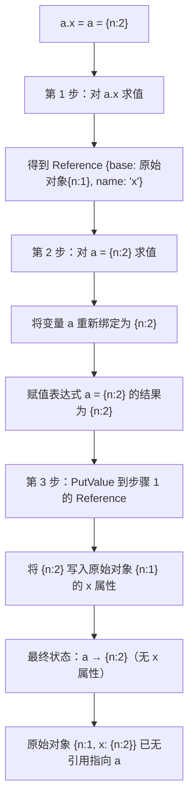
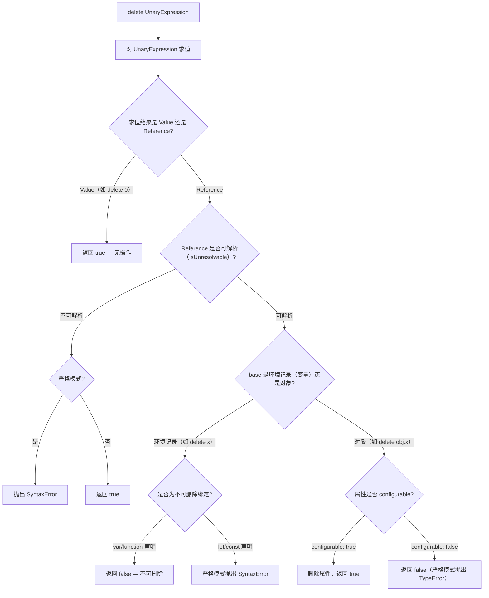

# JavaScript 操作符详解

## 操作符分类

操作符根据期待的操作数个数来分类：

| 类型 | 说明 | 示例 |
|------|------|------|
| 一元操作符 | 只能操作一个值，将一个表达式转化为另一个更复杂的表达式 | `++i`, `--i`, `+i`, `-i` |
| 二元操作符 | 操作两个值，将两个表达式合成一个更复杂的表达式 | `a + b`, `a - b`, `a * b` |
| 三元操作符 | 操作三个表达式，即条件操作符 `?:` | `condition ? value1 : value2` |

## 一元操作符

只能操作一个值的操作符叫做一元操作符。一元操作符是 `ECMAScript` 中最简单的操作符

### 递增 ++ 和递减 --

递增和递减操作符直接照搬自 C 语言，但有两个版本：前缀版和后缀版。顾名思义，前缀版就是位于要操作的变量前头，后缀版就是位于要操作的变量后头

- 前缀版（++i）：表示先递增(递减)，后执⾏语句
- 后缀版（i++）：表示先执⾏语句，后递增(递减)

```javascript
var age = 29
++age

// 相同的执行效果
var age = 29
age = age + 1
```

执行前置递减操作的方法也类似，结果会从一个数值中减去 1。age 变量的值就减少为 28（从 29 中减去了 1）

```javascript
var age = 29
--age
```

由于前置递增和递减操作与执行语句的优先级相等，因此整个语句会从左至右被求值

```javascript
var num1 = 2
var num2 = 20

var num3 = --num1 + num2 // 等于 21
var num4 = num1 + num2 // 等于 21
```

后置型递增和递减操作符的语法不变（仍然分别是++和--），只不过要放在变量的后面而不是前面

```javascript
var num1 = 2
var num2 = 20

var num3 = num1-- + num2 //等于22
var num4 = num1 + num2 // 等于 21
```

所有这 4 个操作符对任何值都适用，也就是它们不仅适用于整数，还可以用于字符串、布尔值、浮点数值和对象

- 字符串
  - 包含有效数字字符的字符串时，先将其转换为数字值，再执行加减 1 的操作。字符串变量变成数值变量
  - 不包含有效数字字符的字符串时，将变量的值设置为 NaN。字符串变量变成数值变量
- 布尔值
  - 布尔值 false 时，先将其转换为 0 再执行加减 1 的操作。布尔值变量变成数值变量
  - 布尔值 true 时，先将其转换为 1 再执行加减 1 的操作。布尔值变量变成数值变量
- 在应用于浮点数值时，执行加减 1 的操作
- 在应用于对象时，先调用对象的 valueOf() 方法以取得一个可供操作的值。然后对该值应用前述规则。如果结果是 NaN，则再调用 toString() 方法后再应用前述规则。对象变量变成数值变量

```javascript
var s1 = "2"
var s2 = "z"
var b = false
var f = 1.1
var o = {
  valueOf: function () {
    return -1
  }
}

s1++ // 值变成数值 3
s2++ // 值变成 NaN
b++ // 值变成数值 1
f-- // 值变成 0.10000000000000009（由于浮点舍入错误所致）
o-- // 值变成数值-2
```

### 一元加 + 和减 -

一元加操作符以一个加号（+）表示，放在数值前面，对数值不会产生任何影响，

```javascript
var num = 25
num = +num // 仍然是 25
```

不过，在对非数值应用一元加操作符时，该操作符会像 Number() 转型函数一样对这个值执行转换

对象是先调用它们的 valueOf()和（或）toString()方法，再转换得到的值

```javascript
var s1 = "01"
var s2 = "1.1"
var s3 = "z"
var b = false
var f = 1.1
var o = {
  valueOf: function () {
    return -1
  }
}

s1 = +s1 // 值变成数值 1
s2 = +s2 // 值变成数值 1.1
s3 = +s3 // 值变成 NaN

b = +b // 值变成数值 0
f = +f // 值未变，仍然是 1.1
o = +o // 值变成数值-1
```

一元减操作符主要用于表示负数，例如将 1 转换成 -1

```javascript
var num = 25
num = -num // 变成了-25
```

在将一元减操作符应用于数值时，该值会变成负数。而当应用于非数值时，一元减操作符遵循与一元加操作符相同的规则，最后再将得到的数值转换为负数

```javascript
var s1 = "01"
var s2 = "1.1"
var s3 = "z"
var b = false
var f = 1.1
var o = {
  valueOf: function () {
    return -1
  }
}

s1 = -s1 // 值变成了数值-1
s2 = -s2 // 值变成了数值-1.1
s3 = -s3 // 值变成了 NaN

b = -b // 值变成了数值 0
f = -f // 变成了-1.1
o = -o // 值变成了数值 1
```

一元加和减操作符主要用于基本的算术运算，也可以像前面示例所展示的一样用于转换数据类型

## 位操作符

本节部分内容参考：[位操作符详解](https://www.23bei.com/tool/532.html)

位操作符用于在最基本的层次上，即按内存中表示数值的位来操作数值。

ECMAScript 中的所有数值都以 IEEE-754 64 位格式存储，但位操作符并不直接操作 64 位的值。而是先将 64 位的值转换成 32 位的整数，然后执行操作，最后再将结果转换回 64 位。对于开发人员来说，由于 64 位存储格式是透明的，因此整个过程就像是只存在 32 位的整数一样

| **运算符** | **描述**   | **运算规则**                     |
| ---------- | ---------- | -------------------------------- |
| `&`        | 按位与     | 两位都为 1 时结果才为 1          |
| `\|`       | 按位或     | 任意一位为 1 时结果即为 1        |
| `~`        | 按位非     | 取反：0 变 1，1 变 0             |
| `^`        | 按位异或   | 两位相异为 1，相同为 0           |
| `<<`       | 左移       | 各位左移若干位，右侧补 0         |
| `>>`       | 有符号右移 | 各位右移若干位，左侧以符号位填充 |
| `>>>`      | 无符号右移 | 各位右移若干位，左侧以 0 填充    |


这样，就求得了-18 的二进制表示，即 `11111111111111111111111111101110`。要注意的是，在处理有符号整数时，是不能访问位 31 的

ECMAScript 会尽力向我们隐藏所有这些信息。换句话说，在以二进制字符串形式输出一个负数时，我们看到的只是这个负数绝对值的二进制码前面加上了一个负号。如下面的例子所示：

```javascript
var num = -18

alert(num.toString(2)) // "-10010"
```

要把数值-18 转换成二进制字符串时，得到的结果是"-10010"。这说明转换过程理解了二进制补码并将其以更合乎逻辑的形式展示了出来

默认情况下，ECMAScript 中的所有整数都是有符号整数。不过，当然也存在无符号整数。对于无符号整数来说，第 32 位不再表示符号，因为无符号整数只能是正数。而且，无符号整数的值可以更大，因为多出的一位不再表示符号，可以用来表示数值

在 ECMAScript 中，当对数值应用位操作符时，后台会发生如下转换过程：64 位的数值被转换成 32 位数值，然后执行位操作，最后再将 32 位的结果转换回 64 位数值。这样，表面上看起来就好像是在操作 32 位数值，就跟在其他语言中以类似方式执行二进制操作一样。但这个转换过程也导致了一个严重的副效应，即在对特殊的 NaN 和 Infinity 值应用位操作时，这两个值都会被当成 0 来处理。

如果对非数值应用位操作符，会先使用 Number()函数将该值转换为一个数值（自动完成），然后再应用位操作。得到的结果将是一个数值

### 按位与 &

按位与操作符（&）会对参加运算的两个数据按⼆进制位进⾏与运算，即两位同时为 1 时，结果才为 1，否则结果为 0。运算规则如下：

```javascript
0 & 0 = 0
0 & 1 = 0
1 & 0 = 0
1 & 1 = 1

// 例如，3 & 5 的运算结果如下
0000 0011
0000 0101
0000 0001
```

因此 3 & 5 的值为 1。需要注意：**负数按补码形式参加按位与运算**

⽤途：

- 判断奇偶
  - 只要根据最未位是 0 还是 1 来决定，为 0 就是偶数，为 1 就是奇数
  - 因此可以⽤ `if ((i & 1) === 0)` 代替 `if (i % 2 === 0)` 来判断 a 是不是偶数。
- 清零
  - 如果想将⼀个单元清零，即使其全部⼆进制位为 0，只要与⼀个各位都为零的数值相与，结果为零

### 按位或 |

会对参加运算的两个对象按⼆进制位进⾏或运算，即参加运算的两个对象只要有⼀个为 1，其值为 1。运算规则如下：

```javascript
0 | 0 = 0
0 | 1 = 1
1 | 0 = 1
1 | 1 = 1
// 例如，3 | 5 的运算结果如下
0000 0011
0000 0101
0000 0111
```

因此，3 | 5 的值为 7。需要注意：**负数按补码形式参加按位或运算**

### 按位⾮ ~

会对参加运算的⼀个数据按⼆进制进⾏取反运算。即将 0 变成 1，1 变成 0

```javascript
~ 1 = 0
~ 0 = 1
// 例如：~6 的运算结果如下
0000 0110
1111 1001
```

在计算机中，正数⽤原码表示，负数使⽤补码存储，⾸先看最⾼位，最⾼位 1 表示负数，0 表示正数。此计算机⼆进制码为负数，最⾼位为符号位。当按位取反为负数时，就直接取其补码，变为⼗进制

```javascript
0000 0110
1111 1001

1000 0110  // 获取反码
1000 0111  // 获取补码
```

因此，~6 的值为 -7。按位⾮的操作结果实际上是对数值进⾏取反并减 1

### 按位异或 ^

会对参加运算的两个数据按⼆进制位进⾏“异或”运算，即如果两个相应位相同则为 0，相异则为 1

```javascript
0 ^ 0 = 0
0 ^ 1 = 1
1 ^ 0 = 1
1 ^ 1 = 0

// 例如， 3 ^ 5 的运算结果
0000 0011
0000 0101
0000 0110


var result = 25 ^ 3;
alert(result); //26

//  25 = 0000 0000 0000 0000 0000 0000 0001 1001
//  3  = 0000 0000 0000 0000 0000 0000 0000 0011
// ---------------------------------------------
// XOR = 0000 0000 0000 0000 0000 0000 0001 1010     26
```

异或运算具有以下性质:

- 交换律：`a ^ b === b ^ a`
- 结合律：`(a ^ b) ^ c === a ^ (b ^ c)`
- 对于任何数 x，都有 `x ^ x === 0`，`x ^ 0 === x`
- ⾃反性：`a ^ b ^ b === a ^ 0 === a`

### 左移 <<

会将运算对象的各⼆进制位全部左移若⼲位，左边的⼆进制位丢弃，右边补 0。若左移时舍弃的⾼位不包含 1，则每左移⼀位，相当于该数乘以 2

```javascript
a = 1010 1110
a = a << 2
a = 1011 1000  // 左移 2 位的结果

var oldValue = 2; // 等于二进制的 10
var newValue = oldValue << 5; // 等于二进制的 1000000，十进制的 64
```


注意，左移不会影响操作数的符号位。换句话说，如果将 -2 向左移动 5 位，结果将是-64，而非 64

### 有符号右移 >>

会将数值的 32 位全部右移若⼲位（同时会保留正负号）。正数左补 0，负数左补 1，右边丢弃。操作数每右移⼀位，相当于该数除以 2

例如：a = a >>2 就是将 a 的⼆进制位右移 2 位，左补 0 或者 左补 1 得看被移数是正还是负

```javascript
var oldValue = 64 // 等于二进制的 1000000

var newValue = oldValue >> 5 // 等于二进制的 10 ，即十进制的 2
```

同样，在移位过程中，原数值中也会出现空位。只不过这次的空位出现在原数值的左侧、符号位的右侧（见图 3-3）。而此时 ECMAScript 会用符号位的值来填充所有空位，以便得到一个完整的值


### ⽆符号右移 >>>

会将数值的 32 位全部右移。对于正数，有符号右移操作符和⽆符号右移操作符的结果是⼀样的。对于负数的操作，两者就会有较⼤的差异

⽆符号右移操作符将负数的⼆进制表示当成正数的⼆进制表示来处理。所以，对负数进⾏⽆符号右移操作之后就会变的特别⼤

```javascript
var oldValue = 64 // 等于二进制的 1000000

var newValue = oldValue >>> 5 // 等于二进制的 10 ，即十进制的 2
```

但是对负数来说，情况就不一样了。首先，无符号右移是以 0 来填充空位，而不是像有符号右移那样以符号位的值来填充空位。

其次，无符号右移操作符会把负数的二进制码当成正数的二进制码。而且，由于负数以其绝对值的二进制补码形式表示，因此就会导致无符号右移后的结果非常之大，如下面的例子所示：

```javascript
var oldValue = -64 // -64的二进制11111111111111111111111111000000

var newValue = oldValue >>> 5 // 00000111111111111111111111111110 等于十进制的 134217726
```

这里，当对-64 执行无符号右移 5 位的操作后，得到的结果是 134217726。之所以结果如此之大，

## 算术操作符

算术操作符用于执行数学运算，包括加法、减法、乘法、除法、取余和指数运算。

### 加法 +

二元加操作符用于计算数值操作或者拼接字符串操作。

**基本用法：**

```javascript
1 + 1 // 2
"1" + "2" // "12"
"hello" + "world" // "helloworld"
```

**运算规则：**

如果两个操作数都是数值或者都是字符串，那么执行结果就分别是计算出来的数值和拼接好的字符串。除此之外，执行结果都取决于类型转化的结果：它会优先进行字符串拼接，只要有一个操作数是字符串或者是可以转化为字符串的对象，另一个操作数也会被转化为字符串，并执行拼接操作。

**类型转换示例：**

```javascript
1 + 2 // 3
"1" + "2" // "12"
"1" + 2 // "12"
1 + {} // "1[object Object]"
true + false // 1 布尔值会先转为数字，再进行运算
1 + null // 1 null会转化为0，再进行计算
1 + undefined // NaN undefined 转化为数字是 NaN
```

**特殊情况：**

- 如果有⼀个操作数是 NaN，则结果是 NaN
- 如果是 Infinity 加 Infinity，则结果是 Infinity
- 如果是 -Infinity 加 -Infinity，则结果是 -Infinity
- 如果是 Infinity 加 -Infinity，则结果是 NaN
- 如果是 +0 加 +0，则结果是 +0
- 如果是 -0 加 -0，则结果是 -0
- 如果是 +0 加 -0，则结果是 +0

### 减法 -

减法操作和加法操作符类似，但是减法操作符只能用于数值的计算，不能用于字符串的拼接。当进行减法操作时，如果两个操作数都是数值，就会直接进行减法操作；如果有一个操作数是非数值，就会将其转化为数值，再进行减法操作。如果转化结果为 NaN，则运算结果也是 NaN。

**基本用法：**

```javascript
3 - 1 // 2
3 - true // 2（true 转为 1）
3 - "" // 3（"" 转为 0）
3 - null // 3（null 转为 0）
NaN - 1 // NaN
```

**特殊情况：**

1. 如果是 Infinity 减 Infinity，则结果是 NaN
2. 如果是 -Infinity 减 -Infinity，则结果是 NaN
3. 如果是 Infinity 减 -Infinity，则结果是 Infinity
4. 如果是 -Infinity 减 Infinity，则结果是 -Infinity
5. 如果是 +0 减 +0，则结果是 +0
6. 如果是 -0 减 +0，则结果是 -0
7. 如果是 -0 减 -0，则结果是 +0

### 乘法 *

如果两个操作数都是数值，则会执行常规的乘法运算。如果不是数值，会将其转化为数值，再进行乘法操作。

**基本用法：**

```javascript
2 * 3 // 6
2 * '3' // 6（'3' 转为 3）
2 * null // 0（null 转为 0）
2 * undefined // NaN（undefined 转为 NaN）
```

**特殊情况：**

- 如果有⼀个操作数是 NaN，则结果是 NaN
- 如果 Infinity 与 0 相乘，则结果是 NaN
- 如果 Infinity 与⾮ 0 数值相乘，则结果是 Infinity 或 -Infinity，取决于有符号操作数的符号
- 如果 Infinity 与 Infinity 相乘，则结果是 Infinity

### 除法 /

如果两个操作数都是数值，则会执行常规的除法运算。如果不是数值，会将其转化为数值，再进行除法操作。

**基本用法：**

```javascript
6 / 2 // 3
6 / '2' // 3（'2' 转为 2）
6 / 0 // Infinity
0 / 0 // NaN
```

**特殊情况：**

- 如果有⼀个操作数是 NaN，则结果是 NaN
- 如果 0 除以 0，则结果是 NaN
- 如果 Infinity 除以 Infinity，则结果是 NaN
- 如果是⾮零的有限数被零除，则结果是 Infinity 或 -Infinity，取决于有符号操作数的符号
- 如果是 Infinity 被任何⾮零数值除，则结果是 Infinity 或-Infinity，取决于有符号操作数的符号

### 取余 %

取余操作符用于计算一个数除以第二个数的余数。计算规则和上述运算符类似。

**基本用法：**

```javascript
7 % 3 // 1
10 % 4 // 2
-7 % 3 // -1（结果符号与被除数相同）
7 % -3 // 1
```

**特殊情况：**

- 如果被除数是⽆穷⼤值⽽除数是有限⼤的数值，则结果是 NaN
- 如果被除数是有限⼤的数值⽽除数是零，则结果是 NaN
- 如果是 Infinity 被 Infinity 除，则结果是 NaN
- 如果被除数是有限⼤的数值⽽除数是⽆穷⼤的数值，则结果是 0
- 如果被除数是零，则结果是零

### 指数 **

在 ECMAScript 7 中新增了指数操作符（`**`），它的计算效果与 `Math.pow()` 是一样的。

**基本用法：**

```javascript
Math.pow(2, 10) // 1024
2 ** 10 // 1024

// 负指数
2 ** -2 // 0.25

// 小数指数
4 ** 0.5 // 2（平方根）
```

**赋值操作符：**

指数运算符和上面的加减乘除运算符都有对应的赋值操作运算符：

```javascript
let a = 2
a **= 10
console.log(a) // 1024

let a1 = 1
let b = 2
let c = 3
let d = 4
a1 += 1 // 2
b -= 2 // 0
c *= 3 // 9
d /= 4 // 1
```

## 布尔操作符

布尔操作符用于逻辑运算，包括逻辑非、逻辑与和逻辑或。

### 逻辑非 !

逻辑非操作符可以用于 JavaScript 中的任何值，这个操作符返回布尔值。逻辑非操作符首先会将操作数转化为布尔值，然后对其取反。

**转换规则：**

- 如果操作数是对象，则返回 `false`
- 如果操作数是空字符串，则返回 `true`
- 如果操作数是非空字符串，则返回 `false`
- 如果操作数是数值 0，则返回 `true`
- 如果操作数是非 0 数值（包括 Infinity），则返回 `false`
- 如果操作数是 `null`，则返回 `true`
- 如果操作数是 `NaN`，则返回 `true`
- 如果操作数是 `undefined`，则返回 `true`

**使用示例：**

```javascript
!false // true
!0 // true
!"" // true
!null // true
!undefined // true

!true // false
!1 // false
!"hello" // false
!{} // false
```

**双重否定转换为布尔值：**

逻辑非操作符也可以用于将任何值转化为布尔值，同时使用两个 `!`，相当于调用了 `Boolean()` 方法：

```javascript
!!"blue" // true
!!0 // false
!!NaN // false
!!"" // false
!!12345 // true
!!null // false
!!undefined // false
!!{} // true
```

### 逻辑与 &&

逻辑与操作符的两个操作数都为真时，最终结果才会返回真。该运算符可以用于任何类型的数据。如果操作数不是布尔值，则结果不一定会返回布尔值。

**返回值规则：**

- 如果第一个操作数是对象，则返回第二个操作数
- 如果第二个操作数是对象，则只有在第一个操作数的求值结果为 `true` 的情况下才会返回该对象
- 如果两个操作数都是对象，则返回第二个操作数
- 如果第一个操作数是 `null`，则返回 `null`
- 如果第一个操作数是 `NaN`，则返回 `NaN`
- 如果第一个操作数是 `undefined`，则返回 `undefined`

**使用示例：**

```javascript
true && true // true
true && false // false
false && true // false
false && false // false

// 非布尔值
1 && 2 // 2
0 && 2 // 0
null && 2 // null
undefined && 2 // undefined
{} && 'hello' // 'hello'
```

**短路特性：**

逻辑与操作符是一种短路操作符，只要第一个操作数为 `false`，就不会继续执行运算符后面的表达式，直接返回第一个操作数。

```javascript
let x = 0
false && (x = 1) // false
console.log(x) // 0，赋值操作未执行
```

**实践应用：**

根据逻辑与的特性，我们可以对项目代码进行优化：

```javascript
// 传统写法
if (data) {
  setData(data)
}

// 简化写法
data && setData(data)
```

当 `data` 为真时，也就是存在时，才会执行 `setData` 方法，代码就精简了很多。

### 逻辑或 ||

逻辑或操作符和逻辑与操作符类似，不过只要两个操作数中的一个为真，最终的结果就为真。该运算符可以用于任何类型的数据。如果操作数不是布尔值，则结果不一定会返回布尔值。

**返回值规则：**

- 如果第一个操作数是对象，则返回第一个操作对象
- 如果第一个操作数的求值结果是 `false`，则返回第二个操作数
- 如果两个操作数都是对象，则返回第一个操作数
- 如果两个操作数都是 `null`，则返回 `null`
- 如果两个数都是 `NaN`，则返回 `NaN`
- 如果两个数都是 `undefined`，则返回 `undefined`

**使用示例：**

```javascript
true || true // true
true || false // true
false || true // true
false || false // false

// 非布尔值
1 || 2 // 1
0 || 2 // 2
null || 'hello' // 'hello'
undefined || {} // {}
```

**短路特性：**

逻辑或操作符也是具有短路特性，如果第一个操作数为真，那么第二个操作数就不需要进行判断了，会直接返回第一个操作数。

```javascript
let x = 0
true || (x = 1) // true
console.log(x) // 0，赋值操作未执行
```

**实践应用：**

可以利用这个特性给变量设置默认值：

```javascript
// 传统写法
let datas
if (data) {
  datas = data
} else {
  datas = {}
}

// 简化写法
const datas2 = data || {}

// 注意：如果 data 是 falsy 值（0, '', false, null, undefined），都会使用默认值 {}
```

**与空值合并操作符的区别：**

```javascript
const data = 0

// 使用 ||：0 会被视为 falsy 值
const result1 = data || 100 // 100

// 使用 ??：只有 null 和 undefined 才会使用默认值
const result2 = data ?? 100 // 0
```

## 相等操作符

相等操作符用于比较两个值是否相等，包括四种：

- 等于（`==`）
- 不等于（`!=`）
- 全等（`===`）
- 不全等（`!==`）

### 相等 == 和不相等 !=

等于操作符用两个等于号（`==`）表示，如果操作数相等则返回 `true`；不等于操作符用叹号后跟一个等于号（`!=`）表示，如果操作数不相等则返回 `true`。这两个操作符都会**先进行类型转换**（通常称为强制类型转换/隐式转换），再确定操作数是否相等。

**类型转换规则：**

- 如果任一操作数是布尔值，则先转换为数值再比较（`false` → `0`，`true` → `1`）
- 如果一个操作数是字符串、另一个是数值，则将字符串转换为数值再比较
- 如果一个操作数是对象、另一个不是，则调用对象的 `valueOf()`/`toString()`（按 ToPrimitive 管线）取得原始值，再按前面的规则比较
- `null` 和 `undefined` 彼此相等（`==`），但与包括自身在内的其他任何值比较都不相等
- 如果任一操作数是 `NaN`，则 `==` 返回 `false`、`!=` 返回 `true`（`NaN` 与任何值都不相等，包括自身）
- 如果两个操作数都是对象，则比较它们是否指向同一个引用

**常见隐式转换结果表（==，逐条可运行验证）：**

| 表达式                                | 结果    | 说明                             |
| ------------------------------------- | ------- | -------------------------------- |
| `1 == "1"`                            | `true`  | 字符串转数值                     |
| `1 == true`                           | `true`  | 布尔值转数值 1                   |
| `0 == false`                          | `true`  | 布尔值转数值 0                   |
| `"" == 0`                             | `true`  | 空字符串转数值 0                 |
| `"0" == 0`                            | `true`  | 字符串转数值                     |
| `"" == false`                         | `true`  | 双方都转数值 0                   |
| `"0" == false`                        | `true`  | 双方都转数值 0                   |
| `null == undefined`                   | `true`  | 规范规定二者相等                 |
| `null == 0` / `undefined == 0`        | `false` | null/undefined 仅彼此相等        |
| `null == false` / `null == ""`        | `false` | 同上                             |
| `NaN == NaN`                          | `false` | NaN 不等于任何值                 |
| `[] == false`                         | `true`  | `[]` 转为 `""`，再转为 0         |
| `[] == ![]`                           | `true`  | `![]` 为 `false`，双方都转为 0   |
| `[1] == 1`                            | `true`  | 数组转为原始值 1                 |
| `[null] == 0` / `[undefined] == 0`    | `true`  | 数组转为 `""`，再转为 0          |
| `({}) == "[object Object]"`           | `true`  | 对象转为原始字符串               |
| `({}) == {}`                          | `false` | 比较的是引用                     |

**使用示例：**

```javascript
console.log(1 == "1") // true
console.log(null == undefined) // true
console.log(null == 0) // false
console.log(NaN == NaN) // false
console.log([] == ![]) // true

console.log("55" != 55) // false，转换后相等
```

### 全等 === 和不全等 !==

全等操作符由 3 个等于号 `===` 表示，它只在两个操作数未经转换就相等的情况下返回 `true`。不全等操作符由一个叹号后跟两个等于号（`!==`）表示，它在两个操作数未经转换就不相等的情况下返回 `true`。

**基本用法：**

```javascript
// 相等比较
var result1 = "55" == 55 // true，因为转换后相等
var result2 = "55" === 55 // false，因为不同的数据类型不相等

// 不等比较
var result3 = "55" != 55 // false，因为转换后相等
var result4 = "55" !== 55 // true，因为不同的数据类型不相等
```

**null 和 undefined 的比较：**

```javascript
null == undefined // true，它们是类似的值
null === undefined // false，它们是不同类型的值
```

**对象比较：**

```javascript
const obj1 = { a: 1 }
const obj2 = { a: 1 }
const obj3 = obj1

obj1 == obj2 // false，不同对象
obj1 === obj2 // false，不同对象
obj1 === obj3 // true，同一对象引用
```

**最佳实践：**

由于相等和不相等操作符存在类型转换问题，而为了保持代码中数据类型的完整性，我们推荐使用全等和不全等操作符。

```javascript
// 不推荐
if (value == "5") { }  // 会匹配 5 和 "5"

// 推荐
if (value === "5") { } // 只匹配字符串 "5"
```

## 其他操作符

### 扩展操作符 ...

扩展操作符（spread operator）允许一个表达式在某处展开，主要用于：

**1. 展开数组：**

```javascript
const a = [1, 2, 3]
const b = [4, 5, 6]

const c = [...a] // [1, 2, 3]
const d = [...a, ...b] // [1, 2, 3, 4, 5, 6]
const e = [...a, 4, 5] // [1, 2, 3, 4, 5]
```

**2. 将类数组对象转换为数组：**

```javascript
const list = document.getElementsByTagName('a')
const arr = [...list]
```

**3. 展开对象：**

```javascript
const obj1 = { a: 1, b: 2 }
const obj2 = { c: 3, d: 4 }
const merged = { ...obj1, ...obj2 } // { a: 1, b: 2, c: 3, d: 4 }
```

**注意：** 如果合并时的多个对象有相同属性，则后面的对象的会覆盖前面对象的属性。

```javascript
const obj1 = { a: 1, b: 2 }
const obj2 = { b: 3, c: 4 }
const merged = { ...obj1, ...obj2 } // { a: 1, b: 3, c: 4 }
```

**4. 展开字符串：**

```javascript
const str = "hello"
;[...str] // ["h", "e", "l", "l", "o"]
```

**5. 函数传参：**

```javascript
const f = (foo, bar) => console.log(foo, bar)
const a = [1, 2]
f(...a) // 1 2

const numbers = [1, 2, 3, 4, 5]
const sum = (a, b, c, d, e) => a + b + c + d + e
const result = sum(...numbers) // 15
```

**6. 可迭代对象：**

具有 Iterator 接口的对象（如 Map、Set、Generator 函数）可以使用展开操作符：

```javascript
// Set
const s = new Set()
s.add(1)
s.add(2)
const arr = [...s] // [1, 2]

// Generator 函数
function* gen() {
  yield 1
  yield 2
  yield 3
}
const arr = [...gen()] // [1, 2, 3]

// Map
const m = new Map()
m.set(1, 1)
m.set(2, 2)
const arr = [...m] // [[1, 1], [2, 2]]
```

**注意：** 普通对象不是 Iterator 对象，不能直接展开。

### 条件操作符 ?:

条件操作符（三元运算符）是 JavaScript 中唯一的三元操作符，它根据条件返回两个值中的一个。

**语法：**

```javascript
condition ? valueIfTrue : valueIfFalse
```

**使用示例：**

```javascript
// 基本用法
const age = 18
const status = age >= 18 ? '成年' : '未成年' // '成年'

// 嵌套使用（不推荐，可读性差）
const score = 85
const grade = score >= 90 ? 'A' : score >= 80 ? 'B' : score >= 70 ? 'C' : 'D'

// 多条件判断
const isMember = true
const price = isMember ? 100 * 0.8 : 100

// 函数调用
const result = isValid ? processData() : handleError()
```

**与 if-else 的对比：**

```javascript
// if-else 写法
let status
if (age >= 18) {
  status = '成年'
} else {
  status = '未成年'
}

// 三元运算符写法
const status = age >= 18 ? '成年' : '未成年'
```

**最佳实践：**

- 适合简单的条件判断
- 避免过度嵌套，影响可读性
- 对于复杂逻辑，推荐使用 if-else

### 赋值操作符

赋值操作符用于给变量赋值，包括简单的赋值操作符和复合赋值操作符。

**简单赋值：**

```javascript
let a = 10
let b = 'hello'
```

**复合赋值操作符：**

复合赋值操作符是算术操作符和赋值操作符的结合，使代码更简洁。

| 操作符 | 示例 | 等价于 |
|--------|------|--------|
| `+=` | `a += b` | `a = a + b` |
| `-=` | `a -= b` | `a = a - b` |
| `*=` | `a *= b` | `a = a * b` |
| `/=` | `a /= b` | `a = a / b` |
| `%=` | `a %= b` | `a = a % b` |
| `**=` | `a **= b` | `a = a ** b` |
| `<<=` | `a <<= b` | `a = a << b` |
| `>>=` | `a >>= b` | `a = a >> b` |
| `>>>=` | `a >>>= b` | `a = a >>> b` |
| `&=` | `a &= b` | `a = a & b` |
| `\|=` | `a \|= b` | `a = a \| b` |
| `^=` | `a ^= b` | `a = a ^ b` |
| `\|\|=` | `a \|\|= b` | `a = a \|\| b` |
| `&&=` | `a &&= b` | `a = a && b` |
| `??=` | `a ??= b` | `a = a ?? b` |

**使用示例：**

```javascript
let a = 10
a += 5 // a = 15
a -= 3 // a = 12
a *= 2 // a = 24
a /= 4 // a = 6
a %= 4 // a = 2

// 位运算复合赋值
let b = 8
b <<= 2 // b = 32
b >>= 1 // b = 16

// 逻辑赋值运算符（ES2021）
let x = null
x ??= "default" // x = "default"（null/undefined 时赋值）

let y = 0
y ||= 42 // y = 42（falsy 时赋值）

let z = { count: 5 }
z.count &&= z.count * 2 // z.count = 10（truthy 时赋值）
```

**逻辑赋值运算符详解（ES2021）：**

| 操作符 | 条件 | 赋值时机 |
|--------|------|---------|
| `\|\|=` | 左侧为 falsy | 左侧为 `false`/`0`/`""`/`null`/`undefined`/`NaN` 时赋值 |
| `&&=` | 左侧为 truthy | 左侧为非 falsy 值时赋值 |
| `??=` | 左侧为 nullish | 左侧为 `null`/`undefined` 时赋值 |

**注意：** 这些仅仅是简写形式，不会产生其他影响。

### 连续赋值表达式的规范解析（核心原理深度）

> **规范层级**：ECMAScript 规范 · Assignment Operators（§14.13.1 Runtime Semantics: Evaluation）
> **原理来源**：JavaScript 核心原理解析·第 25 讲

赋值操作 `A = B` 的求值按以下步骤进行：

1. 对左侧表达式 `A` 求值，得到一个 **Reference**（规范引用，包含 base、name 等信息）
2. 对右侧表达式 `B` 求值，得到一个 **Value**
3. 将 Value 通过 `PutValue()` 写入 Reference

关键在于：**步骤 1 中的 Reference 在求值完成后就被"冻结"了**——即使后续步骤改变了 `a` 的绑定，之前求值得到的 Reference 不会更新。

#### 执行机制



#### 核心洞察

**1. 表达式求值严格从左到右**

ECMAScript 规定赋值表达式的求值顺序是：先求值左侧，再求值右侧。这与直觉相反——很多人认为赋值是从右到左执行的，但**求值顺序**和**结合性**是两个不同的概念：

- **结合性**（从右到左）：`a = b = 1` 等价于 `a = (b = 1)`
- **求值顺序**（从左到右）：先求值 `a` 得到 Reference，再求值 `b = 1` 得到 Value

**2. Reference 是"冻结"的快照**

`a.x` 求值时产生了一个 Reference，它捕获了**当时的 `a` 所指向的对象**。即使后续 `a = {n:2}` 改变了 `a` 的绑定，这个 Reference 仍然指向原始对象。这是理解连续赋值行为的关键。

**3. 最终结果解析**

```javascript
let a = {n:1}
a.x = a = {n:2}
```

执行后：
- `a` 指向 `{n:2}`（这个对象没有 `x` 属性）
- 原始的 `{n:1}` 对象现在变成了 `{n:1, x: {n:2}}`
- 但这个原始对象已经没有任何变量引用它了（a 已经指向新对象），因此它将被垃圾回收

所以 `a.x` 的值是 `undefined`，而 `a` 本身是 `{n:2}`。

#### 代码实证

```javascript
// ===== 1. 完整逐步推演 =====
let a = {n: 1}
a.x = a = {n: 2}

console.log(a)     // {n: 2} — a 指向新对象
console.log(a.x)   // undefined — 新对象没有 x 属性

// ===== 2. 用第二个引用观察原始对象 =====
let a2 = {n: 1}
const ref = a2           // ref 保存对原始对象的引用
a2.x = a2 = {n: 2}

console.log(a2)          // {n: 2} — a2 指向新对象
console.log(a2.x)        // undefined
console.log(ref)         // {n: 1, x: {n: 2}} — Reference 已"冻结"，x 写入原始对象

// ===== 3. var x = y = 100 的声明语义 =====
function demo() {
  var x = y = 100  // 等价于：y = 100; var x = 100;
}
demo()
console.log(typeof y)  // 'number' — y 成为全局变量
console.log(typeof x)  // 'undefined' — x 是局部变量
```

#### 与实战的关联

**1. 连续赋值的危险性**

连续赋值 `a.x = a = {n:2}` 的行为违反直觉，容易引入难以排查的 bug。在生产代码中应避免这种写法，将连续赋值拆分为独立语句：

```javascript
// 不推荐
a.x = a = {n: 2}

// 推荐
a = {n: 2}
a.x = {n: 2}  // 如果确实需要在新对象上设置 x
```

**2. jQuery 的灵感来源**

这道经典面试题的灵感来自 jQuery 源码中的类似模式。jQuery 在构建链式调用时，需要频繁操作引用和属性。理解 Reference 的"冻结"行为对于阅读和编写链式 API 至关重要。

**3. 安全链式赋值的方式**

如果需要在链式赋值中保持一致性，应该确保左侧的 Reference 不会因为右侧的赋值而失效：

```javascript
// 安全：简单变量的链式赋值
let x, y, z
x = y = z = 0  // 没有属性访问，所有变量都正确赋值

// 不安全：涉及属性访问的链式赋值
obj.a = obj.b = value  // obj.a 的 Reference 可能受 obj.b 的影响
```

### in 操作符

`in` 操作符用于判断一个属性是否属于一个对象，返回布尔值。

**基本用法：**

```javascript
const author = {
  name: "CUGGZ",
  age: 18
}

"height" in author // false
"age" in author // true
"name" in author // true
```

**检查原型链属性：**

`in` 操作符会检查对象及其原型链上的所有属性：

```javascript
const arr = ["hello", "jue", "jin"]
"length" in arr // true（数组自带属性）
"push" in arr // true（继承自 Array.prototype）
"forEach" in arr // true（继承自 Array.prototype）
```

**与 hasOwnProperty 的区别：**

```javascript
const obj = {}

// in 操作符检查原型链
"toString" in obj // true（继承自 Object.prototype）
obj.hasOwnProperty("toString") // false（只检查自身属性）

// 只检查自身属性
obj.prop = "value"
"prop" in obj // true
obj.hasOwnProperty("prop") // true
```

**使用场景：**

```javascript
// 检查对象是否包含某个属性
if ("name" in user) {
  console.log(user.name)
}

// 检查数组索引
if (index in arr) {
  console.log(arr[index])
}
```

### delete 操作符

`delete` 操作符用于删除对象的某个属性或者数组元素。对于引用类型的值，它只删除对象属性本身，不会删除属性指向的对象。

**基本用法：**

```javascript
const o = {}
const a = { x: 10 }
o.a = a

delete o.a // o.a 属性被删除
console.log(o.a) // undefined
console.log(a.x) // 10，因为 { x: 10 } 对象依然被 a 引用，所以不会被回收
```

**删除数组元素：**

```javascript
const arr = [1, 2, 3, 4]
delete arr[2]
console.log(arr) // [1, 2, empty, 4]
console.log(arr.length) // 4（长度不变）
console.log(arr[2]) // undefined

// 如果要真正删除数组元素，使用 splice
arr.splice(2, 1)
console.log(arr) // [1, 2, 4]
```

**删除限制：**

以下情况 `delete` 操作符无法删除属性：

```javascript
// 1. 使用 var 声明的变量
var a = 1
delete a // false（严格模式下抛出错误）
console.log(a) // 1

// 2. 使用 let/const 声明的变量
let b = 2
delete b // false
console.log(b) // 2

// 3. 函数声明
function foo() {}
delete foo // false

// 4. 内置对象的原型属性
delete Object.prototype // false

// 5. 不可配置的属性
const obj = {}
Object.defineProperty(obj, 'prop', {
  configurable: false,
  value: 1
})
delete obj.prop // false
```

**返回值：**

- 成功删除：返回 `true`
- 删除失败：返回 `false`（严格模式下抛出错误）

```javascript
const obj = { a: 1 }
console.log(delete obj.a) // true
console.log(delete obj.b) // true（属性不存在也返回 true）

var c = 3
console.log(delete c) // false（无法删除 var 声明的变量）
```

### 空值合并操作符（??）

空值合并操作符 `??` 是 ES2020 引入的特性，用于处理 `null` 和 `undefined`。

**基本概念：**

在编写代码时，如果某个属性不为 `null` 和 `undefined`，那么就获取该属性，如果该属性为 `null` 或 `undefined`，则取一个默认值。

**传统写法：**

```javascript
// 使用条件判断
const name1 = dogName ? dogName : "default"

// 使用 || 运算符（有缺陷）
const name2 = dogName || "default"
```

**|| 运算符的问题：**

`||` 的写法存在缺陷，当 `dogName` 为 `0` 或 `false` 的时候也会走到 `default` 的逻辑：

```javascript
const dogName = false
const name = dogName || "default" // name = "default"
// 问题：false 是有效值，不应该使用默认值

const count = 0
const result = count || 10 // result = 10
// 问题：0 是有效值，不应该使用默认值
```

**使用空值合并操作符：**

只有 `??` 左边为 `null` 或 `undefined` 时才返回右边的值：

```javascript
const dogName = false
const name = dogName ?? "default" // name = false

const count = 0
const result = count ?? 10 // result = 0

const value1 = null
const result1 = value1 ?? "default" // result1 = "default"

const value2 = undefined
const result2 = value2 ?? "default" // result2 = "default"
```

**比较表：**

| 表达式 | `\|\|` 结果 | `??` 结果 |
|--------|------------|----------|
| `false \|\| 'default'` | `'default'` | `'default'` |
| `false ?? 'default'` | `false` | `false` |
| `0 \|\| 'default'` | `'default'` | `'default'` |
| `0 ?? 'default'` | `0` | `0` |
| `'' \|\| 'default'` | `'default'` | `'default'` |
| `'' ?? 'default'` | `''` | `''` |
| `null \|\| 'default'` | `'default'` | `'default'` |
| `null ?? 'default'` | `'default'` | `'default'` |
| `undefined \|\| 'default'` | `'default'` | `'default'` |
| `undefined ?? 'default'` | `'default'` | `'default'` |

**最佳实践：**

- 当需要为 `null` 和 `undefined` 提供默认值时，使用 `??`
- 当需要为所有 falsy 值（包括 `0`、`false`、`''`）提供默认值时，使用 `||`

### 可选链操作符（?.）

可选链操作符 `?.` 是 ES2020 引入的特性，用于安全地访问深层嵌套的对象属性。

**问题背景：**

在开发过程中，我们可能需要获取深层次属性，例如 `system.user.addr.province.name`。但在获取 `name` 这个属性前需要一步步判断前面的属性是否存在，否则会报错：

```javascript
const system = {}

// 传统写法
const legacy = system && system.user && system.user.addr && system.user.addr.province
```

**使用可选链：**

可选链操作符 `?.` 允许读取位于连接对象链深处的属性值，而不必明确验证链中的每个引用是否有效。如果引用为 `null` 或 `undefined`，表达式短路返回 `undefined`。

```javascript
// 使用可选链
const name = system?.user?.addr?.province?.name // undefined

// 结合空值合并
const displayName = system?.user?.addr?.province?.name ?? "default" // "default"
```

**四种使用形式：**

可选链有以下四种形式：

```javascript
// 1. 对象属性访问
obj?.prop
// 等同于
obj == null ? undefined : obj.prop

// 2. 对象属性访问（方括号表示法）
obj?.[expr]
// 等同于
obj == null ? undefined : obj[expr]

// 3. 函数调用
obj?.method()
// 等同于
obj == null ? undefined : obj.method()

// 4. 函数属性调用
func?.()
// 等同于
func == null ? undefined : func()
```

**使用示例：**

```javascript
// 访问嵌套属性
const user = {
  profile: {
    address: {
      city: 'Beijing'
    }
  }
}

const city = user?.profile?.address?.city // 'Beijing'
const country = user?.profile?.address?.country // undefined

// 数组访问
const arr = [1, 2, 3]
const first = arr?.[0] // 1
const fourth = arr?.[3] // undefined

// 函数调用
const obj = {
  method: () => 'hello'
}
const result = obj?.method?.() // 'hello'

const obj2 = {}
const result2 = obj2?.method?.() // undefined
```

**注意事项：**

1. 可选链只能用于属性访问和函数调用，不能用于赋值操作：

```javascript
// 错误用法
obj?.prop = 'value' // 语法错误
```

2. 可选链前面的变量必须已声明：

```javascript
// 如果 user 未定义，会抛出 ReferenceError
user?.name // ReferenceError: user is not defined
```

3. `delete` 与可选链可以一起使用（规范明确允许），但不推荐：

```javascript
delete obj?.prop // 允许，若 obj 为 null/undefined 则什么都不做
```

**最佳实践：**

- 当访问深层嵌套的属性时，使用可选链 `?.`
- 当需要为 `null` 或 `undefined` 提供默认值时，结合使用 `??`
- 不要过度使用，只在必要时使用可选链

## 操作符优先级

当表达式中包含多个操作符时，JavaScript 会按照优先级顺序执行。了解操作符优先级对于编写正确的表达式至关重要。

### 优先级表（从高到低）

| 优先级 | 类别                             | 操作符                                                       | 结合性     |
| ------ | -------------------------------- | ------------------------------------------------------------ | ---------- |
| 20     | 分组                             | `(...)`                                                      | —          |
| 19     | 成员访问、调用、可选链、new 带参 | `.`、`[]`、`(...)`（函数调用）、`?.`、`new Foo(...)`          | 从左到右   |
| 18     | new 无参                         | `new Foo`                                                    | 从右到左   |
| 17     | 后置递增/递减                    | `a++`、`a--`                                                 | —          |
| 16     | 一元操作符                       | `!`、`+`、`-`、`++a`、`--a`、`typeof`、`void`、`delete`       | 从右到左   |
| 15     | 幂                               | `**`                                                         | 从右到左   |
| 14     | 乘、除、取余                     | `*`、`/`、`%`                                                | 从左到右   |
| 13     | 加、减                           | `+`、`-`                                                     | 从左到右   |
| 12     | 移位                             | `<<`、`>>`、`>>>`                                            | 从左到右   |
| 11     | 关系、in、instanceof             | `<`、`<=`、`>`、`>=`、`in`、`instanceof`                     | 从左到右   |
| 10     | 相等                             | `==`、`!=`、`===`、`!==`                                     | 从左到右   |
| 9      | 按位与                           | `&`                                                          | 从左到右   |
| 8      | 按位异或                         | `^`                                                          | 从左到右   |
| 7      | 按位或                           | `\|`                                                         | 从左到右   |
| 6      | 逻辑与                           | `&&`                                                         | 从左到右   |
| 5      | 逻辑或                           | `\|\|`                                                       | 从左到右   |
| 4      | 空值合并                         | `??`                                                         | 从左到右   |
| 3      | 条件（三元）                     | `? :`                                                        | 从右到左   |
| 2      | 赋值                             | `=`、`+=`、`-=`、`??=` 等                                    | 从右到左   |
| 1      | 逗号                             | `,`                                                          | 从左到右   |

> 注：`??` 与 `&&`、`||` 混用时必须加括号，否则是语法错误。

### 示例说明

```javascript
// 优先级示例
let result1 = 2 + 3 * 4    // 结果: 14，先乘后加
let result2 = (2 + 3) * 4  // 结果: 20，括号改变优先级

// 逻辑操作符优先级
let a = true || false && false   // 结果: true（&& 优先级高于 ||）
let b = (true || false) && false // 结果: false（括号改变优先级）

// 赋值与比较
let x = 5
let y = x == 5   // y = true，先比较后赋值
let z = x = 10   // z = 10，赋值从右到左
```

### 使用建议

1. **使用括号明确优先级**：即使你了解优先级规则，也建议使用括号来明确表达意图，提高代码可读性。

```javascript
const a = 1, b = 2, c = 3, d = 4, e = 5
const d1 = true, e1 = false

// 不推荐
let result1 = a + b * c || d1 && e1

// 推荐
let result2 = (a + (b * c)) || (d1 && e1)
```

2. **复杂表达式拆分**：对于特别复杂的表达式，建议拆分为多个步骤。

```javascript
const a = 1, b = 2, c = 3, d = 4, e = 5
const f = true, g = false, h = 1, i = 0

// 不推荐
let result = (a + b * c - d / e) > 0 && (f || g) ? h : i

// 推荐
let temp1 = a + b * c - d / e
let temp2 = f || g
let result3 = temp1 > 0 && temp2 ? h : i
```

### delete 运算符的规范语义（核心原理深度）

> **规范层级**：ECMAScript 规范 · [12.5.3.2 Runtime Semantics: Evaluation — UnaryExpression: delete UnaryExpression]
> **原理来源**：JavaScript 核心原理解析·第 01 讲

#### 规范语义

`delete` 操作符作用于 `UnaryExpression`，而非"某个要销毁的东西"。它尝试删除的是**表达式求值的结果（Result）**，而非值本身。ECMAScript 规范中，任何表达式求值的结果只有两种类型：

- **Value**（值）：如 `0`、`"hello"`、`true` 等字面量求值的结果
- **Reference**（规范引用）：如 `x`、`obj.prop` 等标识符或属性访问求值的结果

这里的 Reference 是 ECMAScript 规范内部的一种**规范类型（Specification Type）**，由三个组件构成：

| 组件 | 含义 | 示例 |
|------|------|------|
| `base` | 引用所在的环境记录或对象 | 变量所在的作用域 / 属性所在的对象 |
| `name` | 引用的标识符名称 | 变量名 / 属性名 |
| `strict` | 是否处于严格模式 | `true` / `false` |

`delete` 是极少数直接操作 Reference 规范类型的运算符之一。大多数运算符（如 `+`、`-`、`typeof`）会通过 `GetValue()` 将 Reference 转换为 Value 后再操作，而 `delete` 保留了 Reference 的完整信息，以便判断是否可以删除。

#### 执行机制



#### 核心洞察

**1. `delete 0` 什么也没有删除**

`delete 0` 的操作数 `0` 是一个字面量，求值结果是一个 Value（数值 0），而非 Reference。规范规定：当 `delete` 的操作数求值结果为 Value 时，直接返回 `true`。这是一个无操作（no-op）——没有任何东西被删除。

**2. 手性（Handedness）：lhs 与 rhs 的根本区别**

表达式求值结果具有"手性"：

- **lhs（左手侧）**：保持 Reference 形态，用于赋值、删除等操作
- **rhs（右手侧）**：通过 `GetValue()` 转换为 Value，用于取值、运算

`delete x` 操作的是 lhs（Reference），而 `delete 0` 操作的是 rhs（Value）。这个 lhs/rhs 的区分是理解 JavaScript 许多行为的关键。

**3. `obj.x` 返回的 Reference 携带了 `obj`**

当求值 `obj.x` 时，结果是一个 Reference `{ base: obj, name: 'x' }`。这个 Reference 携带了 `obj` 本身——这正是 `this` 绑定在方法调用 `obj.x()` 中的工作原理：引擎从 Reference 中取出 `base` 作为 `this` 的值。

**4. `GetValue()` 的角色**

`GetValue(V)` 是规范中的抽象操作，将 Reference 转换为 Value。大多数运算符在操作前都会调用 `GetValue()`，这意味着它们只关心值，不关心值"从哪里来"。而 `delete`、赋值运算符 `=`、以及 `typeof`（对未声明变量）是少数需要 Reference 信息的运算符。

#### 代码实证

```javascript
// ===== 1. delete 0 — 操作 Value，无操作 =====
console.log(delete 0)        // true（0 是 Value，不是 Reference）
console.log(delete "hello")  // true（同上）
console.log(delete true)     // true（同上）

// ===== 2. delete x — 操作 Reference，取决于绑定类型 =====
var a = 1
console.log(delete a)  // false（var 声明，不可删除）
console.log(a)         // 1（a 仍然存在）

// 隐式全局变量（未声明直接赋值）
function leak() {
  implicit = 'implicit-global'
}
leak()

// var 声明：configurable = false
var declared = 'var-declared'
console.log(Object.getOwnPropertyDescriptor(globalThis, 'declared').configurable)
// false

// 隐式全局变量：configurable = true
console.log(Object.getOwnPropertyDescriptor(globalThis, 'implicit').configurable)
// true

delete declared   // false
delete implicit   // true
```

#### 与实战的关联

**1. 为什么 `delete obj.prop` 有效但 `delete obj.prop.readonlyProp` 无效**

`delete` 只删除一层属性。`obj.prop.readonlyProp` 中，`delete` 操作的是 `obj.prop` 这个 Reference 上的 `readonlyProp` 属性，而非 `obj` 上的 `prop`。如果 `readonlyProp` 的 `configurable` 为 `false`（如原型链上的属性），删除将失败。

**2. 为什么可以删除隐式全局变量但不能删除 var 声明的全局变量**

`var` 声明的变量被注册在全局环境记录的 `varNames` 列表中，其绑定不可删除（`configurable: false`）。而隐式全局变量只是全局对象的动态属性，默认 `configurable: true`。理解这一点有助于排查全局变量泄漏问题。

**3. 理解 Reference 如何帮助理解 `this` 绑定**

方法调用 `obj.method()` 中 `this` 指向 `obj`，根本原因是 `obj.method` 求值产生了一个携带 `base: obj` 的 Reference。当使用赋值 `const fn = obj.method` 后，`fn()` 中的 `fn` 求值结果不再携带 `obj`，因此 `this` 丢失。这是 JavaScript 中 `this` 绑定最常见的困惑来源。

## 最佳实践

### 1. 使用全等操作符

推荐使用 `===` 和 `!==` 而不是 `==` 和 `!=`，以避免意外的类型转换。

```javascript
// 不推荐
if (value == "5") { } // 会匹配 5 和 "5"

// 推荐
if (value === "5") { } // 只匹配字符串 "5"
```

### 2. 使用可选链和空值合并

对于深层属性访问，使用可选链 `?.` 和空值合并 `??` 运算符。

```javascript
const user = { profile: { name: 'John' } }

// 不推荐
const name1 = user && user.profile && user.profile.name ? user.profile.name : 'Unknown'

// 推荐
const name2 = user?.profile?.name ?? 'Unknown'
```

### 3. 使用逻辑操作符简化代码

合理使用 `&&` 和 `||` 可以简化条件判断。

```javascript
const data = null
const userName = null
const processData = (d) => d

// 不推荐
if (data) {
  processData(data)
}

// 推荐
data && processData(data)

// 设置默认值
// 不推荐
const name1 = userName !== null && userName !== undefined ? userName : 'Guest'

// 推荐
const name2 = userName ?? 'Guest'
```

### 4. 避免混淆的运算符

注意 `+` 运算符的字符串拼接行为。

```javascript
// 危险：可能导致字符串拼接
let result1 = '1' + 2 + 3  // "123"

// 明确类型转换
let result2 = Number('1') + 2 + 3  // 6
let result3 = +'1' + 2 + 3         // 6（一元加转换）
```

### 5. 善用扩展操作符

使用扩展操作符进行数组/对象的复制和合并。

```javascript
// 数组复制
const arr1 = [1, 2, 3]
const arr2 = [...arr1]  // [1, 2, 3]

// 对象合并
const obj1 = { a: 1, b: 2 }
const obj2 = { c: 3 }
const merged = { ...obj1, ...obj2 }  // { a: 1, b: 2, c: 3 }

// 数组合并
const combined = [...arr1, ...arr2]
```

### 6. 位操作符的使用场景

位操作符在某些场景下非常高效：

```javascript
// 判断奇偶数
const isEven = (n & 1) === 0  // 习惯性写法，现代引擎下与 n % 2 === 0 性能差异可忽略

// 取整
const int = ~~3.14  // 3（向零截断；对正数相当于 Math.floor，负数注意 ~~(-3.14) === -3 而 Math.floor(-3.14) === -4）

// 交换变量
let a = 1, b = 2
a = a ^ b
b = a ^ b
a = a ^ b
// 现在 a = 2, b = 1
```

## 常见陷阱

### 1. 相等操作符的类型转换

```javascript
// 陷阱：意外的类型转换
0 == false      // true
'' == false     // true
null == undefined // true
[] == false     // true
[] == ![]       // true（![] = false，[] = "" = 0 = false）

// 解决方案：使用全等
0 === false     // false
'' === false    // false
null === undefined // false
```

### 2. 加法操作符的字符串拼接

```javascript
// 陷阱：意外的字符串拼接
[1, 2] + [3, 4]  // "1,23,4"
{} + []          // 0（在某些环境中）
[] + {}          // "[object Object]"

// 解决方案：明确类型转换
Number([1, 2]) + Number([3, 4])  // NaN
String([1, 2]) + String([3, 4])  // "1,23,4"
```

### 3. 浮点数精度问题

```javascript
// 陷阱：浮点数精度
0.1 + 0.2 === 0.3  // false
0.1 + 0.2          // 0.30000000000000004

// 解决方案：使用容差比较
const epsilon = 0.000001
Math.abs(0.1 + 0.2 - 0.3) < epsilon  // true

// 或转换为整数运算
(0.1 * 10 + 0.2 * 10) / 10 === 0.3  // true
```

### 4. 逻辑操作符的返回值

```javascript
// 陷阱：返回值不一定是布尔值
true || 'hello'   // true
false || 'hello'  // 'hello'
0 || 'hello'      // 'hello'
null || 'hello'   // 'hello'

// 解决方案：如需布尔值，使用 Boolean() 或 !!
!!(false || 'hello')  // true
Boolean(false || 'hello')  // true
```

### 5. delete 操作符的局限

```javascript
// 陷阱：无法删除某些属性
var a = 1
delete a  // false，a 依然存在

window.b = 2
delete b  // true（在非严格模式下）

// 解决方案：将变量设为 undefined 或 null
var a = 1
a = null  // 或 a = undefined
```

### 6. in 操作符检查原型链

```javascript
// 陷阱：in 检查原型链
'toString' in {}  // true（继承自 Object.prototype）

// 解决方案：使用 hasOwnProperty
({}).hasOwnProperty('toString')  // false
Object.prototype.hasOwnProperty.call({}, 'toString')  // false
```

### 7. 比较操作符与字符串

```javascript
// 陷阱：字符串按字典序比较
'10' > '9'   // false（字符串比较）
'10' > 9     // true（'10' 转为数字 10）

// 解决方案：明确类型转换
Number('10') > Number('9')  // true
```

### 8. ++ 和 -- 的副作用

```javascript
// 陷阱：在表达式中使用可能产生副作用
let i = 1
let arr = [i++, ++i]  // [1, 3]
// i 的值为 3

// 解决方案：避免在复杂表达式中使用
let j = 1
let arr2 = [j, j + 2]  // [1, 3]
j += 2
```

## 性能考虑

### 1. 位操作符的性能优势

位操作符通常比算术操作符更快：

```javascript
const num = 3.14

// 慢
const int1 = Math.floor(num)

// 快
const int2 = ~~num
const int3 = num | 0
const int4 = num >> 0

// 注：上表的"慢/快"仅为经验性量级示意，非权威基准，实际取决于引擎与场景
```

### 2. 逻辑短路求值

利用逻辑操作符的短路特性可以提高性能：

```javascript
// 条件执行
const result = isValid && processLargeData()  // 如果 isValid 为 false，不会执行 processLargeData

// 默认值
const config = userConfig || defaultConfig    // 如果 userConfig 存在，不会评估 defaultConfig
```

### 3. 避免重复计算

```javascript
// 不推荐：重复计算
for (let i = 0; i < arr.length; i++) { }

// 推荐：缓存计算结果
for (let i = 0, len = arr.length; i < len; i++) { }

// 或使用现代语法
for (let item of arr) { }
```

### 4. 扩展操作符的性能

```javascript
// 数组复制
const arr = [1, 2, 3]

// 中等性能
const arr1 = [...arr]

// 更快（对于大数组）
const arr2 = arr.slice()

// 对象复制
const obj = { a: 1 }

// 中等性能
const obj1 = { ...obj }

// 更快（对于大对象）
const obj2 = Object.assign({}, obj)
```

### 5. 正则表达式 vs 字符串方法

```javascript
const str = 'hello world'

// 简单操作：字符串方法更快
str.indexOf('world') > -1  // 快
str.includes('world')       // 最快

// 复杂模式：正则表达式更合适
/world/.test(str)          // 中等速度
```

### 6. 类型转换性能

```javascript
const str = '123'

// 从快到慢
const num1 = +str          // 最快
const num2 = str * 1       // 快
const num3 = str - 0       // 快
const num4 = Number(str)   // 中等
const num5 = parseInt(str) // 慢（但更安全）
```

### 7. 对象属性访问优化

```javascript
const obj = { a: { b: { c: 1 } } }

// 不推荐：重复访问
const result = obj.a.b.c + obj.a.b.c

// 推荐：缓存引用
const abc = obj.a.b.c
const result = abc + abc
```

## 总结

JavaScript 操作符是语言的核心组成部分，掌握它们的使用对于编写高效、可维护的代码至关重要：

1. **选择正确的操作符**：根据场景选择合适的操作符，如 `===` vs `==`，`??` vs `||`
2. **理解类型转换**：了解操作符如何处理不同类型的数据，避免意外的类型转换
3. **注意优先级**：在复杂表达式中使用括号明确运算顺序
4. **利用现代操作符**：如可选链 `?.`、空值合并 `??` 等，提高代码简洁性
5. **性能优化**：在性能关键场景下，选择更高效的操作符

## 参考资料

- [MDN Web Docs - 表达式与运算符](https://developer.mozilla.org/zh-CN/docs/Web/JavaScript/Guide/Expressions_and_Operators)
- [ECMAScript 规范](https://tc39.es/ecma262/)
- [JavaScript 权威指南](https://book.douban.com/subject/10549733/)
