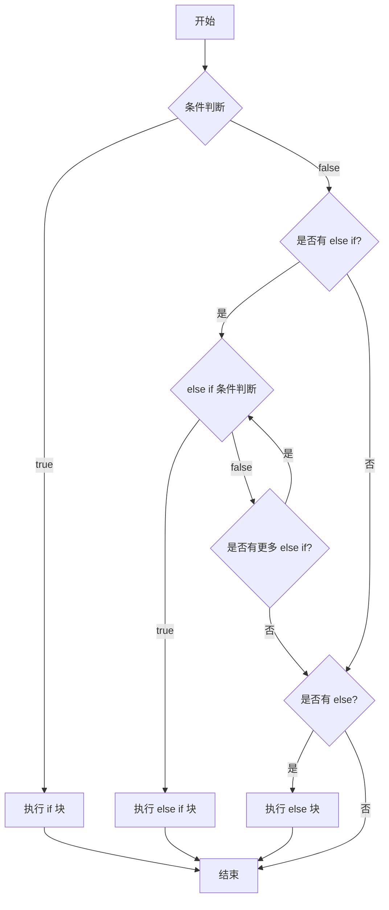
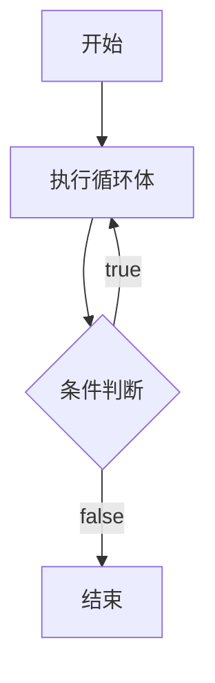
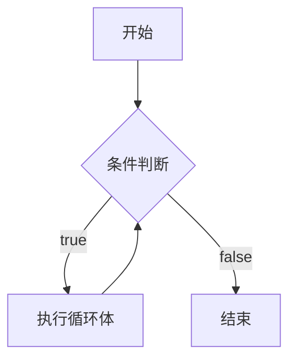
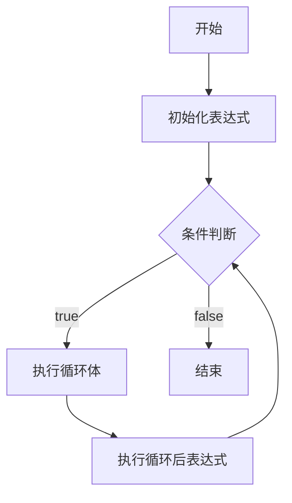
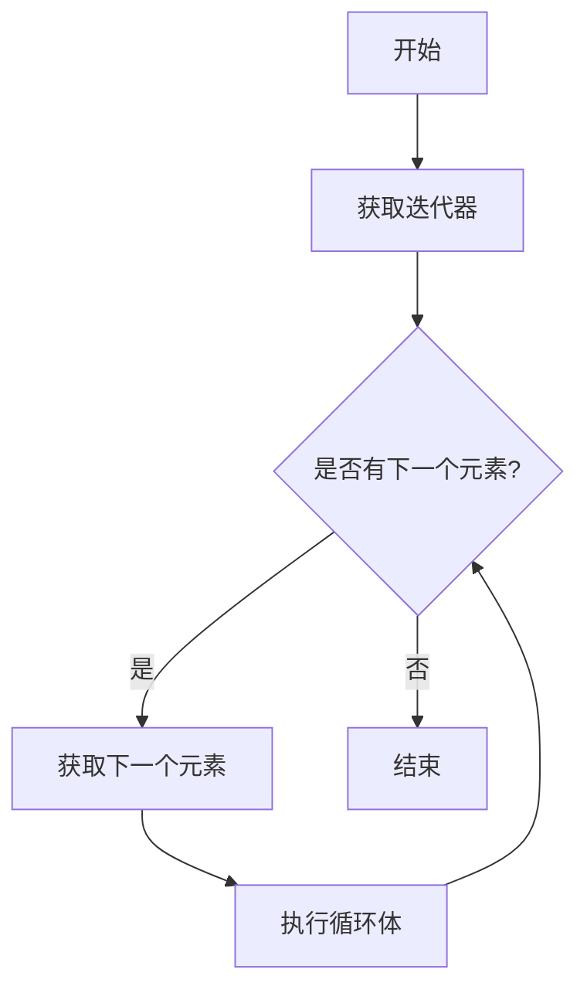
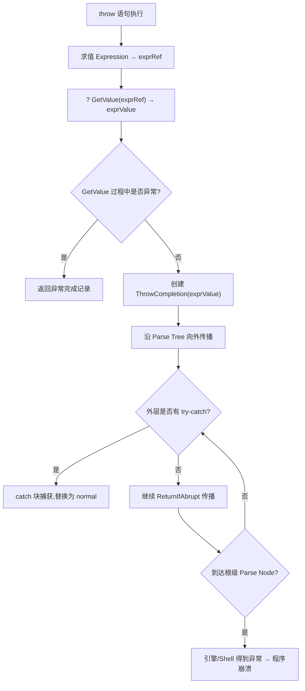

# 流程控制

流程控制语句用于控制代码的执行顺序，包括条件语句、循环语句和跳转语句。掌握流程控制是编写 JavaScript 程序的基础

## 条件语句

### if 语句

`if` 语句是大多数编程语言中最为常用的条件语句，用于根据条件执行不同的代码块。语法格式：`if (condition) statement1 else statement2`

```javascript
// 基本用法
if (i > 25) {
  alert("Greater than 25.")
}

// if-else 语句
if (i > 25) {
  alert("Greater than 25.")
} else {
  alert("Less than or equal to 25.")
}

// if-else if-else 语句
if (i > 25) {
  console.log("Greater than 25.")
} else if (i < 0) {
  console.log("Less than 0.")
} else {
  console.log("Between 0 and 25, inclusive.")
}

// 单行语句（不推荐，可读性差）
if (i > 25) alert("Greater than 25.")
```

**注意事项**：

- 条件表达式会被转换为布尔值进行判断
- 即使只有一条语句，也建议使用大括号，提高代码可读性
- 可以使用逻辑操作符简化条件判断
- 嵌套的 if 语句可以使用 else if 来简化

**执行流程**：



**实际应用示例**：

```javascript
// 使用逻辑操作符简化判断
const user = { name: "John", age: 20 }
if (user && user.age >= 18) {
  console.log("成年人")
}

// 三元表达式替代简单的 if-else
const status = user.age >= 18 ? "成年人" : "未成年人"

// 使用可选链和空值合并
const userName = user?.name ?? "Guest"

// 权限校验：将多层 if-else 收敛为一个函数
function hasPermission(user, action) {
  if (user.role === "admin") {
    return true
  }
  if (user.role === "editor" && action !== "delete") {
    return true
  }
  if (user.role === "viewer" && action === "read") {
    return true
  }
  return false
}
```

## 循环语句

### do-while 语句

`do-while` 语句是一种后测试循环语句，即只有在循环体中的代码执行之后，才会测试出口条件。这意味着循环体至少会执行一次。

像 `do-while` 这种后测试循环语句最常用于循环体中的代码至少要被执行一次的情形。

**执行流程**：



```javascript
do {
  statement
} while (expression)

// 示例
let i = 0
do {
  i += 2
  console.log(i)
} while (i < 10)
console.log(i) // 10

// 实际应用：至少执行一次的操作
let userInput
do {
  userInput = prompt("请输入一个数字：")
} while (isNaN(userInput))
```

**与 while 的区别**：

- `while`：先判断条件，再执行循环体（可能一次都不执行）
- `do-while`：先执行循环体，再判断条件（至少执行一次）

**实战应用**：

```javascript
// 验证用户输入，至少提示一次
let password
do {
  password = prompt("请输入密码（至少6位）：")
} while (!password || password.length < 6)

// 游戏循环：至少玩一次
let playAgain
do {
  playGame()
  playAgain = confirm("再玩一次吗？")
} while (playAgain)

// 重试机制：至少尝试一次
let retryCount = 0
let success = false
do {
  try {
    success = await fetchData()
  } catch (error) {
    retryCount++
    await sleep(1000 * retryCount)
  }
} while (!success && retryCount < 3)
```

### while 语句

`while` 语句属于前测试循环语句，也就是说，在循环体内的代码被执行之前，就会对出口条件求值。如果条件为 `false`，循环体内的代码可能一次都不会执行。

**执行流程**：



```javascript
while (expression) {
  statement
}

// 示例
let i = 0
while (i < 10) {
  console.log(i)
  i++
}

// 无限循环（需要内部有 break 语句）
while (true) {
  if (someCondition) {
    break
  }
  // 执行某些操作
}
```

**使用场景**：

- 当循环次数不确定时使用
- 需要根据条件动态决定是否继续循环
- 适合处理需要持续检查条件的场景

**实战应用**：

```javascript
// 处理队列任务
const taskQueue = ["task1", "task2", "task3"]
while (taskQueue.length > 0) {
  const task = taskQueue.shift()
  processTask(task)
}

// 轮询等待条件满足
let data = null
while (!data) {
  data = checkDataAvailability()
  if (!data) {
    // 暂无数据，稍后重试
  }
}

// 游戏主循环
let gameState = "running"
while (gameState === "running") {
  handleInput()
  updateGameState()
  render()
  gameState = checkGameOver()
}
```

### for 语句

for 语句也是一种前测试循环语句，但它具有在执行循环之前初始化变量和定义循环后要执行的代码的能力。

**执行流程**：



```javascript
for (initialization; expression; post-loop-expression) {
  statement
}

// 基本用法
let count = 10
for (let i = 0; i < count; i++) {
  console.log(i)
}

// 使用 const/let（推荐，块级作用域）
for (let i = 0; i < 10; i++) {
  // i 只在循环体内有效
}
// console.log(i); // ReferenceError: i is not defined
```

以上代码定义了变量 i 的初始值为 0。只有当条件表达式（i<count）返回 true 的情况下才会进入 for 循环，因此也有可能不会执行循环体中的代码。如果执行了循环体中的代码，则一定会对循环后的表达式（i++）求值，即递增 i 的值。这个 for 循环语句与下面的 while 语句的功能相同：

```javascript
var count = 10
var i = 0

while (i < count) {
  alert(i)
  i++
}
```

使用 while 循环做不到的，使用 for 循环同样也做不到。也就是说，for 循环只是把与循环有关的代码集中在了一个位置。

有必要指出的是，在 for 循环的变量初始化表达式中，也可以不使用 var 关键字。该变量的初始化可以在外部执行

```javascript
var count = 10
var i
for (i = 0; i < count; i++) {
  alert(i)
}
```

**变量作用域**：

使用 `var` 声明的变量在循环外部也可以访问（函数作用域）：

```javascript
var count = 10
for (var i = 0; i < count; i++) {
  console.log(i)
}
console.log(i) // 10（在循环外部仍可访问）
```

使用 `let` 或 `const` 声明的变量只在循环体内有效（块级作用域，推荐）：

```javascript
let count = 10
for (let i = 0; i < count; i++) {
  console.log(i)
}
// console.log(i); // ReferenceError: i is not defined
```

此外，for 语句中的初始化表达式、控制表达式和循环后表达式都是可选的。将这三个表达式全部省略，就会创建一个无限循环

```javascript
for (;;) {
  // 无限循环
  doSomething()
}
```

而只给出控制表达式实际上就把 for 循环转换成了 while 循环

```javascript
var count = 10
var i = 0
for (; i < count; ) {
  alert(i)
  i++
}
```

由于 for 语句存在极大的灵活性，因此它也是 ECMAScript 中最常用的一个语句。

**实战应用**：

```javascript
// 遍历数组
const colors = ["red", "green", "blue"]
for (let i = 0; i < colors.length; i++) {
  console.log(colors[i])
}

// 反向遍历
for (let i = colors.length - 1; i >= 0; i--) {
  console.log(colors[i])
}

// 跳过某些元素
for (let i = 0; i < colors.length; i++) {
  if (colors[i] === "green") continue
  console.log(colors[i])
}

// 计时器实现
for (let i = 5; i > 0; i--) {
  setTimeout(() => console.log(i), (5 - i) * 1000)
}
```

#### for-in 语句

`for-in` 语句是一种迭代语句，用于遍历对象的**可枚举属性**（包括继承的属性）。

```javascript
for (variable in object) {
  statement
}

// 遍历对象属性
const obj = { a: 1, b: 2, c: 3 }
for (let prop in obj) {
  console.log(prop, obj[prop])
}
// 输出: a 1, b 2, c 3

// 遍历数组索引（不推荐用于数组）
const arr = ["a", "b", "c"]
for (let index in arr) {
  console.log(index, arr[index])
}
// 输出: 0 a, 1 b, 2 c
```

**重要特性**：

- `for-in` 遍历的是对象的**可枚举属性**，包括继承的属性
- 现代规范对遍历顺序有明确定义：整数型键按升序、字符串键按插入顺序遍历，但仍不应依赖遍历顺序
- 不推荐用于遍历数组，应该使用 `for-of` 或 `for` 循环
- 只会遍历可枚举属性，不可枚举属性（如数组的 `length`）不会被遍历

**只遍历自身属性**：

```javascript
const obj = { a: 1, b: 2 }
Object.prototype.c = 3 // 在原型上添加属性

// 会遍历继承的属性
for (let prop in obj) {
  console.log(prop) // a, b, c
}

// 只遍历自身属性
for (let prop in obj) {
  if (obj.hasOwnProperty(prop)) {
    console.log(prop) // a, b
  }
}

// 或使用 Object.keys()
for (let prop of Object.keys(obj)) {
  console.log(prop) // a, b
}
```

**注意事项**：

- 使用 `let` 或 `const` 声明变量（推荐），避免变量提升问题
- 对于数组，优先使用 `for-of` 或 `for` 循环
- 遍历对象时，注意区分自身属性和继承属性

### for-of 语句

`for-of` 语句（ES6 引入）是一种迭代语句，用于遍历**可迭代对象**（Iterable）的元素值。语法：`for (variable of iterable) statement`

**执行流程**：



```javascript
// 遍历数组
const arr = [2, 4, 6, 8]
for (const el of arr) {
  console.log(el)
}
// 输出: 2, 4, 6, 8

// 遍历字符串
const str = "hello"
for (const char of str) {
  console.log(char)
}
// 输出: h, e, l, l, o

// 遍历 Set
const set = new Set([1, 2, 3])
for (const value of set) {
  console.log(value)
}

// 遍历 Map
const map = new Map([
  ["a", 1],
  ["b", 2]
])
for (const [key, value] of map) {
  console.log(key, value)
}
```

**与 for-in 的区别**：

| 特性     | for-in                 | for-of                              |
| -------- | ---------------------- | ----------------------------------- |
| 遍历内容 | 对象的可枚举属性（键） | 可迭代对象的值                      |
| 适用对象 | 普通对象               | 数组、字符串、Set、Map 等可迭代对象 |
| 遍历顺序 | 不保证顺序             | 按照迭代顺序                        |
| 继承属性 | 会遍历继承的属性       | 只遍历自身元素                      |

```javascript
const arr = ["a", "b", "c"]

// for-in：遍历索引（字符串）
for (let index in arr) {
  console.log(typeof index, index) // string 0, string 1, string 2
}

// for-of：遍历值
for (let value of arr) {
  console.log(value) // a, b, c
}
```

**实际应用**：

```javascript
// 遍历数组并获取索引
const arr = ["a", "b", "c"]
for (const [index, value] of arr.entries()) {
  console.log(index, value)
}

// 遍历 NodeList
const elements = document.querySelectorAll(".item")
for (const el of elements) {
  el.classList.add("active")
}

// 遍历生成器
function* generator() {
  yield 1
  yield 2
  yield 3
}
for (const value of generator()) {
  console.log(value)
}
```

**注意事项**：

- 推荐使用 `const` 声明变量，避免意外修改
- 只能遍历可迭代对象，普通对象需要使用 `for-in` 或 `Object.keys()`
- 如果对象不支持迭代，会抛出 `TypeError`

### label 标签语句

使用 label 语句可以在代码中添加标签，以便将来使用 `label: statement`

```javascript
var count = 10
start: for (var i = 0; i < count; i++) {
  alert(i)
}
```

这个例子中定义的 start 标签可以在将来由 break 或 continue 语句引用。加标签的语句一般都要与 for 语句等循环语句配合使用

## break 和 continue

`break` 和 `continue` 语句用于在循环中精确地控制代码的执行。

- `break` 语句会立即退出循环，强制继续执行循环后面的语句。
- `continue` 语句虽然也是立即退出循环，但退出循环后会从循环的顶部继续执行，进入下一次循环。

break 和 continue 语句都可以与 label 语句联合使用，从而返回代码中特定的位置。这种联合使用的情况多发生在循环嵌套的情况下

```javascript
var num = 0
outermost: for (var i = 0; i < 10; i++) {
  for (var j = 0; j < 10; j++) {
    if (i == 5 && j == 5) {
      break outermost
    }
    num++
  }
}

alert(num) //55
```

outermost 标签表示外部的 for 语句。内部循环中的 break 语句带了一个参数：要返回到的标签。添加这个标签的结果将导致 break 语句不仅会退出内部的 for 语句（即使用变量 j 的循环），而且也会退出外部的 for 语句（即使用变量 i 的循环）

为此，当变量 i 和 j 都等于 5 时，num 的值正好是 55。同样，continue 语句也可以像这样与 label 语句联用。

```javascript
var num = 0
outermost: for (var i = 0; i < 10; i++) {
  for (var j = 0; j < 10; j++) {
    if (i == 5 && j == 5) {
      continue outermost
    }
    num++
  }
}

alert(num) //95
```

在这种情况下，continue 语句会强制继续执行循环——退出内部循环，执行外部循环。当 j 是 5 时，continue 语句执行，而这也就意味着内部循环少执行了 5 次，因此 num 的结果是 95

虽然联用 `break`、`continue` 和 `label` 语句能够执行复杂的操作，但如果使用过度，也会给调试带来麻烦。在此，我们建议如果使用 `label` 语句，一定要使用描述性的标签，同时不要嵌套过多的循环。

**最佳实践**：

- 优先考虑重构代码，避免使用 `label` 语句
- 如果必须使用，使用描述性的标签名称
- 避免嵌套过深的循环（建议不超过 3 层）
- 考虑使用函数提取复杂逻辑，提高代码可读性

```javascript
// 不推荐：使用 label 跳出多层循环
outermost: for (let i = 0; i < 10; i++) {
  for (let j = 0; j < 10; j++) {
    if (someCondition) {
      break outermost
    }
  }
}

// 推荐：使用函数提取逻辑
function findInMatrix(matrix, condition) {
  for (let i = 0; i < matrix.length; i++) {
    for (let j = 0; j < matrix[i].length; j++) {
      if (condition(matrix[i][j])) {
        return { i, j }
      }
    }
  }
  return null
}
```

## 其他语句

### with 语句

with 语句的作用是将代码的作用域设置到一个特定的对象中，语法为 `with (expression) statement;`。定义 with 语句的目的主要是为了简化多次编写同一个对象的工作，如下面的例子所示：

```javascript
var qs = location.search.substring(1)
var hostName = location.hostname
var url = location.href
```

上面几行代码都包含 location 对象。如果使用 with 语句，可以把上面的代码改写成如下所示：

```javascript
with (location) {
  var qs = search.substring(1)
  var hostName = hostname
  var url = href
}
```

在这个重写后的例子中，使用 with 语句关联了 location 对象。这意味着在 with 语句的代码块内部，每个变量首先被认为是一个局部变量，而如果在局部环境中找不到该变量的定义，就会查询 location 对象中是否有同名的属性。如果发现了同名属性，则以 location 对象属性的值作为变量的值。

严格模式下不允许使用 `with` 语句，否则将视为语法错误。由于大量使用 `with` 语句会导致性能下降，同时也会给调试代码造成困难，因此在开发大型应用程序时，**强烈不建议使用 `with` 语句**。

**替代方案**：

```javascript
// 不推荐：使用 with
with (location) {
  var qs = search.substring(1)
  var hostName = hostname
  var url = href
}
```

```javascript
// 推荐：使用解构赋值
const { search, hostname, href } = location
const qs2 = search.substring(1)
const hostName2 = hostname
const url2 = href

// 或使用变量别名
const loc = location
const qs3 = loc.search.substring(1)
const hostName3 = loc.hostname
const url3 = loc.href
```

## switch 语句

`switch` 语句用于根据不同的条件值执行不同的代码块，是多个 `if-else` 语句的替代方案。`switch` 语句在比较值时使用的是**全等操作符**（`===`），不会发生类型转换。

```javascript
switch (expression) {
  case value:
    statement
    break
  case value:
    statement
    break
  case value:
    statement
    break
  case value:
    statement
    break
  default:
    statement
    break
}
```

通过为每个 case 后面都添加一个 break 语句，就可以避免同时执行多个 case 代码的情况。假如确实需要混合几种情形，不要忘了在代码中添加注释,说明你是有意省略了 break 关键字，如下所示：

```javascript
switch (i) {
  case 25:
  /* 合并两种情形 */
  case 35:
    alert("25 or 35")
    break
  case 45:
    alert("45")
    break
  default:
    alert("Other")
}
```

虽然 ECMAScript 中的 switch 语句借鉴自其他语言，但 JavaScript 中的 switch 也有自己的特色

首先可以在 switch 语句中使用任何数据类型，无论是字符串，还是对象都没有问题。其次，每个 case 的值不一定是常量，可以是变量，甚至是表达式。请看下面这个例子：

```javascript
switch ("hello world") {
  case "hello" + " world":
    alert("Greeting was found.")
    break
  case "goodbye":
    alert("Closing was found.")
    break
  default:
    alert("Unexpected message was found.")
}
```

使用表达式：

```javascript
var num = 25
switch (true) {
  case num < 0:
    alert("Less than 0.")
    break
  case num >= 0 && num <= 10:
    alert("Between 0 and 10.")
    break
  case num > 10 && num <= 20:
    alert("Between 10 and 20.")
    break
  default:
    alert("More than 20.")
}
```

这个例子首先在 switch 语句外面声明了变量 num。而之所以给 switch 语句传递表达式 `true`，是因为每个 case 值都可以返回一个布尔值。这样，每个 case 按照顺序被求值，直到找到匹配的值或者遇到 default 语句为止（这正是这个例子的最终结果）。

**最佳实践**：

- 每个 `case` 后面都应该有 `break` 语句，除非有意使用 fall-through
- 使用 `default` 处理未匹配的情况
- 避免在 `case` 中使用 `var`，使用 `let` 或 `const`，或者用大括号创建块级作用域
- 对于简单的条件判断，`if-else` 可能更清晰；对于多个固定值的判断，`switch` 更合适

**使用块级作用域**：

```javascript
switch (type) {
  case "string": {
    let result = value.toUpperCase()
    console.log(result)
    break
  }
  case "number": {
    let result = value * 2
    console.log(result)
    break
  }
  default:
    console.log("Unknown type")
}
```

## try-catch-finally 语句

`try-catch-finally` 语句用于处理代码执行过程中可能出现的错误，是 JavaScript 的错误处理机制。

### 基本语法

```javascript
try {
  // 可能抛出错误的代码
  riskyCode()
} catch (error) {
  // 捕获并处理错误
  console.error("发生错误:", error)
} finally {
  // 无论是否发生错误都会执行的代码
  cleanup()
}
```

### try-catch

```javascript
const invalidJson = "{ bad json"
try {
  const result = JSON.parse(invalidJson)
  console.log(result)
} catch (error) {
  console.error("解析 JSON 失败:", error.message)
  // 可以继续执行其他代码，不会中断程序
}

// 多个 catch（不常用，通常一个 catch 足够）
try {
  // 代码
} catch (error) {
  if (error instanceof TypeError) {
    // 处理类型错误
  } else if (error instanceof ReferenceError) {
    // 处理引用错误
  } else {
    // 处理其他错误
  }
}
```

### finally

`finally` 块中的代码无论是否发生错误都会执行，常用于清理工作：

```javascript
let file
try {
  file = openFile()
  processFile(file)
} catch (error) {
  console.error("处理文件时出错:", error)
} finally {
  // 无论成功或失败，都要关闭文件
  if (file) {
    closeFile(file)
  }
}
```

### throw 语句

使用 `throw` 语句可以主动抛出错误：

```javascript
function divide(a, b) {
  if (b === 0) {
    throw new Error("除数不能为零")
  }
  return a / b
}

try {
  const result = divide(10, 0)
} catch (error) {
  console.error(error.message) // "除数不能为零"
}
```

### 错误类型

JavaScript 提供了多种错误类型：

```javascript
// TypeError：类型错误
try {
  null.foo()
} catch (error) {
  console.log(error instanceof TypeError) // true
}

// ReferenceError：引用错误
try {
  console.log(undefinedVariable)
} catch (error) {
  console.log(error instanceof ReferenceError) // true
}

// SyntaxError：语法错误（通常在解析时发现）
// RangeError：范围错误
// URIError：URI 错误
```

### 实际应用

```javascript
// 异步错误处理
async function fetchData() {
  try {
    const response = await fetch("/api/data")
    if (!response.ok) {
      throw new Error(`HTTP error! status: ${response.status}`)
    }
    const data = await response.json()
    return data
  } catch (error) {
    console.error("获取数据失败:", error)
    return null
  }
}

// 验证用户输入
function validateEmail(email) {
  try {
    if (!email.includes("@")) {
      throw new Error("邮箱格式不正确")
    }
    return true
  } catch (error) {
    console.error(error.message)
    return false
  }
}
```

**最佳实践**：

- 只捕获你能处理的错误，不要捕获所有错误然后忽略
- 提供有意义的错误信息
- 使用 `finally` 进行资源清理
- 在异步代码中正确处理 Promise 错误（使用 `.catch()` 或 `try-catch` with `await`）
- 不要使用 `try-catch` 来控制程序流程，应该用于真正的错误处理

## 性能优化建议

### 循环性能优化

**1. 缓存数组长度**

```javascript
// 不推荐：每次循环都要访问 length 属性
for (let i = 0; i < arr.length; i++) {
  // ...
}

// 推荐：缓存数组长度
for (let i = 0, len = arr.length; i < len; i++) {
  // ...
}
```

**2. 减少循环内的工作**

```javascript
const items = ["a", "b"]
const threshold = getThreshold()

// 不推荐：每次循环都重新计算
for (let i = 0; i < items.length; i++) {
  const result = complexCalculation(items[i])
  if (result > threshold) {
    // ...
  }
}

// 推荐：提前计算不变量
const threshold = getThreshold()
for (let i = 0; i < items.length; i++) {
  const result = complexCalculation(items[i])
  if (result > threshold) {
    // ...
  }
}
```

**3. 使用适当的循环方法**

```javascript
// 简单遍历：for-of（最简洁）
for (const item of arr) {
  console.log(item)
}

// 需要索引：for 循环（最快）
for (let i = 0; i < arr.length; i++) {
  console.log(i, arr[i])
}

// 需要转换：map（函数式）
const doubled = arr.map(x => x * 2)

// 需要过滤：filter（函数式）
const evens = arr.filter(x => x % 2 === 0)

// 需要查找：find（提前终止）
const found = arr.find(x => x > 10)

// 需要判断：some/every（提前终止）
const hasEven = arr.some(x => x % 2 === 0)
```

### 条件判断优化

**1. 使用查找表替代长 switch**

```javascript
// 不推荐：长 switch
function getColor(status) {
  switch (status) {
    case "success":
      return "green"
    case "warning":
      return "yellow"
    case "error":
      return "red"
    case "info":
      return "blue"
    // ... 更多情况
  }
}

// 推荐：查找表（对象）
const colorMap = {
  success: "green",
  warning: "yellow",
  error: "red",
  info: "blue"
}

function getColor(status) {
  return colorMap[status] || "gray"
}
```

**2. 提前返回**

```javascript
// 不推荐：嵌套的 if
function process(user) {
  if (user) {
    if (user.isActive) {
      if (user.hasPermission) {
        // 处理逻辑
      }
    }
  }
}

// 推荐：提前返回
function process(user) {
  if (!user) return
  if (!user.isActive) return
  if (!user.hasPermission) return
  // 处理逻辑
}
```

**3. 避免重复计算**

```javascript
// 不推荐：重复调用函数
if (getUser().role === "admin" || getUser().role === "editor") {
  // ...
}

// 推荐：缓存结果
const role = getUser().role
if (role === "admin" || role === "editor") {
  // ...
}

// 或使用 Set/Array.includes
const allowedRoles = new Set(["admin", "editor"])
if (allowedRoles.has(role)) {
  // ...
}
```

### 错误处理优化

**1. 避免过度捕获**

```javascript
// 不推荐：捕获所有错误
try {
  // 大量代码
} catch (error) {
  // 忽略所有错误
}

// 推荐：只捕获特定错误
try {
  riskyOperation()
} catch (error) {
  if (error instanceof SpecificError) {
    // 处理特定错误
  } else {
    throw error // 重新抛出未处理的错误
  }
}
```

**2. 使用自定义错误类型**

```javascript
// 定义自定义错误
class ValidationError extends Error {
  constructor(message, field) {
    super(message)
    this.name = "ValidationError"
    this.field = field
  }
}

// 使用自定义错误
try {
  validateUser(user)
} catch (error) {
  if (error instanceof ValidationError) {
    console.error(`字段 ${error.field} 验证失败: ${error.message}`)
  }
}
```

## 常见问题解答

### Q1: for-in 和 for-of 有什么区别?

**A**: 主要区别如下:

| 特性         | for-in                   | for-of                          |
| ------------ | ------------------------ | ------------------------------- |
| 遍历内容     | 对象的可枚举属性（键名） | 可迭代对象的值                  |
| 适用对象     | 普通对象                 | 数组、字符串、Set、Map 等可迭代对象 |
| 遍历顺序     | 不保证顺序               | 按照迭代顺序                    |
| 继承属性     | 会遍历继承的属性         | 只遍历自身元素                  |
| 值的类型     | 键名为字符串             | 值为任意类型                    |

```javascript
const arr = ["a", "b", "c"]

// for-in: 遍历索引（字符串）
for (let key in arr) {
  console.log(typeof key, key) // string "0", string "1", string "2"
}

// for-of: 遍历值
for (let value of arr) {
  console.log(value) // "a", "b", "c"
}
```

### Q2: 什么时候用 while，什么时候用 for?

**A**: 

- **使用 for**: 当你知道循环次数，或需要使用索引时
- **使用 while**: 当循环次数不确定，完全依赖条件判断时
- **使用 do-while**: 当你需要至少执行一次循环体时

```javascript
// 已知循环次数：for
for (let i = 0; i < 10; i++) {
  console.log(i)
}

// 不确定循环次数：while
while (queue.length > 0) {
  process(queue.shift())
}

// 至少执行一次：do-while
let input
do {
  input = prompt("请输入密码")
} while (!isValid(input))
```

### Q3: break 和 continue 有什么区别?

**A**:

- **break**: 完全退出循环，执行循环后面的代码
- **continue**: 跳过当前迭代，继续下一次循环

```javascript
// break 示例
for (let i = 0; i < 10; i++) {
  if (i === 5) break
  console.log(i) // 0, 1, 2, 3, 4
}

// continue 示例
for (let i = 0; i < 10; i++) {
  if (i === 5) continue
  console.log(i) // 0, 1, 2, 3, 4, 6, 7, 8, 9
}
```

### Q4: switch 语句中忘记写 break 会怎样?

**A**: 会发生"穿透"（fall-through），即继续执行下一个 case 的代码。这通常是一个错误，但有时也可以利用这个特性。

```javascript
// 错误示例：忘记 break
let day = 1
switch (day) {
  case 1:
    console.log("星期一")
    // 忘记 break
  case 2:
    console.log("星期二")
    break
}
// 输出: 星期一, 星期二 （错误！）

// 正确示例：为每个 case 添加 break
let month = 1
switch (month) {
  case 1:
  case 3:
  case 5:
  case 7:
  case 8:
  case 10:
  case 12:
    console.log("31天")
    break
  case 4:
  case 6:
  case 9:
  case 11:
    console.log("30天")
    break
  case 2:
    console.log("28或29天")
    break
}
```

### Q5: try-catch 会影响性能吗?

**A**: 

- try-catch 本身的性能开销很小（现代 JavaScript 引擎已优化）
- 真正的性能问题在于：
  1. 在循环内部使用 try-catch
  2. 使用 try-catch 控制程序流程（应该用条件判断）

```javascript
// 不推荐：循环内使用 try-catch
for (let i = 0; i < 10000; i++) {
  try {
    processItem(items[i])
  } catch (error) {
    console.error(error)
  }
}

// 推荐：提前检查，或外移 try-catch
for (let i = 0; i < 10000; i++) {
  if (isValid(items[i])) {
    processItem(items[i])
  }
}

// 或者将 try-catch 放在循环外部
try {
  for (let i = 0; i < 10000; i++) {
    processItem(items[i])
  }
} catch (error) {
  console.error(error)
}
```

### Q6: 如何遍历对象的所有属性?

**A**: 有多种方法，根据需求选择：

```javascript
const obj = { a: 1, b: 2, c: 3 }

// 方法1: for-in（包括继承的可枚举属性）
for (let key in obj) {
  if (obj.hasOwnProperty(key)) {
    console.log(key, obj[key])
  }
}

// 方法2: Object.keys()（只包含自身可枚举属性）
Object.keys(obj).forEach(key => {
  console.log(key, obj[key])
})

// 方法3: Object.values()（只包含值）
Object.values(obj).forEach(value => {
  console.log(value)
})

// 方法4: Object.entries()（键值对）
Object.entries(obj).forEach(([key, value]) => {
  console.log(key, value)
})

// 方法5: Reflect.ownKeys()（包含不可枚举属性和 Symbol）
Reflect.ownKeys(obj).forEach(key => {
  console.log(key, obj[key])
})
```

### Q7: label 语句有什么用？应该使用吗?

**A**: label 语句主要用于嵌套循环中跳出或继续外层循环，但**不推荐使用**，因为会降低代码可读性。

```javascript
// 使用 label（不推荐）
outer: for (let i = 0; i < 10; i++) {
  for (let j = 0; j < 10; j++) {
    if (condition) {
      break outer // 跳出外层循环
    }
  }
}

// 替代方案：使用函数（推荐）
function findInMatrix(matrix, target) {
  for (let i = 0; i < matrix.length; i++) {
    for (let j = 0; j < matrix[i].length; j++) {
      if (matrix[i][j] === target) {
        return { i, j }
      }
    }
  }
  return null
}

// 替代方案：使用标志变量（推荐）
let found = false
for (let i = 0; i < 10 && !found; i++) {
  for (let j = 0; j < 10 && !found; j++) {
    if (condition) {
      found = true
    }
  }
}
```

### Q8: 如何避免回调地狱（Callback Hell）?

**A**: 使用 async/await 替代嵌套回调：

```javascript
// 使用 Promise 链（推荐）
getData()
  .then(a => getMoreData(a))
  .then(b => getMoreData(b))
  .then(c => {
    // ...
  })
  .catch(error => console.error(error))

// 使用 async/await（推荐）
async function loadAll() {
  try {
    const [users, products] = await Promise.all([
      fetchUsers(),
      fetchProducts()
    ])
    // ...
  } catch (error) {
    console.error(error)
  }
}
```

### 语句执行的完成状态（核心原理深度）

> **规范层级**：ECMAScript 规范 · Runtime Semantics · Completion Record Specification Type
> **原理来源**：JavaScript 核心原理解析·第06讲

#### 规范语义

在 ECMAScript 规范中，**每一条语句的执行都会返回一个完成记录（Completion Record）**，其结构为：

```
Completion {
  [[Type]]:   normal | break | continue | return | throw,
  [[Value]]:  any | empty,
  [[Target]]: label | empty
}
```

这意味着 `break` 和 `continue` 并非简单的"跳转"，而是携带信息的**中断（Interrupt）**。JavaScript 中存在两种中断：

- **第一种中断（break）**：作用于"可中断语句"（循环语句、switch 语句），中断当前语句并将流程跳转到语句结束位置。语法：`break;`
- **第二种中断（break labelName）**：可以中断**任意**的标签化语句，通过标签名精确定位跳转目标。语法：`break labelName;`

关键区别：标签化语句理解的是"位置"，而非"作用域/环境"。标签与变量可以重名而不相互影响，因为它们分属不同的语义系统。

五种完成类型中，只有 `normal` 和 `return` 确保携带有效值（包括 `undefined`），`break` 和 `continue` 不携带返回值（值为 `empty`），`throw` 携带异常对象。

#### 执行机制

```mermaid
flowchart TD
    A[语句执行] --> B[返回 Completion Record]
    B --> C{[[Type]] 是什么?}
    C -->|normal| D[正常完成,继续下一条语句]
    C -->|break| E{[[Target]] 匹配当前标签?}
    E -->|是| F[替换为 normal 完成,返回值]
    E -->|否| G[继续向外层传播 break 状态]
    C -->|continue| H[循环语句拦截,进入下一次迭代]
    C -->|return| I[函数 [[Call]] 拦截,替换为 normal]
    C -->|throw| J[try-catch 拦截 或 向外层传播]

    G --> K[外层标签化语句检查]
    K --> E

    J --> L{外层有 try-catch?}
    L -->|是| M[catch 块捕获,替换为 normal]
    L -->|否| N[继续向外传播直到全局]
    N --> O[程序崩溃]
```

#### 核心洞察

**"知其如何消亡，方知其如何存活"**——理解 break/continue 的完成状态传播机制，揭示了语句执行的根本性质：

1. **语句执行是命令式范型的体现**，正如函数执行是函数式范型的体现。二者的根本差异在于：函数返回的是"求值结果"（Value 或 Reference），语句返回的是"完成状态"（Completion Record）。

2. **break 语句的两个关键特性**：`[[Type]]` 必然是 `break`；`[[Value]]` 必然是 `empty`。这是因为任何被 break 的代码上下文中，最后执行的语句必然是 break 语句本身，所以 break 不返回任何值。

3. **empty 值的覆盖规则**：在多行语句顺序执行时，`empty` 值不覆盖任何既有值，但非 `empty` 值可以覆盖 `empty`。这保证了空语句、break 语句等不会影响语句块的整体返回值。

4. **标签化语句与作用域的分离**：标签指示的是"位置"而非"范围"，这打破了"一切皆作用域"的直觉，是 JavaScript 执行系统中独立于词法环境的特殊设计。

#### 代码实证

```javascript
// 1. 标签化 break 退出任意嵌套层级
console.log(eval(`
  aaa: {
    1 + 2;
    bbb: {
      3 + 4;
      break aaa;
    }
  }
`)); // 输出: 7（bbb 捕获 break aaa，但 Target 不匹配，继续传播到 aaa，aaa 匹配后返回 3+4 的值）

// 2. break 在 finally 中的特殊行为
function finallyDemo() {
  outer: try {
    return 1
  } finally {
    break outer // finally 中的 break 会取消 return
  }
}
console.log(finallyDemo()) // undefined

// 3. empty 值的覆盖规则
console.log(eval(`{
  2;
  ;           // empty，不覆盖
  x: break x; // empty，不覆盖
}`)); // 输出: 2（最后两个语句返回 empty，不覆盖既有值 2）

// 4. 最小化的 break 示例：对 break 语句自身的中断
x: break x; // 合法但无实际效果——break 不返回值，也不影响外部
```

#### 与实战的关联

1. **复杂控制流的优雅退出**：在深层嵌套的数据处理中，标签化 break 比标志变量更清晰：

```javascript
// 实战：在多层嵌套搜索中使用标签化 break
function findInNestedData(data, condition) {
  let result = null;
  search: for (const category of data) {
    for (const group of category.groups) {
      for (const item of group.items) {
        if (condition(item)) {
          result = item;
          break search; // 一次性退出所有循环
        }
      }
    }
  }
  return result;
}
```

2. **理解 async/await 的流程控制**：async/await 本质上是 Promise 链的语法糖，其异常传播机制与 Completion Record 的 `throw` 状态传播同构——未被 `catch` 拦截的异常会沿调用栈向外传播，直到被捕获或到达全局。

3. **调试语句执行状态**：理解 Completion Record 有助于解释 `eval()` 的返回值行为——`eval()` 执行语句并返回其完成记录的 `[[Value]]`，这是少数能从 JavaScript 代码中观察到语句完成值的途径。

---

### 异常的规范语义（核心原理深度）

> **规范层级**：ECMAScript 规范 · ThrowStatement · ReturnIfAbrupt
> **原理来源**：JavaScript 核心原理解析·第11讲

#### 规范语义

`throw` 语句在 ECMAScript 规范的"最简单语法榜"上排名第三，其完整实现仅有三行：

```
ThrowStatement: throw Expression;
1. Let exprRef be the result of evaluating Expression.
2. Let exprValue be ? GetValue(exprRef).
3. Return ThrowCompletion(exprValue).
```

展开后的完整表示：

```
Return Completion { [[Type]]: throw, [[Value]]: exprValue, [[Target]]: empty }
```

**"最简单语法榜"前三名**：

| 排名 | 语句 | 规范实现 |
|------|------|----------|
| Top 1 | 空语句 `;` | `Return NormalCompletion(empty)` |
| Top 2 | 表达式语句 `expr;` | `Let exprRef be the result of evaluating Expression; Return ? GetValue(exprRef)` |
| Top 3 | `throw expr;` | 如上三行 |

**关键规范概念**：

- **`result of evaluating...`**：ECMAScript 中统一的执行描述方式，无论执行语句还是表达式，都使用同一表述。引擎根据上下文决定返回"引用记录"还是"完成记录"。
- **`? opName()`**（ReturnIfAbrupt 简写）：如果操作结果是非 normal 类型的完成记录，立即返回该记录；否则返回以 `[[Value]]` 为值的 normal 完成记录。这是所有语句与外部代码块之间的通讯协议。
- **值覆盖（Value Coverage）**：`throw` 确保 Completion Record 的 `[[Value]]` 域覆盖所有可能的执行结果——任何 JavaScript 可处理的结果（引用或值）都可以通过 `GetValue()` 得到真实数据，放入 throw 类型的完成记录中向上传递。

#### 执行机制



#### 核心洞察

1. **阅读 ECMAScript 规范是一项技能**。规范的书写格式有严格的约定：`Let... be the result of evaluating...` 是统一的执行描述，`?` 是 ReturnIfAbrupt 的简写，`!` 表示断言不会返回异常完成。掌握这些约定是理解规范的关键。

2. **语句与表达式的统一**：在规范层面，"执行一行语句"与"执行一个表达式"没有本质区别，都是"evaluating"。区别仅在于返回的是引用记录还是完成记录。例如：

```javascript
// 表达式的顺序执行
1, 2, 3, 4;
// 语句的顺序执行
1; 2; 3; 4;
// 二者在 Parse Tree 上的效果相同
```

3. **所有流程控制都是完成状态的拦截与替换**：
   - 循环语句拦截非标签化的 `continue` 与 `break`，处理为 `normal`
   - 标签语句拦截目标匹配的 `continue` 和 `break`，替换成 `normal`
   - 函数 `[[Call]]` 检查函数体返回状态是否为 `return`，替换成 `normal`
   - `try-catch` 拦截 `throw` 状态，在 `catch` 块中替换成 `normal`
   - 最终，所有漏网之鱼只有 `throw` 类型的完成状态

4. **语句的执行者是其外层语句**：最外层总是 `Script` 或 `Module` 块，除了 `eval()` 之外，没有用户代码能直接观察语句的执行状态。

#### 代码实证

```javascript
// 1. throw 的基本传播
try {
  throw 1;
} catch (e) {
  console.log(e); // 1
}

// 2. throw 与 finally 的交互
function testFinally() {
  try {
    try {
      throw "inner";
    } finally {
      console.log("finally 执行"); // finally 会执行，但不会吞掉 throw
    }
  } catch (e) {
    console.log(e); // "inner"
  }
  return "done";
}
console.log(testFinally()); // "done"

// 3. finally 中的 return 会覆盖 catch 的返回值
function finallyReturn() {
  try {
    throw new Error("boom");
  } catch (e) {
    return "catch";
  } finally {
    return "finally"; // 覆盖 catch 的返回
  }
}
console.log(finallyReturn()); // "finally"

// 4. 除零不抛异常
try {
  console.log(1 / 0); // Infinity
} catch (e) {
  console.log(e); // 不会执行——1/0 不抛异常（若是访问未声明变量则会被捕获）
}

// 5. ES6 后 if 语句不返回 empty
console.log(eval(`{ 2; if (true); }`)); // undefined（ES6+ 约定 if 不返回 empty，覆盖了值 2）
```

#### 与实战的关联

1. **错误处理模式的选择**：理解规范层面的异常传播机制，有助于设计正确的错误边界。`try-catch` 是唯一能拦截 `throw` 完成状态的结构，而 `finally` 不处理异常仅维持既有状态。

2. **自定义错误类型的最佳实践**：通过 `instanceof` 区分错误类型，实现精确的异常拦截，避免"吞掉"未知异常：

```javascript
class AppError extends Error {
  constructor(message, code) {
    super(message);
    this.code = code;
  }
}

function processRequest(req) {
  try {
    validate(req);
    return handle(req);
  } catch (e) {
    if (e instanceof AppError) {
      return { error: e.message, code: e.code };
    }
    throw e; // 不处理未知异常，让其继续传播
  }
}
```

3. **异步错误边界**：Promise 的 `.catch()` 和 async/await 的 `try-catch` 是异步上下文中拦截 `throw` 完成状态的机制，与同步代码中的 `try-catch` 在规范语义上同构。

---

## 总结

JavaScript 提供了丰富的流程控制语句：

- **条件语句**：`if-else`、`switch` - 根据条件执行不同的代码
- **循环语句**：`for`、`while`、`do-while`、`for-in`、`for-of` - 重复执行代码
- **跳转语句**：`break`、`continue`、`return`、`throw` - 改变代码执行流程
- **错误处理**：`try-catch-finally` - 处理运行时错误
- **标签语句**：`label` - 标记代码位置（不常用）

**选择建议**：

- 简单的条件判断：使用 `if-else`
- 多个固定值判断：使用 `switch`
- 确定循环次数：使用 `for`
- 不确定循环次数：使用 `while` 或 `do-while`
- 遍历数组：优先使用 `for-of`
- 遍历对象属性：使用 `for-in` 或 `Object.keys()`
- 需要至少执行一次：使用 `do-while`

**现代 JavaScript 最佳实践**：

- 使用 `const` 和 `let` 替代 `var`，利用块级作用域
- 优先使用 `for-of` 遍历数组和可迭代对象
- 使用解构赋值简化代码
- 避免使用 `with` 语句
- 合理使用 `try-catch` 处理错误，不要用于控制流程
- 保持代码简洁，避免过深的嵌套
