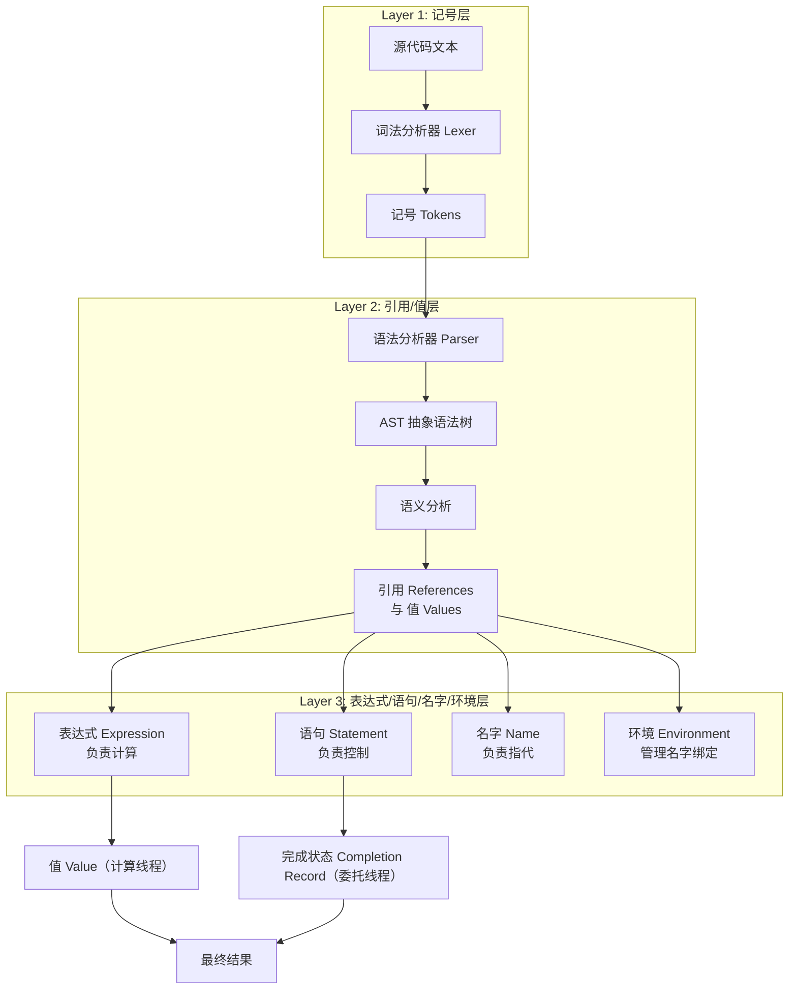

# 执行上下文

执行上下文（Execution Context）是 JavaScript 代码执行时的环境抽象概念，理解执行上下文对于掌握作用域、闭包、this 等概念至关重要。

## 概述

每当 JavaScript 代码执行时，都会创建一个执行上下文。执行上下文定义了变量或函数有权访问的其他数据，决定了它们各自的行为。

执行上下文是 JavaScript 引擎内部的数据结构，虽然开发者无法直接访问，但理解其工作机制对编写高质量代码至关重要。

## 执行上下文类型

### 1. 全局执行上下文

- 最基础的执行上下文
- 在浏览器中，全局执行上下文关联 `window` 对象
- 在 Node.js 中，全局执行上下文关联 `global` 对象
- 一个程序只有一个全局执行上下文
- 全局执行上下文在页面关闭或 Node.js 进程结束时销毁

```javascript
// 浏览器环境
console.log(this === window) // true

// 全局变量成为 window 的属性
var globalVar = 'global'
console.log(window.globalVar) // 'global'

// Node.js 环境
// console.log(this === global) // true
```

### 2. 函数执行上下文

- 每次调用函数时都会创建一个新的函数执行上下文
- 每个函数调用都有自己的执行上下文
- 函数执行上下文可以有多个（递归调用时）
- 函数执行完毕后，执行上下文出栈等待回收

```javascript
function foo() {
  // 每次调用 foo 都创建新的执行上下文
}

foo() // 创建第一个函数执行上下文
foo() // 创建第二个函数执行上下文
```

### 3. Eval 执行上下文

- 执行 `eval()` 函数内的代码时创建
- 在严格模式下，eval 有自己的词法作用域
- **不推荐使用** `eval()`，存在安全风险和性能问题

```javascript
// 非严格模式 - eval 中的代码可以访问外部作用域
var x = 10
eval('console.log(x)') // 10

// 严格模式 - eval 有独立的作用域
function strictEvalDemo() {
  'use strict'
  eval('var y = 20; console.log(y)') // 20
  console.log(typeof y) // undefined（y 仅存在于 eval 内部）
}
strictEvalDemo()
```

### 4. 模块执行上下文（ES6+）

- ES6 模块代码执行时创建
- 模块有自己的顶层作用域，不属于全局对象
- 模块中的 `this` 指向 `undefined`

```javascript
// module.js（模块顶层 this 是 undefined）
// this.name = 'module' // TypeError: Cannot set properties of undefined
console.log(this)    // undefined

var moduleVar = 'module'
console.log(globalThis.moduleVar) // undefined（不会成为全局属性）
```

## 执行栈

执行栈（Execution Stack），也叫调用栈（Call Stack），是一种后进先出（LIFO）的数据结构，用于存储代码执行期间创建的所有执行上下文。

### 执行栈的工作流程

```
┌─────────────────────────────┐
│                             │
│     执行栈 (Call Stack)      │
│                             │
├─────────────────────────────┤
│  ← third() 上下文 (出栈)     │
├─────────────────────────────┤
│  ← second() 上下文 (出栈)    │
├─────────────────────────────┤
│  ← first() 上下文 (出栈)     │
├─────────────────────────────┤
│  ← 全局执行上下文 (最后出栈)  │
└─────────────────────────────┘
```

```javascript
function first() {
  console.log('first start')
  second()
  console.log('first end')
}

function second() {
  console.log('second start')
  third()
  console.log('second end')
}

function third() {
  console.log('third')
}

first()

// 输出：
// first start
// second start
// third
// second end
// first end
```

### 栈溢出错误

当递归调用过深时，会导致栈溢出：

```javascript
function recursive() {
  recursive() // 无限递归
}

recursive() // RangeError: Maximum call stack size exceeded
```

**最佳实践**：
- 避免过深的递归调用
- 使用尾递归写法（注意：ES6 规范定义了尾调用优化，但目前仅 Safari/JavaScriptCore 实现，V8 尚未启用，见下文"性能优化"节）
- 考虑使用循环替代递归

```javascript
// 尾递归优化示例（ES6）
function factorial(n, total = 1) {
  if (n === 1) return total
  return factorial(n - 1, n * total) // 尾调用
}

console.log(factorial(5)) // 120
```

## 执行上下文的创建

执行上下文的创建分为两个阶段：

### 1. 创建阶段（Creation Phase）

在创建阶段，执行上下文会：

1. 创建变量对象（Variable Object）/ 词法环境（Lexical Environment）
2. 建立作用域链（Scope Chain）
3. 确定 `this` 的值

```javascript
ExecutionContext = {
  LexicalEnvironment: { ... },    // 词法环境（ES6+）
  VariableEnvironment: { ... },   // 变量环境
  this: { ... }                   // this 绑定
}
```

### 2. 执行阶段（Execution Phase）

在执行阶段，执行上下文会：

1. 变量赋值
2. 函数引用
3. 执行其他代码
4. 异常处理

## 词法环境（Lexical Environment）

ES6 之后，执行上下文的变量对象概念被词法环境取代。

### 词法环境的结构

词法环境由两部分组成：

1. **环境记录（Environment Record）**：存储变量和函数声明的实际位置
2. **外部词法环境引用**：指向外部（父级）词法环境

```javascript
// 词法环境的抽象结构
LexicalEnvironment = {
  EnvironmentRecord: {
    // 变量、函数声明等
  },
  outer: <reference to outer lexical environment>
}
```

### 环境记录类型

1. **声明式环境记录（Declarative Environment Record）**
   - 用于函数、变量、let/const 声明

2. **对象环境记录（Object Environment Record）**
   - 用于 with 语句、全局环境

3. **全局环境记录（Global Environment Record）**
   - 包含全局变量和内置对象

```javascript
// 函数的词法环境
function foo(a, b) {
  let x = 1
  const y = 2
  var z = 3
  
  // 词法环境结构：
  // LexicalEnvironment = {
  //   EnvironmentRecord: {
  //     x: 1,        // let 声明
  //     y: 2         // const 声明
  //   },
  //   outer: <Global LexicalEnvironment>
  // }
  // 
  // VariableEnvironment = {
  //   EnvironmentRecord: {
  //     a: undefined, // 参数
  //     b: undefined, // 参数
  //     z: undefined  // var 声明
  //   },
  //   outer: <Global LexicalEnvironment>
  // }
}
```

## 变量对象（Variable Object）

变量对象是与执行上下文相关的数据作用域，存储了在上下文中定义的变量和函数声明。

### 全局上下文的变量对象

```javascript
// 全局上下文的变量对象就是全局对象
console.log(this === window) // true

var globalVar = 'global'
function globalFunc() {}

console.log(window.globalVar) // 'global'
console.log(window.globalFunc) // function globalFunc()

// let 和 const 不会成为全局对象的属性
let letVar = 'let'
const constVar = 'const'
console.log(window.letVar) // undefined
console.log(window.constVar) // undefined
```

### 函数上下文的变量对象

在函数上下文中，变量对象称为活动对象（Activation Object），包含：

1. 函数的参数（arguments）
2. 函数声明
3. 变量声明

```javascript
function foo(a, b) {
  var c = 10
  function d() {}
  var e = function () {}
  
  // 活动对象（AO）在创建阶段：
  // AO = {
  //   arguments: { 0: a, 1: b, length: 2, callee: foo },
  //   a: undefined,        // 参数
  //   b: undefined,        // 参数
  //   c: undefined,        // 变量声明
  //   d: function d() {},  // 函数声明
  //   e: undefined         // 变量声明（函数表达式）
  // }
  
  // 执行阶段：
  // AO = {
  //   arguments: { 0: 1, 1: 2, length: 2 },
  //   a: 1,
  //   b: 2,
  //   c: 10,
  //   d: function d() {},
  //   e: function () {}
  // }
}

foo(1, 2)
```

## 变量提升（Hoisting）

变量提升是指在代码执行之前，变量和函数声明被提升到当前作用域的顶部。

### 函数声明提升

```javascript
// 函数声明会被完整提升
console.log(foo) // function foo() {}

function foo() {
  console.log('foo')
}

foo() // 'foo'
```

### 变量声明提升

```javascript
// 变量声明提升，但赋值不提升
console.log(a) // undefined
var a = 10

// 等价于：
var a
console.log(a) // undefined
a = 10
```

### 函数表达式不提升

```javascript
// 函数表达式不会提升
console.log(bar) // undefined
bar() // TypeError: bar is not a function

var bar = function () {
  console.log('bar')
}
```

### 函数声明优先级高于变量声明

```javascript
var foo = 10

function foo() {}

console.log(typeof foo) // 'number'

// 等价于：
function foo() {} // 函数声明先提升
var foo // 变量声明重复，被忽略
foo = 10 // 变量赋值
```

### 函数声明与函数表达式的提升区别

```javascript
// 函数声明 - 完整提升
console.log(declared) // function declared() {}
function declared() {}

// 函数表达式 - 变量提升，但函数体不提升
console.log(expressed) // undefined
var expressed = function() {}

// 命名函数表达式 - 函数名只在函数内部有效
var named = function myName() {
  console.log(myName) // function myName()
}
named()
console.log(myName) // ReferenceError: myName is not defined
```

## let 和 const 的变量提升

`let` 和 `const` 声明的变量也会提升，但存在"暂时性死区"（Temporal Dead Zone，TDZ）：

### 暂时性死区（TDZ）

```javascript
console.log(a) // ReferenceError: Cannot access 'a' before initialization
let a = 10

// TDZ 从作用域开始到变量声明完成
{
  // TDZ 开始（b 已声明但未初始化）
  console.log(b) // ReferenceError
  let b = 20 // TDZ 结束
}

// typeof 也受 TDZ 影响
console.log(typeof c) // undefined（var 声明前）
console.log(typeof d) // ReferenceError（let 声明前的 TDZ）
let d = 30
```

### TDZ 的实际意义

```javascript
// TDZ 防止在声明前使用变量
function foo(x = y, y = 2) {
  return [x, y]
}

foo() // ReferenceError: Cannot access 'y' before initialization
// 参数 y 在 x 初始化时还在 TDZ 中

// 正确写法
function bar(x = 2, y = x) {
  return [x, y]
}

bar() // [2, 2]
```

### let 和 const 的最佳实践

```javascript
// ✅ 推荐：先声明后使用
function good() {
  let x = 1
  console.log(x) // 1
}

// ❌ 避免：在声明前使用
function bad() {
  console.log(x) // ReferenceError
  let x = 1
}

// ✅ 推荐：const 优先
const PI = 3.14159
const CONFIG = { apiUrl: 'https://api.example.com' }

// ✅ 需要 reassignment 时使用 let
let count = 0
count++
```

## 作用域链

作用域链是由当前执行上下文的变量对象和所有父级执行上下文的变量对象组成的链表。

### 作用域链的构建

```
┌──────────────────────┐
│   Global EC          │
│   ┌──────────────┐   │
│   │ Global VO    │   │
│   │ globalVar    │   │
│   └──────────────┘   │
└──────────────────────┘
         ↑
         │ outer
         │
┌──────────────────────┐
│   outer() EC         │
│   ┌──────────────┐   │
│   │ outer AO     │   │
│   │ outerVar     │   │
│   └──────────────┘   │
└──────────────────────┘
         ↑
         │ outer
         │
┌──────────────────────┐
│   inner() EC         │
│   ┌──────────────┐   │
│   │ inner AO     │   │
│   │ innerVar     │   │
│   └──────────────┘   │
└──────────────────────┘
```

```javascript
var globalVar = 'global'

function outer() {
  var outerVar = 'outer'
  
  function inner() {
    var innerVar = 'inner'
    console.log(innerVar) // 'inner'
    console.log(outerVar) // 'outer'
    console.log(globalVar) // 'global'
  }
  
  inner()
}

outer()

// inner 函数的作用域链：
// [inner.AO, outer.AO, global.VO]
```

### 作用域链的查找

当访问一个变量时，会沿着作用域链从当前执行上下文的变量对象开始查找，直到全局上下文的变量对象：

```javascript
var a = 1

function foo() {
  var a = 2
  console.log(a) // 2，在当前执行上下文找到
  
  function bar() {
    console.log(a) // 2，在父级执行上下文找到
  }
  
  bar()
}

foo()
```

### 作用域链的性能影响

```javascript
// ❌ 性能较差：沿作用域链向上查找
function outer() {
  var heavyData = new Array(10000).fill('data')
  
  function inner() {
    // 每次访问 heavyData 都要沿作用域链查找
    for (let i = 0; i < 1000; i++) {
      console.log(heavyData.length)
    }
  }
  
  inner()
}

// ✅ 性能优化：缓存变量
function outerOptimized() {
  var heavyData = new Array(10000).fill('data')
  
  function inner() {
    var length = heavyData.length // 缓存到局部变量
    for (let i = 0; i < 1000; i++) {
      console.log(length)
    }
  }
  
  inner()
}
```

## this 绑定

在执行上下文的创建阶段，会确定 `this` 的值。`this` 的绑定规则：

### 1. 默认绑定

独立函数调用，`this` 指向全局对象（严格模式下为 `undefined`）：

```javascript
function foo() {
  'use strict'
  console.log(this)
}

foo() // undefined（严格模式）

function bar() {
  console.log(this)
}

bar() // window（非严格模式）
```

### 2. 隐式绑定

函数作为对象的方法调用，`this` 指向调用对象：

```javascript
const obj = {
  name: 'obj',
  foo: function () {
    console.log(this.name)
  }
}

obj.foo() // 'obj'

// ⚠️ 隐式丢失
const fn = obj.foo
fn() // undefined（this 指向全局对象）

// 回调函数中的隐式丢失
setTimeout(obj.foo, 100) // undefined
```

### 3. 显式绑定

使用 `call`、`apply`、`bind` 显式指定 `this`：

```javascript
function foo(a, b) {
  console.log(this.name, a, b)
}

const obj = { name: 'obj' }

foo.call(obj, 1, 2) // 'obj' 1 2
foo.apply(obj, [1, 2]) // 'obj' 1 2

const boundFoo = foo.bind(obj)
boundFoo(1, 2) // 'obj' 1 2

// bind 可以预设参数（柯里化）
const boundFooWithArgs = foo.bind(obj, 1)
boundFooWithArgs(2) // 'obj' 1 2
```

### 4. new 绑定

使用 `new` 关键字调用函数，`this` 指向新创建的对象：

```javascript
function Foo(name) {
  this.name = name
}

const foo = new Foo('foo')
console.log(foo.name) // 'foo'

// new 的执行过程：
// 1. 创建一个新对象
// 2. 链接原型链
// 3. 绑定 this 到新对象并执行构造函数
// 4. 返回新对象（如果构造函数返回对象，则返回该对象）
```

### 绑定优先级

优先级：`new 绑定` > `显式绑定` > `隐式绑定` > `默认绑定`

```javascript
function foo() {
  console.log(this.name)
}

const obj1 = { name: 'obj1', foo }
const obj2 = { name: 'obj2' }

obj1.foo() // 'obj1'（隐式绑定）
obj1.foo.call(obj2) // 'obj2'（显式绑定优先级更高）

const boundFoo = obj1.foo.bind(obj2)
boundFoo() // 'obj2'
new boundFoo() // undefined（new 绑定优先级最高）
```

### 箭头函数的 this

箭头函数没有自己的 `this`，它会捕获所在上下文的 `this` 值：

```javascript
const obj = {
  name: 'obj',
  foo: function () {
    console.log(this.name)
  },
  arrow: () => {
    console.log(this.name)
  }
}

obj.foo() // 'obj'
obj.arrow() // 不是 'obj'（this 指向定义时的外层上下文，浏览器中 window.name 为空字符串）

// 箭头函数的 this 在定义时确定，不会被改变
const arrow = obj.arrow
arrow() // 同样不是 'obj'
arrow.call({ name: 'other' }) // 依然不是 'obj'（call 无法改变箭头函数的 this）

// 箭头函数解决回调函数的 this 问题
function Timer() {
  this.seconds = 0
  setInterval(() => {
    this.seconds++ // this 指向 Timer 实例
    console.log(this.seconds)
  }, 1000)
}

const timer = new Timer()
```

## 执行上下文的生命周期

### 完整生命周期流程

```
┌─────────────────────────────────────────────┐
│         执行上下文生命周期                    │
├─────────────────────────────────────────────┤
│                                             │
│  1. 创建阶段（Creation Phase）               │
│     ├── 创建词法环境（LexicalEnvironment）   │
│     │   ├── 环境记录（EnvironmentRecord）    │
│     │   └── 外部引用（outer）                │
│     ├── 创建变量环境（VariableEnvironment）  │
│     ├── 建立作用域链                        │
│     └── 确定 this 值                        │
│                                             │
│  2. 执行阶段（Execution Phase）              │
│     ├── 变量赋值                            │
│     ├── 函数引用                            │
│     ├── 执行代码                            │
│     └── 异常处理                            │
│                                             │
│  3. 回收阶段（Cleanup Phase）                │
│     ├── 执行上下文出栈                       │
│     └── 等待垃圾回收                        │
│                                             │
└─────────────────────────────────────────────┘
```

### 生命周期的详细说明

```javascript
function foo(x, y) {
  var a = 1
  let b = 2
  const c = 3
  
  function inner() {
    console.log(a, b, c, x, y)
  }
  
  return inner
}

const innerFn = foo(1, 2)

// ===== 1. 创建阶段 =====
// AO/词法环境 = {
//   arguments: { 0: 1, 1: 2, length: 2 },
//   x: 1, y: 2,
//   a: undefined,            // var 预初始化
//   inner: function inner,   // 函数声明完整提升
//   b: <TDZ>, c: <TDZ>       // let/const 未初始化
// }

// ===== 2. 执行阶段 =====
// 变量赋值、函数调用、返回结果

// ===== 3. 回收阶段 =====
// foo 执行上下文出栈
// 但 inner 函数仍然持有对 foo 词法环境的引用（闭包）
```

## 块级作用域

ES6 引入了 `let` 和 `const`，支持块级作用域：

### 块级作用域基础

```javascript
if (true) {
  var a = 1
  let b = 2
  const c = 3
}

console.log(a) // 1
console.log(b) // ReferenceError: b is not defined
console.log(c) // ReferenceError: c is not defined
```

### 块级作用域的实现

ES6 引入了块级作用域后，执行上下文的概念有所扩展：

```javascript
{
  // 块级作用域开始
  
  let a = 10
  
  // 块级作用域结束
}
```

块级作用域不会创建新的执行上下文，但会影响变量对象的结构：

```javascript
function foo() {
  var a = 1
  
  if (true) {
    var b = 2
    let c = 3
    const d = 4
    
    // 词法环境包含块级作用域变量：
    // BlockLexicalEnvironment = {
    //   EnvironmentRecord: { c: 3, d: 4 },
    //   outer: <Function LexicalEnvironment>
    // }
  }
  
  console.log(a) // 1
  console.log(b) // 2（var 没有块级作用域）
  console.log(c) // ReferenceError
}

foo()
```

### 块级作用域的应用场景

```javascript
// ✅ 使用块级作用域避免变量污染
for (let i = 0; i < 3; i++) {
  setTimeout(() => console.log(i), 100)
}
// 输出：0, 1, 2

// ❌ 使用 var 导致的问题
for (var i = 0; i < 3; i++) {
  setTimeout(() => console.log(i), 100)
}
// 输出：3, 3, 3

// ✅ IIFE 替代方案（ES5）
for (var i = 0; i < 3; i++) {
  (function (j) {
    setTimeout(() => console.log(j), 100)
  })(i)
}
// 输出：0, 1, 2
```

## 闭包与执行上下文

闭包是指有权访问另一个函数作用域中的变量的函数。闭包的形成与执行上下文密切相关：

### 闭包的基本概念

```javascript
function outer() {
  var outerVar = 'outer'
  
  return function inner() {
    console.log(outerVar) // 可以访问外部函数的变量
  }
}

const closure = outer()
closure() // 'outer'

// outer 执行上下文已出栈，但 inner 函数仍然可以访问 outerVar
// 这是因为 inner 函数的作用域链中包含 outer 的变量对象
```

### 闭包的内存结构

```
┌──────────────────────────────┐
│   outer() 执行上下文          │
│   （已出栈，但词法环境被引用）  │
│   ┌──────────────────────┐   │
│   │ LexicalEnvironment   │◄──┼──┐
│   │ outerVar: 'outer'    │   │  │
│   └──────────────────────┘   │  │
└──────────────────────────────┘  │
                                  │
┌──────────────────────────────┐  │
│   inner() 执行上下文          │  │
│   ┌──────────────────────┐   │  │
│   │ LexicalEnvironment   │   │  │
│   │ (empty)              │   │  │
│   └──────────────────────┘   │  │
│   outer: ──────────────────┼──┘
└──────────────────────────────┘
```

### 闭包的实际应用

#### 1. 数据私有化

```javascript
function createCounter() {
  let count = 0 // 私有变量
  
  return {
    increment() {
      count++
      return count
    },
    decrement() {
      count--
      return count
    },
    getCount() {
      return count
    }
  }
}

const counter = createCounter()
console.log(counter.increment()) // 1
console.log(counter.increment()) // 2
console.log(counter.getCount()) // 2
console.log(counter.count) // undefined（无法直接访问）
```

#### 2. 函数工厂

```javascript
function createMultiplier(multiplier) {
  return function (number) {
    return number * multiplier
  }
}

const double = createMultiplier(2)
const triple = createMultiplier(3)

console.log(double(5)) // 10
console.log(triple(5)) // 15
```

#### 3. 柯里化

```javascript
function curry(fn) {
  return function curried(...args) {
    if (args.length >= fn.length) {
      return fn.apply(this, args)
    } else {
      return function (...args2) {
        return curried.apply(this, args.concat(args2))
      }
    }
  }
}

function sum(a, b, c) {
  return a + b + c
}

const curriedSum = curry(sum)
console.log(curriedSum(1)(2)(3)) // 6
console.log(curriedSum(1, 2)(3)) // 6
console.log(curriedSum(1)(2, 3)) // 6
```

### 闭包的内存泄漏问题

```javascript
// ❌ 可能导致内存泄漏
function attachEvent() {
  const largeData = new Array(10000).fill('data')
  
  document.getElementById('button').addEventListener('click', function () {
    console.log(largeData.length) // 闭包持有 largeData 的引用
  })
}

// ✅ 避免内存泄漏
function attachEventOptimized() {
  const largeData = new Array(10000).fill('data')
  const length = largeData.length // 只保存需要的值
  
  document.getElementById('button').addEventListener('click', function () {
    console.log(length)
  })
}
```

## 调试技巧

### 使用浏览器开发者工具

```javascript
// 1. 查看调用栈
function first() {
  second()
}

function second() {
  third()
}

function third() {
  console.trace() // 打印调用栈
}

first()
// 输出：
// third
// second
// first
// (anonymous)

// 2. 使用 debugger 语句
function debug() {
  const x = 1
  debugger // 代码在此处暂停
  console.log(x)
}

debug()
```

### 使用 console 方法调试作用域

```javascript
function outer() {
  const a = 1
  
  function inner() {
    const b = 2
    console.log({ a, b }) // 查看当前作用域的变量
    console.trace() // 查看调用栈
  }
  
  return inner
}

const fn = outer()
fn()
```

### 分析变量提升

```javascript
// 使用控制台查看变量提升效果
function analyzeHoisting() {
  console.log(a) // undefined
  console.log(b) // ReferenceError (TDZ)
  
  var a = 1
  let b = 2
}

// 等价于：
function analyzedHoisting() {
  var a // 变量提升
  
  console.log(a)
  // console.log(b) // 在创建阶段 b 已经存在，但处于 TDZ
  
  a = 1
  let b = 2
}
```

## 常见问题解答

### Q1: 变量对象和词法环境有什么区别？

**A:** 
- **变量对象（VO）**：ES5 中的概念，存储变量、函数声明和参数
- **词法环境（LE）**：ES6 引入的概念，包含环境记录和外部引用
- ES6 后，VO 被 LE 取代，功能更强大，支持块级作用域

```javascript
// ES5 概念
ExecutionContext = {
  VO: { ... },
  ScopeChain: [ ... ],
  this: ...
}

// ES6 概念
ExecutionContext = {
  LexicalEnvironment: { ... },
  VariableEnvironment: { ... },
  this: ...
}
```

### Q2: 为什么会出现栈溢出？

**A:** 栈溢出通常由以下原因导致：

1. 无限递归
2. 过深的函数调用链
3. 循环引用

```javascript
// ❌ 无限递归
function infinite() {
  infinite() // 一直调用自己
}
infinite() // RangeError: Maximum call stack size exceeded

// ✅ 使用循环
function factorial(n) {
  let result = 1
  for (let i = 2; i <= n; i++) {
    result *= i
  }
  return result
}
```

### Q3: 如何判断闭包是否造成内存泄漏？

**A:** 闭包本身不会造成内存泄漏，但不合理使用可能导致问题：

```javascript
// 使用 Chrome DevTools Memory 面板检测
// 1. 打开开发者工具 -> Memory
// 2. 选择 "Heap snapshot"
// 3. 搜索闭包相关函数名
// 4. 查看保留的对象

// 示例：检测闭包
function createClosure() {
  const largeData = new Array(10000).fill('data')
  return function () {
    console.log(largeData.length)
  }
}

let closure = createClosure()
// 如果 closure 不再使用，但没有释放引用，largeData 会一直存在内存中
closure = null // 手动释放引用
```

### Q4: let/const 和 var 在执行上下文中的区别？

**A:** 

| 特性 | var | let/const |
|------|-----|-----------|
| 变量提升 | ✅ 提升并初始化为 undefined | ✅ 提升但处于 TDZ |
| 作用域 | 函数作用域 | 块级作用域 |
| 全局属性 | 成为全局对象属性 | 不成为全局对象属性 |
| 重复声明 | 允许 | 不允许 |
| 暂时性死区 | ❌ | ✅ |

```javascript
// var 的变量提升
console.log(a) // undefined
var a = 1

// let 的 TDZ
console.log(b) // ReferenceError
let b = 2

// 作用域差异
{
  var x = 1
  let y = 2
}
console.log(x) // 1
console.log(y) // ReferenceError
```

### Q5: 执行上下文和作用域的区别？

**A:**

- **执行上下文**：运行时概念，代码执行时创建，动态变化
- **作用域**：编译时概念，定义时确定，静态不变

```javascript
// 作用域在定义时确定
function foo() {
  console.log(a) // 作用域链：foo -> global
}

function bar() {
  const a = 2
  foo() // foo 的作用域链不会改变，仍然访问全局的 a
}

const a = 1
bar() // 1（不是 2）

// 执行上下文在运行时创建
function outer() {
  const x = 1
  
  return function inner() {
    console.log(x) // inner 的作用域链在定义时确定
  }
}

const fn = outer() // outer 执行上下文已销毁
fn() // 但 inner 仍能访问 x（闭包）
```

### Q6: 如何理解"JavaScript 是静态作用域"？

**A:** JavaScript 采用静态作用域（词法作用域），变量的作用域在定义时确定，而不是调用时：

```javascript
const a = 1

function foo() {
  console.log(a)
}

function bar() {
  const a = 2
  foo() // 输出 1，不是 2
}

bar()

// 对比动态作用域（bash 等语言）
// foo() 在动态作用域中会输出 2
```

## 最佳实践

### 1. 优先使用 let 和 const

```javascript
// ✅ 推荐
const API_URL = 'https://api.example.com'
let count = 0

// ❌ 避免
var url = 'https://api.example.com'
var count = 0
```

### 2. 避免变量提升带来的混淆

```javascript
// ✅ 推荐：先声明后使用
function good() {
  const a = 1
  console.log(a)
}

// ❌ 避免：依赖变量提升
function bad() {
  console.log(a) // undefined
  var a = 1
}
```

### 3. 合理使用闭包

```javascript
// ✅ 推荐：模块化
const module = (function () {
  let privateVar = 0
  
  return {
    get() {
      return privateVar
    },
    set(value) {
      privateVar = value
    }
  }
})()

// ❌ 避免：不必要的闭包
function unnecessary() {
  const x = 1
  return function () {
    return x // 如果不需要私有化，直接返回值即可
  }
}
```

### 4. 注意 this 绑定

```javascript
// ✅ 推荐：使用箭头函数
class Timer {
  constructor() {
    this.seconds = 0
    setInterval(() => {
      this.seconds++
    }, 1000)
  }
}

// ❌ 避免：this 丢失
const obj = {
  name: 'obj',
  foo: function () {
    console.log(this.name)
  }
}

const fn = obj.foo
fn() // undefined
```

### 5. 避免过深的嵌套作用域

```javascript
// ❌ 避免：过深的嵌套
function deep() {
  const a = 1
  function level1() {
    const b = 2
    function level2() {
      const c = 3
      function level3() {
        console.log(a, b, c)
      }
      level3()
    }
    level2()
  }
  level1()
}

// ✅ 推荐：扁平化结构
function flat() {
  const a = 1
  const b = 2
  const c = 3
  console.log(a, b, c)
}
```

### 6. 合理使用块级作用域

```javascript
// ✅ 推荐：使用块级作用域隔离变量
function process(data) {
  {
    const temp = transform(data)
    // temp 只在这个块内有效
  }
  // temp 在这里不可访问
}

// ✅ 推荐：for 循环使用 let
for (let i = 0; i < 10; i++) {
  setTimeout(() => console.log(i), 100)
}
```

## 性能优化

### 1. 减少作用域链查找

```javascript
// ❌ 性能较差
function slow() {
  for (let i = 0; i < 1000; i++) {
    console.log(window.document.title) // 每次循环都沿作用域链查找 window.document
  }
}

// ✅ 性能优化
function fast() {
  const doc = window.document // 缓存到局部变量
  for (let i = 0; i < 1000; i++) {
    console.log(doc.title)
  }
}
```

### 2. 避免闭包内存泄漏

```javascript
// ❌ 内存泄漏风险
function leak() {
  const largeData = new Array(10000).fill('data')
  
  document.getElementById('btn').addEventListener('click', function () {
    console.log(largeData.length) // 闭包持有 largeData
  })
}

// ✅ 及时清理
function noLeak() {
  const largeData = new Array(10000).fill('data')
  const length = largeData.length
  
  const handler = function () {
    console.log(length)
  }
  
  document.getElementById('btn').addEventListener('click', handler)
  
  // 不需要时移除监听器
  return function cleanup() {
    document.getElementById('btn').removeEventListener('click', handler)
  }
}
```

### 3. 使用尾递归优化

```javascript
// ❌ 普通递归 - 栈溢出风险
function factorial(n) {
  if (n <= 1) return 1
  return n * factorial(n - 1) // 不是尾调用
}

// ✅ 尾递归写法（ES6 规范定义了尾调用优化）
function factorialOptimized(n, total = 1) {
  if (n <= 1) return total
  return factorialOptimized(n - 1, n * total) // 尾调用
}

console.log(factorialOptimized(5)) // 120
// ⚠️ 注意：尾调用优化目前仅 Safari/JavaScriptCore 实现，V8（Chrome/Node.js）
// 尚未启用——在 V8 中 factorialOptimized(10000) 仍会栈溢出，生产中请改用循环
```

## 实际应用场景

### 1. 模块化开发

```javascript
// 使用 IIFE 创建模块
const UserModule = (function () {
  // 私有变量
  let users = []
  
  // 私有方法
  function validate(user) {
    return user.name && user.age
  }
  
  // 公共接口
  return {
    add(user) {
      if (validate(user)) {
        users.push(user)
      }
    },
    list() {
      return [...users]
    },
    find(name) {
      return users.find(u => u.name === name)
    }
  }
})()

UserModule.add({ name: 'Alice', age: 25 })
console.log(UserModule.list())
```

### 2. 防抖和节流

```javascript
// 防抖 - 使用闭包保存定时器
function debounce(fn, delay) {
  let timer = null
  return function (...args) {
    clearTimeout(timer)
    timer = setTimeout(() => {
      fn.apply(this, args)
    }, delay)
  }
}

// 节流
function throttle(fn, interval) {
  let lastTime = 0
  return function (...args) {
    const now = Date.now()
    if (now - lastTime >= interval) {
      lastTime = now
      fn.apply(this, args)
    }
  }
}

// 使用
const handleScroll = debounce(() => {
  console.log('Scroll event')
}, 300)

window.addEventListener('scroll', handleScroll)
```

### 3. 单例模式

```javascript
// 使用闭包实现单例
const Singleton = (function () {
  let instance = null
  
  function createInstance() {
    return {
      name: 'Singleton',
      method() {
        console.log('Singleton method')
      }
    }
  }
  
  return {
    getInstance() {
      if (!instance) {
        instance = createInstance()
      }
      return instance
    }
  }
})()

const instance1 = Singleton.getInstance()
const instance2 = Singleton.getInstance()
console.log(instance1 === instance2) // true
```

### 4. 发布订阅模式

```javascript
const EventEmitter = (function () {
  const events = {}
  
  return {
    on(event, callback) {
      if (!events[event]) {
        events[event] = []
      }
      events[event].push(callback)
    },
    
    emit(event, ...args) {
      if (events[event]) {
        events[event].forEach(callback => callback(...args))
      }
    },
    
    off(event, callback) {
      if (events[event]) {
        events[event] = events[event].filter(cb => cb !== callback)
      }
    }
  }
})()

EventEmitter.on('click', (data) => console.log('Clicked:', data))
EventEmitter.emit('click', { x: 100, y: 200 })
```

## 术语表

| 术语 | 英文 | 说明 |
|------|------|------|
| 执行上下文 | Execution Context | 代码执行时的环境抽象 |
| 执行栈 | Execution Stack | 管理执行上下文的 LIFO 数据结构 |
| 调用栈 | Call Stack | 同执行栈 |
| 变量对象 | Variable Object (VO) | 存储变量和函数声明的对象（ES5） |
| 活动对象 | Activation Object (AO) | 函数执行上下文中的变量对象 |
| 词法环境 | Lexical Environment | ES6 引入的环境结构 |
| 环境记录 | Environment Record | 存储变量和函数声明的实际位置 |
| 引用 | Reference | 规范类型，指向值的访问路径 |
| 值 | Value | 程序实际处理的数据 |
| 完成状态 | Completion Record | 语句执行的结果（normal/break/continue/return/throw） |

### eval 的规范语义（核心原理深度）

> **规范层级**：ECMAScript 规范 · eval(x)（§19.2.1.1）与直接/间接调用规则
> **原理来源**：JavaScript 核心原理解析·第 03 讲

#### 规范语义

规范对 `eval` 的调用做了极其特殊的区分——**直接调用（Direct Eval）与间接调用（Indirect Eval）**：

- **直接调用**：`eval(...)` 作为字面标识符直接调用时，在**当前词法环境**中执行代码，可以读写局部变量，`var` 声明写入当前变量环境
- **间接调用**：以其他方式调用（如 `(0, eval)(...)`）时，在**全局词法环境**中执行代码，只能访问全局作用域

`(0, eval)` 利用了逗号运算符的特性：逗号运算符返回最后一个表达式的**值（Value）**而非引用（Reference），因此 `eval` 从"标识符引用"变为了"函数值"，触发间接调用规则。

更深层地，"严格模式"并非执行环境的属性——所有四种执行环境（全局、函数、模块、Eval）在创建时都不持有"严格模式"标记。严格模式是可执行对象（如 AST、函数对象）的属性，执行引擎无法从环境中反向检测它。因此间接调用 eval 无法继承全局的严格模式，总是以非严格模式执行——这使 `(0, eval)('x = 100')` 能突破严格模式的限制，在全局创建变量 `x`。

#### 执行机制

```mermaid
flowchart TD
    A["eval(x) 调用"] --> B{"是直接调用?<br/>（eval 必须是环境引用标识符）"}
    B -->|YES: "直接调用"| C["在当前词法环境中执行"]
    C --> D["可读写局部变量"]
    C --> E["var 声明写入当前变量环境"]
    C --> F{"当前环境是否严格模式?"}
    F -->|YES| G["Eval 环境的词法环境 = 变量环境<br/>（var 与 let 同名冲突）"]
    F -->|NO| H["Eval 环境的词法环境 ≠ 变量环境<br/>（var 写入外层, let 独立）"]

    B -->|NO: "间接调用"<br/>如 (0,eval)(x)| I["在全局词法环境中执行"]
    I --> J["只能访问/修改全局作用域"]
    I --> K["var 声明写入全局环境"]
    I --> L["默认非严格模式执行<br/>（无法检测全局的严格模式）"]
    I --> M["无法读写任何局部变量"]

    subgraph CommaOperator["逗号运算符的引用剥离"]
        N["(0, eval)"] --> O["计算 0 → 值 0"]
        O --> P["计算 eval → 引用 global.eval"]
        P --> Q["逗号运算: 返回最后一个表达式的值"]
        Q --> R["GetValue(eval引用) → eval函数值"]
        R --> S["引用信息丢失<br/>→ 触发间接调用规则"]
    end
```

#### 核心洞察

- **直接 eval vs 间接 eval 的本质区别**：直接 eval 是"当前位置的动态执行"，间接 eval 是"全局位置的动态执行"。二者的差异不在代码解析，而在词法环境的绑定
- **逗号运算符的引用剥离**：`(0, eval)` 通过逗号运算符将 `eval` 从"标识符引用"变为"函数值"，引用信息的丢失是触发间接调用的关键。而 `(eval)` 中的分组运算符会原样保留引用，所以仍然是直接调用
- **Eval 环境的词法/变量环境分离**：非严格模式下，Eval 环境的变量环境指向外层上下文的变量环境（使 `var` 声明能修改外层），而词法环境是自有的（使 `let/const` 不影响外层）。严格模式下两者合并为自有环境，var 和 let 不能同名
- **严格模式不是环境的属性**：这是理解间接 eval 突破严格模式的关键。严格模式是 AST 或函数对象的 IsStrict 标记，执行引擎无法从词法/变量环境中检测它
- **JavaScript 规范中极罕见的"名字限定"**：规范要求 `eval` 必须作为字面标识符直接调用，这在 JavaScript 规范中仅此一例（另一个类似情况是 `arguments` 的严格模式限制）

#### 代码实证

```javascript
// === 1. 直接 vs 间接 eval 的作用域对比 ===
var x = 'outer'

function foo() {
  var x = 'inner'
  // 直接 eval：在当前作用域执行，访问局部变量
  eval('console.log(x)')        // 'inner'（访问 foo 的局部 x）
  eval('var y = 100')           // var 声明写入 foo 的变量环境
  console.log(y)                // 100（y 成为 foo 的局部变量）

  // 间接 eval：在全局作用域执行（行首分号防止 ASI 将前一行拼接为调用）
  ;(0, eval)('console.log(x)')   // 'outer'（只能访问全局 x）
}

foo()

// === 2. 严格模式下直接 eval 的行为 ===
function strictEval() {
  'use strict'
  eval('var z = 100')   // 严格模式：var 仅存在于 eval 内部
  console.log(typeof z) // 'undefined'
}
strictEval()

// === 3. 间接 eval 可以突破严格模式 ===
function strictGlobal() {
  'use strict'
  // x = 100            → 直接赋值未声明变量会报 ReferenceError
  ;(0, eval)('x = 100')  // 成功！在全局创建变量 x（间接 eval 总是非严格模式执行）
}
strictGlobal()
console.log(x)          // 100
```

#### 与实战的关联

- **安全风险**：`eval()` 能执行任意代码，间接调用更是绕过了严格模式的所有限制。在生产代码中应完全避免使用 `eval`
- **间接 eval 的合理用途**：当确实需要在全局作用域执行代码时（如某些沙箱隔离场景），间接 eval 是 ECMAScript 规范认可的机制。但 `new Function` 提供了更安全、更可控的替代方案
- **替代方案优先级**：`new Function()` > 间接 eval > 直接 eval。`new Function` 总是全局作用域且不泄露局部变量，是动态执行代码的首选方案
- **CSP（Content Security Policy）**：现代浏览器通过 CSP 可以禁止 eval 和 new Function 的使用，这是从安全层面阻断动态代码执行的正确做法

### JavaScript 运行体系总论（核心原理深度）

> **规范层级**：ECMAScript 规范 · Execution Contexts & Jobs（§9.4）
> **原理来源**：JavaScript 核心原理解析·加餐"让JavaScript运行起来"

#### 规范语义

JavaScript 的运行体系具有三层概念架构，每一层都承担不同的抽象职责：

- **Layer 1 - 记号层（Tokens/Lexemes）**：源文本经词法分析器逐字符处理后的产物。记号是引擎从文本到脚本创造的第一个东西——也是最原点唯一的东西。记号要么是语言可识别的，要么是不可识别的，二者必须同时纳入语言范畴，才能识别"语法错误"
- **Layer 2 - 引用/值层（References/Values）**：介于语法与语义之间的中间表示。引用是规范层面的概念，指向值、代表值，是"获得值的访问能力"的途径。执行结果要么是值、要么是引用、要么是不可发现的引用（UnresolvableReference）——这三者构成完整的概念集
- **Layer 3 - 表达式/语句/名字/环境层**：可执行的语义结构。表达式负责计算，语句负责控制，名字负责指代，环境负责管理名字绑定。这四个概念是开发者与语言交互的直接界面

#### 执行机制



#### 核心洞察

- **两条主线贯穿三层架构**：计算线程（Token → Expression → Value）描述"如何计算"，委托线程（Token → Statement → Environment/Name）描述"如何组织"。JavaScript 中的每一个特性都可以在这两条主线中找到归属
- **概念完整性（Conceptual Integrity）**：执行结果被统一为 `result`，执行被统一为 `evaluating`，运算被统一为 `result of evaluating...`。语句执行返回完成状态（含 value 域），表达式执行返回值或引用——二者最终都收敛为"值"
- **环境的本质是名字表**：无论声明环境还是对象环境，其唯一功能就是管理"名字 → 数据"的对照表。四种执行环境（全局、函数、模块、Eval）只是为不同的"可执行语法块"创建名字表映射
- **声明语义 vs 执行语义**：所有声明（语句）返回 Empty，对其他执行过程无影响——这意味着声明是"静态分析的结果"而非"动态执行的结果"。这是静态语言与动态语言的分水岭
- **引擎的核心预设**：JavaScript 引擎的核心是一个表达式计算的连续执行过程。一旦超出这个预设，语言的结构体系就崩溃了。因此语句执行也是表达式计算，函数调用也是表达式计算

#### 代码实证

```javascript
// === 1. 计算线程：Token → Expression → Value ===
// 源代码: "1 + 2"
// Token: [NumericLiteral:1] [Punctuator:+] [NumericLiteral:2]
// Expression: BinaryExpression(+, 1, 2)
// Value: 3
console.log(1 + 2)  // 3

// 表达式执行返回值
const result = (1 + 2)
console.log(result)  // 3

// === 2. 委托线程：Token → Statement → Environment/Name ===
// 声明在静态分析阶段创建名字绑定，语句执行产生完成状态
function frameDemo() {
  var fnVar = 'function-scope' // var 绑定创建于函数环境帧
  console.log(fnVar)           // 'function-scope'
}
frameDemo()

// 块级环境帧（不创建执行上下文，但创建独立词法环境）
{
  let blockVar = 'block'
  console.log(blockVar)  // 'block'
}
// console.log(blockVar)  // ReferenceError
```

#### 与实战的关联

- **调试中的三层映射**：语法错误发生在 Layer 1（记号层），ReferenceError 发生在 Layer 2/3（引用/环境层），TypeError 发生在 Layer 3（值层）。理解三层架构有助于快速定位错误的根源层级
- **静态分析 vs 动态执行**：声明（var/let/const/function/class/import/export）属于静态分析阶段的结果，在代码运行之前就已经确定了名字绑定。理解这一点有助于理解模块加载、变量提升等行为
- **作用域链的性能**：环境帧的嵌套深度直接影响变量查找的性能。缓存外层变量到局部作用域是最简单有效的优化手段
- **理解规范引用的价值**：`delete x`、`typeof x` 能处理"不可发现的引用"而不报错，而直接访问 `x` 会抛出 ReferenceError——这背后的区别正是 Layer 2 中"引用"概念的设计哲学

## 总结

### 核心概念

- 执行上下文是代码执行时的环境抽象
- 执行栈用于管理执行上下文的 LIFO 结构
- 执行上下文创建阶段确定变量对象、作用域链和 this
- 变量提升发生在执行上下文的创建阶段
- 作用域链用于变量查找
- 理解执行上下文有助于理解闭包、this、作用域等概念

### 现代实践

- 优先使用 `let` 和 `const`，避免 `var`
- 使用块级作用域隔离变量
- 合理使用闭包，注意内存管理
- 使用箭头函数解决 this 绑定问题
- 利用执行上下文机制实现模块化

### 性能要点

- 减少作用域链查找深度
- 避免不必要的闭包
- 使用尾递归优化递归调用
- 及时清理不需要的闭包引用

## 参考资料

### 官方规范

- [ECMAScript 规范 - Execution Contexts](https://tc39.es/ecma262/#sec-execution-contexts)
- [ECMAScript 规范 - Lexical Environments](https://tc39.es/ecma262/#sec-lexical-environments)

### 深入阅读

- [深入理解 JavaScript 执行上下文](https://developer.mozilla.org/zh-CN/docs/Web/JavaScript/Execution_context)
- [JavaScript 深入之执行上下文](https://github.com/mqyqingfeng/Blog/issues/8)
- [理解 JavaScript 作用域和作用域链](https://developer.mozilla.org/zh-CN/docs/Web/JavaScript/Closures)
- [ECMAScript 6 入门 - let 和 const](https://es6.ruanyifeng.com/#docs/let)

### 工具和调试

- [Chrome DevTools - Memory](https://developer.chrome.com/docs/devtools/memory-problems/)
- [JavaScript Visualizer](https://tylermcginnis.com/javascript-visualizer/)
- [Loupe - JavaScript Call Stack Visualizer](http://latentflip.com/loupe/)
